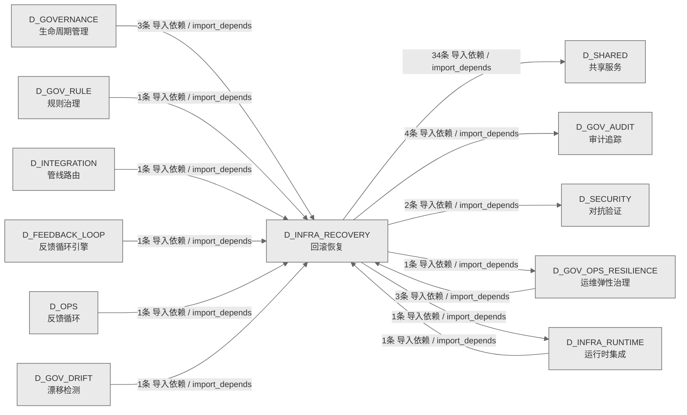

# 05_d_infra_recovery / 回滚恢复域 / Rollback Recovery

> **功能简介 / Overview**: 回滚恢复，负责系统故障时的状态回滚、事务补偿和恢复编排

> **文档作用 / Purpose**: 展示 回滚恢复（D_INFRA_RECOVERY）功能域的域内依赖关系、跨域依赖关系，模块信息（成熟度/中英文名/大白话/文件路径）内嵌于 Mermaid 节点，供架构审查和域治理参考。

> 本文档由 generate_domain_doc.py 从 depgraph (PostgreSQL) 自动生成
> 数据源: depgraph (PostgreSQL) nodes表 + edges表

> **[可缩放 HTML 版 / Zoomable HTML](http://localhost:8765/docs/02_enterprise_architecture/02_domain_architecture_docs/_zoomable_html/05_d_infra_recovery.html)** — Ctrl+滚轮缩放 ｜ 双击重置 ｜ Ctrl+Shift+D 切换拖动/选择模式

## 域基本信息 / Domain Overview

| 字段 | 值 | Field | Value |
|------|------|-------|-------|
| 编号 | 05 | Number | 05 |
| 域ID | D_INFRA_RECOVERY | Domain ID | D_INFRA_RECOVERY |
| 域名称 | 回滚恢复 | Domain Name | Rollback Recovery |
| 层级 | L0 基础设施层 | Layer | L0 Infrastructure |
| 模块数 | 55 | Module Count | 55 |
| 域内依赖 | 14 | Internal Dependencies | 14 |
| 跨域入边 | 12 | Cross-domain Incoming | 12 |
| 跨域出边 | 42 | Cross-domain Outgoing | 42 |
| 设计态模块 | 0 | Design Modules | 0 |
| 生产态模块 | 55 | Production Modules | 55 |
| 容量 | 55/150 (正常) | Capacity | 55/150 (正常) |
| 描述 | 双轨Checkpoint(git commit + SQLite JSONL dump) | Description | 双轨Checkpoint(git commit + SQLite JSONL dump) |

## 域内依赖图 / Internal Dependency Diagram

> 依赖图内嵌在本文档中，IDE 可直接渲染；网页版可 Ctrl+滚轮缩放 + 拖动平移查看细节。全景图用颜色区分运营态/设计态，不再分页/拆子图。
>
> **图例说明 / Legend**：
> - 🟦 **蓝色 = 运营态模块**（production，已上线运行）
> - 🟧 **橙色虚线 = 设计态模块**（design，蓝图阶段，代码未写）
> - **实线箭头 = 运营态依赖**（已生效的依赖关系）
> - **虚线箭头 = 非运营态依赖**（计划中/验证中的依赖关系）

### 全景依赖图（全部模块，颜色区分运营态/设计态）

> 展示全部 55 个模块（生产态 55 + 设计态 0），节点含成熟度+中英文名+大白话+文件路径。

```mermaid
%%{init: {'theme': 'base', 'themeVariables': {'primaryColor': '#eaeaea', 'primaryTextColor': '#333333', 'primaryBorderColor': '#666666', 'lineColor': '#666666', 'secondaryColor': '#eaeaea', 'tertiaryColor': '#eaeaea', 'fontSize': '14px'}}}%%
flowchart TD
    src_zephyr_governance_rollback_contracts_py["(生产态 / production) 契约 / Contracts<br/>rollback/contracts.py — G-CT-002 Rollback 契约（re-export）。<br/>文件: rollback/contracts.py"]
    src_zephyr_infrastructure_rollback_manifest_py["(生产态 / production) 清单 / Manifest<br/>MOD-INF-021 Rollback System — 模块文件清单 (_manifest_)。<br/>文件: rollback/_manifest.py"]
    src_zephyr_infrastructure_rollback_agent_cooldown_py["(生产态 / production) 代理cooldown / Agent Cooldown<br/>AgentCooldown — Agent 冷却隔离器。<br/>文件: rollback/agent_cooldown.py"]
    src_zephyr_infrastructure_rollback_auditor_py["(生产态 / production) 审计器 / Auditor<br/>G-CT-004 契约：Rollback -> Audit 记录回滚操作.<br/>文件: rollback/auditor.py"]
    src_zephyr_infrastructure_rollback_budget_tracker_py["(生产态 / production) 预算追踪器 / Budget Tracker<br/>G-CT-009 契约：Rollback -> Budget 回滚成本计入预算.<br/>文件: rollback/budget_tracker.py"]
    src_zephyr_infrastructure_rollback_checkpoint_gc_py["(生产态 / production) checkpointgc / Checkpoint Gc<br/>CheckpointGC — Checkpoint 垃圾回收。<br/>文件: rollback/checkpoint_gc.py"]
    src_zephyr_infrastructure_rollback_commit_quality_gate_py["(生产态 / production) commit质量门禁 / Commit Quality Gate<br/>CommitQualityGate — Commit 质量基础设施。<br/>文件: rollback/commit_quality_gate.py"]
    src_zephyr_infrastructure_rollback_complexity_budget_py["(生产态 / production) complexity预算 / Complexity Budget<br/>ComplexityBudget — 回滚复杂度元 Budget 监控。<br/>文件: rollback/complexity_budget.py"]
    src_zephyr_infrastructure_rollback_credential_rotation_trigger_py["(生产态 / production) credentialrotation触发器 / Credential Rotation Trigger<br/>CredentialRotationDetector — 回滚后凭据泄露检测（仅检测，不轮换）。<br/>文件: rollback/credential_rotation_trigger.py"]
    src_zephyr_infrastructure_rollback_cross_platform_shell_py["(生产态 / production) 跨platformshell / Cross Platform Shell<br/>CrossPlatformShell — 跨平台 Shell 脚本双输出。<br/>文件: rollback/cross_platform_shell.py"]
    src_zephyr_infrastructure_rollback_drift_fix_py["(生产态 / production) 漂移修复 / Drift Fix<br/>漂移自动修复处理器 — G-CT-005 消费端.<br/>文件: rollback/drift_fix.py"]
    src_zephyr_infrastructure_rollback_env_watcher_py["(生产态 / production) 环境监视器 / Env Watcher<br/>EnvWatcher — 环境变量热重载监控器。<br/>文件: rollback/env_watcher.py"]
    src_zephyr_infrastructure_rollback_external_merkle_proof_py["(生产态 / production) externalmerkleproof / External Merkle Proof<br/>External Merkle Proof — 外部可验证回滚完整性证明。<br/>文件: rollback/external_merkle_proof.py"]
    src_zephyr_infrastructure_rollback_forensic_py["(生产态 / production) forensic / Forensic<br/>Forensic Engine — 取证基础设施（Phase 8 完整实现）。<br/>文件: rollback/forensic.py"]
    src_zephyr_infrastructure_rollback_forward_fix_runner_py["(生产态 / production) forward修复运行器 / Forward Fix Runner<br/>ForwardFixRunner — Forward-Fix 执行器。<br/>文件: rollback/forward_fix_runner.py"]
    src_zephyr_infrastructure_rollback_git_infra_snapshot_py["(生产态 / production) gitinfrasnapshot / Git Infra Snapshot<br/>GitInfraSnapshot — Git 基础设施快照与污染防护。<br/>文件: rollback/git_infra_snapshot.py"]
    src_zephyr_infrastructure_rollback_hallucination_guard_py["(生产态 / production) hallucination守卫 / Hallucination Guard<br/>HallucinationGuard — AI 幻觉防护：回滚后强制状态验证。<br/>文件: rollback/hallucination_guard.py"]
    src_zephyr_infrastructure_rollback_intent_archiver_py["(生产态 / production) intentarchiver / Intent Archiver<br/>IntentArchiver — 意图存档保护。<br/>文件: rollback/intent_archiver.py"]
    src_zephyr_infrastructure_rollback_kill_switch_py["(生产态 / production) killswitch / Kill Switch<br/>KillSwitchManager — 三级 Kill Switch 管理器。<br/>文件: rollback/kill_switch.py"]
    src_zephyr_infrastructure_rollback_knowngoodstate_ledger_py["(生产态 / production) knowngoodstateledger / Knowngoodstate Ledger<br/>KnowngoodstateLedger — 已验证正确状态收据。<br/>文件: rollback/knowngoodstate_ledger.py"]
    src_zephyr_infrastructure_rollback_right_to_be_forgotten_py["(生产态 / production) right转beforgotten / Right To Be Forgotten<br/>Right to be Forgotten — GDPR 遗忘权合规检查器。<br/>文件: rollback/right_to_be_forgotten.py"]
    src_zephyr_infrastructure_rollback_rollback_abuse_detector_py["(生产态 / production) rollbackabuse检测器 / Rollback Abuse Detector<br/>RollbackAbuseDetector — 回滚滥用检测。<br/>文件: rollback/rollback_abuse_detector.py"]
    src_zephyr_infrastructure_rollback_rollback_audit_nexus_py["(生产态 / production) rollback审计nexus / Rollback Audit Nexus<br/>RollbackAuditNexus — 回滚审计记录聚合到 Nexus AuditLog.<br/>文件: rollback/rollback_audit_nexus.py"]
    src_zephyr_infrastructure_rollback_rollback_boot_integration_py["(生产态 / production) rollbackboot集成 / Rollback Boot Integration<br/>RollbackBootIntegration — 回滚系统自动启动/关闭集成 (MOD-INF-021 §1.2).<br/>文件: rollback/rollback_boot_integration.py"]
    src_zephyr_infrastructure_rollback_rollback_bootstrap_py["(生产态 / production) rollbackbootstrap / Rollback Bootstrap<br/>RollbackBootstrap — 零依赖自举回滚器。<br/>文件: rollback/rollback_bootstrap.py"]
    src_zephyr_infrastructure_rollback_rollback_budget_py["(生产态 / production) rollback预算 / Rollback Budget<br/>RollbackBudget — 回滚预算管理器。<br/>文件: rollback/rollback_budget.py"]
    src_zephyr_infrastructure_rollback_rollback_context_restorer_py["(生产态 / production) rollback上下文restorer / Rollback Context Restorer<br/>RollbackContextRestorer — 上下文恢复器。<br/>文件: rollback/rollback_context_restorer.py"]
    src_zephyr_infrastructure_rollback_rollback_dashboard_py["(生产态 / production) rollback仪表板 / Rollback Dashboard<br/>RollbackDashboard — 回滚仪表盘（零依赖 Markdown）。<br/>文件: rollback/rollback_dashboard.py"]
    src_zephyr_infrastructure_rollback_rollback_integration_py["(生产态 / production) rollback集成 / Rollback Integration<br/>Rollback Integration — executor 集成增强层。<br/>文件: rollback/rollback_integration.py"]
    src_zephyr_infrastructure_rollback_rollback_loop_detector_py["(生产态 / production) rollback环路检测器 / Rollback Loop Detector<br/>RollbackLoopDetector — 回滚循环检测器。<br/>文件: rollback/rollback_loop_detector.py"]
    src_zephyr_infrastructure_rollback_rollback_simulator_py["(生产态 / production) rollbacksimulator / Rollback Simulator<br/>RollbackSimulator — 回滚模拟器（CI 集成）。<br/>文件: rollback/rollback_simulator.py"]
    src_zephyr_infrastructure_rollback_rollback_state_machine_py["(生产态 / production) rollback状态machine / Rollback State Machine<br/>RollbackStateMachine — 回滚步骤级状态机。<br/>文件: rollback/rollback_state_machine.py"]
    src_zephyr_infrastructure_rollback_rollback_target_staleness_py["(生产态 / production) rollbacktargetstaleness / Rollback Target Staleness<br/>RollbackTargetStaleness — 回滚目标陈旧度检测。<br/>文件: rollback/rollback_target_staleness.py"]
    src_zephyr_infrastructure_rollback_runbook_generator_py["(生产态 / production) 运行手册生成器 / Runbook Generator<br/>RunbookGenerator — 回滚操作 Runbook 自动生成。<br/>文件: rollback/runbook_generator.py"]
    src_zephyr_infrastructure_rollback_s3_snapshot_lifecycle_py["(生产态 / production) s3snapshot生命周期 / S3 Snapshot Lifecycle<br/>S3 Snapshot Lifecycle Manager — 快照防生命周期过期。<br/>文件: rollback/s3_snapshot_lifecycle.py"]
    src_zephyr_infrastructure_rollback_secret_rotation_aware_py["(生产态 / production) secretrotation感知 / Secret Rotation Aware<br/>SecretRotationAware — 密钥轮替感知器。<br/>文件: rollback/secret_rotation_aware.py"]
    src_zephyr_infrastructure_rollback_semantic_rollback_tag_py["(生产态 / production) 语义rollback标签 / Semantic Rollback Tag<br/>SemanticRollbackTag — 语义化 Rollback Tag 管理器。<br/>文件: rollback/semantic_rollback_tag.py"]
    src_zephyr_infrastructure_rollback_semantic_similar_detector_py["(生产态 / production) 语义similar检测器 / Semantic Similar Detector<br/>SemanticSimilarDetector — 语义变形攻击检测。<br/>文件: rollback/semantic_similar_detector.py"]
    src_zephyr_infrastructure_rollback_submodule_sync_py["(生产态 / production) submodule同步 / Submodule Sync<br/>Submodule Sync — Submodule/Monorepo 多仓库同步回滚。<br/>文件: rollback/submodule_sync.py"]
    src_zephyr_infrastructure_rollback_temporal_context_adapter_py["(生产态 / production) temporal上下文适配器 / Temporal Context Adapter<br/>TemporalContextAdapter — AI 时间上下文断裂修复。<br/>文件: rollback/temporal_context_adapter.py"]
    src_zephyr_infrastructure_rollback_topology_change_log_py["(生产态 / production) topologychangelog / Topology Change Log<br/>TopologyChangeLog — 分支拓扑变更日志。<br/>文件: rollback/topology_change_log.py"]
    src_zephyr_infrastructure_rollback_venv_sync_py["(生产态 / production) venv同步 / Venv Sync<br/>VenvSync — venv/conda 版本同步保障。<br/>文件: rollback/venv_sync.py"]
    src_zephyr_infrastructure_rollback_vulnerability_rescanner_py["(生产态 / production) vulnerabilityrescanner / Vulnerability Rescanner<br/>VulnerabilityRescanner — 依赖漏洞复扫。<br/>文件: rollback/vulnerability_rescanner.py"]
    src_zephyr_infrastructure_rollback_warm_standby_py["(生产态 / production) warmstandby / Warm Standby<br/>WarmStandby — 温备热切（git worktree 副本维护）。<br/>文件: rollback/warm_standby.py"]
    tests_rollback_test_rollback_scheduler_py["(生产态 / production) 测试rollback调度器 / Test Rollback Scheduler<br/>DM-201911 红蓝对抗极端测试: RollbackScheduler 事件驱动调度.<br/>文件: rollback/test_rollback_scheduler.py"]
    src_zephyr_governance_rollback_contracts_py ~~~ src_zephyr_infrastructure_rollback_manifest_py
    src_zephyr_infrastructure_rollback_manifest_py ~~~ src_zephyr_infrastructure_rollback_agent_cooldown_py
    src_zephyr_infrastructure_rollback_agent_cooldown_py ~~~ src_zephyr_infrastructure_rollback_auditor_py
    src_zephyr_infrastructure_rollback_auditor_py ~~~ src_zephyr_infrastructure_rollback_budget_tracker_py
    src_zephyr_infrastructure_rollback_budget_tracker_py ~~~ src_zephyr_infrastructure_rollback_checkpoint_gc_py
    src_zephyr_infrastructure_rollback_checkpoint_gc_py ~~~ src_zephyr_infrastructure_rollback_commit_quality_gate_py
    src_zephyr_infrastructure_rollback_commit_quality_gate_py ~~~ src_zephyr_infrastructure_rollback_complexity_budget_py
    src_zephyr_infrastructure_rollback_complexity_budget_py ~~~ src_zephyr_infrastructure_rollback_credential_rotation_trigger_py
    src_zephyr_infrastructure_rollback_credential_rotation_trigger_py ~~~ src_zephyr_infrastructure_rollback_cross_platform_shell_py
    src_zephyr_infrastructure_rollback_cross_platform_shell_py ~~~ src_zephyr_infrastructure_rollback_drift_fix_py
    src_zephyr_infrastructure_rollback_drift_fix_py ~~~ src_zephyr_infrastructure_rollback_env_watcher_py
    src_zephyr_infrastructure_rollback_env_watcher_py ~~~ src_zephyr_infrastructure_rollback_external_merkle_proof_py
    src_zephyr_infrastructure_rollback_external_merkle_proof_py ~~~ src_zephyr_infrastructure_rollback_forensic_py
    src_zephyr_infrastructure_rollback_forensic_py ~~~ src_zephyr_infrastructure_rollback_forward_fix_runner_py
    src_zephyr_infrastructure_rollback_forward_fix_runner_py ~~~ src_zephyr_infrastructure_rollback_git_infra_snapshot_py
    src_zephyr_infrastructure_rollback_git_infra_snapshot_py ~~~ src_zephyr_infrastructure_rollback_hallucination_guard_py
    src_zephyr_infrastructure_rollback_hallucination_guard_py ~~~ src_zephyr_infrastructure_rollback_intent_archiver_py
    src_zephyr_infrastructure_rollback_intent_archiver_py ~~~ src_zephyr_infrastructure_rollback_kill_switch_py
    src_zephyr_infrastructure_rollback_kill_switch_py ~~~ src_zephyr_infrastructure_rollback_knowngoodstate_ledger_py
    src_zephyr_infrastructure_rollback_knowngoodstate_ledger_py ~~~ src_zephyr_infrastructure_rollback_right_to_be_forgotten_py
    src_zephyr_infrastructure_rollback_right_to_be_forgotten_py ~~~ src_zephyr_infrastructure_rollback_rollback_abuse_detector_py
    src_zephyr_infrastructure_rollback_rollback_abuse_detector_py ~~~ src_zephyr_infrastructure_rollback_rollback_audit_nexus_py
    src_zephyr_infrastructure_rollback_rollback_audit_nexus_py ~~~ src_zephyr_infrastructure_rollback_rollback_boot_integration_py
    src_zephyr_infrastructure_rollback_rollback_boot_integration_py ~~~ src_zephyr_infrastructure_rollback_rollback_bootstrap_py
    src_zephyr_infrastructure_rollback_rollback_bootstrap_py ~~~ src_zephyr_infrastructure_rollback_rollback_budget_py
    src_zephyr_infrastructure_rollback_rollback_budget_py ~~~ src_zephyr_infrastructure_rollback_rollback_context_restorer_py
    src_zephyr_infrastructure_rollback_rollback_context_restorer_py ~~~ src_zephyr_infrastructure_rollback_rollback_dashboard_py
    src_zephyr_infrastructure_rollback_rollback_dashboard_py ~~~ src_zephyr_infrastructure_rollback_rollback_integration_py
    src_zephyr_infrastructure_rollback_rollback_integration_py ~~~ src_zephyr_infrastructure_rollback_rollback_loop_detector_py
    src_zephyr_infrastructure_rollback_rollback_loop_detector_py ~~~ src_zephyr_infrastructure_rollback_rollback_simulator_py
    src_zephyr_infrastructure_rollback_rollback_simulator_py ~~~ src_zephyr_infrastructure_rollback_rollback_state_machine_py
    src_zephyr_infrastructure_rollback_rollback_state_machine_py ~~~ src_zephyr_infrastructure_rollback_rollback_target_staleness_py
    src_zephyr_infrastructure_rollback_rollback_target_staleness_py ~~~ src_zephyr_infrastructure_rollback_runbook_generator_py
    src_zephyr_infrastructure_rollback_runbook_generator_py ~~~ src_zephyr_infrastructure_rollback_s3_snapshot_lifecycle_py
    src_zephyr_infrastructure_rollback_s3_snapshot_lifecycle_py ~~~ src_zephyr_infrastructure_rollback_secret_rotation_aware_py
    src_zephyr_infrastructure_rollback_secret_rotation_aware_py ~~~ src_zephyr_infrastructure_rollback_semantic_rollback_tag_py
    src_zephyr_infrastructure_rollback_semantic_rollback_tag_py ~~~ src_zephyr_infrastructure_rollback_semantic_similar_detector_py
    src_zephyr_infrastructure_rollback_semantic_similar_detector_py ~~~ src_zephyr_infrastructure_rollback_submodule_sync_py
    src_zephyr_infrastructure_rollback_submodule_sync_py ~~~ src_zephyr_infrastructure_rollback_temporal_context_adapter_py
    src_zephyr_infrastructure_rollback_temporal_context_adapter_py ~~~ src_zephyr_infrastructure_rollback_topology_change_log_py
    src_zephyr_infrastructure_rollback_topology_change_log_py ~~~ src_zephyr_infrastructure_rollback_venv_sync_py
    src_zephyr_infrastructure_rollback_venv_sync_py ~~~ src_zephyr_infrastructure_rollback_vulnerability_rescanner_py
    src_zephyr_infrastructure_rollback_vulnerability_rescanner_py ~~~ src_zephyr_infrastructure_rollback_warm_standby_py
    src_zephyr_infrastructure_rollback_warm_standby_py ~~~ tests_rollback_test_rollback_scheduler_py
    src_zephyr_infrastructure_rollback_auto_rollback_trigger_py["(生产态 / production) 自动rollback触发器 / Auto Rollback Trigger<br/>AutoRollbackTrigger — 自动回滚触发器。<br/>文件: rollback/auto_rollback_trigger.py"]
    src_zephyr_infrastructure_rollback_contracts_py["(生产态 / production) 契约 / Contracts<br/>G-CT-002 Rollback 消费端 — on_audit_anomaly() 接口.<br/>文件: rollback/contracts.py"]
    src_zephyr_infrastructure_rollback_rollback_executor_py["(生产态 / production) rollbackexecutor / Rollback Executor<br/>RollbackExecutor — 回滚执行器核心封装。<br/>文件: rollback/rollback_executor.py"]
    src_zephyr_infrastructure_rollback_rollback_scheduler_py["(生产态 / production) rollback调度器 / Rollback Scheduler<br/>RollbackScheduler — 回滚系统事件驱动调度器 (MOD-INF-021 §7 Phase 5.3).<br/>文件: rollback/rollback_scheduler.py"]
    src_zephyr_infrastructure_rollback_rollback_verifier_py["(生产态 / production) rollback验证器 / Rollback Verifier<br/>RollbackVerifier — 回滚后验证器。<br/>文件: rollback/rollback_verifier.py"]
    src_zephyr_infrastructure_rollback_auto_rollback_trigger_py ~~~ src_zephyr_infrastructure_rollback_contracts_py
    src_zephyr_infrastructure_rollback_contracts_py ~~~ src_zephyr_infrastructure_rollback_rollback_executor_py
    src_zephyr_infrastructure_rollback_rollback_executor_py ~~~ src_zephyr_infrastructure_rollback_rollback_scheduler_py
    src_zephyr_infrastructure_rollback_rollback_scheduler_py ~~~ src_zephyr_infrastructure_rollback_rollback_verifier_py
    src_zephyr_infrastructure_rollback_contract_py["(生产态 / production) contract / Contract<br/>CT-RBK-GATE-001 集成契约落地——Rollback System Exit Code 完整定义。<br/>文件: rollback/contract.py"]
    src_zephyr_infrastructure_rollback_rollback_drill_py["(生产态 / production) rollbackdrill / Rollback Drill<br/>RollbackDrill — 定期回滚演练调度器 (DiRT-style)。<br/>文件: rollback/rollback_drill.py"]
    src_zephyr_infrastructure_rollback_rollback_lock_py["(生产态 / production) rollbacklock / Rollback Lock<br/>RollbackLock — 全局回滚锁管理。<br/>文件: rollback/rollback_lock.py"]
    src_zephyr_infrastructure_rollback_rollback_wal_py["(生产态 / production) rollbackwal / Rollback Wal<br/>RollbackWAL — 回滚预写日志。<br/>文件: rollback/rollback_wal.py"]
    src_zephyr_infrastructure_rollback_sqlite_dumper_py["(生产态 / production) sqlitedumper / Sqlite Dumper<br/>SqliteDumper — SQLite 双轨 Checkpoint 的 DB 层：dump / restore / verify。<br/>文件: rollback/sqlite_dumper.py"]
    src_zephyr_infrastructure_rollback_contract_py ~~~ src_zephyr_infrastructure_rollback_rollback_drill_py
    src_zephyr_infrastructure_rollback_rollback_drill_py ~~~ src_zephyr_infrastructure_rollback_rollback_lock_py
    src_zephyr_infrastructure_rollback_rollback_lock_py ~~~ src_zephyr_infrastructure_rollback_rollback_wal_py
    src_zephyr_infrastructure_rollback_rollback_wal_py ~~~ src_zephyr_infrastructure_rollback_sqlite_dumper_py
    src_zephyr_governance_rollback_contracts_py -->|导入依赖 / import_depends| src_zephyr_infrastructure_rollback_contracts_py
    src_zephyr_infrastructure_rollback_rollback_boot_integration_py -->|导入依赖 / import_depends| src_zephyr_infrastructure_rollback_auto_rollback_trigger_py
    src_zephyr_infrastructure_rollback_rollback_boot_integration_py -->|导入依赖 / import_depends| src_zephyr_infrastructure_rollback_rollback_lock_py
    src_zephyr_infrastructure_rollback_rollback_boot_integration_py -->|导入依赖 / import_depends| src_zephyr_infrastructure_rollback_rollback_executor_py
    src_zephyr_infrastructure_rollback_rollback_boot_integration_py -->|导入依赖 / import_depends| src_zephyr_infrastructure_rollback_rollback_scheduler_py
    src_zephyr_infrastructure_rollback_rollback_boot_integration_py -->|导入依赖 / import_depends| src_zephyr_infrastructure_rollback_rollback_verifier_py
    src_zephyr_infrastructure_rollback_rollback_boot_integration_py -->|导入依赖 / import_depends| src_zephyr_infrastructure_rollback_rollback_wal_py
    src_zephyr_infrastructure_rollback_rollback_integration_py -->|导入依赖 / import_depends| src_zephyr_infrastructure_rollback_contract_py
    src_zephyr_infrastructure_rollback_rollback_executor_py -->|导入依赖 / import_depends| src_zephyr_infrastructure_rollback_contract_py
    src_zephyr_infrastructure_rollback_rollback_executor_py -->|导入依赖 / import_depends| src_zephyr_infrastructure_rollback_rollback_lock_py
    src_zephyr_infrastructure_rollback_rollback_executor_py -->|导入依赖 / import_depends| src_zephyr_infrastructure_rollback_sqlite_dumper_py
    src_zephyr_infrastructure_rollback_rollback_scheduler_py -->|导入依赖 / import_depends| src_zephyr_infrastructure_rollback_rollback_drill_py
    src_zephyr_infrastructure_rollback_rollback_scheduler_py -->|导入依赖 / import_depends| src_zephyr_infrastructure_rollback_rollback_wal_py
    tests_rollback_test_rollback_scheduler_py -->|测试依赖 / test_depends| src_zephyr_infrastructure_rollback_rollback_scheduler_py
    D_SHARED["(生产态 / production) 共享服务 / Shared Services<br/>共享服务，负责跨域共享的工具、协议和基础服务<br/>跨域节点 / cross-domain"]
    src_zephyr_infrastructure_rollback_s3_snapshot_lifecycle_py -->|导入依赖 / import_depends| D_SHARED
    src_zephyr_infrastructure_rollback_sqlite_dumper_py -->|导入依赖 / import_depends| D_SHARED
    src_zephyr_infrastructure_rollback_rollback_drill_py -->|导入依赖 / import_depends| D_SHARED
    src_zephyr_infrastructure_rollback_topology_change_log_py -->|导入依赖 / import_depends| D_SHARED
    src_zephyr_infrastructure_rollback_forward_fix_runner_py -->|导入依赖 / import_depends| D_SHARED
    src_zephyr_infrastructure_rollback_forensic_py -->|导入依赖 / import_depends| D_SHARED
    src_zephyr_infrastructure_rollback_rollback_drill_py -->|导入依赖 / import_depends| D_SHARED
    src_zephyr_infrastructure_rollback_submodule_sync_py -->|导入依赖 / import_depends| D_SHARED
    src_zephyr_infrastructure_rollback_agent_cooldown_py -->|导入依赖 / import_depends| D_SHARED
    src_zephyr_infrastructure_rollback_rollback_verifier_py -->|导入依赖 / import_depends| D_SHARED
    src_zephyr_infrastructure_rollback_rollback_bootstrap_py -->|导入依赖 / import_depends| D_SHARED
    src_zephyr_infrastructure_rollback_rollback_integration_py -->|导入依赖 / import_depends| D_SHARED
    D_GOV_AUDIT["(生产态 / production) 审计追踪 / Audit Trail<br/>审计追踪，负责变更审计追踪和操作日志管理<br/>跨域节点 / cross-domain"]
    src_zephyr_infrastructure_rollback_rollback_audit_nexus_py -->|导入依赖 / import_depends| D_GOV_AUDIT
    src_zephyr_infrastructure_rollback_rollback_simulator_py -->|导入依赖 / import_depends| D_SHARED
    src_zephyr_infrastructure_rollback_rollback_integration_py -->|导入依赖 / import_depends| D_SHARED
    D_GOV_RULE["(生产态 / production) 规则治理 / Rule Governance<br/>规则治理，负责规则注册、规则版本和规则依赖管理<br/>跨域节点 / cross-domain"]
    D_GOV_RULE -->|导入依赖 / import_depends| src_zephyr_infrastructure_rollback_contract_py
    D_GOVERNANCE["(生产态 / production) 生命周期管理 / Lifecycle Management<br/>生命周期管理，负责蓝图/模块/任务的声明周期管理和元数据治理<br/>跨域节点 / cross-domain"]
    D_GOVERNANCE -->|导入依赖 / import_depends| src_zephyr_infrastructure_rollback_rollback_verifier_py
    D_INTEGRATION["(生产态 / production) 管线路由 / Pipeline Routing<br/>管线路由，负责跨域数据流路由、管道编排和集成适配<br/>跨域节点 / cross-domain"]
    D_INTEGRATION -->|导入依赖 / import_depends| src_zephyr_infrastructure_rollback_contract_py
    D_GOV_OPS_RESILIENCE["(生产态 / production) 运维弹性治理 / Ops Resilience Governance<br/>运维弹性治理，负责运维治理、安全治理、弹性治理和升级协议<br/>跨域节点 / cross-domain"]
    D_GOV_OPS_RESILIENCE -->|导入依赖 / import_depends| src_zephyr_infrastructure_rollback_rollback_executor_py
    D_GOV_OPS_RESILIENCE -->|导入依赖 / import_depends| src_zephyr_infrastructure_rollback_kill_switch_py
    D_GOV_OPS_RESILIENCE -->|导入依赖 / import_depends| src_zephyr_infrastructure_rollback_contracts_py
    D_GOV_DRIFT["(生产态 / production) 漂移检测 / Drift Detection<br/>漂移检测，负责架构漂移检测和漂移告警<br/>跨域节点 / cross-domain"]
    D_GOV_DRIFT -->|导入依赖 / import_depends| src_zephyr_infrastructure_rollback_drift_fix_py
    D_FEEDBACK_LOOP["(生产态 / production) 反馈循环引擎 / Feedback Loop Engine<br/>反馈循环引擎，负责系统自我改进闭环：异常检测、根因诊断、自动修复和自我进化<br/>跨域节点 / cross-domain"]
    D_FEEDBACK_LOOP -->|导入依赖 / import_depends| src_zephyr_infrastructure_rollback_rollback_executor_py
    D_GOVERNANCE -->|导入依赖 / import_depends| src_zephyr_infrastructure_rollback_rollback_executor_py
    D_OPS["(生产态 / production) 反馈循环 / Feedback Loop<br/>反馈循环，负责系统运行反馈、性能监控和自动调优闭环<br/>跨域节点 / cross-domain"]
    D_OPS -->|导入依赖 / import_depends| src_zephyr_infrastructure_rollback_budget_tracker_py
    D_GOVERNANCE -->|导入依赖 / import_depends| src_zephyr_infrastructure_rollback_rollback_executor_py
    D_INFRA_RUNTIME["(生产态 / production) 运行时集成 / Runtime Integration<br/>运行时集成，负责组件生命周期编排、启动钩子和运行时上下文管理<br/>跨域节点 / cross-domain"]
    D_INFRA_RUNTIME -->|导入依赖 / import_depends| src_zephyr_infrastructure_rollback_rollback_boot_integration_py
    classDef production fill:#e1f5fe,stroke:#01579b,stroke-width:2px,color:#000
    classDef design fill:#fff3e0,stroke:#e65100,stroke-width:2px,color:#000,stroke-dasharray: 5 5
    classDef external_prod fill:#e8f4fd,stroke:#0277bd,stroke-width:1px,color:#000
    classDef external_design fill:#fff8e7,stroke:#ef6c00,stroke-width:1px,color:#000,stroke-dasharray: 5 5
    class src_zephyr_governance_rollback_contracts_py,src_zephyr_infrastructure_rollback_manifest_py,src_zephyr_infrastructure_rollback_agent_cooldown_py,src_zephyr_infrastructure_rollback_auditor_py,src_zephyr_infrastructure_rollback_auto_rollback_trigger_py,src_zephyr_infrastructure_rollback_budget_tracker_py,src_zephyr_infrastructure_rollback_checkpoint_gc_py,src_zephyr_infrastructure_rollback_commit_quality_gate_py,src_zephyr_infrastructure_rollback_complexity_budget_py,src_zephyr_infrastructure_rollback_contract_py,src_zephyr_infrastructure_rollback_contracts_py,src_zephyr_infrastructure_rollback_credential_rotation_trigger_py,src_zephyr_infrastructure_rollback_cross_platform_shell_py,src_zephyr_infrastructure_rollback_drift_fix_py,src_zephyr_infrastructure_rollback_env_watcher_py,src_zephyr_infrastructure_rollback_external_merkle_proof_py,src_zephyr_infrastructure_rollback_forensic_py,src_zephyr_infrastructure_rollback_forward_fix_runner_py,src_zephyr_infrastructure_rollback_git_infra_snapshot_py,src_zephyr_infrastructure_rollback_hallucination_guard_py,src_zephyr_infrastructure_rollback_intent_archiver_py,src_zephyr_infrastructure_rollback_kill_switch_py,src_zephyr_infrastructure_rollback_knowngoodstate_ledger_py,src_zephyr_infrastructure_rollback_right_to_be_forgotten_py,src_zephyr_infrastructure_rollback_rollback_abuse_detector_py,src_zephyr_infrastructure_rollback_rollback_audit_nexus_py,src_zephyr_infrastructure_rollback_rollback_boot_integration_py,src_zephyr_infrastructure_rollback_rollback_bootstrap_py,src_zephyr_infrastructure_rollback_rollback_budget_py,src_zephyr_infrastructure_rollback_rollback_context_restorer_py,src_zephyr_infrastructure_rollback_rollback_dashboard_py,src_zephyr_infrastructure_rollback_rollback_drill_py,src_zephyr_infrastructure_rollback_rollback_executor_py,src_zephyr_infrastructure_rollback_rollback_integration_py,src_zephyr_infrastructure_rollback_rollback_lock_py,src_zephyr_infrastructure_rollback_rollback_loop_detector_py,src_zephyr_infrastructure_rollback_rollback_scheduler_py,src_zephyr_infrastructure_rollback_rollback_simulator_py,src_zephyr_infrastructure_rollback_rollback_state_machine_py,src_zephyr_infrastructure_rollback_rollback_target_staleness_py,src_zephyr_infrastructure_rollback_rollback_verifier_py,src_zephyr_infrastructure_rollback_rollback_wal_py,src_zephyr_infrastructure_rollback_runbook_generator_py,src_zephyr_infrastructure_rollback_s3_snapshot_lifecycle_py,src_zephyr_infrastructure_rollback_secret_rotation_aware_py,src_zephyr_infrastructure_rollback_semantic_rollback_tag_py,src_zephyr_infrastructure_rollback_semantic_similar_detector_py,src_zephyr_infrastructure_rollback_sqlite_dumper_py,src_zephyr_infrastructure_rollback_submodule_sync_py,src_zephyr_infrastructure_rollback_temporal_context_adapter_py,src_zephyr_infrastructure_rollback_topology_change_log_py,src_zephyr_infrastructure_rollback_venv_sync_py,src_zephyr_infrastructure_rollback_vulnerability_rescanner_py,src_zephyr_infrastructure_rollback_warm_standby_py,tests_rollback_test_rollback_scheduler_py production
    class D_SHARED,D_GOV_AUDIT,D_GOV_RULE,D_GOVERNANCE,D_INTEGRATION,D_GOV_OPS_RESILIENCE,D_GOV_DRIFT,D_FEEDBACK_LOOP,D_OPS,D_INFRA_RUNTIME external_prod
```

## 跨域依赖 / Cross-domain Dependencies

### 本域依赖的其他域（出边）/ Depends On

| # | 本域模块 / Source Module | → | 外部域-目标模块 / Target Module | 依赖类型 / Type |
|:--:|---------|:--:|---------|---------|
| 1 | 审计器 / Auditor (rollback/auditor.py) | → | D_GOV_AUDIT 审计追踪: 契约 / Contracts (gov_audit/contracts.py) | 导入依赖 / import_depends |
| 2 | rollbackabuse检测器 / Rollback Abuse Detector (rollback/r... | → | D_GOV_AUDIT 审计追踪: query / Query (gov_audit/query.py) | 导入依赖 / import_depends |
| 3 | rollback审计nexus / Rollback Audit Nexus (rollback/rollba... | → | D_GOV_AUDIT 审计追踪: writer / Writer (gov_audit/writer.py) | 导入依赖 / import_depends |
| 4 | rollbackexecutor / Rollback Executor (rollback/rollback_e... | → | D_GOV_AUDIT 审计追踪: writer / Writer (gov_audit/writer.py) | 导入依赖 / import_depends |
| 5 | rollbackboot集成 / Rollback Boot Integration (rollback/ro... | → | D_GOV_OPS_RESILIENCE 运维弹性治理: 事件钩子 / Event Hook (ops_governance/event_hook.py) | 导入依赖 / import_depends |
| 6 | rollbackexecutor / Rollback Executor (rollback/rollback_e... | → | D_INFRA_RUNTIME 运行时集成: concurrency守卫 / Concurrency Guard (runtime/concurrency_... | 导入依赖 / import_depends |
| 7 | 漂移修复 / Drift Fix (rollback/drift_fix.py) | → | D_SECURITY 对抗验证: events / Events (gov_drift/events.py) | 导入依赖 / import_depends |
| 8 | 运行手册生成器 / Runbook Generator (rollback/runbook_gene... | → | D_SECURITY 对抗验证: 运行手册生成器 / Runbook Generator (gov_drift/runbook_gen... | 导入依赖 / import_depends |
| 9 | 代理cooldown / Agent Cooldown (rollback/agent_cooldown.py) | → | D_SHARED 共享服务: sqlite工厂 / Sqlite Factory (io/sqlite_factory.py) | 导入依赖 / import_depends |
| 10 | externalmerkleproof / External Merkle Proof (rollback/ext... | → | D_SHARED 共享服务: paths / Paths (io/paths.py) | 导入依赖 / import_depends |
| 11 | forensic / Forensic (rollback/forensic.py) | → | D_SHARED 共享服务: process池 / Process Pool (infra/process_pool.py) | 导入依赖 / import_depends |
| 12 | forensic / Forensic (rollback/forensic.py) | → | D_SHARED 共享服务: 文件utils / File Utils (io/file_utils.py) | 导入依赖 / import_depends |
| 13 | forward修复运行器 / Forward Fix Runner (rollback/forward_... | → | D_SHARED 共享服务: process池 / Process Pool (infra/process_pool.py) | 导入依赖 / import_depends |
| 14 | forward修复运行器 / Forward Fix Runner (rollback/forward_... | → | D_SHARED 共享服务: paths / Paths (io/paths.py) | 导入依赖 / import_depends |
| 15 | right转beforgotten / Right To Be Forgotten (rollback/righ... | → | D_SHARED 共享服务: paths / Paths (io/paths.py) | 导入依赖 / import_depends |
| 16 | rollbackboot集成 / Rollback Boot Integration (rollback/ro... | → | D_SHARED 共享服务: 事件总线 / Event Bus (shared/event_bus.py) | 导入依赖 / import_depends |
| 17 | rollbackbootstrap / Rollback Bootstrap (rollback/rollback... | → | D_SHARED 共享服务: process池 / Process Pool (infra/process_pool.py) | 导入依赖 / import_depends |
| 18 | rollbackdrill / Rollback Drill (rollback/rollback_drill.py) | → | D_SHARED 共享服务: process池 / Process Pool (infra/process_pool.py) | 导入依赖 / import_depends |
| 19 | rollbackdrill / Rollback Drill (rollback/rollback_drill.py) | → | D_SHARED 共享服务: sqlite工厂 / Sqlite Factory (io/sqlite_factory.py) | 导入依赖 / import_depends |
| 20 | rollbackexecutor / Rollback Executor (rollback/rollback_e... | → | D_SHARED 共享服务: process池 / Process Pool (infra/process_pool.py) | 导入依赖 / import_depends |
| 21 | rollbackexecutor / Rollback Executor (rollback/rollback_e... | → | D_SHARED 共享服务: paths / Paths (io/paths.py) | 导入依赖 / import_depends |
| 22 | rollbackexecutor / Rollback Executor (rollback/rollback_e... | → | D_SHARED 共享服务: 异步utils / Async Utils (utils/async_utils.py) | 导入依赖 / import_depends |
| 23 | rollback集成 / Rollback Integration (rollback/rollback_in... | → | D_SHARED 共享服务: process池 / Process Pool (infra/process_pool.py) | 导入依赖 / import_depends |
| 24 | rollback集成 / Rollback Integration (rollback/rollback_in... | → | D_SHARED 共享服务: paths / Paths (io/paths.py) | 导入依赖 / import_depends |
| 25 | rollback集成 / Rollback Integration (rollback/rollback_in... | → | D_SHARED 共享服务: sqlite工厂 / Sqlite Factory (io/sqlite_factory.py) | 导入依赖 / import_depends |
| 26 | rollback集成 / Rollback Integration (rollback/rollback_in... | → | D_SHARED 共享服务: 密钥 / Secrets (security/secrets.py) | 导入依赖 / import_depends |
| 27 | rollbacklock / Rollback Lock (rollback/rollback_lock.py) | → | D_SHARED 共享服务: lock / Lock (infra/lock.py) | 导入依赖 / import_depends |
| 28 | rollbacksimulator / Rollback Simulator (rollback/rollback... | → | D_SHARED 共享服务: process池 / Process Pool (infra/process_pool.py) | 导入依赖 / import_depends |
| 29 | rollbacktargetstaleness / Rollback Target Staleness (roll... | → | D_SHARED 共享服务: process池 / Process Pool (infra/process_pool.py) | 导入依赖 / import_depends |
| 30 | rollback验证器 / Rollback Verifier (rollback/rollback_ver... | → | D_SHARED 共享服务: sqlite工厂 / Sqlite Factory (io/sqlite_factory.py) | 导入依赖 / import_depends |
| 31 | s3snapshot生命周期 / S3 Snapshot Lifecycle (rollback/s3_s... | → | D_SHARED 共享服务: paths / Paths (io/paths.py) | 导入依赖 / import_depends |
| 32 | 语义rollback标签 / Semantic Rollback Tag (rollback/semant... | → | D_SHARED 共享服务: process池 / Process Pool (infra/process_pool.py) | 导入依赖 / import_depends |
| 33 | sqlitedumper / Sqlite Dumper (rollback/sqlite_dumper.py) | → | D_SHARED 共享服务: process池 / Process Pool (infra/process_pool.py) | 导入依赖 / import_depends |
| 34 | sqlitedumper / Sqlite Dumper (rollback/sqlite_dumper.py) | → | D_SHARED 共享服务: paths / Paths (io/paths.py) | 导入依赖 / import_depends |
| 35 | sqlitedumper / Sqlite Dumper (rollback/sqlite_dumper.py) | → | D_SHARED 共享服务: sqlite工厂 / Sqlite Factory (io/sqlite_factory.py) | 导入依赖 / import_depends |
| 36 | sqlitedumper / Sqlite Dumper (rollback/sqlite_dumper.py) | → | D_SHARED 共享服务: 时间utils / Time Utils (utils/time_utils.py) | 导入依赖 / import_depends |
| 37 | submodule同步 / Submodule Sync (rollback/submodule_sync.py) | → | D_SHARED 共享服务: process池 / Process Pool (infra/process_pool.py) | 导入依赖 / import_depends |
| 38 | topologychangelog / Topology Change Log (rollback/topolog... | → | D_SHARED 共享服务: process池 / Process Pool (infra/process_pool.py) | 导入依赖 / import_depends |
| 39 | venv同步 / Venv Sync (rollback/venv_sync.py) | → | D_SHARED 共享服务: process池 / Process Pool (infra/process_pool.py) | 导入依赖 / import_depends |
| 40 | vulnerabilityrescanner / Vulnerability Rescanner (rollbac... | → | D_SHARED 共享服务: process池 / Process Pool (infra/process_pool.py) | 导入依赖 / import_depends |
| 41 | warmstandby / Warm Standby (rollback/warm_standby.py) | → | D_SHARED 共享服务: process池 / Process Pool (infra/process_pool.py) | 导入依赖 / import_depends |
| 42 | warmstandby / Warm Standby (rollback/warm_standby.py) | → | D_SHARED 共享服务: serialization / Serialization (io/serialization.py) | 导入依赖 / import_depends |

### 依赖本域的其他域（入边）/ Depended By

| # | 外部域-源模块 / Source Module | → | 本域模块 / Target Module | 依赖类型 / Type |
|:--:|---------|:--:|---------|---------|
| 1 | D_FEEDBACK_LOOP 反馈循环引擎: 调度器执行 / Scheduler Act (feedback_loop/scheduler_act.py) | → | rollbackexecutor / Rollback Executor (rollback/rollback_e... | 导入依赖 / import_depends |
| 2 | D_GOVERNANCE 生命周期管理: rollback / Rollback (scripts/rollback.py) | → | rollbackexecutor / Rollback Executor (rollback/rollback_e... | 导入依赖 / import_depends |
| 3 | D_GOVERNANCE 生命周期管理: rollback / Rollback (scripts/rollback.py) | → | rollback验证器 / Rollback Verifier (rollback/rollback_ver... | 导入依赖 / import_depends |
| 4 | D_GOVERNANCE 生命周期管理: 治理服务端 / Governance Server (mcp/governance_server.py) | → | rollbackexecutor / Rollback Executor (rollback/rollback_e... | 导入依赖 / import_depends |
| 5 | D_GOV_DRIFT 漂移检测: 漂移检测器 / Drift Detector (rule_enforcement/drift_detec... | → | 漂移修复 / Drift Fix (rollback/drift_fix.py) | 导入依赖 / import_depends |
| 6 | D_GOV_OPS_RESILIENCE 运维弹性治理: 契约 / Contracts (escalation/contracts.py) | → | 契约 / Contracts (rollback/contracts.py) | 导入依赖 / import_depends |
| 7 | D_GOV_OPS_RESILIENCE 运维弹性治理: phase检查注册表 / Phase Check Registry (ops_governance/ph... | → | killswitch / Kill Switch (rollback/kill_switch.py) | 导入依赖 / import_depends |
| 8 | D_GOV_OPS_RESILIENCE 运维弹性治理: phase检查注册表 / Phase Check Registry (ops_governance/ph... | → | rollbackexecutor / Rollback Executor (rollback/rollback_e... | 导入依赖 / import_depends |
| 9 | D_GOV_RULE 规则治理: 门禁裁决引擎 / Gate Engine (gate_engine/gate_engine.py) | → | contract / Contract (rollback/contract.py) | 导入依赖 / import_depends |
| 10 | D_INFRA_RUNTIME 运行时集成: boothooks / Boot Hooks (trading/boot_hooks.py) | → | rollbackboot集成 / Rollback Boot Integration (rollback/ro... | 导入依赖 / import_depends |
| 11 | D_INTEGRATION 管线路由: 流水线orchestrator / Pipeline Orchestrator (integration/p... | → | contract / Contract (rollback/contract.py) | 导入依赖 / import_depends |
| 12 | D_OPS 反馈循环: 预算追踪器 / Budget Tracker (ops_governance/budget_tracke... | → | 预算追踪器 / Budget Tracker (rollback/budget_tracker.py) | 导入依赖 / import_depends |

### 跨域依赖图 / Cross-domain Dependency Diagram

> 本域与 11 个外部域直接连接（出边 42 条 + 入边 12 条 = 54 条）。只显示直接连接的域，不展开具体节点。



## 说明 / Notes

- **数据源 / Data Source**: `depgraph (PostgreSQL)` 的 `nodes`、`edges`、`domains` 表
- **生成器 / Generator**: `generate_domain_doc.py`（G2+G10 合并）
- **维护方式 / Maintenance**: 自动生成，全景图更新时刷新
- **文件名规则 / File Naming**: `{编号:02d}_{域ID小写}.md`，如 `16_d_trading.md`
- **图例说明 / Legend**: `[production]`=已上线 / `[design]`=设计中 / `[unknown]`=未知
