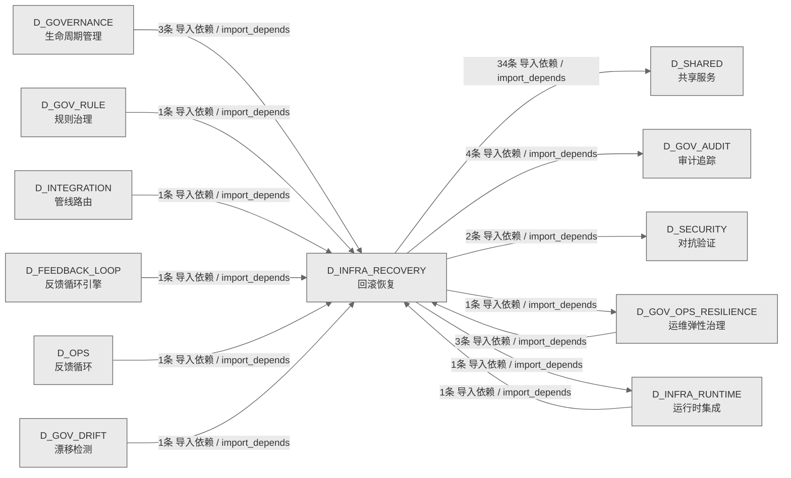

# 05_d_infra_recovery / 回滚恢复域 / Rollback Recovery

> **功能简介 / Overview**: 回滚恢复，负责系统故障时的状态回滚、事务补偿和恢复编排

> **文档作用 / Purpose**: 展示 回滚恢复（D_INFRA_RECOVERY）功能域的域内依赖关系、跨域依赖关系，模块信息（成熟度/中英文名/大白话/文件路径）内嵌于 Mermaid 节点，供架构审查和域治理参考。

> 本文档由 generate_domain_doc.py 从 depgraph (PostgreSQL) 自动生成
> 数据源: depgraph (PostgreSQL) nodes表 + edges表

> **[可缩放 HTML 版 / Zoomable HTML](http://localhost:8765/docs/02_enterprise_architecture/02_domain_architecture_docs/_zoomable_html/05_d_infra_recovery.html)** — Ctrl+滚轮缩放 ｜ 双击重置 ｜ Ctrl+Shift+D 切换拖动/选择模式

## 域基本信息 / Domain Overview

| 字段 | 值 | Field | Value |
|------|------|-------|-------|
| 编号 | 05 | Number | 05 |
| 域ID | D_INFRA_RECOVERY | Domain ID | D_INFRA_RECOVERY |
| 域名称 | 回滚恢复 | Domain Name | Rollback Recovery |
| 层级 | L0 基础设施层 | Layer | L0 Infrastructure |
| 模块数 | 55 | Module Count | 55 |
| 域内依赖 | 14 | Internal Dependencies | 14 |
| 跨域入边 | 12 | Cross-domain Incoming | 12 |
| 跨域出边 | 42 | Cross-domain Outgoing | 42 |
| 设计态模块 | 0 | Design Modules | 0 |
| 生产态模块 | 55 | Production Modules | 55 |
| 容量 | 55/150 (正常) | Capacity | 55/150 (正常) |
| 描述 | 双轨Checkpoint(git commit + SQLite JSONL dump) | Description | 双轨Checkpoint(git commit + SQLite JSONL dump) |

## 域内依赖图 / Internal Dependency Diagram

> 依赖图内嵌在本文档中，IDE 可直接渲染；网页版可 Ctrl+滚轮缩放 + 拖动平移查看细节。
>
> **图例说明 / Legend**：
> - 🟦 **蓝色 = 运营态模块**（production，已上线运行）
> - 🟧 **橙色虚线 = 设计态模块**（design，蓝图阶段，代码未写）
> - **实线箭头 = 运营态依赖**（已生效的依赖关系）
> - **虚线箭头 = 非运营态依赖**（计划中/验证中的依赖关系）

### 全景图（全部模块，颜色区分运营态/设计态）

> 展示全部 55 个模块（生产态 55 + 设计态 0），含跨域依赖外部节点。节点含成熟度+名称+大白话/简介+文件路径。

```mermaid
%%{init: {'theme': 'base', 'themeVariables': {'primaryColor': '#eaeaea', 'primaryTextColor': '#333333', 'primaryBorderColor': '#666666', 'lineColor': '#666666', 'secondaryColor': '#eaeaea', 'tertiaryColor': '#eaeaea', 'fontSize': '14px'}}}%%
flowchart TD
    src_zephyr_governance_rollback_contracts_py["契约<br/>G-CT-002 Rollback 契约（re-export）。<br/>contracts<br/>文件: rollback/contracts.py<br/>(生产态 / production)"]
    src_zephyr_infrastructure_rollback_manifest_py["清单<br/>MOD-INF-021 Rollback System — 模块文件清单<br/>(_manifest_)。<br/>文件: rollback/_manifest.py<br/>(生产态 / production)"]
    src_zephyr_infrastructure_rollback_agent_cooldown_py["代理cooldown<br/>AgentCooldown — Agent 冷却隔离器。<br/>agent_cooldown<br/>文件: rollback/agent_cooldown.py<br/>(生产态 / production)"]
    src_zephyr_infrastructure_rollback_auditor_py["审计器<br/>G-CT-004 契约：Rollback -> Audit 记录回滚操作.<br/>auditor<br/>文件: rollback/auditor.py<br/>(生产态 / production)"]
    src_zephyr_infrastructure_rollback_budget_tracker_py["预算追踪器<br/>G-CT-009 契约：Rollback -> Budget<br/>回滚成本计入预算.<br/>budget_tracker<br/>文件: rollback/budget_tracker.py<br/>(生产态 / production)"]
    src_zephyr_infrastructure_rollback_checkpoint_gc_py["检查点gc<br/>CheckpointGC — Checkpoint 垃圾回收。<br/>checkpoint_gc<br/>文件: rollback/checkpoint_gc.py<br/>(生产态 / production)"]
    src_zephyr_infrastructure_rollback_commit_quality_gate_py["提交质量门禁<br/>CommitQualityGate — Commit 质量基础设施。<br/>commit_quality_gate<br/>文件: rollback/commit_quality_gate.py<br/>(生产态 / production)"]
    src_zephyr_infrastructure_rollback_complexity_budget_py["complexity预算<br/>ComplexityBudget — 回滚复杂度元 Budget 监控。<br/>complexity_budget<br/>文件: rollback/complexity_budget.py<br/>(生产态 / production)"]
    src_zephyr_infrastructure_rollback_credential_rotation_trigger_py["凭证rotationtrigger<br/>CredentialRotationDetector —<br/>回滚后凭据泄露检测（仅检测，不轮换）。<br/>credential_rotation_trigger<br/>文件: rollback/credential_rotation_trigger.py<br/>(生产态 / production)"]
    src_zephyr_infrastructure_rollback_cross_platform_shell_py["跨platformshell<br/>CrossPlatformShell — 跨平台 Shell 脚本双输出。<br/>cross_platform_shell<br/>文件: rollback/cross_platform_shell.py<br/>(生产态 / production)"]
    src_zephyr_infrastructure_rollback_drift_fix_py["漂移自动修复处理器 — G-CT-005 消费端.<br/>基础设施/rollback包的drift_fix模块<br/>文件: rollback/drift_fix.py<br/>(生产态 / production)"]
    src_zephyr_infrastructure_rollback_env_watcher_py["env监视器<br/>EnvWatcher — 环境变量热重载监控器。<br/>env_watcher<br/>文件: rollback/env_watcher.py<br/>(生产态 / production)"]
    src_zephyr_infrastructure_rollback_external_merkle_proof_py["外部merkleproof<br/>External Merkle Proof —<br/>外部可验证回滚完整性证明。<br/>external_merkle_proof<br/>文件: rollback/external_merkle_proof.py<br/>(生产态 / production)"]
    src_zephyr_infrastructure_rollback_forensic_py["取证<br/>Forensic Engine — 取证基础设施（Phase 8<br/>完整实现）。<br/>文件: rollback/forensic.py<br/>(生产态 / production)"]
    src_zephyr_infrastructure_rollback_forward_fix_runner_py["前修复运行器<br/>ForwardFixRunner — Forward-Fix 执行器。<br/>forward_fix_runner<br/>文件: rollback/forward_fix_runner.py<br/>(生产态 / production)"]
    src_zephyr_infrastructure_rollback_git_infra_snapshot_py["Git基础设施快照<br/>GitInfraSnapshot — Git 基础设施快照与污染防护。<br/>git_infra_snapshot<br/>文件: rollback/git_infra_snapshot.py<br/>(生产态 / production)"]
    src_zephyr_infrastructure_rollback_hallucination_guard_py["hallucination守卫<br/>HallucinationGuard — AI<br/>幻觉防护：回滚后强制状态验证。<br/>hallucination_guard<br/>文件: rollback/hallucination_guard.py<br/>(生产态 / production)"]
    src_zephyr_infrastructure_rollback_intent_archiver_py["intent归档器<br/>IntentArchiver — 意图存档保护。<br/>intent_archiver<br/>文件: rollback/intent_archiver.py<br/>(生产态 / production)"]
    src_zephyr_infrastructure_rollback_kill_switch_py["终止开关<br/>KillSwitchManager — 三级 Kill Switch 管理器。<br/>kill_switch<br/>文件: rollback/kill_switch.py<br/>(生产态 / production)"]
    src_zephyr_infrastructure_rollback_knowngoodstate_ledger_py["knowngoodstate账本<br/>KnowngoodstateLedger — 已验证正确状态收据。<br/>knowngoodstate_ledger<br/>文件: rollback/knowngoodstate_ledger.py<br/>(生产态 / production)"]
    src_zephyr_infrastructure_rollback_right_to_be_forgotten_py["Right to be Forgotten — GDPR 遗忘权合规检查器。<br/>基础设施/rollback包的right_to_be_forgotten模块<br/>文件: rollback/right_to_be_forgotten.py<br/>(生产态 / production)"]
    src_zephyr_infrastructure_rollback_rollback_abuse_detector_py["回滚abuse检测器<br/>RollbackAbuseDetector — 回滚滥用检测。<br/>rollback_abuse_detector<br/>文件: rollback/rollback_abuse_detector.py<br/>(生产态 / production)"]
    src_zephyr_infrastructure_rollback_rollback_audit_nexus_py["回滚审计nexus<br/>RollbackAuditNexus — 回滚审计记录聚合到 Nexus<br/>AuditLog.<br/>rollback_audit_nexus<br/>文件: rollback/rollback_audit_nexus.py<br/>(生产态 / production)"]
    src_zephyr_infrastructure_rollback_rollback_boot_integration_py["回滚启动集成<br/>RollbackBootIntegration — 回滚系统自动启动<br/>/关闭集成 (MOD-INF-021 §1.2).<br/>rollback_boot_integration<br/>文件: rollback/rollback_boot_integration.py<br/>(生产态 / production)"]
    src_zephyr_infrastructure_rollback_rollback_bootstrap_py["回滚自举<br/>RollbackBootstrap — 零依赖自举回滚器。<br/>rollback_bootstrap<br/>文件: rollback/rollback_bootstrap.py<br/>(生产态 / production)"]
    src_zephyr_infrastructure_rollback_rollback_budget_py["回滚预算<br/>RollbackBudget — 回滚预算管理器。<br/>rollback_budget<br/>文件: rollback/rollback_budget.py<br/>(生产态 / production)"]
    src_zephyr_infrastructure_rollback_rollback_context_restorer_py["回滚上下文restorer<br/>RollbackContextRestorer — 上下文恢复器。<br/>rollback_context_restorer<br/>文件: rollback/rollback_context_restorer.py<br/>(生产态 / production)"]
    src_zephyr_infrastructure_rollback_rollback_dashboard_py["回滚仪表盘<br/>RollbackDashboard — 回滚仪表盘（零依赖<br/>Markdown）。<br/>rollback_dashboard<br/>文件: rollback/rollback_dashboard.py<br/>(生产态 / production)"]
    src_zephyr_infrastructure_rollback_rollback_integration_py["回滚集成<br/>Rollback Integration — executor 集成增强层。<br/>rollback_integration<br/>文件: rollback/rollback_integration.py<br/>(生产态 / production)"]
    src_zephyr_infrastructure_rollback_rollback_loop_detector_py["回滚循环检测器<br/>RollbackLoopDetector — 回滚循环检测器。<br/>rollback_loop_detector<br/>文件: rollback/rollback_loop_detector.py<br/>(生产态 / production)"]
    src_zephyr_infrastructure_rollback_rollback_simulator_py["回滚模拟器<br/>RollbackSimulator — 回滚模拟器（CI 集成）。<br/>rollback_simulator<br/>文件: rollback/rollback_simulator.py<br/>(生产态 / production)"]
    src_zephyr_infrastructure_rollback_rollback_state_machine_py["回滚状态machine<br/>RollbackStateMachine — 回滚步骤级状态机。<br/>rollback_state_machine<br/>文件: rollback/rollback_state_machine.py<br/>(生产态 / production)"]
    src_zephyr_infrastructure_rollback_rollback_target_staleness_py["回滚targetstaleness<br/>RollbackTargetStaleness — 回滚目标陈旧度检测。<br/>rollback_target_staleness<br/>文件: rollback/rollback_target_staleness.py<br/>(生产态 / production)"]
    src_zephyr_infrastructure_rollback_runbook_generator_py["runbook生成器<br/>RunbookGenerator — 回滚操作 Runbook 自动生成。<br/>runbook_generator<br/>文件: rollback/runbook_generator.py<br/>(生产态 / production)"]
    src_zephyr_infrastructure_rollback_s3_snapshot_lifecycle_py["s3快照生命周期<br/>S3 Snapshot Lifecycle Manager —<br/>快照防生命周期过期。<br/>s3_snapshot_lifecycle<br/>文件: rollback/s3_snapshot_lifecycle.py<br/>(生产态 / production)"]
    src_zephyr_infrastructure_rollback_secret_rotation_aware_py["密钥rotation感知<br/>SecretRotationAware — 密钥轮替感知器。<br/>secret_rotation_aware<br/>文件: rollback/secret_rotation_aware.py<br/>(生产态 / production)"]
    src_zephyr_infrastructure_rollback_semantic_rollback_tag_py["semantic回滚tag<br/>SemanticRollbackTag — 语义化 Rollback Tag<br/>管理器。<br/>semantic_rollback_tag<br/>文件: rollback/semantic_rollback_tag.py<br/>(生产态 / production)"]
    src_zephyr_infrastructure_rollback_semantic_similar_detector_py["semanticsimilar检测器<br/>SemanticSimilarDetector — 语义变形攻击检测。<br/>semantic_similar_detector<br/>文件: rollback/semantic_similar_detector.py<br/>(生产态 / production)"]
    src_zephyr_infrastructure_rollback_submodule_sync_py["submodule同步<br/>Submodule Sync — Submodule/Monorepo<br/>多仓库同步回滚。<br/>submodule_sync<br/>文件: rollback/submodule_sync.py<br/>(生产态 / production)"]
    src_zephyr_infrastructure_rollback_temporal_context_adapter_py["temporal上下文适配器<br/>TemporalContextAdapter — AI 时间上下文断裂修复。<br/>temporal_context_adapter<br/>文件: rollback/temporal_context_adapter.py<br/>(生产态 / production)"]
    src_zephyr_infrastructure_rollback_topology_change_log_py["topologychange日志<br/>TopologyChangeLog — 分支拓扑变更日志。<br/>topology_change_log<br/>文件: rollback/topology_change_log.py<br/>(生产态 / production)"]
    src_zephyr_infrastructure_rollback_venv_sync_py["venv同步<br/>VenvSync — venv/conda 版本同步保障。<br/>venv_sync<br/>文件: rollback/venv_sync.py<br/>(生产态 / production)"]
    src_zephyr_infrastructure_rollback_vulnerability_rescanner_py["VulnerabilityRescanner — 依赖漏洞复扫。<br/>基础设施/rollback包的vulnerability_rescanner模块<br/>文件: rollback/vulnerability_rescanner.py<br/>(生产态 / production)"]
    src_zephyr_infrastructure_rollback_warm_standby_py["WarmStandby — 温备热切（git worktree<br/>副本维护）。<br/>基础设施/rollback包的warm_standby模块<br/>文件: rollback/warm_standby.py<br/>(生产态 / production)"]
    tests_rollback_test_rollback_scheduler_py["测试回滚调度器<br/>DM-201911 红蓝对抗极端测试: RollbackScheduler<br/>事件驱动调度.<br/>test_rollback_scheduler<br/>文件: rollback/test_rollback_scheduler.py<br/>(生产态 / production)"]
    src_zephyr_governance_rollback_contracts_py ~~~ src_zephyr_infrastructure_rollback_manifest_py
    src_zephyr_infrastructure_rollback_manifest_py ~~~ src_zephyr_infrastructure_rollback_agent_cooldown_py
    src_zephyr_infrastructure_rollback_agent_cooldown_py ~~~ src_zephyr_infrastructure_rollback_auditor_py
    src_zephyr_infrastructure_rollback_auditor_py ~~~ src_zephyr_infrastructure_rollback_budget_tracker_py
    src_zephyr_infrastructure_rollback_budget_tracker_py ~~~ src_zephyr_infrastructure_rollback_checkpoint_gc_py
    src_zephyr_infrastructure_rollback_checkpoint_gc_py ~~~ src_zephyr_infrastructure_rollback_commit_quality_gate_py
    src_zephyr_infrastructure_rollback_commit_quality_gate_py ~~~ src_zephyr_infrastructure_rollback_complexity_budget_py
    src_zephyr_infrastructure_rollback_complexity_budget_py ~~~ src_zephyr_infrastructure_rollback_credential_rotation_trigger_py
    src_zephyr_infrastructure_rollback_credential_rotation_trigger_py ~~~ src_zephyr_infrastructure_rollback_cross_platform_shell_py
    src_zephyr_infrastructure_rollback_cross_platform_shell_py ~~~ src_zephyr_infrastructure_rollback_drift_fix_py
    src_zephyr_infrastructure_rollback_drift_fix_py ~~~ src_zephyr_infrastructure_rollback_env_watcher_py
    src_zephyr_infrastructure_rollback_env_watcher_py ~~~ src_zephyr_infrastructure_rollback_external_merkle_proof_py
    src_zephyr_infrastructure_rollback_external_merkle_proof_py ~~~ src_zephyr_infrastructure_rollback_forensic_py
    src_zephyr_infrastructure_rollback_forensic_py ~~~ src_zephyr_infrastructure_rollback_forward_fix_runner_py
    src_zephyr_infrastructure_rollback_forward_fix_runner_py ~~~ src_zephyr_infrastructure_rollback_git_infra_snapshot_py
    src_zephyr_infrastructure_rollback_git_infra_snapshot_py ~~~ src_zephyr_infrastructure_rollback_hallucination_guard_py
    src_zephyr_infrastructure_rollback_hallucination_guard_py ~~~ src_zephyr_infrastructure_rollback_intent_archiver_py
    src_zephyr_infrastructure_rollback_intent_archiver_py ~~~ src_zephyr_infrastructure_rollback_kill_switch_py
    src_zephyr_infrastructure_rollback_kill_switch_py ~~~ src_zephyr_infrastructure_rollback_knowngoodstate_ledger_py
    src_zephyr_infrastructure_rollback_knowngoodstate_ledger_py ~~~ src_zephyr_infrastructure_rollback_right_to_be_forgotten_py
    src_zephyr_infrastructure_rollback_right_to_be_forgotten_py ~~~ src_zephyr_infrastructure_rollback_rollback_abuse_detector_py
    src_zephyr_infrastructure_rollback_rollback_abuse_detector_py ~~~ src_zephyr_infrastructure_rollback_rollback_audit_nexus_py
    src_zephyr_infrastructure_rollback_rollback_audit_nexus_py ~~~ src_zephyr_infrastructure_rollback_rollback_boot_integration_py
    src_zephyr_infrastructure_rollback_rollback_boot_integration_py ~~~ src_zephyr_infrastructure_rollback_rollback_bootstrap_py
    src_zephyr_infrastructure_rollback_rollback_bootstrap_py ~~~ src_zephyr_infrastructure_rollback_rollback_budget_py
    src_zephyr_infrastructure_rollback_rollback_budget_py ~~~ src_zephyr_infrastructure_rollback_rollback_context_restorer_py
    src_zephyr_infrastructure_rollback_rollback_context_restorer_py ~~~ src_zephyr_infrastructure_rollback_rollback_dashboard_py
    src_zephyr_infrastructure_rollback_rollback_dashboard_py ~~~ src_zephyr_infrastructure_rollback_rollback_integration_py
    src_zephyr_infrastructure_rollback_rollback_integration_py ~~~ src_zephyr_infrastructure_rollback_rollback_loop_detector_py
    src_zephyr_infrastructure_rollback_rollback_loop_detector_py ~~~ src_zephyr_infrastructure_rollback_rollback_simulator_py
    src_zephyr_infrastructure_rollback_rollback_simulator_py ~~~ src_zephyr_infrastructure_rollback_rollback_state_machine_py
    src_zephyr_infrastructure_rollback_rollback_state_machine_py ~~~ src_zephyr_infrastructure_rollback_rollback_target_staleness_py
    src_zephyr_infrastructure_rollback_rollback_target_staleness_py ~~~ src_zephyr_infrastructure_rollback_runbook_generator_py
    src_zephyr_infrastructure_rollback_runbook_generator_py ~~~ src_zephyr_infrastructure_rollback_s3_snapshot_lifecycle_py
    src_zephyr_infrastructure_rollback_s3_snapshot_lifecycle_py ~~~ src_zephyr_infrastructure_rollback_secret_rotation_aware_py
    src_zephyr_infrastructure_rollback_secret_rotation_aware_py ~~~ src_zephyr_infrastructure_rollback_semantic_rollback_tag_py
    src_zephyr_infrastructure_rollback_semantic_rollback_tag_py ~~~ src_zephyr_infrastructure_rollback_semantic_similar_detector_py
    src_zephyr_infrastructure_rollback_semantic_similar_detector_py ~~~ src_zephyr_infrastructure_rollback_submodule_sync_py
    src_zephyr_infrastructure_rollback_submodule_sync_py ~~~ src_zephyr_infrastructure_rollback_temporal_context_adapter_py
    src_zephyr_infrastructure_rollback_temporal_context_adapter_py ~~~ src_zephyr_infrastructure_rollback_topology_change_log_py
    src_zephyr_infrastructure_rollback_topology_change_log_py ~~~ src_zephyr_infrastructure_rollback_venv_sync_py
    src_zephyr_infrastructure_rollback_venv_sync_py ~~~ src_zephyr_infrastructure_rollback_vulnerability_rescanner_py
    src_zephyr_infrastructure_rollback_vulnerability_rescanner_py ~~~ src_zephyr_infrastructure_rollback_warm_standby_py
    src_zephyr_infrastructure_rollback_warm_standby_py ~~~ tests_rollback_test_rollback_scheduler_py
    src_zephyr_infrastructure_rollback_auto_rollback_trigger_py["自动回滚触发器<br/>AutoRollbackTrigger — 自动回滚触发器。<br/>auto_rollback_trigger<br/>文件: rollback/auto_rollback_trigger.py<br/>(生产态 / production)"]
    src_zephyr_infrastructure_rollback_contracts_py["契约<br/>G-CT-002 Rollback 消费端 — on_audit_anomaly()<br/>接口.<br/>contracts<br/>文件: rollback/contracts.py<br/>(生产态 / production)"]
    src_zephyr_infrastructure_rollback_rollback_executor_py["回滚执行器<br/>RollbackExecutor — 回滚执行器核心封装。<br/>rollback_executor<br/>文件: rollback/rollback_executor.py<br/>(生产态 / production)"]
    src_zephyr_infrastructure_rollback_rollback_scheduler_py["回滚调度器<br/>RollbackScheduler — 回滚系统事件驱动调度器<br/>(MOD-INF-021 §7 Phase 5.3).<br/>rollback_scheduler<br/>文件: rollback/rollback_scheduler.py<br/>(生产态 / production)"]
    src_zephyr_infrastructure_rollback_rollback_verifier_py["回滚验证器<br/>RollbackVerifier — 回滚后验证器。<br/>rollback_verifier<br/>文件: rollback/rollback_verifier.py<br/>(生产态 / production)"]
    src_zephyr_infrastructure_rollback_auto_rollback_trigger_py ~~~ src_zephyr_infrastructure_rollback_contracts_py
    src_zephyr_infrastructure_rollback_contracts_py ~~~ src_zephyr_infrastructure_rollback_rollback_executor_py
    src_zephyr_infrastructure_rollback_rollback_executor_py ~~~ src_zephyr_infrastructure_rollback_rollback_scheduler_py
    src_zephyr_infrastructure_rollback_rollback_scheduler_py ~~~ src_zephyr_infrastructure_rollback_rollback_verifier_py
    src_zephyr_infrastructure_rollback_contract_py["契约<br/>CT-RBK-GATE-001 集成契约落地——Rollback System<br/>Exit Code 完整定义。<br/>contract<br/>文件: rollback/contract.py<br/>(生产态 / production)"]
    src_zephyr_infrastructure_rollback_rollback_drill_py["回滚drill<br/>RollbackDrill — 定期回滚演练调度器<br/>(DiRT-style)。<br/>rollback_drill<br/>文件: rollback/rollback_drill.py<br/>(生产态 / production)"]
    src_zephyr_infrastructure_rollback_rollback_lock_py["回滚锁<br/>RollbackLock — 全局回滚锁管理。<br/>rollback_lock<br/>文件: rollback/rollback_lock.py<br/>(生产态 / production)"]
    src_zephyr_infrastructure_rollback_rollback_wal_py["回滚wal<br/>RollbackWAL — 回滚预写日志。<br/>rollback_wal<br/>文件: rollback/rollback_wal.py<br/>(生产态 / production)"]
    src_zephyr_infrastructure_rollback_sqlite_dumper_py["SqliteDumper — SQLite 双轨 Checkpoint 的 DB<br/>层：dump / restore / verify<br/>sqlite_dumper<br/>文件: rollback/sqlite_dumper.py<br/>(生产态 / production)"]
    src_zephyr_infrastructure_rollback_contract_py ~~~ src_zephyr_infrastructure_rollback_rollback_drill_py
    src_zephyr_infrastructure_rollback_rollback_drill_py ~~~ src_zephyr_infrastructure_rollback_rollback_lock_py
    src_zephyr_infrastructure_rollback_rollback_lock_py ~~~ src_zephyr_infrastructure_rollback_rollback_wal_py
    src_zephyr_infrastructure_rollback_rollback_wal_py ~~~ src_zephyr_infrastructure_rollback_sqlite_dumper_py
    src_zephyr_governance_rollback_contracts_py -->|导入依赖 / import_depends| src_zephyr_infrastructure_rollback_contracts_py
    src_zephyr_infrastructure_rollback_rollback_executor_py -->|导入依赖 / import_depends| src_zephyr_infrastructure_rollback_contract_py
    src_zephyr_infrastructure_rollback_rollback_executor_py -->|导入依赖 / import_depends| src_zephyr_infrastructure_rollback_rollback_lock_py
    src_zephyr_infrastructure_rollback_rollback_executor_py -->|导入依赖 / import_depends| src_zephyr_infrastructure_rollback_sqlite_dumper_py
    src_zephyr_infrastructure_rollback_rollback_boot_integration_py -->|导入依赖 / import_depends| src_zephyr_infrastructure_rollback_auto_rollback_trigger_py
    src_zephyr_infrastructure_rollback_rollback_boot_integration_py -->|导入依赖 / import_depends| src_zephyr_infrastructure_rollback_rollback_executor_py
    src_zephyr_infrastructure_rollback_rollback_boot_integration_py -->|导入依赖 / import_depends| src_zephyr_infrastructure_rollback_rollback_lock_py
    src_zephyr_infrastructure_rollback_rollback_boot_integration_py -->|导入依赖 / import_depends| src_zephyr_infrastructure_rollback_rollback_scheduler_py
    src_zephyr_infrastructure_rollback_rollback_boot_integration_py -->|导入依赖 / import_depends| src_zephyr_infrastructure_rollback_rollback_wal_py
    src_zephyr_infrastructure_rollback_rollback_boot_integration_py -->|导入依赖 / import_depends| src_zephyr_infrastructure_rollback_rollback_verifier_py
    src_zephyr_infrastructure_rollback_rollback_integration_py -->|导入依赖 / import_depends| src_zephyr_infrastructure_rollback_contract_py
    src_zephyr_infrastructure_rollback_rollback_scheduler_py -->|导入依赖 / import_depends| src_zephyr_infrastructure_rollback_rollback_drill_py
    src_zephyr_infrastructure_rollback_rollback_scheduler_py -->|导入依赖 / import_depends| src_zephyr_infrastructure_rollback_rollback_wal_py
    tests_rollback_test_rollback_scheduler_py -->|测试依赖 / test_depends| src_zephyr_infrastructure_rollback_rollback_scheduler_py
    D_SHARED["共享服务<br/>共享服务，负责跨域共享的工具、协议和基础服务<br/>Shared Services<br/>跨域节点 / cross-domain<br/>(生产态 / production)"]
    src_zephyr_infrastructure_rollback_s3_snapshot_lifecycle_py -->|导入依赖 / import_depends| D_SHARED
    src_zephyr_infrastructure_rollback_rollback_drill_py -->|导入依赖 / import_depends| D_SHARED
    src_zephyr_infrastructure_rollback_topology_change_log_py -->|导入依赖 / import_depends| D_SHARED
    src_zephyr_infrastructure_rollback_sqlite_dumper_py -->|导入依赖 / import_depends| D_SHARED
    src_zephyr_infrastructure_rollback_rollback_bootstrap_py -->|导入依赖 / import_depends| D_SHARED
    src_zephyr_infrastructure_rollback_rollback_drill_py -->|导入依赖 / import_depends| D_SHARED
    src_zephyr_infrastructure_rollback_submodule_sync_py -->|导入依赖 / import_depends| D_SHARED
    src_zephyr_infrastructure_rollback_forensic_py -->|导入依赖 / import_depends| D_SHARED
    src_zephyr_infrastructure_rollback_forward_fix_runner_py -->|导入依赖 / import_depends| D_SHARED
    src_zephyr_infrastructure_rollback_rollback_verifier_py -->|导入依赖 / import_depends| D_SHARED
    src_zephyr_infrastructure_rollback_agent_cooldown_py -->|导入依赖 / import_depends| D_SHARED
    src_zephyr_infrastructure_rollback_semantic_rollback_tag_py -->|导入依赖 / import_depends| D_SHARED
    src_zephyr_infrastructure_rollback_right_to_be_forgotten_py -->|导入依赖 / import_depends| D_SHARED
    D_GOV_AUDIT["审计追踪<br/>审计追踪，负责变更审计追踪和操作日志管理<br/>Audit Trail<br/>跨域节点 / cross-domain<br/>(生产态 / production)"]
    src_zephyr_infrastructure_rollback_rollback_audit_nexus_py -->|导入依赖 / import_depends| D_GOV_AUDIT
    src_zephyr_infrastructure_rollback_rollback_integration_py -->|导入依赖 / import_depends| D_SHARED
    D_GOV_RULE["规则治理<br/>规则治理，负责规则注册、规则版本和规则依赖管理<br/>Rule Governance<br/>跨域节点 / cross-domain<br/>(生产态 / production)"]
    D_GOV_RULE -->|导入依赖 / import_depends| src_zephyr_infrastructure_rollback_contract_py
    D_GOV_OPS_RESILIENCE["运维弹性治理<br/>运维弹性治理，负责运维治理、安全治理、弹性治理和<br/>升级协议<br/>Ops Resilience Governance<br/>跨域节点 / cross-domain<br/>(生产态 / production)"]
    D_GOV_OPS_RESILIENCE -->|导入依赖 / import_depends| src_zephyr_infrastructure_rollback_rollback_executor_py
    D_GOVERNANCE["生命周期管理<br/>生命周期管理，负责蓝图/模块<br/>/任务的声明周期管理和元数据治理<br/>Lifecycle Management<br/>跨域节点 / cross-domain<br/>(生产态 / production)"]
    D_GOVERNANCE -->|导入依赖 / import_depends| src_zephyr_infrastructure_rollback_rollback_verifier_py
    D_FEEDBACK_LOOP["反馈循环引擎<br/>反馈循环引擎，负责系统自我改进闭环：异常检测、根<br/>因诊断、自动修复和自我进化<br/>Feedback Loop Engine<br/>跨域节点 / cross-domain<br/>(生产态 / production)"]
    D_FEEDBACK_LOOP -->|导入依赖 / import_depends| src_zephyr_infrastructure_rollback_rollback_executor_py
    D_GOV_OPS_RESILIENCE -->|导入依赖 / import_depends| src_zephyr_infrastructure_rollback_kill_switch_py
    D_INTEGRATION["管线路由<br/>管线路由，负责跨域数据流路由、管道编排和集成适配<br/>Pipeline Routing<br/>跨域节点 / cross-domain<br/>(生产态 / production)"]
    D_INTEGRATION -->|导入依赖 / import_depends| src_zephyr_infrastructure_rollback_contract_py
    D_GOV_DRIFT["漂移检测<br/>漂移检测，负责架构漂移检测和漂移告警<br/>Drift Detection<br/>跨域节点 / cross-domain<br/>(生产态 / production)"]
    D_GOV_DRIFT -->|导入依赖 / import_depends| src_zephyr_infrastructure_rollback_drift_fix_py
    D_GOV_OPS_RESILIENCE -->|导入依赖 / import_depends| src_zephyr_infrastructure_rollback_contracts_py
    D_GOVERNANCE -->|导入依赖 / import_depends| src_zephyr_infrastructure_rollback_rollback_executor_py
    D_OPS["反馈循环<br/>反馈循环，负责系统运行反馈、性能监控和自动调优闭<br/>环<br/>Feedback Loop<br/>跨域节点 / cross-domain<br/>(生产态 / production)"]
    D_OPS -->|导入依赖 / import_depends| src_zephyr_infrastructure_rollback_budget_tracker_py
    D_INFRA_RUNTIME["运行时集成<br/>运行时集成，负责组件生命周期编排、启动钩子和运行<br/>时上下文管理<br/>Runtime Integration<br/>跨域节点 / cross-domain<br/>(生产态 / production)"]
    D_INFRA_RUNTIME -->|导入依赖 / import_depends| src_zephyr_infrastructure_rollback_rollback_boot_integration_py
    D_GOVERNANCE -->|导入依赖 / import_depends| src_zephyr_infrastructure_rollback_rollback_executor_py
    classDef production fill:#e1f5fe,stroke:#01579b,stroke-width:2px,color:#000
    classDef design fill:#fff3e0,stroke:#e65100,stroke-width:2px,color:#000,stroke-dasharray: 5 5
    classDef external_prod fill:#e8f4fd,stroke:#0277bd,stroke-width:1px,color:#000
    classDef external_design fill:#fff8e7,stroke:#ef6c00,stroke-width:1px,color:#000,stroke-dasharray: 5 5
    class src_zephyr_governance_rollback_contracts_py,src_zephyr_infrastructure_rollback_manifest_py,src_zephyr_infrastructure_rollback_agent_cooldown_py,src_zephyr_infrastructure_rollback_auditor_py,src_zephyr_infrastructure_rollback_auto_rollback_trigger_py,src_zephyr_infrastructure_rollback_budget_tracker_py,src_zephyr_infrastructure_rollback_checkpoint_gc_py,src_zephyr_infrastructure_rollback_commit_quality_gate_py,src_zephyr_infrastructure_rollback_complexity_budget_py,src_zephyr_infrastructure_rollback_contract_py,src_zephyr_infrastructure_rollback_contracts_py,src_zephyr_infrastructure_rollback_credential_rotation_trigger_py,src_zephyr_infrastructure_rollback_cross_platform_shell_py,src_zephyr_infrastructure_rollback_drift_fix_py,src_zephyr_infrastructure_rollback_env_watcher_py,src_zephyr_infrastructure_rollback_external_merkle_proof_py,src_zephyr_infrastructure_rollback_forensic_py,src_zephyr_infrastructure_rollback_forward_fix_runner_py,src_zephyr_infrastructure_rollback_git_infra_snapshot_py,src_zephyr_infrastructure_rollback_hallucination_guard_py,src_zephyr_infrastructure_rollback_intent_archiver_py,src_zephyr_infrastructure_rollback_kill_switch_py,src_zephyr_infrastructure_rollback_knowngoodstate_ledger_py,src_zephyr_infrastructure_rollback_right_to_be_forgotten_py,src_zephyr_infrastructure_rollback_rollback_abuse_detector_py,src_zephyr_infrastructure_rollback_rollback_audit_nexus_py,src_zephyr_infrastructure_rollback_rollback_boot_integration_py,src_zephyr_infrastructure_rollback_rollback_bootstrap_py,src_zephyr_infrastructure_rollback_rollback_budget_py,src_zephyr_infrastructure_rollback_rollback_context_restorer_py,src_zephyr_infrastructure_rollback_rollback_dashboard_py,src_zephyr_infrastructure_rollback_rollback_drill_py,src_zephyr_infrastructure_rollback_rollback_executor_py,src_zephyr_infrastructure_rollback_rollback_integration_py,src_zephyr_infrastructure_rollback_rollback_lock_py,src_zephyr_infrastructure_rollback_rollback_loop_detector_py,src_zephyr_infrastructure_rollback_rollback_scheduler_py,src_zephyr_infrastructure_rollback_rollback_simulator_py,src_zephyr_infrastructure_rollback_rollback_state_machine_py,src_zephyr_infrastructure_rollback_rollback_target_staleness_py,src_zephyr_infrastructure_rollback_rollback_verifier_py,src_zephyr_infrastructure_rollback_rollback_wal_py,src_zephyr_infrastructure_rollback_runbook_generator_py,src_zephyr_infrastructure_rollback_s3_snapshot_lifecycle_py,src_zephyr_infrastructure_rollback_secret_rotation_aware_py,src_zephyr_infrastructure_rollback_semantic_rollback_tag_py,src_zephyr_infrastructure_rollback_semantic_similar_detector_py,src_zephyr_infrastructure_rollback_sqlite_dumper_py,src_zephyr_infrastructure_rollback_submodule_sync_py,src_zephyr_infrastructure_rollback_temporal_context_adapter_py,src_zephyr_infrastructure_rollback_topology_change_log_py,src_zephyr_infrastructure_rollback_venv_sync_py,src_zephyr_infrastructure_rollback_vulnerability_rescanner_py,src_zephyr_infrastructure_rollback_warm_standby_py,tests_rollback_test_rollback_scheduler_py production
    class D_SHARED,D_GOV_AUDIT,D_GOV_RULE,D_GOV_OPS_RESILIENCE,D_GOVERNANCE,D_FEEDBACK_LOOP,D_INTEGRATION,D_GOV_DRIFT,D_OPS,D_INFRA_RUNTIME external_prod
```

### 运营态的图（仅 design_maturity=production 的模块和域内依赖）

> 仅展示已上线运行的模块（共 55 个），不含跨域外部节点。跨域依赖见下方跨域依赖章节。

```mermaid
%%{init: {'theme': 'base', 'themeVariables': {'primaryColor': '#eaeaea', 'primaryTextColor': '#333333', 'primaryBorderColor': '#666666', 'lineColor': '#666666', 'secondaryColor': '#eaeaea', 'tertiaryColor': '#eaeaea', 'fontSize': '14px'}}}%%
flowchart TD
    src_zephyr_governance_rollback_contracts_py["契约<br/>G-CT-002 Rollback 契约（re-export）。<br/>contracts<br/>文件: rollback/contracts.py<br/>(生产态 / production)"]
    src_zephyr_infrastructure_rollback_manifest_py["清单<br/>MOD-INF-021 Rollback System — 模块文件清单<br/>(_manifest_)。<br/>文件: rollback/_manifest.py<br/>(生产态 / production)"]
    src_zephyr_infrastructure_rollback_agent_cooldown_py["代理cooldown<br/>AgentCooldown — Agent 冷却隔离器。<br/>agent_cooldown<br/>文件: rollback/agent_cooldown.py<br/>(生产态 / production)"]
    src_zephyr_infrastructure_rollback_auditor_py["审计器<br/>G-CT-004 契约：Rollback -> Audit 记录回滚操作.<br/>auditor<br/>文件: rollback/auditor.py<br/>(生产态 / production)"]
    src_zephyr_infrastructure_rollback_budget_tracker_py["预算追踪器<br/>G-CT-009 契约：Rollback -> Budget<br/>回滚成本计入预算.<br/>budget_tracker<br/>文件: rollback/budget_tracker.py<br/>(生产态 / production)"]
    src_zephyr_infrastructure_rollback_checkpoint_gc_py["检查点gc<br/>CheckpointGC — Checkpoint 垃圾回收。<br/>checkpoint_gc<br/>文件: rollback/checkpoint_gc.py<br/>(生产态 / production)"]
    src_zephyr_infrastructure_rollback_commit_quality_gate_py["提交质量门禁<br/>CommitQualityGate — Commit 质量基础设施。<br/>commit_quality_gate<br/>文件: rollback/commit_quality_gate.py<br/>(生产态 / production)"]
    src_zephyr_infrastructure_rollback_complexity_budget_py["complexity预算<br/>ComplexityBudget — 回滚复杂度元 Budget 监控。<br/>complexity_budget<br/>文件: rollback/complexity_budget.py<br/>(生产态 / production)"]
    src_zephyr_infrastructure_rollback_credential_rotation_trigger_py["凭证rotationtrigger<br/>CredentialRotationDetector —<br/>回滚后凭据泄露检测（仅检测，不轮换）。<br/>credential_rotation_trigger<br/>文件: rollback/credential_rotation_trigger.py<br/>(生产态 / production)"]
    src_zephyr_infrastructure_rollback_cross_platform_shell_py["跨platformshell<br/>CrossPlatformShell — 跨平台 Shell 脚本双输出。<br/>cross_platform_shell<br/>文件: rollback/cross_platform_shell.py<br/>(生产态 / production)"]
    src_zephyr_infrastructure_rollback_drift_fix_py["漂移自动修复处理器 — G-CT-005 消费端.<br/>基础设施/rollback包的drift_fix模块<br/>文件: rollback/drift_fix.py<br/>(生产态 / production)"]
    src_zephyr_infrastructure_rollback_env_watcher_py["env监视器<br/>EnvWatcher — 环境变量热重载监控器。<br/>env_watcher<br/>文件: rollback/env_watcher.py<br/>(生产态 / production)"]
    src_zephyr_infrastructure_rollback_external_merkle_proof_py["外部merkleproof<br/>External Merkle Proof —<br/>外部可验证回滚完整性证明。<br/>external_merkle_proof<br/>文件: rollback/external_merkle_proof.py<br/>(生产态 / production)"]
    src_zephyr_infrastructure_rollback_forensic_py["取证<br/>Forensic Engine — 取证基础设施（Phase 8<br/>完整实现）。<br/>文件: rollback/forensic.py<br/>(生产态 / production)"]
    src_zephyr_infrastructure_rollback_forward_fix_runner_py["前修复运行器<br/>ForwardFixRunner — Forward-Fix 执行器。<br/>forward_fix_runner<br/>文件: rollback/forward_fix_runner.py<br/>(生产态 / production)"]
    src_zephyr_infrastructure_rollback_git_infra_snapshot_py["Git基础设施快照<br/>GitInfraSnapshot — Git 基础设施快照与污染防护。<br/>git_infra_snapshot<br/>文件: rollback/git_infra_snapshot.py<br/>(生产态 / production)"]
    src_zephyr_infrastructure_rollback_hallucination_guard_py["hallucination守卫<br/>HallucinationGuard — AI<br/>幻觉防护：回滚后强制状态验证。<br/>hallucination_guard<br/>文件: rollback/hallucination_guard.py<br/>(生产态 / production)"]
    src_zephyr_infrastructure_rollback_intent_archiver_py["intent归档器<br/>IntentArchiver — 意图存档保护。<br/>intent_archiver<br/>文件: rollback/intent_archiver.py<br/>(生产态 / production)"]
    src_zephyr_infrastructure_rollback_kill_switch_py["终止开关<br/>KillSwitchManager — 三级 Kill Switch 管理器。<br/>kill_switch<br/>文件: rollback/kill_switch.py<br/>(生产态 / production)"]
    src_zephyr_infrastructure_rollback_knowngoodstate_ledger_py["knowngoodstate账本<br/>KnowngoodstateLedger — 已验证正确状态收据。<br/>knowngoodstate_ledger<br/>文件: rollback/knowngoodstate_ledger.py<br/>(生产态 / production)"]
    src_zephyr_infrastructure_rollback_right_to_be_forgotten_py["Right to be Forgotten — GDPR 遗忘权合规检查器。<br/>基础设施/rollback包的right_to_be_forgotten模块<br/>文件: rollback/right_to_be_forgotten.py<br/>(生产态 / production)"]
    src_zephyr_infrastructure_rollback_rollback_abuse_detector_py["回滚abuse检测器<br/>RollbackAbuseDetector — 回滚滥用检测。<br/>rollback_abuse_detector<br/>文件: rollback/rollback_abuse_detector.py<br/>(生产态 / production)"]
    src_zephyr_infrastructure_rollback_rollback_audit_nexus_py["回滚审计nexus<br/>RollbackAuditNexus — 回滚审计记录聚合到 Nexus<br/>AuditLog.<br/>rollback_audit_nexus<br/>文件: rollback/rollback_audit_nexus.py<br/>(生产态 / production)"]
    src_zephyr_infrastructure_rollback_rollback_boot_integration_py["回滚启动集成<br/>RollbackBootIntegration — 回滚系统自动启动<br/>/关闭集成 (MOD-INF-021 §1.2).<br/>rollback_boot_integration<br/>文件: rollback/rollback_boot_integration.py<br/>(生产态 / production)"]
    src_zephyr_infrastructure_rollback_rollback_bootstrap_py["回滚自举<br/>RollbackBootstrap — 零依赖自举回滚器。<br/>rollback_bootstrap<br/>文件: rollback/rollback_bootstrap.py<br/>(生产态 / production)"]
    src_zephyr_infrastructure_rollback_rollback_budget_py["回滚预算<br/>RollbackBudget — 回滚预算管理器。<br/>rollback_budget<br/>文件: rollback/rollback_budget.py<br/>(生产态 / production)"]
    src_zephyr_infrastructure_rollback_rollback_context_restorer_py["回滚上下文restorer<br/>RollbackContextRestorer — 上下文恢复器。<br/>rollback_context_restorer<br/>文件: rollback/rollback_context_restorer.py<br/>(生产态 / production)"]
    src_zephyr_infrastructure_rollback_rollback_dashboard_py["回滚仪表盘<br/>RollbackDashboard — 回滚仪表盘（零依赖<br/>Markdown）。<br/>rollback_dashboard<br/>文件: rollback/rollback_dashboard.py<br/>(生产态 / production)"]
    src_zephyr_infrastructure_rollback_rollback_integration_py["回滚集成<br/>Rollback Integration — executor 集成增强层。<br/>rollback_integration<br/>文件: rollback/rollback_integration.py<br/>(生产态 / production)"]
    src_zephyr_infrastructure_rollback_rollback_loop_detector_py["回滚循环检测器<br/>RollbackLoopDetector — 回滚循环检测器。<br/>rollback_loop_detector<br/>文件: rollback/rollback_loop_detector.py<br/>(生产态 / production)"]
    src_zephyr_infrastructure_rollback_rollback_simulator_py["回滚模拟器<br/>RollbackSimulator — 回滚模拟器（CI 集成）。<br/>rollback_simulator<br/>文件: rollback/rollback_simulator.py<br/>(生产态 / production)"]
    src_zephyr_infrastructure_rollback_rollback_state_machine_py["回滚状态machine<br/>RollbackStateMachine — 回滚步骤级状态机。<br/>rollback_state_machine<br/>文件: rollback/rollback_state_machine.py<br/>(生产态 / production)"]
    src_zephyr_infrastructure_rollback_rollback_target_staleness_py["回滚targetstaleness<br/>RollbackTargetStaleness — 回滚目标陈旧度检测。<br/>rollback_target_staleness<br/>文件: rollback/rollback_target_staleness.py<br/>(生产态 / production)"]
    src_zephyr_infrastructure_rollback_runbook_generator_py["runbook生成器<br/>RunbookGenerator — 回滚操作 Runbook 自动生成。<br/>runbook_generator<br/>文件: rollback/runbook_generator.py<br/>(生产态 / production)"]
    src_zephyr_infrastructure_rollback_s3_snapshot_lifecycle_py["s3快照生命周期<br/>S3 Snapshot Lifecycle Manager —<br/>快照防生命周期过期。<br/>s3_snapshot_lifecycle<br/>文件: rollback/s3_snapshot_lifecycle.py<br/>(生产态 / production)"]
    src_zephyr_infrastructure_rollback_secret_rotation_aware_py["密钥rotation感知<br/>SecretRotationAware — 密钥轮替感知器。<br/>secret_rotation_aware<br/>文件: rollback/secret_rotation_aware.py<br/>(生产态 / production)"]
    src_zephyr_infrastructure_rollback_semantic_rollback_tag_py["semantic回滚tag<br/>SemanticRollbackTag — 语义化 Rollback Tag<br/>管理器。<br/>semantic_rollback_tag<br/>文件: rollback/semantic_rollback_tag.py<br/>(生产态 / production)"]
    src_zephyr_infrastructure_rollback_semantic_similar_detector_py["semanticsimilar检测器<br/>SemanticSimilarDetector — 语义变形攻击检测。<br/>semantic_similar_detector<br/>文件: rollback/semantic_similar_detector.py<br/>(生产态 / production)"]
    src_zephyr_infrastructure_rollback_submodule_sync_py["submodule同步<br/>Submodule Sync — Submodule/Monorepo<br/>多仓库同步回滚。<br/>submodule_sync<br/>文件: rollback/submodule_sync.py<br/>(生产态 / production)"]
    src_zephyr_infrastructure_rollback_temporal_context_adapter_py["temporal上下文适配器<br/>TemporalContextAdapter — AI 时间上下文断裂修复。<br/>temporal_context_adapter<br/>文件: rollback/temporal_context_adapter.py<br/>(生产态 / production)"]
    src_zephyr_infrastructure_rollback_topology_change_log_py["topologychange日志<br/>TopologyChangeLog — 分支拓扑变更日志。<br/>topology_change_log<br/>文件: rollback/topology_change_log.py<br/>(生产态 / production)"]
    src_zephyr_infrastructure_rollback_venv_sync_py["venv同步<br/>VenvSync — venv/conda 版本同步保障。<br/>venv_sync<br/>文件: rollback/venv_sync.py<br/>(生产态 / production)"]
    src_zephyr_infrastructure_rollback_vulnerability_rescanner_py["VulnerabilityRescanner — 依赖漏洞复扫。<br/>基础设施/rollback包的vulnerability_rescanner模块<br/>文件: rollback/vulnerability_rescanner.py<br/>(生产态 / production)"]
    src_zephyr_infrastructure_rollback_warm_standby_py["WarmStandby — 温备热切（git worktree<br/>副本维护）。<br/>基础设施/rollback包的warm_standby模块<br/>文件: rollback/warm_standby.py<br/>(生产态 / production)"]
    tests_rollback_test_rollback_scheduler_py["测试回滚调度器<br/>DM-201911 红蓝对抗极端测试: RollbackScheduler<br/>事件驱动调度.<br/>test_rollback_scheduler<br/>文件: rollback/test_rollback_scheduler.py<br/>(生产态 / production)"]
    src_zephyr_governance_rollback_contracts_py ~~~ src_zephyr_infrastructure_rollback_manifest_py
    src_zephyr_infrastructure_rollback_manifest_py ~~~ src_zephyr_infrastructure_rollback_agent_cooldown_py
    src_zephyr_infrastructure_rollback_agent_cooldown_py ~~~ src_zephyr_infrastructure_rollback_auditor_py
    src_zephyr_infrastructure_rollback_auditor_py ~~~ src_zephyr_infrastructure_rollback_budget_tracker_py
    src_zephyr_infrastructure_rollback_budget_tracker_py ~~~ src_zephyr_infrastructure_rollback_checkpoint_gc_py
    src_zephyr_infrastructure_rollback_checkpoint_gc_py ~~~ src_zephyr_infrastructure_rollback_commit_quality_gate_py
    src_zephyr_infrastructure_rollback_commit_quality_gate_py ~~~ src_zephyr_infrastructure_rollback_complexity_budget_py
    src_zephyr_infrastructure_rollback_complexity_budget_py ~~~ src_zephyr_infrastructure_rollback_credential_rotation_trigger_py
    src_zephyr_infrastructure_rollback_credential_rotation_trigger_py ~~~ src_zephyr_infrastructure_rollback_cross_platform_shell_py
    src_zephyr_infrastructure_rollback_cross_platform_shell_py ~~~ src_zephyr_infrastructure_rollback_drift_fix_py
    src_zephyr_infrastructure_rollback_drift_fix_py ~~~ src_zephyr_infrastructure_rollback_env_watcher_py
    src_zephyr_infrastructure_rollback_env_watcher_py ~~~ src_zephyr_infrastructure_rollback_external_merkle_proof_py
    src_zephyr_infrastructure_rollback_external_merkle_proof_py ~~~ src_zephyr_infrastructure_rollback_forensic_py
    src_zephyr_infrastructure_rollback_forensic_py ~~~ src_zephyr_infrastructure_rollback_forward_fix_runner_py
    src_zephyr_infrastructure_rollback_forward_fix_runner_py ~~~ src_zephyr_infrastructure_rollback_git_infra_snapshot_py
    src_zephyr_infrastructure_rollback_git_infra_snapshot_py ~~~ src_zephyr_infrastructure_rollback_hallucination_guard_py
    src_zephyr_infrastructure_rollback_hallucination_guard_py ~~~ src_zephyr_infrastructure_rollback_intent_archiver_py
    src_zephyr_infrastructure_rollback_intent_archiver_py ~~~ src_zephyr_infrastructure_rollback_kill_switch_py
    src_zephyr_infrastructure_rollback_kill_switch_py ~~~ src_zephyr_infrastructure_rollback_knowngoodstate_ledger_py
    src_zephyr_infrastructure_rollback_knowngoodstate_ledger_py ~~~ src_zephyr_infrastructure_rollback_right_to_be_forgotten_py
    src_zephyr_infrastructure_rollback_right_to_be_forgotten_py ~~~ src_zephyr_infrastructure_rollback_rollback_abuse_detector_py
    src_zephyr_infrastructure_rollback_rollback_abuse_detector_py ~~~ src_zephyr_infrastructure_rollback_rollback_audit_nexus_py
    src_zephyr_infrastructure_rollback_rollback_audit_nexus_py ~~~ src_zephyr_infrastructure_rollback_rollback_boot_integration_py
    src_zephyr_infrastructure_rollback_rollback_boot_integration_py ~~~ src_zephyr_infrastructure_rollback_rollback_bootstrap_py
    src_zephyr_infrastructure_rollback_rollback_bootstrap_py ~~~ src_zephyr_infrastructure_rollback_rollback_budget_py
    src_zephyr_infrastructure_rollback_rollback_budget_py ~~~ src_zephyr_infrastructure_rollback_rollback_context_restorer_py
    src_zephyr_infrastructure_rollback_rollback_context_restorer_py ~~~ src_zephyr_infrastructure_rollback_rollback_dashboard_py
    src_zephyr_infrastructure_rollback_rollback_dashboard_py ~~~ src_zephyr_infrastructure_rollback_rollback_integration_py
    src_zephyr_infrastructure_rollback_rollback_integration_py ~~~ src_zephyr_infrastructure_rollback_rollback_loop_detector_py
    src_zephyr_infrastructure_rollback_rollback_loop_detector_py ~~~ src_zephyr_infrastructure_rollback_rollback_simulator_py
    src_zephyr_infrastructure_rollback_rollback_simulator_py ~~~ src_zephyr_infrastructure_rollback_rollback_state_machine_py
    src_zephyr_infrastructure_rollback_rollback_state_machine_py ~~~ src_zephyr_infrastructure_rollback_rollback_target_staleness_py
    src_zephyr_infrastructure_rollback_rollback_target_staleness_py ~~~ src_zephyr_infrastructure_rollback_runbook_generator_py
    src_zephyr_infrastructure_rollback_runbook_generator_py ~~~ src_zephyr_infrastructure_rollback_s3_snapshot_lifecycle_py
    src_zephyr_infrastructure_rollback_s3_snapshot_lifecycle_py ~~~ src_zephyr_infrastructure_rollback_secret_rotation_aware_py
    src_zephyr_infrastructure_rollback_secret_rotation_aware_py ~~~ src_zephyr_infrastructure_rollback_semantic_rollback_tag_py
    src_zephyr_infrastructure_rollback_semantic_rollback_tag_py ~~~ src_zephyr_infrastructure_rollback_semantic_similar_detector_py
    src_zephyr_infrastructure_rollback_semantic_similar_detector_py ~~~ src_zephyr_infrastructure_rollback_submodule_sync_py
    src_zephyr_infrastructure_rollback_submodule_sync_py ~~~ src_zephyr_infrastructure_rollback_temporal_context_adapter_py
    src_zephyr_infrastructure_rollback_temporal_context_adapter_py ~~~ src_zephyr_infrastructure_rollback_topology_change_log_py
    src_zephyr_infrastructure_rollback_topology_change_log_py ~~~ src_zephyr_infrastructure_rollback_venv_sync_py
    src_zephyr_infrastructure_rollback_venv_sync_py ~~~ src_zephyr_infrastructure_rollback_vulnerability_rescanner_py
    src_zephyr_infrastructure_rollback_vulnerability_rescanner_py ~~~ src_zephyr_infrastructure_rollback_warm_standby_py
    src_zephyr_infrastructure_rollback_warm_standby_py ~~~ tests_rollback_test_rollback_scheduler_py
    src_zephyr_infrastructure_rollback_auto_rollback_trigger_py["自动回滚触发器<br/>AutoRollbackTrigger — 自动回滚触发器。<br/>auto_rollback_trigger<br/>文件: rollback/auto_rollback_trigger.py<br/>(生产态 / production)"]
    src_zephyr_infrastructure_rollback_contracts_py["契约<br/>G-CT-002 Rollback 消费端 — on_audit_anomaly()<br/>接口.<br/>contracts<br/>文件: rollback/contracts.py<br/>(生产态 / production)"]
    src_zephyr_infrastructure_rollback_rollback_executor_py["回滚执行器<br/>RollbackExecutor — 回滚执行器核心封装。<br/>rollback_executor<br/>文件: rollback/rollback_executor.py<br/>(生产态 / production)"]
    src_zephyr_infrastructure_rollback_rollback_scheduler_py["回滚调度器<br/>RollbackScheduler — 回滚系统事件驱动调度器<br/>(MOD-INF-021 §7 Phase 5.3).<br/>rollback_scheduler<br/>文件: rollback/rollback_scheduler.py<br/>(生产态 / production)"]
    src_zephyr_infrastructure_rollback_rollback_verifier_py["回滚验证器<br/>RollbackVerifier — 回滚后验证器。<br/>rollback_verifier<br/>文件: rollback/rollback_verifier.py<br/>(生产态 / production)"]
    src_zephyr_infrastructure_rollback_auto_rollback_trigger_py ~~~ src_zephyr_infrastructure_rollback_contracts_py
    src_zephyr_infrastructure_rollback_contracts_py ~~~ src_zephyr_infrastructure_rollback_rollback_executor_py
    src_zephyr_infrastructure_rollback_rollback_executor_py ~~~ src_zephyr_infrastructure_rollback_rollback_scheduler_py
    src_zephyr_infrastructure_rollback_rollback_scheduler_py ~~~ src_zephyr_infrastructure_rollback_rollback_verifier_py
    src_zephyr_infrastructure_rollback_contract_py["契约<br/>CT-RBK-GATE-001 集成契约落地——Rollback System<br/>Exit Code 完整定义。<br/>contract<br/>文件: rollback/contract.py<br/>(生产态 / production)"]
    src_zephyr_infrastructure_rollback_rollback_drill_py["回滚drill<br/>RollbackDrill — 定期回滚演练调度器<br/>(DiRT-style)。<br/>rollback_drill<br/>文件: rollback/rollback_drill.py<br/>(生产态 / production)"]
    src_zephyr_infrastructure_rollback_rollback_lock_py["回滚锁<br/>RollbackLock — 全局回滚锁管理。<br/>rollback_lock<br/>文件: rollback/rollback_lock.py<br/>(生产态 / production)"]
    src_zephyr_infrastructure_rollback_rollback_wal_py["回滚wal<br/>RollbackWAL — 回滚预写日志。<br/>rollback_wal<br/>文件: rollback/rollback_wal.py<br/>(生产态 / production)"]
    src_zephyr_infrastructure_rollback_sqlite_dumper_py["SqliteDumper — SQLite 双轨 Checkpoint 的 DB<br/>层：dump / restore / verify<br/>sqlite_dumper<br/>文件: rollback/sqlite_dumper.py<br/>(生产态 / production)"]
    src_zephyr_infrastructure_rollback_contract_py ~~~ src_zephyr_infrastructure_rollback_rollback_drill_py
    src_zephyr_infrastructure_rollback_rollback_drill_py ~~~ src_zephyr_infrastructure_rollback_rollback_lock_py
    src_zephyr_infrastructure_rollback_rollback_lock_py ~~~ src_zephyr_infrastructure_rollback_rollback_wal_py
    src_zephyr_infrastructure_rollback_rollback_wal_py ~~~ src_zephyr_infrastructure_rollback_sqlite_dumper_py
    src_zephyr_governance_rollback_contracts_py -->|导入依赖 / import_depends| src_zephyr_infrastructure_rollback_contracts_py
    src_zephyr_infrastructure_rollback_rollback_executor_py -->|导入依赖 / import_depends| src_zephyr_infrastructure_rollback_contract_py
    src_zephyr_infrastructure_rollback_rollback_executor_py -->|导入依赖 / import_depends| src_zephyr_infrastructure_rollback_rollback_lock_py
    src_zephyr_infrastructure_rollback_rollback_executor_py -->|导入依赖 / import_depends| src_zephyr_infrastructure_rollback_sqlite_dumper_py
    src_zephyr_infrastructure_rollback_rollback_boot_integration_py -->|导入依赖 / import_depends| src_zephyr_infrastructure_rollback_auto_rollback_trigger_py
    src_zephyr_infrastructure_rollback_rollback_boot_integration_py -->|导入依赖 / import_depends| src_zephyr_infrastructure_rollback_rollback_executor_py
    src_zephyr_infrastructure_rollback_rollback_boot_integration_py -->|导入依赖 / import_depends| src_zephyr_infrastructure_rollback_rollback_lock_py
    src_zephyr_infrastructure_rollback_rollback_boot_integration_py -->|导入依赖 / import_depends| src_zephyr_infrastructure_rollback_rollback_scheduler_py
    src_zephyr_infrastructure_rollback_rollback_boot_integration_py -->|导入依赖 / import_depends| src_zephyr_infrastructure_rollback_rollback_wal_py
    src_zephyr_infrastructure_rollback_rollback_boot_integration_py -->|导入依赖 / import_depends| src_zephyr_infrastructure_rollback_rollback_verifier_py
    src_zephyr_infrastructure_rollback_rollback_integration_py -->|导入依赖 / import_depends| src_zephyr_infrastructure_rollback_contract_py
    src_zephyr_infrastructure_rollback_rollback_scheduler_py -->|导入依赖 / import_depends| src_zephyr_infrastructure_rollback_rollback_drill_py
    src_zephyr_infrastructure_rollback_rollback_scheduler_py -->|导入依赖 / import_depends| src_zephyr_infrastructure_rollback_rollback_wal_py
    tests_rollback_test_rollback_scheduler_py -->|测试依赖 / test_depends| src_zephyr_infrastructure_rollback_rollback_scheduler_py
    classDef production fill:#e1f5fe,stroke:#01579b,stroke-width:2px,color:#000
    classDef design fill:#fff3e0,stroke:#e65100,stroke-width:2px,color:#000,stroke-dasharray: 5 5
    classDef external_prod fill:#e8f4fd,stroke:#0277bd,stroke-width:1px,color:#000
    classDef external_design fill:#fff8e7,stroke:#ef6c00,stroke-width:1px,color:#000,stroke-dasharray: 5 5
    class src_zephyr_governance_rollback_contracts_py,src_zephyr_infrastructure_rollback_manifest_py,src_zephyr_infrastructure_rollback_agent_cooldown_py,src_zephyr_infrastructure_rollback_auditor_py,src_zephyr_infrastructure_rollback_auto_rollback_trigger_py,src_zephyr_infrastructure_rollback_budget_tracker_py,src_zephyr_infrastructure_rollback_checkpoint_gc_py,src_zephyr_infrastructure_rollback_commit_quality_gate_py,src_zephyr_infrastructure_rollback_complexity_budget_py,src_zephyr_infrastructure_rollback_contract_py,src_zephyr_infrastructure_rollback_contracts_py,src_zephyr_infrastructure_rollback_credential_rotation_trigger_py,src_zephyr_infrastructure_rollback_cross_platform_shell_py,src_zephyr_infrastructure_rollback_drift_fix_py,src_zephyr_infrastructure_rollback_env_watcher_py,src_zephyr_infrastructure_rollback_external_merkle_proof_py,src_zephyr_infrastructure_rollback_forensic_py,src_zephyr_infrastructure_rollback_forward_fix_runner_py,src_zephyr_infrastructure_rollback_git_infra_snapshot_py,src_zephyr_infrastructure_rollback_hallucination_guard_py,src_zephyr_infrastructure_rollback_intent_archiver_py,src_zephyr_infrastructure_rollback_kill_switch_py,src_zephyr_infrastructure_rollback_knowngoodstate_ledger_py,src_zephyr_infrastructure_rollback_right_to_be_forgotten_py,src_zephyr_infrastructure_rollback_rollback_abuse_detector_py,src_zephyr_infrastructure_rollback_rollback_audit_nexus_py,src_zephyr_infrastructure_rollback_rollback_boot_integration_py,src_zephyr_infrastructure_rollback_rollback_bootstrap_py,src_zephyr_infrastructure_rollback_rollback_budget_py,src_zephyr_infrastructure_rollback_rollback_context_restorer_py,src_zephyr_infrastructure_rollback_rollback_dashboard_py,src_zephyr_infrastructure_rollback_rollback_drill_py,src_zephyr_infrastructure_rollback_rollback_executor_py,src_zephyr_infrastructure_rollback_rollback_integration_py,src_zephyr_infrastructure_rollback_rollback_lock_py,src_zephyr_infrastructure_rollback_rollback_loop_detector_py,src_zephyr_infrastructure_rollback_rollback_scheduler_py,src_zephyr_infrastructure_rollback_rollback_simulator_py,src_zephyr_infrastructure_rollback_rollback_state_machine_py,src_zephyr_infrastructure_rollback_rollback_target_staleness_py,src_zephyr_infrastructure_rollback_rollback_verifier_py,src_zephyr_infrastructure_rollback_rollback_wal_py,src_zephyr_infrastructure_rollback_runbook_generator_py,src_zephyr_infrastructure_rollback_s3_snapshot_lifecycle_py,src_zephyr_infrastructure_rollback_secret_rotation_aware_py,src_zephyr_infrastructure_rollback_semantic_rollback_tag_py,src_zephyr_infrastructure_rollback_semantic_similar_detector_py,src_zephyr_infrastructure_rollback_sqlite_dumper_py,src_zephyr_infrastructure_rollback_submodule_sync_py,src_zephyr_infrastructure_rollback_temporal_context_adapter_py,src_zephyr_infrastructure_rollback_topology_change_log_py,src_zephyr_infrastructure_rollback_venv_sync_py,src_zephyr_infrastructure_rollback_vulnerability_rescanner_py,src_zephyr_infrastructure_rollback_warm_standby_py,tests_rollback_test_rollback_scheduler_py production
```

### 设计态的图（仅 design_maturity=design 的模块和域内依赖）

> 仅展示蓝图阶段、代码未写的设计态模块（共 0 个），不含跨域外部节点。

> （无模块 / No modules）

## 跨域依赖 / Cross-domain Dependencies

### 本域依赖的其他域（出边）/ Depends On

| # | 本域模块 / Source Module | → | 外部域-目标模块 / Target Module | 依赖类型 / Type |
|:--:|---------|:--:|---------|---------|
| 1 | 审计器 / auditor (rollback/auditor.py) | → | D_GOV_AUDIT 审计追踪: 契约 / contracts (gov_audit/contracts.py) | 导入依赖 / import_depends |
| 2 | 回滚abuse检测器 / rollback_abuse_detector (rollback/rollb... | → | D_GOV_AUDIT 审计追踪: 旧版查询引擎（保留以兼容现有调用方）。 / query (gov_audit... | 导入依赖 / import_depends |
| 3 | 回滚审计nexus / rollback_audit_nexus (rollback/rollback_a... | → | D_GOV_AUDIT 审计追踪: 不可变审计写入器——JSONL 追加 + SHA-256 哈 / writer (gov... | 导入依赖 / import_depends |
| 4 | 回滚执行器 / rollback_executor (rollback/rollback_executo... | → | D_GOV_AUDIT 审计追踪: 不可变审计写入器——JSONL 追加 + SHA-256 哈 / writer (gov... | 导入依赖 / import_depends |
| 5 | 回滚启动集成 / rollback_boot_integration (rollback/rollba... | → | D_GOV_OPS_RESILIENCE 运维弹性治理: 事件钩子 / event_hook (ops_governance/event_hook.py) | 导入依赖 / import_depends |
| 6 | 回滚执行器 / rollback_executor (rollback/rollback_executo... | → | D_INFRA_RUNTIME 运行时集成: 并发守卫 / concurrency_guard (runtime/concurrency_guard.py) | 导入依赖 / import_depends |
| 7 | 漂移自动修复处理器 — G-CT-005 消费端. / drift_fix (rollb... | → | D_SECURITY 对抗验证: 事件 / events (gov_drift/events.py) | 导入依赖 / import_depends |
| 8 | runbook生成器 / runbook_generator (rollback/runbook_gener... | → | D_SECURITY 对抗验证: runbook生成器 / runbook_generator (gov_drift/runbook_gene... | 导入依赖 / import_depends |
| 9 | 代理cooldown / agent_cooldown (rollback/agent_cooldown.py) | → | D_SHARED 共享服务: sqlite工厂 / sqlite_factory (io/sqlite_factory.py) | 导入依赖 / import_depends |
| 10 | 外部merkleproof / external_merkle_proof (rollback/externa... | → | D_SHARED 共享服务: paths.py — 项目路径常量 SSoT（Single Source of  / paths ... | 导入依赖 / import_depends |
| 11 | 取证 / forensic (rollback/forensic.py) | → | D_SHARED 共享服务: 进程池 / process_pool.py - Shared process pool for MCP se... | 导入依赖 / import_depends |
| 12 | 取证 / forensic (rollback/forensic.py) | → | D_SHARED 共享服务: 文件工具 / file_utils (io/file_utils.py) | 导入依赖 / import_depends |
| 13 | 前修复运行器 / forward_fix_runner (rollback/forward_fix_r... | → | D_SHARED 共享服务: 进程池 / process_pool.py - Shared process pool for MCP se... | 导入依赖 / import_depends |
| 14 | 前修复运行器 / forward_fix_runner (rollback/forward_fix_r... | → | D_SHARED 共享服务: paths.py — 项目路径常量 SSoT（Single Source of  / paths ... | 导入依赖 / import_depends |
| 15 | Right to be Forgotten — GDPR 遗忘权合规检查器。 / right_... | → | D_SHARED 共享服务: paths.py — 项目路径常量 SSoT（Single Source of  / paths ... | 导入依赖 / import_depends |
| 16 | 回滚启动集成 / rollback_boot_integration (rollback/rollba... | → | D_SHARED 共享服务: 事件总线 / event_bus (shared/event_bus.py) | 导入依赖 / import_depends |
| 17 | 回滚自举 / rollback_bootstrap (rollback/rollback_bootstra... | → | D_SHARED 共享服务: 进程池 / process_pool.py - Shared process pool for MCP se... | 导入依赖 / import_depends |
| 18 | 回滚drill / rollback_drill (rollback/rollback_drill.py) | → | D_SHARED 共享服务: 进程池 / process_pool.py - Shared process pool for MCP se... | 导入依赖 / import_depends |
| 19 | 回滚drill / rollback_drill (rollback/rollback_drill.py) | → | D_SHARED 共享服务: sqlite工厂 / sqlite_factory (io/sqlite_factory.py) | 导入依赖 / import_depends |
| 20 | 回滚执行器 / rollback_executor (rollback/rollback_executo... | → | D_SHARED 共享服务: 进程池 / process_pool.py - Shared process pool for MCP se... | 导入依赖 / import_depends |
| 21 | 回滚执行器 / rollback_executor (rollback/rollback_executo... | → | D_SHARED 共享服务: paths.py — 项目路径常量 SSoT（Single Source of  / paths ... | 导入依赖 / import_depends |
| 22 | 回滚执行器 / rollback_executor (rollback/rollback_executo... | → | D_SHARED 共享服务: 异步工具 / async_utils (utils/async_utils.py) | 导入依赖 / import_depends |
| 23 | 回滚集成 / rollback_integration (rollback/rollback_integr... | → | D_SHARED 共享服务: 进程池 / process_pool.py - Shared process pool for MCP se... | 导入依赖 / import_depends |
| 24 | 回滚集成 / rollback_integration (rollback/rollback_integr... | → | D_SHARED 共享服务: paths.py — 项目路径常量 SSoT（Single Source of  / paths ... | 导入依赖 / import_depends |
| 25 | 回滚集成 / rollback_integration (rollback/rollback_integr... | → | D_SHARED 共享服务: sqlite工厂 / sqlite_factory (io/sqlite_factory.py) | 导入依赖 / import_depends |
| 26 | 回滚集成 / rollback_integration (rollback/rollback_integr... | → | D_SHARED 共享服务: 密钥 / secrets (security/secrets.py) | 导入依赖 / import_depends |
| 27 | 回滚锁 / rollback_lock (rollback/rollback_lock.py) | → | D_SHARED 共享服务: lock.py —— 分布式锁抽象（Phase 10 新增 | 盲点 B23 修 / ... | 导入依赖 / import_depends |
| 28 | 回滚模拟器 / rollback_simulator (rollback/rollback_simula... | → | D_SHARED 共享服务: 进程池 / process_pool.py - Shared process pool for MCP se... | 导入依赖 / import_depends |
| 29 | 回滚targetstaleness / rollback_target_staleness (rollback... | → | D_SHARED 共享服务: 进程池 / process_pool.py - Shared process pool for MCP se... | 导入依赖 / import_depends |
| 30 | 回滚验证器 / rollback_verifier (rollback/rollback_verifie... | → | D_SHARED 共享服务: sqlite工厂 / sqlite_factory (io/sqlite_factory.py) | 导入依赖 / import_depends |
| 31 | s3快照生命周期 / s3_snapshot_lifecycle (rollback/s3_snaps... | → | D_SHARED 共享服务: paths.py — 项目路径常量 SSoT（Single Source of  / paths ... | 导入依赖 / import_depends |
| 32 | semantic回滚tag / semantic_rollback_tag (rollback/semanti... | → | D_SHARED 共享服务: 进程池 / process_pool.py - Shared process pool for MCP se... | 导入依赖 / import_depends |
| 33 | SqliteDumper — SQLite 双轨 Checkpoint 的 DB / sqlite_dum... | → | D_SHARED 共享服务: 进程池 / process_pool.py - Shared process pool for MCP se... | 导入依赖 / import_depends |
| 34 | SqliteDumper — SQLite 双轨 Checkpoint 的 DB / sqlite_dum... | → | D_SHARED 共享服务: paths.py — 项目路径常量 SSoT（Single Source of  / paths ... | 导入依赖 / import_depends |
| 35 | SqliteDumper — SQLite 双轨 Checkpoint 的 DB / sqlite_dum... | → | D_SHARED 共享服务: sqlite工厂 / sqlite_factory (io/sqlite_factory.py) | 导入依赖 / import_depends |
| 36 | SqliteDumper — SQLite 双轨 Checkpoint 的 DB / sqlite_dum... | → | D_SHARED 共享服务: 时间工具 / time_utils (utils/time_utils.py) | 导入依赖 / import_depends |
| 37 | submodule同步 / submodule_sync (rollback/submodule_sync.py) | → | D_SHARED 共享服务: 进程池 / process_pool.py - Shared process pool for MCP se... | 导入依赖 / import_depends |
| 38 | topologychange日志 / topology_change_log (rollback/topolo... | → | D_SHARED 共享服务: 进程池 / process_pool.py - Shared process pool for MCP se... | 导入依赖 / import_depends |
| 39 | venv同步 / venv_sync (rollback/venv_sync.py) | → | D_SHARED 共享服务: 进程池 / process_pool.py - Shared process pool for MCP se... | 导入依赖 / import_depends |
| 40 | VulnerabilityRescanner — 依赖漏洞复扫。 / vulnerability_... | → | D_SHARED 共享服务: 进程池 / process_pool.py - Shared process pool for MCP se... | 导入依赖 / import_depends |
| 41 | WarmStandby — 温备热切（git worktree 副本维护）。 / warm... | → | D_SHARED 共享服务: 进程池 / process_pool.py - Shared process pool for MCP se... | 导入依赖 / import_depends |
| 42 | WarmStandby — 温备热切（git worktree 副本维护）。 / warm... | → | D_SHARED 共享服务: serialization.py —— 统一序列化/反序列化基础设施（Phase ... | 导入依赖 / import_depends |

### 依赖本域的其他域（入边）/ Depended By

| # | 外部域-源模块 / Source Module | → | 本域模块 / Target Module | 依赖类型 / Type |
|:--:|---------|:--:|---------|---------|
| 1 | D_FEEDBACK_LOOP 反馈循环引擎: 调度器act / scheduler_act (feedback_loop/scheduler_act.py) | → | 回滚执行器 / rollback_executor (rollback/rollback_executo... | 导入依赖 / import_depends |
| 2 | D_GOVERNANCE 生命周期管理: 回滚 / rollback (scripts/rollback.py) | → | 回滚执行器 / rollback_executor (rollback/rollback_executo... | 导入依赖 / import_depends |
| 3 | D_GOVERNANCE 生命周期管理: 回滚 / rollback (scripts/rollback.py) | → | 回滚验证器 / rollback_verifier (rollback/rollback_verifie... | 导入依赖 / import_depends |
| 4 | D_GOVERNANCE 生命周期管理: 治理服务端 / governance_server (mcp/governance_server.py) | → | 回滚执行器 / rollback_executor (rollback/rollback_executo... | 导入依赖 / import_depends |
| 5 | D_GOV_DRIFT 漂移检测: 漂移检测器 / Gate-side Drift Detector Recovery — zephyr.... | → | 漂移自动修复处理器 — G-CT-005 消费端. / drift_fix (rollb... | 导入依赖 / import_depends |
| 6 | D_GOV_OPS_RESILIENCE 运维弹性治理: 契约 / contracts (escalation/contracts.py) | → | 契约 / contracts (rollback/contracts.py) | 导入依赖 / import_depends |
| 7 | D_GOV_OPS_RESILIENCE 运维弹性治理: 阶段检查注册表 / phase_check_registry (ops_governance/pha... | → | 终止开关 / kill_switch (rollback/kill_switch.py) | 导入依赖 / import_depends |
| 8 | D_GOV_OPS_RESILIENCE 运维弹性治理: 阶段检查注册表 / phase_check_registry (ops_governance/pha... | → | 回滚执行器 / rollback_executor (rollback/rollback_executo... | 导入依赖 / import_depends |
| 9 | D_GOV_RULE 规则治理: 门禁裁决引擎 / Gate Engine (gate_engine/gate_engine.py) | → | 契约 / contract (rollback/contract.py) | 导入依赖 / import_depends |
| 10 | D_INFRA_RUNTIME 运行时集成: 启动钩子 / boot_hooks (trading/boot_hooks.py) | → | 回滚启动集成 / rollback_boot_integration (rollback/rollba... | 导入依赖 / import_depends |
| 11 | D_INTEGRATION 管线路由: 管线编排器 / pipeline_orchestrator (integration/pipeline_... | → | 契约 / contract (rollback/contract.py) | 导入依赖 / import_depends |
| 12 | D_OPS 反馈循环: 预算追踪器 / budget_tracker (ops_governance/budget_tracke... | → | 预算追踪器 / budget_tracker (rollback/budget_tracker.py) | 导入依赖 / import_depends |

### 跨域依赖图 / Cross-domain Dependency Diagram

> 本域与 11 个外部域直接连接（出边 42 条 + 入边 12 条 = 54 条）。只显示直接连接的域，不展开具体节点。



## 说明 / Notes

- **数据源 / Data Source**: `depgraph (PostgreSQL)` 的 `nodes`、`edges`、`domains` 表
- **生成器 / Generator**: `generate_domain_doc.py`（G2+G10 合并）
- **维护方式 / Maintenance**: 自动生成，全景图更新时刷新
- **文件名规则 / File Naming**: `{编号:02d}_{域ID小写}.md`，如 `16_d_trading.md`
- **图例说明 / Legend**: `[production]`=已上线 / `[design]`=设计中 / `[unknown]`=未知
