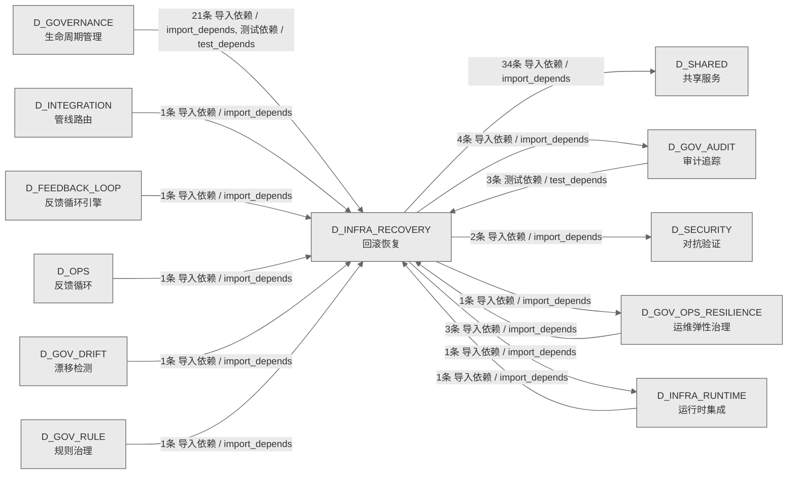

# 05_d_infra_recovery / 回滚恢复域 / Rollback Recovery

> **功能简介 / Overview**: 回滚恢复，负责系统故障时的状态回滚、事务补偿和恢复编排

> **文档作用 / Purpose**: 展示 回滚恢复（D_INFRA_RECOVERY）功能域的域内依赖关系、跨域依赖关系，模块信息（成熟度/中英文名/大白话/文件路径）内嵌于 Mermaid 节点，供架构审查和域治理参考。

> 本文档由 generate_domain_doc.py 从 depgraph (PostgreSQL) 自动生成
> 数据源: depgraph (PostgreSQL) nodes表 + edges表

> **[可缩放 HTML 版 / Zoomable HTML](http://localhost:8765/docs/02_enterprise_architecture/02_domain_architecture_docs/_zoomable_html/05_d_infra_recovery.html)** — Ctrl+滚轮缩放 ｜ 双击重置 ｜ Ctrl+Shift+D 切换拖动/选择模式

## 域基本信息 / Domain Overview

| 字段 | 值 | Field | Value |
|------|------|-------|-------|
| 编号 | 05 | Number | 05 |
| 域ID | D_INFRA_RECOVERY | Domain ID | D_INFRA_RECOVERY |
| 域名称 | 回滚恢复 | Domain Name | Rollback Recovery |
| 层级 | L0 基础设施层 | Layer | L0 Infrastructure |
| 模块数 | 55 | Module Count | 55 |
| 域内依赖 | 14 | Internal Dependencies | 14 |
| 跨域入边 | 33 | Cross-domain Incoming | 33 |
| 跨域出边 | 42 | Cross-domain Outgoing | 42 |
| 设计态模块 | 0 | Design Modules | 0 |
| 生产态模块 | 55 | Production Modules | 55 |
| 容量 | 55/150 (正常) | Capacity | 55/150 (正常) |
| 描述 | 双轨Checkpoint(git commit + SQLite JSONL dump) | Description | 双轨Checkpoint(git commit + SQLite JSONL dump) |

## 域内依赖图 / Internal Dependency Diagram

> 依赖图内嵌在本文档中，IDE 可直接渲染；网页版可 Ctrl+滚轮缩放 + 拖动平移查看细节。
>
> **图例说明 / Legend**：
> - 🟦 **蓝色 = 运营态模块**（production，已上线运行）
> - 🟧 **橙色虚线 = 设计态模块**（design，蓝图阶段，代码未写）
> - **实线箭头 = 运营态依赖**（已生效的依赖关系）
> - **虚线箭头 = 非运营态依赖**（计划中/验证中的依赖关系）

### 全景图（全部模块，颜色区分运营态/设计态）

> 展示全部 55 个模块（生产态 55 + 设计态 0），含跨域依赖外部节点。节点含成熟度+名称+大白话/简介+文件路径。

```mermaid
%%{init: {'theme': 'base', 'themeVariables': {'primaryColor': '#eaeaea', 'primaryTextColor': '#333333', 'primaryBorderColor': '#666666', 'lineColor': '#666666', 'secondaryColor': '#eaeaea', 'tertiaryColor': '#eaeaea', 'fontSize': '14px'}}}%%
flowchart TD
    src_zephyr_governance_rollback_contracts_py["G-CT-002 Rollback 契约<br/>rollback/contracts.py — G-CT-002 Rollback 契约<br/>（re-export）。<br/>文件: rollback/contracts.py<br/>(生产态 / production)"]
    src_zephyr_infrastructure_rollback_manifest_py["清单<br/>MOD-INF-021 Rollback System — 模块文件清单<br/>(_manifest_)。<br/>文件: rollback/_manifest.py<br/>(生产态 / production)"]
    src_zephyr_infrastructure_rollback_agent_cooldown_py["只读：project_root<br/>AgentCooldown — Agent 冷却隔离器。<br/>Agent Cooldown<br/>文件: rollback/agent_cooldown.py<br/>(生产态 / production)"]
    src_zephyr_infrastructure_rollback_auditor_py["审计器<br/>G-CT-004 契约：Rollback -> Audit 记录回滚操作.<br/>Auditor<br/>文件: rollback/auditor.py<br/>(生产态 / production)"]
    src_zephyr_infrastructure_rollback_budget_tracker_py["预算跟踪器<br/>G-CT-009 契约：Rollback -> Budget<br/>回滚成本计入预算.<br/>Budget Tracker<br/>文件: rollback/budget_tracker.py<br/>(生产态 / production)"]
    src_zephyr_infrastructure_rollback_checkpoint_gc_py["Checkpoint Gc<br/>CheckpointGC — Checkpoint 垃圾回收。<br/>文件: rollback/checkpoint_gc.py<br/>(生产态 / production)"]
    src_zephyr_infrastructure_rollback_commit_quality_gate_py["提交Quality门禁<br/>CommitQualityGate — Commit 质量基础设施。<br/>Commit Quality Gate<br/>文件: rollback/commit_quality_gate.py<br/>(生产态 / production)"]
    src_zephyr_infrastructure_rollback_complexity_budget_py["复杂度预算<br/>ComplexityBudget — 回滚复杂度元 Budget 监控。<br/>Complexity Budget<br/>文件: rollback/complexity_budget.py<br/>(生产态 / production)"]
    src_zephyr_infrastructure_rollback_credential_rotation_trigger_py["—5.62.5 治本名实分离）<br/>CredentialRotationDetector —<br/>回滚后凭据泄露检测（仅检测，不轮换）。<br/>Credential Rotation Trigger<br/>文件: rollback/credential_rotation_trigger.py<br/>(生产态 / production)"]
    src_zephyr_infrastructure_rollback_cross_platform_shell_py["只读：output_dir<br/>CrossPlatformShell — 跨平台 Shell 脚本双输出。<br/>Cross Platform Shell<br/>文件: rollback/cross_platform_shell.py<br/>(生产态 / production)"]
    src_zephyr_infrastructure_rollback_drift_fix_py["G-CT-005 消费端.'''<br/>基础设施/rollback包的drift_fix模块<br/>Drift Fix<br/>文件: rollback/drift_fix.py<br/>(生产态 / production)"]
    src_zephyr_infrastructure_rollback_env_watcher_py["只读：project_root<br/>EnvWatcher — 环境变量热重载监控器。<br/>Env Watcher<br/>文件: rollback/env_watcher.py<br/>(生产态 / production)"]
    src_zephyr_infrastructure_rollback_external_merkle_proof_py["只读：project_root<br/>External Merkle Proof —<br/>外部可验证回滚完整性证明。<br/>文件: rollback/external_merkle_proof.py<br/>(生产态 / production)"]
    src_zephyr_infrastructure_rollback_forensic_py["Forensic<br/>Engine — 取证基础设施（Phase 8 完整实现）<br/>文件: rollback/forensic.py<br/>(生产态 / production)"]
    src_zephyr_infrastructure_rollback_forward_fix_runner_py["只读：project_root<br/>ForwardFixRunner — Forward-Fix 执行器。<br/>Forward Fix Runner<br/>文件: rollback/forward_fix_runner.py<br/>(生产态 / production)"]
    src_zephyr_infrastructure_rollback_git_infra_snapshot_py["只读：project_root<br/>GitInfraSnapshot — Git 基础设施快照与污染防护。<br/>Git Infra Snapshot<br/>文件: rollback/git_infra_snapshot.py<br/>(生产态 / production)"]
    src_zephyr_infrastructure_rollback_hallucination_guard_py["只读：project_root<br/>HallucinationGuard — AI<br/>幻觉防护：回滚后强制状态验证。<br/>Hallucination Guard<br/>文件: rollback/hallucination_guard.py<br/>(生产态 / production)"]
    src_zephyr_infrastructure_rollback_intent_archiver_py["只读：archive_dir<br/>IntentArchiver — 意图存档保护。<br/>Intent Archiver<br/>文件: rollback/intent_archiver.py<br/>(生产态 / production)"]
    src_zephyr_infrastructure_rollback_kill_switch_py["Kill Switch<br/>KillSwitchManager — 三级 Kill Switch 管理器。<br/>文件: rollback/kill_switch.py<br/>(生产态 / production)"]
    src_zephyr_infrastructure_rollback_knowngoodstate_ledger_py["只读：ledger_path<br/>KnowngoodstateLedger — 已验证正确状态收据。<br/>Knowngoodstate Ledger<br/>文件: rollback/knowngoodstate_ledger.py<br/>(生产态 / production)"]
    src_zephyr_infrastructure_rollback_right_to_be_forgotten_py["只读：registry_dir<br/>Right to be Forgotten — GDPR 遗忘权合规检查器。<br/>文件: rollback/right_to_be_forgotten.py<br/>(生产态 / production)"]
    src_zephyr_infrastructure_rollback_rollback_abuse_detector_py["只读：project_root<br/>RollbackAbuseDetector — 回滚滥用检测。<br/>Rollback Abuse Detector<br/>文件: rollback/rollback_abuse_detector.py<br/>(生产态 / production)"]
    src_zephyr_infrastructure_rollback_rollback_audit_nexus_py["只读：core_writer<br/>RollbackAuditNexus — 回滚审计记录聚合到 Nexus<br/>AuditLog.<br/>Rollback Audit Nexus<br/>文件: rollback/rollback_audit_nexus.py<br/>(生产态 / production)"]
    src_zephyr_infrastructure_rollback_rollback_boot_integration_py["启动/关闭结果<br/>RollbackBootIntegration — 回滚系统自动启动<br/>/关闭集成 (MOD-INF-021 §1.2).<br/>Rollback Boot Integration<br/>文件: rollback/rollback_boot_integration.py<br/>(生产态 / production)"]
    src_zephyr_infrastructure_rollback_rollback_bootstrap_py["回滚Bootstrap<br/>RollbackBootstrap — 零依赖自举回滚器。<br/>Rollback Bootstrap<br/>文件: rollback/rollback_bootstrap.py<br/>(生产态 / production)"]
    src_zephyr_infrastructure_rollback_rollback_budget_py["只读：project_root<br/>RollbackBudget — 回滚预算管理器。<br/>Rollback Budget<br/>文件: rollback/rollback_budget.py<br/>(生产态 / production)"]
    src_zephyr_infrastructure_rollback_rollback_context_restorer_py["只读：project_root<br/>RollbackContextRestorer — 上下文恢复器。<br/>Rollback Context Restorer<br/>文件: rollback/rollback_context_restorer.py<br/>(生产态 / production)"]
    src_zephyr_infrastructure_rollback_rollback_dashboard_py["只读：output_path<br/>RollbackDashboard — 回滚仪表盘（零依赖<br/>Markdown）。<br/>Rollback Dashboard<br/>文件: rollback/rollback_dashboard.py<br/>(生产态 / production)"]
    src_zephyr_infrastructure_rollback_rollback_integration_py["回滚集成<br/>Rollback Integration — executor 集成增强层。<br/>文件: rollback/rollback_integration.py<br/>(生产态 / production)"]
    src_zephyr_infrastructure_rollback_rollback_loop_detector_py["只读：log_path<br/>RollbackLoopDetector — 回滚循环检测器。<br/>Rollback Loop Detector<br/>文件: rollback/rollback_loop_detector.py<br/>(生产态 / production)"]
    src_zephyr_infrastructure_rollback_rollback_simulator_py["公共接口：run_git<br/>RollbackSimulator — 回滚模拟器（CI 集成）。<br/>Rollback Simulator<br/>文件: rollback/rollback_simulator.py<br/>(生产态 / production)"]
    src_zephyr_infrastructure_rollback_rollback_state_machine_py["只读：current_step_idx<br/>RollbackStateMachine — 回滚步骤级状态机。<br/>Rollback State Machine<br/>文件: rollback/rollback_state_machine.py<br/>(生产态 / production)"]
    src_zephyr_infrastructure_rollback_rollback_target_staleness_py["只读：project_root<br/>RollbackTargetStaleness — 回滚目标陈旧度检测。<br/>Rollback Target Staleness<br/>文件: rollback/rollback_target_staleness.py<br/>(生产态 / production)"]
    src_zephyr_infrastructure_rollback_runbook_generator_py["Runbook生成器<br/>RunbookGenerator — 回滚操作 Runbook 自动生成。<br/>Runbook Generator<br/>文件: rollback/runbook_generator.py<br/>(生产态 / production)"]
    src_zephyr_infrastructure_rollback_s3_snapshot_lifecycle_py["只读：snapshot_dir<br/>S3 Snapshot Lifecycle Manager —<br/>快照防生命周期过期。<br/>文件: rollback/s3_snapshot_lifecycle.py<br/>(生产态 / production)"]
    src_zephyr_infrastructure_rollback_secret_rotation_aware_py["只读：project_root<br/>SecretRotationAware — 密钥轮替感知器。<br/>Secret Rotation Aware<br/>文件: rollback/secret_rotation_aware.py<br/>(生产态 / production)"]
    src_zephyr_infrastructure_rollback_semantic_rollback_tag_py["只读：project_root<br/>SemanticRollbackTag — 语义化 Rollback Tag<br/>管理器。<br/>Semantic Rollback Tag<br/>文件: rollback/semantic_rollback_tag.py<br/>(生产态 / production)"]
    src_zephyr_infrastructure_rollback_semantic_similar_detector_py["公共接口：parse_safe<br/>SemanticSimilarDetector — 语义变形攻击检测。<br/>Semantic Similar Detector<br/>文件: rollback/semantic_similar_detector.py<br/>(生产态 / production)"]
    src_zephyr_infrastructure_rollback_submodule_sync_py["只读：project_root<br/>Submodule Sync — Submodule/Monorepo<br/>多仓库同步回滚。<br/>文件: rollback/submodule_sync.py<br/>(生产态 / production)"]
    src_zephyr_infrastructure_rollback_temporal_context_adapter_py["项目根路径<br/>TemporalContextAdapter — AI 时间上下文断裂修复。<br/>Temporal Context Adapter<br/>文件: rollback/temporal_context_adapter.py<br/>(生产态 / production)"]
    src_zephyr_infrastructure_rollback_topology_change_log_py["只读：log_path<br/>TopologyChangeLog — 分支拓扑变更日志。<br/>Topology Change Log<br/>文件: rollback/topology_change_log.py<br/>(生产态 / production)"]
    src_zephyr_infrastructure_rollback_venv_sync_py["公共接口：compute_diff<br/>VenvSync — venv/conda 版本同步保障。<br/>Venv Sync<br/>文件: rollback/venv_sync.py<br/>(生产态 / production)"]
    src_zephyr_infrastructure_rollback_vulnerability_rescanner_py["公共接口：try_upgrade<br/>VulnerabilityRescanner — 依赖漏洞复扫。<br/>Vulnerability Rescanner<br/>文件: rollback/vulnerability_rescanner.py<br/>(生产态 / production)"]
    src_zephyr_infrastructure_rollback_warm_standby_py["公共接口：read_state<br/>WarmStandby — 温备热切（git worktree<br/>副本维护）。<br/>Warm Standby<br/>文件: rollback/warm_standby.py<br/>(生产态 / production)"]
    tests_rollback_test_rollback_scheduler_py["临时项目根目录<br/>DM-201911 红蓝对抗极端测试: RollbackScheduler<br/>事件驱动调度.<br/>Test Rollback Scheduler<br/>文件: rollback/test_rollback_scheduler.py<br/>(生产态 / production)"]
    src_zephyr_governance_rollback_contracts_py ~~~ src_zephyr_infrastructure_rollback_manifest_py
    src_zephyr_infrastructure_rollback_manifest_py ~~~ src_zephyr_infrastructure_rollback_agent_cooldown_py
    src_zephyr_infrastructure_rollback_agent_cooldown_py ~~~ src_zephyr_infrastructure_rollback_auditor_py
    src_zephyr_infrastructure_rollback_auditor_py ~~~ src_zephyr_infrastructure_rollback_budget_tracker_py
    src_zephyr_infrastructure_rollback_budget_tracker_py ~~~ src_zephyr_infrastructure_rollback_checkpoint_gc_py
    src_zephyr_infrastructure_rollback_checkpoint_gc_py ~~~ src_zephyr_infrastructure_rollback_commit_quality_gate_py
    src_zephyr_infrastructure_rollback_commit_quality_gate_py ~~~ src_zephyr_infrastructure_rollback_complexity_budget_py
    src_zephyr_infrastructure_rollback_complexity_budget_py ~~~ src_zephyr_infrastructure_rollback_credential_rotation_trigger_py
    src_zephyr_infrastructure_rollback_credential_rotation_trigger_py ~~~ src_zephyr_infrastructure_rollback_cross_platform_shell_py
    src_zephyr_infrastructure_rollback_cross_platform_shell_py ~~~ src_zephyr_infrastructure_rollback_drift_fix_py
    src_zephyr_infrastructure_rollback_drift_fix_py ~~~ src_zephyr_infrastructure_rollback_env_watcher_py
    src_zephyr_infrastructure_rollback_env_watcher_py ~~~ src_zephyr_infrastructure_rollback_external_merkle_proof_py
    src_zephyr_infrastructure_rollback_external_merkle_proof_py ~~~ src_zephyr_infrastructure_rollback_forensic_py
    src_zephyr_infrastructure_rollback_forensic_py ~~~ src_zephyr_infrastructure_rollback_forward_fix_runner_py
    src_zephyr_infrastructure_rollback_forward_fix_runner_py ~~~ src_zephyr_infrastructure_rollback_git_infra_snapshot_py
    src_zephyr_infrastructure_rollback_git_infra_snapshot_py ~~~ src_zephyr_infrastructure_rollback_hallucination_guard_py
    src_zephyr_infrastructure_rollback_hallucination_guard_py ~~~ src_zephyr_infrastructure_rollback_intent_archiver_py
    src_zephyr_infrastructure_rollback_intent_archiver_py ~~~ src_zephyr_infrastructure_rollback_kill_switch_py
    src_zephyr_infrastructure_rollback_kill_switch_py ~~~ src_zephyr_infrastructure_rollback_knowngoodstate_ledger_py
    src_zephyr_infrastructure_rollback_knowngoodstate_ledger_py ~~~ src_zephyr_infrastructure_rollback_right_to_be_forgotten_py
    src_zephyr_infrastructure_rollback_right_to_be_forgotten_py ~~~ src_zephyr_infrastructure_rollback_rollback_abuse_detector_py
    src_zephyr_infrastructure_rollback_rollback_abuse_detector_py ~~~ src_zephyr_infrastructure_rollback_rollback_audit_nexus_py
    src_zephyr_infrastructure_rollback_rollback_audit_nexus_py ~~~ src_zephyr_infrastructure_rollback_rollback_boot_integration_py
    src_zephyr_infrastructure_rollback_rollback_boot_integration_py ~~~ src_zephyr_infrastructure_rollback_rollback_bootstrap_py
    src_zephyr_infrastructure_rollback_rollback_bootstrap_py ~~~ src_zephyr_infrastructure_rollback_rollback_budget_py
    src_zephyr_infrastructure_rollback_rollback_budget_py ~~~ src_zephyr_infrastructure_rollback_rollback_context_restorer_py
    src_zephyr_infrastructure_rollback_rollback_context_restorer_py ~~~ src_zephyr_infrastructure_rollback_rollback_dashboard_py
    src_zephyr_infrastructure_rollback_rollback_dashboard_py ~~~ src_zephyr_infrastructure_rollback_rollback_integration_py
    src_zephyr_infrastructure_rollback_rollback_integration_py ~~~ src_zephyr_infrastructure_rollback_rollback_loop_detector_py
    src_zephyr_infrastructure_rollback_rollback_loop_detector_py ~~~ src_zephyr_infrastructure_rollback_rollback_simulator_py
    src_zephyr_infrastructure_rollback_rollback_simulator_py ~~~ src_zephyr_infrastructure_rollback_rollback_state_machine_py
    src_zephyr_infrastructure_rollback_rollback_state_machine_py ~~~ src_zephyr_infrastructure_rollback_rollback_target_staleness_py
    src_zephyr_infrastructure_rollback_rollback_target_staleness_py ~~~ src_zephyr_infrastructure_rollback_runbook_generator_py
    src_zephyr_infrastructure_rollback_runbook_generator_py ~~~ src_zephyr_infrastructure_rollback_s3_snapshot_lifecycle_py
    src_zephyr_infrastructure_rollback_s3_snapshot_lifecycle_py ~~~ src_zephyr_infrastructure_rollback_secret_rotation_aware_py
    src_zephyr_infrastructure_rollback_secret_rotation_aware_py ~~~ src_zephyr_infrastructure_rollback_semantic_rollback_tag_py
    src_zephyr_infrastructure_rollback_semantic_rollback_tag_py ~~~ src_zephyr_infrastructure_rollback_semantic_similar_detector_py
    src_zephyr_infrastructure_rollback_semantic_similar_detector_py ~~~ src_zephyr_infrastructure_rollback_submodule_sync_py
    src_zephyr_infrastructure_rollback_submodule_sync_py ~~~ src_zephyr_infrastructure_rollback_temporal_context_adapter_py
    src_zephyr_infrastructure_rollback_temporal_context_adapter_py ~~~ src_zephyr_infrastructure_rollback_topology_change_log_py
    src_zephyr_infrastructure_rollback_topology_change_log_py ~~~ src_zephyr_infrastructure_rollback_venv_sync_py
    src_zephyr_infrastructure_rollback_venv_sync_py ~~~ src_zephyr_infrastructure_rollback_vulnerability_rescanner_py
    src_zephyr_infrastructure_rollback_vulnerability_rescanner_py ~~~ src_zephyr_infrastructure_rollback_warm_standby_py
    src_zephyr_infrastructure_rollback_warm_standby_py ~~~ tests_rollback_test_rollback_scheduler_py
    src_zephyr_infrastructure_rollback_auto_rollback_trigger_py["5.96.2 修复：原 TriggerDecision 含 3 个布尔字段<br/>AutoRollbackTrigger — 自动回滚触发器。<br/>Auto Rollback Trigger<br/>文件: rollback/auto_rollback_trigger.py<br/>(生产态 / production)"]
    src_zephyr_infrastructure_rollback_contracts_py["契约<br/>G-CT-002 Rollback 消费端 — on_audit_anomaly()<br/>接口.<br/>Contracts<br/>文件: rollback/contracts.py<br/>(生产态 / production)"]
    src_zephyr_infrastructure_rollback_rollback_executor_py["回滚执行器<br/>RollbackExecutor — 回滚执行器核心封装。<br/>Rollback Executor<br/>文件: rollback/rollback_executor.py<br/>(生产态 / production)"]
    src_zephyr_infrastructure_rollback_rollback_scheduler_py["调度任务执行结果<br/>RollbackScheduler — 回滚系统事件驱动调度器<br/>(MOD-INF-021 §7 Phase 5.3).<br/>Rollback Scheduler<br/>文件: rollback/rollback_scheduler.py<br/>(生产态 / production)"]
    src_zephyr_infrastructure_rollback_rollback_verifier_py["回滚验证器<br/>RollbackVerifier — 回滚后验证器。<br/>Rollback Verifier<br/>文件: rollback/rollback_verifier.py<br/>(生产态 / production)"]
    src_zephyr_infrastructure_rollback_auto_rollback_trigger_py ~~~ src_zephyr_infrastructure_rollback_contracts_py
    src_zephyr_infrastructure_rollback_contracts_py ~~~ src_zephyr_infrastructure_rollback_rollback_executor_py
    src_zephyr_infrastructure_rollback_rollback_executor_py ~~~ src_zephyr_infrastructure_rollback_rollback_scheduler_py
    src_zephyr_infrastructure_rollback_rollback_scheduler_py ~~~ src_zephyr_infrastructure_rollback_rollback_verifier_py
    src_zephyr_infrastructure_rollback_contract_py["契约<br/>CT-RBK-GATE-001 集成契约落地——Rollback System<br/>Exit Code 完整定义。<br/>Contract<br/>文件: rollback/contract.py<br/>(生产态 / production)"]
    src_zephyr_infrastructure_rollback_rollback_drill_py["只读：project_root<br/>RollbackDrill — 定期回滚演练调度器<br/>(DiRT-style)。<br/>Rollback Drill<br/>文件: rollback/rollback_drill.py<br/>(生产态 / production)"]
    src_zephyr_infrastructure_rollback_rollback_lock_py["锁目录路径<br/>RollbackLock — 全局回滚锁管理。<br/>Rollback Lock<br/>文件: rollback/rollback_lock.py<br/>(生产态 / production)"]
    src_zephyr_infrastructure_rollback_rollback_wal_py["只读：wal_path<br/>RollbackWAL — 回滚预写日志。<br/>Rollback Wal<br/>文件: rollback/rollback_wal.py<br/>(生产态 / production)"]
    src_zephyr_infrastructure_rollback_sqlite_dumper_py["—表名无法参数化，用白名单替代）<br/>SqliteDumper — SQLite 双轨 Checkpoint 的 DB<br/>层：dump / restore / verify。<br/>Sqlite Dumper<br/>文件: rollback/sqlite_dumper.py<br/>(生产态 / production)"]
    src_zephyr_infrastructure_rollback_contract_py ~~~ src_zephyr_infrastructure_rollback_rollback_drill_py
    src_zephyr_infrastructure_rollback_rollback_drill_py ~~~ src_zephyr_infrastructure_rollback_rollback_lock_py
    src_zephyr_infrastructure_rollback_rollback_lock_py ~~~ src_zephyr_infrastructure_rollback_rollback_wal_py
    src_zephyr_infrastructure_rollback_rollback_wal_py ~~~ src_zephyr_infrastructure_rollback_sqlite_dumper_py
    src_zephyr_governance_rollback_contracts_py -->|导入依赖 / import_depends| src_zephyr_infrastructure_rollback_contracts_py
    src_zephyr_infrastructure_rollback_rollback_executor_py -->|导入依赖 / import_depends| src_zephyr_infrastructure_rollback_contract_py
    src_zephyr_infrastructure_rollback_rollback_executor_py -->|导入依赖 / import_depends| src_zephyr_infrastructure_rollback_rollback_lock_py
    src_zephyr_infrastructure_rollback_rollback_executor_py -->|导入依赖 / import_depends| src_zephyr_infrastructure_rollback_sqlite_dumper_py
    src_zephyr_infrastructure_rollback_rollback_boot_integration_py -->|导入依赖 / import_depends| src_zephyr_infrastructure_rollback_auto_rollback_trigger_py
    src_zephyr_infrastructure_rollback_rollback_boot_integration_py -->|导入依赖 / import_depends| src_zephyr_infrastructure_rollback_rollback_executor_py
    src_zephyr_infrastructure_rollback_rollback_boot_integration_py -->|导入依赖 / import_depends| src_zephyr_infrastructure_rollback_rollback_lock_py
    src_zephyr_infrastructure_rollback_rollback_boot_integration_py -->|导入依赖 / import_depends| src_zephyr_infrastructure_rollback_rollback_scheduler_py
    src_zephyr_infrastructure_rollback_rollback_boot_integration_py -->|导入依赖 / import_depends| src_zephyr_infrastructure_rollback_rollback_verifier_py
    src_zephyr_infrastructure_rollback_rollback_boot_integration_py -->|导入依赖 / import_depends| src_zephyr_infrastructure_rollback_rollback_wal_py
    src_zephyr_infrastructure_rollback_rollback_scheduler_py -->|导入依赖 / import_depends| src_zephyr_infrastructure_rollback_rollback_drill_py
    src_zephyr_infrastructure_rollback_rollback_scheduler_py -->|导入依赖 / import_depends| src_zephyr_infrastructure_rollback_rollback_wal_py
    src_zephyr_infrastructure_rollback_rollback_integration_py -->|导入依赖 / import_depends| src_zephyr_infrastructure_rollback_contract_py
    tests_rollback_test_rollback_scheduler_py -->|测试依赖 / test_depends| src_zephyr_infrastructure_rollback_rollback_scheduler_py
    D_GOV_AUDIT["审计追踪<br/>审计追踪，负责变更审计追踪和操作日志管理<br/>Audit Trail<br/>跨域节点 / cross-domain<br/>(生产态 / production)"]
    src_zephyr_infrastructure_rollback_rollback_executor_py -->|导入依赖 / import_depends| D_GOV_AUDIT
    D_SHARED["共享服务<br/>共享服务，负责跨域共享的工具、协议和基础服务<br/>Shared Services<br/>跨域节点 / cross-domain<br/>(生产态 / production)"]
    src_zephyr_infrastructure_rollback_right_to_be_forgotten_py -->|导入依赖 / import_depends| D_SHARED
    src_zephyr_infrastructure_rollback_sqlite_dumper_py -->|导入依赖 / import_depends| D_SHARED
    src_zephyr_infrastructure_rollback_warm_standby_py -->|导入依赖 / import_depends| D_SHARED
    src_zephyr_infrastructure_rollback_forward_fix_runner_py -->|导入依赖 / import_depends| D_SHARED
    src_zephyr_infrastructure_rollback_rollback_integration_py -->|导入依赖 / import_depends| D_SHARED
    src_zephyr_infrastructure_rollback_forensic_py -->|导入依赖 / import_depends| D_SHARED
    src_zephyr_infrastructure_rollback_sqlite_dumper_py -->|导入依赖 / import_depends| D_SHARED
    src_zephyr_infrastructure_rollback_rollback_audit_nexus_py -->|导入依赖 / import_depends| D_GOV_AUDIT
    src_zephyr_infrastructure_rollback_rollback_integration_py -->|导入依赖 / import_depends| D_SHARED
    src_zephyr_infrastructure_rollback_rollback_target_staleness_py -->|导入依赖 / import_depends| D_SHARED
    D_INFRA_RUNTIME["运行时集成<br/>运行时集成，负责组件生命周期编排、启动钩子和运行<br/>时上下文管理<br/>Runtime Integration<br/>跨域节点 / cross-domain<br/>(生产态 / production)"]
    src_zephyr_infrastructure_rollback_rollback_executor_py -->|导入依赖 / import_depends| D_INFRA_RUNTIME
    src_zephyr_infrastructure_rollback_rollback_simulator_py -->|导入依赖 / import_depends| D_SHARED
    src_zephyr_infrastructure_rollback_rollback_verifier_py -->|导入依赖 / import_depends| D_SHARED
    src_zephyr_infrastructure_rollback_topology_change_log_py -->|导入依赖 / import_depends| D_SHARED
    D_GOVERNANCE["生命周期管理<br/>生命周期管理，负责蓝图/模块<br/>/任务的声明周期管理和元数据治理<br/>Lifecycle Management<br/>跨域节点 / cross-domain<br/>(生产态 / production)"]
    D_GOVERNANCE -->|导入依赖 / import_depends| src_zephyr_infrastructure_rollback_rollback_executor_py
    D_GOVERNANCE -->|测试依赖 / test_depends| src_zephyr_infrastructure_rollback_venv_sync_py
    D_GOVERNANCE -->|测试依赖 / test_depends| src_zephyr_infrastructure_rollback_drift_fix_py
    D_GOVERNANCE -->|测试依赖 / test_depends| src_zephyr_infrastructure_rollback_vulnerability_rescanner_py
    D_GOVERNANCE -->|测试依赖 / test_depends| src_zephyr_infrastructure_rollback_right_to_be_forgotten_py
    D_GOVERNANCE -->|测试依赖 / test_depends| src_zephyr_infrastructure_rollback_env_watcher_py
    D_GOVERNANCE -->|测试依赖 / test_depends| src_zephyr_infrastructure_rollback_warm_standby_py
    D_GOV_AUDIT -->|测试依赖 / test_depends| src_zephyr_infrastructure_rollback_auditor_py
    D_GOV_OPS_RESILIENCE["运维弹性治理<br/>运维弹性治理，负责运维治理、安全治理、弹性治理和<br/>升级协议<br/>Ops Resilience Governance<br/>跨域节点 / cross-domain<br/>(生产态 / production)"]
    D_GOV_OPS_RESILIENCE -->|导入依赖 / import_depends| src_zephyr_infrastructure_rollback_kill_switch_py
    D_GOVERNANCE -->|测试依赖 / test_depends| src_zephyr_infrastructure_rollback_drift_fix_py
    D_GOVERNANCE -->|测试依赖 / test_depends| src_zephyr_infrastructure_rollback_drift_fix_py
    D_GOVERNANCE -->|测试依赖 / test_depends| src_zephyr_infrastructure_rollback_knowngoodstate_ledger_py
    D_GOV_OPS_RESILIENCE -->|导入依赖 / import_depends| src_zephyr_infrastructure_rollback_contracts_py
    D_GOV_DRIFT["漂移检测<br/>漂移检测，负责架构漂移检测和漂移告警<br/>Drift Detection<br/>跨域节点 / cross-domain<br/>(生产态 / production)"]
    D_GOV_DRIFT -->|导入依赖 / import_depends| src_zephyr_infrastructure_rollback_drift_fix_py
    D_GOVERNANCE -->|测试依赖 / test_depends| src_zephyr_infrastructure_rollback_runbook_generator_py
    classDef production fill:#e1f5fe,stroke:#01579b,stroke-width:2px,color:#000
    classDef design fill:#fff3e0,stroke:#e65100,stroke-width:2px,color:#000,stroke-dasharray: 5 5
    classDef external_prod fill:#e8f4fd,stroke:#0277bd,stroke-width:1px,color:#000
    classDef external_design fill:#fff8e7,stroke:#ef6c00,stroke-width:1px,color:#000,stroke-dasharray: 5 5
    class src_zephyr_governance_rollback_contracts_py,src_zephyr_infrastructure_rollback_manifest_py,src_zephyr_infrastructure_rollback_agent_cooldown_py,src_zephyr_infrastructure_rollback_auditor_py,src_zephyr_infrastructure_rollback_auto_rollback_trigger_py,src_zephyr_infrastructure_rollback_budget_tracker_py,src_zephyr_infrastructure_rollback_checkpoint_gc_py,src_zephyr_infrastructure_rollback_commit_quality_gate_py,src_zephyr_infrastructure_rollback_complexity_budget_py,src_zephyr_infrastructure_rollback_contract_py,src_zephyr_infrastructure_rollback_contracts_py,src_zephyr_infrastructure_rollback_credential_rotation_trigger_py,src_zephyr_infrastructure_rollback_cross_platform_shell_py,src_zephyr_infrastructure_rollback_drift_fix_py,src_zephyr_infrastructure_rollback_env_watcher_py,src_zephyr_infrastructure_rollback_external_merkle_proof_py,src_zephyr_infrastructure_rollback_forensic_py,src_zephyr_infrastructure_rollback_forward_fix_runner_py,src_zephyr_infrastructure_rollback_git_infra_snapshot_py,src_zephyr_infrastructure_rollback_hallucination_guard_py,src_zephyr_infrastructure_rollback_intent_archiver_py,src_zephyr_infrastructure_rollback_kill_switch_py,src_zephyr_infrastructure_rollback_knowngoodstate_ledger_py,src_zephyr_infrastructure_rollback_right_to_be_forgotten_py,src_zephyr_infrastructure_rollback_rollback_abuse_detector_py,src_zephyr_infrastructure_rollback_rollback_audit_nexus_py,src_zephyr_infrastructure_rollback_rollback_boot_integration_py,src_zephyr_infrastructure_rollback_rollback_bootstrap_py,src_zephyr_infrastructure_rollback_rollback_budget_py,src_zephyr_infrastructure_rollback_rollback_context_restorer_py,src_zephyr_infrastructure_rollback_rollback_dashboard_py,src_zephyr_infrastructure_rollback_rollback_drill_py,src_zephyr_infrastructure_rollback_rollback_executor_py,src_zephyr_infrastructure_rollback_rollback_integration_py,src_zephyr_infrastructure_rollback_rollback_lock_py,src_zephyr_infrastructure_rollback_rollback_loop_detector_py,src_zephyr_infrastructure_rollback_rollback_scheduler_py,src_zephyr_infrastructure_rollback_rollback_simulator_py,src_zephyr_infrastructure_rollback_rollback_state_machine_py,src_zephyr_infrastructure_rollback_rollback_target_staleness_py,src_zephyr_infrastructure_rollback_rollback_verifier_py,src_zephyr_infrastructure_rollback_rollback_wal_py,src_zephyr_infrastructure_rollback_runbook_generator_py,src_zephyr_infrastructure_rollback_s3_snapshot_lifecycle_py,src_zephyr_infrastructure_rollback_secret_rotation_aware_py,src_zephyr_infrastructure_rollback_semantic_rollback_tag_py,src_zephyr_infrastructure_rollback_semantic_similar_detector_py,src_zephyr_infrastructure_rollback_sqlite_dumper_py,src_zephyr_infrastructure_rollback_submodule_sync_py,src_zephyr_infrastructure_rollback_temporal_context_adapter_py,src_zephyr_infrastructure_rollback_topology_change_log_py,src_zephyr_infrastructure_rollback_venv_sync_py,src_zephyr_infrastructure_rollback_vulnerability_rescanner_py,src_zephyr_infrastructure_rollback_warm_standby_py,tests_rollback_test_rollback_scheduler_py production
    class D_GOV_AUDIT,D_SHARED,D_INFRA_RUNTIME,D_GOVERNANCE,D_GOV_OPS_RESILIENCE,D_GOV_DRIFT external_prod
```

### 运营态的图（仅 design_maturity=production 的模块和域内依赖）

> 仅展示已上线运行的模块（共 55 个），不含跨域外部节点。跨域依赖见下方跨域依赖章节。

```mermaid
%%{init: {'theme': 'base', 'themeVariables': {'primaryColor': '#eaeaea', 'primaryTextColor': '#333333', 'primaryBorderColor': '#666666', 'lineColor': '#666666', 'secondaryColor': '#eaeaea', 'tertiaryColor': '#eaeaea', 'fontSize': '14px'}}}%%
flowchart TD
    src_zephyr_governance_rollback_contracts_py["G-CT-002 Rollback 契约<br/>rollback/contracts.py — G-CT-002 Rollback 契约<br/>（re-export）。<br/>文件: rollback/contracts.py<br/>(生产态 / production)"]
    src_zephyr_infrastructure_rollback_manifest_py["清单<br/>MOD-INF-021 Rollback System — 模块文件清单<br/>(_manifest_)。<br/>文件: rollback/_manifest.py<br/>(生产态 / production)"]
    src_zephyr_infrastructure_rollback_agent_cooldown_py["只读：project_root<br/>AgentCooldown — Agent 冷却隔离器。<br/>Agent Cooldown<br/>文件: rollback/agent_cooldown.py<br/>(生产态 / production)"]
    src_zephyr_infrastructure_rollback_auditor_py["审计器<br/>G-CT-004 契约：Rollback -> Audit 记录回滚操作.<br/>Auditor<br/>文件: rollback/auditor.py<br/>(生产态 / production)"]
    src_zephyr_infrastructure_rollback_budget_tracker_py["预算跟踪器<br/>G-CT-009 契约：Rollback -> Budget<br/>回滚成本计入预算.<br/>Budget Tracker<br/>文件: rollback/budget_tracker.py<br/>(生产态 / production)"]
    src_zephyr_infrastructure_rollback_checkpoint_gc_py["Checkpoint Gc<br/>CheckpointGC — Checkpoint 垃圾回收。<br/>文件: rollback/checkpoint_gc.py<br/>(生产态 / production)"]
    src_zephyr_infrastructure_rollback_commit_quality_gate_py["提交Quality门禁<br/>CommitQualityGate — Commit 质量基础设施。<br/>Commit Quality Gate<br/>文件: rollback/commit_quality_gate.py<br/>(生产态 / production)"]
    src_zephyr_infrastructure_rollback_complexity_budget_py["复杂度预算<br/>ComplexityBudget — 回滚复杂度元 Budget 监控。<br/>Complexity Budget<br/>文件: rollback/complexity_budget.py<br/>(生产态 / production)"]
    src_zephyr_infrastructure_rollback_credential_rotation_trigger_py["—5.62.5 治本名实分离）<br/>CredentialRotationDetector —<br/>回滚后凭据泄露检测（仅检测，不轮换）。<br/>Credential Rotation Trigger<br/>文件: rollback/credential_rotation_trigger.py<br/>(生产态 / production)"]
    src_zephyr_infrastructure_rollback_cross_platform_shell_py["只读：output_dir<br/>CrossPlatformShell — 跨平台 Shell 脚本双输出。<br/>Cross Platform Shell<br/>文件: rollback/cross_platform_shell.py<br/>(生产态 / production)"]
    src_zephyr_infrastructure_rollback_drift_fix_py["G-CT-005 消费端.'''<br/>基础设施/rollback包的drift_fix模块<br/>Drift Fix<br/>文件: rollback/drift_fix.py<br/>(生产态 / production)"]
    src_zephyr_infrastructure_rollback_env_watcher_py["只读：project_root<br/>EnvWatcher — 环境变量热重载监控器。<br/>Env Watcher<br/>文件: rollback/env_watcher.py<br/>(生产态 / production)"]
    src_zephyr_infrastructure_rollback_external_merkle_proof_py["只读：project_root<br/>External Merkle Proof —<br/>外部可验证回滚完整性证明。<br/>文件: rollback/external_merkle_proof.py<br/>(生产态 / production)"]
    src_zephyr_infrastructure_rollback_forensic_py["Forensic<br/>Engine — 取证基础设施（Phase 8 完整实现）<br/>文件: rollback/forensic.py<br/>(生产态 / production)"]
    src_zephyr_infrastructure_rollback_forward_fix_runner_py["只读：project_root<br/>ForwardFixRunner — Forward-Fix 执行器。<br/>Forward Fix Runner<br/>文件: rollback/forward_fix_runner.py<br/>(生产态 / production)"]
    src_zephyr_infrastructure_rollback_git_infra_snapshot_py["只读：project_root<br/>GitInfraSnapshot — Git 基础设施快照与污染防护。<br/>Git Infra Snapshot<br/>文件: rollback/git_infra_snapshot.py<br/>(生产态 / production)"]
    src_zephyr_infrastructure_rollback_hallucination_guard_py["只读：project_root<br/>HallucinationGuard — AI<br/>幻觉防护：回滚后强制状态验证。<br/>Hallucination Guard<br/>文件: rollback/hallucination_guard.py<br/>(生产态 / production)"]
    src_zephyr_infrastructure_rollback_intent_archiver_py["只读：archive_dir<br/>IntentArchiver — 意图存档保护。<br/>Intent Archiver<br/>文件: rollback/intent_archiver.py<br/>(生产态 / production)"]
    src_zephyr_infrastructure_rollback_kill_switch_py["Kill Switch<br/>KillSwitchManager — 三级 Kill Switch 管理器。<br/>文件: rollback/kill_switch.py<br/>(生产态 / production)"]
    src_zephyr_infrastructure_rollback_knowngoodstate_ledger_py["只读：ledger_path<br/>KnowngoodstateLedger — 已验证正确状态收据。<br/>Knowngoodstate Ledger<br/>文件: rollback/knowngoodstate_ledger.py<br/>(生产态 / production)"]
    src_zephyr_infrastructure_rollback_right_to_be_forgotten_py["只读：registry_dir<br/>Right to be Forgotten — GDPR 遗忘权合规检查器。<br/>文件: rollback/right_to_be_forgotten.py<br/>(生产态 / production)"]
    src_zephyr_infrastructure_rollback_rollback_abuse_detector_py["只读：project_root<br/>RollbackAbuseDetector — 回滚滥用检测。<br/>Rollback Abuse Detector<br/>文件: rollback/rollback_abuse_detector.py<br/>(生产态 / production)"]
    src_zephyr_infrastructure_rollback_rollback_audit_nexus_py["只读：core_writer<br/>RollbackAuditNexus — 回滚审计记录聚合到 Nexus<br/>AuditLog.<br/>Rollback Audit Nexus<br/>文件: rollback/rollback_audit_nexus.py<br/>(生产态 / production)"]
    src_zephyr_infrastructure_rollback_rollback_boot_integration_py["启动/关闭结果<br/>RollbackBootIntegration — 回滚系统自动启动<br/>/关闭集成 (MOD-INF-021 §1.2).<br/>Rollback Boot Integration<br/>文件: rollback/rollback_boot_integration.py<br/>(生产态 / production)"]
    src_zephyr_infrastructure_rollback_rollback_bootstrap_py["回滚Bootstrap<br/>RollbackBootstrap — 零依赖自举回滚器。<br/>Rollback Bootstrap<br/>文件: rollback/rollback_bootstrap.py<br/>(生产态 / production)"]
    src_zephyr_infrastructure_rollback_rollback_budget_py["只读：project_root<br/>RollbackBudget — 回滚预算管理器。<br/>Rollback Budget<br/>文件: rollback/rollback_budget.py<br/>(生产态 / production)"]
    src_zephyr_infrastructure_rollback_rollback_context_restorer_py["只读：project_root<br/>RollbackContextRestorer — 上下文恢复器。<br/>Rollback Context Restorer<br/>文件: rollback/rollback_context_restorer.py<br/>(生产态 / production)"]
    src_zephyr_infrastructure_rollback_rollback_dashboard_py["只读：output_path<br/>RollbackDashboard — 回滚仪表盘（零依赖<br/>Markdown）。<br/>Rollback Dashboard<br/>文件: rollback/rollback_dashboard.py<br/>(生产态 / production)"]
    src_zephyr_infrastructure_rollback_rollback_integration_py["回滚集成<br/>Rollback Integration — executor 集成增强层。<br/>文件: rollback/rollback_integration.py<br/>(生产态 / production)"]
    src_zephyr_infrastructure_rollback_rollback_loop_detector_py["只读：log_path<br/>RollbackLoopDetector — 回滚循环检测器。<br/>Rollback Loop Detector<br/>文件: rollback/rollback_loop_detector.py<br/>(生产态 / production)"]
    src_zephyr_infrastructure_rollback_rollback_simulator_py["公共接口：run_git<br/>RollbackSimulator — 回滚模拟器（CI 集成）。<br/>Rollback Simulator<br/>文件: rollback/rollback_simulator.py<br/>(生产态 / production)"]
    src_zephyr_infrastructure_rollback_rollback_state_machine_py["只读：current_step_idx<br/>RollbackStateMachine — 回滚步骤级状态机。<br/>Rollback State Machine<br/>文件: rollback/rollback_state_machine.py<br/>(生产态 / production)"]
    src_zephyr_infrastructure_rollback_rollback_target_staleness_py["只读：project_root<br/>RollbackTargetStaleness — 回滚目标陈旧度检测。<br/>Rollback Target Staleness<br/>文件: rollback/rollback_target_staleness.py<br/>(生产态 / production)"]
    src_zephyr_infrastructure_rollback_runbook_generator_py["Runbook生成器<br/>RunbookGenerator — 回滚操作 Runbook 自动生成。<br/>Runbook Generator<br/>文件: rollback/runbook_generator.py<br/>(生产态 / production)"]
    src_zephyr_infrastructure_rollback_s3_snapshot_lifecycle_py["只读：snapshot_dir<br/>S3 Snapshot Lifecycle Manager —<br/>快照防生命周期过期。<br/>文件: rollback/s3_snapshot_lifecycle.py<br/>(生产态 / production)"]
    src_zephyr_infrastructure_rollback_secret_rotation_aware_py["只读：project_root<br/>SecretRotationAware — 密钥轮替感知器。<br/>Secret Rotation Aware<br/>文件: rollback/secret_rotation_aware.py<br/>(生产态 / production)"]
    src_zephyr_infrastructure_rollback_semantic_rollback_tag_py["只读：project_root<br/>SemanticRollbackTag — 语义化 Rollback Tag<br/>管理器。<br/>Semantic Rollback Tag<br/>文件: rollback/semantic_rollback_tag.py<br/>(生产态 / production)"]
    src_zephyr_infrastructure_rollback_semantic_similar_detector_py["公共接口：parse_safe<br/>SemanticSimilarDetector — 语义变形攻击检测。<br/>Semantic Similar Detector<br/>文件: rollback/semantic_similar_detector.py<br/>(生产态 / production)"]
    src_zephyr_infrastructure_rollback_submodule_sync_py["只读：project_root<br/>Submodule Sync — Submodule/Monorepo<br/>多仓库同步回滚。<br/>文件: rollback/submodule_sync.py<br/>(生产态 / production)"]
    src_zephyr_infrastructure_rollback_temporal_context_adapter_py["项目根路径<br/>TemporalContextAdapter — AI 时间上下文断裂修复。<br/>Temporal Context Adapter<br/>文件: rollback/temporal_context_adapter.py<br/>(生产态 / production)"]
    src_zephyr_infrastructure_rollback_topology_change_log_py["只读：log_path<br/>TopologyChangeLog — 分支拓扑变更日志。<br/>Topology Change Log<br/>文件: rollback/topology_change_log.py<br/>(生产态 / production)"]
    src_zephyr_infrastructure_rollback_venv_sync_py["公共接口：compute_diff<br/>VenvSync — venv/conda 版本同步保障。<br/>Venv Sync<br/>文件: rollback/venv_sync.py<br/>(生产态 / production)"]
    src_zephyr_infrastructure_rollback_vulnerability_rescanner_py["公共接口：try_upgrade<br/>VulnerabilityRescanner — 依赖漏洞复扫。<br/>Vulnerability Rescanner<br/>文件: rollback/vulnerability_rescanner.py<br/>(生产态 / production)"]
    src_zephyr_infrastructure_rollback_warm_standby_py["公共接口：read_state<br/>WarmStandby — 温备热切（git worktree<br/>副本维护）。<br/>Warm Standby<br/>文件: rollback/warm_standby.py<br/>(生产态 / production)"]
    tests_rollback_test_rollback_scheduler_py["临时项目根目录<br/>DM-201911 红蓝对抗极端测试: RollbackScheduler<br/>事件驱动调度.<br/>Test Rollback Scheduler<br/>文件: rollback/test_rollback_scheduler.py<br/>(生产态 / production)"]
    src_zephyr_governance_rollback_contracts_py ~~~ src_zephyr_infrastructure_rollback_manifest_py
    src_zephyr_infrastructure_rollback_manifest_py ~~~ src_zephyr_infrastructure_rollback_agent_cooldown_py
    src_zephyr_infrastructure_rollback_agent_cooldown_py ~~~ src_zephyr_infrastructure_rollback_auditor_py
    src_zephyr_infrastructure_rollback_auditor_py ~~~ src_zephyr_infrastructure_rollback_budget_tracker_py
    src_zephyr_infrastructure_rollback_budget_tracker_py ~~~ src_zephyr_infrastructure_rollback_checkpoint_gc_py
    src_zephyr_infrastructure_rollback_checkpoint_gc_py ~~~ src_zephyr_infrastructure_rollback_commit_quality_gate_py
    src_zephyr_infrastructure_rollback_commit_quality_gate_py ~~~ src_zephyr_infrastructure_rollback_complexity_budget_py
    src_zephyr_infrastructure_rollback_complexity_budget_py ~~~ src_zephyr_infrastructure_rollback_credential_rotation_trigger_py
    src_zephyr_infrastructure_rollback_credential_rotation_trigger_py ~~~ src_zephyr_infrastructure_rollback_cross_platform_shell_py
    src_zephyr_infrastructure_rollback_cross_platform_shell_py ~~~ src_zephyr_infrastructure_rollback_drift_fix_py
    src_zephyr_infrastructure_rollback_drift_fix_py ~~~ src_zephyr_infrastructure_rollback_env_watcher_py
    src_zephyr_infrastructure_rollback_env_watcher_py ~~~ src_zephyr_infrastructure_rollback_external_merkle_proof_py
    src_zephyr_infrastructure_rollback_external_merkle_proof_py ~~~ src_zephyr_infrastructure_rollback_forensic_py
    src_zephyr_infrastructure_rollback_forensic_py ~~~ src_zephyr_infrastructure_rollback_forward_fix_runner_py
    src_zephyr_infrastructure_rollback_forward_fix_runner_py ~~~ src_zephyr_infrastructure_rollback_git_infra_snapshot_py
    src_zephyr_infrastructure_rollback_git_infra_snapshot_py ~~~ src_zephyr_infrastructure_rollback_hallucination_guard_py
    src_zephyr_infrastructure_rollback_hallucination_guard_py ~~~ src_zephyr_infrastructure_rollback_intent_archiver_py
    src_zephyr_infrastructure_rollback_intent_archiver_py ~~~ src_zephyr_infrastructure_rollback_kill_switch_py
    src_zephyr_infrastructure_rollback_kill_switch_py ~~~ src_zephyr_infrastructure_rollback_knowngoodstate_ledger_py
    src_zephyr_infrastructure_rollback_knowngoodstate_ledger_py ~~~ src_zephyr_infrastructure_rollback_right_to_be_forgotten_py
    src_zephyr_infrastructure_rollback_right_to_be_forgotten_py ~~~ src_zephyr_infrastructure_rollback_rollback_abuse_detector_py
    src_zephyr_infrastructure_rollback_rollback_abuse_detector_py ~~~ src_zephyr_infrastructure_rollback_rollback_audit_nexus_py
    src_zephyr_infrastructure_rollback_rollback_audit_nexus_py ~~~ src_zephyr_infrastructure_rollback_rollback_boot_integration_py
    src_zephyr_infrastructure_rollback_rollback_boot_integration_py ~~~ src_zephyr_infrastructure_rollback_rollback_bootstrap_py
    src_zephyr_infrastructure_rollback_rollback_bootstrap_py ~~~ src_zephyr_infrastructure_rollback_rollback_budget_py
    src_zephyr_infrastructure_rollback_rollback_budget_py ~~~ src_zephyr_infrastructure_rollback_rollback_context_restorer_py
    src_zephyr_infrastructure_rollback_rollback_context_restorer_py ~~~ src_zephyr_infrastructure_rollback_rollback_dashboard_py
    src_zephyr_infrastructure_rollback_rollback_dashboard_py ~~~ src_zephyr_infrastructure_rollback_rollback_integration_py
    src_zephyr_infrastructure_rollback_rollback_integration_py ~~~ src_zephyr_infrastructure_rollback_rollback_loop_detector_py
    src_zephyr_infrastructure_rollback_rollback_loop_detector_py ~~~ src_zephyr_infrastructure_rollback_rollback_simulator_py
    src_zephyr_infrastructure_rollback_rollback_simulator_py ~~~ src_zephyr_infrastructure_rollback_rollback_state_machine_py
    src_zephyr_infrastructure_rollback_rollback_state_machine_py ~~~ src_zephyr_infrastructure_rollback_rollback_target_staleness_py
    src_zephyr_infrastructure_rollback_rollback_target_staleness_py ~~~ src_zephyr_infrastructure_rollback_runbook_generator_py
    src_zephyr_infrastructure_rollback_runbook_generator_py ~~~ src_zephyr_infrastructure_rollback_s3_snapshot_lifecycle_py
    src_zephyr_infrastructure_rollback_s3_snapshot_lifecycle_py ~~~ src_zephyr_infrastructure_rollback_secret_rotation_aware_py
    src_zephyr_infrastructure_rollback_secret_rotation_aware_py ~~~ src_zephyr_infrastructure_rollback_semantic_rollback_tag_py
    src_zephyr_infrastructure_rollback_semantic_rollback_tag_py ~~~ src_zephyr_infrastructure_rollback_semantic_similar_detector_py
    src_zephyr_infrastructure_rollback_semantic_similar_detector_py ~~~ src_zephyr_infrastructure_rollback_submodule_sync_py
    src_zephyr_infrastructure_rollback_submodule_sync_py ~~~ src_zephyr_infrastructure_rollback_temporal_context_adapter_py
    src_zephyr_infrastructure_rollback_temporal_context_adapter_py ~~~ src_zephyr_infrastructure_rollback_topology_change_log_py
    src_zephyr_infrastructure_rollback_topology_change_log_py ~~~ src_zephyr_infrastructure_rollback_venv_sync_py
    src_zephyr_infrastructure_rollback_venv_sync_py ~~~ src_zephyr_infrastructure_rollback_vulnerability_rescanner_py
    src_zephyr_infrastructure_rollback_vulnerability_rescanner_py ~~~ src_zephyr_infrastructure_rollback_warm_standby_py
    src_zephyr_infrastructure_rollback_warm_standby_py ~~~ tests_rollback_test_rollback_scheduler_py
    src_zephyr_infrastructure_rollback_auto_rollback_trigger_py["5.96.2 修复：原 TriggerDecision 含 3 个布尔字段<br/>AutoRollbackTrigger — 自动回滚触发器。<br/>Auto Rollback Trigger<br/>文件: rollback/auto_rollback_trigger.py<br/>(生产态 / production)"]
    src_zephyr_infrastructure_rollback_contracts_py["契约<br/>G-CT-002 Rollback 消费端 — on_audit_anomaly()<br/>接口.<br/>Contracts<br/>文件: rollback/contracts.py<br/>(生产态 / production)"]
    src_zephyr_infrastructure_rollback_rollback_executor_py["回滚执行器<br/>RollbackExecutor — 回滚执行器核心封装。<br/>Rollback Executor<br/>文件: rollback/rollback_executor.py<br/>(生产态 / production)"]
    src_zephyr_infrastructure_rollback_rollback_scheduler_py["调度任务执行结果<br/>RollbackScheduler — 回滚系统事件驱动调度器<br/>(MOD-INF-021 §7 Phase 5.3).<br/>Rollback Scheduler<br/>文件: rollback/rollback_scheduler.py<br/>(生产态 / production)"]
    src_zephyr_infrastructure_rollback_rollback_verifier_py["回滚验证器<br/>RollbackVerifier — 回滚后验证器。<br/>Rollback Verifier<br/>文件: rollback/rollback_verifier.py<br/>(生产态 / production)"]
    src_zephyr_infrastructure_rollback_auto_rollback_trigger_py ~~~ src_zephyr_infrastructure_rollback_contracts_py
    src_zephyr_infrastructure_rollback_contracts_py ~~~ src_zephyr_infrastructure_rollback_rollback_executor_py
    src_zephyr_infrastructure_rollback_rollback_executor_py ~~~ src_zephyr_infrastructure_rollback_rollback_scheduler_py
    src_zephyr_infrastructure_rollback_rollback_scheduler_py ~~~ src_zephyr_infrastructure_rollback_rollback_verifier_py
    src_zephyr_infrastructure_rollback_contract_py["契约<br/>CT-RBK-GATE-001 集成契约落地——Rollback System<br/>Exit Code 完整定义。<br/>Contract<br/>文件: rollback/contract.py<br/>(生产态 / production)"]
    src_zephyr_infrastructure_rollback_rollback_drill_py["只读：project_root<br/>RollbackDrill — 定期回滚演练调度器<br/>(DiRT-style)。<br/>Rollback Drill<br/>文件: rollback/rollback_drill.py<br/>(生产态 / production)"]
    src_zephyr_infrastructure_rollback_rollback_lock_py["锁目录路径<br/>RollbackLock — 全局回滚锁管理。<br/>Rollback Lock<br/>文件: rollback/rollback_lock.py<br/>(生产态 / production)"]
    src_zephyr_infrastructure_rollback_rollback_wal_py["只读：wal_path<br/>RollbackWAL — 回滚预写日志。<br/>Rollback Wal<br/>文件: rollback/rollback_wal.py<br/>(生产态 / production)"]
    src_zephyr_infrastructure_rollback_sqlite_dumper_py["—表名无法参数化，用白名单替代）<br/>SqliteDumper — SQLite 双轨 Checkpoint 的 DB<br/>层：dump / restore / verify。<br/>Sqlite Dumper<br/>文件: rollback/sqlite_dumper.py<br/>(生产态 / production)"]
    src_zephyr_infrastructure_rollback_contract_py ~~~ src_zephyr_infrastructure_rollback_rollback_drill_py
    src_zephyr_infrastructure_rollback_rollback_drill_py ~~~ src_zephyr_infrastructure_rollback_rollback_lock_py
    src_zephyr_infrastructure_rollback_rollback_lock_py ~~~ src_zephyr_infrastructure_rollback_rollback_wal_py
    src_zephyr_infrastructure_rollback_rollback_wal_py ~~~ src_zephyr_infrastructure_rollback_sqlite_dumper_py
    src_zephyr_governance_rollback_contracts_py -->|导入依赖 / import_depends| src_zephyr_infrastructure_rollback_contracts_py
    src_zephyr_infrastructure_rollback_rollback_executor_py -->|导入依赖 / import_depends| src_zephyr_infrastructure_rollback_contract_py
    src_zephyr_infrastructure_rollback_rollback_executor_py -->|导入依赖 / import_depends| src_zephyr_infrastructure_rollback_rollback_lock_py
    src_zephyr_infrastructure_rollback_rollback_executor_py -->|导入依赖 / import_depends| src_zephyr_infrastructure_rollback_sqlite_dumper_py
    src_zephyr_infrastructure_rollback_rollback_boot_integration_py -->|导入依赖 / import_depends| src_zephyr_infrastructure_rollback_auto_rollback_trigger_py
    src_zephyr_infrastructure_rollback_rollback_boot_integration_py -->|导入依赖 / import_depends| src_zephyr_infrastructure_rollback_rollback_executor_py
    src_zephyr_infrastructure_rollback_rollback_boot_integration_py -->|导入依赖 / import_depends| src_zephyr_infrastructure_rollback_rollback_lock_py
    src_zephyr_infrastructure_rollback_rollback_boot_integration_py -->|导入依赖 / import_depends| src_zephyr_infrastructure_rollback_rollback_scheduler_py
    src_zephyr_infrastructure_rollback_rollback_boot_integration_py -->|导入依赖 / import_depends| src_zephyr_infrastructure_rollback_rollback_verifier_py
    src_zephyr_infrastructure_rollback_rollback_boot_integration_py -->|导入依赖 / import_depends| src_zephyr_infrastructure_rollback_rollback_wal_py
    src_zephyr_infrastructure_rollback_rollback_scheduler_py -->|导入依赖 / import_depends| src_zephyr_infrastructure_rollback_rollback_drill_py
    src_zephyr_infrastructure_rollback_rollback_scheduler_py -->|导入依赖 / import_depends| src_zephyr_infrastructure_rollback_rollback_wal_py
    src_zephyr_infrastructure_rollback_rollback_integration_py -->|导入依赖 / import_depends| src_zephyr_infrastructure_rollback_contract_py
    tests_rollback_test_rollback_scheduler_py -->|测试依赖 / test_depends| src_zephyr_infrastructure_rollback_rollback_scheduler_py
    classDef production fill:#e1f5fe,stroke:#01579b,stroke-width:2px,color:#000
    classDef design fill:#fff3e0,stroke:#e65100,stroke-width:2px,color:#000,stroke-dasharray: 5 5
    classDef external_prod fill:#e8f4fd,stroke:#0277bd,stroke-width:1px,color:#000
    classDef external_design fill:#fff8e7,stroke:#ef6c00,stroke-width:1px,color:#000,stroke-dasharray: 5 5
    class src_zephyr_governance_rollback_contracts_py,src_zephyr_infrastructure_rollback_manifest_py,src_zephyr_infrastructure_rollback_agent_cooldown_py,src_zephyr_infrastructure_rollback_auditor_py,src_zephyr_infrastructure_rollback_auto_rollback_trigger_py,src_zephyr_infrastructure_rollback_budget_tracker_py,src_zephyr_infrastructure_rollback_checkpoint_gc_py,src_zephyr_infrastructure_rollback_commit_quality_gate_py,src_zephyr_infrastructure_rollback_complexity_budget_py,src_zephyr_infrastructure_rollback_contract_py,src_zephyr_infrastructure_rollback_contracts_py,src_zephyr_infrastructure_rollback_credential_rotation_trigger_py,src_zephyr_infrastructure_rollback_cross_platform_shell_py,src_zephyr_infrastructure_rollback_drift_fix_py,src_zephyr_infrastructure_rollback_env_watcher_py,src_zephyr_infrastructure_rollback_external_merkle_proof_py,src_zephyr_infrastructure_rollback_forensic_py,src_zephyr_infrastructure_rollback_forward_fix_runner_py,src_zephyr_infrastructure_rollback_git_infra_snapshot_py,src_zephyr_infrastructure_rollback_hallucination_guard_py,src_zephyr_infrastructure_rollback_intent_archiver_py,src_zephyr_infrastructure_rollback_kill_switch_py,src_zephyr_infrastructure_rollback_knowngoodstate_ledger_py,src_zephyr_infrastructure_rollback_right_to_be_forgotten_py,src_zephyr_infrastructure_rollback_rollback_abuse_detector_py,src_zephyr_infrastructure_rollback_rollback_audit_nexus_py,src_zephyr_infrastructure_rollback_rollback_boot_integration_py,src_zephyr_infrastructure_rollback_rollback_bootstrap_py,src_zephyr_infrastructure_rollback_rollback_budget_py,src_zephyr_infrastructure_rollback_rollback_context_restorer_py,src_zephyr_infrastructure_rollback_rollback_dashboard_py,src_zephyr_infrastructure_rollback_rollback_drill_py,src_zephyr_infrastructure_rollback_rollback_executor_py,src_zephyr_infrastructure_rollback_rollback_integration_py,src_zephyr_infrastructure_rollback_rollback_lock_py,src_zephyr_infrastructure_rollback_rollback_loop_detector_py,src_zephyr_infrastructure_rollback_rollback_scheduler_py,src_zephyr_infrastructure_rollback_rollback_simulator_py,src_zephyr_infrastructure_rollback_rollback_state_machine_py,src_zephyr_infrastructure_rollback_rollback_target_staleness_py,src_zephyr_infrastructure_rollback_rollback_verifier_py,src_zephyr_infrastructure_rollback_rollback_wal_py,src_zephyr_infrastructure_rollback_runbook_generator_py,src_zephyr_infrastructure_rollback_s3_snapshot_lifecycle_py,src_zephyr_infrastructure_rollback_secret_rotation_aware_py,src_zephyr_infrastructure_rollback_semantic_rollback_tag_py,src_zephyr_infrastructure_rollback_semantic_similar_detector_py,src_zephyr_infrastructure_rollback_sqlite_dumper_py,src_zephyr_infrastructure_rollback_submodule_sync_py,src_zephyr_infrastructure_rollback_temporal_context_adapter_py,src_zephyr_infrastructure_rollback_topology_change_log_py,src_zephyr_infrastructure_rollback_venv_sync_py,src_zephyr_infrastructure_rollback_vulnerability_rescanner_py,src_zephyr_infrastructure_rollback_warm_standby_py,tests_rollback_test_rollback_scheduler_py production
```

### 设计态的图（仅 design_maturity=design 的模块和域内依赖）

> 仅展示蓝图阶段、代码未写的设计态模块（共 0 个），不含跨域外部节点。

> （无模块 / No modules）

## 跨域依赖 / Cross-domain Dependencies

### 本域依赖的其他域（出边）/ Depends On

| # | 本域模块 / Source Module | → | 外部域-目标模块 / Target Module | 依赖类型 / Type |
|:--:|---------|:--:|---------|---------|
| 1 | 审计器 / Auditor (rollback/auditor.py) | → | D_GOV_AUDIT 审计追踪: 契约 / contracts (gov_audit/contracts.py) | 导入依赖 / import_depends |
| 2 | 只读：project_root / Rollback Abuse Detector (rollback/ro... | → | D_GOV_AUDIT 审计追踪: 旧版查询引擎（保留以兼容现有调用方）。 / query (gov_audit... | 导入依赖 / import_depends |
| 3 | 只读：core_writer / Rollback Audit Nexus (rollback/rollba... | → | D_GOV_AUDIT 审计追踪: 不可变审计写入器——JSONL 追加 + SHA-256 哈 / writer (gov... | 导入依赖 / import_depends |
| 4 | 回滚执行器 / Rollback Executor (rollback/rollback_executo... | → | D_GOV_AUDIT 审计追踪: 不可变审计写入器——JSONL 追加 + SHA-256 哈 / writer (gov... | 导入依赖 / import_depends |
| 5 | 启动/关闭结果 / Rollback Boot Integration (rollback/rollb... | → | D_GOV_OPS_RESILIENCE 运维弹性治理: 声明式事件钩子注册表 / Event Hook (ops_governance/event_h... | 导入依赖 / import_depends |
| 6 | 回滚执行器 / Rollback Executor (rollback/rollback_executo... | → | D_INFRA_RUNTIME 运行时集成: 单个文件锁信息 / Concurrency Guard (runtime/concurrency_g... | 导入依赖 / import_depends |
| 7 | G-CT-005 消费端. / Drift Fix (rollback/drift_fix.py) | → | D_SECURITY 对抗验证: ManagedDriftEvent Pydantic V2 BaseModel 漂移事件定义. / E... | 导入依赖 / import_depends |
| 8 | Runbook生成器 / Runbook Generator (rollback/runbook_gener... | → | D_SECURITY 对抗验证: 构造 YAML frontmatter / Runbook Generator (gov_drift/runb... | 导入依赖 / import_depends |
| 9 | 只读：project_root / Agent Cooldown (rollback/agent_coold... | → | D_SHARED 共享服务: 对连接应用 KBG-0030 §4.3 PRAGMA 基线 / Sqlite Factory (i... | 导入依赖 / import_depends |
| 10 | 只读：project_root / External Merkle Proof (rollback/exte... | → | D_SHARED 共享服务: 从当前文件向上查找项目根目录 / Paths (io/paths.py) | 导入依赖 / import_depends |
| 11 | Forensic (rollback/forensic.py) | → | D_SHARED 共享服务: 返回 Windows 无窗口 creationflags；POSIX 返回 0 / Process... | 导入依赖 / import_depends |
| 12 | Forensic (rollback/forensic.py) | → | D_SHARED 共享服务: 统一3处漂移实现 / File Utils (io/file_utils.py) | 导入依赖 / import_depends |
| 13 | 只读：project_root / Forward Fix Runner (rollback/forward... | → | D_SHARED 共享服务: 返回 Windows 无窗口 creationflags；POSIX 返回 0 / Process... | 导入依赖 / import_depends |
| 14 | 只读：project_root / Forward Fix Runner (rollback/forward... | → | D_SHARED 共享服务: 从当前文件向上查找项目根目录 / Paths (io/paths.py) | 导入依赖 / import_depends |
| 15 | 只读：registry_dir / Right To Be Forgotten (rollback/righ... | → | D_SHARED 共享服务: 从当前文件向上查找项目根目录 / Paths (io/paths.py) | 导入依赖 / import_depends |
| 16 | 启动/关闭结果 / Rollback Boot Integration (rollback/rollb... | → | D_SHARED 共享服务: 任务生命周期事件类型 / Event Bus (shared/event_bus.py) | 导入依赖 / import_depends |
| 17 | 回滚Bootstrap / Rollback Bootstrap (rollback/rollback_boo... | → | D_SHARED 共享服务: 返回 Windows 无窗口 creationflags；POSIX 返回 0 / Process... | 导入依赖 / import_depends |
| 18 | 只读：project_root / Rollback Drill (rollback/rollback_dr... | → | D_SHARED 共享服务: 返回 Windows 无窗口 creationflags；POSIX 返回 0 / Process... | 导入依赖 / import_depends |
| 19 | 只读：project_root / Rollback Drill (rollback/rollback_dr... | → | D_SHARED 共享服务: 对连接应用 KBG-0030 §4.3 PRAGMA 基线 / Sqlite Factory (i... | 导入依赖 / import_depends |
| 20 | 回滚执行器 / Rollback Executor (rollback/rollback_executo... | → | D_SHARED 共享服务: 返回 Windows 无窗口 creationflags；POSIX 返回 0 / Process... | 导入依赖 / import_depends |
| 21 | 回滚执行器 / Rollback Executor (rollback/rollback_executo... | → | D_SHARED 共享服务: 从当前文件向上查找项目根目录 / Paths (io/paths.py) | 导入依赖 / import_depends |
| 22 | 回滚执行器 / Rollback Executor (rollback/rollback_executo... | → | D_SHARED 共享服务: async/sync 边界桥接 / Async Utils (utils/async_utils.py) | 导入依赖 / import_depends |
| 23 | 回滚集成 / Rollback Integration (rollback/rollback_integr... | → | D_SHARED 共享服务: 返回 Windows 无窗口 creationflags；POSIX 返回 0 / Process... | 导入依赖 / import_depends |
| 24 | 回滚集成 / Rollback Integration (rollback/rollback_integr... | → | D_SHARED 共享服务: 从当前文件向上查找项目根目录 / Paths (io/paths.py) | 导入依赖 / import_depends |
| 25 | 回滚集成 / Rollback Integration (rollback/rollback_integr... | → | D_SHARED 共享服务: 对连接应用 KBG-0030 §4.3 PRAGMA 基线 / Sqlite Factory (i... | 导入依赖 / import_depends |
| 26 | 回滚集成 / Rollback Integration (rollback/rollback_integr... | → | D_SHARED 共享服务: 密钥 / Secrets (security/secrets.py) | 导入依赖 / import_depends |
| 27 | 锁目录路径 / Rollback Lock (rollback/rollback_lock.py) | → | D_SHARED 共享服务: 读取并递增持久化 fencing 计数器，返回新的单调递增 token /... | 导入依赖 / import_depends |
| 28 | 公共接口：run_git / Rollback Simulator (rollback/rollback... | → | D_SHARED 共享服务: 返回 Windows 无窗口 creationflags；POSIX 返回 0 / Process... | 导入依赖 / import_depends |
| 29 | 只读：project_root / Rollback Target Staleness (rollback/... | → | D_SHARED 共享服务: 返回 Windows 无窗口 creationflags；POSIX 返回 0 / Process... | 导入依赖 / import_depends |
| 30 | 回滚验证器 / Rollback Verifier (rollback/rollback_verifie... | → | D_SHARED 共享服务: 对连接应用 KBG-0030 §4.3 PRAGMA 基线 / Sqlite Factory (i... | 导入依赖 / import_depends |
| 31 | 只读：snapshot_dir / S3 Snapshot Lifecycle (rollback/s3_s... | → | D_SHARED 共享服务: 从当前文件向上查找项目根目录 / Paths (io/paths.py) | 导入依赖 / import_depends |
| 32 | 只读：project_root / Semantic Rollback Tag (rollback/sema... | → | D_SHARED 共享服务: 返回 Windows 无窗口 creationflags；POSIX 返回 0 / Process... | 导入依赖 / import_depends |
| 33 | 表名无法参数化，用白名单替代） / Sqlite Dumper (rollback/... | → | D_SHARED 共享服务: 返回 Windows 无窗口 creationflags；POSIX 返回 0 / Process... | 导入依赖 / import_depends |
| 34 | 表名无法参数化，用白名单替代） / Sqlite Dumper (rollback/... | → | D_SHARED 共享服务: 从当前文件向上查找项目根目录 / Paths (io/paths.py) | 导入依赖 / import_depends |
| 35 | 表名无法参数化，用白名单替代） / Sqlite Dumper (rollback/... | → | D_SHARED 共享服务: 对连接应用 KBG-0030 §4.3 PRAGMA 基线 / Sqlite Factory (i... | 导入依赖 / import_depends |
| 36 | 表名无法参数化，用白名单替代） / Sqlite Dumper (rollback/... | → | D_SHARED 共享服务: 注册 datetime/date→sqlite3 str 适配器 / Time Utils (util... | 导入依赖 / import_depends |
| 37 | 只读：project_root / Submodule Sync (rollback/submodule_s... | → | D_SHARED 共享服务: 返回 Windows 无窗口 creationflags；POSIX 返回 0 / Process... | 导入依赖 / import_depends |
| 38 | 只读：log_path / Topology Change Log (rollback/topology_c... | → | D_SHARED 共享服务: 返回 Windows 无窗口 creationflags；POSIX 返回 0 / Process... | 导入依赖 / import_depends |
| 39 | 公共接口：compute_diff / Venv Sync (rollback/venv_sync.py) | → | D_SHARED 共享服务: 返回 Windows 无窗口 creationflags；POSIX 返回 0 / Process... | 导入依赖 / import_depends |
| 40 | 公共接口：try_upgrade / Vulnerability Rescanner (rollback... | → | D_SHARED 共享服务: 返回 Windows 无窗口 creationflags；POSIX 返回 0 / Process... | 导入依赖 / import_depends |
| 41 | 公共接口：read_state / Warm Standby (rollback/warm_standb... | → | D_SHARED 共享服务: 返回 Windows 无窗口 creationflags；POSIX 返回 0 / Process... | 导入依赖 / import_depends |
| 42 | 公共接口：read_state / Warm Standby (rollback/warm_standb... | → | D_SHARED 共享服务: 序列化/反序列化过程中类型不兼容或格式错误 / Serialization... | 导入依赖 / import_depends |

### 依赖本域的其他域（入边）/ Depended By

| # | 外部域-源模块 / Source Module | → | 本域模块 / Target Module | 依赖类型 / Type |
|:--:|---------|:--:|---------|---------|
| 1 | D_FEEDBACK_LOOP 反馈循环引擎: 调度器act / scheduler_act (feedback_loop/scheduler_act.py) | → | 回滚执行器 / Rollback Executor (rollback/rollback_executo... | 导入依赖 / import_depends |
| 2 | D_GOVERNANCE 生命周期管理: 回滚 / rollback (scripts/rollback.py) | → | 回滚执行器 / Rollback Executor (rollback/rollback_executo... | 导入依赖 / import_depends |
| 3 | D_GOVERNANCE 生命周期管理: 回滚 / rollback (scripts/rollback.py) | → | 回滚验证器 / Rollback Verifier (rollback/rollback_verifie... | 导入依赖 / import_depends |
| 4 | D_GOVERNANCE 生命周期管理: 治理服务端 / governance_server (mcp/governance_server.py) | → | 回滚执行器 / Rollback Executor (rollback/rollback_executo... | 导入依赖 / import_depends |
| 5 | D_GOVERNANCE 生命周期管理: CredentialRotation触发器测试 / Test Credential Rotation T... | → | 5.62.5 治本名实分离） / Credential Rotation Trigger (roll... | 测试依赖 / test_depends |
| 6 | D_GOVERNANCE 生命周期管理: 密钥RotationAware测试 / Test Secret Rotation Aware (acces... | → | 只读：project_root / Secret Rotation Aware (rollback/secr... | 测试依赖 / test_depends |
| 7 | D_GOVERNANCE 生命周期管理: Hallucination守卫测试 / Test Hallucination Guard (adversa... | → | 只读：project_root / Hallucination Guard (rollback/halluc... | 测试依赖 / test_depends |
| 8 | D_GOVERNANCE 生命周期管理: Right To Be Forgotten测试 / Test Right To Be Forgotten (c... | → | 只读：registry_dir / Right To Be Forgotten (rollback/righ... | 测试依赖 / test_depends |
| 9 | D_GOVERNANCE 生命周期管理: S3快照生命周期测试 / Test S3 Snapshot Lifecycle (data_lay... | → | 只读：snapshot_dir / S3 Snapshot Lifecycle (rollback/s3_s... | 测试依赖 / test_depends |
| 10 | D_GOVERNANCE 生命周期管理: Sqlite Dumper测试 / Test Sqlite Dumper (data_layer/test_s... | → | 表名无法参数化，用白名单替代） / Sqlite Dumper (rollback/... | 测试依赖 / test_depends |
| 11 | D_GOVERNANCE 生命周期管理: 治理漂移修复测试 / Test Governance Drift Fix (drift/test_... | → | G-CT-005 消费端. / Drift Fix (rollback/drift_fix.py) | 测试依赖 / test_depends |
| 12 | D_GOVERNANCE 生命周期管理: 契约测试 / Test Contract (integration/test_contract.py) | → | 契约 / Contract (rollback/contract.py) | 测试依赖 / test_depends |
| 13 | D_GOVERNANCE 生命周期管理: Submodule同步测试 / Test Submodule Sync (integration/test... | → | 只读：project_root / Submodule Sync (rollback/submodule_s... | 测试依赖 / test_depends |
| 14 | D_GOVERNANCE 生命周期管理: Checkpoint Gc测试 / Test Checkpoint Gc (lifecycle/test_ch... | → | Checkpoint Gc (rollback/checkpoint_gc.py) | 测试依赖 / test_depends |
| 15 | D_GOVERNANCE 生命周期管理: Venv同步测试 / Test Venv Sync (lifecycle/test_venv_sync.py) | → | 公共接口：compute_diff / Venv Sync (rollback/venv_sync.py) | 测试依赖 / test_depends |
| 16 | D_GOVERNANCE 生命周期管理: Env Watcher测试 / Test Env Watcher (ops/test_env_watcher.py) | → | 只读：project_root / Env Watcher (rollback/env_watcher.py) | 测试依赖 / test_depends |
| 17 | D_GOVERNANCE 生命周期管理: Runbook生成器测试 / Test Runbook Generator (ops/test_runb... | → | Runbook生成器 / Runbook Generator (rollback/runbook_gener... | 测试依赖 / test_depends |
| 18 | D_GOVERNANCE 生命周期管理: Knowngoodstate Ledger测试 / Test Knowngoodstate Ledger (r... | → | 只读：ledger_path / Knowngoodstate Ledger (rollback/known... | 测试依赖 / test_depends |
| 19 | D_GOVERNANCE 生命周期管理: Warm Standby测试 / Test Warm Standby (resilience/test_war... | → | 公共接口：read_state / Warm Standby (rollback/warm_standb... | 测试依赖 / test_depends |
| 20 | D_GOVERNANCE 生命周期管理: 治理域八件套红白对抗测试 / Test Adversarial Contract Atta... | → | G-CT-005 消费端. / Drift Fix (rollback/drift_fix.py) | 测试依赖 / test_depends |
| 21 | D_GOVERNANCE 生命周期管理: G-CT-001~008 每条契约的端到端数据流通断言 / Test P0 U1 Co... | → | G-CT-005 消费端. / Drift Fix (rollback/drift_fix.py) | 测试依赖 / test_depends |
| 22 | D_GOVERNANCE 生命周期管理: Vulnerability Rescanner测试 / Test Vulnerability Rescanne... | → | 公共接口：try_upgrade / Vulnerability Rescanner (rollback... | 测试依赖 / test_depends |
| 23 | D_GOV_AUDIT 审计追踪: 审计器测试 / Test Auditor (audit/test_auditor.py) | → | 审计器 / Auditor (rollback/auditor.py) | 测试依赖 / test_depends |
| 24 | D_GOV_AUDIT 审计追踪: Forensic测试 / Test Forensic (audit/test_forensic.py) | → | Forensic (rollback/forensic.py) | 测试依赖 / test_depends |
| 25 | D_GOV_AUDIT 审计追踪: 治理审计器测试 / Test Governance Auditor (audit/test_gove... | → | 审计器 / Auditor (rollback/auditor.py) | 测试依赖 / test_depends |
| 26 | D_GOV_DRIFT 漂移检测: ``drift_detected`` 触发器恢复入口 / Drift Detector (rule_... | → | G-CT-005 消费端. / Drift Fix (rollback/drift_fix.py) | 导入依赖 / import_depends |
| 27 | D_GOV_OPS_RESILIENCE 运维弹性治理: G-CT-003/004/006/008 消费端. / Contracts (escalation/cont... | → | 契约 / Contracts (rollback/contracts.py) | 导入依赖 / import_depends |
| 28 | D_GOV_OPS_RESILIENCE 运维弹性治理: 44 个阶段门控检查映射. / Phase Check Registry (ops_govern... | → | Kill Switch (rollback/kill_switch.py) | 导入依赖 / import_depends |
| 29 | D_GOV_OPS_RESILIENCE 运维弹性治理: 44 个阶段门控检查映射. / Phase Check Registry (ops_govern... | → | 回滚执行器 / Rollback Executor (rollback/rollback_executo... | 导入依赖 / import_depends |
| 30 | D_GOV_RULE 规则治理: 门禁裁决引擎 / Gate Engine (gate_engine/gate_engine.py) | → | 契约 / Contract (rollback/contract.py) | 导入依赖 / import_depends |
| 31 | D_INFRA_RUNTIME 运行时集成: 从 TaskRepository 查询 task 的 source_blueprint，失败返回... | → | 启动/关闭结果 / Rollback Boot Integration (rollback/rollb... | 导入依赖 / import_depends |
| 32 | D_INTEGRATION 管线路由: 管道编排器 / Pipeline Orchestrator (integration/pipeline_... | → | 契约 / Contract (rollback/contract.py) | 导入依赖 / import_depends |
| 33 | D_OPS 反馈循环: 预算跟踪器 / Budget Tracker (ops_governance/budget_tracke... | → | 预算跟踪器 / Budget Tracker (rollback/budget_tracker.py) | 导入依赖 / import_depends |

### 跨域依赖图 / Cross-domain Dependency Diagram

> 本域与 11 个外部域直接连接（出边 42 条 + 入边 33 条 = 75 条）。只显示直接连接的域，不展开具体节点。



## 说明 / Notes

- **数据源 / Data Source**: `depgraph (PostgreSQL)` 的 `nodes`、`edges`、`domains` 表
- **生成器 / Generator**: `generate_domain_doc.py`（G2+G10 合并）
- **维护方式 / Maintenance**: 自动生成，全景图更新时刷新
- **文件名规则 / File Naming**: `{编号:02d}_{域ID小写}.md`，如 `16_d_trading.md`
- **图例说明 / Legend**: `[production]`=已上线 / `[design]`=设计中 / `[unknown]`=未知
