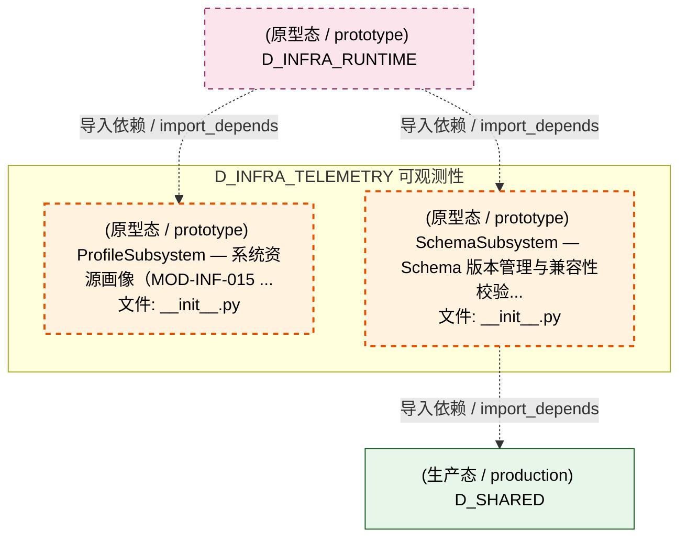
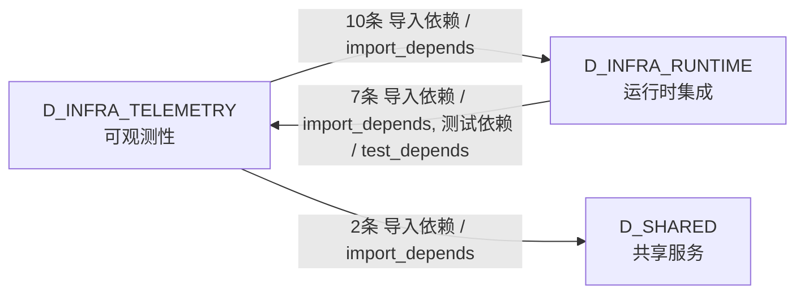

# 05_d_infra_telemetry / observability_profiling / 可观测性 / Observability

> **功能简介 / Overview**: 可观测性，负责系统遥测采集、指标监控、链路追踪、日志结构和健康检查

> **文档作用 / Purpose**: 展示 可观测性（D_INFRA_TELEMETRY）功能域的模块清单、域内依赖关系、跨域依赖关系、架构分层视图，供架构审查和域治理参考。

> 本文档由 generate_domain_doc.py 从 depgraph (PostgreSQL) 自动生成
> 最后更新: 2026-07-16 00:30:09
> 数据源: depgraph (PostgreSQL) nodes表 + edges表

## 域基本信息 / Domain Overview

| 字段 | 值 | Field | Value |
|------|------|-------|-------|
| 编号 | 05 | Number | 05 |
| 域ID | D_INFRA_TELEMETRY | Domain ID | D_INFRA_TELEMETRY |
| 域名称 | 可观测性 | Domain Name | Observability |
| 层级 | L0 基础设施层 | Layer | L0 Infrastructure |
| 模块数 | 10 | Module Count | 10 |
| 域内依赖 | 8 | Internal Dependencies | 8 |
| 跨域入边 | 7 | Cross-domain Incoming | 7 |
| 跨域出边 | 12 | Cross-domain Outgoing | 12 |
| 设计态模块 | 0 | Design Modules | 0 |
| 原型态模块 | 2 | Prototype Modules | 2 |
| 生产态模块 | 8 | Production Modules | 8 |
| 容量 | 8/150 (正常) | Capacity | 8/150 (正常) |
| 描述 | 系统遥测采集(system_telemetry) | Description | 系统遥测采集(system_telemetry) |

## 模块分层清单 / Module Layered List

> 按 architecture_layer 分组的模块清单（共 10 个模块 / 10 modules）。

### L0 基础设施层 / Infrastructure Layer (10 modules)

| # | 模块路径 / Module Path | 模块名称 / Module Name (功能简介 / Description) | 成熟度 / Maturity | 蓝图 / Blueprint |
|:--:|---------|---------|:---:|:---:|
| 1 | src/zephyr/infrastructure/system_telemetry/__init__.py | system-telemetry — 系统遥测模块（MOD-INF-015 v... | 生产态 / production | [MOD-INF-015](../../03_modules/_domain_infrastructure_operations/system_telemetry/blueprint.md) |
| 2 | src/zephyr/infrastructure/system_telemetry/ai_behavior/__... | 遥测 · ai_behavior — AI 行为遥测（7维度 + Err... | 生产态 / production | [MOD-INF-015](../../03_modules/_domain_infrastructure_operations/system_telemetry/blueprint.md) |
| 3 | src/zephyr/infrastructure/system_telemetry/alerts/__init_... | AlertSubsystem — 告警规则评估引擎（MOD-INF-015... | 生产态 / production | [MOD-INF-015](../../03_modules/_domain_infrastructure_operations/system_telemetry/blueprint.md) |
| 4 | src/zephyr/infrastructure/system_telemetry/archive/__init... | 遥测 · archive — 冷存储归档管道（TTL + gzip +... | 生产态 / production | [MOD-INF-015](../../03_modules/_domain_infrastructure_operations/system_telemetry/blueprint.md) |
| 5 | src/zephyr/infrastructure/system_telemetry/health/__init_... | health subsystem — 模块健康注册与 LifecycleMan... | 生产态 / production | [MOD-INF-015](../../03_modules/_domain_infrastructure_operations/system_telemetry/blueprint.md) |
| 6 | src/zephyr/infrastructure/system_telemetry/logs/__init__.py | logs — 结构化日志流（structlog + JSONL + trace... | 生产态 / production | [MOD-INF-015](../../03_modules/_domain_infrastructure_operations/system_telemetry/blueprint.md) |
| 7 | src/zephyr/infrastructure/system_telemetry/metrics/__init... | 遥测 · metrics — SLI/SLO 与业务指标流 | 生产态 / production | [MOD-INF-015](../../03_modules/_domain_infrastructure_operations/system_telemetry/blueprint.md) |
| 8 | src/zephyr/infrastructure/system_telemetry/profiles/__ini... | ProfileSubsystem — 系统资源画像（MOD-INF-015 ... | 原型态 / prototype | [MOD-INF-015](../../03_modules/_domain_infrastructure_operations/system_telemetry/blueprint.md) |
| 9 | src/zephyr/infrastructure/system_telemetry/schema/__init_... | SchemaSubsystem — Schema 版本管理与兼容性校验... | 原型态 / prototype | [MOD-INF-015](../../03_modules/_domain_infrastructure_operations/system_telemetry/blueprint.md) |
| 10 | src/zephyr/infrastructure/system_telemetry/traces/__init_... | 遥测 · traces — 分布式链路追踪（W3C TraceContext） | 生产态 / production | [MOD-INF-015](../../03_modules/_domain_infrastructure_operations/system_telemetry/blueprint.md) |

## 域内依赖图 / Internal Dependency Diagram

> 依赖图内嵌在本文档中，IDE 可直接渲染显示。参考 decision_index.md 设计，分四个视图：合并全景图、运营态子图、设计态子图、原型态子图（按 design_maturity 实际值拆分）。
>
> **图例说明 / Legend**：
> - **实线边框 = 运营态模块**（production，已上线运行）
> - **虚线边框 = 设计态模块**（design，蓝图阶段，代码未写）
> - **虚线边框 = 原型态模块**（prototype，代码已写，验证中未稳定上线）
> - **实线箭头 = 运营态依赖**（已生效的依赖关系）
> - **虚线箭头 = 非运营态依赖**（计划中/验证中的依赖关系）

### 合并全景图（全部模块，标签标注成熟度）

> 展示全部 10 个模块（生产态 8 + 设计态 0 + 原型态 2），标签标注成熟度。

```mermaid
graph TD
    subgraph D_INFRA_TELEMETRY["D_INFRA_TELEMETRY 可观测性"]
        src_zephyr_infrastructure_system_telemetry_init_py["(生产态 / production) system-telemetry — 系统遥测模块（MOD-INF-015 v...<br/>文件: __init__.py"]
        src_zephyr_infrastructure_system_telemetry_ai_behavior_init_py["(生产态 / production) 遥测 · ai_behavior — AI 行为遥测（7维度 + Err...<br/>文件: __init__.py"]
        src_zephyr_infrastructure_system_telemetry_alerts_init_py["(生产态 / production) AlertSubsystem — 告警规则评估引擎（MOD-INF-015...<br/>文件: __init__.py"]
        src_zephyr_infrastructure_system_telemetry_archive_init_py["(生产态 / production) 遥测 · archive — 冷存储归档管道（TTL + gzip +...<br/>文件: __init__.py"]
        src_zephyr_infrastructure_system_telemetry_health_init_py["(生产态 / production) health subsystem — 模块健康注册与 LifecycleMan...<br/>文件: __init__.py"]
        src_zephyr_infrastructure_system_telemetry_logs_init_py["(生产态 / production) logs — 结构化日志流（structlog + JSONL + trace...<br/>文件: __init__.py"]
        src_zephyr_infrastructure_system_telemetry_metrics_init_py["(生产态 / production) 遥测 · metrics — SLI/SLO 与业务指标流<br/>文件: __init__.py"]
        src_zephyr_infrastructure_system_telemetry_profiles_init_py["(原型态 / prototype) ProfileSubsystem — 系统资源画像（MOD-INF-015 ...<br/>文件: __init__.py"]
        src_zephyr_infrastructure_system_telemetry_schema_init_py["(原型态 / prototype) SchemaSubsystem — Schema 版本管理与兼容性校验...<br/>文件: __init__.py"]
        src_zephyr_infrastructure_system_telemetry_traces_init_py["(生产态 / production) 遥测 · traces — 分布式链路追踪（W3C TraceContext）<br/>文件: __init__.py"]
    end
    src_zephyr_infrastructure_system_telemetry_init_py -->|导入依赖 / import_depends| src_zephyr_infrastructure_system_telemetry_alerts_init_py
    src_zephyr_infrastructure_system_telemetry_init_py -->|导入依赖 / import_depends| src_zephyr_infrastructure_system_telemetry_ai_behavior_init_py
    src_zephyr_infrastructure_system_telemetry_init_py -->|导入依赖 / import_depends| src_zephyr_infrastructure_system_telemetry_archive_init_py
    src_zephyr_infrastructure_system_telemetry_init_py -->|导入依赖 / import_depends| src_zephyr_infrastructure_system_telemetry_health_init_py
    src_zephyr_infrastructure_system_telemetry_init_py -->|导入依赖 / import_depends| src_zephyr_infrastructure_system_telemetry_logs_init_py
    src_zephyr_infrastructure_system_telemetry_init_py -.->|导入依赖 / import_depends| src_zephyr_infrastructure_system_telemetry_profiles_init_py
    src_zephyr_infrastructure_system_telemetry_init_py -.->|导入依赖 / import_depends| src_zephyr_infrastructure_system_telemetry_schema_init_py
    src_zephyr_infrastructure_system_telemetry_init_py -->|导入依赖 / import_depends| src_zephyr_infrastructure_system_telemetry_traces_init_py
    D_INFRA_RUNTIME["(原型态 / prototype) D_INFRA_RUNTIME"]
    src_zephyr_infrastructure_system_telemetry_logs_init_py -.->|导入依赖 / import_depends| D_INFRA_RUNTIME
    src_zephyr_infrastructure_system_telemetry_init_py -->|导入依赖 / import_depends| D_INFRA_RUNTIME
    src_zephyr_infrastructure_system_telemetry_traces_init_py -.->|导入依赖 / import_depends| D_INFRA_RUNTIME
    src_zephyr_infrastructure_system_telemetry_init_py -->|导入依赖 / import_depends| D_INFRA_RUNTIME
    src_zephyr_infrastructure_system_telemetry_archive_init_py -.->|导入依赖 / import_depends| D_INFRA_RUNTIME
    src_zephyr_infrastructure_system_telemetry_init_py -->|导入依赖 / import_depends| D_INFRA_RUNTIME
    D_SHARED["(生产态 / production) D_SHARED"]
    src_zephyr_infrastructure_system_telemetry_schema_init_py -.->|导入依赖 / import_depends| D_SHARED
    src_zephyr_infrastructure_system_telemetry_ai_behavior_init_py -.->|导入依赖 / import_depends| D_INFRA_RUNTIME
    src_zephyr_infrastructure_system_telemetry_init_py -.->|导入依赖 / import_depends| D_INFRA_RUNTIME
    src_zephyr_infrastructure_system_telemetry_alerts_init_py -->|导入依赖 / import_depends| D_SHARED
    src_zephyr_infrastructure_system_telemetry_init_py -.->|导入依赖 / import_depends| D_INFRA_RUNTIME
    src_zephyr_infrastructure_system_telemetry_init_py -.->|导入依赖 / import_depends| D_INFRA_RUNTIME
    D_INFRA_RUNTIME -.->|导入依赖 / import_depends| src_zephyr_infrastructure_system_telemetry_schema_init_py
    D_INFRA_RUNTIME -.->|导入依赖 / import_depends| src_zephyr_infrastructure_system_telemetry_profiles_init_py
    D_INFRA_RUNTIME -.->|导入依赖 / import_depends| src_zephyr_infrastructure_system_telemetry_alerts_init_py
    D_INFRA_RUNTIME -->|导入依赖 / import_depends| src_zephyr_infrastructure_system_telemetry_metrics_init_py
    D_INFRA_RUNTIME -.->|测试依赖 / test_depends| src_zephyr_infrastructure_system_telemetry_health_init_py
    D_INFRA_RUNTIME -.->|导入依赖 / import_depends| src_zephyr_infrastructure_system_telemetry_health_init_py
    D_INFRA_RUNTIME -.->|导入依赖 / import_depends| src_zephyr_infrastructure_system_telemetry_archive_init_py
    classDef production fill:#e1f5fe,stroke:#01579b,stroke-width:2px,color:#000
    classDef design fill:#fff3e0,stroke:#e65100,stroke-width:2px,color:#000,stroke-dasharray: 5 5
    classDef external_prod fill:#e8f5e9,stroke:#1b5e20,stroke-width:1px,color:#000
    classDef external_design fill:#fce4ec,stroke:#880e4f,stroke-width:1px,color:#000,stroke-dasharray: 5 5
    class src_zephyr_infrastructure_system_telemetry_init_py,src_zephyr_infrastructure_system_telemetry_ai_behavior_init_py,src_zephyr_infrastructure_system_telemetry_alerts_init_py,src_zephyr_infrastructure_system_telemetry_archive_init_py,src_zephyr_infrastructure_system_telemetry_health_init_py,src_zephyr_infrastructure_system_telemetry_logs_init_py,src_zephyr_infrastructure_system_telemetry_metrics_init_py,src_zephyr_infrastructure_system_telemetry_traces_init_py production
    class src_zephyr_infrastructure_system_telemetry_profiles_init_py,src_zephyr_infrastructure_system_telemetry_schema_init_py design
    class D_SHARED external_prod
    class D_INFRA_RUNTIME external_design
```

### 运营态子图（仅 design_maturity=production 的模块和依赖）

> 仅展示已上线运行的模块（共 8 个，6 条域内依赖）。

```mermaid
graph TD
    subgraph D_INFRA_TELEMETRY["D_INFRA_TELEMETRY 可观测性"]
        src_zephyr_infrastructure_system_telemetry_init_py["(生产态 / production) system-telemetry — 系统遥测模块（MOD-INF-015 v...<br/>文件: __init__.py"]
        src_zephyr_infrastructure_system_telemetry_ai_behavior_init_py["(生产态 / production) 遥测 · ai_behavior — AI 行为遥测（7维度 + Err...<br/>文件: __init__.py"]
        src_zephyr_infrastructure_system_telemetry_alerts_init_py["(生产态 / production) AlertSubsystem — 告警规则评估引擎（MOD-INF-015...<br/>文件: __init__.py"]
        src_zephyr_infrastructure_system_telemetry_archive_init_py["(生产态 / production) 遥测 · archive — 冷存储归档管道（TTL + gzip +...<br/>文件: __init__.py"]
        src_zephyr_infrastructure_system_telemetry_health_init_py["(生产态 / production) health subsystem — 模块健康注册与 LifecycleMan...<br/>文件: __init__.py"]
        src_zephyr_infrastructure_system_telemetry_logs_init_py["(生产态 / production) logs — 结构化日志流（structlog + JSONL + trace...<br/>文件: __init__.py"]
        src_zephyr_infrastructure_system_telemetry_metrics_init_py["(生产态 / production) 遥测 · metrics — SLI/SLO 与业务指标流<br/>文件: __init__.py"]
        src_zephyr_infrastructure_system_telemetry_traces_init_py["(生产态 / production) 遥测 · traces — 分布式链路追踪（W3C TraceContext）<br/>文件: __init__.py"]
    end
    src_zephyr_infrastructure_system_telemetry_init_py -->|导入依赖 / import_depends| src_zephyr_infrastructure_system_telemetry_alerts_init_py
    src_zephyr_infrastructure_system_telemetry_init_py -->|导入依赖 / import_depends| src_zephyr_infrastructure_system_telemetry_ai_behavior_init_py
    src_zephyr_infrastructure_system_telemetry_init_py -->|导入依赖 / import_depends| src_zephyr_infrastructure_system_telemetry_archive_init_py
    src_zephyr_infrastructure_system_telemetry_init_py -->|导入依赖 / import_depends| src_zephyr_infrastructure_system_telemetry_health_init_py
    src_zephyr_infrastructure_system_telemetry_init_py -->|导入依赖 / import_depends| src_zephyr_infrastructure_system_telemetry_logs_init_py
    src_zephyr_infrastructure_system_telemetry_init_py -->|导入依赖 / import_depends| src_zephyr_infrastructure_system_telemetry_traces_init_py
    D_INFRA_RUNTIME["(原型态 / prototype) D_INFRA_RUNTIME"]
    src_zephyr_infrastructure_system_telemetry_logs_init_py -.->|导入依赖 / import_depends| D_INFRA_RUNTIME
    src_zephyr_infrastructure_system_telemetry_init_py -->|导入依赖 / import_depends| D_INFRA_RUNTIME
    src_zephyr_infrastructure_system_telemetry_traces_init_py -.->|导入依赖 / import_depends| D_INFRA_RUNTIME
    src_zephyr_infrastructure_system_telemetry_init_py -->|导入依赖 / import_depends| D_INFRA_RUNTIME
    src_zephyr_infrastructure_system_telemetry_archive_init_py -.->|导入依赖 / import_depends| D_INFRA_RUNTIME
    src_zephyr_infrastructure_system_telemetry_init_py -->|导入依赖 / import_depends| D_INFRA_RUNTIME
    src_zephyr_infrastructure_system_telemetry_ai_behavior_init_py -.->|导入依赖 / import_depends| D_INFRA_RUNTIME
    src_zephyr_infrastructure_system_telemetry_init_py -.->|导入依赖 / import_depends| D_INFRA_RUNTIME
    D_SHARED["(生产态 / production) D_SHARED"]
    src_zephyr_infrastructure_system_telemetry_alerts_init_py -->|导入依赖 / import_depends| D_SHARED
    src_zephyr_infrastructure_system_telemetry_init_py -.->|导入依赖 / import_depends| D_INFRA_RUNTIME
    src_zephyr_infrastructure_system_telemetry_init_py -.->|导入依赖 / import_depends| D_INFRA_RUNTIME
    D_INFRA_RUNTIME -.->|导入依赖 / import_depends| src_zephyr_infrastructure_system_telemetry_alerts_init_py
    D_INFRA_RUNTIME -->|导入依赖 / import_depends| src_zephyr_infrastructure_system_telemetry_metrics_init_py
    D_INFRA_RUNTIME -.->|测试依赖 / test_depends| src_zephyr_infrastructure_system_telemetry_health_init_py
    D_INFRA_RUNTIME -.->|导入依赖 / import_depends| src_zephyr_infrastructure_system_telemetry_health_init_py
    D_INFRA_RUNTIME -.->|导入依赖 / import_depends| src_zephyr_infrastructure_system_telemetry_archive_init_py
    classDef production fill:#e1f5fe,stroke:#01579b,stroke-width:2px,color:#000
    classDef design fill:#fff3e0,stroke:#e65100,stroke-width:2px,color:#000,stroke-dasharray: 5 5
    classDef external_prod fill:#e8f5e9,stroke:#1b5e20,stroke-width:1px,color:#000
    classDef external_design fill:#fce4ec,stroke:#880e4f,stroke-width:1px,color:#000,stroke-dasharray: 5 5
    class src_zephyr_infrastructure_system_telemetry_init_py,src_zephyr_infrastructure_system_telemetry_ai_behavior_init_py,src_zephyr_infrastructure_system_telemetry_alerts_init_py,src_zephyr_infrastructure_system_telemetry_archive_init_py,src_zephyr_infrastructure_system_telemetry_health_init_py,src_zephyr_infrastructure_system_telemetry_logs_init_py,src_zephyr_infrastructure_system_telemetry_metrics_init_py,src_zephyr_infrastructure_system_telemetry_traces_init_py production
    class D_SHARED external_prod
    class D_INFRA_RUNTIME external_design
```

### 设计态子图（仅 design_maturity=design 的模块和依赖）

> 仅展示蓝图阶段、代码未写的设计态模块（共 0 个，0 条域内依赖）。

> （无设计态模块 / No design modules）

### 原型态子图（仅 design_maturity=prototype 的模块和依赖）

> 仅展示代码已写、验证中未稳定上线的原型态模块（共 2 个，0 条域内依赖）。

## 跨域依赖 / Cross-domain Dependencies

### 本域依赖的其他域（出边）/ Depends On

| # | 本域模块 / Source Module | → | 外部域-目标模块 / Target Module | 依赖类型 / Type |
|:--:|---------|:--:|---------|---------|
| 1 | system-telemetry — 系统遥测模块（MOD-INF-015 v... | → | D_INFRA_RUNTIME 运行时集成: auto_bootstrap — 全自动遥测注入钩子（MOD-INF-0... | 导入依赖 / import_depends |
| 2 | system-telemetry — 系统遥测模块（MOD-INF-015 v... | → | D_INFRA_RUNTIME 运行时集成: ZephyrAlpha — system-telemetry/contract_metric... | 导入依赖 / import_depends |
| 3 | system-telemetry — 系统遥测模块（MOD-INF-015 v... | → | D_INFRA_RUNTIME 运行时集成: Telemetry — 系统遥测门面类（MOD-INF-015 v2.1.0... | 导入依赖 / import_depends |
| 4 | system-telemetry — 系统遥测模块（MOD-INF-015 v... | → | D_INFRA_RUNTIME 运行时集成: 三态健康探针协议（Health Probes — CT-HEALTH-00... | 导入依赖 / import_depends |
| 5 | system-telemetry — 系统遥测模块（MOD-INF-015 v... | → | D_INFRA_RUNTIME 运行时集成: TELE->FLE 指标桥接 — emit_metrics() 生产者 (me... | 导入依赖 / import_depends |
| 6 | system-telemetry — 系统遥测模块（MOD-INF-015 v... | → | D_INFRA_RUNTIME 运行时集成: 三冗余 Watchdog（CT-WATCHDOG-001）——互检+Pani... | 导入依赖 / import_depends |
| 7 | 遥测 · ai_behavior — AI 行为遥测（7维度 + Err... | → | D_INFRA_RUNTIME 运行时集成: 遥测 · ai_behavior/event_sink — AI 行为遥测事... | 导入依赖 / import_depends |
| 8 | 遥测 · archive — 冷存储归档管道（TTL + gzip +... | → | D_INFRA_RUNTIME 运行时集成: 遥测 · archive/cold_stub — 冷存储归档管道。 (... | 导入依赖 / import_depends |
| 9 | logs — 结构化日志流（structlog + JSONL + trace... | → | D_INFRA_RUNTIME 运行时集成: logs/structured_sink — 结构化日志管道（D_SYSTE... | 导入依赖 / import_depends |
| 10 | 遥测 · traces — 分布式链路追踪（W3C TraceCont... | → | D_INFRA_RUNTIME 运行时集成: 遥测 · traces/span_stub — W3C TraceContext 分... | 导入依赖 / import_depends |
| 11 | AlertSubsystem — 告警规则评估引擎（MOD-INF-015... | → | D_SHARED 共享服务: paths.py — 项目路径常量 SSoT（Single Source of... | 导入依赖 / import_depends |
| 12 | SchemaSubsystem — Schema 版本管理与兼容性校验.... | → | D_SHARED 共享服务: paths.py — 项目路径常量 SSoT（Single Source of... | 导入依赖 / import_depends |

### 依赖本域的其他域（入边）/ Depended By

| # | 外部域-源模块 / Source Module | → | 本域模块 / Target Module | 依赖类型 / Type |
|:--:|---------|:--:|---------|---------|
| 1 | D_INFRA_RUNTIME 运行时集成: auto_bootstrap — 全自动遥测注入钩子（MOD-INF-0... | → | 遥测 · metrics — SLI/SLO 与业务指标流 (__init... | 导入依赖 / import_depends |
| 2 | D_INFRA_RUNTIME 运行时集成: Telemetry — 系统遥测门面类（MOD-INF-015 v2.1.0... | → | AlertSubsystem — 告警规则评估引擎（MOD-INF-015... | 导入依赖 / import_depends |
| 3 | D_INFRA_RUNTIME 运行时集成: Telemetry — 系统遥测门面类（MOD-INF-015 v2.1.0... | → | 遥测 · archive — 冷存储归档管道（TTL + gzip +... | 导入依赖 / import_depends |
| 4 | D_INFRA_RUNTIME 运行时集成: Telemetry — 系统遥测门面类（MOD-INF-015 v2.1.0... | → | health subsystem — 模块健康注册与 LifecycleMan... | 导入依赖 / import_depends |
| 5 | D_INFRA_RUNTIME 运行时集成: Telemetry — 系统遥测门面类（MOD-INF-015 v2.1.0... | → | ProfileSubsystem — 系统资源画像（MOD-INF-015 .... | 导入依赖 / import_depends |
| 6 | D_INFRA_RUNTIME 运行时集成: Telemetry — 系统遥测门面类（MOD-INF-015 v2.1.0... | → | SchemaSubsystem — Schema 版本管理与兼容性校验.... | 导入依赖 / import_depends |
| 7 | D_INFRA_RUNTIME 运行时集成: test_observability_health.py | → | health subsystem — 模块健康注册与 LifecycleMan... | 测试依赖 / test_depends |

### 跨域依赖图 / Cross-domain Dependency Diagram

> 本域与 2 个外部域直接连接（出边 12 条 + 入边 7 条 = 19 条）。只显示直接连接的域，不展开具体节点。

## 说明 / Notes

- **数据源 / Data Source**: `depgraph (PostgreSQL)` 的 `nodes`、`edges`、`domains` 表
- **生成器 / Generator**: `generate_domain_doc.py`（G2+G10 合并）
- **维护方式 / Maintenance**: 自动生成，全景图更新时刷新
- **文件名规则 / File Naming**: `{编号:02d}_{域ID小写}.md`，如 `16_d_trading.md`
- **图例说明 / Legend**: `[production]`=已上线 / `[design]`=设计中 / `[prototype]`=原型 / `[unknown]`=未知
