# 05_d_infra_telemetry / observability_profiling / 可观测性 / Observability

> **功能简介 / Overview**: 可观测性，负责系统遥测采集、指标监控、链路追踪、日志结构和健康检查

> **文档作用 / Purpose**: 展示 可观测性（D_INFRA_TELEMETRY）功能域的模块清单、域内依赖关系、跨域依赖关系、架构分层视图，供架构审查和域治理参考。

> 本文档由 generate_domain_doc.py 从 depgraph (PostgreSQL) 自动生成
> 最后更新: 2026-07-09 01:42:06
> 数据源: depgraph (PostgreSQL) nodes表 + edges表

## 域基本信息 / Domain Overview

| 字段 | 值 | Field | Value |
|------|------|-------|-------|
| 编号 | 05 | Number | 05 |
| 域ID | D_INFRA_TELEMETRY | Domain ID | D_INFRA_TELEMETRY |
| 域名称 | 可观测性 | Domain Name | Observability |
| 层级 | L0 基础设施层 | Layer | L0 Infrastructure |
| 模块数 | 25 | Module Count | 25 |
| 域内依赖 | 36 | Internal Dependencies | 36 |
| 跨域入边 | 11 | Cross-domain Incoming | 11 |
| 跨域出边 | 23 | Cross-domain Outgoing | 23 |
| 设计态模块 | 0 | Design Modules | 0 |
| 原型态模块 | 12 | Prototype Modules | 12 |
| 生产态模块 | 13 | Production Modules | 13 |
| 容量 | 13/150 (正常) | Capacity | 13/150 (正常) |
| 描述 | 系统遥测采集(system_telemetry) | Description | 系统遥测采集(system_telemetry) |

## 域内依赖图 / Internal Dependency Diagram

> 依赖图内嵌在本文档中，IDE 可直接渲染显示。每30个节点一组分页显示。
>
> **图例说明 / Legend**：
> - **实线边框 = 运营态模块**（production，已上线运行）
> - **虚线边框 = 设计态模块**（design，还在设计中）
> - **实线箭头 = 运营态依赖**（已生效的依赖关系）
> - **虚线箭头 = 设计态依赖**（计划中的依赖关系）

```mermaid
graph TD
    subgraph D_INFRA_TELEMETRY["D_INFRA_TELEMETRY 可观测性"]
        src_zephyr_infrastructure_system_telemetry_init_py["(生产态 / production) system-telemetry — 系统遥测模块（MOD-INF-015 v...<br/>文件: __init__.py"]
        src_zephyr_infrastructure_system_telemetry_budget_telemetry_bridge_py["(原型态 / prototype) _budget_telemetry_bridge.py"]
        src_zephyr_infrastructure_system_telemetry_trace_bridge_py["(原型态 / prototype) _trace_bridge.py"]
        src_zephyr_infrastructure_system_telemetry_ai_behavior_init_py["(生产态 / production) 遥测 · ai_behavior — AI 行为遥测（7维度 + Err...<br/>文件: __init__.py"]
        src_zephyr_infrastructure_system_telemetry_ai_behavior_event_sink_py["(原型态 / prototype) 遥测 · ai_behavior/event_sink — AI 行为遥测事...<br/>文件: event_sink.py"]
        src_zephyr_infrastructure_system_telemetry_alerts_init_py["(生产态 / production) AlertSubsystem — 告警规则评估引擎（MOD-INF-015...<br/>文件: __init__.py"]
        src_zephyr_infrastructure_system_telemetry_archive_init_py["(生产态 / production) 遥测 · archive — 冷存储归档管道（TTL + gzip +...<br/>文件: __init__.py"]
        src_zephyr_infrastructure_system_telemetry_archive_cold_stub_py["(原型态 / prototype) 遥测 · archive/cold_stub — 冷存储归档管道。<br/>文件: cold_stub.py"]
        src_zephyr_infrastructure_system_telemetry_auto_bootstrap_py["(生产态 / production) auto_bootstrap — 全自动遥测注入钩子（MOD-INF-0...<br/>文件: auto_bootstrap.py"]
        src_zephyr_infrastructure_system_telemetry_contract_metrics_py["(生产态 / production) ZephyrAlpha — system-telemetry/contract_metrics.py<br/>文件: contract_metrics.py"]
        src_zephyr_infrastructure_system_telemetry_facade_py["(原型态 / prototype) Telemetry — 系统遥测门面类（MOD-INF-015 v2.1.0）<br/>文件: facade.py"]
        src_zephyr_infrastructure_system_telemetry_health_init_py["(生产态 / production) health subsystem — 模块健康注册与 LifecycleMan...<br/>文件: __init__.py"]
        src_zephyr_infrastructure_system_telemetry_health_aggregator_py["(生产态 / production) 健康聚合器（Health Aggregator）<br/>文件: health_aggregator.py"]
        src_zephyr_infrastructure_system_telemetry_health_probes_py["(生产态 / production) 三态健康探针协议（Health Probes — CT-HEALTH-001）<br/>文件: health_probes.py"]
        src_zephyr_infrastructure_system_telemetry_logs_init_py["(生产态 / production) logs — 结构化日志流（structlog + JSONL + trace...<br/>文件: __init__.py"]
        src_zephyr_infrastructure_system_telemetry_logs_structured_sink_py["(原型态 / prototype) logs/structured_sink — 结构化日志管道（D_SYSTE...<br/>文件: structured_sink.py"]
        src_zephyr_infrastructure_system_telemetry_metrics_init_py["(生产态 / production) 遥测 · metrics — SLI/SLO 与业务指标流<br/>文件: __init__.py"]
        src_zephyr_infrastructure_system_telemetry_metrics_blueprint_metrics_py["(原型态 / prototype) blueprint_metrics — 蓝图使用追踪 instrumentation<br/>文件: blueprint_metrics.py"]
        src_zephyr_infrastructure_system_telemetry_metrics_bridge_py["(原型态 / prototype) TELE->FLE 指标桥接 — emit_metrics() 生产者<br/>文件: metrics_bridge.py"]
        src_zephyr_infrastructure_system_telemetry_otel_instrumentation_py["(生产态 / production) otel_instrumentation.py — 全链路 OTel (B12, DD...<br/>文件: otel_instrumentation.py"]
        src_zephyr_infrastructure_system_telemetry_profiles_init_py["(原型态 / prototype) ProfileSubsystem — 系统资源画像（MOD-INF-015 ...<br/>文件: __init__.py"]
        src_zephyr_infrastructure_system_telemetry_schema_init_py["(原型态 / prototype) SchemaSubsystem — Schema 版本管理与兼容性校验...<br/>文件: __init__.py"]
        src_zephyr_infrastructure_system_telemetry_traces_init_py["(生产态 / production) 遥测 · traces — 分布式链路追踪（W3C TraceContext）<br/>文件: __init__.py"]
        src_zephyr_infrastructure_system_telemetry_traces_span_stub_py["(原型态 / prototype) 遥测 · traces/span_stub — W3C TraceContext 分...<br/>文件: span_stub.py"]
        src_zephyr_infrastructure_system_telemetry_watchdog_py["(原型态 / prototype) 三冗余 Watchdog（CT-WATCHDOG-001）——互检+Pani...<br/>文件: watchdog.py"]
    end
    src_zephyr_infrastructure_system_telemetry_auto_bootstrap_py -->|导入依赖 / import_depends| src_zephyr_infrastructure_system_telemetry_contract_metrics_py
    src_zephyr_infrastructure_system_telemetry_auto_bootstrap_py -.->|导入依赖 / import_depends| src_zephyr_infrastructure_system_telemetry_facade_py
    src_zephyr_infrastructure_system_telemetry_auto_bootstrap_py -.->|导入依赖 / import_depends| src_zephyr_infrastructure_system_telemetry_budget_telemetry_bridge_py
    src_zephyr_infrastructure_system_telemetry_auto_bootstrap_py -->|导入依赖 / import_depends| src_zephyr_infrastructure_system_telemetry_metrics_init_py
    src_zephyr_infrastructure_system_telemetry_facade_py -.->|导入依赖 / import_depends| src_zephyr_infrastructure_system_telemetry_health_aggregator_py
    src_zephyr_infrastructure_system_telemetry_facade_py -.->|导入依赖 / import_depends| src_zephyr_infrastructure_system_telemetry_watchdog_py
    src_zephyr_infrastructure_system_telemetry_facade_py -.->|导入依赖 / import_depends| src_zephyr_infrastructure_system_telemetry_archive_cold_stub_py
    src_zephyr_infrastructure_system_telemetry_facade_py -.->|导入依赖 / import_depends| src_zephyr_infrastructure_system_telemetry_ai_behavior_event_sink_py
    src_zephyr_infrastructure_system_telemetry_facade_py -.->|导入依赖 / import_depends| src_zephyr_infrastructure_system_telemetry_archive_init_py
    src_zephyr_infrastructure_system_telemetry_facade_py -.->|导入依赖 / import_depends| src_zephyr_infrastructure_system_telemetry_health_init_py
    src_zephyr_infrastructure_system_telemetry_facade_py -.->|导入依赖 / import_depends| src_zephyr_infrastructure_system_telemetry_alerts_init_py
    src_zephyr_infrastructure_system_telemetry_facade_py -.->|导入依赖 / import_depends| src_zephyr_infrastructure_system_telemetry_profiles_init_py
    src_zephyr_infrastructure_system_telemetry_facade_py -.->|导入依赖 / import_depends| src_zephyr_infrastructure_system_telemetry_traces_span_stub_py
    src_zephyr_infrastructure_system_telemetry_facade_py -.->|导入依赖 / import_depends| src_zephyr_infrastructure_system_telemetry_schema_init_py
    src_zephyr_infrastructure_system_telemetry_health_aggregator_py -->|导入依赖 / import_depends| src_zephyr_infrastructure_system_telemetry_health_probes_py
    src_zephyr_infrastructure_system_telemetry_init_py -->|导入依赖 / import_depends| src_zephyr_infrastructure_system_telemetry_contract_metrics_py
    src_zephyr_infrastructure_system_telemetry_init_py -->|导入依赖 / import_depends| src_zephyr_infrastructure_system_telemetry_auto_bootstrap_py
    src_zephyr_infrastructure_system_telemetry_init_py -->|导入依赖 / import_depends| src_zephyr_infrastructure_system_telemetry_health_probes_py
    src_zephyr_infrastructure_system_telemetry_init_py -.->|导入依赖 / import_depends| src_zephyr_infrastructure_system_telemetry_facade_py
    src_zephyr_infrastructure_system_telemetry_init_py -.->|导入依赖 / import_depends| src_zephyr_infrastructure_system_telemetry_metrics_bridge_py
    src_zephyr_infrastructure_system_telemetry_init_py -.->|导入依赖 / import_depends| src_zephyr_infrastructure_system_telemetry_watchdog_py
    src_zephyr_infrastructure_system_telemetry_init_py -->|导入依赖 / import_depends| src_zephyr_infrastructure_system_telemetry_ai_behavior_init_py
    src_zephyr_infrastructure_system_telemetry_init_py -->|导入依赖 / import_depends| src_zephyr_infrastructure_system_telemetry_archive_init_py
    src_zephyr_infrastructure_system_telemetry_init_py -->|导入依赖 / import_depends| src_zephyr_infrastructure_system_telemetry_health_init_py
    src_zephyr_infrastructure_system_telemetry_init_py -->|导入依赖 / import_depends| src_zephyr_infrastructure_system_telemetry_alerts_init_py
    src_zephyr_infrastructure_system_telemetry_init_py -->|导入依赖 / import_depends| src_zephyr_infrastructure_system_telemetry_logs_init_py
    src_zephyr_infrastructure_system_telemetry_init_py -.->|导入依赖 / import_depends| src_zephyr_infrastructure_system_telemetry_profiles_init_py
    src_zephyr_infrastructure_system_telemetry_init_py -->|导入依赖 / import_depends| src_zephyr_infrastructure_system_telemetry_traces_init_py
    src_zephyr_infrastructure_system_telemetry_init_py -.->|导入依赖 / import_depends| src_zephyr_infrastructure_system_telemetry_schema_init_py
    src_zephyr_infrastructure_system_telemetry_ai_behavior_init_py -.->|导入依赖 / import_depends| src_zephyr_infrastructure_system_telemetry_ai_behavior_event_sink_py
    src_zephyr_infrastructure_system_telemetry_ai_behavior_event_sink_py -.->|导入依赖 / import_depends| src_zephyr_infrastructure_system_telemetry_logs_structured_sink_py
    src_zephyr_infrastructure_system_telemetry_archive_init_py -.->|导入依赖 / import_depends| src_zephyr_infrastructure_system_telemetry_archive_cold_stub_py
    src_zephyr_infrastructure_system_telemetry_logs_structured_sink_py -.->|导入依赖 / import_depends| src_zephyr_infrastructure_system_telemetry_trace_bridge_py
    src_zephyr_infrastructure_system_telemetry_logs_init_py -.->|导入依赖 / import_depends| src_zephyr_infrastructure_system_telemetry_logs_structured_sink_py
    src_zephyr_infrastructure_system_telemetry_traces_init_py -.->|导入依赖 / import_depends| src_zephyr_infrastructure_system_telemetry_traces_span_stub_py
    src_zephyr_infrastructure_system_telemetry_traces_span_stub_py -.->|导入依赖 / import_depends| src_zephyr_infrastructure_system_telemetry_trace_bridge_py
    D_GOVERNANCE["(生产态 / production) D_GOVERNANCE"]
    src_zephyr_infrastructure_system_telemetry_contract_metrics_py -->|导入依赖 / import_depends| D_GOVERNANCE
    D_SHARED["(生产态 / production) D_SHARED"]
    src_zephyr_infrastructure_system_telemetry_auto_bootstrap_py -->|导入依赖 / import_depends| D_SHARED
    src_zephyr_infrastructure_system_telemetry_health_probes_py -->|导入依赖 / import_depends| D_SHARED
    src_zephyr_infrastructure_system_telemetry_facade_py -.->|导入依赖 / import_depends| D_SHARED
    src_zephyr_infrastructure_system_telemetry_facade_py -.->|导入依赖 / import_depends| D_SHARED
    src_zephyr_infrastructure_system_telemetry_health_aggregator_py -->|导入依赖 / import_depends| D_SHARED
    src_zephyr_infrastructure_system_telemetry_watchdog_py -.->|导入依赖 / import_depends| D_SHARED
    src_zephyr_infrastructure_system_telemetry_archive_cold_stub_py -.->|导入依赖 / import_depends| D_SHARED
    src_zephyr_infrastructure_system_telemetry_health_init_py -.->|data / data| D_GOVERNANCE
    src_zephyr_infrastructure_system_telemetry_health_init_py -.->|runtime / runtime| D_GOVERNANCE
    src_zephyr_infrastructure_system_telemetry_health_init_py -.->|runtime / runtime| D_GOVERNANCE
    D_AUDITTEST["(原型态 / prototype) D_AUDITTEST"]
    src_zephyr_infrastructure_system_telemetry_health_init_py -.->|contract / contract| D_AUDITTEST
    src_zephyr_infrastructure_system_telemetry_health_init_py -.->|contract / contract| D_GOVERNANCE
    D_SECURITY_LLM["(原型态 / prototype) D_SECURITY_LLM"]
    src_zephyr_infrastructure_system_telemetry_health_init_py -.->|runtime / runtime| D_SECURITY_LLM
    D_INFRA_RUNTIME["(原型态 / prototype) D_INFRA_RUNTIME"]
    src_zephyr_infrastructure_system_telemetry_health_init_py -.->|runtime / runtime| D_INFRA_RUNTIME
    D_INFRA_RUNTIME -.->|导入依赖 / import_depends| src_zephyr_infrastructure_system_telemetry_auto_bootstrap_py
    D_INFRA_RUNTIME -.->|导入依赖 / import_depends| src_zephyr_infrastructure_system_telemetry_facade_py
    D_INTEGRATION_GATEWAY["(生产态 / production) D_INTEGRATION_GATEWAY"]
    D_INTEGRATION_GATEWAY -.->|导入依赖 / import_depends| src_zephyr_infrastructure_system_telemetry_facade_py
    D_TRADING["(生产态 / production) D_TRADING"]
    D_TRADING -->|导入依赖 / import_depends| src_zephyr_infrastructure_system_telemetry_health_aggregator_py
    D_TRADING -.->|导入依赖 / import_depends| src_zephyr_infrastructure_system_telemetry_metrics_bridge_py
    D_TRADING -.->|导入依赖 / import_depends| src_zephyr_infrastructure_system_telemetry_metrics_bridge_py
    D_GOV_SCRIPTS["(原型态 / prototype) D_GOV_SCRIPTS"]
    D_GOV_SCRIPTS -.->|导入依赖 / import_depends| src_zephyr_infrastructure_system_telemetry_metrics_blueprint_metrics_py
    D_AUDITTEST -.->|测试依赖 / test_depends| src_zephyr_infrastructure_system_telemetry_otel_instrumentation_py
    D_AUDITTEST -.->|测试依赖 / test_depends| src_zephyr_infrastructure_system_telemetry_health_init_py
    D_GOVERNANCE -.->|runtime / runtime| src_zephyr_infrastructure_system_telemetry_health_init_py
    D_GOVERNANCE -.->|runtime / runtime| src_zephyr_infrastructure_system_telemetry_health_init_py
    classDef production fill:#e1f5fe,stroke:#01579b,stroke-width:2px,color:#000
    classDef design fill:#fff3e0,stroke:#e65100,stroke-width:2px,color:#000,stroke-dasharray: 5 5
    classDef external_prod fill:#e8f5e9,stroke:#1b5e20,stroke-width:1px,color:#000
    classDef external_design fill:#fce4ec,stroke:#880e4f,stroke-width:1px,color:#000,stroke-dasharray: 5 5
    class src_zephyr_infrastructure_system_telemetry_init_py,src_zephyr_infrastructure_system_telemetry_ai_behavior_init_py,src_zephyr_infrastructure_system_telemetry_alerts_init_py,src_zephyr_infrastructure_system_telemetry_archive_init_py,src_zephyr_infrastructure_system_telemetry_auto_bootstrap_py,src_zephyr_infrastructure_system_telemetry_contract_metrics_py,src_zephyr_infrastructure_system_telemetry_health_init_py,src_zephyr_infrastructure_system_telemetry_health_aggregator_py,src_zephyr_infrastructure_system_telemetry_health_probes_py,src_zephyr_infrastructure_system_telemetry_logs_init_py,src_zephyr_infrastructure_system_telemetry_metrics_init_py,src_zephyr_infrastructure_system_telemetry_otel_instrumentation_py,src_zephyr_infrastructure_system_telemetry_traces_init_py production
    class src_zephyr_infrastructure_system_telemetry_budget_telemetry_bridge_py,src_zephyr_infrastructure_system_telemetry_trace_bridge_py,src_zephyr_infrastructure_system_telemetry_ai_behavior_event_sink_py,src_zephyr_infrastructure_system_telemetry_archive_cold_stub_py,src_zephyr_infrastructure_system_telemetry_facade_py,src_zephyr_infrastructure_system_telemetry_logs_structured_sink_py,src_zephyr_infrastructure_system_telemetry_metrics_blueprint_metrics_py,src_zephyr_infrastructure_system_telemetry_metrics_bridge_py,src_zephyr_infrastructure_system_telemetry_profiles_init_py,src_zephyr_infrastructure_system_telemetry_schema_init_py,src_zephyr_infrastructure_system_telemetry_traces_span_stub_py,src_zephyr_infrastructure_system_telemetry_watchdog_py design
    class D_GOVERNANCE,D_SHARED,D_INTEGRATION_GATEWAY,D_TRADING external_prod
    class D_AUDITTEST,D_SECURITY_LLM,D_INFRA_RUNTIME,D_GOV_SCRIPTS external_design
```



## 跨域依赖 / Cross-domain Dependencies

### 本域依赖的其他域（出边）/ Depends On

| 目标域 / Target Domain | 依赖数 / Count | 依赖类型 / Type |
|--------|:---:|---------|
| D_SHARED | 10 | 导入依赖 / import_depends |
| D_GOVERNANCE | 8 | contract / contract, data / data, 导入依赖 / import_depends, runtime / runtime |
| D_AUDITTEST | 1 | contract / contract |
| D_INFRA_RUNTIME | 1 | runtime / runtime |
| D_SECURITY_LLM | 1 | runtime / runtime |
| D_GOV_ENFORCEMENT | 1 | runtime / runtime |
| D_GOV_DRIFT | 1 | runtime / runtime |

### 依赖本域的其他域（入边）/ Depended By

| 源域 / Source Domain | 依赖数 / Count | 依赖类型 / Type |
|------|:---:|---------|
| D_TRADING | 3 | 导入依赖 / import_depends |
| D_AUDITTEST | 2 | 测试依赖 / test_depends |
| D_GOVERNANCE | 2 | runtime / runtime |
| D_INFRA_RUNTIME | 2 | 导入依赖 / import_depends |
| D_GOV_SCRIPTS | 1 | 导入依赖 / import_depends |
| D_INTEGRATION_GATEWAY | 1 | 导入依赖 / import_depends |

## 架构分层视图 / Architecture Overview

> 按 architecture_layer 分层显示 可观测性（D_INFRA_TELEMETRY）的模块分布。共 25 个模块 / 25 modules。

```

┌──────────────────────────────────────────────────────────────────┐
│        L0 基础设施层 / Infrastructure Layer (25 modules)         │
├──────────────────────────────────────────────────────────────────┤
│   system-telemetry — 系统遥测模块（MOD-INF-015 v... [生产态 ...  │
│   _budget_telemetry_bridge.py [原型态 / prototype]               │
│   _trace_bridge.py [原型态 / prototype]                          │
│   遥测 · ai_behavior — AI 行为遥测（7维度 + Err... [生产态 ...   │
│   遥测 · ai_behavior/event_sink — AI 行为遥测事... [原型态 ...   │
│   AlertSubsystem — 告警规则评估引擎（MOD-INF-015... [生产态 ...  │
│   遥测 · archive — 冷存储归档管道（TTL + gzip +... [生产态 ...   │
│   遥测 · archive/cold_stub — 冷存储归档管道。 [原型态 / pro...   │
│   auto_bootstrap — 全自动遥测注入钩子（MOD-INF-0... [生产态 ...  │
│   ZephyrAlpha — system-telemetry/contract_metrics.py [生产态...  │
│   Telemetry — 系统遥测门面类（MOD-INF-015 v2.1.0） [原型态 /...  │
│   health subsystem — 模块健康注册与 LifecycleMan... [生产态 ...  │
│   健康聚合器（Health Aggregator） [生产态 / production]          │
│   三态健康探针协议（Health Probes — CT-HEALTH-001） [生产态 ...  │
│   logs — 结构化日志流（structlog + JSONL + trace... [生产态 ...  │
│   logs/structured_sink — 结构化日志管道（D_SYSTE... [原型态 ...  │
│   遥测 · metrics — SLI/SLO 与业务指标流 [生产态 / production]    │
│   blueprint_metrics — 蓝图使用追踪 instrumentation [原型态 /...  │
│   ...还有 7 个模块 / 7 more modules                              │
└──────────────────────────────────────────────────────────────────┘

```

## 模块分层清单 / Module Layered List

> 按 architecture_layer 分组的模块清单（共 25 个模块 / 25 modules）。

### L0 基础设施层 / Infrastructure Layer (25 modules)

| # | 模块路径 / Module Path | 模块名称 / Module Name | 功能简介 / Description | 成熟度 / Maturity | 构建状态 / Build Status |
|:--:|---------|---------|---------|:---:|:---:|
| 1 | src/zephyr/infrastructure/system_telemetry/__init__.py | src/zephyr/infrastructure/system_tele... | system-telemetry — 系统遥测模块（MOD-INF-015 v2.1.0）. | 生产态 / production | 已生成 / generated |
| 2 | src/zephyr/infrastructure/system_telemetry/_budget_teleme... | src/zephyr/infrastructure/system_tele... |  | 原型态 / prototype | 已生成 / generated |
| 3 | src/zephyr/infrastructure/system_telemetry/_trace_bridge.py | src/zephyr/infrastructure/system_tele... |  | 原型态 / prototype | 已生成 / generated |
| 4 | src/zephyr/infrastructure/system_telemetry/ai_behavior/__... | src/zephyr/infrastructure/system_tele... | 遥测 · ai_behavior — AI 行为遥测（7维度 + Error Taxonomy） | 生产态 / production | 已生成 / generated |
| 5 | src/zephyr/infrastructure/system_telemetry/ai_behavior/ev... | src/zephyr/infrastructure/system_tele... | 遥测 · ai_behavior/event_sink — AI 行为遥测事件管道。 | 原型态 / prototype | 已生成 / generated |
| 6 | src/zephyr/infrastructure/system_telemetry/alerts/__init_... | src/zephyr/infrastructure/system_tele... | AlertSubsystem — 告警规则评估引擎（MOD-INF-015 §9 · alerts）. | 生产态 / production | 已生成 / generated |
| 7 | src/zephyr/infrastructure/system_telemetry/archive/__init... | src/zephyr/infrastructure/system_tele... | 遥测 · archive — 冷存储归档管道（TTL + gzip + backup + 成本降级） | 生产态 / production | 已生成 / generated |
| 8 | src/zephyr/infrastructure/system_telemetry/archive/cold_s... | src/zephyr/infrastructure/system_tele... | 遥测 · archive/cold_stub — 冷存储归档管道。 | 原型态 / prototype | 已生成 / generated |
| 9 | src/zephyr/infrastructure/system_telemetry/auto_bootstrap.py | src/zephyr/infrastructure/system_tele... | auto_bootstrap — 全自动遥测注入钩子（MOD-INF-015 v2.1.0） | 生产态 / production | 已生成 / generated |
| 10 | src/zephyr/infrastructure/system_telemetry/contract_metri... | src/zephyr/infrastructure/system_tele... | ZephyrAlpha — system-telemetry/contract_metrics.py | 生产态 / production | 已生成 / generated |
| 11 | src/zephyr/infrastructure/system_telemetry/facade.py | src/zephyr/infrastructure/system_tele... | Telemetry — 系统遥测门面类（MOD-INF-015 v2.1.0） | 原型态 / prototype | 已生成 / generated |
| 12 | src/zephyr/infrastructure/system_telemetry/health/__init_... | src/zephyr/infrastructure/system_tele... | health subsystem — 模块健康注册与 LifecycleManager 对接. | 生产态 / production | 已生成 / generated |
| 13 | src/zephyr/infrastructure/system_telemetry/health_aggrega... | src/zephyr/infrastructure/system_tele... | 健康聚合器（Health Aggregator） | 生产态 / production | 已生成 / generated |
| 14 | src/zephyr/infrastructure/system_telemetry/health_probes.py | src/zephyr/infrastructure/system_tele... | 三态健康探针协议（Health Probes — CT-HEALTH-001） | 生产态 / production | 已生成 / generated |
| 15 | src/zephyr/infrastructure/system_telemetry/logs/__init__.py | src/zephyr/infrastructure/system_tele... | logs — 结构化日志流（structlog + JSONL + trace注入）（D_SYSTEM_TELEMETRY） | 生产态 / production | 已生成 / generated |
| 16 | src/zephyr/infrastructure/system_telemetry/logs/structure... | src/zephyr/infrastructure/system_tele... | logs/structured_sink — 结构化日志管道（D_SYSTEM_TELEMETRY）。 | 原型态 / prototype | 已生成 / generated |
| 17 | src/zephyr/infrastructure/system_telemetry/metrics/__init... | src/zephyr/infrastructure/system_tele... | 遥测 · metrics — SLI/SLO 与业务指标流 | 生产态 / production | 已生成 / generated |
| 18 | src/zephyr/infrastructure/system_telemetry/metrics/bluepr... | src/zephyr/infrastructure/system_tele... | blueprint_metrics — 蓝图使用追踪 instrumentation | 原型态 / prototype | 已生成 / generated |
| 19 | src/zephyr/infrastructure/system_telemetry/metrics_bridge.py | src/zephyr/infrastructure/system_tele... | TELE->FLE 指标桥接 — emit_metrics() 生产者 | 原型态 / prototype | 已生成 / generated |
| 20 | src/zephyr/infrastructure/system_telemetry/otel_instrumen... | src/zephyr/infrastructure/system_tele... | otel_instrumentation.py — 全链路 OTel (B12, DD86, TASK-015 beta v) | 生产态 / production | 已生成 / generated |
| 21 | src/zephyr/infrastructure/system_telemetry/profiles/__ini... | src/zephyr/infrastructure/system_tele... | ProfileSubsystem — 系统资源画像（MOD-INF-015 §6 · profiles）. | 原型态 / prototype | 已生成 / generated |
| 22 | src/zephyr/infrastructure/system_telemetry/schema/__init_... | src/zephyr/infrastructure/system_tele... | SchemaSubsystem — Schema 版本管理与兼容性校验（MOD-INF-015 §5.1 · schema）. | 原型态 / prototype | 已生成 / generated |
| 23 | src/zephyr/infrastructure/system_telemetry/traces/__init_... | src/zephyr/infrastructure/system_tele... | 遥测 · traces — 分布式链路追踪（W3C TraceContext） | 生产态 / production | 已生成 / generated |
| 24 | src/zephyr/infrastructure/system_telemetry/traces/span_st... | src/zephyr/infrastructure/system_tele... | 遥测 · traces/span_stub — W3C TraceContext 分布式追踪管道。 | 原型态 / prototype | 已生成 / generated |
| 25 | src/zephyr/infrastructure/system_telemetry/watchdog.py | src/zephyr/infrastructure/system_tele... | 三冗余 Watchdog（CT-WATCHDOG-001）——互检+Panic Mode+Dead Man's Switch。 | 原型态 / prototype | 已生成 / generated |

## 依赖关系图 / Dependency Graph

> 域内模块依赖关系（共 36 条 / 36 edges）。按依赖类型分组，使用 → 表示方向。

```

┌──────────────────────────────────────────────────────────────────┐
│       依赖关系图 / Dependency Graph (共 36 条 / 36 edges)        │
├──────────────────────────────────────────────────────────────────┤
│   依赖类型数 / Dependency Types: 1                               │
│   [导入依赖 / import_depends]: 36 条 / edges                     │
└──────────────────────────────────────────────────────────────────┘

┌──────────────────────────────────────────────────────────────────┐
│           [导入依赖 / import_depends] (36 条 / edges)            │
├──────────────────────────────────────────────────────────────────┤
│   auto_bootstrap.py → contract_metrics.py                        │
│   auto_bootstrap.py → facade.py                                  │
│   auto_bootstrap.py → _budget_telemetry_bridge.py                │
│   auto_bootstrap.py → __init__.py                                │
│   facade.py → health_aggregator.py                               │
│   facade.py → watchdog.py                                        │
│   facade.py → cold_stub.py                                       │
│   facade.py → event_sink.py                                      │
│   facade.py → __init__.py                                        │
│   facade.py → __init__.py                                        │
│   facade.py → __init__.py                                        │
│   facade.py → __init__.py                                        │
│   facade.py → span_stub.py                                       │
│   facade.py → __init__.py                                        │
│   health_aggregator.py → health_probes.py                        │
│   __init__.py → contract_metrics.py                              │
│   __init__.py → auto_bootstrap.py                                │
│   __init__.py → health_probes.py                                 │
│   __init__.py → facade.py                                        │
│   __init__.py → metrics_bridge.py                                │
│   __init__.py → watchdog.py                                      │
│   __init__.py → __init__.py                                      │
│   __init__.py → __init__.py                                      │
│   __init__.py → __init__.py                                      │
│   __init__.py → __init__.py                                      │
│   __init__.py → __init__.py                                      │
│   __init__.py → __init__.py                                      │
│   __init__.py → __init__.py                                      │
│   __init__.py → __init__.py                                      │
│   __init__.py → event_sink.py                                    │
│   event_sink.py → structured_sink.py                             │
│   __init__.py → cold_stub.py                                     │
│   structured_sink.py → _trace_bridge.py                          │
│   __init__.py → structured_sink.py                               │
│   __init__.py → span_stub.py                                     │
│   span_stub.py → _trace_bridge.py                                │
└──────────────────────────────────────────────────────────────────┘

```

## 说明 / Notes

- **数据源 / Data Source**: `depgraph (PostgreSQL)` 的 `nodes`、`edges`、`domains` 表
- **生成器 / Generator**: `generate_domain_doc.py`（G2+G10 合并）
- **维护方式 / Maintenance**: 自动生成，全景图更新时刷新
- **文件名规则 / File Naming**: `{编号:02d}_{域ID小写}.md`，如 `16_d_trading.md`
- **图例说明 / Legend**: `[production]`=已上线 / `[design]`=设计中 / `[prototype]`=原型 / `[unknown]`=未知
