# 05_d_infra_telemetry / observability_profiling

> **文档作用 / Purpose**: 展示 observability_profiling（D_INFRA_TELEMETRY）功能域的模块清单、域内依赖关系、跨域依赖关系、架构分层视图，供架构审查和域治理参考。

> 本文档由 generate_domain_doc.py 从 depgraph (PostgreSQL) 自动生成
> 最后更新: 2026-07-06 13:18:28
> 数据源: depgraph (PostgreSQL) nodes表 + edges表

## 域基本信息 / Domain Overview

| 字段 | 值 | Field | Value |
|------|------|-------|-------|
| 编号 | 05 | Number | 05 |
| 域ID | D_INFRA_TELEMETRY | Domain ID | D_INFRA_TELEMETRY |
| 域名称 | observability_profiling | Domain Name | observability_profiling |
| 层级 | L0_infrastructure | Layer | L0_infrastructure |
| 模块数 | 25 | Module Count | 25 |
| 域内依赖 | 36 | Internal Dependencies | 36 |
| 跨域入边 | 8 | Cross-domain Incoming | 8 |
| 跨域出边 | 7 | Cross-domain Outgoing | 7 |
| 设计态模块 | 0 | Design Modules | 0 |
| 原型态模块 | 12 | Prototype Modules | 12 |
| 生产态模块 | 13 | Production Modules | 13 |
| 容量 | 13/150 (正常) | Capacity | 13/150 (正常) |
| 描述 | 系统遥测采集(system_telemetry) | Description | 系统遥测采集(system_telemetry) |

## 域内依赖图 / Internal Dependency Diagram

> 依赖图内嵌在本文档中，IDE 可直接渲染显示。每30个节点一组分页显示。
>
> **图例说明 / Legend**：
> - **实线边框 = 运营态模块**（production，已上线运行）
> - **虚线边框 = 设计态模块**（design，还在设计中）
> - **实线箭头 = 运营态依赖**（已生效的依赖关系）
> - **虚线箭头 = 设计态依赖**（计划中的依赖关系）

```mermaid
graph TD
    subgraph D_INFRA_TELEMETRY["D_INFRA_TELEMETRY observability_profiling"]
        src_zephyr_infrastructure_system_telemetry_init_py["src/zephyr/infrastructure/system_telemetry/__in... production"]
        src_zephyr_infrastructure_system_telemetry_budget_telemetry_bridge_py["src/zephyr/infrastructure/system_telemetry/_bud... prototype"]
        src_zephyr_infrastructure_system_telemetry_trace_bridge_py["src/zephyr/infrastructure/system_telemetry/_tra... prototype"]
        src_zephyr_infrastructure_system_telemetry_ai_behavior_init_py["src/zephyr/infrastructure/system_telemetry/ai_b... production"]
        src_zephyr_infrastructure_system_telemetry_ai_behavior_event_sink_py["src/zephyr/infrastructure/system_telemetry/ai_b... prototype"]
        src_zephyr_infrastructure_system_telemetry_alerts_init_py["src/zephyr/infrastructure/system_telemetry/aler... production"]
        src_zephyr_infrastructure_system_telemetry_archive_init_py["src/zephyr/infrastructure/system_telemetry/arch... production"]
        src_zephyr_infrastructure_system_telemetry_archive_cold_stub_py["src/zephyr/infrastructure/system_telemetry/arch... prototype"]
        src_zephyr_infrastructure_system_telemetry_auto_bootstrap_py["src/zephyr/infrastructure/system_telemetry/auto... production"]
        src_zephyr_infrastructure_system_telemetry_contract_metrics_py["src/zephyr/infrastructure/system_telemetry/cont... production"]
        src_zephyr_infrastructure_system_telemetry_facade_py["src/zephyr/infrastructure/system_telemetry/faca... prototype"]
        src_zephyr_infrastructure_system_telemetry_health_init_py["src/zephyr/infrastructure/system_telemetry/heal... production"]
        src_zephyr_infrastructure_system_telemetry_health_aggregator_py["src/zephyr/infrastructure/system_telemetry/heal... production"]
        src_zephyr_infrastructure_system_telemetry_health_probes_py["src/zephyr/infrastructure/system_telemetry/heal... production"]
        src_zephyr_infrastructure_system_telemetry_logs_init_py["src/zephyr/infrastructure/system_telemetry/logs... production"]
        src_zephyr_infrastructure_system_telemetry_logs_structured_sink_py["src/zephyr/infrastructure/system_telemetry/logs... prototype"]
        src_zephyr_infrastructure_system_telemetry_metrics_init_py["src/zephyr/infrastructure/system_telemetry/metr... production"]
        src_zephyr_infrastructure_system_telemetry_metrics_blueprint_metrics_py["src/zephyr/infrastructure/system_telemetry/metr... prototype"]
        src_zephyr_infrastructure_system_telemetry_metrics_bridge_py["src/zephyr/infrastructure/system_telemetry/metr... prototype"]
        src_zephyr_infrastructure_system_telemetry_otel_instrumentation_py["src/zephyr/infrastructure/system_telemetry/otel... production"]
        src_zephyr_infrastructure_system_telemetry_profiles_init_py["src/zephyr/infrastructure/system_telemetry/prof... prototype"]
        src_zephyr_infrastructure_system_telemetry_schema_init_py["src/zephyr/infrastructure/system_telemetry/sche... prototype"]
        src_zephyr_infrastructure_system_telemetry_traces_init_py["src/zephyr/infrastructure/system_telemetry/trac... production"]
        src_zephyr_infrastructure_system_telemetry_traces_span_stub_py["src/zephyr/infrastructure/system_telemetry/trac... prototype"]
        src_zephyr_infrastructure_system_telemetry_watchdog_py["src/zephyr/infrastructure/system_telemetry/watc... prototype"]
    end
    src_zephyr_infrastructure_system_telemetry_health_aggregator_py -->|import_depends| src_zephyr_infrastructure_system_telemetry_health_probes_py
    src_zephyr_infrastructure_system_telemetry_facade_py -.->|import_depends| src_zephyr_infrastructure_system_telemetry_health_aggregator_py
    src_zephyr_infrastructure_system_telemetry_facade_py -.->|import_depends| src_zephyr_infrastructure_system_telemetry_ai_behavior_event_sink_py
    src_zephyr_infrastructure_system_telemetry_facade_py -.->|import_depends| src_zephyr_infrastructure_system_telemetry_archive_cold_stub_py
    src_zephyr_infrastructure_system_telemetry_facade_py -.->|import_depends| src_zephyr_infrastructure_system_telemetry_alerts_init_py
    src_zephyr_infrastructure_system_telemetry_facade_py -.->|import_depends| src_zephyr_infrastructure_system_telemetry_health_init_py
    src_zephyr_infrastructure_system_telemetry_facade_py -.->|import_depends| src_zephyr_infrastructure_system_telemetry_watchdog_py
    src_zephyr_infrastructure_system_telemetry_facade_py -.->|import_depends| src_zephyr_infrastructure_system_telemetry_archive_init_py
    src_zephyr_infrastructure_system_telemetry_facade_py -.->|import_depends| src_zephyr_infrastructure_system_telemetry_profiles_init_py
    src_zephyr_infrastructure_system_telemetry_facade_py -.->|import_depends| src_zephyr_infrastructure_system_telemetry_traces_span_stub_py
    src_zephyr_infrastructure_system_telemetry_facade_py -.->|import_depends| src_zephyr_infrastructure_system_telemetry_schema_init_py
    src_zephyr_infrastructure_system_telemetry_auto_bootstrap_py -.->|import_depends| src_zephyr_infrastructure_system_telemetry_facade_py
    src_zephyr_infrastructure_system_telemetry_auto_bootstrap_py -->|import_depends| src_zephyr_infrastructure_system_telemetry_contract_metrics_py
    src_zephyr_infrastructure_system_telemetry_auto_bootstrap_py -.->|import_depends| src_zephyr_infrastructure_system_telemetry_budget_telemetry_bridge_py
    src_zephyr_infrastructure_system_telemetry_auto_bootstrap_py -->|import_depends| src_zephyr_infrastructure_system_telemetry_metrics_init_py
    src_zephyr_infrastructure_system_telemetry_ai_behavior_event_sink_py -.->|import_depends| src_zephyr_infrastructure_system_telemetry_logs_structured_sink_py
    src_zephyr_infrastructure_system_telemetry_ai_behavior_init_py -.->|import_depends| src_zephyr_infrastructure_system_telemetry_ai_behavior_event_sink_py
    src_zephyr_infrastructure_system_telemetry_init_py -->|import_depends| src_zephyr_infrastructure_system_telemetry_health_probes_py
    src_zephyr_infrastructure_system_telemetry_init_py -.->|import_depends| src_zephyr_infrastructure_system_telemetry_facade_py
    src_zephyr_infrastructure_system_telemetry_init_py -->|import_depends| src_zephyr_infrastructure_system_telemetry_auto_bootstrap_py
    src_zephyr_infrastructure_system_telemetry_init_py -.->|import_depends| src_zephyr_infrastructure_system_telemetry_metrics_bridge_py
    src_zephyr_infrastructure_system_telemetry_init_py -->|import_depends| src_zephyr_infrastructure_system_telemetry_contract_metrics_py
    src_zephyr_infrastructure_system_telemetry_init_py -->|import_depends| src_zephyr_infrastructure_system_telemetry_ai_behavior_init_py
    src_zephyr_infrastructure_system_telemetry_init_py -->|import_depends| src_zephyr_infrastructure_system_telemetry_alerts_init_py
    src_zephyr_infrastructure_system_telemetry_init_py -->|import_depends| src_zephyr_infrastructure_system_telemetry_health_init_py
    src_zephyr_infrastructure_system_telemetry_init_py -.->|import_depends| src_zephyr_infrastructure_system_telemetry_watchdog_py
    src_zephyr_infrastructure_system_telemetry_init_py -->|import_depends| src_zephyr_infrastructure_system_telemetry_archive_init_py
    src_zephyr_infrastructure_system_telemetry_init_py -.->|import_depends| src_zephyr_infrastructure_system_telemetry_profiles_init_py
    src_zephyr_infrastructure_system_telemetry_init_py -->|import_depends| src_zephyr_infrastructure_system_telemetry_logs_init_py
    src_zephyr_infrastructure_system_telemetry_init_py -->|import_depends| src_zephyr_infrastructure_system_telemetry_traces_init_py
    src_zephyr_infrastructure_system_telemetry_init_py -.->|import_depends| src_zephyr_infrastructure_system_telemetry_schema_init_py
    src_zephyr_infrastructure_system_telemetry_archive_init_py -.->|import_depends| src_zephyr_infrastructure_system_telemetry_archive_cold_stub_py
    src_zephyr_infrastructure_system_telemetry_logs_init_py -.->|import_depends| src_zephyr_infrastructure_system_telemetry_logs_structured_sink_py
    src_zephyr_infrastructure_system_telemetry_traces_init_py -.->|import_depends| src_zephyr_infrastructure_system_telemetry_traces_span_stub_py
    src_zephyr_infrastructure_system_telemetry_logs_structured_sink_py -.->|import_depends| src_zephyr_infrastructure_system_telemetry_trace_bridge_py
    src_zephyr_infrastructure_system_telemetry_traces_span_stub_py -.->|import_depends| src_zephyr_infrastructure_system_telemetry_trace_bridge_py
    D_SHARED["D_SHARED production"]
    src_zephyr_infrastructure_system_telemetry_health_probes_py -->|import_depends| D_SHARED
    src_zephyr_infrastructure_system_telemetry_facade_py -.->|import_depends| D_SHARED
    D_GOVERNANCE["D_GOVERNANCE production"]
    src_zephyr_infrastructure_system_telemetry_contract_metrics_py -->|import_depends| D_GOVERNANCE
    src_zephyr_infrastructure_system_telemetry_archive_cold_stub_py -.->|import_depends| D_SHARED
    src_zephyr_infrastructure_system_telemetry_alerts_init_py -->|import_depends| D_SHARED
    src_zephyr_infrastructure_system_telemetry_metrics_blueprint_metrics_py -.->|import_depends| D_SHARED
    src_zephyr_infrastructure_system_telemetry_schema_init_py -.->|import_depends| D_SHARED
    D_INFRA_RUNTIME["D_INFRA_RUNTIME prototype"]
    D_INFRA_RUNTIME -.->|import_depends| src_zephyr_infrastructure_system_telemetry_auto_bootstrap_py
    D_INFRA_RUNTIME -.->|import_depends| src_zephyr_infrastructure_system_telemetry_facade_py
    D_INTEGRATION_GATEWAY["D_INTEGRATION_GATEWAY prototype"]
    D_INTEGRATION_GATEWAY -.->|import_depends| src_zephyr_infrastructure_system_telemetry_facade_py
    D_TRADING["D_TRADING prototype"]
    D_TRADING -.->|import_depends| src_zephyr_infrastructure_system_telemetry_metrics_bridge_py
    D_TRADING -.->|import_depends| src_zephyr_infrastructure_system_telemetry_metrics_bridge_py
    D_GOV_SCRIPTS["D_GOV_SCRIPTS prototype"]
    D_GOV_SCRIPTS -.->|import_depends| src_zephyr_infrastructure_system_telemetry_metrics_blueprint_metrics_py
    D_AUDITTEST["D_AUDITTEST prototype"]
    D_AUDITTEST -.->|test_depends| src_zephyr_infrastructure_system_telemetry_otel_instrumentation_py
    D_AUDITTEST -.->|test_depends| src_zephyr_infrastructure_system_telemetry_health_init_py
    classDef production fill:#e1f5fe,stroke:#01579b,stroke-width:2px,color:#000
    classDef design fill:#fff3e0,stroke:#e65100,stroke-width:2px,color:#000,stroke-dasharray: 5 5
    classDef external_prod fill:#e8f5e9,stroke:#1b5e20,stroke-width:1px,color:#000
    classDef external_design fill:#fce4ec,stroke:#880e4f,stroke-width:1px,color:#000,stroke-dasharray: 5 5
    class src_zephyr_infrastructure_system_telemetry_init_py,src_zephyr_infrastructure_system_telemetry_ai_behavior_init_py,src_zephyr_infrastructure_system_telemetry_alerts_init_py,src_zephyr_infrastructure_system_telemetry_archive_init_py,src_zephyr_infrastructure_system_telemetry_auto_bootstrap_py,src_zephyr_infrastructure_system_telemetry_contract_metrics_py,src_zephyr_infrastructure_system_telemetry_health_init_py,src_zephyr_infrastructure_system_telemetry_health_aggregator_py,src_zephyr_infrastructure_system_telemetry_health_probes_py,src_zephyr_infrastructure_system_telemetry_logs_init_py,src_zephyr_infrastructure_system_telemetry_metrics_init_py,src_zephyr_infrastructure_system_telemetry_otel_instrumentation_py,src_zephyr_infrastructure_system_telemetry_traces_init_py production
    class src_zephyr_infrastructure_system_telemetry_budget_telemetry_bridge_py,src_zephyr_infrastructure_system_telemetry_trace_bridge_py,src_zephyr_infrastructure_system_telemetry_ai_behavior_event_sink_py,src_zephyr_infrastructure_system_telemetry_archive_cold_stub_py,src_zephyr_infrastructure_system_telemetry_facade_py,src_zephyr_infrastructure_system_telemetry_logs_structured_sink_py,src_zephyr_infrastructure_system_telemetry_metrics_blueprint_metrics_py,src_zephyr_infrastructure_system_telemetry_metrics_bridge_py,src_zephyr_infrastructure_system_telemetry_profiles_init_py,src_zephyr_infrastructure_system_telemetry_schema_init_py,src_zephyr_infrastructure_system_telemetry_traces_span_stub_py,src_zephyr_infrastructure_system_telemetry_watchdog_py design
    class D_SHARED,D_GOVERNANCE external_prod
    class D_INFRA_RUNTIME,D_INTEGRATION_GATEWAY,D_TRADING,D_GOV_SCRIPTS,D_AUDITTEST external_design
```



## 跨域依赖 / Cross-domain Dependencies

### 本域依赖的其他域（出边）/ Depends On

| 目标域 / Target Domain | 依赖数 / Count | 依赖类型 / Type |
|--------|:---:|---------|
| D_SHARED | 6 | import_depends |
| D_GOVERNANCE | 1 | import_depends |

### 依赖本域的其他域（入边）/ Depended By

| 源域 / Source Domain | 依赖数 / Count | 依赖类型 / Type |
|------|:---:|---------|
| D_AUDITTEST | 2 | test_depends |
| D_INFRA_RUNTIME | 2 | import_depends |
| D_TRADING | 2 | import_depends |
| D_GOV_SCRIPTS | 1 | import_depends |
| D_INTEGRATION_GATEWAY | 1 | import_depends |

## 架构分层视图 / Architecture Overview

> 按 architecture_layer 分层显示 observability_profiling（D_INFRA_TELEMETRY）的模块分布。共 25 个模块 / 25 modules。

```

┌──────────────────────────────────────────────────────────────────┐
│        L0 基础设施层 / Infrastructure Layer (25 modules)         │
├──────────────────────────────────────────────────────────────────┤
│   src/zephyr/infrastructure/system_telemetry/__init__.py  [pr... │
│   src/zephyr/infrastructure/system_telemetry/_budget_telemetr... │
│   src/zephyr/infrastructure/system_telemetry/_trace_bridge.py... │
│   src/zephyr/infrastructure/system_telemetry/ai_behavior/__in... │
│   src/zephyr/infrastructure/system_telemetry/ai_behavior/even... │
│   src/zephyr/infrastructure/system_telemetry/alerts/__init__.... │
│   src/zephyr/infrastructure/system_telemetry/archive/__init__... │
│   src/zephyr/infrastructure/system_telemetry/archive/cold_stu... │
│   src/zephyr/infrastructure/system_telemetry/auto_bootstrap.p... │
│   src/zephyr/infrastructure/system_telemetry/contract_metrics... │
│   src/zephyr/infrastructure/system_telemetry/facade.py  [prot... │
│   src/zephyr/infrastructure/system_telemetry/health/__init__.... │
│   src/zephyr/infrastructure/system_telemetry/health_aggregato... │
│   src/zephyr/infrastructure/system_telemetry/health_probes.py... │
│   src/zephyr/infrastructure/system_telemetry/logs/__init__.py... │
│   src/zephyr/infrastructure/system_telemetry/logs/structured_... │
│   src/zephyr/infrastructure/system_telemetry/metrics/__init__... │
│   src/zephyr/infrastructure/system_telemetry/metrics/blueprin... │
│   ...还有 7 个模块 / 7 more modules                              │
└──────────────────────────────────────────────────────────────────┘

```

## 模块分层清单 / Module Layered List

> 按 architecture_layer 分组的模块清单（共 25 个模块 / 25 modules）。

### L0 基础设施层 / Infrastructure Layer (25 modules)

| # | 模块路径 / Module Path | 模块名称 / Module Name | 成熟度 / Maturity | 构建状态 / Build Status |
|:--:|---------|---------|:---:|:---:|
| 1 | src/zephyr/infrastructure/system_telemetry/__init__.py | src/zephyr/infrastructure/system_tele... | production | generated |
| 2 | src/zephyr/infrastructure/system_telemetry/_budget_teleme... | src/zephyr/infrastructure/system_tele... | prototype | generated |
| 3 | src/zephyr/infrastructure/system_telemetry/_trace_bridge.py | src/zephyr/infrastructure/system_tele... | prototype | generated |
| 4 | src/zephyr/infrastructure/system_telemetry/ai_behavior/__... | src/zephyr/infrastructure/system_tele... | production | generated |
| 5 | src/zephyr/infrastructure/system_telemetry/ai_behavior/ev... | src/zephyr/infrastructure/system_tele... | prototype | generated |
| 6 | src/zephyr/infrastructure/system_telemetry/alerts/__init_... | src/zephyr/infrastructure/system_tele... | production | generated |
| 7 | src/zephyr/infrastructure/system_telemetry/archive/__init... | src/zephyr/infrastructure/system_tele... | production | generated |
| 8 | src/zephyr/infrastructure/system_telemetry/archive/cold_s... | src/zephyr/infrastructure/system_tele... | prototype | generated |
| 9 | src/zephyr/infrastructure/system_telemetry/auto_bootstrap.py | src/zephyr/infrastructure/system_tele... | production | generated |
| 10 | src/zephyr/infrastructure/system_telemetry/contract_metri... | src/zephyr/infrastructure/system_tele... | production | generated |
| 11 | src/zephyr/infrastructure/system_telemetry/facade.py | src/zephyr/infrastructure/system_tele... | prototype | generated |
| 12 | src/zephyr/infrastructure/system_telemetry/health/__init_... | src/zephyr/infrastructure/system_tele... | production | generated |
| 13 | src/zephyr/infrastructure/system_telemetry/health_aggrega... | src/zephyr/infrastructure/system_tele... | production | generated |
| 14 | src/zephyr/infrastructure/system_telemetry/health_probes.py | src/zephyr/infrastructure/system_tele... | production | generated |
| 15 | src/zephyr/infrastructure/system_telemetry/logs/__init__.py | src/zephyr/infrastructure/system_tele... | production | generated |
| 16 | src/zephyr/infrastructure/system_telemetry/logs/structure... | src/zephyr/infrastructure/system_tele... | prototype | generated |
| 17 | src/zephyr/infrastructure/system_telemetry/metrics/__init... | src/zephyr/infrastructure/system_tele... | production | generated |
| 18 | src/zephyr/infrastructure/system_telemetry/metrics/bluepr... | src/zephyr/infrastructure/system_tele... | prototype | generated |
| 19 | src/zephyr/infrastructure/system_telemetry/metrics_bridge.py | src/zephyr/infrastructure/system_tele... | prototype | generated |
| 20 | src/zephyr/infrastructure/system_telemetry/otel_instrumen... | src/zephyr/infrastructure/system_tele... | production | generated |
| 21 | src/zephyr/infrastructure/system_telemetry/profiles/__ini... | src/zephyr/infrastructure/system_tele... | prototype | generated |
| 22 | src/zephyr/infrastructure/system_telemetry/schema/__init_... | src/zephyr/infrastructure/system_tele... | prototype | generated |
| 23 | src/zephyr/infrastructure/system_telemetry/traces/__init_... | src/zephyr/infrastructure/system_tele... | production | generated |
| 24 | src/zephyr/infrastructure/system_telemetry/traces/span_st... | src/zephyr/infrastructure/system_tele... | prototype | generated |
| 25 | src/zephyr/infrastructure/system_telemetry/watchdog.py | src/zephyr/infrastructure/system_tele... | prototype | generated |

## 依赖关系图 / Dependency Graph

> 域内模块依赖关系（共 36 条 / 36 edges）。按依赖类型分组，使用 → 表示方向。

```

┌──────────────────────────────────────────────────────────────────┐
│       依赖关系图 / Dependency Graph (共 36 条 / 36 edges)        │
├──────────────────────────────────────────────────────────────────┤
│   依赖类型数 / Dependency Types: 1                               │
│   [import_depends]: 36 条 / edges                                │
└──────────────────────────────────────────────────────────────────┘

┌──────────────────────────────────────────────────────────────────┐
│                 [import_depends] (36 条 / edges)                 │
├──────────────────────────────────────────────────────────────────┤
│   health_aggregator.py → health_probes.py                        │
│   facade.py → health_aggregator.py                               │
│   facade.py → event_sink.py                                      │
│   facade.py → cold_stub.py                                       │
│   facade.py → __init__.py                                        │
│   facade.py → __init__.py                                        │
│   facade.py → watchdog.py                                        │
│   facade.py → __init__.py                                        │
│   facade.py → __init__.py                                        │
│   facade.py → span_stub.py                                       │
│   facade.py → __init__.py                                        │
│   auto_bootstrap.py → facade.py                                  │
│   auto_bootstrap.py → contract_metrics.py                        │
│   auto_bootstrap.py → _budget_telemetry_bridge.py                │
│   auto_bootstrap.py → __init__.py                                │
│   event_sink.py → structured_sink.py                             │
│   __init__.py → event_sink.py                                    │
│   __init__.py → health_probes.py                                 │
│   __init__.py → facade.py                                        │
│   __init__.py → auto_bootstrap.py                                │
│   __init__.py → metrics_bridge.py                                │
│   __init__.py → contract_metrics.py                              │
│   __init__.py → __init__.py                                      │
│   __init__.py → __init__.py                                      │
│   __init__.py → __init__.py                                      │
│   __init__.py → watchdog.py                                      │
│   __init__.py → __init__.py                                      │
│   __init__.py → __init__.py                                      │
│   __init__.py → __init__.py                                      │
│   __init__.py → __init__.py                                      │
│   __init__.py → __init__.py                                      │
│   __init__.py → cold_stub.py                                     │
│   __init__.py → structured_sink.py                               │
│   __init__.py → span_stub.py                                     │
│   structured_sink.py → _trace_bridge.py                          │
│   span_stub.py → _trace_bridge.py                                │
└──────────────────────────────────────────────────────────────────┘

```

## 说明 / Notes

- **数据源 / Data Source**: `depgraph (PostgreSQL)` 的 `nodes`、`edges`、`domains` 表
- **生成器 / Generator**: `generate_domain_doc.py`（G2+G10 合并）
- **维护方式 / Maintenance**: 自动生成，全景图更新时刷新
- **文件名规则 / File Naming**: `{编号:02d}_{域ID小写}.md`，如 `16_d_trading.md`
- **图例说明 / Legend**: `[production]`=已上线 / `[design]`=设计中 / `[prototype]`=原型 / `[unknown]`=未知
