# 05_d_infra_telemetry / observability_profiling

> **文档作用 / Purpose**: 展示 observability_profiling（D-INFRA_TELEMETRY）功能域的模块清单、域内依赖关系和跨域依赖关系，供架构审查和域治理参考。

> 本文档由 generate_domain_doc.py 从 depgraph.db 自动生成
> 最后更新: 2026-06-29 01:07:22
> 数据源: depgraph.db nodes表 + edges表

## 域基本信息 / Domain Overview

| 字段 | 值 | Field | Value |
|------|------|-------|-------|
| 编号 | 05 | Number | 05 |
| 域ID | D-INFRA_TELEMETRY | Domain ID | D-INFRA_TELEMETRY |
| 域名称 | observability_profiling | Domain Name | observability_profiling |
| 层级 | L0_infrastructure | Layer | L0_infrastructure |
| 模块数 | 35 | Module Count | 35 |
| 域内依赖 | 11 | Internal Dependencies | 11 |
| 跨域入边 | 0 | Cross-domain Incoming | 0 |
| 跨域出边 | 18 | Cross-domain Outgoing | 18 |
| 设计态模块 | 0 | Design Modules | 0 |
| 原型态模块 | 0 | Prototype Modules | 0 |
| 生产态模块 | 35 | Production Modules | 35 |
| 容量 | 51/150 (正常) | Capacity | 51/150 (正常) |
| 描述 | 系统遥测采集(system_telemetry) | Description | 系统遥测采集(system_telemetry) |

## 模块清单 / Module List

共 35 个模块（按路径排序，全部显示）

| 模块路径 / Module Path | 模块名称 / Module Name | 设计成熟度 / Maturity | 构建状态 / Build Status |
|---------|---------|-----------|---------|
| src/zephyr/infrastructure/model_capability_exam/__init__.py |  | production | generated |
| src/zephyr/infrastructure/model_profiler/__init__.py |  | production | generated |
| src/zephyr/infrastructure/observability/__init__.py |  | production | generated |
| src/zephyr/infrastructure/observability/__init___from_infra.py |  | production | generated |
| src/zephyr/infrastructure/observability/notifier.py |  | production | generated |
| src/zephyr/infrastructure/observability/trace_decorator.py |  | production | generated |
| src/zephyr/infrastructure/quality/__init__.py |  | production | generated |
| src/zephyr/infrastructure/quality/quality_monitor.py |  | production | generated |
| src/zephyr/infrastructure/session/__init__.py |  | production | generated |
| src/zephyr/infrastructure/sla/__init__.py |  | production | generated |
| src/zephyr/infrastructure/sla/sla_monitor.py |  | production | generated |
| src/zephyr/infrastructure/system_telemetry/__init__.py |  | production | generated |
| src/zephyr/infrastructure/system_telemetry/_budget_telemetry_bridge.py |  | production | generated |
| src/zephyr/infrastructure/system_telemetry/_trace_bridge.py |  | production | generated |
| src/zephyr/infrastructure/system_telemetry/ai_behavior/__init__.py |  | production | generated |
| src/zephyr/infrastructure/system_telemetry/ai_behavior/event_sink.py |  | production | generated |
| src/zephyr/infrastructure/system_telemetry/alerts/__init__.py |  | production | deprecated |
| src/zephyr/infrastructure/system_telemetry/archive/__init__.py |  | production | generated |
| src/zephyr/infrastructure/system_telemetry/archive/cold_stub.py |  | production | generated |
| src/zephyr/infrastructure/system_telemetry/auto_bootstrap.py |  | production | generated |
| src/zephyr/infrastructure/system_telemetry/contract_metrics.py |  | production | generated |
| src/zephyr/infrastructure/system_telemetry/facade.py |  | production | generated |
| src/zephyr/infrastructure/system_telemetry/health/__init__.py |  | production | deprecated |
| src/zephyr/infrastructure/system_telemetry/health_aggregator.py |  | production | generated |
| src/zephyr/infrastructure/system_telemetry/health_probes.py |  | production | generated |
| src/zephyr/infrastructure/system_telemetry/logs/__init__.py |  | production | generated |
| src/zephyr/infrastructure/system_telemetry/logs/structured_sink.py |  | production | generated |
| src/zephyr/infrastructure/system_telemetry/metrics/__init__.py |  | production | generated |
| src/zephyr/infrastructure/system_telemetry/metrics/blueprint_metrics.py |  | production | generated |
| src/zephyr/infrastructure/system_telemetry/metrics_bridge.py |  | production | generated |
| src/zephyr/infrastructure/system_telemetry/profiles/__init__.py |  | production | deprecated |
| src/zephyr/infrastructure/system_telemetry/schema/__init__.py |  | production | deprecated |
| src/zephyr/infrastructure/system_telemetry/traces/__init__.py |  | production | generated |
| src/zephyr/infrastructure/system_telemetry/traces/span_stub.py |  | production | generated |
| src/zephyr/infrastructure/system_telemetry/watchdog.py |  | production | generated |

## 域内依赖图 / Internal Dependency Diagram

> 依赖图内嵌在本文档中，IDE 可直接渲染显示。每30个节点一组分页显示。
>
> **图例说明 / Legend**：
> - **实线边框 = 运营态模块**（production，已上线运行）
> - **虚线边框 = 设计态模块**（design，还在设计中）
> - **实线箭头 = 运营态依赖**（已生效的依赖关系）
> - **虚线箭头 = 设计态依赖**（计划中的依赖关系）

### 第 1 页 / 共 2 页 / Page 1 of 2

```mermaid
graph TD
    subgraph D_INFRA_TELEMETRY["D-INFRA_TELEMETRY observability_profiling"]
        src_zephyr_infrastructure_model_capability_exam_init_py["src/zephyr/infrastructure/model_capability_exam... production"]
        src_zephyr_infrastructure_model_profiler_init_py["src/zephyr/infrastructure/model_profiler/__init... production"]
        src_zephyr_infrastructure_observability_init_py["src/zephyr/infrastructure/observability/__init_... production"]
        src_zephyr_infrastructure_observability_init_from_infra_py["src/zephyr/infrastructure/observability/__init_... production"]
        src_zephyr_infrastructure_observability_notifier_py["src/zephyr/infrastructure/observability/notifie... production"]
        src_zephyr_infrastructure_observability_trace_decorator_py["src/zephyr/infrastructure/observability/trace_d... production"]
        src_zephyr_infrastructure_quality_init_py["src/zephyr/infrastructure/quality/__init__.py production"]
        src_zephyr_infrastructure_quality_quality_monitor_py["src/zephyr/infrastructure/quality/quality_monit... production"]
        src_zephyr_infrastructure_session_init_py["src/zephyr/infrastructure/session/__init__.py production"]
        src_zephyr_infrastructure_sla_init_py["src/zephyr/infrastructure/sla/__init__.py production"]
        src_zephyr_infrastructure_sla_sla_monitor_py["src/zephyr/infrastructure/sla/sla_monitor.py production"]
        src_zephyr_infrastructure_system_telemetry_init_py["src/zephyr/infrastructure/system_telemetry/__in... production"]
        src_zephyr_infrastructure_system_telemetry_budget_telemetry_bridge_py["src/zephyr/infrastructure/system_telemetry/_bud... production"]
        src_zephyr_infrastructure_system_telemetry_trace_bridge_py["src/zephyr/infrastructure/system_telemetry/_tra... production"]
        src_zephyr_infrastructure_system_telemetry_ai_behavior_init_py["src/zephyr/infrastructure/system_telemetry/ai_b... production"]
        src_zephyr_infrastructure_system_telemetry_ai_behavior_event_sink_py["src/zephyr/infrastructure/system_telemetry/ai_b... production"]
        src_zephyr_infrastructure_system_telemetry_alerts_init_py["src/zephyr/infrastructure/system_telemetry/aler... production"]
        src_zephyr_infrastructure_system_telemetry_archive_init_py["src/zephyr/infrastructure/system_telemetry/arch... production"]
        src_zephyr_infrastructure_system_telemetry_archive_cold_stub_py["src/zephyr/infrastructure/system_telemetry/arch... production"]
        src_zephyr_infrastructure_system_telemetry_auto_bootstrap_py["src/zephyr/infrastructure/system_telemetry/auto... production"]
        src_zephyr_infrastructure_system_telemetry_contract_metrics_py["src/zephyr/infrastructure/system_telemetry/cont... production"]
        src_zephyr_infrastructure_system_telemetry_facade_py["src/zephyr/infrastructure/system_telemetry/faca... production"]
        src_zephyr_infrastructure_system_telemetry_health_init_py["src/zephyr/infrastructure/system_telemetry/heal... production"]
        src_zephyr_infrastructure_system_telemetry_health_aggregator_py["src/zephyr/infrastructure/system_telemetry/heal... production"]
        src_zephyr_infrastructure_system_telemetry_health_probes_py["src/zephyr/infrastructure/system_telemetry/heal... production"]
        src_zephyr_infrastructure_system_telemetry_logs_init_py["src/zephyr/infrastructure/system_telemetry/logs... production"]
        src_zephyr_infrastructure_system_telemetry_logs_structured_sink_py["src/zephyr/infrastructure/system_telemetry/logs... production"]
        src_zephyr_infrastructure_system_telemetry_metrics_init_py["src/zephyr/infrastructure/system_telemetry/metr... production"]
        src_zephyr_infrastructure_system_telemetry_metrics_blueprint_metrics_py["src/zephyr/infrastructure/system_telemetry/metr... production"]
        src_zephyr_infrastructure_system_telemetry_metrics_bridge_py["src/zephyr/infrastructure/system_telemetry/metr... production"]
    end
    src_zephyr_infrastructure_observability_init_from_infra_py -->|import_depends| src_zephyr_infrastructure_observability_notifier_py
    src_zephyr_infrastructure_observability_init_from_infra_py -->|import_depends| src_zephyr_infrastructure_observability_init_py
    src_zephyr_infrastructure_observability_init_from_infra_py -->|import_depends| src_zephyr_infrastructure_observability_trace_decorator_py
    src_zephyr_infrastructure_quality_init_py -->|import_depends| src_zephyr_infrastructure_quality_quality_monitor_py
    src_zephyr_infrastructure_sla_init_py -->|import_depends| src_zephyr_infrastructure_sla_sla_monitor_py
    src_zephyr_infrastructure_system_telemetry_trace_bridge_py -->|config_depends| src_zephyr_infrastructure_system_telemetry_init_py
    src_zephyr_infrastructure_system_telemetry_health_probes_py -->|config_depends| src_zephyr_infrastructure_system_telemetry_init_py
    src_zephyr_infrastructure_system_telemetry_budget_telemetry_bridge_py -->|config_depends| src_zephyr_infrastructure_system_telemetry_init_py
    src_zephyr_infrastructure_system_telemetry_archive_cold_stub_py -->|config_depends| src_zephyr_infrastructure_system_telemetry_archive_init_py
    src_zephyr_infrastructure_system_telemetry_metrics_blueprint_metrics_py -->|config_depends| src_zephyr_infrastructure_system_telemetry_metrics_init_py
    D_INFRA_RUNTIME["D-INFRA_RUNTIME production"]
    src_zephyr_infrastructure_session_init_py -->|import_depends| D_INFRA_RUNTIME
    D_GOVERNANCE["D-GOVERNANCE production"]
    src_zephyr_infrastructure_system_telemetry_auto_bootstrap_py -->|import_depends| D_GOVERNANCE
    D_SHARED["D-SHARED production"]
    src_zephyr_infrastructure_system_telemetry_auto_bootstrap_py -->|import_depends| D_SHARED
    src_zephyr_infrastructure_system_telemetry_auto_bootstrap_py -->|import_depends| D_INFRA_RUNTIME
    src_zephyr_infrastructure_system_telemetry_health_aggregator_py -.->|import_depends| D_SHARED
    D_OPS["D-OPS prototype"]
    src_zephyr_infrastructure_system_telemetry_health_aggregator_py -.->|import_depends| D_OPS
    src_zephyr_infrastructure_system_telemetry_health_aggregator_py -->|import_depends| D_INFRA_RUNTIME
    src_zephyr_infrastructure_system_telemetry_facade_py -->|import_depends| D_INFRA_RUNTIME
    D_BEHAVIORAL_AUDIT["D-BEHAVIORAL_AUDIT production"]
    src_zephyr_infrastructure_system_telemetry_contract_metrics_py -->|import_depends| D_BEHAVIORAL_AUDIT
    src_zephyr_infrastructure_system_telemetry_metrics_bridge_py -->|import_depends| D_SHARED
    src_zephyr_infrastructure_system_telemetry_init_py -->|import_depends| D_INFRA_RUNTIME
    src_zephyr_infrastructure_system_telemetry_ai_behavior_init_py -->|import_depends| D_INFRA_RUNTIME
    src_zephyr_infrastructure_system_telemetry_ai_behavior_event_sink_py -->|import_depends| D_INFRA_RUNTIME
    src_zephyr_infrastructure_system_telemetry_archive_init_py -->|import_depends| D_INFRA_RUNTIME
    src_zephyr_infrastructure_system_telemetry_logs_structured_sink_py -->|import_depends| D_INFRA_RUNTIME
    classDef production fill:#e1f5fe,stroke:#01579b,stroke-width:2px,color:#000
    classDef design fill:#fff3e0,stroke:#e65100,stroke-width:2px,color:#000,stroke-dasharray: 5 5
    classDef external_prod fill:#e8f5e9,stroke:#1b5e20,stroke-width:1px,color:#000
    classDef external_design fill:#fce4ec,stroke:#880e4f,stroke-width:1px,color:#000,stroke-dasharray: 5 5
    class src_zephyr_infrastructure_model_capability_exam_init_py,src_zephyr_infrastructure_model_profiler_init_py,src_zephyr_infrastructure_observability_init_py,src_zephyr_infrastructure_observability_init_from_infra_py,src_zephyr_infrastructure_observability_notifier_py,src_zephyr_infrastructure_observability_trace_decorator_py,src_zephyr_infrastructure_quality_init_py,src_zephyr_infrastructure_quality_quality_monitor_py,src_zephyr_infrastructure_session_init_py,src_zephyr_infrastructure_sla_init_py,src_zephyr_infrastructure_sla_sla_monitor_py,src_zephyr_infrastructure_system_telemetry_init_py,src_zephyr_infrastructure_system_telemetry_budget_telemetry_bridge_py,src_zephyr_infrastructure_system_telemetry_trace_bridge_py,src_zephyr_infrastructure_system_telemetry_ai_behavior_init_py,src_zephyr_infrastructure_system_telemetry_ai_behavior_event_sink_py,src_zephyr_infrastructure_system_telemetry_alerts_init_py,src_zephyr_infrastructure_system_telemetry_archive_init_py,src_zephyr_infrastructure_system_telemetry_archive_cold_stub_py,src_zephyr_infrastructure_system_telemetry_auto_bootstrap_py,src_zephyr_infrastructure_system_telemetry_contract_metrics_py,src_zephyr_infrastructure_system_telemetry_facade_py,src_zephyr_infrastructure_system_telemetry_health_init_py,src_zephyr_infrastructure_system_telemetry_health_aggregator_py,src_zephyr_infrastructure_system_telemetry_health_probes_py,src_zephyr_infrastructure_system_telemetry_logs_init_py,src_zephyr_infrastructure_system_telemetry_logs_structured_sink_py,src_zephyr_infrastructure_system_telemetry_metrics_init_py,src_zephyr_infrastructure_system_telemetry_metrics_blueprint_metrics_py,src_zephyr_infrastructure_system_telemetry_metrics_bridge_py production
    class D_INFRA_RUNTIME,D_GOVERNANCE,D_SHARED,D_BEHAVIORAL_AUDIT external_prod
    class D_OPS external_design
```

### 第 2 页 / 共 2 页 / Page 2 of 2

```mermaid
graph TD
    subgraph D_INFRA_TELEMETRY["D-INFRA_TELEMETRY observability_profiling"]
        src_zephyr_infrastructure_system_telemetry_profiles_init_py["src/zephyr/infrastructure/system_telemetry/prof... production"]
        src_zephyr_infrastructure_system_telemetry_schema_init_py["src/zephyr/infrastructure/system_telemetry/sche... production"]
        src_zephyr_infrastructure_system_telemetry_traces_init_py["src/zephyr/infrastructure/system_telemetry/trac... production"]
        src_zephyr_infrastructure_system_telemetry_traces_span_stub_py["src/zephyr/infrastructure/system_telemetry/trac... production"]
        src_zephyr_infrastructure_system_telemetry_watchdog_py["src/zephyr/infrastructure/system_telemetry/watc... production"]
    end
    D_INFRA_RUNTIME["D-INFRA_RUNTIME production"]
    src_zephyr_infrastructure_system_telemetry_traces_init_py -->|import_depends| D_INFRA_RUNTIME
    src_zephyr_infrastructure_system_telemetry_traces_span_stub_py -->|import_depends| D_INFRA_RUNTIME
    classDef production fill:#e1f5fe,stroke:#01579b,stroke-width:2px,color:#000
    classDef design fill:#fff3e0,stroke:#e65100,stroke-width:2px,color:#000,stroke-dasharray: 5 5
    classDef external_prod fill:#e8f5e9,stroke:#1b5e20,stroke-width:1px,color:#000
    classDef external_design fill:#fce4ec,stroke:#880e4f,stroke-width:1px,color:#000,stroke-dasharray: 5 5
    class src_zephyr_infrastructure_system_telemetry_profiles_init_py,src_zephyr_infrastructure_system_telemetry_schema_init_py,src_zephyr_infrastructure_system_telemetry_traces_init_py,src_zephyr_infrastructure_system_telemetry_traces_span_stub_py,src_zephyr_infrastructure_system_telemetry_watchdog_py production
    class D_INFRA_RUNTIME external_prod
```

## 跨域依赖 / Cross-domain Dependencies

### 本域依赖的其他域（出边）/ Depends On

| 目标域 / Target Domain | 依赖数 / Count | 依赖类型 / Type |
|--------|:---:|---------|
| D-INFRA_RUNTIME | 12 | import_depends |
| D-SHARED | 3 | import_depends |
| D-BEHAVIORAL_AUDIT | 1 | import_depends |
| D-GOVERNANCE | 1 | import_depends |
| D-OPS | 1 | import_depends |

### 依赖本域的其他域（入边）/ Depended By

无跨域入边依赖 / No cross-domain incoming dependencies

## 说明 / Notes

- **数据源 / Data Source**: `depgraph.db` 的 `nodes`、`edges`、`domains` 表
- **生成器 / Generator**: `generate_domain_doc.py`
- **维护方式 / Maintenance**: 自动生成，全景图更新时刷新
- **文件名规则 / File Naming**: `{编号:02d}_{域ID小写}.md`，如 `16_d_trading.md`
