# 06_d_data_gov / 数据治理

> **文档作用 / Purpose**: 展示 数据治理（D-DATA_GOV）功能域的模块清单、域内依赖关系和跨域依赖关系，供架构审查和域治理参考。

> 本文档由 generate_domain_doc.py 从 depgraph.db 自动生成
> 最后更新: 2026-06-24 23:01:53
> 数据源: depgraph.db nodes表 + edges表

## 域基本信息 / Domain Overview

| 字段 | 值 | Field | Value |
|------|------|-------|-------|
| 编号 | 06 | Number | 06 |
| 域ID | D-DATA_GOV | Domain ID | D-DATA_GOV |
| 域名称 | 数据治理 | Domain Name | 数据治理(质量+血缘+参考) |
| 层级 | L1_foundation | Layer | L1_foundation |
| 模块数 | 38 | Module Count | 38 |
| 域内依赖 | 37 | Internal Dependencies | 37 |
| 跨域入边 | 13 | Cross-domain Incoming | 13 |
| 跨域出边 | 74 | Cross-domain Outgoing | 74 |
| 设计态模块 | 38 | Design Modules | 38 |
| 原型态模块 | 0 | Prototype Modules | 0 |
| 生产态模块 | 0 | Production Modules | 0 |
| 容量 | 38/150 (正常) | Capacity | 38/150 (正常) |
| 描述 | 数据治理域。负责数据质量管理、数据血缘追踪与参考数据管理，包括数据质量门禁、血缘图谱、主数据管理、数据字典。拆分自原D-DATA域。 | Description | 数据治理域。负责数据质量管理、数据血缘追踪与参考数据管理，包括数据质量门禁、血缘图谱、主数据管理、数据字典。拆分自原D-DATA域。 |

## 模块清单 / Module List

共 38 个模块（按路径排序，全部显示）

| 模块路径 / Module Path | 模块名称 / Module Name | 设计成熟度 / Maturity | 构建状态 / Build Status |
|---------|---------|-----------|---------|
| D-DATA-GOV/AI治理血缘 AI Governance Lineage | AI治理血缘 AI Governance Lineage | design | design_only |
| D-DATA-GOV/AI驱动数据质量监控 AI-driven Data Quality | AI驱动数据质量监控 AI-driven Data Quality | design | design_only |
| D-DATA-GOV/Apache Polaris目录 Apache Polaris Catalog | Apache Polaris目录 Apache Polaris Catalog | design | design_only |
| D-DATA-GOV/BlackRock AI数据质量三阶段 BlackRock AI Data Quality | BlackRock AI数据质量三阶段 BlackRock AI Data... | design | design_only |
| D-DATA-GOV/C-022 数据质量自管理 Data Quality Self-management | C-022 数据质量自管理 Data Quality Self-manag... | design | design_only |
| D-DATA-GOV/CTR-TRACE-001血缘ID贯穿全链路 Lineage ID End-to-end | CTR-TRACE-001血缘ID贯穿全链路 Lineage ID End... | design | design_only |
| D-DATA-GOV/Data Catalog 数据目录 | Data Catalog 数据目录 | design | design_only |
| D-DATA-GOV/Data Lineage 数据血缘 | Data Lineage 数据血缘 | design | design_only |
| D-DATA-GOV/Data Quality Gate 数据质量门禁 | Data Quality Gate 数据质量门禁 | design | design_only |
| D-DATA-GOV/Data Quality SLA 数据质量SLA | Data Quality SLA 数据质量SLA | design | design_only |
| D-DATA-GOV/DataQualityDegraded 数据质量降级 | DataQualityDegraded 数据质量降级 | design | design_only |
| D-DATA-GOV/DataQualityDegraded 数据质量降级事件 | DataQualityDegraded 数据质量降级事件 | design | design_only |
| D-DATA-GOV/DataQualityError 数据质量错误 | DataQualityError 数据质量错误 | design | design_only |
| D-DATA-GOV/MVP用SQLite存储血缘 SQLite for Lineage MVP | MVP用SQLite存储血缘 SQLite for Lineage MVP | design | design_only |
| D-DATA-GOV/Market Regime Reference Data 市场状态分类参考数据 | Market Regime Reference Data 市场状态分类参考数据 | design | design_only |
| D-DATA-GOV/Metadata Registry MDM 元数据注册中心MDM | Metadata Registry MDM 元数据注册中心MDM | design | design_only |
| D-DATA-GOV/OpenLineage标准适配 OpenLineage Adaptation | OpenLineage标准适配 OpenLineage Adaptation | design | design_only |
| D-DATA-GOV/Quality Gate Four-Level 质量门禁四级贯穿 | Quality Gate Four-Level 质量门禁四级贯穿 | design | design_only |
| D-DATA-GOV/Quality Gate 质量门禁 | Quality Gate 质量门禁 | design | design_only |
| D-DATA-GOV/Reference Data 参考数据 | Reference Data 参考数据 | design | design_only |
| D-DATA-GOV/Security Master Manager 证券主数据管理器 | Security Master Manager 证券主数据管理器 | design | design_only |
| D-DATA-GOV/分阶段实现MVP→V2→V3→V4 Phased Lineage | 分阶段实现MVP→V2→V3→V4 Phased Lineage | design | design_only |
| D-DATA-GOV/列级血缘 Column-level Lineage | 列级血缘 Column-level Lineage | design | design_only |
| D-DATA-GOV/列级血缘而非表级 Column-level over Table-level | 列级血缘而非表级 Column-level over Table-level | design | design_only |
| D-DATA-GOV/列级血缘自动化 Column-level Lineage Automation | 列级血缘自动化 Column-level Lineage Automation | design | design_only |
| D-DATA-GOV/数据域规则目录 Data Domain Rule Catalog | 数据域规则目录 Data Domain Rule Catalog | design | design_only |
| D-DATA-GOV/数据源质量评分 Data Source Quality Scoring | 数据源质量评分 Data Source Quality Scoring | design | design_only |
| D-DATA-GOV/数据血缘 Data Lineage | 数据血缘 Data Lineage | design | design_only |
| D-DATA-GOV/数据质量 Data Quality | 数据质量 Data Quality | design | design_only |
| D-DATA-GOV/数据质量五维度定义 ISO 8000 Five Dimensions | 数据质量五维度定义 ISO 8000 Five Dimensions | design | design_only |
| D-DATA-GOV/数据质量记分卡 Data Quality Scorecard | 数据质量记分卡 Data Quality Scorecard | design | design_only |
| D-DATA-GOV/盘前质量检查 Pre-market Quality Check | 盘前质量检查 Pre-market Quality Check | design | design_only |
| D-DATA-GOV/血缘成熟度模型 Lineage Maturity Model | 血缘成熟度模型 Lineage Maturity Model | design | design_only |
| D-DATA-GOV/血缘追踪链 Lineage Tracking Chain | 血缘追踪链 Lineage Tracking Chain | design | design_only |
| D-DATA-GOV/血缘链全景 Lineage Chain Panorama | 血缘链全景 Lineage Chain Panorama | design | design_only |
| D-DATA-GOV/质量检查按交易时段分三阶段 Three-stage Quality Check | 质量检查按交易时段分三阶段 Three-stage Quality Check | design | design_only |
| D-DATA-GOV/质量检查自建而非Great Expectations Self-built Quality Check | 质量检查自建而非Great Expectations Self-built... | design | design_only |
| D-DATA-GOV/质量检查自建而非Great Expectations Self-built over GE | 质量检查自建而非Great Expectations Self-built... | design | design_only |

## 域内依赖图 / Internal Dependency Diagram

> 依赖图内嵌在本文档中，IDE 可直接渲染显示。每30个节点一组分页显示。
>
> **图例说明 / Legend**：
> - **实线边框 = 运营态模块**（production，已上线运行）
> - **虚线边框 = 设计态模块**（design，还在设计中）
> - **实线箭头 = 运营态依赖**（已生效的依赖关系）
> - **虚线箭头 = 设计态依赖**（计划中的依赖关系）

### 第 1 页 / 共 2 页 / Page 1 of 2

```mermaid
graph TD
    subgraph D_DATA_GOV["D-DATA_GOV 数据治理"]
        D_DATA_GOV_AI_AI_Governance_Lineage["AI治理血缘 AI Governance Lineage design"]
        D_DATA_GOV_AI_AI_driven_Data_Quality["AI驱动数据质量监控 AI-driven Data Quality design"]
        D_DATA_GOV_Apache_Polaris_Apache_Polaris_Catalog["Apache Polaris目录 Apache Polaris Catalog design"]
        D_DATA_GOV_BlackRock_AI_BlackRock_AI_Data_Quality["BlackRock AI数据质量三阶段 BlackRock AI Data Quality design"]
        D_DATA_GOV_C_022_Data_Quality_Self_management["C-022 数据质量自管理 Data Quality Self-management design"]
        D_DATA_GOV_CTR_TRACE_001_ID_Lineage_ID_End_to_end["CTR-TRACE-001血缘ID贯穿全链路 Lineage ID End-to-end design"]
        D_DATA_GOV_Data_Catalog["Data Catalog 数据目录 design"]
        D_DATA_GOV_Data_Lineage["Data Lineage 数据血缘 design"]
        D_DATA_GOV_Data_Quality_Gate["Data Quality Gate 数据质量门禁 design"]
        D_DATA_GOV_Data_Quality_SLA_SLA["Data Quality SLA 数据质量SLA design"]
        D_DATA_GOV_DataQualityDegraded["DataQualityDegraded 数据质量降级 design"]
        D_DATA_GOV_DataQualityDegraded_1["DataQualityDegraded 数据质量降级事件 design"]
        D_DATA_GOV_DataQualityError["DataQualityError 数据质量错误 design"]
        D_DATA_GOV_MVP_SQLite_SQLite_for_Lineage_MVP["MVP用SQLite存储血缘 SQLite for Lineage MVP design"]
        D_DATA_GOV_Market_Regime_Reference_Data["Market Regime Reference Data 市场状态分类参考数据 design"]
        D_DATA_GOV_Metadata_Registry_MDM_MDM["Metadata Registry MDM 元数据注册中心MDM design"]
        D_DATA_GOV_OpenLineage_OpenLineage_Adaptation["OpenLineage标准适配 OpenLineage Adaptation design"]
        D_DATA_GOV_Quality_Gate_Four_Level["Quality Gate Four-Level 质量门禁四级贯穿 design"]
        D_DATA_GOV_Quality_Gate["Quality Gate 质量门禁 design"]
        D_DATA_GOV_Reference_Data["Reference Data 参考数据 design"]
        D_DATA_GOV_Security_Master_Manager["Security Master Manager 证券主数据管理器 design"]
        D_DATA_GOV_MVP_V2_V3_V4_Phased_Lineage["分阶段实现MVP→V2→V3→V4 Phased Lineage design"]
        D_DATA_GOV_Column_level_Lineage["列级血缘 Column-level Lineage design"]
        D_DATA_GOV_Column_level_over_Table_level["列级血缘而非表级 Column-level over Table-level design"]
        D_DATA_GOV_Column_level_Lineage_Automation["列级血缘自动化 Column-level Lineage Automation design"]
        D_DATA_GOV_Data_Domain_Rule_Catalog["数据域规则目录 Data Domain Rule Catalog design"]
        D_DATA_GOV_Data_Source_Quality_Scoring["数据源质量评分 Data Source Quality Scoring design"]
        D_DATA_GOV_Data_Lineage_1["数据血缘 Data Lineage design"]
        D_DATA_GOV_Data_Quality["数据质量 Data Quality design"]
        D_DATA_GOV_ISO_8000_Five_Dimensions["数据质量五维度定义 ISO 8000 Five Dimensions design"]
    end
    D_DATA_GOV_Data_Catalog -.->|import_depends| D_DATA_GOV_Data_Quality
    D_DATA_GOV_Data_Catalog -.->|import_depends| D_DATA_GOV_Reference_Data
    D_DATA_GOV_Data_Quality -.->|import_depends| D_DATA_GOV_Data_Lineage_1
    D_DATA_GOV_Data_Quality -.->|import_depends| D_DATA_GOV_BlackRock_AI_BlackRock_AI_Data_Quality
    D_DATA_GOV_Data_Lineage_1 -.->|import_depends| D_DATA_GOV_AI_AI_Governance_Lineage
    D_DATA_GOV_Data_Lineage_1 -.->|runtime| D_DATA_GOV_MVP_V2_V3_V4_Phased_Lineage
    D_DATA_GOV_Data_Lineage_1 -.->|import_depends| D_DATA_GOV_Column_level_Lineage_Automation
    D_DATA_GOV_AI_AI_Governance_Lineage -.->|import_depends| D_DATA_GOV_Data_Source_Quality_Scoring
    D_DATA_GOV_AI_AI_Governance_Lineage -.->|import_depends| D_DATA_GOV_Apache_Polaris_Apache_Polaris_Catalog
    D_DATA_GOV_Data_Source_Quality_Scoring -.->|event| D_DATA_GOV_DataQualityDegraded_1
    D_DATA_GOV_Column_level_Lineage -.->|import_depends| D_DATA_GOV_OpenLineage_OpenLineage_Adaptation
    D_DATA_GOV_Column_level_Lineage -.->|runtime| D_DATA_GOV_MVP_SQLite_SQLite_for_Lineage_MVP
    D_DATA_GOV_OpenLineage_OpenLineage_Adaptation -.->|runtime| D_DATA_GOV_Column_level_over_Table_level
    D_DATA_GOV_OpenLineage_OpenLineage_Adaptation -.->|import_depends| D_DATA_GOV_ISO_8000_Five_Dimensions
    D_DATA_GOV_CTR_TRACE_001_ID_Lineage_ID_End_to_end -.->|runtime| D_DATA_GOV_Data_Lineage
    D_DATA_GOV_AI_AI_driven_Data_Quality -.->|import_depends| D_DATA_GOV_Market_Regime_Reference_Data
    D_DATA_GOV_AI_AI_driven_Data_Quality -.->|runtime| D_DATA_GOV_Quality_Gate_Four_Level
    D_DATA_GOV_Market_Regime_Reference_Data -.->|import_depends| D_DATA_GOV_C_022_Data_Quality_Self_management
    D_DATA_GOV_C_022_Data_Quality_Self_management -.->|import_depends| D_DATA_GOV_Metadata_Registry_MDM_MDM
    D_DATA_GOV_C_022_Data_Quality_Self_management -.->|contract| D_DATA_GOV_DataQualityError
    D_DATA_GOV_Quality_Gate -.->|config_depends| D_DATA_GOV_Data_Quality_SLA_SLA
    D_DATA_GOV_Metadata_Registry_MDM_MDM -.->|import_depends| D_DATA_GOV_Security_Master_Manager
    D_DATA_GOV_Metadata_Registry_MDM_MDM -.->|event| D_DATA_GOV_DataQualityDegraded
    D_DATA_GOV_Security_Master_Manager -.->|import_depends| D_DATA_GOV_Data_Lineage
    D_DATA_GOV_Security_Master_Manager -.->|config_depends| D_DATA_GOV_Data_Quality_Gate
    D_DATA_GOV_Data_Lineage -.->|import_depends| D_DATA_GOV_Data_Quality_SLA_SLA
    D_DATA_GOV_Data_Quality_SLA_SLA -.->|import_depends| D_DATA_GOV_Data_Domain_Rule_Catalog
    D_SIGNAL["D-SIGNAL design"]
    D_DATA_GOV_Data_Lineage_1 -.->|contract| D_SIGNAL
    D_EX_SOR["D-EX_SOR design"]
    D_DATA_GOV_Data_Lineage_1 -.->|contract| D_EX_SOR
    D_RISK["D-RISK design"]
    D_DATA_GOV_Data_Lineage_1 -.->|data| D_RISK
    D_FACTOR["D-FACTOR design"]
    D_DATA_GOV_Data_Lineage_1 -.->|config_depends| D_FACTOR
    D_ML_TRAIN["D-ML_TRAIN design"]
    D_DATA_GOV_AI_AI_Governance_Lineage -.->|contract| D_ML_TRAIN
    D_GOVERNANCE["D-GOVERNANCE design"]
    D_DATA_GOV_AI_AI_Governance_Lineage -.->|config_depends| D_GOVERNANCE
    D_DATA_GOV_Data_Source_Quality_Scoring -.->|contract| D_FACTOR
    D_OPS["D-OPS design"]
    D_DATA_GOV_Data_Source_Quality_Scoring -.->|data| D_OPS
    D_AUTONOMY_CORE["D-AUTONOMY_CORE design"]
    D_DATA_GOV_Data_Source_Quality_Scoring -.->|config_depends| D_AUTONOMY_CORE
    D_PF_CORE["D-PF_CORE design"]
    D_DATA_GOV_Column_level_Lineage -.->|data| D_PF_CORE
    D_DATA_GOV_Column_level_Lineage -.->|contract| D_RISK
    D_DATA_GOV_MVP_SQLite_SQLite_for_Lineage_MVP -.->|data| D_GOVERNANCE
    D_INTEGRATION["D-INTEGRATION design"]
    D_DATA_GOV_MVP_SQLite_SQLite_for_Lineage_MVP -.->|event| D_INTEGRATION
    D_DATA_GOV_MVP_SQLite_SQLite_for_Lineage_MVP -.->|event| D_FACTOR
    D_DATA_GOV_MVP_SQLite_SQLite_for_Lineage_MVP -.->|event| D_PF_CORE
    D_COMPLIANCE["D-COMPLIANCE design"]
    D_COMPLIANCE -.->|contract| D_DATA_GOV_Data_Catalog
    D_COMPLIANCE -.->|config_depends| D_DATA_GOV_Data_Quality
    D_COMPLIANCE -.->|event| D_DATA_GOV_Data_Quality
    D_COMPLIANCE -.->|contract| D_DATA_GOV_Data_Source_Quality_Scoring
    D_COMPLIANCE -.->|config_depends| D_DATA_GOV_Column_level_Lineage
    D_COMPLIANCE -.->|event| D_DATA_GOV_OpenLineage_OpenLineage_Adaptation
    D_COMPLIANCE -.->|data| D_DATA_GOV_Column_level_over_Table_level
    D_COMPLIANCE -.->|event| D_DATA_GOV_CTR_TRACE_001_ID_Lineage_ID_End_to_end
    D_COMPLIANCE -.->|data| D_DATA_GOV_DataQualityDegraded_1
    D_COMPLIANCE -.->|event| D_DATA_GOV_Apache_Polaris_Apache_Polaris_Catalog
    D_COMPLIANCE -.->|event| D_DATA_GOV_BlackRock_AI_BlackRock_AI_Data_Quality
    D_COMPLIANCE -.->|data| D_DATA_GOV_DataQualityError
    D_COMPLIANCE -.->|data| D_DATA_GOV_Reference_Data
    classDef production fill:#e1f5fe,stroke:#01579b,stroke-width:2px,color:#000
    classDef design fill:#fff3e0,stroke:#e65100,stroke-width:2px,color:#000,stroke-dasharray: 5 5
    classDef external_prod fill:#e8f5e9,stroke:#1b5e20,stroke-width:1px,color:#000
    classDef external_design fill:#fce4ec,stroke:#880e4f,stroke-width:1px,color:#000,stroke-dasharray: 5 5
    class D_DATA_GOV_AI_AI_Governance_Lineage,D_DATA_GOV_AI_AI_driven_Data_Quality,D_DATA_GOV_Apache_Polaris_Apache_Polaris_Catalog,D_DATA_GOV_BlackRock_AI_BlackRock_AI_Data_Quality,D_DATA_GOV_C_022_Data_Quality_Self_management,D_DATA_GOV_CTR_TRACE_001_ID_Lineage_ID_End_to_end,D_DATA_GOV_Data_Catalog,D_DATA_GOV_Data_Lineage,D_DATA_GOV_Data_Quality_Gate,D_DATA_GOV_Data_Quality_SLA_SLA,D_DATA_GOV_DataQualityDegraded,D_DATA_GOV_DataQualityDegraded_1,D_DATA_GOV_DataQualityError,D_DATA_GOV_MVP_SQLite_SQLite_for_Lineage_MVP,D_DATA_GOV_Market_Regime_Reference_Data,D_DATA_GOV_Metadata_Registry_MDM_MDM,D_DATA_GOV_OpenLineage_OpenLineage_Adaptation,D_DATA_GOV_Quality_Gate_Four_Level,D_DATA_GOV_Quality_Gate,D_DATA_GOV_Reference_Data,D_DATA_GOV_Security_Master_Manager,D_DATA_GOV_MVP_V2_V3_V4_Phased_Lineage,D_DATA_GOV_Column_level_Lineage,D_DATA_GOV_Column_level_over_Table_level,D_DATA_GOV_Column_level_Lineage_Automation,D_DATA_GOV_Data_Domain_Rule_Catalog,D_DATA_GOV_Data_Source_Quality_Scoring,D_DATA_GOV_Data_Lineage_1,D_DATA_GOV_Data_Quality,D_DATA_GOV_ISO_8000_Five_Dimensions design
    class D_SIGNAL,D_EX_SOR,D_RISK,D_FACTOR,D_ML_TRAIN,D_GOVERNANCE,D_OPS,D_AUTONOMY_CORE,D_PF_CORE,D_INTEGRATION,D_COMPLIANCE external_design
```

### 第 2 页 / 共 2 页 / Page 2 of 2

```mermaid
graph TD
    subgraph D_DATA_GOV["D-DATA_GOV 数据治理"]
        D_DATA_GOV_Data_Quality_Scorecard["数据质量记分卡 Data Quality Scorecard design"]
        D_DATA_GOV_Pre_market_Quality_Check["盘前质量检查 Pre-market Quality Check design"]
        D_DATA_GOV_Lineage_Maturity_Model["血缘成熟度模型 Lineage Maturity Model design"]
        D_DATA_GOV_Lineage_Tracking_Chain["血缘追踪链 Lineage Tracking Chain design"]
        D_DATA_GOV_Lineage_Chain_Panorama["血缘链全景 Lineage Chain Panorama design"]
        D_DATA_GOV_Three_stage_Quality_Check["质量检查按交易时段分三阶段 Three-stage Quality Check design"]
        D_DATA_GOV_Great_Expectations_Self_built_Quality_Check["质量检查自建而非Great Expectations Self-built Quality C... design"]
        D_DATA_GOV_Great_Expectations_Self_built_over_GE["质量检查自建而非Great Expectations Self-built over GE design"]
    end
    D_DATA_GOV_Pre_market_Quality_Check -.->|import_depends| D_DATA_GOV_Data_Quality_Scorecard
    D_PF_CORE["D-PF_CORE design"]
    D_DATA_GOV_Great_Expectations_Self_built_Quality_Check -.->|contract| D_PF_CORE
    D_SIGNAL["D-SIGNAL design"]
    D_DATA_GOV_Lineage_Chain_Panorama -.->|data| D_SIGNAL
    D_KNOWLEDGE["D-KNOWLEDGE design"]
    D_DATA_GOV_Lineage_Tracking_Chain -.->|data| D_KNOWLEDGE
    D_SECURITY["D-SECURITY design"]
    D_DATA_GOV_Lineage_Tracking_Chain -.->|contract| D_SECURITY
    D_INTELLIGENCE["D-INTELLIGENCE design"]
    D_DATA_GOV_Three_stage_Quality_Check -.->|data| D_INTELLIGENCE
    D_OPS["D-OPS design"]
    D_DATA_GOV_Pre_market_Quality_Check -.->|data| D_OPS
    D_DATA_GOV_Pre_market_Quality_Check -.->|contract| D_SECURITY
    D_DATA_ENG["D-DATA_ENG design"]
    D_DATA_GOV_Pre_market_Quality_Check -.->|contract| D_DATA_ENG
    D_MKT_DATA["D-MKT_DATA design"]
    D_DATA_GOV_Pre_market_Quality_Check -.->|event| D_MKT_DATA
    D_FRONTEND["D-FRONTEND design"]
    D_DATA_GOV_Data_Quality_Scorecard -.->|data| D_FRONTEND
    D_DATA_GOV_Data_Quality_Scorecard -.->|contract| D_OPS
    D_AUTONOMY_CORE["D-AUTONOMY_CORE design"]
    D_DATA_GOV_Great_Expectations_Self_built_over_GE -.->|config_depends| D_AUTONOMY_CORE
    D_DATA_GOV_Great_Expectations_Self_built_over_GE -.->|data| D_SIGNAL
    D_GOVERNANCE["D-GOVERNANCE design"]
    D_DATA_GOV_Lineage_Maturity_Model -.->|contract| D_GOVERNANCE
    classDef production fill:#e1f5fe,stroke:#01579b,stroke-width:2px,color:#000
    classDef design fill:#fff3e0,stroke:#e65100,stroke-width:2px,color:#000,stroke-dasharray: 5 5
    classDef external_prod fill:#e8f5e9,stroke:#1b5e20,stroke-width:1px,color:#000
    classDef external_design fill:#fce4ec,stroke:#880e4f,stroke-width:1px,color:#000,stroke-dasharray: 5 5
    class D_DATA_GOV_Data_Quality_Scorecard,D_DATA_GOV_Pre_market_Quality_Check,D_DATA_GOV_Lineage_Maturity_Model,D_DATA_GOV_Lineage_Tracking_Chain,D_DATA_GOV_Lineage_Chain_Panorama,D_DATA_GOV_Three_stage_Quality_Check,D_DATA_GOV_Great_Expectations_Self_built_Quality_Check,D_DATA_GOV_Great_Expectations_Self_built_over_GE design
    class D_PF_CORE,D_SIGNAL,D_KNOWLEDGE,D_SECURITY,D_INTELLIGENCE,D_OPS,D_DATA_ENG,D_MKT_DATA,D_FRONTEND,D_AUTONOMY_CORE,D_GOVERNANCE external_design
```

## 跨域依赖 / Cross-domain Dependencies

### 本域依赖的其他域（出边）/ Depends On

| 目标域 / Target Domain | 依赖数 / Count | 依赖类型 / Type |
|--------|:---:|---------|
| D-INTELLIGENCE | 7 | data,contract,event |
| D-RISK | 6 | data,contract,event |
| D-OPS | 6 | data,config_depends,contract |
| D-SIGNAL | 5 | contract,data |
| D-SECURITY | 5 | contract,data,config_depends |
| D-GOVERNANCE | 5 | config_depends,data,contract |
| D-AUTONOMY_CORE | 5 | config_depends,contract,data |
| D-INTEGRATION | 4 | event,data,contract |
| D-FACTOR | 4 | config_depends,contract,event |
| D-SHARED | 3 | event,contract,data |
| D-PF_CORE | 3 | contract,data,event |
| D-MKT_DATA | 3 | event,contract,config_depends |
| D-KNOWLEDGE | 3 | data,contract |
| D-INFRA_RUNTIME | 2 | event |
| D-INFRA_OPS | 2 | config_depends,event |
| D-DATA_ENG | 2 | contract,config_depends |
| D-TRADING | 1 | config_depends |
| D-SELL_DECISION | 1 | event |
| D-REPORTING | 1 | event |
| D-POSITION | 1 | event |
| D-ML_TRAIN | 1 | contract |
| D-ML_SERVE | 1 | contract |
| D-FRONTEND | 1 | data |
| D-EX_SOR | 1 | contract |
| D-AUTONOMY_PERM | 1 | contract |

### 依赖本域的其他域（入边）/ Depended By

| 源域 / Source Domain | 依赖数 / Count | 依赖类型 / Type |
|------|:---:|---------|
| D-COMPLIANCE | 13 | contract,config_depends,event,data |

## 说明 / Notes

- **数据源 / Data Source**: `depgraph.db` 的 `nodes`、`edges`、`domains` 表
- **生成器 / Generator**: `generate_domain_doc.py`
- **维护方式 / Maintenance**: 自动生成，全景图更新时刷新
- **文件名规则 / File Naming**: `{编号:02d}_{域ID小写}.md`，如 `16_d_trading.md`
