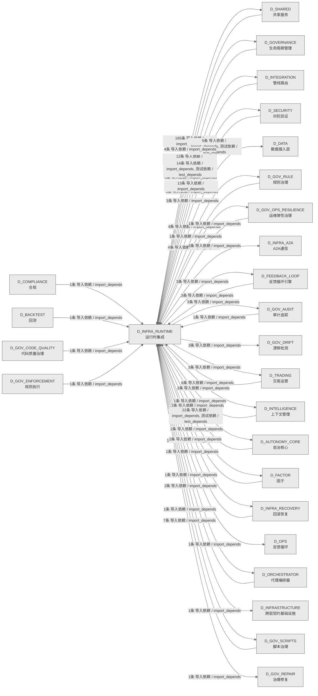

# 06_d_infra_runtime / 运行时集成域 / Runtime Integration

> **功能简介 / Overview**: 运行时集成，负责组件生命周期编排、启动钩子和运行时上下文管理

> **文档作用 / Purpose**: 展示 运行时集成（D_INFRA_RUNTIME）功能域的域内依赖关系、跨域依赖关系，模块信息（成熟度/中英文名/大白话/文件路径）内嵌于 Mermaid 节点，供架构审查和域治理参考。

> 本文档由 generate_domain_doc.py 从 depgraph (PostgreSQL) 自动生成
> 数据源: depgraph (PostgreSQL) nodes表 + edges表

> **[可缩放 HTML 版 / Zoomable HTML](http://localhost:8765/docs/02_enterprise_architecture/02_domain_architecture_docs/_zoomable_html/06_d_infra_runtime.html)** — Ctrl+滚轮缩放 ｜ 双击重置 ｜ Ctrl+Shift+D 切换拖动/选择模式

## 域基本信息 / Domain Overview

| 字段 | 值 | Field | Value |
|------|------|-------|-------|
| 编号 | 06 | Number | 06 |
| 域ID | D_INFRA_RUNTIME | Domain ID | D_INFRA_RUNTIME |
| 域名称 | 运行时集成 | Domain Name | Runtime Integration |
| 层级 | L0 基础设施层 | Layer | L0 Infrastructure |
| 模块数 | 168 | Module Count | 168 |
| 域内依赖 | 160 | Internal Dependencies | 160 |
| 跨域入边 | 85 | Cross-domain Incoming | 85 |
| 跨域出边 | 231 | Cross-domain Outgoing | 231 |
| 设计态模块 | 1 | Design Modules | 1 |
| 生产态模块 | 167 | Production Modules | 167 |
| 容量 | 167/150 (超容) | Capacity | 167/150 (超容) |
| 描述 | 三层运行时编排(L1 Trae/L2 Local/L3 API) | Description | 三层运行时编排(L1 Trae/L2 Local/L3 API) |

## 域内依赖图 / Internal Dependency Diagram

> 依赖图内嵌在本文档中，IDE 可直接渲染；网页版可 Ctrl+滚轮缩放 + 拖动平移查看细节。
>
> **图例说明 / Legend**：
> - 🟦 **蓝色 = 运营态模块**（production，已上线运行）
> - 🟧 **橙色虚线 = 设计态模块**（design，蓝图阶段，代码未写）
> - **实线箭头 = 运营态依赖**（已生效的依赖关系）
> - **虚线箭头 = 非运营态依赖**（计划中/验证中的依赖关系）

### 全景图（全部模块，颜色区分运营态/设计态）

> 展示全部 168 个模块（生产态 167 + 设计态 1），含跨域依赖外部节点。节点含成熟度+名称+大白话/简介+文件路径。

```mermaid
%%{init: {'theme': 'base', 'themeVariables': {'primaryColor': '#eaeaea', 'primaryTextColor': '#333333', 'primaryBorderColor': '#666666', 'lineColor': '#666666', 'secondaryColor': '#eaeaea', 'tertiaryColor': '#eaeaea', 'fontSize': '14px'}}}%%
flowchart TD
    docs_03_modules_cross_layer_agent_orchestrator_blueprint_md["Blueprint<br/>agent_orchestrator模块蓝图文档，描述该模块的设计<br/>意图和架构决策<br/>⛔ 基础设施运行时域，设计已就绪，等待开发排期<br/>文件: agent_orchestrator/blueprint.md<br/>(设计态 / design)"]
    src_zephyr_infrastructure_asset_inventory_main_py["MOD-INF-026 蓝图 §31<br/>Asset Inventory CLI — MOD-INF-026 蓝图 §31<br/>Main<br/>文件: asset_inventory/__main__.py<br/>(生产态 / production)"]
    src_zephyr_infrastructure_asset_inventory_lifecycle_py["MOD-INF-026 L5 ITIL生命周期自动化管理器<br/>AssetLifecycle — MOD-INF-026 L5<br/>ITIL生命周期自动化管理器<br/>文件: asset_inventory/lifecycle.py<br/>(生产态 / production)"]
    src_zephyr_infrastructure_asset_inventory_mcp_server_py["MOD-INF-026 蓝图 §21<br/>AssetInventory MCP Server — MOD-INF-026 蓝图 §21<br/>文件: asset_inventory/mcp_server.py<br/>(生产态 / production)"]
    src_zephyr_infrastructure_asset_inventory_metadata_py["Git 历史元数据提取 + 多 IDE 规则生成器<br/>基础设施/asset inventory包的metadata模块<br/>文件: asset_inventory/metadata.py<br/>(生产态 / production)"]
    src_zephyr_infrastructure_asset_inventory_trust_anchor_py["三重信任锚验证门 R20<br/>基础设施/asset inventory包的trust_anchor模块<br/>Trust Anchor<br/>文件: asset_inventory/trust_anchor.py<br/>(生产态 / production)"]
    src_zephyr_infrastructure_auto_diagnostics_py["单次诊断报告'''<br/>RI-12 AutoDiagnostics — 自动诊断引擎<br/>Auto Diagnostics<br/>文件: infrastructure/auto_diagnostics.py<br/>(生产态 / production)"]
    src_zephyr_infrastructure_auto_fix_engine_main_py["Main<br/>基础设施/auto fix engine包的main__模块<br/>文件: auto_fix_engine/__main__.py<br/>(生产态 / production)"]
    src_zephyr_infrastructure_auto_fix_engine_alignment_syncer_py["Alignment Syncer<br/>基础设施/auto fix engine包的alignment_syncer模块<br/>文件: auto_fix_engine/alignment_syncer.py<br/>(生产态 / production)"]
    src_zephyr_infrastructure_auto_fix_engine_all_completer_py["公共接口：parse_all<br/>基础设施/auto fix engine包的all_completer模块<br/>All Completer<br/>文件: auto_fix_engine/all_completer.py<br/>(生产态 / production)"]
    src_zephyr_infrastructure_auto_fix_engine_config_fixer_py["公共接口：fix_trailing_whitespace<br/>基础设施/auto fix engine包的config_fixer模块<br/>Config Fixer<br/>文件: auto_fix_engine/config_fixer.py<br/>(生产态 / production)"]
    src_zephyr_infrastructure_auto_fix_engine_dedup_extractor_py["公共接口：normalize_code<br/>基础设施/auto fix engine包的dedup_extractor模块<br/>Dedup Extractor<br/>文件: auto_fix_engine/dedup_extractor.py<br/>(生产态 / production)"]
    src_zephyr_infrastructure_auto_fix_engine_dep_version_fixer_py["Dep Version Fixer<br/>基础设施/auto fix<br/>engine包的dep_version_fixer模块<br/>文件: auto_fix_engine/dep_version_fixer.py<br/>(生产态 / production)"]
    src_zephyr_infrastructure_auto_fix_engine_drift_fixer_py["Drift Fixer<br/>基础设施/auto fix engine包的drift_fixer模块<br/>文件: auto_fix_engine/drift_fixer.py<br/>(生产态 / production)"]
    src_zephyr_infrastructure_auto_fix_engine_event_hooks_py["只读：event_log<br/>基础设施/auto fix engine包的event_hooks模块<br/>Event Hooks<br/>文件: auto_fix_engine/event_hooks.py<br/>(生产态 / production)"]
    src_zephyr_infrastructure_auto_fix_engine_fix_diff_py["Fix Diff<br/>基础设施/auto fix engine包的fix_diff模块<br/>文件: auto_fix_engine/fix_diff.py<br/>(生产态 / production)"]
    src_zephyr_infrastructure_auto_fix_engine_fix_scheduler_py["Fix Scheduler<br/>基础设施/auto fix engine包的fix_scheduler模块<br/>文件: auto_fix_engine/fix_scheduler.py<br/>(生产态 / production)"]
    src_zephyr_infrastructure_auto_fix_engine_import_fixer_py["Import Fixer<br/>基础设施/auto fix engine包的import_fixer模块<br/>文件: auto_fix_engine/import_fixer.py<br/>(生产态 / production)"]
    src_zephyr_infrastructure_auto_fix_engine_interrupt_guard_py["只读：wal_dir<br/>基础设施/auto fix engine包的interrupt_guard模块<br/>Interrupt Guard<br/>文件: auto_fix_engine/interrupt_guard.py<br/>(生产态 / production)"]
    src_zephyr_infrastructure_auto_fix_engine_llm_fix_adapter_py["只读：secret_guard<br/>基础设施/auto fix engine包的llm_fix_adapter模块<br/>Llm Fix Adapter<br/>文件: auto_fix_engine/llm_fix_adapter.py<br/>(生产态 / production)"]
    src_zephyr_infrastructure_auto_fix_engine_scaffold_registrar_py["从 script-manifest.yaml 加载已注册脚本路径集合<br/>基础设施/auto fix<br/>engine包的scaffold_registrar模块<br/>Scaffold Registrar<br/>文件: auto_fix_engine/scaffold_registrar.py<br/>(生产态 / production)"]
    src_zephyr_infrastructure_auto_fix_engine_self_heal_agent_py["Self Heal Agent<br/>基础设施/auto fix engine包的self_heal_agent模块<br/>文件: auto_fix_engine/self_heal_agent.py<br/>(生产态 / production)"]
    src_zephyr_infrastructure_auto_fix_engine_state_machine_py["State Machine<br/>基础设施/auto fix engine包的state_machine模块<br/>文件: auto_fix_engine/state_machine.py<br/>(生产态 / production)"]
    src_zephyr_infrastructure_auto_fix_engine_zombie_cleaner_py["移除 content<br/>中指向不存在文件的僵尸引用，返回清理后的内容<br/>基础设施/auto fix engine包的zombie_cleaner模块<br/>Zombie Cleaner<br/>文件: auto_fix_engine/zombie_cleaner.py<br/>(生产态 / production)"]
    src_zephyr_infrastructure_blueprint_code_sync_py["只读：registry_path<br/>Blueprint-Code Sync — 蓝图-代码索引同步验证。<br/>Blueprint Code Sync<br/>文件: infrastructure/blueprint_code_sync.py<br/>(生产态 / production)"]
    src_zephyr_infrastructure_budget_enforcement_init_py["budget_enforcement 包聚合层<br/>管理infrastructure.budget_enforcement子包的加载<br/>和懒导入<br/>Init<br/>文件: budget_enforcement/__init__.py<br/>(生产态 / production)"]
    src_zephyr_infrastructure_capacity_assurance_budget_forecaster_py["Token 预算预测<br/>budget_forecaster.py — Token 预算预测<br/>(DD120-extra, TASK-020)<br/>Budget Forecaster<br/>文件: capacity_assurance/budget_forecaster.py<br/>(生产态 / production)"]
    src_zephyr_infrastructure_capacity_assurance_contracts_contract_bus_py["加载全部44条容量保障契约的Pydantic v2 Schema<br/>ContractBus loader —<br/>加载全部44条容量保障契约的Pydantic v2 Schema<br/>（DD-9三批...<br/>Contract Bus<br/>文件: contracts/contract_bus.py<br/>(生产态 / production)"]
    src_zephyr_infrastructure_capacity_assurance_cross_module_integration_py["CT-1~CT-4 跨模块集成契约实现<br/>Cross-module integration — CT-1~CT-4<br/>跨模块集成契约实现（对标蓝图 §17）.<br/>Cross Module Integration<br/>文件: capacity_assurance<br/>/cross_module_integration.py<br/>(生产态 / production)"]
    src_zephyr_infrastructure_capacity_assurance_host_resource_governor_py["主机资源治理<br/>host_resource_governor.py — 主机资源治理 (B17,<br/>DD91, TASK-017)<br/>Host Resource Governor<br/>文件: capacity_assurance<br/>/host_resource_governor.py<br/>(生产态 / production)"]
    src_zephyr_infrastructure_capacity_assurance_kill_switch_py["Kill Switch<br/>kill_switch.py -- safety circuit breaker<br/>(DD110, TASK-019).<br/>文件: capacity_assurance/kill_switch.py<br/>(生产态 / production)"]
    src_zephyr_infrastructure_capacity_assurance_risk_mitigation_py["R1~R16 全量风险缓解实现<br/>Risk mitigation — R1~R16 全量风险缓解实现<br/>（对标蓝图 §14 风险与缓解 + 多轮盲...<br/>文件: capacity_assurance/risk_mitigation.py<br/>(生产态 / production)"]
    src_zephyr_infrastructure_capacity_assurance_schema_py["5.66.2 修复：白名单校验表名，仅允许已知表名用于<br/>SQL 拼接<br/>SchemaManager — 容量保障体系数据库 Schema 管理器<br/>文件: capacity_assurance/schema.py<br/>(生产态 / production)"]
    src_zephyr_infrastructure_capacity_assurance_sli_instrumentation_py["SLI采集插桩点<br/>SLI instrumentation — SLI采集插桩点（对标蓝图<br/>§13 SLI Registry CAP-001~CAP-...<br/>文件: capacity_assurance/sli_instrumentation.py<br/>(生产态 / production)"]
    src_zephyr_infrastructure_capacity_assurance_tech_stack_py["公共接口：default_decisions<br/>TechStackValidator — 技术栈可用性校验器<br/>Tech Stack<br/>文件: capacity_assurance/tech_stack.py<br/>(生产态 / production)"]
    src_zephyr_infrastructure_capacity_assurance_token_budget_py["Token Budget<br/>token_budget.py — Token 估算工具 SSoT<br/>文件: capacity_assurance/token_budget.py<br/>(生产态 / production)"]
    src_zephyr_infrastructure_cost_tracker_py["Cost Tracker<br/>RI-15 CostTracker — 成本追踪器<br/>文件: infrastructure/cost_tracker.py<br/>(生产态 / production)"]
    src_zephyr_infrastructure_dry_run_simulator_py["Dry Run Simulator<br/>RI-14 DryRunSimulator — 干运行模拟器<br/>文件: infrastructure/dry_run_simulator.py<br/>(生产态 / production)"]
    src_zephyr_infrastructure_event_bus_upgrade_py["Event Bus Upgrade<br/>DEPRECATED: 此文件已废弃。<br/>文件: infrastructure/event_bus_upgrade.py<br/>(生产态 / production)"]
    src_zephyr_infrastructure_event_store_py["Event Store<br/>RI-13 EventStore — 事件存储<br/>文件: infrastructure/event_store.py<br/>(生产态 / production)"]
    src_zephyr_infrastructure_events_event_store_py["Event Store<br/>事件持久化存储<br/>文件: events/event_store.py<br/>(生产态 / production)"]
    src_zephyr_infrastructure_finding_task_bridge_py["Finding Task Bridge<br/>Finding->TaskCard 桥接器<br/>文件: infrastructure/finding_task_bridge.py<br/>(生产态 / production)"]
    src_zephyr_infrastructure_git_batcher_py["Git 命令批量化工具<br/>git_batcher.py — Git 命令批量化工具<br/>（ARCH-GIT-CALL-BUDGET P2.2，2026-07-19）<br/>Git Batcher<br/>文件: infrastructure/git_batcher.py<br/>(生产态 / production)"]
    src_zephyr_infrastructure_h1_redis_hot_init_py["—盘中实盘/模拟盘 <5ms 因子截面在线存储<br/>H1 Redis 热缓存模块——盘中实盘/模拟盘 <5ms<br/>因子截面在线存储（DD-11-01）。<br/>Init<br/>文件: h1_redis_hot/__init__.py<br/>(生产态 / production)"]
    src_zephyr_infrastructure_h1_redis_hot_h1_cqrs_projectors_py["事件→Redis 物化视图投影器<br/>H1CqrsProjectors — 事件→Redis 物化视图投影器。<br/>H1 Cqrs Projectors<br/>文件: h1_redis_hot/h1_cqrs_projectors.py<br/>(生产态 / production)"]
    src_zephyr_infrastructure_h1_redis_hot_h1_integration_py["—连接 D-FACTOR/SIGNAL/RISK 与 H1 热缓存<br/>H1 Redis 集成适配器——连接 D-FACTOR/SIGNAL/RISK<br/>与 H1 热缓存。<br/>H1 Integration<br/>文件: h1_redis_hot/h1_integration.py<br/>(生产态 / production)"]
    src_zephyr_infrastructure_health_monitor_health_aggregator_py["check_all_systems<br/>全系统健康聚合 — check_all_systems()<br/>Health Aggregator<br/>文件: health_monitor/health_aggregator.py<br/>(生产态 / production)"]
    src_zephyr_infrastructure_hooks_event_hook_py["声明式事件钩子注册表<br/>EventHook — 声明式任务系统事件订阅<br/>Event Hook<br/>文件: hooks/event_hook.py<br/>(生产态 / production)"]
    src_zephyr_infrastructure_impact_impact_propagator_py["只读：project_root<br/>Impact Propagator — 变更影响传播分析。<br/>文件: impact/impact_propagator.py<br/>(生产态 / production)"]
    src_zephyr_infrastructure_impact_llm_impact_analyzer_py["只读：project_root<br/>LLM Impact Analyzer — 语义影响分析器。<br/>文件: impact/llm_impact_analyzer.py<br/>(生产态 / production)"]
    src_zephyr_infrastructure_infrastructure_base_py["系统健康状态快照'''<br/>基础设施 — Infrastructure Layer Skeleton<br/>Infrastructure Base<br/>文件: infrastructure/infrastructure_base.py<br/>(生产态 / production)"]
    src_zephyr_infrastructure_kill_switch_sim_py["Kill Switch 单次探测结果'''<br/>Kill Switch T0 Hardware Simulator<br/>Kill Switch Sim<br/>文件: infrastructure/kill_switch_sim.py<br/>(生产态 / production)"]
    src_zephyr_infrastructure_lifecycle_scope_guard_py["只读：config<br/>Scope Guard — 范围蔓延检测与阻断。<br/>文件: lifecycle/scope_guard.py<br/>(生产态 / production)"]
    src_zephyr_infrastructure_lifecycle_task_lifecycle_manager_py["Task Lifecycle Manager<br/>G0-G7 任务生命周期门禁<br/>文件: lifecycle/task_lifecycle_manager.py<br/>(生产态 / production)"]
    src_zephyr_infrastructure_observability_trace_decorator_py["Trace Decorator<br/>基础设施/observability包的trace_decorator模块<br/>文件: observability/trace_decorator.py<br/>(生产态 / production)"]
    src_zephyr_infrastructure_pipeline_backpressure_manager_py["Backpressure Manager<br/>Pipeline — Backpressure Manager<br/>文件: pipeline/backpressure_manager.py<br/>(生产态 / production)"]
    src_zephyr_infrastructure_pipeline_circuit_breaker_manager_py["模型调用断路器管理器<br/>CircuitBreakerManager -- standalone circuit<br/>breaker manager (Netflix Hystrix ...<br/>文件: pipeline/circuit_breaker_manager.py<br/>(生产态 / production)"]
    src_zephyr_infrastructure_pipeline_cost_tracker_py["LLM 调用成本追踪器<br/>CostTracker —— LLM 调用成本追踪器（SRC-0025）<br/>Cost Tracker<br/>文件: pipeline/cost_tracker.py<br/>(生产态 / production)"]
    src_zephyr_infrastructure_pipeline_dead_letter_queue_py["—B169 永久失败任务存储<br/>DeadLetterQueue — 死信队列<br/>Dead Letter Queue<br/>文件: pipeline/dead_letter_queue.py<br/>(生产态 / production)"]
    src_zephyr_infrastructure_pipeline_llm_gateway_py["Llm Gateway<br/>MOD-INF-019: Agent Spec — LLM Gateway<br/>文件: pipeline/llm_gateway.py<br/>(生产态 / production)"]
    src_zephyr_infrastructure_pipeline_pipeline_agent_bridge_py["返回 Mx 节点绑定的 Agent Role 名<br/>Pipeline -> Agent Bridge — 双编排器桥接层<br/>Pipeline Agent Bridge<br/>文件: pipeline/pipeline_agent_bridge.py<br/>(生产态 / production)"]
    src_zephyr_infrastructure_pipeline_pipeline_lock_py["acquire<br/>Pipeline Lock — 双管线并发锁<br/>文件: pipeline/pipeline_lock.py<br/>(生产态 / production)"]
    src_zephyr_infrastructure_pipeline_pipeline_roadmap_py["—v0.10.0 -> v0.12.0 规划骨架<br/>Pipeline 未来版本路线图——v0.10.0 -> v0.12.0<br/>规划骨架。<br/>Pipeline Roadmap<br/>文件: pipeline/pipeline_roadmap.py<br/>(生产态 / production)"]
    src_zephyr_infrastructure_pipeline_preemption_manager_py["优先级抢占管理器.<br/>PreemptionManager -- 优先级抢占管理器<br/>Preemption Manager<br/>文件: pipeline/preemption_manager.py<br/>(生产态 / production)"]
    src_zephyr_infrastructure_pipeline_routing_plugins_py["Routing Plugins<br/>Pipeline Routing Plugin System — K8s Scheduling<br/>Framework 对标<br/>文件: pipeline/routing_plugins.py<br/>(生产态 / production)"]
    src_zephyr_infrastructure_pydantic_v2_migrator_py["Pydantic V2 Migrator<br/>M-15 PydanticV2Migrator — Pydantic V2 迁移工具<br/>文件: infrastructure/pydantic_v2_migrator.py<br/>(生产态 / production)"]
    src_zephyr_infrastructure_quality_quality_monitor_py["Quality Monitor<br/>生成代码质量门禁<br/>文件: quality/quality_monitor.py<br/>(生产态 / production)"]
    src_zephyr_infrastructure_reliability_circuit_breaker_py["Circuit Breaker<br/>熔断器：连续失败 -> OPEN -> 暂停执行<br/>文件: reliability/circuit_breaker.py<br/>(生产态 / production)"]
    src_zephyr_infrastructure_reliability_context_guard_py["只读：project_root<br/>Context Guard — 上下文契约守卫。<br/>文件: reliability/context_guard.py<br/>(生产态 / production)"]
    src_zephyr_infrastructure_runtime_concurrency_guard_py["单个文件锁信息<br/>concurrency_guard — 回滚操作并发安全守卫。<br/>Concurrency Guard<br/>文件: runtime/concurrency_guard.py<br/>(生产态 / production)"]
    src_zephyr_infrastructure_runtime_sandbox_enforcer_py["只读：project_root<br/>SandboxEnforcer — Agent 沙盒隔离。<br/>Sandbox Enforcer<br/>文件: runtime/sandbox_enforcer.py<br/>(生产态 / production)"]
    src_zephyr_infrastructure_runtime_startup_shutdown_py["Startup Shutdown<br/>基础设施/运行时包的startup_shutdown模块<br/>文件: runtime/startup_shutdown.py<br/>(生产态 / production)"]
    src_zephyr_infrastructure_script_system_finding_py["Finding<br/>Schema — 审计发现标准化数据模型<br/>文件: script_system/finding.py<br/>(生产态 / production)"]
    src_zephyr_infrastructure_script_system_gate_bridge_py["submit_findings<br/>Script->Gate 门禁桥接器 — submit_findings()<br/>生产者<br/>Gate Bridge<br/>文件: script_system/gate_bridge.py<br/>(生产态 / production)"]
    src_zephyr_infrastructure_system_telemetry_auto_bootstrap_py["全自动遥测注入钩子<br/>auto_bootstrap — 全自动遥测注入钩子<br/>（MOD-INF-015 v2.1.0）<br/>Auto Bootstrap<br/>文件: system_telemetry/auto_bootstrap.py<br/>(生产态 / production)"]
    src_zephyr_infrastructure_system_telemetry_logs_init_py["结构化日志流<br/>logs — 结构化日志流（structlog + JSONL +<br/>trace注入）（D_SYSTEM_TELEMETRY）<br/>Init<br/>文件: logs/__init__.py<br/>(生产态 / production)"]
    src_zephyr_infrastructure_system_telemetry_metrics_bridge_py["emit_metrics<br/>TELE->FLE 指标桥接 — emit_metrics() 生产者<br/>Metrics Bridge<br/>文件: system_telemetry/metrics_bridge.py<br/>(生产态 / production)"]
    src_zephyr_infrastructure_warm_hot_gate_py["Warm->Hot 阻断门<br/>M-14 WarmHotGate — Warm->Hot 阻断门<br/>Warm Hot Gate<br/>文件: infrastructure/warm_hot_gate.py<br/>(生产态 / production)"]
    src_zephyr_shared_lifecycle_hooks_py["—零侵入式<br/>hooks.py —— 模块生命周期钩子（Phase 2 新增 /<br/>盲点 B8 修复）<br/>文件: lifecycle/hooks.py<br/>(生产态 / production)"]
    src_zephyr_trading_action_dispatcher_py["Action Dispatcher<br/>ActionDispatcher --- 大脑的'手' v2.0 (Phase 2)<br/>文件: trading/action_dispatcher.py<br/>(生产态 / production)"]
    src_zephyr_trading_auto_task_generator_py["—扫描项目 -> 生成推理任务 -> 送入调度器<br/>AutoTaskGenerator — 自动任务生成器<br/>Auto Task Generator<br/>文件: trading/auto_task_generator.py<br/>(生产态 / production)"]
    src_zephyr_trading_ports_py["Ports<br/>Protocol-based interface layer for<br/>runtime->pipeline dependency abstraction.<br/>文件: trading/ports.py<br/>(生产态 / production)"]
    src_zephyr_trading_staging_area_py["Staging Area<br/>StagingArea —<br/>多AI并发草稿写入+提交+冲突检测模块<br/>（CT-SESSION-CONFLICT-002）<br/>文件: trading/staging_area.py<br/>(生产态 / production)"]
    src_zephyr_trading_task_gate_py["根据护照决定是否允许模型执行某个能力类型<br/>TaskGate --- 任务门控<br/>Task Gate<br/>文件: trading/task_gate.py<br/>(生产态 / production)"]
    src_zephyr_trading_windows_service_py["Windows Service<br/>WindowsService — Windows Service 包装器<br/>文件: trading/windows_service.py<br/>(生产态 / production)"]
    src_zephyr_trading_zombie_scanner_py["Zombie Scanner<br/>zombie_scanner.py — 僵尸 Python<br/>进程检测与自动处置<br/>文件: trading/zombie_scanner.py<br/>(生产态 / production)"]
    tests_zephyr_data_test_tick_redis_cache_py["—tick→Redis tick:{symbol}:latest 双写器<br/>TickRedisCache 单元测试——tick→Redis<br/>tick:{symbol}:latest 双写器。<br/>Test Tick Redis Cache<br/>文件: data/test_tick_redis_cache.py<br/>(生产态 / production)"]
    tests_zephyr_runtime_test_intraday_main_py["IntradayRuntime 盘中编排器单元测试<br/>运行时包的test_intraday_main模块<br/>Test Intraday Main<br/>文件: runtime/test_intraday_main.py<br/>(生产态 / production)"]
    docs_03_modules_cross_layer_agent_orchestrator_blueprint_md ~~~ src_zephyr_infrastructure_asset_inventory_main_py
    src_zephyr_infrastructure_asset_inventory_main_py ~~~ src_zephyr_infrastructure_asset_inventory_lifecycle_py
    src_zephyr_infrastructure_asset_inventory_lifecycle_py ~~~ src_zephyr_infrastructure_asset_inventory_mcp_server_py
    src_zephyr_infrastructure_asset_inventory_mcp_server_py ~~~ src_zephyr_infrastructure_asset_inventory_metadata_py
    src_zephyr_infrastructure_asset_inventory_metadata_py ~~~ src_zephyr_infrastructure_asset_inventory_trust_anchor_py
    src_zephyr_infrastructure_asset_inventory_trust_anchor_py ~~~ src_zephyr_infrastructure_auto_diagnostics_py
    src_zephyr_infrastructure_auto_diagnostics_py ~~~ src_zephyr_infrastructure_auto_fix_engine_main_py
    src_zephyr_infrastructure_auto_fix_engine_main_py ~~~ src_zephyr_infrastructure_auto_fix_engine_alignment_syncer_py
    src_zephyr_infrastructure_auto_fix_engine_alignment_syncer_py ~~~ src_zephyr_infrastructure_auto_fix_engine_all_completer_py
    src_zephyr_infrastructure_auto_fix_engine_all_completer_py ~~~ src_zephyr_infrastructure_auto_fix_engine_config_fixer_py
    src_zephyr_infrastructure_auto_fix_engine_config_fixer_py ~~~ src_zephyr_infrastructure_auto_fix_engine_dedup_extractor_py
    src_zephyr_infrastructure_auto_fix_engine_dedup_extractor_py ~~~ src_zephyr_infrastructure_auto_fix_engine_dep_version_fixer_py
    src_zephyr_infrastructure_auto_fix_engine_dep_version_fixer_py ~~~ src_zephyr_infrastructure_auto_fix_engine_drift_fixer_py
    src_zephyr_infrastructure_auto_fix_engine_drift_fixer_py ~~~ src_zephyr_infrastructure_auto_fix_engine_event_hooks_py
    src_zephyr_infrastructure_auto_fix_engine_event_hooks_py ~~~ src_zephyr_infrastructure_auto_fix_engine_fix_diff_py
    src_zephyr_infrastructure_auto_fix_engine_fix_diff_py ~~~ src_zephyr_infrastructure_auto_fix_engine_fix_scheduler_py
    src_zephyr_infrastructure_auto_fix_engine_fix_scheduler_py ~~~ src_zephyr_infrastructure_auto_fix_engine_import_fixer_py
    src_zephyr_infrastructure_auto_fix_engine_import_fixer_py ~~~ src_zephyr_infrastructure_auto_fix_engine_interrupt_guard_py
    src_zephyr_infrastructure_auto_fix_engine_interrupt_guard_py ~~~ src_zephyr_infrastructure_auto_fix_engine_llm_fix_adapter_py
    src_zephyr_infrastructure_auto_fix_engine_llm_fix_adapter_py ~~~ src_zephyr_infrastructure_auto_fix_engine_scaffold_registrar_py
    src_zephyr_infrastructure_auto_fix_engine_scaffold_registrar_py ~~~ src_zephyr_infrastructure_auto_fix_engine_self_heal_agent_py
    src_zephyr_infrastructure_auto_fix_engine_self_heal_agent_py ~~~ src_zephyr_infrastructure_auto_fix_engine_state_machine_py
    src_zephyr_infrastructure_auto_fix_engine_state_machine_py ~~~ src_zephyr_infrastructure_auto_fix_engine_zombie_cleaner_py
    src_zephyr_infrastructure_auto_fix_engine_zombie_cleaner_py ~~~ src_zephyr_infrastructure_blueprint_code_sync_py
    src_zephyr_infrastructure_blueprint_code_sync_py ~~~ src_zephyr_infrastructure_budget_enforcement_init_py
    src_zephyr_infrastructure_budget_enforcement_init_py ~~~ src_zephyr_infrastructure_capacity_assurance_budget_forecaster_py
    src_zephyr_infrastructure_capacity_assurance_budget_forecaster_py ~~~ src_zephyr_infrastructure_capacity_assurance_contracts_contract_bus_py
    src_zephyr_infrastructure_capacity_assurance_contracts_contract_bus_py ~~~ src_zephyr_infrastructure_capacity_assurance_cross_module_integration_py
    src_zephyr_infrastructure_capacity_assurance_cross_module_integration_py ~~~ src_zephyr_infrastructure_capacity_assurance_host_resource_governor_py
    src_zephyr_infrastructure_capacity_assurance_host_resource_governor_py ~~~ src_zephyr_infrastructure_capacity_assurance_kill_switch_py
    src_zephyr_infrastructure_capacity_assurance_kill_switch_py ~~~ src_zephyr_infrastructure_capacity_assurance_risk_mitigation_py
    src_zephyr_infrastructure_capacity_assurance_risk_mitigation_py ~~~ src_zephyr_infrastructure_capacity_assurance_schema_py
    src_zephyr_infrastructure_capacity_assurance_schema_py ~~~ src_zephyr_infrastructure_capacity_assurance_sli_instrumentation_py
    src_zephyr_infrastructure_capacity_assurance_sli_instrumentation_py ~~~ src_zephyr_infrastructure_capacity_assurance_tech_stack_py
    src_zephyr_infrastructure_capacity_assurance_tech_stack_py ~~~ src_zephyr_infrastructure_capacity_assurance_token_budget_py
    src_zephyr_infrastructure_capacity_assurance_token_budget_py ~~~ src_zephyr_infrastructure_cost_tracker_py
    src_zephyr_infrastructure_cost_tracker_py ~~~ src_zephyr_infrastructure_dry_run_simulator_py
    src_zephyr_infrastructure_dry_run_simulator_py ~~~ src_zephyr_infrastructure_event_bus_upgrade_py
    src_zephyr_infrastructure_event_bus_upgrade_py ~~~ src_zephyr_infrastructure_event_store_py
    src_zephyr_infrastructure_event_store_py ~~~ src_zephyr_infrastructure_events_event_store_py
    src_zephyr_infrastructure_events_event_store_py ~~~ src_zephyr_infrastructure_finding_task_bridge_py
    src_zephyr_infrastructure_finding_task_bridge_py ~~~ src_zephyr_infrastructure_git_batcher_py
    src_zephyr_infrastructure_git_batcher_py ~~~ src_zephyr_infrastructure_h1_redis_hot_init_py
    src_zephyr_infrastructure_h1_redis_hot_init_py ~~~ src_zephyr_infrastructure_h1_redis_hot_h1_cqrs_projectors_py
    src_zephyr_infrastructure_h1_redis_hot_h1_cqrs_projectors_py ~~~ src_zephyr_infrastructure_h1_redis_hot_h1_integration_py
    src_zephyr_infrastructure_h1_redis_hot_h1_integration_py ~~~ src_zephyr_infrastructure_health_monitor_health_aggregator_py
    src_zephyr_infrastructure_health_monitor_health_aggregator_py ~~~ src_zephyr_infrastructure_hooks_event_hook_py
    src_zephyr_infrastructure_hooks_event_hook_py ~~~ src_zephyr_infrastructure_impact_impact_propagator_py
    src_zephyr_infrastructure_impact_impact_propagator_py ~~~ src_zephyr_infrastructure_impact_llm_impact_analyzer_py
    src_zephyr_infrastructure_impact_llm_impact_analyzer_py ~~~ src_zephyr_infrastructure_infrastructure_base_py
    src_zephyr_infrastructure_infrastructure_base_py ~~~ src_zephyr_infrastructure_kill_switch_sim_py
    src_zephyr_infrastructure_kill_switch_sim_py ~~~ src_zephyr_infrastructure_lifecycle_scope_guard_py
    src_zephyr_infrastructure_lifecycle_scope_guard_py ~~~ src_zephyr_infrastructure_lifecycle_task_lifecycle_manager_py
    src_zephyr_infrastructure_lifecycle_task_lifecycle_manager_py ~~~ src_zephyr_infrastructure_observability_trace_decorator_py
    src_zephyr_infrastructure_observability_trace_decorator_py ~~~ src_zephyr_infrastructure_pipeline_backpressure_manager_py
    src_zephyr_infrastructure_pipeline_backpressure_manager_py ~~~ src_zephyr_infrastructure_pipeline_circuit_breaker_manager_py
    src_zephyr_infrastructure_pipeline_circuit_breaker_manager_py ~~~ src_zephyr_infrastructure_pipeline_cost_tracker_py
    src_zephyr_infrastructure_pipeline_cost_tracker_py ~~~ src_zephyr_infrastructure_pipeline_dead_letter_queue_py
    src_zephyr_infrastructure_pipeline_dead_letter_queue_py ~~~ src_zephyr_infrastructure_pipeline_llm_gateway_py
    src_zephyr_infrastructure_pipeline_llm_gateway_py ~~~ src_zephyr_infrastructure_pipeline_pipeline_agent_bridge_py
    src_zephyr_infrastructure_pipeline_pipeline_agent_bridge_py ~~~ src_zephyr_infrastructure_pipeline_pipeline_lock_py
    src_zephyr_infrastructure_pipeline_pipeline_lock_py ~~~ src_zephyr_infrastructure_pipeline_pipeline_roadmap_py
    src_zephyr_infrastructure_pipeline_pipeline_roadmap_py ~~~ src_zephyr_infrastructure_pipeline_preemption_manager_py
    src_zephyr_infrastructure_pipeline_preemption_manager_py ~~~ src_zephyr_infrastructure_pipeline_routing_plugins_py
    src_zephyr_infrastructure_pipeline_routing_plugins_py ~~~ src_zephyr_infrastructure_pydantic_v2_migrator_py
    src_zephyr_infrastructure_pydantic_v2_migrator_py ~~~ src_zephyr_infrastructure_quality_quality_monitor_py
    src_zephyr_infrastructure_quality_quality_monitor_py ~~~ src_zephyr_infrastructure_reliability_circuit_breaker_py
    src_zephyr_infrastructure_reliability_circuit_breaker_py ~~~ src_zephyr_infrastructure_reliability_context_guard_py
    src_zephyr_infrastructure_reliability_context_guard_py ~~~ src_zephyr_infrastructure_runtime_concurrency_guard_py
    src_zephyr_infrastructure_runtime_concurrency_guard_py ~~~ src_zephyr_infrastructure_runtime_sandbox_enforcer_py
    src_zephyr_infrastructure_runtime_sandbox_enforcer_py ~~~ src_zephyr_infrastructure_runtime_startup_shutdown_py
    src_zephyr_infrastructure_runtime_startup_shutdown_py ~~~ src_zephyr_infrastructure_script_system_finding_py
    src_zephyr_infrastructure_script_system_finding_py ~~~ src_zephyr_infrastructure_script_system_gate_bridge_py
    src_zephyr_infrastructure_script_system_gate_bridge_py ~~~ src_zephyr_infrastructure_system_telemetry_auto_bootstrap_py
    src_zephyr_infrastructure_system_telemetry_auto_bootstrap_py ~~~ src_zephyr_infrastructure_system_telemetry_logs_init_py
    src_zephyr_infrastructure_system_telemetry_logs_init_py ~~~ src_zephyr_infrastructure_system_telemetry_metrics_bridge_py
    src_zephyr_infrastructure_system_telemetry_metrics_bridge_py ~~~ src_zephyr_infrastructure_warm_hot_gate_py
    src_zephyr_infrastructure_warm_hot_gate_py ~~~ src_zephyr_shared_lifecycle_hooks_py
    src_zephyr_shared_lifecycle_hooks_py ~~~ src_zephyr_trading_action_dispatcher_py
    src_zephyr_trading_action_dispatcher_py ~~~ src_zephyr_trading_auto_task_generator_py
    src_zephyr_trading_auto_task_generator_py ~~~ src_zephyr_trading_ports_py
    src_zephyr_trading_ports_py ~~~ src_zephyr_trading_staging_area_py
    src_zephyr_trading_staging_area_py ~~~ src_zephyr_trading_task_gate_py
    src_zephyr_trading_task_gate_py ~~~ src_zephyr_trading_windows_service_py
    src_zephyr_trading_windows_service_py ~~~ src_zephyr_trading_zombie_scanner_py
    src_zephyr_trading_zombie_scanner_py ~~~ tests_zephyr_data_test_tick_redis_cache_py
    tests_zephyr_data_test_tick_redis_cache_py ~~~ tests_zephyr_runtime_test_intraday_main_py
    src_zephyr_infrastructure_asset_inventory_classifier_py["MOD-INF-026 L2 资产自动分类器<br/>AssetClassifier — MOD-INF-026 L2 资产自动分类器<br/>文件: asset_inventory/classifier.py<br/>(生产态 / production)"]
    src_zephyr_infrastructure_asset_inventory_dashboard_py["MOD-INF-026 资产健康仪表盘生成器<br/>AssetDashboard — MOD-INF-026<br/>资产健康仪表盘生成器<br/>文件: asset_inventory/dashboard.py<br/>(生产态 / production)"]
    src_zephyr_infrastructure_asset_inventory_dependency_py["资产依赖图<br/>MOD-INF-026 §18 — 资产依赖图。<br/>Dependency<br/>文件: asset_inventory/dependency.py<br/>(生产态 / production)"]
    src_zephyr_infrastructure_asset_inventory_index_generator_py["MOD-INF-026 L3 统一资产索引生成器<br/>UnifiedAssetIndex — MOD-INF-026 L3<br/>统一资产索引生成器<br/>Index Generator<br/>文件: asset_inventory/index_generator.py<br/>(生产态 / production)"]
    src_zephyr_infrastructure_asset_inventory_reconciler_py["MOD-INF-026 L4 注册表 vs 磁盘对账引擎<br/>ReconciliationEngine — MOD-INF-026 L4 注册表 vs<br/>磁盘对账引擎<br/>Reconciler<br/>文件: asset_inventory/reconciler.py<br/>(生产态 / production)"]
    src_zephyr_infrastructure_asset_inventory_registry_adapter_py["24 个异构注册表统一解析适配器<br/>MOD-INF-026 §17 — 24<br/>个异构注册表统一解析适配器。<br/>Registry Adapter<br/>文件: asset_inventory/registry_adapter.py<br/>(生产态 / production)"]
    src_zephyr_infrastructure_asset_inventory_scanner_py["MOD-INF-026 L1 全量文件系统扫描器<br/>AssetDiscoveryScanner — MOD-INF-026 L1<br/>全量文件系统扫描器<br/>文件: asset_inventory/scanner.py<br/>(生产态 / production)"]
    src_zephyr_infrastructure_asset_inventory_telemetry_py["MOD-INF-026 自监控指标<br/>AssetInventoryTelemetry — MOD-INF-026 自监控指标<br/>文件: asset_inventory/telemetry.py<br/>(生产态 / production)"]
    src_zephyr_infrastructure_auto_fix_engine_engine_py["Engine<br/>基础设施/auto fix engine包的engine模块<br/>文件: auto_fix_engine/engine.py<br/>(生产态 / production)"]
    src_zephyr_infrastructure_budget_enforcement_rbac_bridge_py["基础设施层 RBAC 桥接适配器<br/>budget_enforcement.rbac_bridge — 基础设施层<br/>RBAC 桥接适配器。<br/>Rbac Bridge<br/>文件: budget_enforcement/rbac_bridge.py<br/>(生产态 / production)"]
    src_zephyr_infrastructure_capacity_assurance_contracts_batch1_infra_py["15条 Pydantic v2 Schema<br/>Batch1 基础设施层契约 — 15条 Pydantic v2<br/>Schema（SLO/Error Budget/Token Budg...<br/>Batch1 Infra<br/>文件: contracts/batch1_infra.py<br/>(生产态 / production)"]
    src_zephyr_infrastructure_capacity_assurance_contracts_batch3_integration_py["14条 Pydantic v2 Schema<br/>Batch3 集成层契约 — 14条 Pydantic v2 Schema<br/>（OTel/W3C/跨模块CT-1~4/DR/容量预...<br/>Batch3 Integration<br/>文件: contracts/batch3_integration.py<br/>(生产态 / production)"]
    src_zephyr_infrastructure_config_validator_py["配置参数校验器<br/>M-12 ConfigValidator — 配置参数校验器<br/>Config Validator<br/>文件: infrastructure/config_validator.py<br/>(生产态 / production)"]
    src_zephyr_infrastructure_contract_tester_py["—验证代码与契约的一致性'''<br/>M-11 ContractTester — 契约测试框架<br/>Contract Tester<br/>文件: infrastructure/contract_tester.py<br/>(生产态 / production)"]
    src_zephyr_infrastructure_h1_redis_hot_h1_redis_reader_py["决策引擎 <5ms 在线特征查询<br/>H1RedisReader — 决策引擎 <5ms 在线特征查询。<br/>H1 Redis Reader<br/>文件: h1_redis_hot/h1_redis_reader.py<br/>(生产态 / production)"]
    src_zephyr_infrastructure_h1_redis_hot_h1_redis_writer_py["D-FACTOR Engine 每 3 秒截面写入 Redis<br/>H1RedisWriter — D-FACTOR Engine 每 3 秒截面写入<br/>Redis（PIPELINE 模式）。<br/>H1 Redis Writer<br/>文件: h1_redis_hot/h1_redis_writer.py<br/>(生产态 / production)"]
    src_zephyr_infrastructure_pipeline_backpressure_types_py["Backpressure Types<br/>backpressure_types.py - Pipeline backpressure<br/>signal data types<br/>文件: pipeline/backpressure_types.py<br/>(生产态 / production)"]
    src_zephyr_infrastructure_pipeline_ct_pipe_routing_py["Ct Pipe Routing<br/>CT-PIPE-ORC-001 — TaskCard -> 管线入口节点路由<br/>文件: pipeline/ct_pipe_routing.py<br/>(生产态 / production)"]
    src_zephyr_infrastructure_pipeline_model_router_py["模型选择、降级链、成本估算<br/>ModelRouter — 模型路由与降级链管理<br/>Model Router<br/>文件: pipeline/model_router.py<br/>(生产态 / production)"]
    src_zephyr_infrastructure_queue_task_scheduler_py["只读：data_dir<br/>Task Scheduler — 任务调度器。<br/>文件: queue/task_scheduler.py<br/>(生产态 / production)"]
    src_zephyr_infrastructure_system_telemetry_budget_telemetry_bridge_py["Budget Telemetry Bridge<br/>基础设施/system<br/>telemetry包的budget_telemetry_bridge模块<br/>文件: system_telemetry<br/>/_budget_telemetry_bridge.py<br/>(生产态 / production)"]
    src_zephyr_infrastructure_system_telemetry_contract_metrics_py["只读：sla_buffer<br/>ZephyrAlpha — system-telemetry<br/>/contract_metrics.py<br/>Contract Metrics<br/>文件: system_telemetry/contract_metrics.py<br/>(生产态 / production)"]
    src_zephyr_infrastructure_system_telemetry_metrics_blueprint_metrics_py["单次蓝图读取事件<br/>blueprint_metrics — 蓝图使用追踪 instrumentation<br/>Blueprint Metrics<br/>文件: metrics/blueprint_metrics.py<br/>(生产态 / production)"]
    src_zephyr_runtime_intraday_main_py["—单进程串起 tick_subscriber + IntradayFactorLoop<br/>盘中运行时编排器——单进程串起 tick_subscriber +<br/>IntradayFactorLoop。<br/>Intraday Main<br/>文件: runtime/intraday_main.py<br/>(生产态 / production)"]
    src_zephyr_trading_main_py["5.43.2 修复：设置进程级虚拟内存上限<br/>python -m zephyr.trading — AutoRuntime Core 入口<br/>Main<br/>文件: trading/__main__.py<br/>(生产态 / production)"]
    src_zephyr_infrastructure_asset_inventory_classifier_py ~~~ src_zephyr_infrastructure_asset_inventory_dashboard_py
    src_zephyr_infrastructure_asset_inventory_dashboard_py ~~~ src_zephyr_infrastructure_asset_inventory_dependency_py
    src_zephyr_infrastructure_asset_inventory_dependency_py ~~~ src_zephyr_infrastructure_asset_inventory_index_generator_py
    src_zephyr_infrastructure_asset_inventory_index_generator_py ~~~ src_zephyr_infrastructure_asset_inventory_reconciler_py
    src_zephyr_infrastructure_asset_inventory_reconciler_py ~~~ src_zephyr_infrastructure_asset_inventory_registry_adapter_py
    src_zephyr_infrastructure_asset_inventory_registry_adapter_py ~~~ src_zephyr_infrastructure_asset_inventory_scanner_py
    src_zephyr_infrastructure_asset_inventory_scanner_py ~~~ src_zephyr_infrastructure_asset_inventory_telemetry_py
    src_zephyr_infrastructure_asset_inventory_telemetry_py ~~~ src_zephyr_infrastructure_auto_fix_engine_engine_py
    src_zephyr_infrastructure_auto_fix_engine_engine_py ~~~ src_zephyr_infrastructure_budget_enforcement_rbac_bridge_py
    src_zephyr_infrastructure_budget_enforcement_rbac_bridge_py ~~~ src_zephyr_infrastructure_capacity_assurance_contracts_batch1_infra_py
    src_zephyr_infrastructure_capacity_assurance_contracts_batch1_infra_py ~~~ src_zephyr_infrastructure_capacity_assurance_contracts_batch3_integration_py
    src_zephyr_infrastructure_capacity_assurance_contracts_batch3_integration_py ~~~ src_zephyr_infrastructure_config_validator_py
    src_zephyr_infrastructure_config_validator_py ~~~ src_zephyr_infrastructure_contract_tester_py
    src_zephyr_infrastructure_contract_tester_py ~~~ src_zephyr_infrastructure_h1_redis_hot_h1_redis_reader_py
    src_zephyr_infrastructure_h1_redis_hot_h1_redis_reader_py ~~~ src_zephyr_infrastructure_h1_redis_hot_h1_redis_writer_py
    src_zephyr_infrastructure_h1_redis_hot_h1_redis_writer_py ~~~ src_zephyr_infrastructure_pipeline_backpressure_types_py
    src_zephyr_infrastructure_pipeline_backpressure_types_py ~~~ src_zephyr_infrastructure_pipeline_ct_pipe_routing_py
    src_zephyr_infrastructure_pipeline_ct_pipe_routing_py ~~~ src_zephyr_infrastructure_pipeline_model_router_py
    src_zephyr_infrastructure_pipeline_model_router_py ~~~ src_zephyr_infrastructure_queue_task_scheduler_py
    src_zephyr_infrastructure_queue_task_scheduler_py ~~~ src_zephyr_infrastructure_system_telemetry_budget_telemetry_bridge_py
    src_zephyr_infrastructure_system_telemetry_budget_telemetry_bridge_py ~~~ src_zephyr_infrastructure_system_telemetry_contract_metrics_py
    src_zephyr_infrastructure_system_telemetry_contract_metrics_py ~~~ src_zephyr_infrastructure_system_telemetry_metrics_blueprint_metrics_py
    src_zephyr_infrastructure_system_telemetry_metrics_blueprint_metrics_py ~~~ src_zephyr_runtime_intraday_main_py
    src_zephyr_runtime_intraday_main_py ~~~ src_zephyr_trading_main_py
    src_zephyr_data_tick_redis_cache_py["{symbol}:latest 双写器<br/>tick → Redis tick:{symbol}:latest 双写器<br/>（D-DATA → H1 集成适配器）。<br/>Tick Redis Cache<br/>文件: data/tick_redis_cache.py<br/>(生产态 / production)"]
    src_zephyr_infrastructure_asset_inventory_models_py["MOD-INF-026 Pydantic V2 共享数据模型<br/>AssetInventoryModels — MOD-INF-026 Pydantic V2<br/>共享数据模型<br/>文件: asset_inventory/models.py<br/>(生产态 / production)"]
    src_zephyr_infrastructure_auto_fix_engine_batch_fixer_py["只读：conflict_resolver<br/>基础设施/auto fix engine包的batch_fixer模块<br/>Batch Fixer<br/>文件: auto_fix_engine/batch_fixer.py<br/>(生产态 / production)"]
    src_zephyr_infrastructure_auto_fix_engine_compliance_auditor_py["只读：retention_days<br/>基础设施/auto fix<br/>engine包的compliance_auditor模块<br/>Compliance Auditor<br/>文件: auto_fix_engine/compliance_auditor.py<br/>(生产态 / production)"]
    src_zephyr_infrastructure_auto_fix_engine_escalation_bridge_py["Escalation Bridge<br/>基础设施/auto fix<br/>engine包的escalation_bridge模块<br/>文件: auto_fix_engine/escalation_bridge.py<br/>(生产态 / production)"]
    src_zephyr_infrastructure_auto_fix_engine_fix_health_check_py["公共接口：check_config<br/>基础设施/auto fix engine包的fix_health_check模块<br/>Fix Health Check<br/>文件: auto_fix_engine/fix_health_check.py<br/>(生产态 / production)"]
    src_zephyr_infrastructure_auto_fix_engine_fix_pattern_miner_py["只读：db_path<br/>基础设施/auto fix<br/>engine包的fix_pattern_miner模块<br/>Fix Pattern Miner<br/>文件: auto_fix_engine/fix_pattern_miner.py<br/>(生产态 / production)"]
    src_zephyr_infrastructure_auto_fix_engine_fix_report_py["只读：history<br/>基础设施/auto fix engine包的fix_report模块<br/>Fix Report<br/>文件: auto_fix_engine/fix_report.py<br/>(生产态 / production)"]
    src_zephyr_infrastructure_auto_fix_engine_fix_safety_py["只读：enabled<br/>基础设施/auto fix engine包的fix_safety模块<br/>Fix Safety<br/>文件: auto_fix_engine/fix_safety.py<br/>(生产态 / production)"]
    src_zephyr_infrastructure_auto_fix_engine_shadow_workspace_py["Shadow Workspace<br/>基础设施/auto fix engine包的shadow_workspace模块<br/>文件: auto_fix_engine/shadow_workspace.py<br/>(生产态 / production)"]
    src_zephyr_infrastructure_database_service_py["从 config/.env.clickhouse 加载 ClickHouse<br/>只读连接参数<br/>DatabaseService:<br/>统一管理数据库的连接池、生命周期、健康检查<br/>Database Service<br/>文件: infrastructure/database_service.py<br/>(生产态 / production)"]
    src_zephyr_infrastructure_pipeline_models_py["—L1<br/>Pipeline 数据模型<br/>Models<br/>文件: pipeline/models.py<br/>(生产态 / production)"]
    src_zephyr_infrastructure_system_telemetry_facade_py["系统遥测门面类<br/>Telemetry — 系统遥测门面类（MOD-INF-015 v2.1.0）<br/>Facade<br/>文件: system_telemetry/facade.py<br/>(生产态 / production)"]
    src_zephyr_trading_auto_runtime_core_py["Auto Runtime Core<br/>AutoRuntimeCore — 三层运行时运营中心（系统大脑）<br/>文件: trading/auto_runtime_core.py<br/>(生产态 / production)"]
    src_zephyr_data_tick_redis_cache_py ~~~ src_zephyr_infrastructure_asset_inventory_models_py
    src_zephyr_infrastructure_asset_inventory_models_py ~~~ src_zephyr_infrastructure_auto_fix_engine_batch_fixer_py
    src_zephyr_infrastructure_auto_fix_engine_batch_fixer_py ~~~ src_zephyr_infrastructure_auto_fix_engine_compliance_auditor_py
    src_zephyr_infrastructure_auto_fix_engine_compliance_auditor_py ~~~ src_zephyr_infrastructure_auto_fix_engine_escalation_bridge_py
    src_zephyr_infrastructure_auto_fix_engine_escalation_bridge_py ~~~ src_zephyr_infrastructure_auto_fix_engine_fix_health_check_py
    src_zephyr_infrastructure_auto_fix_engine_fix_health_check_py ~~~ src_zephyr_infrastructure_auto_fix_engine_fix_pattern_miner_py
    src_zephyr_infrastructure_auto_fix_engine_fix_pattern_miner_py ~~~ src_zephyr_infrastructure_auto_fix_engine_fix_report_py
    src_zephyr_infrastructure_auto_fix_engine_fix_report_py ~~~ src_zephyr_infrastructure_auto_fix_engine_fix_safety_py
    src_zephyr_infrastructure_auto_fix_engine_fix_safety_py ~~~ src_zephyr_infrastructure_auto_fix_engine_shadow_workspace_py
    src_zephyr_infrastructure_auto_fix_engine_shadow_workspace_py ~~~ src_zephyr_infrastructure_database_service_py
    src_zephyr_infrastructure_database_service_py ~~~ src_zephyr_infrastructure_pipeline_models_py
    src_zephyr_infrastructure_pipeline_models_py ~~~ src_zephyr_infrastructure_system_telemetry_facade_py
    src_zephyr_infrastructure_system_telemetry_facade_py ~~~ src_zephyr_trading_auto_runtime_core_py
    src_zephyr_infrastructure_auto_fix_engine_fix_budget_py["Fix Budget<br/>基础设施/auto fix engine包的fix_budget模块<br/>文件: auto_fix_engine/fix_budget.py<br/>(生产态 / production)"]
    src_zephyr_infrastructure_auto_fix_engine_fix_reliability_py["只读：ttl<br/>基础设施/auto fix engine包的fix_reliability模块<br/>Fix Reliability<br/>文件: auto_fix_engine/fix_reliability.py<br/>(生产态 / production)"]
    src_zephyr_infrastructure_file_watcher_py["只读：on_change<br/>基础设施包的file_watcher模块<br/>File Watcher<br/>文件: infrastructure/file_watcher.py<br/>(生产态 / production)"]
    src_zephyr_infrastructure_h1_redis_hot_h1_redis_schema_py["H1 Redis 热缓存 Key Schema<br/>（DDL-as-Code）<br/>H1 Redis Schema<br/>文件: h1_redis_hot/h1_redis_schema.py<br/>(生产态 / production)"]
    src_zephyr_infrastructure_queue_task_queue_py["只读：config<br/>Task Queue — 后台任务队列 + 自动 Dispatch。<br/>文件: queue/task_queue.py<br/>(生产态 / production)"]
    src_zephyr_infrastructure_redis_config_py["Redis 连接配置单真源加载器<br/>（H1 业务热缓存 INFRA-DB-007）<br/>Redis Config<br/>文件: infrastructure/redis_config.py<br/>(生产态 / production)"]
    src_zephyr_infrastructure_system_telemetry_ai_behavior_event_sink_py["AI 行为遥测事件管道<br/>遥测 · ai_behavior/event_sink — AI<br/>行为遥测事件管道。<br/>Event Sink<br/>文件: ai_behavior/event_sink.py<br/>(生产态 / production)"]
    src_zephyr_infrastructure_system_telemetry_archive_cold_stub_py["冷存储归档管道<br/>遥测 · archive/cold_stub — 冷存储归档管道。<br/>Cold Stub<br/>文件: archive/cold_stub.py<br/>(生产态 / production)"]
    src_zephyr_infrastructure_system_telemetry_traces_span_stub_py["W3C TraceContext 分布式追踪管道<br/>遥测 · traces/span_stub — W3C TraceContext<br/>分布式追踪管道。<br/>Span Stub<br/>文件: traces/span_stub.py<br/>(生产态 / production)"]
    src_zephyr_infrastructure_system_telemetry_watchdog_py["—互检+Panic Mode+Dead Man's Switch<br/>三冗余 Watchdog（CT-WATCHDOG-001）——互检+Panic<br/>Mode+Dead Man's Switch。<br/>文件: system_telemetry/watchdog.py<br/>(生产态 / production)"]
    src_zephyr_trading_auto_integrator_py["—临时启动高级模型分析是否接入<br/>AutoIntegrator — 自动接入器<br/>Auto Integrator<br/>文件: trading/auto_integrator.py<br/>(生产态 / production)"]
    src_zephyr_trading_boot_hooks_py["从 TaskRepository 查询 task 的<br/>source_blueprint，失败返回空串<br/>交易包的boot_hooks模块<br/>Boot Hooks<br/>文件: trading/boot_hooks.py<br/>(生产态 / production)"]
    src_zephyr_trading_capability_sync_py["只读：registry<br/>交易包的capability_sync模块<br/>Capability Sync<br/>文件: trading/capability_sync.py<br/>(生产态 / production)"]
    src_zephyr_trading_lifecycle_manager_py["Lifecycle Manager<br/>交易包的lifecycle_manager模块<br/>文件: trading/lifecycle_manager.py<br/>(生产态 / production)"]
    src_zephyr_trading_status_dashboard_py["根据当前时间返回系统节律阶段字符串<br/>StatusDashboard — 实时状态面板<br/>Status Dashboard<br/>文件: trading/status_dashboard.py<br/>(生产态 / production)"]
    src_zephyr_infrastructure_auto_fix_engine_fix_budget_py ~~~ src_zephyr_infrastructure_auto_fix_engine_fix_reliability_py
    src_zephyr_infrastructure_auto_fix_engine_fix_reliability_py ~~~ src_zephyr_infrastructure_file_watcher_py
    src_zephyr_infrastructure_file_watcher_py ~~~ src_zephyr_infrastructure_h1_redis_hot_h1_redis_schema_py
    src_zephyr_infrastructure_h1_redis_hot_h1_redis_schema_py ~~~ src_zephyr_infrastructure_queue_task_queue_py
    src_zephyr_infrastructure_queue_task_queue_py ~~~ src_zephyr_infrastructure_redis_config_py
    src_zephyr_infrastructure_redis_config_py ~~~ src_zephyr_infrastructure_system_telemetry_ai_behavior_event_sink_py
    src_zephyr_infrastructure_system_telemetry_ai_behavior_event_sink_py ~~~ src_zephyr_infrastructure_system_telemetry_archive_cold_stub_py
    src_zephyr_infrastructure_system_telemetry_archive_cold_stub_py ~~~ src_zephyr_infrastructure_system_telemetry_traces_span_stub_py
    src_zephyr_infrastructure_system_telemetry_traces_span_stub_py ~~~ src_zephyr_infrastructure_system_telemetry_watchdog_py
    src_zephyr_infrastructure_system_telemetry_watchdog_py ~~~ src_zephyr_trading_auto_integrator_py
    src_zephyr_trading_auto_integrator_py ~~~ src_zephyr_trading_boot_hooks_py
    src_zephyr_trading_boot_hooks_py ~~~ src_zephyr_trading_capability_sync_py
    src_zephyr_trading_capability_sync_py ~~~ src_zephyr_trading_lifecycle_manager_py
    src_zephyr_trading_lifecycle_manager_py ~~~ src_zephyr_trading_status_dashboard_py
    src_zephyr_infrastructure_auto_fix_engine_models_py["Models<br/>基础设施/auto fix engine包的models模块<br/>文件: auto_fix_engine/models.py<br/>(生产态 / production)"]
    src_zephyr_infrastructure_observability_notifier_py["只读：config<br/>Notifier — 多渠道 Owner 通知。<br/>文件: observability/notifier.py<br/>(生产态 / production)"]
    src_zephyr_infrastructure_runtime_gate_coordinator_py["freeze_all / thaw_all<br/>Rollback->Gate 协调器 — freeze_all / thaw_all<br/>Gate Coordinator<br/>文件: runtime/gate_coordinator.py<br/>(生产态 / production)"]
    src_zephyr_infrastructure_sla_sla_monitor_py["从 config/sla_targets.yaml 加载 RTO/RPO<br/>目标，失败时 fallback 到默认值<br/>SLA Monitor — 服务等级协议 (SLA) 监控 RTO/RPO。<br/>文件: sla/sla_monitor.py<br/>(生产态 / production)"]
    src_zephyr_infrastructure_system_telemetry_health_aggregator_py["只读：snapshots<br/>健康聚合器（Health Aggregator）<br/>文件: system_telemetry/health_aggregator.py<br/>(生产态 / production)"]
    src_zephyr_infrastructure_system_telemetry_logs_structured_sink_py["结构化日志管道<br/>logs/structured_sink — 结构化日志管道<br/>（D_SYSTEM_TELEMETRY）。<br/>Structured Sink<br/>文件: logs/structured_sink.py<br/>(生产态 / production)"]
    src_zephyr_trading_ai_audit_logger_py["—所有 AI 决策/执行的不可变记录<br/>AiAuditLogger — AI 行为审计日志<br/>Ai Audit Logger<br/>文件: trading/ai_audit_logger.py<br/>(生产态 / production)"]
    src_zephyr_trading_dream_cycle_py["—从情节记忆到语义记忆的转化<br/>DreamCycle — 知识固化引擎<br/>Dream Cycle<br/>文件: trading/dream_cycle.py<br/>(生产态 / production)"]
    src_zephyr_trading_finalizer_py["—关闭前完成所有必要持久化<br/>Finalizer — 优雅清理器<br/>文件: trading/finalizer.py<br/>(生产态 / production)"]
    src_zephyr_trading_health_monitor_py["—水平触发调和循环<br/>HealthMonitor — 健康监控 + 自愈<br/>Health Monitor<br/>文件: trading/health_monitor.py<br/>(生产态 / production)"]
    src_zephyr_trading_integration_registry_py["—AutoRuntime Core 与所有现有系统的连接点清单<br/>IntegrationRegistry — 集成注册表<br/>Integration Registry<br/>文件: trading/integration_registry.py<br/>(生产态 / production)"]
    src_zephyr_trading_night_shift_queue_py["—API 夜间执行遇到不确定时登记，留待人类裁定<br/>NightShiftQueue — 夜班登记表持久化<br/>Night Shift Queue<br/>文件: trading/night_shift_queue.py<br/>(生产态 / production)"]
    src_zephyr_trading_orphan_detector_py["—持续监控孤儿率，驱动大脑向终极目标靠近<br/>OrphanDetector — 孤儿检测器<br/>Orphan Detector<br/>文件: trading/orphan_detector.py<br/>(生产态 / production)"]
    src_zephyr_trading_runtime_config_py["—必填字段/类型/范围，失败 fail-fast<br/>交易包的runtime_config模块<br/>Runtime Config<br/>文件: trading/runtime_config.py<br/>(生产态 / production)"]
    src_zephyr_trading_stop_gate_py["—AI 不能空手退出<br/>StopGate — 质量闸门<br/>Stop Gate<br/>文件: trading/stop_gate.py<br/>(生产态 / production)"]
    src_zephyr_trading_work_orchestrator_py["—决定什么工作、什么时候、用什么模型、什么顺序<br/>交易包的work_orchestrator模块<br/>Work Orchestrator<br/>文件: trading/work_orchestrator.py<br/>(生产态 / production)"]
    src_zephyr_infrastructure_auto_fix_engine_models_py ~~~ src_zephyr_infrastructure_observability_notifier_py
    src_zephyr_infrastructure_observability_notifier_py ~~~ src_zephyr_infrastructure_runtime_gate_coordinator_py
    src_zephyr_infrastructure_runtime_gate_coordinator_py ~~~ src_zephyr_infrastructure_sla_sla_monitor_py
    src_zephyr_infrastructure_sla_sla_monitor_py ~~~ src_zephyr_infrastructure_system_telemetry_health_aggregator_py
    src_zephyr_infrastructure_system_telemetry_health_aggregator_py ~~~ src_zephyr_infrastructure_system_telemetry_logs_structured_sink_py
    src_zephyr_infrastructure_system_telemetry_logs_structured_sink_py ~~~ src_zephyr_trading_ai_audit_logger_py
    src_zephyr_trading_ai_audit_logger_py ~~~ src_zephyr_trading_dream_cycle_py
    src_zephyr_trading_dream_cycle_py ~~~ src_zephyr_trading_finalizer_py
    src_zephyr_trading_finalizer_py ~~~ src_zephyr_trading_health_monitor_py
    src_zephyr_trading_health_monitor_py ~~~ src_zephyr_trading_integration_registry_py
    src_zephyr_trading_integration_registry_py ~~~ src_zephyr_trading_night_shift_queue_py
    src_zephyr_trading_night_shift_queue_py ~~~ src_zephyr_trading_orphan_detector_py
    src_zephyr_trading_orphan_detector_py ~~~ src_zephyr_trading_runtime_config_py
    src_zephyr_trading_runtime_config_py ~~~ src_zephyr_trading_stop_gate_py
    src_zephyr_trading_stop_gate_py ~~~ src_zephyr_trading_work_orchestrator_py
    src_zephyr_infrastructure_system_telemetry_trace_bridge_py["Trace Bridge<br/>基础设施/system telemetry包的trace_bridge模块<br/>文件: system_telemetry/_trace_bridge.py<br/>(生产态 / production)"]
    src_zephyr_infrastructure_system_telemetry_health_probes_py["5.55.1 修复：探针内部真实检查依赖状态，而非信任<br/>外部传入的 deps_ok<br/>三态健康探针协议（Health Probes —<br/>CT-HEALTH-001）<br/>文件: system_telemetry/health_probes.py<br/>(生产态 / production)"]
    src_zephyr_trading_module_onboarding_scanner_py["—主动发现未注册模块<br/>ModuleOnboardingScanner — 模块接入扫描器<br/>Module Onboarding Scanner<br/>文件: trading/module_onboarding_scanner.py<br/>(生产态 / production)"]
    src_zephyr_trading_resource_optimization_py["Resource Optimization<br/>resource_optimization.py - MAPE-K autonomic<br/>resource optimization engine<br/>文件: trading/resource_optimization.py<br/>(生产态 / production)"]
    src_zephyr_trading_work_dag_py["Work Dag<br/>WorkDAG + WorkItem — 工作编排数据模型<br/>文件: trading/work_dag.py<br/>(生产态 / production)"]
    src_zephyr_infrastructure_system_telemetry_trace_bridge_py ~~~ src_zephyr_infrastructure_system_telemetry_health_probes_py
    src_zephyr_infrastructure_system_telemetry_health_probes_py ~~~ src_zephyr_trading_module_onboarding_scanner_py
    src_zephyr_trading_module_onboarding_scanner_py ~~~ src_zephyr_trading_resource_optimization_py
    src_zephyr_trading_resource_optimization_py ~~~ src_zephyr_trading_work_dag_py
    src_zephyr_shared_lifecycle_daemon_registry_py["Daemon Registry<br/>daemon_registry.py - unified daemon thread<br/>registry + resource guardian<br/>文件: lifecycle/daemon_registry.py<br/>(生产态 / production)"]
    src_zephyr_shared_lifecycle_lazy_loader_py["Lazy Loader<br/>lazy_loader.py - Lazy module loading registry<br/>文件: lifecycle/lazy_loader.py<br/>(生产态 / production)"]
    src_zephyr_shared_lifecycle_resource_optimization_models_py["Resource Optimization Models<br/>models.py - Pydantic data models for resource<br/>optimization engine<br/>文件: lifecycle/resource_optimization_models.py<br/>(生产态 / production)"]
    src_zephyr_trading_capability_registry_py["—解决'AI 不知道有这个功能'的问题<br/>CapabilityRegistry — 能力注册中心<br/>Capability Registry<br/>文件: trading/capability_registry.py<br/>(生产态 / production)"]
    src_zephyr_shared_lifecycle_daemon_registry_py ~~~ src_zephyr_shared_lifecycle_lazy_loader_py
    src_zephyr_shared_lifecycle_lazy_loader_py ~~~ src_zephyr_shared_lifecycle_resource_optimization_models_py
    src_zephyr_shared_lifecycle_resource_optimization_models_py ~~~ src_zephyr_trading_capability_registry_py
    src_zephyr_trading_capability_card_py["—自描述的能力契约<br/>CapabilityCard — 能力卡片数据模型<br/>Capability Card<br/>文件: trading/capability_card.py<br/>(生产态 / production)"]
    src_zephyr_data_tick_redis_cache_py -->|导入依赖 / import_depends| src_zephyr_infrastructure_h1_redis_hot_h1_redis_schema_py
    src_zephyr_infrastructure_database_service_py -->|导入依赖 / import_depends| src_zephyr_infrastructure_redis_config_py
    src_zephyr_infrastructure_warm_hot_gate_py -->|导入依赖 / import_depends| src_zephyr_infrastructure_contract_tester_py
    src_zephyr_infrastructure_warm_hot_gate_py -->|导入依赖 / import_depends| src_zephyr_infrastructure_config_validator_py
    src_zephyr_infrastructure_asset_inventory_dashboard_py -->|导入依赖 / import_depends| src_zephyr_infrastructure_asset_inventory_models_py
    src_zephyr_infrastructure_asset_inventory_lifecycle_py -->|导入依赖 / import_depends| src_zephyr_infrastructure_asset_inventory_models_py
    src_zephyr_infrastructure_asset_inventory_classifier_py -->|导入依赖 / import_depends| src_zephyr_infrastructure_asset_inventory_models_py
    src_zephyr_infrastructure_asset_inventory_reconciler_py -->|导入依赖 / import_depends| src_zephyr_infrastructure_asset_inventory_models_py
    src_zephyr_infrastructure_asset_inventory_index_generator_py -->|导入依赖 / import_depends| src_zephyr_infrastructure_asset_inventory_models_py
    src_zephyr_infrastructure_asset_inventory_scanner_py -->|导入依赖 / import_depends| src_zephyr_infrastructure_asset_inventory_models_py
    src_zephyr_infrastructure_asset_inventory_registry_adapter_py -->|导入依赖 / import_depends| src_zephyr_infrastructure_asset_inventory_models_py
    src_zephyr_infrastructure_asset_inventory_telemetry_py -->|导入依赖 / import_depends| src_zephyr_infrastructure_system_telemetry_facade_py
    src_zephyr_infrastructure_auto_fix_engine_alignment_syncer_py -->|导入依赖 / import_depends| src_zephyr_infrastructure_auto_fix_engine_models_py
    src_zephyr_infrastructure_asset_inventory_main_py -->|导入依赖 / import_depends| src_zephyr_infrastructure_asset_inventory_dashboard_py
    src_zephyr_infrastructure_asset_inventory_main_py -->|导入依赖 / import_depends| src_zephyr_infrastructure_asset_inventory_classifier_py
    src_zephyr_infrastructure_asset_inventory_main_py -->|导入依赖 / import_depends| src_zephyr_infrastructure_asset_inventory_dependency_py
    src_zephyr_infrastructure_asset_inventory_main_py -->|导入依赖 / import_depends| src_zephyr_infrastructure_asset_inventory_reconciler_py
    src_zephyr_infrastructure_asset_inventory_main_py -->|导入依赖 / import_depends| src_zephyr_infrastructure_asset_inventory_index_generator_py
    src_zephyr_infrastructure_asset_inventory_main_py -->|导入依赖 / import_depends| src_zephyr_infrastructure_asset_inventory_scanner_py
    src_zephyr_infrastructure_asset_inventory_main_py -->|导入依赖 / import_depends| src_zephyr_infrastructure_asset_inventory_models_py
    src_zephyr_infrastructure_asset_inventory_main_py -->|导入依赖 / import_depends| src_zephyr_infrastructure_asset_inventory_registry_adapter_py
    src_zephyr_infrastructure_asset_inventory_main_py -->|导入依赖 / import_depends| src_zephyr_infrastructure_asset_inventory_telemetry_py
    src_zephyr_infrastructure_auto_fix_engine_compliance_auditor_py -->|导入依赖 / import_depends| src_zephyr_infrastructure_auto_fix_engine_models_py
    src_zephyr_infrastructure_auto_fix_engine_all_completer_py -->|导入依赖 / import_depends| src_zephyr_infrastructure_auto_fix_engine_models_py
    src_zephyr_infrastructure_auto_fix_engine_batch_fixer_py -->|导入依赖 / import_depends| src_zephyr_infrastructure_auto_fix_engine_fix_reliability_py
    src_zephyr_infrastructure_auto_fix_engine_batch_fixer_py -->|导入依赖 / import_depends| src_zephyr_infrastructure_auto_fix_engine_fix_budget_py
    src_zephyr_infrastructure_auto_fix_engine_batch_fixer_py -->|导入依赖 / import_depends| src_zephyr_infrastructure_auto_fix_engine_models_py
    src_zephyr_infrastructure_auto_fix_engine_escalation_bridge_py -->|导入依赖 / import_depends| src_zephyr_infrastructure_auto_fix_engine_models_py
    src_zephyr_infrastructure_auto_fix_engine_engine_py -->|导入依赖 / import_depends| src_zephyr_infrastructure_auto_fix_engine_compliance_auditor_py
    src_zephyr_infrastructure_auto_fix_engine_engine_py -->|导入依赖 / import_depends| src_zephyr_infrastructure_auto_fix_engine_batch_fixer_py
    src_zephyr_infrastructure_auto_fix_engine_engine_py -->|导入依赖 / import_depends| src_zephyr_infrastructure_auto_fix_engine_escalation_bridge_py
    src_zephyr_infrastructure_auto_fix_engine_engine_py -->|导入依赖 / import_depends| src_zephyr_infrastructure_auto_fix_engine_fix_report_py
    src_zephyr_infrastructure_auto_fix_engine_engine_py -->|导入依赖 / import_depends| src_zephyr_infrastructure_auto_fix_engine_fix_health_check_py
    src_zephyr_infrastructure_auto_fix_engine_engine_py -->|导入依赖 / import_depends| src_zephyr_infrastructure_auto_fix_engine_fix_reliability_py
    src_zephyr_infrastructure_auto_fix_engine_engine_py -->|导入依赖 / import_depends| src_zephyr_infrastructure_auto_fix_engine_fix_pattern_miner_py
    src_zephyr_infrastructure_auto_fix_engine_engine_py -->|导入依赖 / import_depends| src_zephyr_infrastructure_auto_fix_engine_fix_safety_py
    src_zephyr_infrastructure_auto_fix_engine_engine_py -->|导入依赖 / import_depends| src_zephyr_infrastructure_auto_fix_engine_fix_budget_py
    src_zephyr_infrastructure_auto_fix_engine_engine_py -->|导入依赖 / import_depends| src_zephyr_infrastructure_auto_fix_engine_models_py
    src_zephyr_infrastructure_auto_fix_engine_engine_py -->|导入依赖 / import_depends| src_zephyr_infrastructure_auto_fix_engine_shadow_workspace_py
    src_zephyr_infrastructure_auto_fix_engine_config_fixer_py -->|导入依赖 / import_depends| src_zephyr_infrastructure_auto_fix_engine_models_py
    src_zephyr_infrastructure_auto_fix_engine_dep_version_fixer_py -->|导入依赖 / import_depends| src_zephyr_infrastructure_auto_fix_engine_models_py
    src_zephyr_infrastructure_auto_fix_engine_event_hooks_py -->|导入依赖 / import_depends| src_zephyr_infrastructure_auto_fix_engine_engine_py
    src_zephyr_infrastructure_auto_fix_engine_event_hooks_py -->|导入依赖 / import_depends| src_zephyr_infrastructure_auto_fix_engine_models_py
    src_zephyr_infrastructure_auto_fix_engine_dedup_extractor_py -->|导入依赖 / import_depends| src_zephyr_infrastructure_auto_fix_engine_models_py
    src_zephyr_infrastructure_auto_fix_engine_drift_fixer_py -->|导入依赖 / import_depends| src_zephyr_infrastructure_auto_fix_engine_models_py
    src_zephyr_infrastructure_auto_fix_engine_fix_report_py -->|导入依赖 / import_depends| src_zephyr_infrastructure_auto_fix_engine_models_py
    src_zephyr_infrastructure_auto_fix_engine_fix_health_check_py -->|导入依赖 / import_depends| src_zephyr_infrastructure_auto_fix_engine_models_py
    src_zephyr_infrastructure_auto_fix_engine_fix_reliability_py -->|导入依赖 / import_depends| src_zephyr_infrastructure_auto_fix_engine_models_py
    src_zephyr_infrastructure_auto_fix_engine_fix_diff_py -->|导入依赖 / import_depends| src_zephyr_infrastructure_auto_fix_engine_models_py
    src_zephyr_infrastructure_auto_fix_engine_fix_pattern_miner_py -->|导入依赖 / import_depends| src_zephyr_infrastructure_auto_fix_engine_models_py
    src_zephyr_infrastructure_auto_fix_engine_fix_safety_py -->|导入依赖 / import_depends| src_zephyr_infrastructure_auto_fix_engine_models_py
    src_zephyr_infrastructure_auto_fix_engine_fix_budget_py -->|导入依赖 / import_depends| src_zephyr_infrastructure_auto_fix_engine_models_py
    src_zephyr_infrastructure_auto_fix_engine_fix_scheduler_py -->|导入依赖 / import_depends| src_zephyr_infrastructure_auto_fix_engine_models_py
    src_zephyr_infrastructure_auto_fix_engine_shadow_workspace_py -->|导入依赖 / import_depends| src_zephyr_infrastructure_auto_fix_engine_models_py
    src_zephyr_infrastructure_auto_fix_engine_import_fixer_py -->|导入依赖 / import_depends| src_zephyr_infrastructure_auto_fix_engine_models_py
    src_zephyr_infrastructure_auto_fix_engine_self_heal_agent_py -->|导入依赖 / import_depends| src_zephyr_infrastructure_auto_fix_engine_models_py
    src_zephyr_infrastructure_auto_fix_engine_scaffold_registrar_py -->|导入依赖 / import_depends| src_zephyr_infrastructure_auto_fix_engine_models_py
    src_zephyr_infrastructure_auto_fix_engine_zombie_cleaner_py -->|导入依赖 / import_depends| src_zephyr_infrastructure_auto_fix_engine_models_py
    src_zephyr_infrastructure_auto_fix_engine_llm_fix_adapter_py -->|导入依赖 / import_depends| src_zephyr_infrastructure_auto_fix_engine_fix_safety_py
    src_zephyr_infrastructure_auto_fix_engine_llm_fix_adapter_py -->|导入依赖 / import_depends| src_zephyr_infrastructure_auto_fix_engine_models_py
    src_zephyr_infrastructure_auto_fix_engine_main_py -->|导入依赖 / import_depends| src_zephyr_infrastructure_auto_fix_engine_engine_py
    src_zephyr_infrastructure_budget_enforcement_init_py -->|导入依赖 / import_depends| src_zephyr_infrastructure_budget_enforcement_rbac_bridge_py
    src_zephyr_infrastructure_capacity_assurance_contracts_contract_bus_py -->|导入依赖 / import_depends| src_zephyr_infrastructure_capacity_assurance_contracts_batch1_infra_py
    src_zephyr_infrastructure_capacity_assurance_contracts_contract_bus_py -->|导入依赖 / import_depends| src_zephyr_infrastructure_capacity_assurance_contracts_batch3_integration_py
    src_zephyr_infrastructure_h1_redis_hot_h1_cqrs_projectors_py -->|导入依赖 / import_depends| src_zephyr_infrastructure_h1_redis_hot_h1_redis_schema_py
    src_zephyr_infrastructure_h1_redis_hot_h1_integration_py -->|导入依赖 / import_depends| src_zephyr_infrastructure_h1_redis_hot_h1_redis_reader_py
    src_zephyr_infrastructure_h1_redis_hot_h1_integration_py -->|导入依赖 / import_depends| src_zephyr_infrastructure_h1_redis_hot_h1_redis_writer_py
    src_zephyr_infrastructure_h1_redis_hot_h1_redis_reader_py -->|导入依赖 / import_depends| src_zephyr_infrastructure_h1_redis_hot_h1_redis_schema_py
    src_zephyr_infrastructure_h1_redis_hot_h1_redis_writer_py -->|导入依赖 / import_depends| src_zephyr_infrastructure_h1_redis_hot_h1_redis_schema_py
    src_zephyr_infrastructure_pipeline_circuit_breaker_manager_py -->|导入依赖 / import_depends| src_zephyr_infrastructure_pipeline_models_py
    src_zephyr_infrastructure_pipeline_backpressure_manager_py -->|导入依赖 / import_depends| src_zephyr_infrastructure_pipeline_backpressure_types_py
    src_zephyr_infrastructure_pipeline_cost_tracker_py -->|导入依赖 / import_depends| src_zephyr_infrastructure_pipeline_models_py
    src_zephyr_infrastructure_pipeline_cost_tracker_py -->|导入依赖 / import_depends| src_zephyr_infrastructure_pipeline_model_router_py
    src_zephyr_infrastructure_pipeline_dead_letter_queue_py -->|导入依赖 / import_depends| src_zephyr_infrastructure_pipeline_models_py
    src_zephyr_infrastructure_pipeline_ct_pipe_routing_py -->|导入依赖 / import_depends| src_zephyr_infrastructure_pipeline_models_py
    src_zephyr_infrastructure_pipeline_pipeline_agent_bridge_py -->|导入依赖 / import_depends| src_zephyr_infrastructure_pipeline_models_py
    src_zephyr_infrastructure_pipeline_preemption_manager_py -->|导入依赖 / import_depends| src_zephyr_infrastructure_pipeline_models_py
    src_zephyr_infrastructure_pipeline_routing_plugins_py -->|导入依赖 / import_depends| src_zephyr_infrastructure_pipeline_ct_pipe_routing_py
    src_zephyr_infrastructure_pipeline_routing_plugins_py -->|导入依赖 / import_depends| src_zephyr_infrastructure_pipeline_models_py
    src_zephyr_infrastructure_system_telemetry_auto_bootstrap_py -->|导入依赖 / import_depends| src_zephyr_infrastructure_system_telemetry_contract_metrics_py
    src_zephyr_infrastructure_system_telemetry_auto_bootstrap_py -->|导入依赖 / import_depends| src_zephyr_infrastructure_system_telemetry_facade_py
    src_zephyr_infrastructure_system_telemetry_auto_bootstrap_py -->|导入依赖 / import_depends| src_zephyr_infrastructure_system_telemetry_budget_telemetry_bridge_py
    src_zephyr_infrastructure_system_telemetry_auto_bootstrap_py -->|导入依赖 / import_depends| src_zephyr_infrastructure_system_telemetry_metrics_blueprint_metrics_py
    src_zephyr_infrastructure_system_telemetry_facade_py -->|导入依赖 / import_depends| src_zephyr_infrastructure_system_telemetry_watchdog_py
    src_zephyr_infrastructure_system_telemetry_facade_py -->|导入依赖 / import_depends| src_zephyr_infrastructure_system_telemetry_health_aggregator_py
    src_zephyr_infrastructure_system_telemetry_facade_py -->|导入依赖 / import_depends| src_zephyr_infrastructure_system_telemetry_archive_cold_stub_py
    src_zephyr_infrastructure_system_telemetry_facade_py -->|导入依赖 / import_depends| src_zephyr_infrastructure_system_telemetry_ai_behavior_event_sink_py
    src_zephyr_infrastructure_system_telemetry_facade_py -->|导入依赖 / import_depends| src_zephyr_infrastructure_system_telemetry_traces_span_stub_py
    src_zephyr_infrastructure_system_telemetry_health_aggregator_py -->|导入依赖 / import_depends| src_zephyr_infrastructure_system_telemetry_health_probes_py
    src_zephyr_infrastructure_system_telemetry_logs_init_py -->|导入依赖 / import_depends| src_zephyr_infrastructure_system_telemetry_logs_structured_sink_py
    src_zephyr_infrastructure_system_telemetry_ai_behavior_event_sink_py -->|导入依赖 / import_depends| src_zephyr_infrastructure_system_telemetry_logs_structured_sink_py
    src_zephyr_infrastructure_system_telemetry_logs_structured_sink_py -->|导入依赖 / import_depends| src_zephyr_infrastructure_system_telemetry_trace_bridge_py
    src_zephyr_infrastructure_system_telemetry_traces_span_stub_py -->|导入依赖 / import_depends| src_zephyr_infrastructure_system_telemetry_trace_bridge_py
    src_zephyr_runtime_intraday_main_py -->|导入依赖 / import_depends| src_zephyr_data_tick_redis_cache_py
    src_zephyr_runtime_intraday_main_py -->|导入依赖 / import_depends| src_zephyr_infrastructure_database_service_py
    src_zephyr_trading_action_dispatcher_py -->|导入依赖 / import_depends| src_zephyr_infrastructure_queue_task_scheduler_py
    src_zephyr_trading_auto_integrator_py -->|导入依赖 / import_depends| src_zephyr_trading_capability_card_py
    src_zephyr_trading_auto_integrator_py -->|导入依赖 / import_depends| src_zephyr_trading_capability_registry_py
    src_zephyr_trading_auto_integrator_py -->|导入依赖 / import_depends| src_zephyr_trading_module_onboarding_scanner_py
    src_zephyr_trading_auto_runtime_core_py -->|导入依赖 / import_depends| src_zephyr_infrastructure_file_watcher_py
    src_zephyr_trading_auto_runtime_core_py -->|导入依赖 / import_depends| src_zephyr_infrastructure_queue_task_queue_py
    src_zephyr_trading_auto_runtime_core_py -->|导入依赖 / import_depends| src_zephyr_trading_auto_integrator_py
    src_zephyr_trading_auto_runtime_core_py -->|导入依赖 / import_depends| src_zephyr_trading_ai_audit_logger_py
    src_zephyr_trading_auto_runtime_core_py -->|导入依赖 / import_depends| src_zephyr_trading_capability_sync_py
    src_zephyr_trading_auto_runtime_core_py -->|导入依赖 / import_depends| src_zephyr_trading_capability_registry_py
    src_zephyr_trading_auto_runtime_core_py -->|导入依赖 / import_depends| src_zephyr_trading_boot_hooks_py
    src_zephyr_trading_auto_runtime_core_py -->|导入依赖 / import_depends| src_zephyr_trading_health_monitor_py
    src_zephyr_trading_auto_runtime_core_py -->|导入依赖 / import_depends| src_zephyr_trading_integration_registry_py
    src_zephyr_trading_auto_runtime_core_py -->|导入依赖 / import_depends| src_zephyr_trading_finalizer_py
    src_zephyr_trading_auto_runtime_core_py -->|导入依赖 / import_depends| src_zephyr_trading_dream_cycle_py
    src_zephyr_trading_auto_runtime_core_py -->|导入依赖 / import_depends| src_zephyr_trading_lifecycle_manager_py
    src_zephyr_trading_auto_runtime_core_py -->|导入依赖 / import_depends| src_zephyr_trading_orphan_detector_py
    src_zephyr_trading_auto_runtime_core_py -->|导入依赖 / import_depends| src_zephyr_trading_module_onboarding_scanner_py
    src_zephyr_trading_auto_runtime_core_py -->|导入依赖 / import_depends| src_zephyr_trading_night_shift_queue_py
    src_zephyr_trading_auto_runtime_core_py -->|导入依赖 / import_depends| src_zephyr_trading_runtime_config_py
    src_zephyr_trading_auto_runtime_core_py -->|导入依赖 / import_depends| src_zephyr_trading_status_dashboard_py
    src_zephyr_trading_auto_runtime_core_py -->|导入依赖 / import_depends| src_zephyr_trading_stop_gate_py
    src_zephyr_trading_auto_runtime_core_py -->|导入依赖 / import_depends| src_zephyr_trading_resource_optimization_py
    src_zephyr_trading_auto_runtime_core_py -->|导入依赖 / import_depends| src_zephyr_trading_work_dag_py
    src_zephyr_trading_auto_runtime_core_py -->|导入依赖 / import_depends| src_zephyr_trading_work_orchestrator_py
    src_zephyr_trading_capability_sync_py -->|导入依赖 / import_depends| src_zephyr_trading_capability_card_py
    src_zephyr_trading_capability_sync_py -->|导入依赖 / import_depends| src_zephyr_trading_capability_registry_py
    src_zephyr_trading_capability_registry_py -->|导入依赖 / import_depends| src_zephyr_trading_capability_card_py
    src_zephyr_trading_boot_hooks_py -->|导入依赖 / import_depends| src_zephyr_infrastructure_observability_notifier_py
    src_zephyr_trading_boot_hooks_py -->|导入依赖 / import_depends| src_zephyr_infrastructure_runtime_gate_coordinator_py
    src_zephyr_trading_boot_hooks_py -->|导入依赖 / import_depends| src_zephyr_infrastructure_sla_sla_monitor_py
    src_zephyr_trading_boot_hooks_py -->|导入依赖 / import_depends| src_zephyr_infrastructure_system_telemetry_health_aggregator_py
    src_zephyr_trading_boot_hooks_py -->|导入依赖 / import_depends| src_zephyr_trading_finalizer_py
    src_zephyr_trading_health_monitor_py -->|导入依赖 / import_depends| src_zephyr_trading_resource_optimization_py
    src_zephyr_trading_lifecycle_manager_py -->|导入依赖 / import_depends| src_zephyr_trading_ai_audit_logger_py
    src_zephyr_trading_lifecycle_manager_py -->|导入依赖 / import_depends| src_zephyr_trading_capability_registry_py
    src_zephyr_trading_lifecycle_manager_py -->|导入依赖 / import_depends| src_zephyr_trading_health_monitor_py
    src_zephyr_trading_lifecycle_manager_py -->|导入依赖 / import_depends| src_zephyr_trading_integration_registry_py
    src_zephyr_trading_lifecycle_manager_py -->|导入依赖 / import_depends| src_zephyr_trading_finalizer_py
    src_zephyr_trading_lifecycle_manager_py -->|导入依赖 / import_depends| src_zephyr_trading_dream_cycle_py
    src_zephyr_trading_lifecycle_manager_py -->|导入依赖 / import_depends| src_zephyr_trading_night_shift_queue_py
    src_zephyr_trading_lifecycle_manager_py -->|导入依赖 / import_depends| src_zephyr_trading_runtime_config_py
    src_zephyr_trading_lifecycle_manager_py -->|导入依赖 / import_depends| src_zephyr_trading_stop_gate_py
    src_zephyr_trading_lifecycle_manager_py -->|导入依赖 / import_depends| src_zephyr_trading_work_orchestrator_py
    src_zephyr_trading_orphan_detector_py -->|导入依赖 / import_depends| src_zephyr_trading_capability_registry_py
    src_zephyr_trading_orphan_detector_py -->|导入依赖 / import_depends| src_zephyr_trading_module_onboarding_scanner_py
    src_zephyr_trading_module_onboarding_scanner_py -->|导入依赖 / import_depends| src_zephyr_trading_capability_registry_py
    src_zephyr_trading_status_dashboard_py -->|导入依赖 / import_depends| src_zephyr_trading_capability_registry_py
    src_zephyr_trading_status_dashboard_py -->|导入依赖 / import_depends| src_zephyr_trading_health_monitor_py
    src_zephyr_trading_status_dashboard_py -->|导入依赖 / import_depends| src_zephyr_trading_orphan_detector_py
    src_zephyr_trading_status_dashboard_py -->|导入依赖 / import_depends| src_zephyr_trading_night_shift_queue_py
    src_zephyr_trading_status_dashboard_py -->|导入依赖 / import_depends| src_zephyr_trading_work_orchestrator_py
    src_zephyr_trading_resource_optimization_py -->|导入依赖 / import_depends| src_zephyr_shared_lifecycle_daemon_registry_py
    src_zephyr_trading_resource_optimization_py -->|导入依赖 / import_depends| src_zephyr_shared_lifecycle_resource_optimization_models_py
    src_zephyr_trading_resource_optimization_py -->|导入依赖 / import_depends| src_zephyr_shared_lifecycle_lazy_loader_py
    src_zephyr_trading_windows_service_py -->|导入依赖 / import_depends| src_zephyr_trading_auto_runtime_core_py
    src_zephyr_trading_windows_service_py -->|导入依赖 / import_depends| src_zephyr_trading_runtime_config_py
    src_zephyr_trading_windows_service_py -->|导入依赖 / import_depends| src_zephyr_trading_main_py
    src_zephyr_trading_work_orchestrator_py -->|导入依赖 / import_depends| src_zephyr_trading_capability_registry_py
    src_zephyr_trading_work_orchestrator_py -->|导入依赖 / import_depends| src_zephyr_trading_work_dag_py
    src_zephyr_trading_main_py -->|导入依赖 / import_depends| src_zephyr_trading_auto_runtime_core_py
    src_zephyr_trading_main_py -->|导入依赖 / import_depends| src_zephyr_trading_runtime_config_py
    tests_zephyr_data_test_tick_redis_cache_py -->|测试依赖 / test_depends| src_zephyr_data_tick_redis_cache_py
    tests_zephyr_data_test_tick_redis_cache_py -->|测试依赖 / test_depends| src_zephyr_infrastructure_h1_redis_hot_h1_redis_schema_py
    tests_zephyr_runtime_test_intraday_main_py -->|测试依赖 / test_depends| src_zephyr_runtime_intraday_main_py
    D_INTELLIGENCE["上下文管理<br/>上下文管理，负责 AI<br/>上下文窗口管理、记忆检索和上下文压缩<br/>Context Management<br/>跨域节点 / cross-domain<br/>(生产态 / production)"]
    src_zephyr_trading_auto_runtime_core_py -->|导入依赖 / import_depends| D_INTELLIGENCE
    D_SHARED["共享服务<br/>共享服务，负责跨域共享的工具、协议和基础服务<br/>Shared Services<br/>跨域节点 / cross-domain<br/>(生产态 / production)"]
    src_zephyr_infrastructure_auto_fix_engine_fix_pattern_miner_py -->|导入依赖 / import_depends| D_SHARED
    D_SECURITY["对抗验证<br/>对抗验证，负责系统安全对抗测试、漏洞扫描和攻防验<br/>证<br/>Adversarial Validation<br/>跨域节点 / cross-domain<br/>(生产态 / production)"]
    src_zephyr_trading_boot_hooks_py -->|导入依赖 / import_depends| D_SECURITY
    src_zephyr_infrastructure_pipeline_models_py -->|导入依赖 / import_depends| D_SHARED
    D_DATA["数据接入层<br/>数据接入层，负责数据源接入、数据集成和数据标准化<br/>Data Access Layer<br/>跨域节点 / cross-domain<br/>(生产态 / production)"]
    src_zephyr_runtime_intraday_main_py -->|导入依赖 / import_depends| D_DATA
    src_zephyr_infrastructure_auto_fix_engine_interrupt_guard_py -->|导入依赖 / import_depends| D_SHARED
    src_zephyr_infrastructure_system_telemetry_health_aggregator_py -->|导入依赖 / import_depends| D_SHARED
    src_zephyr_infrastructure_database_service_py -->|导入依赖 / import_depends| D_DATA
    src_zephyr_trading_auto_runtime_core_py -->|导入依赖 / import_depends| D_SHARED
    src_zephyr_infrastructure_pipeline_preemption_manager_py -->|导入依赖 / import_depends| D_SHARED
    src_zephyr_infrastructure_auto_fix_engine_config_fixer_py -->|导入依赖 / import_depends| D_SHARED
    D_GOVERNANCE["生命周期管理<br/>生命周期管理，负责蓝图/模块<br/>/任务的声明周期管理和元数据治理<br/>Lifecycle Management<br/>跨域节点 / cross-domain<br/>(生产态 / production)"]
    src_zephyr_infrastructure_asset_inventory_dashboard_py -->|导入依赖 / import_depends| D_GOVERNANCE
    src_zephyr_infrastructure_system_telemetry_archive_cold_stub_py -->|导入依赖 / import_depends| D_SHARED
    src_zephyr_trading_action_dispatcher_py -->|导入依赖 / import_depends| D_SHARED
    src_zephyr_trading_staging_area_py -->|导入依赖 / import_depends| D_SHARED
    D_GOVERNANCE -->|导入依赖 / import_depends| src_zephyr_trading_auto_task_generator_py
    D_INTEGRATION["管线路由<br/>管线路由，负责跨域数据流路由、管道编排和集成适配<br/>Pipeline Routing<br/>跨域节点 / cross-domain<br/>(生产态 / production)"]
    D_INTEGRATION -->|导入依赖 / import_depends| src_zephyr_infrastructure_pipeline_routing_plugins_py
    D_AUTONOMY_CORE["自治核心<br/>自治核心，负责 AI 自治决策、目标分解和执行编排<br/>Autonomy Core<br/>跨域节点 / cross-domain<br/>(生产态 / production)"]
    D_AUTONOMY_CORE -->|测试依赖 / test_depends| src_zephyr_trading_health_monitor_py
    D_AUTONOMY_CORE -->|测试依赖 / test_depends| src_zephyr_trading_health_monitor_py
    D_INTEGRATION -->|导入依赖 / import_depends| src_zephyr_infrastructure_pipeline_cost_tracker_py
    D_GOV_SCRIPTS["脚本治理<br/>脚本治理，负责脚本生命周期管理和脚本质量门禁<br/>Script Governance<br/>跨域节点 / cross-domain<br/>(生产态 / production)"]
    D_GOV_SCRIPTS -->|导入依赖 / import_depends| src_zephyr_infrastructure_script_system_finding_py
    D_AUTONOMY_CORE -->|导入依赖 / import_depends| src_zephyr_infrastructure_capacity_assurance_token_budget_py
    D_GOVERNANCE -->|导入依赖 / import_depends| src_zephyr_infrastructure_runtime_concurrency_guard_py
    D_FEEDBACK_LOOP["反馈循环引擎<br/>反馈循环引擎，负责系统自我改进闭环：异常检测、根<br/>因诊断、自动修复和自我进化<br/>Feedback Loop Engine<br/>跨域节点 / cross-domain<br/>(生产态 / production)"]
    D_FEEDBACK_LOOP -->|导入依赖 / import_depends| src_zephyr_infrastructure_system_telemetry_metrics_bridge_py
    D_AUTONOMY_CORE -->|测试依赖 / test_depends| src_zephyr_trading_work_orchestrator_py
    D_INTEGRATION -->|导入依赖 / import_depends| src_zephyr_trading_resource_optimization_py
    D_INFRA_RECOVERY["回滚恢复<br/>回滚恢复，负责系统故障时的状态回滚、事务补偿和恢<br/>复编排<br/>Rollback Recovery<br/>跨域节点 / cross-domain<br/>(生产态 / production)"]
    D_INFRA_RECOVERY -->|导入依赖 / import_depends| src_zephyr_infrastructure_runtime_concurrency_guard_py
    D_GOVERNANCE -->|导入依赖 / import_depends| src_zephyr_trading_auto_runtime_core_py
    D_TRADING["交易运营<br/>交易运营，负责交易生命周期管理、订单状态和成交处<br/>理<br/>Trading Operations<br/>跨域节点 / cross-domain<br/>(生产态 / production)"]
    D_TRADING -->|导入依赖 / import_depends| src_zephyr_trading_action_dispatcher_py
    D_SHARED -->|导入依赖 / import_depends| src_zephyr_shared_lifecycle_daemon_registry_py
    classDef production fill:#e1f5fe,stroke:#01579b,stroke-width:2px,color:#000
    classDef design fill:#fff3e0,stroke:#e65100,stroke-width:2px,color:#000,stroke-dasharray: 5 5
    classDef external_prod fill:#e8f4fd,stroke:#0277bd,stroke-width:1px,color:#000
    classDef external_design fill:#fff8e7,stroke:#ef6c00,stroke-width:1px,color:#000,stroke-dasharray: 5 5
    class src_zephyr_data_tick_redis_cache_py,src_zephyr_infrastructure_asset_inventory_main_py,src_zephyr_infrastructure_asset_inventory_classifier_py,src_zephyr_infrastructure_asset_inventory_dashboard_py,src_zephyr_infrastructure_asset_inventory_dependency_py,src_zephyr_infrastructure_asset_inventory_index_generator_py,src_zephyr_infrastructure_asset_inventory_lifecycle_py,src_zephyr_infrastructure_asset_inventory_mcp_server_py,src_zephyr_infrastructure_asset_inventory_metadata_py,src_zephyr_infrastructure_asset_inventory_models_py,src_zephyr_infrastructure_asset_inventory_reconciler_py,src_zephyr_infrastructure_asset_inventory_registry_adapter_py,src_zephyr_infrastructure_asset_inventory_scanner_py,src_zephyr_infrastructure_asset_inventory_telemetry_py,src_zephyr_infrastructure_asset_inventory_trust_anchor_py,src_zephyr_infrastructure_auto_diagnostics_py,src_zephyr_infrastructure_auto_fix_engine_main_py,src_zephyr_infrastructure_auto_fix_engine_alignment_syncer_py,src_zephyr_infrastructure_auto_fix_engine_all_completer_py,src_zephyr_infrastructure_auto_fix_engine_batch_fixer_py,src_zephyr_infrastructure_auto_fix_engine_compliance_auditor_py,src_zephyr_infrastructure_auto_fix_engine_config_fixer_py,src_zephyr_infrastructure_auto_fix_engine_dedup_extractor_py,src_zephyr_infrastructure_auto_fix_engine_dep_version_fixer_py,src_zephyr_infrastructure_auto_fix_engine_drift_fixer_py,src_zephyr_infrastructure_auto_fix_engine_engine_py,src_zephyr_infrastructure_auto_fix_engine_escalation_bridge_py,src_zephyr_infrastructure_auto_fix_engine_event_hooks_py,src_zephyr_infrastructure_auto_fix_engine_fix_budget_py,src_zephyr_infrastructure_auto_fix_engine_fix_diff_py,src_zephyr_infrastructure_auto_fix_engine_fix_health_check_py,src_zephyr_infrastructure_auto_fix_engine_fix_pattern_miner_py,src_zephyr_infrastructure_auto_fix_engine_fix_reliability_py,src_zephyr_infrastructure_auto_fix_engine_fix_report_py,src_zephyr_infrastructure_auto_fix_engine_fix_safety_py,src_zephyr_infrastructure_auto_fix_engine_fix_scheduler_py,src_zephyr_infrastructure_auto_fix_engine_import_fixer_py,src_zephyr_infrastructure_auto_fix_engine_interrupt_guard_py,src_zephyr_infrastructure_auto_fix_engine_llm_fix_adapter_py,src_zephyr_infrastructure_auto_fix_engine_models_py,src_zephyr_infrastructure_auto_fix_engine_scaffold_registrar_py,src_zephyr_infrastructure_auto_fix_engine_self_heal_agent_py,src_zephyr_infrastructure_auto_fix_engine_shadow_workspace_py,src_zephyr_infrastructure_auto_fix_engine_state_machine_py,src_zephyr_infrastructure_auto_fix_engine_zombie_cleaner_py,src_zephyr_infrastructure_blueprint_code_sync_py,src_zephyr_infrastructure_budget_enforcement_init_py,src_zephyr_infrastructure_budget_enforcement_rbac_bridge_py,src_zephyr_infrastructure_capacity_assurance_budget_forecaster_py,src_zephyr_infrastructure_capacity_assurance_contracts_batch1_infra_py,src_zephyr_infrastructure_capacity_assurance_contracts_batch3_integration_py,src_zephyr_infrastructure_capacity_assurance_contracts_contract_bus_py,src_zephyr_infrastructure_capacity_assurance_cross_module_integration_py,src_zephyr_infrastructure_capacity_assurance_host_resource_governor_py,src_zephyr_infrastructure_capacity_assurance_kill_switch_py,src_zephyr_infrastructure_capacity_assurance_risk_mitigation_py,src_zephyr_infrastructure_capacity_assurance_schema_py,src_zephyr_infrastructure_capacity_assurance_sli_instrumentation_py,src_zephyr_infrastructure_capacity_assurance_tech_stack_py,src_zephyr_infrastructure_capacity_assurance_token_budget_py,src_zephyr_infrastructure_config_validator_py,src_zephyr_infrastructure_contract_tester_py,src_zephyr_infrastructure_cost_tracker_py,src_zephyr_infrastructure_database_service_py,src_zephyr_infrastructure_dry_run_simulator_py,src_zephyr_infrastructure_event_bus_upgrade_py,src_zephyr_infrastructure_event_store_py,src_zephyr_infrastructure_events_event_store_py,src_zephyr_infrastructure_file_watcher_py,src_zephyr_infrastructure_finding_task_bridge_py,src_zephyr_infrastructure_git_batcher_py,src_zephyr_infrastructure_h1_redis_hot_init_py,src_zephyr_infrastructure_h1_redis_hot_h1_cqrs_projectors_py,src_zephyr_infrastructure_h1_redis_hot_h1_integration_py,src_zephyr_infrastructure_h1_redis_hot_h1_redis_reader_py,src_zephyr_infrastructure_h1_redis_hot_h1_redis_schema_py,src_zephyr_infrastructure_h1_redis_hot_h1_redis_writer_py,src_zephyr_infrastructure_health_monitor_health_aggregator_py,src_zephyr_infrastructure_hooks_event_hook_py,src_zephyr_infrastructure_impact_impact_propagator_py,src_zephyr_infrastructure_impact_llm_impact_analyzer_py,src_zephyr_infrastructure_infrastructure_base_py,src_zephyr_infrastructure_kill_switch_sim_py,src_zephyr_infrastructure_lifecycle_scope_guard_py,src_zephyr_infrastructure_lifecycle_task_lifecycle_manager_py,src_zephyr_infrastructure_observability_notifier_py,src_zephyr_infrastructure_observability_trace_decorator_py,src_zephyr_infrastructure_pipeline_backpressure_manager_py,src_zephyr_infrastructure_pipeline_backpressure_types_py,src_zephyr_infrastructure_pipeline_circuit_breaker_manager_py,src_zephyr_infrastructure_pipeline_cost_tracker_py,src_zephyr_infrastructure_pipeline_ct_pipe_routing_py,src_zephyr_infrastructure_pipeline_dead_letter_queue_py,src_zephyr_infrastructure_pipeline_llm_gateway_py,src_zephyr_infrastructure_pipeline_model_router_py,src_zephyr_infrastructure_pipeline_models_py,src_zephyr_infrastructure_pipeline_pipeline_agent_bridge_py,src_zephyr_infrastructure_pipeline_pipeline_lock_py,src_zephyr_infrastructure_pipeline_pipeline_roadmap_py,src_zephyr_infrastructure_pipeline_preemption_manager_py,src_zephyr_infrastructure_pipeline_routing_plugins_py,src_zephyr_infrastructure_pydantic_v2_migrator_py,src_zephyr_infrastructure_quality_quality_monitor_py,src_zephyr_infrastructure_queue_task_queue_py,src_zephyr_infrastructure_queue_task_scheduler_py,src_zephyr_infrastructure_redis_config_py,src_zephyr_infrastructure_reliability_circuit_breaker_py,src_zephyr_infrastructure_reliability_context_guard_py,src_zephyr_infrastructure_runtime_concurrency_guard_py,src_zephyr_infrastructure_runtime_gate_coordinator_py,src_zephyr_infrastructure_runtime_sandbox_enforcer_py,src_zephyr_infrastructure_runtime_startup_shutdown_py,src_zephyr_infrastructure_script_system_finding_py,src_zephyr_infrastructure_script_system_gate_bridge_py,src_zephyr_infrastructure_sla_sla_monitor_py,src_zephyr_infrastructure_system_telemetry_budget_telemetry_bridge_py,src_zephyr_infrastructure_system_telemetry_trace_bridge_py,src_zephyr_infrastructure_system_telemetry_ai_behavior_event_sink_py,src_zephyr_infrastructure_system_telemetry_archive_cold_stub_py,src_zephyr_infrastructure_system_telemetry_auto_bootstrap_py,src_zephyr_infrastructure_system_telemetry_contract_metrics_py,src_zephyr_infrastructure_system_telemetry_facade_py,src_zephyr_infrastructure_system_telemetry_health_aggregator_py,src_zephyr_infrastructure_system_telemetry_health_probes_py,src_zephyr_infrastructure_system_telemetry_logs_init_py,src_zephyr_infrastructure_system_telemetry_logs_structured_sink_py,src_zephyr_infrastructure_system_telemetry_metrics_blueprint_metrics_py,src_zephyr_infrastructure_system_telemetry_metrics_bridge_py,src_zephyr_infrastructure_system_telemetry_traces_span_stub_py,src_zephyr_infrastructure_system_telemetry_watchdog_py,src_zephyr_infrastructure_warm_hot_gate_py,src_zephyr_runtime_intraday_main_py,src_zephyr_shared_lifecycle_daemon_registry_py,src_zephyr_shared_lifecycle_hooks_py,src_zephyr_shared_lifecycle_lazy_loader_py,src_zephyr_shared_lifecycle_resource_optimization_models_py,src_zephyr_trading_main_py,src_zephyr_trading_action_dispatcher_py,src_zephyr_trading_ai_audit_logger_py,src_zephyr_trading_auto_integrator_py,src_zephyr_trading_auto_runtime_core_py,src_zephyr_trading_auto_task_generator_py,src_zephyr_trading_boot_hooks_py,src_zephyr_trading_capability_card_py,src_zephyr_trading_capability_registry_py,src_zephyr_trading_capability_sync_py,src_zephyr_trading_dream_cycle_py,src_zephyr_trading_finalizer_py,src_zephyr_trading_health_monitor_py,src_zephyr_trading_integration_registry_py,src_zephyr_trading_lifecycle_manager_py,src_zephyr_trading_module_onboarding_scanner_py,src_zephyr_trading_night_shift_queue_py,src_zephyr_trading_orphan_detector_py,src_zephyr_trading_ports_py,src_zephyr_trading_resource_optimization_py,src_zephyr_trading_runtime_config_py,src_zephyr_trading_staging_area_py,src_zephyr_trading_status_dashboard_py,src_zephyr_trading_stop_gate_py,src_zephyr_trading_task_gate_py,src_zephyr_trading_windows_service_py,src_zephyr_trading_work_dag_py,src_zephyr_trading_work_orchestrator_py,src_zephyr_trading_zombie_scanner_py,tests_zephyr_data_test_tick_redis_cache_py,tests_zephyr_runtime_test_intraday_main_py production
    class docs_03_modules_cross_layer_agent_orchestrator_blueprint_md design
    class D_INTELLIGENCE,D_SHARED,D_SECURITY,D_DATA,D_GOVERNANCE,D_INTEGRATION,D_AUTONOMY_CORE,D_GOV_SCRIPTS,D_FEEDBACK_LOOP,D_INFRA_RECOVERY,D_TRADING external_prod
```

### 运营态的图（仅 design_maturity=production 的模块和域内依赖）

> 仅展示已上线运行的模块（共 167 个），不含跨域外部节点。跨域依赖见下方跨域依赖章节。

```mermaid
%%{init: {'theme': 'base', 'themeVariables': {'primaryColor': '#eaeaea', 'primaryTextColor': '#333333', 'primaryBorderColor': '#666666', 'lineColor': '#666666', 'secondaryColor': '#eaeaea', 'tertiaryColor': '#eaeaea', 'fontSize': '14px'}}}%%
flowchart TD
    src_zephyr_infrastructure_asset_inventory_main_py["MOD-INF-026 蓝图 §31<br/>Asset Inventory CLI — MOD-INF-026 蓝图 §31<br/>Main<br/>文件: asset_inventory/__main__.py<br/>(生产态 / production)"]
    src_zephyr_infrastructure_asset_inventory_lifecycle_py["MOD-INF-026 L5 ITIL生命周期自动化管理器<br/>AssetLifecycle — MOD-INF-026 L5<br/>ITIL生命周期自动化管理器<br/>文件: asset_inventory/lifecycle.py<br/>(生产态 / production)"]
    src_zephyr_infrastructure_asset_inventory_mcp_server_py["MOD-INF-026 蓝图 §21<br/>AssetInventory MCP Server — MOD-INF-026 蓝图 §21<br/>文件: asset_inventory/mcp_server.py<br/>(生产态 / production)"]
    src_zephyr_infrastructure_asset_inventory_metadata_py["Git 历史元数据提取 + 多 IDE 规则生成器<br/>基础设施/asset inventory包的metadata模块<br/>文件: asset_inventory/metadata.py<br/>(生产态 / production)"]
    src_zephyr_infrastructure_asset_inventory_trust_anchor_py["三重信任锚验证门 R20<br/>基础设施/asset inventory包的trust_anchor模块<br/>Trust Anchor<br/>文件: asset_inventory/trust_anchor.py<br/>(生产态 / production)"]
    src_zephyr_infrastructure_auto_diagnostics_py["单次诊断报告'''<br/>RI-12 AutoDiagnostics — 自动诊断引擎<br/>Auto Diagnostics<br/>文件: infrastructure/auto_diagnostics.py<br/>(生产态 / production)"]
    src_zephyr_infrastructure_auto_fix_engine_main_py["Main<br/>基础设施/auto fix engine包的main__模块<br/>文件: auto_fix_engine/__main__.py<br/>(生产态 / production)"]
    src_zephyr_infrastructure_auto_fix_engine_alignment_syncer_py["Alignment Syncer<br/>基础设施/auto fix engine包的alignment_syncer模块<br/>文件: auto_fix_engine/alignment_syncer.py<br/>(生产态 / production)"]
    src_zephyr_infrastructure_auto_fix_engine_all_completer_py["公共接口：parse_all<br/>基础设施/auto fix engine包的all_completer模块<br/>All Completer<br/>文件: auto_fix_engine/all_completer.py<br/>(生产态 / production)"]
    src_zephyr_infrastructure_auto_fix_engine_config_fixer_py["公共接口：fix_trailing_whitespace<br/>基础设施/auto fix engine包的config_fixer模块<br/>Config Fixer<br/>文件: auto_fix_engine/config_fixer.py<br/>(生产态 / production)"]
    src_zephyr_infrastructure_auto_fix_engine_dedup_extractor_py["公共接口：normalize_code<br/>基础设施/auto fix engine包的dedup_extractor模块<br/>Dedup Extractor<br/>文件: auto_fix_engine/dedup_extractor.py<br/>(生产态 / production)"]
    src_zephyr_infrastructure_auto_fix_engine_dep_version_fixer_py["Dep Version Fixer<br/>基础设施/auto fix<br/>engine包的dep_version_fixer模块<br/>文件: auto_fix_engine/dep_version_fixer.py<br/>(生产态 / production)"]
    src_zephyr_infrastructure_auto_fix_engine_drift_fixer_py["Drift Fixer<br/>基础设施/auto fix engine包的drift_fixer模块<br/>文件: auto_fix_engine/drift_fixer.py<br/>(生产态 / production)"]
    src_zephyr_infrastructure_auto_fix_engine_event_hooks_py["只读：event_log<br/>基础设施/auto fix engine包的event_hooks模块<br/>Event Hooks<br/>文件: auto_fix_engine/event_hooks.py<br/>(生产态 / production)"]
    src_zephyr_infrastructure_auto_fix_engine_fix_diff_py["Fix Diff<br/>基础设施/auto fix engine包的fix_diff模块<br/>文件: auto_fix_engine/fix_diff.py<br/>(生产态 / production)"]
    src_zephyr_infrastructure_auto_fix_engine_fix_scheduler_py["Fix Scheduler<br/>基础设施/auto fix engine包的fix_scheduler模块<br/>文件: auto_fix_engine/fix_scheduler.py<br/>(生产态 / production)"]
    src_zephyr_infrastructure_auto_fix_engine_import_fixer_py["Import Fixer<br/>基础设施/auto fix engine包的import_fixer模块<br/>文件: auto_fix_engine/import_fixer.py<br/>(生产态 / production)"]
    src_zephyr_infrastructure_auto_fix_engine_interrupt_guard_py["只读：wal_dir<br/>基础设施/auto fix engine包的interrupt_guard模块<br/>Interrupt Guard<br/>文件: auto_fix_engine/interrupt_guard.py<br/>(生产态 / production)"]
    src_zephyr_infrastructure_auto_fix_engine_llm_fix_adapter_py["只读：secret_guard<br/>基础设施/auto fix engine包的llm_fix_adapter模块<br/>Llm Fix Adapter<br/>文件: auto_fix_engine/llm_fix_adapter.py<br/>(生产态 / production)"]
    src_zephyr_infrastructure_auto_fix_engine_scaffold_registrar_py["从 script-manifest.yaml 加载已注册脚本路径集合<br/>基础设施/auto fix<br/>engine包的scaffold_registrar模块<br/>Scaffold Registrar<br/>文件: auto_fix_engine/scaffold_registrar.py<br/>(生产态 / production)"]
    src_zephyr_infrastructure_auto_fix_engine_self_heal_agent_py["Self Heal Agent<br/>基础设施/auto fix engine包的self_heal_agent模块<br/>文件: auto_fix_engine/self_heal_agent.py<br/>(生产态 / production)"]
    src_zephyr_infrastructure_auto_fix_engine_state_machine_py["State Machine<br/>基础设施/auto fix engine包的state_machine模块<br/>文件: auto_fix_engine/state_machine.py<br/>(生产态 / production)"]
    src_zephyr_infrastructure_auto_fix_engine_zombie_cleaner_py["移除 content<br/>中指向不存在文件的僵尸引用，返回清理后的内容<br/>基础设施/auto fix engine包的zombie_cleaner模块<br/>Zombie Cleaner<br/>文件: auto_fix_engine/zombie_cleaner.py<br/>(生产态 / production)"]
    src_zephyr_infrastructure_blueprint_code_sync_py["只读：registry_path<br/>Blueprint-Code Sync — 蓝图-代码索引同步验证。<br/>Blueprint Code Sync<br/>文件: infrastructure/blueprint_code_sync.py<br/>(生产态 / production)"]
    src_zephyr_infrastructure_budget_enforcement_init_py["budget_enforcement 包聚合层<br/>管理infrastructure.budget_enforcement子包的加载<br/>和懒导入<br/>Init<br/>文件: budget_enforcement/__init__.py<br/>(生产态 / production)"]
    src_zephyr_infrastructure_capacity_assurance_budget_forecaster_py["Token 预算预测<br/>budget_forecaster.py — Token 预算预测<br/>(DD120-extra, TASK-020)<br/>Budget Forecaster<br/>文件: capacity_assurance/budget_forecaster.py<br/>(生产态 / production)"]
    src_zephyr_infrastructure_capacity_assurance_contracts_contract_bus_py["加载全部44条容量保障契约的Pydantic v2 Schema<br/>ContractBus loader —<br/>加载全部44条容量保障契约的Pydantic v2 Schema<br/>（DD-9三批...<br/>Contract Bus<br/>文件: contracts/contract_bus.py<br/>(生产态 / production)"]
    src_zephyr_infrastructure_capacity_assurance_cross_module_integration_py["CT-1~CT-4 跨模块集成契约实现<br/>Cross-module integration — CT-1~CT-4<br/>跨模块集成契约实现（对标蓝图 §17）.<br/>Cross Module Integration<br/>文件: capacity_assurance<br/>/cross_module_integration.py<br/>(生产态 / production)"]
    src_zephyr_infrastructure_capacity_assurance_host_resource_governor_py["主机资源治理<br/>host_resource_governor.py — 主机资源治理 (B17,<br/>DD91, TASK-017)<br/>Host Resource Governor<br/>文件: capacity_assurance<br/>/host_resource_governor.py<br/>(生产态 / production)"]
    src_zephyr_infrastructure_capacity_assurance_kill_switch_py["Kill Switch<br/>kill_switch.py -- safety circuit breaker<br/>(DD110, TASK-019).<br/>文件: capacity_assurance/kill_switch.py<br/>(生产态 / production)"]
    src_zephyr_infrastructure_capacity_assurance_risk_mitigation_py["R1~R16 全量风险缓解实现<br/>Risk mitigation — R1~R16 全量风险缓解实现<br/>（对标蓝图 §14 风险与缓解 + 多轮盲...<br/>文件: capacity_assurance/risk_mitigation.py<br/>(生产态 / production)"]
    src_zephyr_infrastructure_capacity_assurance_schema_py["5.66.2 修复：白名单校验表名，仅允许已知表名用于<br/>SQL 拼接<br/>SchemaManager — 容量保障体系数据库 Schema 管理器<br/>文件: capacity_assurance/schema.py<br/>(生产态 / production)"]
    src_zephyr_infrastructure_capacity_assurance_sli_instrumentation_py["SLI采集插桩点<br/>SLI instrumentation — SLI采集插桩点（对标蓝图<br/>§13 SLI Registry CAP-001~CAP-...<br/>文件: capacity_assurance/sli_instrumentation.py<br/>(生产态 / production)"]
    src_zephyr_infrastructure_capacity_assurance_tech_stack_py["公共接口：default_decisions<br/>TechStackValidator — 技术栈可用性校验器<br/>Tech Stack<br/>文件: capacity_assurance/tech_stack.py<br/>(生产态 / production)"]
    src_zephyr_infrastructure_capacity_assurance_token_budget_py["Token Budget<br/>token_budget.py — Token 估算工具 SSoT<br/>文件: capacity_assurance/token_budget.py<br/>(生产态 / production)"]
    src_zephyr_infrastructure_cost_tracker_py["Cost Tracker<br/>RI-15 CostTracker — 成本追踪器<br/>文件: infrastructure/cost_tracker.py<br/>(生产态 / production)"]
    src_zephyr_infrastructure_dry_run_simulator_py["Dry Run Simulator<br/>RI-14 DryRunSimulator — 干运行模拟器<br/>文件: infrastructure/dry_run_simulator.py<br/>(生产态 / production)"]
    src_zephyr_infrastructure_event_bus_upgrade_py["Event Bus Upgrade<br/>DEPRECATED: 此文件已废弃。<br/>文件: infrastructure/event_bus_upgrade.py<br/>(生产态 / production)"]
    src_zephyr_infrastructure_event_store_py["Event Store<br/>RI-13 EventStore — 事件存储<br/>文件: infrastructure/event_store.py<br/>(生产态 / production)"]
    src_zephyr_infrastructure_events_event_store_py["Event Store<br/>事件持久化存储<br/>文件: events/event_store.py<br/>(生产态 / production)"]
    src_zephyr_infrastructure_finding_task_bridge_py["Finding Task Bridge<br/>Finding->TaskCard 桥接器<br/>文件: infrastructure/finding_task_bridge.py<br/>(生产态 / production)"]
    src_zephyr_infrastructure_git_batcher_py["Git 命令批量化工具<br/>git_batcher.py — Git 命令批量化工具<br/>（ARCH-GIT-CALL-BUDGET P2.2，2026-07-19）<br/>Git Batcher<br/>文件: infrastructure/git_batcher.py<br/>(生产态 / production)"]
    src_zephyr_infrastructure_h1_redis_hot_init_py["—盘中实盘/模拟盘 <5ms 因子截面在线存储<br/>H1 Redis 热缓存模块——盘中实盘/模拟盘 <5ms<br/>因子截面在线存储（DD-11-01）。<br/>Init<br/>文件: h1_redis_hot/__init__.py<br/>(生产态 / production)"]
    src_zephyr_infrastructure_h1_redis_hot_h1_cqrs_projectors_py["事件→Redis 物化视图投影器<br/>H1CqrsProjectors — 事件→Redis 物化视图投影器。<br/>H1 Cqrs Projectors<br/>文件: h1_redis_hot/h1_cqrs_projectors.py<br/>(生产态 / production)"]
    src_zephyr_infrastructure_h1_redis_hot_h1_integration_py["—连接 D-FACTOR/SIGNAL/RISK 与 H1 热缓存<br/>H1 Redis 集成适配器——连接 D-FACTOR/SIGNAL/RISK<br/>与 H1 热缓存。<br/>H1 Integration<br/>文件: h1_redis_hot/h1_integration.py<br/>(生产态 / production)"]
    src_zephyr_infrastructure_health_monitor_health_aggregator_py["check_all_systems<br/>全系统健康聚合 — check_all_systems()<br/>Health Aggregator<br/>文件: health_monitor/health_aggregator.py<br/>(生产态 / production)"]
    src_zephyr_infrastructure_hooks_event_hook_py["声明式事件钩子注册表<br/>EventHook — 声明式任务系统事件订阅<br/>Event Hook<br/>文件: hooks/event_hook.py<br/>(生产态 / production)"]
    src_zephyr_infrastructure_impact_impact_propagator_py["只读：project_root<br/>Impact Propagator — 变更影响传播分析。<br/>文件: impact/impact_propagator.py<br/>(生产态 / production)"]
    src_zephyr_infrastructure_impact_llm_impact_analyzer_py["只读：project_root<br/>LLM Impact Analyzer — 语义影响分析器。<br/>文件: impact/llm_impact_analyzer.py<br/>(生产态 / production)"]
    src_zephyr_infrastructure_infrastructure_base_py["系统健康状态快照'''<br/>基础设施 — Infrastructure Layer Skeleton<br/>Infrastructure Base<br/>文件: infrastructure/infrastructure_base.py<br/>(生产态 / production)"]
    src_zephyr_infrastructure_kill_switch_sim_py["Kill Switch 单次探测结果'''<br/>Kill Switch T0 Hardware Simulator<br/>Kill Switch Sim<br/>文件: infrastructure/kill_switch_sim.py<br/>(生产态 / production)"]
    src_zephyr_infrastructure_lifecycle_scope_guard_py["只读：config<br/>Scope Guard — 范围蔓延检测与阻断。<br/>文件: lifecycle/scope_guard.py<br/>(生产态 / production)"]
    src_zephyr_infrastructure_lifecycle_task_lifecycle_manager_py["Task Lifecycle Manager<br/>G0-G7 任务生命周期门禁<br/>文件: lifecycle/task_lifecycle_manager.py<br/>(生产态 / production)"]
    src_zephyr_infrastructure_observability_trace_decorator_py["Trace Decorator<br/>基础设施/observability包的trace_decorator模块<br/>文件: observability/trace_decorator.py<br/>(生产态 / production)"]
    src_zephyr_infrastructure_pipeline_backpressure_manager_py["Backpressure Manager<br/>Pipeline — Backpressure Manager<br/>文件: pipeline/backpressure_manager.py<br/>(生产态 / production)"]
    src_zephyr_infrastructure_pipeline_circuit_breaker_manager_py["模型调用断路器管理器<br/>CircuitBreakerManager -- standalone circuit<br/>breaker manager (Netflix Hystrix ...<br/>文件: pipeline/circuit_breaker_manager.py<br/>(生产态 / production)"]
    src_zephyr_infrastructure_pipeline_cost_tracker_py["LLM 调用成本追踪器<br/>CostTracker —— LLM 调用成本追踪器（SRC-0025）<br/>Cost Tracker<br/>文件: pipeline/cost_tracker.py<br/>(生产态 / production)"]
    src_zephyr_infrastructure_pipeline_dead_letter_queue_py["—B169 永久失败任务存储<br/>DeadLetterQueue — 死信队列<br/>Dead Letter Queue<br/>文件: pipeline/dead_letter_queue.py<br/>(生产态 / production)"]
    src_zephyr_infrastructure_pipeline_llm_gateway_py["Llm Gateway<br/>MOD-INF-019: Agent Spec — LLM Gateway<br/>文件: pipeline/llm_gateway.py<br/>(生产态 / production)"]
    src_zephyr_infrastructure_pipeline_pipeline_agent_bridge_py["返回 Mx 节点绑定的 Agent Role 名<br/>Pipeline -> Agent Bridge — 双编排器桥接层<br/>Pipeline Agent Bridge<br/>文件: pipeline/pipeline_agent_bridge.py<br/>(生产态 / production)"]
    src_zephyr_infrastructure_pipeline_pipeline_lock_py["acquire<br/>Pipeline Lock — 双管线并发锁<br/>文件: pipeline/pipeline_lock.py<br/>(生产态 / production)"]
    src_zephyr_infrastructure_pipeline_pipeline_roadmap_py["—v0.10.0 -> v0.12.0 规划骨架<br/>Pipeline 未来版本路线图——v0.10.0 -> v0.12.0<br/>规划骨架。<br/>Pipeline Roadmap<br/>文件: pipeline/pipeline_roadmap.py<br/>(生产态 / production)"]
    src_zephyr_infrastructure_pipeline_preemption_manager_py["优先级抢占管理器.<br/>PreemptionManager -- 优先级抢占管理器<br/>Preemption Manager<br/>文件: pipeline/preemption_manager.py<br/>(生产态 / production)"]
    src_zephyr_infrastructure_pipeline_routing_plugins_py["Routing Plugins<br/>Pipeline Routing Plugin System — K8s Scheduling<br/>Framework 对标<br/>文件: pipeline/routing_plugins.py<br/>(生产态 / production)"]
    src_zephyr_infrastructure_pydantic_v2_migrator_py["Pydantic V2 Migrator<br/>M-15 PydanticV2Migrator — Pydantic V2 迁移工具<br/>文件: infrastructure/pydantic_v2_migrator.py<br/>(生产态 / production)"]
    src_zephyr_infrastructure_quality_quality_monitor_py["Quality Monitor<br/>生成代码质量门禁<br/>文件: quality/quality_monitor.py<br/>(生产态 / production)"]
    src_zephyr_infrastructure_reliability_circuit_breaker_py["Circuit Breaker<br/>熔断器：连续失败 -> OPEN -> 暂停执行<br/>文件: reliability/circuit_breaker.py<br/>(生产态 / production)"]
    src_zephyr_infrastructure_reliability_context_guard_py["只读：project_root<br/>Context Guard — 上下文契约守卫。<br/>文件: reliability/context_guard.py<br/>(生产态 / production)"]
    src_zephyr_infrastructure_runtime_concurrency_guard_py["单个文件锁信息<br/>concurrency_guard — 回滚操作并发安全守卫。<br/>Concurrency Guard<br/>文件: runtime/concurrency_guard.py<br/>(生产态 / production)"]
    src_zephyr_infrastructure_runtime_sandbox_enforcer_py["只读：project_root<br/>SandboxEnforcer — Agent 沙盒隔离。<br/>Sandbox Enforcer<br/>文件: runtime/sandbox_enforcer.py<br/>(生产态 / production)"]
    src_zephyr_infrastructure_runtime_startup_shutdown_py["Startup Shutdown<br/>基础设施/运行时包的startup_shutdown模块<br/>文件: runtime/startup_shutdown.py<br/>(生产态 / production)"]
    src_zephyr_infrastructure_script_system_finding_py["Finding<br/>Schema — 审计发现标准化数据模型<br/>文件: script_system/finding.py<br/>(生产态 / production)"]
    src_zephyr_infrastructure_script_system_gate_bridge_py["submit_findings<br/>Script->Gate 门禁桥接器 — submit_findings()<br/>生产者<br/>Gate Bridge<br/>文件: script_system/gate_bridge.py<br/>(生产态 / production)"]
    src_zephyr_infrastructure_system_telemetry_auto_bootstrap_py["全自动遥测注入钩子<br/>auto_bootstrap — 全自动遥测注入钩子<br/>（MOD-INF-015 v2.1.0）<br/>Auto Bootstrap<br/>文件: system_telemetry/auto_bootstrap.py<br/>(生产态 / production)"]
    src_zephyr_infrastructure_system_telemetry_logs_init_py["结构化日志流<br/>logs — 结构化日志流（structlog + JSONL +<br/>trace注入）（D_SYSTEM_TELEMETRY）<br/>Init<br/>文件: logs/__init__.py<br/>(生产态 / production)"]
    src_zephyr_infrastructure_system_telemetry_metrics_bridge_py["emit_metrics<br/>TELE->FLE 指标桥接 — emit_metrics() 生产者<br/>Metrics Bridge<br/>文件: system_telemetry/metrics_bridge.py<br/>(生产态 / production)"]
    src_zephyr_infrastructure_warm_hot_gate_py["Warm->Hot 阻断门<br/>M-14 WarmHotGate — Warm->Hot 阻断门<br/>Warm Hot Gate<br/>文件: infrastructure/warm_hot_gate.py<br/>(生产态 / production)"]
    src_zephyr_shared_lifecycle_hooks_py["—零侵入式<br/>hooks.py —— 模块生命周期钩子（Phase 2 新增 /<br/>盲点 B8 修复）<br/>文件: lifecycle/hooks.py<br/>(生产态 / production)"]
    src_zephyr_trading_action_dispatcher_py["Action Dispatcher<br/>ActionDispatcher --- 大脑的'手' v2.0 (Phase 2)<br/>文件: trading/action_dispatcher.py<br/>(生产态 / production)"]
    src_zephyr_trading_auto_task_generator_py["—扫描项目 -> 生成推理任务 -> 送入调度器<br/>AutoTaskGenerator — 自动任务生成器<br/>Auto Task Generator<br/>文件: trading/auto_task_generator.py<br/>(生产态 / production)"]
    src_zephyr_trading_ports_py["Ports<br/>Protocol-based interface layer for<br/>runtime->pipeline dependency abstraction.<br/>文件: trading/ports.py<br/>(生产态 / production)"]
    src_zephyr_trading_staging_area_py["Staging Area<br/>StagingArea —<br/>多AI并发草稿写入+提交+冲突检测模块<br/>（CT-SESSION-CONFLICT-002）<br/>文件: trading/staging_area.py<br/>(生产态 / production)"]
    src_zephyr_trading_task_gate_py["根据护照决定是否允许模型执行某个能力类型<br/>TaskGate --- 任务门控<br/>Task Gate<br/>文件: trading/task_gate.py<br/>(生产态 / production)"]
    src_zephyr_trading_windows_service_py["Windows Service<br/>WindowsService — Windows Service 包装器<br/>文件: trading/windows_service.py<br/>(生产态 / production)"]
    src_zephyr_trading_zombie_scanner_py["Zombie Scanner<br/>zombie_scanner.py — 僵尸 Python<br/>进程检测与自动处置<br/>文件: trading/zombie_scanner.py<br/>(生产态 / production)"]
    tests_zephyr_data_test_tick_redis_cache_py["—tick→Redis tick:{symbol}:latest 双写器<br/>TickRedisCache 单元测试——tick→Redis<br/>tick:{symbol}:latest 双写器。<br/>Test Tick Redis Cache<br/>文件: data/test_tick_redis_cache.py<br/>(生产态 / production)"]
    tests_zephyr_runtime_test_intraday_main_py["IntradayRuntime 盘中编排器单元测试<br/>运行时包的test_intraday_main模块<br/>Test Intraday Main<br/>文件: runtime/test_intraday_main.py<br/>(生产态 / production)"]
    src_zephyr_infrastructure_asset_inventory_main_py ~~~ src_zephyr_infrastructure_asset_inventory_lifecycle_py
    src_zephyr_infrastructure_asset_inventory_lifecycle_py ~~~ src_zephyr_infrastructure_asset_inventory_mcp_server_py
    src_zephyr_infrastructure_asset_inventory_mcp_server_py ~~~ src_zephyr_infrastructure_asset_inventory_metadata_py
    src_zephyr_infrastructure_asset_inventory_metadata_py ~~~ src_zephyr_infrastructure_asset_inventory_trust_anchor_py
    src_zephyr_infrastructure_asset_inventory_trust_anchor_py ~~~ src_zephyr_infrastructure_auto_diagnostics_py
    src_zephyr_infrastructure_auto_diagnostics_py ~~~ src_zephyr_infrastructure_auto_fix_engine_main_py
    src_zephyr_infrastructure_auto_fix_engine_main_py ~~~ src_zephyr_infrastructure_auto_fix_engine_alignment_syncer_py
    src_zephyr_infrastructure_auto_fix_engine_alignment_syncer_py ~~~ src_zephyr_infrastructure_auto_fix_engine_all_completer_py
    src_zephyr_infrastructure_auto_fix_engine_all_completer_py ~~~ src_zephyr_infrastructure_auto_fix_engine_config_fixer_py
    src_zephyr_infrastructure_auto_fix_engine_config_fixer_py ~~~ src_zephyr_infrastructure_auto_fix_engine_dedup_extractor_py
    src_zephyr_infrastructure_auto_fix_engine_dedup_extractor_py ~~~ src_zephyr_infrastructure_auto_fix_engine_dep_version_fixer_py
    src_zephyr_infrastructure_auto_fix_engine_dep_version_fixer_py ~~~ src_zephyr_infrastructure_auto_fix_engine_drift_fixer_py
    src_zephyr_infrastructure_auto_fix_engine_drift_fixer_py ~~~ src_zephyr_infrastructure_auto_fix_engine_event_hooks_py
    src_zephyr_infrastructure_auto_fix_engine_event_hooks_py ~~~ src_zephyr_infrastructure_auto_fix_engine_fix_diff_py
    src_zephyr_infrastructure_auto_fix_engine_fix_diff_py ~~~ src_zephyr_infrastructure_auto_fix_engine_fix_scheduler_py
    src_zephyr_infrastructure_auto_fix_engine_fix_scheduler_py ~~~ src_zephyr_infrastructure_auto_fix_engine_import_fixer_py
    src_zephyr_infrastructure_auto_fix_engine_import_fixer_py ~~~ src_zephyr_infrastructure_auto_fix_engine_interrupt_guard_py
    src_zephyr_infrastructure_auto_fix_engine_interrupt_guard_py ~~~ src_zephyr_infrastructure_auto_fix_engine_llm_fix_adapter_py
    src_zephyr_infrastructure_auto_fix_engine_llm_fix_adapter_py ~~~ src_zephyr_infrastructure_auto_fix_engine_scaffold_registrar_py
    src_zephyr_infrastructure_auto_fix_engine_scaffold_registrar_py ~~~ src_zephyr_infrastructure_auto_fix_engine_self_heal_agent_py
    src_zephyr_infrastructure_auto_fix_engine_self_heal_agent_py ~~~ src_zephyr_infrastructure_auto_fix_engine_state_machine_py
    src_zephyr_infrastructure_auto_fix_engine_state_machine_py ~~~ src_zephyr_infrastructure_auto_fix_engine_zombie_cleaner_py
    src_zephyr_infrastructure_auto_fix_engine_zombie_cleaner_py ~~~ src_zephyr_infrastructure_blueprint_code_sync_py
    src_zephyr_infrastructure_blueprint_code_sync_py ~~~ src_zephyr_infrastructure_budget_enforcement_init_py
    src_zephyr_infrastructure_budget_enforcement_init_py ~~~ src_zephyr_infrastructure_capacity_assurance_budget_forecaster_py
    src_zephyr_infrastructure_capacity_assurance_budget_forecaster_py ~~~ src_zephyr_infrastructure_capacity_assurance_contracts_contract_bus_py
    src_zephyr_infrastructure_capacity_assurance_contracts_contract_bus_py ~~~ src_zephyr_infrastructure_capacity_assurance_cross_module_integration_py
    src_zephyr_infrastructure_capacity_assurance_cross_module_integration_py ~~~ src_zephyr_infrastructure_capacity_assurance_host_resource_governor_py
    src_zephyr_infrastructure_capacity_assurance_host_resource_governor_py ~~~ src_zephyr_infrastructure_capacity_assurance_kill_switch_py
    src_zephyr_infrastructure_capacity_assurance_kill_switch_py ~~~ src_zephyr_infrastructure_capacity_assurance_risk_mitigation_py
    src_zephyr_infrastructure_capacity_assurance_risk_mitigation_py ~~~ src_zephyr_infrastructure_capacity_assurance_schema_py
    src_zephyr_infrastructure_capacity_assurance_schema_py ~~~ src_zephyr_infrastructure_capacity_assurance_sli_instrumentation_py
    src_zephyr_infrastructure_capacity_assurance_sli_instrumentation_py ~~~ src_zephyr_infrastructure_capacity_assurance_tech_stack_py
    src_zephyr_infrastructure_capacity_assurance_tech_stack_py ~~~ src_zephyr_infrastructure_capacity_assurance_token_budget_py
    src_zephyr_infrastructure_capacity_assurance_token_budget_py ~~~ src_zephyr_infrastructure_cost_tracker_py
    src_zephyr_infrastructure_cost_tracker_py ~~~ src_zephyr_infrastructure_dry_run_simulator_py
    src_zephyr_infrastructure_dry_run_simulator_py ~~~ src_zephyr_infrastructure_event_bus_upgrade_py
    src_zephyr_infrastructure_event_bus_upgrade_py ~~~ src_zephyr_infrastructure_event_store_py
    src_zephyr_infrastructure_event_store_py ~~~ src_zephyr_infrastructure_events_event_store_py
    src_zephyr_infrastructure_events_event_store_py ~~~ src_zephyr_infrastructure_finding_task_bridge_py
    src_zephyr_infrastructure_finding_task_bridge_py ~~~ src_zephyr_infrastructure_git_batcher_py
    src_zephyr_infrastructure_git_batcher_py ~~~ src_zephyr_infrastructure_h1_redis_hot_init_py
    src_zephyr_infrastructure_h1_redis_hot_init_py ~~~ src_zephyr_infrastructure_h1_redis_hot_h1_cqrs_projectors_py
    src_zephyr_infrastructure_h1_redis_hot_h1_cqrs_projectors_py ~~~ src_zephyr_infrastructure_h1_redis_hot_h1_integration_py
    src_zephyr_infrastructure_h1_redis_hot_h1_integration_py ~~~ src_zephyr_infrastructure_health_monitor_health_aggregator_py
    src_zephyr_infrastructure_health_monitor_health_aggregator_py ~~~ src_zephyr_infrastructure_hooks_event_hook_py
    src_zephyr_infrastructure_hooks_event_hook_py ~~~ src_zephyr_infrastructure_impact_impact_propagator_py
    src_zephyr_infrastructure_impact_impact_propagator_py ~~~ src_zephyr_infrastructure_impact_llm_impact_analyzer_py
    src_zephyr_infrastructure_impact_llm_impact_analyzer_py ~~~ src_zephyr_infrastructure_infrastructure_base_py
    src_zephyr_infrastructure_infrastructure_base_py ~~~ src_zephyr_infrastructure_kill_switch_sim_py
    src_zephyr_infrastructure_kill_switch_sim_py ~~~ src_zephyr_infrastructure_lifecycle_scope_guard_py
    src_zephyr_infrastructure_lifecycle_scope_guard_py ~~~ src_zephyr_infrastructure_lifecycle_task_lifecycle_manager_py
    src_zephyr_infrastructure_lifecycle_task_lifecycle_manager_py ~~~ src_zephyr_infrastructure_observability_trace_decorator_py
    src_zephyr_infrastructure_observability_trace_decorator_py ~~~ src_zephyr_infrastructure_pipeline_backpressure_manager_py
    src_zephyr_infrastructure_pipeline_backpressure_manager_py ~~~ src_zephyr_infrastructure_pipeline_circuit_breaker_manager_py
    src_zephyr_infrastructure_pipeline_circuit_breaker_manager_py ~~~ src_zephyr_infrastructure_pipeline_cost_tracker_py
    src_zephyr_infrastructure_pipeline_cost_tracker_py ~~~ src_zephyr_infrastructure_pipeline_dead_letter_queue_py
    src_zephyr_infrastructure_pipeline_dead_letter_queue_py ~~~ src_zephyr_infrastructure_pipeline_llm_gateway_py
    src_zephyr_infrastructure_pipeline_llm_gateway_py ~~~ src_zephyr_infrastructure_pipeline_pipeline_agent_bridge_py
    src_zephyr_infrastructure_pipeline_pipeline_agent_bridge_py ~~~ src_zephyr_infrastructure_pipeline_pipeline_lock_py
    src_zephyr_infrastructure_pipeline_pipeline_lock_py ~~~ src_zephyr_infrastructure_pipeline_pipeline_roadmap_py
    src_zephyr_infrastructure_pipeline_pipeline_roadmap_py ~~~ src_zephyr_infrastructure_pipeline_preemption_manager_py
    src_zephyr_infrastructure_pipeline_preemption_manager_py ~~~ src_zephyr_infrastructure_pipeline_routing_plugins_py
    src_zephyr_infrastructure_pipeline_routing_plugins_py ~~~ src_zephyr_infrastructure_pydantic_v2_migrator_py
    src_zephyr_infrastructure_pydantic_v2_migrator_py ~~~ src_zephyr_infrastructure_quality_quality_monitor_py
    src_zephyr_infrastructure_quality_quality_monitor_py ~~~ src_zephyr_infrastructure_reliability_circuit_breaker_py
    src_zephyr_infrastructure_reliability_circuit_breaker_py ~~~ src_zephyr_infrastructure_reliability_context_guard_py
    src_zephyr_infrastructure_reliability_context_guard_py ~~~ src_zephyr_infrastructure_runtime_concurrency_guard_py
    src_zephyr_infrastructure_runtime_concurrency_guard_py ~~~ src_zephyr_infrastructure_runtime_sandbox_enforcer_py
    src_zephyr_infrastructure_runtime_sandbox_enforcer_py ~~~ src_zephyr_infrastructure_runtime_startup_shutdown_py
    src_zephyr_infrastructure_runtime_startup_shutdown_py ~~~ src_zephyr_infrastructure_script_system_finding_py
    src_zephyr_infrastructure_script_system_finding_py ~~~ src_zephyr_infrastructure_script_system_gate_bridge_py
    src_zephyr_infrastructure_script_system_gate_bridge_py ~~~ src_zephyr_infrastructure_system_telemetry_auto_bootstrap_py
    src_zephyr_infrastructure_system_telemetry_auto_bootstrap_py ~~~ src_zephyr_infrastructure_system_telemetry_logs_init_py
    src_zephyr_infrastructure_system_telemetry_logs_init_py ~~~ src_zephyr_infrastructure_system_telemetry_metrics_bridge_py
    src_zephyr_infrastructure_system_telemetry_metrics_bridge_py ~~~ src_zephyr_infrastructure_warm_hot_gate_py
    src_zephyr_infrastructure_warm_hot_gate_py ~~~ src_zephyr_shared_lifecycle_hooks_py
    src_zephyr_shared_lifecycle_hooks_py ~~~ src_zephyr_trading_action_dispatcher_py
    src_zephyr_trading_action_dispatcher_py ~~~ src_zephyr_trading_auto_task_generator_py
    src_zephyr_trading_auto_task_generator_py ~~~ src_zephyr_trading_ports_py
    src_zephyr_trading_ports_py ~~~ src_zephyr_trading_staging_area_py
    src_zephyr_trading_staging_area_py ~~~ src_zephyr_trading_task_gate_py
    src_zephyr_trading_task_gate_py ~~~ src_zephyr_trading_windows_service_py
    src_zephyr_trading_windows_service_py ~~~ src_zephyr_trading_zombie_scanner_py
    src_zephyr_trading_zombie_scanner_py ~~~ tests_zephyr_data_test_tick_redis_cache_py
    tests_zephyr_data_test_tick_redis_cache_py ~~~ tests_zephyr_runtime_test_intraday_main_py
    src_zephyr_infrastructure_asset_inventory_classifier_py["MOD-INF-026 L2 资产自动分类器<br/>AssetClassifier — MOD-INF-026 L2 资产自动分类器<br/>文件: asset_inventory/classifier.py<br/>(生产态 / production)"]
    src_zephyr_infrastructure_asset_inventory_dashboard_py["MOD-INF-026 资产健康仪表盘生成器<br/>AssetDashboard — MOD-INF-026<br/>资产健康仪表盘生成器<br/>文件: asset_inventory/dashboard.py<br/>(生产态 / production)"]
    src_zephyr_infrastructure_asset_inventory_dependency_py["资产依赖图<br/>MOD-INF-026 §18 — 资产依赖图。<br/>Dependency<br/>文件: asset_inventory/dependency.py<br/>(生产态 / production)"]
    src_zephyr_infrastructure_asset_inventory_index_generator_py["MOD-INF-026 L3 统一资产索引生成器<br/>UnifiedAssetIndex — MOD-INF-026 L3<br/>统一资产索引生成器<br/>Index Generator<br/>文件: asset_inventory/index_generator.py<br/>(生产态 / production)"]
    src_zephyr_infrastructure_asset_inventory_reconciler_py["MOD-INF-026 L4 注册表 vs 磁盘对账引擎<br/>ReconciliationEngine — MOD-INF-026 L4 注册表 vs<br/>磁盘对账引擎<br/>Reconciler<br/>文件: asset_inventory/reconciler.py<br/>(生产态 / production)"]
    src_zephyr_infrastructure_asset_inventory_registry_adapter_py["24 个异构注册表统一解析适配器<br/>MOD-INF-026 §17 — 24<br/>个异构注册表统一解析适配器。<br/>Registry Adapter<br/>文件: asset_inventory/registry_adapter.py<br/>(生产态 / production)"]
    src_zephyr_infrastructure_asset_inventory_scanner_py["MOD-INF-026 L1 全量文件系统扫描器<br/>AssetDiscoveryScanner — MOD-INF-026 L1<br/>全量文件系统扫描器<br/>文件: asset_inventory/scanner.py<br/>(生产态 / production)"]
    src_zephyr_infrastructure_asset_inventory_telemetry_py["MOD-INF-026 自监控指标<br/>AssetInventoryTelemetry — MOD-INF-026 自监控指标<br/>文件: asset_inventory/telemetry.py<br/>(生产态 / production)"]
    src_zephyr_infrastructure_auto_fix_engine_engine_py["Engine<br/>基础设施/auto fix engine包的engine模块<br/>文件: auto_fix_engine/engine.py<br/>(生产态 / production)"]
    src_zephyr_infrastructure_budget_enforcement_rbac_bridge_py["基础设施层 RBAC 桥接适配器<br/>budget_enforcement.rbac_bridge — 基础设施层<br/>RBAC 桥接适配器。<br/>Rbac Bridge<br/>文件: budget_enforcement/rbac_bridge.py<br/>(生产态 / production)"]
    src_zephyr_infrastructure_capacity_assurance_contracts_batch1_infra_py["15条 Pydantic v2 Schema<br/>Batch1 基础设施层契约 — 15条 Pydantic v2<br/>Schema（SLO/Error Budget/Token Budg...<br/>Batch1 Infra<br/>文件: contracts/batch1_infra.py<br/>(生产态 / production)"]
    src_zephyr_infrastructure_capacity_assurance_contracts_batch3_integration_py["14条 Pydantic v2 Schema<br/>Batch3 集成层契约 — 14条 Pydantic v2 Schema<br/>（OTel/W3C/跨模块CT-1~4/DR/容量预...<br/>Batch3 Integration<br/>文件: contracts/batch3_integration.py<br/>(生产态 / production)"]
    src_zephyr_infrastructure_config_validator_py["配置参数校验器<br/>M-12 ConfigValidator — 配置参数校验器<br/>Config Validator<br/>文件: infrastructure/config_validator.py<br/>(生产态 / production)"]
    src_zephyr_infrastructure_contract_tester_py["—验证代码与契约的一致性'''<br/>M-11 ContractTester — 契约测试框架<br/>Contract Tester<br/>文件: infrastructure/contract_tester.py<br/>(生产态 / production)"]
    src_zephyr_infrastructure_h1_redis_hot_h1_redis_reader_py["决策引擎 <5ms 在线特征查询<br/>H1RedisReader — 决策引擎 <5ms 在线特征查询。<br/>H1 Redis Reader<br/>文件: h1_redis_hot/h1_redis_reader.py<br/>(生产态 / production)"]
    src_zephyr_infrastructure_h1_redis_hot_h1_redis_writer_py["D-FACTOR Engine 每 3 秒截面写入 Redis<br/>H1RedisWriter — D-FACTOR Engine 每 3 秒截面写入<br/>Redis（PIPELINE 模式）。<br/>H1 Redis Writer<br/>文件: h1_redis_hot/h1_redis_writer.py<br/>(生产态 / production)"]
    src_zephyr_infrastructure_pipeline_backpressure_types_py["Backpressure Types<br/>backpressure_types.py - Pipeline backpressure<br/>signal data types<br/>文件: pipeline/backpressure_types.py<br/>(生产态 / production)"]
    src_zephyr_infrastructure_pipeline_ct_pipe_routing_py["Ct Pipe Routing<br/>CT-PIPE-ORC-001 — TaskCard -> 管线入口节点路由<br/>文件: pipeline/ct_pipe_routing.py<br/>(生产态 / production)"]
    src_zephyr_infrastructure_pipeline_model_router_py["模型选择、降级链、成本估算<br/>ModelRouter — 模型路由与降级链管理<br/>Model Router<br/>文件: pipeline/model_router.py<br/>(生产态 / production)"]
    src_zephyr_infrastructure_queue_task_scheduler_py["只读：data_dir<br/>Task Scheduler — 任务调度器。<br/>文件: queue/task_scheduler.py<br/>(生产态 / production)"]
    src_zephyr_infrastructure_system_telemetry_budget_telemetry_bridge_py["Budget Telemetry Bridge<br/>基础设施/system<br/>telemetry包的budget_telemetry_bridge模块<br/>文件: system_telemetry<br/>/_budget_telemetry_bridge.py<br/>(生产态 / production)"]
    src_zephyr_infrastructure_system_telemetry_contract_metrics_py["只读：sla_buffer<br/>ZephyrAlpha — system-telemetry<br/>/contract_metrics.py<br/>Contract Metrics<br/>文件: system_telemetry/contract_metrics.py<br/>(生产态 / production)"]
    src_zephyr_infrastructure_system_telemetry_metrics_blueprint_metrics_py["单次蓝图读取事件<br/>blueprint_metrics — 蓝图使用追踪 instrumentation<br/>Blueprint Metrics<br/>文件: metrics/blueprint_metrics.py<br/>(生产态 / production)"]
    src_zephyr_runtime_intraday_main_py["—单进程串起 tick_subscriber + IntradayFactorLoop<br/>盘中运行时编排器——单进程串起 tick_subscriber +<br/>IntradayFactorLoop。<br/>Intraday Main<br/>文件: runtime/intraday_main.py<br/>(生产态 / production)"]
    src_zephyr_trading_main_py["5.43.2 修复：设置进程级虚拟内存上限<br/>python -m zephyr.trading — AutoRuntime Core 入口<br/>Main<br/>文件: trading/__main__.py<br/>(生产态 / production)"]
    src_zephyr_infrastructure_asset_inventory_classifier_py ~~~ src_zephyr_infrastructure_asset_inventory_dashboard_py
    src_zephyr_infrastructure_asset_inventory_dashboard_py ~~~ src_zephyr_infrastructure_asset_inventory_dependency_py
    src_zephyr_infrastructure_asset_inventory_dependency_py ~~~ src_zephyr_infrastructure_asset_inventory_index_generator_py
    src_zephyr_infrastructure_asset_inventory_index_generator_py ~~~ src_zephyr_infrastructure_asset_inventory_reconciler_py
    src_zephyr_infrastructure_asset_inventory_reconciler_py ~~~ src_zephyr_infrastructure_asset_inventory_registry_adapter_py
    src_zephyr_infrastructure_asset_inventory_registry_adapter_py ~~~ src_zephyr_infrastructure_asset_inventory_scanner_py
    src_zephyr_infrastructure_asset_inventory_scanner_py ~~~ src_zephyr_infrastructure_asset_inventory_telemetry_py
    src_zephyr_infrastructure_asset_inventory_telemetry_py ~~~ src_zephyr_infrastructure_auto_fix_engine_engine_py
    src_zephyr_infrastructure_auto_fix_engine_engine_py ~~~ src_zephyr_infrastructure_budget_enforcement_rbac_bridge_py
    src_zephyr_infrastructure_budget_enforcement_rbac_bridge_py ~~~ src_zephyr_infrastructure_capacity_assurance_contracts_batch1_infra_py
    src_zephyr_infrastructure_capacity_assurance_contracts_batch1_infra_py ~~~ src_zephyr_infrastructure_capacity_assurance_contracts_batch3_integration_py
    src_zephyr_infrastructure_capacity_assurance_contracts_batch3_integration_py ~~~ src_zephyr_infrastructure_config_validator_py
    src_zephyr_infrastructure_config_validator_py ~~~ src_zephyr_infrastructure_contract_tester_py
    src_zephyr_infrastructure_contract_tester_py ~~~ src_zephyr_infrastructure_h1_redis_hot_h1_redis_reader_py
    src_zephyr_infrastructure_h1_redis_hot_h1_redis_reader_py ~~~ src_zephyr_infrastructure_h1_redis_hot_h1_redis_writer_py
    src_zephyr_infrastructure_h1_redis_hot_h1_redis_writer_py ~~~ src_zephyr_infrastructure_pipeline_backpressure_types_py
    src_zephyr_infrastructure_pipeline_backpressure_types_py ~~~ src_zephyr_infrastructure_pipeline_ct_pipe_routing_py
    src_zephyr_infrastructure_pipeline_ct_pipe_routing_py ~~~ src_zephyr_infrastructure_pipeline_model_router_py
    src_zephyr_infrastructure_pipeline_model_router_py ~~~ src_zephyr_infrastructure_queue_task_scheduler_py
    src_zephyr_infrastructure_queue_task_scheduler_py ~~~ src_zephyr_infrastructure_system_telemetry_budget_telemetry_bridge_py
    src_zephyr_infrastructure_system_telemetry_budget_telemetry_bridge_py ~~~ src_zephyr_infrastructure_system_telemetry_contract_metrics_py
    src_zephyr_infrastructure_system_telemetry_contract_metrics_py ~~~ src_zephyr_infrastructure_system_telemetry_metrics_blueprint_metrics_py
    src_zephyr_infrastructure_system_telemetry_metrics_blueprint_metrics_py ~~~ src_zephyr_runtime_intraday_main_py
    src_zephyr_runtime_intraday_main_py ~~~ src_zephyr_trading_main_py
    src_zephyr_data_tick_redis_cache_py["{symbol}:latest 双写器<br/>tick → Redis tick:{symbol}:latest 双写器<br/>（D-DATA → H1 集成适配器）。<br/>Tick Redis Cache<br/>文件: data/tick_redis_cache.py<br/>(生产态 / production)"]
    src_zephyr_infrastructure_asset_inventory_models_py["MOD-INF-026 Pydantic V2 共享数据模型<br/>AssetInventoryModels — MOD-INF-026 Pydantic V2<br/>共享数据模型<br/>文件: asset_inventory/models.py<br/>(生产态 / production)"]
    src_zephyr_infrastructure_auto_fix_engine_batch_fixer_py["只读：conflict_resolver<br/>基础设施/auto fix engine包的batch_fixer模块<br/>Batch Fixer<br/>文件: auto_fix_engine/batch_fixer.py<br/>(生产态 / production)"]
    src_zephyr_infrastructure_auto_fix_engine_compliance_auditor_py["只读：retention_days<br/>基础设施/auto fix<br/>engine包的compliance_auditor模块<br/>Compliance Auditor<br/>文件: auto_fix_engine/compliance_auditor.py<br/>(生产态 / production)"]
    src_zephyr_infrastructure_auto_fix_engine_escalation_bridge_py["Escalation Bridge<br/>基础设施/auto fix<br/>engine包的escalation_bridge模块<br/>文件: auto_fix_engine/escalation_bridge.py<br/>(生产态 / production)"]
    src_zephyr_infrastructure_auto_fix_engine_fix_health_check_py["公共接口：check_config<br/>基础设施/auto fix engine包的fix_health_check模块<br/>Fix Health Check<br/>文件: auto_fix_engine/fix_health_check.py<br/>(生产态 / production)"]
    src_zephyr_infrastructure_auto_fix_engine_fix_pattern_miner_py["只读：db_path<br/>基础设施/auto fix<br/>engine包的fix_pattern_miner模块<br/>Fix Pattern Miner<br/>文件: auto_fix_engine/fix_pattern_miner.py<br/>(生产态 / production)"]
    src_zephyr_infrastructure_auto_fix_engine_fix_report_py["只读：history<br/>基础设施/auto fix engine包的fix_report模块<br/>Fix Report<br/>文件: auto_fix_engine/fix_report.py<br/>(生产态 / production)"]
    src_zephyr_infrastructure_auto_fix_engine_fix_safety_py["只读：enabled<br/>基础设施/auto fix engine包的fix_safety模块<br/>Fix Safety<br/>文件: auto_fix_engine/fix_safety.py<br/>(生产态 / production)"]
    src_zephyr_infrastructure_auto_fix_engine_shadow_workspace_py["Shadow Workspace<br/>基础设施/auto fix engine包的shadow_workspace模块<br/>文件: auto_fix_engine/shadow_workspace.py<br/>(生产态 / production)"]
    src_zephyr_infrastructure_database_service_py["从 config/.env.clickhouse 加载 ClickHouse<br/>只读连接参数<br/>DatabaseService:<br/>统一管理数据库的连接池、生命周期、健康检查<br/>Database Service<br/>文件: infrastructure/database_service.py<br/>(生产态 / production)"]
    src_zephyr_infrastructure_pipeline_models_py["—L1<br/>Pipeline 数据模型<br/>Models<br/>文件: pipeline/models.py<br/>(生产态 / production)"]
    src_zephyr_infrastructure_system_telemetry_facade_py["系统遥测门面类<br/>Telemetry — 系统遥测门面类（MOD-INF-015 v2.1.0）<br/>Facade<br/>文件: system_telemetry/facade.py<br/>(生产态 / production)"]
    src_zephyr_trading_auto_runtime_core_py["Auto Runtime Core<br/>AutoRuntimeCore — 三层运行时运营中心（系统大脑）<br/>文件: trading/auto_runtime_core.py<br/>(生产态 / production)"]
    src_zephyr_data_tick_redis_cache_py ~~~ src_zephyr_infrastructure_asset_inventory_models_py
    src_zephyr_infrastructure_asset_inventory_models_py ~~~ src_zephyr_infrastructure_auto_fix_engine_batch_fixer_py
    src_zephyr_infrastructure_auto_fix_engine_batch_fixer_py ~~~ src_zephyr_infrastructure_auto_fix_engine_compliance_auditor_py
    src_zephyr_infrastructure_auto_fix_engine_compliance_auditor_py ~~~ src_zephyr_infrastructure_auto_fix_engine_escalation_bridge_py
    src_zephyr_infrastructure_auto_fix_engine_escalation_bridge_py ~~~ src_zephyr_infrastructure_auto_fix_engine_fix_health_check_py
    src_zephyr_infrastructure_auto_fix_engine_fix_health_check_py ~~~ src_zephyr_infrastructure_auto_fix_engine_fix_pattern_miner_py
    src_zephyr_infrastructure_auto_fix_engine_fix_pattern_miner_py ~~~ src_zephyr_infrastructure_auto_fix_engine_fix_report_py
    src_zephyr_infrastructure_auto_fix_engine_fix_report_py ~~~ src_zephyr_infrastructure_auto_fix_engine_fix_safety_py
    src_zephyr_infrastructure_auto_fix_engine_fix_safety_py ~~~ src_zephyr_infrastructure_auto_fix_engine_shadow_workspace_py
    src_zephyr_infrastructure_auto_fix_engine_shadow_workspace_py ~~~ src_zephyr_infrastructure_database_service_py
    src_zephyr_infrastructure_database_service_py ~~~ src_zephyr_infrastructure_pipeline_models_py
    src_zephyr_infrastructure_pipeline_models_py ~~~ src_zephyr_infrastructure_system_telemetry_facade_py
    src_zephyr_infrastructure_system_telemetry_facade_py ~~~ src_zephyr_trading_auto_runtime_core_py
    src_zephyr_infrastructure_auto_fix_engine_fix_budget_py["Fix Budget<br/>基础设施/auto fix engine包的fix_budget模块<br/>文件: auto_fix_engine/fix_budget.py<br/>(生产态 / production)"]
    src_zephyr_infrastructure_auto_fix_engine_fix_reliability_py["只读：ttl<br/>基础设施/auto fix engine包的fix_reliability模块<br/>Fix Reliability<br/>文件: auto_fix_engine/fix_reliability.py<br/>(生产态 / production)"]
    src_zephyr_infrastructure_file_watcher_py["只读：on_change<br/>基础设施包的file_watcher模块<br/>File Watcher<br/>文件: infrastructure/file_watcher.py<br/>(生产态 / production)"]
    src_zephyr_infrastructure_h1_redis_hot_h1_redis_schema_py["H1 Redis 热缓存 Key Schema<br/>（DDL-as-Code）<br/>H1 Redis Schema<br/>文件: h1_redis_hot/h1_redis_schema.py<br/>(生产态 / production)"]
    src_zephyr_infrastructure_queue_task_queue_py["只读：config<br/>Task Queue — 后台任务队列 + 自动 Dispatch。<br/>文件: queue/task_queue.py<br/>(生产态 / production)"]
    src_zephyr_infrastructure_redis_config_py["Redis 连接配置单真源加载器<br/>（H1 业务热缓存 INFRA-DB-007）<br/>Redis Config<br/>文件: infrastructure/redis_config.py<br/>(生产态 / production)"]
    src_zephyr_infrastructure_system_telemetry_ai_behavior_event_sink_py["AI 行为遥测事件管道<br/>遥测 · ai_behavior/event_sink — AI<br/>行为遥测事件管道。<br/>Event Sink<br/>文件: ai_behavior/event_sink.py<br/>(生产态 / production)"]
    src_zephyr_infrastructure_system_telemetry_archive_cold_stub_py["冷存储归档管道<br/>遥测 · archive/cold_stub — 冷存储归档管道。<br/>Cold Stub<br/>文件: archive/cold_stub.py<br/>(生产态 / production)"]
    src_zephyr_infrastructure_system_telemetry_traces_span_stub_py["W3C TraceContext 分布式追踪管道<br/>遥测 · traces/span_stub — W3C TraceContext<br/>分布式追踪管道。<br/>Span Stub<br/>文件: traces/span_stub.py<br/>(生产态 / production)"]
    src_zephyr_infrastructure_system_telemetry_watchdog_py["—互检+Panic Mode+Dead Man's Switch<br/>三冗余 Watchdog（CT-WATCHDOG-001）——互检+Panic<br/>Mode+Dead Man's Switch。<br/>文件: system_telemetry/watchdog.py<br/>(生产态 / production)"]
    src_zephyr_trading_auto_integrator_py["—临时启动高级模型分析是否接入<br/>AutoIntegrator — 自动接入器<br/>Auto Integrator<br/>文件: trading/auto_integrator.py<br/>(生产态 / production)"]
    src_zephyr_trading_boot_hooks_py["从 TaskRepository 查询 task 的<br/>source_blueprint，失败返回空串<br/>交易包的boot_hooks模块<br/>Boot Hooks<br/>文件: trading/boot_hooks.py<br/>(生产态 / production)"]
    src_zephyr_trading_capability_sync_py["只读：registry<br/>交易包的capability_sync模块<br/>Capability Sync<br/>文件: trading/capability_sync.py<br/>(生产态 / production)"]
    src_zephyr_trading_lifecycle_manager_py["Lifecycle Manager<br/>交易包的lifecycle_manager模块<br/>文件: trading/lifecycle_manager.py<br/>(生产态 / production)"]
    src_zephyr_trading_status_dashboard_py["根据当前时间返回系统节律阶段字符串<br/>StatusDashboard — 实时状态面板<br/>Status Dashboard<br/>文件: trading/status_dashboard.py<br/>(生产态 / production)"]
    src_zephyr_infrastructure_auto_fix_engine_fix_budget_py ~~~ src_zephyr_infrastructure_auto_fix_engine_fix_reliability_py
    src_zephyr_infrastructure_auto_fix_engine_fix_reliability_py ~~~ src_zephyr_infrastructure_file_watcher_py
    src_zephyr_infrastructure_file_watcher_py ~~~ src_zephyr_infrastructure_h1_redis_hot_h1_redis_schema_py
    src_zephyr_infrastructure_h1_redis_hot_h1_redis_schema_py ~~~ src_zephyr_infrastructure_queue_task_queue_py
    src_zephyr_infrastructure_queue_task_queue_py ~~~ src_zephyr_infrastructure_redis_config_py
    src_zephyr_infrastructure_redis_config_py ~~~ src_zephyr_infrastructure_system_telemetry_ai_behavior_event_sink_py
    src_zephyr_infrastructure_system_telemetry_ai_behavior_event_sink_py ~~~ src_zephyr_infrastructure_system_telemetry_archive_cold_stub_py
    src_zephyr_infrastructure_system_telemetry_archive_cold_stub_py ~~~ src_zephyr_infrastructure_system_telemetry_traces_span_stub_py
    src_zephyr_infrastructure_system_telemetry_traces_span_stub_py ~~~ src_zephyr_infrastructure_system_telemetry_watchdog_py
    src_zephyr_infrastructure_system_telemetry_watchdog_py ~~~ src_zephyr_trading_auto_integrator_py
    src_zephyr_trading_auto_integrator_py ~~~ src_zephyr_trading_boot_hooks_py
    src_zephyr_trading_boot_hooks_py ~~~ src_zephyr_trading_capability_sync_py
    src_zephyr_trading_capability_sync_py ~~~ src_zephyr_trading_lifecycle_manager_py
    src_zephyr_trading_lifecycle_manager_py ~~~ src_zephyr_trading_status_dashboard_py
    src_zephyr_infrastructure_auto_fix_engine_models_py["Models<br/>基础设施/auto fix engine包的models模块<br/>文件: auto_fix_engine/models.py<br/>(生产态 / production)"]
    src_zephyr_infrastructure_observability_notifier_py["只读：config<br/>Notifier — 多渠道 Owner 通知。<br/>文件: observability/notifier.py<br/>(生产态 / production)"]
    src_zephyr_infrastructure_runtime_gate_coordinator_py["freeze_all / thaw_all<br/>Rollback->Gate 协调器 — freeze_all / thaw_all<br/>Gate Coordinator<br/>文件: runtime/gate_coordinator.py<br/>(生产态 / production)"]
    src_zephyr_infrastructure_sla_sla_monitor_py["从 config/sla_targets.yaml 加载 RTO/RPO<br/>目标，失败时 fallback 到默认值<br/>SLA Monitor — 服务等级协议 (SLA) 监控 RTO/RPO。<br/>文件: sla/sla_monitor.py<br/>(生产态 / production)"]
    src_zephyr_infrastructure_system_telemetry_health_aggregator_py["只读：snapshots<br/>健康聚合器（Health Aggregator）<br/>文件: system_telemetry/health_aggregator.py<br/>(生产态 / production)"]
    src_zephyr_infrastructure_system_telemetry_logs_structured_sink_py["结构化日志管道<br/>logs/structured_sink — 结构化日志管道<br/>（D_SYSTEM_TELEMETRY）。<br/>Structured Sink<br/>文件: logs/structured_sink.py<br/>(生产态 / production)"]
    src_zephyr_trading_ai_audit_logger_py["—所有 AI 决策/执行的不可变记录<br/>AiAuditLogger — AI 行为审计日志<br/>Ai Audit Logger<br/>文件: trading/ai_audit_logger.py<br/>(生产态 / production)"]
    src_zephyr_trading_dream_cycle_py["—从情节记忆到语义记忆的转化<br/>DreamCycle — 知识固化引擎<br/>Dream Cycle<br/>文件: trading/dream_cycle.py<br/>(生产态 / production)"]
    src_zephyr_trading_finalizer_py["—关闭前完成所有必要持久化<br/>Finalizer — 优雅清理器<br/>文件: trading/finalizer.py<br/>(生产态 / production)"]
    src_zephyr_trading_health_monitor_py["—水平触发调和循环<br/>HealthMonitor — 健康监控 + 自愈<br/>Health Monitor<br/>文件: trading/health_monitor.py<br/>(生产态 / production)"]
    src_zephyr_trading_integration_registry_py["—AutoRuntime Core 与所有现有系统的连接点清单<br/>IntegrationRegistry — 集成注册表<br/>Integration Registry<br/>文件: trading/integration_registry.py<br/>(生产态 / production)"]
    src_zephyr_trading_night_shift_queue_py["—API 夜间执行遇到不确定时登记，留待人类裁定<br/>NightShiftQueue — 夜班登记表持久化<br/>Night Shift Queue<br/>文件: trading/night_shift_queue.py<br/>(生产态 / production)"]
    src_zephyr_trading_orphan_detector_py["—持续监控孤儿率，驱动大脑向终极目标靠近<br/>OrphanDetector — 孤儿检测器<br/>Orphan Detector<br/>文件: trading/orphan_detector.py<br/>(生产态 / production)"]
    src_zephyr_trading_runtime_config_py["—必填字段/类型/范围，失败 fail-fast<br/>交易包的runtime_config模块<br/>Runtime Config<br/>文件: trading/runtime_config.py<br/>(生产态 / production)"]
    src_zephyr_trading_stop_gate_py["—AI 不能空手退出<br/>StopGate — 质量闸门<br/>Stop Gate<br/>文件: trading/stop_gate.py<br/>(生产态 / production)"]
    src_zephyr_trading_work_orchestrator_py["—决定什么工作、什么时候、用什么模型、什么顺序<br/>交易包的work_orchestrator模块<br/>Work Orchestrator<br/>文件: trading/work_orchestrator.py<br/>(生产态 / production)"]
    src_zephyr_infrastructure_auto_fix_engine_models_py ~~~ src_zephyr_infrastructure_observability_notifier_py
    src_zephyr_infrastructure_observability_notifier_py ~~~ src_zephyr_infrastructure_runtime_gate_coordinator_py
    src_zephyr_infrastructure_runtime_gate_coordinator_py ~~~ src_zephyr_infrastructure_sla_sla_monitor_py
    src_zephyr_infrastructure_sla_sla_monitor_py ~~~ src_zephyr_infrastructure_system_telemetry_health_aggregator_py
    src_zephyr_infrastructure_system_telemetry_health_aggregator_py ~~~ src_zephyr_infrastructure_system_telemetry_logs_structured_sink_py
    src_zephyr_infrastructure_system_telemetry_logs_structured_sink_py ~~~ src_zephyr_trading_ai_audit_logger_py
    src_zephyr_trading_ai_audit_logger_py ~~~ src_zephyr_trading_dream_cycle_py
    src_zephyr_trading_dream_cycle_py ~~~ src_zephyr_trading_finalizer_py
    src_zephyr_trading_finalizer_py ~~~ src_zephyr_trading_health_monitor_py
    src_zephyr_trading_health_monitor_py ~~~ src_zephyr_trading_integration_registry_py
    src_zephyr_trading_integration_registry_py ~~~ src_zephyr_trading_night_shift_queue_py
    src_zephyr_trading_night_shift_queue_py ~~~ src_zephyr_trading_orphan_detector_py
    src_zephyr_trading_orphan_detector_py ~~~ src_zephyr_trading_runtime_config_py
    src_zephyr_trading_runtime_config_py ~~~ src_zephyr_trading_stop_gate_py
    src_zephyr_trading_stop_gate_py ~~~ src_zephyr_trading_work_orchestrator_py
    src_zephyr_infrastructure_system_telemetry_trace_bridge_py["Trace Bridge<br/>基础设施/system telemetry包的trace_bridge模块<br/>文件: system_telemetry/_trace_bridge.py<br/>(生产态 / production)"]
    src_zephyr_infrastructure_system_telemetry_health_probes_py["5.55.1 修复：探针内部真实检查依赖状态，而非信任<br/>外部传入的 deps_ok<br/>三态健康探针协议（Health Probes —<br/>CT-HEALTH-001）<br/>文件: system_telemetry/health_probes.py<br/>(生产态 / production)"]
    src_zephyr_trading_module_onboarding_scanner_py["—主动发现未注册模块<br/>ModuleOnboardingScanner — 模块接入扫描器<br/>Module Onboarding Scanner<br/>文件: trading/module_onboarding_scanner.py<br/>(生产态 / production)"]
    src_zephyr_trading_resource_optimization_py["Resource Optimization<br/>resource_optimization.py - MAPE-K autonomic<br/>resource optimization engine<br/>文件: trading/resource_optimization.py<br/>(生产态 / production)"]
    src_zephyr_trading_work_dag_py["Work Dag<br/>WorkDAG + WorkItem — 工作编排数据模型<br/>文件: trading/work_dag.py<br/>(生产态 / production)"]
    src_zephyr_infrastructure_system_telemetry_trace_bridge_py ~~~ src_zephyr_infrastructure_system_telemetry_health_probes_py
    src_zephyr_infrastructure_system_telemetry_health_probes_py ~~~ src_zephyr_trading_module_onboarding_scanner_py
    src_zephyr_trading_module_onboarding_scanner_py ~~~ src_zephyr_trading_resource_optimization_py
    src_zephyr_trading_resource_optimization_py ~~~ src_zephyr_trading_work_dag_py
    src_zephyr_shared_lifecycle_daemon_registry_py["Daemon Registry<br/>daemon_registry.py - unified daemon thread<br/>registry + resource guardian<br/>文件: lifecycle/daemon_registry.py<br/>(生产态 / production)"]
    src_zephyr_shared_lifecycle_lazy_loader_py["Lazy Loader<br/>lazy_loader.py - Lazy module loading registry<br/>文件: lifecycle/lazy_loader.py<br/>(生产态 / production)"]
    src_zephyr_shared_lifecycle_resource_optimization_models_py["Resource Optimization Models<br/>models.py - Pydantic data models for resource<br/>optimization engine<br/>文件: lifecycle/resource_optimization_models.py<br/>(生产态 / production)"]
    src_zephyr_trading_capability_registry_py["—解决'AI 不知道有这个功能'的问题<br/>CapabilityRegistry — 能力注册中心<br/>Capability Registry<br/>文件: trading/capability_registry.py<br/>(生产态 / production)"]
    src_zephyr_shared_lifecycle_daemon_registry_py ~~~ src_zephyr_shared_lifecycle_lazy_loader_py
    src_zephyr_shared_lifecycle_lazy_loader_py ~~~ src_zephyr_shared_lifecycle_resource_optimization_models_py
    src_zephyr_shared_lifecycle_resource_optimization_models_py ~~~ src_zephyr_trading_capability_registry_py
    src_zephyr_trading_capability_card_py["—自描述的能力契约<br/>CapabilityCard — 能力卡片数据模型<br/>Capability Card<br/>文件: trading/capability_card.py<br/>(生产态 / production)"]
    src_zephyr_data_tick_redis_cache_py -->|导入依赖 / import_depends| src_zephyr_infrastructure_h1_redis_hot_h1_redis_schema_py
    src_zephyr_infrastructure_database_service_py -->|导入依赖 / import_depends| src_zephyr_infrastructure_redis_config_py
    src_zephyr_infrastructure_warm_hot_gate_py -->|导入依赖 / import_depends| src_zephyr_infrastructure_contract_tester_py
    src_zephyr_infrastructure_warm_hot_gate_py -->|导入依赖 / import_depends| src_zephyr_infrastructure_config_validator_py
    src_zephyr_infrastructure_asset_inventory_dashboard_py -->|导入依赖 / import_depends| src_zephyr_infrastructure_asset_inventory_models_py
    src_zephyr_infrastructure_asset_inventory_lifecycle_py -->|导入依赖 / import_depends| src_zephyr_infrastructure_asset_inventory_models_py
    src_zephyr_infrastructure_asset_inventory_classifier_py -->|导入依赖 / import_depends| src_zephyr_infrastructure_asset_inventory_models_py
    src_zephyr_infrastructure_asset_inventory_reconciler_py -->|导入依赖 / import_depends| src_zephyr_infrastructure_asset_inventory_models_py
    src_zephyr_infrastructure_asset_inventory_index_generator_py -->|导入依赖 / import_depends| src_zephyr_infrastructure_asset_inventory_models_py
    src_zephyr_infrastructure_asset_inventory_scanner_py -->|导入依赖 / import_depends| src_zephyr_infrastructure_asset_inventory_models_py
    src_zephyr_infrastructure_asset_inventory_registry_adapter_py -->|导入依赖 / import_depends| src_zephyr_infrastructure_asset_inventory_models_py
    src_zephyr_infrastructure_asset_inventory_telemetry_py -->|导入依赖 / import_depends| src_zephyr_infrastructure_system_telemetry_facade_py
    src_zephyr_infrastructure_auto_fix_engine_alignment_syncer_py -->|导入依赖 / import_depends| src_zephyr_infrastructure_auto_fix_engine_models_py
    src_zephyr_infrastructure_asset_inventory_main_py -->|导入依赖 / import_depends| src_zephyr_infrastructure_asset_inventory_dashboard_py
    src_zephyr_infrastructure_asset_inventory_main_py -->|导入依赖 / import_depends| src_zephyr_infrastructure_asset_inventory_classifier_py
    src_zephyr_infrastructure_asset_inventory_main_py -->|导入依赖 / import_depends| src_zephyr_infrastructure_asset_inventory_dependency_py
    src_zephyr_infrastructure_asset_inventory_main_py -->|导入依赖 / import_depends| src_zephyr_infrastructure_asset_inventory_reconciler_py
    src_zephyr_infrastructure_asset_inventory_main_py -->|导入依赖 / import_depends| src_zephyr_infrastructure_asset_inventory_index_generator_py
    src_zephyr_infrastructure_asset_inventory_main_py -->|导入依赖 / import_depends| src_zephyr_infrastructure_asset_inventory_scanner_py
    src_zephyr_infrastructure_asset_inventory_main_py -->|导入依赖 / import_depends| src_zephyr_infrastructure_asset_inventory_models_py
    src_zephyr_infrastructure_asset_inventory_main_py -->|导入依赖 / import_depends| src_zephyr_infrastructure_asset_inventory_registry_adapter_py
    src_zephyr_infrastructure_asset_inventory_main_py -->|导入依赖 / import_depends| src_zephyr_infrastructure_asset_inventory_telemetry_py
    src_zephyr_infrastructure_auto_fix_engine_compliance_auditor_py -->|导入依赖 / import_depends| src_zephyr_infrastructure_auto_fix_engine_models_py
    src_zephyr_infrastructure_auto_fix_engine_all_completer_py -->|导入依赖 / import_depends| src_zephyr_infrastructure_auto_fix_engine_models_py
    src_zephyr_infrastructure_auto_fix_engine_batch_fixer_py -->|导入依赖 / import_depends| src_zephyr_infrastructure_auto_fix_engine_fix_reliability_py
    src_zephyr_infrastructure_auto_fix_engine_batch_fixer_py -->|导入依赖 / import_depends| src_zephyr_infrastructure_auto_fix_engine_fix_budget_py
    src_zephyr_infrastructure_auto_fix_engine_batch_fixer_py -->|导入依赖 / import_depends| src_zephyr_infrastructure_auto_fix_engine_models_py
    src_zephyr_infrastructure_auto_fix_engine_escalation_bridge_py -->|导入依赖 / import_depends| src_zephyr_infrastructure_auto_fix_engine_models_py
    src_zephyr_infrastructure_auto_fix_engine_engine_py -->|导入依赖 / import_depends| src_zephyr_infrastructure_auto_fix_engine_compliance_auditor_py
    src_zephyr_infrastructure_auto_fix_engine_engine_py -->|导入依赖 / import_depends| src_zephyr_infrastructure_auto_fix_engine_batch_fixer_py
    src_zephyr_infrastructure_auto_fix_engine_engine_py -->|导入依赖 / import_depends| src_zephyr_infrastructure_auto_fix_engine_escalation_bridge_py
    src_zephyr_infrastructure_auto_fix_engine_engine_py -->|导入依赖 / import_depends| src_zephyr_infrastructure_auto_fix_engine_fix_report_py
    src_zephyr_infrastructure_auto_fix_engine_engine_py -->|导入依赖 / import_depends| src_zephyr_infrastructure_auto_fix_engine_fix_health_check_py
    src_zephyr_infrastructure_auto_fix_engine_engine_py -->|导入依赖 / import_depends| src_zephyr_infrastructure_auto_fix_engine_fix_reliability_py
    src_zephyr_infrastructure_auto_fix_engine_engine_py -->|导入依赖 / import_depends| src_zephyr_infrastructure_auto_fix_engine_fix_pattern_miner_py
    src_zephyr_infrastructure_auto_fix_engine_engine_py -->|导入依赖 / import_depends| src_zephyr_infrastructure_auto_fix_engine_fix_safety_py
    src_zephyr_infrastructure_auto_fix_engine_engine_py -->|导入依赖 / import_depends| src_zephyr_infrastructure_auto_fix_engine_fix_budget_py
    src_zephyr_infrastructure_auto_fix_engine_engine_py -->|导入依赖 / import_depends| src_zephyr_infrastructure_auto_fix_engine_models_py
    src_zephyr_infrastructure_auto_fix_engine_engine_py -->|导入依赖 / import_depends| src_zephyr_infrastructure_auto_fix_engine_shadow_workspace_py
    src_zephyr_infrastructure_auto_fix_engine_config_fixer_py -->|导入依赖 / import_depends| src_zephyr_infrastructure_auto_fix_engine_models_py
    src_zephyr_infrastructure_auto_fix_engine_dep_version_fixer_py -->|导入依赖 / import_depends| src_zephyr_infrastructure_auto_fix_engine_models_py
    src_zephyr_infrastructure_auto_fix_engine_event_hooks_py -->|导入依赖 / import_depends| src_zephyr_infrastructure_auto_fix_engine_engine_py
    src_zephyr_infrastructure_auto_fix_engine_event_hooks_py -->|导入依赖 / import_depends| src_zephyr_infrastructure_auto_fix_engine_models_py
    src_zephyr_infrastructure_auto_fix_engine_dedup_extractor_py -->|导入依赖 / import_depends| src_zephyr_infrastructure_auto_fix_engine_models_py
    src_zephyr_infrastructure_auto_fix_engine_drift_fixer_py -->|导入依赖 / import_depends| src_zephyr_infrastructure_auto_fix_engine_models_py
    src_zephyr_infrastructure_auto_fix_engine_fix_report_py -->|导入依赖 / import_depends| src_zephyr_infrastructure_auto_fix_engine_models_py
    src_zephyr_infrastructure_auto_fix_engine_fix_health_check_py -->|导入依赖 / import_depends| src_zephyr_infrastructure_auto_fix_engine_models_py
    src_zephyr_infrastructure_auto_fix_engine_fix_reliability_py -->|导入依赖 / import_depends| src_zephyr_infrastructure_auto_fix_engine_models_py
    src_zephyr_infrastructure_auto_fix_engine_fix_diff_py -->|导入依赖 / import_depends| src_zephyr_infrastructure_auto_fix_engine_models_py
    src_zephyr_infrastructure_auto_fix_engine_fix_pattern_miner_py -->|导入依赖 / import_depends| src_zephyr_infrastructure_auto_fix_engine_models_py
    src_zephyr_infrastructure_auto_fix_engine_fix_safety_py -->|导入依赖 / import_depends| src_zephyr_infrastructure_auto_fix_engine_models_py
    src_zephyr_infrastructure_auto_fix_engine_fix_budget_py -->|导入依赖 / import_depends| src_zephyr_infrastructure_auto_fix_engine_models_py
    src_zephyr_infrastructure_auto_fix_engine_fix_scheduler_py -->|导入依赖 / import_depends| src_zephyr_infrastructure_auto_fix_engine_models_py
    src_zephyr_infrastructure_auto_fix_engine_shadow_workspace_py -->|导入依赖 / import_depends| src_zephyr_infrastructure_auto_fix_engine_models_py
    src_zephyr_infrastructure_auto_fix_engine_import_fixer_py -->|导入依赖 / import_depends| src_zephyr_infrastructure_auto_fix_engine_models_py
    src_zephyr_infrastructure_auto_fix_engine_self_heal_agent_py -->|导入依赖 / import_depends| src_zephyr_infrastructure_auto_fix_engine_models_py
    src_zephyr_infrastructure_auto_fix_engine_scaffold_registrar_py -->|导入依赖 / import_depends| src_zephyr_infrastructure_auto_fix_engine_models_py
    src_zephyr_infrastructure_auto_fix_engine_zombie_cleaner_py -->|导入依赖 / import_depends| src_zephyr_infrastructure_auto_fix_engine_models_py
    src_zephyr_infrastructure_auto_fix_engine_llm_fix_adapter_py -->|导入依赖 / import_depends| src_zephyr_infrastructure_auto_fix_engine_fix_safety_py
    src_zephyr_infrastructure_auto_fix_engine_llm_fix_adapter_py -->|导入依赖 / import_depends| src_zephyr_infrastructure_auto_fix_engine_models_py
    src_zephyr_infrastructure_auto_fix_engine_main_py -->|导入依赖 / import_depends| src_zephyr_infrastructure_auto_fix_engine_engine_py
    src_zephyr_infrastructure_budget_enforcement_init_py -->|导入依赖 / import_depends| src_zephyr_infrastructure_budget_enforcement_rbac_bridge_py
    src_zephyr_infrastructure_capacity_assurance_contracts_contract_bus_py -->|导入依赖 / import_depends| src_zephyr_infrastructure_capacity_assurance_contracts_batch1_infra_py
    src_zephyr_infrastructure_capacity_assurance_contracts_contract_bus_py -->|导入依赖 / import_depends| src_zephyr_infrastructure_capacity_assurance_contracts_batch3_integration_py
    src_zephyr_infrastructure_h1_redis_hot_h1_cqrs_projectors_py -->|导入依赖 / import_depends| src_zephyr_infrastructure_h1_redis_hot_h1_redis_schema_py
    src_zephyr_infrastructure_h1_redis_hot_h1_integration_py -->|导入依赖 / import_depends| src_zephyr_infrastructure_h1_redis_hot_h1_redis_reader_py
    src_zephyr_infrastructure_h1_redis_hot_h1_integration_py -->|导入依赖 / import_depends| src_zephyr_infrastructure_h1_redis_hot_h1_redis_writer_py
    src_zephyr_infrastructure_h1_redis_hot_h1_redis_reader_py -->|导入依赖 / import_depends| src_zephyr_infrastructure_h1_redis_hot_h1_redis_schema_py
    src_zephyr_infrastructure_h1_redis_hot_h1_redis_writer_py -->|导入依赖 / import_depends| src_zephyr_infrastructure_h1_redis_hot_h1_redis_schema_py
    src_zephyr_infrastructure_pipeline_circuit_breaker_manager_py -->|导入依赖 / import_depends| src_zephyr_infrastructure_pipeline_models_py
    src_zephyr_infrastructure_pipeline_backpressure_manager_py -->|导入依赖 / import_depends| src_zephyr_infrastructure_pipeline_backpressure_types_py
    src_zephyr_infrastructure_pipeline_cost_tracker_py -->|导入依赖 / import_depends| src_zephyr_infrastructure_pipeline_models_py
    src_zephyr_infrastructure_pipeline_cost_tracker_py -->|导入依赖 / import_depends| src_zephyr_infrastructure_pipeline_model_router_py
    src_zephyr_infrastructure_pipeline_dead_letter_queue_py -->|导入依赖 / import_depends| src_zephyr_infrastructure_pipeline_models_py
    src_zephyr_infrastructure_pipeline_ct_pipe_routing_py -->|导入依赖 / import_depends| src_zephyr_infrastructure_pipeline_models_py
    src_zephyr_infrastructure_pipeline_pipeline_agent_bridge_py -->|导入依赖 / import_depends| src_zephyr_infrastructure_pipeline_models_py
    src_zephyr_infrastructure_pipeline_preemption_manager_py -->|导入依赖 / import_depends| src_zephyr_infrastructure_pipeline_models_py
    src_zephyr_infrastructure_pipeline_routing_plugins_py -->|导入依赖 / import_depends| src_zephyr_infrastructure_pipeline_ct_pipe_routing_py
    src_zephyr_infrastructure_pipeline_routing_plugins_py -->|导入依赖 / import_depends| src_zephyr_infrastructure_pipeline_models_py
    src_zephyr_infrastructure_system_telemetry_auto_bootstrap_py -->|导入依赖 / import_depends| src_zephyr_infrastructure_system_telemetry_contract_metrics_py
    src_zephyr_infrastructure_system_telemetry_auto_bootstrap_py -->|导入依赖 / import_depends| src_zephyr_infrastructure_system_telemetry_facade_py
    src_zephyr_infrastructure_system_telemetry_auto_bootstrap_py -->|导入依赖 / import_depends| src_zephyr_infrastructure_system_telemetry_budget_telemetry_bridge_py
    src_zephyr_infrastructure_system_telemetry_auto_bootstrap_py -->|导入依赖 / import_depends| src_zephyr_infrastructure_system_telemetry_metrics_blueprint_metrics_py
    src_zephyr_infrastructure_system_telemetry_facade_py -->|导入依赖 / import_depends| src_zephyr_infrastructure_system_telemetry_watchdog_py
    src_zephyr_infrastructure_system_telemetry_facade_py -->|导入依赖 / import_depends| src_zephyr_infrastructure_system_telemetry_health_aggregator_py
    src_zephyr_infrastructure_system_telemetry_facade_py -->|导入依赖 / import_depends| src_zephyr_infrastructure_system_telemetry_archive_cold_stub_py
    src_zephyr_infrastructure_system_telemetry_facade_py -->|导入依赖 / import_depends| src_zephyr_infrastructure_system_telemetry_ai_behavior_event_sink_py
    src_zephyr_infrastructure_system_telemetry_facade_py -->|导入依赖 / import_depends| src_zephyr_infrastructure_system_telemetry_traces_span_stub_py
    src_zephyr_infrastructure_system_telemetry_health_aggregator_py -->|导入依赖 / import_depends| src_zephyr_infrastructure_system_telemetry_health_probes_py
    src_zephyr_infrastructure_system_telemetry_logs_init_py -->|导入依赖 / import_depends| src_zephyr_infrastructure_system_telemetry_logs_structured_sink_py
    src_zephyr_infrastructure_system_telemetry_ai_behavior_event_sink_py -->|导入依赖 / import_depends| src_zephyr_infrastructure_system_telemetry_logs_structured_sink_py
    src_zephyr_infrastructure_system_telemetry_logs_structured_sink_py -->|导入依赖 / import_depends| src_zephyr_infrastructure_system_telemetry_trace_bridge_py
    src_zephyr_infrastructure_system_telemetry_traces_span_stub_py -->|导入依赖 / import_depends| src_zephyr_infrastructure_system_telemetry_trace_bridge_py
    src_zephyr_runtime_intraday_main_py -->|导入依赖 / import_depends| src_zephyr_data_tick_redis_cache_py
    src_zephyr_runtime_intraday_main_py -->|导入依赖 / import_depends| src_zephyr_infrastructure_database_service_py
    src_zephyr_trading_action_dispatcher_py -->|导入依赖 / import_depends| src_zephyr_infrastructure_queue_task_scheduler_py
    src_zephyr_trading_auto_integrator_py -->|导入依赖 / import_depends| src_zephyr_trading_capability_card_py
    src_zephyr_trading_auto_integrator_py -->|导入依赖 / import_depends| src_zephyr_trading_capability_registry_py
    src_zephyr_trading_auto_integrator_py -->|导入依赖 / import_depends| src_zephyr_trading_module_onboarding_scanner_py
    src_zephyr_trading_auto_runtime_core_py -->|导入依赖 / import_depends| src_zephyr_infrastructure_file_watcher_py
    src_zephyr_trading_auto_runtime_core_py -->|导入依赖 / import_depends| src_zephyr_infrastructure_queue_task_queue_py
    src_zephyr_trading_auto_runtime_core_py -->|导入依赖 / import_depends| src_zephyr_trading_auto_integrator_py
    src_zephyr_trading_auto_runtime_core_py -->|导入依赖 / import_depends| src_zephyr_trading_ai_audit_logger_py
    src_zephyr_trading_auto_runtime_core_py -->|导入依赖 / import_depends| src_zephyr_trading_capability_sync_py
    src_zephyr_trading_auto_runtime_core_py -->|导入依赖 / import_depends| src_zephyr_trading_capability_registry_py
    src_zephyr_trading_auto_runtime_core_py -->|导入依赖 / import_depends| src_zephyr_trading_boot_hooks_py
    src_zephyr_trading_auto_runtime_core_py -->|导入依赖 / import_depends| src_zephyr_trading_health_monitor_py
    src_zephyr_trading_auto_runtime_core_py -->|导入依赖 / import_depends| src_zephyr_trading_integration_registry_py
    src_zephyr_trading_auto_runtime_core_py -->|导入依赖 / import_depends| src_zephyr_trading_finalizer_py
    src_zephyr_trading_auto_runtime_core_py -->|导入依赖 / import_depends| src_zephyr_trading_dream_cycle_py
    src_zephyr_trading_auto_runtime_core_py -->|导入依赖 / import_depends| src_zephyr_trading_lifecycle_manager_py
    src_zephyr_trading_auto_runtime_core_py -->|导入依赖 / import_depends| src_zephyr_trading_orphan_detector_py
    src_zephyr_trading_auto_runtime_core_py -->|导入依赖 / import_depends| src_zephyr_trading_module_onboarding_scanner_py
    src_zephyr_trading_auto_runtime_core_py -->|导入依赖 / import_depends| src_zephyr_trading_night_shift_queue_py
    src_zephyr_trading_auto_runtime_core_py -->|导入依赖 / import_depends| src_zephyr_trading_runtime_config_py
    src_zephyr_trading_auto_runtime_core_py -->|导入依赖 / import_depends| src_zephyr_trading_status_dashboard_py
    src_zephyr_trading_auto_runtime_core_py -->|导入依赖 / import_depends| src_zephyr_trading_stop_gate_py
    src_zephyr_trading_auto_runtime_core_py -->|导入依赖 / import_depends| src_zephyr_trading_resource_optimization_py
    src_zephyr_trading_auto_runtime_core_py -->|导入依赖 / import_depends| src_zephyr_trading_work_dag_py
    src_zephyr_trading_auto_runtime_core_py -->|导入依赖 / import_depends| src_zephyr_trading_work_orchestrator_py
    src_zephyr_trading_capability_sync_py -->|导入依赖 / import_depends| src_zephyr_trading_capability_card_py
    src_zephyr_trading_capability_sync_py -->|导入依赖 / import_depends| src_zephyr_trading_capability_registry_py
    src_zephyr_trading_capability_registry_py -->|导入依赖 / import_depends| src_zephyr_trading_capability_card_py
    src_zephyr_trading_boot_hooks_py -->|导入依赖 / import_depends| src_zephyr_infrastructure_observability_notifier_py
    src_zephyr_trading_boot_hooks_py -->|导入依赖 / import_depends| src_zephyr_infrastructure_runtime_gate_coordinator_py
    src_zephyr_trading_boot_hooks_py -->|导入依赖 / import_depends| src_zephyr_infrastructure_sla_sla_monitor_py
    src_zephyr_trading_boot_hooks_py -->|导入依赖 / import_depends| src_zephyr_infrastructure_system_telemetry_health_aggregator_py
    src_zephyr_trading_boot_hooks_py -->|导入依赖 / import_depends| src_zephyr_trading_finalizer_py
    src_zephyr_trading_health_monitor_py -->|导入依赖 / import_depends| src_zephyr_trading_resource_optimization_py
    src_zephyr_trading_lifecycle_manager_py -->|导入依赖 / import_depends| src_zephyr_trading_ai_audit_logger_py
    src_zephyr_trading_lifecycle_manager_py -->|导入依赖 / import_depends| src_zephyr_trading_capability_registry_py
    src_zephyr_trading_lifecycle_manager_py -->|导入依赖 / import_depends| src_zephyr_trading_health_monitor_py
    src_zephyr_trading_lifecycle_manager_py -->|导入依赖 / import_depends| src_zephyr_trading_integration_registry_py
    src_zephyr_trading_lifecycle_manager_py -->|导入依赖 / import_depends| src_zephyr_trading_finalizer_py
    src_zephyr_trading_lifecycle_manager_py -->|导入依赖 / import_depends| src_zephyr_trading_dream_cycle_py
    src_zephyr_trading_lifecycle_manager_py -->|导入依赖 / import_depends| src_zephyr_trading_night_shift_queue_py
    src_zephyr_trading_lifecycle_manager_py -->|导入依赖 / import_depends| src_zephyr_trading_runtime_config_py
    src_zephyr_trading_lifecycle_manager_py -->|导入依赖 / import_depends| src_zephyr_trading_stop_gate_py
    src_zephyr_trading_lifecycle_manager_py -->|导入依赖 / import_depends| src_zephyr_trading_work_orchestrator_py
    src_zephyr_trading_orphan_detector_py -->|导入依赖 / import_depends| src_zephyr_trading_capability_registry_py
    src_zephyr_trading_orphan_detector_py -->|导入依赖 / import_depends| src_zephyr_trading_module_onboarding_scanner_py
    src_zephyr_trading_module_onboarding_scanner_py -->|导入依赖 / import_depends| src_zephyr_trading_capability_registry_py
    src_zephyr_trading_status_dashboard_py -->|导入依赖 / import_depends| src_zephyr_trading_capability_registry_py
    src_zephyr_trading_status_dashboard_py -->|导入依赖 / import_depends| src_zephyr_trading_health_monitor_py
    src_zephyr_trading_status_dashboard_py -->|导入依赖 / import_depends| src_zephyr_trading_orphan_detector_py
    src_zephyr_trading_status_dashboard_py -->|导入依赖 / import_depends| src_zephyr_trading_night_shift_queue_py
    src_zephyr_trading_status_dashboard_py -->|导入依赖 / import_depends| src_zephyr_trading_work_orchestrator_py
    src_zephyr_trading_resource_optimization_py -->|导入依赖 / import_depends| src_zephyr_shared_lifecycle_daemon_registry_py
    src_zephyr_trading_resource_optimization_py -->|导入依赖 / import_depends| src_zephyr_shared_lifecycle_resource_optimization_models_py
    src_zephyr_trading_resource_optimization_py -->|导入依赖 / import_depends| src_zephyr_shared_lifecycle_lazy_loader_py
    src_zephyr_trading_windows_service_py -->|导入依赖 / import_depends| src_zephyr_trading_auto_runtime_core_py
    src_zephyr_trading_windows_service_py -->|导入依赖 / import_depends| src_zephyr_trading_runtime_config_py
    src_zephyr_trading_windows_service_py -->|导入依赖 / import_depends| src_zephyr_trading_main_py
    src_zephyr_trading_work_orchestrator_py -->|导入依赖 / import_depends| src_zephyr_trading_capability_registry_py
    src_zephyr_trading_work_orchestrator_py -->|导入依赖 / import_depends| src_zephyr_trading_work_dag_py
    src_zephyr_trading_main_py -->|导入依赖 / import_depends| src_zephyr_trading_auto_runtime_core_py
    src_zephyr_trading_main_py -->|导入依赖 / import_depends| src_zephyr_trading_runtime_config_py
    tests_zephyr_data_test_tick_redis_cache_py -->|测试依赖 / test_depends| src_zephyr_data_tick_redis_cache_py
    tests_zephyr_data_test_tick_redis_cache_py -->|测试依赖 / test_depends| src_zephyr_infrastructure_h1_redis_hot_h1_redis_schema_py
    tests_zephyr_runtime_test_intraday_main_py -->|测试依赖 / test_depends| src_zephyr_runtime_intraday_main_py
    classDef production fill:#e1f5fe,stroke:#01579b,stroke-width:2px,color:#000
    classDef design fill:#fff3e0,stroke:#e65100,stroke-width:2px,color:#000,stroke-dasharray: 5 5
    classDef external_prod fill:#e8f4fd,stroke:#0277bd,stroke-width:1px,color:#000
    classDef external_design fill:#fff8e7,stroke:#ef6c00,stroke-width:1px,color:#000,stroke-dasharray: 5 5
    class src_zephyr_data_tick_redis_cache_py,src_zephyr_infrastructure_asset_inventory_main_py,src_zephyr_infrastructure_asset_inventory_classifier_py,src_zephyr_infrastructure_asset_inventory_dashboard_py,src_zephyr_infrastructure_asset_inventory_dependency_py,src_zephyr_infrastructure_asset_inventory_index_generator_py,src_zephyr_infrastructure_asset_inventory_lifecycle_py,src_zephyr_infrastructure_asset_inventory_mcp_server_py,src_zephyr_infrastructure_asset_inventory_metadata_py,src_zephyr_infrastructure_asset_inventory_models_py,src_zephyr_infrastructure_asset_inventory_reconciler_py,src_zephyr_infrastructure_asset_inventory_registry_adapter_py,src_zephyr_infrastructure_asset_inventory_scanner_py,src_zephyr_infrastructure_asset_inventory_telemetry_py,src_zephyr_infrastructure_asset_inventory_trust_anchor_py,src_zephyr_infrastructure_auto_diagnostics_py,src_zephyr_infrastructure_auto_fix_engine_main_py,src_zephyr_infrastructure_auto_fix_engine_alignment_syncer_py,src_zephyr_infrastructure_auto_fix_engine_all_completer_py,src_zephyr_infrastructure_auto_fix_engine_batch_fixer_py,src_zephyr_infrastructure_auto_fix_engine_compliance_auditor_py,src_zephyr_infrastructure_auto_fix_engine_config_fixer_py,src_zephyr_infrastructure_auto_fix_engine_dedup_extractor_py,src_zephyr_infrastructure_auto_fix_engine_dep_version_fixer_py,src_zephyr_infrastructure_auto_fix_engine_drift_fixer_py,src_zephyr_infrastructure_auto_fix_engine_engine_py,src_zephyr_infrastructure_auto_fix_engine_escalation_bridge_py,src_zephyr_infrastructure_auto_fix_engine_event_hooks_py,src_zephyr_infrastructure_auto_fix_engine_fix_budget_py,src_zephyr_infrastructure_auto_fix_engine_fix_diff_py,src_zephyr_infrastructure_auto_fix_engine_fix_health_check_py,src_zephyr_infrastructure_auto_fix_engine_fix_pattern_miner_py,src_zephyr_infrastructure_auto_fix_engine_fix_reliability_py,src_zephyr_infrastructure_auto_fix_engine_fix_report_py,src_zephyr_infrastructure_auto_fix_engine_fix_safety_py,src_zephyr_infrastructure_auto_fix_engine_fix_scheduler_py,src_zephyr_infrastructure_auto_fix_engine_import_fixer_py,src_zephyr_infrastructure_auto_fix_engine_interrupt_guard_py,src_zephyr_infrastructure_auto_fix_engine_llm_fix_adapter_py,src_zephyr_infrastructure_auto_fix_engine_models_py,src_zephyr_infrastructure_auto_fix_engine_scaffold_registrar_py,src_zephyr_infrastructure_auto_fix_engine_self_heal_agent_py,src_zephyr_infrastructure_auto_fix_engine_shadow_workspace_py,src_zephyr_infrastructure_auto_fix_engine_state_machine_py,src_zephyr_infrastructure_auto_fix_engine_zombie_cleaner_py,src_zephyr_infrastructure_blueprint_code_sync_py,src_zephyr_infrastructure_budget_enforcement_init_py,src_zephyr_infrastructure_budget_enforcement_rbac_bridge_py,src_zephyr_infrastructure_capacity_assurance_budget_forecaster_py,src_zephyr_infrastructure_capacity_assurance_contracts_batch1_infra_py,src_zephyr_infrastructure_capacity_assurance_contracts_batch3_integration_py,src_zephyr_infrastructure_capacity_assurance_contracts_contract_bus_py,src_zephyr_infrastructure_capacity_assurance_cross_module_integration_py,src_zephyr_infrastructure_capacity_assurance_host_resource_governor_py,src_zephyr_infrastructure_capacity_assurance_kill_switch_py,src_zephyr_infrastructure_capacity_assurance_risk_mitigation_py,src_zephyr_infrastructure_capacity_assurance_schema_py,src_zephyr_infrastructure_capacity_assurance_sli_instrumentation_py,src_zephyr_infrastructure_capacity_assurance_tech_stack_py,src_zephyr_infrastructure_capacity_assurance_token_budget_py,src_zephyr_infrastructure_config_validator_py,src_zephyr_infrastructure_contract_tester_py,src_zephyr_infrastructure_cost_tracker_py,src_zephyr_infrastructure_database_service_py,src_zephyr_infrastructure_dry_run_simulator_py,src_zephyr_infrastructure_event_bus_upgrade_py,src_zephyr_infrastructure_event_store_py,src_zephyr_infrastructure_events_event_store_py,src_zephyr_infrastructure_file_watcher_py,src_zephyr_infrastructure_finding_task_bridge_py,src_zephyr_infrastructure_git_batcher_py,src_zephyr_infrastructure_h1_redis_hot_init_py,src_zephyr_infrastructure_h1_redis_hot_h1_cqrs_projectors_py,src_zephyr_infrastructure_h1_redis_hot_h1_integration_py,src_zephyr_infrastructure_h1_redis_hot_h1_redis_reader_py,src_zephyr_infrastructure_h1_redis_hot_h1_redis_schema_py,src_zephyr_infrastructure_h1_redis_hot_h1_redis_writer_py,src_zephyr_infrastructure_health_monitor_health_aggregator_py,src_zephyr_infrastructure_hooks_event_hook_py,src_zephyr_infrastructure_impact_impact_propagator_py,src_zephyr_infrastructure_impact_llm_impact_analyzer_py,src_zephyr_infrastructure_infrastructure_base_py,src_zephyr_infrastructure_kill_switch_sim_py,src_zephyr_infrastructure_lifecycle_scope_guard_py,src_zephyr_infrastructure_lifecycle_task_lifecycle_manager_py,src_zephyr_infrastructure_observability_notifier_py,src_zephyr_infrastructure_observability_trace_decorator_py,src_zephyr_infrastructure_pipeline_backpressure_manager_py,src_zephyr_infrastructure_pipeline_backpressure_types_py,src_zephyr_infrastructure_pipeline_circuit_breaker_manager_py,src_zephyr_infrastructure_pipeline_cost_tracker_py,src_zephyr_infrastructure_pipeline_ct_pipe_routing_py,src_zephyr_infrastructure_pipeline_dead_letter_queue_py,src_zephyr_infrastructure_pipeline_llm_gateway_py,src_zephyr_infrastructure_pipeline_model_router_py,src_zephyr_infrastructure_pipeline_models_py,src_zephyr_infrastructure_pipeline_pipeline_agent_bridge_py,src_zephyr_infrastructure_pipeline_pipeline_lock_py,src_zephyr_infrastructure_pipeline_pipeline_roadmap_py,src_zephyr_infrastructure_pipeline_preemption_manager_py,src_zephyr_infrastructure_pipeline_routing_plugins_py,src_zephyr_infrastructure_pydantic_v2_migrator_py,src_zephyr_infrastructure_quality_quality_monitor_py,src_zephyr_infrastructure_queue_task_queue_py,src_zephyr_infrastructure_queue_task_scheduler_py,src_zephyr_infrastructure_redis_config_py,src_zephyr_infrastructure_reliability_circuit_breaker_py,src_zephyr_infrastructure_reliability_context_guard_py,src_zephyr_infrastructure_runtime_concurrency_guard_py,src_zephyr_infrastructure_runtime_gate_coordinator_py,src_zephyr_infrastructure_runtime_sandbox_enforcer_py,src_zephyr_infrastructure_runtime_startup_shutdown_py,src_zephyr_infrastructure_script_system_finding_py,src_zephyr_infrastructure_script_system_gate_bridge_py,src_zephyr_infrastructure_sla_sla_monitor_py,src_zephyr_infrastructure_system_telemetry_budget_telemetry_bridge_py,src_zephyr_infrastructure_system_telemetry_trace_bridge_py,src_zephyr_infrastructure_system_telemetry_ai_behavior_event_sink_py,src_zephyr_infrastructure_system_telemetry_archive_cold_stub_py,src_zephyr_infrastructure_system_telemetry_auto_bootstrap_py,src_zephyr_infrastructure_system_telemetry_contract_metrics_py,src_zephyr_infrastructure_system_telemetry_facade_py,src_zephyr_infrastructure_system_telemetry_health_aggregator_py,src_zephyr_infrastructure_system_telemetry_health_probes_py,src_zephyr_infrastructure_system_telemetry_logs_init_py,src_zephyr_infrastructure_system_telemetry_logs_structured_sink_py,src_zephyr_infrastructure_system_telemetry_metrics_blueprint_metrics_py,src_zephyr_infrastructure_system_telemetry_metrics_bridge_py,src_zephyr_infrastructure_system_telemetry_traces_span_stub_py,src_zephyr_infrastructure_system_telemetry_watchdog_py,src_zephyr_infrastructure_warm_hot_gate_py,src_zephyr_runtime_intraday_main_py,src_zephyr_shared_lifecycle_daemon_registry_py,src_zephyr_shared_lifecycle_hooks_py,src_zephyr_shared_lifecycle_lazy_loader_py,src_zephyr_shared_lifecycle_resource_optimization_models_py,src_zephyr_trading_main_py,src_zephyr_trading_action_dispatcher_py,src_zephyr_trading_ai_audit_logger_py,src_zephyr_trading_auto_integrator_py,src_zephyr_trading_auto_runtime_core_py,src_zephyr_trading_auto_task_generator_py,src_zephyr_trading_boot_hooks_py,src_zephyr_trading_capability_card_py,src_zephyr_trading_capability_registry_py,src_zephyr_trading_capability_sync_py,src_zephyr_trading_dream_cycle_py,src_zephyr_trading_finalizer_py,src_zephyr_trading_health_monitor_py,src_zephyr_trading_integration_registry_py,src_zephyr_trading_lifecycle_manager_py,src_zephyr_trading_module_onboarding_scanner_py,src_zephyr_trading_night_shift_queue_py,src_zephyr_trading_orphan_detector_py,src_zephyr_trading_ports_py,src_zephyr_trading_resource_optimization_py,src_zephyr_trading_runtime_config_py,src_zephyr_trading_staging_area_py,src_zephyr_trading_status_dashboard_py,src_zephyr_trading_stop_gate_py,src_zephyr_trading_task_gate_py,src_zephyr_trading_windows_service_py,src_zephyr_trading_work_dag_py,src_zephyr_trading_work_orchestrator_py,src_zephyr_trading_zombie_scanner_py,tests_zephyr_data_test_tick_redis_cache_py,tests_zephyr_runtime_test_intraday_main_py production
```

### 设计态的图（仅 design_maturity=design 的模块和域内依赖）

> 仅展示蓝图阶段、代码未写的设计态模块（共 1 个），不含跨域外部节点。


## 跨域依赖 / Cross-domain Dependencies

### 本域依赖的其他域（出边）/ Depends On

| # | 本域模块 / Source Module | → | 外部域-目标模块 / Target Module | 依赖类型 / Type |
|:--:|---------|:--:|---------|---------|
| 1 | 从 TaskRepository 查询 task 的 source_blueprint，失败返回... | → | D_AUTONOMY_CORE 自治核心: 技能freshness扩展 / MOD-INF-019: Agent Spec — Skill Fres... | 导入依赖 / import_depends |
| 2 | 从 TaskRepository 查询 task 的 source_blueprint，失败返回... | → | D_AUTONOMY_CORE 自治核心: 技能生命周期 / MOD-INF-019: Agent Spec — Skill Lifecycle... | 导入依赖 / import_depends |
| 3 | 从 config/.env.clickhouse 加载 ClickHouse 只读连接参数 / ... | → | D_DATA 数据接入层: ch配置 / ch_config (data/ch_config.py) | 导入依赖 / import_depends |
| 4 | —单进程串起 tick_subscriber + IntradayFactorLoop / Intra... | → | D_DATA 数据接入层: 告警管理（MOD-L00-004 §6.5 失败重试与告警 + §8 可观测性... | 导入依赖 / import_depends |
| 5 | —单进程串起 tick_subscriber + IntradayFactorLoop / Intra... | → | D_DATA 数据接入层: 逐笔订阅器 / tick_subscriber (data/tick_subscriber.py) | 导入依赖 / import_depends |
| 6 | —单进程串起 tick_subscriber + IntradayFactorLoop / Intra... | → | D_DATA 数据接入层: A 股交易日历守卫（MOD-L00-004）。 / trading_calendar (dat... | 导入依赖 / import_depends |
| 7 | —tick→Redis tick:{symbol}:latest 双写器 / Test Tick Red... | → | D_DATA 数据接入层: 逐笔订阅器 / tick_subscriber (data/tick_subscriber.py) | 测试依赖 / test_depends |
| 8 | —单进程串起 tick_subscriber + IntradayFactorLoop / Intra... | → | D_FACTOR 因子: —3秒拉 tick → DataFrame → DagExecutor → H1 Redis / In... | 导入依赖 / import_depends |
| 9 | —单进程串起 tick_subscriber + IntradayFactorLoop / Intra... | → | D_FACTOR 因子: 盘中横截面因子 / intraday_snapshot_factors (factor/intrad... | 导入依赖 / import_depends |
| 10 | Auto Runtime Core (trading/auto_runtime_core.py) | → | D_FEEDBACK_LOOP 反馈循环引擎: 包入口 / Feedback Loop Engine — MOD-FEEDBACK_LOOP. (feed... | 导入依赖 / import_depends |
| 11 | Auto Runtime Core (trading/auto_runtime_core.py) | → | D_FEEDBACK_LOOP 反馈循环引擎: 调度器 / scheduler (feedback_loop/scheduler.py) | 导入依赖 / import_depends |
| 12 | Lifecycle Manager (trading/lifecycle_manager.py) | → | D_FEEDBACK_LOOP 反馈循环引擎: 包入口 / Feedback Loop Engine — MOD-FEEDBACK_LOOP. (feed... | 导入依赖 / import_depends |
| 13 | MOD-INF-026 资产健康仪表盘生成器 / Dashboard (asset_inven... | → | D_GOVERNANCE 生命周期管理: 依赖图模式 / depgraph_schema (governance/depgraph_schema.py) | 导入依赖 / import_depends |
| 14 | Escalation Bridge (auto_fix_engine/escalation_bridge.py) | → | D_GOVERNANCE 生命周期管理: 适配器 / adapter (services/adapter.py) | 导入依赖 / import_depends |
| 15 | 基础设施层 RBAC 桥接适配器 / Rbac Bridge (budget_enforcem... | → | D_GOVERNANCE 生命周期管理: RBAC桥接 / rbac_bridge (agent_spec/rbac_bridge.py) | 导入依赖 / import_depends |
| 16 | 加载全部44条容量保障契约的Pydantic v2 Schema / Contract B... | → | D_GOVERNANCE 生命周期管理: batch2治理 / batch2_governance (contracts/batch2_governan... | 导入依赖 / import_depends |
| 17 | 从 config/.env.clickhouse 加载 ClickHouse 只读连接参数 / ... | → | D_GOVERNANCE 生命周期管理: 依赖图模式 / depgraph_schema (governance/depgraph_schema.py) | 导入依赖 / import_depends |
| 18 | 从 config/.env.clickhouse 加载 ClickHouse 只读连接参数 / ... | → | D_GOVERNANCE 生命周期管理: sqlite结构 / sqlite_schema (persistence/sqlite_schema.py) | 导入依赖 / import_depends |
| 19 | 优先级抢占管理器. / Preemption Manager (pipeline/preempti... | → | D_GOVERNANCE 生命周期管理: 任务repo / task_repo (persistence/task_repo.py) | 导入依赖 / import_depends |
| 20 | Auto Runtime Core (trading/auto_runtime_core.py) | → | D_GOVERNANCE 生命周期管理: 模型路由器 / model_router (intelligence_governance/model_... | 导入依赖 / import_depends |
| 21 | Auto Runtime Core (trading/auto_runtime_core.py) | → | D_GOVERNANCE 生命周期管理: 任务repo / task_repo (persistence/task_repo.py) | 导入依赖 / import_depends |
| 22 | Auto Runtime Core (trading/auto_runtime_core.py) | → | D_GOVERNANCE 生命周期管理: 适配器 / adapter (services/adapter.py) | 导入依赖 / import_depends |
| 23 | 从 TaskRepository 查询 task 的 source_blueprint，失败返回... | → | D_GOVERNANCE 生命周期管理: 任务repo / task_repo (persistence/task_repo.py) | 导入依赖 / import_depends |
| 24 | Resource Optimization (trading/resource_optimization.py) | → | D_GOVERNANCE 生命周期管理: 容量治理循环 / capacity_governance_loop (capacity_governa... | 导入依赖 / import_depends |
| 25 | MOD-INF-026 L5 ITIL生命周期自动化管理器 / Lifecycle (asse... | → | D_GOV_AUDIT 审计追踪: 不可变审计写入器——JSONL 追加 + SHA-256 哈 / writer (gov... | 导入依赖 / import_depends |
| 26 | Engine (auto_fix_engine/engine.py) | → | D_GOV_AUDIT 审计追踪: 发现模型 / finding_model (gov_audit/finding_model.py) | 导入依赖 / import_depends |
| 27 | Resource Optimization (trading/resource_optimization.py) | → | D_GOV_AUDIT 审计追踪: 写入核心审计链——治本（裁定#18 G7 + 5.37.1） / bridge (g... | 导入依赖 / import_depends |
| 28 | State Machine (auto_fix_engine/state_machine.py) | → | D_GOV_DRIFT 漂移检测: Drift Models (gov_drift/drift_models.py) | 导入依赖 / import_depends |
| 29 | 只读：sla_buffer / Contract Metrics (system_telemetry/con... | → | D_GOV_DRIFT 漂移检测: 契约漂移检测器 / Contract Drift Detector (gov_drift/contr... | 导入依赖 / import_depends |
| 30 | Lifecycle Manager (trading/lifecycle_manager.py) | → | D_GOV_DRIFT 漂移检测: Self Monitor (gov_audit/self_monitor.py) | 导入依赖 / import_depends |
| 31 | 全自动遥测注入钩子 / Auto Bootstrap (system_telemetry/aut... | → | D_GOV_OPS_RESILIENCE 运维弹性治理: ZephyrAlpha 施工阶段门控引擎. / Phase Manager (ops_govern... | 导入依赖 / import_depends |
| 32 | Auto Runtime Core (trading/auto_runtime_core.py) | → | D_GOV_OPS_RESILIENCE 运维弹性治理: Coldstart Manager (ops_governance/coldstart_manager.py) | 导入依赖 / import_depends |
| 33 | 从 TaskRepository 查询 task 的 source_blueprint，失败返回... | → | D_GOV_OPS_RESILIENCE 运维弹性治理: 启动/关闭结果 / F5 Boot Integration (resilience_governanc... | 导入依赖 / import_depends |
| 34 | 从 TaskRepository 查询 task 的 source_blueprint，失败返回... | → | D_GOV_OPS_RESILIENCE 运维弹性治理: 5.66.6 修复：白名单校验表名，仅允许已知表名用于 SQL 拼接 ... | 导入依赖 / import_depends |
| 35 | budget_enforcement 包聚合层 / Init (budget_enforcement/__... | → | D_GOV_REPAIR 治理修复: 延迟导入 BudgetEngine 避免循环依赖. / Budget Enforcement ... | 导入依赖 / import_depends |
| 36 | Task Lifecycle Manager (lifecycle/task_lifecycle_manager.py) | → | D_GOV_RULE 规则治理: 任务类型定义 / Task Types (rule_enforcement/task_types.py) | 导入依赖 / import_depends |
| 37 | Auto Runtime Core (trading/auto_runtime_core.py) | → | D_GOV_RULE 规则治理: 三方对齐门禁 / Triple Alignment (rule_enforcement/triple_... | 导入依赖 / import_depends |
| 38 | 从 TaskRepository 查询 task 的 source_blueprint，失败返回... | → | D_GOV_RULE 规则治理: 三方对齐门禁 / Triple Alignment (rule_enforcement/triple_... | 导入依赖 / import_depends |
| 39 | —决定什么工作、什么时候、用什么模型、什么顺序 / Work Orc... | → | D_GOV_RULE 规则治理: 任务类型定义 / Task Types (rule_enforcement/task_types.py) | 导入依赖 / import_depends |
| 40 | 从 TaskRepository 查询 task 的 source_blueprint，失败返回... | → | D_GOV_SCRIPTS 脚本治理: Reconcile Generators (governance/reconcile_generators.py) | 导入依赖 / import_depends |
| 41 | —水平触发调和循环 / Health Monitor (trading/health_monit... | → | D_INFRASTRUCTURE 跨层契约基础设施: Telemetry Emitter (contracts/telemetry_emitter.py) | 导入依赖 / import_depends |
| 42 | Auto Runtime Core (trading/auto_runtime_core.py) | → | D_INFRA_A2A A2A通信: 全局 Agent Card 注册单例 / A2a Card Registry (a2a_protoco... | 导入依赖 / import_depends |
| 43 | Auto Runtime Core (trading/auto_runtime_core.py) | → | D_INFRA_A2A A2A通信: Agent 间请求分发与协议转换 / A2a Protocol Gateway (layer3... | 导入依赖 / import_depends |
| 44 | 只读：registry / Capability Sync (trading/capability_sync... | → | D_INFRA_A2A A2A通信: Agent Card 注册与发现 / A2a Registry (layer1_discovery/a2... | 导入依赖 / import_depends |
| 45 | 从 TaskRepository 查询 task 的 source_blueprint，失败返回... | → | D_INFRA_RECOVERY 回滚恢复: 启动/关闭结果 / Rollback Boot Integration (rollback/rollb... | 导入依赖 / import_depends |
| 46 | Event Bus Upgrade (infrastructure/event_bus_upgrade.py) | → | D_INTEGRATION 管线路由: EventBus 升级策略引擎 / Upgrade Strategy (events/upgrade_... | 导入依赖 / import_depends |
| 47 | Auto Runtime Core (trading/auto_runtime_core.py) | → | D_INTEGRATION 管线路由: —DI 注入契约 / Embedding Router (local_model/embedding_r... | 导入依赖 / import_depends |
| 48 | Auto Runtime Core (trading/auto_runtime_core.py) | → | D_INTEGRATION 管线路由: Local Model Scheduler (local_model/local_model_scheduler.py) | 导入依赖 / import_depends |
| 49 | Auto Runtime Core (trading/auto_runtime_core.py) | → | D_INTEGRATION 管线路由: Ollama Chat (local_model/ollama_chat.py) | 导入依赖 / import_depends |
| 50 | Auto Runtime Core (trading/auto_runtime_core.py) | → | D_INTEGRATION 管线路由: Pipeline Orchestrator (integration/pipeline_orchestrator.py) | 导入依赖 / import_depends |
| 51 | Auto Runtime Core (trading/auto_runtime_core.py) | → | D_INTEGRATION 管线路由: In Process Vector Memory (vector_memory/in_process_vector... | 导入依赖 / import_depends |
| 52 | —扫描项目 -> 生成推理任务 -> 送入调度器 / Auto Task Gene... | → | D_INTEGRATION 管线路由: Local Model Scheduler (local_model/local_model_scheduler.py) | 导入依赖 / import_depends |
| 53 | —必填字段/类型/范围，失败 fail-fast / Runtime Config (tr... | → | D_INTEGRATION 管线路由: Runtime Types (contracts/runtime_types.py) | 导入依赖 / import_depends |
| 54 | Auto Runtime Core (trading/auto_runtime_core.py) | → | D_INTELLIGENCE 上下文管理: 将 benchmark 结果写入 JSONL 文件 / Results Writer (model_... | 导入依赖 / import_depends |
| 55 | Auto Runtime Core (trading/auto_runtime_core.py) | → | D_INTELLIGENCE 上下文管理: Task Model Learner (model_profiling/task_model_learner.py) | 导入依赖 / import_depends |
| 56 | 根据护照决定是否允许模型执行某个能力类型 / Task Gate (tra... | → | D_INTELLIGENCE 上下文管理: 签名验证失败或无签名字段时抛出 / Capability Passport (mod... | 导入依赖 / import_depends |
| 57 | 从 TaskRepository 查询 task 的 source_blueprint，失败返回... | → | D_OPS 反馈循环: —5.133.2 DI 注入契约 / Budget Engine (ops_governance/bud... | 导入依赖 / import_depends |
| 58 | 从 TaskRepository 查询 task 的 source_blueprint，失败返回... | → | D_ORCHESTRATOR 代理编排器: Orc->VMS 记忆写入器 / Memory Writer (execution/memory_wri... | 导入依赖 / import_depends |
| 59 | Auto Runtime Core (trading/auto_runtime_core.py) | → | D_SECURITY 对抗验证: RBAC系统启动引导器. / Genesis Bootstrap (access_control/g... | 导入依赖 / import_depends |
| 60 | 从 TaskRepository 查询 task 的 source_blueprint，失败返回... | → | D_SECURITY 对抗验证: RBAC系统启动引导器. / Genesis Bootstrap (access_control/g... | 导入依赖 / import_depends |
| 61 | 从 TaskRepository 查询 task 的 source_blueprint，失败返回... | → | D_SECURITY 对抗验证: 熔断器. / Kill Switch (access_control/kill_switch.py) | 导入依赖 / import_depends |
| 62 | 从 TaskRepository 查询 task 的 source_blueprint，失败返回... | → | D_SECURITY 对抗验证: 不可抵赖性审计签名. / Non Repudiation (access_control/non... | 导入依赖 / import_depends |
| 63 | 从 TaskRepository 查询 task 的 source_blueprint，失败返回... | → | D_SECURITY 对抗验证: Commit Trigger (adversarial_validation/commit_trigger.py) | 导入依赖 / import_depends |
| 64 | MOD-INF-026 蓝图 §31 / Main (asset_inventory/__main__.py) | → | D_SHARED 共享服务: 返回 Windows 无窗口 creationflags；POSIX 返回 0 / Process... | 导入依赖 / import_depends |
| 65 | MOD-INF-026 蓝图 §31 / Main (asset_inventory/__main__.py) | → | D_SHARED 共享服务: 从当前文件向上查找项目根目录 / Paths (io/paths.py) | 导入依赖 / import_depends |
| 66 | MOD-INF-026 蓝图 §31 / Main (asset_inventory/__main__.py) | → | D_SHARED 共享服务: 序列化/反序列化过程中类型不兼容或格式错误 / Serialization... | 导入依赖 / import_depends |
| 67 | MOD-INF-026 L2 资产自动分类器 / Classifier (asset_invento... | → | D_SHARED 共享服务: 从当前文件向上查找项目根目录 / Paths (io/paths.py) | 导入依赖 / import_depends |
| 68 | MOD-INF-026 资产健康仪表盘生成器 / Dashboard (asset_inven... | → | D_SHARED 共享服务: 从当前文件向上查找项目根目录 / Paths (io/paths.py) | 导入依赖 / import_depends |
| 69 | MOD-INF-026 L3 统一资产索引生成器 / Index Generator (asse... | → | D_SHARED 共享服务: 从当前文件向上查找项目根目录 / Paths (io/paths.py) | 导入依赖 / import_depends |
| 70 | MOD-INF-026 L5 ITIL生命周期自动化管理器 / Lifecycle (asse... | → | D_SHARED 共享服务: 从当前文件向上查找项目根目录 / Paths (io/paths.py) | 导入依赖 / import_depends |
| 71 | MOD-INF-026 蓝图 §21 / Mcp Server (asset_inventory/mcp_s... | → | D_SHARED 共享服务: 从当前文件向上查找项目根目录 / Paths (io/paths.py) | 导入依赖 / import_depends |
| 72 | Git 历史元数据提取 + 多 IDE 规则生成器 / Metadata (asset_... | → | D_SHARED 共享服务: 返回 Windows 无窗口 creationflags；POSIX 返回 0 / Process... | 导入依赖 / import_depends |
| 73 | MOD-INF-026 L4 注册表 vs 磁盘对账引擎 / Reconciler (asset... | → | D_SHARED 共享服务: 从当前文件向上查找项目根目录 / Paths (io/paths.py) | 导入依赖 / import_depends |
| 74 | 24 个异构注册表统一解析适配器 / Registry Adapter (asset_i... | → | D_SHARED 共享服务: 从当前文件向上查找项目根目录 / Paths (io/paths.py) | 导入依赖 / import_depends |
| 75 | 24 个异构注册表统一解析适配器 / Registry Adapter (asset_i... | → | D_SHARED 共享服务: 对连接应用 KBG-0030 §4.3 PRAGMA 基线 / Sqlite Factory (i... | 导入依赖 / import_depends |
| 76 | MOD-INF-026 L1 全量文件系统扫描器 / Scanner (asset_invent... | → | D_SHARED 共享服务: 从当前文件向上查找项目根目录 / Paths (io/paths.py) | 导入依赖 / import_depends |
| 77 | MOD-INF-026 自监控指标 / Telemetry (asset_inventory/telem... | → | D_SHARED 共享服务: Secrets (security/secrets.py) | 导入依赖 / import_depends |
| 78 | 三重信任锚验证门 R20 / Trust Anchor (asset_inventory/trus... | → | D_SHARED 共享服务: 返回 Windows 无窗口 creationflags；POSIX 返回 0 / Process... | 导入依赖 / import_depends |
| 79 | 三重信任锚验证门 R20 / Trust Anchor (asset_inventory/trus... | → | D_SHARED 共享服务: 从当前文件向上查找项目根目录 / Paths (io/paths.py) | 导入依赖 / import_depends |
| 80 | Alignment Syncer (auto_fix_engine/alignment_syncer.py) | → | D_SHARED 共享服务: 从当前文件向上查找项目根目录 / Paths (io/paths.py) | 导入依赖 / import_depends |
| 81 | 公共接口：parse_all / All Completer (auto_fix_engine/all_... | → | D_SHARED 共享服务: 从当前文件向上查找项目根目录 / Paths (io/paths.py) | 导入依赖 / import_depends |
| 82 | 只读：retention_days / Compliance Auditor (auto_fix_engin... | → | D_SHARED 共享服务: 从当前文件向上查找项目根目录 / Paths (io/paths.py) | 导入依赖 / import_depends |
| 83 | 只读：retention_days / Compliance Auditor (auto_fix_engin... | → | D_SHARED 共享服务: 对连接应用 KBG-0030 §4.3 PRAGMA 基线 / Sqlite Factory (i... | 导入依赖 / import_depends |
| 84 | 公共接口：fix_trailing_whitespace / Config Fixer (auto_fi... | → | D_SHARED 共享服务: 从当前文件向上查找项目根目录 / Paths (io/paths.py) | 导入依赖 / import_depends |
| 85 | 公共接口：normalize_code / Dedup Extractor (auto_fix_engi... | → | D_SHARED 共享服务: 从当前文件向上查找项目根目录 / Paths (io/paths.py) | 导入依赖 / import_depends |
| 86 | Dep Version Fixer (auto_fix_engine/dep_version_fixer.py) | → | D_SHARED 共享服务: 从当前文件向上查找项目根目录 / Paths (io/paths.py) | 导入依赖 / import_depends |
| 87 | Drift Fixer (auto_fix_engine/drift_fixer.py) | → | D_SHARED 共享服务: 从当前文件向上查找项目根目录 / Paths (io/paths.py) | 导入依赖 / import_depends |
| 88 | 只读：event_log / Event Hooks (auto_fix_engine/event_hook... | → | D_SHARED 共享服务: 任务生命周期事件类型 / Event Bus (shared/event_bus.py) | 导入依赖 / import_depends |
| 89 | Fix Budget (auto_fix_engine/fix_budget.py) | → | D_SHARED 共享服务: 从当前文件向上查找项目根目录 / Paths (io/paths.py) | 导入依赖 / import_depends |
| 90 | Fix Budget (auto_fix_engine/fix_budget.py) | → | D_SHARED 共享服务: 对连接应用 KBG-0030 §4.3 PRAGMA 基线 / Sqlite Factory (i... | 导入依赖 / import_depends |
| 91 | 公共接口：check_config / Fix Health Check (auto_fix_engin... | → | D_SHARED 共享服务: 从当前文件向上查找项目根目录 / Paths (io/paths.py) | 导入依赖 / import_depends |
| 92 | 公共接口：check_config / Fix Health Check (auto_fix_engin... | → | D_SHARED 共享服务: 对连接应用 KBG-0030 §4.3 PRAGMA 基线 / Sqlite Factory (i... | 导入依赖 / import_depends |
| 93 | 只读：db_path / Fix Pattern Miner (auto_fix_engine/fix_pa... | → | D_SHARED 共享服务: 从当前文件向上查找项目根目录 / Paths (io/paths.py) | 导入依赖 / import_depends |
| 94 | 只读：db_path / Fix Pattern Miner (auto_fix_engine/fix_pa... | → | D_SHARED 共享服务: 对连接应用 KBG-0030 §4.3 PRAGMA 基线 / Sqlite Factory (i... | 导入依赖 / import_depends |
| 95 | 只读：ttl / Fix Reliability (auto_fix_engine/fix_reliabil... | → | D_SHARED 共享服务: 从当前文件向上查找项目根目录 / Paths (io/paths.py) | 导入依赖 / import_depends |
| 96 | 只读：ttl / Fix Reliability (auto_fix_engine/fix_reliabil... | → | D_SHARED 共享服务: 对连接应用 KBG-0030 §4.3 PRAGMA 基线 / Sqlite Factory (i... | 导入依赖 / import_depends |
| 97 | 只读：enabled / Fix Safety (auto_fix_engine/fix_safety.py) | → | D_SHARED 共享服务: 返回 Windows 无窗口 creationflags；POSIX 返回 0 / Process... | 导入依赖 / import_depends |
| 98 | 只读：enabled / Fix Safety (auto_fix_engine/fix_safety.py) | → | D_SHARED 共享服务: —统一3处漂移实现 / File Utils (io/file_utils.py) | 导入依赖 / import_depends |
| 99 | Import Fixer (auto_fix_engine/import_fixer.py) | → | D_SHARED 共享服务: 从当前文件向上查找项目根目录 / Paths (io/paths.py) | 导入依赖 / import_depends |
| 100 | 只读：wal_dir / Interrupt Guard (auto_fix_engine/interrup... | → | D_SHARED 共享服务: 从当前文件向上查找项目根目录 / Paths (io/paths.py) | 导入依赖 / import_depends |
| 101 | 只读：secret_guard / Llm Fix Adapter (auto_fix_engine/llm... | → | D_SHARED 共享服务: 与 orchestration.agent_lifecycle.llm_gateway.LLMResponse ... | 导入依赖 / import_depends |
| 102 | 从 script-manifest.yaml 加载已注册脚本路径集合 / Scaffold... | → | D_SHARED 共享服务: 从当前文件向上查找项目根目录 / Paths (io/paths.py) | 导入依赖 / import_depends |
| 103 | Shadow Workspace (auto_fix_engine/shadow_workspace.py) | → | D_SHARED 共享服务: 返回 Windows 无窗口 creationflags；POSIX 返回 0 / Process... | 导入依赖 / import_depends |
| 104 | Shadow Workspace (auto_fix_engine/shadow_workspace.py) | → | D_SHARED 共享服务: 从当前文件向上查找项目根目录 / Paths (io/paths.py) | 导入依赖 / import_depends |
| 105 | 移除 content 中指向不存在文件的僵尸引用，返回清理后的内容... | → | D_SHARED 共享服务: 从当前文件向上查找项目根目录 / Paths (io/paths.py) | 导入依赖 / import_depends |
| 106 | R1~R16 全量风险缓解实现 / Risk Mitigation (capacity_assur... | → | D_SHARED 共享服务: 对连接应用 KBG-0030 §4.3 PRAGMA 基线 / Sqlite Factory (i... | 导入依赖 / import_depends |
| 107 | 5.66.2 修复：白名单校验表名，仅允许已知表名用于 SQL 拼接 ... | → | D_SHARED 共享服务: 对连接应用 KBG-0030 §4.3 PRAGMA 基线 / Sqlite Factory (i... | 导入依赖 / import_depends |
| 108 | Cost Tracker (infrastructure/cost_tracker.py) | → | D_SHARED 共享服务: 从当前文件向上查找项目根目录 / Paths (io/paths.py) | 导入依赖 / import_depends |
| 109 | Cost Tracker (infrastructure/cost_tracker.py) | → | D_SHARED 共享服务: 对连接应用 KBG-0030 §4.3 PRAGMA 基线 / Sqlite Factory (i... | 导入依赖 / import_depends |
| 110 | 从 config/.env.clickhouse 加载 ClickHouse 只读连接参数 / ... | → | D_SHARED 共享服务: 共享 CRUD 方法 Mixin / Database Crud Mixin (database/data... | 导入依赖 / import_depends |
| 111 | 从 config/.env.clickhouse 加载 ClickHouse 只读连接参数 / ... | → | D_SHARED 共享服务: 从当前文件向上查找项目根目录 / Paths (io/paths.py) | 导入依赖 / import_depends |
| 112 | Event Bus Upgrade (infrastructure/event_bus_upgrade.py) | → | D_SHARED 共享服务: EventBus 升级策略引擎 / Upgrade Strategy (events/upgrade_... | 导入依赖 / import_depends |
| 113 | Event Store (infrastructure/event_store.py) | → | D_SHARED 共享服务: 从当前文件向上查找项目根目录 / Paths (io/paths.py) | 导入依赖 / import_depends |
| 114 | Event Store (infrastructure/event_store.py) | → | D_SHARED 共享服务: 对连接应用 KBG-0030 §4.3 PRAGMA 基线 / Sqlite Factory (i... | 导入依赖 / import_depends |
| 115 | Event Store (infrastructure/event_store.py) | → | D_SHARED 共享服务: 注册 datetime/date→sqlite3 str 适配器 / Time Utils (util... | 导入依赖 / import_depends |
| 116 | Event Store (events/event_store.py) | → | D_SHARED 共享服务: 任务生命周期事件类型 / Event Bus (shared/event_bus.py) | 导入依赖 / import_depends |
| 117 | Event Store (events/event_store.py) | → | D_SHARED 共享服务: 从当前文件向上查找项目根目录 / Paths (io/paths.py) | 导入依赖 / import_depends |
| 118 | 只读：on_change / File Watcher (infrastructure/file_watch... | → | D_SHARED 共享服务: 从任务描述行中拆出叙事文本与 ``depends_on`` 列表 / Bluepr... | 导入依赖 / import_depends |
| 119 | 只读：on_change / File Watcher (infrastructure/file_watch... | → | D_SHARED 共享服务: 任务生命周期事件类型 / Event Bus (shared/event_bus.py) | 导入依赖 / import_depends |
| 120 | 只读：on_change / File Watcher (infrastructure/file_watch... | → | D_SHARED 共享服务: 从当前文件向上查找项目根目录 / Paths (io/paths.py) | 导入依赖 / import_depends |
| 121 | 只读：on_change / File Watcher (infrastructure/file_watch... | → | D_SHARED 共享服务: 进程级单例服务注册表 / Registry (protocols/registry.py) | 导入依赖 / import_depends |
| 122 | Finding Task Bridge (infrastructure/finding_task_bridge.py) | → | D_SHARED 共享服务: 从当前文件向上查找项目根目录 / Paths (io/paths.py) | 导入依赖 / import_depends |
| 123 | Finding Task Bridge (infrastructure/finding_task_bridge.py) | → | D_SHARED 共享服务: 进程级单例服务注册表 / Registry (protocols/registry.py) | 导入依赖 / import_depends |
| 124 | Finding Task Bridge (infrastructure/finding_task_bridge.py) | → | D_SHARED 共享服务: Schemas (schema/schemas.py) | 导入依赖 / import_depends |
| 125 | Finding Task Bridge (infrastructure/finding_task_bridge.py) | → | D_SHARED 共享服务: Task Types (schema/task_types.py) | 导入依赖 / import_depends |
| 126 | Git 命令批量化工具 / Git Batcher (infrastructure/git_batc... | → | D_SHARED 共享服务: 返回 Windows 无窗口 creationflags；POSIX 返回 0 / Process... | 导入依赖 / import_depends |
| 127 | Kill Switch 单次探测结果 / Kill Switch Sim (infrastructur... | → | D_SHARED 共享服务: 注册 datetime/date→sqlite3 str 适配器 / Time Utils (util... | 导入依赖 / import_depends |
| 128 | 只读：config / Notifier (observability/notifier.py) | → | D_SHARED 共享服务: 任务生命周期事件类型 / Event Bus (shared/event_bus.py) | 导入依赖 / import_depends |
| 129 | 只读：config / Notifier (observability/notifier.py) | → | D_SHARED 共享服务: 从当前文件向上查找项目根目录 / Paths (io/paths.py) | 导入依赖 / import_depends |
| 130 | Trace Decorator (observability/trace_decorator.py) | → | D_SHARED 共享服务: 从当前文件向上查找项目根目录 / Paths (io/paths.py) | 导入依赖 / import_depends |
| 131 | Backpressure Types (pipeline/backpressure_types.py) | → | D_SHARED 共享服务: Trace Context (core/trace_context.py) | 导入依赖 / import_depends |
| 132 | Ct Pipe Routing (pipeline/ct_pipe_routing.py) | → | D_SHARED 共享服务: —蓝图 MOD-TASK_SYSTEM §3.2.2 / Models (foundation/models.py) | 导入依赖 / import_depends |
| 133 | Ct Pipe Routing (pipeline/ct_pipe_routing.py) | → | D_SHARED 共享服务: vocabulary YAML 加载公共工具 / Yaml Utils (io/yaml_utils.py) | 导入依赖 / import_depends |
| 134 | Ct Pipe Routing (pipeline/ct_pipe_routing.py) | → | D_SHARED 共享服务: Schemas (schema/schemas.py) | 导入依赖 / import_depends |
| 135 | Llm Gateway (pipeline/llm_gateway.py) | → | D_SHARED 共享服务: Constants (foundation/constants.py) | 导入依赖 / import_depends |
| 136 | Llm Gateway (pipeline/llm_gateway.py) | → | D_SHARED 共享服务: —生产环境永远 False / Env (foundation/env.py) | 导入依赖 / import_depends |
| 137 | Llm Gateway (pipeline/llm_gateway.py) | → | D_SHARED 共享服务: Secrets (security/secrets.py) | 导入依赖 / import_depends |
| 138 | Llm Gateway (pipeline/llm_gateway.py) | → | D_SHARED 共享服务: async/sync 边界桥接 / Async Utils (utils/async_utils.py) | 导入依赖 / import_depends |
| 139 | 模型选择、降级链、成本估算 / Model Router (pipeline/model... | → | D_SHARED 共享服务: —蓝图 MOD-TASK_SYSTEM §3.2.2 / Models (foundation/models.py) | 导入依赖 / import_depends |
| 140 | Models (pipeline/models.py) | → | D_SHARED 共享服务: Schemas (schema/schemas.py) | 导入依赖 / import_depends |
| 141 | Models (pipeline/models.py) | → | D_SHARED 共享服务: 注册 datetime/date→sqlite3 str 适配器 / Time Utils (util... | 导入依赖 / import_depends |
| 142 | Pipeline Lock (pipeline/pipeline_lock.py) | → | D_SHARED 共享服务: 读取并递增持久化 fencing 计数器，返回新的单调递增 token /... | 导入依赖 / import_depends |
| 143 | 优先级抢占管理器. / Preemption Manager (pipeline/preempti... | → | D_SHARED 共享服务: 序列化/反序列化过程中类型不兼容或格式错误 / Serialization... | 导入依赖 / import_depends |
| 144 | 优先级抢占管理器. / Preemption Manager (pipeline/preempti... | → | D_SHARED 共享服务: Task Types (schema/task_types.py) | 导入依赖 / import_depends |
| 145 | 优先级抢占管理器. / Preemption Manager (pipeline/preempti... | → | D_SHARED 共享服务: 注册 datetime/date→sqlite3 str 适配器 / Time Utils (util... | 导入依赖 / import_depends |
| 146 | Routing Plugins (pipeline/routing_plugins.py) | → | D_SHARED 共享服务: vocabulary YAML 加载公共工具 / Yaml Utils (io/yaml_utils.py) | 导入依赖 / import_depends |
| 147 | 只读：config / Task Queue (queue/task_queue.py) | → | D_SHARED 共享服务: 任务生命周期事件类型 / Event Bus (shared/event_bus.py) | 导入依赖 / import_depends |
| 148 | 只读：config / Task Queue (queue/task_queue.py) | → | D_SHARED 共享服务: 从当前文件向上查找项目根目录 / Paths (io/paths.py) | 导入依赖 / import_depends |
| 149 | 只读：data_dir / Task Scheduler (queue/task_scheduler.py) | → | D_SHARED 共享服务: 从当前文件向上查找项目根目录 / Paths (io/paths.py) | 导入依赖 / import_depends |
| 150 | Redis 连接配置单真源加载器 / Redis Config (infrastructure... | → | D_SHARED 共享服务: 从当前文件向上查找项目根目录 / Paths (io/paths.py) | 导入依赖 / import_depends |
| 151 | Redis 连接配置单真源加载器 / Redis Config (infrastructure... | → | D_SHARED 共享服务: Secrets (security/secrets.py) | 导入依赖 / import_depends |
| 152 | Finding (script_system/finding.py) | → | D_SHARED 共享服务: Schemas (schema/schemas.py) | 导入依赖 / import_depends |
| 153 | 从 config/sla_targets.yaml 加载 RTO/RPO 目标，失败时 fall... | → | D_SHARED 共享服务: 任务生命周期事件类型 / Event Bus (shared/event_bus.py) | 导入依赖 / import_depends |
| 154 | 从 config/sla_targets.yaml 加载 RTO/RPO 目标，失败时 fall... | → | D_SHARED 共享服务: 从当前文件向上查找项目根目录 / Paths (io/paths.py) | 导入依赖 / import_depends |
| 155 | 冷存储归档管道 / Cold Stub (archive/cold_stub.py) | → | D_SHARED 共享服务: 从当前文件向上查找项目根目录 / Paths (io/paths.py) | 导入依赖 / import_depends |
| 156 | 全自动遥测注入钩子 / Auto Bootstrap (system_telemetry/aut... | → | D_SHARED 共享服务: 序列化/反序列化过程中类型不兼容或格式错误 / Serialization... | 导入依赖 / import_depends |
| 157 | 全自动遥测注入钩子 / Auto Bootstrap (system_telemetry/aut... | → | D_SHARED 共享服务: Session Continuity (session/session_continuity.py) | 导入依赖 / import_depends |
| 158 | 系统遥测门面类 / Facade (system_telemetry/facade.py) | → | D_SHARED 共享服务: 从当前文件向上查找项目根目录 / Paths (io/paths.py) | 导入依赖 / import_depends |
| 159 | 系统遥测门面类 / Facade (system_telemetry/facade.py) | → | D_SHARED 共享服务: 序列化/反序列化过程中类型不兼容或格式错误 / Serialization... | 导入依赖 / import_depends |
| 160 | 只读：snapshots / Health Aggregator (system_telemetry/hea... | → | D_SHARED 共享服务: 任务生命周期事件类型 / Event Bus (shared/event_bus.py) | 导入依赖 / import_depends |
| 161 | 5.55.1 修复：探针内部真实检查依赖状态，而非信任外部传入的... | → | D_SHARED 共享服务: 从当前文件向上查找项目根目录 / Paths (io/paths.py) | 导入依赖 / import_depends |
| 162 | 单次蓝图读取事件 / Blueprint Metrics (metrics/blueprint_m... | → | D_SHARED 共享服务: 从当前文件向上查找项目根目录 / Paths (io/paths.py) | 导入依赖 / import_depends |
| 163 | Metrics Bridge (system_telemetry/metrics_bridge.py) | → | D_SHARED 共享服务: 进程级单例服务注册表 / Registry (protocols/registry.py) | 导入依赖 / import_depends |
| 164 | W3C TraceContext 分布式追踪管道 / Span Stub (traces/span_... | → | D_SHARED 共享服务: —每条日志一行 JSON，可直接 tail | jq 解析 / Logging (uti... | 导入依赖 / import_depends |
| 165 | —互检+Panic Mode+Dead Man's Switch / Watchdog (system_te... | → | D_SHARED 共享服务: 从当前文件向上查找项目根目录 / Paths (io/paths.py) | 导入依赖 / import_depends |
| 166 | Action Dispatcher (trading/action_dispatcher.py) | → | D_SHARED 共享服务: 返回 Windows 无窗口 creationflags；POSIX 返回 0 / Process... | 导入依赖 / import_depends |
| 167 | Action Dispatcher (trading/action_dispatcher.py) | → | D_SHARED 共享服务: 从当前文件向上查找项目根目录 / Paths (io/paths.py) | 导入依赖 / import_depends |
| 168 | Action Dispatcher (trading/action_dispatcher.py) | → | D_SHARED 共享服务: 序列化/反序列化过程中类型不兼容或格式错误 / Serialization... | 导入依赖 / import_depends |
| 169 | Action Dispatcher (trading/action_dispatcher.py) | → | D_SHARED 共享服务: Task Types (schema/task_types.py) | 导入依赖 / import_depends |
| 170 | —所有 AI 决策/执行的不可变记录 / Ai Audit Logger (tradin... | → | D_SHARED 共享服务: 序列化/反序列化过程中类型不兼容或格式错误 / Serialization... | 导入依赖 / import_depends |
| 171 | —所有 AI 决策/执行的不可变记录 / Ai Audit Logger (tradin... | → | D_SHARED 共享服务: Schemas (schema/schemas.py) | 导入依赖 / import_depends |
| 172 | —所有 AI 决策/执行的不可变记录 / Ai Audit Logger (tradin... | → | D_SHARED 共享服务: 注册 datetime/date→sqlite3 str 适配器 / Time Utils (util... | 导入依赖 / import_depends |
| 173 | —临时启动高级模型分析是否接入 / Auto Integrator (trading... | → | D_SHARED 共享服务: 注册 datetime/date→sqlite3 str 适配器 / Time Utils (util... | 导入依赖 / import_depends |
| 174 | Auto Runtime Core (trading/auto_runtime_core.py) | → | D_SHARED 共享服务: System Configuration (core/system_configuration.py) | 导入依赖 / import_depends |
| 175 | Auto Runtime Core (trading/auto_runtime_core.py) | → | D_SHARED 共享服务: D-ORCH / D-GOV / D-RESILIENCE 通过此接口访问任务持久化 / ... | 导入依赖 / import_depends |
| 176 | Auto Runtime Core (trading/auto_runtime_core.py) | → | D_SHARED 共享服务: 任务生命周期事件类型 / Event Bus (shared/event_bus.py) | 导入依赖 / import_depends |
| 177 | Auto Runtime Core (trading/auto_runtime_core.py) | → | D_SHARED 共享服务: Constants (foundation/constants.py) | 导入依赖 / import_depends |
| 178 | Auto Runtime Core (trading/auto_runtime_core.py) | → | D_SHARED 共享服务: 返回 Windows 无窗口 creationflags；POSIX 返回 0 / Process... | 导入依赖 / import_depends |
| 179 | Auto Runtime Core (trading/auto_runtime_core.py) | → | D_SHARED 共享服务: 从当前文件向上查找项目根目录 / Paths (io/paths.py) | 导入依赖 / import_depends |
| 180 | Auto Runtime Core (trading/auto_runtime_core.py) | → | D_SHARED 共享服务: A2a Registry (a2a/a2a_registry.py) | 导入依赖 / import_depends |
| 181 | —扫描项目 -> 生成推理任务 -> 送入调度器 / Auto Task Gene... | → | D_SHARED 共享服务: 任务生命周期事件类型 / Event Bus (shared/event_bus.py) | 导入依赖 / import_depends |
| 182 | —扫描项目 -> 生成推理任务 -> 送入调度器 / Auto Task Gene... | → | D_SHARED 共享服务: 从当前文件向上查找项目根目录 / Paths (io/paths.py) | 导入依赖 / import_depends |
| 183 | 从 TaskRepository 查询 task 的 source_blueprint，失败返回... | → | D_SHARED 共享服务: D-ORCH / D-GOV / D-RESILIENCE 通过此接口访问任务持久化 / ... | 导入依赖 / import_depends |
| 184 | 从 TaskRepository 查询 task 的 source_blueprint，失败返回... | → | D_SHARED 共享服务: 任务生命周期事件类型 / Event Bus (shared/event_bus.py) | 导入依赖 / import_depends |
| 185 | 从 TaskRepository 查询 task 的 source_blueprint，失败返回... | → | D_SHARED 共享服务: Constants (foundation/constants.py) | 导入依赖 / import_depends |
| 186 | 从 TaskRepository 查询 task 的 source_blueprint，失败返回... | → | D_SHARED 共享服务: 从当前文件向上查找项目根目录 / Paths (io/paths.py) | 导入依赖 / import_depends |
| 187 | 从 TaskRepository 查询 task 的 source_blueprint，失败返回... | → | D_SHARED 共享服务: Health (lifecycle/health.py) | 导入依赖 / import_depends |
| 188 | 从 TaskRepository 查询 task 的 source_blueprint，失败返回... | → | D_SHARED 共享服务: Health Discovery (lifecycle/health_discovery.py) | 导入依赖 / import_depends |
| 189 | 从 TaskRepository 查询 task 的 source_blueprint，失败返回... | → | D_SHARED 共享服务: 只读：start_time / Healthcheck Service (lifecycle/healthc... | 导入依赖 / import_depends |
| 190 | 从 TaskRepository 查询 task 的 source_blueprint，失败返回... | → | D_SHARED 共享服务: Longevity Monitor (lifecycle/longevity_monitor.py) | 导入依赖 / import_depends |
| 191 | 从 TaskRepository 查询 task 的 source_blueprint，失败返回... | → | D_SHARED 共享服务: 只读：event_log / Autonomy Monitor (maintenance/autonomy_... | 导入依赖 / import_depends |
| 192 | 从 TaskRepository 查询 task 的 source_blueprint，失败返回... | → | D_SHARED 共享服务: 线程安全的轻量级 Metrics 注册表 / Metrics (observability/... | 导入依赖 / import_depends |
| 193 | —自描述的能力契约 / Capability Card (trading/capability_... | → | D_SHARED 共享服务: Schemas (schema/schemas.py) | 导入依赖 / import_depends |
| 194 | —自描述的能力契约 / Capability Card (trading/capability_... | → | D_SHARED 共享服务: 注册 datetime/date→sqlite3 str 适配器 / Time Utils (util... | 导入依赖 / import_depends |
| 195 | —解决'AI 不知道有这个功能'的问题 / Capability Registry (... | → | D_SHARED 共享服务: 序列化/反序列化过程中类型不兼容或格式错误 / Serialization... | 导入依赖 / import_depends |
| 196 | —从情节记忆到语义记忆的转化 / Dream Cycle (trading/dream... | → | D_SHARED 共享服务: Schemas (schema/schemas.py) | 导入依赖 / import_depends |
| 197 | —从情节记忆到语义记忆的转化 / Dream Cycle (trading/dream... | → | D_SHARED 共享服务: 注册 datetime/date→sqlite3 str 适配器 / Time Utils (util... | 导入依赖 / import_depends |
| 198 | —关闭前完成所有必要持久化 / Finalizer (trading/finalizer.py) | → | D_SHARED 共享服务: Health (lifecycle/health.py) | 导入依赖 / import_depends |
| 199 | —关闭前完成所有必要持久化 / Finalizer (trading/finalizer.py) | → | D_SHARED 共享服务: 线程安全的轻量级 Metrics 注册表 / Metrics (observability/... | 导入依赖 / import_depends |
| 200 | —水平触发调和循环 / Health Monitor (trading/health_monit... | → | D_SHARED 共享服务: 任务生命周期事件类型 / Event Bus (shared/event_bus.py) | 导入依赖 / import_depends |
| 201 | —水平触发调和循环 / Health Monitor (trading/health_monit... | → | D_SHARED 共享服务: 从当前文件向上查找项目根目录 / Paths (io/paths.py) | 导入依赖 / import_depends |
| 202 | —水平触发调和循环 / Health Monitor (trading/health_monit... | → | D_SHARED 共享服务: 只读：start_time / Healthcheck Service (lifecycle/healthc... | 导入依赖 / import_depends |
| 203 | —水平触发调和循环 / Health Monitor (trading/health_monit... | → | D_SHARED 共享服务: Longevity Monitor (lifecycle/longevity_monitor.py) | 导入依赖 / import_depends |
| 204 | —水平触发调和循环 / Health Monitor (trading/health_monit... | → | D_SHARED 共享服务: 线程安全的轻量级 Metrics 注册表 / Metrics (observability/... | 导入依赖 / import_depends |
| 205 | —水平触发调和循环 / Health Monitor (trading/health_monit... | → | D_SHARED 共享服务: Schemas (schema/schemas.py) | 导入依赖 / import_depends |
| 206 | —水平触发调和循环 / Health Monitor (trading/health_monit... | → | D_SHARED 共享服务: 注册 datetime/date→sqlite3 str 适配器 / Time Utils (util... | 导入依赖 / import_depends |
| 207 | —AutoRuntime Core 与所有现有系统的连接点清单 / Integrati... | → | D_SHARED 共享服务: Schemas (schema/schemas.py) | 导入依赖 / import_depends |
| 208 | Lifecycle Manager (trading/lifecycle_manager.py) | → | D_SHARED 共享服务: 从当前文件向上查找项目根目录 / Paths (io/paths.py) | 导入依赖 / import_depends |
| 209 | —API 夜间执行遇到不确定时登记，留待人类裁定 / Night Shif... | → | D_SHARED 共享服务: 序列化/反序列化过程中类型不兼容或格式错误 / Serialization... | 导入依赖 / import_depends |
| 210 | —API 夜间执行遇到不确定时登记，留待人类裁定 / Night Shif... | → | D_SHARED 共享服务: Schemas (schema/schemas.py) | 导入依赖 / import_depends |
| 211 | —API 夜间执行遇到不确定时登记，留待人类裁定 / Night Shif... | → | D_SHARED 共享服务: 注册 datetime/date→sqlite3 str 适配器 / Time Utils (util... | 导入依赖 / import_depends |
| 212 | Ports (trading/ports.py) | → | D_SHARED 共享服务: Task Types (schema/task_types.py) | 导入依赖 / import_depends |
| 213 | Resource Optimization (trading/resource_optimization.py) | → | D_SHARED 共享服务: Capacity Calibrator (capacity_governance/capacity_calibra... | 导入依赖 / import_depends |
| 214 | Resource Optimization (trading/resource_optimization.py) | → | D_SHARED 共享服务: Capacity Digital Twin (capacity_governance/capacity_digit... | 导入依赖 / import_depends |
| 215 | Resource Optimization (trading/resource_optimization.py) | → | D_SHARED 共享服务: Capacity Fingerprint (capacity_governance/capacity_finger... | 导入依赖 / import_depends |
| 216 | Resource Optimization (trading/resource_optimization.py) | → | D_SHARED 共享服务: Capacity Runbook Generator (capacity_governance/capacity_... | 导入依赖 / import_depends |
| 217 | Resource Optimization (trading/resource_optimization.py) | → | D_SHARED 共享服务: Model Capacity Probe (capacity_governance/model_capacity_... | 导入依赖 / import_depends |
| 218 | Resource Optimization (trading/resource_optimization.py) | → | D_SHARED 共享服务: 任务生命周期事件类型 / Event Bus (shared/event_bus.py) | 导入依赖 / import_depends |
| 219 | Resource Optimization (trading/resource_optimization.py) | → | D_SHARED 共享服务: 返回 Windows 无窗口 creationflags；POSIX 返回 0 / Process... | 导入依赖 / import_depends |
| 220 | Resource Optimization (trading/resource_optimization.py) | → | D_SHARED 共享服务: Io Cache (io/io_cache.py) | 导入依赖 / import_depends |
| 221 | Staging Area (trading/staging_area.py) | → | D_SHARED 共享服务: 读取并递增持久化 fencing 计数器，返回新的单调递增 token /... | 导入依赖 / import_depends |
| 222 | 根据当前时间返回系统节律阶段字符串 / Status Dashboard (tr... | → | D_SHARED 共享服务: 注册 datetime/date→sqlite3 str 适配器 / Time Utils (util... | 导入依赖 / import_depends |
| 223 | —AI 不能空手退出 / Stop Gate (trading/stop_gate.py) | → | D_SHARED 共享服务: 注册 datetime/date→sqlite3 str 适配器 / Time Utils (util... | 导入依赖 / import_depends |
| 224 | Windows Service (trading/windows_service.py) | → | D_SHARED 共享服务: 返回 Windows 无窗口 creationflags；POSIX 返回 0 / Process... | 导入依赖 / import_depends |
| 225 | Work Dag (trading/work_dag.py) | → | D_SHARED 共享服务: Schemas (schema/schemas.py) | 导入依赖 / import_depends |
| 226 | —决定什么工作、什么时候、用什么模型、什么顺序 / Work Orc... | → | D_SHARED 共享服务: 序列化/反序列化过程中类型不兼容或格式错误 / Serialization... | 导入依赖 / import_depends |
| 227 | —决定什么工作、什么时候、用什么模型、什么顺序 / Work Orc... | → | D_SHARED 共享服务: 注册 datetime/date→sqlite3 str 适配器 / Time Utils (util... | 导入依赖 / import_depends |
| 228 | Zombie Scanner (trading/zombie_scanner.py) | → | D_SHARED 共享服务: 从当前文件向上查找项目根目录 / Paths (io/paths.py) | 导入依赖 / import_depends |
| 229 | 从 TaskRepository 查询 task 的 source_blueprint，失败返回... | → | D_TRADING 交易运营: 无窗口 subprocess.run wrapper / Ide Health Daemon (tradin... | 导入依赖 / import_depends |
| 230 | Resource Optimization (trading/resource_optimization.py) | → | D_TRADING 交易运营: Gpu Monitor (trading/gpu_monitor.py) | 导入依赖 / import_depends |
| 231 | Resource Optimization (trading/resource_optimization.py) | → | D_TRADING 交易运营: 无窗口 subprocess.run wrapper / Ide Health Daemon (tradin... | 导入依赖 / import_depends |

### 依赖本域的其他域（入边）/ Depended By

| # | 外部域-源模块 / Source Module | → | 本域模块 / Target Module | 依赖类型 / Type |
|:--:|---------|:--:|---------|---------|
| 1 | D_AUTONOMY_CORE 自治核心: 上下文assembler / context_assembler (context/context_asse... | → | Token Budget (capacity_assurance/token_budget.py) | 导入依赖 / import_depends |
| 2 | D_AUTONOMY_CORE 自治核心: 上下文预算 / TruncationStrategy — TruncationStrategy (co... | → | Token Budget (capacity_assurance/token_budget.py) | 导入依赖 / import_depends |
| 3 | D_AUTONOMY_CORE 自治核心: 上下文预算追踪器 / ContextBudgetTracker: token budget man... | → | Token Budget (capacity_assurance/token_budget.py) | 导入依赖 / import_depends |
| 4 | D_AUTONOMY_CORE 自治核心: 上下文injector / ContextInjector: retrieve and inject rel... | → | Token Budget (capacity_assurance/token_budget.py) | 导入依赖 / import_depends |
| 5 | D_AUTONOMY_CORE 自治核心: 上下文管线 / context_pipeline (context/context_pipeline.py) | → | Token Budget (capacity_assurance/token_budget.py) | 导入依赖 / import_depends |
| 6 | D_AUTONOMY_CORE 自治核心: 上下文管线自动 / context_pipeline_auto (context/context_p... | → | Kill Switch (capacity_assurance/kill_switch.py) | 导入依赖 / import_depends |
| 7 | D_AUTONOMY_CORE 自治核心: 提示注册表 / prompt_registry (autonomy_core/prompt_regist... | → | Token Budget (capacity_assurance/token_budget.py) | 导入依赖 / import_depends |
| 8 | D_AUTONOMY_CORE 自治核心: 测试自动运行时端到端 / test_auto_runtime_e2e (automation/... | → | Auto Runtime Core (trading/auto_runtime_core.py) | 测试依赖 / test_depends |
| 9 | D_AUTONOMY_CORE 自治核心: 测试自动运行时端到端 / test_auto_runtime_e2e (automation/... | → | —解决'AI 不知道有这个功能'的问题 / Capability Registry (... | 测试依赖 / test_depends |
| 10 | D_AUTONOMY_CORE 自治核心: 测试自动运行时端到端 / test_auto_runtime_e2e (automation/... | → | —从情节记忆到语义记忆的转化 / Dream Cycle (trading/dream... | 测试依赖 / test_depends |
| 11 | D_AUTONOMY_CORE 自治核心: 测试自动运行时端到端 / test_auto_runtime_e2e (automation/... | → | —水平触发调和循环 / Health Monitor (trading/health_monit... | 测试依赖 / test_depends |
| 12 | D_AUTONOMY_CORE 自治核心: 测试自动运行时端到端 / test_auto_runtime_e2e (automation/... | → | —必填字段/类型/范围，失败 fail-fast / Runtime Config (tr... | 测试依赖 / test_depends |
| 13 | D_AUTONOMY_CORE 自治核心: 测试自动运行时端到端 / test_auto_runtime_e2e (automation/... | → | Work Dag (trading/work_dag.py) | 测试依赖 / test_depends |
| 14 | D_AUTONOMY_CORE 自治核心: 测试自动运行时端到端 / test_auto_runtime_e2e (automation/... | → | —决定什么工作、什么时候、用什么模型、什么顺序 / Work Orc... | 测试依赖 / test_depends |
| 15 | D_AUTONOMY_CORE 自治核心: F14 管线编排/反馈环 — 红蓝对抗端到端极端测试 / test_f14_... | → | Backpressure Manager (pipeline/backpressure_manager.py) | 测试依赖 / test_depends |
| 16 | D_AUTONOMY_CORE 自治核心: F14 管线编排/反馈环 — 红蓝对抗端到端极端测试 / test_f14_... | → | Backpressure Types (pipeline/backpressure_types.py) | 测试依赖 / test_depends |
| 17 | D_AUTONOMY_CORE 自治核心: F14 管线编排/反馈环 — 红蓝对抗端到端极端测试 / test_f14_... | → | —B169 永久失败任务存储 / Dead Letter Queue (pipeline/dea... | 测试依赖 / test_depends |
| 18 | D_AUTONOMY_CORE 自治核心: F14 管线编排/反馈环 — 红蓝对抗端到端极端测试 / test_f14_... | → | Models (pipeline/models.py) | 测试依赖 / test_depends |
| 19 | D_AUTONOMY_CORE 自治核心: F1 自动驾驶/运行时大脑 — 红蓝对抗端到端极端测试 / test_f... | → | —从情节记忆到语义记忆的转化 / Dream Cycle (trading/dream... | 测试依赖 / test_depends |
| 20 | D_AUTONOMY_CORE 自治核心: F1 自动驾驶/运行时大脑 — 红蓝对抗端到端极端测试 / test_f... | → | —水平触发调和循环 / Health Monitor (trading/health_monit... | 测试依赖 / test_depends |
| 21 | D_AUTONOMY_CORE 自治核心: F1 自动驾驶/运行时大脑 — 红蓝对抗端到端极端测试 / test_f... | → | Work Dag (trading/work_dag.py) | 测试依赖 / test_depends |
| 22 | D_AUTONOMY_CORE 自治核心: F1 自动驾驶/运行时大脑 — 红蓝对抗端到端极端测试 / test_f... | → | —决定什么工作、什么时候、用什么模型、什么顺序 / Work Orc... | 测试依赖 / test_depends |
| 23 | D_BACKTEST 回测: 数据处理器 / data_handler (core/data_handler.py) | → | 从 config/.env.clickhouse 加载 ClickHouse 只读连接参数 / ... | 导入依赖 / import_depends |
| 24 | D_COMPLIANCE 合规: 包入口 / __init__ (behavioral_auditor/__init__.py) | → | State Machine (auto_fix_engine/state_machine.py) | 导入依赖 / import_depends |
| 25 | D_FACTOR 因子: —3秒拉 tick → DataFrame → DagExecutor → H1 Redis / In... | → | —连接 D-FACTOR/SIGNAL/RISK 与 H1 热缓存 / H1 Integration... | 导入依赖 / import_depends |
| 26 | D_FACTOR 因子: —3秒拉 tick → DataFrame → DagExecutor → H1 Redis / In... | → | H1 Redis 热缓存 Key Schema / H1 Redis Schema (h1_redis_ho... | 导入依赖 / import_depends |
| 27 | D_FEEDBACK_LOOP 反馈循环引擎: 背压桥接 / backpressure_bridge (feedback_loop/backpressur... | → | Backpressure Manager (pipeline/backpressure_manager.py) | 导入依赖 / import_depends |
| 28 | D_FEEDBACK_LOOP 反馈循环引擎: db写入器 / db_writer (feedback_loop/db_writer.py) | → | Metrics Bridge (system_telemetry/metrics_bridge.py) | 导入依赖 / import_depends |
| 29 | D_FEEDBACK_LOOP 反馈循环引擎: 调度器 / scheduler (feedback_loop/scheduler.py) | → | Metrics Bridge (system_telemetry/metrics_bridge.py) | 导入依赖 / import_depends |
| 30 | D_GOVERNANCE 生命周期管理: 启动brain / start_brain (construction/start_brain.py) | → | Auto Runtime Core (trading/auto_runtime_core.py) | 导入依赖 / import_depends |
| 31 | D_GOVERNANCE 生命周期管理: 启动brain / start_brain (construction/start_brain.py) | → | —扫描项目 -> 生成推理任务 -> 送入调度器 / Auto Task Gene... | 导入依赖 / import_depends |
| 32 | D_GOVERNANCE 生命周期管理: Git守卫 / git_guard (scripts/git_guard.py) | → | 单个文件锁信息 / Concurrency Guard (runtime/concurrency_g... | 导入依赖 / import_depends |
| 33 | D_GOVERNANCE 生命周期管理: postcheckout守卫 / post_checkout_guard (scripts/post_chec... | → | 单个文件锁信息 / Concurrency Guard (runtime/concurrency_g... | 导入依赖 / import_depends |
| 34 | D_GOVERNANCE 生命周期管理: 上下文预算 / context_budget (context_governance/context_b... | → | Token Budget (capacity_assurance/token_budget.py) | 导入依赖 / import_depends |
| 35 | D_GOVERNANCE 生命周期管理: miniqmt提供器 / miniqmt_provider (data_governance/miniqmt... | → | 从 config/.env.clickhouse 加载 ClickHouse 只读连接参数 / ... | 导入依赖 / import_depends |
| 36 | D_GOVERNANCE 生命周期管理: 自基准 / self_benchmark (intelligence_governance/self_ben... | → | MOD-INF-026 L1 全量文件系统扫描器 / Scanner (asset_invent... | 导入依赖 / import_depends |
| 37 | D_GOVERNANCE 生命周期管理: 数据库服务 / database_service (persistence/database_servi... | → | 从 config/.env.clickhouse 加载 ClickHouse 只读连接参数 / ... | 导入依赖 / import_depends |
| 38 | D_GOVERNANCE 生命周期管理: Test Code Dedup Engine (code_quality/test_code_dedup_engi... | → | MOD-INF-026 Pydantic V2 共享数据模型 / Models (asset_inve... | 测试依赖 / test_depends |
| 39 | D_GOVERNANCE 生命周期管理: Test Code Dedup Engine (code_quality/test_code_dedup_engi... | → | MOD-INF-026 L1 全量文件系统扫描器 / Scanner (asset_invent... | 测试依赖 / test_depends |
| 40 | D_GOVERNANCE 生命周期管理: Test Code Dedup Engine Red Team (code_quality/test_code_d... | → | MOD-INF-026 L1 全量文件系统扫描器 / Scanner (asset_invent... | 测试依赖 / test_depends |
| 41 | D_GOVERNANCE 生命周期管理: Test Startup Shutdown (lifecycle/test_startup_shutdown.py) | → | Startup Shutdown (runtime/startup_shutdown.py) | 测试依赖 / test_depends |
| 42 | D_GOVERNANCE 生命周期管理: Test Sandbox Enforcer (security/test_sandbox_enforcer.py) | → | 只读：project_root / Sandbox Enforcer (runtime/sandbox_en... | 测试依赖 / test_depends |
| 43 | D_GOVERNANCE 生命周期管理: 测试并发守卫redblue / test_concurrency_guard_red_blue (ro... | → | 单个文件锁信息 / Concurrency Guard (runtime/concurrency_g... | 测试依赖 / test_depends |
| 44 | D_GOV_AUDIT 审计追踪: 工作区hygiene对账器 / workspace_hygiene_reconciler (audit... | → | Git 命令批量化工具 / Git Batcher (infrastructure/git_batc... | 导入依赖 / import_depends |
| 45 | D_GOV_CODE_QUALITY 代码质量治理: 命令行 / cli (code_dedup/cli.py) | → | MOD-INF-026 L1 全量文件系统扫描器 / Scanner (asset_invent... | 导入依赖 / import_depends |
| 46 | D_GOV_ENFORCEMENT 规则执行: Session Worktree (rule_bridge/session_worktree.py) | → | Git 命令批量化工具 / Git Batcher (infrastructure/git_batc... | 导入依赖 / import_depends |
| 47 | D_GOV_OPS_RESILIENCE 运维弹性治理: 只读：failure_count / Circuit Breaker (resilience_governa... | → | Circuit Breaker (reliability/circuit_breaker.py) | 导入依赖 / import_depends |
| 48 | D_GOV_RULE 规则治理: 任务完成门禁 / Task Completion Gate (rule_enforcement/tas... | → | Task Lifecycle Manager (lifecycle/task_lifecycle_manager.py) | 导入依赖 / import_depends |
| 49 | D_GOV_SCRIPTS 脚本治理: Session Simulator (prototype/session_simulator.py) | → | 单次蓝图读取事件 / Blueprint Metrics (metrics/blueprint_m... | 导入依赖 / import_depends |
| 50 | D_GOV_SCRIPTS 脚本治理: 所有治理脚本的基类 / Base (_shared/base.py) | → | Finding (script_system/finding.py) | 导入依赖 / import_depends |
| 51 | D_GOV_SCRIPTS 脚本治理: 跨登记表一致性校验 / Check Registry Consistency (d3_metad... | → | Finding (script_system/finding.py) | 导入依赖 / import_depends |
| 52 | D_GOV_SCRIPTS 脚本治理: Finding State Machine (meta/finding_state_machine.py) | → | Finding (script_system/finding.py) | 导入依赖 / import_depends |
| 53 | D_GOV_SCRIPTS 脚本治理: 应急绕过审计脚本 / Validate Emergency Bypass Log (meta/va... | → | Finding (script_system/finding.py) | 导入依赖 / import_depends |
| 54 | D_GOV_SCRIPTS 脚本治理: Run All (governance/run_all.py) | → | Finding Task Bridge (infrastructure/finding_task_bridge.py) | 导入依赖 / import_depends |
| 55 | D_GOV_SCRIPTS 脚本治理: Run All (governance/run_all.py) | → | Finding (script_system/finding.py) | 导入依赖 / import_depends |
| 56 | D_INFRA_RECOVERY 回滚恢复: Rollback Executor (rollback/rollback_executor.py) | → | 单个文件锁信息 / Concurrency Guard (runtime/concurrency_g... | 导入依赖 / import_depends |
| 57 | D_INTEGRATION 管线路由: Local Model Scheduler (local_model/local_model_scheduler.py) | → | Resource Optimization (trading/resource_optimization.py) | 导入依赖 / import_depends |
| 58 | D_INTEGRATION 管线路由: 系统可观测性 MCP 接口 / Telemetry Server (mcp/telemetry_s... | → | 系统遥测门面类 / Facade (system_telemetry/facade.py) | 导入依赖 / import_depends |
| 59 | D_INTEGRATION 管线路由: Pipeline Orchestrator (integration/pipeline_orchestrator.py) | → | 模型调用断路器管理器 / Circuit Breaker Manager (pipeline/... | 导入依赖 / import_depends |
| 60 | D_INTEGRATION 管线路由: Pipeline Orchestrator (integration/pipeline_orchestrator.py) | → | LLM 调用成本追踪器 / Cost Tracker (pipeline/cost_tracker.py) | 导入依赖 / import_depends |
| 61 | D_INTEGRATION 管线路由: Pipeline Orchestrator (integration/pipeline_orchestrator.py) | → | Ct Pipe Routing (pipeline/ct_pipe_routing.py) | 导入依赖 / import_depends |
| 62 | D_INTEGRATION 管线路由: Pipeline Orchestrator (integration/pipeline_orchestrator.py) | → | —B169 永久失败任务存储 / Dead Letter Queue (pipeline/dea... | 导入依赖 / import_depends |
| 63 | D_INTEGRATION 管线路由: Pipeline Orchestrator (integration/pipeline_orchestrator.py) | → | 模型选择、降级链、成本估算 / Model Router (pipeline/model... | 导入依赖 / import_depends |
| 64 | D_INTEGRATION 管线路由: Pipeline Orchestrator (integration/pipeline_orchestrator.py) | → | Models (pipeline/models.py) | 导入依赖 / import_depends |
| 65 | D_INTEGRATION 管线路由: Pipeline Orchestrator (integration/pipeline_orchestrator.py) | → | 返回 Mx 节点绑定的 Agent Role 名 / Pipeline Agent Bridge ... | 导入依赖 / import_depends |
| 66 | D_INTEGRATION 管线路由: Pipeline Orchestrator (integration/pipeline_orchestrator.py) | → | Pipeline Lock (pipeline/pipeline_lock.py) | 导入依赖 / import_depends |
| 67 | D_INTEGRATION 管线路由: Pipeline Orchestrator (integration/pipeline_orchestrator.py) | → | 优先级抢占管理器. / Preemption Manager (pipeline/preempti... | 导入依赖 / import_depends |
| 68 | D_INTEGRATION 管线路由: Pipeline Orchestrator (integration/pipeline_orchestrator.py) | → | Routing Plugins (pipeline/routing_plugins.py) | 导入依赖 / import_depends |
| 69 | D_INTEGRATION 管线路由: Pipeline Orchestrator (integration/pipeline_orchestrator.py) | → | —零侵入式 / Hooks (lifecycle/hooks.py) | 导入依赖 / import_depends |
| 70 | D_INTELLIGENCE 上下文管理: Task Model Learner (pipeline_routing/task_model_learner.py) | → | Models (pipeline/models.py) | 导入依赖 / import_depends |
| 71 | D_ORCHESTRATOR 代理编排器: Agent Orchestrator (orchestrator/agent_orchestrator.py) | → | Token Budget (capacity_assurance/token_budget.py) | 导入依赖 / import_depends |
| 72 | D_ORCHESTRATOR 代理编排器: Script Runner (execution/script_runner.py) | → | Gate Bridge (script_system/gate_bridge.py) | 导入依赖 / import_depends |
| 73 | D_SECURITY 对抗验证: Mcp Integration (orphan_judge/mcp_integration.py) | → | MOD-INF-026 蓝图 §21 / Mcp Server (asset_inventory/mcp_s... | 导入依赖 / import_depends |
| 74 | D_SECURITY 对抗验证: Orphan Detector (orphan_judge/orphan_detector.py) | → | —解决'AI 不知道有这个功能'的问题 / Capability Registry (... | 导入依赖 / import_depends |
| 75 | D_SECURITY 对抗验证: Orphan Detector (orphan_judge/orphan_detector.py) | → | —主动发现未注册模块 / Module Onboarding Scanner (trading... | 导入依赖 / import_depends |
| 76 | D_SHARED 共享服务: 进程生命周期统一入口 / Process Lifecycle Gateway (infra/p... | → | Daemon Registry (lifecycle/daemon_registry.py) | 导入依赖 / import_depends |
| 77 | D_SHARED 共享服务: 返回 Windows 无窗口 creationflags；POSIX 返回 0 / Process... | → | Resource Optimization Models (lifecycle/resource_optimiza... | 导入依赖 / import_depends |
| 78 | D_SHARED 共享服务: Io Cache (io/io_cache.py) | → | Resource Optimization Models (lifecycle/resource_optimiza... | 导入依赖 / import_depends |
| 79 | D_SHARED 共享服务: Health (lifecycle/health.py) | → | —零侵入式 / Hooks (lifecycle/hooks.py) | 导入依赖 / import_depends |
| 80 | D_TRADING 交易运营: 推理结果 -> 直接回写源文件 / Init (action_dispatcher/__in... | → | 只读：data_dir / Task Scheduler (queue/task_scheduler.py) | 导入依赖 / import_depends |
| 81 | D_TRADING 交易运营: 注释注解写入器 / Annotation Writer (action_dispatcher/_an... | → | Action Dispatcher (trading/action_dispatcher.py) | 导入依赖 / import_depends |
| 82 | D_TRADING 交易运营: 审计日志写入器 / Audit Log Writer (action_dispatcher/_aud... | → | Action Dispatcher (trading/action_dispatcher.py) | 导入依赖 / import_depends |
| 83 | D_TRADING 交易运营: 文件生命周期管理器 / File Lifecycle Manager (action_dispa... | → | Action Dispatcher (trading/action_dispatcher.py) | 导入依赖 / import_depends |
| 84 | D_TRADING 交易运营: 搜索替换引擎 / Search Replace Engine (action_dispatcher/_... | → | Action Dispatcher (trading/action_dispatcher.py) | 导入依赖 / import_depends |
| 85 | D_TRADING 交易运营: 无窗口 subprocess.run wrapper / Ide Health Daemon (tradin... | → | Daemon Registry (lifecycle/daemon_registry.py) | 导入依赖 / import_depends |

### 跨域依赖图 / Cross-domain Dependency Diagram

> 本域与 25 个外部域直接连接（出边 231 条 + 入边 85 条 = 316 条）。只显示直接连接的域，不展开具体节点。



## 说明 / Notes

- **数据源 / Data Source**: `depgraph (PostgreSQL)` 的 `nodes`、`edges`、`domains` 表
- **生成器 / Generator**: `generate_domain_doc.py`（G2+G10 合并）
- **维护方式 / Maintenance**: 自动生成，全景图更新时刷新
- **文件名规则 / File Naming**: `{编号:02d}_{域ID小写}.md`，如 `16_d_trading.md`
- **图例说明 / Legend**: `[production]`=已上线 / `[design]`=设计中 / `[unknown]`=未知
