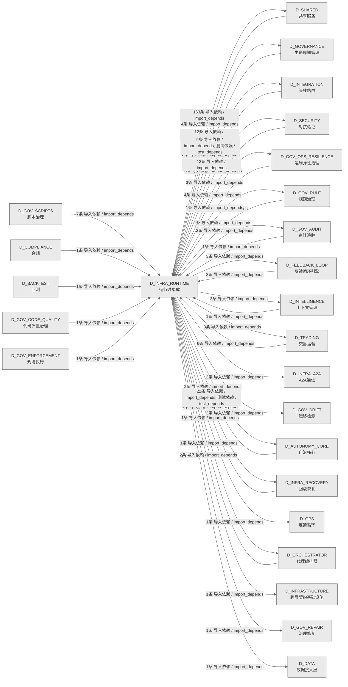

# 06_d_infra_runtime / 运行时集成域 / Runtime Integration

> **功能简介 / Overview**: 运行时集成，负责组件生命周期编排、启动钩子和运行时上下文管理

> **文档作用 / Purpose**: 展示 运行时集成（D_INFRA_RUNTIME）功能域的域内依赖关系、跨域依赖关系，模块信息（成熟度/中英文名/大白话/文件路径）内嵌于 Mermaid 节点，供架构审查和域治理参考。

> 本文档由 generate_domain_doc.py 从 depgraph (PostgreSQL) 自动生成
> 数据源: depgraph (PostgreSQL) nodes表 + edges表

> **[可缩放 HTML 版 / Zoomable HTML](http://localhost:8765/docs/02_enterprise_architecture/02_domain_architecture_docs/06_d_infra_runtime.html)** — Ctrl+滚轮缩放 ｜ 双击重置 ｜ Ctrl+Shift+D 切换拖动/选择模式

## 域基本信息 / Domain Overview

| 字段 | 值 | Field | Value |
|------|------|-------|-------|
| 编号 | 06 | Number | 06 |
| 域ID | D_INFRA_RUNTIME | Domain ID | D_INFRA_RUNTIME |
| 域名称 | 运行时集成 | Domain Name | Runtime Integration |
| 层级 | L0 基础设施层 | Layer | L0 Infrastructure |
| 模块数 | 157 | Module Count | 157 |
| 域内依赖 | 148 | Internal Dependencies | 148 |
| 跨域入边 | 78 | Cross-domain Incoming | 78 |
| 跨域出边 | 222 | Cross-domain Outgoing | 222 |
| 设计态模块 | 1 | Design Modules | 1 |
| 生产态模块 | 156 | Production Modules | 156 |
| 容量 | 160/150 (超容) | Capacity | 160/150 (超容) |
| 描述 | 三层运行时编排(L1 Trae/L2 Local/L3 API) | Description | 三层运行时编排(L1 Trae/L2 Local/L3 API) |

## 域内依赖图 / Internal Dependency Diagram

> 依赖图内嵌在本文档中，IDE 可直接渲染；网页版可 Ctrl+滚轮缩放 + 拖动平移查看细节。含三个视图：全景图（颜色区分运营态/设计态）+ 运营态子图 + 设计态子图；全景图不分页。
>
> **图例说明 / Legend**：
> - 🟦 **蓝色 = 运营态模块**（production，已上线运行）
> - 🟧 **橙色虚线 = 设计态模块**（design，蓝图阶段，代码未写）
> - **实线箭头 = 运营态依赖**（已生效的依赖关系）
> - **虚线箭头 = 非运营态依赖**（计划中/验证中的依赖关系）

### 全景依赖图（全部模块，颜色区分运营态/设计态）

> 展示全部 157 个模块（生产态 156 + 设计态 1），节点含成熟度+中英文名+大白话+文件路径。

```mermaid
%%{init: {'theme': 'base', 'themeVariables': {'primaryColor': '#eaeaea', 'primaryTextColor': '#333333', 'primaryBorderColor': '#666666', 'lineColor': '#666666', 'secondaryColor': '#eaeaea', 'tertiaryColor': '#eaeaea', 'fontSize': '14px'}}}%%
flowchart TD
    docs_03_modules_cross_layer_agent_orchestrator_blueprint_md["(设计态 / design)<br/>文件: agent_orchestrator/blueprint.md"]
    src_zephyr_infrastructure_asset_inventory_main_py["(生产态 / production) Asset Inventory CLI — MOD-INF-026 蓝图 §31<br/>Asset Inventory CLI — MOD-INF-026 蓝图 §31<br/>文件: asset_inventory/__main__.py"]
    src_zephyr_infrastructure_asset_inventory_lifecycle_py["(生产态 / production) AssetLifecycle — MOD-INF-026 L5 ITIL生命周期自动化管理器<br/>AssetLifecycle — MOD-INF-026 L5 ITIL生命周期自动化管理器<br/>文件: asset_inventory/lifecycle.py"]
    src_zephyr_infrastructure_asset_inventory_mcp_server_py["(生产态 / production) AssetInventory MCP Server — MOD-INF-026 蓝图 §21<br/>AssetInventory MCP Server — MOD-INF-026 蓝图 §21<br/>文件: asset_inventory/mcp_server.py"]
    src_zephyr_infrastructure_asset_inventory_metadata_py["(生产态 / production)<br/>文件: asset_inventory/metadata.py"]
    src_zephyr_infrastructure_asset_inventory_trust_anchor_py["(生产态 / production)<br/>文件: asset_inventory/trust_anchor.py"]
    src_zephyr_infrastructure_auto_diagnostics_py["(生产态 / production) RI-12 AutoDiagnostics — 自动诊断引擎<br/>RI-12 AutoDiagnostics — 自动诊断引擎<br/>文件: infrastructure/auto_diagnostics.py"]
    src_zephyr_infrastructure_auto_fix_engine_main_py["(生产态 / production)<br/>文件: auto_fix_engine/__main__.py"]
    src_zephyr_infrastructure_auto_fix_engine_alignment_syncer_py["(生产态 / production)<br/>文件: auto_fix_engine/alignment_syncer.py"]
    src_zephyr_infrastructure_auto_fix_engine_all_completer_py["(生产态 / production)<br/>文件: auto_fix_engine/all_completer.py"]
    src_zephyr_infrastructure_auto_fix_engine_config_fixer_py["(生产态 / production)<br/>文件: auto_fix_engine/config_fixer.py"]
    src_zephyr_infrastructure_auto_fix_engine_dedup_extractor_py["(生产态 / production)<br/>文件: auto_fix_engine/dedup_extractor.py"]
    src_zephyr_infrastructure_auto_fix_engine_dep_version_fixer_py["(生产态 / production)<br/>文件: auto_fix_engine/dep_version_fixer.py"]
    src_zephyr_infrastructure_auto_fix_engine_drift_fixer_py["(生产态 / production)<br/>文件: auto_fix_engine/drift_fixer.py"]
    src_zephyr_infrastructure_auto_fix_engine_event_hooks_py["(生产态 / production)<br/>文件: auto_fix_engine/event_hooks.py"]
    src_zephyr_infrastructure_auto_fix_engine_fix_diff_py["(生产态 / production)<br/>文件: auto_fix_engine/fix_diff.py"]
    src_zephyr_infrastructure_auto_fix_engine_fix_scheduler_py["(生产态 / production)<br/>文件: auto_fix_engine/fix_scheduler.py"]
    src_zephyr_infrastructure_auto_fix_engine_import_fixer_py["(生产态 / production)<br/>文件: auto_fix_engine/import_fixer.py"]
    src_zephyr_infrastructure_auto_fix_engine_interrupt_guard_py["(生产态 / production)<br/>文件: auto_fix_engine/interrupt_guard.py"]
    src_zephyr_infrastructure_auto_fix_engine_llm_fix_adapter_py["(生产态 / production)<br/>文件: auto_fix_engine/llm_fix_adapter.py"]
    src_zephyr_infrastructure_auto_fix_engine_scaffold_registrar_py["(生产态 / production)<br/>文件: auto_fix_engine/scaffold_registrar.py"]
    src_zephyr_infrastructure_auto_fix_engine_self_heal_agent_py["(生产态 / production)<br/>文件: auto_fix_engine/self_heal_agent.py"]
    src_zephyr_infrastructure_auto_fix_engine_state_machine_py["(生产态 / production)<br/>文件: auto_fix_engine/state_machine.py"]
    src_zephyr_infrastructure_auto_fix_engine_zombie_cleaner_py["(生产态 / production)<br/>文件: auto_fix_engine/zombie_cleaner.py"]
    src_zephyr_infrastructure_blueprint_code_sync_py["(生产态 / production) Blueprint-Code Sync — 蓝图-代码索引同步验证。<br/>Blueprint-Code Sync — 蓝图-代码索引同步验证。<br/>文件: infrastructure/blueprint_code_sync.py"]
    src_zephyr_infrastructure_budget_enforcement_init_py["(生产态 / production) budget_enforcement 包聚合层。<br/>budget_enforcement 包聚合层。<br/>文件: budget_enforcement/__init__.py"]
    src_zephyr_infrastructure_capacity_assurance_budget_forecaster_py["(生产态 / production) budget_forecaster.py — Token 预算预测 (DD120-extra, TASK-020)<br/>budget_forecaster.py — Token 预算预测 (DD120-extra, TASK-020)<br/>文件: capacity_assurance/budget_forecaster.py"]
    src_zephyr_infrastructure_capacity_assurance_contracts_contract_bus_py["(生产态 / production) ContractBus loader — 加载全部44条容量保障契约的Pydantic v2 Schema（DD-9三批...<br/>ContractBus loader — 加载全部44条容量保障契约的Pydantic v2 Schema（DD-9三批...<br/>文件: contracts/contract_bus.py"]
    src_zephyr_infrastructure_capacity_assurance_cross_module_integration_py["(生产态 / production) Cross-module integration — CT-1~CT-4 跨模块集成契约实现（对标蓝图 §17）.<br/>Cross-module integration — CT-1~CT-4 跨模块集成契约实现（对标蓝图 §17）.<br/>文件: capacity_assurance/cross_module_integration.py"]
    src_zephyr_infrastructure_capacity_assurance_host_resource_governor_py["(生产态 / production) host_resource_governor.py — 主机资源治理 (B17, DD91, TASK-017)<br/>host_resource_governor.py — 主机资源治理 (B17, DD91, TASK-017)<br/>文件: capacity_assurance/host_resource_governor.py"]
    src_zephyr_infrastructure_capacity_assurance_kill_switch_py["(生产态 / production) kill_switch.py -- safety circuit breaker (DD110, TASK-019).<br/>kill_switch.py -- safety circuit breaker (DD110, TASK-019).<br/>文件: capacity_assurance/kill_switch.py"]
    src_zephyr_infrastructure_capacity_assurance_risk_mitigation_py["(生产态 / production) Risk mitigation — R1~R16 全量风险缓解实现（对标蓝图 §14 风险与缓解 + 多轮盲...<br/>Risk mitigation — R1~R16 全量风险缓解实现（对标蓝图 §14 风险与缓解 + 多轮盲...<br/>文件: capacity_assurance/risk_mitigation.py"]
    src_zephyr_infrastructure_capacity_assurance_schema_py["(生产态 / production) SchemaManager — 容量保障体系数据库 Schema 管理器<br/>SchemaManager — 容量保障体系数据库 Schema 管理器<br/>文件: capacity_assurance/schema.py"]
    src_zephyr_infrastructure_capacity_assurance_sli_instrumentation_py["(生产态 / production) SLI instrumentation — SLI采集插桩点（对标蓝图 §13 SLI Registry CAP-001~CAP-...<br/>SLI instrumentation — SLI采集插桩点（对标蓝图 §13 SLI Registry CAP-001~CAP-...<br/>文件: capacity_assurance/sli_instrumentation.py"]
    src_zephyr_infrastructure_capacity_assurance_tech_stack_py["(生产态 / production) TechStackValidator — 技术栈可用性校验器<br/>TechStackValidator — 技术栈可用性校验器<br/>文件: capacity_assurance/tech_stack.py"]
    src_zephyr_infrastructure_capacity_assurance_token_budget_py["(生产态 / production) token_budget.py — Token 估算工具 SSoT<br/>token_budget.py — Token 估算工具 SSoT<br/>文件: capacity_assurance/token_budget.py"]
    src_zephyr_infrastructure_cost_tracker_py["(生产态 / production) RI-15 CostTracker — 成本追踪器<br/>RI-15 CostTracker — 成本追踪器<br/>文件: infrastructure/cost_tracker.py"]
    src_zephyr_infrastructure_database_service_py["(生产态 / production) DatabaseService: 统一管理数据库的连接池、生命周期、健康检查<br/>DatabaseService: 统一管理数据库的连接池、生命周期、健康检查<br/>文件: infrastructure/database_service.py"]
    src_zephyr_infrastructure_dry_run_simulator_py["(生产态 / production) RI-14 DryRunSimulator — 干运行模拟器<br/>RI-14 DryRunSimulator — 干运行模拟器<br/>文件: infrastructure/dry_run_simulator.py"]
    src_zephyr_infrastructure_event_bus_upgrade_py["(生产态 / production) DEPRECATED: 此文件已废弃。<br/>DEPRECATED: 此文件已废弃。<br/>文件: infrastructure/event_bus_upgrade.py"]
    src_zephyr_infrastructure_event_store_py["(生产态 / production) RI-13 EventStore — 事件存储<br/>RI-13 EventStore — 事件存储<br/>文件: infrastructure/event_store.py"]
    src_zephyr_infrastructure_events_event_store_py["(生产态 / production) Event Store — 事件持久化存储。<br/>Event Store — 事件持久化存储。<br/>文件: events/event_store.py"]
    src_zephyr_infrastructure_finding_task_bridge_py["(生产态 / production) Finding->TaskCard 桥接器<br/>Finding->TaskCard 桥接器<br/>文件: infrastructure/finding_task_bridge.py"]
    src_zephyr_infrastructure_git_batcher_py["(生产态 / production) git_batcher.py — Git 命令批量化工具（ARCH-GIT-CALL-BUDGET P2.2，2026-07-19）<br/>git_batcher.py — Git 命令批量化工具（ARCH-GIT-CALL-BUDGET P2.2，2026-07-19）<br/>文件: infrastructure/git_batcher.py"]
    src_zephyr_infrastructure_health_monitor_health_aggregator_py["(生产态 / production) 全系统健康聚合 — check_all_systems()<br/>全系统健康聚合 — check_all_systems()<br/>文件: health_monitor/health_aggregator.py"]
    src_zephyr_infrastructure_hooks_event_hook_py["(生产态 / production) EventHook — 声明式任务系统事件订阅<br/>EventHook — 声明式任务系统事件订阅<br/>文件: hooks/event_hook.py"]
    src_zephyr_infrastructure_impact_impact_propagator_py["(生产态 / production) Impact Propagator — 变更影响传播分析。<br/>Impact Propagator — 变更影响传播分析。<br/>文件: impact/impact_propagator.py"]
    src_zephyr_infrastructure_impact_llm_impact_analyzer_py["(生产态 / production) LLM Impact Analyzer — 语义影响分析器。<br/>LLM Impact Analyzer — 语义影响分析器。<br/>文件: impact/llm_impact_analyzer.py"]
    src_zephyr_infrastructure_infrastructure_base_py["(生产态 / production) 基础设施 — Infrastructure Layer Skeleton<br/>基础设施 — Infrastructure Layer Skeleton<br/>文件: infrastructure/infrastructure_base.py"]
    src_zephyr_infrastructure_kill_switch_sim_py["(生产态 / production) Kill Switch T0 Hardware Simulator<br/>Kill Switch T0 Hardware Simulator<br/>文件: infrastructure/kill_switch_sim.py"]
    src_zephyr_infrastructure_lifecycle_scope_guard_py["(生产态 / production) Scope Guard — 范围蔓延检测与阻断。<br/>Scope Guard — 范围蔓延检测与阻断。<br/>文件: lifecycle/scope_guard.py"]
    src_zephyr_infrastructure_lifecycle_task_lifecycle_manager_py["(生产态 / production) Task Lifecycle Manager — G0-G7 任务生命周期门禁。<br/>Task Lifecycle Manager — G0-G7 任务生命周期门禁。<br/>文件: lifecycle/task_lifecycle_manager.py"]
    src_zephyr_infrastructure_observability_trace_decorator_py["(生产态 / production)<br/>文件: observability/trace_decorator.py"]
    src_zephyr_infrastructure_pipeline_backpressure_manager_py["(生产态 / production) Pipeline — Backpressure Manager<br/>Pipeline — Backpressure Manager<br/>文件: pipeline/backpressure_manager.py"]
    src_zephyr_infrastructure_pipeline_circuit_breaker_manager_py["(生产态 / production) CircuitBreakerManager -- standalone circuit breaker manager (Netflix Hystrix ...<br/>CircuitBreakerManager -- standalone circuit breaker manager (Netflix Hystrix ...<br/>文件: pipeline/circuit_breaker_manager.py"]
    src_zephyr_infrastructure_pipeline_cost_tracker_py["(生产态 / production) CostTracker —— LLM 调用成本追踪器（SRC-0025）<br/>CostTracker —— LLM 调用成本追踪器（SRC-0025）<br/>文件: pipeline/cost_tracker.py"]
    src_zephyr_infrastructure_pipeline_dead_letter_queue_py["(生产态 / production) DeadLetterQueue — 死信队列<br/>DeadLetterQueue — 死信队列<br/>文件: pipeline/dead_letter_queue.py"]
    src_zephyr_infrastructure_pipeline_llm_gateway_py["(生产态 / production) MOD-INF-019: Agent Spec — LLM Gateway<br/>MOD-INF-019: Agent Spec — LLM Gateway<br/>文件: pipeline/llm_gateway.py"]
    src_zephyr_infrastructure_pipeline_pipeline_agent_bridge_py["(生产态 / production) Pipeline -> Agent Bridge — 双编排器桥接层<br/>Pipeline -> Agent Bridge — 双编排器桥接层<br/>文件: pipeline/pipeline_agent_bridge.py"]
    src_zephyr_infrastructure_pipeline_pipeline_lock_py["(生产态 / production) Pipeline Lock — 双管线并发锁<br/>Pipeline Lock — 双管线并发锁<br/>文件: pipeline/pipeline_lock.py"]
    src_zephyr_infrastructure_pipeline_pipeline_roadmap_py["(生产态 / production) Pipeline 未来版本路线图——v0.10.0 -> v0.12.0 规划骨架。<br/>Pipeline 未来版本路线图——v0.10.0 -> v0.12.0 规划骨架。<br/>文件: pipeline/pipeline_roadmap.py"]
    src_zephyr_infrastructure_pipeline_preemption_manager_py["(生产态 / production) PreemptionManager -- 优先级抢占管理器<br/>PreemptionManager -- 优先级抢占管理器<br/>文件: pipeline/preemption_manager.py"]
    src_zephyr_infrastructure_pipeline_routing_plugins_py["(生产态 / production) Pipeline Routing Plugin System — K8s Scheduling Framework 对标<br/>Pipeline Routing Plugin System — K8s Scheduling Framework 对标<br/>文件: pipeline/routing_plugins.py"]
    src_zephyr_infrastructure_pydantic_v2_migrator_py["(生产态 / production) M-15 PydanticV2Migrator — Pydantic V2 迁移工具<br/>M-15 PydanticV2Migrator — Pydantic V2 迁移工具<br/>文件: infrastructure/pydantic_v2_migrator.py"]
    src_zephyr_infrastructure_quality_quality_monitor_py["(生产态 / production) Quality Monitor — 生成代码质量门禁。<br/>Quality Monitor — 生成代码质量门禁。<br/>文件: quality/quality_monitor.py"]
    src_zephyr_infrastructure_reliability_circuit_breaker_py["(生产态 / production) Circuit Breaker — 熔断器：连续失败 -> OPEN -> 暂停执行。<br/>Circuit Breaker — 熔断器：连续失败 -> OPEN -> 暂停执行。<br/>文件: reliability/circuit_breaker.py"]
    src_zephyr_infrastructure_reliability_context_guard_py["(生产态 / production) Context Guard — 上下文契约守卫。<br/>Context Guard — 上下文契约守卫。<br/>文件: reliability/context_guard.py"]
    src_zephyr_infrastructure_runtime_concurrency_guard_py["(生产态 / production) concurrency_guard — 回滚操作并发安全守卫。<br/>concurrency_guard — 回滚操作并发安全守卫。<br/>文件: runtime/concurrency_guard.py"]
    src_zephyr_infrastructure_runtime_sandbox_enforcer_py["(生产态 / production) SandboxEnforcer — Agent 沙盒隔离。<br/>SandboxEnforcer — Agent 沙盒隔离。<br/>文件: runtime/sandbox_enforcer.py"]
    src_zephyr_infrastructure_runtime_startup_shutdown_py["(生产态 / production)<br/>文件: runtime/startup_shutdown.py"]
    src_zephyr_infrastructure_script_system_finding_py["(生产态 / production) Finding Schema — 审计发现标准化数据模型<br/>Finding Schema — 审计发现标准化数据模型<br/>文件: script_system/finding.py"]
    src_zephyr_infrastructure_script_system_gate_bridge_py["(生产态 / production) Script->Gate 门禁桥接器 — submit_findings() 生产者<br/>Script->Gate 门禁桥接器 — submit_findings() 生产者<br/>文件: script_system/gate_bridge.py"]
    src_zephyr_infrastructure_system_telemetry_auto_bootstrap_py["(生产态 / production) auto_bootstrap — 全自动遥测注入钩子（MOD-INF-015 v2.1.0）<br/>auto_bootstrap — 全自动遥测注入钩子（MOD-INF-015 v2.1.0）<br/>文件: system_telemetry/auto_bootstrap.py"]
    src_zephyr_infrastructure_system_telemetry_logs_init_py["(生产态 / production) logs — 结构化日志流（structlog + JSONL + trace注入）（D_SYSTEM_TELEMETRY）<br/>logs — 结构化日志流（structlog + JSONL + trace注入）（D_SYSTEM_TELEMETRY）<br/>文件: logs/__init__.py"]
    src_zephyr_infrastructure_system_telemetry_metrics_bridge_py["(生产态 / production) TELE->FLE 指标桥接 — emit_metrics() 生产者<br/>TELE->FLE 指标桥接 — emit_metrics() 生产者<br/>文件: system_telemetry/metrics_bridge.py"]
    src_zephyr_infrastructure_warm_hot_gate_py["(生产态 / production) M-14 WarmHotGate — Warm->Hot 阻断门<br/>M-14 WarmHotGate — Warm->Hot 阻断门<br/>文件: infrastructure/warm_hot_gate.py"]
    src_zephyr_shared_lifecycle_hooks_py["(生产态 / production) hooks.py —— 模块生命周期钩子（Phase 2 新增 / 盲点 B8 修复）<br/>hooks.py —— 模块生命周期钩子（Phase 2 新增 / 盲点 B8 修复）<br/>文件: lifecycle/hooks.py"]
    src_zephyr_trading_action_dispatcher_py["(生产态 / production) ActionDispatcher --- 大脑的'手' v2.0 (Phase 2)<br/>ActionDispatcher --- 大脑的'手' v2.0 (Phase 2)<br/>文件: trading/action_dispatcher.py"]
    src_zephyr_trading_auto_task_generator_py["(生产态 / production) AutoTaskGenerator — 自动任务生成器<br/>AutoTaskGenerator — 自动任务生成器<br/>文件: trading/auto_task_generator.py"]
    src_zephyr_trading_ports_py["(生产态 / production) Protocol-based interface layer for runtime->pipeline dependency abstraction.<br/>Protocol-based interface layer for runtime->pipeline dependency abstraction.<br/>文件: trading/ports.py"]
    src_zephyr_trading_staging_area_py["(生产态 / production) StagingArea — 多AI并发草稿写入+提交+冲突检测模块（CT-SESSION-CONFLICT-002）<br/>StagingArea — 多AI并发草稿写入+提交+冲突检测模块（CT-SESSION-CONFLICT-002）<br/>文件: trading/staging_area.py"]
    src_zephyr_trading_task_gate_py["(生产态 / production) TaskGate --- 任务门控<br/>TaskGate --- 任务门控<br/>文件: trading/task_gate.py"]
    src_zephyr_trading_windows_service_py["(生产态 / production) WindowsService — Windows Service 包装器<br/>WindowsService — Windows Service 包装器<br/>文件: trading/windows_service.py"]
    src_zephyr_trading_zombie_scanner_py["(生产态 / production) zombie_scanner.py — 僵尸 Python 进程检测与自动处置<br/>zombie_scanner.py — 僵尸 Python 进程检测与自动处置<br/>文件: trading/zombie_scanner.py"]
    docs_03_modules_cross_layer_agent_orchestrator_blueprint_md ~~~ src_zephyr_infrastructure_asset_inventory_main_py
    src_zephyr_infrastructure_asset_inventory_main_py ~~~ src_zephyr_infrastructure_asset_inventory_lifecycle_py
    src_zephyr_infrastructure_asset_inventory_lifecycle_py ~~~ src_zephyr_infrastructure_asset_inventory_mcp_server_py
    src_zephyr_infrastructure_asset_inventory_mcp_server_py ~~~ src_zephyr_infrastructure_asset_inventory_metadata_py
    src_zephyr_infrastructure_asset_inventory_metadata_py ~~~ src_zephyr_infrastructure_asset_inventory_trust_anchor_py
    src_zephyr_infrastructure_asset_inventory_trust_anchor_py ~~~ src_zephyr_infrastructure_auto_diagnostics_py
    src_zephyr_infrastructure_auto_diagnostics_py ~~~ src_zephyr_infrastructure_auto_fix_engine_main_py
    src_zephyr_infrastructure_auto_fix_engine_main_py ~~~ src_zephyr_infrastructure_auto_fix_engine_alignment_syncer_py
    src_zephyr_infrastructure_auto_fix_engine_alignment_syncer_py ~~~ src_zephyr_infrastructure_auto_fix_engine_all_completer_py
    src_zephyr_infrastructure_auto_fix_engine_all_completer_py ~~~ src_zephyr_infrastructure_auto_fix_engine_config_fixer_py
    src_zephyr_infrastructure_auto_fix_engine_config_fixer_py ~~~ src_zephyr_infrastructure_auto_fix_engine_dedup_extractor_py
    src_zephyr_infrastructure_auto_fix_engine_dedup_extractor_py ~~~ src_zephyr_infrastructure_auto_fix_engine_dep_version_fixer_py
    src_zephyr_infrastructure_auto_fix_engine_dep_version_fixer_py ~~~ src_zephyr_infrastructure_auto_fix_engine_drift_fixer_py
    src_zephyr_infrastructure_auto_fix_engine_drift_fixer_py ~~~ src_zephyr_infrastructure_auto_fix_engine_event_hooks_py
    src_zephyr_infrastructure_auto_fix_engine_event_hooks_py ~~~ src_zephyr_infrastructure_auto_fix_engine_fix_diff_py
    src_zephyr_infrastructure_auto_fix_engine_fix_diff_py ~~~ src_zephyr_infrastructure_auto_fix_engine_fix_scheduler_py
    src_zephyr_infrastructure_auto_fix_engine_fix_scheduler_py ~~~ src_zephyr_infrastructure_auto_fix_engine_import_fixer_py
    src_zephyr_infrastructure_auto_fix_engine_import_fixer_py ~~~ src_zephyr_infrastructure_auto_fix_engine_interrupt_guard_py
    src_zephyr_infrastructure_auto_fix_engine_interrupt_guard_py ~~~ src_zephyr_infrastructure_auto_fix_engine_llm_fix_adapter_py
    src_zephyr_infrastructure_auto_fix_engine_llm_fix_adapter_py ~~~ src_zephyr_infrastructure_auto_fix_engine_scaffold_registrar_py
    src_zephyr_infrastructure_auto_fix_engine_scaffold_registrar_py ~~~ src_zephyr_infrastructure_auto_fix_engine_self_heal_agent_py
    src_zephyr_infrastructure_auto_fix_engine_self_heal_agent_py ~~~ src_zephyr_infrastructure_auto_fix_engine_state_machine_py
    src_zephyr_infrastructure_auto_fix_engine_state_machine_py ~~~ src_zephyr_infrastructure_auto_fix_engine_zombie_cleaner_py
    src_zephyr_infrastructure_auto_fix_engine_zombie_cleaner_py ~~~ src_zephyr_infrastructure_blueprint_code_sync_py
    src_zephyr_infrastructure_blueprint_code_sync_py ~~~ src_zephyr_infrastructure_budget_enforcement_init_py
    src_zephyr_infrastructure_budget_enforcement_init_py ~~~ src_zephyr_infrastructure_capacity_assurance_budget_forecaster_py
    src_zephyr_infrastructure_capacity_assurance_budget_forecaster_py ~~~ src_zephyr_infrastructure_capacity_assurance_contracts_contract_bus_py
    src_zephyr_infrastructure_capacity_assurance_contracts_contract_bus_py ~~~ src_zephyr_infrastructure_capacity_assurance_cross_module_integration_py
    src_zephyr_infrastructure_capacity_assurance_cross_module_integration_py ~~~ src_zephyr_infrastructure_capacity_assurance_host_resource_governor_py
    src_zephyr_infrastructure_capacity_assurance_host_resource_governor_py ~~~ src_zephyr_infrastructure_capacity_assurance_kill_switch_py
    src_zephyr_infrastructure_capacity_assurance_kill_switch_py ~~~ src_zephyr_infrastructure_capacity_assurance_risk_mitigation_py
    src_zephyr_infrastructure_capacity_assurance_risk_mitigation_py ~~~ src_zephyr_infrastructure_capacity_assurance_schema_py
    src_zephyr_infrastructure_capacity_assurance_schema_py ~~~ src_zephyr_infrastructure_capacity_assurance_sli_instrumentation_py
    src_zephyr_infrastructure_capacity_assurance_sli_instrumentation_py ~~~ src_zephyr_infrastructure_capacity_assurance_tech_stack_py
    src_zephyr_infrastructure_capacity_assurance_tech_stack_py ~~~ src_zephyr_infrastructure_capacity_assurance_token_budget_py
    src_zephyr_infrastructure_capacity_assurance_token_budget_py ~~~ src_zephyr_infrastructure_cost_tracker_py
    src_zephyr_infrastructure_cost_tracker_py ~~~ src_zephyr_infrastructure_database_service_py
    src_zephyr_infrastructure_database_service_py ~~~ src_zephyr_infrastructure_dry_run_simulator_py
    src_zephyr_infrastructure_dry_run_simulator_py ~~~ src_zephyr_infrastructure_event_bus_upgrade_py
    src_zephyr_infrastructure_event_bus_upgrade_py ~~~ src_zephyr_infrastructure_event_store_py
    src_zephyr_infrastructure_event_store_py ~~~ src_zephyr_infrastructure_events_event_store_py
    src_zephyr_infrastructure_events_event_store_py ~~~ src_zephyr_infrastructure_finding_task_bridge_py
    src_zephyr_infrastructure_finding_task_bridge_py ~~~ src_zephyr_infrastructure_git_batcher_py
    src_zephyr_infrastructure_git_batcher_py ~~~ src_zephyr_infrastructure_health_monitor_health_aggregator_py
    src_zephyr_infrastructure_health_monitor_health_aggregator_py ~~~ src_zephyr_infrastructure_hooks_event_hook_py
    src_zephyr_infrastructure_hooks_event_hook_py ~~~ src_zephyr_infrastructure_impact_impact_propagator_py
    src_zephyr_infrastructure_impact_impact_propagator_py ~~~ src_zephyr_infrastructure_impact_llm_impact_analyzer_py
    src_zephyr_infrastructure_impact_llm_impact_analyzer_py ~~~ src_zephyr_infrastructure_infrastructure_base_py
    src_zephyr_infrastructure_infrastructure_base_py ~~~ src_zephyr_infrastructure_kill_switch_sim_py
    src_zephyr_infrastructure_kill_switch_sim_py ~~~ src_zephyr_infrastructure_lifecycle_scope_guard_py
    src_zephyr_infrastructure_lifecycle_scope_guard_py ~~~ src_zephyr_infrastructure_lifecycle_task_lifecycle_manager_py
    src_zephyr_infrastructure_lifecycle_task_lifecycle_manager_py ~~~ src_zephyr_infrastructure_observability_trace_decorator_py
    src_zephyr_infrastructure_observability_trace_decorator_py ~~~ src_zephyr_infrastructure_pipeline_backpressure_manager_py
    src_zephyr_infrastructure_pipeline_backpressure_manager_py ~~~ src_zephyr_infrastructure_pipeline_circuit_breaker_manager_py
    src_zephyr_infrastructure_pipeline_circuit_breaker_manager_py ~~~ src_zephyr_infrastructure_pipeline_cost_tracker_py
    src_zephyr_infrastructure_pipeline_cost_tracker_py ~~~ src_zephyr_infrastructure_pipeline_dead_letter_queue_py
    src_zephyr_infrastructure_pipeline_dead_letter_queue_py ~~~ src_zephyr_infrastructure_pipeline_llm_gateway_py
    src_zephyr_infrastructure_pipeline_llm_gateway_py ~~~ src_zephyr_infrastructure_pipeline_pipeline_agent_bridge_py
    src_zephyr_infrastructure_pipeline_pipeline_agent_bridge_py ~~~ src_zephyr_infrastructure_pipeline_pipeline_lock_py
    src_zephyr_infrastructure_pipeline_pipeline_lock_py ~~~ src_zephyr_infrastructure_pipeline_pipeline_roadmap_py
    src_zephyr_infrastructure_pipeline_pipeline_roadmap_py ~~~ src_zephyr_infrastructure_pipeline_preemption_manager_py
    src_zephyr_infrastructure_pipeline_preemption_manager_py ~~~ src_zephyr_infrastructure_pipeline_routing_plugins_py
    src_zephyr_infrastructure_pipeline_routing_plugins_py ~~~ src_zephyr_infrastructure_pydantic_v2_migrator_py
    src_zephyr_infrastructure_pydantic_v2_migrator_py ~~~ src_zephyr_infrastructure_quality_quality_monitor_py
    src_zephyr_infrastructure_quality_quality_monitor_py ~~~ src_zephyr_infrastructure_reliability_circuit_breaker_py
    src_zephyr_infrastructure_reliability_circuit_breaker_py ~~~ src_zephyr_infrastructure_reliability_context_guard_py
    src_zephyr_infrastructure_reliability_context_guard_py ~~~ src_zephyr_infrastructure_runtime_concurrency_guard_py
    src_zephyr_infrastructure_runtime_concurrency_guard_py ~~~ src_zephyr_infrastructure_runtime_sandbox_enforcer_py
    src_zephyr_infrastructure_runtime_sandbox_enforcer_py ~~~ src_zephyr_infrastructure_runtime_startup_shutdown_py
    src_zephyr_infrastructure_runtime_startup_shutdown_py ~~~ src_zephyr_infrastructure_script_system_finding_py
    src_zephyr_infrastructure_script_system_finding_py ~~~ src_zephyr_infrastructure_script_system_gate_bridge_py
    src_zephyr_infrastructure_script_system_gate_bridge_py ~~~ src_zephyr_infrastructure_system_telemetry_auto_bootstrap_py
    src_zephyr_infrastructure_system_telemetry_auto_bootstrap_py ~~~ src_zephyr_infrastructure_system_telemetry_logs_init_py
    src_zephyr_infrastructure_system_telemetry_logs_init_py ~~~ src_zephyr_infrastructure_system_telemetry_metrics_bridge_py
    src_zephyr_infrastructure_system_telemetry_metrics_bridge_py ~~~ src_zephyr_infrastructure_warm_hot_gate_py
    src_zephyr_infrastructure_warm_hot_gate_py ~~~ src_zephyr_shared_lifecycle_hooks_py
    src_zephyr_shared_lifecycle_hooks_py ~~~ src_zephyr_trading_action_dispatcher_py
    src_zephyr_trading_action_dispatcher_py ~~~ src_zephyr_trading_auto_task_generator_py
    src_zephyr_trading_auto_task_generator_py ~~~ src_zephyr_trading_ports_py
    src_zephyr_trading_ports_py ~~~ src_zephyr_trading_staging_area_py
    src_zephyr_trading_staging_area_py ~~~ src_zephyr_trading_task_gate_py
    src_zephyr_trading_task_gate_py ~~~ src_zephyr_trading_windows_service_py
    src_zephyr_trading_windows_service_py ~~~ src_zephyr_trading_zombie_scanner_py
    src_zephyr_infrastructure_asset_inventory_classifier_py["(生产态 / production) AssetClassifier — MOD-INF-026 L2 资产自动分类器<br/>AssetClassifier — MOD-INF-026 L2 资产自动分类器<br/>文件: asset_inventory/classifier.py"]
    src_zephyr_infrastructure_asset_inventory_dashboard_py["(生产态 / production) AssetDashboard — MOD-INF-026 资产健康仪表盘生成器<br/>AssetDashboard — MOD-INF-026 资产健康仪表盘生成器<br/>文件: asset_inventory/dashboard.py"]
    src_zephyr_infrastructure_asset_inventory_dependency_py["(生产态 / production) MOD-INF-026 §18 — 资产依赖图。<br/>MOD-INF-026 §18 — 资产依赖图。<br/>文件: asset_inventory/dependency.py"]
    src_zephyr_infrastructure_asset_inventory_index_generator_py["(生产态 / production) UnifiedAssetIndex — MOD-INF-026 L3 统一资产索引生成器<br/>UnifiedAssetIndex — MOD-INF-026 L3 统一资产索引生成器<br/>文件: asset_inventory/index_generator.py"]
    src_zephyr_infrastructure_asset_inventory_reconciler_py["(生产态 / production) ReconciliationEngine — MOD-INF-026 L4 注册表 vs 磁盘对账引擎<br/>ReconciliationEngine — MOD-INF-026 L4 注册表 vs 磁盘对账引擎<br/>文件: asset_inventory/reconciler.py"]
    src_zephyr_infrastructure_asset_inventory_registry_adapter_py["(生产态 / production) MOD-INF-026 §17 — 24 个异构注册表统一解析适配器。<br/>MOD-INF-026 §17 — 24 个异构注册表统一解析适配器。<br/>文件: asset_inventory/registry_adapter.py"]
    src_zephyr_infrastructure_asset_inventory_scanner_py["(生产态 / production) AssetDiscoveryScanner — MOD-INF-026 L1 全量文件系统扫描器<br/>AssetDiscoveryScanner — MOD-INF-026 L1 全量文件系统扫描器<br/>文件: asset_inventory/scanner.py"]
    src_zephyr_infrastructure_asset_inventory_telemetry_py["(生产态 / production) AssetInventoryTelemetry — MOD-INF-026 自监控指标<br/>AssetInventoryTelemetry — MOD-INF-026 自监控指标<br/>文件: asset_inventory/telemetry.py"]
    src_zephyr_infrastructure_auto_fix_engine_engine_py["(生产态 / production)<br/>文件: auto_fix_engine/engine.py"]
    src_zephyr_infrastructure_budget_enforcement_rbac_bridge_py["(生产态 / production) budget_enforcement.rbac_bridge — 基础设施层 RBAC 桥接适配器。<br/>budget_enforcement.rbac_bridge — 基础设施层 RBAC 桥接适配器。<br/>文件: budget_enforcement/rbac_bridge.py"]
    src_zephyr_infrastructure_capacity_assurance_contracts_batch1_infra_py["(生产态 / production) Batch1 基础设施层契约 — 15条 Pydantic v2 Schema（SLO/Error Budget/Token Budg...<br/>Batch1 基础设施层契约 — 15条 Pydantic v2 Schema（SLO/Error Budget/Token Budg...<br/>文件: contracts/batch1_infra.py"]
    src_zephyr_infrastructure_capacity_assurance_contracts_batch3_integration_py["(生产态 / production) Batch3 集成层契约 — 14条 Pydantic v2 Schema（OTel/W3C/跨模块CT-1~4/DR/容量预...<br/>Batch3 集成层契约 — 14条 Pydantic v2 Schema（OTel/W3C/跨模块CT-1~4/DR/容量预...<br/>文件: contracts/batch3_integration.py"]
    src_zephyr_infrastructure_config_validator_py["(生产态 / production) M-12 ConfigValidator — 配置参数校验器<br/>M-12 ConfigValidator — 配置参数校验器<br/>文件: infrastructure/config_validator.py"]
    src_zephyr_infrastructure_contract_tester_py["(生产态 / production) M-11 ContractTester — 契约测试框架<br/>M-11 ContractTester — 契约测试框架<br/>文件: infrastructure/contract_tester.py"]
    src_zephyr_infrastructure_pipeline_backpressure_types_py["(生产态 / production) backpressure_types.py - Pipeline backpressure signal data types<br/>backpressure_types.py - Pipeline backpressure signal data types<br/>文件: pipeline/backpressure_types.py"]
    src_zephyr_infrastructure_pipeline_ct_pipe_routing_py["(生产态 / production) CT-PIPE-ORC-001 — TaskCard -> 管线入口节点路由<br/>CT-PIPE-ORC-001 — TaskCard -> 管线入口节点路由<br/>文件: pipeline/ct_pipe_routing.py"]
    src_zephyr_infrastructure_pipeline_model_router_py["(生产态 / production) ModelRouter — 模型路由与降级链管理<br/>ModelRouter — 模型路由与降级链管理<br/>文件: pipeline/model_router.py"]
    src_zephyr_infrastructure_queue_task_scheduler_py["(生产态 / production) Task Scheduler — 任务调度器。<br/>Task Scheduler — 任务调度器。<br/>文件: queue/task_scheduler.py"]
    src_zephyr_infrastructure_system_telemetry_budget_telemetry_bridge_py["(生产态 / production)<br/>文件: system_telemetry/_budget_telemetry_bridge.py"]
    src_zephyr_infrastructure_system_telemetry_contract_metrics_py["(生产态 / production) ZephyrAlpha — system-telemetry/contract_metrics.py<br/>ZephyrAlpha — system-telemetry/contract_metrics.py<br/>文件: system_telemetry/contract_metrics.py"]
    src_zephyr_infrastructure_system_telemetry_metrics_blueprint_metrics_py["(生产态 / production) blueprint_metrics — 蓝图使用追踪 instrumentation<br/>blueprint_metrics — 蓝图使用追踪 instrumentation<br/>文件: metrics/blueprint_metrics.py"]
    src_zephyr_trading_main_py["(生产态 / production) python -m zephyr.trading — AutoRuntime Core 入口<br/>python -m zephyr.trading — AutoRuntime Core 入口<br/>文件: trading/__main__.py"]
    src_zephyr_infrastructure_asset_inventory_classifier_py ~~~ src_zephyr_infrastructure_asset_inventory_dashboard_py
    src_zephyr_infrastructure_asset_inventory_dashboard_py ~~~ src_zephyr_infrastructure_asset_inventory_dependency_py
    src_zephyr_infrastructure_asset_inventory_dependency_py ~~~ src_zephyr_infrastructure_asset_inventory_index_generator_py
    src_zephyr_infrastructure_asset_inventory_index_generator_py ~~~ src_zephyr_infrastructure_asset_inventory_reconciler_py
    src_zephyr_infrastructure_asset_inventory_reconciler_py ~~~ src_zephyr_infrastructure_asset_inventory_registry_adapter_py
    src_zephyr_infrastructure_asset_inventory_registry_adapter_py ~~~ src_zephyr_infrastructure_asset_inventory_scanner_py
    src_zephyr_infrastructure_asset_inventory_scanner_py ~~~ src_zephyr_infrastructure_asset_inventory_telemetry_py
    src_zephyr_infrastructure_asset_inventory_telemetry_py ~~~ src_zephyr_infrastructure_auto_fix_engine_engine_py
    src_zephyr_infrastructure_auto_fix_engine_engine_py ~~~ src_zephyr_infrastructure_budget_enforcement_rbac_bridge_py
    src_zephyr_infrastructure_budget_enforcement_rbac_bridge_py ~~~ src_zephyr_infrastructure_capacity_assurance_contracts_batch1_infra_py
    src_zephyr_infrastructure_capacity_assurance_contracts_batch1_infra_py ~~~ src_zephyr_infrastructure_capacity_assurance_contracts_batch3_integration_py
    src_zephyr_infrastructure_capacity_assurance_contracts_batch3_integration_py ~~~ src_zephyr_infrastructure_config_validator_py
    src_zephyr_infrastructure_config_validator_py ~~~ src_zephyr_infrastructure_contract_tester_py
    src_zephyr_infrastructure_contract_tester_py ~~~ src_zephyr_infrastructure_pipeline_backpressure_types_py
    src_zephyr_infrastructure_pipeline_backpressure_types_py ~~~ src_zephyr_infrastructure_pipeline_ct_pipe_routing_py
    src_zephyr_infrastructure_pipeline_ct_pipe_routing_py ~~~ src_zephyr_infrastructure_pipeline_model_router_py
    src_zephyr_infrastructure_pipeline_model_router_py ~~~ src_zephyr_infrastructure_queue_task_scheduler_py
    src_zephyr_infrastructure_queue_task_scheduler_py ~~~ src_zephyr_infrastructure_system_telemetry_budget_telemetry_bridge_py
    src_zephyr_infrastructure_system_telemetry_budget_telemetry_bridge_py ~~~ src_zephyr_infrastructure_system_telemetry_contract_metrics_py
    src_zephyr_infrastructure_system_telemetry_contract_metrics_py ~~~ src_zephyr_infrastructure_system_telemetry_metrics_blueprint_metrics_py
    src_zephyr_infrastructure_system_telemetry_metrics_blueprint_metrics_py ~~~ src_zephyr_trading_main_py
    src_zephyr_infrastructure_asset_inventory_models_py["(生产态 / production) AssetInventoryModels — MOD-INF-026 Pydantic V2 共享数据模型<br/>AssetInventoryModels — MOD-INF-026 Pydantic V2 共享数据模型<br/>文件: asset_inventory/models.py"]
    src_zephyr_infrastructure_auto_fix_engine_batch_fixer_py["(生产态 / production)<br/>文件: auto_fix_engine/batch_fixer.py"]
    src_zephyr_infrastructure_auto_fix_engine_compliance_auditor_py["(生产态 / production)<br/>文件: auto_fix_engine/compliance_auditor.py"]
    src_zephyr_infrastructure_auto_fix_engine_escalation_bridge_py["(生产态 / production)<br/>文件: auto_fix_engine/escalation_bridge.py"]
    src_zephyr_infrastructure_auto_fix_engine_fix_health_check_py["(生产态 / production)<br/>文件: auto_fix_engine/fix_health_check.py"]
    src_zephyr_infrastructure_auto_fix_engine_fix_pattern_miner_py["(生产态 / production)<br/>文件: auto_fix_engine/fix_pattern_miner.py"]
    src_zephyr_infrastructure_auto_fix_engine_fix_report_py["(生产态 / production)<br/>文件: auto_fix_engine/fix_report.py"]
    src_zephyr_infrastructure_auto_fix_engine_fix_safety_py["(生产态 / production)<br/>文件: auto_fix_engine/fix_safety.py"]
    src_zephyr_infrastructure_auto_fix_engine_shadow_workspace_py["(生产态 / production)<br/>文件: auto_fix_engine/shadow_workspace.py"]
    src_zephyr_infrastructure_pipeline_models_py["(生产态 / production) Pipeline 数据模型<br/>Pipeline 数据模型<br/>文件: pipeline/models.py"]
    src_zephyr_infrastructure_system_telemetry_facade_py["(生产态 / production) Telemetry — 系统遥测门面类（MOD-INF-015 v2.1.0）<br/>Telemetry — 系统遥测门面类（MOD-INF-015 v2.1.0）<br/>文件: system_telemetry/facade.py"]
    src_zephyr_trading_auto_runtime_core_py["(生产态 / production) AutoRuntimeCore — 三层运行时运营中心（系统大脑）<br/>AutoRuntimeCore — 三层运行时运营中心（系统大脑）<br/>文件: trading/auto_runtime_core.py"]
    src_zephyr_infrastructure_asset_inventory_models_py ~~~ src_zephyr_infrastructure_auto_fix_engine_batch_fixer_py
    src_zephyr_infrastructure_auto_fix_engine_batch_fixer_py ~~~ src_zephyr_infrastructure_auto_fix_engine_compliance_auditor_py
    src_zephyr_infrastructure_auto_fix_engine_compliance_auditor_py ~~~ src_zephyr_infrastructure_auto_fix_engine_escalation_bridge_py
    src_zephyr_infrastructure_auto_fix_engine_escalation_bridge_py ~~~ src_zephyr_infrastructure_auto_fix_engine_fix_health_check_py
    src_zephyr_infrastructure_auto_fix_engine_fix_health_check_py ~~~ src_zephyr_infrastructure_auto_fix_engine_fix_pattern_miner_py
    src_zephyr_infrastructure_auto_fix_engine_fix_pattern_miner_py ~~~ src_zephyr_infrastructure_auto_fix_engine_fix_report_py
    src_zephyr_infrastructure_auto_fix_engine_fix_report_py ~~~ src_zephyr_infrastructure_auto_fix_engine_fix_safety_py
    src_zephyr_infrastructure_auto_fix_engine_fix_safety_py ~~~ src_zephyr_infrastructure_auto_fix_engine_shadow_workspace_py
    src_zephyr_infrastructure_auto_fix_engine_shadow_workspace_py ~~~ src_zephyr_infrastructure_pipeline_models_py
    src_zephyr_infrastructure_pipeline_models_py ~~~ src_zephyr_infrastructure_system_telemetry_facade_py
    src_zephyr_infrastructure_system_telemetry_facade_py ~~~ src_zephyr_trading_auto_runtime_core_py
    src_zephyr_infrastructure_auto_fix_engine_fix_budget_py["(生产态 / production)<br/>文件: auto_fix_engine/fix_budget.py"]
    src_zephyr_infrastructure_auto_fix_engine_fix_reliability_py["(生产态 / production)<br/>文件: auto_fix_engine/fix_reliability.py"]
    src_zephyr_infrastructure_file_watcher_py["(生产态 / production)<br/>文件: infrastructure/file_watcher.py"]
    src_zephyr_infrastructure_queue_task_queue_py["(生产态 / production) Task Queue — 后台任务队列 + 自动 Dispatch。<br/>Task Queue — 后台任务队列 + 自动 Dispatch。<br/>文件: queue/task_queue.py"]
    src_zephyr_infrastructure_system_telemetry_ai_behavior_event_sink_py["(生产态 / production) 遥测 · ai_behavior/event_sink — AI 行为遥测事件管道。<br/>遥测 · ai_behavior/event_sink — AI 行为遥测事件管道。<br/>文件: ai_behavior/event_sink.py"]
    src_zephyr_infrastructure_system_telemetry_archive_cold_stub_py["(生产态 / production) 遥测 · archive/cold_stub — 冷存储归档管道。<br/>遥测 · archive/cold_stub — 冷存储归档管道。<br/>文件: archive/cold_stub.py"]
    src_zephyr_infrastructure_system_telemetry_traces_span_stub_py["(生产态 / production) 遥测 · traces/span_stub — W3C TraceContext 分布式追踪管道。<br/>遥测 · traces/span_stub — W3C TraceContext 分布式追踪管道。<br/>文件: traces/span_stub.py"]
    src_zephyr_infrastructure_system_telemetry_watchdog_py["(生产态 / production) 三冗余 Watchdog（CT-WATCHDOG-001）——互检+Panic Mode+Dead Man's Switch。<br/>三冗余 Watchdog（CT-WATCHDOG-001）——互检+Panic Mode+Dead Man's Switch。<br/>文件: system_telemetry/watchdog.py"]
    src_zephyr_trading_auto_integrator_py["(生产态 / production) AutoIntegrator — 自动接入器<br/>AutoIntegrator — 自动接入器<br/>文件: trading/auto_integrator.py"]
    src_zephyr_trading_boot_hooks_py["(生产态 / production)<br/>文件: trading/boot_hooks.py"]
    src_zephyr_trading_capability_sync_py["(生产态 / production)<br/>文件: trading/capability_sync.py"]
    src_zephyr_trading_lifecycle_manager_py["(生产态 / production)<br/>文件: trading/lifecycle_manager.py"]
    src_zephyr_trading_status_dashboard_py["(生产态 / production) StatusDashboard — 实时状态面板<br/>StatusDashboard — 实时状态面板<br/>文件: trading/status_dashboard.py"]
    src_zephyr_infrastructure_auto_fix_engine_fix_budget_py ~~~ src_zephyr_infrastructure_auto_fix_engine_fix_reliability_py
    src_zephyr_infrastructure_auto_fix_engine_fix_reliability_py ~~~ src_zephyr_infrastructure_file_watcher_py
    src_zephyr_infrastructure_file_watcher_py ~~~ src_zephyr_infrastructure_queue_task_queue_py
    src_zephyr_infrastructure_queue_task_queue_py ~~~ src_zephyr_infrastructure_system_telemetry_ai_behavior_event_sink_py
    src_zephyr_infrastructure_system_telemetry_ai_behavior_event_sink_py ~~~ src_zephyr_infrastructure_system_telemetry_archive_cold_stub_py
    src_zephyr_infrastructure_system_telemetry_archive_cold_stub_py ~~~ src_zephyr_infrastructure_system_telemetry_traces_span_stub_py
    src_zephyr_infrastructure_system_telemetry_traces_span_stub_py ~~~ src_zephyr_infrastructure_system_telemetry_watchdog_py
    src_zephyr_infrastructure_system_telemetry_watchdog_py ~~~ src_zephyr_trading_auto_integrator_py
    src_zephyr_trading_auto_integrator_py ~~~ src_zephyr_trading_boot_hooks_py
    src_zephyr_trading_boot_hooks_py ~~~ src_zephyr_trading_capability_sync_py
    src_zephyr_trading_capability_sync_py ~~~ src_zephyr_trading_lifecycle_manager_py
    src_zephyr_trading_lifecycle_manager_py ~~~ src_zephyr_trading_status_dashboard_py
    src_zephyr_infrastructure_auto_fix_engine_models_py["(生产态 / production)<br/>文件: auto_fix_engine/models.py"]
    src_zephyr_infrastructure_observability_notifier_py["(生产态 / production) Notifier — 多渠道 Owner 通知。<br/>Notifier — 多渠道 Owner 通知。<br/>文件: observability/notifier.py"]
    src_zephyr_infrastructure_runtime_gate_coordinator_py["(生产态 / production) Rollback->Gate 协调器 — freeze_all / thaw_all<br/>Rollback->Gate 协调器 — freeze_all / thaw_all<br/>文件: runtime/gate_coordinator.py"]
    src_zephyr_infrastructure_sla_sla_monitor_py["(生产态 / production) SLA Monitor — 服务等级协议 (SLA) 监控 RTO/RPO。<br/>SLA Monitor — 服务等级协议 (SLA) 监控 RTO/RPO。<br/>文件: sla/sla_monitor.py"]
    src_zephyr_infrastructure_system_telemetry_health_aggregator_py["(生产态 / production) 健康聚合器（Health Aggregator）<br/>健康聚合器（Health Aggregator）<br/>文件: system_telemetry/health_aggregator.py"]
    src_zephyr_infrastructure_system_telemetry_logs_structured_sink_py["(生产态 / production) logs/structured_sink — 结构化日志管道（D_SYSTEM_TELEMETRY）。<br/>logs/structured_sink — 结构化日志管道（D_SYSTEM_TELEMETRY）。<br/>文件: logs/structured_sink.py"]
    src_zephyr_trading_ai_audit_logger_py["(生产态 / production) AiAuditLogger — AI 行为审计日志<br/>AiAuditLogger — AI 行为审计日志<br/>文件: trading/ai_audit_logger.py"]
    src_zephyr_trading_dream_cycle_py["(生产态 / production) DreamCycle — 知识固化引擎<br/>DreamCycle — 知识固化引擎<br/>文件: trading/dream_cycle.py"]
    src_zephyr_trading_finalizer_py["(生产态 / production) Finalizer — 优雅清理器<br/>Finalizer — 优雅清理器<br/>文件: trading/finalizer.py"]
    src_zephyr_trading_health_monitor_py["(生产态 / production) HealthMonitor — 健康监控 + 自愈<br/>HealthMonitor — 健康监控 + 自愈<br/>文件: trading/health_monitor.py"]
    src_zephyr_trading_integration_registry_py["(生产态 / production) IntegrationRegistry — 集成注册表<br/>IntegrationRegistry — 集成注册表<br/>文件: trading/integration_registry.py"]
    src_zephyr_trading_night_shift_queue_py["(生产态 / production) NightShiftQueue — 夜班登记表持久化<br/>NightShiftQueue — 夜班登记表持久化<br/>文件: trading/night_shift_queue.py"]
    src_zephyr_trading_orphan_detector_py["(生产态 / production) OrphanDetector — 孤儿检测器<br/>OrphanDetector — 孤儿检测器<br/>文件: trading/orphan_detector.py"]
    src_zephyr_trading_runtime_config_py["(生产态 / production)<br/>文件: trading/runtime_config.py"]
    src_zephyr_trading_stop_gate_py["(生产态 / production) StopGate — 质量闸门<br/>StopGate — 质量闸门<br/>文件: trading/stop_gate.py"]
    src_zephyr_trading_work_orchestrator_py["(生产态 / production)<br/>文件: trading/work_orchestrator.py"]
    src_zephyr_infrastructure_auto_fix_engine_models_py ~~~ src_zephyr_infrastructure_observability_notifier_py
    src_zephyr_infrastructure_observability_notifier_py ~~~ src_zephyr_infrastructure_runtime_gate_coordinator_py
    src_zephyr_infrastructure_runtime_gate_coordinator_py ~~~ src_zephyr_infrastructure_sla_sla_monitor_py
    src_zephyr_infrastructure_sla_sla_monitor_py ~~~ src_zephyr_infrastructure_system_telemetry_health_aggregator_py
    src_zephyr_infrastructure_system_telemetry_health_aggregator_py ~~~ src_zephyr_infrastructure_system_telemetry_logs_structured_sink_py
    src_zephyr_infrastructure_system_telemetry_logs_structured_sink_py ~~~ src_zephyr_trading_ai_audit_logger_py
    src_zephyr_trading_ai_audit_logger_py ~~~ src_zephyr_trading_dream_cycle_py
    src_zephyr_trading_dream_cycle_py ~~~ src_zephyr_trading_finalizer_py
    src_zephyr_trading_finalizer_py ~~~ src_zephyr_trading_health_monitor_py
    src_zephyr_trading_health_monitor_py ~~~ src_zephyr_trading_integration_registry_py
    src_zephyr_trading_integration_registry_py ~~~ src_zephyr_trading_night_shift_queue_py
    src_zephyr_trading_night_shift_queue_py ~~~ src_zephyr_trading_orphan_detector_py
    src_zephyr_trading_orphan_detector_py ~~~ src_zephyr_trading_runtime_config_py
    src_zephyr_trading_runtime_config_py ~~~ src_zephyr_trading_stop_gate_py
    src_zephyr_trading_stop_gate_py ~~~ src_zephyr_trading_work_orchestrator_py
    src_zephyr_infrastructure_system_telemetry_trace_bridge_py["(生产态 / production)<br/>文件: system_telemetry/_trace_bridge.py"]
    src_zephyr_infrastructure_system_telemetry_health_probes_py["(生产态 / production) 三态健康探针协议（Health Probes — CT-HEALTH-001）<br/>三态健康探针协议（Health Probes — CT-HEALTH-001）<br/>文件: system_telemetry/health_probes.py"]
    src_zephyr_trading_module_onboarding_scanner_py["(生产态 / production) ModuleOnboardingScanner — 模块接入扫描器<br/>ModuleOnboardingScanner — 模块接入扫描器<br/>文件: trading/module_onboarding_scanner.py"]
    src_zephyr_trading_resource_optimization_py["(生产态 / production) resource_optimization.py - MAPE-K autonomic resource optimization engine<br/>resource_optimization.py - MAPE-K autonomic resource optimization engine<br/>文件: trading/resource_optimization.py"]
    src_zephyr_trading_work_dag_py["(生产态 / production) WorkDAG + WorkItem — 工作编排数据模型<br/>WorkDAG + WorkItem — 工作编排数据模型<br/>文件: trading/work_dag.py"]
    src_zephyr_infrastructure_system_telemetry_trace_bridge_py ~~~ src_zephyr_infrastructure_system_telemetry_health_probes_py
    src_zephyr_infrastructure_system_telemetry_health_probes_py ~~~ src_zephyr_trading_module_onboarding_scanner_py
    src_zephyr_trading_module_onboarding_scanner_py ~~~ src_zephyr_trading_resource_optimization_py
    src_zephyr_trading_resource_optimization_py ~~~ src_zephyr_trading_work_dag_py
    src_zephyr_shared_lifecycle_daemon_registry_py["(生产态 / production) daemon_registry.py - unified daemon thread registry + resource guardian<br/>daemon_registry.py - unified daemon thread registry + resource guardian<br/>文件: lifecycle/daemon_registry.py"]
    src_zephyr_shared_lifecycle_lazy_loader_py["(生产态 / production) lazy_loader.py - Lazy module loading registry<br/>lazy_loader.py - Lazy module loading registry<br/>文件: lifecycle/lazy_loader.py"]
    src_zephyr_shared_lifecycle_resource_optimization_models_py["(生产态 / production) models.py - Pydantic data models for resource optimization engine<br/>models.py - Pydantic data models for resource optimization engine<br/>文件: lifecycle/resource_optimization_models.py"]
    src_zephyr_trading_capability_registry_py["(生产态 / production) CapabilityRegistry — 能力注册中心<br/>CapabilityRegistry — 能力注册中心<br/>文件: trading/capability_registry.py"]
    src_zephyr_shared_lifecycle_daemon_registry_py ~~~ src_zephyr_shared_lifecycle_lazy_loader_py
    src_zephyr_shared_lifecycle_lazy_loader_py ~~~ src_zephyr_shared_lifecycle_resource_optimization_models_py
    src_zephyr_shared_lifecycle_resource_optimization_models_py ~~~ src_zephyr_trading_capability_registry_py
    src_zephyr_trading_capability_card_py["(生产态 / production) CapabilityCard — 能力卡片数据模型<br/>CapabilityCard — 能力卡片数据模型<br/>文件: trading/capability_card.py"]
    src_zephyr_infrastructure_warm_hot_gate_py -->|导入依赖 / import_depends| src_zephyr_infrastructure_config_validator_py
    src_zephyr_infrastructure_warm_hot_gate_py -->|导入依赖 / import_depends| src_zephyr_infrastructure_contract_tester_py
    src_zephyr_infrastructure_asset_inventory_classifier_py -->|导入依赖 / import_depends| src_zephyr_infrastructure_asset_inventory_models_py
    src_zephyr_infrastructure_asset_inventory_lifecycle_py -->|导入依赖 / import_depends| src_zephyr_infrastructure_asset_inventory_models_py
    src_zephyr_infrastructure_asset_inventory_dashboard_py -->|导入依赖 / import_depends| src_zephyr_infrastructure_asset_inventory_models_py
    src_zephyr_infrastructure_asset_inventory_index_generator_py -->|导入依赖 / import_depends| src_zephyr_infrastructure_asset_inventory_models_py
    src_zephyr_infrastructure_asset_inventory_scanner_py -->|导入依赖 / import_depends| src_zephyr_infrastructure_asset_inventory_models_py
    src_zephyr_infrastructure_asset_inventory_registry_adapter_py -->|导入依赖 / import_depends| src_zephyr_infrastructure_asset_inventory_models_py
    src_zephyr_infrastructure_asset_inventory_reconciler_py -->|导入依赖 / import_depends| src_zephyr_infrastructure_asset_inventory_models_py
    src_zephyr_infrastructure_asset_inventory_telemetry_py -->|导入依赖 / import_depends| src_zephyr_infrastructure_system_telemetry_facade_py
    src_zephyr_infrastructure_auto_fix_engine_batch_fixer_py -->|导入依赖 / import_depends| src_zephyr_infrastructure_auto_fix_engine_fix_budget_py
    src_zephyr_infrastructure_auto_fix_engine_batch_fixer_py -->|导入依赖 / import_depends| src_zephyr_infrastructure_auto_fix_engine_fix_reliability_py
    src_zephyr_infrastructure_auto_fix_engine_batch_fixer_py -->|导入依赖 / import_depends| src_zephyr_infrastructure_auto_fix_engine_models_py
    src_zephyr_infrastructure_auto_fix_engine_all_completer_py -->|导入依赖 / import_depends| src_zephyr_infrastructure_auto_fix_engine_models_py
    src_zephyr_infrastructure_auto_fix_engine_config_fixer_py -->|导入依赖 / import_depends| src_zephyr_infrastructure_auto_fix_engine_models_py
    src_zephyr_infrastructure_auto_fix_engine_alignment_syncer_py -->|导入依赖 / import_depends| src_zephyr_infrastructure_auto_fix_engine_models_py
    src_zephyr_infrastructure_asset_inventory_main_py -->|导入依赖 / import_depends| src_zephyr_infrastructure_asset_inventory_classifier_py
    src_zephyr_infrastructure_asset_inventory_main_py -->|导入依赖 / import_depends| src_zephyr_infrastructure_asset_inventory_dependency_py
    src_zephyr_infrastructure_asset_inventory_main_py -->|导入依赖 / import_depends| src_zephyr_infrastructure_asset_inventory_dashboard_py
    src_zephyr_infrastructure_asset_inventory_main_py -->|导入依赖 / import_depends| src_zephyr_infrastructure_asset_inventory_index_generator_py
    src_zephyr_infrastructure_asset_inventory_main_py -->|导入依赖 / import_depends| src_zephyr_infrastructure_asset_inventory_scanner_py
    src_zephyr_infrastructure_asset_inventory_main_py -->|导入依赖 / import_depends| src_zephyr_infrastructure_asset_inventory_models_py
    src_zephyr_infrastructure_asset_inventory_main_py -->|导入依赖 / import_depends| src_zephyr_infrastructure_asset_inventory_registry_adapter_py
    src_zephyr_infrastructure_asset_inventory_main_py -->|导入依赖 / import_depends| src_zephyr_infrastructure_asset_inventory_reconciler_py
    src_zephyr_infrastructure_asset_inventory_main_py -->|导入依赖 / import_depends| src_zephyr_infrastructure_asset_inventory_telemetry_py
    src_zephyr_infrastructure_auto_fix_engine_engine_py -->|导入依赖 / import_depends| src_zephyr_infrastructure_auto_fix_engine_batch_fixer_py
    src_zephyr_infrastructure_auto_fix_engine_engine_py -->|导入依赖 / import_depends| src_zephyr_infrastructure_auto_fix_engine_compliance_auditor_py
    src_zephyr_infrastructure_auto_fix_engine_engine_py -->|导入依赖 / import_depends| src_zephyr_infrastructure_auto_fix_engine_escalation_bridge_py
    src_zephyr_infrastructure_auto_fix_engine_engine_py -->|导入依赖 / import_depends| src_zephyr_infrastructure_auto_fix_engine_fix_budget_py
    src_zephyr_infrastructure_auto_fix_engine_engine_py -->|导入依赖 / import_depends| src_zephyr_infrastructure_auto_fix_engine_fix_pattern_miner_py
    src_zephyr_infrastructure_auto_fix_engine_engine_py -->|导入依赖 / import_depends| src_zephyr_infrastructure_auto_fix_engine_fix_health_check_py
    src_zephyr_infrastructure_auto_fix_engine_engine_py -->|导入依赖 / import_depends| src_zephyr_infrastructure_auto_fix_engine_fix_report_py
    src_zephyr_infrastructure_auto_fix_engine_engine_py -->|导入依赖 / import_depends| src_zephyr_infrastructure_auto_fix_engine_fix_safety_py
    src_zephyr_infrastructure_auto_fix_engine_engine_py -->|导入依赖 / import_depends| src_zephyr_infrastructure_auto_fix_engine_fix_reliability_py
    src_zephyr_infrastructure_auto_fix_engine_engine_py -->|导入依赖 / import_depends| src_zephyr_infrastructure_auto_fix_engine_models_py
    src_zephyr_infrastructure_auto_fix_engine_engine_py -->|导入依赖 / import_depends| src_zephyr_infrastructure_auto_fix_engine_shadow_workspace_py
    src_zephyr_infrastructure_auto_fix_engine_drift_fixer_py -->|导入依赖 / import_depends| src_zephyr_infrastructure_auto_fix_engine_models_py
    src_zephyr_infrastructure_auto_fix_engine_compliance_auditor_py -->|导入依赖 / import_depends| src_zephyr_infrastructure_auto_fix_engine_models_py
    src_zephyr_infrastructure_auto_fix_engine_dep_version_fixer_py -->|导入依赖 / import_depends| src_zephyr_infrastructure_auto_fix_engine_models_py
    src_zephyr_infrastructure_auto_fix_engine_escalation_bridge_py -->|导入依赖 / import_depends| src_zephyr_infrastructure_auto_fix_engine_models_py
    src_zephyr_infrastructure_auto_fix_engine_dedup_extractor_py -->|导入依赖 / import_depends| src_zephyr_infrastructure_auto_fix_engine_models_py
    src_zephyr_infrastructure_auto_fix_engine_event_hooks_py -->|导入依赖 / import_depends| src_zephyr_infrastructure_auto_fix_engine_engine_py
    src_zephyr_infrastructure_auto_fix_engine_event_hooks_py -->|导入依赖 / import_depends| src_zephyr_infrastructure_auto_fix_engine_models_py
    src_zephyr_infrastructure_auto_fix_engine_fix_budget_py -->|导入依赖 / import_depends| src_zephyr_infrastructure_auto_fix_engine_models_py
    src_zephyr_infrastructure_auto_fix_engine_fix_pattern_miner_py -->|导入依赖 / import_depends| src_zephyr_infrastructure_auto_fix_engine_models_py
    src_zephyr_infrastructure_auto_fix_engine_fix_health_check_py -->|导入依赖 / import_depends| src_zephyr_infrastructure_auto_fix_engine_models_py
    src_zephyr_infrastructure_auto_fix_engine_fix_report_py -->|导入依赖 / import_depends| src_zephyr_infrastructure_auto_fix_engine_models_py
    src_zephyr_infrastructure_auto_fix_engine_fix_safety_py -->|导入依赖 / import_depends| src_zephyr_infrastructure_auto_fix_engine_models_py
    src_zephyr_infrastructure_auto_fix_engine_fix_diff_py -->|导入依赖 / import_depends| src_zephyr_infrastructure_auto_fix_engine_models_py
    src_zephyr_infrastructure_auto_fix_engine_fix_reliability_py -->|导入依赖 / import_depends| src_zephyr_infrastructure_auto_fix_engine_models_py
    src_zephyr_infrastructure_auto_fix_engine_import_fixer_py -->|导入依赖 / import_depends| src_zephyr_infrastructure_auto_fix_engine_models_py
    src_zephyr_infrastructure_auto_fix_engine_fix_scheduler_py -->|导入依赖 / import_depends| src_zephyr_infrastructure_auto_fix_engine_models_py
    src_zephyr_infrastructure_auto_fix_engine_llm_fix_adapter_py -->|导入依赖 / import_depends| src_zephyr_infrastructure_auto_fix_engine_fix_safety_py
    src_zephyr_infrastructure_auto_fix_engine_llm_fix_adapter_py -->|导入依赖 / import_depends| src_zephyr_infrastructure_auto_fix_engine_models_py
    src_zephyr_infrastructure_auto_fix_engine_self_heal_agent_py -->|导入依赖 / import_depends| src_zephyr_infrastructure_auto_fix_engine_models_py
    src_zephyr_infrastructure_auto_fix_engine_scaffold_registrar_py -->|导入依赖 / import_depends| src_zephyr_infrastructure_auto_fix_engine_models_py
    src_zephyr_infrastructure_auto_fix_engine_zombie_cleaner_py -->|导入依赖 / import_depends| src_zephyr_infrastructure_auto_fix_engine_models_py
    src_zephyr_infrastructure_auto_fix_engine_shadow_workspace_py -->|导入依赖 / import_depends| src_zephyr_infrastructure_auto_fix_engine_models_py
    src_zephyr_infrastructure_auto_fix_engine_main_py -->|导入依赖 / import_depends| src_zephyr_infrastructure_auto_fix_engine_engine_py
    src_zephyr_infrastructure_budget_enforcement_init_py -->|导入依赖 / import_depends| src_zephyr_infrastructure_budget_enforcement_rbac_bridge_py
    src_zephyr_infrastructure_capacity_assurance_contracts_contract_bus_py -->|导入依赖 / import_depends| src_zephyr_infrastructure_capacity_assurance_contracts_batch1_infra_py
    src_zephyr_infrastructure_capacity_assurance_contracts_contract_bus_py -->|导入依赖 / import_depends| src_zephyr_infrastructure_capacity_assurance_contracts_batch3_integration_py
    src_zephyr_infrastructure_pipeline_backpressure_manager_py -->|导入依赖 / import_depends| src_zephyr_infrastructure_pipeline_backpressure_types_py
    src_zephyr_infrastructure_pipeline_circuit_breaker_manager_py -->|导入依赖 / import_depends| src_zephyr_infrastructure_pipeline_models_py
    src_zephyr_infrastructure_pipeline_dead_letter_queue_py -->|导入依赖 / import_depends| src_zephyr_infrastructure_pipeline_models_py
    src_zephyr_infrastructure_pipeline_cost_tracker_py -->|导入依赖 / import_depends| src_zephyr_infrastructure_pipeline_model_router_py
    src_zephyr_infrastructure_pipeline_cost_tracker_py -->|导入依赖 / import_depends| src_zephyr_infrastructure_pipeline_models_py
    src_zephyr_infrastructure_pipeline_ct_pipe_routing_py -->|导入依赖 / import_depends| src_zephyr_infrastructure_pipeline_models_py
    src_zephyr_infrastructure_pipeline_pipeline_agent_bridge_py -->|导入依赖 / import_depends| src_zephyr_infrastructure_pipeline_models_py
    src_zephyr_infrastructure_pipeline_preemption_manager_py -->|导入依赖 / import_depends| src_zephyr_infrastructure_pipeline_models_py
    src_zephyr_infrastructure_pipeline_routing_plugins_py -->|导入依赖 / import_depends| src_zephyr_infrastructure_pipeline_ct_pipe_routing_py
    src_zephyr_infrastructure_pipeline_routing_plugins_py -->|导入依赖 / import_depends| src_zephyr_infrastructure_pipeline_models_py
    src_zephyr_infrastructure_system_telemetry_auto_bootstrap_py -->|导入依赖 / import_depends| src_zephyr_infrastructure_system_telemetry_facade_py
    src_zephyr_infrastructure_system_telemetry_auto_bootstrap_py -->|导入依赖 / import_depends| src_zephyr_infrastructure_system_telemetry_contract_metrics_py
    src_zephyr_infrastructure_system_telemetry_auto_bootstrap_py -->|导入依赖 / import_depends| src_zephyr_infrastructure_system_telemetry_budget_telemetry_bridge_py
    src_zephyr_infrastructure_system_telemetry_auto_bootstrap_py -->|导入依赖 / import_depends| src_zephyr_infrastructure_system_telemetry_metrics_blueprint_metrics_py
    src_zephyr_infrastructure_system_telemetry_facade_py -->|导入依赖 / import_depends| src_zephyr_infrastructure_system_telemetry_health_aggregator_py
    src_zephyr_infrastructure_system_telemetry_facade_py -->|导入依赖 / import_depends| src_zephyr_infrastructure_system_telemetry_watchdog_py
    src_zephyr_infrastructure_system_telemetry_facade_py -->|导入依赖 / import_depends| src_zephyr_infrastructure_system_telemetry_ai_behavior_event_sink_py
    src_zephyr_infrastructure_system_telemetry_facade_py -->|导入依赖 / import_depends| src_zephyr_infrastructure_system_telemetry_archive_cold_stub_py
    src_zephyr_infrastructure_system_telemetry_facade_py -->|导入依赖 / import_depends| src_zephyr_infrastructure_system_telemetry_traces_span_stub_py
    src_zephyr_infrastructure_system_telemetry_health_aggregator_py -->|导入依赖 / import_depends| src_zephyr_infrastructure_system_telemetry_health_probes_py
    src_zephyr_infrastructure_system_telemetry_ai_behavior_event_sink_py -->|导入依赖 / import_depends| src_zephyr_infrastructure_system_telemetry_logs_structured_sink_py
    src_zephyr_infrastructure_system_telemetry_logs_structured_sink_py -->|导入依赖 / import_depends| src_zephyr_infrastructure_system_telemetry_trace_bridge_py
    src_zephyr_infrastructure_system_telemetry_traces_span_stub_py -->|导入依赖 / import_depends| src_zephyr_infrastructure_system_telemetry_trace_bridge_py
    src_zephyr_infrastructure_system_telemetry_logs_init_py -->|导入依赖 / import_depends| src_zephyr_infrastructure_system_telemetry_logs_structured_sink_py
    src_zephyr_trading_action_dispatcher_py -->|导入依赖 / import_depends| src_zephyr_infrastructure_queue_task_scheduler_py
    src_zephyr_trading_auto_integrator_py -->|导入依赖 / import_depends| src_zephyr_trading_capability_card_py
    src_zephyr_trading_auto_integrator_py -->|导入依赖 / import_depends| src_zephyr_trading_capability_registry_py
    src_zephyr_trading_auto_integrator_py -->|导入依赖 / import_depends| src_zephyr_trading_module_onboarding_scanner_py
    src_zephyr_trading_auto_runtime_core_py -->|导入依赖 / import_depends| src_zephyr_infrastructure_file_watcher_py
    src_zephyr_trading_auto_runtime_core_py -->|导入依赖 / import_depends| src_zephyr_infrastructure_queue_task_queue_py
    src_zephyr_trading_auto_runtime_core_py -->|导入依赖 / import_depends| src_zephyr_trading_ai_audit_logger_py
    src_zephyr_trading_auto_runtime_core_py -->|导入依赖 / import_depends| src_zephyr_trading_auto_integrator_py
    src_zephyr_trading_auto_runtime_core_py -->|导入依赖 / import_depends| src_zephyr_trading_boot_hooks_py
    src_zephyr_trading_auto_runtime_core_py -->|导入依赖 / import_depends| src_zephyr_trading_capability_sync_py
    src_zephyr_trading_auto_runtime_core_py -->|导入依赖 / import_depends| src_zephyr_trading_capability_registry_py
    src_zephyr_trading_auto_runtime_core_py -->|导入依赖 / import_depends| src_zephyr_trading_dream_cycle_py
    src_zephyr_trading_auto_runtime_core_py -->|导入依赖 / import_depends| src_zephyr_trading_integration_registry_py
    src_zephyr_trading_auto_runtime_core_py -->|导入依赖 / import_depends| src_zephyr_trading_health_monitor_py
    src_zephyr_trading_auto_runtime_core_py -->|导入依赖 / import_depends| src_zephyr_trading_finalizer_py
    src_zephyr_trading_auto_runtime_core_py -->|导入依赖 / import_depends| src_zephyr_trading_module_onboarding_scanner_py
    src_zephyr_trading_auto_runtime_core_py -->|导入依赖 / import_depends| src_zephyr_trading_lifecycle_manager_py
    src_zephyr_trading_auto_runtime_core_py -->|导入依赖 / import_depends| src_zephyr_trading_resource_optimization_py
    src_zephyr_trading_auto_runtime_core_py -->|导入依赖 / import_depends| src_zephyr_trading_night_shift_queue_py
    src_zephyr_trading_auto_runtime_core_py -->|导入依赖 / import_depends| src_zephyr_trading_orphan_detector_py
    src_zephyr_trading_auto_runtime_core_py -->|导入依赖 / import_depends| src_zephyr_trading_runtime_config_py
    src_zephyr_trading_auto_runtime_core_py -->|导入依赖 / import_depends| src_zephyr_trading_status_dashboard_py
    src_zephyr_trading_auto_runtime_core_py -->|导入依赖 / import_depends| src_zephyr_trading_stop_gate_py
    src_zephyr_trading_auto_runtime_core_py -->|导入依赖 / import_depends| src_zephyr_trading_work_dag_py
    src_zephyr_trading_auto_runtime_core_py -->|导入依赖 / import_depends| src_zephyr_trading_work_orchestrator_py
    src_zephyr_trading_boot_hooks_py -->|导入依赖 / import_depends| src_zephyr_infrastructure_observability_notifier_py
    src_zephyr_trading_boot_hooks_py -->|导入依赖 / import_depends| src_zephyr_infrastructure_runtime_gate_coordinator_py
    src_zephyr_trading_boot_hooks_py -->|导入依赖 / import_depends| src_zephyr_infrastructure_sla_sla_monitor_py
    src_zephyr_trading_boot_hooks_py -->|导入依赖 / import_depends| src_zephyr_infrastructure_system_telemetry_health_aggregator_py
    src_zephyr_trading_boot_hooks_py -->|导入依赖 / import_depends| src_zephyr_trading_finalizer_py
    src_zephyr_trading_capability_sync_py -->|导入依赖 / import_depends| src_zephyr_trading_capability_card_py
    src_zephyr_trading_capability_sync_py -->|导入依赖 / import_depends| src_zephyr_trading_capability_registry_py
    src_zephyr_trading_capability_registry_py -->|导入依赖 / import_depends| src_zephyr_trading_capability_card_py
    src_zephyr_trading_health_monitor_py -->|导入依赖 / import_depends| src_zephyr_trading_resource_optimization_py
    src_zephyr_trading_module_onboarding_scanner_py -->|导入依赖 / import_depends| src_zephyr_trading_capability_registry_py
    src_zephyr_trading_lifecycle_manager_py -->|导入依赖 / import_depends| src_zephyr_trading_ai_audit_logger_py
    src_zephyr_trading_lifecycle_manager_py -->|导入依赖 / import_depends| src_zephyr_trading_capability_registry_py
    src_zephyr_trading_lifecycle_manager_py -->|导入依赖 / import_depends| src_zephyr_trading_dream_cycle_py
    src_zephyr_trading_lifecycle_manager_py -->|导入依赖 / import_depends| src_zephyr_trading_integration_registry_py
    src_zephyr_trading_lifecycle_manager_py -->|导入依赖 / import_depends| src_zephyr_trading_health_monitor_py
    src_zephyr_trading_lifecycle_manager_py -->|导入依赖 / import_depends| src_zephyr_trading_finalizer_py
    src_zephyr_trading_lifecycle_manager_py -->|导入依赖 / import_depends| src_zephyr_trading_night_shift_queue_py
    src_zephyr_trading_lifecycle_manager_py -->|导入依赖 / import_depends| src_zephyr_trading_runtime_config_py
    src_zephyr_trading_lifecycle_manager_py -->|导入依赖 / import_depends| src_zephyr_trading_stop_gate_py
    src_zephyr_trading_lifecycle_manager_py -->|导入依赖 / import_depends| src_zephyr_trading_work_orchestrator_py
    src_zephyr_trading_resource_optimization_py -->|导入依赖 / import_depends| src_zephyr_shared_lifecycle_daemon_registry_py
    src_zephyr_trading_resource_optimization_py -->|导入依赖 / import_depends| src_zephyr_shared_lifecycle_resource_optimization_models_py
    src_zephyr_trading_resource_optimization_py -->|导入依赖 / import_depends| src_zephyr_shared_lifecycle_lazy_loader_py
    src_zephyr_trading_orphan_detector_py -->|导入依赖 / import_depends| src_zephyr_trading_capability_registry_py
    src_zephyr_trading_orphan_detector_py -->|导入依赖 / import_depends| src_zephyr_trading_module_onboarding_scanner_py
    src_zephyr_trading_status_dashboard_py -->|导入依赖 / import_depends| src_zephyr_trading_capability_registry_py
    src_zephyr_trading_status_dashboard_py -->|导入依赖 / import_depends| src_zephyr_trading_health_monitor_py
    src_zephyr_trading_status_dashboard_py -->|导入依赖 / import_depends| src_zephyr_trading_night_shift_queue_py
    src_zephyr_trading_status_dashboard_py -->|导入依赖 / import_depends| src_zephyr_trading_orphan_detector_py
    src_zephyr_trading_status_dashboard_py -->|导入依赖 / import_depends| src_zephyr_trading_work_orchestrator_py
    src_zephyr_trading_windows_service_py -->|导入依赖 / import_depends| src_zephyr_trading_auto_runtime_core_py
    src_zephyr_trading_windows_service_py -->|导入依赖 / import_depends| src_zephyr_trading_runtime_config_py
    src_zephyr_trading_windows_service_py -->|导入依赖 / import_depends| src_zephyr_trading_main_py
    src_zephyr_trading_work_orchestrator_py -->|导入依赖 / import_depends| src_zephyr_trading_capability_registry_py
    src_zephyr_trading_work_orchestrator_py -->|导入依赖 / import_depends| src_zephyr_trading_work_dag_py
    src_zephyr_trading_main_py -->|导入依赖 / import_depends| src_zephyr_trading_auto_runtime_core_py
    src_zephyr_trading_main_py -->|导入依赖 / import_depends| src_zephyr_trading_runtime_config_py
    D_SHARED["(生产态 / production) 共享服务 / Shared Services<br/>共享服务，负责跨域共享的工具、协议和基础服务<br/>跨域节点 / cross-domain"]
    src_zephyr_infrastructure_file_watcher_py -->|导入依赖 / import_depends| D_SHARED
    src_zephyr_infrastructure_event_store_py -->|导入依赖 / import_depends| D_SHARED
    D_SECURITY["(生产态 / production) 对抗验证 / Adversarial Validation<br/>对抗验证，负责系统安全对抗测试、漏洞扫描和攻防验证<br/>跨域节点 / cross-domain"]
    src_zephyr_trading_boot_hooks_py -->|导入依赖 / import_depends| D_SECURITY
    D_TRADING["(生产态 / production) 交易运营 / Trading Operations<br/>交易运营，负责交易生命周期管理、订单状态和成交处理<br/>跨域节点 / cross-domain"]
    src_zephyr_trading_resource_optimization_py -->|导入依赖 / import_depends| D_TRADING
    src_zephyr_trading_staging_area_py -->|导入依赖 / import_depends| D_SHARED
    src_zephyr_infrastructure_pipeline_llm_gateway_py -->|导入依赖 / import_depends| D_SHARED
    src_zephyr_infrastructure_pipeline_llm_gateway_py -->|导入依赖 / import_depends| D_SHARED
    src_zephyr_trading_night_shift_queue_py -->|导入依赖 / import_depends| D_SHARED
    src_zephyr_trading_auto_runtime_core_py -->|导入依赖 / import_depends| D_SHARED
    src_zephyr_trading_boot_hooks_py -->|导入依赖 / import_depends| D_SECURITY
    src_zephyr_infrastructure_queue_task_scheduler_py -->|导入依赖 / import_depends| D_SHARED
    src_zephyr_infrastructure_auto_fix_engine_fix_budget_py -->|导入依赖 / import_depends| D_SHARED
    src_zephyr_trading_finalizer_py -->|导入依赖 / import_depends| D_SHARED
    D_FEEDBACK_LOOP["(生产态 / production) 反馈循环引擎 / Feedback Loop Engine<br/>反馈循环引擎，负责系统自我改进闭环：异常检测、根因诊断、自动修复和自我进化<br/>跨域节点 / cross-domain"]
    src_zephyr_trading_auto_runtime_core_py -->|导入依赖 / import_depends| D_FEEDBACK_LOOP
    src_zephyr_trading_boot_hooks_py -->|导入依赖 / import_depends| D_SHARED
    D_GOVERNANCE["(生产态 / production) 生命周期管理 / Lifecycle Management<br/>生命周期管理，负责蓝图/模块/任务的声明周期管理和元数据治理<br/>跨域节点 / cross-domain"]
    D_GOVERNANCE -->|导入依赖 / import_depends| src_zephyr_trading_auto_task_generator_py
    D_AUTONOMY_CORE["(生产态 / production) 自治核心 / Autonomy Core<br/>自治核心，负责 AI 自治决策、目标分解和执行编排<br/>跨域节点 / cross-domain"]
    D_AUTONOMY_CORE -->|测试依赖 / test_depends| src_zephyr_trading_dream_cycle_py
    D_GOVERNANCE -->|导入依赖 / import_depends| src_zephyr_infrastructure_runtime_concurrency_guard_py
    D_AUTONOMY_CORE -->|测试依赖 / test_depends| src_zephyr_trading_health_monitor_py
    D_INTELLIGENCE["(生产态 / production) 上下文管理 / Context Management<br/>上下文管理，负责 AI 上下文窗口管理、记忆检索和上下文压缩<br/>跨域节点 / cross-domain"]
    D_INTELLIGENCE -->|导入依赖 / import_depends| src_zephyr_infrastructure_pipeline_models_py
    D_FEEDBACK_LOOP -->|导入依赖 / import_depends| src_zephyr_infrastructure_system_telemetry_metrics_bridge_py
    D_BACKTEST["(生产态 / production) 回测 / Backtest<br/>回测，负责历史数据回测、回测引擎和回测报告<br/>跨域节点 / cross-domain"]
    D_BACKTEST -->|导入依赖 / import_depends| src_zephyr_infrastructure_database_service_py
    D_GOV_SCRIPTS["(生产态 / production) 脚本治理 / Script Governance<br/>脚本治理，负责脚本生命周期管理和脚本质量门禁<br/>跨域节点 / cross-domain"]
    D_GOV_SCRIPTS -->|导入依赖 / import_depends| src_zephyr_infrastructure_script_system_finding_py
    D_AUTONOMY_CORE -->|导入依赖 / import_depends| src_zephyr_infrastructure_capacity_assurance_token_budget_py
    D_ORCHESTRATOR["(生产态 / production) 代理编排器 / Agent Orchestrator<br/>代理编排器，负责 Agent 任务全生命周期：任务入队、调度、沙箱执行、幻觉检测和收尾归档<br/>跨域节点 / cross-domain"]
    D_ORCHESTRATOR -->|导入依赖 / import_depends| src_zephyr_infrastructure_capacity_assurance_token_budget_py
    D_INTEGRATION["(生产态 / production) 管线路由 / Pipeline Routing<br/>管线路由，负责跨域数据流路由、管道编排和集成适配<br/>跨域节点 / cross-domain"]
    D_INTEGRATION -->|导入依赖 / import_depends| src_zephyr_infrastructure_pipeline_pipeline_lock_py
    D_AUTONOMY_CORE -->|测试依赖 / test_depends| src_zephyr_infrastructure_pipeline_dead_letter_queue_py
    D_COMPLIANCE["(生产态 / production) 合规 / Compliance<br/>合规，负责交易合规检查、规则引擎和合规报告<br/>跨域节点 / cross-domain"]
    D_COMPLIANCE -->|导入依赖 / import_depends| src_zephyr_infrastructure_auto_fix_engine_state_machine_py
    D_INTEGRATION -->|导入依赖 / import_depends| src_zephyr_infrastructure_pipeline_models_py
    D_ORCHESTRATOR -->|导入依赖 / import_depends| src_zephyr_infrastructure_script_system_gate_bridge_py
    classDef production fill:#e1f5fe,stroke:#01579b,stroke-width:2px,color:#000
    classDef design fill:#fff3e0,stroke:#e65100,stroke-width:2px,color:#000,stroke-dasharray: 5 5
    classDef external_prod fill:#e8f4fd,stroke:#0277bd,stroke-width:1px,color:#000
    classDef external_design fill:#fff8e7,stroke:#ef6c00,stroke-width:1px,color:#000,stroke-dasharray: 5 5
    class src_zephyr_infrastructure_asset_inventory_main_py,src_zephyr_infrastructure_asset_inventory_classifier_py,src_zephyr_infrastructure_asset_inventory_dashboard_py,src_zephyr_infrastructure_asset_inventory_dependency_py,src_zephyr_infrastructure_asset_inventory_index_generator_py,src_zephyr_infrastructure_asset_inventory_lifecycle_py,src_zephyr_infrastructure_asset_inventory_mcp_server_py,src_zephyr_infrastructure_asset_inventory_metadata_py,src_zephyr_infrastructure_asset_inventory_models_py,src_zephyr_infrastructure_asset_inventory_reconciler_py,src_zephyr_infrastructure_asset_inventory_registry_adapter_py,src_zephyr_infrastructure_asset_inventory_scanner_py,src_zephyr_infrastructure_asset_inventory_telemetry_py,src_zephyr_infrastructure_asset_inventory_trust_anchor_py,src_zephyr_infrastructure_auto_diagnostics_py,src_zephyr_infrastructure_auto_fix_engine_main_py,src_zephyr_infrastructure_auto_fix_engine_alignment_syncer_py,src_zephyr_infrastructure_auto_fix_engine_all_completer_py,src_zephyr_infrastructure_auto_fix_engine_batch_fixer_py,src_zephyr_infrastructure_auto_fix_engine_compliance_auditor_py,src_zephyr_infrastructure_auto_fix_engine_config_fixer_py,src_zephyr_infrastructure_auto_fix_engine_dedup_extractor_py,src_zephyr_infrastructure_auto_fix_engine_dep_version_fixer_py,src_zephyr_infrastructure_auto_fix_engine_drift_fixer_py,src_zephyr_infrastructure_auto_fix_engine_engine_py,src_zephyr_infrastructure_auto_fix_engine_escalation_bridge_py,src_zephyr_infrastructure_auto_fix_engine_event_hooks_py,src_zephyr_infrastructure_auto_fix_engine_fix_budget_py,src_zephyr_infrastructure_auto_fix_engine_fix_diff_py,src_zephyr_infrastructure_auto_fix_engine_fix_health_check_py,src_zephyr_infrastructure_auto_fix_engine_fix_pattern_miner_py,src_zephyr_infrastructure_auto_fix_engine_fix_reliability_py,src_zephyr_infrastructure_auto_fix_engine_fix_report_py,src_zephyr_infrastructure_auto_fix_engine_fix_safety_py,src_zephyr_infrastructure_auto_fix_engine_fix_scheduler_py,src_zephyr_infrastructure_auto_fix_engine_import_fixer_py,src_zephyr_infrastructure_auto_fix_engine_interrupt_guard_py,src_zephyr_infrastructure_auto_fix_engine_llm_fix_adapter_py,src_zephyr_infrastructure_auto_fix_engine_models_py,src_zephyr_infrastructure_auto_fix_engine_scaffold_registrar_py,src_zephyr_infrastructure_auto_fix_engine_self_heal_agent_py,src_zephyr_infrastructure_auto_fix_engine_shadow_workspace_py,src_zephyr_infrastructure_auto_fix_engine_state_machine_py,src_zephyr_infrastructure_auto_fix_engine_zombie_cleaner_py,src_zephyr_infrastructure_blueprint_code_sync_py,src_zephyr_infrastructure_budget_enforcement_init_py,src_zephyr_infrastructure_budget_enforcement_rbac_bridge_py,src_zephyr_infrastructure_capacity_assurance_budget_forecaster_py,src_zephyr_infrastructure_capacity_assurance_contracts_batch1_infra_py,src_zephyr_infrastructure_capacity_assurance_contracts_batch3_integration_py,src_zephyr_infrastructure_capacity_assurance_contracts_contract_bus_py,src_zephyr_infrastructure_capacity_assurance_cross_module_integration_py,src_zephyr_infrastructure_capacity_assurance_host_resource_governor_py,src_zephyr_infrastructure_capacity_assurance_kill_switch_py,src_zephyr_infrastructure_capacity_assurance_risk_mitigation_py,src_zephyr_infrastructure_capacity_assurance_schema_py,src_zephyr_infrastructure_capacity_assurance_sli_instrumentation_py,src_zephyr_infrastructure_capacity_assurance_tech_stack_py,src_zephyr_infrastructure_capacity_assurance_token_budget_py,src_zephyr_infrastructure_config_validator_py,src_zephyr_infrastructure_contract_tester_py,src_zephyr_infrastructure_cost_tracker_py,src_zephyr_infrastructure_database_service_py,src_zephyr_infrastructure_dry_run_simulator_py,src_zephyr_infrastructure_event_bus_upgrade_py,src_zephyr_infrastructure_event_store_py,src_zephyr_infrastructure_events_event_store_py,src_zephyr_infrastructure_file_watcher_py,src_zephyr_infrastructure_finding_task_bridge_py,src_zephyr_infrastructure_git_batcher_py,src_zephyr_infrastructure_health_monitor_health_aggregator_py,src_zephyr_infrastructure_hooks_event_hook_py,src_zephyr_infrastructure_impact_impact_propagator_py,src_zephyr_infrastructure_impact_llm_impact_analyzer_py,src_zephyr_infrastructure_infrastructure_base_py,src_zephyr_infrastructure_kill_switch_sim_py,src_zephyr_infrastructure_lifecycle_scope_guard_py,src_zephyr_infrastructure_lifecycle_task_lifecycle_manager_py,src_zephyr_infrastructure_observability_notifier_py,src_zephyr_infrastructure_observability_trace_decorator_py,src_zephyr_infrastructure_pipeline_backpressure_manager_py,src_zephyr_infrastructure_pipeline_backpressure_types_py,src_zephyr_infrastructure_pipeline_circuit_breaker_manager_py,src_zephyr_infrastructure_pipeline_cost_tracker_py,src_zephyr_infrastructure_pipeline_ct_pipe_routing_py,src_zephyr_infrastructure_pipeline_dead_letter_queue_py,src_zephyr_infrastructure_pipeline_llm_gateway_py,src_zephyr_infrastructure_pipeline_model_router_py,src_zephyr_infrastructure_pipeline_models_py,src_zephyr_infrastructure_pipeline_pipeline_agent_bridge_py,src_zephyr_infrastructure_pipeline_pipeline_lock_py,src_zephyr_infrastructure_pipeline_pipeline_roadmap_py,src_zephyr_infrastructure_pipeline_preemption_manager_py,src_zephyr_infrastructure_pipeline_routing_plugins_py,src_zephyr_infrastructure_pydantic_v2_migrator_py,src_zephyr_infrastructure_quality_quality_monitor_py,src_zephyr_infrastructure_queue_task_queue_py,src_zephyr_infrastructure_queue_task_scheduler_py,src_zephyr_infrastructure_reliability_circuit_breaker_py,src_zephyr_infrastructure_reliability_context_guard_py,src_zephyr_infrastructure_runtime_concurrency_guard_py,src_zephyr_infrastructure_runtime_gate_coordinator_py,src_zephyr_infrastructure_runtime_sandbox_enforcer_py,src_zephyr_infrastructure_runtime_startup_shutdown_py,src_zephyr_infrastructure_script_system_finding_py,src_zephyr_infrastructure_script_system_gate_bridge_py,src_zephyr_infrastructure_sla_sla_monitor_py,src_zephyr_infrastructure_system_telemetry_budget_telemetry_bridge_py,src_zephyr_infrastructure_system_telemetry_trace_bridge_py,src_zephyr_infrastructure_system_telemetry_ai_behavior_event_sink_py,src_zephyr_infrastructure_system_telemetry_archive_cold_stub_py,src_zephyr_infrastructure_system_telemetry_auto_bootstrap_py,src_zephyr_infrastructure_system_telemetry_contract_metrics_py,src_zephyr_infrastructure_system_telemetry_facade_py,src_zephyr_infrastructure_system_telemetry_health_aggregator_py,src_zephyr_infrastructure_system_telemetry_health_probes_py,src_zephyr_infrastructure_system_telemetry_logs_init_py,src_zephyr_infrastructure_system_telemetry_logs_structured_sink_py,src_zephyr_infrastructure_system_telemetry_metrics_blueprint_metrics_py,src_zephyr_infrastructure_system_telemetry_metrics_bridge_py,src_zephyr_infrastructure_system_telemetry_traces_span_stub_py,src_zephyr_infrastructure_system_telemetry_watchdog_py,src_zephyr_infrastructure_warm_hot_gate_py,src_zephyr_shared_lifecycle_daemon_registry_py,src_zephyr_shared_lifecycle_hooks_py,src_zephyr_shared_lifecycle_lazy_loader_py,src_zephyr_shared_lifecycle_resource_optimization_models_py,src_zephyr_trading_main_py,src_zephyr_trading_action_dispatcher_py,src_zephyr_trading_ai_audit_logger_py,src_zephyr_trading_auto_integrator_py,src_zephyr_trading_auto_runtime_core_py,src_zephyr_trading_auto_task_generator_py,src_zephyr_trading_boot_hooks_py,src_zephyr_trading_capability_card_py,src_zephyr_trading_capability_registry_py,src_zephyr_trading_capability_sync_py,src_zephyr_trading_dream_cycle_py,src_zephyr_trading_finalizer_py,src_zephyr_trading_health_monitor_py,src_zephyr_trading_integration_registry_py,src_zephyr_trading_lifecycle_manager_py,src_zephyr_trading_module_onboarding_scanner_py,src_zephyr_trading_night_shift_queue_py,src_zephyr_trading_orphan_detector_py,src_zephyr_trading_ports_py,src_zephyr_trading_resource_optimization_py,src_zephyr_trading_runtime_config_py,src_zephyr_trading_staging_area_py,src_zephyr_trading_status_dashboard_py,src_zephyr_trading_stop_gate_py,src_zephyr_trading_task_gate_py,src_zephyr_trading_windows_service_py,src_zephyr_trading_work_dag_py,src_zephyr_trading_work_orchestrator_py,src_zephyr_trading_zombie_scanner_py production
    class docs_03_modules_cross_layer_agent_orchestrator_blueprint_md design
    class D_SHARED,D_SECURITY,D_TRADING,D_FEEDBACK_LOOP,D_GOVERNANCE,D_AUTONOMY_CORE,D_INTELLIGENCE,D_BACKTEST,D_GOV_SCRIPTS,D_ORCHESTRATOR,D_INTEGRATION,D_COMPLIANCE external_prod
```

### 运营态子图（仅 design_maturity=production 的模块和依赖）

> 仅展示已上线运行的模块（共 156 个，148 条域内依赖）。

```mermaid
%%{init: {'theme': 'base', 'themeVariables': {'primaryColor': '#eaeaea', 'primaryTextColor': '#333333', 'primaryBorderColor': '#666666', 'lineColor': '#666666', 'secondaryColor': '#eaeaea', 'tertiaryColor': '#eaeaea', 'fontSize': '14px'}}}%%
flowchart TD
    src_zephyr_infrastructure_asset_inventory_main_py["(生产态 / production) Asset Inventory CLI — MOD-INF-026 蓝图 §31<br/>Asset Inventory CLI — MOD-INF-026 蓝图 §31<br/>文件: asset_inventory/__main__.py"]
    src_zephyr_infrastructure_asset_inventory_lifecycle_py["(生产态 / production) AssetLifecycle — MOD-INF-026 L5 ITIL生命周期自动化管理器<br/>AssetLifecycle — MOD-INF-026 L5 ITIL生命周期自动化管理器<br/>文件: asset_inventory/lifecycle.py"]
    src_zephyr_infrastructure_asset_inventory_mcp_server_py["(生产态 / production) AssetInventory MCP Server — MOD-INF-026 蓝图 §21<br/>AssetInventory MCP Server — MOD-INF-026 蓝图 §21<br/>文件: asset_inventory/mcp_server.py"]
    src_zephyr_infrastructure_asset_inventory_metadata_py["(生产态 / production)<br/>文件: asset_inventory/metadata.py"]
    src_zephyr_infrastructure_asset_inventory_trust_anchor_py["(生产态 / production)<br/>文件: asset_inventory/trust_anchor.py"]
    src_zephyr_infrastructure_auto_diagnostics_py["(生产态 / production) RI-12 AutoDiagnostics — 自动诊断引擎<br/>RI-12 AutoDiagnostics — 自动诊断引擎<br/>文件: infrastructure/auto_diagnostics.py"]
    src_zephyr_infrastructure_auto_fix_engine_main_py["(生产态 / production)<br/>文件: auto_fix_engine/__main__.py"]
    src_zephyr_infrastructure_auto_fix_engine_alignment_syncer_py["(生产态 / production)<br/>文件: auto_fix_engine/alignment_syncer.py"]
    src_zephyr_infrastructure_auto_fix_engine_all_completer_py["(生产态 / production)<br/>文件: auto_fix_engine/all_completer.py"]
    src_zephyr_infrastructure_auto_fix_engine_config_fixer_py["(生产态 / production)<br/>文件: auto_fix_engine/config_fixer.py"]
    src_zephyr_infrastructure_auto_fix_engine_dedup_extractor_py["(生产态 / production)<br/>文件: auto_fix_engine/dedup_extractor.py"]
    src_zephyr_infrastructure_auto_fix_engine_dep_version_fixer_py["(生产态 / production)<br/>文件: auto_fix_engine/dep_version_fixer.py"]
    src_zephyr_infrastructure_auto_fix_engine_drift_fixer_py["(生产态 / production)<br/>文件: auto_fix_engine/drift_fixer.py"]
    src_zephyr_infrastructure_auto_fix_engine_event_hooks_py["(生产态 / production)<br/>文件: auto_fix_engine/event_hooks.py"]
    src_zephyr_infrastructure_auto_fix_engine_fix_diff_py["(生产态 / production)<br/>文件: auto_fix_engine/fix_diff.py"]
    src_zephyr_infrastructure_auto_fix_engine_fix_scheduler_py["(生产态 / production)<br/>文件: auto_fix_engine/fix_scheduler.py"]
    src_zephyr_infrastructure_auto_fix_engine_import_fixer_py["(生产态 / production)<br/>文件: auto_fix_engine/import_fixer.py"]
    src_zephyr_infrastructure_auto_fix_engine_interrupt_guard_py["(生产态 / production)<br/>文件: auto_fix_engine/interrupt_guard.py"]
    src_zephyr_infrastructure_auto_fix_engine_llm_fix_adapter_py["(生产态 / production)<br/>文件: auto_fix_engine/llm_fix_adapter.py"]
    src_zephyr_infrastructure_auto_fix_engine_scaffold_registrar_py["(生产态 / production)<br/>文件: auto_fix_engine/scaffold_registrar.py"]
    src_zephyr_infrastructure_auto_fix_engine_self_heal_agent_py["(生产态 / production)<br/>文件: auto_fix_engine/self_heal_agent.py"]
    src_zephyr_infrastructure_auto_fix_engine_state_machine_py["(生产态 / production)<br/>文件: auto_fix_engine/state_machine.py"]
    src_zephyr_infrastructure_auto_fix_engine_zombie_cleaner_py["(生产态 / production)<br/>文件: auto_fix_engine/zombie_cleaner.py"]
    src_zephyr_infrastructure_blueprint_code_sync_py["(生产态 / production) Blueprint-Code Sync — 蓝图-代码索引同步验证。<br/>Blueprint-Code Sync — 蓝图-代码索引同步验证。<br/>文件: infrastructure/blueprint_code_sync.py"]
    src_zephyr_infrastructure_budget_enforcement_init_py["(生产态 / production) budget_enforcement 包聚合层。<br/>budget_enforcement 包聚合层。<br/>文件: budget_enforcement/__init__.py"]
    src_zephyr_infrastructure_capacity_assurance_budget_forecaster_py["(生产态 / production) budget_forecaster.py — Token 预算预测 (DD120-extra, TASK-020)<br/>budget_forecaster.py — Token 预算预测 (DD120-extra, TASK-020)<br/>文件: capacity_assurance/budget_forecaster.py"]
    src_zephyr_infrastructure_capacity_assurance_contracts_contract_bus_py["(生产态 / production) ContractBus loader — 加载全部44条容量保障契约的Pydantic v2 Schema（DD-9三批...<br/>ContractBus loader — 加载全部44条容量保障契约的Pydantic v2 Schema（DD-9三批...<br/>文件: contracts/contract_bus.py"]
    src_zephyr_infrastructure_capacity_assurance_cross_module_integration_py["(生产态 / production) Cross-module integration — CT-1~CT-4 跨模块集成契约实现（对标蓝图 §17）.<br/>Cross-module integration — CT-1~CT-4 跨模块集成契约实现（对标蓝图 §17）.<br/>文件: capacity_assurance/cross_module_integration.py"]
    src_zephyr_infrastructure_capacity_assurance_host_resource_governor_py["(生产态 / production) host_resource_governor.py — 主机资源治理 (B17, DD91, TASK-017)<br/>host_resource_governor.py — 主机资源治理 (B17, DD91, TASK-017)<br/>文件: capacity_assurance/host_resource_governor.py"]
    src_zephyr_infrastructure_capacity_assurance_kill_switch_py["(生产态 / production) kill_switch.py -- safety circuit breaker (DD110, TASK-019).<br/>kill_switch.py -- safety circuit breaker (DD110, TASK-019).<br/>文件: capacity_assurance/kill_switch.py"]
    src_zephyr_infrastructure_capacity_assurance_risk_mitigation_py["(生产态 / production) Risk mitigation — R1~R16 全量风险缓解实现（对标蓝图 §14 风险与缓解 + 多轮盲...<br/>Risk mitigation — R1~R16 全量风险缓解实现（对标蓝图 §14 风险与缓解 + 多轮盲...<br/>文件: capacity_assurance/risk_mitigation.py"]
    src_zephyr_infrastructure_capacity_assurance_schema_py["(生产态 / production) SchemaManager — 容量保障体系数据库 Schema 管理器<br/>SchemaManager — 容量保障体系数据库 Schema 管理器<br/>文件: capacity_assurance/schema.py"]
    src_zephyr_infrastructure_capacity_assurance_sli_instrumentation_py["(生产态 / production) SLI instrumentation — SLI采集插桩点（对标蓝图 §13 SLI Registry CAP-001~CAP-...<br/>SLI instrumentation — SLI采集插桩点（对标蓝图 §13 SLI Registry CAP-001~CAP-...<br/>文件: capacity_assurance/sli_instrumentation.py"]
    src_zephyr_infrastructure_capacity_assurance_tech_stack_py["(生产态 / production) TechStackValidator — 技术栈可用性校验器<br/>TechStackValidator — 技术栈可用性校验器<br/>文件: capacity_assurance/tech_stack.py"]
    src_zephyr_infrastructure_capacity_assurance_token_budget_py["(生产态 / production) token_budget.py — Token 估算工具 SSoT<br/>token_budget.py — Token 估算工具 SSoT<br/>文件: capacity_assurance/token_budget.py"]
    src_zephyr_infrastructure_cost_tracker_py["(生产态 / production) RI-15 CostTracker — 成本追踪器<br/>RI-15 CostTracker — 成本追踪器<br/>文件: infrastructure/cost_tracker.py"]
    src_zephyr_infrastructure_database_service_py["(生产态 / production) DatabaseService: 统一管理数据库的连接池、生命周期、健康检查<br/>DatabaseService: 统一管理数据库的连接池、生命周期、健康检查<br/>文件: infrastructure/database_service.py"]
    src_zephyr_infrastructure_dry_run_simulator_py["(生产态 / production) RI-14 DryRunSimulator — 干运行模拟器<br/>RI-14 DryRunSimulator — 干运行模拟器<br/>文件: infrastructure/dry_run_simulator.py"]
    src_zephyr_infrastructure_event_bus_upgrade_py["(生产态 / production) DEPRECATED: 此文件已废弃。<br/>DEPRECATED: 此文件已废弃。<br/>文件: infrastructure/event_bus_upgrade.py"]
    src_zephyr_infrastructure_event_store_py["(生产态 / production) RI-13 EventStore — 事件存储<br/>RI-13 EventStore — 事件存储<br/>文件: infrastructure/event_store.py"]
    src_zephyr_infrastructure_events_event_store_py["(生产态 / production) Event Store — 事件持久化存储。<br/>Event Store — 事件持久化存储。<br/>文件: events/event_store.py"]
    src_zephyr_infrastructure_finding_task_bridge_py["(生产态 / production) Finding->TaskCard 桥接器<br/>Finding->TaskCard 桥接器<br/>文件: infrastructure/finding_task_bridge.py"]
    src_zephyr_infrastructure_git_batcher_py["(生产态 / production) git_batcher.py — Git 命令批量化工具（ARCH-GIT-CALL-BUDGET P2.2，2026-07-19）<br/>git_batcher.py — Git 命令批量化工具（ARCH-GIT-CALL-BUDGET P2.2，2026-07-19）<br/>文件: infrastructure/git_batcher.py"]
    src_zephyr_infrastructure_health_monitor_health_aggregator_py["(生产态 / production) 全系统健康聚合 — check_all_systems()<br/>全系统健康聚合 — check_all_systems()<br/>文件: health_monitor/health_aggregator.py"]
    src_zephyr_infrastructure_hooks_event_hook_py["(生产态 / production) EventHook — 声明式任务系统事件订阅<br/>EventHook — 声明式任务系统事件订阅<br/>文件: hooks/event_hook.py"]
    src_zephyr_infrastructure_impact_impact_propagator_py["(生产态 / production) Impact Propagator — 变更影响传播分析。<br/>Impact Propagator — 变更影响传播分析。<br/>文件: impact/impact_propagator.py"]
    src_zephyr_infrastructure_impact_llm_impact_analyzer_py["(生产态 / production) LLM Impact Analyzer — 语义影响分析器。<br/>LLM Impact Analyzer — 语义影响分析器。<br/>文件: impact/llm_impact_analyzer.py"]
    src_zephyr_infrastructure_infrastructure_base_py["(生产态 / production) 基础设施 — Infrastructure Layer Skeleton<br/>基础设施 — Infrastructure Layer Skeleton<br/>文件: infrastructure/infrastructure_base.py"]
    src_zephyr_infrastructure_kill_switch_sim_py["(生产态 / production) Kill Switch T0 Hardware Simulator<br/>Kill Switch T0 Hardware Simulator<br/>文件: infrastructure/kill_switch_sim.py"]
    src_zephyr_infrastructure_lifecycle_scope_guard_py["(生产态 / production) Scope Guard — 范围蔓延检测与阻断。<br/>Scope Guard — 范围蔓延检测与阻断。<br/>文件: lifecycle/scope_guard.py"]
    src_zephyr_infrastructure_lifecycle_task_lifecycle_manager_py["(生产态 / production) Task Lifecycle Manager — G0-G7 任务生命周期门禁。<br/>Task Lifecycle Manager — G0-G7 任务生命周期门禁。<br/>文件: lifecycle/task_lifecycle_manager.py"]
    src_zephyr_infrastructure_observability_trace_decorator_py["(生产态 / production)<br/>文件: observability/trace_decorator.py"]
    src_zephyr_infrastructure_pipeline_backpressure_manager_py["(生产态 / production) Pipeline — Backpressure Manager<br/>Pipeline — Backpressure Manager<br/>文件: pipeline/backpressure_manager.py"]
    src_zephyr_infrastructure_pipeline_circuit_breaker_manager_py["(生产态 / production) CircuitBreakerManager -- standalone circuit breaker manager (Netflix Hystrix ...<br/>CircuitBreakerManager -- standalone circuit breaker manager (Netflix Hystrix ...<br/>文件: pipeline/circuit_breaker_manager.py"]
    src_zephyr_infrastructure_pipeline_cost_tracker_py["(生产态 / production) CostTracker —— LLM 调用成本追踪器（SRC-0025）<br/>CostTracker —— LLM 调用成本追踪器（SRC-0025）<br/>文件: pipeline/cost_tracker.py"]
    src_zephyr_infrastructure_pipeline_dead_letter_queue_py["(生产态 / production) DeadLetterQueue — 死信队列<br/>DeadLetterQueue — 死信队列<br/>文件: pipeline/dead_letter_queue.py"]
    src_zephyr_infrastructure_pipeline_llm_gateway_py["(生产态 / production) MOD-INF-019: Agent Spec — LLM Gateway<br/>MOD-INF-019: Agent Spec — LLM Gateway<br/>文件: pipeline/llm_gateway.py"]
    src_zephyr_infrastructure_pipeline_pipeline_agent_bridge_py["(生产态 / production) Pipeline -> Agent Bridge — 双编排器桥接层<br/>Pipeline -> Agent Bridge — 双编排器桥接层<br/>文件: pipeline/pipeline_agent_bridge.py"]
    src_zephyr_infrastructure_pipeline_pipeline_lock_py["(生产态 / production) Pipeline Lock — 双管线并发锁<br/>Pipeline Lock — 双管线并发锁<br/>文件: pipeline/pipeline_lock.py"]
    src_zephyr_infrastructure_pipeline_pipeline_roadmap_py["(生产态 / production) Pipeline 未来版本路线图——v0.10.0 -> v0.12.0 规划骨架。<br/>Pipeline 未来版本路线图——v0.10.0 -> v0.12.0 规划骨架。<br/>文件: pipeline/pipeline_roadmap.py"]
    src_zephyr_infrastructure_pipeline_preemption_manager_py["(生产态 / production) PreemptionManager -- 优先级抢占管理器<br/>PreemptionManager -- 优先级抢占管理器<br/>文件: pipeline/preemption_manager.py"]
    src_zephyr_infrastructure_pipeline_routing_plugins_py["(生产态 / production) Pipeline Routing Plugin System — K8s Scheduling Framework 对标<br/>Pipeline Routing Plugin System — K8s Scheduling Framework 对标<br/>文件: pipeline/routing_plugins.py"]
    src_zephyr_infrastructure_pydantic_v2_migrator_py["(生产态 / production) M-15 PydanticV2Migrator — Pydantic V2 迁移工具<br/>M-15 PydanticV2Migrator — Pydantic V2 迁移工具<br/>文件: infrastructure/pydantic_v2_migrator.py"]
    src_zephyr_infrastructure_quality_quality_monitor_py["(生产态 / production) Quality Monitor — 生成代码质量门禁。<br/>Quality Monitor — 生成代码质量门禁。<br/>文件: quality/quality_monitor.py"]
    src_zephyr_infrastructure_reliability_circuit_breaker_py["(生产态 / production) Circuit Breaker — 熔断器：连续失败 -> OPEN -> 暂停执行。<br/>Circuit Breaker — 熔断器：连续失败 -> OPEN -> 暂停执行。<br/>文件: reliability/circuit_breaker.py"]
    src_zephyr_infrastructure_reliability_context_guard_py["(生产态 / production) Context Guard — 上下文契约守卫。<br/>Context Guard — 上下文契约守卫。<br/>文件: reliability/context_guard.py"]
    src_zephyr_infrastructure_runtime_concurrency_guard_py["(生产态 / production) concurrency_guard — 回滚操作并发安全守卫。<br/>concurrency_guard — 回滚操作并发安全守卫。<br/>文件: runtime/concurrency_guard.py"]
    src_zephyr_infrastructure_runtime_sandbox_enforcer_py["(生产态 / production) SandboxEnforcer — Agent 沙盒隔离。<br/>SandboxEnforcer — Agent 沙盒隔离。<br/>文件: runtime/sandbox_enforcer.py"]
    src_zephyr_infrastructure_runtime_startup_shutdown_py["(生产态 / production)<br/>文件: runtime/startup_shutdown.py"]
    src_zephyr_infrastructure_script_system_finding_py["(生产态 / production) Finding Schema — 审计发现标准化数据模型<br/>Finding Schema — 审计发现标准化数据模型<br/>文件: script_system/finding.py"]
    src_zephyr_infrastructure_script_system_gate_bridge_py["(生产态 / production) Script->Gate 门禁桥接器 — submit_findings() 生产者<br/>Script->Gate 门禁桥接器 — submit_findings() 生产者<br/>文件: script_system/gate_bridge.py"]
    src_zephyr_infrastructure_system_telemetry_auto_bootstrap_py["(生产态 / production) auto_bootstrap — 全自动遥测注入钩子（MOD-INF-015 v2.1.0）<br/>auto_bootstrap — 全自动遥测注入钩子（MOD-INF-015 v2.1.0）<br/>文件: system_telemetry/auto_bootstrap.py"]
    src_zephyr_infrastructure_system_telemetry_logs_init_py["(生产态 / production) logs — 结构化日志流（structlog + JSONL + trace注入）（D_SYSTEM_TELEMETRY）<br/>logs — 结构化日志流（structlog + JSONL + trace注入）（D_SYSTEM_TELEMETRY）<br/>文件: logs/__init__.py"]
    src_zephyr_infrastructure_system_telemetry_metrics_bridge_py["(生产态 / production) TELE->FLE 指标桥接 — emit_metrics() 生产者<br/>TELE->FLE 指标桥接 — emit_metrics() 生产者<br/>文件: system_telemetry/metrics_bridge.py"]
    src_zephyr_infrastructure_warm_hot_gate_py["(生产态 / production) M-14 WarmHotGate — Warm->Hot 阻断门<br/>M-14 WarmHotGate — Warm->Hot 阻断门<br/>文件: infrastructure/warm_hot_gate.py"]
    src_zephyr_shared_lifecycle_hooks_py["(生产态 / production) hooks.py —— 模块生命周期钩子（Phase 2 新增 / 盲点 B8 修复）<br/>hooks.py —— 模块生命周期钩子（Phase 2 新增 / 盲点 B8 修复）<br/>文件: lifecycle/hooks.py"]
    src_zephyr_trading_action_dispatcher_py["(生产态 / production) ActionDispatcher --- 大脑的'手' v2.0 (Phase 2)<br/>ActionDispatcher --- 大脑的'手' v2.0 (Phase 2)<br/>文件: trading/action_dispatcher.py"]
    src_zephyr_trading_auto_task_generator_py["(生产态 / production) AutoTaskGenerator — 自动任务生成器<br/>AutoTaskGenerator — 自动任务生成器<br/>文件: trading/auto_task_generator.py"]
    src_zephyr_trading_ports_py["(生产态 / production) Protocol-based interface layer for runtime->pipeline dependency abstraction.<br/>Protocol-based interface layer for runtime->pipeline dependency abstraction.<br/>文件: trading/ports.py"]
    src_zephyr_trading_staging_area_py["(生产态 / production) StagingArea — 多AI并发草稿写入+提交+冲突检测模块（CT-SESSION-CONFLICT-002）<br/>StagingArea — 多AI并发草稿写入+提交+冲突检测模块（CT-SESSION-CONFLICT-002）<br/>文件: trading/staging_area.py"]
    src_zephyr_trading_task_gate_py["(生产态 / production) TaskGate --- 任务门控<br/>TaskGate --- 任务门控<br/>文件: trading/task_gate.py"]
    src_zephyr_trading_windows_service_py["(生产态 / production) WindowsService — Windows Service 包装器<br/>WindowsService — Windows Service 包装器<br/>文件: trading/windows_service.py"]
    src_zephyr_trading_zombie_scanner_py["(生产态 / production) zombie_scanner.py — 僵尸 Python 进程检测与自动处置<br/>zombie_scanner.py — 僵尸 Python 进程检测与自动处置<br/>文件: trading/zombie_scanner.py"]
    src_zephyr_infrastructure_asset_inventory_main_py ~~~ src_zephyr_infrastructure_asset_inventory_lifecycle_py
    src_zephyr_infrastructure_asset_inventory_lifecycle_py ~~~ src_zephyr_infrastructure_asset_inventory_mcp_server_py
    src_zephyr_infrastructure_asset_inventory_mcp_server_py ~~~ src_zephyr_infrastructure_asset_inventory_metadata_py
    src_zephyr_infrastructure_asset_inventory_metadata_py ~~~ src_zephyr_infrastructure_asset_inventory_trust_anchor_py
    src_zephyr_infrastructure_asset_inventory_trust_anchor_py ~~~ src_zephyr_infrastructure_auto_diagnostics_py
    src_zephyr_infrastructure_auto_diagnostics_py ~~~ src_zephyr_infrastructure_auto_fix_engine_main_py
    src_zephyr_infrastructure_auto_fix_engine_main_py ~~~ src_zephyr_infrastructure_auto_fix_engine_alignment_syncer_py
    src_zephyr_infrastructure_auto_fix_engine_alignment_syncer_py ~~~ src_zephyr_infrastructure_auto_fix_engine_all_completer_py
    src_zephyr_infrastructure_auto_fix_engine_all_completer_py ~~~ src_zephyr_infrastructure_auto_fix_engine_config_fixer_py
    src_zephyr_infrastructure_auto_fix_engine_config_fixer_py ~~~ src_zephyr_infrastructure_auto_fix_engine_dedup_extractor_py
    src_zephyr_infrastructure_auto_fix_engine_dedup_extractor_py ~~~ src_zephyr_infrastructure_auto_fix_engine_dep_version_fixer_py
    src_zephyr_infrastructure_auto_fix_engine_dep_version_fixer_py ~~~ src_zephyr_infrastructure_auto_fix_engine_drift_fixer_py
    src_zephyr_infrastructure_auto_fix_engine_drift_fixer_py ~~~ src_zephyr_infrastructure_auto_fix_engine_event_hooks_py
    src_zephyr_infrastructure_auto_fix_engine_event_hooks_py ~~~ src_zephyr_infrastructure_auto_fix_engine_fix_diff_py
    src_zephyr_infrastructure_auto_fix_engine_fix_diff_py ~~~ src_zephyr_infrastructure_auto_fix_engine_fix_scheduler_py
    src_zephyr_infrastructure_auto_fix_engine_fix_scheduler_py ~~~ src_zephyr_infrastructure_auto_fix_engine_import_fixer_py
    src_zephyr_infrastructure_auto_fix_engine_import_fixer_py ~~~ src_zephyr_infrastructure_auto_fix_engine_interrupt_guard_py
    src_zephyr_infrastructure_auto_fix_engine_interrupt_guard_py ~~~ src_zephyr_infrastructure_auto_fix_engine_llm_fix_adapter_py
    src_zephyr_infrastructure_auto_fix_engine_llm_fix_adapter_py ~~~ src_zephyr_infrastructure_auto_fix_engine_scaffold_registrar_py
    src_zephyr_infrastructure_auto_fix_engine_scaffold_registrar_py ~~~ src_zephyr_infrastructure_auto_fix_engine_self_heal_agent_py
    src_zephyr_infrastructure_auto_fix_engine_self_heal_agent_py ~~~ src_zephyr_infrastructure_auto_fix_engine_state_machine_py
    src_zephyr_infrastructure_auto_fix_engine_state_machine_py ~~~ src_zephyr_infrastructure_auto_fix_engine_zombie_cleaner_py
    src_zephyr_infrastructure_auto_fix_engine_zombie_cleaner_py ~~~ src_zephyr_infrastructure_blueprint_code_sync_py
    src_zephyr_infrastructure_blueprint_code_sync_py ~~~ src_zephyr_infrastructure_budget_enforcement_init_py
    src_zephyr_infrastructure_budget_enforcement_init_py ~~~ src_zephyr_infrastructure_capacity_assurance_budget_forecaster_py
    src_zephyr_infrastructure_capacity_assurance_budget_forecaster_py ~~~ src_zephyr_infrastructure_capacity_assurance_contracts_contract_bus_py
    src_zephyr_infrastructure_capacity_assurance_contracts_contract_bus_py ~~~ src_zephyr_infrastructure_capacity_assurance_cross_module_integration_py
    src_zephyr_infrastructure_capacity_assurance_cross_module_integration_py ~~~ src_zephyr_infrastructure_capacity_assurance_host_resource_governor_py
    src_zephyr_infrastructure_capacity_assurance_host_resource_governor_py ~~~ src_zephyr_infrastructure_capacity_assurance_kill_switch_py
    src_zephyr_infrastructure_capacity_assurance_kill_switch_py ~~~ src_zephyr_infrastructure_capacity_assurance_risk_mitigation_py
    src_zephyr_infrastructure_capacity_assurance_risk_mitigation_py ~~~ src_zephyr_infrastructure_capacity_assurance_schema_py
    src_zephyr_infrastructure_capacity_assurance_schema_py ~~~ src_zephyr_infrastructure_capacity_assurance_sli_instrumentation_py
    src_zephyr_infrastructure_capacity_assurance_sli_instrumentation_py ~~~ src_zephyr_infrastructure_capacity_assurance_tech_stack_py
    src_zephyr_infrastructure_capacity_assurance_tech_stack_py ~~~ src_zephyr_infrastructure_capacity_assurance_token_budget_py
    src_zephyr_infrastructure_capacity_assurance_token_budget_py ~~~ src_zephyr_infrastructure_cost_tracker_py
    src_zephyr_infrastructure_cost_tracker_py ~~~ src_zephyr_infrastructure_database_service_py
    src_zephyr_infrastructure_database_service_py ~~~ src_zephyr_infrastructure_dry_run_simulator_py
    src_zephyr_infrastructure_dry_run_simulator_py ~~~ src_zephyr_infrastructure_event_bus_upgrade_py
    src_zephyr_infrastructure_event_bus_upgrade_py ~~~ src_zephyr_infrastructure_event_store_py
    src_zephyr_infrastructure_event_store_py ~~~ src_zephyr_infrastructure_events_event_store_py
    src_zephyr_infrastructure_events_event_store_py ~~~ src_zephyr_infrastructure_finding_task_bridge_py
    src_zephyr_infrastructure_finding_task_bridge_py ~~~ src_zephyr_infrastructure_git_batcher_py
    src_zephyr_infrastructure_git_batcher_py ~~~ src_zephyr_infrastructure_health_monitor_health_aggregator_py
    src_zephyr_infrastructure_health_monitor_health_aggregator_py ~~~ src_zephyr_infrastructure_hooks_event_hook_py
    src_zephyr_infrastructure_hooks_event_hook_py ~~~ src_zephyr_infrastructure_impact_impact_propagator_py
    src_zephyr_infrastructure_impact_impact_propagator_py ~~~ src_zephyr_infrastructure_impact_llm_impact_analyzer_py
    src_zephyr_infrastructure_impact_llm_impact_analyzer_py ~~~ src_zephyr_infrastructure_infrastructure_base_py
    src_zephyr_infrastructure_infrastructure_base_py ~~~ src_zephyr_infrastructure_kill_switch_sim_py
    src_zephyr_infrastructure_kill_switch_sim_py ~~~ src_zephyr_infrastructure_lifecycle_scope_guard_py
    src_zephyr_infrastructure_lifecycle_scope_guard_py ~~~ src_zephyr_infrastructure_lifecycle_task_lifecycle_manager_py
    src_zephyr_infrastructure_lifecycle_task_lifecycle_manager_py ~~~ src_zephyr_infrastructure_observability_trace_decorator_py
    src_zephyr_infrastructure_observability_trace_decorator_py ~~~ src_zephyr_infrastructure_pipeline_backpressure_manager_py
    src_zephyr_infrastructure_pipeline_backpressure_manager_py ~~~ src_zephyr_infrastructure_pipeline_circuit_breaker_manager_py
    src_zephyr_infrastructure_pipeline_circuit_breaker_manager_py ~~~ src_zephyr_infrastructure_pipeline_cost_tracker_py
    src_zephyr_infrastructure_pipeline_cost_tracker_py ~~~ src_zephyr_infrastructure_pipeline_dead_letter_queue_py
    src_zephyr_infrastructure_pipeline_dead_letter_queue_py ~~~ src_zephyr_infrastructure_pipeline_llm_gateway_py
    src_zephyr_infrastructure_pipeline_llm_gateway_py ~~~ src_zephyr_infrastructure_pipeline_pipeline_agent_bridge_py
    src_zephyr_infrastructure_pipeline_pipeline_agent_bridge_py ~~~ src_zephyr_infrastructure_pipeline_pipeline_lock_py
    src_zephyr_infrastructure_pipeline_pipeline_lock_py ~~~ src_zephyr_infrastructure_pipeline_pipeline_roadmap_py
    src_zephyr_infrastructure_pipeline_pipeline_roadmap_py ~~~ src_zephyr_infrastructure_pipeline_preemption_manager_py
    src_zephyr_infrastructure_pipeline_preemption_manager_py ~~~ src_zephyr_infrastructure_pipeline_routing_plugins_py
    src_zephyr_infrastructure_pipeline_routing_plugins_py ~~~ src_zephyr_infrastructure_pydantic_v2_migrator_py
    src_zephyr_infrastructure_pydantic_v2_migrator_py ~~~ src_zephyr_infrastructure_quality_quality_monitor_py
    src_zephyr_infrastructure_quality_quality_monitor_py ~~~ src_zephyr_infrastructure_reliability_circuit_breaker_py
    src_zephyr_infrastructure_reliability_circuit_breaker_py ~~~ src_zephyr_infrastructure_reliability_context_guard_py
    src_zephyr_infrastructure_reliability_context_guard_py ~~~ src_zephyr_infrastructure_runtime_concurrency_guard_py
    src_zephyr_infrastructure_runtime_concurrency_guard_py ~~~ src_zephyr_infrastructure_runtime_sandbox_enforcer_py
    src_zephyr_infrastructure_runtime_sandbox_enforcer_py ~~~ src_zephyr_infrastructure_runtime_startup_shutdown_py
    src_zephyr_infrastructure_runtime_startup_shutdown_py ~~~ src_zephyr_infrastructure_script_system_finding_py
    src_zephyr_infrastructure_script_system_finding_py ~~~ src_zephyr_infrastructure_script_system_gate_bridge_py
    src_zephyr_infrastructure_script_system_gate_bridge_py ~~~ src_zephyr_infrastructure_system_telemetry_auto_bootstrap_py
    src_zephyr_infrastructure_system_telemetry_auto_bootstrap_py ~~~ src_zephyr_infrastructure_system_telemetry_logs_init_py
    src_zephyr_infrastructure_system_telemetry_logs_init_py ~~~ src_zephyr_infrastructure_system_telemetry_metrics_bridge_py
    src_zephyr_infrastructure_system_telemetry_metrics_bridge_py ~~~ src_zephyr_infrastructure_warm_hot_gate_py
    src_zephyr_infrastructure_warm_hot_gate_py ~~~ src_zephyr_shared_lifecycle_hooks_py
    src_zephyr_shared_lifecycle_hooks_py ~~~ src_zephyr_trading_action_dispatcher_py
    src_zephyr_trading_action_dispatcher_py ~~~ src_zephyr_trading_auto_task_generator_py
    src_zephyr_trading_auto_task_generator_py ~~~ src_zephyr_trading_ports_py
    src_zephyr_trading_ports_py ~~~ src_zephyr_trading_staging_area_py
    src_zephyr_trading_staging_area_py ~~~ src_zephyr_trading_task_gate_py
    src_zephyr_trading_task_gate_py ~~~ src_zephyr_trading_windows_service_py
    src_zephyr_trading_windows_service_py ~~~ src_zephyr_trading_zombie_scanner_py
    src_zephyr_infrastructure_asset_inventory_classifier_py["(生产态 / production) AssetClassifier — MOD-INF-026 L2 资产自动分类器<br/>AssetClassifier — MOD-INF-026 L2 资产自动分类器<br/>文件: asset_inventory/classifier.py"]
    src_zephyr_infrastructure_asset_inventory_dashboard_py["(生产态 / production) AssetDashboard — MOD-INF-026 资产健康仪表盘生成器<br/>AssetDashboard — MOD-INF-026 资产健康仪表盘生成器<br/>文件: asset_inventory/dashboard.py"]
    src_zephyr_infrastructure_asset_inventory_dependency_py["(生产态 / production) MOD-INF-026 §18 — 资产依赖图。<br/>MOD-INF-026 §18 — 资产依赖图。<br/>文件: asset_inventory/dependency.py"]
    src_zephyr_infrastructure_asset_inventory_index_generator_py["(生产态 / production) UnifiedAssetIndex — MOD-INF-026 L3 统一资产索引生成器<br/>UnifiedAssetIndex — MOD-INF-026 L3 统一资产索引生成器<br/>文件: asset_inventory/index_generator.py"]
    src_zephyr_infrastructure_asset_inventory_reconciler_py["(生产态 / production) ReconciliationEngine — MOD-INF-026 L4 注册表 vs 磁盘对账引擎<br/>ReconciliationEngine — MOD-INF-026 L4 注册表 vs 磁盘对账引擎<br/>文件: asset_inventory/reconciler.py"]
    src_zephyr_infrastructure_asset_inventory_registry_adapter_py["(生产态 / production) MOD-INF-026 §17 — 24 个异构注册表统一解析适配器。<br/>MOD-INF-026 §17 — 24 个异构注册表统一解析适配器。<br/>文件: asset_inventory/registry_adapter.py"]
    src_zephyr_infrastructure_asset_inventory_scanner_py["(生产态 / production) AssetDiscoveryScanner — MOD-INF-026 L1 全量文件系统扫描器<br/>AssetDiscoveryScanner — MOD-INF-026 L1 全量文件系统扫描器<br/>文件: asset_inventory/scanner.py"]
    src_zephyr_infrastructure_asset_inventory_telemetry_py["(生产态 / production) AssetInventoryTelemetry — MOD-INF-026 自监控指标<br/>AssetInventoryTelemetry — MOD-INF-026 自监控指标<br/>文件: asset_inventory/telemetry.py"]
    src_zephyr_infrastructure_auto_fix_engine_engine_py["(生产态 / production)<br/>文件: auto_fix_engine/engine.py"]
    src_zephyr_infrastructure_budget_enforcement_rbac_bridge_py["(生产态 / production) budget_enforcement.rbac_bridge — 基础设施层 RBAC 桥接适配器。<br/>budget_enforcement.rbac_bridge — 基础设施层 RBAC 桥接适配器。<br/>文件: budget_enforcement/rbac_bridge.py"]
    src_zephyr_infrastructure_capacity_assurance_contracts_batch1_infra_py["(生产态 / production) Batch1 基础设施层契约 — 15条 Pydantic v2 Schema（SLO/Error Budget/Token Budg...<br/>Batch1 基础设施层契约 — 15条 Pydantic v2 Schema（SLO/Error Budget/Token Budg...<br/>文件: contracts/batch1_infra.py"]
    src_zephyr_infrastructure_capacity_assurance_contracts_batch3_integration_py["(生产态 / production) Batch3 集成层契约 — 14条 Pydantic v2 Schema（OTel/W3C/跨模块CT-1~4/DR/容量预...<br/>Batch3 集成层契约 — 14条 Pydantic v2 Schema（OTel/W3C/跨模块CT-1~4/DR/容量预...<br/>文件: contracts/batch3_integration.py"]
    src_zephyr_infrastructure_config_validator_py["(生产态 / production) M-12 ConfigValidator — 配置参数校验器<br/>M-12 ConfigValidator — 配置参数校验器<br/>文件: infrastructure/config_validator.py"]
    src_zephyr_infrastructure_contract_tester_py["(生产态 / production) M-11 ContractTester — 契约测试框架<br/>M-11 ContractTester — 契约测试框架<br/>文件: infrastructure/contract_tester.py"]
    src_zephyr_infrastructure_pipeline_backpressure_types_py["(生产态 / production) backpressure_types.py - Pipeline backpressure signal data types<br/>backpressure_types.py - Pipeline backpressure signal data types<br/>文件: pipeline/backpressure_types.py"]
    src_zephyr_infrastructure_pipeline_ct_pipe_routing_py["(生产态 / production) CT-PIPE-ORC-001 — TaskCard -> 管线入口节点路由<br/>CT-PIPE-ORC-001 — TaskCard -> 管线入口节点路由<br/>文件: pipeline/ct_pipe_routing.py"]
    src_zephyr_infrastructure_pipeline_model_router_py["(生产态 / production) ModelRouter — 模型路由与降级链管理<br/>ModelRouter — 模型路由与降级链管理<br/>文件: pipeline/model_router.py"]
    src_zephyr_infrastructure_queue_task_scheduler_py["(生产态 / production) Task Scheduler — 任务调度器。<br/>Task Scheduler — 任务调度器。<br/>文件: queue/task_scheduler.py"]
    src_zephyr_infrastructure_system_telemetry_budget_telemetry_bridge_py["(生产态 / production)<br/>文件: system_telemetry/_budget_telemetry_bridge.py"]
    src_zephyr_infrastructure_system_telemetry_contract_metrics_py["(生产态 / production) ZephyrAlpha — system-telemetry/contract_metrics.py<br/>ZephyrAlpha — system-telemetry/contract_metrics.py<br/>文件: system_telemetry/contract_metrics.py"]
    src_zephyr_infrastructure_system_telemetry_metrics_blueprint_metrics_py["(生产态 / production) blueprint_metrics — 蓝图使用追踪 instrumentation<br/>blueprint_metrics — 蓝图使用追踪 instrumentation<br/>文件: metrics/blueprint_metrics.py"]
    src_zephyr_trading_main_py["(生产态 / production) python -m zephyr.trading — AutoRuntime Core 入口<br/>python -m zephyr.trading — AutoRuntime Core 入口<br/>文件: trading/__main__.py"]
    src_zephyr_infrastructure_asset_inventory_classifier_py ~~~ src_zephyr_infrastructure_asset_inventory_dashboard_py
    src_zephyr_infrastructure_asset_inventory_dashboard_py ~~~ src_zephyr_infrastructure_asset_inventory_dependency_py
    src_zephyr_infrastructure_asset_inventory_dependency_py ~~~ src_zephyr_infrastructure_asset_inventory_index_generator_py
    src_zephyr_infrastructure_asset_inventory_index_generator_py ~~~ src_zephyr_infrastructure_asset_inventory_reconciler_py
    src_zephyr_infrastructure_asset_inventory_reconciler_py ~~~ src_zephyr_infrastructure_asset_inventory_registry_adapter_py
    src_zephyr_infrastructure_asset_inventory_registry_adapter_py ~~~ src_zephyr_infrastructure_asset_inventory_scanner_py
    src_zephyr_infrastructure_asset_inventory_scanner_py ~~~ src_zephyr_infrastructure_asset_inventory_telemetry_py
    src_zephyr_infrastructure_asset_inventory_telemetry_py ~~~ src_zephyr_infrastructure_auto_fix_engine_engine_py
    src_zephyr_infrastructure_auto_fix_engine_engine_py ~~~ src_zephyr_infrastructure_budget_enforcement_rbac_bridge_py
    src_zephyr_infrastructure_budget_enforcement_rbac_bridge_py ~~~ src_zephyr_infrastructure_capacity_assurance_contracts_batch1_infra_py
    src_zephyr_infrastructure_capacity_assurance_contracts_batch1_infra_py ~~~ src_zephyr_infrastructure_capacity_assurance_contracts_batch3_integration_py
    src_zephyr_infrastructure_capacity_assurance_contracts_batch3_integration_py ~~~ src_zephyr_infrastructure_config_validator_py
    src_zephyr_infrastructure_config_validator_py ~~~ src_zephyr_infrastructure_contract_tester_py
    src_zephyr_infrastructure_contract_tester_py ~~~ src_zephyr_infrastructure_pipeline_backpressure_types_py
    src_zephyr_infrastructure_pipeline_backpressure_types_py ~~~ src_zephyr_infrastructure_pipeline_ct_pipe_routing_py
    src_zephyr_infrastructure_pipeline_ct_pipe_routing_py ~~~ src_zephyr_infrastructure_pipeline_model_router_py
    src_zephyr_infrastructure_pipeline_model_router_py ~~~ src_zephyr_infrastructure_queue_task_scheduler_py
    src_zephyr_infrastructure_queue_task_scheduler_py ~~~ src_zephyr_infrastructure_system_telemetry_budget_telemetry_bridge_py
    src_zephyr_infrastructure_system_telemetry_budget_telemetry_bridge_py ~~~ src_zephyr_infrastructure_system_telemetry_contract_metrics_py
    src_zephyr_infrastructure_system_telemetry_contract_metrics_py ~~~ src_zephyr_infrastructure_system_telemetry_metrics_blueprint_metrics_py
    src_zephyr_infrastructure_system_telemetry_metrics_blueprint_metrics_py ~~~ src_zephyr_trading_main_py
    src_zephyr_infrastructure_asset_inventory_models_py["(生产态 / production) AssetInventoryModels — MOD-INF-026 Pydantic V2 共享数据模型<br/>AssetInventoryModels — MOD-INF-026 Pydantic V2 共享数据模型<br/>文件: asset_inventory/models.py"]
    src_zephyr_infrastructure_auto_fix_engine_batch_fixer_py["(生产态 / production)<br/>文件: auto_fix_engine/batch_fixer.py"]
    src_zephyr_infrastructure_auto_fix_engine_compliance_auditor_py["(生产态 / production)<br/>文件: auto_fix_engine/compliance_auditor.py"]
    src_zephyr_infrastructure_auto_fix_engine_escalation_bridge_py["(生产态 / production)<br/>文件: auto_fix_engine/escalation_bridge.py"]
    src_zephyr_infrastructure_auto_fix_engine_fix_health_check_py["(生产态 / production)<br/>文件: auto_fix_engine/fix_health_check.py"]
    src_zephyr_infrastructure_auto_fix_engine_fix_pattern_miner_py["(生产态 / production)<br/>文件: auto_fix_engine/fix_pattern_miner.py"]
    src_zephyr_infrastructure_auto_fix_engine_fix_report_py["(生产态 / production)<br/>文件: auto_fix_engine/fix_report.py"]
    src_zephyr_infrastructure_auto_fix_engine_fix_safety_py["(生产态 / production)<br/>文件: auto_fix_engine/fix_safety.py"]
    src_zephyr_infrastructure_auto_fix_engine_shadow_workspace_py["(生产态 / production)<br/>文件: auto_fix_engine/shadow_workspace.py"]
    src_zephyr_infrastructure_pipeline_models_py["(生产态 / production) Pipeline 数据模型<br/>Pipeline 数据模型<br/>文件: pipeline/models.py"]
    src_zephyr_infrastructure_system_telemetry_facade_py["(生产态 / production) Telemetry — 系统遥测门面类（MOD-INF-015 v2.1.0）<br/>Telemetry — 系统遥测门面类（MOD-INF-015 v2.1.0）<br/>文件: system_telemetry/facade.py"]
    src_zephyr_trading_auto_runtime_core_py["(生产态 / production) AutoRuntimeCore — 三层运行时运营中心（系统大脑）<br/>AutoRuntimeCore — 三层运行时运营中心（系统大脑）<br/>文件: trading/auto_runtime_core.py"]
    src_zephyr_infrastructure_asset_inventory_models_py ~~~ src_zephyr_infrastructure_auto_fix_engine_batch_fixer_py
    src_zephyr_infrastructure_auto_fix_engine_batch_fixer_py ~~~ src_zephyr_infrastructure_auto_fix_engine_compliance_auditor_py
    src_zephyr_infrastructure_auto_fix_engine_compliance_auditor_py ~~~ src_zephyr_infrastructure_auto_fix_engine_escalation_bridge_py
    src_zephyr_infrastructure_auto_fix_engine_escalation_bridge_py ~~~ src_zephyr_infrastructure_auto_fix_engine_fix_health_check_py
    src_zephyr_infrastructure_auto_fix_engine_fix_health_check_py ~~~ src_zephyr_infrastructure_auto_fix_engine_fix_pattern_miner_py
    src_zephyr_infrastructure_auto_fix_engine_fix_pattern_miner_py ~~~ src_zephyr_infrastructure_auto_fix_engine_fix_report_py
    src_zephyr_infrastructure_auto_fix_engine_fix_report_py ~~~ src_zephyr_infrastructure_auto_fix_engine_fix_safety_py
    src_zephyr_infrastructure_auto_fix_engine_fix_safety_py ~~~ src_zephyr_infrastructure_auto_fix_engine_shadow_workspace_py
    src_zephyr_infrastructure_auto_fix_engine_shadow_workspace_py ~~~ src_zephyr_infrastructure_pipeline_models_py
    src_zephyr_infrastructure_pipeline_models_py ~~~ src_zephyr_infrastructure_system_telemetry_facade_py
    src_zephyr_infrastructure_system_telemetry_facade_py ~~~ src_zephyr_trading_auto_runtime_core_py
    src_zephyr_infrastructure_auto_fix_engine_fix_budget_py["(生产态 / production)<br/>文件: auto_fix_engine/fix_budget.py"]
    src_zephyr_infrastructure_auto_fix_engine_fix_reliability_py["(生产态 / production)<br/>文件: auto_fix_engine/fix_reliability.py"]
    src_zephyr_infrastructure_file_watcher_py["(生产态 / production)<br/>文件: infrastructure/file_watcher.py"]
    src_zephyr_infrastructure_queue_task_queue_py["(生产态 / production) Task Queue — 后台任务队列 + 自动 Dispatch。<br/>Task Queue — 后台任务队列 + 自动 Dispatch。<br/>文件: queue/task_queue.py"]
    src_zephyr_infrastructure_system_telemetry_ai_behavior_event_sink_py["(生产态 / production) 遥测 · ai_behavior/event_sink — AI 行为遥测事件管道。<br/>遥测 · ai_behavior/event_sink — AI 行为遥测事件管道。<br/>文件: ai_behavior/event_sink.py"]
    src_zephyr_infrastructure_system_telemetry_archive_cold_stub_py["(生产态 / production) 遥测 · archive/cold_stub — 冷存储归档管道。<br/>遥测 · archive/cold_stub — 冷存储归档管道。<br/>文件: archive/cold_stub.py"]
    src_zephyr_infrastructure_system_telemetry_traces_span_stub_py["(生产态 / production) 遥测 · traces/span_stub — W3C TraceContext 分布式追踪管道。<br/>遥测 · traces/span_stub — W3C TraceContext 分布式追踪管道。<br/>文件: traces/span_stub.py"]
    src_zephyr_infrastructure_system_telemetry_watchdog_py["(生产态 / production) 三冗余 Watchdog（CT-WATCHDOG-001）——互检+Panic Mode+Dead Man's Switch。<br/>三冗余 Watchdog（CT-WATCHDOG-001）——互检+Panic Mode+Dead Man's Switch。<br/>文件: system_telemetry/watchdog.py"]
    src_zephyr_trading_auto_integrator_py["(生产态 / production) AutoIntegrator — 自动接入器<br/>AutoIntegrator — 自动接入器<br/>文件: trading/auto_integrator.py"]
    src_zephyr_trading_boot_hooks_py["(生产态 / production)<br/>文件: trading/boot_hooks.py"]
    src_zephyr_trading_capability_sync_py["(生产态 / production)<br/>文件: trading/capability_sync.py"]
    src_zephyr_trading_lifecycle_manager_py["(生产态 / production)<br/>文件: trading/lifecycle_manager.py"]
    src_zephyr_trading_status_dashboard_py["(生产态 / production) StatusDashboard — 实时状态面板<br/>StatusDashboard — 实时状态面板<br/>文件: trading/status_dashboard.py"]
    src_zephyr_infrastructure_auto_fix_engine_fix_budget_py ~~~ src_zephyr_infrastructure_auto_fix_engine_fix_reliability_py
    src_zephyr_infrastructure_auto_fix_engine_fix_reliability_py ~~~ src_zephyr_infrastructure_file_watcher_py
    src_zephyr_infrastructure_file_watcher_py ~~~ src_zephyr_infrastructure_queue_task_queue_py
    src_zephyr_infrastructure_queue_task_queue_py ~~~ src_zephyr_infrastructure_system_telemetry_ai_behavior_event_sink_py
    src_zephyr_infrastructure_system_telemetry_ai_behavior_event_sink_py ~~~ src_zephyr_infrastructure_system_telemetry_archive_cold_stub_py
    src_zephyr_infrastructure_system_telemetry_archive_cold_stub_py ~~~ src_zephyr_infrastructure_system_telemetry_traces_span_stub_py
    src_zephyr_infrastructure_system_telemetry_traces_span_stub_py ~~~ src_zephyr_infrastructure_system_telemetry_watchdog_py
    src_zephyr_infrastructure_system_telemetry_watchdog_py ~~~ src_zephyr_trading_auto_integrator_py
    src_zephyr_trading_auto_integrator_py ~~~ src_zephyr_trading_boot_hooks_py
    src_zephyr_trading_boot_hooks_py ~~~ src_zephyr_trading_capability_sync_py
    src_zephyr_trading_capability_sync_py ~~~ src_zephyr_trading_lifecycle_manager_py
    src_zephyr_trading_lifecycle_manager_py ~~~ src_zephyr_trading_status_dashboard_py
    src_zephyr_infrastructure_auto_fix_engine_models_py["(生产态 / production)<br/>文件: auto_fix_engine/models.py"]
    src_zephyr_infrastructure_observability_notifier_py["(生产态 / production) Notifier — 多渠道 Owner 通知。<br/>Notifier — 多渠道 Owner 通知。<br/>文件: observability/notifier.py"]
    src_zephyr_infrastructure_runtime_gate_coordinator_py["(生产态 / production) Rollback->Gate 协调器 — freeze_all / thaw_all<br/>Rollback->Gate 协调器 — freeze_all / thaw_all<br/>文件: runtime/gate_coordinator.py"]
    src_zephyr_infrastructure_sla_sla_monitor_py["(生产态 / production) SLA Monitor — 服务等级协议 (SLA) 监控 RTO/RPO。<br/>SLA Monitor — 服务等级协议 (SLA) 监控 RTO/RPO。<br/>文件: sla/sla_monitor.py"]
    src_zephyr_infrastructure_system_telemetry_health_aggregator_py["(生产态 / production) 健康聚合器（Health Aggregator）<br/>健康聚合器（Health Aggregator）<br/>文件: system_telemetry/health_aggregator.py"]
    src_zephyr_infrastructure_system_telemetry_logs_structured_sink_py["(生产态 / production) logs/structured_sink — 结构化日志管道（D_SYSTEM_TELEMETRY）。<br/>logs/structured_sink — 结构化日志管道（D_SYSTEM_TELEMETRY）。<br/>文件: logs/structured_sink.py"]
    src_zephyr_trading_ai_audit_logger_py["(生产态 / production) AiAuditLogger — AI 行为审计日志<br/>AiAuditLogger — AI 行为审计日志<br/>文件: trading/ai_audit_logger.py"]
    src_zephyr_trading_dream_cycle_py["(生产态 / production) DreamCycle — 知识固化引擎<br/>DreamCycle — 知识固化引擎<br/>文件: trading/dream_cycle.py"]
    src_zephyr_trading_finalizer_py["(生产态 / production) Finalizer — 优雅清理器<br/>Finalizer — 优雅清理器<br/>文件: trading/finalizer.py"]
    src_zephyr_trading_health_monitor_py["(生产态 / production) HealthMonitor — 健康监控 + 自愈<br/>HealthMonitor — 健康监控 + 自愈<br/>文件: trading/health_monitor.py"]
    src_zephyr_trading_integration_registry_py["(生产态 / production) IntegrationRegistry — 集成注册表<br/>IntegrationRegistry — 集成注册表<br/>文件: trading/integration_registry.py"]
    src_zephyr_trading_night_shift_queue_py["(生产态 / production) NightShiftQueue — 夜班登记表持久化<br/>NightShiftQueue — 夜班登记表持久化<br/>文件: trading/night_shift_queue.py"]
    src_zephyr_trading_orphan_detector_py["(生产态 / production) OrphanDetector — 孤儿检测器<br/>OrphanDetector — 孤儿检测器<br/>文件: trading/orphan_detector.py"]
    src_zephyr_trading_runtime_config_py["(生产态 / production)<br/>文件: trading/runtime_config.py"]
    src_zephyr_trading_stop_gate_py["(生产态 / production) StopGate — 质量闸门<br/>StopGate — 质量闸门<br/>文件: trading/stop_gate.py"]
    src_zephyr_trading_work_orchestrator_py["(生产态 / production)<br/>文件: trading/work_orchestrator.py"]
    src_zephyr_infrastructure_auto_fix_engine_models_py ~~~ src_zephyr_infrastructure_observability_notifier_py
    src_zephyr_infrastructure_observability_notifier_py ~~~ src_zephyr_infrastructure_runtime_gate_coordinator_py
    src_zephyr_infrastructure_runtime_gate_coordinator_py ~~~ src_zephyr_infrastructure_sla_sla_monitor_py
    src_zephyr_infrastructure_sla_sla_monitor_py ~~~ src_zephyr_infrastructure_system_telemetry_health_aggregator_py
    src_zephyr_infrastructure_system_telemetry_health_aggregator_py ~~~ src_zephyr_infrastructure_system_telemetry_logs_structured_sink_py
    src_zephyr_infrastructure_system_telemetry_logs_structured_sink_py ~~~ src_zephyr_trading_ai_audit_logger_py
    src_zephyr_trading_ai_audit_logger_py ~~~ src_zephyr_trading_dream_cycle_py
    src_zephyr_trading_dream_cycle_py ~~~ src_zephyr_trading_finalizer_py
    src_zephyr_trading_finalizer_py ~~~ src_zephyr_trading_health_monitor_py
    src_zephyr_trading_health_monitor_py ~~~ src_zephyr_trading_integration_registry_py
    src_zephyr_trading_integration_registry_py ~~~ src_zephyr_trading_night_shift_queue_py
    src_zephyr_trading_night_shift_queue_py ~~~ src_zephyr_trading_orphan_detector_py
    src_zephyr_trading_orphan_detector_py ~~~ src_zephyr_trading_runtime_config_py
    src_zephyr_trading_runtime_config_py ~~~ src_zephyr_trading_stop_gate_py
    src_zephyr_trading_stop_gate_py ~~~ src_zephyr_trading_work_orchestrator_py
    src_zephyr_infrastructure_system_telemetry_trace_bridge_py["(生产态 / production)<br/>文件: system_telemetry/_trace_bridge.py"]
    src_zephyr_infrastructure_system_telemetry_health_probes_py["(生产态 / production) 三态健康探针协议（Health Probes — CT-HEALTH-001）<br/>三态健康探针协议（Health Probes — CT-HEALTH-001）<br/>文件: system_telemetry/health_probes.py"]
    src_zephyr_trading_module_onboarding_scanner_py["(生产态 / production) ModuleOnboardingScanner — 模块接入扫描器<br/>ModuleOnboardingScanner — 模块接入扫描器<br/>文件: trading/module_onboarding_scanner.py"]
    src_zephyr_trading_resource_optimization_py["(生产态 / production) resource_optimization.py - MAPE-K autonomic resource optimization engine<br/>resource_optimization.py - MAPE-K autonomic resource optimization engine<br/>文件: trading/resource_optimization.py"]
    src_zephyr_trading_work_dag_py["(生产态 / production) WorkDAG + WorkItem — 工作编排数据模型<br/>WorkDAG + WorkItem — 工作编排数据模型<br/>文件: trading/work_dag.py"]
    src_zephyr_infrastructure_system_telemetry_trace_bridge_py ~~~ src_zephyr_infrastructure_system_telemetry_health_probes_py
    src_zephyr_infrastructure_system_telemetry_health_probes_py ~~~ src_zephyr_trading_module_onboarding_scanner_py
    src_zephyr_trading_module_onboarding_scanner_py ~~~ src_zephyr_trading_resource_optimization_py
    src_zephyr_trading_resource_optimization_py ~~~ src_zephyr_trading_work_dag_py
    src_zephyr_shared_lifecycle_daemon_registry_py["(生产态 / production) daemon_registry.py - unified daemon thread registry + resource guardian<br/>daemon_registry.py - unified daemon thread registry + resource guardian<br/>文件: lifecycle/daemon_registry.py"]
    src_zephyr_shared_lifecycle_lazy_loader_py["(生产态 / production) lazy_loader.py - Lazy module loading registry<br/>lazy_loader.py - Lazy module loading registry<br/>文件: lifecycle/lazy_loader.py"]
    src_zephyr_shared_lifecycle_resource_optimization_models_py["(生产态 / production) models.py - Pydantic data models for resource optimization engine<br/>models.py - Pydantic data models for resource optimization engine<br/>文件: lifecycle/resource_optimization_models.py"]
    src_zephyr_trading_capability_registry_py["(生产态 / production) CapabilityRegistry — 能力注册中心<br/>CapabilityRegistry — 能力注册中心<br/>文件: trading/capability_registry.py"]
    src_zephyr_shared_lifecycle_daemon_registry_py ~~~ src_zephyr_shared_lifecycle_lazy_loader_py
    src_zephyr_shared_lifecycle_lazy_loader_py ~~~ src_zephyr_shared_lifecycle_resource_optimization_models_py
    src_zephyr_shared_lifecycle_resource_optimization_models_py ~~~ src_zephyr_trading_capability_registry_py
    src_zephyr_trading_capability_card_py["(生产态 / production) CapabilityCard — 能力卡片数据模型<br/>CapabilityCard — 能力卡片数据模型<br/>文件: trading/capability_card.py"]
    src_zephyr_infrastructure_warm_hot_gate_py -->|导入依赖 / import_depends| src_zephyr_infrastructure_config_validator_py
    src_zephyr_infrastructure_warm_hot_gate_py -->|导入依赖 / import_depends| src_zephyr_infrastructure_contract_tester_py
    src_zephyr_infrastructure_asset_inventory_classifier_py -->|导入依赖 / import_depends| src_zephyr_infrastructure_asset_inventory_models_py
    src_zephyr_infrastructure_asset_inventory_lifecycle_py -->|导入依赖 / import_depends| src_zephyr_infrastructure_asset_inventory_models_py
    src_zephyr_infrastructure_asset_inventory_dashboard_py -->|导入依赖 / import_depends| src_zephyr_infrastructure_asset_inventory_models_py
    src_zephyr_infrastructure_asset_inventory_index_generator_py -->|导入依赖 / import_depends| src_zephyr_infrastructure_asset_inventory_models_py
    src_zephyr_infrastructure_asset_inventory_scanner_py -->|导入依赖 / import_depends| src_zephyr_infrastructure_asset_inventory_models_py
    src_zephyr_infrastructure_asset_inventory_registry_adapter_py -->|导入依赖 / import_depends| src_zephyr_infrastructure_asset_inventory_models_py
    src_zephyr_infrastructure_asset_inventory_reconciler_py -->|导入依赖 / import_depends| src_zephyr_infrastructure_asset_inventory_models_py
    src_zephyr_infrastructure_asset_inventory_telemetry_py -->|导入依赖 / import_depends| src_zephyr_infrastructure_system_telemetry_facade_py
    src_zephyr_infrastructure_auto_fix_engine_batch_fixer_py -->|导入依赖 / import_depends| src_zephyr_infrastructure_auto_fix_engine_fix_budget_py
    src_zephyr_infrastructure_auto_fix_engine_batch_fixer_py -->|导入依赖 / import_depends| src_zephyr_infrastructure_auto_fix_engine_fix_reliability_py
    src_zephyr_infrastructure_auto_fix_engine_batch_fixer_py -->|导入依赖 / import_depends| src_zephyr_infrastructure_auto_fix_engine_models_py
    src_zephyr_infrastructure_auto_fix_engine_all_completer_py -->|导入依赖 / import_depends| src_zephyr_infrastructure_auto_fix_engine_models_py
    src_zephyr_infrastructure_auto_fix_engine_config_fixer_py -->|导入依赖 / import_depends| src_zephyr_infrastructure_auto_fix_engine_models_py
    src_zephyr_infrastructure_auto_fix_engine_alignment_syncer_py -->|导入依赖 / import_depends| src_zephyr_infrastructure_auto_fix_engine_models_py
    src_zephyr_infrastructure_asset_inventory_main_py -->|导入依赖 / import_depends| src_zephyr_infrastructure_asset_inventory_classifier_py
    src_zephyr_infrastructure_asset_inventory_main_py -->|导入依赖 / import_depends| src_zephyr_infrastructure_asset_inventory_dependency_py
    src_zephyr_infrastructure_asset_inventory_main_py -->|导入依赖 / import_depends| src_zephyr_infrastructure_asset_inventory_dashboard_py
    src_zephyr_infrastructure_asset_inventory_main_py -->|导入依赖 / import_depends| src_zephyr_infrastructure_asset_inventory_index_generator_py
    src_zephyr_infrastructure_asset_inventory_main_py -->|导入依赖 / import_depends| src_zephyr_infrastructure_asset_inventory_scanner_py
    src_zephyr_infrastructure_asset_inventory_main_py -->|导入依赖 / import_depends| src_zephyr_infrastructure_asset_inventory_models_py
    src_zephyr_infrastructure_asset_inventory_main_py -->|导入依赖 / import_depends| src_zephyr_infrastructure_asset_inventory_registry_adapter_py
    src_zephyr_infrastructure_asset_inventory_main_py -->|导入依赖 / import_depends| src_zephyr_infrastructure_asset_inventory_reconciler_py
    src_zephyr_infrastructure_asset_inventory_main_py -->|导入依赖 / import_depends| src_zephyr_infrastructure_asset_inventory_telemetry_py
    src_zephyr_infrastructure_auto_fix_engine_engine_py -->|导入依赖 / import_depends| src_zephyr_infrastructure_auto_fix_engine_batch_fixer_py
    src_zephyr_infrastructure_auto_fix_engine_engine_py -->|导入依赖 / import_depends| src_zephyr_infrastructure_auto_fix_engine_compliance_auditor_py
    src_zephyr_infrastructure_auto_fix_engine_engine_py -->|导入依赖 / import_depends| src_zephyr_infrastructure_auto_fix_engine_escalation_bridge_py
    src_zephyr_infrastructure_auto_fix_engine_engine_py -->|导入依赖 / import_depends| src_zephyr_infrastructure_auto_fix_engine_fix_budget_py
    src_zephyr_infrastructure_auto_fix_engine_engine_py -->|导入依赖 / import_depends| src_zephyr_infrastructure_auto_fix_engine_fix_pattern_miner_py
    src_zephyr_infrastructure_auto_fix_engine_engine_py -->|导入依赖 / import_depends| src_zephyr_infrastructure_auto_fix_engine_fix_health_check_py
    src_zephyr_infrastructure_auto_fix_engine_engine_py -->|导入依赖 / import_depends| src_zephyr_infrastructure_auto_fix_engine_fix_report_py
    src_zephyr_infrastructure_auto_fix_engine_engine_py -->|导入依赖 / import_depends| src_zephyr_infrastructure_auto_fix_engine_fix_safety_py
    src_zephyr_infrastructure_auto_fix_engine_engine_py -->|导入依赖 / import_depends| src_zephyr_infrastructure_auto_fix_engine_fix_reliability_py
    src_zephyr_infrastructure_auto_fix_engine_engine_py -->|导入依赖 / import_depends| src_zephyr_infrastructure_auto_fix_engine_models_py
    src_zephyr_infrastructure_auto_fix_engine_engine_py -->|导入依赖 / import_depends| src_zephyr_infrastructure_auto_fix_engine_shadow_workspace_py
    src_zephyr_infrastructure_auto_fix_engine_drift_fixer_py -->|导入依赖 / import_depends| src_zephyr_infrastructure_auto_fix_engine_models_py
    src_zephyr_infrastructure_auto_fix_engine_compliance_auditor_py -->|导入依赖 / import_depends| src_zephyr_infrastructure_auto_fix_engine_models_py
    src_zephyr_infrastructure_auto_fix_engine_dep_version_fixer_py -->|导入依赖 / import_depends| src_zephyr_infrastructure_auto_fix_engine_models_py
    src_zephyr_infrastructure_auto_fix_engine_escalation_bridge_py -->|导入依赖 / import_depends| src_zephyr_infrastructure_auto_fix_engine_models_py
    src_zephyr_infrastructure_auto_fix_engine_dedup_extractor_py -->|导入依赖 / import_depends| src_zephyr_infrastructure_auto_fix_engine_models_py
    src_zephyr_infrastructure_auto_fix_engine_event_hooks_py -->|导入依赖 / import_depends| src_zephyr_infrastructure_auto_fix_engine_engine_py
    src_zephyr_infrastructure_auto_fix_engine_event_hooks_py -->|导入依赖 / import_depends| src_zephyr_infrastructure_auto_fix_engine_models_py
    src_zephyr_infrastructure_auto_fix_engine_fix_budget_py -->|导入依赖 / import_depends| src_zephyr_infrastructure_auto_fix_engine_models_py
    src_zephyr_infrastructure_auto_fix_engine_fix_pattern_miner_py -->|导入依赖 / import_depends| src_zephyr_infrastructure_auto_fix_engine_models_py
    src_zephyr_infrastructure_auto_fix_engine_fix_health_check_py -->|导入依赖 / import_depends| src_zephyr_infrastructure_auto_fix_engine_models_py
    src_zephyr_infrastructure_auto_fix_engine_fix_report_py -->|导入依赖 / import_depends| src_zephyr_infrastructure_auto_fix_engine_models_py
    src_zephyr_infrastructure_auto_fix_engine_fix_safety_py -->|导入依赖 / import_depends| src_zephyr_infrastructure_auto_fix_engine_models_py
    src_zephyr_infrastructure_auto_fix_engine_fix_diff_py -->|导入依赖 / import_depends| src_zephyr_infrastructure_auto_fix_engine_models_py
    src_zephyr_infrastructure_auto_fix_engine_fix_reliability_py -->|导入依赖 / import_depends| src_zephyr_infrastructure_auto_fix_engine_models_py
    src_zephyr_infrastructure_auto_fix_engine_import_fixer_py -->|导入依赖 / import_depends| src_zephyr_infrastructure_auto_fix_engine_models_py
    src_zephyr_infrastructure_auto_fix_engine_fix_scheduler_py -->|导入依赖 / import_depends| src_zephyr_infrastructure_auto_fix_engine_models_py
    src_zephyr_infrastructure_auto_fix_engine_llm_fix_adapter_py -->|导入依赖 / import_depends| src_zephyr_infrastructure_auto_fix_engine_fix_safety_py
    src_zephyr_infrastructure_auto_fix_engine_llm_fix_adapter_py -->|导入依赖 / import_depends| src_zephyr_infrastructure_auto_fix_engine_models_py
    src_zephyr_infrastructure_auto_fix_engine_self_heal_agent_py -->|导入依赖 / import_depends| src_zephyr_infrastructure_auto_fix_engine_models_py
    src_zephyr_infrastructure_auto_fix_engine_scaffold_registrar_py -->|导入依赖 / import_depends| src_zephyr_infrastructure_auto_fix_engine_models_py
    src_zephyr_infrastructure_auto_fix_engine_zombie_cleaner_py -->|导入依赖 / import_depends| src_zephyr_infrastructure_auto_fix_engine_models_py
    src_zephyr_infrastructure_auto_fix_engine_shadow_workspace_py -->|导入依赖 / import_depends| src_zephyr_infrastructure_auto_fix_engine_models_py
    src_zephyr_infrastructure_auto_fix_engine_main_py -->|导入依赖 / import_depends| src_zephyr_infrastructure_auto_fix_engine_engine_py
    src_zephyr_infrastructure_budget_enforcement_init_py -->|导入依赖 / import_depends| src_zephyr_infrastructure_budget_enforcement_rbac_bridge_py
    src_zephyr_infrastructure_capacity_assurance_contracts_contract_bus_py -->|导入依赖 / import_depends| src_zephyr_infrastructure_capacity_assurance_contracts_batch1_infra_py
    src_zephyr_infrastructure_capacity_assurance_contracts_contract_bus_py -->|导入依赖 / import_depends| src_zephyr_infrastructure_capacity_assurance_contracts_batch3_integration_py
    src_zephyr_infrastructure_pipeline_backpressure_manager_py -->|导入依赖 / import_depends| src_zephyr_infrastructure_pipeline_backpressure_types_py
    src_zephyr_infrastructure_pipeline_circuit_breaker_manager_py -->|导入依赖 / import_depends| src_zephyr_infrastructure_pipeline_models_py
    src_zephyr_infrastructure_pipeline_dead_letter_queue_py -->|导入依赖 / import_depends| src_zephyr_infrastructure_pipeline_models_py
    src_zephyr_infrastructure_pipeline_cost_tracker_py -->|导入依赖 / import_depends| src_zephyr_infrastructure_pipeline_model_router_py
    src_zephyr_infrastructure_pipeline_cost_tracker_py -->|导入依赖 / import_depends| src_zephyr_infrastructure_pipeline_models_py
    src_zephyr_infrastructure_pipeline_ct_pipe_routing_py -->|导入依赖 / import_depends| src_zephyr_infrastructure_pipeline_models_py
    src_zephyr_infrastructure_pipeline_pipeline_agent_bridge_py -->|导入依赖 / import_depends| src_zephyr_infrastructure_pipeline_models_py
    src_zephyr_infrastructure_pipeline_preemption_manager_py -->|导入依赖 / import_depends| src_zephyr_infrastructure_pipeline_models_py
    src_zephyr_infrastructure_pipeline_routing_plugins_py -->|导入依赖 / import_depends| src_zephyr_infrastructure_pipeline_ct_pipe_routing_py
    src_zephyr_infrastructure_pipeline_routing_plugins_py -->|导入依赖 / import_depends| src_zephyr_infrastructure_pipeline_models_py
    src_zephyr_infrastructure_system_telemetry_auto_bootstrap_py -->|导入依赖 / import_depends| src_zephyr_infrastructure_system_telemetry_facade_py
    src_zephyr_infrastructure_system_telemetry_auto_bootstrap_py -->|导入依赖 / import_depends| src_zephyr_infrastructure_system_telemetry_contract_metrics_py
    src_zephyr_infrastructure_system_telemetry_auto_bootstrap_py -->|导入依赖 / import_depends| src_zephyr_infrastructure_system_telemetry_budget_telemetry_bridge_py
    src_zephyr_infrastructure_system_telemetry_auto_bootstrap_py -->|导入依赖 / import_depends| src_zephyr_infrastructure_system_telemetry_metrics_blueprint_metrics_py
    src_zephyr_infrastructure_system_telemetry_facade_py -->|导入依赖 / import_depends| src_zephyr_infrastructure_system_telemetry_health_aggregator_py
    src_zephyr_infrastructure_system_telemetry_facade_py -->|导入依赖 / import_depends| src_zephyr_infrastructure_system_telemetry_watchdog_py
    src_zephyr_infrastructure_system_telemetry_facade_py -->|导入依赖 / import_depends| src_zephyr_infrastructure_system_telemetry_ai_behavior_event_sink_py
    src_zephyr_infrastructure_system_telemetry_facade_py -->|导入依赖 / import_depends| src_zephyr_infrastructure_system_telemetry_archive_cold_stub_py
    src_zephyr_infrastructure_system_telemetry_facade_py -->|导入依赖 / import_depends| src_zephyr_infrastructure_system_telemetry_traces_span_stub_py
    src_zephyr_infrastructure_system_telemetry_health_aggregator_py -->|导入依赖 / import_depends| src_zephyr_infrastructure_system_telemetry_health_probes_py
    src_zephyr_infrastructure_system_telemetry_ai_behavior_event_sink_py -->|导入依赖 / import_depends| src_zephyr_infrastructure_system_telemetry_logs_structured_sink_py
    src_zephyr_infrastructure_system_telemetry_logs_structured_sink_py -->|导入依赖 / import_depends| src_zephyr_infrastructure_system_telemetry_trace_bridge_py
    src_zephyr_infrastructure_system_telemetry_traces_span_stub_py -->|导入依赖 / import_depends| src_zephyr_infrastructure_system_telemetry_trace_bridge_py
    src_zephyr_infrastructure_system_telemetry_logs_init_py -->|导入依赖 / import_depends| src_zephyr_infrastructure_system_telemetry_logs_structured_sink_py
    src_zephyr_trading_action_dispatcher_py -->|导入依赖 / import_depends| src_zephyr_infrastructure_queue_task_scheduler_py
    src_zephyr_trading_auto_integrator_py -->|导入依赖 / import_depends| src_zephyr_trading_capability_card_py
    src_zephyr_trading_auto_integrator_py -->|导入依赖 / import_depends| src_zephyr_trading_capability_registry_py
    src_zephyr_trading_auto_integrator_py -->|导入依赖 / import_depends| src_zephyr_trading_module_onboarding_scanner_py
    src_zephyr_trading_auto_runtime_core_py -->|导入依赖 / import_depends| src_zephyr_infrastructure_file_watcher_py
    src_zephyr_trading_auto_runtime_core_py -->|导入依赖 / import_depends| src_zephyr_infrastructure_queue_task_queue_py
    src_zephyr_trading_auto_runtime_core_py -->|导入依赖 / import_depends| src_zephyr_trading_ai_audit_logger_py
    src_zephyr_trading_auto_runtime_core_py -->|导入依赖 / import_depends| src_zephyr_trading_auto_integrator_py
    src_zephyr_trading_auto_runtime_core_py -->|导入依赖 / import_depends| src_zephyr_trading_boot_hooks_py
    src_zephyr_trading_auto_runtime_core_py -->|导入依赖 / import_depends| src_zephyr_trading_capability_sync_py
    src_zephyr_trading_auto_runtime_core_py -->|导入依赖 / import_depends| src_zephyr_trading_capability_registry_py
    src_zephyr_trading_auto_runtime_core_py -->|导入依赖 / import_depends| src_zephyr_trading_dream_cycle_py
    src_zephyr_trading_auto_runtime_core_py -->|导入依赖 / import_depends| src_zephyr_trading_integration_registry_py
    src_zephyr_trading_auto_runtime_core_py -->|导入依赖 / import_depends| src_zephyr_trading_health_monitor_py
    src_zephyr_trading_auto_runtime_core_py -->|导入依赖 / import_depends| src_zephyr_trading_finalizer_py
    src_zephyr_trading_auto_runtime_core_py -->|导入依赖 / import_depends| src_zephyr_trading_module_onboarding_scanner_py
    src_zephyr_trading_auto_runtime_core_py -->|导入依赖 / import_depends| src_zephyr_trading_lifecycle_manager_py
    src_zephyr_trading_auto_runtime_core_py -->|导入依赖 / import_depends| src_zephyr_trading_resource_optimization_py
    src_zephyr_trading_auto_runtime_core_py -->|导入依赖 / import_depends| src_zephyr_trading_night_shift_queue_py
    src_zephyr_trading_auto_runtime_core_py -->|导入依赖 / import_depends| src_zephyr_trading_orphan_detector_py
    src_zephyr_trading_auto_runtime_core_py -->|导入依赖 / import_depends| src_zephyr_trading_runtime_config_py
    src_zephyr_trading_auto_runtime_core_py -->|导入依赖 / import_depends| src_zephyr_trading_status_dashboard_py
    src_zephyr_trading_auto_runtime_core_py -->|导入依赖 / import_depends| src_zephyr_trading_stop_gate_py
    src_zephyr_trading_auto_runtime_core_py -->|导入依赖 / import_depends| src_zephyr_trading_work_dag_py
    src_zephyr_trading_auto_runtime_core_py -->|导入依赖 / import_depends| src_zephyr_trading_work_orchestrator_py
    src_zephyr_trading_boot_hooks_py -->|导入依赖 / import_depends| src_zephyr_infrastructure_observability_notifier_py
    src_zephyr_trading_boot_hooks_py -->|导入依赖 / import_depends| src_zephyr_infrastructure_runtime_gate_coordinator_py
    src_zephyr_trading_boot_hooks_py -->|导入依赖 / import_depends| src_zephyr_infrastructure_sla_sla_monitor_py
    src_zephyr_trading_boot_hooks_py -->|导入依赖 / import_depends| src_zephyr_infrastructure_system_telemetry_health_aggregator_py
    src_zephyr_trading_boot_hooks_py -->|导入依赖 / import_depends| src_zephyr_trading_finalizer_py
    src_zephyr_trading_capability_sync_py -->|导入依赖 / import_depends| src_zephyr_trading_capability_card_py
    src_zephyr_trading_capability_sync_py -->|导入依赖 / import_depends| src_zephyr_trading_capability_registry_py
    src_zephyr_trading_capability_registry_py -->|导入依赖 / import_depends| src_zephyr_trading_capability_card_py
    src_zephyr_trading_health_monitor_py -->|导入依赖 / import_depends| src_zephyr_trading_resource_optimization_py
    src_zephyr_trading_module_onboarding_scanner_py -->|导入依赖 / import_depends| src_zephyr_trading_capability_registry_py
    src_zephyr_trading_lifecycle_manager_py -->|导入依赖 / import_depends| src_zephyr_trading_ai_audit_logger_py
    src_zephyr_trading_lifecycle_manager_py -->|导入依赖 / import_depends| src_zephyr_trading_capability_registry_py
    src_zephyr_trading_lifecycle_manager_py -->|导入依赖 / import_depends| src_zephyr_trading_dream_cycle_py
    src_zephyr_trading_lifecycle_manager_py -->|导入依赖 / import_depends| src_zephyr_trading_integration_registry_py
    src_zephyr_trading_lifecycle_manager_py -->|导入依赖 / import_depends| src_zephyr_trading_health_monitor_py
    src_zephyr_trading_lifecycle_manager_py -->|导入依赖 / import_depends| src_zephyr_trading_finalizer_py
    src_zephyr_trading_lifecycle_manager_py -->|导入依赖 / import_depends| src_zephyr_trading_night_shift_queue_py
    src_zephyr_trading_lifecycle_manager_py -->|导入依赖 / import_depends| src_zephyr_trading_runtime_config_py
    src_zephyr_trading_lifecycle_manager_py -->|导入依赖 / import_depends| src_zephyr_trading_stop_gate_py
    src_zephyr_trading_lifecycle_manager_py -->|导入依赖 / import_depends| src_zephyr_trading_work_orchestrator_py
    src_zephyr_trading_resource_optimization_py -->|导入依赖 / import_depends| src_zephyr_shared_lifecycle_daemon_registry_py
    src_zephyr_trading_resource_optimization_py -->|导入依赖 / import_depends| src_zephyr_shared_lifecycle_resource_optimization_models_py
    src_zephyr_trading_resource_optimization_py -->|导入依赖 / import_depends| src_zephyr_shared_lifecycle_lazy_loader_py
    src_zephyr_trading_orphan_detector_py -->|导入依赖 / import_depends| src_zephyr_trading_capability_registry_py
    src_zephyr_trading_orphan_detector_py -->|导入依赖 / import_depends| src_zephyr_trading_module_onboarding_scanner_py
    src_zephyr_trading_status_dashboard_py -->|导入依赖 / import_depends| src_zephyr_trading_capability_registry_py
    src_zephyr_trading_status_dashboard_py -->|导入依赖 / import_depends| src_zephyr_trading_health_monitor_py
    src_zephyr_trading_status_dashboard_py -->|导入依赖 / import_depends| src_zephyr_trading_night_shift_queue_py
    src_zephyr_trading_status_dashboard_py -->|导入依赖 / import_depends| src_zephyr_trading_orphan_detector_py
    src_zephyr_trading_status_dashboard_py -->|导入依赖 / import_depends| src_zephyr_trading_work_orchestrator_py
    src_zephyr_trading_windows_service_py -->|导入依赖 / import_depends| src_zephyr_trading_auto_runtime_core_py
    src_zephyr_trading_windows_service_py -->|导入依赖 / import_depends| src_zephyr_trading_runtime_config_py
    src_zephyr_trading_windows_service_py -->|导入依赖 / import_depends| src_zephyr_trading_main_py
    src_zephyr_trading_work_orchestrator_py -->|导入依赖 / import_depends| src_zephyr_trading_capability_registry_py
    src_zephyr_trading_work_orchestrator_py -->|导入依赖 / import_depends| src_zephyr_trading_work_dag_py
    src_zephyr_trading_main_py -->|导入依赖 / import_depends| src_zephyr_trading_auto_runtime_core_py
    src_zephyr_trading_main_py -->|导入依赖 / import_depends| src_zephyr_trading_runtime_config_py
    D_SHARED["(生产态 / production) 共享服务 / Shared Services<br/>共享服务，负责跨域共享的工具、协议和基础服务<br/>跨域节点 / cross-domain"]
    src_zephyr_infrastructure_file_watcher_py -->|导入依赖 / import_depends| D_SHARED
    src_zephyr_infrastructure_event_store_py -->|导入依赖 / import_depends| D_SHARED
    D_SECURITY["(生产态 / production) 对抗验证 / Adversarial Validation<br/>对抗验证，负责系统安全对抗测试、漏洞扫描和攻防验证<br/>跨域节点 / cross-domain"]
    src_zephyr_trading_boot_hooks_py -->|导入依赖 / import_depends| D_SECURITY
    D_TRADING["(生产态 / production) 交易运营 / Trading Operations<br/>交易运营，负责交易生命周期管理、订单状态和成交处理<br/>跨域节点 / cross-domain"]
    src_zephyr_trading_resource_optimization_py -->|导入依赖 / import_depends| D_TRADING
    src_zephyr_trading_staging_area_py -->|导入依赖 / import_depends| D_SHARED
    src_zephyr_infrastructure_pipeline_llm_gateway_py -->|导入依赖 / import_depends| D_SHARED
    src_zephyr_infrastructure_pipeline_llm_gateway_py -->|导入依赖 / import_depends| D_SHARED
    src_zephyr_trading_night_shift_queue_py -->|导入依赖 / import_depends| D_SHARED
    src_zephyr_trading_auto_runtime_core_py -->|导入依赖 / import_depends| D_SHARED
    src_zephyr_trading_boot_hooks_py -->|导入依赖 / import_depends| D_SECURITY
    src_zephyr_infrastructure_queue_task_scheduler_py -->|导入依赖 / import_depends| D_SHARED
    src_zephyr_infrastructure_auto_fix_engine_fix_budget_py -->|导入依赖 / import_depends| D_SHARED
    src_zephyr_trading_finalizer_py -->|导入依赖 / import_depends| D_SHARED
    D_FEEDBACK_LOOP["(生产态 / production) 反馈循环引擎 / Feedback Loop Engine<br/>反馈循环引擎，负责系统自我改进闭环：异常检测、根因诊断、自动修复和自我进化<br/>跨域节点 / cross-domain"]
    src_zephyr_trading_auto_runtime_core_py -->|导入依赖 / import_depends| D_FEEDBACK_LOOP
    src_zephyr_trading_boot_hooks_py -->|导入依赖 / import_depends| D_SHARED
    D_GOVERNANCE["(生产态 / production) 生命周期管理 / Lifecycle Management<br/>生命周期管理，负责蓝图/模块/任务的声明周期管理和元数据治理<br/>跨域节点 / cross-domain"]
    D_GOVERNANCE -->|导入依赖 / import_depends| src_zephyr_trading_auto_task_generator_py
    D_AUTONOMY_CORE["(生产态 / production) 自治核心 / Autonomy Core<br/>自治核心，负责 AI 自治决策、目标分解和执行编排<br/>跨域节点 / cross-domain"]
    D_AUTONOMY_CORE -->|测试依赖 / test_depends| src_zephyr_trading_dream_cycle_py
    D_GOVERNANCE -->|导入依赖 / import_depends| src_zephyr_infrastructure_runtime_concurrency_guard_py
    D_AUTONOMY_CORE -->|测试依赖 / test_depends| src_zephyr_trading_health_monitor_py
    D_INTELLIGENCE["(生产态 / production) 上下文管理 / Context Management<br/>上下文管理，负责 AI 上下文窗口管理、记忆检索和上下文压缩<br/>跨域节点 / cross-domain"]
    D_INTELLIGENCE -->|导入依赖 / import_depends| src_zephyr_infrastructure_pipeline_models_py
    D_FEEDBACK_LOOP -->|导入依赖 / import_depends| src_zephyr_infrastructure_system_telemetry_metrics_bridge_py
    D_BACKTEST["(生产态 / production) 回测 / Backtest<br/>回测，负责历史数据回测、回测引擎和回测报告<br/>跨域节点 / cross-domain"]
    D_BACKTEST -->|导入依赖 / import_depends| src_zephyr_infrastructure_database_service_py
    D_GOV_SCRIPTS["(生产态 / production) 脚本治理 / Script Governance<br/>脚本治理，负责脚本生命周期管理和脚本质量门禁<br/>跨域节点 / cross-domain"]
    D_GOV_SCRIPTS -->|导入依赖 / import_depends| src_zephyr_infrastructure_script_system_finding_py
    D_AUTONOMY_CORE -->|导入依赖 / import_depends| src_zephyr_infrastructure_capacity_assurance_token_budget_py
    D_ORCHESTRATOR["(生产态 / production) 代理编排器 / Agent Orchestrator<br/>代理编排器，负责 Agent 任务全生命周期：任务入队、调度、沙箱执行、幻觉检测和收尾归档<br/>跨域节点 / cross-domain"]
    D_ORCHESTRATOR -->|导入依赖 / import_depends| src_zephyr_infrastructure_capacity_assurance_token_budget_py
    D_INTEGRATION["(生产态 / production) 管线路由 / Pipeline Routing<br/>管线路由，负责跨域数据流路由、管道编排和集成适配<br/>跨域节点 / cross-domain"]
    D_INTEGRATION -->|导入依赖 / import_depends| src_zephyr_infrastructure_pipeline_pipeline_lock_py
    D_AUTONOMY_CORE -->|测试依赖 / test_depends| src_zephyr_infrastructure_pipeline_dead_letter_queue_py
    D_COMPLIANCE["(生产态 / production) 合规 / Compliance<br/>合规，负责交易合规检查、规则引擎和合规报告<br/>跨域节点 / cross-domain"]
    D_COMPLIANCE -->|导入依赖 / import_depends| src_zephyr_infrastructure_auto_fix_engine_state_machine_py
    D_INTEGRATION -->|导入依赖 / import_depends| src_zephyr_infrastructure_pipeline_models_py
    D_ORCHESTRATOR -->|导入依赖 / import_depends| src_zephyr_infrastructure_script_system_gate_bridge_py
    classDef production fill:#e1f5fe,stroke:#01579b,stroke-width:2px,color:#000
    classDef design fill:#fff3e0,stroke:#e65100,stroke-width:2px,color:#000,stroke-dasharray: 5 5
    classDef external_prod fill:#e8f4fd,stroke:#0277bd,stroke-width:1px,color:#000
    classDef external_design fill:#fff8e7,stroke:#ef6c00,stroke-width:1px,color:#000,stroke-dasharray: 5 5
    class src_zephyr_infrastructure_asset_inventory_main_py,src_zephyr_infrastructure_asset_inventory_classifier_py,src_zephyr_infrastructure_asset_inventory_dashboard_py,src_zephyr_infrastructure_asset_inventory_dependency_py,src_zephyr_infrastructure_asset_inventory_index_generator_py,src_zephyr_infrastructure_asset_inventory_lifecycle_py,src_zephyr_infrastructure_asset_inventory_mcp_server_py,src_zephyr_infrastructure_asset_inventory_metadata_py,src_zephyr_infrastructure_asset_inventory_models_py,src_zephyr_infrastructure_asset_inventory_reconciler_py,src_zephyr_infrastructure_asset_inventory_registry_adapter_py,src_zephyr_infrastructure_asset_inventory_scanner_py,src_zephyr_infrastructure_asset_inventory_telemetry_py,src_zephyr_infrastructure_asset_inventory_trust_anchor_py,src_zephyr_infrastructure_auto_diagnostics_py,src_zephyr_infrastructure_auto_fix_engine_main_py,src_zephyr_infrastructure_auto_fix_engine_alignment_syncer_py,src_zephyr_infrastructure_auto_fix_engine_all_completer_py,src_zephyr_infrastructure_auto_fix_engine_batch_fixer_py,src_zephyr_infrastructure_auto_fix_engine_compliance_auditor_py,src_zephyr_infrastructure_auto_fix_engine_config_fixer_py,src_zephyr_infrastructure_auto_fix_engine_dedup_extractor_py,src_zephyr_infrastructure_auto_fix_engine_dep_version_fixer_py,src_zephyr_infrastructure_auto_fix_engine_drift_fixer_py,src_zephyr_infrastructure_auto_fix_engine_engine_py,src_zephyr_infrastructure_auto_fix_engine_escalation_bridge_py,src_zephyr_infrastructure_auto_fix_engine_event_hooks_py,src_zephyr_infrastructure_auto_fix_engine_fix_budget_py,src_zephyr_infrastructure_auto_fix_engine_fix_diff_py,src_zephyr_infrastructure_auto_fix_engine_fix_health_check_py,src_zephyr_infrastructure_auto_fix_engine_fix_pattern_miner_py,src_zephyr_infrastructure_auto_fix_engine_fix_reliability_py,src_zephyr_infrastructure_auto_fix_engine_fix_report_py,src_zephyr_infrastructure_auto_fix_engine_fix_safety_py,src_zephyr_infrastructure_auto_fix_engine_fix_scheduler_py,src_zephyr_infrastructure_auto_fix_engine_import_fixer_py,src_zephyr_infrastructure_auto_fix_engine_interrupt_guard_py,src_zephyr_infrastructure_auto_fix_engine_llm_fix_adapter_py,src_zephyr_infrastructure_auto_fix_engine_models_py,src_zephyr_infrastructure_auto_fix_engine_scaffold_registrar_py,src_zephyr_infrastructure_auto_fix_engine_self_heal_agent_py,src_zephyr_infrastructure_auto_fix_engine_shadow_workspace_py,src_zephyr_infrastructure_auto_fix_engine_state_machine_py,src_zephyr_infrastructure_auto_fix_engine_zombie_cleaner_py,src_zephyr_infrastructure_blueprint_code_sync_py,src_zephyr_infrastructure_budget_enforcement_init_py,src_zephyr_infrastructure_budget_enforcement_rbac_bridge_py,src_zephyr_infrastructure_capacity_assurance_budget_forecaster_py,src_zephyr_infrastructure_capacity_assurance_contracts_batch1_infra_py,src_zephyr_infrastructure_capacity_assurance_contracts_batch3_integration_py,src_zephyr_infrastructure_capacity_assurance_contracts_contract_bus_py,src_zephyr_infrastructure_capacity_assurance_cross_module_integration_py,src_zephyr_infrastructure_capacity_assurance_host_resource_governor_py,src_zephyr_infrastructure_capacity_assurance_kill_switch_py,src_zephyr_infrastructure_capacity_assurance_risk_mitigation_py,src_zephyr_infrastructure_capacity_assurance_schema_py,src_zephyr_infrastructure_capacity_assurance_sli_instrumentation_py,src_zephyr_infrastructure_capacity_assurance_tech_stack_py,src_zephyr_infrastructure_capacity_assurance_token_budget_py,src_zephyr_infrastructure_config_validator_py,src_zephyr_infrastructure_contract_tester_py,src_zephyr_infrastructure_cost_tracker_py,src_zephyr_infrastructure_database_service_py,src_zephyr_infrastructure_dry_run_simulator_py,src_zephyr_infrastructure_event_bus_upgrade_py,src_zephyr_infrastructure_event_store_py,src_zephyr_infrastructure_events_event_store_py,src_zephyr_infrastructure_file_watcher_py,src_zephyr_infrastructure_finding_task_bridge_py,src_zephyr_infrastructure_git_batcher_py,src_zephyr_infrastructure_health_monitor_health_aggregator_py,src_zephyr_infrastructure_hooks_event_hook_py,src_zephyr_infrastructure_impact_impact_propagator_py,src_zephyr_infrastructure_impact_llm_impact_analyzer_py,src_zephyr_infrastructure_infrastructure_base_py,src_zephyr_infrastructure_kill_switch_sim_py,src_zephyr_infrastructure_lifecycle_scope_guard_py,src_zephyr_infrastructure_lifecycle_task_lifecycle_manager_py,src_zephyr_infrastructure_observability_notifier_py,src_zephyr_infrastructure_observability_trace_decorator_py,src_zephyr_infrastructure_pipeline_backpressure_manager_py,src_zephyr_infrastructure_pipeline_backpressure_types_py,src_zephyr_infrastructure_pipeline_circuit_breaker_manager_py,src_zephyr_infrastructure_pipeline_cost_tracker_py,src_zephyr_infrastructure_pipeline_ct_pipe_routing_py,src_zephyr_infrastructure_pipeline_dead_letter_queue_py,src_zephyr_infrastructure_pipeline_llm_gateway_py,src_zephyr_infrastructure_pipeline_model_router_py,src_zephyr_infrastructure_pipeline_models_py,src_zephyr_infrastructure_pipeline_pipeline_agent_bridge_py,src_zephyr_infrastructure_pipeline_pipeline_lock_py,src_zephyr_infrastructure_pipeline_pipeline_roadmap_py,src_zephyr_infrastructure_pipeline_preemption_manager_py,src_zephyr_infrastructure_pipeline_routing_plugins_py,src_zephyr_infrastructure_pydantic_v2_migrator_py,src_zephyr_infrastructure_quality_quality_monitor_py,src_zephyr_infrastructure_queue_task_queue_py,src_zephyr_infrastructure_queue_task_scheduler_py,src_zephyr_infrastructure_reliability_circuit_breaker_py,src_zephyr_infrastructure_reliability_context_guard_py,src_zephyr_infrastructure_runtime_concurrency_guard_py,src_zephyr_infrastructure_runtime_gate_coordinator_py,src_zephyr_infrastructure_runtime_sandbox_enforcer_py,src_zephyr_infrastructure_runtime_startup_shutdown_py,src_zephyr_infrastructure_script_system_finding_py,src_zephyr_infrastructure_script_system_gate_bridge_py,src_zephyr_infrastructure_sla_sla_monitor_py,src_zephyr_infrastructure_system_telemetry_budget_telemetry_bridge_py,src_zephyr_infrastructure_system_telemetry_trace_bridge_py,src_zephyr_infrastructure_system_telemetry_ai_behavior_event_sink_py,src_zephyr_infrastructure_system_telemetry_archive_cold_stub_py,src_zephyr_infrastructure_system_telemetry_auto_bootstrap_py,src_zephyr_infrastructure_system_telemetry_contract_metrics_py,src_zephyr_infrastructure_system_telemetry_facade_py,src_zephyr_infrastructure_system_telemetry_health_aggregator_py,src_zephyr_infrastructure_system_telemetry_health_probes_py,src_zephyr_infrastructure_system_telemetry_logs_init_py,src_zephyr_infrastructure_system_telemetry_logs_structured_sink_py,src_zephyr_infrastructure_system_telemetry_metrics_blueprint_metrics_py,src_zephyr_infrastructure_system_telemetry_metrics_bridge_py,src_zephyr_infrastructure_system_telemetry_traces_span_stub_py,src_zephyr_infrastructure_system_telemetry_watchdog_py,src_zephyr_infrastructure_warm_hot_gate_py,src_zephyr_shared_lifecycle_daemon_registry_py,src_zephyr_shared_lifecycle_hooks_py,src_zephyr_shared_lifecycle_lazy_loader_py,src_zephyr_shared_lifecycle_resource_optimization_models_py,src_zephyr_trading_main_py,src_zephyr_trading_action_dispatcher_py,src_zephyr_trading_ai_audit_logger_py,src_zephyr_trading_auto_integrator_py,src_zephyr_trading_auto_runtime_core_py,src_zephyr_trading_auto_task_generator_py,src_zephyr_trading_boot_hooks_py,src_zephyr_trading_capability_card_py,src_zephyr_trading_capability_registry_py,src_zephyr_trading_capability_sync_py,src_zephyr_trading_dream_cycle_py,src_zephyr_trading_finalizer_py,src_zephyr_trading_health_monitor_py,src_zephyr_trading_integration_registry_py,src_zephyr_trading_lifecycle_manager_py,src_zephyr_trading_module_onboarding_scanner_py,src_zephyr_trading_night_shift_queue_py,src_zephyr_trading_orphan_detector_py,src_zephyr_trading_ports_py,src_zephyr_trading_resource_optimization_py,src_zephyr_trading_runtime_config_py,src_zephyr_trading_staging_area_py,src_zephyr_trading_status_dashboard_py,src_zephyr_trading_stop_gate_py,src_zephyr_trading_task_gate_py,src_zephyr_trading_windows_service_py,src_zephyr_trading_work_dag_py,src_zephyr_trading_work_orchestrator_py,src_zephyr_trading_zombie_scanner_py production
    class D_SHARED,D_SECURITY,D_TRADING,D_FEEDBACK_LOOP,D_GOVERNANCE,D_AUTONOMY_CORE,D_INTELLIGENCE,D_BACKTEST,D_GOV_SCRIPTS,D_ORCHESTRATOR,D_INTEGRATION,D_COMPLIANCE external_prod
```

### 设计态子图（仅 design_maturity=design 的模块和依赖）

> 仅展示蓝图阶段、代码未写的设计态模块（共 1 个，0 条域内依赖）。


## 跨域依赖 / Cross-domain Dependencies

### 本域依赖的其他域（出边）/ Depends On

| # | 本域模块 / Source Module | → | 外部域-目标模块 / Target Module | 依赖类型 / Type |
|:--:|---------|:--:|---------|---------|
| 1 | trading/boot_hooks.py | → | D_AUTONOMY_CORE 自治核心: MOD-INF-019: Agent Spec — Skill Freshness Extensions (sk... | 导入依赖 / import_depends |
| 2 | trading/boot_hooks.py | → | D_AUTONOMY_CORE 自治核心: MOD-INF-019: Agent Spec — Skill Lifecycle (skills/skill_... | 导入依赖 / import_depends |
| 3 | DatabaseService: 统一管理数据库的连接池、生命周期、健康检... | → | D_DATA 数据接入层: ClickHouse 连接配置单真源加载器（裁定 #ARCH-CH-017 / #ARC... | 导入依赖 / import_depends |
| 4 | AutoRuntimeCore — 三层运行时运营中心（系统大脑） (tradin... | → | D_FEEDBACK_LOOP 反馈循环引擎: Feedback Loop Engine — MOD-FEEDBACK_LOOP. (feedback_loop... | 导入依赖 / import_depends |
| 5 | AutoRuntimeCore — 三层运行时运营中心（系统大脑） (tradin... | → | D_FEEDBACK_LOOP 反馈循环引擎: FLE 全链路调度器 —— collect->detect->diagnose->act->ver... | 导入依赖 / import_depends |
| 6 | trading/lifecycle_manager.py | → | D_FEEDBACK_LOOP 反馈循环引擎: Feedback Loop Engine — MOD-FEEDBACK_LOOP. (feedback_loop... | 导入依赖 / import_depends |
| 7 | AssetDashboard — MOD-INF-026 资产健康仪表盘生成器 (asset... | → | D_GOVERNANCE 生命周期管理: depgraph Schema DDL + 版本化迁移框架 (governance/depgraph... | 导入依赖 / import_depends |
| 8 | auto_fix_engine/escalation_bridge.py | → | D_GOVERNANCE 生命周期管理: Escalation Adapter — MOD-INF-022 统一集成入口. (services... | 导入依赖 / import_depends |
| 9 | budget_enforcement.rbac_bridge — 基础设施层 RBAC 桥接适... | → | D_GOVERNANCE 生命周期管理: G-CT-007 契约：Budget -> RBAC 配额限制. (agent_spec/rbac_... | 导入依赖 / import_depends |
| 10 | ContractBus loader — 加载全部44条容量保障契约的Pydantic ... | → | D_GOVERNANCE 生命周期管理: Batch2 治理层契约 — 15条 Pydantic v2 Schema（Provenance/... | 导入依赖 / import_depends |
| 11 | DatabaseService: 统一管理数据库的连接池、生命周期、健康检... | → | D_GOVERNANCE 生命周期管理: depgraph Schema DDL + 版本化迁移框架 (governance/depgraph... | 导入依赖 / import_depends |
| 12 | DatabaseService: 统一管理数据库的连接池、生命周期、健康检... | → | D_GOVERNANCE 生命周期管理: SQLite 元数据层 Schema DDL + 版本化迁移框架（T-1-02 + SH-... | 导入依赖 / import_depends |
| 13 | PreemptionManager -- 优先级抢占管理器 (pipeline/preemptio... | → | D_GOVERNANCE 生命周期管理: TaskRepository — 任务登记表 CRUD + 状态机（T-1-04） (per... | 导入依赖 / import_depends |
| 14 | AutoRuntimeCore — 三层运行时运营中心（系统大脑） (tradin... | → | D_GOVERNANCE 生命周期管理: intelligence_governance/model_router.py | 导入依赖 / import_depends |
| 15 | AutoRuntimeCore — 三层运行时运营中心（系统大脑） (tradin... | → | D_GOVERNANCE 生命周期管理: TaskRepository — 任务登记表 CRUD + 状态机（T-1-04） (per... | 导入依赖 / import_depends |
| 16 | AutoRuntimeCore — 三层运行时运营中心（系统大脑） (tradin... | → | D_GOVERNANCE 生命周期管理: Escalation Adapter — MOD-INF-022 统一集成入口. (services... | 导入依赖 / import_depends |
| 17 | trading/boot_hooks.py | → | D_GOVERNANCE 生命周期管理: TaskRepository — 任务登记表 CRUD + 状态机（T-1-04） (per... | 导入依赖 / import_depends |
| 18 | resource_optimization.py - MAPE-K autonomic resource opti... | → | D_GOVERNANCE 生命周期管理: capacity_governance/capacity_governance_loop.py | 导入依赖 / import_depends |
| 19 | AssetLifecycle — MOD-INF-026 L5 ITIL生命周期自动化管理器... | → | D_GOV_AUDIT 审计追踪: gov_audit/writer.py | 导入依赖 / import_depends |
| 20 | auto_fix_engine/engine.py | → | D_GOV_AUDIT 审计追踪: gov_audit/finding_model.py | 导入依赖 / import_depends |
| 21 | resource_optimization.py - MAPE-K autonomic resource opti... | → | D_GOV_AUDIT 审计追踪: gov_audit/bridge.py | 导入依赖 / import_depends |
| 22 | auto_fix_engine/state_machine.py | → | D_GOV_DRIFT 漂移检测: Drift Detector 数据模型 — drift_models.py (gov_drift/dri... | 导入依赖 / import_depends |
| 23 | ZephyrAlpha — system-telemetry/contract_metrics.py (syst... | → | D_GOV_DRIFT 漂移检测: contract_drift_detector — 契约漂移检测器。 (gov_drift/co... | 导入依赖 / import_depends |
| 24 | trading/lifecycle_manager.py | → | D_GOV_DRIFT 漂移检测: gov_audit/self_monitor.py | 导入依赖 / import_depends |
| 25 | auto_bootstrap — 全自动遥测注入钩子（MOD-INF-015 v2.1.0... | → | D_GOV_OPS_RESILIENCE 运维弹性治理: Phase Manager — ZephyrAlpha 施工阶段门控引擎. (ops_gover... | 导入依赖 / import_depends |
| 26 | AutoRuntimeCore — 三层运行时运营中心（系统大脑） (tradin... | → | D_GOV_OPS_RESILIENCE 运维弹性治理: Coldstart Manager — v0.7.0 冷启动管理器: escalation rule... | 导入依赖 / import_depends |
| 27 | trading/boot_hooks.py | → | D_GOV_OPS_RESILIENCE 运维弹性治理: F5BootIntegration — F5 自动启动/关闭集成 (MOD-INF-022 §... | 导入依赖 / import_depends |
| 28 | trading/boot_hooks.py | → | D_GOV_OPS_RESILIENCE 运维弹性治理: F5ShutdownManager — F5 自动关闭/状态持久化/信号处理 (MOD... | 导入依赖 / import_depends |
| 29 | budget_enforcement 包聚合层。 (budget_enforcement/__init_... | → | D_GOV_REPAIR 治理修复: financial_governance/budget_enforcement.py | 导入依赖 / import_depends |
| 30 | Task Lifecycle Manager — G0-G7 任务生命周期门禁。 (lifec... | → | D_GOV_RULE 规则治理: 任务类型定义 / Task Types (rule_enforcement/task_types.py) | 导入依赖 / import_depends |
| 31 | AutoRuntimeCore — 三层运行时运营中心（系统大脑） (tradin... | → | D_GOV_RULE 规则治理: 三方对齐门禁 / Triple Alignment (rule_enforcement/triple_... | 导入依赖 / import_depends |
| 32 | trading/boot_hooks.py | → | D_GOV_RULE 规则治理: 三方对齐门禁 / Triple Alignment (rule_enforcement/triple_... | 导入依赖 / import_depends |
| 33 | trading/work_orchestrator.py | → | D_GOV_RULE 规则治理: 任务类型定义 / Task Types (rule_enforcement/task_types.py) | 导入依赖 / import_depends |
| 34 | HealthMonitor — 健康监控 + 自愈 (trading/health_monitor.py) | → | D_INFRASTRUCTURE 跨层契约基础设施: contracts/telemetry_emitter.py | 导入依赖 / import_depends |
| 35 | AutoRuntimeCore — 三层运行时运营中心（系统大脑） (tradin... | → | D_INFRA_A2A A2A通信: A2A Card Registry — 全局 Agent Card 注册单例 (a2a_protoc... | 导入依赖 / import_depends |
| 36 | AutoRuntimeCore — 三层运行时运营中心（系统大脑） (tradin... | → | D_INFRA_A2A A2A通信: A2A 协议网关 — Agent 间请求分发与协议转换 (layer3_coordi... | 导入依赖 / import_depends |
| 37 | trading/capability_sync.py | → | D_INFRA_A2A A2A通信: A2A Registry — Agent Card 注册与发现 (layer1_discovery/a... | 导入依赖 / import_depends |
| 38 | trading/boot_hooks.py | → | D_INFRA_RECOVERY 回滚恢复: RollbackBootIntegration — 回滚系统自动启动/关闭集成 (MOD... | 导入依赖 / import_depends |
| 39 | DEPRECATED: 此文件已废弃。 (infrastructure/event_bus_upgr... | → | D_INTEGRATION 管线路由: EventBus 升级策略引擎 (events/upgrade_strategy.py) | 导入依赖 / import_depends |
| 40 | AutoRuntimeCore — 三层运行时运营中心（系统大脑） (tradin... | → | D_INTEGRATION 管线路由: EmbeddingRouter — MOD-INF-011 双嵌入维度路由 (local_mode... | 导入依赖 / import_depends |
| 41 | AutoRuntimeCore — 三层运行时运营中心（系统大脑） (tradin... | → | D_INTEGRATION 管线路由: LocalModelScheduler — L2 本地模型 24/7 调度循环 (local_m... | 导入依赖 / import_depends |
| 42 | AutoRuntimeCore — 三层运行时运营中心（系统大脑） (tradin... | → | D_INTEGRATION 管线路由: OllamaChat — 通过 Ollama HTTP API 进行本地 LLM 推理 (loc... | 导入依赖 / import_depends |
| 43 | AutoRuntimeCore — 三层运行时运营中心（系统大脑） (tradin... | → | D_INTEGRATION 管线路由: PipelineOrchestrator — M1-M11 管线协调器 (integration/pi... | 导入依赖 / import_depends |
| 44 | AutoRuntimeCore — 三层运行时运营中心（系统大脑） (tradin... | → | D_INTEGRATION 管线路由: InProcessVectorMemory — MOD-INF-011 VMS 统一入口 (vector... | 导入依赖 / import_depends |
| 45 | AutoTaskGenerator — 自动任务生成器 (trading/auto_task_ge... | → | D_INTEGRATION 管线路由: LocalModelScheduler — L2 本地模型 24/7 调度循环 (local_m... | 导入依赖 / import_depends |
| 46 | trading/runtime_config.py | → | D_INTEGRATION 管线路由: contracts/runtime_types.py | 导入依赖 / import_depends |
| 47 | AutoRuntimeCore — 三层运行时运营中心（系统大脑） (tradin... | → | D_INTELLIGENCE 上下文管理: Results Writer — 持久化 benchmark 结果，支持历史对比（漂... | 导入依赖 / import_depends |
| 48 | AutoRuntimeCore — 三层运行时运营中心（系统大脑） (tradin... | → | D_INTELLIGENCE 上下文管理: ModelTaskMatrix — 任务×模型性能学习引擎 (model_profilin... | 导入依赖 / import_depends |
| 49 | TaskGate --- 任务门控 (trading/task_gate.py) | → | D_INTELLIGENCE 上下文管理: CapabilityPassport --- AI 模型能力护照 (model_profiling/c... | 导入依赖 / import_depends |
| 50 | trading/boot_hooks.py | → | D_OPS 反馈循环: Budget Enforcer core engine — MOD-INF-024 (ops_governanc... | 导入依赖 / import_depends |
| 51 | trading/boot_hooks.py | → | D_ORCHESTRATOR 代理编排器: Orc->VMS 记忆写入器 (execution/memory_writer.py) | 导入依赖 / import_depends |
| 52 | AutoRuntimeCore — 三层运行时运营中心（系统大脑） (tradin... | → | D_SECURITY 对抗验证: GenesisBootstrap — RBAC系统启动引导器. (access_control/g... | 导入依赖 / import_depends |
| 53 | trading/boot_hooks.py | → | D_SECURITY 对抗验证: GenesisBootstrap — RBAC系统启动引导器. (access_control/g... | 导入依赖 / import_depends |
| 54 | trading/boot_hooks.py | → | D_SECURITY 对抗验证: KillSwitch — 熔断器. (access_control/kill_switch.py) | 导入依赖 / import_depends |
| 55 | trading/boot_hooks.py | → | D_SECURITY 对抗验证: NonRepudiation — 不可抵赖性审计签名. (access_control/non... | 导入依赖 / import_depends |
| 56 | trading/boot_hooks.py | → | D_SECURITY 对抗验证: CommitTrigger — 事件驱动红蓝对抗触发器 (MOD-INF-030). (a... | 导入依赖 / import_depends |
| 57 | Asset Inventory CLI — MOD-INF-026 蓝图 §31 (asset_inven... | → | D_SHARED 共享服务: process_pool.py - Shared process pool for MCP servers and... | 导入依赖 / import_depends |
| 58 | Asset Inventory CLI — MOD-INF-026 蓝图 §31 (asset_inven... | → | D_SHARED 共享服务: paths.py — 项目路径常量 SSoT（Single Source of Truth） (... | 导入依赖 / import_depends |
| 59 | Asset Inventory CLI — MOD-INF-026 蓝图 §31 (asset_inven... | → | D_SHARED 共享服务: serialization.py —— 统一序列化/反序列化基础设施（Phase ... | 导入依赖 / import_depends |
| 60 | AssetClassifier — MOD-INF-026 L2 资产自动分类器 (asset_i... | → | D_SHARED 共享服务: paths.py — 项目路径常量 SSoT（Single Source of Truth） (... | 导入依赖 / import_depends |
| 61 | AssetDashboard — MOD-INF-026 资产健康仪表盘生成器 (asset... | → | D_SHARED 共享服务: paths.py — 项目路径常量 SSoT（Single Source of Truth） (... | 导入依赖 / import_depends |
| 62 | UnifiedAssetIndex — MOD-INF-026 L3 统一资产索引生成器 (a... | → | D_SHARED 共享服务: paths.py — 项目路径常量 SSoT（Single Source of Truth） (... | 导入依赖 / import_depends |
| 63 | AssetLifecycle — MOD-INF-026 L5 ITIL生命周期自动化管理器... | → | D_SHARED 共享服务: paths.py — 项目路径常量 SSoT（Single Source of Truth） (... | 导入依赖 / import_depends |
| 64 | AssetInventory MCP Server — MOD-INF-026 蓝图 §21 (asset... | → | D_SHARED 共享服务: paths.py — 项目路径常量 SSoT（Single Source of Truth） (... | 导入依赖 / import_depends |
| 65 | asset_inventory/metadata.py | → | D_SHARED 共享服务: process_pool.py - Shared process pool for MCP servers and... | 导入依赖 / import_depends |
| 66 | ReconciliationEngine — MOD-INF-026 L4 注册表 vs 磁盘对账... | → | D_SHARED 共享服务: paths.py — 项目路径常量 SSoT（Single Source of Truth） (... | 导入依赖 / import_depends |
| 67 | MOD-INF-026 §17 — 24 个异构注册表统一解析适配器。 (asse... | → | D_SHARED 共享服务: paths.py — 项目路径常量 SSoT（Single Source of Truth） (... | 导入依赖 / import_depends |
| 68 | MOD-INF-026 §17 — 24 个异构注册表统一解析适配器。 (asse... | → | D_SHARED 共享服务: SQLite 连接工厂真源（SSoT） (io/sqlite_factory.py) | 导入依赖 / import_depends |
| 69 | AssetDiscoveryScanner — MOD-INF-026 L1 全量文件系统扫描... | → | D_SHARED 共享服务: paths.py — 项目路径常量 SSoT（Single Source of Truth） (... | 导入依赖 / import_depends |
| 70 | AssetInventoryTelemetry — MOD-INF-026 自监控指标 (asset_... | → | D_SHARED 共享服务: secrets.py —— Secrets 管理抽象（Phase 7 新增 \| 盲点 B12... | 导入依赖 / import_depends |
| 71 | asset_inventory/trust_anchor.py | → | D_SHARED 共享服务: process_pool.py - Shared process pool for MCP servers and... | 导入依赖 / import_depends |
| 72 | asset_inventory/trust_anchor.py | → | D_SHARED 共享服务: paths.py — 项目路径常量 SSoT（Single Source of Truth） (... | 导入依赖 / import_depends |
| 73 | auto_fix_engine/alignment_syncer.py | → | D_SHARED 共享服务: paths.py — 项目路径常量 SSoT（Single Source of Truth） (... | 导入依赖 / import_depends |
| 74 | auto_fix_engine/all_completer.py | → | D_SHARED 共享服务: paths.py — 项目路径常量 SSoT（Single Source of Truth） (... | 导入依赖 / import_depends |
| 75 | auto_fix_engine/compliance_auditor.py | → | D_SHARED 共享服务: paths.py — 项目路径常量 SSoT（Single Source of Truth） (... | 导入依赖 / import_depends |
| 76 | auto_fix_engine/compliance_auditor.py | → | D_SHARED 共享服务: SQLite 连接工厂真源（SSoT） (io/sqlite_factory.py) | 导入依赖 / import_depends |
| 77 | auto_fix_engine/config_fixer.py | → | D_SHARED 共享服务: paths.py — 项目路径常量 SSoT（Single Source of Truth） (... | 导入依赖 / import_depends |
| 78 | auto_fix_engine/dedup_extractor.py | → | D_SHARED 共享服务: paths.py — 项目路径常量 SSoT（Single Source of Truth） (... | 导入依赖 / import_depends |
| 79 | auto_fix_engine/dep_version_fixer.py | → | D_SHARED 共享服务: paths.py — 项目路径常量 SSoT（Single Source of Truth） (... | 导入依赖 / import_depends |
| 80 | auto_fix_engine/drift_fixer.py | → | D_SHARED 共享服务: paths.py — 项目路径常量 SSoT（Single Source of Truth） (... | 导入依赖 / import_depends |
| 81 | auto_fix_engine/event_hooks.py | → | D_SHARED 共享服务: EventBus — 事件总线（带背压控制）(M-07) (shared/event_bu... | 导入依赖 / import_depends |
| 82 | auto_fix_engine/fix_budget.py | → | D_SHARED 共享服务: paths.py — 项目路径常量 SSoT（Single Source of Truth） (... | 导入依赖 / import_depends |
| 83 | auto_fix_engine/fix_budget.py | → | D_SHARED 共享服务: SQLite 连接工厂真源（SSoT） (io/sqlite_factory.py) | 导入依赖 / import_depends |
| 84 | auto_fix_engine/fix_health_check.py | → | D_SHARED 共享服务: paths.py — 项目路径常量 SSoT（Single Source of Truth） (... | 导入依赖 / import_depends |
| 85 | auto_fix_engine/fix_health_check.py | → | D_SHARED 共享服务: SQLite 连接工厂真源（SSoT） (io/sqlite_factory.py) | 导入依赖 / import_depends |
| 86 | auto_fix_engine/fix_pattern_miner.py | → | D_SHARED 共享服务: paths.py — 项目路径常量 SSoT（Single Source of Truth） (... | 导入依赖 / import_depends |
| 87 | auto_fix_engine/fix_pattern_miner.py | → | D_SHARED 共享服务: SQLite 连接工厂真源（SSoT） (io/sqlite_factory.py) | 导入依赖 / import_depends |
| 88 | auto_fix_engine/fix_reliability.py | → | D_SHARED 共享服务: paths.py — 项目路径常量 SSoT（Single Source of Truth） (... | 导入依赖 / import_depends |
| 89 | auto_fix_engine/fix_reliability.py | → | D_SHARED 共享服务: SQLite 连接工厂真源（SSoT） (io/sqlite_factory.py) | 导入依赖 / import_depends |
| 90 | auto_fix_engine/fix_safety.py | → | D_SHARED 共享服务: process_pool.py - Shared process pool for MCP servers and... | 导入依赖 / import_depends |
| 91 | auto_fix_engine/fix_safety.py | → | D_SHARED 共享服务: file_utils.py —— 安全文件操作工具（Phase 3 新增 \| 盲点 ... | 导入依赖 / import_depends |
| 92 | auto_fix_engine/import_fixer.py | → | D_SHARED 共享服务: paths.py — 项目路径常量 SSoT（Single Source of Truth） (... | 导入依赖 / import_depends |
| 93 | auto_fix_engine/interrupt_guard.py | → | D_SHARED 共享服务: paths.py — 项目路径常量 SSoT（Single Source of Truth） (... | 导入依赖 / import_depends |
| 94 | auto_fix_engine/llm_fix_adapter.py | → | D_SHARED 共享服务: LLMGatewayProtocol — LLM 网关抽象接口 (contracts/llm_gat... | 导入依赖 / import_depends |
| 95 | auto_fix_engine/scaffold_registrar.py | → | D_SHARED 共享服务: paths.py — 项目路径常量 SSoT（Single Source of Truth） (... | 导入依赖 / import_depends |
| 96 | auto_fix_engine/shadow_workspace.py | → | D_SHARED 共享服务: process_pool.py - Shared process pool for MCP servers and... | 导入依赖 / import_depends |
| 97 | auto_fix_engine/shadow_workspace.py | → | D_SHARED 共享服务: paths.py — 项目路径常量 SSoT（Single Source of Truth） (... | 导入依赖 / import_depends |
| 98 | auto_fix_engine/zombie_cleaner.py | → | D_SHARED 共享服务: paths.py — 项目路径常量 SSoT（Single Source of Truth） (... | 导入依赖 / import_depends |
| 99 | Risk mitigation — R1~R16 全量风险缓解实现（对标蓝图 §14... | → | D_SHARED 共享服务: SQLite 连接工厂真源（SSoT） (io/sqlite_factory.py) | 导入依赖 / import_depends |
| 100 | SchemaManager — 容量保障体系数据库 Schema 管理器 (capaci... | → | D_SHARED 共享服务: SQLite 连接工厂真源（SSoT） (io/sqlite_factory.py) | 导入依赖 / import_depends |
| 101 | RI-15 CostTracker — 成本追踪器 (infrastructure/cost_trac... | → | D_SHARED 共享服务: paths.py — 项目路径常量 SSoT（Single Source of Truth） (... | 导入依赖 / import_depends |
| 102 | RI-15 CostTracker — 成本追踪器 (infrastructure/cost_trac... | → | D_SHARED 共享服务: SQLite 连接工厂真源（SSoT） (io/sqlite_factory.py) | 导入依赖 / import_depends |
| 103 | DatabaseService: 统一管理数据库的连接池、生命周期、健康检... | → | D_SHARED 共享服务: DatabaseCRUDMixin: 共享的 governance.db + depgraph CRUD ... | 导入依赖 / import_depends |
| 104 | DatabaseService: 统一管理数据库的连接池、生命周期、健康检... | → | D_SHARED 共享服务: paths.py — 项目路径常量 SSoT（Single Source of Truth） (... | 导入依赖 / import_depends |
| 105 | DEPRECATED: 此文件已废弃。 (infrastructure/event_bus_upgr... | → | D_SHARED 共享服务: EventBus 升级策略引擎 (events/upgrade_strategy.py) | 导入依赖 / import_depends |
| 106 | RI-13 EventStore — 事件存储 (infrastructure/event_store.py) | → | D_SHARED 共享服务: paths.py — 项目路径常量 SSoT（Single Source of Truth） (... | 导入依赖 / import_depends |
| 107 | RI-13 EventStore — 事件存储 (infrastructure/event_store.py) | → | D_SHARED 共享服务: SQLite 连接工厂真源（SSoT） (io/sqlite_factory.py) | 导入依赖 / import_depends |
| 108 | RI-13 EventStore — 事件存储 (infrastructure/event_store.py) | → | D_SHARED 共享服务: time_utils.py —— 时间/日期工具（Phase 9 新增 \| 盲点 B19... | 导入依赖 / import_depends |
| 109 | Event Store — 事件持久化存储。 (events/event_store.py) | → | D_SHARED 共享服务: EventBus — 事件总线（带背压控制）(M-07) (shared/event_bu... | 导入依赖 / import_depends |
| 110 | Event Store — 事件持久化存储。 (events/event_store.py) | → | D_SHARED 共享服务: paths.py — 项目路径常量 SSoT（Single Source of Truth） (... | 导入依赖 / import_depends |
| 111 | infrastructure/file_watcher.py | → | D_SHARED 共享服务: ZephyrAlpha 蓝图拆解器 (blueprint_tools/blueprint_decompo... | 导入依赖 / import_depends |
| 112 | infrastructure/file_watcher.py | → | D_SHARED 共享服务: EventBus — 事件总线（带背压控制）(M-07) (shared/event_bu... | 导入依赖 / import_depends |
| 113 | infrastructure/file_watcher.py | → | D_SHARED 共享服务: paths.py — 项目路径常量 SSoT（Single Source of Truth） (... | 导入依赖 / import_depends |
| 114 | infrastructure/file_watcher.py | → | D_SHARED 共享服务: registry — 运行时 DI 容器 (protocols/registry.py) | 导入依赖 / import_depends |
| 115 | Finding->TaskCard 桥接器 (infrastructure/finding_task_bri... | → | D_SHARED 共享服务: paths.py — 项目路径常量 SSoT（Single Source of Truth） (... | 导入依赖 / import_depends |
| 116 | Finding->TaskCard 桥接器 (infrastructure/finding_task_bri... | → | D_SHARED 共享服务: registry — 运行时 DI 容器 (protocols/registry.py) | 导入依赖 / import_depends |
| 117 | Finding->TaskCard 桥接器 (infrastructure/finding_task_bri... | → | D_SHARED 共享服务: schema/schemas.py | 导入依赖 / import_depends |
| 118 | Finding->TaskCard 桥接器 (infrastructure/finding_task_bri... | → | D_SHARED 共享服务: task_types — 任务系统核心类型 re-export 层 (schema/task_... | 导入依赖 / import_depends |
| 119 | git_batcher.py — Git 命令批量化工具（ARCH-GIT-CALL-BUDGE... | → | D_SHARED 共享服务: process_pool.py - Shared process pool for MCP servers and... | 导入依赖 / import_depends |
| 120 | Kill Switch T0 Hardware Simulator (infrastructure/kill_sw... | → | D_SHARED 共享服务: time_utils.py —— 时间/日期工具（Phase 9 新增 \| 盲点 B19... | 导入依赖 / import_depends |
| 121 | Notifier — 多渠道 Owner 通知。 (observability/notifier.py) | → | D_SHARED 共享服务: EventBus — 事件总线（带背压控制）(M-07) (shared/event_bu... | 导入依赖 / import_depends |
| 122 | Notifier — 多渠道 Owner 通知。 (observability/notifier.py) | → | D_SHARED 共享服务: paths.py — 项目路径常量 SSoT（Single Source of Truth） (... | 导入依赖 / import_depends |
| 123 | observability/trace_decorator.py | → | D_SHARED 共享服务: paths.py — 项目路径常量 SSoT（Single Source of Truth） (... | 导入依赖 / import_depends |
| 124 | backpressure_types.py - Pipeline backpressure signal data... | → | D_SHARED 共享服务: core/trace_context.py | 导入依赖 / import_depends |
| 125 | CT-PIPE-ORC-001 — TaskCard -> 管线入口节点路由 (pipeline... | → | D_SHARED 共享服务: ZephyrAlpha 任务系统核心数据模型 (foundation/models.py) | 导入依赖 / import_depends |
| 126 | CT-PIPE-ORC-001 — TaskCard -> 管线入口节点路由 (pipeline... | → | D_SHARED 共享服务: yaml_utils.py — vocabulary YAML 加载公共工具（SSoT 真源... | 导入依赖 / import_depends |
| 127 | CT-PIPE-ORC-001 — TaskCard -> 管线入口节点路由 (pipeline... | → | D_SHARED 共享服务: schema/schemas.py | 导入依赖 / import_depends |
| 128 | MOD-INF-019: Agent Spec — LLM Gateway (pipeline/llm_gate... | → | D_SHARED 共享服务: constants.py —— 共享枚举 & 常量集中 re-export（Single S... | 导入依赖 / import_depends |
| 129 | MOD-INF-019: Agent Spec — LLM Gateway (pipeline/llm_gate... | → | D_SHARED 共享服务: foundation/env.py | 导入依赖 / import_depends |
| 130 | MOD-INF-019: Agent Spec — LLM Gateway (pipeline/llm_gate... | → | D_SHARED 共享服务: secrets.py —— Secrets 管理抽象（Phase 7 新增 \| 盲点 B12... | 导入依赖 / import_depends |
| 131 | MOD-INF-019: Agent Spec — LLM Gateway (pipeline/llm_gate... | → | D_SHARED 共享服务: async_utils.py — async/sync 边界桥接（5.12.8 修复） (uti... | 导入依赖 / import_depends |
| 132 | ModelRouter — 模型路由与降级链管理 (pipeline/model_route... | → | D_SHARED 共享服务: ZephyrAlpha 任务系统核心数据模型 (foundation/models.py) | 导入依赖 / import_depends |
| 133 | Pipeline 数据模型 (pipeline/models.py) | → | D_SHARED 共享服务: schema/schemas.py | 导入依赖 / import_depends |
| 134 | Pipeline 数据模型 (pipeline/models.py) | → | D_SHARED 共享服务: time_utils.py —— 时间/日期工具（Phase 9 新增 \| 盲点 B19... | 导入依赖 / import_depends |
| 135 | Pipeline Lock — 双管线并发锁 (pipeline/pipeline_lock.py) | → | D_SHARED 共享服务: lock.py —— 分布式锁抽象（Phase 10 新增 \| 盲点 B23 修复... | 导入依赖 / import_depends |
| 136 | PreemptionManager -- 优先级抢占管理器 (pipeline/preemptio... | → | D_SHARED 共享服务: serialization.py —— 统一序列化/反序列化基础设施（Phase ... | 导入依赖 / import_depends |
| 137 | PreemptionManager -- 优先级抢占管理器 (pipeline/preemptio... | → | D_SHARED 共享服务: task_types — 任务系统核心类型 re-export 层 (schema/task_... | 导入依赖 / import_depends |
| 138 | PreemptionManager -- 优先级抢占管理器 (pipeline/preemptio... | → | D_SHARED 共享服务: time_utils.py —— 时间/日期工具（Phase 9 新增 \| 盲点 B19... | 导入依赖 / import_depends |
| 139 | Pipeline Routing Plugin System — K8s Scheduling Framewor... | → | D_SHARED 共享服务: yaml_utils.py — vocabulary YAML 加载公共工具（SSoT 真源... | 导入依赖 / import_depends |
| 140 | Task Queue — 后台任务队列 + 自动 Dispatch。 (queue/task_... | → | D_SHARED 共享服务: EventBus — 事件总线（带背压控制）(M-07) (shared/event_bu... | 导入依赖 / import_depends |
| 141 | Task Queue — 后台任务队列 + 自动 Dispatch。 (queue/task_... | → | D_SHARED 共享服务: paths.py — 项目路径常量 SSoT（Single Source of Truth） (... | 导入依赖 / import_depends |
| 142 | Task Scheduler — 任务调度器。 (queue/task_scheduler.py) | → | D_SHARED 共享服务: paths.py — 项目路径常量 SSoT（Single Source of Truth） (... | 导入依赖 / import_depends |
| 143 | Finding Schema — 审计发现标准化数据模型 (script_system/f... | → | D_SHARED 共享服务: schema/schemas.py | 导入依赖 / import_depends |
| 144 | SLA Monitor — 服务等级协议 (SLA) 监控 RTO/RPO。 (sla/sla... | → | D_SHARED 共享服务: EventBus — 事件总线（带背压控制）(M-07) (shared/event_bu... | 导入依赖 / import_depends |
| 145 | SLA Monitor — 服务等级协议 (SLA) 监控 RTO/RPO。 (sla/sla... | → | D_SHARED 共享服务: paths.py — 项目路径常量 SSoT（Single Source of Truth） (... | 导入依赖 / import_depends |
| 146 | 遥测 · archive/cold_stub — 冷存储归档管道。 (archive/co... | → | D_SHARED 共享服务: paths.py — 项目路径常量 SSoT（Single Source of Truth） (... | 导入依赖 / import_depends |
| 147 | auto_bootstrap — 全自动遥测注入钩子（MOD-INF-015 v2.1.0... | → | D_SHARED 共享服务: serialization.py —— 统一序列化/反序列化基础设施（Phase ... | 导入依赖 / import_depends |
| 148 | auto_bootstrap — 全自动遥测注入钩子（MOD-INF-015 v2.1.0... | → | D_SHARED 共享服务: SessionContinuity — Session 交接包自动生成与恢复 (sessio... | 导入依赖 / import_depends |
| 149 | Telemetry — 系统遥测门面类（MOD-INF-015 v2.1.0） (system... | → | D_SHARED 共享服务: paths.py — 项目路径常量 SSoT（Single Source of Truth） (... | 导入依赖 / import_depends |
| 150 | Telemetry — 系统遥测门面类（MOD-INF-015 v2.1.0） (system... | → | D_SHARED 共享服务: serialization.py —— 统一序列化/反序列化基础设施（Phase ... | 导入依赖 / import_depends |
| 151 | 健康聚合器（Health Aggregator） (system_telemetry/health_... | → | D_SHARED 共享服务: EventBus — 事件总线（带背压控制）(M-07) (shared/event_bu... | 导入依赖 / import_depends |
| 152 | 三态健康探针协议（Health Probes — CT-HEALTH-001） (syste... | → | D_SHARED 共享服务: paths.py — 项目路径常量 SSoT（Single Source of Truth） (... | 导入依赖 / import_depends |
| 153 | blueprint_metrics — 蓝图使用追踪 instrumentation (metric... | → | D_SHARED 共享服务: paths.py — 项目路径常量 SSoT（Single Source of Truth） (... | 导入依赖 / import_depends |
| 154 | TELE->FLE 指标桥接 — emit_metrics() 生产者 (system_telem... | → | D_SHARED 共享服务: registry — 运行时 DI 容器 (protocols/registry.py) | 导入依赖 / import_depends |
| 155 | 遥测 · traces/span_stub — W3C TraceContext 分布式追踪管... | → | D_SHARED 共享服务: logging.py —— ZephyrAlpha 结构化日志系统（Structured JS... | 导入依赖 / import_depends |
| 156 | 三冗余 Watchdog（CT-WATCHDOG-001）——互检+Panic Mode+Dea... | → | D_SHARED 共享服务: paths.py — 项目路径常量 SSoT（Single Source of Truth） (... | 导入依赖 / import_depends |
| 157 | ActionDispatcher --- 大脑的"手" v2.0 (Phase 2) (trading/a... | → | D_SHARED 共享服务: process_pool.py - Shared process pool for MCP servers and... | 导入依赖 / import_depends |
| 158 | ActionDispatcher --- 大脑的"手" v2.0 (Phase 2) (trading/a... | → | D_SHARED 共享服务: paths.py — 项目路径常量 SSoT（Single Source of Truth） (... | 导入依赖 / import_depends |
| 159 | ActionDispatcher --- 大脑的"手" v2.0 (Phase 2) (trading/a... | → | D_SHARED 共享服务: serialization.py —— 统一序列化/反序列化基础设施（Phase ... | 导入依赖 / import_depends |
| 160 | ActionDispatcher --- 大脑的"手" v2.0 (Phase 2) (trading/a... | → | D_SHARED 共享服务: task_types — 任务系统核心类型 re-export 层 (schema/task_... | 导入依赖 / import_depends |
| 161 | AiAuditLogger — AI 行为审计日志 (trading/ai_audit_logger.py) | → | D_SHARED 共享服务: serialization.py —— 统一序列化/反序列化基础设施（Phase ... | 导入依赖 / import_depends |
| 162 | AiAuditLogger — AI 行为审计日志 (trading/ai_audit_logger.py) | → | D_SHARED 共享服务: schema/schemas.py | 导入依赖 / import_depends |
| 163 | AiAuditLogger — AI 行为审计日志 (trading/ai_audit_logger.py) | → | D_SHARED 共享服务: time_utils.py —— 时间/日期工具（Phase 9 新增 \| 盲点 B19... | 导入依赖 / import_depends |
| 164 | AutoIntegrator — 自动接入器 (trading/auto_integrator.py) | → | D_SHARED 共享服务: time_utils.py —— 时间/日期工具（Phase 9 新增 \| 盲点 B19... | 导入依赖 / import_depends |
| 165 | AutoRuntimeCore — 三层运行时运营中心（系统大脑） (tradin... | → | D_SHARED 共享服务: core/system_configuration.py | 导入依赖 / import_depends |
| 166 | AutoRuntimeCore — 三层运行时运营中心（系统大脑） (tradin... | → | D_SHARED 共享服务: TaskRepositoryProtocol — TaskRepository 的 Protocol 接口... | 导入依赖 / import_depends |
| 167 | AutoRuntimeCore — 三层运行时运营中心（系统大脑） (tradin... | → | D_SHARED 共享服务: EventBus — 事件总线（带背压控制）(M-07) (shared/event_bu... | 导入依赖 / import_depends |
| 168 | AutoRuntimeCore — 三层运行时运营中心（系统大脑） (tradin... | → | D_SHARED 共享服务: constants.py —— 共享枚举 & 常量集中 re-export（Single S... | 导入依赖 / import_depends |
| 169 | AutoRuntimeCore — 三层运行时运营中心（系统大脑） (tradin... | → | D_SHARED 共享服务: process_pool.py - Shared process pool for MCP servers and... | 导入依赖 / import_depends |
| 170 | AutoRuntimeCore — 三层运行时运营中心（系统大脑） (tradin... | → | D_SHARED 共享服务: paths.py — 项目路径常量 SSoT（Single Source of Truth） (... | 导入依赖 / import_depends |
| 171 | AutoRuntimeCore — 三层运行时运营中心（系统大脑） (tradin... | → | D_SHARED 共享服务: A2A Registry and Agent Card contracts — discovery and id... | 导入依赖 / import_depends |
| 172 | AutoTaskGenerator — 自动任务生成器 (trading/auto_task_ge... | → | D_SHARED 共享服务: EventBus — 事件总线（带背压控制）(M-07) (shared/event_bu... | 导入依赖 / import_depends |
| 173 | AutoTaskGenerator — 自动任务生成器 (trading/auto_task_ge... | → | D_SHARED 共享服务: paths.py — 项目路径常量 SSoT（Single Source of Truth） (... | 导入依赖 / import_depends |
| 174 | trading/boot_hooks.py | → | D_SHARED 共享服务: TaskRepositoryProtocol — TaskRepository 的 Protocol 接口... | 导入依赖 / import_depends |
| 175 | trading/boot_hooks.py | → | D_SHARED 共享服务: EventBus — 事件总线（带背压控制）(M-07) (shared/event_bu... | 导入依赖 / import_depends |
| 176 | trading/boot_hooks.py | → | D_SHARED 共享服务: constants.py —— 共享枚举 & 常量集中 re-export（Single S... | 导入依赖 / import_depends |
| 177 | trading/boot_hooks.py | → | D_SHARED 共享服务: paths.py — 项目路径常量 SSoT（Single Source of Truth） (... | 导入依赖 / import_depends |
| 178 | trading/boot_hooks.py | → | D_SHARED 共享服务: health.py —— ZephyrAlpha 聚合健康检查 (lifecycle/health.py) | 导入依赖 / import_depends |
| 179 | trading/boot_hooks.py | → | D_SHARED 共享服务: CT-HEALTH-001: System-wide Health Discovery Registration.... | 导入依赖 / import_depends |
| 180 | trading/boot_hooks.py | → | D_SHARED 共享服务: lifecycle/healthcheck_service.py | 导入依赖 / import_depends |
| 181 | trading/boot_hooks.py | → | D_SHARED 共享服务: lifecycle/longevity_monitor.py | 导入依赖 / import_depends |
| 182 | trading/boot_hooks.py | → | D_SHARED 共享服务: Autonomy Monitor — AI 自主等级监控与降级。 (maintenance/... | 导入依赖 / import_depends |
| 183 | trading/boot_hooks.py | → | D_SHARED 共享服务: metrics.py —— 轻量级 Metrics 收集基础设施（Phase 9 新增... | 导入依赖 / import_depends |
| 184 | CapabilityCard — 能力卡片数据模型 (trading/capability_ca... | → | D_SHARED 共享服务: schema/schemas.py | 导入依赖 / import_depends |
| 185 | CapabilityCard — 能力卡片数据模型 (trading/capability_ca... | → | D_SHARED 共享服务: time_utils.py —— 时间/日期工具（Phase 9 新增 \| 盲点 B19... | 导入依赖 / import_depends |
| 186 | CapabilityRegistry — 能力注册中心 (trading/capability_re... | → | D_SHARED 共享服务: serialization.py —— 统一序列化/反序列化基础设施（Phase ... | 导入依赖 / import_depends |
| 187 | DreamCycle — 知识固化引擎 (trading/dream_cycle.py) | → | D_SHARED 共享服务: schema/schemas.py | 导入依赖 / import_depends |
| 188 | DreamCycle — 知识固化引擎 (trading/dream_cycle.py) | → | D_SHARED 共享服务: time_utils.py —— 时间/日期工具（Phase 9 新增 \| 盲点 B19... | 导入依赖 / import_depends |
| 189 | Finalizer — 优雅清理器 (trading/finalizer.py) | → | D_SHARED 共享服务: health.py —— ZephyrAlpha 聚合健康检查 (lifecycle/health.py) | 导入依赖 / import_depends |
| 190 | Finalizer — 优雅清理器 (trading/finalizer.py) | → | D_SHARED 共享服务: metrics.py —— 轻量级 Metrics 收集基础设施（Phase 9 新增... | 导入依赖 / import_depends |
| 191 | HealthMonitor — 健康监控 + 自愈 (trading/health_monitor.py) | → | D_SHARED 共享服务: EventBus — 事件总线（带背压控制）(M-07) (shared/event_bu... | 导入依赖 / import_depends |
| 192 | HealthMonitor — 健康监控 + 自愈 (trading/health_monitor.py) | → | D_SHARED 共享服务: paths.py — 项目路径常量 SSoT（Single Source of Truth） (... | 导入依赖 / import_depends |
| 193 | HealthMonitor — 健康监控 + 自愈 (trading/health_monitor.py) | → | D_SHARED 共享服务: lifecycle/healthcheck_service.py | 导入依赖 / import_depends |
| 194 | HealthMonitor — 健康监控 + 自愈 (trading/health_monitor.py) | → | D_SHARED 共享服务: lifecycle/longevity_monitor.py | 导入依赖 / import_depends |
| 195 | HealthMonitor — 健康监控 + 自愈 (trading/health_monitor.py) | → | D_SHARED 共享服务: metrics.py —— 轻量级 Metrics 收集基础设施（Phase 9 新增... | 导入依赖 / import_depends |
| 196 | HealthMonitor — 健康监控 + 自愈 (trading/health_monitor.py) | → | D_SHARED 共享服务: schema/schemas.py | 导入依赖 / import_depends |
| 197 | HealthMonitor — 健康监控 + 自愈 (trading/health_monitor.py) | → | D_SHARED 共享服务: time_utils.py —— 时间/日期工具（Phase 9 新增 \| 盲点 B19... | 导入依赖 / import_depends |
| 198 | IntegrationRegistry — 集成注册表 (trading/integration_re... | → | D_SHARED 共享服务: schema/schemas.py | 导入依赖 / import_depends |
| 199 | trading/lifecycle_manager.py | → | D_SHARED 共享服务: paths.py — 项目路径常量 SSoT（Single Source of Truth） (... | 导入依赖 / import_depends |
| 200 | NightShiftQueue — 夜班登记表持久化 (trading/night_shift_... | → | D_SHARED 共享服务: serialization.py —— 统一序列化/反序列化基础设施（Phase ... | 导入依赖 / import_depends |
| 201 | NightShiftQueue — 夜班登记表持久化 (trading/night_shift_... | → | D_SHARED 共享服务: schema/schemas.py | 导入依赖 / import_depends |
| 202 | NightShiftQueue — 夜班登记表持久化 (trading/night_shift_... | → | D_SHARED 共享服务: time_utils.py —— 时间/日期工具（Phase 9 新增 \| 盲点 B19... | 导入依赖 / import_depends |
| 203 | Protocol-based interface layer for runtime->pipeline depe... | → | D_SHARED 共享服务: task_types — 任务系统核心类型 re-export 层 (schema/task_... | 导入依赖 / import_depends |
| 204 | resource_optimization.py - MAPE-K autonomic resource opti... | → | D_SHARED 共享服务: capacity_governance/capacity_calibrator.py | 导入依赖 / import_depends |
| 205 | resource_optimization.py - MAPE-K autonomic resource opti... | → | D_SHARED 共享服务: capacity_governance/capacity_digital_twin.py | 导入依赖 / import_depends |
| 206 | resource_optimization.py - MAPE-K autonomic resource opti... | → | D_SHARED 共享服务: capacity_governance/capacity_fingerprint.py | 导入依赖 / import_depends |
| 207 | resource_optimization.py - MAPE-K autonomic resource opti... | → | D_SHARED 共享服务: capacity_governance/capacity_runbook_generator.py | 导入依赖 / import_depends |
| 208 | resource_optimization.py - MAPE-K autonomic resource opti... | → | D_SHARED 共享服务: capacity_governance/model_capacity_probe.py | 导入依赖 / import_depends |
| 209 | resource_optimization.py - MAPE-K autonomic resource opti... | → | D_SHARED 共享服务: EventBus — 事件总线（带背压控制）(M-07) (shared/event_bu... | 导入依赖 / import_depends |
| 210 | resource_optimization.py - MAPE-K autonomic resource opti... | → | D_SHARED 共享服务: process_pool.py - Shared process pool for MCP servers and... | 导入依赖 / import_depends |
| 211 | resource_optimization.py - MAPE-K autonomic resource opti... | → | D_SHARED 共享服务: io_cache.py - File-level I/O cache with LRU eviction (io/... | 导入依赖 / import_depends |
| 212 | StagingArea — 多AI并发草稿写入+提交+冲突检测模块（CT-SES... | → | D_SHARED 共享服务: lock.py —— 分布式锁抽象（Phase 10 新增 \| 盲点 B23 修复... | 导入依赖 / import_depends |
| 213 | StatusDashboard — 实时状态面板 (trading/status_dashboard.py) | → | D_SHARED 共享服务: time_utils.py —— 时间/日期工具（Phase 9 新增 \| 盲点 B19... | 导入依赖 / import_depends |
| 214 | StopGate — 质量闸门 (trading/stop_gate.py) | → | D_SHARED 共享服务: time_utils.py —— 时间/日期工具（Phase 9 新增 \| 盲点 B19... | 导入依赖 / import_depends |
| 215 | WindowsService — Windows Service 包装器 (trading/windows... | → | D_SHARED 共享服务: process_pool.py - Shared process pool for MCP servers and... | 导入依赖 / import_depends |
| 216 | WorkDAG + WorkItem — 工作编排数据模型 (trading/work_dag.py) | → | D_SHARED 共享服务: schema/schemas.py | 导入依赖 / import_depends |
| 217 | trading/work_orchestrator.py | → | D_SHARED 共享服务: serialization.py —— 统一序列化/反序列化基础设施（Phase ... | 导入依赖 / import_depends |
| 218 | trading/work_orchestrator.py | → | D_SHARED 共享服务: time_utils.py —— 时间/日期工具（Phase 9 新增 \| 盲点 B19... | 导入依赖 / import_depends |
| 219 | zombie_scanner.py — 僵尸 Python 进程检测与自动处置 (trad... | → | D_SHARED 共享服务: paths.py — 项目路径常量 SSoT（Single Source of Truth） (... | 导入依赖 / import_depends |
| 220 | trading/boot_hooks.py | → | D_TRADING 交易运营: ide_health_daemon.py — TRAE IDE 幽灵窗口守护线程 (tradin... | 导入依赖 / import_depends |
| 221 | resource_optimization.py - MAPE-K autonomic resource opti... | → | D_TRADING 交易运营: gpu_monitor.py — NVIDIA GPU 状态采集器 (trading/gpu_moni... | 导入依赖 / import_depends |
| 222 | resource_optimization.py - MAPE-K autonomic resource opti... | → | D_TRADING 交易运营: ide_health_daemon.py — TRAE IDE 幽灵窗口守护线程 (tradin... | 导入依赖 / import_depends |

### 依赖本域的其他域（入边）/ Depended By

| # | 外部域-源模块 / Source Module | → | 本域模块 / Target Module | 依赖类型 / Type |
|:--:|---------|:--:|---------|---------|
| 1 | D_AUTONOMY_CORE 自治核心: ContextAssembler — 上下文装配、校验、影子留档 (context/c... | → | token_budget.py — Token 估算工具 SSoT (capacity_assuranc... | 导入依赖 / import_depends |
| 2 | D_AUTONOMY_CORE 自治核心: TruncationStrategy — TruncationStrategy (context/context... | → | token_budget.py — Token 估算工具 SSoT (capacity_assuranc... | 导入依赖 / import_depends |
| 3 | D_AUTONOMY_CORE 自治核心: ContextBudgetTracker: token budget management with 3-leve... | → | token_budget.py — Token 估算工具 SSoT (capacity_assuranc... | 导入依赖 / import_depends |
| 4 | D_AUTONOMY_CORE 自治核心: ContextInjector: retrieve and inject relevant knowledge i... | → | token_budget.py — Token 估算工具 SSoT (capacity_assuranc... | 导入依赖 / import_depends |
| 5 | D_AUTONOMY_CORE 自治核心: context_pipeline — Context Engine **四段流水线组合根** (... | → | token_budget.py — Token 估算工具 SSoT (capacity_assuranc... | 导入依赖 / import_depends |
| 6 | D_AUTONOMY_CORE 自治核心: context_pipeline_auto.py — ContextPipeline 三层自动化机... | → | kill_switch.py -- safety circuit breaker (DD110, TASK-019... | 导入依赖 / import_depends |
| 7 | D_AUTONOMY_CORE 自治核心: PromptRegistry: YAML-driven Prompt 模板注册表 (autonomy_c... | → | token_budget.py — Token 估算工具 SSoT (capacity_assuranc... | 导入依赖 / import_depends |
| 8 | D_AUTONOMY_CORE 自治核心: F1 AutoRuntimeCore 非mock端到端集成测试 (automation/test_... | → | AutoRuntimeCore — 三层运行时运营中心（系统大脑） (tradin... | 测试依赖 / test_depends |
| 9 | D_AUTONOMY_CORE 自治核心: F1 AutoRuntimeCore 非mock端到端集成测试 (automation/test_... | → | CapabilityRegistry — 能力注册中心 (trading/capability_re... | 测试依赖 / test_depends |
| 10 | D_AUTONOMY_CORE 自治核心: F1 AutoRuntimeCore 非mock端到端集成测试 (automation/test_... | → | DreamCycle — 知识固化引擎 (trading/dream_cycle.py) | 测试依赖 / test_depends |
| 11 | D_AUTONOMY_CORE 自治核心: F1 AutoRuntimeCore 非mock端到端集成测试 (automation/test_... | → | HealthMonitor — 健康监控 + 自愈 (trading/health_monitor.py) | 测试依赖 / test_depends |
| 12 | D_AUTONOMY_CORE 自治核心: F1 AutoRuntimeCore 非mock端到端集成测试 (automation/test_... | → | trading/runtime_config.py | 测试依赖 / test_depends |
| 13 | D_AUTONOMY_CORE 自治核心: F1 AutoRuntimeCore 非mock端到端集成测试 (automation/test_... | → | WorkDAG + WorkItem — 工作编排数据模型 (trading/work_dag.py) | 测试依赖 / test_depends |
| 14 | D_AUTONOMY_CORE 自治核心: F1 AutoRuntimeCore 非mock端到端集成测试 (automation/test_... | → | trading/work_orchestrator.py | 测试依赖 / test_depends |
| 15 | D_AUTONOMY_CORE 自治核心: F14 管线编排/反馈环 — 红蓝对抗端到端极端测试 (extreme/te... | → | Pipeline — Backpressure Manager (pipeline/backpressure_m... | 测试依赖 / test_depends |
| 16 | D_AUTONOMY_CORE 自治核心: F14 管线编排/反馈环 — 红蓝对抗端到端极端测试 (extreme/te... | → | backpressure_types.py - Pipeline backpressure signal data... | 测试依赖 / test_depends |
| 17 | D_AUTONOMY_CORE 自治核心: F14 管线编排/反馈环 — 红蓝对抗端到端极端测试 (extreme/te... | → | DeadLetterQueue — 死信队列 (pipeline/dead_letter_queue.py) | 测试依赖 / test_depends |
| 18 | D_AUTONOMY_CORE 自治核心: F14 管线编排/反馈环 — 红蓝对抗端到端极端测试 (extreme/te... | → | Pipeline 数据模型 (pipeline/models.py) | 测试依赖 / test_depends |
| 19 | D_AUTONOMY_CORE 自治核心: F1 自动驾驶/运行时大脑 — 红蓝对抗端到端极端测试 (extreme... | → | DreamCycle — 知识固化引擎 (trading/dream_cycle.py) | 测试依赖 / test_depends |
| 20 | D_AUTONOMY_CORE 自治核心: F1 自动驾驶/运行时大脑 — 红蓝对抗端到端极端测试 (extreme... | → | HealthMonitor — 健康监控 + 自愈 (trading/health_monitor.py) | 测试依赖 / test_depends |
| 21 | D_AUTONOMY_CORE 自治核心: F1 自动驾驶/运行时大脑 — 红蓝对抗端到端极端测试 (extreme... | → | WorkDAG + WorkItem — 工作编排数据模型 (trading/work_dag.py) | 测试依赖 / test_depends |
| 22 | D_AUTONOMY_CORE 自治核心: F1 自动驾驶/运行时大脑 — 红蓝对抗端到端极端测试 (extreme... | → | trading/work_orchestrator.py | 测试依赖 / test_depends |
| 23 | D_BACKTEST 回测: 回测数据处理器模块（v1.1.0 扩展：多源化 + ClickHouse 实现... | → | DatabaseService: 统一管理数据库的连接池、生命周期、健康检... | 导入依赖 / import_depends |
| 24 | D_COMPLIANCE 合规: behavioral_auditor/__init__.py | → | auto_fix_engine/state_machine.py | 导入依赖 / import_depends |
| 25 | D_FEEDBACK_LOOP 反馈循环引擎: FLE -> Pipeline 背压桥接（CTR-BP-001~003） (feedback_loop... | → | Pipeline — Backpressure Manager (pipeline/backpressure_m... | 导入依赖 / import_depends |
| 26 | D_FEEDBACK_LOOP 反馈循环引擎: FLE 持久化写入器 — 写 metrics/alerts/dispatch_log 到 SQL... | → | TELE->FLE 指标桥接 — emit_metrics() 生产者 (system_telem... | 导入依赖 / import_depends |
| 27 | D_FEEDBACK_LOOP 反馈循环引擎: FLE 全链路调度器 —— collect->detect->diagnose->act->ver... | → | TELE->FLE 指标桥接 — emit_metrics() 生产者 (system_telem... | 导入依赖 / import_depends |
| 28 | D_GOVERNANCE 生命周期管理: start_brain.py — ZephyrAlpha 系统大脑一键启动 (construct... | → | AutoRuntimeCore — 三层运行时运营中心（系统大脑） (tradin... | 导入依赖 / import_depends |
| 29 | D_GOVERNANCE 生命周期管理: start_brain.py — ZephyrAlpha 系统大脑一键启动 (construct... | → | AutoTaskGenerator — 自动任务生成器 (trading/auto_task_ge... | 导入依赖 / import_depends |
| 30 | D_GOVERNANCE 生命周期管理: Git Guard — 拦截危险 git 命令，防止破坏其他 session 的文... | → | concurrency_guard — 回滚操作并发安全守卫。 (runtime/conc... | 导入依赖 / import_depends |
| 31 | D_GOVERNANCE 生命周期管理: Post-checkout Guard — 事后检测 checkout 是否覆盖了其他 s... | → | concurrency_guard — 回滚操作并发安全守卫。 (runtime/conc... | 导入依赖 / import_depends |
| 32 | D_GOVERNANCE 生命周期管理: context_budget.py —— 上下文预算管理与超预算截断（Phase ... | → | token_budget.py — Token 估算工具 SSoT (capacity_assuranc... | 导入依赖 / import_depends |
| 33 | D_GOVERNANCE 生命周期管理: MiniQMT 实盘行情 Provider（Tick + 5档盘口） (data_governa... | → | DatabaseService: 统一管理数据库的连接池、生命周期、健康检... | 导入依赖 / import_depends |
| 34 | D_GOVERNANCE 生命周期管理: Self-Benchmark (W3-7) — 5 组已知对自验证 + 引擎退化告警.... | → | AssetDiscoveryScanner — MOD-INF-026 L1 全量文件系统扫描... | 导入依赖 / import_depends |
| 35 | D_GOVERNANCE 生命周期管理: DatabaseService 真源收敛（AI-14 审计 P1 修复） (persisten... | → | DatabaseService: 统一管理数据库的连接池、生命周期、健康检... | 导入依赖 / import_depends |
| 36 | D_GOVERNANCE 生命周期管理: 红蓝对抗极端测试 — git_guard + concurrency_guard 端到端... | → | concurrency_guard — 回滚操作并发安全守卫。 (runtime/conc... | 测试依赖 / test_depends |
| 37 | D_GOV_AUDIT 审计追踪: workspace_hygiene_reconciler.py — 工作区卫生自动清理 rec... | → | git_batcher.py — Git 命令批量化工具（ARCH-GIT-CALL-BUDGE... | 导入依赖 / import_depends |
| 38 | D_GOV_CODE_QUALITY 代码质量治理: code-dedup-engine CLI——子命令映射+退出码+扫描入口. (cod... | → | AssetDiscoveryScanner — MOD-INF-026 L1 全量文件系统扫描... | 导入依赖 / import_depends |
| 39 | D_GOV_ENFORCEMENT 规则执行: session_worktree.py — AI 对话 worktree 物理隔离 helper（... | → | git_batcher.py — Git 命令批量化工具（ARCH-GIT-CALL-BUDGE... | 导入依赖 / import_depends |
| 40 | D_GOV_OPS_RESILIENCE 运维弹性治理: Circuit Breaker — MOD-INF-022 (resilience_governance/cir... | → | Circuit Breaker — 熔断器：连续失败 -> OPEN -> 暂停执行。... | 导入依赖 / import_depends |
| 41 | D_GOV_RULE 规则治理: 任务完成门禁 / Task Completion Gate (rule_enforcement/tas... | → | Task Lifecycle Manager — G0-G7 任务生命周期门禁。 (lifec... | 导入依赖 / import_depends |
| 42 | D_GOV_SCRIPTS 脚本治理: session_simulator — 30 个模拟开发 session 的蓝图读取事件... | → | blueprint_metrics — 蓝图使用追踪 instrumentation (metric... | 导入依赖 / import_depends |
| 43 | D_GOV_SCRIPTS 脚本治理: base.py — 审计脚本基类 (_shared/base.py) | → | Finding Schema — 审计发现标准化数据模型 (script_system/f... | 导入依赖 / import_depends |
| 44 | D_GOV_SCRIPTS 脚本治理: check_registry_consistency — 跨登记表一致性校验。 (d3_me... | → | Finding Schema — 审计发现标准化数据模型 (script_system/f... | 导入依赖 / import_depends |
| 45 | D_GOV_SCRIPTS 脚本治理: finding_state_machine.py — Finding 全生命周期状态机 (met... | → | Finding Schema — 审计发现标准化数据模型 (script_system/f... | 导入依赖 / import_depends |
| 46 | D_GOV_SCRIPTS 脚本治理: validate_emergency_bypass_log.py — 应急绕过审计脚本 (met... | → | Finding Schema — 审计发现标准化数据模型 (script_system/f... | 导入依赖 / import_depends |
| 47 | D_GOV_SCRIPTS 脚本治理: run_all.py — 脚本系统统一入口脚本 (governance/run_all.py) | → | Finding->TaskCard 桥接器 (infrastructure/finding_task_bri... | 导入依赖 / import_depends |
| 48 | D_GOV_SCRIPTS 脚本治理: run_all.py — 脚本系统统一入口脚本 (governance/run_all.py) | → | Finding Schema — 审计发现标准化数据模型 (script_system/f... | 导入依赖 / import_depends |
| 49 | D_INFRA_RECOVERY 回滚恢复: RollbackExecutor — 回滚执行器核心封装。 (rollback/rollba... | → | concurrency_guard — 回滚操作并发安全守卫。 (runtime/conc... | 导入依赖 / import_depends |
| 50 | D_INTEGRATION 管线路由: LocalModelScheduler — L2 本地模型 24/7 调度循环 (local_m... | → | resource_optimization.py - MAPE-K autonomic resource opti... | 导入依赖 / import_depends |
| 51 | D_INTEGRATION 管线路由: ZephyrAlpha MCP Telemetry Server — 系统可观测性 MCP 接口... | → | Telemetry — 系统遥测门面类（MOD-INF-015 v2.1.0） (system... | 导入依赖 / import_depends |
| 52 | D_INTEGRATION 管线路由: PipelineOrchestrator — M1-M11 管线协调器 (integration/pi... | → | CircuitBreakerManager -- standalone circuit breaker manag... | 导入依赖 / import_depends |
| 53 | D_INTEGRATION 管线路由: PipelineOrchestrator — M1-M11 管线协调器 (integration/pi... | → | CostTracker —— LLM 调用成本追踪器（SRC-0025） (pipeline... | 导入依赖 / import_depends |
| 54 | D_INTEGRATION 管线路由: PipelineOrchestrator — M1-M11 管线协调器 (integration/pi... | → | CT-PIPE-ORC-001 — TaskCard -> 管线入口节点路由 (pipeline... | 导入依赖 / import_depends |
| 55 | D_INTEGRATION 管线路由: PipelineOrchestrator — M1-M11 管线协调器 (integration/pi... | → | DeadLetterQueue — 死信队列 (pipeline/dead_letter_queue.py) | 导入依赖 / import_depends |
| 56 | D_INTEGRATION 管线路由: PipelineOrchestrator — M1-M11 管线协调器 (integration/pi... | → | ModelRouter — 模型路由与降级链管理 (pipeline/model_route... | 导入依赖 / import_depends |
| 57 | D_INTEGRATION 管线路由: PipelineOrchestrator — M1-M11 管线协调器 (integration/pi... | → | Pipeline 数据模型 (pipeline/models.py) | 导入依赖 / import_depends |
| 58 | D_INTEGRATION 管线路由: PipelineOrchestrator — M1-M11 管线协调器 (integration/pi... | → | Pipeline -> Agent Bridge — 双编排器桥接层 (pipeline/pipe... | 导入依赖 / import_depends |
| 59 | D_INTEGRATION 管线路由: PipelineOrchestrator — M1-M11 管线协调器 (integration/pi... | → | Pipeline Lock — 双管线并发锁 (pipeline/pipeline_lock.py) | 导入依赖 / import_depends |
| 60 | D_INTEGRATION 管线路由: PipelineOrchestrator — M1-M11 管线协调器 (integration/pi... | → | PreemptionManager -- 优先级抢占管理器 (pipeline/preemptio... | 导入依赖 / import_depends |
| 61 | D_INTEGRATION 管线路由: PipelineOrchestrator — M1-M11 管线协调器 (integration/pi... | → | Pipeline Routing Plugin System — K8s Scheduling Framewor... | 导入依赖 / import_depends |
| 62 | D_INTEGRATION 管线路由: PipelineOrchestrator — M1-M11 管线协调器 (integration/pi... | → | hooks.py —— 模块生命周期钩子（Phase 2 新增 \| 盲点 B8 修... | 导入依赖 / import_depends |
| 63 | D_INTELLIGENCE 上下文管理: ModelTaskMatrix — 任务×模型性能学习引擎 (pipeline_routi... | → | Pipeline 数据模型 (pipeline/models.py) | 导入依赖 / import_depends |
| 64 | D_ORCHESTRATOR 代理编排器: AgentOrchestrator · 多角色 Agent 路由、工具链编排与健康... | → | token_budget.py — Token 估算工具 SSoT (capacity_assuranc... | 导入依赖 / import_depends |
| 65 | D_ORCHESTRATOR 代理编排器: Orc->Script 脚本执行器 — run_audit() 生产者 (execution/s... | → | Script->Gate 门禁桥接器 — submit_findings() 生产者 (scri... | 导入依赖 / import_depends |
| 66 | D_SECURITY 对抗验证: orphan_judge/mcp_integration.py | → | AssetInventory MCP Server — MOD-INF-026 蓝图 §21 (asset... | 导入依赖 / import_depends |
| 67 | D_SECURITY 对抗验证: [INVARIANTS] 蓝图 §4 文件清单与代码双向对齐 (orphan_judg... | → | CapabilityRegistry — 能力注册中心 (trading/capability_re... | 导入依赖 / import_depends |
| 68 | D_SECURITY 对抗验证: [INVARIANTS] 蓝图 §4 文件清单与代码双向对齐 (orphan_judg... | → | ModuleOnboardingScanner — 模块接入扫描器 (trading/module... | 导入依赖 / import_depends |
| 69 | D_SHARED 共享服务: ProcessLifecycleGateway — 进程生命周期统一入口 (infra/pr... | → | daemon_registry.py - unified daemon thread registry + res... | 导入依赖 / import_depends |
| 70 | D_SHARED 共享服务: process_pool.py - Shared process pool for MCP servers and... | → | models.py - Pydantic data models for resource optimizatio... | 导入依赖 / import_depends |
| 71 | D_SHARED 共享服务: io_cache.py - File-level I/O cache with LRU eviction (io/... | → | models.py - Pydantic data models for resource optimizatio... | 导入依赖 / import_depends |
| 72 | D_SHARED 共享服务: health.py —— ZephyrAlpha 聚合健康检查 (lifecycle/health.py) | → | hooks.py —— 模块生命周期钩子（Phase 2 新增 \| 盲点 B8 修... | 导入依赖 / import_depends |
| 73 | D_TRADING 交易运营: action_dispatcher/__init__.py | → | Task Scheduler — 任务调度器。 (queue/task_scheduler.py) | 导入依赖 / import_depends |
| 74 | D_TRADING 交易运营: 注释注解写入器（从 ActionDispatcher._annotate_py_file/_ta... | → | ActionDispatcher --- 大脑的"手" v2.0 (Phase 2) (trading/a... | 导入依赖 / import_depends |
| 75 | D_TRADING 交易运营: 审计日志写入器（从 ActionDispatcher._write_triage_log 提... | → | ActionDispatcher --- 大脑的"手" v2.0 (Phase 2) (trading/a... | 导入依赖 / import_depends |
| 76 | D_TRADING 交易运营: 文件生命周期管理器（从 ActionDispatcher._create_file / _d... | → | ActionDispatcher --- 大脑的"手" v2.0 (Phase 2) (trading/a... | 导入依赖 / import_depends |
| 77 | D_TRADING 交易运营: 搜索替换引擎（从 ActionDispatcher._search_replace_file 及... | → | ActionDispatcher --- 大脑的"手" v2.0 (Phase 2) (trading/a... | 导入依赖 / import_depends |
| 78 | D_TRADING 交易运营: ide_health_daemon.py — TRAE IDE 幽灵窗口守护线程 (tradin... | → | daemon_registry.py - unified daemon thread registry + res... | 导入依赖 / import_depends |

### 跨域依赖图 / Cross-domain Dependency Diagram

> 本域与 24 个外部域直接连接（出边 222 条 + 入边 78 条 = 300 条）。只显示直接连接的域，不展开具体节点。



## 说明 / Notes

- **数据源 / Data Source**: `depgraph (PostgreSQL)` 的 `nodes`、`edges`、`domains` 表
- **生成器 / Generator**: `generate_domain_doc.py`（G2+G10 合并）
- **维护方式 / Maintenance**: 自动生成，全景图更新时刷新
- **文件名规则 / File Naming**: `{编号:02d}_{域ID小写}.md`，如 `16_d_trading.md`
- **图例说明 / Legend**: `[production]`=已上线 / `[design]`=设计中 / `[unknown]`=未知
