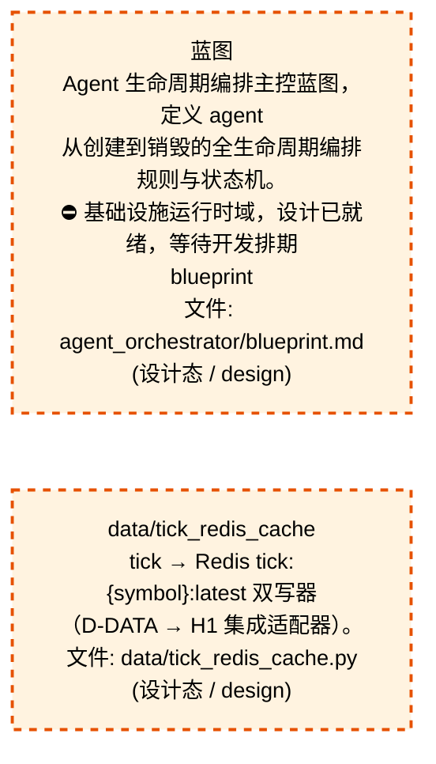
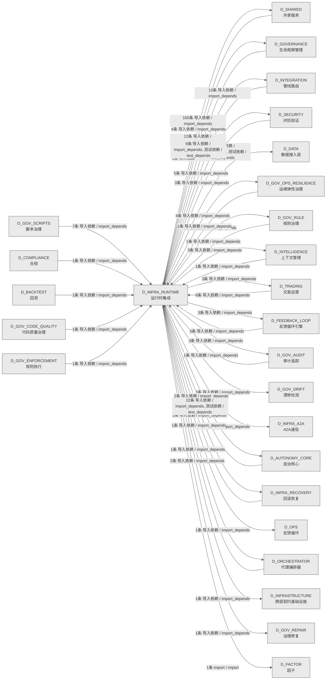

# 06_d_infra_runtime / 运行时集成域 / Runtime Integration

> **功能简介 / Overview**: 运行时集成，负责组件生命周期编排、启动钩子和运行时上下文管理

> **文档作用 / Purpose**: 展示 运行时集成（D_INFRA_RUNTIME）功能域的域内依赖关系、跨域依赖关系，模块信息（成熟度/中英文名/大白话/文件路径）内嵌于 Mermaid 节点，供架构审查和域治理参考。

> 本文档由 generate_domain_doc.py 从 depgraph (PostgreSQL) 自动生成
> 数据源: depgraph (PostgreSQL) nodes表 + edges表

> **[可缩放 HTML 版 / Zoomable HTML](http://localhost:8765/docs/02_enterprise_architecture/02_domain_architecture_docs/_zoomable_html/06_d_infra_runtime.html)** — Ctrl+滚轮缩放 ｜ 双击重置 ｜ Ctrl+Shift+D 切换拖动/选择模式

## 域基本信息 / Domain Overview

| 字段 | 值 | Field | Value |
|------|------|-------|-------|
| 编号 | 06 | Number | 06 |
| 域ID | D_INFRA_RUNTIME | Domain ID | D_INFRA_RUNTIME |
| 域名称 | 运行时集成 | Domain Name | Runtime Integration |
| 层级 | L0 基础设施层 | Layer | L0 Infrastructure |
| 模块数 | 172 | Module Count | 172 |
| 域内依赖 | 157 | Internal Dependencies | 157 |
| 跨域入边 | 78 | Cross-domain Incoming | 78 |
| 跨域出边 | 229 | Cross-domain Outgoing | 229 |
| 设计态模块 | 2 | Design Modules | 2 |
| 生产态模块 | 170 | Production Modules | 170 |
| 容量 | 170/150 (超容) | Capacity | 170/150 (超容) |
| 描述 | 三层运行时编排(L1 Trae/L2 Local/L3 API) | Description | 三层运行时编排(L1 Trae/L2 Local/L3 API) |

## 域内依赖图 / Internal Dependency Diagram

> 依赖图内嵌在本文档中，IDE 可直接渲染；网页版可 Ctrl+滚轮缩放 + 拖动平移查看细节。
>
> **图例说明 / Legend**：
> - 🟦 **蓝色 = 运营态模块**（production，已上线运行）
> - 🟧 **橙色虚线 = 设计态模块**（design，蓝图阶段，代码未写）
> - **实线箭头 = 运营态依赖**（已生效的依赖关系）
> - **虚线箭头 = 非运营态依赖**（计划中/验证中的依赖关系）

### 全景图（全部模块，颜色区分运营态/设计态）

> 展示全部 172 个模块（生产态 170 + 设计态 2），含跨域依赖外部节点。节点含成熟度+名称+大白话/简介+文件路径。

```mermaid
%%{init: {'theme': 'base', 'themeVariables': {'primaryColor': '#eaeaea', 'primaryTextColor': '#333333', 'primaryBorderColor': '#666666', 'lineColor': '#666666', 'secondaryColor': '#eaeaea', 'tertiaryColor': '#eaeaea', 'fontSize': '14px'}}}%%
flowchart TD
    docs_01_policies_and_standards_registry_catalogs_infrastructure_registry_yaml_INFRA_DB_001["基础设施注册表<br/>条目 INFRA-DB-001，登记和查询已注册的基础设施条<br/>目<br/>infrastructure_registry<br/>文件: catalogs<br/>/infrastructure_registry.yaml#INFRA-DB-001<br/>(生产态 / production)"]
    docs_01_policies_and_standards_registry_catalogs_infrastructure_registry_yaml_INFRA_DB_002["基础设施注册表<br/>条目 INFRA-DB-002，登记和查询已注册的基础设施条<br/>目<br/>infrastructure_registry<br/>文件: catalogs<br/>/infrastructure_registry.yaml#INFRA-DB-002<br/>(生产态 / production)"]
    docs_01_policies_and_standards_registry_catalogs_infrastructure_registry_yaml_INFRA_DB_003["基础设施注册表<br/>条目 INFRA-DB-003，登记和查询已注册的基础设施条<br/>目<br/>infrastructure_registry<br/>文件: catalogs<br/>/infrastructure_registry.yaml#INFRA-DB-003<br/>(生产态 / production)"]
    docs_01_policies_and_standards_registry_catalogs_infrastructure_registry_yaml_INFRA_DB_006["基础设施注册表<br/>条目 INFRA-DB-006，登记和查询已注册的基础设施条<br/>目<br/>infrastructure_registry<br/>文件: catalogs<br/>/infrastructure_registry.yaml#INFRA-DB-006<br/>(生产态 / production)"]
    docs_03_modules_cross_layer_agent_orchestrator_blueprint_md["蓝图<br/>Agent 生命周期编排主控蓝图，定义 agent<br/>从创建到销毁的全生命周期编排规则与状态机。<br/>⛔ 基础设施运行时域，设计已就绪，等待开发排期<br/>blueprint<br/>文件: agent_orchestrator/blueprint.md<br/>(设计态 / design)"]
    src_zephyr_data_tick_redis_cache_py["data/tick_redis_cache<br/>tick → Redis tick:{symbol}:latest 双写器<br/>（D-DATA → H1 集成适配器）。<br/>文件: data/tick_redis_cache.py<br/>(设计态 / design)"]
    src_zephyr_infrastructure_asset_inventory_main_py["主入口<br/>python -m zephyr.data.asset_inventory scan<br/># 全量文件系统扫描<br/>__main__<br/>文件: asset_inventory/__main__.py<br/>(生产态 / production)"]
    src_zephyr_infrastructure_asset_inventory_lifecycle_py["生命周期<br/>L5 ITIL 生命周期自动化管理器，按 TIME-DECAY<br/>/ZERO-REF/DIR-CONVENTION 三规则驱动<br/>active→stale→deprecated→archived 全自动流转。<br/>lifecycle<br/>文件: asset_inventory/lifecycle.py<br/>(生产态 / production)"]
    src_zephyr_infrastructure_asset_inventory_mcp_server_py["MCP服务端<br/>支撑基础设施运行时（mcp server）<br/>mcp_server<br/>文件: asset_inventory/mcp_server.py<br/>(生产态 / production)"]
    src_zephyr_infrastructure_asset_inventory_metadata_py["元数据<br/>多 IDE 规则文件生成器——从 asset-inventory<br/>配置生成。<br/>metadata<br/>文件: asset_inventory/metadata.py<br/>(生产态 / production)"]
    src_zephyr_infrastructure_asset_inventory_trust_anchor_py["信任anchor<br/>支撑基础设施运行时（trust anchor）<br/>trust_anchor<br/>文件: asset_inventory/trust_anchor.py<br/>(生产态 / production)"]
    src_zephyr_infrastructure_auto_diagnostics_py["自动diagnostics<br/>对系统异常进行自动诊断——检测模式、推断根因、输出<br/>诊断报告。<br/>auto_diagnostics<br/>文件: infrastructure/auto_diagnostics.py<br/>(生产态 / production)"]
    src_zephyr_infrastructure_auto_fix_engine_main_py["主入口<br/>引擎的命令行入口，可以直接 python -m<br/>跑起来执行主流程。<br/>__main__<br/>文件: auto_fix_engine/__main__.py<br/>(生产态 / production)"]
    src_zephyr_infrastructure_auto_fix_engine_alignment_syncer_py["对齐同步器<br/>蓝图与代码对齐同步器，scan 检测差异、fix<br/>按代码→蓝图方向同步（不自动改蓝图）、validate<br/>校验、rollback 回滚。<br/>alignment_syncer<br/>文件: auto_fix_engine/alignment_syncer.py<br/>(生产态 / production)"]
    src_zephyr_infrastructure_auto_fix_engine_all_completer_py["all补全器<br/>__all__ 补全器，解析模块 __all__ 列表并提取<br/>public symbols<br/>补全缺失项，保持导出清单与实际定义一致。<br/>all_completer<br/>文件: auto_fix_engine/all_completer.py<br/>(生产态 / production)"]
    src_zephyr_infrastructure_auto_fix_engine_config_fixer_py["配置修复器<br/>fix_trailing_whitespace 去尾空格、fix_tabs<br/>制表符、fix_merge_conflicts<br/>合并冲突标记等配置类修复<br/>config_fixer<br/>文件: auto_fix_engine/config_fixer.py<br/>(生产态 / production)"]
    src_zephyr_infrastructure_auto_fix_engine_dedup_extractor_py["去重提取器<br/>normalize_code 归一化代码后按 min_occurrences<br/>最小出现次数提取可去重的重复代码块<br/>dedup_extractor<br/>文件: auto_fix_engine/dedup_extractor.py<br/>(生产态 / production)"]
    src_zephyr_infrastructure_auto_fix_engine_dep_version_fixer_py["dep版本修复器<br/>依赖版本修复器，is_higher<br/>比较版本号，扫描依赖版本不一致并修复到目标版本。<br/>dep_version_fixer<br/>文件: auto_fix_engine/dep_version_fixer.py<br/>(生产态 / production)"]
    src_zephyr_infrastructure_auto_fix_engine_drift_fixer_py["漂移修复器<br/>配置/结构漂移修复器，scan 检测漂移、fix 修复<br/>（须通过 DriftBudgetLink 预算）、修复后<br/>validate 验证、可 rollback。<br/>drift_fixer<br/>文件: auto_fix_engine/drift_fixer.py<br/>(生产态 / production)"]
    src_zephyr_infrastructure_auto_fix_engine_event_hooks_py["事件钩子<br/>钩子MUST不阻塞主流程;异常MUST被捕获不传播<br/>event_hooks<br/>文件: auto_fix_engine/event_hooks.py<br/>(生产态 / production)"]
    src_zephyr_infrastructure_auto_fix_engine_fix_diff_py["修复差异<br/>计算器，compute/compute_text 展示 before/after<br/>差异，reverse 生成可逆动作，保证修复可回溯<br/>fix_diff<br/>文件: auto_fix_engine/fix_diff.py<br/>(生产态 / production)"]
    src_zephyr_infrastructure_auto_fix_engine_fix_scheduler_py["修复调度器<br/>引擎的调度器，按时间或优先级安排任务执行<br/>fix_scheduler<br/>文件: auto_fix_engine/fix_scheduler.py<br/>(生产态 / production)"]
    src_zephyr_infrastructure_auto_fix_engine_import_fixer_py["导入修复器<br/>try_fix_module 尝试修复模块 import<br/>错误，扫描失效导入并修正路径或补缺<br/>import_fixer<br/>文件: auto_fix_engine/import_fixer.py<br/>(生产态 / production)"]
    src_zephyr_infrastructure_auto_fix_engine_interrupt_guard_py["中断守卫<br/>用 WAL 预写日志防修复过程被中断导致数据损坏，为<br/>调度器提供安全的中断恢复能力<br/>interrupt_guard<br/>文件: auto_fix_engine/interrupt_guard.py<br/>(生产态 / production)"]
    src_zephyr_infrastructure_auto_fix_engine_llm_fix_adapter_py["llm修复适配器<br/>LLM 修复适配器，secret_guard 防泄密、llm_bridge<br/>桥接 LLM 生成修复补丁，把 L3 以上复杂修复委托给<br/>LLM。<br/>llm_fix_adapter<br/>文件: auto_fix_engine/llm_fix_adapter.py<br/>(生产态 / production)"]
    src_zephyr_infrastructure_auto_fix_engine_scaffold_registrar_py["从 script-manifest.yaml 加载已注册脚本<br/>路径集合<br/>scaffold_registrar<br/>文件: auto_fix_engine/scaffold_registrar.py<br/>(生产态 / production)"]
    src_zephyr_infrastructure_auto_fix_engine_self_heal_agent_py["selfheal代理<br/>自愈代理，按最大 rounds 迭代修复、熔断阈值与<br/>consecutive_failures<br/>连续失败计数控制熔断，防自愈死循环。<br/>self_heal_agent<br/>文件: auto_fix_engine/self_heal_agent.py<br/>(生产态 / production)"]
    src_zephyr_infrastructure_auto_fix_engine_state_machine_py["状态machine<br/>漂移事件记录——对齐<br/>test_state_machine.，引擎的状态机，管理状态流转<br/>。<br/>文件: auto_fix_engine/state_machine.py<br/>(生产态 / production)"]
    src_zephyr_infrastructure_auto_fix_engine_zombie_cleaner_py["zombie清理器<br/>移除 content<br/>中指向不存在文件的僵尸引用，返回清理后的内容。<br/>zombie_cleaner<br/>文件: auto_fix_engine/zombie_cleaner.py<br/>(生产态 / production)"]
    src_zephyr_infrastructure_blueprint_code_sync_py["蓝图代码同步<br/>Blueprint-Code Sync — 蓝图-代码索引同步验证。<br/>blueprint_code_sync<br/>文件: infrastructure/blueprint_code_sync.py<br/>(生产态 / production)"]
    src_zephyr_infrastructure_budget_enforcement_init_py["infrastructure/budget_enforcement 包入口<br/>做包聚合（re-export 真源 + 注册子模块<br/>rbac_bridge）。<br/>文件: budget_enforcement/__init__.py<br/>(生产态 / production)"]
    src_zephyr_infrastructure_capacity_assurance_budget_forecaster_py["预算预测器<br/>SRC-0041 (P3 迁移恢复, 2026-07-02): 文件从<br/>autonomy_core/budget_forecaster.py 迁移至<br/>文件: capacity_assurance/budget_forecaster.py<br/>(生产态 / production)"]
    src_zephyr_infrastructure_capacity_assurance_contracts_contract_bus_py["契约总线<br/>ContractBus loader —<br/>加载全部44条容量保障契约的Pydantic v2 Schema<br/>（DD-9三批迁移）.<br/>contract_bus<br/>文件: contracts/contract_bus.py<br/>(生产态 / production)"]
    src_zephyr_infrastructure_capacity_assurance_cross_module_integration_py["跨模块集成<br/>Cross-module integration — CT-1~CT-4<br/>跨模块集成契约实现（对标蓝图 §17）.<br/>cross_module_integration<br/>文件: capacity_assurance<br/>/cross_module_integration.py<br/>(生产态 / production)"]
    src_zephyr_infrastructure_capacity_assurance_host_resource_governor_py["host资源governor<br/>支撑基础设施运行时（host resource governor）<br/>host_resource_governor<br/>文件: capacity_assurance<br/>/host_resource_governor.py<br/>(生产态 / production)"]
    src_zephyr_infrastructure_capacity_assurance_kill_switch_py["终止开关<br/>基础设施的状态机，管理状态流转<br/>文件: capacity_assurance/kill_switch.py<br/>(生产态 / production)"]
    src_zephyr_infrastructure_capacity_assurance_risk_mitigation_py["风险mitigation<br/>Risk mitigation — R1~R16 全量风险缓解实现<br/>（对标蓝图 §14 风险与缓解 + 多轮盲点审计）.<br/>risk_mitigation<br/>文件: capacity_assurance/risk_mitigation.py<br/>(生产态 / production)"]
    src_zephyr_infrastructure_capacity_assurance_schema_py["模式<br/>SchemaManager — 容量保障体系数据库 Schema 管理器<br/>文件: capacity_assurance/schema.py<br/>(生产态 / production)"]
    src_zephyr_infrastructure_capacity_assurance_sli_instrumentation_py["SLI instrumentation — SLI采集插桩点（对标蓝图<br/>§13<br/>SLI Registry CAP-001~CAP-014）<br/>sli_instrumentation<br/>文件: capacity_assurance/sli_instrumentation.py<br/>(生产态 / production)"]
    src_zephyr_infrastructure_capacity_assurance_tech_stack_py["tech栈<br/>TechStackValidator — 技术栈可用性校验器<br/>tech_stack<br/>文件: capacity_assurance/tech_stack.py<br/>(生产态 / production)"]
    src_zephyr_infrastructure_capacity_assurance_token_budget_py["令牌预算<br/>根因修复：此前 _estimate_tokens() 在 3<br/>个文件中重复定义，<br/>token_budget<br/>文件: capacity_assurance/token_budget.py<br/>(生产态 / production)"]
    src_zephyr_infrastructure_cost_tracker_py["成本追踪器<br/>追踪 AI Agent<br/>执行成本——Token消耗、API调用次数、费用预估与告警<br/>。<br/>cost_tracker<br/>文件: infrastructure/cost_tracker.py<br/>(生产态 / production)"]
    src_zephyr_infrastructure_dry_run_simulator_py["dryrun模拟器<br/>在真实执行前进行安全预演——模拟操作流程，检测潜在<br/>风险，输出风险评估报告。<br/>dry_run_simulator<br/>文件: infrastructure/dry_run_simulator.py<br/>(生产态 / production)"]
    src_zephyr_infrastructure_event_bus_upgrade_py["DEPRECATED: 此文件已废弃。<br/>本文件保留为 compat shim，将在 Phase 4<br/>物理删除。<br/>event_bus_upgrade<br/>文件: infrastructure/event_bus_upgrade.py<br/>(生产态 / production)"]
    src_zephyr_infrastructure_event_store_py["事件存储<br/>持久化审计日志与事件溯源——所有关键操作必须留下不<br/>可篡改的记录。<br/>event_store<br/>文件: infrastructure/event_store.py<br/>(生产态 / production)"]
    src_zephyr_infrastructure_events_event_store_py["事件存储<br/>支撑基础设施运行时（event store）<br/>event_store<br/>文件: events/event_store.py<br/>(生产态 / production)"]
    src_zephyr_infrastructure_finding_task_bridge_py["发现任务桥接<br/>将脚本系统的审计发现自动转换为任务卡，打通反馈回<br/>路（P0集成缺口修复）。<br/>finding_task_bridge<br/>文件: infrastructure/finding_task_bridge.py<br/>(生产态 / production)"]
    src_zephyr_infrastructure_git_batcher_py["Git批处理<br/>Git 命令批量化工具，将 N 次独立 git<br/>子进程调用合并为 1 次批量调用，消除逐文件 git<br/>调用反模式（ARCH-GIT-CALL-BUDGET）。<br/>git_batcher<br/>文件: infrastructure/git_batcher.py<br/>(生产态 / production)"]
    src_zephyr_infrastructure_h1_redis_hot_init_py["infrastructure/h1_redis_hot 包入口<br/>H1 Redis 热缓存模块——盘中实盘/模拟盘 <5ms<br/>因子截面在线存储（DD-11-01）。<br/>文件: h1_redis_hot/__init__.py<br/>(生产态 / production)"]
    src_zephyr_infrastructure_h1_redis_hot_h1_cqrs_projectors_py["事件→Redis 物化视图投影器。<br/>H1CqrsProjectors — 事件→Redis 物化视图投影器。<br/>文件: h1_redis_hot/h1_cqrs_projectors.py<br/>(生产态 / production)"]
    src_zephyr_infrastructure_h1_redis_hot_h1_integration_py["H1 Redis 集成适配器<br/>连接 D-FACTOR/SIGNAL/RISK 与 H1 热缓存<br/>文件: h1_redis_hot/h1_integration.py<br/>(生产态 / production)"]
    src_zephyr_infrastructure_health_monitor_health_aggregator_py["健康聚合器<br/>聚合基础设施各组件健康状态指标<br/>health_aggregator<br/>文件: health_monitor/health_aggregator.py<br/>(生产态 / production)"]
    src_zephyr_infrastructure_hooks_event_hook_py["事件钩子<br/>hooks相关功能（event hook）<br/>event_hook<br/>文件: hooks/event_hook.py<br/>(生产态 / production)"]
    src_zephyr_infrastructure_impact_impact_propagator_py["冲击propagator<br/>Impact Propagator — 变更影响传播分析。<br/>impact_propagator<br/>文件: impact/impact_propagator.py<br/>(生产态 / production)"]
    src_zephyr_infrastructure_impact_llm_impact_analyzer_py["LLM冲击分析器<br/>支撑基础设施运行时（llm impact）<br/>llm_impact_analyzer<br/>文件: impact/llm_impact_analyzer.py<br/>(生产态 / production)"]
    src_zephyr_infrastructure_infrastructure_base_py["基础设施基类<br/>基础设施层抽象基类。定义系统初始化、配置管理、熔<br/>断控制的核心接口。<br/>infrastructure_base<br/>文件: infrastructure/infrastructure_base.py<br/>(生产态 / production)"]
    src_zephyr_infrastructure_kill_switch_sim_py["终止开关仿真<br/>INV-001 / CAP-009：Kill Switch 延迟 < 1ms<br/>（现阶段 T0 模拟器验证）<br/>Kill Switch T0 Hardware Simulator<br/>文件: infrastructure/kill_switch_sim.py<br/>(生产态 / production)"]
    src_zephyr_infrastructure_lifecycle_scope_guard_py["作用域守卫<br/>Scope Guard — 范围蔓延检测与阻断。<br/>scope_guard<br/>文件: lifecycle/scope_guard.py<br/>(生产态 / production)"]
    src_zephyr_infrastructure_lifecycle_task_lifecycle_manager_py["任务生命周期管理器<br/>Task Lifecycle Manager — G0-G7<br/>任务生命周期门禁。<br/>task_lifecycle_manager<br/>文件: lifecycle/task_lifecycle_manager.py<br/>(生产态 / production)"]
    src_zephyr_infrastructure_observability_trace_decorator_py["追踪装饰器<br/>基础设施的核心类，封装TraceSpan相关逻辑<br/>trace_decorator<br/>文件: observability/trace_decorator.py<br/>(生产态 / production)"]
    src_zephyr_infrastructure_pipeline_backpressure_manager_py["背压管理器<br/>跨层背压信号管理器。管理<br/>D_DATA->D_FACTOR->D_SIGNAL<br/>数据管道中的背压控制信号。<br/>Pipeline — Backpressure Manager<br/>文件: pipeline/backpressure_manager.py<br/>(生产态 / production)"]
    src_zephyr_infrastructure_pipeline_circuit_breaker_manager_py["熔断断路器管理器<br/>CircuitBreakerManager -- standalone circuit<br/>breaker manager (Netflix Hystrix equivalent)<br/>文件: pipeline/circuit_breaker_manager.py<br/>(生产态 / production)"]
    src_zephyr_infrastructure_pipeline_cost_tracker_py["成本追踪器<br/>从 PipelineOrchestrator<br/>提取成本追踪逻辑为独立组件。<br/>cost_tracker<br/>文件: pipeline/cost_tracker.py<br/>(生产态 / production)"]
    src_zephyr_infrastructure_pipeline_dead_letter_queue_py["deadletter队列<br/>永久失败任务存储。<br/>dead_letter_queue<br/>文件: pipeline/dead_letter_queue.py<br/>(生产态 / production)"]
    src_zephyr_infrastructure_pipeline_llm_gateway_py["llm网关<br/>base_url 从环境变量读取，无硬编码密钥<br/>MOD-INF-019: Agent Spec — LLM Gateway<br/>文件: pipeline/llm_gateway.py<br/>(生产态 / production)"]
    src_zephyr_infrastructure_pipeline_pipeline_agent_bridge_py["管线代理桥接<br/>支撑基础设施运行时（pipeline agent）<br/>pipeline_agent_bridge<br/>文件: pipeline/pipeline_agent_bridge.py<br/>(生产态 / production)"]
    src_zephyr_infrastructure_pipeline_pipeline_lock_py["管线锁<br/>支撑基础设施运行时（pipeline lock）<br/>pipeline_lock<br/>文件: pipeline/pipeline_lock.py<br/>(生产态 / production)"]
    src_zephyr_infrastructure_pipeline_pipeline_roadmap_py["管线roadmap<br/>Pipeline 未来版本路线图——v0.10.0 -> v0.12.0<br/>规划骨架。<br/>pipeline_roadmap<br/>文件: pipeline/pipeline_roadmap.py<br/>(生产态 / production)"]
    src_zephyr_infrastructure_pipeline_preemption_manager_py["preemption管理器<br/>PreemptionManager -- 优先级抢占管理器<br/>preemption_manager<br/>文件: pipeline/preemption_manager.py<br/>(生产态 / production)"]
    src_zephyr_infrastructure_pipeline_routing_plugins_py["管线<br/>关联：GOV-AI-002 v2.0.0 模型路由策略<br/>routing_plugins<br/>文件: pipeline/routing_plugins.py<br/>(生产态 / production)"]
    src_zephyr_infrastructure_pydantic_v2_migrator_py["M-15 PydanticV2Migrator — Pydantic V2 迁移<br/>辅助项目代码从 Pydantic V1 迁移到<br/>V2——自动检测模式、提供迁移建议、生成兼容层。<br/>pydantic_v2_migrator<br/>文件: infrastructure/pydantic_v2_migrator.py<br/>(生产态 / production)"]
    src_zephyr_infrastructure_quality_quality_monitor_py["质量监控<br/>Quality Monitor — 生成代码质量门禁。<br/>quality_monitor<br/>文件: quality/quality_monitor.py<br/>(生产态 / production)"]
    src_zephyr_infrastructure_reliability_circuit_breaker_py["熔断断路器<br/>Circuit Breaker — 熔断器：连续失败 -> OPEN -><br/>暂停执行。<br/>circuit_breaker<br/>文件: reliability/circuit_breaker.py<br/>(生产态 / production)"]
    src_zephyr_infrastructure_reliability_context_guard_py["上下文守卫<br/>- 上下文白名单：只允许 upstream_files +<br/>downstream_outputs 中声明的文件<br/>context_guard<br/>文件: reliability/context_guard.py<br/>(生产态 / production)"]
    src_zephyr_infrastructure_runtime_concurrency_guard_py["并发守卫<br/>concurrency_guard — 回滚操作并发安全守卫。<br/>文件: runtime/concurrency_guard.py<br/>(生产态 / production)"]
    src_zephyr_infrastructure_runtime_sandbox_enforcer_py["沙箱执行器<br/>强制执行或验证 AI Agent 在沙盒中执行:<br/>sandbox_enforcer<br/>文件: runtime/sandbox_enforcer.py<br/>(生产态 / production)"]
    src_zephyr_infrastructure_runtime_startup_shutdown_py["runtime/startup_shutdown<br/>启动关机，基础设施（startup shutdown）<br/>文件: runtime/startup_shutdown.py<br/>(生产态 / production)"]
    src_zephyr_infrastructure_script_system_finding_py["发现<br/>Finding Schema — 审计发现标准化数据模型<br/>文件: script_system/finding.py<br/>(生产态 / production)"]
    src_zephyr_infrastructure_script_system_gate_bridge_py["门禁桥接<br/>Script->Gate 门禁桥接器 — submit_findings()<br/>生产者<br/>gate_bridge<br/>文件: script_system/gate_bridge.py<br/>(生产态 / production)"]
    src_zephyr_infrastructure_system_telemetry_auto_bootstrap_py["自动自举<br/>全自动遥测注入钩子，zephyr 包 import 时自动创建<br/>Telemetry 单例、初始化会话连续性、monkey-patch<br/>关键函数并发送 session_start/gate_check 事件。<br/>auto_bootstrap<br/>文件: system_telemetry/auto_bootstrap.py<br/>(生产态 / production)"]
    src_zephyr_infrastructure_system_telemetry_logs_init_py["system_telemetry/logs 包入口<br/>logs — 结构化日志流（structlog + JSONL +<br/>trace注入）（D_SYSTEM_TELEMETRY）<br/>文件: logs/__init__.py<br/>(生产态 / production)"]
    src_zephyr_infrastructure_system_telemetry_metrics_bridge_py["指标桥接<br/>Telemetry 暴露 metrics 聚合 API，FLE collector<br/>定期拉取并缓存。<br/>metrics_bridge<br/>文件: system_telemetry/metrics_bridge.py<br/>(生产态 / production)"]
    src_zephyr_infrastructure_warm_hot_gate_py["warmhot门禁<br/>在系统进入 Hot 状态前强制检查——确保所有 Warm<br/>阶段验证通过后才能进入 Hot 真正执行阶段。<br/>warm_hot_gate<br/>文件: infrastructure/warm_hot_gate.py<br/>(生产态 / production)"]
    src_zephyr_shared_lifecycle_hooks_py["钩子<br/>— 模块生命周期钩子（Phase 2 新增 / 盲点 B8<br/>修复）<br/>hooks<br/>文件: lifecycle/hooks.py<br/>(生产态 / production)"]
    src_zephyr_trading_action_dispatcher_py["行为分发器<br/>推理完成 -><br/>直接把结果写回源文件，不产生中间文件。<br/>action_dispatcher<br/>文件: trading/action_dispatcher.py<br/>(生产态 / production)"]
    src_zephyr_trading_auto_task_generator_py["自动任务生成器<br/>从项目代码、知识条目、审计日志中自动生成 L2<br/>推理任务，<br/>auto_task_generator<br/>文件: trading/auto_task_generator.py<br/>(生产态 / production)"]
    src_zephyr_trading_ports_py["端口<br/>交易的分发器，把任务/事件分发给处理方<br/>文件: trading/ports.py<br/>(生产态 / production)"]
    src_zephyr_trading_staging_area_py["StagingArea —<br/>多AI并发草稿写入+提交+冲突检测模块（CT-SES<br/>SION-CONFLICT-002）<br/>staging_area<br/>文件: trading/staging_area.py<br/>(生产态 / production)"]
    src_zephyr_trading_task_gate_py["任务门禁<br/>在 dispatch 前检查模型的能力护照。<br/>task_gate<br/>文件: trading/task_gate.py<br/>(生产态 / production)"]
    src_zephyr_trading_windows_service_py["windows服务<br/>WindowsService — Windows Service 包装器蓝图:<br/>docs/03_modules/_cross_layer/auto_runtime_core<br/>/blueprint.md §3.1注册方式:<br/>windows_service<br/>文件: trading/windows_service.py<br/>(生产态 / production)"]
    src_zephyr_trading_zombie_scanner_py["zombie扫描器<br/>僵尸 Python 进程检测与自动处置<br/>zombie_scanner<br/>文件: trading/zombie_scanner.py<br/>(生产态 / production)"]
    tests_zephyr_data_test_tick_redis_cache_py["data/test_tick_redis_cache<br/>TickRedisCache 单元测试——tick→Redis<br/>tick:{symbol}:latest 双写器。<br/>文件: data/test_tick_redis_cache.py<br/>(生产态 / production)"]
    tests_zephyr_runtime_test_intraday_main_py["runtime/test_intraday_main<br/>IntradayRuntime 盘中编排器单元测试。<br/>文件: runtime/test_intraday_main.py<br/>(生产态 / production)"]
    docs_01_policies_and_standards_registry_catalogs_infrastructure_registry_yaml_INFRA_DB_001 ~~~ docs_01_policies_and_standards_registry_catalogs_infrastructure_registry_yaml_INFRA_DB_002
    docs_01_policies_and_standards_registry_catalogs_infrastructure_registry_yaml_INFRA_DB_002 ~~~ docs_01_policies_and_standards_registry_catalogs_infrastructure_registry_yaml_INFRA_DB_003
    docs_01_policies_and_standards_registry_catalogs_infrastructure_registry_yaml_INFRA_DB_003 ~~~ docs_01_policies_and_standards_registry_catalogs_infrastructure_registry_yaml_INFRA_DB_006
    docs_01_policies_and_standards_registry_catalogs_infrastructure_registry_yaml_INFRA_DB_006 ~~~ docs_03_modules_cross_layer_agent_orchestrator_blueprint_md
    docs_03_modules_cross_layer_agent_orchestrator_blueprint_md ~~~ src_zephyr_data_tick_redis_cache_py
    src_zephyr_data_tick_redis_cache_py ~~~ src_zephyr_infrastructure_asset_inventory_main_py
    src_zephyr_infrastructure_asset_inventory_main_py ~~~ src_zephyr_infrastructure_asset_inventory_lifecycle_py
    src_zephyr_infrastructure_asset_inventory_lifecycle_py ~~~ src_zephyr_infrastructure_asset_inventory_mcp_server_py
    src_zephyr_infrastructure_asset_inventory_mcp_server_py ~~~ src_zephyr_infrastructure_asset_inventory_metadata_py
    src_zephyr_infrastructure_asset_inventory_metadata_py ~~~ src_zephyr_infrastructure_asset_inventory_trust_anchor_py
    src_zephyr_infrastructure_asset_inventory_trust_anchor_py ~~~ src_zephyr_infrastructure_auto_diagnostics_py
    src_zephyr_infrastructure_auto_diagnostics_py ~~~ src_zephyr_infrastructure_auto_fix_engine_main_py
    src_zephyr_infrastructure_auto_fix_engine_main_py ~~~ src_zephyr_infrastructure_auto_fix_engine_alignment_syncer_py
    src_zephyr_infrastructure_auto_fix_engine_alignment_syncer_py ~~~ src_zephyr_infrastructure_auto_fix_engine_all_completer_py
    src_zephyr_infrastructure_auto_fix_engine_all_completer_py ~~~ src_zephyr_infrastructure_auto_fix_engine_config_fixer_py
    src_zephyr_infrastructure_auto_fix_engine_config_fixer_py ~~~ src_zephyr_infrastructure_auto_fix_engine_dedup_extractor_py
    src_zephyr_infrastructure_auto_fix_engine_dedup_extractor_py ~~~ src_zephyr_infrastructure_auto_fix_engine_dep_version_fixer_py
    src_zephyr_infrastructure_auto_fix_engine_dep_version_fixer_py ~~~ src_zephyr_infrastructure_auto_fix_engine_drift_fixer_py
    src_zephyr_infrastructure_auto_fix_engine_drift_fixer_py ~~~ src_zephyr_infrastructure_auto_fix_engine_event_hooks_py
    src_zephyr_infrastructure_auto_fix_engine_event_hooks_py ~~~ src_zephyr_infrastructure_auto_fix_engine_fix_diff_py
    src_zephyr_infrastructure_auto_fix_engine_fix_diff_py ~~~ src_zephyr_infrastructure_auto_fix_engine_fix_scheduler_py
    src_zephyr_infrastructure_auto_fix_engine_fix_scheduler_py ~~~ src_zephyr_infrastructure_auto_fix_engine_import_fixer_py
    src_zephyr_infrastructure_auto_fix_engine_import_fixer_py ~~~ src_zephyr_infrastructure_auto_fix_engine_interrupt_guard_py
    src_zephyr_infrastructure_auto_fix_engine_interrupt_guard_py ~~~ src_zephyr_infrastructure_auto_fix_engine_llm_fix_adapter_py
    src_zephyr_infrastructure_auto_fix_engine_llm_fix_adapter_py ~~~ src_zephyr_infrastructure_auto_fix_engine_scaffold_registrar_py
    src_zephyr_infrastructure_auto_fix_engine_scaffold_registrar_py ~~~ src_zephyr_infrastructure_auto_fix_engine_self_heal_agent_py
    src_zephyr_infrastructure_auto_fix_engine_self_heal_agent_py ~~~ src_zephyr_infrastructure_auto_fix_engine_state_machine_py
    src_zephyr_infrastructure_auto_fix_engine_state_machine_py ~~~ src_zephyr_infrastructure_auto_fix_engine_zombie_cleaner_py
    src_zephyr_infrastructure_auto_fix_engine_zombie_cleaner_py ~~~ src_zephyr_infrastructure_blueprint_code_sync_py
    src_zephyr_infrastructure_blueprint_code_sync_py ~~~ src_zephyr_infrastructure_budget_enforcement_init_py
    src_zephyr_infrastructure_budget_enforcement_init_py ~~~ src_zephyr_infrastructure_capacity_assurance_budget_forecaster_py
    src_zephyr_infrastructure_capacity_assurance_budget_forecaster_py ~~~ src_zephyr_infrastructure_capacity_assurance_contracts_contract_bus_py
    src_zephyr_infrastructure_capacity_assurance_contracts_contract_bus_py ~~~ src_zephyr_infrastructure_capacity_assurance_cross_module_integration_py
    src_zephyr_infrastructure_capacity_assurance_cross_module_integration_py ~~~ src_zephyr_infrastructure_capacity_assurance_host_resource_governor_py
    src_zephyr_infrastructure_capacity_assurance_host_resource_governor_py ~~~ src_zephyr_infrastructure_capacity_assurance_kill_switch_py
    src_zephyr_infrastructure_capacity_assurance_kill_switch_py ~~~ src_zephyr_infrastructure_capacity_assurance_risk_mitigation_py
    src_zephyr_infrastructure_capacity_assurance_risk_mitigation_py ~~~ src_zephyr_infrastructure_capacity_assurance_schema_py
    src_zephyr_infrastructure_capacity_assurance_schema_py ~~~ src_zephyr_infrastructure_capacity_assurance_sli_instrumentation_py
    src_zephyr_infrastructure_capacity_assurance_sli_instrumentation_py ~~~ src_zephyr_infrastructure_capacity_assurance_tech_stack_py
    src_zephyr_infrastructure_capacity_assurance_tech_stack_py ~~~ src_zephyr_infrastructure_capacity_assurance_token_budget_py
    src_zephyr_infrastructure_capacity_assurance_token_budget_py ~~~ src_zephyr_infrastructure_cost_tracker_py
    src_zephyr_infrastructure_cost_tracker_py ~~~ src_zephyr_infrastructure_dry_run_simulator_py
    src_zephyr_infrastructure_dry_run_simulator_py ~~~ src_zephyr_infrastructure_event_bus_upgrade_py
    src_zephyr_infrastructure_event_bus_upgrade_py ~~~ src_zephyr_infrastructure_event_store_py
    src_zephyr_infrastructure_event_store_py ~~~ src_zephyr_infrastructure_events_event_store_py
    src_zephyr_infrastructure_events_event_store_py ~~~ src_zephyr_infrastructure_finding_task_bridge_py
    src_zephyr_infrastructure_finding_task_bridge_py ~~~ src_zephyr_infrastructure_git_batcher_py
    src_zephyr_infrastructure_git_batcher_py ~~~ src_zephyr_infrastructure_h1_redis_hot_init_py
    src_zephyr_infrastructure_h1_redis_hot_init_py ~~~ src_zephyr_infrastructure_h1_redis_hot_h1_cqrs_projectors_py
    src_zephyr_infrastructure_h1_redis_hot_h1_cqrs_projectors_py ~~~ src_zephyr_infrastructure_h1_redis_hot_h1_integration_py
    src_zephyr_infrastructure_h1_redis_hot_h1_integration_py ~~~ src_zephyr_infrastructure_health_monitor_health_aggregator_py
    src_zephyr_infrastructure_health_monitor_health_aggregator_py ~~~ src_zephyr_infrastructure_hooks_event_hook_py
    src_zephyr_infrastructure_hooks_event_hook_py ~~~ src_zephyr_infrastructure_impact_impact_propagator_py
    src_zephyr_infrastructure_impact_impact_propagator_py ~~~ src_zephyr_infrastructure_impact_llm_impact_analyzer_py
    src_zephyr_infrastructure_impact_llm_impact_analyzer_py ~~~ src_zephyr_infrastructure_infrastructure_base_py
    src_zephyr_infrastructure_infrastructure_base_py ~~~ src_zephyr_infrastructure_kill_switch_sim_py
    src_zephyr_infrastructure_kill_switch_sim_py ~~~ src_zephyr_infrastructure_lifecycle_scope_guard_py
    src_zephyr_infrastructure_lifecycle_scope_guard_py ~~~ src_zephyr_infrastructure_lifecycle_task_lifecycle_manager_py
    src_zephyr_infrastructure_lifecycle_task_lifecycle_manager_py ~~~ src_zephyr_infrastructure_observability_trace_decorator_py
    src_zephyr_infrastructure_observability_trace_decorator_py ~~~ src_zephyr_infrastructure_pipeline_backpressure_manager_py
    src_zephyr_infrastructure_pipeline_backpressure_manager_py ~~~ src_zephyr_infrastructure_pipeline_circuit_breaker_manager_py
    src_zephyr_infrastructure_pipeline_circuit_breaker_manager_py ~~~ src_zephyr_infrastructure_pipeline_cost_tracker_py
    src_zephyr_infrastructure_pipeline_cost_tracker_py ~~~ src_zephyr_infrastructure_pipeline_dead_letter_queue_py
    src_zephyr_infrastructure_pipeline_dead_letter_queue_py ~~~ src_zephyr_infrastructure_pipeline_llm_gateway_py
    src_zephyr_infrastructure_pipeline_llm_gateway_py ~~~ src_zephyr_infrastructure_pipeline_pipeline_agent_bridge_py
    src_zephyr_infrastructure_pipeline_pipeline_agent_bridge_py ~~~ src_zephyr_infrastructure_pipeline_pipeline_lock_py
    src_zephyr_infrastructure_pipeline_pipeline_lock_py ~~~ src_zephyr_infrastructure_pipeline_pipeline_roadmap_py
    src_zephyr_infrastructure_pipeline_pipeline_roadmap_py ~~~ src_zephyr_infrastructure_pipeline_preemption_manager_py
    src_zephyr_infrastructure_pipeline_preemption_manager_py ~~~ src_zephyr_infrastructure_pipeline_routing_plugins_py
    src_zephyr_infrastructure_pipeline_routing_plugins_py ~~~ src_zephyr_infrastructure_pydantic_v2_migrator_py
    src_zephyr_infrastructure_pydantic_v2_migrator_py ~~~ src_zephyr_infrastructure_quality_quality_monitor_py
    src_zephyr_infrastructure_quality_quality_monitor_py ~~~ src_zephyr_infrastructure_reliability_circuit_breaker_py
    src_zephyr_infrastructure_reliability_circuit_breaker_py ~~~ src_zephyr_infrastructure_reliability_context_guard_py
    src_zephyr_infrastructure_reliability_context_guard_py ~~~ src_zephyr_infrastructure_runtime_concurrency_guard_py
    src_zephyr_infrastructure_runtime_concurrency_guard_py ~~~ src_zephyr_infrastructure_runtime_sandbox_enforcer_py
    src_zephyr_infrastructure_runtime_sandbox_enforcer_py ~~~ src_zephyr_infrastructure_runtime_startup_shutdown_py
    src_zephyr_infrastructure_runtime_startup_shutdown_py ~~~ src_zephyr_infrastructure_script_system_finding_py
    src_zephyr_infrastructure_script_system_finding_py ~~~ src_zephyr_infrastructure_script_system_gate_bridge_py
    src_zephyr_infrastructure_script_system_gate_bridge_py ~~~ src_zephyr_infrastructure_system_telemetry_auto_bootstrap_py
    src_zephyr_infrastructure_system_telemetry_auto_bootstrap_py ~~~ src_zephyr_infrastructure_system_telemetry_logs_init_py
    src_zephyr_infrastructure_system_telemetry_logs_init_py ~~~ src_zephyr_infrastructure_system_telemetry_metrics_bridge_py
    src_zephyr_infrastructure_system_telemetry_metrics_bridge_py ~~~ src_zephyr_infrastructure_warm_hot_gate_py
    src_zephyr_infrastructure_warm_hot_gate_py ~~~ src_zephyr_shared_lifecycle_hooks_py
    src_zephyr_shared_lifecycle_hooks_py ~~~ src_zephyr_trading_action_dispatcher_py
    src_zephyr_trading_action_dispatcher_py ~~~ src_zephyr_trading_auto_task_generator_py
    src_zephyr_trading_auto_task_generator_py ~~~ src_zephyr_trading_ports_py
    src_zephyr_trading_ports_py ~~~ src_zephyr_trading_staging_area_py
    src_zephyr_trading_staging_area_py ~~~ src_zephyr_trading_task_gate_py
    src_zephyr_trading_task_gate_py ~~~ src_zephyr_trading_windows_service_py
    src_zephyr_trading_windows_service_py ~~~ src_zephyr_trading_zombie_scanner_py
    src_zephyr_trading_zombie_scanner_py ~~~ tests_zephyr_data_test_tick_redis_cache_py
    tests_zephyr_data_test_tick_redis_cache_py ~~~ tests_zephyr_runtime_test_intraday_main_py
    src_zephyr_infrastructure_asset_inventory_classifier_py["分类器<br/>蓝图 §3.2：读取扫描结果，按 config<br/>/asset_inventory.yaml 中<br/>classifier<br/>文件: asset_inventory/classifier.py<br/>(生产态 / production)"]
    src_zephyr_infrastructure_asset_inventory_dashboard_py["仪表盘<br/>资产健康仪表盘生成器，读取统一资产索引生成<br/>dashboard.json，含健康评分、分类统计、趋势数据与<br/>告警。<br/>文件: asset_inventory/dashboard.py<br/>(生产态 / production)"]
    src_zephyr_infrastructure_asset_inventory_dependency_py["MOD-INF-026 §18 — 资产依赖图。<br/>DependencyGraph：项目级依赖图 + 环路检测<br/>（DFS）+ 优先级联动。<br/>文件: asset_inventory/dependency.py<br/>(生产态 / production)"]
    src_zephyr_infrastructure_asset_inventory_index_generator_py["索引生成器<br/>L3 统一资产索引生成器，读取 24<br/>个注册表与分类资产生成<br/>unified-asset-index.yaml（项目 SSoT），用<br/>temp-file + atomic rename 写入。<br/>index_generator<br/>文件: asset_inventory/index_generator.py<br/>(生产态 / production)"]
    src_zephyr_infrastructure_asset_inventory_reconciler_py["协调器<br/>L4 注册表 vs<br/>磁盘对账引擎，比对新扫描结果与统一资产索引，检测<br/>孤儿/幽灵/漂移三类偏移并产出对账报告。<br/>reconciler<br/>文件: asset_inventory/reconciler.py<br/>(生产态 / production)"]
    src_zephyr_infrastructure_asset_inventory_registry_adapter_py["MOD-INF-026 §17 — 24<br/>个异构注册表统一解析适配器。<br/>RegistryAdapter 抽象基类 + 7 个适配器实现 +<br/>RegistryManager。<br/>registry_adapter<br/>文件: asset_inventory/registry_adapter.py<br/>(生产态 / production)"]
    src_zephyr_infrastructure_asset_inventory_scanner_py["扫描器<br/>L1 全量文件系统扫描器，遍历六大目录为每个文件计<br/>算 SHA-256/大小/mtime，ThreadPoolExecutor<br/>并行产出 raw-asset-scan.json。<br/>scanner<br/>文件: asset_inventory/scanner.py<br/>(生产态 / production)"]
    src_zephyr_infrastructure_asset_inventory_telemetry_py["遥测<br/>蓝图 §27：OpenTelemetry 三支柱（Metrics/Traces<br/>/Logs）风格的盘点器自监控。<br/>文件: asset_inventory/telemetry.py<br/>(生产态 / production)"]
    src_zephyr_infrastructure_auto_fix_engine_engine_py["引擎<br/>主要提供安全门禁、级联断路器、修复预算等功能<br/>engine<br/>文件: auto_fix_engine/engine.py<br/>(生产态 / production)"]
    src_zephyr_infrastructure_budget_enforcement_rbac_bridge_py["RBAC桥接<br/>rbac_bridge — 基础设施层 RBAC 桥接适配器<br/>文件: budget_enforcement/rbac_bridge.py<br/>(生产态 / production)"]
    src_zephyr_infrastructure_capacity_assurance_contracts_batch1_infra_py["batch1基础设施<br/>Batch1 基础设施层契约 — 15条 Pydantic v2<br/>Schema（SLO/Error Budget/Token Budget/Kill<br/>Switch/Sandbox/Graceful Degradation）.<br/>batch1_infra<br/>文件: contracts/batch1_infra.py<br/>(生产态 / production)"]
    src_zephyr_infrastructure_capacity_assurance_contracts_batch3_integration_py["batch3集成<br/>Batch3 集成层契约 — 14条 Pydantic v2 Schema<br/>（OTel/W3C/跨模块CT-1~4/DR/容量预测/语义缓存）.<br/>batch3_integration<br/>文件: contracts/batch3_integration.py<br/>(生产态 / production)"]
    src_zephyr_infrastructure_config_validator_py["配置校验器<br/>检查系统配置文件的合法性——必需字段、类型、取值区<br/>间、引用完整性。<br/>config_validator<br/>文件: infrastructure/config_validator.py<br/>(生产态 / production)"]
    src_zephyr_infrastructure_contract_tester_py["契约测试器<br/>验证代码实现与 YAML/JSON<br/>契约文件的一致性——字段、类型、约束是否匹配。<br/>contract_tester<br/>文件: infrastructure/contract_tester.py<br/>(生产态 / production)"]
    src_zephyr_infrastructure_h1_redis_hot_h1_redis_reader_py["决策引擎 <5ms 在线特征查询。<br/>H1RedisReader — 决策引擎 <5ms 在线特征查询。<br/>文件: h1_redis_hot/h1_redis_reader.py<br/>(生产态 / production)"]
    src_zephyr_infrastructure_h1_redis_hot_h1_redis_writer_py["D-FACTOR Engine 每 3 秒截面写入 Redis<br/>H1RedisWriter — D-FACTOR Engine 每 3 秒截面写入<br/>Redis（PIPELINE 模式）。<br/>文件: h1_redis_hot/h1_redis_writer.py<br/>(生产态 / production)"]
    src_zephyr_infrastructure_pipeline_backpressure_types_py["背压类型定义<br/>backpressure类型定义，管线的类型，定义数据类型和<br/>枚举。<br/>文件: pipeline/backpressure_types.py<br/>(生产态 / production)"]
    src_zephyr_infrastructure_pipeline_ct_pipe_routing_py["CT-PIPE-ORC-001 — TaskCard -> 管线入口节点路由<br/>与 ``config/blueprint_routing.yaml``<br/>的边界：本模块输出 **Mx 入口决策**<br/>（CT-PIPE-ORC-001）；<br/>ct_pipe_routing<br/>文件: pipeline/ct_pipe_routing.py<br/>(生产态 / production)"]
    src_zephyr_infrastructure_pipeline_model_router_py["模型路由器<br/>ModelRouter — 模型路由与降级链管理<br/>model_router<br/>文件: pipeline/model_router.py<br/>(生产态 / production)"]
    src_zephyr_infrastructure_queue_task_scheduler_py["任务调度器<br/>Task Scheduler — 任务调度器。依据：蓝图<br/>MOD-TASK_SYSTEM §6.13.2 + v0.6.0<br/>task_scheduler<br/>文件: queue/task_scheduler.py<br/>(生产态 / production)"]
    src_zephyr_infrastructure_system_telemetry_budget_telemetry_bridge_py["预算遥测桥接<br/>基础设施的桥接，连接两个子系统，做数据和调用的转<br/>换中转（budget telemetry）<br/>_budget_telemetry_bridge<br/>文件: system_telemetry<br/>/_budget_telemetry_bridge.py<br/>(生产态 / production)"]
    src_zephyr_infrastructure_system_telemetry_contract_metrics_py["契约指标<br/>基础设施的记录器，把发生的事件/结果记下来留档<br/>文件: system_telemetry/contract_metrics.py<br/>(生产态 / production)"]
    src_zephyr_infrastructure_system_telemetry_metrics_blueprint_metrics_py["蓝图指标<br/>蓝图读取事件MUST通过此模块记录;输出JSONL格式;RUL<br/>E-ONE原子写入<br/>blueprint_metrics<br/>文件: metrics/blueprint_metrics.py<br/>(生产态 / production)"]
    src_zephyr_runtime_intraday_main_py["盘中运行时编排器<br/>单进程串起 tick_subscriber + IntradayFactorLoop<br/>文件: runtime/intraday_main.py<br/>(生产态 / production)"]
    src_zephyr_trading_main_py["主入口<br/>支撑基础设施运行时（main）<br/>__main__<br/>文件: trading/__main__.py<br/>(生产态 / production)"]
    src_zephyr_infrastructure_asset_inventory_classifier_py ~~~ src_zephyr_infrastructure_asset_inventory_dashboard_py
    src_zephyr_infrastructure_asset_inventory_dashboard_py ~~~ src_zephyr_infrastructure_asset_inventory_dependency_py
    src_zephyr_infrastructure_asset_inventory_dependency_py ~~~ src_zephyr_infrastructure_asset_inventory_index_generator_py
    src_zephyr_infrastructure_asset_inventory_index_generator_py ~~~ src_zephyr_infrastructure_asset_inventory_reconciler_py
    src_zephyr_infrastructure_asset_inventory_reconciler_py ~~~ src_zephyr_infrastructure_asset_inventory_registry_adapter_py
    src_zephyr_infrastructure_asset_inventory_registry_adapter_py ~~~ src_zephyr_infrastructure_asset_inventory_scanner_py
    src_zephyr_infrastructure_asset_inventory_scanner_py ~~~ src_zephyr_infrastructure_asset_inventory_telemetry_py
    src_zephyr_infrastructure_asset_inventory_telemetry_py ~~~ src_zephyr_infrastructure_auto_fix_engine_engine_py
    src_zephyr_infrastructure_auto_fix_engine_engine_py ~~~ src_zephyr_infrastructure_budget_enforcement_rbac_bridge_py
    src_zephyr_infrastructure_budget_enforcement_rbac_bridge_py ~~~ src_zephyr_infrastructure_capacity_assurance_contracts_batch1_infra_py
    src_zephyr_infrastructure_capacity_assurance_contracts_batch1_infra_py ~~~ src_zephyr_infrastructure_capacity_assurance_contracts_batch3_integration_py
    src_zephyr_infrastructure_capacity_assurance_contracts_batch3_integration_py ~~~ src_zephyr_infrastructure_config_validator_py
    src_zephyr_infrastructure_config_validator_py ~~~ src_zephyr_infrastructure_contract_tester_py
    src_zephyr_infrastructure_contract_tester_py ~~~ src_zephyr_infrastructure_h1_redis_hot_h1_redis_reader_py
    src_zephyr_infrastructure_h1_redis_hot_h1_redis_reader_py ~~~ src_zephyr_infrastructure_h1_redis_hot_h1_redis_writer_py
    src_zephyr_infrastructure_h1_redis_hot_h1_redis_writer_py ~~~ src_zephyr_infrastructure_pipeline_backpressure_types_py
    src_zephyr_infrastructure_pipeline_backpressure_types_py ~~~ src_zephyr_infrastructure_pipeline_ct_pipe_routing_py
    src_zephyr_infrastructure_pipeline_ct_pipe_routing_py ~~~ src_zephyr_infrastructure_pipeline_model_router_py
    src_zephyr_infrastructure_pipeline_model_router_py ~~~ src_zephyr_infrastructure_queue_task_scheduler_py
    src_zephyr_infrastructure_queue_task_scheduler_py ~~~ src_zephyr_infrastructure_system_telemetry_budget_telemetry_bridge_py
    src_zephyr_infrastructure_system_telemetry_budget_telemetry_bridge_py ~~~ src_zephyr_infrastructure_system_telemetry_contract_metrics_py
    src_zephyr_infrastructure_system_telemetry_contract_metrics_py ~~~ src_zephyr_infrastructure_system_telemetry_metrics_blueprint_metrics_py
    src_zephyr_infrastructure_system_telemetry_metrics_blueprint_metrics_py ~~~ src_zephyr_runtime_intraday_main_py
    src_zephyr_runtime_intraday_main_py ~~~ src_zephyr_trading_main_py
    src_zephyr_infrastructure_asset_inventory_models_py["模型<br/>蓝图 §2 定义的全部 12 个数据模型。<br/>models<br/>文件: asset_inventory/models.py<br/>(生产态 / production)"]
    src_zephyr_infrastructure_auto_fix_engine_batch_fixer_py["批次修复器<br/>conflict_resolver 解析修复冲突、idempotency<br/>保证幂等，支持批量执行多个修复动作<br/>batch_fixer<br/>文件: auto_fix_engine/batch_fixer.py<br/>(生产态 / production)"]
    src_zephyr_infrastructure_auto_fix_engine_compliance_auditor_py["合规审计器<br/>修复合规审计器，按 retention_days<br/>留存期审计修复记录，audit_fix<br/>校验修复是否符合合规要求。<br/>compliance_auditor<br/>文件: auto_fix_engine/compliance_auditor.py<br/>(生产态 / production)"]
    src_zephyr_infrastructure_auto_fix_engine_escalation_bridge_py["升级桥接<br/>修复升级桥接层，escalate<br/>升级失败动作、escalate_dead_letter<br/>处理死信、get_escalation_history 查询历史，桥接<br/>EscalationProtocol。<br/>escalation_bridge<br/>文件: auto_fix_engine/escalation_bridge.py<br/>(生产态 / production)"]
    src_zephyr_infrastructure_auto_fix_engine_fix_health_check_py["修复健康检查<br/>修复引擎健康检查器，check_config<br/>检查配置有效性、db_path<br/>校验数据库路径，供引擎启动前自检。<br/>fix_health_check<br/>文件: auto_fix_engine/fix_health_check.py<br/>(生产态 / production)"]
    src_zephyr_infrastructure_auto_fix_engine_fix_pattern_miner_py["修复patternminer<br/>修复模式挖掘器，从修复历史 db_path 挖掘<br/>pattern_cache 反复出现的修复模式，供学习复用。<br/>fix_pattern_miner<br/>文件: auto_fix_engine/fix_pattern_miner.py<br/>(生产态 / production)"]
    src_zephyr_infrastructure_auto_fix_engine_fix_report_py["修复报告<br/>生成器，history<br/>查询修复历史、生成可读报告，供引擎主入口与 CLI<br/>输出<br/>fix_report<br/>文件: auto_fix_engine/fix_report.py<br/>(生产态 / production)"]
    src_zephyr_infrastructure_auto_fix_engine_fix_safety_py["修复安全<br/>守卫，enabled 控制开关、检查修复动作是否安全<br/>（防破坏性修改），供 LLM 修复适配器前置校验<br/>fix_safety<br/>文件: auto_fix_engine/fix_safety.py<br/>(生产态 / production)"]
    src_zephyr_infrastructure_auto_fix_engine_shadow_workspace_py["影子工作区<br/>在隔离副本中 run_type_check/run_tests/run_ruff<br/>验证修复，通过后才应用到真实文件<br/>shadow_workspace<br/>文件: auto_fix_engine/shadow_workspace.py<br/>(生产态 / production)"]
    src_zephyr_infrastructure_database_service_py["数据库服务<br/>DatabaseService:<br/>统一管理数据库的连接池、生命周期、健康检查<br/>database_service<br/>文件: infrastructure/database_service.py<br/>(生产态 / production)"]
    src_zephyr_infrastructure_h1_redis_hot_h1_redis_schema_py["H1 Redis 热缓存 Key Schema。<br/>Key 命名全小写+冒号分隔<br/>文件: h1_redis_hot/h1_redis_schema.py<br/>(生产态 / production)"]
    src_zephyr_infrastructure_pipeline_models_py["模型<br/>依据：MOD-TASK_SYSTEM §3.2.2 + GOV-AI-002<br/>v2.0.0 模型路由策略<br/>models<br/>文件: pipeline/models.py<br/>(生产态 / production)"]
    src_zephyr_infrastructure_system_telemetry_facade_py["Telemetry — 系统遥测门面类（MOD-INF-015 v2.1.0）<br/>一行接入，9 子系统，完全自动化:<br/>facade<br/>文件: system_telemetry/facade.py<br/>(生产态 / production)"]
    src_zephyr_trading_auto_runtime_core_py["自动运行时核心<br/>AutoRuntimeCore — 三层运行时运营中心（系统大脑）<br/>auto_runtime_core<br/>文件: trading/auto_runtime_core.py<br/>(生产态 / production)"]
    src_zephyr_infrastructure_asset_inventory_models_py ~~~ src_zephyr_infrastructure_auto_fix_engine_batch_fixer_py
    src_zephyr_infrastructure_auto_fix_engine_batch_fixer_py ~~~ src_zephyr_infrastructure_auto_fix_engine_compliance_auditor_py
    src_zephyr_infrastructure_auto_fix_engine_compliance_auditor_py ~~~ src_zephyr_infrastructure_auto_fix_engine_escalation_bridge_py
    src_zephyr_infrastructure_auto_fix_engine_escalation_bridge_py ~~~ src_zephyr_infrastructure_auto_fix_engine_fix_health_check_py
    src_zephyr_infrastructure_auto_fix_engine_fix_health_check_py ~~~ src_zephyr_infrastructure_auto_fix_engine_fix_pattern_miner_py
    src_zephyr_infrastructure_auto_fix_engine_fix_pattern_miner_py ~~~ src_zephyr_infrastructure_auto_fix_engine_fix_report_py
    src_zephyr_infrastructure_auto_fix_engine_fix_report_py ~~~ src_zephyr_infrastructure_auto_fix_engine_fix_safety_py
    src_zephyr_infrastructure_auto_fix_engine_fix_safety_py ~~~ src_zephyr_infrastructure_auto_fix_engine_shadow_workspace_py
    src_zephyr_infrastructure_auto_fix_engine_shadow_workspace_py ~~~ src_zephyr_infrastructure_database_service_py
    src_zephyr_infrastructure_database_service_py ~~~ src_zephyr_infrastructure_h1_redis_hot_h1_redis_schema_py
    src_zephyr_infrastructure_h1_redis_hot_h1_redis_schema_py ~~~ src_zephyr_infrastructure_pipeline_models_py
    src_zephyr_infrastructure_pipeline_models_py ~~~ src_zephyr_infrastructure_system_telemetry_facade_py
    src_zephyr_infrastructure_system_telemetry_facade_py ~~~ src_zephyr_trading_auto_runtime_core_py
    src_zephyr_infrastructure_auto_fix_engine_fix_budget_py["修复预算<br/>控制器，daily≤50/monthly≤500/LLM tokens≤500000<br/>三重限额，含 DriftBudgetLink 漂移预算与<br/>FixStormGuard 修复风暴检测<br/>fix_budget<br/>文件: auto_fix_engine/fix_budget.py<br/>(生产态 / production)"]
    src_zephyr_infrastructure_auto_fix_engine_fix_reliability_py["修复可靠性<br/>管理器，按 ttl<br/>控制修复记录存活期、检查修复可信度，供批次修复器<br/>判断是否采纳<br/>fix_reliability<br/>文件: auto_fix_engine/fix_reliability.py<br/>(生产态 / production)"]
    src_zephyr_infrastructure_file_watcher_py["file监视器<br/>文件watcher，基础设施的类型，定义数据类型和枚举<br/>。<br/>file_watcher<br/>文件: infrastructure/file_watcher.py<br/>(生产态 / production)"]
    src_zephyr_infrastructure_queue_task_queue_py["任务队列<br/>Task Queue — 后台任务队列 + 自动 Dispatch。<br/>task_queue<br/>文件: queue/task_queue.py<br/>(生产态 / production)"]
    src_zephyr_infrastructure_redis_config_py["Redis 连接配置单真源加载器（H1 业务热缓存<br/>INFRA-DB-007）。<br/>基础设施包的redis_config模块<br/>文件: infrastructure/redis_config.py<br/>(生产态 / production)"]
    src_zephyr_infrastructure_system_telemetry_ai_behavior_event_sink_py["事件sink<br/>遥测 · ai_behavior/event_sink — AI<br/>行为遥测事件管道。<br/>文件: ai_behavior/event_sink.py<br/>(生产态 / production)"]
    src_zephyr_infrastructure_system_telemetry_archive_cold_stub_py["冷桩<br/>遥测 · archive/cold_stub — 冷存储归档管道。<br/>文件: archive/cold_stub.py<br/>(生产态 / production)"]
    src_zephyr_infrastructure_system_telemetry_traces_span_stub_py["span桩<br/>遥测 · traces/span_stub — W3C TraceContext<br/>分布式追踪管道。<br/>文件: traces/span_stub.py<br/>(生产态 / production)"]
    src_zephyr_infrastructure_system_telemetry_watchdog_py["三冗余 Watchdog（CT-WATCHDOG-001）——互检+Panic<br/>支持两种运行模式:<br/>文件: system_telemetry/watchdog.py<br/>(生产态 / production)"]
    src_zephyr_trading_auto_integrator_py["自动integrator<br/>临时启动 L3 高级模型分析是否接入。<br/>auto_integrator<br/>文件: trading/auto_integrator.py<br/>(生产态 / production)"]
    src_zephyr_trading_boot_hooks_py["启动钩子<br/>从 TaskRepository 查询 task 的<br/>source_blueprint，失败返回空串。<br/>boot_hooks<br/>文件: trading/boot_hooks.py<br/>(生产态 / production)"]
    src_zephyr_trading_capability_sync_py["能力同步<br/>器，维护 registry 注册表并把交易能力同步到 A2A<br/>协议层，供自动运行时核心理解系统可用能力<br/>capability_sync<br/>文件: trading/capability_sync.py<br/>(生产态 / production)"]
    src_zephyr_trading_lifecycle_manager_py["生命周期管理器<br/>Boot + Shutdown 序列<br/>lifecycle_manager<br/>文件: trading/lifecycle_manager.py<br/>(生产态 / production)"]
    src_zephyr_trading_status_dashboard_py["状态仪表盘<br/>实时状态面板——TUI + JSON API 双模式。<br/>status_dashboard<br/>文件: trading/status_dashboard.py<br/>(生产态 / production)"]
    src_zephyr_infrastructure_auto_fix_engine_fix_budget_py ~~~ src_zephyr_infrastructure_auto_fix_engine_fix_reliability_py
    src_zephyr_infrastructure_auto_fix_engine_fix_reliability_py ~~~ src_zephyr_infrastructure_file_watcher_py
    src_zephyr_infrastructure_file_watcher_py ~~~ src_zephyr_infrastructure_queue_task_queue_py
    src_zephyr_infrastructure_queue_task_queue_py ~~~ src_zephyr_infrastructure_redis_config_py
    src_zephyr_infrastructure_redis_config_py ~~~ src_zephyr_infrastructure_system_telemetry_ai_behavior_event_sink_py
    src_zephyr_infrastructure_system_telemetry_ai_behavior_event_sink_py ~~~ src_zephyr_infrastructure_system_telemetry_archive_cold_stub_py
    src_zephyr_infrastructure_system_telemetry_archive_cold_stub_py ~~~ src_zephyr_infrastructure_system_telemetry_traces_span_stub_py
    src_zephyr_infrastructure_system_telemetry_traces_span_stub_py ~~~ src_zephyr_infrastructure_system_telemetry_watchdog_py
    src_zephyr_infrastructure_system_telemetry_watchdog_py ~~~ src_zephyr_trading_auto_integrator_py
    src_zephyr_trading_auto_integrator_py ~~~ src_zephyr_trading_boot_hooks_py
    src_zephyr_trading_boot_hooks_py ~~~ src_zephyr_trading_capability_sync_py
    src_zephyr_trading_capability_sync_py ~~~ src_zephyr_trading_lifecycle_manager_py
    src_zephyr_trading_lifecycle_manager_py ~~~ src_zephyr_trading_status_dashboard_py
    src_zephyr_infrastructure_auto_fix_engine_models_py["模型<br/>自动修复引擎的模型，定义数据结构和字段<br/>models<br/>文件: auto_fix_engine/models.py<br/>(生产态 / production)"]
    src_zephyr_infrastructure_observability_notifier_py["通知器<br/>Notifier — 多渠道 Owner 通知。依据：蓝图<br/>MOD-TASK_SYSTEM §6.3.5 + v0.6.0<br/>文件: observability/notifier.py<br/>(生产态 / production)"]
    src_zephyr_infrastructure_runtime_gate_coordinator_py["门禁协调器<br/>2026-07-01 从 governance/gate_coordinator.py<br/>迁移至真源位置<br/>文件: runtime/gate_coordinator.py<br/>(生产态 / production)"]
    src_zephyr_infrastructure_sla_sla_monitor_py["sla监控<br/>SLA Monitor — 服务等级协议 (SLA) 监控 RTO/RPO。<br/>sla_monitor<br/>文件: sla/sla_monitor.py<br/>(生产态 / production)"]
    src_zephyr_infrastructure_system_telemetry_health_aggregator_py["健康聚合器<br/>每15s轮询12系统三态探针->生成健康面板快照->年度<br/>审计。<br/>health_aggregator<br/>文件: system_telemetry/health_aggregator.py<br/>(生产态 / production)"]
    src_zephyr_infrastructure_system_telemetry_logs_structured_sink_py["logs/structuredsink — 结构化日志管道（DSYSTEM<br/>蓝图 §5: structlog 配置 + JSONL 写入 + trace_id<br/>注入 + ring buffer + RULE-ONE 原子写入。<br/>structured_sink<br/>文件: logs/structured_sink.py<br/>(生产态 / production)"]
    src_zephyr_trading_ai_audit_logger_py["AI审计日志器<br/>所有 AI 行为写入结构化 JSONL，不可变、追加式。<br/>ai_audit_logger<br/>文件: trading/ai_audit_logger.py<br/>(生产态 / production)"]
    src_zephyr_trading_dream_cycle_py["DreamCycle — 知识固化引擎<br/>支撑基础设施运行时（dream cycle）<br/>dream_cycle<br/>文件: trading/dream_cycle.py<br/>(生产态 / production)"]
    src_zephyr_trading_finalizer_py["终结器<br/>Finalizer — 优雅清理器蓝图: docs/03_modules<br/>/_cross_layer/auto_runtime_core/blueprint.md<br/>§3.1借鉴: K8s Finalizer + OwnerReference<br/>文件: trading/finalizer.py<br/>(生产态 / production)"]
    src_zephyr_trading_health_monitor_py["健康监控<br/>监控交易域运行健康状态并发出告警<br/>health_monitor<br/>文件: trading/health_monitor.py<br/>(生产态 / production)"]
    src_zephyr_trading_integration_registry_py["集成注册表<br/>全系统集成点清单。<br/>integration_registry<br/>文件: trading/integration_registry.py<br/>(生产态 / production)"]
    src_zephyr_trading_night_shift_queue_py["nightshift队列<br/>NightShiftQueue — 夜班登记表持久化<br/>night_shift_queue<br/>文件: trading/night_shift_queue.py<br/>(生产态 / production)"]
    src_zephyr_trading_orphan_detector_py["孤儿检测器<br/>交易相关功能（orphan detector）<br/>orphan_detector<br/>文件: trading/orphan_detector.py<br/>(生产态 / production)"]
    src_zephyr_trading_runtime_config_py["启动前配置完整性校验（5.71.1 治本）——必填字段<br/>/类型<br/>/范围，失败 fail-fast<br/>runtime_config<br/>文件: trading/runtime_config.py<br/>(生产态 / production)"]
    src_zephyr_trading_stop_gate_py["停止门禁<br/>借鉴: Claude Code 45天自主实验——被动质量闸门<br/>stop_gate<br/>文件: trading/stop_gate.py<br/>(生产态 / production)"]
    src_zephyr_trading_work_orchestrator_py["工作编排子系统——决定什么工作、什么时候、用什么模<br/>型、什么顺<br/>工作编排子系统，决定做什么工作、何时做、用什么模<br/>型、什么顺序执行，借鉴 Airflow/Temporal/K8s Job<br/>的调度思想。<br/>work_orchestrator<br/>文件: trading/work_orchestrator.py<br/>(生产态 / production)"]
    src_zephyr_infrastructure_auto_fix_engine_models_py ~~~ src_zephyr_infrastructure_observability_notifier_py
    src_zephyr_infrastructure_observability_notifier_py ~~~ src_zephyr_infrastructure_runtime_gate_coordinator_py
    src_zephyr_infrastructure_runtime_gate_coordinator_py ~~~ src_zephyr_infrastructure_sla_sla_monitor_py
    src_zephyr_infrastructure_sla_sla_monitor_py ~~~ src_zephyr_infrastructure_system_telemetry_health_aggregator_py
    src_zephyr_infrastructure_system_telemetry_health_aggregator_py ~~~ src_zephyr_infrastructure_system_telemetry_logs_structured_sink_py
    src_zephyr_infrastructure_system_telemetry_logs_structured_sink_py ~~~ src_zephyr_trading_ai_audit_logger_py
    src_zephyr_trading_ai_audit_logger_py ~~~ src_zephyr_trading_dream_cycle_py
    src_zephyr_trading_dream_cycle_py ~~~ src_zephyr_trading_finalizer_py
    src_zephyr_trading_finalizer_py ~~~ src_zephyr_trading_health_monitor_py
    src_zephyr_trading_health_monitor_py ~~~ src_zephyr_trading_integration_registry_py
    src_zephyr_trading_integration_registry_py ~~~ src_zephyr_trading_night_shift_queue_py
    src_zephyr_trading_night_shift_queue_py ~~~ src_zephyr_trading_orphan_detector_py
    src_zephyr_trading_orphan_detector_py ~~~ src_zephyr_trading_runtime_config_py
    src_zephyr_trading_runtime_config_py ~~~ src_zephyr_trading_stop_gate_py
    src_zephyr_trading_stop_gate_py ~~~ src_zephyr_trading_work_orchestrator_py
    src_zephyr_infrastructure_system_telemetry_trace_bridge_py["追踪桥接<br/>基础设施的桥接，连接两个子系统，做数据和调用的转<br/>换中转（trace）<br/>_trace_bridge<br/>文件: system_telemetry/_trace_bridge.py<br/>(生产态 / production)"]
    src_zephyr_infrastructure_system_telemetry_health_probes_py["健康probes<br/>三态健康探针协议（Health Probes —<br/>CT-HEALTH-001）<br/>health_probes<br/>文件: system_telemetry/health_probes.py<br/>(生产态 / production)"]
    src_zephyr_trading_module_onboarding_scanner_py["moduleonboarding扫描器<br/>借鉴: K8s Controller Manager 主动调和 + K8s<br/>Discovery，支撑基础设施运行时<br/>module_onboarding_scanner<br/>文件: trading/module_onboarding_scanner.py<br/>(生产态 / production)"]
    src_zephyr_trading_resource_optimization_py["资源优化<br/>配置加载/热重载协作者（职责簇：YAML 配置发现<br/>/解析/应用 + mtime 热重载）。<br/>文件: trading/resource_optimization.py<br/>(生产态 / production)"]
    src_zephyr_trading_work_dag_py["WorkDAG + WorkItem — 工作编排数据模型<br/>工作编排数据模型，定义 WorkDAG 与<br/>WorkItem，借鉴 Airflow DAG/Temporal Workflow<br/>/K8s Job 的有向无环工作图结构。<br/>work_dag<br/>文件: trading/work_dag.py<br/>(生产态 / production)"]
    src_zephyr_infrastructure_system_telemetry_trace_bridge_py ~~~ src_zephyr_infrastructure_system_telemetry_health_probes_py
    src_zephyr_infrastructure_system_telemetry_health_probes_py ~~~ src_zephyr_trading_module_onboarding_scanner_py
    src_zephyr_trading_module_onboarding_scanner_py ~~~ src_zephyr_trading_resource_optimization_py
    src_zephyr_trading_resource_optimization_py ~~~ src_zephyr_trading_work_dag_py
    src_zephyr_shared_lifecycle_daemon_registry_py["daemon注册表<br/>lifecycle的状态机，管理状态流转<br/>文件: lifecycle/daemon_registry.py<br/>(生产态 / production)"]
    src_zephyr_shared_lifecycle_lazy_loader_py["lazy加载器<br/>共享的加载器，读取加载配置数据到内存<br/>文件: lifecycle/lazy_loader.py<br/>(生产态 / production)"]
    src_zephyr_shared_lifecycle_resource_optimization_models_py["资源优化模型<br/>resourceoptimization模型，共享的模型，定义数据结<br/>构和字段。<br/>文件: lifecycle/resource_optimization_models.py<br/>(生产态 / production)"]
    src_zephyr_trading_capability_registry_py["能力注册表<br/>能力注册中心——解决'AI 不知道有这个功能'的问题。<br/>capability_registry<br/>文件: trading/capability_registry.py<br/>(生产态 / production)"]
    src_zephyr_shared_lifecycle_daemon_registry_py ~~~ src_zephyr_shared_lifecycle_lazy_loader_py
    src_zephyr_shared_lifecycle_lazy_loader_py ~~~ src_zephyr_shared_lifecycle_resource_optimization_models_py
    src_zephyr_shared_lifecycle_resource_optimization_models_py ~~~ src_zephyr_trading_capability_registry_py
    src_zephyr_trading_capability_card_py["能力card<br/>CapabilityCard — 能力卡片数据模型<br/>capability_card<br/>文件: trading/capability_card.py<br/>(生产态 / production)"]
    src_zephyr_infrastructure_database_service_py -->|导入依赖 / import_depends| src_zephyr_infrastructure_redis_config_py
    src_zephyr_infrastructure_warm_hot_gate_py -->|导入依赖 / import_depends| src_zephyr_infrastructure_config_validator_py
    src_zephyr_infrastructure_warm_hot_gate_py -->|导入依赖 / import_depends| src_zephyr_infrastructure_contract_tester_py
    src_zephyr_infrastructure_asset_inventory_dashboard_py -->|导入依赖 / import_depends| src_zephyr_infrastructure_asset_inventory_models_py
    src_zephyr_infrastructure_asset_inventory_lifecycle_py -->|导入依赖 / import_depends| src_zephyr_infrastructure_asset_inventory_models_py
    src_zephyr_infrastructure_asset_inventory_classifier_py -->|导入依赖 / import_depends| src_zephyr_infrastructure_asset_inventory_models_py
    src_zephyr_infrastructure_asset_inventory_index_generator_py -->|导入依赖 / import_depends| src_zephyr_infrastructure_asset_inventory_models_py
    src_zephyr_infrastructure_auto_fix_engine_alignment_syncer_py -->|导入依赖 / import_depends| src_zephyr_infrastructure_auto_fix_engine_models_py
    src_zephyr_infrastructure_asset_inventory_registry_adapter_py -->|导入依赖 / import_depends| src_zephyr_infrastructure_asset_inventory_models_py
    src_zephyr_infrastructure_asset_inventory_telemetry_py -->|导入依赖 / import_depends| src_zephyr_infrastructure_system_telemetry_facade_py
    src_zephyr_infrastructure_asset_inventory_reconciler_py -->|导入依赖 / import_depends| src_zephyr_infrastructure_asset_inventory_models_py
    src_zephyr_infrastructure_asset_inventory_main_py -->|导入依赖 / import_depends| src_zephyr_infrastructure_asset_inventory_dependency_py
    src_zephyr_infrastructure_asset_inventory_main_py -->|导入依赖 / import_depends| src_zephyr_infrastructure_asset_inventory_dashboard_py
    src_zephyr_infrastructure_asset_inventory_main_py -->|导入依赖 / import_depends| src_zephyr_infrastructure_asset_inventory_models_py
    src_zephyr_infrastructure_asset_inventory_main_py -->|导入依赖 / import_depends| src_zephyr_infrastructure_asset_inventory_classifier_py
    src_zephyr_infrastructure_asset_inventory_main_py -->|导入依赖 / import_depends| src_zephyr_infrastructure_asset_inventory_index_generator_py
    src_zephyr_infrastructure_asset_inventory_main_py -->|导入依赖 / import_depends| src_zephyr_infrastructure_asset_inventory_registry_adapter_py
    src_zephyr_infrastructure_asset_inventory_main_py -->|导入依赖 / import_depends| src_zephyr_infrastructure_asset_inventory_telemetry_py
    src_zephyr_infrastructure_asset_inventory_main_py -->|导入依赖 / import_depends| src_zephyr_infrastructure_asset_inventory_reconciler_py
    src_zephyr_infrastructure_asset_inventory_main_py -->|导入依赖 / import_depends| src_zephyr_infrastructure_asset_inventory_scanner_py
    src_zephyr_infrastructure_asset_inventory_scanner_py -->|导入依赖 / import_depends| src_zephyr_infrastructure_asset_inventory_models_py
    src_zephyr_infrastructure_auto_fix_engine_dedup_extractor_py -->|导入依赖 / import_depends| src_zephyr_infrastructure_auto_fix_engine_models_py
    src_zephyr_infrastructure_auto_fix_engine_batch_fixer_py -->|导入依赖 / import_depends| src_zephyr_infrastructure_auto_fix_engine_fix_budget_py
    src_zephyr_infrastructure_auto_fix_engine_batch_fixer_py -->|导入依赖 / import_depends| src_zephyr_infrastructure_auto_fix_engine_fix_reliability_py
    src_zephyr_infrastructure_auto_fix_engine_batch_fixer_py -->|导入依赖 / import_depends| src_zephyr_infrastructure_auto_fix_engine_models_py
    src_zephyr_infrastructure_auto_fix_engine_config_fixer_py -->|导入依赖 / import_depends| src_zephyr_infrastructure_auto_fix_engine_models_py
    src_zephyr_infrastructure_auto_fix_engine_drift_fixer_py -->|导入依赖 / import_depends| src_zephyr_infrastructure_auto_fix_engine_models_py
    src_zephyr_infrastructure_auto_fix_engine_dep_version_fixer_py -->|导入依赖 / import_depends| src_zephyr_infrastructure_auto_fix_engine_models_py
    src_zephyr_infrastructure_auto_fix_engine_compliance_auditor_py -->|导入依赖 / import_depends| src_zephyr_infrastructure_auto_fix_engine_models_py
    src_zephyr_infrastructure_auto_fix_engine_all_completer_py -->|导入依赖 / import_depends| src_zephyr_infrastructure_auto_fix_engine_models_py
    src_zephyr_infrastructure_auto_fix_engine_escalation_bridge_py -->|导入依赖 / import_depends| src_zephyr_infrastructure_auto_fix_engine_models_py
    src_zephyr_infrastructure_auto_fix_engine_fix_diff_py -->|导入依赖 / import_depends| src_zephyr_infrastructure_auto_fix_engine_models_py
    src_zephyr_infrastructure_auto_fix_engine_fix_budget_py -->|导入依赖 / import_depends| src_zephyr_infrastructure_auto_fix_engine_models_py
    src_zephyr_infrastructure_auto_fix_engine_engine_py -->|导入依赖 / import_depends| src_zephyr_infrastructure_auto_fix_engine_batch_fixer_py
    src_zephyr_infrastructure_auto_fix_engine_engine_py -->|导入依赖 / import_depends| src_zephyr_infrastructure_auto_fix_engine_compliance_auditor_py
    src_zephyr_infrastructure_auto_fix_engine_engine_py -->|导入依赖 / import_depends| src_zephyr_infrastructure_auto_fix_engine_escalation_bridge_py
    src_zephyr_infrastructure_auto_fix_engine_engine_py -->|导入依赖 / import_depends| src_zephyr_infrastructure_auto_fix_engine_fix_budget_py
    src_zephyr_infrastructure_auto_fix_engine_engine_py -->|导入依赖 / import_depends| src_zephyr_infrastructure_auto_fix_engine_fix_reliability_py
    src_zephyr_infrastructure_auto_fix_engine_engine_py -->|导入依赖 / import_depends| src_zephyr_infrastructure_auto_fix_engine_fix_pattern_miner_py
    src_zephyr_infrastructure_auto_fix_engine_engine_py -->|导入依赖 / import_depends| src_zephyr_infrastructure_auto_fix_engine_fix_safety_py
    src_zephyr_infrastructure_auto_fix_engine_engine_py -->|导入依赖 / import_depends| src_zephyr_infrastructure_auto_fix_engine_fix_report_py
    src_zephyr_infrastructure_auto_fix_engine_engine_py -->|导入依赖 / import_depends| src_zephyr_infrastructure_auto_fix_engine_fix_health_check_py
    src_zephyr_infrastructure_auto_fix_engine_engine_py -->|导入依赖 / import_depends| src_zephyr_infrastructure_auto_fix_engine_models_py
    src_zephyr_infrastructure_auto_fix_engine_engine_py -->|导入依赖 / import_depends| src_zephyr_infrastructure_auto_fix_engine_shadow_workspace_py
    src_zephyr_infrastructure_auto_fix_engine_fix_reliability_py -->|导入依赖 / import_depends| src_zephyr_infrastructure_auto_fix_engine_models_py
    src_zephyr_infrastructure_auto_fix_engine_fix_pattern_miner_py -->|导入依赖 / import_depends| src_zephyr_infrastructure_auto_fix_engine_models_py
    src_zephyr_infrastructure_auto_fix_engine_fix_safety_py -->|导入依赖 / import_depends| src_zephyr_infrastructure_auto_fix_engine_models_py
    src_zephyr_infrastructure_auto_fix_engine_fix_report_py -->|导入依赖 / import_depends| src_zephyr_infrastructure_auto_fix_engine_models_py
    src_zephyr_infrastructure_auto_fix_engine_fix_scheduler_py -->|导入依赖 / import_depends| src_zephyr_infrastructure_auto_fix_engine_models_py
    src_zephyr_infrastructure_auto_fix_engine_fix_health_check_py -->|导入依赖 / import_depends| src_zephyr_infrastructure_auto_fix_engine_models_py
    src_zephyr_infrastructure_auto_fix_engine_event_hooks_py -->|导入依赖 / import_depends| src_zephyr_infrastructure_auto_fix_engine_engine_py
    src_zephyr_infrastructure_auto_fix_engine_event_hooks_py -->|导入依赖 / import_depends| src_zephyr_infrastructure_auto_fix_engine_models_py
    src_zephyr_infrastructure_auto_fix_engine_llm_fix_adapter_py -->|导入依赖 / import_depends| src_zephyr_infrastructure_auto_fix_engine_fix_safety_py
    src_zephyr_infrastructure_auto_fix_engine_llm_fix_adapter_py -->|导入依赖 / import_depends| src_zephyr_infrastructure_auto_fix_engine_models_py
    src_zephyr_infrastructure_auto_fix_engine_import_fixer_py -->|导入依赖 / import_depends| src_zephyr_infrastructure_auto_fix_engine_models_py
    src_zephyr_infrastructure_auto_fix_engine_scaffold_registrar_py -->|导入依赖 / import_depends| src_zephyr_infrastructure_auto_fix_engine_models_py
    src_zephyr_infrastructure_auto_fix_engine_shadow_workspace_py -->|导入依赖 / import_depends| src_zephyr_infrastructure_auto_fix_engine_models_py
    src_zephyr_infrastructure_auto_fix_engine_main_py -->|导入依赖 / import_depends| src_zephyr_infrastructure_auto_fix_engine_engine_py
    src_zephyr_infrastructure_auto_fix_engine_zombie_cleaner_py -->|导入依赖 / import_depends| src_zephyr_infrastructure_auto_fix_engine_models_py
    src_zephyr_infrastructure_auto_fix_engine_self_heal_agent_py -->|导入依赖 / import_depends| src_zephyr_infrastructure_auto_fix_engine_models_py
    src_zephyr_infrastructure_budget_enforcement_init_py -->|导入依赖 / import_depends| src_zephyr_infrastructure_budget_enforcement_rbac_bridge_py
    src_zephyr_infrastructure_capacity_assurance_contracts_contract_bus_py -->|导入依赖 / import_depends| src_zephyr_infrastructure_capacity_assurance_contracts_batch1_infra_py
    src_zephyr_infrastructure_capacity_assurance_contracts_contract_bus_py -->|导入依赖 / import_depends| src_zephyr_infrastructure_capacity_assurance_contracts_batch3_integration_py
    src_zephyr_infrastructure_h1_redis_hot_h1_integration_py -->|导入依赖 / import_depends| src_zephyr_infrastructure_h1_redis_hot_h1_redis_reader_py
    src_zephyr_infrastructure_h1_redis_hot_h1_integration_py -->|导入依赖 / import_depends| src_zephyr_infrastructure_h1_redis_hot_h1_redis_writer_py
    src_zephyr_infrastructure_h1_redis_hot_h1_cqrs_projectors_py -->|导入依赖 / import_depends| src_zephyr_infrastructure_h1_redis_hot_h1_redis_schema_py
    src_zephyr_infrastructure_h1_redis_hot_h1_redis_reader_py -->|导入依赖 / import_depends| src_zephyr_infrastructure_h1_redis_hot_h1_redis_schema_py
    src_zephyr_infrastructure_h1_redis_hot_h1_redis_writer_py -->|导入依赖 / import_depends| src_zephyr_infrastructure_h1_redis_hot_h1_redis_schema_py
    src_zephyr_infrastructure_pipeline_cost_tracker_py -->|导入依赖 / import_depends| src_zephyr_infrastructure_pipeline_models_py
    src_zephyr_infrastructure_pipeline_cost_tracker_py -->|导入依赖 / import_depends| src_zephyr_infrastructure_pipeline_model_router_py
    src_zephyr_infrastructure_pipeline_dead_letter_queue_py -->|导入依赖 / import_depends| src_zephyr_infrastructure_pipeline_models_py
    src_zephyr_infrastructure_pipeline_backpressure_manager_py -->|导入依赖 / import_depends| src_zephyr_infrastructure_pipeline_backpressure_types_py
    src_zephyr_infrastructure_pipeline_circuit_breaker_manager_py -->|导入依赖 / import_depends| src_zephyr_infrastructure_pipeline_models_py
    src_zephyr_infrastructure_pipeline_ct_pipe_routing_py -->|导入依赖 / import_depends| src_zephyr_infrastructure_pipeline_models_py
    src_zephyr_infrastructure_pipeline_pipeline_agent_bridge_py -->|导入依赖 / import_depends| src_zephyr_infrastructure_pipeline_models_py
    src_zephyr_infrastructure_pipeline_routing_plugins_py -->|导入依赖 / import_depends| src_zephyr_infrastructure_pipeline_ct_pipe_routing_py
    src_zephyr_infrastructure_pipeline_routing_plugins_py -->|导入依赖 / import_depends| src_zephyr_infrastructure_pipeline_models_py
    src_zephyr_infrastructure_pipeline_preemption_manager_py -->|导入依赖 / import_depends| src_zephyr_infrastructure_pipeline_models_py
    src_zephyr_infrastructure_system_telemetry_auto_bootstrap_py -->|导入依赖 / import_depends| src_zephyr_infrastructure_system_telemetry_contract_metrics_py
    src_zephyr_infrastructure_system_telemetry_auto_bootstrap_py -->|导入依赖 / import_depends| src_zephyr_infrastructure_system_telemetry_facade_py
    src_zephyr_infrastructure_system_telemetry_auto_bootstrap_py -->|导入依赖 / import_depends| src_zephyr_infrastructure_system_telemetry_budget_telemetry_bridge_py
    src_zephyr_infrastructure_system_telemetry_auto_bootstrap_py -->|导入依赖 / import_depends| src_zephyr_infrastructure_system_telemetry_metrics_blueprint_metrics_py
    src_zephyr_infrastructure_system_telemetry_health_aggregator_py -->|导入依赖 / import_depends| src_zephyr_infrastructure_system_telemetry_health_probes_py
    src_zephyr_infrastructure_system_telemetry_facade_py -->|导入依赖 / import_depends| src_zephyr_infrastructure_system_telemetry_health_aggregator_py
    src_zephyr_infrastructure_system_telemetry_facade_py -->|导入依赖 / import_depends| src_zephyr_infrastructure_system_telemetry_watchdog_py
    src_zephyr_infrastructure_system_telemetry_facade_py -->|导入依赖 / import_depends| src_zephyr_infrastructure_system_telemetry_archive_cold_stub_py
    src_zephyr_infrastructure_system_telemetry_facade_py -->|导入依赖 / import_depends| src_zephyr_infrastructure_system_telemetry_ai_behavior_event_sink_py
    src_zephyr_infrastructure_system_telemetry_facade_py -->|导入依赖 / import_depends| src_zephyr_infrastructure_system_telemetry_traces_span_stub_py
    src_zephyr_infrastructure_system_telemetry_ai_behavior_event_sink_py -->|导入依赖 / import_depends| src_zephyr_infrastructure_system_telemetry_logs_structured_sink_py
    src_zephyr_infrastructure_system_telemetry_logs_init_py -->|导入依赖 / import_depends| src_zephyr_infrastructure_system_telemetry_logs_structured_sink_py
    src_zephyr_infrastructure_system_telemetry_logs_structured_sink_py -->|导入依赖 / import_depends| src_zephyr_infrastructure_system_telemetry_trace_bridge_py
    src_zephyr_infrastructure_system_telemetry_traces_span_stub_py -->|导入依赖 / import_depends| src_zephyr_infrastructure_system_telemetry_trace_bridge_py
    src_zephyr_runtime_intraday_main_py -->|导入依赖 / import_depends| src_zephyr_infrastructure_database_service_py
    src_zephyr_trading_action_dispatcher_py -->|导入依赖 / import_depends| src_zephyr_infrastructure_queue_task_scheduler_py
    src_zephyr_trading_auto_integrator_py -->|导入依赖 / import_depends| src_zephyr_trading_capability_card_py
    src_zephyr_trading_auto_integrator_py -->|导入依赖 / import_depends| src_zephyr_trading_capability_registry_py
    src_zephyr_trading_auto_integrator_py -->|导入依赖 / import_depends| src_zephyr_trading_module_onboarding_scanner_py
    src_zephyr_trading_auto_runtime_core_py -->|导入依赖 / import_depends| src_zephyr_infrastructure_file_watcher_py
    src_zephyr_trading_auto_runtime_core_py -->|导入依赖 / import_depends| src_zephyr_infrastructure_queue_task_queue_py
    src_zephyr_trading_auto_runtime_core_py -->|导入依赖 / import_depends| src_zephyr_trading_ai_audit_logger_py
    src_zephyr_trading_auto_runtime_core_py -->|导入依赖 / import_depends| src_zephyr_trading_auto_integrator_py
    src_zephyr_trading_auto_runtime_core_py -->|导入依赖 / import_depends| src_zephyr_trading_boot_hooks_py
    src_zephyr_trading_auto_runtime_core_py -->|导入依赖 / import_depends| src_zephyr_trading_capability_registry_py
    src_zephyr_trading_auto_runtime_core_py -->|导入依赖 / import_depends| src_zephyr_trading_dream_cycle_py
    src_zephyr_trading_auto_runtime_core_py -->|导入依赖 / import_depends| src_zephyr_trading_finalizer_py
    src_zephyr_trading_auto_runtime_core_py -->|导入依赖 / import_depends| src_zephyr_trading_capability_sync_py
    src_zephyr_trading_auto_runtime_core_py -->|导入依赖 / import_depends| src_zephyr_trading_health_monitor_py
    src_zephyr_trading_auto_runtime_core_py -->|导入依赖 / import_depends| src_zephyr_trading_lifecycle_manager_py
    src_zephyr_trading_auto_runtime_core_py -->|导入依赖 / import_depends| src_zephyr_trading_integration_registry_py
    src_zephyr_trading_auto_runtime_core_py -->|导入依赖 / import_depends| src_zephyr_trading_night_shift_queue_py
    src_zephyr_trading_auto_runtime_core_py -->|导入依赖 / import_depends| src_zephyr_trading_module_onboarding_scanner_py
    src_zephyr_trading_auto_runtime_core_py -->|导入依赖 / import_depends| src_zephyr_trading_orphan_detector_py
    src_zephyr_trading_auto_runtime_core_py -->|导入依赖 / import_depends| src_zephyr_trading_status_dashboard_py
    src_zephyr_trading_auto_runtime_core_py -->|导入依赖 / import_depends| src_zephyr_trading_stop_gate_py
    src_zephyr_trading_auto_runtime_core_py -->|导入依赖 / import_depends| src_zephyr_trading_runtime_config_py
    src_zephyr_trading_auto_runtime_core_py -->|导入依赖 / import_depends| src_zephyr_trading_resource_optimization_py
    src_zephyr_trading_auto_runtime_core_py -->|导入依赖 / import_depends| src_zephyr_trading_work_orchestrator_py
    src_zephyr_trading_auto_runtime_core_py -->|导入依赖 / import_depends| src_zephyr_trading_work_dag_py
    src_zephyr_trading_boot_hooks_py -->|导入依赖 / import_depends| src_zephyr_infrastructure_observability_notifier_py
    src_zephyr_trading_boot_hooks_py -->|导入依赖 / import_depends| src_zephyr_infrastructure_runtime_gate_coordinator_py
    src_zephyr_trading_boot_hooks_py -->|导入依赖 / import_depends| src_zephyr_infrastructure_sla_sla_monitor_py
    src_zephyr_trading_boot_hooks_py -->|导入依赖 / import_depends| src_zephyr_infrastructure_system_telemetry_health_aggregator_py
    src_zephyr_trading_boot_hooks_py -->|导入依赖 / import_depends| src_zephyr_trading_finalizer_py
    src_zephyr_trading_capability_registry_py -->|导入依赖 / import_depends| src_zephyr_trading_capability_card_py
    src_zephyr_trading_capability_sync_py -->|导入依赖 / import_depends| src_zephyr_trading_capability_card_py
    src_zephyr_trading_capability_sync_py -->|导入依赖 / import_depends| src_zephyr_trading_capability_registry_py
    src_zephyr_trading_health_monitor_py -->|导入依赖 / import_depends| src_zephyr_trading_resource_optimization_py
    src_zephyr_trading_lifecycle_manager_py -->|导入依赖 / import_depends| src_zephyr_trading_ai_audit_logger_py
    src_zephyr_trading_lifecycle_manager_py -->|导入依赖 / import_depends| src_zephyr_trading_capability_registry_py
    src_zephyr_trading_lifecycle_manager_py -->|导入依赖 / import_depends| src_zephyr_trading_dream_cycle_py
    src_zephyr_trading_lifecycle_manager_py -->|导入依赖 / import_depends| src_zephyr_trading_finalizer_py
    src_zephyr_trading_lifecycle_manager_py -->|导入依赖 / import_depends| src_zephyr_trading_health_monitor_py
    src_zephyr_trading_lifecycle_manager_py -->|导入依赖 / import_depends| src_zephyr_trading_integration_registry_py
    src_zephyr_trading_lifecycle_manager_py -->|导入依赖 / import_depends| src_zephyr_trading_night_shift_queue_py
    src_zephyr_trading_lifecycle_manager_py -->|导入依赖 / import_depends| src_zephyr_trading_stop_gate_py
    src_zephyr_trading_lifecycle_manager_py -->|导入依赖 / import_depends| src_zephyr_trading_runtime_config_py
    src_zephyr_trading_lifecycle_manager_py -->|导入依赖 / import_depends| src_zephyr_trading_work_orchestrator_py
    src_zephyr_trading_module_onboarding_scanner_py -->|导入依赖 / import_depends| src_zephyr_trading_capability_registry_py
    src_zephyr_trading_orphan_detector_py -->|导入依赖 / import_depends| src_zephyr_trading_capability_registry_py
    src_zephyr_trading_orphan_detector_py -->|导入依赖 / import_depends| src_zephyr_trading_module_onboarding_scanner_py
    src_zephyr_trading_status_dashboard_py -->|导入依赖 / import_depends| src_zephyr_trading_capability_registry_py
    src_zephyr_trading_status_dashboard_py -->|导入依赖 / import_depends| src_zephyr_trading_health_monitor_py
    src_zephyr_trading_status_dashboard_py -->|导入依赖 / import_depends| src_zephyr_trading_night_shift_queue_py
    src_zephyr_trading_status_dashboard_py -->|导入依赖 / import_depends| src_zephyr_trading_orphan_detector_py
    src_zephyr_trading_status_dashboard_py -->|导入依赖 / import_depends| src_zephyr_trading_work_orchestrator_py
    src_zephyr_trading_resource_optimization_py -->|导入依赖 / import_depends| src_zephyr_shared_lifecycle_daemon_registry_py
    src_zephyr_trading_resource_optimization_py -->|导入依赖 / import_depends| src_zephyr_shared_lifecycle_resource_optimization_models_py
    src_zephyr_trading_resource_optimization_py -->|导入依赖 / import_depends| src_zephyr_shared_lifecycle_lazy_loader_py
    src_zephyr_trading_work_orchestrator_py -->|导入依赖 / import_depends| src_zephyr_trading_capability_registry_py
    src_zephyr_trading_work_orchestrator_py -->|导入依赖 / import_depends| src_zephyr_trading_work_dag_py
    src_zephyr_trading_windows_service_py -->|导入依赖 / import_depends| src_zephyr_trading_auto_runtime_core_py
    src_zephyr_trading_windows_service_py -->|导入依赖 / import_depends| src_zephyr_trading_runtime_config_py
    src_zephyr_trading_windows_service_py -->|导入依赖 / import_depends| src_zephyr_trading_main_py
    src_zephyr_trading_main_py -->|导入依赖 / import_depends| src_zephyr_trading_auto_runtime_core_py
    src_zephyr_trading_main_py -->|导入依赖 / import_depends| src_zephyr_trading_runtime_config_py
    tests_zephyr_data_test_tick_redis_cache_py -->|测试依赖 / test_depends| src_zephyr_infrastructure_h1_redis_hot_h1_redis_schema_py
    tests_zephyr_runtime_test_intraday_main_py -->|测试依赖 / test_depends| src_zephyr_runtime_intraday_main_py
    D_SHARED["共享服务<br/>共享服务，负责跨域共享的工具、协议和基础服务<br/>Shared Services<br/>跨域节点 / cross-domain<br/>(生产态 / production)"]
    src_zephyr_trading_dream_cycle_py -->|导入依赖 / import_depends| D_SHARED
    D_FACTOR["因子<br/>因子，负责因子计算、因子库管理和因子评价<br/>Factor<br/>跨域节点 / cross-domain<br/>(设计态 / design)"]
    src_zephyr_data_tick_redis_cache_py -.->|import / import| D_FACTOR
    D_DATA["数据接入层<br/>数据接入层，负责数据源接入、数据集成和数据标准化<br/>Data Access Layer<br/>跨域节点 / cross-domain<br/>(生产态 / production)"]
    src_zephyr_runtime_intraday_main_py -->|导入依赖 / import_depends| D_DATA
    src_zephyr_infrastructure_asset_inventory_main_py -->|导入依赖 / import_depends| D_SHARED
    src_zephyr_runtime_intraday_main_py -->|导入依赖 / import_depends| D_DATA
    tests_zephyr_data_test_tick_redis_cache_py -->|测试依赖 / test_depends| D_DATA
    src_zephyr_infrastructure_event_store_py -->|导入依赖 / import_depends| D_SHARED
    src_zephyr_runtime_intraday_main_py -->|导入依赖 / import_depends| D_DATA
    src_zephyr_infrastructure_redis_config_py -->|导入依赖 / import_depends| D_SHARED
    src_zephyr_infrastructure_auto_fix_engine_fix_pattern_miner_py -->|导入依赖 / import_depends| D_SHARED
    src_zephyr_trading_auto_runtime_core_py -->|导入依赖 / import_depends| D_SHARED
    D_INFRASTRUCTURE["跨层契约基础设施<br/>跨层契约基础设施，负责跨层契约定义、共享契约管理<br/>和契约校验<br/>Cross-Layer Contract Infrastructure<br/>跨域节点 / cross-domain<br/>(生产态 / production)"]
    src_zephyr_trading_health_monitor_py -->|导入依赖 / import_depends| D_INFRASTRUCTURE
    src_zephyr_infrastructure_system_telemetry_health_probes_py -->|导入依赖 / import_depends| D_SHARED
    src_zephyr_infrastructure_queue_task_scheduler_py -->|导入依赖 / import_depends| D_SHARED
    src_zephyr_trading_boot_hooks_py -->|导入依赖 / import_depends| D_SHARED
    D_AUTONOMY_CORE["自治核心<br/>自治核心，负责 AI 自治决策、目标分解和执行编排<br/>Autonomy Core<br/>跨域节点 / cross-domain<br/>(生产态 / production)"]
    D_AUTONOMY_CORE -->|导入依赖 / import_depends| src_zephyr_infrastructure_capacity_assurance_token_budget_py
    D_GOV_SCRIPTS["脚本治理<br/>脚本治理，负责脚本生命周期管理和脚本质量门禁<br/>Script Governance<br/>跨域节点 / cross-domain<br/>(生产态 / production)"]
    D_GOV_SCRIPTS -->|导入依赖 / import_depends| src_zephyr_infrastructure_script_system_finding_py
    D_INTEGRATION["管线路由<br/>管线路由，负责跨域数据流路由、管道编排和集成适配<br/>Pipeline Routing<br/>跨域节点 / cross-domain<br/>(生产态 / production)"]
    D_INTEGRATION -->|导入依赖 / import_depends| src_zephyr_infrastructure_pipeline_circuit_breaker_manager_py
    D_BACKTEST["回测<br/>回测，负责历史数据回测、回测引擎和回测报告<br/>Backtest<br/>跨域节点 / cross-domain<br/>(生产态 / production)"]
    D_BACKTEST -->|导入依赖 / import_depends| src_zephyr_infrastructure_database_service_py
    D_FEEDBACK_LOOP["反馈循环引擎<br/>反馈循环引擎，负责系统自我改进闭环：异常检测、根<br/>因诊断、自动修复和自我进化<br/>Feedback Loop Engine<br/>跨域节点 / cross-domain<br/>(生产态 / production)"]
    D_FEEDBACK_LOOP -->|导入依赖 / import_depends| src_zephyr_infrastructure_system_telemetry_metrics_bridge_py
    D_AUTONOMY_CORE -->|测试依赖 / test_depends| src_zephyr_trading_capability_registry_py
    D_AUTONOMY_CORE -->|测试依赖 / test_depends| src_zephyr_trading_health_monitor_py
    D_AUTONOMY_CORE -->|测试依赖 / test_depends| src_zephyr_trading_dream_cycle_py
    D_AUTONOMY_CORE -->|测试依赖 / test_depends| src_zephyr_trading_auto_runtime_core_py
    D_GOV_SCRIPTS -->|导入依赖 / import_depends| src_zephyr_infrastructure_script_system_finding_py
    D_FEEDBACK_LOOP -->|导入依赖 / import_depends| src_zephyr_infrastructure_system_telemetry_metrics_bridge_py
    D_INTEGRATION -->|导入依赖 / import_depends| src_zephyr_infrastructure_system_telemetry_facade_py
    D_GOV_SCRIPTS -->|导入依赖 / import_depends| src_zephyr_infrastructure_script_system_finding_py
    D_INTELLIGENCE["上下文管理<br/>上下文管理，负责 AI<br/>上下文窗口管理、记忆检索和上下文压缩<br/>Context Management<br/>跨域节点 / cross-domain<br/>(生产态 / production)"]
    D_INTELLIGENCE -->|导入依赖 / import_depends| src_zephyr_infrastructure_pipeline_models_py
    D_AUTONOMY_CORE -->|测试依赖 / test_depends| src_zephyr_infrastructure_pipeline_backpressure_manager_py
    classDef production fill:#e1f5fe,stroke:#01579b,stroke-width:2px,color:#000
    classDef design fill:#fff3e0,stroke:#e65100,stroke-width:2px,color:#000,stroke-dasharray: 5 5
    classDef external_prod fill:#e8f4fd,stroke:#0277bd,stroke-width:1px,color:#000
    classDef external_design fill:#fff8e7,stroke:#ef6c00,stroke-width:1px,color:#000,stroke-dasharray: 5 5
    class docs_01_policies_and_standards_registry_catalogs_infrastructure_registry_yaml_INFRA_DB_001,docs_01_policies_and_standards_registry_catalogs_infrastructure_registry_yaml_INFRA_DB_002,docs_01_policies_and_standards_registry_catalogs_infrastructure_registry_yaml_INFRA_DB_003,docs_01_policies_and_standards_registry_catalogs_infrastructure_registry_yaml_INFRA_DB_006,src_zephyr_infrastructure_asset_inventory_main_py,src_zephyr_infrastructure_asset_inventory_classifier_py,src_zephyr_infrastructure_asset_inventory_dashboard_py,src_zephyr_infrastructure_asset_inventory_dependency_py,src_zephyr_infrastructure_asset_inventory_index_generator_py,src_zephyr_infrastructure_asset_inventory_lifecycle_py,src_zephyr_infrastructure_asset_inventory_mcp_server_py,src_zephyr_infrastructure_asset_inventory_metadata_py,src_zephyr_infrastructure_asset_inventory_models_py,src_zephyr_infrastructure_asset_inventory_reconciler_py,src_zephyr_infrastructure_asset_inventory_registry_adapter_py,src_zephyr_infrastructure_asset_inventory_scanner_py,src_zephyr_infrastructure_asset_inventory_telemetry_py,src_zephyr_infrastructure_asset_inventory_trust_anchor_py,src_zephyr_infrastructure_auto_diagnostics_py,src_zephyr_infrastructure_auto_fix_engine_main_py,src_zephyr_infrastructure_auto_fix_engine_alignment_syncer_py,src_zephyr_infrastructure_auto_fix_engine_all_completer_py,src_zephyr_infrastructure_auto_fix_engine_batch_fixer_py,src_zephyr_infrastructure_auto_fix_engine_compliance_auditor_py,src_zephyr_infrastructure_auto_fix_engine_config_fixer_py,src_zephyr_infrastructure_auto_fix_engine_dedup_extractor_py,src_zephyr_infrastructure_auto_fix_engine_dep_version_fixer_py,src_zephyr_infrastructure_auto_fix_engine_drift_fixer_py,src_zephyr_infrastructure_auto_fix_engine_engine_py,src_zephyr_infrastructure_auto_fix_engine_escalation_bridge_py,src_zephyr_infrastructure_auto_fix_engine_event_hooks_py,src_zephyr_infrastructure_auto_fix_engine_fix_budget_py,src_zephyr_infrastructure_auto_fix_engine_fix_diff_py,src_zephyr_infrastructure_auto_fix_engine_fix_health_check_py,src_zephyr_infrastructure_auto_fix_engine_fix_pattern_miner_py,src_zephyr_infrastructure_auto_fix_engine_fix_reliability_py,src_zephyr_infrastructure_auto_fix_engine_fix_report_py,src_zephyr_infrastructure_auto_fix_engine_fix_safety_py,src_zephyr_infrastructure_auto_fix_engine_fix_scheduler_py,src_zephyr_infrastructure_auto_fix_engine_import_fixer_py,src_zephyr_infrastructure_auto_fix_engine_interrupt_guard_py,src_zephyr_infrastructure_auto_fix_engine_llm_fix_adapter_py,src_zephyr_infrastructure_auto_fix_engine_models_py,src_zephyr_infrastructure_auto_fix_engine_scaffold_registrar_py,src_zephyr_infrastructure_auto_fix_engine_self_heal_agent_py,src_zephyr_infrastructure_auto_fix_engine_shadow_workspace_py,src_zephyr_infrastructure_auto_fix_engine_state_machine_py,src_zephyr_infrastructure_auto_fix_engine_zombie_cleaner_py,src_zephyr_infrastructure_blueprint_code_sync_py,src_zephyr_infrastructure_budget_enforcement_init_py,src_zephyr_infrastructure_budget_enforcement_rbac_bridge_py,src_zephyr_infrastructure_capacity_assurance_budget_forecaster_py,src_zephyr_infrastructure_capacity_assurance_contracts_batch1_infra_py,src_zephyr_infrastructure_capacity_assurance_contracts_batch3_integration_py,src_zephyr_infrastructure_capacity_assurance_contracts_contract_bus_py,src_zephyr_infrastructure_capacity_assurance_cross_module_integration_py,src_zephyr_infrastructure_capacity_assurance_host_resource_governor_py,src_zephyr_infrastructure_capacity_assurance_kill_switch_py,src_zephyr_infrastructure_capacity_assurance_risk_mitigation_py,src_zephyr_infrastructure_capacity_assurance_schema_py,src_zephyr_infrastructure_capacity_assurance_sli_instrumentation_py,src_zephyr_infrastructure_capacity_assurance_tech_stack_py,src_zephyr_infrastructure_capacity_assurance_token_budget_py,src_zephyr_infrastructure_config_validator_py,src_zephyr_infrastructure_contract_tester_py,src_zephyr_infrastructure_cost_tracker_py,src_zephyr_infrastructure_database_service_py,src_zephyr_infrastructure_dry_run_simulator_py,src_zephyr_infrastructure_event_bus_upgrade_py,src_zephyr_infrastructure_event_store_py,src_zephyr_infrastructure_events_event_store_py,src_zephyr_infrastructure_file_watcher_py,src_zephyr_infrastructure_finding_task_bridge_py,src_zephyr_infrastructure_git_batcher_py,src_zephyr_infrastructure_h1_redis_hot_init_py,src_zephyr_infrastructure_h1_redis_hot_h1_cqrs_projectors_py,src_zephyr_infrastructure_h1_redis_hot_h1_integration_py,src_zephyr_infrastructure_h1_redis_hot_h1_redis_reader_py,src_zephyr_infrastructure_h1_redis_hot_h1_redis_schema_py,src_zephyr_infrastructure_h1_redis_hot_h1_redis_writer_py,src_zephyr_infrastructure_health_monitor_health_aggregator_py,src_zephyr_infrastructure_hooks_event_hook_py,src_zephyr_infrastructure_impact_impact_propagator_py,src_zephyr_infrastructure_impact_llm_impact_analyzer_py,src_zephyr_infrastructure_infrastructure_base_py,src_zephyr_infrastructure_kill_switch_sim_py,src_zephyr_infrastructure_lifecycle_scope_guard_py,src_zephyr_infrastructure_lifecycle_task_lifecycle_manager_py,src_zephyr_infrastructure_observability_notifier_py,src_zephyr_infrastructure_observability_trace_decorator_py,src_zephyr_infrastructure_pipeline_backpressure_manager_py,src_zephyr_infrastructure_pipeline_backpressure_types_py,src_zephyr_infrastructure_pipeline_circuit_breaker_manager_py,src_zephyr_infrastructure_pipeline_cost_tracker_py,src_zephyr_infrastructure_pipeline_ct_pipe_routing_py,src_zephyr_infrastructure_pipeline_dead_letter_queue_py,src_zephyr_infrastructure_pipeline_llm_gateway_py,src_zephyr_infrastructure_pipeline_model_router_py,src_zephyr_infrastructure_pipeline_models_py,src_zephyr_infrastructure_pipeline_pipeline_agent_bridge_py,src_zephyr_infrastructure_pipeline_pipeline_lock_py,src_zephyr_infrastructure_pipeline_pipeline_roadmap_py,src_zephyr_infrastructure_pipeline_preemption_manager_py,src_zephyr_infrastructure_pipeline_routing_plugins_py,src_zephyr_infrastructure_pydantic_v2_migrator_py,src_zephyr_infrastructure_quality_quality_monitor_py,src_zephyr_infrastructure_queue_task_queue_py,src_zephyr_infrastructure_queue_task_scheduler_py,src_zephyr_infrastructure_redis_config_py,src_zephyr_infrastructure_reliability_circuit_breaker_py,src_zephyr_infrastructure_reliability_context_guard_py,src_zephyr_infrastructure_runtime_concurrency_guard_py,src_zephyr_infrastructure_runtime_gate_coordinator_py,src_zephyr_infrastructure_runtime_sandbox_enforcer_py,src_zephyr_infrastructure_runtime_startup_shutdown_py,src_zephyr_infrastructure_script_system_finding_py,src_zephyr_infrastructure_script_system_gate_bridge_py,src_zephyr_infrastructure_sla_sla_monitor_py,src_zephyr_infrastructure_system_telemetry_budget_telemetry_bridge_py,src_zephyr_infrastructure_system_telemetry_trace_bridge_py,src_zephyr_infrastructure_system_telemetry_ai_behavior_event_sink_py,src_zephyr_infrastructure_system_telemetry_archive_cold_stub_py,src_zephyr_infrastructure_system_telemetry_auto_bootstrap_py,src_zephyr_infrastructure_system_telemetry_contract_metrics_py,src_zephyr_infrastructure_system_telemetry_facade_py,src_zephyr_infrastructure_system_telemetry_health_aggregator_py,src_zephyr_infrastructure_system_telemetry_health_probes_py,src_zephyr_infrastructure_system_telemetry_logs_init_py,src_zephyr_infrastructure_system_telemetry_logs_structured_sink_py,src_zephyr_infrastructure_system_telemetry_metrics_blueprint_metrics_py,src_zephyr_infrastructure_system_telemetry_metrics_bridge_py,src_zephyr_infrastructure_system_telemetry_traces_span_stub_py,src_zephyr_infrastructure_system_telemetry_watchdog_py,src_zephyr_infrastructure_warm_hot_gate_py,src_zephyr_runtime_intraday_main_py,src_zephyr_shared_lifecycle_daemon_registry_py,src_zephyr_shared_lifecycle_hooks_py,src_zephyr_shared_lifecycle_lazy_loader_py,src_zephyr_shared_lifecycle_resource_optimization_models_py,src_zephyr_trading_main_py,src_zephyr_trading_action_dispatcher_py,src_zephyr_trading_ai_audit_logger_py,src_zephyr_trading_auto_integrator_py,src_zephyr_trading_auto_runtime_core_py,src_zephyr_trading_auto_task_generator_py,src_zephyr_trading_boot_hooks_py,src_zephyr_trading_capability_card_py,src_zephyr_trading_capability_registry_py,src_zephyr_trading_capability_sync_py,src_zephyr_trading_dream_cycle_py,src_zephyr_trading_finalizer_py,src_zephyr_trading_health_monitor_py,src_zephyr_trading_integration_registry_py,src_zephyr_trading_lifecycle_manager_py,src_zephyr_trading_module_onboarding_scanner_py,src_zephyr_trading_night_shift_queue_py,src_zephyr_trading_orphan_detector_py,src_zephyr_trading_ports_py,src_zephyr_trading_resource_optimization_py,src_zephyr_trading_runtime_config_py,src_zephyr_trading_staging_area_py,src_zephyr_trading_status_dashboard_py,src_zephyr_trading_stop_gate_py,src_zephyr_trading_task_gate_py,src_zephyr_trading_windows_service_py,src_zephyr_trading_work_dag_py,src_zephyr_trading_work_orchestrator_py,src_zephyr_trading_zombie_scanner_py,tests_zephyr_data_test_tick_redis_cache_py,tests_zephyr_runtime_test_intraday_main_py production
    class docs_03_modules_cross_layer_agent_orchestrator_blueprint_md,src_zephyr_data_tick_redis_cache_py design
    class D_SHARED,D_DATA,D_INFRASTRUCTURE,D_AUTONOMY_CORE,D_GOV_SCRIPTS,D_INTEGRATION,D_BACKTEST,D_FEEDBACK_LOOP,D_INTELLIGENCE external_prod
    class D_FACTOR external_design
```

### 运营态的图（仅 design_maturity=production 的模块和域内依赖）

> 仅展示已上线运行的模块（共 170 个），不含跨域外部节点。跨域依赖见下方跨域依赖章节。

```mermaid
%%{init: {'theme': 'base', 'themeVariables': {'primaryColor': '#eaeaea', 'primaryTextColor': '#333333', 'primaryBorderColor': '#666666', 'lineColor': '#666666', 'secondaryColor': '#eaeaea', 'tertiaryColor': '#eaeaea', 'fontSize': '14px'}}}%%
flowchart TD
    docs_01_policies_and_standards_registry_catalogs_infrastructure_registry_yaml_INFRA_DB_001["基础设施注册表<br/>条目 INFRA-DB-001，登记和查询已注册的基础设施条<br/>目<br/>infrastructure_registry<br/>文件: catalogs<br/>/infrastructure_registry.yaml#INFRA-DB-001<br/>(生产态 / production)"]
    docs_01_policies_and_standards_registry_catalogs_infrastructure_registry_yaml_INFRA_DB_002["基础设施注册表<br/>条目 INFRA-DB-002，登记和查询已注册的基础设施条<br/>目<br/>infrastructure_registry<br/>文件: catalogs<br/>/infrastructure_registry.yaml#INFRA-DB-002<br/>(生产态 / production)"]
    docs_01_policies_and_standards_registry_catalogs_infrastructure_registry_yaml_INFRA_DB_003["基础设施注册表<br/>条目 INFRA-DB-003，登记和查询已注册的基础设施条<br/>目<br/>infrastructure_registry<br/>文件: catalogs<br/>/infrastructure_registry.yaml#INFRA-DB-003<br/>(生产态 / production)"]
    docs_01_policies_and_standards_registry_catalogs_infrastructure_registry_yaml_INFRA_DB_006["基础设施注册表<br/>条目 INFRA-DB-006，登记和查询已注册的基础设施条<br/>目<br/>infrastructure_registry<br/>文件: catalogs<br/>/infrastructure_registry.yaml#INFRA-DB-006<br/>(生产态 / production)"]
    src_zephyr_infrastructure_asset_inventory_main_py["主入口<br/>python -m zephyr.data.asset_inventory scan<br/># 全量文件系统扫描<br/>__main__<br/>文件: asset_inventory/__main__.py<br/>(生产态 / production)"]
    src_zephyr_infrastructure_asset_inventory_lifecycle_py["生命周期<br/>L5 ITIL 生命周期自动化管理器，按 TIME-DECAY<br/>/ZERO-REF/DIR-CONVENTION 三规则驱动<br/>active→stale→deprecated→archived 全自动流转。<br/>lifecycle<br/>文件: asset_inventory/lifecycle.py<br/>(生产态 / production)"]
    src_zephyr_infrastructure_asset_inventory_mcp_server_py["MCP服务端<br/>支撑基础设施运行时（mcp server）<br/>mcp_server<br/>文件: asset_inventory/mcp_server.py<br/>(生产态 / production)"]
    src_zephyr_infrastructure_asset_inventory_metadata_py["元数据<br/>多 IDE 规则文件生成器——从 asset-inventory<br/>配置生成。<br/>metadata<br/>文件: asset_inventory/metadata.py<br/>(生产态 / production)"]
    src_zephyr_infrastructure_asset_inventory_trust_anchor_py["信任anchor<br/>支撑基础设施运行时（trust anchor）<br/>trust_anchor<br/>文件: asset_inventory/trust_anchor.py<br/>(生产态 / production)"]
    src_zephyr_infrastructure_auto_diagnostics_py["自动diagnostics<br/>对系统异常进行自动诊断——检测模式、推断根因、输出<br/>诊断报告。<br/>auto_diagnostics<br/>文件: infrastructure/auto_diagnostics.py<br/>(生产态 / production)"]
    src_zephyr_infrastructure_auto_fix_engine_main_py["主入口<br/>引擎的命令行入口，可以直接 python -m<br/>跑起来执行主流程。<br/>__main__<br/>文件: auto_fix_engine/__main__.py<br/>(生产态 / production)"]
    src_zephyr_infrastructure_auto_fix_engine_alignment_syncer_py["对齐同步器<br/>蓝图与代码对齐同步器，scan 检测差异、fix<br/>按代码→蓝图方向同步（不自动改蓝图）、validate<br/>校验、rollback 回滚。<br/>alignment_syncer<br/>文件: auto_fix_engine/alignment_syncer.py<br/>(生产态 / production)"]
    src_zephyr_infrastructure_auto_fix_engine_all_completer_py["all补全器<br/>__all__ 补全器，解析模块 __all__ 列表并提取<br/>public symbols<br/>补全缺失项，保持导出清单与实际定义一致。<br/>all_completer<br/>文件: auto_fix_engine/all_completer.py<br/>(生产态 / production)"]
    src_zephyr_infrastructure_auto_fix_engine_config_fixer_py["配置修复器<br/>fix_trailing_whitespace 去尾空格、fix_tabs<br/>制表符、fix_merge_conflicts<br/>合并冲突标记等配置类修复<br/>config_fixer<br/>文件: auto_fix_engine/config_fixer.py<br/>(生产态 / production)"]
    src_zephyr_infrastructure_auto_fix_engine_dedup_extractor_py["去重提取器<br/>normalize_code 归一化代码后按 min_occurrences<br/>最小出现次数提取可去重的重复代码块<br/>dedup_extractor<br/>文件: auto_fix_engine/dedup_extractor.py<br/>(生产态 / production)"]
    src_zephyr_infrastructure_auto_fix_engine_dep_version_fixer_py["dep版本修复器<br/>依赖版本修复器，is_higher<br/>比较版本号，扫描依赖版本不一致并修复到目标版本。<br/>dep_version_fixer<br/>文件: auto_fix_engine/dep_version_fixer.py<br/>(生产态 / production)"]
    src_zephyr_infrastructure_auto_fix_engine_drift_fixer_py["漂移修复器<br/>配置/结构漂移修复器，scan 检测漂移、fix 修复<br/>（须通过 DriftBudgetLink 预算）、修复后<br/>validate 验证、可 rollback。<br/>drift_fixer<br/>文件: auto_fix_engine/drift_fixer.py<br/>(生产态 / production)"]
    src_zephyr_infrastructure_auto_fix_engine_event_hooks_py["事件钩子<br/>钩子MUST不阻塞主流程;异常MUST被捕获不传播<br/>event_hooks<br/>文件: auto_fix_engine/event_hooks.py<br/>(生产态 / production)"]
    src_zephyr_infrastructure_auto_fix_engine_fix_diff_py["修复差异<br/>计算器，compute/compute_text 展示 before/after<br/>差异，reverse 生成可逆动作，保证修复可回溯<br/>fix_diff<br/>文件: auto_fix_engine/fix_diff.py<br/>(生产态 / production)"]
    src_zephyr_infrastructure_auto_fix_engine_fix_scheduler_py["修复调度器<br/>引擎的调度器，按时间或优先级安排任务执行<br/>fix_scheduler<br/>文件: auto_fix_engine/fix_scheduler.py<br/>(生产态 / production)"]
    src_zephyr_infrastructure_auto_fix_engine_import_fixer_py["导入修复器<br/>try_fix_module 尝试修复模块 import<br/>错误，扫描失效导入并修正路径或补缺<br/>import_fixer<br/>文件: auto_fix_engine/import_fixer.py<br/>(生产态 / production)"]
    src_zephyr_infrastructure_auto_fix_engine_interrupt_guard_py["中断守卫<br/>用 WAL 预写日志防修复过程被中断导致数据损坏，为<br/>调度器提供安全的中断恢复能力<br/>interrupt_guard<br/>文件: auto_fix_engine/interrupt_guard.py<br/>(生产态 / production)"]
    src_zephyr_infrastructure_auto_fix_engine_llm_fix_adapter_py["llm修复适配器<br/>LLM 修复适配器，secret_guard 防泄密、llm_bridge<br/>桥接 LLM 生成修复补丁，把 L3 以上复杂修复委托给<br/>LLM。<br/>llm_fix_adapter<br/>文件: auto_fix_engine/llm_fix_adapter.py<br/>(生产态 / production)"]
    src_zephyr_infrastructure_auto_fix_engine_scaffold_registrar_py["从 script-manifest.yaml 加载已注册脚本<br/>路径集合<br/>scaffold_registrar<br/>文件: auto_fix_engine/scaffold_registrar.py<br/>(生产态 / production)"]
    src_zephyr_infrastructure_auto_fix_engine_self_heal_agent_py["selfheal代理<br/>自愈代理，按最大 rounds 迭代修复、熔断阈值与<br/>consecutive_failures<br/>连续失败计数控制熔断，防自愈死循环。<br/>self_heal_agent<br/>文件: auto_fix_engine/self_heal_agent.py<br/>(生产态 / production)"]
    src_zephyr_infrastructure_auto_fix_engine_state_machine_py["状态machine<br/>漂移事件记录——对齐<br/>test_state_machine.，引擎的状态机，管理状态流转<br/>。<br/>文件: auto_fix_engine/state_machine.py<br/>(生产态 / production)"]
    src_zephyr_infrastructure_auto_fix_engine_zombie_cleaner_py["zombie清理器<br/>移除 content<br/>中指向不存在文件的僵尸引用，返回清理后的内容。<br/>zombie_cleaner<br/>文件: auto_fix_engine/zombie_cleaner.py<br/>(生产态 / production)"]
    src_zephyr_infrastructure_blueprint_code_sync_py["蓝图代码同步<br/>Blueprint-Code Sync — 蓝图-代码索引同步验证。<br/>blueprint_code_sync<br/>文件: infrastructure/blueprint_code_sync.py<br/>(生产态 / production)"]
    src_zephyr_infrastructure_budget_enforcement_init_py["infrastructure/budget_enforcement 包入口<br/>做包聚合（re-export 真源 + 注册子模块<br/>rbac_bridge）。<br/>文件: budget_enforcement/__init__.py<br/>(生产态 / production)"]
    src_zephyr_infrastructure_capacity_assurance_budget_forecaster_py["预算预测器<br/>SRC-0041 (P3 迁移恢复, 2026-07-02): 文件从<br/>autonomy_core/budget_forecaster.py 迁移至<br/>文件: capacity_assurance/budget_forecaster.py<br/>(生产态 / production)"]
    src_zephyr_infrastructure_capacity_assurance_contracts_contract_bus_py["契约总线<br/>ContractBus loader —<br/>加载全部44条容量保障契约的Pydantic v2 Schema<br/>（DD-9三批迁移）.<br/>contract_bus<br/>文件: contracts/contract_bus.py<br/>(生产态 / production)"]
    src_zephyr_infrastructure_capacity_assurance_cross_module_integration_py["跨模块集成<br/>Cross-module integration — CT-1~CT-4<br/>跨模块集成契约实现（对标蓝图 §17）.<br/>cross_module_integration<br/>文件: capacity_assurance<br/>/cross_module_integration.py<br/>(生产态 / production)"]
    src_zephyr_infrastructure_capacity_assurance_host_resource_governor_py["host资源governor<br/>支撑基础设施运行时（host resource governor）<br/>host_resource_governor<br/>文件: capacity_assurance<br/>/host_resource_governor.py<br/>(生产态 / production)"]
    src_zephyr_infrastructure_capacity_assurance_kill_switch_py["终止开关<br/>基础设施的状态机，管理状态流转<br/>文件: capacity_assurance/kill_switch.py<br/>(生产态 / production)"]
    src_zephyr_infrastructure_capacity_assurance_risk_mitigation_py["风险mitigation<br/>Risk mitigation — R1~R16 全量风险缓解实现<br/>（对标蓝图 §14 风险与缓解 + 多轮盲点审计）.<br/>risk_mitigation<br/>文件: capacity_assurance/risk_mitigation.py<br/>(生产态 / production)"]
    src_zephyr_infrastructure_capacity_assurance_schema_py["模式<br/>SchemaManager — 容量保障体系数据库 Schema 管理器<br/>文件: capacity_assurance/schema.py<br/>(生产态 / production)"]
    src_zephyr_infrastructure_capacity_assurance_sli_instrumentation_py["SLI instrumentation — SLI采集插桩点（对标蓝图<br/>§13<br/>SLI Registry CAP-001~CAP-014）<br/>sli_instrumentation<br/>文件: capacity_assurance/sli_instrumentation.py<br/>(生产态 / production)"]
    src_zephyr_infrastructure_capacity_assurance_tech_stack_py["tech栈<br/>TechStackValidator — 技术栈可用性校验器<br/>tech_stack<br/>文件: capacity_assurance/tech_stack.py<br/>(生产态 / production)"]
    src_zephyr_infrastructure_capacity_assurance_token_budget_py["令牌预算<br/>根因修复：此前 _estimate_tokens() 在 3<br/>个文件中重复定义，<br/>token_budget<br/>文件: capacity_assurance/token_budget.py<br/>(生产态 / production)"]
    src_zephyr_infrastructure_cost_tracker_py["成本追踪器<br/>追踪 AI Agent<br/>执行成本——Token消耗、API调用次数、费用预估与告警<br/>。<br/>cost_tracker<br/>文件: infrastructure/cost_tracker.py<br/>(生产态 / production)"]
    src_zephyr_infrastructure_dry_run_simulator_py["dryrun模拟器<br/>在真实执行前进行安全预演——模拟操作流程，检测潜在<br/>风险，输出风险评估报告。<br/>dry_run_simulator<br/>文件: infrastructure/dry_run_simulator.py<br/>(生产态 / production)"]
    src_zephyr_infrastructure_event_bus_upgrade_py["DEPRECATED: 此文件已废弃。<br/>本文件保留为 compat shim，将在 Phase 4<br/>物理删除。<br/>event_bus_upgrade<br/>文件: infrastructure/event_bus_upgrade.py<br/>(生产态 / production)"]
    src_zephyr_infrastructure_event_store_py["事件存储<br/>持久化审计日志与事件溯源——所有关键操作必须留下不<br/>可篡改的记录。<br/>event_store<br/>文件: infrastructure/event_store.py<br/>(生产态 / production)"]
    src_zephyr_infrastructure_events_event_store_py["事件存储<br/>支撑基础设施运行时（event store）<br/>event_store<br/>文件: events/event_store.py<br/>(生产态 / production)"]
    src_zephyr_infrastructure_finding_task_bridge_py["发现任务桥接<br/>将脚本系统的审计发现自动转换为任务卡，打通反馈回<br/>路（P0集成缺口修复）。<br/>finding_task_bridge<br/>文件: infrastructure/finding_task_bridge.py<br/>(生产态 / production)"]
    src_zephyr_infrastructure_git_batcher_py["Git批处理<br/>Git 命令批量化工具，将 N 次独立 git<br/>子进程调用合并为 1 次批量调用，消除逐文件 git<br/>调用反模式（ARCH-GIT-CALL-BUDGET）。<br/>git_batcher<br/>文件: infrastructure/git_batcher.py<br/>(生产态 / production)"]
    src_zephyr_infrastructure_h1_redis_hot_init_py["infrastructure/h1_redis_hot 包入口<br/>H1 Redis 热缓存模块——盘中实盘/模拟盘 <5ms<br/>因子截面在线存储（DD-11-01）。<br/>文件: h1_redis_hot/__init__.py<br/>(生产态 / production)"]
    src_zephyr_infrastructure_h1_redis_hot_h1_cqrs_projectors_py["事件→Redis 物化视图投影器。<br/>H1CqrsProjectors — 事件→Redis 物化视图投影器。<br/>文件: h1_redis_hot/h1_cqrs_projectors.py<br/>(生产态 / production)"]
    src_zephyr_infrastructure_h1_redis_hot_h1_integration_py["H1 Redis 集成适配器<br/>连接 D-FACTOR/SIGNAL/RISK 与 H1 热缓存<br/>文件: h1_redis_hot/h1_integration.py<br/>(生产态 / production)"]
    src_zephyr_infrastructure_health_monitor_health_aggregator_py["健康聚合器<br/>聚合基础设施各组件健康状态指标<br/>health_aggregator<br/>文件: health_monitor/health_aggregator.py<br/>(生产态 / production)"]
    src_zephyr_infrastructure_hooks_event_hook_py["事件钩子<br/>hooks相关功能（event hook）<br/>event_hook<br/>文件: hooks/event_hook.py<br/>(生产态 / production)"]
    src_zephyr_infrastructure_impact_impact_propagator_py["冲击propagator<br/>Impact Propagator — 变更影响传播分析。<br/>impact_propagator<br/>文件: impact/impact_propagator.py<br/>(生产态 / production)"]
    src_zephyr_infrastructure_impact_llm_impact_analyzer_py["LLM冲击分析器<br/>支撑基础设施运行时（llm impact）<br/>llm_impact_analyzer<br/>文件: impact/llm_impact_analyzer.py<br/>(生产态 / production)"]
    src_zephyr_infrastructure_infrastructure_base_py["基础设施基类<br/>基础设施层抽象基类。定义系统初始化、配置管理、熔<br/>断控制的核心接口。<br/>infrastructure_base<br/>文件: infrastructure/infrastructure_base.py<br/>(生产态 / production)"]
    src_zephyr_infrastructure_kill_switch_sim_py["终止开关仿真<br/>INV-001 / CAP-009：Kill Switch 延迟 < 1ms<br/>（现阶段 T0 模拟器验证）<br/>Kill Switch T0 Hardware Simulator<br/>文件: infrastructure/kill_switch_sim.py<br/>(生产态 / production)"]
    src_zephyr_infrastructure_lifecycle_scope_guard_py["作用域守卫<br/>Scope Guard — 范围蔓延检测与阻断。<br/>scope_guard<br/>文件: lifecycle/scope_guard.py<br/>(生产态 / production)"]
    src_zephyr_infrastructure_lifecycle_task_lifecycle_manager_py["任务生命周期管理器<br/>Task Lifecycle Manager — G0-G7<br/>任务生命周期门禁。<br/>task_lifecycle_manager<br/>文件: lifecycle/task_lifecycle_manager.py<br/>(生产态 / production)"]
    src_zephyr_infrastructure_observability_trace_decorator_py["追踪装饰器<br/>基础设施的核心类，封装TraceSpan相关逻辑<br/>trace_decorator<br/>文件: observability/trace_decorator.py<br/>(生产态 / production)"]
    src_zephyr_infrastructure_pipeline_backpressure_manager_py["背压管理器<br/>跨层背压信号管理器。管理<br/>D_DATA->D_FACTOR->D_SIGNAL<br/>数据管道中的背压控制信号。<br/>Pipeline — Backpressure Manager<br/>文件: pipeline/backpressure_manager.py<br/>(生产态 / production)"]
    src_zephyr_infrastructure_pipeline_circuit_breaker_manager_py["熔断断路器管理器<br/>CircuitBreakerManager -- standalone circuit<br/>breaker manager (Netflix Hystrix equivalent)<br/>文件: pipeline/circuit_breaker_manager.py<br/>(生产态 / production)"]
    src_zephyr_infrastructure_pipeline_cost_tracker_py["成本追踪器<br/>从 PipelineOrchestrator<br/>提取成本追踪逻辑为独立组件。<br/>cost_tracker<br/>文件: pipeline/cost_tracker.py<br/>(生产态 / production)"]
    src_zephyr_infrastructure_pipeline_dead_letter_queue_py["deadletter队列<br/>永久失败任务存储。<br/>dead_letter_queue<br/>文件: pipeline/dead_letter_queue.py<br/>(生产态 / production)"]
    src_zephyr_infrastructure_pipeline_llm_gateway_py["llm网关<br/>base_url 从环境变量读取，无硬编码密钥<br/>MOD-INF-019: Agent Spec — LLM Gateway<br/>文件: pipeline/llm_gateway.py<br/>(生产态 / production)"]
    src_zephyr_infrastructure_pipeline_pipeline_agent_bridge_py["管线代理桥接<br/>支撑基础设施运行时（pipeline agent）<br/>pipeline_agent_bridge<br/>文件: pipeline/pipeline_agent_bridge.py<br/>(生产态 / production)"]
    src_zephyr_infrastructure_pipeline_pipeline_lock_py["管线锁<br/>支撑基础设施运行时（pipeline lock）<br/>pipeline_lock<br/>文件: pipeline/pipeline_lock.py<br/>(生产态 / production)"]
    src_zephyr_infrastructure_pipeline_pipeline_roadmap_py["管线roadmap<br/>Pipeline 未来版本路线图——v0.10.0 -> v0.12.0<br/>规划骨架。<br/>pipeline_roadmap<br/>文件: pipeline/pipeline_roadmap.py<br/>(生产态 / production)"]
    src_zephyr_infrastructure_pipeline_preemption_manager_py["preemption管理器<br/>PreemptionManager -- 优先级抢占管理器<br/>preemption_manager<br/>文件: pipeline/preemption_manager.py<br/>(生产态 / production)"]
    src_zephyr_infrastructure_pipeline_routing_plugins_py["管线<br/>关联：GOV-AI-002 v2.0.0 模型路由策略<br/>routing_plugins<br/>文件: pipeline/routing_plugins.py<br/>(生产态 / production)"]
    src_zephyr_infrastructure_pydantic_v2_migrator_py["M-15 PydanticV2Migrator — Pydantic V2 迁移<br/>辅助项目代码从 Pydantic V1 迁移到<br/>V2——自动检测模式、提供迁移建议、生成兼容层。<br/>pydantic_v2_migrator<br/>文件: infrastructure/pydantic_v2_migrator.py<br/>(生产态 / production)"]
    src_zephyr_infrastructure_quality_quality_monitor_py["质量监控<br/>Quality Monitor — 生成代码质量门禁。<br/>quality_monitor<br/>文件: quality/quality_monitor.py<br/>(生产态 / production)"]
    src_zephyr_infrastructure_reliability_circuit_breaker_py["熔断断路器<br/>Circuit Breaker — 熔断器：连续失败 -> OPEN -><br/>暂停执行。<br/>circuit_breaker<br/>文件: reliability/circuit_breaker.py<br/>(生产态 / production)"]
    src_zephyr_infrastructure_reliability_context_guard_py["上下文守卫<br/>- 上下文白名单：只允许 upstream_files +<br/>downstream_outputs 中声明的文件<br/>context_guard<br/>文件: reliability/context_guard.py<br/>(生产态 / production)"]
    src_zephyr_infrastructure_runtime_concurrency_guard_py["并发守卫<br/>concurrency_guard — 回滚操作并发安全守卫。<br/>文件: runtime/concurrency_guard.py<br/>(生产态 / production)"]
    src_zephyr_infrastructure_runtime_sandbox_enforcer_py["沙箱执行器<br/>强制执行或验证 AI Agent 在沙盒中执行:<br/>sandbox_enforcer<br/>文件: runtime/sandbox_enforcer.py<br/>(生产态 / production)"]
    src_zephyr_infrastructure_runtime_startup_shutdown_py["runtime/startup_shutdown<br/>启动关机，基础设施（startup shutdown）<br/>文件: runtime/startup_shutdown.py<br/>(生产态 / production)"]
    src_zephyr_infrastructure_script_system_finding_py["发现<br/>Finding Schema — 审计发现标准化数据模型<br/>文件: script_system/finding.py<br/>(生产态 / production)"]
    src_zephyr_infrastructure_script_system_gate_bridge_py["门禁桥接<br/>Script->Gate 门禁桥接器 — submit_findings()<br/>生产者<br/>gate_bridge<br/>文件: script_system/gate_bridge.py<br/>(生产态 / production)"]
    src_zephyr_infrastructure_system_telemetry_auto_bootstrap_py["自动自举<br/>全自动遥测注入钩子，zephyr 包 import 时自动创建<br/>Telemetry 单例、初始化会话连续性、monkey-patch<br/>关键函数并发送 session_start/gate_check 事件。<br/>auto_bootstrap<br/>文件: system_telemetry/auto_bootstrap.py<br/>(生产态 / production)"]
    src_zephyr_infrastructure_system_telemetry_logs_init_py["system_telemetry/logs 包入口<br/>logs — 结构化日志流（structlog + JSONL +<br/>trace注入）（D_SYSTEM_TELEMETRY）<br/>文件: logs/__init__.py<br/>(生产态 / production)"]
    src_zephyr_infrastructure_system_telemetry_metrics_bridge_py["指标桥接<br/>Telemetry 暴露 metrics 聚合 API，FLE collector<br/>定期拉取并缓存。<br/>metrics_bridge<br/>文件: system_telemetry/metrics_bridge.py<br/>(生产态 / production)"]
    src_zephyr_infrastructure_warm_hot_gate_py["warmhot门禁<br/>在系统进入 Hot 状态前强制检查——确保所有 Warm<br/>阶段验证通过后才能进入 Hot 真正执行阶段。<br/>warm_hot_gate<br/>文件: infrastructure/warm_hot_gate.py<br/>(生产态 / production)"]
    src_zephyr_shared_lifecycle_hooks_py["钩子<br/>— 模块生命周期钩子（Phase 2 新增 / 盲点 B8<br/>修复）<br/>hooks<br/>文件: lifecycle/hooks.py<br/>(生产态 / production)"]
    src_zephyr_trading_action_dispatcher_py["行为分发器<br/>推理完成 -><br/>直接把结果写回源文件，不产生中间文件。<br/>action_dispatcher<br/>文件: trading/action_dispatcher.py<br/>(生产态 / production)"]
    src_zephyr_trading_auto_task_generator_py["自动任务生成器<br/>从项目代码、知识条目、审计日志中自动生成 L2<br/>推理任务，<br/>auto_task_generator<br/>文件: trading/auto_task_generator.py<br/>(生产态 / production)"]
    src_zephyr_trading_ports_py["端口<br/>交易的分发器，把任务/事件分发给处理方<br/>文件: trading/ports.py<br/>(生产态 / production)"]
    src_zephyr_trading_staging_area_py["StagingArea —<br/>多AI并发草稿写入+提交+冲突检测模块（CT-SES<br/>SION-CONFLICT-002）<br/>staging_area<br/>文件: trading/staging_area.py<br/>(生产态 / production)"]
    src_zephyr_trading_task_gate_py["任务门禁<br/>在 dispatch 前检查模型的能力护照。<br/>task_gate<br/>文件: trading/task_gate.py<br/>(生产态 / production)"]
    src_zephyr_trading_windows_service_py["windows服务<br/>WindowsService — Windows Service 包装器蓝图:<br/>docs/03_modules/_cross_layer/auto_runtime_core<br/>/blueprint.md §3.1注册方式:<br/>windows_service<br/>文件: trading/windows_service.py<br/>(生产态 / production)"]
    src_zephyr_trading_zombie_scanner_py["zombie扫描器<br/>僵尸 Python 进程检测与自动处置<br/>zombie_scanner<br/>文件: trading/zombie_scanner.py<br/>(生产态 / production)"]
    tests_zephyr_data_test_tick_redis_cache_py["data/test_tick_redis_cache<br/>TickRedisCache 单元测试——tick→Redis<br/>tick:{symbol}:latest 双写器。<br/>文件: data/test_tick_redis_cache.py<br/>(生产态 / production)"]
    tests_zephyr_runtime_test_intraday_main_py["runtime/test_intraday_main<br/>IntradayRuntime 盘中编排器单元测试。<br/>文件: runtime/test_intraday_main.py<br/>(生产态 / production)"]
    docs_01_policies_and_standards_registry_catalogs_infrastructure_registry_yaml_INFRA_DB_001 ~~~ docs_01_policies_and_standards_registry_catalogs_infrastructure_registry_yaml_INFRA_DB_002
    docs_01_policies_and_standards_registry_catalogs_infrastructure_registry_yaml_INFRA_DB_002 ~~~ docs_01_policies_and_standards_registry_catalogs_infrastructure_registry_yaml_INFRA_DB_003
    docs_01_policies_and_standards_registry_catalogs_infrastructure_registry_yaml_INFRA_DB_003 ~~~ docs_01_policies_and_standards_registry_catalogs_infrastructure_registry_yaml_INFRA_DB_006
    docs_01_policies_and_standards_registry_catalogs_infrastructure_registry_yaml_INFRA_DB_006 ~~~ src_zephyr_infrastructure_asset_inventory_main_py
    src_zephyr_infrastructure_asset_inventory_main_py ~~~ src_zephyr_infrastructure_asset_inventory_lifecycle_py
    src_zephyr_infrastructure_asset_inventory_lifecycle_py ~~~ src_zephyr_infrastructure_asset_inventory_mcp_server_py
    src_zephyr_infrastructure_asset_inventory_mcp_server_py ~~~ src_zephyr_infrastructure_asset_inventory_metadata_py
    src_zephyr_infrastructure_asset_inventory_metadata_py ~~~ src_zephyr_infrastructure_asset_inventory_trust_anchor_py
    src_zephyr_infrastructure_asset_inventory_trust_anchor_py ~~~ src_zephyr_infrastructure_auto_diagnostics_py
    src_zephyr_infrastructure_auto_diagnostics_py ~~~ src_zephyr_infrastructure_auto_fix_engine_main_py
    src_zephyr_infrastructure_auto_fix_engine_main_py ~~~ src_zephyr_infrastructure_auto_fix_engine_alignment_syncer_py
    src_zephyr_infrastructure_auto_fix_engine_alignment_syncer_py ~~~ src_zephyr_infrastructure_auto_fix_engine_all_completer_py
    src_zephyr_infrastructure_auto_fix_engine_all_completer_py ~~~ src_zephyr_infrastructure_auto_fix_engine_config_fixer_py
    src_zephyr_infrastructure_auto_fix_engine_config_fixer_py ~~~ src_zephyr_infrastructure_auto_fix_engine_dedup_extractor_py
    src_zephyr_infrastructure_auto_fix_engine_dedup_extractor_py ~~~ src_zephyr_infrastructure_auto_fix_engine_dep_version_fixer_py
    src_zephyr_infrastructure_auto_fix_engine_dep_version_fixer_py ~~~ src_zephyr_infrastructure_auto_fix_engine_drift_fixer_py
    src_zephyr_infrastructure_auto_fix_engine_drift_fixer_py ~~~ src_zephyr_infrastructure_auto_fix_engine_event_hooks_py
    src_zephyr_infrastructure_auto_fix_engine_event_hooks_py ~~~ src_zephyr_infrastructure_auto_fix_engine_fix_diff_py
    src_zephyr_infrastructure_auto_fix_engine_fix_diff_py ~~~ src_zephyr_infrastructure_auto_fix_engine_fix_scheduler_py
    src_zephyr_infrastructure_auto_fix_engine_fix_scheduler_py ~~~ src_zephyr_infrastructure_auto_fix_engine_import_fixer_py
    src_zephyr_infrastructure_auto_fix_engine_import_fixer_py ~~~ src_zephyr_infrastructure_auto_fix_engine_interrupt_guard_py
    src_zephyr_infrastructure_auto_fix_engine_interrupt_guard_py ~~~ src_zephyr_infrastructure_auto_fix_engine_llm_fix_adapter_py
    src_zephyr_infrastructure_auto_fix_engine_llm_fix_adapter_py ~~~ src_zephyr_infrastructure_auto_fix_engine_scaffold_registrar_py
    src_zephyr_infrastructure_auto_fix_engine_scaffold_registrar_py ~~~ src_zephyr_infrastructure_auto_fix_engine_self_heal_agent_py
    src_zephyr_infrastructure_auto_fix_engine_self_heal_agent_py ~~~ src_zephyr_infrastructure_auto_fix_engine_state_machine_py
    src_zephyr_infrastructure_auto_fix_engine_state_machine_py ~~~ src_zephyr_infrastructure_auto_fix_engine_zombie_cleaner_py
    src_zephyr_infrastructure_auto_fix_engine_zombie_cleaner_py ~~~ src_zephyr_infrastructure_blueprint_code_sync_py
    src_zephyr_infrastructure_blueprint_code_sync_py ~~~ src_zephyr_infrastructure_budget_enforcement_init_py
    src_zephyr_infrastructure_budget_enforcement_init_py ~~~ src_zephyr_infrastructure_capacity_assurance_budget_forecaster_py
    src_zephyr_infrastructure_capacity_assurance_budget_forecaster_py ~~~ src_zephyr_infrastructure_capacity_assurance_contracts_contract_bus_py
    src_zephyr_infrastructure_capacity_assurance_contracts_contract_bus_py ~~~ src_zephyr_infrastructure_capacity_assurance_cross_module_integration_py
    src_zephyr_infrastructure_capacity_assurance_cross_module_integration_py ~~~ src_zephyr_infrastructure_capacity_assurance_host_resource_governor_py
    src_zephyr_infrastructure_capacity_assurance_host_resource_governor_py ~~~ src_zephyr_infrastructure_capacity_assurance_kill_switch_py
    src_zephyr_infrastructure_capacity_assurance_kill_switch_py ~~~ src_zephyr_infrastructure_capacity_assurance_risk_mitigation_py
    src_zephyr_infrastructure_capacity_assurance_risk_mitigation_py ~~~ src_zephyr_infrastructure_capacity_assurance_schema_py
    src_zephyr_infrastructure_capacity_assurance_schema_py ~~~ src_zephyr_infrastructure_capacity_assurance_sli_instrumentation_py
    src_zephyr_infrastructure_capacity_assurance_sli_instrumentation_py ~~~ src_zephyr_infrastructure_capacity_assurance_tech_stack_py
    src_zephyr_infrastructure_capacity_assurance_tech_stack_py ~~~ src_zephyr_infrastructure_capacity_assurance_token_budget_py
    src_zephyr_infrastructure_capacity_assurance_token_budget_py ~~~ src_zephyr_infrastructure_cost_tracker_py
    src_zephyr_infrastructure_cost_tracker_py ~~~ src_zephyr_infrastructure_dry_run_simulator_py
    src_zephyr_infrastructure_dry_run_simulator_py ~~~ src_zephyr_infrastructure_event_bus_upgrade_py
    src_zephyr_infrastructure_event_bus_upgrade_py ~~~ src_zephyr_infrastructure_event_store_py
    src_zephyr_infrastructure_event_store_py ~~~ src_zephyr_infrastructure_events_event_store_py
    src_zephyr_infrastructure_events_event_store_py ~~~ src_zephyr_infrastructure_finding_task_bridge_py
    src_zephyr_infrastructure_finding_task_bridge_py ~~~ src_zephyr_infrastructure_git_batcher_py
    src_zephyr_infrastructure_git_batcher_py ~~~ src_zephyr_infrastructure_h1_redis_hot_init_py
    src_zephyr_infrastructure_h1_redis_hot_init_py ~~~ src_zephyr_infrastructure_h1_redis_hot_h1_cqrs_projectors_py
    src_zephyr_infrastructure_h1_redis_hot_h1_cqrs_projectors_py ~~~ src_zephyr_infrastructure_h1_redis_hot_h1_integration_py
    src_zephyr_infrastructure_h1_redis_hot_h1_integration_py ~~~ src_zephyr_infrastructure_health_monitor_health_aggregator_py
    src_zephyr_infrastructure_health_monitor_health_aggregator_py ~~~ src_zephyr_infrastructure_hooks_event_hook_py
    src_zephyr_infrastructure_hooks_event_hook_py ~~~ src_zephyr_infrastructure_impact_impact_propagator_py
    src_zephyr_infrastructure_impact_impact_propagator_py ~~~ src_zephyr_infrastructure_impact_llm_impact_analyzer_py
    src_zephyr_infrastructure_impact_llm_impact_analyzer_py ~~~ src_zephyr_infrastructure_infrastructure_base_py
    src_zephyr_infrastructure_infrastructure_base_py ~~~ src_zephyr_infrastructure_kill_switch_sim_py
    src_zephyr_infrastructure_kill_switch_sim_py ~~~ src_zephyr_infrastructure_lifecycle_scope_guard_py
    src_zephyr_infrastructure_lifecycle_scope_guard_py ~~~ src_zephyr_infrastructure_lifecycle_task_lifecycle_manager_py
    src_zephyr_infrastructure_lifecycle_task_lifecycle_manager_py ~~~ src_zephyr_infrastructure_observability_trace_decorator_py
    src_zephyr_infrastructure_observability_trace_decorator_py ~~~ src_zephyr_infrastructure_pipeline_backpressure_manager_py
    src_zephyr_infrastructure_pipeline_backpressure_manager_py ~~~ src_zephyr_infrastructure_pipeline_circuit_breaker_manager_py
    src_zephyr_infrastructure_pipeline_circuit_breaker_manager_py ~~~ src_zephyr_infrastructure_pipeline_cost_tracker_py
    src_zephyr_infrastructure_pipeline_cost_tracker_py ~~~ src_zephyr_infrastructure_pipeline_dead_letter_queue_py
    src_zephyr_infrastructure_pipeline_dead_letter_queue_py ~~~ src_zephyr_infrastructure_pipeline_llm_gateway_py
    src_zephyr_infrastructure_pipeline_llm_gateway_py ~~~ src_zephyr_infrastructure_pipeline_pipeline_agent_bridge_py
    src_zephyr_infrastructure_pipeline_pipeline_agent_bridge_py ~~~ src_zephyr_infrastructure_pipeline_pipeline_lock_py
    src_zephyr_infrastructure_pipeline_pipeline_lock_py ~~~ src_zephyr_infrastructure_pipeline_pipeline_roadmap_py
    src_zephyr_infrastructure_pipeline_pipeline_roadmap_py ~~~ src_zephyr_infrastructure_pipeline_preemption_manager_py
    src_zephyr_infrastructure_pipeline_preemption_manager_py ~~~ src_zephyr_infrastructure_pipeline_routing_plugins_py
    src_zephyr_infrastructure_pipeline_routing_plugins_py ~~~ src_zephyr_infrastructure_pydantic_v2_migrator_py
    src_zephyr_infrastructure_pydantic_v2_migrator_py ~~~ src_zephyr_infrastructure_quality_quality_monitor_py
    src_zephyr_infrastructure_quality_quality_monitor_py ~~~ src_zephyr_infrastructure_reliability_circuit_breaker_py
    src_zephyr_infrastructure_reliability_circuit_breaker_py ~~~ src_zephyr_infrastructure_reliability_context_guard_py
    src_zephyr_infrastructure_reliability_context_guard_py ~~~ src_zephyr_infrastructure_runtime_concurrency_guard_py
    src_zephyr_infrastructure_runtime_concurrency_guard_py ~~~ src_zephyr_infrastructure_runtime_sandbox_enforcer_py
    src_zephyr_infrastructure_runtime_sandbox_enforcer_py ~~~ src_zephyr_infrastructure_runtime_startup_shutdown_py
    src_zephyr_infrastructure_runtime_startup_shutdown_py ~~~ src_zephyr_infrastructure_script_system_finding_py
    src_zephyr_infrastructure_script_system_finding_py ~~~ src_zephyr_infrastructure_script_system_gate_bridge_py
    src_zephyr_infrastructure_script_system_gate_bridge_py ~~~ src_zephyr_infrastructure_system_telemetry_auto_bootstrap_py
    src_zephyr_infrastructure_system_telemetry_auto_bootstrap_py ~~~ src_zephyr_infrastructure_system_telemetry_logs_init_py
    src_zephyr_infrastructure_system_telemetry_logs_init_py ~~~ src_zephyr_infrastructure_system_telemetry_metrics_bridge_py
    src_zephyr_infrastructure_system_telemetry_metrics_bridge_py ~~~ src_zephyr_infrastructure_warm_hot_gate_py
    src_zephyr_infrastructure_warm_hot_gate_py ~~~ src_zephyr_shared_lifecycle_hooks_py
    src_zephyr_shared_lifecycle_hooks_py ~~~ src_zephyr_trading_action_dispatcher_py
    src_zephyr_trading_action_dispatcher_py ~~~ src_zephyr_trading_auto_task_generator_py
    src_zephyr_trading_auto_task_generator_py ~~~ src_zephyr_trading_ports_py
    src_zephyr_trading_ports_py ~~~ src_zephyr_trading_staging_area_py
    src_zephyr_trading_staging_area_py ~~~ src_zephyr_trading_task_gate_py
    src_zephyr_trading_task_gate_py ~~~ src_zephyr_trading_windows_service_py
    src_zephyr_trading_windows_service_py ~~~ src_zephyr_trading_zombie_scanner_py
    src_zephyr_trading_zombie_scanner_py ~~~ tests_zephyr_data_test_tick_redis_cache_py
    tests_zephyr_data_test_tick_redis_cache_py ~~~ tests_zephyr_runtime_test_intraday_main_py
    src_zephyr_infrastructure_asset_inventory_classifier_py["分类器<br/>蓝图 §3.2：读取扫描结果，按 config<br/>/asset_inventory.yaml 中<br/>classifier<br/>文件: asset_inventory/classifier.py<br/>(生产态 / production)"]
    src_zephyr_infrastructure_asset_inventory_dashboard_py["仪表盘<br/>资产健康仪表盘生成器，读取统一资产索引生成<br/>dashboard.json，含健康评分、分类统计、趋势数据与<br/>告警。<br/>文件: asset_inventory/dashboard.py<br/>(生产态 / production)"]
    src_zephyr_infrastructure_asset_inventory_dependency_py["MOD-INF-026 §18 — 资产依赖图。<br/>DependencyGraph：项目级依赖图 + 环路检测<br/>（DFS）+ 优先级联动。<br/>文件: asset_inventory/dependency.py<br/>(生产态 / production)"]
    src_zephyr_infrastructure_asset_inventory_index_generator_py["索引生成器<br/>L3 统一资产索引生成器，读取 24<br/>个注册表与分类资产生成<br/>unified-asset-index.yaml（项目 SSoT），用<br/>temp-file + atomic rename 写入。<br/>index_generator<br/>文件: asset_inventory/index_generator.py<br/>(生产态 / production)"]
    src_zephyr_infrastructure_asset_inventory_reconciler_py["协调器<br/>L4 注册表 vs<br/>磁盘对账引擎，比对新扫描结果与统一资产索引，检测<br/>孤儿/幽灵/漂移三类偏移并产出对账报告。<br/>reconciler<br/>文件: asset_inventory/reconciler.py<br/>(生产态 / production)"]
    src_zephyr_infrastructure_asset_inventory_registry_adapter_py["MOD-INF-026 §17 — 24<br/>个异构注册表统一解析适配器。<br/>RegistryAdapter 抽象基类 + 7 个适配器实现 +<br/>RegistryManager。<br/>registry_adapter<br/>文件: asset_inventory/registry_adapter.py<br/>(生产态 / production)"]
    src_zephyr_infrastructure_asset_inventory_scanner_py["扫描器<br/>L1 全量文件系统扫描器，遍历六大目录为每个文件计<br/>算 SHA-256/大小/mtime，ThreadPoolExecutor<br/>并行产出 raw-asset-scan.json。<br/>scanner<br/>文件: asset_inventory/scanner.py<br/>(生产态 / production)"]
    src_zephyr_infrastructure_asset_inventory_telemetry_py["遥测<br/>蓝图 §27：OpenTelemetry 三支柱（Metrics/Traces<br/>/Logs）风格的盘点器自监控。<br/>文件: asset_inventory/telemetry.py<br/>(生产态 / production)"]
    src_zephyr_infrastructure_auto_fix_engine_engine_py["引擎<br/>主要提供安全门禁、级联断路器、修复预算等功能<br/>engine<br/>文件: auto_fix_engine/engine.py<br/>(生产态 / production)"]
    src_zephyr_infrastructure_budget_enforcement_rbac_bridge_py["RBAC桥接<br/>rbac_bridge — 基础设施层 RBAC 桥接适配器<br/>文件: budget_enforcement/rbac_bridge.py<br/>(生产态 / production)"]
    src_zephyr_infrastructure_capacity_assurance_contracts_batch1_infra_py["batch1基础设施<br/>Batch1 基础设施层契约 — 15条 Pydantic v2<br/>Schema（SLO/Error Budget/Token Budget/Kill<br/>Switch/Sandbox/Graceful Degradation）.<br/>batch1_infra<br/>文件: contracts/batch1_infra.py<br/>(生产态 / production)"]
    src_zephyr_infrastructure_capacity_assurance_contracts_batch3_integration_py["batch3集成<br/>Batch3 集成层契约 — 14条 Pydantic v2 Schema<br/>（OTel/W3C/跨模块CT-1~4/DR/容量预测/语义缓存）.<br/>batch3_integration<br/>文件: contracts/batch3_integration.py<br/>(生产态 / production)"]
    src_zephyr_infrastructure_config_validator_py["配置校验器<br/>检查系统配置文件的合法性——必需字段、类型、取值区<br/>间、引用完整性。<br/>config_validator<br/>文件: infrastructure/config_validator.py<br/>(生产态 / production)"]
    src_zephyr_infrastructure_contract_tester_py["契约测试器<br/>验证代码实现与 YAML/JSON<br/>契约文件的一致性——字段、类型、约束是否匹配。<br/>contract_tester<br/>文件: infrastructure/contract_tester.py<br/>(生产态 / production)"]
    src_zephyr_infrastructure_h1_redis_hot_h1_redis_reader_py["决策引擎 <5ms 在线特征查询。<br/>H1RedisReader — 决策引擎 <5ms 在线特征查询。<br/>文件: h1_redis_hot/h1_redis_reader.py<br/>(生产态 / production)"]
    src_zephyr_infrastructure_h1_redis_hot_h1_redis_writer_py["D-FACTOR Engine 每 3 秒截面写入 Redis<br/>H1RedisWriter — D-FACTOR Engine 每 3 秒截面写入<br/>Redis（PIPELINE 模式）。<br/>文件: h1_redis_hot/h1_redis_writer.py<br/>(生产态 / production)"]
    src_zephyr_infrastructure_pipeline_backpressure_types_py["背压类型定义<br/>backpressure类型定义，管线的类型，定义数据类型和<br/>枚举。<br/>文件: pipeline/backpressure_types.py<br/>(生产态 / production)"]
    src_zephyr_infrastructure_pipeline_ct_pipe_routing_py["CT-PIPE-ORC-001 — TaskCard -> 管线入口节点路由<br/>与 ``config/blueprint_routing.yaml``<br/>的边界：本模块输出 **Mx 入口决策**<br/>（CT-PIPE-ORC-001）；<br/>ct_pipe_routing<br/>文件: pipeline/ct_pipe_routing.py<br/>(生产态 / production)"]
    src_zephyr_infrastructure_pipeline_model_router_py["模型路由器<br/>ModelRouter — 模型路由与降级链管理<br/>model_router<br/>文件: pipeline/model_router.py<br/>(生产态 / production)"]
    src_zephyr_infrastructure_queue_task_scheduler_py["任务调度器<br/>Task Scheduler — 任务调度器。依据：蓝图<br/>MOD-TASK_SYSTEM §6.13.2 + v0.6.0<br/>task_scheduler<br/>文件: queue/task_scheduler.py<br/>(生产态 / production)"]
    src_zephyr_infrastructure_system_telemetry_budget_telemetry_bridge_py["预算遥测桥接<br/>基础设施的桥接，连接两个子系统，做数据和调用的转<br/>换中转（budget telemetry）<br/>_budget_telemetry_bridge<br/>文件: system_telemetry<br/>/_budget_telemetry_bridge.py<br/>(生产态 / production)"]
    src_zephyr_infrastructure_system_telemetry_contract_metrics_py["契约指标<br/>基础设施的记录器，把发生的事件/结果记下来留档<br/>文件: system_telemetry/contract_metrics.py<br/>(生产态 / production)"]
    src_zephyr_infrastructure_system_telemetry_metrics_blueprint_metrics_py["蓝图指标<br/>蓝图读取事件MUST通过此模块记录;输出JSONL格式;RUL<br/>E-ONE原子写入<br/>blueprint_metrics<br/>文件: metrics/blueprint_metrics.py<br/>(生产态 / production)"]
    src_zephyr_runtime_intraday_main_py["盘中运行时编排器<br/>单进程串起 tick_subscriber + IntradayFactorLoop<br/>文件: runtime/intraday_main.py<br/>(生产态 / production)"]
    src_zephyr_trading_main_py["主入口<br/>支撑基础设施运行时（main）<br/>__main__<br/>文件: trading/__main__.py<br/>(生产态 / production)"]
    src_zephyr_infrastructure_asset_inventory_classifier_py ~~~ src_zephyr_infrastructure_asset_inventory_dashboard_py
    src_zephyr_infrastructure_asset_inventory_dashboard_py ~~~ src_zephyr_infrastructure_asset_inventory_dependency_py
    src_zephyr_infrastructure_asset_inventory_dependency_py ~~~ src_zephyr_infrastructure_asset_inventory_index_generator_py
    src_zephyr_infrastructure_asset_inventory_index_generator_py ~~~ src_zephyr_infrastructure_asset_inventory_reconciler_py
    src_zephyr_infrastructure_asset_inventory_reconciler_py ~~~ src_zephyr_infrastructure_asset_inventory_registry_adapter_py
    src_zephyr_infrastructure_asset_inventory_registry_adapter_py ~~~ src_zephyr_infrastructure_asset_inventory_scanner_py
    src_zephyr_infrastructure_asset_inventory_scanner_py ~~~ src_zephyr_infrastructure_asset_inventory_telemetry_py
    src_zephyr_infrastructure_asset_inventory_telemetry_py ~~~ src_zephyr_infrastructure_auto_fix_engine_engine_py
    src_zephyr_infrastructure_auto_fix_engine_engine_py ~~~ src_zephyr_infrastructure_budget_enforcement_rbac_bridge_py
    src_zephyr_infrastructure_budget_enforcement_rbac_bridge_py ~~~ src_zephyr_infrastructure_capacity_assurance_contracts_batch1_infra_py
    src_zephyr_infrastructure_capacity_assurance_contracts_batch1_infra_py ~~~ src_zephyr_infrastructure_capacity_assurance_contracts_batch3_integration_py
    src_zephyr_infrastructure_capacity_assurance_contracts_batch3_integration_py ~~~ src_zephyr_infrastructure_config_validator_py
    src_zephyr_infrastructure_config_validator_py ~~~ src_zephyr_infrastructure_contract_tester_py
    src_zephyr_infrastructure_contract_tester_py ~~~ src_zephyr_infrastructure_h1_redis_hot_h1_redis_reader_py
    src_zephyr_infrastructure_h1_redis_hot_h1_redis_reader_py ~~~ src_zephyr_infrastructure_h1_redis_hot_h1_redis_writer_py
    src_zephyr_infrastructure_h1_redis_hot_h1_redis_writer_py ~~~ src_zephyr_infrastructure_pipeline_backpressure_types_py
    src_zephyr_infrastructure_pipeline_backpressure_types_py ~~~ src_zephyr_infrastructure_pipeline_ct_pipe_routing_py
    src_zephyr_infrastructure_pipeline_ct_pipe_routing_py ~~~ src_zephyr_infrastructure_pipeline_model_router_py
    src_zephyr_infrastructure_pipeline_model_router_py ~~~ src_zephyr_infrastructure_queue_task_scheduler_py
    src_zephyr_infrastructure_queue_task_scheduler_py ~~~ src_zephyr_infrastructure_system_telemetry_budget_telemetry_bridge_py
    src_zephyr_infrastructure_system_telemetry_budget_telemetry_bridge_py ~~~ src_zephyr_infrastructure_system_telemetry_contract_metrics_py
    src_zephyr_infrastructure_system_telemetry_contract_metrics_py ~~~ src_zephyr_infrastructure_system_telemetry_metrics_blueprint_metrics_py
    src_zephyr_infrastructure_system_telemetry_metrics_blueprint_metrics_py ~~~ src_zephyr_runtime_intraday_main_py
    src_zephyr_runtime_intraday_main_py ~~~ src_zephyr_trading_main_py
    src_zephyr_infrastructure_asset_inventory_models_py["模型<br/>蓝图 §2 定义的全部 12 个数据模型。<br/>models<br/>文件: asset_inventory/models.py<br/>(生产态 / production)"]
    src_zephyr_infrastructure_auto_fix_engine_batch_fixer_py["批次修复器<br/>conflict_resolver 解析修复冲突、idempotency<br/>保证幂等，支持批量执行多个修复动作<br/>batch_fixer<br/>文件: auto_fix_engine/batch_fixer.py<br/>(生产态 / production)"]
    src_zephyr_infrastructure_auto_fix_engine_compliance_auditor_py["合规审计器<br/>修复合规审计器，按 retention_days<br/>留存期审计修复记录，audit_fix<br/>校验修复是否符合合规要求。<br/>compliance_auditor<br/>文件: auto_fix_engine/compliance_auditor.py<br/>(生产态 / production)"]
    src_zephyr_infrastructure_auto_fix_engine_escalation_bridge_py["升级桥接<br/>修复升级桥接层，escalate<br/>升级失败动作、escalate_dead_letter<br/>处理死信、get_escalation_history 查询历史，桥接<br/>EscalationProtocol。<br/>escalation_bridge<br/>文件: auto_fix_engine/escalation_bridge.py<br/>(生产态 / production)"]
    src_zephyr_infrastructure_auto_fix_engine_fix_health_check_py["修复健康检查<br/>修复引擎健康检查器，check_config<br/>检查配置有效性、db_path<br/>校验数据库路径，供引擎启动前自检。<br/>fix_health_check<br/>文件: auto_fix_engine/fix_health_check.py<br/>(生产态 / production)"]
    src_zephyr_infrastructure_auto_fix_engine_fix_pattern_miner_py["修复patternminer<br/>修复模式挖掘器，从修复历史 db_path 挖掘<br/>pattern_cache 反复出现的修复模式，供学习复用。<br/>fix_pattern_miner<br/>文件: auto_fix_engine/fix_pattern_miner.py<br/>(生产态 / production)"]
    src_zephyr_infrastructure_auto_fix_engine_fix_report_py["修复报告<br/>生成器，history<br/>查询修复历史、生成可读报告，供引擎主入口与 CLI<br/>输出<br/>fix_report<br/>文件: auto_fix_engine/fix_report.py<br/>(生产态 / production)"]
    src_zephyr_infrastructure_auto_fix_engine_fix_safety_py["修复安全<br/>守卫，enabled 控制开关、检查修复动作是否安全<br/>（防破坏性修改），供 LLM 修复适配器前置校验<br/>fix_safety<br/>文件: auto_fix_engine/fix_safety.py<br/>(生产态 / production)"]
    src_zephyr_infrastructure_auto_fix_engine_shadow_workspace_py["影子工作区<br/>在隔离副本中 run_type_check/run_tests/run_ruff<br/>验证修复，通过后才应用到真实文件<br/>shadow_workspace<br/>文件: auto_fix_engine/shadow_workspace.py<br/>(生产态 / production)"]
    src_zephyr_infrastructure_database_service_py["数据库服务<br/>DatabaseService:<br/>统一管理数据库的连接池、生命周期、健康检查<br/>database_service<br/>文件: infrastructure/database_service.py<br/>(生产态 / production)"]
    src_zephyr_infrastructure_h1_redis_hot_h1_redis_schema_py["H1 Redis 热缓存 Key Schema。<br/>Key 命名全小写+冒号分隔<br/>文件: h1_redis_hot/h1_redis_schema.py<br/>(生产态 / production)"]
    src_zephyr_infrastructure_pipeline_models_py["模型<br/>依据：MOD-TASK_SYSTEM §3.2.2 + GOV-AI-002<br/>v2.0.0 模型路由策略<br/>models<br/>文件: pipeline/models.py<br/>(生产态 / production)"]
    src_zephyr_infrastructure_system_telemetry_facade_py["Telemetry — 系统遥测门面类（MOD-INF-015 v2.1.0）<br/>一行接入，9 子系统，完全自动化:<br/>facade<br/>文件: system_telemetry/facade.py<br/>(生产态 / production)"]
    src_zephyr_trading_auto_runtime_core_py["自动运行时核心<br/>AutoRuntimeCore — 三层运行时运营中心（系统大脑）<br/>auto_runtime_core<br/>文件: trading/auto_runtime_core.py<br/>(生产态 / production)"]
    src_zephyr_infrastructure_asset_inventory_models_py ~~~ src_zephyr_infrastructure_auto_fix_engine_batch_fixer_py
    src_zephyr_infrastructure_auto_fix_engine_batch_fixer_py ~~~ src_zephyr_infrastructure_auto_fix_engine_compliance_auditor_py
    src_zephyr_infrastructure_auto_fix_engine_compliance_auditor_py ~~~ src_zephyr_infrastructure_auto_fix_engine_escalation_bridge_py
    src_zephyr_infrastructure_auto_fix_engine_escalation_bridge_py ~~~ src_zephyr_infrastructure_auto_fix_engine_fix_health_check_py
    src_zephyr_infrastructure_auto_fix_engine_fix_health_check_py ~~~ src_zephyr_infrastructure_auto_fix_engine_fix_pattern_miner_py
    src_zephyr_infrastructure_auto_fix_engine_fix_pattern_miner_py ~~~ src_zephyr_infrastructure_auto_fix_engine_fix_report_py
    src_zephyr_infrastructure_auto_fix_engine_fix_report_py ~~~ src_zephyr_infrastructure_auto_fix_engine_fix_safety_py
    src_zephyr_infrastructure_auto_fix_engine_fix_safety_py ~~~ src_zephyr_infrastructure_auto_fix_engine_shadow_workspace_py
    src_zephyr_infrastructure_auto_fix_engine_shadow_workspace_py ~~~ src_zephyr_infrastructure_database_service_py
    src_zephyr_infrastructure_database_service_py ~~~ src_zephyr_infrastructure_h1_redis_hot_h1_redis_schema_py
    src_zephyr_infrastructure_h1_redis_hot_h1_redis_schema_py ~~~ src_zephyr_infrastructure_pipeline_models_py
    src_zephyr_infrastructure_pipeline_models_py ~~~ src_zephyr_infrastructure_system_telemetry_facade_py
    src_zephyr_infrastructure_system_telemetry_facade_py ~~~ src_zephyr_trading_auto_runtime_core_py
    src_zephyr_infrastructure_auto_fix_engine_fix_budget_py["修复预算<br/>控制器，daily≤50/monthly≤500/LLM tokens≤500000<br/>三重限额，含 DriftBudgetLink 漂移预算与<br/>FixStormGuard 修复风暴检测<br/>fix_budget<br/>文件: auto_fix_engine/fix_budget.py<br/>(生产态 / production)"]
    src_zephyr_infrastructure_auto_fix_engine_fix_reliability_py["修复可靠性<br/>管理器，按 ttl<br/>控制修复记录存活期、检查修复可信度，供批次修复器<br/>判断是否采纳<br/>fix_reliability<br/>文件: auto_fix_engine/fix_reliability.py<br/>(生产态 / production)"]
    src_zephyr_infrastructure_file_watcher_py["file监视器<br/>文件watcher，基础设施的类型，定义数据类型和枚举<br/>。<br/>file_watcher<br/>文件: infrastructure/file_watcher.py<br/>(生产态 / production)"]
    src_zephyr_infrastructure_queue_task_queue_py["任务队列<br/>Task Queue — 后台任务队列 + 自动 Dispatch。<br/>task_queue<br/>文件: queue/task_queue.py<br/>(生产态 / production)"]
    src_zephyr_infrastructure_redis_config_py["Redis 连接配置单真源加载器（H1 业务热缓存<br/>INFRA-DB-007）。<br/>基础设施包的redis_config模块<br/>文件: infrastructure/redis_config.py<br/>(生产态 / production)"]
    src_zephyr_infrastructure_system_telemetry_ai_behavior_event_sink_py["事件sink<br/>遥测 · ai_behavior/event_sink — AI<br/>行为遥测事件管道。<br/>文件: ai_behavior/event_sink.py<br/>(生产态 / production)"]
    src_zephyr_infrastructure_system_telemetry_archive_cold_stub_py["冷桩<br/>遥测 · archive/cold_stub — 冷存储归档管道。<br/>文件: archive/cold_stub.py<br/>(生产态 / production)"]
    src_zephyr_infrastructure_system_telemetry_traces_span_stub_py["span桩<br/>遥测 · traces/span_stub — W3C TraceContext<br/>分布式追踪管道。<br/>文件: traces/span_stub.py<br/>(生产态 / production)"]
    src_zephyr_infrastructure_system_telemetry_watchdog_py["三冗余 Watchdog（CT-WATCHDOG-001）——互检+Panic<br/>支持两种运行模式:<br/>文件: system_telemetry/watchdog.py<br/>(生产态 / production)"]
    src_zephyr_trading_auto_integrator_py["自动integrator<br/>临时启动 L3 高级模型分析是否接入。<br/>auto_integrator<br/>文件: trading/auto_integrator.py<br/>(生产态 / production)"]
    src_zephyr_trading_boot_hooks_py["启动钩子<br/>从 TaskRepository 查询 task 的<br/>source_blueprint，失败返回空串。<br/>boot_hooks<br/>文件: trading/boot_hooks.py<br/>(生产态 / production)"]
    src_zephyr_trading_capability_sync_py["能力同步<br/>器，维护 registry 注册表并把交易能力同步到 A2A<br/>协议层，供自动运行时核心理解系统可用能力<br/>capability_sync<br/>文件: trading/capability_sync.py<br/>(生产态 / production)"]
    src_zephyr_trading_lifecycle_manager_py["生命周期管理器<br/>Boot + Shutdown 序列<br/>lifecycle_manager<br/>文件: trading/lifecycle_manager.py<br/>(生产态 / production)"]
    src_zephyr_trading_status_dashboard_py["状态仪表盘<br/>实时状态面板——TUI + JSON API 双模式。<br/>status_dashboard<br/>文件: trading/status_dashboard.py<br/>(生产态 / production)"]
    src_zephyr_infrastructure_auto_fix_engine_fix_budget_py ~~~ src_zephyr_infrastructure_auto_fix_engine_fix_reliability_py
    src_zephyr_infrastructure_auto_fix_engine_fix_reliability_py ~~~ src_zephyr_infrastructure_file_watcher_py
    src_zephyr_infrastructure_file_watcher_py ~~~ src_zephyr_infrastructure_queue_task_queue_py
    src_zephyr_infrastructure_queue_task_queue_py ~~~ src_zephyr_infrastructure_redis_config_py
    src_zephyr_infrastructure_redis_config_py ~~~ src_zephyr_infrastructure_system_telemetry_ai_behavior_event_sink_py
    src_zephyr_infrastructure_system_telemetry_ai_behavior_event_sink_py ~~~ src_zephyr_infrastructure_system_telemetry_archive_cold_stub_py
    src_zephyr_infrastructure_system_telemetry_archive_cold_stub_py ~~~ src_zephyr_infrastructure_system_telemetry_traces_span_stub_py
    src_zephyr_infrastructure_system_telemetry_traces_span_stub_py ~~~ src_zephyr_infrastructure_system_telemetry_watchdog_py
    src_zephyr_infrastructure_system_telemetry_watchdog_py ~~~ src_zephyr_trading_auto_integrator_py
    src_zephyr_trading_auto_integrator_py ~~~ src_zephyr_trading_boot_hooks_py
    src_zephyr_trading_boot_hooks_py ~~~ src_zephyr_trading_capability_sync_py
    src_zephyr_trading_capability_sync_py ~~~ src_zephyr_trading_lifecycle_manager_py
    src_zephyr_trading_lifecycle_manager_py ~~~ src_zephyr_trading_status_dashboard_py
    src_zephyr_infrastructure_auto_fix_engine_models_py["模型<br/>自动修复引擎的模型，定义数据结构和字段<br/>models<br/>文件: auto_fix_engine/models.py<br/>(生产态 / production)"]
    src_zephyr_infrastructure_observability_notifier_py["通知器<br/>Notifier — 多渠道 Owner 通知。依据：蓝图<br/>MOD-TASK_SYSTEM §6.3.5 + v0.6.0<br/>文件: observability/notifier.py<br/>(生产态 / production)"]
    src_zephyr_infrastructure_runtime_gate_coordinator_py["门禁协调器<br/>2026-07-01 从 governance/gate_coordinator.py<br/>迁移至真源位置<br/>文件: runtime/gate_coordinator.py<br/>(生产态 / production)"]
    src_zephyr_infrastructure_sla_sla_monitor_py["sla监控<br/>SLA Monitor — 服务等级协议 (SLA) 监控 RTO/RPO。<br/>sla_monitor<br/>文件: sla/sla_monitor.py<br/>(生产态 / production)"]
    src_zephyr_infrastructure_system_telemetry_health_aggregator_py["健康聚合器<br/>每15s轮询12系统三态探针->生成健康面板快照->年度<br/>审计。<br/>health_aggregator<br/>文件: system_telemetry/health_aggregator.py<br/>(生产态 / production)"]
    src_zephyr_infrastructure_system_telemetry_logs_structured_sink_py["logs/structuredsink — 结构化日志管道（DSYSTEM<br/>蓝图 §5: structlog 配置 + JSONL 写入 + trace_id<br/>注入 + ring buffer + RULE-ONE 原子写入。<br/>structured_sink<br/>文件: logs/structured_sink.py<br/>(生产态 / production)"]
    src_zephyr_trading_ai_audit_logger_py["AI审计日志器<br/>所有 AI 行为写入结构化 JSONL，不可变、追加式。<br/>ai_audit_logger<br/>文件: trading/ai_audit_logger.py<br/>(生产态 / production)"]
    src_zephyr_trading_dream_cycle_py["DreamCycle — 知识固化引擎<br/>支撑基础设施运行时（dream cycle）<br/>dream_cycle<br/>文件: trading/dream_cycle.py<br/>(生产态 / production)"]
    src_zephyr_trading_finalizer_py["终结器<br/>Finalizer — 优雅清理器蓝图: docs/03_modules<br/>/_cross_layer/auto_runtime_core/blueprint.md<br/>§3.1借鉴: K8s Finalizer + OwnerReference<br/>文件: trading/finalizer.py<br/>(生产态 / production)"]
    src_zephyr_trading_health_monitor_py["健康监控<br/>监控交易域运行健康状态并发出告警<br/>health_monitor<br/>文件: trading/health_monitor.py<br/>(生产态 / production)"]
    src_zephyr_trading_integration_registry_py["集成注册表<br/>全系统集成点清单。<br/>integration_registry<br/>文件: trading/integration_registry.py<br/>(生产态 / production)"]
    src_zephyr_trading_night_shift_queue_py["nightshift队列<br/>NightShiftQueue — 夜班登记表持久化<br/>night_shift_queue<br/>文件: trading/night_shift_queue.py<br/>(生产态 / production)"]
    src_zephyr_trading_orphan_detector_py["孤儿检测器<br/>交易相关功能（orphan detector）<br/>orphan_detector<br/>文件: trading/orphan_detector.py<br/>(生产态 / production)"]
    src_zephyr_trading_runtime_config_py["启动前配置完整性校验（5.71.1 治本）——必填字段<br/>/类型<br/>/范围，失败 fail-fast<br/>runtime_config<br/>文件: trading/runtime_config.py<br/>(生产态 / production)"]
    src_zephyr_trading_stop_gate_py["停止门禁<br/>借鉴: Claude Code 45天自主实验——被动质量闸门<br/>stop_gate<br/>文件: trading/stop_gate.py<br/>(生产态 / production)"]
    src_zephyr_trading_work_orchestrator_py["工作编排子系统——决定什么工作、什么时候、用什么模<br/>型、什么顺<br/>工作编排子系统，决定做什么工作、何时做、用什么模<br/>型、什么顺序执行，借鉴 Airflow/Temporal/K8s Job<br/>的调度思想。<br/>work_orchestrator<br/>文件: trading/work_orchestrator.py<br/>(生产态 / production)"]
    src_zephyr_infrastructure_auto_fix_engine_models_py ~~~ src_zephyr_infrastructure_observability_notifier_py
    src_zephyr_infrastructure_observability_notifier_py ~~~ src_zephyr_infrastructure_runtime_gate_coordinator_py
    src_zephyr_infrastructure_runtime_gate_coordinator_py ~~~ src_zephyr_infrastructure_sla_sla_monitor_py
    src_zephyr_infrastructure_sla_sla_monitor_py ~~~ src_zephyr_infrastructure_system_telemetry_health_aggregator_py
    src_zephyr_infrastructure_system_telemetry_health_aggregator_py ~~~ src_zephyr_infrastructure_system_telemetry_logs_structured_sink_py
    src_zephyr_infrastructure_system_telemetry_logs_structured_sink_py ~~~ src_zephyr_trading_ai_audit_logger_py
    src_zephyr_trading_ai_audit_logger_py ~~~ src_zephyr_trading_dream_cycle_py
    src_zephyr_trading_dream_cycle_py ~~~ src_zephyr_trading_finalizer_py
    src_zephyr_trading_finalizer_py ~~~ src_zephyr_trading_health_monitor_py
    src_zephyr_trading_health_monitor_py ~~~ src_zephyr_trading_integration_registry_py
    src_zephyr_trading_integration_registry_py ~~~ src_zephyr_trading_night_shift_queue_py
    src_zephyr_trading_night_shift_queue_py ~~~ src_zephyr_trading_orphan_detector_py
    src_zephyr_trading_orphan_detector_py ~~~ src_zephyr_trading_runtime_config_py
    src_zephyr_trading_runtime_config_py ~~~ src_zephyr_trading_stop_gate_py
    src_zephyr_trading_stop_gate_py ~~~ src_zephyr_trading_work_orchestrator_py
    src_zephyr_infrastructure_system_telemetry_trace_bridge_py["追踪桥接<br/>基础设施的桥接，连接两个子系统，做数据和调用的转<br/>换中转（trace）<br/>_trace_bridge<br/>文件: system_telemetry/_trace_bridge.py<br/>(生产态 / production)"]
    src_zephyr_infrastructure_system_telemetry_health_probes_py["健康probes<br/>三态健康探针协议（Health Probes —<br/>CT-HEALTH-001）<br/>health_probes<br/>文件: system_telemetry/health_probes.py<br/>(生产态 / production)"]
    src_zephyr_trading_module_onboarding_scanner_py["moduleonboarding扫描器<br/>借鉴: K8s Controller Manager 主动调和 + K8s<br/>Discovery，支撑基础设施运行时<br/>module_onboarding_scanner<br/>文件: trading/module_onboarding_scanner.py<br/>(生产态 / production)"]
    src_zephyr_trading_resource_optimization_py["资源优化<br/>配置加载/热重载协作者（职责簇：YAML 配置发现<br/>/解析/应用 + mtime 热重载）。<br/>文件: trading/resource_optimization.py<br/>(生产态 / production)"]
    src_zephyr_trading_work_dag_py["WorkDAG + WorkItem — 工作编排数据模型<br/>工作编排数据模型，定义 WorkDAG 与<br/>WorkItem，借鉴 Airflow DAG/Temporal Workflow<br/>/K8s Job 的有向无环工作图结构。<br/>work_dag<br/>文件: trading/work_dag.py<br/>(生产态 / production)"]
    src_zephyr_infrastructure_system_telemetry_trace_bridge_py ~~~ src_zephyr_infrastructure_system_telemetry_health_probes_py
    src_zephyr_infrastructure_system_telemetry_health_probes_py ~~~ src_zephyr_trading_module_onboarding_scanner_py
    src_zephyr_trading_module_onboarding_scanner_py ~~~ src_zephyr_trading_resource_optimization_py
    src_zephyr_trading_resource_optimization_py ~~~ src_zephyr_trading_work_dag_py
    src_zephyr_shared_lifecycle_daemon_registry_py["daemon注册表<br/>lifecycle的状态机，管理状态流转<br/>文件: lifecycle/daemon_registry.py<br/>(生产态 / production)"]
    src_zephyr_shared_lifecycle_lazy_loader_py["lazy加载器<br/>共享的加载器，读取加载配置数据到内存<br/>文件: lifecycle/lazy_loader.py<br/>(生产态 / production)"]
    src_zephyr_shared_lifecycle_resource_optimization_models_py["资源优化模型<br/>resourceoptimization模型，共享的模型，定义数据结<br/>构和字段。<br/>文件: lifecycle/resource_optimization_models.py<br/>(生产态 / production)"]
    src_zephyr_trading_capability_registry_py["能力注册表<br/>能力注册中心——解决'AI 不知道有这个功能'的问题。<br/>capability_registry<br/>文件: trading/capability_registry.py<br/>(生产态 / production)"]
    src_zephyr_shared_lifecycle_daemon_registry_py ~~~ src_zephyr_shared_lifecycle_lazy_loader_py
    src_zephyr_shared_lifecycle_lazy_loader_py ~~~ src_zephyr_shared_lifecycle_resource_optimization_models_py
    src_zephyr_shared_lifecycle_resource_optimization_models_py ~~~ src_zephyr_trading_capability_registry_py
    src_zephyr_trading_capability_card_py["能力card<br/>CapabilityCard — 能力卡片数据模型<br/>capability_card<br/>文件: trading/capability_card.py<br/>(生产态 / production)"]
    src_zephyr_infrastructure_database_service_py -->|导入依赖 / import_depends| src_zephyr_infrastructure_redis_config_py
    src_zephyr_infrastructure_warm_hot_gate_py -->|导入依赖 / import_depends| src_zephyr_infrastructure_config_validator_py
    src_zephyr_infrastructure_warm_hot_gate_py -->|导入依赖 / import_depends| src_zephyr_infrastructure_contract_tester_py
    src_zephyr_infrastructure_asset_inventory_dashboard_py -->|导入依赖 / import_depends| src_zephyr_infrastructure_asset_inventory_models_py
    src_zephyr_infrastructure_asset_inventory_lifecycle_py -->|导入依赖 / import_depends| src_zephyr_infrastructure_asset_inventory_models_py
    src_zephyr_infrastructure_asset_inventory_classifier_py -->|导入依赖 / import_depends| src_zephyr_infrastructure_asset_inventory_models_py
    src_zephyr_infrastructure_asset_inventory_index_generator_py -->|导入依赖 / import_depends| src_zephyr_infrastructure_asset_inventory_models_py
    src_zephyr_infrastructure_auto_fix_engine_alignment_syncer_py -->|导入依赖 / import_depends| src_zephyr_infrastructure_auto_fix_engine_models_py
    src_zephyr_infrastructure_asset_inventory_registry_adapter_py -->|导入依赖 / import_depends| src_zephyr_infrastructure_asset_inventory_models_py
    src_zephyr_infrastructure_asset_inventory_telemetry_py -->|导入依赖 / import_depends| src_zephyr_infrastructure_system_telemetry_facade_py
    src_zephyr_infrastructure_asset_inventory_reconciler_py -->|导入依赖 / import_depends| src_zephyr_infrastructure_asset_inventory_models_py
    src_zephyr_infrastructure_asset_inventory_main_py -->|导入依赖 / import_depends| src_zephyr_infrastructure_asset_inventory_dependency_py
    src_zephyr_infrastructure_asset_inventory_main_py -->|导入依赖 / import_depends| src_zephyr_infrastructure_asset_inventory_dashboard_py
    src_zephyr_infrastructure_asset_inventory_main_py -->|导入依赖 / import_depends| src_zephyr_infrastructure_asset_inventory_models_py
    src_zephyr_infrastructure_asset_inventory_main_py -->|导入依赖 / import_depends| src_zephyr_infrastructure_asset_inventory_classifier_py
    src_zephyr_infrastructure_asset_inventory_main_py -->|导入依赖 / import_depends| src_zephyr_infrastructure_asset_inventory_index_generator_py
    src_zephyr_infrastructure_asset_inventory_main_py -->|导入依赖 / import_depends| src_zephyr_infrastructure_asset_inventory_registry_adapter_py
    src_zephyr_infrastructure_asset_inventory_main_py -->|导入依赖 / import_depends| src_zephyr_infrastructure_asset_inventory_telemetry_py
    src_zephyr_infrastructure_asset_inventory_main_py -->|导入依赖 / import_depends| src_zephyr_infrastructure_asset_inventory_reconciler_py
    src_zephyr_infrastructure_asset_inventory_main_py -->|导入依赖 / import_depends| src_zephyr_infrastructure_asset_inventory_scanner_py
    src_zephyr_infrastructure_asset_inventory_scanner_py -->|导入依赖 / import_depends| src_zephyr_infrastructure_asset_inventory_models_py
    src_zephyr_infrastructure_auto_fix_engine_dedup_extractor_py -->|导入依赖 / import_depends| src_zephyr_infrastructure_auto_fix_engine_models_py
    src_zephyr_infrastructure_auto_fix_engine_batch_fixer_py -->|导入依赖 / import_depends| src_zephyr_infrastructure_auto_fix_engine_fix_budget_py
    src_zephyr_infrastructure_auto_fix_engine_batch_fixer_py -->|导入依赖 / import_depends| src_zephyr_infrastructure_auto_fix_engine_fix_reliability_py
    src_zephyr_infrastructure_auto_fix_engine_batch_fixer_py -->|导入依赖 / import_depends| src_zephyr_infrastructure_auto_fix_engine_models_py
    src_zephyr_infrastructure_auto_fix_engine_config_fixer_py -->|导入依赖 / import_depends| src_zephyr_infrastructure_auto_fix_engine_models_py
    src_zephyr_infrastructure_auto_fix_engine_drift_fixer_py -->|导入依赖 / import_depends| src_zephyr_infrastructure_auto_fix_engine_models_py
    src_zephyr_infrastructure_auto_fix_engine_dep_version_fixer_py -->|导入依赖 / import_depends| src_zephyr_infrastructure_auto_fix_engine_models_py
    src_zephyr_infrastructure_auto_fix_engine_compliance_auditor_py -->|导入依赖 / import_depends| src_zephyr_infrastructure_auto_fix_engine_models_py
    src_zephyr_infrastructure_auto_fix_engine_all_completer_py -->|导入依赖 / import_depends| src_zephyr_infrastructure_auto_fix_engine_models_py
    src_zephyr_infrastructure_auto_fix_engine_escalation_bridge_py -->|导入依赖 / import_depends| src_zephyr_infrastructure_auto_fix_engine_models_py
    src_zephyr_infrastructure_auto_fix_engine_fix_diff_py -->|导入依赖 / import_depends| src_zephyr_infrastructure_auto_fix_engine_models_py
    src_zephyr_infrastructure_auto_fix_engine_fix_budget_py -->|导入依赖 / import_depends| src_zephyr_infrastructure_auto_fix_engine_models_py
    src_zephyr_infrastructure_auto_fix_engine_engine_py -->|导入依赖 / import_depends| src_zephyr_infrastructure_auto_fix_engine_batch_fixer_py
    src_zephyr_infrastructure_auto_fix_engine_engine_py -->|导入依赖 / import_depends| src_zephyr_infrastructure_auto_fix_engine_compliance_auditor_py
    src_zephyr_infrastructure_auto_fix_engine_engine_py -->|导入依赖 / import_depends| src_zephyr_infrastructure_auto_fix_engine_escalation_bridge_py
    src_zephyr_infrastructure_auto_fix_engine_engine_py -->|导入依赖 / import_depends| src_zephyr_infrastructure_auto_fix_engine_fix_budget_py
    src_zephyr_infrastructure_auto_fix_engine_engine_py -->|导入依赖 / import_depends| src_zephyr_infrastructure_auto_fix_engine_fix_reliability_py
    src_zephyr_infrastructure_auto_fix_engine_engine_py -->|导入依赖 / import_depends| src_zephyr_infrastructure_auto_fix_engine_fix_pattern_miner_py
    src_zephyr_infrastructure_auto_fix_engine_engine_py -->|导入依赖 / import_depends| src_zephyr_infrastructure_auto_fix_engine_fix_safety_py
    src_zephyr_infrastructure_auto_fix_engine_engine_py -->|导入依赖 / import_depends| src_zephyr_infrastructure_auto_fix_engine_fix_report_py
    src_zephyr_infrastructure_auto_fix_engine_engine_py -->|导入依赖 / import_depends| src_zephyr_infrastructure_auto_fix_engine_fix_health_check_py
    src_zephyr_infrastructure_auto_fix_engine_engine_py -->|导入依赖 / import_depends| src_zephyr_infrastructure_auto_fix_engine_models_py
    src_zephyr_infrastructure_auto_fix_engine_engine_py -->|导入依赖 / import_depends| src_zephyr_infrastructure_auto_fix_engine_shadow_workspace_py
    src_zephyr_infrastructure_auto_fix_engine_fix_reliability_py -->|导入依赖 / import_depends| src_zephyr_infrastructure_auto_fix_engine_models_py
    src_zephyr_infrastructure_auto_fix_engine_fix_pattern_miner_py -->|导入依赖 / import_depends| src_zephyr_infrastructure_auto_fix_engine_models_py
    src_zephyr_infrastructure_auto_fix_engine_fix_safety_py -->|导入依赖 / import_depends| src_zephyr_infrastructure_auto_fix_engine_models_py
    src_zephyr_infrastructure_auto_fix_engine_fix_report_py -->|导入依赖 / import_depends| src_zephyr_infrastructure_auto_fix_engine_models_py
    src_zephyr_infrastructure_auto_fix_engine_fix_scheduler_py -->|导入依赖 / import_depends| src_zephyr_infrastructure_auto_fix_engine_models_py
    src_zephyr_infrastructure_auto_fix_engine_fix_health_check_py -->|导入依赖 / import_depends| src_zephyr_infrastructure_auto_fix_engine_models_py
    src_zephyr_infrastructure_auto_fix_engine_event_hooks_py -->|导入依赖 / import_depends| src_zephyr_infrastructure_auto_fix_engine_engine_py
    src_zephyr_infrastructure_auto_fix_engine_event_hooks_py -->|导入依赖 / import_depends| src_zephyr_infrastructure_auto_fix_engine_models_py
    src_zephyr_infrastructure_auto_fix_engine_llm_fix_adapter_py -->|导入依赖 / import_depends| src_zephyr_infrastructure_auto_fix_engine_fix_safety_py
    src_zephyr_infrastructure_auto_fix_engine_llm_fix_adapter_py -->|导入依赖 / import_depends| src_zephyr_infrastructure_auto_fix_engine_models_py
    src_zephyr_infrastructure_auto_fix_engine_import_fixer_py -->|导入依赖 / import_depends| src_zephyr_infrastructure_auto_fix_engine_models_py
    src_zephyr_infrastructure_auto_fix_engine_scaffold_registrar_py -->|导入依赖 / import_depends| src_zephyr_infrastructure_auto_fix_engine_models_py
    src_zephyr_infrastructure_auto_fix_engine_shadow_workspace_py -->|导入依赖 / import_depends| src_zephyr_infrastructure_auto_fix_engine_models_py
    src_zephyr_infrastructure_auto_fix_engine_main_py -->|导入依赖 / import_depends| src_zephyr_infrastructure_auto_fix_engine_engine_py
    src_zephyr_infrastructure_auto_fix_engine_zombie_cleaner_py -->|导入依赖 / import_depends| src_zephyr_infrastructure_auto_fix_engine_models_py
    src_zephyr_infrastructure_auto_fix_engine_self_heal_agent_py -->|导入依赖 / import_depends| src_zephyr_infrastructure_auto_fix_engine_models_py
    src_zephyr_infrastructure_budget_enforcement_init_py -->|导入依赖 / import_depends| src_zephyr_infrastructure_budget_enforcement_rbac_bridge_py
    src_zephyr_infrastructure_capacity_assurance_contracts_contract_bus_py -->|导入依赖 / import_depends| src_zephyr_infrastructure_capacity_assurance_contracts_batch1_infra_py
    src_zephyr_infrastructure_capacity_assurance_contracts_contract_bus_py -->|导入依赖 / import_depends| src_zephyr_infrastructure_capacity_assurance_contracts_batch3_integration_py
    src_zephyr_infrastructure_h1_redis_hot_h1_integration_py -->|导入依赖 / import_depends| src_zephyr_infrastructure_h1_redis_hot_h1_redis_reader_py
    src_zephyr_infrastructure_h1_redis_hot_h1_integration_py -->|导入依赖 / import_depends| src_zephyr_infrastructure_h1_redis_hot_h1_redis_writer_py
    src_zephyr_infrastructure_h1_redis_hot_h1_cqrs_projectors_py -->|导入依赖 / import_depends| src_zephyr_infrastructure_h1_redis_hot_h1_redis_schema_py
    src_zephyr_infrastructure_h1_redis_hot_h1_redis_reader_py -->|导入依赖 / import_depends| src_zephyr_infrastructure_h1_redis_hot_h1_redis_schema_py
    src_zephyr_infrastructure_h1_redis_hot_h1_redis_writer_py -->|导入依赖 / import_depends| src_zephyr_infrastructure_h1_redis_hot_h1_redis_schema_py
    src_zephyr_infrastructure_pipeline_cost_tracker_py -->|导入依赖 / import_depends| src_zephyr_infrastructure_pipeline_models_py
    src_zephyr_infrastructure_pipeline_cost_tracker_py -->|导入依赖 / import_depends| src_zephyr_infrastructure_pipeline_model_router_py
    src_zephyr_infrastructure_pipeline_dead_letter_queue_py -->|导入依赖 / import_depends| src_zephyr_infrastructure_pipeline_models_py
    src_zephyr_infrastructure_pipeline_backpressure_manager_py -->|导入依赖 / import_depends| src_zephyr_infrastructure_pipeline_backpressure_types_py
    src_zephyr_infrastructure_pipeline_circuit_breaker_manager_py -->|导入依赖 / import_depends| src_zephyr_infrastructure_pipeline_models_py
    src_zephyr_infrastructure_pipeline_ct_pipe_routing_py -->|导入依赖 / import_depends| src_zephyr_infrastructure_pipeline_models_py
    src_zephyr_infrastructure_pipeline_pipeline_agent_bridge_py -->|导入依赖 / import_depends| src_zephyr_infrastructure_pipeline_models_py
    src_zephyr_infrastructure_pipeline_routing_plugins_py -->|导入依赖 / import_depends| src_zephyr_infrastructure_pipeline_ct_pipe_routing_py
    src_zephyr_infrastructure_pipeline_routing_plugins_py -->|导入依赖 / import_depends| src_zephyr_infrastructure_pipeline_models_py
    src_zephyr_infrastructure_pipeline_preemption_manager_py -->|导入依赖 / import_depends| src_zephyr_infrastructure_pipeline_models_py
    src_zephyr_infrastructure_system_telemetry_auto_bootstrap_py -->|导入依赖 / import_depends| src_zephyr_infrastructure_system_telemetry_contract_metrics_py
    src_zephyr_infrastructure_system_telemetry_auto_bootstrap_py -->|导入依赖 / import_depends| src_zephyr_infrastructure_system_telemetry_facade_py
    src_zephyr_infrastructure_system_telemetry_auto_bootstrap_py -->|导入依赖 / import_depends| src_zephyr_infrastructure_system_telemetry_budget_telemetry_bridge_py
    src_zephyr_infrastructure_system_telemetry_auto_bootstrap_py -->|导入依赖 / import_depends| src_zephyr_infrastructure_system_telemetry_metrics_blueprint_metrics_py
    src_zephyr_infrastructure_system_telemetry_health_aggregator_py -->|导入依赖 / import_depends| src_zephyr_infrastructure_system_telemetry_health_probes_py
    src_zephyr_infrastructure_system_telemetry_facade_py -->|导入依赖 / import_depends| src_zephyr_infrastructure_system_telemetry_health_aggregator_py
    src_zephyr_infrastructure_system_telemetry_facade_py -->|导入依赖 / import_depends| src_zephyr_infrastructure_system_telemetry_watchdog_py
    src_zephyr_infrastructure_system_telemetry_facade_py -->|导入依赖 / import_depends| src_zephyr_infrastructure_system_telemetry_archive_cold_stub_py
    src_zephyr_infrastructure_system_telemetry_facade_py -->|导入依赖 / import_depends| src_zephyr_infrastructure_system_telemetry_ai_behavior_event_sink_py
    src_zephyr_infrastructure_system_telemetry_facade_py -->|导入依赖 / import_depends| src_zephyr_infrastructure_system_telemetry_traces_span_stub_py
    src_zephyr_infrastructure_system_telemetry_ai_behavior_event_sink_py -->|导入依赖 / import_depends| src_zephyr_infrastructure_system_telemetry_logs_structured_sink_py
    src_zephyr_infrastructure_system_telemetry_logs_init_py -->|导入依赖 / import_depends| src_zephyr_infrastructure_system_telemetry_logs_structured_sink_py
    src_zephyr_infrastructure_system_telemetry_logs_structured_sink_py -->|导入依赖 / import_depends| src_zephyr_infrastructure_system_telemetry_trace_bridge_py
    src_zephyr_infrastructure_system_telemetry_traces_span_stub_py -->|导入依赖 / import_depends| src_zephyr_infrastructure_system_telemetry_trace_bridge_py
    src_zephyr_runtime_intraday_main_py -->|导入依赖 / import_depends| src_zephyr_infrastructure_database_service_py
    src_zephyr_trading_action_dispatcher_py -->|导入依赖 / import_depends| src_zephyr_infrastructure_queue_task_scheduler_py
    src_zephyr_trading_auto_integrator_py -->|导入依赖 / import_depends| src_zephyr_trading_capability_card_py
    src_zephyr_trading_auto_integrator_py -->|导入依赖 / import_depends| src_zephyr_trading_capability_registry_py
    src_zephyr_trading_auto_integrator_py -->|导入依赖 / import_depends| src_zephyr_trading_module_onboarding_scanner_py
    src_zephyr_trading_auto_runtime_core_py -->|导入依赖 / import_depends| src_zephyr_infrastructure_file_watcher_py
    src_zephyr_trading_auto_runtime_core_py -->|导入依赖 / import_depends| src_zephyr_infrastructure_queue_task_queue_py
    src_zephyr_trading_auto_runtime_core_py -->|导入依赖 / import_depends| src_zephyr_trading_ai_audit_logger_py
    src_zephyr_trading_auto_runtime_core_py -->|导入依赖 / import_depends| src_zephyr_trading_auto_integrator_py
    src_zephyr_trading_auto_runtime_core_py -->|导入依赖 / import_depends| src_zephyr_trading_boot_hooks_py
    src_zephyr_trading_auto_runtime_core_py -->|导入依赖 / import_depends| src_zephyr_trading_capability_registry_py
    src_zephyr_trading_auto_runtime_core_py -->|导入依赖 / import_depends| src_zephyr_trading_dream_cycle_py
    src_zephyr_trading_auto_runtime_core_py -->|导入依赖 / import_depends| src_zephyr_trading_finalizer_py
    src_zephyr_trading_auto_runtime_core_py -->|导入依赖 / import_depends| src_zephyr_trading_capability_sync_py
    src_zephyr_trading_auto_runtime_core_py -->|导入依赖 / import_depends| src_zephyr_trading_health_monitor_py
    src_zephyr_trading_auto_runtime_core_py -->|导入依赖 / import_depends| src_zephyr_trading_lifecycle_manager_py
    src_zephyr_trading_auto_runtime_core_py -->|导入依赖 / import_depends| src_zephyr_trading_integration_registry_py
    src_zephyr_trading_auto_runtime_core_py -->|导入依赖 / import_depends| src_zephyr_trading_night_shift_queue_py
    src_zephyr_trading_auto_runtime_core_py -->|导入依赖 / import_depends| src_zephyr_trading_module_onboarding_scanner_py
    src_zephyr_trading_auto_runtime_core_py -->|导入依赖 / import_depends| src_zephyr_trading_orphan_detector_py
    src_zephyr_trading_auto_runtime_core_py -->|导入依赖 / import_depends| src_zephyr_trading_status_dashboard_py
    src_zephyr_trading_auto_runtime_core_py -->|导入依赖 / import_depends| src_zephyr_trading_stop_gate_py
    src_zephyr_trading_auto_runtime_core_py -->|导入依赖 / import_depends| src_zephyr_trading_runtime_config_py
    src_zephyr_trading_auto_runtime_core_py -->|导入依赖 / import_depends| src_zephyr_trading_resource_optimization_py
    src_zephyr_trading_auto_runtime_core_py -->|导入依赖 / import_depends| src_zephyr_trading_work_orchestrator_py
    src_zephyr_trading_auto_runtime_core_py -->|导入依赖 / import_depends| src_zephyr_trading_work_dag_py
    src_zephyr_trading_boot_hooks_py -->|导入依赖 / import_depends| src_zephyr_infrastructure_observability_notifier_py
    src_zephyr_trading_boot_hooks_py -->|导入依赖 / import_depends| src_zephyr_infrastructure_runtime_gate_coordinator_py
    src_zephyr_trading_boot_hooks_py -->|导入依赖 / import_depends| src_zephyr_infrastructure_sla_sla_monitor_py
    src_zephyr_trading_boot_hooks_py -->|导入依赖 / import_depends| src_zephyr_infrastructure_system_telemetry_health_aggregator_py
    src_zephyr_trading_boot_hooks_py -->|导入依赖 / import_depends| src_zephyr_trading_finalizer_py
    src_zephyr_trading_capability_registry_py -->|导入依赖 / import_depends| src_zephyr_trading_capability_card_py
    src_zephyr_trading_capability_sync_py -->|导入依赖 / import_depends| src_zephyr_trading_capability_card_py
    src_zephyr_trading_capability_sync_py -->|导入依赖 / import_depends| src_zephyr_trading_capability_registry_py
    src_zephyr_trading_health_monitor_py -->|导入依赖 / import_depends| src_zephyr_trading_resource_optimization_py
    src_zephyr_trading_lifecycle_manager_py -->|导入依赖 / import_depends| src_zephyr_trading_ai_audit_logger_py
    src_zephyr_trading_lifecycle_manager_py -->|导入依赖 / import_depends| src_zephyr_trading_capability_registry_py
    src_zephyr_trading_lifecycle_manager_py -->|导入依赖 / import_depends| src_zephyr_trading_dream_cycle_py
    src_zephyr_trading_lifecycle_manager_py -->|导入依赖 / import_depends| src_zephyr_trading_finalizer_py
    src_zephyr_trading_lifecycle_manager_py -->|导入依赖 / import_depends| src_zephyr_trading_health_monitor_py
    src_zephyr_trading_lifecycle_manager_py -->|导入依赖 / import_depends| src_zephyr_trading_integration_registry_py
    src_zephyr_trading_lifecycle_manager_py -->|导入依赖 / import_depends| src_zephyr_trading_night_shift_queue_py
    src_zephyr_trading_lifecycle_manager_py -->|导入依赖 / import_depends| src_zephyr_trading_stop_gate_py
    src_zephyr_trading_lifecycle_manager_py -->|导入依赖 / import_depends| src_zephyr_trading_runtime_config_py
    src_zephyr_trading_lifecycle_manager_py -->|导入依赖 / import_depends| src_zephyr_trading_work_orchestrator_py
    src_zephyr_trading_module_onboarding_scanner_py -->|导入依赖 / import_depends| src_zephyr_trading_capability_registry_py
    src_zephyr_trading_orphan_detector_py -->|导入依赖 / import_depends| src_zephyr_trading_capability_registry_py
    src_zephyr_trading_orphan_detector_py -->|导入依赖 / import_depends| src_zephyr_trading_module_onboarding_scanner_py
    src_zephyr_trading_status_dashboard_py -->|导入依赖 / import_depends| src_zephyr_trading_capability_registry_py
    src_zephyr_trading_status_dashboard_py -->|导入依赖 / import_depends| src_zephyr_trading_health_monitor_py
    src_zephyr_trading_status_dashboard_py -->|导入依赖 / import_depends| src_zephyr_trading_night_shift_queue_py
    src_zephyr_trading_status_dashboard_py -->|导入依赖 / import_depends| src_zephyr_trading_orphan_detector_py
    src_zephyr_trading_status_dashboard_py -->|导入依赖 / import_depends| src_zephyr_trading_work_orchestrator_py
    src_zephyr_trading_resource_optimization_py -->|导入依赖 / import_depends| src_zephyr_shared_lifecycle_daemon_registry_py
    src_zephyr_trading_resource_optimization_py -->|导入依赖 / import_depends| src_zephyr_shared_lifecycle_resource_optimization_models_py
    src_zephyr_trading_resource_optimization_py -->|导入依赖 / import_depends| src_zephyr_shared_lifecycle_lazy_loader_py
    src_zephyr_trading_work_orchestrator_py -->|导入依赖 / import_depends| src_zephyr_trading_capability_registry_py
    src_zephyr_trading_work_orchestrator_py -->|导入依赖 / import_depends| src_zephyr_trading_work_dag_py
    src_zephyr_trading_windows_service_py -->|导入依赖 / import_depends| src_zephyr_trading_auto_runtime_core_py
    src_zephyr_trading_windows_service_py -->|导入依赖 / import_depends| src_zephyr_trading_runtime_config_py
    src_zephyr_trading_windows_service_py -->|导入依赖 / import_depends| src_zephyr_trading_main_py
    src_zephyr_trading_main_py -->|导入依赖 / import_depends| src_zephyr_trading_auto_runtime_core_py
    src_zephyr_trading_main_py -->|导入依赖 / import_depends| src_zephyr_trading_runtime_config_py
    tests_zephyr_data_test_tick_redis_cache_py -->|测试依赖 / test_depends| src_zephyr_infrastructure_h1_redis_hot_h1_redis_schema_py
    tests_zephyr_runtime_test_intraday_main_py -->|测试依赖 / test_depends| src_zephyr_runtime_intraday_main_py
    classDef production fill:#e1f5fe,stroke:#01579b,stroke-width:2px,color:#000
    classDef design fill:#fff3e0,stroke:#e65100,stroke-width:2px,color:#000,stroke-dasharray: 5 5
    classDef external_prod fill:#e8f4fd,stroke:#0277bd,stroke-width:1px,color:#000
    classDef external_design fill:#fff8e7,stroke:#ef6c00,stroke-width:1px,color:#000,stroke-dasharray: 5 5
    class docs_01_policies_and_standards_registry_catalogs_infrastructure_registry_yaml_INFRA_DB_001,docs_01_policies_and_standards_registry_catalogs_infrastructure_registry_yaml_INFRA_DB_002,docs_01_policies_and_standards_registry_catalogs_infrastructure_registry_yaml_INFRA_DB_003,docs_01_policies_and_standards_registry_catalogs_infrastructure_registry_yaml_INFRA_DB_006,src_zephyr_infrastructure_asset_inventory_main_py,src_zephyr_infrastructure_asset_inventory_classifier_py,src_zephyr_infrastructure_asset_inventory_dashboard_py,src_zephyr_infrastructure_asset_inventory_dependency_py,src_zephyr_infrastructure_asset_inventory_index_generator_py,src_zephyr_infrastructure_asset_inventory_lifecycle_py,src_zephyr_infrastructure_asset_inventory_mcp_server_py,src_zephyr_infrastructure_asset_inventory_metadata_py,src_zephyr_infrastructure_asset_inventory_models_py,src_zephyr_infrastructure_asset_inventory_reconciler_py,src_zephyr_infrastructure_asset_inventory_registry_adapter_py,src_zephyr_infrastructure_asset_inventory_scanner_py,src_zephyr_infrastructure_asset_inventory_telemetry_py,src_zephyr_infrastructure_asset_inventory_trust_anchor_py,src_zephyr_infrastructure_auto_diagnostics_py,src_zephyr_infrastructure_auto_fix_engine_main_py,src_zephyr_infrastructure_auto_fix_engine_alignment_syncer_py,src_zephyr_infrastructure_auto_fix_engine_all_completer_py,src_zephyr_infrastructure_auto_fix_engine_batch_fixer_py,src_zephyr_infrastructure_auto_fix_engine_compliance_auditor_py,src_zephyr_infrastructure_auto_fix_engine_config_fixer_py,src_zephyr_infrastructure_auto_fix_engine_dedup_extractor_py,src_zephyr_infrastructure_auto_fix_engine_dep_version_fixer_py,src_zephyr_infrastructure_auto_fix_engine_drift_fixer_py,src_zephyr_infrastructure_auto_fix_engine_engine_py,src_zephyr_infrastructure_auto_fix_engine_escalation_bridge_py,src_zephyr_infrastructure_auto_fix_engine_event_hooks_py,src_zephyr_infrastructure_auto_fix_engine_fix_budget_py,src_zephyr_infrastructure_auto_fix_engine_fix_diff_py,src_zephyr_infrastructure_auto_fix_engine_fix_health_check_py,src_zephyr_infrastructure_auto_fix_engine_fix_pattern_miner_py,src_zephyr_infrastructure_auto_fix_engine_fix_reliability_py,src_zephyr_infrastructure_auto_fix_engine_fix_report_py,src_zephyr_infrastructure_auto_fix_engine_fix_safety_py,src_zephyr_infrastructure_auto_fix_engine_fix_scheduler_py,src_zephyr_infrastructure_auto_fix_engine_import_fixer_py,src_zephyr_infrastructure_auto_fix_engine_interrupt_guard_py,src_zephyr_infrastructure_auto_fix_engine_llm_fix_adapter_py,src_zephyr_infrastructure_auto_fix_engine_models_py,src_zephyr_infrastructure_auto_fix_engine_scaffold_registrar_py,src_zephyr_infrastructure_auto_fix_engine_self_heal_agent_py,src_zephyr_infrastructure_auto_fix_engine_shadow_workspace_py,src_zephyr_infrastructure_auto_fix_engine_state_machine_py,src_zephyr_infrastructure_auto_fix_engine_zombie_cleaner_py,src_zephyr_infrastructure_blueprint_code_sync_py,src_zephyr_infrastructure_budget_enforcement_init_py,src_zephyr_infrastructure_budget_enforcement_rbac_bridge_py,src_zephyr_infrastructure_capacity_assurance_budget_forecaster_py,src_zephyr_infrastructure_capacity_assurance_contracts_batch1_infra_py,src_zephyr_infrastructure_capacity_assurance_contracts_batch3_integration_py,src_zephyr_infrastructure_capacity_assurance_contracts_contract_bus_py,src_zephyr_infrastructure_capacity_assurance_cross_module_integration_py,src_zephyr_infrastructure_capacity_assurance_host_resource_governor_py,src_zephyr_infrastructure_capacity_assurance_kill_switch_py,src_zephyr_infrastructure_capacity_assurance_risk_mitigation_py,src_zephyr_infrastructure_capacity_assurance_schema_py,src_zephyr_infrastructure_capacity_assurance_sli_instrumentation_py,src_zephyr_infrastructure_capacity_assurance_tech_stack_py,src_zephyr_infrastructure_capacity_assurance_token_budget_py,src_zephyr_infrastructure_config_validator_py,src_zephyr_infrastructure_contract_tester_py,src_zephyr_infrastructure_cost_tracker_py,src_zephyr_infrastructure_database_service_py,src_zephyr_infrastructure_dry_run_simulator_py,src_zephyr_infrastructure_event_bus_upgrade_py,src_zephyr_infrastructure_event_store_py,src_zephyr_infrastructure_events_event_store_py,src_zephyr_infrastructure_file_watcher_py,src_zephyr_infrastructure_finding_task_bridge_py,src_zephyr_infrastructure_git_batcher_py,src_zephyr_infrastructure_h1_redis_hot_init_py,src_zephyr_infrastructure_h1_redis_hot_h1_cqrs_projectors_py,src_zephyr_infrastructure_h1_redis_hot_h1_integration_py,src_zephyr_infrastructure_h1_redis_hot_h1_redis_reader_py,src_zephyr_infrastructure_h1_redis_hot_h1_redis_schema_py,src_zephyr_infrastructure_h1_redis_hot_h1_redis_writer_py,src_zephyr_infrastructure_health_monitor_health_aggregator_py,src_zephyr_infrastructure_hooks_event_hook_py,src_zephyr_infrastructure_impact_impact_propagator_py,src_zephyr_infrastructure_impact_llm_impact_analyzer_py,src_zephyr_infrastructure_infrastructure_base_py,src_zephyr_infrastructure_kill_switch_sim_py,src_zephyr_infrastructure_lifecycle_scope_guard_py,src_zephyr_infrastructure_lifecycle_task_lifecycle_manager_py,src_zephyr_infrastructure_observability_notifier_py,src_zephyr_infrastructure_observability_trace_decorator_py,src_zephyr_infrastructure_pipeline_backpressure_manager_py,src_zephyr_infrastructure_pipeline_backpressure_types_py,src_zephyr_infrastructure_pipeline_circuit_breaker_manager_py,src_zephyr_infrastructure_pipeline_cost_tracker_py,src_zephyr_infrastructure_pipeline_ct_pipe_routing_py,src_zephyr_infrastructure_pipeline_dead_letter_queue_py,src_zephyr_infrastructure_pipeline_llm_gateway_py,src_zephyr_infrastructure_pipeline_model_router_py,src_zephyr_infrastructure_pipeline_models_py,src_zephyr_infrastructure_pipeline_pipeline_agent_bridge_py,src_zephyr_infrastructure_pipeline_pipeline_lock_py,src_zephyr_infrastructure_pipeline_pipeline_roadmap_py,src_zephyr_infrastructure_pipeline_preemption_manager_py,src_zephyr_infrastructure_pipeline_routing_plugins_py,src_zephyr_infrastructure_pydantic_v2_migrator_py,src_zephyr_infrastructure_quality_quality_monitor_py,src_zephyr_infrastructure_queue_task_queue_py,src_zephyr_infrastructure_queue_task_scheduler_py,src_zephyr_infrastructure_redis_config_py,src_zephyr_infrastructure_reliability_circuit_breaker_py,src_zephyr_infrastructure_reliability_context_guard_py,src_zephyr_infrastructure_runtime_concurrency_guard_py,src_zephyr_infrastructure_runtime_gate_coordinator_py,src_zephyr_infrastructure_runtime_sandbox_enforcer_py,src_zephyr_infrastructure_runtime_startup_shutdown_py,src_zephyr_infrastructure_script_system_finding_py,src_zephyr_infrastructure_script_system_gate_bridge_py,src_zephyr_infrastructure_sla_sla_monitor_py,src_zephyr_infrastructure_system_telemetry_budget_telemetry_bridge_py,src_zephyr_infrastructure_system_telemetry_trace_bridge_py,src_zephyr_infrastructure_system_telemetry_ai_behavior_event_sink_py,src_zephyr_infrastructure_system_telemetry_archive_cold_stub_py,src_zephyr_infrastructure_system_telemetry_auto_bootstrap_py,src_zephyr_infrastructure_system_telemetry_contract_metrics_py,src_zephyr_infrastructure_system_telemetry_facade_py,src_zephyr_infrastructure_system_telemetry_health_aggregator_py,src_zephyr_infrastructure_system_telemetry_health_probes_py,src_zephyr_infrastructure_system_telemetry_logs_init_py,src_zephyr_infrastructure_system_telemetry_logs_structured_sink_py,src_zephyr_infrastructure_system_telemetry_metrics_blueprint_metrics_py,src_zephyr_infrastructure_system_telemetry_metrics_bridge_py,src_zephyr_infrastructure_system_telemetry_traces_span_stub_py,src_zephyr_infrastructure_system_telemetry_watchdog_py,src_zephyr_infrastructure_warm_hot_gate_py,src_zephyr_runtime_intraday_main_py,src_zephyr_shared_lifecycle_daemon_registry_py,src_zephyr_shared_lifecycle_hooks_py,src_zephyr_shared_lifecycle_lazy_loader_py,src_zephyr_shared_lifecycle_resource_optimization_models_py,src_zephyr_trading_main_py,src_zephyr_trading_action_dispatcher_py,src_zephyr_trading_ai_audit_logger_py,src_zephyr_trading_auto_integrator_py,src_zephyr_trading_auto_runtime_core_py,src_zephyr_trading_auto_task_generator_py,src_zephyr_trading_boot_hooks_py,src_zephyr_trading_capability_card_py,src_zephyr_trading_capability_registry_py,src_zephyr_trading_capability_sync_py,src_zephyr_trading_dream_cycle_py,src_zephyr_trading_finalizer_py,src_zephyr_trading_health_monitor_py,src_zephyr_trading_integration_registry_py,src_zephyr_trading_lifecycle_manager_py,src_zephyr_trading_module_onboarding_scanner_py,src_zephyr_trading_night_shift_queue_py,src_zephyr_trading_orphan_detector_py,src_zephyr_trading_ports_py,src_zephyr_trading_resource_optimization_py,src_zephyr_trading_runtime_config_py,src_zephyr_trading_staging_area_py,src_zephyr_trading_status_dashboard_py,src_zephyr_trading_stop_gate_py,src_zephyr_trading_task_gate_py,src_zephyr_trading_windows_service_py,src_zephyr_trading_work_dag_py,src_zephyr_trading_work_orchestrator_py,src_zephyr_trading_zombie_scanner_py,tests_zephyr_data_test_tick_redis_cache_py,tests_zephyr_runtime_test_intraday_main_py production
```

### 设计态的图（仅 design_maturity=design 的模块和域内依赖）

> 仅展示蓝图阶段、代码未写的设计态模块（共 2 个），不含跨域外部节点。



## 跨域依赖 / Cross-domain Dependencies

### 本域依赖的其他域（出边）/ Depends On

| # | 本域模块 / Source Module | → | 外部域-目标模块 / Target Module | 依赖类型 / Type |
|:--:|---------|:--:|---------|---------|
| 1 | 启动钩子 / boot_hooks (trading/boot_hooks.py) | → | D_AUTONOMY_CORE 自治核心: 技能freshness扩展 / MOD-INF-019: Agent Spec — Skill Fres... | 导入依赖 / import_depends |
| 2 | 启动钩子 / boot_hooks (trading/boot_hooks.py) | → | D_AUTONOMY_CORE 自治核心: 技能生命周期 / MOD-INF-019: Agent Spec — Skill Lifecycle... | 导入依赖 / import_depends |
| 3 | 数据库服务 / database_service (infrastructure/database_se... | → | D_DATA 数据接入层: ch配置 / ch_config (data/ch_config.py) | 导入依赖 / import_depends |
| 4 | 盘中运行时编排器 (runtime/intraday_main.py) | → | D_DATA 数据接入层: 告警管理（MOD-L00-004 §6.5 失败重试与告警 + §8 可观测性... | 导入依赖 / import_depends |
| 5 | 盘中运行时编排器 (runtime/intraday_main.py) | → | D_DATA 数据接入层: 逐笔订阅器 / tick_subscriber (data/tick_subscriber.py) | 导入依赖 / import_depends |
| 6 | 盘中运行时编排器 (runtime/intraday_main.py) | → | D_DATA 数据接入层: A 股交易日历守卫（MOD-L00-004）。 / trading_calendar (dat... | 导入依赖 / import_depends |
| 7 | TickRedisCache 单元测试——tick→Redis tick:{symbol}:late... | → | D_DATA 数据接入层: 逐笔订阅器 / tick_subscriber (data/tick_subscriber.py) | 测试依赖 / test_depends |
| 8 | tick → Redis tick:{symbol}:latest 双写器（D-DATA → H1 ... | → | D_FACTOR 因子: 盘中因子调度循环——3秒拉 tick → DataFrame → DagExecuto... | import / import |
| 9 | 自动运行时核心 / auto_runtime_core (trading/auto_runtime_... | → | D_FEEDBACK_LOOP 反馈循环引擎: 包入口 / Feedback Loop Engine — MOD-FEEDBACK_LOOP. (feed... | 导入依赖 / import_depends |
| 10 | 自动运行时核心 / auto_runtime_core (trading/auto_runtime_... | → | D_FEEDBACK_LOOP 反馈循环引擎: 调度器 / scheduler (feedback_loop/scheduler.py) | 导入依赖 / import_depends |
| 11 | 生命周期管理器 / lifecycle_manager (trading/lifecycle_man... | → | D_FEEDBACK_LOOP 反馈循环引擎: 包入口 / Feedback Loop Engine — MOD-FEEDBACK_LOOP. (feed... | 导入依赖 / import_depends |
| 12 | 仪表盘 / dashboard (asset_inventory/dashboard.py) | → | D_GOVERNANCE 生命周期管理: 依赖图模式 / depgraph_schema (governance/depgraph_schema.py) | 导入依赖 / import_depends |
| 13 | 升级桥接 / escalation_bridge (auto_fix_engine/escalation_... | → | D_GOVERNANCE 生命周期管理: 适配器 / adapter (services/adapter.py) | 导入依赖 / import_depends |
| 14 | RBAC桥接 / rbac_bridge (budget_enforcement/rbac_bridge.py) | → | D_GOVERNANCE 生命周期管理: RBAC桥接 / rbac_bridge (agent_spec/rbac_bridge.py) | 导入依赖 / import_depends |
| 15 | 契约总线 / contract_bus (contracts/contract_bus.py) | → | D_GOVERNANCE 生命周期管理: batch2治理 / batch2_governance (contracts/batch2_governan... | 导入依赖 / import_depends |
| 16 | 数据库服务 / database_service (infrastructure/database_se... | → | D_GOVERNANCE 生命周期管理: 依赖图模式 / depgraph_schema (governance/depgraph_schema.py) | 导入依赖 / import_depends |
| 17 | 数据库服务 / database_service (infrastructure/database_se... | → | D_GOVERNANCE 生命周期管理: sqlite结构 / sqlite_schema (persistence/sqlite_schema.py) | 导入依赖 / import_depends |
| 18 | preemption管理器 / preemption_manager (pipeline/preemptio... | → | D_GOVERNANCE 生命周期管理: 任务repo / task_repo (persistence/task_repo.py) | 导入依赖 / import_depends |
| 19 | 自动运行时核心 / auto_runtime_core (trading/auto_runtime_... | → | D_GOVERNANCE 生命周期管理: 模型路由器 / model_router (intelligence_governance/model_... | 导入依赖 / import_depends |
| 20 | 自动运行时核心 / auto_runtime_core (trading/auto_runtime_... | → | D_GOVERNANCE 生命周期管理: 任务repo / task_repo (persistence/task_repo.py) | 导入依赖 / import_depends |
| 21 | 自动运行时核心 / auto_runtime_core (trading/auto_runtime_... | → | D_GOVERNANCE 生命周期管理: 适配器 / adapter (services/adapter.py) | 导入依赖 / import_depends |
| 22 | 启动钩子 / boot_hooks (trading/boot_hooks.py) | → | D_GOVERNANCE 生命周期管理: 任务repo / task_repo (persistence/task_repo.py) | 导入依赖 / import_depends |
| 23 | 资源优化 / resource_optimization.py - MAPE-K autonomic re... | → | D_GOVERNANCE 生命周期管理: 容量治理循环 / capacity_governance_loop (capacity_governa... | 导入依赖 / import_depends |
| 24 | 生命周期 / lifecycle (asset_inventory/lifecycle.py) | → | D_GOV_AUDIT 审计追踪: 不可变审计写入器——JSONL 追加 + SHA-256 哈 / writer (gov... | 导入依赖 / import_depends |
| 25 | 引擎 / engine (auto_fix_engine/engine.py) | → | D_GOV_AUDIT 审计追踪: 发现模型 / finding_model (gov_audit/finding_model.py) | 导入依赖 / import_depends |
| 26 | 资源优化 / resource_optimization.py - MAPE-K autonomic re... | → | D_GOV_AUDIT 审计追踪: 写入核心审计链——治本（裁定#18 G7 + 5.37.1） / bridge (g... | 导入依赖 / import_depends |
| 27 | 状态machine / state_machine (auto_fix_engine/state_machin... | → | D_GOV_DRIFT 漂移检测: 漂移模型 / drift_models (gov_drift/drift_models.py) | 导入依赖 / import_depends |
| 28 | 契约指标 / ZephyrAlpha — system-telemetry/contract_metri... | → | D_GOV_DRIFT 漂移检测: 契约漂移检测器 / contract_drift_detector (gov_drift/contr... | 导入依赖 / import_depends |
| 29 | 生命周期管理器 / lifecycle_manager (trading/lifecycle_man... | → | D_GOV_DRIFT 漂移检测: 自监控 / self_monitor (gov_audit/self_monitor.py) | 导入依赖 / import_depends |
| 30 | 自动自举 / auto_bootstrap (system_telemetry/auto_bootstra... | → | D_GOV_OPS_RESILIENCE 运维弹性治理: 阶段管理器 / phase_manager (ops_governance/phase_manager.py) | 导入依赖 / import_depends |
| 31 | 自动运行时核心 / auto_runtime_core (trading/auto_runtime_... | → | D_GOV_OPS_RESILIENCE 运维弹性治理: coldstart管理器 / coldstart_manager (ops_governance/colds... | 导入依赖 / import_depends |
| 32 | 启动钩子 / boot_hooks (trading/boot_hooks.py) | → | D_GOV_OPS_RESILIENCE 运维弹性治理: f5启动集成 / f5_boot_integration (resilience_governance/f... | 导入依赖 / import_depends |
| 33 | 启动钩子 / boot_hooks (trading/boot_hooks.py) | → | D_GOV_OPS_RESILIENCE 运维弹性治理: f5关机管理器 / f5_shutdown_manager (resilience_governance... | 导入依赖 / import_depends |
| 34 | 包入口 / __init__ (budget_enforcement/__init__.py) | → | D_GOV_REPAIR 治理修复: 预算执行 / budget_enforcement (financial_governance/budge... | 导入依赖 / import_depends |
| 35 | 任务生命周期管理器 / task_lifecycle_manager (lifecycle/ta... | → | D_GOV_RULE 规则治理: 任务类型定义 / Task Types (rule_enforcement/task_types.py) | 导入依赖 / import_depends |
| 36 | 自动运行时核心 / auto_runtime_core (trading/auto_runtime_... | → | D_GOV_RULE 规则治理: 三方对齐门禁 / Triple Alignment (rule_enforcement/triple_... | 导入依赖 / import_depends |
| 37 | 启动钩子 / boot_hooks (trading/boot_hooks.py) | → | D_GOV_RULE 规则治理: 三方对齐门禁 / Triple Alignment (rule_enforcement/triple_... | 导入依赖 / import_depends |
| 38 | 工作编排子系统——决定什么工作、什么时候、用什么模型、什... | → | D_GOV_RULE 规则治理: 任务类型定义 / Task Types (rule_enforcement/task_types.py) | 导入依赖 / import_depends |
| 39 | 健康监控 / health_monitor (trading/health_monitor.py) | → | D_INFRASTRUCTURE 跨层契约基础设施: 遥测发射器 / telemetry_emitter (contracts/telemetry_emitt... | 导入依赖 / import_depends |
| 40 | 自动运行时核心 / auto_runtime_core (trading/auto_runtime_... | → | D_INFRA_A2A A2A通信: A2Acard注册表 / a2a_card_registry (a2a_protocol/a2a_card_... | 导入依赖 / import_depends |
| 41 | 自动运行时核心 / auto_runtime_core (trading/auto_runtime_... | → | D_INFRA_A2A A2A通信: A2A协议网关 / a2a_protocol_gateway (layer3_coordination/a... | 导入依赖 / import_depends |
| 42 | 能力同步 / capability_sync (trading/capability_sync.py) | → | D_INFRA_A2A A2A通信: A2A注册表 / a2a_registry (layer1_discovery/a2a_registry.py) | 导入依赖 / import_depends |
| 43 | 启动钩子 / boot_hooks (trading/boot_hooks.py) | → | D_INFRA_RECOVERY 回滚恢复: 回滚启动集成 / rollback_boot_integration (rollback/rollba... | 导入依赖 / import_depends |
| 44 | DEPRECATED: 此文件已废弃。 / event_bus_upgrade (infrastru... | → | D_INTEGRATION 管线路由: upgrade策略 / upgrade_strategy (events/upgrade_strategy.py) | 导入依赖 / import_depends |
| 45 | 自动运行时核心 / auto_runtime_core (trading/auto_runtime_... | → | D_INTEGRATION 管线路由: 嵌入路由器 / embedding_router (local_model/embedding_rout... | 导入依赖 / import_depends |
| 46 | 自动运行时核心 / auto_runtime_core (trading/auto_runtime_... | → | D_INTEGRATION 管线路由: 本地模型调度器 / local_model_scheduler (local_model/local... | 导入依赖 / import_depends |
| 47 | 自动运行时核心 / auto_runtime_core (trading/auto_runtime_... | → | D_INTEGRATION 管线路由: OllamaChat — 通过 Ollama HTTP API 进行本地 LLM / ollama_... | 导入依赖 / import_depends |
| 48 | 自动运行时核心 / auto_runtime_core (trading/auto_runtime_... | → | D_INTEGRATION 管线路由: 管线编排器 / pipeline_orchestrator (integration/pipeline_... | 导入依赖 / import_depends |
| 49 | 自动运行时核心 / auto_runtime_core (trading/auto_runtime_... | → | D_INTEGRATION 管线路由: 入进程向量记忆 / in_process_vector_memory (vector_memory/... | 导入依赖 / import_depends |
| 50 | 自动任务生成器 / auto_task_generator (trading/auto_task_g... | → | D_INTEGRATION 管线路由: 本地模型调度器 / local_model_scheduler (local_model/local... | 导入依赖 / import_depends |
| 51 | 启动前配置完整性校验（5.71.1 治本）——必填字段/类型 / ru... | → | D_INTEGRATION 管线路由: 运行时类型定义 / runtime_types (contracts/runtime_types.py) | 导入依赖 / import_depends |
| 52 | 自动运行时核心 / auto_runtime_core (trading/auto_runtime_... | → | D_INTELLIGENCE 上下文管理: results写入器 / results_writer (model_profiling/results_w... | 导入依赖 / import_depends |
| 53 | 自动运行时核心 / auto_runtime_core (trading/auto_runtime_... | → | D_INTELLIGENCE 上下文管理: 任务模型学习器 / task_model_learner (model_profiling/task... | 导入依赖 / import_depends |
| 54 | 任务门禁 / task_gate (trading/task_gate.py) | → | D_INTELLIGENCE 上下文管理: 能力passport / capability_passport (model_profiling/capab... | 导入依赖 / import_depends |
| 55 | 启动钩子 / boot_hooks (trading/boot_hooks.py) | → | D_OPS 反馈循环: 预算引擎 / Budget Enforcer core engine — MOD-INF-024 (op... | 导入依赖 / import_depends |
| 56 | 启动钩子 / boot_hooks (trading/boot_hooks.py) | → | D_ORCHESTRATOR 代理编排器: Orc->VMS 记忆写入器 / memory_writer (execution/memory_wri... | 导入依赖 / import_depends |
| 57 | 自动运行时核心 / auto_runtime_core (trading/auto_runtime_... | → | D_SECURITY 对抗验证: genesis自举 / genesis_bootstrap (access_control/genesis_b... | 导入依赖 / import_depends |
| 58 | 启动钩子 / boot_hooks (trading/boot_hooks.py) | → | D_SECURITY 对抗验证: genesis自举 / genesis_bootstrap (access_control/genesis_b... | 导入依赖 / import_depends |
| 59 | 启动钩子 / boot_hooks (trading/boot_hooks.py) | → | D_SECURITY 对抗验证: 终止开关 / kill_switch (access_control/kill_switch.py) | 导入依赖 / import_depends |
| 60 | 启动钩子 / boot_hooks (trading/boot_hooks.py) | → | D_SECURITY 对抗验证: NonRepudiation — 不可抵赖性审计签名. / non_repudiation (... | 导入依赖 / import_depends |
| 61 | 启动钩子 / boot_hooks (trading/boot_hooks.py) | → | D_SECURITY 对抗验证: 提交触发器 / commit_trigger (adversarial_validation/commi... | 导入依赖 / import_depends |
| 62 | 主入口 / __main__ (asset_inventory/__main__.py) | → | D_SHARED 共享服务: 进程池 / process_pool.py - Shared process pool for MCP se... | 导入依赖 / import_depends |
| 63 | 主入口 / __main__ (asset_inventory/__main__.py) | → | D_SHARED 共享服务: paths.py — 项目路径常量 SSoT（Single Source of  / paths ... | 导入依赖 / import_depends |
| 64 | 主入口 / __main__ (asset_inventory/__main__.py) | → | D_SHARED 共享服务: serialization.py —— 统一序列化/反序列化基础设施（Phase ... | 导入依赖 / import_depends |
| 65 | 分类器 / classifier (asset_inventory/classifier.py) | → | D_SHARED 共享服务: paths.py — 项目路径常量 SSoT（Single Source of  / paths ... | 导入依赖 / import_depends |
| 66 | 仪表盘 / dashboard (asset_inventory/dashboard.py) | → | D_SHARED 共享服务: paths.py — 项目路径常量 SSoT（Single Source of  / paths ... | 导入依赖 / import_depends |
| 67 | 索引生成器 / index_generator (asset_inventory/index_gener... | → | D_SHARED 共享服务: paths.py — 项目路径常量 SSoT（Single Source of  / paths ... | 导入依赖 / import_depends |
| 68 | 生命周期 / lifecycle (asset_inventory/lifecycle.py) | → | D_SHARED 共享服务: paths.py — 项目路径常量 SSoT（Single Source of  / paths ... | 导入依赖 / import_depends |
| 69 | MCP服务端 / mcp_server (asset_inventory/mcp_server.py) | → | D_SHARED 共享服务: paths.py — 项目路径常量 SSoT（Single Source of  / paths ... | 导入依赖 / import_depends |
| 70 | 元数据 / metadata (asset_inventory/metadata.py) | → | D_SHARED 共享服务: 进程池 / process_pool.py - Shared process pool for MCP se... | 导入依赖 / import_depends |
| 71 | 协调器 / reconciler (asset_inventory/reconciler.py) | → | D_SHARED 共享服务: paths.py — 项目路径常量 SSoT（Single Source of  / paths ... | 导入依赖 / import_depends |
| 72 | MOD-INF-026 §17 — 24 个异构注册表统一解析适配器。 / reg... | → | D_SHARED 共享服务: paths.py — 项目路径常量 SSoT（Single Source of  / paths ... | 导入依赖 / import_depends |
| 73 | MOD-INF-026 §17 — 24 个异构注册表统一解析适配器。 / reg... | → | D_SHARED 共享服务: sqlite工厂 / sqlite_factory (io/sqlite_factory.py) | 导入依赖 / import_depends |
| 74 | 扫描器 / scanner (asset_inventory/scanner.py) | → | D_SHARED 共享服务: paths.py — 项目路径常量 SSoT（Single Source of  / paths ... | 导入依赖 / import_depends |
| 75 | 遥测 / telemetry (asset_inventory/telemetry.py) | → | D_SHARED 共享服务: 密钥 / secrets (security/secrets.py) | 导入依赖 / import_depends |
| 76 | 信任anchor / trust_anchor (asset_inventory/trust_anchor.py) | → | D_SHARED 共享服务: 进程池 / process_pool.py - Shared process pool for MCP se... | 导入依赖 / import_depends |
| 77 | 信任anchor / trust_anchor (asset_inventory/trust_anchor.py) | → | D_SHARED 共享服务: paths.py — 项目路径常量 SSoT（Single Source of  / paths ... | 导入依赖 / import_depends |
| 78 | 对齐同步器 / alignment_syncer (auto_fix_engine/alignment_... | → | D_SHARED 共享服务: paths.py — 项目路径常量 SSoT（Single Source of  / paths ... | 导入依赖 / import_depends |
| 79 | all补全器 / all_completer (auto_fix_engine/all_completer.py) | → | D_SHARED 共享服务: paths.py — 项目路径常量 SSoT（Single Source of  / paths ... | 导入依赖 / import_depends |
| 80 | 合规审计器 / compliance_auditor (auto_fix_engine/complian... | → | D_SHARED 共享服务: paths.py — 项目路径常量 SSoT（Single Source of  / paths ... | 导入依赖 / import_depends |
| 81 | 合规审计器 / compliance_auditor (auto_fix_engine/complian... | → | D_SHARED 共享服务: sqlite工厂 / sqlite_factory (io/sqlite_factory.py) | 导入依赖 / import_depends |
| 82 | 配置修复器 / config_fixer (auto_fix_engine/config_fixer.py) | → | D_SHARED 共享服务: paths.py — 项目路径常量 SSoT（Single Source of  / paths ... | 导入依赖 / import_depends |
| 83 | 去重提取器 / dedup_extractor (auto_fix_engine/dedup_extra... | → | D_SHARED 共享服务: paths.py — 项目路径常量 SSoT（Single Source of  / paths ... | 导入依赖 / import_depends |
| 84 | dep版本修复器 / dep_version_fixer (auto_fix_engine/dep_ve... | → | D_SHARED 共享服务: paths.py — 项目路径常量 SSoT（Single Source of  / paths ... | 导入依赖 / import_depends |
| 85 | 漂移修复器 / drift_fixer (auto_fix_engine/drift_fixer.py) | → | D_SHARED 共享服务: paths.py — 项目路径常量 SSoT（Single Source of  / paths ... | 导入依赖 / import_depends |
| 86 | 事件钩子 / event_hooks (auto_fix_engine/event_hooks.py) | → | D_SHARED 共享服务: 事件总线 / event_bus (shared/event_bus.py) | 导入依赖 / import_depends |
| 87 | 修复预算 / fix_budget (auto_fix_engine/fix_budget.py) | → | D_SHARED 共享服务: paths.py — 项目路径常量 SSoT（Single Source of  / paths ... | 导入依赖 / import_depends |
| 88 | 修复预算 / fix_budget (auto_fix_engine/fix_budget.py) | → | D_SHARED 共享服务: sqlite工厂 / sqlite_factory (io/sqlite_factory.py) | 导入依赖 / import_depends |
| 89 | 修复健康检查 / fix_health_check (auto_fix_engine/fix_heal... | → | D_SHARED 共享服务: paths.py — 项目路径常量 SSoT（Single Source of  / paths ... | 导入依赖 / import_depends |
| 90 | 修复健康检查 / fix_health_check (auto_fix_engine/fix_heal... | → | D_SHARED 共享服务: sqlite工厂 / sqlite_factory (io/sqlite_factory.py) | 导入依赖 / import_depends |
| 91 | 修复patternminer / fix_pattern_miner (auto_fix_engine/fix... | → | D_SHARED 共享服务: paths.py — 项目路径常量 SSoT（Single Source of  / paths ... | 导入依赖 / import_depends |
| 92 | 修复patternminer / fix_pattern_miner (auto_fix_engine/fix... | → | D_SHARED 共享服务: sqlite工厂 / sqlite_factory (io/sqlite_factory.py) | 导入依赖 / import_depends |
| 93 | 修复可靠性 / fix_reliability (auto_fix_engine/fix_reliabi... | → | D_SHARED 共享服务: paths.py — 项目路径常量 SSoT（Single Source of  / paths ... | 导入依赖 / import_depends |
| 94 | 修复可靠性 / fix_reliability (auto_fix_engine/fix_reliabi... | → | D_SHARED 共享服务: sqlite工厂 / sqlite_factory (io/sqlite_factory.py) | 导入依赖 / import_depends |
| 95 | 修复安全 / fix_safety (auto_fix_engine/fix_safety.py) | → | D_SHARED 共享服务: 进程池 / process_pool.py - Shared process pool for MCP se... | 导入依赖 / import_depends |
| 96 | 修复安全 / fix_safety (auto_fix_engine/fix_safety.py) | → | D_SHARED 共享服务: 文件工具 / file_utils (io/file_utils.py) | 导入依赖 / import_depends |
| 97 | 导入修复器 / import_fixer (auto_fix_engine/import_fixer.py) | → | D_SHARED 共享服务: paths.py — 项目路径常量 SSoT（Single Source of  / paths ... | 导入依赖 / import_depends |
| 98 | 中断守卫 / interrupt_guard (auto_fix_engine/interrupt_gua... | → | D_SHARED 共享服务: paths.py — 项目路径常量 SSoT（Single Source of  / paths ... | 导入依赖 / import_depends |
| 99 | llm修复适配器 / llm_fix_adapter (auto_fix_engine/llm_fix_... | → | D_SHARED 共享服务: LLM网关协议 / llm_gateway_protocol (contracts/llm_gateway... | 导入依赖 / import_depends |
| 100 | 从 script-manifest.yaml 加载已注册脚本 / scaffold_registr... | → | D_SHARED 共享服务: paths.py — 项目路径常量 SSoT（Single Source of  / paths ... | 导入依赖 / import_depends |
| 101 | 影子工作区 / shadow_workspace (auto_fix_engine/shadow_wor... | → | D_SHARED 共享服务: 进程池 / process_pool.py - Shared process pool for MCP se... | 导入依赖 / import_depends |
| 102 | 影子工作区 / shadow_workspace (auto_fix_engine/shadow_wor... | → | D_SHARED 共享服务: paths.py — 项目路径常量 SSoT（Single Source of  / paths ... | 导入依赖 / import_depends |
| 103 | zombie清理器 / zombie_cleaner (auto_fix_engine/zombie_cle... | → | D_SHARED 共享服务: paths.py — 项目路径常量 SSoT（Single Source of  / paths ... | 导入依赖 / import_depends |
| 104 | 风险mitigation / risk_mitigation (capacity_assurance/risk... | → | D_SHARED 共享服务: sqlite工厂 / sqlite_factory (io/sqlite_factory.py) | 导入依赖 / import_depends |
| 105 | 模式 / schema (capacity_assurance/schema.py) | → | D_SHARED 共享服务: sqlite工厂 / sqlite_factory (io/sqlite_factory.py) | 导入依赖 / import_depends |
| 106 | 成本追踪器 / cost_tracker (infrastructure/cost_tracker.py) | → | D_SHARED 共享服务: paths.py — 项目路径常量 SSoT（Single Source of  / paths ... | 导入依赖 / import_depends |
| 107 | 成本追踪器 / cost_tracker (infrastructure/cost_tracker.py) | → | D_SHARED 共享服务: sqlite工厂 / sqlite_factory (io/sqlite_factory.py) | 导入依赖 / import_depends |
| 108 | 数据库服务 / database_service (infrastructure/database_se... | → | D_SHARED 共享服务: 数据库crud混入 / database_crud_mixin (database/database_c... | 导入依赖 / import_depends |
| 109 | 数据库服务 / database_service (infrastructure/database_se... | → | D_SHARED 共享服务: paths.py — 项目路径常量 SSoT（Single Source of  / paths ... | 导入依赖 / import_depends |
| 110 | DEPRECATED: 此文件已废弃。 / event_bus_upgrade (infrastru... | → | D_SHARED 共享服务: upgrade策略 / upgrade_strategy (events/upgrade_strategy.py) | 导入依赖 / import_depends |
| 111 | 事件存储 / event_store (infrastructure/event_store.py) | → | D_SHARED 共享服务: paths.py — 项目路径常量 SSoT（Single Source of  / paths ... | 导入依赖 / import_depends |
| 112 | 事件存储 / event_store (infrastructure/event_store.py) | → | D_SHARED 共享服务: sqlite工厂 / sqlite_factory (io/sqlite_factory.py) | 导入依赖 / import_depends |
| 113 | 事件存储 / event_store (infrastructure/event_store.py) | → | D_SHARED 共享服务: 时间工具 / time_utils (utils/time_utils.py) | 导入依赖 / import_depends |
| 114 | 事件存储 / event_store (events/event_store.py) | → | D_SHARED 共享服务: 事件总线 / event_bus (shared/event_bus.py) | 导入依赖 / import_depends |
| 115 | 事件存储 / event_store (events/event_store.py) | → | D_SHARED 共享服务: paths.py — 项目路径常量 SSoT（Single Source of  / paths ... | 导入依赖 / import_depends |
| 116 | file监视器 / file_watcher (infrastructure/file_watcher.py) | → | D_SHARED 共享服务: 蓝图decomposer / blueprint_decomposer (blueprint_tools/bl... | 导入依赖 / import_depends |
| 117 | file监视器 / file_watcher (infrastructure/file_watcher.py) | → | D_SHARED 共享服务: 事件总线 / event_bus (shared/event_bus.py) | 导入依赖 / import_depends |
| 118 | file监视器 / file_watcher (infrastructure/file_watcher.py) | → | D_SHARED 共享服务: paths.py — 项目路径常量 SSoT（Single Source of  / paths ... | 导入依赖 / import_depends |
| 119 | file监视器 / file_watcher (infrastructure/file_watcher.py) | → | D_SHARED 共享服务: 注册表 / registry (protocols/registry.py) | 导入依赖 / import_depends |
| 120 | 发现任务桥接 / finding_task_bridge (infrastructure/findin... | → | D_SHARED 共享服务: paths.py — 项目路径常量 SSoT（Single Source of  / paths ... | 导入依赖 / import_depends |
| 121 | 发现任务桥接 / finding_task_bridge (infrastructure/findin... | → | D_SHARED 共享服务: 注册表 / registry (protocols/registry.py) | 导入依赖 / import_depends |
| 122 | 发现任务桥接 / finding_task_bridge (infrastructure/findin... | → | D_SHARED 共享服务: 模式 / schemas (schema/schemas.py) | 导入依赖 / import_depends |
| 123 | 发现任务桥接 / finding_task_bridge (infrastructure/findin... | → | D_SHARED 共享服务: 任务类型定义 / task_types (schema/task_types.py) | 导入依赖 / import_depends |
| 124 | Git批处理 / git_batcher (infrastructure/git_batcher.py) | → | D_SHARED 共享服务: 进程池 / process_pool.py - Shared process pool for MCP se... | 导入依赖 / import_depends |
| 125 | 终止开关仿真 / Kill Switch T0 Hardware Simulator (infrast... | → | D_SHARED 共享服务: 时间工具 / time_utils (utils/time_utils.py) | 导入依赖 / import_depends |
| 126 | 通知器 / notifier (observability/notifier.py) | → | D_SHARED 共享服务: 事件总线 / event_bus (shared/event_bus.py) | 导入依赖 / import_depends |
| 127 | 通知器 / notifier (observability/notifier.py) | → | D_SHARED 共享服务: paths.py — 项目路径常量 SSoT（Single Source of  / paths ... | 导入依赖 / import_depends |
| 128 | 追踪装饰器 / trace_decorator (observability/trace_decorat... | → | D_SHARED 共享服务: paths.py — 项目路径常量 SSoT（Single Source of  / paths ... | 导入依赖 / import_depends |
| 129 | 背压类型定义 / backpressure_types.py - Pipeline backpress... | → | D_SHARED 共享服务: 追踪上下文 / trace_context (core/trace_context.py) | 导入依赖 / import_depends |
| 130 | CT-PIPE-ORC-001 — TaskCard -> 管线入口节点路由 / ct_pipe... | → | D_SHARED 共享服务: 模型 / models (foundation/models.py) | 导入依赖 / import_depends |
| 131 | CT-PIPE-ORC-001 — TaskCard -> 管线入口节点路由 / ct_pipe... | → | D_SHARED 共享服务: yaml工具 / yaml_utils (io/yaml_utils.py) | 导入依赖 / import_depends |
| 132 | CT-PIPE-ORC-001 — TaskCard -> 管线入口节点路由 / ct_pipe... | → | D_SHARED 共享服务: 模式 / schemas (schema/schemas.py) | 导入依赖 / import_depends |
| 133 | llm网关 / MOD-INF-019: Agent Spec — LLM Gateway (pipelin... | → | D_SHARED 共享服务: 常量 / constants (foundation/constants.py) | 导入依赖 / import_depends |
| 134 | llm网关 / MOD-INF-019: Agent Spec — LLM Gateway (pipelin... | → | D_SHARED 共享服务: 环境 / env (foundation/env.py) | 导入依赖 / import_depends |
| 135 | llm网关 / MOD-INF-019: Agent Spec — LLM Gateway (pipelin... | → | D_SHARED 共享服务: 密钥 / secrets (security/secrets.py) | 导入依赖 / import_depends |
| 136 | llm网关 / MOD-INF-019: Agent Spec — LLM Gateway (pipelin... | → | D_SHARED 共享服务: 异步工具 / async_utils (utils/async_utils.py) | 导入依赖 / import_depends |
| 137 | 模型路由器 / model_router (pipeline/model_router.py) | → | D_SHARED 共享服务: 模型 / models (foundation/models.py) | 导入依赖 / import_depends |
| 138 | 模型 / models (pipeline/models.py) | → | D_SHARED 共享服务: 模式 / schemas (schema/schemas.py) | 导入依赖 / import_depends |
| 139 | 模型 / models (pipeline/models.py) | → | D_SHARED 共享服务: 时间工具 / time_utils (utils/time_utils.py) | 导入依赖 / import_depends |
| 140 | 管线锁 / pipeline_lock (pipeline/pipeline_lock.py) | → | D_SHARED 共享服务: lock.py —— 分布式锁抽象（Phase 10 新增 | 盲点 B23 修 / ... | 导入依赖 / import_depends |
| 141 | preemption管理器 / preemption_manager (pipeline/preemptio... | → | D_SHARED 共享服务: serialization.py —— 统一序列化/反序列化基础设施（Phase ... | 导入依赖 / import_depends |
| 142 | preemption管理器 / preemption_manager (pipeline/preemptio... | → | D_SHARED 共享服务: 任务类型定义 / task_types (schema/task_types.py) | 导入依赖 / import_depends |
| 143 | preemption管理器 / preemption_manager (pipeline/preemptio... | → | D_SHARED 共享服务: 时间工具 / time_utils (utils/time_utils.py) | 导入依赖 / import_depends |
| 144 | 管线 / routing_plugins (pipeline/routing_plugins.py) | → | D_SHARED 共享服务: yaml工具 / yaml_utils (io/yaml_utils.py) | 导入依赖 / import_depends |
| 145 | 任务队列 / task_queue (queue/task_queue.py) | → | D_SHARED 共享服务: 事件总线 / event_bus (shared/event_bus.py) | 导入依赖 / import_depends |
| 146 | 任务队列 / task_queue (queue/task_queue.py) | → | D_SHARED 共享服务: paths.py — 项目路径常量 SSoT（Single Source of  / paths ... | 导入依赖 / import_depends |
| 147 | 任务调度器 / task_scheduler (queue/task_scheduler.py) | → | D_SHARED 共享服务: paths.py — 项目路径常量 SSoT（Single Source of  / paths ... | 导入依赖 / import_depends |
| 148 | Redis 连接配置单真源加载器（H1 业务热缓存 INFRA-DB-007）... | → | D_SHARED 共享服务: paths.py — 项目路径常量 SSoT（Single Source of  / paths ... | 导入依赖 / import_depends |
| 149 | Redis 连接配置单真源加载器（H1 业务热缓存 INFRA-DB-007）... | → | D_SHARED 共享服务: 密钥 / secrets (security/secrets.py) | 导入依赖 / import_depends |
| 150 | 发现 / finding (script_system/finding.py) | → | D_SHARED 共享服务: 模式 / schemas (schema/schemas.py) | 导入依赖 / import_depends |
| 151 | sla监控 / sla_monitor (sla/sla_monitor.py) | → | D_SHARED 共享服务: 事件总线 / event_bus (shared/event_bus.py) | 导入依赖 / import_depends |
| 152 | sla监控 / sla_monitor (sla/sla_monitor.py) | → | D_SHARED 共享服务: paths.py — 项目路径常量 SSoT（Single Source of  / paths ... | 导入依赖 / import_depends |
| 153 | 冷桩 / cold_stub (archive/cold_stub.py) | → | D_SHARED 共享服务: paths.py — 项目路径常量 SSoT（Single Source of  / paths ... | 导入依赖 / import_depends |
| 154 | 自动自举 / auto_bootstrap (system_telemetry/auto_bootstra... | → | D_SHARED 共享服务: serialization.py —— 统一序列化/反序列化基础设施（Phase ... | 导入依赖 / import_depends |
| 155 | 自动自举 / auto_bootstrap (system_telemetry/auto_bootstra... | → | D_SHARED 共享服务: 会话continuity / session_continuity (session/session_cont... | 导入依赖 / import_depends |
| 156 | Telemetry — 系统遥测门面类（MOD-INF-015 v2.1.0） / facad... | → | D_SHARED 共享服务: paths.py — 项目路径常量 SSoT（Single Source of  / paths ... | 导入依赖 / import_depends |
| 157 | Telemetry — 系统遥测门面类（MOD-INF-015 v2.1.0） / facad... | → | D_SHARED 共享服务: serialization.py —— 统一序列化/反序列化基础设施（Phase ... | 导入依赖 / import_depends |
| 158 | 健康聚合器 / health_aggregator (system_telemetry/health_a... | → | D_SHARED 共享服务: 事件总线 / event_bus (shared/event_bus.py) | 导入依赖 / import_depends |
| 159 | 健康probes / health_probes (system_telemetry/health_probe... | → | D_SHARED 共享服务: paths.py — 项目路径常量 SSoT（Single Source of  / paths ... | 导入依赖 / import_depends |
| 160 | 蓝图指标 / blueprint_metrics (metrics/blueprint_metrics.py) | → | D_SHARED 共享服务: paths.py — 项目路径常量 SSoT（Single Source of  / paths ... | 导入依赖 / import_depends |
| 161 | 指标桥接 / metrics_bridge (system_telemetry/metrics_bridg... | → | D_SHARED 共享服务: 注册表 / registry (protocols/registry.py) | 导入依赖 / import_depends |
| 162 | span桩 / span_stub (traces/span_stub.py) | → | D_SHARED 共享服务: logging.py —— ZephyrAlpha 结构化日志系统（Struct / logg... | 导入依赖 / import_depends |
| 163 | 三冗余 Watchdog（CT-WATCHDOG-001）——互检+Panic  / watch... | → | D_SHARED 共享服务: paths.py — 项目路径常量 SSoT（Single Source of  / paths ... | 导入依赖 / import_depends |
| 164 | 行为分发器 / action_dispatcher (trading/action_dispatcher... | → | D_SHARED 共享服务: 进程池 / process_pool.py - Shared process pool for MCP se... | 导入依赖 / import_depends |
| 165 | 行为分发器 / action_dispatcher (trading/action_dispatcher... | → | D_SHARED 共享服务: paths.py — 项目路径常量 SSoT（Single Source of  / paths ... | 导入依赖 / import_depends |
| 166 | 行为分发器 / action_dispatcher (trading/action_dispatcher... | → | D_SHARED 共享服务: serialization.py —— 统一序列化/反序列化基础设施（Phase ... | 导入依赖 / import_depends |
| 167 | 行为分发器 / action_dispatcher (trading/action_dispatcher... | → | D_SHARED 共享服务: 任务类型定义 / task_types (schema/task_types.py) | 导入依赖 / import_depends |
| 168 | AI审计日志器 / ai_audit_logger (trading/ai_audit_logger.py) | → | D_SHARED 共享服务: serialization.py —— 统一序列化/反序列化基础设施（Phase ... | 导入依赖 / import_depends |
| 169 | AI审计日志器 / ai_audit_logger (trading/ai_audit_logger.py) | → | D_SHARED 共享服务: 模式 / schemas (schema/schemas.py) | 导入依赖 / import_depends |
| 170 | AI审计日志器 / ai_audit_logger (trading/ai_audit_logger.py) | → | D_SHARED 共享服务: 时间工具 / time_utils (utils/time_utils.py) | 导入依赖 / import_depends |
| 171 | 自动integrator / auto_integrator (trading/auto_integrator... | → | D_SHARED 共享服务: 时间工具 / time_utils (utils/time_utils.py) | 导入依赖 / import_depends |
| 172 | 自动运行时核心 / auto_runtime_core (trading/auto_runtime_... | → | D_SHARED 共享服务: 系统配置 / system_configuration (core/system_configuratio... | 导入依赖 / import_depends |
| 173 | 自动运行时核心 / auto_runtime_core (trading/auto_runtime_... | → | D_SHARED 共享服务: 任务仓库协议 / task_repository_protocol (contracts/task_r... | 导入依赖 / import_depends |
| 174 | 自动运行时核心 / auto_runtime_core (trading/auto_runtime_... | → | D_SHARED 共享服务: 事件总线 / event_bus (shared/event_bus.py) | 导入依赖 / import_depends |
| 175 | 自动运行时核心 / auto_runtime_core (trading/auto_runtime_... | → | D_SHARED 共享服务: 常量 / constants (foundation/constants.py) | 导入依赖 / import_depends |
| 176 | 自动运行时核心 / auto_runtime_core (trading/auto_runtime_... | → | D_SHARED 共享服务: 进程池 / process_pool.py - Shared process pool for MCP se... | 导入依赖 / import_depends |
| 177 | 自动运行时核心 / auto_runtime_core (trading/auto_runtime_... | → | D_SHARED 共享服务: paths.py — 项目路径常量 SSoT（Single Source of  / paths ... | 导入依赖 / import_depends |
| 178 | 自动运行时核心 / auto_runtime_core (trading/auto_runtime_... | → | D_SHARED 共享服务: A2A注册表 / A2A Registry and Agent Card contracts — disc... | 导入依赖 / import_depends |
| 179 | 自动任务生成器 / auto_task_generator (trading/auto_task_g... | → | D_SHARED 共享服务: 事件总线 / event_bus (shared/event_bus.py) | 导入依赖 / import_depends |
| 180 | 自动任务生成器 / auto_task_generator (trading/auto_task_g... | → | D_SHARED 共享服务: paths.py — 项目路径常量 SSoT（Single Source of  / paths ... | 导入依赖 / import_depends |
| 181 | 启动钩子 / boot_hooks (trading/boot_hooks.py) | → | D_SHARED 共享服务: 任务仓库协议 / task_repository_protocol (contracts/task_r... | 导入依赖 / import_depends |
| 182 | 启动钩子 / boot_hooks (trading/boot_hooks.py) | → | D_SHARED 共享服务: 事件总线 / event_bus (shared/event_bus.py) | 导入依赖 / import_depends |
| 183 | 启动钩子 / boot_hooks (trading/boot_hooks.py) | → | D_SHARED 共享服务: 常量 / constants (foundation/constants.py) | 导入依赖 / import_depends |
| 184 | 启动钩子 / boot_hooks (trading/boot_hooks.py) | → | D_SHARED 共享服务: paths.py — 项目路径常量 SSoT（Single Source of  / paths ... | 导入依赖 / import_depends |
| 185 | 启动钩子 / boot_hooks (trading/boot_hooks.py) | → | D_SHARED 共享服务: 健康 / health (lifecycle/health.py) | 导入依赖 / import_depends |
| 186 | 启动钩子 / boot_hooks (trading/boot_hooks.py) | → | D_SHARED 共享服务: 健康discovery / CT-HEALTH-001: System-wide Health Discove... | 导入依赖 / import_depends |
| 187 | 启动钩子 / boot_hooks (trading/boot_hooks.py) | → | D_SHARED 共享服务: healthcheck服务 / healthcheck_service (lifecycle/healthch... | 导入依赖 / import_depends |
| 188 | 启动钩子 / boot_hooks (trading/boot_hooks.py) | → | D_SHARED 共享服务: longevity监控器 / longevity_monitor (lifecycle/longevity_... | 导入依赖 / import_depends |
| 189 | 启动钩子 / boot_hooks (trading/boot_hooks.py) | → | D_SHARED 共享服务: autonomy监控器 / autonomy_monitor (maintenance/autonomy_m... | 导入依赖 / import_depends |
| 190 | 启动钩子 / boot_hooks (trading/boot_hooks.py) | → | D_SHARED 共享服务: 指标 / metrics (observability/metrics.py) | 导入依赖 / import_depends |
| 191 | 能力card / capability_card (trading/capability_card.py) | → | D_SHARED 共享服务: 模式 / schemas (schema/schemas.py) | 导入依赖 / import_depends |
| 192 | 能力card / capability_card (trading/capability_card.py) | → | D_SHARED 共享服务: 时间工具 / time_utils (utils/time_utils.py) | 导入依赖 / import_depends |
| 193 | 能力注册表 / capability_registry (trading/capability_regi... | → | D_SHARED 共享服务: serialization.py —— 统一序列化/反序列化基础设施（Phase ... | 导入依赖 / import_depends |
| 194 | DreamCycle — 知识固化引擎 / dream_cycle (trading/dream_c... | → | D_SHARED 共享服务: 模式 / schemas (schema/schemas.py) | 导入依赖 / import_depends |
| 195 | DreamCycle — 知识固化引擎 / dream_cycle (trading/dream_c... | → | D_SHARED 共享服务: 时间工具 / time_utils (utils/time_utils.py) | 导入依赖 / import_depends |
| 196 | 终结器 / finalizer (trading/finalizer.py) | → | D_SHARED 共享服务: 健康 / health (lifecycle/health.py) | 导入依赖 / import_depends |
| 197 | 终结器 / finalizer (trading/finalizer.py) | → | D_SHARED 共享服务: 指标 / metrics (observability/metrics.py) | 导入依赖 / import_depends |
| 198 | 健康监控 / health_monitor (trading/health_monitor.py) | → | D_SHARED 共享服务: 事件总线 / event_bus (shared/event_bus.py) | 导入依赖 / import_depends |
| 199 | 健康监控 / health_monitor (trading/health_monitor.py) | → | D_SHARED 共享服务: paths.py — 项目路径常量 SSoT（Single Source of  / paths ... | 导入依赖 / import_depends |
| 200 | 健康监控 / health_monitor (trading/health_monitor.py) | → | D_SHARED 共享服务: healthcheck服务 / healthcheck_service (lifecycle/healthch... | 导入依赖 / import_depends |
| 201 | 健康监控 / health_monitor (trading/health_monitor.py) | → | D_SHARED 共享服务: longevity监控器 / longevity_monitor (lifecycle/longevity_... | 导入依赖 / import_depends |
| 202 | 健康监控 / health_monitor (trading/health_monitor.py) | → | D_SHARED 共享服务: 指标 / metrics (observability/metrics.py) | 导入依赖 / import_depends |
| 203 | 健康监控 / health_monitor (trading/health_monitor.py) | → | D_SHARED 共享服务: 模式 / schemas (schema/schemas.py) | 导入依赖 / import_depends |
| 204 | 健康监控 / health_monitor (trading/health_monitor.py) | → | D_SHARED 共享服务: 时间工具 / time_utils (utils/time_utils.py) | 导入依赖 / import_depends |
| 205 | 集成注册表 / integration_registry (trading/integration_re... | → | D_SHARED 共享服务: 模式 / schemas (schema/schemas.py) | 导入依赖 / import_depends |
| 206 | 生命周期管理器 / lifecycle_manager (trading/lifecycle_man... | → | D_SHARED 共享服务: paths.py — 项目路径常量 SSoT（Single Source of  / paths ... | 导入依赖 / import_depends |
| 207 | nightshift队列 / night_shift_queue (trading/night_shift_q... | → | D_SHARED 共享服务: serialization.py —— 统一序列化/反序列化基础设施（Phase ... | 导入依赖 / import_depends |
| 208 | nightshift队列 / night_shift_queue (trading/night_shift_q... | → | D_SHARED 共享服务: 模式 / schemas (schema/schemas.py) | 导入依赖 / import_depends |
| 209 | nightshift队列 / night_shift_queue (trading/night_shift_q... | → | D_SHARED 共享服务: 时间工具 / time_utils (utils/time_utils.py) | 导入依赖 / import_depends |
| 210 | 端口 / Protocol-based interface layer for runtime->pipeli... | → | D_SHARED 共享服务: 任务类型定义 / task_types (schema/task_types.py) | 导入依赖 / import_depends |
| 211 | 资源优化 / resource_optimization.py - MAPE-K autonomic re... | → | D_SHARED 共享服务: 容量校准器 / capacity_calibrator (capacity_governance/cap... | 导入依赖 / import_depends |
| 212 | 资源优化 / resource_optimization.py - MAPE-K autonomic re... | → | D_SHARED 共享服务: 容量数字孪生 / capacity_digital_twin (capacity_governance... | 导入依赖 / import_depends |
| 213 | 资源优化 / resource_optimization.py - MAPE-K autonomic re... | → | D_SHARED 共享服务: 容量指纹 / capacity_fingerprint (capacity_governance/capa... | 导入依赖 / import_depends |
| 214 | 资源优化 / resource_optimization.py - MAPE-K autonomic re... | → | D_SHARED 共享服务: 容量runbookgenerator / capacity_runbook_generator (capaci... | 导入依赖 / import_depends |
| 215 | 资源优化 / resource_optimization.py - MAPE-K autonomic re... | → | D_SHARED 共享服务: 模型容量probe / model_capacity_probe (capacity_governance... | 导入依赖 / import_depends |
| 216 | 资源优化 / resource_optimization.py - MAPE-K autonomic re... | → | D_SHARED 共享服务: 事件总线 / event_bus (shared/event_bus.py) | 导入依赖 / import_depends |
| 217 | 资源优化 / resource_optimization.py - MAPE-K autonomic re... | → | D_SHARED 共享服务: 进程池 / process_pool.py - Shared process pool for MCP se... | 导入依赖 / import_depends |
| 218 | 资源优化 / resource_optimization.py - MAPE-K autonomic re... | → | D_SHARED 共享服务: io缓存 / io_cache.py - File-level I/O cache with LRU evic... | 导入依赖 / import_depends |
| 219 | StagingArea — 多AI并发草稿写入+提交+冲突检测模块（CT-SES... | → | D_SHARED 共享服务: lock.py —— 分布式锁抽象（Phase 10 新增 | 盲点 B23 修 / ... | 导入依赖 / import_depends |
| 220 | 状态仪表盘 / status_dashboard (trading/status_dashboard.py) | → | D_SHARED 共享服务: 时间工具 / time_utils (utils/time_utils.py) | 导入依赖 / import_depends |
| 221 | 停止门禁 / stop_gate (trading/stop_gate.py) | → | D_SHARED 共享服务: 时间工具 / time_utils (utils/time_utils.py) | 导入依赖 / import_depends |
| 222 | windows服务 / windows_service (trading/windows_service.py) | → | D_SHARED 共享服务: 进程池 / process_pool.py - Shared process pool for MCP se... | 导入依赖 / import_depends |
| 223 | WorkDAG + WorkItem — 工作编排数据模型 / work_dag (tradin... | → | D_SHARED 共享服务: 模式 / schemas (schema/schemas.py) | 导入依赖 / import_depends |
| 224 | 工作编排子系统——决定什么工作、什么时候、用什么模型、什... | → | D_SHARED 共享服务: serialization.py —— 统一序列化/反序列化基础设施（Phase ... | 导入依赖 / import_depends |
| 225 | 工作编排子系统——决定什么工作、什么时候、用什么模型、什... | → | D_SHARED 共享服务: 时间工具 / time_utils (utils/time_utils.py) | 导入依赖 / import_depends |
| 226 | zombie扫描器 / zombie_scanner (trading/zombie_scanner.py) | → | D_SHARED 共享服务: paths.py — 项目路径常量 SSoT（Single Source of  / paths ... | 导入依赖 / import_depends |
| 227 | 启动钩子 / boot_hooks (trading/boot_hooks.py) | → | D_TRADING 交易运营: ide健康daemon / ide_health_daemon (trading/ide_health_dae... | 导入依赖 / import_depends |
| 228 | 资源优化 / resource_optimization.py - MAPE-K autonomic re... | → | D_TRADING 交易运营: GPU监控 / gpu_monitor (trading/gpu_monitor.py) | 导入依赖 / import_depends |
| 229 | 资源优化 / resource_optimization.py - MAPE-K autonomic re... | → | D_TRADING 交易运营: ide健康daemon / ide_health_daemon (trading/ide_health_dae... | 导入依赖 / import_depends |

### 依赖本域的其他域（入边）/ Depended By

| # | 外部域-源模块 / Source Module | → | 本域模块 / Target Module | 依赖类型 / Type |
|:--:|---------|:--:|---------|---------|
| 1 | D_AUTONOMY_CORE 自治核心: 上下文assembler / context_assembler (context/context_asse... | → | 令牌预算 / token_budget (capacity_assurance/token_budget.py) | 导入依赖 / import_depends |
| 2 | D_AUTONOMY_CORE 自治核心: 上下文预算 / TruncationStrategy — TruncationStrategy (co... | → | 令牌预算 / token_budget (capacity_assurance/token_budget.py) | 导入依赖 / import_depends |
| 3 | D_AUTONOMY_CORE 自治核心: 上下文预算追踪器 / ContextBudgetTracker: token budget man... | → | 令牌预算 / token_budget (capacity_assurance/token_budget.py) | 导入依赖 / import_depends |
| 4 | D_AUTONOMY_CORE 自治核心: 上下文injector / ContextInjector: retrieve and inject rel... | → | 令牌预算 / token_budget (capacity_assurance/token_budget.py) | 导入依赖 / import_depends |
| 5 | D_AUTONOMY_CORE 自治核心: 上下文管线 / context_pipeline (context/context_pipeline.py) | → | 令牌预算 / token_budget (capacity_assurance/token_budget.py) | 导入依赖 / import_depends |
| 6 | D_AUTONOMY_CORE 自治核心: 上下文管线自动 / context_pipeline_auto (context/context_p... | → | 终止开关 / kill_switch.py -- safety circuit breaker (DD11... | 导入依赖 / import_depends |
| 7 | D_AUTONOMY_CORE 自治核心: 提示注册表 / prompt_registry (autonomy_core/prompt_regist... | → | 令牌预算 / token_budget (capacity_assurance/token_budget.py) | 导入依赖 / import_depends |
| 8 | D_AUTONOMY_CORE 自治核心: 测试自动运行时端到端 / test_auto_runtime_e2e (automation/... | → | 自动运行时核心 / auto_runtime_core (trading/auto_runtime_... | 测试依赖 / test_depends |
| 9 | D_AUTONOMY_CORE 自治核心: 测试自动运行时端到端 / test_auto_runtime_e2e (automation/... | → | 能力注册表 / capability_registry (trading/capability_regi... | 测试依赖 / test_depends |
| 10 | D_AUTONOMY_CORE 自治核心: 测试自动运行时端到端 / test_auto_runtime_e2e (automation/... | → | DreamCycle — 知识固化引擎 / dream_cycle (trading/dream_c... | 测试依赖 / test_depends |
| 11 | D_AUTONOMY_CORE 自治核心: 测试自动运行时端到端 / test_auto_runtime_e2e (automation/... | → | 健康监控 / health_monitor (trading/health_monitor.py) | 测试依赖 / test_depends |
| 12 | D_AUTONOMY_CORE 自治核心: 测试自动运行时端到端 / test_auto_runtime_e2e (automation/... | → | 启动前配置完整性校验（5.71.1 治本）——必填字段/类型 / ru... | 测试依赖 / test_depends |
| 13 | D_AUTONOMY_CORE 自治核心: 测试自动运行时端到端 / test_auto_runtime_e2e (automation/... | → | WorkDAG + WorkItem — 工作编排数据模型 / work_dag (tradin... | 测试依赖 / test_depends |
| 14 | D_AUTONOMY_CORE 自治核心: 测试自动运行时端到端 / test_auto_runtime_e2e (automation/... | → | 工作编排子系统——决定什么工作、什么时候、用什么模型、什... | 测试依赖 / test_depends |
| 15 | D_AUTONOMY_CORE 自治核心: F14 管线编排/反馈环 — 红蓝对抗端到端极端测试 / test_f14_... | → | 背压管理器 / Pipeline — Backpressure Manager (pipeline/b... | 测试依赖 / test_depends |
| 16 | D_AUTONOMY_CORE 自治核心: F14 管线编排/反馈环 — 红蓝对抗端到端极端测试 / test_f14_... | → | 背压类型定义 / backpressure_types.py - Pipeline backpress... | 测试依赖 / test_depends |
| 17 | D_AUTONOMY_CORE 自治核心: F14 管线编排/反馈环 — 红蓝对抗端到端极端测试 / test_f14_... | → | deadletter队列 / dead_letter_queue (pipeline/dead_letter_... | 测试依赖 / test_depends |
| 18 | D_AUTONOMY_CORE 自治核心: F14 管线编排/反馈环 — 红蓝对抗端到端极端测试 / test_f14_... | → | 模型 / models (pipeline/models.py) | 测试依赖 / test_depends |
| 19 | D_AUTONOMY_CORE 自治核心: F1 自动驾驶/运行时大脑 — 红蓝对抗端到端极端测试 / test_f... | → | DreamCycle — 知识固化引擎 / dream_cycle (trading/dream_c... | 测试依赖 / test_depends |
| 20 | D_AUTONOMY_CORE 自治核心: F1 自动驾驶/运行时大脑 — 红蓝对抗端到端极端测试 / test_f... | → | 健康监控 / health_monitor (trading/health_monitor.py) | 测试依赖 / test_depends |
| 21 | D_AUTONOMY_CORE 自治核心: F1 自动驾驶/运行时大脑 — 红蓝对抗端到端极端测试 / test_f... | → | WorkDAG + WorkItem — 工作编排数据模型 / work_dag (tradin... | 测试依赖 / test_depends |
| 22 | D_AUTONOMY_CORE 自治核心: F1 自动驾驶/运行时大脑 — 红蓝对抗端到端极端测试 / test_f... | → | 工作编排子系统——决定什么工作、什么时候、用什么模型、什... | 测试依赖 / test_depends |
| 23 | D_BACKTEST 回测: 数据处理器 / data_handler (core/data_handler.py) | → | 数据库服务 / database_service (infrastructure/database_se... | 导入依赖 / import_depends |
| 24 | D_COMPLIANCE 合规: 包入口 / __init__ (behavioral_auditor/__init__.py) | → | 状态machine / state_machine (auto_fix_engine/state_machin... | 导入依赖 / import_depends |
| 25 | D_FEEDBACK_LOOP 反馈循环引擎: 背压桥接 / backpressure_bridge (feedback_loop/backpressur... | → | 背压管理器 / Pipeline — Backpressure Manager (pipeline/b... | 导入依赖 / import_depends |
| 26 | D_FEEDBACK_LOOP 反馈循环引擎: db写入器 / db_writer (feedback_loop/db_writer.py) | → | 指标桥接 / metrics_bridge (system_telemetry/metrics_bridg... | 导入依赖 / import_depends |
| 27 | D_FEEDBACK_LOOP 反馈循环引擎: 调度器 / scheduler (feedback_loop/scheduler.py) | → | 指标桥接 / metrics_bridge (system_telemetry/metrics_bridg... | 导入依赖 / import_depends |
| 28 | D_GOVERNANCE 生命周期管理: 启动brain / start_brain (construction/start_brain.py) | → | 自动运行时核心 / auto_runtime_core (trading/auto_runtime_... | 导入依赖 / import_depends |
| 29 | D_GOVERNANCE 生命周期管理: 启动brain / start_brain (construction/start_brain.py) | → | 自动任务生成器 / auto_task_generator (trading/auto_task_g... | 导入依赖 / import_depends |
| 30 | D_GOVERNANCE 生命周期管理: Git守卫 / git_guard (scripts/git_guard.py) | → | 并发守卫 / concurrency_guard (runtime/concurrency_guard.py) | 导入依赖 / import_depends |
| 31 | D_GOVERNANCE 生命周期管理: postcheckout守卫 / post_checkout_guard (scripts/post_chec... | → | 并发守卫 / concurrency_guard (runtime/concurrency_guard.py) | 导入依赖 / import_depends |
| 32 | D_GOVERNANCE 生命周期管理: 上下文预算 / context_budget (context_governance/context_b... | → | 令牌预算 / token_budget (capacity_assurance/token_budget.py) | 导入依赖 / import_depends |
| 33 | D_GOVERNANCE 生命周期管理: miniqmt提供器 / miniqmt_provider (data_governance/miniqmt... | → | 数据库服务 / database_service (infrastructure/database_se... | 导入依赖 / import_depends |
| 34 | D_GOVERNANCE 生命周期管理: 自基准 / self_benchmark (intelligence_governance/self_ben... | → | 扫描器 / scanner (asset_inventory/scanner.py) | 导入依赖 / import_depends |
| 35 | D_GOVERNANCE 生命周期管理: 数据库服务 / database_service (persistence/database_servi... | → | 数据库服务 / database_service (infrastructure/database_se... | 导入依赖 / import_depends |
| 36 | D_GOVERNANCE 生命周期管理: 测试并发守卫redblue / test_concurrency_guard_red_blue (ro... | → | 并发守卫 / concurrency_guard (runtime/concurrency_guard.py) | 测试依赖 / test_depends |
| 37 | D_GOV_AUDIT 审计追踪: 工作区hygiene对账器 / workspace_hygiene_reconciler (audit... | → | Git批处理 / git_batcher (infrastructure/git_batcher.py) | 导入依赖 / import_depends |
| 38 | D_GOV_CODE_QUALITY 代码质量治理: 命令行 / cli (code_dedup/cli.py) | → | 扫描器 / scanner (asset_inventory/scanner.py) | 导入依赖 / import_depends |
| 39 | D_GOV_ENFORCEMENT 规则执行: 会话worktree / session_worktree (rule_bridge/session_work... | → | Git批处理 / git_batcher (infrastructure/git_batcher.py) | 导入依赖 / import_depends |
| 40 | D_GOV_OPS_RESILIENCE 运维弹性治理: 熔断断路器 / Circuit Breaker — MOD-INF-022 (resilience_g... | → | 熔断断路器 / circuit_breaker (reliability/circuit_breaker... | 导入依赖 / import_depends |
| 41 | D_GOV_RULE 规则治理: 任务完成门禁 / Task Completion Gate (rule_enforcement/tas... | → | 任务生命周期管理器 / task_lifecycle_manager (lifecycle/ta... | 导入依赖 / import_depends |
| 42 | D_GOV_SCRIPTS 脚本治理: 会话模拟器 / session_simulator (prototype/session_simulat... | → | 蓝图指标 / blueprint_metrics (metrics/blueprint_metrics.py) | 导入依赖 / import_depends |
| 43 | D_GOV_SCRIPTS 脚本治理: 基类 / base (_shared/base.py) | → | 发现 / finding (script_system/finding.py) | 导入依赖 / import_depends |
| 44 | D_GOV_SCRIPTS 脚本治理: 检查注册表一致性 / check_registry_consistency (d3_metadat... | → | 发现 / finding (script_system/finding.py) | 导入依赖 / import_depends |
| 45 | D_GOV_SCRIPTS 脚本治理: finding状态machine / finding_state_machine (meta/finding_... | → | 发现 / finding (script_system/finding.py) | 导入依赖 / import_depends |
| 46 | D_GOV_SCRIPTS 脚本治理: validateemergency绕过日志 / validate_emergency_bypass_log... | → | 发现 / finding (script_system/finding.py) | 导入依赖 / import_depends |
| 47 | D_GOV_SCRIPTS 脚本治理: run_all.py — 脚本系统统一入口脚本 / run_all (governance/... | → | 发现任务桥接 / finding_task_bridge (infrastructure/findin... | 导入依赖 / import_depends |
| 48 | D_GOV_SCRIPTS 脚本治理: run_all.py — 脚本系统统一入口脚本 / run_all (governance/... | → | 发现 / finding (script_system/finding.py) | 导入依赖 / import_depends |
| 49 | D_INFRA_RECOVERY 回滚恢复: 回滚执行器 / rollback_executor (rollback/rollback_executo... | → | 并发守卫 / concurrency_guard (runtime/concurrency_guard.py) | 导入依赖 / import_depends |
| 50 | D_INTEGRATION 管线路由: 本地模型调度器 / local_model_scheduler (local_model/local... | → | 资源优化 / resource_optimization.py - MAPE-K autonomic re... | 导入依赖 / import_depends |
| 51 | D_INTEGRATION 管线路由: 遥测服务端 / telemetry_server (mcp/telemetry_server.py) | → | Telemetry — 系统遥测门面类（MOD-INF-015 v2.1.0） / facad... | 导入依赖 / import_depends |
| 52 | D_INTEGRATION 管线路由: 管线编排器 / pipeline_orchestrator (integration/pipeline_... | → | 熔断断路器管理器 / CircuitBreakerManager -- standalone ci... | 导入依赖 / import_depends |
| 53 | D_INTEGRATION 管线路由: 管线编排器 / pipeline_orchestrator (integration/pipeline_... | → | 成本追踪器 / cost_tracker (pipeline/cost_tracker.py) | 导入依赖 / import_depends |
| 54 | D_INTEGRATION 管线路由: 管线编排器 / pipeline_orchestrator (integration/pipeline_... | → | CT-PIPE-ORC-001 — TaskCard -> 管线入口节点路由 / ct_pipe... | 导入依赖 / import_depends |
| 55 | D_INTEGRATION 管线路由: 管线编排器 / pipeline_orchestrator (integration/pipeline_... | → | deadletter队列 / dead_letter_queue (pipeline/dead_letter_... | 导入依赖 / import_depends |
| 56 | D_INTEGRATION 管线路由: 管线编排器 / pipeline_orchestrator (integration/pipeline_... | → | 模型路由器 / model_router (pipeline/model_router.py) | 导入依赖 / import_depends |
| 57 | D_INTEGRATION 管线路由: 管线编排器 / pipeline_orchestrator (integration/pipeline_... | → | 模型 / models (pipeline/models.py) | 导入依赖 / import_depends |
| 58 | D_INTEGRATION 管线路由: 管线编排器 / pipeline_orchestrator (integration/pipeline_... | → | 管线代理桥接 / pipeline_agent_bridge (pipeline/pipeline_a... | 导入依赖 / import_depends |
| 59 | D_INTEGRATION 管线路由: 管线编排器 / pipeline_orchestrator (integration/pipeline_... | → | 管线锁 / pipeline_lock (pipeline/pipeline_lock.py) | 导入依赖 / import_depends |
| 60 | D_INTEGRATION 管线路由: 管线编排器 / pipeline_orchestrator (integration/pipeline_... | → | preemption管理器 / preemption_manager (pipeline/preemptio... | 导入依赖 / import_depends |
| 61 | D_INTEGRATION 管线路由: 管线编排器 / pipeline_orchestrator (integration/pipeline_... | → | 管线 / routing_plugins (pipeline/routing_plugins.py) | 导入依赖 / import_depends |
| 62 | D_INTEGRATION 管线路由: 管线编排器 / pipeline_orchestrator (integration/pipeline_... | → | 钩子 / hooks (lifecycle/hooks.py) | 导入依赖 / import_depends |
| 63 | D_INTELLIGENCE 上下文管理: 任务模型学习器 / task_model_learner (pipeline_routing/tas... | → | 模型 / models (pipeline/models.py) | 导入依赖 / import_depends |
| 64 | D_ORCHESTRATOR 代理编排器: 代理编排器 / agent_orchestrator (orchestrator/agent_orche... | → | 令牌预算 / token_budget (capacity_assurance/token_budget.py) | 导入依赖 / import_depends |
| 65 | D_ORCHESTRATOR 代理编排器: script运行器 / script_runner (execution/script_runner.py) | → | 门禁桥接 / gate_bridge (script_system/gate_bridge.py) | 导入依赖 / import_depends |
| 66 | D_SECURITY 对抗验证: MCP集成 / mcp_integration (orphan_judge/mcp_integration.py) | → | MCP服务端 / mcp_server (asset_inventory/mcp_server.py) | 导入依赖 / import_depends |
| 67 | D_SECURITY 对抗验证: [INVARIANTS] 蓝图 §4 文件清单与代码双向对齐 / orphan_det... | → | 能力注册表 / capability_registry (trading/capability_regi... | 导入依赖 / import_depends |
| 68 | D_SECURITY 对抗验证: [INVARIANTS] 蓝图 §4 文件清单与代码双向对齐 / orphan_det... | → | moduleonboarding扫描器 / module_onboarding_scanner (tradi... | 导入依赖 / import_depends |
| 69 | D_SHARED 共享服务: 进程生命周期网关 / process_lifecycle_gateway (infra/proce... | → | daemon注册表 / daemon_registry.py - unified daemon thread... | 导入依赖 / import_depends |
| 70 | D_SHARED 共享服务: 进程池 / process_pool.py - Shared process pool for MCP se... | → | 资源优化模型 / models.py - Pydantic data models for resou... | 导入依赖 / import_depends |
| 71 | D_SHARED 共享服务: io缓存 / io_cache.py - File-level I/O cache with LRU evic... | → | 资源优化模型 / models.py - Pydantic data models for resou... | 导入依赖 / import_depends |
| 72 | D_SHARED 共享服务: 健康 / health (lifecycle/health.py) | → | 钩子 / hooks (lifecycle/hooks.py) | 导入依赖 / import_depends |
| 73 | D_TRADING 交易运营: 包入口 / __init__ (action_dispatcher/__init__.py) | → | 任务调度器 / task_scheduler (queue/task_scheduler.py) | 导入依赖 / import_depends |
| 74 | D_TRADING 交易运营: annotation写入器 / _annotation_writer (action_dispatcher/... | → | 行为分发器 / action_dispatcher (trading/action_dispatcher... | 导入依赖 / import_depends |
| 75 | D_TRADING 交易运营: 审计日志写入器 / _audit_log_writer (action_dispatcher/_au... | → | 行为分发器 / action_dispatcher (trading/action_dispatcher... | 导入依赖 / import_depends |
| 76 | D_TRADING 交易运营: 文件生命周期管理器 / _file_lifecycle_manager (action_disp... | → | 行为分发器 / action_dispatcher (trading/action_dispatcher... | 导入依赖 / import_depends |
| 77 | D_TRADING 交易运营: searchreplace引擎 / _search_replace_engine (action_dispat... | → | 行为分发器 / action_dispatcher (trading/action_dispatcher... | 导入依赖 / import_depends |
| 78 | D_TRADING 交易运营: ide健康daemon / ide_health_daemon (trading/ide_health_dae... | → | daemon注册表 / daemon_registry.py - unified daemon thread... | 导入依赖 / import_depends |

### 跨域依赖图 / Cross-domain Dependency Diagram

> 本域与 25 个外部域直接连接（出边 229 条 + 入边 78 条 = 307 条）。只显示直接连接的域，不展开具体节点。



## 说明 / Notes

- **数据源 / Data Source**: `depgraph (PostgreSQL)` 的 `nodes`、`edges`、`domains` 表
- **生成器 / Generator**: `generate_domain_doc.py`（G2+G10 合并）
- **维护方式 / Maintenance**: 自动生成，全景图更新时刷新
- **文件名规则 / File Naming**: `{编号:02d}_{域ID小写}.md`，如 `16_d_trading.md`
- **图例说明 / Legend**: `[production]`=已上线 / `[design]`=设计中 / `[unknown]`=未知
