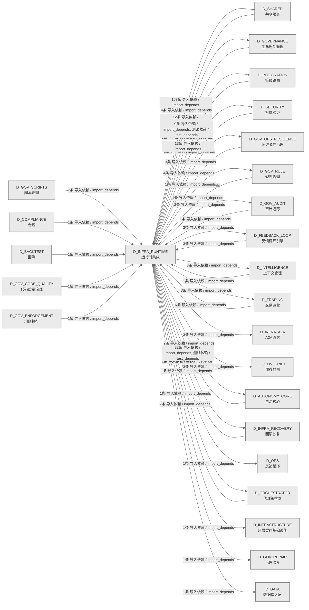

# 06_d_infra_runtime / 运行时集成域 / Runtime Integration

> **功能简介 / Overview**: 运行时集成，负责组件生命周期编排、启动钩子和运行时上下文管理

> **文档作用 / Purpose**: 展示 运行时集成（D_INFRA_RUNTIME）功能域的域内依赖关系、跨域依赖关系，模块信息（成熟度/中英文名/大白话/文件路径）内嵌于 Mermaid 节点，供架构审查和域治理参考。

> 本文档由 generate_domain_doc.py 从 depgraph (PostgreSQL) 自动生成
> 数据源: depgraph (PostgreSQL) nodes表 + edges表

> **[可缩放 HTML 版 / Zoomable HTML](http://localhost:8765/docs/02_enterprise_architecture/02_domain_architecture_docs/_zoomable_html/06_d_infra_runtime.html)** — Ctrl+滚轮缩放 ｜ 双击重置 ｜ Ctrl+Shift+D 切换拖动/选择模式

## 域基本信息 / Domain Overview

| 字段 | 值 | Field | Value |
|------|------|-------|-------|
| 编号 | 06 | Number | 06 |
| 域ID | D_INFRA_RUNTIME | Domain ID | D_INFRA_RUNTIME |
| 域名称 | 运行时集成 | Domain Name | Runtime Integration |
| 层级 | L0 基础设施层 | Layer | L0 Infrastructure |
| 模块数 | 161 | Module Count | 161 |
| 域内依赖 | 148 | Internal Dependencies | 148 |
| 跨域入边 | 78 | Cross-domain Incoming | 78 |
| 跨域出边 | 222 | Cross-domain Outgoing | 222 |
| 设计态模块 | 1 | Design Modules | 1 |
| 生产态模块 | 160 | Production Modules | 160 |
| 容量 | 160/150 (超容) | Capacity | 160/150 (超容) |
| 描述 | 三层运行时编排(L1 Trae/L2 Local/L3 API) | Description | 三层运行时编排(L1 Trae/L2 Local/L3 API) |

## 域内依赖图 / Internal Dependency Diagram

> 依赖图内嵌在本文档中，IDE 可直接渲染；网页版可 Ctrl+滚轮缩放 + 拖动平移查看细节。全景图用颜色区分运营态/设计态，不再分页/拆子图。
>
> **图例说明 / Legend**：
> - 🟦 **蓝色 = 运营态模块**（production，已上线运行）
> - 🟧 **橙色虚线 = 设计态模块**（design，蓝图阶段，代码未写）
> - **实线箭头 = 运营态依赖**（已生效的依赖关系）
> - **虚线箭头 = 非运营态依赖**（计划中/验证中的依赖关系）

### 全景依赖图（全部模块，颜色区分运营态/设计态）

> 展示全部 161 个模块（生产态 160 + 设计态 1），节点含成熟度+中英文名+大白话+文件路径。

```mermaid
%%{init: {'theme': 'base', 'themeVariables': {'primaryColor': '#eaeaea', 'primaryTextColor': '#333333', 'primaryBorderColor': '#666666', 'lineColor': '#666666', 'secondaryColor': '#eaeaea', 'tertiaryColor': '#eaeaea', 'fontSize': '14px'}}}%%
flowchart TD
    docs_01_policies_and_standards_registry_catalogs_infrastructure_registry_yaml_INFRA_DB_001["(生产态 / production)<br/>文件: catalogs/infrastructure_registry.yaml#INFRA-DB-001"]
    docs_01_policies_and_standards_registry_catalogs_infrastructure_registry_yaml_INFRA_DB_002["(生产态 / production)<br/>文件: catalogs/infrastructure_registry.yaml#INFRA-DB-002"]
    docs_01_policies_and_standards_registry_catalogs_infrastructure_registry_yaml_INFRA_DB_003["(生产态 / production)<br/>文件: catalogs/infrastructure_registry.yaml#INFRA-DB-003"]
    docs_01_policies_and_standards_registry_catalogs_infrastructure_registry_yaml_INFRA_DB_006["(生产态 / production)<br/>文件: catalogs/infrastructure_registry.yaml#INFRA-DB-006"]
    docs_03_modules_cross_layer_agent_orchestrator_blueprint_md["(设计态 / design)<br/>文件: agent_orchestrator/blueprint.md"]
    src_zephyr_infrastructure_asset_inventory_main_py["(生产态 / production) 反馈循环Asset Inventory命令行入口 / Infrastructure Asset Inventory CLI Entry<br/>反馈循环域的命令行入口，可通过 python -m 直接运行该包。<br/>文件: asset_inventory/__main__.py"]
    src_zephyr_infrastructure_asset_inventory_lifecycle_py["(生产态 / production) 生命周期 / Lifecycle<br/>AssetLifecycle — MOD-INF-026 L5 ITIL生命周期自动化管理器<br/>文件: asset_inventory/lifecycle.py"]
    src_zephyr_infrastructure_asset_inventory_mcp_server_py["(生产态 / production) MCP服务端 / MCP Server<br/>AssetInventory MCP Server — MOD-INF-026 蓝图 §21<br/>文件: asset_inventory/mcp_server.py"]
    src_zephyr_infrastructure_asset_inventory_metadata_py["(生产态 / production) metadata / Metadata<br/>多 IDE 规则文件生成器——从 asset-inventory 配置生成。<br/>文件: asset_inventory/metadata.py"]
    src_zephyr_infrastructure_asset_inventory_trust_anchor_py["(生产态 / production) 信任anchor / Trust Anchor<br/>旁路状态——对标 K8s Admission Webhook 的 emergency bypass。<br/>文件: asset_inventory/trust_anchor.py"]
    src_zephyr_infrastructure_auto_diagnostics_py["(生产态 / production) 自动diagnostics / Auto Diagnostics<br/>RI-12 AutoDiagnostics — 自动诊断引擎<br/>文件: infrastructure/auto_diagnostics.py"]
    src_zephyr_infrastructure_auto_fix_engine_main_py["(生产态 / production) 反馈循环Auto Fix Engine命令行入口 / Infrastructure Auto Fix Engine CLI Entry<br/>反馈循环域的命令行入口，可通过 python -m 直接运行该包。<br/>文件: auto_fix_engine/__main__.py"]
    src_zephyr_infrastructure_auto_fix_engine_alignment_syncer_py["(生产态 / production) 对齐同步器 / Alignment Syncer<br/>AlignmentSyncError<br/>文件: auto_fix_engine/alignment_syncer.py"]
    src_zephyr_infrastructure_auto_fix_engine_all_completer_py["(生产态 / production) 全量补全器 / All Completer<br/>AllCompletionError<br/>文件: auto_fix_engine/all_completer.py"]
    src_zephyr_infrastructure_auto_fix_engine_config_fixer_py["(生产态 / production) 配置修复器 / Config Fixer<br/>ConfigFixError<br/>文件: auto_fix_engine/config_fixer.py"]
    src_zephyr_infrastructure_auto_fix_engine_dedup_extractor_py["(生产态 / production) dedupextractor / Dedup Extractor<br/>noqa: m03-duplicate  M03豁免: AI趋同演化(不同模块为相似问题生成相似代码),非复...<br/>文件: auto_fix_engine/dedup_extractor.py"]
    src_zephyr_infrastructure_auto_fix_engine_dep_version_fixer_py["(生产态 / production) dep版本修复器 / Dep Version Fixer<br/>noqa: m03-duplicate  M03豁免: AI趋同演化(不同模块为相似问题生成相似代码),非复...<br/>文件: auto_fix_engine/dep_version_fixer.py"]
    src_zephyr_infrastructure_auto_fix_engine_drift_fixer_py["(生产态 / production) 漂移修复器 / Drift Fixer<br/>DriftFixError<br/>文件: auto_fix_engine/drift_fixer.py"]
    src_zephyr_infrastructure_auto_fix_engine_event_hooks_py["(生产态 / production) 事件hooks / Event Hooks<br/>noqa: m03-duplicate  M03豁免: AI趋同演化(不同模块为相似问题生成相似代码),非复...<br/>文件: auto_fix_engine/event_hooks.py"]
    src_zephyr_infrastructure_auto_fix_engine_fix_diff_py["(生产态 / production) 修复差异 / Fix Diff<br/>DiffError<br/>文件: auto_fix_engine/fix_diff.py"]
    src_zephyr_infrastructure_auto_fix_engine_fix_scheduler_py["(生产态 / production) 修复调度器 / Fix Scheduler<br/>noqa: m03-duplicate  M03豁免: AI趋同演化(不同模块为相似问题生成相似代码),非复...<br/>文件: auto_fix_engine/fix_scheduler.py"]
    src_zephyr_infrastructure_auto_fix_engine_import_fixer_py["(生产态 / production) 导入修复器 / Import Fixer<br/>ImportFixError<br/>文件: auto_fix_engine/import_fixer.py"]
    src_zephyr_infrastructure_auto_fix_engine_interrupt_guard_py["(生产态 / production) 中断守卫 / Interrupt Guard<br/>InterruptGuardError<br/>文件: auto_fix_engine/interrupt_guard.py"]
    src_zephyr_infrastructure_auto_fix_engine_llm_fix_adapter_py["(生产态 / production) LLM修复适配器 / LLM Fix Adapter<br/>LLMFixError;SecretLeakDetectedError<br/>文件: auto_fix_engine/llm_fix_adapter.py"]
    src_zephyr_infrastructure_auto_fix_engine_scaffold_registrar_py["(生产态 / production) scaffoldregistrar / Scaffold Registrar<br/>从 script-manifest.yaml 加载已注册脚本路径集合。<br/>文件: auto_fix_engine/scaffold_registrar.py"]
    src_zephyr_infrastructure_auto_fix_engine_self_heal_agent_py["(生产态 / production) 自我自愈代理 / Self Heal Agent<br/>SelfHealMaxRoundsError;SelfHealCircuitOpenError<br/>文件: auto_fix_engine/self_heal_agent.py"]
    src_zephyr_infrastructure_auto_fix_engine_state_machine_py["(生产态 / production) 状态machine / State Machine<br/>漂移事件记录——对齐 test_state_machine.py 契约（裁定#17 F1 治本）。<br/>文件: auto_fix_engine/state_machine.py"]
    src_zephyr_infrastructure_auto_fix_engine_zombie_cleaner_py["(生产态 / production) zombiecleaner / Zombie Cleaner<br/>移除 content 中指向不存在文件的僵尸引用，返回清理后的内容。<br/>文件: auto_fix_engine/zombie_cleaner.py"]
    src_zephyr_infrastructure_blueprint_code_sync_py["(生产态 / production) 蓝图代码同步 / Blueprint Code Sync<br/>Blueprint-Code Sync — 蓝图-代码索引同步验证。<br/>文件: infrastructure/blueprint_code_sync.py"]
    src_zephyr_infrastructure_budget_enforcement_init_py["(生产态 / production) 反馈循环Budget Enforcement包 / Infrastructure Budget Enforcement Package<br/>反馈循环域下 budget_enforcement 子包，归集该方向的模块。本身不含业务逻辑，只是组织归属。<br/>文件: budget_enforcement/__init__.py"]
    src_zephyr_infrastructure_capacity_assurance_budget_forecaster_py["(生产态 / production) 预算forecaster / Budget Forecaster<br/>budget_forecaster.py — Token 预算预测 (DD120-extra, TASK-020)<br/>文件: capacity_assurance/budget_forecaster.py"]
    src_zephyr_infrastructure_capacity_assurance_contracts_contract_bus_py["(生产态 / production) contract总线 / Contract Bus<br/>ContractBus loader — 加载全部44条容量保障契约的Pydantic v2 Schema（DD-9三批...<br/>文件: contracts/contract_bus.py"]
    src_zephyr_infrastructure_capacity_assurance_cross_module_integration_py["(生产态 / production) 跨模块集成 / Cross Module Integration<br/>Cross-module integration — CT-1~CT-4 跨模块集成契约实现（对标蓝图 §17）.<br/>文件: capacity_assurance/cross_module_integration.py"]
    src_zephyr_infrastructure_capacity_assurance_host_resource_governor_py["(生产态 / production) host资源governor / Host Resource Governor<br/>host_resource_governor.py — 主机资源治理 (B17, DD91, TASK-017)<br/>文件: capacity_assurance/host_resource_governor.py"]
    src_zephyr_infrastructure_capacity_assurance_kill_switch_py["(生产态 / production) killswitch / Kill Switch<br/>kill_switch.py -- safety circuit breaker (DD110, TASK-019).<br/>文件: capacity_assurance/kill_switch.py"]
    src_zephyr_infrastructure_capacity_assurance_risk_mitigation_py["(生产态 / production) 风险mitigation / Risk Mitigation<br/>Risk mitigation — R1~R16 全量风险缓解实现（对标蓝图 §14 风险与缓解 + 多轮盲...<br/>文件: capacity_assurance/risk_mitigation.py"]
    src_zephyr_infrastructure_capacity_assurance_schema_py["(生产态 / production) schema / Schema<br/>SchemaManager — 容量保障体系数据库 Schema 管理器<br/>文件: capacity_assurance/schema.py"]
    src_zephyr_infrastructure_capacity_assurance_sli_instrumentation_py["(生产态 / production) sliinstrumentation / Sli Instrumentation<br/>SLI instrumentation — SLI采集插桩点（对标蓝图 §13 SLI Registry CAP-001~CAP-...<br/>文件: capacity_assurance/sli_instrumentation.py"]
    src_zephyr_infrastructure_capacity_assurance_tech_stack_py["(生产态 / production) techstack / Tech Stack<br/>TechStackValidator — 技术栈可用性校验器<br/>文件: capacity_assurance/tech_stack.py"]
    src_zephyr_infrastructure_capacity_assurance_token_budget_py["(生产态 / production) token预算 / Token Budget<br/>token_budget.py — Token 估算工具 SSoT<br/>文件: capacity_assurance/token_budget.py"]
    src_zephyr_infrastructure_cost_tracker_py["(生产态 / production) 成本追踪器 / Cost Tracker<br/>RI-15 CostTracker — 成本追踪器<br/>文件: infrastructure/cost_tracker.py"]
    src_zephyr_infrastructure_database_service_py["(生产态 / production) database服务 / Database Service<br/>DatabaseService: 统一管理数据库的连接池、生命周期、健康检查<br/>文件: infrastructure/database_service.py"]
    src_zephyr_infrastructure_dry_run_simulator_py["(生产态 / production) dryrunsimulator / Dry Run Simulator<br/>RI-14 DryRunSimulator — 干运行模拟器<br/>文件: infrastructure/dry_run_simulator.py"]
    src_zephyr_infrastructure_event_bus_upgrade_py["(生产态 / production) 事件总线upgrade / Event Bus Upgrade<br/>DEPRECATED: 此文件已废弃。<br/>文件: infrastructure/event_bus_upgrade.py"]
    src_zephyr_infrastructure_event_store_py["(生产态 / production) 事件store / Event Store<br/>RI-13 EventStore — 事件存储<br/>文件: infrastructure/event_store.py"]
    src_zephyr_infrastructure_events_event_store_py["(生产态 / production) 事件store / Event Store<br/>Event Store — 事件持久化存储。<br/>文件: events/event_store.py"]
    src_zephyr_infrastructure_finding_task_bridge_py["(生产态 / production) 发现任务桥接 / Finding Task Bridge<br/>Finding->TaskCard 桥接器<br/>文件: infrastructure/finding_task_bridge.py"]
    src_zephyr_infrastructure_git_batcher_py["(生产态 / production) gitbatcher / Git Batcher<br/>git_batcher.py — Git 命令批量化工具（ARCH-GIT-CALL-BUDGET P2.2，2026-07-19）<br/>文件: infrastructure/git_batcher.py"]
    src_zephyr_infrastructure_health_monitor_health_aggregator_py["(生产态 / production) 健康aggregator / Health Aggregator<br/>全系统健康聚合 — check_all_systems()<br/>文件: health_monitor/health_aggregator.py"]
    src_zephyr_infrastructure_hooks_event_hook_py["(生产态 / production) 事件钩子 / Event Hook<br/>EventHook — 声明式任务系统事件订阅<br/>文件: hooks/event_hook.py"]
    src_zephyr_infrastructure_impact_impact_propagator_py["(生产态 / production) impactpropagator / Impact Propagator<br/>Impact Propagator — 变更影响传播分析。<br/>文件: impact/impact_propagator.py"]
    src_zephyr_infrastructure_impact_llm_impact_analyzer_py["(生产态 / production) LLMimpact分析器 / LLM Impact Analyzer<br/>LLM Impact Analyzer — 语义影响分析器。<br/>文件: impact/llm_impact_analyzer.py"]
    src_zephyr_infrastructure_infrastructure_base_py["(生产态 / production) infrastructure基础 / Infrastructure Base<br/>基础设施 — Infrastructure Layer Skeleton<br/>文件: infrastructure/infrastructure_base.py"]
    src_zephyr_infrastructure_kill_switch_sim_py["(生产态 / production) killswitchsim / Kill Switch Sim<br/>Kill Switch T0 Hardware Simulator<br/>文件: infrastructure/kill_switch_sim.py"]
    src_zephyr_infrastructure_lifecycle_scope_guard_py["(生产态 / production) scope守卫 / Scope Guard<br/>Scope Guard — 范围蔓延检测与阻断。<br/>文件: lifecycle/scope_guard.py"]
    src_zephyr_infrastructure_lifecycle_task_lifecycle_manager_py["(生产态 / production) 任务生命周期管理器 / Task Lifecycle Manager<br/>Task Lifecycle Manager — G0-G7 任务生命周期门禁。<br/>文件: lifecycle/task_lifecycle_manager.py"]
    src_zephyr_infrastructure_observability_trace_decorator_py["(生产态 / production) 追踪装饰器 / Trace Decorator<br/>定义 TraceSpan、TraceCollector、trace 等类型。<br/>文件: observability/trace_decorator.py"]
    src_zephyr_infrastructure_pipeline_backpressure_manager_py["(生产态 / production) backpressure管理器 / Backpressure Manager<br/>Pipeline — Backpressure Manager<br/>文件: pipeline/backpressure_manager.py"]
    src_zephyr_infrastructure_pipeline_circuit_breaker_manager_py["(生产态 / production) 断路熔断器管理器 / Circuit Breaker Manager<br/>CircuitBreakerManager -- standalone circuit breaker manager (Netflix Hystrix ...<br/>文件: pipeline/circuit_breaker_manager.py"]
    src_zephyr_infrastructure_pipeline_cost_tracker_py["(生产态 / production) 成本追踪器 / Cost Tracker<br/>CostTracker —— LLM 调用成本追踪器（SRC-0025）<br/>文件: pipeline/cost_tracker.py"]
    src_zephyr_infrastructure_pipeline_dead_letter_queue_py["(生产态 / production) deadletterqueue / Dead Letter Queue<br/>DeadLetterQueue — 死信队列<br/>文件: pipeline/dead_letter_queue.py"]
    src_zephyr_infrastructure_pipeline_llm_gateway_py["(生产态 / production) LLMgateway / LLM Gateway<br/>MOD-INF-019: Agent Spec — LLM Gateway<br/>文件: pipeline/llm_gateway.py"]
    src_zephyr_infrastructure_pipeline_pipeline_agent_bridge_py["(生产态 / production) 流水线代理桥接 / Pipeline Agent Bridge<br/>Pipeline -> Agent Bridge — 双编排器桥接层<br/>文件: pipeline/pipeline_agent_bridge.py"]
    src_zephyr_infrastructure_pipeline_pipeline_lock_py["(生产态 / production) 流水线lock / Pipeline Lock<br/>Pipeline Lock — 双管线并发锁<br/>文件: pipeline/pipeline_lock.py"]
    src_zephyr_infrastructure_pipeline_pipeline_roadmap_py["(生产态 / production) 流水线roadmap / Pipeline Roadmap<br/>Pipeline 未来版本路线图——v0.10.0 -> v0.12.0 规划骨架。<br/>文件: pipeline/pipeline_roadmap.py"]
    src_zephyr_infrastructure_pipeline_preemption_manager_py["(生产态 / production) preemption管理器 / Preemption Manager<br/>PreemptionManager -- 优先级抢占管理器<br/>文件: pipeline/preemption_manager.py"]
    src_zephyr_infrastructure_pipeline_routing_plugins_py["(生产态 / production) routingplugins / Routing Plugins<br/>Pipeline Routing Plugin System — K8s Scheduling Framework 对标<br/>文件: pipeline/routing_plugins.py"]
    src_zephyr_infrastructure_pydantic_v2_migrator_py["(生产态 / production) pydanticv2migrator / Pydantic V2 Migrator<br/>M-15 PydanticV2Migrator — Pydantic V2 迁移工具<br/>文件: infrastructure/pydantic_v2_migrator.py"]
    src_zephyr_infrastructure_quality_quality_monitor_py["(生产态 / production) 质量监控器 / Quality Monitor<br/>Quality Monitor — 生成代码质量门禁。<br/>文件: quality/quality_monitor.py"]
    src_zephyr_infrastructure_reliability_circuit_breaker_py["(生产态 / production) 断路熔断器 / Circuit Breaker<br/>Circuit Breaker — 熔断器：连续失败 -> OPEN -> 暂停执行。<br/>文件: reliability/circuit_breaker.py"]
    src_zephyr_infrastructure_reliability_context_guard_py["(生产态 / production) 上下文守卫 / Context Guard<br/>Context Guard — 上下文契约守卫。<br/>文件: reliability/context_guard.py"]
    src_zephyr_infrastructure_runtime_concurrency_guard_py["(生产态 / production) concurrency守卫 / Concurrency Guard<br/>concurrency_guard — 回滚操作并发安全守卫。<br/>文件: runtime/concurrency_guard.py"]
    src_zephyr_infrastructure_runtime_sandbox_enforcer_py["(生产态 / production) 沙箱执行器 / Sandbox Enforcer<br/>SandboxEnforcer — Agent 沙盒隔离。<br/>文件: runtime/sandbox_enforcer.py"]
    src_zephyr_infrastructure_runtime_startup_shutdown_py["(生产态 / production) 启动关闭 / Startup Shutdown<br/>定义 StartupPhase、PhaseState、StartupPhaseDef 等类型。<br/>文件: runtime/startup_shutdown.py"]
    src_zephyr_infrastructure_script_system_finding_py["(生产态 / production) 发现 / Finding<br/>Finding Schema — 审计发现标准化数据模型<br/>文件: script_system/finding.py"]
    src_zephyr_infrastructure_script_system_gate_bridge_py["(生产态 / production) 门禁桥接 / Gate Bridge<br/>Script->Gate 门禁桥接器 — submit_findings() 生产者<br/>文件: script_system/gate_bridge.py"]
    src_zephyr_infrastructure_system_telemetry_auto_bootstrap_py["(生产态 / production) 自动bootstrap / Auto Bootstrap<br/>auto_bootstrap — 全自动遥测注入钩子（MOD-INF-015 v2.1.0）<br/>文件: system_telemetry/auto_bootstrap.py"]
    src_zephyr_infrastructure_system_telemetry_logs_init_py["(生产态 / production) 反馈循环Logs包 / System Telemetry Logs Package<br/>反馈循环域下 logs 子包，归集该方向的模块。本身不含业务逻辑，只是组织归属。<br/>文件: logs/__init__.py"]
    src_zephyr_infrastructure_system_telemetry_metrics_bridge_py["(生产态 / production) 指标桥接 / Metrics Bridge<br/>TELE->FLE 指标桥接 — emit_metrics() 生产者<br/>文件: system_telemetry/metrics_bridge.py"]
    src_zephyr_infrastructure_warm_hot_gate_py["(生产态 / production) warmhot门禁 / Warm Hot Gate<br/>M-14 WarmHotGate — Warm->Hot 阻断门<br/>文件: infrastructure/warm_hot_gate.py"]
    src_zephyr_shared_lifecycle_hooks_py["(生产态 / production) hooks / Hooks<br/>hooks.py —— 模块生命周期钩子（Phase 2 新增 / 盲点 B8 修复）<br/>文件: lifecycle/hooks.py"]
    src_zephyr_trading_action_dispatcher_py["(生产态 / production) 动作dispatcher / Action Dispatcher<br/>ActionDispatcher --- 大脑的'手' v2.0 (Phase 2)<br/>文件: trading/action_dispatcher.py"]
    src_zephyr_trading_auto_task_generator_py["(生产态 / production) 自动任务生成器 / Auto Task Generator<br/>AutoTaskGenerator — 自动任务生成器<br/>文件: trading/auto_task_generator.py"]
    src_zephyr_trading_ports_py["(生产态 / production) ports / Ports<br/>Protocol-based interface layer for runtime->pipeline dependency abstraction.<br/>文件: trading/ports.py"]
    src_zephyr_trading_staging_area_py["(生产态 / production) stagingarea / Staging Area<br/>StagingArea — 多AI并发草稿写入+提交+冲突检测模块（CT-SESSION-CONFLICT-002）<br/>文件: trading/staging_area.py"]
    src_zephyr_trading_task_gate_py["(生产态 / production) 任务门禁 / Task Gate<br/>TaskGate --- 任务门控<br/>文件: trading/task_gate.py"]
    src_zephyr_trading_windows_service_py["(生产态 / production) windows服务 / Windows Service<br/>WindowsService — Windows Service 包装器<br/>文件: trading/windows_service.py"]
    src_zephyr_trading_zombie_scanner_py["(生产态 / production) zombiescanner / Zombie Scanner<br/>zombie_scanner.py — 僵尸 Python 进程检测与自动处置<br/>文件: trading/zombie_scanner.py"]
    docs_01_policies_and_standards_registry_catalogs_infrastructure_registry_yaml_INFRA_DB_001 ~~~ docs_01_policies_and_standards_registry_catalogs_infrastructure_registry_yaml_INFRA_DB_002
    docs_01_policies_and_standards_registry_catalogs_infrastructure_registry_yaml_INFRA_DB_002 ~~~ docs_01_policies_and_standards_registry_catalogs_infrastructure_registry_yaml_INFRA_DB_003
    docs_01_policies_and_standards_registry_catalogs_infrastructure_registry_yaml_INFRA_DB_003 ~~~ docs_01_policies_and_standards_registry_catalogs_infrastructure_registry_yaml_INFRA_DB_006
    docs_01_policies_and_standards_registry_catalogs_infrastructure_registry_yaml_INFRA_DB_006 ~~~ docs_03_modules_cross_layer_agent_orchestrator_blueprint_md
    docs_03_modules_cross_layer_agent_orchestrator_blueprint_md ~~~ src_zephyr_infrastructure_asset_inventory_main_py
    src_zephyr_infrastructure_asset_inventory_main_py ~~~ src_zephyr_infrastructure_asset_inventory_lifecycle_py
    src_zephyr_infrastructure_asset_inventory_lifecycle_py ~~~ src_zephyr_infrastructure_asset_inventory_mcp_server_py
    src_zephyr_infrastructure_asset_inventory_mcp_server_py ~~~ src_zephyr_infrastructure_asset_inventory_metadata_py
    src_zephyr_infrastructure_asset_inventory_metadata_py ~~~ src_zephyr_infrastructure_asset_inventory_trust_anchor_py
    src_zephyr_infrastructure_asset_inventory_trust_anchor_py ~~~ src_zephyr_infrastructure_auto_diagnostics_py
    src_zephyr_infrastructure_auto_diagnostics_py ~~~ src_zephyr_infrastructure_auto_fix_engine_main_py
    src_zephyr_infrastructure_auto_fix_engine_main_py ~~~ src_zephyr_infrastructure_auto_fix_engine_alignment_syncer_py
    src_zephyr_infrastructure_auto_fix_engine_alignment_syncer_py ~~~ src_zephyr_infrastructure_auto_fix_engine_all_completer_py
    src_zephyr_infrastructure_auto_fix_engine_all_completer_py ~~~ src_zephyr_infrastructure_auto_fix_engine_config_fixer_py
    src_zephyr_infrastructure_auto_fix_engine_config_fixer_py ~~~ src_zephyr_infrastructure_auto_fix_engine_dedup_extractor_py
    src_zephyr_infrastructure_auto_fix_engine_dedup_extractor_py ~~~ src_zephyr_infrastructure_auto_fix_engine_dep_version_fixer_py
    src_zephyr_infrastructure_auto_fix_engine_dep_version_fixer_py ~~~ src_zephyr_infrastructure_auto_fix_engine_drift_fixer_py
    src_zephyr_infrastructure_auto_fix_engine_drift_fixer_py ~~~ src_zephyr_infrastructure_auto_fix_engine_event_hooks_py
    src_zephyr_infrastructure_auto_fix_engine_event_hooks_py ~~~ src_zephyr_infrastructure_auto_fix_engine_fix_diff_py
    src_zephyr_infrastructure_auto_fix_engine_fix_diff_py ~~~ src_zephyr_infrastructure_auto_fix_engine_fix_scheduler_py
    src_zephyr_infrastructure_auto_fix_engine_fix_scheduler_py ~~~ src_zephyr_infrastructure_auto_fix_engine_import_fixer_py
    src_zephyr_infrastructure_auto_fix_engine_import_fixer_py ~~~ src_zephyr_infrastructure_auto_fix_engine_interrupt_guard_py
    src_zephyr_infrastructure_auto_fix_engine_interrupt_guard_py ~~~ src_zephyr_infrastructure_auto_fix_engine_llm_fix_adapter_py
    src_zephyr_infrastructure_auto_fix_engine_llm_fix_adapter_py ~~~ src_zephyr_infrastructure_auto_fix_engine_scaffold_registrar_py
    src_zephyr_infrastructure_auto_fix_engine_scaffold_registrar_py ~~~ src_zephyr_infrastructure_auto_fix_engine_self_heal_agent_py
    src_zephyr_infrastructure_auto_fix_engine_self_heal_agent_py ~~~ src_zephyr_infrastructure_auto_fix_engine_state_machine_py
    src_zephyr_infrastructure_auto_fix_engine_state_machine_py ~~~ src_zephyr_infrastructure_auto_fix_engine_zombie_cleaner_py
    src_zephyr_infrastructure_auto_fix_engine_zombie_cleaner_py ~~~ src_zephyr_infrastructure_blueprint_code_sync_py
    src_zephyr_infrastructure_blueprint_code_sync_py ~~~ src_zephyr_infrastructure_budget_enforcement_init_py
    src_zephyr_infrastructure_budget_enforcement_init_py ~~~ src_zephyr_infrastructure_capacity_assurance_budget_forecaster_py
    src_zephyr_infrastructure_capacity_assurance_budget_forecaster_py ~~~ src_zephyr_infrastructure_capacity_assurance_contracts_contract_bus_py
    src_zephyr_infrastructure_capacity_assurance_contracts_contract_bus_py ~~~ src_zephyr_infrastructure_capacity_assurance_cross_module_integration_py
    src_zephyr_infrastructure_capacity_assurance_cross_module_integration_py ~~~ src_zephyr_infrastructure_capacity_assurance_host_resource_governor_py
    src_zephyr_infrastructure_capacity_assurance_host_resource_governor_py ~~~ src_zephyr_infrastructure_capacity_assurance_kill_switch_py
    src_zephyr_infrastructure_capacity_assurance_kill_switch_py ~~~ src_zephyr_infrastructure_capacity_assurance_risk_mitigation_py
    src_zephyr_infrastructure_capacity_assurance_risk_mitigation_py ~~~ src_zephyr_infrastructure_capacity_assurance_schema_py
    src_zephyr_infrastructure_capacity_assurance_schema_py ~~~ src_zephyr_infrastructure_capacity_assurance_sli_instrumentation_py
    src_zephyr_infrastructure_capacity_assurance_sli_instrumentation_py ~~~ src_zephyr_infrastructure_capacity_assurance_tech_stack_py
    src_zephyr_infrastructure_capacity_assurance_tech_stack_py ~~~ src_zephyr_infrastructure_capacity_assurance_token_budget_py
    src_zephyr_infrastructure_capacity_assurance_token_budget_py ~~~ src_zephyr_infrastructure_cost_tracker_py
    src_zephyr_infrastructure_cost_tracker_py ~~~ src_zephyr_infrastructure_database_service_py
    src_zephyr_infrastructure_database_service_py ~~~ src_zephyr_infrastructure_dry_run_simulator_py
    src_zephyr_infrastructure_dry_run_simulator_py ~~~ src_zephyr_infrastructure_event_bus_upgrade_py
    src_zephyr_infrastructure_event_bus_upgrade_py ~~~ src_zephyr_infrastructure_event_store_py
    src_zephyr_infrastructure_event_store_py ~~~ src_zephyr_infrastructure_events_event_store_py
    src_zephyr_infrastructure_events_event_store_py ~~~ src_zephyr_infrastructure_finding_task_bridge_py
    src_zephyr_infrastructure_finding_task_bridge_py ~~~ src_zephyr_infrastructure_git_batcher_py
    src_zephyr_infrastructure_git_batcher_py ~~~ src_zephyr_infrastructure_health_monitor_health_aggregator_py
    src_zephyr_infrastructure_health_monitor_health_aggregator_py ~~~ src_zephyr_infrastructure_hooks_event_hook_py
    src_zephyr_infrastructure_hooks_event_hook_py ~~~ src_zephyr_infrastructure_impact_impact_propagator_py
    src_zephyr_infrastructure_impact_impact_propagator_py ~~~ src_zephyr_infrastructure_impact_llm_impact_analyzer_py
    src_zephyr_infrastructure_impact_llm_impact_analyzer_py ~~~ src_zephyr_infrastructure_infrastructure_base_py
    src_zephyr_infrastructure_infrastructure_base_py ~~~ src_zephyr_infrastructure_kill_switch_sim_py
    src_zephyr_infrastructure_kill_switch_sim_py ~~~ src_zephyr_infrastructure_lifecycle_scope_guard_py
    src_zephyr_infrastructure_lifecycle_scope_guard_py ~~~ src_zephyr_infrastructure_lifecycle_task_lifecycle_manager_py
    src_zephyr_infrastructure_lifecycle_task_lifecycle_manager_py ~~~ src_zephyr_infrastructure_observability_trace_decorator_py
    src_zephyr_infrastructure_observability_trace_decorator_py ~~~ src_zephyr_infrastructure_pipeline_backpressure_manager_py
    src_zephyr_infrastructure_pipeline_backpressure_manager_py ~~~ src_zephyr_infrastructure_pipeline_circuit_breaker_manager_py
    src_zephyr_infrastructure_pipeline_circuit_breaker_manager_py ~~~ src_zephyr_infrastructure_pipeline_cost_tracker_py
    src_zephyr_infrastructure_pipeline_cost_tracker_py ~~~ src_zephyr_infrastructure_pipeline_dead_letter_queue_py
    src_zephyr_infrastructure_pipeline_dead_letter_queue_py ~~~ src_zephyr_infrastructure_pipeline_llm_gateway_py
    src_zephyr_infrastructure_pipeline_llm_gateway_py ~~~ src_zephyr_infrastructure_pipeline_pipeline_agent_bridge_py
    src_zephyr_infrastructure_pipeline_pipeline_agent_bridge_py ~~~ src_zephyr_infrastructure_pipeline_pipeline_lock_py
    src_zephyr_infrastructure_pipeline_pipeline_lock_py ~~~ src_zephyr_infrastructure_pipeline_pipeline_roadmap_py
    src_zephyr_infrastructure_pipeline_pipeline_roadmap_py ~~~ src_zephyr_infrastructure_pipeline_preemption_manager_py
    src_zephyr_infrastructure_pipeline_preemption_manager_py ~~~ src_zephyr_infrastructure_pipeline_routing_plugins_py
    src_zephyr_infrastructure_pipeline_routing_plugins_py ~~~ src_zephyr_infrastructure_pydantic_v2_migrator_py
    src_zephyr_infrastructure_pydantic_v2_migrator_py ~~~ src_zephyr_infrastructure_quality_quality_monitor_py
    src_zephyr_infrastructure_quality_quality_monitor_py ~~~ src_zephyr_infrastructure_reliability_circuit_breaker_py
    src_zephyr_infrastructure_reliability_circuit_breaker_py ~~~ src_zephyr_infrastructure_reliability_context_guard_py
    src_zephyr_infrastructure_reliability_context_guard_py ~~~ src_zephyr_infrastructure_runtime_concurrency_guard_py
    src_zephyr_infrastructure_runtime_concurrency_guard_py ~~~ src_zephyr_infrastructure_runtime_sandbox_enforcer_py
    src_zephyr_infrastructure_runtime_sandbox_enforcer_py ~~~ src_zephyr_infrastructure_runtime_startup_shutdown_py
    src_zephyr_infrastructure_runtime_startup_shutdown_py ~~~ src_zephyr_infrastructure_script_system_finding_py
    src_zephyr_infrastructure_script_system_finding_py ~~~ src_zephyr_infrastructure_script_system_gate_bridge_py
    src_zephyr_infrastructure_script_system_gate_bridge_py ~~~ src_zephyr_infrastructure_system_telemetry_auto_bootstrap_py
    src_zephyr_infrastructure_system_telemetry_auto_bootstrap_py ~~~ src_zephyr_infrastructure_system_telemetry_logs_init_py
    src_zephyr_infrastructure_system_telemetry_logs_init_py ~~~ src_zephyr_infrastructure_system_telemetry_metrics_bridge_py
    src_zephyr_infrastructure_system_telemetry_metrics_bridge_py ~~~ src_zephyr_infrastructure_warm_hot_gate_py
    src_zephyr_infrastructure_warm_hot_gate_py ~~~ src_zephyr_shared_lifecycle_hooks_py
    src_zephyr_shared_lifecycle_hooks_py ~~~ src_zephyr_trading_action_dispatcher_py
    src_zephyr_trading_action_dispatcher_py ~~~ src_zephyr_trading_auto_task_generator_py
    src_zephyr_trading_auto_task_generator_py ~~~ src_zephyr_trading_ports_py
    src_zephyr_trading_ports_py ~~~ src_zephyr_trading_staging_area_py
    src_zephyr_trading_staging_area_py ~~~ src_zephyr_trading_task_gate_py
    src_zephyr_trading_task_gate_py ~~~ src_zephyr_trading_windows_service_py
    src_zephyr_trading_windows_service_py ~~~ src_zephyr_trading_zombie_scanner_py
    src_zephyr_infrastructure_asset_inventory_classifier_py["(生产态 / production) classifier / Classifier<br/>AssetClassifier — MOD-INF-026 L2 资产自动分类器<br/>文件: asset_inventory/classifier.py"]
    src_zephyr_infrastructure_asset_inventory_dashboard_py["(生产态 / production) 仪表板 / Dashboard<br/>AssetDashboard — MOD-INF-026 资产健康仪表盘生成器<br/>文件: asset_inventory/dashboard.py"]
    src_zephyr_infrastructure_asset_inventory_dependency_py["(生产态 / production) 依赖 / Dependency<br/>MOD-INF-026 §18 — 资产依赖图。<br/>文件: asset_inventory/dependency.py"]
    src_zephyr_infrastructure_asset_inventory_index_generator_py["(生产态 / production) 索引生成器 / Index Generator<br/>UnifiedAssetIndex — MOD-INF-026 L3 统一资产索引生成器<br/>文件: asset_inventory/index_generator.py"]
    src_zephyr_infrastructure_asset_inventory_reconciler_py["(生产态 / production) reconciler / Reconciler<br/>ReconciliationEngine — MOD-INF-026 L4 注册表 vs 磁盘对账引擎<br/>文件: asset_inventory/reconciler.py"]
    src_zephyr_infrastructure_asset_inventory_registry_adapter_py["(生产态 / production) 注册表适配器 / Registry Adapter<br/>MOD-INF-026 §17 — 24 个异构注册表统一解析适配器。<br/>文件: asset_inventory/registry_adapter.py"]
    src_zephyr_infrastructure_asset_inventory_scanner_py["(生产态 / production) scanner / Scanner<br/>AssetDiscoveryScanner — MOD-INF-026 L1 全量文件系统扫描器<br/>文件: asset_inventory/scanner.py"]
    src_zephyr_infrastructure_asset_inventory_telemetry_py["(生产态 / production) 遥测 / Telemetry<br/>AssetInventoryTelemetry — MOD-INF-026 自监控指标<br/>文件: asset_inventory/telemetry.py"]
    src_zephyr_infrastructure_auto_fix_engine_engine_py["(生产态 / production) 引擎 / Engine<br/>AutoFixEngineError;FixBlockedError<br/>文件: auto_fix_engine/engine.py"]
    src_zephyr_infrastructure_budget_enforcement_rbac_bridge_py["(生产态 / production) RBAC桥接 / RBAC Bridge<br/>budget_enforcement.rbac_bridge — 基础设施层 RBAC 桥接适配器。<br/>文件: budget_enforcement/rbac_bridge.py"]
    src_zephyr_infrastructure_capacity_assurance_contracts_batch1_infra_py["(生产态 / production) batch1infra / Batch1 Infra<br/>Batch1 基础设施层契约 — 15条 Pydantic v2 Schema（SLO/Error Budget/Token Budg...<br/>文件: contracts/batch1_infra.py"]
    src_zephyr_infrastructure_capacity_assurance_contracts_batch3_integration_py["(生产态 / production) batch3集成 / Batch3 Integration<br/>Batch3 集成层契约 — 14条 Pydantic v2 Schema（OTel/W3C/跨模块CT-1~4/DR/容量预...<br/>文件: contracts/batch3_integration.py"]
    src_zephyr_infrastructure_config_validator_py["(生产态 / production) 配置校验器 / Config Validator<br/>M-12 ConfigValidator — 配置参数校验器<br/>文件: infrastructure/config_validator.py"]
    src_zephyr_infrastructure_contract_tester_py["(生产态 / production) contract测试器 / Contract Tester<br/>M-11 ContractTester — 契约测试框架<br/>文件: infrastructure/contract_tester.py"]
    src_zephyr_infrastructure_pipeline_backpressure_types_py["(生产态 / production) backpressure类型 / Backpressure Types<br/>backpressure_types.py - Pipeline backpressure signal data types<br/>文件: pipeline/backpressure_types.py"]
    src_zephyr_infrastructure_pipeline_ct_pipe_routing_py["(生产态 / production) ctpiperouting / Ct Pipe Routing<br/>CT-PIPE-ORC-001 — TaskCard -> 管线入口节点路由<br/>文件: pipeline/ct_pipe_routing.py"]
    src_zephyr_infrastructure_pipeline_model_router_py["(生产态 / production) 模型路由器 / Model Router<br/>ModelRouter — 模型路由与降级链管理<br/>文件: pipeline/model_router.py"]
    src_zephyr_infrastructure_queue_task_scheduler_py["(生产态 / production) 任务调度器 / Task Scheduler<br/>Task Scheduler — 任务调度器。<br/>文件: queue/task_scheduler.py"]
    src_zephyr_infrastructure_system_telemetry_budget_telemetry_bridge_py["(生产态 / production) 预算遥测桥接 / Budget Telemetry Bridge<br/>None return when unset<br/>文件: system_telemetry/_budget_telemetry_bridge.py"]
    src_zephyr_infrastructure_system_telemetry_contract_metrics_py["(生产态 / production) contract指标 / Contract Metrics<br/>ZephyrAlpha — system-telemetry/contract_metrics.py<br/>文件: system_telemetry/contract_metrics.py"]
    src_zephyr_infrastructure_system_telemetry_metrics_blueprint_metrics_py["(生产态 / production) 蓝图指标 / Blueprint Metrics<br/>blueprint_metrics — 蓝图使用追踪 instrumentation<br/>文件: metrics/blueprint_metrics.py"]
    src_zephyr_trading_main_py["(生产态 / production) 交易运营域命令行入口 / Trading CLI Entry<br/>交易运营域的命令行入口，可通过 python -m 直接运行该包。<br/>文件: trading/__main__.py"]
    src_zephyr_infrastructure_asset_inventory_classifier_py ~~~ src_zephyr_infrastructure_asset_inventory_dashboard_py
    src_zephyr_infrastructure_asset_inventory_dashboard_py ~~~ src_zephyr_infrastructure_asset_inventory_dependency_py
    src_zephyr_infrastructure_asset_inventory_dependency_py ~~~ src_zephyr_infrastructure_asset_inventory_index_generator_py
    src_zephyr_infrastructure_asset_inventory_index_generator_py ~~~ src_zephyr_infrastructure_asset_inventory_reconciler_py
    src_zephyr_infrastructure_asset_inventory_reconciler_py ~~~ src_zephyr_infrastructure_asset_inventory_registry_adapter_py
    src_zephyr_infrastructure_asset_inventory_registry_adapter_py ~~~ src_zephyr_infrastructure_asset_inventory_scanner_py
    src_zephyr_infrastructure_asset_inventory_scanner_py ~~~ src_zephyr_infrastructure_asset_inventory_telemetry_py
    src_zephyr_infrastructure_asset_inventory_telemetry_py ~~~ src_zephyr_infrastructure_auto_fix_engine_engine_py
    src_zephyr_infrastructure_auto_fix_engine_engine_py ~~~ src_zephyr_infrastructure_budget_enforcement_rbac_bridge_py
    src_zephyr_infrastructure_budget_enforcement_rbac_bridge_py ~~~ src_zephyr_infrastructure_capacity_assurance_contracts_batch1_infra_py
    src_zephyr_infrastructure_capacity_assurance_contracts_batch1_infra_py ~~~ src_zephyr_infrastructure_capacity_assurance_contracts_batch3_integration_py
    src_zephyr_infrastructure_capacity_assurance_contracts_batch3_integration_py ~~~ src_zephyr_infrastructure_config_validator_py
    src_zephyr_infrastructure_config_validator_py ~~~ src_zephyr_infrastructure_contract_tester_py
    src_zephyr_infrastructure_contract_tester_py ~~~ src_zephyr_infrastructure_pipeline_backpressure_types_py
    src_zephyr_infrastructure_pipeline_backpressure_types_py ~~~ src_zephyr_infrastructure_pipeline_ct_pipe_routing_py
    src_zephyr_infrastructure_pipeline_ct_pipe_routing_py ~~~ src_zephyr_infrastructure_pipeline_model_router_py
    src_zephyr_infrastructure_pipeline_model_router_py ~~~ src_zephyr_infrastructure_queue_task_scheduler_py
    src_zephyr_infrastructure_queue_task_scheduler_py ~~~ src_zephyr_infrastructure_system_telemetry_budget_telemetry_bridge_py
    src_zephyr_infrastructure_system_telemetry_budget_telemetry_bridge_py ~~~ src_zephyr_infrastructure_system_telemetry_contract_metrics_py
    src_zephyr_infrastructure_system_telemetry_contract_metrics_py ~~~ src_zephyr_infrastructure_system_telemetry_metrics_blueprint_metrics_py
    src_zephyr_infrastructure_system_telemetry_metrics_blueprint_metrics_py ~~~ src_zephyr_trading_main_py
    src_zephyr_infrastructure_asset_inventory_models_py["(生产态 / production) 模型 / Models<br/>AssetInventoryModels — MOD-INF-026 Pydantic V2 共享数据模型<br/>文件: asset_inventory/models.py"]
    src_zephyr_infrastructure_auto_fix_engine_batch_fixer_py["(生产态 / production) 批次修复器 / Batch Fixer<br/>BatchFixError<br/>文件: auto_fix_engine/batch_fixer.py"]
    src_zephyr_infrastructure_auto_fix_engine_compliance_auditor_py["(生产态 / production) 合规审计器 / Compliance Auditor<br/>ComplianceAuditError<br/>文件: auto_fix_engine/compliance_auditor.py"]
    src_zephyr_infrastructure_auto_fix_engine_escalation_bridge_py["(生产态 / production) 升级桥接 / Escalation Bridge<br/>EscalationBridgeError<br/>文件: auto_fix_engine/escalation_bridge.py"]
    src_zephyr_infrastructure_auto_fix_engine_fix_health_check_py["(生产态 / production) 修复健康检查 / Fix Health Check<br/>HealthCheckError<br/>文件: auto_fix_engine/fix_health_check.py"]
    src_zephyr_infrastructure_auto_fix_engine_fix_pattern_miner_py["(生产态 / production) 修复模式挖掘器 / Fix Pattern Miner<br/>PatternMiningError<br/>文件: auto_fix_engine/fix_pattern_miner.py"]
    src_zephyr_infrastructure_auto_fix_engine_fix_report_py["(生产态 / production) 修复报告 / Fix Report<br/>ReportError<br/>文件: auto_fix_engine/fix_report.py"]
    src_zephyr_infrastructure_auto_fix_engine_fix_safety_py["(生产态 / production) 修复安全 / Fix Safety<br/>SafetyGateDeniedError;CascadeBreakerTriggeredError<br/>文件: auto_fix_engine/fix_safety.py"]
    src_zephyr_infrastructure_auto_fix_engine_shadow_workspace_py["(生产态 / production) shadowworkspace / Shadow Workspace<br/>Create the shadow dir, validate the target exists, and write the patched file.<br/>文件: auto_fix_engine/shadow_workspace.py"]
    src_zephyr_infrastructure_pipeline_models_py["(生产态 / production) 模型 / Models<br/>Pipeline 数据模型<br/>文件: pipeline/models.py"]
    src_zephyr_infrastructure_system_telemetry_facade_py["(生产态 / production) facade / Facade<br/>Telemetry — 系统遥测门面类（MOD-INF-015 v2.1.0）<br/>文件: system_telemetry/facade.py"]
    src_zephyr_trading_auto_runtime_core_py["(生产态 / production) 自动运行时核心 / Auto Runtime Core<br/>AutoRuntimeCore — 三层运行时运营中心（系统大脑）<br/>文件: trading/auto_runtime_core.py"]
    src_zephyr_infrastructure_asset_inventory_models_py ~~~ src_zephyr_infrastructure_auto_fix_engine_batch_fixer_py
    src_zephyr_infrastructure_auto_fix_engine_batch_fixer_py ~~~ src_zephyr_infrastructure_auto_fix_engine_compliance_auditor_py
    src_zephyr_infrastructure_auto_fix_engine_compliance_auditor_py ~~~ src_zephyr_infrastructure_auto_fix_engine_escalation_bridge_py
    src_zephyr_infrastructure_auto_fix_engine_escalation_bridge_py ~~~ src_zephyr_infrastructure_auto_fix_engine_fix_health_check_py
    src_zephyr_infrastructure_auto_fix_engine_fix_health_check_py ~~~ src_zephyr_infrastructure_auto_fix_engine_fix_pattern_miner_py
    src_zephyr_infrastructure_auto_fix_engine_fix_pattern_miner_py ~~~ src_zephyr_infrastructure_auto_fix_engine_fix_report_py
    src_zephyr_infrastructure_auto_fix_engine_fix_report_py ~~~ src_zephyr_infrastructure_auto_fix_engine_fix_safety_py
    src_zephyr_infrastructure_auto_fix_engine_fix_safety_py ~~~ src_zephyr_infrastructure_auto_fix_engine_shadow_workspace_py
    src_zephyr_infrastructure_auto_fix_engine_shadow_workspace_py ~~~ src_zephyr_infrastructure_pipeline_models_py
    src_zephyr_infrastructure_pipeline_models_py ~~~ src_zephyr_infrastructure_system_telemetry_facade_py
    src_zephyr_infrastructure_system_telemetry_facade_py ~~~ src_zephyr_trading_auto_runtime_core_py
    src_zephyr_infrastructure_auto_fix_engine_fix_budget_py["(生产态 / production) 修复预算 / Fix Budget<br/>FixBudgetExceededError;FixStormDetectedError<br/>文件: auto_fix_engine/fix_budget.py"]
    src_zephyr_infrastructure_auto_fix_engine_fix_reliability_py["(生产态 / production) 修复可靠性 / Fix Reliability<br/>noqa: m03-duplicate  M03豁免: AI趋同演化(不同模块为相似问题生成相似代码),非复...<br/>文件: auto_fix_engine/fix_reliability.py"]
    src_zephyr_infrastructure_file_watcher_py["(生产态 / production) 文件监视器 / File Watcher<br/>FileWatcherError on invalid watch_dir; silent skip on permission denied<br/>文件: infrastructure/file_watcher.py"]
    src_zephyr_infrastructure_queue_task_queue_py["(生产态 / production) 任务queue / Task Queue<br/>Task Queue — 后台任务队列 + 自动 Dispatch。<br/>文件: queue/task_queue.py"]
    src_zephyr_infrastructure_system_telemetry_ai_behavior_event_sink_py["(生产态 / production) 事件sink / Event Sink<br/>遥测 · ai_behavior/event_sink — AI 行为遥测事件管道。<br/>文件: ai_behavior/event_sink.py"]
    src_zephyr_infrastructure_system_telemetry_archive_cold_stub_py["(生产态 / production) 冷stub / Cold Stub<br/>遥测 · archive/cold_stub — 冷存储归档管道。<br/>文件: archive/cold_stub.py"]
    src_zephyr_infrastructure_system_telemetry_traces_span_stub_py["(生产态 / production) spanstub / Span Stub<br/>遥测 · traces/span_stub — W3C TraceContext 分布式追踪管道。<br/>文件: traces/span_stub.py"]
    src_zephyr_infrastructure_system_telemetry_watchdog_py["(生产态 / production) watchdog / Watchdog<br/>三冗余 Watchdog（CT-WATCHDOG-001）——互检+Panic Mode+Dead Man's Switch。<br/>文件: system_telemetry/watchdog.py"]
    src_zephyr_trading_auto_integrator_py["(生产态 / production) 自动integrator / Auto Integrator<br/>AutoIntegrator — 自动接入器<br/>文件: trading/auto_integrator.py"]
    src_zephyr_trading_boot_hooks_py["(生产态 / production) boothooks / Boot Hooks<br/>从 TaskRepository 查询 task 的 source_blueprint，失败返回空串。<br/>文件: trading/boot_hooks.py"]
    src_zephyr_trading_capability_sync_py["(生产态 / production) 能力同步 / Capability Sync<br/>returns int (count synced); never raises; logs on failure<br/>文件: trading/capability_sync.py"]
    src_zephyr_trading_lifecycle_manager_py["(生产态 / production) 生命周期管理器 / Lifecycle Manager<br/>删除 circadian_scheduler 参数（boot_sequence/shutdown_sequence）、_register_a...<br/>文件: trading/lifecycle_manager.py"]
    src_zephyr_trading_status_dashboard_py["(生产态 / production) status仪表板 / Status Dashboard<br/>StatusDashboard — 实时状态面板<br/>文件: trading/status_dashboard.py"]
    src_zephyr_infrastructure_auto_fix_engine_fix_budget_py ~~~ src_zephyr_infrastructure_auto_fix_engine_fix_reliability_py
    src_zephyr_infrastructure_auto_fix_engine_fix_reliability_py ~~~ src_zephyr_infrastructure_file_watcher_py
    src_zephyr_infrastructure_file_watcher_py ~~~ src_zephyr_infrastructure_queue_task_queue_py
    src_zephyr_infrastructure_queue_task_queue_py ~~~ src_zephyr_infrastructure_system_telemetry_ai_behavior_event_sink_py
    src_zephyr_infrastructure_system_telemetry_ai_behavior_event_sink_py ~~~ src_zephyr_infrastructure_system_telemetry_archive_cold_stub_py
    src_zephyr_infrastructure_system_telemetry_archive_cold_stub_py ~~~ src_zephyr_infrastructure_system_telemetry_traces_span_stub_py
    src_zephyr_infrastructure_system_telemetry_traces_span_stub_py ~~~ src_zephyr_infrastructure_system_telemetry_watchdog_py
    src_zephyr_infrastructure_system_telemetry_watchdog_py ~~~ src_zephyr_trading_auto_integrator_py
    src_zephyr_trading_auto_integrator_py ~~~ src_zephyr_trading_boot_hooks_py
    src_zephyr_trading_boot_hooks_py ~~~ src_zephyr_trading_capability_sync_py
    src_zephyr_trading_capability_sync_py ~~~ src_zephyr_trading_lifecycle_manager_py
    src_zephyr_trading_lifecycle_manager_py ~~~ src_zephyr_trading_status_dashboard_py
    src_zephyr_infrastructure_auto_fix_engine_models_py["(生产态 / production) 模型 / Models<br/>FixActionValidationError;FixBudgetExceededError<br/>文件: auto_fix_engine/models.py"]
    src_zephyr_infrastructure_observability_notifier_py["(生产态 / production) notifier / Notifier<br/>Notifier — 多渠道 Owner 通知。<br/>文件: observability/notifier.py"]
    src_zephyr_infrastructure_runtime_gate_coordinator_py["(生产态 / production) 门禁coordinator / Gate Coordinator<br/>Rollback->Gate 协调器 — freeze_all / thaw_all<br/>文件: runtime/gate_coordinator.py"]
    src_zephyr_infrastructure_sla_sla_monitor_py["(生产态 / production) sla监控器 / Sla Monitor<br/>SLA Monitor — 服务等级协议 (SLA) 监控 RTO/RPO。<br/>文件: sla/sla_monitor.py"]
    src_zephyr_infrastructure_system_telemetry_health_aggregator_py["(生产态 / production) 健康aggregator / Health Aggregator<br/>健康聚合器（Health Aggregator）<br/>文件: system_telemetry/health_aggregator.py"]
    src_zephyr_infrastructure_system_telemetry_logs_structured_sink_py["(生产态 / production) structuredsink / Structured Sink<br/>logs/structured_sink — 结构化日志管道（D_SYSTEM_TELEMETRY）。<br/>文件: logs/structured_sink.py"]
    src_zephyr_trading_ai_audit_logger_py["(生产态 / production) AI审计日志器 / AI Audit Logger<br/>AiAuditLogger — AI 行为审计日志<br/>文件: trading/ai_audit_logger.py"]
    src_zephyr_trading_dream_cycle_py["(生产态 / production) dreamcycle / Dream Cycle<br/>DreamCycle — 知识固化引擎<br/>文件: trading/dream_cycle.py"]
    src_zephyr_trading_finalizer_py["(生产态 / production) finalizer / Finalizer<br/>Finalizer — 优雅清理器<br/>文件: trading/finalizer.py"]
    src_zephyr_trading_health_monitor_py["(生产态 / production) 健康监控器 / Health Monitor<br/>HealthMonitor — 健康监控 + 自愈<br/>文件: trading/health_monitor.py"]
    src_zephyr_trading_integration_registry_py["(生产态 / production) 集成注册表 / Integration Registry<br/>IntegrationRegistry — 集成注册表<br/>文件: trading/integration_registry.py"]
    src_zephyr_trading_night_shift_queue_py["(生产态 / production) nightshiftqueue / Night Shift Queue<br/>NightShiftQueue — 夜班登记表持久化<br/>文件: trading/night_shift_queue.py"]
    src_zephyr_trading_orphan_detector_py["(生产态 / production) orphan检测器 / Orphan Detector<br/>OrphanDetector — 孤儿检测器<br/>文件: trading/orphan_detector.py"]
    src_zephyr_trading_runtime_config_py["(生产态 / production) 运行时配置 / Runtime Config<br/>启动前配置完整性校验（5.71.1 治本）——必填字段/类型/范围，失败 fail-fast。<br/>文件: trading/runtime_config.py"]
    src_zephyr_trading_stop_gate_py["(生产态 / production) stop门禁 / Stop Gate<br/>StopGate — 质量闸门<br/>文件: trading/stop_gate.py"]
    src_zephyr_trading_work_orchestrator_py["(生产态 / production) workorchestrator / Work Orchestrator<br/>工作编排子系统——决定什么工作、什么时候、用什么模型、什么顺序。<br/>文件: trading/work_orchestrator.py"]
    src_zephyr_infrastructure_auto_fix_engine_models_py ~~~ src_zephyr_infrastructure_observability_notifier_py
    src_zephyr_infrastructure_observability_notifier_py ~~~ src_zephyr_infrastructure_runtime_gate_coordinator_py
    src_zephyr_infrastructure_runtime_gate_coordinator_py ~~~ src_zephyr_infrastructure_sla_sla_monitor_py
    src_zephyr_infrastructure_sla_sla_monitor_py ~~~ src_zephyr_infrastructure_system_telemetry_health_aggregator_py
    src_zephyr_infrastructure_system_telemetry_health_aggregator_py ~~~ src_zephyr_infrastructure_system_telemetry_logs_structured_sink_py
    src_zephyr_infrastructure_system_telemetry_logs_structured_sink_py ~~~ src_zephyr_trading_ai_audit_logger_py
    src_zephyr_trading_ai_audit_logger_py ~~~ src_zephyr_trading_dream_cycle_py
    src_zephyr_trading_dream_cycle_py ~~~ src_zephyr_trading_finalizer_py
    src_zephyr_trading_finalizer_py ~~~ src_zephyr_trading_health_monitor_py
    src_zephyr_trading_health_monitor_py ~~~ src_zephyr_trading_integration_registry_py
    src_zephyr_trading_integration_registry_py ~~~ src_zephyr_trading_night_shift_queue_py
    src_zephyr_trading_night_shift_queue_py ~~~ src_zephyr_trading_orphan_detector_py
    src_zephyr_trading_orphan_detector_py ~~~ src_zephyr_trading_runtime_config_py
    src_zephyr_trading_runtime_config_py ~~~ src_zephyr_trading_stop_gate_py
    src_zephyr_trading_stop_gate_py ~~~ src_zephyr_trading_work_orchestrator_py
    src_zephyr_infrastructure_system_telemetry_trace_bridge_py["(生产态 / production) 追踪桥接 / Trace Bridge<br/>定义 set_span_context_getter、set_record_writer、get_current_span 等类型。<br/>文件: system_telemetry/_trace_bridge.py"]
    src_zephyr_infrastructure_system_telemetry_health_probes_py["(生产态 / production) 健康probes / Health Probes<br/>三态健康探针协议（Health Probes — CT-HEALTH-001）<br/>文件: system_telemetry/health_probes.py"]
    src_zephyr_trading_module_onboarding_scanner_py["(生产态 / production) 模块onboardingscanner / Module Onboarding Scanner<br/>ModuleOnboardingScanner — 模块接入扫描器<br/>文件: trading/module_onboarding_scanner.py"]
    src_zephyr_trading_resource_optimization_py["(生产态 / production) 资源optimization / Resource Optimization<br/>resource_optimization.py - MAPE-K autonomic resource optimization engine<br/>文件: trading/resource_optimization.py"]
    src_zephyr_trading_work_dag_py["(生产态 / production) workdag / Work Dag<br/>WorkDAG + WorkItem — 工作编排数据模型<br/>文件: trading/work_dag.py"]
    src_zephyr_infrastructure_system_telemetry_trace_bridge_py ~~~ src_zephyr_infrastructure_system_telemetry_health_probes_py
    src_zephyr_infrastructure_system_telemetry_health_probes_py ~~~ src_zephyr_trading_module_onboarding_scanner_py
    src_zephyr_trading_module_onboarding_scanner_py ~~~ src_zephyr_trading_resource_optimization_py
    src_zephyr_trading_resource_optimization_py ~~~ src_zephyr_trading_work_dag_py
    src_zephyr_shared_lifecycle_daemon_registry_py["(生产态 / production) daemon注册表 / Daemon Registry<br/>daemon_registry.py - unified daemon thread registry + resource guardian<br/>文件: lifecycle/daemon_registry.py"]
    src_zephyr_shared_lifecycle_lazy_loader_py["(生产态 / production) lazy加载器 / Lazy Loader<br/>lazy_loader.py - Lazy module loading registry<br/>文件: lifecycle/lazy_loader.py"]
    src_zephyr_shared_lifecycle_resource_optimization_models_py["(生产态 / production) 资源optimization模型 / Resource Optimization Models<br/>models.py - Pydantic data models for resource optimization engine<br/>文件: lifecycle/resource_optimization_models.py"]
    src_zephyr_trading_capability_registry_py["(生产态 / production) 能力注册表 / Capability Registry<br/>CapabilityRegistry — 能力注册中心<br/>文件: trading/capability_registry.py"]
    src_zephyr_shared_lifecycle_daemon_registry_py ~~~ src_zephyr_shared_lifecycle_lazy_loader_py
    src_zephyr_shared_lifecycle_lazy_loader_py ~~~ src_zephyr_shared_lifecycle_resource_optimization_models_py
    src_zephyr_shared_lifecycle_resource_optimization_models_py ~~~ src_zephyr_trading_capability_registry_py
    src_zephyr_trading_capability_card_py["(生产态 / production) 能力card / Capability Card<br/>CapabilityCard — 能力卡片数据模型<br/>文件: trading/capability_card.py"]
    src_zephyr_infrastructure_warm_hot_gate_py -->|导入依赖 / import_depends| src_zephyr_infrastructure_contract_tester_py
    src_zephyr_infrastructure_warm_hot_gate_py -->|导入依赖 / import_depends| src_zephyr_infrastructure_config_validator_py
    src_zephyr_infrastructure_asset_inventory_classifier_py -->|导入依赖 / import_depends| src_zephyr_infrastructure_asset_inventory_models_py
    src_zephyr_infrastructure_asset_inventory_dashboard_py -->|导入依赖 / import_depends| src_zephyr_infrastructure_asset_inventory_models_py
    src_zephyr_infrastructure_asset_inventory_index_generator_py -->|导入依赖 / import_depends| src_zephyr_infrastructure_asset_inventory_models_py
    src_zephyr_infrastructure_asset_inventory_registry_adapter_py -->|导入依赖 / import_depends| src_zephyr_infrastructure_asset_inventory_models_py
    src_zephyr_infrastructure_asset_inventory_reconciler_py -->|导入依赖 / import_depends| src_zephyr_infrastructure_asset_inventory_models_py
    src_zephyr_infrastructure_asset_inventory_lifecycle_py -->|导入依赖 / import_depends| src_zephyr_infrastructure_asset_inventory_models_py
    src_zephyr_infrastructure_asset_inventory_scanner_py -->|导入依赖 / import_depends| src_zephyr_infrastructure_asset_inventory_models_py
    src_zephyr_infrastructure_asset_inventory_telemetry_py -->|导入依赖 / import_depends| src_zephyr_infrastructure_system_telemetry_facade_py
    src_zephyr_infrastructure_asset_inventory_main_py -->|导入依赖 / import_depends| src_zephyr_infrastructure_asset_inventory_classifier_py
    src_zephyr_infrastructure_asset_inventory_main_py -->|导入依赖 / import_depends| src_zephyr_infrastructure_asset_inventory_dashboard_py
    src_zephyr_infrastructure_asset_inventory_main_py -->|导入依赖 / import_depends| src_zephyr_infrastructure_asset_inventory_dependency_py
    src_zephyr_infrastructure_asset_inventory_main_py -->|导入依赖 / import_depends| src_zephyr_infrastructure_asset_inventory_index_generator_py
    src_zephyr_infrastructure_asset_inventory_main_py -->|导入依赖 / import_depends| src_zephyr_infrastructure_asset_inventory_models_py
    src_zephyr_infrastructure_asset_inventory_main_py -->|导入依赖 / import_depends| src_zephyr_infrastructure_asset_inventory_registry_adapter_py
    src_zephyr_infrastructure_asset_inventory_main_py -->|导入依赖 / import_depends| src_zephyr_infrastructure_asset_inventory_reconciler_py
    src_zephyr_infrastructure_asset_inventory_main_py -->|导入依赖 / import_depends| src_zephyr_infrastructure_asset_inventory_scanner_py
    src_zephyr_infrastructure_asset_inventory_main_py -->|导入依赖 / import_depends| src_zephyr_infrastructure_asset_inventory_telemetry_py
    src_zephyr_infrastructure_auto_fix_engine_all_completer_py -->|导入依赖 / import_depends| src_zephyr_infrastructure_auto_fix_engine_models_py
    src_zephyr_infrastructure_auto_fix_engine_alignment_syncer_py -->|导入依赖 / import_depends| src_zephyr_infrastructure_auto_fix_engine_models_py
    src_zephyr_infrastructure_auto_fix_engine_config_fixer_py -->|导入依赖 / import_depends| src_zephyr_infrastructure_auto_fix_engine_models_py
    src_zephyr_infrastructure_auto_fix_engine_batch_fixer_py -->|导入依赖 / import_depends| src_zephyr_infrastructure_auto_fix_engine_fix_budget_py
    src_zephyr_infrastructure_auto_fix_engine_batch_fixer_py -->|导入依赖 / import_depends| src_zephyr_infrastructure_auto_fix_engine_fix_reliability_py
    src_zephyr_infrastructure_auto_fix_engine_batch_fixer_py -->|导入依赖 / import_depends| src_zephyr_infrastructure_auto_fix_engine_models_py
    src_zephyr_infrastructure_auto_fix_engine_compliance_auditor_py -->|导入依赖 / import_depends| src_zephyr_infrastructure_auto_fix_engine_models_py
    src_zephyr_infrastructure_auto_fix_engine_dedup_extractor_py -->|导入依赖 / import_depends| src_zephyr_infrastructure_auto_fix_engine_models_py
    src_zephyr_infrastructure_auto_fix_engine_engine_py -->|导入依赖 / import_depends| src_zephyr_infrastructure_auto_fix_engine_batch_fixer_py
    src_zephyr_infrastructure_auto_fix_engine_engine_py -->|导入依赖 / import_depends| src_zephyr_infrastructure_auto_fix_engine_compliance_auditor_py
    src_zephyr_infrastructure_auto_fix_engine_engine_py -->|导入依赖 / import_depends| src_zephyr_infrastructure_auto_fix_engine_fix_budget_py
    src_zephyr_infrastructure_auto_fix_engine_engine_py -->|导入依赖 / import_depends| src_zephyr_infrastructure_auto_fix_engine_escalation_bridge_py
    src_zephyr_infrastructure_auto_fix_engine_engine_py -->|导入依赖 / import_depends| src_zephyr_infrastructure_auto_fix_engine_fix_pattern_miner_py
    src_zephyr_infrastructure_auto_fix_engine_engine_py -->|导入依赖 / import_depends| src_zephyr_infrastructure_auto_fix_engine_fix_health_check_py
    src_zephyr_infrastructure_auto_fix_engine_engine_py -->|导入依赖 / import_depends| src_zephyr_infrastructure_auto_fix_engine_fix_safety_py
    src_zephyr_infrastructure_auto_fix_engine_engine_py -->|导入依赖 / import_depends| src_zephyr_infrastructure_auto_fix_engine_fix_reliability_py
    src_zephyr_infrastructure_auto_fix_engine_engine_py -->|导入依赖 / import_depends| src_zephyr_infrastructure_auto_fix_engine_fix_report_py
    src_zephyr_infrastructure_auto_fix_engine_engine_py -->|导入依赖 / import_depends| src_zephyr_infrastructure_auto_fix_engine_models_py
    src_zephyr_infrastructure_auto_fix_engine_engine_py -->|导入依赖 / import_depends| src_zephyr_infrastructure_auto_fix_engine_shadow_workspace_py
    src_zephyr_infrastructure_auto_fix_engine_drift_fixer_py -->|导入依赖 / import_depends| src_zephyr_infrastructure_auto_fix_engine_models_py
    src_zephyr_infrastructure_auto_fix_engine_dep_version_fixer_py -->|导入依赖 / import_depends| src_zephyr_infrastructure_auto_fix_engine_models_py
    src_zephyr_infrastructure_auto_fix_engine_fix_budget_py -->|导入依赖 / import_depends| src_zephyr_infrastructure_auto_fix_engine_models_py
    src_zephyr_infrastructure_auto_fix_engine_escalation_bridge_py -->|导入依赖 / import_depends| src_zephyr_infrastructure_auto_fix_engine_models_py
    src_zephyr_infrastructure_auto_fix_engine_event_hooks_py -->|导入依赖 / import_depends| src_zephyr_infrastructure_auto_fix_engine_engine_py
    src_zephyr_infrastructure_auto_fix_engine_event_hooks_py -->|导入依赖 / import_depends| src_zephyr_infrastructure_auto_fix_engine_models_py
    src_zephyr_infrastructure_auto_fix_engine_fix_diff_py -->|导入依赖 / import_depends| src_zephyr_infrastructure_auto_fix_engine_models_py
    src_zephyr_infrastructure_auto_fix_engine_fix_pattern_miner_py -->|导入依赖 / import_depends| src_zephyr_infrastructure_auto_fix_engine_models_py
    src_zephyr_infrastructure_auto_fix_engine_fix_scheduler_py -->|导入依赖 / import_depends| src_zephyr_infrastructure_auto_fix_engine_models_py
    src_zephyr_infrastructure_auto_fix_engine_fix_health_check_py -->|导入依赖 / import_depends| src_zephyr_infrastructure_auto_fix_engine_models_py
    src_zephyr_infrastructure_auto_fix_engine_fix_safety_py -->|导入依赖 / import_depends| src_zephyr_infrastructure_auto_fix_engine_models_py
    src_zephyr_infrastructure_auto_fix_engine_llm_fix_adapter_py -->|导入依赖 / import_depends| src_zephyr_infrastructure_auto_fix_engine_fix_safety_py
    src_zephyr_infrastructure_auto_fix_engine_llm_fix_adapter_py -->|导入依赖 / import_depends| src_zephyr_infrastructure_auto_fix_engine_models_py
    src_zephyr_infrastructure_auto_fix_engine_fix_reliability_py -->|导入依赖 / import_depends| src_zephyr_infrastructure_auto_fix_engine_models_py
    src_zephyr_infrastructure_auto_fix_engine_fix_report_py -->|导入依赖 / import_depends| src_zephyr_infrastructure_auto_fix_engine_models_py
    src_zephyr_infrastructure_auto_fix_engine_zombie_cleaner_py -->|导入依赖 / import_depends| src_zephyr_infrastructure_auto_fix_engine_models_py
    src_zephyr_infrastructure_auto_fix_engine_self_heal_agent_py -->|导入依赖 / import_depends| src_zephyr_infrastructure_auto_fix_engine_models_py
    src_zephyr_infrastructure_auto_fix_engine_shadow_workspace_py -->|导入依赖 / import_depends| src_zephyr_infrastructure_auto_fix_engine_models_py
    src_zephyr_infrastructure_auto_fix_engine_import_fixer_py -->|导入依赖 / import_depends| src_zephyr_infrastructure_auto_fix_engine_models_py
    src_zephyr_infrastructure_auto_fix_engine_scaffold_registrar_py -->|导入依赖 / import_depends| src_zephyr_infrastructure_auto_fix_engine_models_py
    src_zephyr_infrastructure_budget_enforcement_init_py -->|导入依赖 / import_depends| src_zephyr_infrastructure_budget_enforcement_rbac_bridge_py
    src_zephyr_infrastructure_auto_fix_engine_main_py -->|导入依赖 / import_depends| src_zephyr_infrastructure_auto_fix_engine_engine_py
    src_zephyr_infrastructure_capacity_assurance_contracts_contract_bus_py -->|导入依赖 / import_depends| src_zephyr_infrastructure_capacity_assurance_contracts_batch1_infra_py
    src_zephyr_infrastructure_capacity_assurance_contracts_contract_bus_py -->|导入依赖 / import_depends| src_zephyr_infrastructure_capacity_assurance_contracts_batch3_integration_py
    src_zephyr_infrastructure_pipeline_backpressure_manager_py -->|导入依赖 / import_depends| src_zephyr_infrastructure_pipeline_backpressure_types_py
    src_zephyr_infrastructure_pipeline_cost_tracker_py -->|导入依赖 / import_depends| src_zephyr_infrastructure_pipeline_model_router_py
    src_zephyr_infrastructure_pipeline_cost_tracker_py -->|导入依赖 / import_depends| src_zephyr_infrastructure_pipeline_models_py
    src_zephyr_infrastructure_pipeline_circuit_breaker_manager_py -->|导入依赖 / import_depends| src_zephyr_infrastructure_pipeline_models_py
    src_zephyr_infrastructure_pipeline_ct_pipe_routing_py -->|导入依赖 / import_depends| src_zephyr_infrastructure_pipeline_models_py
    src_zephyr_infrastructure_pipeline_dead_letter_queue_py -->|导入依赖 / import_depends| src_zephyr_infrastructure_pipeline_models_py
    src_zephyr_infrastructure_pipeline_preemption_manager_py -->|导入依赖 / import_depends| src_zephyr_infrastructure_pipeline_models_py
    src_zephyr_infrastructure_pipeline_routing_plugins_py -->|导入依赖 / import_depends| src_zephyr_infrastructure_pipeline_ct_pipe_routing_py
    src_zephyr_infrastructure_pipeline_routing_plugins_py -->|导入依赖 / import_depends| src_zephyr_infrastructure_pipeline_models_py
    src_zephyr_infrastructure_pipeline_pipeline_agent_bridge_py -->|导入依赖 / import_depends| src_zephyr_infrastructure_pipeline_models_py
    src_zephyr_infrastructure_system_telemetry_auto_bootstrap_py -->|导入依赖 / import_depends| src_zephyr_infrastructure_system_telemetry_contract_metrics_py
    src_zephyr_infrastructure_system_telemetry_auto_bootstrap_py -->|导入依赖 / import_depends| src_zephyr_infrastructure_system_telemetry_facade_py
    src_zephyr_infrastructure_system_telemetry_auto_bootstrap_py -->|导入依赖 / import_depends| src_zephyr_infrastructure_system_telemetry_budget_telemetry_bridge_py
    src_zephyr_infrastructure_system_telemetry_auto_bootstrap_py -->|导入依赖 / import_depends| src_zephyr_infrastructure_system_telemetry_metrics_blueprint_metrics_py
    src_zephyr_infrastructure_system_telemetry_health_aggregator_py -->|导入依赖 / import_depends| src_zephyr_infrastructure_system_telemetry_health_probes_py
    src_zephyr_infrastructure_system_telemetry_facade_py -->|导入依赖 / import_depends| src_zephyr_infrastructure_system_telemetry_health_aggregator_py
    src_zephyr_infrastructure_system_telemetry_facade_py -->|导入依赖 / import_depends| src_zephyr_infrastructure_system_telemetry_watchdog_py
    src_zephyr_infrastructure_system_telemetry_facade_py -->|导入依赖 / import_depends| src_zephyr_infrastructure_system_telemetry_archive_cold_stub_py
    src_zephyr_infrastructure_system_telemetry_facade_py -->|导入依赖 / import_depends| src_zephyr_infrastructure_system_telemetry_ai_behavior_event_sink_py
    src_zephyr_infrastructure_system_telemetry_facade_py -->|导入依赖 / import_depends| src_zephyr_infrastructure_system_telemetry_traces_span_stub_py
    src_zephyr_infrastructure_system_telemetry_ai_behavior_event_sink_py -->|导入依赖 / import_depends| src_zephyr_infrastructure_system_telemetry_logs_structured_sink_py
    src_zephyr_infrastructure_system_telemetry_logs_init_py -->|导入依赖 / import_depends| src_zephyr_infrastructure_system_telemetry_logs_structured_sink_py
    src_zephyr_infrastructure_system_telemetry_logs_structured_sink_py -->|导入依赖 / import_depends| src_zephyr_infrastructure_system_telemetry_trace_bridge_py
    src_zephyr_infrastructure_system_telemetry_traces_span_stub_py -->|导入依赖 / import_depends| src_zephyr_infrastructure_system_telemetry_trace_bridge_py
    src_zephyr_trading_action_dispatcher_py -->|导入依赖 / import_depends| src_zephyr_infrastructure_queue_task_scheduler_py
    src_zephyr_trading_auto_integrator_py -->|导入依赖 / import_depends| src_zephyr_trading_capability_registry_py
    src_zephyr_trading_auto_integrator_py -->|导入依赖 / import_depends| src_zephyr_trading_capability_card_py
    src_zephyr_trading_auto_integrator_py -->|导入依赖 / import_depends| src_zephyr_trading_module_onboarding_scanner_py
    src_zephyr_trading_boot_hooks_py -->|导入依赖 / import_depends| src_zephyr_infrastructure_observability_notifier_py
    src_zephyr_trading_boot_hooks_py -->|导入依赖 / import_depends| src_zephyr_infrastructure_runtime_gate_coordinator_py
    src_zephyr_trading_boot_hooks_py -->|导入依赖 / import_depends| src_zephyr_infrastructure_sla_sla_monitor_py
    src_zephyr_trading_boot_hooks_py -->|导入依赖 / import_depends| src_zephyr_infrastructure_system_telemetry_health_aggregator_py
    src_zephyr_trading_boot_hooks_py -->|导入依赖 / import_depends| src_zephyr_trading_finalizer_py
    src_zephyr_trading_capability_registry_py -->|导入依赖 / import_depends| src_zephyr_trading_capability_card_py
    src_zephyr_trading_auto_runtime_core_py -->|导入依赖 / import_depends| src_zephyr_infrastructure_file_watcher_py
    src_zephyr_trading_auto_runtime_core_py -->|导入依赖 / import_depends| src_zephyr_infrastructure_queue_task_queue_py
    src_zephyr_trading_auto_runtime_core_py -->|导入依赖 / import_depends| src_zephyr_trading_ai_audit_logger_py
    src_zephyr_trading_auto_runtime_core_py -->|导入依赖 / import_depends| src_zephyr_trading_auto_integrator_py
    src_zephyr_trading_auto_runtime_core_py -->|导入依赖 / import_depends| src_zephyr_trading_boot_hooks_py
    src_zephyr_trading_auto_runtime_core_py -->|导入依赖 / import_depends| src_zephyr_trading_capability_registry_py
    src_zephyr_trading_auto_runtime_core_py -->|导入依赖 / import_depends| src_zephyr_trading_capability_sync_py
    src_zephyr_trading_auto_runtime_core_py -->|导入依赖 / import_depends| src_zephyr_trading_dream_cycle_py
    src_zephyr_trading_auto_runtime_core_py -->|导入依赖 / import_depends| src_zephyr_trading_lifecycle_manager_py
    src_zephyr_trading_auto_runtime_core_py -->|导入依赖 / import_depends| src_zephyr_trading_finalizer_py
    src_zephyr_trading_auto_runtime_core_py -->|导入依赖 / import_depends| src_zephyr_trading_integration_registry_py
    src_zephyr_trading_auto_runtime_core_py -->|导入依赖 / import_depends| src_zephyr_trading_health_monitor_py
    src_zephyr_trading_auto_runtime_core_py -->|导入依赖 / import_depends| src_zephyr_trading_night_shift_queue_py
    src_zephyr_trading_auto_runtime_core_py -->|导入依赖 / import_depends| src_zephyr_trading_module_onboarding_scanner_py
    src_zephyr_trading_auto_runtime_core_py -->|导入依赖 / import_depends| src_zephyr_trading_orphan_detector_py
    src_zephyr_trading_auto_runtime_core_py -->|导入依赖 / import_depends| src_zephyr_trading_resource_optimization_py
    src_zephyr_trading_auto_runtime_core_py -->|导入依赖 / import_depends| src_zephyr_trading_runtime_config_py
    src_zephyr_trading_auto_runtime_core_py -->|导入依赖 / import_depends| src_zephyr_trading_status_dashboard_py
    src_zephyr_trading_auto_runtime_core_py -->|导入依赖 / import_depends| src_zephyr_trading_stop_gate_py
    src_zephyr_trading_auto_runtime_core_py -->|导入依赖 / import_depends| src_zephyr_trading_work_dag_py
    src_zephyr_trading_auto_runtime_core_py -->|导入依赖 / import_depends| src_zephyr_trading_work_orchestrator_py
    src_zephyr_trading_capability_sync_py -->|导入依赖 / import_depends| src_zephyr_trading_capability_registry_py
    src_zephyr_trading_capability_sync_py -->|导入依赖 / import_depends| src_zephyr_trading_capability_card_py
    src_zephyr_trading_lifecycle_manager_py -->|导入依赖 / import_depends| src_zephyr_trading_ai_audit_logger_py
    src_zephyr_trading_lifecycle_manager_py -->|导入依赖 / import_depends| src_zephyr_trading_capability_registry_py
    src_zephyr_trading_lifecycle_manager_py -->|导入依赖 / import_depends| src_zephyr_trading_dream_cycle_py
    src_zephyr_trading_lifecycle_manager_py -->|导入依赖 / import_depends| src_zephyr_trading_finalizer_py
    src_zephyr_trading_lifecycle_manager_py -->|导入依赖 / import_depends| src_zephyr_trading_integration_registry_py
    src_zephyr_trading_lifecycle_manager_py -->|导入依赖 / import_depends| src_zephyr_trading_health_monitor_py
    src_zephyr_trading_lifecycle_manager_py -->|导入依赖 / import_depends| src_zephyr_trading_night_shift_queue_py
    src_zephyr_trading_lifecycle_manager_py -->|导入依赖 / import_depends| src_zephyr_trading_runtime_config_py
    src_zephyr_trading_lifecycle_manager_py -->|导入依赖 / import_depends| src_zephyr_trading_stop_gate_py
    src_zephyr_trading_lifecycle_manager_py -->|导入依赖 / import_depends| src_zephyr_trading_work_orchestrator_py
    src_zephyr_trading_health_monitor_py -->|导入依赖 / import_depends| src_zephyr_trading_resource_optimization_py
    src_zephyr_trading_module_onboarding_scanner_py -->|导入依赖 / import_depends| src_zephyr_trading_capability_registry_py
    src_zephyr_trading_orphan_detector_py -->|导入依赖 / import_depends| src_zephyr_trading_capability_registry_py
    src_zephyr_trading_orphan_detector_py -->|导入依赖 / import_depends| src_zephyr_trading_module_onboarding_scanner_py
    src_zephyr_trading_resource_optimization_py -->|导入依赖 / import_depends| src_zephyr_shared_lifecycle_daemon_registry_py
    src_zephyr_trading_resource_optimization_py -->|导入依赖 / import_depends| src_zephyr_shared_lifecycle_lazy_loader_py
    src_zephyr_trading_resource_optimization_py -->|导入依赖 / import_depends| src_zephyr_shared_lifecycle_resource_optimization_models_py
    src_zephyr_trading_status_dashboard_py -->|导入依赖 / import_depends| src_zephyr_trading_capability_registry_py
    src_zephyr_trading_status_dashboard_py -->|导入依赖 / import_depends| src_zephyr_trading_health_monitor_py
    src_zephyr_trading_status_dashboard_py -->|导入依赖 / import_depends| src_zephyr_trading_night_shift_queue_py
    src_zephyr_trading_status_dashboard_py -->|导入依赖 / import_depends| src_zephyr_trading_orphan_detector_py
    src_zephyr_trading_status_dashboard_py -->|导入依赖 / import_depends| src_zephyr_trading_work_orchestrator_py
    src_zephyr_trading_work_orchestrator_py -->|导入依赖 / import_depends| src_zephyr_trading_capability_registry_py
    src_zephyr_trading_work_orchestrator_py -->|导入依赖 / import_depends| src_zephyr_trading_work_dag_py
    src_zephyr_trading_windows_service_py -->|导入依赖 / import_depends| src_zephyr_trading_auto_runtime_core_py
    src_zephyr_trading_windows_service_py -->|导入依赖 / import_depends| src_zephyr_trading_runtime_config_py
    src_zephyr_trading_windows_service_py -->|导入依赖 / import_depends| src_zephyr_trading_main_py
    src_zephyr_trading_main_py -->|导入依赖 / import_depends| src_zephyr_trading_auto_runtime_core_py
    src_zephyr_trading_main_py -->|导入依赖 / import_depends| src_zephyr_trading_runtime_config_py
    D_SHARED["(生产态 / production) 共享服务 / Shared Services<br/>共享服务，负责跨域共享的工具、协议和基础服务<br/>跨域节点 / cross-domain"]
    src_zephyr_trading_dream_cycle_py -->|导入依赖 / import_depends| D_SHARED
    src_zephyr_trading_auto_runtime_core_py -->|导入依赖 / import_depends| D_SHARED
    D_SECURITY["(生产态 / production) 对抗验证 / Adversarial Validation<br/>对抗验证，负责系统安全对抗测试、漏洞扫描和攻防验证<br/>跨域节点 / cross-domain"]
    src_zephyr_trading_boot_hooks_py -->|导入依赖 / import_depends| D_SECURITY
    src_zephyr_infrastructure_queue_task_scheduler_py -->|导入依赖 / import_depends| D_SHARED
    src_zephyr_infrastructure_auto_fix_engine_fix_budget_py -->|导入依赖 / import_depends| D_SHARED
    src_zephyr_trading_finalizer_py -->|导入依赖 / import_depends| D_SHARED
    D_FEEDBACK_LOOP["(生产态 / production) 反馈循环引擎 / Feedback Loop Engine<br/>反馈循环引擎，负责系统自我改进闭环：异常检测、根因诊断、自动修复和自我进化<br/>跨域节点 / cross-domain"]
    src_zephyr_trading_auto_runtime_core_py -->|导入依赖 / import_depends| D_FEEDBACK_LOOP
    src_zephyr_trading_boot_hooks_py -->|导入依赖 / import_depends| D_SHARED
    D_INTELLIGENCE["(生产态 / production) 上下文管理 / Context Management<br/>上下文管理，负责 AI 上下文窗口管理、记忆检索和上下文压缩<br/>跨域节点 / cross-domain"]
    src_zephyr_trading_task_gate_py -->|导入依赖 / import_depends| D_INTELLIGENCE
    D_GOV_RULE["(生产态 / production) 规则治理 / Rule Governance<br/>规则治理，负责规则注册、规则版本和规则依赖管理<br/>跨域节点 / cross-domain"]
    src_zephyr_trading_auto_runtime_core_py -->|导入依赖 / import_depends| D_GOV_RULE
    src_zephyr_trading_ai_audit_logger_py -->|导入依赖 / import_depends| D_SHARED
    D_INFRASTRUCTURE["(生产态 / production) 跨层契约基础设施 / Cross-Layer Contract Infrastructure<br/>跨层契约基础设施，负责跨层契约定义、共享契约管理和契约校验<br/>跨域节点 / cross-domain"]
    src_zephyr_trading_health_monitor_py -->|导入依赖 / import_depends| D_INFRASTRUCTURE
    src_zephyr_trading_resource_optimization_py -->|导入依赖 / import_depends| D_SHARED
    src_zephyr_infrastructure_asset_inventory_main_py -->|导入依赖 / import_depends| D_SHARED
    src_zephyr_infrastructure_auto_fix_engine_all_completer_py -->|导入依赖 / import_depends| D_SHARED
    D_AUTONOMY_CORE["(生产态 / production) 自治核心 / Autonomy Core<br/>自治核心，负责 AI 自治决策、目标分解和执行编排<br/>跨域节点 / cross-domain"]
    D_AUTONOMY_CORE -->|导入依赖 / import_depends| src_zephyr_infrastructure_capacity_assurance_token_budget_py
    D_AUTONOMY_CORE -->|测试依赖 / test_depends| src_zephyr_trading_dream_cycle_py
    D_AUTONOMY_CORE -->|测试依赖 / test_depends| src_zephyr_trading_health_monitor_py
    D_BACKTEST["(生产态 / production) 回测 / Backtest<br/>回测，负责历史数据回测、回测引擎和回测报告<br/>跨域节点 / cross-domain"]
    D_BACKTEST -->|导入依赖 / import_depends| src_zephyr_infrastructure_database_service_py
    D_INTELLIGENCE -->|导入依赖 / import_depends| src_zephyr_infrastructure_pipeline_models_py
    D_FEEDBACK_LOOP -->|导入依赖 / import_depends| src_zephyr_infrastructure_system_telemetry_metrics_bridge_py
    D_GOV_SCRIPTS["(生产态 / production) 脚本治理 / Script Governance<br/>脚本治理，负责脚本生命周期管理和脚本质量门禁<br/>跨域节点 / cross-domain"]
    D_GOV_SCRIPTS -->|导入依赖 / import_depends| src_zephyr_infrastructure_script_system_finding_py
    D_AUTONOMY_CORE -->|测试依赖 / test_depends| src_zephyr_trading_capability_registry_py
    D_AUTONOMY_CORE -->|导入依赖 / import_depends| src_zephyr_infrastructure_capacity_assurance_token_budget_py
    D_AUTONOMY_CORE -->|测试依赖 / test_depends| src_zephyr_trading_auto_runtime_core_py
    D_TRADING["(生产态 / production) 交易运营 / Trading Operations<br/>交易运营，负责交易生命周期管理、订单状态和成交处理<br/>跨域节点 / cross-domain"]
    D_TRADING -->|导入依赖 / import_depends| src_zephyr_trading_action_dispatcher_py
    D_INTEGRATION["(生产态 / production) 管线路由 / Pipeline Routing<br/>管线路由，负责跨域数据流路由、管道编排和集成适配<br/>跨域节点 / cross-domain"]
    D_INTEGRATION -->|导入依赖 / import_depends| src_zephyr_infrastructure_pipeline_circuit_breaker_manager_py
    D_INTEGRATION -->|导入依赖 / import_depends| src_zephyr_infrastructure_system_telemetry_facade_py
    D_AUTONOMY_CORE -->|测试依赖 / test_depends| src_zephyr_infrastructure_pipeline_backpressure_manager_py
    D_FEEDBACK_LOOP -->|导入依赖 / import_depends| src_zephyr_infrastructure_system_telemetry_metrics_bridge_py
    classDef production fill:#e1f5fe,stroke:#01579b,stroke-width:2px,color:#000
    classDef design fill:#fff3e0,stroke:#e65100,stroke-width:2px,color:#000,stroke-dasharray: 5 5
    classDef external_prod fill:#e8f4fd,stroke:#0277bd,stroke-width:1px,color:#000
    classDef external_design fill:#fff8e7,stroke:#ef6c00,stroke-width:1px,color:#000,stroke-dasharray: 5 5
    class docs_01_policies_and_standards_registry_catalogs_infrastructure_registry_yaml_INFRA_DB_001,docs_01_policies_and_standards_registry_catalogs_infrastructure_registry_yaml_INFRA_DB_002,docs_01_policies_and_standards_registry_catalogs_infrastructure_registry_yaml_INFRA_DB_003,docs_01_policies_and_standards_registry_catalogs_infrastructure_registry_yaml_INFRA_DB_006,src_zephyr_infrastructure_asset_inventory_main_py,src_zephyr_infrastructure_asset_inventory_classifier_py,src_zephyr_infrastructure_asset_inventory_dashboard_py,src_zephyr_infrastructure_asset_inventory_dependency_py,src_zephyr_infrastructure_asset_inventory_index_generator_py,src_zephyr_infrastructure_asset_inventory_lifecycle_py,src_zephyr_infrastructure_asset_inventory_mcp_server_py,src_zephyr_infrastructure_asset_inventory_metadata_py,src_zephyr_infrastructure_asset_inventory_models_py,src_zephyr_infrastructure_asset_inventory_reconciler_py,src_zephyr_infrastructure_asset_inventory_registry_adapter_py,src_zephyr_infrastructure_asset_inventory_scanner_py,src_zephyr_infrastructure_asset_inventory_telemetry_py,src_zephyr_infrastructure_asset_inventory_trust_anchor_py,src_zephyr_infrastructure_auto_diagnostics_py,src_zephyr_infrastructure_auto_fix_engine_main_py,src_zephyr_infrastructure_auto_fix_engine_alignment_syncer_py,src_zephyr_infrastructure_auto_fix_engine_all_completer_py,src_zephyr_infrastructure_auto_fix_engine_batch_fixer_py,src_zephyr_infrastructure_auto_fix_engine_compliance_auditor_py,src_zephyr_infrastructure_auto_fix_engine_config_fixer_py,src_zephyr_infrastructure_auto_fix_engine_dedup_extractor_py,src_zephyr_infrastructure_auto_fix_engine_dep_version_fixer_py,src_zephyr_infrastructure_auto_fix_engine_drift_fixer_py,src_zephyr_infrastructure_auto_fix_engine_engine_py,src_zephyr_infrastructure_auto_fix_engine_escalation_bridge_py,src_zephyr_infrastructure_auto_fix_engine_event_hooks_py,src_zephyr_infrastructure_auto_fix_engine_fix_budget_py,src_zephyr_infrastructure_auto_fix_engine_fix_diff_py,src_zephyr_infrastructure_auto_fix_engine_fix_health_check_py,src_zephyr_infrastructure_auto_fix_engine_fix_pattern_miner_py,src_zephyr_infrastructure_auto_fix_engine_fix_reliability_py,src_zephyr_infrastructure_auto_fix_engine_fix_report_py,src_zephyr_infrastructure_auto_fix_engine_fix_safety_py,src_zephyr_infrastructure_auto_fix_engine_fix_scheduler_py,src_zephyr_infrastructure_auto_fix_engine_import_fixer_py,src_zephyr_infrastructure_auto_fix_engine_interrupt_guard_py,src_zephyr_infrastructure_auto_fix_engine_llm_fix_adapter_py,src_zephyr_infrastructure_auto_fix_engine_models_py,src_zephyr_infrastructure_auto_fix_engine_scaffold_registrar_py,src_zephyr_infrastructure_auto_fix_engine_self_heal_agent_py,src_zephyr_infrastructure_auto_fix_engine_shadow_workspace_py,src_zephyr_infrastructure_auto_fix_engine_state_machine_py,src_zephyr_infrastructure_auto_fix_engine_zombie_cleaner_py,src_zephyr_infrastructure_blueprint_code_sync_py,src_zephyr_infrastructure_budget_enforcement_init_py,src_zephyr_infrastructure_budget_enforcement_rbac_bridge_py,src_zephyr_infrastructure_capacity_assurance_budget_forecaster_py,src_zephyr_infrastructure_capacity_assurance_contracts_batch1_infra_py,src_zephyr_infrastructure_capacity_assurance_contracts_batch3_integration_py,src_zephyr_infrastructure_capacity_assurance_contracts_contract_bus_py,src_zephyr_infrastructure_capacity_assurance_cross_module_integration_py,src_zephyr_infrastructure_capacity_assurance_host_resource_governor_py,src_zephyr_infrastructure_capacity_assurance_kill_switch_py,src_zephyr_infrastructure_capacity_assurance_risk_mitigation_py,src_zephyr_infrastructure_capacity_assurance_schema_py,src_zephyr_infrastructure_capacity_assurance_sli_instrumentation_py,src_zephyr_infrastructure_capacity_assurance_tech_stack_py,src_zephyr_infrastructure_capacity_assurance_token_budget_py,src_zephyr_infrastructure_config_validator_py,src_zephyr_infrastructure_contract_tester_py,src_zephyr_infrastructure_cost_tracker_py,src_zephyr_infrastructure_database_service_py,src_zephyr_infrastructure_dry_run_simulator_py,src_zephyr_infrastructure_event_bus_upgrade_py,src_zephyr_infrastructure_event_store_py,src_zephyr_infrastructure_events_event_store_py,src_zephyr_infrastructure_file_watcher_py,src_zephyr_infrastructure_finding_task_bridge_py,src_zephyr_infrastructure_git_batcher_py,src_zephyr_infrastructure_health_monitor_health_aggregator_py,src_zephyr_infrastructure_hooks_event_hook_py,src_zephyr_infrastructure_impact_impact_propagator_py,src_zephyr_infrastructure_impact_llm_impact_analyzer_py,src_zephyr_infrastructure_infrastructure_base_py,src_zephyr_infrastructure_kill_switch_sim_py,src_zephyr_infrastructure_lifecycle_scope_guard_py,src_zephyr_infrastructure_lifecycle_task_lifecycle_manager_py,src_zephyr_infrastructure_observability_notifier_py,src_zephyr_infrastructure_observability_trace_decorator_py,src_zephyr_infrastructure_pipeline_backpressure_manager_py,src_zephyr_infrastructure_pipeline_backpressure_types_py,src_zephyr_infrastructure_pipeline_circuit_breaker_manager_py,src_zephyr_infrastructure_pipeline_cost_tracker_py,src_zephyr_infrastructure_pipeline_ct_pipe_routing_py,src_zephyr_infrastructure_pipeline_dead_letter_queue_py,src_zephyr_infrastructure_pipeline_llm_gateway_py,src_zephyr_infrastructure_pipeline_model_router_py,src_zephyr_infrastructure_pipeline_models_py,src_zephyr_infrastructure_pipeline_pipeline_agent_bridge_py,src_zephyr_infrastructure_pipeline_pipeline_lock_py,src_zephyr_infrastructure_pipeline_pipeline_roadmap_py,src_zephyr_infrastructure_pipeline_preemption_manager_py,src_zephyr_infrastructure_pipeline_routing_plugins_py,src_zephyr_infrastructure_pydantic_v2_migrator_py,src_zephyr_infrastructure_quality_quality_monitor_py,src_zephyr_infrastructure_queue_task_queue_py,src_zephyr_infrastructure_queue_task_scheduler_py,src_zephyr_infrastructure_reliability_circuit_breaker_py,src_zephyr_infrastructure_reliability_context_guard_py,src_zephyr_infrastructure_runtime_concurrency_guard_py,src_zephyr_infrastructure_runtime_gate_coordinator_py,src_zephyr_infrastructure_runtime_sandbox_enforcer_py,src_zephyr_infrastructure_runtime_startup_shutdown_py,src_zephyr_infrastructure_script_system_finding_py,src_zephyr_infrastructure_script_system_gate_bridge_py,src_zephyr_infrastructure_sla_sla_monitor_py,src_zephyr_infrastructure_system_telemetry_budget_telemetry_bridge_py,src_zephyr_infrastructure_system_telemetry_trace_bridge_py,src_zephyr_infrastructure_system_telemetry_ai_behavior_event_sink_py,src_zephyr_infrastructure_system_telemetry_archive_cold_stub_py,src_zephyr_infrastructure_system_telemetry_auto_bootstrap_py,src_zephyr_infrastructure_system_telemetry_contract_metrics_py,src_zephyr_infrastructure_system_telemetry_facade_py,src_zephyr_infrastructure_system_telemetry_health_aggregator_py,src_zephyr_infrastructure_system_telemetry_health_probes_py,src_zephyr_infrastructure_system_telemetry_logs_init_py,src_zephyr_infrastructure_system_telemetry_logs_structured_sink_py,src_zephyr_infrastructure_system_telemetry_metrics_blueprint_metrics_py,src_zephyr_infrastructure_system_telemetry_metrics_bridge_py,src_zephyr_infrastructure_system_telemetry_traces_span_stub_py,src_zephyr_infrastructure_system_telemetry_watchdog_py,src_zephyr_infrastructure_warm_hot_gate_py,src_zephyr_shared_lifecycle_daemon_registry_py,src_zephyr_shared_lifecycle_hooks_py,src_zephyr_shared_lifecycle_lazy_loader_py,src_zephyr_shared_lifecycle_resource_optimization_models_py,src_zephyr_trading_main_py,src_zephyr_trading_action_dispatcher_py,src_zephyr_trading_ai_audit_logger_py,src_zephyr_trading_auto_integrator_py,src_zephyr_trading_auto_runtime_core_py,src_zephyr_trading_auto_task_generator_py,src_zephyr_trading_boot_hooks_py,src_zephyr_trading_capability_card_py,src_zephyr_trading_capability_registry_py,src_zephyr_trading_capability_sync_py,src_zephyr_trading_dream_cycle_py,src_zephyr_trading_finalizer_py,src_zephyr_trading_health_monitor_py,src_zephyr_trading_integration_registry_py,src_zephyr_trading_lifecycle_manager_py,src_zephyr_trading_module_onboarding_scanner_py,src_zephyr_trading_night_shift_queue_py,src_zephyr_trading_orphan_detector_py,src_zephyr_trading_ports_py,src_zephyr_trading_resource_optimization_py,src_zephyr_trading_runtime_config_py,src_zephyr_trading_staging_area_py,src_zephyr_trading_status_dashboard_py,src_zephyr_trading_stop_gate_py,src_zephyr_trading_task_gate_py,src_zephyr_trading_windows_service_py,src_zephyr_trading_work_dag_py,src_zephyr_trading_work_orchestrator_py,src_zephyr_trading_zombie_scanner_py production
    class docs_03_modules_cross_layer_agent_orchestrator_blueprint_md design
    class D_SHARED,D_SECURITY,D_FEEDBACK_LOOP,D_INTELLIGENCE,D_GOV_RULE,D_INFRASTRUCTURE,D_AUTONOMY_CORE,D_BACKTEST,D_GOV_SCRIPTS,D_TRADING,D_INTEGRATION external_prod
```

## 跨域依赖 / Cross-domain Dependencies

### 本域依赖的其他域（出边）/ Depends On

| # | 本域模块 / Source Module | → | 外部域-目标模块 / Target Module | 依赖类型 / Type |
|:--:|---------|:--:|---------|---------|
| 1 | boothooks / Boot Hooks (trading/boot_hooks.py) | → | D_AUTONOMY_CORE 自治核心: 技能freshnessext / Skill Freshness Ext (skills/skill_fres... | 导入依赖 / import_depends |
| 2 | boothooks / Boot Hooks (trading/boot_hooks.py) | → | D_AUTONOMY_CORE 自治核心: 技能生命周期 / Skill Lifecycle (skills/skill_lifecycle.py) | 导入依赖 / import_depends |
| 3 | database服务 / Database Service (infrastructure/database_... | → | D_DATA 数据接入层: ch配置 / Ch Config (data/ch_config.py) | 导入依赖 / import_depends |
| 4 | 自动运行时核心 / Auto Runtime Core (trading/auto_runtime_... | → | D_FEEDBACK_LOOP 反馈循环引擎: 反馈循环域包 / Feedback Loop Domain Package (feedback_loo... | 导入依赖 / import_depends |
| 5 | 自动运行时核心 / Auto Runtime Core (trading/auto_runtime_... | → | D_FEEDBACK_LOOP 反馈循环引擎: 调度器 / Scheduler (feedback_loop/scheduler.py) | 导入依赖 / import_depends |
| 6 | 生命周期管理器 / Lifecycle Manager (trading/lifecycle_man... | → | D_FEEDBACK_LOOP 反馈循环引擎: 反馈循环域包 / Feedback Loop Domain Package (feedback_loo... | 导入依赖 / import_depends |
| 7 | 仪表板 / Dashboard (asset_inventory/dashboard.py) | → | D_GOVERNANCE 生命周期管理: depgraphschema / Depgraph Schema (governance/depgraph_sch... | 导入依赖 / import_depends |
| 8 | 升级桥接 / Escalation Bridge (auto_fix_engine/escalation_... | → | D_GOVERNANCE 生命周期管理: 适配器 / Adapter (services/adapter.py) | 导入依赖 / import_depends |
| 9 | RBAC桥接 / RBAC Bridge (budget_enforcement/rbac_bridge.py) | → | D_GOVERNANCE 生命周期管理: RBAC桥接 / RBAC Bridge (agent_spec/rbac_bridge.py) | 导入依赖 / import_depends |
| 10 | contract总线 / Contract Bus (contracts/contract_bus.py) | → | D_GOVERNANCE 生命周期管理: batch2治理 / Batch2 Governance (contracts/batch2_governan... | 导入依赖 / import_depends |
| 11 | database服务 / Database Service (infrastructure/database_... | → | D_GOVERNANCE 生命周期管理: depgraphschema / Depgraph Schema (governance/depgraph_sch... | 导入依赖 / import_depends |
| 12 | database服务 / Database Service (infrastructure/database_... | → | D_GOVERNANCE 生命周期管理: sqliteschema / Sqlite Schema (persistence/sqlite_schema.py) | 导入依赖 / import_depends |
| 13 | preemption管理器 / Preemption Manager (pipeline/preemptio... | → | D_GOVERNANCE 生命周期管理: 任务repo / Task Repo (persistence/task_repo.py) | 导入依赖 / import_depends |
| 14 | 自动运行时核心 / Auto Runtime Core (trading/auto_runtime_... | → | D_GOVERNANCE 生命周期管理: 模型路由器 / Model Router (intelligence_governance/model_... | 导入依赖 / import_depends |
| 15 | 自动运行时核心 / Auto Runtime Core (trading/auto_runtime_... | → | D_GOVERNANCE 生命周期管理: 任务repo / Task Repo (persistence/task_repo.py) | 导入依赖 / import_depends |
| 16 | 自动运行时核心 / Auto Runtime Core (trading/auto_runtime_... | → | D_GOVERNANCE 生命周期管理: 适配器 / Adapter (services/adapter.py) | 导入依赖 / import_depends |
| 17 | boothooks / Boot Hooks (trading/boot_hooks.py) | → | D_GOVERNANCE 生命周期管理: 任务repo / Task Repo (persistence/task_repo.py) | 导入依赖 / import_depends |
| 18 | 资源optimization / Resource Optimization (trading/resourc... | → | D_GOVERNANCE 生命周期管理: 容量治理环路 / Capacity Governance Loop (capacity_governa... | 导入依赖 / import_depends |
| 19 | 生命周期 / Lifecycle (asset_inventory/lifecycle.py) | → | D_GOV_AUDIT 审计追踪: writer / Writer (gov_audit/writer.py) | 导入依赖 / import_depends |
| 20 | 引擎 / Engine (auto_fix_engine/engine.py) | → | D_GOV_AUDIT 审计追踪: 发现模型 / Finding Model (gov_audit/finding_model.py) | 导入依赖 / import_depends |
| 21 | 资源optimization / Resource Optimization (trading/resourc... | → | D_GOV_AUDIT 审计追踪: 桥接 / Bridge (gov_audit/bridge.py) | 导入依赖 / import_depends |
| 22 | 状态machine / State Machine (auto_fix_engine/state_machin... | → | D_GOV_DRIFT 漂移检测: 漂移模型 / Drift Models (gov_drift/drift_models.py) | 导入依赖 / import_depends |
| 23 | contract指标 / Contract Metrics (system_telemetry/contrac... | → | D_GOV_DRIFT 漂移检测: contract漂移检测器 / Contract Drift Detector (gov_drift/c... | 导入依赖 / import_depends |
| 24 | 生命周期管理器 / Lifecycle Manager (trading/lifecycle_man... | → | D_GOV_DRIFT 漂移检测: 自我监控器 / Self Monitor (gov_audit/self_monitor.py) | 导入依赖 / import_depends |
| 25 | 自动bootstrap / Auto Bootstrap (system_telemetry/auto_boo... | → | D_GOV_OPS_RESILIENCE 运维弹性治理: phase管理器 / Phase Manager (ops_governance/phase_manager... | 导入依赖 / import_depends |
| 26 | 自动运行时核心 / Auto Runtime Core (trading/auto_runtime_... | → | D_GOV_OPS_RESILIENCE 运维弹性治理: coldstart管理器 / Coldstart Manager (ops_governance/colds... | 导入依赖 / import_depends |
| 27 | boothooks / Boot Hooks (trading/boot_hooks.py) | → | D_GOV_OPS_RESILIENCE 运维弹性治理: f5boot集成 / F5 Boot Integration (resilience_governance/f... | 导入依赖 / import_depends |
| 28 | boothooks / Boot Hooks (trading/boot_hooks.py) | → | D_GOV_OPS_RESILIENCE 运维弹性治理: f5关闭管理器 / F5 Shutdown Manager (resilience_governance... | 导入依赖 / import_depends |
| 29 | 反馈循环Budget Enforcement包 / Infrastructure Budget Enfo... | → | D_GOV_REPAIR 治理修复: 预算enforcement / Budget Enforcement (financial_governanc... | 导入依赖 / import_depends |
| 30 | 任务生命周期管理器 / Task Lifecycle Manager (lifecycle/ta... | → | D_GOV_RULE 规则治理: 任务类型定义 / Task Types (rule_enforcement/task_types.py) | 导入依赖 / import_depends |
| 31 | 自动运行时核心 / Auto Runtime Core (trading/auto_runtime_... | → | D_GOV_RULE 规则治理: 三方对齐门禁 / Triple Alignment (rule_enforcement/triple_... | 导入依赖 / import_depends |
| 32 | boothooks / Boot Hooks (trading/boot_hooks.py) | → | D_GOV_RULE 规则治理: 三方对齐门禁 / Triple Alignment (rule_enforcement/triple_... | 导入依赖 / import_depends |
| 33 | workorchestrator / Work Orchestrator (trading/work_orches... | → | D_GOV_RULE 规则治理: 任务类型定义 / Task Types (rule_enforcement/task_types.py) | 导入依赖 / import_depends |
| 34 | 健康监控器 / Health Monitor (trading/health_monitor.py) | → | D_INFRASTRUCTURE 跨层契约基础设施: 遥测emitter / Telemetry Emitter (contracts/telemetry_emit... | 导入依赖 / import_depends |
| 35 | 自动运行时核心 / Auto Runtime Core (trading/auto_runtime_... | → | D_INFRA_A2A A2A通信: a2acard注册表 / A2a Card Registry (a2a_protocol/a2a_card_... | 导入依赖 / import_depends |
| 36 | 自动运行时核心 / Auto Runtime Core (trading/auto_runtime_... | → | D_INFRA_A2A A2A通信: a2a协议gateway / A2a Protocol Gateway (layer3_coordinatio... | 导入依赖 / import_depends |
| 37 | 能力同步 / Capability Sync (trading/capability_sync.py) | → | D_INFRA_A2A A2A通信: a2a注册表 / A2a Registry (layer1_discovery/a2a_registry.py) | 导入依赖 / import_depends |
| 38 | boothooks / Boot Hooks (trading/boot_hooks.py) | → | D_INFRA_RECOVERY 回滚恢复: rollbackboot集成 / Rollback Boot Integration (rollback/ro... | 导入依赖 / import_depends |
| 39 | 事件总线upgrade / Event Bus Upgrade (infrastructure/event... | → | D_INTEGRATION 管线路由: upgrade策略 / Upgrade Strategy (events/upgrade_strategy.py) | 导入依赖 / import_depends |
| 40 | 自动运行时核心 / Auto Runtime Core (trading/auto_runtime_... | → | D_INTEGRATION 管线路由: 嵌入路由器 / Embedding Router (local_model/embedding_rout... | 导入依赖 / import_depends |
| 41 | 自动运行时核心 / Auto Runtime Core (trading/auto_runtime_... | → | D_INTEGRATION 管线路由: 本地模型调度器 / Local Model Scheduler (local_model/local... | 导入依赖 / import_depends |
| 42 | 自动运行时核心 / Auto Runtime Core (trading/auto_runtime_... | → | D_INTEGRATION 管线路由: Ollamachat / Ollama Chat (local_model/ollama_chat.py) | 导入依赖 / import_depends |
| 43 | 自动运行时核心 / Auto Runtime Core (trading/auto_runtime_... | → | D_INTEGRATION 管线路由: 流水线orchestrator / Pipeline Orchestrator (integration/p... | 导入依赖 / import_depends |
| 44 | 自动运行时核心 / Auto Runtime Core (trading/auto_runtime_... | → | D_INTEGRATION 管线路由: inprocessvectormemory / In Process Vector Memory (vector_... | 导入依赖 / import_depends |
| 45 | 自动任务生成器 / Auto Task Generator (trading/auto_task_g... | → | D_INTEGRATION 管线路由: 本地模型调度器 / Local Model Scheduler (local_model/local... | 导入依赖 / import_depends |
| 46 | 运行时配置 / Runtime Config (trading/runtime_config.py) | → | D_INTEGRATION 管线路由: 运行时类型 / Runtime Types (contracts/runtime_types.py) | 导入依赖 / import_depends |
| 47 | 自动运行时核心 / Auto Runtime Core (trading/auto_runtime_... | → | D_INTELLIGENCE 上下文管理: resultswriter / Results Writer (model_profiling/results_w... | 导入依赖 / import_depends |
| 48 | 自动运行时核心 / Auto Runtime Core (trading/auto_runtime_... | → | D_INTELLIGENCE 上下文管理: 任务模型learner / Task Model Learner (model_profiling/tas... | 导入依赖 / import_depends |
| 49 | 任务门禁 / Task Gate (trading/task_gate.py) | → | D_INTELLIGENCE 上下文管理: 能力passport / Capability Passport (model_profiling/capab... | 导入依赖 / import_depends |
| 50 | boothooks / Boot Hooks (trading/boot_hooks.py) | → | D_OPS 反馈循环: 预算引擎 / Budget Engine (ops_governance/budget_engine.py) | 导入依赖 / import_depends |
| 51 | boothooks / Boot Hooks (trading/boot_hooks.py) | → | D_ORCHESTRATOR 代理编排器: memorywriter / Memory Writer (execution/memory_writer.py) | 导入依赖 / import_depends |
| 52 | 自动运行时核心 / Auto Runtime Core (trading/auto_runtime_... | → | D_SECURITY 对抗验证: genesisbootstrap / Genesis Bootstrap (access_control/gene... | 导入依赖 / import_depends |
| 53 | boothooks / Boot Hooks (trading/boot_hooks.py) | → | D_SECURITY 对抗验证: genesisbootstrap / Genesis Bootstrap (access_control/gene... | 导入依赖 / import_depends |
| 54 | boothooks / Boot Hooks (trading/boot_hooks.py) | → | D_SECURITY 对抗验证: killswitch / Kill Switch (access_control/kill_switch.py) | 导入依赖 / import_depends |
| 55 | boothooks / Boot Hooks (trading/boot_hooks.py) | → | D_SECURITY 对抗验证: nonrepudiation / Non Repudiation (access_control/non_repu... | 导入依赖 / import_depends |
| 56 | boothooks / Boot Hooks (trading/boot_hooks.py) | → | D_SECURITY 对抗验证: commit触发器 / Commit Trigger (adversarial_validation/com... | 导入依赖 / import_depends |
| 57 | 反馈循环Asset Inventory命令行入口 / Infrastructure Asset ... | → | D_SHARED 共享服务: process池 / Process Pool (infra/process_pool.py) | 导入依赖 / import_depends |
| 58 | 反馈循环Asset Inventory命令行入口 / Infrastructure Asset ... | → | D_SHARED 共享服务: paths / Paths (io/paths.py) | 导入依赖 / import_depends |
| 59 | 反馈循环Asset Inventory命令行入口 / Infrastructure Asset ... | → | D_SHARED 共享服务: serialization / Serialization (io/serialization.py) | 导入依赖 / import_depends |
| 60 | classifier / Classifier (asset_inventory/classifier.py) | → | D_SHARED 共享服务: paths / Paths (io/paths.py) | 导入依赖 / import_depends |
| 61 | 仪表板 / Dashboard (asset_inventory/dashboard.py) | → | D_SHARED 共享服务: paths / Paths (io/paths.py) | 导入依赖 / import_depends |
| 62 | 索引生成器 / Index Generator (asset_inventory/index_gener... | → | D_SHARED 共享服务: paths / Paths (io/paths.py) | 导入依赖 / import_depends |
| 63 | 生命周期 / Lifecycle (asset_inventory/lifecycle.py) | → | D_SHARED 共享服务: paths / Paths (io/paths.py) | 导入依赖 / import_depends |
| 64 | MCP服务端 / MCP Server (asset_inventory/mcp_server.py) | → | D_SHARED 共享服务: paths / Paths (io/paths.py) | 导入依赖 / import_depends |
| 65 | metadata / Metadata (asset_inventory/metadata.py) | → | D_SHARED 共享服务: process池 / Process Pool (infra/process_pool.py) | 导入依赖 / import_depends |
| 66 | reconciler / Reconciler (asset_inventory/reconciler.py) | → | D_SHARED 共享服务: paths / Paths (io/paths.py) | 导入依赖 / import_depends |
| 67 | 注册表适配器 / Registry Adapter (asset_inventory/registry... | → | D_SHARED 共享服务: paths / Paths (io/paths.py) | 导入依赖 / import_depends |
| 68 | 注册表适配器 / Registry Adapter (asset_inventory/registry... | → | D_SHARED 共享服务: sqlite工厂 / Sqlite Factory (io/sqlite_factory.py) | 导入依赖 / import_depends |
| 69 | scanner / Scanner (asset_inventory/scanner.py) | → | D_SHARED 共享服务: paths / Paths (io/paths.py) | 导入依赖 / import_depends |
| 70 | 遥测 / Telemetry (asset_inventory/telemetry.py) | → | D_SHARED 共享服务: 密钥 / Secrets (security/secrets.py) | 导入依赖 / import_depends |
| 71 | 信任anchor / Trust Anchor (asset_inventory/trust_anchor.py) | → | D_SHARED 共享服务: process池 / Process Pool (infra/process_pool.py) | 导入依赖 / import_depends |
| 72 | 信任anchor / Trust Anchor (asset_inventory/trust_anchor.py) | → | D_SHARED 共享服务: paths / Paths (io/paths.py) | 导入依赖 / import_depends |
| 73 | 对齐同步器 / Alignment Syncer (auto_fix_engine/alignment_... | → | D_SHARED 共享服务: paths / Paths (io/paths.py) | 导入依赖 / import_depends |
| 74 | 全量补全器 / All Completer (auto_fix_engine/all_completer... | → | D_SHARED 共享服务: paths / Paths (io/paths.py) | 导入依赖 / import_depends |
| 75 | 合规审计器 / Compliance Auditor (auto_fix_engine/complian... | → | D_SHARED 共享服务: paths / Paths (io/paths.py) | 导入依赖 / import_depends |
| 76 | 合规审计器 / Compliance Auditor (auto_fix_engine/complian... | → | D_SHARED 共享服务: sqlite工厂 / Sqlite Factory (io/sqlite_factory.py) | 导入依赖 / import_depends |
| 77 | 配置修复器 / Config Fixer (auto_fix_engine/config_fixer.py) | → | D_SHARED 共享服务: paths / Paths (io/paths.py) | 导入依赖 / import_depends |
| 78 | dedupextractor / Dedup Extractor (auto_fix_engine/dedup_e... | → | D_SHARED 共享服务: paths / Paths (io/paths.py) | 导入依赖 / import_depends |
| 79 | dep版本修复器 / Dep Version Fixer (auto_fix_engine/dep_ve... | → | D_SHARED 共享服务: paths / Paths (io/paths.py) | 导入依赖 / import_depends |
| 80 | 漂移修复器 / Drift Fixer (auto_fix_engine/drift_fixer.py) | → | D_SHARED 共享服务: paths / Paths (io/paths.py) | 导入依赖 / import_depends |
| 81 | 事件hooks / Event Hooks (auto_fix_engine/event_hooks.py) | → | D_SHARED 共享服务: 事件总线 / Event Bus (shared/event_bus.py) | 导入依赖 / import_depends |
| 82 | 修复预算 / Fix Budget (auto_fix_engine/fix_budget.py) | → | D_SHARED 共享服务: paths / Paths (io/paths.py) | 导入依赖 / import_depends |
| 83 | 修复预算 / Fix Budget (auto_fix_engine/fix_budget.py) | → | D_SHARED 共享服务: sqlite工厂 / Sqlite Factory (io/sqlite_factory.py) | 导入依赖 / import_depends |
| 84 | 修复健康检查 / Fix Health Check (auto_fix_engine/fix_heal... | → | D_SHARED 共享服务: paths / Paths (io/paths.py) | 导入依赖 / import_depends |
| 85 | 修复健康检查 / Fix Health Check (auto_fix_engine/fix_heal... | → | D_SHARED 共享服务: sqlite工厂 / Sqlite Factory (io/sqlite_factory.py) | 导入依赖 / import_depends |
| 86 | 修复模式挖掘器 / Fix Pattern Miner (auto_fix_engine/fix_p... | → | D_SHARED 共享服务: paths / Paths (io/paths.py) | 导入依赖 / import_depends |
| 87 | 修复模式挖掘器 / Fix Pattern Miner (auto_fix_engine/fix_p... | → | D_SHARED 共享服务: sqlite工厂 / Sqlite Factory (io/sqlite_factory.py) | 导入依赖 / import_depends |
| 88 | 修复可靠性 / Fix Reliability (auto_fix_engine/fix_reliabi... | → | D_SHARED 共享服务: paths / Paths (io/paths.py) | 导入依赖 / import_depends |
| 89 | 修复可靠性 / Fix Reliability (auto_fix_engine/fix_reliabi... | → | D_SHARED 共享服务: sqlite工厂 / Sqlite Factory (io/sqlite_factory.py) | 导入依赖 / import_depends |
| 90 | 修复安全 / Fix Safety (auto_fix_engine/fix_safety.py) | → | D_SHARED 共享服务: process池 / Process Pool (infra/process_pool.py) | 导入依赖 / import_depends |
| 91 | 修复安全 / Fix Safety (auto_fix_engine/fix_safety.py) | → | D_SHARED 共享服务: 文件utils / File Utils (io/file_utils.py) | 导入依赖 / import_depends |
| 92 | 导入修复器 / Import Fixer (auto_fix_engine/import_fixer.py) | → | D_SHARED 共享服务: paths / Paths (io/paths.py) | 导入依赖 / import_depends |
| 93 | 中断守卫 / Interrupt Guard (auto_fix_engine/interrupt_gua... | → | D_SHARED 共享服务: paths / Paths (io/paths.py) | 导入依赖 / import_depends |
| 94 | LLM修复适配器 / LLM Fix Adapter (auto_fix_engine/llm_fix_... | → | D_SHARED 共享服务: LLMgateway协议 / LLM Gateway Protocol (contracts/llm_gate... | 导入依赖 / import_depends |
| 95 | scaffoldregistrar / Scaffold Registrar (auto_fix_engine/s... | → | D_SHARED 共享服务: paths / Paths (io/paths.py) | 导入依赖 / import_depends |
| 96 | shadowworkspace / Shadow Workspace (auto_fix_engine/shado... | → | D_SHARED 共享服务: process池 / Process Pool (infra/process_pool.py) | 导入依赖 / import_depends |
| 97 | shadowworkspace / Shadow Workspace (auto_fix_engine/shado... | → | D_SHARED 共享服务: paths / Paths (io/paths.py) | 导入依赖 / import_depends |
| 98 | zombiecleaner / Zombie Cleaner (auto_fix_engine/zombie_cl... | → | D_SHARED 共享服务: paths / Paths (io/paths.py) | 导入依赖 / import_depends |
| 99 | 风险mitigation / Risk Mitigation (capacity_assurance/risk... | → | D_SHARED 共享服务: sqlite工厂 / Sqlite Factory (io/sqlite_factory.py) | 导入依赖 / import_depends |
| 100 | schema / Schema (capacity_assurance/schema.py) | → | D_SHARED 共享服务: sqlite工厂 / Sqlite Factory (io/sqlite_factory.py) | 导入依赖 / import_depends |
| 101 | 成本追踪器 / Cost Tracker (infrastructure/cost_tracker.py) | → | D_SHARED 共享服务: paths / Paths (io/paths.py) | 导入依赖 / import_depends |
| 102 | 成本追踪器 / Cost Tracker (infrastructure/cost_tracker.py) | → | D_SHARED 共享服务: sqlite工厂 / Sqlite Factory (io/sqlite_factory.py) | 导入依赖 / import_depends |
| 103 | database服务 / Database Service (infrastructure/database_... | → | D_SHARED 共享服务: databasecrudmixin / Database Crud Mixin (database/databas... | 导入依赖 / import_depends |
| 104 | database服务 / Database Service (infrastructure/database_... | → | D_SHARED 共享服务: paths / Paths (io/paths.py) | 导入依赖 / import_depends |
| 105 | 事件总线upgrade / Event Bus Upgrade (infrastructure/event... | → | D_SHARED 共享服务: upgrade策略 / Upgrade Strategy (events/upgrade_strategy.py) | 导入依赖 / import_depends |
| 106 | 事件store / Event Store (infrastructure/event_store.py) | → | D_SHARED 共享服务: paths / Paths (io/paths.py) | 导入依赖 / import_depends |
| 107 | 事件store / Event Store (infrastructure/event_store.py) | → | D_SHARED 共享服务: sqlite工厂 / Sqlite Factory (io/sqlite_factory.py) | 导入依赖 / import_depends |
| 108 | 事件store / Event Store (infrastructure/event_store.py) | → | D_SHARED 共享服务: 时间utils / Time Utils (utils/time_utils.py) | 导入依赖 / import_depends |
| 109 | 事件store / Event Store (events/event_store.py) | → | D_SHARED 共享服务: 事件总线 / Event Bus (shared/event_bus.py) | 导入依赖 / import_depends |
| 110 | 事件store / Event Store (events/event_store.py) | → | D_SHARED 共享服务: paths / Paths (io/paths.py) | 导入依赖 / import_depends |
| 111 | 文件监视器 / File Watcher (infrastructure/file_watcher.py) | → | D_SHARED 共享服务: 蓝图decomposer / Blueprint Decomposer (blueprint_tools/bl... | 导入依赖 / import_depends |
| 112 | 文件监视器 / File Watcher (infrastructure/file_watcher.py) | → | D_SHARED 共享服务: 事件总线 / Event Bus (shared/event_bus.py) | 导入依赖 / import_depends |
| 113 | 文件监视器 / File Watcher (infrastructure/file_watcher.py) | → | D_SHARED 共享服务: paths / Paths (io/paths.py) | 导入依赖 / import_depends |
| 114 | 文件监视器 / File Watcher (infrastructure/file_watcher.py) | → | D_SHARED 共享服务: 注册表 / Registry (protocols/registry.py) | 导入依赖 / import_depends |
| 115 | 发现任务桥接 / Finding Task Bridge (infrastructure/findin... | → | D_SHARED 共享服务: paths / Paths (io/paths.py) | 导入依赖 / import_depends |
| 116 | 发现任务桥接 / Finding Task Bridge (infrastructure/findin... | → | D_SHARED 共享服务: 注册表 / Registry (protocols/registry.py) | 导入依赖 / import_depends |
| 117 | 发现任务桥接 / Finding Task Bridge (infrastructure/findin... | → | D_SHARED 共享服务: 模式 / Schemas (schema/schemas.py) | 导入依赖 / import_depends |
| 118 | 发现任务桥接 / Finding Task Bridge (infrastructure/findin... | → | D_SHARED 共享服务: 任务类型 / Task Types (schema/task_types.py) | 导入依赖 / import_depends |
| 119 | gitbatcher / Git Batcher (infrastructure/git_batcher.py) | → | D_SHARED 共享服务: process池 / Process Pool (infra/process_pool.py) | 导入依赖 / import_depends |
| 120 | killswitchsim / Kill Switch Sim (infrastructure/kill_swit... | → | D_SHARED 共享服务: 时间utils / Time Utils (utils/time_utils.py) | 导入依赖 / import_depends |
| 121 | notifier / Notifier (observability/notifier.py) | → | D_SHARED 共享服务: 事件总线 / Event Bus (shared/event_bus.py) | 导入依赖 / import_depends |
| 122 | notifier / Notifier (observability/notifier.py) | → | D_SHARED 共享服务: paths / Paths (io/paths.py) | 导入依赖 / import_depends |
| 123 | 追踪装饰器 / Trace Decorator (observability/trace_decorat... | → | D_SHARED 共享服务: paths / Paths (io/paths.py) | 导入依赖 / import_depends |
| 124 | backpressure类型 / Backpressure Types (pipeline/backpress... | → | D_SHARED 共享服务: 追踪上下文 / Trace Context (core/trace_context.py) | 导入依赖 / import_depends |
| 125 | ctpiperouting / Ct Pipe Routing (pipeline/ct_pipe_routing... | → | D_SHARED 共享服务: 模型 / Models (foundation/models.py) | 导入依赖 / import_depends |
| 126 | ctpiperouting / Ct Pipe Routing (pipeline/ct_pipe_routing... | → | D_SHARED 共享服务: yamlutils / Yaml Utils (io/yaml_utils.py) | 导入依赖 / import_depends |
| 127 | ctpiperouting / Ct Pipe Routing (pipeline/ct_pipe_routing... | → | D_SHARED 共享服务: 模式 / Schemas (schema/schemas.py) | 导入依赖 / import_depends |
| 128 | LLMgateway / LLM Gateway (pipeline/llm_gateway.py) | → | D_SHARED 共享服务: constants / Constants (foundation/constants.py) | 导入依赖 / import_depends |
| 129 | LLMgateway / LLM Gateway (pipeline/llm_gateway.py) | → | D_SHARED 共享服务: 环境 / Env (foundation/env.py) | 导入依赖 / import_depends |
| 130 | LLMgateway / LLM Gateway (pipeline/llm_gateway.py) | → | D_SHARED 共享服务: 密钥 / Secrets (security/secrets.py) | 导入依赖 / import_depends |
| 131 | LLMgateway / LLM Gateway (pipeline/llm_gateway.py) | → | D_SHARED 共享服务: 异步utils / Async Utils (utils/async_utils.py) | 导入依赖 / import_depends |
| 132 | 模型路由器 / Model Router (pipeline/model_router.py) | → | D_SHARED 共享服务: 模型 / Models (foundation/models.py) | 导入依赖 / import_depends |
| 133 | 模型 / Models (pipeline/models.py) | → | D_SHARED 共享服务: 模式 / Schemas (schema/schemas.py) | 导入依赖 / import_depends |
| 134 | 模型 / Models (pipeline/models.py) | → | D_SHARED 共享服务: 时间utils / Time Utils (utils/time_utils.py) | 导入依赖 / import_depends |
| 135 | 流水线lock / Pipeline Lock (pipeline/pipeline_lock.py) | → | D_SHARED 共享服务: lock / Lock (infra/lock.py) | 导入依赖 / import_depends |
| 136 | preemption管理器 / Preemption Manager (pipeline/preemptio... | → | D_SHARED 共享服务: serialization / Serialization (io/serialization.py) | 导入依赖 / import_depends |
| 137 | preemption管理器 / Preemption Manager (pipeline/preemptio... | → | D_SHARED 共享服务: 任务类型 / Task Types (schema/task_types.py) | 导入依赖 / import_depends |
| 138 | preemption管理器 / Preemption Manager (pipeline/preemptio... | → | D_SHARED 共享服务: 时间utils / Time Utils (utils/time_utils.py) | 导入依赖 / import_depends |
| 139 | routingplugins / Routing Plugins (pipeline/routing_plugin... | → | D_SHARED 共享服务: yamlutils / Yaml Utils (io/yaml_utils.py) | 导入依赖 / import_depends |
| 140 | 任务queue / Task Queue (queue/task_queue.py) | → | D_SHARED 共享服务: 事件总线 / Event Bus (shared/event_bus.py) | 导入依赖 / import_depends |
| 141 | 任务queue / Task Queue (queue/task_queue.py) | → | D_SHARED 共享服务: paths / Paths (io/paths.py) | 导入依赖 / import_depends |
| 142 | 任务调度器 / Task Scheduler (queue/task_scheduler.py) | → | D_SHARED 共享服务: paths / Paths (io/paths.py) | 导入依赖 / import_depends |
| 143 | 发现 / Finding (script_system/finding.py) | → | D_SHARED 共享服务: 模式 / Schemas (schema/schemas.py) | 导入依赖 / import_depends |
| 144 | sla监控器 / Sla Monitor (sla/sla_monitor.py) | → | D_SHARED 共享服务: 事件总线 / Event Bus (shared/event_bus.py) | 导入依赖 / import_depends |
| 145 | sla监控器 / Sla Monitor (sla/sla_monitor.py) | → | D_SHARED 共享服务: paths / Paths (io/paths.py) | 导入依赖 / import_depends |
| 146 | 冷stub / Cold Stub (archive/cold_stub.py) | → | D_SHARED 共享服务: paths / Paths (io/paths.py) | 导入依赖 / import_depends |
| 147 | 自动bootstrap / Auto Bootstrap (system_telemetry/auto_boo... | → | D_SHARED 共享服务: serialization / Serialization (io/serialization.py) | 导入依赖 / import_depends |
| 148 | 自动bootstrap / Auto Bootstrap (system_telemetry/auto_boo... | → | D_SHARED 共享服务: 会话continuity / Session Continuity (session/session_cont... | 导入依赖 / import_depends |
| 149 | facade / Facade (system_telemetry/facade.py) | → | D_SHARED 共享服务: paths / Paths (io/paths.py) | 导入依赖 / import_depends |
| 150 | facade / Facade (system_telemetry/facade.py) | → | D_SHARED 共享服务: serialization / Serialization (io/serialization.py) | 导入依赖 / import_depends |
| 151 | 健康aggregator / Health Aggregator (system_telemetry/heal... | → | D_SHARED 共享服务: 事件总线 / Event Bus (shared/event_bus.py) | 导入依赖 / import_depends |
| 152 | 健康probes / Health Probes (system_telemetry/health_probe... | → | D_SHARED 共享服务: paths / Paths (io/paths.py) | 导入依赖 / import_depends |
| 153 | 蓝图指标 / Blueprint Metrics (metrics/blueprint_metrics.py) | → | D_SHARED 共享服务: paths / Paths (io/paths.py) | 导入依赖 / import_depends |
| 154 | 指标桥接 / Metrics Bridge (system_telemetry/metrics_bridg... | → | D_SHARED 共享服务: 注册表 / Registry (protocols/registry.py) | 导入依赖 / import_depends |
| 155 | spanstub / Span Stub (traces/span_stub.py) | → | D_SHARED 共享服务: logging / Logging (utils/logging.py) | 导入依赖 / import_depends |
| 156 | watchdog / Watchdog (system_telemetry/watchdog.py) | → | D_SHARED 共享服务: paths / Paths (io/paths.py) | 导入依赖 / import_depends |
| 157 | 动作dispatcher / Action Dispatcher (trading/action_dispat... | → | D_SHARED 共享服务: process池 / Process Pool (infra/process_pool.py) | 导入依赖 / import_depends |
| 158 | 动作dispatcher / Action Dispatcher (trading/action_dispat... | → | D_SHARED 共享服务: paths / Paths (io/paths.py) | 导入依赖 / import_depends |
| 159 | 动作dispatcher / Action Dispatcher (trading/action_dispat... | → | D_SHARED 共享服务: serialization / Serialization (io/serialization.py) | 导入依赖 / import_depends |
| 160 | 动作dispatcher / Action Dispatcher (trading/action_dispat... | → | D_SHARED 共享服务: 任务类型 / Task Types (schema/task_types.py) | 导入依赖 / import_depends |
| 161 | AI审计日志器 / AI Audit Logger (trading/ai_audit_logger.py) | → | D_SHARED 共享服务: serialization / Serialization (io/serialization.py) | 导入依赖 / import_depends |
| 162 | AI审计日志器 / AI Audit Logger (trading/ai_audit_logger.py) | → | D_SHARED 共享服务: 模式 / Schemas (schema/schemas.py) | 导入依赖 / import_depends |
| 163 | AI审计日志器 / AI Audit Logger (trading/ai_audit_logger.py) | → | D_SHARED 共享服务: 时间utils / Time Utils (utils/time_utils.py) | 导入依赖 / import_depends |
| 164 | 自动integrator / Auto Integrator (trading/auto_integrator... | → | D_SHARED 共享服务: 时间utils / Time Utils (utils/time_utils.py) | 导入依赖 / import_depends |
| 165 | 自动运行时核心 / Auto Runtime Core (trading/auto_runtime_... | → | D_SHARED 共享服务: 系统配置 / System Configuration (core/system_configuratio... | 导入依赖 / import_depends |
| 166 | 自动运行时核心 / Auto Runtime Core (trading/auto_runtime_... | → | D_SHARED 共享服务: 任务repository协议 / Task Repository Protocol (contracts/... | 导入依赖 / import_depends |
| 167 | 自动运行时核心 / Auto Runtime Core (trading/auto_runtime_... | → | D_SHARED 共享服务: 事件总线 / Event Bus (shared/event_bus.py) | 导入依赖 / import_depends |
| 168 | 自动运行时核心 / Auto Runtime Core (trading/auto_runtime_... | → | D_SHARED 共享服务: constants / Constants (foundation/constants.py) | 导入依赖 / import_depends |
| 169 | 自动运行时核心 / Auto Runtime Core (trading/auto_runtime_... | → | D_SHARED 共享服务: process池 / Process Pool (infra/process_pool.py) | 导入依赖 / import_depends |
| 170 | 自动运行时核心 / Auto Runtime Core (trading/auto_runtime_... | → | D_SHARED 共享服务: paths / Paths (io/paths.py) | 导入依赖 / import_depends |
| 171 | 自动运行时核心 / Auto Runtime Core (trading/auto_runtime_... | → | D_SHARED 共享服务: a2a注册表 / A2a Registry (a2a/a2a_registry.py) | 导入依赖 / import_depends |
| 172 | 自动任务生成器 / Auto Task Generator (trading/auto_task_g... | → | D_SHARED 共享服务: 事件总线 / Event Bus (shared/event_bus.py) | 导入依赖 / import_depends |
| 173 | 自动任务生成器 / Auto Task Generator (trading/auto_task_g... | → | D_SHARED 共享服务: paths / Paths (io/paths.py) | 导入依赖 / import_depends |
| 174 | boothooks / Boot Hooks (trading/boot_hooks.py) | → | D_SHARED 共享服务: 任务repository协议 / Task Repository Protocol (contracts/... | 导入依赖 / import_depends |
| 175 | boothooks / Boot Hooks (trading/boot_hooks.py) | → | D_SHARED 共享服务: 事件总线 / Event Bus (shared/event_bus.py) | 导入依赖 / import_depends |
| 176 | boothooks / Boot Hooks (trading/boot_hooks.py) | → | D_SHARED 共享服务: constants / Constants (foundation/constants.py) | 导入依赖 / import_depends |
| 177 | boothooks / Boot Hooks (trading/boot_hooks.py) | → | D_SHARED 共享服务: paths / Paths (io/paths.py) | 导入依赖 / import_depends |
| 178 | boothooks / Boot Hooks (trading/boot_hooks.py) | → | D_SHARED 共享服务: 健康 / Health (lifecycle/health.py) | 导入依赖 / import_depends |
| 179 | boothooks / Boot Hooks (trading/boot_hooks.py) | → | D_SHARED 共享服务: 健康discovery / Health Discovery (lifecycle/health_discov... | 导入依赖 / import_depends |
| 180 | boothooks / Boot Hooks (trading/boot_hooks.py) | → | D_SHARED 共享服务: 健康检查服务 / Healthcheck Service (lifecycle/healthcheck... | 导入依赖 / import_depends |
| 181 | boothooks / Boot Hooks (trading/boot_hooks.py) | → | D_SHARED 共享服务: 长寿监控器 / Longevity Monitor (lifecycle/longevity_monit... | 导入依赖 / import_depends |
| 182 | boothooks / Boot Hooks (trading/boot_hooks.py) | → | D_SHARED 共享服务: autonomy监控器 / Autonomy Monitor (maintenance/autonomy_m... | 导入依赖 / import_depends |
| 183 | boothooks / Boot Hooks (trading/boot_hooks.py) | → | D_SHARED 共享服务: 指标 / Metrics (observability/metrics.py) | 导入依赖 / import_depends |
| 184 | 能力card / Capability Card (trading/capability_card.py) | → | D_SHARED 共享服务: 模式 / Schemas (schema/schemas.py) | 导入依赖 / import_depends |
| 185 | 能力card / Capability Card (trading/capability_card.py) | → | D_SHARED 共享服务: 时间utils / Time Utils (utils/time_utils.py) | 导入依赖 / import_depends |
| 186 | 能力注册表 / Capability Registry (trading/capability_regi... | → | D_SHARED 共享服务: serialization / Serialization (io/serialization.py) | 导入依赖 / import_depends |
| 187 | dreamcycle / Dream Cycle (trading/dream_cycle.py) | → | D_SHARED 共享服务: 模式 / Schemas (schema/schemas.py) | 导入依赖 / import_depends |
| 188 | dreamcycle / Dream Cycle (trading/dream_cycle.py) | → | D_SHARED 共享服务: 时间utils / Time Utils (utils/time_utils.py) | 导入依赖 / import_depends |
| 189 | finalizer / Finalizer (trading/finalizer.py) | → | D_SHARED 共享服务: 健康 / Health (lifecycle/health.py) | 导入依赖 / import_depends |
| 190 | finalizer / Finalizer (trading/finalizer.py) | → | D_SHARED 共享服务: 指标 / Metrics (observability/metrics.py) | 导入依赖 / import_depends |
| 191 | 健康监控器 / Health Monitor (trading/health_monitor.py) | → | D_SHARED 共享服务: 事件总线 / Event Bus (shared/event_bus.py) | 导入依赖 / import_depends |
| 192 | 健康监控器 / Health Monitor (trading/health_monitor.py) | → | D_SHARED 共享服务: paths / Paths (io/paths.py) | 导入依赖 / import_depends |
| 193 | 健康监控器 / Health Monitor (trading/health_monitor.py) | → | D_SHARED 共享服务: 健康检查服务 / Healthcheck Service (lifecycle/healthcheck... | 导入依赖 / import_depends |
| 194 | 健康监控器 / Health Monitor (trading/health_monitor.py) | → | D_SHARED 共享服务: 长寿监控器 / Longevity Monitor (lifecycle/longevity_monit... | 导入依赖 / import_depends |
| 195 | 健康监控器 / Health Monitor (trading/health_monitor.py) | → | D_SHARED 共享服务: 指标 / Metrics (observability/metrics.py) | 导入依赖 / import_depends |
| 196 | 健康监控器 / Health Monitor (trading/health_monitor.py) | → | D_SHARED 共享服务: 模式 / Schemas (schema/schemas.py) | 导入依赖 / import_depends |
| 197 | 健康监控器 / Health Monitor (trading/health_monitor.py) | → | D_SHARED 共享服务: 时间utils / Time Utils (utils/time_utils.py) | 导入依赖 / import_depends |
| 198 | 集成注册表 / Integration Registry (trading/integration_re... | → | D_SHARED 共享服务: 模式 / Schemas (schema/schemas.py) | 导入依赖 / import_depends |
| 199 | 生命周期管理器 / Lifecycle Manager (trading/lifecycle_man... | → | D_SHARED 共享服务: paths / Paths (io/paths.py) | 导入依赖 / import_depends |
| 200 | nightshiftqueue / Night Shift Queue (trading/night_shift_... | → | D_SHARED 共享服务: serialization / Serialization (io/serialization.py) | 导入依赖 / import_depends |
| 201 | nightshiftqueue / Night Shift Queue (trading/night_shift_... | → | D_SHARED 共享服务: 模式 / Schemas (schema/schemas.py) | 导入依赖 / import_depends |
| 202 | nightshiftqueue / Night Shift Queue (trading/night_shift_... | → | D_SHARED 共享服务: 时间utils / Time Utils (utils/time_utils.py) | 导入依赖 / import_depends |
| 203 | ports / Ports (trading/ports.py) | → | D_SHARED 共享服务: 任务类型 / Task Types (schema/task_types.py) | 导入依赖 / import_depends |
| 204 | 资源optimization / Resource Optimization (trading/resourc... | → | D_SHARED 共享服务: 容量校准器 / Capacity Calibrator (capacity_governance/cap... | 导入依赖 / import_depends |
| 205 | 资源optimization / Resource Optimization (trading/resourc... | → | D_SHARED 共享服务: 容量数字孪生 / Capacity Digital Twin (capacity_governance... | 导入依赖 / import_depends |
| 206 | 资源optimization / Resource Optimization (trading/resourc... | → | D_SHARED 共享服务: 容量指纹 / Capacity Fingerprint (capacity_governance/capa... | 导入依赖 / import_depends |
| 207 | 资源optimization / Resource Optimization (trading/resourc... | → | D_SHARED 共享服务: 容量运行手册生成器 / Capacity Runbook Generator (capacity... | 导入依赖 / import_depends |
| 208 | 资源optimization / Resource Optimization (trading/resourc... | → | D_SHARED 共享服务: 模型容量探针 / Model Capacity Probe (capacity_governance/... | 导入依赖 / import_depends |
| 209 | 资源optimization / Resource Optimization (trading/resourc... | → | D_SHARED 共享服务: 事件总线 / Event Bus (shared/event_bus.py) | 导入依赖 / import_depends |
| 210 | 资源optimization / Resource Optimization (trading/resourc... | → | D_SHARED 共享服务: process池 / Process Pool (infra/process_pool.py) | 导入依赖 / import_depends |
| 211 | 资源optimization / Resource Optimization (trading/resourc... | → | D_SHARED 共享服务: io缓存 / Io Cache (io/io_cache.py) | 导入依赖 / import_depends |
| 212 | stagingarea / Staging Area (trading/staging_area.py) | → | D_SHARED 共享服务: lock / Lock (infra/lock.py) | 导入依赖 / import_depends |
| 213 | status仪表板 / Status Dashboard (trading/status_dashboard... | → | D_SHARED 共享服务: 时间utils / Time Utils (utils/time_utils.py) | 导入依赖 / import_depends |
| 214 | stop门禁 / Stop Gate (trading/stop_gate.py) | → | D_SHARED 共享服务: 时间utils / Time Utils (utils/time_utils.py) | 导入依赖 / import_depends |
| 215 | windows服务 / Windows Service (trading/windows_service.py) | → | D_SHARED 共享服务: process池 / Process Pool (infra/process_pool.py) | 导入依赖 / import_depends |
| 216 | workdag / Work Dag (trading/work_dag.py) | → | D_SHARED 共享服务: 模式 / Schemas (schema/schemas.py) | 导入依赖 / import_depends |
| 217 | workorchestrator / Work Orchestrator (trading/work_orches... | → | D_SHARED 共享服务: serialization / Serialization (io/serialization.py) | 导入依赖 / import_depends |
| 218 | workorchestrator / Work Orchestrator (trading/work_orches... | → | D_SHARED 共享服务: 时间utils / Time Utils (utils/time_utils.py) | 导入依赖 / import_depends |
| 219 | zombiescanner / Zombie Scanner (trading/zombie_scanner.py) | → | D_SHARED 共享服务: paths / Paths (io/paths.py) | 导入依赖 / import_depends |
| 220 | boothooks / Boot Hooks (trading/boot_hooks.py) | → | D_TRADING 交易运营: ide健康daemon / Ide Health Daemon (trading/ide_health_dae... | 导入依赖 / import_depends |
| 221 | 资源optimization / Resource Optimization (trading/resourc... | → | D_TRADING 交易运营: gpu监控器 / Gpu Monitor (trading/gpu_monitor.py) | 导入依赖 / import_depends |
| 222 | 资源optimization / Resource Optimization (trading/resourc... | → | D_TRADING 交易运营: ide健康daemon / Ide Health Daemon (trading/ide_health_dae... | 导入依赖 / import_depends |

### 依赖本域的其他域（入边）/ Depended By

| # | 外部域-源模块 / Source Module | → | 本域模块 / Target Module | 依赖类型 / Type |
|:--:|---------|:--:|---------|---------|
| 1 | D_AUTONOMY_CORE 自治核心: 上下文assembler / Context Assembler (context/context_asse... | → | token预算 / Token Budget (capacity_assurance/token_budget... | 导入依赖 / import_depends |
| 2 | D_AUTONOMY_CORE 自治核心: 上下文预算 / Context Budget (context/context_budget.py) | → | token预算 / Token Budget (capacity_assurance/token_budget... | 导入依赖 / import_depends |
| 3 | D_AUTONOMY_CORE 自治核心: 上下文预算追踪器 / Context Budget Tracker (context/contex... | → | token预算 / Token Budget (capacity_assurance/token_budget... | 导入依赖 / import_depends |
| 4 | D_AUTONOMY_CORE 自治核心: 上下文injector / Context Injector (context/context_inject... | → | token预算 / Token Budget (capacity_assurance/token_budget... | 导入依赖 / import_depends |
| 5 | D_AUTONOMY_CORE 自治核心: 上下文流水线 / Context Pipeline (context/context_pipeline... | → | token预算 / Token Budget (capacity_assurance/token_budget... | 导入依赖 / import_depends |
| 6 | D_AUTONOMY_CORE 自治核心: 上下文流水线自动 / Context Pipeline Auto (context/context... | → | killswitch / Kill Switch (capacity_assurance/kill_switch.py) | 导入依赖 / import_depends |
| 7 | D_AUTONOMY_CORE 自治核心: 提示词注册表 / Prompt Registry (autonomy_core/prompt_regi... | → | token预算 / Token Budget (capacity_assurance/token_budget... | 导入依赖 / import_depends |
| 8 | D_AUTONOMY_CORE 自治核心: 测试自动运行时端到端 / Test Auto Runtime E2E (automation/... | → | 自动运行时核心 / Auto Runtime Core (trading/auto_runtime_... | 测试依赖 / test_depends |
| 9 | D_AUTONOMY_CORE 自治核心: 测试自动运行时端到端 / Test Auto Runtime E2E (automation/... | → | 能力注册表 / Capability Registry (trading/capability_regi... | 测试依赖 / test_depends |
| 10 | D_AUTONOMY_CORE 自治核心: 测试自动运行时端到端 / Test Auto Runtime E2E (automation/... | → | dreamcycle / Dream Cycle (trading/dream_cycle.py) | 测试依赖 / test_depends |
| 11 | D_AUTONOMY_CORE 自治核心: 测试自动运行时端到端 / Test Auto Runtime E2E (automation/... | → | 健康监控器 / Health Monitor (trading/health_monitor.py) | 测试依赖 / test_depends |
| 12 | D_AUTONOMY_CORE 自治核心: 测试自动运行时端到端 / Test Auto Runtime E2E (automation/... | → | 运行时配置 / Runtime Config (trading/runtime_config.py) | 测试依赖 / test_depends |
| 13 | D_AUTONOMY_CORE 自治核心: 测试自动运行时端到端 / Test Auto Runtime E2E (automation/... | → | workdag / Work Dag (trading/work_dag.py) | 测试依赖 / test_depends |
| 14 | D_AUTONOMY_CORE 自治核心: 测试自动运行时端到端 / Test Auto Runtime E2E (automation/... | → | workorchestrator / Work Orchestrator (trading/work_orches... | 测试依赖 / test_depends |
| 15 | D_AUTONOMY_CORE 自治核心: 测试f14流水线extreme / Test F14 Pipeline Extreme (extreme... | → | backpressure管理器 / Backpressure Manager (pipeline/backp... | 测试依赖 / test_depends |
| 16 | D_AUTONOMY_CORE 自治核心: 测试f14流水线extreme / Test F14 Pipeline Extreme (extreme... | → | backpressure类型 / Backpressure Types (pipeline/backpress... | 测试依赖 / test_depends |
| 17 | D_AUTONOMY_CORE 自治核心: 测试f14流水线extreme / Test F14 Pipeline Extreme (extreme... | → | deadletterqueue / Dead Letter Queue (pipeline/dead_letter... | 测试依赖 / test_depends |
| 18 | D_AUTONOMY_CORE 自治核心: 测试f14流水线extreme / Test F14 Pipeline Extreme (extreme... | → | 模型 / Models (pipeline/models.py) | 测试依赖 / test_depends |
| 19 | D_AUTONOMY_CORE 自治核心: 测试f1extreme / Test F1 Extreme (extreme/test_f1_extreme.py) | → | dreamcycle / Dream Cycle (trading/dream_cycle.py) | 测试依赖 / test_depends |
| 20 | D_AUTONOMY_CORE 自治核心: 测试f1extreme / Test F1 Extreme (extreme/test_f1_extreme.py) | → | 健康监控器 / Health Monitor (trading/health_monitor.py) | 测试依赖 / test_depends |
| 21 | D_AUTONOMY_CORE 自治核心: 测试f1extreme / Test F1 Extreme (extreme/test_f1_extreme.py) | → | workdag / Work Dag (trading/work_dag.py) | 测试依赖 / test_depends |
| 22 | D_AUTONOMY_CORE 自治核心: 测试f1extreme / Test F1 Extreme (extreme/test_f1_extreme.py) | → | workorchestrator / Work Orchestrator (trading/work_orches... | 测试依赖 / test_depends |
| 23 | D_BACKTEST 回测: 数据handler / Data Handler (core/data_handler.py) | → | database服务 / Database Service (infrastructure/database_... | 导入依赖 / import_depends |
| 24 | D_COMPLIANCE 合规: 合规Behavioral Auditor包 / Compliance Behavioral Auditor ... | → | 状态machine / State Machine (auto_fix_engine/state_machin... | 导入依赖 / import_depends |
| 25 | D_FEEDBACK_LOOP 反馈循环引擎: backpressure桥接 / Backpressure Bridge (feedback_loop/bac... | → | backpressure管理器 / Backpressure Manager (pipeline/backp... | 导入依赖 / import_depends |
| 26 | D_FEEDBACK_LOOP 反馈循环引擎: 数据库writer / DB Writer (feedback_loop/db_writer.py) | → | 指标桥接 / Metrics Bridge (system_telemetry/metrics_bridg... | 导入依赖 / import_depends |
| 27 | D_FEEDBACK_LOOP 反馈循环引擎: 调度器 / Scheduler (feedback_loop/scheduler.py) | → | 指标桥接 / Metrics Bridge (system_telemetry/metrics_bridg... | 导入依赖 / import_depends |
| 28 | D_GOVERNANCE 生命周期管理: 启动brain / Start Brain (construction/start_brain.py) | → | 自动运行时核心 / Auto Runtime Core (trading/auto_runtime_... | 导入依赖 / import_depends |
| 29 | D_GOVERNANCE 生命周期管理: 启动brain / Start Brain (construction/start_brain.py) | → | 自动任务生成器 / Auto Task Generator (trading/auto_task_g... | 导入依赖 / import_depends |
| 30 | D_GOVERNANCE 生命周期管理: git守卫 / Git Guard (scripts/git_guard.py) | → | concurrency守卫 / Concurrency Guard (runtime/concurrency_... | 导入依赖 / import_depends |
| 31 | D_GOVERNANCE 生命周期管理: 后checkout守卫 / Post Checkout Guard (scripts/post_checko... | → | concurrency守卫 / Concurrency Guard (runtime/concurrency_... | 导入依赖 / import_depends |
| 32 | D_GOVERNANCE 生命周期管理: 上下文预算 / Context Budget (context_governance/context_b... | → | token预算 / Token Budget (capacity_assurance/token_budget... | 导入依赖 / import_depends |
| 33 | D_GOVERNANCE 生命周期管理: miniqmt提供者 / Miniqmt Provider (data_governance/miniqmt... | → | database服务 / Database Service (infrastructure/database_... | 导入依赖 / import_depends |
| 34 | D_GOVERNANCE 生命周期管理: 自我基准 / Self Benchmark (intelligence_governance/self_b... | → | scanner / Scanner (asset_inventory/scanner.py) | 导入依赖 / import_depends |
| 35 | D_GOVERNANCE 生命周期管理: database服务 / Database Service (persistence/database_ser... | → | database服务 / Database Service (infrastructure/database_... | 导入依赖 / import_depends |
| 36 | D_GOVERNANCE 生命周期管理: 测试concurrency守卫redblue / Test Concurrency Guard Red B... | → | concurrency守卫 / Concurrency Guard (runtime/concurrency_... | 测试依赖 / test_depends |
| 37 | D_GOV_AUDIT 审计追踪: workspacehygienereconciler / Workspace Hygiene Reconciler... | → | gitbatcher / Git Batcher (infrastructure/git_batcher.py) | 导入依赖 / import_depends |
| 38 | D_GOV_CODE_QUALITY 代码质量治理: 命令行 / CLI (code_dedup/cli.py) | → | scanner / Scanner (asset_inventory/scanner.py) | 导入依赖 / import_depends |
| 39 | D_GOV_ENFORCEMENT 规则执行: 会话worktree / Session Worktree (rule_bridge/session_work... | → | gitbatcher / Git Batcher (infrastructure/git_batcher.py) | 导入依赖 / import_depends |
| 40 | D_GOV_OPS_RESILIENCE 运维弹性治理: 断路熔断器 / Circuit Breaker (resilience_governance/circu... | → | 断路熔断器 / Circuit Breaker (reliability/circuit_breaker... | 导入依赖 / import_depends |
| 41 | D_GOV_RULE 规则治理: 任务完成门禁 / Task Completion Gate (rule_enforcement/tas... | → | 任务生命周期管理器 / Task Lifecycle Manager (lifecycle/ta... | 导入依赖 / import_depends |
| 42 | D_GOV_SCRIPTS 脚本治理: 会话simulator / Session Simulator (prototype/session_simu... | → | 蓝图指标 / Blueprint Metrics (metrics/blueprint_metrics.py) | 导入依赖 / import_depends |
| 43 | D_GOV_SCRIPTS 脚本治理: 基础 / Base (_shared/base.py) | → | 发现 / Finding (script_system/finding.py) | 导入依赖 / import_depends |
| 44 | D_GOV_SCRIPTS 脚本治理: 检查注册表一致性 / Check Registry Consistency (d3_metadat... | → | 发现 / Finding (script_system/finding.py) | 导入依赖 / import_depends |
| 45 | D_GOV_SCRIPTS 脚本治理: 发现状态machine / Finding State Machine (meta/finding_sta... | → | 发现 / Finding (script_system/finding.py) | 导入依赖 / import_depends |
| 46 | D_GOV_SCRIPTS 脚本治理: validateemergency旁路log / Validate Emergency Bypass Log ... | → | 发现 / Finding (script_system/finding.py) | 导入依赖 / import_depends |
| 47 | D_GOV_SCRIPTS 脚本治理: run全量 / Run All (governance/run_all.py) | → | 发现任务桥接 / Finding Task Bridge (infrastructure/findin... | 导入依赖 / import_depends |
| 48 | D_GOV_SCRIPTS 脚本治理: run全量 / Run All (governance/run_all.py) | → | 发现 / Finding (script_system/finding.py) | 导入依赖 / import_depends |
| 49 | D_INFRA_RECOVERY 回滚恢复: rollbackexecutor / Rollback Executor (rollback/rollback_e... | → | concurrency守卫 / Concurrency Guard (runtime/concurrency_... | 导入依赖 / import_depends |
| 50 | D_INTEGRATION 管线路由: 本地模型调度器 / Local Model Scheduler (local_model/local... | → | 资源optimization / Resource Optimization (trading/resourc... | 导入依赖 / import_depends |
| 51 | D_INTEGRATION 管线路由: 遥测服务端 / Telemetry Server (mcp/telemetry_server.py) | → | facade / Facade (system_telemetry/facade.py) | 导入依赖 / import_depends |
| 52 | D_INTEGRATION 管线路由: 流水线orchestrator / Pipeline Orchestrator (integration/p... | → | 断路熔断器管理器 / Circuit Breaker Manager (pipeline/circ... | 导入依赖 / import_depends |
| 53 | D_INTEGRATION 管线路由: 流水线orchestrator / Pipeline Orchestrator (integration/p... | → | 成本追踪器 / Cost Tracker (pipeline/cost_tracker.py) | 导入依赖 / import_depends |
| 54 | D_INTEGRATION 管线路由: 流水线orchestrator / Pipeline Orchestrator (integration/p... | → | ctpiperouting / Ct Pipe Routing (pipeline/ct_pipe_routing... | 导入依赖 / import_depends |
| 55 | D_INTEGRATION 管线路由: 流水线orchestrator / Pipeline Orchestrator (integration/p... | → | deadletterqueue / Dead Letter Queue (pipeline/dead_letter... | 导入依赖 / import_depends |
| 56 | D_INTEGRATION 管线路由: 流水线orchestrator / Pipeline Orchestrator (integration/p... | → | 模型路由器 / Model Router (pipeline/model_router.py) | 导入依赖 / import_depends |
| 57 | D_INTEGRATION 管线路由: 流水线orchestrator / Pipeline Orchestrator (integration/p... | → | 模型 / Models (pipeline/models.py) | 导入依赖 / import_depends |
| 58 | D_INTEGRATION 管线路由: 流水线orchestrator / Pipeline Orchestrator (integration/p... | → | 流水线代理桥接 / Pipeline Agent Bridge (pipeline/pipeline... | 导入依赖 / import_depends |
| 59 | D_INTEGRATION 管线路由: 流水线orchestrator / Pipeline Orchestrator (integration/p... | → | 流水线lock / Pipeline Lock (pipeline/pipeline_lock.py) | 导入依赖 / import_depends |
| 60 | D_INTEGRATION 管线路由: 流水线orchestrator / Pipeline Orchestrator (integration/p... | → | preemption管理器 / Preemption Manager (pipeline/preemptio... | 导入依赖 / import_depends |
| 61 | D_INTEGRATION 管线路由: 流水线orchestrator / Pipeline Orchestrator (integration/p... | → | routingplugins / Routing Plugins (pipeline/routing_plugin... | 导入依赖 / import_depends |
| 62 | D_INTEGRATION 管线路由: 流水线orchestrator / Pipeline Orchestrator (integration/p... | → | hooks / Hooks (lifecycle/hooks.py) | 导入依赖 / import_depends |
| 63 | D_INTELLIGENCE 上下文管理: 任务模型learner / Task Model Learner (pipeline_routing/ta... | → | 模型 / Models (pipeline/models.py) | 导入依赖 / import_depends |
| 64 | D_ORCHESTRATOR 代理编排器: 代理orchestrator / Agent Orchestrator (orchestrator/agent... | → | token预算 / Token Budget (capacity_assurance/token_budget... | 导入依赖 / import_depends |
| 65 | D_ORCHESTRATOR 代理编排器: script运行器 / Script Runner (execution/script_runner.py) | → | 门禁桥接 / Gate Bridge (script_system/gate_bridge.py) | 导入依赖 / import_depends |
| 66 | D_SECURITY 对抗验证: MCP集成 / MCP Integration (orphan_judge/mcp_integration.py) | → | MCP服务端 / MCP Server (asset_inventory/mcp_server.py) | 导入依赖 / import_depends |
| 67 | D_SECURITY 对抗验证: orphan检测器 / Orphan Detector (orphan_judge/orphan_detec... | → | 能力注册表 / Capability Registry (trading/capability_regi... | 导入依赖 / import_depends |
| 68 | D_SECURITY 对抗验证: orphan检测器 / Orphan Detector (orphan_judge/orphan_detec... | → | 模块onboardingscanner / Module Onboarding Scanner (tradin... | 导入依赖 / import_depends |
| 69 | D_SHARED 共享服务: process生命周期gateway / Process Lifecycle Gateway (infra... | → | daemon注册表 / Daemon Registry (lifecycle/daemon_registry... | 导入依赖 / import_depends |
| 70 | D_SHARED 共享服务: process池 / Process Pool (infra/process_pool.py) | → | 资源optimization模型 / Resource Optimization Models (life... | 导入依赖 / import_depends |
| 71 | D_SHARED 共享服务: io缓存 / Io Cache (io/io_cache.py) | → | 资源optimization模型 / Resource Optimization Models (life... | 导入依赖 / import_depends |
| 72 | D_SHARED 共享服务: 健康 / Health (lifecycle/health.py) | → | hooks / Hooks (lifecycle/hooks.py) | 导入依赖 / import_depends |
| 73 | D_TRADING 交易运营: 交易运营Action Dispatcher包 / Trading Action Dispatcher P... | → | 任务调度器 / Task Scheduler (queue/task_scheduler.py) | 导入依赖 / import_depends |
| 74 | D_TRADING 交易运营: annotationwriter / Annotation Writer (action_dispatcher/_... | → | 动作dispatcher / Action Dispatcher (trading/action_dispat... | 导入依赖 / import_depends |
| 75 | D_TRADING 交易运营: 审计logwriter / Audit Log Writer (action_dispatcher/_audi... | → | 动作dispatcher / Action Dispatcher (trading/action_dispat... | 导入依赖 / import_depends |
| 76 | D_TRADING 交易运营: 文件生命周期管理器 / File Lifecycle Manager (action_dispa... | → | 动作dispatcher / Action Dispatcher (trading/action_dispat... | 导入依赖 / import_depends |
| 77 | D_TRADING 交易运营: searchreplace引擎 / Search Replace Engine (action_dispatc... | → | 动作dispatcher / Action Dispatcher (trading/action_dispat... | 导入依赖 / import_depends |
| 78 | D_TRADING 交易运营: ide健康daemon / Ide Health Daemon (trading/ide_health_dae... | → | daemon注册表 / Daemon Registry (lifecycle/daemon_registry... | 导入依赖 / import_depends |

### 跨域依赖图 / Cross-domain Dependency Diagram

> 本域与 24 个外部域直接连接（出边 222 条 + 入边 78 条 = 300 条）。只显示直接连接的域，不展开具体节点。



## 说明 / Notes

- **数据源 / Data Source**: `depgraph (PostgreSQL)` 的 `nodes`、`edges`、`domains` 表
- **生成器 / Generator**: `generate_domain_doc.py`（G2+G10 合并）
- **维护方式 / Maintenance**: 自动生成，全景图更新时刷新
- **文件名规则 / File Naming**: `{编号:02d}_{域ID小写}.md`，如 `16_d_trading.md`
- **图例说明 / Legend**: `[production]`=已上线 / `[design]`=设计中 / `[unknown]`=未知
