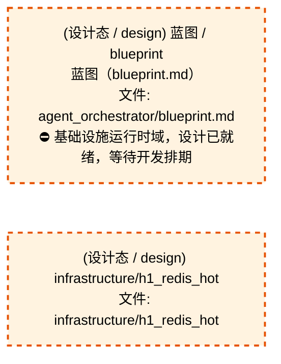
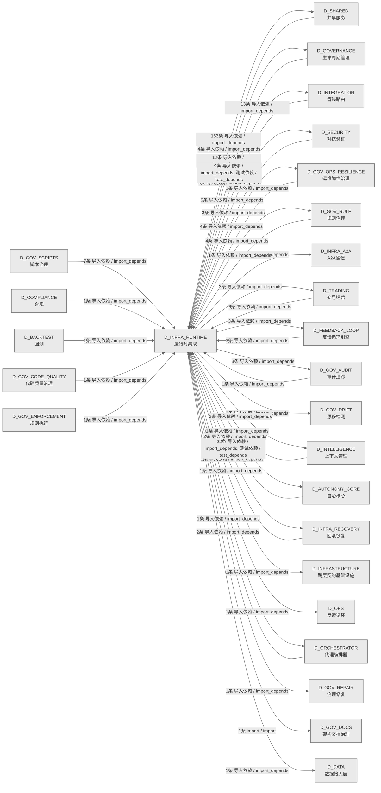

# 06_d_infra_runtime / 运行时集成域 / Runtime Integration

> **功能简介 / Overview**: 运行时集成，负责组件生命周期编排、启动钩子和运行时上下文管理

> **文档作用 / Purpose**: 展示 运行时集成（D_INFRA_RUNTIME）功能域的域内依赖关系、跨域依赖关系，模块信息（成熟度/中英文名/大白话/文件路径）内嵌于 Mermaid 节点，供架构审查和域治理参考。

> 本文档由 generate_domain_doc.py 从 depgraph (PostgreSQL) 自动生成
> 数据源: depgraph (PostgreSQL) nodes表 + edges表

> **[可缩放 HTML 版 / Zoomable HTML](http://localhost:8765/docs/02_enterprise_architecture/02_domain_architecture_docs/_zoomable_html/06_d_infra_runtime.html)** — Ctrl+滚轮缩放 ｜ 双击重置 ｜ Ctrl+Shift+D 切换拖动/选择模式

## 域基本信息 / Domain Overview

| 字段 | 值 | Field | Value |
|------|------|-------|-------|
| 编号 | 06 | Number | 06 |
| 域ID | D_INFRA_RUNTIME | Domain ID | D_INFRA_RUNTIME |
| 域名称 | 运行时集成 | Domain Name | Runtime Integration |
| 层级 | L0 基础设施层 | Layer | L0 Infrastructure |
| 模块数 | 162 | Module Count | 162 |
| 域内依赖 | 148 | Internal Dependencies | 148 |
| 跨域入边 | 78 | Cross-domain Incoming | 78 |
| 跨域出边 | 223 | Cross-domain Outgoing | 223 |
| 设计态模块 | 2 | Design Modules | 2 |
| 生产态模块 | 160 | Production Modules | 160 |
| 容量 | 160/150 (超容) | Capacity | 160/150 (超容) |
| 描述 | 三层运行时编排(L1 Trae/L2 Local/L3 API) | Description | 三层运行时编排(L1 Trae/L2 Local/L3 API) |

## 域内依赖图 / Internal Dependency Diagram

> 依赖图内嵌在本文档中，IDE 可直接渲染；网页版可 Ctrl+滚轮缩放 + 拖动平移查看细节。
>
> **图例说明 / Legend**：
> - 🟦 **蓝色 = 运营态模块**（production，已上线运行）
> - 🟧 **橙色虚线 = 设计态模块**（design，蓝图阶段，代码未写）
> - **实线箭头 = 运营态依赖**（已生效的依赖关系）
> - **虚线箭头 = 非运营态依赖**（计划中/验证中的依赖关系）

### 全景图（全部模块，颜色区分运营态/设计态）

> 展示全部 162 个模块（生产态 160 + 设计态 2），含跨域依赖外部节点。节点含成熟度+名称+大白话/简介+文件路径。

```mermaid
%%{init: {'theme': 'base', 'themeVariables': {'primaryColor': '#eaeaea', 'primaryTextColor': '#333333', 'primaryBorderColor': '#666666', 'lineColor': '#666666', 'secondaryColor': '#eaeaea', 'tertiaryColor': '#eaeaea', 'fontSize': '14px'}}}%%
flowchart TD
    docs_01_policies_and_standards_registry_catalogs_infrastructure_registry_yaml_INFRA_DB_001["(生产态 / production) 基础设施注册表 /<br/>infrastructure_registry<br/>基础设施注册表，基础设施的注册表，登记和查询已注<br/>册的条目。<br/>文件: catalogs/infrastructure_<br/>registry.yaml#INFRA-DB-001"]
    docs_01_policies_and_standards_registry_catalogs_infrastructure_registry_yaml_INFRA_DB_002["(生产态 / production) 基础设施注册表 /<br/>infrastructure_registry<br/>基础设施注册表，基础设施的注册表，登记和查询已注<br/>册的条目。<br/>文件: catalogs/infrastructure_<br/>registry.yaml#INFRA-DB-002"]
    docs_01_policies_and_standards_registry_catalogs_infrastructure_registry_yaml_INFRA_DB_003["(生产态 / production) 基础设施注册表 /<br/>infrastructure_registry<br/>基础设施注册表，基础设施的注册表，登记和查询已注<br/>册的条目。<br/>文件: catalogs/infrastructure_<br/>registry.yaml#INFRA-DB-003"]
    docs_01_policies_and_standards_registry_catalogs_infrastructure_registry_yaml_INFRA_DB_006["(生产态 / production) 基础设施注册表 /<br/>infrastructure_registry<br/>基础设施注册表，基础设施的注册表，登记和查询已注<br/>册的条目。<br/>文件: catalogs/infrastructure_<br/>registry.yaml#INFRA-DB-006"]
    docs_03_modules_cross_layer_agent_orchestrator_blueprint_md["(设计态 / design) 蓝图 / blueprint<br/>蓝图（blueprint.md）<br/>文件: agent_orchestrator/blueprint.md<br/>⛔ 基础设施运行时域，设计已就绪，等待开发排期"]
    src_zephyr_infrastructure_asset_inventory_main_py["(生产态 / production) 主入口 / __main__<br/>Asset Inventory CLI — MOD-INF-026 蓝图 §31<br/>文件: asset_inventory/__main__.py"]
    src_zephyr_infrastructure_asset_inventory_lifecycle_py["(生产态 / production) 生命周期 / lifecycle<br/>AssetLifecycle — MOD-INF-026 L5<br/>ITIL生命周期自动化管理器<br/>文件: asset_inventory/lifecycle.py"]
    src_zephyr_infrastructure_asset_inventory_mcp_server_py["(生产态 / production) MCP服务端 / mcp_server<br/>AssetInventory MCP Server — MOD-INF-026 蓝图 §21<br/>文件: asset_inventory/mcp_server.py"]
    src_zephyr_infrastructure_asset_inventory_metadata_py["(生产态 / production) 元数据 / metadata<br/>多 IDE 规则文件生成器——从 asset-inventory<br/>配置生成。<br/>文件: asset_inventory/metadata.py"]
    src_zephyr_infrastructure_asset_inventory_trust_anchor_py["(生产态 / production) 信任anchor / trust_anchor<br/>旁路状态——对标 K8s Admission Webhook 的<br/>emergency bypass。<br/>文件: asset_inventory/trust_anchor.py"]
    src_zephyr_infrastructure_auto_diagnostics_py["(生产态 / production) 自动diagnostics / auto_<br/>diagnostics<br/>RI-12 AutoDiagnostics — 自动诊断引擎<br/>文件: infrastructure/auto_diagnostics.py"]
    src_zephyr_infrastructure_auto_fix_engine_main_py["(生产态 / production) 主入口 / __main__<br/>引擎的命令行入口，可以直接 python -m<br/>跑起来执行主流程。<br/>文件: auto_fix_engine/__main__.py"]
    src_zephyr_infrastructure_auto_fix_engine_alignment_syncer_py["(生产态 / production) 对齐同步器 / alignment_<br/>syncer<br/>对齐同步器，提供scan、fix、校验等方法，供engine.<br/>py;MOD-INF-023(dri使用<br/>文件: auto_fix_engine/alignment_syncer.py"]
    src_zephyr_infrastructure_auto_fix_engine_all_completer_py["(生产态 / production) all补全器 / all_completer<br/>all补全器，提供解析all、extractpublicsymbols、sc<br/>an等方法，供engine.py;MOD-INF-026(ass使用<br/>文件: auto_fix_engine/all_completer.py"]
    src_zephyr_infrastructure_auto_fix_engine_config_fixer_py["(生产态 / production) 配置修复器 / config_fixer<br/>配置修复器，提供fixtrailingwhitespace、fixtabs、<br/>fixmergeconflicts等方法，供engine.py;MOD-INF-023<br/>(dri使用<br/>文件: auto_fix_engine/config_fixer.py"]
    src_zephyr_infrastructure_auto_fix_engine_dedup_extractor_py["(生产态 / production) 去重提取器 / dedup_<br/>extractor<br/>去重提取器，提供normalizecode、minoccurrences、m<br/>inoccurrences等方法，供engine.py;MOD-INF-017<br/>(cod使用<br/>文件: auto_fix_engine/dedup_extractor.py"]
    src_zephyr_infrastructure_auto_fix_engine_dep_version_fixer_py["(生产态 / production) dep版本修复器 / dep_<br/>version_fixer<br/>dep版本修复器，主要提供ishigher、扫描、修复等功<br/>能，供engine.py使用<br/>文件: auto_fix_engine/dep_version_fixer.py"]
    src_zephyr_infrastructure_auto_fix_engine_drift_fixer_py["(生产态 / production) 漂移修复器 / drift_fixer<br/>漂移修复器，提供scan、fix、校验等方法，供engine.<br/>py;MOD-INF-023(dri使用<br/>文件: auto_fix_engine/drift_fixer.py"]
    src_zephyr_infrastructure_auto_fix_engine_event_hooks_py["(生产态 / production) 事件钩子 / event_hooks<br/>订阅 EventBusBackpressure 的 drift_detected /<br/>validation_result 事件。<br/>文件: auto_fix_engine/event_hooks.py"]
    src_zephyr_infrastructure_auto_fix_engine_fix_diff_py["(生产态 / production) 修复差异 / fix_diff<br/>修复差异，提供计算、计算text、reverse等方法，供e<br/>ngine.py;fix_report.py;c使用<br/>文件: auto_fix_engine/fix_diff.py"]
    src_zephyr_infrastructure_auto_fix_engine_fix_scheduler_py["(生产态 / production) 修复调度器 / fix_scheduler<br/>修复调度器，引擎的调度器，按时间或优先级安排任务<br/>执行。<br/>文件: auto_fix_engine/fix_scheduler.py"]
    src_zephyr_infrastructure_auto_fix_engine_import_fixer_py["(生产态 / production) 导入修复器 / import_fixer<br/>导入修复器，主要提供try修复模块、扫描、修复等功<br/>能，供engine.py使用<br/>文件: auto_fix_engine/import_fixer.py"]
    src_zephyr_infrastructure_auto_fix_engine_interrupt_guard_py["(生产态 / production) 中断守卫 / interrupt_guard<br/>中断守卫，提供waldir、waldir、dbpath等方法，供en<br/>gine.py;fix_scheduler.p使用<br/>文件: auto_fix_engine/interrupt_guard.py"]
    src_zephyr_infrastructure_auto_fix_engine_llm_fix_adapter_py["(生产态 / production) llm修复适配器 / llm_fix_<br/>adapter<br/>llm修复适配器，提供secretguard、secretguard、llm<br/>bridge等方法，供engine.py;MOD-INF-028(sem使用<br/>文件: auto_fix_engine/llm_fix_adapter.py"]
    src_zephyr_infrastructure_auto_fix_engine_scaffold_registrar_py["(生产态 / production) 从 script-manifest.yaml<br/>加载已注册脚本 / scaffold_registrar<br/>从 script-manifest.yaml 加载已注册脚本路径集合。<br/>文件: auto_fix_engine/scaffold_registrar.py"]
    src_zephyr_infrastructure_auto_fix_engine_self_heal_agent_py["(生产态 / production) selfheal代理 / self_heal_<br/>agent<br/>自heal代理，主要提供最大rounds、熔断阈值、consec<br/>utivefailures等功能，供engine.py使用<br/>文件: auto_fix_engine/self_heal_agent.py"]
    src_zephyr_infrastructure_auto_fix_engine_state_machine_py["(生产态 / production) 状态machine / state_<br/>machine<br/>漂移事件记录——对齐 test_state_<br/>machine.，引擎的状态机，管理状态流转。<br/>文件: auto_fix_engine/state_machine.py"]
    src_zephyr_infrastructure_auto_fix_engine_zombie_cleaner_py["(生产态 / production) zombie清理器 / zombie_<br/>cleaner<br/>移除 content<br/>中指向不存在文件的僵尸引用，返回清理后的内容。<br/>文件: auto_fix_engine/zombie_cleaner.py"]
    src_zephyr_infrastructure_blueprint_code_sync_py["(生产态 / production) 蓝图代码同步 / blueprint_<br/>code_sync<br/>Blueprint-Code Sync — 蓝图-代码索引同步验证。<br/>文件: infrastructure/blueprint_code_sync.py"]
    src_zephyr_infrastructure_budget_enforcement_init_py["(生产态 / production) 包入口 / __init__<br/>budget_enforcement 包聚合层。<br/>文件: budget_enforcement/__init__.py"]
    src_zephyr_infrastructure_capacity_assurance_budget_forecaster_py["(生产态 / production) 预算预测器 / budget_<br/>forecaster<br/>Token 预算预测 (DD120-extra, TASK-020)<br/>文件: capacity_assurance/budget_forecaster.py"]
    src_zephyr_infrastructure_capacity_assurance_contracts_contract_bus_py["(生产态 / production) 契约总线 / contract_bus<br/>ContractBus loader —<br/>加载全部44条容量保障契约的Pydantic v2 Schema<br/>（DD-9三批迁移）.<br/>文件: contracts/contract_bus.py"]
    src_zephyr_infrastructure_capacity_assurance_cross_module_integration_py["(生产态 / production) 跨模块集成 / cross_module_<br/>integration<br/>Cross-module integration — CT-1~CT-4<br/>跨模块集成契约实现（对标蓝图 §17）.<br/>文件: capacity_assurance/cross_module_<br/>integration.py"]
    src_zephyr_infrastructure_capacity_assurance_host_resource_governor_py["(生产态 / production) host资源governor / host_<br/>resource_governor<br/>主机资源治理<br/>文件: capacity_assurance/host_resource_<br/>governor.py"]
    src_zephyr_infrastructure_capacity_assurance_kill_switch_py["(生产态 / production) 终止开关 / kill_switch.py<br/>-- safety circuit breaker (DD110, TASK-019).<br/>终止开关，基础设施的状态机，管理状态流转。<br/>文件: capacity_assurance/kill_switch.py"]
    src_zephyr_infrastructure_capacity_assurance_risk_mitigation_py["(生产态 / production) 风险mitigation / risk_<br/>mitigation<br/>Risk mitigation — R1~R16 全量风险缓解实现<br/>（对标蓝图 §14 风险与缓解 + 多轮盲点审计）.<br/>文件: capacity_assurance/risk_mitigation.py"]
    src_zephyr_infrastructure_capacity_assurance_schema_py["(生产态 / production) 模式 / schema<br/>SchemaManager — 容量保障体系数据库 Schema 管理器<br/>文件: capacity_assurance/schema.py"]
    src_zephyr_infrastructure_capacity_assurance_sli_instrumentation_py["(生产态 / production) SLI instrumentation —<br/>SLI采集插桩点（对标蓝图 §13  / sli_<br/>instrumentation<br/>SLI instrumentation — SLI采集插桩点（对标蓝图<br/>§13 SLI Registry CAP-001~CAP-014）.<br/>文件: capacity_assurance/sli_instrumentation.py"]
    src_zephyr_infrastructure_capacity_assurance_tech_stack_py["(生产态 / production) tech栈 / tech_stack<br/>TechStackValidator — 技术栈可用性校验器<br/>文件: capacity_assurance/tech_stack.py"]
    src_zephyr_infrastructure_capacity_assurance_token_budget_py["(生产态 / production) 令牌预算 / token_budget<br/>Token 估算工具 SSoT<br/>文件: capacity_assurance/token_budget.py"]
    src_zephyr_infrastructure_cost_tracker_py["(生产态 / production) 成本追踪器 / cost_tracker<br/>RI-15 CostTracker — 成本追踪器<br/>文件: infrastructure/cost_tracker.py"]
    src_zephyr_infrastructure_database_service_py["(生产态 / production) 数据库服务 / database_<br/>service<br/>DatabaseService:<br/>统一管理数据库的连接池、生命周期、健康检查<br/>文件: infrastructure/database_service.py"]
    src_zephyr_infrastructure_dry_run_simulator_py["(生产态 / production) dryrun模拟器 / dry_run_<br/>simulator<br/>RI-14 DryRunSimulator — 干运行模拟器<br/>文件: infrastructure/dry_run_simulator.py"]
    src_zephyr_infrastructure_event_bus_upgrade_py["(生产态 / production) DEPRECATED:<br/>此文件已废弃。 / event_bus_upgrade<br/>DEPRECATED: 此文件已废弃。<br/>文件: infrastructure/event_bus_upgrade.py"]
    src_zephyr_infrastructure_event_store_py["(生产态 / production) 事件存储 / event_store<br/>RI-13 EventStore — 事件存储<br/>文件: infrastructure/event_store.py"]
    src_zephyr_infrastructure_events_event_store_py["(生产态 / production) 事件存储 / event_store<br/>Event Store — 事件持久化存储。<br/>文件: events/event_store.py"]
    src_zephyr_infrastructure_finding_task_bridge_py["(生产态 / production) 发现任务桥接 / finding_<br/>task_bridge<br/>Finding->TaskCard 桥接器<br/>文件: infrastructure/finding_task_bridge.py"]
    src_zephyr_infrastructure_git_batcher_py["(生产态 / production) Git批处理 / git_batcher<br/>Git批处理.py — Git 命令批量化工具<br/>（ARCH-GIT-CALL-BUDGET P2.2，2026-07-19）<br/>文件: infrastructure/git_batcher.py"]
    src_zephyr_infrastructure_h1_redis_hot["(设计态 / design) infrastructure/h1_redis_hot<br/>文件: infrastructure/h1_redis_hot"]
    src_zephyr_infrastructure_health_monitor_health_aggregator_py["(生产态 / production) 健康聚合器 / health_<br/>aggregator<br/>全系统健康聚合 — check_all_systems()<br/>文件: health_monitor/health_aggregator.py"]
    src_zephyr_infrastructure_hooks_event_hook_py["(生产态 / production) 事件钩子 / event_hook<br/>EventHook — 声明式任务系统事件订阅<br/>文件: hooks/event_hook.py"]
    src_zephyr_infrastructure_impact_impact_propagator_py["(生产态 / production) 冲击propagator / impact_<br/>propagator<br/>Impact Propagator — 变更影响传播分析。<br/>文件: impact/impact_propagator.py"]
    src_zephyr_infrastructure_impact_llm_impact_analyzer_py["(生产态 / production) LLM冲击分析器 / llm_<br/>impact_analyzer<br/>LLM Impact Analyzer — 语义影响分析器。<br/>文件: impact/llm_impact_analyzer.py"]
    src_zephyr_infrastructure_infrastructure_base_py["(生产态 / production) 基础设施基类 /<br/>infrastructure_base<br/>基础设施 — Infrastructure Layer Skeleton<br/>文件: infrastructure/infrastructure_base.py"]
    src_zephyr_infrastructure_kill_switch_sim_py["(生产态 / production) 终止开关仿真 / Kill<br/>Switch T0 Hardware Simulator<br/>终止开关仿真。Kill Switch T0 Hardware Simulator<br/>文件: infrastructure/kill_switch_sim.py"]
    src_zephyr_infrastructure_lifecycle_scope_guard_py["(生产态 / production) 作用域守卫 / scope_guard<br/>Scope Guard — 范围蔓延检测与阻断。<br/>文件: lifecycle/scope_guard.py"]
    src_zephyr_infrastructure_lifecycle_task_lifecycle_manager_py["(生产态 / production) 任务生命周期管理器 / task_<br/>lifecycle_manager<br/>Task Lifecycle Manager — G0-G7<br/>任务生命周期门禁。<br/>文件: lifecycle/task_lifecycle_manager.py"]
    src_zephyr_infrastructure_observability_trace_decorator_py["(生产态 / production) 追踪装饰器 / trace_<br/>decorator<br/>追踪装饰器，基础设施的核心类，封装TraceSpan相关<br/>逻辑。<br/>文件: observability/trace_decorator.py"]
    src_zephyr_infrastructure_pipeline_backpressure_manager_py["(生产态 / production) 背压管理器 / Pipeline —<br/>Backpressure Manager<br/>backpressure管理器。Pipeline — Backpressure<br/>Manager<br/>文件: pipeline/backpressure_manager.py"]
    src_zephyr_infrastructure_pipeline_circuit_breaker_manager_py["(生产态 / production) 熔断断路器管理器 /<br/>CircuitBreakerManager -- standalone circuit<br/>breaker manager<br/>熔断断路器管理器。CircuitBreakerManager --<br/>standalone circuit breaker manager (Netflix<br/>Hystrix equivalent).<br/>文件: pipeline/circuit_breaker_manager.py"]
    src_zephyr_infrastructure_pipeline_cost_tracker_py["(生产态 / production) 成本追踪器 / cost_tracker<br/>CostTracker —— LLM 调用成本追踪器（SRC-0025）<br/>文件: pipeline/cost_tracker.py"]
    src_zephyr_infrastructure_pipeline_dead_letter_queue_py["(生产态 / production) deadletter队列 / dead_<br/>letter_queue<br/>DeadLetterQueue — 死信队列<br/>文件: pipeline/dead_letter_queue.py"]
    src_zephyr_infrastructure_pipeline_llm_gateway_py["(生产态 / production) llm网关 / MOD-INF-019:<br/>Agent Spec — LLM Gateway<br/>llm网关。MOD-INF-019: Agent Spec — LLM Gateway<br/>文件: pipeline/llm_gateway.py"]
    src_zephyr_infrastructure_pipeline_pipeline_agent_bridge_py["(生产态 / production) 管线代理桥接 / pipeline_<br/>agent_bridge<br/>Pipeline -> Agent Bridge — 双编排器桥接层<br/>文件: pipeline/pipeline_agent_bridge.py"]
    src_zephyr_infrastructure_pipeline_pipeline_lock_py["(生产态 / production) 管线锁 / pipeline_lock<br/>Pipeline Lock — 双管线并发锁<br/>文件: pipeline/pipeline_lock.py"]
    src_zephyr_infrastructure_pipeline_pipeline_roadmap_py["(生产态 / production) 管线roadmap / pipeline_<br/>roadmap<br/>Pipeline 未来版本路线图——v0.10.0 -> v0.12.0<br/>规划骨架。<br/>文件: pipeline/pipeline_roadmap.py"]
    src_zephyr_infrastructure_pipeline_preemption_manager_py["(生产态 / production) preemption管理器 /<br/>preemption_manager<br/>PreemptionManager -- 优先级抢占管理器<br/>文件: pipeline/preemption_manager.py"]
    src_zephyr_infrastructure_pipeline_routing_plugins_py["(生产态 / production) 管线 / routing_plugins<br/>管线eduling Framework 对标<br/>文件: pipeline/routing_plugins.py"]
    src_zephyr_infrastructure_pydantic_v2_migrator_py["(生产态 / production) M-15 PydanticV2Migrator —<br/>Pydantic V2 迁移 / pydantic_v2_migrator<br/>M-15 PydanticV2Migrator — Pydantic V2 迁移工具<br/>文件: infrastructure/pydantic_v2_migrator.py"]
    src_zephyr_infrastructure_quality_quality_monitor_py["(生产态 / production) 质量监控 / quality_monitor<br/>Quality Monitor — 生成代码质量门禁。<br/>文件: quality/quality_monitor.py"]
    src_zephyr_infrastructure_reliability_circuit_breaker_py["(生产态 / production) 熔断断路器 / circuit_<br/>breaker<br/>Circuit Breaker — 熔断器：连续失败 -> OPEN -><br/>暂停执行。<br/>文件: reliability/circuit_breaker.py"]
    src_zephyr_infrastructure_reliability_context_guard_py["(生产态 / production) 上下文守卫 / context_guard<br/>Context Guard — 上下文契约守卫。<br/>文件: reliability/context_guard.py"]
    src_zephyr_infrastructure_runtime_concurrency_guard_py["(生产态 / production) 并发守卫 / concurrency_<br/>guard<br/>concurrency_guard — 回滚操作并发安全守卫。<br/>文件: runtime/concurrency_guard.py"]
    src_zephyr_infrastructure_runtime_sandbox_enforcer_py["(生产态 / production) 沙箱执行器 / sandbox_<br/>enforcer<br/>SandboxEnforcer — Agent 沙盒隔离。<br/>文件: runtime/sandbox_enforcer.py"]
    src_zephyr_infrastructure_runtime_startup_shutdown_py["(生产态 / production) 启动关机 / startup_<br/>shutdown<br/>启动关机，提供包入口和模块加载功能<br/>文件: runtime/startup_shutdown.py"]
    src_zephyr_infrastructure_script_system_finding_py["(生产态 / production) 发现 / finding<br/>Finding Schema — 审计发现标准化数据模型<br/>文件: script_system/finding.py"]
    src_zephyr_infrastructure_script_system_gate_bridge_py["(生产态 / production) 门禁桥接 / gate_bridge<br/>Script->Gate 门禁桥接器 — submit_findings()<br/>生产者<br/>文件: script_system/gate_bridge.py"]
    src_zephyr_infrastructure_system_telemetry_auto_bootstrap_py["(生产态 / production) 自动自举 / auto_bootstrap<br/>auto_bootstrap — 全自动遥测注入钩子<br/>（MOD-INF-015 v2.1.0）<br/>文件: system_telemetry/auto_bootstrap.py"]
    src_zephyr_infrastructure_system_telemetry_logs_init_py["(生产态 / production) 包入口 / __init__<br/>logs — 结构化日志流（structlog + JSONL +<br/>trace注入）（D_SYSTEM_TELEMETRY）<br/>文件: logs/__init__.py"]
    src_zephyr_infrastructure_system_telemetry_metrics_bridge_py["(生产态 / production) 指标桥接 / metrics_bridge<br/>TELE->FLE 指标桥接 — emit_metrics() 生产者<br/>文件: system_telemetry/metrics_bridge.py"]
    src_zephyr_infrastructure_warm_hot_gate_py["(生产态 / production) warmhot门禁 / warm_hot_<br/>gate<br/>M-14 WarmHotGate — Warm->Hot 阻断门<br/>文件: infrastructure/warm_hot_gate.py"]
    src_zephyr_shared_lifecycle_hooks_py["(生产态 / production) 钩子 / hooks<br/>— 模块生命周期钩子（Phase 2 新增 / 盲点 B8<br/>修复）<br/>文件: lifecycle/hooks.py"]
    src_zephyr_trading_action_dispatcher_py["(生产态 / production) 行为分发器 / action_<br/>dispatcher<br/>ActionDispatcher --- 大脑的'手' v2.0 (Phase 2)<br/>文件: trading/action_dispatcher.py"]
    src_zephyr_trading_auto_task_generator_py["(生产态 / production) 自动任务生成器 / auto_<br/>task_generator<br/>AutoTaskGenerator — 自动任务生成器<br/>文件: trading/auto_task_generator.py"]
    src_zephyr_trading_ports_py["(生产态 / production) 端口 / Protocol-based<br/>interface layer for runtime->pipeline depende<br/>端口，交易的分发器，把任务/事件分发给处理方。<br/>文件: trading/ports.py"]
    src_zephyr_trading_staging_area_py["(生产态 / production) StagingArea —<br/>多AI并发草稿写入+提交+冲突检测模块（CT-SES /<br/>staging_area<br/>StagingArea —<br/>多AI并发草稿写入+提交+冲突检测模块<br/>（CT-SESSION-CONFLICT-002）<br/>文件: trading/staging_area.py"]
    src_zephyr_trading_task_gate_py["(生产态 / production) 任务门禁 / task_gate<br/>TaskGate --- 任务门控<br/>文件: trading/task_gate.py"]
    src_zephyr_trading_windows_service_py["(生产态 / production) windows服务 / windows_<br/>service<br/>WindowsService — Windows Service 包装器<br/>文件: trading/windows_service.py"]
    src_zephyr_trading_zombie_scanner_py["(生产态 / production) zombie扫描器 / zombie_<br/>scanner<br/>僵尸 Python 进程检测与自动处置<br/>文件: trading/zombie_scanner.py"]
    docs_01_policies_and_standards_registry_catalogs_infrastructure_registry_yaml_INFRA_DB_001 ~~~ docs_01_policies_and_standards_registry_catalogs_infrastructure_registry_yaml_INFRA_DB_002
    docs_01_policies_and_standards_registry_catalogs_infrastructure_registry_yaml_INFRA_DB_002 ~~~ docs_01_policies_and_standards_registry_catalogs_infrastructure_registry_yaml_INFRA_DB_003
    docs_01_policies_and_standards_registry_catalogs_infrastructure_registry_yaml_INFRA_DB_003 ~~~ docs_01_policies_and_standards_registry_catalogs_infrastructure_registry_yaml_INFRA_DB_006
    docs_01_policies_and_standards_registry_catalogs_infrastructure_registry_yaml_INFRA_DB_006 ~~~ docs_03_modules_cross_layer_agent_orchestrator_blueprint_md
    docs_03_modules_cross_layer_agent_orchestrator_blueprint_md ~~~ src_zephyr_infrastructure_asset_inventory_main_py
    src_zephyr_infrastructure_asset_inventory_main_py ~~~ src_zephyr_infrastructure_asset_inventory_lifecycle_py
    src_zephyr_infrastructure_asset_inventory_lifecycle_py ~~~ src_zephyr_infrastructure_asset_inventory_mcp_server_py
    src_zephyr_infrastructure_asset_inventory_mcp_server_py ~~~ src_zephyr_infrastructure_asset_inventory_metadata_py
    src_zephyr_infrastructure_asset_inventory_metadata_py ~~~ src_zephyr_infrastructure_asset_inventory_trust_anchor_py
    src_zephyr_infrastructure_asset_inventory_trust_anchor_py ~~~ src_zephyr_infrastructure_auto_diagnostics_py
    src_zephyr_infrastructure_auto_diagnostics_py ~~~ src_zephyr_infrastructure_auto_fix_engine_main_py
    src_zephyr_infrastructure_auto_fix_engine_main_py ~~~ src_zephyr_infrastructure_auto_fix_engine_alignment_syncer_py
    src_zephyr_infrastructure_auto_fix_engine_alignment_syncer_py ~~~ src_zephyr_infrastructure_auto_fix_engine_all_completer_py
    src_zephyr_infrastructure_auto_fix_engine_all_completer_py ~~~ src_zephyr_infrastructure_auto_fix_engine_config_fixer_py
    src_zephyr_infrastructure_auto_fix_engine_config_fixer_py ~~~ src_zephyr_infrastructure_auto_fix_engine_dedup_extractor_py
    src_zephyr_infrastructure_auto_fix_engine_dedup_extractor_py ~~~ src_zephyr_infrastructure_auto_fix_engine_dep_version_fixer_py
    src_zephyr_infrastructure_auto_fix_engine_dep_version_fixer_py ~~~ src_zephyr_infrastructure_auto_fix_engine_drift_fixer_py
    src_zephyr_infrastructure_auto_fix_engine_drift_fixer_py ~~~ src_zephyr_infrastructure_auto_fix_engine_event_hooks_py
    src_zephyr_infrastructure_auto_fix_engine_event_hooks_py ~~~ src_zephyr_infrastructure_auto_fix_engine_fix_diff_py
    src_zephyr_infrastructure_auto_fix_engine_fix_diff_py ~~~ src_zephyr_infrastructure_auto_fix_engine_fix_scheduler_py
    src_zephyr_infrastructure_auto_fix_engine_fix_scheduler_py ~~~ src_zephyr_infrastructure_auto_fix_engine_import_fixer_py
    src_zephyr_infrastructure_auto_fix_engine_import_fixer_py ~~~ src_zephyr_infrastructure_auto_fix_engine_interrupt_guard_py
    src_zephyr_infrastructure_auto_fix_engine_interrupt_guard_py ~~~ src_zephyr_infrastructure_auto_fix_engine_llm_fix_adapter_py
    src_zephyr_infrastructure_auto_fix_engine_llm_fix_adapter_py ~~~ src_zephyr_infrastructure_auto_fix_engine_scaffold_registrar_py
    src_zephyr_infrastructure_auto_fix_engine_scaffold_registrar_py ~~~ src_zephyr_infrastructure_auto_fix_engine_self_heal_agent_py
    src_zephyr_infrastructure_auto_fix_engine_self_heal_agent_py ~~~ src_zephyr_infrastructure_auto_fix_engine_state_machine_py
    src_zephyr_infrastructure_auto_fix_engine_state_machine_py ~~~ src_zephyr_infrastructure_auto_fix_engine_zombie_cleaner_py
    src_zephyr_infrastructure_auto_fix_engine_zombie_cleaner_py ~~~ src_zephyr_infrastructure_blueprint_code_sync_py
    src_zephyr_infrastructure_blueprint_code_sync_py ~~~ src_zephyr_infrastructure_budget_enforcement_init_py
    src_zephyr_infrastructure_budget_enforcement_init_py ~~~ src_zephyr_infrastructure_capacity_assurance_budget_forecaster_py
    src_zephyr_infrastructure_capacity_assurance_budget_forecaster_py ~~~ src_zephyr_infrastructure_capacity_assurance_contracts_contract_bus_py
    src_zephyr_infrastructure_capacity_assurance_contracts_contract_bus_py ~~~ src_zephyr_infrastructure_capacity_assurance_cross_module_integration_py
    src_zephyr_infrastructure_capacity_assurance_cross_module_integration_py ~~~ src_zephyr_infrastructure_capacity_assurance_host_resource_governor_py
    src_zephyr_infrastructure_capacity_assurance_host_resource_governor_py ~~~ src_zephyr_infrastructure_capacity_assurance_kill_switch_py
    src_zephyr_infrastructure_capacity_assurance_kill_switch_py ~~~ src_zephyr_infrastructure_capacity_assurance_risk_mitigation_py
    src_zephyr_infrastructure_capacity_assurance_risk_mitigation_py ~~~ src_zephyr_infrastructure_capacity_assurance_schema_py
    src_zephyr_infrastructure_capacity_assurance_schema_py ~~~ src_zephyr_infrastructure_capacity_assurance_sli_instrumentation_py
    src_zephyr_infrastructure_capacity_assurance_sli_instrumentation_py ~~~ src_zephyr_infrastructure_capacity_assurance_tech_stack_py
    src_zephyr_infrastructure_capacity_assurance_tech_stack_py ~~~ src_zephyr_infrastructure_capacity_assurance_token_budget_py
    src_zephyr_infrastructure_capacity_assurance_token_budget_py ~~~ src_zephyr_infrastructure_cost_tracker_py
    src_zephyr_infrastructure_cost_tracker_py ~~~ src_zephyr_infrastructure_database_service_py
    src_zephyr_infrastructure_database_service_py ~~~ src_zephyr_infrastructure_dry_run_simulator_py
    src_zephyr_infrastructure_dry_run_simulator_py ~~~ src_zephyr_infrastructure_event_bus_upgrade_py
    src_zephyr_infrastructure_event_bus_upgrade_py ~~~ src_zephyr_infrastructure_event_store_py
    src_zephyr_infrastructure_event_store_py ~~~ src_zephyr_infrastructure_events_event_store_py
    src_zephyr_infrastructure_events_event_store_py ~~~ src_zephyr_infrastructure_finding_task_bridge_py
    src_zephyr_infrastructure_finding_task_bridge_py ~~~ src_zephyr_infrastructure_git_batcher_py
    src_zephyr_infrastructure_git_batcher_py ~~~ src_zephyr_infrastructure_h1_redis_hot
    src_zephyr_infrastructure_h1_redis_hot ~~~ src_zephyr_infrastructure_health_monitor_health_aggregator_py
    src_zephyr_infrastructure_health_monitor_health_aggregator_py ~~~ src_zephyr_infrastructure_hooks_event_hook_py
    src_zephyr_infrastructure_hooks_event_hook_py ~~~ src_zephyr_infrastructure_impact_impact_propagator_py
    src_zephyr_infrastructure_impact_impact_propagator_py ~~~ src_zephyr_infrastructure_impact_llm_impact_analyzer_py
    src_zephyr_infrastructure_impact_llm_impact_analyzer_py ~~~ src_zephyr_infrastructure_infrastructure_base_py
    src_zephyr_infrastructure_infrastructure_base_py ~~~ src_zephyr_infrastructure_kill_switch_sim_py
    src_zephyr_infrastructure_kill_switch_sim_py ~~~ src_zephyr_infrastructure_lifecycle_scope_guard_py
    src_zephyr_infrastructure_lifecycle_scope_guard_py ~~~ src_zephyr_infrastructure_lifecycle_task_lifecycle_manager_py
    src_zephyr_infrastructure_lifecycle_task_lifecycle_manager_py ~~~ src_zephyr_infrastructure_observability_trace_decorator_py
    src_zephyr_infrastructure_observability_trace_decorator_py ~~~ src_zephyr_infrastructure_pipeline_backpressure_manager_py
    src_zephyr_infrastructure_pipeline_backpressure_manager_py ~~~ src_zephyr_infrastructure_pipeline_circuit_breaker_manager_py
    src_zephyr_infrastructure_pipeline_circuit_breaker_manager_py ~~~ src_zephyr_infrastructure_pipeline_cost_tracker_py
    src_zephyr_infrastructure_pipeline_cost_tracker_py ~~~ src_zephyr_infrastructure_pipeline_dead_letter_queue_py
    src_zephyr_infrastructure_pipeline_dead_letter_queue_py ~~~ src_zephyr_infrastructure_pipeline_llm_gateway_py
    src_zephyr_infrastructure_pipeline_llm_gateway_py ~~~ src_zephyr_infrastructure_pipeline_pipeline_agent_bridge_py
    src_zephyr_infrastructure_pipeline_pipeline_agent_bridge_py ~~~ src_zephyr_infrastructure_pipeline_pipeline_lock_py
    src_zephyr_infrastructure_pipeline_pipeline_lock_py ~~~ src_zephyr_infrastructure_pipeline_pipeline_roadmap_py
    src_zephyr_infrastructure_pipeline_pipeline_roadmap_py ~~~ src_zephyr_infrastructure_pipeline_preemption_manager_py
    src_zephyr_infrastructure_pipeline_preemption_manager_py ~~~ src_zephyr_infrastructure_pipeline_routing_plugins_py
    src_zephyr_infrastructure_pipeline_routing_plugins_py ~~~ src_zephyr_infrastructure_pydantic_v2_migrator_py
    src_zephyr_infrastructure_pydantic_v2_migrator_py ~~~ src_zephyr_infrastructure_quality_quality_monitor_py
    src_zephyr_infrastructure_quality_quality_monitor_py ~~~ src_zephyr_infrastructure_reliability_circuit_breaker_py
    src_zephyr_infrastructure_reliability_circuit_breaker_py ~~~ src_zephyr_infrastructure_reliability_context_guard_py
    src_zephyr_infrastructure_reliability_context_guard_py ~~~ src_zephyr_infrastructure_runtime_concurrency_guard_py
    src_zephyr_infrastructure_runtime_concurrency_guard_py ~~~ src_zephyr_infrastructure_runtime_sandbox_enforcer_py
    src_zephyr_infrastructure_runtime_sandbox_enforcer_py ~~~ src_zephyr_infrastructure_runtime_startup_shutdown_py
    src_zephyr_infrastructure_runtime_startup_shutdown_py ~~~ src_zephyr_infrastructure_script_system_finding_py
    src_zephyr_infrastructure_script_system_finding_py ~~~ src_zephyr_infrastructure_script_system_gate_bridge_py
    src_zephyr_infrastructure_script_system_gate_bridge_py ~~~ src_zephyr_infrastructure_system_telemetry_auto_bootstrap_py
    src_zephyr_infrastructure_system_telemetry_auto_bootstrap_py ~~~ src_zephyr_infrastructure_system_telemetry_logs_init_py
    src_zephyr_infrastructure_system_telemetry_logs_init_py ~~~ src_zephyr_infrastructure_system_telemetry_metrics_bridge_py
    src_zephyr_infrastructure_system_telemetry_metrics_bridge_py ~~~ src_zephyr_infrastructure_warm_hot_gate_py
    src_zephyr_infrastructure_warm_hot_gate_py ~~~ src_zephyr_shared_lifecycle_hooks_py
    src_zephyr_shared_lifecycle_hooks_py ~~~ src_zephyr_trading_action_dispatcher_py
    src_zephyr_trading_action_dispatcher_py ~~~ src_zephyr_trading_auto_task_generator_py
    src_zephyr_trading_auto_task_generator_py ~~~ src_zephyr_trading_ports_py
    src_zephyr_trading_ports_py ~~~ src_zephyr_trading_staging_area_py
    src_zephyr_trading_staging_area_py ~~~ src_zephyr_trading_task_gate_py
    src_zephyr_trading_task_gate_py ~~~ src_zephyr_trading_windows_service_py
    src_zephyr_trading_windows_service_py ~~~ src_zephyr_trading_zombie_scanner_py
    src_zephyr_infrastructure_asset_inventory_classifier_py["(生产态 / production) 分类器 / classifier<br/>AssetClassifier — MOD-INF-026 L2 资产自动分类器<br/>文件: asset_inventory/classifier.py"]
    src_zephyr_infrastructure_asset_inventory_dashboard_py["(生产态 / production) 仪表盘 / dashboard<br/>AssetDashboard — MOD-INF-026<br/>资产健康仪表盘生成器<br/>文件: asset_inventory/dashboard.py"]
    src_zephyr_infrastructure_asset_inventory_dependency_py["(生产态 / production) MOD-INF-026 §18 —<br/>资产依赖图。 / dependency<br/>MOD-INF-026 §18 — 资产依赖图。<br/>文件: asset_inventory/dependency.py"]
    src_zephyr_infrastructure_asset_inventory_index_generator_py["(生产态 / production) 索引生成器 / index_<br/>generator<br/>UnifiedAssetIndex — MOD-INF-026 L3<br/>统一资产索引生成器<br/>文件: asset_inventory/index_generator.py"]
    src_zephyr_infrastructure_asset_inventory_reconciler_py["(生产态 / production) 协调器 / reconciler<br/>ReconciliationEngine — MOD-INF-026 L4 注册表 vs<br/>磁盘对账引擎<br/>文件: asset_inventory/reconciler.py"]
    src_zephyr_infrastructure_asset_inventory_registry_adapter_py["(生产态 / production) MOD-INF-026 §17 — 24<br/>个异构注册表统一解析适配器。 / registry_adapter<br/>MOD-INF-026 §17 — 24<br/>个异构注册表统一解析适配器。<br/>文件: asset_inventory/registry_adapter.py"]
    src_zephyr_infrastructure_asset_inventory_scanner_py["(生产态 / production) 扫描器 / scanner<br/>AssetDiscoveryScanner — MOD-INF-026 L1<br/>全量文件系统扫描器<br/>文件: asset_inventory/scanner.py"]
    src_zephyr_infrastructure_asset_inventory_telemetry_py["(生产态 / production) 遥测 / telemetry<br/>AssetInventoryTelemetry — MOD-INF-026 自监控指标<br/>文件: asset_inventory/telemetry.py"]
    src_zephyr_infrastructure_auto_fix_engine_engine_py["(生产态 / production) 引擎 / engine<br/>引擎，主要提供安全门禁、级联断路器、修复预算等功<br/>能<br/>文件: auto_fix_engine/engine.py"]
    src_zephyr_infrastructure_budget_enforcement_rbac_bridge_py["(生产态 / production) RBAC桥接 / rbac_bridge<br/>RBAC桥接.rbac_bridge — 基础设施层 RBAC<br/>桥接适配器。<br/>文件: budget_enforcement/rbac_bridge.py"]
    src_zephyr_infrastructure_capacity_assurance_contracts_batch1_infra_py["(生产态 / production) batch1基础设施 / batch1_<br/>infra<br/>Batch1 基础设施层契约 — 15条 Pydantic v2<br/>Schema（SLO/Error Budget/Token Budget/Kill<br/>Switch/Sandbox/Graceful Degradation）.<br/>文件: contracts/batch1_infra.py"]
    src_zephyr_infrastructure_capacity_assurance_contracts_batch3_integration_py["(生产态 / production) batch3集成 / batch3_<br/>integration<br/>Batch3 集成层契约 — 14条 Pydantic v2 Schema<br/>（OTel/W3C/跨模块CT-1~4/DR/容量预测/语义缓存）.<br/>文件: contracts/batch3_integration.py"]
    src_zephyr_infrastructure_config_validator_py["(生产态 / production) 配置校验器 / config_<br/>validator<br/>M-12 ConfigValidator — 配置参数校验器<br/>文件: infrastructure/config_validator.py"]
    src_zephyr_infrastructure_contract_tester_py["(生产态 / production) 契约测试器 / contract_<br/>tester<br/>M-11 ContractTester — 契约测试框架<br/>文件: infrastructure/contract_tester.py"]
    src_zephyr_infrastructure_pipeline_backpressure_types_py["(生产态 / production) 背压类型定义 /<br/>backpressure_types.py - Pipeline backpressure<br/>signal data ty<br/>backpressure类型定义，管线的类型，定义数据类型和<br/>枚举。<br/>文件: pipeline/backpressure_types.py"]
    src_zephyr_infrastructure_pipeline_ct_pipe_routing_py["(生产态 / production) CT-PIPE-ORC-001 —<br/>TaskCard -> 管线入口节点路由 / ct_pipe_routing<br/>CT-PIPE-ORC-001 — TaskCard -> 管线入口节点路由<br/>文件: pipeline/ct_pipe_routing.py"]
    src_zephyr_infrastructure_pipeline_model_router_py["(生产态 / production) 模型路由器 / model_router<br/>ModelRouter — 模型路由与降级链管理<br/>文件: pipeline/model_router.py"]
    src_zephyr_infrastructure_queue_task_scheduler_py["(生产态 / production) 任务调度器 / task_<br/>scheduler<br/>Task Scheduler — 任务调度器。<br/>文件: queue/task_scheduler.py"]
    src_zephyr_infrastructure_system_telemetry_budget_telemetry_bridge_py["(生产态 / production) 预算遥测桥接 / _budget_<br/>telemetry_bridge<br/>预算遥测桥接，基础设施的桥接，连接两个子系统，做<br/>数据和调用的转换中转。<br/>文件: system_telemetry/_budget_telemetry_<br/>bridge.py"]
    src_zephyr_infrastructure_system_telemetry_contract_metrics_py["(生产态 / production) 契约指标 / ZephyrAlpha —<br/>system-telemetry/contract_metrics.py<br/>契约指标，基础设施的记录器，把发生的事件<br/>/结果记下来留档。<br/>文件: system_telemetry/contract_metrics.py"]
    src_zephyr_infrastructure_system_telemetry_metrics_blueprint_metrics_py["(生产态 / production) 蓝图指标 / blueprint_<br/>metrics<br/>blueprint_metrics — 蓝图使用追踪 instrumentation<br/>文件: metrics/blueprint_metrics.py"]
    src_zephyr_trading_main_py["(生产态 / production) 主入口 / __main__<br/>主入口.trading — AutoRuntime Core 入口<br/>文件: trading/__main__.py"]
    src_zephyr_infrastructure_asset_inventory_classifier_py ~~~ src_zephyr_infrastructure_asset_inventory_dashboard_py
    src_zephyr_infrastructure_asset_inventory_dashboard_py ~~~ src_zephyr_infrastructure_asset_inventory_dependency_py
    src_zephyr_infrastructure_asset_inventory_dependency_py ~~~ src_zephyr_infrastructure_asset_inventory_index_generator_py
    src_zephyr_infrastructure_asset_inventory_index_generator_py ~~~ src_zephyr_infrastructure_asset_inventory_reconciler_py
    src_zephyr_infrastructure_asset_inventory_reconciler_py ~~~ src_zephyr_infrastructure_asset_inventory_registry_adapter_py
    src_zephyr_infrastructure_asset_inventory_registry_adapter_py ~~~ src_zephyr_infrastructure_asset_inventory_scanner_py
    src_zephyr_infrastructure_asset_inventory_scanner_py ~~~ src_zephyr_infrastructure_asset_inventory_telemetry_py
    src_zephyr_infrastructure_asset_inventory_telemetry_py ~~~ src_zephyr_infrastructure_auto_fix_engine_engine_py
    src_zephyr_infrastructure_auto_fix_engine_engine_py ~~~ src_zephyr_infrastructure_budget_enforcement_rbac_bridge_py
    src_zephyr_infrastructure_budget_enforcement_rbac_bridge_py ~~~ src_zephyr_infrastructure_capacity_assurance_contracts_batch1_infra_py
    src_zephyr_infrastructure_capacity_assurance_contracts_batch1_infra_py ~~~ src_zephyr_infrastructure_capacity_assurance_contracts_batch3_integration_py
    src_zephyr_infrastructure_capacity_assurance_contracts_batch3_integration_py ~~~ src_zephyr_infrastructure_config_validator_py
    src_zephyr_infrastructure_config_validator_py ~~~ src_zephyr_infrastructure_contract_tester_py
    src_zephyr_infrastructure_contract_tester_py ~~~ src_zephyr_infrastructure_pipeline_backpressure_types_py
    src_zephyr_infrastructure_pipeline_backpressure_types_py ~~~ src_zephyr_infrastructure_pipeline_ct_pipe_routing_py
    src_zephyr_infrastructure_pipeline_ct_pipe_routing_py ~~~ src_zephyr_infrastructure_pipeline_model_router_py
    src_zephyr_infrastructure_pipeline_model_router_py ~~~ src_zephyr_infrastructure_queue_task_scheduler_py
    src_zephyr_infrastructure_queue_task_scheduler_py ~~~ src_zephyr_infrastructure_system_telemetry_budget_telemetry_bridge_py
    src_zephyr_infrastructure_system_telemetry_budget_telemetry_bridge_py ~~~ src_zephyr_infrastructure_system_telemetry_contract_metrics_py
    src_zephyr_infrastructure_system_telemetry_contract_metrics_py ~~~ src_zephyr_infrastructure_system_telemetry_metrics_blueprint_metrics_py
    src_zephyr_infrastructure_system_telemetry_metrics_blueprint_metrics_py ~~~ src_zephyr_trading_main_py
    src_zephyr_infrastructure_asset_inventory_models_py["(生产态 / production) 模型 / models<br/>AssetInventoryModels — MOD-INF-026 Pydantic V2<br/>共享数据模型<br/>文件: asset_inventory/models.py"]
    src_zephyr_infrastructure_auto_fix_engine_batch_fixer_py["(生产态 / production) 批次修复器 / batch_fixer<br/>批次修复器，主要提供conflict解析器、conflict解析<br/>器、idempotency等功能，供engine.py使用<br/>文件: auto_fix_engine/batch_fixer.py"]
    src_zephyr_infrastructure_auto_fix_engine_compliance_auditor_py["(生产态 / production) 合规审计器 / compliance_<br/>auditor<br/>合规审计器，提供retentiondays、retentiondays、au<br/>ditfix等方法，供engine.py;MOD-INF-020(aud使用<br/>文件: auto_fix_engine/compliance_auditor.py"]
    src_zephyr_infrastructure_auto_fix_engine_escalation_bridge_py["(生产态 / production) 升级桥接 / escalation_<br/>bridge<br/>升级桥接，提供escalate、escalatedeadletter、获取<br/>escalationhistory等方法，供engine.py;fix_<br/>reliability使用<br/>文件: auto_fix_engine/escalation_bridge.py"]
    src_zephyr_infrastructure_auto_fix_engine_fix_health_check_py["(生产态 / production) 修复健康检查 / fix_health_<br/>check<br/>修复健康检查，提供检查config、dbpath、dbpath等方<br/>法，供engine.py;__main__.py使用<br/>文件: auto_fix_engine/fix_health_check.py"]
    src_zephyr_infrastructure_auto_fix_engine_fix_pattern_miner_py["(生产态 / production) 修复patternminer / fix_<br/>pattern_miner<br/>修复patternminer，提供dbpath、dbpath、patterncac<br/>he等方法，供engine.py;MOD-FEEDBACK_LO使用<br/>文件: auto_fix_engine/fix_pattern_miner.py"]
    src_zephyr_infrastructure_auto_fix_engine_fix_report_py["(生产态 / production) 修复报告 / fix_report<br/>修复报告，提供history、history、生成等方法，供en<br/>gine.py;__main__.py;MOD使用<br/>文件: auto_fix_engine/fix_report.py"]
    src_zephyr_infrastructure_auto_fix_engine_fix_safety_py["(生产态 / production) 修复安全 / fix_safety<br/>修复安全，提供enabled、enabled、检查等方法，供en<br/>gine.py;llm_fix_adapter使用<br/>文件: auto_fix_engine/fix_safety.py"]
    src_zephyr_infrastructure_auto_fix_engine_shadow_workspace_py["(生产态 / production) 影子工作区 / shadow_<br/>workspace<br/>影子工作区，主要提供运行type检查、运行测试、运行<br/>ruff等功能，供engine.py使用<br/>文件: auto_fix_engine/shadow_workspace.py"]
    src_zephyr_infrastructure_pipeline_models_py["(生产态 / production) 模型 / models<br/>Pipeline 数据模型<br/>文件: pipeline/models.py"]
    src_zephyr_infrastructure_system_telemetry_facade_py["(生产态 / production) Telemetry —<br/>系统遥测门面类（MOD-INF-015 v2.1.0） / facade<br/>Telemetry — 系统遥测门面类（MOD-INF-015 v2.1.0）<br/>文件: system_telemetry/facade.py"]
    src_zephyr_trading_auto_runtime_core_py["(生产态 / production) 自动运行时核心 / auto_<br/>runtime_core<br/>AutoRuntimeCore — 三层运行时运营中心（系统大脑）<br/>文件: trading/auto_runtime_core.py"]
    src_zephyr_infrastructure_asset_inventory_models_py ~~~ src_zephyr_infrastructure_auto_fix_engine_batch_fixer_py
    src_zephyr_infrastructure_auto_fix_engine_batch_fixer_py ~~~ src_zephyr_infrastructure_auto_fix_engine_compliance_auditor_py
    src_zephyr_infrastructure_auto_fix_engine_compliance_auditor_py ~~~ src_zephyr_infrastructure_auto_fix_engine_escalation_bridge_py
    src_zephyr_infrastructure_auto_fix_engine_escalation_bridge_py ~~~ src_zephyr_infrastructure_auto_fix_engine_fix_health_check_py
    src_zephyr_infrastructure_auto_fix_engine_fix_health_check_py ~~~ src_zephyr_infrastructure_auto_fix_engine_fix_pattern_miner_py
    src_zephyr_infrastructure_auto_fix_engine_fix_pattern_miner_py ~~~ src_zephyr_infrastructure_auto_fix_engine_fix_report_py
    src_zephyr_infrastructure_auto_fix_engine_fix_report_py ~~~ src_zephyr_infrastructure_auto_fix_engine_fix_safety_py
    src_zephyr_infrastructure_auto_fix_engine_fix_safety_py ~~~ src_zephyr_infrastructure_auto_fix_engine_shadow_workspace_py
    src_zephyr_infrastructure_auto_fix_engine_shadow_workspace_py ~~~ src_zephyr_infrastructure_pipeline_models_py
    src_zephyr_infrastructure_pipeline_models_py ~~~ src_zephyr_infrastructure_system_telemetry_facade_py
    src_zephyr_infrastructure_system_telemetry_facade_py ~~~ src_zephyr_trading_auto_runtime_core_py
    src_zephyr_infrastructure_auto_fix_engine_fix_budget_py["(生产态 / production) 修复预算 / fix_budget<br/>修复预算，提供dailylimit、monthlylimit、llmtoken<br/>limit等方法，供engine.py;llm_fix_adapter使用<br/>文件: auto_fix_engine/fix_budget.py"]
    src_zephyr_infrastructure_auto_fix_engine_fix_reliability_py["(生产态 / production) 修复可靠性 / fix_<br/>reliability<br/>修复可靠性，提供ttl、ttl、检查等方法，供engine.p<br/>y;batch_fixer.py使用<br/>文件: auto_fix_engine/fix_reliability.py"]
    src_zephyr_infrastructure_file_watcher_py["(生产态 / production) file监视器 / file_watcher<br/>文件watcher，基础设施的类型，定义数据类型和枚举<br/>。<br/>文件: infrastructure/file_watcher.py"]
    src_zephyr_infrastructure_queue_task_queue_py["(生产态 / production) 任务队列 / task_queue<br/>Task Queue — 后台任务队列 + 自动 Dispatch。<br/>文件: queue/task_queue.py"]
    src_zephyr_infrastructure_system_telemetry_ai_behavior_event_sink_py["(生产态 / production) 事件sink / event_sink<br/>遥测 · ai_behavior/event_sink — AI<br/>行为遥测事件管道。<br/>文件: ai_behavior/event_sink.py"]
    src_zephyr_infrastructure_system_telemetry_archive_cold_stub_py["(生产态 / production) 冷桩 / cold_stub<br/>遥测 · archive/cold_stub — 冷存储归档管道。<br/>文件: archive/cold_stub.py"]
    src_zephyr_infrastructure_system_telemetry_traces_span_stub_py["(生产态 / production) span桩 / span_stub<br/>遥测 · traces/span_stub — W3C TraceContext<br/>分布式追踪管道。<br/>文件: traces/span_stub.py"]
    src_zephyr_infrastructure_system_telemetry_watchdog_py["(生产态 / production) 三冗余 Watchdog<br/>（CT-WATCHDOG-001）——互检+Panic  / watchdog<br/>三冗余 Watchdog（CT-WATCHDOG-001）——互检+Panic<br/>Mode+Dead Man's Switch。<br/>文件: system_telemetry/watchdog.py"]
    src_zephyr_trading_auto_integrator_py["(生产态 / production) 自动integrator / auto_<br/>integrator<br/>AutoIntegrator — 自动接入器<br/>文件: trading/auto_integrator.py"]
    src_zephyr_trading_boot_hooks_py["(生产态 / production) 启动钩子 / boot_hooks<br/>从 TaskRepository 查询 task 的 source_<br/>blueprint，失败返回空串。<br/>文件: trading/boot_hooks.py"]
    src_zephyr_trading_capability_sync_py["(生产态 / production) 能力同步 / capability_sync<br/>能力同步，主要提供注册表、注册表、同步A2A等功能<br/>，供自动运行时co使用<br/>文件: trading/capability_sync.py"]
    src_zephyr_trading_lifecycle_manager_py["(生产态 / production) 生命周期管理器 /<br/>lifecycle_manager<br/>生命周期管理器——Boot + Shutdown 序列。<br/>文件: trading/lifecycle_manager.py"]
    src_zephyr_trading_status_dashboard_py["(生产态 / production) 状态仪表盘 / status_<br/>dashboard<br/>StatusDashboard — 实时状态面板<br/>文件: trading/status_dashboard.py"]
    src_zephyr_infrastructure_auto_fix_engine_fix_budget_py ~~~ src_zephyr_infrastructure_auto_fix_engine_fix_reliability_py
    src_zephyr_infrastructure_auto_fix_engine_fix_reliability_py ~~~ src_zephyr_infrastructure_file_watcher_py
    src_zephyr_infrastructure_file_watcher_py ~~~ src_zephyr_infrastructure_queue_task_queue_py
    src_zephyr_infrastructure_queue_task_queue_py ~~~ src_zephyr_infrastructure_system_telemetry_ai_behavior_event_sink_py
    src_zephyr_infrastructure_system_telemetry_ai_behavior_event_sink_py ~~~ src_zephyr_infrastructure_system_telemetry_archive_cold_stub_py
    src_zephyr_infrastructure_system_telemetry_archive_cold_stub_py ~~~ src_zephyr_infrastructure_system_telemetry_traces_span_stub_py
    src_zephyr_infrastructure_system_telemetry_traces_span_stub_py ~~~ src_zephyr_infrastructure_system_telemetry_watchdog_py
    src_zephyr_infrastructure_system_telemetry_watchdog_py ~~~ src_zephyr_trading_auto_integrator_py
    src_zephyr_trading_auto_integrator_py ~~~ src_zephyr_trading_boot_hooks_py
    src_zephyr_trading_boot_hooks_py ~~~ src_zephyr_trading_capability_sync_py
    src_zephyr_trading_capability_sync_py ~~~ src_zephyr_trading_lifecycle_manager_py
    src_zephyr_trading_lifecycle_manager_py ~~~ src_zephyr_trading_status_dashboard_py
    src_zephyr_infrastructure_auto_fix_engine_models_py["(生产态 / production) 模型 / models<br/>模型，自动修复引擎的模型，定义数据结构和字段。<br/>文件: auto_fix_engine/models.py"]
    src_zephyr_infrastructure_observability_notifier_py["(生产态 / production) 通知器 / notifier<br/>Notifier — 多渠道 Owner 通知。<br/>文件: observability/notifier.py"]
    src_zephyr_infrastructure_runtime_gate_coordinator_py["(生产态 / production) 门禁协调器 / gate_<br/>coordinator<br/>Rollback->Gate 协调器 — freeze_all / thaw_all<br/>文件: runtime/gate_coordinator.py"]
    src_zephyr_infrastructure_sla_sla_monitor_py["(生产态 / production) sla监控 / sla_monitor<br/>SLA Monitor — 服务等级协议 (SLA) 监控 RTO/RPO。<br/>文件: sla/sla_monitor.py"]
    src_zephyr_infrastructure_system_telemetry_health_aggregator_py["(生产态 / production) 健康聚合器 / health_<br/>aggregator<br/>健康聚合器（Health Aggregator）<br/>文件: system_telemetry/health_aggregator.py"]
    src_zephyr_infrastructure_system_telemetry_logs_structured_sink_py["(生产态 / production) logs/structuredsink —<br/>结构化日志管道（DSYSTEM / structured_sink<br/>logs/structured_sink — 结构化日志管道（D_SYSTEM_<br/>TELEMETRY）。<br/>文件: logs/structured_sink.py"]
    src_zephyr_trading_ai_audit_logger_py["(生产态 / production) AI审计日志器 / ai_audit_<br/>logger<br/>AiAuditLogger — AI 行为审计日志<br/>文件: trading/ai_audit_logger.py"]
    src_zephyr_trading_dream_cycle_py["(生产态 / production) DreamCycle — 知识固化引擎<br/>/ dream_cycle<br/>DreamCycle — 知识固化引擎<br/>文件: trading/dream_cycle.py"]
    src_zephyr_trading_finalizer_py["(生产态 / production) 终结器 / finalizer<br/>Finalizer — 优雅清理器<br/>文件: trading/finalizer.py"]
    src_zephyr_trading_health_monitor_py["(生产态 / production) 健康监控 / health_monitor<br/>HealthMonitor — 健康监控 + 自愈<br/>文件: trading/health_monitor.py"]
    src_zephyr_trading_integration_registry_py["(生产态 / production) 集成注册表 / integration_<br/>registry<br/>IntegrationRegistry — 集成注册表<br/>文件: trading/integration_registry.py"]
    src_zephyr_trading_night_shift_queue_py["(生产态 / production) nightshift队列 / night_<br/>shift_queue<br/>NightShiftQueue — 夜班登记表持久化<br/>文件: trading/night_shift_queue.py"]
    src_zephyr_trading_orphan_detector_py["(生产态 / production) 孤儿检测器 / orphan_<br/>detector<br/>OrphanDetector — 孤儿检测器<br/>文件: trading/orphan_detector.py"]
    src_zephyr_trading_runtime_config_py["(生产态 / production) 启动前配置完整性校验<br/>（5.71.1 治本）——必填字段/类型 / runtime_config<br/>启动前配置完整性校验（5.71.1 治本）——必填字段<br/>/类型/范围，失败 fail-fast。<br/>文件: trading/runtime_config.py"]
    src_zephyr_trading_stop_gate_py["(生产态 / production) 停止门禁 / stop_gate<br/>StopGate — 质量闸门<br/>文件: trading/stop_gate.py"]
    src_zephyr_trading_work_orchestrator_py["(生产态 / production)<br/>工作编排子系统——决定什么工作、什么时候、用什么模<br/>型、什么顺 / work_orchestrator<br/>工作编排子系统——决定什么工作、什么时候、用什么模<br/>型、什么顺序。<br/>文件: trading/work_orchestrator.py"]
    src_zephyr_infrastructure_auto_fix_engine_models_py ~~~ src_zephyr_infrastructure_observability_notifier_py
    src_zephyr_infrastructure_observability_notifier_py ~~~ src_zephyr_infrastructure_runtime_gate_coordinator_py
    src_zephyr_infrastructure_runtime_gate_coordinator_py ~~~ src_zephyr_infrastructure_sla_sla_monitor_py
    src_zephyr_infrastructure_sla_sla_monitor_py ~~~ src_zephyr_infrastructure_system_telemetry_health_aggregator_py
    src_zephyr_infrastructure_system_telemetry_health_aggregator_py ~~~ src_zephyr_infrastructure_system_telemetry_logs_structured_sink_py
    src_zephyr_infrastructure_system_telemetry_logs_structured_sink_py ~~~ src_zephyr_trading_ai_audit_logger_py
    src_zephyr_trading_ai_audit_logger_py ~~~ src_zephyr_trading_dream_cycle_py
    src_zephyr_trading_dream_cycle_py ~~~ src_zephyr_trading_finalizer_py
    src_zephyr_trading_finalizer_py ~~~ src_zephyr_trading_health_monitor_py
    src_zephyr_trading_health_monitor_py ~~~ src_zephyr_trading_integration_registry_py
    src_zephyr_trading_integration_registry_py ~~~ src_zephyr_trading_night_shift_queue_py
    src_zephyr_trading_night_shift_queue_py ~~~ src_zephyr_trading_orphan_detector_py
    src_zephyr_trading_orphan_detector_py ~~~ src_zephyr_trading_runtime_config_py
    src_zephyr_trading_runtime_config_py ~~~ src_zephyr_trading_stop_gate_py
    src_zephyr_trading_stop_gate_py ~~~ src_zephyr_trading_work_orchestrator_py
    src_zephyr_infrastructure_system_telemetry_trace_bridge_py["(生产态 / production) 追踪桥接 / _trace_bridge<br/>追踪桥接，基础设施的桥接，连接两个子系统，做数据<br/>和调用的转换中转。<br/>文件: system_telemetry/_trace_bridge.py"]
    src_zephyr_infrastructure_system_telemetry_health_probes_py["(生产态 / production) 健康probes / health_probes<br/>三态健康探针协议（Health Probes —<br/>CT-HEALTH-001）<br/>文件: system_telemetry/health_probes.py"]
    src_zephyr_trading_module_onboarding_scanner_py["(生产态 / production) moduleonboarding扫描器 /<br/>module_onboarding_scanner<br/>ModuleOnboardingScanner — 模块接入扫描器<br/>文件: trading/module_onboarding_scanner.py"]
    src_zephyr_trading_resource_optimization_py["(生产态 / production) 资源优化 / resource_<br/>optimization.py - MAPE-K autonomic resource<br/>optimiz<br/>配置加载/热重载协作者（职责簇：YAML 配置发现<br/>/解析/应用 + mtime 热重载）。<br/>文件: trading/resource_optimization.py"]
    src_zephyr_trading_work_dag_py["(生产态 / production) WorkDAG + WorkItem —<br/>工作编排数据模型 / work_dag<br/>WorkDAG + WorkItem — 工作编排数据模型<br/>文件: trading/work_dag.py"]
    src_zephyr_infrastructure_system_telemetry_trace_bridge_py ~~~ src_zephyr_infrastructure_system_telemetry_health_probes_py
    src_zephyr_infrastructure_system_telemetry_health_probes_py ~~~ src_zephyr_trading_module_onboarding_scanner_py
    src_zephyr_trading_module_onboarding_scanner_py ~~~ src_zephyr_trading_resource_optimization_py
    src_zephyr_trading_resource_optimization_py ~~~ src_zephyr_trading_work_dag_py
    src_zephyr_shared_lifecycle_daemon_registry_py["(生产态 / production) daemon注册表 / daemon_<br/>registry.py - unified daemon thread registry +<br/>resour<br/>daemon注册表，lifecycle的状态机，管理状态流转。<br/>文件: lifecycle/daemon_registry.py"]
    src_zephyr_shared_lifecycle_lazy_loader_py["(生产态 / production) lazy加载器 / lazy_<br/>loader.py - Lazy module loading registry<br/>lazy加载器，共享的加载器，读取加载配置数据到内存<br/>。<br/>文件: lifecycle/lazy_loader.py"]
    src_zephyr_shared_lifecycle_resource_optimization_models_py["(生产态 / production) 资源优化模型 / models.py<br/>- Pydantic data models for resource<br/>optimization e<br/>resourceoptimization模型，共享的模型，定义数据结<br/>构和字段。<br/>文件: lifecycle/resource_optimization_models.py"]
    src_zephyr_trading_capability_registry_py["(生产态 / production) 能力注册表 / capability_<br/>registry<br/>CapabilityRegistry — 能力注册中心<br/>文件: trading/capability_registry.py"]
    src_zephyr_shared_lifecycle_daemon_registry_py ~~~ src_zephyr_shared_lifecycle_lazy_loader_py
    src_zephyr_shared_lifecycle_lazy_loader_py ~~~ src_zephyr_shared_lifecycle_resource_optimization_models_py
    src_zephyr_shared_lifecycle_resource_optimization_models_py ~~~ src_zephyr_trading_capability_registry_py
    src_zephyr_trading_capability_card_py["(生产态 / production) 能力card / capability_card<br/>CapabilityCard — 能力卡片数据模型<br/>文件: trading/capability_card.py"]
    src_zephyr_infrastructure_warm_hot_gate_py -->|导入依赖 / import_depends| src_zephyr_infrastructure_config_validator_py
    src_zephyr_infrastructure_warm_hot_gate_py -->|导入依赖 / import_depends| src_zephyr_infrastructure_contract_tester_py
    src_zephyr_infrastructure_asset_inventory_classifier_py -->|导入依赖 / import_depends| src_zephyr_infrastructure_asset_inventory_models_py
    src_zephyr_infrastructure_asset_inventory_dashboard_py -->|导入依赖 / import_depends| src_zephyr_infrastructure_asset_inventory_models_py
    src_zephyr_infrastructure_asset_inventory_index_generator_py -->|导入依赖 / import_depends| src_zephyr_infrastructure_asset_inventory_models_py
    src_zephyr_infrastructure_asset_inventory_lifecycle_py -->|导入依赖 / import_depends| src_zephyr_infrastructure_asset_inventory_models_py
    src_zephyr_infrastructure_asset_inventory_reconciler_py -->|导入依赖 / import_depends| src_zephyr_infrastructure_asset_inventory_models_py
    src_zephyr_infrastructure_asset_inventory_registry_adapter_py -->|导入依赖 / import_depends| src_zephyr_infrastructure_asset_inventory_models_py
    src_zephyr_infrastructure_asset_inventory_scanner_py -->|导入依赖 / import_depends| src_zephyr_infrastructure_asset_inventory_models_py
    src_zephyr_infrastructure_asset_inventory_telemetry_py -->|导入依赖 / import_depends| src_zephyr_infrastructure_system_telemetry_facade_py
    src_zephyr_infrastructure_auto_fix_engine_batch_fixer_py -->|导入依赖 / import_depends| src_zephyr_infrastructure_auto_fix_engine_fix_budget_py
    src_zephyr_infrastructure_auto_fix_engine_batch_fixer_py -->|导入依赖 / import_depends| src_zephyr_infrastructure_auto_fix_engine_fix_reliability_py
    src_zephyr_infrastructure_auto_fix_engine_batch_fixer_py -->|导入依赖 / import_depends| src_zephyr_infrastructure_auto_fix_engine_models_py
    src_zephyr_infrastructure_auto_fix_engine_all_completer_py -->|导入依赖 / import_depends| src_zephyr_infrastructure_auto_fix_engine_models_py
    src_zephyr_infrastructure_auto_fix_engine_compliance_auditor_py -->|导入依赖 / import_depends| src_zephyr_infrastructure_auto_fix_engine_models_py
    src_zephyr_infrastructure_asset_inventory_main_py -->|导入依赖 / import_depends| src_zephyr_infrastructure_asset_inventory_classifier_py
    src_zephyr_infrastructure_asset_inventory_main_py -->|导入依赖 / import_depends| src_zephyr_infrastructure_asset_inventory_dashboard_py
    src_zephyr_infrastructure_asset_inventory_main_py -->|导入依赖 / import_depends| src_zephyr_infrastructure_asset_inventory_dependency_py
    src_zephyr_infrastructure_asset_inventory_main_py -->|导入依赖 / import_depends| src_zephyr_infrastructure_asset_inventory_index_generator_py
    src_zephyr_infrastructure_asset_inventory_main_py -->|导入依赖 / import_depends| src_zephyr_infrastructure_asset_inventory_reconciler_py
    src_zephyr_infrastructure_asset_inventory_main_py -->|导入依赖 / import_depends| src_zephyr_infrastructure_asset_inventory_registry_adapter_py
    src_zephyr_infrastructure_asset_inventory_main_py -->|导入依赖 / import_depends| src_zephyr_infrastructure_asset_inventory_scanner_py
    src_zephyr_infrastructure_asset_inventory_main_py -->|导入依赖 / import_depends| src_zephyr_infrastructure_asset_inventory_telemetry_py
    src_zephyr_infrastructure_asset_inventory_main_py -->|导入依赖 / import_depends| src_zephyr_infrastructure_asset_inventory_models_py
    src_zephyr_infrastructure_auto_fix_engine_alignment_syncer_py -->|导入依赖 / import_depends| src_zephyr_infrastructure_auto_fix_engine_models_py
    src_zephyr_infrastructure_auto_fix_engine_config_fixer_py -->|导入依赖 / import_depends| src_zephyr_infrastructure_auto_fix_engine_models_py
    src_zephyr_infrastructure_auto_fix_engine_dedup_extractor_py -->|导入依赖 / import_depends| src_zephyr_infrastructure_auto_fix_engine_models_py
    src_zephyr_infrastructure_auto_fix_engine_escalation_bridge_py -->|导入依赖 / import_depends| src_zephyr_infrastructure_auto_fix_engine_models_py
    src_zephyr_infrastructure_auto_fix_engine_drift_fixer_py -->|导入依赖 / import_depends| src_zephyr_infrastructure_auto_fix_engine_models_py
    src_zephyr_infrastructure_auto_fix_engine_fix_budget_py -->|导入依赖 / import_depends| src_zephyr_infrastructure_auto_fix_engine_models_py
    src_zephyr_infrastructure_auto_fix_engine_dep_version_fixer_py -->|导入依赖 / import_depends| src_zephyr_infrastructure_auto_fix_engine_models_py
    src_zephyr_infrastructure_auto_fix_engine_engine_py -->|导入依赖 / import_depends| src_zephyr_infrastructure_auto_fix_engine_batch_fixer_py
    src_zephyr_infrastructure_auto_fix_engine_engine_py -->|导入依赖 / import_depends| src_zephyr_infrastructure_auto_fix_engine_compliance_auditor_py
    src_zephyr_infrastructure_auto_fix_engine_engine_py -->|导入依赖 / import_depends| src_zephyr_infrastructure_auto_fix_engine_escalation_bridge_py
    src_zephyr_infrastructure_auto_fix_engine_engine_py -->|导入依赖 / import_depends| src_zephyr_infrastructure_auto_fix_engine_fix_budget_py
    src_zephyr_infrastructure_auto_fix_engine_engine_py -->|导入依赖 / import_depends| src_zephyr_infrastructure_auto_fix_engine_fix_reliability_py
    src_zephyr_infrastructure_auto_fix_engine_engine_py -->|导入依赖 / import_depends| src_zephyr_infrastructure_auto_fix_engine_fix_safety_py
    src_zephyr_infrastructure_auto_fix_engine_engine_py -->|导入依赖 / import_depends| src_zephyr_infrastructure_auto_fix_engine_fix_report_py
    src_zephyr_infrastructure_auto_fix_engine_engine_py -->|导入依赖 / import_depends| src_zephyr_infrastructure_auto_fix_engine_fix_pattern_miner_py
    src_zephyr_infrastructure_auto_fix_engine_engine_py -->|导入依赖 / import_depends| src_zephyr_infrastructure_auto_fix_engine_fix_health_check_py
    src_zephyr_infrastructure_auto_fix_engine_engine_py -->|导入依赖 / import_depends| src_zephyr_infrastructure_auto_fix_engine_shadow_workspace_py
    src_zephyr_infrastructure_auto_fix_engine_engine_py -->|导入依赖 / import_depends| src_zephyr_infrastructure_auto_fix_engine_models_py
    src_zephyr_infrastructure_auto_fix_engine_event_hooks_py -->|导入依赖 / import_depends| src_zephyr_infrastructure_auto_fix_engine_engine_py
    src_zephyr_infrastructure_auto_fix_engine_event_hooks_py -->|导入依赖 / import_depends| src_zephyr_infrastructure_auto_fix_engine_models_py
    src_zephyr_infrastructure_auto_fix_engine_fix_reliability_py -->|导入依赖 / import_depends| src_zephyr_infrastructure_auto_fix_engine_models_py
    src_zephyr_infrastructure_auto_fix_engine_fix_safety_py -->|导入依赖 / import_depends| src_zephyr_infrastructure_auto_fix_engine_models_py
    src_zephyr_infrastructure_auto_fix_engine_fix_diff_py -->|导入依赖 / import_depends| src_zephyr_infrastructure_auto_fix_engine_models_py
    src_zephyr_infrastructure_auto_fix_engine_fix_scheduler_py -->|导入依赖 / import_depends| src_zephyr_infrastructure_auto_fix_engine_models_py
    src_zephyr_infrastructure_auto_fix_engine_import_fixer_py -->|导入依赖 / import_depends| src_zephyr_infrastructure_auto_fix_engine_models_py
    src_zephyr_infrastructure_auto_fix_engine_fix_report_py -->|导入依赖 / import_depends| src_zephyr_infrastructure_auto_fix_engine_models_py
    src_zephyr_infrastructure_auto_fix_engine_fix_pattern_miner_py -->|导入依赖 / import_depends| src_zephyr_infrastructure_auto_fix_engine_models_py
    src_zephyr_infrastructure_auto_fix_engine_fix_health_check_py -->|导入依赖 / import_depends| src_zephyr_infrastructure_auto_fix_engine_models_py
    src_zephyr_infrastructure_auto_fix_engine_self_heal_agent_py -->|导入依赖 / import_depends| src_zephyr_infrastructure_auto_fix_engine_models_py
    src_zephyr_infrastructure_auto_fix_engine_main_py -->|导入依赖 / import_depends| src_zephyr_infrastructure_auto_fix_engine_engine_py
    src_zephyr_infrastructure_auto_fix_engine_llm_fix_adapter_py -->|导入依赖 / import_depends| src_zephyr_infrastructure_auto_fix_engine_fix_safety_py
    src_zephyr_infrastructure_auto_fix_engine_llm_fix_adapter_py -->|导入依赖 / import_depends| src_zephyr_infrastructure_auto_fix_engine_models_py
    src_zephyr_infrastructure_auto_fix_engine_scaffold_registrar_py -->|导入依赖 / import_depends| src_zephyr_infrastructure_auto_fix_engine_models_py
    src_zephyr_infrastructure_auto_fix_engine_shadow_workspace_py -->|导入依赖 / import_depends| src_zephyr_infrastructure_auto_fix_engine_models_py
    src_zephyr_infrastructure_auto_fix_engine_zombie_cleaner_py -->|导入依赖 / import_depends| src_zephyr_infrastructure_auto_fix_engine_models_py
    src_zephyr_infrastructure_budget_enforcement_init_py -->|导入依赖 / import_depends| src_zephyr_infrastructure_budget_enforcement_rbac_bridge_py
    src_zephyr_infrastructure_capacity_assurance_contracts_contract_bus_py -->|导入依赖 / import_depends| src_zephyr_infrastructure_capacity_assurance_contracts_batch1_infra_py
    src_zephyr_infrastructure_capacity_assurance_contracts_contract_bus_py -->|导入依赖 / import_depends| src_zephyr_infrastructure_capacity_assurance_contracts_batch3_integration_py
    src_zephyr_infrastructure_pipeline_cost_tracker_py -->|导入依赖 / import_depends| src_zephyr_infrastructure_pipeline_model_router_py
    src_zephyr_infrastructure_pipeline_cost_tracker_py -->|导入依赖 / import_depends| src_zephyr_infrastructure_pipeline_models_py
    src_zephyr_infrastructure_pipeline_backpressure_manager_py -->|导入依赖 / import_depends| src_zephyr_infrastructure_pipeline_backpressure_types_py
    src_zephyr_infrastructure_pipeline_ct_pipe_routing_py -->|导入依赖 / import_depends| src_zephyr_infrastructure_pipeline_models_py
    src_zephyr_infrastructure_pipeline_circuit_breaker_manager_py -->|导入依赖 / import_depends| src_zephyr_infrastructure_pipeline_models_py
    src_zephyr_infrastructure_pipeline_dead_letter_queue_py -->|导入依赖 / import_depends| src_zephyr_infrastructure_pipeline_models_py
    src_zephyr_infrastructure_pipeline_routing_plugins_py -->|导入依赖 / import_depends| src_zephyr_infrastructure_pipeline_ct_pipe_routing_py
    src_zephyr_infrastructure_pipeline_routing_plugins_py -->|导入依赖 / import_depends| src_zephyr_infrastructure_pipeline_models_py
    src_zephyr_infrastructure_pipeline_preemption_manager_py -->|导入依赖 / import_depends| src_zephyr_infrastructure_pipeline_models_py
    src_zephyr_infrastructure_pipeline_pipeline_agent_bridge_py -->|导入依赖 / import_depends| src_zephyr_infrastructure_pipeline_models_py
    src_zephyr_infrastructure_system_telemetry_facade_py -->|导入依赖 / import_depends| src_zephyr_infrastructure_system_telemetry_watchdog_py
    src_zephyr_infrastructure_system_telemetry_facade_py -->|导入依赖 / import_depends| src_zephyr_infrastructure_system_telemetry_health_aggregator_py
    src_zephyr_infrastructure_system_telemetry_facade_py -->|导入依赖 / import_depends| src_zephyr_infrastructure_system_telemetry_ai_behavior_event_sink_py
    src_zephyr_infrastructure_system_telemetry_facade_py -->|导入依赖 / import_depends| src_zephyr_infrastructure_system_telemetry_archive_cold_stub_py
    src_zephyr_infrastructure_system_telemetry_facade_py -->|导入依赖 / import_depends| src_zephyr_infrastructure_system_telemetry_traces_span_stub_py
    src_zephyr_infrastructure_system_telemetry_auto_bootstrap_py -->|导入依赖 / import_depends| src_zephyr_infrastructure_system_telemetry_contract_metrics_py
    src_zephyr_infrastructure_system_telemetry_auto_bootstrap_py -->|导入依赖 / import_depends| src_zephyr_infrastructure_system_telemetry_facade_py
    src_zephyr_infrastructure_system_telemetry_auto_bootstrap_py -->|导入依赖 / import_depends| src_zephyr_infrastructure_system_telemetry_budget_telemetry_bridge_py
    src_zephyr_infrastructure_system_telemetry_auto_bootstrap_py -->|导入依赖 / import_depends| src_zephyr_infrastructure_system_telemetry_metrics_blueprint_metrics_py
    src_zephyr_infrastructure_system_telemetry_health_aggregator_py -->|导入依赖 / import_depends| src_zephyr_infrastructure_system_telemetry_health_probes_py
    src_zephyr_infrastructure_system_telemetry_ai_behavior_event_sink_py -->|导入依赖 / import_depends| src_zephyr_infrastructure_system_telemetry_logs_structured_sink_py
    src_zephyr_infrastructure_system_telemetry_logs_init_py -->|导入依赖 / import_depends| src_zephyr_infrastructure_system_telemetry_logs_structured_sink_py
    src_zephyr_infrastructure_system_telemetry_logs_structured_sink_py -->|导入依赖 / import_depends| src_zephyr_infrastructure_system_telemetry_trace_bridge_py
    src_zephyr_infrastructure_system_telemetry_traces_span_stub_py -->|导入依赖 / import_depends| src_zephyr_infrastructure_system_telemetry_trace_bridge_py
    src_zephyr_trading_action_dispatcher_py -->|导入依赖 / import_depends| src_zephyr_infrastructure_queue_task_scheduler_py
    src_zephyr_trading_auto_runtime_core_py -->|导入依赖 / import_depends| src_zephyr_infrastructure_file_watcher_py
    src_zephyr_trading_auto_runtime_core_py -->|导入依赖 / import_depends| src_zephyr_infrastructure_queue_task_queue_py
    src_zephyr_trading_auto_runtime_core_py -->|导入依赖 / import_depends| src_zephyr_trading_ai_audit_logger_py
    src_zephyr_trading_auto_runtime_core_py -->|导入依赖 / import_depends| src_zephyr_trading_auto_integrator_py
    src_zephyr_trading_auto_runtime_core_py -->|导入依赖 / import_depends| src_zephyr_trading_boot_hooks_py
    src_zephyr_trading_auto_runtime_core_py -->|导入依赖 / import_depends| src_zephyr_trading_capability_sync_py
    src_zephyr_trading_auto_runtime_core_py -->|导入依赖 / import_depends| src_zephyr_trading_dream_cycle_py
    src_zephyr_trading_auto_runtime_core_py -->|导入依赖 / import_depends| src_zephyr_trading_capability_registry_py
    src_zephyr_trading_auto_runtime_core_py -->|导入依赖 / import_depends| src_zephyr_trading_finalizer_py
    src_zephyr_trading_auto_runtime_core_py -->|导入依赖 / import_depends| src_zephyr_trading_health_monitor_py
    src_zephyr_trading_auto_runtime_core_py -->|导入依赖 / import_depends| src_zephyr_trading_integration_registry_py
    src_zephyr_trading_auto_runtime_core_py -->|导入依赖 / import_depends| src_zephyr_trading_module_onboarding_scanner_py
    src_zephyr_trading_auto_runtime_core_py -->|导入依赖 / import_depends| src_zephyr_trading_night_shift_queue_py
    src_zephyr_trading_auto_runtime_core_py -->|导入依赖 / import_depends| src_zephyr_trading_lifecycle_manager_py
    src_zephyr_trading_auto_runtime_core_py -->|导入依赖 / import_depends| src_zephyr_trading_runtime_config_py
    src_zephyr_trading_auto_runtime_core_py -->|导入依赖 / import_depends| src_zephyr_trading_resource_optimization_py
    src_zephyr_trading_auto_runtime_core_py -->|导入依赖 / import_depends| src_zephyr_trading_orphan_detector_py
    src_zephyr_trading_auto_runtime_core_py -->|导入依赖 / import_depends| src_zephyr_trading_stop_gate_py
    src_zephyr_trading_auto_runtime_core_py -->|导入依赖 / import_depends| src_zephyr_trading_status_dashboard_py
    src_zephyr_trading_auto_runtime_core_py -->|导入依赖 / import_depends| src_zephyr_trading_work_dag_py
    src_zephyr_trading_auto_runtime_core_py -->|导入依赖 / import_depends| src_zephyr_trading_work_orchestrator_py
    src_zephyr_trading_auto_integrator_py -->|导入依赖 / import_depends| src_zephyr_trading_capability_card_py
    src_zephyr_trading_auto_integrator_py -->|导入依赖 / import_depends| src_zephyr_trading_capability_registry_py
    src_zephyr_trading_auto_integrator_py -->|导入依赖 / import_depends| src_zephyr_trading_module_onboarding_scanner_py
    src_zephyr_trading_boot_hooks_py -->|导入依赖 / import_depends| src_zephyr_infrastructure_observability_notifier_py
    src_zephyr_trading_boot_hooks_py -->|导入依赖 / import_depends| src_zephyr_infrastructure_runtime_gate_coordinator_py
    src_zephyr_trading_boot_hooks_py -->|导入依赖 / import_depends| src_zephyr_infrastructure_sla_sla_monitor_py
    src_zephyr_trading_boot_hooks_py -->|导入依赖 / import_depends| src_zephyr_infrastructure_system_telemetry_health_aggregator_py
    src_zephyr_trading_boot_hooks_py -->|导入依赖 / import_depends| src_zephyr_trading_finalizer_py
    src_zephyr_trading_capability_sync_py -->|导入依赖 / import_depends| src_zephyr_trading_capability_card_py
    src_zephyr_trading_capability_sync_py -->|导入依赖 / import_depends| src_zephyr_trading_capability_registry_py
    src_zephyr_trading_capability_registry_py -->|导入依赖 / import_depends| src_zephyr_trading_capability_card_py
    src_zephyr_trading_health_monitor_py -->|导入依赖 / import_depends| src_zephyr_trading_resource_optimization_py
    src_zephyr_trading_module_onboarding_scanner_py -->|导入依赖 / import_depends| src_zephyr_trading_capability_registry_py
    src_zephyr_trading_lifecycle_manager_py -->|导入依赖 / import_depends| src_zephyr_trading_ai_audit_logger_py
    src_zephyr_trading_lifecycle_manager_py -->|导入依赖 / import_depends| src_zephyr_trading_dream_cycle_py
    src_zephyr_trading_lifecycle_manager_py -->|导入依赖 / import_depends| src_zephyr_trading_capability_registry_py
    src_zephyr_trading_lifecycle_manager_py -->|导入依赖 / import_depends| src_zephyr_trading_finalizer_py
    src_zephyr_trading_lifecycle_manager_py -->|导入依赖 / import_depends| src_zephyr_trading_health_monitor_py
    src_zephyr_trading_lifecycle_manager_py -->|导入依赖 / import_depends| src_zephyr_trading_integration_registry_py
    src_zephyr_trading_lifecycle_manager_py -->|导入依赖 / import_depends| src_zephyr_trading_night_shift_queue_py
    src_zephyr_trading_lifecycle_manager_py -->|导入依赖 / import_depends| src_zephyr_trading_runtime_config_py
    src_zephyr_trading_lifecycle_manager_py -->|导入依赖 / import_depends| src_zephyr_trading_stop_gate_py
    src_zephyr_trading_lifecycle_manager_py -->|导入依赖 / import_depends| src_zephyr_trading_work_orchestrator_py
    src_zephyr_trading_resource_optimization_py -->|导入依赖 / import_depends| src_zephyr_shared_lifecycle_daemon_registry_py
    src_zephyr_trading_resource_optimization_py -->|导入依赖 / import_depends| src_zephyr_shared_lifecycle_resource_optimization_models_py
    src_zephyr_trading_resource_optimization_py -->|导入依赖 / import_depends| src_zephyr_shared_lifecycle_lazy_loader_py
    src_zephyr_trading_orphan_detector_py -->|导入依赖 / import_depends| src_zephyr_trading_capability_registry_py
    src_zephyr_trading_orphan_detector_py -->|导入依赖 / import_depends| src_zephyr_trading_module_onboarding_scanner_py
    src_zephyr_trading_status_dashboard_py -->|导入依赖 / import_depends| src_zephyr_trading_capability_registry_py
    src_zephyr_trading_status_dashboard_py -->|导入依赖 / import_depends| src_zephyr_trading_health_monitor_py
    src_zephyr_trading_status_dashboard_py -->|导入依赖 / import_depends| src_zephyr_trading_night_shift_queue_py
    src_zephyr_trading_status_dashboard_py -->|导入依赖 / import_depends| src_zephyr_trading_orphan_detector_py
    src_zephyr_trading_status_dashboard_py -->|导入依赖 / import_depends| src_zephyr_trading_work_orchestrator_py
    src_zephyr_trading_work_orchestrator_py -->|导入依赖 / import_depends| src_zephyr_trading_capability_registry_py
    src_zephyr_trading_work_orchestrator_py -->|导入依赖 / import_depends| src_zephyr_trading_work_dag_py
    src_zephyr_trading_windows_service_py -->|导入依赖 / import_depends| src_zephyr_trading_auto_runtime_core_py
    src_zephyr_trading_windows_service_py -->|导入依赖 / import_depends| src_zephyr_trading_runtime_config_py
    src_zephyr_trading_windows_service_py -->|导入依赖 / import_depends| src_zephyr_trading_main_py
    src_zephyr_trading_main_py -->|导入依赖 / import_depends| src_zephyr_trading_auto_runtime_core_py
    src_zephyr_trading_main_py -->|导入依赖 / import_depends| src_zephyr_trading_runtime_config_py
    D_GOV_DOCS["(设计态 / design) 架构文档治理 / Architecture<br/>Docs Governance<br/>架构文档治理，负责架构文档生成、一致性和版本管理<br/>跨域节点 / cross-domain"]
    src_zephyr_infrastructure_h1_redis_hot -.->|import / import| D_GOV_DOCS
    D_SHARED["(生产态 / production) 共享服务 / Shared Services<br/>共享服务，负责跨域共享的工具、协议和基础服务<br/>跨域节点 / cross-domain"]
    src_zephyr_trading_auto_runtime_core_py -->|导入依赖 / import_depends| D_SHARED
    src_zephyr_infrastructure_auto_fix_engine_fix_budget_py -->|导入依赖 / import_depends| D_SHARED
    D_SECURITY["(生产态 / production) 对抗验证 / Adversarial<br/>Validation<br/>对抗验证，负责系统安全对抗测试、漏洞扫描和攻防验<br/>证<br/>跨域节点 / cross-domain"]
    src_zephyr_trading_boot_hooks_py -->|导入依赖 / import_depends| D_SECURITY
    D_FEEDBACK_LOOP["(生产态 / production) 反馈循环引擎 / Feedback<br/>Loop Engine<br/>反馈循环引擎，负责系统自我改进闭环：异常检测、根<br/>因诊断、自动修复和自我进化<br/>跨域节点 / cross-domain"]
    src_zephyr_trading_auto_runtime_core_py -->|导入依赖 / import_depends| D_FEEDBACK_LOOP
    src_zephyr_trading_finalizer_py -->|导入依赖 / import_depends| D_SHARED
    D_GOV_RULE["(生产态 / production) 规则治理 / Rule Governance<br/>规则治理，负责规则注册、规则版本和规则依赖管理<br/>跨域节点 / cross-domain"]
    src_zephyr_trading_auto_runtime_core_py -->|导入依赖 / import_depends| D_GOV_RULE
    src_zephyr_infrastructure_asset_inventory_main_py -->|导入依赖 / import_depends| D_SHARED
    D_INTELLIGENCE["(生产态 / production) 上下文管理 / Context<br/>Management<br/>上下文管理，负责 AI<br/>上下文窗口管理、记忆检索和上下文压缩<br/>跨域节点 / cross-domain"]
    src_zephyr_trading_task_gate_py -->|导入依赖 / import_depends| D_INTELLIGENCE
    src_zephyr_infrastructure_queue_task_scheduler_py -->|导入依赖 / import_depends| D_SHARED
    src_zephyr_trading_ai_audit_logger_py -->|导入依赖 / import_depends| D_SHARED
    src_zephyr_trading_boot_hooks_py -->|导入依赖 / import_depends| D_SHARED
    src_zephyr_trading_resource_optimization_py -->|导入依赖 / import_depends| D_SHARED
    D_INFRASTRUCTURE["(生产态 / production) 跨层契约基础设施 /<br/>Cross-Layer Contract Infrastructure<br/>跨层契约基础设施，负责跨层契约定义、共享契约管理<br/>和契约校验<br/>跨域节点 / cross-domain"]
    src_zephyr_trading_health_monitor_py -->|导入依赖 / import_depends| D_INFRASTRUCTURE
    src_zephyr_infrastructure_auto_fix_engine_all_completer_py -->|导入依赖 / import_depends| D_SHARED
    D_AUTONOMY_CORE["(生产态 / production) 自治核心 / Autonomy Core<br/>自治核心，负责 AI 自治决策、目标分解和执行编排<br/>跨域节点 / cross-domain"]
    D_AUTONOMY_CORE -->|导入依赖 / import_depends| src_zephyr_infrastructure_capacity_assurance_token_budget_py
    D_AUTONOMY_CORE -->|测试依赖 / test_depends| src_zephyr_trading_dream_cycle_py
    D_AUTONOMY_CORE -->|测试依赖 / test_depends| src_zephyr_trading_health_monitor_py
    D_FEEDBACK_LOOP -->|导入依赖 / import_depends| src_zephyr_infrastructure_system_telemetry_metrics_bridge_py
    D_INTELLIGENCE -->|导入依赖 / import_depends| src_zephyr_infrastructure_pipeline_models_py
    D_BACKTEST["(生产态 / production) 回测 / Backtest<br/>回测，负责历史数据回测、回测引擎和回测报告<br/>跨域节点 / cross-domain"]
    D_BACKTEST -->|导入依赖 / import_depends| src_zephyr_infrastructure_database_service_py
    D_GOV_SCRIPTS["(生产态 / production) 脚本治理 / Script<br/>Governance<br/>脚本治理，负责脚本生命周期管理和脚本质量门禁<br/>跨域节点 / cross-domain"]
    D_GOV_SCRIPTS -->|导入依赖 / import_depends| src_zephyr_infrastructure_script_system_finding_py
    D_AUTONOMY_CORE -->|测试依赖 / test_depends| src_zephyr_trading_capability_registry_py
    D_INTEGRATION["(生产态 / production) 管线路由 / Pipeline<br/>Routing<br/>管线路由，负责跨域数据流路由、管道编排和集成适配<br/>跨域节点 / cross-domain"]
    D_INTEGRATION -->|导入依赖 / import_depends| src_zephyr_infrastructure_system_telemetry_facade_py
    D_INTEGRATION -->|导入依赖 / import_depends| src_zephyr_infrastructure_pipeline_circuit_breaker_manager_py
    D_GOV_SCRIPTS -->|导入依赖 / import_depends| src_zephyr_infrastructure_script_system_finding_py
    D_FEEDBACK_LOOP -->|导入依赖 / import_depends| src_zephyr_infrastructure_system_telemetry_metrics_bridge_py
    D_TRADING["(生产态 / production) 交易运营 / Trading<br/>Operations<br/>交易运营，负责交易生命周期管理、订单状态和成交处<br/>理<br/>跨域节点 / cross-domain"]
    D_TRADING -->|导入依赖 / import_depends| src_zephyr_trading_action_dispatcher_py
    D_AUTONOMY_CORE -->|测试依赖 / test_depends| src_zephyr_trading_auto_runtime_core_py
    D_GOV_SCRIPTS -->|导入依赖 / import_depends| src_zephyr_infrastructure_script_system_finding_py
    classDef production fill:#e1f5fe,stroke:#01579b,stroke-width:2px,color:#000
    classDef design fill:#fff3e0,stroke:#e65100,stroke-width:2px,color:#000,stroke-dasharray: 5 5
    classDef external_prod fill:#e8f4fd,stroke:#0277bd,stroke-width:1px,color:#000
    classDef external_design fill:#fff8e7,stroke:#ef6c00,stroke-width:1px,color:#000,stroke-dasharray: 5 5
    class docs_01_policies_and_standards_registry_catalogs_infrastructure_registry_yaml_INFRA_DB_001,docs_01_policies_and_standards_registry_catalogs_infrastructure_registry_yaml_INFRA_DB_002,docs_01_policies_and_standards_registry_catalogs_infrastructure_registry_yaml_INFRA_DB_003,docs_01_policies_and_standards_registry_catalogs_infrastructure_registry_yaml_INFRA_DB_006,src_zephyr_infrastructure_asset_inventory_main_py,src_zephyr_infrastructure_asset_inventory_classifier_py,src_zephyr_infrastructure_asset_inventory_dashboard_py,src_zephyr_infrastructure_asset_inventory_dependency_py,src_zephyr_infrastructure_asset_inventory_index_generator_py,src_zephyr_infrastructure_asset_inventory_lifecycle_py,src_zephyr_infrastructure_asset_inventory_mcp_server_py,src_zephyr_infrastructure_asset_inventory_metadata_py,src_zephyr_infrastructure_asset_inventory_models_py,src_zephyr_infrastructure_asset_inventory_reconciler_py,src_zephyr_infrastructure_asset_inventory_registry_adapter_py,src_zephyr_infrastructure_asset_inventory_scanner_py,src_zephyr_infrastructure_asset_inventory_telemetry_py,src_zephyr_infrastructure_asset_inventory_trust_anchor_py,src_zephyr_infrastructure_auto_diagnostics_py,src_zephyr_infrastructure_auto_fix_engine_main_py,src_zephyr_infrastructure_auto_fix_engine_alignment_syncer_py,src_zephyr_infrastructure_auto_fix_engine_all_completer_py,src_zephyr_infrastructure_auto_fix_engine_batch_fixer_py,src_zephyr_infrastructure_auto_fix_engine_compliance_auditor_py,src_zephyr_infrastructure_auto_fix_engine_config_fixer_py,src_zephyr_infrastructure_auto_fix_engine_dedup_extractor_py,src_zephyr_infrastructure_auto_fix_engine_dep_version_fixer_py,src_zephyr_infrastructure_auto_fix_engine_drift_fixer_py,src_zephyr_infrastructure_auto_fix_engine_engine_py,src_zephyr_infrastructure_auto_fix_engine_escalation_bridge_py,src_zephyr_infrastructure_auto_fix_engine_event_hooks_py,src_zephyr_infrastructure_auto_fix_engine_fix_budget_py,src_zephyr_infrastructure_auto_fix_engine_fix_diff_py,src_zephyr_infrastructure_auto_fix_engine_fix_health_check_py,src_zephyr_infrastructure_auto_fix_engine_fix_pattern_miner_py,src_zephyr_infrastructure_auto_fix_engine_fix_reliability_py,src_zephyr_infrastructure_auto_fix_engine_fix_report_py,src_zephyr_infrastructure_auto_fix_engine_fix_safety_py,src_zephyr_infrastructure_auto_fix_engine_fix_scheduler_py,src_zephyr_infrastructure_auto_fix_engine_import_fixer_py,src_zephyr_infrastructure_auto_fix_engine_interrupt_guard_py,src_zephyr_infrastructure_auto_fix_engine_llm_fix_adapter_py,src_zephyr_infrastructure_auto_fix_engine_models_py,src_zephyr_infrastructure_auto_fix_engine_scaffold_registrar_py,src_zephyr_infrastructure_auto_fix_engine_self_heal_agent_py,src_zephyr_infrastructure_auto_fix_engine_shadow_workspace_py,src_zephyr_infrastructure_auto_fix_engine_state_machine_py,src_zephyr_infrastructure_auto_fix_engine_zombie_cleaner_py,src_zephyr_infrastructure_blueprint_code_sync_py,src_zephyr_infrastructure_budget_enforcement_init_py,src_zephyr_infrastructure_budget_enforcement_rbac_bridge_py,src_zephyr_infrastructure_capacity_assurance_budget_forecaster_py,src_zephyr_infrastructure_capacity_assurance_contracts_batch1_infra_py,src_zephyr_infrastructure_capacity_assurance_contracts_batch3_integration_py,src_zephyr_infrastructure_capacity_assurance_contracts_contract_bus_py,src_zephyr_infrastructure_capacity_assurance_cross_module_integration_py,src_zephyr_infrastructure_capacity_assurance_host_resource_governor_py,src_zephyr_infrastructure_capacity_assurance_kill_switch_py,src_zephyr_infrastructure_capacity_assurance_risk_mitigation_py,src_zephyr_infrastructure_capacity_assurance_schema_py,src_zephyr_infrastructure_capacity_assurance_sli_instrumentation_py,src_zephyr_infrastructure_capacity_assurance_tech_stack_py,src_zephyr_infrastructure_capacity_assurance_token_budget_py,src_zephyr_infrastructure_config_validator_py,src_zephyr_infrastructure_contract_tester_py,src_zephyr_infrastructure_cost_tracker_py,src_zephyr_infrastructure_database_service_py,src_zephyr_infrastructure_dry_run_simulator_py,src_zephyr_infrastructure_event_bus_upgrade_py,src_zephyr_infrastructure_event_store_py,src_zephyr_infrastructure_events_event_store_py,src_zephyr_infrastructure_file_watcher_py,src_zephyr_infrastructure_finding_task_bridge_py,src_zephyr_infrastructure_git_batcher_py,src_zephyr_infrastructure_health_monitor_health_aggregator_py,src_zephyr_infrastructure_hooks_event_hook_py,src_zephyr_infrastructure_impact_impact_propagator_py,src_zephyr_infrastructure_impact_llm_impact_analyzer_py,src_zephyr_infrastructure_infrastructure_base_py,src_zephyr_infrastructure_kill_switch_sim_py,src_zephyr_infrastructure_lifecycle_scope_guard_py,src_zephyr_infrastructure_lifecycle_task_lifecycle_manager_py,src_zephyr_infrastructure_observability_notifier_py,src_zephyr_infrastructure_observability_trace_decorator_py,src_zephyr_infrastructure_pipeline_backpressure_manager_py,src_zephyr_infrastructure_pipeline_backpressure_types_py,src_zephyr_infrastructure_pipeline_circuit_breaker_manager_py,src_zephyr_infrastructure_pipeline_cost_tracker_py,src_zephyr_infrastructure_pipeline_ct_pipe_routing_py,src_zephyr_infrastructure_pipeline_dead_letter_queue_py,src_zephyr_infrastructure_pipeline_llm_gateway_py,src_zephyr_infrastructure_pipeline_model_router_py,src_zephyr_infrastructure_pipeline_models_py,src_zephyr_infrastructure_pipeline_pipeline_agent_bridge_py,src_zephyr_infrastructure_pipeline_pipeline_lock_py,src_zephyr_infrastructure_pipeline_pipeline_roadmap_py,src_zephyr_infrastructure_pipeline_preemption_manager_py,src_zephyr_infrastructure_pipeline_routing_plugins_py,src_zephyr_infrastructure_pydantic_v2_migrator_py,src_zephyr_infrastructure_quality_quality_monitor_py,src_zephyr_infrastructure_queue_task_queue_py,src_zephyr_infrastructure_queue_task_scheduler_py,src_zephyr_infrastructure_reliability_circuit_breaker_py,src_zephyr_infrastructure_reliability_context_guard_py,src_zephyr_infrastructure_runtime_concurrency_guard_py,src_zephyr_infrastructure_runtime_gate_coordinator_py,src_zephyr_infrastructure_runtime_sandbox_enforcer_py,src_zephyr_infrastructure_runtime_startup_shutdown_py,src_zephyr_infrastructure_script_system_finding_py,src_zephyr_infrastructure_script_system_gate_bridge_py,src_zephyr_infrastructure_sla_sla_monitor_py,src_zephyr_infrastructure_system_telemetry_budget_telemetry_bridge_py,src_zephyr_infrastructure_system_telemetry_trace_bridge_py,src_zephyr_infrastructure_system_telemetry_ai_behavior_event_sink_py,src_zephyr_infrastructure_system_telemetry_archive_cold_stub_py,src_zephyr_infrastructure_system_telemetry_auto_bootstrap_py,src_zephyr_infrastructure_system_telemetry_contract_metrics_py,src_zephyr_infrastructure_system_telemetry_facade_py,src_zephyr_infrastructure_system_telemetry_health_aggregator_py,src_zephyr_infrastructure_system_telemetry_health_probes_py,src_zephyr_infrastructure_system_telemetry_logs_init_py,src_zephyr_infrastructure_system_telemetry_logs_structured_sink_py,src_zephyr_infrastructure_system_telemetry_metrics_blueprint_metrics_py,src_zephyr_infrastructure_system_telemetry_metrics_bridge_py,src_zephyr_infrastructure_system_telemetry_traces_span_stub_py,src_zephyr_infrastructure_system_telemetry_watchdog_py,src_zephyr_infrastructure_warm_hot_gate_py,src_zephyr_shared_lifecycle_daemon_registry_py,src_zephyr_shared_lifecycle_hooks_py,src_zephyr_shared_lifecycle_lazy_loader_py,src_zephyr_shared_lifecycle_resource_optimization_models_py,src_zephyr_trading_main_py,src_zephyr_trading_action_dispatcher_py,src_zephyr_trading_ai_audit_logger_py,src_zephyr_trading_auto_integrator_py,src_zephyr_trading_auto_runtime_core_py,src_zephyr_trading_auto_task_generator_py,src_zephyr_trading_boot_hooks_py,src_zephyr_trading_capability_card_py,src_zephyr_trading_capability_registry_py,src_zephyr_trading_capability_sync_py,src_zephyr_trading_dream_cycle_py,src_zephyr_trading_finalizer_py,src_zephyr_trading_health_monitor_py,src_zephyr_trading_integration_registry_py,src_zephyr_trading_lifecycle_manager_py,src_zephyr_trading_module_onboarding_scanner_py,src_zephyr_trading_night_shift_queue_py,src_zephyr_trading_orphan_detector_py,src_zephyr_trading_ports_py,src_zephyr_trading_resource_optimization_py,src_zephyr_trading_runtime_config_py,src_zephyr_trading_staging_area_py,src_zephyr_trading_status_dashboard_py,src_zephyr_trading_stop_gate_py,src_zephyr_trading_task_gate_py,src_zephyr_trading_windows_service_py,src_zephyr_trading_work_dag_py,src_zephyr_trading_work_orchestrator_py,src_zephyr_trading_zombie_scanner_py production
    class docs_03_modules_cross_layer_agent_orchestrator_blueprint_md,src_zephyr_infrastructure_h1_redis_hot design
    class D_SHARED,D_SECURITY,D_FEEDBACK_LOOP,D_GOV_RULE,D_INTELLIGENCE,D_INFRASTRUCTURE,D_AUTONOMY_CORE,D_BACKTEST,D_GOV_SCRIPTS,D_INTEGRATION,D_TRADING external_prod
    class D_GOV_DOCS external_design
```

### 运营态的图（仅 design_maturity=production 的模块和域内依赖）

> 仅展示已上线运行的模块（共 160 个），不含跨域外部节点。跨域依赖见下方跨域依赖章节。

```mermaid
%%{init: {'theme': 'base', 'themeVariables': {'primaryColor': '#eaeaea', 'primaryTextColor': '#333333', 'primaryBorderColor': '#666666', 'lineColor': '#666666', 'secondaryColor': '#eaeaea', 'tertiaryColor': '#eaeaea', 'fontSize': '14px'}}}%%
flowchart TD
    docs_01_policies_and_standards_registry_catalogs_infrastructure_registry_yaml_INFRA_DB_001["(生产态 / production) 基础设施注册表 /<br/>infrastructure_registry<br/>基础设施注册表，基础设施的注册表，登记和查询已注<br/>册的条目。<br/>文件: catalogs/infrastructure_<br/>registry.yaml#INFRA-DB-001"]
    docs_01_policies_and_standards_registry_catalogs_infrastructure_registry_yaml_INFRA_DB_002["(生产态 / production) 基础设施注册表 /<br/>infrastructure_registry<br/>基础设施注册表，基础设施的注册表，登记和查询已注<br/>册的条目。<br/>文件: catalogs/infrastructure_<br/>registry.yaml#INFRA-DB-002"]
    docs_01_policies_and_standards_registry_catalogs_infrastructure_registry_yaml_INFRA_DB_003["(生产态 / production) 基础设施注册表 /<br/>infrastructure_registry<br/>基础设施注册表，基础设施的注册表，登记和查询已注<br/>册的条目。<br/>文件: catalogs/infrastructure_<br/>registry.yaml#INFRA-DB-003"]
    docs_01_policies_and_standards_registry_catalogs_infrastructure_registry_yaml_INFRA_DB_006["(生产态 / production) 基础设施注册表 /<br/>infrastructure_registry<br/>基础设施注册表，基础设施的注册表，登记和查询已注<br/>册的条目。<br/>文件: catalogs/infrastructure_<br/>registry.yaml#INFRA-DB-006"]
    src_zephyr_infrastructure_asset_inventory_main_py["(生产态 / production) 主入口 / __main__<br/>Asset Inventory CLI — MOD-INF-026 蓝图 §31<br/>文件: asset_inventory/__main__.py"]
    src_zephyr_infrastructure_asset_inventory_lifecycle_py["(生产态 / production) 生命周期 / lifecycle<br/>AssetLifecycle — MOD-INF-026 L5<br/>ITIL生命周期自动化管理器<br/>文件: asset_inventory/lifecycle.py"]
    src_zephyr_infrastructure_asset_inventory_mcp_server_py["(生产态 / production) MCP服务端 / mcp_server<br/>AssetInventory MCP Server — MOD-INF-026 蓝图 §21<br/>文件: asset_inventory/mcp_server.py"]
    src_zephyr_infrastructure_asset_inventory_metadata_py["(生产态 / production) 元数据 / metadata<br/>多 IDE 规则文件生成器——从 asset-inventory<br/>配置生成。<br/>文件: asset_inventory/metadata.py"]
    src_zephyr_infrastructure_asset_inventory_trust_anchor_py["(生产态 / production) 信任anchor / trust_anchor<br/>旁路状态——对标 K8s Admission Webhook 的<br/>emergency bypass。<br/>文件: asset_inventory/trust_anchor.py"]
    src_zephyr_infrastructure_auto_diagnostics_py["(生产态 / production) 自动diagnostics / auto_<br/>diagnostics<br/>RI-12 AutoDiagnostics — 自动诊断引擎<br/>文件: infrastructure/auto_diagnostics.py"]
    src_zephyr_infrastructure_auto_fix_engine_main_py["(生产态 / production) 主入口 / __main__<br/>引擎的命令行入口，可以直接 python -m<br/>跑起来执行主流程。<br/>文件: auto_fix_engine/__main__.py"]
    src_zephyr_infrastructure_auto_fix_engine_alignment_syncer_py["(生产态 / production) 对齐同步器 / alignment_<br/>syncer<br/>对齐同步器，提供scan、fix、校验等方法，供engine.<br/>py;MOD-INF-023(dri使用<br/>文件: auto_fix_engine/alignment_syncer.py"]
    src_zephyr_infrastructure_auto_fix_engine_all_completer_py["(生产态 / production) all补全器 / all_completer<br/>all补全器，提供解析all、extractpublicsymbols、sc<br/>an等方法，供engine.py;MOD-INF-026(ass使用<br/>文件: auto_fix_engine/all_completer.py"]
    src_zephyr_infrastructure_auto_fix_engine_config_fixer_py["(生产态 / production) 配置修复器 / config_fixer<br/>配置修复器，提供fixtrailingwhitespace、fixtabs、<br/>fixmergeconflicts等方法，供engine.py;MOD-INF-023<br/>(dri使用<br/>文件: auto_fix_engine/config_fixer.py"]
    src_zephyr_infrastructure_auto_fix_engine_dedup_extractor_py["(生产态 / production) 去重提取器 / dedup_<br/>extractor<br/>去重提取器，提供normalizecode、minoccurrences、m<br/>inoccurrences等方法，供engine.py;MOD-INF-017<br/>(cod使用<br/>文件: auto_fix_engine/dedup_extractor.py"]
    src_zephyr_infrastructure_auto_fix_engine_dep_version_fixer_py["(生产态 / production) dep版本修复器 / dep_<br/>version_fixer<br/>dep版本修复器，主要提供ishigher、扫描、修复等功<br/>能，供engine.py使用<br/>文件: auto_fix_engine/dep_version_fixer.py"]
    src_zephyr_infrastructure_auto_fix_engine_drift_fixer_py["(生产态 / production) 漂移修复器 / drift_fixer<br/>漂移修复器，提供scan、fix、校验等方法，供engine.<br/>py;MOD-INF-023(dri使用<br/>文件: auto_fix_engine/drift_fixer.py"]
    src_zephyr_infrastructure_auto_fix_engine_event_hooks_py["(生产态 / production) 事件钩子 / event_hooks<br/>订阅 EventBusBackpressure 的 drift_detected /<br/>validation_result 事件。<br/>文件: auto_fix_engine/event_hooks.py"]
    src_zephyr_infrastructure_auto_fix_engine_fix_diff_py["(生产态 / production) 修复差异 / fix_diff<br/>修复差异，提供计算、计算text、reverse等方法，供e<br/>ngine.py;fix_report.py;c使用<br/>文件: auto_fix_engine/fix_diff.py"]
    src_zephyr_infrastructure_auto_fix_engine_fix_scheduler_py["(生产态 / production) 修复调度器 / fix_scheduler<br/>修复调度器，引擎的调度器，按时间或优先级安排任务<br/>执行。<br/>文件: auto_fix_engine/fix_scheduler.py"]
    src_zephyr_infrastructure_auto_fix_engine_import_fixer_py["(生产态 / production) 导入修复器 / import_fixer<br/>导入修复器，主要提供try修复模块、扫描、修复等功<br/>能，供engine.py使用<br/>文件: auto_fix_engine/import_fixer.py"]
    src_zephyr_infrastructure_auto_fix_engine_interrupt_guard_py["(生产态 / production) 中断守卫 / interrupt_guard<br/>中断守卫，提供waldir、waldir、dbpath等方法，供en<br/>gine.py;fix_scheduler.p使用<br/>文件: auto_fix_engine/interrupt_guard.py"]
    src_zephyr_infrastructure_auto_fix_engine_llm_fix_adapter_py["(生产态 / production) llm修复适配器 / llm_fix_<br/>adapter<br/>llm修复适配器，提供secretguard、secretguard、llm<br/>bridge等方法，供engine.py;MOD-INF-028(sem使用<br/>文件: auto_fix_engine/llm_fix_adapter.py"]
    src_zephyr_infrastructure_auto_fix_engine_scaffold_registrar_py["(生产态 / production) 从 script-manifest.yaml<br/>加载已注册脚本 / scaffold_registrar<br/>从 script-manifest.yaml 加载已注册脚本路径集合。<br/>文件: auto_fix_engine/scaffold_registrar.py"]
    src_zephyr_infrastructure_auto_fix_engine_self_heal_agent_py["(生产态 / production) selfheal代理 / self_heal_<br/>agent<br/>自heal代理，主要提供最大rounds、熔断阈值、consec<br/>utivefailures等功能，供engine.py使用<br/>文件: auto_fix_engine/self_heal_agent.py"]
    src_zephyr_infrastructure_auto_fix_engine_state_machine_py["(生产态 / production) 状态machine / state_<br/>machine<br/>漂移事件记录——对齐 test_state_<br/>machine.，引擎的状态机，管理状态流转。<br/>文件: auto_fix_engine/state_machine.py"]
    src_zephyr_infrastructure_auto_fix_engine_zombie_cleaner_py["(生产态 / production) zombie清理器 / zombie_<br/>cleaner<br/>移除 content<br/>中指向不存在文件的僵尸引用，返回清理后的内容。<br/>文件: auto_fix_engine/zombie_cleaner.py"]
    src_zephyr_infrastructure_blueprint_code_sync_py["(生产态 / production) 蓝图代码同步 / blueprint_<br/>code_sync<br/>Blueprint-Code Sync — 蓝图-代码索引同步验证。<br/>文件: infrastructure/blueprint_code_sync.py"]
    src_zephyr_infrastructure_budget_enforcement_init_py["(生产态 / production) 包入口 / __init__<br/>budget_enforcement 包聚合层。<br/>文件: budget_enforcement/__init__.py"]
    src_zephyr_infrastructure_capacity_assurance_budget_forecaster_py["(生产态 / production) 预算预测器 / budget_<br/>forecaster<br/>Token 预算预测 (DD120-extra, TASK-020)<br/>文件: capacity_assurance/budget_forecaster.py"]
    src_zephyr_infrastructure_capacity_assurance_contracts_contract_bus_py["(生产态 / production) 契约总线 / contract_bus<br/>ContractBus loader —<br/>加载全部44条容量保障契约的Pydantic v2 Schema<br/>（DD-9三批迁移）.<br/>文件: contracts/contract_bus.py"]
    src_zephyr_infrastructure_capacity_assurance_cross_module_integration_py["(生产态 / production) 跨模块集成 / cross_module_<br/>integration<br/>Cross-module integration — CT-1~CT-4<br/>跨模块集成契约实现（对标蓝图 §17）.<br/>文件: capacity_assurance/cross_module_<br/>integration.py"]
    src_zephyr_infrastructure_capacity_assurance_host_resource_governor_py["(生产态 / production) host资源governor / host_<br/>resource_governor<br/>主机资源治理<br/>文件: capacity_assurance/host_resource_<br/>governor.py"]
    src_zephyr_infrastructure_capacity_assurance_kill_switch_py["(生产态 / production) 终止开关 / kill_switch.py<br/>-- safety circuit breaker (DD110, TASK-019).<br/>终止开关，基础设施的状态机，管理状态流转。<br/>文件: capacity_assurance/kill_switch.py"]
    src_zephyr_infrastructure_capacity_assurance_risk_mitigation_py["(生产态 / production) 风险mitigation / risk_<br/>mitigation<br/>Risk mitigation — R1~R16 全量风险缓解实现<br/>（对标蓝图 §14 风险与缓解 + 多轮盲点审计）.<br/>文件: capacity_assurance/risk_mitigation.py"]
    src_zephyr_infrastructure_capacity_assurance_schema_py["(生产态 / production) 模式 / schema<br/>SchemaManager — 容量保障体系数据库 Schema 管理器<br/>文件: capacity_assurance/schema.py"]
    src_zephyr_infrastructure_capacity_assurance_sli_instrumentation_py["(生产态 / production) SLI instrumentation —<br/>SLI采集插桩点（对标蓝图 §13  / sli_<br/>instrumentation<br/>SLI instrumentation — SLI采集插桩点（对标蓝图<br/>§13 SLI Registry CAP-001~CAP-014）.<br/>文件: capacity_assurance/sli_instrumentation.py"]
    src_zephyr_infrastructure_capacity_assurance_tech_stack_py["(生产态 / production) tech栈 / tech_stack<br/>TechStackValidator — 技术栈可用性校验器<br/>文件: capacity_assurance/tech_stack.py"]
    src_zephyr_infrastructure_capacity_assurance_token_budget_py["(生产态 / production) 令牌预算 / token_budget<br/>Token 估算工具 SSoT<br/>文件: capacity_assurance/token_budget.py"]
    src_zephyr_infrastructure_cost_tracker_py["(生产态 / production) 成本追踪器 / cost_tracker<br/>RI-15 CostTracker — 成本追踪器<br/>文件: infrastructure/cost_tracker.py"]
    src_zephyr_infrastructure_database_service_py["(生产态 / production) 数据库服务 / database_<br/>service<br/>DatabaseService:<br/>统一管理数据库的连接池、生命周期、健康检查<br/>文件: infrastructure/database_service.py"]
    src_zephyr_infrastructure_dry_run_simulator_py["(生产态 / production) dryrun模拟器 / dry_run_<br/>simulator<br/>RI-14 DryRunSimulator — 干运行模拟器<br/>文件: infrastructure/dry_run_simulator.py"]
    src_zephyr_infrastructure_event_bus_upgrade_py["(生产态 / production) DEPRECATED:<br/>此文件已废弃。 / event_bus_upgrade<br/>DEPRECATED: 此文件已废弃。<br/>文件: infrastructure/event_bus_upgrade.py"]
    src_zephyr_infrastructure_event_store_py["(生产态 / production) 事件存储 / event_store<br/>RI-13 EventStore — 事件存储<br/>文件: infrastructure/event_store.py"]
    src_zephyr_infrastructure_events_event_store_py["(生产态 / production) 事件存储 / event_store<br/>Event Store — 事件持久化存储。<br/>文件: events/event_store.py"]
    src_zephyr_infrastructure_finding_task_bridge_py["(生产态 / production) 发现任务桥接 / finding_<br/>task_bridge<br/>Finding->TaskCard 桥接器<br/>文件: infrastructure/finding_task_bridge.py"]
    src_zephyr_infrastructure_git_batcher_py["(生产态 / production) Git批处理 / git_batcher<br/>Git批处理.py — Git 命令批量化工具<br/>（ARCH-GIT-CALL-BUDGET P2.2，2026-07-19）<br/>文件: infrastructure/git_batcher.py"]
    src_zephyr_infrastructure_health_monitor_health_aggregator_py["(生产态 / production) 健康聚合器 / health_<br/>aggregator<br/>全系统健康聚合 — check_all_systems()<br/>文件: health_monitor/health_aggregator.py"]
    src_zephyr_infrastructure_hooks_event_hook_py["(生产态 / production) 事件钩子 / event_hook<br/>EventHook — 声明式任务系统事件订阅<br/>文件: hooks/event_hook.py"]
    src_zephyr_infrastructure_impact_impact_propagator_py["(生产态 / production) 冲击propagator / impact_<br/>propagator<br/>Impact Propagator — 变更影响传播分析。<br/>文件: impact/impact_propagator.py"]
    src_zephyr_infrastructure_impact_llm_impact_analyzer_py["(生产态 / production) LLM冲击分析器 / llm_<br/>impact_analyzer<br/>LLM Impact Analyzer — 语义影响分析器。<br/>文件: impact/llm_impact_analyzer.py"]
    src_zephyr_infrastructure_infrastructure_base_py["(生产态 / production) 基础设施基类 /<br/>infrastructure_base<br/>基础设施 — Infrastructure Layer Skeleton<br/>文件: infrastructure/infrastructure_base.py"]
    src_zephyr_infrastructure_kill_switch_sim_py["(生产态 / production) 终止开关仿真 / Kill<br/>Switch T0 Hardware Simulator<br/>终止开关仿真。Kill Switch T0 Hardware Simulator<br/>文件: infrastructure/kill_switch_sim.py"]
    src_zephyr_infrastructure_lifecycle_scope_guard_py["(生产态 / production) 作用域守卫 / scope_guard<br/>Scope Guard — 范围蔓延检测与阻断。<br/>文件: lifecycle/scope_guard.py"]
    src_zephyr_infrastructure_lifecycle_task_lifecycle_manager_py["(生产态 / production) 任务生命周期管理器 / task_<br/>lifecycle_manager<br/>Task Lifecycle Manager — G0-G7<br/>任务生命周期门禁。<br/>文件: lifecycle/task_lifecycle_manager.py"]
    src_zephyr_infrastructure_observability_trace_decorator_py["(生产态 / production) 追踪装饰器 / trace_<br/>decorator<br/>追踪装饰器，基础设施的核心类，封装TraceSpan相关<br/>逻辑。<br/>文件: observability/trace_decorator.py"]
    src_zephyr_infrastructure_pipeline_backpressure_manager_py["(生产态 / production) 背压管理器 / Pipeline —<br/>Backpressure Manager<br/>backpressure管理器。Pipeline — Backpressure<br/>Manager<br/>文件: pipeline/backpressure_manager.py"]
    src_zephyr_infrastructure_pipeline_circuit_breaker_manager_py["(生产态 / production) 熔断断路器管理器 /<br/>CircuitBreakerManager -- standalone circuit<br/>breaker manager<br/>熔断断路器管理器。CircuitBreakerManager --<br/>standalone circuit breaker manager (Netflix<br/>Hystrix equivalent).<br/>文件: pipeline/circuit_breaker_manager.py"]
    src_zephyr_infrastructure_pipeline_cost_tracker_py["(生产态 / production) 成本追踪器 / cost_tracker<br/>CostTracker —— LLM 调用成本追踪器（SRC-0025）<br/>文件: pipeline/cost_tracker.py"]
    src_zephyr_infrastructure_pipeline_dead_letter_queue_py["(生产态 / production) deadletter队列 / dead_<br/>letter_queue<br/>DeadLetterQueue — 死信队列<br/>文件: pipeline/dead_letter_queue.py"]
    src_zephyr_infrastructure_pipeline_llm_gateway_py["(生产态 / production) llm网关 / MOD-INF-019:<br/>Agent Spec — LLM Gateway<br/>llm网关。MOD-INF-019: Agent Spec — LLM Gateway<br/>文件: pipeline/llm_gateway.py"]
    src_zephyr_infrastructure_pipeline_pipeline_agent_bridge_py["(生产态 / production) 管线代理桥接 / pipeline_<br/>agent_bridge<br/>Pipeline -> Agent Bridge — 双编排器桥接层<br/>文件: pipeline/pipeline_agent_bridge.py"]
    src_zephyr_infrastructure_pipeline_pipeline_lock_py["(生产态 / production) 管线锁 / pipeline_lock<br/>Pipeline Lock — 双管线并发锁<br/>文件: pipeline/pipeline_lock.py"]
    src_zephyr_infrastructure_pipeline_pipeline_roadmap_py["(生产态 / production) 管线roadmap / pipeline_<br/>roadmap<br/>Pipeline 未来版本路线图——v0.10.0 -> v0.12.0<br/>规划骨架。<br/>文件: pipeline/pipeline_roadmap.py"]
    src_zephyr_infrastructure_pipeline_preemption_manager_py["(生产态 / production) preemption管理器 /<br/>preemption_manager<br/>PreemptionManager -- 优先级抢占管理器<br/>文件: pipeline/preemption_manager.py"]
    src_zephyr_infrastructure_pipeline_routing_plugins_py["(生产态 / production) 管线 / routing_plugins<br/>管线eduling Framework 对标<br/>文件: pipeline/routing_plugins.py"]
    src_zephyr_infrastructure_pydantic_v2_migrator_py["(生产态 / production) M-15 PydanticV2Migrator —<br/>Pydantic V2 迁移 / pydantic_v2_migrator<br/>M-15 PydanticV2Migrator — Pydantic V2 迁移工具<br/>文件: infrastructure/pydantic_v2_migrator.py"]
    src_zephyr_infrastructure_quality_quality_monitor_py["(生产态 / production) 质量监控 / quality_monitor<br/>Quality Monitor — 生成代码质量门禁。<br/>文件: quality/quality_monitor.py"]
    src_zephyr_infrastructure_reliability_circuit_breaker_py["(生产态 / production) 熔断断路器 / circuit_<br/>breaker<br/>Circuit Breaker — 熔断器：连续失败 -> OPEN -><br/>暂停执行。<br/>文件: reliability/circuit_breaker.py"]
    src_zephyr_infrastructure_reliability_context_guard_py["(生产态 / production) 上下文守卫 / context_guard<br/>Context Guard — 上下文契约守卫。<br/>文件: reliability/context_guard.py"]
    src_zephyr_infrastructure_runtime_concurrency_guard_py["(生产态 / production) 并发守卫 / concurrency_<br/>guard<br/>concurrency_guard — 回滚操作并发安全守卫。<br/>文件: runtime/concurrency_guard.py"]
    src_zephyr_infrastructure_runtime_sandbox_enforcer_py["(生产态 / production) 沙箱执行器 / sandbox_<br/>enforcer<br/>SandboxEnforcer — Agent 沙盒隔离。<br/>文件: runtime/sandbox_enforcer.py"]
    src_zephyr_infrastructure_runtime_startup_shutdown_py["(生产态 / production) 启动关机 / startup_<br/>shutdown<br/>启动关机，提供包入口和模块加载功能<br/>文件: runtime/startup_shutdown.py"]
    src_zephyr_infrastructure_script_system_finding_py["(生产态 / production) 发现 / finding<br/>Finding Schema — 审计发现标准化数据模型<br/>文件: script_system/finding.py"]
    src_zephyr_infrastructure_script_system_gate_bridge_py["(生产态 / production) 门禁桥接 / gate_bridge<br/>Script->Gate 门禁桥接器 — submit_findings()<br/>生产者<br/>文件: script_system/gate_bridge.py"]
    src_zephyr_infrastructure_system_telemetry_auto_bootstrap_py["(生产态 / production) 自动自举 / auto_bootstrap<br/>auto_bootstrap — 全自动遥测注入钩子<br/>（MOD-INF-015 v2.1.0）<br/>文件: system_telemetry/auto_bootstrap.py"]
    src_zephyr_infrastructure_system_telemetry_logs_init_py["(生产态 / production) 包入口 / __init__<br/>logs — 结构化日志流（structlog + JSONL +<br/>trace注入）（D_SYSTEM_TELEMETRY）<br/>文件: logs/__init__.py"]
    src_zephyr_infrastructure_system_telemetry_metrics_bridge_py["(生产态 / production) 指标桥接 / metrics_bridge<br/>TELE->FLE 指标桥接 — emit_metrics() 生产者<br/>文件: system_telemetry/metrics_bridge.py"]
    src_zephyr_infrastructure_warm_hot_gate_py["(生产态 / production) warmhot门禁 / warm_hot_<br/>gate<br/>M-14 WarmHotGate — Warm->Hot 阻断门<br/>文件: infrastructure/warm_hot_gate.py"]
    src_zephyr_shared_lifecycle_hooks_py["(生产态 / production) 钩子 / hooks<br/>— 模块生命周期钩子（Phase 2 新增 / 盲点 B8<br/>修复）<br/>文件: lifecycle/hooks.py"]
    src_zephyr_trading_action_dispatcher_py["(生产态 / production) 行为分发器 / action_<br/>dispatcher<br/>ActionDispatcher --- 大脑的'手' v2.0 (Phase 2)<br/>文件: trading/action_dispatcher.py"]
    src_zephyr_trading_auto_task_generator_py["(生产态 / production) 自动任务生成器 / auto_<br/>task_generator<br/>AutoTaskGenerator — 自动任务生成器<br/>文件: trading/auto_task_generator.py"]
    src_zephyr_trading_ports_py["(生产态 / production) 端口 / Protocol-based<br/>interface layer for runtime->pipeline depende<br/>端口，交易的分发器，把任务/事件分发给处理方。<br/>文件: trading/ports.py"]
    src_zephyr_trading_staging_area_py["(生产态 / production) StagingArea —<br/>多AI并发草稿写入+提交+冲突检测模块（CT-SES /<br/>staging_area<br/>StagingArea —<br/>多AI并发草稿写入+提交+冲突检测模块<br/>（CT-SESSION-CONFLICT-002）<br/>文件: trading/staging_area.py"]
    src_zephyr_trading_task_gate_py["(生产态 / production) 任务门禁 / task_gate<br/>TaskGate --- 任务门控<br/>文件: trading/task_gate.py"]
    src_zephyr_trading_windows_service_py["(生产态 / production) windows服务 / windows_<br/>service<br/>WindowsService — Windows Service 包装器<br/>文件: trading/windows_service.py"]
    src_zephyr_trading_zombie_scanner_py["(生产态 / production) zombie扫描器 / zombie_<br/>scanner<br/>僵尸 Python 进程检测与自动处置<br/>文件: trading/zombie_scanner.py"]
    docs_01_policies_and_standards_registry_catalogs_infrastructure_registry_yaml_INFRA_DB_001 ~~~ docs_01_policies_and_standards_registry_catalogs_infrastructure_registry_yaml_INFRA_DB_002
    docs_01_policies_and_standards_registry_catalogs_infrastructure_registry_yaml_INFRA_DB_002 ~~~ docs_01_policies_and_standards_registry_catalogs_infrastructure_registry_yaml_INFRA_DB_003
    docs_01_policies_and_standards_registry_catalogs_infrastructure_registry_yaml_INFRA_DB_003 ~~~ docs_01_policies_and_standards_registry_catalogs_infrastructure_registry_yaml_INFRA_DB_006
    docs_01_policies_and_standards_registry_catalogs_infrastructure_registry_yaml_INFRA_DB_006 ~~~ src_zephyr_infrastructure_asset_inventory_main_py
    src_zephyr_infrastructure_asset_inventory_main_py ~~~ src_zephyr_infrastructure_asset_inventory_lifecycle_py
    src_zephyr_infrastructure_asset_inventory_lifecycle_py ~~~ src_zephyr_infrastructure_asset_inventory_mcp_server_py
    src_zephyr_infrastructure_asset_inventory_mcp_server_py ~~~ src_zephyr_infrastructure_asset_inventory_metadata_py
    src_zephyr_infrastructure_asset_inventory_metadata_py ~~~ src_zephyr_infrastructure_asset_inventory_trust_anchor_py
    src_zephyr_infrastructure_asset_inventory_trust_anchor_py ~~~ src_zephyr_infrastructure_auto_diagnostics_py
    src_zephyr_infrastructure_auto_diagnostics_py ~~~ src_zephyr_infrastructure_auto_fix_engine_main_py
    src_zephyr_infrastructure_auto_fix_engine_main_py ~~~ src_zephyr_infrastructure_auto_fix_engine_alignment_syncer_py
    src_zephyr_infrastructure_auto_fix_engine_alignment_syncer_py ~~~ src_zephyr_infrastructure_auto_fix_engine_all_completer_py
    src_zephyr_infrastructure_auto_fix_engine_all_completer_py ~~~ src_zephyr_infrastructure_auto_fix_engine_config_fixer_py
    src_zephyr_infrastructure_auto_fix_engine_config_fixer_py ~~~ src_zephyr_infrastructure_auto_fix_engine_dedup_extractor_py
    src_zephyr_infrastructure_auto_fix_engine_dedup_extractor_py ~~~ src_zephyr_infrastructure_auto_fix_engine_dep_version_fixer_py
    src_zephyr_infrastructure_auto_fix_engine_dep_version_fixer_py ~~~ src_zephyr_infrastructure_auto_fix_engine_drift_fixer_py
    src_zephyr_infrastructure_auto_fix_engine_drift_fixer_py ~~~ src_zephyr_infrastructure_auto_fix_engine_event_hooks_py
    src_zephyr_infrastructure_auto_fix_engine_event_hooks_py ~~~ src_zephyr_infrastructure_auto_fix_engine_fix_diff_py
    src_zephyr_infrastructure_auto_fix_engine_fix_diff_py ~~~ src_zephyr_infrastructure_auto_fix_engine_fix_scheduler_py
    src_zephyr_infrastructure_auto_fix_engine_fix_scheduler_py ~~~ src_zephyr_infrastructure_auto_fix_engine_import_fixer_py
    src_zephyr_infrastructure_auto_fix_engine_import_fixer_py ~~~ src_zephyr_infrastructure_auto_fix_engine_interrupt_guard_py
    src_zephyr_infrastructure_auto_fix_engine_interrupt_guard_py ~~~ src_zephyr_infrastructure_auto_fix_engine_llm_fix_adapter_py
    src_zephyr_infrastructure_auto_fix_engine_llm_fix_adapter_py ~~~ src_zephyr_infrastructure_auto_fix_engine_scaffold_registrar_py
    src_zephyr_infrastructure_auto_fix_engine_scaffold_registrar_py ~~~ src_zephyr_infrastructure_auto_fix_engine_self_heal_agent_py
    src_zephyr_infrastructure_auto_fix_engine_self_heal_agent_py ~~~ src_zephyr_infrastructure_auto_fix_engine_state_machine_py
    src_zephyr_infrastructure_auto_fix_engine_state_machine_py ~~~ src_zephyr_infrastructure_auto_fix_engine_zombie_cleaner_py
    src_zephyr_infrastructure_auto_fix_engine_zombie_cleaner_py ~~~ src_zephyr_infrastructure_blueprint_code_sync_py
    src_zephyr_infrastructure_blueprint_code_sync_py ~~~ src_zephyr_infrastructure_budget_enforcement_init_py
    src_zephyr_infrastructure_budget_enforcement_init_py ~~~ src_zephyr_infrastructure_capacity_assurance_budget_forecaster_py
    src_zephyr_infrastructure_capacity_assurance_budget_forecaster_py ~~~ src_zephyr_infrastructure_capacity_assurance_contracts_contract_bus_py
    src_zephyr_infrastructure_capacity_assurance_contracts_contract_bus_py ~~~ src_zephyr_infrastructure_capacity_assurance_cross_module_integration_py
    src_zephyr_infrastructure_capacity_assurance_cross_module_integration_py ~~~ src_zephyr_infrastructure_capacity_assurance_host_resource_governor_py
    src_zephyr_infrastructure_capacity_assurance_host_resource_governor_py ~~~ src_zephyr_infrastructure_capacity_assurance_kill_switch_py
    src_zephyr_infrastructure_capacity_assurance_kill_switch_py ~~~ src_zephyr_infrastructure_capacity_assurance_risk_mitigation_py
    src_zephyr_infrastructure_capacity_assurance_risk_mitigation_py ~~~ src_zephyr_infrastructure_capacity_assurance_schema_py
    src_zephyr_infrastructure_capacity_assurance_schema_py ~~~ src_zephyr_infrastructure_capacity_assurance_sli_instrumentation_py
    src_zephyr_infrastructure_capacity_assurance_sli_instrumentation_py ~~~ src_zephyr_infrastructure_capacity_assurance_tech_stack_py
    src_zephyr_infrastructure_capacity_assurance_tech_stack_py ~~~ src_zephyr_infrastructure_capacity_assurance_token_budget_py
    src_zephyr_infrastructure_capacity_assurance_token_budget_py ~~~ src_zephyr_infrastructure_cost_tracker_py
    src_zephyr_infrastructure_cost_tracker_py ~~~ src_zephyr_infrastructure_database_service_py
    src_zephyr_infrastructure_database_service_py ~~~ src_zephyr_infrastructure_dry_run_simulator_py
    src_zephyr_infrastructure_dry_run_simulator_py ~~~ src_zephyr_infrastructure_event_bus_upgrade_py
    src_zephyr_infrastructure_event_bus_upgrade_py ~~~ src_zephyr_infrastructure_event_store_py
    src_zephyr_infrastructure_event_store_py ~~~ src_zephyr_infrastructure_events_event_store_py
    src_zephyr_infrastructure_events_event_store_py ~~~ src_zephyr_infrastructure_finding_task_bridge_py
    src_zephyr_infrastructure_finding_task_bridge_py ~~~ src_zephyr_infrastructure_git_batcher_py
    src_zephyr_infrastructure_git_batcher_py ~~~ src_zephyr_infrastructure_health_monitor_health_aggregator_py
    src_zephyr_infrastructure_health_monitor_health_aggregator_py ~~~ src_zephyr_infrastructure_hooks_event_hook_py
    src_zephyr_infrastructure_hooks_event_hook_py ~~~ src_zephyr_infrastructure_impact_impact_propagator_py
    src_zephyr_infrastructure_impact_impact_propagator_py ~~~ src_zephyr_infrastructure_impact_llm_impact_analyzer_py
    src_zephyr_infrastructure_impact_llm_impact_analyzer_py ~~~ src_zephyr_infrastructure_infrastructure_base_py
    src_zephyr_infrastructure_infrastructure_base_py ~~~ src_zephyr_infrastructure_kill_switch_sim_py
    src_zephyr_infrastructure_kill_switch_sim_py ~~~ src_zephyr_infrastructure_lifecycle_scope_guard_py
    src_zephyr_infrastructure_lifecycle_scope_guard_py ~~~ src_zephyr_infrastructure_lifecycle_task_lifecycle_manager_py
    src_zephyr_infrastructure_lifecycle_task_lifecycle_manager_py ~~~ src_zephyr_infrastructure_observability_trace_decorator_py
    src_zephyr_infrastructure_observability_trace_decorator_py ~~~ src_zephyr_infrastructure_pipeline_backpressure_manager_py
    src_zephyr_infrastructure_pipeline_backpressure_manager_py ~~~ src_zephyr_infrastructure_pipeline_circuit_breaker_manager_py
    src_zephyr_infrastructure_pipeline_circuit_breaker_manager_py ~~~ src_zephyr_infrastructure_pipeline_cost_tracker_py
    src_zephyr_infrastructure_pipeline_cost_tracker_py ~~~ src_zephyr_infrastructure_pipeline_dead_letter_queue_py
    src_zephyr_infrastructure_pipeline_dead_letter_queue_py ~~~ src_zephyr_infrastructure_pipeline_llm_gateway_py
    src_zephyr_infrastructure_pipeline_llm_gateway_py ~~~ src_zephyr_infrastructure_pipeline_pipeline_agent_bridge_py
    src_zephyr_infrastructure_pipeline_pipeline_agent_bridge_py ~~~ src_zephyr_infrastructure_pipeline_pipeline_lock_py
    src_zephyr_infrastructure_pipeline_pipeline_lock_py ~~~ src_zephyr_infrastructure_pipeline_pipeline_roadmap_py
    src_zephyr_infrastructure_pipeline_pipeline_roadmap_py ~~~ src_zephyr_infrastructure_pipeline_preemption_manager_py
    src_zephyr_infrastructure_pipeline_preemption_manager_py ~~~ src_zephyr_infrastructure_pipeline_routing_plugins_py
    src_zephyr_infrastructure_pipeline_routing_plugins_py ~~~ src_zephyr_infrastructure_pydantic_v2_migrator_py
    src_zephyr_infrastructure_pydantic_v2_migrator_py ~~~ src_zephyr_infrastructure_quality_quality_monitor_py
    src_zephyr_infrastructure_quality_quality_monitor_py ~~~ src_zephyr_infrastructure_reliability_circuit_breaker_py
    src_zephyr_infrastructure_reliability_circuit_breaker_py ~~~ src_zephyr_infrastructure_reliability_context_guard_py
    src_zephyr_infrastructure_reliability_context_guard_py ~~~ src_zephyr_infrastructure_runtime_concurrency_guard_py
    src_zephyr_infrastructure_runtime_concurrency_guard_py ~~~ src_zephyr_infrastructure_runtime_sandbox_enforcer_py
    src_zephyr_infrastructure_runtime_sandbox_enforcer_py ~~~ src_zephyr_infrastructure_runtime_startup_shutdown_py
    src_zephyr_infrastructure_runtime_startup_shutdown_py ~~~ src_zephyr_infrastructure_script_system_finding_py
    src_zephyr_infrastructure_script_system_finding_py ~~~ src_zephyr_infrastructure_script_system_gate_bridge_py
    src_zephyr_infrastructure_script_system_gate_bridge_py ~~~ src_zephyr_infrastructure_system_telemetry_auto_bootstrap_py
    src_zephyr_infrastructure_system_telemetry_auto_bootstrap_py ~~~ src_zephyr_infrastructure_system_telemetry_logs_init_py
    src_zephyr_infrastructure_system_telemetry_logs_init_py ~~~ src_zephyr_infrastructure_system_telemetry_metrics_bridge_py
    src_zephyr_infrastructure_system_telemetry_metrics_bridge_py ~~~ src_zephyr_infrastructure_warm_hot_gate_py
    src_zephyr_infrastructure_warm_hot_gate_py ~~~ src_zephyr_shared_lifecycle_hooks_py
    src_zephyr_shared_lifecycle_hooks_py ~~~ src_zephyr_trading_action_dispatcher_py
    src_zephyr_trading_action_dispatcher_py ~~~ src_zephyr_trading_auto_task_generator_py
    src_zephyr_trading_auto_task_generator_py ~~~ src_zephyr_trading_ports_py
    src_zephyr_trading_ports_py ~~~ src_zephyr_trading_staging_area_py
    src_zephyr_trading_staging_area_py ~~~ src_zephyr_trading_task_gate_py
    src_zephyr_trading_task_gate_py ~~~ src_zephyr_trading_windows_service_py
    src_zephyr_trading_windows_service_py ~~~ src_zephyr_trading_zombie_scanner_py
    src_zephyr_infrastructure_asset_inventory_classifier_py["(生产态 / production) 分类器 / classifier<br/>AssetClassifier — MOD-INF-026 L2 资产自动分类器<br/>文件: asset_inventory/classifier.py"]
    src_zephyr_infrastructure_asset_inventory_dashboard_py["(生产态 / production) 仪表盘 / dashboard<br/>AssetDashboard — MOD-INF-026<br/>资产健康仪表盘生成器<br/>文件: asset_inventory/dashboard.py"]
    src_zephyr_infrastructure_asset_inventory_dependency_py["(生产态 / production) MOD-INF-026 §18 —<br/>资产依赖图。 / dependency<br/>MOD-INF-026 §18 — 资产依赖图。<br/>文件: asset_inventory/dependency.py"]
    src_zephyr_infrastructure_asset_inventory_index_generator_py["(生产态 / production) 索引生成器 / index_<br/>generator<br/>UnifiedAssetIndex — MOD-INF-026 L3<br/>统一资产索引生成器<br/>文件: asset_inventory/index_generator.py"]
    src_zephyr_infrastructure_asset_inventory_reconciler_py["(生产态 / production) 协调器 / reconciler<br/>ReconciliationEngine — MOD-INF-026 L4 注册表 vs<br/>磁盘对账引擎<br/>文件: asset_inventory/reconciler.py"]
    src_zephyr_infrastructure_asset_inventory_registry_adapter_py["(生产态 / production) MOD-INF-026 §17 — 24<br/>个异构注册表统一解析适配器。 / registry_adapter<br/>MOD-INF-026 §17 — 24<br/>个异构注册表统一解析适配器。<br/>文件: asset_inventory/registry_adapter.py"]
    src_zephyr_infrastructure_asset_inventory_scanner_py["(生产态 / production) 扫描器 / scanner<br/>AssetDiscoveryScanner — MOD-INF-026 L1<br/>全量文件系统扫描器<br/>文件: asset_inventory/scanner.py"]
    src_zephyr_infrastructure_asset_inventory_telemetry_py["(生产态 / production) 遥测 / telemetry<br/>AssetInventoryTelemetry — MOD-INF-026 自监控指标<br/>文件: asset_inventory/telemetry.py"]
    src_zephyr_infrastructure_auto_fix_engine_engine_py["(生产态 / production) 引擎 / engine<br/>引擎，主要提供安全门禁、级联断路器、修复预算等功<br/>能<br/>文件: auto_fix_engine/engine.py"]
    src_zephyr_infrastructure_budget_enforcement_rbac_bridge_py["(生产态 / production) RBAC桥接 / rbac_bridge<br/>RBAC桥接.rbac_bridge — 基础设施层 RBAC<br/>桥接适配器。<br/>文件: budget_enforcement/rbac_bridge.py"]
    src_zephyr_infrastructure_capacity_assurance_contracts_batch1_infra_py["(生产态 / production) batch1基础设施 / batch1_<br/>infra<br/>Batch1 基础设施层契约 — 15条 Pydantic v2<br/>Schema（SLO/Error Budget/Token Budget/Kill<br/>Switch/Sandbox/Graceful Degradation）.<br/>文件: contracts/batch1_infra.py"]
    src_zephyr_infrastructure_capacity_assurance_contracts_batch3_integration_py["(生产态 / production) batch3集成 / batch3_<br/>integration<br/>Batch3 集成层契约 — 14条 Pydantic v2 Schema<br/>（OTel/W3C/跨模块CT-1~4/DR/容量预测/语义缓存）.<br/>文件: contracts/batch3_integration.py"]
    src_zephyr_infrastructure_config_validator_py["(生产态 / production) 配置校验器 / config_<br/>validator<br/>M-12 ConfigValidator — 配置参数校验器<br/>文件: infrastructure/config_validator.py"]
    src_zephyr_infrastructure_contract_tester_py["(生产态 / production) 契约测试器 / contract_<br/>tester<br/>M-11 ContractTester — 契约测试框架<br/>文件: infrastructure/contract_tester.py"]
    src_zephyr_infrastructure_pipeline_backpressure_types_py["(生产态 / production) 背压类型定义 /<br/>backpressure_types.py - Pipeline backpressure<br/>signal data ty<br/>backpressure类型定义，管线的类型，定义数据类型和<br/>枚举。<br/>文件: pipeline/backpressure_types.py"]
    src_zephyr_infrastructure_pipeline_ct_pipe_routing_py["(生产态 / production) CT-PIPE-ORC-001 —<br/>TaskCard -> 管线入口节点路由 / ct_pipe_routing<br/>CT-PIPE-ORC-001 — TaskCard -> 管线入口节点路由<br/>文件: pipeline/ct_pipe_routing.py"]
    src_zephyr_infrastructure_pipeline_model_router_py["(生产态 / production) 模型路由器 / model_router<br/>ModelRouter — 模型路由与降级链管理<br/>文件: pipeline/model_router.py"]
    src_zephyr_infrastructure_queue_task_scheduler_py["(生产态 / production) 任务调度器 / task_<br/>scheduler<br/>Task Scheduler — 任务调度器。<br/>文件: queue/task_scheduler.py"]
    src_zephyr_infrastructure_system_telemetry_budget_telemetry_bridge_py["(生产态 / production) 预算遥测桥接 / _budget_<br/>telemetry_bridge<br/>预算遥测桥接，基础设施的桥接，连接两个子系统，做<br/>数据和调用的转换中转。<br/>文件: system_telemetry/_budget_telemetry_<br/>bridge.py"]
    src_zephyr_infrastructure_system_telemetry_contract_metrics_py["(生产态 / production) 契约指标 / ZephyrAlpha —<br/>system-telemetry/contract_metrics.py<br/>契约指标，基础设施的记录器，把发生的事件<br/>/结果记下来留档。<br/>文件: system_telemetry/contract_metrics.py"]
    src_zephyr_infrastructure_system_telemetry_metrics_blueprint_metrics_py["(生产态 / production) 蓝图指标 / blueprint_<br/>metrics<br/>blueprint_metrics — 蓝图使用追踪 instrumentation<br/>文件: metrics/blueprint_metrics.py"]
    src_zephyr_trading_main_py["(生产态 / production) 主入口 / __main__<br/>主入口.trading — AutoRuntime Core 入口<br/>文件: trading/__main__.py"]
    src_zephyr_infrastructure_asset_inventory_classifier_py ~~~ src_zephyr_infrastructure_asset_inventory_dashboard_py
    src_zephyr_infrastructure_asset_inventory_dashboard_py ~~~ src_zephyr_infrastructure_asset_inventory_dependency_py
    src_zephyr_infrastructure_asset_inventory_dependency_py ~~~ src_zephyr_infrastructure_asset_inventory_index_generator_py
    src_zephyr_infrastructure_asset_inventory_index_generator_py ~~~ src_zephyr_infrastructure_asset_inventory_reconciler_py
    src_zephyr_infrastructure_asset_inventory_reconciler_py ~~~ src_zephyr_infrastructure_asset_inventory_registry_adapter_py
    src_zephyr_infrastructure_asset_inventory_registry_adapter_py ~~~ src_zephyr_infrastructure_asset_inventory_scanner_py
    src_zephyr_infrastructure_asset_inventory_scanner_py ~~~ src_zephyr_infrastructure_asset_inventory_telemetry_py
    src_zephyr_infrastructure_asset_inventory_telemetry_py ~~~ src_zephyr_infrastructure_auto_fix_engine_engine_py
    src_zephyr_infrastructure_auto_fix_engine_engine_py ~~~ src_zephyr_infrastructure_budget_enforcement_rbac_bridge_py
    src_zephyr_infrastructure_budget_enforcement_rbac_bridge_py ~~~ src_zephyr_infrastructure_capacity_assurance_contracts_batch1_infra_py
    src_zephyr_infrastructure_capacity_assurance_contracts_batch1_infra_py ~~~ src_zephyr_infrastructure_capacity_assurance_contracts_batch3_integration_py
    src_zephyr_infrastructure_capacity_assurance_contracts_batch3_integration_py ~~~ src_zephyr_infrastructure_config_validator_py
    src_zephyr_infrastructure_config_validator_py ~~~ src_zephyr_infrastructure_contract_tester_py
    src_zephyr_infrastructure_contract_tester_py ~~~ src_zephyr_infrastructure_pipeline_backpressure_types_py
    src_zephyr_infrastructure_pipeline_backpressure_types_py ~~~ src_zephyr_infrastructure_pipeline_ct_pipe_routing_py
    src_zephyr_infrastructure_pipeline_ct_pipe_routing_py ~~~ src_zephyr_infrastructure_pipeline_model_router_py
    src_zephyr_infrastructure_pipeline_model_router_py ~~~ src_zephyr_infrastructure_queue_task_scheduler_py
    src_zephyr_infrastructure_queue_task_scheduler_py ~~~ src_zephyr_infrastructure_system_telemetry_budget_telemetry_bridge_py
    src_zephyr_infrastructure_system_telemetry_budget_telemetry_bridge_py ~~~ src_zephyr_infrastructure_system_telemetry_contract_metrics_py
    src_zephyr_infrastructure_system_telemetry_contract_metrics_py ~~~ src_zephyr_infrastructure_system_telemetry_metrics_blueprint_metrics_py
    src_zephyr_infrastructure_system_telemetry_metrics_blueprint_metrics_py ~~~ src_zephyr_trading_main_py
    src_zephyr_infrastructure_asset_inventory_models_py["(生产态 / production) 模型 / models<br/>AssetInventoryModels — MOD-INF-026 Pydantic V2<br/>共享数据模型<br/>文件: asset_inventory/models.py"]
    src_zephyr_infrastructure_auto_fix_engine_batch_fixer_py["(生产态 / production) 批次修复器 / batch_fixer<br/>批次修复器，主要提供conflict解析器、conflict解析<br/>器、idempotency等功能，供engine.py使用<br/>文件: auto_fix_engine/batch_fixer.py"]
    src_zephyr_infrastructure_auto_fix_engine_compliance_auditor_py["(生产态 / production) 合规审计器 / compliance_<br/>auditor<br/>合规审计器，提供retentiondays、retentiondays、au<br/>ditfix等方法，供engine.py;MOD-INF-020(aud使用<br/>文件: auto_fix_engine/compliance_auditor.py"]
    src_zephyr_infrastructure_auto_fix_engine_escalation_bridge_py["(生产态 / production) 升级桥接 / escalation_<br/>bridge<br/>升级桥接，提供escalate、escalatedeadletter、获取<br/>escalationhistory等方法，供engine.py;fix_<br/>reliability使用<br/>文件: auto_fix_engine/escalation_bridge.py"]
    src_zephyr_infrastructure_auto_fix_engine_fix_health_check_py["(生产态 / production) 修复健康检查 / fix_health_<br/>check<br/>修复健康检查，提供检查config、dbpath、dbpath等方<br/>法，供engine.py;__main__.py使用<br/>文件: auto_fix_engine/fix_health_check.py"]
    src_zephyr_infrastructure_auto_fix_engine_fix_pattern_miner_py["(生产态 / production) 修复patternminer / fix_<br/>pattern_miner<br/>修复patternminer，提供dbpath、dbpath、patterncac<br/>he等方法，供engine.py;MOD-FEEDBACK_LO使用<br/>文件: auto_fix_engine/fix_pattern_miner.py"]
    src_zephyr_infrastructure_auto_fix_engine_fix_report_py["(生产态 / production) 修复报告 / fix_report<br/>修复报告，提供history、history、生成等方法，供en<br/>gine.py;__main__.py;MOD使用<br/>文件: auto_fix_engine/fix_report.py"]
    src_zephyr_infrastructure_auto_fix_engine_fix_safety_py["(生产态 / production) 修复安全 / fix_safety<br/>修复安全，提供enabled、enabled、检查等方法，供en<br/>gine.py;llm_fix_adapter使用<br/>文件: auto_fix_engine/fix_safety.py"]
    src_zephyr_infrastructure_auto_fix_engine_shadow_workspace_py["(生产态 / production) 影子工作区 / shadow_<br/>workspace<br/>影子工作区，主要提供运行type检查、运行测试、运行<br/>ruff等功能，供engine.py使用<br/>文件: auto_fix_engine/shadow_workspace.py"]
    src_zephyr_infrastructure_pipeline_models_py["(生产态 / production) 模型 / models<br/>Pipeline 数据模型<br/>文件: pipeline/models.py"]
    src_zephyr_infrastructure_system_telemetry_facade_py["(生产态 / production) Telemetry —<br/>系统遥测门面类（MOD-INF-015 v2.1.0） / facade<br/>Telemetry — 系统遥测门面类（MOD-INF-015 v2.1.0）<br/>文件: system_telemetry/facade.py"]
    src_zephyr_trading_auto_runtime_core_py["(生产态 / production) 自动运行时核心 / auto_<br/>runtime_core<br/>AutoRuntimeCore — 三层运行时运营中心（系统大脑）<br/>文件: trading/auto_runtime_core.py"]
    src_zephyr_infrastructure_asset_inventory_models_py ~~~ src_zephyr_infrastructure_auto_fix_engine_batch_fixer_py
    src_zephyr_infrastructure_auto_fix_engine_batch_fixer_py ~~~ src_zephyr_infrastructure_auto_fix_engine_compliance_auditor_py
    src_zephyr_infrastructure_auto_fix_engine_compliance_auditor_py ~~~ src_zephyr_infrastructure_auto_fix_engine_escalation_bridge_py
    src_zephyr_infrastructure_auto_fix_engine_escalation_bridge_py ~~~ src_zephyr_infrastructure_auto_fix_engine_fix_health_check_py
    src_zephyr_infrastructure_auto_fix_engine_fix_health_check_py ~~~ src_zephyr_infrastructure_auto_fix_engine_fix_pattern_miner_py
    src_zephyr_infrastructure_auto_fix_engine_fix_pattern_miner_py ~~~ src_zephyr_infrastructure_auto_fix_engine_fix_report_py
    src_zephyr_infrastructure_auto_fix_engine_fix_report_py ~~~ src_zephyr_infrastructure_auto_fix_engine_fix_safety_py
    src_zephyr_infrastructure_auto_fix_engine_fix_safety_py ~~~ src_zephyr_infrastructure_auto_fix_engine_shadow_workspace_py
    src_zephyr_infrastructure_auto_fix_engine_shadow_workspace_py ~~~ src_zephyr_infrastructure_pipeline_models_py
    src_zephyr_infrastructure_pipeline_models_py ~~~ src_zephyr_infrastructure_system_telemetry_facade_py
    src_zephyr_infrastructure_system_telemetry_facade_py ~~~ src_zephyr_trading_auto_runtime_core_py
    src_zephyr_infrastructure_auto_fix_engine_fix_budget_py["(生产态 / production) 修复预算 / fix_budget<br/>修复预算，提供dailylimit、monthlylimit、llmtoken<br/>limit等方法，供engine.py;llm_fix_adapter使用<br/>文件: auto_fix_engine/fix_budget.py"]
    src_zephyr_infrastructure_auto_fix_engine_fix_reliability_py["(生产态 / production) 修复可靠性 / fix_<br/>reliability<br/>修复可靠性，提供ttl、ttl、检查等方法，供engine.p<br/>y;batch_fixer.py使用<br/>文件: auto_fix_engine/fix_reliability.py"]
    src_zephyr_infrastructure_file_watcher_py["(生产态 / production) file监视器 / file_watcher<br/>文件watcher，基础设施的类型，定义数据类型和枚举<br/>。<br/>文件: infrastructure/file_watcher.py"]
    src_zephyr_infrastructure_queue_task_queue_py["(生产态 / production) 任务队列 / task_queue<br/>Task Queue — 后台任务队列 + 自动 Dispatch。<br/>文件: queue/task_queue.py"]
    src_zephyr_infrastructure_system_telemetry_ai_behavior_event_sink_py["(生产态 / production) 事件sink / event_sink<br/>遥测 · ai_behavior/event_sink — AI<br/>行为遥测事件管道。<br/>文件: ai_behavior/event_sink.py"]
    src_zephyr_infrastructure_system_telemetry_archive_cold_stub_py["(生产态 / production) 冷桩 / cold_stub<br/>遥测 · archive/cold_stub — 冷存储归档管道。<br/>文件: archive/cold_stub.py"]
    src_zephyr_infrastructure_system_telemetry_traces_span_stub_py["(生产态 / production) span桩 / span_stub<br/>遥测 · traces/span_stub — W3C TraceContext<br/>分布式追踪管道。<br/>文件: traces/span_stub.py"]
    src_zephyr_infrastructure_system_telemetry_watchdog_py["(生产态 / production) 三冗余 Watchdog<br/>（CT-WATCHDOG-001）——互检+Panic  / watchdog<br/>三冗余 Watchdog（CT-WATCHDOG-001）——互检+Panic<br/>Mode+Dead Man's Switch。<br/>文件: system_telemetry/watchdog.py"]
    src_zephyr_trading_auto_integrator_py["(生产态 / production) 自动integrator / auto_<br/>integrator<br/>AutoIntegrator — 自动接入器<br/>文件: trading/auto_integrator.py"]
    src_zephyr_trading_boot_hooks_py["(生产态 / production) 启动钩子 / boot_hooks<br/>从 TaskRepository 查询 task 的 source_<br/>blueprint，失败返回空串。<br/>文件: trading/boot_hooks.py"]
    src_zephyr_trading_capability_sync_py["(生产态 / production) 能力同步 / capability_sync<br/>能力同步，主要提供注册表、注册表、同步A2A等功能<br/>，供自动运行时co使用<br/>文件: trading/capability_sync.py"]
    src_zephyr_trading_lifecycle_manager_py["(生产态 / production) 生命周期管理器 /<br/>lifecycle_manager<br/>生命周期管理器——Boot + Shutdown 序列。<br/>文件: trading/lifecycle_manager.py"]
    src_zephyr_trading_status_dashboard_py["(生产态 / production) 状态仪表盘 / status_<br/>dashboard<br/>StatusDashboard — 实时状态面板<br/>文件: trading/status_dashboard.py"]
    src_zephyr_infrastructure_auto_fix_engine_fix_budget_py ~~~ src_zephyr_infrastructure_auto_fix_engine_fix_reliability_py
    src_zephyr_infrastructure_auto_fix_engine_fix_reliability_py ~~~ src_zephyr_infrastructure_file_watcher_py
    src_zephyr_infrastructure_file_watcher_py ~~~ src_zephyr_infrastructure_queue_task_queue_py
    src_zephyr_infrastructure_queue_task_queue_py ~~~ src_zephyr_infrastructure_system_telemetry_ai_behavior_event_sink_py
    src_zephyr_infrastructure_system_telemetry_ai_behavior_event_sink_py ~~~ src_zephyr_infrastructure_system_telemetry_archive_cold_stub_py
    src_zephyr_infrastructure_system_telemetry_archive_cold_stub_py ~~~ src_zephyr_infrastructure_system_telemetry_traces_span_stub_py
    src_zephyr_infrastructure_system_telemetry_traces_span_stub_py ~~~ src_zephyr_infrastructure_system_telemetry_watchdog_py
    src_zephyr_infrastructure_system_telemetry_watchdog_py ~~~ src_zephyr_trading_auto_integrator_py
    src_zephyr_trading_auto_integrator_py ~~~ src_zephyr_trading_boot_hooks_py
    src_zephyr_trading_boot_hooks_py ~~~ src_zephyr_trading_capability_sync_py
    src_zephyr_trading_capability_sync_py ~~~ src_zephyr_trading_lifecycle_manager_py
    src_zephyr_trading_lifecycle_manager_py ~~~ src_zephyr_trading_status_dashboard_py
    src_zephyr_infrastructure_auto_fix_engine_models_py["(生产态 / production) 模型 / models<br/>模型，自动修复引擎的模型，定义数据结构和字段。<br/>文件: auto_fix_engine/models.py"]
    src_zephyr_infrastructure_observability_notifier_py["(生产态 / production) 通知器 / notifier<br/>Notifier — 多渠道 Owner 通知。<br/>文件: observability/notifier.py"]
    src_zephyr_infrastructure_runtime_gate_coordinator_py["(生产态 / production) 门禁协调器 / gate_<br/>coordinator<br/>Rollback->Gate 协调器 — freeze_all / thaw_all<br/>文件: runtime/gate_coordinator.py"]
    src_zephyr_infrastructure_sla_sla_monitor_py["(生产态 / production) sla监控 / sla_monitor<br/>SLA Monitor — 服务等级协议 (SLA) 监控 RTO/RPO。<br/>文件: sla/sla_monitor.py"]
    src_zephyr_infrastructure_system_telemetry_health_aggregator_py["(生产态 / production) 健康聚合器 / health_<br/>aggregator<br/>健康聚合器（Health Aggregator）<br/>文件: system_telemetry/health_aggregator.py"]
    src_zephyr_infrastructure_system_telemetry_logs_structured_sink_py["(生产态 / production) logs/structuredsink —<br/>结构化日志管道（DSYSTEM / structured_sink<br/>logs/structured_sink — 结构化日志管道（D_SYSTEM_<br/>TELEMETRY）。<br/>文件: logs/structured_sink.py"]
    src_zephyr_trading_ai_audit_logger_py["(生产态 / production) AI审计日志器 / ai_audit_<br/>logger<br/>AiAuditLogger — AI 行为审计日志<br/>文件: trading/ai_audit_logger.py"]
    src_zephyr_trading_dream_cycle_py["(生产态 / production) DreamCycle — 知识固化引擎<br/>/ dream_cycle<br/>DreamCycle — 知识固化引擎<br/>文件: trading/dream_cycle.py"]
    src_zephyr_trading_finalizer_py["(生产态 / production) 终结器 / finalizer<br/>Finalizer — 优雅清理器<br/>文件: trading/finalizer.py"]
    src_zephyr_trading_health_monitor_py["(生产态 / production) 健康监控 / health_monitor<br/>HealthMonitor — 健康监控 + 自愈<br/>文件: trading/health_monitor.py"]
    src_zephyr_trading_integration_registry_py["(生产态 / production) 集成注册表 / integration_<br/>registry<br/>IntegrationRegistry — 集成注册表<br/>文件: trading/integration_registry.py"]
    src_zephyr_trading_night_shift_queue_py["(生产态 / production) nightshift队列 / night_<br/>shift_queue<br/>NightShiftQueue — 夜班登记表持久化<br/>文件: trading/night_shift_queue.py"]
    src_zephyr_trading_orphan_detector_py["(生产态 / production) 孤儿检测器 / orphan_<br/>detector<br/>OrphanDetector — 孤儿检测器<br/>文件: trading/orphan_detector.py"]
    src_zephyr_trading_runtime_config_py["(生产态 / production) 启动前配置完整性校验<br/>（5.71.1 治本）——必填字段/类型 / runtime_config<br/>启动前配置完整性校验（5.71.1 治本）——必填字段<br/>/类型/范围，失败 fail-fast。<br/>文件: trading/runtime_config.py"]
    src_zephyr_trading_stop_gate_py["(生产态 / production) 停止门禁 / stop_gate<br/>StopGate — 质量闸门<br/>文件: trading/stop_gate.py"]
    src_zephyr_trading_work_orchestrator_py["(生产态 / production)<br/>工作编排子系统——决定什么工作、什么时候、用什么模<br/>型、什么顺 / work_orchestrator<br/>工作编排子系统——决定什么工作、什么时候、用什么模<br/>型、什么顺序。<br/>文件: trading/work_orchestrator.py"]
    src_zephyr_infrastructure_auto_fix_engine_models_py ~~~ src_zephyr_infrastructure_observability_notifier_py
    src_zephyr_infrastructure_observability_notifier_py ~~~ src_zephyr_infrastructure_runtime_gate_coordinator_py
    src_zephyr_infrastructure_runtime_gate_coordinator_py ~~~ src_zephyr_infrastructure_sla_sla_monitor_py
    src_zephyr_infrastructure_sla_sla_monitor_py ~~~ src_zephyr_infrastructure_system_telemetry_health_aggregator_py
    src_zephyr_infrastructure_system_telemetry_health_aggregator_py ~~~ src_zephyr_infrastructure_system_telemetry_logs_structured_sink_py
    src_zephyr_infrastructure_system_telemetry_logs_structured_sink_py ~~~ src_zephyr_trading_ai_audit_logger_py
    src_zephyr_trading_ai_audit_logger_py ~~~ src_zephyr_trading_dream_cycle_py
    src_zephyr_trading_dream_cycle_py ~~~ src_zephyr_trading_finalizer_py
    src_zephyr_trading_finalizer_py ~~~ src_zephyr_trading_health_monitor_py
    src_zephyr_trading_health_monitor_py ~~~ src_zephyr_trading_integration_registry_py
    src_zephyr_trading_integration_registry_py ~~~ src_zephyr_trading_night_shift_queue_py
    src_zephyr_trading_night_shift_queue_py ~~~ src_zephyr_trading_orphan_detector_py
    src_zephyr_trading_orphan_detector_py ~~~ src_zephyr_trading_runtime_config_py
    src_zephyr_trading_runtime_config_py ~~~ src_zephyr_trading_stop_gate_py
    src_zephyr_trading_stop_gate_py ~~~ src_zephyr_trading_work_orchestrator_py
    src_zephyr_infrastructure_system_telemetry_trace_bridge_py["(生产态 / production) 追踪桥接 / _trace_bridge<br/>追踪桥接，基础设施的桥接，连接两个子系统，做数据<br/>和调用的转换中转。<br/>文件: system_telemetry/_trace_bridge.py"]
    src_zephyr_infrastructure_system_telemetry_health_probes_py["(生产态 / production) 健康probes / health_probes<br/>三态健康探针协议（Health Probes —<br/>CT-HEALTH-001）<br/>文件: system_telemetry/health_probes.py"]
    src_zephyr_trading_module_onboarding_scanner_py["(生产态 / production) moduleonboarding扫描器 /<br/>module_onboarding_scanner<br/>ModuleOnboardingScanner — 模块接入扫描器<br/>文件: trading/module_onboarding_scanner.py"]
    src_zephyr_trading_resource_optimization_py["(生产态 / production) 资源优化 / resource_<br/>optimization.py - MAPE-K autonomic resource<br/>optimiz<br/>配置加载/热重载协作者（职责簇：YAML 配置发现<br/>/解析/应用 + mtime 热重载）。<br/>文件: trading/resource_optimization.py"]
    src_zephyr_trading_work_dag_py["(生产态 / production) WorkDAG + WorkItem —<br/>工作编排数据模型 / work_dag<br/>WorkDAG + WorkItem — 工作编排数据模型<br/>文件: trading/work_dag.py"]
    src_zephyr_infrastructure_system_telemetry_trace_bridge_py ~~~ src_zephyr_infrastructure_system_telemetry_health_probes_py
    src_zephyr_infrastructure_system_telemetry_health_probes_py ~~~ src_zephyr_trading_module_onboarding_scanner_py
    src_zephyr_trading_module_onboarding_scanner_py ~~~ src_zephyr_trading_resource_optimization_py
    src_zephyr_trading_resource_optimization_py ~~~ src_zephyr_trading_work_dag_py
    src_zephyr_shared_lifecycle_daemon_registry_py["(生产态 / production) daemon注册表 / daemon_<br/>registry.py - unified daemon thread registry +<br/>resour<br/>daemon注册表，lifecycle的状态机，管理状态流转。<br/>文件: lifecycle/daemon_registry.py"]
    src_zephyr_shared_lifecycle_lazy_loader_py["(生产态 / production) lazy加载器 / lazy_<br/>loader.py - Lazy module loading registry<br/>lazy加载器，共享的加载器，读取加载配置数据到内存<br/>。<br/>文件: lifecycle/lazy_loader.py"]
    src_zephyr_shared_lifecycle_resource_optimization_models_py["(生产态 / production) 资源优化模型 / models.py<br/>- Pydantic data models for resource<br/>optimization e<br/>resourceoptimization模型，共享的模型，定义数据结<br/>构和字段。<br/>文件: lifecycle/resource_optimization_models.py"]
    src_zephyr_trading_capability_registry_py["(生产态 / production) 能力注册表 / capability_<br/>registry<br/>CapabilityRegistry — 能力注册中心<br/>文件: trading/capability_registry.py"]
    src_zephyr_shared_lifecycle_daemon_registry_py ~~~ src_zephyr_shared_lifecycle_lazy_loader_py
    src_zephyr_shared_lifecycle_lazy_loader_py ~~~ src_zephyr_shared_lifecycle_resource_optimization_models_py
    src_zephyr_shared_lifecycle_resource_optimization_models_py ~~~ src_zephyr_trading_capability_registry_py
    src_zephyr_trading_capability_card_py["(生产态 / production) 能力card / capability_card<br/>CapabilityCard — 能力卡片数据模型<br/>文件: trading/capability_card.py"]
    src_zephyr_infrastructure_warm_hot_gate_py -->|导入依赖 / import_depends| src_zephyr_infrastructure_config_validator_py
    src_zephyr_infrastructure_warm_hot_gate_py -->|导入依赖 / import_depends| src_zephyr_infrastructure_contract_tester_py
    src_zephyr_infrastructure_asset_inventory_classifier_py -->|导入依赖 / import_depends| src_zephyr_infrastructure_asset_inventory_models_py
    src_zephyr_infrastructure_asset_inventory_dashboard_py -->|导入依赖 / import_depends| src_zephyr_infrastructure_asset_inventory_models_py
    src_zephyr_infrastructure_asset_inventory_index_generator_py -->|导入依赖 / import_depends| src_zephyr_infrastructure_asset_inventory_models_py
    src_zephyr_infrastructure_asset_inventory_lifecycle_py -->|导入依赖 / import_depends| src_zephyr_infrastructure_asset_inventory_models_py
    src_zephyr_infrastructure_asset_inventory_reconciler_py -->|导入依赖 / import_depends| src_zephyr_infrastructure_asset_inventory_models_py
    src_zephyr_infrastructure_asset_inventory_registry_adapter_py -->|导入依赖 / import_depends| src_zephyr_infrastructure_asset_inventory_models_py
    src_zephyr_infrastructure_asset_inventory_scanner_py -->|导入依赖 / import_depends| src_zephyr_infrastructure_asset_inventory_models_py
    src_zephyr_infrastructure_asset_inventory_telemetry_py -->|导入依赖 / import_depends| src_zephyr_infrastructure_system_telemetry_facade_py
    src_zephyr_infrastructure_auto_fix_engine_batch_fixer_py -->|导入依赖 / import_depends| src_zephyr_infrastructure_auto_fix_engine_fix_budget_py
    src_zephyr_infrastructure_auto_fix_engine_batch_fixer_py -->|导入依赖 / import_depends| src_zephyr_infrastructure_auto_fix_engine_fix_reliability_py
    src_zephyr_infrastructure_auto_fix_engine_batch_fixer_py -->|导入依赖 / import_depends| src_zephyr_infrastructure_auto_fix_engine_models_py
    src_zephyr_infrastructure_auto_fix_engine_all_completer_py -->|导入依赖 / import_depends| src_zephyr_infrastructure_auto_fix_engine_models_py
    src_zephyr_infrastructure_auto_fix_engine_compliance_auditor_py -->|导入依赖 / import_depends| src_zephyr_infrastructure_auto_fix_engine_models_py
    src_zephyr_infrastructure_asset_inventory_main_py -->|导入依赖 / import_depends| src_zephyr_infrastructure_asset_inventory_classifier_py
    src_zephyr_infrastructure_asset_inventory_main_py -->|导入依赖 / import_depends| src_zephyr_infrastructure_asset_inventory_dashboard_py
    src_zephyr_infrastructure_asset_inventory_main_py -->|导入依赖 / import_depends| src_zephyr_infrastructure_asset_inventory_dependency_py
    src_zephyr_infrastructure_asset_inventory_main_py -->|导入依赖 / import_depends| src_zephyr_infrastructure_asset_inventory_index_generator_py
    src_zephyr_infrastructure_asset_inventory_main_py -->|导入依赖 / import_depends| src_zephyr_infrastructure_asset_inventory_reconciler_py
    src_zephyr_infrastructure_asset_inventory_main_py -->|导入依赖 / import_depends| src_zephyr_infrastructure_asset_inventory_registry_adapter_py
    src_zephyr_infrastructure_asset_inventory_main_py -->|导入依赖 / import_depends| src_zephyr_infrastructure_asset_inventory_scanner_py
    src_zephyr_infrastructure_asset_inventory_main_py -->|导入依赖 / import_depends| src_zephyr_infrastructure_asset_inventory_telemetry_py
    src_zephyr_infrastructure_asset_inventory_main_py -->|导入依赖 / import_depends| src_zephyr_infrastructure_asset_inventory_models_py
    src_zephyr_infrastructure_auto_fix_engine_alignment_syncer_py -->|导入依赖 / import_depends| src_zephyr_infrastructure_auto_fix_engine_models_py
    src_zephyr_infrastructure_auto_fix_engine_config_fixer_py -->|导入依赖 / import_depends| src_zephyr_infrastructure_auto_fix_engine_models_py
    src_zephyr_infrastructure_auto_fix_engine_dedup_extractor_py -->|导入依赖 / import_depends| src_zephyr_infrastructure_auto_fix_engine_models_py
    src_zephyr_infrastructure_auto_fix_engine_escalation_bridge_py -->|导入依赖 / import_depends| src_zephyr_infrastructure_auto_fix_engine_models_py
    src_zephyr_infrastructure_auto_fix_engine_drift_fixer_py -->|导入依赖 / import_depends| src_zephyr_infrastructure_auto_fix_engine_models_py
    src_zephyr_infrastructure_auto_fix_engine_fix_budget_py -->|导入依赖 / import_depends| src_zephyr_infrastructure_auto_fix_engine_models_py
    src_zephyr_infrastructure_auto_fix_engine_dep_version_fixer_py -->|导入依赖 / import_depends| src_zephyr_infrastructure_auto_fix_engine_models_py
    src_zephyr_infrastructure_auto_fix_engine_engine_py -->|导入依赖 / import_depends| src_zephyr_infrastructure_auto_fix_engine_batch_fixer_py
    src_zephyr_infrastructure_auto_fix_engine_engine_py -->|导入依赖 / import_depends| src_zephyr_infrastructure_auto_fix_engine_compliance_auditor_py
    src_zephyr_infrastructure_auto_fix_engine_engine_py -->|导入依赖 / import_depends| src_zephyr_infrastructure_auto_fix_engine_escalation_bridge_py
    src_zephyr_infrastructure_auto_fix_engine_engine_py -->|导入依赖 / import_depends| src_zephyr_infrastructure_auto_fix_engine_fix_budget_py
    src_zephyr_infrastructure_auto_fix_engine_engine_py -->|导入依赖 / import_depends| src_zephyr_infrastructure_auto_fix_engine_fix_reliability_py
    src_zephyr_infrastructure_auto_fix_engine_engine_py -->|导入依赖 / import_depends| src_zephyr_infrastructure_auto_fix_engine_fix_safety_py
    src_zephyr_infrastructure_auto_fix_engine_engine_py -->|导入依赖 / import_depends| src_zephyr_infrastructure_auto_fix_engine_fix_report_py
    src_zephyr_infrastructure_auto_fix_engine_engine_py -->|导入依赖 / import_depends| src_zephyr_infrastructure_auto_fix_engine_fix_pattern_miner_py
    src_zephyr_infrastructure_auto_fix_engine_engine_py -->|导入依赖 / import_depends| src_zephyr_infrastructure_auto_fix_engine_fix_health_check_py
    src_zephyr_infrastructure_auto_fix_engine_engine_py -->|导入依赖 / import_depends| src_zephyr_infrastructure_auto_fix_engine_shadow_workspace_py
    src_zephyr_infrastructure_auto_fix_engine_engine_py -->|导入依赖 / import_depends| src_zephyr_infrastructure_auto_fix_engine_models_py
    src_zephyr_infrastructure_auto_fix_engine_event_hooks_py -->|导入依赖 / import_depends| src_zephyr_infrastructure_auto_fix_engine_engine_py
    src_zephyr_infrastructure_auto_fix_engine_event_hooks_py -->|导入依赖 / import_depends| src_zephyr_infrastructure_auto_fix_engine_models_py
    src_zephyr_infrastructure_auto_fix_engine_fix_reliability_py -->|导入依赖 / import_depends| src_zephyr_infrastructure_auto_fix_engine_models_py
    src_zephyr_infrastructure_auto_fix_engine_fix_safety_py -->|导入依赖 / import_depends| src_zephyr_infrastructure_auto_fix_engine_models_py
    src_zephyr_infrastructure_auto_fix_engine_fix_diff_py -->|导入依赖 / import_depends| src_zephyr_infrastructure_auto_fix_engine_models_py
    src_zephyr_infrastructure_auto_fix_engine_fix_scheduler_py -->|导入依赖 / import_depends| src_zephyr_infrastructure_auto_fix_engine_models_py
    src_zephyr_infrastructure_auto_fix_engine_import_fixer_py -->|导入依赖 / import_depends| src_zephyr_infrastructure_auto_fix_engine_models_py
    src_zephyr_infrastructure_auto_fix_engine_fix_report_py -->|导入依赖 / import_depends| src_zephyr_infrastructure_auto_fix_engine_models_py
    src_zephyr_infrastructure_auto_fix_engine_fix_pattern_miner_py -->|导入依赖 / import_depends| src_zephyr_infrastructure_auto_fix_engine_models_py
    src_zephyr_infrastructure_auto_fix_engine_fix_health_check_py -->|导入依赖 / import_depends| src_zephyr_infrastructure_auto_fix_engine_models_py
    src_zephyr_infrastructure_auto_fix_engine_self_heal_agent_py -->|导入依赖 / import_depends| src_zephyr_infrastructure_auto_fix_engine_models_py
    src_zephyr_infrastructure_auto_fix_engine_main_py -->|导入依赖 / import_depends| src_zephyr_infrastructure_auto_fix_engine_engine_py
    src_zephyr_infrastructure_auto_fix_engine_llm_fix_adapter_py -->|导入依赖 / import_depends| src_zephyr_infrastructure_auto_fix_engine_fix_safety_py
    src_zephyr_infrastructure_auto_fix_engine_llm_fix_adapter_py -->|导入依赖 / import_depends| src_zephyr_infrastructure_auto_fix_engine_models_py
    src_zephyr_infrastructure_auto_fix_engine_scaffold_registrar_py -->|导入依赖 / import_depends| src_zephyr_infrastructure_auto_fix_engine_models_py
    src_zephyr_infrastructure_auto_fix_engine_shadow_workspace_py -->|导入依赖 / import_depends| src_zephyr_infrastructure_auto_fix_engine_models_py
    src_zephyr_infrastructure_auto_fix_engine_zombie_cleaner_py -->|导入依赖 / import_depends| src_zephyr_infrastructure_auto_fix_engine_models_py
    src_zephyr_infrastructure_budget_enforcement_init_py -->|导入依赖 / import_depends| src_zephyr_infrastructure_budget_enforcement_rbac_bridge_py
    src_zephyr_infrastructure_capacity_assurance_contracts_contract_bus_py -->|导入依赖 / import_depends| src_zephyr_infrastructure_capacity_assurance_contracts_batch1_infra_py
    src_zephyr_infrastructure_capacity_assurance_contracts_contract_bus_py -->|导入依赖 / import_depends| src_zephyr_infrastructure_capacity_assurance_contracts_batch3_integration_py
    src_zephyr_infrastructure_pipeline_cost_tracker_py -->|导入依赖 / import_depends| src_zephyr_infrastructure_pipeline_model_router_py
    src_zephyr_infrastructure_pipeline_cost_tracker_py -->|导入依赖 / import_depends| src_zephyr_infrastructure_pipeline_models_py
    src_zephyr_infrastructure_pipeline_backpressure_manager_py -->|导入依赖 / import_depends| src_zephyr_infrastructure_pipeline_backpressure_types_py
    src_zephyr_infrastructure_pipeline_ct_pipe_routing_py -->|导入依赖 / import_depends| src_zephyr_infrastructure_pipeline_models_py
    src_zephyr_infrastructure_pipeline_circuit_breaker_manager_py -->|导入依赖 / import_depends| src_zephyr_infrastructure_pipeline_models_py
    src_zephyr_infrastructure_pipeline_dead_letter_queue_py -->|导入依赖 / import_depends| src_zephyr_infrastructure_pipeline_models_py
    src_zephyr_infrastructure_pipeline_routing_plugins_py -->|导入依赖 / import_depends| src_zephyr_infrastructure_pipeline_ct_pipe_routing_py
    src_zephyr_infrastructure_pipeline_routing_plugins_py -->|导入依赖 / import_depends| src_zephyr_infrastructure_pipeline_models_py
    src_zephyr_infrastructure_pipeline_preemption_manager_py -->|导入依赖 / import_depends| src_zephyr_infrastructure_pipeline_models_py
    src_zephyr_infrastructure_pipeline_pipeline_agent_bridge_py -->|导入依赖 / import_depends| src_zephyr_infrastructure_pipeline_models_py
    src_zephyr_infrastructure_system_telemetry_facade_py -->|导入依赖 / import_depends| src_zephyr_infrastructure_system_telemetry_watchdog_py
    src_zephyr_infrastructure_system_telemetry_facade_py -->|导入依赖 / import_depends| src_zephyr_infrastructure_system_telemetry_health_aggregator_py
    src_zephyr_infrastructure_system_telemetry_facade_py -->|导入依赖 / import_depends| src_zephyr_infrastructure_system_telemetry_ai_behavior_event_sink_py
    src_zephyr_infrastructure_system_telemetry_facade_py -->|导入依赖 / import_depends| src_zephyr_infrastructure_system_telemetry_archive_cold_stub_py
    src_zephyr_infrastructure_system_telemetry_facade_py -->|导入依赖 / import_depends| src_zephyr_infrastructure_system_telemetry_traces_span_stub_py
    src_zephyr_infrastructure_system_telemetry_auto_bootstrap_py -->|导入依赖 / import_depends| src_zephyr_infrastructure_system_telemetry_contract_metrics_py
    src_zephyr_infrastructure_system_telemetry_auto_bootstrap_py -->|导入依赖 / import_depends| src_zephyr_infrastructure_system_telemetry_facade_py
    src_zephyr_infrastructure_system_telemetry_auto_bootstrap_py -->|导入依赖 / import_depends| src_zephyr_infrastructure_system_telemetry_budget_telemetry_bridge_py
    src_zephyr_infrastructure_system_telemetry_auto_bootstrap_py -->|导入依赖 / import_depends| src_zephyr_infrastructure_system_telemetry_metrics_blueprint_metrics_py
    src_zephyr_infrastructure_system_telemetry_health_aggregator_py -->|导入依赖 / import_depends| src_zephyr_infrastructure_system_telemetry_health_probes_py
    src_zephyr_infrastructure_system_telemetry_ai_behavior_event_sink_py -->|导入依赖 / import_depends| src_zephyr_infrastructure_system_telemetry_logs_structured_sink_py
    src_zephyr_infrastructure_system_telemetry_logs_init_py -->|导入依赖 / import_depends| src_zephyr_infrastructure_system_telemetry_logs_structured_sink_py
    src_zephyr_infrastructure_system_telemetry_logs_structured_sink_py -->|导入依赖 / import_depends| src_zephyr_infrastructure_system_telemetry_trace_bridge_py
    src_zephyr_infrastructure_system_telemetry_traces_span_stub_py -->|导入依赖 / import_depends| src_zephyr_infrastructure_system_telemetry_trace_bridge_py
    src_zephyr_trading_action_dispatcher_py -->|导入依赖 / import_depends| src_zephyr_infrastructure_queue_task_scheduler_py
    src_zephyr_trading_auto_runtime_core_py -->|导入依赖 / import_depends| src_zephyr_infrastructure_file_watcher_py
    src_zephyr_trading_auto_runtime_core_py -->|导入依赖 / import_depends| src_zephyr_infrastructure_queue_task_queue_py
    src_zephyr_trading_auto_runtime_core_py -->|导入依赖 / import_depends| src_zephyr_trading_ai_audit_logger_py
    src_zephyr_trading_auto_runtime_core_py -->|导入依赖 / import_depends| src_zephyr_trading_auto_integrator_py
    src_zephyr_trading_auto_runtime_core_py -->|导入依赖 / import_depends| src_zephyr_trading_boot_hooks_py
    src_zephyr_trading_auto_runtime_core_py -->|导入依赖 / import_depends| src_zephyr_trading_capability_sync_py
    src_zephyr_trading_auto_runtime_core_py -->|导入依赖 / import_depends| src_zephyr_trading_dream_cycle_py
    src_zephyr_trading_auto_runtime_core_py -->|导入依赖 / import_depends| src_zephyr_trading_capability_registry_py
    src_zephyr_trading_auto_runtime_core_py -->|导入依赖 / import_depends| src_zephyr_trading_finalizer_py
    src_zephyr_trading_auto_runtime_core_py -->|导入依赖 / import_depends| src_zephyr_trading_health_monitor_py
    src_zephyr_trading_auto_runtime_core_py -->|导入依赖 / import_depends| src_zephyr_trading_integration_registry_py
    src_zephyr_trading_auto_runtime_core_py -->|导入依赖 / import_depends| src_zephyr_trading_module_onboarding_scanner_py
    src_zephyr_trading_auto_runtime_core_py -->|导入依赖 / import_depends| src_zephyr_trading_night_shift_queue_py
    src_zephyr_trading_auto_runtime_core_py -->|导入依赖 / import_depends| src_zephyr_trading_lifecycle_manager_py
    src_zephyr_trading_auto_runtime_core_py -->|导入依赖 / import_depends| src_zephyr_trading_runtime_config_py
    src_zephyr_trading_auto_runtime_core_py -->|导入依赖 / import_depends| src_zephyr_trading_resource_optimization_py
    src_zephyr_trading_auto_runtime_core_py -->|导入依赖 / import_depends| src_zephyr_trading_orphan_detector_py
    src_zephyr_trading_auto_runtime_core_py -->|导入依赖 / import_depends| src_zephyr_trading_stop_gate_py
    src_zephyr_trading_auto_runtime_core_py -->|导入依赖 / import_depends| src_zephyr_trading_status_dashboard_py
    src_zephyr_trading_auto_runtime_core_py -->|导入依赖 / import_depends| src_zephyr_trading_work_dag_py
    src_zephyr_trading_auto_runtime_core_py -->|导入依赖 / import_depends| src_zephyr_trading_work_orchestrator_py
    src_zephyr_trading_auto_integrator_py -->|导入依赖 / import_depends| src_zephyr_trading_capability_card_py
    src_zephyr_trading_auto_integrator_py -->|导入依赖 / import_depends| src_zephyr_trading_capability_registry_py
    src_zephyr_trading_auto_integrator_py -->|导入依赖 / import_depends| src_zephyr_trading_module_onboarding_scanner_py
    src_zephyr_trading_boot_hooks_py -->|导入依赖 / import_depends| src_zephyr_infrastructure_observability_notifier_py
    src_zephyr_trading_boot_hooks_py -->|导入依赖 / import_depends| src_zephyr_infrastructure_runtime_gate_coordinator_py
    src_zephyr_trading_boot_hooks_py -->|导入依赖 / import_depends| src_zephyr_infrastructure_sla_sla_monitor_py
    src_zephyr_trading_boot_hooks_py -->|导入依赖 / import_depends| src_zephyr_infrastructure_system_telemetry_health_aggregator_py
    src_zephyr_trading_boot_hooks_py -->|导入依赖 / import_depends| src_zephyr_trading_finalizer_py
    src_zephyr_trading_capability_sync_py -->|导入依赖 / import_depends| src_zephyr_trading_capability_card_py
    src_zephyr_trading_capability_sync_py -->|导入依赖 / import_depends| src_zephyr_trading_capability_registry_py
    src_zephyr_trading_capability_registry_py -->|导入依赖 / import_depends| src_zephyr_trading_capability_card_py
    src_zephyr_trading_health_monitor_py -->|导入依赖 / import_depends| src_zephyr_trading_resource_optimization_py
    src_zephyr_trading_module_onboarding_scanner_py -->|导入依赖 / import_depends| src_zephyr_trading_capability_registry_py
    src_zephyr_trading_lifecycle_manager_py -->|导入依赖 / import_depends| src_zephyr_trading_ai_audit_logger_py
    src_zephyr_trading_lifecycle_manager_py -->|导入依赖 / import_depends| src_zephyr_trading_dream_cycle_py
    src_zephyr_trading_lifecycle_manager_py -->|导入依赖 / import_depends| src_zephyr_trading_capability_registry_py
    src_zephyr_trading_lifecycle_manager_py -->|导入依赖 / import_depends| src_zephyr_trading_finalizer_py
    src_zephyr_trading_lifecycle_manager_py -->|导入依赖 / import_depends| src_zephyr_trading_health_monitor_py
    src_zephyr_trading_lifecycle_manager_py -->|导入依赖 / import_depends| src_zephyr_trading_integration_registry_py
    src_zephyr_trading_lifecycle_manager_py -->|导入依赖 / import_depends| src_zephyr_trading_night_shift_queue_py
    src_zephyr_trading_lifecycle_manager_py -->|导入依赖 / import_depends| src_zephyr_trading_runtime_config_py
    src_zephyr_trading_lifecycle_manager_py -->|导入依赖 / import_depends| src_zephyr_trading_stop_gate_py
    src_zephyr_trading_lifecycle_manager_py -->|导入依赖 / import_depends| src_zephyr_trading_work_orchestrator_py
    src_zephyr_trading_resource_optimization_py -->|导入依赖 / import_depends| src_zephyr_shared_lifecycle_daemon_registry_py
    src_zephyr_trading_resource_optimization_py -->|导入依赖 / import_depends| src_zephyr_shared_lifecycle_resource_optimization_models_py
    src_zephyr_trading_resource_optimization_py -->|导入依赖 / import_depends| src_zephyr_shared_lifecycle_lazy_loader_py
    src_zephyr_trading_orphan_detector_py -->|导入依赖 / import_depends| src_zephyr_trading_capability_registry_py
    src_zephyr_trading_orphan_detector_py -->|导入依赖 / import_depends| src_zephyr_trading_module_onboarding_scanner_py
    src_zephyr_trading_status_dashboard_py -->|导入依赖 / import_depends| src_zephyr_trading_capability_registry_py
    src_zephyr_trading_status_dashboard_py -->|导入依赖 / import_depends| src_zephyr_trading_health_monitor_py
    src_zephyr_trading_status_dashboard_py -->|导入依赖 / import_depends| src_zephyr_trading_night_shift_queue_py
    src_zephyr_trading_status_dashboard_py -->|导入依赖 / import_depends| src_zephyr_trading_orphan_detector_py
    src_zephyr_trading_status_dashboard_py -->|导入依赖 / import_depends| src_zephyr_trading_work_orchestrator_py
    src_zephyr_trading_work_orchestrator_py -->|导入依赖 / import_depends| src_zephyr_trading_capability_registry_py
    src_zephyr_trading_work_orchestrator_py -->|导入依赖 / import_depends| src_zephyr_trading_work_dag_py
    src_zephyr_trading_windows_service_py -->|导入依赖 / import_depends| src_zephyr_trading_auto_runtime_core_py
    src_zephyr_trading_windows_service_py -->|导入依赖 / import_depends| src_zephyr_trading_runtime_config_py
    src_zephyr_trading_windows_service_py -->|导入依赖 / import_depends| src_zephyr_trading_main_py
    src_zephyr_trading_main_py -->|导入依赖 / import_depends| src_zephyr_trading_auto_runtime_core_py
    src_zephyr_trading_main_py -->|导入依赖 / import_depends| src_zephyr_trading_runtime_config_py
    classDef production fill:#e1f5fe,stroke:#01579b,stroke-width:2px,color:#000
    classDef design fill:#fff3e0,stroke:#e65100,stroke-width:2px,color:#000,stroke-dasharray: 5 5
    classDef external_prod fill:#e8f4fd,stroke:#0277bd,stroke-width:1px,color:#000
    classDef external_design fill:#fff8e7,stroke:#ef6c00,stroke-width:1px,color:#000,stroke-dasharray: 5 5
    class docs_01_policies_and_standards_registry_catalogs_infrastructure_registry_yaml_INFRA_DB_001,docs_01_policies_and_standards_registry_catalogs_infrastructure_registry_yaml_INFRA_DB_002,docs_01_policies_and_standards_registry_catalogs_infrastructure_registry_yaml_INFRA_DB_003,docs_01_policies_and_standards_registry_catalogs_infrastructure_registry_yaml_INFRA_DB_006,src_zephyr_infrastructure_asset_inventory_main_py,src_zephyr_infrastructure_asset_inventory_classifier_py,src_zephyr_infrastructure_asset_inventory_dashboard_py,src_zephyr_infrastructure_asset_inventory_dependency_py,src_zephyr_infrastructure_asset_inventory_index_generator_py,src_zephyr_infrastructure_asset_inventory_lifecycle_py,src_zephyr_infrastructure_asset_inventory_mcp_server_py,src_zephyr_infrastructure_asset_inventory_metadata_py,src_zephyr_infrastructure_asset_inventory_models_py,src_zephyr_infrastructure_asset_inventory_reconciler_py,src_zephyr_infrastructure_asset_inventory_registry_adapter_py,src_zephyr_infrastructure_asset_inventory_scanner_py,src_zephyr_infrastructure_asset_inventory_telemetry_py,src_zephyr_infrastructure_asset_inventory_trust_anchor_py,src_zephyr_infrastructure_auto_diagnostics_py,src_zephyr_infrastructure_auto_fix_engine_main_py,src_zephyr_infrastructure_auto_fix_engine_alignment_syncer_py,src_zephyr_infrastructure_auto_fix_engine_all_completer_py,src_zephyr_infrastructure_auto_fix_engine_batch_fixer_py,src_zephyr_infrastructure_auto_fix_engine_compliance_auditor_py,src_zephyr_infrastructure_auto_fix_engine_config_fixer_py,src_zephyr_infrastructure_auto_fix_engine_dedup_extractor_py,src_zephyr_infrastructure_auto_fix_engine_dep_version_fixer_py,src_zephyr_infrastructure_auto_fix_engine_drift_fixer_py,src_zephyr_infrastructure_auto_fix_engine_engine_py,src_zephyr_infrastructure_auto_fix_engine_escalation_bridge_py,src_zephyr_infrastructure_auto_fix_engine_event_hooks_py,src_zephyr_infrastructure_auto_fix_engine_fix_budget_py,src_zephyr_infrastructure_auto_fix_engine_fix_diff_py,src_zephyr_infrastructure_auto_fix_engine_fix_health_check_py,src_zephyr_infrastructure_auto_fix_engine_fix_pattern_miner_py,src_zephyr_infrastructure_auto_fix_engine_fix_reliability_py,src_zephyr_infrastructure_auto_fix_engine_fix_report_py,src_zephyr_infrastructure_auto_fix_engine_fix_safety_py,src_zephyr_infrastructure_auto_fix_engine_fix_scheduler_py,src_zephyr_infrastructure_auto_fix_engine_import_fixer_py,src_zephyr_infrastructure_auto_fix_engine_interrupt_guard_py,src_zephyr_infrastructure_auto_fix_engine_llm_fix_adapter_py,src_zephyr_infrastructure_auto_fix_engine_models_py,src_zephyr_infrastructure_auto_fix_engine_scaffold_registrar_py,src_zephyr_infrastructure_auto_fix_engine_self_heal_agent_py,src_zephyr_infrastructure_auto_fix_engine_shadow_workspace_py,src_zephyr_infrastructure_auto_fix_engine_state_machine_py,src_zephyr_infrastructure_auto_fix_engine_zombie_cleaner_py,src_zephyr_infrastructure_blueprint_code_sync_py,src_zephyr_infrastructure_budget_enforcement_init_py,src_zephyr_infrastructure_budget_enforcement_rbac_bridge_py,src_zephyr_infrastructure_capacity_assurance_budget_forecaster_py,src_zephyr_infrastructure_capacity_assurance_contracts_batch1_infra_py,src_zephyr_infrastructure_capacity_assurance_contracts_batch3_integration_py,src_zephyr_infrastructure_capacity_assurance_contracts_contract_bus_py,src_zephyr_infrastructure_capacity_assurance_cross_module_integration_py,src_zephyr_infrastructure_capacity_assurance_host_resource_governor_py,src_zephyr_infrastructure_capacity_assurance_kill_switch_py,src_zephyr_infrastructure_capacity_assurance_risk_mitigation_py,src_zephyr_infrastructure_capacity_assurance_schema_py,src_zephyr_infrastructure_capacity_assurance_sli_instrumentation_py,src_zephyr_infrastructure_capacity_assurance_tech_stack_py,src_zephyr_infrastructure_capacity_assurance_token_budget_py,src_zephyr_infrastructure_config_validator_py,src_zephyr_infrastructure_contract_tester_py,src_zephyr_infrastructure_cost_tracker_py,src_zephyr_infrastructure_database_service_py,src_zephyr_infrastructure_dry_run_simulator_py,src_zephyr_infrastructure_event_bus_upgrade_py,src_zephyr_infrastructure_event_store_py,src_zephyr_infrastructure_events_event_store_py,src_zephyr_infrastructure_file_watcher_py,src_zephyr_infrastructure_finding_task_bridge_py,src_zephyr_infrastructure_git_batcher_py,src_zephyr_infrastructure_health_monitor_health_aggregator_py,src_zephyr_infrastructure_hooks_event_hook_py,src_zephyr_infrastructure_impact_impact_propagator_py,src_zephyr_infrastructure_impact_llm_impact_analyzer_py,src_zephyr_infrastructure_infrastructure_base_py,src_zephyr_infrastructure_kill_switch_sim_py,src_zephyr_infrastructure_lifecycle_scope_guard_py,src_zephyr_infrastructure_lifecycle_task_lifecycle_manager_py,src_zephyr_infrastructure_observability_notifier_py,src_zephyr_infrastructure_observability_trace_decorator_py,src_zephyr_infrastructure_pipeline_backpressure_manager_py,src_zephyr_infrastructure_pipeline_backpressure_types_py,src_zephyr_infrastructure_pipeline_circuit_breaker_manager_py,src_zephyr_infrastructure_pipeline_cost_tracker_py,src_zephyr_infrastructure_pipeline_ct_pipe_routing_py,src_zephyr_infrastructure_pipeline_dead_letter_queue_py,src_zephyr_infrastructure_pipeline_llm_gateway_py,src_zephyr_infrastructure_pipeline_model_router_py,src_zephyr_infrastructure_pipeline_models_py,src_zephyr_infrastructure_pipeline_pipeline_agent_bridge_py,src_zephyr_infrastructure_pipeline_pipeline_lock_py,src_zephyr_infrastructure_pipeline_pipeline_roadmap_py,src_zephyr_infrastructure_pipeline_preemption_manager_py,src_zephyr_infrastructure_pipeline_routing_plugins_py,src_zephyr_infrastructure_pydantic_v2_migrator_py,src_zephyr_infrastructure_quality_quality_monitor_py,src_zephyr_infrastructure_queue_task_queue_py,src_zephyr_infrastructure_queue_task_scheduler_py,src_zephyr_infrastructure_reliability_circuit_breaker_py,src_zephyr_infrastructure_reliability_context_guard_py,src_zephyr_infrastructure_runtime_concurrency_guard_py,src_zephyr_infrastructure_runtime_gate_coordinator_py,src_zephyr_infrastructure_runtime_sandbox_enforcer_py,src_zephyr_infrastructure_runtime_startup_shutdown_py,src_zephyr_infrastructure_script_system_finding_py,src_zephyr_infrastructure_script_system_gate_bridge_py,src_zephyr_infrastructure_sla_sla_monitor_py,src_zephyr_infrastructure_system_telemetry_budget_telemetry_bridge_py,src_zephyr_infrastructure_system_telemetry_trace_bridge_py,src_zephyr_infrastructure_system_telemetry_ai_behavior_event_sink_py,src_zephyr_infrastructure_system_telemetry_archive_cold_stub_py,src_zephyr_infrastructure_system_telemetry_auto_bootstrap_py,src_zephyr_infrastructure_system_telemetry_contract_metrics_py,src_zephyr_infrastructure_system_telemetry_facade_py,src_zephyr_infrastructure_system_telemetry_health_aggregator_py,src_zephyr_infrastructure_system_telemetry_health_probes_py,src_zephyr_infrastructure_system_telemetry_logs_init_py,src_zephyr_infrastructure_system_telemetry_logs_structured_sink_py,src_zephyr_infrastructure_system_telemetry_metrics_blueprint_metrics_py,src_zephyr_infrastructure_system_telemetry_metrics_bridge_py,src_zephyr_infrastructure_system_telemetry_traces_span_stub_py,src_zephyr_infrastructure_system_telemetry_watchdog_py,src_zephyr_infrastructure_warm_hot_gate_py,src_zephyr_shared_lifecycle_daemon_registry_py,src_zephyr_shared_lifecycle_hooks_py,src_zephyr_shared_lifecycle_lazy_loader_py,src_zephyr_shared_lifecycle_resource_optimization_models_py,src_zephyr_trading_main_py,src_zephyr_trading_action_dispatcher_py,src_zephyr_trading_ai_audit_logger_py,src_zephyr_trading_auto_integrator_py,src_zephyr_trading_auto_runtime_core_py,src_zephyr_trading_auto_task_generator_py,src_zephyr_trading_boot_hooks_py,src_zephyr_trading_capability_card_py,src_zephyr_trading_capability_registry_py,src_zephyr_trading_capability_sync_py,src_zephyr_trading_dream_cycle_py,src_zephyr_trading_finalizer_py,src_zephyr_trading_health_monitor_py,src_zephyr_trading_integration_registry_py,src_zephyr_trading_lifecycle_manager_py,src_zephyr_trading_module_onboarding_scanner_py,src_zephyr_trading_night_shift_queue_py,src_zephyr_trading_orphan_detector_py,src_zephyr_trading_ports_py,src_zephyr_trading_resource_optimization_py,src_zephyr_trading_runtime_config_py,src_zephyr_trading_staging_area_py,src_zephyr_trading_status_dashboard_py,src_zephyr_trading_stop_gate_py,src_zephyr_trading_task_gate_py,src_zephyr_trading_windows_service_py,src_zephyr_trading_work_dag_py,src_zephyr_trading_work_orchestrator_py,src_zephyr_trading_zombie_scanner_py production
```

### 设计态的图（仅 design_maturity=design 的模块和域内依赖）

> 仅展示蓝图阶段、代码未写的设计态模块（共 2 个），不含跨域外部节点。



## 跨域依赖 / Cross-domain Dependencies

### 本域依赖的其他域（出边）/ Depends On

| # | 本域模块 / Source Module | → | 外部域-目标模块 / Target Module | 依赖类型 / Type |
|:--:|---------|:--:|---------|---------|
| 1 | 启动钩子 / boot_hooks (trading/boot_hooks.py) | → | D_AUTONOMY_CORE 自治核心: 技能freshness扩展 / MOD-INF-019: Agent Spec — Skill Fres... | 导入依赖 / import_depends |
| 2 | 启动钩子 / boot_hooks (trading/boot_hooks.py) | → | D_AUTONOMY_CORE 自治核心: 技能生命周期 / MOD-INF-019: Agent Spec — Skill Lifecycle... | 导入依赖 / import_depends |
| 3 | 数据库服务 / database_service (infrastructure/database_se... | → | D_DATA 数据接入层: ch配置 / ch_config (data/ch_config.py) | 导入依赖 / import_depends |
| 4 | 自动运行时核心 / auto_runtime_core (trading/auto_runtime_... | → | D_FEEDBACK_LOOP 反馈循环引擎: 包入口 / Feedback Loop Engine — MOD-FEEDBACK_LOOP. (feed... | 导入依赖 / import_depends |
| 5 | 自动运行时核心 / auto_runtime_core (trading/auto_runtime_... | → | D_FEEDBACK_LOOP 反馈循环引擎: 调度器 / scheduler (feedback_loop/scheduler.py) | 导入依赖 / import_depends |
| 6 | 生命周期管理器 / lifecycle_manager (trading/lifecycle_man... | → | D_FEEDBACK_LOOP 反馈循环引擎: 包入口 / Feedback Loop Engine — MOD-FEEDBACK_LOOP. (feed... | 导入依赖 / import_depends |
| 7 | 仪表盘 / dashboard (asset_inventory/dashboard.py) | → | D_GOVERNANCE 生命周期管理: 依赖图模式 / depgraph_schema (governance/depgraph_schema.py) | 导入依赖 / import_depends |
| 8 | 升级桥接 / escalation_bridge (auto_fix_engine/escalation_... | → | D_GOVERNANCE 生命周期管理: 适配器 / adapter (services/adapter.py) | 导入依赖 / import_depends |
| 9 | RBAC桥接 / rbac_bridge (budget_enforcement/rbac_bridge.py) | → | D_GOVERNANCE 生命周期管理: RBAC桥接 / rbac_bridge (agent_spec/rbac_bridge.py) | 导入依赖 / import_depends |
| 10 | 契约总线 / contract_bus (contracts/contract_bus.py) | → | D_GOVERNANCE 生命周期管理: batch2治理 / batch2_governance (contracts/batch2_governan... | 导入依赖 / import_depends |
| 11 | 数据库服务 / database_service (infrastructure/database_se... | → | D_GOVERNANCE 生命周期管理: 依赖图模式 / depgraph_schema (governance/depgraph_schema.py) | 导入依赖 / import_depends |
| 12 | 数据库服务 / database_service (infrastructure/database_se... | → | D_GOVERNANCE 生命周期管理: sqlite结构 / sqlite_schema (persistence/sqlite_schema.py) | 导入依赖 / import_depends |
| 13 | preemption管理器 / preemption_manager (pipeline/preemptio... | → | D_GOVERNANCE 生命周期管理: 任务repo / task_repo (persistence/task_repo.py) | 导入依赖 / import_depends |
| 14 | 自动运行时核心 / auto_runtime_core (trading/auto_runtime_... | → | D_GOVERNANCE 生命周期管理: 模型路由器 / model_router (intelligence_governance/model_... | 导入依赖 / import_depends |
| 15 | 自动运行时核心 / auto_runtime_core (trading/auto_runtime_... | → | D_GOVERNANCE 生命周期管理: 任务repo / task_repo (persistence/task_repo.py) | 导入依赖 / import_depends |
| 16 | 自动运行时核心 / auto_runtime_core (trading/auto_runtime_... | → | D_GOVERNANCE 生命周期管理: 适配器 / adapter (services/adapter.py) | 导入依赖 / import_depends |
| 17 | 启动钩子 / boot_hooks (trading/boot_hooks.py) | → | D_GOVERNANCE 生命周期管理: 任务repo / task_repo (persistence/task_repo.py) | 导入依赖 / import_depends |
| 18 | 资源优化 / resource_optimization.py - MAPE-K autonomic re... | → | D_GOVERNANCE 生命周期管理: 容量治理循环 / capacity_governance_loop (capacity_governa... | 导入依赖 / import_depends |
| 19 | 生命周期 / lifecycle (asset_inventory/lifecycle.py) | → | D_GOV_AUDIT 审计追踪: 不可变审计写入器——JSONL 追加 + SHA-256 哈 / writer (gov... | 导入依赖 / import_depends |
| 20 | 引擎 / engine (auto_fix_engine/engine.py) | → | D_GOV_AUDIT 审计追踪: 发现模型 / finding_model (gov_audit/finding_model.py) | 导入依赖 / import_depends |
| 21 | 资源优化 / resource_optimization.py - MAPE-K autonomic re... | → | D_GOV_AUDIT 审计追踪: 写入核心审计链——治本（裁定#18 G7 + 5.37.1） / bridge (g... | 导入依赖 / import_depends |
| 22 | infrastructure/h1_redis_hot | → | D_GOV_DOCS 架构文档治理: database/business_data_architecture.md | import / import |
| 23 | 状态machine / state_machine (auto_fix_engine/state_machin... | → | D_GOV_DRIFT 漂移检测: 漂移模型 / drift_models (gov_drift/drift_models.py) | 导入依赖 / import_depends |
| 24 | 契约指标 / ZephyrAlpha — system-telemetry/contract_metri... | → | D_GOV_DRIFT 漂移检测: 契约漂移检测器 / contract_drift_detector (gov_drift/contr... | 导入依赖 / import_depends |
| 25 | 生命周期管理器 / lifecycle_manager (trading/lifecycle_man... | → | D_GOV_DRIFT 漂移检测: 自监控 / self_monitor (gov_audit/self_monitor.py) | 导入依赖 / import_depends |
| 26 | 自动自举 / auto_bootstrap (system_telemetry/auto_bootstra... | → | D_GOV_OPS_RESILIENCE 运维弹性治理: 阶段管理器 / phase_manager (ops_governance/phase_manager.py) | 导入依赖 / import_depends |
| 27 | 自动运行时核心 / auto_runtime_core (trading/auto_runtime_... | → | D_GOV_OPS_RESILIENCE 运维弹性治理: coldstart管理器 / coldstart_manager (ops_governance/colds... | 导入依赖 / import_depends |
| 28 | 启动钩子 / boot_hooks (trading/boot_hooks.py) | → | D_GOV_OPS_RESILIENCE 运维弹性治理: f5启动集成 / f5_boot_integration (resilience_governance/f... | 导入依赖 / import_depends |
| 29 | 启动钩子 / boot_hooks (trading/boot_hooks.py) | → | D_GOV_OPS_RESILIENCE 运维弹性治理: f5关机管理器 / f5_shutdown_manager (resilience_governance... | 导入依赖 / import_depends |
| 30 | 包入口 / __init__ (budget_enforcement/__init__.py) | → | D_GOV_REPAIR 治理修复: 预算执行 / budget_enforcement (financial_governance/budge... | 导入依赖 / import_depends |
| 31 | 任务生命周期管理器 / task_lifecycle_manager (lifecycle/ta... | → | D_GOV_RULE 规则治理: 任务类型定义 / Task Types (rule_enforcement/task_types.py) | 导入依赖 / import_depends |
| 32 | 自动运行时核心 / auto_runtime_core (trading/auto_runtime_... | → | D_GOV_RULE 规则治理: 三方对齐门禁 / Triple Alignment (rule_enforcement/triple_... | 导入依赖 / import_depends |
| 33 | 启动钩子 / boot_hooks (trading/boot_hooks.py) | → | D_GOV_RULE 规则治理: 三方对齐门禁 / Triple Alignment (rule_enforcement/triple_... | 导入依赖 / import_depends |
| 34 | 工作编排子系统——决定什么工作、什么时候、用什么模型、什... | → | D_GOV_RULE 规则治理: 任务类型定义 / Task Types (rule_enforcement/task_types.py) | 导入依赖 / import_depends |
| 35 | 健康监控 / health_monitor (trading/health_monitor.py) | → | D_INFRASTRUCTURE 跨层契约基础设施: 遥测发射器 / telemetry_emitter (contracts/telemetry_emitt... | 导入依赖 / import_depends |
| 36 | 自动运行时核心 / auto_runtime_core (trading/auto_runtime_... | → | D_INFRA_A2A A2A通信: A2Acard注册表 / a2a_card_registry (a2a_protocol/a2a_card_... | 导入依赖 / import_depends |
| 37 | 自动运行时核心 / auto_runtime_core (trading/auto_runtime_... | → | D_INFRA_A2A A2A通信: A2A协议网关 / a2a_protocol_gateway (layer3_coordination/a... | 导入依赖 / import_depends |
| 38 | 能力同步 / capability_sync (trading/capability_sync.py) | → | D_INFRA_A2A A2A通信: A2A注册表 / a2a_registry (layer1_discovery/a2a_registry.py) | 导入依赖 / import_depends |
| 39 | 启动钩子 / boot_hooks (trading/boot_hooks.py) | → | D_INFRA_RECOVERY 回滚恢复: 回滚启动集成 / rollback_boot_integration (rollback/rollba... | 导入依赖 / import_depends |
| 40 | DEPRECATED: 此文件已废弃。 / event_bus_upgrade (infrastru... | → | D_INTEGRATION 管线路由: upgrade策略 / upgrade_strategy (events/upgrade_strategy.py) | 导入依赖 / import_depends |
| 41 | 自动运行时核心 / auto_runtime_core (trading/auto_runtime_... | → | D_INTEGRATION 管线路由: 嵌入路由器 / embedding_router (local_model/embedding_rout... | 导入依赖 / import_depends |
| 42 | 自动运行时核心 / auto_runtime_core (trading/auto_runtime_... | → | D_INTEGRATION 管线路由: 本地模型调度器 / local_model_scheduler (local_model/local... | 导入依赖 / import_depends |
| 43 | 自动运行时核心 / auto_runtime_core (trading/auto_runtime_... | → | D_INTEGRATION 管线路由: OllamaChat — 通过 Ollama HTTP API 进行本地 LLM / ollama_... | 导入依赖 / import_depends |
| 44 | 自动运行时核心 / auto_runtime_core (trading/auto_runtime_... | → | D_INTEGRATION 管线路由: 管线编排器 / pipeline_orchestrator (integration/pipeline_... | 导入依赖 / import_depends |
| 45 | 自动运行时核心 / auto_runtime_core (trading/auto_runtime_... | → | D_INTEGRATION 管线路由: 入进程向量记忆 / in_process_vector_memory (vector_memory/... | 导入依赖 / import_depends |
| 46 | 自动任务生成器 / auto_task_generator (trading/auto_task_g... | → | D_INTEGRATION 管线路由: 本地模型调度器 / local_model_scheduler (local_model/local... | 导入依赖 / import_depends |
| 47 | 启动前配置完整性校验（5.71.1 治本）——必填字段/类型 / ru... | → | D_INTEGRATION 管线路由: 运行时类型定义 / runtime_types (contracts/runtime_types.py) | 导入依赖 / import_depends |
| 48 | 自动运行时核心 / auto_runtime_core (trading/auto_runtime_... | → | D_INTELLIGENCE 上下文管理: results写入器 / results_writer (model_profiling/results_w... | 导入依赖 / import_depends |
| 49 | 自动运行时核心 / auto_runtime_core (trading/auto_runtime_... | → | D_INTELLIGENCE 上下文管理: 任务模型学习器 / task_model_learner (model_profiling/task... | 导入依赖 / import_depends |
| 50 | 任务门禁 / task_gate (trading/task_gate.py) | → | D_INTELLIGENCE 上下文管理: 能力passport / capability_passport (model_profiling/capab... | 导入依赖 / import_depends |
| 51 | 启动钩子 / boot_hooks (trading/boot_hooks.py) | → | D_OPS 反馈循环: 预算引擎 / Budget Enforcer core engine — MOD-INF-024 (op... | 导入依赖 / import_depends |
| 52 | 启动钩子 / boot_hooks (trading/boot_hooks.py) | → | D_ORCHESTRATOR 代理编排器: Orc->VMS 记忆写入器 / memory_writer (execution/memory_wri... | 导入依赖 / import_depends |
| 53 | 自动运行时核心 / auto_runtime_core (trading/auto_runtime_... | → | D_SECURITY 对抗验证: genesis自举 / genesis_bootstrap (access_control/genesis_b... | 导入依赖 / import_depends |
| 54 | 启动钩子 / boot_hooks (trading/boot_hooks.py) | → | D_SECURITY 对抗验证: genesis自举 / genesis_bootstrap (access_control/genesis_b... | 导入依赖 / import_depends |
| 55 | 启动钩子 / boot_hooks (trading/boot_hooks.py) | → | D_SECURITY 对抗验证: 终止开关 / kill_switch (access_control/kill_switch.py) | 导入依赖 / import_depends |
| 56 | 启动钩子 / boot_hooks (trading/boot_hooks.py) | → | D_SECURITY 对抗验证: NonRepudiation — 不可抵赖性审计签名. / non_repudiation (... | 导入依赖 / import_depends |
| 57 | 启动钩子 / boot_hooks (trading/boot_hooks.py) | → | D_SECURITY 对抗验证: 提交触发器 / commit_trigger (adversarial_validation/commi... | 导入依赖 / import_depends |
| 58 | 主入口 / __main__ (asset_inventory/__main__.py) | → | D_SHARED 共享服务: 进程池 / process_pool.py - Shared process pool for MCP se... | 导入依赖 / import_depends |
| 59 | 主入口 / __main__ (asset_inventory/__main__.py) | → | D_SHARED 共享服务: paths.py — 项目路径常量 SSoT（Single Source of  / paths ... | 导入依赖 / import_depends |
| 60 | 主入口 / __main__ (asset_inventory/__main__.py) | → | D_SHARED 共享服务: serialization.py —— 统一序列化/反序列化基础设施（Phase ... | 导入依赖 / import_depends |
| 61 | 分类器 / classifier (asset_inventory/classifier.py) | → | D_SHARED 共享服务: paths.py — 项目路径常量 SSoT（Single Source of  / paths ... | 导入依赖 / import_depends |
| 62 | 仪表盘 / dashboard (asset_inventory/dashboard.py) | → | D_SHARED 共享服务: paths.py — 项目路径常量 SSoT（Single Source of  / paths ... | 导入依赖 / import_depends |
| 63 | 索引生成器 / index_generator (asset_inventory/index_gener... | → | D_SHARED 共享服务: paths.py — 项目路径常量 SSoT（Single Source of  / paths ... | 导入依赖 / import_depends |
| 64 | 生命周期 / lifecycle (asset_inventory/lifecycle.py) | → | D_SHARED 共享服务: paths.py — 项目路径常量 SSoT（Single Source of  / paths ... | 导入依赖 / import_depends |
| 65 | MCP服务端 / mcp_server (asset_inventory/mcp_server.py) | → | D_SHARED 共享服务: paths.py — 项目路径常量 SSoT（Single Source of  / paths ... | 导入依赖 / import_depends |
| 66 | 元数据 / metadata (asset_inventory/metadata.py) | → | D_SHARED 共享服务: 进程池 / process_pool.py - Shared process pool for MCP se... | 导入依赖 / import_depends |
| 67 | 协调器 / reconciler (asset_inventory/reconciler.py) | → | D_SHARED 共享服务: paths.py — 项目路径常量 SSoT（Single Source of  / paths ... | 导入依赖 / import_depends |
| 68 | MOD-INF-026 §17 — 24 个异构注册表统一解析适配器。 / reg... | → | D_SHARED 共享服务: paths.py — 项目路径常量 SSoT（Single Source of  / paths ... | 导入依赖 / import_depends |
| 69 | MOD-INF-026 §17 — 24 个异构注册表统一解析适配器。 / reg... | → | D_SHARED 共享服务: sqlite工厂 / sqlite_factory (io/sqlite_factory.py) | 导入依赖 / import_depends |
| 70 | 扫描器 / scanner (asset_inventory/scanner.py) | → | D_SHARED 共享服务: paths.py — 项目路径常量 SSoT（Single Source of  / paths ... | 导入依赖 / import_depends |
| 71 | 遥测 / telemetry (asset_inventory/telemetry.py) | → | D_SHARED 共享服务: 密钥 / secrets (security/secrets.py) | 导入依赖 / import_depends |
| 72 | 信任anchor / trust_anchor (asset_inventory/trust_anchor.py) | → | D_SHARED 共享服务: 进程池 / process_pool.py - Shared process pool for MCP se... | 导入依赖 / import_depends |
| 73 | 信任anchor / trust_anchor (asset_inventory/trust_anchor.py) | → | D_SHARED 共享服务: paths.py — 项目路径常量 SSoT（Single Source of  / paths ... | 导入依赖 / import_depends |
| 74 | 对齐同步器 / alignment_syncer (auto_fix_engine/alignment_... | → | D_SHARED 共享服务: paths.py — 项目路径常量 SSoT（Single Source of  / paths ... | 导入依赖 / import_depends |
| 75 | all补全器 / all_completer (auto_fix_engine/all_completer.py) | → | D_SHARED 共享服务: paths.py — 项目路径常量 SSoT（Single Source of  / paths ... | 导入依赖 / import_depends |
| 76 | 合规审计器 / compliance_auditor (auto_fix_engine/complian... | → | D_SHARED 共享服务: paths.py — 项目路径常量 SSoT（Single Source of  / paths ... | 导入依赖 / import_depends |
| 77 | 合规审计器 / compliance_auditor (auto_fix_engine/complian... | → | D_SHARED 共享服务: sqlite工厂 / sqlite_factory (io/sqlite_factory.py) | 导入依赖 / import_depends |
| 78 | 配置修复器 / config_fixer (auto_fix_engine/config_fixer.py) | → | D_SHARED 共享服务: paths.py — 项目路径常量 SSoT（Single Source of  / paths ... | 导入依赖 / import_depends |
| 79 | 去重提取器 / dedup_extractor (auto_fix_engine/dedup_extra... | → | D_SHARED 共享服务: paths.py — 项目路径常量 SSoT（Single Source of  / paths ... | 导入依赖 / import_depends |
| 80 | dep版本修复器 / dep_version_fixer (auto_fix_engine/dep_ve... | → | D_SHARED 共享服务: paths.py — 项目路径常量 SSoT（Single Source of  / paths ... | 导入依赖 / import_depends |
| 81 | 漂移修复器 / drift_fixer (auto_fix_engine/drift_fixer.py) | → | D_SHARED 共享服务: paths.py — 项目路径常量 SSoT（Single Source of  / paths ... | 导入依赖 / import_depends |
| 82 | 事件钩子 / event_hooks (auto_fix_engine/event_hooks.py) | → | D_SHARED 共享服务: 事件总线 / event_bus (shared/event_bus.py) | 导入依赖 / import_depends |
| 83 | 修复预算 / fix_budget (auto_fix_engine/fix_budget.py) | → | D_SHARED 共享服务: paths.py — 项目路径常量 SSoT（Single Source of  / paths ... | 导入依赖 / import_depends |
| 84 | 修复预算 / fix_budget (auto_fix_engine/fix_budget.py) | → | D_SHARED 共享服务: sqlite工厂 / sqlite_factory (io/sqlite_factory.py) | 导入依赖 / import_depends |
| 85 | 修复健康检查 / fix_health_check (auto_fix_engine/fix_heal... | → | D_SHARED 共享服务: paths.py — 项目路径常量 SSoT（Single Source of  / paths ... | 导入依赖 / import_depends |
| 86 | 修复健康检查 / fix_health_check (auto_fix_engine/fix_heal... | → | D_SHARED 共享服务: sqlite工厂 / sqlite_factory (io/sqlite_factory.py) | 导入依赖 / import_depends |
| 87 | 修复patternminer / fix_pattern_miner (auto_fix_engine/fix... | → | D_SHARED 共享服务: paths.py — 项目路径常量 SSoT（Single Source of  / paths ... | 导入依赖 / import_depends |
| 88 | 修复patternminer / fix_pattern_miner (auto_fix_engine/fix... | → | D_SHARED 共享服务: sqlite工厂 / sqlite_factory (io/sqlite_factory.py) | 导入依赖 / import_depends |
| 89 | 修复可靠性 / fix_reliability (auto_fix_engine/fix_reliabi... | → | D_SHARED 共享服务: paths.py — 项目路径常量 SSoT（Single Source of  / paths ... | 导入依赖 / import_depends |
| 90 | 修复可靠性 / fix_reliability (auto_fix_engine/fix_reliabi... | → | D_SHARED 共享服务: sqlite工厂 / sqlite_factory (io/sqlite_factory.py) | 导入依赖 / import_depends |
| 91 | 修复安全 / fix_safety (auto_fix_engine/fix_safety.py) | → | D_SHARED 共享服务: 进程池 / process_pool.py - Shared process pool for MCP se... | 导入依赖 / import_depends |
| 92 | 修复安全 / fix_safety (auto_fix_engine/fix_safety.py) | → | D_SHARED 共享服务: 文件工具 / file_utils (io/file_utils.py) | 导入依赖 / import_depends |
| 93 | 导入修复器 / import_fixer (auto_fix_engine/import_fixer.py) | → | D_SHARED 共享服务: paths.py — 项目路径常量 SSoT（Single Source of  / paths ... | 导入依赖 / import_depends |
| 94 | 中断守卫 / interrupt_guard (auto_fix_engine/interrupt_gua... | → | D_SHARED 共享服务: paths.py — 项目路径常量 SSoT（Single Source of  / paths ... | 导入依赖 / import_depends |
| 95 | llm修复适配器 / llm_fix_adapter (auto_fix_engine/llm_fix_... | → | D_SHARED 共享服务: LLM网关协议 / llm_gateway_protocol (contracts/llm_gateway... | 导入依赖 / import_depends |
| 96 | 从 script-manifest.yaml 加载已注册脚本 / scaffold_registr... | → | D_SHARED 共享服务: paths.py — 项目路径常量 SSoT（Single Source of  / paths ... | 导入依赖 / import_depends |
| 97 | 影子工作区 / shadow_workspace (auto_fix_engine/shadow_wor... | → | D_SHARED 共享服务: 进程池 / process_pool.py - Shared process pool for MCP se... | 导入依赖 / import_depends |
| 98 | 影子工作区 / shadow_workspace (auto_fix_engine/shadow_wor... | → | D_SHARED 共享服务: paths.py — 项目路径常量 SSoT（Single Source of  / paths ... | 导入依赖 / import_depends |
| 99 | zombie清理器 / zombie_cleaner (auto_fix_engine/zombie_cle... | → | D_SHARED 共享服务: paths.py — 项目路径常量 SSoT（Single Source of  / paths ... | 导入依赖 / import_depends |
| 100 | 风险mitigation / risk_mitigation (capacity_assurance/risk... | → | D_SHARED 共享服务: sqlite工厂 / sqlite_factory (io/sqlite_factory.py) | 导入依赖 / import_depends |
| 101 | 模式 / schema (capacity_assurance/schema.py) | → | D_SHARED 共享服务: sqlite工厂 / sqlite_factory (io/sqlite_factory.py) | 导入依赖 / import_depends |
| 102 | 成本追踪器 / cost_tracker (infrastructure/cost_tracker.py) | → | D_SHARED 共享服务: paths.py — 项目路径常量 SSoT（Single Source of  / paths ... | 导入依赖 / import_depends |
| 103 | 成本追踪器 / cost_tracker (infrastructure/cost_tracker.py) | → | D_SHARED 共享服务: sqlite工厂 / sqlite_factory (io/sqlite_factory.py) | 导入依赖 / import_depends |
| 104 | 数据库服务 / database_service (infrastructure/database_se... | → | D_SHARED 共享服务: 数据库crud混入 / database_crud_mixin (database/database_c... | 导入依赖 / import_depends |
| 105 | 数据库服务 / database_service (infrastructure/database_se... | → | D_SHARED 共享服务: paths.py — 项目路径常量 SSoT（Single Source of  / paths ... | 导入依赖 / import_depends |
| 106 | DEPRECATED: 此文件已废弃。 / event_bus_upgrade (infrastru... | → | D_SHARED 共享服务: upgrade策略 / upgrade_strategy (events/upgrade_strategy.py) | 导入依赖 / import_depends |
| 107 | 事件存储 / event_store (infrastructure/event_store.py) | → | D_SHARED 共享服务: paths.py — 项目路径常量 SSoT（Single Source of  / paths ... | 导入依赖 / import_depends |
| 108 | 事件存储 / event_store (infrastructure/event_store.py) | → | D_SHARED 共享服务: sqlite工厂 / sqlite_factory (io/sqlite_factory.py) | 导入依赖 / import_depends |
| 109 | 事件存储 / event_store (infrastructure/event_store.py) | → | D_SHARED 共享服务: 时间工具 / time_utils (utils/time_utils.py) | 导入依赖 / import_depends |
| 110 | 事件存储 / event_store (events/event_store.py) | → | D_SHARED 共享服务: 事件总线 / event_bus (shared/event_bus.py) | 导入依赖 / import_depends |
| 111 | 事件存储 / event_store (events/event_store.py) | → | D_SHARED 共享服务: paths.py — 项目路径常量 SSoT（Single Source of  / paths ... | 导入依赖 / import_depends |
| 112 | file监视器 / file_watcher (infrastructure/file_watcher.py) | → | D_SHARED 共享服务: 蓝图decomposer / blueprint_decomposer (blueprint_tools/bl... | 导入依赖 / import_depends |
| 113 | file监视器 / file_watcher (infrastructure/file_watcher.py) | → | D_SHARED 共享服务: 事件总线 / event_bus (shared/event_bus.py) | 导入依赖 / import_depends |
| 114 | file监视器 / file_watcher (infrastructure/file_watcher.py) | → | D_SHARED 共享服务: paths.py — 项目路径常量 SSoT（Single Source of  / paths ... | 导入依赖 / import_depends |
| 115 | file监视器 / file_watcher (infrastructure/file_watcher.py) | → | D_SHARED 共享服务: 注册表 / registry (protocols/registry.py) | 导入依赖 / import_depends |
| 116 | 发现任务桥接 / finding_task_bridge (infrastructure/findin... | → | D_SHARED 共享服务: paths.py — 项目路径常量 SSoT（Single Source of  / paths ... | 导入依赖 / import_depends |
| 117 | 发现任务桥接 / finding_task_bridge (infrastructure/findin... | → | D_SHARED 共享服务: 注册表 / registry (protocols/registry.py) | 导入依赖 / import_depends |
| 118 | 发现任务桥接 / finding_task_bridge (infrastructure/findin... | → | D_SHARED 共享服务: 模式 / schemas (schema/schemas.py) | 导入依赖 / import_depends |
| 119 | 发现任务桥接 / finding_task_bridge (infrastructure/findin... | → | D_SHARED 共享服务: 任务类型定义 / task_types (schema/task_types.py) | 导入依赖 / import_depends |
| 120 | Git批处理 / git_batcher (infrastructure/git_batcher.py) | → | D_SHARED 共享服务: 进程池 / process_pool.py - Shared process pool for MCP se... | 导入依赖 / import_depends |
| 121 | 终止开关仿真 / Kill Switch T0 Hardware Simulator (infrast... | → | D_SHARED 共享服务: 时间工具 / time_utils (utils/time_utils.py) | 导入依赖 / import_depends |
| 122 | 通知器 / notifier (observability/notifier.py) | → | D_SHARED 共享服务: 事件总线 / event_bus (shared/event_bus.py) | 导入依赖 / import_depends |
| 123 | 通知器 / notifier (observability/notifier.py) | → | D_SHARED 共享服务: paths.py — 项目路径常量 SSoT（Single Source of  / paths ... | 导入依赖 / import_depends |
| 124 | 追踪装饰器 / trace_decorator (observability/trace_decorat... | → | D_SHARED 共享服务: paths.py — 项目路径常量 SSoT（Single Source of  / paths ... | 导入依赖 / import_depends |
| 125 | 背压类型定义 / backpressure_types.py - Pipeline backpress... | → | D_SHARED 共享服务: 追踪上下文 / trace_context (core/trace_context.py) | 导入依赖 / import_depends |
| 126 | CT-PIPE-ORC-001 — TaskCard -> 管线入口节点路由 / ct_pipe... | → | D_SHARED 共享服务: 模型 / models (foundation/models.py) | 导入依赖 / import_depends |
| 127 | CT-PIPE-ORC-001 — TaskCard -> 管线入口节点路由 / ct_pipe... | → | D_SHARED 共享服务: yaml工具 / yaml_utils (io/yaml_utils.py) | 导入依赖 / import_depends |
| 128 | CT-PIPE-ORC-001 — TaskCard -> 管线入口节点路由 / ct_pipe... | → | D_SHARED 共享服务: 模式 / schemas (schema/schemas.py) | 导入依赖 / import_depends |
| 129 | llm网关 / MOD-INF-019: Agent Spec — LLM Gateway (pipelin... | → | D_SHARED 共享服务: 常量 / constants (foundation/constants.py) | 导入依赖 / import_depends |
| 130 | llm网关 / MOD-INF-019: Agent Spec — LLM Gateway (pipelin... | → | D_SHARED 共享服务: 环境 / env (foundation/env.py) | 导入依赖 / import_depends |
| 131 | llm网关 / MOD-INF-019: Agent Spec — LLM Gateway (pipelin... | → | D_SHARED 共享服务: 密钥 / secrets (security/secrets.py) | 导入依赖 / import_depends |
| 132 | llm网关 / MOD-INF-019: Agent Spec — LLM Gateway (pipelin... | → | D_SHARED 共享服务: 异步工具 / async_utils (utils/async_utils.py) | 导入依赖 / import_depends |
| 133 | 模型路由器 / model_router (pipeline/model_router.py) | → | D_SHARED 共享服务: 模型 / models (foundation/models.py) | 导入依赖 / import_depends |
| 134 | 模型 / models (pipeline/models.py) | → | D_SHARED 共享服务: 模式 / schemas (schema/schemas.py) | 导入依赖 / import_depends |
| 135 | 模型 / models (pipeline/models.py) | → | D_SHARED 共享服务: 时间工具 / time_utils (utils/time_utils.py) | 导入依赖 / import_depends |
| 136 | 管线锁 / pipeline_lock (pipeline/pipeline_lock.py) | → | D_SHARED 共享服务: lock.py —— 分布式锁抽象（Phase 10 新增 | 盲点 B23 修 / ... | 导入依赖 / import_depends |
| 137 | preemption管理器 / preemption_manager (pipeline/preemptio... | → | D_SHARED 共享服务: serialization.py —— 统一序列化/反序列化基础设施（Phase ... | 导入依赖 / import_depends |
| 138 | preemption管理器 / preemption_manager (pipeline/preemptio... | → | D_SHARED 共享服务: 任务类型定义 / task_types (schema/task_types.py) | 导入依赖 / import_depends |
| 139 | preemption管理器 / preemption_manager (pipeline/preemptio... | → | D_SHARED 共享服务: 时间工具 / time_utils (utils/time_utils.py) | 导入依赖 / import_depends |
| 140 | 管线 / routing_plugins (pipeline/routing_plugins.py) | → | D_SHARED 共享服务: yaml工具 / yaml_utils (io/yaml_utils.py) | 导入依赖 / import_depends |
| 141 | 任务队列 / task_queue (queue/task_queue.py) | → | D_SHARED 共享服务: 事件总线 / event_bus (shared/event_bus.py) | 导入依赖 / import_depends |
| 142 | 任务队列 / task_queue (queue/task_queue.py) | → | D_SHARED 共享服务: paths.py — 项目路径常量 SSoT（Single Source of  / paths ... | 导入依赖 / import_depends |
| 143 | 任务调度器 / task_scheduler (queue/task_scheduler.py) | → | D_SHARED 共享服务: paths.py — 项目路径常量 SSoT（Single Source of  / paths ... | 导入依赖 / import_depends |
| 144 | 发现 / finding (script_system/finding.py) | → | D_SHARED 共享服务: 模式 / schemas (schema/schemas.py) | 导入依赖 / import_depends |
| 145 | sla监控 / sla_monitor (sla/sla_monitor.py) | → | D_SHARED 共享服务: 事件总线 / event_bus (shared/event_bus.py) | 导入依赖 / import_depends |
| 146 | sla监控 / sla_monitor (sla/sla_monitor.py) | → | D_SHARED 共享服务: paths.py — 项目路径常量 SSoT（Single Source of  / paths ... | 导入依赖 / import_depends |
| 147 | 冷桩 / cold_stub (archive/cold_stub.py) | → | D_SHARED 共享服务: paths.py — 项目路径常量 SSoT（Single Source of  / paths ... | 导入依赖 / import_depends |
| 148 | 自动自举 / auto_bootstrap (system_telemetry/auto_bootstra... | → | D_SHARED 共享服务: serialization.py —— 统一序列化/反序列化基础设施（Phase ... | 导入依赖 / import_depends |
| 149 | 自动自举 / auto_bootstrap (system_telemetry/auto_bootstra... | → | D_SHARED 共享服务: 会话continuity / session_continuity (session/session_cont... | 导入依赖 / import_depends |
| 150 | Telemetry — 系统遥测门面类（MOD-INF-015 v2.1.0） / facad... | → | D_SHARED 共享服务: paths.py — 项目路径常量 SSoT（Single Source of  / paths ... | 导入依赖 / import_depends |
| 151 | Telemetry — 系统遥测门面类（MOD-INF-015 v2.1.0） / facad... | → | D_SHARED 共享服务: serialization.py —— 统一序列化/反序列化基础设施（Phase ... | 导入依赖 / import_depends |
| 152 | 健康聚合器 / health_aggregator (system_telemetry/health_a... | → | D_SHARED 共享服务: 事件总线 / event_bus (shared/event_bus.py) | 导入依赖 / import_depends |
| 153 | 健康probes / health_probes (system_telemetry/health_probe... | → | D_SHARED 共享服务: paths.py — 项目路径常量 SSoT（Single Source of  / paths ... | 导入依赖 / import_depends |
| 154 | 蓝图指标 / blueprint_metrics (metrics/blueprint_metrics.py) | → | D_SHARED 共享服务: paths.py — 项目路径常量 SSoT（Single Source of  / paths ... | 导入依赖 / import_depends |
| 155 | 指标桥接 / metrics_bridge (system_telemetry/metrics_bridg... | → | D_SHARED 共享服务: 注册表 / registry (protocols/registry.py) | 导入依赖 / import_depends |
| 156 | span桩 / span_stub (traces/span_stub.py) | → | D_SHARED 共享服务: logging.py —— ZephyrAlpha 结构化日志系统（Struct / logg... | 导入依赖 / import_depends |
| 157 | 三冗余 Watchdog（CT-WATCHDOG-001）——互检+Panic  / watch... | → | D_SHARED 共享服务: paths.py — 项目路径常量 SSoT（Single Source of  / paths ... | 导入依赖 / import_depends |
| 158 | 行为分发器 / action_dispatcher (trading/action_dispatcher... | → | D_SHARED 共享服务: 进程池 / process_pool.py - Shared process pool for MCP se... | 导入依赖 / import_depends |
| 159 | 行为分发器 / action_dispatcher (trading/action_dispatcher... | → | D_SHARED 共享服务: paths.py — 项目路径常量 SSoT（Single Source of  / paths ... | 导入依赖 / import_depends |
| 160 | 行为分发器 / action_dispatcher (trading/action_dispatcher... | → | D_SHARED 共享服务: serialization.py —— 统一序列化/反序列化基础设施（Phase ... | 导入依赖 / import_depends |
| 161 | 行为分发器 / action_dispatcher (trading/action_dispatcher... | → | D_SHARED 共享服务: 任务类型定义 / task_types (schema/task_types.py) | 导入依赖 / import_depends |
| 162 | AI审计日志器 / ai_audit_logger (trading/ai_audit_logger.py) | → | D_SHARED 共享服务: serialization.py —— 统一序列化/反序列化基础设施（Phase ... | 导入依赖 / import_depends |
| 163 | AI审计日志器 / ai_audit_logger (trading/ai_audit_logger.py) | → | D_SHARED 共享服务: 模式 / schemas (schema/schemas.py) | 导入依赖 / import_depends |
| 164 | AI审计日志器 / ai_audit_logger (trading/ai_audit_logger.py) | → | D_SHARED 共享服务: 时间工具 / time_utils (utils/time_utils.py) | 导入依赖 / import_depends |
| 165 | 自动integrator / auto_integrator (trading/auto_integrator... | → | D_SHARED 共享服务: 时间工具 / time_utils (utils/time_utils.py) | 导入依赖 / import_depends |
| 166 | 自动运行时核心 / auto_runtime_core (trading/auto_runtime_... | → | D_SHARED 共享服务: 系统配置 / system_configuration (core/system_configuratio... | 导入依赖 / import_depends |
| 167 | 自动运行时核心 / auto_runtime_core (trading/auto_runtime_... | → | D_SHARED 共享服务: 任务仓库协议 / task_repository_protocol (contracts/task_r... | 导入依赖 / import_depends |
| 168 | 自动运行时核心 / auto_runtime_core (trading/auto_runtime_... | → | D_SHARED 共享服务: 事件总线 / event_bus (shared/event_bus.py) | 导入依赖 / import_depends |
| 169 | 自动运行时核心 / auto_runtime_core (trading/auto_runtime_... | → | D_SHARED 共享服务: 常量 / constants (foundation/constants.py) | 导入依赖 / import_depends |
| 170 | 自动运行时核心 / auto_runtime_core (trading/auto_runtime_... | → | D_SHARED 共享服务: 进程池 / process_pool.py - Shared process pool for MCP se... | 导入依赖 / import_depends |
| 171 | 自动运行时核心 / auto_runtime_core (trading/auto_runtime_... | → | D_SHARED 共享服务: paths.py — 项目路径常量 SSoT（Single Source of  / paths ... | 导入依赖 / import_depends |
| 172 | 自动运行时核心 / auto_runtime_core (trading/auto_runtime_... | → | D_SHARED 共享服务: A2A注册表 / A2A Registry and Agent Card contracts — disc... | 导入依赖 / import_depends |
| 173 | 自动任务生成器 / auto_task_generator (trading/auto_task_g... | → | D_SHARED 共享服务: 事件总线 / event_bus (shared/event_bus.py) | 导入依赖 / import_depends |
| 174 | 自动任务生成器 / auto_task_generator (trading/auto_task_g... | → | D_SHARED 共享服务: paths.py — 项目路径常量 SSoT（Single Source of  / paths ... | 导入依赖 / import_depends |
| 175 | 启动钩子 / boot_hooks (trading/boot_hooks.py) | → | D_SHARED 共享服务: 任务仓库协议 / task_repository_protocol (contracts/task_r... | 导入依赖 / import_depends |
| 176 | 启动钩子 / boot_hooks (trading/boot_hooks.py) | → | D_SHARED 共享服务: 事件总线 / event_bus (shared/event_bus.py) | 导入依赖 / import_depends |
| 177 | 启动钩子 / boot_hooks (trading/boot_hooks.py) | → | D_SHARED 共享服务: 常量 / constants (foundation/constants.py) | 导入依赖 / import_depends |
| 178 | 启动钩子 / boot_hooks (trading/boot_hooks.py) | → | D_SHARED 共享服务: paths.py — 项目路径常量 SSoT（Single Source of  / paths ... | 导入依赖 / import_depends |
| 179 | 启动钩子 / boot_hooks (trading/boot_hooks.py) | → | D_SHARED 共享服务: 健康 / health (lifecycle/health.py) | 导入依赖 / import_depends |
| 180 | 启动钩子 / boot_hooks (trading/boot_hooks.py) | → | D_SHARED 共享服务: 健康discovery / CT-HEALTH-001: System-wide Health Discove... | 导入依赖 / import_depends |
| 181 | 启动钩子 / boot_hooks (trading/boot_hooks.py) | → | D_SHARED 共享服务: healthcheck服务 / healthcheck_service (lifecycle/healthch... | 导入依赖 / import_depends |
| 182 | 启动钩子 / boot_hooks (trading/boot_hooks.py) | → | D_SHARED 共享服务: longevity监控器 / longevity_monitor (lifecycle/longevity_... | 导入依赖 / import_depends |
| 183 | 启动钩子 / boot_hooks (trading/boot_hooks.py) | → | D_SHARED 共享服务: autonomy监控器 / autonomy_monitor (maintenance/autonomy_m... | 导入依赖 / import_depends |
| 184 | 启动钩子 / boot_hooks (trading/boot_hooks.py) | → | D_SHARED 共享服务: 指标 / metrics (observability/metrics.py) | 导入依赖 / import_depends |
| 185 | 能力card / capability_card (trading/capability_card.py) | → | D_SHARED 共享服务: 模式 / schemas (schema/schemas.py) | 导入依赖 / import_depends |
| 186 | 能力card / capability_card (trading/capability_card.py) | → | D_SHARED 共享服务: 时间工具 / time_utils (utils/time_utils.py) | 导入依赖 / import_depends |
| 187 | 能力注册表 / capability_registry (trading/capability_regi... | → | D_SHARED 共享服务: serialization.py —— 统一序列化/反序列化基础设施（Phase ... | 导入依赖 / import_depends |
| 188 | DreamCycle — 知识固化引擎 / dream_cycle (trading/dream_c... | → | D_SHARED 共享服务: 模式 / schemas (schema/schemas.py) | 导入依赖 / import_depends |
| 189 | DreamCycle — 知识固化引擎 / dream_cycle (trading/dream_c... | → | D_SHARED 共享服务: 时间工具 / time_utils (utils/time_utils.py) | 导入依赖 / import_depends |
| 190 | 终结器 / finalizer (trading/finalizer.py) | → | D_SHARED 共享服务: 健康 / health (lifecycle/health.py) | 导入依赖 / import_depends |
| 191 | 终结器 / finalizer (trading/finalizer.py) | → | D_SHARED 共享服务: 指标 / metrics (observability/metrics.py) | 导入依赖 / import_depends |
| 192 | 健康监控 / health_monitor (trading/health_monitor.py) | → | D_SHARED 共享服务: 事件总线 / event_bus (shared/event_bus.py) | 导入依赖 / import_depends |
| 193 | 健康监控 / health_monitor (trading/health_monitor.py) | → | D_SHARED 共享服务: paths.py — 项目路径常量 SSoT（Single Source of  / paths ... | 导入依赖 / import_depends |
| 194 | 健康监控 / health_monitor (trading/health_monitor.py) | → | D_SHARED 共享服务: healthcheck服务 / healthcheck_service (lifecycle/healthch... | 导入依赖 / import_depends |
| 195 | 健康监控 / health_monitor (trading/health_monitor.py) | → | D_SHARED 共享服务: longevity监控器 / longevity_monitor (lifecycle/longevity_... | 导入依赖 / import_depends |
| 196 | 健康监控 / health_monitor (trading/health_monitor.py) | → | D_SHARED 共享服务: 指标 / metrics (observability/metrics.py) | 导入依赖 / import_depends |
| 197 | 健康监控 / health_monitor (trading/health_monitor.py) | → | D_SHARED 共享服务: 模式 / schemas (schema/schemas.py) | 导入依赖 / import_depends |
| 198 | 健康监控 / health_monitor (trading/health_monitor.py) | → | D_SHARED 共享服务: 时间工具 / time_utils (utils/time_utils.py) | 导入依赖 / import_depends |
| 199 | 集成注册表 / integration_registry (trading/integration_re... | → | D_SHARED 共享服务: 模式 / schemas (schema/schemas.py) | 导入依赖 / import_depends |
| 200 | 生命周期管理器 / lifecycle_manager (trading/lifecycle_man... | → | D_SHARED 共享服务: paths.py — 项目路径常量 SSoT（Single Source of  / paths ... | 导入依赖 / import_depends |
| 201 | nightshift队列 / night_shift_queue (trading/night_shift_q... | → | D_SHARED 共享服务: serialization.py —— 统一序列化/反序列化基础设施（Phase ... | 导入依赖 / import_depends |
| 202 | nightshift队列 / night_shift_queue (trading/night_shift_q... | → | D_SHARED 共享服务: 模式 / schemas (schema/schemas.py) | 导入依赖 / import_depends |
| 203 | nightshift队列 / night_shift_queue (trading/night_shift_q... | → | D_SHARED 共享服务: 时间工具 / time_utils (utils/time_utils.py) | 导入依赖 / import_depends |
| 204 | 端口 / Protocol-based interface layer for runtime->pipeli... | → | D_SHARED 共享服务: 任务类型定义 / task_types (schema/task_types.py) | 导入依赖 / import_depends |
| 205 | 资源优化 / resource_optimization.py - MAPE-K autonomic re... | → | D_SHARED 共享服务: 容量校准器 / capacity_calibrator (capacity_governance/cap... | 导入依赖 / import_depends |
| 206 | 资源优化 / resource_optimization.py - MAPE-K autonomic re... | → | D_SHARED 共享服务: 容量数字孪生 / capacity_digital_twin (capacity_governance... | 导入依赖 / import_depends |
| 207 | 资源优化 / resource_optimization.py - MAPE-K autonomic re... | → | D_SHARED 共享服务: 容量指纹 / capacity_fingerprint (capacity_governance/capa... | 导入依赖 / import_depends |
| 208 | 资源优化 / resource_optimization.py - MAPE-K autonomic re... | → | D_SHARED 共享服务: 容量runbookgenerator / capacity_runbook_generator (capaci... | 导入依赖 / import_depends |
| 209 | 资源优化 / resource_optimization.py - MAPE-K autonomic re... | → | D_SHARED 共享服务: 模型容量probe / model_capacity_probe (capacity_governance... | 导入依赖 / import_depends |
| 210 | 资源优化 / resource_optimization.py - MAPE-K autonomic re... | → | D_SHARED 共享服务: 事件总线 / event_bus (shared/event_bus.py) | 导入依赖 / import_depends |
| 211 | 资源优化 / resource_optimization.py - MAPE-K autonomic re... | → | D_SHARED 共享服务: 进程池 / process_pool.py - Shared process pool for MCP se... | 导入依赖 / import_depends |
| 212 | 资源优化 / resource_optimization.py - MAPE-K autonomic re... | → | D_SHARED 共享服务: io缓存 / io_cache.py - File-level I/O cache with LRU evic... | 导入依赖 / import_depends |
| 213 | StagingArea — 多AI并发草稿写入+提交+冲突检测模块（CT-SES... | → | D_SHARED 共享服务: lock.py —— 分布式锁抽象（Phase 10 新增 | 盲点 B23 修 / ... | 导入依赖 / import_depends |
| 214 | 状态仪表盘 / status_dashboard (trading/status_dashboard.py) | → | D_SHARED 共享服务: 时间工具 / time_utils (utils/time_utils.py) | 导入依赖 / import_depends |
| 215 | 停止门禁 / stop_gate (trading/stop_gate.py) | → | D_SHARED 共享服务: 时间工具 / time_utils (utils/time_utils.py) | 导入依赖 / import_depends |
| 216 | windows服务 / windows_service (trading/windows_service.py) | → | D_SHARED 共享服务: 进程池 / process_pool.py - Shared process pool for MCP se... | 导入依赖 / import_depends |
| 217 | WorkDAG + WorkItem — 工作编排数据模型 / work_dag (tradin... | → | D_SHARED 共享服务: 模式 / schemas (schema/schemas.py) | 导入依赖 / import_depends |
| 218 | 工作编排子系统——决定什么工作、什么时候、用什么模型、什... | → | D_SHARED 共享服务: serialization.py —— 统一序列化/反序列化基础设施（Phase ... | 导入依赖 / import_depends |
| 219 | 工作编排子系统——决定什么工作、什么时候、用什么模型、什... | → | D_SHARED 共享服务: 时间工具 / time_utils (utils/time_utils.py) | 导入依赖 / import_depends |
| 220 | zombie扫描器 / zombie_scanner (trading/zombie_scanner.py) | → | D_SHARED 共享服务: paths.py — 项目路径常量 SSoT（Single Source of  / paths ... | 导入依赖 / import_depends |
| 221 | 启动钩子 / boot_hooks (trading/boot_hooks.py) | → | D_TRADING 交易运营: ide健康daemon / ide_health_daemon (trading/ide_health_dae... | 导入依赖 / import_depends |
| 222 | 资源优化 / resource_optimization.py - MAPE-K autonomic re... | → | D_TRADING 交易运营: GPU监控 / gpu_monitor (trading/gpu_monitor.py) | 导入依赖 / import_depends |
| 223 | 资源优化 / resource_optimization.py - MAPE-K autonomic re... | → | D_TRADING 交易运营: ide健康daemon / ide_health_daemon (trading/ide_health_dae... | 导入依赖 / import_depends |

### 依赖本域的其他域（入边）/ Depended By

| # | 外部域-源模块 / Source Module | → | 本域模块 / Target Module | 依赖类型 / Type |
|:--:|---------|:--:|---------|---------|
| 1 | D_AUTONOMY_CORE 自治核心: 上下文assembler / context_assembler (context/context_asse... | → | 令牌预算 / token_budget (capacity_assurance/token_budget.py) | 导入依赖 / import_depends |
| 2 | D_AUTONOMY_CORE 自治核心: 上下文预算 / TruncationStrategy — TruncationStrategy (co... | → | 令牌预算 / token_budget (capacity_assurance/token_budget.py) | 导入依赖 / import_depends |
| 3 | D_AUTONOMY_CORE 自治核心: 上下文预算追踪器 / ContextBudgetTracker: token budget man... | → | 令牌预算 / token_budget (capacity_assurance/token_budget.py) | 导入依赖 / import_depends |
| 4 | D_AUTONOMY_CORE 自治核心: 上下文injector / ContextInjector: retrieve and inject rel... | → | 令牌预算 / token_budget (capacity_assurance/token_budget.py) | 导入依赖 / import_depends |
| 5 | D_AUTONOMY_CORE 自治核心: 上下文管线 / context_pipeline (context/context_pipeline.py) | → | 令牌预算 / token_budget (capacity_assurance/token_budget.py) | 导入依赖 / import_depends |
| 6 | D_AUTONOMY_CORE 自治核心: 上下文管线自动 / context_pipeline_auto (context/context_p... | → | 终止开关 / kill_switch.py -- safety circuit breaker (DD11... | 导入依赖 / import_depends |
| 7 | D_AUTONOMY_CORE 自治核心: 提示注册表 / prompt_registry (autonomy_core/prompt_regist... | → | 令牌预算 / token_budget (capacity_assurance/token_budget.py) | 导入依赖 / import_depends |
| 8 | D_AUTONOMY_CORE 自治核心: 测试自动运行时端到端 / test_auto_runtime_e2e (automation/... | → | 自动运行时核心 / auto_runtime_core (trading/auto_runtime_... | 测试依赖 / test_depends |
| 9 | D_AUTONOMY_CORE 自治核心: 测试自动运行时端到端 / test_auto_runtime_e2e (automation/... | → | 能力注册表 / capability_registry (trading/capability_regi... | 测试依赖 / test_depends |
| 10 | D_AUTONOMY_CORE 自治核心: 测试自动运行时端到端 / test_auto_runtime_e2e (automation/... | → | DreamCycle — 知识固化引擎 / dream_cycle (trading/dream_c... | 测试依赖 / test_depends |
| 11 | D_AUTONOMY_CORE 自治核心: 测试自动运行时端到端 / test_auto_runtime_e2e (automation/... | → | 健康监控 / health_monitor (trading/health_monitor.py) | 测试依赖 / test_depends |
| 12 | D_AUTONOMY_CORE 自治核心: 测试自动运行时端到端 / test_auto_runtime_e2e (automation/... | → | 启动前配置完整性校验（5.71.1 治本）——必填字段/类型 / ru... | 测试依赖 / test_depends |
| 13 | D_AUTONOMY_CORE 自治核心: 测试自动运行时端到端 / test_auto_runtime_e2e (automation/... | → | WorkDAG + WorkItem — 工作编排数据模型 / work_dag (tradin... | 测试依赖 / test_depends |
| 14 | D_AUTONOMY_CORE 自治核心: 测试自动运行时端到端 / test_auto_runtime_e2e (automation/... | → | 工作编排子系统——决定什么工作、什么时候、用什么模型、什... | 测试依赖 / test_depends |
| 15 | D_AUTONOMY_CORE 自治核心: F14 管线编排/反馈环 — 红蓝对抗端到端极端测试 / test_f14_... | → | 背压管理器 / Pipeline — Backpressure Manager (pipeline/b... | 测试依赖 / test_depends |
| 16 | D_AUTONOMY_CORE 自治核心: F14 管线编排/反馈环 — 红蓝对抗端到端极端测试 / test_f14_... | → | 背压类型定义 / backpressure_types.py - Pipeline backpress... | 测试依赖 / test_depends |
| 17 | D_AUTONOMY_CORE 自治核心: F14 管线编排/反馈环 — 红蓝对抗端到端极端测试 / test_f14_... | → | deadletter队列 / dead_letter_queue (pipeline/dead_letter_... | 测试依赖 / test_depends |
| 18 | D_AUTONOMY_CORE 自治核心: F14 管线编排/反馈环 — 红蓝对抗端到端极端测试 / test_f14_... | → | 模型 / models (pipeline/models.py) | 测试依赖 / test_depends |
| 19 | D_AUTONOMY_CORE 自治核心: F1 自动驾驶/运行时大脑 — 红蓝对抗端到端极端测试 / test_f... | → | DreamCycle — 知识固化引擎 / dream_cycle (trading/dream_c... | 测试依赖 / test_depends |
| 20 | D_AUTONOMY_CORE 自治核心: F1 自动驾驶/运行时大脑 — 红蓝对抗端到端极端测试 / test_f... | → | 健康监控 / health_monitor (trading/health_monitor.py) | 测试依赖 / test_depends |
| 21 | D_AUTONOMY_CORE 自治核心: F1 自动驾驶/运行时大脑 — 红蓝对抗端到端极端测试 / test_f... | → | WorkDAG + WorkItem — 工作编排数据模型 / work_dag (tradin... | 测试依赖 / test_depends |
| 22 | D_AUTONOMY_CORE 自治核心: F1 自动驾驶/运行时大脑 — 红蓝对抗端到端极端测试 / test_f... | → | 工作编排子系统——决定什么工作、什么时候、用什么模型、什... | 测试依赖 / test_depends |
| 23 | D_BACKTEST 回测: 数据处理器 / data_handler (core/data_handler.py) | → | 数据库服务 / database_service (infrastructure/database_se... | 导入依赖 / import_depends |
| 24 | D_COMPLIANCE 合规: 包入口 / __init__ (behavioral_auditor/__init__.py) | → | 状态machine / state_machine (auto_fix_engine/state_machin... | 导入依赖 / import_depends |
| 25 | D_FEEDBACK_LOOP 反馈循环引擎: 背压桥接 / backpressure_bridge (feedback_loop/backpressur... | → | 背压管理器 / Pipeline — Backpressure Manager (pipeline/b... | 导入依赖 / import_depends |
| 26 | D_FEEDBACK_LOOP 反馈循环引擎: db写入器 / db_writer (feedback_loop/db_writer.py) | → | 指标桥接 / metrics_bridge (system_telemetry/metrics_bridg... | 导入依赖 / import_depends |
| 27 | D_FEEDBACK_LOOP 反馈循环引擎: 调度器 / scheduler (feedback_loop/scheduler.py) | → | 指标桥接 / metrics_bridge (system_telemetry/metrics_bridg... | 导入依赖 / import_depends |
| 28 | D_GOVERNANCE 生命周期管理: 启动brain / start_brain (construction/start_brain.py) | → | 自动运行时核心 / auto_runtime_core (trading/auto_runtime_... | 导入依赖 / import_depends |
| 29 | D_GOVERNANCE 生命周期管理: 启动brain / start_brain (construction/start_brain.py) | → | 自动任务生成器 / auto_task_generator (trading/auto_task_g... | 导入依赖 / import_depends |
| 30 | D_GOVERNANCE 生命周期管理: Git守卫 / git_guard (scripts/git_guard.py) | → | 并发守卫 / concurrency_guard (runtime/concurrency_guard.py) | 导入依赖 / import_depends |
| 31 | D_GOVERNANCE 生命周期管理: postcheckout守卫 / post_checkout_guard (scripts/post_chec... | → | 并发守卫 / concurrency_guard (runtime/concurrency_guard.py) | 导入依赖 / import_depends |
| 32 | D_GOVERNANCE 生命周期管理: 上下文预算 / context_budget (context_governance/context_b... | → | 令牌预算 / token_budget (capacity_assurance/token_budget.py) | 导入依赖 / import_depends |
| 33 | D_GOVERNANCE 生命周期管理: miniqmt提供器 / miniqmt_provider (data_governance/miniqmt... | → | 数据库服务 / database_service (infrastructure/database_se... | 导入依赖 / import_depends |
| 34 | D_GOVERNANCE 生命周期管理: 自基准 / self_benchmark (intelligence_governance/self_ben... | → | 扫描器 / scanner (asset_inventory/scanner.py) | 导入依赖 / import_depends |
| 35 | D_GOVERNANCE 生命周期管理: 数据库服务 / database_service (persistence/database_servi... | → | 数据库服务 / database_service (infrastructure/database_se... | 导入依赖 / import_depends |
| 36 | D_GOVERNANCE 生命周期管理: 测试并发守卫redblue / test_concurrency_guard_red_blue (ro... | → | 并发守卫 / concurrency_guard (runtime/concurrency_guard.py) | 测试依赖 / test_depends |
| 37 | D_GOV_AUDIT 审计追踪: 工作区hygiene对账器 / workspace_hygiene_reconciler (audit... | → | Git批处理 / git_batcher (infrastructure/git_batcher.py) | 导入依赖 / import_depends |
| 38 | D_GOV_CODE_QUALITY 代码质量治理: 命令行 / cli (code_dedup/cli.py) | → | 扫描器 / scanner (asset_inventory/scanner.py) | 导入依赖 / import_depends |
| 39 | D_GOV_ENFORCEMENT 规则执行: 会话worktree / session_worktree (rule_bridge/session_work... | → | Git批处理 / git_batcher (infrastructure/git_batcher.py) | 导入依赖 / import_depends |
| 40 | D_GOV_OPS_RESILIENCE 运维弹性治理: 熔断断路器 / Circuit Breaker — MOD-INF-022 (resilience_g... | → | 熔断断路器 / circuit_breaker (reliability/circuit_breaker... | 导入依赖 / import_depends |
| 41 | D_GOV_RULE 规则治理: 任务完成门禁 / Task Completion Gate (rule_enforcement/tas... | → | 任务生命周期管理器 / task_lifecycle_manager (lifecycle/ta... | 导入依赖 / import_depends |
| 42 | D_GOV_SCRIPTS 脚本治理: 会话模拟器 / session_simulator (prototype/session_simulat... | → | 蓝图指标 / blueprint_metrics (metrics/blueprint_metrics.py) | 导入依赖 / import_depends |
| 43 | D_GOV_SCRIPTS 脚本治理: 基类 / base (_shared/base.py) | → | 发现 / finding (script_system/finding.py) | 导入依赖 / import_depends |
| 44 | D_GOV_SCRIPTS 脚本治理: 检查注册表一致性 / check_registry_consistency (d3_metadat... | → | 发现 / finding (script_system/finding.py) | 导入依赖 / import_depends |
| 45 | D_GOV_SCRIPTS 脚本治理: finding状态machine / finding_state_machine (meta/finding_... | → | 发现 / finding (script_system/finding.py) | 导入依赖 / import_depends |
| 46 | D_GOV_SCRIPTS 脚本治理: validateemergency绕过日志 / validate_emergency_bypass_log... | → | 发现 / finding (script_system/finding.py) | 导入依赖 / import_depends |
| 47 | D_GOV_SCRIPTS 脚本治理: run_all.py — 脚本系统统一入口脚本 / run_all (governance/... | → | 发现任务桥接 / finding_task_bridge (infrastructure/findin... | 导入依赖 / import_depends |
| 48 | D_GOV_SCRIPTS 脚本治理: run_all.py — 脚本系统统一入口脚本 / run_all (governance/... | → | 发现 / finding (script_system/finding.py) | 导入依赖 / import_depends |
| 49 | D_INFRA_RECOVERY 回滚恢复: 回滚执行器 / rollback_executor (rollback/rollback_executo... | → | 并发守卫 / concurrency_guard (runtime/concurrency_guard.py) | 导入依赖 / import_depends |
| 50 | D_INTEGRATION 管线路由: 本地模型调度器 / local_model_scheduler (local_model/local... | → | 资源优化 / resource_optimization.py - MAPE-K autonomic re... | 导入依赖 / import_depends |
| 51 | D_INTEGRATION 管线路由: 遥测服务端 / telemetry_server (mcp/telemetry_server.py) | → | Telemetry — 系统遥测门面类（MOD-INF-015 v2.1.0） / facad... | 导入依赖 / import_depends |
| 52 | D_INTEGRATION 管线路由: 管线编排器 / pipeline_orchestrator (integration/pipeline_... | → | 熔断断路器管理器 / CircuitBreakerManager -- standalone ci... | 导入依赖 / import_depends |
| 53 | D_INTEGRATION 管线路由: 管线编排器 / pipeline_orchestrator (integration/pipeline_... | → | 成本追踪器 / cost_tracker (pipeline/cost_tracker.py) | 导入依赖 / import_depends |
| 54 | D_INTEGRATION 管线路由: 管线编排器 / pipeline_orchestrator (integration/pipeline_... | → | CT-PIPE-ORC-001 — TaskCard -> 管线入口节点路由 / ct_pipe... | 导入依赖 / import_depends |
| 55 | D_INTEGRATION 管线路由: 管线编排器 / pipeline_orchestrator (integration/pipeline_... | → | deadletter队列 / dead_letter_queue (pipeline/dead_letter_... | 导入依赖 / import_depends |
| 56 | D_INTEGRATION 管线路由: 管线编排器 / pipeline_orchestrator (integration/pipeline_... | → | 模型路由器 / model_router (pipeline/model_router.py) | 导入依赖 / import_depends |
| 57 | D_INTEGRATION 管线路由: 管线编排器 / pipeline_orchestrator (integration/pipeline_... | → | 模型 / models (pipeline/models.py) | 导入依赖 / import_depends |
| 58 | D_INTEGRATION 管线路由: 管线编排器 / pipeline_orchestrator (integration/pipeline_... | → | 管线代理桥接 / pipeline_agent_bridge (pipeline/pipeline_a... | 导入依赖 / import_depends |
| 59 | D_INTEGRATION 管线路由: 管线编排器 / pipeline_orchestrator (integration/pipeline_... | → | 管线锁 / pipeline_lock (pipeline/pipeline_lock.py) | 导入依赖 / import_depends |
| 60 | D_INTEGRATION 管线路由: 管线编排器 / pipeline_orchestrator (integration/pipeline_... | → | preemption管理器 / preemption_manager (pipeline/preemptio... | 导入依赖 / import_depends |
| 61 | D_INTEGRATION 管线路由: 管线编排器 / pipeline_orchestrator (integration/pipeline_... | → | 管线 / routing_plugins (pipeline/routing_plugins.py) | 导入依赖 / import_depends |
| 62 | D_INTEGRATION 管线路由: 管线编排器 / pipeline_orchestrator (integration/pipeline_... | → | 钩子 / hooks (lifecycle/hooks.py) | 导入依赖 / import_depends |
| 63 | D_INTELLIGENCE 上下文管理: 任务模型学习器 / task_model_learner (pipeline_routing/tas... | → | 模型 / models (pipeline/models.py) | 导入依赖 / import_depends |
| 64 | D_ORCHESTRATOR 代理编排器: 代理编排器 / agent_orchestrator (orchestrator/agent_orche... | → | 令牌预算 / token_budget (capacity_assurance/token_budget.py) | 导入依赖 / import_depends |
| 65 | D_ORCHESTRATOR 代理编排器: script运行器 / script_runner (execution/script_runner.py) | → | 门禁桥接 / gate_bridge (script_system/gate_bridge.py) | 导入依赖 / import_depends |
| 66 | D_SECURITY 对抗验证: MCP集成 / mcp_integration (orphan_judge/mcp_integration.py) | → | MCP服务端 / mcp_server (asset_inventory/mcp_server.py) | 导入依赖 / import_depends |
| 67 | D_SECURITY 对抗验证: [INVARIANTS] 蓝图 §4 文件清单与代码双向对齐 / orphan_det... | → | 能力注册表 / capability_registry (trading/capability_regi... | 导入依赖 / import_depends |
| 68 | D_SECURITY 对抗验证: [INVARIANTS] 蓝图 §4 文件清单与代码双向对齐 / orphan_det... | → | moduleonboarding扫描器 / module_onboarding_scanner (tradi... | 导入依赖 / import_depends |
| 69 | D_SHARED 共享服务: 进程生命周期网关 / process_lifecycle_gateway (infra/proce... | → | daemon注册表 / daemon_registry.py - unified daemon thread... | 导入依赖 / import_depends |
| 70 | D_SHARED 共享服务: 进程池 / process_pool.py - Shared process pool for MCP se... | → | 资源优化模型 / models.py - Pydantic data models for resou... | 导入依赖 / import_depends |
| 71 | D_SHARED 共享服务: io缓存 / io_cache.py - File-level I/O cache with LRU evic... | → | 资源优化模型 / models.py - Pydantic data models for resou... | 导入依赖 / import_depends |
| 72 | D_SHARED 共享服务: 健康 / health (lifecycle/health.py) | → | 钩子 / hooks (lifecycle/hooks.py) | 导入依赖 / import_depends |
| 73 | D_TRADING 交易运营: 包入口 / __init__ (action_dispatcher/__init__.py) | → | 任务调度器 / task_scheduler (queue/task_scheduler.py) | 导入依赖 / import_depends |
| 74 | D_TRADING 交易运营: annotation写入器 / _annotation_writer (action_dispatcher/... | → | 行为分发器 / action_dispatcher (trading/action_dispatcher... | 导入依赖 / import_depends |
| 75 | D_TRADING 交易运营: 审计日志写入器 / _audit_log_writer (action_dispatcher/_au... | → | 行为分发器 / action_dispatcher (trading/action_dispatcher... | 导入依赖 / import_depends |
| 76 | D_TRADING 交易运营: 文件生命周期管理器 / _file_lifecycle_manager (action_disp... | → | 行为分发器 / action_dispatcher (trading/action_dispatcher... | 导入依赖 / import_depends |
| 77 | D_TRADING 交易运营: searchreplace引擎 / _search_replace_engine (action_dispat... | → | 行为分发器 / action_dispatcher (trading/action_dispatcher... | 导入依赖 / import_depends |
| 78 | D_TRADING 交易运营: ide健康daemon / ide_health_daemon (trading/ide_health_dae... | → | daemon注册表 / daemon_registry.py - unified daemon thread... | 导入依赖 / import_depends |

### 跨域依赖图 / Cross-domain Dependency Diagram

> 本域与 25 个外部域直接连接（出边 223 条 + 入边 78 条 = 301 条）。只显示直接连接的域，不展开具体节点。



## 说明 / Notes

- **数据源 / Data Source**: `depgraph (PostgreSQL)` 的 `nodes`、`edges`、`domains` 表
- **生成器 / Generator**: `generate_domain_doc.py`（G2+G10 合并）
- **维护方式 / Maintenance**: 自动生成，全景图更新时刷新
- **文件名规则 / File Naming**: `{编号:02d}_{域ID小写}.md`，如 `16_d_trading.md`
- **图例说明 / Legend**: `[production]`=已上线 / `[design]`=设计中 / `[unknown]`=未知
