# 07_d_autonomy_core / agent_lifecycle / 自治核心 / Autonomy Core

> **功能简介 / Overview**: 自治核心，负责 AI 自治决策、目标分解和执行编排

> **文档作用 / Purpose**: 展示 自治核心（D_AUTONOMY_CORE）功能域的模块清单、域内依赖关系、跨域依赖关系、架构分层视图，供架构审查和域治理参考。

> 本文档由 generate_domain_doc.py 从 depgraph (PostgreSQL) 自动生成
> 最后更新: 2026-07-15 02:06:01
> 数据源: depgraph (PostgreSQL) nodes表 + edges表

## 域基本信息 / Domain Overview

| 字段 | 值 | Field | Value |
|------|------|-------|-------|
| 编号 | 07 | Number | 07 |
| 域ID | D_AUTONOMY_CORE | Domain ID | D_AUTONOMY_CORE |
| 域名称 | 自治核心 | Domain Name | Autonomy Core |
| 层级 | L1 基础平台层 | Layer | L1 Foundation |
| 模块数 | 430 | Module Count | 430 |
| 域内依赖 | 167 | Internal Dependencies | 167 |
| 跨域入边 | 49 | Cross-domain Incoming | 49 |
| 跨域出边 | 317 | Cross-domain Outgoing | 317 |
| 设计态模块 | 0 | Design Modules | 0 |
| 原型态模块 | 297 | Prototype Modules | 297 |
| 生产态模块 | 133 | Production Modules | 133 |
| 容量 | 133/150 (正常) | Capacity | 133/150 (正常) |
| 描述 | Skill渐进披露(L0永久/L1触发/L2组合/L3按需) | Description | Skill渐进披露(L0永久/L1触发/L2组合/L3按需) |

## 模块分层清单 / Module Layered List

> 按 architecture_layer 分组的模块清单（共 430 个模块 / 430 modules）。

### L0 基础设施层 / Infrastructure Layer (8 modules)

| # | 模块路径 / Module Path | 模块名称 / Module Name (功能简介 / Description) | 成熟度 / Maturity | 蓝图 / Blueprint |
|:--:|---------|---------|:---:|:---:|
| 1 | src/zephyr/infrastructure/system_snapshot.py | SystemSnapshotter — M1 系统状态镜像（CL-017 RI... | 生产态 / production | [MOD-INF-002](../../03_modules/_domain_infrastructure_runtime/runtime_integration/blueprint.md) |
| 2 | src/zephyr/infrastructure/system_telemetry/otel_instrumen... | otel_instrumentation.py — 全链路 OTel (B12, DD... | 生产态 / production | [MOD-INF-015](../../03_modules/_domain_infrastructure_operations/system_telemetry/blueprint.md) |
| 3 | src/zephyr/shared/ai_guards/config_safety_guard.py | config_safety_guard.py — 配置自毁防护 (B16, DD... | 生产态 / production | [MOD-INF-016](../../03_modules/_cross_layer/shared_core/blueprint.md) |
| 4 | src/zephyr/shared/blueprint_tools/architecture_context_lo... | architecture_context_loader — 加载 ``generate_... | 生产态 / production | [MOD-INF-016](../../03_modules/_cross_layer/shared_core/blueprint.md) |
| 5 | src/zephyr/shared/dependency/dependency_tracker.py | dependency_tracker.py — 依赖追踪 (DD116, TASK-020) | 生产态 / production | [MOD-INF-016](../../03_modules/_cross_layer/shared_core/blueprint.md) |
| 6 | src/zephyr/shared/io/cache_invalidation.py | cache_invalidation.py — 缓存一致性 (DD113, TAS... | 生产态 / production | [MOD-INF-016](../../03_modules/_cross_layer/shared_core/blueprint.md) |
| 7 | src/zephyr/shared/io/doc_compressor.py | DocCompressor — 文档压缩服务（CL-018 RI 扩展模式） | 生产态 / production | [MOD-INF-002](../../03_modules/_domain_infrastructure_runtime/runtime_integration/blueprint.md) |
| 8 | src/zephyr/shared/utils/verify_paths.py | verify_paths.py — 代码路径索引验证 (TASK-012) | 生产态 / production | [MOD-INF-016](../../03_modules/_cross_layer/shared_core/blueprint.md) |

### L1 基础层 / Foundation Layer (121 modules)

| # | 模块路径 / Module Path | 模块名称 / Module Name (功能简介 / Description) | 成熟度 / Maturity | 蓝图 / Blueprint |
|:--:|---------|---------|:---:|:---:|
| 1 | src/zephyr/autonomy_core/__init__.py | autonomy_core 包结构指引（ARCH-033 治本）： | 生产态 / production |  |
| 2 | src/zephyr/autonomy_core/__main__.py | agent-spec MOD-INF-019 CLI — 蓝图->Skill 升级... | 生产态 / production | [MOD-INF-019](../../03_modules/_domain_autonomy_core/agent_spec/blueprint.md) |
| 3 | src/zephyr/autonomy_core/agent_observability.py | MOD-INF-019: Agent Spec — Agent Observability | 生产态 / production | [MOD-INF-019](../../03_modules/_domain_autonomy_core/agent_spec/blueprint.md) |
| 4 | src/zephyr/autonomy_core/all_skill_modules.py | MOD-INF-019: Agent Spec — All Skill Modules | 生产态 / production | [MOD-INF-019](../../03_modules/_domain_autonomy_core/agent_spec/blueprint.md) |
| 5 | src/zephyr/autonomy_core/context/__init__.py | Context 子包（MOD-CONTEXT_ENGINE 蓝图）：上下文... | 生产态 / production |  |
| 6 | src/zephyr/autonomy_core/context/atomic_injector.py | atomic_injector.py — 原子注入 (DD101, TASK-019) | 生产态 / production | [MOD-CONTEXT_ENGINE](../../03_modules/_cross_layer/context_engine/blueprint.md) |
| 7 | src/zephyr/autonomy_core/context/ce_bootstrap.py | ce_bootstrap.py — CE 自举架构 (B1, DD75, TASK-... | 生产态 / production | [MOD-CONTEXT_ENGINE](../../03_modules/_cross_layer/context_engine/blueprint.md) |
| 8 | src/zephyr/autonomy_core/context/ce_explain_cli.py | ce_explain_cli.py — KE inclusion rationale 解... | 生产态 / production | [MOD-CONTEXT_ENGINE](../../03_modules/_cross_layer/context_engine/blueprint.md) |
| 9 | src/zephyr/autonomy_core/context/ce_file_lister.py | list_ce_files.py — CE 文件清单生成器 | 生产态 / production | [MOD-CONTEXT_ENGINE](../../03_modules/_cross_layer/context_engine/blueprint.md) |
| 10 | src/zephyr/autonomy_core/context/ce_playground_v2.py | ce_playground_v2.py — V2 Playground with full ... | 生产态 / production | [MOD-CONTEXT_ENGINE](../../03_modules/_cross_layer/context_engine/blueprint.md) |
| 11 | src/zephyr/autonomy_core/context/ce_vibe_shortcuts.py | ce_vibe_shortcuts.py — Vibe/Strict 模式切换 (T... | 生产态 / production | [MOD-CONTEXT_ENGINE](../../03_modules/_cross_layer/context_engine/blueprint.md) |
| 12 | src/zephyr/autonomy_core/context/checkpoint_manager.py | checkpoint_manager.py — Inject 前快照 (DD100, ... | 生产态 / production | [MOD-CONTEXT_ENGINE](../../03_modules/_cross_layer/context_engine/blueprint.md) |
| 13 | src/zephyr/autonomy_core/context/cold_start_booster.py | cold_start_booster.py — 冷启动 (DD107, TASK-019) | 生产态 / production | [MOD-CONTEXT_ENGINE](../../03_modules/_cross_layer/context_engine/blueprint.md) |
| 14 | src/zephyr/autonomy_core/context/complexity_budget.py | complexity_budget.py — Token 预算复杂度因子 (D... | 生产态 / production | [MOD-CONTEXT_ENGINE](../../03_modules/_cross_layer/context_engine/blueprint.md) |
| 15 | src/zephyr/autonomy_core/context/context_assembler.py | ContextAssembler — 上下文装配、校验、影子留档 | 生产态 / production | [MOD-CONTEXT_ENGINE](../../03_modules/_cross_layer/context_engine/blueprint.md) |
| 16 | src/zephyr/autonomy_core/context/context_budget.py | TruncationStrategy — TruncationStrategy | 生产态 / production | [MOD-CONTEXT_ENGINE](../../03_modules/_cross_layer/context_engine/blueprint.md) |
| 17 | src/zephyr/autonomy_core/context/context_budget_tracker.py | ContextBudgetTracker: token budget management w... | 生产态 / production | [MOD-CONTEXT_ENGINE](../../03_modules/_cross_layer/context_engine/blueprint.md) |
| 18 | src/zephyr/autonomy_core/context/context_debt_score.py | context_debt_score.py — 上下文债务评分 (B19, D... | 生产态 / production | [MOD-CONTEXT_ENGINE](../../03_modules/_cross_layer/context_engine/blueprint.md) |
| 19 | src/zephyr/autonomy_core/context/context_evaluator.py | context_evaluator.py — AI 引用率评估 (TASK-014... | 生产态 / production | [MOD-CONTEXT_ENGINE](../../03_modules/_cross_layer/context_engine/blueprint.md) |
| 20 | src/zephyr/autonomy_core/context/context_evictor.py | context_evictor.py — 三维逐出器 (DD9, TASK-014... | 生产态 / production | [MOD-CONTEXT_ENGINE](../../03_modules/_cross_layer/context_engine/blueprint.md) |
| 21 | src/zephyr/autonomy_core/context/context_health_score.py | ContextHealthScore.py — 统一健康分 (B6, DD80, ... | 生产态 / production | [MOD-CONTEXT_ENGINE](../../03_modules/_cross_layer/context_engine/blueprint.md) |
| 22 | src/zephyr/autonomy_core/context/context_injector.py | ContextInjector: retrieve and inject relevant k... | 生产态 / production | [MOD-CONTEXT_ENGINE](../../03_modules/_cross_layer/context_engine/blueprint.md) |
| 23 | src/zephyr/autonomy_core/context/context_model_strategy.py | context_model_strategy.py — 模型选择策略 (DD11... | 生产态 / production | [MOD-CONTEXT_ENGINE](../../03_modules/_cross_layer/context_engine/blueprint.md) |
| 24 | src/zephyr/autonomy_core/context/context_outcome_tracker.py | context_outcome_tracker.py — 因果链追踪 (B14, ... | 生产态 / production | [MOD-CONTEXT_ENGINE](../../03_modules/_cross_layer/context_engine/blueprint.md) |
| 25 | src/zephyr/autonomy_core/context/context_pipeline.py | context_pipeline — Context Engine **四段流水线... | 生产态 / production | [MOD-CONTEXT_ENGINE](../../03_modules/_cross_layer/context_engine/blueprint.md) |
| 26 | src/zephyr/autonomy_core/context/context_pipeline_auto.py | context_pipeline_auto.py — ContextPipeline 三... | 生产态 / production | [MOD-CONTEXT_ENGINE](../../03_modules/_cross_layer/context_engine/blueprint.md) |
| 27 | src/zephyr/autonomy_core/context/context_playground.py | context_playground.py — 上下文沙箱 dry-run (B5... | 生产态 / production | [MOD-CONTEXT_ENGINE](../../03_modules/_cross_layer/context_engine/blueprint.md) |
| 28 | src/zephyr/autonomy_core/context/context_rot_model.py | context_rot_model.py — n² Attention 衰减数学... | 生产态 / production | [MOD-CONTEXT_ENGINE](../../03_modules/_cross_layer/context_engine/blueprint.md) |
| 29 | src/zephyr/autonomy_core/context/context_rule_registry.py | context_rule_registry.py | 生产态 / production | [MOD-CONTEXT_ENGINE](../../03_modules/_cross_layer/context_engine/blueprint.md) |
| 30 | src/zephyr/autonomy_core/context/context_value_attributio... | context_value_attribution.py — KE 级 ROI 归因 ... | 生产态 / production | [MOD-CONTEXT_ENGINE](../../03_modules/_cross_layer/context_engine/blueprint.md) |
| 31 | src/zephyr/autonomy_core/context/contextual_fetch_api.py | contextual_fetch_api.py — HTTP FE 对外 API (DD... | 生产态 / production | [MOD-CONTEXT_ENGINE](../../03_modules/_cross_layer/context_engine/blueprint.md) |
| 32 | src/zephyr/autonomy_core/context/curation_loop.py | curation_loop.py — Per-Turn Curation 策展 (DD1... | 生产态 / production | [MOD-CONTEXT_ENGINE](../../03_modules/_cross_layer/context_engine/blueprint.md) |
| 33 | src/zephyr/autonomy_core/context/diff_injector.py | diff_injector.py — 增量注入 (DD98, TASK-019) | 生产态 / production | [MOD-CONTEXT_ENGINE](../../03_modules/_cross_layer/context_engine/blueprint.md) |
| 34 | src/zephyr/autonomy_core/context/diversity_constraint.py | diversity_constraint.py — 多样性约束 (DD119, T... | 生产态 / production | [MOD-CONTEXT_ENGINE](../../03_modules/_cross_layer/context_engine/blueprint.md) |
| 35 | src/zephyr/autonomy_core/context/domain_decay_config.py | domain_decay_config.py — 每领域半衰期 (DD105, ... | 生产态 / production | [MOD-CONTEXT_ENGINE](../../03_modules/_cross_layer/context_engine/blueprint.md) |
| 36 | src/zephyr/autonomy_core/context/fallback_staleness_gate.py | fallback_staleness_gate.py — 兜底层自腐检测 (B... | 生产态 / production | [MOD-CONTEXT_ENGINE](../../03_modules/_cross_layer/context_engine/blueprint.md) |
| 37 | src/zephyr/autonomy_core/context/integrity_check.py | integrity_check.py — 注入后完整性 (DD106, TASK... | 生产态 / production | [MOD-CONTEXT_ENGINE](../../03_modules/_cross_layer/context_engine/blueprint.md) |
| 38 | src/zephyr/autonomy_core/context/memory_bank.py | memory_bank.py — AI 读写结构化持久上下文 (DD: ... | 生产态 / production | [MOD-CONTEXT_ENGINE](../../03_modules/_cross_layer/context_engine/blueprint.md) |
| 39 | src/zephyr/autonomy_core/context/mode_manager.py | mode_manager.py — 模式管理器 (DD102, TASK-019) | 生产态 / production | [MOD-CONTEXT_ENGINE](../../03_modules/_cross_layer/context_engine/blueprint.md) |
| 40 | src/zephyr/autonomy_core/context/position_optimizer.py | position_optimizer.py — 位置优化 (DD104, TASK-019) | 生产态 / production | [MOD-CONTEXT_ENGINE](../../03_modules/_cross_layer/context_engine/blueprint.md) |
| 41 | src/zephyr/autonomy_core/context/shadow_canary.py | shadow_canary.py — 金丝雀部署 (B4, DD78, TASK-... | 生产态 / production | [MOD-CONTEXT_ENGINE](../../03_modules/_cross_layer/context_engine/blueprint.md) |
| 42 | src/zephyr/autonomy_core/context/staleness_manager.py | staleness_manager.py — 全局过期检测 (DD112, TA... | 生产态 / production | [MOD-CONTEXT_ENGINE](../../03_modules/_cross_layer/context_engine/blueprint.md) |
| 43 | src/zephyr/autonomy_core/context/vector_bridge.py | VectorBridge — CE↔VMS 检索桥接 (Connect CT-CE... | 生产态 / production | [MOD-CONTEXT_ENGINE](../../03_modules/_cross_layer/context_engine/blueprint.md) |
| 44 | src/zephyr/autonomy_core/file_autoregister.py | file_autoregister.py | 原型态 / prototype | [MOD-INF-019](../../03_modules/_domain_autonomy_core/agent_spec/blueprint.md) |
| 45 | src/zephyr/autonomy_core/ide_watcher.py | MOD-INF-019: Agent Spec — IDE Watcher | 生产态 / production | [MOD-INF-019](../../03_modules/_domain_autonomy_core/agent_spec/blueprint.md) |
| 46 | src/zephyr/autonomy_core/integration/__init__.py | Agent Spec -> Pipeline 集成桥接层 | 原型态 / prototype | [MOD-INF-019](../../03_modules/_domain_autonomy_core/agent_spec/blueprint.md) |
| 47 | src/zephyr/autonomy_core/integration/pipeline_bridge.py | PipelineSkillBridge — Agent Spec -> Pipeline ... | 生产态 / production | [MOD-INF-019](../../03_modules/_domain_autonomy_core/agent_spec/blueprint.md) |
| 48 | src/zephyr/autonomy_core/phase_planner.py | MOD-INF-019: Agent Spec — Phase Planner | 生产态 / production | [MOD-INF-019](../../03_modules/_domain_autonomy_core/agent_spec/blueprint.md) |
| 49 | src/zephyr/autonomy_core/progressive_disclosure_injector.py | progressive_disclosure_injector.py — 渐进式披... | 生产态 / production | [MOD-INF-019](../../03_modules/_domain_autonomy_core/agent_spec/blueprint.md) |
| 50 | src/zephyr/autonomy_core/prompt_registry.py | PromptRegistry: YAML-driven Prompt 模板注册表 | 生产态 / production | [MOD-INF-019](../../03_modules/_domain_autonomy_core/agent_spec/blueprint.md) |
| 51 | src/zephyr/autonomy_core/self_evolution_fidelity_gate.py | MOD-INF-019: Agent Spec — Self Evolution Fidel... | 生产态 / production | [MOD-INF-019](../../03_modules/_domain_autonomy_core/agent_spec/blueprint.md) |
| 52 | src/zephyr/autonomy_core/skill_rbac_registry.py | G-CT-003: Agent Spec -> RBAC capability check. | 生产态 / production | [MOD-INF-019](../../03_modules/_domain_autonomy_core/agent_spec/blueprint.md) |
| 53 | src/zephyr/autonomy_core/skills/__init__.py | Skill 子包：原根目录平铺的 skill_*.py 按 ARCH-0... | 原型态 / prototype |  |
| 54 | src/zephyr/autonomy_core/skills/skill_attention.py | MOD-INF-019: Agent Spec — Skill Attention Mana... | 生产态 / production | [MOD-INF-019](../../03_modules/_domain_autonomy_core/agent_spec/blueprint.md) |
| 55 | src/zephyr/autonomy_core/skills/skill_breakage_checker.py | MOD-INF-019: Agent Spec — Skill Breakage Checker | 生产态 / production | [MOD-INF-019](../../03_modules/_domain_autonomy_core/agent_spec/blueprint.md) |
| 56 | src/zephyr/autonomy_core/skills/skill_cache_provider.py | MOD-INF-019: Agent Spec — Skill Cache Provider | 生产态 / production | [MOD-INF-019](../../03_modules/_domain_autonomy_core/agent_spec/blueprint.md) |
| 57 | src/zephyr/autonomy_core/skills/skill_calibration.py | MOD-INF-019: Agent Spec — Skill Calibration | 生产态 / production | [MOD-INF-019](../../03_modules/_domain_autonomy_core/agent_spec/blueprint.md) |
| 58 | src/zephyr/autonomy_core/skills/skill_canary.py | MOD-INF-019: Agent Spec — Skill Canary | 生产态 / production | [MOD-INF-019](../../03_modules/_domain_autonomy_core/agent_spec/blueprint.md) |
| 59 | src/zephyr/autonomy_core/skills/skill_cognitive_preservat... | MOD-INF-019: Agent Spec — Skill Cognitive Pres... | 生产态 / production | [MOD-INF-019](../../03_modules/_domain_autonomy_core/agent_spec/blueprint.md) |
| 60 | src/zephyr/autonomy_core/skills/skill_compliance.py | MOD-INF-019: Agent Spec — Skill Compliance | 生产态 / production | [MOD-INF-019](../../03_modules/_domain_autonomy_core/agent_spec/blueprint.md) |
| 61 | src/zephyr/autonomy_core/skills/skill_consensus.py | MOD-INF-019: Agent Spec — Skill Consensus | 生产态 / production | [MOD-INF-019](../../03_modules/_domain_autonomy_core/agent_spec/blueprint.md) |
| 62 | src/zephyr/autonomy_core/skills/skill_constructor.py | MOD-INF-019: Agent Spec — Skill Constructor | 生产态 / production | [MOD-INF-019](../../03_modules/_domain_autonomy_core/agent_spec/blueprint.md) |
| 63 | src/zephyr/autonomy_core/skills/skill_context_isolation.py | MOD-INF-019: Agent Spec — Context Isolation | 生产态 / production | [MOD-INF-019](../../03_modules/_domain_autonomy_core/agent_spec/blueprint.md) |
| 64 | src/zephyr/autonomy_core/skills/skill_contract.py | MOD-INF-019: Agent Spec — Skill Contract | 生产态 / production | [MOD-INF-019](../../03_modules/_domain_autonomy_core/agent_spec/blueprint.md) |
| 65 | src/zephyr/autonomy_core/skills/skill_cross_model.py | MOD-INF-019: Agent Spec — Skill Cross-Model | 生产态 / production | [MOD-INF-019](../../03_modules/_domain_autonomy_core/agent_spec/blueprint.md) |
| 66 | src/zephyr/autonomy_core/skills/skill_di.py | MOD-INF-019: Agent Spec — Skill Dependency Inj... | 生产态 / production | [MOD-INF-019](../../03_modules/_domain_autonomy_core/agent_spec/blueprint.md) |
| 67 | src/zephyr/autonomy_core/skills/skill_discovery.py | MOD-INF-019: Agent Spec — Skill Discovery | 生产态 / production | [MOD-INF-019](../../03_modules/_domain_autonomy_core/agent_spec/blueprint.md) |
| 68 | src/zephyr/autonomy_core/skills/skill_durable.py | MOD-INF-019: Agent Spec — Durable Execution | 生产态 / production | [MOD-INF-019](../../03_modules/_domain_autonomy_core/agent_spec/blueprint.md) |
| 69 | src/zephyr/autonomy_core/skills/skill_economics.py | MOD-INF-019: Agent Spec — Skill Economics | 生产态 / production | [MOD-INF-019](../../03_modules/_domain_autonomy_core/agent_spec/blueprint.md) |
| 70 | src/zephyr/autonomy_core/skills/skill_efficacy_calibrator.py | MOD-INF-019: Agent Spec — Skill Efficacy Calib... | 生产态 / production | [MOD-INF-019](../../03_modules/_domain_autonomy_core/agent_spec/blueprint.md) |
| 71 | src/zephyr/autonomy_core/skills/skill_evaluator.py | MOD-INF-019: Agent Spec — Skill Evaluator | 生产态 / production | [MOD-INF-019](../../03_modules/_domain_autonomy_core/agent_spec/blueprint.md) |
| 72 | src/zephyr/autonomy_core/skills/skill_executor.py | skill_executor.py | 生产态 / production | [MOD-INF-019](../../03_modules/_domain_autonomy_core/agent_spec/blueprint.md) |
| 73 | src/zephyr/autonomy_core/skills/skill_explain.py | MOD-INF-019: Agent Spec — XAI Explainable Skil... | 生产态 / production | [MOD-INF-019](../../03_modules/_domain_autonomy_core/agent_spec/blueprint.md) |
| 74 | src/zephyr/autonomy_core/skills/skill_factory.py | skill_factory.py | 生产态 / production | [MOD-INF-019](../../03_modules/_domain_autonomy_core/agent_spec/blueprint.md) |
| 75 | src/zephyr/autonomy_core/skills/skill_feature_flags.py | MOD-INF-019: Agent Spec — Skill Feature Flags | 生产态 / production | [MOD-INF-019](../../03_modules/_domain_autonomy_core/agent_spec/blueprint.md) |
| 76 | src/zephyr/autonomy_core/skills/skill_feedback.py | MOD-INF-019: Agent Spec — Skill Feedback Loop | 生产态 / production | [MOD-INF-019](../../03_modules/_domain_autonomy_core/agent_spec/blueprint.md) |
| 77 | src/zephyr/autonomy_core/skills/skill_freshness.py | MOD-INF-019: Agent Spec — Skill Freshness Decay | 生产态 / production | [MOD-INF-019](../../03_modules/_domain_autonomy_core/agent_spec/blueprint.md) |
| 78 | src/zephyr/autonomy_core/skills/skill_freshness_ext.py | MOD-INF-019: Agent Spec — Skill Freshness Exte... | 生产态 / production | [MOD-INF-019](../../03_modules/_domain_autonomy_core/agent_spec/blueprint.md) |
| 79 | src/zephyr/autonomy_core/skills/skill_gitops.py | MOD-INF-019: Agent Spec — Skill GitOps | 生产态 / production | [MOD-INF-019](../../03_modules/_domain_autonomy_core/agent_spec/blueprint.md) |
| 80 | src/zephyr/autonomy_core/skills/skill_guardrails.py | MOD-INF-019: Agent Spec — Skill Guardrails | 生产态 / production | [MOD-INF-019](../../03_modules/_domain_autonomy_core/agent_spec/blueprint.md) |
| 81 | src/zephyr/autonomy_core/skills/skill_idempotency.py | MOD-INF-019: Agent Spec — Skill Idempotency | 生产态 / production | [MOD-INF-019](../../03_modules/_domain_autonomy_core/agent_spec/blueprint.md) |
| 82 | src/zephyr/autonomy_core/skills/skill_kill_switch.py | MOD-INF-019: Agent Spec — Skill Kill Switch | 生产态 / production | [MOD-INF-019](../../03_modules/_domain_autonomy_core/agent_spec/blueprint.md) |
| 83 | src/zephyr/autonomy_core/skills/skill_knowledge_base.py | MOD-INF-019: Agent Spec — Skill Knowledge Base... | 生产态 / production | [MOD-INF-019](../../03_modules/_domain_autonomy_core/agent_spec/blueprint.md) |
| 84 | src/zephyr/autonomy_core/skills/skill_kya.py | MOD-INF-019: Agent Spec — Skill KYA | 生产态 / production | [MOD-INF-019](../../03_modules/_domain_autonomy_core/agent_spec/blueprint.md) |
| 85 | src/zephyr/autonomy_core/skills/skill_learning.py | MOD-INF-019: Agent Spec — Skill Self-Learning ... | 生产态 / production | [MOD-INF-019](../../03_modules/_domain_autonomy_core/agent_spec/blueprint.md) |
| 86 | src/zephyr/autonomy_core/skills/skill_lifecycle.py | MOD-INF-019: Agent Spec — Skill Lifecycle | 生产态 / production | [MOD-INF-019](../../03_modules/_domain_autonomy_core/agent_spec/blueprint.md) |
| 87 | src/zephyr/autonomy_core/skills/skill_lineage.py | MOD-INF-019: Agent Spec — Skill Lineage | 生产态 / production | [MOD-INF-019](../../03_modules/_domain_autonomy_core/agent_spec/blueprint.md) |
| 88 | src/zephyr/autonomy_core/skills/skill_loader.py | skill_loader.py | 生产态 / production | [MOD-INF-019](../../03_modules/_domain_autonomy_core/agent_spec/blueprint.md) |
| 89 | src/zephyr/autonomy_core/skills/skill_locking.py | MOD-INF-019: Agent Spec — Skill Locking (Produ... | 生产态 / production | [MOD-INF-019](../../03_modules/_domain_autonomy_core/agent_spec/blueprint.md) |
| 90 | src/zephyr/autonomy_core/skills/skill_model.py | skill_model.py | 生产态 / production | [MOD-INF-019](../../03_modules/_domain_autonomy_core/agent_spec/blueprint.md) |
| 91 | src/zephyr/autonomy_core/skills/skill_model_evolution.py | MOD-INF-019: Agent Spec — Skill Model Evolution | 生产态 / production | [MOD-INF-019](../../03_modules/_domain_autonomy_core/agent_spec/blueprint.md) |
| 92 | src/zephyr/autonomy_core/skills/skill_observability.py | MOD-INF-019: Agent Spec — Skill Observability | 生产态 / production | [MOD-INF-019](../../03_modules/_domain_autonomy_core/agent_spec/blueprint.md) |
| 93 | src/zephyr/autonomy_core/skills/skill_ontology.py | MOD-INF-019: Agent Spec — Skill Ontology | 生产态 / production | [MOD-INF-019](../../03_modules/_domain_autonomy_core/agent_spec/blueprint.md) |
| 94 | src/zephyr/autonomy_core/skills/skill_postmortem.py | MOD-INF-019: Agent Spec — Skill Postmortem (追... | 生产态 / production | [MOD-INF-019](../../03_modules/_domain_autonomy_core/agent_spec/blueprint.md) |
| 95 | src/zephyr/autonomy_core/skills/skill_prompt_cache.py | MOD-INF-019: Agent Spec — Skill Prompt Cache | 生产态 / production | [MOD-INF-019](../../03_modules/_domain_autonomy_core/agent_spec/blueprint.md) |
| 96 | src/zephyr/autonomy_core/skills/skill_prompt_opt.py | MOD-INF-019: Agent Spec — Skill Prompt Optimizer | 生产态 / production | [MOD-INF-019](../../03_modules/_domain_autonomy_core/agent_spec/blueprint.md) |
| 97 | src/zephyr/autonomy_core/skills/skill_registry.py | skill-registry.py —— Skill 注册基座（Phase 14... | 生产态 / production | [MOD-INF-019](../../03_modules/_domain_autonomy_core/agent_spec/blueprint.md) |
| 98 | src/zephyr/autonomy_core/skills/skill_resilience.py | MOD-INF-019: Agent Spec — Skill Resilience | 生产态 / production | [MOD-INF-019](../../03_modules/_domain_autonomy_core/agent_spec/blueprint.md) |
| 99 | src/zephyr/autonomy_core/skills/skill_risk_mitigator.py | MOD-INF-019: Agent Spec — Skill Risk Mitigator | 生产态 / production | [MOD-INF-019](../../03_modules/_domain_autonomy_core/agent_spec/blueprint.md) |
| 100 | src/zephyr/autonomy_core/skills/skill_router.py | skill_router.py | 生产态 / production | [MOD-INF-019](../../03_modules/_domain_autonomy_core/agent_spec/blueprint.md) |
| 101 | src/zephyr/autonomy_core/skills/skill_sandbox.py | MOD-INF-019: Agent Spec — Skill Sandbox | 生产态 / production | [MOD-INF-019](../../03_modules/_domain_autonomy_core/agent_spec/blueprint.md) |
| 102 | src/zephyr/autonomy_core/skills/skill_schema_registry.py | MOD-INF-019: Agent Spec — Skill Schema Registry | 生产态 / production | [MOD-INF-019](../../03_modules/_domain_autonomy_core/agent_spec/blueprint.md) |
| 103 | src/zephyr/autonomy_core/skills/skill_security.py | MOD-INF-019: Agent Spec — Skill Security | 生产态 / production | [MOD-INF-019](../../03_modules/_domain_autonomy_core/agent_spec/blueprint.md) |
| 104 | src/zephyr/autonomy_core/skills/skill_shadow.py | MOD-INF-019: Agent Spec — Skill Shadow Deployment | 生产态 / production | [MOD-INF-019](../../03_modules/_domain_autonomy_core/agent_spec/blueprint.md) |
| 105 | src/zephyr/autonomy_core/skills/skill_silent_failure.py | MOD-INF-019: Agent Spec — Silent Failure Detector | 生产态 / production | [MOD-INF-019](../../03_modules/_domain_autonomy_core/agent_spec/blueprint.md) |
| 106 | src/zephyr/autonomy_core/skills/skill_team_optimizer.py | MOD-INF-019: Agent Spec — Skill Team Optimizer | 生产态 / production | [MOD-INF-019](../../03_modules/_domain_autonomy_core/agent_spec/blueprint.md) |
| 107 | src/zephyr/autonomy_core/skills/skill_telemetry.py | MOD-INF-019: Agent Spec — Skill Telemetry | 生产态 / production | [MOD-INF-019](../../03_modules/_domain_autonomy_core/agent_spec/blueprint.md) |
| 108 | src/zephyr/autonomy_core/skills/skill_temperature.py | MOD-INF-019: Agent Spec — Skill Temperature | 生产态 / production | [MOD-INF-019](../../03_modules/_domain_autonomy_core/agent_spec/blueprint.md) |
| 109 | src/zephyr/autonomy_core/skills/skill_tokenomics.py | MOD-INF-019: Agent Spec — Skill Tokenomics | 生产态 / production | [MOD-INF-019](../../03_modules/_domain_autonomy_core/agent_spec/blueprint.md) |
| 110 | src/zephyr/autonomy_core/skills/skill_translator.py | MOD-INF-019: Agent Spec — Skill Translator | 生产态 / production | [MOD-INF-019](../../03_modules/_domain_autonomy_core/agent_spec/blueprint.md) |
| 111 | src/zephyr/autonomy_core/skills/skill_workflow.py | MOD-INF-019: Agent Spec — Skill Workflow Orche... | 生产态 / production | [MOD-INF-019](../../03_modules/_domain_autonomy_core/agent_spec/blueprint.md) |
| 112 | src/zephyr/autonomy_core/spec_engine.py | MOD-INF-019: Agent Spec — SpecEngine 蓝图->Ski... | 生产态 / production | [MOD-INF-019](../../03_modules/_domain_autonomy_core/agent_spec/blueprint.md) |
| 113 | src/zephyr/autonomy_core/trigger_router.py | trigger_router.py | 生产态 / production | [MOD-INF-019](../../03_modules/_domain_autonomy_core/agent_spec/blueprint.md) |
| 114 | src/zephyr/autonomy_core/vibe_coding_quality_gate.py | vibe_coding_quality_gate.py | 生产态 / production |  |
| 115 | src/zephyr/integration/vector_memory/vector_writer.py | CE 向量写入器 — vectorize_and_store() 生产者 | 原型态 / prototype | [MOD-INF-011](../../03_modules/_domain_knowledge/vector_memory/blueprint.md) |
| 116 | src/zephyr/security/llm_defense/llm_security/adversarial_... | adversarial_robustness.py — 对抗鲁棒性 (B8, DD... | 生产态 / production | [MOD-LLM_SECURITY](../../03_modules/_cross_layer/large_language_model_security/blueprint.md) |
| 117 | src/zephyr/security/llm_defense/llm_security/alignment_sc... | alignment_scorer.py — 对齐评分 (B11, DD85, TAS... | 生产态 / production | [MOD-LLM_SECURITY](../../03_modules/_cross_layer/large_language_model_security/blueprint.md) |
| 118 | src/zephyr/security/llm_defense/llm_security/lsg_pattern_... | lsg_pattern_tracker.py — LSG 模式逃逸追踪 (B20... | 生产态 / production | [MOD-LLM_SECURITY](../../03_modules/_cross_layer/large_language_model_security/blueprint.md) |
| 119 | src/zephyr/security/llm_defense/llm_security/poisoning_mo... | poisoning_monitor.py — Embed 污染检测 (DD97, T... | 生产态 / production | [MOD-LLM_SECURITY](../../03_modules/_cross_layer/large_language_model_security/blueprint.md) |
| 120 | src/zephyr/security/llm_defense/llm_security/sensitivity_... | sensitivity_classifier.py — 数据分级 (B9, DD83... | 生产态 / production | [MOD-LLM_SECURITY](../../03_modules/_cross_layer/large_language_model_security/blueprint.md) |
| 121 | src/zephyr/security/llm_defense/llm_security/solo_dev_saf... | solo_dev_safety_net.py — 单人无审查安全网 (B15... | 生产态 / production | [MOD-LLM_SECURITY](../../03_modules/_cross_layer/large_language_model_security/blueprint.md) |

### L2 领域层 / Domain Layer (301 modules)

| # | 模块路径 / Module Path | 模块名称 / Module Name (功能简介 / Description) | 成熟度 / Maturity | 蓝图 / Blueprint |
|:--:|---------|---------|:---:|:---:|
| 1 | src/zephyr/gov_kb/citation_walker.py | citation_walker.py — 引用行走 (DD117, TASK-020) | 生产态 / production | [MOD-KB-001](../../03_modules/_domain_knowledge/knowledge_base/blueprint.md) |
| 2 | src/zephyr/gov_kb/embedding_version_lock.py | embedding_version_lock.py — 嵌入模型版本锁 (B1... | 生产态 / production | [MOD-KB-001](../../03_modules/_domain_knowledge/knowledge_base/blueprint.md) |
| 3 | src/zephyr/gov_kb/fragmentation_index.py | fragmentation_index.py — 知识碎片化指数 (DD108... | 生产态 / production | [MOD-KB-001](../../03_modules/_domain_knowledge/knowledge_base/blueprint.md) |
| 4 | src/zephyr/gov_kb/ke_justification.py | rational.py — 注入理由 (DD99, TASK-019) | 生产态 / production | [MOD-KB-001](../../03_modules/_domain_knowledge/knowledge_base/blueprint.md) |
| 5 | src/zephyr/gov_kb/knowledge_distiller.py | knowledge_distiller.py — 知识蒸馏 (B10, DD84, ... | 生产态 / production | [MOD-KB-001](../../03_modules/_domain_knowledge/knowledge_base/blueprint.md) |
| 6 | src/zephyr/gov_kb/pattern_library.py | PatternLibrary · 成功模式库（KB refactor 后独... | 生产态 / production | [MOD-KB-001](../../03_modules/_domain_knowledge/knowledge_base/blueprint.md) |
| 7 | src/zephyr/governance/persistence/intent_keyword_mapper.py | IntentKeywordMapper - Stage 1 of three-stage in... | 生产态 / production | [MOD-TASK_SYSTEM](../../03_modules/_domain_infrastructure_runtime/task_system/blueprint.md) |
| 8 | src/zephyr/governance/persistence/intent_parser.py | IntentParser · 意图三阶段级联解析器（V-09） | 生产态 / production | [MOD-TASK_SYSTEM](../../03_modules/_domain_infrastructure_runtime/task_system/blueprint.md) |
| 9 | tests/action/test_action_composition_health_monitor.py | test_action_composition_health_monitor.py | 原型态 / prototype | [MOD-FEEDBACK_LOOP](../../03_modules/_cross_layer/feedback_loop/blueprint.md) |
| 10 | tests/action/test_action_dispatcher.py | test_action_dispatcher.py | 原型态 / prototype | [MOD-INF-035](../../03_modules/_cross_layer/auto_runtime_core/blueprint.md) |
| 11 | tests/action/test_action_efficacy_decay_detector.py | test_action_efficacy_decay_detector.py | 原型态 / prototype | [MOD-FEEDBACK_LOOP](../../03_modules/_cross_layer/feedback_loop/blueprint.md) |
| 12 | tests/action/test_action_explainability.py | test_action_explainability.py | 原型态 / prototype | [MOD-FEEDBACK_LOOP](../../03_modules/_cross_layer/feedback_loop/blueprint.md) |
| 13 | tests/action/test_action_history.py | test_action_history.py | 原型态 / prototype | [MOD-INF-024](../../03_modules/_domain_autonomy_perm/budget_enforcer/blueprint.md) |
| 14 | tests/action/test_action_interaction_detector.py | test_action_interaction_detector.py | 原型态 / prototype | [MOD-FEEDBACK_LOOP](../../03_modules/_cross_layer/feedback_loop/blueprint.md) |
| 15 | tests/action/test_action_reversibility.py | test_action_reversibility.py | 原型态 / prototype | [MOD-GATE_ENGINE](../../03_modules/_cross_layer/gate_engine/blueprint.md) |
| 16 | tests/action/test_action_selector.py | test_action_selector.py | 原型态 / prototype | [MOD-FEEDBACK_LOOP](../../03_modules/_cross_layer/feedback_loop/blueprint.md) |
| 17 | tests/action/test_action_side_effect_cumulative_detector.py | test_action_side_effect_cumulative_detector.py | 原型态 / prototype | [MOD-FEEDBACK_LOOP](../../03_modules/_cross_layer/feedback_loop/blueprint.md) |
| 18 | tests/agent/test_agent_cooldown.py | test_agent_cooldown.py | 原型态 / prototype | [MOD-INF-021](../../03_modules/_domain_autonomy_core/rollback_system/blueprint.md) |
| 19 | tests/agent/test_agent_creation_policy.py | test_agent_creation_policy.py | 原型态 / prototype | [MOD-INF-018](../../03_modules/_domain_autonomy_core/agent_role_based_access_control/blueprint.md) |
| 20 | tests/agent/test_agent_health_monitor_root.py | test_agent_health_monitor_root.py | 原型态 / prototype | [MOD-INF-039](../../03_modules/_cross_layer/agent_orchestrator/blueprint.md) |
| 21 | tests/agent/test_agent_lifecycle.py | test_agent_lifecycle.py | 原型态 / prototype | [MOD-FEEDBACK_LOOP](../../03_modules/_cross_layer/feedback_loop/blueprint.md) |
| 22 | tests/agent/test_agent_observability.py | test_agent_observability.py | 原型态 / prototype | [MOD-INF-019](../../03_modules/_domain_autonomy_core/agent_spec/blueprint.md) |
| 23 | tests/agent/test_agent_orchestrator_root.py | test_agent_orchestrator_root.py | 原型态 / prototype | [MOD-INF-039](../../03_modules/_cross_layer/agent_orchestrator/blueprint.md) |
| 24 | tests/agent/test_agent_quality.py | test_agent_quality.py | 原型态 / prototype | [MOD-INF-039](../../03_modules/_cross_layer/agent_orchestrator/blueprint.md) |
| 25 | tests/agent/test_agent_signer.py | test_agent_signer.py | 原型态 / prototype | [MOD-INF-020](../../03_modules/_domain_governance/audit_trail/blueprint.md) |
| 26 | tests/agent/test_agent_skill_guard.py | test_agent_skill_guard.py | 原型态 / prototype | [MOD-FEEDBACK_LOOP](../../03_modules/_cross_layer/feedback_loop/blueprint.md) |
| 27 | tests/agent/test_agent_spec_main.py | test_agent_spec_main.py | 原型态 / prototype | [MOD-INF-019](../../03_modules/_domain_autonomy_core/agent_spec/blueprint.md) |
| 28 | tests/agent/test_agent_spec_registry.py | test_agent_spec_registry.py | 原型态 / prototype | [MOD-INF-019](../../03_modules/_domain_autonomy_core/agent_spec/blueprint.md) |
| 29 | tests/agent/test_agent_trajectory_anomaly_detector.py | test_agent_trajectory_anomaly_detector.py | 原型态 / prototype | [MOD-FEEDBACK_LOOP](../../03_modules/_cross_layer/feedback_loop/blueprint.md) |
| 30 | tests/automation/test_auto_bootstrap.py | test_auto_bootstrap.py | 原型态 / prototype | [MOD-INF-015](../../03_modules/_domain_infrastructure_operations/system_telemetry/blueprint.md) |
| 31 | tests/automation/test_auto_diagnosis.py | test_auto_diagnosis.py | 原型态 / prototype | [MOD-FEEDBACK_LOOP](../../03_modules/_cross_layer/feedback_loop/blueprint.md) |
| 32 | tests/automation/test_auto_diagnostics.py | test_auto_diagnostics.py | 原型态 / prototype | [MOD-INF-002](../../03_modules/_domain_infrastructure_runtime/runtime_integration/blueprint.md) |
| 33 | tests/automation/test_auto_evolution_root.py | test_auto_evolution_root.py | 原型态 / prototype | [MOD-FEEDBACK_LOOP](../../03_modules/_cross_layer/feedback_loop/blueprint.md) |
| 34 | tests/automation/test_auto_fix_autopilot.py | DM-202509 验收测试: F15注册到AutoPilot实现任务调度 | 原型态 / prototype | [MOD-INF-031](../../03_modules/_cross_layer/auto_fix_engine/blueprint.md) |
| 35 | tests/automation/test_auto_fix_engine.py | test_auto_fix_engine.py | 原型态 / prototype | [MOD-INF-031](../../03_modules/_cross_layer/auto_fix_engine/blueprint.md) |
| 36 | tests/automation/test_auto_fix_phase_manager.py | DM-202508 验收测试: F15注册到phase_manager实现... | 原型态 / prototype | [MOD-INF-031](../../03_modules/_cross_layer/auto_fix_engine/blueprint.md) |
| 37 | tests/automation/test_auto_fix_red_blue.py | F15 自动修复引擎 - 红蓝对抗极端测试 | 原型态 / prototype | [MOD-INF-031](../../03_modules/_cross_layer/auto_fix_engine/blueprint.md) |
| 38 | tests/automation/test_auto_fixer.py | test_auto_fixer.py | 原型态 / prototype | [MOD-INF-017](../../03_modules/_domain_governance/code_dedup_engine/blueprint.md) |
| 39 | tests/automation/test_auto_integrator.py | test_auto_integrator.py | 原型态 / prototype | [MOD-INF-035](../../03_modules/_cross_layer/auto_runtime_core/blueprint.md) |
| 40 | tests/automation/test_auto_maintenance.py | test_auto_maintenance.py | 原型态 / prototype | [MOD-INF-018](../../03_modules/_domain_autonomy_core/agent_role_based_access_control/blueprint.md) |
| 41 | tests/automation/test_auto_reward.py | test_auto_reward.py | 原型态 / prototype | [MOD-FEEDBACK_LOOP](../../03_modules/_cross_layer/feedback_loop/blueprint.md) |
| 42 | tests/automation/test_auto_rollback.py | test_auto_rollback.py | 原型态 / prototype | [MOD-FEEDBACK_LOOP](../../03_modules/_cross_layer/feedback_loop/blueprint.md) |
| 43 | tests/automation/test_auto_rollback_trigger.py | test_auto_rollback_trigger.py | 原型态 / prototype | [MOD-INF-021](../../03_modules/_domain_autonomy_core/rollback_system/blueprint.md) |
| 44 | tests/automation/test_auto_runtime_core.py | test_auto_runtime_core.py | 原型态 / prototype | [MOD-INF-035](../../03_modules/_cross_layer/auto_runtime_core/blueprint.md) |
| 45 | tests/automation/test_auto_runtime_e2e.py | F1 AutoRuntimeCore 非mock端到端集成测试 | 原型态 / prototype | [MOD-INF-035](../../03_modules/_cross_layer/auto_runtime_core/blueprint.md) |
| 46 | tests/automation/test_auto_runtime_fle_integration.py | AutoRuntimeCore → FeedbackLoopScheduler 自动启... | 原型态 / prototype | [MOD-FEEDBACK_LOOP](../../03_modules/_cross_layer/feedback_loop/blueprint.md) |
| 47 | tests/automation/test_auto_split.py | test_auto_split.py | 原型态 / prototype |  |
| 48 | tests/automation/test_auto_task_generator.py | test_auto_task_generator.py | 原型态 / prototype | [MOD-INF-035](../../03_modules/_cross_layer/auto_runtime_core/blueprint.md) |
| 49 | tests/automation/test_auto_test_generator.py | test_auto_test_generator.py | 原型态 / prototype | [MOD-INF-017](../../03_modules/_domain_governance/code_dedup_engine/blueprint.md) |
| 50 | tests/autonomy/test_adversarial_robustness.py | test_adversarial_robustness.py | 原型态 / prototype | [MOD-INF-019](../../03_modules/_domain_autonomy_core/agent_spec/blueprint.md) |
| 51 | tests/autonomy/test_alignment_scorer.py | test_alignment_scorer.py | 原型态 / prototype | [MOD-INF-019](../../03_modules/_domain_autonomy_core/agent_spec/blueprint.md) |
| 52 | tests/autonomy/test_all_skill_modules.py | test_all_skill_modules.py | 原型态 / prototype | [MOD-INF-019](../../03_modules/_domain_autonomy_core/agent_spec/blueprint.md) |
| 53 | tests/autonomy/test_architecture_context_loader.py | test_architecture_context_loader.py | 原型态 / prototype | [MOD-INF-019](../../03_modules/_domain_autonomy_core/agent_spec/blueprint.md) |
| 54 | tests/autonomy/test_assembly_context_assembler.py | test_assembly_context_assembler.py | 原型态 / prototype | [MOD-INF-019](../../03_modules/_domain_autonomy_core/agent_spec/blueprint.md) |
| 55 | tests/autonomy/test_assembly_context_injector.py | test_assembly_context_injector.py | 原型态 / prototype | [MOD-INF-019](../../03_modules/_domain_autonomy_core/agent_spec/blueprint.md) |
| 56 | tests/autonomy/test_assembly_context_pipeline.py | test_assembly_context_pipeline.py | 原型态 / prototype | [MOD-INF-019](../../03_modules/_domain_autonomy_core/agent_spec/blueprint.md) |
| 57 | tests/autonomy/test_atomic_injector.py | test_atomic_injector.py | 原型态 / prototype | [MOD-INF-019](../../03_modules/_domain_autonomy_core/agent_spec/blueprint.md) |
| 58 | tests/autonomy/test_autonomy_credit.py | test_autonomy_credit.py | 原型态 / prototype | [MOD-GATE_ENGINE](../../03_modules/_cross_layer/gate_engine/blueprint.md) |
| 59 | tests/autonomy/test_autonomy_dashboard.py | test_autonomy_dashboard.py | 原型态 / prototype | [MOD-INF-021](../../03_modules/_domain_autonomy_core/rollback_system/blueprint.md) |
| 60 | tests/autonomy/test_autonomy_guard.py | test_autonomy_guard.py | 原型态 / prototype | [MOD-INF-039](../../03_modules/_cross_layer/agent_orchestrator/blueprint.md) |
| 61 | tests/autonomy/test_autonomy_maturity.py | test_autonomy_maturity.py | 原型态 / prototype | [MOD-GATE_ENGINE](../../03_modules/_cross_layer/gate_engine/blueprint.md) |
| 62 | tests/autonomy/test_autonomy_regressor.py | test_autonomy_regressor.py | 原型态 / prototype | [MOD-INF-021](../../03_modules/_domain_autonomy_core/rollback_system/blueprint.md) |
| 63 | tests/autonomy/test_behavioral_auditor_main.py | test_behavioral_auditor_main.py | 原型态 / prototype | [MOD-INF-033](../../03_modules/_cross_layer/behavioral_auditor/blueprint.md) |
| 64 | tests/autonomy/test_cache_invalidation.py | test_cache_invalidation.py | 原型态 / prototype | [MOD-INF-019](../../03_modules/_domain_autonomy_core/agent_spec/blueprint.md) |
| 65 | tests/autonomy/test_checkpoint_manager.py | test_checkpoint_manager.py | 原型态 / prototype | [MOD-CONTEXT_ENGINE](../../03_modules/_cross_layer/context_engine/blueprint.md) |
| 66 | tests/autonomy/test_citation_walker.py | test_citation_walker.py | 原型态 / prototype | [MOD-CONTEXT_ENGINE](../../03_modules/_cross_layer/context_engine/blueprint.md) |
| 67 | tests/autonomy/test_complexity_budget.py | test_complexity_budget.py | 原型态 / prototype | [MOD-CONTEXT_ENGINE](../../03_modules/_cross_layer/context_engine/blueprint.md) |
| 68 | tests/autonomy/test_context_pipeline_red_blue.py | F11 ContextPipeline 红蓝对抗极端测试 | 原型态 / prototype | [MOD-CONTEXT_ENGINE](../../03_modules/_cross_layer/context_engine/blueprint.md) |
| 69 | tests/autonomy/test_contextual_fetch_api.py | test_contextual_fetch_api.py | 原型态 / prototype | [MOD-INF-019](../../03_modules/_domain_autonomy_core/agent_spec/blueprint.md) |
| 70 | tests/autonomy/test_curation_loop_root.py | test_curation_loop_root.py | 原型态 / prototype | [MOD-INF-019](../../03_modules/_domain_autonomy_core/agent_spec/blueprint.md) |
| 71 | tests/autonomy/test_diff_injector.py | test_diff_injector.py | 原型态 / prototype | [MOD-INF-019](../../03_modules/_domain_autonomy_core/agent_spec/blueprint.md) |
| 72 | tests/autonomy/test_dispatch_table_root.py | test_dispatch_table_root.py | 原型态 / prototype | [MOD-INF-019](../../03_modules/_domain_autonomy_core/agent_spec/blueprint.md) |
| 73 | tests/autonomy/test_diversity_constraint.py | test_diversity_constraint.py | 原型态 / prototype | [MOD-INF-019](../../03_modules/_domain_autonomy_core/agent_spec/blueprint.md) |
| 74 | tests/autonomy/test_doc_compressor_root.py | test_doc_compressor_root.py | 原型态 / prototype | [MOD-INF-019](../../03_modules/_domain_autonomy_core/agent_spec/blueprint.md) |
| 75 | tests/autonomy/test_domain_decay_config.py | test_domain_decay_config.py | 原型态 / prototype | [MOD-INF-019](../../03_modules/_domain_autonomy_core/agent_spec/blueprint.md) |
| 76 | tests/autonomy/test_embedding_version_lock.py | test_embedding_version_lock.py | 原型态 / prototype | [MOD-INF-019](../../03_modules/_domain_autonomy_core/agent_spec/blueprint.md) |
| 77 | tests/autonomy/test_fallback_staleness_gate.py | test_fallback_staleness_gate.py | 原型态 / prototype | [MOD-INF-019](../../03_modules/_domain_autonomy_core/agent_spec/blueprint.md) |
| 78 | tests/autonomy/test_fragmentation_index.py | test_fragmentation_index.py | 原型态 / prototype | [MOD-CONTEXT_ENGINE](../../03_modules/_cross_layer/context_engine/blueprint.md) |
| 79 | tests/autonomy/test_host_resource_governor.py | test_host_resource_governor.py | 原型态 / prototype | [MOD-INF-019](../../03_modules/_domain_autonomy_core/agent_spec/blueprint.md) |
| 80 | tests/autonomy/test_ide_watcher.py | test_ide_watcher.py | 原型态 / prototype | [MOD-INF-019](../../03_modules/_domain_autonomy_core/agent_spec/blueprint.md) |
| 81 | tests/autonomy/test_integrity_check.py | test_integrity_check.py | 原型态 / prototype | [MOD-CONTEXT_ENGINE](../../03_modules/_cross_layer/context_engine/blueprint.md) |
| 82 | tests/autonomy/test_list_ce_files.py | test_list_ce_files.py | 原型态 / prototype | [MOD-INF-019](../../03_modules/_domain_autonomy_core/agent_spec/blueprint.md) |
| 83 | tests/autonomy/test_lsg_pattern_tracker.py | test_lsg_pattern_tracker.py | 原型态 / prototype | [MOD-CONTEXT_ENGINE](../../03_modules/_cross_layer/context_engine/blueprint.md) |
| 84 | tests/autonomy/test_mgmt_context_budget_tracker.py | test_mgmt_context_budget_tracker.py | 原型态 / prototype | [MOD-INF-019](../../03_modules/_domain_autonomy_core/agent_spec/blueprint.md) |
| 85 | tests/autonomy/test_mgmt_context_evictor.py | test_mgmt_context_evictor.py | 原型态 / prototype | [MOD-INF-019](../../03_modules/_domain_autonomy_core/agent_spec/blueprint.md) |
| 86 | tests/autonomy/test_mgmt_context_rot_model.py | test_mgmt_context_rot_model.py | 原型态 / prototype | [MOD-INF-019](../../03_modules/_domain_autonomy_core/agent_spec/blueprint.md) |
| 87 | tests/autonomy/test_mode_manager.py | test_mode_manager.py | 原型态 / prototype | [MOD-INF-019](../../03_modules/_domain_autonomy_core/agent_spec/blueprint.md) |
| 88 | tests/autonomy/test_otel_instrumentation.py | test_otel_instrumentation.py | 原型态 / prototype | [MOD-INF-019](../../03_modules/_domain_autonomy_core/agent_spec/blueprint.md) |
| 89 | tests/autonomy/test_parsing_intent_keyword_mapper.py | test_parsing_intent_keyword_mapper.py | 原型态 / prototype | [MOD-INF-019](../../03_modules/_domain_autonomy_core/agent_spec/blueprint.md) |
| 90 | tests/autonomy/test_parsing_intent_parser.py | test_parsing_intent_parser.py | 原型态 / prototype | [MOD-INF-019](../../03_modules/_domain_autonomy_core/agent_spec/blueprint.md) |
| 91 | tests/autonomy/test_pattern_library_root.py | test_pattern_library_root.py | 原型态 / prototype | [MOD-INF-019](../../03_modules/_domain_autonomy_core/agent_spec/blueprint.md) |
| 92 | tests/autonomy/test_poisoning_monitor.py | test_poisoning_monitor.py | 原型态 / prototype | [MOD-INF-019](../../03_modules/_domain_autonomy_core/agent_spec/blueprint.md) |
| 93 | tests/autonomy/test_position_optimizer.py | test_position_optimizer.py | 原型态 / prototype | [MOD-INF-019](../../03_modules/_domain_autonomy_core/agent_spec/blueprint.md) |
| 94 | tests/autonomy/test_progressive_disclosure_injector.py | test_progressive_disclosure_injector.py | 原型态 / prototype | [MOD-INF-019](../../03_modules/_domain_autonomy_core/agent_spec/blueprint.md) |
| 95 | tests/autonomy/test_rational.py | test_rational.py | 原型态 / prototype | [MOD-INF-019](../../03_modules/_domain_autonomy_core/agent_spec/blueprint.md) |
| 96 | tests/autonomy/test_registry.py | test_registry.py | 原型态 / prototype | [MOD-INF-019](../../03_modules/_domain_autonomy_core/agent_spec/blueprint.md) |
| 97 | tests/autonomy/test_sensitivity_classifier.py | test_sensitivity_classifier.py | 原型态 / prototype | [MOD-INF-019](../../03_modules/_domain_autonomy_core/agent_spec/blueprint.md) |
| 98 | tests/autonomy/test_shadow_canary.py | test_shadow_canary.py | 原型态 / prototype | [MOD-CONTEXT_ENGINE](../../03_modules/_cross_layer/context_engine/blueprint.md) |
| 99 | tests/autonomy/test_solo_dev_safety_net.py | test_solo_dev_safety_net.py | 原型态 / prototype | [MOD-CONTEXT_ENGINE](../../03_modules/_cross_layer/context_engine/blueprint.md) |
| 100 | tests/autonomy/test_staleness_manager.py | test_staleness_manager.py | 原型态 / prototype | [MOD-CONTEXT_ENGINE](../../03_modules/_cross_layer/context_engine/blueprint.md) |
| 101 | tests/autonomy/test_support_architecture_context_loader.py | test_support_architecture_context_loader.py | 原型态 / prototype | [MOD-INF-019](../../03_modules/_domain_autonomy_core/agent_spec/blueprint.md) |
| 102 | tests/autonomy/test_support_doc_compressor.py | test_support_doc_compressor.py | 原型态 / prototype | [MOD-INF-019](../../03_modules/_domain_autonomy_core/agent_spec/blueprint.md) |
| 103 | tests/autonomy/test_support_prompt_registry.py | test_support_prompt_registry.py | 原型态 / prototype | [MOD-INF-019](../../03_modules/_domain_autonomy_core/agent_spec/blueprint.md) |
| 104 | tests/autonomy/test_support_system_snapshot.py | test_support_system_snapshot.py | 原型态 / prototype | [MOD-INF-019](../../03_modules/_domain_autonomy_core/agent_spec/blueprint.md) |
| 105 | tests/autonomy/test_system_snapshot_root.py | test_system_snapshot_root.py | 原型态 / prototype | [MOD-INF-019](../../03_modules/_domain_autonomy_core/agent_spec/blueprint.md) |
| 106 | tests/autonomy/test_token_budget_root.py | test_token_budget_root.py | 原型态 / prototype | [MOD-INF-019](../../03_modules/_domain_autonomy_core/agent_spec/blueprint.md) |
| 107 | tests/autonomy/test_trigger_router_root.py | test_trigger_router_root.py | 原型态 / prototype | [MOD-INF-019](../../03_modules/_domain_autonomy_core/agent_spec/blueprint.md) |
| 108 | tests/autonomy/test_vector_bridge.py | test_vector_bridge.py | 原型态 / prototype | [MOD-CONTEXT_ENGINE](../../03_modules/_cross_layer/context_engine/blueprint.md) |
| 109 | tests/autonomy/test_verify_paths.py | test_verify_paths.py | 原型态 / prototype | [MOD-CONTEXT_ENGINE](../../03_modules/_cross_layer/context_engine/blueprint.md) |
| 110 | tests/escalation/conftest.py | conftest.py | 原型态 / prototype |  |
| 111 | tests/escalation/test_escalation_adapter.py | test_escalation_adapter.py | 原型态 / prototype | [MOD-INF-021](../../03_modules/_domain_autonomy_core/rollback_system/blueprint.md) |
| 112 | tests/escalation/test_escalation_api.py | test_escalation_api.py | 原型态 / prototype | [MOD-INF-022](../../03_modules/_domain_autonomy_perm/escalation_protocol/blueprint.md) |
| 113 | tests/escalation/test_escalation_bridge.py | test_escalation_bridge.py | 原型态 / prototype | [MOD-INF-031](../../03_modules/_cross_layer/auto_fix_engine/blueprint.md) |
| 114 | tests/escalation/test_escalation_contracts.py | test_escalation_contracts.py | 原型态 / prototype | [MOD-INF-021](../../03_modules/_domain_autonomy_core/rollback_system/blueprint.md) |
| 115 | tests/escalation/test_escalation_fatigue_manager.py | test_escalation_fatigue_manager.py | 原型态 / prototype | [MOD-INF-022](../../03_modules/_domain_autonomy_perm/escalation_protocol/blueprint.md) |
| 116 | tests/escalation/test_escalation_gov_a2a_failure.py | test_escalation_gov_a2a_failure.py | 原型态 / prototype | [MOD-INF-022](../../03_modules/_domain_autonomy_perm/escalation_protocol/blueprint.md) |
| 117 | tests/escalation/test_escalation_gov_approval.py | test_escalation_gov_approval.py | 原型态 / prototype | [MOD-INF-022](../../03_modules/_domain_autonomy_perm/escalation_protocol/blueprint.md) |
| 118 | tests/escalation/test_escalation_gov_budget_handler.py | test_escalation_gov_budget_handler.py | 原型态 / prototype | [MOD-INF-022](../../03_modules/_domain_autonomy_perm/escalation_protocol/blueprint.md) |
| 119 | tests/escalation/test_escalation_gov_contracts.py | test_escalation_gov_contracts.py | 原型态 / prototype | [MOD-INF-022](../../03_modules/_domain_autonomy_perm/escalation_protocol/blueprint.md) |
| 120 | tests/escalation/test_escalation_gov_rbac_bridge.py | test_escalation_gov_rbac_bridge.py | 原型态 / prototype | [MOD-INF-022](../../03_modules/_domain_autonomy_perm/escalation_protocol/blueprint.md) |
| 121 | tests/escalation/test_escalation_handler.py | test_escalation_handler.py | 原型态 / prototype | [MOD-INF-018](../../03_modules/_domain_autonomy_core/agent_role_based_access_control/blueprint.md) |
| 122 | tests/escalation/test_escalation_incident_response.py | test_escalation_incident_response.py | 原型态 / prototype | [MOD-INF-022](../../03_modules/_domain_autonomy_perm/escalation_protocol/blueprint.md) |
| 123 | tests/escalation/test_escalation_loop_detector.py | test_escalation_loop_detector.py | 原型态 / prototype | [MOD-INF-022](../../03_modules/_domain_autonomy_perm/escalation_protocol/blueprint.md) |
| 124 | tests/escalation/test_escalation_metrics.py | test_escalation_metrics.py | 原型态 / prototype | [MOD-INF-022](../../03_modules/_domain_autonomy_perm/escalation_protocol/blueprint.md) |
| 125 | tests/escalation/test_escalation_models.py | test_escalation_models.py | 原型态 / prototype | [MOD-INF-021](../../03_modules/_domain_autonomy_core/rollback_system/blueprint.md) |
| 126 | tests/escalation/test_escalation_smoke_tests.py | test_escalation_smoke_tests.py | 原型态 / prototype | [MOD-INF-021](../../03_modules/_domain_autonomy_core/rollback_system/blueprint.md) |
| 127 | tests/escalation/test_incident_priority_triage_automator.py | test_incident_priority_triage_automator.py | 原型态 / prototype | [MOD-FEEDBACK_LOOP](../../03_modules/_cross_layer/feedback_loop/blueprint.md) |
| 128 | tests/escalation/test_order_state_escalator.py | test_order_state_escalator.py | 原型态 / prototype | [MOD-INF-022](../../03_modules/_domain_autonomy_perm/escalation_protocol/blueprint.md) |
| 129 | tests/escalation/test_owner_absence_escalation.py | test_owner_absence_escalation.py | 原型态 / prototype | [MOD-FEEDBACK_LOOP](../../03_modules/_cross_layer/feedback_loop/blueprint.md) |
| 130 | tests/f_lifecycle/test_f1_event_trigger.py | F1 事件触发启动测试 | 原型态 / prototype | [MOD-INF-035](../../03_modules/_cross_layer/auto_runtime_core/blueprint.md) |
| 131 | tests/federated_learning/test_fl_action_reversibility.py | test_fl_action_reversibility.py | 原型态 / prototype | [MOD-FEEDBACK_LOOP](../../03_modules/_cross_layer/feedback_loop/blueprint.md) |
| 132 | tests/federated_learning/test_fl_action_selector.py | test_fl_action_selector.py | 原型态 / prototype | [MOD-FEEDBACK_LOOP](../../03_modules/_cross_layer/feedback_loop/blueprint.md) |
| 133 | tests/federated_learning/test_fl_adversarial_validation.py | test_fl_adversarial_validation.py | 原型态 / prototype | [MOD-FEEDBACK_LOOP](../../03_modules/_cross_layer/feedback_loop/blueprint.md) |
| 134 | tests/federated_learning/test_fl_agent_lifecycle.py | test_fl_agent_lifecycle.py | 原型态 / prototype | [MOD-FEEDBACK_LOOP](../../03_modules/_cross_layer/feedback_loop/blueprint.md) |
| 135 | tests/federated_learning/test_fl_anomaly_detector.py | test_fl_anomaly_detector.py | 原型态 / prototype | [MOD-FEEDBACK_LOOP](../../03_modules/_cross_layer/feedback_loop/blueprint.md) |
| 136 | tests/federated_learning/test_fl_api_version_contract.py | test_fl_api_version_contract.py | 原型态 / prototype | [MOD-FEEDBACK_LOOP](../../03_modules/_cross_layer/feedback_loop/blueprint.md) |
| 137 | tests/federated_learning/test_fl_auto_evolution.py | test_fl_auto_evolution.py | 原型态 / prototype | [MOD-FEEDBACK_LOOP](../../03_modules/_cross_layer/feedback_loop/blueprint.md) |
| 138 | tests/federated_learning/test_fl_autonomy_credit.py | test_fl_autonomy_credit.py | 原型态 / prototype | [MOD-FEEDBACK_LOOP](../../03_modules/_cross_layer/feedback_loop/blueprint.md) |
| 139 | tests/federated_learning/test_fl_autonomy_maturity.py | test_fl_autonomy_maturity.py | 原型态 / prototype | [MOD-FEEDBACK_LOOP](../../03_modules/_cross_layer/feedback_loop/blueprint.md) |
| 140 | tests/federated_learning/test_fl_backpressure_bridge.py | test_fl_backpressure_bridge.py | 原型态 / prototype | [MOD-FEEDBACK_LOOP](../../03_modules/_cross_layer/feedback_loop/blueprint.md) |
| 141 | tests/federated_learning/test_fl_blueprint_code_reconcile... | test_fl_blueprint_code_reconciler.py | 原型态 / prototype | [MOD-FEEDBACK_LOOP](../../03_modules/_cross_layer/feedback_loop/blueprint.md) |
| 142 | tests/federated_learning/test_fl_blueprint_validator.py | test_fl_blueprint_validator.py | 原型态 / prototype | [MOD-FEEDBACK_LOOP](../../03_modules/_cross_layer/feedback_loop/blueprint.md) |
| 143 | tests/federated_learning/test_fl_calendar_adapter.py | test_fl_calendar_adapter.py | 原型态 / prototype | [MOD-FEEDBACK_LOOP](../../03_modules/_cross_layer/feedback_loop/blueprint.md) |
| 144 | tests/federated_learning/test_fl_checkpoint_manager.py | test_fl_checkpoint_manager.py | 原型态 / prototype | [MOD-FEEDBACK_LOOP](../../03_modules/_cross_layer/feedback_loop/blueprint.md) |
| 145 | tests/federated_learning/test_fl_ci_cd_pre_scanner.py | test_fl_ci_cd_pre_scanner.py | 原型态 / prototype | [MOD-FEEDBACK_LOOP](../../03_modules/_cross_layer/feedback_loop/blueprint.md) |
| 146 | tests/federated_learning/test_fl_concurrent_change_deconf... | test_fl_concurrent_change_deconfliction.py | 原型态 / prototype | [MOD-FEEDBACK_LOOP](../../03_modules/_cross_layer/feedback_loop/blueprint.md) |
| 147 | tests/federated_learning/test_fl_config.py | test_fl_config.py | 原型态 / prototype | [MOD-FEEDBACK_LOOP](../../03_modules/_cross_layer/feedback_loop/blueprint.md) |
| 148 | tests/federated_learning/test_fl_config_complexity_budget.py | test_fl_config_complexity_budget.py | 原型态 / prototype | [MOD-FEEDBACK_LOOP](../../03_modules/_cross_layer/feedback_loop/blueprint.md) |
| 149 | tests/federated_learning/test_fl_config_governance.py | test_fl_config_governance.py | 原型态 / prototype | [MOD-FEEDBACK_LOOP](../../03_modules/_cross_layer/feedback_loop/blueprint.md) |
| 150 | tests/federated_learning/test_fl_config_timeline.py | test_fl_config_timeline.py | 原型态 / prototype | [MOD-FEEDBACK_LOOP](../../03_modules/_cross_layer/feedback_loop/blueprint.md) |
| 151 | tests/federated_learning/test_fl_conflict_arbitration.py | test_fl_conflict_arbitration.py | 原型态 / prototype | [MOD-FEEDBACK_LOOP](../../03_modules/_cross_layer/feedback_loop/blueprint.md) |
| 152 | tests/federated_learning/test_fl_cve_scanner.py | test_fl_cve_scanner.py | 原型态 / prototype | [MOD-FEEDBACK_LOOP](../../03_modules/_cross_layer/feedback_loop/blueprint.md) |
| 153 | tests/federated_learning/test_fl_data_quality_gate.py | test_fl_data_quality_gate.py | 原型态 / prototype | [MOD-FEEDBACK_LOOP](../../03_modules/_cross_layer/feedback_loop/blueprint.md) |
| 154 | tests/federated_learning/test_fl_data_quality_validator.py | test_fl_data_quality_validator.py | 原型态 / prototype | [MOD-FEEDBACK_LOOP](../../03_modules/_cross_layer/feedback_loop/blueprint.md) |
| 155 | tests/federated_learning/test_fl_db_bridge.py | test_fl_db_bridge.py | 原型态 / prototype | [MOD-FEEDBACK_LOOP](../../03_modules/_cross_layer/feedback_loop/blueprint.md) |
| 156 | tests/federated_learning/test_fl_db_integrity.py | test_fl_db_integrity.py | 原型态 / prototype | [MOD-FEEDBACK_LOOP](../../03_modules/_cross_layer/feedback_loop/blueprint.md) |
| 157 | tests/federated_learning/test_fl_decision_engine.py | test_fl_decision_engine.py | 原型态 / prototype | [MOD-FEEDBACK_LOOP](../../03_modules/_cross_layer/feedback_loop/blueprint.md) |
| 158 | tests/federated_learning/test_fl_deployment_suppression.py | test_fl_deployment_suppression.py | 原型态 / prototype | [MOD-FEEDBACK_LOOP](../../03_modules/_cross_layer/feedback_loop/blueprint.md) |
| 159 | tests/federated_learning/test_fl_dynamic_llm_cost_router.py | test_fl_dynamic_llm_cost_router.py | 原型态 / prototype | [MOD-FEEDBACK_LOOP](../../03_modules/_cross_layer/feedback_loop/blueprint.md) |
| 160 | tests/federated_learning/test_fl_emergency_takeover.py | test_fl_emergency_takeover.py | 原型态 / prototype | [MOD-FEEDBACK_LOOP](../../03_modules/_cross_layer/feedback_loop/blueprint.md) |
| 161 | tests/federated_learning/test_fl_error_budget.py | test_fl_error_budget.py | 原型态 / prototype | [MOD-FEEDBACK_LOOP](../../03_modules/_cross_layer/feedback_loop/blueprint.md) |
| 162 | tests/federated_learning/test_fl_eval_harness.py | test_fl_eval_harness.py | 原型态 / prototype | [MOD-FEEDBACK_LOOP](../../03_modules/_cross_layer/feedback_loop/blueprint.md) |
| 163 | tests/federated_learning/test_fl_evolution_engine.py | test_fl_evolution_engine.py | 原型态 / prototype | [MOD-FEEDBACK_LOOP](../../03_modules/_cross_layer/feedback_loop/blueprint.md) |
| 164 | tests/federated_learning/test_fl_exceptions.py | test_fl_exceptions.py | 原型态 / prototype | [MOD-FEEDBACK_LOOP](../../03_modules/_cross_layer/feedback_loop/blueprint.md) |
| 165 | tests/federated_learning/test_fl_federated_security.py | test_fl_federated_security.py | 原型态 / prototype | [MOD-FEEDBACK_LOOP](../../03_modules/_cross_layer/feedback_loop/blueprint.md) |
| 166 | tests/federated_learning/test_fl_financial_stratification.py | test_fl_financial_stratification.py | 原型态 / prototype | [MOD-FEEDBACK_LOOP](../../03_modules/_cross_layer/feedback_loop/blueprint.md) |
| 167 | tests/federated_learning/test_fl_fitness_functions.py | test_fl_fitness_functions.py | 原型态 / prototype | [MOD-FEEDBACK_LOOP](../../03_modules/_cross_layer/feedback_loop/blueprint.md) |
| 168 | tests/federated_learning/test_fl_flag_lifecycle_manager.py | test_fl_flag_lifecycle_manager.py | 原型态 / prototype | [MOD-FEEDBACK_LOOP](../../03_modules/_cross_layer/feedback_loop/blueprint.md) |
| 169 | tests/federated_learning/test_fl_generator.py | test_fl_generator.py | 原型态 / prototype | [MOD-FEEDBACK_LOOP](../../03_modules/_cross_layer/feedback_loop/blueprint.md) |
| 170 | tests/federated_learning/test_fl_global_action_scheduler.py | test_fl_global_action_scheduler.py | 原型态 / prototype | [MOD-FEEDBACK_LOOP](../../03_modules/_cross_layer/feedback_loop/blueprint.md) |
| 171 | tests/federated_learning/test_fl_incident_priority_triage... | test_fl_incident_priority_triage_automator.py | 原型态 / prototype | [MOD-FEEDBACK_LOOP](../../03_modules/_cross_layer/feedback_loop/blueprint.md) |
| 172 | tests/federated_learning/test_fl_intent_driven_ops.py | test_fl_intent_driven_ops.py | 原型态 / prototype | [MOD-FEEDBACK_LOOP](../../03_modules/_cross_layer/feedback_loop/blueprint.md) |
| 173 | tests/federated_learning/test_fl_kb_provenance.py | test_fl_kb_provenance.py | 原型态 / prototype | [MOD-FEEDBACK_LOOP](../../03_modules/_cross_layer/feedback_loop/blueprint.md) |
| 174 | tests/federated_learning/test_fl_license_compliance.py | test_fl_license_compliance.py | 原型态 / prototype | [MOD-FEEDBACK_LOOP](../../03_modules/_cross_layer/feedback_loop/blueprint.md) |
| 175 | tests/federated_learning/test_fl_llm_cost_router.py | test_fl_llm_cost_router.py | 原型态 / prototype | [MOD-FEEDBACK_LOOP](../../03_modules/_cross_layer/feedback_loop/blueprint.md) |
| 176 | tests/federated_learning/test_fl_merkle_audit_root.py | test_fl_merkle_audit_root.py | 原型态 / prototype | [MOD-FEEDBACK_LOOP](../../03_modules/_cross_layer/feedback_loop/blueprint.md) |
| 177 | tests/federated_learning/test_fl_meta_performance_gate.py | test_fl_meta_performance_gate.py | 原型态 / prototype | [MOD-FEEDBACK_LOOP](../../03_modules/_cross_layer/feedback_loop/blueprint.md) |
| 178 | tests/federated_learning/test_fl_multi_agent_orchestrator.py | test_fl_multi_agent_orchestrator.py | 原型态 / prototype | [MOD-FEEDBACK_LOOP](../../03_modules/_cross_layer/feedback_loop/blueprint.md) |
| 179 | tests/federated_learning/test_fl_notification_personalize... | test_fl_notification_personalizer.py | 原型态 / prototype | [MOD-FEEDBACK_LOOP](../../03_modules/_cross_layer/feedback_loop/blueprint.md) |
| 180 | tests/federated_learning/test_fl_owner_absence_escalation.py | test_fl_owner_absence_escalation.py | 原型态 / prototype | [MOD-FEEDBACK_LOOP](../../03_modules/_cross_layer/feedback_loop/blueprint.md) |
| 181 | tests/federated_learning/test_fl_parameterized_safety_gat... | test_fl_parameterized_safety_gate.py | 原型态 / prototype | [MOD-FEEDBACK_LOOP](../../03_modules/_cross_layer/feedback_loop/blueprint.md) |
| 182 | tests/federated_learning/test_fl_protocols.py | test_fl_protocols.py | 原型态 / prototype | [MOD-FEEDBACK_LOOP](../../03_modules/_cross_layer/feedback_loop/blueprint.md) |
| 183 | tests/federated_learning/test_fl_safety_gate_l1_l27.py | test_fl_safety_gate_l1_l27.py | 原型态 / prototype | [MOD-FEEDBACK_LOOP](../../03_modules/_cross_layer/feedback_loop/blueprint.md) |
| 184 | tests/federated_learning/test_fl_safety_gate_l28_l29.py | test_fl_safety_gate_l28_l29.py | 原型态 / prototype | [MOD-FEEDBACK_LOOP](../../03_modules/_cross_layer/feedback_loop/blueprint.md) |
| 185 | tests/federated_learning/test_fl_safety_gate_l36_l37.py | test_fl_safety_gate_l36_l37.py | 原型态 / prototype | [MOD-FEEDBACK_LOOP](../../03_modules/_cross_layer/feedback_loop/blueprint.md) |
| 186 | tests/federated_learning/test_fl_safety_gate_l38_l39.py | test_fl_safety_gate_l38_l39.py | 原型态 / prototype | [MOD-FEEDBACK_LOOP](../../03_modules/_cross_layer/feedback_loop/blueprint.md) |
| 187 | tests/federated_learning/test_fl_safety_gate_l40_l41.py | test_fl_safety_gate_l40_l41.py | 原型态 / prototype | [MOD-FEEDBACK_LOOP](../../03_modules/_cross_layer/feedback_loop/blueprint.md) |
| 188 | tests/federated_learning/test_fl_safety_gate_l42_l43.py | test_fl_safety_gate_l42_l43.py | 原型态 / prototype | [MOD-FEEDBACK_LOOP](../../03_modules/_cross_layer/feedback_loop/blueprint.md) |
| 189 | tests/federated_learning/test_fl_safety_gate_l44_l45.py | test_fl_safety_gate_l44_l45.py | 原型态 / prototype | [MOD-FEEDBACK_LOOP](../../03_modules/_cross_layer/feedback_loop/blueprint.md) |
| 190 | tests/federated_learning/test_fl_safety_gate_l46_l47.py | test_fl_safety_gate_l46_l47.py | 原型态 / prototype | [MOD-FEEDBACK_LOOP](../../03_modules/_cross_layer/feedback_loop/blueprint.md) |
| 191 | tests/federated_learning/test_fl_safety_gate_l48_l49.py | test_fl_safety_gate_l48_l49.py | 原型态 / prototype | [MOD-FEEDBACK_LOOP](../../03_modules/_cross_layer/feedback_loop/blueprint.md) |
| 192 | tests/federated_learning/test_fl_safety_gate_l50_l51.py | test_fl_safety_gate_l50_l51.py | 原型态 / prototype | [MOD-FEEDBACK_LOOP](../../03_modules/_cross_layer/feedback_loop/blueprint.md) |
| 193 | tests/federated_learning/test_fl_safety_gate_l52_l53.py | test_fl_safety_gate_l52_l53.py | 原型态 / prototype | [MOD-FEEDBACK_LOOP](../../03_modules/_cross_layer/feedback_loop/blueprint.md) |
| 194 | tests/federated_learning/test_fl_safety_gate_l54_l55.py | test_fl_safety_gate_l54_l55.py | 原型态 / prototype | [MOD-FEEDBACK_LOOP](../../03_modules/_cross_layer/feedback_loop/blueprint.md) |
| 195 | tests/federated_learning/test_fl_safety_gate_l56_l57.py | test_fl_safety_gate_l56_l57.py | 原型态 / prototype | [MOD-FEEDBACK_LOOP](../../03_modules/_cross_layer/feedback_loop/blueprint.md) |
| 196 | tests/federated_learning/test_fl_safety_gate_l58_l59.py | test_fl_safety_gate_l58_l59.py | 原型态 / prototype | [MOD-FEEDBACK_LOOP](../../03_modules/_cross_layer/feedback_loop/blueprint.md) |
| 197 | tests/federated_learning/test_fl_safety_gate_l60_l61.py | test_fl_safety_gate_l60_l61.py | 原型态 / prototype | [MOD-FEEDBACK_LOOP](../../03_modules/_cross_layer/feedback_loop/blueprint.md) |
| 198 | tests/federated_learning/test_fl_safety_gate_l62_l63.py | test_fl_safety_gate_l62_l63.py | 原型态 / prototype | [MOD-FEEDBACK_LOOP](../../03_modules/_cross_layer/feedback_loop/blueprint.md) |
| 199 | tests/federated_learning/test_fl_safety_gate_l64_l65.py | test_fl_safety_gate_l64_l65.py | 原型态 / prototype | [MOD-FEEDBACK_LOOP](../../03_modules/_cross_layer/feedback_loop/blueprint.md) |
| 200 | tests/federated_learning/test_fl_safety_gate_l66_l67.py | test_fl_safety_gate_l66_l67.py | 原型态 / prototype | [MOD-FEEDBACK_LOOP](../../03_modules/_cross_layer/feedback_loop/blueprint.md) |

> (仅显示前 200 个模块，共 301 个)

## 域内依赖图 / Internal Dependency Diagram

> 依赖图内嵌在本文档中，IDE 可直接渲染显示。参考 decision_index.md 设计，分四个视图：合并全景图、运营态子图、设计态子图、原型态子图（按 design_maturity 实际值拆分）。
>
> **图例说明 / Legend**：
> - **实线边框 = 运营态模块**（production，已上线运行）
> - **虚线边框 = 设计态模块**（design，蓝图阶段，代码未写）
> - **虚线边框 = 原型态模块**（prototype，代码已写，验证中未稳定上线）
> - **实线箭头 = 运营态依赖**（已生效的依赖关系）
> - **虚线箭头 = 非运营态依赖**（计划中/验证中的依赖关系）

### 合并全景图（全部模块，标签标注成熟度）

> 展示全部 430 个模块（生产态 133 + 设计态 0 + 原型态 297），标签标注成熟度。

#### 第 1 页 / 共 15 页

```mermaid
graph TD
    subgraph D_AUTONOMY_CORE["D_AUTONOMY_CORE 自治核心"]
        src_zephyr_autonomy_core_init_py["(生产态 / production) autonomy_core 包结构指引（ARCH-033 治本）：<br/>文件: __init__.py"]
        src_zephyr_autonomy_core_main_py["(生产态 / production) agent-spec MOD-INF-019 CLI — 蓝图->Skill 升级...<br/>文件: __main__.py"]
        src_zephyr_autonomy_core_agent_observability_py["(生产态 / production) MOD-INF-019: Agent Spec — Agent Observability<br/>文件: agent_observability.py"]
        src_zephyr_autonomy_core_all_skill_modules_py["(生产态 / production) MOD-INF-019: Agent Spec — All Skill Modules<br/>文件: all_skill_modules.py"]
        src_zephyr_autonomy_core_context_init_py["(生产态 / production) Context 子包（MOD-CONTEXT_ENGINE 蓝图）：上下文...<br/>文件: __init__.py"]
        src_zephyr_autonomy_core_context_atomic_injector_py["(生产态 / production) atomic_injector.py — 原子注入 (DD101, TASK-019)<br/>文件: atomic_injector.py"]
        src_zephyr_autonomy_core_context_ce_bootstrap_py["(生产态 / production) ce_bootstrap.py — CE 自举架构 (B1, DD75, TASK-...<br/>文件: ce_bootstrap.py"]
        src_zephyr_autonomy_core_context_ce_explain_cli_py["(生产态 / production) ce_explain_cli.py — KE inclusion rationale 解...<br/>文件: ce_explain_cli.py"]
        src_zephyr_autonomy_core_context_ce_file_lister_py["(生产态 / production) list_ce_files.py — CE 文件清单生成器<br/>文件: ce_file_lister.py"]
        src_zephyr_autonomy_core_context_ce_playground_v2_py["(生产态 / production) ce_playground_v2.py — V2 Playground with full ...<br/>文件: ce_playground_v2.py"]
        src_zephyr_autonomy_core_context_ce_vibe_shortcuts_py["(生产态 / production) ce_vibe_shortcuts.py — Vibe/Strict 模式切换 (T...<br/>文件: ce_vibe_shortcuts.py"]
        src_zephyr_autonomy_core_context_checkpoint_manager_py["(生产态 / production) checkpoint_manager.py — Inject 前快照 (DD100, ...<br/>文件: checkpoint_manager.py"]
        src_zephyr_autonomy_core_context_cold_start_booster_py["(生产态 / production) cold_start_booster.py — 冷启动 (DD107, TASK-019)<br/>文件: cold_start_booster.py"]
        src_zephyr_autonomy_core_context_complexity_budget_py["(生产态 / production) complexity_budget.py — Token 预算复杂度因子 (D...<br/>文件: complexity_budget.py"]
        src_zephyr_autonomy_core_context_context_assembler_py["(生产态 / production) ContextAssembler — 上下文装配、校验、影子留档<br/>文件: context_assembler.py"]
        src_zephyr_autonomy_core_context_context_budget_py["(生产态 / production) TruncationStrategy — TruncationStrategy<br/>文件: context_budget.py"]
        src_zephyr_autonomy_core_context_context_budget_tracker_py["(生产态 / production) ContextBudgetTracker: token budget management w...<br/>文件: context_budget_tracker.py"]
        src_zephyr_autonomy_core_context_context_debt_score_py["(生产态 / production) context_debt_score.py — 上下文债务评分 (B19, D...<br/>文件: context_debt_score.py"]
        src_zephyr_autonomy_core_context_context_evaluator_py["(生产态 / production) context_evaluator.py — AI 引用率评估 (TASK-014...<br/>文件: context_evaluator.py"]
        src_zephyr_autonomy_core_context_context_evictor_py["(生产态 / production) context_evictor.py — 三维逐出器 (DD9, TASK-014...<br/>文件: context_evictor.py"]
        src_zephyr_autonomy_core_context_context_health_score_py["(生产态 / production) ContextHealthScore.py — 统一健康分 (B6, DD80, ...<br/>文件: context_health_score.py"]
        src_zephyr_autonomy_core_context_context_injector_py["(生产态 / production) ContextInjector: retrieve and inject relevant k...<br/>文件: context_injector.py"]
        src_zephyr_autonomy_core_context_context_model_strategy_py["(生产态 / production) context_model_strategy.py — 模型选择策略 (DD11...<br/>文件: context_model_strategy.py"]
        src_zephyr_autonomy_core_context_context_outcome_tracker_py["(生产态 / production) context_outcome_tracker.py — 因果链追踪 (B14, ...<br/>文件: context_outcome_tracker.py"]
        src_zephyr_autonomy_core_context_context_pipeline_py["(生产态 / production) context_pipeline — Context Engine **四段流水线...<br/>文件: context_pipeline.py"]
        src_zephyr_autonomy_core_context_context_pipeline_auto_py["(生产态 / production) context_pipeline_auto.py — ContextPipeline 三...<br/>文件: context_pipeline_auto.py"]
        src_zephyr_autonomy_core_context_context_playground_py["(生产态 / production) context_playground.py — 上下文沙箱 dry-run (B5...<br/>文件: context_playground.py"]
        src_zephyr_autonomy_core_context_context_rot_model_py["(生产态 / production) context_rot_model.py — n² Attention 衰减数学...<br/>文件: context_rot_model.py"]
        src_zephyr_autonomy_core_context_context_rule_registry_py["(生产态 / production) context_rule_registry.py"]
        src_zephyr_autonomy_core_context_context_value_attribution_py["(生产态 / production) context_value_attribution.py — KE 级 ROI 归因 ...<br/>文件: context_value_attribution.py"]
    end
    src_zephyr_autonomy_core_context_context_assembler_py -->|导入依赖 / import_depends| src_zephyr_autonomy_core_context_context_rule_registry_py
    src_zephyr_autonomy_core_context_context_pipeline_auto_py -->|导入依赖 / import_depends| src_zephyr_autonomy_core_context_context_pipeline_py
    src_zephyr_autonomy_core_context_context_pipeline_py -->|导入依赖 / import_depends| src_zephyr_autonomy_core_context_context_assembler_py
    src_zephyr_autonomy_core_context_context_pipeline_py -->|导入依赖 / import_depends| src_zephyr_autonomy_core_context_context_injector_py
    src_zephyr_autonomy_core_context_context_pipeline_py -->|导入依赖 / import_depends| src_zephyr_autonomy_core_context_context_rule_registry_py
    D_SHARED["(原型态 / prototype) D_SHARED"]
    src_zephyr_autonomy_core_context_context_assembler_py -.->|导入依赖 / import_depends| D_SHARED
    src_zephyr_autonomy_core_context_context_injector_py -.->|导入依赖 / import_depends| D_SHARED
    D_INFRA_RUNTIME["(生产态 / production) D_INFRA_RUNTIME"]
    src_zephyr_autonomy_core_context_context_pipeline_py -->|导入依赖 / import_depends| D_INFRA_RUNTIME
    D_INTEGRATION["(生产态 / production) D_INTEGRATION"]
    src_zephyr_autonomy_core_context_context_pipeline_py -->|导入依赖 / import_depends| D_INTEGRATION
    src_zephyr_autonomy_core_context_context_assembler_py -->|导入依赖 / import_depends| D_INTEGRATION
    src_zephyr_autonomy_core_context_context_injector_py -->|导入依赖 / import_depends| D_INFRA_RUNTIME
    D_INTELLIGENCE["(生产态 / production) D_INTELLIGENCE"]
    src_zephyr_autonomy_core_context_context_assembler_py -->|导入依赖 / import_depends| D_INTELLIGENCE
    src_zephyr_autonomy_core_context_checkpoint_manager_py -->|导入依赖 / import_depends| D_SHARED
    src_zephyr_autonomy_core_context_context_assembler_py -->|导入依赖 / import_depends| D_INFRA_RUNTIME
    src_zephyr_autonomy_core_context_context_injector_py -->|导入依赖 / import_depends| D_INTEGRATION
    D_SECURITY["(生产态 / production) D_SECURITY"]
    src_zephyr_autonomy_core_context_context_injector_py -->|导入依赖 / import_depends| D_SECURITY
    D_GOV_KB["(生产态 / production) D_GOV_KB"]
    src_zephyr_autonomy_core_context_context_assembler_py -->|导入依赖 / import_depends| D_GOV_KB
    src_zephyr_autonomy_core_context_context_pipeline_auto_py -->|导入依赖 / import_depends| D_INFRA_RUNTIME
    src_zephyr_autonomy_core_context_context_pipeline_auto_py -->|导入依赖 / import_depends| D_SHARED
    src_zephyr_autonomy_core_context_context_budget_tracker_py -->|导入依赖 / import_depends| D_SHARED
    D_GOV_AUDIT["(原型态 / prototype) D_GOV_AUDIT"]
    D_GOV_AUDIT -.->|测试依赖 / test_depends| src_zephyr_autonomy_core_main_py
    D_GOVERNANCE["(原型态 / prototype) D_GOVERNANCE"]
    D_GOVERNANCE -.->|导入依赖 / import_depends| src_zephyr_autonomy_core_init_py
    D_GOVERNANCE -.->|测试依赖 / test_depends| src_zephyr_autonomy_core_context_context_rot_model_py
    D_GOV_CODE_QUALITY["(生产态 / production) D_GOV_CODE_QUALITY"]
    D_GOV_CODE_QUALITY -->|导入依赖 / import_depends| src_zephyr_autonomy_core_context_context_rule_registry_py
    D_INFRA_RUNTIME -.->|测试依赖 / test_depends| src_zephyr_autonomy_core_context_cold_start_booster_py
    D_GOVERNANCE -.->|测试依赖 / test_depends| src_zephyr_autonomy_core_context_context_pipeline_auto_py
    D_GOVERNANCE -.->|导入依赖 / import_depends| src_zephyr_autonomy_core_init_py
    D_GOVERNANCE -.->|测试依赖 / test_depends| src_zephyr_autonomy_core_context_context_evaluator_py
    D_GOVERNANCE -.->|测试依赖 / test_depends| src_zephyr_autonomy_core_context_context_value_attribution_py
    D_GOVERNANCE -.->|测试依赖 / test_depends| src_zephyr_autonomy_core_context_context_assembler_py
    D_GOVERNANCE -.->|测试依赖 / test_depends| src_zephyr_autonomy_core_context_context_assembler_py
    D_EX_CORE["(原型态 / prototype) D_EX_CORE"]
    D_EX_CORE -.->|测试依赖 / test_depends| src_zephyr_autonomy_core_context_ce_explain_cli_py
    D_GOVERNANCE -.->|测试依赖 / test_depends| src_zephyr_autonomy_core_context_context_budget_tracker_py
    D_GOVERNANCE -.->|测试依赖 / test_depends| src_zephyr_autonomy_core_context_context_debt_score_py
    D_GOVERNANCE -.->|测试依赖 / test_depends| src_zephyr_autonomy_core_context_context_rule_registry_py
    classDef production fill:#e1f5fe,stroke:#01579b,stroke-width:2px,color:#000
    classDef design fill:#fff3e0,stroke:#e65100,stroke-width:2px,color:#000,stroke-dasharray: 5 5
    classDef external_prod fill:#e8f5e9,stroke:#1b5e20,stroke-width:1px,color:#000
    classDef external_design fill:#fce4ec,stroke:#880e4f,stroke-width:1px,color:#000,stroke-dasharray: 5 5
    class src_zephyr_autonomy_core_init_py,src_zephyr_autonomy_core_main_py,src_zephyr_autonomy_core_agent_observability_py,src_zephyr_autonomy_core_all_skill_modules_py,src_zephyr_autonomy_core_context_init_py,src_zephyr_autonomy_core_context_atomic_injector_py,src_zephyr_autonomy_core_context_ce_bootstrap_py,src_zephyr_autonomy_core_context_ce_explain_cli_py,src_zephyr_autonomy_core_context_ce_file_lister_py,src_zephyr_autonomy_core_context_ce_playground_v2_py,src_zephyr_autonomy_core_context_ce_vibe_shortcuts_py,src_zephyr_autonomy_core_context_checkpoint_manager_py,src_zephyr_autonomy_core_context_cold_start_booster_py,src_zephyr_autonomy_core_context_complexity_budget_py,src_zephyr_autonomy_core_context_context_assembler_py,src_zephyr_autonomy_core_context_context_budget_py,src_zephyr_autonomy_core_context_context_budget_tracker_py,src_zephyr_autonomy_core_context_context_debt_score_py,src_zephyr_autonomy_core_context_context_evaluator_py,src_zephyr_autonomy_core_context_context_evictor_py,src_zephyr_autonomy_core_context_context_health_score_py,src_zephyr_autonomy_core_context_context_injector_py,src_zephyr_autonomy_core_context_context_model_strategy_py,src_zephyr_autonomy_core_context_context_outcome_tracker_py,src_zephyr_autonomy_core_context_context_pipeline_py,src_zephyr_autonomy_core_context_context_pipeline_auto_py,src_zephyr_autonomy_core_context_context_playground_py,src_zephyr_autonomy_core_context_context_rot_model_py,src_zephyr_autonomy_core_context_context_rule_registry_py,src_zephyr_autonomy_core_context_context_value_attribution_py production
    class D_INFRA_RUNTIME,D_INTEGRATION,D_INTELLIGENCE,D_SECURITY,D_GOV_KB,D_GOV_CODE_QUALITY external_prod
    class D_SHARED,D_GOV_AUDIT,D_GOVERNANCE,D_EX_CORE external_design
```

#### 第 2 页 / 共 15 页

```mermaid
graph TD
    subgraph D_AUTONOMY_CORE["D_AUTONOMY_CORE 自治核心"]
        src_zephyr_autonomy_core_context_contextual_fetch_api_py["(生产态 / production) contextual_fetch_api.py — HTTP FE 对外 API (DD...<br/>文件: contextual_fetch_api.py"]
        src_zephyr_autonomy_core_context_curation_loop_py["(生产态 / production) curation_loop.py — Per-Turn Curation 策展 (DD1...<br/>文件: curation_loop.py"]
        src_zephyr_autonomy_core_context_diff_injector_py["(生产态 / production) diff_injector.py — 增量注入 (DD98, TASK-019)<br/>文件: diff_injector.py"]
        src_zephyr_autonomy_core_context_diversity_constraint_py["(生产态 / production) diversity_constraint.py — 多样性约束 (DD119, T...<br/>文件: diversity_constraint.py"]
        src_zephyr_autonomy_core_context_domain_decay_config_py["(生产态 / production) domain_decay_config.py — 每领域半衰期 (DD105, ...<br/>文件: domain_decay_config.py"]
        src_zephyr_autonomy_core_context_fallback_staleness_gate_py["(生产态 / production) fallback_staleness_gate.py — 兜底层自腐检测 (B...<br/>文件: fallback_staleness_gate.py"]
        src_zephyr_autonomy_core_context_integrity_check_py["(生产态 / production) integrity_check.py — 注入后完整性 (DD106, TASK...<br/>文件: integrity_check.py"]
        src_zephyr_autonomy_core_context_memory_bank_py["(生产态 / production) memory_bank.py — AI 读写结构化持久上下文 (DD: ...<br/>文件: memory_bank.py"]
        src_zephyr_autonomy_core_context_mode_manager_py["(生产态 / production) mode_manager.py — 模式管理器 (DD102, TASK-019)<br/>文件: mode_manager.py"]
        src_zephyr_autonomy_core_context_position_optimizer_py["(生产态 / production) position_optimizer.py — 位置优化 (DD104, TASK-019)<br/>文件: position_optimizer.py"]
        src_zephyr_autonomy_core_context_shadow_canary_py["(生产态 / production) shadow_canary.py — 金丝雀部署 (B4, DD78, TASK-...<br/>文件: shadow_canary.py"]
        src_zephyr_autonomy_core_context_staleness_manager_py["(生产态 / production) staleness_manager.py — 全局过期检测 (DD112, TA...<br/>文件: staleness_manager.py"]
        src_zephyr_autonomy_core_context_vector_bridge_py["(生产态 / production) VectorBridge — CE↔VMS 检索桥接 (Connect CT-CE...<br/>文件: vector_bridge.py"]
        src_zephyr_autonomy_core_file_autoregister_py["(原型态 / prototype) file_autoregister.py"]
        src_zephyr_autonomy_core_ide_watcher_py["(生产态 / production) MOD-INF-019: Agent Spec — IDE Watcher<br/>文件: ide_watcher.py"]
        src_zephyr_autonomy_core_integration_init_py["(原型态 / prototype) Agent Spec -> Pipeline 集成桥接层<br/>文件: __init__.py"]
        src_zephyr_autonomy_core_integration_pipeline_bridge_py["(生产态 / production) PipelineSkillBridge — Agent Spec -> Pipeline ...<br/>文件: pipeline_bridge.py"]
        src_zephyr_autonomy_core_phase_planner_py["(生产态 / production) MOD-INF-019: Agent Spec — Phase Planner<br/>文件: phase_planner.py"]
        src_zephyr_autonomy_core_progressive_disclosure_injector_py["(生产态 / production) progressive_disclosure_injector.py — 渐进式披...<br/>文件: progressive_disclosure_injector.py"]
        src_zephyr_autonomy_core_prompt_registry_py["(生产态 / production) PromptRegistry: YAML-driven Prompt 模板注册表<br/>文件: prompt_registry.py"]
        src_zephyr_autonomy_core_self_evolution_fidelity_gate_py["(生产态 / production) MOD-INF-019: Agent Spec — Self Evolution Fidel...<br/>文件: self_evolution_fidelity_gate.py"]
        src_zephyr_autonomy_core_skill_rbac_registry_py["(生产态 / production) G-CT-003: Agent Spec -> RBAC capability check.<br/>文件: skill_rbac_registry.py"]
        src_zephyr_autonomy_core_skills_init_py["(原型态 / prototype) Skill 子包：原根目录平铺的 skill_*.py 按 ARCH-0...<br/>文件: __init__.py"]
        src_zephyr_autonomy_core_skills_skill_attention_py["(生产态 / production) MOD-INF-019: Agent Spec — Skill Attention Mana...<br/>文件: skill_attention.py"]
        src_zephyr_autonomy_core_skills_skill_breakage_checker_py["(生产态 / production) MOD-INF-019: Agent Spec — Skill Breakage Checker<br/>文件: skill_breakage_checker.py"]
        src_zephyr_autonomy_core_skills_skill_cache_provider_py["(生产态 / production) MOD-INF-019: Agent Spec — Skill Cache Provider<br/>文件: skill_cache_provider.py"]
        src_zephyr_autonomy_core_skills_skill_calibration_py["(生产态 / production) MOD-INF-019: Agent Spec — Skill Calibration<br/>文件: skill_calibration.py"]
        src_zephyr_autonomy_core_skills_skill_canary_py["(生产态 / production) MOD-INF-019: Agent Spec — Skill Canary<br/>文件: skill_canary.py"]
        src_zephyr_autonomy_core_skills_skill_cognitive_preservation_py["(生产态 / production) MOD-INF-019: Agent Spec — Skill Cognitive Pres...<br/>文件: skill_cognitive_preservation.py"]
        src_zephyr_autonomy_core_skills_skill_compliance_py["(生产态 / production) MOD-INF-019: Agent Spec — Skill Compliance<br/>文件: skill_compliance.py"]
    end
    src_zephyr_autonomy_core_integration_init_py -.->|config_depends / config_depends| src_zephyr_autonomy_core_integration_pipeline_bridge_py
    src_zephyr_autonomy_core_skills_init_py -.->|config_depends / config_depends| src_zephyr_autonomy_core_skills_skill_attention_py
    D_SHARED["(生产态 / production) D_SHARED"]
    src_zephyr_autonomy_core_file_autoregister_py -.->|导入依赖 / import_depends| D_SHARED
    D_INTEGRATION["(生产态 / production) D_INTEGRATION"]
    src_zephyr_autonomy_core_prompt_registry_py -->|导入依赖 / import_depends| D_INTEGRATION
    src_zephyr_autonomy_core_prompt_registry_py -.->|导入依赖 / import_depends| D_SHARED
    D_INFRA_RUNTIME["(生产态 / production) D_INFRA_RUNTIME"]
    src_zephyr_autonomy_core_prompt_registry_py -->|导入依赖 / import_depends| D_INFRA_RUNTIME
    D_GOVERNANCE["(原型态 / prototype) D_GOVERNANCE"]
    D_GOVERNANCE -.->|测试依赖 / test_depends| src_zephyr_autonomy_core_skill_rbac_registry_py
    D_FEEDBACK_LOOP["(生产态 / production) D_FEEDBACK_LOOP"]
    D_FEEDBACK_LOOP -->|导入依赖 / import_depends| src_zephyr_autonomy_core_context_vector_bridge_py
    D_INTELLIGENCE["(原型态 / prototype) D_INTELLIGENCE"]
    D_INTELLIGENCE -.->|测试依赖 / test_depends| src_zephyr_autonomy_core_integration_pipeline_bridge_py
    D_ORCHESTRATOR["(原型态 / prototype) D_ORCHESTRATOR"]
    D_ORCHESTRATOR -.->|导入依赖 / import_depends| src_zephyr_autonomy_core_context_vector_bridge_py
    D_GOV_AUDIT["(原型态 / prototype) D_GOV_AUDIT"]
    D_GOV_AUDIT -.->|测试依赖 / test_depends| src_zephyr_autonomy_core_self_evolution_fidelity_gate_py
    D_GOV_AUDIT -.->|测试依赖 / test_depends| src_zephyr_autonomy_core_phase_planner_py
    D_INTELLIGENCE -.->|导入依赖 / import_depends| src_zephyr_autonomy_core_context_vector_bridge_py
    D_INTEGRATION -->|导入依赖 / import_depends| src_zephyr_autonomy_core_integration_pipeline_bridge_py
    D_EX_CORE["(原型态 / prototype) D_EX_CORE"]
    D_EX_CORE -.->|测试依赖 / test_depends| src_zephyr_autonomy_core_context_integrity_check_py
    D_GOVERNANCE -.->|测试依赖 / test_depends| src_zephyr_autonomy_core_skill_rbac_registry_py
    classDef production fill:#e1f5fe,stroke:#01579b,stroke-width:2px,color:#000
    classDef design fill:#fff3e0,stroke:#e65100,stroke-width:2px,color:#000,stroke-dasharray: 5 5
    classDef external_prod fill:#e8f5e9,stroke:#1b5e20,stroke-width:1px,color:#000
    classDef external_design fill:#fce4ec,stroke:#880e4f,stroke-width:1px,color:#000,stroke-dasharray: 5 5
    class src_zephyr_autonomy_core_context_contextual_fetch_api_py,src_zephyr_autonomy_core_context_curation_loop_py,src_zephyr_autonomy_core_context_diff_injector_py,src_zephyr_autonomy_core_context_diversity_constraint_py,src_zephyr_autonomy_core_context_domain_decay_config_py,src_zephyr_autonomy_core_context_fallback_staleness_gate_py,src_zephyr_autonomy_core_context_integrity_check_py,src_zephyr_autonomy_core_context_memory_bank_py,src_zephyr_autonomy_core_context_mode_manager_py,src_zephyr_autonomy_core_context_position_optimizer_py,src_zephyr_autonomy_core_context_shadow_canary_py,src_zephyr_autonomy_core_context_staleness_manager_py,src_zephyr_autonomy_core_context_vector_bridge_py,src_zephyr_autonomy_core_ide_watcher_py,src_zephyr_autonomy_core_integration_pipeline_bridge_py,src_zephyr_autonomy_core_phase_planner_py,src_zephyr_autonomy_core_progressive_disclosure_injector_py,src_zephyr_autonomy_core_prompt_registry_py,src_zephyr_autonomy_core_self_evolution_fidelity_gate_py,src_zephyr_autonomy_core_skill_rbac_registry_py,src_zephyr_autonomy_core_skills_skill_attention_py,src_zephyr_autonomy_core_skills_skill_breakage_checker_py,src_zephyr_autonomy_core_skills_skill_cache_provider_py,src_zephyr_autonomy_core_skills_skill_calibration_py,src_zephyr_autonomy_core_skills_skill_canary_py,src_zephyr_autonomy_core_skills_skill_cognitive_preservation_py,src_zephyr_autonomy_core_skills_skill_compliance_py production
    class src_zephyr_autonomy_core_file_autoregister_py,src_zephyr_autonomy_core_integration_init_py,src_zephyr_autonomy_core_skills_init_py design
    class D_SHARED,D_INTEGRATION,D_INFRA_RUNTIME,D_FEEDBACK_LOOP external_prod
    class D_GOVERNANCE,D_INTELLIGENCE,D_ORCHESTRATOR,D_GOV_AUDIT,D_EX_CORE external_design
```

#### 第 3 页 / 共 15 页

```mermaid
graph TD
    subgraph D_AUTONOMY_CORE["D_AUTONOMY_CORE 自治核心"]
        src_zephyr_autonomy_core_skills_skill_consensus_py["(生产态 / production) MOD-INF-019: Agent Spec — Skill Consensus<br/>文件: skill_consensus.py"]
        src_zephyr_autonomy_core_skills_skill_constructor_py["(生产态 / production) MOD-INF-019: Agent Spec — Skill Constructor<br/>文件: skill_constructor.py"]
        src_zephyr_autonomy_core_skills_skill_context_isolation_py["(生产态 / production) MOD-INF-019: Agent Spec — Context Isolation<br/>文件: skill_context_isolation.py"]
        src_zephyr_autonomy_core_skills_skill_contract_py["(生产态 / production) MOD-INF-019: Agent Spec — Skill Contract<br/>文件: skill_contract.py"]
        src_zephyr_autonomy_core_skills_skill_cross_model_py["(生产态 / production) MOD-INF-019: Agent Spec — Skill Cross-Model<br/>文件: skill_cross_model.py"]
        src_zephyr_autonomy_core_skills_skill_di_py["(生产态 / production) MOD-INF-019: Agent Spec — Skill Dependency Inj...<br/>文件: skill_di.py"]
        src_zephyr_autonomy_core_skills_skill_discovery_py["(生产态 / production) MOD-INF-019: Agent Spec — Skill Discovery<br/>文件: skill_discovery.py"]
        src_zephyr_autonomy_core_skills_skill_durable_py["(生产态 / production) MOD-INF-019: Agent Spec — Durable Execution<br/>文件: skill_durable.py"]
        src_zephyr_autonomy_core_skills_skill_economics_py["(生产态 / production) MOD-INF-019: Agent Spec — Skill Economics<br/>文件: skill_economics.py"]
        src_zephyr_autonomy_core_skills_skill_efficacy_calibrator_py["(生产态 / production) MOD-INF-019: Agent Spec — Skill Efficacy Calib...<br/>文件: skill_efficacy_calibrator.py"]
        src_zephyr_autonomy_core_skills_skill_evaluator_py["(生产态 / production) MOD-INF-019: Agent Spec — Skill Evaluator<br/>文件: skill_evaluator.py"]
        src_zephyr_autonomy_core_skills_skill_executor_py["(生产态 / production) skill_executor.py"]
        src_zephyr_autonomy_core_skills_skill_explain_py["(生产态 / production) MOD-INF-019: Agent Spec — XAI Explainable Skil...<br/>文件: skill_explain.py"]
        src_zephyr_autonomy_core_skills_skill_factory_py["(生产态 / production) skill_factory.py"]
        src_zephyr_autonomy_core_skills_skill_feature_flags_py["(生产态 / production) MOD-INF-019: Agent Spec — Skill Feature Flags<br/>文件: skill_feature_flags.py"]
        src_zephyr_autonomy_core_skills_skill_feedback_py["(生产态 / production) MOD-INF-019: Agent Spec — Skill Feedback Loop<br/>文件: skill_feedback.py"]
        src_zephyr_autonomy_core_skills_skill_freshness_py["(生产态 / production) MOD-INF-019: Agent Spec — Skill Freshness Decay<br/>文件: skill_freshness.py"]
        src_zephyr_autonomy_core_skills_skill_freshness_ext_py["(生产态 / production) MOD-INF-019: Agent Spec — Skill Freshness Exte...<br/>文件: skill_freshness_ext.py"]
        src_zephyr_autonomy_core_skills_skill_gitops_py["(生产态 / production) MOD-INF-019: Agent Spec — Skill GitOps<br/>文件: skill_gitops.py"]
        src_zephyr_autonomy_core_skills_skill_guardrails_py["(生产态 / production) MOD-INF-019: Agent Spec — Skill Guardrails<br/>文件: skill_guardrails.py"]
        src_zephyr_autonomy_core_skills_skill_idempotency_py["(生产态 / production) MOD-INF-019: Agent Spec — Skill Idempotency<br/>文件: skill_idempotency.py"]
        src_zephyr_autonomy_core_skills_skill_kill_switch_py["(生产态 / production) MOD-INF-019: Agent Spec — Skill Kill Switch<br/>文件: skill_kill_switch.py"]
        src_zephyr_autonomy_core_skills_skill_knowledge_base_py["(生产态 / production) MOD-INF-019: Agent Spec — Skill Knowledge Base...<br/>文件: skill_knowledge_base.py"]
        src_zephyr_autonomy_core_skills_skill_kya_py["(生产态 / production) MOD-INF-019: Agent Spec — Skill KYA<br/>文件: skill_kya.py"]
        src_zephyr_autonomy_core_skills_skill_learning_py["(生产态 / production) MOD-INF-019: Agent Spec — Skill Self-Learning ...<br/>文件: skill_learning.py"]
        src_zephyr_autonomy_core_skills_skill_lifecycle_py["(生产态 / production) MOD-INF-019: Agent Spec — Skill Lifecycle<br/>文件: skill_lifecycle.py"]
        src_zephyr_autonomy_core_skills_skill_lineage_py["(生产态 / production) MOD-INF-019: Agent Spec — Skill Lineage<br/>文件: skill_lineage.py"]
        src_zephyr_autonomy_core_skills_skill_loader_py["(生产态 / production) skill_loader.py"]
        src_zephyr_autonomy_core_skills_skill_locking_py["(生产态 / production) MOD-INF-019: Agent Spec — Skill Locking (Produ...<br/>文件: skill_locking.py"]
        src_zephyr_autonomy_core_skills_skill_model_py["(生产态 / production) skill_model.py"]
    end
    src_zephyr_autonomy_core_skills_skill_consensus_py -->|导入依赖 / import_depends| src_zephyr_autonomy_core_skills_skill_freshness_py
    src_zephyr_autonomy_core_skills_skill_constructor_py -->|导入依赖 / import_depends| src_zephyr_autonomy_core_skills_skill_loader_py
    src_zephyr_autonomy_core_skills_skill_contract_py -->|导入依赖 / import_depends| src_zephyr_autonomy_core_skills_skill_loader_py
    src_zephyr_autonomy_core_skills_skill_efficacy_calibrator_py -->|导入依赖 / import_depends| src_zephyr_autonomy_core_skills_skill_loader_py
    src_zephyr_autonomy_core_skills_skill_discovery_py -->|导入依赖 / import_depends| src_zephyr_autonomy_core_skills_skill_factory_py
    src_zephyr_autonomy_core_skills_skill_discovery_py -->|导入依赖 / import_depends| src_zephyr_autonomy_core_skills_skill_loader_py
    src_zephyr_autonomy_core_skills_skill_explain_py -->|导入依赖 / import_depends| src_zephyr_autonomy_core_skills_skill_evaluator_py
    src_zephyr_autonomy_core_skills_skill_evaluator_py -->|导入依赖 / import_depends| src_zephyr_autonomy_core_skills_skill_freshness_py
    src_zephyr_autonomy_core_skills_skill_evaluator_py -->|导入依赖 / import_depends| src_zephyr_autonomy_core_skills_skill_loader_py
    src_zephyr_autonomy_core_skills_skill_executor_py -->|导入依赖 / import_depends| src_zephyr_autonomy_core_skills_skill_loader_py
    src_zephyr_autonomy_core_skills_skill_freshness_ext_py -->|导入依赖 / import_depends| src_zephyr_autonomy_core_skills_skill_freshness_py
    src_zephyr_autonomy_core_skills_skill_freshness_ext_py -->|导入依赖 / import_depends| src_zephyr_autonomy_core_skills_skill_lifecycle_py
    src_zephyr_autonomy_core_skills_skill_freshness_ext_py -->|导入依赖 / import_depends| src_zephyr_autonomy_core_skills_skill_model_py
    src_zephyr_autonomy_core_skills_skill_feedback_py -->|导入依赖 / import_depends| src_zephyr_autonomy_core_skills_skill_freshness_py
    src_zephyr_autonomy_core_skills_skill_feedback_py -->|导入依赖 / import_depends| src_zephyr_autonomy_core_skills_skill_kill_switch_py
    src_zephyr_autonomy_core_skills_skill_kill_switch_py -->|导入依赖 / import_depends| src_zephyr_autonomy_core_skills_skill_model_py
    src_zephyr_autonomy_core_skills_skill_kya_py -->|导入依赖 / import_depends| src_zephyr_autonomy_core_skills_skill_loader_py
    src_zephyr_autonomy_core_skills_skill_lifecycle_py -->|导入依赖 / import_depends| src_zephyr_autonomy_core_skills_skill_model_py
    D_INTEGRATION["(原型态 / prototype) D_INTEGRATION"]
    src_zephyr_autonomy_core_skills_skill_executor_py -.->|导入依赖 / import_depends| D_INTEGRATION
    D_SHARED["(生产态 / production) D_SHARED"]
    src_zephyr_autonomy_core_skills_skill_feedback_py -->|导入依赖 / import_depends| D_SHARED
    D_GOV_AUDIT["(生产态 / production) D_GOV_AUDIT"]
    src_zephyr_autonomy_core_skills_skill_executor_py -->|导入依赖 / import_depends| D_GOV_AUDIT
    D_GOV_RULE["(生产态 / production) D_GOV_RULE"]
    src_zephyr_autonomy_core_skills_skill_executor_py -->|导入依赖 / import_depends| D_GOV_RULE
    src_zephyr_autonomy_core_skills_skill_freshness_ext_py -->|导入依赖 / import_depends| D_SHARED
    src_zephyr_autonomy_core_skills_skill_factory_py -->|导入依赖 / import_depends| D_SHARED
    D_GOV_REPAIR["(生产态 / production) D_GOV_REPAIR"]
    D_GOV_REPAIR -->|导入依赖 / import_depends| src_zephyr_autonomy_core_skills_skill_executor_py
    D_INTEGRATION -->|导入依赖 / import_depends| src_zephyr_autonomy_core_skills_skill_feedback_py
    D_INFRA_RUNTIME["(生产态 / production) D_INFRA_RUNTIME"]
    D_INFRA_RUNTIME -->|导入依赖 / import_depends| src_zephyr_autonomy_core_skills_skill_lifecycle_py
    D_INFRA_RUNTIME -->|导入依赖 / import_depends| src_zephyr_autonomy_core_skills_skill_freshness_ext_py
    classDef production fill:#e1f5fe,stroke:#01579b,stroke-width:2px,color:#000
    classDef design fill:#fff3e0,stroke:#e65100,stroke-width:2px,color:#000,stroke-dasharray: 5 5
    classDef external_prod fill:#e8f5e9,stroke:#1b5e20,stroke-width:1px,color:#000
    classDef external_design fill:#fce4ec,stroke:#880e4f,stroke-width:1px,color:#000,stroke-dasharray: 5 5
    class src_zephyr_autonomy_core_skills_skill_consensus_py,src_zephyr_autonomy_core_skills_skill_constructor_py,src_zephyr_autonomy_core_skills_skill_context_isolation_py,src_zephyr_autonomy_core_skills_skill_contract_py,src_zephyr_autonomy_core_skills_skill_cross_model_py,src_zephyr_autonomy_core_skills_skill_di_py,src_zephyr_autonomy_core_skills_skill_discovery_py,src_zephyr_autonomy_core_skills_skill_durable_py,src_zephyr_autonomy_core_skills_skill_economics_py,src_zephyr_autonomy_core_skills_skill_efficacy_calibrator_py,src_zephyr_autonomy_core_skills_skill_evaluator_py,src_zephyr_autonomy_core_skills_skill_executor_py,src_zephyr_autonomy_core_skills_skill_explain_py,src_zephyr_autonomy_core_skills_skill_factory_py,src_zephyr_autonomy_core_skills_skill_feature_flags_py,src_zephyr_autonomy_core_skills_skill_feedback_py,src_zephyr_autonomy_core_skills_skill_freshness_py,src_zephyr_autonomy_core_skills_skill_freshness_ext_py,src_zephyr_autonomy_core_skills_skill_gitops_py,src_zephyr_autonomy_core_skills_skill_guardrails_py,src_zephyr_autonomy_core_skills_skill_idempotency_py,src_zephyr_autonomy_core_skills_skill_kill_switch_py,src_zephyr_autonomy_core_skills_skill_knowledge_base_py,src_zephyr_autonomy_core_skills_skill_kya_py,src_zephyr_autonomy_core_skills_skill_learning_py,src_zephyr_autonomy_core_skills_skill_lifecycle_py,src_zephyr_autonomy_core_skills_skill_lineage_py,src_zephyr_autonomy_core_skills_skill_loader_py,src_zephyr_autonomy_core_skills_skill_locking_py,src_zephyr_autonomy_core_skills_skill_model_py production
    class D_SHARED,D_GOV_AUDIT,D_GOV_RULE,D_GOV_REPAIR,D_INFRA_RUNTIME external_prod
    class D_INTEGRATION external_design
```

#### 第 4 页 / 共 15 页

```mermaid
graph TD
    subgraph D_AUTONOMY_CORE["D_AUTONOMY_CORE 自治核心"]
        src_zephyr_autonomy_core_skills_skill_model_evolution_py["(生产态 / production) MOD-INF-019: Agent Spec — Skill Model Evolution<br/>文件: skill_model_evolution.py"]
        src_zephyr_autonomy_core_skills_skill_observability_py["(生产态 / production) MOD-INF-019: Agent Spec — Skill Observability<br/>文件: skill_observability.py"]
        src_zephyr_autonomy_core_skills_skill_ontology_py["(生产态 / production) MOD-INF-019: Agent Spec — Skill Ontology<br/>文件: skill_ontology.py"]
        src_zephyr_autonomy_core_skills_skill_postmortem_py["(生产态 / production) MOD-INF-019: Agent Spec — Skill Postmortem (追...<br/>文件: skill_postmortem.py"]
        src_zephyr_autonomy_core_skills_skill_prompt_cache_py["(生产态 / production) MOD-INF-019: Agent Spec — Skill Prompt Cache<br/>文件: skill_prompt_cache.py"]
        src_zephyr_autonomy_core_skills_skill_prompt_opt_py["(生产态 / production) MOD-INF-019: Agent Spec — Skill Prompt Optimizer<br/>文件: skill_prompt_opt.py"]
        src_zephyr_autonomy_core_skills_skill_registry_py["(生产态 / production) skill-registry.py —— Skill 注册基座（Phase 14...<br/>文件: skill_registry.py"]
        src_zephyr_autonomy_core_skills_skill_resilience_py["(生产态 / production) MOD-INF-019: Agent Spec — Skill Resilience<br/>文件: skill_resilience.py"]
        src_zephyr_autonomy_core_skills_skill_risk_mitigator_py["(生产态 / production) MOD-INF-019: Agent Spec — Skill Risk Mitigator<br/>文件: skill_risk_mitigator.py"]
        src_zephyr_autonomy_core_skills_skill_router_py["(生产态 / production) skill_router.py"]
        src_zephyr_autonomy_core_skills_skill_sandbox_py["(生产态 / production) MOD-INF-019: Agent Spec — Skill Sandbox<br/>文件: skill_sandbox.py"]
        src_zephyr_autonomy_core_skills_skill_schema_registry_py["(生产态 / production) MOD-INF-019: Agent Spec — Skill Schema Registry<br/>文件: skill_schema_registry.py"]
        src_zephyr_autonomy_core_skills_skill_security_py["(生产态 / production) MOD-INF-019: Agent Spec — Skill Security<br/>文件: skill_security.py"]
        src_zephyr_autonomy_core_skills_skill_shadow_py["(生产态 / production) MOD-INF-019: Agent Spec — Skill Shadow Deployment<br/>文件: skill_shadow.py"]
        src_zephyr_autonomy_core_skills_skill_silent_failure_py["(生产态 / production) MOD-INF-019: Agent Spec — Silent Failure Detector<br/>文件: skill_silent_failure.py"]
        src_zephyr_autonomy_core_skills_skill_team_optimizer_py["(生产态 / production) MOD-INF-019: Agent Spec — Skill Team Optimizer<br/>文件: skill_team_optimizer.py"]
        src_zephyr_autonomy_core_skills_skill_telemetry_py["(生产态 / production) MOD-INF-019: Agent Spec — Skill Telemetry<br/>文件: skill_telemetry.py"]
        src_zephyr_autonomy_core_skills_skill_temperature_py["(生产态 / production) MOD-INF-019: Agent Spec — Skill Temperature<br/>文件: skill_temperature.py"]
        src_zephyr_autonomy_core_skills_skill_tokenomics_py["(生产态 / production) MOD-INF-019: Agent Spec — Skill Tokenomics<br/>文件: skill_tokenomics.py"]
        src_zephyr_autonomy_core_skills_skill_translator_py["(生产态 / production) MOD-INF-019: Agent Spec — Skill Translator<br/>文件: skill_translator.py"]
        src_zephyr_autonomy_core_skills_skill_workflow_py["(生产态 / production) MOD-INF-019: Agent Spec — Skill Workflow Orche...<br/>文件: skill_workflow.py"]
        src_zephyr_autonomy_core_spec_engine_py["(生产态 / production) MOD-INF-019: Agent Spec — SpecEngine 蓝图->Ski...<br/>文件: spec_engine.py"]
        src_zephyr_autonomy_core_trigger_router_py["(生产态 / production) trigger_router.py"]
        src_zephyr_autonomy_core_vibe_coding_quality_gate_py["(生产态 / production) vibe_coding_quality_gate.py"]
        src_zephyr_gov_kb_citation_walker_py["(生产态 / production) citation_walker.py — 引用行走 (DD117, TASK-020)<br/>文件: citation_walker.py"]
        src_zephyr_gov_kb_embedding_version_lock_py["(生产态 / production) embedding_version_lock.py — 嵌入模型版本锁 (B1...<br/>文件: embedding_version_lock.py"]
        src_zephyr_gov_kb_fragmentation_index_py["(生产态 / production) fragmentation_index.py — 知识碎片化指数 (DD108...<br/>文件: fragmentation_index.py"]
        src_zephyr_gov_kb_ke_justification_py["(生产态 / production) rational.py — 注入理由 (DD99, TASK-019)<br/>文件: ke_justification.py"]
        src_zephyr_gov_kb_knowledge_distiller_py["(生产态 / production) knowledge_distiller.py — 知识蒸馏 (B10, DD84, ...<br/>文件: knowledge_distiller.py"]
        src_zephyr_gov_kb_pattern_library_py["(生产态 / production) PatternLibrary · 成功模式库（KB refactor 后独...<br/>文件: pattern_library.py"]
    end
    src_zephyr_autonomy_core_spec_engine_py -->|导入依赖 / import_depends| src_zephyr_autonomy_core_trigger_router_py
    D_INTEGRATION["(原型态 / prototype) D_INTEGRATION"]
    src_zephyr_autonomy_core_spec_engine_py -.->|导入依赖 / import_depends| D_INTEGRATION
    src_zephyr_gov_kb_pattern_library_py -->|导入依赖 / import_depends| D_INTEGRATION
    D_SHARED["(原型态 / prototype) D_SHARED"]
    src_zephyr_autonomy_core_skills_skill_registry_py -.->|导入依赖 / import_depends| D_SHARED
    src_zephyr_autonomy_core_skills_skill_router_py -->|导入依赖 / import_depends| D_INTEGRATION
    src_zephyr_autonomy_core_skills_skill_registry_py -->|导入依赖 / import_depends| D_INTEGRATION
    D_GOV_AUDIT["(生产态 / production) D_GOV_AUDIT"]
    src_zephyr_autonomy_core_skills_skill_sandbox_py -->|导入依赖 / import_depends| D_GOV_AUDIT
    src_zephyr_gov_kb_pattern_library_py -->|导入依赖 / import_depends| D_SHARED
    src_zephyr_autonomy_core_spec_engine_py -->|导入依赖 / import_depends| D_GOV_AUDIT
    D_KNOWLEDGE["(原型态 / prototype) D_KNOWLEDGE"]
    D_KNOWLEDGE -.->|测试依赖 / test_depends| src_zephyr_gov_kb_knowledge_distiller_py
    D_INTELLIGENCE["(原型态 / prototype) D_INTELLIGENCE"]
    D_INTELLIGENCE -.->|测试依赖 / test_depends| src_zephyr_autonomy_core_trigger_router_py
    classDef production fill:#e1f5fe,stroke:#01579b,stroke-width:2px,color:#000
    classDef design fill:#fff3e0,stroke:#e65100,stroke-width:2px,color:#000,stroke-dasharray: 5 5
    classDef external_prod fill:#e8f5e9,stroke:#1b5e20,stroke-width:1px,color:#000
    classDef external_design fill:#fce4ec,stroke:#880e4f,stroke-width:1px,color:#000,stroke-dasharray: 5 5
    class src_zephyr_autonomy_core_skills_skill_model_evolution_py,src_zephyr_autonomy_core_skills_skill_observability_py,src_zephyr_autonomy_core_skills_skill_ontology_py,src_zephyr_autonomy_core_skills_skill_postmortem_py,src_zephyr_autonomy_core_skills_skill_prompt_cache_py,src_zephyr_autonomy_core_skills_skill_prompt_opt_py,src_zephyr_autonomy_core_skills_skill_registry_py,src_zephyr_autonomy_core_skills_skill_resilience_py,src_zephyr_autonomy_core_skills_skill_risk_mitigator_py,src_zephyr_autonomy_core_skills_skill_router_py,src_zephyr_autonomy_core_skills_skill_sandbox_py,src_zephyr_autonomy_core_skills_skill_schema_registry_py,src_zephyr_autonomy_core_skills_skill_security_py,src_zephyr_autonomy_core_skills_skill_shadow_py,src_zephyr_autonomy_core_skills_skill_silent_failure_py,src_zephyr_autonomy_core_skills_skill_team_optimizer_py,src_zephyr_autonomy_core_skills_skill_telemetry_py,src_zephyr_autonomy_core_skills_skill_temperature_py,src_zephyr_autonomy_core_skills_skill_tokenomics_py,src_zephyr_autonomy_core_skills_skill_translator_py,src_zephyr_autonomy_core_skills_skill_workflow_py,src_zephyr_autonomy_core_spec_engine_py,src_zephyr_autonomy_core_trigger_router_py,src_zephyr_autonomy_core_vibe_coding_quality_gate_py,src_zephyr_gov_kb_citation_walker_py,src_zephyr_gov_kb_embedding_version_lock_py,src_zephyr_gov_kb_fragmentation_index_py,src_zephyr_gov_kb_ke_justification_py,src_zephyr_gov_kb_knowledge_distiller_py,src_zephyr_gov_kb_pattern_library_py production
    class D_GOV_AUDIT external_prod
    class D_INTEGRATION,D_SHARED,D_KNOWLEDGE,D_INTELLIGENCE external_design
```

#### 第 5 页 / 共 15 页

```mermaid
graph TD
    subgraph D_AUTONOMY_CORE["D_AUTONOMY_CORE 自治核心"]
        src_zephyr_governance_persistence_intent_keyword_mapper_py["(生产态 / production) IntentKeywordMapper - Stage 1 of three-stage in...<br/>文件: intent_keyword_mapper.py"]
        src_zephyr_governance_persistence_intent_parser_py["(生产态 / production) IntentParser · 意图三阶段级联解析器（V-09）<br/>文件: intent_parser.py"]
        src_zephyr_infrastructure_system_snapshot_py["(生产态 / production) SystemSnapshotter — M1 系统状态镜像（CL-017 RI...<br/>文件: system_snapshot.py"]
        src_zephyr_infrastructure_system_telemetry_otel_instrumentation_py["(生产态 / production) otel_instrumentation.py — 全链路 OTel (B12, DD...<br/>文件: otel_instrumentation.py"]
        src_zephyr_integration_vector_memory_vector_writer_py["(原型态 / prototype) CE 向量写入器 — vectorize_and_store() 生产者<br/>文件: vector_writer.py"]
        src_zephyr_security_llm_defense_llm_security_adversarial_robustness_py["(生产态 / production) adversarial_robustness.py — 对抗鲁棒性 (B8, DD...<br/>文件: adversarial_robustness.py"]
        src_zephyr_security_llm_defense_llm_security_alignment_scorer_py["(生产态 / production) alignment_scorer.py — 对齐评分 (B11, DD85, TAS...<br/>文件: alignment_scorer.py"]
        src_zephyr_security_llm_defense_llm_security_lsg_pattern_tracker_py["(生产态 / production) lsg_pattern_tracker.py — LSG 模式逃逸追踪 (B20...<br/>文件: lsg_pattern_tracker.py"]
        src_zephyr_security_llm_defense_llm_security_poisoning_monitor_py["(生产态 / production) poisoning_monitor.py — Embed 污染检测 (DD97, T...<br/>文件: poisoning_monitor.py"]
        src_zephyr_security_llm_defense_llm_security_sensitivity_classifier_py["(生产态 / production) sensitivity_classifier.py — 数据分级 (B9, DD83...<br/>文件: sensitivity_classifier.py"]
        src_zephyr_security_llm_defense_llm_security_solo_dev_safety_net_py["(生产态 / production) solo_dev_safety_net.py — 单人无审查安全网 (B15...<br/>文件: solo_dev_safety_net.py"]
        src_zephyr_shared_ai_guards_config_safety_guard_py["(生产态 / production) config_safety_guard.py — 配置自毁防护 (B16, DD...<br/>文件: config_safety_guard.py"]
        src_zephyr_shared_blueprint_tools_architecture_context_loader_py["(生产态 / production) architecture_context_loader — 加载 ``generate_...<br/>文件: architecture_context_loader.py"]
        src_zephyr_shared_dependency_dependency_tracker_py["(生产态 / production) dependency_tracker.py — 依赖追踪 (DD116, TASK-020)<br/>文件: dependency_tracker.py"]
        src_zephyr_shared_io_cache_invalidation_py["(生产态 / production) cache_invalidation.py — 缓存一致性 (DD113, TAS...<br/>文件: cache_invalidation.py"]
        src_zephyr_shared_io_doc_compressor_py["(生产态 / production) DocCompressor — 文档压缩服务（CL-018 RI 扩展模式）<br/>文件: doc_compressor.py"]
        src_zephyr_shared_utils_verify_paths_py["(生产态 / production) verify_paths.py — 代码路径索引验证 (TASK-012)<br/>文件: verify_paths.py"]
        tests_action_test_action_composition_health_monitor_py["(原型态 / prototype) test_action_composition_health_monitor.py"]
        tests_action_test_action_dispatcher_py["(原型态 / prototype) test_action_dispatcher.py"]
        tests_action_test_action_efficacy_decay_detector_py["(原型态 / prototype) test_action_efficacy_decay_detector.py"]
        tests_action_test_action_explainability_py["(原型态 / prototype) test_action_explainability.py"]
        tests_action_test_action_history_py["(原型态 / prototype) test_action_history.py"]
        tests_action_test_action_interaction_detector_py["(原型态 / prototype) test_action_interaction_detector.py"]
        tests_action_test_action_reversibility_py["(原型态 / prototype) test_action_reversibility.py"]
        tests_action_test_action_selector_py["(原型态 / prototype) test_action_selector.py"]
        tests_action_test_action_side_effect_cumulative_detector_py["(原型态 / prototype) test_action_side_effect_cumulative_detector.py"]
        tests_agent_test_agent_cooldown_py["(原型态 / prototype) test_agent_cooldown.py"]
        tests_agent_test_agent_creation_policy_py["(原型态 / prototype) test_agent_creation_policy.py"]
        tests_agent_test_agent_health_monitor_root_py["(原型态 / prototype) test_agent_health_monitor_root.py"]
        tests_agent_test_agent_lifecycle_py["(原型态 / prototype) test_agent_lifecycle.py"]
    end
    src_zephyr_governance_persistence_intent_parser_py -->|导入依赖 / import_depends| src_zephyr_governance_persistence_intent_keyword_mapper_py
    D_INFRA_RUNTIME["(生产态 / production) D_INFRA_RUNTIME"]
    tests_action_test_action_dispatcher_py -.->|测试依赖 / test_depends| D_INFRA_RUNTIME
    D_FEEDBACK_LOOP["(生产态 / production) D_FEEDBACK_LOOP"]
    tests_agent_test_agent_lifecycle_py -.->|测试依赖 / test_depends| D_FEEDBACK_LOOP
    D_SHARED["(生产态 / production) D_SHARED"]
    src_zephyr_shared_io_doc_compressor_py -->|导入依赖 / import_depends| D_SHARED
    D_FBL_VERIFICATION["(生产态 / production) D_FBL_VERIFICATION"]
    tests_action_test_action_explainability_py -.->|测试依赖 / test_depends| D_FBL_VERIFICATION
    D_ORCHESTRATOR["(生产态 / production) D_ORCHESTRATOR"]
    tests_agent_test_agent_health_monitor_root_py -.->|测试依赖 / test_depends| D_ORCHESTRATOR
    D_SECURITY["(生产态 / production) D_SECURITY"]
    tests_agent_test_agent_creation_policy_py -.->|测试依赖 / test_depends| D_SECURITY
    D_INFRA_RECOVERY["(生产态 / production) D_INFRA_RECOVERY"]
    tests_agent_test_agent_cooldown_py -.->|测试依赖 / test_depends| D_INFRA_RECOVERY
    D_FBL_DETECTORS["(生产态 / production) D_FBL_DETECTORS"]
    tests_action_test_action_efficacy_decay_detector_py -.->|测试依赖 / test_depends| D_FBL_DETECTORS
    tests_action_test_action_interaction_detector_py -.->|测试依赖 / test_depends| D_FBL_DETECTORS
    src_zephyr_infrastructure_system_snapshot_py -->|导入依赖 / import_depends| D_SHARED
    src_zephyr_infrastructure_system_snapshot_py -.->|导入依赖 / import_depends| D_SHARED
    tests_action_test_action_selector_py -.->|测试依赖 / test_depends| D_FEEDBACK_LOOP
    D_GOV_AUDIT["(生产态 / production) D_GOV_AUDIT"]
    tests_action_test_action_history_py -.->|测试依赖 / test_depends| D_GOV_AUDIT
    tests_action_test_action_reversibility_py -.->|测试依赖 / test_depends| D_FBL_VERIFICATION
    D_INTEGRATION["(生产态 / production) D_INTEGRATION"]
    src_zephyr_governance_persistence_intent_parser_py -->|导入依赖 / import_depends| D_INTEGRATION
    D_INFRA_RUNTIME -.->|config_depends / config_depends| src_zephyr_shared_dependency_dependency_tracker_py
    D_EX_CORE["(原型态 / prototype) D_EX_CORE"]
    D_EX_CORE -.->|测试依赖 / test_depends| src_zephyr_shared_io_cache_invalidation_py
    D_INFRASTRUCTURE["(原型态 / prototype) D_INFRASTRUCTURE"]
    D_INFRASTRUCTURE -.->|测试依赖 / test_depends| src_zephyr_shared_ai_guards_config_safety_guard_py
    D_ORCHESTRATOR -.->|导入依赖 / import_depends| src_zephyr_integration_vector_memory_vector_writer_py
    D_INTEGRATION -->|导入依赖 / import_depends| src_zephyr_governance_persistence_intent_keyword_mapper_py
    D_GOV_SCRIPTS["(原型态 / prototype) D_GOV_SCRIPTS"]
    D_GOV_SCRIPTS -.->|测试依赖 / test_depends| src_zephyr_shared_dependency_dependency_tracker_py
    D_INFRA_RUNTIME -.->|config_depends / config_depends| src_zephyr_shared_io_cache_invalidation_py
    classDef production fill:#e1f5fe,stroke:#01579b,stroke-width:2px,color:#000
    classDef design fill:#fff3e0,stroke:#e65100,stroke-width:2px,color:#000,stroke-dasharray: 5 5
    classDef external_prod fill:#e8f5e9,stroke:#1b5e20,stroke-width:1px,color:#000
    classDef external_design fill:#fce4ec,stroke:#880e4f,stroke-width:1px,color:#000,stroke-dasharray: 5 5
    class src_zephyr_governance_persistence_intent_keyword_mapper_py,src_zephyr_governance_persistence_intent_parser_py,src_zephyr_infrastructure_system_snapshot_py,src_zephyr_infrastructure_system_telemetry_otel_instrumentation_py,src_zephyr_security_llm_defense_llm_security_adversarial_robustness_py,src_zephyr_security_llm_defense_llm_security_alignment_scorer_py,src_zephyr_security_llm_defense_llm_security_lsg_pattern_tracker_py,src_zephyr_security_llm_defense_llm_security_poisoning_monitor_py,src_zephyr_security_llm_defense_llm_security_sensitivity_classifier_py,src_zephyr_security_llm_defense_llm_security_solo_dev_safety_net_py,src_zephyr_shared_ai_guards_config_safety_guard_py,src_zephyr_shared_blueprint_tools_architecture_context_loader_py,src_zephyr_shared_dependency_dependency_tracker_py,src_zephyr_shared_io_cache_invalidation_py,src_zephyr_shared_io_doc_compressor_py,src_zephyr_shared_utils_verify_paths_py production
    class src_zephyr_integration_vector_memory_vector_writer_py,tests_action_test_action_composition_health_monitor_py,tests_action_test_action_dispatcher_py,tests_action_test_action_efficacy_decay_detector_py,tests_action_test_action_explainability_py,tests_action_test_action_history_py,tests_action_test_action_interaction_detector_py,tests_action_test_action_reversibility_py,tests_action_test_action_selector_py,tests_action_test_action_side_effect_cumulative_detector_py,tests_agent_test_agent_cooldown_py,tests_agent_test_agent_creation_policy_py,tests_agent_test_agent_health_monitor_root_py,tests_agent_test_agent_lifecycle_py design
    class D_INFRA_RUNTIME,D_FEEDBACK_LOOP,D_SHARED,D_FBL_VERIFICATION,D_ORCHESTRATOR,D_SECURITY,D_INFRA_RECOVERY,D_FBL_DETECTORS,D_GOV_AUDIT,D_INTEGRATION external_prod
    class D_EX_CORE,D_INFRASTRUCTURE,D_GOV_SCRIPTS external_design
```

#### 第 6 页 / 共 15 页


#### 第 7 页 / 共 15 页


#### 第 8 页 / 共 15 页

```mermaid
graph TD
    subgraph D_AUTONOMY_CORE["D_AUTONOMY_CORE 自治核心"]
        tests_autonomy_test_list_ce_files_py["(原型态 / prototype) test_list_ce_files.py"]
        tests_autonomy_test_lsg_pattern_tracker_py["(原型态 / prototype) test_lsg_pattern_tracker.py"]
        tests_autonomy_test_mgmt_context_budget_tracker_py["(原型态 / prototype) test_mgmt_context_budget_tracker.py"]
        tests_autonomy_test_mgmt_context_evictor_py["(原型态 / prototype) test_mgmt_context_evictor.py"]
        tests_autonomy_test_mgmt_context_rot_model_py["(原型态 / prototype) test_mgmt_context_rot_model.py"]
        tests_autonomy_test_mode_manager_py["(原型态 / prototype) test_mode_manager.py"]
        tests_autonomy_test_otel_instrumentation_py["(原型态 / prototype) test_otel_instrumentation.py"]
        tests_autonomy_test_parsing_intent_keyword_mapper_py["(原型态 / prototype) test_parsing_intent_keyword_mapper.py"]
        tests_autonomy_test_parsing_intent_parser_py["(原型态 / prototype) test_parsing_intent_parser.py"]
        tests_autonomy_test_pattern_library_root_py["(原型态 / prototype) test_pattern_library_root.py"]
        tests_autonomy_test_poisoning_monitor_py["(原型态 / prototype) test_poisoning_monitor.py"]
        tests_autonomy_test_position_optimizer_py["(原型态 / prototype) test_position_optimizer.py"]
        tests_autonomy_test_progressive_disclosure_injector_py["(原型态 / prototype) test_progressive_disclosure_injector.py"]
        tests_autonomy_test_rational_py["(原型态 / prototype) test_rational.py"]
        tests_autonomy_test_registry_py["(原型态 / prototype) test_registry.py"]
        tests_autonomy_test_sensitivity_classifier_py["(原型态 / prototype) test_sensitivity_classifier.py"]
        tests_autonomy_test_shadow_canary_py["(原型态 / prototype) test_shadow_canary.py"]
        tests_autonomy_test_solo_dev_safety_net_py["(原型态 / prototype) test_solo_dev_safety_net.py"]
        tests_autonomy_test_staleness_manager_py["(原型态 / prototype) test_staleness_manager.py"]
        tests_autonomy_test_support_architecture_context_loader_py["(原型态 / prototype) test_support_architecture_context_loader.py"]
        tests_autonomy_test_support_doc_compressor_py["(原型态 / prototype) test_support_doc_compressor.py"]
        tests_autonomy_test_support_prompt_registry_py["(原型态 / prototype) test_support_prompt_registry.py"]
        tests_autonomy_test_support_system_snapshot_py["(原型态 / prototype) test_support_system_snapshot.py"]
        tests_autonomy_test_system_snapshot_root_py["(原型态 / prototype) test_system_snapshot_root.py"]
        tests_autonomy_test_token_budget_root_py["(原型态 / prototype) test_token_budget_root.py"]
        tests_autonomy_test_trigger_router_root_py["(原型态 / prototype) test_trigger_router_root.py"]
        tests_autonomy_test_vector_bridge_py["(原型态 / prototype) test_vector_bridge.py"]
        tests_autonomy_test_verify_paths_py["(原型态 / prototype) test_verify_paths.py"]
        tests_escalation_conftest_py["(原型态 / prototype) conftest.py"]
        tests_escalation_test_escalation_adapter_py["(原型态 / prototype) test_escalation_adapter.py"]
    end
    D_INFRA_RUNTIME["(生产态 / production) D_INFRA_RUNTIME"]
    tests_autonomy_test_token_budget_root_py -.->|测试依赖 / test_depends| D_INFRA_RUNTIME
    D_SHARED["(生产态 / production) D_SHARED"]
    tests_autonomy_test_mgmt_context_budget_tracker_py -.->|测试依赖 / test_depends| D_SHARED
    D_GOVERNANCE["(生产态 / production) D_GOVERNANCE"]
    tests_escalation_test_escalation_adapter_py -.->|测试依赖 / test_depends| D_GOVERNANCE
    classDef production fill:#e1f5fe,stroke:#01579b,stroke-width:2px,color:#000
    classDef design fill:#fff3e0,stroke:#e65100,stroke-width:2px,color:#000,stroke-dasharray: 5 5
    classDef external_prod fill:#e8f5e9,stroke:#1b5e20,stroke-width:1px,color:#000
    classDef external_design fill:#fce4ec,stroke:#880e4f,stroke-width:1px,color:#000,stroke-dasharray: 5 5
    class tests_autonomy_test_list_ce_files_py,tests_autonomy_test_lsg_pattern_tracker_py,tests_autonomy_test_mgmt_context_budget_tracker_py,tests_autonomy_test_mgmt_context_evictor_py,tests_autonomy_test_mgmt_context_rot_model_py,tests_autonomy_test_mode_manager_py,tests_autonomy_test_otel_instrumentation_py,tests_autonomy_test_parsing_intent_keyword_mapper_py,tests_autonomy_test_parsing_intent_parser_py,tests_autonomy_test_pattern_library_root_py,tests_autonomy_test_poisoning_monitor_py,tests_autonomy_test_position_optimizer_py,tests_autonomy_test_progressive_disclosure_injector_py,tests_autonomy_test_rational_py,tests_autonomy_test_registry_py,tests_autonomy_test_sensitivity_classifier_py,tests_autonomy_test_shadow_canary_py,tests_autonomy_test_solo_dev_safety_net_py,tests_autonomy_test_staleness_manager_py,tests_autonomy_test_support_architecture_context_loader_py,tests_autonomy_test_support_doc_compressor_py,tests_autonomy_test_support_prompt_registry_py,tests_autonomy_test_support_system_snapshot_py,tests_autonomy_test_system_snapshot_root_py,tests_autonomy_test_token_budget_root_py,tests_autonomy_test_trigger_router_root_py,tests_autonomy_test_vector_bridge_py,tests_autonomy_test_verify_paths_py,tests_escalation_conftest_py,tests_escalation_test_escalation_adapter_py design
    class D_INFRA_RUNTIME,D_SHARED,D_GOVERNANCE external_prod
```

#### 第 9 页 / 共 15 页

```mermaid
graph TD
    subgraph D_AUTONOMY_CORE["D_AUTONOMY_CORE 自治核心"]
        tests_escalation_test_escalation_api_py["(原型态 / prototype) test_escalation_api.py"]
        tests_escalation_test_escalation_bridge_py["(原型态 / prototype) test_escalation_bridge.py"]
        tests_escalation_test_escalation_contracts_py["(原型态 / prototype) test_escalation_contracts.py"]
        tests_escalation_test_escalation_fatigue_manager_py["(原型态 / prototype) test_escalation_fatigue_manager.py"]
        tests_escalation_test_escalation_gov_a2a_failure_py["(原型态 / prototype) test_escalation_gov_a2a_failure.py"]
        tests_escalation_test_escalation_gov_approval_py["(原型态 / prototype) test_escalation_gov_approval.py"]
        tests_escalation_test_escalation_gov_budget_handler_py["(原型态 / prototype) test_escalation_gov_budget_handler.py"]
        tests_escalation_test_escalation_gov_contracts_py["(原型态 / prototype) test_escalation_gov_contracts.py"]
        tests_escalation_test_escalation_gov_rbac_bridge_py["(原型态 / prototype) test_escalation_gov_rbac_bridge.py"]
        tests_escalation_test_escalation_handler_py["(原型态 / prototype) test_escalation_handler.py"]
        tests_escalation_test_escalation_incident_response_py["(原型态 / prototype) test_escalation_incident_response.py"]
        tests_escalation_test_escalation_loop_detector_py["(原型态 / prototype) test_escalation_loop_detector.py"]
        tests_escalation_test_escalation_metrics_py["(原型态 / prototype) test_escalation_metrics.py"]
        tests_escalation_test_escalation_models_py["(原型态 / prototype) test_escalation_models.py"]
        tests_escalation_test_escalation_smoke_tests_py["(原型态 / prototype) test_escalation_smoke_tests.py"]
        tests_escalation_test_incident_priority_triage_automator_py["(原型态 / prototype) test_incident_priority_triage_automator.py"]
        tests_escalation_test_order_state_escalator_py["(原型态 / prototype) test_order_state_escalator.py"]
        tests_escalation_test_owner_absence_escalation_py["(原型态 / prototype) test_owner_absence_escalation.py"]
        tests_f_lifecycle_test_f1_event_trigger_py["(原型态 / prototype) F1 事件触发启动测试<br/>文件: test_f1_event_trigger.py"]
        tests_federated_learning_test_fl_action_reversibility_py["(原型态 / prototype) test_fl_action_reversibility.py"]
        tests_federated_learning_test_fl_action_selector_py["(原型态 / prototype) test_fl_action_selector.py"]
        tests_federated_learning_test_fl_adversarial_validation_py["(原型态 / prototype) test_fl_adversarial_validation.py"]
        tests_federated_learning_test_fl_agent_lifecycle_py["(原型态 / prototype) test_fl_agent_lifecycle.py"]
        tests_federated_learning_test_fl_anomaly_detector_py["(原型态 / prototype) test_fl_anomaly_detector.py"]
        tests_federated_learning_test_fl_api_version_contract_py["(原型态 / prototype) test_fl_api_version_contract.py"]
        tests_federated_learning_test_fl_auto_evolution_py["(原型态 / prototype) test_fl_auto_evolution.py"]
        tests_federated_learning_test_fl_autonomy_credit_py["(原型态 / prototype) test_fl_autonomy_credit.py"]
        tests_federated_learning_test_fl_autonomy_maturity_py["(原型态 / prototype) test_fl_autonomy_maturity.py"]
        tests_federated_learning_test_fl_backpressure_bridge_py["(原型态 / prototype) test_fl_backpressure_bridge.py"]
        tests_federated_learning_test_fl_blueprint_code_reconciler_py["(原型态 / prototype) test_fl_blueprint_code_reconciler.py"]
    end
    D_INFRA_RUNTIME["(生产态 / production) D_INFRA_RUNTIME"]
    tests_escalation_test_escalation_bridge_py -.->|测试依赖 / test_depends| D_INFRA_RUNTIME
    D_SHARED["(生产态 / production) D_SHARED"]
    tests_escalation_test_escalation_gov_budget_handler_py -.->|测试依赖 / test_depends| D_SHARED
    D_FEEDBACK_LOOP["(生产态 / production) D_FEEDBACK_LOOP"]
    tests_federated_learning_test_fl_action_selector_py -.->|测试依赖 / test_depends| D_FEEDBACK_LOOP
    D_FBL_VERIFICATION["(生产态 / production) D_FBL_VERIFICATION"]
    tests_federated_learning_test_fl_action_reversibility_py -.->|测试依赖 / test_depends| D_FBL_VERIFICATION
    tests_federated_learning_test_fl_blueprint_code_reconciler_py -.->|测试依赖 / test_depends| D_FBL_VERIFICATION
    tests_escalation_test_incident_priority_triage_automator_py -.->|测试依赖 / test_depends| D_FEEDBACK_LOOP
    tests_federated_learning_test_fl_autonomy_maturity_py -.->|测试依赖 / test_depends| D_FBL_VERIFICATION
    D_GOV_OPS_RESILIENCE["(生产态 / production) D_GOV_OPS_RESILIENCE"]
    tests_escalation_test_escalation_api_py -.->|测试依赖 / test_depends| D_GOV_OPS_RESILIENCE
    tests_federated_learning_test_fl_anomaly_detector_py -.->|测试依赖 / test_depends| D_FEEDBACK_LOOP
    D_GOV_ENFORCEMENT["(生产态 / production) D_GOV_ENFORCEMENT"]
    tests_escalation_test_escalation_gov_approval_py -.->|测试依赖 / test_depends| D_GOV_ENFORCEMENT
    D_INTEGRATION["(生产态 / production) D_INTEGRATION"]
    tests_escalation_test_escalation_contracts_py -.->|测试依赖 / test_depends| D_INTEGRATION
    tests_escalation_test_escalation_gov_contracts_py -.->|测试依赖 / test_depends| D_INTEGRATION
    tests_escalation_test_escalation_bridge_py -.->|测试依赖 / test_depends| D_INFRA_RUNTIME
    tests_escalation_test_escalation_models_py -.->|测试依赖 / test_depends| D_GOV_OPS_RESILIENCE
    tests_escalation_test_escalation_smoke_tests_py -.->|测试依赖 / test_depends| D_GOV_OPS_RESILIENCE
    classDef production fill:#e1f5fe,stroke:#01579b,stroke-width:2px,color:#000
    classDef design fill:#fff3e0,stroke:#e65100,stroke-width:2px,color:#000,stroke-dasharray: 5 5
    classDef external_prod fill:#e8f5e9,stroke:#1b5e20,stroke-width:1px,color:#000
    classDef external_design fill:#fce4ec,stroke:#880e4f,stroke-width:1px,color:#000,stroke-dasharray: 5 5
    class tests_escalation_test_escalation_api_py,tests_escalation_test_escalation_bridge_py,tests_escalation_test_escalation_contracts_py,tests_escalation_test_escalation_fatigue_manager_py,tests_escalation_test_escalation_gov_a2a_failure_py,tests_escalation_test_escalation_gov_approval_py,tests_escalation_test_escalation_gov_budget_handler_py,tests_escalation_test_escalation_gov_contracts_py,tests_escalation_test_escalation_gov_rbac_bridge_py,tests_escalation_test_escalation_handler_py,tests_escalation_test_escalation_incident_response_py,tests_escalation_test_escalation_loop_detector_py,tests_escalation_test_escalation_metrics_py,tests_escalation_test_escalation_models_py,tests_escalation_test_escalation_smoke_tests_py,tests_escalation_test_incident_priority_triage_automator_py,tests_escalation_test_order_state_escalator_py,tests_escalation_test_owner_absence_escalation_py,tests_f_lifecycle_test_f1_event_trigger_py,tests_federated_learning_test_fl_action_reversibility_py,tests_federated_learning_test_fl_action_selector_py,tests_federated_learning_test_fl_adversarial_validation_py,tests_federated_learning_test_fl_agent_lifecycle_py,tests_federated_learning_test_fl_anomaly_detector_py,tests_federated_learning_test_fl_api_version_contract_py,tests_federated_learning_test_fl_auto_evolution_py,tests_federated_learning_test_fl_autonomy_credit_py,tests_federated_learning_test_fl_autonomy_maturity_py,tests_federated_learning_test_fl_backpressure_bridge_py,tests_federated_learning_test_fl_blueprint_code_reconciler_py design
    class D_INFRA_RUNTIME,D_SHARED,D_FEEDBACK_LOOP,D_FBL_VERIFICATION,D_GOV_OPS_RESILIENCE,D_GOV_ENFORCEMENT,D_INTEGRATION external_prod
```

#### 第 10 页 / 共 15 页


#### 第 11 页 / 共 15 页

```mermaid
graph TD
    subgraph D_AUTONOMY_CORE["D_AUTONOMY_CORE 自治核心"]
        tests_federated_learning_test_fl_intent_driven_ops_py["(原型态 / prototype) test_fl_intent_driven_ops.py"]
        tests_federated_learning_test_fl_kb_provenance_py["(原型态 / prototype) test_fl_kb_provenance.py"]
        tests_federated_learning_test_fl_license_compliance_py["(原型态 / prototype) test_fl_license_compliance.py"]
        tests_federated_learning_test_fl_llm_cost_router_py["(原型态 / prototype) test_fl_llm_cost_router.py"]
        tests_federated_learning_test_fl_merkle_audit_root_py["(原型态 / prototype) test_fl_merkle_audit_root.py"]
        tests_federated_learning_test_fl_meta_performance_gate_py["(原型态 / prototype) test_fl_meta_performance_gate.py"]
        tests_federated_learning_test_fl_multi_agent_orchestrator_py["(原型态 / prototype) test_fl_multi_agent_orchestrator.py"]
        tests_federated_learning_test_fl_notification_personalizer_py["(原型态 / prototype) test_fl_notification_personalizer.py"]
        tests_federated_learning_test_fl_owner_absence_escalation_py["(原型态 / prototype) test_fl_owner_absence_escalation.py"]
        tests_federated_learning_test_fl_parameterized_safety_gate_py["(原型态 / prototype) test_fl_parameterized_safety_gate.py"]
        tests_federated_learning_test_fl_protocols_py["(原型态 / prototype) test_fl_protocols.py"]
        tests_federated_learning_test_fl_safety_gate_l1_l27_py["(原型态 / prototype) test_fl_safety_gate_l1_l27.py"]
        tests_federated_learning_test_fl_safety_gate_l28_l29_py["(原型态 / prototype) test_fl_safety_gate_l28_l29.py"]
        tests_federated_learning_test_fl_safety_gate_l36_l37_py["(原型态 / prototype) test_fl_safety_gate_l36_l37.py"]
        tests_federated_learning_test_fl_safety_gate_l38_l39_py["(原型态 / prototype) test_fl_safety_gate_l38_l39.py"]
        tests_federated_learning_test_fl_safety_gate_l40_l41_py["(原型态 / prototype) test_fl_safety_gate_l40_l41.py"]
        tests_federated_learning_test_fl_safety_gate_l42_l43_py["(原型态 / prototype) test_fl_safety_gate_l42_l43.py"]
        tests_federated_learning_test_fl_safety_gate_l44_l45_py["(原型态 / prototype) test_fl_safety_gate_l44_l45.py"]
        tests_federated_learning_test_fl_safety_gate_l46_l47_py["(原型态 / prototype) test_fl_safety_gate_l46_l47.py"]
        tests_federated_learning_test_fl_safety_gate_l48_l49_py["(原型态 / prototype) test_fl_safety_gate_l48_l49.py"]
        tests_federated_learning_test_fl_safety_gate_l50_l51_py["(原型态 / prototype) test_fl_safety_gate_l50_l51.py"]
        tests_federated_learning_test_fl_safety_gate_l52_l53_py["(原型态 / prototype) test_fl_safety_gate_l52_l53.py"]
        tests_federated_learning_test_fl_safety_gate_l54_l55_py["(原型态 / prototype) test_fl_safety_gate_l54_l55.py"]
        tests_federated_learning_test_fl_safety_gate_l56_l57_py["(原型态 / prototype) test_fl_safety_gate_l56_l57.py"]
        tests_federated_learning_test_fl_safety_gate_l58_l59_py["(原型态 / prototype) test_fl_safety_gate_l58_l59.py"]
        tests_federated_learning_test_fl_safety_gate_l60_l61_py["(原型态 / prototype) test_fl_safety_gate_l60_l61.py"]
        tests_federated_learning_test_fl_safety_gate_l62_l63_py["(原型态 / prototype) test_fl_safety_gate_l62_l63.py"]
        tests_federated_learning_test_fl_safety_gate_l64_l65_py["(原型态 / prototype) test_fl_safety_gate_l64_l65.py"]
        tests_federated_learning_test_fl_safety_gate_l66_l67_py["(原型态 / prototype) test_fl_safety_gate_l66_l67.py"]
        tests_federated_learning_test_fl_saga_compensator_py["(原型态 / prototype) test_fl_saga_compensator.py"]
    end
    D_FBL_VERIFICATION["(生产态 / production) D_FBL_VERIFICATION"]
    tests_federated_learning_test_fl_safety_gate_l54_l55_py -.->|测试依赖 / test_depends| D_FBL_VERIFICATION
    tests_federated_learning_test_fl_safety_gate_l50_l51_py -.->|测试依赖 / test_depends| D_FBL_VERIFICATION
    tests_federated_learning_test_fl_license_compliance_py -.->|测试依赖 / test_depends| D_FBL_VERIFICATION
    tests_federated_learning_test_fl_safety_gate_l66_l67_py -.->|测试依赖 / test_depends| D_FBL_VERIFICATION
    tests_federated_learning_test_fl_safety_gate_l48_l49_py -.->|测试依赖 / test_depends| D_FBL_VERIFICATION
    tests_federated_learning_test_fl_safety_gate_l48_l49_py -.->|测试依赖 / test_depends| D_FBL_VERIFICATION
    tests_federated_learning_test_fl_safety_gate_l40_l41_py -.->|测试依赖 / test_depends| D_FBL_VERIFICATION
    tests_federated_learning_test_fl_safety_gate_l42_l43_py -.->|测试依赖 / test_depends| D_FBL_VERIFICATION
    D_FEEDBACK_LOOP["(生产态 / production) D_FEEDBACK_LOOP"]
    tests_federated_learning_test_fl_multi_agent_orchestrator_py -.->|测试依赖 / test_depends| D_FEEDBACK_LOOP
    tests_federated_learning_test_fl_safety_gate_l38_l39_py -.->|测试依赖 / test_depends| D_FBL_VERIFICATION
    tests_federated_learning_test_fl_safety_gate_l52_l53_py -.->|测试依赖 / test_depends| D_FBL_VERIFICATION
    tests_federated_learning_test_fl_kb_provenance_py -.->|测试依赖 / test_depends| D_FEEDBACK_LOOP
    tests_federated_learning_test_fl_safety_gate_l66_l67_py -.->|测试依赖 / test_depends| D_FBL_VERIFICATION
    tests_federated_learning_test_fl_llm_cost_router_py -.->|测试依赖 / test_depends| D_FBL_VERIFICATION
    D_SHARED["(生产态 / production) D_SHARED"]
    tests_federated_learning_test_fl_saga_compensator_py -.->|测试依赖 / test_depends| D_SHARED
    classDef production fill:#e1f5fe,stroke:#01579b,stroke-width:2px,color:#000
    classDef design fill:#fff3e0,stroke:#e65100,stroke-width:2px,color:#000,stroke-dasharray: 5 5
    classDef external_prod fill:#e8f5e9,stroke:#1b5e20,stroke-width:1px,color:#000
    classDef external_design fill:#fce4ec,stroke:#880e4f,stroke-width:1px,color:#000,stroke-dasharray: 5 5
    class tests_federated_learning_test_fl_intent_driven_ops_py,tests_federated_learning_test_fl_kb_provenance_py,tests_federated_learning_test_fl_license_compliance_py,tests_federated_learning_test_fl_llm_cost_router_py,tests_federated_learning_test_fl_merkle_audit_root_py,tests_federated_learning_test_fl_meta_performance_gate_py,tests_federated_learning_test_fl_multi_agent_orchestrator_py,tests_federated_learning_test_fl_notification_personalizer_py,tests_federated_learning_test_fl_owner_absence_escalation_py,tests_federated_learning_test_fl_parameterized_safety_gate_py,tests_federated_learning_test_fl_protocols_py,tests_federated_learning_test_fl_safety_gate_l1_l27_py,tests_federated_learning_test_fl_safety_gate_l28_l29_py,tests_federated_learning_test_fl_safety_gate_l36_l37_py,tests_federated_learning_test_fl_safety_gate_l38_l39_py,tests_federated_learning_test_fl_safety_gate_l40_l41_py,tests_federated_learning_test_fl_safety_gate_l42_l43_py,tests_federated_learning_test_fl_safety_gate_l44_l45_py,tests_federated_learning_test_fl_safety_gate_l46_l47_py,tests_federated_learning_test_fl_safety_gate_l48_l49_py,tests_federated_learning_test_fl_safety_gate_l50_l51_py,tests_federated_learning_test_fl_safety_gate_l52_l53_py,tests_federated_learning_test_fl_safety_gate_l54_l55_py,tests_federated_learning_test_fl_safety_gate_l56_l57_py,tests_federated_learning_test_fl_safety_gate_l58_l59_py,tests_federated_learning_test_fl_safety_gate_l60_l61_py,tests_federated_learning_test_fl_safety_gate_l62_l63_py,tests_federated_learning_test_fl_safety_gate_l64_l65_py,tests_federated_learning_test_fl_safety_gate_l66_l67_py,tests_federated_learning_test_fl_saga_compensator_py design
    class D_FBL_VERIFICATION,D_FEEDBACK_LOOP,D_SHARED external_prod
```

#### 第 12 页 / 共 15 页


#### 第 13 页 / 共 15 页

```mermaid
graph TD
    subgraph D_AUTONOMY_CORE["D_AUTONOMY_CORE 自治核心"]
        tests_prompt_test_prompt_version_py["(原型态 / prototype) test_prompt_version.py"]
        tests_session_test_session_conflict_py["(原型态 / prototype) test_session_conflict.py"]
        tests_session_test_session_learner_py["(原型态 / prototype) test_session_learner.py"]
        tests_session_test_session_lifecycle_py["(原型态 / prototype) test_session_lifecycle.py"]
        tests_session_test_session_manager_py["(原型态 / prototype) test_session_manager.py"]
        tests_session_test_session_smuggling_defense_py["(原型态 / prototype) test_session_smuggling_defense.py"]
        tests_skill_test_skill_attention_py["(原型态 / prototype) test_skill_attention.py"]
        tests_skill_test_skill_breakage_checker_py["(原型态 / prototype) test_skill_breakage_checker.py"]
        tests_skill_test_skill_cache_provider_py["(原型态 / prototype) test_skill_cache_provider.py"]
        tests_skill_test_skill_calibration_py["(原型态 / prototype) test_skill_calibration.py"]
        tests_skill_test_skill_canary_py["(原型态 / prototype) test_skill_canary.py"]
        tests_skill_test_skill_cognitive_preservation_py["(原型态 / prototype) test_skill_cognitive_preservation.py"]
        tests_skill_test_skill_compliance_py["(原型态 / prototype) test_skill_compliance.py"]
        tests_skill_test_skill_consensus_py["(原型态 / prototype) test_skill_consensus.py"]
        tests_skill_test_skill_constructor_py["(原型态 / prototype) test_skill_constructor.py"]
        tests_skill_test_skill_context_isolation_py["(原型态 / prototype) test_skill_context_isolation.py"]
        tests_skill_test_skill_contract_py["(原型态 / prototype) test_skill_contract.py"]
        tests_skill_test_skill_cross_model_py["(原型态 / prototype) test_skill_cross_model.py"]
        tests_skill_test_skill_di_py["(原型态 / prototype) test_skill_di.py"]
        tests_skill_test_skill_discovery_py["(原型态 / prototype) test_skill_discovery.py"]
        tests_skill_test_skill_durable_py["(原型态 / prototype) test_skill_durable.py"]
        tests_skill_test_skill_economics_py["(原型态 / prototype) test_skill_economics.py"]
        tests_skill_test_skill_efficacy_calibrator_py["(原型态 / prototype) test_skill_efficacy_calibrator.py"]
        tests_skill_test_skill_evaluator_py["(原型态 / prototype) test_skill_evaluator.py"]
        tests_skill_test_skill_executor_py["(原型态 / prototype) test_skill_executor.py"]
        tests_skill_test_skill_explain_py["(原型态 / prototype) test_skill_explain.py"]
        tests_skill_test_skill_factory_py["(原型态 / prototype) test_skill_factory.py"]
        tests_skill_test_skill_feature_flags_py["(原型态 / prototype) test_skill_feature_flags.py"]
        tests_skill_test_skill_feedback_py["(原型态 / prototype) test_skill_feedback.py"]
        tests_skill_test_skill_freshness_py["(原型态 / prototype) test_skill_freshness.py"]
    end
    D_ORCHESTRATOR["(生产态 / production) D_ORCHESTRATOR"]
    tests_prompt_test_prompt_version_py -.->|测试依赖 / test_depends| D_ORCHESTRATOR
    tests_session_test_session_manager_py -.->|测试依赖 / test_depends| D_ORCHESTRATOR
    tests_session_test_session_conflict_py -.->|测试依赖 / test_depends| D_ORCHESTRATOR
    D_SECURITY["(生产态 / production) D_SECURITY"]
    tests_session_test_session_lifecycle_py -.->|测试依赖 / test_depends| D_SECURITY
    D_FEEDBACK_LOOP["(生产态 / production) D_FEEDBACK_LOOP"]
    tests_session_test_session_learner_py -.->|测试依赖 / test_depends| D_FEEDBACK_LOOP
    classDef production fill:#e1f5fe,stroke:#01579b,stroke-width:2px,color:#000
    classDef design fill:#fff3e0,stroke:#e65100,stroke-width:2px,color:#000,stroke-dasharray: 5 5
    classDef external_prod fill:#e8f5e9,stroke:#1b5e20,stroke-width:1px,color:#000
    classDef external_design fill:#fce4ec,stroke:#880e4f,stroke-width:1px,color:#000,stroke-dasharray: 5 5
    class tests_prompt_test_prompt_version_py,tests_session_test_session_conflict_py,tests_session_test_session_learner_py,tests_session_test_session_lifecycle_py,tests_session_test_session_manager_py,tests_session_test_session_smuggling_defense_py,tests_skill_test_skill_attention_py,tests_skill_test_skill_breakage_checker_py,tests_skill_test_skill_cache_provider_py,tests_skill_test_skill_calibration_py,tests_skill_test_skill_canary_py,tests_skill_test_skill_cognitive_preservation_py,tests_skill_test_skill_compliance_py,tests_skill_test_skill_consensus_py,tests_skill_test_skill_constructor_py,tests_skill_test_skill_context_isolation_py,tests_skill_test_skill_contract_py,tests_skill_test_skill_cross_model_py,tests_skill_test_skill_di_py,tests_skill_test_skill_discovery_py,tests_skill_test_skill_durable_py,tests_skill_test_skill_economics_py,tests_skill_test_skill_efficacy_calibrator_py,tests_skill_test_skill_evaluator_py,tests_skill_test_skill_executor_py,tests_skill_test_skill_explain_py,tests_skill_test_skill_factory_py,tests_skill_test_skill_feature_flags_py,tests_skill_test_skill_feedback_py,tests_skill_test_skill_freshness_py design
    class D_ORCHESTRATOR,D_SECURITY,D_FEEDBACK_LOOP external_prod
```

#### 第 14 页 / 共 15 页

```mermaid
graph TD
    subgraph D_AUTONOMY_CORE["D_AUTONOMY_CORE 自治核心"]
        tests_skill_test_skill_freshness_ext_py["(原型态 / prototype) test_skill_freshness_ext.py"]
        tests_skill_test_skill_gitops_py["(原型态 / prototype) test_skill_gitops.py"]
        tests_skill_test_skill_guardrails_py["(原型态 / prototype) test_skill_guardrails.py"]
        tests_skill_test_skill_idempotency_py["(原型态 / prototype) test_skill_idempotency.py"]
        tests_skill_test_skill_kill_switch_py["(原型态 / prototype) test_skill_kill_switch.py"]
        tests_skill_test_skill_knowledge_base_py["(原型态 / prototype) test_skill_knowledge_base.py"]
        tests_skill_test_skill_kya_py["(原型态 / prototype) test_skill_kya.py"]
        tests_skill_test_skill_learning_py["(原型态 / prototype) test_skill_learning.py"]
        tests_skill_test_skill_lifecycle_py["(原型态 / prototype) test_skill_lifecycle.py"]
        tests_skill_test_skill_lineage_py["(原型态 / prototype) test_skill_lineage.py"]
        tests_skill_test_skill_loader_py["(原型态 / prototype) test_skill_loader.py"]
        tests_skill_test_skill_locking_py["(原型态 / prototype) test_skill_locking.py"]
        tests_skill_test_skill_model_py["(原型态 / prototype) test_skill_model.py"]
        tests_skill_test_skill_model_evolution_py["(原型态 / prototype) test_skill_model_evolution.py"]
        tests_skill_test_skill_observability_py["(原型态 / prototype) test_skill_observability.py"]
        tests_skill_test_skill_ontology_py["(原型态 / prototype) test_skill_ontology.py"]
        tests_skill_test_skill_postmortem_py["(原型态 / prototype) test_skill_postmortem.py"]
        tests_skill_test_skill_prompt_cache_py["(原型态 / prototype) test_skill_prompt_cache.py"]
        tests_skill_test_skill_prompt_opt_py["(原型态 / prototype) test_skill_prompt_opt.py"]
        tests_skill_test_skill_registry_root_py["(原型态 / prototype) test_skill_registry_root.py"]
        tests_skill_test_skill_resilience_py["(原型态 / prototype) test_skill_resilience.py"]
        tests_skill_test_skill_risk_mitigator_py["(原型态 / prototype) test_skill_risk_mitigator.py"]
        tests_skill_test_skill_router_py["(原型态 / prototype) test_skill_router.py"]
        tests_skill_test_skill_sandbox_py["(原型态 / prototype) test_skill_sandbox.py"]
        tests_skill_test_skill_schema_registry_py["(原型态 / prototype) test_skill_schema_registry.py"]
        tests_skill_test_skill_security_py["(原型态 / prototype) test_skill_security.py"]
        tests_skill_test_skill_shadow_py["(原型态 / prototype) test_skill_shadow.py"]
        tests_skill_test_skill_silent_failure_py["(原型态 / prototype) test_skill_silent_failure.py"]
        tests_skill_test_skill_team_optimizer_py["(原型态 / prototype) test_skill_team_optimizer.py"]
        tests_skill_test_skill_telemetry_py["(原型态 / prototype) test_skill_telemetry.py"]
    end
    classDef production fill:#e1f5fe,stroke:#01579b,stroke-width:2px,color:#000
    classDef design fill:#fff3e0,stroke:#e65100,stroke-width:2px,color:#000,stroke-dasharray: 5 5
    classDef external_prod fill:#e8f5e9,stroke:#1b5e20,stroke-width:1px,color:#000
    classDef external_design fill:#fce4ec,stroke:#880e4f,stroke-width:1px,color:#000,stroke-dasharray: 5 5
    class tests_skill_test_skill_freshness_ext_py,tests_skill_test_skill_gitops_py,tests_skill_test_skill_guardrails_py,tests_skill_test_skill_idempotency_py,tests_skill_test_skill_kill_switch_py,tests_skill_test_skill_knowledge_base_py,tests_skill_test_skill_kya_py,tests_skill_test_skill_learning_py,tests_skill_test_skill_lifecycle_py,tests_skill_test_skill_lineage_py,tests_skill_test_skill_loader_py,tests_skill_test_skill_locking_py,tests_skill_test_skill_model_py,tests_skill_test_skill_model_evolution_py,tests_skill_test_skill_observability_py,tests_skill_test_skill_ontology_py,tests_skill_test_skill_postmortem_py,tests_skill_test_skill_prompt_cache_py,tests_skill_test_skill_prompt_opt_py,tests_skill_test_skill_registry_root_py,tests_skill_test_skill_resilience_py,tests_skill_test_skill_risk_mitigator_py,tests_skill_test_skill_router_py,tests_skill_test_skill_sandbox_py,tests_skill_test_skill_schema_registry_py,tests_skill_test_skill_security_py,tests_skill_test_skill_shadow_py,tests_skill_test_skill_silent_failure_py,tests_skill_test_skill_team_optimizer_py,tests_skill_test_skill_telemetry_py design
```

#### 第 15 页 / 共 15 页

```mermaid
graph TD
    subgraph D_AUTONOMY_CORE["D_AUTONOMY_CORE 自治核心"]
        tests_skill_test_skill_temperature_py["(原型态 / prototype) test_skill_temperature.py"]
        tests_skill_test_skill_tokenomics_py["(原型态 / prototype) test_skill_tokenomics.py"]
        tests_skill_test_skill_translator_py["(原型态 / prototype) test_skill_translator.py"]
        tests_skill_test_skill_workflow_py["(原型态 / prototype) test_skill_workflow.py"]
        tests_task_test_task_gate_py["(原型态 / prototype) test_task_gate.py"]
        tests_task_test_task_model_learner_py["(原型态 / prototype) test_task_model_learner.py"]
        tests_task_test_task_repo_auto_commit_py["(原型态 / prototype) DM-202918: transition(COMPLETED)自动git commit...<br/>文件: test_task_repo_auto_commit.py"]
        tests_task_test_task_types_py["(原型态 / prototype) test_task_types.py"]
        tests_trading_test_f14_pipeline_extreme_py["(原型态 / prototype) F14 管线编排/反馈环 — 红蓝对抗端到端极端测试<br/>文件: test_f14_pipeline_extreme.py"]
        tests_trading_test_f1_extreme_py["(原型态 / prototype) F1 自动驾驶/运行时大脑 — 红蓝对抗端到端极端测试<br/>文件: test_f1_extreme.py"]
    end
    D_GOV_RULE["(生产态 / production) D_GOV_RULE"]
    tests_task_test_task_types_py -.->|测试依赖 / test_depends| D_GOV_RULE
    D_INFRA_RUNTIME["(生产态 / production) D_INFRA_RUNTIME"]
    tests_trading_test_f1_extreme_py -.->|测试依赖 / test_depends| D_INFRA_RUNTIME
    D_INTEGRATION["(生产态 / production) D_INTEGRATION"]
    tests_task_test_task_types_py -.->|测试依赖 / test_depends| D_INTEGRATION
    tests_task_test_task_types_py -.->|测试依赖 / test_depends| D_INTEGRATION
    D_FEEDBACK_LOOP["(生产态 / production) D_FEEDBACK_LOOP"]
    tests_trading_test_f14_pipeline_extreme_py -.->|测试依赖 / test_depends| D_FEEDBACK_LOOP
    tests_trading_test_f1_extreme_py -.->|测试依赖 / test_depends| D_INFRA_RUNTIME
    tests_trading_test_f1_extreme_py -.->|测试依赖 / test_depends| D_INFRA_RUNTIME
    tests_trading_test_f1_extreme_py -.->|测试依赖 / test_depends| D_INFRA_RUNTIME
    tests_trading_test_f14_pipeline_extreme_py -.->|测试依赖 / test_depends| D_INFRA_RUNTIME
    tests_trading_test_f14_pipeline_extreme_py -.->|测试依赖 / test_depends| D_FEEDBACK_LOOP
    D_GOVERNANCE["(生产态 / production) D_GOVERNANCE"]
    tests_task_test_task_repo_auto_commit_py -.->|测试依赖 / test_depends| D_GOVERNANCE
    D_INTELLIGENCE["(生产态 / production) D_INTELLIGENCE"]
    tests_task_test_task_gate_py -.->|测试依赖 / test_depends| D_INTELLIGENCE
    tests_task_test_task_model_learner_py -.->|测试依赖 / test_depends| D_INTELLIGENCE
    tests_trading_test_f14_pipeline_extreme_py -.->|测试依赖 / test_depends| D_INFRA_RUNTIME
    tests_trading_test_f14_pipeline_extreme_py -.->|测试依赖 / test_depends| D_INFRA_RUNTIME
    classDef production fill:#e1f5fe,stroke:#01579b,stroke-width:2px,color:#000
    classDef design fill:#fff3e0,stroke:#e65100,stroke-width:2px,color:#000,stroke-dasharray: 5 5
    classDef external_prod fill:#e8f5e9,stroke:#1b5e20,stroke-width:1px,color:#000
    classDef external_design fill:#fce4ec,stroke:#880e4f,stroke-width:1px,color:#000,stroke-dasharray: 5 5
    class tests_skill_test_skill_temperature_py,tests_skill_test_skill_tokenomics_py,tests_skill_test_skill_translator_py,tests_skill_test_skill_workflow_py,tests_task_test_task_gate_py,tests_task_test_task_model_learner_py,tests_task_test_task_repo_auto_commit_py,tests_task_test_task_types_py,tests_trading_test_f14_pipeline_extreme_py,tests_trading_test_f1_extreme_py design
    class D_GOV_RULE,D_INFRA_RUNTIME,D_INTEGRATION,D_FEEDBACK_LOOP,D_GOVERNANCE,D_INTELLIGENCE external_prod
```

### 运营态子图（仅 design_maturity=production 的模块和依赖）

> 仅展示已上线运行的模块（共 133 个，42 条域内依赖）。

```mermaid
graph TD
    subgraph D_AUTONOMY_CORE["D_AUTONOMY_CORE 自治核心"]
        src_zephyr_autonomy_core_init_py["(生产态 / production) autonomy_core 包结构指引（ARCH-033 治本）：<br/>文件: __init__.py"]
        src_zephyr_autonomy_core_main_py["(生产态 / production) agent-spec MOD-INF-019 CLI — 蓝图->Skill 升级...<br/>文件: __main__.py"]
        src_zephyr_autonomy_core_agent_observability_py["(生产态 / production) MOD-INF-019: Agent Spec — Agent Observability<br/>文件: agent_observability.py"]
        src_zephyr_autonomy_core_all_skill_modules_py["(生产态 / production) MOD-INF-019: Agent Spec — All Skill Modules<br/>文件: all_skill_modules.py"]
        src_zephyr_autonomy_core_context_init_py["(生产态 / production) Context 子包（MOD-CONTEXT_ENGINE 蓝图）：上下文...<br/>文件: __init__.py"]
        src_zephyr_autonomy_core_context_atomic_injector_py["(生产态 / production) atomic_injector.py — 原子注入 (DD101, TASK-019)<br/>文件: atomic_injector.py"]
        src_zephyr_autonomy_core_context_ce_bootstrap_py["(生产态 / production) ce_bootstrap.py — CE 自举架构 (B1, DD75, TASK-...<br/>文件: ce_bootstrap.py"]
        src_zephyr_autonomy_core_context_ce_explain_cli_py["(生产态 / production) ce_explain_cli.py — KE inclusion rationale 解...<br/>文件: ce_explain_cli.py"]
        src_zephyr_autonomy_core_context_ce_file_lister_py["(生产态 / production) list_ce_files.py — CE 文件清单生成器<br/>文件: ce_file_lister.py"]
        src_zephyr_autonomy_core_context_ce_playground_v2_py["(生产态 / production) ce_playground_v2.py — V2 Playground with full ...<br/>文件: ce_playground_v2.py"]
        src_zephyr_autonomy_core_context_ce_vibe_shortcuts_py["(生产态 / production) ce_vibe_shortcuts.py — Vibe/Strict 模式切换 (T...<br/>文件: ce_vibe_shortcuts.py"]
        src_zephyr_autonomy_core_context_checkpoint_manager_py["(生产态 / production) checkpoint_manager.py — Inject 前快照 (DD100, ...<br/>文件: checkpoint_manager.py"]
        src_zephyr_autonomy_core_context_cold_start_booster_py["(生产态 / production) cold_start_booster.py — 冷启动 (DD107, TASK-019)<br/>文件: cold_start_booster.py"]
        src_zephyr_autonomy_core_context_complexity_budget_py["(生产态 / production) complexity_budget.py — Token 预算复杂度因子 (D...<br/>文件: complexity_budget.py"]
        src_zephyr_autonomy_core_context_context_assembler_py["(生产态 / production) ContextAssembler — 上下文装配、校验、影子留档<br/>文件: context_assembler.py"]
        src_zephyr_autonomy_core_context_context_budget_py["(生产态 / production) TruncationStrategy — TruncationStrategy<br/>文件: context_budget.py"]
        src_zephyr_autonomy_core_context_context_budget_tracker_py["(生产态 / production) ContextBudgetTracker: token budget management w...<br/>文件: context_budget_tracker.py"]
        src_zephyr_autonomy_core_context_context_debt_score_py["(生产态 / production) context_debt_score.py — 上下文债务评分 (B19, D...<br/>文件: context_debt_score.py"]
        src_zephyr_autonomy_core_context_context_evaluator_py["(生产态 / production) context_evaluator.py — AI 引用率评估 (TASK-014...<br/>文件: context_evaluator.py"]
        src_zephyr_autonomy_core_context_context_evictor_py["(生产态 / production) context_evictor.py — 三维逐出器 (DD9, TASK-014...<br/>文件: context_evictor.py"]
        src_zephyr_autonomy_core_context_context_health_score_py["(生产态 / production) ContextHealthScore.py — 统一健康分 (B6, DD80, ...<br/>文件: context_health_score.py"]
        src_zephyr_autonomy_core_context_context_injector_py["(生产态 / production) ContextInjector: retrieve and inject relevant k...<br/>文件: context_injector.py"]
        src_zephyr_autonomy_core_context_context_model_strategy_py["(生产态 / production) context_model_strategy.py — 模型选择策略 (DD11...<br/>文件: context_model_strategy.py"]
        src_zephyr_autonomy_core_context_context_outcome_tracker_py["(生产态 / production) context_outcome_tracker.py — 因果链追踪 (B14, ...<br/>文件: context_outcome_tracker.py"]
        src_zephyr_autonomy_core_context_context_pipeline_py["(生产态 / production) context_pipeline — Context Engine **四段流水线...<br/>文件: context_pipeline.py"]
        src_zephyr_autonomy_core_context_context_pipeline_auto_py["(生产态 / production) context_pipeline_auto.py — ContextPipeline 三...<br/>文件: context_pipeline_auto.py"]
        src_zephyr_autonomy_core_context_context_playground_py["(生产态 / production) context_playground.py — 上下文沙箱 dry-run (B5...<br/>文件: context_playground.py"]
        src_zephyr_autonomy_core_context_context_rot_model_py["(生产态 / production) context_rot_model.py — n² Attention 衰减数学...<br/>文件: context_rot_model.py"]
        src_zephyr_autonomy_core_context_context_rule_registry_py["(生产态 / production) context_rule_registry.py"]
        src_zephyr_autonomy_core_context_context_value_attribution_py["(生产态 / production) context_value_attribution.py — KE 级 ROI 归因 ...<br/>文件: context_value_attribution.py"]
        src_zephyr_autonomy_core_context_contextual_fetch_api_py["(生产态 / production) contextual_fetch_api.py — HTTP FE 对外 API (DD...<br/>文件: contextual_fetch_api.py"]
        src_zephyr_autonomy_core_context_curation_loop_py["(生产态 / production) curation_loop.py — Per-Turn Curation 策展 (DD1...<br/>文件: curation_loop.py"]
        src_zephyr_autonomy_core_context_diff_injector_py["(生产态 / production) diff_injector.py — 增量注入 (DD98, TASK-019)<br/>文件: diff_injector.py"]
        src_zephyr_autonomy_core_context_diversity_constraint_py["(生产态 / production) diversity_constraint.py — 多样性约束 (DD119, T...<br/>文件: diversity_constraint.py"]
        src_zephyr_autonomy_core_context_domain_decay_config_py["(生产态 / production) domain_decay_config.py — 每领域半衰期 (DD105, ...<br/>文件: domain_decay_config.py"]
        src_zephyr_autonomy_core_context_fallback_staleness_gate_py["(生产态 / production) fallback_staleness_gate.py — 兜底层自腐检测 (B...<br/>文件: fallback_staleness_gate.py"]
        src_zephyr_autonomy_core_context_integrity_check_py["(生产态 / production) integrity_check.py — 注入后完整性 (DD106, TASK...<br/>文件: integrity_check.py"]
        src_zephyr_autonomy_core_context_memory_bank_py["(生产态 / production) memory_bank.py — AI 读写结构化持久上下文 (DD: ...<br/>文件: memory_bank.py"]
        src_zephyr_autonomy_core_context_mode_manager_py["(生产态 / production) mode_manager.py — 模式管理器 (DD102, TASK-019)<br/>文件: mode_manager.py"]
        src_zephyr_autonomy_core_context_position_optimizer_py["(生产态 / production) position_optimizer.py — 位置优化 (DD104, TASK-019)<br/>文件: position_optimizer.py"]
        src_zephyr_autonomy_core_context_shadow_canary_py["(生产态 / production) shadow_canary.py — 金丝雀部署 (B4, DD78, TASK-...<br/>文件: shadow_canary.py"]
        src_zephyr_autonomy_core_context_staleness_manager_py["(生产态 / production) staleness_manager.py — 全局过期检测 (DD112, TA...<br/>文件: staleness_manager.py"]
        src_zephyr_autonomy_core_context_vector_bridge_py["(生产态 / production) VectorBridge — CE↔VMS 检索桥接 (Connect CT-CE...<br/>文件: vector_bridge.py"]
        src_zephyr_autonomy_core_ide_watcher_py["(生产态 / production) MOD-INF-019: Agent Spec — IDE Watcher<br/>文件: ide_watcher.py"]
        src_zephyr_autonomy_core_integration_pipeline_bridge_py["(生产态 / production) PipelineSkillBridge — Agent Spec -> Pipeline ...<br/>文件: pipeline_bridge.py"]
        src_zephyr_autonomy_core_phase_planner_py["(生产态 / production) MOD-INF-019: Agent Spec — Phase Planner<br/>文件: phase_planner.py"]
        src_zephyr_autonomy_core_progressive_disclosure_injector_py["(生产态 / production) progressive_disclosure_injector.py — 渐进式披...<br/>文件: progressive_disclosure_injector.py"]
        src_zephyr_autonomy_core_prompt_registry_py["(生产态 / production) PromptRegistry: YAML-driven Prompt 模板注册表<br/>文件: prompt_registry.py"]
        src_zephyr_autonomy_core_self_evolution_fidelity_gate_py["(生产态 / production) MOD-INF-019: Agent Spec — Self Evolution Fidel...<br/>文件: self_evolution_fidelity_gate.py"]
        src_zephyr_autonomy_core_skill_rbac_registry_py["(生产态 / production) G-CT-003: Agent Spec -> RBAC capability check.<br/>文件: skill_rbac_registry.py"]
        src_zephyr_autonomy_core_skills_skill_attention_py["(生产态 / production) MOD-INF-019: Agent Spec — Skill Attention Mana...<br/>文件: skill_attention.py"]
        src_zephyr_autonomy_core_skills_skill_breakage_checker_py["(生产态 / production) MOD-INF-019: Agent Spec — Skill Breakage Checker<br/>文件: skill_breakage_checker.py"]
        src_zephyr_autonomy_core_skills_skill_cache_provider_py["(生产态 / production) MOD-INF-019: Agent Spec — Skill Cache Provider<br/>文件: skill_cache_provider.py"]
        src_zephyr_autonomy_core_skills_skill_calibration_py["(生产态 / production) MOD-INF-019: Agent Spec — Skill Calibration<br/>文件: skill_calibration.py"]
        src_zephyr_autonomy_core_skills_skill_canary_py["(生产态 / production) MOD-INF-019: Agent Spec — Skill Canary<br/>文件: skill_canary.py"]
        src_zephyr_autonomy_core_skills_skill_cognitive_preservation_py["(生产态 / production) MOD-INF-019: Agent Spec — Skill Cognitive Pres...<br/>文件: skill_cognitive_preservation.py"]
        src_zephyr_autonomy_core_skills_skill_compliance_py["(生产态 / production) MOD-INF-019: Agent Spec — Skill Compliance<br/>文件: skill_compliance.py"]
        src_zephyr_autonomy_core_skills_skill_consensus_py["(生产态 / production) MOD-INF-019: Agent Spec — Skill Consensus<br/>文件: skill_consensus.py"]
        src_zephyr_autonomy_core_skills_skill_constructor_py["(生产态 / production) MOD-INF-019: Agent Spec — Skill Constructor<br/>文件: skill_constructor.py"]
        src_zephyr_autonomy_core_skills_skill_context_isolation_py["(生产态 / production) MOD-INF-019: Agent Spec — Context Isolation<br/>文件: skill_context_isolation.py"]
        src_zephyr_autonomy_core_skills_skill_contract_py["(生产态 / production) MOD-INF-019: Agent Spec — Skill Contract<br/>文件: skill_contract.py"]
        src_zephyr_autonomy_core_skills_skill_cross_model_py["(生产态 / production) MOD-INF-019: Agent Spec — Skill Cross-Model<br/>文件: skill_cross_model.py"]
        src_zephyr_autonomy_core_skills_skill_di_py["(生产态 / production) MOD-INF-019: Agent Spec — Skill Dependency Inj...<br/>文件: skill_di.py"]
        src_zephyr_autonomy_core_skills_skill_discovery_py["(生产态 / production) MOD-INF-019: Agent Spec — Skill Discovery<br/>文件: skill_discovery.py"]
        src_zephyr_autonomy_core_skills_skill_durable_py["(生产态 / production) MOD-INF-019: Agent Spec — Durable Execution<br/>文件: skill_durable.py"]
        src_zephyr_autonomy_core_skills_skill_economics_py["(生产态 / production) MOD-INF-019: Agent Spec — Skill Economics<br/>文件: skill_economics.py"]
        src_zephyr_autonomy_core_skills_skill_efficacy_calibrator_py["(生产态 / production) MOD-INF-019: Agent Spec — Skill Efficacy Calib...<br/>文件: skill_efficacy_calibrator.py"]
        src_zephyr_autonomy_core_skills_skill_evaluator_py["(生产态 / production) MOD-INF-019: Agent Spec — Skill Evaluator<br/>文件: skill_evaluator.py"]
        src_zephyr_autonomy_core_skills_skill_executor_py["(生产态 / production) skill_executor.py"]
        src_zephyr_autonomy_core_skills_skill_explain_py["(生产态 / production) MOD-INF-019: Agent Spec — XAI Explainable Skil...<br/>文件: skill_explain.py"]
        src_zephyr_autonomy_core_skills_skill_factory_py["(生产态 / production) skill_factory.py"]
        src_zephyr_autonomy_core_skills_skill_feature_flags_py["(生产态 / production) MOD-INF-019: Agent Spec — Skill Feature Flags<br/>文件: skill_feature_flags.py"]
        src_zephyr_autonomy_core_skills_skill_feedback_py["(生产态 / production) MOD-INF-019: Agent Spec — Skill Feedback Loop<br/>文件: skill_feedback.py"]
        src_zephyr_autonomy_core_skills_skill_freshness_py["(生产态 / production) MOD-INF-019: Agent Spec — Skill Freshness Decay<br/>文件: skill_freshness.py"]
        src_zephyr_autonomy_core_skills_skill_freshness_ext_py["(生产态 / production) MOD-INF-019: Agent Spec — Skill Freshness Exte...<br/>文件: skill_freshness_ext.py"]
        src_zephyr_autonomy_core_skills_skill_gitops_py["(生产态 / production) MOD-INF-019: Agent Spec — Skill GitOps<br/>文件: skill_gitops.py"]
        src_zephyr_autonomy_core_skills_skill_guardrails_py["(生产态 / production) MOD-INF-019: Agent Spec — Skill Guardrails<br/>文件: skill_guardrails.py"]
        src_zephyr_autonomy_core_skills_skill_idempotency_py["(生产态 / production) MOD-INF-019: Agent Spec — Skill Idempotency<br/>文件: skill_idempotency.py"]
        src_zephyr_autonomy_core_skills_skill_kill_switch_py["(生产态 / production) MOD-INF-019: Agent Spec — Skill Kill Switch<br/>文件: skill_kill_switch.py"]
        src_zephyr_autonomy_core_skills_skill_knowledge_base_py["(生产态 / production) MOD-INF-019: Agent Spec — Skill Knowledge Base...<br/>文件: skill_knowledge_base.py"]
        src_zephyr_autonomy_core_skills_skill_kya_py["(生产态 / production) MOD-INF-019: Agent Spec — Skill KYA<br/>文件: skill_kya.py"]
        src_zephyr_autonomy_core_skills_skill_learning_py["(生产态 / production) MOD-INF-019: Agent Spec — Skill Self-Learning ...<br/>文件: skill_learning.py"]
        src_zephyr_autonomy_core_skills_skill_lifecycle_py["(生产态 / production) MOD-INF-019: Agent Spec — Skill Lifecycle<br/>文件: skill_lifecycle.py"]
        src_zephyr_autonomy_core_skills_skill_lineage_py["(生产态 / production) MOD-INF-019: Agent Spec — Skill Lineage<br/>文件: skill_lineage.py"]
        src_zephyr_autonomy_core_skills_skill_loader_py["(生产态 / production) skill_loader.py"]
        src_zephyr_autonomy_core_skills_skill_locking_py["(生产态 / production) MOD-INF-019: Agent Spec — Skill Locking (Produ...<br/>文件: skill_locking.py"]
        src_zephyr_autonomy_core_skills_skill_model_py["(生产态 / production) skill_model.py"]
        src_zephyr_autonomy_core_skills_skill_model_evolution_py["(生产态 / production) MOD-INF-019: Agent Spec — Skill Model Evolution<br/>文件: skill_model_evolution.py"]
        src_zephyr_autonomy_core_skills_skill_observability_py["(生产态 / production) MOD-INF-019: Agent Spec — Skill Observability<br/>文件: skill_observability.py"]
        src_zephyr_autonomy_core_skills_skill_ontology_py["(生产态 / production) MOD-INF-019: Agent Spec — Skill Ontology<br/>文件: skill_ontology.py"]
        src_zephyr_autonomy_core_skills_skill_postmortem_py["(生产态 / production) MOD-INF-019: Agent Spec — Skill Postmortem (追...<br/>文件: skill_postmortem.py"]
        src_zephyr_autonomy_core_skills_skill_prompt_cache_py["(生产态 / production) MOD-INF-019: Agent Spec — Skill Prompt Cache<br/>文件: skill_prompt_cache.py"]
        src_zephyr_autonomy_core_skills_skill_prompt_opt_py["(生产态 / production) MOD-INF-019: Agent Spec — Skill Prompt Optimizer<br/>文件: skill_prompt_opt.py"]
        src_zephyr_autonomy_core_skills_skill_registry_py["(生产态 / production) skill-registry.py —— Skill 注册基座（Phase 14...<br/>文件: skill_registry.py"]
        src_zephyr_autonomy_core_skills_skill_resilience_py["(生产态 / production) MOD-INF-019: Agent Spec — Skill Resilience<br/>文件: skill_resilience.py"]
        src_zephyr_autonomy_core_skills_skill_risk_mitigator_py["(生产态 / production) MOD-INF-019: Agent Spec — Skill Risk Mitigator<br/>文件: skill_risk_mitigator.py"]
        src_zephyr_autonomy_core_skills_skill_router_py["(生产态 / production) skill_router.py"]
        src_zephyr_autonomy_core_skills_skill_sandbox_py["(生产态 / production) MOD-INF-019: Agent Spec — Skill Sandbox<br/>文件: skill_sandbox.py"]
        src_zephyr_autonomy_core_skills_skill_schema_registry_py["(生产态 / production) MOD-INF-019: Agent Spec — Skill Schema Registry<br/>文件: skill_schema_registry.py"]
        src_zephyr_autonomy_core_skills_skill_security_py["(生产态 / production) MOD-INF-019: Agent Spec — Skill Security<br/>文件: skill_security.py"]
        src_zephyr_autonomy_core_skills_skill_shadow_py["(生产态 / production) MOD-INF-019: Agent Spec — Skill Shadow Deployment<br/>文件: skill_shadow.py"]
        src_zephyr_autonomy_core_skills_skill_silent_failure_py["(生产态 / production) MOD-INF-019: Agent Spec — Silent Failure Detector<br/>文件: skill_silent_failure.py"]
        src_zephyr_autonomy_core_skills_skill_team_optimizer_py["(生产态 / production) MOD-INF-019: Agent Spec — Skill Team Optimizer<br/>文件: skill_team_optimizer.py"]
        src_zephyr_autonomy_core_skills_skill_telemetry_py["(生产态 / production) MOD-INF-019: Agent Spec — Skill Telemetry<br/>文件: skill_telemetry.py"]
        src_zephyr_autonomy_core_skills_skill_temperature_py["(生产态 / production) MOD-INF-019: Agent Spec — Skill Temperature<br/>文件: skill_temperature.py"]
        src_zephyr_autonomy_core_skills_skill_tokenomics_py["(生产态 / production) MOD-INF-019: Agent Spec — Skill Tokenomics<br/>文件: skill_tokenomics.py"]
        src_zephyr_autonomy_core_skills_skill_translator_py["(生产态 / production) MOD-INF-019: Agent Spec — Skill Translator<br/>文件: skill_translator.py"]
        src_zephyr_autonomy_core_skills_skill_workflow_py["(生产态 / production) MOD-INF-019: Agent Spec — Skill Workflow Orche...<br/>文件: skill_workflow.py"]
        src_zephyr_autonomy_core_spec_engine_py["(生产态 / production) MOD-INF-019: Agent Spec — SpecEngine 蓝图->Ski...<br/>文件: spec_engine.py"]
        src_zephyr_autonomy_core_trigger_router_py["(生产态 / production) trigger_router.py"]
        src_zephyr_autonomy_core_vibe_coding_quality_gate_py["(生产态 / production) vibe_coding_quality_gate.py"]
        src_zephyr_gov_kb_citation_walker_py["(生产态 / production) citation_walker.py — 引用行走 (DD117, TASK-020)<br/>文件: citation_walker.py"]
        src_zephyr_gov_kb_embedding_version_lock_py["(生产态 / production) embedding_version_lock.py — 嵌入模型版本锁 (B1...<br/>文件: embedding_version_lock.py"]
        src_zephyr_gov_kb_fragmentation_index_py["(生产态 / production) fragmentation_index.py — 知识碎片化指数 (DD108...<br/>文件: fragmentation_index.py"]
        src_zephyr_gov_kb_ke_justification_py["(生产态 / production) rational.py — 注入理由 (DD99, TASK-019)<br/>文件: ke_justification.py"]
        src_zephyr_gov_kb_knowledge_distiller_py["(生产态 / production) knowledge_distiller.py — 知识蒸馏 (B10, DD84, ...<br/>文件: knowledge_distiller.py"]
        src_zephyr_gov_kb_pattern_library_py["(生产态 / production) PatternLibrary · 成功模式库（KB refactor 后独...<br/>文件: pattern_library.py"]
        src_zephyr_governance_persistence_intent_keyword_mapper_py["(生产态 / production) IntentKeywordMapper - Stage 1 of three-stage in...<br/>文件: intent_keyword_mapper.py"]
        src_zephyr_governance_persistence_intent_parser_py["(生产态 / production) IntentParser · 意图三阶段级联解析器（V-09）<br/>文件: intent_parser.py"]
        src_zephyr_infrastructure_system_snapshot_py["(生产态 / production) SystemSnapshotter — M1 系统状态镜像（CL-017 RI...<br/>文件: system_snapshot.py"]
        src_zephyr_infrastructure_system_telemetry_otel_instrumentation_py["(生产态 / production) otel_instrumentation.py — 全链路 OTel (B12, DD...<br/>文件: otel_instrumentation.py"]
        src_zephyr_security_llm_defense_llm_security_adversarial_robustness_py["(生产态 / production) adversarial_robustness.py — 对抗鲁棒性 (B8, DD...<br/>文件: adversarial_robustness.py"]
        src_zephyr_security_llm_defense_llm_security_alignment_scorer_py["(生产态 / production) alignment_scorer.py — 对齐评分 (B11, DD85, TAS...<br/>文件: alignment_scorer.py"]
        src_zephyr_security_llm_defense_llm_security_lsg_pattern_tracker_py["(生产态 / production) lsg_pattern_tracker.py — LSG 模式逃逸追踪 (B20...<br/>文件: lsg_pattern_tracker.py"]
        src_zephyr_security_llm_defense_llm_security_poisoning_monitor_py["(生产态 / production) poisoning_monitor.py — Embed 污染检测 (DD97, T...<br/>文件: poisoning_monitor.py"]
        src_zephyr_security_llm_defense_llm_security_sensitivity_classifier_py["(生产态 / production) sensitivity_classifier.py — 数据分级 (B9, DD83...<br/>文件: sensitivity_classifier.py"]
        src_zephyr_security_llm_defense_llm_security_solo_dev_safety_net_py["(生产态 / production) solo_dev_safety_net.py — 单人无审查安全网 (B15...<br/>文件: solo_dev_safety_net.py"]
        src_zephyr_shared_ai_guards_config_safety_guard_py["(生产态 / production) config_safety_guard.py — 配置自毁防护 (B16, DD...<br/>文件: config_safety_guard.py"]
        src_zephyr_shared_blueprint_tools_architecture_context_loader_py["(生产态 / production) architecture_context_loader — 加载 ``generate_...<br/>文件: architecture_context_loader.py"]
        src_zephyr_shared_dependency_dependency_tracker_py["(生产态 / production) dependency_tracker.py — 依赖追踪 (DD116, TASK-020)<br/>文件: dependency_tracker.py"]
        src_zephyr_shared_io_cache_invalidation_py["(生产态 / production) cache_invalidation.py — 缓存一致性 (DD113, TAS...<br/>文件: cache_invalidation.py"]
        src_zephyr_shared_io_doc_compressor_py["(生产态 / production) DocCompressor — 文档压缩服务（CL-018 RI 扩展模式）<br/>文件: doc_compressor.py"]
        src_zephyr_shared_utils_verify_paths_py["(生产态 / production) verify_paths.py — 代码路径索引验证 (TASK-012)<br/>文件: verify_paths.py"]
    end
    src_zephyr_autonomy_core_prompt_registry_py -->|导入依赖 / import_depends| src_zephyr_autonomy_core_context_context_injector_py
    src_zephyr_autonomy_core_spec_engine_py -->|导入依赖 / import_depends| src_zephyr_autonomy_core_trigger_router_py
    src_zephyr_autonomy_core_spec_engine_py -->|导入依赖 / import_depends| src_zephyr_autonomy_core_skills_skill_factory_py
    src_zephyr_autonomy_core_spec_engine_py -->|导入依赖 / import_depends| src_zephyr_autonomy_core_skills_skill_freshness_py
    src_zephyr_autonomy_core_spec_engine_py -->|导入依赖 / import_depends| src_zephyr_autonomy_core_skills_skill_loader_py
    src_zephyr_autonomy_core_main_py -->|导入依赖 / import_depends| src_zephyr_autonomy_core_skills_skill_model_py
    src_zephyr_autonomy_core_main_py -->|导入依赖 / import_depends| src_zephyr_autonomy_core_skills_skill_loader_py
    src_zephyr_autonomy_core_context_context_assembler_py -->|导入依赖 / import_depends| src_zephyr_autonomy_core_context_context_rule_registry_py
    src_zephyr_autonomy_core_context_context_assembler_py -->|导入依赖 / import_depends| src_zephyr_shared_io_doc_compressor_py
    src_zephyr_autonomy_core_context_context_budget_tracker_py -->|导入依赖 / import_depends| src_zephyr_shared_io_doc_compressor_py
    src_zephyr_autonomy_core_context_context_pipeline_auto_py -->|导入依赖 / import_depends| src_zephyr_autonomy_core_context_context_pipeline_py
    src_zephyr_autonomy_core_context_context_pipeline_py -->|导入依赖 / import_depends| src_zephyr_autonomy_core_context_context_assembler_py
    src_zephyr_autonomy_core_context_context_pipeline_py -->|导入依赖 / import_depends| src_zephyr_autonomy_core_context_context_injector_py
    src_zephyr_autonomy_core_context_context_pipeline_py -->|导入依赖 / import_depends| src_zephyr_autonomy_core_context_context_rule_registry_py
    src_zephyr_autonomy_core_context_context_pipeline_py -->|导入依赖 / import_depends| src_zephyr_shared_blueprint_tools_architecture_context_loader_py
    src_zephyr_autonomy_core_integration_pipeline_bridge_py -->|导入依赖 / import_depends| src_zephyr_autonomy_core_trigger_router_py
    src_zephyr_autonomy_core_integration_pipeline_bridge_py -->|导入依赖 / import_depends| src_zephyr_autonomy_core_skills_skill_loader_py
    src_zephyr_autonomy_core_skills_skill_consensus_py -->|导入依赖 / import_depends| src_zephyr_autonomy_core_skills_skill_freshness_py
    src_zephyr_autonomy_core_skills_skill_constructor_py -->|导入依赖 / import_depends| src_zephyr_autonomy_core_skills_skill_loader_py
    src_zephyr_autonomy_core_skills_skill_contract_py -->|导入依赖 / import_depends| src_zephyr_autonomy_core_skills_skill_loader_py
    src_zephyr_autonomy_core_skills_skill_efficacy_calibrator_py -->|导入依赖 / import_depends| src_zephyr_autonomy_core_skills_skill_loader_py
    src_zephyr_autonomy_core_skills_skill_discovery_py -->|导入依赖 / import_depends| src_zephyr_autonomy_core_skills_skill_factory_py
    src_zephyr_autonomy_core_skills_skill_discovery_py -->|导入依赖 / import_depends| src_zephyr_autonomy_core_skills_skill_loader_py
    src_zephyr_autonomy_core_skills_skill_explain_py -->|导入依赖 / import_depends| src_zephyr_autonomy_core_skills_skill_evaluator_py
    src_zephyr_autonomy_core_skills_skill_explain_py -->|导入依赖 / import_depends| src_zephyr_autonomy_core_skills_skill_model_evolution_py
    src_zephyr_autonomy_core_skills_skill_evaluator_py -->|导入依赖 / import_depends| src_zephyr_autonomy_core_skills_skill_freshness_py
    src_zephyr_autonomy_core_skills_skill_evaluator_py -->|导入依赖 / import_depends| src_zephyr_autonomy_core_skills_skill_loader_py
    src_zephyr_autonomy_core_skills_skill_executor_py -->|导入依赖 / import_depends| src_zephyr_autonomy_core_skills_skill_loader_py
    src_zephyr_autonomy_core_skills_skill_freshness_ext_py -->|导入依赖 / import_depends| src_zephyr_autonomy_core_skills_skill_freshness_py
    src_zephyr_autonomy_core_skills_skill_freshness_ext_py -->|导入依赖 / import_depends| src_zephyr_autonomy_core_skills_skill_lifecycle_py
    src_zephyr_autonomy_core_skills_skill_freshness_ext_py -->|导入依赖 / import_depends| src_zephyr_autonomy_core_skills_skill_model_py
    src_zephyr_autonomy_core_skills_skill_feedback_py -->|导入依赖 / import_depends| src_zephyr_autonomy_core_skills_skill_freshness_py
    src_zephyr_autonomy_core_skills_skill_feedback_py -->|导入依赖 / import_depends| src_zephyr_autonomy_core_skills_skill_kill_switch_py
    src_zephyr_autonomy_core_skills_skill_kill_switch_py -->|导入依赖 / import_depends| src_zephyr_autonomy_core_skills_skill_model_py
    src_zephyr_autonomy_core_skills_skill_kya_py -->|导入依赖 / import_depends| src_zephyr_autonomy_core_skills_skill_loader_py
    src_zephyr_autonomy_core_skills_skill_lifecycle_py -->|导入依赖 / import_depends| src_zephyr_autonomy_core_skills_skill_model_py
    src_zephyr_autonomy_core_skills_skill_postmortem_py -->|导入依赖 / import_depends| src_zephyr_autonomy_core_skills_skill_loader_py
    src_zephyr_autonomy_core_skills_skill_prompt_opt_py -->|导入依赖 / import_depends| src_zephyr_autonomy_core_skills_skill_loader_py
    src_zephyr_autonomy_core_skills_skill_shadow_py -->|导入依赖 / import_depends| src_zephyr_autonomy_core_skills_skill_freshness_py
    src_zephyr_autonomy_core_skills_skill_translator_py -->|导入依赖 / import_depends| src_zephyr_autonomy_core_skills_skill_loader_py
    src_zephyr_autonomy_core_skills_skill_workflow_py -->|导入依赖 / import_depends| src_zephyr_autonomy_core_skills_skill_loader_py
    src_zephyr_governance_persistence_intent_parser_py -->|导入依赖 / import_depends| src_zephyr_governance_persistence_intent_keyword_mapper_py
    D_INTEGRATION["(原型态 / prototype) D_INTEGRATION"]
    src_zephyr_autonomy_core_skills_skill_executor_py -.->|导入依赖 / import_depends| D_INTEGRATION
    D_SHARED["(原型态 / prototype) D_SHARED"]
    src_zephyr_autonomy_core_context_context_assembler_py -.->|导入依赖 / import_depends| D_SHARED
    src_zephyr_autonomy_core_spec_engine_py -.->|导入依赖 / import_depends| D_INTEGRATION
    src_zephyr_gov_kb_pattern_library_py -->|导入依赖 / import_depends| D_INTEGRATION
    src_zephyr_shared_io_doc_compressor_py -->|导入依赖 / import_depends| D_SHARED
    src_zephyr_autonomy_core_context_context_injector_py -.->|导入依赖 / import_depends| D_SHARED
    D_INFRA_RUNTIME["(生产态 / production) D_INFRA_RUNTIME"]
    src_zephyr_autonomy_core_context_context_pipeline_py -->|导入依赖 / import_depends| D_INFRA_RUNTIME
    src_zephyr_autonomy_core_skills_skill_registry_py -.->|导入依赖 / import_depends| D_SHARED
    src_zephyr_autonomy_core_skills_skill_router_py -->|导入依赖 / import_depends| D_INTEGRATION
    src_zephyr_autonomy_core_skills_skill_registry_py -->|导入依赖 / import_depends| D_INTEGRATION
    src_zephyr_autonomy_core_context_context_pipeline_py -->|导入依赖 / import_depends| D_INTEGRATION
    src_zephyr_autonomy_core_context_context_assembler_py -->|导入依赖 / import_depends| D_INTEGRATION
    D_GOV_AUDIT["(生产态 / production) D_GOV_AUDIT"]
    src_zephyr_autonomy_core_skills_skill_sandbox_py -->|导入依赖 / import_depends| D_GOV_AUDIT
    src_zephyr_autonomy_core_context_context_injector_py -->|导入依赖 / import_depends| D_INFRA_RUNTIME
    src_zephyr_autonomy_core_prompt_registry_py -->|导入依赖 / import_depends| D_INTEGRATION
    D_GOV_AUDIT -.->|测试依赖 / test_depends| src_zephyr_autonomy_core_main_py
    D_GOVERNANCE["(原型态 / prototype) D_GOVERNANCE"]
    D_GOVERNANCE -.->|导入依赖 / import_depends| src_zephyr_autonomy_core_init_py
    D_GOV_REPAIR["(生产态 / production) D_GOV_REPAIR"]
    D_GOV_REPAIR -->|导入依赖 / import_depends| src_zephyr_autonomy_core_skills_skill_executor_py
    D_GOVERNANCE -.->|测试依赖 / test_depends| src_zephyr_autonomy_core_context_context_rot_model_py
    D_GOV_CODE_QUALITY["(生产态 / production) D_GOV_CODE_QUALITY"]
    D_GOV_CODE_QUALITY -->|导入依赖 / import_depends| src_zephyr_autonomy_core_context_context_rule_registry_py
    D_INTEGRATION -->|导入依赖 / import_depends| src_zephyr_autonomy_core_skills_skill_feedback_py
    D_INFRA_RUNTIME -.->|测试依赖 / test_depends| src_zephyr_autonomy_core_context_cold_start_booster_py
    D_INFRA_RUNTIME -->|导入依赖 / import_depends| src_zephyr_autonomy_core_skills_skill_lifecycle_py
    D_GOVERNANCE -.->|测试依赖 / test_depends| src_zephyr_autonomy_core_context_context_pipeline_auto_py
    D_INFRA_RUNTIME -.->|config_depends / config_depends| src_zephyr_shared_dependency_dependency_tracker_py
    D_GOVERNANCE -.->|测试依赖 / test_depends| src_zephyr_autonomy_core_skill_rbac_registry_py
    D_FEEDBACK_LOOP["(生产态 / production) D_FEEDBACK_LOOP"]
    D_FEEDBACK_LOOP -->|导入依赖 / import_depends| src_zephyr_autonomy_core_context_vector_bridge_py
    D_KNOWLEDGE["(原型态 / prototype) D_KNOWLEDGE"]
    D_KNOWLEDGE -.->|测试依赖 / test_depends| src_zephyr_gov_kb_knowledge_distiller_py
    D_INTELLIGENCE["(原型态 / prototype) D_INTELLIGENCE"]
    D_INTELLIGENCE -.->|测试依赖 / test_depends| src_zephyr_autonomy_core_integration_pipeline_bridge_py
    D_GOVERNANCE -.->|导入依赖 / import_depends| src_zephyr_autonomy_core_init_py
    classDef production fill:#e1f5fe,stroke:#01579b,stroke-width:2px,color:#000
    classDef design fill:#fff3e0,stroke:#e65100,stroke-width:2px,color:#000,stroke-dasharray: 5 5
    classDef external_prod fill:#e8f5e9,stroke:#1b5e20,stroke-width:1px,color:#000
    classDef external_design fill:#fce4ec,stroke:#880e4f,stroke-width:1px,color:#000,stroke-dasharray: 5 5
    class src_zephyr_autonomy_core_init_py,src_zephyr_autonomy_core_main_py,src_zephyr_autonomy_core_agent_observability_py,src_zephyr_autonomy_core_all_skill_modules_py,src_zephyr_autonomy_core_context_init_py,src_zephyr_autonomy_core_context_atomic_injector_py,src_zephyr_autonomy_core_context_ce_bootstrap_py,src_zephyr_autonomy_core_context_ce_explain_cli_py,src_zephyr_autonomy_core_context_ce_file_lister_py,src_zephyr_autonomy_core_context_ce_playground_v2_py,src_zephyr_autonomy_core_context_ce_vibe_shortcuts_py,src_zephyr_autonomy_core_context_checkpoint_manager_py,src_zephyr_autonomy_core_context_cold_start_booster_py,src_zephyr_autonomy_core_context_complexity_budget_py,src_zephyr_autonomy_core_context_context_assembler_py,src_zephyr_autonomy_core_context_context_budget_py,src_zephyr_autonomy_core_context_context_budget_tracker_py,src_zephyr_autonomy_core_context_context_debt_score_py,src_zephyr_autonomy_core_context_context_evaluator_py,src_zephyr_autonomy_core_context_context_evictor_py,src_zephyr_autonomy_core_context_context_health_score_py,src_zephyr_autonomy_core_context_context_injector_py,src_zephyr_autonomy_core_context_context_model_strategy_py,src_zephyr_autonomy_core_context_context_outcome_tracker_py,src_zephyr_autonomy_core_context_context_pipeline_py,src_zephyr_autonomy_core_context_context_pipeline_auto_py,src_zephyr_autonomy_core_context_context_playground_py,src_zephyr_autonomy_core_context_context_rot_model_py,src_zephyr_autonomy_core_context_context_rule_registry_py,src_zephyr_autonomy_core_context_context_value_attribution_py,src_zephyr_autonomy_core_context_contextual_fetch_api_py,src_zephyr_autonomy_core_context_curation_loop_py,src_zephyr_autonomy_core_context_diff_injector_py,src_zephyr_autonomy_core_context_diversity_constraint_py,src_zephyr_autonomy_core_context_domain_decay_config_py,src_zephyr_autonomy_core_context_fallback_staleness_gate_py,src_zephyr_autonomy_core_context_integrity_check_py,src_zephyr_autonomy_core_context_memory_bank_py,src_zephyr_autonomy_core_context_mode_manager_py,src_zephyr_autonomy_core_context_position_optimizer_py,src_zephyr_autonomy_core_context_shadow_canary_py,src_zephyr_autonomy_core_context_staleness_manager_py,src_zephyr_autonomy_core_context_vector_bridge_py,src_zephyr_autonomy_core_ide_watcher_py,src_zephyr_autonomy_core_integration_pipeline_bridge_py,src_zephyr_autonomy_core_phase_planner_py,src_zephyr_autonomy_core_progressive_disclosure_injector_py,src_zephyr_autonomy_core_prompt_registry_py,src_zephyr_autonomy_core_self_evolution_fidelity_gate_py,src_zephyr_autonomy_core_skill_rbac_registry_py,src_zephyr_autonomy_core_skills_skill_attention_py,src_zephyr_autonomy_core_skills_skill_breakage_checker_py,src_zephyr_autonomy_core_skills_skill_cache_provider_py,src_zephyr_autonomy_core_skills_skill_calibration_py,src_zephyr_autonomy_core_skills_skill_canary_py,src_zephyr_autonomy_core_skills_skill_cognitive_preservation_py,src_zephyr_autonomy_core_skills_skill_compliance_py,src_zephyr_autonomy_core_skills_skill_consensus_py,src_zephyr_autonomy_core_skills_skill_constructor_py,src_zephyr_autonomy_core_skills_skill_context_isolation_py,src_zephyr_autonomy_core_skills_skill_contract_py,src_zephyr_autonomy_core_skills_skill_cross_model_py,src_zephyr_autonomy_core_skills_skill_di_py,src_zephyr_autonomy_core_skills_skill_discovery_py,src_zephyr_autonomy_core_skills_skill_durable_py,src_zephyr_autonomy_core_skills_skill_economics_py,src_zephyr_autonomy_core_skills_skill_efficacy_calibrator_py,src_zephyr_autonomy_core_skills_skill_evaluator_py,src_zephyr_autonomy_core_skills_skill_executor_py,src_zephyr_autonomy_core_skills_skill_explain_py,src_zephyr_autonomy_core_skills_skill_factory_py,src_zephyr_autonomy_core_skills_skill_feature_flags_py,src_zephyr_autonomy_core_skills_skill_feedback_py,src_zephyr_autonomy_core_skills_skill_freshness_py,src_zephyr_autonomy_core_skills_skill_freshness_ext_py,src_zephyr_autonomy_core_skills_skill_gitops_py,src_zephyr_autonomy_core_skills_skill_guardrails_py,src_zephyr_autonomy_core_skills_skill_idempotency_py,src_zephyr_autonomy_core_skills_skill_kill_switch_py,src_zephyr_autonomy_core_skills_skill_knowledge_base_py,src_zephyr_autonomy_core_skills_skill_kya_py,src_zephyr_autonomy_core_skills_skill_learning_py,src_zephyr_autonomy_core_skills_skill_lifecycle_py,src_zephyr_autonomy_core_skills_skill_lineage_py,src_zephyr_autonomy_core_skills_skill_loader_py,src_zephyr_autonomy_core_skills_skill_locking_py,src_zephyr_autonomy_core_skills_skill_model_py,src_zephyr_autonomy_core_skills_skill_model_evolution_py,src_zephyr_autonomy_core_skills_skill_observability_py,src_zephyr_autonomy_core_skills_skill_ontology_py,src_zephyr_autonomy_core_skills_skill_postmortem_py,src_zephyr_autonomy_core_skills_skill_prompt_cache_py,src_zephyr_autonomy_core_skills_skill_prompt_opt_py,src_zephyr_autonomy_core_skills_skill_registry_py,src_zephyr_autonomy_core_skills_skill_resilience_py,src_zephyr_autonomy_core_skills_skill_risk_mitigator_py,src_zephyr_autonomy_core_skills_skill_router_py,src_zephyr_autonomy_core_skills_skill_sandbox_py,src_zephyr_autonomy_core_skills_skill_schema_registry_py,src_zephyr_autonomy_core_skills_skill_security_py,src_zephyr_autonomy_core_skills_skill_shadow_py,src_zephyr_autonomy_core_skills_skill_silent_failure_py,src_zephyr_autonomy_core_skills_skill_team_optimizer_py,src_zephyr_autonomy_core_skills_skill_telemetry_py,src_zephyr_autonomy_core_skills_skill_temperature_py,src_zephyr_autonomy_core_skills_skill_tokenomics_py,src_zephyr_autonomy_core_skills_skill_translator_py,src_zephyr_autonomy_core_skills_skill_workflow_py,src_zephyr_autonomy_core_spec_engine_py,src_zephyr_autonomy_core_trigger_router_py,src_zephyr_autonomy_core_vibe_coding_quality_gate_py,src_zephyr_gov_kb_citation_walker_py,src_zephyr_gov_kb_embedding_version_lock_py,src_zephyr_gov_kb_fragmentation_index_py,src_zephyr_gov_kb_ke_justification_py,src_zephyr_gov_kb_knowledge_distiller_py,src_zephyr_gov_kb_pattern_library_py,src_zephyr_governance_persistence_intent_keyword_mapper_py,src_zephyr_governance_persistence_intent_parser_py,src_zephyr_infrastructure_system_snapshot_py,src_zephyr_infrastructure_system_telemetry_otel_instrumentation_py,src_zephyr_security_llm_defense_llm_security_adversarial_robustness_py,src_zephyr_security_llm_defense_llm_security_alignment_scorer_py,src_zephyr_security_llm_defense_llm_security_lsg_pattern_tracker_py,src_zephyr_security_llm_defense_llm_security_poisoning_monitor_py,src_zephyr_security_llm_defense_llm_security_sensitivity_classifier_py,src_zephyr_security_llm_defense_llm_security_solo_dev_safety_net_py,src_zephyr_shared_ai_guards_config_safety_guard_py,src_zephyr_shared_blueprint_tools_architecture_context_loader_py,src_zephyr_shared_dependency_dependency_tracker_py,src_zephyr_shared_io_cache_invalidation_py,src_zephyr_shared_io_doc_compressor_py,src_zephyr_shared_utils_verify_paths_py production
    class D_INFRA_RUNTIME,D_GOV_AUDIT,D_GOV_REPAIR,D_GOV_CODE_QUALITY,D_FEEDBACK_LOOP external_prod
    class D_INTEGRATION,D_SHARED,D_GOVERNANCE,D_KNOWLEDGE,D_INTELLIGENCE external_design
```

### 设计态子图（仅 design_maturity=design 的模块和依赖）

> 仅展示蓝图阶段、代码未写的设计态模块（共 0 个，0 条域内依赖）。

> （无设计态模块 / No design modules）

### 原型态子图（仅 design_maturity=prototype 的模块和依赖）

> 仅展示代码已写、验证中未稳定上线的原型态模块（共 297 个，0 条域内依赖）。

```mermaid
graph TD
    subgraph D_AUTONOMY_CORE["D_AUTONOMY_CORE 自治核心"]
        src_zephyr_autonomy_core_file_autoregister_py["(原型态 / prototype) file_autoregister.py"]
        src_zephyr_autonomy_core_integration_init_py["(原型态 / prototype) Agent Spec -> Pipeline 集成桥接层<br/>文件: __init__.py"]
        src_zephyr_autonomy_core_skills_init_py["(原型态 / prototype) Skill 子包：原根目录平铺的 skill_*.py 按 ARCH-0...<br/>文件: __init__.py"]
        src_zephyr_integration_vector_memory_vector_writer_py["(原型态 / prototype) CE 向量写入器 — vectorize_and_store() 生产者<br/>文件: vector_writer.py"]
        tests_action_test_action_composition_health_monitor_py["(原型态 / prototype) test_action_composition_health_monitor.py"]
        tests_action_test_action_dispatcher_py["(原型态 / prototype) test_action_dispatcher.py"]
        tests_action_test_action_efficacy_decay_detector_py["(原型态 / prototype) test_action_efficacy_decay_detector.py"]
        tests_action_test_action_explainability_py["(原型态 / prototype) test_action_explainability.py"]
        tests_action_test_action_history_py["(原型态 / prototype) test_action_history.py"]
        tests_action_test_action_interaction_detector_py["(原型态 / prototype) test_action_interaction_detector.py"]
        tests_action_test_action_reversibility_py["(原型态 / prototype) test_action_reversibility.py"]
        tests_action_test_action_selector_py["(原型态 / prototype) test_action_selector.py"]
        tests_action_test_action_side_effect_cumulative_detector_py["(原型态 / prototype) test_action_side_effect_cumulative_detector.py"]
        tests_agent_test_agent_cooldown_py["(原型态 / prototype) test_agent_cooldown.py"]
        tests_agent_test_agent_creation_policy_py["(原型态 / prototype) test_agent_creation_policy.py"]
        tests_agent_test_agent_health_monitor_root_py["(原型态 / prototype) test_agent_health_monitor_root.py"]
        tests_agent_test_agent_lifecycle_py["(原型态 / prototype) test_agent_lifecycle.py"]
        tests_agent_test_agent_observability_py["(原型态 / prototype) test_agent_observability.py"]
        tests_agent_test_agent_orchestrator_root_py["(原型态 / prototype) test_agent_orchestrator_root.py"]
        tests_agent_test_agent_quality_py["(原型态 / prototype) test_agent_quality.py"]
        tests_agent_test_agent_signer_py["(原型态 / prototype) test_agent_signer.py"]
        tests_agent_test_agent_skill_guard_py["(原型态 / prototype) test_agent_skill_guard.py"]
        tests_agent_test_agent_spec_main_py["(原型态 / prototype) test_agent_spec_main.py"]
        tests_agent_test_agent_spec_registry_py["(原型态 / prototype) test_agent_spec_registry.py"]
        tests_agent_test_agent_trajectory_anomaly_detector_py["(原型态 / prototype) test_agent_trajectory_anomaly_detector.py"]
        tests_automation_test_auto_bootstrap_py["(原型态 / prototype) test_auto_bootstrap.py"]
        tests_automation_test_auto_diagnosis_py["(原型态 / prototype) test_auto_diagnosis.py"]
        tests_automation_test_auto_diagnostics_py["(原型态 / prototype) test_auto_diagnostics.py"]
        tests_automation_test_auto_evolution_root_py["(原型态 / prototype) test_auto_evolution_root.py"]
        tests_automation_test_auto_fix_autopilot_py["(原型态 / prototype) DM-202509 验收测试: F15注册到AutoPilot实现任务调度<br/>文件: test_auto_fix_autopilot.py"]
        tests_automation_test_auto_fix_engine_py["(原型态 / prototype) test_auto_fix_engine.py"]
        tests_automation_test_auto_fix_phase_manager_py["(原型态 / prototype) DM-202508 验收测试: F15注册到phase_manager实现...<br/>文件: test_auto_fix_phase_manager.py"]
        tests_automation_test_auto_fix_red_blue_py["(原型态 / prototype) F15 自动修复引擎 - 红蓝对抗极端测试<br/>文件: test_auto_fix_red_blue.py"]
        tests_automation_test_auto_fixer_py["(原型态 / prototype) test_auto_fixer.py"]
        tests_automation_test_auto_integrator_py["(原型态 / prototype) test_auto_integrator.py"]
        tests_automation_test_auto_maintenance_py["(原型态 / prototype) test_auto_maintenance.py"]
        tests_automation_test_auto_reward_py["(原型态 / prototype) test_auto_reward.py"]
        tests_automation_test_auto_rollback_py["(原型态 / prototype) test_auto_rollback.py"]
        tests_automation_test_auto_rollback_trigger_py["(原型态 / prototype) test_auto_rollback_trigger.py"]
        tests_automation_test_auto_runtime_core_py["(原型态 / prototype) test_auto_runtime_core.py"]
        tests_automation_test_auto_runtime_e2e_py["(原型态 / prototype) F1 AutoRuntimeCore 非mock端到端集成测试<br/>文件: test_auto_runtime_e2e.py"]
        tests_automation_test_auto_runtime_fle_integration_py["(原型态 / prototype) AutoRuntimeCore → FeedbackLoopScheduler 自动启...<br/>文件: test_auto_runtime_fle_integration.py"]
        tests_automation_test_auto_split_py["(原型态 / prototype) test_auto_split.py"]
        tests_automation_test_auto_task_generator_py["(原型态 / prototype) test_auto_task_generator.py"]
        tests_automation_test_auto_test_generator_py["(原型态 / prototype) test_auto_test_generator.py"]
        tests_autonomy_test_adversarial_robustness_py["(原型态 / prototype) test_adversarial_robustness.py"]
        tests_autonomy_test_alignment_scorer_py["(原型态 / prototype) test_alignment_scorer.py"]
        tests_autonomy_test_all_skill_modules_py["(原型态 / prototype) test_all_skill_modules.py"]
        tests_autonomy_test_architecture_context_loader_py["(原型态 / prototype) test_architecture_context_loader.py"]
        tests_autonomy_test_assembly_context_assembler_py["(原型态 / prototype) test_assembly_context_assembler.py"]
        tests_autonomy_test_assembly_context_injector_py["(原型态 / prototype) test_assembly_context_injector.py"]
        tests_autonomy_test_assembly_context_pipeline_py["(原型态 / prototype) test_assembly_context_pipeline.py"]
        tests_autonomy_test_atomic_injector_py["(原型态 / prototype) test_atomic_injector.py"]
        tests_autonomy_test_autonomy_credit_py["(原型态 / prototype) test_autonomy_credit.py"]
        tests_autonomy_test_autonomy_dashboard_py["(原型态 / prototype) test_autonomy_dashboard.py"]
        tests_autonomy_test_autonomy_guard_py["(原型态 / prototype) test_autonomy_guard.py"]
        tests_autonomy_test_autonomy_maturity_py["(原型态 / prototype) test_autonomy_maturity.py"]
        tests_autonomy_test_autonomy_regressor_py["(原型态 / prototype) test_autonomy_regressor.py"]
        tests_autonomy_test_behavioral_auditor_main_py["(原型态 / prototype) test_behavioral_auditor_main.py"]
        tests_autonomy_test_cache_invalidation_py["(原型态 / prototype) test_cache_invalidation.py"]
        tests_autonomy_test_checkpoint_manager_py["(原型态 / prototype) test_checkpoint_manager.py"]
        tests_autonomy_test_citation_walker_py["(原型态 / prototype) test_citation_walker.py"]
        tests_autonomy_test_complexity_budget_py["(原型态 / prototype) test_complexity_budget.py"]
        tests_autonomy_test_context_pipeline_red_blue_py["(原型态 / prototype) F11 ContextPipeline 红蓝对抗极端测试<br/>文件: test_context_pipeline_red_blue.py"]
        tests_autonomy_test_contextual_fetch_api_py["(原型态 / prototype) test_contextual_fetch_api.py"]
        tests_autonomy_test_curation_loop_root_py["(原型态 / prototype) test_curation_loop_root.py"]
        tests_autonomy_test_diff_injector_py["(原型态 / prototype) test_diff_injector.py"]
        tests_autonomy_test_dispatch_table_root_py["(原型态 / prototype) test_dispatch_table_root.py"]
        tests_autonomy_test_diversity_constraint_py["(原型态 / prototype) test_diversity_constraint.py"]
        tests_autonomy_test_doc_compressor_root_py["(原型态 / prototype) test_doc_compressor_root.py"]
        tests_autonomy_test_domain_decay_config_py["(原型态 / prototype) test_domain_decay_config.py"]
        tests_autonomy_test_embedding_version_lock_py["(原型态 / prototype) test_embedding_version_lock.py"]
        tests_autonomy_test_fallback_staleness_gate_py["(原型态 / prototype) test_fallback_staleness_gate.py"]
        tests_autonomy_test_fragmentation_index_py["(原型态 / prototype) test_fragmentation_index.py"]
        tests_autonomy_test_host_resource_governor_py["(原型态 / prototype) test_host_resource_governor.py"]
        tests_autonomy_test_ide_watcher_py["(原型态 / prototype) test_ide_watcher.py"]
        tests_autonomy_test_integrity_check_py["(原型态 / prototype) test_integrity_check.py"]
        tests_autonomy_test_list_ce_files_py["(原型态 / prototype) test_list_ce_files.py"]
        tests_autonomy_test_lsg_pattern_tracker_py["(原型态 / prototype) test_lsg_pattern_tracker.py"]
        tests_autonomy_test_mgmt_context_budget_tracker_py["(原型态 / prototype) test_mgmt_context_budget_tracker.py"]
        tests_autonomy_test_mgmt_context_evictor_py["(原型态 / prototype) test_mgmt_context_evictor.py"]
        tests_autonomy_test_mgmt_context_rot_model_py["(原型态 / prototype) test_mgmt_context_rot_model.py"]
        tests_autonomy_test_mode_manager_py["(原型态 / prototype) test_mode_manager.py"]
        tests_autonomy_test_otel_instrumentation_py["(原型态 / prototype) test_otel_instrumentation.py"]
        tests_autonomy_test_parsing_intent_keyword_mapper_py["(原型态 / prototype) test_parsing_intent_keyword_mapper.py"]
        tests_autonomy_test_parsing_intent_parser_py["(原型态 / prototype) test_parsing_intent_parser.py"]
        tests_autonomy_test_pattern_library_root_py["(原型态 / prototype) test_pattern_library_root.py"]
        tests_autonomy_test_poisoning_monitor_py["(原型态 / prototype) test_poisoning_monitor.py"]
        tests_autonomy_test_position_optimizer_py["(原型态 / prototype) test_position_optimizer.py"]
        tests_autonomy_test_progressive_disclosure_injector_py["(原型态 / prototype) test_progressive_disclosure_injector.py"]
        tests_autonomy_test_rational_py["(原型态 / prototype) test_rational.py"]
        tests_autonomy_test_registry_py["(原型态 / prototype) test_registry.py"]
        tests_autonomy_test_sensitivity_classifier_py["(原型态 / prototype) test_sensitivity_classifier.py"]
        tests_autonomy_test_shadow_canary_py["(原型态 / prototype) test_shadow_canary.py"]
        tests_autonomy_test_solo_dev_safety_net_py["(原型态 / prototype) test_solo_dev_safety_net.py"]
        tests_autonomy_test_staleness_manager_py["(原型态 / prototype) test_staleness_manager.py"]
        tests_autonomy_test_support_architecture_context_loader_py["(原型态 / prototype) test_support_architecture_context_loader.py"]
        tests_autonomy_test_support_doc_compressor_py["(原型态 / prototype) test_support_doc_compressor.py"]
        tests_autonomy_test_support_prompt_registry_py["(原型态 / prototype) test_support_prompt_registry.py"]
        tests_autonomy_test_support_system_snapshot_py["(原型态 / prototype) test_support_system_snapshot.py"]
        tests_autonomy_test_system_snapshot_root_py["(原型态 / prototype) test_system_snapshot_root.py"]
        tests_autonomy_test_token_budget_root_py["(原型态 / prototype) test_token_budget_root.py"]
        tests_autonomy_test_trigger_router_root_py["(原型态 / prototype) test_trigger_router_root.py"]
        tests_autonomy_test_vector_bridge_py["(原型态 / prototype) test_vector_bridge.py"]
        tests_autonomy_test_verify_paths_py["(原型态 / prototype) test_verify_paths.py"]
        tests_escalation_conftest_py["(原型态 / prototype) conftest.py"]
        tests_escalation_test_escalation_adapter_py["(原型态 / prototype) test_escalation_adapter.py"]
        tests_escalation_test_escalation_api_py["(原型态 / prototype) test_escalation_api.py"]
        tests_escalation_test_escalation_bridge_py["(原型态 / prototype) test_escalation_bridge.py"]
        tests_escalation_test_escalation_contracts_py["(原型态 / prototype) test_escalation_contracts.py"]
        tests_escalation_test_escalation_fatigue_manager_py["(原型态 / prototype) test_escalation_fatigue_manager.py"]
        tests_escalation_test_escalation_gov_a2a_failure_py["(原型态 / prototype) test_escalation_gov_a2a_failure.py"]
        tests_escalation_test_escalation_gov_approval_py["(原型态 / prototype) test_escalation_gov_approval.py"]
        tests_escalation_test_escalation_gov_budget_handler_py["(原型态 / prototype) test_escalation_gov_budget_handler.py"]
        tests_escalation_test_escalation_gov_contracts_py["(原型态 / prototype) test_escalation_gov_contracts.py"]
        tests_escalation_test_escalation_gov_rbac_bridge_py["(原型态 / prototype) test_escalation_gov_rbac_bridge.py"]
        tests_escalation_test_escalation_handler_py["(原型态 / prototype) test_escalation_handler.py"]
        tests_escalation_test_escalation_incident_response_py["(原型态 / prototype) test_escalation_incident_response.py"]
        tests_escalation_test_escalation_loop_detector_py["(原型态 / prototype) test_escalation_loop_detector.py"]
        tests_escalation_test_escalation_metrics_py["(原型态 / prototype) test_escalation_metrics.py"]
        tests_escalation_test_escalation_models_py["(原型态 / prototype) test_escalation_models.py"]
        tests_escalation_test_escalation_smoke_tests_py["(原型态 / prototype) test_escalation_smoke_tests.py"]
        tests_escalation_test_incident_priority_triage_automator_py["(原型态 / prototype) test_incident_priority_triage_automator.py"]
        tests_escalation_test_order_state_escalator_py["(原型态 / prototype) test_order_state_escalator.py"]
        tests_escalation_test_owner_absence_escalation_py["(原型态 / prototype) test_owner_absence_escalation.py"]
        tests_f_lifecycle_test_f1_event_trigger_py["(原型态 / prototype) F1 事件触发启动测试<br/>文件: test_f1_event_trigger.py"]
        tests_federated_learning_test_fl_action_reversibility_py["(原型态 / prototype) test_fl_action_reversibility.py"]
        tests_federated_learning_test_fl_action_selector_py["(原型态 / prototype) test_fl_action_selector.py"]
        tests_federated_learning_test_fl_adversarial_validation_py["(原型态 / prototype) test_fl_adversarial_validation.py"]
        tests_federated_learning_test_fl_agent_lifecycle_py["(原型态 / prototype) test_fl_agent_lifecycle.py"]
        tests_federated_learning_test_fl_anomaly_detector_py["(原型态 / prototype) test_fl_anomaly_detector.py"]
        tests_federated_learning_test_fl_api_version_contract_py["(原型态 / prototype) test_fl_api_version_contract.py"]
        tests_federated_learning_test_fl_auto_evolution_py["(原型态 / prototype) test_fl_auto_evolution.py"]
        tests_federated_learning_test_fl_autonomy_credit_py["(原型态 / prototype) test_fl_autonomy_credit.py"]
        tests_federated_learning_test_fl_autonomy_maturity_py["(原型态 / prototype) test_fl_autonomy_maturity.py"]
        tests_federated_learning_test_fl_backpressure_bridge_py["(原型态 / prototype) test_fl_backpressure_bridge.py"]
        tests_federated_learning_test_fl_blueprint_code_reconciler_py["(原型态 / prototype) test_fl_blueprint_code_reconciler.py"]
        tests_federated_learning_test_fl_blueprint_validator_py["(原型态 / prototype) test_fl_blueprint_validator.py"]
        tests_federated_learning_test_fl_calendar_adapter_py["(原型态 / prototype) test_fl_calendar_adapter.py"]
        tests_federated_learning_test_fl_checkpoint_manager_py["(原型态 / prototype) test_fl_checkpoint_manager.py"]
        tests_federated_learning_test_fl_ci_cd_pre_scanner_py["(原型态 / prototype) test_fl_ci_cd_pre_scanner.py"]
        tests_federated_learning_test_fl_concurrent_change_deconfliction_py["(原型态 / prototype) test_fl_concurrent_change_deconfliction.py"]
        tests_federated_learning_test_fl_config_py["(原型态 / prototype) test_fl_config.py"]
        tests_federated_learning_test_fl_config_complexity_budget_py["(原型态 / prototype) test_fl_config_complexity_budget.py"]
        tests_federated_learning_test_fl_config_governance_py["(原型态 / prototype) test_fl_config_governance.py"]
        tests_federated_learning_test_fl_config_timeline_py["(原型态 / prototype) test_fl_config_timeline.py"]
        tests_federated_learning_test_fl_conflict_arbitration_py["(原型态 / prototype) test_fl_conflict_arbitration.py"]
        tests_federated_learning_test_fl_cve_scanner_py["(原型态 / prototype) test_fl_cve_scanner.py"]
        tests_federated_learning_test_fl_data_quality_gate_py["(原型态 / prototype) test_fl_data_quality_gate.py"]
        tests_federated_learning_test_fl_data_quality_validator_py["(原型态 / prototype) test_fl_data_quality_validator.py"]
        tests_federated_learning_test_fl_db_bridge_py["(原型态 / prototype) test_fl_db_bridge.py"]
        tests_federated_learning_test_fl_db_integrity_py["(原型态 / prototype) test_fl_db_integrity.py"]
        tests_federated_learning_test_fl_decision_engine_py["(原型态 / prototype) test_fl_decision_engine.py"]
        tests_federated_learning_test_fl_deployment_suppression_py["(原型态 / prototype) test_fl_deployment_suppression.py"]
        tests_federated_learning_test_fl_dynamic_llm_cost_router_py["(原型态 / prototype) test_fl_dynamic_llm_cost_router.py"]
        tests_federated_learning_test_fl_emergency_takeover_py["(原型态 / prototype) test_fl_emergency_takeover.py"]
        tests_federated_learning_test_fl_error_budget_py["(原型态 / prototype) test_fl_error_budget.py"]
        tests_federated_learning_test_fl_eval_harness_py["(原型态 / prototype) test_fl_eval_harness.py"]
        tests_federated_learning_test_fl_evolution_engine_py["(原型态 / prototype) test_fl_evolution_engine.py"]
        tests_federated_learning_test_fl_exceptions_py["(原型态 / prototype) test_fl_exceptions.py"]
        tests_federated_learning_test_fl_federated_security_py["(原型态 / prototype) test_fl_federated_security.py"]
        tests_federated_learning_test_fl_financial_stratification_py["(原型态 / prototype) test_fl_financial_stratification.py"]
        tests_federated_learning_test_fl_fitness_functions_py["(原型态 / prototype) test_fl_fitness_functions.py"]
        tests_federated_learning_test_fl_flag_lifecycle_manager_py["(原型态 / prototype) test_fl_flag_lifecycle_manager.py"]
        tests_federated_learning_test_fl_generator_py["(原型态 / prototype) test_fl_generator.py"]
        tests_federated_learning_test_fl_global_action_scheduler_py["(原型态 / prototype) test_fl_global_action_scheduler.py"]
        tests_federated_learning_test_fl_incident_priority_triage_automator_py["(原型态 / prototype) test_fl_incident_priority_triage_automator.py"]
        tests_federated_learning_test_fl_intent_driven_ops_py["(原型态 / prototype) test_fl_intent_driven_ops.py"]
        tests_federated_learning_test_fl_kb_provenance_py["(原型态 / prototype) test_fl_kb_provenance.py"]
        tests_federated_learning_test_fl_license_compliance_py["(原型态 / prototype) test_fl_license_compliance.py"]
        tests_federated_learning_test_fl_llm_cost_router_py["(原型态 / prototype) test_fl_llm_cost_router.py"]
        tests_federated_learning_test_fl_merkle_audit_root_py["(原型态 / prototype) test_fl_merkle_audit_root.py"]
        tests_federated_learning_test_fl_meta_performance_gate_py["(原型态 / prototype) test_fl_meta_performance_gate.py"]
        tests_federated_learning_test_fl_multi_agent_orchestrator_py["(原型态 / prototype) test_fl_multi_agent_orchestrator.py"]
        tests_federated_learning_test_fl_notification_personalizer_py["(原型态 / prototype) test_fl_notification_personalizer.py"]
        tests_federated_learning_test_fl_owner_absence_escalation_py["(原型态 / prototype) test_fl_owner_absence_escalation.py"]
        tests_federated_learning_test_fl_parameterized_safety_gate_py["(原型态 / prototype) test_fl_parameterized_safety_gate.py"]
        tests_federated_learning_test_fl_protocols_py["(原型态 / prototype) test_fl_protocols.py"]
        tests_federated_learning_test_fl_safety_gate_l1_l27_py["(原型态 / prototype) test_fl_safety_gate_l1_l27.py"]
        tests_federated_learning_test_fl_safety_gate_l28_l29_py["(原型态 / prototype) test_fl_safety_gate_l28_l29.py"]
        tests_federated_learning_test_fl_safety_gate_l36_l37_py["(原型态 / prototype) test_fl_safety_gate_l36_l37.py"]
        tests_federated_learning_test_fl_safety_gate_l38_l39_py["(原型态 / prototype) test_fl_safety_gate_l38_l39.py"]
        tests_federated_learning_test_fl_safety_gate_l40_l41_py["(原型态 / prototype) test_fl_safety_gate_l40_l41.py"]
        tests_federated_learning_test_fl_safety_gate_l42_l43_py["(原型态 / prototype) test_fl_safety_gate_l42_l43.py"]
        tests_federated_learning_test_fl_safety_gate_l44_l45_py["(原型态 / prototype) test_fl_safety_gate_l44_l45.py"]
        tests_federated_learning_test_fl_safety_gate_l46_l47_py["(原型态 / prototype) test_fl_safety_gate_l46_l47.py"]
        tests_federated_learning_test_fl_safety_gate_l48_l49_py["(原型态 / prototype) test_fl_safety_gate_l48_l49.py"]
        tests_federated_learning_test_fl_safety_gate_l50_l51_py["(原型态 / prototype) test_fl_safety_gate_l50_l51.py"]
        tests_federated_learning_test_fl_safety_gate_l52_l53_py["(原型态 / prototype) test_fl_safety_gate_l52_l53.py"]
        tests_federated_learning_test_fl_safety_gate_l54_l55_py["(原型态 / prototype) test_fl_safety_gate_l54_l55.py"]
        tests_federated_learning_test_fl_safety_gate_l56_l57_py["(原型态 / prototype) test_fl_safety_gate_l56_l57.py"]
        tests_federated_learning_test_fl_safety_gate_l58_l59_py["(原型态 / prototype) test_fl_safety_gate_l58_l59.py"]
        tests_federated_learning_test_fl_safety_gate_l60_l61_py["(原型态 / prototype) test_fl_safety_gate_l60_l61.py"]
        tests_federated_learning_test_fl_safety_gate_l62_l63_py["(原型态 / prototype) test_fl_safety_gate_l62_l63.py"]
        tests_federated_learning_test_fl_safety_gate_l64_l65_py["(原型态 / prototype) test_fl_safety_gate_l64_l65.py"]
        tests_federated_learning_test_fl_safety_gate_l66_l67_py["(原型态 / prototype) test_fl_safety_gate_l66_l67.py"]
        tests_federated_learning_test_fl_saga_compensator_py["(原型态 / prototype) test_fl_saga_compensator.py"]
        tests_federated_learning_test_fl_scheduler_py["(原型态 / prototype) test_fl_scheduler.py"]
        tests_federated_learning_test_fl_scheduler_act_py["(原型态 / prototype) test_fl_scheduler_act.py"]
        tests_federated_learning_test_fl_scheduler_collect_detect_py["(原型态 / prototype) test_fl_scheduler_collect_detect.py"]
        tests_federated_learning_test_fl_scheduler_health_py["(原型态 / prototype) test_fl_scheduler_health.py"]
        tests_federated_learning_test_fl_scheduler_safety_py["(原型态 / prototype) test_fl_scheduler_safety.py"]
        tests_federated_learning_test_fl_scope_creep_monitor_py["(原型态 / prototype) test_fl_scope_creep_monitor.py"]
        tests_federated_learning_test_fl_slo_manager_py["(原型态 / prototype) test_fl_slo_manager.py"]
        tests_federated_learning_test_fl_template_py["(原型态 / prototype) test_fl_template.py"]
        tests_federated_learning_test_fl_validator_py["(原型态 / prototype) test_fl_validator.py"]
        tests_intent_test_intent_archiver_py["(原型态 / prototype) test_intent_archiver.py"]
        tests_intent_test_intent_binder_root_py["(原型态 / prototype) test_intent_binder_root.py"]
        tests_intent_test_intent_driven_ops_py["(原型态 / prototype) test_intent_driven_ops.py"]
        tests_intent_test_intent_keyword_mapper_root_py["(原型态 / prototype) test_intent_keyword_mapper_root.py"]
        tests_intent_test_intent_parser_root_py["(原型态 / prototype) test_intent_parser_root.py"]
        tests_memory_test_memory_bank_root_py["(原型态 / prototype) test_memory_bank_root.py"]
        tests_memory_test_memory_guard_py["(原型态 / prototype) test_memory_guard.py"]
        tests_memory_test_memory_poison_guard_py["(原型态 / prototype) test_memory_poison_guard.py"]
        tests_memory_test_memory_provenance_py["(原型态 / prototype) test_memory_provenance.py"]
        tests_memory_test_memory_provenance_guard_py["(原型态 / prototype) test_memory_provenance_guard.py"]
        tests_memory_test_memory_self_check_py["(原型态 / prototype) test_memory_self_check.py"]
        tests_memory_test_vms_adversarial_hijack_py["(原型态 / prototype) DM-202208 红蓝对抗-知识污染与检索劫持测试<br/>文件: test_vms_adversarial_hijack.py"]
        tests_memory_test_vms_adversarial_injection_py["(原型态 / prototype) VMS 红蓝对抗测试 — 向量注入与投毒检测<br/>文件: test_vms_adversarial_injection.py"]
        tests_memory_test_vms_automation_py["(原型态 / prototype) DM-202210 自动化机制-事件触发与定时任务测试<br/>文件: test_vms_automation.py"]
        tests_memory_test_vms_lifecycle_py["(原型态 / prototype) DM-202209 自动化机制-启动与关闭生命周期测试<br/>文件: test_vms_lifecycle.py"]
        tests_prompt_test_prompt_factory_governance_py["(原型态 / prototype) test_prompt_factory_governance.py"]
        tests_prompt_test_prompt_fingerprint_py["(原型态 / prototype) test_prompt_fingerprint.py"]
        tests_prompt_test_prompt_optimization_regression_detector_py["(原型态 / prototype) test_prompt_optimization_regression_detector.py"]
        tests_prompt_test_prompt_registry_root_py["(原型态 / prototype) test_prompt_registry_root.py"]
        tests_prompt_test_prompt_sanitizer_py["(原型态 / prototype) test_prompt_sanitizer.py"]
        tests_prompt_test_prompt_self_optimization_loop_py["(原型态 / prototype) test_prompt_self_optimization_loop.py"]
        tests_prompt_test_prompt_version_py["(原型态 / prototype) test_prompt_version.py"]
        tests_session_test_session_conflict_py["(原型态 / prototype) test_session_conflict.py"]
        tests_session_test_session_learner_py["(原型态 / prototype) test_session_learner.py"]
        tests_session_test_session_lifecycle_py["(原型态 / prototype) test_session_lifecycle.py"]
        tests_session_test_session_manager_py["(原型态 / prototype) test_session_manager.py"]
        tests_session_test_session_smuggling_defense_py["(原型态 / prototype) test_session_smuggling_defense.py"]
        tests_skill_test_skill_attention_py["(原型态 / prototype) test_skill_attention.py"]
        tests_skill_test_skill_breakage_checker_py["(原型态 / prototype) test_skill_breakage_checker.py"]
        tests_skill_test_skill_cache_provider_py["(原型态 / prototype) test_skill_cache_provider.py"]
        tests_skill_test_skill_calibration_py["(原型态 / prototype) test_skill_calibration.py"]
        tests_skill_test_skill_canary_py["(原型态 / prototype) test_skill_canary.py"]
        tests_skill_test_skill_cognitive_preservation_py["(原型态 / prototype) test_skill_cognitive_preservation.py"]
        tests_skill_test_skill_compliance_py["(原型态 / prototype) test_skill_compliance.py"]
        tests_skill_test_skill_consensus_py["(原型态 / prototype) test_skill_consensus.py"]
        tests_skill_test_skill_constructor_py["(原型态 / prototype) test_skill_constructor.py"]
        tests_skill_test_skill_context_isolation_py["(原型态 / prototype) test_skill_context_isolation.py"]
        tests_skill_test_skill_contract_py["(原型态 / prototype) test_skill_contract.py"]
        tests_skill_test_skill_cross_model_py["(原型态 / prototype) test_skill_cross_model.py"]
        tests_skill_test_skill_di_py["(原型态 / prototype) test_skill_di.py"]
        tests_skill_test_skill_discovery_py["(原型态 / prototype) test_skill_discovery.py"]
        tests_skill_test_skill_durable_py["(原型态 / prototype) test_skill_durable.py"]
        tests_skill_test_skill_economics_py["(原型态 / prototype) test_skill_economics.py"]
        tests_skill_test_skill_efficacy_calibrator_py["(原型态 / prototype) test_skill_efficacy_calibrator.py"]
        tests_skill_test_skill_evaluator_py["(原型态 / prototype) test_skill_evaluator.py"]
        tests_skill_test_skill_executor_py["(原型态 / prototype) test_skill_executor.py"]
        tests_skill_test_skill_explain_py["(原型态 / prototype) test_skill_explain.py"]
        tests_skill_test_skill_factory_py["(原型态 / prototype) test_skill_factory.py"]
        tests_skill_test_skill_feature_flags_py["(原型态 / prototype) test_skill_feature_flags.py"]
        tests_skill_test_skill_feedback_py["(原型态 / prototype) test_skill_feedback.py"]
        tests_skill_test_skill_freshness_py["(原型态 / prototype) test_skill_freshness.py"]
        tests_skill_test_skill_freshness_ext_py["(原型态 / prototype) test_skill_freshness_ext.py"]
        tests_skill_test_skill_gitops_py["(原型态 / prototype) test_skill_gitops.py"]
        tests_skill_test_skill_guardrails_py["(原型态 / prototype) test_skill_guardrails.py"]
        tests_skill_test_skill_idempotency_py["(原型态 / prototype) test_skill_idempotency.py"]
        tests_skill_test_skill_kill_switch_py["(原型态 / prototype) test_skill_kill_switch.py"]
        tests_skill_test_skill_knowledge_base_py["(原型态 / prototype) test_skill_knowledge_base.py"]
        tests_skill_test_skill_kya_py["(原型态 / prototype) test_skill_kya.py"]
        tests_skill_test_skill_learning_py["(原型态 / prototype) test_skill_learning.py"]
        tests_skill_test_skill_lifecycle_py["(原型态 / prototype) test_skill_lifecycle.py"]
        tests_skill_test_skill_lineage_py["(原型态 / prototype) test_skill_lineage.py"]
        tests_skill_test_skill_loader_py["(原型态 / prototype) test_skill_loader.py"]
        tests_skill_test_skill_locking_py["(原型态 / prototype) test_skill_locking.py"]
        tests_skill_test_skill_model_py["(原型态 / prototype) test_skill_model.py"]
        tests_skill_test_skill_model_evolution_py["(原型态 / prototype) test_skill_model_evolution.py"]
        tests_skill_test_skill_observability_py["(原型态 / prototype) test_skill_observability.py"]
        tests_skill_test_skill_ontology_py["(原型态 / prototype) test_skill_ontology.py"]
        tests_skill_test_skill_postmortem_py["(原型态 / prototype) test_skill_postmortem.py"]
        tests_skill_test_skill_prompt_cache_py["(原型态 / prototype) test_skill_prompt_cache.py"]
        tests_skill_test_skill_prompt_opt_py["(原型态 / prototype) test_skill_prompt_opt.py"]
        tests_skill_test_skill_registry_root_py["(原型态 / prototype) test_skill_registry_root.py"]
        tests_skill_test_skill_resilience_py["(原型态 / prototype) test_skill_resilience.py"]
        tests_skill_test_skill_risk_mitigator_py["(原型态 / prototype) test_skill_risk_mitigator.py"]
        tests_skill_test_skill_router_py["(原型态 / prototype) test_skill_router.py"]
        tests_skill_test_skill_sandbox_py["(原型态 / prototype) test_skill_sandbox.py"]
        tests_skill_test_skill_schema_registry_py["(原型态 / prototype) test_skill_schema_registry.py"]
        tests_skill_test_skill_security_py["(原型态 / prototype) test_skill_security.py"]
        tests_skill_test_skill_shadow_py["(原型态 / prototype) test_skill_shadow.py"]
        tests_skill_test_skill_silent_failure_py["(原型态 / prototype) test_skill_silent_failure.py"]
        tests_skill_test_skill_team_optimizer_py["(原型态 / prototype) test_skill_team_optimizer.py"]
        tests_skill_test_skill_telemetry_py["(原型态 / prototype) test_skill_telemetry.py"]
        tests_skill_test_skill_temperature_py["(原型态 / prototype) test_skill_temperature.py"]
        tests_skill_test_skill_tokenomics_py["(原型态 / prototype) test_skill_tokenomics.py"]
        tests_skill_test_skill_translator_py["(原型态 / prototype) test_skill_translator.py"]
        tests_skill_test_skill_workflow_py["(原型态 / prototype) test_skill_workflow.py"]
        tests_task_test_task_gate_py["(原型态 / prototype) test_task_gate.py"]
        tests_task_test_task_model_learner_py["(原型态 / prototype) test_task_model_learner.py"]
        tests_task_test_task_repo_auto_commit_py["(原型态 / prototype) DM-202918: transition(COMPLETED)自动git commit...<br/>文件: test_task_repo_auto_commit.py"]
        tests_task_test_task_types_py["(原型态 / prototype) test_task_types.py"]
        tests_trading_test_f14_pipeline_extreme_py["(原型态 / prototype) F14 管线编排/反馈环 — 红蓝对抗端到端极端测试<br/>文件: test_f14_pipeline_extreme.py"]
        tests_trading_test_f1_extreme_py["(原型态 / prototype) F1 自动驾驶/运行时大脑 — 红蓝对抗端到端极端测试<br/>文件: test_f1_extreme.py"]
    end
    D_INTEGRATION["(原型态 / prototype) D_INTEGRATION"]
    src_zephyr_integration_vector_memory_vector_writer_py -.->|导入依赖 / import_depends| D_INTEGRATION
    D_FBL_DIAGNOSERS["(生产态 / production) D_FBL_DIAGNOSERS"]
    tests_action_test_action_composition_health_monitor_py -.->|测试依赖 / test_depends| D_FBL_DIAGNOSERS
    D_FBL_VERIFICATION["(生产态 / production) D_FBL_VERIFICATION"]
    tests_action_test_action_explainability_py -.->|测试依赖 / test_depends| D_FBL_VERIFICATION
    D_GOV_AUDIT["(生产态 / production) D_GOV_AUDIT"]
    tests_action_test_action_history_py -.->|测试依赖 / test_depends| D_GOV_AUDIT
    D_FBL_DETECTORS["(生产态 / production) D_FBL_DETECTORS"]
    tests_action_test_action_efficacy_decay_detector_py -.->|测试依赖 / test_depends| D_FBL_DETECTORS
    tests_action_test_action_interaction_detector_py -.->|测试依赖 / test_depends| D_FBL_DETECTORS
    D_INFRA_RUNTIME["(生产态 / production) D_INFRA_RUNTIME"]
    tests_action_test_action_dispatcher_py -.->|测试依赖 / test_depends| D_INFRA_RUNTIME
    D_FEEDBACK_LOOP["(生产态 / production) D_FEEDBACK_LOOP"]
    tests_action_test_action_selector_py -.->|测试依赖 / test_depends| D_FEEDBACK_LOOP
    tests_action_test_action_selector_py -.->|测试依赖 / test_depends| D_FEEDBACK_LOOP
    tests_action_test_action_side_effect_cumulative_detector_py -.->|测试依赖 / test_depends| D_FBL_DETECTORS
    tests_action_test_action_reversibility_py -.->|测试依赖 / test_depends| D_FBL_VERIFICATION
    D_INFRA_RECOVERY["(生产态 / production) D_INFRA_RECOVERY"]
    tests_agent_test_agent_cooldown_py -.->|测试依赖 / test_depends| D_INFRA_RECOVERY
    D_SECURITY["(生产态 / production) D_SECURITY"]
    tests_agent_test_agent_creation_policy_py -.->|测试依赖 / test_depends| D_SECURITY
    D_ORCHESTRATOR["(生产态 / production) D_ORCHESTRATOR"]
    tests_agent_test_agent_health_monitor_root_py -.->|测试依赖 / test_depends| D_ORCHESTRATOR
    tests_agent_test_agent_health_monitor_root_py -.->|测试依赖 / test_depends| D_ORCHESTRATOR
    D_ORCHESTRATOR -.->|导入依赖 / import_depends| src_zephyr_integration_vector_memory_vector_writer_py
    classDef production fill:#e1f5fe,stroke:#01579b,stroke-width:2px,color:#000
    classDef design fill:#fff3e0,stroke:#e65100,stroke-width:2px,color:#000,stroke-dasharray: 5 5
    classDef external_prod fill:#e8f5e9,stroke:#1b5e20,stroke-width:1px,color:#000
    classDef external_design fill:#fce4ec,stroke:#880e4f,stroke-width:1px,color:#000,stroke-dasharray: 5 5
    class src_zephyr_autonomy_core_file_autoregister_py,src_zephyr_autonomy_core_integration_init_py,src_zephyr_autonomy_core_skills_init_py,src_zephyr_integration_vector_memory_vector_writer_py,tests_action_test_action_composition_health_monitor_py,tests_action_test_action_dispatcher_py,tests_action_test_action_efficacy_decay_detector_py,tests_action_test_action_explainability_py,tests_action_test_action_history_py,tests_action_test_action_interaction_detector_py,tests_action_test_action_reversibility_py,tests_action_test_action_selector_py,tests_action_test_action_side_effect_cumulative_detector_py,tests_agent_test_agent_cooldown_py,tests_agent_test_agent_creation_policy_py,tests_agent_test_agent_health_monitor_root_py,tests_agent_test_agent_lifecycle_py,tests_agent_test_agent_observability_py,tests_agent_test_agent_orchestrator_root_py,tests_agent_test_agent_quality_py,tests_agent_test_agent_signer_py,tests_agent_test_agent_skill_guard_py,tests_agent_test_agent_spec_main_py,tests_agent_test_agent_spec_registry_py,tests_agent_test_agent_trajectory_anomaly_detector_py,tests_automation_test_auto_bootstrap_py,tests_automation_test_auto_diagnosis_py,tests_automation_test_auto_diagnostics_py,tests_automation_test_auto_evolution_root_py,tests_automation_test_auto_fix_autopilot_py,tests_automation_test_auto_fix_engine_py,tests_automation_test_auto_fix_phase_manager_py,tests_automation_test_auto_fix_red_blue_py,tests_automation_test_auto_fixer_py,tests_automation_test_auto_integrator_py,tests_automation_test_auto_maintenance_py,tests_automation_test_auto_reward_py,tests_automation_test_auto_rollback_py,tests_automation_test_auto_rollback_trigger_py,tests_automation_test_auto_runtime_core_py,tests_automation_test_auto_runtime_e2e_py,tests_automation_test_auto_runtime_fle_integration_py,tests_automation_test_auto_split_py,tests_automation_test_auto_task_generator_py,tests_automation_test_auto_test_generator_py,tests_autonomy_test_adversarial_robustness_py,tests_autonomy_test_alignment_scorer_py,tests_autonomy_test_all_skill_modules_py,tests_autonomy_test_architecture_context_loader_py,tests_autonomy_test_assembly_context_assembler_py,tests_autonomy_test_assembly_context_injector_py,tests_autonomy_test_assembly_context_pipeline_py,tests_autonomy_test_atomic_injector_py,tests_autonomy_test_autonomy_credit_py,tests_autonomy_test_autonomy_dashboard_py,tests_autonomy_test_autonomy_guard_py,tests_autonomy_test_autonomy_maturity_py,tests_autonomy_test_autonomy_regressor_py,tests_autonomy_test_behavioral_auditor_main_py,tests_autonomy_test_cache_invalidation_py,tests_autonomy_test_checkpoint_manager_py,tests_autonomy_test_citation_walker_py,tests_autonomy_test_complexity_budget_py,tests_autonomy_test_context_pipeline_red_blue_py,tests_autonomy_test_contextual_fetch_api_py,tests_autonomy_test_curation_loop_root_py,tests_autonomy_test_diff_injector_py,tests_autonomy_test_dispatch_table_root_py,tests_autonomy_test_diversity_constraint_py,tests_autonomy_test_doc_compressor_root_py,tests_autonomy_test_domain_decay_config_py,tests_autonomy_test_embedding_version_lock_py,tests_autonomy_test_fallback_staleness_gate_py,tests_autonomy_test_fragmentation_index_py,tests_autonomy_test_host_resource_governor_py,tests_autonomy_test_ide_watcher_py,tests_autonomy_test_integrity_check_py,tests_autonomy_test_list_ce_files_py,tests_autonomy_test_lsg_pattern_tracker_py,tests_autonomy_test_mgmt_context_budget_tracker_py,tests_autonomy_test_mgmt_context_evictor_py,tests_autonomy_test_mgmt_context_rot_model_py,tests_autonomy_test_mode_manager_py,tests_autonomy_test_otel_instrumentation_py,tests_autonomy_test_parsing_intent_keyword_mapper_py,tests_autonomy_test_parsing_intent_parser_py,tests_autonomy_test_pattern_library_root_py,tests_autonomy_test_poisoning_monitor_py,tests_autonomy_test_position_optimizer_py,tests_autonomy_test_progressive_disclosure_injector_py,tests_autonomy_test_rational_py,tests_autonomy_test_registry_py,tests_autonomy_test_sensitivity_classifier_py,tests_autonomy_test_shadow_canary_py,tests_autonomy_test_solo_dev_safety_net_py,tests_autonomy_test_staleness_manager_py,tests_autonomy_test_support_architecture_context_loader_py,tests_autonomy_test_support_doc_compressor_py,tests_autonomy_test_support_prompt_registry_py,tests_autonomy_test_support_system_snapshot_py,tests_autonomy_test_system_snapshot_root_py,tests_autonomy_test_token_budget_root_py,tests_autonomy_test_trigger_router_root_py,tests_autonomy_test_vector_bridge_py,tests_autonomy_test_verify_paths_py,tests_escalation_conftest_py,tests_escalation_test_escalation_adapter_py,tests_escalation_test_escalation_api_py,tests_escalation_test_escalation_bridge_py,tests_escalation_test_escalation_contracts_py,tests_escalation_test_escalation_fatigue_manager_py,tests_escalation_test_escalation_gov_a2a_failure_py,tests_escalation_test_escalation_gov_approval_py,tests_escalation_test_escalation_gov_budget_handler_py,tests_escalation_test_escalation_gov_contracts_py,tests_escalation_test_escalation_gov_rbac_bridge_py,tests_escalation_test_escalation_handler_py,tests_escalation_test_escalation_incident_response_py,tests_escalation_test_escalation_loop_detector_py,tests_escalation_test_escalation_metrics_py,tests_escalation_test_escalation_models_py,tests_escalation_test_escalation_smoke_tests_py,tests_escalation_test_incident_priority_triage_automator_py,tests_escalation_test_order_state_escalator_py,tests_escalation_test_owner_absence_escalation_py,tests_f_lifecycle_test_f1_event_trigger_py,tests_federated_learning_test_fl_action_reversibility_py,tests_federated_learning_test_fl_action_selector_py,tests_federated_learning_test_fl_adversarial_validation_py,tests_federated_learning_test_fl_agent_lifecycle_py,tests_federated_learning_test_fl_anomaly_detector_py,tests_federated_learning_test_fl_api_version_contract_py,tests_federated_learning_test_fl_auto_evolution_py,tests_federated_learning_test_fl_autonomy_credit_py,tests_federated_learning_test_fl_autonomy_maturity_py,tests_federated_learning_test_fl_backpressure_bridge_py,tests_federated_learning_test_fl_blueprint_code_reconciler_py,tests_federated_learning_test_fl_blueprint_validator_py,tests_federated_learning_test_fl_calendar_adapter_py,tests_federated_learning_test_fl_checkpoint_manager_py,tests_federated_learning_test_fl_ci_cd_pre_scanner_py,tests_federated_learning_test_fl_concurrent_change_deconfliction_py,tests_federated_learning_test_fl_config_py,tests_federated_learning_test_fl_config_complexity_budget_py,tests_federated_learning_test_fl_config_governance_py,tests_federated_learning_test_fl_config_timeline_py,tests_federated_learning_test_fl_conflict_arbitration_py,tests_federated_learning_test_fl_cve_scanner_py,tests_federated_learning_test_fl_data_quality_gate_py,tests_federated_learning_test_fl_data_quality_validator_py,tests_federated_learning_test_fl_db_bridge_py,tests_federated_learning_test_fl_db_integrity_py,tests_federated_learning_test_fl_decision_engine_py,tests_federated_learning_test_fl_deployment_suppression_py,tests_federated_learning_test_fl_dynamic_llm_cost_router_py,tests_federated_learning_test_fl_emergency_takeover_py,tests_federated_learning_test_fl_error_budget_py,tests_federated_learning_test_fl_eval_harness_py,tests_federated_learning_test_fl_evolution_engine_py,tests_federated_learning_test_fl_exceptions_py,tests_federated_learning_test_fl_federated_security_py,tests_federated_learning_test_fl_financial_stratification_py,tests_federated_learning_test_fl_fitness_functions_py,tests_federated_learning_test_fl_flag_lifecycle_manager_py,tests_federated_learning_test_fl_generator_py,tests_federated_learning_test_fl_global_action_scheduler_py,tests_federated_learning_test_fl_incident_priority_triage_automator_py,tests_federated_learning_test_fl_intent_driven_ops_py,tests_federated_learning_test_fl_kb_provenance_py,tests_federated_learning_test_fl_license_compliance_py,tests_federated_learning_test_fl_llm_cost_router_py,tests_federated_learning_test_fl_merkle_audit_root_py,tests_federated_learning_test_fl_meta_performance_gate_py,tests_federated_learning_test_fl_multi_agent_orchestrator_py,tests_federated_learning_test_fl_notification_personalizer_py,tests_federated_learning_test_fl_owner_absence_escalation_py,tests_federated_learning_test_fl_parameterized_safety_gate_py,tests_federated_learning_test_fl_protocols_py,tests_federated_learning_test_fl_safety_gate_l1_l27_py,tests_federated_learning_test_fl_safety_gate_l28_l29_py,tests_federated_learning_test_fl_safety_gate_l36_l37_py,tests_federated_learning_test_fl_safety_gate_l38_l39_py,tests_federated_learning_test_fl_safety_gate_l40_l41_py,tests_federated_learning_test_fl_safety_gate_l42_l43_py,tests_federated_learning_test_fl_safety_gate_l44_l45_py,tests_federated_learning_test_fl_safety_gate_l46_l47_py,tests_federated_learning_test_fl_safety_gate_l48_l49_py,tests_federated_learning_test_fl_safety_gate_l50_l51_py,tests_federated_learning_test_fl_safety_gate_l52_l53_py,tests_federated_learning_test_fl_safety_gate_l54_l55_py,tests_federated_learning_test_fl_safety_gate_l56_l57_py,tests_federated_learning_test_fl_safety_gate_l58_l59_py,tests_federated_learning_test_fl_safety_gate_l60_l61_py,tests_federated_learning_test_fl_safety_gate_l62_l63_py,tests_federated_learning_test_fl_safety_gate_l64_l65_py,tests_federated_learning_test_fl_safety_gate_l66_l67_py,tests_federated_learning_test_fl_saga_compensator_py,tests_federated_learning_test_fl_scheduler_py,tests_federated_learning_test_fl_scheduler_act_py,tests_federated_learning_test_fl_scheduler_collect_detect_py,tests_federated_learning_test_fl_scheduler_health_py,tests_federated_learning_test_fl_scheduler_safety_py,tests_federated_learning_test_fl_scope_creep_monitor_py,tests_federated_learning_test_fl_slo_manager_py,tests_federated_learning_test_fl_template_py,tests_federated_learning_test_fl_validator_py,tests_intent_test_intent_archiver_py,tests_intent_test_intent_binder_root_py,tests_intent_test_intent_driven_ops_py,tests_intent_test_intent_keyword_mapper_root_py,tests_intent_test_intent_parser_root_py,tests_memory_test_memory_bank_root_py,tests_memory_test_memory_guard_py,tests_memory_test_memory_poison_guard_py,tests_memory_test_memory_provenance_py,tests_memory_test_memory_provenance_guard_py,tests_memory_test_memory_self_check_py,tests_memory_test_vms_adversarial_hijack_py,tests_memory_test_vms_adversarial_injection_py,tests_memory_test_vms_automation_py,tests_memory_test_vms_lifecycle_py,tests_prompt_test_prompt_factory_governance_py,tests_prompt_test_prompt_fingerprint_py,tests_prompt_test_prompt_optimization_regression_detector_py,tests_prompt_test_prompt_registry_root_py,tests_prompt_test_prompt_sanitizer_py,tests_prompt_test_prompt_self_optimization_loop_py,tests_prompt_test_prompt_version_py,tests_session_test_session_conflict_py,tests_session_test_session_learner_py,tests_session_test_session_lifecycle_py,tests_session_test_session_manager_py,tests_session_test_session_smuggling_defense_py,tests_skill_test_skill_attention_py,tests_skill_test_skill_breakage_checker_py,tests_skill_test_skill_cache_provider_py,tests_skill_test_skill_calibration_py,tests_skill_test_skill_canary_py,tests_skill_test_skill_cognitive_preservation_py,tests_skill_test_skill_compliance_py,tests_skill_test_skill_consensus_py,tests_skill_test_skill_constructor_py,tests_skill_test_skill_context_isolation_py,tests_skill_test_skill_contract_py,tests_skill_test_skill_cross_model_py,tests_skill_test_skill_di_py,tests_skill_test_skill_discovery_py,tests_skill_test_skill_durable_py,tests_skill_test_skill_economics_py,tests_skill_test_skill_efficacy_calibrator_py,tests_skill_test_skill_evaluator_py,tests_skill_test_skill_executor_py,tests_skill_test_skill_explain_py,tests_skill_test_skill_factory_py,tests_skill_test_skill_feature_flags_py,tests_skill_test_skill_feedback_py,tests_skill_test_skill_freshness_py,tests_skill_test_skill_freshness_ext_py,tests_skill_test_skill_gitops_py,tests_skill_test_skill_guardrails_py,tests_skill_test_skill_idempotency_py,tests_skill_test_skill_kill_switch_py,tests_skill_test_skill_knowledge_base_py,tests_skill_test_skill_kya_py,tests_skill_test_skill_learning_py,tests_skill_test_skill_lifecycle_py,tests_skill_test_skill_lineage_py,tests_skill_test_skill_loader_py,tests_skill_test_skill_locking_py,tests_skill_test_skill_model_py,tests_skill_test_skill_model_evolution_py,tests_skill_test_skill_observability_py,tests_skill_test_skill_ontology_py,tests_skill_test_skill_postmortem_py,tests_skill_test_skill_prompt_cache_py,tests_skill_test_skill_prompt_opt_py,tests_skill_test_skill_registry_root_py,tests_skill_test_skill_resilience_py,tests_skill_test_skill_risk_mitigator_py,tests_skill_test_skill_router_py,tests_skill_test_skill_sandbox_py,tests_skill_test_skill_schema_registry_py,tests_skill_test_skill_security_py,tests_skill_test_skill_shadow_py,tests_skill_test_skill_silent_failure_py,tests_skill_test_skill_team_optimizer_py,tests_skill_test_skill_telemetry_py,tests_skill_test_skill_temperature_py,tests_skill_test_skill_tokenomics_py,tests_skill_test_skill_translator_py,tests_skill_test_skill_workflow_py,tests_task_test_task_gate_py,tests_task_test_task_model_learner_py,tests_task_test_task_repo_auto_commit_py,tests_task_test_task_types_py,tests_trading_test_f14_pipeline_extreme_py,tests_trading_test_f1_extreme_py design
    class D_FBL_DIAGNOSERS,D_FBL_VERIFICATION,D_GOV_AUDIT,D_FBL_DETECTORS,D_INFRA_RUNTIME,D_FEEDBACK_LOOP,D_INFRA_RECOVERY,D_SECURITY,D_ORCHESTRATOR external_prod
    class D_INTEGRATION external_design
```

## 跨域依赖 / Cross-domain Dependencies

### 本域依赖的其他域（出边）/ Depends On

| # | 本域模块 / Source Module | → | 外部域-目标模块 / Target Module | 依赖类型 / Type |
|:--:|---------|:--:|---------|---------|
| 1 | test_order_state_escalator.py | → | D_EX_CORE 执行核心: Order State Escalator — v0.10.0 订单状态机升级... | 测试依赖 / test_depends |
| 2 | test_action_efficacy_decay_detector.py | → | D_FBL_DETECTORS: R507: ActionEfficacyDecayDetector (action_effic... | 测试依赖 / test_depends |
| 3 | test_action_interaction_detector.py | → | D_FBL_DETECTORS: Action Interaction Detector — v0.38.0 R472 (ac... | 测试依赖 / test_depends |
| 4 | test_action_side_effect_cumulative_detector.py | → | D_FBL_DETECTORS: R526: ActionSideEffectCumulativeDetector (actio... | 测试依赖 / test_depends |
| 5 | test_agent_trajectory_anomaly_detector.py | → | D_FBL_DETECTORS: R503: AgentTrajectoryAnomalyDetector (agent_tra... | 测试依赖 / test_depends |
| 6 | test_fl_anomaly_detector.py | → | D_FBL_DETECTORS: anomaly_detector.py | 测试依赖 / test_depends |
| 7 | test_fl_scheduler_act.py | → | D_FBL_DETECTORS: R519: GuardOscillationDetector (guard_oscillati... | 测试依赖 / test_depends |
| 8 | test_fl_scheduler_collect_detect.py | → | D_FBL_DETECTORS: R519: GuardOscillationDetector (guard_oscillati... | 测试依赖 / test_depends |
| 9 | test_action_composition_health_monitor.py | → | D_FBL_DIAGNOSERS: R511: ActionCompositionHealthMonitor (action_co... | 测试依赖 / test_depends |
| 10 | test_auto_diagnosis.py | → | D_FBL_DIAGNOSERS: Auto Diagnosis — v0.3.0 R16 (auto_diagnosis.py) | 测试依赖 / test_depends |
| 11 | test_fl_scheduler_act.py | → | D_FBL_DIAGNOSERS: Self-Bottleneck Detector — v0.38.0 R479 (self_... | 测试依赖 / test_depends |
| 12 | test_fl_scheduler_act.py | → | D_FBL_DIAGNOSERS: R506: ContextWindowPressureManager (context_win... | 测试依赖 / test_depends |
| 13 | test_fl_scheduler_collect_detect.py | → | D_FBL_DIAGNOSERS: Statistical Hygiene Auditor — v0.38.0 R476 (st... | 测试依赖 / test_depends |
| 14 | test_fl_scheduler_collect_detect.py | → | D_FBL_DIAGNOSERS: Self-Bottleneck Detector — v0.38.0 R479 (self_... | 测试依赖 / test_depends |
| 15 | test_fl_scheduler_collect_detect.py | → | D_FBL_DIAGNOSERS: R509: ColdStartConservativeMode (cold_start_con... | 测试依赖 / test_depends |
| 16 | test_fl_scheduler_collect_detect.py | → | D_FBL_DIAGNOSERS: R512: GuardSelfConsistencyAuditor (guard_self_c... | 测试依赖 / test_depends |
| 17 | test_fl_scheduler_collect_detect.py | → | D_FBL_DIAGNOSERS: Numerical Stability Guard — v0.38.0 R475 (nume... | 测试依赖 / test_depends |
| 18 | test_memory_self_check.py | → | D_FBL_DIAGNOSERS: Memory Self Check — v0.8.0 R105 (memory_self_c... | 测试依赖 / test_depends |
| 19 | test_prompt_fingerprint.py | → | D_FBL_DIAGNOSERS: Prompt Fingerprint — v0.3.0 R14 (prompt_finger... | 测试依赖 / test_depends |
| 20 | test_prompt_sanitizer.py | → | D_FBL_DIAGNOSERS: Prompt Sanitizer — v0.10.0 R133 (prompt_saniti... | 测试依赖 / test_depends |
| 21 | test_action_explainability.py | → | D_FBL_VERIFICATION 反馈验证: Action Explainability — v0.3.0 R15 (action_exp... | 测试依赖 / test_depends |
| 22 | test_action_reversibility.py | → | D_FBL_VERIFICATION 反馈验证: Action Reversibility — v0.15.0 R208 (action_re... | 测试依赖 / test_depends |
| 23 | test_auto_rollback.py | → | D_FBL_VERIFICATION 反馈验证: Auto Rollback — v0.8.0 R93 (auto_rollback.py) | 测试依赖 / test_depends |
| 24 | test_autonomy_credit.py | → | D_FBL_VERIFICATION 反馈验证: Autonomy Credit System — v0.7.0 R87 (autonomy_... | 测试依赖 / test_depends |
| 25 | test_autonomy_maturity.py | → | D_FBL_VERIFICATION 反馈验证: Autonomy Maturity Ladder — v0.7.0 R86 (autonom... | 测试依赖 / test_depends |
| 26 | test_fl_action_reversibility.py | → | D_FBL_VERIFICATION 反馈验证: Action Reversibility — v0.15.0 R208 (action_re... | 测试依赖 / test_depends |
| 27 | test_fl_adversarial_validation.py | → | D_FBL_VERIFICATION 反馈验证: Adversarial Validation Gate — FLE-ADVERSARIAL-... | 测试依赖 / test_depends |
| 28 | test_fl_autonomy_credit.py | → | D_FBL_VERIFICATION 反馈验证: Autonomy Credit System — v0.7.0 R87 (autonomy_... | 测试依赖 / test_depends |
| 29 | test_fl_autonomy_maturity.py | → | D_FBL_VERIFICATION 反馈验证: Autonomy Maturity Ladder — v0.7.0 R86 (autonom... | 测试依赖 / test_depends |
| 30 | test_fl_blueprint_code_reconciler.py | → | D_FBL_VERIFICATION 反馈验证: Blueprint-Code Reconciler — v0.14.0 R195 (blue... | 测试依赖 / test_depends |
| 31 | test_fl_blueprint_validator.py | → | D_FBL_VERIFICATION 反馈验证: Blueprint Validator — v0.8.0 R108 (blueprint_v... | 测试依赖 / test_depends |
| 32 | test_fl_checkpoint_manager.py | → | D_FBL_VERIFICATION 反馈验证: Checkpoint Manager — v0.3.0 R18 (checkpoint_ma... | 测试依赖 / test_depends |
| 33 | test_fl_ci_cd_pre_scanner.py | → | D_FBL_VERIFICATION 反馈验证: CI/CD Pre-Scanner — v0.8.0 R107 (ci_cd_pre_sca... | 测试依赖 / test_depends |
| 34 | test_fl_concurrent_change_deconfliction.py | → | D_FBL_VERIFICATION 反馈验证: Concurrent Change Deconfliction — v0.16.0 R230... | 测试依赖 / test_depends |
| 35 | test_fl_config_complexity_budget.py | → | D_FBL_VERIFICATION 反馈验证: Config Complexity Budget — v0.16.0 R227 (confi... | 测试依赖 / test_depends |
| 36 | test_fl_config_governance.py | → | D_FBL_VERIFICATION 反馈验证: Config Governance — v0.3.0 R8 (config_governan... | 测试依赖 / test_depends |
| 37 | test_fl_conflict_arbitration.py | → | D_FBL_VERIFICATION 反馈验证: Conflict Arbitration — v0.10.0 R130 (conflict_... | 测试依赖 / test_depends |
| 38 | test_fl_cve_scanner.py | → | D_FBL_VERIFICATION 反馈验证: CVE Scanner — v0.8.0 R106 (cve_scanner.py) | 测试依赖 / test_depends |
| 39 | test_fl_data_quality_gate.py | → | D_FBL_VERIFICATION 反馈验证: Data Quality Gate — v0.11.0 R143 (data_quality... | 测试依赖 / test_depends |
| 40 | test_fl_db_integrity.py | → | D_FBL_VERIFICATION 反馈验证: DB Integrity Gate — v0.3.0 R17 (db_integrity.py) | 测试依赖 / test_depends |
| 41 | test_fl_deployment_suppression.py | → | D_FBL_VERIFICATION 反馈验证: Deployment Suppression — v0.37.0 R464 (deploym... | 测试依赖 / test_depends |
| 42 | test_fl_dynamic_llm_cost_router.py | → | D_FBL_VERIFICATION 反馈验证: Dynamic LLM Cost Router — v0.8.0 R109 (dynamic... | 测试依赖 / test_depends |
| 43 | test_fl_emergency_takeover.py | → | D_FBL_VERIFICATION 反馈验证: Emergency Takeover — v0.7.0 R88 (emergency_tak... | 测试依赖 / test_depends |
| 44 | test_fl_federated_security.py | → | D_FBL_VERIFICATION 反馈验证: Federated Security — v0.10.0 R131 (federated_s... | 测试依赖 / test_depends |
| 45 | test_fl_flag_lifecycle_manager.py | → | D_FBL_VERIFICATION 反馈验证: Flag Lifecycle Manager — v0.3.0 R11 (flag_life... | 测试依赖 / test_depends |
| 46 | test_fl_license_compliance.py | → | D_FBL_VERIFICATION 反馈验证: License Compliance — v0.14.0 R198 (license_com... | 测试依赖 / test_depends |
| 47 | test_fl_llm_cost_router.py | → | D_FBL_VERIFICATION 反馈验证: LLM Cost Router — v0.3.0 R20 (llm_cost_router.py) | 测试依赖 / test_depends |
| 48 | test_fl_merkle_audit_root.py | → | D_FBL_VERIFICATION 反馈验证: Merkle Audit Root — v0.8.0 R104 (merkle_audit_... | 测试依赖 / test_depends |
| 49 | test_fl_meta_performance_gate.py | → | D_FBL_VERIFICATION 反馈验证: Meta Performance Gate — v0.11.0 R158 (meta_per... | 测试依赖 / test_depends |
| 50 | test_fl_parameterized_safety_gate.py | → | D_FBL_VERIFICATION 反馈验证: GateVerdict — GateVerdict (parameterized_safet... | 测试依赖 / test_depends |
| 51 | test_fl_safety_gate_l1_l27.py | → | D_FBL_VERIFICATION 反馈验证: Safety Gates L1-L27 — Unified Pipeline (MOD-FE... | 测试依赖 / test_depends |
| 52 | test_fl_safety_gate_l28_l29.py | → | D_FBL_VERIFICATION 反馈验证: Safety Gates L1-L27 — Unified Pipeline (MOD-FE... | 测试依赖 / test_depends |
| 53 | test_fl_safety_gate_l28_l29.py | → | D_FBL_VERIFICATION 反馈验证: Safety Gates L28-L29 — DR Readiness + Supply C... | 测试依赖 / test_depends |
| 54 | test_fl_safety_gate_l36_l37.py | → | D_FBL_VERIFICATION 反馈验证: Safety Gates L1-L27 — Unified Pipeline (MOD-FE... | 测试依赖 / test_depends |
| 55 | test_fl_safety_gate_l36_l37.py | → | D_FBL_VERIFICATION 反馈验证: Safety Gates L36-L37 — AI Code Integrity + Vib... | 测试依赖 / test_depends |
| 56 | test_fl_safety_gate_l38_l39.py | → | D_FBL_VERIFICATION 反馈验证: Safety Gates L1-L27 — Unified Pipeline (MOD-FE... | 测试依赖 / test_depends |
| 57 | test_fl_safety_gate_l38_l39.py | → | D_FBL_VERIFICATION 反馈验证: Safety Gates L38-L39 — Deterministic Safety + ... | 测试依赖 / test_depends |
| 58 | test_fl_safety_gate_l40_l41.py | → | D_FBL_VERIFICATION 反馈验证: Safety Gates L1-L27 — Unified Pipeline (MOD-FE... | 测试依赖 / test_depends |
| 59 | test_fl_safety_gate_l40_l41.py | → | D_FBL_VERIFICATION 反馈验证: Safety Gates L40-L41 — Self-Integrity + Contai... | 测试依赖 / test_depends |
| 60 | test_fl_safety_gate_l42_l43.py | → | D_FBL_VERIFICATION 反馈验证: Safety Gates L1-L27 — Unified Pipeline (MOD-FE... | 测试依赖 / test_depends |
| 61 | test_fl_safety_gate_l42_l43.py | → | D_FBL_VERIFICATION 反馈验证: Safety Gates L42-L43 — Causal Integrity + Surv... | 测试依赖 / test_depends |
| 62 | test_fl_safety_gate_l44_l45.py | → | D_FBL_VERIFICATION 反馈验证: Safety Gates L1-L27 — Unified Pipeline (MOD-FE... | 测试依赖 / test_depends |
| 63 | test_fl_safety_gate_l44_l45.py | → | D_FBL_VERIFICATION 反馈验证: Safety Gates L44-L45 — Operational Excellence ... | 测试依赖 / test_depends |
| 64 | test_fl_safety_gate_l46_l47.py | → | D_FBL_VERIFICATION 反馈验证: Safety Gates L1-L27 — Unified Pipeline (MOD-FE... | 测试依赖 / test_depends |
| 65 | test_fl_safety_gate_l46_l47.py | → | D_FBL_VERIFICATION 反馈验证: Safety Gates L46-L47 — Systemic Emergence + On... | 测试依赖 / test_depends |
| 66 | test_fl_safety_gate_l48_l49.py | → | D_FBL_VERIFICATION 反馈验证: Safety Gates L1-L27 — Unified Pipeline (MOD-FE... | 测试依赖 / test_depends |
| 67 | test_fl_safety_gate_l48_l49.py | → | D_FBL_VERIFICATION 反馈验证: Safety Gates L48-L49 — Supply Chain Integrity ... | 测试依赖 / test_depends |
| 68 | test_fl_safety_gate_l50_l51.py | → | D_FBL_VERIFICATION 反馈验证: Safety Gates L1-L27 — Unified Pipeline (MOD-FE... | 测试依赖 / test_depends |
| 69 | test_fl_safety_gate_l50_l51.py | → | D_FBL_VERIFICATION 反馈验证: Safety Gates L50-L55 — Coherence + Integrity L... | 测试依赖 / test_depends |
| 70 | test_fl_safety_gate_l52_l53.py | → | D_FBL_VERIFICATION 反馈验证: Safety Gates L1-L27 — Unified Pipeline (MOD-FE... | 测试依赖 / test_depends |
| 71 | test_fl_safety_gate_l52_l53.py | → | D_FBL_VERIFICATION 反馈验证: Safety Gates L52-L53 — Boot Integrity + OSS Li... | 测试依赖 / test_depends |
| 72 | test_fl_safety_gate_l54_l55.py | → | D_FBL_VERIFICATION 反馈验证: Safety Gates L1-L27 — Unified Pipeline (MOD-FE... | 测试依赖 / test_depends |
| 73 | test_fl_safety_gate_l54_l55.py | → | D_FBL_VERIFICATION 反馈验证: Safety Gates L54-L55 — Final Gate + Full Integ... | 测试依赖 / test_depends |
| 74 | test_fl_safety_gate_l56_l57.py | → | D_FBL_VERIFICATION 反馈验证: Safety Gates L1-L27 — Unified Pipeline (MOD-FE... | 测试依赖 / test_depends |
| 75 | test_fl_safety_gate_l56_l57.py | → | D_FBL_VERIFICATION 反馈验证: Safety Gates L56-L57 — Evolutionary Integrity ... | 测试依赖 / test_depends |
| 76 | test_fl_safety_gate_l58_l59.py | → | D_FBL_VERIFICATION 反馈验证: Safety Gates L1-L27 — Unified Pipeline (MOD-FE... | 测试依赖 / test_depends |
| 77 | test_fl_safety_gate_l58_l59.py | → | D_FBL_VERIFICATION 反馈验证: Safety Gates L58-L59 — Over-the-Horizon + Temp... | 测试依赖 / test_depends |
| 78 | test_fl_safety_gate_l60_l61.py | → | D_FBL_VERIFICATION 反馈验证: Safety Gates L1-L27 — Unified Pipeline (MOD-FE... | 测试依赖 / test_depends |
| 79 | test_fl_safety_gate_l60_l61.py | → | D_FBL_VERIFICATION 反馈验证: Safety Gates L60-L61 — Environmental Grounding... | 测试依赖 / test_depends |
| 80 | test_fl_safety_gate_l62_l63.py | → | D_FBL_VERIFICATION 反馈验证: Safety Gates L1-L27 — Unified Pipeline (MOD-FE... | 测试依赖 / test_depends |
| 81 | test_fl_safety_gate_l62_l63.py | → | D_FBL_VERIFICATION 反馈验证: Safety Gates L62-L63 — Infrastructure Reality ... | 测试依赖 / test_depends |
| 82 | test_fl_safety_gate_l64_l65.py | → | D_FBL_VERIFICATION 反馈验证: Safety Gates L1-L27 — Unified Pipeline (MOD-FE... | 测试依赖 / test_depends |
| 83 | test_fl_safety_gate_l64_l65.py | → | D_FBL_VERIFICATION 反馈验证: Safety Gates L64-L65 — Financial Integrity + V... | 测试依赖 / test_depends |
| 84 | test_fl_safety_gate_l66_l67.py | → | D_FBL_VERIFICATION 反馈验证: Safety Gates L1-L27 — Unified Pipeline (MOD-FE... | 测试依赖 / test_depends |
| 85 | test_fl_safety_gate_l66_l67.py | → | D_FBL_VERIFICATION 反馈验证: Safety Gates L66-L67 — Financial Prudence + Fu... | 测试依赖 / test_depends |
| 86 | test_fl_scope_creep_monitor.py | → | D_FBL_VERIFICATION 反馈验证: Scope Creep Monitor — v0.15.0 R220 (scope_cree... | 测试依赖 / test_depends |
| 87 | test_action_selector.py | → | D_FEEDBACK_LOOP 反馈循环引擎: action_selector.py | 测试依赖 / test_depends |
| 88 | test_action_selector.py | → | D_FEEDBACK_LOOP 反馈循环引擎: protocols.py | 测试依赖 / test_depends |
| 89 | test_agent_lifecycle.py | → | D_FEEDBACK_LOOP 反馈循环引擎: Agent Lifecycle Manager — v0.12.0 R159c (agent... | 测试依赖 / test_depends |
| 90 | test_agent_skill_guard.py | → | D_FEEDBACK_LOOP 反馈循环引擎: Agent Skill Guard — v0.14.0 R201 (agent_skill_... | 测试依赖 / test_depends |
| 91 | test_auto_evolution_root.py | → | D_FEEDBACK_LOOP 反馈循环引擎: auto_evolution.py | 测试依赖 / test_depends |
| 92 | test_auto_evolution_root.py | → | D_FEEDBACK_LOOP 反馈循环引擎: evolution_engine.py | 测试依赖 / test_depends |
| 93 | test_auto_reward.py | → | D_FEEDBACK_LOOP 反馈循环引擎: Auto Reward — v0.7.0 R76 (auto_reward.py) | 测试依赖 / test_depends |
| 94 | AutoRuntimeCore → FeedbackLoopScheduler 自动启... | → | D_FEEDBACK_LOOP 反馈循环引擎: FLE 全链路调度器 —— collect->detect->diagnose... | 测试依赖 / test_depends |
| 95 | test_incident_priority_triage_automator.py | → | D_FEEDBACK_LOOP 反馈循环引擎: Incident Priority Triage Automator — v0.37.0 R... | 测试依赖 / test_depends |
| 96 | test_owner_absence_escalation.py | → | D_FEEDBACK_LOOP 反馈循环引擎: Owner Absence Escalation — v0.37.0 R462 (owner... | 测试依赖 / test_depends |
| 97 | test_fl_action_selector.py | → | D_FEEDBACK_LOOP 反馈循环引擎: action_selector.py | 测试依赖 / test_depends |
| 98 | test_fl_action_selector.py | → | D_FEEDBACK_LOOP 反馈循环引擎: protocols.py | 测试依赖 / test_depends |
| 99 | test_fl_agent_lifecycle.py | → | D_FEEDBACK_LOOP 反馈循环引擎: Agent Lifecycle Manager — v0.12.0 R159c (agent... | 测试依赖 / test_depends |
| 100 | test_fl_anomaly_detector.py | → | D_FEEDBACK_LOOP 反馈循环引擎: FeedbackCollector: collect task execution feedb... | 测试依赖 / test_depends |
| 101 | test_fl_anomaly_detector.py | → | D_FEEDBACK_LOOP 反馈循环引擎: MetricsCollector: append-only metrics recording... | 测试依赖 / test_depends |
| 102 | test_fl_anomaly_detector.py | → | D_FEEDBACK_LOOP 反馈循环引擎: protocols.py | 测试依赖 / test_depends |
| 103 | test_fl_api_version_contract.py | → | D_FEEDBACK_LOOP 反馈循环引擎: API Version Contract — v0.14.0 R188 (api_versi... | 测试依赖 / test_depends |
| 104 | test_fl_auto_evolution.py | → | D_FEEDBACK_LOOP 反馈循环引擎: auto_evolution.py | 测试依赖 / test_depends |
| 105 | test_fl_auto_evolution.py | → | D_FEEDBACK_LOOP 反馈循环引擎: evolution_engine.py | 测试依赖 / test_depends |
| 106 | test_fl_backpressure_bridge.py | → | D_FEEDBACK_LOOP 反馈循环引擎: FLE -> Pipeline 背压桥接（CTR-BP-001~003） (bac... | 测试依赖 / test_depends |
| 107 | test_fl_backpressure_bridge.py | → | D_FEEDBACK_LOOP 反馈循环引擎: evolution_engine.py | 测试依赖 / test_depends |
| 108 | test_fl_calendar_adapter.py | → | D_FEEDBACK_LOOP 反馈循环引擎: Calendar Adapter — v0.8.0 R102b (calendar_adap... | 测试依赖 / test_depends |
| 109 | test_fl_config.py | → | D_FEEDBACK_LOOP 反馈循环引擎: config.py | 测试依赖 / test_depends |
| 110 | test_fl_config_timeline.py | → | D_FEEDBACK_LOOP 反馈循环引擎: Config Timeline — v0.8.0 R99 (config_timeline.py) | 测试依赖 / test_depends |
| 111 | test_fl_data_quality_validator.py | → | D_FEEDBACK_LOOP 反馈循环引擎: Data Quality Validator — v0.9.0 R110 (data_qua... | 测试依赖 / test_depends |
| 112 | test_fl_db_bridge.py | → | D_FEEDBACK_LOOP 反馈循环引擎: FLE DB契约适配器 — 通过规范zephyr.governance.s... | 测试依赖 / test_depends |
| 113 | test_fl_decision_engine.py | → | D_FEEDBACK_LOOP 反馈循环引擎: Feedback Loop Decision Engine (decision_engine.py) | 测试依赖 / test_depends |
| 114 | test_fl_decision_engine.py | → | D_FEEDBACK_LOOP 反馈循环引擎: protocols.py | 测试依赖 / test_depends |
| 115 | test_fl_error_budget.py | → | D_FEEDBACK_LOOP 反馈循环引擎: Error Budget 状态机——monthly budget + burn_ra... | 测试依赖 / test_depends |
| 116 | test_fl_eval_harness.py | → | D_FEEDBACK_LOOP 反馈循环引擎: eval_harness.py | 测试依赖 / test_depends |
| 117 | test_fl_evolution_engine.py | → | D_FEEDBACK_LOOP 反馈循环引擎: evolution_engine.py | 测试依赖 / test_depends |
| 118 | test_fl_exceptions.py | → | D_FEEDBACK_LOOP 反馈循环引擎: exceptions.py | 测试依赖 / test_depends |
| 119 | test_fl_financial_stratification.py | → | D_FEEDBACK_LOOP 反馈循环引擎: Financial Stratification — v0.5.0 R50 (financi... | 测试依赖 / test_depends |
| 120 | test_fl_fitness_functions.py | → | D_FEEDBACK_LOOP 反馈循环引擎: fitness_functions.py | 测试依赖 / test_depends |
| 121 | test_fl_generator.py | → | D_FEEDBACK_LOOP 反馈循环引擎: generator.py | 测试依赖 / test_depends |
| 122 | test_fl_global_action_scheduler.py | → | D_FEEDBACK_LOOP 反馈循环引擎: Global Action Scheduler — v0.16.0 R226 (global... | 测试依赖 / test_depends |
| 123 | test_fl_incident_priority_triage_automator.py | → | D_FEEDBACK_LOOP 反馈循环引擎: Incident Priority Triage Automator — v0.37.0 R... | 测试依赖 / test_depends |
| 124 | test_fl_intent_driven_ops.py | → | D_FEEDBACK_LOOP 反馈循环引擎: Intent-Driven Ops — v0.12.0 R159 (intent_drive... | 测试依赖 / test_depends |
| 125 | test_fl_kb_provenance.py | → | D_FEEDBACK_LOOP 反馈循环引擎: KB Provenance — v0.10.0 R136 (kb_provenance.py) | 测试依赖 / test_depends |
| 126 | test_fl_multi_agent_orchestrator.py | → | D_FEEDBACK_LOOP 反馈循环引擎: Multi-Agent Orchestrator — v0.12.0 R159b (mult... | 测试依赖 / test_depends |
| 127 | test_fl_notification_personalizer.py | → | D_FEEDBACK_LOOP 反馈循环引擎: Notification Personalizer — v0.6.0 R67 (notifi... | 测试依赖 / test_depends |
| 128 | test_fl_owner_absence_escalation.py | → | D_FEEDBACK_LOOP 反馈循环引擎: Owner Absence Escalation — v0.37.0 R462 (owner... | 测试依赖 / test_depends |
| 129 | test_fl_protocols.py | → | D_FEEDBACK_LOOP 反馈循环引擎: protocols.py | 测试依赖 / test_depends |
| 130 | test_fl_scheduler.py | → | D_FEEDBACK_LOOP 反馈循环引擎: FLE 全链路调度器 —— collect->detect->diagnose... | 测试依赖 / test_depends |
| 131 | test_fl_scheduler_act.py | → | D_FEEDBACK_LOOP 反馈循环引擎: R522: SelfModificationRateLimiter (self_modific... | 测试依赖 / test_depends |
| 132 | test_fl_scheduler_act.py | → | D_FEEDBACK_LOOP 反馈循环引擎: Graceful Degradation Planner — v0.40.0 R496 (g... | 测试依赖 / test_depends |
| 133 | test_fl_scheduler_act.py | → | D_FEEDBACK_LOOP 反馈循环引擎: Self API Throttle Defense — v0.39.0 R491 (self... | 测试依赖 / test_depends |
| 134 | test_fl_scheduler_act.py | → | D_FEEDBACK_LOOP 反馈循环引擎: scheduler_act.py | 测试依赖 / test_depends |
| 135 | test_fl_scheduler_collect_detect.py | → | D_FEEDBACK_LOOP 反馈循环引擎: FeedbackCollector: collect task execution feedb... | 测试依赖 / test_depends |
| 136 | test_fl_scheduler_collect_detect.py | → | D_FEEDBACK_LOOP 反馈循环引擎: MetricsCollector: append-only metrics recording... | 测试依赖 / test_depends |
| 137 | test_fl_scheduler_collect_detect.py | → | D_FEEDBACK_LOOP 反馈循环引擎: scheduler_collect_detect.py | 测试依赖 / test_depends |
| 138 | test_fl_scheduler_health.py | → | D_FEEDBACK_LOOP 反馈循环引擎: scheduler_health.py | 测试依赖 / test_depends |
| 139 | test_fl_scheduler_safety.py | → | D_FEEDBACK_LOOP 反馈循环引擎: scheduler_safety.py | 测试依赖 / test_depends |
| 140 | test_fl_slo_manager.py | → | D_FEEDBACK_LOOP 反馈循环引擎: slo_manager.py | 测试依赖 / test_depends |
| 141 | test_fl_template.py | → | D_FEEDBACK_LOOP 反馈循环引擎: template.py | 测试依赖 / test_depends |
| 142 | test_fl_validator.py | → | D_FEEDBACK_LOOP 反馈循环引擎: template.py | 测试依赖 / test_depends |
| 143 | test_fl_validator.py | → | D_FEEDBACK_LOOP 反馈循环引擎: validator.py | 测试依赖 / test_depends |
| 144 | test_intent_driven_ops.py | → | D_FEEDBACK_LOOP 反馈循环引擎: Intent-Driven Ops — v0.12.0 R159 (intent_drive... | 测试依赖 / test_depends |
| 145 | test_prompt_factory_governance.py | → | D_FEEDBACK_LOOP 反馈循环引擎: Prompt Factory Governance — v0.16.0 R224 (prom... | 测试依赖 / test_depends |
| 146 | test_prompt_optimization_regression_detector.py | → | D_FEEDBACK_LOOP 反馈循环引擎: R514: PromptOptimizationRegressionDetector (pro... | 测试依赖 / test_depends |
| 147 | test_prompt_self_optimization_loop.py | → | D_FEEDBACK_LOOP 反馈循环引擎: R502: PromptSelfOptimizationLoop (prompt_self_o... | 测试依赖 / test_depends |
| 148 | test_session_learner.py | → | D_FEEDBACK_LOOP 反馈循环引擎: session_learner.py — 在线学习 (DD114, TASK-020... | 测试依赖 / test_depends |
| 149 | F14 管线编排/反馈环 — 红蓝对抗端到端极端测试 (... | → | D_FEEDBACK_LOOP 反馈循环引擎: Error Budget 状态机——monthly budget + burn_ra... | 测试依赖 / test_depends |
| 150 | F14 管线编排/反馈环 — 红蓝对抗端到端极端测试 (... | → | D_FEEDBACK_LOOP 反馈循环引擎: FLE 全链路调度器 —— collect->detect->diagnose... | 测试依赖 / test_depends |
| 151 | test_auto_split.py | → | D_GOVERNANCE 生命周期管理: TaskRepository — 任务登记表 CRUD + 状态机（T-1... | 测试依赖 / test_depends |
| 152 | test_autonomy_dashboard.py | → | D_GOVERNANCE 生命周期管理: Autonomy Dashboard — AI 自主感知健康仪表。 (au... | 测试依赖 / test_depends |
| 153 | test_escalation_adapter.py | → | D_GOVERNANCE 生命周期管理: Escalation Adapter — MOD-INF-022 统一集成入口.... | 测试依赖 / test_depends |
| 154 | test_escalation_gov_a2a_failure.py | → | D_GOVERNANCE 生命周期管理: G-CT-008 消费端 — Escalation.on_a2a_failure() ... | 测试依赖 / test_depends |
| 155 | test_escalation_gov_rbac_bridge.py | → | D_GOVERNANCE 生命周期管理: G-CT-007 契约：Budget -> RBAC 配额限制. (rbac_b... | 测试依赖 / test_depends |
| 156 | test_memory_provenance.py | → | D_GOVERNANCE 生命周期管理: Memory Provenance — v0.9.0 记忆溯源追踪: 每条m... | 测试依赖 / test_depends |
| 157 | DM-202918: transition(COMPLETED)自动git commit.... | → | D_GOVERNANCE 生命周期管理: TaskRepository — 任务登记表 CRUD + 状态机（T-1... | 测试依赖 / test_depends |
| 158 | skill_executor.py | → | D_GOV_AUDIT 审计追踪: writer.py | 导入依赖 / import_depends |
| 159 | MOD-INF-019: Agent Spec — Skill Sandbox (skill... | → | D_GOV_AUDIT 审计追踪: bridge.py | 导入依赖 / import_depends |
| 160 | MOD-INF-019: Agent Spec — SpecEngine 蓝图->Ski... | → | D_GOV_AUDIT 审计追踪: writer.py | 导入依赖 / import_depends |
| 161 | test_action_history.py | → | D_GOV_AUDIT 审计追踪: ActionHistory — 操作历史持久化审计 + 去重 + 循... | 测试依赖 / test_depends |
| 162 | test_agent_signer.py | → | D_GOV_AUDIT 审计追踪: audit-trail.agent_signer — MOD-INF-020 · Agen... | 测试依赖 / test_depends |
| 163 | test_auto_fixer.py | → | D_GOV_CODE_QUALITY 代码质量治理: 安全自动修复引擎——五直接开关+五间接约束. (aut... | 测试依赖 / test_depends |
| 164 | test_autonomy_regressor.py | → | D_GOV_DRIFT 漂移检测: Autonomy Regressor — v0.10.0 渐进自治可逆性管.... | 测试依赖 / test_depends |
| 165 | test_escalation_gov_approval.py | → | D_GOV_ENFORCEMENT 规则执行: G-CT-004 — Backward-compat re-export of Approv... | 测试依赖 / test_depends |
| 166 | ContextAssembler — 上下文装配、校验、影子留档 ... | → | D_GOV_KB 知识库治理: 冷启动引导引擎 — 从存量文档自动生成首批KE（T-M... | 导入依赖 / import_depends |
| 167 | DM-202508 验收测试: F15注册到phase_manager实现.... | → | D_GOV_OPS_RESILIENCE 运维弹性治理: PhaseManager->GateEngine 检查注册表桥梁 — 44 .... | 测试依赖 / test_depends |
| 168 | DM-202508 验收测试: F15注册到phase_manager实现.... | → | D_GOV_OPS_RESILIENCE 运维弹性治理: Phase Manager — ZephyrAlpha 施工阶段门控引擎. ... | 测试依赖 / test_depends |
| 169 | test_escalation_api.py | → | D_GOV_OPS_RESILIENCE 运维弹性治理: Escalation API — v0.7.0 Service Account API: .... | 测试依赖 / test_depends |
| 170 | test_escalation_contracts.py | → | D_GOV_OPS_RESILIENCE 运维弹性治理: G-CT-003 消费端 — Escalation.on_rollback_failu... | 测试依赖 / test_depends |
| 171 | test_escalation_fatigue_manager.py | → | D_GOV_OPS_RESILIENCE 运维弹性治理: Escalation Fatigue Manager — v0.11.0 升级疲劳.... | 测试依赖 / test_depends |
| 172 | test_escalation_gov_contracts.py | → | D_GOV_OPS_RESILIENCE 运维弹性治理: G-CT-003 消费端 — Escalation.on_rollback_failu... | 测试依赖 / test_depends |
| 173 | test_escalation_incident_response.py | → | D_GOV_OPS_RESILIENCE 运维弹性治理: incident_response.py | 测试依赖 / test_depends |
| 174 | test_escalation_loop_detector.py | → | D_GOV_OPS_RESILIENCE 运维弹性治理: Escalation Loop Detector — v0.10.0 跨模块升级.... | 测试依赖 / test_depends |
| 175 | test_escalation_metrics.py | → | D_GOV_OPS_RESILIENCE 运维弹性治理: Escalation Metrics — D-022-07 指标收集器: 升级... | 测试依赖 / test_depends |
| 176 | test_escalation_models.py | → | D_GOV_OPS_RESILIENCE 运维弹性治理: Escalation Protocol data models — MOD-INF-022 ... | 测试依赖 / test_depends |
| 177 | test_escalation_smoke_tests.py | → | D_GOV_OPS_RESILIENCE 运维弹性治理: Escalation Smoke Tests — v0.11.0 升级协议烟雾.... | 测试依赖 / test_depends |
| 178 | test_memory_poison_guard.py | → | D_GOV_OPS_RESILIENCE 运维弹性治理: Memory Poison Guard — v0.9.0 记忆投毒防护: Mem... | 测试依赖 / test_depends |
| 179 | test_auto_test_generator.py | → | D_GOV_REPAIR 治理修复: Agent 治理八件套 · Governance Domain — DOM-GO... | 测试依赖 / test_depends |
| 180 | skill_executor.py | → | D_GOV_RULE 规则治理: GateEngine — KMS G1-G6 + Orc G0/G7 + 交易 G10-... | 导入依赖 / import_depends |
| 181 | test_auto_split.py | → | D_GOV_RULE 规则治理: task_types.py | 测试依赖 / test_depends |
| 182 | test_task_types.py | → | D_GOV_RULE 规则治理: task_types.py | 测试依赖 / test_depends |
| 183 | test_agent_cooldown.py | → | D_INFRA_RECOVERY 回滚恢复: AgentCooldown — Agent 冷却隔离器。 (agent_cool... | 测试依赖 / test_depends |
| 184 | test_auto_rollback_trigger.py | → | D_INFRA_RECOVERY 回滚恢复: AutoRollbackTrigger — 自动回滚触发器。 (auto_r... | 测试依赖 / test_depends |
| 185 | test_intent_archiver.py | → | D_INFRA_RECOVERY 回滚恢复: IntentArchiver — 意图存档保护。 (intent_archiv... | 测试依赖 / test_depends |
| 186 | ContextAssembler — 上下文装配、校验、影子留档 ... | → | D_INFRA_RUNTIME 运行时集成: token_budget.py — Token 估算工具 SSoT (token_b... | 导入依赖 / import_depends |
| 187 | TruncationStrategy — TruncationStrategy (conte... | → | D_INFRA_RUNTIME 运行时集成: token_budget.py — Token 估算工具 SSoT (token_b... | 导入依赖 / import_depends |
| 188 | ContextBudgetTracker: token budget management w... | → | D_INFRA_RUNTIME 运行时集成: token_budget.py — Token 估算工具 SSoT (token_b... | 导入依赖 / import_depends |
| 189 | ContextInjector: retrieve and inject relevant k... | → | D_INFRA_RUNTIME 运行时集成: token_budget.py — Token 估算工具 SSoT (token_b... | 导入依赖 / import_depends |
| 190 | context_pipeline — Context Engine **四段流水线... | → | D_INFRA_RUNTIME 运行时集成: token_budget.py — Token 估算工具 SSoT (token_b... | 导入依赖 / import_depends |
| 191 | context_pipeline_auto.py — ContextPipeline 三.... | → | D_INFRA_RUNTIME 运行时集成: kill_switch.py -- safety circuit breaker (DD110... | 导入依赖 / import_depends |
| 192 | PromptRegistry: YAML-driven Prompt 模板注册表 (... | → | D_INFRA_RUNTIME 运行时集成: token_budget.py — Token 估算工具 SSoT (token_b... | 导入依赖 / import_depends |
| 193 | test_action_dispatcher.py | → | D_INFRA_RUNTIME 运行时集成: ActionDispatcher --- 大脑的"手" v2.0 (Phase 2) ... | 测试依赖 / test_depends |
| 194 | test_auto_diagnostics.py | → | D_INFRA_RUNTIME 运行时集成: RI-12 AutoDiagnostics — 自动诊断引擎 (auto_dia... | 测试依赖 / test_depends |
| 195 | DM-202508 验收测试: F15注册到phase_manager实现.... | → | D_INFRA_RUNTIME 运行时集成: engine.py | 测试依赖 / test_depends |
| 196 | DM-202508 验收测试: F15注册到phase_manager实现.... | → | D_INFRA_RUNTIME 运行时集成: fix_scheduler.py | 测试依赖 / test_depends |
| 197 | F15 自动修复引擎 - 红蓝对抗极端测试 (test_auto_... | → | D_INFRA_RUNTIME 运行时集成: fix_budget.py | 测试依赖 / test_depends |
| 198 | F15 自动修复引擎 - 红蓝对抗极端测试 (test_auto_... | → | D_INFRA_RUNTIME 运行时集成: fix_reliability.py | 测试依赖 / test_depends |
| 199 | F15 自动修复引擎 - 红蓝对抗极端测试 (test_auto_... | → | D_INFRA_RUNTIME 运行时集成: fix_safety.py | 测试依赖 / test_depends |
| 200 | F15 自动修复引擎 - 红蓝对抗极端测试 (test_auto_... | → | D_INFRA_RUNTIME 运行时集成: models.py | 测试依赖 / test_depends |
| 201 | F15 自动修复引擎 - 红蓝对抗极端测试 (test_auto_... | → | D_INFRA_RUNTIME 运行时集成: self_heal_agent.py | 测试依赖 / test_depends |
| 202 | F15 自动修复引擎 - 红蓝对抗极端测试 (test_auto_... | → | D_INFRA_RUNTIME 运行时集成: shadow_workspace.py | 测试依赖 / test_depends |
| 203 | test_auto_integrator.py | → | D_INFRA_RUNTIME 运行时集成: AutoIntegrator — 自动接入器 (auto_integrator.py) | 测试依赖 / test_depends |
| 204 | test_auto_integrator.py | → | D_INFRA_RUNTIME 运行时集成: CapabilityCard — 能力卡片数据模型 (capability_... | 测试依赖 / test_depends |
| 205 | test_auto_integrator.py | → | D_INFRA_RUNTIME 运行时集成: CapabilityRegistry — 能力注册中心 (capability_... | 测试依赖 / test_depends |
| 206 | test_auto_integrator.py | → | D_INFRA_RUNTIME 运行时集成: ModuleOnboardingScanner — 模块接入扫描器 (modu... | 测试依赖 / test_depends |
| 207 | test_auto_runtime_core.py | → | D_INFRA_RUNTIME 运行时集成: AutoRuntimeCore — 三层运行时运营中心（系统大脑... | 测试依赖 / test_depends |
| 208 | test_auto_runtime_core.py | → | D_INFRA_RUNTIME 运行时集成: lifecycle_manager.py | 测试依赖 / test_depends |
| 209 | test_auto_runtime_core.py | → | D_INFRA_RUNTIME 运行时集成: runtime_config.py | 测试依赖 / test_depends |
| 210 | F1 AutoRuntimeCore 非mock端到端集成测试 (test_a... | → | D_INFRA_RUNTIME 运行时集成: AutoRuntimeCore — 三层运行时运营中心（系统大脑... | 测试依赖 / test_depends |
| 211 | F1 AutoRuntimeCore 非mock端到端集成测试 (test_a... | → | D_INFRA_RUNTIME 运行时集成: CapabilityRegistry — 能力注册中心 (capability_... | 测试依赖 / test_depends |
| 212 | F1 AutoRuntimeCore 非mock端到端集成测试 (test_a... | → | D_INFRA_RUNTIME 运行时集成: DreamCycle — 知识固化引擎 (dream_cycle.py) | 测试依赖 / test_depends |
| 213 | F1 AutoRuntimeCore 非mock端到端集成测试 (test_a... | → | D_INFRA_RUNTIME 运行时集成: HealthMonitor — 健康监控 + 自愈 (health_monito... | 测试依赖 / test_depends |
| 214 | F1 AutoRuntimeCore 非mock端到端集成测试 (test_a... | → | D_INFRA_RUNTIME 运行时集成: runtime_config.py | 测试依赖 / test_depends |
| 215 | F1 AutoRuntimeCore 非mock端到端集成测试 (test_a... | → | D_INFRA_RUNTIME 运行时集成: WorkDAG + WorkItem — 工作编排数据模型 (work_da... | 测试依赖 / test_depends |
| 216 | F1 AutoRuntimeCore 非mock端到端集成测试 (test_a... | → | D_INFRA_RUNTIME 运行时集成: work_orchestrator.py | 测试依赖 / test_depends |
| 217 | AutoRuntimeCore → FeedbackLoopScheduler 自动启... | → | D_INFRA_RUNTIME 运行时集成: AutoRuntimeCore — 三层运行时运营中心（系统大脑... | 测试依赖 / test_depends |
| 218 | AutoRuntimeCore → FeedbackLoopScheduler 自动启... | → | D_INFRA_RUNTIME 运行时集成: runtime_config.py | 测试依赖 / test_depends |
| 219 | test_auto_task_generator.py | → | D_INFRA_RUNTIME 运行时集成: AutoTaskGenerator — 自动任务生成器 (auto_task_... | 测试依赖 / test_depends |
| 220 | F11 ContextPipeline 红蓝对抗极端测试 (test_cont... | → | D_INFRA_RUNTIME 运行时集成: kill_switch.py -- safety circuit breaker (DD110... | 测试依赖 / test_depends |
| 221 | test_host_resource_governor.py | → | D_INFRA_RUNTIME 运行时集成: host_resource_governor.py — 主机资源治理 (B17,... | 测试依赖 / test_depends |
| 222 | test_token_budget_root.py | → | D_INFRA_RUNTIME 运行时集成: token_budget.py — Token 估算工具 SSoT (token_b... | 测试依赖 / test_depends |
| 223 | test_escalation_bridge.py | → | D_INFRA_RUNTIME 运行时集成: escalation_bridge.py | 测试依赖 / test_depends |
| 224 | test_escalation_bridge.py | → | D_INFRA_RUNTIME 运行时集成: models.py | 测试依赖 / test_depends |
| 225 | test_task_gate.py | → | D_INFRA_RUNTIME 运行时集成: TaskGate --- 任务门控 (task_gate.py) | 测试依赖 / test_depends |
| 226 | F14 管线编排/反馈环 — 红蓝对抗端到端极端测试 (... | → | D_INFRA_RUNTIME 运行时集成: Pipeline — Backpressure Manager (backpressure_... | 测试依赖 / test_depends |
| 227 | F14 管线编排/反馈环 — 红蓝对抗端到端极端测试 (... | → | D_INFRA_RUNTIME 运行时集成: backpressure_types.py - Pipeline backpressure s... | 测试依赖 / test_depends |
| 228 | F14 管线编排/反馈环 — 红蓝对抗端到端极端测试 (... | → | D_INFRA_RUNTIME 运行时集成: DeadLetterQueue — 死信队列 (dead_letter_queue.py) | 测试依赖 / test_depends |
| 229 | F14 管线编排/反馈环 — 红蓝对抗端到端极端测试 (... | → | D_INFRA_RUNTIME 运行时集成: Pipeline 数据模型 (models.py) | 测试依赖 / test_depends |
| 230 | F1 自动驾驶/运行时大脑 — 红蓝对抗端到端极端测... | → | D_INFRA_RUNTIME 运行时集成: DreamCycle — 知识固化引擎 (dream_cycle.py) | 测试依赖 / test_depends |
| 231 | F1 自动驾驶/运行时大脑 — 红蓝对抗端到端极端测... | → | D_INFRA_RUNTIME 运行时集成: HealthMonitor — 健康监控 + 自愈 (health_monito... | 测试依赖 / test_depends |
| 232 | F1 自动驾驶/运行时大脑 — 红蓝对抗端到端极端测... | → | D_INFRA_RUNTIME 运行时集成: WorkDAG + WorkItem — 工作编排数据模型 (work_da... | 测试依赖 / test_depends |
| 233 | F1 自动驾驶/运行时大脑 — 红蓝对抗端到端极端测... | → | D_INFRA_RUNTIME 运行时集成: work_orchestrator.py | 测试依赖 / test_depends |
| 234 | ContextAssembler — 上下文装配、校验、影子留档 ... | → | D_INTEGRATION 管线路由: schemas.py | 导入依赖 / import_depends |
| 235 | ContextInjector: retrieve and inject relevant k... | → | D_INTEGRATION 管线路由: schemas.py | 导入依赖 / import_depends |
| 236 | context_pipeline — Context Engine **四段流水线... | → | D_INTEGRATION 管线路由: schemas.py | 导入依赖 / import_depends |
| 237 | PromptRegistry: YAML-driven Prompt 模板注册表 (... | → | D_INTEGRATION 管线路由: schemas.py | 导入依赖 / import_depends |
| 238 | skill_executor.py | → | D_INTEGRATION 管线路由: Structural Protocol interfaces for cross-module... | 导入依赖 / import_depends |
| 239 | skill-registry.py —— Skill 注册基座（Phase 14... | → | D_INTEGRATION 管线路由: schemas.py | 导入依赖 / import_depends |
| 240 | skill_router.py | → | D_INTEGRATION 管线路由: EmbeddingRouter — MOD-INF-011 双嵌入维度路由 (... | 导入依赖 / import_depends |
| 241 | MOD-INF-019: Agent Spec — SpecEngine 蓝图->Ski... | → | D_INTEGRATION 管线路由: Structural Protocol interfaces for cross-module... | 导入依赖 / import_depends |
| 242 | PatternLibrary · 成功模式库（KB refactor 后独.... | → | D_INTEGRATION 管线路由: schemas.py | 导入依赖 / import_depends |
| 243 | IntentKeywordMapper - Stage 1 of three-stage in... | → | D_INTEGRATION 管线路由: schemas.py | 导入依赖 / import_depends |
| 244 | IntentParser · 意图三阶段级联解析器（V-09） (i... | → | D_INTEGRATION 管线路由: schemas.py | 导入依赖 / import_depends |
| 245 | CE 向量写入器 — vectorize_and_store() 生产者 (... | → | D_INTEGRATION 管线路由: VMS 上下文注入器 — ingest_context() 消费者 (co... | 导入依赖 / import_depends |
| 246 | test_auto_runtime_core.py | → | D_INTEGRATION 管线路由: DeepSeekChat — 通过 DeepSeek API 进行 LLM 推理... | 测试依赖 / test_depends |
| 247 | test_auto_runtime_core.py | → | D_INTEGRATION 管线路由: EmbeddingRouter — MOD-INF-011 双嵌入维度路由 (... | 测试依赖 / test_depends |
| 248 | test_auto_runtime_core.py | → | D_INTEGRATION 管线路由: LocalModelScheduler — L2 本地模型 24/7 调度循... | 测试依赖 / test_depends |
| 249 | test_auto_runtime_core.py | → | D_INTEGRATION 管线路由: OllamaChat — 通过 Ollama HTTP API 进行本地 LLM... | 测试依赖 / test_depends |
| 250 | test_auto_split.py | → | D_INTEGRATION 管线路由: execution_model.py | 测试依赖 / test_depends |
| 251 | test_auto_split.py | → | D_INTEGRATION 管线路由: severity_types.py | 测试依赖 / test_depends |
| 252 | test_escalation_contracts.py | → | D_INTEGRATION 管线路由: G-CT-003 — RollbackResult Pydantic V2 BaseMode... | 测试依赖 / test_depends |
| 253 | test_escalation_gov_contracts.py | → | D_INTEGRATION 管线路由: G-CT-003 — RollbackResult Pydantic V2 BaseMode... | 测试依赖 / test_depends |
| 254 | DM-202208 红蓝对抗-知识污染与检索劫持测试 (test... | → | D_INTEGRATION 管线路由: HybridRetriever — MOD-INF-011 混合检索架构 (hy... | 测试依赖 / test_depends |
| 255 | VMS 红蓝对抗测试 — 向量注入与投毒检测 (test_vm... | → | D_INTEGRATION 管线路由: EmbeddingRouter — MOD-INF-011 双嵌入维度路由 (... | 测试依赖 / test_depends |
| 256 | VMS 红蓝对抗测试 — 向量注入与投毒检测 (test_vm... | → | D_INTEGRATION 管线路由: InMemoryFakeVMS — MOD-INF-011 · 零依赖测试双... | 测试依赖 / test_depends |
| 257 | VMS 红蓝对抗测试 — 向量注入与投毒检测 (test_vm... | → | D_INTEGRATION 管线路由: ProvenanceEnforcer — MOD-INF-011 写入溯源强制... | 测试依赖 / test_depends |
| 258 | VMS 红蓝对抗测试 — 向量注入与投毒检测 (test_vm... | → | D_INTEGRATION 管线路由: VMS 共享数据模型 — MOD-INF-011 · 蓝图 §6.1 .... | 测试依赖 / test_depends |
| 259 | DM-202210 自动化机制-事件触发与定时任务测试 (te... | → | D_INTEGRATION 管线路由: CacheLayer — MOD-INF-011 嵌入缓存与查询结果 LR... | 测试依赖 / test_depends |
| 260 | DM-202210 自动化机制-事件触发与定时任务测试 (te... | → | D_INTEGRATION 管线路由: CollectionManager — MOD-INF-011 八大 Collectio... | 测试依赖 / test_depends |
| 261 | DM-202210 自动化机制-事件触发与定时任务测试 (te... | → | D_INTEGRATION 管线路由: InProcessVectorMemory — MOD-INF-011 VMS 统一入... | 测试依赖 / test_depends |
| 262 | DM-202210 自动化机制-事件触发与定时任务测试 (te... | → | D_INTEGRATION 管线路由: IndexHealthMonitor — MOD-INF-011 索引健康自检.... | 测试依赖 / test_depends |
| 263 | DM-202210 自动化机制-事件触发与定时任务测试 (te... | → | D_INTEGRATION 管线路由: RetrievalFeedback — MOD-INF-011 FLE 检索质量消... | 测试依赖 / test_depends |
| 264 | DM-202209 自动化机制-启动与关闭生命周期测试 (te... | → | D_INTEGRATION 管线路由: EmbeddingRouter — MOD-INF-011 双嵌入维度路由 (... | 测试依赖 / test_depends |
| 265 | DM-202209 自动化机制-启动与关闭生命周期测试 (te... | → | D_INTEGRATION 管线路由: InMemoryFakeVMS — MOD-INF-011 · 零依赖测试双... | 测试依赖 / test_depends |
| 266 | DM-202209 自动化机制-启动与关闭生命周期测试 (te... | → | D_INTEGRATION 管线路由: InProcessVectorMemory — MOD-INF-011 VMS 统一入... | 测试依赖 / test_depends |
| 267 | test_task_types.py | → | D_INTEGRATION 管线路由: base_config.py | 测试依赖 / test_depends |
| 268 | test_task_types.py | → | D_INTEGRATION 管线路由: severity_types.py | 测试依赖 / test_depends |
| 269 | ContextAssembler — 上下文装配、校验、影子留档 ... | → | D_INTELLIGENCE 上下文管理: Cross-Encoder 重排序层 — BGE-reranker-v2-m3（T... | 导入依赖 / import_depends |
| 270 | ContextAssembler — 上下文装配、校验、影子留档 ... | → | D_INTELLIGENCE 上下文管理: UnifiedMemoryAPI — RI-02 统一记忆 API（M2 跨模... | 导入依赖 / import_depends |
| 271 | test_task_gate.py | → | D_INTELLIGENCE 上下文管理: CapabilityPassport --- AI 模型能力护照 (capabil... | 测试依赖 / test_depends |
| 272 | test_task_model_learner.py | → | D_INTELLIGENCE 上下文管理: ModelTaskMatrix — 任务×模型性能学习引擎 (task... | 测试依赖 / test_depends |
| 273 | test_escalation_gov_budget_handler.py | → | D_OPS 反馈循环: G-CT-006 消费端 — Escalation.on_budget_alert()... | 测试依赖 / test_depends |
| 274 | test_agent_health_monitor_root.py | → | D_ORCHESTRATOR 代理编排器: AgentHealthMonitor · Agent 健康监控（三态 + 5 ... | 测试依赖 / test_depends |
| 275 | test_agent_health_monitor_root.py | → | D_ORCHESTRATOR 代理编排器: AgentOrchestrator · 多角色 Agent 路由、工具链.... | 测试依赖 / test_depends |
| 276 | test_agent_orchestrator_root.py | → | D_ORCHESTRATOR 代理编排器: AgentOrchestrator · 多角色 Agent 路由、工具链.... | 测试依赖 / test_depends |
| 277 | test_agent_quality.py | → | D_ORCHESTRATOR 代理编排器: AI Agent 质量反馈闭环（CT-AGENT-QUALITY）——ta... | 测试依赖 / test_depends |
| 278 | test_autonomy_guard.py | → | D_ORCHESTRATOR 代理编排器: Owner 缺位分级自治（CT-AUTONOMY）——Owner离线-... | 测试依赖 / test_depends |
| 279 | test_dispatch_table_root.py | → | D_ORCHESTRATOR 代理编排器: AI Agent 冷启动分派表（Dispatch Table） (dispat... | 测试依赖 / test_depends |
| 280 | test_prompt_version.py | → | D_ORCHESTRATOR 代理编排器: AI Prompt 版本控制（CT-PROMPT-VERSION）——prom... | 测试依赖 / test_depends |
| 281 | test_session_conflict.py | → | D_ORCHESTRATOR 代理编排器: Session 冲突预防契约（CT-SESSION-CONFLICT）——... | 测试依赖 / test_depends |
| 282 | test_session_manager.py | → | D_ORCHESTRATOR 代理编排器: SessionManager — AI Agent 会话生命周期管理（CT... | 测试依赖 / test_depends |
| 283 | ContextInjector: retrieve and inject relevant k... | → | D_SECURITY 对抗验证: gateway.py | 导入依赖 / import_depends |
| 284 | test_agent_creation_policy.py | → | D_SECURITY 对抗验证: AgentCreationPolicy — Agent 创建策略. (agent_c... | 测试依赖 / test_depends |
| 285 | test_auto_maintenance.py | → | D_SECURITY 对抗验证: AutoMaintenance — 自动维护与规则健康仪表盘. (a... | 测试依赖 / test_depends |
| 286 | test_escalation_handler.py | → | D_SECURITY 对抗验证: Stub module: zephyr.security.access_control.esc... | 测试依赖 / test_depends |
| 287 | test_intent_binder_root.py | → | D_SECURITY 对抗验证: IntentBinder — 意图绑定与漂移检测. (intent_bin... | 测试依赖 / test_depends |
| 288 | test_memory_guard.py | → | D_SECURITY 对抗验证: MemoryGuard — 内存访问守卫. (memory_guard.py) | 测试依赖 / test_depends |
| 289 | test_memory_provenance_guard.py | → | D_SECURITY 对抗验证: MemoryProvenanceGuard — 记忆来源溯源守卫. (mem... | 测试依赖 / test_depends |
| 290 | test_session_lifecycle.py | → | D_SECURITY 对抗验证: Stub module: zephyr.security.access_control.ses... | 测试依赖 / test_depends |
| 291 | checkpoint_manager.py — Inject 前快照 (DD100, ... | → | D_SHARED 共享服务: serialization.py —— 统一序列化/反序列化基础设... | 导入依赖 / import_depends |
| 292 | ContextAssembler — 上下文装配、校验、影子留档 ... | → | D_SHARED 共享服务: ports — D-DATA 服务的 Protocol 定义 (ports.py) | 导入依赖 / import_depends |
| 293 | ContextBudgetTracker: token budget management w... | → | D_SHARED 共享服务: Zero-dependency Observer pattern (subscribe/emi... | 导入依赖 / import_depends |
| 294 | ContextBudgetTracker: token budget management w... | → | D_SHARED 共享服务: paths.py — 项目路径常量 SSoT（Single Source of... | 导入依赖 / import_depends |
| 295 | ContextInjector: retrieve and inject relevant k... | → | D_SHARED 共享服务: async_utils.py — async/sync 边界桥接（5.12.8 .... | 导入依赖 / import_depends |
| 296 | context_pipeline_auto.py — ContextPipeline 三.... | → | D_SHARED 共享服务: EventBus — 事件总线（带背压控制）(M-07) (event... | 导入依赖 / import_depends |
| 297 | file_autoregister.py | → | D_SHARED 共享服务: paths.py — 项目路径常量 SSoT（Single Source of... | 导入依赖 / import_depends |
| 298 | PromptRegistry: YAML-driven Prompt 模板注册表 (... | → | D_SHARED 共享服务: constants.py —— 共享枚举 & 常量集中 re-export... | 导入依赖 / import_depends |
| 299 | skill_factory.py | → | D_SHARED 共享服务: paths.py — 项目路径常量 SSoT（Single Source of... | 导入依赖 / import_depends |
| 300 | MOD-INF-019: Agent Spec — Skill Feedback Loop ... | → | D_SHARED 共享服务: serialization.py —— 统一序列化/反序列化基础设... | 导入依赖 / import_depends |
| 301 | MOD-INF-019: Agent Spec — Skill Freshness Exte... | → | D_SHARED 共享服务: EventBus — 事件总线（带背压控制）(M-07) (event... | 导入依赖 / import_depends |
| 302 | skill-registry.py —— Skill 注册基座（Phase 14... | → | D_SHARED 共享服务: constants.py —— 共享枚举 & 常量集中 re-export... | 导入依赖 / import_depends |
| 303 | PatternLibrary · 成功模式库（KB refactor 后独.... | → | D_SHARED 共享服务: time_utils.py —— 时间/日期工具（Phase 9 新增 ... | 导入依赖 / import_depends |
| 304 | SystemSnapshotter — M1 系统状态镜像（CL-017 RI... | → | D_SHARED 共享服务: paths.py — 项目路径常量 SSoT（Single Source of... | 导入依赖 / import_depends |
| 305 | SystemSnapshotter — M1 系统状态镜像（CL-017 RI... | → | D_SHARED 共享服务: SQLite 连接工厂真源（SSoT） (sqlite_factory.py) | 导入依赖 / import_depends |
| 306 | DocCompressor — 文档压缩服务（CL-018 RI 扩展模... | → | D_SHARED 共享服务: paths.py — 项目路径常量 SSoT（Single Source of... | 导入依赖 / import_depends |
| 307 | DocCompressor — 文档压缩服务（CL-018 RI 扩展模... | → | D_SHARED 共享服务: CBAC 能力检查器 (Capability-Based Access Contro... | 导入依赖 / import_depends |
| 308 | test_auto_split.py | → | D_SHARED 共享服务: paths.py — 项目路径常量 SSoT（Single Source of... | 测试依赖 / test_depends |
| 309 | test_ide_watcher.py | → | D_SHARED 共享服务: paths.py — 项目路径常量 SSoT（Single Source of... | 测试依赖 / test_depends |
| 310 | test_mgmt_context_budget_tracker.py | → | D_SHARED 共享服务: Zero-dependency Observer pattern (subscribe/emi... | 测试依赖 / test_depends |
| 311 | test_escalation_contracts.py | → | D_SHARED 共享服务: budget_alert.py | 测试依赖 / test_depends |
| 312 | test_escalation_gov_budget_handler.py | → | D_SHARED 共享服务: budget_alert.py | 测试依赖 / test_depends |
| 313 | test_escalation_gov_contracts.py | → | D_SHARED 共享服务: budget_alert.py | 测试依赖 / test_depends |
| 314 | test_escalation_gov_rbac_bridge.py | → | D_SHARED 共享服务: permission.py | 测试依赖 / test_depends |
| 315 | F1 事件触发启动测试 (test_f1_event_trigger.py) | → | D_SHARED 共享服务: EventBus — 事件总线（带背压控制）(M-07) (event... | 测试依赖 / test_depends |
| 316 | test_fl_saga_compensator.py | → | D_SHARED 共享服务: Saga Compensator — 补偿事务：多步操作任一失败 ... | 测试依赖 / test_depends |
| 317 | DM-202509 验收测试: F15注册到AutoPilot实现任务... | → | D_TRADING 交易运营: AutoPilot — AI session 自动找活干、认领任务。 ... | 测试依赖 / test_depends |

### 依赖本域的其他域（入边）/ Depended By

| # | 外部域-源模块 / Source Module | → | 本域模块 / Target Module | 依赖类型 / Type |
|:--:|---------|:--:|---------|---------|
| 1 | D_EX_CORE 执行核心: test_ce_bootstrap.py | → | ce_bootstrap.py — CE 自举架构 (B1, DD75, TASK-... | 测试依赖 / test_depends |
| 2 | D_EX_CORE 执行核心: test_ce_cache_invalidation.py | → | cache_invalidation.py — 缓存一致性 (DD113, TAS... | 测试依赖 / test_depends |
| 3 | D_EX_CORE 执行核心: test_ce_explain_cli.py | → | ce_explain_cli.py — KE inclusion rationale 解.... | 测试依赖 / test_depends |
| 4 | D_EX_CORE 执行核心: test_ce_integrity_check.py | → | integrity_check.py — 注入后完整性 (DD106, TASK... | 测试依赖 / test_depends |
| 5 | D_EX_CORE 执行核心: test_ce_playground_v2.py | → | ce_playground_v2.py — V2 Playground with full ... | 测试依赖 / test_depends |
| 6 | D_EX_CORE 执行核心: test_ce_vibe_shortcuts.py | → | ce_vibe_shortcuts.py — Vibe/Strict 模式切换 (T... | 测试依赖 / test_depends |
| 7 | D_FEEDBACK_LOOP 反馈循环引擎: FLE 全链路调度器 —— collect->detect->diagnose... | → | VectorBridge — CE↔VMS 检索桥接 (Connect CT-CE... | 导入依赖 / import_depends |
| 8 | D_GOVERNANCE 生命周期管理: G9 四蓝图跨模块集成合规门禁执行器. (g9_complian... | → | autonomy_core 包结构指引（ARCH-033 治本）： (__... | 导入依赖 / import_depends |
| 9 | D_GOVERNANCE 生命周期管理: [INVARIANTS] agent-spec 审计完整性 (audit_agent... | → | autonomy_core 包结构指引（ARCH-033 治本）： (__... | 导入依赖 / import_depends |
| 10 | D_GOVERNANCE 生命周期管理: test_capability_check.py | → | G-CT-003: Agent Spec -> RBAC capability check. ... | 测试依赖 / test_depends |
| 11 | D_GOVERNANCE 生命周期管理: test_context_assembler_root.py | → | ContextAssembler — 上下文装配、校验、影子留档 ... | 测试依赖 / test_depends |
| 12 | D_GOVERNANCE 生命周期管理: test_context_budget_tracker.py | → | ContextBudgetTracker: token budget management w... | 测试依赖 / test_depends |
| 13 | D_GOVERNANCE 生命周期管理: Tests for zephyr.autonomy_core.context.context_... | → | context_debt_score.py — 上下文债务评分 (B19, D... | 测试依赖 / test_depends |
| 14 | D_GOVERNANCE 生命周期管理: test_context_evaluator_root.py | → | context_evaluator.py — AI 引用率评估 (TASK-014... | 测试依赖 / test_depends |
| 15 | D_GOVERNANCE 生命周期管理: test_context_evictor_root.py | → | context_evictor.py — 三维逐出器 (DD9, TASK-014... | 测试依赖 / test_depends |
| 16 | D_GOVERNANCE 生命周期管理: test_context_health_score.py | → | ContextHealthScore.py — 统一健康分 (B6, DD80, ... | 测试依赖 / test_depends |
| 17 | D_GOVERNANCE 生命周期管理: test_context_injector_root.py | → | ContextInjector: retrieve and inject relevant k... | 测试依赖 / test_depends |
| 18 | D_GOVERNANCE 生命周期管理: test_context_model_strategy.py | → | context_model_strategy.py — 模型选择策略 (DD11... | 测试依赖 / test_depends |
| 19 | D_GOVERNANCE 生命周期管理: test_context_outcome_tracker.py | → | context_outcome_tracker.py — 因果链追踪 (B14, ... | 测试依赖 / test_depends |
| 20 | D_GOVERNANCE 生命周期管理: F11 ContextPipeline 三层自动化机制测试 (test_co... | → | context_pipeline_auto.py — ContextPipeline 三.... | 测试依赖 / test_depends |
| 21 | D_GOVERNANCE 生命周期管理: test_context_pipeline_root.py | → | ContextAssembler — 上下文装配、校验、影子留档 ... | 测试依赖 / test_depends |
| 22 | D_GOVERNANCE 生命周期管理: test_context_pipeline_root.py | → | context_pipeline — Context Engine **四段流水线... | 测试依赖 / test_depends |
| 23 | D_GOVERNANCE 生命周期管理: test_context_playground.py | → | context_playground.py — 上下文沙箱 dry-run (B5... | 测试依赖 / test_depends |
| 24 | D_GOVERNANCE 生命周期管理: test_context_rot_model_root.py | → | context_rot_model.py — n² Attention 衰减数学.... | 测试依赖 / test_depends |
| 25 | D_GOVERNANCE 生命周期管理: test_context_rule_registry_root.py | → | context_rule_registry.py | 测试依赖 / test_depends |
| 26 | D_GOVERNANCE 生命周期管理: test_context_rule_registry_unit.py | → | context_rule_registry.py | 测试依赖 / test_depends |
| 27 | D_GOVERNANCE 生命周期管理: test_context_value_attribution.py | → | context_value_attribution.py — KE 级 ROI 归因 ... | 测试依赖 / test_depends |
| 28 | D_GOVERNANCE 生命周期管理: test_governance_capability_check.py | → | G-CT-003: Agent Spec -> RBAC capability check. ... | 测试依赖 / test_depends |
| 29 | D_GOV_AUDIT 审计追踪: test_ba_main.py | → | agent-spec MOD-INF-019 CLI — 蓝图->Skill 升级.... | 测试依赖 / test_depends |
| 30 | D_GOV_AUDIT 审计追踪: test_phase_planner.py | → | MOD-INF-019: Agent Spec — Phase Planner (phase... | 测试依赖 / test_depends |
| 31 | D_GOV_AUDIT 审计追踪: test_self_evolution_fidelity_gate.py | → | MOD-INF-019: Agent Spec — Self Evolution Fidel... | 测试依赖 / test_depends |
| 32 | D_GOV_CODE_QUALITY 代码质量治理: 集成协调器 — 24集成+19更新+16GitHub整合. (inte... | → | context_rule_registry.py | 导入依赖 / import_depends |
| 33 | D_GOV_REPAIR 治理修复: budget_enforcement.py | → | skill_executor.py | 导入依赖 / import_depends |
| 34 | D_GOV_SCRIPTS 脚本治理: test_dependency_tracker.py | → | dependency_tracker.py — 依赖追踪 (DD116, TASK-... | 测试依赖 / test_depends |
| 35 | D_INFRASTRUCTURE: test_config_safety_guard.py | → | config_safety_guard.py — 配置自毁防护 (B16, DD... | 测试依赖 / test_depends |
| 36 | D_INFRA_RUNTIME 运行时集成: 包 shared.dependency 的初始化文件。 (__init__.py) | → | dependency_tracker.py — 依赖追踪 (DD116, TASK-... | config_depends / config_depends |
| 37 | D_INFRA_RUNTIME 运行时集成: shared.io — auto-generated package init. (__in... | → | cache_invalidation.py — 缓存一致性 (DD113, TAS... | config_depends / config_depends |
| 38 | D_INFRA_RUNTIME 运行时集成: boot_hooks.py | → | MOD-INF-019: Agent Spec — Skill Freshness Exte... | 导入依赖 / import_depends |
| 39 | D_INFRA_RUNTIME 运行时集成: boot_hooks.py | → | MOD-INF-019: Agent Spec — Skill Lifecycle (ski... | 导入依赖 / import_depends |
| 40 | D_INFRA_RUNTIME 运行时集成: test_cold_start_booster.py | → | cold_start_booster.py — 冷启动 (DD107, TASK-01... | 测试依赖 / test_depends |
| 41 | D_INTEGRATION 管线路由: SentinelServer: 意图路由哨兵 MCP Server (sentin... | → | IntentKeywordMapper - Stage 1 of three-stage in... | 导入依赖 / import_depends |
| 42 | D_INTEGRATION 管线路由: PipelineOrchestrator — M1-M11 管线协调器 (pipe... | → | PipelineSkillBridge — Agent Spec -> Pipeline .... | 导入依赖 / import_depends |
| 43 | D_INTEGRATION 管线路由: PipelineOrchestrator — M1-M11 管线协调器 (pipe... | → | MOD-INF-019: Agent Spec — Skill Feedback Loop ... | 导入依赖 / import_depends |
| 44 | D_INTELLIGENCE 上下文管理: KB->VMS 同步引擎 — sync_to_vms() 生产者 (sync_... | → | VectorBridge — CE↔VMS 检索桥接 (Connect CT-CE... | 导入依赖 / import_depends |
| 45 | D_INTELLIGENCE 上下文管理: test_pipeline_bridge.py | → | PipelineSkillBridge — Agent Spec -> Pipeline .... | 测试依赖 / test_depends |
| 46 | D_INTELLIGENCE 上下文管理: test_pipeline_bridge.py | → | trigger_router.py | 测试依赖 / test_depends |
| 47 | D_KNOWLEDGE 知识管理: test_knowledge_distiller.py | → | knowledge_distiller.py — 知识蒸馏 (B10, DD84, ... | 测试依赖 / test_depends |
| 48 | D_ORCHESTRATOR 代理编排器: Orc->CE 上下文桥接 — request_context() 生产者 ... | → | CE 向量写入器 — vectorize_and_store() 生产者 (... | 导入依赖 / import_depends |
| 49 | D_ORCHESTRATOR 代理编排器: Orc->VMS 记忆写入器 (memory_writer.py) | → | VectorBridge — CE↔VMS 检索桥接 (Connect CT-CE... | 导入依赖 / import_depends |

### 跨域依赖图 / Cross-domain Dependency Diagram

> 本域与 26 个外部域直接连接（出边 317 条 + 入边 49 条 = 366 条）。只显示直接连接的域，不展开具体节点。

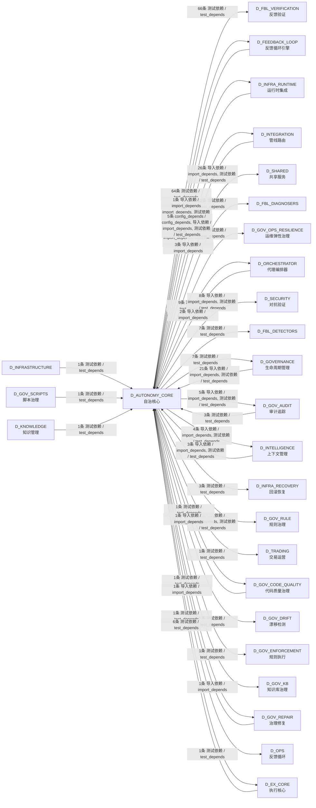

## 说明 / Notes

- **数据源 / Data Source**: `depgraph (PostgreSQL)` 的 `nodes`、`edges`、`domains` 表
- **生成器 / Generator**: `generate_domain_doc.py`（G2+G10 合并）
- **维护方式 / Maintenance**: 自动生成，全景图更新时刷新
- **文件名规则 / File Naming**: `{编号:02d}_{域ID小写}.md`，如 `16_d_trading.md`
- **图例说明 / Legend**: `[production]`=已上线 / `[design]`=设计中 / `[prototype]`=原型 / `[unknown]`=未知
