# 07_d_autonomy_core / agent_lifecycle

> **文档作用 / Purpose**: 展示 agent_lifecycle（D_AUTONOMY_CORE）功能域的模块清单、域内依赖关系、跨域依赖关系、架构分层视图，供架构审查和域治理参考。

> 本文档由 generate_domain_doc.py 从 depgraph (PostgreSQL) 自动生成
> 最后更新: 2026-07-05 20:28:22
> 数据源: depgraph (PostgreSQL) nodes表 + edges表

## 域基本信息 / Domain Overview

| 字段 | 值 | Field | Value |
|------|------|-------|-------|
| 编号 | 07 | Number | 07 |
| 域ID | D_AUTONOMY_CORE | Domain ID | D_AUTONOMY_CORE |
| 域名称 | agent_lifecycle | Domain Name | agent_lifecycle |
| 层级 | L1_foundation | Layer | L1_foundation |
| 模块数 | 114 | Module Count | 114 |
| 域内依赖 | 40 | Internal Dependencies | 40 |
| 跨域入边 | 138 | Cross-domain Incoming | 138 |
| 跨域出边 | 29 | Cross-domain Outgoing | 29 |
| 设计态模块 | 0 | Design Modules | 0 |
| 原型态模块 | 3 | Prototype Modules | 3 |
| 生产态模块 | 111 | Production Modules | 111 |
| 容量 | 111/150 (正常) | Capacity | 111/150 (正常) |
| 描述 | Skill渐进披露(L0永久/L1触发/L2组合/L3按需) | Description | Skill渐进披露(L0永久/L1触发/L2组合/L3按需) |

## 域内依赖图 / Internal Dependency Diagram

> 依赖图内嵌在本文档中，IDE 可直接渲染显示。每30个节点一组分页显示。
>
> **图例说明 / Legend**：
> - **实线边框 = 运营态模块**（production，已上线运行）
> - **虚线边框 = 设计态模块**（design，还在设计中）
> - **实线箭头 = 运营态依赖**（已生效的依赖关系）
> - **虚线箭头 = 设计态依赖**（计划中的依赖关系）

### 第 1 页 / 共 4 页 / Page 1 of 4

```mermaid
graph TD
    subgraph D_AUTONOMY_CORE["D_AUTONOMY_CORE agent_lifecycle"]
        src_zephyr_autonomy_core_init_py["src/zephyr/autonomy_core/__init__.py production"]
        src_zephyr_autonomy_core_main_py["src/zephyr/autonomy_core/__main__.py production"]
        src_zephyr_autonomy_core_agent_observability_py["src/zephyr/autonomy_core/agent_observability.py production"]
        src_zephyr_autonomy_core_all_skill_modules_py["src/zephyr/autonomy_core/all_skill_modules.py production"]
        src_zephyr_autonomy_core_context_init_py["src/zephyr/autonomy_core/context/__init__.py production"]
        src_zephyr_autonomy_core_context_atomic_injector_py["src/zephyr/autonomy_core/context/atomic_injecto... production"]
        src_zephyr_autonomy_core_context_ce_bootstrap_py["src/zephyr/autonomy_core/context/ce_bootstrap.py production"]
        src_zephyr_autonomy_core_context_ce_explain_cli_py["src/zephyr/autonomy_core/context/ce_explain_cli.py production"]
        src_zephyr_autonomy_core_context_ce_file_lister_py["src/zephyr/autonomy_core/context/ce_file_lister.py production"]
        src_zephyr_autonomy_core_context_ce_playground_v2_py["src/zephyr/autonomy_core/context/ce_playground_... production"]
        src_zephyr_autonomy_core_context_ce_vibe_shortcuts_py["src/zephyr/autonomy_core/context/ce_vibe_shortc... production"]
        src_zephyr_autonomy_core_context_checkpoint_manager_py["src/zephyr/autonomy_core/context/checkpoint_man... production"]
        src_zephyr_autonomy_core_context_cold_start_booster_py["src/zephyr/autonomy_core/context/cold_start_boo... production"]
        src_zephyr_autonomy_core_context_complexity_budget_py["src/zephyr/autonomy_core/context/complexity_bud... production"]
        src_zephyr_autonomy_core_context_context_assembler_py["src/zephyr/autonomy_core/context/context_assemb... production"]
        src_zephyr_autonomy_core_context_context_budget_py["src/zephyr/autonomy_core/context/context_budget.py production"]
        src_zephyr_autonomy_core_context_context_budget_tracker_py["src/zephyr/autonomy_core/context/context_budget... production"]
        src_zephyr_autonomy_core_context_context_debt_score_py["src/zephyr/autonomy_core/context/context_debt_s... production"]
        src_zephyr_autonomy_core_context_context_evaluator_py["src/zephyr/autonomy_core/context/context_evalua... production"]
        src_zephyr_autonomy_core_context_context_evictor_py["src/zephyr/autonomy_core/context/context_evicto... production"]
        src_zephyr_autonomy_core_context_context_health_score_py["src/zephyr/autonomy_core/context/context_health... production"]
        src_zephyr_autonomy_core_context_context_injector_py["src/zephyr/autonomy_core/context/context_inject... production"]
        src_zephyr_autonomy_core_context_context_model_strategy_py["src/zephyr/autonomy_core/context/context_model_... production"]
        src_zephyr_autonomy_core_context_context_outcome_tracker_py["src/zephyr/autonomy_core/context/context_outcom... production"]
        src_zephyr_autonomy_core_context_context_pipeline_py["src/zephyr/autonomy_core/context/context_pipeli... production"]
        src_zephyr_autonomy_core_context_context_pipeline_auto_py["src/zephyr/autonomy_core/context/context_pipeli... production"]
        src_zephyr_autonomy_core_context_context_playground_py["src/zephyr/autonomy_core/context/context_playgr... production"]
        src_zephyr_autonomy_core_context_context_rot_model_py["src/zephyr/autonomy_core/context/context_rot_mo... production"]
        src_zephyr_autonomy_core_context_context_rule_registry_py["src/zephyr/autonomy_core/context/context_rule_r... production"]
        src_zephyr_autonomy_core_context_context_value_attribution_py["src/zephyr/autonomy_core/context/context_value_... production"]
    end
    src_zephyr_autonomy_core_context_context_assembler_py -->|import_depends| src_zephyr_autonomy_core_context_context_rule_registry_py
    src_zephyr_autonomy_core_context_context_pipeline_py -->|import_depends| src_zephyr_autonomy_core_context_context_assembler_py
    src_zephyr_autonomy_core_context_context_pipeline_py -->|import_depends| src_zephyr_autonomy_core_context_context_injector_py
    src_zephyr_autonomy_core_context_context_pipeline_py -->|import_depends| src_zephyr_autonomy_core_context_context_rule_registry_py
    src_zephyr_autonomy_core_context_context_pipeline_auto_py -->|import_depends| src_zephyr_autonomy_core_context_context_pipeline_py
    D_INTELLIGENCE["D_INTELLIGENCE production"]
    src_zephyr_autonomy_core_context_context_assembler_py -->|import_depends| D_INTELLIGENCE
    D_INFRA_RUNTIME["D_INFRA_RUNTIME production"]
    src_zephyr_autonomy_core_context_context_pipeline_auto_py -->|import_depends| D_INFRA_RUNTIME
    D_SHARED["D_SHARED production"]
    src_zephyr_autonomy_core_context_context_assembler_py -->|import_depends| D_SHARED
    src_zephyr_autonomy_core_context_context_pipeline_py -->|import_depends| D_SHARED
    D_INTEGRATION["D_INTEGRATION production"]
    src_zephyr_autonomy_core_context_context_assembler_py -->|import_depends| D_INTEGRATION
    src_zephyr_autonomy_core_context_context_budget_tracker_py -->|import_depends| D_SHARED
    src_zephyr_autonomy_core_context_context_budget_tracker_py -->|import_depends| D_INFRA_RUNTIME
    src_zephyr_autonomy_core_context_context_budget_tracker_py -->|import_depends| D_SHARED
    src_zephyr_autonomy_core_context_context_budget_tracker_py -->|import_depends| D_SHARED
    src_zephyr_autonomy_core_context_context_injector_py -->|import_depends| D_INTEGRATION
    D_GOVERNANCE["D_GOVERNANCE production"]
    src_zephyr_autonomy_core_context_context_assembler_py -->|import_depends| D_GOVERNANCE
    src_zephyr_autonomy_core_context_context_assembler_py -->|import_depends| D_INTELLIGENCE
    src_zephyr_autonomy_core_context_context_budget_py -->|import_depends| D_INFRA_RUNTIME
    src_zephyr_autonomy_core_context_context_injector_py -->|import_depends| D_INFRA_RUNTIME
    src_zephyr_autonomy_core_context_context_assembler_py -->|import_depends| D_INFRA_RUNTIME
    D_AUDITTEST["D_AUDITTEST prototype"]
    D_AUDITTEST -.->|test_depends| src_zephyr_autonomy_core_context_cold_start_booster_py
    D_GOV_SCRIPTS["D_GOV_SCRIPTS prototype"]
    D_GOV_SCRIPTS -.->|import_depends| src_zephyr_autonomy_core_init_py
    D_AUDITTEST -.->|test_depends| src_zephyr_autonomy_core_agent_observability_py
    D_AUDITTEST -.->|test_depends| src_zephyr_autonomy_core_main_py
    D_AUDITTEST -.->|test_depends| src_zephyr_autonomy_core_main_py
    D_AUDITTEST -.->|test_depends| src_zephyr_autonomy_core_context_checkpoint_manager_py
    D_AUDITTEST -.->|test_depends| src_zephyr_autonomy_core_context_context_assembler_py
    D_AUDITTEST -.->|test_depends| src_zephyr_autonomy_core_context_complexity_budget_py
    D_AUDITTEST -.->|test_depends| src_zephyr_autonomy_core_context_context_assembler_py
    D_AUDITTEST -.->|test_depends| src_zephyr_autonomy_core_context_context_pipeline_py
    D_AUDITTEST -.->|test_depends| src_zephyr_autonomy_core_context_context_assembler_py
    D_AUDITTEST -.->|test_depends| src_zephyr_autonomy_core_context_context_injector_py
    D_AUDITTEST -.->|test_depends| src_zephyr_autonomy_core_context_atomic_injector_py
    D_AUDITTEST -.->|test_depends| src_zephyr_autonomy_core_all_skill_modules_py
    D_AUDITTEST -.->|test_depends| src_zephyr_autonomy_core_context_context_injector_py
    classDef production fill:#e1f5fe,stroke:#01579b,stroke-width:2px,color:#000
    classDef design fill:#fff3e0,stroke:#e65100,stroke-width:2px,color:#000,stroke-dasharray: 5 5
    classDef external_prod fill:#e8f5e9,stroke:#1b5e20,stroke-width:1px,color:#000
    classDef external_design fill:#fce4ec,stroke:#880e4f,stroke-width:1px,color:#000,stroke-dasharray: 5 5
    class src_zephyr_autonomy_core_init_py,src_zephyr_autonomy_core_main_py,src_zephyr_autonomy_core_agent_observability_py,src_zephyr_autonomy_core_all_skill_modules_py,src_zephyr_autonomy_core_context_init_py,src_zephyr_autonomy_core_context_atomic_injector_py,src_zephyr_autonomy_core_context_ce_bootstrap_py,src_zephyr_autonomy_core_context_ce_explain_cli_py,src_zephyr_autonomy_core_context_ce_file_lister_py,src_zephyr_autonomy_core_context_ce_playground_v2_py,src_zephyr_autonomy_core_context_ce_vibe_shortcuts_py,src_zephyr_autonomy_core_context_checkpoint_manager_py,src_zephyr_autonomy_core_context_cold_start_booster_py,src_zephyr_autonomy_core_context_complexity_budget_py,src_zephyr_autonomy_core_context_context_assembler_py,src_zephyr_autonomy_core_context_context_budget_py,src_zephyr_autonomy_core_context_context_budget_tracker_py,src_zephyr_autonomy_core_context_context_debt_score_py,src_zephyr_autonomy_core_context_context_evaluator_py,src_zephyr_autonomy_core_context_context_evictor_py,src_zephyr_autonomy_core_context_context_health_score_py,src_zephyr_autonomy_core_context_context_injector_py,src_zephyr_autonomy_core_context_context_model_strategy_py,src_zephyr_autonomy_core_context_context_outcome_tracker_py,src_zephyr_autonomy_core_context_context_pipeline_py,src_zephyr_autonomy_core_context_context_pipeline_auto_py,src_zephyr_autonomy_core_context_context_playground_py,src_zephyr_autonomy_core_context_context_rot_model_py,src_zephyr_autonomy_core_context_context_rule_registry_py,src_zephyr_autonomy_core_context_context_value_attribution_py production
    class D_INTELLIGENCE,D_INFRA_RUNTIME,D_SHARED,D_INTEGRATION,D_GOVERNANCE external_prod
    class D_AUDITTEST,D_GOV_SCRIPTS external_design
```



### 第 2 页 / 共 4 页 / Page 2 of 4


### 第 3 页 / 共 4 页 / Page 3 of 4

```mermaid
graph TD
    subgraph D_AUTONOMY_CORE["D_AUTONOMY_CORE agent_lifecycle"]
        src_zephyr_autonomy_core_skills_skill_consensus_py["src/zephyr/autonomy_core/skills/skill_consensus.py production"]
        src_zephyr_autonomy_core_skills_skill_constructor_py["src/zephyr/autonomy_core/skills/skill_construct... production"]
        src_zephyr_autonomy_core_skills_skill_context_isolation_py["src/zephyr/autonomy_core/skills/skill_context_i... production"]
        src_zephyr_autonomy_core_skills_skill_contract_py["src/zephyr/autonomy_core/skills/skill_contract.py production"]
        src_zephyr_autonomy_core_skills_skill_cross_model_py["src/zephyr/autonomy_core/skills/skill_cross_mod... production"]
        src_zephyr_autonomy_core_skills_skill_di_py["src/zephyr/autonomy_core/skills/skill_di.py production"]
        src_zephyr_autonomy_core_skills_skill_discovery_py["src/zephyr/autonomy_core/skills/skill_discovery.py production"]
        src_zephyr_autonomy_core_skills_skill_durable_py["src/zephyr/autonomy_core/skills/skill_durable.py production"]
        src_zephyr_autonomy_core_skills_skill_economics_py["src/zephyr/autonomy_core/skills/skill_economics.py production"]
        src_zephyr_autonomy_core_skills_skill_efficacy_calibrator_py["src/zephyr/autonomy_core/skills/skill_efficacy_... production"]
        src_zephyr_autonomy_core_skills_skill_evaluator_py["src/zephyr/autonomy_core/skills/skill_evaluator.py production"]
        src_zephyr_autonomy_core_skills_skill_executor_py["src/zephyr/autonomy_core/skills/skill_executor.py production"]
        src_zephyr_autonomy_core_skills_skill_explain_py["src/zephyr/autonomy_core/skills/skill_explain.py production"]
        src_zephyr_autonomy_core_skills_skill_factory_py["src/zephyr/autonomy_core/skills/skill_factory.py production"]
        src_zephyr_autonomy_core_skills_skill_feature_flags_py["src/zephyr/autonomy_core/skills/skill_feature_f... production"]
        src_zephyr_autonomy_core_skills_skill_feedback_py["src/zephyr/autonomy_core/skills/skill_feedback.py production"]
        src_zephyr_autonomy_core_skills_skill_freshness_py["src/zephyr/autonomy_core/skills/skill_freshness.py production"]
        src_zephyr_autonomy_core_skills_skill_freshness_ext_py["src/zephyr/autonomy_core/skills/skill_freshness... production"]
        src_zephyr_autonomy_core_skills_skill_gitops_py["src/zephyr/autonomy_core/skills/skill_gitops.py production"]
        src_zephyr_autonomy_core_skills_skill_guardrails_py["src/zephyr/autonomy_core/skills/skill_guardrail... production"]
        src_zephyr_autonomy_core_skills_skill_idempotency_py["src/zephyr/autonomy_core/skills/skill_idempoten... production"]
        src_zephyr_autonomy_core_skills_skill_kill_switch_py["src/zephyr/autonomy_core/skills/skill_kill_swit... production"]
        src_zephyr_autonomy_core_skills_skill_knowledge_base_py["src/zephyr/autonomy_core/skills/skill_knowledge... production"]
        src_zephyr_autonomy_core_skills_skill_kya_py["src/zephyr/autonomy_core/skills/skill_kya.py production"]
        src_zephyr_autonomy_core_skills_skill_learning_py["src/zephyr/autonomy_core/skills/skill_learning.py production"]
        src_zephyr_autonomy_core_skills_skill_lifecycle_py["src/zephyr/autonomy_core/skills/skill_lifecycle.py production"]
        src_zephyr_autonomy_core_skills_skill_lineage_py["src/zephyr/autonomy_core/skills/skill_lineage.py production"]
        src_zephyr_autonomy_core_skills_skill_loader_py["src/zephyr/autonomy_core/skills/skill_loader.py production"]
        src_zephyr_autonomy_core_skills_skill_locking_py["src/zephyr/autonomy_core/skills/skill_locking.py production"]
        src_zephyr_autonomy_core_skills_skill_model_py["src/zephyr/autonomy_core/skills/skill_model.py production"]
    end
    src_zephyr_autonomy_core_skills_skill_consensus_py -->|import_depends| src_zephyr_autonomy_core_skills_skill_freshness_py
    src_zephyr_autonomy_core_skills_skill_contract_py -->|import_depends| src_zephyr_autonomy_core_skills_skill_loader_py
    src_zephyr_autonomy_core_skills_skill_efficacy_calibrator_py -->|import_depends| src_zephyr_autonomy_core_skills_skill_loader_py
    src_zephyr_autonomy_core_skills_skill_constructor_py -->|import_depends| src_zephyr_autonomy_core_skills_skill_loader_py
    src_zephyr_autonomy_core_skills_skill_discovery_py -->|import_depends| src_zephyr_autonomy_core_skills_skill_factory_py
    src_zephyr_autonomy_core_skills_skill_discovery_py -->|import_depends| src_zephyr_autonomy_core_skills_skill_loader_py
    src_zephyr_autonomy_core_skills_skill_evaluator_py -->|import_depends| src_zephyr_autonomy_core_skills_skill_freshness_py
    src_zephyr_autonomy_core_skills_skill_evaluator_py -->|import_depends| src_zephyr_autonomy_core_skills_skill_loader_py
    src_zephyr_autonomy_core_skills_skill_executor_py -->|import_depends| src_zephyr_autonomy_core_skills_skill_loader_py
    src_zephyr_autonomy_core_skills_skill_explain_py -->|import_depends| src_zephyr_autonomy_core_skills_skill_evaluator_py
    src_zephyr_autonomy_core_skills_skill_freshness_ext_py -->|import_depends| src_zephyr_autonomy_core_skills_skill_freshness_py
    src_zephyr_autonomy_core_skills_skill_freshness_ext_py -->|import_depends| src_zephyr_autonomy_core_skills_skill_lifecycle_py
    src_zephyr_autonomy_core_skills_skill_freshness_ext_py -->|import_depends| src_zephyr_autonomy_core_skills_skill_model_py
    src_zephyr_autonomy_core_skills_skill_feedback_py -->|import_depends| src_zephyr_autonomy_core_skills_skill_freshness_py
    src_zephyr_autonomy_core_skills_skill_feedback_py -->|import_depends| src_zephyr_autonomy_core_skills_skill_kill_switch_py
    src_zephyr_autonomy_core_skills_skill_kill_switch_py -->|import_depends| src_zephyr_autonomy_core_skills_skill_model_py
    src_zephyr_autonomy_core_skills_skill_lifecycle_py -->|import_depends| src_zephyr_autonomy_core_skills_skill_model_py
    src_zephyr_autonomy_core_skills_skill_kya_py -->|import_depends| src_zephyr_autonomy_core_skills_skill_loader_py
    D_SHARED["D_SHARED production"]
    src_zephyr_autonomy_core_skills_skill_factory_py -->|import_depends| D_SHARED
    D_GOV_ENFORCEMENT["D_GOV_ENFORCEMENT production"]
    src_zephyr_autonomy_core_skills_skill_executor_py -->|import_depends| D_GOV_ENFORCEMENT
    D_GOVERNANCE["D_GOVERNANCE production"]
    src_zephyr_autonomy_core_skills_skill_executor_py -->|import_depends| D_GOVERNANCE
    D_AUDITTEST["D_AUDITTEST prototype"]
    D_AUDITTEST -.->|test_depends| src_zephyr_autonomy_core_skills_skill_constructor_py
    D_AUDITTEST -.->|test_depends| src_zephyr_autonomy_core_skills_skill_consensus_py
    D_AUDITTEST -.->|test_depends| src_zephyr_autonomy_core_skills_skill_contract_py
    D_AUDITTEST -.->|test_depends| src_zephyr_autonomy_core_skills_skill_cross_model_py
    D_AUDITTEST -.->|test_depends| src_zephyr_autonomy_core_skills_skill_discovery_py
    D_AUDITTEST -.->|test_depends| src_zephyr_autonomy_core_skills_skill_durable_py
    D_AUDITTEST -.->|test_depends| src_zephyr_autonomy_core_skills_skill_efficacy_calibrator_py
    D_AUDITTEST -.->|test_depends| src_zephyr_autonomy_core_skills_skill_executor_py
    D_AUDITTEST -.->|test_depends| src_zephyr_autonomy_core_skills_skill_explain_py
    D_AUDITTEST -.->|test_depends| src_zephyr_autonomy_core_skills_skill_factory_py
    D_AUDITTEST -.->|test_depends| src_zephyr_autonomy_core_skills_skill_feedback_py
    D_AUDITTEST -.->|test_depends| src_zephyr_autonomy_core_skills_skill_freshness_ext_py
    D_AUDITTEST -.->|test_depends| src_zephyr_autonomy_core_skills_skill_model_py
    D_AUDITTEST -.->|test_depends| src_zephyr_autonomy_core_skills_skill_gitops_py
    D_AUDITTEST -.->|test_depends| src_zephyr_autonomy_core_skills_skill_idempotency_py
    classDef production fill:#e1f5fe,stroke:#01579b,stroke-width:2px,color:#000
    classDef design fill:#fff3e0,stroke:#e65100,stroke-width:2px,color:#000,stroke-dasharray: 5 5
    classDef external_prod fill:#e8f5e9,stroke:#1b5e20,stroke-width:1px,color:#000
    classDef external_design fill:#fce4ec,stroke:#880e4f,stroke-width:1px,color:#000,stroke-dasharray: 5 5
    class src_zephyr_autonomy_core_skills_skill_consensus_py,src_zephyr_autonomy_core_skills_skill_constructor_py,src_zephyr_autonomy_core_skills_skill_context_isolation_py,src_zephyr_autonomy_core_skills_skill_contract_py,src_zephyr_autonomy_core_skills_skill_cross_model_py,src_zephyr_autonomy_core_skills_skill_di_py,src_zephyr_autonomy_core_skills_skill_discovery_py,src_zephyr_autonomy_core_skills_skill_durable_py,src_zephyr_autonomy_core_skills_skill_economics_py,src_zephyr_autonomy_core_skills_skill_efficacy_calibrator_py,src_zephyr_autonomy_core_skills_skill_evaluator_py,src_zephyr_autonomy_core_skills_skill_executor_py,src_zephyr_autonomy_core_skills_skill_explain_py,src_zephyr_autonomy_core_skills_skill_factory_py,src_zephyr_autonomy_core_skills_skill_feature_flags_py,src_zephyr_autonomy_core_skills_skill_feedback_py,src_zephyr_autonomy_core_skills_skill_freshness_py,src_zephyr_autonomy_core_skills_skill_freshness_ext_py,src_zephyr_autonomy_core_skills_skill_gitops_py,src_zephyr_autonomy_core_skills_skill_guardrails_py,src_zephyr_autonomy_core_skills_skill_idempotency_py,src_zephyr_autonomy_core_skills_skill_kill_switch_py,src_zephyr_autonomy_core_skills_skill_knowledge_base_py,src_zephyr_autonomy_core_skills_skill_kya_py,src_zephyr_autonomy_core_skills_skill_learning_py,src_zephyr_autonomy_core_skills_skill_lifecycle_py,src_zephyr_autonomy_core_skills_skill_lineage_py,src_zephyr_autonomy_core_skills_skill_loader_py,src_zephyr_autonomy_core_skills_skill_locking_py,src_zephyr_autonomy_core_skills_skill_model_py production
    class D_SHARED,D_GOV_ENFORCEMENT,D_GOVERNANCE external_prod
    class D_AUDITTEST external_design
```



### 第 4 页 / 共 4 页 / Page 4 of 4

```mermaid
graph TD
    subgraph D_AUTONOMY_CORE["D_AUTONOMY_CORE agent_lifecycle"]
        src_zephyr_autonomy_core_skills_skill_model_evolution_py["src/zephyr/autonomy_core/skills/skill_model_evo... production"]
        src_zephyr_autonomy_core_skills_skill_observability_py["src/zephyr/autonomy_core/skills/skill_observabi... production"]
        src_zephyr_autonomy_core_skills_skill_ontology_py["src/zephyr/autonomy_core/skills/skill_ontology.py production"]
        src_zephyr_autonomy_core_skills_skill_postmortem_py["src/zephyr/autonomy_core/skills/skill_postmorte... production"]
        src_zephyr_autonomy_core_skills_skill_prompt_cache_py["src/zephyr/autonomy_core/skills/skill_prompt_ca... production"]
        src_zephyr_autonomy_core_skills_skill_prompt_opt_py["src/zephyr/autonomy_core/skills/skill_prompt_op... production"]
        src_zephyr_autonomy_core_skills_skill_registry_py["src/zephyr/autonomy_core/skills/skill_registry.py production"]
        src_zephyr_autonomy_core_skills_skill_resilience_py["src/zephyr/autonomy_core/skills/skill_resilienc... production"]
        src_zephyr_autonomy_core_skills_skill_risk_mitigator_py["src/zephyr/autonomy_core/skills/skill_risk_miti... production"]
        src_zephyr_autonomy_core_skills_skill_router_py["src/zephyr/autonomy_core/skills/skill_router.py production"]
        src_zephyr_autonomy_core_skills_skill_sandbox_py["src/zephyr/autonomy_core/skills/skill_sandbox.py production"]
        src_zephyr_autonomy_core_skills_skill_schema_registry_py["src/zephyr/autonomy_core/skills/skill_schema_re... production"]
        src_zephyr_autonomy_core_skills_skill_security_py["src/zephyr/autonomy_core/skills/skill_security.py production"]
        src_zephyr_autonomy_core_skills_skill_shadow_py["src/zephyr/autonomy_core/skills/skill_shadow.py production"]
        src_zephyr_autonomy_core_skills_skill_silent_failure_py["src/zephyr/autonomy_core/skills/skill_silent_fa... production"]
        src_zephyr_autonomy_core_skills_skill_team_optimizer_py["src/zephyr/autonomy_core/skills/skill_team_opti... production"]
        src_zephyr_autonomy_core_skills_skill_telemetry_py["src/zephyr/autonomy_core/skills/skill_telemetry.py production"]
        src_zephyr_autonomy_core_skills_skill_temperature_py["src/zephyr/autonomy_core/skills/skill_temperatu... production"]
        src_zephyr_autonomy_core_skills_skill_tokenomics_py["src/zephyr/autonomy_core/skills/skill_tokenomic... production"]
        src_zephyr_autonomy_core_skills_skill_translator_py["src/zephyr/autonomy_core/skills/skill_translato... production"]
        src_zephyr_autonomy_core_skills_skill_workflow_py["src/zephyr/autonomy_core/skills/skill_workflow.py production"]
        src_zephyr_autonomy_core_spec_engine_py["src/zephyr/autonomy_core/spec_engine.py production"]
        src_zephyr_autonomy_core_trigger_router_py["src/zephyr/autonomy_core/trigger_router.py production"]
        src_zephyr_autonomy_core_vibe_coding_quality_gate_py["src/zephyr/autonomy_core/vibe_coding_quality_ga... production"]
    end
    src_zephyr_autonomy_core_spec_engine_py -->|import_depends| src_zephyr_autonomy_core_trigger_router_py
    D_INTEGRATION["D_INTEGRATION production"]
    src_zephyr_autonomy_core_skills_skill_registry_py -->|import_depends| D_INTEGRATION
    src_zephyr_autonomy_core_skills_skill_router_py -->|import_depends| D_INTEGRATION
    D_GOVERNANCE["D_GOVERNANCE production"]
    src_zephyr_autonomy_core_skills_skill_sandbox_py -->|import_depends| D_GOVERNANCE
    src_zephyr_autonomy_core_spec_engine_py -->|import_depends| D_GOVERNANCE
    D_AUDITTEST["D_AUDITTEST prototype"]
    D_AUDITTEST -.->|test_depends| src_zephyr_autonomy_core_trigger_router_py
    D_AUDITTEST -.->|test_depends| src_zephyr_autonomy_core_skills_skill_model_evolution_py
    D_AUDITTEST -.->|test_depends| src_zephyr_autonomy_core_skills_skill_ontology_py
    D_AUDITTEST -.->|test_depends| src_zephyr_autonomy_core_skills_skill_observability_py
    D_AUDITTEST -.->|test_depends| src_zephyr_autonomy_core_skills_skill_prompt_cache_py
    D_AUDITTEST -.->|test_depends| src_zephyr_autonomy_core_skills_skill_postmortem_py
    D_AUDITTEST -.->|test_depends| src_zephyr_autonomy_core_skills_skill_shadow_py
    D_AUDITTEST -.->|test_depends| src_zephyr_autonomy_core_skills_skill_tokenomics_py
    D_AUDITTEST -.->|test_depends| src_zephyr_autonomy_core_skills_skill_translator_py
    D_AUDITTEST -.->|test_depends| src_zephyr_autonomy_core_skills_skill_workflow_py
    D_AUDITTEST -.->|test_depends| src_zephyr_autonomy_core_skills_skill_team_optimizer_py
    D_AUDITTEST -.->|test_depends| src_zephyr_autonomy_core_skills_skill_telemetry_py
    D_AUDITTEST -.->|test_depends| src_zephyr_autonomy_core_skills_skill_temperature_py
    D_AUDITTEST -.->|test_depends| src_zephyr_autonomy_core_skills_skill_sandbox_py
    D_AUDITTEST -.->|test_depends| src_zephyr_autonomy_core_trigger_router_py
    classDef production fill:#e1f5fe,stroke:#01579b,stroke-width:2px,color:#000
    classDef design fill:#fff3e0,stroke:#e65100,stroke-width:2px,color:#000,stroke-dasharray: 5 5
    classDef external_prod fill:#e8f5e9,stroke:#1b5e20,stroke-width:1px,color:#000
    classDef external_design fill:#fce4ec,stroke:#880e4f,stroke-width:1px,color:#000,stroke-dasharray: 5 5
    class src_zephyr_autonomy_core_skills_skill_model_evolution_py,src_zephyr_autonomy_core_skills_skill_observability_py,src_zephyr_autonomy_core_skills_skill_ontology_py,src_zephyr_autonomy_core_skills_skill_postmortem_py,src_zephyr_autonomy_core_skills_skill_prompt_cache_py,src_zephyr_autonomy_core_skills_skill_prompt_opt_py,src_zephyr_autonomy_core_skills_skill_registry_py,src_zephyr_autonomy_core_skills_skill_resilience_py,src_zephyr_autonomy_core_skills_skill_risk_mitigator_py,src_zephyr_autonomy_core_skills_skill_router_py,src_zephyr_autonomy_core_skills_skill_sandbox_py,src_zephyr_autonomy_core_skills_skill_schema_registry_py,src_zephyr_autonomy_core_skills_skill_security_py,src_zephyr_autonomy_core_skills_skill_shadow_py,src_zephyr_autonomy_core_skills_skill_silent_failure_py,src_zephyr_autonomy_core_skills_skill_team_optimizer_py,src_zephyr_autonomy_core_skills_skill_telemetry_py,src_zephyr_autonomy_core_skills_skill_temperature_py,src_zephyr_autonomy_core_skills_skill_tokenomics_py,src_zephyr_autonomy_core_skills_skill_translator_py,src_zephyr_autonomy_core_skills_skill_workflow_py,src_zephyr_autonomy_core_spec_engine_py,src_zephyr_autonomy_core_trigger_router_py,src_zephyr_autonomy_core_vibe_coding_quality_gate_py production
    class D_INTEGRATION,D_GOVERNANCE external_prod
    class D_AUDITTEST external_design
```



## 跨域依赖 / Cross-domain Dependencies

### 本域依赖的其他域（出边）/ Depends On

| 目标域 / Target Domain | 依赖数 / Count | 依赖类型 / Type |
|--------|:---:|---------|
| D_SHARED | 8 | import_depends |
| D_INFRA_RUNTIME | 7 | import_depends |
| D_INTEGRATION | 6 | import_depends |
| D_GOVERNANCE | 4 | import_depends |
| D_INTELLIGENCE | 2 | import_depends |
| D_SECURITY_LLM | 1 | import_depends |
| D_GOV_ENFORCEMENT | 1 | import_depends |

### 依赖本域的其他域（入边）/ Depended By

| 源域 / Source Domain | 依赖数 / Count | 依赖类型 / Type |
|------|:---:|---------|
| D_AUDITTEST | 127 | test_depends |
| D_TRADING | 4 | import_depends |
| D_GOVERNANCE | 2 | import_depends |
| D_GOV_SCRIPTS | 2 | import_depends |
| D_INTEGRATION | 2 | import_depends |
| D_INTELLIGENCE | 1 | import_depends |

## 架构分层视图 / Architecture Overview

> 按 architecture_layer 分层显示 agent_lifecycle（D_AUTONOMY_CORE）的模块分布。共 114 个模块 / 114 modules。

```

┌──────────────────────────────────────────────────────────────────┐
│            L1 基础层 / Foundation Layer (114 modules)            │
├──────────────────────────────────────────────────────────────────┤
│   src/zephyr/autonomy_core/__init__.py  [production]             │
│   src/zephyr/autonomy_core/__main__.py  [production]             │
│   src/zephyr/autonomy_core/agent_observability.py  [production]  │
│   src/zephyr/autonomy_core/all_skill_modules.py  [production]    │
│   src/zephyr/autonomy_core/context/__init__.py  [production]     │
│   src/zephyr/autonomy_core/context/atomic_injector.py  [produ... │
│   src/zephyr/autonomy_core/context/ce_bootstrap.py  [production] │
│   src/zephyr/autonomy_core/context/ce_explain_cli.py  [produc... │
│   src/zephyr/autonomy_core/context/ce_file_lister.py  [produc... │
│   src/zephyr/autonomy_core/context/ce_playground_v2.py  [prod... │
│   src/zephyr/autonomy_core/context/ce_vibe_shortcuts.py  [pro... │
│   src/zephyr/autonomy_core/context/checkpoint_manager.py  [pr... │
│   src/zephyr/autonomy_core/context/cold_start_booster.py  [pr... │
│   src/zephyr/autonomy_core/context/complexity_budget.py  [pro... │
│   src/zephyr/autonomy_core/context/context_assembler.py  [pro... │
│   src/zephyr/autonomy_core/context/context_budget.py  [produc... │
│   src/zephyr/autonomy_core/context/context_budget_tracker.py ... │
│   src/zephyr/autonomy_core/context/context_debt_score.py  [pr... │
│   ...还有 96 个模块 / 96 more modules                            │
└──────────────────────────────────────────────────────────────────┘

```

## 模块分层清单 / Module Layered List

> 按 architecture_layer 分组的模块清单（共 114 个模块 / 114 modules）。

### L1 基础层 / Foundation Layer (114 modules)

| # | 模块路径 / Module Path | 模块名称 / Module Name | 成熟度 / Maturity | 构建状态 / Build Status |
|:--:|---------|---------|:---:|:---:|
| 1 | src/zephyr/autonomy_core/__init__.py | src/zephyr/autonomy_core/__init__.py | production | generated |
| 2 | src/zephyr/autonomy_core/__main__.py | src/zephyr/autonomy_core/__main__.py | production | generated |
| 3 | src/zephyr/autonomy_core/agent_observability.py | src/zephyr/autonomy_core/agent_observ... | production | generated |
| 4 | src/zephyr/autonomy_core/all_skill_modules.py | src/zephyr/autonomy_core/all_skill_mo... | production | generated |
| 5 | src/zephyr/autonomy_core/context/__init__.py | src/zephyr/autonomy_core/context/__in... | production | generated |
| 6 | src/zephyr/autonomy_core/context/atomic_injector.py | src/zephyr/autonomy_core/context/atom... | production | generated |
| 7 | src/zephyr/autonomy_core/context/ce_bootstrap.py | src/zephyr/autonomy_core/context/ce_b... | production | generated |
| 8 | src/zephyr/autonomy_core/context/ce_explain_cli.py | src/zephyr/autonomy_core/context/ce_e... | production | generated |
| 9 | src/zephyr/autonomy_core/context/ce_file_lister.py | src/zephyr/autonomy_core/context/ce_f... | production | generated |
| 10 | src/zephyr/autonomy_core/context/ce_playground_v2.py | src/zephyr/autonomy_core/context/ce_p... | production | generated |
| 11 | src/zephyr/autonomy_core/context/ce_vibe_shortcuts.py | src/zephyr/autonomy_core/context/ce_v... | production | generated |
| 12 | src/zephyr/autonomy_core/context/checkpoint_manager.py | src/zephyr/autonomy_core/context/chec... | production | generated |
| 13 | src/zephyr/autonomy_core/context/cold_start_booster.py | src/zephyr/autonomy_core/context/cold... | production | generated |
| 14 | src/zephyr/autonomy_core/context/complexity_budget.py | src/zephyr/autonomy_core/context/comp... | production | generated |
| 15 | src/zephyr/autonomy_core/context/context_assembler.py | src/zephyr/autonomy_core/context/cont... | production | generated |
| 16 | src/zephyr/autonomy_core/context/context_budget.py | src/zephyr/autonomy_core/context/cont... | production | generated |
| 17 | src/zephyr/autonomy_core/context/context_budget_tracker.py | src/zephyr/autonomy_core/context/cont... | production | generated |
| 18 | src/zephyr/autonomy_core/context/context_debt_score.py | src/zephyr/autonomy_core/context/cont... | production | generated |
| 19 | src/zephyr/autonomy_core/context/context_evaluator.py | src/zephyr/autonomy_core/context/cont... | production | generated |
| 20 | src/zephyr/autonomy_core/context/context_evictor.py | src/zephyr/autonomy_core/context/cont... | production | generated |
| 21 | src/zephyr/autonomy_core/context/context_health_score.py | src/zephyr/autonomy_core/context/cont... | production | generated |
| 22 | src/zephyr/autonomy_core/context/context_injector.py | src/zephyr/autonomy_core/context/cont... | production | generated |
| 23 | src/zephyr/autonomy_core/context/context_model_strategy.py | src/zephyr/autonomy_core/context/cont... | production | generated |
| 24 | src/zephyr/autonomy_core/context/context_outcome_tracker.py | src/zephyr/autonomy_core/context/cont... | production | generated |
| 25 | src/zephyr/autonomy_core/context/context_pipeline.py | src/zephyr/autonomy_core/context/cont... | production | generated |
| 26 | src/zephyr/autonomy_core/context/context_pipeline_auto.py | src/zephyr/autonomy_core/context/cont... | production | generated |
| 27 | src/zephyr/autonomy_core/context/context_playground.py | src/zephyr/autonomy_core/context/cont... | production | generated |
| 28 | src/zephyr/autonomy_core/context/context_rot_model.py | src/zephyr/autonomy_core/context/cont... | production | generated |
| 29 | src/zephyr/autonomy_core/context/context_rule_registry.py | src/zephyr/autonomy_core/context/cont... | production | generated |
| 30 | src/zephyr/autonomy_core/context/context_value_attributio... | src/zephyr/autonomy_core/context/cont... | production | generated |
| 31 | src/zephyr/autonomy_core/context/contextual_fetch_api.py | src/zephyr/autonomy_core/context/cont... | production | generated |
| 32 | src/zephyr/autonomy_core/context/curation_loop.py | src/zephyr/autonomy_core/context/cura... | production | generated |
| 33 | src/zephyr/autonomy_core/context/diff_injector.py | src/zephyr/autonomy_core/context/diff... | production | generated |
| 34 | src/zephyr/autonomy_core/context/diversity_constraint.py | src/zephyr/autonomy_core/context/dive... | production | generated |
| 35 | src/zephyr/autonomy_core/context/domain_decay_config.py | src/zephyr/autonomy_core/context/doma... | production | generated |
| 36 | src/zephyr/autonomy_core/context/fallback_staleness_gate.py | src/zephyr/autonomy_core/context/fall... | production | generated |
| 37 | src/zephyr/autonomy_core/context/integrity_check.py | src/zephyr/autonomy_core/context/inte... | production | generated |
| 38 | src/zephyr/autonomy_core/context/memory_bank.py | src/zephyr/autonomy_core/context/memo... | production | generated |
| 39 | src/zephyr/autonomy_core/context/mode_manager.py | src/zephyr/autonomy_core/context/mode... | production | generated |
| 40 | src/zephyr/autonomy_core/context/position_optimizer.py | src/zephyr/autonomy_core/context/posi... | production | generated |
| 41 | src/zephyr/autonomy_core/context/shadow_canary.py | src/zephyr/autonomy_core/context/shad... | production | generated |
| 42 | src/zephyr/autonomy_core/context/staleness_manager.py | src/zephyr/autonomy_core/context/stal... | production | generated |
| 43 | src/zephyr/autonomy_core/context/vector_bridge.py | src/zephyr/autonomy_core/context/vect... | production | generated |
| 44 | src/zephyr/autonomy_core/file_autoregister.py | src/zephyr/autonomy_core/file_autoreg... | prototype | generated |
| 45 | src/zephyr/autonomy_core/ide_watcher.py | src/zephyr/autonomy_core/ide_watcher.py | production | generated |
| 46 | src/zephyr/autonomy_core/integration/__init__.py | src/zephyr/autonomy_core/integration/... | prototype | generated |
| 47 | src/zephyr/autonomy_core/integration/pipeline_bridge.py | src/zephyr/autonomy_core/integration/... | production | generated |
| 48 | src/zephyr/autonomy_core/phase_planner.py | src/zephyr/autonomy_core/phase_planne... | production | generated |
| 49 | src/zephyr/autonomy_core/progressive_disclosure_injector.py | src/zephyr/autonomy_core/progressive_... | production | generated |
| 50 | src/zephyr/autonomy_core/prompt_registry.py | src/zephyr/autonomy_core/prompt_regis... | production | generated |
| 51 | src/zephyr/autonomy_core/self_evolution_fidelity_gate.py | src/zephyr/autonomy_core/self_evoluti... | production | generated |
| 52 | src/zephyr/autonomy_core/skill_rbac_registry.py | src/zephyr/autonomy_core/skill_rbac_r... | production | generated |
| 53 | src/zephyr/autonomy_core/skills/__init__.py | src/zephyr/autonomy_core/skills/__ini... | prototype | generated |
| 54 | src/zephyr/autonomy_core/skills/skill_attention.py | src/zephyr/autonomy_core/skills/skill... | production | generated |
| 55 | src/zephyr/autonomy_core/skills/skill_breakage_checker.py | src/zephyr/autonomy_core/skills/skill... | production | generated |
| 56 | src/zephyr/autonomy_core/skills/skill_cache_provider.py | src/zephyr/autonomy_core/skills/skill... | production | generated |
| 57 | src/zephyr/autonomy_core/skills/skill_calibration.py | src/zephyr/autonomy_core/skills/skill... | production | generated |
| 58 | src/zephyr/autonomy_core/skills/skill_canary.py | src/zephyr/autonomy_core/skills/skill... | production | generated |
| 59 | src/zephyr/autonomy_core/skills/skill_cognitive_preservat... | src/zephyr/autonomy_core/skills/skill... | production | generated |
| 60 | src/zephyr/autonomy_core/skills/skill_compliance.py | src/zephyr/autonomy_core/skills/skill... | production | generated |
| 61 | src/zephyr/autonomy_core/skills/skill_consensus.py | src/zephyr/autonomy_core/skills/skill... | production | generated |
| 62 | src/zephyr/autonomy_core/skills/skill_constructor.py | src/zephyr/autonomy_core/skills/skill... | production | generated |
| 63 | src/zephyr/autonomy_core/skills/skill_context_isolation.py | src/zephyr/autonomy_core/skills/skill... | production | generated |
| 64 | src/zephyr/autonomy_core/skills/skill_contract.py | src/zephyr/autonomy_core/skills/skill... | production | generated |
| 65 | src/zephyr/autonomy_core/skills/skill_cross_model.py | src/zephyr/autonomy_core/skills/skill... | production | generated |
| 66 | src/zephyr/autonomy_core/skills/skill_di.py | src/zephyr/autonomy_core/skills/skill... | production | generated |
| 67 | src/zephyr/autonomy_core/skills/skill_discovery.py | src/zephyr/autonomy_core/skills/skill... | production | generated |
| 68 | src/zephyr/autonomy_core/skills/skill_durable.py | src/zephyr/autonomy_core/skills/skill... | production | generated |
| 69 | src/zephyr/autonomy_core/skills/skill_economics.py | src/zephyr/autonomy_core/skills/skill... | production | generated |
| 70 | src/zephyr/autonomy_core/skills/skill_efficacy_calibrator.py | src/zephyr/autonomy_core/skills/skill... | production | generated |
| 71 | src/zephyr/autonomy_core/skills/skill_evaluator.py | src/zephyr/autonomy_core/skills/skill... | production | generated |
| 72 | src/zephyr/autonomy_core/skills/skill_executor.py | src/zephyr/autonomy_core/skills/skill... | production | generated |
| 73 | src/zephyr/autonomy_core/skills/skill_explain.py | src/zephyr/autonomy_core/skills/skill... | production | generated |
| 74 | src/zephyr/autonomy_core/skills/skill_factory.py | src/zephyr/autonomy_core/skills/skill... | production | generated |
| 75 | src/zephyr/autonomy_core/skills/skill_feature_flags.py | src/zephyr/autonomy_core/skills/skill... | production | generated |
| 76 | src/zephyr/autonomy_core/skills/skill_feedback.py | src/zephyr/autonomy_core/skills/skill... | production | generated |
| 77 | src/zephyr/autonomy_core/skills/skill_freshness.py | src/zephyr/autonomy_core/skills/skill... | production | generated |
| 78 | src/zephyr/autonomy_core/skills/skill_freshness_ext.py | src/zephyr/autonomy_core/skills/skill... | production | generated |
| 79 | src/zephyr/autonomy_core/skills/skill_gitops.py | src/zephyr/autonomy_core/skills/skill... | production | generated |
| 80 | src/zephyr/autonomy_core/skills/skill_guardrails.py | src/zephyr/autonomy_core/skills/skill... | production | generated |
| 81 | src/zephyr/autonomy_core/skills/skill_idempotency.py | src/zephyr/autonomy_core/skills/skill... | production | generated |
| 82 | src/zephyr/autonomy_core/skills/skill_kill_switch.py | src/zephyr/autonomy_core/skills/skill... | production | generated |
| 83 | src/zephyr/autonomy_core/skills/skill_knowledge_base.py | src/zephyr/autonomy_core/skills/skill... | production | generated |
| 84 | src/zephyr/autonomy_core/skills/skill_kya.py | src/zephyr/autonomy_core/skills/skill... | production | generated |
| 85 | src/zephyr/autonomy_core/skills/skill_learning.py | src/zephyr/autonomy_core/skills/skill... | production | generated |
| 86 | src/zephyr/autonomy_core/skills/skill_lifecycle.py | src/zephyr/autonomy_core/skills/skill... | production | generated |
| 87 | src/zephyr/autonomy_core/skills/skill_lineage.py | src/zephyr/autonomy_core/skills/skill... | production | generated |
| 88 | src/zephyr/autonomy_core/skills/skill_loader.py | src/zephyr/autonomy_core/skills/skill... | production | generated |
| 89 | src/zephyr/autonomy_core/skills/skill_locking.py | src/zephyr/autonomy_core/skills/skill... | production | generated |
| 90 | src/zephyr/autonomy_core/skills/skill_model.py | src/zephyr/autonomy_core/skills/skill... | production | generated |
| 91 | src/zephyr/autonomy_core/skills/skill_model_evolution.py | src/zephyr/autonomy_core/skills/skill... | production | generated |
| 92 | src/zephyr/autonomy_core/skills/skill_observability.py | src/zephyr/autonomy_core/skills/skill... | production | generated |
| 93 | src/zephyr/autonomy_core/skills/skill_ontology.py | src/zephyr/autonomy_core/skills/skill... | production | generated |
| 94 | src/zephyr/autonomy_core/skills/skill_postmortem.py | src/zephyr/autonomy_core/skills/skill... | production | generated |
| 95 | src/zephyr/autonomy_core/skills/skill_prompt_cache.py | src/zephyr/autonomy_core/skills/skill... | production | generated |
| 96 | src/zephyr/autonomy_core/skills/skill_prompt_opt.py | src/zephyr/autonomy_core/skills/skill... | production | generated |
| 97 | src/zephyr/autonomy_core/skills/skill_registry.py | src/zephyr/autonomy_core/skills/skill... | production | generated |
| 98 | src/zephyr/autonomy_core/skills/skill_resilience.py | src/zephyr/autonomy_core/skills/skill... | production | generated |
| 99 | src/zephyr/autonomy_core/skills/skill_risk_mitigator.py | src/zephyr/autonomy_core/skills/skill... | production | generated |
| 100 | src/zephyr/autonomy_core/skills/skill_router.py | src/zephyr/autonomy_core/skills/skill... | production | generated |
| 101 | src/zephyr/autonomy_core/skills/skill_sandbox.py | src/zephyr/autonomy_core/skills/skill... | production | generated |
| 102 | src/zephyr/autonomy_core/skills/skill_schema_registry.py | src/zephyr/autonomy_core/skills/skill... | production | generated |
| 103 | src/zephyr/autonomy_core/skills/skill_security.py | src/zephyr/autonomy_core/skills/skill... | production | generated |
| 104 | src/zephyr/autonomy_core/skills/skill_shadow.py | src/zephyr/autonomy_core/skills/skill... | production | generated |
| 105 | src/zephyr/autonomy_core/skills/skill_silent_failure.py | src/zephyr/autonomy_core/skills/skill... | production | generated |
| 106 | src/zephyr/autonomy_core/skills/skill_team_optimizer.py | src/zephyr/autonomy_core/skills/skill... | production | generated |
| 107 | src/zephyr/autonomy_core/skills/skill_telemetry.py | src/zephyr/autonomy_core/skills/skill... | production | generated |
| 108 | src/zephyr/autonomy_core/skills/skill_temperature.py | src/zephyr/autonomy_core/skills/skill... | production | generated |
| 109 | src/zephyr/autonomy_core/skills/skill_tokenomics.py | src/zephyr/autonomy_core/skills/skill... | production | generated |
| 110 | src/zephyr/autonomy_core/skills/skill_translator.py | src/zephyr/autonomy_core/skills/skill... | production | generated |
| 111 | src/zephyr/autonomy_core/skills/skill_workflow.py | src/zephyr/autonomy_core/skills/skill... | production | generated |
| 112 | src/zephyr/autonomy_core/spec_engine.py | src/zephyr/autonomy_core/spec_engine.py | production | generated |
| 113 | src/zephyr/autonomy_core/trigger_router.py | src/zephyr/autonomy_core/trigger_rout... | production | generated |
| 114 | src/zephyr/autonomy_core/vibe_coding_quality_gate.py | src/zephyr/autonomy_core/vibe_coding_... | production | generated |

## 依赖关系图 / Dependency Graph

> 域内模块依赖关系（共 40 条 / 40 edges）。按依赖类型分组，使用 → 表示方向。

```

┌──────────────────────────────────────────────────────────────────┐
│       依赖关系图 / Dependency Graph (共 40 条 / 40 edges)        │
├──────────────────────────────────────────────────────────────────┤
│   依赖类型数 / Dependency Types: 2                               │
│   [import_depends]: 38 条 / edges                                │
│   [config_depends]: 2 条 / edges                                 │
└──────────────────────────────────────────────────────────────────┘

┌──────────────────────────────────────────────────────────────────┐
│                 [import_depends] (38 条 / edges)                 │
├──────────────────────────────────────────────────────────────────┤
│   spec_engine.py → trigger_router.py                             │
│   spec_engine.py → skill_factory.py                              │
│   spec_engine.py → skill_freshness.py                            │
│   spec_engine.py → skill_loader.py                               │
│   prompt_registry.py → context_injector.py                       │
│   __main__.py → skill_loader.py                                  │
│   __main__.py → skill_model.py                                   │
│   context_assembler.py → context_rule_registry.py                │
│   context_pipeline.py → context_assembler.py                     │
│   context_pipeline.py → context_injector.py                      │
│   context_pipeline.py → context_rule_registry.py                 │
│   context_pipeline_auto.py → context_pipeline.py                 │
│   pipeline_bridge.py → trigger_router.py                         │
│   pipeline_bridge.py → skill_loader.py                           │
│   skill_consensus.py → skill_freshness.py                        │
│   skill_contract.py → skill_loader.py                            │
│   skill_efficacy_calibrator.py → skill_loader.py                 │
│   skill_constructor.py → skill_loader.py                         │
│   skill_discovery.py → skill_factory.py                          │
│   skill_discovery.py → skill_loader.py                           │
│   skill_evaluator.py → skill_freshness.py                        │
│   skill_evaluator.py → skill_loader.py                           │
│   skill_executor.py → skill_loader.py                            │
│   skill_explain.py → skill_evaluator.py                          │
│   skill_explain.py → skill_model_evolution.py                    │
│   skill_freshness_ext.py → skill_freshness.py                    │
│   skill_freshness_ext.py → skill_lifecycle.py                    │
│   skill_freshness_ext.py → skill_model.py                        │
│   skill_feedback.py → skill_freshness.py                         │
│   skill_feedback.py → skill_kill_switch.py                       │
│   skill_kill_switch.py → skill_model.py                          │
│   skill_lifecycle.py → skill_model.py                            │
│   skill_kya.py → skill_loader.py                                 │
│   skill_prompt_opt.py → skill_loader.py                          │
│   skill_postmortem.py → skill_loader.py                          │
│   skill_shadow.py → skill_freshness.py                           │
│   skill_workflow.py → skill_loader.py                            │
│   skill_translator.py → skill_loader.py                          │
└──────────────────────────────────────────────────────────────────┘

┌──────────────────────────────────────────────────────────────────┐
│                 [config_depends] (2 条 / edges)                  │
├──────────────────────────────────────────────────────────────────┤
│   __init__.py → pipeline_bridge.py                               │
│   __init__.py → skill_attention.py                               │
└──────────────────────────────────────────────────────────────────┘

```

## 说明 / Notes

- **数据源 / Data Source**: `depgraph (PostgreSQL)` 的 `nodes`、`edges`、`domains` 表
- **生成器 / Generator**: `generate_domain_doc.py`（G2+G10 合并）
- **维护方式 / Maintenance**: 自动生成，全景图更新时刷新
- **文件名规则 / File Naming**: `{编号:02d}_{域ID小写}.md`，如 `16_d_trading.md`
- **图例说明 / Legend**: `[production]`=已上线 / `[design]`=设计中 / `[prototype]`=原型 / `[unknown]`=未知
