# 07_d_autonomy_core / 自治核心

> **文档作用 / Purpose**: 展示 自治核心（D_AUTONOMY_CORE）功能域的模块清单、域内依赖关系、跨域依赖关系、架构全景图，供架构审查和域治理参考。

> 本文档由 generate_domain_doc.py 从 depgraph (PostgreSQL) 自动生成
> 最后更新: 2026-06-30 15:14:34
> 数据源: depgraph (PostgreSQL) nodes表 + edges表

## 域基本信息 / Domain Overview

| 字段 | 值 | Field | Value |
|------|------|-------|-------|
| 编号 | 07 | Number | 07 |
| 域ID | D_AUTONOMY_CORE | Domain ID | D_AUTONOMY_CORE |
| 域名称 | 自治核心 | Domain Name | 自治核心 |
| 层级 | L1_foundation | Layer | L1_foundation |
| 模块数 | 169 | Module Count | 169 |
| 域内依赖 | 151 | Internal Dependencies | 151 |
| 跨域入边 | 230 | Cross-domain Incoming | 230 |
| 跨域出边 | 31 | Cross-domain Outgoing | 31 |
| 设计态模块 | 0 | Design Modules | 0 |
| 原型态模块 | 167 | Prototype Modules | 167 |
| 生产态模块 | 2 | Production Modules | 2 |
| 容量 | 2/150 (正常) | Capacity | 2/150 (正常) |
| 描述 | A2A Card注册与发现(card_registry) | Description | A2A Card注册与发现(card_registry) |

## 域内依赖图 / Internal Dependency Diagram

> 依赖图内嵌在本文档中，IDE 可直接渲染显示。每30个节点一组分页显示。
>
> **图例说明 / Legend**：
> - **实线边框 = 运营态模块**（production，已上线运行）
> - **虚线边框 = 设计态模块**（design，还在设计中）
> - **实线箭头 = 运营态依赖**（已生效的依赖关系）
> - **虚线箭头 = 设计态依赖**（计划中的依赖关系）

### 第 1 页 / 共 6 页 / Page 1 of 6

```mermaid
graph TD
    subgraph D_AUTONOMY_CORE["D_AUTONOMY_CORE 自治核心"]
        src_zephyr_autonomy_core_init_py["src/zephyr/autonomy_core/__init__.py production"]
        src_zephyr_autonomy_core_main_py["src/zephyr/autonomy_core/__main__.py prototype"]
        src_zephyr_autonomy_core_infrastructure_py["src/zephyr/autonomy_core/_infrastructure.py prototype"]
        src_zephyr_autonomy_core_injection_py["src/zephyr/autonomy_core/_injection.py prototype"]
        src_zephyr_autonomy_core_pipeline_py["src/zephyr/autonomy_core/_pipeline.py prototype"]
        src_zephyr_autonomy_core_safety_py["src/zephyr/autonomy_core/_safety.py prototype"]
        src_zephyr_autonomy_core_adversarial_robustness_py["src/zephyr/autonomy_core/adversarial_robustness.py prototype"]
        src_zephyr_autonomy_core_agent_observability_py["src/zephyr/autonomy_core/agent_observability.py prototype"]
        src_zephyr_autonomy_core_alignment_scorer_py["src/zephyr/autonomy_core/alignment_scorer.py prototype"]
        src_zephyr_autonomy_core_all_skill_modules_py["src/zephyr/autonomy_core/all_skill_modules.py prototype"]
        src_zephyr_autonomy_core_architecture_context_loader_py["src/zephyr/autonomy_core/architecture_context_l... prototype"]
        src_zephyr_autonomy_core_assembly_init_py["src/zephyr/autonomy_core/assembly/__init__.py prototype"]
        src_zephyr_autonomy_core_assembly_context_assembler_py["src/zephyr/autonomy_core/assembly/context_assem... prototype"]
        src_zephyr_autonomy_core_assembly_context_injector_py["src/zephyr/autonomy_core/assembly/context_injec... prototype"]
        src_zephyr_autonomy_core_assembly_context_pipeline_py["src/zephyr/autonomy_core/assembly/context_pipel... prototype"]
        src_zephyr_autonomy_core_atomic_injector_py["src/zephyr/autonomy_core/atomic_injector.py prototype"]
        src_zephyr_autonomy_core_budget_forecaster_py["src/zephyr/autonomy_core/budget_forecaster.py prototype"]
        src_zephyr_autonomy_core_cache_invalidation_py["src/zephyr/autonomy_core/cache_invalidation.py prototype"]
        src_zephyr_autonomy_core_ce_bootstrap_py["src/zephyr/autonomy_core/ce_bootstrap.py prototype"]
        src_zephyr_autonomy_core_ce_explain_cli_py["src/zephyr/autonomy_core/ce_explain_cli.py prototype"]
        src_zephyr_autonomy_core_ce_playground_v2_py["src/zephyr/autonomy_core/ce_playground_v2.py prototype"]
        src_zephyr_autonomy_core_ce_vibe_shortcuts_py["src/zephyr/autonomy_core/ce_vibe_shortcuts.py prototype"]
        src_zephyr_autonomy_core_checkpoint_manager_py["src/zephyr/autonomy_core/checkpoint_manager.py prototype"]
        src_zephyr_autonomy_core_citation_walker_py["src/zephyr/autonomy_core/citation_walker.py prototype"]
        src_zephyr_autonomy_core_cold_start_booster_py["src/zephyr/autonomy_core/cold_start_booster.py prototype"]
        src_zephyr_autonomy_core_complexity_budget_py["src/zephyr/autonomy_core/complexity_budget.py prototype"]
        src_zephyr_autonomy_core_config_safety_guard_py["src/zephyr/autonomy_core/config_safety_guard.py prototype"]
        src_zephyr_autonomy_core_context_assembler_py["src/zephyr/autonomy_core/context_assembler.py prototype"]
        src_zephyr_autonomy_core_context_budget_py["src/zephyr/autonomy_core/context_budget.py prototype"]
        src_zephyr_autonomy_core_context_budget_tracker_py["src/zephyr/autonomy_core/context_budget_tracker.py prototype"]
    end
    src_zephyr_autonomy_core_architecture_context_loader_py -.->|config_depends| src_zephyr_autonomy_core_init_py
    src_zephyr_autonomy_core_adversarial_robustness_py -.->|config_depends| src_zephyr_autonomy_core_init_py
    src_zephyr_autonomy_core_all_skill_modules_py -.->|config_depends| src_zephyr_autonomy_core_init_py
    src_zephyr_autonomy_core_alignment_scorer_py -.->|config_depends| src_zephyr_autonomy_core_init_py
    src_zephyr_autonomy_core_agent_observability_py -.->|config_depends| src_zephyr_autonomy_core_init_py
    src_zephyr_autonomy_core_budget_forecaster_py -.->|config_depends| src_zephyr_autonomy_core_init_py
    src_zephyr_autonomy_core_atomic_injector_py -.->|config_depends| src_zephyr_autonomy_core_init_py
    src_zephyr_autonomy_core_cache_invalidation_py -.->|config_depends| src_zephyr_autonomy_core_init_py
    src_zephyr_autonomy_core_ce_bootstrap_py -.->|config_depends| src_zephyr_autonomy_core_init_py
    src_zephyr_autonomy_core_ce_explain_cli_py -.->|config_depends| src_zephyr_autonomy_core_init_py
    src_zephyr_autonomy_core_ce_vibe_shortcuts_py -.->|config_depends| src_zephyr_autonomy_core_init_py
    src_zephyr_autonomy_core_checkpoint_manager_py -.->|config_depends| src_zephyr_autonomy_core_init_py
    src_zephyr_autonomy_core_ce_playground_v2_py -.->|config_depends| src_zephyr_autonomy_core_init_py
    src_zephyr_autonomy_core_cold_start_booster_py -.->|config_depends| src_zephyr_autonomy_core_init_py
    src_zephyr_autonomy_core_citation_walker_py -.->|config_depends| src_zephyr_autonomy_core_init_py
    src_zephyr_autonomy_core_complexity_budget_py -.->|config_depends| src_zephyr_autonomy_core_init_py
    src_zephyr_autonomy_core_context_assembler_py -.->|import_depends| src_zephyr_autonomy_core_init_py
    src_zephyr_autonomy_core_context_budget_tracker_py -.->|import_depends| src_zephyr_autonomy_core_init_py
    src_zephyr_autonomy_core_context_budget_py -.->|import_depends| src_zephyr_autonomy_core_init_py
    src_zephyr_autonomy_core_config_safety_guard_py -.->|config_depends| src_zephyr_autonomy_core_init_py
    src_zephyr_autonomy_core_injection_py -.->|config_depends| src_zephyr_autonomy_core_init_py
    src_zephyr_autonomy_core_safety_py -.->|config_depends| src_zephyr_autonomy_core_init_py
    src_zephyr_autonomy_core_infrastructure_py -.->|config_depends| src_zephyr_autonomy_core_init_py
    src_zephyr_autonomy_core_pipeline_py -.->|import_depends| src_zephyr_autonomy_core_init_py
    src_zephyr_autonomy_core_main_py -.->|import_depends| src_zephyr_autonomy_core_init_py
    src_zephyr_autonomy_core_assembly_context_assembler_py -.->|import_depends| src_zephyr_autonomy_core_init_py
    src_zephyr_autonomy_core_assembly_context_injector_py -.->|import_depends| src_zephyr_autonomy_core_init_py
    src_zephyr_autonomy_core_assembly_init_py -.->|config_depends| src_zephyr_autonomy_core_assembly_context_assembler_py
    src_zephyr_autonomy_core_assembly_context_pipeline_py -.->|import_depends| src_zephyr_autonomy_core_init_py
    D_INTEGRATION["D_INTEGRATION production"]
    src_zephyr_autonomy_core_context_assembler_py -.->|import_depends| D_INTEGRATION
    D_INTELLIGENCE["D_INTELLIGENCE production"]
    src_zephyr_autonomy_core_context_assembler_py -.->|import_depends| D_INTELLIGENCE
    src_zephyr_autonomy_core_context_assembler_py -.->|import_depends| D_INTELLIGENCE
    D_GOVERNANCE["D_GOVERNANCE production"]
    src_zephyr_autonomy_core_context_assembler_py -.->|import_depends| D_GOVERNANCE
    D_SHARED["D_SHARED prototype"]
    src_zephyr_autonomy_core_context_budget_tracker_py -.->|import_depends| D_SHARED
    src_zephyr_autonomy_core_context_budget_tracker_py -.->|import_depends| D_SHARED
    src_zephyr_autonomy_core_assembly_context_assembler_py -.->|import_depends| D_INTEGRATION
    src_zephyr_autonomy_core_assembly_context_injector_py -.->|import_depends| D_INTEGRATION
    src_zephyr_autonomy_core_assembly_context_pipeline_py -.->|import_depends| D_INTEGRATION
    D_GOVERNANCE -.->|import_depends| src_zephyr_autonomy_core_init_py
    D_GOVERNANCE -.->|import_depends| src_zephyr_autonomy_core_init_py
    D_INTEGRATION -.->|import_depends| src_zephyr_autonomy_core_init_py
    D_INTEGRATION -.->|import_depends| src_zephyr_autonomy_core_init_py
    D_INTELLIGENCE -.->|import_depends| src_zephyr_autonomy_core_init_py
    D_OPS["D_OPS prototype"]
    D_OPS -.->|import_depends| src_zephyr_autonomy_core_init_py
    D_TRADING["D_TRADING prototype"]
    D_TRADING -.->|import_depends| src_zephyr_autonomy_core_init_py
    D_TRADING -.->|import_depends| src_zephyr_autonomy_core_init_py
    D_TRADING -.->|import_depends| src_zephyr_autonomy_core_init_py
    D_GOVERNANCE -.->|import_depends| src_zephyr_autonomy_core_init_py
    D_GOVERNANCE -.->|test_depends| src_zephyr_autonomy_core_init_py
    D_OPS -.->|test_depends| src_zephyr_autonomy_core_init_py
    D_GOVERNANCE -.->|test_depends| src_zephyr_autonomy_core_init_py
    D_GOVERNANCE -.->|test_depends| src_zephyr_autonomy_core_init_py
    D_GOVERNANCE -.->|test_depends| src_zephyr_autonomy_core_init_py
    classDef production fill:#e1f5fe,stroke:#01579b,stroke-width:2px,color:#000
    classDef design fill:#fff3e0,stroke:#e65100,stroke-width:2px,color:#000,stroke-dasharray: 5 5
    classDef external_prod fill:#e8f5e9,stroke:#1b5e20,stroke-width:1px,color:#000
    classDef external_design fill:#fce4ec,stroke:#880e4f,stroke-width:1px,color:#000,stroke-dasharray: 5 5
    class src_zephyr_autonomy_core_init_py production
    class src_zephyr_autonomy_core_main_py,src_zephyr_autonomy_core_infrastructure_py,src_zephyr_autonomy_core_injection_py,src_zephyr_autonomy_core_pipeline_py,src_zephyr_autonomy_core_safety_py,src_zephyr_autonomy_core_adversarial_robustness_py,src_zephyr_autonomy_core_agent_observability_py,src_zephyr_autonomy_core_alignment_scorer_py,src_zephyr_autonomy_core_all_skill_modules_py,src_zephyr_autonomy_core_architecture_context_loader_py,src_zephyr_autonomy_core_assembly_init_py,src_zephyr_autonomy_core_assembly_context_assembler_py,src_zephyr_autonomy_core_assembly_context_injector_py,src_zephyr_autonomy_core_assembly_context_pipeline_py,src_zephyr_autonomy_core_atomic_injector_py,src_zephyr_autonomy_core_budget_forecaster_py,src_zephyr_autonomy_core_cache_invalidation_py,src_zephyr_autonomy_core_ce_bootstrap_py,src_zephyr_autonomy_core_ce_explain_cli_py,src_zephyr_autonomy_core_ce_playground_v2_py,src_zephyr_autonomy_core_ce_vibe_shortcuts_py,src_zephyr_autonomy_core_checkpoint_manager_py,src_zephyr_autonomy_core_citation_walker_py,src_zephyr_autonomy_core_cold_start_booster_py,src_zephyr_autonomy_core_complexity_budget_py,src_zephyr_autonomy_core_config_safety_guard_py,src_zephyr_autonomy_core_context_assembler_py,src_zephyr_autonomy_core_context_budget_py,src_zephyr_autonomy_core_context_budget_tracker_py design
    class D_INTEGRATION,D_INTELLIGENCE,D_GOVERNANCE external_prod
    class D_SHARED,D_OPS,D_TRADING external_design
```



### 第 2 页 / 共 6 页 / Page 2 of 6


### 第 3 页 / 共 6 页 / Page 3 of 6


### 第 4 页 / 共 6 页 / Page 4 of 6

```mermaid
graph TD
    subgraph D_AUTONOMY_CORE["D_AUTONOMY_CORE 自治核心"]
        src_zephyr_autonomy_core_security_filter_py["src/zephyr/autonomy_core/security_filter.py prototype"]
        src_zephyr_autonomy_core_self_diagnosis_py["src/zephyr/autonomy_core/self_diagnosis.py prototype"]
        src_zephyr_autonomy_core_self_evolution_fidelity_gate_py["src/zephyr/autonomy_core/self_evolution_fidelit... prototype"]
        src_zephyr_autonomy_core_sensitivity_classifier_py["src/zephyr/autonomy_core/sensitivity_classifier.py prototype"]
        src_zephyr_autonomy_core_session_learner_py["src/zephyr/autonomy_core/session_learner.py prototype"]
        src_zephyr_autonomy_core_shadow_canary_py["src/zephyr/autonomy_core/shadow_canary.py prototype"]
        src_zephyr_autonomy_core_skill_attention_py["src/zephyr/autonomy_core/skill_attention.py prototype"]
        src_zephyr_autonomy_core_skill_breakage_checker_py["src/zephyr/autonomy_core/skill_breakage_checker.py prototype"]
        src_zephyr_autonomy_core_skill_cache_provider_py["src/zephyr/autonomy_core/skill_cache_provider.py prototype"]
        src_zephyr_autonomy_core_skill_calibration_py["src/zephyr/autonomy_core/skill_calibration.py prototype"]
        src_zephyr_autonomy_core_skill_canary_py["src/zephyr/autonomy_core/skill_canary.py prototype"]
        src_zephyr_autonomy_core_skill_cognitive_preservation_py["src/zephyr/autonomy_core/skill_cognitive_preser... prototype"]
        src_zephyr_autonomy_core_skill_compliance_py["src/zephyr/autonomy_core/skill_compliance.py prototype"]
        src_zephyr_autonomy_core_skill_consensus_py["src/zephyr/autonomy_core/skill_consensus.py prototype"]
        src_zephyr_autonomy_core_skill_constructor_py["src/zephyr/autonomy_core/skill_constructor.py prototype"]
        src_zephyr_autonomy_core_skill_context_isolation_py["src/zephyr/autonomy_core/skill_context_isolatio... prototype"]
        src_zephyr_autonomy_core_skill_contract_py["src/zephyr/autonomy_core/skill_contract.py prototype"]
        src_zephyr_autonomy_core_skill_cross_model_py["src/zephyr/autonomy_core/skill_cross_model.py prototype"]
        src_zephyr_autonomy_core_skill_di_py["src/zephyr/autonomy_core/skill_di.py prototype"]
        src_zephyr_autonomy_core_skill_discovery_py["src/zephyr/autonomy_core/skill_discovery.py prototype"]
        src_zephyr_autonomy_core_skill_durable_py["src/zephyr/autonomy_core/skill_durable.py prototype"]
        src_zephyr_autonomy_core_skill_economics_py["src/zephyr/autonomy_core/skill_economics.py prototype"]
        src_zephyr_autonomy_core_skill_efficacy_calibrator_py["src/zephyr/autonomy_core/skill_efficacy_calibra... prototype"]
        src_zephyr_autonomy_core_skill_evaluator_py["src/zephyr/autonomy_core/skill_evaluator.py prototype"]
        src_zephyr_autonomy_core_skill_executor_py["src/zephyr/autonomy_core/skill_executor.py prototype"]
        src_zephyr_autonomy_core_skill_explain_py["src/zephyr/autonomy_core/skill_explain.py prototype"]
        src_zephyr_autonomy_core_skill_factory_py["src/zephyr/autonomy_core/skill_factory.py prototype"]
        src_zephyr_autonomy_core_skill_feature_flags_py["src/zephyr/autonomy_core/skill_feature_flags.py prototype"]
        src_zephyr_autonomy_core_skill_feedback_py["src/zephyr/autonomy_core/skill_feedback.py prototype"]
        src_zephyr_autonomy_core_skill_freshness_py["src/zephyr/autonomy_core/skill_freshness.py prototype"]
    end
    D_SECURITY["D_SECURITY prototype"]
    src_zephyr_autonomy_core_security_filter_py -.->|import_depends| D_SECURITY
    D_GOV_AUDIT["D_GOV_AUDIT production"]
    src_zephyr_autonomy_core_skill_executor_py -.->|import_depends| D_GOV_AUDIT
    D_GOV_ENFORCEMENT["D_GOV_ENFORCEMENT production"]
    src_zephyr_autonomy_core_skill_executor_py -.->|import_depends| D_GOV_ENFORCEMENT
    D_OPS["D_OPS prototype"]
    D_OPS -.->|runtime| src_zephyr_autonomy_core_self_evolution_fidelity_gate_py
    D_GOVERNANCE["D_GOVERNANCE design"]
    D_GOVERNANCE -.->|contract| src_zephyr_autonomy_core_security_filter_py
    D_GOVERNANCE -.->|contract| src_zephyr_autonomy_core_security_filter_py
    classDef production fill:#e1f5fe,stroke:#01579b,stroke-width:2px,color:#000
    classDef design fill:#fff3e0,stroke:#e65100,stroke-width:2px,color:#000,stroke-dasharray: 5 5
    classDef external_prod fill:#e8f5e9,stroke:#1b5e20,stroke-width:1px,color:#000
    classDef external_design fill:#fce4ec,stroke:#880e4f,stroke-width:1px,color:#000,stroke-dasharray: 5 5
    class src_zephyr_autonomy_core_security_filter_py,src_zephyr_autonomy_core_self_diagnosis_py,src_zephyr_autonomy_core_self_evolution_fidelity_gate_py,src_zephyr_autonomy_core_sensitivity_classifier_py,src_zephyr_autonomy_core_session_learner_py,src_zephyr_autonomy_core_shadow_canary_py,src_zephyr_autonomy_core_skill_attention_py,src_zephyr_autonomy_core_skill_breakage_checker_py,src_zephyr_autonomy_core_skill_cache_provider_py,src_zephyr_autonomy_core_skill_calibration_py,src_zephyr_autonomy_core_skill_canary_py,src_zephyr_autonomy_core_skill_cognitive_preservation_py,src_zephyr_autonomy_core_skill_compliance_py,src_zephyr_autonomy_core_skill_consensus_py,src_zephyr_autonomy_core_skill_constructor_py,src_zephyr_autonomy_core_skill_context_isolation_py,src_zephyr_autonomy_core_skill_contract_py,src_zephyr_autonomy_core_skill_cross_model_py,src_zephyr_autonomy_core_skill_di_py,src_zephyr_autonomy_core_skill_discovery_py,src_zephyr_autonomy_core_skill_durable_py,src_zephyr_autonomy_core_skill_economics_py,src_zephyr_autonomy_core_skill_efficacy_calibrator_py,src_zephyr_autonomy_core_skill_evaluator_py,src_zephyr_autonomy_core_skill_executor_py,src_zephyr_autonomy_core_skill_explain_py,src_zephyr_autonomy_core_skill_factory_py,src_zephyr_autonomy_core_skill_feature_flags_py,src_zephyr_autonomy_core_skill_feedback_py,src_zephyr_autonomy_core_skill_freshness_py design
    class D_GOV_AUDIT,D_GOV_ENFORCEMENT external_prod
    class D_SECURITY,D_OPS,D_GOVERNANCE external_design
```



### 第 5 页 / 共 6 页 / Page 5 of 6


### 第 6 页 / 共 6 页 / Page 6 of 6


## 跨域依赖 / Cross-domain Dependencies

### 本域依赖的其他域（出边）/ Depends On

| 目标域 / Target Domain | 依赖数 / Count | 依赖类型 / Type |
|--------|:---:|---------|
| D_INTEGRATION | 17 | import_depends |
| D_GOV_AUDIT | 3 | import_depends |
| D_SECURITY | 3 | import_depends |
| D_SHARED | 3 | import_depends |
| D_GOVERNANCE | 2 | import_depends |
| D_INTELLIGENCE | 2 | import_depends |
| D_GOV_ENFORCEMENT | 1 | import_depends |

### 依赖本域的其他域（入边）/ Depended By

| 源域 / Source Domain | 依赖数 / Count | 依赖类型 / Type |
|------|:---:|---------|
| D_GOVERNANCE | 214 | contract,import_depends,runtime,test_depends |
| D_OPS | 8 | import_depends,runtime,test_depends |
| D_TRADING | 3 | import_depends |
| D_INTEGRATION | 2 | import_depends |
| D_INTELLIGENCE | 1 | import_depends |
| D_AUTONOMY_PERM | 1 | test_depends |
| D_KNOWLEDGE | 1 | test_depends |

## 架构全景图 / Architecture Overview

> 按 architecture_layer 分层显示 自治核心（D_AUTONOMY_CORE）的模块分布。共 169 个模块 / 169 modules。

```

┌──────────────────────────────────────────────────────────────────┐
│            L1 基础层 / Foundation Layer (168 modules)            │
├──────────────────────────────────────────────────────────────────┤
│   src/zephyr/autonomy_core/__init__.py  [production]             │
│   src/zephyr/autonomy_core/__main__.py  [prototype]              │
│   src/zephyr/autonomy_core/_infrastructure.py  [prototype]       │
│   src/zephyr/autonomy_core/_injection.py  [prototype]            │
│   src/zephyr/autonomy_core/_pipeline.py  [prototype]             │
│   src/zephyr/autonomy_core/_safety.py  [prototype]               │
│   src/zephyr/autonomy_core/adversarial_robustness.py  [protot... │
│   src/zephyr/autonomy_core/agent_observability.py  [prototype]   │
│   src/zephyr/autonomy_core/alignment_scorer.py  [prototype]      │
│   src/zephyr/autonomy_core/all_skill_modules.py  [prototype]     │
│   src/zephyr/autonomy_core/architecture_context_loader.py  [p... │
│   src/zephyr/autonomy_core/assembly/__init__.py  [prototype]     │
│   src/zephyr/autonomy_core/assembly/context_assembler.py  [pr... │
│   src/zephyr/autonomy_core/assembly/context_injector.py  [pro... │
│   src/zephyr/autonomy_core/assembly/context_pipeline.py  [pro... │
│   src/zephyr/autonomy_core/atomic_injector.py  [prototype]       │
│   src/zephyr/autonomy_core/budget_forecaster.py  [prototype]     │
│   src/zephyr/autonomy_core/cache_invalidation.py  [prototype]    │
│   ...还有 150 个模块 / 150 more modules                          │
└──────────────────────────────────────────────────────────────────┘
                                  │
                                  ▼
┌──────────────────────────────────────────────────────────────────┐
│                未分类 / Unclassified (1 modules)                 │
├──────────────────────────────────────────────────────────────────┤
│   src/zephyr/autonomy_core/context_pipeline_auto.py  [product... │
└──────────────────────────────────────────────────────────────────┘

```

## 模块分层清单 / Module Layered List

> 按 architecture_layer 分组的模块清单（共 169 个模块 / 169 modules）。

### L1 基础层 / Foundation Layer (168 modules)

| # | 模块路径 / Module Path | 模块名称 / Module Name | 成熟度 / Maturity | 构建状态 / Build Status |
|:--:|---------|---------|:---:|:---:|
| 1 | src/zephyr/autonomy_core/__init__.py | src/zephyr/autonomy_core/__init__.py | production | generated |
| 2 | src/zephyr/autonomy_core/__main__.py | src/zephyr/autonomy_core/__main__.py | prototype | generated |
| 3 | src/zephyr/autonomy_core/_infrastructure.py | src/zephyr/autonomy_core/_infrastruct... | prototype | generated |
| 4 | src/zephyr/autonomy_core/_injection.py | src/zephyr/autonomy_core/_injection.py | prototype | generated |
| 5 | src/zephyr/autonomy_core/_pipeline.py | src/zephyr/autonomy_core/_pipeline.py | prototype | generated |
| 6 | src/zephyr/autonomy_core/_safety.py | src/zephyr/autonomy_core/_safety.py | prototype | generated |
| 7 | src/zephyr/autonomy_core/adversarial_robustness.py | src/zephyr/autonomy_core/adversarial_... | prototype | generated |
| 8 | src/zephyr/autonomy_core/agent_observability.py | src/zephyr/autonomy_core/agent_observ... | prototype | generated |
| 9 | src/zephyr/autonomy_core/alignment_scorer.py | src/zephyr/autonomy_core/alignment_sc... | prototype | generated |
| 10 | src/zephyr/autonomy_core/all_skill_modules.py | src/zephyr/autonomy_core/all_skill_mo... | prototype | generated |
| 11 | src/zephyr/autonomy_core/architecture_context_loader.py | src/zephyr/autonomy_core/architecture... | prototype | generated |
| 12 | src/zephyr/autonomy_core/assembly/__init__.py | src/zephyr/autonomy_core/assembly/__i... | prototype | generated |
| 13 | src/zephyr/autonomy_core/assembly/context_assembler.py | src/zephyr/autonomy_core/assembly/con... | prototype | generated |
| 14 | src/zephyr/autonomy_core/assembly/context_injector.py | src/zephyr/autonomy_core/assembly/con... | prototype | generated |
| 15 | src/zephyr/autonomy_core/assembly/context_pipeline.py | src/zephyr/autonomy_core/assembly/con... | prototype | generated |
| 16 | src/zephyr/autonomy_core/atomic_injector.py | src/zephyr/autonomy_core/atomic_injec... | prototype | generated |
| 17 | src/zephyr/autonomy_core/budget_forecaster.py | src/zephyr/autonomy_core/budget_forec... | prototype | generated |
| 18 | src/zephyr/autonomy_core/cache_invalidation.py | src/zephyr/autonomy_core/cache_invali... | prototype | generated |
| 19 | src/zephyr/autonomy_core/ce_bootstrap.py | src/zephyr/autonomy_core/ce_bootstrap.py | prototype | generated |
| 20 | src/zephyr/autonomy_core/ce_explain_cli.py | src/zephyr/autonomy_core/ce_explain_c... | prototype | generated |
| 21 | src/zephyr/autonomy_core/ce_playground_v2.py | src/zephyr/autonomy_core/ce_playgroun... | prototype | generated |
| 22 | src/zephyr/autonomy_core/ce_vibe_shortcuts.py | src/zephyr/autonomy_core/ce_vibe_shor... | prototype | generated |
| 23 | src/zephyr/autonomy_core/checkpoint_manager.py | src/zephyr/autonomy_core/checkpoint_m... | prototype | generated |
| 24 | src/zephyr/autonomy_core/citation_walker.py | src/zephyr/autonomy_core/citation_wal... | prototype | generated |
| 25 | src/zephyr/autonomy_core/cold_start_booster.py | src/zephyr/autonomy_core/cold_start_b... | prototype | generated |
| 26 | src/zephyr/autonomy_core/complexity_budget.py | src/zephyr/autonomy_core/complexity_b... | prototype | generated |
| 27 | src/zephyr/autonomy_core/config_safety_guard.py | src/zephyr/autonomy_core/config_safet... | prototype | generated |
| 28 | src/zephyr/autonomy_core/context_assembler.py | src/zephyr/autonomy_core/context_asse... | prototype | generated |
| 29 | src/zephyr/autonomy_core/context_budget.py | src/zephyr/autonomy_core/context_budg... | prototype | generated |
| 30 | src/zephyr/autonomy_core/context_budget_tracker.py | src/zephyr/autonomy_core/context_budg... | prototype | generated |
| 31 | src/zephyr/autonomy_core/context_debt_score.py | src/zephyr/autonomy_core/context_debt... | prototype | generated |
| 32 | src/zephyr/autonomy_core/context_evaluator.py | src/zephyr/autonomy_core/context_eval... | prototype | generated |
| 33 | src/zephyr/autonomy_core/context_evictor.py | src/zephyr/autonomy_core/context_evic... | prototype | generated |
| 34 | src/zephyr/autonomy_core/context_health_score.py | src/zephyr/autonomy_core/context_heal... | prototype | generated |
| 35 | src/zephyr/autonomy_core/context_injector.py | src/zephyr/autonomy_core/context_inje... | prototype | generated |
| 36 | src/zephyr/autonomy_core/context_model_strategy.py | src/zephyr/autonomy_core/context_mode... | prototype | generated |
| 37 | src/zephyr/autonomy_core/context_optimizer.py | src/zephyr/autonomy_core/context_opti... | prototype | generated |
| 38 | src/zephyr/autonomy_core/context_outcome_tracker.py | src/zephyr/autonomy_core/context_outc... | prototype | generated |
| 39 | src/zephyr/autonomy_core/context_pipeline.py | src/zephyr/autonomy_core/context_pipe... | prototype | generated |
| 40 | src/zephyr/autonomy_core/context_playground.py | src/zephyr/autonomy_core/context_play... | prototype | generated |
| 41 | src/zephyr/autonomy_core/context_rot_model.py | src/zephyr/autonomy_core/context_rot_... | prototype | generated |
| 42 | src/zephyr/autonomy_core/context_rule_registry.py | src/zephyr/autonomy_core/context_rule... | prototype | generated |
| 43 | src/zephyr/autonomy_core/context_value_attribution.py | src/zephyr/autonomy_core/context_valu... | prototype | generated |
| 44 | src/zephyr/autonomy_core/contextual_fetch_api.py | src/zephyr/autonomy_core/contextual_f... | prototype | generated |
| 45 | src/zephyr/autonomy_core/curation_loop.py | src/zephyr/autonomy_core/curation_loo... | prototype | generated |
| 46 | src/zephyr/autonomy_core/dependency_tracker.py | src/zephyr/autonomy_core/dependency_t... | prototype | generated |
| 47 | src/zephyr/autonomy_core/diff_injector.py | src/zephyr/autonomy_core/diff_injecto... | prototype | generated |
| 48 | src/zephyr/autonomy_core/dispatch_table.py | src/zephyr/autonomy_core/dispatch_tab... | prototype | generated |
| 49 | src/zephyr/autonomy_core/diversity_constraint.py | src/zephyr/autonomy_core/diversity_co... | prototype | generated |
| 50 | src/zephyr/autonomy_core/doc_compressor.py | src/zephyr/autonomy_core/doc_compress... | prototype | generated |
| 51 | src/zephyr/autonomy_core/domain_decay_config.py | src/zephyr/autonomy_core/domain_decay... | prototype | generated |
| 52 | src/zephyr/autonomy_core/embedding_version_lock.py | src/zephyr/autonomy_core/embedding_ve... | prototype | generated |
| 53 | src/zephyr/autonomy_core/engine.py | src/zephyr/autonomy_core/engine.py | prototype | generated |
| 54 | src/zephyr/autonomy_core/fallback_staleness_gate.py | src/zephyr/autonomy_core/fallback_sta... | prototype | generated |
| 55 | src/zephyr/autonomy_core/file_autoregister.py | src/zephyr/autonomy_core/file_autoreg... | prototype | generated |
| 56 | src/zephyr/autonomy_core/file_autorregister.py | src/zephyr/autonomy_core/file_autorre... | prototype | generated |
| 57 | src/zephyr/autonomy_core/fragmentation_index.py | src/zephyr/autonomy_core/fragmentatio... | prototype | generated |
| 58 | src/zephyr/autonomy_core/host_resource_governor.py | src/zephyr/autonomy_core/host_resourc... | prototype | generated |
| 59 | src/zephyr/autonomy_core/ide_watcher.py | src/zephyr/autonomy_core/ide_watcher.py | prototype | generated |
| 60 | src/zephyr/autonomy_core/integration/__init__.py | src/zephyr/autonomy_core/integration/... | prototype | generated |
| 61 | src/zephyr/autonomy_core/integration/pipeline_bridge.py | src/zephyr/autonomy_core/integration/... | prototype | generated |
| 62 | src/zephyr/autonomy_core/integrity_check.py | src/zephyr/autonomy_core/integrity_ch... | prototype | generated |
| 63 | src/zephyr/autonomy_core/intent_keyword_mapper.py | src/zephyr/autonomy_core/intent_keywo... | prototype | generated |
| 64 | src/zephyr/autonomy_core/intent_parser.py | src/zephyr/autonomy_core/intent_parse... | prototype | generated |
| 65 | src/zephyr/autonomy_core/kill_switch.py | src/zephyr/autonomy_core/kill_switch.py | prototype | generated |
| 66 | src/zephyr/autonomy_core/knowledge_distiller.py | src/zephyr/autonomy_core/knowledge_di... | prototype | generated |
| 67 | src/zephyr/autonomy_core/list_ce_files.py | src/zephyr/autonomy_core/list_ce_file... | prototype | generated |
| 68 | src/zephyr/autonomy_core/llm_gateway.py | src/zephyr/autonomy_core/llm_gateway.py | prototype | generated |
| 69 | src/zephyr/autonomy_core/lsg_pattern_tracker.py | src/zephyr/autonomy_core/lsg_pattern_... | prototype | generated |
| 70 | src/zephyr/autonomy_core/management/__init__.py | src/zephyr/autonomy_core/management/_... | prototype | generated |
| 71 | src/zephyr/autonomy_core/management/context_budget_tracke... | src/zephyr/autonomy_core/management/c... | prototype | generated |
| 72 | src/zephyr/autonomy_core/management/context_evictor.py | src/zephyr/autonomy_core/management/c... | prototype | generated |
| 73 | src/zephyr/autonomy_core/management/context_rot_model.py | src/zephyr/autonomy_core/management/c... | prototype | generated |
| 74 | src/zephyr/autonomy_core/mcp_adapter.py | src/zephyr/autonomy_core/mcp_adapter.py | prototype | generated |
| 75 | src/zephyr/autonomy_core/memory_bank.py | src/zephyr/autonomy_core/memory_bank.py | prototype | generated |
| 76 | src/zephyr/autonomy_core/mode_manager.py | src/zephyr/autonomy_core/mode_manager.py | prototype | generated |
| 77 | src/zephyr/autonomy_core/otel_instrumentation.py | src/zephyr/autonomy_core/otel_instrum... | prototype | generated |
| 78 | src/zephyr/autonomy_core/parsing/__init__.py | src/zephyr/autonomy_core/parsing/__in... | prototype | generated |
| 79 | src/zephyr/autonomy_core/parsing/intent_keyword_mapper.py | src/zephyr/autonomy_core/parsing/inte... | prototype | generated |
| 80 | src/zephyr/autonomy_core/parsing/intent_parser.py | src/zephyr/autonomy_core/parsing/inte... | prototype | generated |
| 81 | src/zephyr/autonomy_core/pattern_library.py | src/zephyr/autonomy_core/pattern_libr... | prototype | generated |
| 82 | src/zephyr/autonomy_core/phase_planner.py | src/zephyr/autonomy_core/phase_planne... | prototype | generated |
| 83 | src/zephyr/autonomy_core/pipeline_orchestrator.py | src/zephyr/autonomy_core/pipeline_orc... | prototype | generated |
| 84 | src/zephyr/autonomy_core/poisoning_monitor.py | src/zephyr/autonomy_core/poisoning_mo... | prototype | generated |
| 85 | src/zephyr/autonomy_core/position_optimizer.py | src/zephyr/autonomy_core/position_opt... | prototype | generated |
| 86 | src/zephyr/autonomy_core/progressive_disclosure_injector.py | src/zephyr/autonomy_core/progressive_... | prototype | generated |
| 87 | src/zephyr/autonomy_core/prompt_registry.py | src/zephyr/autonomy_core/prompt_regis... | prototype | generated |
| 88 | src/zephyr/autonomy_core/rational.py | src/zephyr/autonomy_core/rational.py | prototype | generated |
| 89 | src/zephyr/autonomy_core/registry.py | src/zephyr/autonomy_core/registry.py | prototype | generated |
| 90 | src/zephyr/autonomy_core/security_filter.py | src/zephyr/autonomy_core/security_fil... | prototype | generated |
| 91 | src/zephyr/autonomy_core/self_diagnosis.py | src/zephyr/autonomy_core/self_diagnos... | prototype | generated |
| 92 | src/zephyr/autonomy_core/self_evolution_fidelity_gate.py | src/zephyr/autonomy_core/self_evoluti... | prototype | generated |
| 93 | src/zephyr/autonomy_core/sensitivity_classifier.py | src/zephyr/autonomy_core/sensitivity_... | prototype | generated |
| 94 | src/zephyr/autonomy_core/session_learner.py | src/zephyr/autonomy_core/session_lear... | prototype | generated |
| 95 | src/zephyr/autonomy_core/shadow_canary.py | src/zephyr/autonomy_core/shadow_canar... | prototype | generated |
| 96 | src/zephyr/autonomy_core/skill_attention.py | src/zephyr/autonomy_core/skill_attent... | prototype | generated |
| 97 | src/zephyr/autonomy_core/skill_breakage_checker.py | src/zephyr/autonomy_core/skill_breaka... | prototype | generated |
| 98 | src/zephyr/autonomy_core/skill_cache_provider.py | src/zephyr/autonomy_core/skill_cache_... | prototype | generated |
| 99 | src/zephyr/autonomy_core/skill_calibration.py | src/zephyr/autonomy_core/skill_calibr... | prototype | generated |
| 100 | src/zephyr/autonomy_core/skill_canary.py | src/zephyr/autonomy_core/skill_canary.py | prototype | generated |
| 101 | src/zephyr/autonomy_core/skill_cognitive_preservation.py | src/zephyr/autonomy_core/skill_cognit... | prototype | generated |
| 102 | src/zephyr/autonomy_core/skill_compliance.py | src/zephyr/autonomy_core/skill_compli... | prototype | generated |
| 103 | src/zephyr/autonomy_core/skill_consensus.py | src/zephyr/autonomy_core/skill_consen... | prototype | generated |
| 104 | src/zephyr/autonomy_core/skill_constructor.py | src/zephyr/autonomy_core/skill_constr... | prototype | generated |
| 105 | src/zephyr/autonomy_core/skill_context_isolation.py | src/zephyr/autonomy_core/skill_contex... | prototype | generated |
| 106 | src/zephyr/autonomy_core/skill_contract.py | src/zephyr/autonomy_core/skill_contra... | prototype | generated |
| 107 | src/zephyr/autonomy_core/skill_cross_model.py | src/zephyr/autonomy_core/skill_cross_... | prototype | generated |
| 108 | src/zephyr/autonomy_core/skill_di.py | src/zephyr/autonomy_core/skill_di.py | prototype | generated |
| 109 | src/zephyr/autonomy_core/skill_discovery.py | src/zephyr/autonomy_core/skill_discov... | prototype | generated |
| 110 | src/zephyr/autonomy_core/skill_durable.py | src/zephyr/autonomy_core/skill_durabl... | prototype | generated |
| 111 | src/zephyr/autonomy_core/skill_economics.py | src/zephyr/autonomy_core/skill_econom... | prototype | generated |
| 112 | src/zephyr/autonomy_core/skill_efficacy_calibrator.py | src/zephyr/autonomy_core/skill_effica... | prototype | generated |
| 113 | src/zephyr/autonomy_core/skill_evaluator.py | src/zephyr/autonomy_core/skill_evalua... | prototype | generated |
| 114 | src/zephyr/autonomy_core/skill_executor.py | src/zephyr/autonomy_core/skill_execut... | prototype | generated |
| 115 | src/zephyr/autonomy_core/skill_explain.py | src/zephyr/autonomy_core/skill_explai... | prototype | generated |
| 116 | src/zephyr/autonomy_core/skill_factory.py | src/zephyr/autonomy_core/skill_factor... | prototype | generated |
| 117 | src/zephyr/autonomy_core/skill_feature_flags.py | src/zephyr/autonomy_core/skill_featur... | prototype | generated |
| 118 | src/zephyr/autonomy_core/skill_feedback.py | src/zephyr/autonomy_core/skill_feedba... | prototype | generated |
| 119 | src/zephyr/autonomy_core/skill_freshness.py | src/zephyr/autonomy_core/skill_freshn... | prototype | generated |
| 120 | src/zephyr/autonomy_core/skill_freshness_ext.py | src/zephyr/autonomy_core/skill_freshn... | prototype | generated |
| 121 | src/zephyr/autonomy_core/skill_gitops.py | src/zephyr/autonomy_core/skill_gitops.py | prototype | generated |
| 122 | src/zephyr/autonomy_core/skill_guardrails.py | src/zephyr/autonomy_core/skill_guardr... | prototype | generated |
| 123 | src/zephyr/autonomy_core/skill_idempotency.py | src/zephyr/autonomy_core/skill_idempo... | prototype | generated |
| 124 | src/zephyr/autonomy_core/skill_kill_switch.py | src/zephyr/autonomy_core/skill_kill_s... | prototype | generated |
| 125 | src/zephyr/autonomy_core/skill_knowledge_base.py | src/zephyr/autonomy_core/skill_knowle... | prototype | generated |
| 126 | src/zephyr/autonomy_core/skill_kya.py | src/zephyr/autonomy_core/skill_kya.py | prototype | generated |
| 127 | src/zephyr/autonomy_core/skill_learning.py | src/zephyr/autonomy_core/skill_learni... | prototype | generated |
| 128 | src/zephyr/autonomy_core/skill_lifecycle.py | src/zephyr/autonomy_core/skill_lifecy... | prototype | generated |
| 129 | src/zephyr/autonomy_core/skill_lineage.py | src/zephyr/autonomy_core/skill_lineag... | prototype | generated |
| 130 | src/zephyr/autonomy_core/skill_loader.py | src/zephyr/autonomy_core/skill_loader.py | prototype | generated |
| 131 | src/zephyr/autonomy_core/skill_locking.py | src/zephyr/autonomy_core/skill_lockin... | prototype | generated |
| 132 | src/zephyr/autonomy_core/skill_model.py | src/zephyr/autonomy_core/skill_model.py | prototype | generated |
| 133 | src/zephyr/autonomy_core/skill_model_evolution.py | src/zephyr/autonomy_core/skill_model_... | prototype | generated |
| 134 | src/zephyr/autonomy_core/skill_observability.py | src/zephyr/autonomy_core/skill_observ... | prototype | generated |
| 135 | src/zephyr/autonomy_core/skill_ontology.py | src/zephyr/autonomy_core/skill_ontolo... | prototype | generated |
| 136 | src/zephyr/autonomy_core/skill_postmortem.py | src/zephyr/autonomy_core/skill_postmo... | prototype | generated |
| 137 | src/zephyr/autonomy_core/skill_prompt_cache.py | src/zephyr/autonomy_core/skill_prompt... | prototype | generated |
| 138 | src/zephyr/autonomy_core/skill_prompt_opt.py | src/zephyr/autonomy_core/skill_prompt... | prototype | generated |
| 139 | src/zephyr/autonomy_core/skill_registry.py | src/zephyr/autonomy_core/skill_regist... | prototype | generated |
| 140 | src/zephyr/autonomy_core/skill_resilience.py | src/zephyr/autonomy_core/skill_resili... | prototype | generated |
| 141 | src/zephyr/autonomy_core/skill_risk_mitigator.py | src/zephyr/autonomy_core/skill_risk_m... | prototype | generated |
| 142 | src/zephyr/autonomy_core/skill_router.py | src/zephyr/autonomy_core/skill_router.py | prototype | generated |
| 143 | src/zephyr/autonomy_core/skill_sandbox.py | src/zephyr/autonomy_core/skill_sandbo... | prototype | generated |
| 144 | src/zephyr/autonomy_core/skill_schema_registry.py | src/zephyr/autonomy_core/skill_schema... | prototype | generated |
| 145 | src/zephyr/autonomy_core/skill_security.py | src/zephyr/autonomy_core/skill_securi... | prototype | generated |
| 146 | src/zephyr/autonomy_core/skill_shadow.py | src/zephyr/autonomy_core/skill_shadow.py | prototype | generated |
| 147 | src/zephyr/autonomy_core/skill_silent_failure.py | src/zephyr/autonomy_core/skill_silent... | prototype | generated |
| 148 | src/zephyr/autonomy_core/skill_team_optimizer.py | src/zephyr/autonomy_core/skill_team_o... | prototype | generated |
| 149 | src/zephyr/autonomy_core/skill_telemetry.py | src/zephyr/autonomy_core/skill_teleme... | prototype | generated |
| 150 | src/zephyr/autonomy_core/skill_temperature.py | src/zephyr/autonomy_core/skill_temper... | prototype | generated |
| 151 | src/zephyr/autonomy_core/skill_tokenomics.py | src/zephyr/autonomy_core/skill_tokeno... | prototype | generated |
| 152 | src/zephyr/autonomy_core/skill_translator.py | src/zephyr/autonomy_core/skill_transl... | prototype | generated |
| 153 | src/zephyr/autonomy_core/skill_workflow.py | src/zephyr/autonomy_core/skill_workfl... | prototype | generated |
| 154 | src/zephyr/autonomy_core/solo_dev_safety_net.py | src/zephyr/autonomy_core/solo_dev_saf... | prototype | generated |
| 155 | src/zephyr/autonomy_core/staleness_manager.py | src/zephyr/autonomy_core/staleness_ma... | prototype | generated |
| 156 | src/zephyr/autonomy_core/support/__init__.py | src/zephyr/autonomy_core/support/__in... | prototype | generated |
| 157 | src/zephyr/autonomy_core/support/architecture_context_loa... | src/zephyr/autonomy_core/support/arch... | prototype | generated |
| 158 | src/zephyr/autonomy_core/support/doc_compressor.py | src/zephyr/autonomy_core/support/doc_... | prototype | generated |
| 159 | src/zephyr/autonomy_core/support/prompt_registry.py | src/zephyr/autonomy_core/support/prom... | prototype | generated |
| 160 | src/zephyr/autonomy_core/support/system_snapshot.py | src/zephyr/autonomy_core/support/syst... | prototype | generated |
| 161 | src/zephyr/autonomy_core/system_snapshot.py | src/zephyr/autonomy_core/system_snaps... | prototype | generated |
| 162 | src/zephyr/autonomy_core/task_context_builder.py | src/zephyr/autonomy_core/task_context... | prototype | generated |
| 163 | src/zephyr/autonomy_core/token_budget.py | src/zephyr/autonomy_core/token_budget.py | prototype | generated |
| 164 | src/zephyr/autonomy_core/trigger_router.py | src/zephyr/autonomy_core/trigger_rout... | prototype | generated |
| 165 | src/zephyr/autonomy_core/vector_bridge.py | src/zephyr/autonomy_core/vector_bridg... | prototype | generated |
| 166 | src/zephyr/autonomy_core/vector_writer.py | src/zephyr/autonomy_core/vector_write... | prototype | generated |
| 167 | src/zephyr/autonomy_core/verify_paths.py | src/zephyr/autonomy_core/verify_paths.py | prototype | generated |
| 168 | src/zephyr/autonomy_core/vibe_coding_quality_gate.py | src/zephyr/autonomy_core/vibe_coding_... | prototype | generated |

### 未分类 / Unclassified (1 modules)

| # | 模块路径 / Module Path | 模块名称 / Module Name | 成熟度 / Maturity | 构建状态 / Build Status |
|:--:|---------|---------|:---:|:---:|
| 1 | src/zephyr/autonomy_core/context_pipeline_auto.py | src/zephyr/autonomy_core/context_pipe... | production | generated |

## 依赖关系图 / Dependency Graph

> 域内模块依赖关系（共 151 条 / 151 edges）。按依赖类型分组，使用 → 表示方向。

```

┌──────────────────────────────────────────────────────────────────┐
│      依赖关系图 / Dependency Graph (共 151 条 / 151 edges)       │
├──────────────────────────────────────────────────────────────────┤
│   依赖类型数 / Dependency Types: 2                               │
│   [config_depends]: 112 条 / edges                               │
│   [import_depends]: 39 条 / edges                                │
└──────────────────────────────────────────────────────────────────┘

┌──────────────────────────────────────────────────────────────────┐
│                [config_depends] (112 条 / edges)                 │
├──────────────────────────────────────────────────────────────────┤
│   architecture_context_load... → __init__.py                     │
│   adversarial_robustness.py → __init__.py                        │
│   all_skill_modules.py → __init__.py                             │
│   alignment_scorer.py → __init__.py                              │
│   agent_observability.py → __init__.py                           │
│   budget_forecaster.py → __init__.py                             │
│   atomic_injector.py → __init__.py                               │
│   cache_invalidation.py → __init__.py                            │
│   ce_bootstrap.py → __init__.py                                  │
│   ce_explain_cli.py → __init__.py                                │
│   ce_vibe_shortcuts.py → __init__.py                             │
│   checkpoint_manager.py → __init__.py                            │
│   ce_playground_v2.py → __init__.py                              │
│   cold_start_booster.py → __init__.py                            │
│   citation_walker.py → __init__.py                               │
│   complexity_budget.py → __init__.py                             │
│   contextual_fetch_api.py → __init__.py                          │
│   config_safety_guard.py → __init__.py                           │
│   context_evaluator.py → __init__.py                             │
│   context_evictor.py → __init__.py                               │
│   context_debt_score.py → __init__.py                            │
│   context_health_score.py → __init__.py                          │
│   context_outcome_tracker.py → __init__.py                       │
│   context_optimizer.py → __init__.py                             │
│   context_model_strategy.py → __init__.py                        │
│   context_playground.py → __init__.py                            │
│   context_rot_model.py → __init__.py                             │
│   dependency_tracker.py → __init__.py                            │
│   domain_decay_config.py → __init__.py                           │
│   context_rule_registry.py → __init__.py                         │
│   curation_loop.py → __init__.py                                 │
│   diversity_constraint.py → __init__.py                          │
│   context_value_attribution.py → __init__.py                     │
│   diff_injector.py → __init__.py                                 │
│   dispatch_table.py → __init__.py                                │
│   embedding_version_lock.py → __init__.py                        │
│   file_autoregister.py → __init__.py                             │
│   fallback_staleness_gate.py → __init__.py                       │
│   file_autorregister.py → __init__.py                            │
│   host_resource_governor.py → __init__.py                        │
│   fragmentation_index.py → __init__.py                           │
│   integrity_check.py → __init__.py                               │
│   knowledge_distiller.py → __init__.py                           │
│   list_ce_files.py → __init__.py                                 │
│   ide_watcher.py → __init__.py                                   │
│   kill_switch.py → __init__.py                                   │
│   lsg_pattern_tracker.py → __init__.py                           │
│   mcp_adapter.py → __init__.py                                   │
│   mode_manager.py → __init__.py                                  │
│   ...还有 63 条 / 63 more edges                                  │
└──────────────────────────────────────────────────────────────────┘

**[import_depends]** (39 条 / edges) — 已达显示上限，省略 / limit reached

> (最多显示前 50 条依赖边，共 151 条)

```

## 说明 / Notes

- **数据源 / Data Source**: `depgraph (PostgreSQL)` 的 `nodes`、`edges`、`domains` 表
- **生成器 / Generator**: `generate_domain_doc.py`（G2+G10 合并）
- **维护方式 / Maintenance**: 自动生成，全景图更新时刷新
- **文件名规则 / File Naming**: `{编号:02d}_{域ID小写}.md`，如 `16_d_trading.md`
- **图例说明 / Legend**: `[production]`=已上线 / `[design]`=设计中 / `[prototype]`=原型 / `[unknown]`=未知
