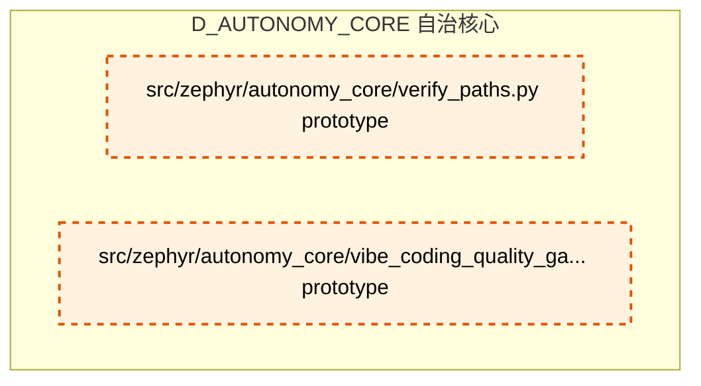

# 07_d_autonomy_core / 自治核心

> **文档作用 / Purpose**: 展示 自治核心（D_AUTONOMY_CORE）功能域的模块清单、域内依赖关系、跨域依赖关系、架构分层视图，供架构审查和域治理参考。

> 本文档由 generate_domain_doc.py 从 depgraph (PostgreSQL) 自动生成
> 最后更新: 2026-07-01 04:34:11
> 数据源: depgraph (PostgreSQL) nodes表 + edges表

## 域基本信息 / Domain Overview

| 字段 | 值 | Field | Value |
|------|------|-------|-------|
| 编号 | 07 | Number | 07 |
| 域ID | D_AUTONOMY_CORE | Domain ID | D_AUTONOMY_CORE |
| 域名称 | 自治核心 | Domain Name | 自治核心 |
| 层级 | L1_foundation | Layer | L1_foundation |
| 模块数 | 62 | Module Count | 62 |
| 域内依赖 | 55 | Internal Dependencies | 55 |
| 跨域入边 | 223 | Cross-domain Incoming | 223 |
| 跨域出边 | 46 | Cross-domain Outgoing | 46 |
| 设计态模块 | 0 | Design Modules | 0 |
| 原型态模块 | 61 | Prototype Modules | 61 |
| 生产态模块 | 1 | Production Modules | 1 |
| 容量 | 2/150 (正常) | Capacity | 2/150 (正常) |
| 描述 | A2A Card注册与发现(card_registry) | Description | A2A Card注册与发现(card_registry) |

## 域内依赖图 / Internal Dependency Diagram

> 依赖图内嵌在本文档中，IDE 可直接渲染显示。每30个节点一组分页显示。
>
> **图例说明 / Legend**：
> - **实线边框 = 运营态模块**（production，已上线运行）
> - **虚线边框 = 设计态模块**（design，还在设计中）
> - **实线箭头 = 运营态依赖**（已生效的依赖关系）
> - **虚线箭头 = 设计态依赖**（计划中的依赖关系）

### 第 1 页 / 共 3 页 / Page 1 of 3

```mermaid
graph TD
    subgraph D_AUTONOMY_CORE["D_AUTONOMY_CORE 自治核心"]
        src_zephyr_autonomy_core_init_py["src/zephyr/autonomy_core/__init__.py production"]
        src_zephyr_autonomy_core_main_py["src/zephyr/autonomy_core/__main__.py prototype"]
        src_zephyr_autonomy_core_adversarial_robustness_py["src/zephyr/autonomy_core/adversarial_robustness.py prototype"]
        src_zephyr_autonomy_core_agent_observability_py["src/zephyr/autonomy_core/agent_observability.py prototype"]
        src_zephyr_autonomy_core_alignment_scorer_py["src/zephyr/autonomy_core/alignment_scorer.py prototype"]
        src_zephyr_autonomy_core_all_skill_modules_py["src/zephyr/autonomy_core/all_skill_modules.py prototype"]
        src_zephyr_autonomy_core_architecture_context_loader_py["src/zephyr/autonomy_core/architecture_context_l... prototype"]
        src_zephyr_autonomy_core_atomic_injector_py["src/zephyr/autonomy_core/atomic_injector.py prototype"]
        src_zephyr_autonomy_core_budget_forecaster_py["src/zephyr/autonomy_core/budget_forecaster.py prototype"]
        src_zephyr_autonomy_core_cache_invalidation_py["src/zephyr/autonomy_core/cache_invalidation.py prototype"]
        src_zephyr_autonomy_core_checkpoint_manager_py["src/zephyr/autonomy_core/checkpoint_manager.py prototype"]
        src_zephyr_autonomy_core_citation_walker_py["src/zephyr/autonomy_core/citation_walker.py prototype"]
        src_zephyr_autonomy_core_cold_start_booster_py["src/zephyr/autonomy_core/cold_start_booster.py prototype"]
        src_zephyr_autonomy_core_complexity_budget_py["src/zephyr/autonomy_core/complexity_budget.py prototype"]
        src_zephyr_autonomy_core_config_safety_guard_py["src/zephyr/autonomy_core/config_safety_guard.py prototype"]
        src_zephyr_autonomy_core_contextual_fetch_api_py["src/zephyr/autonomy_core/contextual_fetch_api.py prototype"]
        src_zephyr_autonomy_core_curation_loop_py["src/zephyr/autonomy_core/curation_loop.py prototype"]
        src_zephyr_autonomy_core_dependency_tracker_py["src/zephyr/autonomy_core/dependency_tracker.py prototype"]
        src_zephyr_autonomy_core_diff_injector_py["src/zephyr/autonomy_core/diff_injector.py prototype"]
        src_zephyr_autonomy_core_dispatch_table_py["src/zephyr/autonomy_core/dispatch_table.py prototype"]
        src_zephyr_autonomy_core_diversity_constraint_py["src/zephyr/autonomy_core/diversity_constraint.py prototype"]
        src_zephyr_autonomy_core_doc_compressor_py["src/zephyr/autonomy_core/doc_compressor.py prototype"]
        src_zephyr_autonomy_core_domain_decay_config_py["src/zephyr/autonomy_core/domain_decay_config.py prototype"]
        src_zephyr_autonomy_core_embedding_version_lock_py["src/zephyr/autonomy_core/embedding_version_lock.py prototype"]
        src_zephyr_autonomy_core_fallback_staleness_gate_py["src/zephyr/autonomy_core/fallback_staleness_gat... prototype"]
        src_zephyr_autonomy_core_file_autoregister_py["src/zephyr/autonomy_core/file_autoregister.py prototype"]
        src_zephyr_autonomy_core_fragmentation_index_py["src/zephyr/autonomy_core/fragmentation_index.py prototype"]
        src_zephyr_autonomy_core_host_resource_governor_py["src/zephyr/autonomy_core/host_resource_governor.py prototype"]
        src_zephyr_autonomy_core_ide_watcher_py["src/zephyr/autonomy_core/ide_watcher.py prototype"]
        src_zephyr_autonomy_core_integration_init_py["src/zephyr/autonomy_core/integration/__init__.py prototype"]
    end
    src_zephyr_autonomy_core_architecture_context_loader_py -.->|config_depends| src_zephyr_autonomy_core_init_py
    src_zephyr_autonomy_core_adversarial_robustness_py -.->|config_depends| src_zephyr_autonomy_core_init_py
    src_zephyr_autonomy_core_all_skill_modules_py -.->|config_depends| src_zephyr_autonomy_core_init_py
    src_zephyr_autonomy_core_alignment_scorer_py -.->|config_depends| src_zephyr_autonomy_core_init_py
    src_zephyr_autonomy_core_agent_observability_py -.->|config_depends| src_zephyr_autonomy_core_init_py
    src_zephyr_autonomy_core_budget_forecaster_py -.->|config_depends| src_zephyr_autonomy_core_init_py
    src_zephyr_autonomy_core_atomic_injector_py -.->|config_depends| src_zephyr_autonomy_core_init_py
    src_zephyr_autonomy_core_cache_invalidation_py -.->|config_depends| src_zephyr_autonomy_core_init_py
    src_zephyr_autonomy_core_checkpoint_manager_py -.->|config_depends| src_zephyr_autonomy_core_init_py
    src_zephyr_autonomy_core_cold_start_booster_py -.->|config_depends| src_zephyr_autonomy_core_init_py
    src_zephyr_autonomy_core_citation_walker_py -.->|config_depends| src_zephyr_autonomy_core_init_py
    src_zephyr_autonomy_core_complexity_budget_py -.->|config_depends| src_zephyr_autonomy_core_init_py
    src_zephyr_autonomy_core_contextual_fetch_api_py -.->|config_depends| src_zephyr_autonomy_core_init_py
    src_zephyr_autonomy_core_config_safety_guard_py -.->|config_depends| src_zephyr_autonomy_core_init_py
    src_zephyr_autonomy_core_dependency_tracker_py -.->|config_depends| src_zephyr_autonomy_core_init_py
    src_zephyr_autonomy_core_domain_decay_config_py -.->|config_depends| src_zephyr_autonomy_core_init_py
    src_zephyr_autonomy_core_curation_loop_py -.->|config_depends| src_zephyr_autonomy_core_init_py
    src_zephyr_autonomy_core_diversity_constraint_py -.->|config_depends| src_zephyr_autonomy_core_init_py
    src_zephyr_autonomy_core_diff_injector_py -.->|config_depends| src_zephyr_autonomy_core_init_py
    src_zephyr_autonomy_core_dispatch_table_py -.->|config_depends| src_zephyr_autonomy_core_init_py
    src_zephyr_autonomy_core_embedding_version_lock_py -.->|config_depends| src_zephyr_autonomy_core_init_py
    src_zephyr_autonomy_core_file_autoregister_py -.->|config_depends| src_zephyr_autonomy_core_init_py
    src_zephyr_autonomy_core_fallback_staleness_gate_py -.->|config_depends| src_zephyr_autonomy_core_init_py
    src_zephyr_autonomy_core_host_resource_governor_py -.->|config_depends| src_zephyr_autonomy_core_init_py
    src_zephyr_autonomy_core_fragmentation_index_py -.->|config_depends| src_zephyr_autonomy_core_init_py
    src_zephyr_autonomy_core_ide_watcher_py -.->|config_depends| src_zephyr_autonomy_core_init_py
    src_zephyr_autonomy_core_main_py -.->|import_depends| src_zephyr_autonomy_core_init_py
    D_GOVERNANCE["D_GOVERNANCE design"]
    src_zephyr_autonomy_core_all_skill_modules_py -.->|runtime| D_GOVERNANCE
    src_zephyr_autonomy_core_all_skill_modules_py -.->|runtime| D_GOVERNANCE
    D_AUDITTEST["D_AUDITTEST production"]
    src_zephyr_autonomy_core_all_skill_modules_py -.->|runtime| D_AUDITTEST
    D_GOV_AUDIT["D_GOV_AUDIT production"]
    src_zephyr_autonomy_core_all_skill_modules_py -.->|runtime| D_GOV_AUDIT
    src_zephyr_autonomy_core_all_skill_modules_py -.->|runtime| D_GOVERNANCE
    src_zephyr_autonomy_core_all_skill_modules_py -.->|runtime| D_GOVERNANCE
    src_zephyr_autonomy_core_all_skill_modules_py -.->|runtime| D_GOVERNANCE
    src_zephyr_autonomy_core_all_skill_modules_py -.->|runtime| D_GOVERNANCE
    D_EX_CORE["D_EX_CORE prototype"]
    src_zephyr_autonomy_core_all_skill_modules_py -.->|runtime| D_EX_CORE
    D_KNOWLEDGE["D_KNOWLEDGE design"]
    src_zephyr_autonomy_core_all_skill_modules_py -.->|contract| D_KNOWLEDGE
    D_GOVERNANCE -.->|import_depends| src_zephyr_autonomy_core_init_py
    D_GOVERNANCE -.->|import_depends| src_zephyr_autonomy_core_init_py
    D_INTEGRATION["D_INTEGRATION prototype"]
    D_INTEGRATION -.->|import_depends| src_zephyr_autonomy_core_init_py
    D_INTEGRATION -.->|import_depends| src_zephyr_autonomy_core_init_py
    D_INTELLIGENCE["D_INTELLIGENCE prototype"]
    D_INTELLIGENCE -.->|import_depends| src_zephyr_autonomy_core_init_py
    D_OPS["D_OPS prototype"]
    D_OPS -.->|import_depends| src_zephyr_autonomy_core_init_py
    D_GOVERNANCE -.->|contract| src_zephyr_autonomy_core_all_skill_modules_py
    D_TRADING["D_TRADING prototype"]
    D_TRADING -.->|import_depends| src_zephyr_autonomy_core_init_py
    D_TRADING -.->|import_depends| src_zephyr_autonomy_core_init_py
    D_TRADING -.->|import_depends| src_zephyr_autonomy_core_init_py
    D_GOVERNANCE -.->|import_depends| src_zephyr_autonomy_core_init_py
    classDef production fill:#e1f5fe,stroke:#01579b,stroke-width:2px,color:#000
    classDef design fill:#fff3e0,stroke:#e65100,stroke-width:2px,color:#000,stroke-dasharray: 5 5
    classDef external_prod fill:#e8f5e9,stroke:#1b5e20,stroke-width:1px,color:#000
    classDef external_design fill:#fce4ec,stroke:#880e4f,stroke-width:1px,color:#000,stroke-dasharray: 5 5
    class src_zephyr_autonomy_core_init_py production
    class src_zephyr_autonomy_core_main_py,src_zephyr_autonomy_core_adversarial_robustness_py,src_zephyr_autonomy_core_agent_observability_py,src_zephyr_autonomy_core_alignment_scorer_py,src_zephyr_autonomy_core_all_skill_modules_py,src_zephyr_autonomy_core_architecture_context_loader_py,src_zephyr_autonomy_core_atomic_injector_py,src_zephyr_autonomy_core_budget_forecaster_py,src_zephyr_autonomy_core_cache_invalidation_py,src_zephyr_autonomy_core_checkpoint_manager_py,src_zephyr_autonomy_core_citation_walker_py,src_zephyr_autonomy_core_cold_start_booster_py,src_zephyr_autonomy_core_complexity_budget_py,src_zephyr_autonomy_core_config_safety_guard_py,src_zephyr_autonomy_core_contextual_fetch_api_py,src_zephyr_autonomy_core_curation_loop_py,src_zephyr_autonomy_core_dependency_tracker_py,src_zephyr_autonomy_core_diff_injector_py,src_zephyr_autonomy_core_dispatch_table_py,src_zephyr_autonomy_core_diversity_constraint_py,src_zephyr_autonomy_core_doc_compressor_py,src_zephyr_autonomy_core_domain_decay_config_py,src_zephyr_autonomy_core_embedding_version_lock_py,src_zephyr_autonomy_core_fallback_staleness_gate_py,src_zephyr_autonomy_core_file_autoregister_py,src_zephyr_autonomy_core_fragmentation_index_py,src_zephyr_autonomy_core_host_resource_governor_py,src_zephyr_autonomy_core_ide_watcher_py,src_zephyr_autonomy_core_integration_init_py design
    class D_AUDITTEST,D_GOV_AUDIT external_prod
    class D_GOVERNANCE,D_EX_CORE,D_KNOWLEDGE,D_INTEGRATION,D_INTELLIGENCE,D_OPS,D_TRADING external_design
```



### 第 2 页 / 共 3 页 / Page 2 of 3


### 第 3 页 / 共 3 页 / Page 3 of 3



## 跨域依赖 / Cross-domain Dependencies

### 本域依赖的其他域（出边）/ Depends On

| 目标域 / Target Domain | 依赖数 / Count | 依赖类型 / Type |
|--------|:---:|---------|
| D_INTEGRATION | 17 | import_depends |
| D_GOVERNANCE | 8 | import_depends,runtime |
| D_AUDITTEST | 6 | contract,data,runtime |
| D_GOV_AUDIT | 4 | import_depends,runtime |
| D_SHARED | 3 | import_depends |
| D_SECURITY | 3 | import_depends |
| D_INTELLIGENCE | 2 | import_depends |
| D_KNOWLEDGE | 1 | contract |
| D_EX_CORE | 1 | runtime |
| D_GOV_ENFORCEMENT | 1 | import_depends |

### 依赖本域的其他域（入边）/ Depended By

| 源域 / Source Domain | 依赖数 / Count | 依赖类型 / Type |
|------|:---:|---------|
| D_GOVERNANCE | 209 | contract,import_depends,test_depends |
| D_OPS | 6 | import_depends,test_depends |
| D_TRADING | 3 | import_depends |
| D_INTEGRATION | 2 | import_depends |
| D_INTELLIGENCE | 1 | import_depends |
| D_AUTONOMY_PERM | 1 | test_depends |
| D_KNOWLEDGE | 1 | test_depends |

## 架构分层视图 / Architecture Overview

> 按 architecture_layer 分层显示 自治核心（D_AUTONOMY_CORE）的模块分布。共 62 个模块 / 62 modules。

```

┌──────────────────────────────────────────────────────────────────┐
│            L1 基础层 / Foundation Layer (62 modules)             │
├──────────────────────────────────────────────────────────────────┤
│   src/zephyr/autonomy_core/__init__.py  [production]             │
│   src/zephyr/autonomy_core/__main__.py  [prototype]              │
│   src/zephyr/autonomy_core/adversarial_robustness.py  [protot... │
│   src/zephyr/autonomy_core/agent_observability.py  [prototype]   │
│   src/zephyr/autonomy_core/alignment_scorer.py  [prototype]      │
│   src/zephyr/autonomy_core/all_skill_modules.py  [prototype]     │
│   src/zephyr/autonomy_core/architecture_context_loader.py  [p... │
│   src/zephyr/autonomy_core/atomic_injector.py  [prototype]       │
│   src/zephyr/autonomy_core/budget_forecaster.py  [prototype]     │
│   src/zephyr/autonomy_core/cache_invalidation.py  [prototype]    │
│   src/zephyr/autonomy_core/checkpoint_manager.py  [prototype]    │
│   src/zephyr/autonomy_core/citation_walker.py  [prototype]       │
│   src/zephyr/autonomy_core/cold_start_booster.py  [prototype]    │
│   src/zephyr/autonomy_core/complexity_budget.py  [prototype]     │
│   src/zephyr/autonomy_core/config_safety_guard.py  [prototype]   │
│   src/zephyr/autonomy_core/contextual_fetch_api.py  [prototype]  │
│   src/zephyr/autonomy_core/curation_loop.py  [prototype]         │
│   src/zephyr/autonomy_core/dependency_tracker.py  [prototype]    │
│   ...还有 44 个模块 / 44 more modules                            │
└──────────────────────────────────────────────────────────────────┘

```

## 模块分层清单 / Module Layered List

> 按 architecture_layer 分组的模块清单（共 62 个模块 / 62 modules）。

### L1 基础层 / Foundation Layer (62 modules)

| # | 模块路径 / Module Path | 模块名称 / Module Name | 成熟度 / Maturity | 构建状态 / Build Status |
|:--:|---------|---------|:---:|:---:|
| 1 | src/zephyr/autonomy_core/__init__.py | src/zephyr/autonomy_core/__init__.py | production | generated |
| 2 | src/zephyr/autonomy_core/__main__.py | src/zephyr/autonomy_core/__main__.py | prototype | generated |
| 3 | src/zephyr/autonomy_core/adversarial_robustness.py | src/zephyr/autonomy_core/adversarial_... | prototype | generated |
| 4 | src/zephyr/autonomy_core/agent_observability.py | src/zephyr/autonomy_core/agent_observ... | prototype | generated |
| 5 | src/zephyr/autonomy_core/alignment_scorer.py | src/zephyr/autonomy_core/alignment_sc... | prototype | generated |
| 6 | src/zephyr/autonomy_core/all_skill_modules.py | src/zephyr/autonomy_core/all_skill_mo... | prototype | generated |
| 7 | src/zephyr/autonomy_core/architecture_context_loader.py | src/zephyr/autonomy_core/architecture... | prototype | generated |
| 8 | src/zephyr/autonomy_core/atomic_injector.py | src/zephyr/autonomy_core/atomic_injec... | prototype | generated |
| 9 | src/zephyr/autonomy_core/budget_forecaster.py | src/zephyr/autonomy_core/budget_forec... | prototype | generated |
| 10 | src/zephyr/autonomy_core/cache_invalidation.py | src/zephyr/autonomy_core/cache_invali... | prototype | generated |
| 11 | src/zephyr/autonomy_core/checkpoint_manager.py | src/zephyr/autonomy_core/checkpoint_m... | prototype | generated |
| 12 | src/zephyr/autonomy_core/citation_walker.py | src/zephyr/autonomy_core/citation_wal... | prototype | generated |
| 13 | src/zephyr/autonomy_core/cold_start_booster.py | src/zephyr/autonomy_core/cold_start_b... | prototype | generated |
| 14 | src/zephyr/autonomy_core/complexity_budget.py | src/zephyr/autonomy_core/complexity_b... | prototype | generated |
| 15 | src/zephyr/autonomy_core/config_safety_guard.py | src/zephyr/autonomy_core/config_safet... | prototype | generated |
| 16 | src/zephyr/autonomy_core/contextual_fetch_api.py | src/zephyr/autonomy_core/contextual_f... | prototype | generated |
| 17 | src/zephyr/autonomy_core/curation_loop.py | src/zephyr/autonomy_core/curation_loo... | prototype | generated |
| 18 | src/zephyr/autonomy_core/dependency_tracker.py | src/zephyr/autonomy_core/dependency_t... | prototype | generated |
| 19 | src/zephyr/autonomy_core/diff_injector.py | src/zephyr/autonomy_core/diff_injecto... | prototype | generated |
| 20 | src/zephyr/autonomy_core/dispatch_table.py | src/zephyr/autonomy_core/dispatch_tab... | prototype | generated |
| 21 | src/zephyr/autonomy_core/diversity_constraint.py | src/zephyr/autonomy_core/diversity_co... | prototype | generated |
| 22 | src/zephyr/autonomy_core/doc_compressor.py | src/zephyr/autonomy_core/doc_compress... | prototype | generated |
| 23 | src/zephyr/autonomy_core/domain_decay_config.py | src/zephyr/autonomy_core/domain_decay... | prototype | generated |
| 24 | src/zephyr/autonomy_core/embedding_version_lock.py | src/zephyr/autonomy_core/embedding_ve... | prototype | generated |
| 25 | src/zephyr/autonomy_core/fallback_staleness_gate.py | src/zephyr/autonomy_core/fallback_sta... | prototype | generated |
| 26 | src/zephyr/autonomy_core/file_autoregister.py | src/zephyr/autonomy_core/file_autoreg... | prototype | generated |
| 27 | src/zephyr/autonomy_core/fragmentation_index.py | src/zephyr/autonomy_core/fragmentatio... | prototype | generated |
| 28 | src/zephyr/autonomy_core/host_resource_governor.py | src/zephyr/autonomy_core/host_resourc... | prototype | generated |
| 29 | src/zephyr/autonomy_core/ide_watcher.py | src/zephyr/autonomy_core/ide_watcher.py | prototype | generated |
| 30 | src/zephyr/autonomy_core/integration/__init__.py | src/zephyr/autonomy_core/integration/... | prototype | generated |
| 31 | src/zephyr/autonomy_core/integration/pipeline_bridge.py | src/zephyr/autonomy_core/integration/... | prototype | generated |
| 32 | src/zephyr/autonomy_core/integrity_check.py | src/zephyr/autonomy_core/integrity_ch... | prototype | generated |
| 33 | src/zephyr/autonomy_core/intent_keyword_mapper.py | src/zephyr/autonomy_core/intent_keywo... | prototype | generated |
| 34 | src/zephyr/autonomy_core/intent_parser.py | src/zephyr/autonomy_core/intent_parse... | prototype | generated |
| 35 | src/zephyr/autonomy_core/kill_switch.py | src/zephyr/autonomy_core/kill_switch.py | prototype | generated |
| 36 | src/zephyr/autonomy_core/knowledge_distiller.py | src/zephyr/autonomy_core/knowledge_di... | prototype | generated |
| 37 | src/zephyr/autonomy_core/lsg_pattern_tracker.py | src/zephyr/autonomy_core/lsg_pattern_... | prototype | generated |
| 38 | src/zephyr/autonomy_core/memory_bank.py | src/zephyr/autonomy_core/memory_bank.py | prototype | generated |
| 39 | src/zephyr/autonomy_core/mode_manager.py | src/zephyr/autonomy_core/mode_manager.py | prototype | generated |
| 40 | src/zephyr/autonomy_core/otel_instrumentation.py | src/zephyr/autonomy_core/otel_instrum... | prototype | generated |
| 41 | src/zephyr/autonomy_core/pattern_library.py | src/zephyr/autonomy_core/pattern_libr... | prototype | generated |
| 42 | src/zephyr/autonomy_core/phase_planner.py | src/zephyr/autonomy_core/phase_planne... | prototype | generated |
| 43 | src/zephyr/autonomy_core/pipeline_orchestrator.py | src/zephyr/autonomy_core/pipeline_orc... | prototype | generated |
| 44 | src/zephyr/autonomy_core/poisoning_monitor.py | src/zephyr/autonomy_core/poisoning_mo... | prototype | generated |
| 45 | src/zephyr/autonomy_core/position_optimizer.py | src/zephyr/autonomy_core/position_opt... | prototype | generated |
| 46 | src/zephyr/autonomy_core/progressive_disclosure_injector.py | src/zephyr/autonomy_core/progressive_... | prototype | generated |
| 47 | src/zephyr/autonomy_core/prompt_registry.py | src/zephyr/autonomy_core/prompt_regis... | prototype | generated |
| 48 | src/zephyr/autonomy_core/self_diagnosis.py | src/zephyr/autonomy_core/self_diagnos... | prototype | generated |
| 49 | src/zephyr/autonomy_core/self_evolution_fidelity_gate.py | src/zephyr/autonomy_core/self_evoluti... | prototype | generated |
| 50 | src/zephyr/autonomy_core/sensitivity_classifier.py | src/zephyr/autonomy_core/sensitivity_... | prototype | generated |
| 51 | src/zephyr/autonomy_core/session_learner.py | src/zephyr/autonomy_core/session_lear... | prototype | generated |
| 52 | src/zephyr/autonomy_core/shadow_canary.py | src/zephyr/autonomy_core/shadow_canar... | prototype | generated |
| 53 | src/zephyr/autonomy_core/solo_dev_safety_net.py | src/zephyr/autonomy_core/solo_dev_saf... | prototype | generated |
| 54 | src/zephyr/autonomy_core/staleness_manager.py | src/zephyr/autonomy_core/staleness_ma... | prototype | generated |
| 55 | src/zephyr/autonomy_core/system_snapshot.py | src/zephyr/autonomy_core/system_snaps... | prototype | generated |
| 56 | src/zephyr/autonomy_core/task_context_builder.py | src/zephyr/autonomy_core/task_context... | prototype | generated |
| 57 | src/zephyr/autonomy_core/token_budget.py | src/zephyr/autonomy_core/token_budget.py | prototype | generated |
| 58 | src/zephyr/autonomy_core/trigger_router.py | src/zephyr/autonomy_core/trigger_rout... | prototype | generated |
| 59 | src/zephyr/autonomy_core/vector_bridge.py | src/zephyr/autonomy_core/vector_bridg... | prototype | generated |
| 60 | src/zephyr/autonomy_core/vector_writer.py | src/zephyr/autonomy_core/vector_write... | prototype | generated |
| 61 | src/zephyr/autonomy_core/verify_paths.py | src/zephyr/autonomy_core/verify_paths.py | prototype | generated |
| 62 | src/zephyr/autonomy_core/vibe_coding_quality_gate.py | src/zephyr/autonomy_core/vibe_coding_... | prototype | generated |

## 依赖关系图 / Dependency Graph

> 域内模块依赖关系（共 55 条 / 55 edges）。按依赖类型分组，使用 → 表示方向。

```

┌──────────────────────────────────────────────────────────────────┐
│       依赖关系图 / Dependency Graph (共 55 条 / 55 edges)        │
├──────────────────────────────────────────────────────────────────┤
│   依赖类型数 / Dependency Types: 2                               │
│   [config_depends]: 50 条 / edges                                │
│   [import_depends]: 5 条 / edges                                 │
└──────────────────────────────────────────────────────────────────┘

┌──────────────────────────────────────────────────────────────────┐
│                 [config_depends] (50 条 / edges)                 │
├──────────────────────────────────────────────────────────────────┤
│   architecture_context_load... → __init__.py                     │
│   adversarial_robustness.py → __init__.py                        │
│   all_skill_modules.py → __init__.py                             │
│   alignment_scorer.py → __init__.py                              │
│   agent_observability.py → __init__.py                           │
│   budget_forecaster.py → __init__.py                             │
│   atomic_injector.py → __init__.py                               │
│   cache_invalidation.py → __init__.py                            │
│   checkpoint_manager.py → __init__.py                            │
│   cold_start_booster.py → __init__.py                            │
│   citation_walker.py → __init__.py                               │
│   complexity_budget.py → __init__.py                             │
│   contextual_fetch_api.py → __init__.py                          │
│   config_safety_guard.py → __init__.py                           │
│   dependency_tracker.py → __init__.py                            │
│   domain_decay_config.py → __init__.py                           │
│   curation_loop.py → __init__.py                                 │
│   diversity_constraint.py → __init__.py                          │
│   diff_injector.py → __init__.py                                 │
│   dispatch_table.py → __init__.py                                │
│   embedding_version_lock.py → __init__.py                        │
│   file_autoregister.py → __init__.py                             │
│   fallback_staleness_gate.py → __init__.py                       │
│   host_resource_governor.py → __init__.py                        │
│   fragmentation_index.py → __init__.py                           │
│   integrity_check.py → __init__.py                               │
│   knowledge_distiller.py → __init__.py                           │
│   ide_watcher.py → __init__.py                                   │
│   kill_switch.py → __init__.py                                   │
│   lsg_pattern_tracker.py → __init__.py                           │
│   mode_manager.py → __init__.py                                  │
│   memory_bank.py → __init__.py                                   │
│   otel_instrumentation.py → __init__.py                          │
│   poisoning_monitor.py → __init__.py                             │
│   phase_planner.py → __init__.py                                 │
│   progressive_disclosure_in... → __init__.py                     │
│   position_optimizer.py → __init__.py                            │
│   self_evolution_fidelity_g... → __init__.py                     │
│   self_diagnosis.py → __init__.py                                │
│   shadow_canary.py → __init__.py                                 │
│   session_learner.py → __init__.py                               │
│   sensitivity_classifier.py → __init__.py                        │
│   solo_dev_safety_net.py → __init__.py                           │
│   token_budget.py → __init__.py                                  │
│   staleness_manager.py → __init__.py                             │
│   trigger_router.py → __init__.py                                │
│   vector_bridge.py → __init__.py                                 │
│   vibe_coding_quality_gate.py → __init__.py                      │
│   verify_paths.py → __init__.py                                  │
│   __init__.py → pipeline_bridge.py                               │
└──────────────────────────────────────────────────────────────────┘

**[import_depends]** (5 条 / edges) — 已达显示上限，省略 / limit reached

> (最多显示前 50 条依赖边，共 55 条)

```

## 说明 / Notes

- **数据源 / Data Source**: `depgraph (PostgreSQL)` 的 `nodes`、`edges`、`domains` 表
- **生成器 / Generator**: `generate_domain_doc.py`（G2+G10 合并）
- **维护方式 / Maintenance**: 自动生成，全景图更新时刷新
- **文件名规则 / File Naming**: `{编号:02d}_{域ID小写}.md`，如 `16_d_trading.md`
- **图例说明 / Legend**: `[production]`=已上线 / `[design]`=设计中 / `[prototype]`=原型 / `[unknown]`=未知
