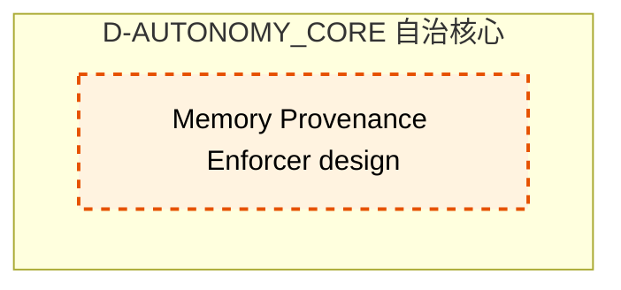

# 07_d_autonomy_core / 自治核心

> **文档作用 / Purpose**: 展示 自治核心（D-AUTONOMY_CORE）功能域的模块清单、域内依赖关系和跨域依赖关系，供架构审查和域治理参考。

> 本文档由 generate_domain_doc.py 从 depgraph.db 自动生成
> 最后更新: 2026-06-25 18:42:45
> 数据源: depgraph.db nodes表 + edges表

## 域基本信息 / Domain Overview

| 字段 | 值 | Field | Value |
|------|------|-------|-------|
| 编号 | 07 | Number | 07 |
| 域ID | D-AUTONOMY_CORE | Domain ID | D-AUTONOMY_CORE |
| 域名称 | 自治核心 | Domain Name | agent_communication |
| 层级 | L1_foundation | Layer | L1_foundation |
| 模块数 | 181 | Module Count | 181 |
| 域内依赖 | 153 | Internal Dependencies | 153 |
| 跨域入边 | 228 | Cross-domain Incoming | 228 |
| 跨域出边 | 46 | Cross-domain Outgoing | 46 |
| 设计态模块 | 5 | Design Modules | 5 |
| 原型态模块 | 174 | Prototype Modules | 174 |
| 生产态模块 | 2 | Production Modules | 2 |
| 容量 | 2/150 (正常) | Capacity | 2/150 (正常) |
| 描述 | A2A Card注册与发现(card_registry) | Description | A2A Card注册与发现(card_registry) |

## 模块清单 / Module List

共 181 个模块（按路径排序，全部显示）

| 模块路径 / Module Path | 模块名称 / Module Name | 设计成熟度 / Maturity | 构建状态 / Build Status |
|---------|---------|-----------|---------|
| F23-agent-orchestrator/ |  | design | stable |
| F24-agent-spec/ |  | design | stable |
| F32-state-machine/ |  | design | stable |
| src/zephyr/autonomy_core/__init__.py |  | production | generated |
| src/zephyr/autonomy_core/__init___from_orches.py |  | prototype | generated |
| src/zephyr/autonomy_core/__main__.py |  | prototype | generated |
| src/zephyr/autonomy_core/_extensions/__init__.py |  | prototype | deprecated |
| src/zephyr/autonomy_core/_infrastructure.py |  | prototype | generated |
| src/zephyr/autonomy_core/_injection.py |  | prototype | generated |
| src/zephyr/autonomy_core/_pipeline.py |  | prototype | generated |
| src/zephyr/autonomy_core/_safety.py |  | prototype | generated |
| src/zephyr/autonomy_core/adversarial_robustness.py |  | prototype | generated |
| src/zephyr/autonomy_core/agent_observability.py |  | prototype | generated |
| src/zephyr/autonomy_core/alignment_scorer.py |  | prototype | generated |
| src/zephyr/autonomy_core/all_skill_modules.py |  | prototype | generated |
| src/zephyr/autonomy_core/api/__init__.py |  | prototype | deprecated |
| src/zephyr/autonomy_core/architecture_context_loader.py |  | prototype | generated |
| src/zephyr/autonomy_core/assembly/__init__.py |  | prototype | generated |
| src/zephyr/autonomy_core/assembly/context_assembler.py |  | prototype | generated |
| src/zephyr/autonomy_core/assembly/context_injector.py |  | prototype | generated |
| src/zephyr/autonomy_core/assembly/context_pipeline.py |  | prototype | generated |
| src/zephyr/autonomy_core/atomic_injector.py |  | prototype | generated |
| src/zephyr/autonomy_core/budget_forecaster.py |  | prototype | generated |
| src/zephyr/autonomy_core/cache_invalidation.py |  | prototype | generated |
| src/zephyr/autonomy_core/ce_bootstrap.py |  | prototype | generated |
| src/zephyr/autonomy_core/ce_explain_cli.py |  | prototype | generated |
| src/zephyr/autonomy_core/ce_playground_v2.py |  | prototype | generated |
| src/zephyr/autonomy_core/ce_vibe_shortcuts.py |  | prototype | generated |
| src/zephyr/autonomy_core/checkpoint_manager.py |  | prototype | generated |
| src/zephyr/autonomy_core/citation_walker.py |  | prototype | generated |
| src/zephyr/autonomy_core/cold_start_booster.py |  | prototype | generated |
| src/zephyr/autonomy_core/complexity_budget.py |  | prototype | generated |
| src/zephyr/autonomy_core/config_safety_guard.py |  | prototype | generated |
| src/zephyr/autonomy_core/context_assembler.py |  | prototype | generated |
| src/zephyr/autonomy_core/context_budget.py |  | prototype | generated |
| src/zephyr/autonomy_core/context_budget_tracker.py |  | prototype | generated |
| src/zephyr/autonomy_core/context_debt_score.py |  | prototype | generated |
| src/zephyr/autonomy_core/context_evaluator.py |  | prototype | generated |
| src/zephyr/autonomy_core/context_evictor.py |  | prototype | generated |
| src/zephyr/autonomy_core/context_health_score.py |  | prototype | generated |
| src/zephyr/autonomy_core/context_injector.py |  | prototype | generated |
| src/zephyr/autonomy_core/context_model_strategy.py |  | prototype | generated |
| src/zephyr/autonomy_core/context_optimizer.py |  | prototype | generated |
| src/zephyr/autonomy_core/context_outcome_tracker.py |  | prototype | generated |
| src/zephyr/autonomy_core/context_pipeline.py |  | prototype | generated |
| src/zephyr/autonomy_core/context_pipeline_auto.py |  | production | generated |
| src/zephyr/autonomy_core/context_playground.py |  | prototype | generated |
| src/zephyr/autonomy_core/context_rot_model.py |  | prototype | generated |
| src/zephyr/autonomy_core/context_rule_registry.py |  | prototype | generated |
| src/zephyr/autonomy_core/context_value_attribution.py |  | prototype | generated |
| src/zephyr/autonomy_core/contextual_fetch_api.py |  | prototype | generated |
| src/zephyr/autonomy_core/core/__init__.py |  | prototype | deprecated |
| src/zephyr/autonomy_core/curation_loop.py |  | prototype | generated |
| src/zephyr/autonomy_core/dependency_tracker.py |  | prototype | generated |
| src/zephyr/autonomy_core/diff_injector.py |  | prototype | generated |
| src/zephyr/autonomy_core/dispatch_table.py |  | prototype | generated |
| src/zephyr/autonomy_core/diversity_constraint.py |  | prototype | generated |
| src/zephyr/autonomy_core/doc_compressor.py |  | prototype | generated |
| src/zephyr/autonomy_core/domain_decay_config.py |  | prototype | generated |
| src/zephyr/autonomy_core/embedding_version_lock.py |  | prototype | generated |
| src/zephyr/autonomy_core/engine.py |  | prototype | generated |
| src/zephyr/autonomy_core/fallback_staleness_gate.py |  | prototype | generated |
| src/zephyr/autonomy_core/file_autoregister.py |  | prototype | generated |
| src/zephyr/autonomy_core/file_autorregister.py |  | prototype | generated |
| src/zephyr/autonomy_core/fragmentation_index.py |  | prototype | generated |
| src/zephyr/autonomy_core/host_resource_governor.py |  | prototype | generated |
| src/zephyr/autonomy_core/ide_watcher.py |  | prototype | generated |
| src/zephyr/autonomy_core/infrastructure/__init__.py |  | prototype | deprecated |
| src/zephyr/autonomy_core/integration/__init__.py |  | prototype | generated |
| src/zephyr/autonomy_core/integration/pipeline_bridge.py |  | prototype | generated |
| src/zephyr/autonomy_core/integrity_check.py |  | prototype | generated |
| src/zephyr/autonomy_core/intent_keyword_mapper.py |  | prototype | generated |
| src/zephyr/autonomy_core/intent_parser.py |  | prototype | generated |
| src/zephyr/autonomy_core/kill_switch.py |  | prototype | generated |
| src/zephyr/autonomy_core/knowledge_distiller.py |  | prototype | generated |
| src/zephyr/autonomy_core/list_ce_files.py |  | prototype | generated |
| src/zephyr/autonomy_core/llm_gateway.py |  | prototype | generated |
| src/zephyr/autonomy_core/lsg_pattern_tracker.py |  | prototype | generated |
| src/zephyr/autonomy_core/management/__init__.py |  | prototype | generated |
| src/zephyr/autonomy_core/management/context_budget_tracker.py |  | prototype | generated |
| src/zephyr/autonomy_core/management/context_evictor.py |  | prototype | generated |
| src/zephyr/autonomy_core/management/context_rot_model.py |  | prototype | generated |
| src/zephyr/autonomy_core/mcp_adapter.py |  | prototype | generated |
| src/zephyr/autonomy_core/memory_bank.py |  | prototype | generated |
| src/zephyr/autonomy_core/mode_manager.py |  | prototype | generated |
| src/zephyr/autonomy_core/models/__init__.py |  | prototype | deprecated |
| src/zephyr/autonomy_core/otel_instrumentation.py |  | prototype | generated |
| src/zephyr/autonomy_core/parsing/__init__.py |  | prototype | generated |
| src/zephyr/autonomy_core/parsing/intent_keyword_mapper.py |  | prototype | generated |
| src/zephyr/autonomy_core/parsing/intent_parser.py |  | prototype | generated |
| src/zephyr/autonomy_core/pattern_library.py |  | prototype | generated |
| src/zephyr/autonomy_core/phase_planner.py |  | prototype | generated |
| src/zephyr/autonomy_core/pipeline_orchestrator.py |  | prototype | generated |
| src/zephyr/autonomy_core/poisoning_monitor.py |  | prototype | generated |
| src/zephyr/autonomy_core/position_optimizer.py |  | prototype | generated |
| src/zephyr/autonomy_core/progressive_disclosure_injector.py |  | prototype | generated |
| src/zephyr/autonomy_core/prompt_registry.py |  | prototype | generated |
| src/zephyr/autonomy_core/rational.py |  | prototype | generated |
| src/zephyr/autonomy_core/registry.py |  | prototype | generated |
| src/zephyr/autonomy_core/security_filter.py |  | prototype | generated |
| src/zephyr/autonomy_core/self_diagnosis.py |  | prototype | generated |
| src/zephyr/autonomy_core/self_evolution_fidelity_gate.py |  | prototype | generated |
| src/zephyr/autonomy_core/sensitivity_classifier.py |  | prototype | generated |
| src/zephyr/autonomy_core/services/__init__.py |  | prototype | deprecated |
| src/zephyr/autonomy_core/session_learner.py |  | prototype | generated |
| src/zephyr/autonomy_core/shadow_canary.py |  | prototype | generated |
| src/zephyr/autonomy_core/skill_attention.py |  | prototype | generated |
| src/zephyr/autonomy_core/skill_breakage_checker.py |  | prototype | generated |
| src/zephyr/autonomy_core/skill_cache_provider.py |  | prototype | generated |
| src/zephyr/autonomy_core/skill_calibration.py |  | prototype | generated |
| src/zephyr/autonomy_core/skill_canary.py |  | prototype | generated |
| src/zephyr/autonomy_core/skill_cognitive_preservation.py |  | prototype | generated |
| src/zephyr/autonomy_core/skill_compliance.py |  | prototype | generated |
| src/zephyr/autonomy_core/skill_consensus.py |  | prototype | generated |
| src/zephyr/autonomy_core/skill_constructor.py |  | prototype | generated |
| src/zephyr/autonomy_core/skill_context_isolation.py |  | prototype | generated |
| src/zephyr/autonomy_core/skill_contract.py |  | prototype | generated |
| src/zephyr/autonomy_core/skill_cross_model.py |  | prototype | generated |
| src/zephyr/autonomy_core/skill_di.py |  | prototype | generated |
| src/zephyr/autonomy_core/skill_discovery.py |  | prototype | generated |
| src/zephyr/autonomy_core/skill_durable.py |  | prototype | generated |
| src/zephyr/autonomy_core/skill_economics.py |  | prototype | generated |
| src/zephyr/autonomy_core/skill_efficacy_calibrator.py |  | prototype | generated |
| src/zephyr/autonomy_core/skill_evaluator.py |  | prototype | generated |
| src/zephyr/autonomy_core/skill_executor.py |  | prototype | generated |
| src/zephyr/autonomy_core/skill_explain.py |  | prototype | generated |
| src/zephyr/autonomy_core/skill_factory.py |  | prototype | generated |
| src/zephyr/autonomy_core/skill_feature_flags.py |  | prototype | generated |
| src/zephyr/autonomy_core/skill_feedback.py |  | prototype | generated |
| src/zephyr/autonomy_core/skill_freshness.py |  | prototype | generated |
| src/zephyr/autonomy_core/skill_freshness_ext.py |  | prototype | generated |
| src/zephyr/autonomy_core/skill_gitops.py |  | prototype | generated |
| src/zephyr/autonomy_core/skill_guardrails.py |  | prototype | generated |
| src/zephyr/autonomy_core/skill_idempotency.py |  | prototype | generated |
| src/zephyr/autonomy_core/skill_kill_switch.py |  | prototype | generated |
| src/zephyr/autonomy_core/skill_knowledge_base.py |  | prototype | generated |
| src/zephyr/autonomy_core/skill_kya.py |  | prototype | generated |
| src/zephyr/autonomy_core/skill_learning.py |  | prototype | generated |
| src/zephyr/autonomy_core/skill_lifecycle.py |  | prototype | generated |
| src/zephyr/autonomy_core/skill_lineage.py |  | prototype | generated |
| src/zephyr/autonomy_core/skill_loader.py |  | prototype | generated |
| src/zephyr/autonomy_core/skill_locking.py |  | prototype | generated |
| src/zephyr/autonomy_core/skill_model.py |  | prototype | generated |
| src/zephyr/autonomy_core/skill_model_evolution.py |  | prototype | generated |
| src/zephyr/autonomy_core/skill_observability.py |  | prototype | generated |
| src/zephyr/autonomy_core/skill_ontology.py |  | prototype | generated |
| src/zephyr/autonomy_core/skill_postmortem.py |  | prototype | generated |
| src/zephyr/autonomy_core/skill_prompt_cache.py |  | prototype | generated |
| src/zephyr/autonomy_core/skill_prompt_opt.py |  | prototype | generated |
| src/zephyr/autonomy_core/skill_registry.py |  | prototype | generated |
| src/zephyr/autonomy_core/skill_resilience.py |  | prototype | generated |
| src/zephyr/autonomy_core/skill_risk_mitigator.py |  | prototype | generated |
| src/zephyr/autonomy_core/skill_router.py |  | prototype | generated |
| src/zephyr/autonomy_core/skill_sandbox.py |  | prototype | generated |
| src/zephyr/autonomy_core/skill_schema_registry.py |  | prototype | generated |
| src/zephyr/autonomy_core/skill_security.py |  | prototype | generated |
| src/zephyr/autonomy_core/skill_shadow.py |  | prototype | generated |
| src/zephyr/autonomy_core/skill_silent_failure.py |  | prototype | generated |
| src/zephyr/autonomy_core/skill_team_optimizer.py |  | prototype | generated |
| src/zephyr/autonomy_core/skill_telemetry.py |  | prototype | generated |
| src/zephyr/autonomy_core/skill_temperature.py |  | prototype | generated |
| src/zephyr/autonomy_core/skill_tokenomics.py |  | prototype | generated |
| src/zephyr/autonomy_core/skill_translator.py |  | prototype | generated |
| src/zephyr/autonomy_core/skill_workflow.py |  | prototype | generated |
| src/zephyr/autonomy_core/solo_dev_safety_net.py |  | prototype | generated |
| src/zephyr/autonomy_core/staleness_manager.py |  | prototype | generated |
| src/zephyr/autonomy_core/support/__init__.py |  | prototype | generated |
| src/zephyr/autonomy_core/support/architecture_context_loader.py |  | prototype | generated |
| src/zephyr/autonomy_core/support/doc_compressor.py |  | prototype | generated |
| src/zephyr/autonomy_core/support/prompt_registry.py |  | prototype | generated |
| src/zephyr/autonomy_core/support/system_snapshot.py |  | prototype | generated |
| src/zephyr/autonomy_core/system_snapshot.py |  | prototype | generated |
| src/zephyr/autonomy_core/task_context_builder.py |  | prototype | generated |
| src/zephyr/autonomy_core/token_budget.py |  | prototype | generated |
| src/zephyr/autonomy_core/trigger_router.py |  | prototype | generated |
| src/zephyr/autonomy_core/vector_bridge.py |  | prototype | generated |
| src/zephyr/autonomy_core/vector_writer.py |  | prototype | generated |
| src/zephyr/autonomy_core/verify_paths.py |  | prototype | generated |
| src/zephyr/autonomy_core/vibe_coding_quality_gate.py |  | prototype | generated |
| 自治-向量库验证/D-AUTONOMY-125 | ChromaDB Runtime Validator | design | planned |
| 自治-记忆溯源/D-AUTONOMY-73 | Memory Provenance Enforcer | design | planned |

## 域内依赖图 / Internal Dependency Diagram

> 依赖图内嵌在本文档中，IDE 可直接渲染显示。每30个节点一组分页显示。
>
> **图例说明 / Legend**：
> - **实线边框 = 运营态模块**（production，已上线运行）
> - **虚线边框 = 设计态模块**（design，还在设计中）
> - **实线箭头 = 运营态依赖**（已生效的依赖关系）
> - **虚线箭头 = 设计态依赖**（计划中的依赖关系）

### 第 1 页 / 共 7 页 / Page 1 of 7

```mermaid
graph TD
    subgraph D_AUTONOMY_CORE["D-AUTONOMY_CORE 自治核心"]
        F23_agent_orchestrator["F23-agent-orchestrator/ design"]
        F24_agent_spec["F24-agent-spec/ design"]
        F32_state_machine["F32-state-machine/ design"]
        src_zephyr_autonomy_core_init_py["src/zephyr/autonomy_core/__init__.py production"]
        src_zephyr_autonomy_core_init_from_orches_py["src/zephyr/autonomy_core/__init___from_orches.py prototype"]
        src_zephyr_autonomy_core_main_py["src/zephyr/autonomy_core/__main__.py prototype"]
        src_zephyr_autonomy_core_extensions_init_py["src/zephyr/autonomy_core/_extensions/__init__.py prototype"]
        src_zephyr_autonomy_core_infrastructure_py["src/zephyr/autonomy_core/_infrastructure.py prototype"]
        src_zephyr_autonomy_core_injection_py["src/zephyr/autonomy_core/_injection.py prototype"]
        src_zephyr_autonomy_core_pipeline_py["src/zephyr/autonomy_core/_pipeline.py prototype"]
        src_zephyr_autonomy_core_safety_py["src/zephyr/autonomy_core/_safety.py prototype"]
        src_zephyr_autonomy_core_adversarial_robustness_py["src/zephyr/autonomy_core/adversarial_robustness.py prototype"]
        src_zephyr_autonomy_core_agent_observability_py["src/zephyr/autonomy_core/agent_observability.py prototype"]
        src_zephyr_autonomy_core_alignment_scorer_py["src/zephyr/autonomy_core/alignment_scorer.py prototype"]
        src_zephyr_autonomy_core_all_skill_modules_py["src/zephyr/autonomy_core/all_skill_modules.py prototype"]
        src_zephyr_autonomy_core_api_init_py["src/zephyr/autonomy_core/api/__init__.py prototype"]
        src_zephyr_autonomy_core_architecture_context_loader_py["src/zephyr/autonomy_core/architecture_context_l... prototype"]
        src_zephyr_autonomy_core_assembly_init_py["src/zephyr/autonomy_core/assembly/__init__.py prototype"]
        src_zephyr_autonomy_core_assembly_context_assembler_py["src/zephyr/autonomy_core/assembly/context_assem... prototype"]
        src_zephyr_autonomy_core_assembly_context_injector_py["src/zephyr/autonomy_core/assembly/context_injec... prototype"]
        src_zephyr_autonomy_core_assembly_context_pipeline_py["src/zephyr/autonomy_core/assembly/context_pipel... prototype"]
        src_zephyr_autonomy_core_atomic_injector_py["src/zephyr/autonomy_core/atomic_injector.py prototype"]
        src_zephyr_autonomy_core_budget_forecaster_py["src/zephyr/autonomy_core/budget_forecaster.py prototype"]
        src_zephyr_autonomy_core_cache_invalidation_py["src/zephyr/autonomy_core/cache_invalidation.py prototype"]
        src_zephyr_autonomy_core_ce_bootstrap_py["src/zephyr/autonomy_core/ce_bootstrap.py prototype"]
        src_zephyr_autonomy_core_ce_explain_cli_py["src/zephyr/autonomy_core/ce_explain_cli.py prototype"]
        src_zephyr_autonomy_core_ce_playground_v2_py["src/zephyr/autonomy_core/ce_playground_v2.py prototype"]
        src_zephyr_autonomy_core_ce_vibe_shortcuts_py["src/zephyr/autonomy_core/ce_vibe_shortcuts.py prototype"]
        src_zephyr_autonomy_core_checkpoint_manager_py["src/zephyr/autonomy_core/checkpoint_manager.py prototype"]
        src_zephyr_autonomy_core_citation_walker_py["src/zephyr/autonomy_core/citation_walker.py prototype"]
    end
    src_zephyr_autonomy_core_architecture_context_loader_py -.->|config_depends| src_zephyr_autonomy_core_init_py
    src_zephyr_autonomy_core_adversarial_robustness_py -.->|config_depends| src_zephyr_autonomy_core_init_py
    src_zephyr_autonomy_core_all_skill_modules_py -.->|config_depends| src_zephyr_autonomy_core_init_py
    src_zephyr_autonomy_core_alignment_scorer_py -.->|config_depends| src_zephyr_autonomy_core_init_py
    src_zephyr_autonomy_core_agent_observability_py -.->|config_depends| src_zephyr_autonomy_core_init_py
    src_zephyr_autonomy_core_budget_forecaster_py -.->|config_depends| src_zephyr_autonomy_core_init_py
    src_zephyr_autonomy_core_atomic_injector_py -.->|config_depends| src_zephyr_autonomy_core_init_py
    src_zephyr_autonomy_core_cache_invalidation_py -.->|config_depends| src_zephyr_autonomy_core_init_py
    src_zephyr_autonomy_core_ce_bootstrap_py -.->|config_depends| src_zephyr_autonomy_core_init_py
    src_zephyr_autonomy_core_ce_explain_cli_py -.->|config_depends| src_zephyr_autonomy_core_init_py
    src_zephyr_autonomy_core_ce_vibe_shortcuts_py -.->|config_depends| src_zephyr_autonomy_core_init_py
    src_zephyr_autonomy_core_checkpoint_manager_py -.->|config_depends| src_zephyr_autonomy_core_init_py
    src_zephyr_autonomy_core_ce_playground_v2_py -.->|config_depends| src_zephyr_autonomy_core_init_py
    src_zephyr_autonomy_core_citation_walker_py -.->|config_depends| src_zephyr_autonomy_core_init_py
    src_zephyr_autonomy_core_injection_py -.->|config_depends| src_zephyr_autonomy_core_init_py
    src_zephyr_autonomy_core_safety_py -.->|config_depends| src_zephyr_autonomy_core_init_py
    src_zephyr_autonomy_core_infrastructure_py -.->|config_depends| src_zephyr_autonomy_core_init_py
    src_zephyr_autonomy_core_pipeline_py -.->|import_depends| src_zephyr_autonomy_core_init_py
    src_zephyr_autonomy_core_main_py -.->|import_depends| src_zephyr_autonomy_core_init_py
    src_zephyr_autonomy_core_assembly_context_assembler_py -.->|import_depends| src_zephyr_autonomy_core_init_py
    src_zephyr_autonomy_core_init_from_orches_py -.->|import_depends| src_zephyr_autonomy_core_init_py
    src_zephyr_autonomy_core_assembly_context_injector_py -.->|import_depends| src_zephyr_autonomy_core_init_py
    src_zephyr_autonomy_core_assembly_init_py -.->|config_depends| src_zephyr_autonomy_core_assembly_context_assembler_py
    src_zephyr_autonomy_core_assembly_context_pipeline_py -.->|import_depends| src_zephyr_autonomy_core_init_py
    F23_agent_orchestrator -.->|runtime| F32_state_machine
    D_INTEGRATION["D-INTEGRATION production"]
    src_zephyr_autonomy_core_assembly_context_assembler_py -.->|import_depends| D_INTEGRATION
    src_zephyr_autonomy_core_assembly_context_injector_py -.->|import_depends| D_INTEGRATION
    src_zephyr_autonomy_core_assembly_context_pipeline_py -.->|import_depends| D_INTEGRATION
    D_SHARED["D-SHARED design"]
    F23_agent_orchestrator -.->|runtime| D_SHARED
    F32_state_machine -.->|runtime| D_SHARED
    D_SECURITY["D-SECURITY design"]
    F24_agent_spec -.->|contract| D_SECURITY
    F24_agent_spec -.->|data| D_INTEGRATION
    D_GOVERNANCE["D-GOVERNANCE design"]
    D_GOVERNANCE -.->|contract| src_zephyr_autonomy_core_architecture_context_loader_py
    D_GOVERNANCE -.->|runtime| src_zephyr_autonomy_core_architecture_context_loader_py
    D_GOVERNANCE -.->|runtime| src_zephyr_autonomy_core_architecture_context_loader_py
    D_GOVERNANCE -.->|runtime| src_zephyr_autonomy_core_architecture_context_loader_py
    D_GOVERNANCE -.->|import_depends| src_zephyr_autonomy_core_init_py
    D_GOVERNANCE -.->|import_depends| src_zephyr_autonomy_core_init_py
    D_INTEGRATION -.->|import_depends| src_zephyr_autonomy_core_init_py
    D_INTEGRATION -.->|import_depends| src_zephyr_autonomy_core_init_py
    D_INTELLIGENCE["D-INTELLIGENCE prototype"]
    D_INTELLIGENCE -.->|import_depends| src_zephyr_autonomy_core_init_py
    D_OPS["D-OPS prototype"]
    D_OPS -.->|import_depends| src_zephyr_autonomy_core_init_py
    D_TRADING["D-TRADING prototype"]
    D_TRADING -.->|import_depends| src_zephyr_autonomy_core_init_py
    D_TRADING -.->|import_depends| src_zephyr_autonomy_core_init_py
    D_TRADING -.->|import_depends| src_zephyr_autonomy_core_init_py
    D_GOVERNANCE -.->|import_depends| src_zephyr_autonomy_core_init_py
    D_GOVERNANCE -.->|test_depends| src_zephyr_autonomy_core_init_py
    classDef production fill:#e1f5fe,stroke:#01579b,stroke-width:2px,color:#000
    classDef design fill:#fff3e0,stroke:#e65100,stroke-width:2px,color:#000,stroke-dasharray: 5 5
    classDef external_prod fill:#e8f5e9,stroke:#1b5e20,stroke-width:1px,color:#000
    classDef external_design fill:#fce4ec,stroke:#880e4f,stroke-width:1px,color:#000,stroke-dasharray: 5 5
    class src_zephyr_autonomy_core_init_py production
    class F23_agent_orchestrator,F24_agent_spec,F32_state_machine,src_zephyr_autonomy_core_init_from_orches_py,src_zephyr_autonomy_core_main_py,src_zephyr_autonomy_core_extensions_init_py,src_zephyr_autonomy_core_infrastructure_py,src_zephyr_autonomy_core_injection_py,src_zephyr_autonomy_core_pipeline_py,src_zephyr_autonomy_core_safety_py,src_zephyr_autonomy_core_adversarial_robustness_py,src_zephyr_autonomy_core_agent_observability_py,src_zephyr_autonomy_core_alignment_scorer_py,src_zephyr_autonomy_core_all_skill_modules_py,src_zephyr_autonomy_core_api_init_py,src_zephyr_autonomy_core_architecture_context_loader_py,src_zephyr_autonomy_core_assembly_init_py,src_zephyr_autonomy_core_assembly_context_assembler_py,src_zephyr_autonomy_core_assembly_context_injector_py,src_zephyr_autonomy_core_assembly_context_pipeline_py,src_zephyr_autonomy_core_atomic_injector_py,src_zephyr_autonomy_core_budget_forecaster_py,src_zephyr_autonomy_core_cache_invalidation_py,src_zephyr_autonomy_core_ce_bootstrap_py,src_zephyr_autonomy_core_ce_explain_cli_py,src_zephyr_autonomy_core_ce_playground_v2_py,src_zephyr_autonomy_core_ce_vibe_shortcuts_py,src_zephyr_autonomy_core_checkpoint_manager_py,src_zephyr_autonomy_core_citation_walker_py design
    class D_INTEGRATION external_prod
    class D_SHARED,D_SECURITY,D_GOVERNANCE,D_INTELLIGENCE,D_OPS,D_TRADING external_design
```

### 第 2 页 / 共 7 页 / Page 2 of 7

### 第 3 页 / 共 7 页 / Page 3 of 7

```mermaid
graph TD
    subgraph D_AUTONOMY_CORE["D-AUTONOMY_CORE 自治核心"]
        src_zephyr_autonomy_core_engine_py["src/zephyr/autonomy_core/engine.py prototype"]
        src_zephyr_autonomy_core_fallback_staleness_gate_py["src/zephyr/autonomy_core/fallback_staleness_gat... prototype"]
        src_zephyr_autonomy_core_file_autoregister_py["src/zephyr/autonomy_core/file_autoregister.py prototype"]
        src_zephyr_autonomy_core_file_autorregister_py["src/zephyr/autonomy_core/file_autorregister.py prototype"]
        src_zephyr_autonomy_core_fragmentation_index_py["src/zephyr/autonomy_core/fragmentation_index.py prototype"]
        src_zephyr_autonomy_core_host_resource_governor_py["src/zephyr/autonomy_core/host_resource_governor.py prototype"]
        src_zephyr_autonomy_core_ide_watcher_py["src/zephyr/autonomy_core/ide_watcher.py prototype"]
        src_zephyr_autonomy_core_infrastructure_init_py["src/zephyr/autonomy_core/infrastructure/__init_... prototype"]
        src_zephyr_autonomy_core_integration_init_py["src/zephyr/autonomy_core/integration/__init__.py prototype"]
        src_zephyr_autonomy_core_integration_pipeline_bridge_py["src/zephyr/autonomy_core/integration/pipeline_b... prototype"]
        src_zephyr_autonomy_core_integrity_check_py["src/zephyr/autonomy_core/integrity_check.py prototype"]
        src_zephyr_autonomy_core_intent_keyword_mapper_py["src/zephyr/autonomy_core/intent_keyword_mapper.py prototype"]
        src_zephyr_autonomy_core_intent_parser_py["src/zephyr/autonomy_core/intent_parser.py prototype"]
        src_zephyr_autonomy_core_kill_switch_py["src/zephyr/autonomy_core/kill_switch.py prototype"]
        src_zephyr_autonomy_core_knowledge_distiller_py["src/zephyr/autonomy_core/knowledge_distiller.py prototype"]
        src_zephyr_autonomy_core_list_ce_files_py["src/zephyr/autonomy_core/list_ce_files.py prototype"]
        src_zephyr_autonomy_core_llm_gateway_py["src/zephyr/autonomy_core/llm_gateway.py prototype"]
        src_zephyr_autonomy_core_lsg_pattern_tracker_py["src/zephyr/autonomy_core/lsg_pattern_tracker.py prototype"]
        src_zephyr_autonomy_core_management_init_py["src/zephyr/autonomy_core/management/__init__.py prototype"]
        src_zephyr_autonomy_core_management_context_budget_tracker_py["src/zephyr/autonomy_core/management/context_bud... prototype"]
        src_zephyr_autonomy_core_management_context_evictor_py["src/zephyr/autonomy_core/management/context_evi... prototype"]
        src_zephyr_autonomy_core_management_context_rot_model_py["src/zephyr/autonomy_core/management/context_rot... prototype"]
        src_zephyr_autonomy_core_mcp_adapter_py["src/zephyr/autonomy_core/mcp_adapter.py prototype"]
        src_zephyr_autonomy_core_memory_bank_py["src/zephyr/autonomy_core/memory_bank.py prototype"]
        src_zephyr_autonomy_core_mode_manager_py["src/zephyr/autonomy_core/mode_manager.py prototype"]
        src_zephyr_autonomy_core_models_init_py["src/zephyr/autonomy_core/models/__init__.py prototype"]
        src_zephyr_autonomy_core_otel_instrumentation_py["src/zephyr/autonomy_core/otel_instrumentation.py prototype"]
        src_zephyr_autonomy_core_parsing_init_py["src/zephyr/autonomy_core/parsing/__init__.py prototype"]
        src_zephyr_autonomy_core_parsing_intent_keyword_mapper_py["src/zephyr/autonomy_core/parsing/intent_keyword... prototype"]
        src_zephyr_autonomy_core_parsing_intent_parser_py["src/zephyr/autonomy_core/parsing/intent_parser.py prototype"]
    end
    src_zephyr_autonomy_core_integration_init_py -.->|config_depends| src_zephyr_autonomy_core_integration_pipeline_bridge_py
    src_zephyr_autonomy_core_management_init_py -.->|import_depends| src_zephyr_autonomy_core_management_context_rot_model_py
    src_zephyr_autonomy_core_management_init_py -.->|import_depends| src_zephyr_autonomy_core_management_context_evictor_py
    src_zephyr_autonomy_core_parsing_init_py -.->|config_depends| src_zephyr_autonomy_core_parsing_intent_parser_py
    D_INTEGRATION["D-INTEGRATION prototype"]
    src_zephyr_autonomy_core_engine_py -.->|import_depends| D_INTEGRATION
    D_GOV_AUDIT["D-GOV_AUDIT production"]
    src_zephyr_autonomy_core_engine_py -.->|import_depends| D_GOV_AUDIT
    src_zephyr_autonomy_core_intent_parser_py -.->|import_depends| D_INTEGRATION
    src_zephyr_autonomy_core_intent_keyword_mapper_py -.->|import_depends| D_INTEGRATION
    D_SECURITY["D-SECURITY production"]
    src_zephyr_autonomy_core_llm_gateway_py -.->|import_depends| D_SECURITY
    D_SHARED["D-SHARED prototype"]
    src_zephyr_autonomy_core_llm_gateway_py -.->|import_depends| D_SHARED
    src_zephyr_autonomy_core_management_context_budget_tracker_py -.->|import_depends| D_SHARED
    src_zephyr_autonomy_core_management_context_evictor_py -.->|import_depends| D_INTEGRATION
    src_zephyr_autonomy_core_parsing_intent_parser_py -.->|import_depends| D_INTEGRATION
    src_zephyr_autonomy_core_parsing_intent_keyword_mapper_py -.->|import_depends| D_INTEGRATION
    classDef production fill:#e1f5fe,stroke:#01579b,stroke-width:2px,color:#000
    classDef design fill:#fff3e0,stroke:#e65100,stroke-width:2px,color:#000,stroke-dasharray: 5 5
    classDef external_prod fill:#e8f5e9,stroke:#1b5e20,stroke-width:1px,color:#000
    classDef external_design fill:#fce4ec,stroke:#880e4f,stroke-width:1px,color:#000,stroke-dasharray: 5 5
    class src_zephyr_autonomy_core_engine_py,src_zephyr_autonomy_core_fallback_staleness_gate_py,src_zephyr_autonomy_core_file_autoregister_py,src_zephyr_autonomy_core_file_autorregister_py,src_zephyr_autonomy_core_fragmentation_index_py,src_zephyr_autonomy_core_host_resource_governor_py,src_zephyr_autonomy_core_ide_watcher_py,src_zephyr_autonomy_core_infrastructure_init_py,src_zephyr_autonomy_core_integration_init_py,src_zephyr_autonomy_core_integration_pipeline_bridge_py,src_zephyr_autonomy_core_integrity_check_py,src_zephyr_autonomy_core_intent_keyword_mapper_py,src_zephyr_autonomy_core_intent_parser_py,src_zephyr_autonomy_core_kill_switch_py,src_zephyr_autonomy_core_knowledge_distiller_py,src_zephyr_autonomy_core_list_ce_files_py,src_zephyr_autonomy_core_llm_gateway_py,src_zephyr_autonomy_core_lsg_pattern_tracker_py,src_zephyr_autonomy_core_management_init_py,src_zephyr_autonomy_core_management_context_budget_tracker_py,src_zephyr_autonomy_core_management_context_evictor_py,src_zephyr_autonomy_core_management_context_rot_model_py,src_zephyr_autonomy_core_mcp_adapter_py,src_zephyr_autonomy_core_memory_bank_py,src_zephyr_autonomy_core_mode_manager_py,src_zephyr_autonomy_core_models_init_py,src_zephyr_autonomy_core_otel_instrumentation_py,src_zephyr_autonomy_core_parsing_init_py,src_zephyr_autonomy_core_parsing_intent_keyword_mapper_py,src_zephyr_autonomy_core_parsing_intent_parser_py design
    class D_GOV_AUDIT,D_SECURITY external_prod
    class D_INTEGRATION,D_SHARED external_design
```

### 第 4 页 / 共 7 页 / Page 4 of 7

```mermaid
graph TD
    subgraph D_AUTONOMY_CORE["D-AUTONOMY_CORE 自治核心"]
        src_zephyr_autonomy_core_pattern_library_py["src/zephyr/autonomy_core/pattern_library.py prototype"]
        src_zephyr_autonomy_core_phase_planner_py["src/zephyr/autonomy_core/phase_planner.py prototype"]
        src_zephyr_autonomy_core_pipeline_orchestrator_py["src/zephyr/autonomy_core/pipeline_orchestrator.py prototype"]
        src_zephyr_autonomy_core_poisoning_monitor_py["src/zephyr/autonomy_core/poisoning_monitor.py prototype"]
        src_zephyr_autonomy_core_position_optimizer_py["src/zephyr/autonomy_core/position_optimizer.py prototype"]
        src_zephyr_autonomy_core_progressive_disclosure_injector_py["src/zephyr/autonomy_core/progressive_disclosure... prototype"]
        src_zephyr_autonomy_core_prompt_registry_py["src/zephyr/autonomy_core/prompt_registry.py prototype"]
        src_zephyr_autonomy_core_rational_py["src/zephyr/autonomy_core/rational.py prototype"]
        src_zephyr_autonomy_core_registry_py["src/zephyr/autonomy_core/registry.py prototype"]
        src_zephyr_autonomy_core_security_filter_py["src/zephyr/autonomy_core/security_filter.py prototype"]
        src_zephyr_autonomy_core_self_diagnosis_py["src/zephyr/autonomy_core/self_diagnosis.py prototype"]
        src_zephyr_autonomy_core_self_evolution_fidelity_gate_py["src/zephyr/autonomy_core/self_evolution_fidelit... prototype"]
        src_zephyr_autonomy_core_sensitivity_classifier_py["src/zephyr/autonomy_core/sensitivity_classifier.py prototype"]
        src_zephyr_autonomy_core_services_init_py["src/zephyr/autonomy_core/services/__init__.py prototype"]
        src_zephyr_autonomy_core_session_learner_py["src/zephyr/autonomy_core/session_learner.py prototype"]
        src_zephyr_autonomy_core_shadow_canary_py["src/zephyr/autonomy_core/shadow_canary.py prototype"]
        src_zephyr_autonomy_core_skill_attention_py["src/zephyr/autonomy_core/skill_attention.py prototype"]
        src_zephyr_autonomy_core_skill_breakage_checker_py["src/zephyr/autonomy_core/skill_breakage_checker.py prototype"]
        src_zephyr_autonomy_core_skill_cache_provider_py["src/zephyr/autonomy_core/skill_cache_provider.py prototype"]
        src_zephyr_autonomy_core_skill_calibration_py["src/zephyr/autonomy_core/skill_calibration.py prototype"]
        src_zephyr_autonomy_core_skill_canary_py["src/zephyr/autonomy_core/skill_canary.py prototype"]
        src_zephyr_autonomy_core_skill_cognitive_preservation_py["src/zephyr/autonomy_core/skill_cognitive_preser... prototype"]
        src_zephyr_autonomy_core_skill_compliance_py["src/zephyr/autonomy_core/skill_compliance.py prototype"]
        src_zephyr_autonomy_core_skill_consensus_py["src/zephyr/autonomy_core/skill_consensus.py prototype"]
        src_zephyr_autonomy_core_skill_constructor_py["src/zephyr/autonomy_core/skill_constructor.py prototype"]
        src_zephyr_autonomy_core_skill_context_isolation_py["src/zephyr/autonomy_core/skill_context_isolatio... prototype"]
        src_zephyr_autonomy_core_skill_contract_py["src/zephyr/autonomy_core/skill_contract.py prototype"]
        src_zephyr_autonomy_core_skill_cross_model_py["src/zephyr/autonomy_core/skill_cross_model.py prototype"]
        src_zephyr_autonomy_core_skill_di_py["src/zephyr/autonomy_core/skill_di.py prototype"]
        src_zephyr_autonomy_core_skill_discovery_py["src/zephyr/autonomy_core/skill_discovery.py prototype"]
    end
    D_INTEGRATION["D-INTEGRATION production"]
    src_zephyr_autonomy_core_pattern_library_py -.->|import_depends| D_INTEGRATION
    src_zephyr_autonomy_core_pattern_library_py -.->|import_depends| D_INTEGRATION
    D_SHARED["D-SHARED production"]
    src_zephyr_autonomy_core_pipeline_orchestrator_py -.->|import_depends| D_SHARED
    src_zephyr_autonomy_core_prompt_registry_py -.->|import_depends| D_INTEGRATION
    D_SECURITY["D-SECURITY prototype"]
    src_zephyr_autonomy_core_security_filter_py -.->|import_depends| D_SECURITY
    D_GOVERNANCE["D-GOVERNANCE design"]
    D_GOVERNANCE -.->|contract| src_zephyr_autonomy_core_security_filter_py
    classDef production fill:#e1f5fe,stroke:#01579b,stroke-width:2px,color:#000
    classDef design fill:#fff3e0,stroke:#e65100,stroke-width:2px,color:#000,stroke-dasharray: 5 5
    classDef external_prod fill:#e8f5e9,stroke:#1b5e20,stroke-width:1px,color:#000
    classDef external_design fill:#fce4ec,stroke:#880e4f,stroke-width:1px,color:#000,stroke-dasharray: 5 5
    class src_zephyr_autonomy_core_pattern_library_py,src_zephyr_autonomy_core_phase_planner_py,src_zephyr_autonomy_core_pipeline_orchestrator_py,src_zephyr_autonomy_core_poisoning_monitor_py,src_zephyr_autonomy_core_position_optimizer_py,src_zephyr_autonomy_core_progressive_disclosure_injector_py,src_zephyr_autonomy_core_prompt_registry_py,src_zephyr_autonomy_core_rational_py,src_zephyr_autonomy_core_registry_py,src_zephyr_autonomy_core_security_filter_py,src_zephyr_autonomy_core_self_diagnosis_py,src_zephyr_autonomy_core_self_evolution_fidelity_gate_py,src_zephyr_autonomy_core_sensitivity_classifier_py,src_zephyr_autonomy_core_services_init_py,src_zephyr_autonomy_core_session_learner_py,src_zephyr_autonomy_core_shadow_canary_py,src_zephyr_autonomy_core_skill_attention_py,src_zephyr_autonomy_core_skill_breakage_checker_py,src_zephyr_autonomy_core_skill_cache_provider_py,src_zephyr_autonomy_core_skill_calibration_py,src_zephyr_autonomy_core_skill_canary_py,src_zephyr_autonomy_core_skill_cognitive_preservation_py,src_zephyr_autonomy_core_skill_compliance_py,src_zephyr_autonomy_core_skill_consensus_py,src_zephyr_autonomy_core_skill_constructor_py,src_zephyr_autonomy_core_skill_context_isolation_py,src_zephyr_autonomy_core_skill_contract_py,src_zephyr_autonomy_core_skill_cross_model_py,src_zephyr_autonomy_core_skill_di_py,src_zephyr_autonomy_core_skill_discovery_py design
    class D_INTEGRATION,D_SHARED external_prod
    class D_SECURITY,D_GOVERNANCE external_design
```

### 第 5 页 / 共 7 页 / Page 5 of 7

### 第 6 页 / 共 7 页 / Page 6 of 7

### 第 7 页 / 共 7 页 / Page 7 of 7

## 跨域依赖 / Cross-domain Dependencies

### 本域依赖的其他域（出边）/ Depends On

| 目标域 / Target Domain | 依赖数 / Count | 依赖类型 / Type |
|--------|:---:|---------|
| D-INTEGRATION | 26 | import_depends,data |
| D-SHARED | 8 | import_depends,runtime |
| D-SECURITY | 4 | import_depends,contract |
| D-GOV_AUDIT | 3 | import_depends |
| D-INTELLIGENCE | 2 | import_depends |
| D-GOVERNANCE | 2 | import_depends |
| D-GOV-ENFORCEMENT | 1 | import_depends |

### 依赖本域的其他域（入边）/ Depended By

| 源域 / Source Domain | 依赖数 / Count | 依赖类型 / Type |
|------|:---:|---------|
| D-GOVERNANCE | 213 | contract,runtime,import_depends,test_depends |
| D-OPS | 6 | import_depends,test_depends |
| D-TRADING | 4 | import_depends,runtime |
| D-INTEGRATION | 2 | import_depends |
| D-KNOWLEDGE | 1 | test_depends |
| D-INTELLIGENCE | 1 | import_depends |
| D-AUTONOMY_PERM | 1 | test_depends |

## 说明 / Notes

- **数据源 / Data Source**: `depgraph.db` 的 `nodes`、`edges`、`domains` 表
- **生成器 / Generator**: `generate_domain_doc.py`
- **维护方式 / Maintenance**: 自动生成，全景图更新时刷新
- **文件名规则 / File Naming**: `{编号:02d}_{域ID小写}.md`，如 `16_d_trading.md`
