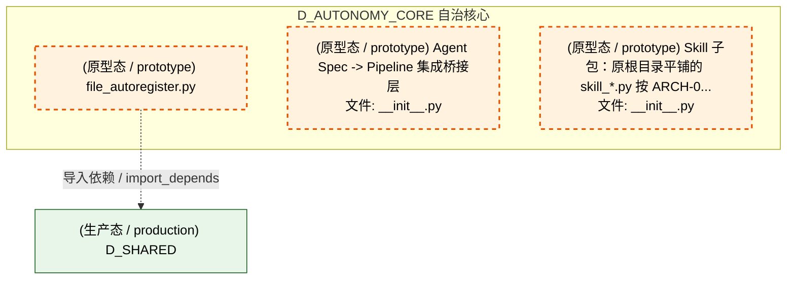
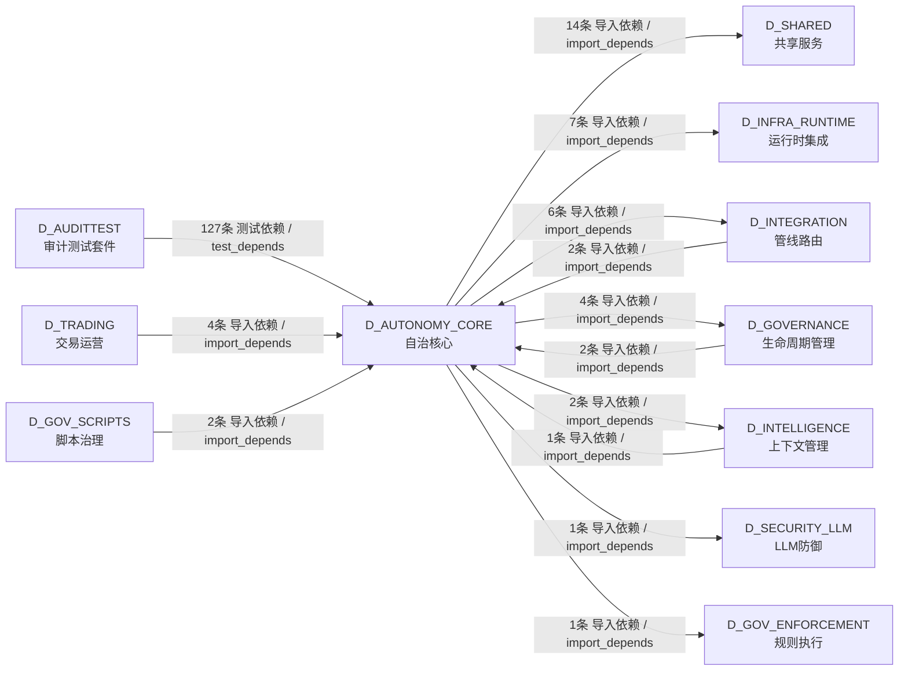

# 07_d_autonomy_core / agent_lifecycle / 自治核心 / Autonomy Core

> **功能简介 / Overview**: 自治核心，负责 AI 自治决策、目标分解和执行编排

> **文档作用 / Purpose**: 展示 自治核心（D_AUTONOMY_CORE）功能域的模块清单、域内依赖关系、跨域依赖关系、架构分层视图，供架构审查和域治理参考。

> 本文档由 generate_domain_doc.py 从 depgraph (PostgreSQL) 自动生成
> 最后更新: 2026-07-09 17:00:42
> 数据源: depgraph (PostgreSQL) nodes表 + edges表

## 域基本信息 / Domain Overview

| 字段 | 值 | Field | Value |
|------|------|-------|-------|
| 编号 | 07 | Number | 07 |
| 域ID | D_AUTONOMY_CORE | Domain ID | D_AUTONOMY_CORE |
| 域名称 | 自治核心 | Domain Name | Autonomy Core |
| 层级 | L1 基础平台层 | Layer | L1 Foundation |
| 模块数 | 114 | Module Count | 114 |
| 域内依赖 | 40 | Internal Dependencies | 40 |
| 跨域入边 | 138 | Cross-domain Incoming | 138 |
| 跨域出边 | 35 | Cross-domain Outgoing | 35 |
| 设计态模块 | 0 | Design Modules | 0 |
| 原型态模块 | 3 | Prototype Modules | 3 |
| 生产态模块 | 111 | Production Modules | 111 |
| 容量 | 111/150 (正常) | Capacity | 111/150 (正常) |
| 描述 | Skill渐进披露(L0永久/L1触发/L2组合/L3按需) | Description | Skill渐进披露(L0永久/L1触发/L2组合/L3按需) |

## 模块分层清单 / Module Layered List

> 按 architecture_layer 分组的模块清单（共 114 个模块 / 114 modules）。

### L1 基础层 / Foundation Layer (114 modules)

| # | 模块路径 / Module Path | 模块名称 / Module Name (功能简介 / Description) | 成熟度 / Maturity | 蓝图 / Blueprint |
|:--:|---------|---------|:---:|:---:|
| 1 | src/zephyr/autonomy_core/__init__.py | autonomy_core 包结构指引（ARCH-033 治本）： | 生产态 / production |  |
| 2 | src/zephyr/autonomy_core/__main__.py | agent-spec MOD-INF-019 CLI — 蓝图->Skill 升级... | 生产态 / production | [MOD-INF-019](../../03_modules/_domain_autonomy_core/agent_spec/blueprint.md) |
| 3 | src/zephyr/autonomy_core/agent_observability.py | MOD-INF-019: Agent Spec — Agent Observability | 生产态 / production | [MOD-INF-019](../../03_modules/_domain_autonomy_core/agent_spec/blueprint.md) |
| 4 | src/zephyr/autonomy_core/all_skill_modules.py | MOD-INF-019: Agent Spec — All Skill Modules | 生产态 / production | [MOD-INF-019](../../03_modules/_domain_autonomy_core/agent_spec/blueprint.md) |
| 5 | src/zephyr/autonomy_core/context/__init__.py | Context 子包（MOD-CONTEXT_ENGINE 蓝图）：上下文... | 生产态 / production |  |
| 6 | src/zephyr/autonomy_core/context/atomic_injector.py | atomic_injector.py — 原子注入 (DD101, TASK-019) | 生产态 / production | [MOD-CONTEXT_ENGINE](../../03_modules/_cross_layer/context_engine/blueprint.md) |
| 7 | src/zephyr/autonomy_core/context/ce_bootstrap.py | ce_bootstrap.py — CE 自举架构 (B1, DD75, TASK-... | 生产态 / production | [MOD-CONTEXT_ENGINE](../../03_modules/_cross_layer/context_engine/blueprint.md) |
| 8 | src/zephyr/autonomy_core/context/ce_explain_cli.py | ce_explain_cli.py — KE inclusion rationale 解... | 生产态 / production | [MOD-CONTEXT_ENGINE](../../03_modules/_cross_layer/context_engine/blueprint.md) |
| 9 | src/zephyr/autonomy_core/context/ce_file_lister.py | list_ce_files.py — CE 文件清单生成器 | 生产态 / production | [MOD-CONTEXT_ENGINE](../../03_modules/_cross_layer/context_engine/blueprint.md) |
| 10 | src/zephyr/autonomy_core/context/ce_playground_v2.py | ce_playground_v2.py — V2 Playground with full ... | 生产态 / production | [MOD-CONTEXT_ENGINE](../../03_modules/_cross_layer/context_engine/blueprint.md) |
| 11 | src/zephyr/autonomy_core/context/ce_vibe_shortcuts.py | ce_vibe_shortcuts.py — Vibe/Strict 模式切换 (T... | 生产态 / production | [MOD-CONTEXT_ENGINE](../../03_modules/_cross_layer/context_engine/blueprint.md) |
| 12 | src/zephyr/autonomy_core/context/checkpoint_manager.py | checkpoint_manager.py — Inject 前快照 (DD100, ... | 生产态 / production | [MOD-CONTEXT_ENGINE](../../03_modules/_cross_layer/context_engine/blueprint.md) |
| 13 | src/zephyr/autonomy_core/context/cold_start_booster.py | cold_start_booster.py — 冷启动 (DD107, TASK-019) | 生产态 / production | [MOD-CONTEXT_ENGINE](../../03_modules/_cross_layer/context_engine/blueprint.md) |
| 14 | src/zephyr/autonomy_core/context/complexity_budget.py | complexity_budget.py — Token 预算复杂度因子 (D... | 生产态 / production | [MOD-CONTEXT_ENGINE](../../03_modules/_cross_layer/context_engine/blueprint.md) |
| 15 | src/zephyr/autonomy_core/context/context_assembler.py | ContextAssembler — 上下文装配、校验、影子留档 | 生产态 / production | [MOD-CONTEXT_ENGINE](../../03_modules/_cross_layer/context_engine/blueprint.md) |
| 16 | src/zephyr/autonomy_core/context/context_budget.py | TruncationStrategy — TruncationStrategy | 生产态 / production | [MOD-CONTEXT_ENGINE](../../03_modules/_cross_layer/context_engine/blueprint.md) |
| 17 | src/zephyr/autonomy_core/context/context_budget_tracker.py | ContextBudgetTracker: token budget management w... | 生产态 / production | [MOD-CONTEXT_ENGINE](../../03_modules/_cross_layer/context_engine/blueprint.md) |
| 18 | src/zephyr/autonomy_core/context/context_debt_score.py | context_debt_score.py — 上下文债务评分 (B19, D... | 生产态 / production | [MOD-CONTEXT_ENGINE](../../03_modules/_cross_layer/context_engine/blueprint.md) |
| 19 | src/zephyr/autonomy_core/context/context_evaluator.py | context_evaluator.py — AI 引用率评估 (TASK-014... | 生产态 / production | [MOD-CONTEXT_ENGINE](../../03_modules/_cross_layer/context_engine/blueprint.md) |
| 20 | src/zephyr/autonomy_core/context/context_evictor.py | context_evictor.py — 三维逐出器 (DD9, TASK-014... | 生产态 / production | [MOD-CONTEXT_ENGINE](../../03_modules/_cross_layer/context_engine/blueprint.md) |
| 21 | src/zephyr/autonomy_core/context/context_health_score.py | ContextHealthScore.py — 统一健康分 (B6, DD80, ... | 生产态 / production | [MOD-CONTEXT_ENGINE](../../03_modules/_cross_layer/context_engine/blueprint.md) |
| 22 | src/zephyr/autonomy_core/context/context_injector.py | ContextInjector: retrieve and inject relevant k... | 生产态 / production | [MOD-CONTEXT_ENGINE](../../03_modules/_cross_layer/context_engine/blueprint.md) |
| 23 | src/zephyr/autonomy_core/context/context_model_strategy.py | context_model_strategy.py — 模型选择策略 (DD11... | 生产态 / production | [MOD-CONTEXT_ENGINE](../../03_modules/_cross_layer/context_engine/blueprint.md) |
| 24 | src/zephyr/autonomy_core/context/context_outcome_tracker.py | context_outcome_tracker.py — 因果链追踪 (B14, ... | 生产态 / production | [MOD-CONTEXT_ENGINE](../../03_modules/_cross_layer/context_engine/blueprint.md) |
| 25 | src/zephyr/autonomy_core/context/context_pipeline.py | context_pipeline — Context Engine **四段流水线... | 生产态 / production | [MOD-CONTEXT_ENGINE](../../03_modules/_cross_layer/context_engine/blueprint.md) |
| 26 | src/zephyr/autonomy_core/context/context_pipeline_auto.py | context_pipeline_auto.py — ContextPipeline 三... | 生产态 / production | [MOD-CONTEXT_ENGINE](../../03_modules/_cross_layer/context_engine/blueprint.md) |
| 27 | src/zephyr/autonomy_core/context/context_playground.py | context_playground.py — 上下文沙箱 dry-run (B5... | 生产态 / production | [MOD-CONTEXT_ENGINE](../../03_modules/_cross_layer/context_engine/blueprint.md) |
| 28 | src/zephyr/autonomy_core/context/context_rot_model.py | context_rot_model.py — n² Attention 衰减数学... | 生产态 / production | [MOD-CONTEXT_ENGINE](../../03_modules/_cross_layer/context_engine/blueprint.md) |
| 29 | src/zephyr/autonomy_core/context/context_rule_registry.py | context_rule_registry.py | 生产态 / production | [MOD-CONTEXT_ENGINE](../../03_modules/_cross_layer/context_engine/blueprint.md) |
| 30 | src/zephyr/autonomy_core/context/context_value_attributio... | context_value_attribution.py — KE 级 ROI 归因 ... | 生产态 / production | [MOD-CONTEXT_ENGINE](../../03_modules/_cross_layer/context_engine/blueprint.md) |
| 31 | src/zephyr/autonomy_core/context/contextual_fetch_api.py | contextual_fetch_api.py — HTTP FE 对外 API (DD... | 生产态 / production | [MOD-CONTEXT_ENGINE](../../03_modules/_cross_layer/context_engine/blueprint.md) |
| 32 | src/zephyr/autonomy_core/context/curation_loop.py | curation_loop.py — Per-Turn Curation 策展 (DD1... | 生产态 / production | [MOD-CONTEXT_ENGINE](../../03_modules/_cross_layer/context_engine/blueprint.md) |
| 33 | src/zephyr/autonomy_core/context/diff_injector.py | diff_injector.py — 增量注入 (DD98, TASK-019) | 生产态 / production | [MOD-CONTEXT_ENGINE](../../03_modules/_cross_layer/context_engine/blueprint.md) |
| 34 | src/zephyr/autonomy_core/context/diversity_constraint.py | diversity_constraint.py — 多样性约束 (DD119, T... | 生产态 / production | [MOD-CONTEXT_ENGINE](../../03_modules/_cross_layer/context_engine/blueprint.md) |
| 35 | src/zephyr/autonomy_core/context/domain_decay_config.py | domain_decay_config.py — 每领域半衰期 (DD105, ... | 生产态 / production | [MOD-CONTEXT_ENGINE](../../03_modules/_cross_layer/context_engine/blueprint.md) |
| 36 | src/zephyr/autonomy_core/context/fallback_staleness_gate.py | fallback_staleness_gate.py — 兜底层自腐检测 (B... | 生产态 / production | [MOD-CONTEXT_ENGINE](../../03_modules/_cross_layer/context_engine/blueprint.md) |
| 37 | src/zephyr/autonomy_core/context/integrity_check.py | integrity_check.py — 注入后完整性 (DD106, TASK... | 生产态 / production | [MOD-CONTEXT_ENGINE](../../03_modules/_cross_layer/context_engine/blueprint.md) |
| 38 | src/zephyr/autonomy_core/context/memory_bank.py | memory_bank.py — AI 读写结构化持久上下文 (DD: ... | 生产态 / production | [MOD-CONTEXT_ENGINE](../../03_modules/_cross_layer/context_engine/blueprint.md) |
| 39 | src/zephyr/autonomy_core/context/mode_manager.py | mode_manager.py — 模式管理器 (DD102, TASK-019) | 生产态 / production | [MOD-CONTEXT_ENGINE](../../03_modules/_cross_layer/context_engine/blueprint.md) |
| 40 | src/zephyr/autonomy_core/context/position_optimizer.py | position_optimizer.py — 位置优化 (DD104, TASK-019) | 生产态 / production | [MOD-CONTEXT_ENGINE](../../03_modules/_cross_layer/context_engine/blueprint.md) |
| 41 | src/zephyr/autonomy_core/context/shadow_canary.py | shadow_canary.py — 金丝雀部署 (B4, DD78, TASK-... | 生产态 / production | [MOD-CONTEXT_ENGINE](../../03_modules/_cross_layer/context_engine/blueprint.md) |
| 42 | src/zephyr/autonomy_core/context/staleness_manager.py | staleness_manager.py — 全局过期检测 (DD112, TA... | 生产态 / production | [MOD-CONTEXT_ENGINE](../../03_modules/_cross_layer/context_engine/blueprint.md) |
| 43 | src/zephyr/autonomy_core/context/vector_bridge.py | VectorBridge — CE↔VMS 检索桥接 (Connect CT-CE... | 生产态 / production | [MOD-CONTEXT_ENGINE](../../03_modules/_cross_layer/context_engine/blueprint.md) |
| 44 | src/zephyr/autonomy_core/file_autoregister.py | file_autoregister.py | 原型态 / prototype | [MOD-INF-019](../../03_modules/_domain_autonomy_core/agent_spec/blueprint.md) |
| 45 | src/zephyr/autonomy_core/ide_watcher.py | MOD-INF-019: Agent Spec — IDE Watcher | 生产态 / production | [MOD-INF-019](../../03_modules/_domain_autonomy_core/agent_spec/blueprint.md) |
| 46 | src/zephyr/autonomy_core/integration/__init__.py | Agent Spec -> Pipeline 集成桥接层 | 原型态 / prototype | [MOD-INF-019](../../03_modules/_domain_autonomy_core/agent_spec/blueprint.md) |
| 47 | src/zephyr/autonomy_core/integration/pipeline_bridge.py | PipelineSkillBridge — Agent Spec -> Pipeline ... | 生产态 / production | [MOD-INF-019](../../03_modules/_domain_autonomy_core/agent_spec/blueprint.md) |
| 48 | src/zephyr/autonomy_core/phase_planner.py | MOD-INF-019: Agent Spec — Phase Planner | 生产态 / production | [MOD-INF-019](../../03_modules/_domain_autonomy_core/agent_spec/blueprint.md) |
| 49 | src/zephyr/autonomy_core/progressive_disclosure_injector.py | progressive_disclosure_injector.py — 渐进式披... | 生产态 / production | [MOD-INF-019](../../03_modules/_domain_autonomy_core/agent_spec/blueprint.md) |
| 50 | src/zephyr/autonomy_core/prompt_registry.py | PromptRegistry: YAML-driven Prompt 模板注册表 | 生产态 / production | [MOD-INF-019](../../03_modules/_domain_autonomy_core/agent_spec/blueprint.md) |
| 51 | src/zephyr/autonomy_core/self_evolution_fidelity_gate.py | MOD-INF-019: Agent Spec — Self Evolution Fidel... | 生产态 / production | [MOD-INF-019](../../03_modules/_domain_autonomy_core/agent_spec/blueprint.md) |
| 52 | src/zephyr/autonomy_core/skill_rbac_registry.py | G-CT-003: Agent Spec -> RBAC capability check. | 生产态 / production | [MOD-INF-019](../../03_modules/_domain_autonomy_core/agent_spec/blueprint.md) |
| 53 | src/zephyr/autonomy_core/skills/__init__.py | Skill 子包：原根目录平铺的 skill_*.py 按 ARCH-0... | 原型态 / prototype |  |
| 54 | src/zephyr/autonomy_core/skills/skill_attention.py | MOD-INF-019: Agent Spec — Skill Attention Mana... | 生产态 / production | [MOD-INF-019](../../03_modules/_domain_autonomy_core/agent_spec/blueprint.md) |
| 55 | src/zephyr/autonomy_core/skills/skill_breakage_checker.py | MOD-INF-019: Agent Spec — Skill Breakage Checker | 生产态 / production | [MOD-INF-019](../../03_modules/_domain_autonomy_core/agent_spec/blueprint.md) |
| 56 | src/zephyr/autonomy_core/skills/skill_cache_provider.py | MOD-INF-019: Agent Spec — Skill Cache Provider | 生产态 / production | [MOD-INF-019](../../03_modules/_domain_autonomy_core/agent_spec/blueprint.md) |
| 57 | src/zephyr/autonomy_core/skills/skill_calibration.py | MOD-INF-019: Agent Spec — Skill Calibration | 生产态 / production | [MOD-INF-019](../../03_modules/_domain_autonomy_core/agent_spec/blueprint.md) |
| 58 | src/zephyr/autonomy_core/skills/skill_canary.py | MOD-INF-019: Agent Spec — Skill Canary | 生产态 / production | [MOD-INF-019](../../03_modules/_domain_autonomy_core/agent_spec/blueprint.md) |
| 59 | src/zephyr/autonomy_core/skills/skill_cognitive_preservat... | MOD-INF-019: Agent Spec — Skill Cognitive Pres... | 生产态 / production | [MOD-INF-019](../../03_modules/_domain_autonomy_core/agent_spec/blueprint.md) |
| 60 | src/zephyr/autonomy_core/skills/skill_compliance.py | MOD-INF-019: Agent Spec — Skill Compliance | 生产态 / production | [MOD-INF-019](../../03_modules/_domain_autonomy_core/agent_spec/blueprint.md) |
| 61 | src/zephyr/autonomy_core/skills/skill_consensus.py | MOD-INF-019: Agent Spec — Skill Consensus | 生产态 / production | [MOD-INF-019](../../03_modules/_domain_autonomy_core/agent_spec/blueprint.md) |
| 62 | src/zephyr/autonomy_core/skills/skill_constructor.py | MOD-INF-019: Agent Spec — Skill Constructor | 生产态 / production | [MOD-INF-019](../../03_modules/_domain_autonomy_core/agent_spec/blueprint.md) |
| 63 | src/zephyr/autonomy_core/skills/skill_context_isolation.py | MOD-INF-019: Agent Spec — Context Isolation | 生产态 / production | [MOD-INF-019](../../03_modules/_domain_autonomy_core/agent_spec/blueprint.md) |
| 64 | src/zephyr/autonomy_core/skills/skill_contract.py | MOD-INF-019: Agent Spec — Skill Contract | 生产态 / production | [MOD-INF-019](../../03_modules/_domain_autonomy_core/agent_spec/blueprint.md) |
| 65 | src/zephyr/autonomy_core/skills/skill_cross_model.py | MOD-INF-019: Agent Spec — Skill Cross-Model | 生产态 / production | [MOD-INF-019](../../03_modules/_domain_autonomy_core/agent_spec/blueprint.md) |
| 66 | src/zephyr/autonomy_core/skills/skill_di.py | MOD-INF-019: Agent Spec — Skill Dependency Inj... | 生产态 / production | [MOD-INF-019](../../03_modules/_domain_autonomy_core/agent_spec/blueprint.md) |
| 67 | src/zephyr/autonomy_core/skills/skill_discovery.py | MOD-INF-019: Agent Spec — Skill Discovery | 生产态 / production | [MOD-INF-019](../../03_modules/_domain_autonomy_core/agent_spec/blueprint.md) |
| 68 | src/zephyr/autonomy_core/skills/skill_durable.py | MOD-INF-019: Agent Spec — Durable Execution | 生产态 / production | [MOD-INF-019](../../03_modules/_domain_autonomy_core/agent_spec/blueprint.md) |
| 69 | src/zephyr/autonomy_core/skills/skill_economics.py | MOD-INF-019: Agent Spec — Skill Economics | 生产态 / production | [MOD-INF-019](../../03_modules/_domain_autonomy_core/agent_spec/blueprint.md) |
| 70 | src/zephyr/autonomy_core/skills/skill_efficacy_calibrator.py | MOD-INF-019: Agent Spec — Skill Efficacy Calib... | 生产态 / production | [MOD-INF-019](../../03_modules/_domain_autonomy_core/agent_spec/blueprint.md) |
| 71 | src/zephyr/autonomy_core/skills/skill_evaluator.py | MOD-INF-019: Agent Spec — Skill Evaluator | 生产态 / production | [MOD-INF-019](../../03_modules/_domain_autonomy_core/agent_spec/blueprint.md) |
| 72 | src/zephyr/autonomy_core/skills/skill_executor.py | skill_executor.py | 生产态 / production | [MOD-INF-019](../../03_modules/_domain_autonomy_core/agent_spec/blueprint.md) |
| 73 | src/zephyr/autonomy_core/skills/skill_explain.py | MOD-INF-019: Agent Spec — XAI Explainable Skil... | 生产态 / production | [MOD-INF-019](../../03_modules/_domain_autonomy_core/agent_spec/blueprint.md) |
| 74 | src/zephyr/autonomy_core/skills/skill_factory.py | skill_factory.py | 生产态 / production | [MOD-INF-019](../../03_modules/_domain_autonomy_core/agent_spec/blueprint.md) |
| 75 | src/zephyr/autonomy_core/skills/skill_feature_flags.py | MOD-INF-019: Agent Spec — Skill Feature Flags | 生产态 / production | [MOD-INF-019](../../03_modules/_domain_autonomy_core/agent_spec/blueprint.md) |
| 76 | src/zephyr/autonomy_core/skills/skill_feedback.py | MOD-INF-019: Agent Spec — Skill Feedback Loop | 生产态 / production | [MOD-INF-019](../../03_modules/_domain_autonomy_core/agent_spec/blueprint.md) |
| 77 | src/zephyr/autonomy_core/skills/skill_freshness.py | MOD-INF-019: Agent Spec — Skill Freshness Decay | 生产态 / production | [MOD-INF-019](../../03_modules/_domain_autonomy_core/agent_spec/blueprint.md) |
| 78 | src/zephyr/autonomy_core/skills/skill_freshness_ext.py | MOD-INF-019: Agent Spec — Skill Freshness Exte... | 生产态 / production | [MOD-INF-019](../../03_modules/_domain_autonomy_core/agent_spec/blueprint.md) |
| 79 | src/zephyr/autonomy_core/skills/skill_gitops.py | MOD-INF-019: Agent Spec — Skill GitOps | 生产态 / production | [MOD-INF-019](../../03_modules/_domain_autonomy_core/agent_spec/blueprint.md) |
| 80 | src/zephyr/autonomy_core/skills/skill_guardrails.py | MOD-INF-019: Agent Spec — Skill Guardrails | 生产态 / production | [MOD-INF-019](../../03_modules/_domain_autonomy_core/agent_spec/blueprint.md) |
| 81 | src/zephyr/autonomy_core/skills/skill_idempotency.py | MOD-INF-019: Agent Spec — Skill Idempotency | 生产态 / production | [MOD-INF-019](../../03_modules/_domain_autonomy_core/agent_spec/blueprint.md) |
| 82 | src/zephyr/autonomy_core/skills/skill_kill_switch.py | MOD-INF-019: Agent Spec — Skill Kill Switch | 生产态 / production | [MOD-INF-019](../../03_modules/_domain_autonomy_core/agent_spec/blueprint.md) |
| 83 | src/zephyr/autonomy_core/skills/skill_knowledge_base.py | MOD-INF-019: Agent Spec — Skill Knowledge Base... | 生产态 / production | [MOD-INF-019](../../03_modules/_domain_autonomy_core/agent_spec/blueprint.md) |
| 84 | src/zephyr/autonomy_core/skills/skill_kya.py | MOD-INF-019: Agent Spec — Skill KYA | 生产态 / production | [MOD-INF-019](../../03_modules/_domain_autonomy_core/agent_spec/blueprint.md) |
| 85 | src/zephyr/autonomy_core/skills/skill_learning.py | MOD-INF-019: Agent Spec — Skill Self-Learning ... | 生产态 / production | [MOD-INF-019](../../03_modules/_domain_autonomy_core/agent_spec/blueprint.md) |
| 86 | src/zephyr/autonomy_core/skills/skill_lifecycle.py | MOD-INF-019: Agent Spec — Skill Lifecycle | 生产态 / production | [MOD-INF-019](../../03_modules/_domain_autonomy_core/agent_spec/blueprint.md) |
| 87 | src/zephyr/autonomy_core/skills/skill_lineage.py | MOD-INF-019: Agent Spec — Skill Lineage | 生产态 / production | [MOD-INF-019](../../03_modules/_domain_autonomy_core/agent_spec/blueprint.md) |
| 88 | src/zephyr/autonomy_core/skills/skill_loader.py | skill_loader.py | 生产态 / production | [MOD-INF-019](../../03_modules/_domain_autonomy_core/agent_spec/blueprint.md) |
| 89 | src/zephyr/autonomy_core/skills/skill_locking.py | MOD-INF-019: Agent Spec — Skill Locking (Produ... | 生产态 / production | [MOD-INF-019](../../03_modules/_domain_autonomy_core/agent_spec/blueprint.md) |
| 90 | src/zephyr/autonomy_core/skills/skill_model.py | skill_model.py | 生产态 / production | [MOD-INF-019](../../03_modules/_domain_autonomy_core/agent_spec/blueprint.md) |
| 91 | src/zephyr/autonomy_core/skills/skill_model_evolution.py | MOD-INF-019: Agent Spec — Skill Model Evolution | 生产态 / production | [MOD-INF-019](../../03_modules/_domain_autonomy_core/agent_spec/blueprint.md) |
| 92 | src/zephyr/autonomy_core/skills/skill_observability.py | MOD-INF-019: Agent Spec — Skill Observability | 生产态 / production | [MOD-INF-019](../../03_modules/_domain_autonomy_core/agent_spec/blueprint.md) |
| 93 | src/zephyr/autonomy_core/skills/skill_ontology.py | MOD-INF-019: Agent Spec — Skill Ontology | 生产态 / production | [MOD-INF-019](../../03_modules/_domain_autonomy_core/agent_spec/blueprint.md) |
| 94 | src/zephyr/autonomy_core/skills/skill_postmortem.py | MOD-INF-019: Agent Spec — Skill Postmortem (追... | 生产态 / production | [MOD-INF-019](../../03_modules/_domain_autonomy_core/agent_spec/blueprint.md) |
| 95 | src/zephyr/autonomy_core/skills/skill_prompt_cache.py | MOD-INF-019: Agent Spec — Skill Prompt Cache | 生产态 / production | [MOD-INF-019](../../03_modules/_domain_autonomy_core/agent_spec/blueprint.md) |
| 96 | src/zephyr/autonomy_core/skills/skill_prompt_opt.py | MOD-INF-019: Agent Spec — Skill Prompt Optimizer | 生产态 / production | [MOD-INF-019](../../03_modules/_domain_autonomy_core/agent_spec/blueprint.md) |
| 97 | src/zephyr/autonomy_core/skills/skill_registry.py | skill-registry.py —— Skill 注册基座（Phase 14... | 生产态 / production | [MOD-INF-019](../../03_modules/_domain_autonomy_core/agent_spec/blueprint.md) |
| 98 | src/zephyr/autonomy_core/skills/skill_resilience.py | MOD-INF-019: Agent Spec — Skill Resilience | 生产态 / production | [MOD-INF-019](../../03_modules/_domain_autonomy_core/agent_spec/blueprint.md) |
| 99 | src/zephyr/autonomy_core/skills/skill_risk_mitigator.py | MOD-INF-019: Agent Spec — Skill Risk Mitigator | 生产态 / production | [MOD-INF-019](../../03_modules/_domain_autonomy_core/agent_spec/blueprint.md) |
| 100 | src/zephyr/autonomy_core/skills/skill_router.py | skill_router.py | 生产态 / production | [MOD-INF-019](../../03_modules/_domain_autonomy_core/agent_spec/blueprint.md) |
| 101 | src/zephyr/autonomy_core/skills/skill_sandbox.py | MOD-INF-019: Agent Spec — Skill Sandbox | 生产态 / production | [MOD-INF-019](../../03_modules/_domain_autonomy_core/agent_spec/blueprint.md) |
| 102 | src/zephyr/autonomy_core/skills/skill_schema_registry.py | MOD-INF-019: Agent Spec — Skill Schema Registry | 生产态 / production | [MOD-INF-019](../../03_modules/_domain_autonomy_core/agent_spec/blueprint.md) |
| 103 | src/zephyr/autonomy_core/skills/skill_security.py | MOD-INF-019: Agent Spec — Skill Security | 生产态 / production | [MOD-INF-019](../../03_modules/_domain_autonomy_core/agent_spec/blueprint.md) |
| 104 | src/zephyr/autonomy_core/skills/skill_shadow.py | MOD-INF-019: Agent Spec — Skill Shadow Deployment | 生产态 / production | [MOD-INF-019](../../03_modules/_domain_autonomy_core/agent_spec/blueprint.md) |
| 105 | src/zephyr/autonomy_core/skills/skill_silent_failure.py | MOD-INF-019: Agent Spec — Silent Failure Detector | 生产态 / production | [MOD-INF-019](../../03_modules/_domain_autonomy_core/agent_spec/blueprint.md) |
| 106 | src/zephyr/autonomy_core/skills/skill_team_optimizer.py | MOD-INF-019: Agent Spec — Skill Team Optimizer | 生产态 / production | [MOD-INF-019](../../03_modules/_domain_autonomy_core/agent_spec/blueprint.md) |
| 107 | src/zephyr/autonomy_core/skills/skill_telemetry.py | MOD-INF-019: Agent Spec — Skill Telemetry | 生产态 / production | [MOD-INF-019](../../03_modules/_domain_autonomy_core/agent_spec/blueprint.md) |
| 108 | src/zephyr/autonomy_core/skills/skill_temperature.py | MOD-INF-019: Agent Spec — Skill Temperature | 生产态 / production | [MOD-INF-019](../../03_modules/_domain_autonomy_core/agent_spec/blueprint.md) |
| 109 | src/zephyr/autonomy_core/skills/skill_tokenomics.py | MOD-INF-019: Agent Spec — Skill Tokenomics | 生产态 / production | [MOD-INF-019](../../03_modules/_domain_autonomy_core/agent_spec/blueprint.md) |
| 110 | src/zephyr/autonomy_core/skills/skill_translator.py | MOD-INF-019: Agent Spec — Skill Translator | 生产态 / production | [MOD-INF-019](../../03_modules/_domain_autonomy_core/agent_spec/blueprint.md) |
| 111 | src/zephyr/autonomy_core/skills/skill_workflow.py | MOD-INF-019: Agent Spec — Skill Workflow Orche... | 生产态 / production | [MOD-INF-019](../../03_modules/_domain_autonomy_core/agent_spec/blueprint.md) |
| 112 | src/zephyr/autonomy_core/spec_engine.py | MOD-INF-019: Agent Spec — SpecEngine 蓝图->Ski... | 生产态 / production | [MOD-INF-019](../../03_modules/_domain_autonomy_core/agent_spec/blueprint.md) |
| 113 | src/zephyr/autonomy_core/trigger_router.py | trigger_router.py | 生产态 / production | [MOD-INF-019](../../03_modules/_domain_autonomy_core/agent_spec/blueprint.md) |
| 114 | src/zephyr/autonomy_core/vibe_coding_quality_gate.py | vibe_coding_quality_gate.py | 生产态 / production |  |

## 域内依赖图 / Internal Dependency Diagram

> 依赖图内嵌在本文档中，IDE 可直接渲染显示。参考 decision_index.md 设计，分四个视图：合并全景图、运营态子图、设计态子图、原型态子图（按 design_maturity 实际值拆分）。
>
> **图例说明 / Legend**：
> - **实线边框 = 运营态模块**（production，已上线运行）
> - **虚线边框 = 设计态模块**（design，蓝图阶段，代码未写）
> - **虚线边框 = 原型态模块**（prototype，代码已写，验证中未稳定上线）
> - **实线箭头 = 运营态依赖**（已生效的依赖关系）
> - **虚线箭头 = 非运营态依赖**（计划中/验证中的依赖关系）

### 合并全景图（全部模块，标签标注成熟度）

> 展示全部 114 个模块（生产态 111 + 设计态 0 + 原型态 3），标签标注成熟度。

#### 第 1 页 / 共 4 页

```mermaid
graph TD
    subgraph D_AUTONOMY_CORE["D_AUTONOMY_CORE 自治核心"]
        src_zephyr_autonomy_core_init_py["(生产态 / production) autonomy_core 包结构指引（ARCH-033 治本）：<br/>文件: __init__.py"]
        src_zephyr_autonomy_core_main_py["(生产态 / production) agent-spec MOD-INF-019 CLI — 蓝图->Skill 升级...<br/>文件: __main__.py"]
        src_zephyr_autonomy_core_agent_observability_py["(生产态 / production) MOD-INF-019: Agent Spec — Agent Observability<br/>文件: agent_observability.py"]
        src_zephyr_autonomy_core_all_skill_modules_py["(生产态 / production) MOD-INF-019: Agent Spec — All Skill Modules<br/>文件: all_skill_modules.py"]
        src_zephyr_autonomy_core_context_init_py["(生产态 / production) Context 子包（MOD-CONTEXT_ENGINE 蓝图）：上下文...<br/>文件: __init__.py"]
        src_zephyr_autonomy_core_context_atomic_injector_py["(生产态 / production) atomic_injector.py — 原子注入 (DD101, TASK-019)<br/>文件: atomic_injector.py"]
        src_zephyr_autonomy_core_context_ce_bootstrap_py["(生产态 / production) ce_bootstrap.py — CE 自举架构 (B1, DD75, TASK-...<br/>文件: ce_bootstrap.py"]
        src_zephyr_autonomy_core_context_ce_explain_cli_py["(生产态 / production) ce_explain_cli.py — KE inclusion rationale 解...<br/>文件: ce_explain_cli.py"]
        src_zephyr_autonomy_core_context_ce_file_lister_py["(生产态 / production) list_ce_files.py — CE 文件清单生成器<br/>文件: ce_file_lister.py"]
        src_zephyr_autonomy_core_context_ce_playground_v2_py["(生产态 / production) ce_playground_v2.py — V2 Playground with full ...<br/>文件: ce_playground_v2.py"]
        src_zephyr_autonomy_core_context_ce_vibe_shortcuts_py["(生产态 / production) ce_vibe_shortcuts.py — Vibe/Strict 模式切换 (T...<br/>文件: ce_vibe_shortcuts.py"]
        src_zephyr_autonomy_core_context_checkpoint_manager_py["(生产态 / production) checkpoint_manager.py — Inject 前快照 (DD100, ...<br/>文件: checkpoint_manager.py"]
        src_zephyr_autonomy_core_context_cold_start_booster_py["(生产态 / production) cold_start_booster.py — 冷启动 (DD107, TASK-019)<br/>文件: cold_start_booster.py"]
        src_zephyr_autonomy_core_context_complexity_budget_py["(生产态 / production) complexity_budget.py — Token 预算复杂度因子 (D...<br/>文件: complexity_budget.py"]
        src_zephyr_autonomy_core_context_context_assembler_py["(生产态 / production) ContextAssembler — 上下文装配、校验、影子留档<br/>文件: context_assembler.py"]
        src_zephyr_autonomy_core_context_context_budget_py["(生产态 / production) TruncationStrategy — TruncationStrategy<br/>文件: context_budget.py"]
        src_zephyr_autonomy_core_context_context_budget_tracker_py["(生产态 / production) ContextBudgetTracker: token budget management w...<br/>文件: context_budget_tracker.py"]
        src_zephyr_autonomy_core_context_context_debt_score_py["(生产态 / production) context_debt_score.py — 上下文债务评分 (B19, D...<br/>文件: context_debt_score.py"]
        src_zephyr_autonomy_core_context_context_evaluator_py["(生产态 / production) context_evaluator.py — AI 引用率评估 (TASK-014...<br/>文件: context_evaluator.py"]
        src_zephyr_autonomy_core_context_context_evictor_py["(生产态 / production) context_evictor.py — 三维逐出器 (DD9, TASK-014...<br/>文件: context_evictor.py"]
        src_zephyr_autonomy_core_context_context_health_score_py["(生产态 / production) ContextHealthScore.py — 统一健康分 (B6, DD80, ...<br/>文件: context_health_score.py"]
        src_zephyr_autonomy_core_context_context_injector_py["(生产态 / production) ContextInjector: retrieve and inject relevant k...<br/>文件: context_injector.py"]
        src_zephyr_autonomy_core_context_context_model_strategy_py["(生产态 / production) context_model_strategy.py — 模型选择策略 (DD11...<br/>文件: context_model_strategy.py"]
        src_zephyr_autonomy_core_context_context_outcome_tracker_py["(生产态 / production) context_outcome_tracker.py — 因果链追踪 (B14, ...<br/>文件: context_outcome_tracker.py"]
        src_zephyr_autonomy_core_context_context_pipeline_py["(生产态 / production) context_pipeline — Context Engine **四段流水线...<br/>文件: context_pipeline.py"]
        src_zephyr_autonomy_core_context_context_pipeline_auto_py["(生产态 / production) context_pipeline_auto.py — ContextPipeline 三...<br/>文件: context_pipeline_auto.py"]
        src_zephyr_autonomy_core_context_context_playground_py["(生产态 / production) context_playground.py — 上下文沙箱 dry-run (B5...<br/>文件: context_playground.py"]
        src_zephyr_autonomy_core_context_context_rot_model_py["(生产态 / production) context_rot_model.py — n² Attention 衰减数学...<br/>文件: context_rot_model.py"]
        src_zephyr_autonomy_core_context_context_rule_registry_py["(生产态 / production) context_rule_registry.py"]
        src_zephyr_autonomy_core_context_context_value_attribution_py["(生产态 / production) context_value_attribution.py — KE 级 ROI 归因 ...<br/>文件: context_value_attribution.py"]
    end
    src_zephyr_autonomy_core_context_context_assembler_py -->|导入依赖 / import_depends| src_zephyr_autonomy_core_context_context_rule_registry_py
    src_zephyr_autonomy_core_context_context_pipeline_py -->|导入依赖 / import_depends| src_zephyr_autonomy_core_context_context_assembler_py
    src_zephyr_autonomy_core_context_context_pipeline_py -->|导入依赖 / import_depends| src_zephyr_autonomy_core_context_context_injector_py
    src_zephyr_autonomy_core_context_context_pipeline_py -->|导入依赖 / import_depends| src_zephyr_autonomy_core_context_context_rule_registry_py
    src_zephyr_autonomy_core_context_context_pipeline_auto_py -->|导入依赖 / import_depends| src_zephyr_autonomy_core_context_context_pipeline_py
    D_SHARED["(生产态 / production) D_SHARED"]
    src_zephyr_autonomy_core_context_checkpoint_manager_py -->|导入依赖 / import_depends| D_SHARED
    src_zephyr_autonomy_core_context_context_budget_tracker_py -->|导入依赖 / import_depends| D_SHARED
    D_INFRA_RUNTIME["(生产态 / production) D_INFRA_RUNTIME"]
    src_zephyr_autonomy_core_context_context_budget_tracker_py -->|导入依赖 / import_depends| D_INFRA_RUNTIME
    src_zephyr_autonomy_core_context_context_budget_tracker_py -->|导入依赖 / import_depends| D_SHARED
    src_zephyr_autonomy_core_context_context_budget_tracker_py -->|导入依赖 / import_depends| D_SHARED
    src_zephyr_autonomy_core_context_context_budget_py -->|导入依赖 / import_depends| D_INFRA_RUNTIME
    src_zephyr_autonomy_core_context_context_assembler_py -->|导入依赖 / import_depends| D_INFRA_RUNTIME
    D_INTEGRATION["(生产态 / production) D_INTEGRATION"]
    src_zephyr_autonomy_core_context_context_assembler_py -->|导入依赖 / import_depends| D_INTEGRATION
    D_GOVERNANCE["(生产态 / production) D_GOVERNANCE"]
    src_zephyr_autonomy_core_context_context_assembler_py -->|导入依赖 / import_depends| D_GOVERNANCE
    D_INTELLIGENCE["(生产态 / production) D_INTELLIGENCE"]
    src_zephyr_autonomy_core_context_context_assembler_py -->|导入依赖 / import_depends| D_INTELLIGENCE
    src_zephyr_autonomy_core_context_context_assembler_py -->|导入依赖 / import_depends| D_SHARED
    src_zephyr_autonomy_core_context_context_assembler_py -->|导入依赖 / import_depends| D_INTELLIGENCE
    src_zephyr_autonomy_core_context_context_injector_py -->|导入依赖 / import_depends| D_INFRA_RUNTIME
    src_zephyr_autonomy_core_context_context_injector_py -->|导入依赖 / import_depends| D_INTEGRATION
    src_zephyr_autonomy_core_context_context_injector_py -.->|导入依赖 / import_depends| D_SHARED
    D_GOVERNANCE -->|导入依赖 / import_depends| src_zephyr_autonomy_core_context_context_rule_registry_py
    D_GOV_SCRIPTS["(原型态 / prototype) D_GOV_SCRIPTS"]
    D_GOV_SCRIPTS -.->|导入依赖 / import_depends| src_zephyr_autonomy_core_init_py
    D_GOV_SCRIPTS -.->|导入依赖 / import_depends| src_zephyr_autonomy_core_init_py
    D_AUDITTEST["(原型态 / prototype) D_AUDITTEST"]
    D_AUDITTEST -.->|测试依赖 / test_depends| src_zephyr_autonomy_core_agent_observability_py
    D_AUDITTEST -.->|测试依赖 / test_depends| src_zephyr_autonomy_core_main_py
    D_AUDITTEST -.->|测试依赖 / test_depends| src_zephyr_autonomy_core_context_context_assembler_py
    D_AUDITTEST -.->|测试依赖 / test_depends| src_zephyr_autonomy_core_all_skill_modules_py
    D_AUDITTEST -.->|测试依赖 / test_depends| src_zephyr_autonomy_core_context_atomic_injector_py
    D_AUDITTEST -.->|测试依赖 / test_depends| src_zephyr_autonomy_core_context_context_assembler_py
    D_AUDITTEST -.->|测试依赖 / test_depends| src_zephyr_autonomy_core_context_context_pipeline_py
    D_AUDITTEST -.->|测试依赖 / test_depends| src_zephyr_autonomy_core_context_context_injector_py
    D_AUDITTEST -.->|测试依赖 / test_depends| src_zephyr_autonomy_core_main_py
    D_AUDITTEST -.->|测试依赖 / test_depends| src_zephyr_autonomy_core_context_checkpoint_manager_py
    D_AUDITTEST -.->|测试依赖 / test_depends| src_zephyr_autonomy_core_context_complexity_budget_py
    D_AUDITTEST -.->|测试依赖 / test_depends| src_zephyr_autonomy_core_context_context_pipeline_py
    classDef production fill:#e1f5fe,stroke:#01579b,stroke-width:2px,color:#000
    classDef design fill:#fff3e0,stroke:#e65100,stroke-width:2px,color:#000,stroke-dasharray: 5 5
    classDef external_prod fill:#e8f5e9,stroke:#1b5e20,stroke-width:1px,color:#000
    classDef external_design fill:#fce4ec,stroke:#880e4f,stroke-width:1px,color:#000,stroke-dasharray: 5 5
    class src_zephyr_autonomy_core_init_py,src_zephyr_autonomy_core_main_py,src_zephyr_autonomy_core_agent_observability_py,src_zephyr_autonomy_core_all_skill_modules_py,src_zephyr_autonomy_core_context_init_py,src_zephyr_autonomy_core_context_atomic_injector_py,src_zephyr_autonomy_core_context_ce_bootstrap_py,src_zephyr_autonomy_core_context_ce_explain_cli_py,src_zephyr_autonomy_core_context_ce_file_lister_py,src_zephyr_autonomy_core_context_ce_playground_v2_py,src_zephyr_autonomy_core_context_ce_vibe_shortcuts_py,src_zephyr_autonomy_core_context_checkpoint_manager_py,src_zephyr_autonomy_core_context_cold_start_booster_py,src_zephyr_autonomy_core_context_complexity_budget_py,src_zephyr_autonomy_core_context_context_assembler_py,src_zephyr_autonomy_core_context_context_budget_py,src_zephyr_autonomy_core_context_context_budget_tracker_py,src_zephyr_autonomy_core_context_context_debt_score_py,src_zephyr_autonomy_core_context_context_evaluator_py,src_zephyr_autonomy_core_context_context_evictor_py,src_zephyr_autonomy_core_context_context_health_score_py,src_zephyr_autonomy_core_context_context_injector_py,src_zephyr_autonomy_core_context_context_model_strategy_py,src_zephyr_autonomy_core_context_context_outcome_tracker_py,src_zephyr_autonomy_core_context_context_pipeline_py,src_zephyr_autonomy_core_context_context_pipeline_auto_py,src_zephyr_autonomy_core_context_context_playground_py,src_zephyr_autonomy_core_context_context_rot_model_py,src_zephyr_autonomy_core_context_context_rule_registry_py,src_zephyr_autonomy_core_context_context_value_attribution_py production
    class D_SHARED,D_INFRA_RUNTIME,D_INTEGRATION,D_GOVERNANCE,D_INTELLIGENCE external_prod
    class D_GOV_SCRIPTS,D_AUDITTEST external_design
```



#### 第 2 页 / 共 4 页

```mermaid
graph TD
    subgraph D_AUTONOMY_CORE["D_AUTONOMY_CORE 自治核心"]
        src_zephyr_autonomy_core_context_contextual_fetch_api_py["(生产态 / production) contextual_fetch_api.py — HTTP FE 对外 API (DD...<br/>文件: contextual_fetch_api.py"]
        src_zephyr_autonomy_core_context_curation_loop_py["(生产态 / production) curation_loop.py — Per-Turn Curation 策展 (DD1...<br/>文件: curation_loop.py"]
        src_zephyr_autonomy_core_context_diff_injector_py["(生产态 / production) diff_injector.py — 增量注入 (DD98, TASK-019)<br/>文件: diff_injector.py"]
        src_zephyr_autonomy_core_context_diversity_constraint_py["(生产态 / production) diversity_constraint.py — 多样性约束 (DD119, T...<br/>文件: diversity_constraint.py"]
        src_zephyr_autonomy_core_context_domain_decay_config_py["(生产态 / production) domain_decay_config.py — 每领域半衰期 (DD105, ...<br/>文件: domain_decay_config.py"]
        src_zephyr_autonomy_core_context_fallback_staleness_gate_py["(生产态 / production) fallback_staleness_gate.py — 兜底层自腐检测 (B...<br/>文件: fallback_staleness_gate.py"]
        src_zephyr_autonomy_core_context_integrity_check_py["(生产态 / production) integrity_check.py — 注入后完整性 (DD106, TASK...<br/>文件: integrity_check.py"]
        src_zephyr_autonomy_core_context_memory_bank_py["(生产态 / production) memory_bank.py — AI 读写结构化持久上下文 (DD: ...<br/>文件: memory_bank.py"]
        src_zephyr_autonomy_core_context_mode_manager_py["(生产态 / production) mode_manager.py — 模式管理器 (DD102, TASK-019)<br/>文件: mode_manager.py"]
        src_zephyr_autonomy_core_context_position_optimizer_py["(生产态 / production) position_optimizer.py — 位置优化 (DD104, TASK-019)<br/>文件: position_optimizer.py"]
        src_zephyr_autonomy_core_context_shadow_canary_py["(生产态 / production) shadow_canary.py — 金丝雀部署 (B4, DD78, TASK-...<br/>文件: shadow_canary.py"]
        src_zephyr_autonomy_core_context_staleness_manager_py["(生产态 / production) staleness_manager.py — 全局过期检测 (DD112, TA...<br/>文件: staleness_manager.py"]
        src_zephyr_autonomy_core_context_vector_bridge_py["(生产态 / production) VectorBridge — CE↔VMS 检索桥接 (Connect CT-CE...<br/>文件: vector_bridge.py"]
        src_zephyr_autonomy_core_file_autoregister_py["(原型态 / prototype) file_autoregister.py"]
        src_zephyr_autonomy_core_ide_watcher_py["(生产态 / production) MOD-INF-019: Agent Spec — IDE Watcher<br/>文件: ide_watcher.py"]
        src_zephyr_autonomy_core_integration_init_py["(原型态 / prototype) Agent Spec -> Pipeline 集成桥接层<br/>文件: __init__.py"]
        src_zephyr_autonomy_core_integration_pipeline_bridge_py["(生产态 / production) PipelineSkillBridge — Agent Spec -> Pipeline ...<br/>文件: pipeline_bridge.py"]
        src_zephyr_autonomy_core_phase_planner_py["(生产态 / production) MOD-INF-019: Agent Spec — Phase Planner<br/>文件: phase_planner.py"]
        src_zephyr_autonomy_core_progressive_disclosure_injector_py["(生产态 / production) progressive_disclosure_injector.py — 渐进式披...<br/>文件: progressive_disclosure_injector.py"]
        src_zephyr_autonomy_core_prompt_registry_py["(生产态 / production) PromptRegistry: YAML-driven Prompt 模板注册表<br/>文件: prompt_registry.py"]
        src_zephyr_autonomy_core_self_evolution_fidelity_gate_py["(生产态 / production) MOD-INF-019: Agent Spec — Self Evolution Fidel...<br/>文件: self_evolution_fidelity_gate.py"]
        src_zephyr_autonomy_core_skill_rbac_registry_py["(生产态 / production) G-CT-003: Agent Spec -> RBAC capability check.<br/>文件: skill_rbac_registry.py"]
        src_zephyr_autonomy_core_skills_init_py["(原型态 / prototype) Skill 子包：原根目录平铺的 skill_*.py 按 ARCH-0...<br/>文件: __init__.py"]
        src_zephyr_autonomy_core_skills_skill_attention_py["(生产态 / production) MOD-INF-019: Agent Spec — Skill Attention Mana...<br/>文件: skill_attention.py"]
        src_zephyr_autonomy_core_skills_skill_breakage_checker_py["(生产态 / production) MOD-INF-019: Agent Spec — Skill Breakage Checker<br/>文件: skill_breakage_checker.py"]
        src_zephyr_autonomy_core_skills_skill_cache_provider_py["(生产态 / production) MOD-INF-019: Agent Spec — Skill Cache Provider<br/>文件: skill_cache_provider.py"]
        src_zephyr_autonomy_core_skills_skill_calibration_py["(生产态 / production) MOD-INF-019: Agent Spec — Skill Calibration<br/>文件: skill_calibration.py"]
        src_zephyr_autonomy_core_skills_skill_canary_py["(生产态 / production) MOD-INF-019: Agent Spec — Skill Canary<br/>文件: skill_canary.py"]
        src_zephyr_autonomy_core_skills_skill_cognitive_preservation_py["(生产态 / production) MOD-INF-019: Agent Spec — Skill Cognitive Pres...<br/>文件: skill_cognitive_preservation.py"]
        src_zephyr_autonomy_core_skills_skill_compliance_py["(生产态 / production) MOD-INF-019: Agent Spec — Skill Compliance<br/>文件: skill_compliance.py"]
    end
    src_zephyr_autonomy_core_integration_init_py -.->|config_depends / config_depends| src_zephyr_autonomy_core_integration_pipeline_bridge_py
    src_zephyr_autonomy_core_skills_init_py -.->|config_depends / config_depends| src_zephyr_autonomy_core_skills_skill_attention_py
    D_SHARED["(生产态 / production) D_SHARED"]
    src_zephyr_autonomy_core_file_autoregister_py -.->|导入依赖 / import_depends| D_SHARED
    D_INFRA_RUNTIME["(生产态 / production) D_INFRA_RUNTIME"]
    src_zephyr_autonomy_core_prompt_registry_py -->|导入依赖 / import_depends| D_INFRA_RUNTIME
    D_INTEGRATION["(生产态 / production) D_INTEGRATION"]
    src_zephyr_autonomy_core_prompt_registry_py -->|导入依赖 / import_depends| D_INTEGRATION
    src_zephyr_autonomy_core_prompt_registry_py -.->|导入依赖 / import_depends| D_SHARED
    D_INTEGRATION -->|导入依赖 / import_depends| src_zephyr_autonomy_core_integration_pipeline_bridge_py
    D_INTELLIGENCE["(原型态 / prototype) D_INTELLIGENCE"]
    D_INTELLIGENCE -.->|导入依赖 / import_depends| src_zephyr_autonomy_core_context_vector_bridge_py
    D_TRADING["(生产态 / production) D_TRADING"]
    D_TRADING -->|导入依赖 / import_depends| src_zephyr_autonomy_core_context_vector_bridge_py
    D_TRADING -.->|导入依赖 / import_depends| src_zephyr_autonomy_core_context_vector_bridge_py
    D_AUDITTEST["(原型态 / prototype) D_AUDITTEST"]
    D_AUDITTEST -.->|测试依赖 / test_depends| src_zephyr_autonomy_core_skill_rbac_registry_py
    D_AUDITTEST -.->|测试依赖 / test_depends| src_zephyr_autonomy_core_context_contextual_fetch_api_py
    D_AUDITTEST -.->|测试依赖 / test_depends| src_zephyr_autonomy_core_context_curation_loop_py
    D_AUDITTEST -.->|测试依赖 / test_depends| src_zephyr_autonomy_core_context_diff_injector_py
    D_AUDITTEST -.->|测试依赖 / test_depends| src_zephyr_autonomy_core_context_diversity_constraint_py
    D_AUDITTEST -.->|测试依赖 / test_depends| src_zephyr_autonomy_core_context_domain_decay_config_py
    D_AUDITTEST -.->|测试依赖 / test_depends| src_zephyr_autonomy_core_context_fallback_staleness_gate_py
    D_AUDITTEST -.->|测试依赖 / test_depends| src_zephyr_autonomy_core_ide_watcher_py
    D_AUDITTEST -.->|测试依赖 / test_depends| src_zephyr_autonomy_core_context_integrity_check_py
    D_AUDITTEST -.->|测试依赖 / test_depends| src_zephyr_autonomy_core_context_mode_manager_py
    D_AUDITTEST -.->|测试依赖 / test_depends| src_zephyr_autonomy_core_context_position_optimizer_py
    classDef production fill:#e1f5fe,stroke:#01579b,stroke-width:2px,color:#000
    classDef design fill:#fff3e0,stroke:#e65100,stroke-width:2px,color:#000,stroke-dasharray: 5 5
    classDef external_prod fill:#e8f5e9,stroke:#1b5e20,stroke-width:1px,color:#000
    classDef external_design fill:#fce4ec,stroke:#880e4f,stroke-width:1px,color:#000,stroke-dasharray: 5 5
    class src_zephyr_autonomy_core_context_contextual_fetch_api_py,src_zephyr_autonomy_core_context_curation_loop_py,src_zephyr_autonomy_core_context_diff_injector_py,src_zephyr_autonomy_core_context_diversity_constraint_py,src_zephyr_autonomy_core_context_domain_decay_config_py,src_zephyr_autonomy_core_context_fallback_staleness_gate_py,src_zephyr_autonomy_core_context_integrity_check_py,src_zephyr_autonomy_core_context_memory_bank_py,src_zephyr_autonomy_core_context_mode_manager_py,src_zephyr_autonomy_core_context_position_optimizer_py,src_zephyr_autonomy_core_context_shadow_canary_py,src_zephyr_autonomy_core_context_staleness_manager_py,src_zephyr_autonomy_core_context_vector_bridge_py,src_zephyr_autonomy_core_ide_watcher_py,src_zephyr_autonomy_core_integration_pipeline_bridge_py,src_zephyr_autonomy_core_phase_planner_py,src_zephyr_autonomy_core_progressive_disclosure_injector_py,src_zephyr_autonomy_core_prompt_registry_py,src_zephyr_autonomy_core_self_evolution_fidelity_gate_py,src_zephyr_autonomy_core_skill_rbac_registry_py,src_zephyr_autonomy_core_skills_skill_attention_py,src_zephyr_autonomy_core_skills_skill_breakage_checker_py,src_zephyr_autonomy_core_skills_skill_cache_provider_py,src_zephyr_autonomy_core_skills_skill_calibration_py,src_zephyr_autonomy_core_skills_skill_canary_py,src_zephyr_autonomy_core_skills_skill_cognitive_preservation_py,src_zephyr_autonomy_core_skills_skill_compliance_py production
    class src_zephyr_autonomy_core_file_autoregister_py,src_zephyr_autonomy_core_integration_init_py,src_zephyr_autonomy_core_skills_init_py design
    class D_SHARED,D_INFRA_RUNTIME,D_INTEGRATION,D_TRADING external_prod
    class D_INTELLIGENCE,D_AUDITTEST external_design
```



#### 第 3 页 / 共 4 页

```mermaid
graph TD
    subgraph D_AUTONOMY_CORE["D_AUTONOMY_CORE 自治核心"]
        src_zephyr_autonomy_core_skills_skill_consensus_py["(生产态 / production) MOD-INF-019: Agent Spec — Skill Consensus<br/>文件: skill_consensus.py"]
        src_zephyr_autonomy_core_skills_skill_constructor_py["(生产态 / production) MOD-INF-019: Agent Spec — Skill Constructor<br/>文件: skill_constructor.py"]
        src_zephyr_autonomy_core_skills_skill_context_isolation_py["(生产态 / production) MOD-INF-019: Agent Spec — Context Isolation<br/>文件: skill_context_isolation.py"]
        src_zephyr_autonomy_core_skills_skill_contract_py["(生产态 / production) MOD-INF-019: Agent Spec — Skill Contract<br/>文件: skill_contract.py"]
        src_zephyr_autonomy_core_skills_skill_cross_model_py["(生产态 / production) MOD-INF-019: Agent Spec — Skill Cross-Model<br/>文件: skill_cross_model.py"]
        src_zephyr_autonomy_core_skills_skill_di_py["(生产态 / production) MOD-INF-019: Agent Spec — Skill Dependency Inj...<br/>文件: skill_di.py"]
        src_zephyr_autonomy_core_skills_skill_discovery_py["(生产态 / production) MOD-INF-019: Agent Spec — Skill Discovery<br/>文件: skill_discovery.py"]
        src_zephyr_autonomy_core_skills_skill_durable_py["(生产态 / production) MOD-INF-019: Agent Spec — Durable Execution<br/>文件: skill_durable.py"]
        src_zephyr_autonomy_core_skills_skill_economics_py["(生产态 / production) MOD-INF-019: Agent Spec — Skill Economics<br/>文件: skill_economics.py"]
        src_zephyr_autonomy_core_skills_skill_efficacy_calibrator_py["(生产态 / production) MOD-INF-019: Agent Spec — Skill Efficacy Calib...<br/>文件: skill_efficacy_calibrator.py"]
        src_zephyr_autonomy_core_skills_skill_evaluator_py["(生产态 / production) MOD-INF-019: Agent Spec — Skill Evaluator<br/>文件: skill_evaluator.py"]
        src_zephyr_autonomy_core_skills_skill_executor_py["(生产态 / production) skill_executor.py"]
        src_zephyr_autonomy_core_skills_skill_explain_py["(生产态 / production) MOD-INF-019: Agent Spec — XAI Explainable Skil...<br/>文件: skill_explain.py"]
        src_zephyr_autonomy_core_skills_skill_factory_py["(生产态 / production) skill_factory.py"]
        src_zephyr_autonomy_core_skills_skill_feature_flags_py["(生产态 / production) MOD-INF-019: Agent Spec — Skill Feature Flags<br/>文件: skill_feature_flags.py"]
        src_zephyr_autonomy_core_skills_skill_feedback_py["(生产态 / production) MOD-INF-019: Agent Spec — Skill Feedback Loop<br/>文件: skill_feedback.py"]
        src_zephyr_autonomy_core_skills_skill_freshness_py["(生产态 / production) MOD-INF-019: Agent Spec — Skill Freshness Decay<br/>文件: skill_freshness.py"]
        src_zephyr_autonomy_core_skills_skill_freshness_ext_py["(生产态 / production) MOD-INF-019: Agent Spec — Skill Freshness Exte...<br/>文件: skill_freshness_ext.py"]
        src_zephyr_autonomy_core_skills_skill_gitops_py["(生产态 / production) MOD-INF-019: Agent Spec — Skill GitOps<br/>文件: skill_gitops.py"]
        src_zephyr_autonomy_core_skills_skill_guardrails_py["(生产态 / production) MOD-INF-019: Agent Spec — Skill Guardrails<br/>文件: skill_guardrails.py"]
        src_zephyr_autonomy_core_skills_skill_idempotency_py["(生产态 / production) MOD-INF-019: Agent Spec — Skill Idempotency<br/>文件: skill_idempotency.py"]
        src_zephyr_autonomy_core_skills_skill_kill_switch_py["(生产态 / production) MOD-INF-019: Agent Spec — Skill Kill Switch<br/>文件: skill_kill_switch.py"]
        src_zephyr_autonomy_core_skills_skill_knowledge_base_py["(生产态 / production) MOD-INF-019: Agent Spec — Skill Knowledge Base...<br/>文件: skill_knowledge_base.py"]
        src_zephyr_autonomy_core_skills_skill_kya_py["(生产态 / production) MOD-INF-019: Agent Spec — Skill KYA<br/>文件: skill_kya.py"]
        src_zephyr_autonomy_core_skills_skill_learning_py["(生产态 / production) MOD-INF-019: Agent Spec — Skill Self-Learning ...<br/>文件: skill_learning.py"]
        src_zephyr_autonomy_core_skills_skill_lifecycle_py["(生产态 / production) MOD-INF-019: Agent Spec — Skill Lifecycle<br/>文件: skill_lifecycle.py"]
        src_zephyr_autonomy_core_skills_skill_lineage_py["(生产态 / production) MOD-INF-019: Agent Spec — Skill Lineage<br/>文件: skill_lineage.py"]
        src_zephyr_autonomy_core_skills_skill_loader_py["(生产态 / production) skill_loader.py"]
        src_zephyr_autonomy_core_skills_skill_locking_py["(生产态 / production) MOD-INF-019: Agent Spec — Skill Locking (Produ...<br/>文件: skill_locking.py"]
        src_zephyr_autonomy_core_skills_skill_model_py["(生产态 / production) skill_model.py"]
    end
    src_zephyr_autonomy_core_skills_skill_consensus_py -->|导入依赖 / import_depends| src_zephyr_autonomy_core_skills_skill_freshness_py
    src_zephyr_autonomy_core_skills_skill_constructor_py -->|导入依赖 / import_depends| src_zephyr_autonomy_core_skills_skill_loader_py
    src_zephyr_autonomy_core_skills_skill_contract_py -->|导入依赖 / import_depends| src_zephyr_autonomy_core_skills_skill_loader_py
    src_zephyr_autonomy_core_skills_skill_discovery_py -->|导入依赖 / import_depends| src_zephyr_autonomy_core_skills_skill_factory_py
    src_zephyr_autonomy_core_skills_skill_discovery_py -->|导入依赖 / import_depends| src_zephyr_autonomy_core_skills_skill_loader_py
    src_zephyr_autonomy_core_skills_skill_efficacy_calibrator_py -->|导入依赖 / import_depends| src_zephyr_autonomy_core_skills_skill_loader_py
    src_zephyr_autonomy_core_skills_skill_evaluator_py -->|导入依赖 / import_depends| src_zephyr_autonomy_core_skills_skill_freshness_py
    src_zephyr_autonomy_core_skills_skill_evaluator_py -->|导入依赖 / import_depends| src_zephyr_autonomy_core_skills_skill_loader_py
    src_zephyr_autonomy_core_skills_skill_executor_py -->|导入依赖 / import_depends| src_zephyr_autonomy_core_skills_skill_loader_py
    src_zephyr_autonomy_core_skills_skill_explain_py -->|导入依赖 / import_depends| src_zephyr_autonomy_core_skills_skill_evaluator_py
    src_zephyr_autonomy_core_skills_skill_feedback_py -->|导入依赖 / import_depends| src_zephyr_autonomy_core_skills_skill_freshness_py
    src_zephyr_autonomy_core_skills_skill_feedback_py -->|导入依赖 / import_depends| src_zephyr_autonomy_core_skills_skill_kill_switch_py
    src_zephyr_autonomy_core_skills_skill_freshness_ext_py -->|导入依赖 / import_depends| src_zephyr_autonomy_core_skills_skill_freshness_py
    src_zephyr_autonomy_core_skills_skill_freshness_ext_py -->|导入依赖 / import_depends| src_zephyr_autonomy_core_skills_skill_lifecycle_py
    src_zephyr_autonomy_core_skills_skill_freshness_ext_py -->|导入依赖 / import_depends| src_zephyr_autonomy_core_skills_skill_model_py
    src_zephyr_autonomy_core_skills_skill_kill_switch_py -->|导入依赖 / import_depends| src_zephyr_autonomy_core_skills_skill_model_py
    src_zephyr_autonomy_core_skills_skill_kya_py -->|导入依赖 / import_depends| src_zephyr_autonomy_core_skills_skill_loader_py
    src_zephyr_autonomy_core_skills_skill_lifecycle_py -->|导入依赖 / import_depends| src_zephyr_autonomy_core_skills_skill_model_py
    D_GOVERNANCE["(生产态 / production) D_GOVERNANCE"]
    src_zephyr_autonomy_core_skills_skill_executor_py -->|导入依赖 / import_depends| D_GOVERNANCE
    D_GOV_ENFORCEMENT["(生产态 / production) D_GOV_ENFORCEMENT"]
    src_zephyr_autonomy_core_skills_skill_executor_py -->|导入依赖 / import_depends| D_GOV_ENFORCEMENT
    D_SHARED["(生产态 / production) D_SHARED"]
    src_zephyr_autonomy_core_skills_skill_factory_py -->|导入依赖 / import_depends| D_SHARED
    src_zephyr_autonomy_core_skills_skill_feedback_py -->|导入依赖 / import_depends| D_SHARED
    src_zephyr_autonomy_core_skills_skill_freshness_ext_py -->|导入依赖 / import_depends| D_SHARED
    D_GOVERNANCE -->|导入依赖 / import_depends| src_zephyr_autonomy_core_skills_skill_executor_py
    D_INTEGRATION["(生产态 / production) D_INTEGRATION"]
    D_INTEGRATION -->|导入依赖 / import_depends| src_zephyr_autonomy_core_skills_skill_feedback_py
    D_TRADING["(生产态 / production) D_TRADING"]
    D_TRADING -->|导入依赖 / import_depends| src_zephyr_autonomy_core_skills_skill_freshness_ext_py
    D_TRADING -->|导入依赖 / import_depends| src_zephyr_autonomy_core_skills_skill_lifecycle_py
    D_AUDITTEST["(原型态 / prototype) D_AUDITTEST"]
    D_AUDITTEST -.->|测试依赖 / test_depends| src_zephyr_autonomy_core_skills_skill_constructor_py
    D_AUDITTEST -.->|测试依赖 / test_depends| src_zephyr_autonomy_core_skills_skill_consensus_py
    D_AUDITTEST -.->|测试依赖 / test_depends| src_zephyr_autonomy_core_skills_skill_cross_model_py
    D_AUDITTEST -.->|测试依赖 / test_depends| src_zephyr_autonomy_core_skills_skill_context_isolation_py
    D_AUDITTEST -.->|测试依赖 / test_depends| src_zephyr_autonomy_core_skills_skill_contract_py
    D_AUDITTEST -.->|测试依赖 / test_depends| src_zephyr_autonomy_core_skills_skill_di_py
    D_AUDITTEST -.->|测试依赖 / test_depends| src_zephyr_autonomy_core_skills_skill_discovery_py
    D_AUDITTEST -.->|测试依赖 / test_depends| src_zephyr_autonomy_core_skills_skill_economics_py
    D_AUDITTEST -.->|测试依赖 / test_depends| src_zephyr_autonomy_core_skills_skill_durable_py
    D_AUDITTEST -.->|测试依赖 / test_depends| src_zephyr_autonomy_core_skills_skill_explain_py
    D_AUDITTEST -.->|测试依赖 / test_depends| src_zephyr_autonomy_core_skills_skill_evaluator_py
    classDef production fill:#e1f5fe,stroke:#01579b,stroke-width:2px,color:#000
    classDef design fill:#fff3e0,stroke:#e65100,stroke-width:2px,color:#000,stroke-dasharray: 5 5
    classDef external_prod fill:#e8f5e9,stroke:#1b5e20,stroke-width:1px,color:#000
    classDef external_design fill:#fce4ec,stroke:#880e4f,stroke-width:1px,color:#000,stroke-dasharray: 5 5
    class src_zephyr_autonomy_core_skills_skill_consensus_py,src_zephyr_autonomy_core_skills_skill_constructor_py,src_zephyr_autonomy_core_skills_skill_context_isolation_py,src_zephyr_autonomy_core_skills_skill_contract_py,src_zephyr_autonomy_core_skills_skill_cross_model_py,src_zephyr_autonomy_core_skills_skill_di_py,src_zephyr_autonomy_core_skills_skill_discovery_py,src_zephyr_autonomy_core_skills_skill_durable_py,src_zephyr_autonomy_core_skills_skill_economics_py,src_zephyr_autonomy_core_skills_skill_efficacy_calibrator_py,src_zephyr_autonomy_core_skills_skill_evaluator_py,src_zephyr_autonomy_core_skills_skill_executor_py,src_zephyr_autonomy_core_skills_skill_explain_py,src_zephyr_autonomy_core_skills_skill_factory_py,src_zephyr_autonomy_core_skills_skill_feature_flags_py,src_zephyr_autonomy_core_skills_skill_feedback_py,src_zephyr_autonomy_core_skills_skill_freshness_py,src_zephyr_autonomy_core_skills_skill_freshness_ext_py,src_zephyr_autonomy_core_skills_skill_gitops_py,src_zephyr_autonomy_core_skills_skill_guardrails_py,src_zephyr_autonomy_core_skills_skill_idempotency_py,src_zephyr_autonomy_core_skills_skill_kill_switch_py,src_zephyr_autonomy_core_skills_skill_knowledge_base_py,src_zephyr_autonomy_core_skills_skill_kya_py,src_zephyr_autonomy_core_skills_skill_learning_py,src_zephyr_autonomy_core_skills_skill_lifecycle_py,src_zephyr_autonomy_core_skills_skill_lineage_py,src_zephyr_autonomy_core_skills_skill_loader_py,src_zephyr_autonomy_core_skills_skill_locking_py,src_zephyr_autonomy_core_skills_skill_model_py production
    class D_GOVERNANCE,D_GOV_ENFORCEMENT,D_SHARED,D_INTEGRATION,D_TRADING external_prod
    class D_AUDITTEST external_design
```



#### 第 4 页 / 共 4 页

```mermaid
graph TD
    subgraph D_AUTONOMY_CORE["D_AUTONOMY_CORE 自治核心"]
        src_zephyr_autonomy_core_skills_skill_model_evolution_py["(生产态 / production) MOD-INF-019: Agent Spec — Skill Model Evolution<br/>文件: skill_model_evolution.py"]
        src_zephyr_autonomy_core_skills_skill_observability_py["(生产态 / production) MOD-INF-019: Agent Spec — Skill Observability<br/>文件: skill_observability.py"]
        src_zephyr_autonomy_core_skills_skill_ontology_py["(生产态 / production) MOD-INF-019: Agent Spec — Skill Ontology<br/>文件: skill_ontology.py"]
        src_zephyr_autonomy_core_skills_skill_postmortem_py["(生产态 / production) MOD-INF-019: Agent Spec — Skill Postmortem (追...<br/>文件: skill_postmortem.py"]
        src_zephyr_autonomy_core_skills_skill_prompt_cache_py["(生产态 / production) MOD-INF-019: Agent Spec — Skill Prompt Cache<br/>文件: skill_prompt_cache.py"]
        src_zephyr_autonomy_core_skills_skill_prompt_opt_py["(生产态 / production) MOD-INF-019: Agent Spec — Skill Prompt Optimizer<br/>文件: skill_prompt_opt.py"]
        src_zephyr_autonomy_core_skills_skill_registry_py["(生产态 / production) skill-registry.py —— Skill 注册基座（Phase 14...<br/>文件: skill_registry.py"]
        src_zephyr_autonomy_core_skills_skill_resilience_py["(生产态 / production) MOD-INF-019: Agent Spec — Skill Resilience<br/>文件: skill_resilience.py"]
        src_zephyr_autonomy_core_skills_skill_risk_mitigator_py["(生产态 / production) MOD-INF-019: Agent Spec — Skill Risk Mitigator<br/>文件: skill_risk_mitigator.py"]
        src_zephyr_autonomy_core_skills_skill_router_py["(生产态 / production) skill_router.py"]
        src_zephyr_autonomy_core_skills_skill_sandbox_py["(生产态 / production) MOD-INF-019: Agent Spec — Skill Sandbox<br/>文件: skill_sandbox.py"]
        src_zephyr_autonomy_core_skills_skill_schema_registry_py["(生产态 / production) MOD-INF-019: Agent Spec — Skill Schema Registry<br/>文件: skill_schema_registry.py"]
        src_zephyr_autonomy_core_skills_skill_security_py["(生产态 / production) MOD-INF-019: Agent Spec — Skill Security<br/>文件: skill_security.py"]
        src_zephyr_autonomy_core_skills_skill_shadow_py["(生产态 / production) MOD-INF-019: Agent Spec — Skill Shadow Deployment<br/>文件: skill_shadow.py"]
        src_zephyr_autonomy_core_skills_skill_silent_failure_py["(生产态 / production) MOD-INF-019: Agent Spec — Silent Failure Detector<br/>文件: skill_silent_failure.py"]
        src_zephyr_autonomy_core_skills_skill_team_optimizer_py["(生产态 / production) MOD-INF-019: Agent Spec — Skill Team Optimizer<br/>文件: skill_team_optimizer.py"]
        src_zephyr_autonomy_core_skills_skill_telemetry_py["(生产态 / production) MOD-INF-019: Agent Spec — Skill Telemetry<br/>文件: skill_telemetry.py"]
        src_zephyr_autonomy_core_skills_skill_temperature_py["(生产态 / production) MOD-INF-019: Agent Spec — Skill Temperature<br/>文件: skill_temperature.py"]
        src_zephyr_autonomy_core_skills_skill_tokenomics_py["(生产态 / production) MOD-INF-019: Agent Spec — Skill Tokenomics<br/>文件: skill_tokenomics.py"]
        src_zephyr_autonomy_core_skills_skill_translator_py["(生产态 / production) MOD-INF-019: Agent Spec — Skill Translator<br/>文件: skill_translator.py"]
        src_zephyr_autonomy_core_skills_skill_workflow_py["(生产态 / production) MOD-INF-019: Agent Spec — Skill Workflow Orche...<br/>文件: skill_workflow.py"]
        src_zephyr_autonomy_core_spec_engine_py["(生产态 / production) MOD-INF-019: Agent Spec — SpecEngine 蓝图->Ski...<br/>文件: spec_engine.py"]
        src_zephyr_autonomy_core_trigger_router_py["(生产态 / production) trigger_router.py"]
        src_zephyr_autonomy_core_vibe_coding_quality_gate_py["(生产态 / production) vibe_coding_quality_gate.py"]
    end
    src_zephyr_autonomy_core_spec_engine_py -->|导入依赖 / import_depends| src_zephyr_autonomy_core_trigger_router_py
    D_GOVERNANCE["(生产态 / production) D_GOVERNANCE"]
    src_zephyr_autonomy_core_spec_engine_py -->|导入依赖 / import_depends| D_GOVERNANCE
    D_INTEGRATION["(生产态 / production) D_INTEGRATION"]
    src_zephyr_autonomy_core_skills_skill_registry_py -->|导入依赖 / import_depends| D_INTEGRATION
    D_SHARED["(原型态 / prototype) D_SHARED"]
    src_zephyr_autonomy_core_skills_skill_registry_py -.->|导入依赖 / import_depends| D_SHARED
    src_zephyr_autonomy_core_skills_skill_router_py -->|导入依赖 / import_depends| D_INTEGRATION
    src_zephyr_autonomy_core_skills_skill_sandbox_py -->|导入依赖 / import_depends| D_GOVERNANCE
    D_AUDITTEST["(原型态 / prototype) D_AUDITTEST"]
    D_AUDITTEST -.->|测试依赖 / test_depends| src_zephyr_autonomy_core_trigger_router_py
    D_AUDITTEST -.->|测试依赖 / test_depends| src_zephyr_autonomy_core_trigger_router_py
    D_AUDITTEST -.->|测试依赖 / test_depends| src_zephyr_autonomy_core_skills_skill_model_evolution_py
    D_AUDITTEST -.->|测试依赖 / test_depends| src_zephyr_autonomy_core_skills_skill_registry_py
    D_AUDITTEST -.->|测试依赖 / test_depends| src_zephyr_autonomy_core_skills_skill_observability_py
    D_AUDITTEST -.->|测试依赖 / test_depends| src_zephyr_autonomy_core_skills_skill_postmortem_py
    D_AUDITTEST -.->|测试依赖 / test_depends| src_zephyr_autonomy_core_skills_skill_ontology_py
    D_AUDITTEST -.->|测试依赖 / test_depends| src_zephyr_autonomy_core_skills_skill_prompt_cache_py
    D_AUDITTEST -.->|测试依赖 / test_depends| src_zephyr_autonomy_core_skills_skill_prompt_opt_py
    D_AUDITTEST -.->|测试依赖 / test_depends| src_zephyr_autonomy_core_skills_skill_risk_mitigator_py
    D_AUDITTEST -.->|测试依赖 / test_depends| src_zephyr_autonomy_core_skills_skill_resilience_py
    D_AUDITTEST -.->|测试依赖 / test_depends| src_zephyr_autonomy_core_skills_skill_schema_registry_py
    D_AUDITTEST -.->|测试依赖 / test_depends| src_zephyr_autonomy_core_skills_skill_sandbox_py
    D_AUDITTEST -.->|测试依赖 / test_depends| src_zephyr_autonomy_core_skills_skill_shadow_py
    D_AUDITTEST -.->|测试依赖 / test_depends| src_zephyr_autonomy_core_skills_skill_security_py
    classDef production fill:#e1f5fe,stroke:#01579b,stroke-width:2px,color:#000
    classDef design fill:#fff3e0,stroke:#e65100,stroke-width:2px,color:#000,stroke-dasharray: 5 5
    classDef external_prod fill:#e8f5e9,stroke:#1b5e20,stroke-width:1px,color:#000
    classDef external_design fill:#fce4ec,stroke:#880e4f,stroke-width:1px,color:#000,stroke-dasharray: 5 5
    class src_zephyr_autonomy_core_skills_skill_model_evolution_py,src_zephyr_autonomy_core_skills_skill_observability_py,src_zephyr_autonomy_core_skills_skill_ontology_py,src_zephyr_autonomy_core_skills_skill_postmortem_py,src_zephyr_autonomy_core_skills_skill_prompt_cache_py,src_zephyr_autonomy_core_skills_skill_prompt_opt_py,src_zephyr_autonomy_core_skills_skill_registry_py,src_zephyr_autonomy_core_skills_skill_resilience_py,src_zephyr_autonomy_core_skills_skill_risk_mitigator_py,src_zephyr_autonomy_core_skills_skill_router_py,src_zephyr_autonomy_core_skills_skill_sandbox_py,src_zephyr_autonomy_core_skills_skill_schema_registry_py,src_zephyr_autonomy_core_skills_skill_security_py,src_zephyr_autonomy_core_skills_skill_shadow_py,src_zephyr_autonomy_core_skills_skill_silent_failure_py,src_zephyr_autonomy_core_skills_skill_team_optimizer_py,src_zephyr_autonomy_core_skills_skill_telemetry_py,src_zephyr_autonomy_core_skills_skill_temperature_py,src_zephyr_autonomy_core_skills_skill_tokenomics_py,src_zephyr_autonomy_core_skills_skill_translator_py,src_zephyr_autonomy_core_skills_skill_workflow_py,src_zephyr_autonomy_core_spec_engine_py,src_zephyr_autonomy_core_trigger_router_py,src_zephyr_autonomy_core_vibe_coding_quality_gate_py production
    class D_GOVERNANCE,D_INTEGRATION external_prod
    class D_SHARED,D_AUDITTEST external_design
```



### 运营态子图（仅 design_maturity=production 的模块和依赖）

> 仅展示已上线运行的模块（共 111 个，38 条域内依赖）。

```mermaid
graph TD
    subgraph D_AUTONOMY_CORE["D_AUTONOMY_CORE 自治核心"]
        src_zephyr_autonomy_core_init_py["(生产态 / production) autonomy_core 包结构指引（ARCH-033 治本）：<br/>文件: __init__.py"]
        src_zephyr_autonomy_core_main_py["(生产态 / production) agent-spec MOD-INF-019 CLI — 蓝图->Skill 升级...<br/>文件: __main__.py"]
        src_zephyr_autonomy_core_agent_observability_py["(生产态 / production) MOD-INF-019: Agent Spec — Agent Observability<br/>文件: agent_observability.py"]
        src_zephyr_autonomy_core_all_skill_modules_py["(生产态 / production) MOD-INF-019: Agent Spec — All Skill Modules<br/>文件: all_skill_modules.py"]
        src_zephyr_autonomy_core_context_init_py["(生产态 / production) Context 子包（MOD-CONTEXT_ENGINE 蓝图）：上下文...<br/>文件: __init__.py"]
        src_zephyr_autonomy_core_context_atomic_injector_py["(生产态 / production) atomic_injector.py — 原子注入 (DD101, TASK-019)<br/>文件: atomic_injector.py"]
        src_zephyr_autonomy_core_context_ce_bootstrap_py["(生产态 / production) ce_bootstrap.py — CE 自举架构 (B1, DD75, TASK-...<br/>文件: ce_bootstrap.py"]
        src_zephyr_autonomy_core_context_ce_explain_cli_py["(生产态 / production) ce_explain_cli.py — KE inclusion rationale 解...<br/>文件: ce_explain_cli.py"]
        src_zephyr_autonomy_core_context_ce_file_lister_py["(生产态 / production) list_ce_files.py — CE 文件清单生成器<br/>文件: ce_file_lister.py"]
        src_zephyr_autonomy_core_context_ce_playground_v2_py["(生产态 / production) ce_playground_v2.py — V2 Playground with full ...<br/>文件: ce_playground_v2.py"]
        src_zephyr_autonomy_core_context_ce_vibe_shortcuts_py["(生产态 / production) ce_vibe_shortcuts.py — Vibe/Strict 模式切换 (T...<br/>文件: ce_vibe_shortcuts.py"]
        src_zephyr_autonomy_core_context_checkpoint_manager_py["(生产态 / production) checkpoint_manager.py — Inject 前快照 (DD100, ...<br/>文件: checkpoint_manager.py"]
        src_zephyr_autonomy_core_context_cold_start_booster_py["(生产态 / production) cold_start_booster.py — 冷启动 (DD107, TASK-019)<br/>文件: cold_start_booster.py"]
        src_zephyr_autonomy_core_context_complexity_budget_py["(生产态 / production) complexity_budget.py — Token 预算复杂度因子 (D...<br/>文件: complexity_budget.py"]
        src_zephyr_autonomy_core_context_context_assembler_py["(生产态 / production) ContextAssembler — 上下文装配、校验、影子留档<br/>文件: context_assembler.py"]
        src_zephyr_autonomy_core_context_context_budget_py["(生产态 / production) TruncationStrategy — TruncationStrategy<br/>文件: context_budget.py"]
        src_zephyr_autonomy_core_context_context_budget_tracker_py["(生产态 / production) ContextBudgetTracker: token budget management w...<br/>文件: context_budget_tracker.py"]
        src_zephyr_autonomy_core_context_context_debt_score_py["(生产态 / production) context_debt_score.py — 上下文债务评分 (B19, D...<br/>文件: context_debt_score.py"]
        src_zephyr_autonomy_core_context_context_evaluator_py["(生产态 / production) context_evaluator.py — AI 引用率评估 (TASK-014...<br/>文件: context_evaluator.py"]
        src_zephyr_autonomy_core_context_context_evictor_py["(生产态 / production) context_evictor.py — 三维逐出器 (DD9, TASK-014...<br/>文件: context_evictor.py"]
        src_zephyr_autonomy_core_context_context_health_score_py["(生产态 / production) ContextHealthScore.py — 统一健康分 (B6, DD80, ...<br/>文件: context_health_score.py"]
        src_zephyr_autonomy_core_context_context_injector_py["(生产态 / production) ContextInjector: retrieve and inject relevant k...<br/>文件: context_injector.py"]
        src_zephyr_autonomy_core_context_context_model_strategy_py["(生产态 / production) context_model_strategy.py — 模型选择策略 (DD11...<br/>文件: context_model_strategy.py"]
        src_zephyr_autonomy_core_context_context_outcome_tracker_py["(生产态 / production) context_outcome_tracker.py — 因果链追踪 (B14, ...<br/>文件: context_outcome_tracker.py"]
        src_zephyr_autonomy_core_context_context_pipeline_py["(生产态 / production) context_pipeline — Context Engine **四段流水线...<br/>文件: context_pipeline.py"]
        src_zephyr_autonomy_core_context_context_pipeline_auto_py["(生产态 / production) context_pipeline_auto.py — ContextPipeline 三...<br/>文件: context_pipeline_auto.py"]
        src_zephyr_autonomy_core_context_context_playground_py["(生产态 / production) context_playground.py — 上下文沙箱 dry-run (B5...<br/>文件: context_playground.py"]
        src_zephyr_autonomy_core_context_context_rot_model_py["(生产态 / production) context_rot_model.py — n² Attention 衰减数学...<br/>文件: context_rot_model.py"]
        src_zephyr_autonomy_core_context_context_rule_registry_py["(生产态 / production) context_rule_registry.py"]
        src_zephyr_autonomy_core_context_context_value_attribution_py["(生产态 / production) context_value_attribution.py — KE 级 ROI 归因 ...<br/>文件: context_value_attribution.py"]
        src_zephyr_autonomy_core_context_contextual_fetch_api_py["(生产态 / production) contextual_fetch_api.py — HTTP FE 对外 API (DD...<br/>文件: contextual_fetch_api.py"]
        src_zephyr_autonomy_core_context_curation_loop_py["(生产态 / production) curation_loop.py — Per-Turn Curation 策展 (DD1...<br/>文件: curation_loop.py"]
        src_zephyr_autonomy_core_context_diff_injector_py["(生产态 / production) diff_injector.py — 增量注入 (DD98, TASK-019)<br/>文件: diff_injector.py"]
        src_zephyr_autonomy_core_context_diversity_constraint_py["(生产态 / production) diversity_constraint.py — 多样性约束 (DD119, T...<br/>文件: diversity_constraint.py"]
        src_zephyr_autonomy_core_context_domain_decay_config_py["(生产态 / production) domain_decay_config.py — 每领域半衰期 (DD105, ...<br/>文件: domain_decay_config.py"]
        src_zephyr_autonomy_core_context_fallback_staleness_gate_py["(生产态 / production) fallback_staleness_gate.py — 兜底层自腐检测 (B...<br/>文件: fallback_staleness_gate.py"]
        src_zephyr_autonomy_core_context_integrity_check_py["(生产态 / production) integrity_check.py — 注入后完整性 (DD106, TASK...<br/>文件: integrity_check.py"]
        src_zephyr_autonomy_core_context_memory_bank_py["(生产态 / production) memory_bank.py — AI 读写结构化持久上下文 (DD: ...<br/>文件: memory_bank.py"]
        src_zephyr_autonomy_core_context_mode_manager_py["(生产态 / production) mode_manager.py — 模式管理器 (DD102, TASK-019)<br/>文件: mode_manager.py"]
        src_zephyr_autonomy_core_context_position_optimizer_py["(生产态 / production) position_optimizer.py — 位置优化 (DD104, TASK-019)<br/>文件: position_optimizer.py"]
        src_zephyr_autonomy_core_context_shadow_canary_py["(生产态 / production) shadow_canary.py — 金丝雀部署 (B4, DD78, TASK-...<br/>文件: shadow_canary.py"]
        src_zephyr_autonomy_core_context_staleness_manager_py["(生产态 / production) staleness_manager.py — 全局过期检测 (DD112, TA...<br/>文件: staleness_manager.py"]
        src_zephyr_autonomy_core_context_vector_bridge_py["(生产态 / production) VectorBridge — CE↔VMS 检索桥接 (Connect CT-CE...<br/>文件: vector_bridge.py"]
        src_zephyr_autonomy_core_ide_watcher_py["(生产态 / production) MOD-INF-019: Agent Spec — IDE Watcher<br/>文件: ide_watcher.py"]
        src_zephyr_autonomy_core_integration_pipeline_bridge_py["(生产态 / production) PipelineSkillBridge — Agent Spec -> Pipeline ...<br/>文件: pipeline_bridge.py"]
        src_zephyr_autonomy_core_phase_planner_py["(生产态 / production) MOD-INF-019: Agent Spec — Phase Planner<br/>文件: phase_planner.py"]
        src_zephyr_autonomy_core_progressive_disclosure_injector_py["(生产态 / production) progressive_disclosure_injector.py — 渐进式披...<br/>文件: progressive_disclosure_injector.py"]
        src_zephyr_autonomy_core_prompt_registry_py["(生产态 / production) PromptRegistry: YAML-driven Prompt 模板注册表<br/>文件: prompt_registry.py"]
        src_zephyr_autonomy_core_self_evolution_fidelity_gate_py["(生产态 / production) MOD-INF-019: Agent Spec — Self Evolution Fidel...<br/>文件: self_evolution_fidelity_gate.py"]
        src_zephyr_autonomy_core_skill_rbac_registry_py["(生产态 / production) G-CT-003: Agent Spec -> RBAC capability check.<br/>文件: skill_rbac_registry.py"]
        src_zephyr_autonomy_core_skills_skill_attention_py["(生产态 / production) MOD-INF-019: Agent Spec — Skill Attention Mana...<br/>文件: skill_attention.py"]
        src_zephyr_autonomy_core_skills_skill_breakage_checker_py["(生产态 / production) MOD-INF-019: Agent Spec — Skill Breakage Checker<br/>文件: skill_breakage_checker.py"]
        src_zephyr_autonomy_core_skills_skill_cache_provider_py["(生产态 / production) MOD-INF-019: Agent Spec — Skill Cache Provider<br/>文件: skill_cache_provider.py"]
        src_zephyr_autonomy_core_skills_skill_calibration_py["(生产态 / production) MOD-INF-019: Agent Spec — Skill Calibration<br/>文件: skill_calibration.py"]
        src_zephyr_autonomy_core_skills_skill_canary_py["(生产态 / production) MOD-INF-019: Agent Spec — Skill Canary<br/>文件: skill_canary.py"]
        src_zephyr_autonomy_core_skills_skill_cognitive_preservation_py["(生产态 / production) MOD-INF-019: Agent Spec — Skill Cognitive Pres...<br/>文件: skill_cognitive_preservation.py"]
        src_zephyr_autonomy_core_skills_skill_compliance_py["(生产态 / production) MOD-INF-019: Agent Spec — Skill Compliance<br/>文件: skill_compliance.py"]
        src_zephyr_autonomy_core_skills_skill_consensus_py["(生产态 / production) MOD-INF-019: Agent Spec — Skill Consensus<br/>文件: skill_consensus.py"]
        src_zephyr_autonomy_core_skills_skill_constructor_py["(生产态 / production) MOD-INF-019: Agent Spec — Skill Constructor<br/>文件: skill_constructor.py"]
        src_zephyr_autonomy_core_skills_skill_context_isolation_py["(生产态 / production) MOD-INF-019: Agent Spec — Context Isolation<br/>文件: skill_context_isolation.py"]
        src_zephyr_autonomy_core_skills_skill_contract_py["(生产态 / production) MOD-INF-019: Agent Spec — Skill Contract<br/>文件: skill_contract.py"]
        src_zephyr_autonomy_core_skills_skill_cross_model_py["(生产态 / production) MOD-INF-019: Agent Spec — Skill Cross-Model<br/>文件: skill_cross_model.py"]
        src_zephyr_autonomy_core_skills_skill_di_py["(生产态 / production) MOD-INF-019: Agent Spec — Skill Dependency Inj...<br/>文件: skill_di.py"]
        src_zephyr_autonomy_core_skills_skill_discovery_py["(生产态 / production) MOD-INF-019: Agent Spec — Skill Discovery<br/>文件: skill_discovery.py"]
        src_zephyr_autonomy_core_skills_skill_durable_py["(生产态 / production) MOD-INF-019: Agent Spec — Durable Execution<br/>文件: skill_durable.py"]
        src_zephyr_autonomy_core_skills_skill_economics_py["(生产态 / production) MOD-INF-019: Agent Spec — Skill Economics<br/>文件: skill_economics.py"]
        src_zephyr_autonomy_core_skills_skill_efficacy_calibrator_py["(生产态 / production) MOD-INF-019: Agent Spec — Skill Efficacy Calib...<br/>文件: skill_efficacy_calibrator.py"]
        src_zephyr_autonomy_core_skills_skill_evaluator_py["(生产态 / production) MOD-INF-019: Agent Spec — Skill Evaluator<br/>文件: skill_evaluator.py"]
        src_zephyr_autonomy_core_skills_skill_executor_py["(生产态 / production) skill_executor.py"]
        src_zephyr_autonomy_core_skills_skill_explain_py["(生产态 / production) MOD-INF-019: Agent Spec — XAI Explainable Skil...<br/>文件: skill_explain.py"]
        src_zephyr_autonomy_core_skills_skill_factory_py["(生产态 / production) skill_factory.py"]
        src_zephyr_autonomy_core_skills_skill_feature_flags_py["(生产态 / production) MOD-INF-019: Agent Spec — Skill Feature Flags<br/>文件: skill_feature_flags.py"]
        src_zephyr_autonomy_core_skills_skill_feedback_py["(生产态 / production) MOD-INF-019: Agent Spec — Skill Feedback Loop<br/>文件: skill_feedback.py"]
        src_zephyr_autonomy_core_skills_skill_freshness_py["(生产态 / production) MOD-INF-019: Agent Spec — Skill Freshness Decay<br/>文件: skill_freshness.py"]
        src_zephyr_autonomy_core_skills_skill_freshness_ext_py["(生产态 / production) MOD-INF-019: Agent Spec — Skill Freshness Exte...<br/>文件: skill_freshness_ext.py"]
        src_zephyr_autonomy_core_skills_skill_gitops_py["(生产态 / production) MOD-INF-019: Agent Spec — Skill GitOps<br/>文件: skill_gitops.py"]
        src_zephyr_autonomy_core_skills_skill_guardrails_py["(生产态 / production) MOD-INF-019: Agent Spec — Skill Guardrails<br/>文件: skill_guardrails.py"]
        src_zephyr_autonomy_core_skills_skill_idempotency_py["(生产态 / production) MOD-INF-019: Agent Spec — Skill Idempotency<br/>文件: skill_idempotency.py"]
        src_zephyr_autonomy_core_skills_skill_kill_switch_py["(生产态 / production) MOD-INF-019: Agent Spec — Skill Kill Switch<br/>文件: skill_kill_switch.py"]
        src_zephyr_autonomy_core_skills_skill_knowledge_base_py["(生产态 / production) MOD-INF-019: Agent Spec — Skill Knowledge Base...<br/>文件: skill_knowledge_base.py"]
        src_zephyr_autonomy_core_skills_skill_kya_py["(生产态 / production) MOD-INF-019: Agent Spec — Skill KYA<br/>文件: skill_kya.py"]
        src_zephyr_autonomy_core_skills_skill_learning_py["(生产态 / production) MOD-INF-019: Agent Spec — Skill Self-Learning ...<br/>文件: skill_learning.py"]
        src_zephyr_autonomy_core_skills_skill_lifecycle_py["(生产态 / production) MOD-INF-019: Agent Spec — Skill Lifecycle<br/>文件: skill_lifecycle.py"]
        src_zephyr_autonomy_core_skills_skill_lineage_py["(生产态 / production) MOD-INF-019: Agent Spec — Skill Lineage<br/>文件: skill_lineage.py"]
        src_zephyr_autonomy_core_skills_skill_loader_py["(生产态 / production) skill_loader.py"]
        src_zephyr_autonomy_core_skills_skill_locking_py["(生产态 / production) MOD-INF-019: Agent Spec — Skill Locking (Produ...<br/>文件: skill_locking.py"]
        src_zephyr_autonomy_core_skills_skill_model_py["(生产态 / production) skill_model.py"]
        src_zephyr_autonomy_core_skills_skill_model_evolution_py["(生产态 / production) MOD-INF-019: Agent Spec — Skill Model Evolution<br/>文件: skill_model_evolution.py"]
        src_zephyr_autonomy_core_skills_skill_observability_py["(生产态 / production) MOD-INF-019: Agent Spec — Skill Observability<br/>文件: skill_observability.py"]
        src_zephyr_autonomy_core_skills_skill_ontology_py["(生产态 / production) MOD-INF-019: Agent Spec — Skill Ontology<br/>文件: skill_ontology.py"]
        src_zephyr_autonomy_core_skills_skill_postmortem_py["(生产态 / production) MOD-INF-019: Agent Spec — Skill Postmortem (追...<br/>文件: skill_postmortem.py"]
        src_zephyr_autonomy_core_skills_skill_prompt_cache_py["(生产态 / production) MOD-INF-019: Agent Spec — Skill Prompt Cache<br/>文件: skill_prompt_cache.py"]
        src_zephyr_autonomy_core_skills_skill_prompt_opt_py["(生产态 / production) MOD-INF-019: Agent Spec — Skill Prompt Optimizer<br/>文件: skill_prompt_opt.py"]
        src_zephyr_autonomy_core_skills_skill_registry_py["(生产态 / production) skill-registry.py —— Skill 注册基座（Phase 14...<br/>文件: skill_registry.py"]
        src_zephyr_autonomy_core_skills_skill_resilience_py["(生产态 / production) MOD-INF-019: Agent Spec — Skill Resilience<br/>文件: skill_resilience.py"]
        src_zephyr_autonomy_core_skills_skill_risk_mitigator_py["(生产态 / production) MOD-INF-019: Agent Spec — Skill Risk Mitigator<br/>文件: skill_risk_mitigator.py"]
        src_zephyr_autonomy_core_skills_skill_router_py["(生产态 / production) skill_router.py"]
        src_zephyr_autonomy_core_skills_skill_sandbox_py["(生产态 / production) MOD-INF-019: Agent Spec — Skill Sandbox<br/>文件: skill_sandbox.py"]
        src_zephyr_autonomy_core_skills_skill_schema_registry_py["(生产态 / production) MOD-INF-019: Agent Spec — Skill Schema Registry<br/>文件: skill_schema_registry.py"]
        src_zephyr_autonomy_core_skills_skill_security_py["(生产态 / production) MOD-INF-019: Agent Spec — Skill Security<br/>文件: skill_security.py"]
        src_zephyr_autonomy_core_skills_skill_shadow_py["(生产态 / production) MOD-INF-019: Agent Spec — Skill Shadow Deployment<br/>文件: skill_shadow.py"]
        src_zephyr_autonomy_core_skills_skill_silent_failure_py["(生产态 / production) MOD-INF-019: Agent Spec — Silent Failure Detector<br/>文件: skill_silent_failure.py"]
        src_zephyr_autonomy_core_skills_skill_team_optimizer_py["(生产态 / production) MOD-INF-019: Agent Spec — Skill Team Optimizer<br/>文件: skill_team_optimizer.py"]
        src_zephyr_autonomy_core_skills_skill_telemetry_py["(生产态 / production) MOD-INF-019: Agent Spec — Skill Telemetry<br/>文件: skill_telemetry.py"]
        src_zephyr_autonomy_core_skills_skill_temperature_py["(生产态 / production) MOD-INF-019: Agent Spec — Skill Temperature<br/>文件: skill_temperature.py"]
        src_zephyr_autonomy_core_skills_skill_tokenomics_py["(生产态 / production) MOD-INF-019: Agent Spec — Skill Tokenomics<br/>文件: skill_tokenomics.py"]
        src_zephyr_autonomy_core_skills_skill_translator_py["(生产态 / production) MOD-INF-019: Agent Spec — Skill Translator<br/>文件: skill_translator.py"]
        src_zephyr_autonomy_core_skills_skill_workflow_py["(生产态 / production) MOD-INF-019: Agent Spec — Skill Workflow Orche...<br/>文件: skill_workflow.py"]
        src_zephyr_autonomy_core_spec_engine_py["(生产态 / production) MOD-INF-019: Agent Spec — SpecEngine 蓝图->Ski...<br/>文件: spec_engine.py"]
        src_zephyr_autonomy_core_trigger_router_py["(生产态 / production) trigger_router.py"]
        src_zephyr_autonomy_core_vibe_coding_quality_gate_py["(生产态 / production) vibe_coding_quality_gate.py"]
    end
    src_zephyr_autonomy_core_prompt_registry_py -->|导入依赖 / import_depends| src_zephyr_autonomy_core_context_context_injector_py
    src_zephyr_autonomy_core_spec_engine_py -->|导入依赖 / import_depends| src_zephyr_autonomy_core_trigger_router_py
    src_zephyr_autonomy_core_spec_engine_py -->|导入依赖 / import_depends| src_zephyr_autonomy_core_skills_skill_factory_py
    src_zephyr_autonomy_core_spec_engine_py -->|导入依赖 / import_depends| src_zephyr_autonomy_core_skills_skill_freshness_py
    src_zephyr_autonomy_core_spec_engine_py -->|导入依赖 / import_depends| src_zephyr_autonomy_core_skills_skill_loader_py
    src_zephyr_autonomy_core_main_py -->|导入依赖 / import_depends| src_zephyr_autonomy_core_skills_skill_model_py
    src_zephyr_autonomy_core_main_py -->|导入依赖 / import_depends| src_zephyr_autonomy_core_skills_skill_loader_py
    src_zephyr_autonomy_core_context_context_assembler_py -->|导入依赖 / import_depends| src_zephyr_autonomy_core_context_context_rule_registry_py
    src_zephyr_autonomy_core_context_context_pipeline_py -->|导入依赖 / import_depends| src_zephyr_autonomy_core_context_context_assembler_py
    src_zephyr_autonomy_core_context_context_pipeline_py -->|导入依赖 / import_depends| src_zephyr_autonomy_core_context_context_injector_py
    src_zephyr_autonomy_core_context_context_pipeline_py -->|导入依赖 / import_depends| src_zephyr_autonomy_core_context_context_rule_registry_py
    src_zephyr_autonomy_core_context_context_pipeline_auto_py -->|导入依赖 / import_depends| src_zephyr_autonomy_core_context_context_pipeline_py
    src_zephyr_autonomy_core_integration_pipeline_bridge_py -->|导入依赖 / import_depends| src_zephyr_autonomy_core_trigger_router_py
    src_zephyr_autonomy_core_integration_pipeline_bridge_py -->|导入依赖 / import_depends| src_zephyr_autonomy_core_skills_skill_loader_py
    src_zephyr_autonomy_core_skills_skill_consensus_py -->|导入依赖 / import_depends| src_zephyr_autonomy_core_skills_skill_freshness_py
    src_zephyr_autonomy_core_skills_skill_constructor_py -->|导入依赖 / import_depends| src_zephyr_autonomy_core_skills_skill_loader_py
    src_zephyr_autonomy_core_skills_skill_contract_py -->|导入依赖 / import_depends| src_zephyr_autonomy_core_skills_skill_loader_py
    src_zephyr_autonomy_core_skills_skill_discovery_py -->|导入依赖 / import_depends| src_zephyr_autonomy_core_skills_skill_factory_py
    src_zephyr_autonomy_core_skills_skill_discovery_py -->|导入依赖 / import_depends| src_zephyr_autonomy_core_skills_skill_loader_py
    src_zephyr_autonomy_core_skills_skill_efficacy_calibrator_py -->|导入依赖 / import_depends| src_zephyr_autonomy_core_skills_skill_loader_py
    src_zephyr_autonomy_core_skills_skill_evaluator_py -->|导入依赖 / import_depends| src_zephyr_autonomy_core_skills_skill_freshness_py
    src_zephyr_autonomy_core_skills_skill_evaluator_py -->|导入依赖 / import_depends| src_zephyr_autonomy_core_skills_skill_loader_py
    src_zephyr_autonomy_core_skills_skill_executor_py -->|导入依赖 / import_depends| src_zephyr_autonomy_core_skills_skill_loader_py
    src_zephyr_autonomy_core_skills_skill_explain_py -->|导入依赖 / import_depends| src_zephyr_autonomy_core_skills_skill_evaluator_py
    src_zephyr_autonomy_core_skills_skill_explain_py -->|导入依赖 / import_depends| src_zephyr_autonomy_core_skills_skill_model_evolution_py
    src_zephyr_autonomy_core_skills_skill_feedback_py -->|导入依赖 / import_depends| src_zephyr_autonomy_core_skills_skill_freshness_py
    src_zephyr_autonomy_core_skills_skill_feedback_py -->|导入依赖 / import_depends| src_zephyr_autonomy_core_skills_skill_kill_switch_py
    src_zephyr_autonomy_core_skills_skill_freshness_ext_py -->|导入依赖 / import_depends| src_zephyr_autonomy_core_skills_skill_freshness_py
    src_zephyr_autonomy_core_skills_skill_freshness_ext_py -->|导入依赖 / import_depends| src_zephyr_autonomy_core_skills_skill_lifecycle_py
    src_zephyr_autonomy_core_skills_skill_freshness_ext_py -->|导入依赖 / import_depends| src_zephyr_autonomy_core_skills_skill_model_py
    src_zephyr_autonomy_core_skills_skill_kill_switch_py -->|导入依赖 / import_depends| src_zephyr_autonomy_core_skills_skill_model_py
    src_zephyr_autonomy_core_skills_skill_kya_py -->|导入依赖 / import_depends| src_zephyr_autonomy_core_skills_skill_loader_py
    src_zephyr_autonomy_core_skills_skill_lifecycle_py -->|导入依赖 / import_depends| src_zephyr_autonomy_core_skills_skill_model_py
    src_zephyr_autonomy_core_skills_skill_postmortem_py -->|导入依赖 / import_depends| src_zephyr_autonomy_core_skills_skill_loader_py
    src_zephyr_autonomy_core_skills_skill_prompt_opt_py -->|导入依赖 / import_depends| src_zephyr_autonomy_core_skills_skill_loader_py
    src_zephyr_autonomy_core_skills_skill_shadow_py -->|导入依赖 / import_depends| src_zephyr_autonomy_core_skills_skill_freshness_py
    src_zephyr_autonomy_core_skills_skill_translator_py -->|导入依赖 / import_depends| src_zephyr_autonomy_core_skills_skill_loader_py
    src_zephyr_autonomy_core_skills_skill_workflow_py -->|导入依赖 / import_depends| src_zephyr_autonomy_core_skills_skill_loader_py
    D_INFRA_RUNTIME["(生产态 / production) D_INFRA_RUNTIME"]
    src_zephyr_autonomy_core_prompt_registry_py -->|导入依赖 / import_depends| D_INFRA_RUNTIME
    D_INTEGRATION["(生产态 / production) D_INTEGRATION"]
    src_zephyr_autonomy_core_prompt_registry_py -->|导入依赖 / import_depends| D_INTEGRATION
    D_SHARED["(原型态 / prototype) D_SHARED"]
    src_zephyr_autonomy_core_prompt_registry_py -.->|导入依赖 / import_depends| D_SHARED
    D_GOVERNANCE["(生产态 / production) D_GOVERNANCE"]
    src_zephyr_autonomy_core_spec_engine_py -->|导入依赖 / import_depends| D_GOVERNANCE
    src_zephyr_autonomy_core_context_checkpoint_manager_py -->|导入依赖 / import_depends| D_SHARED
    src_zephyr_autonomy_core_context_context_budget_tracker_py -->|导入依赖 / import_depends| D_SHARED
    src_zephyr_autonomy_core_context_context_budget_tracker_py -->|导入依赖 / import_depends| D_INFRA_RUNTIME
    src_zephyr_autonomy_core_context_context_budget_tracker_py -->|导入依赖 / import_depends| D_SHARED
    src_zephyr_autonomy_core_context_context_budget_tracker_py -->|导入依赖 / import_depends| D_SHARED
    src_zephyr_autonomy_core_context_context_budget_py -->|导入依赖 / import_depends| D_INFRA_RUNTIME
    src_zephyr_autonomy_core_context_context_assembler_py -->|导入依赖 / import_depends| D_INFRA_RUNTIME
    src_zephyr_autonomy_core_context_context_assembler_py -->|导入依赖 / import_depends| D_INTEGRATION
    src_zephyr_autonomy_core_context_context_assembler_py -->|导入依赖 / import_depends| D_GOVERNANCE
    D_INTELLIGENCE["(生产态 / production) D_INTELLIGENCE"]
    src_zephyr_autonomy_core_context_context_assembler_py -->|导入依赖 / import_depends| D_INTELLIGENCE
    src_zephyr_autonomy_core_context_context_assembler_py -->|导入依赖 / import_depends| D_SHARED
    D_GOVERNANCE -->|导入依赖 / import_depends| src_zephyr_autonomy_core_context_context_rule_registry_py
    D_GOVERNANCE -->|导入依赖 / import_depends| src_zephyr_autonomy_core_skills_skill_executor_py
    D_INTEGRATION -->|导入依赖 / import_depends| src_zephyr_autonomy_core_integration_pipeline_bridge_py
    D_INTEGRATION -->|导入依赖 / import_depends| src_zephyr_autonomy_core_skills_skill_feedback_py
    D_INTELLIGENCE -.->|导入依赖 / import_depends| src_zephyr_autonomy_core_context_vector_bridge_py
    D_TRADING["(生产态 / production) D_TRADING"]
    D_TRADING -->|导入依赖 / import_depends| src_zephyr_autonomy_core_skills_skill_freshness_ext_py
    D_TRADING -->|导入依赖 / import_depends| src_zephyr_autonomy_core_skills_skill_lifecycle_py
    D_TRADING -->|导入依赖 / import_depends| src_zephyr_autonomy_core_context_vector_bridge_py
    D_TRADING -.->|导入依赖 / import_depends| src_zephyr_autonomy_core_context_vector_bridge_py
    D_GOV_SCRIPTS["(原型态 / prototype) D_GOV_SCRIPTS"]
    D_GOV_SCRIPTS -.->|导入依赖 / import_depends| src_zephyr_autonomy_core_init_py
    D_GOV_SCRIPTS -.->|导入依赖 / import_depends| src_zephyr_autonomy_core_init_py
    D_AUDITTEST["(原型态 / prototype) D_AUDITTEST"]
    D_AUDITTEST -.->|测试依赖 / test_depends| src_zephyr_autonomy_core_agent_observability_py
    D_AUDITTEST -.->|测试依赖 / test_depends| src_zephyr_autonomy_core_main_py
    D_AUDITTEST -.->|测试依赖 / test_depends| src_zephyr_autonomy_core_skill_rbac_registry_py
    D_AUDITTEST -.->|测试依赖 / test_depends| src_zephyr_autonomy_core_context_context_assembler_py
    classDef production fill:#e1f5fe,stroke:#01579b,stroke-width:2px,color:#000
    classDef design fill:#fff3e0,stroke:#e65100,stroke-width:2px,color:#000,stroke-dasharray: 5 5
    classDef external_prod fill:#e8f5e9,stroke:#1b5e20,stroke-width:1px,color:#000
    classDef external_design fill:#fce4ec,stroke:#880e4f,stroke-width:1px,color:#000,stroke-dasharray: 5 5
    class src_zephyr_autonomy_core_init_py,src_zephyr_autonomy_core_main_py,src_zephyr_autonomy_core_agent_observability_py,src_zephyr_autonomy_core_all_skill_modules_py,src_zephyr_autonomy_core_context_init_py,src_zephyr_autonomy_core_context_atomic_injector_py,src_zephyr_autonomy_core_context_ce_bootstrap_py,src_zephyr_autonomy_core_context_ce_explain_cli_py,src_zephyr_autonomy_core_context_ce_file_lister_py,src_zephyr_autonomy_core_context_ce_playground_v2_py,src_zephyr_autonomy_core_context_ce_vibe_shortcuts_py,src_zephyr_autonomy_core_context_checkpoint_manager_py,src_zephyr_autonomy_core_context_cold_start_booster_py,src_zephyr_autonomy_core_context_complexity_budget_py,src_zephyr_autonomy_core_context_context_assembler_py,src_zephyr_autonomy_core_context_context_budget_py,src_zephyr_autonomy_core_context_context_budget_tracker_py,src_zephyr_autonomy_core_context_context_debt_score_py,src_zephyr_autonomy_core_context_context_evaluator_py,src_zephyr_autonomy_core_context_context_evictor_py,src_zephyr_autonomy_core_context_context_health_score_py,src_zephyr_autonomy_core_context_context_injector_py,src_zephyr_autonomy_core_context_context_model_strategy_py,src_zephyr_autonomy_core_context_context_outcome_tracker_py,src_zephyr_autonomy_core_context_context_pipeline_py,src_zephyr_autonomy_core_context_context_pipeline_auto_py,src_zephyr_autonomy_core_context_context_playground_py,src_zephyr_autonomy_core_context_context_rot_model_py,src_zephyr_autonomy_core_context_context_rule_registry_py,src_zephyr_autonomy_core_context_context_value_attribution_py,src_zephyr_autonomy_core_context_contextual_fetch_api_py,src_zephyr_autonomy_core_context_curation_loop_py,src_zephyr_autonomy_core_context_diff_injector_py,src_zephyr_autonomy_core_context_diversity_constraint_py,src_zephyr_autonomy_core_context_domain_decay_config_py,src_zephyr_autonomy_core_context_fallback_staleness_gate_py,src_zephyr_autonomy_core_context_integrity_check_py,src_zephyr_autonomy_core_context_memory_bank_py,src_zephyr_autonomy_core_context_mode_manager_py,src_zephyr_autonomy_core_context_position_optimizer_py,src_zephyr_autonomy_core_context_shadow_canary_py,src_zephyr_autonomy_core_context_staleness_manager_py,src_zephyr_autonomy_core_context_vector_bridge_py,src_zephyr_autonomy_core_ide_watcher_py,src_zephyr_autonomy_core_integration_pipeline_bridge_py,src_zephyr_autonomy_core_phase_planner_py,src_zephyr_autonomy_core_progressive_disclosure_injector_py,src_zephyr_autonomy_core_prompt_registry_py,src_zephyr_autonomy_core_self_evolution_fidelity_gate_py,src_zephyr_autonomy_core_skill_rbac_registry_py,src_zephyr_autonomy_core_skills_skill_attention_py,src_zephyr_autonomy_core_skills_skill_breakage_checker_py,src_zephyr_autonomy_core_skills_skill_cache_provider_py,src_zephyr_autonomy_core_skills_skill_calibration_py,src_zephyr_autonomy_core_skills_skill_canary_py,src_zephyr_autonomy_core_skills_skill_cognitive_preservation_py,src_zephyr_autonomy_core_skills_skill_compliance_py,src_zephyr_autonomy_core_skills_skill_consensus_py,src_zephyr_autonomy_core_skills_skill_constructor_py,src_zephyr_autonomy_core_skills_skill_context_isolation_py,src_zephyr_autonomy_core_skills_skill_contract_py,src_zephyr_autonomy_core_skills_skill_cross_model_py,src_zephyr_autonomy_core_skills_skill_di_py,src_zephyr_autonomy_core_skills_skill_discovery_py,src_zephyr_autonomy_core_skills_skill_durable_py,src_zephyr_autonomy_core_skills_skill_economics_py,src_zephyr_autonomy_core_skills_skill_efficacy_calibrator_py,src_zephyr_autonomy_core_skills_skill_evaluator_py,src_zephyr_autonomy_core_skills_skill_executor_py,src_zephyr_autonomy_core_skills_skill_explain_py,src_zephyr_autonomy_core_skills_skill_factory_py,src_zephyr_autonomy_core_skills_skill_feature_flags_py,src_zephyr_autonomy_core_skills_skill_feedback_py,src_zephyr_autonomy_core_skills_skill_freshness_py,src_zephyr_autonomy_core_skills_skill_freshness_ext_py,src_zephyr_autonomy_core_skills_skill_gitops_py,src_zephyr_autonomy_core_skills_skill_guardrails_py,src_zephyr_autonomy_core_skills_skill_idempotency_py,src_zephyr_autonomy_core_skills_skill_kill_switch_py,src_zephyr_autonomy_core_skills_skill_knowledge_base_py,src_zephyr_autonomy_core_skills_skill_kya_py,src_zephyr_autonomy_core_skills_skill_learning_py,src_zephyr_autonomy_core_skills_skill_lifecycle_py,src_zephyr_autonomy_core_skills_skill_lineage_py,src_zephyr_autonomy_core_skills_skill_loader_py,src_zephyr_autonomy_core_skills_skill_locking_py,src_zephyr_autonomy_core_skills_skill_model_py,src_zephyr_autonomy_core_skills_skill_model_evolution_py,src_zephyr_autonomy_core_skills_skill_observability_py,src_zephyr_autonomy_core_skills_skill_ontology_py,src_zephyr_autonomy_core_skills_skill_postmortem_py,src_zephyr_autonomy_core_skills_skill_prompt_cache_py,src_zephyr_autonomy_core_skills_skill_prompt_opt_py,src_zephyr_autonomy_core_skills_skill_registry_py,src_zephyr_autonomy_core_skills_skill_resilience_py,src_zephyr_autonomy_core_skills_skill_risk_mitigator_py,src_zephyr_autonomy_core_skills_skill_router_py,src_zephyr_autonomy_core_skills_skill_sandbox_py,src_zephyr_autonomy_core_skills_skill_schema_registry_py,src_zephyr_autonomy_core_skills_skill_security_py,src_zephyr_autonomy_core_skills_skill_shadow_py,src_zephyr_autonomy_core_skills_skill_silent_failure_py,src_zephyr_autonomy_core_skills_skill_team_optimizer_py,src_zephyr_autonomy_core_skills_skill_telemetry_py,src_zephyr_autonomy_core_skills_skill_temperature_py,src_zephyr_autonomy_core_skills_skill_tokenomics_py,src_zephyr_autonomy_core_skills_skill_translator_py,src_zephyr_autonomy_core_skills_skill_workflow_py,src_zephyr_autonomy_core_spec_engine_py,src_zephyr_autonomy_core_trigger_router_py,src_zephyr_autonomy_core_vibe_coding_quality_gate_py production
    class D_INFRA_RUNTIME,D_INTEGRATION,D_GOVERNANCE,D_INTELLIGENCE,D_TRADING external_prod
    class D_SHARED,D_GOV_SCRIPTS,D_AUDITTEST external_design
```

### 设计态子图（仅 design_maturity=design 的模块和依赖）

> 仅展示蓝图阶段、代码未写的设计态模块（共 0 个，0 条域内依赖）。

> （无设计态模块 / No design modules）

### 原型态子图（仅 design_maturity=prototype 的模块和依赖）

> 仅展示代码已写、验证中未稳定上线的原型态模块（共 3 个，0 条域内依赖）。



## 跨域依赖 / Cross-domain Dependencies

### 本域依赖的其他域（出边）/ Depends On

| # | 本域模块 / Source Module | → | 外部域-目标模块 / Target Module | 依赖类型 / Type |
|:--:|---------|:--:|---------|---------|
| 1 | ContextAssembler — 上下文装配、校验、影子留档 ... | → | D_GOVERNANCE 生命周期管理: 冷启动引导引擎 — 从存量文档自动生成首批KE（T-M... | 导入依赖 / import_depends |
| 2 | skill_executor.py | → | D_GOVERNANCE 生命周期管理: writer.py | 导入依赖 / import_depends |
| 3 | MOD-INF-019: Agent Spec — Skill Sandbox (skill... | → | D_GOVERNANCE 生命周期管理: bridge.py | 导入依赖 / import_depends |
| 4 | MOD-INF-019: Agent Spec — SpecEngine 蓝图->Ski... | → | D_GOVERNANCE 生命周期管理: writer.py | 导入依赖 / import_depends |
| 5 | skill_executor.py | → | D_GOV_ENFORCEMENT 规则执行: GateEngine — KMS G1-G6 + Orc G0/G7 + 交易 G10-... | 导入依赖 / import_depends |
| 6 | ContextAssembler — 上下文装配、校验、影子留档 ... | → | D_INFRA_RUNTIME 运行时集成: token_budget.py — Token 估算工具 SSoT (token_b... | 导入依赖 / import_depends |
| 7 | TruncationStrategy — TruncationStrategy (conte... | → | D_INFRA_RUNTIME 运行时集成: token_budget.py — Token 估算工具 SSoT (token_b... | 导入依赖 / import_depends |
| 8 | ContextBudgetTracker: token budget management w... | → | D_INFRA_RUNTIME 运行时集成: token_budget.py — Token 估算工具 SSoT (token_b... | 导入依赖 / import_depends |
| 9 | ContextInjector: retrieve and inject relevant k... | → | D_INFRA_RUNTIME 运行时集成: token_budget.py — Token 估算工具 SSoT (token_b... | 导入依赖 / import_depends |
| 10 | context_pipeline — Context Engine **四段流水线... | → | D_INFRA_RUNTIME 运行时集成: token_budget.py — Token 估算工具 SSoT (token_b... | 导入依赖 / import_depends |
| 11 | context_pipeline_auto.py — ContextPipeline 三.... | → | D_INFRA_RUNTIME 运行时集成: kill_switch.py -- safety circuit breaker (DD110... | 导入依赖 / import_depends |
| 12 | PromptRegistry: YAML-driven Prompt 模板注册表 (... | → | D_INFRA_RUNTIME 运行时集成: token_budget.py — Token 估算工具 SSoT (token_b... | 导入依赖 / import_depends |
| 13 | ContextAssembler — 上下文装配、校验、影子留档 ... | → | D_INTEGRATION 管线路由: schemas.py | 导入依赖 / import_depends |
| 14 | ContextInjector: retrieve and inject relevant k... | → | D_INTEGRATION 管线路由: schemas.py | 导入依赖 / import_depends |
| 15 | context_pipeline — Context Engine **四段流水线... | → | D_INTEGRATION 管线路由: schemas.py | 导入依赖 / import_depends |
| 16 | PromptRegistry: YAML-driven Prompt 模板注册表 (... | → | D_INTEGRATION 管线路由: schemas.py | 导入依赖 / import_depends |
| 17 | skill-registry.py —— Skill 注册基座（Phase 14... | → | D_INTEGRATION 管线路由: schemas.py | 导入依赖 / import_depends |
| 18 | skill_router.py | → | D_INTEGRATION 管线路由: EmbeddingRouter — MOD-INF-011 双嵌入维度路由 (... | 导入依赖 / import_depends |
| 19 | ContextAssembler — 上下文装配、校验、影子留档 ... | → | D_INTELLIGENCE 上下文管理: Cross-Encoder 重排序层 — BGE-reranker-v2-m3（T... | 导入依赖 / import_depends |
| 20 | ContextAssembler — 上下文装配、校验、影子留档 ... | → | D_INTELLIGENCE 上下文管理: UnifiedMemoryAPI — RI-02 统一记忆 API（M2 跨模... | 导入依赖 / import_depends |
| 21 | ContextInjector: retrieve and inject relevant k... | → | D_SECURITY_LLM LLM防御: gateway.py | 导入依赖 / import_depends |
| 22 | checkpoint_manager.py — Inject 前快照 (DD100, ... | → | D_SHARED 共享服务: serialization.py —— 统一序列化/反序列化基础设... | 导入依赖 / import_depends |
| 23 | ContextAssembler — 上下文装配、校验、影子留档 ... | → | D_SHARED 共享服务: DocCompressor — 文档压缩服务（CL-018 RI 扩展模... | 导入依赖 / import_depends |
| 24 | ContextBudgetTracker: token budget management w... | → | D_SHARED 共享服务: Zero-dependency Observer pattern (subscribe/emi... | 导入依赖 / import_depends |
| 25 | ContextBudgetTracker: token budget management w... | → | D_SHARED 共享服务: DocCompressor — 文档压缩服务（CL-018 RI 扩展模... | 导入依赖 / import_depends |
| 26 | ContextBudgetTracker: token budget management w... | → | D_SHARED 共享服务: paths.py — 项目路径常量 SSoT（Single Source of... | 导入依赖 / import_depends |
| 27 | ContextInjector: retrieve and inject relevant k... | → | D_SHARED 共享服务: async_utils.py — async/sync 边界桥接（5.12.8 .... | 导入依赖 / import_depends |
| 28 | context_pipeline — Context Engine **四段流水线... | → | D_SHARED 共享服务: architecture_context_loader — 加载 ``generate_... | 导入依赖 / import_depends |
| 29 | context_pipeline_auto.py — ContextPipeline 三.... | → | D_SHARED 共享服务: EventBus — 事件总线（带背压控制）(M-07) (event... | 导入依赖 / import_depends |
| 30 | file_autoregister.py | → | D_SHARED 共享服务: paths.py — 项目路径常量 SSoT（Single Source of... | 导入依赖 / import_depends |
| 31 | PromptRegistry: YAML-driven Prompt 模板注册表 (... | → | D_SHARED 共享服务: constants.py —— 共享枚举 & 常量集中 re-export... | 导入依赖 / import_depends |
| 32 | skill_factory.py | → | D_SHARED 共享服务: paths.py — 项目路径常量 SSoT（Single Source of... | 导入依赖 / import_depends |
| 33 | MOD-INF-019: Agent Spec — Skill Feedback Loop ... | → | D_SHARED 共享服务: serialization.py —— 统一序列化/反序列化基础设... | 导入依赖 / import_depends |
| 34 | MOD-INF-019: Agent Spec — Skill Freshness Exte... | → | D_SHARED 共享服务: EventBus — 事件总线（带背压控制）(M-07) (event... | 导入依赖 / import_depends |
| 35 | skill-registry.py —— Skill 注册基座（Phase 14... | → | D_SHARED 共享服务: constants.py —— 共享枚举 & 常量集中 re-export... | 导入依赖 / import_depends |

### 依赖本域的其他域（入边）/ Depended By

| # | 外部域-源模块 / Source Module | → | 本域模块 / Target Module | 依赖类型 / Type |
|:--:|---------|:--:|---------|---------|
| 1 | D_AUDITTEST 审计测试套件: test_agent_observability.py | → | MOD-INF-019: Agent Spec — Agent Observability ... | 测试依赖 / test_depends |
| 2 | D_AUDITTEST 审计测试套件: test_agent_spec_main.py | → | agent-spec MOD-INF-019 CLI — 蓝图->Skill 升级.... | 测试依赖 / test_depends |
| 3 | D_AUDITTEST 审计测试套件: test_agent_spec_registry.py | → | G-CT-003: Agent Spec -> RBAC capability check. ... | 测试依赖 / test_depends |
| 4 | D_AUDITTEST 审计测试套件: test_all_skill_modules.py | → | MOD-INF-019: Agent Spec — All Skill Modules (a... | 测试依赖 / test_depends |
| 5 | D_AUDITTEST 审计测试套件: test_assembly_context_assembler.py | → | ContextAssembler — 上下文装配、校验、影子留档 ... | 测试依赖 / test_depends |
| 6 | D_AUDITTEST 审计测试套件: test_assembly_context_injector.py | → | ContextInjector: retrieve and inject relevant k... | 测试依赖 / test_depends |
| 7 | D_AUDITTEST 审计测试套件: test_assembly_context_pipeline.py | → | ContextAssembler — 上下文装配、校验、影子留档 ... | 测试依赖 / test_depends |
| 8 | D_AUDITTEST 审计测试套件: test_assembly_context_pipeline.py | → | context_pipeline — Context Engine **四段流水线... | 测试依赖 / test_depends |
| 9 | D_AUDITTEST 审计测试套件: test_atomic_injector.py | → | atomic_injector.py — 原子注入 (DD101, TASK-019... | 测试依赖 / test_depends |
| 10 | D_AUDITTEST 审计测试套件: test_behavioral_auditor_main.py | → | agent-spec MOD-INF-019 CLI — 蓝图->Skill 升级.... | 测试依赖 / test_depends |
| 11 | D_AUDITTEST 审计测试套件: test_checkpoint_manager.py | → | checkpoint_manager.py — Inject 前快照 (DD100, ... | 测试依赖 / test_depends |
| 12 | D_AUDITTEST 审计测试套件: test_complexity_budget.py | → | complexity_budget.py — Token 预算复杂度因子 (D... | 测试依赖 / test_depends |
| 13 | D_AUDITTEST 审计测试套件: F11 ContextPipeline 红蓝对抗极端测试 (test_cont... | → | ContextAssembler — 上下文装配、校验、影子留档 ... | 测试依赖 / test_depends |
| 14 | D_AUDITTEST 审计测试套件: F11 ContextPipeline 红蓝对抗极端测试 (test_cont... | → | context_pipeline — Context Engine **四段流水线... | 测试依赖 / test_depends |
| 15 | D_AUDITTEST 审计测试套件: test_contextual_fetch_api.py | → | contextual_fetch_api.py — HTTP FE 对外 API (DD... | 测试依赖 / test_depends |
| 16 | D_AUDITTEST 审计测试套件: test_curation_loop_root.py | → | curation_loop.py — Per-Turn Curation 策展 (DD1... | 测试依赖 / test_depends |
| 17 | D_AUDITTEST 审计测试套件: test_diff_injector.py | → | diff_injector.py — 增量注入 (DD98, TASK-019) (... | 测试依赖 / test_depends |
| 18 | D_AUDITTEST 审计测试套件: test_diversity_constraint.py | → | diversity_constraint.py — 多样性约束 (DD119, T... | 测试依赖 / test_depends |
| 19 | D_AUDITTEST 审计测试套件: test_domain_decay_config.py | → | domain_decay_config.py — 每领域半衰期 (DD105, ... | 测试依赖 / test_depends |
| 20 | D_AUDITTEST 审计测试套件: test_fallback_staleness_gate.py | → | fallback_staleness_gate.py — 兜底层自腐检测 (B... | 测试依赖 / test_depends |
| 21 | D_AUDITTEST 审计测试套件: test_ide_watcher.py | → | MOD-INF-019: Agent Spec — IDE Watcher (ide_wat... | 测试依赖 / test_depends |
| 22 | D_AUDITTEST 审计测试套件: test_integrity_check.py | → | integrity_check.py — 注入后完整性 (DD106, TASK... | 测试依赖 / test_depends |
| 23 | D_AUDITTEST 审计测试套件: test_list_ce_files.py | → | list_ce_files.py — CE 文件清单生成器 (ce_file_... | 测试依赖 / test_depends |
| 24 | D_AUDITTEST 审计测试套件: test_mgmt_context_budget_tracker.py | → | ContextBudgetTracker: token budget management w... | 测试依赖 / test_depends |
| 25 | D_AUDITTEST 审计测试套件: test_mgmt_context_evictor.py | → | context_evictor.py — 三维逐出器 (DD9, TASK-014... | 测试依赖 / test_depends |
| 26 | D_AUDITTEST 审计测试套件: test_mgmt_context_rot_model.py | → | context_rot_model.py — n² Attention 衰减数学.... | 测试依赖 / test_depends |
| 27 | D_AUDITTEST 审计测试套件: test_mode_manager.py | → | mode_manager.py — 模式管理器 (DD102, TASK-019)... | 测试依赖 / test_depends |
| 28 | D_AUDITTEST 审计测试套件: test_position_optimizer.py | → | position_optimizer.py — 位置优化 (DD104, TASK-... | 测试依赖 / test_depends |
| 29 | D_AUDITTEST 审计测试套件: test_progressive_disclosure_injector.py | → | progressive_disclosure_injector.py — 渐进式披.... | 测试依赖 / test_depends |
| 30 | D_AUDITTEST 审计测试套件: test_registry.py | → | G-CT-003: Agent Spec -> RBAC capability check. ... | 测试依赖 / test_depends |
| 31 | D_AUDITTEST 审计测试套件: test_shadow_canary.py | → | shadow_canary.py — 金丝雀部署 (B4, DD78, TASK-... | 测试依赖 / test_depends |
| 32 | D_AUDITTEST 审计测试套件: test_staleness_manager.py | → | staleness_manager.py — 全局过期检测 (DD112, TA... | 测试依赖 / test_depends |
| 33 | D_AUDITTEST 审计测试套件: test_support_prompt_registry.py | → | PromptRegistry: YAML-driven Prompt 模板注册表 (... | 测试依赖 / test_depends |
| 34 | D_AUDITTEST 审计测试套件: test_trigger_router_root.py | → | trigger_router.py | 测试依赖 / test_depends |
| 35 | D_AUDITTEST 审计测试套件: test_vector_bridge.py | → | VectorBridge — CE↔VMS 检索桥接 (Connect CT-CE... | 测试依赖 / test_depends |
| 36 | D_AUDITTEST 审计测试套件: test_ba_main.py | → | agent-spec MOD-INF-019 CLI — 蓝图->Skill 升级.... | 测试依赖 / test_depends |
| 37 | D_AUDITTEST 审计测试套件: test_capability_check.py | → | G-CT-003: Agent Spec -> RBAC capability check. ... | 测试依赖 / test_depends |
| 38 | D_AUDITTEST 审计测试套件: test_ce_bootstrap.py | → | ce_bootstrap.py — CE 自举架构 (B1, DD75, TASK-... | 测试依赖 / test_depends |
| 39 | D_AUDITTEST 审计测试套件: test_ce_explain_cli.py | → | ce_explain_cli.py — KE inclusion rationale 解.... | 测试依赖 / test_depends |
| 40 | D_AUDITTEST 审计测试套件: test_ce_integrity_check.py | → | integrity_check.py — 注入后完整性 (DD106, TASK... | 测试依赖 / test_depends |
| 41 | D_AUDITTEST 审计测试套件: test_ce_playground_v2.py | → | ce_playground_v2.py — V2 Playground with full ... | 测试依赖 / test_depends |
| 42 | D_AUDITTEST 审计测试套件: test_ce_vibe_shortcuts.py | → | ce_vibe_shortcuts.py — Vibe/Strict 模式切换 (T... | 测试依赖 / test_depends |
| 43 | D_AUDITTEST 审计测试套件: test_cold_start_booster.py | → | cold_start_booster.py — 冷启动 (DD107, TASK-01... | 测试依赖 / test_depends |
| 44 | D_AUDITTEST 审计测试套件: test_context_assembler_root.py | → | ContextAssembler — 上下文装配、校验、影子留档 ... | 测试依赖 / test_depends |
| 45 | D_AUDITTEST 审计测试套件: test_context_budget_tracker.py | → | ContextBudgetTracker: token budget management w... | 测试依赖 / test_depends |
| 46 | D_AUDITTEST 审计测试套件: Tests for zephyr.autonomy_core.context.context_... | → | context_debt_score.py — 上下文债务评分 (B19, D... | 测试依赖 / test_depends |
| 47 | D_AUDITTEST 审计测试套件: test_context_evaluator_root.py | → | context_evaluator.py — AI 引用率评估 (TASK-014... | 测试依赖 / test_depends |
| 48 | D_AUDITTEST 审计测试套件: test_context_evictor_root.py | → | context_evictor.py — 三维逐出器 (DD9, TASK-014... | 测试依赖 / test_depends |
| 49 | D_AUDITTEST 审计测试套件: test_context_health_score.py | → | ContextHealthScore.py — 统一健康分 (B6, DD80, ... | 测试依赖 / test_depends |
| 50 | D_AUDITTEST 审计测试套件: test_context_injector_root.py | → | ContextInjector: retrieve and inject relevant k... | 测试依赖 / test_depends |
| 51 | D_AUDITTEST 审计测试套件: test_context_model_strategy.py | → | context_model_strategy.py — 模型选择策略 (DD11... | 测试依赖 / test_depends |
| 52 | D_AUDITTEST 审计测试套件: test_context_outcome_tracker.py | → | context_outcome_tracker.py — 因果链追踪 (B14, ... | 测试依赖 / test_depends |
| 53 | D_AUDITTEST 审计测试套件: F11 ContextPipeline 三层自动化机制测试 (test_co... | → | context_pipeline_auto.py — ContextPipeline 三.... | 测试依赖 / test_depends |
| 54 | D_AUDITTEST 审计测试套件: test_context_pipeline_root.py | → | ContextAssembler — 上下文装配、校验、影子留档 ... | 测试依赖 / test_depends |
| 55 | D_AUDITTEST 审计测试套件: test_context_pipeline_root.py | → | context_pipeline — Context Engine **四段流水线... | 测试依赖 / test_depends |
| 56 | D_AUDITTEST 审计测试套件: test_context_playground.py | → | context_playground.py — 上下文沙箱 dry-run (B5... | 测试依赖 / test_depends |
| 57 | D_AUDITTEST 审计测试套件: test_context_rot_model_root.py | → | context_rot_model.py — n² Attention 衰减数学.... | 测试依赖 / test_depends |
| 58 | D_AUDITTEST 审计测试套件: test_context_rule_registry_root.py | → | context_rule_registry.py | 测试依赖 / test_depends |
| 59 | D_AUDITTEST 审计测试套件: test_context_rule_registry_unit.py | → | context_rule_registry.py | 测试依赖 / test_depends |
| 60 | D_AUDITTEST 审计测试套件: test_context_value_attribution.py | → | context_value_attribution.py — KE 级 ROI 归因 ... | 测试依赖 / test_depends |
| 61 | D_AUDITTEST 审计测试套件: test_governance_capability_check.py | → | G-CT-003: Agent Spec -> RBAC capability check. ... | 测试依赖 / test_depends |
| 62 | D_AUDITTEST 审计测试套件: test_memory_bank_root.py | → | memory_bank.py — AI 读写结构化持久上下文 (DD: ... | 测试依赖 / test_depends |
| 63 | D_AUDITTEST 审计测试套件: test_phase_planner.py | → | MOD-INF-019: Agent Spec — Phase Planner (phase... | 测试依赖 / test_depends |
| 64 | D_AUDITTEST 审计测试套件: test_pipeline_bridge.py | → | PipelineSkillBridge — Agent Spec -> Pipeline .... | 测试依赖 / test_depends |
| 65 | D_AUDITTEST 审计测试套件: test_pipeline_bridge.py | → | trigger_router.py | 测试依赖 / test_depends |
| 66 | D_AUDITTEST 审计测试套件: test_prompt_registry_root.py | → | PromptRegistry: YAML-driven Prompt 模板注册表 (... | 测试依赖 / test_depends |
| 67 | D_AUDITTEST 审计测试套件: test_self_evolution_fidelity_gate.py | → | MOD-INF-019: Agent Spec — Self Evolution Fidel... | 测试依赖 / test_depends |
| 68 | D_AUDITTEST 审计测试套件: test_skill_attention.py | → | MOD-INF-019: Agent Spec — Skill Attention Mana... | 测试依赖 / test_depends |
| 69 | D_AUDITTEST 审计测试套件: test_skill_breakage_checker.py | → | MOD-INF-019: Agent Spec — Skill Breakage Check... | 测试依赖 / test_depends |
| 70 | D_AUDITTEST 审计测试套件: test_skill_cache_provider.py | → | MOD-INF-019: Agent Spec — Skill Cache Provider... | 测试依赖 / test_depends |
| 71 | D_AUDITTEST 审计测试套件: test_skill_calibration.py | → | MOD-INF-019: Agent Spec — Skill Calibration (s... | 测试依赖 / test_depends |
| 72 | D_AUDITTEST 审计测试套件: test_skill_canary.py | → | MOD-INF-019: Agent Spec — Skill Canary (skill_... | 测试依赖 / test_depends |
| 73 | D_AUDITTEST 审计测试套件: test_skill_cognitive_preservation.py | → | MOD-INF-019: Agent Spec — Skill Cognitive Pres... | 测试依赖 / test_depends |
| 74 | D_AUDITTEST 审计测试套件: test_skill_compliance.py | → | MOD-INF-019: Agent Spec — Skill Compliance (sk... | 测试依赖 / test_depends |
| 75 | D_AUDITTEST 审计测试套件: test_skill_consensus.py | → | MOD-INF-019: Agent Spec — Skill Consensus (ski... | 测试依赖 / test_depends |
| 76 | D_AUDITTEST 审计测试套件: test_skill_constructor.py | → | MOD-INF-019: Agent Spec — Skill Constructor (s... | 测试依赖 / test_depends |
| 77 | D_AUDITTEST 审计测试套件: test_skill_context_isolation.py | → | MOD-INF-019: Agent Spec — Context Isolation (s... | 测试依赖 / test_depends |
| 78 | D_AUDITTEST 审计测试套件: test_skill_contract.py | → | MOD-INF-019: Agent Spec — Skill Contract (skil... | 测试依赖 / test_depends |
| 79 | D_AUDITTEST 审计测试套件: test_skill_cross_model.py | → | MOD-INF-019: Agent Spec — Skill Cross-Model (s... | 测试依赖 / test_depends |
| 80 | D_AUDITTEST 审计测试套件: test_skill_di.py | → | MOD-INF-019: Agent Spec — Skill Dependency Inj... | 测试依赖 / test_depends |
| 81 | D_AUDITTEST 审计测试套件: test_skill_discovery.py | → | MOD-INF-019: Agent Spec — Skill Discovery (ski... | 测试依赖 / test_depends |
| 82 | D_AUDITTEST 审计测试套件: test_skill_durable.py | → | MOD-INF-019: Agent Spec — Durable Execution (s... | 测试依赖 / test_depends |
| 83 | D_AUDITTEST 审计测试套件: test_skill_economics.py | → | MOD-INF-019: Agent Spec — Skill Economics (ski... | 测试依赖 / test_depends |
| 84 | D_AUDITTEST 审计测试套件: test_skill_efficacy_calibrator.py | → | MOD-INF-019: Agent Spec — Skill Efficacy Calib... | 测试依赖 / test_depends |
| 85 | D_AUDITTEST 审计测试套件: test_skill_evaluator.py | → | MOD-INF-019: Agent Spec — Skill Evaluator (ski... | 测试依赖 / test_depends |
| 86 | D_AUDITTEST 审计测试套件: test_skill_executor.py | → | skill_executor.py | 测试依赖 / test_depends |
| 87 | D_AUDITTEST 审计测试套件: test_skill_explain.py | → | MOD-INF-019: Agent Spec — XAI Explainable Skil... | 测试依赖 / test_depends |
| 88 | D_AUDITTEST 审计测试套件: test_skill_factory.py | → | skill_factory.py | 测试依赖 / test_depends |
| 89 | D_AUDITTEST 审计测试套件: test_skill_feature_flags.py | → | MOD-INF-019: Agent Spec — Skill Feature Flags ... | 测试依赖 / test_depends |
| 90 | D_AUDITTEST 审计测试套件: test_skill_feedback.py | → | MOD-INF-019: Agent Spec — Skill Feedback Loop ... | 测试依赖 / test_depends |
| 91 | D_AUDITTEST 审计测试套件: test_skill_freshness.py | → | MOD-INF-019: Agent Spec — Skill Freshness Deca... | 测试依赖 / test_depends |
| 92 | D_AUDITTEST 审计测试套件: test_skill_freshness_ext.py | → | MOD-INF-019: Agent Spec — Skill Freshness Exte... | 测试依赖 / test_depends |
| 93 | D_AUDITTEST 审计测试套件: test_skill_freshness_ext.py | → | skill_model.py | 测试依赖 / test_depends |
| 94 | D_AUDITTEST 审计测试套件: test_skill_gitops.py | → | MOD-INF-019: Agent Spec — Skill GitOps (skill_... | 测试依赖 / test_depends |
| 95 | D_AUDITTEST 审计测试套件: test_skill_guardrails.py | → | MOD-INF-019: Agent Spec — Skill Guardrails (sk... | 测试依赖 / test_depends |
| 96 | D_AUDITTEST 审计测试套件: test_skill_idempotency.py | → | MOD-INF-019: Agent Spec — Skill Idempotency (s... | 测试依赖 / test_depends |
| 97 | D_AUDITTEST 审计测试套件: test_skill_kill_switch.py | → | MOD-INF-019: Agent Spec — Skill Kill Switch (s... | 测试依赖 / test_depends |
| 98 | D_AUDITTEST 审计测试套件: test_skill_kill_switch.py | → | skill_model.py | 测试依赖 / test_depends |
| 99 | D_AUDITTEST 审计测试套件: test_skill_knowledge_base.py | → | MOD-INF-019: Agent Spec — Skill Knowledge Base... | 测试依赖 / test_depends |
| 100 | D_AUDITTEST 审计测试套件: test_skill_kya.py | → | MOD-INF-019: Agent Spec — Skill KYA (skill_kya.py) | 测试依赖 / test_depends |
| 101 | D_AUDITTEST 审计测试套件: test_skill_learning.py | → | MOD-INF-019: Agent Spec — Skill Self-Learning ... | 测试依赖 / test_depends |
| 102 | D_AUDITTEST 审计测试套件: test_skill_lifecycle.py | → | MOD-INF-019: Agent Spec — Skill Lifecycle (ski... | 测试依赖 / test_depends |
| 103 | D_AUDITTEST 审计测试套件: test_skill_lifecycle.py | → | skill_model.py | 测试依赖 / test_depends |
| 104 | D_AUDITTEST 审计测试套件: test_skill_lineage.py | → | MOD-INF-019: Agent Spec — Skill Lineage (skill... | 测试依赖 / test_depends |
| 105 | D_AUDITTEST 审计测试套件: test_skill_loader.py | → | skill_loader.py | 测试依赖 / test_depends |
| 106 | D_AUDITTEST 审计测试套件: test_skill_locking.py | → | MOD-INF-019: Agent Spec — Skill Locking (Produ... | 测试依赖 / test_depends |
| 107 | D_AUDITTEST 审计测试套件: test_skill_model.py | → | skill_model.py | 测试依赖 / test_depends |
| 108 | D_AUDITTEST 审计测试套件: test_skill_model_evolution.py | → | MOD-INF-019: Agent Spec — Skill Model Evolutio... | 测试依赖 / test_depends |
| 109 | D_AUDITTEST 审计测试套件: test_skill_observability.py | → | MOD-INF-019: Agent Spec — Skill Observability ... | 测试依赖 / test_depends |
| 110 | D_AUDITTEST 审计测试套件: test_skill_ontology.py | → | MOD-INF-019: Agent Spec — Skill Ontology (skil... | 测试依赖 / test_depends |
| 111 | D_AUDITTEST 审计测试套件: test_skill_postmortem.py | → | MOD-INF-019: Agent Spec — Skill Postmortem (追... | 测试依赖 / test_depends |
| 112 | D_AUDITTEST 审计测试套件: test_skill_prompt_cache.py | → | MOD-INF-019: Agent Spec — Skill Prompt Cache (... | 测试依赖 / test_depends |
| 113 | D_AUDITTEST 审计测试套件: test_skill_prompt_opt.py | → | MOD-INF-019: Agent Spec — Skill Prompt Optimiz... | 测试依赖 / test_depends |
| 114 | D_AUDITTEST 审计测试套件: test_skill_registry_root.py | → | skill-registry.py —— Skill 注册基座（Phase 14... | 测试依赖 / test_depends |
| 115 | D_AUDITTEST 审计测试套件: test_skill_resilience.py | → | MOD-INF-019: Agent Spec — Skill Resilience (sk... | 测试依赖 / test_depends |
| 116 | D_AUDITTEST 审计测试套件: test_skill_risk_mitigator.py | → | MOD-INF-019: Agent Spec — Skill Risk Mitigator... | 测试依赖 / test_depends |
| 117 | D_AUDITTEST 审计测试套件: test_skill_sandbox.py | → | MOD-INF-019: Agent Spec — Skill Sandbox (skill... | 测试依赖 / test_depends |
| 118 | D_AUDITTEST 审计测试套件: test_skill_schema_registry.py | → | MOD-INF-019: Agent Spec — Skill Schema Registr... | 测试依赖 / test_depends |
| 119 | D_AUDITTEST 审计测试套件: test_skill_security.py | → | MOD-INF-019: Agent Spec — Skill Security (skil... | 测试依赖 / test_depends |
| 120 | D_AUDITTEST 审计测试套件: test_skill_shadow.py | → | MOD-INF-019: Agent Spec — Skill Shadow Deploym... | 测试依赖 / test_depends |
| 121 | D_AUDITTEST 审计测试套件: test_skill_silent_failure.py | → | MOD-INF-019: Agent Spec — Silent Failure Detec... | 测试依赖 / test_depends |
| 122 | D_AUDITTEST 审计测试套件: test_skill_team_optimizer.py | → | MOD-INF-019: Agent Spec — Skill Team Optimizer... | 测试依赖 / test_depends |
| 123 | D_AUDITTEST 审计测试套件: test_skill_telemetry.py | → | MOD-INF-019: Agent Spec — Skill Telemetry (ski... | 测试依赖 / test_depends |
| 124 | D_AUDITTEST 审计测试套件: test_skill_temperature.py | → | MOD-INF-019: Agent Spec — Skill Temperature (s... | 测试依赖 / test_depends |
| 125 | D_AUDITTEST 审计测试套件: test_skill_tokenomics.py | → | MOD-INF-019: Agent Spec — Skill Tokenomics (sk... | 测试依赖 / test_depends |
| 126 | D_AUDITTEST 审计测试套件: test_skill_translator.py | → | MOD-INF-019: Agent Spec — Skill Translator (sk... | 测试依赖 / test_depends |
| 127 | D_AUDITTEST 审计测试套件: test_skill_workflow.py | → | MOD-INF-019: Agent Spec — Skill Workflow Orche... | 测试依赖 / test_depends |
| 128 | D_GOVERNANCE 生命周期管理: 集成协调器 — 24集成+19更新+16GitHub整合. (inte... | → | context_rule_registry.py | 导入依赖 / import_depends |
| 129 | D_GOVERNANCE 生命周期管理: budget_enforcement.py | → | skill_executor.py | 导入依赖 / import_depends |
| 130 | D_GOV_SCRIPTS 脚本治理: G9 四蓝图跨模块集成合规门禁执行器. (g9_complian... | → | autonomy_core 包结构指引（ARCH-033 治本）： (__... | 导入依赖 / import_depends |
| 131 | D_GOV_SCRIPTS 脚本治理: [INVARIANTS] agent-spec 审计完整性 (audit_agent... | → | autonomy_core 包结构指引（ARCH-033 治本）： (__... | 导入依赖 / import_depends |
| 132 | D_INTEGRATION 管线路由: PipelineOrchestrator — M1-M11 管线协调器 (pipe... | → | PipelineSkillBridge — Agent Spec -> Pipeline .... | 导入依赖 / import_depends |
| 133 | D_INTEGRATION 管线路由: PipelineOrchestrator — M1-M11 管线协调器 (pipe... | → | MOD-INF-019: Agent Spec — Skill Feedback Loop ... | 导入依赖 / import_depends |
| 134 | D_INTELLIGENCE 上下文管理: KB->VMS 同步引擎 — sync_to_vms() 生产者 (sync_... | → | VectorBridge — CE↔VMS 检索桥接 (Connect CT-CE... | 导入依赖 / import_depends |
| 135 | D_TRADING 交易运营: boot_hooks.py | → | MOD-INF-019: Agent Spec — Skill Freshness Exte... | 导入依赖 / import_depends |
| 136 | D_TRADING 交易运营: boot_hooks.py | → | MOD-INF-019: Agent Spec — Skill Lifecycle (ski... | 导入依赖 / import_depends |
| 137 | D_TRADING 交易运营: FLE 全链路调度器 —— collect->detect->diagnose... | → | VectorBridge — CE↔VMS 检索桥接 (Connect CT-CE... | 导入依赖 / import_depends |
| 138 | D_TRADING 交易运营: Orc->VMS 记忆写入器 (memory_writer.py) | → | VectorBridge — CE↔VMS 检索桥接 (Connect CT-CE... | 导入依赖 / import_depends |

### 跨域依赖图 / Cross-domain Dependency Diagram

> 本域与 10 个外部域直接连接（出边 35 条 + 入边 138 条 = 173 条）。只显示直接连接的域，不展开具体节点。



## 说明 / Notes

- **数据源 / Data Source**: `depgraph (PostgreSQL)` 的 `nodes`、`edges`、`domains` 表
- **生成器 / Generator**: `generate_domain_doc.py`（G2+G10 合并）
- **维护方式 / Maintenance**: 自动生成，全景图更新时刷新
- **文件名规则 / File Naming**: `{编号:02d}_{域ID小写}.md`，如 `16_d_trading.md`
- **图例说明 / Legend**: `[production]`=已上线 / `[design]`=设计中 / `[prototype]`=原型 / `[unknown]`=未知
