# 07_d_data_sec / 数据安全与契约

> **文档作用 / Purpose**: 展示 数据安全与契约（D-DATA_SEC）功能域的模块清单、域内依赖关系和跨域依赖关系，供架构审查和域治理参考。

> 本文档由 generate_domain_doc.py 从 depgraph.db 自动生成
> 最后更新: 2026-06-24 21:40:08
> 数据源: depgraph.db nodes表 + edges表

## 域基本信息 / Domain Overview

| 字段 | 值 | Field | Value |
|------|------|-------|-------|
| 编号 | 07 | Number | 07 |
| 域ID | D-DATA_SEC | Domain ID | D-DATA_SEC |
| 域名称 | 数据安全与契约 | Domain Name | 数据安全与契约 |
| 层级 | L1_foundation | Layer | L1_foundation |
| 模块数 | 30 | Module Count | 30 |
| 域内依赖 | 20 | Internal Dependencies | 20 |
| 跨域入边 | 3 | Cross-domain Incoming | 3 |
| 跨域出边 | 40 | Cross-domain Outgoing | 40 |
| 设计态模块 | 20 | Design Modules | 20 |
| 原型态模块 | 4 | Prototype Modules | 4 |
| 生产态模块 | 0 | Production Modules | 0 |
| 容量 | 30/150 (正常) | Capacity | 30/150 (正常) |
| 描述 | 数据安全与契约域。负责数据安全策略、数据契约定义与执行，包括数据加密、访问控制、数据脱敏、数据契约验证。拆分自原D-DATA域。 | Description | 数据安全与契约域。负责数据安全策略、数据契约定义与执行，包括数据加密、访问控制、数据脱敏、数据契约验证。拆分自原D-DATA域。 |

## 模块清单 / Module List

共 30 个模块（按路径排序，全部显示）

| 模块路径 / Module Path | 模块名称 / Module Name | 设计成熟度 / Maturity | 构建状态 / Build Status |
|---------|---------|-----------|---------|
| D-DATA-SEC/AI Call Audit Log AI调用审计日志 | AI Call Audit Log AI调用审计日志 | design | design_only |
| D-DATA-SEC/Audit Log 审计日志 | Audit Log 审计日志 | design | design_only |
| D-DATA-SEC/CTR-001 System-Wide Data Contract Registry 数据契约注册中心 | CTR-001 System-Wide Data Contract Reg... | design | design_only |
| D-DATA-SEC/Contract DDD 契约与DDD | Contract DDD 契约与DDD | design | design_only |
| D-DATA-SEC/Contract Enforcement 契约强制执行 | Contract Enforcement 契约强制执行 | design | design_only |
| D-DATA-SEC/Data Access Audit Log 数据访问审计日志 | Data Access Audit Log 数据访问审计日志 | design | design_only |
| D-DATA-SEC/Data Access Auditor 数据访问审计器 | Data Access Auditor 数据访问审计器 | design | design_only |
| D-DATA-SEC/Data Contract YAML 数据契约YAML | Data Contract YAML 数据契约YAML | design | design_only |
| D-DATA-SEC/Data Contract 数据契约 | Data Contract 数据契约 | design | design_only |
| D-DATA-SEC/Data Masking Engine 数据脱敏引擎 | Data Masking Engine 数据脱敏引擎 | design | design_only |
| D-DATA-SEC/Data Security Compliance Constraint 数据安全与合规约束 | Data Security Compliance Constraint 数... | design | design_only |
| D-DATA-SEC/Data Security Law Benchmark 数据安全法对标 | Data Security Law Benchmark 数据安全法对标 | design | design_only |
| D-DATA-SEC/Decision Audit Log 决策审计日志 | Decision Audit Log 决策审计日志 | design | design_only |
| D-DATA-SEC/Financial Instrument Contract Library 金融工具契约库 | Financial Instrument Contract Library... | design | design_only |
| D-DATA-SEC/JR/T 0197 Benchmark 金融数据安全分级指南对标 | JR/T 0197 Benchmark 金融数据安全分级指南对标 | design | design_only |
| D-DATA-SEC/Security Compliance 安全与合规 | Security Compliance 安全与合规 | design | design_only |
| D-DATA-SEC/System Change Audit Log 系统变更审计日志 | System Change Audit Log 系统变更审计日志 | design | design_only |
| D-DATA-SEC/Trading Audit Log 交易审计日志 | Trading Audit Log 交易审计日志 | design | design_only |
| D-DATA-SEC/可执行数据契约 Executable Data Contract | 可执行数据契约 Executable Data Contract | design | design_only |
| D-DATA-SEC/引入数据契约标准 Data Contract Standard | 引入数据契约标准 Data Contract Standard | design | design_only |
| src/zephyr/data/persistence/__init__.py |  | prototype | draft |
| src/zephyr/data/persistence/circuit_breaker_types.py |  | prototype | draft |
| src/zephyr/data/persistence/sqlite_schema.py |  | prototype | draft |
| src/zephyr/data_security/__init__.py |  | prototype | orphan |
| src/zephyr/data_security/_extensions/__init__.py |  | scaffold_placeholder | orphan |
| src/zephyr/data_security/api/__init__.py |  | scaffold_placeholder | orphan |
| src/zephyr/data_security/core/__init__.py |  | scaffold_placeholder | orphan |
| src/zephyr/data_security/infrastructure/__init__.py |  | scaffold_placeholder | orphan |
| src/zephyr/data_security/models/__init__.py |  | scaffold_placeholder | orphan |
| src/zephyr/data_security/services/__init__.py |  | scaffold_placeholder | orphan |

## 域内依赖图 / Internal Dependency Diagram

> 依赖图内嵌在本文档中，IDE 可直接渲染显示。每30个节点一组分页显示。
>
> **图例说明 / Legend**：
> - **实线边框 = 运营态模块**（production，已上线运行）
> - **虚线边框 = 设计态模块**（design，还在设计中）
> - **实线箭头 = 运营态依赖**（已生效的依赖关系）
> - **虚线箭头 = 设计态依赖**（计划中的依赖关系）

```mermaid
graph TD
    subgraph D_DATA_SEC["D-DATA_SEC 数据安全与契约"]
        D_DATA_SEC_AI_Call_Audit_Log_AI["AI Call Audit Log AI调用审计日志 design"]
        D_DATA_SEC_Audit_Log["Audit Log 审计日志 design"]
        D_DATA_SEC_CTR_001_System_Wide_Data_Contract_Registry["CTR-001 System-Wide Data Contract Registry 数据契约... design"]
        D_DATA_SEC_Contract_DDD_DDD["Contract DDD 契约与DDD design"]
        D_DATA_SEC_Contract_Enforcement["Contract Enforcement 契约强制执行 design"]
        D_DATA_SEC_Data_Access_Audit_Log["Data Access Audit Log 数据访问审计日志 design"]
        D_DATA_SEC_Data_Access_Auditor["Data Access Auditor 数据访问审计器 design"]
        D_DATA_SEC_Data_Contract_YAML_YAML["Data Contract YAML 数据契约YAML design"]
        D_DATA_SEC_Data_Contract["Data Contract 数据契约 design"]
        D_DATA_SEC_Data_Masking_Engine["Data Masking Engine 数据脱敏引擎 design"]
        D_DATA_SEC_Data_Security_Compliance_Constraint["Data Security Compliance Constraint 数据安全与合规约束 design"]
        D_DATA_SEC_Data_Security_Law_Benchmark["Data Security Law Benchmark 数据安全法对标 design"]
        D_DATA_SEC_Decision_Audit_Log["Decision Audit Log 决策审计日志 design"]
        D_DATA_SEC_Financial_Instrument_Contract_Library["Financial Instrument Contract Library 金融工具契约库 design"]
        D_DATA_SEC_JR_T_0197_Benchmark["JR/T 0197 Benchmark 金融数据安全分级指南对标 design"]
        D_DATA_SEC_Security_Compliance["Security Compliance 安全与合规 design"]
        D_DATA_SEC_System_Change_Audit_Log["System Change Audit Log 系统变更审计日志 design"]
        D_DATA_SEC_Trading_Audit_Log["Trading Audit Log 交易审计日志 design"]
        D_DATA_SEC_Executable_Data_Contract["可执行数据契约 Executable Data Contract design"]
        D_DATA_SEC_Data_Contract_Standard["引入数据契约标准 Data Contract Standard design"]
        src_zephyr_data_persistence_init_py["src/zephyr/data/persistence/__init__.py prototype"]
        src_zephyr_data_persistence_circuit_breaker_types_py["src/zephyr/data/persistence/circuit_breaker_typ... prototype"]
        src_zephyr_data_persistence_sqlite_schema_py["src/zephyr/data/persistence/sqlite_schema.py prototype"]
        src_zephyr_data_security_init_py["src/zephyr/data_security/__init__.py prototype"]
        src_zephyr_data_security_extensions_init_py["src/zephyr/data_security/_extensions/__init__.py scaffold_placeholder"]
        src_zephyr_data_security_api_init_py["src/zephyr/data_security/api/__init__.py scaffold_placeholder"]
        src_zephyr_data_security_core_init_py["src/zephyr/data_security/core/__init__.py scaffold_placeholder"]
        src_zephyr_data_security_infrastructure_init_py["src/zephyr/data_security/infrastructure/__init_... scaffold_placeholder"]
        src_zephyr_data_security_models_init_py["src/zephyr/data_security/models/__init__.py scaffold_placeholder"]
        src_zephyr_data_security_services_init_py["src/zephyr/data_security/services/__init__.py scaffold_placeholder"]
    end
    src_zephyr_data_persistence_init_py -.->|config_depends| src_zephyr_data_persistence_sqlite_schema_py
    D_DATA_SEC_Data_Contract -.->|contract| D_DATA_SEC_AI_Call_Audit_Log_AI
    D_DATA_SEC_Data_Contract_Standard -.->|runtime| D_DATA_SEC_Data_Access_Auditor
    D_DATA_SEC_Executable_Data_Contract -.->|contract| D_DATA_SEC_Decision_Audit_Log
    D_DATA_SEC_CTR_001_System_Wide_Data_Contract_Registry -.->|contract| D_DATA_SEC_Audit_Log
    D_DATA_SEC_Data_Access_Auditor -.->|import_depends| D_DATA_SEC_Data_Masking_Engine
    D_DATA_SEC_Data_Access_Auditor -.->|import_depends| D_DATA_SEC_JR_T_0197_Benchmark
    D_DATA_SEC_Data_Access_Auditor -.->|import_depends| D_DATA_SEC_Security_Compliance
    D_DATA_SEC_Data_Masking_Engine -.->|import_depends| D_DATA_SEC_Audit_Log
    D_DATA_SEC_Data_Masking_Engine -.->|contract| D_DATA_SEC_Data_Contract_YAML_YAML
    D_DATA_SEC_Contract_Enforcement -.->|contract| D_DATA_SEC_Trading_Audit_Log
    D_DATA_SEC_Financial_Instrument_Contract_Library -.->|contract| D_DATA_SEC_Data_Security_Compliance_Constraint
    D_DATA_SEC_Audit_Log -.->|import_depends| D_DATA_SEC_Data_Security_Compliance_Constraint
    D_DATA_SEC_Data_Security_Compliance_Constraint -.->|import_depends| D_DATA_SEC_Trading_Audit_Log
    D_DATA_SEC_Data_Security_Compliance_Constraint -.->|import_depends| D_DATA_SEC_Contract_DDD_DDD
    D_DATA_SEC_Trading_Audit_Log -.->|import_depends| D_DATA_SEC_Decision_Audit_Log
    D_DATA_SEC_Decision_Audit_Log -.->|import_depends| D_DATA_SEC_Data_Access_Audit_Log
    D_DATA_SEC_Data_Access_Audit_Log -.->|import_depends| D_DATA_SEC_AI_Call_Audit_Log_AI
    D_DATA_SEC_Data_Access_Audit_Log -.->|import_depends| D_DATA_SEC_Data_Security_Law_Benchmark
    D_DATA_SEC_AI_Call_Audit_Log_AI -.->|import_depends| D_DATA_SEC_System_Change_Audit_Log
    D_GOVERNANCE["D-GOVERNANCE prototype"]
    src_zephyr_data_persistence_sqlite_schema_py -.->|import_depends| D_GOVERNANCE
    D_OPS["D-OPS prototype"]
    src_zephyr_data_persistence_circuit_breaker_types_py -.->|import_depends| D_OPS
    D_SECURITY["D-SECURITY design"]
    D_DATA_SEC_Data_Contract -.->|event| D_SECURITY
    D_FRONTEND["D-FRONTEND design"]
    D_DATA_SEC_Data_Contract -.->|event| D_FRONTEND
    D_EX_SOR["D-EX_SOR design"]
    D_DATA_SEC_Data_Contract_Standard -.->|data| D_EX_SOR
    D_INTEGRATION["D-INTEGRATION design"]
    D_DATA_SEC_Executable_Data_Contract -.->|contract| D_INTEGRATION
    D_DATA_SEC_CTR_001_System_Wide_Data_Contract_Registry -.->|contract| D_GOVERNANCE
    D_POSITION["D-POSITION design"]
    D_DATA_SEC_CTR_001_System_Wide_Data_Contract_Registry -.->|event| D_POSITION
    D_DATA_SEC_Data_Access_Auditor -.->|contract| D_SECURITY
    D_INFRA_OPS["D-INFRA_OPS design"]
    D_DATA_SEC_Data_Masking_Engine -.->|contract| D_INFRA_OPS
    D_AUTONOMY_CORE["D-AUTONOMY_CORE design"]
    D_DATA_SEC_Data_Masking_Engine -.->|data| D_AUTONOMY_CORE
    D_DATA_SEC_Data_Masking_Engine -.->|data| D_GOVERNANCE
    D_INFRA_RUNTIME["D-INFRA_RUNTIME design"]
    D_DATA_SEC_Contract_Enforcement -.->|data| D_INFRA_RUNTIME
    D_DATA_SEC_Contract_Enforcement -.->|contract| D_GOVERNANCE
    D_DATA_SEC_Financial_Instrument_Contract_Library -.->|event| D_INTEGRATION
    D_COMPLIANCE["D-COMPLIANCE design"]
    D_COMPLIANCE -.->|data| D_DATA_SEC_Audit_Log
    D_COMPLIANCE -.->|data| D_DATA_SEC_Audit_Log
    D_COMPLIANCE -.->|data| D_DATA_SEC_Data_Access_Audit_Log
    classDef production fill:#e1f5fe,stroke:#01579b,stroke-width:2px,color:#000
    classDef design fill:#fff3e0,stroke:#e65100,stroke-width:2px,color:#000,stroke-dasharray: 5 5
    classDef external_prod fill:#e8f5e9,stroke:#1b5e20,stroke-width:1px,color:#000
    classDef external_design fill:#fce4ec,stroke:#880e4f,stroke-width:1px,color:#000,stroke-dasharray: 5 5
    class D_DATA_SEC_AI_Call_Audit_Log_AI,D_DATA_SEC_Audit_Log,D_DATA_SEC_CTR_001_System_Wide_Data_Contract_Registry,D_DATA_SEC_Contract_DDD_DDD,D_DATA_SEC_Contract_Enforcement,D_DATA_SEC_Data_Access_Audit_Log,D_DATA_SEC_Data_Access_Auditor,D_DATA_SEC_Data_Contract_YAML_YAML,D_DATA_SEC_Data_Contract,D_DATA_SEC_Data_Masking_Engine,D_DATA_SEC_Data_Security_Compliance_Constraint,D_DATA_SEC_Data_Security_Law_Benchmark,D_DATA_SEC_Decision_Audit_Log,D_DATA_SEC_Financial_Instrument_Contract_Library,D_DATA_SEC_JR_T_0197_Benchmark,D_DATA_SEC_Security_Compliance,D_DATA_SEC_System_Change_Audit_Log,D_DATA_SEC_Trading_Audit_Log,D_DATA_SEC_Executable_Data_Contract,D_DATA_SEC_Data_Contract_Standard,src_zephyr_data_persistence_init_py,src_zephyr_data_persistence_circuit_breaker_types_py,src_zephyr_data_persistence_sqlite_schema_py,src_zephyr_data_security_init_py,src_zephyr_data_security_extensions_init_py,src_zephyr_data_security_api_init_py,src_zephyr_data_security_core_init_py,src_zephyr_data_security_infrastructure_init_py,src_zephyr_data_security_models_init_py,src_zephyr_data_security_services_init_py design
    class D_GOVERNANCE,D_OPS,D_SECURITY,D_FRONTEND,D_EX_SOR,D_INTEGRATION,D_POSITION,D_INFRA_OPS,D_AUTONOMY_CORE,D_INFRA_RUNTIME,D_COMPLIANCE external_design
```

## 跨域依赖 / Cross-domain Dependencies

### 本域依赖的其他域（出边）/ Depends On

| 目标域 / Target Domain | 依赖数 / Count | 依赖类型 / Type |
|--------|:---:|---------|
| D-SECURITY | 7 | event,contract,data,domain_dependency |
| D-GOVERNANCE | 6 | import_depends,contract,data,event |
| D-SIGNAL | 3 | contract,data,event |
| D-MKT_DATA | 3 | data,event |
| D-INTEGRATION | 2 | contract,event |
| D-INFRA_RUNTIME | 2 | data,config_depends |
| D-INFRA_OPS | 2 | contract |
| D-AUTONOMY_CORE | 2 | data,contract |
| D-TRADING | 1 | event |
| D-SIMULATION | 1 | data |
| D-RISK | 1 | event |
| D-REPORTING | 1 | config_depends |
| D-POSITION | 1 | event |
| D-OPS | 1 | import_depends |
| D-ML_TRAIN | 1 | config_depends |
| D-KNOWLEDGE | 1 | data |
| D-INTELLIGENCE | 1 | config_depends |
| D-FRONTEND | 1 | event |
| D-FACTOR | 1 | data |
| D-EX_SOR | 1 | data |
| D-AUTONOMY_PERM | 1 | contract |

### 依赖本域的其他域（入边）/ Depended By

| 源域 / Source Domain | 依赖数 / Count | 依赖类型 / Type |
|------|:---:|---------|
| D-COMPLIANCE | 3 | data |

## 说明 / Notes

- **数据源 / Data Source**: `depgraph.db` 的 `nodes`、`edges`、`domains` 表
- **生成器 / Generator**: `generate_domain_doc.py`
- **维护方式 / Maintenance**: 自动生成，全景图更新时刷新
- **文件名规则 / File Naming**: `{编号:02d}_{域ID小写}.md`，如 `16_d_trading.md`
