# 08_d_behavioral_audit / 行为审计

> **文档作用 / Purpose**: 展示 行为审计（D_BEHAVIORAL_AUDIT）功能域的模块清单、域内依赖关系、跨域依赖关系、架构全景图，供架构审查和域治理参考。

> 本文档由 generate_domain_doc.py 从 depgraph (PostgreSQL) 自动生成
> 最后更新: 2026-06-30 15:14:34
> 数据源: depgraph (PostgreSQL) nodes表 + edges表

## 域基本信息 / Domain Overview

| 字段 | 值 | Field | Value |
|------|------|-------|-------|
| 编号 | 08 | Number | 08 |
| 域ID | D_BEHAVIORAL_AUDIT | Domain ID | D_BEHAVIORAL_AUDIT |
| 域名称 | 行为审计 | Domain Name | 行为审计 |
| 层级 | L1_foundation | Layer | L1_foundation |
| 模块数 | 78 | Module Count | 78 |
| 域内依赖 | 11 | Internal Dependencies | 11 |
| 跨域入边 | 158 | Cross-domain Incoming | 158 |
| 跨域出边 | 2 | Cross-domain Outgoing | 2 |
| 设计态模块 | 0 | Design Modules | 0 |
| 原型态模块 | 0 | Prototype Modules | 0 |
| 生产态模块 | 78 | Production Modules | 78 |
| 容量 | 79/150 (正常) | Capacity | 79/150 (正常) |
| 描述 | 行为审计域(从D-SECURITY拆出,behavioral_auditor) | Description | 行为审计域(从D-SECURITY拆出,behavioral_auditor) |

## 域内依赖图 / Internal Dependency Diagram

> 依赖图内嵌在本文档中，IDE 可直接渲染显示。每30个节点一组分页显示。
>
> **图例说明 / Legend**：
> - **实线边框 = 运营态模块**（production，已上线运行）
> - **虚线边框 = 设计态模块**（design，还在设计中）
> - **实线箭头 = 运营态依赖**（已生效的依赖关系）
> - **虚线箭头 = 设计态依赖**（计划中的依赖关系）

### 第 1 页 / 共 3 页 / Page 1 of 3

```mermaid
graph TD
    subgraph D_BEHAVIORAL_AUDIT["D_BEHAVIORAL_AUDIT 行为审计"]
        src_zephyr_behavioral_audit_absence_manager_py["src/zephyr/behavioral_audit/absence_manager.py production"]
        src_zephyr_behavioral_audit_ai_construction_detectors_py["src/zephyr/behavioral_audit/ai_construction_det... production"]
        src_zephyr_behavioral_audit_ai_context_injector_py["src/zephyr/behavioral_audit/ai_context_injector.py production"]
        src_zephyr_behavioral_audit_architecture_contracts_py["src/zephyr/behavioral_audit/architecture_contra... production"]
        src_zephyr_behavioral_audit_architecture_principles_py["src/zephyr/behavioral_audit/architecture_princi... production"]
        src_zephyr_behavioral_audit_backcompat_checker_py["src/zephyr/behavioral_audit/backcompat_checker.py production"]
        src_zephyr_behavioral_audit_baseline_manager_py["src/zephyr/behavioral_audit/baseline_manager.py production"]
        src_zephyr_behavioral_audit_baseline_poisoning_guard_py["src/zephyr/behavioral_audit/baseline_poisoning_... production"]
        src_zephyr_behavioral_audit_benchmark_integrity_py["src/zephyr/behavioral_audit/benchmark_integrity.py production"]
        src_zephyr_behavioral_audit_brain_integration_py["src/zephyr/behavioral_audit/brain_integration.py production"]
        src_zephyr_behavioral_audit_canary_controller_py["src/zephyr/behavioral_audit/canary_controller.py production"]
        src_zephyr_behavioral_audit_cascade_detector_py["src/zephyr/behavioral_audit/cascade_detector.py production"]
        src_zephyr_behavioral_audit_chaos_injector_py["src/zephyr/behavioral_audit/chaos_injector.py production"]
        src_zephyr_behavioral_audit_code_review_ai_py["src/zephyr/behavioral_audit/code_review_ai.py production"]
        src_zephyr_behavioral_audit_config_consistency_py["src/zephyr/behavioral_audit/config_consistency.py production"]
        src_zephyr_behavioral_audit_contract_drift_detector_py["src/zephyr/behavioral_audit/contract_drift_dete... production"]
        src_zephyr_behavioral_audit_correlation_engine_py["src/zephyr/behavioral_audit/correlation_engine.py production"]
        src_zephyr_behavioral_audit_credibility_engine_py["src/zephyr/behavioral_audit/credibility_engine.py production"]
        src_zephyr_behavioral_audit_cross_env_consistency_py["src/zephyr/behavioral_audit/cross_env_consisten... production"]
        src_zephyr_behavioral_audit_cross_module_score_py["src/zephyr/behavioral_audit/cross_module_score.py production"]
        src_zephyr_behavioral_audit_dashboard_py["src/zephyr/behavioral_audit/dashboard.py production"]
        src_zephyr_behavioral_audit_data_classification_py["src/zephyr/behavioral_audit/data_classification.py production"]
        src_zephyr_behavioral_audit_data_lifecycle_py["src/zephyr/behavioral_audit/data_lifecycle.py production"]
        src_zephyr_behavioral_audit_data_source_reliability_py["src/zephyr/behavioral_audit/data_source_reliabi... production"]
        src_zephyr_behavioral_audit_dependency_manager_py["src/zephyr/behavioral_audit/dependency_manager.py production"]
        src_zephyr_behavioral_audit_detector_dispatcher_py["src/zephyr/behavioral_audit/detector_dispatcher.py production"]
        src_zephyr_behavioral_audit_drift_engine_py["src/zephyr/behavioral_audit/drift_engine.py production"]
        src_zephyr_behavioral_audit_drift_hotfix_bypass_py["src/zephyr/behavioral_audit/drift_hotfix_bypass.py production"]
        src_zephyr_behavioral_audit_drift_infrastructure_py["src/zephyr/behavioral_audit/drift_infrastructur... production"]
        src_zephyr_behavioral_audit_drift_models_py["src/zephyr/behavioral_audit/drift_models.py production"]
    end
    src_zephyr_behavioral_audit_ai_construction_detectors_py -->|import_depends| src_zephyr_behavioral_audit_drift_models_py
    src_zephyr_behavioral_audit_chaos_injector_py -->|import_depends| src_zephyr_behavioral_audit_drift_engine_py
    src_zephyr_behavioral_audit_detector_dispatcher_py -->|import_depends| src_zephyr_behavioral_audit_drift_models_py
    src_zephyr_behavioral_audit_drift_engine_py -->|import_depends| src_zephyr_behavioral_audit_drift_models_py
    src_zephyr_behavioral_audit_drift_engine_py -->|import_depends| src_zephyr_behavioral_audit_drift_infrastructure_py
    src_zephyr_behavioral_audit_drift_infrastructure_py -->|import_depends| src_zephyr_behavioral_audit_drift_models_py
    D_GOV_AUDIT["D_GOV_AUDIT production"]
    src_zephyr_behavioral_audit_drift_engine_py -->|import_depends| D_GOV_AUDIT
    src_zephyr_behavioral_audit_drift_engine_py -.->|import_depends| D_GOV_AUDIT
    D_OPS["D_OPS prototype"]
    D_OPS -.->|import_depends| src_zephyr_behavioral_audit_drift_infrastructure_py
    D_GOVERNANCE["D_GOVERNANCE prototype"]
    D_GOVERNANCE -.->|import_depends| src_zephyr_behavioral_audit_chaos_injector_py
    D_GOV_AUDIT -.->|import_depends| src_zephyr_behavioral_audit_drift_engine_py
    D_GOV_AUDIT -->|import_depends| src_zephyr_behavioral_audit_drift_engine_py
    D_GOV_ENFORCEMENT["D_GOV_ENFORCEMENT prototype"]
    D_GOV_ENFORCEMENT -.->|import_depends| src_zephyr_behavioral_audit_drift_hotfix_bypass_py
    D_GOV_ENFORCEMENT -.->|import_depends| src_zephyr_behavioral_audit_drift_engine_py
    D_GOV_ENFORCEMENT -.->|import_depends| src_zephyr_behavioral_audit_cascade_detector_py
    D_GOV_ENFORCEMENT -->|import_depends| src_zephyr_behavioral_audit_drift_infrastructure_py
    D_GOV_ENFORCEMENT -.->|import_depends| src_zephyr_behavioral_audit_drift_infrastructure_py
    D_GOVERNANCE -.->|import_depends| src_zephyr_behavioral_audit_drift_engine_py
    D_GOVERNANCE -.->|import_depends| src_zephyr_behavioral_audit_drift_models_py
    D_GOVERNANCE -.->|import_depends| src_zephyr_behavioral_audit_drift_infrastructure_py
    D_INFRA_TELEMETRY["D_INFRA_TELEMETRY production"]
    D_INFRA_TELEMETRY -->|import_depends| src_zephyr_behavioral_audit_contract_drift_detector_py
    D_OPS -.->|import_depends| src_zephyr_behavioral_audit_drift_engine_py
    D_SECURITY["D_SECURITY prototype"]
    D_SECURITY -.->|import_depends| src_zephyr_behavioral_audit_drift_engine_py
    classDef production fill:#e1f5fe,stroke:#01579b,stroke-width:2px,color:#000
    classDef design fill:#fff3e0,stroke:#e65100,stroke-width:2px,color:#000,stroke-dasharray: 5 5
    classDef external_prod fill:#e8f5e9,stroke:#1b5e20,stroke-width:1px,color:#000
    classDef external_design fill:#fce4ec,stroke:#880e4f,stroke-width:1px,color:#000,stroke-dasharray: 5 5
    class src_zephyr_behavioral_audit_absence_manager_py,src_zephyr_behavioral_audit_ai_construction_detectors_py,src_zephyr_behavioral_audit_ai_context_injector_py,src_zephyr_behavioral_audit_architecture_contracts_py,src_zephyr_behavioral_audit_architecture_principles_py,src_zephyr_behavioral_audit_backcompat_checker_py,src_zephyr_behavioral_audit_baseline_manager_py,src_zephyr_behavioral_audit_baseline_poisoning_guard_py,src_zephyr_behavioral_audit_benchmark_integrity_py,src_zephyr_behavioral_audit_brain_integration_py,src_zephyr_behavioral_audit_canary_controller_py,src_zephyr_behavioral_audit_cascade_detector_py,src_zephyr_behavioral_audit_chaos_injector_py,src_zephyr_behavioral_audit_code_review_ai_py,src_zephyr_behavioral_audit_config_consistency_py,src_zephyr_behavioral_audit_contract_drift_detector_py,src_zephyr_behavioral_audit_correlation_engine_py,src_zephyr_behavioral_audit_credibility_engine_py,src_zephyr_behavioral_audit_cross_env_consistency_py,src_zephyr_behavioral_audit_cross_module_score_py,src_zephyr_behavioral_audit_dashboard_py,src_zephyr_behavioral_audit_data_classification_py,src_zephyr_behavioral_audit_data_lifecycle_py,src_zephyr_behavioral_audit_data_source_reliability_py,src_zephyr_behavioral_audit_dependency_manager_py,src_zephyr_behavioral_audit_detector_dispatcher_py,src_zephyr_behavioral_audit_drift_engine_py,src_zephyr_behavioral_audit_drift_hotfix_bypass_py,src_zephyr_behavioral_audit_drift_infrastructure_py,src_zephyr_behavioral_audit_drift_models_py production
    class D_GOV_AUDIT,D_INFRA_TELEMETRY external_prod
    class D_OPS,D_GOVERNANCE,D_GOV_ENFORCEMENT,D_SECURITY external_design
```



### 第 2 页 / 共 3 页 / Page 2 of 3


### 第 3 页 / 共 3 页 / Page 3 of 3

```mermaid
graph TD
    subgraph D_BEHAVIORAL_AUDIT["D_BEHAVIORAL_AUDIT 行为审计"]
        tests_adversarial_test_rollback_concurrent_extreme_py["tests/adversarial/test_rollback_concurrent_extr... production"]
        tests_adversarial_test_rollback_partial_extreme_py["tests/adversarial/test_rollback_partial_extreme.py production"]
        tests_adversarial_test_rollback_scheduler_py["tests/adversarial/test_rollback_scheduler.py production"]
        tests_red_blue_init_py["tests/red_blue/__init__.py production"]
        tests_red_blue_test_lock_target_py["tests/red_blue/_test_lock_target.py production"]
        tests_red_blue_test_async_monitor_py["tests/red_blue/test_async_monitor.py production"]
        tests_red_blue_test_circuit_breaker_py["tests/red_blue/test_circuit_breaker.py production"]
        tests_red_blue_test_constitution_engine_py["tests/red_blue/test_constitution_engine.py production"]
        tests_red_blue_test_context_pipeline_red_blue_py["tests/red_blue/test_context_pipeline_red_blue.py production"]
        tests_red_blue_test_defense_runner_py["tests/red_blue/test_defense_runner.py production"]
        tests_red_blue_test_event_integration_py["tests/red_blue/test_event_integration.py production"]
        tests_red_blue_test_f14_pipeline_extreme_py["tests/red_blue/test_f14_pipeline_extreme.py production"]
        tests_red_blue_test_f18_governance_adversarial_py["tests/red_blue/test_f18_governance_adversarial.py production"]
        tests_red_blue_test_f1_extreme_py["tests/red_blue/test_f1_extreme.py production"]
        tests_red_blue_test_game_day_scheduler_py["tests/red_blue/test_game_day_scheduler.py production"]
        tests_red_blue_test_injection_engine_py["tests/red_blue/test_injection_engine.py production"]
        tests_red_blue_test_phase_manager_integration_py["tests/red_blue/test_phase_manager_integration.py production"]
        tests_red_blue_test_red_blue_validator_py["tests/red_blue/test_red_blue_validator.py production"]
    end
    classDef production fill:#e1f5fe,stroke:#01579b,stroke-width:2px,color:#000
    classDef design fill:#fff3e0,stroke:#e65100,stroke-width:2px,color:#000,stroke-dasharray: 5 5
    classDef external_prod fill:#e8f5e9,stroke:#1b5e20,stroke-width:1px,color:#000
    classDef external_design fill:#fce4ec,stroke:#880e4f,stroke-width:1px,color:#000,stroke-dasharray: 5 5
    class tests_adversarial_test_rollback_concurrent_extreme_py,tests_adversarial_test_rollback_partial_extreme_py,tests_adversarial_test_rollback_scheduler_py,tests_red_blue_init_py,tests_red_blue_test_lock_target_py,tests_red_blue_test_async_monitor_py,tests_red_blue_test_circuit_breaker_py,tests_red_blue_test_constitution_engine_py,tests_red_blue_test_context_pipeline_red_blue_py,tests_red_blue_test_defense_runner_py,tests_red_blue_test_event_integration_py,tests_red_blue_test_f14_pipeline_extreme_py,tests_red_blue_test_f18_governance_adversarial_py,tests_red_blue_test_f1_extreme_py,tests_red_blue_test_game_day_scheduler_py,tests_red_blue_test_injection_engine_py,tests_red_blue_test_phase_manager_integration_py,tests_red_blue_test_red_blue_validator_py production
```



## 跨域依赖 / Cross-domain Dependencies

### 本域依赖的其他域（出边）/ Depends On

| 目标域 / Target Domain | 依赖数 / Count | 依赖类型 / Type |
|--------|:---:|---------|
| D_GOV_AUDIT | 2 | import_depends |

### 依赖本域的其他域（入边）/ Depended By

| 源域 / Source Domain | 依赖数 / Count | 依赖类型 / Type |
|------|:---:|---------|
| D_GOVERNANCE | 88 | import_depends,test_depends |
| D_SECURITY | 51 | import_depends |
| D_GOV_DRIFT | 8 | test_depends |
| D_GOV_ENFORCEMENT | 5 | import_depends |
| D_OPS | 3 | import_depends,runtime |
| D_GOV_AUDIT | 2 | import_depends |
| D_INFRA_TELEMETRY | 1 | import_depends |

## 架构全景图 / Architecture Overview

> 按 architecture_layer 分层显示 行为审计（D_BEHAVIORAL_AUDIT）的模块分布。共 78 个模块 / 78 modules。

```

┌──────────────────────────────────────────────────────────────────┐
│            L1 基础层 / Foundation Layer (59 modules)             │
├──────────────────────────────────────────────────────────────────┤
│   src/zephyr/behavioral_audit/absence_manager.py  [production]   │
│   src/zephyr/behavioral_audit/ai_construction_detectors.py  [... │
│   src/zephyr/behavioral_audit/ai_context_injector.py  [produc... │
│   src/zephyr/behavioral_audit/architecture_contracts.py  [pro... │
│   src/zephyr/behavioral_audit/architecture_principles.py  [pr... │
│   src/zephyr/behavioral_audit/backcompat_checker.py  [product... │
│   src/zephyr/behavioral_audit/baseline_manager.py  [production]  │
│   src/zephyr/behavioral_audit/baseline_poisoning_guard.py  [p... │
│   src/zephyr/behavioral_audit/benchmark_integrity.py  [produc... │
│   src/zephyr/behavioral_audit/brain_integration.py  [production] │
│   src/zephyr/behavioral_audit/canary_controller.py  [production] │
│   src/zephyr/behavioral_audit/cascade_detector.py  [production]  │
│   src/zephyr/behavioral_audit/chaos_injector.py  [production]    │
│   src/zephyr/behavioral_audit/code_review_ai.py  [production]    │
│   src/zephyr/behavioral_audit/config_consistency.py  [product... │
│   src/zephyr/behavioral_audit/contract_drift_detector.py  [pr... │
│   src/zephyr/behavioral_audit/correlation_engine.py  [product... │
│   src/zephyr/behavioral_audit/credibility_engine.py  [product... │
│   ...还有 41 个模块 / 41 more modules                            │
└──────────────────────────────────────────────────────────────────┘
                                  │
                                  ▼
┌──────────────────────────────────────────────────────────────────┐
│                未分类 / Unclassified (19 modules)                │
├──────────────────────────────────────────────────────────────────┤
│   tests/adversarial/test_f3_extreme.py  [production]             │
│   tests/adversarial/test_rollback_concurrent_extreme.py  [pro... │
│   tests/adversarial/test_rollback_partial_extreme.py  [produc... │
│   tests/adversarial/test_rollback_scheduler.py  [production]     │
│   tests/red_blue/__init__.py  [production]                       │
│   tests/red_blue/_test_lock_target.py  [production]              │
│   tests/red_blue/test_async_monitor.py  [production]             │
│   tests/red_blue/test_circuit_breaker.py  [production]           │
│   tests/red_blue/test_constitution_engine.py  [production]       │
│   tests/red_blue/test_context_pipeline_red_blue.py  [production] │
│   tests/red_blue/test_defense_runner.py  [production]            │
│   tests/red_blue/test_event_integration.py  [production]         │
│   tests/red_blue/test_f14_pipeline_extreme.py  [production]      │
│   tests/red_blue/test_f18_governance_adversarial.py  [product... │
│   tests/red_blue/test_f1_extreme.py  [production]                │
│   tests/red_blue/test_game_day_scheduler.py  [production]        │
│   tests/red_blue/test_injection_engine.py  [production]          │
│   tests/red_blue/test_phase_manager_integration.py  [production] │
│   tests/red_blue/test_red_blue_validator.py  [production]        │
└──────────────────────────────────────────────────────────────────┘

```

## 模块分层清单 / Module Layered List

> 按 architecture_layer 分组的模块清单（共 78 个模块 / 78 modules）。

### L1 基础层 / Foundation Layer (59 modules)

| # | 模块路径 / Module Path | 模块名称 / Module Name | 成熟度 / Maturity | 构建状态 / Build Status |
|:--:|---------|---------|:---:|:---:|
| 1 | src/zephyr/behavioral_audit/absence_manager.py | src/zephyr/behavioral_audit/absence_m... | production | generated |
| 2 | src/zephyr/behavioral_audit/ai_construction_detectors.py | src/zephyr/behavioral_audit/ai_constr... | production | generated |
| 3 | src/zephyr/behavioral_audit/ai_context_injector.py | src/zephyr/behavioral_audit/ai_contex... | production | generated |
| 4 | src/zephyr/behavioral_audit/architecture_contracts.py | src/zephyr/behavioral_audit/architect... | production | generated |
| 5 | src/zephyr/behavioral_audit/architecture_principles.py | src/zephyr/behavioral_audit/architect... | production | generated |
| 6 | src/zephyr/behavioral_audit/backcompat_checker.py | src/zephyr/behavioral_audit/backcompa... | production | generated |
| 7 | src/zephyr/behavioral_audit/baseline_manager.py | src/zephyr/behavioral_audit/baseline_... | production | generated |
| 8 | src/zephyr/behavioral_audit/baseline_poisoning_guard.py | src/zephyr/behavioral_audit/baseline_... | production | generated |
| 9 | src/zephyr/behavioral_audit/benchmark_integrity.py | src/zephyr/behavioral_audit/benchmark... | production | generated |
| 10 | src/zephyr/behavioral_audit/brain_integration.py | src/zephyr/behavioral_audit/brain_int... | production | generated |
| 11 | src/zephyr/behavioral_audit/canary_controller.py | src/zephyr/behavioral_audit/canary_co... | production | generated |
| 12 | src/zephyr/behavioral_audit/cascade_detector.py | src/zephyr/behavioral_audit/cascade_d... | production | generated |
| 13 | src/zephyr/behavioral_audit/chaos_injector.py | src/zephyr/behavioral_audit/chaos_inj... | production | generated |
| 14 | src/zephyr/behavioral_audit/code_review_ai.py | src/zephyr/behavioral_audit/code_revi... | production | generated |
| 15 | src/zephyr/behavioral_audit/config_consistency.py | src/zephyr/behavioral_audit/config_co... | production | generated |
| 16 | src/zephyr/behavioral_audit/contract_drift_detector.py | src/zephyr/behavioral_audit/contract_... | production | generated |
| 17 | src/zephyr/behavioral_audit/correlation_engine.py | src/zephyr/behavioral_audit/correlati... | production | generated |
| 18 | src/zephyr/behavioral_audit/credibility_engine.py | src/zephyr/behavioral_audit/credibili... | production | generated |
| 19 | src/zephyr/behavioral_audit/cross_env_consistency.py | src/zephyr/behavioral_audit/cross_env... | production | generated |
| 20 | src/zephyr/behavioral_audit/cross_module_score.py | src/zephyr/behavioral_audit/cross_mod... | production | generated |
| 21 | src/zephyr/behavioral_audit/dashboard.py | src/zephyr/behavioral_audit/dashboard.py | production | generated |
| 22 | src/zephyr/behavioral_audit/data_classification.py | src/zephyr/behavioral_audit/data_clas... | production | generated |
| 23 | src/zephyr/behavioral_audit/data_lifecycle.py | src/zephyr/behavioral_audit/data_life... | production | generated |
| 24 | src/zephyr/behavioral_audit/data_source_reliability.py | src/zephyr/behavioral_audit/data_sour... | production | generated |
| 25 | src/zephyr/behavioral_audit/dependency_manager.py | src/zephyr/behavioral_audit/dependenc... | production | generated |
| 26 | src/zephyr/behavioral_audit/detector_dispatcher.py | src/zephyr/behavioral_audit/detector_... | production | generated |
| 27 | src/zephyr/behavioral_audit/drift_engine.py | src/zephyr/behavioral_audit/drift_eng... | production | generated |
| 28 | src/zephyr/behavioral_audit/drift_hotfix_bypass.py | src/zephyr/behavioral_audit/drift_hot... | production | generated |
| 29 | src/zephyr/behavioral_audit/drift_infrastructure.py | src/zephyr/behavioral_audit/drift_inf... | production | generated |
| 30 | src/zephyr/behavioral_audit/drift_models.py | src/zephyr/behavioral_audit/drift_mod... | production | generated |
| 31 | src/zephyr/behavioral_audit/drift_result_types.py | src/zephyr/behavioral_audit/drift_res... | production | generated |
| 32 | src/zephyr/behavioral_audit/drift_training.py | src/zephyr/behavioral_audit/drift_tra... | production | generated |
| 33 | src/zephyr/behavioral_audit/file_attr_checker.py | src/zephyr/behavioral_audit/file_attr... | production | generated |
| 34 | src/zephyr/behavioral_audit/forensics_engine.py | src/zephyr/behavioral_audit/forensics... | production | generated |
| 35 | src/zephyr/behavioral_audit/gate_persistence.py | src/zephyr/behavioral_audit/gate_pers... | production | generated |
| 36 | src/zephyr/behavioral_audit/git_bisector.py | src/zephyr/behavioral_audit/git_bisec... | production | generated |
| 37 | src/zephyr/behavioral_audit/gitignore_auditor.py | src/zephyr/behavioral_audit/gitignore... | production | generated |
| 38 | src/zephyr/behavioral_audit/handoff_manager.py | src/zephyr/behavioral_audit/handoff_m... | production | generated |
| 39 | src/zephyr/behavioral_audit/headless_scanner.py | src/zephyr/behavioral_audit/headless_... | production | generated |
| 40 | src/zephyr/behavioral_audit/incremental_scanner.py | src/zephyr/behavioral_audit/increment... | production | generated |
| 41 | src/zephyr/behavioral_audit/ml_engineering.py | src/zephyr/behavioral_audit/ml_engine... | production | generated |
| 42 | src/zephyr/behavioral_audit/model_drift_monitor.py | src/zephyr/behavioral_audit/model_dri... | production | generated |
| 43 | src/zephyr/behavioral_audit/naming_magic_checker.py | src/zephyr/behavioral_audit/naming_ma... | production | generated |
| 44 | src/zephyr/behavioral_audit/orphan_scanner.py | src/zephyr/behavioral_audit/orphan_sc... | production | generated |
| 45 | src/zephyr/behavioral_audit/performance_baseline.py | src/zephyr/behavioral_audit/performan... | production | generated |
| 46 | src/zephyr/behavioral_audit/python_compat.py | src/zephyr/behavioral_audit/python_co... | production | generated |
| 47 | src/zephyr/behavioral_audit/regime_detector.py | src/zephyr/behavioral_audit/regime_de... | production | generated |
| 48 | src/zephyr/behavioral_audit/resource_guard.py | src/zephyr/behavioral_audit/resource_... | production | generated |
| 49 | src/zephyr/behavioral_audit/roi_engine.py | src/zephyr/behavioral_audit/roi_engin... | production | generated |
| 50 | src/zephyr/behavioral_audit/rollback_bridge.py | src/zephyr/behavioral_audit/rollback_... | production | generated |
| 51 | src/zephyr/behavioral_audit/scan_mutex.py | src/zephyr/behavioral_audit/scan_mute... | production | generated |
| 52 | src/zephyr/behavioral_audit/self_check.py | src/zephyr/behavioral_audit/self_chec... | production | generated |
| 53 | src/zephyr/behavioral_audit/self_test_verifier.py | src/zephyr/behavioral_audit/self_test... | production | generated |
| 54 | src/zephyr/behavioral_audit/suppression_learner.py | src/zephyr/behavioral_audit/suppressi... | production | generated |
| 55 | src/zephyr/behavioral_audit/symlink_checker.py | src/zephyr/behavioral_audit/symlink_c... | production | generated |
| 56 | src/zephyr/behavioral_audit/system_topology.py | src/zephyr/behavioral_audit/system_to... | production | generated |
| 57 | src/zephyr/behavioral_audit/tamper_proof_audit.py | src/zephyr/behavioral_audit/tamper_pr... | production | generated |
| 58 | src/zephyr/behavioral_audit/test_fixture_checker.py | src/zephyr/behavioral_audit/test_fixt... | production | generated |
| 59 | src/zephyr/behavioral_audit/trend_analyzer.py | src/zephyr/behavioral_audit/trend_ana... | production | generated |

### 未分类 / Unclassified (19 modules)

| # | 模块路径 / Module Path | 模块名称 / Module Name | 成熟度 / Maturity | 构建状态 / Build Status |
|:--:|---------|---------|:---:|:---:|
| 1 | tests/adversarial/test_f3_extreme.py | tests/adversarial/test_f3_extreme.py | production | generated |
| 2 | tests/adversarial/test_rollback_concurrent_extreme.py | tests/adversarial/test_rollback_concu... | production | generated |
| 3 | tests/adversarial/test_rollback_partial_extreme.py | tests/adversarial/test_rollback_parti... | production | generated |
| 4 | tests/adversarial/test_rollback_scheduler.py | tests/adversarial/test_rollback_sched... | production | generated |
| 5 | tests/red_blue/__init__.py | tests/red_blue/__init__.py | production | generated |
| 6 | tests/red_blue/_test_lock_target.py | tests/red_blue/_test_lock_target.py | production | generated |
| 7 | tests/red_blue/test_async_monitor.py | tests/red_blue/test_async_monitor.py | production | generated |
| 8 | tests/red_blue/test_circuit_breaker.py | tests/red_blue/test_circuit_breaker.py | production | generated |
| 9 | tests/red_blue/test_constitution_engine.py | tests/red_blue/test_constitution_engi... | production | generated |
| 10 | tests/red_blue/test_context_pipeline_red_blue.py | tests/red_blue/test_context_pipeline_... | production | generated |
| 11 | tests/red_blue/test_defense_runner.py | tests/red_blue/test_defense_runner.py | production | generated |
| 12 | tests/red_blue/test_event_integration.py | tests/red_blue/test_event_integration.py | production | generated |
| 13 | tests/red_blue/test_f14_pipeline_extreme.py | tests/red_blue/test_f14_pipeline_extr... | production | generated |
| 14 | tests/red_blue/test_f18_governance_adversarial.py | tests/red_blue/test_f18_governance_ad... | production | generated |
| 15 | tests/red_blue/test_f1_extreme.py | tests/red_blue/test_f1_extreme.py | production | generated |
| 16 | tests/red_blue/test_game_day_scheduler.py | tests/red_blue/test_game_day_schedule... | production | generated |
| 17 | tests/red_blue/test_injection_engine.py | tests/red_blue/test_injection_engine.py | production | generated |
| 18 | tests/red_blue/test_phase_manager_integration.py | tests/red_blue/test_phase_manager_int... | production | generated |
| 19 | tests/red_blue/test_red_blue_validator.py | tests/red_blue/test_red_blue_validato... | production | generated |

## 依赖关系图 / Dependency Graph

> 域内模块依赖关系（共 11 条 / 11 edges）。按依赖类型分组，使用 → 表示方向。

```

┌──────────────────────────────────────────────────────────────────┐
│       依赖关系图 / Dependency Graph (共 11 条 / 11 edges)        │
├──────────────────────────────────────────────────────────────────┤
│   依赖类型数 / Dependency Types: 1                               │
│   [import_depends]: 11 条 / edges                                │
└──────────────────────────────────────────────────────────────────┘

┌──────────────────────────────────────────────────────────────────┐
│                 [import_depends] (11 条 / edges)                 │
├──────────────────────────────────────────────────────────────────┤
│   ai_construction_detectors.py → drift_models.py                 │
│   chaos_injector.py → drift_engine.py                            │
│   detector_dispatcher.py → drift_models.py                       │
│   drift_engine.py → drift_models.py                              │
│   drift_engine.py → drift_infrastructure.py                      │
│   drift_infrastructure.py → drift_models.py                      │
│   drift_training.py → drift_models.py                            │
│   drift_result_types.py → drift_engine.py                        │
│   drift_result_types.py → drift_models.py                        │
│   headless_scanner.py → drift_models.py                          │
│   scan_mutex.py → drift_models.py                                │
└──────────────────────────────────────────────────────────────────┘

```

## 说明 / Notes

- **数据源 / Data Source**: `depgraph (PostgreSQL)` 的 `nodes`、`edges`、`domains` 表
- **生成器 / Generator**: `generate_domain_doc.py`（G2+G10 合并）
- **维护方式 / Maintenance**: 自动生成，全景图更新时刷新
- **文件名规则 / File Naming**: `{编号:02d}_{域ID小写}.md`，如 `16_d_trading.md`
- **图例说明 / Legend**: `[production]`=已上线 / `[design]`=设计中 / `[prototype]`=原型 / `[unknown]`=未知
