# 08_d_behavioral_audit / 行为审计

> **文档作用 / Purpose**: 展示 行为审计（D-BEHAVIORAL_AUDIT）功能域的模块清单、域内依赖关系和跨域依赖关系，供架构审查和域治理参考。

> 本文档由 generate_domain_doc.py 从 depgraph.db 自动生成
> 最后更新以 git log 为准
> 数据源: depgraph.db nodes表 + edges表

## 域基本信息 / Domain Overview

| 字段 | 值 | Field | Value |
|------|------|-------|-------|
| 编号 | 08 | Number | 08 |
| 域ID | D-BEHAVIORAL_AUDIT | Domain ID | D-BEHAVIORAL_AUDIT |
| 域名称 | 行为审计 | Domain Name | 行为审计 |
| 层级 | L1_foundation | Layer | L1_foundation |
| 模块数 | 78 | Module Count | 78 |
| 域内依赖 | 11 | Internal Dependencies | 11 |
| 跨域入边 | 159 | Cross-domain Incoming | 159 |
| 跨域出边 | 7 | Cross-domain Outgoing | 7 |
| 设计态模块 | 0 | Design Modules | 0 |
| 原型态模块 | 0 | Prototype Modules | 0 |
| 生产态模块 | 78 | Production Modules | 78 |
| 容量 | 79/150 (正常) | Capacity | 79/150 (正常) |
| 描述 | 行为审计域(从D-SECURITY拆出,behavioral_auditor) | Description | 行为审计域(从D-SECURITY拆出,behavioral_auditor) |

## 模块清单 / Module List

共 78 个模块（按路径排序，全部显示）

| 模块路径 / Module Path | 模块名称 / Module Name | 设计成熟度 / Maturity | 构建状态 / Build Status |
|---------|---------|-----------|---------|
| src/zephyr/behavioral_audit/absence_manager.py |  | production | generated |
| src/zephyr/behavioral_audit/ai_construction_detectors.py |  | production | generated |
| src/zephyr/behavioral_audit/ai_context_injector.py |  | production | generated |
| src/zephyr/behavioral_audit/architecture_contracts.py |  | production | generated |
| src/zephyr/behavioral_audit/architecture_principles.py |  | production | generated |
| src/zephyr/behavioral_audit/backcompat_checker.py |  | production | generated |
| src/zephyr/behavioral_audit/baseline_manager.py |  | production | generated |
| src/zephyr/behavioral_audit/baseline_poisoning_guard.py |  | production | generated |
| src/zephyr/behavioral_audit/benchmark_integrity.py |  | production | generated |
| src/zephyr/behavioral_audit/brain_integration.py |  | production | generated |
| src/zephyr/behavioral_audit/canary_controller.py |  | production | generated |
| src/zephyr/behavioral_audit/cascade_detector.py |  | production | generated |
| src/zephyr/behavioral_audit/chaos_injector.py |  | production | generated |
| src/zephyr/behavioral_audit/code_review_ai.py |  | production | generated |
| src/zephyr/behavioral_audit/config_consistency.py |  | production | generated |
| src/zephyr/behavioral_audit/contract_drift_detector.py |  | production | generated |
| src/zephyr/behavioral_audit/correlation_engine.py |  | production | generated |
| src/zephyr/behavioral_audit/credibility_engine.py |  | production | generated |
| src/zephyr/behavioral_audit/cross_env_consistency.py |  | production | generated |
| src/zephyr/behavioral_audit/cross_module_score.py |  | production | generated |
| src/zephyr/behavioral_audit/dashboard.py |  | production | generated |
| src/zephyr/behavioral_audit/data_classification.py |  | production | generated |
| src/zephyr/behavioral_audit/data_lifecycle.py |  | production | generated |
| src/zephyr/behavioral_audit/data_source_reliability.py |  | production | generated |
| src/zephyr/behavioral_audit/dependency_manager.py |  | production | generated |
| src/zephyr/behavioral_audit/detector_dispatcher.py |  | production | generated |
| src/zephyr/behavioral_audit/drift_engine.py |  | production | generated |
| src/zephyr/behavioral_audit/drift_hotfix_bypass.py |  | production | generated |
| src/zephyr/behavioral_audit/drift_infrastructure.py |  | production | generated |
| src/zephyr/behavioral_audit/drift_models.py |  | production | generated |
| src/zephyr/behavioral_audit/drift_result_types.py |  | production | generated |
| src/zephyr/behavioral_audit/drift_training.py |  | production | generated |
| src/zephyr/behavioral_audit/file_attr_checker.py |  | production | generated |
| src/zephyr/behavioral_audit/forensics_engine.py |  | production | generated |
| src/zephyr/behavioral_audit/gate_persistence.py |  | production | generated |
| src/zephyr/behavioral_audit/git_bisector.py |  | production | generated |
| src/zephyr/behavioral_audit/gitignore_auditor.py |  | production | generated |
| src/zephyr/behavioral_audit/handoff_manager.py |  | production | generated |
| src/zephyr/behavioral_audit/headless_scanner.py |  | production | generated |
| src/zephyr/behavioral_audit/incremental_scanner.py |  | production | generated |
| src/zephyr/behavioral_audit/ml_engineering.py |  | production | generated |
| src/zephyr/behavioral_audit/model_drift_monitor.py |  | production | generated |
| src/zephyr/behavioral_audit/naming_magic_checker.py |  | production | generated |
| src/zephyr/behavioral_audit/orphan_scanner.py |  | production | generated |
| src/zephyr/behavioral_audit/performance_baseline.py |  | production | generated |
| src/zephyr/behavioral_audit/python_compat.py |  | production | generated |
| src/zephyr/behavioral_audit/regime_detector.py |  | production | generated |
| src/zephyr/behavioral_audit/resource_guard.py |  | production | generated |
| src/zephyr/behavioral_audit/roi_engine.py |  | production | generated |
| src/zephyr/behavioral_audit/rollback_bridge.py |  | production | generated |
| src/zephyr/behavioral_audit/scan_mutex.py |  | production | generated |
| src/zephyr/behavioral_audit/self_check.py |  | production | generated |
| src/zephyr/behavioral_audit/self_test_verifier.py |  | production | generated |
| src/zephyr/behavioral_audit/suppression_learner.py |  | production | generated |
| src/zephyr/behavioral_audit/symlink_checker.py |  | production | generated |
| src/zephyr/behavioral_audit/system_topology.py |  | production | generated |
| src/zephyr/behavioral_audit/tamper_proof_audit.py |  | production | generated |
| src/zephyr/behavioral_audit/test_fixture_checker.py |  | production | generated |
| src/zephyr/behavioral_audit/trend_analyzer.py |  | production | generated |
| tests/adversarial/test_f3_extreme.py |  | production | generated |
| tests/adversarial/test_rollback_concurrent_extreme.py |  | production | generated |
| tests/adversarial/test_rollback_partial_extreme.py |  | production | generated |
| tests/adversarial/test_rollback_scheduler.py |  | production | generated |
| tests/red_blue/__init__.py |  | production | generated |
| tests/red_blue/_test_lock_target.py |  | production | generated |
| tests/red_blue/test_async_monitor.py |  | production | generated |
| tests/red_blue/test_circuit_breaker.py |  | production | generated |
| tests/red_blue/test_constitution_engine.py |  | production | generated |
| tests/red_blue/test_context_pipeline_red_blue.py |  | production | generated |
| tests/red_blue/test_defense_runner.py |  | production | generated |
| tests/red_blue/test_event_integration.py |  | production | generated |
| tests/red_blue/test_f14_pipeline_extreme.py |  | production | generated |
| tests/red_blue/test_f18_governance_adversarial.py |  | production | generated |
| tests/red_blue/test_f1_extreme.py |  | production | generated |
| tests/red_blue/test_game_day_scheduler.py |  | production | generated |
| tests/red_blue/test_injection_engine.py |  | production | generated |
| tests/red_blue/test_phase_manager_integration.py |  | production | generated |
| tests/red_blue/test_red_blue_validator.py |  | production | generated |

## 域内依赖图 / Internal Dependency Diagram

> 依赖图内嵌在本文档中，IDE 可直接渲染显示。每30个节点一组分页显示。
>
> **图例说明 / Legend**：
> - **实线边框 = 运营态模块**（production，已上线运行）
> - **虚线边框 = 设计态模块**（design，还在设计中）
> - **实线箭头 = 运营态依赖**（已生效的依赖关系）
> - **虚线箭头 = 设计态依赖**（计划中的依赖关系）

### 第 1 页 / 共 3 页 / Page 1 of 3

```mermaid
graph TD
    subgraph D_BEHAVIORAL_AUDIT["D-BEHAVIORAL_AUDIT 行为审计"]
        src_zephyr_behavioral_audit_absence_manager_py["src/zephyr/behavioral_audit/absence_manager.py production"]
        src_zephyr_behavioral_audit_ai_construction_detectors_py["src/zephyr/behavioral_audit/ai_construction_det... production"]
        src_zephyr_behavioral_audit_ai_context_injector_py["src/zephyr/behavioral_audit/ai_context_injector.py production"]
        src_zephyr_behavioral_audit_architecture_contracts_py["src/zephyr/behavioral_audit/architecture_contra... production"]
        src_zephyr_behavioral_audit_architecture_principles_py["src/zephyr/behavioral_audit/architecture_princi... production"]
        src_zephyr_behavioral_audit_backcompat_checker_py["src/zephyr/behavioral_audit/backcompat_checker.py production"]
        src_zephyr_behavioral_audit_baseline_manager_py["src/zephyr/behavioral_audit/baseline_manager.py production"]
        src_zephyr_behavioral_audit_baseline_poisoning_guard_py["src/zephyr/behavioral_audit/baseline_poisoning_... production"]
        src_zephyr_behavioral_audit_benchmark_integrity_py["src/zephyr/behavioral_audit/benchmark_integrity.py production"]
        src_zephyr_behavioral_audit_brain_integration_py["src/zephyr/behavioral_audit/brain_integration.py production"]
        src_zephyr_behavioral_audit_canary_controller_py["src/zephyr/behavioral_audit/canary_controller.py production"]
        src_zephyr_behavioral_audit_cascade_detector_py["src/zephyr/behavioral_audit/cascade_detector.py production"]
        src_zephyr_behavioral_audit_chaos_injector_py["src/zephyr/behavioral_audit/chaos_injector.py production"]
        src_zephyr_behavioral_audit_code_review_ai_py["src/zephyr/behavioral_audit/code_review_ai.py production"]
        src_zephyr_behavioral_audit_config_consistency_py["src/zephyr/behavioral_audit/config_consistency.py production"]
        src_zephyr_behavioral_audit_contract_drift_detector_py["src/zephyr/behavioral_audit/contract_drift_dete... production"]
        src_zephyr_behavioral_audit_correlation_engine_py["src/zephyr/behavioral_audit/correlation_engine.py production"]
        src_zephyr_behavioral_audit_credibility_engine_py["src/zephyr/behavioral_audit/credibility_engine.py production"]
        src_zephyr_behavioral_audit_cross_env_consistency_py["src/zephyr/behavioral_audit/cross_env_consisten... production"]
        src_zephyr_behavioral_audit_cross_module_score_py["src/zephyr/behavioral_audit/cross_module_score.py production"]
        src_zephyr_behavioral_audit_dashboard_py["src/zephyr/behavioral_audit/dashboard.py production"]
        src_zephyr_behavioral_audit_data_classification_py["src/zephyr/behavioral_audit/data_classification.py production"]
        src_zephyr_behavioral_audit_data_lifecycle_py["src/zephyr/behavioral_audit/data_lifecycle.py production"]
        src_zephyr_behavioral_audit_data_source_reliability_py["src/zephyr/behavioral_audit/data_source_reliabi... production"]
        src_zephyr_behavioral_audit_dependency_manager_py["src/zephyr/behavioral_audit/dependency_manager.py production"]
        src_zephyr_behavioral_audit_detector_dispatcher_py["src/zephyr/behavioral_audit/detector_dispatcher.py production"]
        src_zephyr_behavioral_audit_drift_engine_py["src/zephyr/behavioral_audit/drift_engine.py production"]
        src_zephyr_behavioral_audit_drift_hotfix_bypass_py["src/zephyr/behavioral_audit/drift_hotfix_bypass.py production"]
        src_zephyr_behavioral_audit_drift_infrastructure_py["src/zephyr/behavioral_audit/drift_infrastructur... production"]
        src_zephyr_behavioral_audit_drift_models_py["src/zephyr/behavioral_audit/drift_models.py production"]
    end
    src_zephyr_behavioral_audit_ai_construction_detectors_py -->|import_depends| src_zephyr_behavioral_audit_drift_models_py
    src_zephyr_behavioral_audit_chaos_injector_py -->|import_depends| src_zephyr_behavioral_audit_drift_engine_py
    src_zephyr_behavioral_audit_detector_dispatcher_py -->|import_depends| src_zephyr_behavioral_audit_drift_models_py
    src_zephyr_behavioral_audit_drift_engine_py -->|import_depends| src_zephyr_behavioral_audit_drift_models_py
    src_zephyr_behavioral_audit_drift_engine_py -->|import_depends| src_zephyr_behavioral_audit_drift_infrastructure_py
    src_zephyr_behavioral_audit_drift_infrastructure_py -->|import_depends| src_zephyr_behavioral_audit_drift_models_py
    D_INTEGRATION["D-INTEGRATION prototype"]
    src_zephyr_behavioral_audit_brain_integration_py -.->|import_depends| D_INTEGRATION
    D_GOV_AUDIT["D-GOV_AUDIT prototype"]
    src_zephyr_behavioral_audit_drift_engine_py -.->|import_depends| D_GOV_AUDIT
    src_zephyr_behavioral_audit_drift_engine_py -->|import_depends| D_GOV_AUDIT
    src_zephyr_behavioral_audit_drift_hotfix_bypass_py -.->|import_depends| D_INTEGRATION
    D_SECURITY["D-SECURITY prototype"]
    D_SECURITY -.->|import_depends| src_zephyr_behavioral_audit_absence_manager_py
    D_GOVERNANCE["D-GOVERNANCE prototype"]
    D_GOVERNANCE -.->|test_depends| src_zephyr_behavioral_audit_absence_manager_py
    D_SECURITY -.->|import_depends| src_zephyr_behavioral_audit_ai_construction_detectors_py
    D_GOVERNANCE -.->|test_depends| src_zephyr_behavioral_audit_ai_construction_detectors_py
    D_GOVERNANCE -.->|test_depends| src_zephyr_behavioral_audit_ai_construction_detectors_py
    D_GOVERNANCE -.->|test_depends| src_zephyr_behavioral_audit_ai_construction_detectors_py
    D_GOVERNANCE -.->|test_depends| src_zephyr_behavioral_audit_ai_construction_detectors_py
    D_SECURITY -.->|import_depends| src_zephyr_behavioral_audit_ai_context_injector_py
    D_GOVERNANCE -.->|test_depends| src_zephyr_behavioral_audit_ai_context_injector_py
    D_SECURITY -.->|import_depends| src_zephyr_behavioral_audit_baseline_poisoning_guard_py
    D_GOVERNANCE -.->|test_depends| src_zephyr_behavioral_audit_baseline_poisoning_guard_py
    D_GOVERNANCE -.->|test_depends| src_zephyr_behavioral_audit_architecture_principles_py
    D_SECURITY -.->|import_depends| src_zephyr_behavioral_audit_baseline_manager_py
    D_GOV_DRIFT["D-GOV_DRIFT prototype"]
    D_GOV_DRIFT -.->|test_depends| src_zephyr_behavioral_audit_baseline_manager_py
    D_GOV_DRIFT -.->|test_depends| src_zephyr_behavioral_audit_baseline_manager_py
    classDef production fill:#e1f5fe,stroke:#01579b,stroke-width:2px,color:#000
    classDef design fill:#fff3e0,stroke:#e65100,stroke-width:2px,color:#000,stroke-dasharray: 5 5
    classDef external_prod fill:#e8f5e9,stroke:#1b5e20,stroke-width:1px,color:#000
    classDef external_design fill:#fce4ec,stroke:#880e4f,stroke-width:1px,color:#000,stroke-dasharray: 5 5
    class src_zephyr_behavioral_audit_absence_manager_py,src_zephyr_behavioral_audit_ai_construction_detectors_py,src_zephyr_behavioral_audit_ai_context_injector_py,src_zephyr_behavioral_audit_architecture_contracts_py,src_zephyr_behavioral_audit_architecture_principles_py,src_zephyr_behavioral_audit_backcompat_checker_py,src_zephyr_behavioral_audit_baseline_manager_py,src_zephyr_behavioral_audit_baseline_poisoning_guard_py,src_zephyr_behavioral_audit_benchmark_integrity_py,src_zephyr_behavioral_audit_brain_integration_py,src_zephyr_behavioral_audit_canary_controller_py,src_zephyr_behavioral_audit_cascade_detector_py,src_zephyr_behavioral_audit_chaos_injector_py,src_zephyr_behavioral_audit_code_review_ai_py,src_zephyr_behavioral_audit_config_consistency_py,src_zephyr_behavioral_audit_contract_drift_detector_py,src_zephyr_behavioral_audit_correlation_engine_py,src_zephyr_behavioral_audit_credibility_engine_py,src_zephyr_behavioral_audit_cross_env_consistency_py,src_zephyr_behavioral_audit_cross_module_score_py,src_zephyr_behavioral_audit_dashboard_py,src_zephyr_behavioral_audit_data_classification_py,src_zephyr_behavioral_audit_data_lifecycle_py,src_zephyr_behavioral_audit_data_source_reliability_py,src_zephyr_behavioral_audit_dependency_manager_py,src_zephyr_behavioral_audit_detector_dispatcher_py,src_zephyr_behavioral_audit_drift_engine_py,src_zephyr_behavioral_audit_drift_hotfix_bypass_py,src_zephyr_behavioral_audit_drift_infrastructure_py,src_zephyr_behavioral_audit_drift_models_py production
    class D_INTEGRATION,D_GOV_AUDIT,D_SECURITY,D_GOVERNANCE,D_GOV_DRIFT external_design
```

### 第 2 页 / 共 3 页 / Page 2 of 3

```mermaid
graph TD
    subgraph D_BEHAVIORAL_AUDIT["D-BEHAVIORAL_AUDIT 行为审计"]
        src_zephyr_behavioral_audit_drift_result_types_py["src/zephyr/behavioral_audit/drift_result_types.py production"]
        src_zephyr_behavioral_audit_drift_training_py["src/zephyr/behavioral_audit/drift_training.py production"]
        src_zephyr_behavioral_audit_file_attr_checker_py["src/zephyr/behavioral_audit/file_attr_checker.py production"]
        src_zephyr_behavioral_audit_forensics_engine_py["src/zephyr/behavioral_audit/forensics_engine.py production"]
        src_zephyr_behavioral_audit_gate_persistence_py["src/zephyr/behavioral_audit/gate_persistence.py production"]
        src_zephyr_behavioral_audit_git_bisector_py["src/zephyr/behavioral_audit/git_bisector.py production"]
        src_zephyr_behavioral_audit_gitignore_auditor_py["src/zephyr/behavioral_audit/gitignore_auditor.py production"]
        src_zephyr_behavioral_audit_handoff_manager_py["src/zephyr/behavioral_audit/handoff_manager.py production"]
        src_zephyr_behavioral_audit_headless_scanner_py["src/zephyr/behavioral_audit/headless_scanner.py production"]
        src_zephyr_behavioral_audit_incremental_scanner_py["src/zephyr/behavioral_audit/incremental_scanner.py production"]
        src_zephyr_behavioral_audit_ml_engineering_py["src/zephyr/behavioral_audit/ml_engineering.py production"]
        src_zephyr_behavioral_audit_model_drift_monitor_py["src/zephyr/behavioral_audit/model_drift_monitor.py production"]
        src_zephyr_behavioral_audit_naming_magic_checker_py["src/zephyr/behavioral_audit/naming_magic_checke... production"]
        src_zephyr_behavioral_audit_orphan_scanner_py["src/zephyr/behavioral_audit/orphan_scanner.py production"]
        src_zephyr_behavioral_audit_performance_baseline_py["src/zephyr/behavioral_audit/performance_baselin... production"]
        src_zephyr_behavioral_audit_python_compat_py["src/zephyr/behavioral_audit/python_compat.py production"]
        src_zephyr_behavioral_audit_regime_detector_py["src/zephyr/behavioral_audit/regime_detector.py production"]
        src_zephyr_behavioral_audit_resource_guard_py["src/zephyr/behavioral_audit/resource_guard.py production"]
        src_zephyr_behavioral_audit_roi_engine_py["src/zephyr/behavioral_audit/roi_engine.py production"]
        src_zephyr_behavioral_audit_rollback_bridge_py["src/zephyr/behavioral_audit/rollback_bridge.py production"]
        src_zephyr_behavioral_audit_scan_mutex_py["src/zephyr/behavioral_audit/scan_mutex.py production"]
        src_zephyr_behavioral_audit_self_check_py["src/zephyr/behavioral_audit/self_check.py production"]
        src_zephyr_behavioral_audit_self_test_verifier_py["src/zephyr/behavioral_audit/self_test_verifier.py production"]
        src_zephyr_behavioral_audit_suppression_learner_py["src/zephyr/behavioral_audit/suppression_learner.py production"]
        src_zephyr_behavioral_audit_symlink_checker_py["src/zephyr/behavioral_audit/symlink_checker.py production"]
        src_zephyr_behavioral_audit_system_topology_py["src/zephyr/behavioral_audit/system_topology.py production"]
        src_zephyr_behavioral_audit_tamper_proof_audit_py["src/zephyr/behavioral_audit/tamper_proof_audit.py production"]
        src_zephyr_behavioral_audit_test_fixture_checker_py["src/zephyr/behavioral_audit/test_fixture_checke... production"]
        src_zephyr_behavioral_audit_trend_analyzer_py["src/zephyr/behavioral_audit/trend_analyzer.py production"]
        tests_adversarial_test_f3_extreme_py["tests/adversarial/test_f3_extreme.py production"]
    end
    D_GOVERNANCE["D-GOVERNANCE production"]
    src_zephyr_behavioral_audit_gate_persistence_py -->|import_depends| D_GOVERNANCE
    D_INTEGRATION["D-INTEGRATION prototype"]
    src_zephyr_behavioral_audit_tamper_proof_audit_py -.->|import_depends| D_INTEGRATION
    src_zephyr_behavioral_audit_trend_analyzer_py -->|import_depends| D_GOVERNANCE
    D_SECURITY["D-SECURITY prototype"]
    D_SECURITY -.->|import_depends| src_zephyr_behavioral_audit_drift_training_py
    D_GOVERNANCE -.->|test_depends| src_zephyr_behavioral_audit_drift_training_py
    D_SECURITY -.->|import_depends| src_zephyr_behavioral_audit_forensics_engine_py
    D_GOVERNANCE -.->|test_depends| src_zephyr_behavioral_audit_forensics_engine_py
    D_OPS["D-OPS prototype"]
    D_OPS -.->|runtime| src_zephyr_behavioral_audit_forensics_engine_py
    D_SECURITY -.->|import_depends| src_zephyr_behavioral_audit_drift_result_types_py
    D_GOVERNANCE -.->|test_depends| src_zephyr_behavioral_audit_drift_result_types_py
    D_GOVERNANCE -.->|test_depends| src_zephyr_behavioral_audit_drift_result_types_py
    D_SECURITY -.->|import_depends| src_zephyr_behavioral_audit_git_bisector_py
    D_GOVERNANCE -.->|test_depends| src_zephyr_behavioral_audit_git_bisector_py
    D_SECURITY -.->|import_depends| src_zephyr_behavioral_audit_file_attr_checker_py
    D_GOVERNANCE -.->|test_depends| src_zephyr_behavioral_audit_file_attr_checker_py
    D_SECURITY -.->|import_depends| src_zephyr_behavioral_audit_gate_persistence_py
    D_GOVERNANCE -.->|test_depends| src_zephyr_behavioral_audit_gate_persistence_py
    D_SECURITY -.->|import_depends| src_zephyr_behavioral_audit_handoff_manager_py
    classDef production fill:#e1f5fe,stroke:#01579b,stroke-width:2px,color:#000
    classDef design fill:#fff3e0,stroke:#e65100,stroke-width:2px,color:#000,stroke-dasharray: 5 5
    classDef external_prod fill:#e8f5e9,stroke:#1b5e20,stroke-width:1px,color:#000
    classDef external_design fill:#fce4ec,stroke:#880e4f,stroke-width:1px,color:#000,stroke-dasharray: 5 5
    class src_zephyr_behavioral_audit_drift_result_types_py,src_zephyr_behavioral_audit_drift_training_py,src_zephyr_behavioral_audit_file_attr_checker_py,src_zephyr_behavioral_audit_forensics_engine_py,src_zephyr_behavioral_audit_gate_persistence_py,src_zephyr_behavioral_audit_git_bisector_py,src_zephyr_behavioral_audit_gitignore_auditor_py,src_zephyr_behavioral_audit_handoff_manager_py,src_zephyr_behavioral_audit_headless_scanner_py,src_zephyr_behavioral_audit_incremental_scanner_py,src_zephyr_behavioral_audit_ml_engineering_py,src_zephyr_behavioral_audit_model_drift_monitor_py,src_zephyr_behavioral_audit_naming_magic_checker_py,src_zephyr_behavioral_audit_orphan_scanner_py,src_zephyr_behavioral_audit_performance_baseline_py,src_zephyr_behavioral_audit_python_compat_py,src_zephyr_behavioral_audit_regime_detector_py,src_zephyr_behavioral_audit_resource_guard_py,src_zephyr_behavioral_audit_roi_engine_py,src_zephyr_behavioral_audit_rollback_bridge_py,src_zephyr_behavioral_audit_scan_mutex_py,src_zephyr_behavioral_audit_self_check_py,src_zephyr_behavioral_audit_self_test_verifier_py,src_zephyr_behavioral_audit_suppression_learner_py,src_zephyr_behavioral_audit_symlink_checker_py,src_zephyr_behavioral_audit_system_topology_py,src_zephyr_behavioral_audit_tamper_proof_audit_py,src_zephyr_behavioral_audit_test_fixture_checker_py,src_zephyr_behavioral_audit_trend_analyzer_py,tests_adversarial_test_f3_extreme_py production
    class D_GOVERNANCE external_prod
    class D_INTEGRATION,D_SECURITY,D_OPS external_design
```

### 第 3 页 / 共 3 页 / Page 3 of 3

```mermaid
graph TD
    subgraph D_BEHAVIORAL_AUDIT["D-BEHAVIORAL_AUDIT 行为审计"]
        tests_adversarial_test_rollback_concurrent_extreme_py["tests/adversarial/test_rollback_concurrent_extr... production"]
        tests_adversarial_test_rollback_partial_extreme_py["tests/adversarial/test_rollback_partial_extreme.py production"]
        tests_adversarial_test_rollback_scheduler_py["tests/adversarial/test_rollback_scheduler.py production"]
        tests_red_blue_init_py["tests/red_blue/__init__.py production"]
        tests_red_blue_test_lock_target_py["tests/red_blue/_test_lock_target.py production"]
        tests_red_blue_test_async_monitor_py["tests/red_blue/test_async_monitor.py production"]
        tests_red_blue_test_circuit_breaker_py["tests/red_blue/test_circuit_breaker.py production"]
        tests_red_blue_test_constitution_engine_py["tests/red_blue/test_constitution_engine.py production"]
        tests_red_blue_test_context_pipeline_red_blue_py["tests/red_blue/test_context_pipeline_red_blue.py production"]
        tests_red_blue_test_defense_runner_py["tests/red_blue/test_defense_runner.py production"]
        tests_red_blue_test_event_integration_py["tests/red_blue/test_event_integration.py production"]
        tests_red_blue_test_f14_pipeline_extreme_py["tests/red_blue/test_f14_pipeline_extreme.py production"]
        tests_red_blue_test_f18_governance_adversarial_py["tests/red_blue/test_f18_governance_adversarial.py production"]
        tests_red_blue_test_f1_extreme_py["tests/red_blue/test_f1_extreme.py production"]
        tests_red_blue_test_game_day_scheduler_py["tests/red_blue/test_game_day_scheduler.py production"]
        tests_red_blue_test_injection_engine_py["tests/red_blue/test_injection_engine.py production"]
        tests_red_blue_test_phase_manager_integration_py["tests/red_blue/test_phase_manager_integration.py production"]
        tests_red_blue_test_red_blue_validator_py["tests/red_blue/test_red_blue_validator.py production"]
    end
    classDef production fill:#e1f5fe,stroke:#01579b,stroke-width:2px,color:#000
    classDef design fill:#fff3e0,stroke:#e65100,stroke-width:2px,color:#000,stroke-dasharray: 5 5
    classDef external_prod fill:#e8f5e9,stroke:#1b5e20,stroke-width:1px,color:#000
    classDef external_design fill:#fce4ec,stroke:#880e4f,stroke-width:1px,color:#000,stroke-dasharray: 5 5
    class tests_adversarial_test_rollback_concurrent_extreme_py,tests_adversarial_test_rollback_partial_extreme_py,tests_adversarial_test_rollback_scheduler_py,tests_red_blue_init_py,tests_red_blue_test_lock_target_py,tests_red_blue_test_async_monitor_py,tests_red_blue_test_circuit_breaker_py,tests_red_blue_test_constitution_engine_py,tests_red_blue_test_context_pipeline_red_blue_py,tests_red_blue_test_defense_runner_py,tests_red_blue_test_event_integration_py,tests_red_blue_test_f14_pipeline_extreme_py,tests_red_blue_test_f18_governance_adversarial_py,tests_red_blue_test_f1_extreme_py,tests_red_blue_test_game_day_scheduler_py,tests_red_blue_test_injection_engine_py,tests_red_blue_test_phase_manager_integration_py,tests_red_blue_test_red_blue_validator_py production
```

## 跨域依赖 / Cross-domain Dependencies

### 本域依赖的其他域（出边）/ Depends On

| 目标域 / Target Domain | 依赖数 / Count | 依赖类型 / Type |
|--------|:---:|---------|
| D-INTEGRATION | 3 | import_depends |
| D-GOV_AUDIT | 2 | import_depends |
| D-GOVERNANCE | 2 | import_depends |

### 依赖本域的其他域（入边）/ Depended By

| 源域 / Source Domain | 依赖数 / Count | 依赖类型 / Type |
|------|:---:|---------|
| D-GOVERNANCE | 88 | test_depends,import_depends |
| D-SECURITY | 51 | import_depends |
| D-GOV_DRIFT | 8 | test_depends |
| D-GOV_ENFORCEMENT | 5 | import_depends |
| D-OPS | 3 | import_depends,runtime |
| D-GOV_AUDIT | 2 | import_depends |
| D-TRADING | 1 | import_depends |
| D-INFRA_TELEMETRY | 1 | import_depends |

## 说明 / Notes

- **数据源 / Data Source**: `depgraph.db` 的 `nodes`、`edges`、`domains` 表
- **生成器 / Generator**: `generate_domain_doc.py`
- **维护方式 / Maintenance**: 自动生成，全景图更新时刷新
- **文件名规则 / File Naming**: `{编号:02d}_{域ID小写}.md`，如 `16_d_trading.md`
