# 08_d_mkt_data / 行情数据

> **文档作用 / Purpose**: 展示 行情数据（D-MKT_DATA）功能域的模块清单、域内依赖关系和跨域依赖关系，供架构审查和域治理参考。

> 本文档由 generate_domain_doc.py 从 depgraph.db 自动生成
> 最后更新: 2026-06-24 21:40:08
> 数据源: depgraph.db nodes表 + edges表

## 域基本信息 / Domain Overview

| 字段 | 值 | Field | Value |
|------|------|-------|-------|
| 编号 | 08 | Number | 08 |
| 域ID | D-MKT_DATA | Domain ID | D-MKT_DATA |
| 域名称 | 行情数据 | Domain Name | 行情数据(接入+存储) |
| 层级 | L1_foundation | Layer | L1_foundation |
| 模块数 | 266 | Module Count | 266 |
| 域内依赖 | 258 | Internal Dependencies | 258 |
| 跨域入边 | 474 | Cross-domain Incoming | 474 |
| 跨域出边 | 66 | Cross-domain Outgoing | 66 |
| 设计态模块 | 257 | Design Modules | 257 |
| 原型态模块 | 2 | Prototype Modules | 2 |
| 生产态模块 | 1 | Production Modules | 1 |
| 容量 | 266/150 (超容) | Capacity | 266/150 (超容) |
| 描述 | 行情数据接入与存储域。负责市场行情数据的接入、存储与分发，包括实时行情、历史行情、多市场数据源的统一接入层。拆分自原D-DATA域。 | Description | 行情数据接入与存储域。负责市场行情数据的接入、存储与分发，包括实时行情、历史行情、多市场数据源的统一接入层。拆分自原D-DATA域。 |

## 模块清单 / Module List

共 266 个模块（按路径排序，全部显示）

| 模块路径 / Module Path | 模块名称 / Module Name | 设计成熟度 / Maturity | 构建状态 / Build Status |
|---------|---------|-----------|---------|
| D-MKT-DATA/4元组数据映射模型 4-tuple Data Mapping | 4元组数据映射模型 4-tuple Data Mapping | design | design_only |
| D-MKT-DATA/A-Share Alt-Data Source Manager 管理器 | A-Share Alt-Data Source Manager 管理器 | design | design_only |
| D-MKT-DATA/A-Share Auction Data Manager 管理器 | A-Share Auction Data Manager 管理器 | design | design_only |
| D-MKT-DATA/A-Share Intraday Data Manager 管理器 | A-Share Intraday Data Manager 管理器 | design | design_only |
| D-MKT-DATA/A-Share Order Flow Data Manager 管理器订单 | A-Share Order Flow Data Manager 管理器订单 | design | design_only |
| D-MKT-DATA/A-Share Special A股特色 | A-Share Special A股特色 | design | design_only |
| D-MKT-DATA/A3 Data Architecture A3数据架构 | A3 Data Architecture A3数据架构 | design | design_only |
| D-MKT-DATA/ADR记录架构决策 ADR Records | ADR记录架构决策 ADR Records | design | design_only |
| D-MKT-DATA/AI驱动异常检测 AI Anomaly Detection | AI驱动异常检测 AI Anomaly Detection | design | design_only |
| D-MKT-DATA/AS OF JOIN实现 AS OF JOIN Implementation | AS OF JOIN实现 AS OF JOIN Implementation | design | design_only |
| D-MKT-DATA/AUM>200万后升级ClickHouse ClickHouse Upgrade Gate | AUM>200万后升级ClickHouse ClickHouse Upgr... | design | design_only |
| D-MKT-DATA/AUM驱动存储升级 AUM-driven Storage Upgrade | AUM驱动存储升级 AUM-driven Storage Upgrade | design | design_only |
| D-MKT-DATA/AkShare AkShare数据适配器 | AkShare AkShare数据适配器 | design | design_only |
| D-MKT-DATA/AkShare Data Source Adapter 适配器 | AkShare Data Source Adapter 适配器 | design | design_only |
| D-MKT-DATA/AkShare 免费备用数据源 | AkShare 免费备用数据源 | design | design_only |
| D-MKT-DATA/Apache Doris 4.x量化交易 Apache Doris 4.x | Apache Doris 4.x量化交易 Apache Doris 4.x | design | design_only |
| D-MKT-DATA/AuctionUpdate 集合竞价更新事件 | AuctionUpdate 集合竞价更新事件 | design | design_only |
| D-MKT-DATA/Auto Data Source Switch 数据源自动切换 | Auto Data Source Switch 数据源自动切换 | design | design_only |
| D-MKT-DATA/BCBS 239合规框架 BCBS 239 Framework | BCBS 239合规框架 BCBS 239 Framework | design | design_only |
| D-MKT-DATA/BaoStock 历史数据补充 | BaoStock 历史数据补充 | design | design_only |
| D-MKT-DATA/Bi-Temporal Modeling 双时态建模 | Bi-Temporal Modeling 双时态建模 | design | design_only |
| D-MKT-DATA/Bloomberg PiT经济数据 Bloomberg PiT Economic Data | Bloomberg PiT经济数据 Bloomberg PiT Econo... | design | design_only |
| D-MKT-DATA/CQRS Command Query Responsibility Segregation CQRS命令查询职责分离 | CQRS Command Query Responsibility Seg... | design | design_only |
| D-MKT-DATA/CQRS分离 CQRS Separation | CQRS分离 CQRS Separation | design | design_only |
| D-MKT-DATA/CQRS读写分离 CQRS Read-Write Split | CQRS读写分离 CQRS Read-Write Split | design | design_only |
| D-MKT-DATA/CTR-001 NormalizedMarketData 标准化市场数据 | CTR-001 NormalizedMarketData 标准化市场数据 | design | design_only |
| D-MKT-DATA/ClickHouse Analyzer ClickHouse分析器 | ClickHouse Analyzer ClickHouse分析器 | design | design_only |
| D-MKT-DATA/ClickHouse 列存时序数据库 | ClickHouse 列存时序数据库 | design | design_only |
| D-MKT-DATA/Cold 冷存储层 Parquet on SSD | Cold 冷存储层 Parquet on SSD | design | design_only |
| D-MKT-DATA/Concept Factor Mapping Engine 概念因子映射引擎 | Concept Factor Mapping Engine 概念因子映射引擎 | design | design_only |
| D-MKT-DATA/Connector 连接器 | Connector 连接器 | design | design_only |
| D-MKT-DATA/Corporate Actions Processor 公司行为处理 | Corporate Actions Processor 公司行为处理 | design | design_only |
| D-MKT-DATA/CrossSourceReconciler 跨源对账器 | CrossSourceReconciler 跨源对账器 | design | design_only |
| D-MKT-DATA/D-ALT-DATA MVP Downgrade D-ALT-DATA MVP降级 | D-ALT-DATA MVP Downgrade D-ALT-DATA M... | design | design_only |
| D-MKT-DATA/D-CROSS-ASSET MVP Downgrade D-CROSS-ASSET MVP降级 | D-CROSS-ASSET MVP Downgrade D-CROSS-A... | design | design_only |
| D-MKT-DATA/D-DATA | D-DATA | design | design_only |
| D-MKT-DATA/D-DATA-ENG | D-DATA-ENG | design | design_only |
| D-MKT-DATA/DDD Aggregate Root & Lifecycle DDD聚合根与生命周期 | DDD Aggregate Root & Lifecycle DDD聚合根... | design | design_only |
| D-MKT-DATA/DDD Aggregate Root Lifecycle DDD聚合根与生命周期 | DDD Aggregate Root Lifecycle DDD聚合根与生命周期 | design | design_only |
| D-MKT-DATA/Data Anomaly Alerter 数据异常告警器 | Data Anomaly Alerter 数据异常告警器 | design | design_only |
| D-MKT-DATA/Data Contract执行策略 Data Contract Execution Strategy | Data Contract执行策略 Data Contract Execu... | design | design_only |
| D-MKT-DATA/Data Contract规范缺失 Data Contract Gap | Data Contract规范缺失 Data Contract Gap | design | design_only |
| D-MKT-DATA/Data Cost Tracker 数据成本追踪 | Data Cost Tracker 数据成本追踪 | design | design_only |
| D-MKT-DATA/Data Ingestion & Management 数据接入与管理 | Data Ingestion & Management 数据接入与管理 | design | design_only |
| D-MKT-DATA/Data Ingestion Process 数据接入进程 | Data Ingestion Process 数据接入进程 | design | design_only |
| D-MKT-DATA/Data Isolation Manager 数据隔离管理器 | Data Isolation Manager 数据隔离管理器 | design | design_only |
| D-MKT-DATA/Data Lakehouse架构 Data Lakehouse | Data Lakehouse架构 Data Lakehouse | design | design_only |
| D-MKT-DATA/Data Mesh+Lakehouse互补架构 Data Mesh+Lakehouse Complementary | Data Mesh+Lakehouse互补架构 Data Mesh+Lak... | design | design_only |
| D-MKT-DATA/Data Mesh架构 Data Mesh | Data Mesh架构 Data Mesh | design | design_only |
| D-MKT-DATA/Data Observability Engine 可观测性引擎 | Data Observability Engine 可观测性引擎 | design | design_only |
| D-MKT-DATA/Data Observability 数据可观测性 | Data Observability 数据可观测性 | design | design_only |
| D-MKT-DATA/Data Observability五维度框架 Data Observability Five Dimensions | Data Observability五维度框架 Data Observab... | design | design_only |
| D-MKT-DATA/Data Permission Manager 管理器 | Data Permission Manager 管理器 | design | design_only |
| D-MKT-DATA/Data Retention Manager 数据保留策略 | Data Retention Manager 数据保留策略 | design | design_only |
| D-MKT-DATA/Data Schema Registry 数据Schema注册表 | Data Schema Registry 数据Schema注册表 | design | design_only |
| D-MKT-DATA/Data Source Health Monitor 数据源健康度监控器 | Data Source Health Monitor 数据源健康度监控器 | design | design_only |
| D-MKT-DATA/Data Source Management 数据源管理 | Data Source Management 数据源管理 | design | design_only |
| D-MKT-DATA/Data Source Panorama 数据源全景 | Data Source Panorama 数据源全景 | design | design_only |
| D-MKT-DATA/Data Subscription Manager 数据订阅管理器 | Data Subscription Manager 数据订阅管理器 | design | design_only |
| D-MKT-DATA/Data Version Manager 数据版本管理 | Data Version Manager 数据版本管理 | design | design_only |
| D-MKT-DATA/DataGapDetected 数据缺口检测事件 | DataGapDetected 数据缺口检测事件 | design | design_only |
| D-MKT-DATA/DataSchemaChanged 数据Schema变更 | DataSchemaChanged 数据Schema变更 | design | design_only |
| D-MKT-DATA/Design Decision Summary 设计决策汇总 | Design Decision Summary 设计决策汇总 | design | design_only |
| D-MKT-DATA/Dragon-Tiger List 龙虎榜 | Dragon-Tiger List 龙虎榜 | design | design_only |
| D-MKT-DATA/Dual Temporal Modeling 双时态建模 | Dual Temporal Modeling 双时态建模 | design | design_only |
| D-MKT-DATA/Dual-Mode Push Architecture 双模式推送架构 | Dual-Mode Push Architecture 双模式推送架构 | design | design_only |
| D-MKT-DATA/DuckDB AS OF JOIN PIT Query Engine PIT查询引擎 | DuckDB AS OF JOIN PIT Query Engine PI... | design | design_only |
| D-MKT-DATA/DuckDB QUALIFY ROW_NUMBER()实现PIT DuckDB QUALIFY PIT | DuckDB QUALIFY ROW_NUMBER()实现PIT Duck... | design | design_only |
| D-MKT-DATA/DuckDB性能四区间 DuckDB Performance Tiers | DuckDB性能四区间 DuckDB Performance Tiers | design | design_only |
| D-MKT-DATA/DuckDB性能校准 DuckDB Performance Calibration | DuckDB性能校准 DuckDB Performance Calibra... | design | design_only |
| D-MKT-DATA/DuckDB替代ClickHouse作为温层 DuckDB over ClickHouse | DuckDB替代ClickHouse作为温层 DuckDB over Cl... | design | design_only |
| D-MKT-DATA/DuckDB温层替代ClickHouse DuckDB over ClickHouse | DuckDB温层替代ClickHouse DuckDB over Clic... | design | design_only |
| D-MKT-DATA/Embargo期 Embargo Period | Embargo期 Embargo Period | design | design_only |
| D-MKT-DATA/Event Sourcing Architecture 事件溯源架构 | Event Sourcing Architecture 事件溯源架构 | design | design_only |
| D-MKT-DATA/Event Store 事件存储 | Event Store 事件存储 | design | design_only |
| D-MKT-DATA/Event Store用Parquet Event Store via Parquet | Event Store用Parquet Event Store via P... | design | design_only |
| D-MKT-DATA/Event Store设计 Event Store Design | Event Store设计 Event Store Design | design | design_only |
| D-MKT-DATA/Exchange 交易所 | Exchange 交易所 | design | design_only |
| D-MKT-DATA/FWT Retrieval Augmented Diffusion FWT检索增强扩散 | FWT Retrieval Augmented Diffusion FWT... | design | design_only |
| D-MKT-DATA/Financial Knowledge Graph 金融知识图谱 | Financial Knowledge Graph 金融知识图谱 | design | design_only |
| D-MKT-DATA/Financial Parser 财务报告解析器 | Financial Parser 财务报告解析器 | design | design_only |
| D-MKT-DATA/Five-Layer Funnel Data Support 五层筛选漏斗数据支撑 | Five-Layer Funnel Data Support 五层筛选漏斗... | design | design_only |
| D-MKT-DATA/Flink 2.x AI Functions Flink AI Functions Flink 2.x AI函数 | Flink 2.x AI Functions Flink AI Funct... | design | design_only |
| D-MKT-DATA/Governance Market Data Isolation 治理行情数据隔离 | Governance Market Data Isolation 治理行情... | design | design_only |
| D-MKT-DATA/Great Expectations Governance Great Expectations治理 | Great Expectations Governance Great E... | design | design_only |
| D-MKT-DATA/HSTR Snapshot+Delta 历史状态重构 | HSTR Snapshot+Delta 历史状态重构 | design | design_only |
| D-MKT-DATA/HSTR历史状态重构 Historical State Reconstruction | HSTR历史状态重构 Historical State Reconstru... | design | design_only |
| D-MKT-DATA/High-Frequency Signal Enhancer 高频信号增强器 | High-Frequency Signal Enhancer 高频信号增强器 | design | design_only |
| D-MKT-DATA/Hot 热存储层 Redis | Hot 热存储层 Redis | design | design_only |
| D-MKT-DATA/ISIN 国际证券识别码 | ISIN 国际证券识别码 | design | design_only |
| D-MKT-DATA/ISO 27001 Benchmark ISO 27001对标 | ISO 27001 Benchmark ISO 27001对标 | design | design_only |
| D-MKT-DATA/Incremental Update Engine 增量更新引擎 | Incremental Update Engine 增量更新引擎 | design | design_only |
| D-MKT-DATA/Industry Best Practice Benchmark 行业最佳实践对标 | Industry Best Practice Benchmark 行业最佳... | design | design_only |
| D-MKT-DATA/InstrumentId 工具ID | InstrumentId 工具ID | design | design_only |
| D-MKT-DATA/Knowledge Distiller 知识蒸馏器 | Knowledge Distiller 知识蒸馏器 | design | design_only |
| D-MKT-DATA/Knowledge Intelligence 知识与智能 | Knowledge Intelligence 知识与智能 | design | design_only |
| D-MKT-DATA/L0 数据接入与预处理层 Data Ingestion & Preprocessing Layer | L0 数据接入与预处理层 Data Ingestion & Preproc... | design | design_only |
| D-MKT-DATA/L0→L1 标准化流水线 L0→L1 Normalization Pipeline | L0→L1 标准化流水线 L0→L1 Normalization Pipe... | design | design_only |
| D-MKT-DATA/L0→L6全链路规格 L0→L6 Full-chain Spec | L0→L6全链路规格 L0→L6 Full-chain Spec | design | design_only |
| D-MKT-DATA/L0不持久化原始推送 No L0 Persistence | L0不持久化原始推送 No L0 Persistence | design | design_only |
| D-MKT-DATA/L1 Public Data L1公开数据 | L1 Public Data L1公开数据 | design | design_only |
| D-MKT-DATA/L2 Internal Data L2内部数据 | L2 Internal Data L2内部数据 | design | design_only |
| D-MKT-DATA/L3 Confidential Data L3机密数据 | L3 Confidential Data L3机密数据 | design | design_only |
| D-MKT-DATA/L4 Top Secret Data L4绝密数据 | L4 Top Secret Data L4绝密数据 | design | design_only |
| D-MKT-DATA/LLM API Unified Integration 集成 | LLM API Unified Integration 集成 | design | design_only |
| D-MKT-DATA/LimitUp/Down 涨跌停事件 | LimitUp/Down 涨跌停事件 | design | design_only |
| D-MKT-DATA/Local File Auto-Parser 本地文件自动解析器 | Local File Auto-Parser 本地文件自动解析器 | design | design_only |
| D-MKT-DATA/M3 Code Generation Model Adapter 适配器模型 | M3 Code Generation Model Adapter 适配器模型 | design | design_only |
| D-MKT-DATA/M7 Deep Review Model Adapter 适配器模型视图 | M7 Deep Review Model Adapter 适配器模型视图 | design | design_only |
| D-MKT-DATA/M8-NEW-01 | M8-NEW-01 | design | design_only |
| D-MKT-DATA/M8-NEW-02 | M8-NEW-02 | design | design_only |
| D-MKT-DATA/M8-NEW-03 | M8-NEW-03 | design | design_only |
| D-MKT-DATA/M8-NEW-04 | M8-NEW-04 | design | design_only |
| D-MKT-DATA/M8-NEW-05 | M8-NEW-05 | design | design_only |
| D-MKT-DATA/M8-NEW-06 | M8-NEW-06 | design | design_only |
| D-MKT-DATA/M8-NEW-07 | M8-NEW-07 | design | design_only |
| D-MKT-DATA/M8-NEW-08 | M8-NEW-08 | design | design_only |
| D-MKT-DATA/M8-NEW-09 | M8-NEW-09 | design | design_only |
| D-MKT-DATA/M8-NEW-10 | M8-NEW-10 | design | design_only |
| D-MKT-DATA/M8-S01 | M8-S01 | design | design_only |
| D-MKT-DATA/M8-S02 | M8-S02 | design | design_only |
| D-MKT-DATA/M8-S03 | M8-S03 | design | design_only |
| D-MKT-DATA/M8-S04 | M8-S04 | design | design_only |
| D-MKT-DATA/M8-S05 | M8-S05 | design | design_only |
| D-MKT-DATA/M8-S06 | M8-S06 | design | design_only |
| D-MKT-DATA/M8-S07 | M8-S07 | design | design_only |
| D-MKT-DATA/Macro Data Manager 宏观数据管理器 | Macro Data Manager 宏观数据管理器 | design | design_only |
| D-MKT-DATA/Market Data Pipeline 行情数据管道 | Market Data Pipeline 行情数据管道 | design | design_only |
| D-MKT-DATA/Market Data Provider 行情数据提供商 | Market Data Provider 行情数据提供商 | design | design_only |
| D-MKT-DATA/Medallion架构 Medallion Architecture | Medallion架构 Medallion Architecture | design | design_only |
| D-MKT-DATA/Microsoft Qlib PIT数据架构 Qlib PIT Architecture | Microsoft Qlib PIT数据架构 Qlib PIT Archi... | design | design_only |
| D-MKT-DATA/Microstructure Analyzer 微观结构分析器 | Microstructure Analyzer 微观结构分析器 | design | design_only |
| D-MKT-DATA/Money 货币 | Money 货币 | design | design_only |
| D-MKT-DATA/Multi-Source Data Priority Router 多数据源优先级路由器 | Multi-Source Data Priority Router 多数据... | design | design_only |
| D-MKT-DATA/NIST CSF Benchmark NIST CSF对标 | NIST CSF Benchmark NIST CSF对标 | design | design_only |
| D-MKT-DATA/NormalizedMarketData Interface 标准化市场数据接口 | NormalizedMarketData Interface 标准化市场数据接口 | design | design_only |
| D-MKT-DATA/NormalizedMarketData 标准化行情数据 | NormalizedMarketData 标准化行情数据 | design | design_only |
| D-MKT-DATA/Normalizer 归一化器 | Normalizer 归一化器 | design | design_only |
| D-MKT-DATA/ODCS标准与工具链 ODCS Standard & Toolchain | ODCS标准与工具链 ODCS Standard & Toolchain | design | design_only |
| D-MKT-DATA/Overseas Market Data Adapter 外盘数据适配器 | Overseas Market Data Adapter 外盘数据适配器 | design | design_only |
| D-MKT-DATA/P0/P1/P2三级优先级 Three-tier Priority | P0/P1/P2三级优先级 Three-tier Priority | design | design_only |
| D-MKT-DATA/PIT Consistency Guarantee PIT一致性保证 | PIT Consistency Guarantee PIT一致性保证 | design | design_only |
| D-MKT-DATA/PIT Consistency Guard PIT一致性守卫 | PIT Consistency Guard PIT一致性守卫 | design | design_only |
| D-MKT-DATA/PIT Manager 管理器 | PIT Manager 管理器 | design | design_only |
| D-MKT-DATA/PIT一致性 Point-in-Time Consistency | PIT一致性 Point-in-Time Consistency | design | design_only |
| D-MKT-DATA/PIT三条公理 PIT Three Axioms | PIT三条公理 PIT Three Axioms | design | design_only |
| D-MKT-DATA/PIT数据时点标记 PIT Data Point-in-time Marking | PIT数据时点标记 PIT Data Point-in-time Marking | design | design_only |
| D-MKT-DATA/PIT校验规则 PIT Validation Rules | PIT校验规则 PIT Validation Rules | design | design_only |
| D-MKT-DATA/PIT股票池每日截面快照 PIT Stock Pool Daily Snapshot | PIT股票池每日截面快照 PIT Stock Pool Daily Sna... | design | design_only |
| D-MKT-DATA/PIT验证与测试框架 PIT Validation Framework | PIT验证与测试框架 PIT Validation Framework | design | design_only |
| D-MKT-DATA/Parquet列式存储 Parquet Columnar Storage | Parquet列式存储 Parquet Columnar Storage | design | design_only |
| D-MKT-DATA/Parquet列式存储替代SQLite行式 Parquet over SQLite | Parquet列式存储替代SQLite行式 Parquet over SQ... | design | design_only |
| D-MKT-DATA/Personal Information Protection Law Benchmark 个人信息保护法对标 | Personal Information Protection Law B... | design | design_only |
| D-MKT-DATA/Point in Time Consistency Point-in-Time一致性保证 | Point in Time Consistency Point-in-Ti... | design | design_only |
| D-MKT-DATA/Point-in-Time一致性保证 PIT Consistency | Point-in-Time一致性保证 PIT Consistency | design | design_only |
| D-MKT-DATA/Policy Event Factor Library 政策事件因子库 | Policy Event Factor Library 政策事件因子库 | design | design_only |
| D-MKT-DATA/PriceChanged 价格变更事件 | PriceChanged 价格变更事件 | design | design_only |
| D-MKT-DATA/Pydantic V2 Code Generator Pydantic V2代码生成器 | Pydantic V2 Code Generator Pydantic V... | design | design_only |
| D-MKT-DATA/Real-time Feed Manager 实时管理器 | Real-time Feed Manager 实时管理器 | design | design_only |
| D-MKT-DATA/Real-time Quote 实时行情 | Real-time Quote 实时行情 | design | design_only |
| D-MKT-DATA/Redis RDB+AOF双开 Redis RDB+AOF | Redis RDB+AOF双开 Redis RDB+AOF | design | design_only |
| D-MKT-DATA/Redis因子值→信号检查点 | Redis因子值→信号检查点 | design | design_only |
| D-MKT-DATA/Research Report Collector 研究报告采集器 | Research Report Collector 研究报告采集器 | design | design_only |
| D-MKT-DATA/SLA分级体系 SLA Tiered System | SLA分级体系 SLA Tiered System | design | design_only |
| D-MKT-DATA/SLA按影响分级而非按数据源 SLA by Impact | SLA按影响分级而非按数据源 SLA by Impact | design | design_only |
| D-MKT-DATA/SQL AST解析器 SQL AST Parser | SQL AST解析器 SQL AST Parser | design | design_only |
| D-MKT-DATA/Saga模式 Saga Pattern | Saga模式 Saga Pattern | design | design_only |
| D-MKT-DATA/Schema演进 Schema Evolution | Schema演进 Schema Evolution | design | design_only |
| D-MKT-DATA/Schema演进必须向后兼容 Backward Compatible Schema | Schema演进必须向后兼容 Backward Compatible Sc... | design | design_only |
| D-MKT-DATA/Sector Factor Data Manager 板块因子数据管理器 | Sector Factor Data Manager 板块因子数据管理器 | design | design_only |
| D-MKT-DATA/Sina+Tencent Real-Time 新浪+腾讯实时行情 | Sina+Tencent Real-Time 新浪+腾讯实时行情 | design | design_only |
| D-MKT-DATA/Storage 存储 | Storage 存储 | design | design_only |
| D-MKT-DATA/Survivorship Bias零容忍 Survivorship Bias Zero Tolerance | Survivorship Bias零容忍 Survivorship Bia... | design | design_only |
| D-MKT-DATA/Temp Query P5 模板查询p5 | Temp Query P5 模板查询p5 | design | design_only |
| D-MKT-DATA/Text Sentiment Factor Extractor 文本情感因子提取器 | Text Sentiment Factor Extractor 文本情感因... | design | design_only |
| D-MKT-DATA/Tick Data Manager 管理器 | Tick Data Manager 管理器 | design | design_only |
| D-MKT-DATA/Tick→信号≤15秒延迟预算 Tick→Signal 15s Budget | Tick→信号≤15秒延迟预算 Tick→Signal 15s Budget | design | design_only |
| D-MKT-DATA/Tick仅保留3个月 Tick Retain 3 Months | Tick仅保留3个月 Tick Retain 3 Months | design | design_only |
| D-MKT-DATA/Tick仅保留近3个月 Tick Retain 3 Months | Tick仅保留近3个月 Tick Retain 3 Months | design | design_only |
| D-MKT-DATA/Tiered Storage Architecture 分层存储架构 | Tiered Storage Architecture 分层存储架构 | design | design_only |
| D-MKT-DATA/Tiered Storage 分层存储 | Tiered Storage 分层存储 | design | design_only |
| D-MKT-DATA/TimescaleDB PostgreSQL时序扩展 | TimescaleDB PostgreSQL时序扩展 | design | design_only |
| D-MKT-DATA/Trading Calendar Manager 交易日历管理 | Trading Calendar Manager 交易日历管理 | design | design_only |
| D-MKT-DATA/Trading Decision Annotation Dataset 交易决策标注数据集 | Trading Decision Annotation Dataset 交... | design | design_only |
| D-MKT-DATA/Training Dataset Manager 训练数据集管理器 | Training Dataset Manager 训练数据集管理器 | design | design_only |
| D-MKT-DATA/Unified Data Portal 统一数据门户 | Unified Data Portal 统一数据门户 | design | design_only |
| D-MKT-DATA/Vector DB Switch Manager 向量数据库切换管理器 | Vector DB Switch Manager 向量数据库切换管理器 | design | design_only |
| D-MKT-DATA/VolumeSurge 成交量突增事件 | VolumeSurge 成交量突增事件 | design | design_only |
| D-MKT-DATA/WAL Checkpoint Monitor SQLite WAL检查点监控器 | WAL Checkpoint Monitor SQLite WAL检查点监控器 | design | design_only |
| D-MKT-DATA/Warm 温存储层 DuckDB+Parquet | Warm 温存储层 DuckDB+Parquet | design | design_only |
| D-MKT-DATA/Web Data Crawler 网络数据爬虫 | Web Data Crawler 网络数据爬虫 | design | design_only |
| D-MKT-DATA/Zero Look-Ahead Bias 零前瞻偏差 | Zero Look-Ahead Bias 零前瞻偏差 | design | design_only |
| D-MKT-DATA/event_id用SHA-256 SHA-256 event_id | event_id用SHA-256 SHA-256 event_id | design | design_only |
| D-MKT-DATA/iFind 补充数据源 | iFind 补充数据源 | design | design_only |
| D-MKT-DATA/iFind 补充数据源 盘后日线 | iFind 补充数据源 盘后日线 | design | design_only |
| D-MKT-DATA/iFind为基本面主数据源 iFind as Fundamental Source | iFind为基本面主数据源 iFind as Fundamental So... | design | design_only |
| D-MKT-DATA/iFind盘后数据→Parquet检查点 | iFind盘后数据→Parquet检查点 | design | design_only |
| D-MKT-DATA/miniQMT Tick→Redis检查点 | miniQMT Tick→Redis检查点 | design | design_only |
| D-MKT-DATA/miniQMT 主数据源 | miniQMT 主数据源 | design | design_only |
| D-MKT-DATA/miniQMT 主数据源 A股全市场 | miniQMT 主数据源 A股全市场 | design | design_only |
| D-MKT-DATA/miniQMT+iFind双源互补 Dual-source Complementary | miniQMT+iFind双源互补 Dual-source Complem... | design | design_only |
| D-MKT-DATA/miniQMT为唯一高频数据源 MiniQMT as Sole High-Freq Source | miniQMT为唯一高频数据源 MiniQMT as Sole High-... | design | design_only |
| D-MKT-DATA/pit_consistency_test PIT验证测试框架 | pit_consistency_test PIT验证测试框架 | design | design_only |
| D-MKT-DATA/tushare 待开通数据源 | tushare 待开通数据源 | design | design_only |
| D-MKT-DATA/tushare 新闻快讯数据源 | tushare 新闻快讯数据源 | design | design_only |
| D-MKT-DATA/yfinance Adapter yfinance适配器 | yfinance Adapter yfinance适配器 | design | design_only |
| D-MKT-DATA/§29.4 时序数据库与分层存储架构 TSDB & Tiered Storage | §29.4 时序数据库与分层存储架构 TSDB & Tiered Storage | design | design_only |
| D-MKT-DATA/一致性 Consistency | 一致性 Consistency | design | design_only |
| D-MKT-DATA/三层存储架构 Three-tier Storage Architecture | 三层存储架构 Three-tier Storage Architecture | design | design_only |
| D-MKT-DATA/三平面统一 Three-plane Unification | 三平面统一 Three-plane Unification | design | design_only |
| D-MKT-DATA/专用时序数据库 TSDB Selection | 专用时序数据库 TSDB Selection | design | design_only |
| D-MKT-DATA/事件Schema演进与版本化 Event Schema Evolution | 事件Schema演进与版本化 Event Schema Evolution | design | design_only |
| D-MKT-DATA/事件回放场景 Event Replay Scenarios | 事件回放场景 Event Replay Scenarios | design | design_only |
| D-MKT-DATA/事件按业务语义分六类 Six Business Categories | 事件按业务语义分六类 Six Business Categories | design | design_only |
| D-MKT-DATA/事件溯源+CRUD混合模式 Event Sourcing+CRUD Hybrid | 事件溯源+CRUD混合模式 Event Sourcing+CRUD Hybrid | design | design_only |
| D-MKT-DATA/事件溯源架构 Event Sourcing Architecture | 事件溯源架构 Event Sourcing Architecture | design | design_only |
| D-MKT-DATA/事件溯源而非CRUD Event Sourcing over CRUD | 事件溯源而非CRUD Event Sourcing over CRUD | design | design_only |
| D-MKT-DATA/事件类型定义 Event Type Definition | 事件类型定义 Event Type Definition | design | design_only |
| D-MKT-DATA/五维度对齐ISO 8000 ISO 8000 Alignment | 五维度对齐ISO 8000 ISO 8000 Alignment | design | design_only |
| D-MKT-DATA/价值链主线 Value Chain Mainline | 价值链主线 Value Chain Mainline | design | design_only |
| D-MKT-DATA/信号→决策检查点 Signal | 信号→决策检查点 Signal | design | design_only |
| D-MKT-DATA/决策→风控→执行检查点 Risk Control Execution | 决策→风控→执行检查点 Risk Control Execution | design | design_only |
| D-MKT-DATA/准确性 Accuracy | 准确性 Accuracy | design | design_only |
| D-MKT-DATA/加权评分而非二元通过/失败 Weighted Scoring | 加权评分而非二元通过/失败 Weighted Scoring | design | design_only |
| D-MKT-DATA/及时性 Timeliness | 及时性 Timeliness | design | design_only |
| D-MKT-DATA/双时态建模 Bitemporal Modeling | 双时态建模 Bitemporal Modeling | design | design_only |
| D-MKT-DATA/可扩展性与演进性 Scalability & Evolution | 可扩展性与演进性 Scalability & Evolution | design | design_only |
| D-MKT-DATA/可用性 Availability | 可用性 Availability | design | design_only |
| D-MKT-DATA/存储扩展路径 Storage Expansion Path | 存储扩展路径 Storage Expansion Path | design | design_only |
| D-MKT-DATA/完整性 Completeness | 完整性 Completeness | design | design_only |
| D-MKT-DATA/宏观数据用iFind Macro Data via iFind | 宏观数据用iFind Macro Data via iFind | design | design_only |
| D-MKT-DATA/容量规划 Capacity Planning | 容量规划 Capacity Planning | design | design_only |
| D-MKT-DATA/快照策略 Snapshot Strategy | 快照策略 Snapshot Strategy | design | design_only |
| D-MKT-DATA/批流分离而非纯流 Batch-Stream over Kappa | 批流分离而非纯流 Batch-Stream over Kappa | design | design_only |
| D-MKT-DATA/批流分离设计 Batch-Stream Separation | 批流分离设计 Batch-Stream Separation | design | design_only |
| D-MKT-DATA/批量路径90分钟时间预算 Batch 90min Budget | 批量路径90分钟时间预算 Batch 90min Budget | design | design_only |
| D-MKT-DATA/技术栈演进 Tech Stack Evolution | 技术栈演进 Tech Stack Evolution | design | design_only |
| D-MKT-DATA/数据存储方案 Data Storage | 数据存储方案 Data Storage | design | design_only |
| D-MKT-DATA/数据源接入流程 Data Source Onboarding | 数据源接入流程 Data Source Onboarding | design | design_only |
| D-MKT-DATA/新数据源接入14天流程 14-day Onboarding | 新数据源接入14天流程 14-day Onboarding | design | design_only |
| D-MKT-DATA/新鲜度检查点与延迟预算 Freshness Checkpoint | 新鲜度检查点与延迟预算 Freshness Checkpoint | design | design_only |
| D-MKT-DATA/日快照+5分钟增量快照两级策略 Two-level Snapshot | 日快照+5分钟增量快照两级策略 Two-level Snapshot | design | design_only |
| D-MKT-DATA/格式校验 Schema Validation | 格式校验 Schema Validation | design | design_only |
| D-MKT-DATA/湖流一体 Lakehouse Streaming | 湖流一体 Lakehouse Streaming | design | design_only |
| D-MKT-DATA/物化视图优化 Materialized View Optimization | 物化视图优化 Materialized View Optimization | design | design_only |
| D-MKT-DATA/生命周期管理 Lifecycle Management | 生命周期管理 Lifecycle Management | design | design_only |
| D-MKT-DATA/盘中实时监控 Intraday Real-time Monitoring | 盘中实时监控 Intraday Real-time Monitoring | design | design_only |
| D-MKT-DATA/盘后一致性校验 Post-market Consistency Check | 盘后一致性校验 Post-market Consistency Check | design | design_only |
| D-MKT-DATA/自适应异常检测阈值 Adaptive Anomaly Threshold | 自适应异常检测阈值 Adaptive Anomaly Threshold | design | design_only |
| D-MKT-DATA/记分卡加权评分 Weighted Scorecard | 记分卡加权评分 Weighted Scorecard | design | design_only |
| D-MKT-DATA/财务数据5个交易日Embargo 5-day Embargo | 财务数据5个交易日Embargo 5-day Embargo | design | design_only |
| D-MKT-DATA/跨平面一致性校验 Cross-plane Consistency Check | 跨平面一致性校验 Cross-plane Consistency Check | design | design_only |
| D-MKT-DATA/跨源对账仅覆盖收盘价和成交量 Cross-Source Reconciliation | 跨源对账仅覆盖收盘价和成交量 Cross-Source Reconcili... | design | design_only |
| D-MKT-DATA/跨源对账仅覆盖收盘价和成交量 Reconciliation Scope | 跨源对账仅覆盖收盘价和成交量 Reconciliation Scope | design | design_only |
| D-MKT-DATA/跨源对账完成检查点 Cross-Source Reconciliation Completion Checkpoint | 跨源对账完成检查点 Cross-Source Reconciliation... | design | design_only |
| D-MKT-DATA/违约处理五步闭环 Five-step Breach Handling | 违约处理五步闭环 Five-step Breach Handling | design | design_only |
| src/zephyr/market_data/__init__.py |  | production | draft |
| src/zephyr/market_data/_extensions/__init__.py |  | scaffold_placeholder | orphan |
| src/zephyr/market_data/api/__init__.py |  | scaffold_placeholder | orphan |
| src/zephyr/market_data/core/__init__.py |  | scaffold_placeholder | orphan |
| src/zephyr/market_data/infrastructure/__init__.py |  | scaffold_placeholder | orphan |
| src/zephyr/market_data/market_data.py |  | prototype | draft |
| src/zephyr/market_data/market_data_pipeline.py |  | prototype | draft |
| src/zephyr/market_data/models/__init__.py |  | scaffold_placeholder | orphan |
| src/zephyr/market_data/services/__init__.py |  | scaffold_placeholder | orphan |
| 交易日历引擎(交易所日历/假日管理/T+N计算)/D-TRADING-07 | Trading Calendar Engine | design | design_only |

## 域内依赖图 / Internal Dependency Diagram

> 依赖图内嵌在本文档中，IDE 可直接渲染显示。每30个节点一组分页显示。
>
> **图例说明 / Legend**：
> - **实线边框 = 运营态模块**（production，已上线运行）
> - **虚线边框 = 设计态模块**（design，还在设计中）
> - **实线箭头 = 运营态依赖**（已生效的依赖关系）
> - **虚线箭头 = 设计态依赖**（计划中的依赖关系）

### 第 1 页 / 共 9 页 / Page 1 of 9

```mermaid
graph TD
    subgraph D_MKT_DATA["D-MKT_DATA 行情数据"]
        D_MKT_DATA_4_4_tuple_Data_Mapping["4元组数据映射模型 4-tuple Data Mapping design"]
        D_MKT_DATA_A_Share_Alt_Data_Source_Manager["A-Share Alt-Data Source Manager 管理器 design"]
        D_MKT_DATA_A_Share_Auction_Data_Manager["A-Share Auction Data Manager 管理器 design"]
        D_MKT_DATA_A_Share_Intraday_Data_Manager["A-Share Intraday Data Manager 管理器 design"]
        D_MKT_DATA_A_Share_Order_Flow_Data_Manager["A-Share Order Flow Data Manager 管理器订单 design"]
        D_MKT_DATA_A_Share_Special_A["A-Share Special A股特色 design"]
        D_MKT_DATA_A3_Data_Architecture_A3["A3 Data Architecture A3数据架构 design"]
        D_MKT_DATA_ADR_ADR_Records["ADR记录架构决策 ADR Records design"]
        D_MKT_DATA_AI_AI_Anomaly_Detection["AI驱动异常检测 AI Anomaly Detection design"]
        D_MKT_DATA_AS_OF_JOIN_AS_OF_JOIN_Implementation["AS OF JOIN实现 AS OF JOIN Implementation design"]
        D_MKT_DATA_AUM_200_ClickHouse_ClickHouse_Upgrade_Gate["AUM>200万后升级ClickHouse ClickHouse Upgrade Gate design"]
        D_MKT_DATA_AUM_AUM_driven_Storage_Upgrade["AUM驱动存储升级 AUM-driven Storage Upgrade design"]
        D_MKT_DATA_AkShare_AkShare["AkShare AkShare数据适配器 design"]
        D_MKT_DATA_AkShare_Data_Source_Adapter["AkShare Data Source Adapter 适配器 design"]
        D_MKT_DATA_AkShare["AkShare 免费备用数据源 design"]
        D_MKT_DATA_Apache_Doris_4_x_Apache_Doris_4_x["Apache Doris 4.x量化交易 Apache Doris 4.x design"]
        D_MKT_DATA_AuctionUpdate["AuctionUpdate 集合竞价更新事件 design"]
        D_MKT_DATA_Auto_Data_Source_Switch["Auto Data Source Switch 数据源自动切换 design"]
        D_MKT_DATA_BCBS_239_BCBS_239_Framework["BCBS 239合规框架 BCBS 239 Framework design"]
        D_MKT_DATA_BaoStock["BaoStock 历史数据补充 design"]
        D_MKT_DATA_Bi_Temporal_Modeling["Bi-Temporal Modeling 双时态建模 design"]
        D_MKT_DATA_Bloomberg_PiT_Bloomberg_PiT_Economic_Data["Bloomberg PiT经济数据 Bloomberg PiT Economic Data design"]
        D_MKT_DATA_CQRS_Command_Query_Responsibility_Segregation_CQRS["CQRS Command Query Responsibility Segregation C... design"]
        D_MKT_DATA_CQRS_CQRS_Separation["CQRS分离 CQRS Separation design"]
        D_MKT_DATA_CQRS_CQRS_Read_Write_Split["CQRS读写分离 CQRS Read-Write Split design"]
        D_MKT_DATA_CTR_001_NormalizedMarketData["CTR-001 NormalizedMarketData 标准化市场数据 design"]
        D_MKT_DATA_ClickHouse_Analyzer_ClickHouse["ClickHouse Analyzer ClickHouse分析器 design"]
        D_MKT_DATA_ClickHouse["ClickHouse 列存时序数据库 design"]
        D_MKT_DATA_Cold_Parquet_on_SSD["Cold 冷存储层 Parquet on SSD design"]
        D_MKT_DATA_Concept_Factor_Mapping_Engine["Concept Factor Mapping Engine 概念因子映射引擎 design"]
    end
    D_MKT_DATA_A_Share_Intraday_Data_Manager -.->|import_depends| D_MKT_DATA_A_Share_Auction_Data_Manager
    D_MKT_DATA_A_Share_Auction_Data_Manager -.->|import_depends| D_MKT_DATA_A_Share_Alt_Data_Source_Manager
    D_MKT_DATA_A_Share_Alt_Data_Source_Manager -.->|import_depends| D_MKT_DATA_A_Share_Order_Flow_Data_Manager
    D_MKT_DATA_A_Share_Order_Flow_Data_Manager -.->|import_depends| D_MKT_DATA_AkShare_Data_Source_Adapter
    D_MKT_DATA_AkShare -.->|import_depends| D_MKT_DATA_BaoStock
    D_MKT_DATA_Cold_Parquet_on_SSD -.->|runtime| D_MKT_DATA_AUM_AUM_driven_Storage_Upgrade
    D_MKT_DATA_AI_AI_Anomaly_Detection -.->|runtime| D_MKT_DATA_AUM_200_ClickHouse_ClickHouse_Upgrade_Gate
    D_MKT_DATA_CQRS_CQRS_Read_Write_Split -.->|runtime| D_MKT_DATA_4_4_tuple_Data_Mapping
    D_MKT_DATA_4_4_tuple_Data_Mapping -.->|import_depends| D_MKT_DATA_ClickHouse
    D_TRADING["D-TRADING design"]
    D_MKT_DATA_A_Share_Intraday_Data_Manager -.->|contract| D_TRADING
    D_INFRA_RUNTIME["D-INFRA_RUNTIME design"]
    D_MKT_DATA_BaoStock -.->|config_depends| D_INFRA_RUNTIME
    D_MKT_DATA_Cold_Parquet_on_SSD -.->|contract| D_INFRA_RUNTIME
    D_MKT_DATA_AI_AI_Anomaly_Detection -.->|contract| D_TRADING
    D_EX_SOR["D-EX_SOR design"]
    D_MKT_DATA_AuctionUpdate -.->|event| D_EX_SOR
    D_DATA_ENG["D-DATA_ENG design"]
    D_MKT_DATA_AS_OF_JOIN_AS_OF_JOIN_Implementation -.->|data| D_DATA_ENG
    D_MKT_DATA_AkShare_AkShare -.->|event| D_DATA_ENG
    D_MKT_DATA_A_Share_Special_A -.->|config_depends| D_INFRA_RUNTIME
    D_SECURITY["D-SECURITY design"]
    D_SECURITY -.->|event| D_MKT_DATA_A_Share_Auction_Data_Manager
    D_SECURITY -.->|event| D_MKT_DATA_A_Share_Auction_Data_Manager
    D_RISK["D-RISK design"]
    D_RISK -.->|data| D_MKT_DATA_A_Share_Alt_Data_Source_Manager
    D_COMPLIANCE["D-COMPLIANCE design"]
    D_COMPLIANCE -.->|contract| D_MKT_DATA_A_Share_Alt_Data_Source_Manager
    D_KNOWLEDGE["D-KNOWLEDGE design"]
    D_KNOWLEDGE -.->|event| D_MKT_DATA_A_Share_Order_Flow_Data_Manager
    D_RISK -.->|contract| D_MKT_DATA_A_Share_Order_Flow_Data_Manager
    D_AUTONOMY_CORE["D-AUTONOMY_CORE design"]
    D_AUTONOMY_CORE -.->|event| D_MKT_DATA_A_Share_Order_Flow_Data_Manager
    D_INTELLIGENCE["D-INTELLIGENCE design"]
    D_INTELLIGENCE -.->|data| D_MKT_DATA_AkShare_Data_Source_Adapter
    D_GOVERNANCE["D-GOVERNANCE design"]
    D_GOVERNANCE -.->|event| D_MKT_DATA_AkShare
    D_RISK -.->|config_depends| D_MKT_DATA_AkShare
    D_DATA_GOV["D-DATA_GOV design"]
    D_DATA_GOV -.->|config_depends| D_MKT_DATA_AkShare
    D_REPORTING["D-REPORTING design"]
    D_REPORTING -.->|contract| D_MKT_DATA_BaoStock
    D_KNOWLEDGE -.->|contract| D_MKT_DATA_BaoStock
    D_GOVERNANCE -.->|event| D_MKT_DATA_BaoStock
    D_AUTONOMY_PERM["D-AUTONOMY_PERM design"]
    D_AUTONOMY_PERM -.->|data| D_MKT_DATA_Cold_Parquet_on_SSD
    classDef production fill:#e1f5fe,stroke:#01579b,stroke-width:2px,color:#000
    classDef design fill:#fff3e0,stroke:#e65100,stroke-width:2px,color:#000,stroke-dasharray: 5 5
    classDef external_prod fill:#e8f5e9,stroke:#1b5e20,stroke-width:1px,color:#000
    classDef external_design fill:#fce4ec,stroke:#880e4f,stroke-width:1px,color:#000,stroke-dasharray: 5 5
    class D_MKT_DATA_4_4_tuple_Data_Mapping,D_MKT_DATA_A_Share_Alt_Data_Source_Manager,D_MKT_DATA_A_Share_Auction_Data_Manager,D_MKT_DATA_A_Share_Intraday_Data_Manager,D_MKT_DATA_A_Share_Order_Flow_Data_Manager,D_MKT_DATA_A_Share_Special_A,D_MKT_DATA_A3_Data_Architecture_A3,D_MKT_DATA_ADR_ADR_Records,D_MKT_DATA_AI_AI_Anomaly_Detection,D_MKT_DATA_AS_OF_JOIN_AS_OF_JOIN_Implementation,D_MKT_DATA_AUM_200_ClickHouse_ClickHouse_Upgrade_Gate,D_MKT_DATA_AUM_AUM_driven_Storage_Upgrade,D_MKT_DATA_AkShare_AkShare,D_MKT_DATA_AkShare_Data_Source_Adapter,D_MKT_DATA_AkShare,D_MKT_DATA_Apache_Doris_4_x_Apache_Doris_4_x,D_MKT_DATA_AuctionUpdate,D_MKT_DATA_Auto_Data_Source_Switch,D_MKT_DATA_BCBS_239_BCBS_239_Framework,D_MKT_DATA_BaoStock,D_MKT_DATA_Bi_Temporal_Modeling,D_MKT_DATA_Bloomberg_PiT_Bloomberg_PiT_Economic_Data,D_MKT_DATA_CQRS_Command_Query_Responsibility_Segregation_CQRS,D_MKT_DATA_CQRS_CQRS_Separation,D_MKT_DATA_CQRS_CQRS_Read_Write_Split,D_MKT_DATA_CTR_001_NormalizedMarketData,D_MKT_DATA_ClickHouse_Analyzer_ClickHouse,D_MKT_DATA_ClickHouse,D_MKT_DATA_Cold_Parquet_on_SSD,D_MKT_DATA_Concept_Factor_Mapping_Engine design
    class D_TRADING,D_INFRA_RUNTIME,D_EX_SOR,D_DATA_ENG,D_SECURITY,D_RISK,D_COMPLIANCE,D_KNOWLEDGE,D_AUTONOMY_CORE,D_INTELLIGENCE,D_GOVERNANCE,D_DATA_GOV,D_REPORTING,D_AUTONOMY_PERM external_design
```

### 第 2 页 / 共 9 页 / Page 2 of 9

```mermaid
graph TD
    subgraph D_MKT_DATA["D-MKT_DATA 行情数据"]
        D_MKT_DATA_Connector["Connector 连接器 design"]
        D_MKT_DATA_Corporate_Actions_Processor["Corporate Actions Processor 公司行为处理 design"]
        D_MKT_DATA_CrossSourceReconciler["CrossSourceReconciler 跨源对账器 design"]
        D_MKT_DATA_D_ALT_DATA_MVP_Downgrade_D_ALT_DATA_MVP["D-ALT-DATA MVP Downgrade D-ALT-DATA MVP降级 design"]
        D_MKT_DATA_D_CROSS_ASSET_MVP_Downgrade_D_CROSS_ASSET_MVP["D-CROSS-ASSET MVP Downgrade D-CROSS-ASSET MVP降级 design"]
        D_MKT_DATA_D_DATA["D-DATA design"]
        D_MKT_DATA_D_DATA_ENG["D-DATA-ENG design"]
        D_MKT_DATA_DDD_Aggregate_Root_Lifecycle_DDD["DDD Aggregate Root & Lifecycle DDD聚合根与生命周期 design"]
        D_MKT_DATA_DDD_Aggregate_Root_Lifecycle_DDD_1["DDD Aggregate Root Lifecycle DDD聚合根与生命周期 design"]
        D_MKT_DATA_Data_Anomaly_Alerter["Data Anomaly Alerter 数据异常告警器 design"]
        D_MKT_DATA_Data_Contract_Data_Contract_Execution_Strategy["Data Contract执行策略 Data Contract Execution Strategy design"]
        D_MKT_DATA_Data_Contract_Data_Contract_Gap["Data Contract规范缺失 Data Contract Gap design"]
        D_MKT_DATA_Data_Cost_Tracker["Data Cost Tracker 数据成本追踪 design"]
        D_MKT_DATA_Data_Ingestion_Management["Data Ingestion & Management 数据接入与管理 design"]
        D_MKT_DATA_Data_Ingestion_Process["Data Ingestion Process 数据接入进程 design"]
        D_MKT_DATA_Data_Isolation_Manager["Data Isolation Manager 数据隔离管理器 design"]
        D_MKT_DATA_Data_Lakehouse_Data_Lakehouse["Data Lakehouse架构 Data Lakehouse design"]
        D_MKT_DATA_Data_Mesh_Lakehouse_Data_Mesh_Lakehouse_Complementary["Data Mesh+Lakehouse互补架构 Data Mesh+Lakehouse Com... design"]
        D_MKT_DATA_Data_Mesh_Data_Mesh["Data Mesh架构 Data Mesh design"]
        D_MKT_DATA_Data_Observability_Engine["Data Observability Engine 可观测性引擎 design"]
        D_MKT_DATA_Data_Observability["Data Observability 数据可观测性 design"]
        D_MKT_DATA_Data_Observability_Data_Observability_Five_Dimensions["Data Observability五维度框架 Data Observability Five... design"]
        D_MKT_DATA_Data_Permission_Manager["Data Permission Manager 管理器 design"]
        D_MKT_DATA_Data_Retention_Manager["Data Retention Manager 数据保留策略 design"]
        D_MKT_DATA_Data_Schema_Registry_Schema["Data Schema Registry 数据Schema注册表 design"]
        D_MKT_DATA_Data_Source_Health_Monitor["Data Source Health Monitor 数据源健康度监控器 design"]
        D_MKT_DATA_Data_Source_Management["Data Source Management 数据源管理 design"]
        D_MKT_DATA_Data_Source_Panorama["Data Source Panorama 数据源全景 design"]
        D_MKT_DATA_Data_Subscription_Manager["Data Subscription Manager 数据订阅管理器 design"]
        D_MKT_DATA_Data_Version_Manager["Data Version Manager 数据版本管理 design"]
    end
    D_MKT_DATA_D_DATA -.->|import_depends| D_MKT_DATA_Connector
    D_MKT_DATA_CrossSourceReconciler -.->|import_depends| D_MKT_DATA_Corporate_Actions_Processor
    D_MKT_DATA_Data_Schema_Registry_Schema -.->|import_depends| D_MKT_DATA_Data_Observability_Data_Observability_Five_Dimensions
    D_MKT_DATA_Data_Version_Manager -.->|import_depends| D_MKT_DATA_Data_Cost_Tracker
    D_MKT_DATA_Data_Cost_Tracker -.->|import_depends| D_MKT_DATA_Data_Retention_Manager
    D_INFRA_RUNTIME["D-INFRA_RUNTIME design"]
    D_MKT_DATA_Data_Anomaly_Alerter -.->|data| D_INFRA_RUNTIME
    D_TRADING["D-TRADING design"]
    D_MKT_DATA_Data_Cost_Tracker -.->|contract| D_TRADING
    D_MKT_DATA_Data_Cost_Tracker -.->|data| D_INFRA_RUNTIME
    D_DATA_ENG["D-DATA_ENG design"]
    D_MKT_DATA_Data_Source_Health_Monitor -.->|contract| D_DATA_ENG
    D_POSITION["D-POSITION design"]
    D_POSITION -.->|data| D_MKT_DATA_D_DATA
    D_COMPLIANCE["D-COMPLIANCE design"]
    D_COMPLIANCE -.->|event| D_MKT_DATA_D_DATA
    D_COMPLIANCE -.->|contract| D_MKT_DATA_D_DATA_ENG
    D_RISK["D-RISK design"]
    D_RISK -.->|event| D_MKT_DATA_D_DATA_ENG
    D_INTEGRATION["D-INTEGRATION design"]
    D_INTEGRATION -.->|data| D_MKT_DATA_D_DATA_ENG
    D_INTELLIGENCE["D-INTELLIGENCE design"]
    D_INTELLIGENCE -.->|contract| D_MKT_DATA_Connector
    D_AUTONOMY_CORE["D-AUTONOMY_CORE design"]
    D_AUTONOMY_CORE -.->|data| D_MKT_DATA_Connector
    D_AUTONOMY_CORE -.->|contract| D_MKT_DATA_Connector
    D_INTEGRATION -.->|config_depends| D_MKT_DATA_Connector
    D_SIGNAL["D-SIGNAL design"]
    D_SIGNAL -.->|data| D_MKT_DATA_Data_Permission_Manager
    D_KNOWLEDGE["D-KNOWLEDGE design"]
    D_KNOWLEDGE -.->|data| D_MKT_DATA_Data_Permission_Manager
    D_COMPLIANCE -.->|data| D_MKT_DATA_Data_Observability
    D_INTEGRATION -.->|contract| D_MKT_DATA_CrossSourceReconciler
    D_RISK -.->|event| D_MKT_DATA_Corporate_Actions_Processor
    D_RISK -.->|data| D_MKT_DATA_Corporate_Actions_Processor
    classDef production fill:#e1f5fe,stroke:#01579b,stroke-width:2px,color:#000
    classDef design fill:#fff3e0,stroke:#e65100,stroke-width:2px,color:#000,stroke-dasharray: 5 5
    classDef external_prod fill:#e8f5e9,stroke:#1b5e20,stroke-width:1px,color:#000
    classDef external_design fill:#fce4ec,stroke:#880e4f,stroke-width:1px,color:#000,stroke-dasharray: 5 5
    class D_MKT_DATA_Connector,D_MKT_DATA_Corporate_Actions_Processor,D_MKT_DATA_CrossSourceReconciler,D_MKT_DATA_D_ALT_DATA_MVP_Downgrade_D_ALT_DATA_MVP,D_MKT_DATA_D_CROSS_ASSET_MVP_Downgrade_D_CROSS_ASSET_MVP,D_MKT_DATA_D_DATA,D_MKT_DATA_D_DATA_ENG,D_MKT_DATA_DDD_Aggregate_Root_Lifecycle_DDD,D_MKT_DATA_DDD_Aggregate_Root_Lifecycle_DDD_1,D_MKT_DATA_Data_Anomaly_Alerter,D_MKT_DATA_Data_Contract_Data_Contract_Execution_Strategy,D_MKT_DATA_Data_Contract_Data_Contract_Gap,D_MKT_DATA_Data_Cost_Tracker,D_MKT_DATA_Data_Ingestion_Management,D_MKT_DATA_Data_Ingestion_Process,D_MKT_DATA_Data_Isolation_Manager,D_MKT_DATA_Data_Lakehouse_Data_Lakehouse,D_MKT_DATA_Data_Mesh_Lakehouse_Data_Mesh_Lakehouse_Complementary,D_MKT_DATA_Data_Mesh_Data_Mesh,D_MKT_DATA_Data_Observability_Engine,D_MKT_DATA_Data_Observability,D_MKT_DATA_Data_Observability_Data_Observability_Five_Dimensions,D_MKT_DATA_Data_Permission_Manager,D_MKT_DATA_Data_Retention_Manager,D_MKT_DATA_Data_Schema_Registry_Schema,D_MKT_DATA_Data_Source_Health_Monitor,D_MKT_DATA_Data_Source_Management,D_MKT_DATA_Data_Source_Panorama,D_MKT_DATA_Data_Subscription_Manager,D_MKT_DATA_Data_Version_Manager design
    class D_INFRA_RUNTIME,D_TRADING,D_DATA_ENG,D_POSITION,D_COMPLIANCE,D_RISK,D_INTEGRATION,D_INTELLIGENCE,D_AUTONOMY_CORE,D_SIGNAL,D_KNOWLEDGE external_design
```

### 第 3 页 / 共 9 页 / Page 3 of 9

```mermaid
graph TD
    subgraph D_MKT_DATA["D-MKT_DATA 行情数据"]
        D_MKT_DATA_DataGapDetected["DataGapDetected 数据缺口检测事件 design"]
        D_MKT_DATA_DataSchemaChanged_Schema["DataSchemaChanged 数据Schema变更 design"]
        D_MKT_DATA_Design_Decision_Summary["Design Decision Summary 设计决策汇总 design"]
        D_MKT_DATA_Dragon_Tiger_List["Dragon-Tiger List 龙虎榜 design"]
        D_MKT_DATA_Dual_Temporal_Modeling["Dual Temporal Modeling 双时态建模 design"]
        D_MKT_DATA_Dual_Mode_Push_Architecture["Dual-Mode Push Architecture 双模式推送架构 design"]
        D_MKT_DATA_DuckDB_AS_OF_JOIN_PIT_Query_Engine_PIT["DuckDB AS OF JOIN PIT Query Engine PIT查询引擎 design"]
        D_MKT_DATA_DuckDB_QUALIFY_ROW_NUMBER_PIT_DuckDB_QUALIFY_PIT["DuckDB QUALIFY ROW_NUMBER()实现PIT DuckDB QUALIFY... design"]
        D_MKT_DATA_DuckDB_DuckDB_Performance_Tiers["DuckDB性能四区间 DuckDB Performance Tiers design"]
        D_MKT_DATA_DuckDB_DuckDB_Performance_Calibration["DuckDB性能校准 DuckDB Performance Calibration design"]
        D_MKT_DATA_DuckDB_ClickHouse_DuckDB_over_ClickHouse["DuckDB替代ClickHouse作为温层 DuckDB over ClickHouse design"]
        D_MKT_DATA_DuckDB_ClickHouse_DuckDB_over_ClickHouse_1["DuckDB温层替代ClickHouse DuckDB over ClickHouse design"]
        D_MKT_DATA_Embargo_Embargo_Period["Embargo期 Embargo Period design"]
        D_MKT_DATA_Event_Sourcing_Architecture["Event Sourcing Architecture 事件溯源架构 design"]
        D_MKT_DATA_Event_Store["Event Store 事件存储 design"]
        D_MKT_DATA_Event_Store_Parquet_Event_Store_via_Parquet["Event Store用Parquet Event Store via Parquet design"]
        D_MKT_DATA_Event_Store_Event_Store_Design["Event Store设计 Event Store Design design"]
        D_MKT_DATA_Exchange["Exchange 交易所 design"]
        D_MKT_DATA_FWT_Retrieval_Augmented_Diffusion_FWT["FWT Retrieval Augmented Diffusion FWT检索增强扩散 design"]
        D_MKT_DATA_Financial_Knowledge_Graph["Financial Knowledge Graph 金融知识图谱 design"]
        D_MKT_DATA_Financial_Parser["Financial Parser 财务报告解析器 design"]
        D_MKT_DATA_Five_Layer_Funnel_Data_Support["Five-Layer Funnel Data Support 五层筛选漏斗数据支撑 design"]
        D_MKT_DATA_Flink_2_x_AI_Functions_Flink_AI_Functions_Flink_2_x_AI["Flink 2.x AI Functions Flink AI Functions Flink... design"]
        D_MKT_DATA_Governance_Market_Data_Isolation["Governance Market Data Isolation 治理行情数据隔离 design"]
        D_MKT_DATA_Great_Expectations_Governance_Great_Expectations["Great Expectations Governance Great Expectations治理 design"]
        D_MKT_DATA_HSTR_Snapshot_Delta["HSTR Snapshot+Delta 历史状态重构 design"]
        D_MKT_DATA_HSTR_Historical_State_Reconstruction["HSTR历史状态重构 Historical State Reconstruction design"]
        D_MKT_DATA_High_Frequency_Signal_Enhancer["High-Frequency Signal Enhancer 高频信号增强器 design"]
        D_MKT_DATA_Hot_Redis["Hot 热存储层 Redis design"]
        D_MKT_DATA_ISIN["ISIN 国际证券识别码 design"]
    end
    D_MKT_DATA_DataGapDetected -.->|event| D_MKT_DATA_Dual_Temporal_Modeling
    D_MKT_DATA_Embargo_Embargo_Period -.->|runtime| D_MKT_DATA_Governance_Market_Data_Isolation
    D_MKT_DATA_DuckDB_QUALIFY_ROW_NUMBER_PIT_DuckDB_QUALIFY_PIT -.->|runtime| D_MKT_DATA_DuckDB_AS_OF_JOIN_PIT_Query_Engine_PIT
    D_MKT_DATA_High_Frequency_Signal_Enhancer -.->|event| D_MKT_DATA_DataSchemaChanged_Schema
    D_MKT_DATA_Design_Decision_Summary -.->|import_depends| D_MKT_DATA_Dual_Temporal_Modeling
    D_MKT_DATA_Event_Sourcing_Architecture -.->|event| D_MKT_DATA_FWT_Retrieval_Augmented_Diffusion_FWT
    D_MKT_DATA_Exchange -.->|import_depends| D_MKT_DATA_FWT_Retrieval_Augmented_Diffusion_FWT
    D_INFRA_RUNTIME["D-INFRA_RUNTIME design"]
    D_MKT_DATA_Hot_Redis -.->|data| D_INFRA_RUNTIME
    D_EX_SOR["D-EX_SOR design"]
    D_MKT_DATA_Event_Store -.->|contract| D_EX_SOR
    D_TRADING["D-TRADING design"]
    D_MKT_DATA_DuckDB_DuckDB_Performance_Calibration -.->|config_depends| D_TRADING
    D_DATA_ENG["D-DATA_ENG design"]
    D_MKT_DATA_DuckDB_ClickHouse_DuckDB_over_ClickHouse_1 -.->|event| D_DATA_ENG
    D_MKT_DATA_DataGapDetected -.->|data| D_INFRA_RUNTIME
    D_MKT_DATA_Event_Store_Parquet_Event_Store_via_Parquet -.->|data| D_DATA_ENG
    D_MKT_DATA_Embargo_Embargo_Period -.->|data| D_DATA_ENG
    D_MKT_DATA_DuckDB_AS_OF_JOIN_PIT_Query_Engine_PIT -.->|data| D_INFRA_RUNTIME
    D_INFRA_OPS["D-INFRA_OPS design"]
    D_INFRA_OPS -.->|event| D_MKT_DATA_Hot_Redis
    D_INTEGRATION["D-INTEGRATION design"]
    D_INTEGRATION -.->|data| D_MKT_DATA_Hot_Redis
    D_RISK["D-RISK design"]
    D_RISK -.->|event| D_MKT_DATA_Event_Store
    D_ML_TRAIN["D-ML_TRAIN design"]
    D_ML_TRAIN -.->|contract| D_MKT_DATA_HSTR_Snapshot_Delta
    D_PF_ALLOC["D-PF_ALLOC design"]
    D_PF_ALLOC -.->|data| D_MKT_DATA_HSTR_Snapshot_Delta
    D_SECURITY["D-SECURITY design"]
    D_SECURITY -.->|contract| D_MKT_DATA_DuckDB_DuckDB_Performance_Calibration
    D_INFRA_OPS -.->|contract| D_MKT_DATA_DuckDB_DuckDB_Performance_Calibration
    D_SECURITY -.->|event| D_MKT_DATA_DuckDB_DuckDB_Performance_Calibration
    D_SIGNAL["D-SIGNAL design"]
    D_SIGNAL -.->|data| D_MKT_DATA_Financial_Parser
    D_GOVERNANCE["D-GOVERNANCE design"]
    D_GOVERNANCE -.->|data| D_MKT_DATA_Financial_Parser
    D_GOVERNANCE -.->|contract| D_MKT_DATA_DataGapDetected
    D_SECURITY -.->|event| D_MKT_DATA_DataGapDetected
    D_GOVERNANCE -.->|event| D_MKT_DATA_Event_Store_Event_Store_Design
    D_KNOWLEDGE["D-KNOWLEDGE design"]
    D_KNOWLEDGE -.->|data| D_MKT_DATA_Event_Store_Parquet_Event_Store_via_Parquet
    D_GOVERNANCE -.->|event| D_MKT_DATA_Event_Store_Parquet_Event_Store_via_Parquet
    classDef production fill:#e1f5fe,stroke:#01579b,stroke-width:2px,color:#000
    classDef design fill:#fff3e0,stroke:#e65100,stroke-width:2px,color:#000,stroke-dasharray: 5 5
    classDef external_prod fill:#e8f5e9,stroke:#1b5e20,stroke-width:1px,color:#000
    classDef external_design fill:#fce4ec,stroke:#880e4f,stroke-width:1px,color:#000,stroke-dasharray: 5 5
    class D_MKT_DATA_DataGapDetected,D_MKT_DATA_DataSchemaChanged_Schema,D_MKT_DATA_Design_Decision_Summary,D_MKT_DATA_Dragon_Tiger_List,D_MKT_DATA_Dual_Temporal_Modeling,D_MKT_DATA_Dual_Mode_Push_Architecture,D_MKT_DATA_DuckDB_AS_OF_JOIN_PIT_Query_Engine_PIT,D_MKT_DATA_DuckDB_QUALIFY_ROW_NUMBER_PIT_DuckDB_QUALIFY_PIT,D_MKT_DATA_DuckDB_DuckDB_Performance_Tiers,D_MKT_DATA_DuckDB_DuckDB_Performance_Calibration,D_MKT_DATA_DuckDB_ClickHouse_DuckDB_over_ClickHouse,D_MKT_DATA_DuckDB_ClickHouse_DuckDB_over_ClickHouse_1,D_MKT_DATA_Embargo_Embargo_Period,D_MKT_DATA_Event_Sourcing_Architecture,D_MKT_DATA_Event_Store,D_MKT_DATA_Event_Store_Parquet_Event_Store_via_Parquet,D_MKT_DATA_Event_Store_Event_Store_Design,D_MKT_DATA_Exchange,D_MKT_DATA_FWT_Retrieval_Augmented_Diffusion_FWT,D_MKT_DATA_Financial_Knowledge_Graph,D_MKT_DATA_Financial_Parser,D_MKT_DATA_Five_Layer_Funnel_Data_Support,D_MKT_DATA_Flink_2_x_AI_Functions_Flink_AI_Functions_Flink_2_x_AI,D_MKT_DATA_Governance_Market_Data_Isolation,D_MKT_DATA_Great_Expectations_Governance_Great_Expectations,D_MKT_DATA_HSTR_Snapshot_Delta,D_MKT_DATA_HSTR_Historical_State_Reconstruction,D_MKT_DATA_High_Frequency_Signal_Enhancer,D_MKT_DATA_Hot_Redis,D_MKT_DATA_ISIN design
    class D_INFRA_RUNTIME,D_EX_SOR,D_TRADING,D_DATA_ENG,D_INFRA_OPS,D_INTEGRATION,D_RISK,D_ML_TRAIN,D_PF_ALLOC,D_SECURITY,D_SIGNAL,D_GOVERNANCE,D_KNOWLEDGE external_design
```

### 第 4 页 / 共 9 页 / Page 4 of 9

```mermaid
graph TD
    subgraph D_MKT_DATA["D-MKT_DATA 行情数据"]
        D_MKT_DATA_ISO_27001_Benchmark_ISO_27001["ISO 27001 Benchmark ISO 27001对标 design"]
        D_MKT_DATA_Incremental_Update_Engine["Incremental Update Engine 增量更新引擎 design"]
        D_MKT_DATA_Industry_Best_Practice_Benchmark["Industry Best Practice Benchmark 行业最佳实践对标 design"]
        D_MKT_DATA_InstrumentId_ID["InstrumentId 工具ID design"]
        D_MKT_DATA_Knowledge_Distiller["Knowledge Distiller 知识蒸馏器 design"]
        D_MKT_DATA_Knowledge_Intelligence["Knowledge Intelligence 知识与智能 design"]
        D_MKT_DATA_L0_Data_Ingestion_Preprocessing_Layer["L0 数据接入与预处理层 Data Ingestion & Preprocessing Layer design"]
        D_MKT_DATA_L0_L1_L0_L1_Normalization_Pipeline["L0→L1 标准化流水线 L0→L1 Normalization Pipeline design"]
        D_MKT_DATA_L0_L6_L0_L6_Full_chain_Spec["L0→L6全链路规格 L0→L6 Full-chain Spec design"]
        D_MKT_DATA_L0_No_L0_Persistence["L0不持久化原始推送 No L0 Persistence design"]
        D_MKT_DATA_L1_Public_Data_L1["L1 Public Data L1公开数据 design"]
        D_MKT_DATA_L2_Internal_Data_L2["L2 Internal Data L2内部数据 design"]
        D_MKT_DATA_L3_Confidential_Data_L3["L3 Confidential Data L3机密数据 design"]
        D_MKT_DATA_L4_Top_Secret_Data_L4["L4 Top Secret Data L4绝密数据 design"]
        D_MKT_DATA_LLM_API_Unified_Integration["LLM API Unified Integration 集成 design"]
        D_MKT_DATA_LimitUp_Down["LimitUp/Down 涨跌停事件 design"]
        D_MKT_DATA_Local_File_Auto_Parser["Local File Auto-Parser 本地文件自动解析器 design"]
        D_MKT_DATA_M3_Code_Generation_Model_Adapter["M3 Code Generation Model Adapter 适配器模型 design"]
        D_MKT_DATA_M7_Deep_Review_Model_Adapter["M7 Deep Review Model Adapter 适配器模型视图 design"]
        D_MKT_DATA_M8_NEW_01["M8-NEW-01 design"]
        D_MKT_DATA_M8_NEW_02["M8-NEW-02 design"]
        D_MKT_DATA_M8_NEW_03["M8-NEW-03 design"]
        D_MKT_DATA_M8_NEW_04["M8-NEW-04 design"]
        D_MKT_DATA_M8_NEW_05["M8-NEW-05 design"]
        D_MKT_DATA_M8_NEW_06["M8-NEW-06 design"]
        D_MKT_DATA_M8_NEW_07["M8-NEW-07 design"]
        D_MKT_DATA_M8_NEW_08["M8-NEW-08 design"]
        D_MKT_DATA_M8_NEW_09["M8-NEW-09 design"]
        D_MKT_DATA_M8_NEW_10["M8-NEW-10 design"]
        D_MKT_DATA_M8_S01["M8-S01 design"]
    end
    D_MKT_DATA_LLM_API_Unified_Integration -.->|import_depends| D_MKT_DATA_M3_Code_Generation_Model_Adapter
    D_MKT_DATA_M3_Code_Generation_Model_Adapter -.->|import_depends| D_MKT_DATA_M7_Deep_Review_Model_Adapter
    D_MKT_DATA_M7_Deep_Review_Model_Adapter -.->|import_depends| D_MKT_DATA_M8_S01
    D_MKT_DATA_M8_NEW_01 -.->|import_depends| D_MKT_DATA_M8_NEW_02
    D_MKT_DATA_M8_NEW_01 -.->|import_depends| D_MKT_DATA_L4_Top_Secret_Data_L4
    D_MKT_DATA_M8_NEW_02 -.->|import_depends| D_MKT_DATA_M8_NEW_03
    D_MKT_DATA_M8_NEW_03 -.->|import_depends| D_MKT_DATA_M8_NEW_04
    D_MKT_DATA_M8_NEW_04 -.->|import_depends| D_MKT_DATA_M8_NEW_05
    D_MKT_DATA_M8_NEW_04 -.->|runtime| D_MKT_DATA_L0_No_L0_Persistence
    D_MKT_DATA_M8_NEW_05 -.->|import_depends| D_MKT_DATA_M8_NEW_06
    D_MKT_DATA_M8_NEW_06 -.->|import_depends| D_MKT_DATA_M8_NEW_07
    D_MKT_DATA_M8_NEW_06 -.->|import_depends| D_MKT_DATA_L2_Internal_Data_L2
    D_MKT_DATA_M8_NEW_07 -.->|import_depends| D_MKT_DATA_M8_NEW_08
    D_MKT_DATA_M8_NEW_08 -.->|import_depends| D_MKT_DATA_M8_NEW_09
    D_MKT_DATA_M8_NEW_09 -.->|import_depends| D_MKT_DATA_M8_NEW_10
    D_INFRA_RUNTIME["D-INFRA_RUNTIME design"]
    D_MKT_DATA_LLM_API_Unified_Integration -.->|data| D_INFRA_RUNTIME
    D_TRADING["D-TRADING design"]
    D_MKT_DATA_L0_L6_L0_L6_Full_chain_Spec -.->|data| D_TRADING
    D_MKT_DATA_LimitUp_Down -.->|data| D_INFRA_RUNTIME
    D_DATA_ENG["D-DATA_ENG design"]
    D_MKT_DATA_Industry_Best_Practice_Benchmark -.->|event| D_DATA_ENG
    D_MKT_DATA_L4_Top_Secret_Data_L4 -.->|config_depends| D_INFRA_RUNTIME
    D_MKT_DATA_InstrumentId_ID -.->|data| D_INFRA_RUNTIME
    D_MKT_DATA_Knowledge_Intelligence -.->|domain_dependency| D_DATA_ENG
    D_SECURITY["D-SECURITY design"]
    D_SECURITY -.->|contract| D_MKT_DATA_LLM_API_Unified_Integration
    D_SECURITY -.->|data| D_MKT_DATA_LLM_API_Unified_Integration
    D_RISK["D-RISK design"]
    D_RISK -.->|event| D_MKT_DATA_M7_Deep_Review_Model_Adapter
    D_ALT_DATA["D-ALT_DATA design"]
    D_ALT_DATA -.->|data| D_MKT_DATA_M8_S01
    D_SIGNAL["D-SIGNAL design"]
    D_SIGNAL -.->|config_depends| D_MKT_DATA_M8_NEW_01
    D_SIGNAL -.->|data| D_MKT_DATA_M8_NEW_01
    D_KNOWLEDGE["D-KNOWLEDGE design"]
    D_KNOWLEDGE -.->|event| D_MKT_DATA_M8_NEW_03
    D_INTEGRATION["D-INTEGRATION design"]
    D_INTEGRATION -.->|data| D_MKT_DATA_M8_NEW_03
    D_RISK -.->|data| D_MKT_DATA_M8_NEW_04
    D_SECURITY -.->|data| D_MKT_DATA_M8_NEW_05
    D_SIGNAL -.->|data| D_MKT_DATA_M8_NEW_05
    D_COMPLIANCE["D-COMPLIANCE design"]
    D_COMPLIANCE -.->|data| D_MKT_DATA_M8_NEW_06
    D_COMPLIANCE -.->|contract| D_MKT_DATA_M8_NEW_06
    D_COMPLIANCE -.->|contract| D_MKT_DATA_M8_NEW_07
    D_COMPLIANCE -.->|contract| D_MKT_DATA_M8_NEW_08
    classDef production fill:#e1f5fe,stroke:#01579b,stroke-width:2px,color:#000
    classDef design fill:#fff3e0,stroke:#e65100,stroke-width:2px,color:#000,stroke-dasharray: 5 5
    classDef external_prod fill:#e8f5e9,stroke:#1b5e20,stroke-width:1px,color:#000
    classDef external_design fill:#fce4ec,stroke:#880e4f,stroke-width:1px,color:#000,stroke-dasharray: 5 5
    class D_MKT_DATA_ISO_27001_Benchmark_ISO_27001,D_MKT_DATA_Incremental_Update_Engine,D_MKT_DATA_Industry_Best_Practice_Benchmark,D_MKT_DATA_InstrumentId_ID,D_MKT_DATA_Knowledge_Distiller,D_MKT_DATA_Knowledge_Intelligence,D_MKT_DATA_L0_Data_Ingestion_Preprocessing_Layer,D_MKT_DATA_L0_L1_L0_L1_Normalization_Pipeline,D_MKT_DATA_L0_L6_L0_L6_Full_chain_Spec,D_MKT_DATA_L0_No_L0_Persistence,D_MKT_DATA_L1_Public_Data_L1,D_MKT_DATA_L2_Internal_Data_L2,D_MKT_DATA_L3_Confidential_Data_L3,D_MKT_DATA_L4_Top_Secret_Data_L4,D_MKT_DATA_LLM_API_Unified_Integration,D_MKT_DATA_LimitUp_Down,D_MKT_DATA_Local_File_Auto_Parser,D_MKT_DATA_M3_Code_Generation_Model_Adapter,D_MKT_DATA_M7_Deep_Review_Model_Adapter,D_MKT_DATA_M8_NEW_01,D_MKT_DATA_M8_NEW_02,D_MKT_DATA_M8_NEW_03,D_MKT_DATA_M8_NEW_04,D_MKT_DATA_M8_NEW_05,D_MKT_DATA_M8_NEW_06,D_MKT_DATA_M8_NEW_07,D_MKT_DATA_M8_NEW_08,D_MKT_DATA_M8_NEW_09,D_MKT_DATA_M8_NEW_10,D_MKT_DATA_M8_S01 design
    class D_INFRA_RUNTIME,D_TRADING,D_DATA_ENG,D_SECURITY,D_RISK,D_ALT_DATA,D_SIGNAL,D_KNOWLEDGE,D_INTEGRATION,D_COMPLIANCE external_design
```

### 第 5 页 / 共 9 页 / Page 5 of 9

```mermaid
graph TD
    subgraph D_MKT_DATA["D-MKT_DATA 行情数据"]
        D_MKT_DATA_M8_S02["M8-S02 design"]
        D_MKT_DATA_M8_S03["M8-S03 design"]
        D_MKT_DATA_M8_S04["M8-S04 design"]
        D_MKT_DATA_M8_S05["M8-S05 design"]
        D_MKT_DATA_M8_S06["M8-S06 design"]
        D_MKT_DATA_M8_S07["M8-S07 design"]
        D_MKT_DATA_Macro_Data_Manager["Macro Data Manager 宏观数据管理器 design"]
        D_MKT_DATA_Market_Data_Pipeline["Market Data Pipeline 行情数据管道 design"]
        D_MKT_DATA_Market_Data_Provider["Market Data Provider 行情数据提供商 design"]
        D_MKT_DATA_Medallion_Medallion_Architecture["Medallion架构 Medallion Architecture design"]
        D_MKT_DATA_Microsoft_Qlib_PIT_Qlib_PIT_Architecture["Microsoft Qlib PIT数据架构 Qlib PIT Architecture design"]
        D_MKT_DATA_Microstructure_Analyzer["Microstructure Analyzer 微观结构分析器 design"]
        D_MKT_DATA_Money["Money 货币 design"]
        D_MKT_DATA_Multi_Source_Data_Priority_Router["Multi-Source Data Priority Router 多数据源优先级路由器 design"]
        D_MKT_DATA_NIST_CSF_Benchmark_NIST_CSF["NIST CSF Benchmark NIST CSF对标 design"]
        D_MKT_DATA_NormalizedMarketData_Interface["NormalizedMarketData Interface 标准化市场数据接口 design"]
        D_MKT_DATA_NormalizedMarketData["NormalizedMarketData 标准化行情数据 design"]
        D_MKT_DATA_Normalizer["Normalizer 归一化器 design"]
        D_MKT_DATA_ODCS_ODCS_Standard_Toolchain["ODCS标准与工具链 ODCS Standard & Toolchain design"]
        D_MKT_DATA_Overseas_Market_Data_Adapter["Overseas Market Data Adapter 外盘数据适配器 design"]
        D_MKT_DATA_P0_P1_P2_Three_tier_Priority["P0/P1/P2三级优先级 Three-tier Priority design"]
        D_MKT_DATA_PIT_Consistency_Guarantee_PIT["PIT Consistency Guarantee PIT一致性保证 design"]
        D_MKT_DATA_PIT_Consistency_Guard_PIT["PIT Consistency Guard PIT一致性守卫 design"]
        D_MKT_DATA_PIT_Manager["PIT Manager 管理器 design"]
        D_MKT_DATA_PIT_Point_in_Time_Consistency["PIT一致性 Point-in-Time Consistency design"]
        D_MKT_DATA_PIT_PIT_Three_Axioms["PIT三条公理 PIT Three Axioms design"]
        D_MKT_DATA_PIT_PIT_Data_Point_in_time_Marking["PIT数据时点标记 PIT Data Point-in-time Marking design"]
        D_MKT_DATA_PIT_PIT_Validation_Rules["PIT校验规则 PIT Validation Rules design"]
        D_MKT_DATA_PIT_PIT_Stock_Pool_Daily_Snapshot["PIT股票池每日截面快照 PIT Stock Pool Daily Snapshot design"]
        D_MKT_DATA_PIT_PIT_Validation_Framework["PIT验证与测试框架 PIT Validation Framework design"]
    end
    D_MKT_DATA_M8_S02 -.->|import_depends| D_MKT_DATA_M8_S03
    D_MKT_DATA_M8_S03 -.->|import_depends| D_MKT_DATA_M8_S04
    D_MKT_DATA_M8_S04 -.->|import_depends| D_MKT_DATA_M8_S05
    D_MKT_DATA_M8_S05 -.->|import_depends| D_MKT_DATA_M8_S06
    D_MKT_DATA_M8_S06 -.->|import_depends| D_MKT_DATA_M8_S07
    D_MKT_DATA_Market_Data_Pipeline -.->|import_depends| D_MKT_DATA_Market_Data_Provider
    D_INFRA_RUNTIME["D-INFRA_RUNTIME design"]
    D_MKT_DATA_M8_S03 -.->|data| D_INFRA_RUNTIME
    D_EX_SOR["D-EX_SOR design"]
    D_MKT_DATA_M8_S07 -.->|contract| D_EX_SOR
    D_DATA_ENG["D-DATA_ENG design"]
    D_MKT_DATA_M8_S07 -.->|contract| D_DATA_ENG
    D_MKT_DATA_PIT_PIT_Three_Axioms -.->|config_depends| D_INFRA_RUNTIME
    D_SHARED["D-SHARED design"]
    D_MKT_DATA_Microsoft_Qlib_PIT_Qlib_PIT_Architecture -.->|event| D_SHARED
    D_MKT_DATA_Market_Data_Pipeline -.->|config_depends| D_INFRA_RUNTIME
    D_MKT_DATA_Money -.->|data| D_EX_SOR
    D_MKT_DATA_PIT_PIT_Data_Point_in_time_Marking -.->|contract| D_DATA_ENG
    D_MKT_DATA_NormalizedMarketData_Interface -.->|data| D_DATA_ENG
    D_MKT_DATA_NormalizedMarketData_Interface -.->|data| D_DATA_ENG
    D_FACTOR["D-FACTOR design"]
    D_FACTOR -.->|data| D_MKT_DATA_Normalizer
    D_SECURITY["D-SECURITY design"]
    D_SECURITY -.->|contract| D_MKT_DATA_Normalizer
    D_AUTONOMY_CORE["D-AUTONOMY_CORE design"]
    D_AUTONOMY_CORE -.->|contract| D_MKT_DATA_M8_S02
    D_ML_TRAIN["D-ML_TRAIN design"]
    D_ML_TRAIN -.->|event| D_MKT_DATA_M8_S02
    D_SECURITY -.->|contract| D_MKT_DATA_M8_S03
    D_PF_ALLOC["D-PF_ALLOC design"]
    D_PF_ALLOC -.->|data| D_MKT_DATA_M8_S03
    D_EX_CORE["D-EX_CORE design"]
    D_EX_CORE -.->|contract| D_MKT_DATA_M8_S03
    D_AUTONOMY_PERM["D-AUTONOMY_PERM design"]
    D_AUTONOMY_PERM -.->|event| D_MKT_DATA_M8_S03
    D_SIGNAL["D-SIGNAL design"]
    D_SIGNAL -.->|data| D_MKT_DATA_M8_S03
    D_AUTONOMY_PERM -.->|contract| D_MKT_DATA_M8_S03
    D_SECURITY -.->|data| D_MKT_DATA_M8_S04
    D_GOVERNANCE["D-GOVERNANCE design"]
    D_GOVERNANCE -.->|event| D_MKT_DATA_M8_S04
    D_DATA_GOV["D-DATA_GOV design"]
    D_DATA_GOV -.->|event| D_MKT_DATA_M8_S04
    D_SIMULATION["D-SIMULATION design"]
    D_SIMULATION -.->|event| D_MKT_DATA_M8_S04
    D_SECURITY -.->|event| D_MKT_DATA_M8_S05
    classDef production fill:#e1f5fe,stroke:#01579b,stroke-width:2px,color:#000
    classDef design fill:#fff3e0,stroke:#e65100,stroke-width:2px,color:#000,stroke-dasharray: 5 5
    classDef external_prod fill:#e8f5e9,stroke:#1b5e20,stroke-width:1px,color:#000
    classDef external_design fill:#fce4ec,stroke:#880e4f,stroke-width:1px,color:#000,stroke-dasharray: 5 5
    class D_MKT_DATA_M8_S02,D_MKT_DATA_M8_S03,D_MKT_DATA_M8_S04,D_MKT_DATA_M8_S05,D_MKT_DATA_M8_S06,D_MKT_DATA_M8_S07,D_MKT_DATA_Macro_Data_Manager,D_MKT_DATA_Market_Data_Pipeline,D_MKT_DATA_Market_Data_Provider,D_MKT_DATA_Medallion_Medallion_Architecture,D_MKT_DATA_Microsoft_Qlib_PIT_Qlib_PIT_Architecture,D_MKT_DATA_Microstructure_Analyzer,D_MKT_DATA_Money,D_MKT_DATA_Multi_Source_Data_Priority_Router,D_MKT_DATA_NIST_CSF_Benchmark_NIST_CSF,D_MKT_DATA_NormalizedMarketData_Interface,D_MKT_DATA_NormalizedMarketData,D_MKT_DATA_Normalizer,D_MKT_DATA_ODCS_ODCS_Standard_Toolchain,D_MKT_DATA_Overseas_Market_Data_Adapter,D_MKT_DATA_P0_P1_P2_Three_tier_Priority,D_MKT_DATA_PIT_Consistency_Guarantee_PIT,D_MKT_DATA_PIT_Consistency_Guard_PIT,D_MKT_DATA_PIT_Manager,D_MKT_DATA_PIT_Point_in_Time_Consistency,D_MKT_DATA_PIT_PIT_Three_Axioms,D_MKT_DATA_PIT_PIT_Data_Point_in_time_Marking,D_MKT_DATA_PIT_PIT_Validation_Rules,D_MKT_DATA_PIT_PIT_Stock_Pool_Daily_Snapshot,D_MKT_DATA_PIT_PIT_Validation_Framework design
    class D_INFRA_RUNTIME,D_EX_SOR,D_DATA_ENG,D_SHARED,D_FACTOR,D_SECURITY,D_AUTONOMY_CORE,D_ML_TRAIN,D_PF_ALLOC,D_EX_CORE,D_AUTONOMY_PERM,D_SIGNAL,D_GOVERNANCE,D_DATA_GOV,D_SIMULATION external_design
```

### 第 6 页 / 共 9 页 / Page 6 of 9

```mermaid
graph TD
    subgraph D_MKT_DATA["D-MKT_DATA 行情数据"]
        D_MKT_DATA_Parquet_Parquet_Columnar_Storage["Parquet列式存储 Parquet Columnar Storage design"]
        D_MKT_DATA_Parquet_SQLite_Parquet_over_SQLite["Parquet列式存储替代SQLite行式 Parquet over SQLite design"]
        D_MKT_DATA_Personal_Information_Protection_Law_Benchmark["Personal Information Protection Law Benchmark 个... design"]
        D_MKT_DATA_Point_in_Time_Consistency_Point_in_Time["Point in Time Consistency Point-in-Time一致性保证 design"]
        D_MKT_DATA_Point_in_Time_PIT_Consistency["Point-in-Time一致性保证 PIT Consistency design"]
        D_MKT_DATA_Policy_Event_Factor_Library["Policy Event Factor Library 政策事件因子库 design"]
        D_MKT_DATA_PriceChanged["PriceChanged 价格变更事件 design"]
        D_MKT_DATA_Pydantic_V2_Code_Generator_Pydantic_V2["Pydantic V2 Code Generator Pydantic V2代码生成器 design"]
        D_MKT_DATA_Real_time_Feed_Manager["Real-time Feed Manager 实时管理器 design"]
        D_MKT_DATA_Real_time_Quote["Real-time Quote 实时行情 design"]
        D_MKT_DATA_Redis_RDB_AOF_Redis_RDB_AOF["Redis RDB+AOF双开 Redis RDB+AOF design"]
        D_MKT_DATA_Redis["Redis因子值→信号检查点 design"]
        D_MKT_DATA_Research_Report_Collector["Research Report Collector 研究报告采集器 design"]
        D_MKT_DATA_SLA_SLA_Tiered_System["SLA分级体系 SLA Tiered System design"]
        D_MKT_DATA_SLA_SLA_by_Impact["SLA按影响分级而非按数据源 SLA by Impact design"]
        D_MKT_DATA_SQL_AST_SQL_AST_Parser["SQL AST解析器 SQL AST Parser design"]
        D_MKT_DATA_Saga_Saga_Pattern["Saga模式 Saga Pattern design"]
        D_MKT_DATA_Schema_Schema_Evolution["Schema演进 Schema Evolution design"]
        D_MKT_DATA_Schema_Backward_Compatible_Schema["Schema演进必须向后兼容 Backward Compatible Schema design"]
        D_MKT_DATA_Sector_Factor_Data_Manager["Sector Factor Data Manager 板块因子数据管理器 design"]
        D_MKT_DATA_Sina_Tencent_Real_Time["Sina+Tencent Real-Time 新浪+腾讯实时行情 design"]
        D_MKT_DATA_Storage["Storage 存储 design"]
        D_MKT_DATA_Survivorship_Bias_Survivorship_Bias_Zero_Tolerance["Survivorship Bias零容忍 Survivorship Bias Zero Tol... design"]
        D_MKT_DATA_Temp_Query_P5_p5["Temp Query P5 模板查询p5 design"]
        D_MKT_DATA_Text_Sentiment_Factor_Extractor["Text Sentiment Factor Extractor 文本情感因子提取器 design"]
        D_MKT_DATA_Tick_Data_Manager["Tick Data Manager 管理器 design"]
        D_MKT_DATA_Tick_15_Tick_Signal_15s_Budget["Tick→信号≤15秒延迟预算 Tick→Signal 15s Budget design"]
        D_MKT_DATA_Tick_3_Tick_Retain_3_Months["Tick仅保留3个月 Tick Retain 3 Months design"]
        D_MKT_DATA_Tick_3_Tick_Retain_3_Months_1["Tick仅保留近3个月 Tick Retain 3 Months design"]
        D_MKT_DATA_Tiered_Storage_Architecture["Tiered Storage Architecture 分层存储架构 design"]
    end
    D_MKT_DATA_Storage -.->|import_depends| D_MKT_DATA_Real_time_Feed_Manager
    D_MKT_DATA_Redis -.->|config_depends| D_MKT_DATA_Text_Sentiment_Factor_Extractor
    D_MKT_DATA_Text_Sentiment_Factor_Extractor -.->|import_depends| D_MKT_DATA_Pydantic_V2_Code_Generator_Pydantic_V2
    D_MKT_DATA_Point_in_Time_Consistency_Point_in_Time -.->|import_depends| D_MKT_DATA_Tiered_Storage_Architecture
    D_MKT_DATA_Tiered_Storage_Architecture -.->|import_depends| D_MKT_DATA_Temp_Query_P5_p5
    D_EX_SOR["D-EX_SOR design"]
    D_MKT_DATA_PriceChanged -.->|data| D_EX_SOR
    D_INFRA_RUNTIME["D-INFRA_RUNTIME design"]
    D_MKT_DATA_Parquet_SQLite_Parquet_over_SQLite -.->|event| D_INFRA_RUNTIME
    D_MKT_DATA_Policy_Event_Factor_Library -.->|contract| D_INFRA_RUNTIME
    D_DATA_ENG["D-DATA_ENG design"]
    D_MKT_DATA_Text_Sentiment_Factor_Extractor -.->|event| D_DATA_ENG
    D_MKT_DATA_Pydantic_V2_Code_Generator_Pydantic_V2 -.->|data| D_DATA_ENG
    D_MKT_DATA_Pydantic_V2_Code_Generator_Pydantic_V2 -.->|config_depends| D_EX_SOR
    D_SHARED["D-SHARED design"]
    D_MKT_DATA_Research_Report_Collector -.->|data| D_SHARED
    D_MKT_DATA_Sina_Tencent_Real_Time -.->|data| D_DATA_ENG
    D_TRADING["D-TRADING design"]
    D_MKT_DATA_Personal_Information_Protection_Law_Benchmark -.->|config_depends| D_TRADING
    D_INTELLIGENCE["D-INTELLIGENCE design"]
    D_INTELLIGENCE -.->|contract| D_MKT_DATA_Real_time_Feed_Manager
    D_OPS["D-OPS design"]
    D_OPS -.->|data| D_MKT_DATA_Real_time_Feed_Manager
    D_RISK["D-RISK design"]
    D_RISK -.->|data| D_MKT_DATA_Real_time_Feed_Manager
    D_SELL_DECISION["D-SELL_DECISION design"]
    D_SELL_DECISION -.->|event| D_MKT_DATA_Real_time_Feed_Manager
    D_SIMULATION["D-SIMULATION design"]
    D_SIMULATION -.->|data| D_MKT_DATA_Real_time_Feed_Manager
    D_KNOWLEDGE["D-KNOWLEDGE design"]
    D_KNOWLEDGE -.->|event| D_MKT_DATA_Tick_Data_Manager
    D_INTEGRATION["D-INTEGRATION design"]
    D_INTEGRATION -.->|config_depends| D_MKT_DATA_SQL_AST_SQL_AST_Parser
    D_SIGNAL["D-SIGNAL design"]
    D_SIGNAL -.->|data| D_MKT_DATA_SQL_AST_SQL_AST_Parser
    D_COMPLIANCE["D-COMPLIANCE design"]
    D_COMPLIANCE -.->|config_depends| D_MKT_DATA_SQL_AST_SQL_AST_Parser
    D_CROSS_ASSET["D-CROSS_ASSET design"]
    D_CROSS_ASSET -.->|config_depends| D_MKT_DATA_Tick_3_Tick_Retain_3_Months_1
    D_FACTOR["D-FACTOR design"]
    D_FACTOR -.->|config_depends| D_MKT_DATA_Tick_3_Tick_Retain_3_Months_1
    D_SIMULATION -.->|contract| D_MKT_DATA_Redis_RDB_AOF_Redis_RDB_AOF
    D_PF_ALLOC["D-PF_ALLOC design"]
    D_PF_ALLOC -.->|data| D_MKT_DATA_Parquet_Parquet_Columnar_Storage
    D_FRONTEND["D-FRONTEND design"]
    D_FRONTEND -.->|contract| D_MKT_DATA_Parquet_Parquet_Columnar_Storage
    D_INFRA_OPS["D-INFRA_OPS design"]
    D_INFRA_OPS -.->|contract| D_MKT_DATA_Tick_3_Tick_Retain_3_Months
    classDef production fill:#e1f5fe,stroke:#01579b,stroke-width:2px,color:#000
    classDef design fill:#fff3e0,stroke:#e65100,stroke-width:2px,color:#000,stroke-dasharray: 5 5
    classDef external_prod fill:#e8f5e9,stroke:#1b5e20,stroke-width:1px,color:#000
    classDef external_design fill:#fce4ec,stroke:#880e4f,stroke-width:1px,color:#000,stroke-dasharray: 5 5
    class D_MKT_DATA_Parquet_Parquet_Columnar_Storage,D_MKT_DATA_Parquet_SQLite_Parquet_over_SQLite,D_MKT_DATA_Personal_Information_Protection_Law_Benchmark,D_MKT_DATA_Point_in_Time_Consistency_Point_in_Time,D_MKT_DATA_Point_in_Time_PIT_Consistency,D_MKT_DATA_Policy_Event_Factor_Library,D_MKT_DATA_PriceChanged,D_MKT_DATA_Pydantic_V2_Code_Generator_Pydantic_V2,D_MKT_DATA_Real_time_Feed_Manager,D_MKT_DATA_Real_time_Quote,D_MKT_DATA_Redis_RDB_AOF_Redis_RDB_AOF,D_MKT_DATA_Redis,D_MKT_DATA_Research_Report_Collector,D_MKT_DATA_SLA_SLA_Tiered_System,D_MKT_DATA_SLA_SLA_by_Impact,D_MKT_DATA_SQL_AST_SQL_AST_Parser,D_MKT_DATA_Saga_Saga_Pattern,D_MKT_DATA_Schema_Schema_Evolution,D_MKT_DATA_Schema_Backward_Compatible_Schema,D_MKT_DATA_Sector_Factor_Data_Manager,D_MKT_DATA_Sina_Tencent_Real_Time,D_MKT_DATA_Storage,D_MKT_DATA_Survivorship_Bias_Survivorship_Bias_Zero_Tolerance,D_MKT_DATA_Temp_Query_P5_p5,D_MKT_DATA_Text_Sentiment_Factor_Extractor,D_MKT_DATA_Tick_Data_Manager,D_MKT_DATA_Tick_15_Tick_Signal_15s_Budget,D_MKT_DATA_Tick_3_Tick_Retain_3_Months,D_MKT_DATA_Tick_3_Tick_Retain_3_Months_1,D_MKT_DATA_Tiered_Storage_Architecture design
    class D_EX_SOR,D_INFRA_RUNTIME,D_DATA_ENG,D_SHARED,D_TRADING,D_INTELLIGENCE,D_OPS,D_RISK,D_SELL_DECISION,D_SIMULATION,D_KNOWLEDGE,D_INTEGRATION,D_SIGNAL,D_COMPLIANCE,D_CROSS_ASSET,D_FACTOR,D_PF_ALLOC,D_FRONTEND,D_INFRA_OPS external_design
```

### 第 7 页 / 共 9 页 / Page 7 of 9

```mermaid
graph TD
    subgraph D_MKT_DATA["D-MKT_DATA 行情数据"]
        D_MKT_DATA_Tiered_Storage["Tiered Storage 分层存储 design"]
        D_MKT_DATA_TimescaleDB_PostgreSQL["TimescaleDB PostgreSQL时序扩展 design"]
        D_MKT_DATA_Trading_Calendar_Manager["Trading Calendar Manager 交易日历管理 design"]
        D_MKT_DATA_Trading_Decision_Annotation_Dataset["Trading Decision Annotation Dataset 交易决策标注数据集 design"]
        D_MKT_DATA_Training_Dataset_Manager["Training Dataset Manager 训练数据集管理器 design"]
        D_MKT_DATA_Unified_Data_Portal["Unified Data Portal 统一数据门户 design"]
        D_MKT_DATA_Vector_DB_Switch_Manager["Vector DB Switch Manager 向量数据库切换管理器 design"]
        D_MKT_DATA_VolumeSurge["VolumeSurge 成交量突增事件 design"]
        D_MKT_DATA_WAL_Checkpoint_Monitor_SQLite_WAL["WAL Checkpoint Monitor SQLite WAL检查点监控器 design"]
        D_MKT_DATA_Warm_DuckDB_Parquet["Warm 温存储层 DuckDB+Parquet design"]
        D_MKT_DATA_Web_Data_Crawler["Web Data Crawler 网络数据爬虫 design"]
        D_MKT_DATA_Zero_Look_Ahead_Bias["Zero Look-Ahead Bias 零前瞻偏差 design"]
        D_MKT_DATA_event_id_SHA_256_SHA_256_event_id["event_id用SHA-256 SHA-256 event_id design"]
        D_MKT_DATA_iFind["iFind 补充数据源 design"]
        D_MKT_DATA_iFind_1["iFind 补充数据源 盘后日线 design"]
        D_MKT_DATA_iFind_iFind_as_Fundamental_Source["iFind为基本面主数据源 iFind as Fundamental Source design"]
        D_MKT_DATA_iFind_Parquet["iFind盘后数据→Parquet检查点 design"]
        D_MKT_DATA_miniQMT_Tick_Redis["miniQMT Tick→Redis检查点 design"]
        D_MKT_DATA_miniQMT["miniQMT 主数据源 design"]
        D_MKT_DATA_miniQMT_A["miniQMT 主数据源 A股全市场 design"]
        D_MKT_DATA_miniQMT_iFind_Dual_source_Complementary["miniQMT+iFind双源互补 Dual-source Complementary design"]
        D_MKT_DATA_miniQMT_MiniQMT_as_Sole_High_Freq_Source["miniQMT为唯一高频数据源 MiniQMT as Sole High-Freq Source design"]
        D_MKT_DATA_pit_consistency_test_PIT["pit_consistency_test PIT验证测试框架 design"]
        D_MKT_DATA_tushare["tushare 待开通数据源 design"]
        D_MKT_DATA_tushare_1["tushare 新闻快讯数据源 design"]
        D_MKT_DATA_yfinance_Adapter_yfinance["yfinance Adapter yfinance适配器 design"]
        D_MKT_DATA_29_4_TSDB_Tiered_Storage["§29.4 时序数据库与分层存储架构 TSDB & Tiered Storage design"]
        D_MKT_DATA_Consistency["一致性 Consistency design"]
        D_MKT_DATA_Three_tier_Storage_Architecture["三层存储架构 Three-tier Storage Architecture design"]
        D_MKT_DATA_Three_plane_Unification["三平面统一 Three-plane Unification design"]
    end
    D_MKT_DATA_miniQMT -.->|import_depends| D_MKT_DATA_iFind
    D_MKT_DATA_Warm_DuckDB_Parquet -.->|config_depends| D_MKT_DATA_miniQMT_Tick_Redis
    D_MKT_DATA_miniQMT_A -.->|import_depends| D_MKT_DATA_iFind_1
    D_MKT_DATA_iFind_1 -.->|import_depends| D_MKT_DATA_tushare
    D_MKT_DATA_Web_Data_Crawler -.->|import_depends| D_MKT_DATA_Trading_Decision_Annotation_Dataset
    D_DATA_ENG["D-DATA_ENG design"]
    D_MKT_DATA_iFind_iFind_as_Fundamental_Source -.->|contract| D_DATA_ENG
    D_TRADING["D-TRADING design"]
    D_MKT_DATA_iFind_Parquet -.->|contract| D_TRADING
    D_MKT_DATA_Trading_Calendar_Manager -.->|contract| D_DATA_ENG
    D_MKT_DATA_event_id_SHA_256_SHA_256_event_id -.->|data| D_DATA_ENG
    D_EX_SOR["D-EX_SOR design"]
    D_MKT_DATA_Web_Data_Crawler -.->|contract| D_EX_SOR
    D_SHARED["D-SHARED design"]
    D_MKT_DATA_Unified_Data_Portal -.->|contract| D_SHARED
    D_INFRA_RUNTIME["D-INFRA_RUNTIME design"]
    D_MKT_DATA_Vector_DB_Switch_Manager -.->|data| D_INFRA_RUNTIME
    D_MKT_DATA_Vector_DB_Switch_Manager -.->|contract| D_EX_SOR
    D_INTEGRATION["D-INTEGRATION design"]
    D_INTEGRATION -.->|contract| D_MKT_DATA_miniQMT
    D_AUTONOMY_CORE["D-AUTONOMY_CORE design"]
    D_AUTONOMY_CORE -.->|contract| D_MKT_DATA_iFind
    D_PF_ALLOC["D-PF_ALLOC design"]
    D_PF_ALLOC -.->|data| D_MKT_DATA_iFind
    D_SECURITY["D-SECURITY design"]
    D_SECURITY -.->|event| D_MKT_DATA_iFind
    D_FACTOR["D-FACTOR design"]
    D_FACTOR -.->|config_depends| D_MKT_DATA_iFind
    D_SECURITY -.->|contract| D_MKT_DATA_tushare_1
    D_KNOWLEDGE["D-KNOWLEDGE design"]
    D_KNOWLEDGE -.->|contract| D_MKT_DATA_tushare_1
    D_OPS["D-OPS design"]
    D_OPS -.->|event| D_MKT_DATA_Warm_DuckDB_Parquet
    D_REPORTING["D-REPORTING design"]
    D_REPORTING -.->|data| D_MKT_DATA_Warm_DuckDB_Parquet
    D_INTEGRATION -.->|contract| D_MKT_DATA_Warm_DuckDB_Parquet
    D_FACTOR -.->|data| D_MKT_DATA_miniQMT_A
    D_COMPLIANCE["D-COMPLIANCE design"]
    D_COMPLIANCE -.->|contract| D_MKT_DATA_iFind_1
    D_SIGNAL["D-SIGNAL design"]
    D_SIGNAL -.->|event| D_MKT_DATA_iFind_1
    D_AUTONOMY_CORE -.->|contract| D_MKT_DATA_iFind_iFind_as_Fundamental_Source
    D_INFRA_OPS["D-INFRA_OPS design"]
    D_INFRA_OPS -.->|config_depends| D_MKT_DATA_iFind_iFind_as_Fundamental_Source
    classDef production fill:#e1f5fe,stroke:#01579b,stroke-width:2px,color:#000
    classDef design fill:#fff3e0,stroke:#e65100,stroke-width:2px,color:#000,stroke-dasharray: 5 5
    classDef external_prod fill:#e8f5e9,stroke:#1b5e20,stroke-width:1px,color:#000
    classDef external_design fill:#fce4ec,stroke:#880e4f,stroke-width:1px,color:#000,stroke-dasharray: 5 5
    class D_MKT_DATA_Tiered_Storage,D_MKT_DATA_TimescaleDB_PostgreSQL,D_MKT_DATA_Trading_Calendar_Manager,D_MKT_DATA_Trading_Decision_Annotation_Dataset,D_MKT_DATA_Training_Dataset_Manager,D_MKT_DATA_Unified_Data_Portal,D_MKT_DATA_Vector_DB_Switch_Manager,D_MKT_DATA_VolumeSurge,D_MKT_DATA_WAL_Checkpoint_Monitor_SQLite_WAL,D_MKT_DATA_Warm_DuckDB_Parquet,D_MKT_DATA_Web_Data_Crawler,D_MKT_DATA_Zero_Look_Ahead_Bias,D_MKT_DATA_event_id_SHA_256_SHA_256_event_id,D_MKT_DATA_iFind,D_MKT_DATA_iFind_1,D_MKT_DATA_iFind_iFind_as_Fundamental_Source,D_MKT_DATA_iFind_Parquet,D_MKT_DATA_miniQMT_Tick_Redis,D_MKT_DATA_miniQMT,D_MKT_DATA_miniQMT_A,D_MKT_DATA_miniQMT_iFind_Dual_source_Complementary,D_MKT_DATA_miniQMT_MiniQMT_as_Sole_High_Freq_Source,D_MKT_DATA_pit_consistency_test_PIT,D_MKT_DATA_tushare,D_MKT_DATA_tushare_1,D_MKT_DATA_yfinance_Adapter_yfinance,D_MKT_DATA_29_4_TSDB_Tiered_Storage,D_MKT_DATA_Consistency,D_MKT_DATA_Three_tier_Storage_Architecture,D_MKT_DATA_Three_plane_Unification design
    class D_DATA_ENG,D_TRADING,D_EX_SOR,D_SHARED,D_INFRA_RUNTIME,D_INTEGRATION,D_AUTONOMY_CORE,D_PF_ALLOC,D_SECURITY,D_FACTOR,D_KNOWLEDGE,D_OPS,D_REPORTING,D_COMPLIANCE,D_SIGNAL,D_INFRA_OPS external_design
```

### 第 8 页 / 共 9 页 / Page 8 of 9

```mermaid
graph TD
    subgraph D_MKT_DATA["D-MKT_DATA 行情数据"]
        D_MKT_DATA_TSDB_Selection["专用时序数据库 TSDB Selection design"]
        D_MKT_DATA_Schema_Event_Schema_Evolution["事件Schema演进与版本化 Event Schema Evolution design"]
        D_MKT_DATA_Event_Replay_Scenarios["事件回放场景 Event Replay Scenarios design"]
        D_MKT_DATA_Six_Business_Categories["事件按业务语义分六类 Six Business Categories design"]
        D_MKT_DATA_CRUD_Event_Sourcing_CRUD_Hybrid["事件溯源+CRUD混合模式 Event Sourcing+CRUD Hybrid design"]
        D_MKT_DATA_Event_Sourcing_Architecture["事件溯源架构 Event Sourcing Architecture design"]
        D_MKT_DATA_CRUD_Event_Sourcing_over_CRUD["事件溯源而非CRUD Event Sourcing over CRUD design"]
        D_MKT_DATA_Event_Type_Definition["事件类型定义 Event Type Definition design"]
        D_MKT_DATA_ISO_8000_ISO_8000_Alignment["五维度对齐ISO 8000 ISO 8000 Alignment design"]
        D_MKT_DATA_Value_Chain_Mainline["价值链主线 Value Chain Mainline design"]
        D_MKT_DATA_Signal["信号→决策检查点 Signal design"]
        D_MKT_DATA_Risk_Control_Execution["决策→风控→执行检查点 Risk Control Execution design"]
        D_MKT_DATA_Accuracy["准确性 Accuracy design"]
        D_MKT_DATA_Weighted_Scoring["加权评分而非二元通过/失败 Weighted Scoring design"]
        D_MKT_DATA_Timeliness["及时性 Timeliness design"]
        D_MKT_DATA_Bitemporal_Modeling["双时态建模 Bitemporal Modeling design"]
        D_MKT_DATA_Scalability_Evolution["可扩展性与演进性 Scalability & Evolution design"]
        D_MKT_DATA_Availability["可用性 Availability design"]
        D_MKT_DATA_Storage_Expansion_Path["存储扩展路径 Storage Expansion Path design"]
        D_MKT_DATA_Completeness["完整性 Completeness design"]
        D_MKT_DATA_iFind_Macro_Data_via_iFind["宏观数据用iFind Macro Data via iFind design"]
        D_MKT_DATA_Capacity_Planning["容量规划 Capacity Planning design"]
        D_MKT_DATA_Snapshot_Strategy["快照策略 Snapshot Strategy design"]
        D_MKT_DATA_Batch_Stream_over_Kappa["批流分离而非纯流 Batch-Stream over Kappa design"]
        D_MKT_DATA_Batch_Stream_Separation["批流分离设计 Batch-Stream Separation design"]
        D_MKT_DATA_90_Batch_90min_Budget["批量路径90分钟时间预算 Batch 90min Budget design"]
        D_MKT_DATA_Tech_Stack_Evolution["技术栈演进 Tech Stack Evolution design"]
        D_MKT_DATA_Data_Storage["数据存储方案 Data Storage design"]
        D_MKT_DATA_Data_Source_Onboarding["数据源接入流程 Data Source Onboarding design"]
        D_MKT_DATA_14_14_day_Onboarding["新数据源接入14天流程 14-day Onboarding design"]
    end
    D_MKT_DATA_Batch_Stream_Separation -.->|import_depends| D_MKT_DATA_Completeness
    D_MKT_DATA_Scalability_Evolution -.->|import_depends| D_MKT_DATA_Data_Source_Onboarding
    D_MKT_DATA_Storage_Expansion_Path -.->|import_depends| D_MKT_DATA_Tech_Stack_Evolution
    D_INFRA_RUNTIME["D-INFRA_RUNTIME design"]
    D_MKT_DATA_Risk_Control_Execution -.->|data| D_INFRA_RUNTIME
    D_MKT_DATA_90_Batch_90min_Budget -.->|contract| D_INFRA_RUNTIME
    D_DATA_ENG["D-DATA_ENG design"]
    D_MKT_DATA_Accuracy -.->|data| D_DATA_ENG
    D_MKT_DATA_Snapshot_Strategy -.->|config_depends| D_INFRA_RUNTIME
    D_TRADING["D-TRADING design"]
    D_MKT_DATA_Data_Source_Onboarding -.->|data| D_TRADING
    D_MKT_DATA_Schema_Event_Schema_Evolution -.->|config_depends| D_INFRA_RUNTIME
    D_FRONTEND["D-FRONTEND design"]
    D_FRONTEND -.->|data| D_MKT_DATA_Bitemporal_Modeling
    D_ML_TRAIN["D-ML_TRAIN design"]
    D_ML_TRAIN -.->|contract| D_MKT_DATA_Bitemporal_Modeling
    D_DATA_GOV["D-DATA_GOV design"]
    D_DATA_GOV -.->|contract| D_MKT_DATA_iFind_Macro_Data_via_iFind
    D_SIGNAL["D-SIGNAL design"]
    D_SIGNAL -.->|contract| D_MKT_DATA_Weighted_Scoring
    D_SIMULATION["D-SIMULATION design"]
    D_SIMULATION -.->|event| D_MKT_DATA_Weighted_Scoring
    D_AUTONOMY_PERM["D-AUTONOMY_PERM design"]
    D_AUTONOMY_PERM -.->|event| D_MKT_DATA_Weighted_Scoring
    D_PF_CORE["D-PF_CORE design"]
    D_PF_CORE -.->|data| D_MKT_DATA_Weighted_Scoring
    D_SECURITY["D-SECURITY design"]
    D_SECURITY -.->|config_depends| D_MKT_DATA_Weighted_Scoring
    D_FACTOR["D-FACTOR design"]
    D_FACTOR -.->|event| D_MKT_DATA_Batch_Stream_Separation
    D_CROSS_ASSET["D-CROSS_ASSET design"]
    D_CROSS_ASSET -.->|contract| D_MKT_DATA_Batch_Stream_Separation
    D_REPORTING["D-REPORTING design"]
    D_REPORTING -.->|event| D_MKT_DATA_Batch_Stream_Separation
    D_INTEGRATION["D-INTEGRATION design"]
    D_INTEGRATION -.->|contract| D_MKT_DATA_Risk_Control_Execution
    D_INFRA_OPS["D-INFRA_OPS design"]
    D_INFRA_OPS -.->|event| D_MKT_DATA_Risk_Control_Execution
    D_INTEGRATION -.->|data| D_MKT_DATA_Batch_Stream_over_Kappa
    D_GOVERNANCE["D-GOVERNANCE design"]
    D_GOVERNANCE -.->|data| D_MKT_DATA_Batch_Stream_over_Kappa
    classDef production fill:#e1f5fe,stroke:#01579b,stroke-width:2px,color:#000
    classDef design fill:#fff3e0,stroke:#e65100,stroke-width:2px,color:#000,stroke-dasharray: 5 5
    classDef external_prod fill:#e8f5e9,stroke:#1b5e20,stroke-width:1px,color:#000
    classDef external_design fill:#fce4ec,stroke:#880e4f,stroke-width:1px,color:#000,stroke-dasharray: 5 5
    class D_MKT_DATA_TSDB_Selection,D_MKT_DATA_Schema_Event_Schema_Evolution,D_MKT_DATA_Event_Replay_Scenarios,D_MKT_DATA_Six_Business_Categories,D_MKT_DATA_CRUD_Event_Sourcing_CRUD_Hybrid,D_MKT_DATA_Event_Sourcing_Architecture,D_MKT_DATA_CRUD_Event_Sourcing_over_CRUD,D_MKT_DATA_Event_Type_Definition,D_MKT_DATA_ISO_8000_ISO_8000_Alignment,D_MKT_DATA_Value_Chain_Mainline,D_MKT_DATA_Signal,D_MKT_DATA_Risk_Control_Execution,D_MKT_DATA_Accuracy,D_MKT_DATA_Weighted_Scoring,D_MKT_DATA_Timeliness,D_MKT_DATA_Bitemporal_Modeling,D_MKT_DATA_Scalability_Evolution,D_MKT_DATA_Availability,D_MKT_DATA_Storage_Expansion_Path,D_MKT_DATA_Completeness,D_MKT_DATA_iFind_Macro_Data_via_iFind,D_MKT_DATA_Capacity_Planning,D_MKT_DATA_Snapshot_Strategy,D_MKT_DATA_Batch_Stream_over_Kappa,D_MKT_DATA_Batch_Stream_Separation,D_MKT_DATA_90_Batch_90min_Budget,D_MKT_DATA_Tech_Stack_Evolution,D_MKT_DATA_Data_Storage,D_MKT_DATA_Data_Source_Onboarding,D_MKT_DATA_14_14_day_Onboarding design
    class D_INFRA_RUNTIME,D_DATA_ENG,D_TRADING,D_FRONTEND,D_ML_TRAIN,D_DATA_GOV,D_SIGNAL,D_SIMULATION,D_AUTONOMY_PERM,D_PF_CORE,D_SECURITY,D_FACTOR,D_CROSS_ASSET,D_REPORTING,D_INTEGRATION,D_INFRA_OPS,D_GOVERNANCE external_design
```

### 第 9 页 / 共 9 页 / Page 9 of 9

```mermaid
graph TD
    subgraph D_MKT_DATA["D-MKT_DATA 行情数据"]
        D_MKT_DATA_Freshness_Checkpoint["新鲜度检查点与延迟预算 Freshness Checkpoint design"]
        D_MKT_DATA_5_Two_level_Snapshot["日快照+5分钟增量快照两级策略 Two-level Snapshot design"]
        D_MKT_DATA_Schema_Validation["格式校验 Schema Validation design"]
        D_MKT_DATA_Lakehouse_Streaming["湖流一体 Lakehouse Streaming design"]
        D_MKT_DATA_Materialized_View_Optimization["物化视图优化 Materialized View Optimization design"]
        D_MKT_DATA_Lifecycle_Management["生命周期管理 Lifecycle Management design"]
        D_MKT_DATA_Intraday_Real_time_Monitoring["盘中实时监控 Intraday Real-time Monitoring design"]
        D_MKT_DATA_Post_market_Consistency_Check["盘后一致性校验 Post-market Consistency Check design"]
        D_MKT_DATA_Adaptive_Anomaly_Threshold["自适应异常检测阈值 Adaptive Anomaly Threshold design"]
        D_MKT_DATA_Weighted_Scorecard["记分卡加权评分 Weighted Scorecard design"]
        D_MKT_DATA_5_Embargo_5_day_Embargo["财务数据5个交易日Embargo 5-day Embargo design"]
        D_MKT_DATA_Cross_plane_Consistency_Check["跨平面一致性校验 Cross-plane Consistency Check design"]
        D_MKT_DATA_Cross_Source_Reconciliation["跨源对账仅覆盖收盘价和成交量 Cross-Source Reconciliation design"]
        D_MKT_DATA_Reconciliation_Scope["跨源对账仅覆盖收盘价和成交量 Reconciliation Scope design"]
        D_MKT_DATA_Cross_Source_Reconciliation_Completion_Checkpoint["跨源对账完成检查点 Cross-Source Reconciliation Completio... design"]
        D_MKT_DATA_Five_step_Breach_Handling["违约处理五步闭环 Five-step Breach Handling design"]
        src_zephyr_market_data_init_py["src/zephyr/market_data/__init__.py production"]
        src_zephyr_market_data_extensions_init_py["src/zephyr/market_data/_extensions/__init__.py scaffold_placeholder"]
        src_zephyr_market_data_api_init_py["src/zephyr/market_data/api/__init__.py scaffold_placeholder"]
        src_zephyr_market_data_core_init_py["src/zephyr/market_data/core/__init__.py scaffold_placeholder"]
        src_zephyr_market_data_infrastructure_init_py["src/zephyr/market_data/infrastructure/__init__.py scaffold_placeholder"]
        src_zephyr_market_data_market_data_py["src/zephyr/market_data/market_data.py prototype"]
        src_zephyr_market_data_market_data_pipeline_py["src/zephyr/market_data/market_data_pipeline.py prototype"]
        src_zephyr_market_data_models_init_py["src/zephyr/market_data/models/__init__.py scaffold_placeholder"]
        src_zephyr_market_data_services_init_py["src/zephyr/market_data/services/__init__.py scaffold_placeholder"]
        T_N_D_TRADING_07["Trading Calendar Engine design"]
    end
    D_MKT_DATA_Intraday_Real_time_Monitoring -.->|import_depends| D_MKT_DATA_Post_market_Consistency_Check
    D_GOVERNANCE["D-GOVERNANCE production"]
    src_zephyr_market_data_market_data_py -.->|config_depends| D_GOVERNANCE
    src_zephyr_market_data_market_data_pipeline_py -.->|config_depends| D_GOVERNANCE
    D_INFRA_RUNTIME["D-INFRA_RUNTIME design"]
    D_MKT_DATA_Schema_Validation -.->|data| D_INFRA_RUNTIME
    D_DATA_ENG["D-DATA_ENG design"]
    D_MKT_DATA_Cross_Source_Reconciliation -.->|contract| D_DATA_ENG
    D_MKT_DATA_Cross_Source_Reconciliation_Completion_Checkpoint -.->|contract| D_INFRA_RUNTIME
    D_MKT_DATA_Weighted_Scorecard -.->|contract| D_DATA_ENG
    D_GOVERNANCE -.->|import_depends| src_zephyr_market_data_init_py
    D_GOVERNANCE -.->|test_depends| src_zephyr_market_data_init_py
    D_GOVERNANCE -.->|test_depends| src_zephyr_market_data_init_py
    D_GOVERNANCE -.->|test_depends| src_zephyr_market_data_init_py
    D_GOVERNANCE -.->|test_depends| src_zephyr_market_data_init_py
    D_GOVERNANCE -.->|test_depends| src_zephyr_market_data_init_py
    D_GOVERNANCE -.->|test_depends| src_zephyr_market_data_init_py
    D_GOVERNANCE -.->|test_depends| src_zephyr_market_data_init_py
    D_GOVERNANCE -.->|test_depends| src_zephyr_market_data_init_py
    D_GOVERNANCE -.->|test_depends| src_zephyr_market_data_init_py
    D_GOVERNANCE -.->|test_depends| src_zephyr_market_data_init_py
    D_GOVERNANCE -.->|test_depends| src_zephyr_market_data_init_py
    D_GOVERNANCE -.->|test_depends| src_zephyr_market_data_init_py
    D_GOVERNANCE -.->|test_depends| src_zephyr_market_data_init_py
    D_GOVERNANCE -.->|test_depends| src_zephyr_market_data_init_py
    classDef production fill:#e1f5fe,stroke:#01579b,stroke-width:2px,color:#000
    classDef design fill:#fff3e0,stroke:#e65100,stroke-width:2px,color:#000,stroke-dasharray: 5 5
    classDef external_prod fill:#e8f5e9,stroke:#1b5e20,stroke-width:1px,color:#000
    classDef external_design fill:#fce4ec,stroke:#880e4f,stroke-width:1px,color:#000,stroke-dasharray: 5 5
    class src_zephyr_market_data_init_py production
    class D_MKT_DATA_Freshness_Checkpoint,D_MKT_DATA_5_Two_level_Snapshot,D_MKT_DATA_Schema_Validation,D_MKT_DATA_Lakehouse_Streaming,D_MKT_DATA_Materialized_View_Optimization,D_MKT_DATA_Lifecycle_Management,D_MKT_DATA_Intraday_Real_time_Monitoring,D_MKT_DATA_Post_market_Consistency_Check,D_MKT_DATA_Adaptive_Anomaly_Threshold,D_MKT_DATA_Weighted_Scorecard,D_MKT_DATA_5_Embargo_5_day_Embargo,D_MKT_DATA_Cross_plane_Consistency_Check,D_MKT_DATA_Cross_Source_Reconciliation,D_MKT_DATA_Reconciliation_Scope,D_MKT_DATA_Cross_Source_Reconciliation_Completion_Checkpoint,D_MKT_DATA_Five_step_Breach_Handling,src_zephyr_market_data_extensions_init_py,src_zephyr_market_data_api_init_py,src_zephyr_market_data_core_init_py,src_zephyr_market_data_infrastructure_init_py,src_zephyr_market_data_market_data_py,src_zephyr_market_data_market_data_pipeline_py,src_zephyr_market_data_models_init_py,src_zephyr_market_data_services_init_py,T_N_D_TRADING_07 design
    class D_GOVERNANCE external_prod
    class D_INFRA_RUNTIME,D_DATA_ENG external_design
```

## 跨域依赖 / Cross-domain Dependencies

### 本域依赖的其他域（出边）/ Depends On

| 目标域 / Target Domain | 依赖数 / Count | 依赖类型 / Type |
|--------|:---:|---------|
| D-INFRA_RUNTIME | 24 | data,config_depends,contract,event |
| D-DATA_ENG | 21 | contract,event,data,domain_dependency |
| D-TRADING | 8 | contract,config_depends,data |
| D-EX_SOR | 8 | contract,data,event,config_depends |
| D-SHARED | 3 | event,data,contract |
| D-GOVERNANCE | 2 | config_depends |

### 依赖本域的其他域（入边）/ Depended By

| 源域 / Source Domain | 依赖数 / Count | 依赖类型 / Type |
|------|:---:|---------|
| D-RISK | 53 | event,data,contract,config_depends,domain_dependency |
| D-GOVERNANCE | 49 | import_depends,test_depends,event,contract,data,config_depends |
| D-COMPLIANCE | 47 | event,contract,data,config_depends |
| D-SECURITY | 38 | contract,event,data,config_depends |
| D-SIGNAL | 37 | data,config_depends,event,contract,domain_dependency |
| D-INTEGRATION | 34 | data,config_depends,contract,event |
| D-AUTONOMY_CORE | 26 | data,contract,event,config_depends |
| D-FACTOR | 23 | data,contract,config_depends,event,domain_dependency |
| D-INFRA_OPS | 21 | event,contract,config_depends,data |
| D-OPS | 19 | data,config_depends,event,contract |
| D-FRONTEND | 15 | data,contract,event,config_depends |
| D-AUTONOMY_PERM | 15 | event,contract,data,config_depends |
| D-INTELLIGENCE | 13 | contract,data,config_depends,event |
| D-KNOWLEDGE | 11 | data,event,contract |
| D-SIMULATION | 10 | data,event,contract,domain_dependency |
| D-EX_CORE | 9 | contract,data,event |
| D-REPORTING | 8 | contract,data,event |
| D-POSITION | 8 | data,contract,config_depends,event |
| D-PF_CORE | 8 | data,contract,event |
| D-PF_ALLOC | 7 | data,event,contract |
| D-CROSS_ASSET | 5 | config_depends,contract,data,event |
| D-ALT_DATA | 4 | data,config_depends,contract |
| D-ML_TRAIN | 3 | event,contract |
| D-DATA_SEC | 3 | data,event |
| D-DATA_GOV | 3 | event,config_depends,contract |
| D-SELL_DECISION | 2 | event,data |
| D-ML_SERVE | 2 | config_depends,contract |
| D-GOV_AUDIT | 1 | data |

## 说明 / Notes

- **数据源 / Data Source**: `depgraph.db` 的 `nodes`、`edges`、`domains` 表
- **生成器 / Generator**: `generate_domain_doc.py`
- **维护方式 / Maintenance**: 自动生成，全景图更新时刷新
- **文件名规则 / File Naming**: `{编号:02d}_{域ID小写}.md`，如 `16_d_trading.md`
