# 08_d_shared / 共享服务域 / Shared Services

> **功能简介 / Overview**: 共享服务，负责跨域共享的工具、协议和基础服务

> **文档作用 / Purpose**: 展示 共享服务（D_SHARED）功能域的域内依赖关系、跨域依赖关系，模块信息（成熟度/中英文名/大白话/文件路径）内嵌于 Mermaid 节点，供架构审查和域治理参考。

> 本文档由 generate_domain_doc.py 从 depgraph (PostgreSQL) 自动生成
> 数据源: depgraph (PostgreSQL) nodes表 + edges表

> **[可缩放 HTML 版 / Zoomable HTML](http://localhost:8765/docs/02_enterprise_architecture/02_domain_architecture_docs/_zoomable_html/08_d_shared.html)** — Ctrl+滚轮缩放 ｜ 双击重置 ｜ Ctrl+Shift+D 切换拖动/选择模式

## 域基本信息 / Domain Overview

| 字段 | 值 | Field | Value |
|------|------|-------|-------|
| 编号 | 08 | Number | 08 |
| 域ID | D_SHARED | Domain ID | D_SHARED |
| 域名称 | 共享服务 | Domain Name | Shared Services |
| 层级 | L0 基础设施层 | Layer | L0 Infrastructure |
| 模块数 | 184 | Module Count | 184 |
| 域内依赖 | 99 | Internal Dependencies | 99 |
| 跨域入边 | 759 | Cross-domain Incoming | 759 |
| 跨域出边 | 8 | Cross-domain Outgoing | 8 |
| 设计态模块 | 0 | Design Modules | 0 |
| 生产态模块 | 184 | Production Modules | 184 |
| 容量 | 184/150 (超容) | Capacity | 184/150 (超容) |
| 描述 | 事件总线(event_bus) | Description | 事件总线(event_bus) |

## 域内依赖图 / Internal Dependency Diagram

> 依赖图内嵌在本文档中，共三个图：全景图、运营态图、设计态图。大图在 MD 预览可能渲染失败，请用可缩放 HTML 版查看（已放开渲染上限，浏览器可正常渲染 + Ctrl+滚轮缩放 + 拖动平移）。
>
> **图例说明 / Legend**：
> - 🟦 **蓝色 = 运营态模块**（production，已上线运行）
> - 🟧 **橙色虚线 = 设计态模块**（design，蓝图阶段，代码未写）
> - **实线箭头 = 运营态依赖**（已生效的依赖关系）
> - **虚线箭头 = 非运营态依赖**（计划中/验证中的依赖关系）

### 全景图（全部模块，颜色区分运营态/设计态）

> 展示全部 184 个模块（生产态 184 + 设计态 0），节点含成熟度+中英文名+大白话+文件路径。

```mermaid
%%{init: {'theme': 'base', 'themeVariables': {'primaryColor': '#eaeaea', 'primaryTextColor': '#333333', 'primaryBorderColor': '#666666', 'lineColor': '#666666', 'secondaryColor': '#eaeaea', 'tertiaryColor': '#eaeaea', 'fontSize': '14px'}}}%%
flowchart TD
    src_zephyr_shared_cross_layer_ml_experiment_pipeline_py["(生产态 / production) ML实验流水线 / ML Experiment Pipeline<br/>MLExperimentPipeline D_ML_TRAIN->实验跨层集成管道<br/>文件: _cross_layer/ml_experiment_pipeline.py"]
    src_zephyr_shared_adaptation_execution_tuner_py["(生产态 / production) 执行tuner / Execution Tuner<br/>Execution Tuner — 执行调谐器（token/timeout 自适应）。<br/>文件: adaptation/execution_tuner.py"]
    src_zephyr_shared_adaptation_prompt_version_manager_py["(生产态 / production) 提示词版本管理器 / Prompt Version Manager<br/>Prompt Version Manager — 版本化 Prompt 治理。<br/>文件: adaptation/prompt_version_manager.py"]
    src_zephyr_shared_ai_guards_ai_audit_guard_py["(生产态 / production) AI审计守卫 / AI Audit Guard<br/>定义 AuditRecord、AiAuditGuard 等类型。<br/>文件: ai_guards/ai_audit_guard.py"]
    src_zephyr_shared_ai_guards_combinatorial_gate_py["(生产态 / production) 组合门禁 / Combinatorial Gate<br/>定义 CombineOp、GateCheck、CombinedResult 等类型。<br/>文件: ai_guards/combinatorial_gate.py"]
    src_zephyr_shared_ai_guards_core_integrity_guard_py["(生产态 / production) 核心完整性守卫 / Core Integrity Guard<br/>定义 IntegrityCheck、CoreIntegrityGuard 等类型。<br/>文件: ai_guards/core_integrity_guard.py"]
    src_zephyr_shared_alerts_alert_escalation_py["(生产态 / production) 告警升级 / Alert Escalation<br/>AlertEscalation — re-homed to eliminate shared->infrastructure circular import.<br/>文件: alerts/alert_escalation.py"]
    src_zephyr_shared_alerts_alert_manager_py["(生产态 / production) 告警管理器 / Alert Manager<br/>定义 AlertSeverity、Alert、AlertManager 等类型。<br/>文件: alerts/alert_manager.py"]
    src_zephyr_shared_alerts_alert_precision_tracker_py["(生产态 / production) 告警精度追踪器 / Alert Precision Tracker<br/>定义 PrecisionMetrics、AlertPrecisionTracker 等类型。<br/>文件: alerts/alert_precision_tracker.py"]
    src_zephyr_shared_alerts_dual_channel_alert_py["(生产态 / production) 双通道告警 / Dual Channel Alert<br/>定义 Channel、DualAlert、DualChannelAlert 等类型。<br/>文件: alerts/dual_channel_alert.py"]
    src_zephyr_shared_alerts_heartbeat_server_py["(生产态 / production) 心跳服务端 / Heartbeat Server<br/>noqa: m03-duplicate  M03豁免: AI趋同演化(不同模块为相似问题生成相似代码),非复...<br/>文件: alerts/heartbeat_server.py"]
    src_zephyr_shared_api_api_client_py["(生产态 / production) APIclient / API Client<br/>api_client.py —— 统一 API Client 基类（Phase 7 新增 / 盲点 B11 修复）<br/>文件: api/api_client.py"]
    src_zephyr_shared_api_api_index_py["(生产态 / production) API索引 / API Index<br/>shared/ API 索引 — AI session 冷启动时的'员工通讯录'<br/>文件: api/api_index.py"]
    src_zephyr_shared_api_dos_launcher_py["(生产态 / production) doslauncher / Dos Launcher<br/>Load and execute DOS directive files.<br/>文件: api/dos_launcher.py"]
    src_zephyr_shared_blueprint_tools_ai_understandability_constraint_py["(生产态 / production) AI可理解性约束 / AI Understandability Constraint<br/>定义 UnderstandabilityResult、AiUnderstandabilityConstraint 等类型。<br/>文件: blueprint_tools/ai_understandability_constraint.py"]
    src_zephyr_shared_blueprint_tools_blueprint_code_auditor_py["(生产态 / production) 蓝图代码审计器 / Blueprint Code Auditor<br/>定义 DriftFinding、AuditReport、BlueprintCodeAuditor 等类型。<br/>文件: blueprint_tools/blueprint_code_auditor.py"]
    src_zephyr_shared_blueprint_tools_blueprint_scorer_py["(生产态 / production) 蓝图评分器 / Blueprint Scorer<br/>blueprint_scorer.py — Re-export wrapper -> canonical: zephyr.orchestrator.qu...<br/>文件: blueprint_tools/blueprint_scorer.py"]
    src_zephyr_shared_capacity_governance_adaptive_sampler_py["(生产态 / production) 自适应采样器 / Adaptive Sampler<br/>定义 SamplingDecision、AdaptiveSampler 等类型。<br/>文件: capacity_governance/adaptive_sampler.py"]
    src_zephyr_shared_capacity_governance_budget_aware_prompt_py["(生产态 / production) 预算感知提示词 / Budget Aware Prompt<br/>定义 PromptBudget、BudgetAwarePrompt 等类型。<br/>文件: capacity_governance/budget_aware_prompt.py"]
    src_zephyr_shared_capacity_governance_capacity_calibrator_py["(生产态 / production) 容量校准器 / Capacity Calibrator<br/>定义 CalibrationResult、CapacityCalibrator 等类型。<br/>文件: capacity_governance/capacity_calibrator.py"]
    src_zephyr_shared_capacity_governance_capacity_digital_twin_py["(生产态 / production) 容量数字孪生 / Capacity Digital Twin<br/>定义 TwinState、CapacityDigitalTwin 等类型。<br/>文件: capacity_governance/capacity_digital_twin.py"]
    src_zephyr_shared_capacity_governance_capacity_fingerprint_py["(生产态 / production) 容量指纹 / Capacity Fingerprint<br/>定义 CapacitySnapshot、CapacityFingerprint 等类型。<br/>文件: capacity_governance/capacity_fingerprint.py"]
    src_zephyr_shared_capacity_governance_capacity_runbook_generator_py["(生产态 / production) 容量运行手册生成器 / Capacity Runbook Generator<br/>定义 RunbookStep、Runbook、CapacityRunbookGenerator 等类型。<br/>文件: capacity_governance/capacity_runbook_generator.py"]
    src_zephyr_shared_capacity_governance_cost_estimator_py["(生产态 / production) 成本估计器 / Cost Estimator<br/>定义 CostEstimate、CostEstimator 等类型。<br/>文件: capacity_governance/cost_estimator.py"]
    src_zephyr_shared_capacity_governance_dependency_capacity_guard_py["(生产态 / production) 依赖容量守卫 / Dependency Capacity Guard<br/>定义 CapacityViolation、DependencyCapacityGuard 等类型。<br/>文件: capacity_governance/dependency_capacity_guard.py"]
    src_zephyr_shared_capacity_governance_model_capacity_probe_py["(生产态 / production) 模型容量探针 / Model Capacity Probe<br/>定义 ProbeResult、ModelCapacityProbe 等类型。<br/>文件: capacity_governance/model_capacity_probe.py"]
    src_zephyr_shared_compensation_saga_compensator_py["(生产态 / production) sagacompensator / Saga Compensator<br/>Saga Compensator — 补偿事务：多步操作任一失败 -> 反向补偿。<br/>文件: compensation/saga_compensator.py"]
    src_zephyr_shared_context_context_engine_py["(生产态 / production) 上下文引擎 / Context Engine<br/>Context Engine — AI 上下文组装与 Token 预算管理。<br/>文件: context/context_engine.py"]
    src_zephyr_shared_contracts_backpressure_types_py["(生产态 / production) 类型 / Types<br/>Shared internal backpressure type definitions.<br/>文件: backpressure/_types.py"]
    src_zephyr_shared_contracts_backpressure_pause_py["(生产态 / production) pause / Pause<br/>Import from shared-internal _types.py — eliminates circular import to infras...<br/>文件: backpressure/pause.py"]
    src_zephyr_shared_contracts_backpressure_resume_py["(生产态 / production) resume / Resume<br/>Import from shared-internal _types.py — eliminates circular import to infras...<br/>文件: backpressure/resume.py"]
    src_zephyr_shared_contracts_backpressure_throttle_py["(生产态 / production) throttle / Throttle<br/>Import from shared-internal _types.py — eliminates circular import to infras...<br/>文件: backpressure/throttle.py"]
    src_zephyr_shared_contracts_contract_bus_py["(生产态 / production) contract总线 / Contract Bus<br/>ContractBus — 跨层通信抽象 + Pydantic v2 Schema Enforcement (M-09)<br/>文件: contracts/contract_bus.py"]
    src_zephyr_shared_contracts_core_base_event_py["(生产态 / production) 基础事件 / Base Event<br/>BaseEvent — 跨层事件基类<br/>文件: core/base_event.py"]
    src_zephyr_shared_contracts_core_enforcer_py["(生产态 / production) 执行器 / Enforcer<br/>ZephyrAlpha — shared/contracts/enforcer.py<br/>文件: core/enforcer.py"]
    src_zephyr_shared_contracts_core_factories_py["(生产态 / production) factories / Factories<br/>shared/contracts/factories.py — 跨层数据契约工厂方法<br/>文件: core/factories.py"]
    src_zephyr_shared_contracts_core_gate_types_py["(生产态 / production) 门禁类型 / Gate Types<br/>Lazy import to avoid circular dependency deadlock:<br/>文件: core/gate_types.py"]
    src_zephyr_shared_contracts_core_registry_py["(生产态 / production) 注册表 / Registry<br/>ZephyrAlpha — shared/contracts/registry.py<br/>文件: core/registry.py"]
    src_zephyr_shared_contracts_core_system_configuration_py["(生产态 / production) 系统配置 / System Configuration<br/>定义 SystemConfiguration 等类型。<br/>文件: core/system_configuration.py"]
    src_zephyr_shared_contracts_core_timestamp_py["(生产态 / production) timestamp / Timestamp<br/>ZephyrAlpha — shared/contracts/timestamp.py<br/>文件: core/timestamp.py"]
    src_zephyr_shared_contracts_enums_init_py["(生产态 / production) 跨层契约基础设施Enums包 / Contracts Enums Package<br/>跨层契约基础设施域下 enums 子包，归集该方向的模块。本身不含业务逻辑，只是组织归属。<br/>文件: enums/__init__.py"]
    src_zephyr_shared_contracts_errors_contract_violation_error_py["(生产态 / production) contract违规错误 / Contract Violation Error<br/>==== BEGIN CODGEN:CTR-ERR-006 ====<br/>文件: errors/contract_violation_error.py"]
    src_zephyr_shared_contracts_errors_data_quality_error_py["(生产态 / production) 数据质量错误 / Data Quality Error<br/>CTR-ERR-001: DataQualityError / 行情质量门禁不通过错误<br/>文件: errors/data_quality_error.py"]
    src_zephyr_shared_contracts_errors_execution_rejection_error_py["(生产态 / production) 执行拒绝错误 / Execution Rejection Error<br/>定义 ExecutionRejectionError 等类型。<br/>文件: errors/execution_rejection_error.py"]
    src_zephyr_shared_contracts_errors_factor_computation_error_py["(生产态 / production) 因子computation错误 / Factor Computation Error<br/>CTR-ERR-002: FactorComputationError / 因子计算失败错误<br/>文件: errors/factor_computation_error.py"]
    src_zephyr_shared_contracts_errors_risk_limit_violation_error_py["(生产态 / production) 风险限制违规错误 / Risk Limit Violation Error<br/>定义 RiskLimitViolationError 等类型。<br/>文件: errors/risk_limit_violation_error.py"]
    src_zephyr_shared_contracts_errors_signal_degradation_warning_py["(生产态 / production) 信号降级警告 / Signal Degradation Warning<br/>定义 SignalDegradationWarning 等类型。<br/>文件: errors/signal_degradation_warning.py"]
    src_zephyr_shared_contracts_escalation_budget_alert_py["(生产态 / production) 预算告警 / Budget Alert<br/>异常必须包含 budget_context 和 operation_id<br/>文件: escalation/budget_alert.py"]
    src_zephyr_shared_contracts_execution_capital_allocation_result_py["(生产态 / production) capitalallocation结果 / Capital Allocation Result<br/>Backward-compat shim — canonical location is zephyr.trading.trading_contract...<br/>文件: execution/capital_allocation_result.py"]
    src_zephyr_shared_contracts_execution_execution_report_py["(生产态 / production) 执行报告 / Execution Report<br/>Backward-compat shim — canonical location is zephyr.trading.trading_contract...<br/>文件: execution/execution_report.py"]
    src_zephyr_shared_contracts_execution_fill_py["(生产态 / production) fill / Fill<br/>Backward-compat shim — canonical location is zephyr.trading.trading_contract...<br/>文件: execution/fill.py"]
    src_zephyr_shared_contracts_execution_model_serving_request_py["(生产态 / production) 模型servingrequest / Model Serving Request<br/>Backward-compat shim — canonical location is zephyr.trading.trading_contract...<br/>文件: execution/model_serving_request.py"]
    src_zephyr_shared_contracts_execution_order_py["(生产态 / production) order / Order<br/>Backward-compat shim — canonical location is zephyr.shared.contracts.order (...<br/>文件: execution/order.py"]
    src_zephyr_shared_contracts_experiment_experiment_result_py["(生产态 / production) 实验结果 / Experiment Result<br/>定义 ExperimentResult 等类型。<br/>文件: experiment/experiment_result.py"]
    src_zephyr_shared_contracts_experiment_model_serving_response_py["(生产态 / production) 模型serving响应 / Model Serving Response<br/>==== BEGIN CODGEN:CTR-P1-005 ====<br/>文件: experiment/model_serving_response.py"]
    src_zephyr_shared_contracts_external_ext_001_py["(生产态 / production) ext001 / Ext 001<br/>==== BEGIN CODGEN:EXT-001 ====<br/>文件: external/ext_001.py"]
    src_zephyr_shared_contracts_external_ext_002_py["(生产态 / production) ext002 / Ext 002<br/>==== BEGIN CODGEN:EXT-002 ====<br/>文件: external/ext_002.py"]
    src_zephyr_shared_contracts_external_ext_003_py["(生产态 / production) ext003 / Ext 003<br/>==== BEGIN CODGEN:EXT-003 ====<br/>文件: external/ext_003.py"]
    src_zephyr_shared_contracts_external_ext_004_py["(生产态 / production) ext004 / Ext 004<br/>==== BEGIN CODGEN:EXT-004 ====<br/>文件: external/ext_004.py"]
    src_zephyr_shared_contracts_identity_agent_identity_py["(生产态 / production) 代理身份 / Agent Identity<br/>定义 MaturityLevel、IDESource、RbacRole 等类型。<br/>文件: identity/agent_identity.py"]
    src_zephyr_shared_contracts_identity_permission_py["(生产态 / production) 权限 / Permission<br/>定义 GuardDecision、GuardResult 等类型。<br/>文件: identity/permission.py"]
    src_zephyr_shared_contracts_llm_gateway_protocol_py["(生产态 / production) LLMgateway协议 / LLM Gateway Protocol<br/>LLMGatewayProtocol — LLM 网关抽象接口<br/>文件: contracts/llm_gateway_protocol.py"]
    src_zephyr_shared_contracts_market_instrument_py["(生产态 / production) 金融工具 / Instrument<br/>Backward-compat shim — canonical location is zephyr.trading.trading_contract...<br/>文件: market/instrument.py"]
    src_zephyr_shared_contracts_orchestration_protocol_py["(生产态 / production) orchestration协议 / Orchestration Protocol<br/>Shadow canary deployment protocol - decouples D-RES/D-GOV from D-ORCH.<br/>文件: contracts/orchestration_protocol.py"]
    src_zephyr_shared_contracts_portfolio_money_py["(生产态 / production) money / Money<br/>查询货币精度（小数位数）。<br/>文件: portfolio/money.py"]
    src_zephyr_shared_contracts_portfolio_performance_attribution_report_py["(生产态 / production) 性能attribution报告 / Performance Attribution Report<br/>Re-export shim — 真源已收敛至 zephyr.shared.contracts.performance_attributio...<br/>文件: portfolio/performance_attribution_report.py"]
    src_zephyr_shared_contracts_portfolio_position_py["(生产态 / production) position / Position<br/>Backward-compat shim — canonical location is zephyr.trading.trading_contract...<br/>文件: portfolio/position.py"]
    src_zephyr_shared_contracts_risk_compliance_rule_py["(生产态 / production) 合规规则 / Compliance Rule<br/>Backward-compat shim — canonical location is zephyr.trading.trading_contract...<br/>文件: risk/compliance_rule.py"]
    src_zephyr_shared_contracts_risk_risk_dashboard_snapshot_py["(生产态 / production) 风险仪表板snapshot / Risk Dashboard Snapshot<br/>Backward-compat shim — canonical location is zephyr.trading.trading_contract...<br/>文件: risk/risk_dashboard_snapshot.py"]
    src_zephyr_shared_contracts_risk_risk_limits_py["(生产态 / production) 风险limits / Risk Limits<br/>Backward-compat shim — canonical location is zephyr.trading.trading_contract...<br/>文件: risk/risk_limits.py"]
    src_zephyr_shared_contracts_risk_risk_metrics_py["(生产态 / production) 风险指标 / Risk Metrics<br/>Backward-compat shim — canonical location is zephyr.trading.trading_contract...<br/>文件: risk/risk_metrics.py"]
    src_zephyr_shared_contracts_risk_risk_validator_protocol_py["(生产态 / production) 风险校验器协议 / Risk Validator Protocol<br/>Backward-compat shim — canonical location is zephyr.trading.trading_contract...<br/>文件: risk/risk_validator_protocol.py"]
    src_zephyr_shared_contracts_security_security_decision_py["(生产态 / production) 安全决策 / Security Decision<br/>定义 SecurityDecision 等类型。<br/>文件: security/security_decision.py"]
    src_zephyr_shared_contracts_skill_protocol_py["(生产态 / production) 技能协议 / Skill Protocol<br/>Skill加载器协议——解耦D-INFRA/D-GOV对D-ORCH的直接依赖。<br/>文件: contracts/skill_protocol.py"]
    src_zephyr_shared_database_init_py["(生产态 / production) 共享服务Database包 / Shared Database Package<br/>共享服务域下 database 子包，归集该方向的模块。本身不含业务逻辑，只是组织归属。<br/>文件: database/__init__.py"]
    src_zephyr_shared_dependency_dependency_graph_py["(生产态 / production) 依赖graph / Dependency Graph<br/>Dependency Graph — 任务卡依赖关系管理。<br/>文件: dependency/dependency_graph.py"]
    src_zephyr_shared_draft_draft_assistant_py["(生产态 / production) draft助手 / Draft Assistant<br/>Draft Assistant — 想法 -> MTH-012 蓝图骨架生成。<br/>文件: draft/draft_assistant.py"]
    src_zephyr_shared_events_dlq_bridge_py["(生产态 / production) dlq桥接 / Dlq Bridge<br/>CT-DLQ-001: DeadLetterQueue -> System Event Bus integration bridge.<br/>文件: events/dlq_bridge.py"]
    src_zephyr_shared_events_event_bus_upgrade_py["(生产态 / production) 事件总线upgrade / Event Bus Upgrade<br/>EventBus Upgrade — 事件总线升级 (M-16)<br/>文件: events/event_bus_upgrade.py"]
    src_zephyr_shared_events_event_reactor_py["(生产态 / production) 事件reactor / Event Reactor<br/>Event Reactor — 事件反应器（自动响应事件）。<br/>文件: events/event_reactor.py"]
    src_zephyr_shared_events_event_schemas_py["(生产态 / production) 事件模式 / Event Schemas<br/>event_schemas.py —— Observer 事件体 Pydantic V2 Schema（盲点 B6/B10 修复）<br/>文件: events/event_schemas.py"]
    src_zephyr_shared_events_hook_dispatcher_py["(生产态 / production) 钩子dispatcher / Hook Dispatcher<br/>Hook Dispatcher — 任务状态变更 -> 外部回调触发。<br/>文件: events/hook_dispatcher.py"]
    src_zephyr_shared_events_upgrade_strategy_py["(生产态 / production) upgrade策略 / Upgrade Strategy<br/>EventBus 升级策略引擎<br/>文件: events/upgrade_strategy.py"]
    src_zephyr_shared_foundation_constants_py["(生产态 / production) constants / Constants<br/>constants.py —— 共享枚举 & 常量集中 re-export（Single Source of Truth）<br/>文件: foundation/constants.py"]
    src_zephyr_shared_foundation_deprecation_py["(生产态 / production) deprecation / Deprecation<br/>deprecation.py —— ZephyrAlpha API 废弃策略<br/>文件: foundation/deprecation.py"]
    src_zephyr_shared_foundation_env_py["(生产态 / production) 环境 / Env<br/>仅在 dev 环境下为 True——生产环境永远 False。<br/>文件: foundation/env.py"]
    src_zephyr_shared_foundation_flags_py["(生产态 / production) flags / Flags<br/>请求的 FeatureFlag 未在注册表中找到。<br/>文件: foundation/flags.py"]
    src_zephyr_shared_foundation_migration_py["(生产态 / production) 迁移 / Migration<br/>migration.py —— Re-export wrapper -> canonical: zephyr.shared.utils.migration<br/>文件: foundation/migration.py"]
    src_zephyr_shared_foundation_types_py["(生产态 / production) 类型 / Types<br/>types.py —— 共享类型别名 & 语义化 NewType（Phase 3 新增 / 盲点 #5 修复）<br/>文件: foundation/types.py"]
    src_zephyr_shared_infra_cache_py["(生产态 / production) 缓存 / Cache<br/>cache.py —— 统一缓存抽象（Phase 8 新增 / 盲点 B13 修复）<br/>文件: infra/cache.py"]
    src_zephyr_shared_infra_outbox_py["(生产态 / production) outbox / Outbox<br/>outbox.py —— 事务性 Outbox 模式（Phase 10 新增 / 盲点 B24 修复）<br/>文件: infra/outbox.py"]
    src_zephyr_shared_infra_process_lifecycle_gateway_py["(生产态 / production) process生命周期gateway / Process Lifecycle Gateway<br/>ProcessLifecycleGateway — 进程生命周期统一入口<br/>文件: infra/process_lifecycle_gateway.py"]
    src_zephyr_shared_io_content_fingerprint_py["(生产态 / production) content指纹 / Content Fingerprint<br/>SHA-256 content fingerprint computation and verification.<br/>文件: io/content_fingerprint.py"]
    src_zephyr_shared_io_file_utils_py["(生产态 / production) 文件utils / File Utils<br/>file_utils.py —— 安全文件操作工具（Phase 3 新增 / 盲点 #15 修复）<br/>文件: io/file_utils.py"]
    src_zephyr_shared_io_frontmatter_utils_py["(生产态 / production) frontmatterutils / Frontmatter Utils<br/>frontmatter_utils.py — Markdown/YAML frontmatter 解析 SSoT<br/>文件: io/frontmatter_utils.py"]
    src_zephyr_shared_io_io_cache_py["(生产态 / production) io缓存 / Io Cache<br/>io_cache.py - File-level I/O cache with LRU eviction<br/>文件: io/io_cache.py"]
    src_zephyr_shared_io_streaming_reader_py["(生产态 / production) 流式reader / Streaming Reader<br/>streaming_reader.py - Memory-efficient streaming file readers<br/>文件: io/streaming_reader.py"]
    src_zephyr_shared_io_workspace_telemetry_py["(生产态 / production) workspace遥测 / Workspace Telemetry<br/>workspace_telemetry.py — 主工作区文件操作遥测公共 API（...<br/>文件: io/workspace_telemetry.py"]
    src_zephyr_shared_io_yaml_utils_py["(生产态 / production) yamlutils / Yaml Utils<br/>yaml_utils.py — vocabulary YAML 加载公共工具（SSoT 真源）<br/>文件: io/yaml_utils.py"]
    src_zephyr_shared_lifecycle_health_py["(生产态 / production) 健康 / Health<br/>health.py —— ZephyrAlpha 聚合健康检查<br/>文件: lifecycle/health.py"]
    src_zephyr_shared_lifecycle_health_discovery_py["(生产态 / production) 健康discovery / Health Discovery<br/>CT-HEALTH-001: System-wide Health Discovery Registration.<br/>文件: lifecycle/health_discovery.py"]
    src_zephyr_shared_lifecycle_healthcheck_service_py["(生产态 / production) 健康检查服务 / Healthcheck Service<br/>定义 HealthStatus、HealthReport、HealthcheckService 等类型。<br/>文件: lifecycle/healthcheck_service.py"]
    src_zephyr_shared_lifecycle_longevity_monitor_py["(生产态 / production) 长寿监控器 / Longevity Monitor<br/>定义 LongevityReport、LongevityMonitor 等类型。<br/>文件: lifecycle/longevity_monitor.py"]
    src_zephyr_shared_lifecycle_state_machine_py["(生产态 / production) 状态machine / State Machine<br/>StateMachine(S) — 通用状态机泛型基类 (MOD-INF-038)<br/>文件: lifecycle/state_machine.py"]
    src_zephyr_shared_lifecycle_task_heartbeat_py["(生产态 / production) 任务心跳 / Task Heartbeat<br/>定义 TaskPulse、TaskHeartbeat 等类型。<br/>文件: lifecycle/task_heartbeat.py"]
    src_zephyr_shared_lifecycle_ttl_cleanup_engine_py["(生产态 / production) TTL清理引擎 / TTL Cleanup Engine<br/>定义 TtlEntry、CleanupResult、TtlCleanupEngine 等类型。<br/>文件: lifecycle/ttl_cleanup_engine.py"]
    src_zephyr_shared_maintenance_autonomy_monitor_py["(生产态 / production) autonomy监控器 / Autonomy Monitor<br/>Autonomy Monitor — AI 自主等级监控与降级。<br/>文件: maintenance/autonomy_monitor.py"]
    src_zephyr_shared_maintenance_code_economy_analyzer_py["(生产态 / production) 代码经济分析器 / Code Economy Analyzer<br/>定义 EconomyReport、CodeEconomyAnalyzer 等类型。<br/>文件: maintenance/code_economy_analyzer.py"]
    src_zephyr_shared_maintenance_dogfooding_py["(生产态 / production) dogfooding / Dogfooding<br/>Dogfooding — 自举测试：用 TaskCard 管理 TaskCard 建设。<br/>文件: maintenance/dogfooding.py"]
    src_zephyr_shared_maintenance_handbook_py["(生产态 / production) handbook / Handbook<br/>Onboarding Handbook — AI Agent 施工手册生成。<br/>文件: maintenance/handbook.py"]
    src_zephyr_shared_maintenance_owner_trust_gauge_py["(生产态 / production) 所有者信任量规 / Owner Trust Gauge<br/>定义 TrustLevel、TrustAssessment、OwnerTrustGauge 等类型。<br/>文件: maintenance/owner_trust_gauge.py"]
    src_zephyr_shared_maintenance_slo_review_assistant_py["(生产态 / production) SLO审查助手 / SLO Review Assistant<br/>定义 SloReview、SloReviewAssistant 等类型。<br/>文件: maintenance/slo_review_assistant.py"]
    src_zephyr_shared_maintenance_zero_config_py["(生产态 / production) 零配置 / Zero Config<br/>定义 ConfigCheck、ZeroConfigResult、ZeroConfig 等类型。<br/>文件: maintenance/zero_config.py"]
    src_zephyr_shared_observability_dashboard_init_py["(生产态 / production) 共享服务Dashboard包 / Shared Dashboard Package<br/>共享服务域下 dashboard 子包，归集该方向的模块。本身不含业务逻辑，只是组织归属。<br/>文件: dashboard/__init__.py"]
    src_zephyr_shared_observability_reasoning_spans_py["(生产态 / production) 推理跨度 / Reasoning Spans<br/>定义 ReasoningSpan、ReasoningSpans 等类型。<br/>文件: observability/reasoning_spans.py"]
    src_zephyr_shared_observability_tracing_py["(生产态 / production) tracing / Tracing<br/>tracing.py —— OpenTelemetry 分布式追踪（Phase B 补充 / 盲点 B1 修复）<br/>文件: observability/tracing.py"]
    src_zephyr_shared_protocols_a2a_a2a_coordination_py["(生产态 / production) a2acoordination / A2a Coordination<br/>A2A Coordination — shared interface definitions for multi-agent coordination.<br/>文件: a2a/a2a_coordination.py"]
    src_zephyr_shared_protocols_a2a_a2a_protocol_py["(生产态 / production) a2a协议 / A2a Protocol<br/>Core A2A Protocol interface and governance data contracts.<br/>文件: a2a/a2a_protocol.py"]
    src_zephyr_shared_protocols_a2a_a2a_schemas_py["(生产态 / production) a2a模式 / A2a Schemas<br/>A2A data structure contracts — Message, Task, and StateMachine schemas.<br/>文件: a2a/a2a_schemas.py"]
    src_zephyr_shared_protocols_capability_py["(生产态 / production) 能力 / Capability<br/>capability.py —— Re-export wrapper -> canonical: zephyr.shared.security.cap...<br/>文件: protocols/capability.py"]
    src_zephyr_shared_protocols_module_birth_registry_py["(生产态 / production) 模块诞生注册表 / Module Birth Registry<br/>定义 BirthRecord、ModuleBirthRegistry 等类型。<br/>文件: protocols/module_birth_registry.py"]
    src_zephyr_shared_protocols_ports_py["(生产态 / production) ports / Ports<br/>ports — D-DATA 服务的 Protocol 定义<br/>文件: protocols/ports.py"]
    src_zephyr_shared_reliability_diff_planner_py["(生产态 / production) 差异planner / Diff Planner<br/>Diff Planner — 最小增量变更规划器。<br/>文件: reliability/diff_planner.py"]
    src_zephyr_shared_reliability_retry_handler_py["(生产态 / production) retryhandler / Retry Handler<br/>Retry Handler — 指数退避重试 + 可恢复/不可恢复错误分类。<br/>文件: reliability/retry_handler.py"]
    src_zephyr_shared_resilience_degradation_chain_py["(生产态 / production) 降级链 / Degradation Chain<br/>定义 DegradationLevel、DegradationNode、DegradationChain 等类型。<br/>文件: resilience/degradation_chain.py"]
    src_zephyr_shared_resilience_error_budget_tracker_py["(生产态 / production) 错误预算追踪器 / Error Budget Tracker<br/>定义 BudgetStatus、ErrorBudgetTracker 等类型。<br/>文件: resilience/error_budget_tracker.py"]
    src_zephyr_shared_resilience_fallback_py["(生产态 / production) fallback / Fallback<br/>fallback.py —— 降级策略模式（Phase 2 新增 / 零依赖）<br/>文件: resilience/fallback.py"]
    src_zephyr_shared_resilience_fault_isolator_py["(生产态 / production) 故障隔离器 / Fault Isolator<br/>定义 IsolationState、FaultDomain、FaultIsolator 等类型。<br/>文件: resilience/fault_isolator.py"]
    src_zephyr_shared_resilience_limiter_py["(生产态 / production) limiter / Limiter<br/>limiter.py —— Re-export wrapper -> canonical: zephyr.shared.infra.limiter<br/>文件: resilience/limiter.py"]
    src_zephyr_shared_schema_schema_registry_py["(生产态 / production) schema注册表 / Schema Registry<br/>Schema Registry 操作失败——schema 不存在、版本冲突、兼容性违规。<br/>文件: schema/schema_registry.py"]
    src_zephyr_shared_security_idempotency_py["(生产态 / production) idempotency / Idempotency<br/>idempotency.py —— Re-export wrapper -> canonical: zephyr.shared.infra.idemp...<br/>文件: security/idempotency.py"]
    src_zephyr_shared_security_lock_py["(生产态 / production) lock / Lock<br/>lock.py —— Re-export wrapper -> canonical: zephyr.shared.infra.lock<br/>文件: security/lock.py"]
    src_zephyr_shared_security_sandbox_executor_py["(生产态 / production) 沙箱executor / Sandbox Executor<br/>SandboxExecutor — re-homed to eliminate shared->infrastructure circular import.<br/>文件: security/sandbox_executor.py"]
    src_zephyr_shared_security_secrets_py["(生产态 / production) 密钥 / Secrets<br/>secrets.py —— Secrets 管理抽象（Phase 7 新增 / 盲点 B12 修复）<br/>文件: security/secrets.py"]
    src_zephyr_shared_security_ssot_guard_py["(生产态 / production) ssot守卫 / Ssot Guard<br/>将 Windows 控制台 stdout/stderr 设置为 UTF-8，仅在脚本直接运行时调用。<br/>文件: security/ssot_guard.py"]
    src_zephyr_shared_session_session_audit_py["(生产态 / production) 会话审计 / Session Audit<br/>session_audit.py —— Session 审计轨迹（Phase 12 / 盲点 B32）<br/>文件: session/session_audit.py"]
    src_zephyr_shared_session_session_boundary_py["(生产态 / production) 会话boundary / Session Boundary<br/>Session Boundary — 会话边界管理。<br/>文件: session/session_boundary.py"]
    src_zephyr_shared_session_session_continuity_py["(生产态 / production) 会话continuity / Session Continuity<br/>SessionContinuity — Session 交接包自动生成与恢复<br/>文件: session/session_continuity.py"]
    src_zephyr_shared_utils_async_utils_py["(生产态 / production) 异步utils / Async Utils<br/>async_utils.py — async/sync 边界桥接（5.12.8 修复）<br/>文件: utils/async_utils.py"]
    src_zephyr_shared_utils_cli_summary_py["(生产态 / production) 命令行summary / CLI Summary<br/>CLI Summary — CLI 友好施工汇总。<br/>文件: utils/cli_summary.py"]
    src_zephyr_shared_utils_context_py["(生产态 / production) 上下文 / Context<br/>context.py —— 结构化上下文传播（Phase 8 新增 / 盲点 B16 修复）<br/>文件: utils/context.py"]
    src_zephyr_shared_utils_converters_py["(生产态 / production) converters / Converters<br/>converters.py — 类型转换工具（消除 '' vs None 语义鸿沟）<br/>文件: utils/converters.py"]
    src_zephyr_shared_utils_db_utils_py["(生产态 / production) 数据库utils / DB Utils<br/>db_utils.py — SQLite 连接公共 API（SSoT: zephyr.governance.persistence.sqlit...<br/>文件: utils/db_utils.py"]
    src_zephyr_shared_utils_diff_utils_py["(生产态 / production) 差异utils / Diff Utils<br/>diff_utils.py —— 统一 Diff/Patch 工具（Phase 3 新增 / 盲点 #14 修复）<br/>文件: utils/diff_utils.py"]
    src_zephyr_shared_utils_pagination_py["(生产态 / production) pagination / Pagination<br/>pagination.py —— 通用分页工具（Phase 9 新增 / 盲点 B18 修复）<br/>文件: utils/pagination.py"]
    src_zephyr_shared_utils_testing_py["(生产态 / production) testing / Testing<br/>testing.py —— ZephyrAlpha 共享测试夹具/工厂<br/>文件: utils/testing.py"]
    src_zephyr_shared_utils_zephyr_logger_py["(生产态 / production) Zephyr日志器 / Zephyr Logger<br/>Zephyr日志器模块。<br/>文件: utils/zephyr_logger.py"]
    src_zephyr_shared_versioning_vibe_experiment_tracker_py["(生产态 / production) 直觉实验追踪器 / Vibe Experiment Tracker<br/>定义 ExperimentRecord、VibeExperimentTracker 等类型。<br/>文件: versioning/vibe_experiment_tracker.py"]
    tests_zephyr_shared_observability_test_metrics_server_py["(生产态 / production) 测试指标服务端 / Test Metrics Server<br/>metrics_server 单元测试（P1-5 Prometheus /metrics 端点）。<br/>文件: observability/test_metrics_server.py"]
    src_zephyr_shared_cross_layer_ml_experiment_pipeline_py ~~~ src_zephyr_shared_adaptation_execution_tuner_py
    src_zephyr_shared_adaptation_execution_tuner_py ~~~ src_zephyr_shared_adaptation_prompt_version_manager_py
    src_zephyr_shared_adaptation_prompt_version_manager_py ~~~ src_zephyr_shared_ai_guards_ai_audit_guard_py
    src_zephyr_shared_ai_guards_ai_audit_guard_py ~~~ src_zephyr_shared_ai_guards_combinatorial_gate_py
    src_zephyr_shared_ai_guards_combinatorial_gate_py ~~~ src_zephyr_shared_ai_guards_core_integrity_guard_py
    src_zephyr_shared_ai_guards_core_integrity_guard_py ~~~ src_zephyr_shared_alerts_alert_escalation_py
    src_zephyr_shared_alerts_alert_escalation_py ~~~ src_zephyr_shared_alerts_alert_manager_py
    src_zephyr_shared_alerts_alert_manager_py ~~~ src_zephyr_shared_alerts_alert_precision_tracker_py
    src_zephyr_shared_alerts_alert_precision_tracker_py ~~~ src_zephyr_shared_alerts_dual_channel_alert_py
    src_zephyr_shared_alerts_dual_channel_alert_py ~~~ src_zephyr_shared_alerts_heartbeat_server_py
    src_zephyr_shared_alerts_heartbeat_server_py ~~~ src_zephyr_shared_api_api_client_py
    src_zephyr_shared_api_api_client_py ~~~ src_zephyr_shared_api_api_index_py
    src_zephyr_shared_api_api_index_py ~~~ src_zephyr_shared_api_dos_launcher_py
    src_zephyr_shared_api_dos_launcher_py ~~~ src_zephyr_shared_blueprint_tools_ai_understandability_constraint_py
    src_zephyr_shared_blueprint_tools_ai_understandability_constraint_py ~~~ src_zephyr_shared_blueprint_tools_blueprint_code_auditor_py
    src_zephyr_shared_blueprint_tools_blueprint_code_auditor_py ~~~ src_zephyr_shared_blueprint_tools_blueprint_scorer_py
    src_zephyr_shared_blueprint_tools_blueprint_scorer_py ~~~ src_zephyr_shared_capacity_governance_adaptive_sampler_py
    src_zephyr_shared_capacity_governance_adaptive_sampler_py ~~~ src_zephyr_shared_capacity_governance_budget_aware_prompt_py
    src_zephyr_shared_capacity_governance_budget_aware_prompt_py ~~~ src_zephyr_shared_capacity_governance_capacity_calibrator_py
    src_zephyr_shared_capacity_governance_capacity_calibrator_py ~~~ src_zephyr_shared_capacity_governance_capacity_digital_twin_py
    src_zephyr_shared_capacity_governance_capacity_digital_twin_py ~~~ src_zephyr_shared_capacity_governance_capacity_fingerprint_py
    src_zephyr_shared_capacity_governance_capacity_fingerprint_py ~~~ src_zephyr_shared_capacity_governance_capacity_runbook_generator_py
    src_zephyr_shared_capacity_governance_capacity_runbook_generator_py ~~~ src_zephyr_shared_capacity_governance_cost_estimator_py
    src_zephyr_shared_capacity_governance_cost_estimator_py ~~~ src_zephyr_shared_capacity_governance_dependency_capacity_guard_py
    src_zephyr_shared_capacity_governance_dependency_capacity_guard_py ~~~ src_zephyr_shared_capacity_governance_model_capacity_probe_py
    src_zephyr_shared_capacity_governance_model_capacity_probe_py ~~~ src_zephyr_shared_compensation_saga_compensator_py
    src_zephyr_shared_compensation_saga_compensator_py ~~~ src_zephyr_shared_context_context_engine_py
    src_zephyr_shared_context_context_engine_py ~~~ src_zephyr_shared_contracts_backpressure_types_py
    src_zephyr_shared_contracts_backpressure_types_py ~~~ src_zephyr_shared_contracts_backpressure_pause_py
    src_zephyr_shared_contracts_backpressure_pause_py ~~~ src_zephyr_shared_contracts_backpressure_resume_py
    src_zephyr_shared_contracts_backpressure_resume_py ~~~ src_zephyr_shared_contracts_backpressure_throttle_py
    src_zephyr_shared_contracts_backpressure_throttle_py ~~~ src_zephyr_shared_contracts_contract_bus_py
    src_zephyr_shared_contracts_contract_bus_py ~~~ src_zephyr_shared_contracts_core_base_event_py
    src_zephyr_shared_contracts_core_base_event_py ~~~ src_zephyr_shared_contracts_core_enforcer_py
    src_zephyr_shared_contracts_core_enforcer_py ~~~ src_zephyr_shared_contracts_core_factories_py
    src_zephyr_shared_contracts_core_factories_py ~~~ src_zephyr_shared_contracts_core_gate_types_py
    src_zephyr_shared_contracts_core_gate_types_py ~~~ src_zephyr_shared_contracts_core_registry_py
    src_zephyr_shared_contracts_core_registry_py ~~~ src_zephyr_shared_contracts_core_system_configuration_py
    src_zephyr_shared_contracts_core_system_configuration_py ~~~ src_zephyr_shared_contracts_core_timestamp_py
    src_zephyr_shared_contracts_core_timestamp_py ~~~ src_zephyr_shared_contracts_enums_init_py
    src_zephyr_shared_contracts_enums_init_py ~~~ src_zephyr_shared_contracts_errors_contract_violation_error_py
    src_zephyr_shared_contracts_errors_contract_violation_error_py ~~~ src_zephyr_shared_contracts_errors_data_quality_error_py
    src_zephyr_shared_contracts_errors_data_quality_error_py ~~~ src_zephyr_shared_contracts_errors_execution_rejection_error_py
    src_zephyr_shared_contracts_errors_execution_rejection_error_py ~~~ src_zephyr_shared_contracts_errors_factor_computation_error_py
    src_zephyr_shared_contracts_errors_factor_computation_error_py ~~~ src_zephyr_shared_contracts_errors_risk_limit_violation_error_py
    src_zephyr_shared_contracts_errors_risk_limit_violation_error_py ~~~ src_zephyr_shared_contracts_errors_signal_degradation_warning_py
    src_zephyr_shared_contracts_errors_signal_degradation_warning_py ~~~ src_zephyr_shared_contracts_escalation_budget_alert_py
    src_zephyr_shared_contracts_escalation_budget_alert_py ~~~ src_zephyr_shared_contracts_execution_capital_allocation_result_py
    src_zephyr_shared_contracts_execution_capital_allocation_result_py ~~~ src_zephyr_shared_contracts_execution_execution_report_py
    src_zephyr_shared_contracts_execution_execution_report_py ~~~ src_zephyr_shared_contracts_execution_fill_py
    src_zephyr_shared_contracts_execution_fill_py ~~~ src_zephyr_shared_contracts_execution_model_serving_request_py
    src_zephyr_shared_contracts_execution_model_serving_request_py ~~~ src_zephyr_shared_contracts_execution_order_py
    src_zephyr_shared_contracts_execution_order_py ~~~ src_zephyr_shared_contracts_experiment_experiment_result_py
    src_zephyr_shared_contracts_experiment_experiment_result_py ~~~ src_zephyr_shared_contracts_experiment_model_serving_response_py
    src_zephyr_shared_contracts_experiment_model_serving_response_py ~~~ src_zephyr_shared_contracts_external_ext_001_py
    src_zephyr_shared_contracts_external_ext_001_py ~~~ src_zephyr_shared_contracts_external_ext_002_py
    src_zephyr_shared_contracts_external_ext_002_py ~~~ src_zephyr_shared_contracts_external_ext_003_py
    src_zephyr_shared_contracts_external_ext_003_py ~~~ src_zephyr_shared_contracts_external_ext_004_py
    src_zephyr_shared_contracts_external_ext_004_py ~~~ src_zephyr_shared_contracts_identity_agent_identity_py
    src_zephyr_shared_contracts_identity_agent_identity_py ~~~ src_zephyr_shared_contracts_identity_permission_py
    src_zephyr_shared_contracts_identity_permission_py ~~~ src_zephyr_shared_contracts_llm_gateway_protocol_py
    src_zephyr_shared_contracts_llm_gateway_protocol_py ~~~ src_zephyr_shared_contracts_market_instrument_py
    src_zephyr_shared_contracts_market_instrument_py ~~~ src_zephyr_shared_contracts_orchestration_protocol_py
    src_zephyr_shared_contracts_orchestration_protocol_py ~~~ src_zephyr_shared_contracts_portfolio_money_py
    src_zephyr_shared_contracts_portfolio_money_py ~~~ src_zephyr_shared_contracts_portfolio_performance_attribution_report_py
    src_zephyr_shared_contracts_portfolio_performance_attribution_report_py ~~~ src_zephyr_shared_contracts_portfolio_position_py
    src_zephyr_shared_contracts_portfolio_position_py ~~~ src_zephyr_shared_contracts_risk_compliance_rule_py
    src_zephyr_shared_contracts_risk_compliance_rule_py ~~~ src_zephyr_shared_contracts_risk_risk_dashboard_snapshot_py
    src_zephyr_shared_contracts_risk_risk_dashboard_snapshot_py ~~~ src_zephyr_shared_contracts_risk_risk_limits_py
    src_zephyr_shared_contracts_risk_risk_limits_py ~~~ src_zephyr_shared_contracts_risk_risk_metrics_py
    src_zephyr_shared_contracts_risk_risk_metrics_py ~~~ src_zephyr_shared_contracts_risk_risk_validator_protocol_py
    src_zephyr_shared_contracts_risk_risk_validator_protocol_py ~~~ src_zephyr_shared_contracts_security_security_decision_py
    src_zephyr_shared_contracts_security_security_decision_py ~~~ src_zephyr_shared_contracts_skill_protocol_py
    src_zephyr_shared_contracts_skill_protocol_py ~~~ src_zephyr_shared_database_init_py
    src_zephyr_shared_database_init_py ~~~ src_zephyr_shared_dependency_dependency_graph_py
    src_zephyr_shared_dependency_dependency_graph_py ~~~ src_zephyr_shared_draft_draft_assistant_py
    src_zephyr_shared_draft_draft_assistant_py ~~~ src_zephyr_shared_events_dlq_bridge_py
    src_zephyr_shared_events_dlq_bridge_py ~~~ src_zephyr_shared_events_event_bus_upgrade_py
    src_zephyr_shared_events_event_bus_upgrade_py ~~~ src_zephyr_shared_events_event_reactor_py
    src_zephyr_shared_events_event_reactor_py ~~~ src_zephyr_shared_events_event_schemas_py
    src_zephyr_shared_events_event_schemas_py ~~~ src_zephyr_shared_events_hook_dispatcher_py
    src_zephyr_shared_events_hook_dispatcher_py ~~~ src_zephyr_shared_events_upgrade_strategy_py
    src_zephyr_shared_events_upgrade_strategy_py ~~~ src_zephyr_shared_foundation_constants_py
    src_zephyr_shared_foundation_constants_py ~~~ src_zephyr_shared_foundation_deprecation_py
    src_zephyr_shared_foundation_deprecation_py ~~~ src_zephyr_shared_foundation_env_py
    src_zephyr_shared_foundation_env_py ~~~ src_zephyr_shared_foundation_flags_py
    src_zephyr_shared_foundation_flags_py ~~~ src_zephyr_shared_foundation_migration_py
    src_zephyr_shared_foundation_migration_py ~~~ src_zephyr_shared_foundation_types_py
    src_zephyr_shared_foundation_types_py ~~~ src_zephyr_shared_infra_cache_py
    src_zephyr_shared_infra_cache_py ~~~ src_zephyr_shared_infra_outbox_py
    src_zephyr_shared_infra_outbox_py ~~~ src_zephyr_shared_infra_process_lifecycle_gateway_py
    src_zephyr_shared_infra_process_lifecycle_gateway_py ~~~ src_zephyr_shared_io_content_fingerprint_py
    src_zephyr_shared_io_content_fingerprint_py ~~~ src_zephyr_shared_io_file_utils_py
    src_zephyr_shared_io_file_utils_py ~~~ src_zephyr_shared_io_frontmatter_utils_py
    src_zephyr_shared_io_frontmatter_utils_py ~~~ src_zephyr_shared_io_io_cache_py
    src_zephyr_shared_io_io_cache_py ~~~ src_zephyr_shared_io_streaming_reader_py
    src_zephyr_shared_io_streaming_reader_py ~~~ src_zephyr_shared_io_workspace_telemetry_py
    src_zephyr_shared_io_workspace_telemetry_py ~~~ src_zephyr_shared_io_yaml_utils_py
    src_zephyr_shared_io_yaml_utils_py ~~~ src_zephyr_shared_lifecycle_health_py
    src_zephyr_shared_lifecycle_health_py ~~~ src_zephyr_shared_lifecycle_health_discovery_py
    src_zephyr_shared_lifecycle_health_discovery_py ~~~ src_zephyr_shared_lifecycle_healthcheck_service_py
    src_zephyr_shared_lifecycle_healthcheck_service_py ~~~ src_zephyr_shared_lifecycle_longevity_monitor_py
    src_zephyr_shared_lifecycle_longevity_monitor_py ~~~ src_zephyr_shared_lifecycle_state_machine_py
    src_zephyr_shared_lifecycle_state_machine_py ~~~ src_zephyr_shared_lifecycle_task_heartbeat_py
    src_zephyr_shared_lifecycle_task_heartbeat_py ~~~ src_zephyr_shared_lifecycle_ttl_cleanup_engine_py
    src_zephyr_shared_lifecycle_ttl_cleanup_engine_py ~~~ src_zephyr_shared_maintenance_autonomy_monitor_py
    src_zephyr_shared_maintenance_autonomy_monitor_py ~~~ src_zephyr_shared_maintenance_code_economy_analyzer_py
    src_zephyr_shared_maintenance_code_economy_analyzer_py ~~~ src_zephyr_shared_maintenance_dogfooding_py
    src_zephyr_shared_maintenance_dogfooding_py ~~~ src_zephyr_shared_maintenance_handbook_py
    src_zephyr_shared_maintenance_handbook_py ~~~ src_zephyr_shared_maintenance_owner_trust_gauge_py
    src_zephyr_shared_maintenance_owner_trust_gauge_py ~~~ src_zephyr_shared_maintenance_slo_review_assistant_py
    src_zephyr_shared_maintenance_slo_review_assistant_py ~~~ src_zephyr_shared_maintenance_zero_config_py
    src_zephyr_shared_maintenance_zero_config_py ~~~ src_zephyr_shared_observability_dashboard_init_py
    src_zephyr_shared_observability_dashboard_init_py ~~~ src_zephyr_shared_observability_reasoning_spans_py
    src_zephyr_shared_observability_reasoning_spans_py ~~~ src_zephyr_shared_observability_tracing_py
    src_zephyr_shared_observability_tracing_py ~~~ src_zephyr_shared_protocols_a2a_a2a_coordination_py
    src_zephyr_shared_protocols_a2a_a2a_coordination_py ~~~ src_zephyr_shared_protocols_a2a_a2a_protocol_py
    src_zephyr_shared_protocols_a2a_a2a_protocol_py ~~~ src_zephyr_shared_protocols_a2a_a2a_schemas_py
    src_zephyr_shared_protocols_a2a_a2a_schemas_py ~~~ src_zephyr_shared_protocols_capability_py
    src_zephyr_shared_protocols_capability_py ~~~ src_zephyr_shared_protocols_module_birth_registry_py
    src_zephyr_shared_protocols_module_birth_registry_py ~~~ src_zephyr_shared_protocols_ports_py
    src_zephyr_shared_protocols_ports_py ~~~ src_zephyr_shared_reliability_diff_planner_py
    src_zephyr_shared_reliability_diff_planner_py ~~~ src_zephyr_shared_reliability_retry_handler_py
    src_zephyr_shared_reliability_retry_handler_py ~~~ src_zephyr_shared_resilience_degradation_chain_py
    src_zephyr_shared_resilience_degradation_chain_py ~~~ src_zephyr_shared_resilience_error_budget_tracker_py
    src_zephyr_shared_resilience_error_budget_tracker_py ~~~ src_zephyr_shared_resilience_fallback_py
    src_zephyr_shared_resilience_fallback_py ~~~ src_zephyr_shared_resilience_fault_isolator_py
    src_zephyr_shared_resilience_fault_isolator_py ~~~ src_zephyr_shared_resilience_limiter_py
    src_zephyr_shared_resilience_limiter_py ~~~ src_zephyr_shared_schema_schema_registry_py
    src_zephyr_shared_schema_schema_registry_py ~~~ src_zephyr_shared_security_idempotency_py
    src_zephyr_shared_security_idempotency_py ~~~ src_zephyr_shared_security_lock_py
    src_zephyr_shared_security_lock_py ~~~ src_zephyr_shared_security_sandbox_executor_py
    src_zephyr_shared_security_sandbox_executor_py ~~~ src_zephyr_shared_security_secrets_py
    src_zephyr_shared_security_secrets_py ~~~ src_zephyr_shared_security_ssot_guard_py
    src_zephyr_shared_security_ssot_guard_py ~~~ src_zephyr_shared_session_session_audit_py
    src_zephyr_shared_session_session_audit_py ~~~ src_zephyr_shared_session_session_boundary_py
    src_zephyr_shared_session_session_boundary_py ~~~ src_zephyr_shared_session_session_continuity_py
    src_zephyr_shared_session_session_continuity_py ~~~ src_zephyr_shared_utils_async_utils_py
    src_zephyr_shared_utils_async_utils_py ~~~ src_zephyr_shared_utils_cli_summary_py
    src_zephyr_shared_utils_cli_summary_py ~~~ src_zephyr_shared_utils_context_py
    src_zephyr_shared_utils_context_py ~~~ src_zephyr_shared_utils_converters_py
    src_zephyr_shared_utils_converters_py ~~~ src_zephyr_shared_utils_db_utils_py
    src_zephyr_shared_utils_db_utils_py ~~~ src_zephyr_shared_utils_diff_utils_py
    src_zephyr_shared_utils_diff_utils_py ~~~ src_zephyr_shared_utils_pagination_py
    src_zephyr_shared_utils_pagination_py ~~~ src_zephyr_shared_utils_testing_py
    src_zephyr_shared_utils_testing_py ~~~ src_zephyr_shared_utils_zephyr_logger_py
    src_zephyr_shared_utils_zephyr_logger_py ~~~ src_zephyr_shared_versioning_vibe_experiment_tracker_py
    src_zephyr_shared_versioning_vibe_experiment_tracker_py ~~~ tests_zephyr_shared_observability_test_metrics_server_py
    src_zephyr_shared_version_py["(生产态 / production) 版本 / Version<br/>__version__.py —— ZephyrAlpha Shared 模块版本常量<br/>文件: shared/__version__.py"]
    src_zephyr_shared_blueprint_tools_blueprint_decomposer_py["(生产态 / production) 蓝图decomposer / Blueprint Decomposer<br/>ZephyrAlpha 蓝图拆解器<br/>文件: blueprint_tools/blueprint_decomposer.py"]
    src_zephyr_shared_contracts_core_runtime_plane_tag_py["(生产态 / production) 运行时plane标签 / Runtime Plane Tag<br/>ZephyrAlpha — shared/contracts/runtime_plane_tag.py<br/>文件: core/runtime_plane_tag.py"]
    src_zephyr_shared_contracts_core_trace_context_py["(生产态 / production) 追踪上下文 / Trace Context<br/>定义 TraceContext 等类型。<br/>文件: core/trace_context.py"]
    src_zephyr_shared_contracts_enums_order_enums_py["(生产态 / production) orderenums / Order Enums<br/>OrderSide/OrderStatus/OrderType — 交易枚举真源 (5.152 #1 修复)<br/>文件: enums/order_enums.py"]
    src_zephyr_shared_contracts_task_repository_protocol_py["(生产态 / production) 任务repository协议 / Task Repository Protocol<br/>TaskRepositoryProtocol — TaskRepository 的 Protocol 接口<br/>文件: contracts/task_repository_protocol.py"]
    src_zephyr_shared_database_database_crud_mixin_py["(生产态 / production) databasecrudmixin / Database Crud Mixin<br/>DatabaseCRUDMixin: 共享的 governance.db + depgraph CRUD 方法<br/>文件: database/database_crud_mixin.py"]
    src_zephyr_shared_events_dlq_py["(生产态 / production) dlq / Dlq<br/>dlq.py —— ZephyrAlpha 死信队列（Dead Letter Queue）<br/>文件: events/dlq.py"]
    src_zephyr_shared_events_observer_py["(生产态 / production) observer / Observer<br/>observer.py —— Re-export wrapper -> canonical: zephyr.shared.infra.observer<br/>文件: events/observer.py"]
    src_zephyr_shared_infra_idempotency_py["(生产态 / production) idempotency / Idempotency<br/>idempotency.py —— 幂等性基础设施（Phase 8 新增 / 盲点 B15 修复）<br/>文件: infra/idempotency.py"]
    src_zephyr_shared_infra_limiter_py["(生产态 / production) limiter / Limiter<br/>速率限制耗尽——等待时间过长或无法获取 token。<br/>文件: infra/limiter.py"]
    src_zephyr_shared_infra_lock_py["(生产态 / production) lock / Lock<br/>lock.py —— 分布式锁抽象（Phase 10 新增 / 盲点 B23 修复）<br/>文件: infra/lock.py"]
    src_zephyr_shared_infra_process_pool_py["(生产态 / production) process池 / Process Pool<br/>process_pool.py - Shared process pool for MCP servers and subprocess tasks<br/>文件: infra/process_pool.py"]
    src_zephyr_shared_observability_metrics_server_py["(生产态 / production) 指标服务端 / Metrics Server<br/>Prometheus /metrics HTTP 端点（P1-5 可观测性改造）。<br/>文件: observability/metrics_server.py"]
    src_zephyr_shared_protocols_a2a_a2a_registry_py["(生产态 / production) a2a注册表 / A2a Registry<br/>A2A Registry and Agent Card contracts — discovery and identity interfaces.<br/>文件: a2a/a2a_registry.py"]
    src_zephyr_shared_protocols_registry_py["(生产态 / production) 注册表 / Registry<br/>registry — 运行时 DI 容器<br/>文件: protocols/registry.py"]
    src_zephyr_shared_resilience_circuit_breaker_py["(生产态 / production) 断路熔断器 / Circuit Breaker<br/>circuit_breaker.py —— 轻量熔断器状态机（Phase 2 新增 / 零依赖）<br/>文件: resilience/circuit_breaker.py"]
    src_zephyr_shared_resilience_retry_py["(生产态 / production) retry / Retry<br/>retry.py —— 统一重试策略（Phase 2 新增 / 零依赖）<br/>文件: resilience/retry.py"]
    src_zephyr_shared_schema_schemas_py["(生产态 / production) 模式 / Schemas<br/>ImportError on missing sub-module<br/>文件: schema/schemas.py"]
    src_zephyr_shared_security_capability_py["(生产态 / production) 能力 / Capability<br/>CBAC 能力检查器 (Capability-Based Access Control)<br/>文件: security/capability.py"]
    src_zephyr_shared_utils_logging_py["(生产态 / production) logging / Logging<br/>logging.py —— ZephyrAlpha 结构化日志系统（Structured JSON Logger）<br/>文件: utils/logging.py"]
    src_zephyr_shared_utils_migration_py["(生产态 / production) 迁移 / Migration<br/>migration.py —— ZephyrAlpha Schema 版本化迁移系统<br/>文件: utils/migration.py"]
    src_zephyr_shared_version_py ~~~ src_zephyr_shared_blueprint_tools_blueprint_decomposer_py
    src_zephyr_shared_blueprint_tools_blueprint_decomposer_py ~~~ src_zephyr_shared_contracts_core_runtime_plane_tag_py
    src_zephyr_shared_contracts_core_runtime_plane_tag_py ~~~ src_zephyr_shared_contracts_core_trace_context_py
    src_zephyr_shared_contracts_core_trace_context_py ~~~ src_zephyr_shared_contracts_enums_order_enums_py
    src_zephyr_shared_contracts_enums_order_enums_py ~~~ src_zephyr_shared_contracts_task_repository_protocol_py
    src_zephyr_shared_contracts_task_repository_protocol_py ~~~ src_zephyr_shared_database_database_crud_mixin_py
    src_zephyr_shared_database_database_crud_mixin_py ~~~ src_zephyr_shared_events_dlq_py
    src_zephyr_shared_events_dlq_py ~~~ src_zephyr_shared_events_observer_py
    src_zephyr_shared_events_observer_py ~~~ src_zephyr_shared_infra_idempotency_py
    src_zephyr_shared_infra_idempotency_py ~~~ src_zephyr_shared_infra_limiter_py
    src_zephyr_shared_infra_limiter_py ~~~ src_zephyr_shared_infra_lock_py
    src_zephyr_shared_infra_lock_py ~~~ src_zephyr_shared_infra_process_pool_py
    src_zephyr_shared_infra_process_pool_py ~~~ src_zephyr_shared_observability_metrics_server_py
    src_zephyr_shared_observability_metrics_server_py ~~~ src_zephyr_shared_protocols_a2a_a2a_registry_py
    src_zephyr_shared_protocols_a2a_a2a_registry_py ~~~ src_zephyr_shared_protocols_registry_py
    src_zephyr_shared_protocols_registry_py ~~~ src_zephyr_shared_resilience_circuit_breaker_py
    src_zephyr_shared_resilience_circuit_breaker_py ~~~ src_zephyr_shared_resilience_retry_py
    src_zephyr_shared_resilience_retry_py ~~~ src_zephyr_shared_schema_schemas_py
    src_zephyr_shared_schema_schemas_py ~~~ src_zephyr_shared_security_capability_py
    src_zephyr_shared_security_capability_py ~~~ src_zephyr_shared_utils_logging_py
    src_zephyr_shared_utils_logging_py ~~~ src_zephyr_shared_utils_migration_py
    src_zephyr_shared_foundation_models_py["(生产态 / production) 模型 / Models<br/>ZephyrAlpha 任务系统核心数据模型<br/>文件: foundation/models.py"]
    src_zephyr_shared_infra_observer_py["(生产态 / production) observer / Observer<br/>Zero-dependency Observer pattern (subscribe/emit/unsubscribe).<br/>文件: infra/observer.py"]
    src_zephyr_shared_io_serialization_py["(生产态 / production) serialization / Serialization<br/>serialization.py —— 统一序列化/反序列化基础设施（Phase 7 新增 / 盲点 B10 修复）<br/>文件: io/serialization.py"]
    src_zephyr_shared_io_sqlite_factory_py["(生产态 / production) sqlite工厂 / Sqlite Factory<br/>SQLite 连接工厂真源（SSoT）<br/>文件: io/sqlite_factory.py"]
    src_zephyr_shared_observability_metrics_py["(生产态 / production) 指标 / Metrics<br/>metrics.py —— 轻量级 Metrics 收集基础设施（Phase 9 新增 / 盲点 B17 修复）<br/>文件: observability/metrics.py"]
    src_zephyr_shared_schema_base_config_py["(生产态 / production) 基础配置 / Base Config<br/>定义 Classification、EvolutionPolicy 等类型。<br/>文件: schema/base_config.py"]
    src_zephyr_shared_schema_execution_model_py["(生产态 / production) 执行模型 / Execution Model<br/>ValueError on invalid execution model string<br/>文件: schema/execution_model.py"]
    src_zephyr_shared_schema_severity_types_py["(生产态 / production) severity类型 / Severity Types<br/>Circuit breaker states — re-homed from infrastructure_runtime_integration.db...<br/>文件: schema/severity_types.py"]
    src_zephyr_shared_schema_task_types_py["(生产态 / production) 任务类型 / Task Types<br/>task_types — 任务系统核心类型 re-export 层<br/>文件: schema/task_types.py"]
    src_zephyr_shared_foundation_models_py ~~~ src_zephyr_shared_infra_observer_py
    src_zephyr_shared_infra_observer_py ~~~ src_zephyr_shared_io_serialization_py
    src_zephyr_shared_io_serialization_py ~~~ src_zephyr_shared_io_sqlite_factory_py
    src_zephyr_shared_io_sqlite_factory_py ~~~ src_zephyr_shared_observability_metrics_py
    src_zephyr_shared_observability_metrics_py ~~~ src_zephyr_shared_schema_base_config_py
    src_zephyr_shared_schema_base_config_py ~~~ src_zephyr_shared_schema_execution_model_py
    src_zephyr_shared_schema_execution_model_py ~~~ src_zephyr_shared_schema_severity_types_py
    src_zephyr_shared_schema_severity_types_py ~~~ src_zephyr_shared_schema_task_types_py
    src_zephyr_shared_event_bus_py["(生产态 / production) 事件总线 / Event Bus<br/>EventBus — 事件总线（带背压控制）(M-07)<br/>文件: shared/event_bus.py"]
    src_zephyr_shared_foundation_errors_py["(生产态 / production) 错误 / Errors<br/>errors.py —— ZephyrAlpha 统一错误层次（Traditional Exception Hierarchy）<br/>文件: foundation/errors.py"]
    src_zephyr_shared_io_paths_py["(生产态 / production) paths / Paths<br/>paths.py — 项目路径常量 SSoT（Single Source of Truth）<br/>文件: io/paths.py"]
    src_zephyr_shared_utils_time_utils_py["(生产态 / production) 时间utils / Time Utils<br/>time_utils.py —— 时间/日期工具（Phase 9 新增 / 盲点 B19 修复）<br/>文件: utils/time_utils.py"]
    src_zephyr_shared_event_bus_py ~~~ src_zephyr_shared_foundation_errors_py
    src_zephyr_shared_foundation_errors_py ~~~ src_zephyr_shared_io_paths_py
    src_zephyr_shared_io_paths_py ~~~ src_zephyr_shared_utils_time_utils_py
    src_zephyr_shared_alerts_alert_escalation_py -->|导入依赖 / import_depends| src_zephyr_shared_utils_time_utils_py
    src_zephyr_shared_api_dos_launcher_py -->|导入依赖 / import_depends| src_zephyr_shared_io_paths_py
    src_zephyr_shared_api_dos_launcher_py -->|导入依赖 / import_depends| src_zephyr_shared_schema_schemas_py
    src_zephyr_shared_blueprint_tools_blueprint_decomposer_py -->|导入依赖 / import_depends| src_zephyr_shared_foundation_models_py
    src_zephyr_shared_blueprint_tools_blueprint_decomposer_py -->|导入依赖 / import_depends| src_zephyr_shared_schema_severity_types_py
    src_zephyr_shared_blueprint_tools_blueprint_decomposer_py -->|导入依赖 / import_depends| src_zephyr_shared_schema_task_types_py
    src_zephyr_shared_api_api_client_py -->|导入依赖 / import_depends| src_zephyr_shared_foundation_errors_py
    src_zephyr_shared_api_api_client_py -->|导入依赖 / import_depends| src_zephyr_shared_infra_idempotency_py
    src_zephyr_shared_api_api_client_py -->|导入依赖 / import_depends| src_zephyr_shared_infra_observer_py
    src_zephyr_shared_api_api_client_py -->|导入依赖 / import_depends| src_zephyr_shared_io_serialization_py
    src_zephyr_shared_api_api_client_py -->|导入依赖 / import_depends| src_zephyr_shared_resilience_circuit_breaker_py
    src_zephyr_shared_api_api_client_py -->|导入依赖 / import_depends| src_zephyr_shared_resilience_retry_py
    src_zephyr_shared_contracts_backpressure_resume_py -->|导入依赖 / import_depends| src_zephyr_shared_contracts_core_trace_context_py
    src_zephyr_shared_contracts_backpressure_types_py -->|导入依赖 / import_depends| src_zephyr_shared_contracts_core_trace_context_py
    src_zephyr_shared_contracts_backpressure_pause_py -->|导入依赖 / import_depends| src_zephyr_shared_contracts_core_trace_context_py
    src_zephyr_shared_contracts_backpressure_throttle_py -->|导入依赖 / import_depends| src_zephyr_shared_contracts_core_trace_context_py
    src_zephyr_shared_contracts_core_timestamp_py -->|导入依赖 / import_depends| src_zephyr_shared_utils_time_utils_py
    src_zephyr_shared_contracts_core_registry_py -->|导入依赖 / import_depends| src_zephyr_shared_infra_observer_py
    src_zephyr_shared_contracts_core_registry_py -->|导入依赖 / import_depends| src_zephyr_shared_io_paths_py
    src_zephyr_shared_contracts_core_registry_py -->|导入依赖 / import_depends| src_zephyr_shared_schema_schemas_py
    src_zephyr_shared_contracts_errors_data_quality_error_py -->|导入依赖 / import_depends| src_zephyr_shared_contracts_core_trace_context_py
    src_zephyr_shared_contracts_errors_contract_violation_error_py -->|导入依赖 / import_depends| src_zephyr_shared_contracts_core_trace_context_py
    src_zephyr_shared_contracts_enums_init_py -->|导入依赖 / import_depends| src_zephyr_shared_contracts_enums_order_enums_py
    src_zephyr_shared_contracts_errors_execution_rejection_error_py -->|导入依赖 / import_depends| src_zephyr_shared_contracts_core_trace_context_py
    src_zephyr_shared_contracts_errors_factor_computation_error_py -->|导入依赖 / import_depends| src_zephyr_shared_contracts_core_trace_context_py
    src_zephyr_shared_contracts_errors_risk_limit_violation_error_py -->|导入依赖 / import_depends| src_zephyr_shared_contracts_core_trace_context_py
    src_zephyr_shared_contracts_errors_signal_degradation_warning_py -->|导入依赖 / import_depends| src_zephyr_shared_contracts_core_trace_context_py
    src_zephyr_shared_contracts_experiment_experiment_result_py -->|导入依赖 / import_depends| src_zephyr_shared_contracts_core_trace_context_py
    src_zephyr_shared_database_init_py -->|config_depends / config_depends| src_zephyr_shared_database_database_crud_mixin_py
    src_zephyr_shared_events_dlq_bridge_py -->|导入依赖 / import_depends| src_zephyr_shared_events_dlq_py
    src_zephyr_shared_events_dlq_bridge_py -->|导入依赖 / import_depends| src_zephyr_shared_infra_observer_py
    src_zephyr_shared_events_dlq_py -->|导入依赖 / import_depends| src_zephyr_shared_infra_observer_py
    src_zephyr_shared_events_dlq_py -->|导入依赖 / import_depends| src_zephyr_shared_io_serialization_py
    src_zephyr_shared_events_dlq_py -->|导入依赖 / import_depends| src_zephyr_shared_io_sqlite_factory_py
    src_zephyr_shared_events_event_schemas_py -->|导入依赖 / import_depends| src_zephyr_shared_infra_observer_py
    src_zephyr_shared_events_event_schemas_py -->|导入依赖 / import_depends| src_zephyr_shared_schema_base_config_py
    src_zephyr_shared_events_hook_dispatcher_py -->|导入依赖 / import_depends| src_zephyr_shared_event_bus_py
    src_zephyr_shared_events_hook_dispatcher_py -->|导入依赖 / import_depends| src_zephyr_shared_infra_process_pool_py
    src_zephyr_shared_events_event_reactor_py -->|导入依赖 / import_depends| src_zephyr_shared_event_bus_py
    src_zephyr_shared_events_observer_py -->|导入依赖 / import_depends| src_zephyr_shared_infra_observer_py
    src_zephyr_shared_foundation_constants_py -->|导入依赖 / import_depends| src_zephyr_shared_contracts_core_runtime_plane_tag_py
    src_zephyr_shared_foundation_constants_py -->|导入依赖 / import_depends| src_zephyr_shared_infra_observer_py
    src_zephyr_shared_foundation_constants_py -->|导入依赖 / import_depends| src_zephyr_shared_schema_schemas_py
    src_zephyr_shared_events_upgrade_strategy_py -->|导入依赖 / import_depends| src_zephyr_shared_events_observer_py
    src_zephyr_shared_foundation_flags_py -->|导入依赖 / import_depends| src_zephyr_shared_foundation_errors_py
    src_zephyr_shared_foundation_flags_py -->|导入依赖 / import_depends| src_zephyr_shared_io_paths_py
    src_zephyr_shared_foundation_models_py -->|导入依赖 / import_depends| src_zephyr_shared_utils_time_utils_py
    src_zephyr_shared_foundation_migration_py -->|导入依赖 / import_depends| src_zephyr_shared_utils_migration_py
    src_zephyr_shared_infra_idempotency_py -->|导入依赖 / import_depends| src_zephyr_shared_foundation_errors_py
    src_zephyr_shared_infra_limiter_py -->|导入依赖 / import_depends| src_zephyr_shared_foundation_errors_py
    src_zephyr_shared_infra_cache_py -->|导入依赖 / import_depends| src_zephyr_shared_foundation_errors_py
    src_zephyr_shared_infra_outbox_py -->|导入依赖 / import_depends| src_zephyr_shared_foundation_errors_py
    src_zephyr_shared_infra_outbox_py -->|导入依赖 / import_depends| src_zephyr_shared_utils_logging_py
    src_zephyr_shared_infra_lock_py -->|导入依赖 / import_depends| src_zephyr_shared_foundation_errors_py
    src_zephyr_shared_infra_process_lifecycle_gateway_py -->|导入依赖 / import_depends| src_zephyr_shared_infra_process_pool_py
    src_zephyr_shared_io_serialization_py -->|导入依赖 / import_depends| src_zephyr_shared_foundation_errors_py
    src_zephyr_shared_io_workspace_telemetry_py -->|导入依赖 / import_depends| src_zephyr_shared_io_paths_py
    src_zephyr_shared_io_sqlite_factory_py -->|导入依赖 / import_depends| src_zephyr_shared_io_paths_py
    src_zephyr_shared_io_yaml_utils_py -->|导入依赖 / import_depends| src_zephyr_shared_io_paths_py
    src_zephyr_shared_lifecycle_health_py -->|导入依赖 / import_depends| src_zephyr_shared_event_bus_py
    src_zephyr_shared_lifecycle_healthcheck_service_py -->|导入依赖 / import_depends| src_zephyr_shared_blueprint_tools_blueprint_decomposer_py
    src_zephyr_shared_lifecycle_healthcheck_service_py -->|导入依赖 / import_depends| src_zephyr_shared_foundation_models_py
    src_zephyr_shared_lifecycle_healthcheck_service_py -->|导入依赖 / import_depends| src_zephyr_shared_infra_process_pool_py
    src_zephyr_shared_lifecycle_state_machine_py -->|导入依赖 / import_depends| src_zephyr_shared_foundation_errors_py
    src_zephyr_shared_maintenance_zero_config_py -->|导入依赖 / import_depends| src_zephyr_shared_infra_process_pool_py
    src_zephyr_shared_observability_metrics_py -->|导入依赖 / import_depends| src_zephyr_shared_event_bus_py
    src_zephyr_shared_protocols_capability_py -->|导入依赖 / import_depends| src_zephyr_shared_security_capability_py
    src_zephyr_shared_observability_metrics_server_py -->|导入依赖 / import_depends| src_zephyr_shared_observability_metrics_py
    src_zephyr_shared_observability_tracing_py -->|导入依赖 / import_depends| src_zephyr_shared_utils_logging_py
    src_zephyr_shared_protocols_ports_py -->|导入依赖 / import_depends| src_zephyr_shared_contracts_task_repository_protocol_py
    src_zephyr_shared_protocols_a2a_a2a_coordination_py -->|导入依赖 / import_depends| src_zephyr_shared_protocols_a2a_a2a_registry_py
    src_zephyr_shared_protocols_a2a_a2a_schemas_py -->|导入依赖 / import_depends| src_zephyr_shared_utils_time_utils_py
    src_zephyr_shared_resilience_degradation_chain_py -->|导入依赖 / import_depends| src_zephyr_shared_io_paths_py
    src_zephyr_shared_resilience_fallback_py -->|导入依赖 / import_depends| src_zephyr_shared_foundation_errors_py
    src_zephyr_shared_resilience_circuit_breaker_py -->|导入依赖 / import_depends| src_zephyr_shared_foundation_errors_py
    src_zephyr_shared_resilience_limiter_py -->|导入依赖 / import_depends| src_zephyr_shared_infra_limiter_py
    src_zephyr_shared_resilience_retry_py -->|导入依赖 / import_depends| src_zephyr_shared_foundation_errors_py
    src_zephyr_shared_schema_schema_registry_py -->|导入依赖 / import_depends| src_zephyr_shared_version_py
    src_zephyr_shared_schema_schema_registry_py -->|导入依赖 / import_depends| src_zephyr_shared_foundation_errors_py
    src_zephyr_shared_schema_schemas_py -->|导入依赖 / import_depends| src_zephyr_shared_schema_execution_model_py
    src_zephyr_shared_schema_schemas_py -->|导入依赖 / import_depends| src_zephyr_shared_schema_severity_types_py
    src_zephyr_shared_schema_schemas_py -->|导入依赖 / import_depends| src_zephyr_shared_schema_base_config_py
    src_zephyr_shared_security_capability_py -->|导入依赖 / import_depends| src_zephyr_shared_io_paths_py
    src_zephyr_shared_security_idempotency_py -->|导入依赖 / import_depends| src_zephyr_shared_infra_idempotency_py
    src_zephyr_shared_security_lock_py -->|导入依赖 / import_depends| src_zephyr_shared_infra_lock_py
    src_zephyr_shared_security_secrets_py -->|导入依赖 / import_depends| src_zephyr_shared_foundation_errors_py
    src_zephyr_shared_security_ssot_guard_py -->|导入依赖 / import_depends| src_zephyr_shared_foundation_errors_py
    src_zephyr_shared_security_ssot_guard_py -->|导入依赖 / import_depends| src_zephyr_shared_infra_process_pool_py
    src_zephyr_shared_utils_logging_py -->|导入依赖 / import_depends| src_zephyr_shared_io_serialization_py
    src_zephyr_shared_session_session_continuity_py -->|导入依赖 / import_depends| src_zephyr_shared_infra_process_pool_py
    src_zephyr_shared_session_session_continuity_py -->|导入依赖 / import_depends| src_zephyr_shared_io_paths_py
    src_zephyr_shared_session_session_continuity_py -->|导入依赖 / import_depends| src_zephyr_shared_io_sqlite_factory_py
    src_zephyr_shared_session_session_continuity_py -->|导入依赖 / import_depends| src_zephyr_shared_protocols_registry_py
    src_zephyr_shared_utils_zephyr_logger_py -->|导入依赖 / import_depends| src_zephyr_shared_utils_logging_py
    src_zephyr_shared_cross_layer_ml_experiment_pipeline_py -->|导入依赖 / import_depends| src_zephyr_shared_foundation_errors_py
    src_zephyr_shared_cross_layer_ml_experiment_pipeline_py -->|导入依赖 / import_depends| src_zephyr_shared_utils_time_utils_py
    src_zephyr_shared_utils_testing_py -->|导入依赖 / import_depends| src_zephyr_shared_schema_schemas_py
    tests_zephyr_shared_observability_test_metrics_server_py -->|测试依赖 / test_depends| src_zephyr_shared_observability_metrics_py
    tests_zephyr_shared_observability_test_metrics_server_py -->|测试依赖 / test_depends| src_zephyr_shared_observability_metrics_server_py
    D_FEEDBACK_LOOP["(生产态 / production) 反馈循环引擎 / Feedback Loop Engine<br/>反馈循环引擎，负责系统自我改进闭环：异常检测、根因诊断、自动修复和自我进化<br/>跨域节点 / cross-domain"]
    src_zephyr_shared_security_secrets_py -->|导入依赖 / import_depends| D_FEEDBACK_LOOP
    D_INFRA_RUNTIME["(生产态 / production) 运行时集成 / Runtime Integration<br/>运行时集成，负责组件生命周期编排、启动钩子和运行时上下文管理<br/>跨域节点 / cross-domain"]
    src_zephyr_shared_infra_process_lifecycle_gateway_py -->|导入依赖 / import_depends| D_INFRA_RUNTIME
    src_zephyr_shared_infra_process_pool_py -->|导入依赖 / import_depends| D_INFRA_RUNTIME
    src_zephyr_shared_io_io_cache_py -->|导入依赖 / import_depends| D_INFRA_RUNTIME
    D_GOV_RULE["(生产态 / production) 规则治理 / Rule Governance<br/>规则治理，负责规则注册、规则版本和规则依赖管理<br/>跨域节点 / cross-domain"]
    src_zephyr_shared_protocols_a2a_a2a_coordination_py -->|导入依赖 / import_depends| D_GOV_RULE
    D_INFRASTRUCTURE["(生产态 / production) 跨层契约基础设施 / Cross-Layer Contract Infrastructure<br/>跨层契约基础设施，负责跨层契约定义、共享契约管理和契约校验<br/>跨域节点 / cross-domain"]
    src_zephyr_shared_contracts_portfolio_performance_attribution_report_py -->|导入依赖 / import_depends| D_INFRASTRUCTURE
    D_ML_TRAIN["(生产态 / production) 训练 / Training<br/>训练，负责模型训练、特征工程和模型评估<br/>跨域节点 / cross-domain"]
    src_zephyr_shared_cross_layer_ml_experiment_pipeline_py -->|导入依赖 / import_depends| D_ML_TRAIN
    src_zephyr_shared_lifecycle_health_py -->|导入依赖 / import_depends| D_INFRA_RUNTIME
    D_GOV_AUDIT["(生产态 / production) 审计追踪 / Audit Trail<br/>审计追踪，负责变更审计追踪和操作日志管理<br/>跨域节点 / cross-domain"]
    D_GOV_AUDIT -->|导入依赖 / import_depends| src_zephyr_shared_io_paths_py
    D_INFRA_RUNTIME -->|导入依赖 / import_depends| src_zephyr_shared_schema_schemas_py
    D_TRADING["(生产态 / production) 交易运营 / Trading Operations<br/>交易运营，负责交易生命周期管理、订单状态和成交处理<br/>跨域节点 / cross-domain"]
    D_TRADING -->|导入依赖 / import_depends| src_zephyr_shared_event_bus_py
    D_INTEGRATION["(生产态 / production) 管线路由 / Pipeline Routing<br/>管线路由，负责跨域数据流路由、管道编排和集成适配<br/>跨域节点 / cross-domain"]
    D_INTEGRATION -->|导入依赖 / import_depends| src_zephyr_shared_protocols_ports_py
    D_DATA["(生产态 / production) 数据接入层 / Data Access Layer<br/>数据接入层，负责数据源接入、数据集成和数据标准化<br/>跨域节点 / cross-domain"]
    D_DATA -->|导入依赖 / import_depends| src_zephyr_shared_io_paths_py
    D_DATA -->|导入依赖 / import_depends| src_zephyr_shared_utils_time_utils_py
    D_INTEGRATION -->|导入依赖 / import_depends| src_zephyr_shared_io_paths_py
    D_GOVERNANCE["(生产态 / production) 生命周期管理 / Lifecycle Management<br/>生命周期管理，负责蓝图/模块/任务的声明周期管理和元数据治理<br/>跨域节点 / cross-domain"]
    D_GOVERNANCE -->|测试依赖 / test_depends| src_zephyr_shared_io_paths_py
    D_GOVERNANCE -->|导入依赖 / import_depends| src_zephyr_shared_io_sqlite_factory_py
    D_INFRA_RUNTIME -->|导入依赖 / import_depends| src_zephyr_shared_io_paths_py
    D_GOVERNANCE -->|导入依赖 / import_depends| src_zephyr_shared_utils_time_utils_py
    D_INTEGRATION -->|导入依赖 / import_depends| src_zephyr_shared_events_dlq_py
    D_GOV_CODE_QUALITY["(生产态 / production) 代码质量治理 / Code Quality Governance<br/>代码质量治理，负责代码去重引擎、函数重复检测、AST语义分析和提交门禁引擎<br/>跨域节点 / cross-domain"]
    D_GOV_CODE_QUALITY -->|导入依赖 / import_depends| src_zephyr_shared_io_paths_py
    D_GOVERNANCE -->|导入依赖 / import_depends| src_zephyr_shared_contracts_identity_agent_identity_py
    D_INTEGRATION -->|导入依赖 / import_depends| src_zephyr_shared_utils_async_utils_py
    classDef production fill:#e1f5fe,stroke:#01579b,stroke-width:2px,color:#000
    classDef design fill:#fff3e0,stroke:#e65100,stroke-width:2px,color:#000,stroke-dasharray: 5 5
    classDef external_prod fill:#e8f4fd,stroke:#0277bd,stroke-width:1px,color:#000
    classDef external_design fill:#fff8e7,stroke:#ef6c00,stroke-width:1px,color:#000,stroke-dasharray: 5 5
    class src_zephyr_shared_version_py,src_zephyr_shared_cross_layer_ml_experiment_pipeline_py,src_zephyr_shared_adaptation_execution_tuner_py,src_zephyr_shared_adaptation_prompt_version_manager_py,src_zephyr_shared_ai_guards_ai_audit_guard_py,src_zephyr_shared_ai_guards_combinatorial_gate_py,src_zephyr_shared_ai_guards_core_integrity_guard_py,src_zephyr_shared_alerts_alert_escalation_py,src_zephyr_shared_alerts_alert_manager_py,src_zephyr_shared_alerts_alert_precision_tracker_py,src_zephyr_shared_alerts_dual_channel_alert_py,src_zephyr_shared_alerts_heartbeat_server_py,src_zephyr_shared_api_api_client_py,src_zephyr_shared_api_api_index_py,src_zephyr_shared_api_dos_launcher_py,src_zephyr_shared_blueprint_tools_ai_understandability_constraint_py,src_zephyr_shared_blueprint_tools_blueprint_code_auditor_py,src_zephyr_shared_blueprint_tools_blueprint_decomposer_py,src_zephyr_shared_blueprint_tools_blueprint_scorer_py,src_zephyr_shared_capacity_governance_adaptive_sampler_py,src_zephyr_shared_capacity_governance_budget_aware_prompt_py,src_zephyr_shared_capacity_governance_capacity_calibrator_py,src_zephyr_shared_capacity_governance_capacity_digital_twin_py,src_zephyr_shared_capacity_governance_capacity_fingerprint_py,src_zephyr_shared_capacity_governance_capacity_runbook_generator_py,src_zephyr_shared_capacity_governance_cost_estimator_py,src_zephyr_shared_capacity_governance_dependency_capacity_guard_py,src_zephyr_shared_capacity_governance_model_capacity_probe_py,src_zephyr_shared_compensation_saga_compensator_py,src_zephyr_shared_context_context_engine_py,src_zephyr_shared_contracts_backpressure_types_py,src_zephyr_shared_contracts_backpressure_pause_py,src_zephyr_shared_contracts_backpressure_resume_py,src_zephyr_shared_contracts_backpressure_throttle_py,src_zephyr_shared_contracts_contract_bus_py,src_zephyr_shared_contracts_core_base_event_py,src_zephyr_shared_contracts_core_enforcer_py,src_zephyr_shared_contracts_core_factories_py,src_zephyr_shared_contracts_core_gate_types_py,src_zephyr_shared_contracts_core_registry_py,src_zephyr_shared_contracts_core_runtime_plane_tag_py,src_zephyr_shared_contracts_core_system_configuration_py,src_zephyr_shared_contracts_core_timestamp_py,src_zephyr_shared_contracts_core_trace_context_py,src_zephyr_shared_contracts_enums_init_py,src_zephyr_shared_contracts_enums_order_enums_py,src_zephyr_shared_contracts_errors_contract_violation_error_py,src_zephyr_shared_contracts_errors_data_quality_error_py,src_zephyr_shared_contracts_errors_execution_rejection_error_py,src_zephyr_shared_contracts_errors_factor_computation_error_py,src_zephyr_shared_contracts_errors_risk_limit_violation_error_py,src_zephyr_shared_contracts_errors_signal_degradation_warning_py,src_zephyr_shared_contracts_escalation_budget_alert_py,src_zephyr_shared_contracts_execution_capital_allocation_result_py,src_zephyr_shared_contracts_execution_execution_report_py,src_zephyr_shared_contracts_execution_fill_py,src_zephyr_shared_contracts_execution_model_serving_request_py,src_zephyr_shared_contracts_execution_order_py,src_zephyr_shared_contracts_experiment_experiment_result_py,src_zephyr_shared_contracts_experiment_model_serving_response_py,src_zephyr_shared_contracts_external_ext_001_py,src_zephyr_shared_contracts_external_ext_002_py,src_zephyr_shared_contracts_external_ext_003_py,src_zephyr_shared_contracts_external_ext_004_py,src_zephyr_shared_contracts_identity_agent_identity_py,src_zephyr_shared_contracts_identity_permission_py,src_zephyr_shared_contracts_llm_gateway_protocol_py,src_zephyr_shared_contracts_market_instrument_py,src_zephyr_shared_contracts_orchestration_protocol_py,src_zephyr_shared_contracts_portfolio_money_py,src_zephyr_shared_contracts_portfolio_performance_attribution_report_py,src_zephyr_shared_contracts_portfolio_position_py,src_zephyr_shared_contracts_risk_compliance_rule_py,src_zephyr_shared_contracts_risk_risk_dashboard_snapshot_py,src_zephyr_shared_contracts_risk_risk_limits_py,src_zephyr_shared_contracts_risk_risk_metrics_py,src_zephyr_shared_contracts_risk_risk_validator_protocol_py,src_zephyr_shared_contracts_security_security_decision_py,src_zephyr_shared_contracts_skill_protocol_py,src_zephyr_shared_contracts_task_repository_protocol_py,src_zephyr_shared_database_init_py,src_zephyr_shared_database_database_crud_mixin_py,src_zephyr_shared_dependency_dependency_graph_py,src_zephyr_shared_draft_draft_assistant_py,src_zephyr_shared_event_bus_py,src_zephyr_shared_events_dlq_py,src_zephyr_shared_events_dlq_bridge_py,src_zephyr_shared_events_event_bus_upgrade_py,src_zephyr_shared_events_event_reactor_py,src_zephyr_shared_events_event_schemas_py,src_zephyr_shared_events_hook_dispatcher_py,src_zephyr_shared_events_observer_py,src_zephyr_shared_events_upgrade_strategy_py,src_zephyr_shared_foundation_constants_py,src_zephyr_shared_foundation_deprecation_py,src_zephyr_shared_foundation_env_py,src_zephyr_shared_foundation_errors_py,src_zephyr_shared_foundation_flags_py,src_zephyr_shared_foundation_migration_py,src_zephyr_shared_foundation_models_py,src_zephyr_shared_foundation_types_py,src_zephyr_shared_infra_cache_py,src_zephyr_shared_infra_idempotency_py,src_zephyr_shared_infra_limiter_py,src_zephyr_shared_infra_lock_py,src_zephyr_shared_infra_observer_py,src_zephyr_shared_infra_outbox_py,src_zephyr_shared_infra_process_lifecycle_gateway_py,src_zephyr_shared_infra_process_pool_py,src_zephyr_shared_io_content_fingerprint_py,src_zephyr_shared_io_file_utils_py,src_zephyr_shared_io_frontmatter_utils_py,src_zephyr_shared_io_io_cache_py,src_zephyr_shared_io_paths_py,src_zephyr_shared_io_serialization_py,src_zephyr_shared_io_sqlite_factory_py,src_zephyr_shared_io_streaming_reader_py,src_zephyr_shared_io_workspace_telemetry_py,src_zephyr_shared_io_yaml_utils_py,src_zephyr_shared_lifecycle_health_py,src_zephyr_shared_lifecycle_health_discovery_py,src_zephyr_shared_lifecycle_healthcheck_service_py,src_zephyr_shared_lifecycle_longevity_monitor_py,src_zephyr_shared_lifecycle_state_machine_py,src_zephyr_shared_lifecycle_task_heartbeat_py,src_zephyr_shared_lifecycle_ttl_cleanup_engine_py,src_zephyr_shared_maintenance_autonomy_monitor_py,src_zephyr_shared_maintenance_code_economy_analyzer_py,src_zephyr_shared_maintenance_dogfooding_py,src_zephyr_shared_maintenance_handbook_py,src_zephyr_shared_maintenance_owner_trust_gauge_py,src_zephyr_shared_maintenance_slo_review_assistant_py,src_zephyr_shared_maintenance_zero_config_py,src_zephyr_shared_observability_dashboard_init_py,src_zephyr_shared_observability_metrics_py,src_zephyr_shared_observability_metrics_server_py,src_zephyr_shared_observability_reasoning_spans_py,src_zephyr_shared_observability_tracing_py,src_zephyr_shared_protocols_a2a_a2a_coordination_py,src_zephyr_shared_protocols_a2a_a2a_protocol_py,src_zephyr_shared_protocols_a2a_a2a_registry_py,src_zephyr_shared_protocols_a2a_a2a_schemas_py,src_zephyr_shared_protocols_capability_py,src_zephyr_shared_protocols_module_birth_registry_py,src_zephyr_shared_protocols_ports_py,src_zephyr_shared_protocols_registry_py,src_zephyr_shared_reliability_diff_planner_py,src_zephyr_shared_reliability_retry_handler_py,src_zephyr_shared_resilience_circuit_breaker_py,src_zephyr_shared_resilience_degradation_chain_py,src_zephyr_shared_resilience_error_budget_tracker_py,src_zephyr_shared_resilience_fallback_py,src_zephyr_shared_resilience_fault_isolator_py,src_zephyr_shared_resilience_limiter_py,src_zephyr_shared_resilience_retry_py,src_zephyr_shared_schema_base_config_py,src_zephyr_shared_schema_execution_model_py,src_zephyr_shared_schema_schema_registry_py,src_zephyr_shared_schema_schemas_py,src_zephyr_shared_schema_severity_types_py,src_zephyr_shared_schema_task_types_py,src_zephyr_shared_security_capability_py,src_zephyr_shared_security_idempotency_py,src_zephyr_shared_security_lock_py,src_zephyr_shared_security_sandbox_executor_py,src_zephyr_shared_security_secrets_py,src_zephyr_shared_security_ssot_guard_py,src_zephyr_shared_session_session_audit_py,src_zephyr_shared_session_session_boundary_py,src_zephyr_shared_session_session_continuity_py,src_zephyr_shared_utils_async_utils_py,src_zephyr_shared_utils_cli_summary_py,src_zephyr_shared_utils_context_py,src_zephyr_shared_utils_converters_py,src_zephyr_shared_utils_db_utils_py,src_zephyr_shared_utils_diff_utils_py,src_zephyr_shared_utils_logging_py,src_zephyr_shared_utils_migration_py,src_zephyr_shared_utils_pagination_py,src_zephyr_shared_utils_testing_py,src_zephyr_shared_utils_time_utils_py,src_zephyr_shared_utils_zephyr_logger_py,src_zephyr_shared_versioning_vibe_experiment_tracker_py,tests_zephyr_shared_observability_test_metrics_server_py production
    class D_FEEDBACK_LOOP,D_INFRA_RUNTIME,D_GOV_RULE,D_INFRASTRUCTURE,D_ML_TRAIN,D_GOV_AUDIT,D_TRADING,D_INTEGRATION,D_DATA,D_GOVERNANCE,D_GOV_CODE_QUALITY external_prod
```

### 运营态图（仅 design_maturity=production 的模块和依赖）

> 仅展示已上线运行的模块（共 184 个，99 条域内依赖）。

```mermaid
%%{init: {'theme': 'base', 'themeVariables': {'primaryColor': '#eaeaea', 'primaryTextColor': '#333333', 'primaryBorderColor': '#666666', 'lineColor': '#666666', 'secondaryColor': '#eaeaea', 'tertiaryColor': '#eaeaea', 'fontSize': '14px'}}}%%
flowchart TD
    src_zephyr_shared_cross_layer_ml_experiment_pipeline_py["(生产态 / production) ML实验流水线 / ML Experiment Pipeline<br/>MLExperimentPipeline D_ML_TRAIN->实验跨层集成管道<br/>文件: _cross_layer/ml_experiment_pipeline.py"]
    src_zephyr_shared_adaptation_execution_tuner_py["(生产态 / production) 执行tuner / Execution Tuner<br/>Execution Tuner — 执行调谐器（token/timeout 自适应）。<br/>文件: adaptation/execution_tuner.py"]
    src_zephyr_shared_adaptation_prompt_version_manager_py["(生产态 / production) 提示词版本管理器 / Prompt Version Manager<br/>Prompt Version Manager — 版本化 Prompt 治理。<br/>文件: adaptation/prompt_version_manager.py"]
    src_zephyr_shared_ai_guards_ai_audit_guard_py["(生产态 / production) AI审计守卫 / AI Audit Guard<br/>定义 AuditRecord、AiAuditGuard 等类型。<br/>文件: ai_guards/ai_audit_guard.py"]
    src_zephyr_shared_ai_guards_combinatorial_gate_py["(生产态 / production) 组合门禁 / Combinatorial Gate<br/>定义 CombineOp、GateCheck、CombinedResult 等类型。<br/>文件: ai_guards/combinatorial_gate.py"]
    src_zephyr_shared_ai_guards_core_integrity_guard_py["(生产态 / production) 核心完整性守卫 / Core Integrity Guard<br/>定义 IntegrityCheck、CoreIntegrityGuard 等类型。<br/>文件: ai_guards/core_integrity_guard.py"]
    src_zephyr_shared_alerts_alert_escalation_py["(生产态 / production) 告警升级 / Alert Escalation<br/>AlertEscalation — re-homed to eliminate shared->infrastructure circular import.<br/>文件: alerts/alert_escalation.py"]
    src_zephyr_shared_alerts_alert_manager_py["(生产态 / production) 告警管理器 / Alert Manager<br/>定义 AlertSeverity、Alert、AlertManager 等类型。<br/>文件: alerts/alert_manager.py"]
    src_zephyr_shared_alerts_alert_precision_tracker_py["(生产态 / production) 告警精度追踪器 / Alert Precision Tracker<br/>定义 PrecisionMetrics、AlertPrecisionTracker 等类型。<br/>文件: alerts/alert_precision_tracker.py"]
    src_zephyr_shared_alerts_dual_channel_alert_py["(生产态 / production) 双通道告警 / Dual Channel Alert<br/>定义 Channel、DualAlert、DualChannelAlert 等类型。<br/>文件: alerts/dual_channel_alert.py"]
    src_zephyr_shared_alerts_heartbeat_server_py["(生产态 / production) 心跳服务端 / Heartbeat Server<br/>noqa: m03-duplicate  M03豁免: AI趋同演化(不同模块为相似问题生成相似代码),非复...<br/>文件: alerts/heartbeat_server.py"]
    src_zephyr_shared_api_api_client_py["(生产态 / production) APIclient / API Client<br/>api_client.py —— 统一 API Client 基类（Phase 7 新增 / 盲点 B11 修复）<br/>文件: api/api_client.py"]
    src_zephyr_shared_api_api_index_py["(生产态 / production) API索引 / API Index<br/>shared/ API 索引 — AI session 冷启动时的'员工通讯录'<br/>文件: api/api_index.py"]
    src_zephyr_shared_api_dos_launcher_py["(生产态 / production) doslauncher / Dos Launcher<br/>Load and execute DOS directive files.<br/>文件: api/dos_launcher.py"]
    src_zephyr_shared_blueprint_tools_ai_understandability_constraint_py["(生产态 / production) AI可理解性约束 / AI Understandability Constraint<br/>定义 UnderstandabilityResult、AiUnderstandabilityConstraint 等类型。<br/>文件: blueprint_tools/ai_understandability_constraint.py"]
    src_zephyr_shared_blueprint_tools_blueprint_code_auditor_py["(生产态 / production) 蓝图代码审计器 / Blueprint Code Auditor<br/>定义 DriftFinding、AuditReport、BlueprintCodeAuditor 等类型。<br/>文件: blueprint_tools/blueprint_code_auditor.py"]
    src_zephyr_shared_blueprint_tools_blueprint_scorer_py["(生产态 / production) 蓝图评分器 / Blueprint Scorer<br/>blueprint_scorer.py — Re-export wrapper -> canonical: zephyr.orchestrator.qu...<br/>文件: blueprint_tools/blueprint_scorer.py"]
    src_zephyr_shared_capacity_governance_adaptive_sampler_py["(生产态 / production) 自适应采样器 / Adaptive Sampler<br/>定义 SamplingDecision、AdaptiveSampler 等类型。<br/>文件: capacity_governance/adaptive_sampler.py"]
    src_zephyr_shared_capacity_governance_budget_aware_prompt_py["(生产态 / production) 预算感知提示词 / Budget Aware Prompt<br/>定义 PromptBudget、BudgetAwarePrompt 等类型。<br/>文件: capacity_governance/budget_aware_prompt.py"]
    src_zephyr_shared_capacity_governance_capacity_calibrator_py["(生产态 / production) 容量校准器 / Capacity Calibrator<br/>定义 CalibrationResult、CapacityCalibrator 等类型。<br/>文件: capacity_governance/capacity_calibrator.py"]
    src_zephyr_shared_capacity_governance_capacity_digital_twin_py["(生产态 / production) 容量数字孪生 / Capacity Digital Twin<br/>定义 TwinState、CapacityDigitalTwin 等类型。<br/>文件: capacity_governance/capacity_digital_twin.py"]
    src_zephyr_shared_capacity_governance_capacity_fingerprint_py["(生产态 / production) 容量指纹 / Capacity Fingerprint<br/>定义 CapacitySnapshot、CapacityFingerprint 等类型。<br/>文件: capacity_governance/capacity_fingerprint.py"]
    src_zephyr_shared_capacity_governance_capacity_runbook_generator_py["(生产态 / production) 容量运行手册生成器 / Capacity Runbook Generator<br/>定义 RunbookStep、Runbook、CapacityRunbookGenerator 等类型。<br/>文件: capacity_governance/capacity_runbook_generator.py"]
    src_zephyr_shared_capacity_governance_cost_estimator_py["(生产态 / production) 成本估计器 / Cost Estimator<br/>定义 CostEstimate、CostEstimator 等类型。<br/>文件: capacity_governance/cost_estimator.py"]
    src_zephyr_shared_capacity_governance_dependency_capacity_guard_py["(生产态 / production) 依赖容量守卫 / Dependency Capacity Guard<br/>定义 CapacityViolation、DependencyCapacityGuard 等类型。<br/>文件: capacity_governance/dependency_capacity_guard.py"]
    src_zephyr_shared_capacity_governance_model_capacity_probe_py["(生产态 / production) 模型容量探针 / Model Capacity Probe<br/>定义 ProbeResult、ModelCapacityProbe 等类型。<br/>文件: capacity_governance/model_capacity_probe.py"]
    src_zephyr_shared_compensation_saga_compensator_py["(生产态 / production) sagacompensator / Saga Compensator<br/>Saga Compensator — 补偿事务：多步操作任一失败 -> 反向补偿。<br/>文件: compensation/saga_compensator.py"]
    src_zephyr_shared_context_context_engine_py["(生产态 / production) 上下文引擎 / Context Engine<br/>Context Engine — AI 上下文组装与 Token 预算管理。<br/>文件: context/context_engine.py"]
    src_zephyr_shared_contracts_backpressure_types_py["(生产态 / production) 类型 / Types<br/>Shared internal backpressure type definitions.<br/>文件: backpressure/_types.py"]
    src_zephyr_shared_contracts_backpressure_pause_py["(生产态 / production) pause / Pause<br/>Import from shared-internal _types.py — eliminates circular import to infras...<br/>文件: backpressure/pause.py"]
    src_zephyr_shared_contracts_backpressure_resume_py["(生产态 / production) resume / Resume<br/>Import from shared-internal _types.py — eliminates circular import to infras...<br/>文件: backpressure/resume.py"]
    src_zephyr_shared_contracts_backpressure_throttle_py["(生产态 / production) throttle / Throttle<br/>Import from shared-internal _types.py — eliminates circular import to infras...<br/>文件: backpressure/throttle.py"]
    src_zephyr_shared_contracts_contract_bus_py["(生产态 / production) contract总线 / Contract Bus<br/>ContractBus — 跨层通信抽象 + Pydantic v2 Schema Enforcement (M-09)<br/>文件: contracts/contract_bus.py"]
    src_zephyr_shared_contracts_core_base_event_py["(生产态 / production) 基础事件 / Base Event<br/>BaseEvent — 跨层事件基类<br/>文件: core/base_event.py"]
    src_zephyr_shared_contracts_core_enforcer_py["(生产态 / production) 执行器 / Enforcer<br/>ZephyrAlpha — shared/contracts/enforcer.py<br/>文件: core/enforcer.py"]
    src_zephyr_shared_contracts_core_factories_py["(生产态 / production) factories / Factories<br/>shared/contracts/factories.py — 跨层数据契约工厂方法<br/>文件: core/factories.py"]
    src_zephyr_shared_contracts_core_gate_types_py["(生产态 / production) 门禁类型 / Gate Types<br/>Lazy import to avoid circular dependency deadlock:<br/>文件: core/gate_types.py"]
    src_zephyr_shared_contracts_core_registry_py["(生产态 / production) 注册表 / Registry<br/>ZephyrAlpha — shared/contracts/registry.py<br/>文件: core/registry.py"]
    src_zephyr_shared_contracts_core_system_configuration_py["(生产态 / production) 系统配置 / System Configuration<br/>定义 SystemConfiguration 等类型。<br/>文件: core/system_configuration.py"]
    src_zephyr_shared_contracts_core_timestamp_py["(生产态 / production) timestamp / Timestamp<br/>ZephyrAlpha — shared/contracts/timestamp.py<br/>文件: core/timestamp.py"]
    src_zephyr_shared_contracts_enums_init_py["(生产态 / production) 跨层契约基础设施Enums包 / Contracts Enums Package<br/>跨层契约基础设施域下 enums 子包，归集该方向的模块。本身不含业务逻辑，只是组织归属。<br/>文件: enums/__init__.py"]
    src_zephyr_shared_contracts_errors_contract_violation_error_py["(生产态 / production) contract违规错误 / Contract Violation Error<br/>==== BEGIN CODGEN:CTR-ERR-006 ====<br/>文件: errors/contract_violation_error.py"]
    src_zephyr_shared_contracts_errors_data_quality_error_py["(生产态 / production) 数据质量错误 / Data Quality Error<br/>CTR-ERR-001: DataQualityError / 行情质量门禁不通过错误<br/>文件: errors/data_quality_error.py"]
    src_zephyr_shared_contracts_errors_execution_rejection_error_py["(生产态 / production) 执行拒绝错误 / Execution Rejection Error<br/>定义 ExecutionRejectionError 等类型。<br/>文件: errors/execution_rejection_error.py"]
    src_zephyr_shared_contracts_errors_factor_computation_error_py["(生产态 / production) 因子computation错误 / Factor Computation Error<br/>CTR-ERR-002: FactorComputationError / 因子计算失败错误<br/>文件: errors/factor_computation_error.py"]
    src_zephyr_shared_contracts_errors_risk_limit_violation_error_py["(生产态 / production) 风险限制违规错误 / Risk Limit Violation Error<br/>定义 RiskLimitViolationError 等类型。<br/>文件: errors/risk_limit_violation_error.py"]
    src_zephyr_shared_contracts_errors_signal_degradation_warning_py["(生产态 / production) 信号降级警告 / Signal Degradation Warning<br/>定义 SignalDegradationWarning 等类型。<br/>文件: errors/signal_degradation_warning.py"]
    src_zephyr_shared_contracts_escalation_budget_alert_py["(生产态 / production) 预算告警 / Budget Alert<br/>异常必须包含 budget_context 和 operation_id<br/>文件: escalation/budget_alert.py"]
    src_zephyr_shared_contracts_execution_capital_allocation_result_py["(生产态 / production) capitalallocation结果 / Capital Allocation Result<br/>Backward-compat shim — canonical location is zephyr.trading.trading_contract...<br/>文件: execution/capital_allocation_result.py"]
    src_zephyr_shared_contracts_execution_execution_report_py["(生产态 / production) 执行报告 / Execution Report<br/>Backward-compat shim — canonical location is zephyr.trading.trading_contract...<br/>文件: execution/execution_report.py"]
    src_zephyr_shared_contracts_execution_fill_py["(生产态 / production) fill / Fill<br/>Backward-compat shim — canonical location is zephyr.trading.trading_contract...<br/>文件: execution/fill.py"]
    src_zephyr_shared_contracts_execution_model_serving_request_py["(生产态 / production) 模型servingrequest / Model Serving Request<br/>Backward-compat shim — canonical location is zephyr.trading.trading_contract...<br/>文件: execution/model_serving_request.py"]
    src_zephyr_shared_contracts_execution_order_py["(生产态 / production) order / Order<br/>Backward-compat shim — canonical location is zephyr.shared.contracts.order (...<br/>文件: execution/order.py"]
    src_zephyr_shared_contracts_experiment_experiment_result_py["(生产态 / production) 实验结果 / Experiment Result<br/>定义 ExperimentResult 等类型。<br/>文件: experiment/experiment_result.py"]
    src_zephyr_shared_contracts_experiment_model_serving_response_py["(生产态 / production) 模型serving响应 / Model Serving Response<br/>==== BEGIN CODGEN:CTR-P1-005 ====<br/>文件: experiment/model_serving_response.py"]
    src_zephyr_shared_contracts_external_ext_001_py["(生产态 / production) ext001 / Ext 001<br/>==== BEGIN CODGEN:EXT-001 ====<br/>文件: external/ext_001.py"]
    src_zephyr_shared_contracts_external_ext_002_py["(生产态 / production) ext002 / Ext 002<br/>==== BEGIN CODGEN:EXT-002 ====<br/>文件: external/ext_002.py"]
    src_zephyr_shared_contracts_external_ext_003_py["(生产态 / production) ext003 / Ext 003<br/>==== BEGIN CODGEN:EXT-003 ====<br/>文件: external/ext_003.py"]
    src_zephyr_shared_contracts_external_ext_004_py["(生产态 / production) ext004 / Ext 004<br/>==== BEGIN CODGEN:EXT-004 ====<br/>文件: external/ext_004.py"]
    src_zephyr_shared_contracts_identity_agent_identity_py["(生产态 / production) 代理身份 / Agent Identity<br/>定义 MaturityLevel、IDESource、RbacRole 等类型。<br/>文件: identity/agent_identity.py"]
    src_zephyr_shared_contracts_identity_permission_py["(生产态 / production) 权限 / Permission<br/>定义 GuardDecision、GuardResult 等类型。<br/>文件: identity/permission.py"]
    src_zephyr_shared_contracts_llm_gateway_protocol_py["(生产态 / production) LLMgateway协议 / LLM Gateway Protocol<br/>LLMGatewayProtocol — LLM 网关抽象接口<br/>文件: contracts/llm_gateway_protocol.py"]
    src_zephyr_shared_contracts_market_instrument_py["(生产态 / production) 金融工具 / Instrument<br/>Backward-compat shim — canonical location is zephyr.trading.trading_contract...<br/>文件: market/instrument.py"]
    src_zephyr_shared_contracts_orchestration_protocol_py["(生产态 / production) orchestration协议 / Orchestration Protocol<br/>Shadow canary deployment protocol - decouples D-RES/D-GOV from D-ORCH.<br/>文件: contracts/orchestration_protocol.py"]
    src_zephyr_shared_contracts_portfolio_money_py["(生产态 / production) money / Money<br/>查询货币精度（小数位数）。<br/>文件: portfolio/money.py"]
    src_zephyr_shared_contracts_portfolio_performance_attribution_report_py["(生产态 / production) 性能attribution报告 / Performance Attribution Report<br/>Re-export shim — 真源已收敛至 zephyr.shared.contracts.performance_attributio...<br/>文件: portfolio/performance_attribution_report.py"]
    src_zephyr_shared_contracts_portfolio_position_py["(生产态 / production) position / Position<br/>Backward-compat shim — canonical location is zephyr.trading.trading_contract...<br/>文件: portfolio/position.py"]
    src_zephyr_shared_contracts_risk_compliance_rule_py["(生产态 / production) 合规规则 / Compliance Rule<br/>Backward-compat shim — canonical location is zephyr.trading.trading_contract...<br/>文件: risk/compliance_rule.py"]
    src_zephyr_shared_contracts_risk_risk_dashboard_snapshot_py["(生产态 / production) 风险仪表板snapshot / Risk Dashboard Snapshot<br/>Backward-compat shim — canonical location is zephyr.trading.trading_contract...<br/>文件: risk/risk_dashboard_snapshot.py"]
    src_zephyr_shared_contracts_risk_risk_limits_py["(生产态 / production) 风险limits / Risk Limits<br/>Backward-compat shim — canonical location is zephyr.trading.trading_contract...<br/>文件: risk/risk_limits.py"]
    src_zephyr_shared_contracts_risk_risk_metrics_py["(生产态 / production) 风险指标 / Risk Metrics<br/>Backward-compat shim — canonical location is zephyr.trading.trading_contract...<br/>文件: risk/risk_metrics.py"]
    src_zephyr_shared_contracts_risk_risk_validator_protocol_py["(生产态 / production) 风险校验器协议 / Risk Validator Protocol<br/>Backward-compat shim — canonical location is zephyr.trading.trading_contract...<br/>文件: risk/risk_validator_protocol.py"]
    src_zephyr_shared_contracts_security_security_decision_py["(生产态 / production) 安全决策 / Security Decision<br/>定义 SecurityDecision 等类型。<br/>文件: security/security_decision.py"]
    src_zephyr_shared_contracts_skill_protocol_py["(生产态 / production) 技能协议 / Skill Protocol<br/>Skill加载器协议——解耦D-INFRA/D-GOV对D-ORCH的直接依赖。<br/>文件: contracts/skill_protocol.py"]
    src_zephyr_shared_database_init_py["(生产态 / production) 共享服务Database包 / Shared Database Package<br/>共享服务域下 database 子包，归集该方向的模块。本身不含业务逻辑，只是组织归属。<br/>文件: database/__init__.py"]
    src_zephyr_shared_dependency_dependency_graph_py["(生产态 / production) 依赖graph / Dependency Graph<br/>Dependency Graph — 任务卡依赖关系管理。<br/>文件: dependency/dependency_graph.py"]
    src_zephyr_shared_draft_draft_assistant_py["(生产态 / production) draft助手 / Draft Assistant<br/>Draft Assistant — 想法 -> MTH-012 蓝图骨架生成。<br/>文件: draft/draft_assistant.py"]
    src_zephyr_shared_events_dlq_bridge_py["(生产态 / production) dlq桥接 / Dlq Bridge<br/>CT-DLQ-001: DeadLetterQueue -> System Event Bus integration bridge.<br/>文件: events/dlq_bridge.py"]
    src_zephyr_shared_events_event_bus_upgrade_py["(生产态 / production) 事件总线upgrade / Event Bus Upgrade<br/>EventBus Upgrade — 事件总线升级 (M-16)<br/>文件: events/event_bus_upgrade.py"]
    src_zephyr_shared_events_event_reactor_py["(生产态 / production) 事件reactor / Event Reactor<br/>Event Reactor — 事件反应器（自动响应事件）。<br/>文件: events/event_reactor.py"]
    src_zephyr_shared_events_event_schemas_py["(生产态 / production) 事件模式 / Event Schemas<br/>event_schemas.py —— Observer 事件体 Pydantic V2 Schema（盲点 B6/B10 修复）<br/>文件: events/event_schemas.py"]
    src_zephyr_shared_events_hook_dispatcher_py["(生产态 / production) 钩子dispatcher / Hook Dispatcher<br/>Hook Dispatcher — 任务状态变更 -> 外部回调触发。<br/>文件: events/hook_dispatcher.py"]
    src_zephyr_shared_events_upgrade_strategy_py["(生产态 / production) upgrade策略 / Upgrade Strategy<br/>EventBus 升级策略引擎<br/>文件: events/upgrade_strategy.py"]
    src_zephyr_shared_foundation_constants_py["(生产态 / production) constants / Constants<br/>constants.py —— 共享枚举 & 常量集中 re-export（Single Source of Truth）<br/>文件: foundation/constants.py"]
    src_zephyr_shared_foundation_deprecation_py["(生产态 / production) deprecation / Deprecation<br/>deprecation.py —— ZephyrAlpha API 废弃策略<br/>文件: foundation/deprecation.py"]
    src_zephyr_shared_foundation_env_py["(生产态 / production) 环境 / Env<br/>仅在 dev 环境下为 True——生产环境永远 False。<br/>文件: foundation/env.py"]
    src_zephyr_shared_foundation_flags_py["(生产态 / production) flags / Flags<br/>请求的 FeatureFlag 未在注册表中找到。<br/>文件: foundation/flags.py"]
    src_zephyr_shared_foundation_migration_py["(生产态 / production) 迁移 / Migration<br/>migration.py —— Re-export wrapper -> canonical: zephyr.shared.utils.migration<br/>文件: foundation/migration.py"]
    src_zephyr_shared_foundation_types_py["(生产态 / production) 类型 / Types<br/>types.py —— 共享类型别名 & 语义化 NewType（Phase 3 新增 / 盲点 #5 修复）<br/>文件: foundation/types.py"]
    src_zephyr_shared_infra_cache_py["(生产态 / production) 缓存 / Cache<br/>cache.py —— 统一缓存抽象（Phase 8 新增 / 盲点 B13 修复）<br/>文件: infra/cache.py"]
    src_zephyr_shared_infra_outbox_py["(生产态 / production) outbox / Outbox<br/>outbox.py —— 事务性 Outbox 模式（Phase 10 新增 / 盲点 B24 修复）<br/>文件: infra/outbox.py"]
    src_zephyr_shared_infra_process_lifecycle_gateway_py["(生产态 / production) process生命周期gateway / Process Lifecycle Gateway<br/>ProcessLifecycleGateway — 进程生命周期统一入口<br/>文件: infra/process_lifecycle_gateway.py"]
    src_zephyr_shared_io_content_fingerprint_py["(生产态 / production) content指纹 / Content Fingerprint<br/>SHA-256 content fingerprint computation and verification.<br/>文件: io/content_fingerprint.py"]
    src_zephyr_shared_io_file_utils_py["(生产态 / production) 文件utils / File Utils<br/>file_utils.py —— 安全文件操作工具（Phase 3 新增 / 盲点 #15 修复）<br/>文件: io/file_utils.py"]
    src_zephyr_shared_io_frontmatter_utils_py["(生产态 / production) frontmatterutils / Frontmatter Utils<br/>frontmatter_utils.py — Markdown/YAML frontmatter 解析 SSoT<br/>文件: io/frontmatter_utils.py"]
    src_zephyr_shared_io_io_cache_py["(生产态 / production) io缓存 / Io Cache<br/>io_cache.py - File-level I/O cache with LRU eviction<br/>文件: io/io_cache.py"]
    src_zephyr_shared_io_streaming_reader_py["(生产态 / production) 流式reader / Streaming Reader<br/>streaming_reader.py - Memory-efficient streaming file readers<br/>文件: io/streaming_reader.py"]
    src_zephyr_shared_io_workspace_telemetry_py["(生产态 / production) workspace遥测 / Workspace Telemetry<br/>workspace_telemetry.py — 主工作区文件操作遥测公共 API（...<br/>文件: io/workspace_telemetry.py"]
    src_zephyr_shared_io_yaml_utils_py["(生产态 / production) yamlutils / Yaml Utils<br/>yaml_utils.py — vocabulary YAML 加载公共工具（SSoT 真源）<br/>文件: io/yaml_utils.py"]
    src_zephyr_shared_lifecycle_health_py["(生产态 / production) 健康 / Health<br/>health.py —— ZephyrAlpha 聚合健康检查<br/>文件: lifecycle/health.py"]
    src_zephyr_shared_lifecycle_health_discovery_py["(生产态 / production) 健康discovery / Health Discovery<br/>CT-HEALTH-001: System-wide Health Discovery Registration.<br/>文件: lifecycle/health_discovery.py"]
    src_zephyr_shared_lifecycle_healthcheck_service_py["(生产态 / production) 健康检查服务 / Healthcheck Service<br/>定义 HealthStatus、HealthReport、HealthcheckService 等类型。<br/>文件: lifecycle/healthcheck_service.py"]
    src_zephyr_shared_lifecycle_longevity_monitor_py["(生产态 / production) 长寿监控器 / Longevity Monitor<br/>定义 LongevityReport、LongevityMonitor 等类型。<br/>文件: lifecycle/longevity_monitor.py"]
    src_zephyr_shared_lifecycle_state_machine_py["(生产态 / production) 状态machine / State Machine<br/>StateMachine(S) — 通用状态机泛型基类 (MOD-INF-038)<br/>文件: lifecycle/state_machine.py"]
    src_zephyr_shared_lifecycle_task_heartbeat_py["(生产态 / production) 任务心跳 / Task Heartbeat<br/>定义 TaskPulse、TaskHeartbeat 等类型。<br/>文件: lifecycle/task_heartbeat.py"]
    src_zephyr_shared_lifecycle_ttl_cleanup_engine_py["(生产态 / production) TTL清理引擎 / TTL Cleanup Engine<br/>定义 TtlEntry、CleanupResult、TtlCleanupEngine 等类型。<br/>文件: lifecycle/ttl_cleanup_engine.py"]
    src_zephyr_shared_maintenance_autonomy_monitor_py["(生产态 / production) autonomy监控器 / Autonomy Monitor<br/>Autonomy Monitor — AI 自主等级监控与降级。<br/>文件: maintenance/autonomy_monitor.py"]
    src_zephyr_shared_maintenance_code_economy_analyzer_py["(生产态 / production) 代码经济分析器 / Code Economy Analyzer<br/>定义 EconomyReport、CodeEconomyAnalyzer 等类型。<br/>文件: maintenance/code_economy_analyzer.py"]
    src_zephyr_shared_maintenance_dogfooding_py["(生产态 / production) dogfooding / Dogfooding<br/>Dogfooding — 自举测试：用 TaskCard 管理 TaskCard 建设。<br/>文件: maintenance/dogfooding.py"]
    src_zephyr_shared_maintenance_handbook_py["(生产态 / production) handbook / Handbook<br/>Onboarding Handbook — AI Agent 施工手册生成。<br/>文件: maintenance/handbook.py"]
    src_zephyr_shared_maintenance_owner_trust_gauge_py["(生产态 / production) 所有者信任量规 / Owner Trust Gauge<br/>定义 TrustLevel、TrustAssessment、OwnerTrustGauge 等类型。<br/>文件: maintenance/owner_trust_gauge.py"]
    src_zephyr_shared_maintenance_slo_review_assistant_py["(生产态 / production) SLO审查助手 / SLO Review Assistant<br/>定义 SloReview、SloReviewAssistant 等类型。<br/>文件: maintenance/slo_review_assistant.py"]
    src_zephyr_shared_maintenance_zero_config_py["(生产态 / production) 零配置 / Zero Config<br/>定义 ConfigCheck、ZeroConfigResult、ZeroConfig 等类型。<br/>文件: maintenance/zero_config.py"]
    src_zephyr_shared_observability_dashboard_init_py["(生产态 / production) 共享服务Dashboard包 / Shared Dashboard Package<br/>共享服务域下 dashboard 子包，归集该方向的模块。本身不含业务逻辑，只是组织归属。<br/>文件: dashboard/__init__.py"]
    src_zephyr_shared_observability_reasoning_spans_py["(生产态 / production) 推理跨度 / Reasoning Spans<br/>定义 ReasoningSpan、ReasoningSpans 等类型。<br/>文件: observability/reasoning_spans.py"]
    src_zephyr_shared_observability_tracing_py["(生产态 / production) tracing / Tracing<br/>tracing.py —— OpenTelemetry 分布式追踪（Phase B 补充 / 盲点 B1 修复）<br/>文件: observability/tracing.py"]
    src_zephyr_shared_protocols_a2a_a2a_coordination_py["(生产态 / production) a2acoordination / A2a Coordination<br/>A2A Coordination — shared interface definitions for multi-agent coordination.<br/>文件: a2a/a2a_coordination.py"]
    src_zephyr_shared_protocols_a2a_a2a_protocol_py["(生产态 / production) a2a协议 / A2a Protocol<br/>Core A2A Protocol interface and governance data contracts.<br/>文件: a2a/a2a_protocol.py"]
    src_zephyr_shared_protocols_a2a_a2a_schemas_py["(生产态 / production) a2a模式 / A2a Schemas<br/>A2A data structure contracts — Message, Task, and StateMachine schemas.<br/>文件: a2a/a2a_schemas.py"]
    src_zephyr_shared_protocols_capability_py["(生产态 / production) 能力 / Capability<br/>capability.py —— Re-export wrapper -> canonical: zephyr.shared.security.cap...<br/>文件: protocols/capability.py"]
    src_zephyr_shared_protocols_module_birth_registry_py["(生产态 / production) 模块诞生注册表 / Module Birth Registry<br/>定义 BirthRecord、ModuleBirthRegistry 等类型。<br/>文件: protocols/module_birth_registry.py"]
    src_zephyr_shared_protocols_ports_py["(生产态 / production) ports / Ports<br/>ports — D-DATA 服务的 Protocol 定义<br/>文件: protocols/ports.py"]
    src_zephyr_shared_reliability_diff_planner_py["(生产态 / production) 差异planner / Diff Planner<br/>Diff Planner — 最小增量变更规划器。<br/>文件: reliability/diff_planner.py"]
    src_zephyr_shared_reliability_retry_handler_py["(生产态 / production) retryhandler / Retry Handler<br/>Retry Handler — 指数退避重试 + 可恢复/不可恢复错误分类。<br/>文件: reliability/retry_handler.py"]
    src_zephyr_shared_resilience_degradation_chain_py["(生产态 / production) 降级链 / Degradation Chain<br/>定义 DegradationLevel、DegradationNode、DegradationChain 等类型。<br/>文件: resilience/degradation_chain.py"]
    src_zephyr_shared_resilience_error_budget_tracker_py["(生产态 / production) 错误预算追踪器 / Error Budget Tracker<br/>定义 BudgetStatus、ErrorBudgetTracker 等类型。<br/>文件: resilience/error_budget_tracker.py"]
    src_zephyr_shared_resilience_fallback_py["(生产态 / production) fallback / Fallback<br/>fallback.py —— 降级策略模式（Phase 2 新增 / 零依赖）<br/>文件: resilience/fallback.py"]
    src_zephyr_shared_resilience_fault_isolator_py["(生产态 / production) 故障隔离器 / Fault Isolator<br/>定义 IsolationState、FaultDomain、FaultIsolator 等类型。<br/>文件: resilience/fault_isolator.py"]
    src_zephyr_shared_resilience_limiter_py["(生产态 / production) limiter / Limiter<br/>limiter.py —— Re-export wrapper -> canonical: zephyr.shared.infra.limiter<br/>文件: resilience/limiter.py"]
    src_zephyr_shared_schema_schema_registry_py["(生产态 / production) schema注册表 / Schema Registry<br/>Schema Registry 操作失败——schema 不存在、版本冲突、兼容性违规。<br/>文件: schema/schema_registry.py"]
    src_zephyr_shared_security_idempotency_py["(生产态 / production) idempotency / Idempotency<br/>idempotency.py —— Re-export wrapper -> canonical: zephyr.shared.infra.idemp...<br/>文件: security/idempotency.py"]
    src_zephyr_shared_security_lock_py["(生产态 / production) lock / Lock<br/>lock.py —— Re-export wrapper -> canonical: zephyr.shared.infra.lock<br/>文件: security/lock.py"]
    src_zephyr_shared_security_sandbox_executor_py["(生产态 / production) 沙箱executor / Sandbox Executor<br/>SandboxExecutor — re-homed to eliminate shared->infrastructure circular import.<br/>文件: security/sandbox_executor.py"]
    src_zephyr_shared_security_secrets_py["(生产态 / production) 密钥 / Secrets<br/>secrets.py —— Secrets 管理抽象（Phase 7 新增 / 盲点 B12 修复）<br/>文件: security/secrets.py"]
    src_zephyr_shared_security_ssot_guard_py["(生产态 / production) ssot守卫 / Ssot Guard<br/>将 Windows 控制台 stdout/stderr 设置为 UTF-8，仅在脚本直接运行时调用。<br/>文件: security/ssot_guard.py"]
    src_zephyr_shared_session_session_audit_py["(生产态 / production) 会话审计 / Session Audit<br/>session_audit.py —— Session 审计轨迹（Phase 12 / 盲点 B32）<br/>文件: session/session_audit.py"]
    src_zephyr_shared_session_session_boundary_py["(生产态 / production) 会话boundary / Session Boundary<br/>Session Boundary — 会话边界管理。<br/>文件: session/session_boundary.py"]
    src_zephyr_shared_session_session_continuity_py["(生产态 / production) 会话continuity / Session Continuity<br/>SessionContinuity — Session 交接包自动生成与恢复<br/>文件: session/session_continuity.py"]
    src_zephyr_shared_utils_async_utils_py["(生产态 / production) 异步utils / Async Utils<br/>async_utils.py — async/sync 边界桥接（5.12.8 修复）<br/>文件: utils/async_utils.py"]
    src_zephyr_shared_utils_cli_summary_py["(生产态 / production) 命令行summary / CLI Summary<br/>CLI Summary — CLI 友好施工汇总。<br/>文件: utils/cli_summary.py"]
    src_zephyr_shared_utils_context_py["(生产态 / production) 上下文 / Context<br/>context.py —— 结构化上下文传播（Phase 8 新增 / 盲点 B16 修复）<br/>文件: utils/context.py"]
    src_zephyr_shared_utils_converters_py["(生产态 / production) converters / Converters<br/>converters.py — 类型转换工具（消除 '' vs None 语义鸿沟）<br/>文件: utils/converters.py"]
    src_zephyr_shared_utils_db_utils_py["(生产态 / production) 数据库utils / DB Utils<br/>db_utils.py — SQLite 连接公共 API（SSoT: zephyr.governance.persistence.sqlit...<br/>文件: utils/db_utils.py"]
    src_zephyr_shared_utils_diff_utils_py["(生产态 / production) 差异utils / Diff Utils<br/>diff_utils.py —— 统一 Diff/Patch 工具（Phase 3 新增 / 盲点 #14 修复）<br/>文件: utils/diff_utils.py"]
    src_zephyr_shared_utils_pagination_py["(生产态 / production) pagination / Pagination<br/>pagination.py —— 通用分页工具（Phase 9 新增 / 盲点 B18 修复）<br/>文件: utils/pagination.py"]
    src_zephyr_shared_utils_testing_py["(生产态 / production) testing / Testing<br/>testing.py —— ZephyrAlpha 共享测试夹具/工厂<br/>文件: utils/testing.py"]
    src_zephyr_shared_utils_zephyr_logger_py["(生产态 / production) Zephyr日志器 / Zephyr Logger<br/>Zephyr日志器模块。<br/>文件: utils/zephyr_logger.py"]
    src_zephyr_shared_versioning_vibe_experiment_tracker_py["(生产态 / production) 直觉实验追踪器 / Vibe Experiment Tracker<br/>定义 ExperimentRecord、VibeExperimentTracker 等类型。<br/>文件: versioning/vibe_experiment_tracker.py"]
    tests_zephyr_shared_observability_test_metrics_server_py["(生产态 / production) 测试指标服务端 / Test Metrics Server<br/>metrics_server 单元测试（P1-5 Prometheus /metrics 端点）。<br/>文件: observability/test_metrics_server.py"]
    src_zephyr_shared_cross_layer_ml_experiment_pipeline_py ~~~ src_zephyr_shared_adaptation_execution_tuner_py
    src_zephyr_shared_adaptation_execution_tuner_py ~~~ src_zephyr_shared_adaptation_prompt_version_manager_py
    src_zephyr_shared_adaptation_prompt_version_manager_py ~~~ src_zephyr_shared_ai_guards_ai_audit_guard_py
    src_zephyr_shared_ai_guards_ai_audit_guard_py ~~~ src_zephyr_shared_ai_guards_combinatorial_gate_py
    src_zephyr_shared_ai_guards_combinatorial_gate_py ~~~ src_zephyr_shared_ai_guards_core_integrity_guard_py
    src_zephyr_shared_ai_guards_core_integrity_guard_py ~~~ src_zephyr_shared_alerts_alert_escalation_py
    src_zephyr_shared_alerts_alert_escalation_py ~~~ src_zephyr_shared_alerts_alert_manager_py
    src_zephyr_shared_alerts_alert_manager_py ~~~ src_zephyr_shared_alerts_alert_precision_tracker_py
    src_zephyr_shared_alerts_alert_precision_tracker_py ~~~ src_zephyr_shared_alerts_dual_channel_alert_py
    src_zephyr_shared_alerts_dual_channel_alert_py ~~~ src_zephyr_shared_alerts_heartbeat_server_py
    src_zephyr_shared_alerts_heartbeat_server_py ~~~ src_zephyr_shared_api_api_client_py
    src_zephyr_shared_api_api_client_py ~~~ src_zephyr_shared_api_api_index_py
    src_zephyr_shared_api_api_index_py ~~~ src_zephyr_shared_api_dos_launcher_py
    src_zephyr_shared_api_dos_launcher_py ~~~ src_zephyr_shared_blueprint_tools_ai_understandability_constraint_py
    src_zephyr_shared_blueprint_tools_ai_understandability_constraint_py ~~~ src_zephyr_shared_blueprint_tools_blueprint_code_auditor_py
    src_zephyr_shared_blueprint_tools_blueprint_code_auditor_py ~~~ src_zephyr_shared_blueprint_tools_blueprint_scorer_py
    src_zephyr_shared_blueprint_tools_blueprint_scorer_py ~~~ src_zephyr_shared_capacity_governance_adaptive_sampler_py
    src_zephyr_shared_capacity_governance_adaptive_sampler_py ~~~ src_zephyr_shared_capacity_governance_budget_aware_prompt_py
    src_zephyr_shared_capacity_governance_budget_aware_prompt_py ~~~ src_zephyr_shared_capacity_governance_capacity_calibrator_py
    src_zephyr_shared_capacity_governance_capacity_calibrator_py ~~~ src_zephyr_shared_capacity_governance_capacity_digital_twin_py
    src_zephyr_shared_capacity_governance_capacity_digital_twin_py ~~~ src_zephyr_shared_capacity_governance_capacity_fingerprint_py
    src_zephyr_shared_capacity_governance_capacity_fingerprint_py ~~~ src_zephyr_shared_capacity_governance_capacity_runbook_generator_py
    src_zephyr_shared_capacity_governance_capacity_runbook_generator_py ~~~ src_zephyr_shared_capacity_governance_cost_estimator_py
    src_zephyr_shared_capacity_governance_cost_estimator_py ~~~ src_zephyr_shared_capacity_governance_dependency_capacity_guard_py
    src_zephyr_shared_capacity_governance_dependency_capacity_guard_py ~~~ src_zephyr_shared_capacity_governance_model_capacity_probe_py
    src_zephyr_shared_capacity_governance_model_capacity_probe_py ~~~ src_zephyr_shared_compensation_saga_compensator_py
    src_zephyr_shared_compensation_saga_compensator_py ~~~ src_zephyr_shared_context_context_engine_py
    src_zephyr_shared_context_context_engine_py ~~~ src_zephyr_shared_contracts_backpressure_types_py
    src_zephyr_shared_contracts_backpressure_types_py ~~~ src_zephyr_shared_contracts_backpressure_pause_py
    src_zephyr_shared_contracts_backpressure_pause_py ~~~ src_zephyr_shared_contracts_backpressure_resume_py
    src_zephyr_shared_contracts_backpressure_resume_py ~~~ src_zephyr_shared_contracts_backpressure_throttle_py
    src_zephyr_shared_contracts_backpressure_throttle_py ~~~ src_zephyr_shared_contracts_contract_bus_py
    src_zephyr_shared_contracts_contract_bus_py ~~~ src_zephyr_shared_contracts_core_base_event_py
    src_zephyr_shared_contracts_core_base_event_py ~~~ src_zephyr_shared_contracts_core_enforcer_py
    src_zephyr_shared_contracts_core_enforcer_py ~~~ src_zephyr_shared_contracts_core_factories_py
    src_zephyr_shared_contracts_core_factories_py ~~~ src_zephyr_shared_contracts_core_gate_types_py
    src_zephyr_shared_contracts_core_gate_types_py ~~~ src_zephyr_shared_contracts_core_registry_py
    src_zephyr_shared_contracts_core_registry_py ~~~ src_zephyr_shared_contracts_core_system_configuration_py
    src_zephyr_shared_contracts_core_system_configuration_py ~~~ src_zephyr_shared_contracts_core_timestamp_py
    src_zephyr_shared_contracts_core_timestamp_py ~~~ src_zephyr_shared_contracts_enums_init_py
    src_zephyr_shared_contracts_enums_init_py ~~~ src_zephyr_shared_contracts_errors_contract_violation_error_py
    src_zephyr_shared_contracts_errors_contract_violation_error_py ~~~ src_zephyr_shared_contracts_errors_data_quality_error_py
    src_zephyr_shared_contracts_errors_data_quality_error_py ~~~ src_zephyr_shared_contracts_errors_execution_rejection_error_py
    src_zephyr_shared_contracts_errors_execution_rejection_error_py ~~~ src_zephyr_shared_contracts_errors_factor_computation_error_py
    src_zephyr_shared_contracts_errors_factor_computation_error_py ~~~ src_zephyr_shared_contracts_errors_risk_limit_violation_error_py
    src_zephyr_shared_contracts_errors_risk_limit_violation_error_py ~~~ src_zephyr_shared_contracts_errors_signal_degradation_warning_py
    src_zephyr_shared_contracts_errors_signal_degradation_warning_py ~~~ src_zephyr_shared_contracts_escalation_budget_alert_py
    src_zephyr_shared_contracts_escalation_budget_alert_py ~~~ src_zephyr_shared_contracts_execution_capital_allocation_result_py
    src_zephyr_shared_contracts_execution_capital_allocation_result_py ~~~ src_zephyr_shared_contracts_execution_execution_report_py
    src_zephyr_shared_contracts_execution_execution_report_py ~~~ src_zephyr_shared_contracts_execution_fill_py
    src_zephyr_shared_contracts_execution_fill_py ~~~ src_zephyr_shared_contracts_execution_model_serving_request_py
    src_zephyr_shared_contracts_execution_model_serving_request_py ~~~ src_zephyr_shared_contracts_execution_order_py
    src_zephyr_shared_contracts_execution_order_py ~~~ src_zephyr_shared_contracts_experiment_experiment_result_py
    src_zephyr_shared_contracts_experiment_experiment_result_py ~~~ src_zephyr_shared_contracts_experiment_model_serving_response_py
    src_zephyr_shared_contracts_experiment_model_serving_response_py ~~~ src_zephyr_shared_contracts_external_ext_001_py
    src_zephyr_shared_contracts_external_ext_001_py ~~~ src_zephyr_shared_contracts_external_ext_002_py
    src_zephyr_shared_contracts_external_ext_002_py ~~~ src_zephyr_shared_contracts_external_ext_003_py
    src_zephyr_shared_contracts_external_ext_003_py ~~~ src_zephyr_shared_contracts_external_ext_004_py
    src_zephyr_shared_contracts_external_ext_004_py ~~~ src_zephyr_shared_contracts_identity_agent_identity_py
    src_zephyr_shared_contracts_identity_agent_identity_py ~~~ src_zephyr_shared_contracts_identity_permission_py
    src_zephyr_shared_contracts_identity_permission_py ~~~ src_zephyr_shared_contracts_llm_gateway_protocol_py
    src_zephyr_shared_contracts_llm_gateway_protocol_py ~~~ src_zephyr_shared_contracts_market_instrument_py
    src_zephyr_shared_contracts_market_instrument_py ~~~ src_zephyr_shared_contracts_orchestration_protocol_py
    src_zephyr_shared_contracts_orchestration_protocol_py ~~~ src_zephyr_shared_contracts_portfolio_money_py
    src_zephyr_shared_contracts_portfolio_money_py ~~~ src_zephyr_shared_contracts_portfolio_performance_attribution_report_py
    src_zephyr_shared_contracts_portfolio_performance_attribution_report_py ~~~ src_zephyr_shared_contracts_portfolio_position_py
    src_zephyr_shared_contracts_portfolio_position_py ~~~ src_zephyr_shared_contracts_risk_compliance_rule_py
    src_zephyr_shared_contracts_risk_compliance_rule_py ~~~ src_zephyr_shared_contracts_risk_risk_dashboard_snapshot_py
    src_zephyr_shared_contracts_risk_risk_dashboard_snapshot_py ~~~ src_zephyr_shared_contracts_risk_risk_limits_py
    src_zephyr_shared_contracts_risk_risk_limits_py ~~~ src_zephyr_shared_contracts_risk_risk_metrics_py
    src_zephyr_shared_contracts_risk_risk_metrics_py ~~~ src_zephyr_shared_contracts_risk_risk_validator_protocol_py
    src_zephyr_shared_contracts_risk_risk_validator_protocol_py ~~~ src_zephyr_shared_contracts_security_security_decision_py
    src_zephyr_shared_contracts_security_security_decision_py ~~~ src_zephyr_shared_contracts_skill_protocol_py
    src_zephyr_shared_contracts_skill_protocol_py ~~~ src_zephyr_shared_database_init_py
    src_zephyr_shared_database_init_py ~~~ src_zephyr_shared_dependency_dependency_graph_py
    src_zephyr_shared_dependency_dependency_graph_py ~~~ src_zephyr_shared_draft_draft_assistant_py
    src_zephyr_shared_draft_draft_assistant_py ~~~ src_zephyr_shared_events_dlq_bridge_py
    src_zephyr_shared_events_dlq_bridge_py ~~~ src_zephyr_shared_events_event_bus_upgrade_py
    src_zephyr_shared_events_event_bus_upgrade_py ~~~ src_zephyr_shared_events_event_reactor_py
    src_zephyr_shared_events_event_reactor_py ~~~ src_zephyr_shared_events_event_schemas_py
    src_zephyr_shared_events_event_schemas_py ~~~ src_zephyr_shared_events_hook_dispatcher_py
    src_zephyr_shared_events_hook_dispatcher_py ~~~ src_zephyr_shared_events_upgrade_strategy_py
    src_zephyr_shared_events_upgrade_strategy_py ~~~ src_zephyr_shared_foundation_constants_py
    src_zephyr_shared_foundation_constants_py ~~~ src_zephyr_shared_foundation_deprecation_py
    src_zephyr_shared_foundation_deprecation_py ~~~ src_zephyr_shared_foundation_env_py
    src_zephyr_shared_foundation_env_py ~~~ src_zephyr_shared_foundation_flags_py
    src_zephyr_shared_foundation_flags_py ~~~ src_zephyr_shared_foundation_migration_py
    src_zephyr_shared_foundation_migration_py ~~~ src_zephyr_shared_foundation_types_py
    src_zephyr_shared_foundation_types_py ~~~ src_zephyr_shared_infra_cache_py
    src_zephyr_shared_infra_cache_py ~~~ src_zephyr_shared_infra_outbox_py
    src_zephyr_shared_infra_outbox_py ~~~ src_zephyr_shared_infra_process_lifecycle_gateway_py
    src_zephyr_shared_infra_process_lifecycle_gateway_py ~~~ src_zephyr_shared_io_content_fingerprint_py
    src_zephyr_shared_io_content_fingerprint_py ~~~ src_zephyr_shared_io_file_utils_py
    src_zephyr_shared_io_file_utils_py ~~~ src_zephyr_shared_io_frontmatter_utils_py
    src_zephyr_shared_io_frontmatter_utils_py ~~~ src_zephyr_shared_io_io_cache_py
    src_zephyr_shared_io_io_cache_py ~~~ src_zephyr_shared_io_streaming_reader_py
    src_zephyr_shared_io_streaming_reader_py ~~~ src_zephyr_shared_io_workspace_telemetry_py
    src_zephyr_shared_io_workspace_telemetry_py ~~~ src_zephyr_shared_io_yaml_utils_py
    src_zephyr_shared_io_yaml_utils_py ~~~ src_zephyr_shared_lifecycle_health_py
    src_zephyr_shared_lifecycle_health_py ~~~ src_zephyr_shared_lifecycle_health_discovery_py
    src_zephyr_shared_lifecycle_health_discovery_py ~~~ src_zephyr_shared_lifecycle_healthcheck_service_py
    src_zephyr_shared_lifecycle_healthcheck_service_py ~~~ src_zephyr_shared_lifecycle_longevity_monitor_py
    src_zephyr_shared_lifecycle_longevity_monitor_py ~~~ src_zephyr_shared_lifecycle_state_machine_py
    src_zephyr_shared_lifecycle_state_machine_py ~~~ src_zephyr_shared_lifecycle_task_heartbeat_py
    src_zephyr_shared_lifecycle_task_heartbeat_py ~~~ src_zephyr_shared_lifecycle_ttl_cleanup_engine_py
    src_zephyr_shared_lifecycle_ttl_cleanup_engine_py ~~~ src_zephyr_shared_maintenance_autonomy_monitor_py
    src_zephyr_shared_maintenance_autonomy_monitor_py ~~~ src_zephyr_shared_maintenance_code_economy_analyzer_py
    src_zephyr_shared_maintenance_code_economy_analyzer_py ~~~ src_zephyr_shared_maintenance_dogfooding_py
    src_zephyr_shared_maintenance_dogfooding_py ~~~ src_zephyr_shared_maintenance_handbook_py
    src_zephyr_shared_maintenance_handbook_py ~~~ src_zephyr_shared_maintenance_owner_trust_gauge_py
    src_zephyr_shared_maintenance_owner_trust_gauge_py ~~~ src_zephyr_shared_maintenance_slo_review_assistant_py
    src_zephyr_shared_maintenance_slo_review_assistant_py ~~~ src_zephyr_shared_maintenance_zero_config_py
    src_zephyr_shared_maintenance_zero_config_py ~~~ src_zephyr_shared_observability_dashboard_init_py
    src_zephyr_shared_observability_dashboard_init_py ~~~ src_zephyr_shared_observability_reasoning_spans_py
    src_zephyr_shared_observability_reasoning_spans_py ~~~ src_zephyr_shared_observability_tracing_py
    src_zephyr_shared_observability_tracing_py ~~~ src_zephyr_shared_protocols_a2a_a2a_coordination_py
    src_zephyr_shared_protocols_a2a_a2a_coordination_py ~~~ src_zephyr_shared_protocols_a2a_a2a_protocol_py
    src_zephyr_shared_protocols_a2a_a2a_protocol_py ~~~ src_zephyr_shared_protocols_a2a_a2a_schemas_py
    src_zephyr_shared_protocols_a2a_a2a_schemas_py ~~~ src_zephyr_shared_protocols_capability_py
    src_zephyr_shared_protocols_capability_py ~~~ src_zephyr_shared_protocols_module_birth_registry_py
    src_zephyr_shared_protocols_module_birth_registry_py ~~~ src_zephyr_shared_protocols_ports_py
    src_zephyr_shared_protocols_ports_py ~~~ src_zephyr_shared_reliability_diff_planner_py
    src_zephyr_shared_reliability_diff_planner_py ~~~ src_zephyr_shared_reliability_retry_handler_py
    src_zephyr_shared_reliability_retry_handler_py ~~~ src_zephyr_shared_resilience_degradation_chain_py
    src_zephyr_shared_resilience_degradation_chain_py ~~~ src_zephyr_shared_resilience_error_budget_tracker_py
    src_zephyr_shared_resilience_error_budget_tracker_py ~~~ src_zephyr_shared_resilience_fallback_py
    src_zephyr_shared_resilience_fallback_py ~~~ src_zephyr_shared_resilience_fault_isolator_py
    src_zephyr_shared_resilience_fault_isolator_py ~~~ src_zephyr_shared_resilience_limiter_py
    src_zephyr_shared_resilience_limiter_py ~~~ src_zephyr_shared_schema_schema_registry_py
    src_zephyr_shared_schema_schema_registry_py ~~~ src_zephyr_shared_security_idempotency_py
    src_zephyr_shared_security_idempotency_py ~~~ src_zephyr_shared_security_lock_py
    src_zephyr_shared_security_lock_py ~~~ src_zephyr_shared_security_sandbox_executor_py
    src_zephyr_shared_security_sandbox_executor_py ~~~ src_zephyr_shared_security_secrets_py
    src_zephyr_shared_security_secrets_py ~~~ src_zephyr_shared_security_ssot_guard_py
    src_zephyr_shared_security_ssot_guard_py ~~~ src_zephyr_shared_session_session_audit_py
    src_zephyr_shared_session_session_audit_py ~~~ src_zephyr_shared_session_session_boundary_py
    src_zephyr_shared_session_session_boundary_py ~~~ src_zephyr_shared_session_session_continuity_py
    src_zephyr_shared_session_session_continuity_py ~~~ src_zephyr_shared_utils_async_utils_py
    src_zephyr_shared_utils_async_utils_py ~~~ src_zephyr_shared_utils_cli_summary_py
    src_zephyr_shared_utils_cli_summary_py ~~~ src_zephyr_shared_utils_context_py
    src_zephyr_shared_utils_context_py ~~~ src_zephyr_shared_utils_converters_py
    src_zephyr_shared_utils_converters_py ~~~ src_zephyr_shared_utils_db_utils_py
    src_zephyr_shared_utils_db_utils_py ~~~ src_zephyr_shared_utils_diff_utils_py
    src_zephyr_shared_utils_diff_utils_py ~~~ src_zephyr_shared_utils_pagination_py
    src_zephyr_shared_utils_pagination_py ~~~ src_zephyr_shared_utils_testing_py
    src_zephyr_shared_utils_testing_py ~~~ src_zephyr_shared_utils_zephyr_logger_py
    src_zephyr_shared_utils_zephyr_logger_py ~~~ src_zephyr_shared_versioning_vibe_experiment_tracker_py
    src_zephyr_shared_versioning_vibe_experiment_tracker_py ~~~ tests_zephyr_shared_observability_test_metrics_server_py
    src_zephyr_shared_version_py["(生产态 / production) 版本 / Version<br/>__version__.py —— ZephyrAlpha Shared 模块版本常量<br/>文件: shared/__version__.py"]
    src_zephyr_shared_blueprint_tools_blueprint_decomposer_py["(生产态 / production) 蓝图decomposer / Blueprint Decomposer<br/>ZephyrAlpha 蓝图拆解器<br/>文件: blueprint_tools/blueprint_decomposer.py"]
    src_zephyr_shared_contracts_core_runtime_plane_tag_py["(生产态 / production) 运行时plane标签 / Runtime Plane Tag<br/>ZephyrAlpha — shared/contracts/runtime_plane_tag.py<br/>文件: core/runtime_plane_tag.py"]
    src_zephyr_shared_contracts_core_trace_context_py["(生产态 / production) 追踪上下文 / Trace Context<br/>定义 TraceContext 等类型。<br/>文件: core/trace_context.py"]
    src_zephyr_shared_contracts_enums_order_enums_py["(生产态 / production) orderenums / Order Enums<br/>OrderSide/OrderStatus/OrderType — 交易枚举真源 (5.152 #1 修复)<br/>文件: enums/order_enums.py"]
    src_zephyr_shared_contracts_task_repository_protocol_py["(生产态 / production) 任务repository协议 / Task Repository Protocol<br/>TaskRepositoryProtocol — TaskRepository 的 Protocol 接口<br/>文件: contracts/task_repository_protocol.py"]
    src_zephyr_shared_database_database_crud_mixin_py["(生产态 / production) databasecrudmixin / Database Crud Mixin<br/>DatabaseCRUDMixin: 共享的 governance.db + depgraph CRUD 方法<br/>文件: database/database_crud_mixin.py"]
    src_zephyr_shared_events_dlq_py["(生产态 / production) dlq / Dlq<br/>dlq.py —— ZephyrAlpha 死信队列（Dead Letter Queue）<br/>文件: events/dlq.py"]
    src_zephyr_shared_events_observer_py["(生产态 / production) observer / Observer<br/>observer.py —— Re-export wrapper -> canonical: zephyr.shared.infra.observer<br/>文件: events/observer.py"]
    src_zephyr_shared_infra_idempotency_py["(生产态 / production) idempotency / Idempotency<br/>idempotency.py —— 幂等性基础设施（Phase 8 新增 / 盲点 B15 修复）<br/>文件: infra/idempotency.py"]
    src_zephyr_shared_infra_limiter_py["(生产态 / production) limiter / Limiter<br/>速率限制耗尽——等待时间过长或无法获取 token。<br/>文件: infra/limiter.py"]
    src_zephyr_shared_infra_lock_py["(生产态 / production) lock / Lock<br/>lock.py —— 分布式锁抽象（Phase 10 新增 / 盲点 B23 修复）<br/>文件: infra/lock.py"]
    src_zephyr_shared_infra_process_pool_py["(生产态 / production) process池 / Process Pool<br/>process_pool.py - Shared process pool for MCP servers and subprocess tasks<br/>文件: infra/process_pool.py"]
    src_zephyr_shared_observability_metrics_server_py["(生产态 / production) 指标服务端 / Metrics Server<br/>Prometheus /metrics HTTP 端点（P1-5 可观测性改造）。<br/>文件: observability/metrics_server.py"]
    src_zephyr_shared_protocols_a2a_a2a_registry_py["(生产态 / production) a2a注册表 / A2a Registry<br/>A2A Registry and Agent Card contracts — discovery and identity interfaces.<br/>文件: a2a/a2a_registry.py"]
    src_zephyr_shared_protocols_registry_py["(生产态 / production) 注册表 / Registry<br/>registry — 运行时 DI 容器<br/>文件: protocols/registry.py"]
    src_zephyr_shared_resilience_circuit_breaker_py["(生产态 / production) 断路熔断器 / Circuit Breaker<br/>circuit_breaker.py —— 轻量熔断器状态机（Phase 2 新增 / 零依赖）<br/>文件: resilience/circuit_breaker.py"]
    src_zephyr_shared_resilience_retry_py["(生产态 / production) retry / Retry<br/>retry.py —— 统一重试策略（Phase 2 新增 / 零依赖）<br/>文件: resilience/retry.py"]
    src_zephyr_shared_schema_schemas_py["(生产态 / production) 模式 / Schemas<br/>ImportError on missing sub-module<br/>文件: schema/schemas.py"]
    src_zephyr_shared_security_capability_py["(生产态 / production) 能力 / Capability<br/>CBAC 能力检查器 (Capability-Based Access Control)<br/>文件: security/capability.py"]
    src_zephyr_shared_utils_logging_py["(生产态 / production) logging / Logging<br/>logging.py —— ZephyrAlpha 结构化日志系统（Structured JSON Logger）<br/>文件: utils/logging.py"]
    src_zephyr_shared_utils_migration_py["(生产态 / production) 迁移 / Migration<br/>migration.py —— ZephyrAlpha Schema 版本化迁移系统<br/>文件: utils/migration.py"]
    src_zephyr_shared_version_py ~~~ src_zephyr_shared_blueprint_tools_blueprint_decomposer_py
    src_zephyr_shared_blueprint_tools_blueprint_decomposer_py ~~~ src_zephyr_shared_contracts_core_runtime_plane_tag_py
    src_zephyr_shared_contracts_core_runtime_plane_tag_py ~~~ src_zephyr_shared_contracts_core_trace_context_py
    src_zephyr_shared_contracts_core_trace_context_py ~~~ src_zephyr_shared_contracts_enums_order_enums_py
    src_zephyr_shared_contracts_enums_order_enums_py ~~~ src_zephyr_shared_contracts_task_repository_protocol_py
    src_zephyr_shared_contracts_task_repository_protocol_py ~~~ src_zephyr_shared_database_database_crud_mixin_py
    src_zephyr_shared_database_database_crud_mixin_py ~~~ src_zephyr_shared_events_dlq_py
    src_zephyr_shared_events_dlq_py ~~~ src_zephyr_shared_events_observer_py
    src_zephyr_shared_events_observer_py ~~~ src_zephyr_shared_infra_idempotency_py
    src_zephyr_shared_infra_idempotency_py ~~~ src_zephyr_shared_infra_limiter_py
    src_zephyr_shared_infra_limiter_py ~~~ src_zephyr_shared_infra_lock_py
    src_zephyr_shared_infra_lock_py ~~~ src_zephyr_shared_infra_process_pool_py
    src_zephyr_shared_infra_process_pool_py ~~~ src_zephyr_shared_observability_metrics_server_py
    src_zephyr_shared_observability_metrics_server_py ~~~ src_zephyr_shared_protocols_a2a_a2a_registry_py
    src_zephyr_shared_protocols_a2a_a2a_registry_py ~~~ src_zephyr_shared_protocols_registry_py
    src_zephyr_shared_protocols_registry_py ~~~ src_zephyr_shared_resilience_circuit_breaker_py
    src_zephyr_shared_resilience_circuit_breaker_py ~~~ src_zephyr_shared_resilience_retry_py
    src_zephyr_shared_resilience_retry_py ~~~ src_zephyr_shared_schema_schemas_py
    src_zephyr_shared_schema_schemas_py ~~~ src_zephyr_shared_security_capability_py
    src_zephyr_shared_security_capability_py ~~~ src_zephyr_shared_utils_logging_py
    src_zephyr_shared_utils_logging_py ~~~ src_zephyr_shared_utils_migration_py
    src_zephyr_shared_foundation_models_py["(生产态 / production) 模型 / Models<br/>ZephyrAlpha 任务系统核心数据模型<br/>文件: foundation/models.py"]
    src_zephyr_shared_infra_observer_py["(生产态 / production) observer / Observer<br/>Zero-dependency Observer pattern (subscribe/emit/unsubscribe).<br/>文件: infra/observer.py"]
    src_zephyr_shared_io_serialization_py["(生产态 / production) serialization / Serialization<br/>serialization.py —— 统一序列化/反序列化基础设施（Phase 7 新增 / 盲点 B10 修复）<br/>文件: io/serialization.py"]
    src_zephyr_shared_io_sqlite_factory_py["(生产态 / production) sqlite工厂 / Sqlite Factory<br/>SQLite 连接工厂真源（SSoT）<br/>文件: io/sqlite_factory.py"]
    src_zephyr_shared_observability_metrics_py["(生产态 / production) 指标 / Metrics<br/>metrics.py —— 轻量级 Metrics 收集基础设施（Phase 9 新增 / 盲点 B17 修复）<br/>文件: observability/metrics.py"]
    src_zephyr_shared_schema_base_config_py["(生产态 / production) 基础配置 / Base Config<br/>定义 Classification、EvolutionPolicy 等类型。<br/>文件: schema/base_config.py"]
    src_zephyr_shared_schema_execution_model_py["(生产态 / production) 执行模型 / Execution Model<br/>ValueError on invalid execution model string<br/>文件: schema/execution_model.py"]
    src_zephyr_shared_schema_severity_types_py["(生产态 / production) severity类型 / Severity Types<br/>Circuit breaker states — re-homed from infrastructure_runtime_integration.db...<br/>文件: schema/severity_types.py"]
    src_zephyr_shared_schema_task_types_py["(生产态 / production) 任务类型 / Task Types<br/>task_types — 任务系统核心类型 re-export 层<br/>文件: schema/task_types.py"]
    src_zephyr_shared_foundation_models_py ~~~ src_zephyr_shared_infra_observer_py
    src_zephyr_shared_infra_observer_py ~~~ src_zephyr_shared_io_serialization_py
    src_zephyr_shared_io_serialization_py ~~~ src_zephyr_shared_io_sqlite_factory_py
    src_zephyr_shared_io_sqlite_factory_py ~~~ src_zephyr_shared_observability_metrics_py
    src_zephyr_shared_observability_metrics_py ~~~ src_zephyr_shared_schema_base_config_py
    src_zephyr_shared_schema_base_config_py ~~~ src_zephyr_shared_schema_execution_model_py
    src_zephyr_shared_schema_execution_model_py ~~~ src_zephyr_shared_schema_severity_types_py
    src_zephyr_shared_schema_severity_types_py ~~~ src_zephyr_shared_schema_task_types_py
    src_zephyr_shared_event_bus_py["(生产态 / production) 事件总线 / Event Bus<br/>EventBus — 事件总线（带背压控制）(M-07)<br/>文件: shared/event_bus.py"]
    src_zephyr_shared_foundation_errors_py["(生产态 / production) 错误 / Errors<br/>errors.py —— ZephyrAlpha 统一错误层次（Traditional Exception Hierarchy）<br/>文件: foundation/errors.py"]
    src_zephyr_shared_io_paths_py["(生产态 / production) paths / Paths<br/>paths.py — 项目路径常量 SSoT（Single Source of Truth）<br/>文件: io/paths.py"]
    src_zephyr_shared_utils_time_utils_py["(生产态 / production) 时间utils / Time Utils<br/>time_utils.py —— 时间/日期工具（Phase 9 新增 / 盲点 B19 修复）<br/>文件: utils/time_utils.py"]
    src_zephyr_shared_event_bus_py ~~~ src_zephyr_shared_foundation_errors_py
    src_zephyr_shared_foundation_errors_py ~~~ src_zephyr_shared_io_paths_py
    src_zephyr_shared_io_paths_py ~~~ src_zephyr_shared_utils_time_utils_py
    src_zephyr_shared_alerts_alert_escalation_py -->|导入依赖 / import_depends| src_zephyr_shared_utils_time_utils_py
    src_zephyr_shared_api_dos_launcher_py -->|导入依赖 / import_depends| src_zephyr_shared_io_paths_py
    src_zephyr_shared_api_dos_launcher_py -->|导入依赖 / import_depends| src_zephyr_shared_schema_schemas_py
    src_zephyr_shared_blueprint_tools_blueprint_decomposer_py -->|导入依赖 / import_depends| src_zephyr_shared_foundation_models_py
    src_zephyr_shared_blueprint_tools_blueprint_decomposer_py -->|导入依赖 / import_depends| src_zephyr_shared_schema_severity_types_py
    src_zephyr_shared_blueprint_tools_blueprint_decomposer_py -->|导入依赖 / import_depends| src_zephyr_shared_schema_task_types_py
    src_zephyr_shared_api_api_client_py -->|导入依赖 / import_depends| src_zephyr_shared_foundation_errors_py
    src_zephyr_shared_api_api_client_py -->|导入依赖 / import_depends| src_zephyr_shared_infra_idempotency_py
    src_zephyr_shared_api_api_client_py -->|导入依赖 / import_depends| src_zephyr_shared_infra_observer_py
    src_zephyr_shared_api_api_client_py -->|导入依赖 / import_depends| src_zephyr_shared_io_serialization_py
    src_zephyr_shared_api_api_client_py -->|导入依赖 / import_depends| src_zephyr_shared_resilience_circuit_breaker_py
    src_zephyr_shared_api_api_client_py -->|导入依赖 / import_depends| src_zephyr_shared_resilience_retry_py
    src_zephyr_shared_contracts_backpressure_resume_py -->|导入依赖 / import_depends| src_zephyr_shared_contracts_core_trace_context_py
    src_zephyr_shared_contracts_backpressure_types_py -->|导入依赖 / import_depends| src_zephyr_shared_contracts_core_trace_context_py
    src_zephyr_shared_contracts_backpressure_pause_py -->|导入依赖 / import_depends| src_zephyr_shared_contracts_core_trace_context_py
    src_zephyr_shared_contracts_backpressure_throttle_py -->|导入依赖 / import_depends| src_zephyr_shared_contracts_core_trace_context_py
    src_zephyr_shared_contracts_core_timestamp_py -->|导入依赖 / import_depends| src_zephyr_shared_utils_time_utils_py
    src_zephyr_shared_contracts_core_registry_py -->|导入依赖 / import_depends| src_zephyr_shared_infra_observer_py
    src_zephyr_shared_contracts_core_registry_py -->|导入依赖 / import_depends| src_zephyr_shared_io_paths_py
    src_zephyr_shared_contracts_core_registry_py -->|导入依赖 / import_depends| src_zephyr_shared_schema_schemas_py
    src_zephyr_shared_contracts_errors_data_quality_error_py -->|导入依赖 / import_depends| src_zephyr_shared_contracts_core_trace_context_py
    src_zephyr_shared_contracts_errors_contract_violation_error_py -->|导入依赖 / import_depends| src_zephyr_shared_contracts_core_trace_context_py
    src_zephyr_shared_contracts_enums_init_py -->|导入依赖 / import_depends| src_zephyr_shared_contracts_enums_order_enums_py
    src_zephyr_shared_contracts_errors_execution_rejection_error_py -->|导入依赖 / import_depends| src_zephyr_shared_contracts_core_trace_context_py
    src_zephyr_shared_contracts_errors_factor_computation_error_py -->|导入依赖 / import_depends| src_zephyr_shared_contracts_core_trace_context_py
    src_zephyr_shared_contracts_errors_risk_limit_violation_error_py -->|导入依赖 / import_depends| src_zephyr_shared_contracts_core_trace_context_py
    src_zephyr_shared_contracts_errors_signal_degradation_warning_py -->|导入依赖 / import_depends| src_zephyr_shared_contracts_core_trace_context_py
    src_zephyr_shared_contracts_experiment_experiment_result_py -->|导入依赖 / import_depends| src_zephyr_shared_contracts_core_trace_context_py
    src_zephyr_shared_database_init_py -->|config_depends / config_depends| src_zephyr_shared_database_database_crud_mixin_py
    src_zephyr_shared_events_dlq_bridge_py -->|导入依赖 / import_depends| src_zephyr_shared_events_dlq_py
    src_zephyr_shared_events_dlq_bridge_py -->|导入依赖 / import_depends| src_zephyr_shared_infra_observer_py
    src_zephyr_shared_events_dlq_py -->|导入依赖 / import_depends| src_zephyr_shared_infra_observer_py
    src_zephyr_shared_events_dlq_py -->|导入依赖 / import_depends| src_zephyr_shared_io_serialization_py
    src_zephyr_shared_events_dlq_py -->|导入依赖 / import_depends| src_zephyr_shared_io_sqlite_factory_py
    src_zephyr_shared_events_event_schemas_py -->|导入依赖 / import_depends| src_zephyr_shared_infra_observer_py
    src_zephyr_shared_events_event_schemas_py -->|导入依赖 / import_depends| src_zephyr_shared_schema_base_config_py
    src_zephyr_shared_events_hook_dispatcher_py -->|导入依赖 / import_depends| src_zephyr_shared_event_bus_py
    src_zephyr_shared_events_hook_dispatcher_py -->|导入依赖 / import_depends| src_zephyr_shared_infra_process_pool_py
    src_zephyr_shared_events_event_reactor_py -->|导入依赖 / import_depends| src_zephyr_shared_event_bus_py
    src_zephyr_shared_events_observer_py -->|导入依赖 / import_depends| src_zephyr_shared_infra_observer_py
    src_zephyr_shared_foundation_constants_py -->|导入依赖 / import_depends| src_zephyr_shared_contracts_core_runtime_plane_tag_py
    src_zephyr_shared_foundation_constants_py -->|导入依赖 / import_depends| src_zephyr_shared_infra_observer_py
    src_zephyr_shared_foundation_constants_py -->|导入依赖 / import_depends| src_zephyr_shared_schema_schemas_py
    src_zephyr_shared_events_upgrade_strategy_py -->|导入依赖 / import_depends| src_zephyr_shared_events_observer_py
    src_zephyr_shared_foundation_flags_py -->|导入依赖 / import_depends| src_zephyr_shared_foundation_errors_py
    src_zephyr_shared_foundation_flags_py -->|导入依赖 / import_depends| src_zephyr_shared_io_paths_py
    src_zephyr_shared_foundation_models_py -->|导入依赖 / import_depends| src_zephyr_shared_utils_time_utils_py
    src_zephyr_shared_foundation_migration_py -->|导入依赖 / import_depends| src_zephyr_shared_utils_migration_py
    src_zephyr_shared_infra_idempotency_py -->|导入依赖 / import_depends| src_zephyr_shared_foundation_errors_py
    src_zephyr_shared_infra_limiter_py -->|导入依赖 / import_depends| src_zephyr_shared_foundation_errors_py
    src_zephyr_shared_infra_cache_py -->|导入依赖 / import_depends| src_zephyr_shared_foundation_errors_py
    src_zephyr_shared_infra_outbox_py -->|导入依赖 / import_depends| src_zephyr_shared_foundation_errors_py
    src_zephyr_shared_infra_outbox_py -->|导入依赖 / import_depends| src_zephyr_shared_utils_logging_py
    src_zephyr_shared_infra_lock_py -->|导入依赖 / import_depends| src_zephyr_shared_foundation_errors_py
    src_zephyr_shared_infra_process_lifecycle_gateway_py -->|导入依赖 / import_depends| src_zephyr_shared_infra_process_pool_py
    src_zephyr_shared_io_serialization_py -->|导入依赖 / import_depends| src_zephyr_shared_foundation_errors_py
    src_zephyr_shared_io_workspace_telemetry_py -->|导入依赖 / import_depends| src_zephyr_shared_io_paths_py
    src_zephyr_shared_io_sqlite_factory_py -->|导入依赖 / import_depends| src_zephyr_shared_io_paths_py
    src_zephyr_shared_io_yaml_utils_py -->|导入依赖 / import_depends| src_zephyr_shared_io_paths_py
    src_zephyr_shared_lifecycle_health_py -->|导入依赖 / import_depends| src_zephyr_shared_event_bus_py
    src_zephyr_shared_lifecycle_healthcheck_service_py -->|导入依赖 / import_depends| src_zephyr_shared_blueprint_tools_blueprint_decomposer_py
    src_zephyr_shared_lifecycle_healthcheck_service_py -->|导入依赖 / import_depends| src_zephyr_shared_foundation_models_py
    src_zephyr_shared_lifecycle_healthcheck_service_py -->|导入依赖 / import_depends| src_zephyr_shared_infra_process_pool_py
    src_zephyr_shared_lifecycle_state_machine_py -->|导入依赖 / import_depends| src_zephyr_shared_foundation_errors_py
    src_zephyr_shared_maintenance_zero_config_py -->|导入依赖 / import_depends| src_zephyr_shared_infra_process_pool_py
    src_zephyr_shared_observability_metrics_py -->|导入依赖 / import_depends| src_zephyr_shared_event_bus_py
    src_zephyr_shared_protocols_capability_py -->|导入依赖 / import_depends| src_zephyr_shared_security_capability_py
    src_zephyr_shared_observability_metrics_server_py -->|导入依赖 / import_depends| src_zephyr_shared_observability_metrics_py
    src_zephyr_shared_observability_tracing_py -->|导入依赖 / import_depends| src_zephyr_shared_utils_logging_py
    src_zephyr_shared_protocols_ports_py -->|导入依赖 / import_depends| src_zephyr_shared_contracts_task_repository_protocol_py
    src_zephyr_shared_protocols_a2a_a2a_coordination_py -->|导入依赖 / import_depends| src_zephyr_shared_protocols_a2a_a2a_registry_py
    src_zephyr_shared_protocols_a2a_a2a_schemas_py -->|导入依赖 / import_depends| src_zephyr_shared_utils_time_utils_py
    src_zephyr_shared_resilience_degradation_chain_py -->|导入依赖 / import_depends| src_zephyr_shared_io_paths_py
    src_zephyr_shared_resilience_fallback_py -->|导入依赖 / import_depends| src_zephyr_shared_foundation_errors_py
    src_zephyr_shared_resilience_circuit_breaker_py -->|导入依赖 / import_depends| src_zephyr_shared_foundation_errors_py
    src_zephyr_shared_resilience_limiter_py -->|导入依赖 / import_depends| src_zephyr_shared_infra_limiter_py
    src_zephyr_shared_resilience_retry_py -->|导入依赖 / import_depends| src_zephyr_shared_foundation_errors_py
    src_zephyr_shared_schema_schema_registry_py -->|导入依赖 / import_depends| src_zephyr_shared_version_py
    src_zephyr_shared_schema_schema_registry_py -->|导入依赖 / import_depends| src_zephyr_shared_foundation_errors_py
    src_zephyr_shared_schema_schemas_py -->|导入依赖 / import_depends| src_zephyr_shared_schema_execution_model_py
    src_zephyr_shared_schema_schemas_py -->|导入依赖 / import_depends| src_zephyr_shared_schema_severity_types_py
    src_zephyr_shared_schema_schemas_py -->|导入依赖 / import_depends| src_zephyr_shared_schema_base_config_py
    src_zephyr_shared_security_capability_py -->|导入依赖 / import_depends| src_zephyr_shared_io_paths_py
    src_zephyr_shared_security_idempotency_py -->|导入依赖 / import_depends| src_zephyr_shared_infra_idempotency_py
    src_zephyr_shared_security_lock_py -->|导入依赖 / import_depends| src_zephyr_shared_infra_lock_py
    src_zephyr_shared_security_secrets_py -->|导入依赖 / import_depends| src_zephyr_shared_foundation_errors_py
    src_zephyr_shared_security_ssot_guard_py -->|导入依赖 / import_depends| src_zephyr_shared_foundation_errors_py
    src_zephyr_shared_security_ssot_guard_py -->|导入依赖 / import_depends| src_zephyr_shared_infra_process_pool_py
    src_zephyr_shared_utils_logging_py -->|导入依赖 / import_depends| src_zephyr_shared_io_serialization_py
    src_zephyr_shared_session_session_continuity_py -->|导入依赖 / import_depends| src_zephyr_shared_infra_process_pool_py
    src_zephyr_shared_session_session_continuity_py -->|导入依赖 / import_depends| src_zephyr_shared_io_paths_py
    src_zephyr_shared_session_session_continuity_py -->|导入依赖 / import_depends| src_zephyr_shared_io_sqlite_factory_py
    src_zephyr_shared_session_session_continuity_py -->|导入依赖 / import_depends| src_zephyr_shared_protocols_registry_py
    src_zephyr_shared_utils_zephyr_logger_py -->|导入依赖 / import_depends| src_zephyr_shared_utils_logging_py
    src_zephyr_shared_cross_layer_ml_experiment_pipeline_py -->|导入依赖 / import_depends| src_zephyr_shared_foundation_errors_py
    src_zephyr_shared_cross_layer_ml_experiment_pipeline_py -->|导入依赖 / import_depends| src_zephyr_shared_utils_time_utils_py
    src_zephyr_shared_utils_testing_py -->|导入依赖 / import_depends| src_zephyr_shared_schema_schemas_py
    tests_zephyr_shared_observability_test_metrics_server_py -->|测试依赖 / test_depends| src_zephyr_shared_observability_metrics_py
    tests_zephyr_shared_observability_test_metrics_server_py -->|测试依赖 / test_depends| src_zephyr_shared_observability_metrics_server_py
    D_FEEDBACK_LOOP["(生产态 / production) 反馈循环引擎 / Feedback Loop Engine<br/>反馈循环引擎，负责系统自我改进闭环：异常检测、根因诊断、自动修复和自我进化<br/>跨域节点 / cross-domain"]
    src_zephyr_shared_security_secrets_py -->|导入依赖 / import_depends| D_FEEDBACK_LOOP
    D_INFRA_RUNTIME["(生产态 / production) 运行时集成 / Runtime Integration<br/>运行时集成，负责组件生命周期编排、启动钩子和运行时上下文管理<br/>跨域节点 / cross-domain"]
    src_zephyr_shared_infra_process_lifecycle_gateway_py -->|导入依赖 / import_depends| D_INFRA_RUNTIME
    src_zephyr_shared_infra_process_pool_py -->|导入依赖 / import_depends| D_INFRA_RUNTIME
    src_zephyr_shared_io_io_cache_py -->|导入依赖 / import_depends| D_INFRA_RUNTIME
    D_GOV_RULE["(生产态 / production) 规则治理 / Rule Governance<br/>规则治理，负责规则注册、规则版本和规则依赖管理<br/>跨域节点 / cross-domain"]
    src_zephyr_shared_protocols_a2a_a2a_coordination_py -->|导入依赖 / import_depends| D_GOV_RULE
    D_INFRASTRUCTURE["(生产态 / production) 跨层契约基础设施 / Cross-Layer Contract Infrastructure<br/>跨层契约基础设施，负责跨层契约定义、共享契约管理和契约校验<br/>跨域节点 / cross-domain"]
    src_zephyr_shared_contracts_portfolio_performance_attribution_report_py -->|导入依赖 / import_depends| D_INFRASTRUCTURE
    D_ML_TRAIN["(生产态 / production) 训练 / Training<br/>训练，负责模型训练、特征工程和模型评估<br/>跨域节点 / cross-domain"]
    src_zephyr_shared_cross_layer_ml_experiment_pipeline_py -->|导入依赖 / import_depends| D_ML_TRAIN
    src_zephyr_shared_lifecycle_health_py -->|导入依赖 / import_depends| D_INFRA_RUNTIME
    D_GOV_AUDIT["(生产态 / production) 审计追踪 / Audit Trail<br/>审计追踪，负责变更审计追踪和操作日志管理<br/>跨域节点 / cross-domain"]
    D_GOV_AUDIT -->|导入依赖 / import_depends| src_zephyr_shared_io_paths_py
    D_INFRA_RUNTIME -->|导入依赖 / import_depends| src_zephyr_shared_schema_schemas_py
    D_TRADING["(生产态 / production) 交易运营 / Trading Operations<br/>交易运营，负责交易生命周期管理、订单状态和成交处理<br/>跨域节点 / cross-domain"]
    D_TRADING -->|导入依赖 / import_depends| src_zephyr_shared_event_bus_py
    D_INTEGRATION["(生产态 / production) 管线路由 / Pipeline Routing<br/>管线路由，负责跨域数据流路由、管道编排和集成适配<br/>跨域节点 / cross-domain"]
    D_INTEGRATION -->|导入依赖 / import_depends| src_zephyr_shared_protocols_ports_py
    D_DATA["(生产态 / production) 数据接入层 / Data Access Layer<br/>数据接入层，负责数据源接入、数据集成和数据标准化<br/>跨域节点 / cross-domain"]
    D_DATA -->|导入依赖 / import_depends| src_zephyr_shared_io_paths_py
    D_DATA -->|导入依赖 / import_depends| src_zephyr_shared_utils_time_utils_py
    D_INTEGRATION -->|导入依赖 / import_depends| src_zephyr_shared_io_paths_py
    D_GOVERNANCE["(生产态 / production) 生命周期管理 / Lifecycle Management<br/>生命周期管理，负责蓝图/模块/任务的声明周期管理和元数据治理<br/>跨域节点 / cross-domain"]
    D_GOVERNANCE -->|测试依赖 / test_depends| src_zephyr_shared_io_paths_py
    D_GOVERNANCE -->|导入依赖 / import_depends| src_zephyr_shared_io_sqlite_factory_py
    D_INFRA_RUNTIME -->|导入依赖 / import_depends| src_zephyr_shared_io_paths_py
    D_GOVERNANCE -->|导入依赖 / import_depends| src_zephyr_shared_utils_time_utils_py
    D_INTEGRATION -->|导入依赖 / import_depends| src_zephyr_shared_events_dlq_py
    D_GOV_CODE_QUALITY["(生产态 / production) 代码质量治理 / Code Quality Governance<br/>代码质量治理，负责代码去重引擎、函数重复检测、AST语义分析和提交门禁引擎<br/>跨域节点 / cross-domain"]
    D_GOV_CODE_QUALITY -->|导入依赖 / import_depends| src_zephyr_shared_io_paths_py
    D_GOVERNANCE -->|导入依赖 / import_depends| src_zephyr_shared_contracts_identity_agent_identity_py
    D_INTEGRATION -->|导入依赖 / import_depends| src_zephyr_shared_utils_async_utils_py
    classDef production fill:#e1f5fe,stroke:#01579b,stroke-width:2px,color:#000
    classDef design fill:#fff3e0,stroke:#e65100,stroke-width:2px,color:#000,stroke-dasharray: 5 5
    classDef external_prod fill:#e8f4fd,stroke:#0277bd,stroke-width:1px,color:#000
    classDef external_design fill:#fff8e7,stroke:#ef6c00,stroke-width:1px,color:#000,stroke-dasharray: 5 5
    class src_zephyr_shared_version_py,src_zephyr_shared_cross_layer_ml_experiment_pipeline_py,src_zephyr_shared_adaptation_execution_tuner_py,src_zephyr_shared_adaptation_prompt_version_manager_py,src_zephyr_shared_ai_guards_ai_audit_guard_py,src_zephyr_shared_ai_guards_combinatorial_gate_py,src_zephyr_shared_ai_guards_core_integrity_guard_py,src_zephyr_shared_alerts_alert_escalation_py,src_zephyr_shared_alerts_alert_manager_py,src_zephyr_shared_alerts_alert_precision_tracker_py,src_zephyr_shared_alerts_dual_channel_alert_py,src_zephyr_shared_alerts_heartbeat_server_py,src_zephyr_shared_api_api_client_py,src_zephyr_shared_api_api_index_py,src_zephyr_shared_api_dos_launcher_py,src_zephyr_shared_blueprint_tools_ai_understandability_constraint_py,src_zephyr_shared_blueprint_tools_blueprint_code_auditor_py,src_zephyr_shared_blueprint_tools_blueprint_decomposer_py,src_zephyr_shared_blueprint_tools_blueprint_scorer_py,src_zephyr_shared_capacity_governance_adaptive_sampler_py,src_zephyr_shared_capacity_governance_budget_aware_prompt_py,src_zephyr_shared_capacity_governance_capacity_calibrator_py,src_zephyr_shared_capacity_governance_capacity_digital_twin_py,src_zephyr_shared_capacity_governance_capacity_fingerprint_py,src_zephyr_shared_capacity_governance_capacity_runbook_generator_py,src_zephyr_shared_capacity_governance_cost_estimator_py,src_zephyr_shared_capacity_governance_dependency_capacity_guard_py,src_zephyr_shared_capacity_governance_model_capacity_probe_py,src_zephyr_shared_compensation_saga_compensator_py,src_zephyr_shared_context_context_engine_py,src_zephyr_shared_contracts_backpressure_types_py,src_zephyr_shared_contracts_backpressure_pause_py,src_zephyr_shared_contracts_backpressure_resume_py,src_zephyr_shared_contracts_backpressure_throttle_py,src_zephyr_shared_contracts_contract_bus_py,src_zephyr_shared_contracts_core_base_event_py,src_zephyr_shared_contracts_core_enforcer_py,src_zephyr_shared_contracts_core_factories_py,src_zephyr_shared_contracts_core_gate_types_py,src_zephyr_shared_contracts_core_registry_py,src_zephyr_shared_contracts_core_runtime_plane_tag_py,src_zephyr_shared_contracts_core_system_configuration_py,src_zephyr_shared_contracts_core_timestamp_py,src_zephyr_shared_contracts_core_trace_context_py,src_zephyr_shared_contracts_enums_init_py,src_zephyr_shared_contracts_enums_order_enums_py,src_zephyr_shared_contracts_errors_contract_violation_error_py,src_zephyr_shared_contracts_errors_data_quality_error_py,src_zephyr_shared_contracts_errors_execution_rejection_error_py,src_zephyr_shared_contracts_errors_factor_computation_error_py,src_zephyr_shared_contracts_errors_risk_limit_violation_error_py,src_zephyr_shared_contracts_errors_signal_degradation_warning_py,src_zephyr_shared_contracts_escalation_budget_alert_py,src_zephyr_shared_contracts_execution_capital_allocation_result_py,src_zephyr_shared_contracts_execution_execution_report_py,src_zephyr_shared_contracts_execution_fill_py,src_zephyr_shared_contracts_execution_model_serving_request_py,src_zephyr_shared_contracts_execution_order_py,src_zephyr_shared_contracts_experiment_experiment_result_py,src_zephyr_shared_contracts_experiment_model_serving_response_py,src_zephyr_shared_contracts_external_ext_001_py,src_zephyr_shared_contracts_external_ext_002_py,src_zephyr_shared_contracts_external_ext_003_py,src_zephyr_shared_contracts_external_ext_004_py,src_zephyr_shared_contracts_identity_agent_identity_py,src_zephyr_shared_contracts_identity_permission_py,src_zephyr_shared_contracts_llm_gateway_protocol_py,src_zephyr_shared_contracts_market_instrument_py,src_zephyr_shared_contracts_orchestration_protocol_py,src_zephyr_shared_contracts_portfolio_money_py,src_zephyr_shared_contracts_portfolio_performance_attribution_report_py,src_zephyr_shared_contracts_portfolio_position_py,src_zephyr_shared_contracts_risk_compliance_rule_py,src_zephyr_shared_contracts_risk_risk_dashboard_snapshot_py,src_zephyr_shared_contracts_risk_risk_limits_py,src_zephyr_shared_contracts_risk_risk_metrics_py,src_zephyr_shared_contracts_risk_risk_validator_protocol_py,src_zephyr_shared_contracts_security_security_decision_py,src_zephyr_shared_contracts_skill_protocol_py,src_zephyr_shared_contracts_task_repository_protocol_py,src_zephyr_shared_database_init_py,src_zephyr_shared_database_database_crud_mixin_py,src_zephyr_shared_dependency_dependency_graph_py,src_zephyr_shared_draft_draft_assistant_py,src_zephyr_shared_event_bus_py,src_zephyr_shared_events_dlq_py,src_zephyr_shared_events_dlq_bridge_py,src_zephyr_shared_events_event_bus_upgrade_py,src_zephyr_shared_events_event_reactor_py,src_zephyr_shared_events_event_schemas_py,src_zephyr_shared_events_hook_dispatcher_py,src_zephyr_shared_events_observer_py,src_zephyr_shared_events_upgrade_strategy_py,src_zephyr_shared_foundation_constants_py,src_zephyr_shared_foundation_deprecation_py,src_zephyr_shared_foundation_env_py,src_zephyr_shared_foundation_errors_py,src_zephyr_shared_foundation_flags_py,src_zephyr_shared_foundation_migration_py,src_zephyr_shared_foundation_models_py,src_zephyr_shared_foundation_types_py,src_zephyr_shared_infra_cache_py,src_zephyr_shared_infra_idempotency_py,src_zephyr_shared_infra_limiter_py,src_zephyr_shared_infra_lock_py,src_zephyr_shared_infra_observer_py,src_zephyr_shared_infra_outbox_py,src_zephyr_shared_infra_process_lifecycle_gateway_py,src_zephyr_shared_infra_process_pool_py,src_zephyr_shared_io_content_fingerprint_py,src_zephyr_shared_io_file_utils_py,src_zephyr_shared_io_frontmatter_utils_py,src_zephyr_shared_io_io_cache_py,src_zephyr_shared_io_paths_py,src_zephyr_shared_io_serialization_py,src_zephyr_shared_io_sqlite_factory_py,src_zephyr_shared_io_streaming_reader_py,src_zephyr_shared_io_workspace_telemetry_py,src_zephyr_shared_io_yaml_utils_py,src_zephyr_shared_lifecycle_health_py,src_zephyr_shared_lifecycle_health_discovery_py,src_zephyr_shared_lifecycle_healthcheck_service_py,src_zephyr_shared_lifecycle_longevity_monitor_py,src_zephyr_shared_lifecycle_state_machine_py,src_zephyr_shared_lifecycle_task_heartbeat_py,src_zephyr_shared_lifecycle_ttl_cleanup_engine_py,src_zephyr_shared_maintenance_autonomy_monitor_py,src_zephyr_shared_maintenance_code_economy_analyzer_py,src_zephyr_shared_maintenance_dogfooding_py,src_zephyr_shared_maintenance_handbook_py,src_zephyr_shared_maintenance_owner_trust_gauge_py,src_zephyr_shared_maintenance_slo_review_assistant_py,src_zephyr_shared_maintenance_zero_config_py,src_zephyr_shared_observability_dashboard_init_py,src_zephyr_shared_observability_metrics_py,src_zephyr_shared_observability_metrics_server_py,src_zephyr_shared_observability_reasoning_spans_py,src_zephyr_shared_observability_tracing_py,src_zephyr_shared_protocols_a2a_a2a_coordination_py,src_zephyr_shared_protocols_a2a_a2a_protocol_py,src_zephyr_shared_protocols_a2a_a2a_registry_py,src_zephyr_shared_protocols_a2a_a2a_schemas_py,src_zephyr_shared_protocols_capability_py,src_zephyr_shared_protocols_module_birth_registry_py,src_zephyr_shared_protocols_ports_py,src_zephyr_shared_protocols_registry_py,src_zephyr_shared_reliability_diff_planner_py,src_zephyr_shared_reliability_retry_handler_py,src_zephyr_shared_resilience_circuit_breaker_py,src_zephyr_shared_resilience_degradation_chain_py,src_zephyr_shared_resilience_error_budget_tracker_py,src_zephyr_shared_resilience_fallback_py,src_zephyr_shared_resilience_fault_isolator_py,src_zephyr_shared_resilience_limiter_py,src_zephyr_shared_resilience_retry_py,src_zephyr_shared_schema_base_config_py,src_zephyr_shared_schema_execution_model_py,src_zephyr_shared_schema_schema_registry_py,src_zephyr_shared_schema_schemas_py,src_zephyr_shared_schema_severity_types_py,src_zephyr_shared_schema_task_types_py,src_zephyr_shared_security_capability_py,src_zephyr_shared_security_idempotency_py,src_zephyr_shared_security_lock_py,src_zephyr_shared_security_sandbox_executor_py,src_zephyr_shared_security_secrets_py,src_zephyr_shared_security_ssot_guard_py,src_zephyr_shared_session_session_audit_py,src_zephyr_shared_session_session_boundary_py,src_zephyr_shared_session_session_continuity_py,src_zephyr_shared_utils_async_utils_py,src_zephyr_shared_utils_cli_summary_py,src_zephyr_shared_utils_context_py,src_zephyr_shared_utils_converters_py,src_zephyr_shared_utils_db_utils_py,src_zephyr_shared_utils_diff_utils_py,src_zephyr_shared_utils_logging_py,src_zephyr_shared_utils_migration_py,src_zephyr_shared_utils_pagination_py,src_zephyr_shared_utils_testing_py,src_zephyr_shared_utils_time_utils_py,src_zephyr_shared_utils_zephyr_logger_py,src_zephyr_shared_versioning_vibe_experiment_tracker_py,tests_zephyr_shared_observability_test_metrics_server_py production
    class D_FEEDBACK_LOOP,D_INFRA_RUNTIME,D_GOV_RULE,D_INFRASTRUCTURE,D_ML_TRAIN,D_GOV_AUDIT,D_TRADING,D_INTEGRATION,D_DATA,D_GOVERNANCE,D_GOV_CODE_QUALITY external_prod
```

### 设计态图（仅 design_maturity=design 的模块和依赖）

> 仅展示蓝图阶段、代码未写的设计态模块（共 0 个，0 条域内依赖）。


## 跨域依赖 / Cross-domain Dependencies

### 本域依赖的其他域（出边）/ Depends On

| # | 本域模块 / Source Module | → | 外部域-目标模块 / Target Module | 依赖类型 / Type |
|:--:|---------|:--:|---------|---------|
| 1 | 密钥 / Secrets (security/secrets.py) | → | D_FEEDBACK_LOOP 反馈循环引擎: secretrotation / Secret Rotation (security/secret_rotatio... | 导入依赖 / import_depends |
| 2 | a2acoordination / A2a Coordination (a2a/a2a_coordination.py) | → | D_GOV_RULE 规则治理: 任务类型定义 / Task Types (rule_enforcement/task_types.py) | 导入依赖 / import_depends |
| 3 | 性能attribution报告 / Performance Attribution Report (por... | → | D_INFRASTRUCTURE 跨层契约基础设施: 性能attribution报告 / Performance Attribution Report (con... | 导入依赖 / import_depends |
| 4 | process生命周期gateway / Process Lifecycle Gateway (infra... | → | D_INFRA_RUNTIME 运行时集成: daemon注册表 / Daemon Registry (lifecycle/daemon_registry... | 导入依赖 / import_depends |
| 5 | process池 / Process Pool (infra/process_pool.py) | → | D_INFRA_RUNTIME 运行时集成: 资源optimization模型 / Resource Optimization Models (life... | 导入依赖 / import_depends |
| 6 | io缓存 / Io Cache (io/io_cache.py) | → | D_INFRA_RUNTIME 运行时集成: 资源optimization模型 / Resource Optimization Models (life... | 导入依赖 / import_depends |
| 7 | 健康 / Health (lifecycle/health.py) | → | D_INFRA_RUNTIME 运行时集成: hooks / Hooks (lifecycle/hooks.py) | 导入依赖 / import_depends |
| 8 | ML实验流水线 / ML Experiment Pipeline (_cross_layer/ml_ex... | → | D_ML_TRAIN 训练: trainer基础 / Trainer Base (ml_train/trainer_base.py) | 导入依赖 / import_depends |

### 依赖本域的其他域（入边）/ Depended By

| # | 外部域-源模块 / Source Module | → | 本域模块 / Target Module | 依赖类型 / Type |
|:--:|---------|:--:|---------|---------|
| 1 | D_AUTONOMY_CORE 自治核心: checkpoint管理器 / Checkpoint Manager (context/checkpoint... | → | serialization / Serialization (io/serialization.py) | 导入依赖 / import_depends |
| 2 | D_AUTONOMY_CORE 自治核心: 上下文assembler / Context Assembler (context/context_asse... | → | ports / Ports (protocols/ports.py) | 导入依赖 / import_depends |
| 3 | D_AUTONOMY_CORE 自治核心: 上下文assembler / Context Assembler (context/context_asse... | → | 模式 / Schemas (schema/schemas.py) | 导入依赖 / import_depends |
| 4 | D_AUTONOMY_CORE 自治核心: 上下文预算追踪器 / Context Budget Tracker (context/contex... | → | observer / Observer (infra/observer.py) | 导入依赖 / import_depends |
| 5 | D_AUTONOMY_CORE 自治核心: 上下文预算追踪器 / Context Budget Tracker (context/contex... | → | paths / Paths (io/paths.py) | 导入依赖 / import_depends |
| 6 | D_AUTONOMY_CORE 自治核心: 上下文injector / Context Injector (context/context_inject... | → | 模式 / Schemas (schema/schemas.py) | 导入依赖 / import_depends |
| 7 | D_AUTONOMY_CORE 自治核心: 上下文injector / Context Injector (context/context_inject... | → | 异步utils / Async Utils (utils/async_utils.py) | 导入依赖 / import_depends |
| 8 | D_AUTONOMY_CORE 自治核心: 上下文流水线 / Context Pipeline (context/context_pipeline... | → | 模式 / Schemas (schema/schemas.py) | 导入依赖 / import_depends |
| 9 | D_AUTONOMY_CORE 自治核心: 上下文流水线自动 / Context Pipeline Auto (context/context... | → | 事件总线 / Event Bus (shared/event_bus.py) | 导入依赖 / import_depends |
| 10 | D_AUTONOMY_CORE 自治核心: 文件自动注册 / File Autoregister (autonomy_core/file_auto... | → | paths / Paths (io/paths.py) | 导入依赖 / import_depends |
| 11 | D_AUTONOMY_CORE 自治核心: 提示词注册表 / Prompt Registry (autonomy_core/prompt_regi... | → | constants / Constants (foundation/constants.py) | 导入依赖 / import_depends |
| 12 | D_AUTONOMY_CORE 自治核心: 提示词注册表 / Prompt Registry (autonomy_core/prompt_regi... | → | 模式 / Schemas (schema/schemas.py) | 导入依赖 / import_depends |
| 13 | D_AUTONOMY_CORE 自治核心: 技能工厂 / Skill Factory (skills/skill_factory.py) | → | paths / Paths (io/paths.py) | 导入依赖 / import_depends |
| 14 | D_AUTONOMY_CORE 自治核心: 技能反馈 / Skill Feedback (skills/skill_feedback.py) | → | serialization / Serialization (io/serialization.py) | 导入依赖 / import_depends |
| 15 | D_AUTONOMY_CORE 自治核心: 技能freshnessext / Skill Freshness Ext (skills/skill_fres... | → | 事件总线 / Event Bus (shared/event_bus.py) | 导入依赖 / import_depends |
| 16 | D_AUTONOMY_CORE 自治核心: 技能注册表 / Skill Registry (skills/skill_registry.py) | → | constants / Constants (foundation/constants.py) | 导入依赖 / import_depends |
| 17 | D_AUTONOMY_CORE 自治核心: 技能注册表 / Skill Registry (skills/skill_registry.py) | → | yamlutils / Yaml Utils (io/yaml_utils.py) | 导入依赖 / import_depends |
| 18 | D_AUTONOMY_CORE 自治核心: 技能注册表 / Skill Registry (skills/skill_registry.py) | → | 模式 / Schemas (schema/schemas.py) | 导入依赖 / import_depends |
| 19 | D_AUTONOMY_CORE 自治核心: intentkeywordmapper / Intent Keyword Mapper (persistence/... | → | 模式 / Schemas (schema/schemas.py) | 导入依赖 / import_depends |
| 20 | D_AUTONOMY_CORE 自治核心: intentparser / Intent Parser (persistence/intent_parser.py) | → | 模式 / Schemas (schema/schemas.py) | 导入依赖 / import_depends |
| 21 | D_AUTONOMY_CORE 自治核心: 系统snapshot / System Snapshot (infrastructure/system_sna... | → | paths / Paths (io/paths.py) | 导入依赖 / import_depends |
| 22 | D_AUTONOMY_CORE 自治核心: 系统snapshot / System Snapshot (infrastructure/system_sna... | → | sqlite工厂 / Sqlite Factory (io/sqlite_factory.py) | 导入依赖 / import_depends |
| 23 | D_AUTONOMY_CORE 自治核心: doccompressor / Doc Compressor (io/doc_compressor.py) | → | paths / Paths (io/paths.py) | 导入依赖 / import_depends |
| 24 | D_AUTONOMY_CORE 自治核心: doccompressor / Doc Compressor (io/doc_compressor.py) | → | 能力 / Capability (security/capability.py) | 导入依赖 / import_depends |
| 25 | D_AUTONOMY_CORE 自治核心: 测试f1事件触发器 / Test F1 Event Trigger (f_lifecycle/tes... | → | 事件总线 / Event Bus (shared/event_bus.py) | 测试依赖 / test_depends |
| 26 | D_BACKTEST 回测: 引擎基础 / Engine Base (core/engine_base.py) | → | 追踪上下文 / Trace Context (core/trace_context.py) | 导入依赖 / import_depends |
| 27 | D_BACKTEST 回测: 结果repository / Result Repository (io/result_repository.py) | → | paths / Paths (io/paths.py) | 导入依赖 / import_depends |
| 28 | D_BACKTEST 回测: 结果repository / Result Repository (io/result_repository.py) | → | 时间utils / Time Utils (utils/time_utils.py) | 导入依赖 / import_depends |
| 29 | D_DATA 数据接入层: alerter / Alerter (data/alerter.py) | → | paths / Paths (io/paths.py) | 导入依赖 / import_depends |
| 30 | D_DATA 数据接入层: alerter / Alerter (data/alerter.py) | → | 密钥 / Secrets (security/secrets.py) | 导入依赖 / import_depends |
| 31 | D_DATA 数据接入层: alerter / Alerter (data/alerter.py) | → | 时间utils / Time Utils (utils/time_utils.py) | 导入依赖 / import_depends |
| 32 | D_DATA 数据接入层: ch配置 / Ch Config (data/ch_config.py) | → | paths / Paths (io/paths.py) | 导入依赖 / import_depends |
| 33 | D_DATA 数据接入层: ch配置 / Ch Config (data/ch_config.py) | → | 密钥 / Secrets (security/secrets.py) | 导入依赖 / import_depends |
| 34 | D_DATA 数据接入层: chwriter / Ch Writer (data/ch_writer.py) | → | 指标 / Metrics (observability/metrics.py) | 导入依赖 / import_depends |
| 35 | D_DATA 数据接入层: cls提供者 / Cls Provider (implementations/cls_provider.py) | → | constants / Constants (foundation/constants.py) | 导入依赖 / import_depends |
| 36 | D_DATA 数据接入层: rss提供者 / Rss Provider (implementations/rss_provider.py) | → | constants / Constants (foundation/constants.py) | 导入依赖 / import_depends |
| 37 | D_DATA 数据接入层: tushare提供者 / Tushare Provider (implementations/tushare... | → | 密钥 / Secrets (security/secrets.py) | 导入依赖 / import_depends |
| 38 | D_DATA 数据接入层: 本地replay / Local Replay (data/local_replay.py) | → | paths / Paths (io/paths.py) | 导入依赖 / import_depends |
| 39 | D_DATA 数据接入层: 指标 / Metrics (data/metrics.py) | → | paths / Paths (io/paths.py) | 导入依赖 / import_depends |
| 40 | D_DATA 数据接入层: progressstore / Progress Store (data/progress_store.py) | → | paths / Paths (io/paths.py) | 导入依赖 / import_depends |
| 41 | D_DATA 数据接入层: progressstore / Progress Store (data/progress_store.py) | → | 时间utils / Time Utils (utils/time_utils.py) | 导入依赖 / import_depends |
| 42 | D_DATA 数据接入层: 调度器 / Scheduler (data/scheduler.py) | → | paths / Paths (io/paths.py) | 导入依赖 / import_depends |
| 43 | D_DATA 数据接入层: speed测试器 / Speed Tester (data/speed_tester.py) | → | constants / Constants (foundation/constants.py) | 导入依赖 / import_depends |
| 44 | D_DATA 数据接入层: table注册表 / Table Registry (data/table_registry.py) | → | paths / Paths (io/paths.py) | 导入依赖 / import_depends |
| 45 | D_DATA 数据接入层: ticksubscriber / Tick Subscriber (data/tick_subscriber.py) | → | 指标 / Metrics (observability/metrics.py) | 导入依赖 / import_depends |
| 46 | D_DATA 数据接入层: ticksubscriber / Tick Subscriber (data/tick_subscriber.py) | → | 指标服务端 / Metrics Server (observability/metrics_server... | 导入依赖 / import_depends |
| 47 | D_DATA 数据接入层: walwriter / Wal Writer (data/wal_writer.py) | → | 指标 / Metrics (observability/metrics.py) | 导入依赖 / import_depends |
| 48 | D_EX_CORE 执行核心: miniqmt券商 / Miniqmt Broker (adapters/miniqmt_broker.py) | → | 时间utils / Time Utils (utils/time_utils.py) | 导入依赖 / import_depends |
| 49 | D_EX_CORE 执行核心: order管理器 / Order Manager (ex_core/order_manager.py) | → | orderenums / Order Enums (enums/order_enums.py) | 导入依赖 / import_depends |
| 50 | D_FACTOR 因子: 生命周期状态machine / Lifecycle State Machine (governance... | → | 状态machine / State Machine (lifecycle/state_machine.py) | 导入依赖 / import_depends |
| 51 | D_FACTOR 因子: sixstep流 / Six Step Flow (governance/six_step_flow.py) | → | 状态machine / State Machine (lifecycle/state_machine.py) | 导入依赖 / import_depends |
| 52 | D_FBL_DIAGNOSERS 反馈诊断器: 运营seasonality / Operational Seasonality (reliability/op... | → | 时间utils / Time Utils (utils/time_utils.py) | 导入依赖 / import_depends |
| 53 | D_FEEDBACK_LOOP 反馈循环引擎: API版本contract / API Version Contract (actors/api_versio... | → | 时间utils / Time Utils (utils/time_utils.py) | 导入依赖 / import_depends |
| 54 | D_FEEDBACK_LOOP 反馈循环引擎: 核心 / Core (feedback_loop/core.py) | → | serialization / Serialization (io/serialization.py) | 导入依赖 / import_depends |
| 55 | D_FEEDBACK_LOOP 反馈循环引擎: 核心 / Core (feedback_loop/core.py) | → | 模式 / Schemas (schema/schemas.py) | 导入依赖 / import_depends |
| 56 | D_FEEDBACK_LOOP 反馈循环引擎: 核心 / Core (feedback_loop/core.py) | → | 时间utils / Time Utils (utils/time_utils.py) | 导入依赖 / import_depends |
| 57 | D_FEEDBACK_LOOP 反馈循环引擎: 数据库桥接 / DB Bridge (feedback_loop/db_bridge.py) | → | paths / Paths (io/paths.py) | 导入依赖 / import_depends |
| 58 | D_FEEDBACK_LOOP 反馈循环引擎: 进化引擎 / Evolution Engine (feedback_loop/evolution_engi... | → | 异步utils / Async Utils (utils/async_utils.py) | 导入依赖 / import_depends |
| 59 | D_FEEDBACK_LOOP 反馈循环引擎: 反馈收集器 / Feedback Collector (feedback_loop/feedback_c... | → | serialization / Serialization (io/serialization.py) | 导入依赖 / import_depends |
| 60 | D_FEEDBACK_LOOP 反馈循环引擎: 反馈收集器 / Feedback Collector (feedback_loop/feedback_c... | → | 模式 / Schemas (schema/schemas.py) | 导入依赖 / import_depends |
| 61 | D_FEEDBACK_LOOP 反馈循环引擎: 反馈收集器 / Feedback Collector (feedback_loop/feedback_c... | → | 时间utils / Time Utils (utils/time_utils.py) | 导入依赖 / import_depends |
| 62 | D_FEEDBACK_LOOP 反馈循环引擎: 适应度函数 / Fitness Functions (feedback_loop/fitness_fun... | → | serialization / Serialization (io/serialization.py) | 导入依赖 / import_depends |
| 63 | D_FEEDBACK_LOOP 反馈循环引擎: 自我modification审计 / Self Modification Audit (forensic/... | → | 时间utils / Time Utils (utils/time_utils.py) | 导入依赖 / import_depends |
| 64 | D_FEEDBACK_LOOP 反馈循环引擎: 指标收集器 / Metrics Collector (feedback_loop/metrics_col... | → | sqlite工厂 / Sqlite Factory (io/sqlite_factory.py) | 导入依赖 / import_depends |
| 65 | D_FEEDBACK_LOOP 反馈循环引擎: 配置hotreload守卫 / Config Hot Reload Guard (resilience/c... | → | serialization / Serialization (io/serialization.py) | 导入依赖 / import_depends |
| 66 | D_FEEDBACK_LOOP 反馈循环引擎: 调度器 / Scheduler (feedback_loop/scheduler.py) | → | 事件总线 / Event Bus (shared/event_bus.py) | 导入依赖 / import_depends |
| 67 | D_FEEDBACK_LOOP 反馈循环引擎: 调度器 / Scheduler (feedback_loop/scheduler.py) | → | paths / Paths (io/paths.py) | 导入依赖 / import_depends |
| 68 | D_FEEDBACK_LOOP 反馈循环引擎: 调度器 / Scheduler (feedback_loop/scheduler.py) | → | ports / Ports (protocols/ports.py) | 导入依赖 / import_depends |
| 69 | D_FEEDBACK_LOOP 反馈循环引擎: 调度器 / Scheduler (feedback_loop/scheduler.py) | → | 异步utils / Async Utils (utils/async_utils.py) | 导入依赖 / import_depends |
| 70 | D_FEEDBACK_LOOP 反馈循环引擎: 调度器执行 / Scheduler Act (feedback_loop/scheduler_act.py) | → | 事件总线 / Event Bus (shared/event_bus.py) | 导入依赖 / import_depends |
| 71 | D_FEEDBACK_LOOP 反馈循环引擎: 调度器安全 / Scheduler Safety (feedback_loop/scheduler_sa... | → | paths / Paths (io/paths.py) | 导入依赖 / import_depends |
| 72 | D_FEEDBACK_LOOP 反馈循环引擎: secretrotation / Secret Rotation (security/secret_rotatio... | → | 密钥 / Secrets (security/secrets.py) | 导入依赖 / import_depends |
| 73 | D_FEEDBACK_LOOP 反馈循环引擎: SLO管理器 / SLO Manager (feedback_loop/slo_manager.py) | → | 事件总线 / Event Bus (shared/event_bus.py) | 导入依赖 / import_depends |
| 74 | D_FEEDBACK_LOOP 反馈循环引擎: SLO管理器 / SLO Manager (feedback_loop/slo_manager.py) | → | 指标 / Metrics (observability/metrics.py) | 导入依赖 / import_depends |
| 75 | D_FRONTEND 前端: chart工厂 / Chart Factory (components/chart_factory.py) | → | serialization / Serialization (io/serialization.py) | 导入依赖 / import_depends |
| 76 | D_FRONTEND 前端: tradepanel / Trade Panel (components/trade_panel.py) | → | 时间utils / Time Utils (utils/time_utils.py) | 导入依赖 / import_depends |
| 77 | D_FUNDAMENTAL_SIGNAL 基本面信号: 流水线 / Pipeline (signal_fundamental/pipeline.py) | → | 错误 / Errors (foundation/errors.py) | 导入依赖 / import_depends |
| 78 | D_FUNDAMENTAL_SIGNAL 基本面信号: 流水线 / Pipeline (signal_fundamental/pipeline.py) | → | 时间utils / Time Utils (utils/time_utils.py) | 导入依赖 / import_depends |
| 79 | D_GOVERNANCE 生命周期管理: 端到端检查 / E2E Check (construction/_e2e_check.py) | → | paths / Paths (io/paths.py) | 导入依赖 / import_depends |
| 80 | D_GOVERNANCE 生命周期管理: 端到端深度 / E2E Deep (construction/_e2e_deep.py) | → | paths / Paths (io/paths.py) | 导入依赖 / import_depends |
| 81 | D_GOVERNANCE 生命周期管理: dinit任务系统 / D Init Task System (construction/d_init_t... | → | 模型 / Models (foundation/models.py) | 导入依赖 / import_depends |
| 82 | D_GOVERNANCE 生命周期管理: 重置测试任务 / Reset Test Task (construction/reset_test_t... | → | paths / Paths (io/paths.py) | 导入依赖 / import_depends |
| 83 | D_GOVERNANCE 生命周期管理: generate架构上下文 / Generate Architecture Context (conte... | → | paths / Paths (io/paths.py) | 导入依赖 / import_depends |
| 84 | D_GOVERNANCE 生命周期管理: diagnosebreadthfailed / Diagnose Breadth Failed (scripts/... | → | 密钥 / Secrets (security/secrets.py) | 导入依赖 / import_depends |
| 85 | D_GOVERNANCE 生命周期管理: lockfiles / Lock Files (scripts/lock_files.py) | → | process池 / Process Pool (infra/process_pool.py) | 导入依赖 / import_depends |
| 86 | D_GOVERNANCE 生命周期管理: lockfiles / Lock Files (scripts/lock_files.py) | → | paths / Paths (io/paths.py) | 导入依赖 / import_depends |
| 87 | D_GOVERNANCE 生命周期管理: launcher / Launcher (mcp/launcher.py) | → | process生命周期gateway / Process Lifecycle Gateway (infra... | 导入依赖 / import_depends |
| 88 | D_GOVERNANCE 生命周期管理: verifyheadercompleteness / Verify Header Completeness (op... | → | paths / Paths (io/paths.py) | 导入依赖 / import_depends |
| 89 | D_GOVERNANCE 生命周期管理: rundeepseekv4exam / Run Deepseek V4 Exam (scripts/run_dee... | → | 密钥 / Secrets (security/secrets.py) | 导入依赖 / import_depends |
| 90 | D_GOVERNANCE 生命周期管理: worktree生命周期 / Worktree Lifecycle (rule_bridge/worktr... | → | 错误 / Errors (foundation/errors.py) | 导入依赖 / import_depends |
| 91 | D_GOVERNANCE 生命周期管理: worktree生命周期 / Worktree Lifecycle (rule_bridge/worktr... | → | paths / Paths (io/paths.py) | 导入依赖 / import_depends |
| 92 | D_GOVERNANCE 生命周期管理: worktree生命周期 / Worktree Lifecycle (rule_bridge/worktr... | → | 时间utils / Time Utils (utils/time_utils.py) | 导入依赖 / import_depends |
| 93 | D_GOVERNANCE 生命周期管理: RBAC桥接 / RBAC Bridge (agent_spec/rbac_bridge.py) | → | 代理身份 / Agent Identity (identity/agent_identity.py) | 导入依赖 / import_depends |
| 94 | D_GOVERNANCE 生命周期管理: 注册表 / Registry (agent_spec/registry.py) | → | 技能协议 / Skill Protocol (contracts/skill_protocol.py) | 导入依赖 / import_depends |
| 95 | D_GOVERNANCE 生命周期管理: LLMimpact分析器 / LLM Impact Analyzer (architecture_gover... | → | process池 / Process Pool (infra/process_pool.py) | 导入依赖 / import_depends |
| 96 | D_GOVERNANCE 生命周期管理: LLMimpact分析器 / LLM Impact Analyzer (architecture_gover... | → | 异步utils / Async Utils (utils/async_utils.py) | 导入依赖 / import_depends |
| 97 | D_GOVERNANCE 生命周期管理: 路径resolver / Path Resolver (architecture_governance/pat... | → | paths / Paths (io/paths.py) | 导入依赖 / import_depends |
| 98 | D_GOVERNANCE 生命周期管理: 后同步校验器 / Post Sync Validator (architecture_governan... | → | process池 / Process Pool (infra/process_pool.py) | 导入依赖 / import_depends |
| 99 | D_GOVERNANCE 生命周期管理: alerts / Alerts (bridges/alerts.py) | → | 预算告警 / Budget Alert (escalation/budget_alert.py) | 导入依赖 / import_depends |
| 100 | D_GOVERNANCE 生命周期管理: 能力lookup / Capability Lookup (governance/capability_loo... | → | process池 / Process Pool (infra/process_pool.py) | 导入依赖 / import_depends |
| 101 | D_GOVERNANCE 生命周期管理: 能力lookup / Capability Lookup (governance/capability_loo... | → | paths / Paths (io/paths.py) | 导入依赖 / import_depends |
| 102 | D_GOVERNANCE 生命周期管理: 上下文package / Context Package (context_governance/conte... | → | a2a模式 / A2a Schemas (a2a/a2a_schemas.py) | 导入依赖 / import_depends |
| 103 | D_GOVERNANCE 生命周期管理: miniqmt提供者 / Miniqmt Provider (data_governance/miniqmt... | → | 时间utils / Time Utils (utils/time_utils.py) | 导入依赖 / import_depends |
| 104 | D_GOVERNANCE 生命周期管理: 定价同步 / Pricing Sync (data_governance/pricing_sync.py) | → | paths / Paths (io/paths.py) | 导入依赖 / import_depends |
| 105 | D_GOVERNANCE 生命周期管理: depgraphschema / Depgraph Schema (governance/depgraph_sch... | → | process池 / Process Pool (infra/process_pool.py) | 导入依赖 / import_depends |
| 106 | D_GOVERNANCE 生命周期管理: depgraphschema / Depgraph Schema (governance/depgraph_sch... | → | paths / Paths (io/paths.py) | 导入依赖 / import_depends |
| 107 | D_GOVERNANCE 生命周期管理: depgraphschema / Depgraph Schema (governance/depgraph_sch... | → | 密钥 / Secrets (security/secrets.py) | 导入依赖 / import_depends |
| 108 | D_GOVERNANCE 生命周期管理: 流水线基础 / Pipeline Base (engine/pipeline_base.py) | → | 实验结果 / Experiment Result (experiment/experiment_resul... | 导入依赖 / import_depends |
| 109 | D_GOVERNANCE 生命周期管理: 证据包 / Evidence Pack (governance/evidence_pack.py) | → | serialization / Serialization (io/serialization.py) | 导入依赖 / import_depends |
| 110 | D_GOVERNANCE 生命周期管理: atomictransaction管理器 / Atomic Transaction Manager (fin... | → | paths / Paths (io/paths.py) | 导入依赖 / import_depends |
| 111 | D_GOVERNANCE 生命周期管理: atomictransaction管理器 / Atomic Transaction Manager (fin... | → | 时间utils / Time Utils (utils/time_utils.py) | 导入依赖 / import_depends |
| 112 | D_GOVERNANCE 生命周期管理: aisg沙箱 / Aisg Sandbox (intelligence_governance/aisg_san... | → | paths / Paths (io/paths.py) | 导入依赖 / import_depends |
| 113 | D_GOVERNANCE 生命周期管理: 跨代理conflict检测器 / Cross Agent Conflict Detector (int... | → | process池 / Process Pool (infra/process_pool.py) | 导入依赖 / import_depends |
| 114 | D_GOVERNANCE 生命周期管理: delegation引擎 / Delegation Engine (intelligence_governan... | → | 异步utils / Async Utils (utils/async_utils.py) | 导入依赖 / import_depends |
| 115 | D_GOVERNANCE 生命周期管理: 自我基准 / Self Benchmark (intelligence_governance/self_b... | → | 错误 / Errors (foundation/errors.py) | 导入依赖 / import_depends |
| 116 | D_GOVERNANCE 生命周期管理: projection引擎 / Projection Engine (observability_governa... | → | paths / Paths (io/paths.py) | 导入依赖 / import_depends |
| 117 | D_GOVERNANCE 生命周期管理: query指标 / Query Metrics (observability_governance/query... | → | paths / Paths (io/paths.py) | 导入依赖 / import_depends |
| 118 | D_GOVERNANCE 生命周期管理: query指标 / Query Metrics (observability_governance/query... | → | serialization / Serialization (io/serialization.py) | 导入依赖 / import_depends |
| 119 | D_GOVERNANCE 生命周期管理: query指标 / Query Metrics (observability_governance/query... | → | sqlite工厂 / Sqlite Factory (io/sqlite_factory.py) | 导入依赖 / import_depends |
| 120 | D_GOVERNANCE 生命周期管理: 基础repo / Base Repo (persistence/base_repo.py) | → | sqlite工厂 / Sqlite Factory (io/sqlite_factory.py) | 导入依赖 / import_depends |
| 121 | D_GOVERNANCE 生命周期管理: 基础repo / Base Repo (persistence/base_repo.py) | → | 任务类型 / Task Types (schema/task_types.py) | 导入依赖 / import_depends |
| 122 | D_GOVERNANCE 生命周期管理: 基础repo / Base Repo (persistence/base_repo.py) | → | 时间utils / Time Utils (utils/time_utils.py) | 导入依赖 / import_depends |
| 123 | D_GOVERNANCE 生命周期管理: database管理器 / Database Manager (persistence/database_m... | → | 错误 / Errors (foundation/errors.py) | 导入依赖 / import_depends |
| 124 | D_GOVERNANCE 生命周期管理: database管理器 / Database Manager (persistence/database_m... | → | paths / Paths (io/paths.py) | 导入依赖 / import_depends |
| 125 | D_GOVERNANCE 生命周期管理: database管理器 / Database Manager (persistence/database_m... | → | 时间utils / Time Utils (utils/time_utils.py) | 导入依赖 / import_depends |
| 126 | D_GOVERNANCE 生命周期管理: decisiongraphschema / Decisiongraph Schema (persistence/d... | → | paths / Paths (io/paths.py) | 导入依赖 / import_depends |
| 127 | D_GOVERNANCE 生命周期管理: decisiongraphschema / Decisiongraph Schema (persistence/d... | → | yamlutils / Yaml Utils (io/yaml_utils.py) | 导入依赖 / import_depends |
| 128 | D_GOVERNANCE 生命周期管理: sqliteschema / Sqlite Schema (persistence/sqlite_schema.py) | → | paths / Paths (io/paths.py) | 导入依赖 / import_depends |
| 129 | D_GOVERNANCE 生命周期管理: sqliteschema / Sqlite Schema (persistence/sqlite_schema.py) | → | sqlite工厂 / Sqlite Factory (io/sqlite_factory.py) | 导入依赖 / import_depends |
| 130 | D_GOVERNANCE 生命周期管理: 任务repo / Task Repo (persistence/task_repo.py) | → | process池 / Process Pool (infra/process_pool.py) | 导入依赖 / import_depends |
| 131 | D_GOVERNANCE 生命周期管理: 任务repo / Task Repo (persistence/task_repo.py) | → | paths / Paths (io/paths.py) | 导入依赖 / import_depends |
| 132 | D_GOVERNANCE 生命周期管理: 任务repo / Task Repo (persistence/task_repo.py) | → | severity类型 / Severity Types (schema/severity_types.py) | 导入依赖 / import_depends |
| 133 | D_GOVERNANCE 生命周期管理: 任务repo / Task Repo (persistence/task_repo.py) | → | 任务类型 / Task Types (schema/task_types.py) | 导入依赖 / import_depends |
| 134 | D_GOVERNANCE 生命周期管理: 任务repo / Task Repo (persistence/task_repo.py) | → | 时间utils / Time Utils (utils/time_utils.py) | 导入依赖 / import_depends |
| 135 | D_GOVERNANCE 生命周期管理: 适配器 / Adapter (services/adapter.py) | → | 事件总线 / Event Bus (shared/event_bus.py) | 导入依赖 / import_depends |
| 136 | D_GOVERNANCE 生命周期管理: 治理适配器 / Governance Adapter (governance/governance_ad... | → | 安全决策 / Security Decision (security/security_decision.py) | 导入依赖 / import_depends |
| 137 | D_GOVERNANCE 生命周期管理: 治理适配器 / Governance Adapter (governance/governance_ad... | → | 异步utils / Async Utils (utils/async_utils.py) | 导入依赖 / import_depends |
| 138 | D_GOVERNANCE 生命周期管理: 协议 / Protocol (governance/protocol.py) | → | a2a协议 / A2a Protocol (a2a/a2a_protocol.py) | 导入依赖 / import_depends |
| 139 | D_GOVERNANCE 生命周期管理: a2a治理适配器 / A2a Governance Adapter (layer3_coordinati... | → | 安全决策 / Security Decision (security/security_decision.py) | 导入依赖 / import_depends |
| 140 | D_GOVERNANCE 生命周期管理: a2a治理适配器 / A2a Governance Adapter (layer3_coordinati... | → | 异步utils / Async Utils (utils/async_utils.py) | 导入依赖 / import_depends |
| 141 | D_GOVERNANCE 生命周期管理: 注册表治理 / Registry Governance (infrastructure/registry... | → | paths / Paths (io/paths.py) | 导入依赖 / import_depends |
| 142 | D_GOVERNANCE 生命周期管理: 治理服务端 / Governance Server (mcp/governance_server.py) | → | 代理身份 / Agent Identity (identity/agent_identity.py) | 导入依赖 / import_depends |
| 143 | D_GOVERNANCE 生命周期管理: 治理服务端 / Governance Server (mcp/governance_server.py) | → | 技能协议 / Skill Protocol (contracts/skill_protocol.py) | 导入依赖 / import_depends |
| 144 | D_GOVERNANCE 生命周期管理: 治理服务端 / Governance Server (mcp/governance_server.py) | → | process池 / Process Pool (infra/process_pool.py) | 导入依赖 / import_depends |
| 145 | D_GOVERNANCE 生命周期管理: 治理服务端 / Governance Server (mcp/governance_server.py) | → | paths / Paths (io/paths.py) | 导入依赖 / import_depends |
| 146 | D_GOVERNANCE 生命周期管理: 治理服务端 / Governance Server (mcp/governance_server.py) | → | 异步utils / Async Utils (utils/async_utils.py) | 导入依赖 / import_depends |
| 147 | D_GOVERNANCE 生命周期管理: 测试gitcommitextreme / Test Git Commit Extreme (git/test_... | → | paths / Paths (io/paths.py) | 测试依赖 / test_depends |
| 148 | D_GOVERNANCE 生命周期管理: 测试depgraphschema / Test Depgraph Schema (io/test_depgra... | → | paths / Paths (io/paths.py) | 测试依赖 / test_depends |
| 149 | D_GOVERNANCE 生命周期管理: 测试verifyschema健康 / Test Verify Schema Health (io/test... | → | paths / Paths (io/paths.py) | 测试依赖 / test_depends |
| 150 | D_GOV_AUDIT 审计追踪: redblue测试 / Red Blue Test (repair/red_blue_test.py) | → | paths / Paths (io/paths.py) | 导入依赖 / import_depends |
| 151 | D_GOV_AUDIT 审计追踪: rollbackdepgraph / Rollback Depgraph (repair/rollback_dep... | → | paths / Paths (io/paths.py) | 导入依赖 / import_depends |
| 152 | D_GOV_AUDIT 审计追踪: 代理signer / Agent Signer (gov_audit/agent_signer.py) | → | serialization / Serialization (io/serialization.py) | 导入依赖 / import_depends |
| 153 | D_GOV_AUDIT 审计追踪: 审计schema / Audit Schema (gov_audit/audit_schema.py) | → | paths / Paths (io/paths.py) | 导入依赖 / import_depends |
| 154 | D_GOV_AUDIT 审计追踪: 审计schema / Audit Schema (gov_audit/audit_schema.py) | → | sqlite工厂 / Sqlite Factory (io/sqlite_factory.py) | 导入依赖 / import_depends |
| 155 | D_GOV_AUDIT 审计追踪: 审计漂移桥接 / Audit Drift Bridge (bridges/audit_drift_br... | → | 模式 / Schemas (schema/schemas.py) | 导入依赖 / import_depends |
| 156 | D_GOV_AUDIT 审计追踪: 命令行 / CLI (gov_audit/cli.py) | → | serialization / Serialization (io/serialization.py) | 导入依赖 / import_depends |
| 157 | D_GOV_AUDIT 审计追踪: 命令行 / CLI (gov_audit/cli.py) | → | 异步utils / Async Utils (utils/async_utils.py) | 导入依赖 / import_depends |
| 158 | D_GOV_AUDIT 审计追踪: 冷启动 / Cold Start (gov_audit/cold_start.py) | → | serialization / Serialization (io/serialization.py) | 导入依赖 / import_depends |
| 159 | D_GOV_AUDIT 审计追踪: 冷启动 / Cold Start (gov_audit/cold_start.py) | → | 时间utils / Time Utils (utils/time_utils.py) | 导入依赖 / import_depends |
| 160 | D_GOV_AUDIT 审计追踪: 事件store / Event Store (gov_audit/event_store.py) | → | paths / Paths (io/paths.py) | 导入依赖 / import_depends |
| 161 | D_GOV_AUDIT 审计追踪: 证据包 / Evidence Pack (gov_audit/evidence_pack.py) | → | serialization / Serialization (io/serialization.py) | 导入依赖 / import_depends |
| 162 | D_GOV_AUDIT 审计追踪: externaltool审计 / External Tool Audit (gov_audit/externa... | → | process池 / Process Pool (infra/process_pool.py) | 导入依赖 / import_depends |
| 163 | D_GOV_AUDIT 审计追踪: 反馈桥接 / Feedback Bridge (gov_audit/feedback_bridge.py) | → | paths / Paths (io/paths.py) | 导入依赖 / import_depends |
| 164 | D_GOV_AUDIT 审计追踪: 发现摄入 / Finding Ingest (gov_audit/finding_ingest.py) | → | 事件总线 / Event Bus (shared/event_bus.py) | 导入依赖 / import_depends |
| 165 | D_GOV_AUDIT 审计追踪: 发现模型 / Finding Model (gov_audit/finding_model.py) | → | 基础配置 / Base Config (schema/base_config.py) | 导入依赖 / import_depends |
| 166 | D_GOV_AUDIT 审计追踪: forensicpackage / Forensic Package (gov_audit/forensic_pa... | → | serialization / Serialization (io/serialization.py) | 导入依赖 / import_depends |
| 167 | D_GOV_AUDIT 审计追踪: indexer / Indexer (gov_audit/indexer.py) | → | serialization / Serialization (io/serialization.py) | 导入依赖 / import_depends |
| 168 | D_GOV_AUDIT 审计追踪: indexer / Indexer (gov_audit/indexer.py) | → | 时间utils / Time Utils (utils/time_utils.py) | 导入依赖 / import_depends |
| 169 | D_GOV_AUDIT 审计追踪: 完整性 / Integrity (gov_audit/integrity.py) | → | paths / Paths (io/paths.py) | 导入依赖 / import_depends |
| 170 | D_GOV_AUDIT 审计追踪: 完整性 / Integrity (gov_audit/integrity.py) | → | serialization / Serialization (io/serialization.py) | 导入依赖 / import_depends |
| 171 | D_GOV_AUDIT 审计追踪: logrotation / Log Rotation (gov_audit/log_rotation.py) | → | 时间utils / Time Utils (utils/time_utils.py) | 导入依赖 / import_depends |
| 172 | D_GOV_AUDIT 审计追踪: merklehourly / Merkle Hourly (gov_audit/merkle_hourly.py) | → | serialization / Serialization (io/serialization.py) | 导入依赖 / import_depends |
| 173 | D_GOV_AUDIT 审计追踪: 流水线运行器 / Pipeline Runner (gov_audit/pipeline_runner... | → | process池 / Process Pool (infra/process_pool.py) | 导入依赖 / import_depends |
| 174 | D_GOV_AUDIT 审计追踪: 流水线运行器 / Pipeline Runner (gov_audit/pipeline_runner... | → | 基础配置 / Base Config (schema/base_config.py) | 导入依赖 / import_depends |
| 175 | D_GOV_AUDIT 审计追踪: query / Query (gov_audit/query.py) | → | 时间utils / Time Utils (utils/time_utils.py) | 导入依赖 / import_depends |
| 176 | D_GOV_AUDIT 审计追踪: retention / Retention (gov_audit/retention.py) | → | 时间utils / Time Utils (utils/time_utils.py) | 导入依赖 / import_depends |
| 177 | D_GOV_AUDIT 审计追踪: 供应链链 / Supply Chain (gov_audit/supply_chain.py) | → | process池 / Process Pool (infra/process_pool.py) | 导入依赖 / import_depends |
| 178 | D_GOV_AUDIT 审计追踪: 文本转发现适配器 / Text To Finding Adapter (gov_audit/tex... | → | 基础配置 / Base Config (schema/base_config.py) | 导入依赖 / import_depends |
| 179 | D_GOV_AUDIT 审计追踪: 分层存储 / Tiered Storage (gov_audit/tiered_storage.py) | → | 时间utils / Time Utils (utils/time_utils.py) | 导入依赖 / import_depends |
| 180 | D_GOV_AUDIT 审计追踪: writer / Writer (gov_audit/writer.py) | → | serialization / Serialization (io/serialization.py) | 导入依赖 / import_depends |
| 181 | D_GOV_AUDIT 审计追踪: writer / Writer (gov_audit/writer.py) | → | 会话审计 / Session Audit (session/session_audit.py) | 导入依赖 / import_depends |
| 182 | D_GOV_AUDIT 审计追踪: writer / Writer (gov_audit/writer.py) | → | 时间utils / Time Utils (utils/time_utils.py) | 导入依赖 / import_depends |
| 183 | D_GOV_AUDIT 审计追踪: MCP结果推送 / MCP Result Push (behavioral_admission/mcp_r... | → | paths / Paths (io/paths.py) | 导入依赖 / import_depends |
| 184 | D_GOV_AUDIT 审计追踪: 后process / Post Process (behavioral_admission/post_proce... | → | process池 / Process Pool (infra/process_pool.py) | 导入依赖 / import_depends |
| 185 | D_GOV_AUDIT 审计追踪: 审计链验证器 / Audit Chain Verifier (rule_enforcement/aud... | → | serialization / Serialization (io/serialization.py) | 导入依赖 / import_depends |
| 186 | D_GOV_AUDIT 审计追踪: sysmaster合规 / Sys Master Compliance (rule_enforcement/s... | → | process池 / Process Pool (infra/process_pool.py) | 导入依赖 / import_depends |
| 187 | D_GOV_AUDIT 审计追踪: sysmaster合规 / Sys Master Compliance (rule_enforcement/s... | → | paths / Paths (io/paths.py) | 导入依赖 / import_depends |
| 188 | D_GOV_AUDIT 审计追踪: githelpers / Git Helpers (audit/_git_helpers.py) | → | process池 / Process Pool (infra/process_pool.py) | 导入依赖 / import_depends |
| 189 | D_GOV_AUDIT 审计追踪: 蓝图status过渡reconciler / Blueprint Status Transition Re... | → | 时间utils / Time Utils (utils/time_utils.py) | 导入依赖 / import_depends |
| 190 | D_GOV_AUDIT 审计追踪: commitgatewayabuse监控器reconciler / Commit Gateway Abuse... | → | process池 / Process Pool (infra/process_pool.py) | 导入依赖 / import_depends |
| 191 | D_GOV_AUDIT 审计追踪: 跨层contractsignaturereconciler / Cross Layer Contract Si... | → | 时间utils / Time Utils (utils/time_utils.py) | 导入依赖 / import_depends |
| 192 | D_GOV_AUDIT 审计追踪: git性能监控器reconciler / Git Performance Monitor Reconci... | → | process池 / Process Pool (infra/process_pool.py) | 导入依赖 / import_depends |
| 193 | D_GOV_AUDIT 审计追踪: reconcile运行器 / Reconcile Runner (audit/reconcile_runne... | → | process池 / Process Pool (infra/process_pool.py) | 导入依赖 / import_depends |
| 194 | D_GOV_AUDIT 审计追踪: reconcile运行器 / Reconcile Runner (audit/reconcile_runne... | → | paths / Paths (io/paths.py) | 导入依赖 / import_depends |
| 195 | D_GOV_AUDIT 审计追踪: 对账注册表 / Reconciliation Registry (audit/reconciliatio... | → | process池 / Process Pool (infra/process_pool.py) | 导入依赖 / import_depends |
| 196 | D_GOV_AUDIT 审计追踪: 对账注册表 / Reconciliation Registry (audit/reconciliatio... | → | paths / Paths (io/paths.py) | 导入依赖 / import_depends |
| 197 | D_GOV_AUDIT 审计追踪: 对账注册表 / Reconciliation Registry (audit/reconciliatio... | → | 时间utils / Time Utils (utils/time_utils.py) | 导入依赖 / import_depends |
| 198 | D_GOV_AUDIT 审计追踪: remediationprogressreconciler / Remediation Progress Reco... | → | 时间utils / Time Utils (utils/time_utils.py) | 导入依赖 / import_depends |
| 199 | D_GOV_AUDIT 审计追踪: 运行时违规snapshot / Runtime Violation Snapshot (audit/ru... | → | process池 / Process Pool (infra/process_pool.py) | 导入依赖 / import_depends |
| 200 | D_GOV_AUDIT 审计追踪: snapshot管理器 / Snapshot Manager (audit/snapshot_manager... | → | paths / Paths (io/paths.py) | 导入依赖 / import_depends |
| 201 | D_GOV_AUDIT 审计追踪: snapshot管理器 / Snapshot Manager (audit/snapshot_manager... | → | serialization / Serialization (io/serialization.py) | 导入依赖 / import_depends |
| 202 | D_GOV_AUDIT 审计追踪: workspacehygienereconciler / Workspace Hygiene Reconciler... | → | process池 / Process Pool (infra/process_pool.py) | 导入依赖 / import_depends |
| 203 | D_GOV_AUDIT 审计追踪: issueaggregator / Issue Aggregator (semantic_audit/issue_... | → | 时间utils / Time Utils (utils/time_utils.py) | 导入依赖 / import_depends |
| 204 | D_GOV_AUDIT 审计追踪: 自我healer / Self Healer (semantic_audit/self_healer.py) | → | process池 / Process Pool (infra/process_pool.py) | 导入依赖 / import_depends |
| 205 | D_GOV_AUDIT 审计追踪: 自我healer / Self Healer (semantic_audit/self_healer.py) | → | yamlutils / Yaml Utils (io/yaml_utils.py) | 导入依赖 / import_depends |
| 206 | D_GOV_AUDIT 审计追踪: 测试workspace遥测shared / Test Workspace Telemetry Shared... | → | paths / Paths (io/paths.py) | 测试依赖 / test_depends |
| 207 | D_GOV_AUDIT 审计追踪: 测试workspace遥测shared / Test Workspace Telemetry Shared... | → | workspace遥测 / Workspace Telemetry (io/workspace_telemet... | 测试依赖 / test_depends |
| 208 | D_GOV_CODE_QUALITY 代码质量治理: 缓存管理器 / Cache Manager (code_dedup/cache_manager.py) | → | serialization / Serialization (io/serialization.py) | 导入依赖 / import_depends |
| 209 | D_GOV_CODE_QUALITY 代码质量治理: 差异检测器 / Diff Detector (code_dedup/diff_detector.py) | → | process池 / Process Pool (infra/process_pool.py) | 导入依赖 / import_depends |
| 210 | D_GOV_CODE_QUALITY 代码质量治理: referencehelpers / Reference Helpers (commit_gates/_refer... | → | process池 / Process Pool (infra/process_pool.py) | 导入依赖 / import_depends |
| 211 | D_GOV_CODE_QUALITY 代码质量治理: baregetenv门禁 / Bare Getenv Gate (commit_gates/bare_gete... | → | 密钥 / Secrets (security/secrets.py) | 导入依赖 / import_depends |
| 212 | D_GOV_CODE_QUALITY 代码质量治理: 蓝图format门禁 / Blueprint Format Gate (commit_gates/blue... | → | paths / Paths (io/paths.py) | 导入依赖 / import_depends |
| 213 | D_GOV_CODE_QUALITY 代码质量治理: 能力lookuprequired门禁 / Capability Lookup Required Gate ... | → | paths / Paths (io/paths.py) | 导入依赖 / import_depends |
| 214 | D_GOV_CODE_QUALITY 代码质量治理: create守卫 / Create Guard (commit_gates/create_guard.py) | → | paths / Paths (io/paths.py) | 导入依赖 / import_depends |
| 215 | D_GOV_CODE_QUALITY 代码质量治理: 数据任务completeness门禁 / Data Task Completeness Gate (c... | → | process池 / Process Pool (infra/process_pool.py) | 导入依赖 / import_depends |
| 216 | D_GOV_CODE_QUALITY 代码质量治理: encoding门禁 / Encoding Gate (commit_gates/encoding_gate.py) | → | process池 / Process Pool (infra/process_pool.py) | 导入依赖 / import_depends |
| 217 | D_GOV_CODE_QUALITY 代码质量治理: exemptzonefrontmatter门禁 / Exempt Zone Frontmatter Gate ... | → | process池 / Process Pool (infra/process_pool.py) | 导入依赖 / import_depends |
| 218 | D_GOV_CODE_QUALITY 代码质量治理: 门禁repo / Gate Repo (commit_gates/gate_repo.py) | → | paths / Paths (io/paths.py) | 导入依赖 / import_depends |
| 219 | D_GOV_CODE_QUALITY 代码质量治理: 门禁repo / Gate Repo (commit_gates/gate_repo.py) | → | 数据库utils / DB Utils (utils/db_utils.py) | 导入依赖 / import_depends |
| 220 | D_GOV_CODE_QUALITY 代码质量治理: pureassertion门禁 / Pure Assertion Gate (commit_gates/pur... | → | process池 / Process Pool (infra/process_pool.py) | 导入依赖 / import_depends |
| 221 | D_GOV_CODE_QUALITY 代码质量治理: pureshim门禁 / Pure Shim Gate (commit_gates/pure_shim_gat... | → | process池 / Process Pool (infra/process_pool.py) | 导入依赖 / import_depends |
| 222 | D_GOV_CODE_QUALITY 代码质量治理: r5digitsuffix门禁 / R5 Digit Suffix Gate (commit_gates/r5... | → | process池 / Process Pool (infra/process_pool.py) | 导入依赖 / import_depends |
| 223 | D_GOV_CODE_QUALITY 代码质量治理: rulingcommitverified门禁 / Ruling Commit Verified Gate (c... | → | process池 / Process Pool (infra/process_pool.py) | 导入依赖 / import_depends |
| 224 | D_GOV_CODE_QUALITY 代码质量治理: scripts导入完整性门禁 / Scripts Import Integrity Gate (co... | → | paths / Paths (io/paths.py) | 导入依赖 / import_depends |
| 225 | D_GOV_CODE_QUALITY 代码质量治理: 测试源一致性门禁 / Test Source Consistency Gate (commit_g... | → | paths / Paths (io/paths.py) | 导入依赖 / import_depends |
| 226 | D_GOV_CODE_QUALITY 代码质量治理: 门禁自动registrar / Gate Auto Registrar (rule_bridge/gate... | → | paths / Paths (io/paths.py) | 导入依赖 / import_depends |
| 227 | D_GOV_DRIFT 漂移检测: 自我监控器 / Self Monitor (gov_audit/self_monitor.py) | → | 时间utils / Time Utils (utils/time_utils.py) | 导入依赖 / import_depends |
| 228 | D_GOV_DRIFT 漂移检测: absence管理器 / Absence Manager (gov_drift/absence_manage... | → | serialization / Serialization (io/serialization.py) | 导入依赖 / import_depends |
| 229 | D_GOV_DRIFT 漂移检测: 基线poisoning守卫 / Baseline Poisoning Guard (gov_drift/b... | → | process池 / Process Pool (infra/process_pool.py) | 导入依赖 / import_depends |
| 230 | D_GOV_DRIFT 漂移检测: brain集成 / Brain Integration (gov_drift/brain_integratio... | → | process池 / Process Pool (infra/process_pool.py) | 导入依赖 / import_depends |
| 231 | D_GOV_DRIFT 漂移检测: brain集成 / Brain Integration (gov_drift/brain_integratio... | → | paths / Paths (io/paths.py) | 导入依赖 / import_depends |
| 232 | D_GOV_DRIFT 漂移检测: brain集成 / Brain Integration (gov_drift/brain_integratio... | → | 异步utils / Async Utils (utils/async_utils.py) | 导入依赖 / import_depends |
| 233 | D_GOV_DRIFT 漂移检测: canary控制器 / Canary Controller (gov_drift/canary_contro... | → | serialization / Serialization (io/serialization.py) | 导入依赖 / import_depends |
| 234 | D_GOV_DRIFT 漂移检测: 级联检测器 / Cascade Detector (gov_drift/cascade_detector... | → | serialization / Serialization (io/serialization.py) | 导入依赖 / import_depends |
| 235 | D_GOV_DRIFT 漂移检测: chaosinjector / Chaos Injector (gov_drift/chaos_injector.py) | → | serialization / Serialization (io/serialization.py) | 导入依赖 / import_depends |
| 236 | D_GOV_DRIFT 漂移检测: chaosinjector / Chaos Injector (gov_drift/chaos_injector.py) | → | 异步utils / Async Utils (utils/async_utils.py) | 导入依赖 / import_depends |
| 237 | D_GOV_DRIFT 漂移检测: 仪表板 / Dashboard (gov_drift/dashboard.py) | → | paths / Paths (io/paths.py) | 导入依赖 / import_depends |
| 238 | D_GOV_DRIFT 漂移检测: 漂移桥接 / Drift Bridge (bridges/drift_bridge.py) | → | 事件总线 / Event Bus (shared/event_bus.py) | 导入依赖 / import_depends |
| 239 | D_GOV_DRIFT 漂移检测: 漂移检测器 / Drift Detector (gov_drift/drift_detector.py) | → | 事件总线 / Event Bus (shared/event_bus.py) | 导入依赖 / import_depends |
| 240 | D_GOV_DRIFT 漂移检测: 漂移引擎 / Drift Engine (gov_drift/drift_engine.py) | → | paths / Paths (io/paths.py) | 导入依赖 / import_depends |
| 241 | D_GOV_DRIFT 漂移检测: 漂移infrastructure / Drift Infrastructure (gov_drift/drif... | → | process池 / Process Pool (infra/process_pool.py) | 导入依赖 / import_depends |
| 242 | D_GOV_DRIFT 漂移检测: 漂移infrastructure / Drift Infrastructure (gov_drift/drif... | → | paths / Paths (io/paths.py) | 导入依赖 / import_depends |
| 243 | D_GOV_DRIFT 漂移检测: 漂移模型 / Drift Models (gov_drift/drift_models.py) | → | 时间utils / Time Utils (utils/time_utils.py) | 导入依赖 / import_depends |
| 244 | D_GOV_DRIFT 漂移检测: 漂移结果类型 / Drift Result Types (gov_drift/drift_result... | → | process池 / Process Pool (infra/process_pool.py) | 导入依赖 / import_depends |
| 245 | D_GOV_DRIFT 漂移检测: forensics引擎 / Forensics Engine (gov_drift/forensics_eng... | → | process池 / Process Pool (infra/process_pool.py) | 导入依赖 / import_depends |
| 246 | D_GOV_DRIFT 漂移检测: forensics引擎 / Forensics Engine (gov_drift/forensics_eng... | → | serialization / Serialization (io/serialization.py) | 导入依赖 / import_depends |
| 247 | D_GOV_DRIFT 漂移检测: 门禁persistence / Gate Persistence (gov_drift/gate_persis... | → | paths / Paths (io/paths.py) | 导入依赖 / import_depends |
| 248 | D_GOV_DRIFT 漂移检测: 门禁persistence / Gate Persistence (gov_drift/gate_persis... | → | serialization / Serialization (io/serialization.py) | 导入依赖 / import_depends |
| 249 | D_GOV_DRIFT 漂移检测: gitbisector / Git Bisector (gov_drift/git_bisector.py) | → | process池 / Process Pool (infra/process_pool.py) | 导入依赖 / import_depends |
| 250 | D_GOV_DRIFT 漂移检测: handoff管理器 / Handoff Manager (gov_drift/handoff_manage... | → | serialization / Serialization (io/serialization.py) | 导入依赖 / import_depends |
| 251 | D_GOV_DRIFT 漂移检测: headlessscanner / Headless Scanner (gov_drift/headless_sc... | → | process池 / Process Pool (infra/process_pool.py) | 导入依赖 / import_depends |
| 252 | D_GOV_DRIFT 漂移检测: 增量scanner / Incremental Scanner (gov_drift/incremental_... | → | process池 / Process Pool (infra/process_pool.py) | 导入依赖 / import_depends |
| 253 | D_GOV_DRIFT 漂移检测: scanmutex / Scan Mutex (gov_drift/scan_mutex.py) | → | lock / Lock (infra/lock.py) | 导入依赖 / import_depends |
| 254 | D_GOV_DRIFT 漂移检测: tamperproof审计 / Tamper Proof Audit (gov_drift/tamper_pr... | → | serialization / Serialization (io/serialization.py) | 导入依赖 / import_depends |
| 255 | D_GOV_DRIFT 漂移检测: trend分析器 / Trend Analyzer (gov_drift/trend_analyzer.py) | → | paths / Paths (io/paths.py) | 导入依赖 / import_depends |
| 256 | D_GOV_DRIFT 漂移检测: trend分析器 / Trend Analyzer (gov_drift/trend_analyzer.py) | → | serialization / Serialization (io/serialization.py) | 导入依赖 / import_depends |
| 257 | D_GOV_DRIFT 漂移检测: 漂移检测器 / Drift Detector (rule_enforcement/drift_detec... | → | 异步utils / Async Utils (utils/async_utils.py) | 导入依赖 / import_depends |
| 258 | D_GOV_DRIFT 漂移检测: en002enforcement校验器 / En 002 Enforcement Validator (in... | → | paths / Paths (io/paths.py) | 导入依赖 / import_depends |
| 259 | D_GOV_DRIFT 漂移检测: en002enforcement校验器 / En 002 Enforcement Validator (in... | → | 模式 / Schemas (schema/schemas.py) | 导入依赖 / import_depends |
| 260 | D_GOV_DRIFT 漂移检测: truth源校验器 / Truth Source Validator (rule_enforcement/... | → | 模式 / Schemas (schema/schemas.py) | 导入依赖 / import_depends |
| 261 | D_GOV_ENFORCEMENT 规则执行: 会话worktree命令行 / Session Worktree CLI (governance/ses... | → | paths / Paths (io/paths.py) | 导入依赖 / import_depends |
| 262 | D_GOV_ENFORCEMENT 规则执行: 门禁事件适配器 / Gate Event Adapter (behavioral_admission... | → | paths / Paths (io/paths.py) | 导入依赖 / import_depends |
| 263 | D_GOV_ENFORCEMENT 规则执行: gpu共识调度器 / Gpu Consensus Scheduler (behavioral_admis... | → | constants / Constants (foundation/constants.py) | 导入依赖 / import_depends |
| 264 | D_GOV_ENFORCEMENT 规则执行: commit门禁注册表 / Commit Gate Registry (rule_bridge/comm... | → | process池 / Process Pool (infra/process_pool.py) | 导入依赖 / import_depends |
| 265 | D_GOV_ENFORCEMENT 规则执行: emergencycommit / Emergency Commit (rule_bridge/emergency... | → | process池 / Process Pool (infra/process_pool.py) | 导入依赖 / import_depends |
| 266 | D_GOV_ENFORCEMENT 规则执行: emergencycommit / Emergency Commit (rule_bridge/emergency... | → | paths / Paths (io/paths.py) | 导入依赖 / import_depends |
| 267 | D_GOV_ENFORCEMENT 规则执行: gitcommitgateway / Git Commit Gateway (rule_bridge/git_co... | → | 事件总线 / Event Bus (shared/event_bus.py) | 导入依赖 / import_depends |
| 268 | D_GOV_ENFORCEMENT 规则执行: gitcommitgateway / Git Commit Gateway (rule_bridge/git_co... | → | process池 / Process Pool (infra/process_pool.py) | 导入依赖 / import_depends |
| 269 | D_GOV_ENFORCEMENT 规则执行: gitcommitgateway / Git Commit Gateway (rule_bridge/git_co... | → | paths / Paths (io/paths.py) | 导入依赖 / import_depends |
| 270 | D_GOV_ENFORCEMENT 规则执行: 会话claim / Session Claim (rule_bridge/session_claim.py) | → | paths / Paths (io/paths.py) | 导入依赖 / import_depends |
| 271 | D_GOV_ENFORCEMENT 规则执行: 会话worktree / Session Worktree (rule_bridge/session_work... | → | process池 / Process Pool (infra/process_pool.py) | 导入依赖 / import_depends |
| 272 | D_GOV_ENFORCEMENT 规则执行: 会话worktree / Session Worktree (rule_bridge/session_work... | → | paths / Paths (io/paths.py) | 导入依赖 / import_depends |
| 273 | D_GOV_ENFORCEMENT 规则执行: 会话worktree / Session Worktree (rule_bridge/session_work... | → | workspace遥测 / Workspace Telemetry (io/workspace_telemet... | 导入依赖 / import_depends |
| 274 | D_GOV_ENFORCEMENT 规则执行: worktree管理器 / Worktree Manager (rule_bridge/worktree_m... | → | process池 / Process Pool (infra/process_pool.py) | 导入依赖 / import_depends |
| 275 | D_GOV_ENFORCEMENT 规则执行: worktree管理器 / Worktree Manager (rule_bridge/worktree_m... | → | paths / Paths (io/paths.py) | 导入依赖 / import_depends |
| 276 | D_GOV_ENFORCEMENT 规则执行: worktree池 / Worktree Pool (rule_bridge/worktree_pool.py) | → | process池 / Process Pool (infra/process_pool.py) | 导入依赖 / import_depends |
| 277 | D_GOV_ENFORCEMENT 规则执行: worktree池 / Worktree Pool (rule_bridge/worktree_pool.py) | → | paths / Paths (io/paths.py) | 导入依赖 / import_depends |
| 278 | D_GOV_ENFORCEMENT 规则执行: dlqretry策略 / Dlq Retry Policy (rule_enforcement/dlq_ret... | → | dlq / Dlq (events/dlq.py) | 导入依赖 / import_depends |
| 279 | D_GOV_ENFORCEMENT 规则执行: dlqretry策略 / Dlq Retry Policy (rule_enforcement/dlq_ret... | → | observer / Observer (infra/observer.py) | 导入依赖 / import_depends |
| 280 | D_GOV_ENFORCEMENT 规则执行: dlqretry策略 / Dlq Retry Policy (rule_enforcement/dlq_ret... | → | paths / Paths (io/paths.py) | 导入依赖 / import_depends |
| 281 | D_GOV_ENFORCEMENT 规则执行: 规则监视器 / Rule Watcher (rule_engine/rule_watcher.py) | → | process池 / Process Pool (infra/process_pool.py) | 导入依赖 / import_depends |
| 282 | D_GOV_ENFORCEMENT 规则执行: 规则监视器 / Rule Watcher (rule_engine/rule_watcher.py) | → | sqlite工厂 / Sqlite Factory (io/sqlite_factory.py) | 导入依赖 / import_depends |
| 283 | D_GOV_OPS_RESILIENCE 运维弹性治理: 契约 / Contracts (escalation/contracts.py) | → | 预算告警 / Budget Alert (escalation/budget_alert.py) | 导入依赖 / import_depends |
| 284 | D_GOV_OPS_RESILIENCE 运维弹性治理: 升级引擎 / Escalation Engine (escalation/escalation_engin... | → | 异步utils / Async Utils (utils/async_utils.py) | 导入依赖 / import_depends |
| 285 | D_GOV_OPS_RESILIENCE 运维弹性治理: triage / Triage (escalation/triage.py) | → | yamlutils / Yaml Utils (io/yaml_utils.py) | 导入依赖 / import_depends |
| 286 | D_GOV_OPS_RESILIENCE 运维弹性治理: phase检查注册表 / Phase Check Registry (ops_governance/ph... | → | process池 / Process Pool (infra/process_pool.py) | 导入依赖 / import_depends |
| 287 | D_GOV_OPS_RESILIENCE 运维弹性治理: phase检查注册表 / Phase Check Registry (ops_governance/ph... | → | paths / Paths (io/paths.py) | 导入依赖 / import_depends |
| 288 | D_GOV_OPS_RESILIENCE 运维弹性治理: phase检查注册表 / Phase Check Registry (ops_governance/ph... | → | 会话continuity / Session Continuity (session/session_cont... | 导入依赖 / import_depends |
| 289 | D_GOV_OPS_RESILIENCE 运维弹性治理: 服务registration / Service Registration (ops_governance/s... | → | paths / Paths (io/paths.py) | 导入依赖 / import_depends |
| 290 | D_GOV_OPS_RESILIENCE 运维弹性治理: 服务registration / Service Registration (ops_governance/s... | → | 注册表 / Registry (protocols/registry.py) | 导入依赖 / import_depends |
| 291 | D_GOV_OPS_RESILIENCE 运维弹性治理: 爆炸半径 / Blast Radius (resilience_governance/blast_radi... | → | paths / Paths (io/paths.py) | 导入依赖 / import_depends |
| 292 | D_GOV_OPS_RESILIENCE 运维弹性治理: f5事件subscriber / F5 Event Subscriber (resilience_govern... | → | 事件总线 / Event Bus (shared/event_bus.py) | 导入依赖 / import_depends |
| 293 | D_GOV_OPS_RESILIENCE 运维弹性治理: f5关闭管理器 / F5 Shutdown Manager (resilience_governance... | → | serialization / Serialization (io/serialization.py) | 导入依赖 / import_depends |
| 294 | D_GOV_OPS_RESILIENCE 运维弹性治理: default安全gateway / Default Security Gateway (security_g... | → | 安全决策 / Security Decision (security/security_decision.py) | 导入依赖 / import_depends |
| 295 | D_GOV_OPS_RESILIENCE 运维弹性治理: default安全gateway / Default Security Gateway (security_g... | → | 异步utils / Async Utils (utils/async_utils.py) | 导入依赖 / import_depends |
| 296 | D_GOV_RULE 规则治理: AI 能力边界守卫 / AI Capability Guard (rule_enforcement/a... | → | paths / Paths (io/paths.py) | 导入依赖 / import_depends |
| 297 | D_GOV_RULE 规则治理: 单向熔断器 / Circuit Breaker (rule_enforcement/circuit_br... | → | paths / Paths (io/paths.py) | 导入依赖 / import_depends |
| 298 | D_GOV_RULE 规则治理: 单向熔断器 / Circuit Breaker (rule_enforcement/circuit_br... | → | 能力 / Capability (security/capability.py) | 导入依赖 / import_depends |
| 299 | D_GOV_RULE 规则治理: 单向熔断器 / Circuit Breaker (rule_enforcement/circuit_br... | → | 数据库utils / DB Utils (utils/db_utils.py) | 导入依赖 / import_depends |
| 300 | D_GOV_RULE 规则治理: 契约模板管理器 / Contract Template Manager (rule_enforcem... | → | serialization / Serialization (io/serialization.py) | 导入依赖 / import_depends |
| 301 | D_GOV_RULE 规则治理: 契约模板管理器 / Contract Template Manager (rule_enforcem... | → | 模式 / Schemas (schema/schemas.py) | 导入依赖 / import_depends |
| 302 | D_GOV_RULE 规则治理: 门禁裁决引擎 / Gate Engine (gate_engine/gate_engine.py) | → | io缓存 / Io Cache (io/io_cache.py) | 导入依赖 / import_depends |
| 303 | D_GOV_RULE 规则治理: 门禁裁决引擎 / Gate Engine (gate_engine/gate_engine.py) | → | paths / Paths (io/paths.py) | 导入依赖 / import_depends |
| 304 | D_GOV_RULE 规则治理: 门禁裁决引擎 / Gate Engine (gate_engine/gate_engine.py) | → | 数据库utils / DB Utils (utils/db_utils.py) | 导入依赖 / import_depends |
| 305 | D_GOV_RULE 规则治理: 门禁类型定义 / Gate Types (rule_enforcement/gate_types.py) | → | 模式 / Schemas (schema/schemas.py) | 导入依赖 / import_depends |
| 306 | D_GOV_RULE 规则治理: 集成测试运行器 / Integration Test Runner (rule_enforcemen... | → | process池 / Process Pool (infra/process_pool.py) | 导入依赖 / import_depends |
| 307 | D_GOV_RULE 规则治理: 循环依赖扫描器 / Circular Dependency Scanner (invariants/... | → | paths / Paths (io/paths.py) | 导入依赖 / import_depends |
| 308 | D_GOV_RULE 规则治理: 契约兼容性检查器 / Contract Compatibility Checker (invari... | → | paths / Paths (io/paths.py) | 导入依赖 / import_depends |
| 309 | D_GOV_RULE 规则治理: 进程生命周期网关 / Process Lifecycle Gateway (invariants/... | → | paths / Paths (io/paths.py) | 导入依赖 / import_depends |
| 310 | D_GOV_RULE 规则治理: 零残留检查器 / Zero Residue Check (invariants/zero_residu... | → | process池 / Process Pool (infra/process_pool.py) | 导入依赖 / import_depends |
| 311 | D_GOV_RULE 规则治理: 零残留检查器 / Zero Residue Check (invariants/zero_residu... | → | paths / Paths (io/paths.py) | 导入依赖 / import_depends |
| 312 | D_GOV_RULE 规则治理: 任务类型定义 / Task Types (rule_enforcement/task_types.py) | → | 基础配置 / Base Config (schema/base_config.py) | 导入依赖 / import_depends |
| 313 | D_GOV_RULE 规则治理: 任务类型定义 / Task Types (rule_enforcement/task_types.py) | → | 执行模型 / Execution Model (schema/execution_model.py) | 导入依赖 / import_depends |
| 314 | D_GOV_RULE 规则治理: 任务类型定义 / Task Types (rule_enforcement/task_types.py) | → | severity类型 / Severity Types (schema/severity_types.py) | 导入依赖 / import_depends |
| 315 | D_GOV_RULE 规则治理: 三方对齐门禁 / Triple Alignment (rule_enforcement/triple_... | → | paths / Paths (io/paths.py) | 导入依赖 / import_depends |
| 316 | D_GOV_RULE 规则治理: 宪法自愈 / Constitutional Update (constitutional_update/c... | → | 文件utils / File Utils (io/file_utils.py) | 导入依赖 / import_depends |
| 317 | D_GOV_RULE 规则治理: 宪法自愈 / Constitutional Update (constitutional_update/c... | → | 会话审计 / Session Audit (session/session_audit.py) | 导入依赖 / import_depends |
| 318 | D_GOV_SCRIPTS 脚本治理: dm106p2b验证 / Dm106 P2b Verification (governance/dm106_p... | → | paths / Paths (io/paths.py) | 导入依赖 / import_depends |
| 319 | D_GOV_SCRIPTS 脚本治理: 审计后同步commands / Audit Post Sync Commands (one_off/au... | → | paths / Paths (io/paths.py) | 导入依赖 / import_depends |
| 320 | D_GOV_SCRIPTS 脚本治理: dm105depgraphtriage / Dm105 Depgraph Triage (one_off/dm10... | → | paths / Paths (io/paths.py) | 导入依赖 / import_depends |
| 321 | D_GOV_SCRIPTS 脚本治理: constants / Constants (_shared/constants.py) | → | paths / Paths (io/paths.py) | 导入依赖 / import_depends |
| 322 | D_GOV_SCRIPTS 脚本治理: 文件utils / File Utils (_shared/file_utils.py) | → | 文件utils / File Utils (io/file_utils.py) | 导入依赖 / import_depends |
| 323 | D_GOV_SCRIPTS 脚本治理: yamlutils / Yaml Utils (_shared/yaml_utils.py) | → | yamlutils / Yaml Utils (io/yaml_utils.py) | 导入依赖 / import_depends |
| 324 | D_GOV_SCRIPTS 脚本治理: applydecisiongraph / Apply Decisiongraph (governance/appl... | → | paths / Paths (io/paths.py) | 导入依赖 / import_depends |
| 325 | D_GOV_SCRIPTS 脚本治理: applydepgraph / Apply Depgraph (governance/apply_depgraph... | → | 环境 / Env (foundation/env.py) | 导入依赖 / import_depends |
| 326 | D_GOV_SCRIPTS 脚本治理: applydepgraph / Apply Depgraph (governance/apply_depgraph... | → | paths / Paths (io/paths.py) | 导入依赖 / import_depends |
| 327 | D_GOV_SCRIPTS 脚本治理: applydepgraph / Apply Depgraph (governance/apply_depgraph... | → | yamlutils / Yaml Utils (io/yaml_utils.py) | 导入依赖 / import_depends |
| 328 | D_GOV_SCRIPTS 脚本治理: 检查ssot门禁 / Check Ssot Gate (governance/check_ssot_gat... | → | paths / Paths (io/paths.py) | 导入依赖 / import_depends |
| 329 | D_GOV_SCRIPTS 脚本治理: 检查模块singlesource / Check Module Singlesource (d3_meta... | → | paths / Paths (io/paths.py) | 导入依赖 / import_depends |
| 330 | D_GOV_SCRIPTS 脚本治理: diagnosedepgraph / Diagnose Depgraph (d5_architecture/dia... | → | yamlutils / Yaml Utils (io/yaml_utils.py) | 导入依赖 / import_depends |
| 331 | D_GOV_SCRIPTS 脚本治理: alignpanoramas / Align Panoramas (generators/align_panora... | → | converters / Converters (utils/converters.py) | 导入依赖 / import_depends |
| 332 | D_GOV_SCRIPTS 脚本治理: generateassetcatalog / Generate Asset Catalog (generators... | → | paths / Paths (io/paths.py) | 导入依赖 / import_depends |
| 333 | D_GOV_SCRIPTS 脚本治理: generate代码wikistats / Generate Code Wiki Stats (generat... | → | paths / Paths (io/paths.py) | 导入依赖 / import_depends |
| 334 | D_GOV_SCRIPTS 脚本治理: generatecontractcatalog / Generate Contract Catalog (gene... | → | paths / Paths (io/paths.py) | 导入依赖 / import_depends |
| 335 | D_GOV_SCRIPTS 脚本治理: generate契约 / Generate Contracts (generators/generate_co... | → | paths / Paths (io/paths.py) | 导入依赖 / import_depends |
| 336 | D_GOV_SCRIPTS 脚本治理: generatepanorama注册表 / Generate Panorama Registry (gene... | → | paths / Paths (io/paths.py) | 导入依赖 / import_depends |
| 337 | D_GOV_SCRIPTS 脚本治理: validate模块生命周期 / Validate Module Lifecycle (lifecyc... | → | yamlutils / Yaml Utils (io/yaml_utils.py) | 导入依赖 / import_depends |
| 338 | D_GOV_SCRIPTS 脚本治理: validateinterface契约 / Validate Interface Contracts (val... | → | yamlutils / Yaml Utils (io/yaml_utils.py) | 导入依赖 / import_depends |
| 339 | D_GOV_SCRIPTS 脚本治理: extractdecisiongraph / Extract Decisiongraph (governance/... | → | paths / Paths (io/paths.py) | 导入依赖 / import_depends |
| 340 | D_GOV_SCRIPTS 脚本治理: extractdepgraph / Extract Depgraph (governance/extract_de... | → | paths / Paths (io/paths.py) | 导入依赖 / import_depends |
| 341 | D_GOV_SCRIPTS 脚本治理: generate决策graph / Generate Decision Graph (governance/g... | → | paths / Paths (io/paths.py) | 导入依赖 / import_depends |
| 342 | D_GOV_SCRIPTS 脚本治理: generateprojectdepgraph / Generate Project Depgraph (gove... | → | process池 / Process Pool (infra/process_pool.py) | 导入依赖 / import_depends |
| 343 | D_GOV_SCRIPTS 脚本治理: generateprojectdepgraph / Generate Project Depgraph (gove... | → | paths / Paths (io/paths.py) | 导入依赖 / import_depends |
| 344 | D_GOV_SCRIPTS 脚本治理: generateprojectdepgraph / Generate Project Depgraph (gove... | → | yamlutils / Yaml Utils (io/yaml_utils.py) | 导入依赖 / import_depends |
| 345 | D_GOV_SCRIPTS 脚本治理: 检查门禁inventory漂移 / Check Gate Inventory Drift (gener... | → | paths / Paths (io/paths.py) | 导入依赖 / import_depends |
| 346 | D_GOV_SCRIPTS 脚本治理: concurrency / Concurrency (meta/_concurrency.py) | → | process池 / Process Pool (infra/process_pool.py) | 导入依赖 / import_depends |
| 347 | D_GOV_SCRIPTS 脚本治理: create任务from发现 / Create Task From Finding (meta/creat... | → | 模型 / Models (foundation/models.py) | 导入依赖 / import_depends |
| 348 | D_GOV_SCRIPTS 脚本治理: create任务from发现 / Create Task From Finding (meta/creat... | → | paths / Paths (io/paths.py) | 导入依赖 / import_depends |
| 349 | D_GOV_SCRIPTS 脚本治理: migrate数据 / Migrate Data (migrate_sqlite_to_pg/migrate_... | → | paths / Paths (io/paths.py) | 导入依赖 / import_depends |
| 350 | D_GOV_SCRIPTS 脚本治理: concurrentcommit测试 / Concurrent Commit Test (repair/con... | → | paths / Paths (io/paths.py) | 导入依赖 / import_depends |
| 351 | D_GOV_SCRIPTS 脚本治理: 同步panorama模块 / Sync Panorama Module (governance/sync_... | → | converters / Converters (utils/converters.py) | 导入依赖 / import_depends |
| 352 | D_INFRASTRUCTURE 跨层契约基础设施: 实验结果 / Experiment Result (contracts/experiment_result... | → | 追踪上下文 / Trace Context (core/trace_context.py) | 导入依赖 / import_depends |
| 353 | D_INFRASTRUCTURE 跨层契约基础设施: 因子信号 / Factor Signal (contracts/factor_signal.py) | → | 追踪上下文 / Trace Context (core/trace_context.py) | 导入依赖 / import_depends |
| 354 | D_INFRASTRUCTURE 跨层契约基础设施: fill / Fill (contracts/fill.py) | → | 追踪上下文 / Trace Context (core/trace_context.py) | 导入依赖 / import_depends |
| 355 | D_INFRASTRUCTURE 跨层契约基础设施: market数据 / Market Data (contracts/market_data.py) | → | 追踪上下文 / Trace Context (core/trace_context.py) | 导入依赖 / import_depends |
| 356 | D_INFRASTRUCTURE 跨层契约基础设施: order / Order (contracts/order.py) | → | 追踪上下文 / Trace Context (core/trace_context.py) | 导入依赖 / import_depends |
| 357 | D_INFRASTRUCTURE 跨层契约基础设施: order / Order (contracts/order.py) | → | orderenums / Order Enums (enums/order_enums.py) | 导入依赖 / import_depends |
| 358 | D_INFRASTRUCTURE 跨层契约基础设施: position / Position (contracts/position.py) | → | 追踪上下文 / Trace Context (core/trace_context.py) | 导入依赖 / import_depends |
| 359 | D_INFRASTRUCTURE 跨层契约基础设施: 风险limits / Risk Limits (contracts/risk_limits.py) | → | 追踪上下文 / Trace Context (core/trace_context.py) | 导入依赖 / import_depends |
| 360 | D_INFRASTRUCTURE 跨层契约基础设施: synthesized信号 / Synthesized Signal (contracts/synthesiz... | → | 追踪上下文 / Trace Context (core/trace_context.py) | 导入依赖 / import_depends |
| 361 | D_INFRA_A2A A2A通信: 代理card / Agent Card (layer1_discovery/agent_card.py) | → | a2a注册表 / A2a Registry (a2a/a2a_registry.py) | 导入依赖 / import_depends |
| 362 | D_INFRA_A2A A2A通信: a2a模式 / A2a Schemas (layer2_communication/a2a_schemas.py) | → | a2a模式 / A2a Schemas (a2a/a2a_schemas.py) | 导入依赖 / import_depends |
| 363 | D_INFRA_A2A A2A通信: a2a状态 / A2a State (layer2_communication/a2a_state.py) | → | a2a模式 / A2a Schemas (a2a/a2a_schemas.py) | 导入依赖 / import_depends |
| 364 | D_INFRA_A2A A2A通信: 上下文package / Context Package (layer2_communication/con... | → | a2a模式 / A2a Schemas (a2a/a2a_schemas.py) | 导入依赖 / import_depends |
| 365 | D_INFRA_A2A A2A通信: handoff管理器 / Handoff Manager (layer2_communication/han... | → | a2a模式 / A2a Schemas (a2a/a2a_schemas.py) | 导入依赖 / import_depends |
| 366 | D_INFRA_A2A A2A通信: arbitrator / Arbitrator (layer3_coordination/arbitrator.py) | → | a2acoordination / A2a Coordination (a2a/a2a_coordination.py) | 导入依赖 / import_depends |
| 367 | D_INFRA_A2A A2A通信: construction验证器 / Construction Verifier (layer3_coordi... | → | paths / Paths (io/paths.py) | 导入依赖 / import_depends |
| 368 | D_INFRA_A2A A2A通信: supervisor / Supervisor (layer3_coordination/supervisor.py) | → | 时间utils / Time Utils (utils/time_utils.py) | 导入依赖 / import_depends |
| 369 | D_INFRA_A2A A2A通信: 多代理 / Multi Agent (a2a_protocol/multi_agent.py) | → | a2acoordination / A2a Coordination (a2a/a2a_coordination.py) | 导入依赖 / import_depends |
| 370 | D_INFRA_RECOVERY 回滚恢复: 代理cooldown / Agent Cooldown (rollback/agent_cooldown.py) | → | sqlite工厂 / Sqlite Factory (io/sqlite_factory.py) | 导入依赖 / import_depends |
| 371 | D_INFRA_RECOVERY 回滚恢复: externalmerkleproof / External Merkle Proof (rollback/ext... | → | paths / Paths (io/paths.py) | 导入依赖 / import_depends |
| 372 | D_INFRA_RECOVERY 回滚恢复: forensic / Forensic (rollback/forensic.py) | → | process池 / Process Pool (infra/process_pool.py) | 导入依赖 / import_depends |
| 373 | D_INFRA_RECOVERY 回滚恢复: forensic / Forensic (rollback/forensic.py) | → | 文件utils / File Utils (io/file_utils.py) | 导入依赖 / import_depends |
| 374 | D_INFRA_RECOVERY 回滚恢复: forward修复运行器 / Forward Fix Runner (rollback/forward_... | → | process池 / Process Pool (infra/process_pool.py) | 导入依赖 / import_depends |
| 375 | D_INFRA_RECOVERY 回滚恢复: forward修复运行器 / Forward Fix Runner (rollback/forward_... | → | paths / Paths (io/paths.py) | 导入依赖 / import_depends |
| 376 | D_INFRA_RECOVERY 回滚恢复: right转beforgotten / Right To Be Forgotten (rollback/righ... | → | paths / Paths (io/paths.py) | 导入依赖 / import_depends |
| 377 | D_INFRA_RECOVERY 回滚恢复: rollbackboot集成 / Rollback Boot Integration (rollback/ro... | → | 事件总线 / Event Bus (shared/event_bus.py) | 导入依赖 / import_depends |
| 378 | D_INFRA_RECOVERY 回滚恢复: rollbackbootstrap / Rollback Bootstrap (rollback/rollback... | → | process池 / Process Pool (infra/process_pool.py) | 导入依赖 / import_depends |
| 379 | D_INFRA_RECOVERY 回滚恢复: rollbackdrill / Rollback Drill (rollback/rollback_drill.py) | → | process池 / Process Pool (infra/process_pool.py) | 导入依赖 / import_depends |
| 380 | D_INFRA_RECOVERY 回滚恢复: rollbackdrill / Rollback Drill (rollback/rollback_drill.py) | → | sqlite工厂 / Sqlite Factory (io/sqlite_factory.py) | 导入依赖 / import_depends |
| 381 | D_INFRA_RECOVERY 回滚恢复: rollbackexecutor / Rollback Executor (rollback/rollback_e... | → | process池 / Process Pool (infra/process_pool.py) | 导入依赖 / import_depends |
| 382 | D_INFRA_RECOVERY 回滚恢复: rollbackexecutor / Rollback Executor (rollback/rollback_e... | → | paths / Paths (io/paths.py) | 导入依赖 / import_depends |
| 383 | D_INFRA_RECOVERY 回滚恢复: rollbackexecutor / Rollback Executor (rollback/rollback_e... | → | 异步utils / Async Utils (utils/async_utils.py) | 导入依赖 / import_depends |
| 384 | D_INFRA_RECOVERY 回滚恢复: rollback集成 / Rollback Integration (rollback/rollback_in... | → | process池 / Process Pool (infra/process_pool.py) | 导入依赖 / import_depends |
| 385 | D_INFRA_RECOVERY 回滚恢复: rollback集成 / Rollback Integration (rollback/rollback_in... | → | paths / Paths (io/paths.py) | 导入依赖 / import_depends |
| 386 | D_INFRA_RECOVERY 回滚恢复: rollback集成 / Rollback Integration (rollback/rollback_in... | → | sqlite工厂 / Sqlite Factory (io/sqlite_factory.py) | 导入依赖 / import_depends |
| 387 | D_INFRA_RECOVERY 回滚恢复: rollback集成 / Rollback Integration (rollback/rollback_in... | → | 密钥 / Secrets (security/secrets.py) | 导入依赖 / import_depends |
| 388 | D_INFRA_RECOVERY 回滚恢复: rollbacklock / Rollback Lock (rollback/rollback_lock.py) | → | lock / Lock (infra/lock.py) | 导入依赖 / import_depends |
| 389 | D_INFRA_RECOVERY 回滚恢复: rollbacksimulator / Rollback Simulator (rollback/rollback... | → | process池 / Process Pool (infra/process_pool.py) | 导入依赖 / import_depends |
| 390 | D_INFRA_RECOVERY 回滚恢复: rollbacktargetstaleness / Rollback Target Staleness (roll... | → | process池 / Process Pool (infra/process_pool.py) | 导入依赖 / import_depends |
| 391 | D_INFRA_RECOVERY 回滚恢复: rollback验证器 / Rollback Verifier (rollback/rollback_ver... | → | sqlite工厂 / Sqlite Factory (io/sqlite_factory.py) | 导入依赖 / import_depends |
| 392 | D_INFRA_RECOVERY 回滚恢复: s3snapshot生命周期 / S3 Snapshot Lifecycle (rollback/s3_s... | → | paths / Paths (io/paths.py) | 导入依赖 / import_depends |
| 393 | D_INFRA_RECOVERY 回滚恢复: 语义rollback标签 / Semantic Rollback Tag (rollback/semant... | → | process池 / Process Pool (infra/process_pool.py) | 导入依赖 / import_depends |
| 394 | D_INFRA_RECOVERY 回滚恢复: sqlitedumper / Sqlite Dumper (rollback/sqlite_dumper.py) | → | process池 / Process Pool (infra/process_pool.py) | 导入依赖 / import_depends |
| 395 | D_INFRA_RECOVERY 回滚恢复: sqlitedumper / Sqlite Dumper (rollback/sqlite_dumper.py) | → | paths / Paths (io/paths.py) | 导入依赖 / import_depends |
| 396 | D_INFRA_RECOVERY 回滚恢复: sqlitedumper / Sqlite Dumper (rollback/sqlite_dumper.py) | → | sqlite工厂 / Sqlite Factory (io/sqlite_factory.py) | 导入依赖 / import_depends |
| 397 | D_INFRA_RECOVERY 回滚恢复: sqlitedumper / Sqlite Dumper (rollback/sqlite_dumper.py) | → | 时间utils / Time Utils (utils/time_utils.py) | 导入依赖 / import_depends |
| 398 | D_INFRA_RECOVERY 回滚恢复: submodule同步 / Submodule Sync (rollback/submodule_sync.py) | → | process池 / Process Pool (infra/process_pool.py) | 导入依赖 / import_depends |
| 399 | D_INFRA_RECOVERY 回滚恢复: topologychangelog / Topology Change Log (rollback/topolog... | → | process池 / Process Pool (infra/process_pool.py) | 导入依赖 / import_depends |
| 400 | D_INFRA_RECOVERY 回滚恢复: venv同步 / Venv Sync (rollback/venv_sync.py) | → | process池 / Process Pool (infra/process_pool.py) | 导入依赖 / import_depends |
| 401 | D_INFRA_RECOVERY 回滚恢复: vulnerabilityrescanner / Vulnerability Rescanner (rollbac... | → | process池 / Process Pool (infra/process_pool.py) | 导入依赖 / import_depends |
| 402 | D_INFRA_RECOVERY 回滚恢复: warmstandby / Warm Standby (rollback/warm_standby.py) | → | process池 / Process Pool (infra/process_pool.py) | 导入依赖 / import_depends |
| 403 | D_INFRA_RECOVERY 回滚恢复: warmstandby / Warm Standby (rollback/warm_standby.py) | → | serialization / Serialization (io/serialization.py) | 导入依赖 / import_depends |
| 404 | D_INFRA_RUNTIME 运行时集成: 反馈循环Asset Inventory命令行入口 / Infrastructure Asset ... | → | process池 / Process Pool (infra/process_pool.py) | 导入依赖 / import_depends |
| 405 | D_INFRA_RUNTIME 运行时集成: 反馈循环Asset Inventory命令行入口 / Infrastructure Asset ... | → | paths / Paths (io/paths.py) | 导入依赖 / import_depends |
| 406 | D_INFRA_RUNTIME 运行时集成: 反馈循环Asset Inventory命令行入口 / Infrastructure Asset ... | → | serialization / Serialization (io/serialization.py) | 导入依赖 / import_depends |
| 407 | D_INFRA_RUNTIME 运行时集成: classifier / Classifier (asset_inventory/classifier.py) | → | paths / Paths (io/paths.py) | 导入依赖 / import_depends |
| 408 | D_INFRA_RUNTIME 运行时集成: 仪表板 / Dashboard (asset_inventory/dashboard.py) | → | paths / Paths (io/paths.py) | 导入依赖 / import_depends |
| 409 | D_INFRA_RUNTIME 运行时集成: 索引生成器 / Index Generator (asset_inventory/index_gener... | → | paths / Paths (io/paths.py) | 导入依赖 / import_depends |
| 410 | D_INFRA_RUNTIME 运行时集成: 生命周期 / Lifecycle (asset_inventory/lifecycle.py) | → | paths / Paths (io/paths.py) | 导入依赖 / import_depends |
| 411 | D_INFRA_RUNTIME 运行时集成: MCP服务端 / MCP Server (asset_inventory/mcp_server.py) | → | paths / Paths (io/paths.py) | 导入依赖 / import_depends |
| 412 | D_INFRA_RUNTIME 运行时集成: metadata / Metadata (asset_inventory/metadata.py) | → | process池 / Process Pool (infra/process_pool.py) | 导入依赖 / import_depends |
| 413 | D_INFRA_RUNTIME 运行时集成: reconciler / Reconciler (asset_inventory/reconciler.py) | → | paths / Paths (io/paths.py) | 导入依赖 / import_depends |
| 414 | D_INFRA_RUNTIME 运行时集成: 注册表适配器 / Registry Adapter (asset_inventory/registry... | → | paths / Paths (io/paths.py) | 导入依赖 / import_depends |
| 415 | D_INFRA_RUNTIME 运行时集成: 注册表适配器 / Registry Adapter (asset_inventory/registry... | → | sqlite工厂 / Sqlite Factory (io/sqlite_factory.py) | 导入依赖 / import_depends |
| 416 | D_INFRA_RUNTIME 运行时集成: scanner / Scanner (asset_inventory/scanner.py) | → | paths / Paths (io/paths.py) | 导入依赖 / import_depends |
| 417 | D_INFRA_RUNTIME 运行时集成: 遥测 / Telemetry (asset_inventory/telemetry.py) | → | 密钥 / Secrets (security/secrets.py) | 导入依赖 / import_depends |
| 418 | D_INFRA_RUNTIME 运行时集成: 信任anchor / Trust Anchor (asset_inventory/trust_anchor.py) | → | process池 / Process Pool (infra/process_pool.py) | 导入依赖 / import_depends |
| 419 | D_INFRA_RUNTIME 运行时集成: 信任anchor / Trust Anchor (asset_inventory/trust_anchor.py) | → | paths / Paths (io/paths.py) | 导入依赖 / import_depends |
| 420 | D_INFRA_RUNTIME 运行时集成: 对齐同步器 / Alignment Syncer (auto_fix_engine/alignment_... | → | paths / Paths (io/paths.py) | 导入依赖 / import_depends |
| 421 | D_INFRA_RUNTIME 运行时集成: 全量补全器 / All Completer (auto_fix_engine/all_completer... | → | paths / Paths (io/paths.py) | 导入依赖 / import_depends |
| 422 | D_INFRA_RUNTIME 运行时集成: 合规审计器 / Compliance Auditor (auto_fix_engine/complian... | → | paths / Paths (io/paths.py) | 导入依赖 / import_depends |
| 423 | D_INFRA_RUNTIME 运行时集成: 合规审计器 / Compliance Auditor (auto_fix_engine/complian... | → | sqlite工厂 / Sqlite Factory (io/sqlite_factory.py) | 导入依赖 / import_depends |
| 424 | D_INFRA_RUNTIME 运行时集成: 配置修复器 / Config Fixer (auto_fix_engine/config_fixer.py) | → | paths / Paths (io/paths.py) | 导入依赖 / import_depends |
| 425 | D_INFRA_RUNTIME 运行时集成: dedupextractor / Dedup Extractor (auto_fix_engine/dedup_e... | → | paths / Paths (io/paths.py) | 导入依赖 / import_depends |
| 426 | D_INFRA_RUNTIME 运行时集成: dep版本修复器 / Dep Version Fixer (auto_fix_engine/dep_ve... | → | paths / Paths (io/paths.py) | 导入依赖 / import_depends |
| 427 | D_INFRA_RUNTIME 运行时集成: 漂移修复器 / Drift Fixer (auto_fix_engine/drift_fixer.py) | → | paths / Paths (io/paths.py) | 导入依赖 / import_depends |
| 428 | D_INFRA_RUNTIME 运行时集成: 事件hooks / Event Hooks (auto_fix_engine/event_hooks.py) | → | 事件总线 / Event Bus (shared/event_bus.py) | 导入依赖 / import_depends |
| 429 | D_INFRA_RUNTIME 运行时集成: 修复预算 / Fix Budget (auto_fix_engine/fix_budget.py) | → | paths / Paths (io/paths.py) | 导入依赖 / import_depends |
| 430 | D_INFRA_RUNTIME 运行时集成: 修复预算 / Fix Budget (auto_fix_engine/fix_budget.py) | → | sqlite工厂 / Sqlite Factory (io/sqlite_factory.py) | 导入依赖 / import_depends |
| 431 | D_INFRA_RUNTIME 运行时集成: 修复健康检查 / Fix Health Check (auto_fix_engine/fix_heal... | → | paths / Paths (io/paths.py) | 导入依赖 / import_depends |
| 432 | D_INFRA_RUNTIME 运行时集成: 修复健康检查 / Fix Health Check (auto_fix_engine/fix_heal... | → | sqlite工厂 / Sqlite Factory (io/sqlite_factory.py) | 导入依赖 / import_depends |
| 433 | D_INFRA_RUNTIME 运行时集成: 修复模式挖掘器 / Fix Pattern Miner (auto_fix_engine/fix_p... | → | paths / Paths (io/paths.py) | 导入依赖 / import_depends |
| 434 | D_INFRA_RUNTIME 运行时集成: 修复模式挖掘器 / Fix Pattern Miner (auto_fix_engine/fix_p... | → | sqlite工厂 / Sqlite Factory (io/sqlite_factory.py) | 导入依赖 / import_depends |
| 435 | D_INFRA_RUNTIME 运行时集成: 修复可靠性 / Fix Reliability (auto_fix_engine/fix_reliabi... | → | paths / Paths (io/paths.py) | 导入依赖 / import_depends |
| 436 | D_INFRA_RUNTIME 运行时集成: 修复可靠性 / Fix Reliability (auto_fix_engine/fix_reliabi... | → | sqlite工厂 / Sqlite Factory (io/sqlite_factory.py) | 导入依赖 / import_depends |
| 437 | D_INFRA_RUNTIME 运行时集成: 修复安全 / Fix Safety (auto_fix_engine/fix_safety.py) | → | process池 / Process Pool (infra/process_pool.py) | 导入依赖 / import_depends |
| 438 | D_INFRA_RUNTIME 运行时集成: 修复安全 / Fix Safety (auto_fix_engine/fix_safety.py) | → | 文件utils / File Utils (io/file_utils.py) | 导入依赖 / import_depends |
| 439 | D_INFRA_RUNTIME 运行时集成: 导入修复器 / Import Fixer (auto_fix_engine/import_fixer.py) | → | paths / Paths (io/paths.py) | 导入依赖 / import_depends |
| 440 | D_INFRA_RUNTIME 运行时集成: 中断守卫 / Interrupt Guard (auto_fix_engine/interrupt_gua... | → | paths / Paths (io/paths.py) | 导入依赖 / import_depends |
| 441 | D_INFRA_RUNTIME 运行时集成: LLM修复适配器 / LLM Fix Adapter (auto_fix_engine/llm_fix_... | → | LLMgateway协议 / LLM Gateway Protocol (contracts/llm_gate... | 导入依赖 / import_depends |
| 442 | D_INFRA_RUNTIME 运行时集成: scaffoldregistrar / Scaffold Registrar (auto_fix_engine/s... | → | paths / Paths (io/paths.py) | 导入依赖 / import_depends |
| 443 | D_INFRA_RUNTIME 运行时集成: shadowworkspace / Shadow Workspace (auto_fix_engine/shado... | → | process池 / Process Pool (infra/process_pool.py) | 导入依赖 / import_depends |
| 444 | D_INFRA_RUNTIME 运行时集成: shadowworkspace / Shadow Workspace (auto_fix_engine/shado... | → | paths / Paths (io/paths.py) | 导入依赖 / import_depends |
| 445 | D_INFRA_RUNTIME 运行时集成: zombiecleaner / Zombie Cleaner (auto_fix_engine/zombie_cl... | → | paths / Paths (io/paths.py) | 导入依赖 / import_depends |
| 446 | D_INFRA_RUNTIME 运行时集成: 风险mitigation / Risk Mitigation (capacity_assurance/risk... | → | sqlite工厂 / Sqlite Factory (io/sqlite_factory.py) | 导入依赖 / import_depends |
| 447 | D_INFRA_RUNTIME 运行时集成: schema / Schema (capacity_assurance/schema.py) | → | sqlite工厂 / Sqlite Factory (io/sqlite_factory.py) | 导入依赖 / import_depends |
| 448 | D_INFRA_RUNTIME 运行时集成: 成本追踪器 / Cost Tracker (infrastructure/cost_tracker.py) | → | paths / Paths (io/paths.py) | 导入依赖 / import_depends |
| 449 | D_INFRA_RUNTIME 运行时集成: 成本追踪器 / Cost Tracker (infrastructure/cost_tracker.py) | → | sqlite工厂 / Sqlite Factory (io/sqlite_factory.py) | 导入依赖 / import_depends |
| 450 | D_INFRA_RUNTIME 运行时集成: database服务 / Database Service (infrastructure/database_... | → | databasecrudmixin / Database Crud Mixin (database/databas... | 导入依赖 / import_depends |
| 451 | D_INFRA_RUNTIME 运行时集成: database服务 / Database Service (infrastructure/database_... | → | paths / Paths (io/paths.py) | 导入依赖 / import_depends |
| 452 | D_INFRA_RUNTIME 运行时集成: 事件总线upgrade / Event Bus Upgrade (infrastructure/event... | → | upgrade策略 / Upgrade Strategy (events/upgrade_strategy.py) | 导入依赖 / import_depends |
| 453 | D_INFRA_RUNTIME 运行时集成: 事件store / Event Store (infrastructure/event_store.py) | → | paths / Paths (io/paths.py) | 导入依赖 / import_depends |
| 454 | D_INFRA_RUNTIME 运行时集成: 事件store / Event Store (infrastructure/event_store.py) | → | sqlite工厂 / Sqlite Factory (io/sqlite_factory.py) | 导入依赖 / import_depends |
| 455 | D_INFRA_RUNTIME 运行时集成: 事件store / Event Store (infrastructure/event_store.py) | → | 时间utils / Time Utils (utils/time_utils.py) | 导入依赖 / import_depends |
| 456 | D_INFRA_RUNTIME 运行时集成: 事件store / Event Store (events/event_store.py) | → | 事件总线 / Event Bus (shared/event_bus.py) | 导入依赖 / import_depends |
| 457 | D_INFRA_RUNTIME 运行时集成: 事件store / Event Store (events/event_store.py) | → | paths / Paths (io/paths.py) | 导入依赖 / import_depends |
| 458 | D_INFRA_RUNTIME 运行时集成: 文件监视器 / File Watcher (infrastructure/file_watcher.py) | → | 蓝图decomposer / Blueprint Decomposer (blueprint_tools/bl... | 导入依赖 / import_depends |
| 459 | D_INFRA_RUNTIME 运行时集成: 文件监视器 / File Watcher (infrastructure/file_watcher.py) | → | 事件总线 / Event Bus (shared/event_bus.py) | 导入依赖 / import_depends |
| 460 | D_INFRA_RUNTIME 运行时集成: 文件监视器 / File Watcher (infrastructure/file_watcher.py) | → | paths / Paths (io/paths.py) | 导入依赖 / import_depends |
| 461 | D_INFRA_RUNTIME 运行时集成: 文件监视器 / File Watcher (infrastructure/file_watcher.py) | → | 注册表 / Registry (protocols/registry.py) | 导入依赖 / import_depends |
| 462 | D_INFRA_RUNTIME 运行时集成: 发现任务桥接 / Finding Task Bridge (infrastructure/findin... | → | paths / Paths (io/paths.py) | 导入依赖 / import_depends |
| 463 | D_INFRA_RUNTIME 运行时集成: 发现任务桥接 / Finding Task Bridge (infrastructure/findin... | → | 注册表 / Registry (protocols/registry.py) | 导入依赖 / import_depends |
| 464 | D_INFRA_RUNTIME 运行时集成: 发现任务桥接 / Finding Task Bridge (infrastructure/findin... | → | 模式 / Schemas (schema/schemas.py) | 导入依赖 / import_depends |
| 465 | D_INFRA_RUNTIME 运行时集成: 发现任务桥接 / Finding Task Bridge (infrastructure/findin... | → | 任务类型 / Task Types (schema/task_types.py) | 导入依赖 / import_depends |
| 466 | D_INFRA_RUNTIME 运行时集成: gitbatcher / Git Batcher (infrastructure/git_batcher.py) | → | process池 / Process Pool (infra/process_pool.py) | 导入依赖 / import_depends |
| 467 | D_INFRA_RUNTIME 运行时集成: killswitchsim / Kill Switch Sim (infrastructure/kill_swit... | → | 时间utils / Time Utils (utils/time_utils.py) | 导入依赖 / import_depends |
| 468 | D_INFRA_RUNTIME 运行时集成: notifier / Notifier (observability/notifier.py) | → | 事件总线 / Event Bus (shared/event_bus.py) | 导入依赖 / import_depends |
| 469 | D_INFRA_RUNTIME 运行时集成: notifier / Notifier (observability/notifier.py) | → | paths / Paths (io/paths.py) | 导入依赖 / import_depends |
| 470 | D_INFRA_RUNTIME 运行时集成: 追踪装饰器 / Trace Decorator (observability/trace_decorat... | → | paths / Paths (io/paths.py) | 导入依赖 / import_depends |
| 471 | D_INFRA_RUNTIME 运行时集成: backpressure类型 / Backpressure Types (pipeline/backpress... | → | 追踪上下文 / Trace Context (core/trace_context.py) | 导入依赖 / import_depends |
| 472 | D_INFRA_RUNTIME 运行时集成: ctpiperouting / Ct Pipe Routing (pipeline/ct_pipe_routing... | → | 模型 / Models (foundation/models.py) | 导入依赖 / import_depends |
| 473 | D_INFRA_RUNTIME 运行时集成: ctpiperouting / Ct Pipe Routing (pipeline/ct_pipe_routing... | → | yamlutils / Yaml Utils (io/yaml_utils.py) | 导入依赖 / import_depends |
| 474 | D_INFRA_RUNTIME 运行时集成: ctpiperouting / Ct Pipe Routing (pipeline/ct_pipe_routing... | → | 模式 / Schemas (schema/schemas.py) | 导入依赖 / import_depends |
| 475 | D_INFRA_RUNTIME 运行时集成: LLMgateway / LLM Gateway (pipeline/llm_gateway.py) | → | constants / Constants (foundation/constants.py) | 导入依赖 / import_depends |
| 476 | D_INFRA_RUNTIME 运行时集成: LLMgateway / LLM Gateway (pipeline/llm_gateway.py) | → | 环境 / Env (foundation/env.py) | 导入依赖 / import_depends |
| 477 | D_INFRA_RUNTIME 运行时集成: LLMgateway / LLM Gateway (pipeline/llm_gateway.py) | → | 密钥 / Secrets (security/secrets.py) | 导入依赖 / import_depends |
| 478 | D_INFRA_RUNTIME 运行时集成: LLMgateway / LLM Gateway (pipeline/llm_gateway.py) | → | 异步utils / Async Utils (utils/async_utils.py) | 导入依赖 / import_depends |
| 479 | D_INFRA_RUNTIME 运行时集成: 模型路由器 / Model Router (pipeline/model_router.py) | → | 模型 / Models (foundation/models.py) | 导入依赖 / import_depends |
| 480 | D_INFRA_RUNTIME 运行时集成: 模型 / Models (pipeline/models.py) | → | 模式 / Schemas (schema/schemas.py) | 导入依赖 / import_depends |
| 481 | D_INFRA_RUNTIME 运行时集成: 模型 / Models (pipeline/models.py) | → | 时间utils / Time Utils (utils/time_utils.py) | 导入依赖 / import_depends |
| 482 | D_INFRA_RUNTIME 运行时集成: 流水线lock / Pipeline Lock (pipeline/pipeline_lock.py) | → | lock / Lock (infra/lock.py) | 导入依赖 / import_depends |
| 483 | D_INFRA_RUNTIME 运行时集成: preemption管理器 / Preemption Manager (pipeline/preemptio... | → | serialization / Serialization (io/serialization.py) | 导入依赖 / import_depends |
| 484 | D_INFRA_RUNTIME 运行时集成: preemption管理器 / Preemption Manager (pipeline/preemptio... | → | 任务类型 / Task Types (schema/task_types.py) | 导入依赖 / import_depends |
| 485 | D_INFRA_RUNTIME 运行时集成: preemption管理器 / Preemption Manager (pipeline/preemptio... | → | 时间utils / Time Utils (utils/time_utils.py) | 导入依赖 / import_depends |
| 486 | D_INFRA_RUNTIME 运行时集成: routingplugins / Routing Plugins (pipeline/routing_plugin... | → | yamlutils / Yaml Utils (io/yaml_utils.py) | 导入依赖 / import_depends |
| 487 | D_INFRA_RUNTIME 运行时集成: 任务queue / Task Queue (queue/task_queue.py) | → | 事件总线 / Event Bus (shared/event_bus.py) | 导入依赖 / import_depends |
| 488 | D_INFRA_RUNTIME 运行时集成: 任务queue / Task Queue (queue/task_queue.py) | → | paths / Paths (io/paths.py) | 导入依赖 / import_depends |
| 489 | D_INFRA_RUNTIME 运行时集成: 任务调度器 / Task Scheduler (queue/task_scheduler.py) | → | paths / Paths (io/paths.py) | 导入依赖 / import_depends |
| 490 | D_INFRA_RUNTIME 运行时集成: 发现 / Finding (script_system/finding.py) | → | 模式 / Schemas (schema/schemas.py) | 导入依赖 / import_depends |
| 491 | D_INFRA_RUNTIME 运行时集成: sla监控器 / Sla Monitor (sla/sla_monitor.py) | → | 事件总线 / Event Bus (shared/event_bus.py) | 导入依赖 / import_depends |
| 492 | D_INFRA_RUNTIME 运行时集成: sla监控器 / Sla Monitor (sla/sla_monitor.py) | → | paths / Paths (io/paths.py) | 导入依赖 / import_depends |
| 493 | D_INFRA_RUNTIME 运行时集成: 冷stub / Cold Stub (archive/cold_stub.py) | → | paths / Paths (io/paths.py) | 导入依赖 / import_depends |
| 494 | D_INFRA_RUNTIME 运行时集成: 自动bootstrap / Auto Bootstrap (system_telemetry/auto_boo... | → | serialization / Serialization (io/serialization.py) | 导入依赖 / import_depends |
| 495 | D_INFRA_RUNTIME 运行时集成: 自动bootstrap / Auto Bootstrap (system_telemetry/auto_boo... | → | 会话continuity / Session Continuity (session/session_cont... | 导入依赖 / import_depends |
| 496 | D_INFRA_RUNTIME 运行时集成: facade / Facade (system_telemetry/facade.py) | → | paths / Paths (io/paths.py) | 导入依赖 / import_depends |
| 497 | D_INFRA_RUNTIME 运行时集成: facade / Facade (system_telemetry/facade.py) | → | serialization / Serialization (io/serialization.py) | 导入依赖 / import_depends |
| 498 | D_INFRA_RUNTIME 运行时集成: 健康aggregator / Health Aggregator (system_telemetry/heal... | → | 事件总线 / Event Bus (shared/event_bus.py) | 导入依赖 / import_depends |
| 499 | D_INFRA_RUNTIME 运行时集成: 健康probes / Health Probes (system_telemetry/health_probe... | → | paths / Paths (io/paths.py) | 导入依赖 / import_depends |
| 500 | D_INFRA_RUNTIME 运行时集成: 蓝图指标 / Blueprint Metrics (metrics/blueprint_metrics.py) | → | paths / Paths (io/paths.py) | 导入依赖 / import_depends |
| 501 | D_INFRA_RUNTIME 运行时集成: 指标桥接 / Metrics Bridge (system_telemetry/metrics_bridg... | → | 注册表 / Registry (protocols/registry.py) | 导入依赖 / import_depends |
| 502 | D_INFRA_RUNTIME 运行时集成: spanstub / Span Stub (traces/span_stub.py) | → | logging / Logging (utils/logging.py) | 导入依赖 / import_depends |
| 503 | D_INFRA_RUNTIME 运行时集成: watchdog / Watchdog (system_telemetry/watchdog.py) | → | paths / Paths (io/paths.py) | 导入依赖 / import_depends |
| 504 | D_INFRA_RUNTIME 运行时集成: 动作dispatcher / Action Dispatcher (trading/action_dispat... | → | process池 / Process Pool (infra/process_pool.py) | 导入依赖 / import_depends |
| 505 | D_INFRA_RUNTIME 运行时集成: 动作dispatcher / Action Dispatcher (trading/action_dispat... | → | paths / Paths (io/paths.py) | 导入依赖 / import_depends |
| 506 | D_INFRA_RUNTIME 运行时集成: 动作dispatcher / Action Dispatcher (trading/action_dispat... | → | serialization / Serialization (io/serialization.py) | 导入依赖 / import_depends |
| 507 | D_INFRA_RUNTIME 运行时集成: 动作dispatcher / Action Dispatcher (trading/action_dispat... | → | 任务类型 / Task Types (schema/task_types.py) | 导入依赖 / import_depends |
| 508 | D_INFRA_RUNTIME 运行时集成: AI审计日志器 / AI Audit Logger (trading/ai_audit_logger.py) | → | serialization / Serialization (io/serialization.py) | 导入依赖 / import_depends |
| 509 | D_INFRA_RUNTIME 运行时集成: AI审计日志器 / AI Audit Logger (trading/ai_audit_logger.py) | → | 模式 / Schemas (schema/schemas.py) | 导入依赖 / import_depends |
| 510 | D_INFRA_RUNTIME 运行时集成: AI审计日志器 / AI Audit Logger (trading/ai_audit_logger.py) | → | 时间utils / Time Utils (utils/time_utils.py) | 导入依赖 / import_depends |
| 511 | D_INFRA_RUNTIME 运行时集成: 自动integrator / Auto Integrator (trading/auto_integrator... | → | 时间utils / Time Utils (utils/time_utils.py) | 导入依赖 / import_depends |
| 512 | D_INFRA_RUNTIME 运行时集成: 自动运行时核心 / Auto Runtime Core (trading/auto_runtime_... | → | 系统配置 / System Configuration (core/system_configuratio... | 导入依赖 / import_depends |
| 513 | D_INFRA_RUNTIME 运行时集成: 自动运行时核心 / Auto Runtime Core (trading/auto_runtime_... | → | 任务repository协议 / Task Repository Protocol (contracts/... | 导入依赖 / import_depends |
| 514 | D_INFRA_RUNTIME 运行时集成: 自动运行时核心 / Auto Runtime Core (trading/auto_runtime_... | → | 事件总线 / Event Bus (shared/event_bus.py) | 导入依赖 / import_depends |
| 515 | D_INFRA_RUNTIME 运行时集成: 自动运行时核心 / Auto Runtime Core (trading/auto_runtime_... | → | constants / Constants (foundation/constants.py) | 导入依赖 / import_depends |
| 516 | D_INFRA_RUNTIME 运行时集成: 自动运行时核心 / Auto Runtime Core (trading/auto_runtime_... | → | process池 / Process Pool (infra/process_pool.py) | 导入依赖 / import_depends |
| 517 | D_INFRA_RUNTIME 运行时集成: 自动运行时核心 / Auto Runtime Core (trading/auto_runtime_... | → | paths / Paths (io/paths.py) | 导入依赖 / import_depends |
| 518 | D_INFRA_RUNTIME 运行时集成: 自动运行时核心 / Auto Runtime Core (trading/auto_runtime_... | → | a2a注册表 / A2a Registry (a2a/a2a_registry.py) | 导入依赖 / import_depends |
| 519 | D_INFRA_RUNTIME 运行时集成: 自动任务生成器 / Auto Task Generator (trading/auto_task_g... | → | 事件总线 / Event Bus (shared/event_bus.py) | 导入依赖 / import_depends |
| 520 | D_INFRA_RUNTIME 运行时集成: 自动任务生成器 / Auto Task Generator (trading/auto_task_g... | → | paths / Paths (io/paths.py) | 导入依赖 / import_depends |
| 521 | D_INFRA_RUNTIME 运行时集成: boothooks / Boot Hooks (trading/boot_hooks.py) | → | 任务repository协议 / Task Repository Protocol (contracts/... | 导入依赖 / import_depends |
| 522 | D_INFRA_RUNTIME 运行时集成: boothooks / Boot Hooks (trading/boot_hooks.py) | → | 事件总线 / Event Bus (shared/event_bus.py) | 导入依赖 / import_depends |
| 523 | D_INFRA_RUNTIME 运行时集成: boothooks / Boot Hooks (trading/boot_hooks.py) | → | constants / Constants (foundation/constants.py) | 导入依赖 / import_depends |
| 524 | D_INFRA_RUNTIME 运行时集成: boothooks / Boot Hooks (trading/boot_hooks.py) | → | paths / Paths (io/paths.py) | 导入依赖 / import_depends |
| 525 | D_INFRA_RUNTIME 运行时集成: boothooks / Boot Hooks (trading/boot_hooks.py) | → | 健康 / Health (lifecycle/health.py) | 导入依赖 / import_depends |
| 526 | D_INFRA_RUNTIME 运行时集成: boothooks / Boot Hooks (trading/boot_hooks.py) | → | 健康discovery / Health Discovery (lifecycle/health_discov... | 导入依赖 / import_depends |
| 527 | D_INFRA_RUNTIME 运行时集成: boothooks / Boot Hooks (trading/boot_hooks.py) | → | 健康检查服务 / Healthcheck Service (lifecycle/healthcheck... | 导入依赖 / import_depends |
| 528 | D_INFRA_RUNTIME 运行时集成: boothooks / Boot Hooks (trading/boot_hooks.py) | → | 长寿监控器 / Longevity Monitor (lifecycle/longevity_monit... | 导入依赖 / import_depends |
| 529 | D_INFRA_RUNTIME 运行时集成: boothooks / Boot Hooks (trading/boot_hooks.py) | → | autonomy监控器 / Autonomy Monitor (maintenance/autonomy_m... | 导入依赖 / import_depends |
| 530 | D_INFRA_RUNTIME 运行时集成: boothooks / Boot Hooks (trading/boot_hooks.py) | → | 指标 / Metrics (observability/metrics.py) | 导入依赖 / import_depends |
| 531 | D_INFRA_RUNTIME 运行时集成: 能力card / Capability Card (trading/capability_card.py) | → | 模式 / Schemas (schema/schemas.py) | 导入依赖 / import_depends |
| 532 | D_INFRA_RUNTIME 运行时集成: 能力card / Capability Card (trading/capability_card.py) | → | 时间utils / Time Utils (utils/time_utils.py) | 导入依赖 / import_depends |
| 533 | D_INFRA_RUNTIME 运行时集成: 能力注册表 / Capability Registry (trading/capability_regi... | → | serialization / Serialization (io/serialization.py) | 导入依赖 / import_depends |
| 534 | D_INFRA_RUNTIME 运行时集成: dreamcycle / Dream Cycle (trading/dream_cycle.py) | → | 模式 / Schemas (schema/schemas.py) | 导入依赖 / import_depends |
| 535 | D_INFRA_RUNTIME 运行时集成: dreamcycle / Dream Cycle (trading/dream_cycle.py) | → | 时间utils / Time Utils (utils/time_utils.py) | 导入依赖 / import_depends |
| 536 | D_INFRA_RUNTIME 运行时集成: finalizer / Finalizer (trading/finalizer.py) | → | 健康 / Health (lifecycle/health.py) | 导入依赖 / import_depends |
| 537 | D_INFRA_RUNTIME 运行时集成: finalizer / Finalizer (trading/finalizer.py) | → | 指标 / Metrics (observability/metrics.py) | 导入依赖 / import_depends |
| 538 | D_INFRA_RUNTIME 运行时集成: 健康监控器 / Health Monitor (trading/health_monitor.py) | → | 事件总线 / Event Bus (shared/event_bus.py) | 导入依赖 / import_depends |
| 539 | D_INFRA_RUNTIME 运行时集成: 健康监控器 / Health Monitor (trading/health_monitor.py) | → | paths / Paths (io/paths.py) | 导入依赖 / import_depends |
| 540 | D_INFRA_RUNTIME 运行时集成: 健康监控器 / Health Monitor (trading/health_monitor.py) | → | 健康检查服务 / Healthcheck Service (lifecycle/healthcheck... | 导入依赖 / import_depends |
| 541 | D_INFRA_RUNTIME 运行时集成: 健康监控器 / Health Monitor (trading/health_monitor.py) | → | 长寿监控器 / Longevity Monitor (lifecycle/longevity_monit... | 导入依赖 / import_depends |
| 542 | D_INFRA_RUNTIME 运行时集成: 健康监控器 / Health Monitor (trading/health_monitor.py) | → | 指标 / Metrics (observability/metrics.py) | 导入依赖 / import_depends |
| 543 | D_INFRA_RUNTIME 运行时集成: 健康监控器 / Health Monitor (trading/health_monitor.py) | → | 模式 / Schemas (schema/schemas.py) | 导入依赖 / import_depends |
| 544 | D_INFRA_RUNTIME 运行时集成: 健康监控器 / Health Monitor (trading/health_monitor.py) | → | 时间utils / Time Utils (utils/time_utils.py) | 导入依赖 / import_depends |
| 545 | D_INFRA_RUNTIME 运行时集成: 集成注册表 / Integration Registry (trading/integration_re... | → | 模式 / Schemas (schema/schemas.py) | 导入依赖 / import_depends |
| 546 | D_INFRA_RUNTIME 运行时集成: 生命周期管理器 / Lifecycle Manager (trading/lifecycle_man... | → | paths / Paths (io/paths.py) | 导入依赖 / import_depends |
| 547 | D_INFRA_RUNTIME 运行时集成: nightshiftqueue / Night Shift Queue (trading/night_shift_... | → | serialization / Serialization (io/serialization.py) | 导入依赖 / import_depends |
| 548 | D_INFRA_RUNTIME 运行时集成: nightshiftqueue / Night Shift Queue (trading/night_shift_... | → | 模式 / Schemas (schema/schemas.py) | 导入依赖 / import_depends |
| 549 | D_INFRA_RUNTIME 运行时集成: nightshiftqueue / Night Shift Queue (trading/night_shift_... | → | 时间utils / Time Utils (utils/time_utils.py) | 导入依赖 / import_depends |
| 550 | D_INFRA_RUNTIME 运行时集成: ports / Ports (trading/ports.py) | → | 任务类型 / Task Types (schema/task_types.py) | 导入依赖 / import_depends |
| 551 | D_INFRA_RUNTIME 运行时集成: 资源optimization / Resource Optimization (trading/resourc... | → | 容量校准器 / Capacity Calibrator (capacity_governance/cap... | 导入依赖 / import_depends |
| 552 | D_INFRA_RUNTIME 运行时集成: 资源optimization / Resource Optimization (trading/resourc... | → | 容量数字孪生 / Capacity Digital Twin (capacity_governance... | 导入依赖 / import_depends |
| 553 | D_INFRA_RUNTIME 运行时集成: 资源optimization / Resource Optimization (trading/resourc... | → | 容量指纹 / Capacity Fingerprint (capacity_governance/capa... | 导入依赖 / import_depends |
| 554 | D_INFRA_RUNTIME 运行时集成: 资源optimization / Resource Optimization (trading/resourc... | → | 容量运行手册生成器 / Capacity Runbook Generator (capacity... | 导入依赖 / import_depends |
| 555 | D_INFRA_RUNTIME 运行时集成: 资源optimization / Resource Optimization (trading/resourc... | → | 模型容量探针 / Model Capacity Probe (capacity_governance/... | 导入依赖 / import_depends |
| 556 | D_INFRA_RUNTIME 运行时集成: 资源optimization / Resource Optimization (trading/resourc... | → | 事件总线 / Event Bus (shared/event_bus.py) | 导入依赖 / import_depends |
| 557 | D_INFRA_RUNTIME 运行时集成: 资源optimization / Resource Optimization (trading/resourc... | → | process池 / Process Pool (infra/process_pool.py) | 导入依赖 / import_depends |
| 558 | D_INFRA_RUNTIME 运行时集成: 资源optimization / Resource Optimization (trading/resourc... | → | io缓存 / Io Cache (io/io_cache.py) | 导入依赖 / import_depends |
| 559 | D_INFRA_RUNTIME 运行时集成: stagingarea / Staging Area (trading/staging_area.py) | → | lock / Lock (infra/lock.py) | 导入依赖 / import_depends |
| 560 | D_INFRA_RUNTIME 运行时集成: status仪表板 / Status Dashboard (trading/status_dashboard... | → | 时间utils / Time Utils (utils/time_utils.py) | 导入依赖 / import_depends |
| 561 | D_INFRA_RUNTIME 运行时集成: stop门禁 / Stop Gate (trading/stop_gate.py) | → | 时间utils / Time Utils (utils/time_utils.py) | 导入依赖 / import_depends |
| 562 | D_INFRA_RUNTIME 运行时集成: windows服务 / Windows Service (trading/windows_service.py) | → | process池 / Process Pool (infra/process_pool.py) | 导入依赖 / import_depends |
| 563 | D_INFRA_RUNTIME 运行时集成: workdag / Work Dag (trading/work_dag.py) | → | 模式 / Schemas (schema/schemas.py) | 导入依赖 / import_depends |
| 564 | D_INFRA_RUNTIME 运行时集成: workorchestrator / Work Orchestrator (trading/work_orches... | → | serialization / Serialization (io/serialization.py) | 导入依赖 / import_depends |
| 565 | D_INFRA_RUNTIME 运行时集成: workorchestrator / Work Orchestrator (trading/work_orches... | → | 时间utils / Time Utils (utils/time_utils.py) | 导入依赖 / import_depends |
| 566 | D_INFRA_RUNTIME 运行时集成: zombiescanner / Zombie Scanner (trading/zombie_scanner.py) | → | paths / Paths (io/paths.py) | 导入依赖 / import_depends |
| 567 | D_INTEGRATION 管线路由: Ollamachat / Ollama Chat (local_model/ollama_chat.py) | → | constants / Constants (foundation/constants.py) | 导入依赖 / import_depends |
| 568 | D_INTEGRATION 管线路由: Ollama嵌入 / Ollama Embedding (local_model/ollama_embeddi... | → | constants / Constants (foundation/constants.py) | 导入依赖 / import_depends |
| 569 | D_INTEGRATION 管线路由: 基础服务端 / Base Server (mcp/_base_server.py) | → | 异步utils / Async Utils (utils/async_utils.py) | 导入依赖 / import_depends |
| 570 | D_INTEGRATION 管线路由: 审计日志器 / Audit Logger (mcp/audit_logger.py) | → | paths / Paths (io/paths.py) | 导入依赖 / import_depends |
| 571 | D_INTEGRATION 管线路由: 蓝图search服务端 / Blueprint Search Server (mcp/blueprint... | → | paths / Paths (io/paths.py) | 导入依赖 / import_depends |
| 572 | D_INTEGRATION 管线路由: doc守卫服务端 / Doc Guard Server (mcp/doc_guard_server.py) | → | 模式 / Schemas (schema/schemas.py) | 导入依赖 / import_depends |
| 573 | D_INTEGRATION 管线路由: doc守卫服务端 / Doc Guard Server (mcp/doc_guard_server.py) | → | 时间utils / Time Utils (utils/time_utils.py) | 导入依赖 / import_depends |
| 574 | D_INTEGRATION 管线路由: 门禁引擎服务端 / Gate Engine Server (mcp/gate_engine_serv... | → | 模式 / Schemas (schema/schemas.py) | 导入依赖 / import_depends |
| 575 | D_INTEGRATION 管线路由: 门禁引擎服务端 / Gate Engine Server (mcp/gate_engine_serv... | → | 时间utils / Time Utils (utils/time_utils.py) | 导入依赖 / import_depends |
| 576 | D_INTEGRATION 管线路由: gateway服务端 / Gateway Server (mcp/gateway_server.py) | → | 异步utils / Async Utils (utils/async_utils.py) | 导入依赖 / import_depends |
| 577 | D_INTEGRATION 管线路由: ratelimiter / Rate Limiter (mcp/rate_limiter.py) | → | limiter / Limiter (infra/limiter.py) | 导入依赖 / import_depends |
| 578 | D_INTEGRATION 管线路由: 资源提供者 / Resource Provider (mcp/resource_provider.py) | → | paths / Paths (io/paths.py) | 导入依赖 / import_depends |
| 579 | D_INTEGRATION 管线路由: 规则discovery服务端 / Rule Discovery Server (mcp/rule_dis... | → | paths / Paths (io/paths.py) | 导入依赖 / import_depends |
| 580 | D_INTEGRATION 管线路由: 沙箱服务端 / Sandbox Server (mcp/sandbox_server.py) | → | process池 / Process Pool (infra/process_pool.py) | 导入依赖 / import_depends |
| 581 | D_INTEGRATION 管线路由: 任务管理器服务端 / Task Manager Server (mcp/task_manager_... | → | 蓝图decomposer / Blueprint Decomposer (blueprint_tools/bl... | 导入依赖 / import_depends |
| 582 | D_INTEGRATION 管线路由: 任务管理器服务端 / Task Manager Server (mcp/task_manager_... | → | 模型 / Models (foundation/models.py) | 导入依赖 / import_depends |
| 583 | D_INTEGRATION 管线路由: 任务管理器服务端 / Task Manager Server (mcp/task_manager_... | → | paths / Paths (io/paths.py) | 导入依赖 / import_depends |
| 584 | D_INTEGRATION 管线路由: 任务管理器服务端 / Task Manager Server (mcp/task_manager_... | → | 模式 / Schemas (schema/schemas.py) | 导入依赖 / import_depends |
| 585 | D_INTEGRATION 管线路由: 任务管理器服务端 / Task Manager Server (mcp/task_manager_... | → | severity类型 / Severity Types (schema/severity_types.py) | 导入依赖 / import_depends |
| 586 | D_INTEGRATION 管线路由: 任务管理器服务端 / Task Manager Server (mcp/task_manager_... | → | 时间utils / Time Utils (utils/time_utils.py) | 导入依赖 / import_depends |
| 587 | D_INTEGRATION 管线路由: 遥测服务端 / Telemetry Server (mcp/telemetry_server.py) | → | paths / Paths (io/paths.py) | 导入依赖 / import_depends |
| 588 | D_INTEGRATION 管线路由: vectormemory服务端 / Vector Memory Server (mcp/vector_mem... | → | ports / Ports (protocols/ports.py) | 导入依赖 / import_depends |
| 589 | D_INTEGRATION 管线路由: MCP服务端 / MCP Server (integration/mcp_server.py) | → | 事件总线 / Event Bus (shared/event_bus.py) | 导入依赖 / import_depends |
| 590 | D_INTEGRATION 管线路由: MCP服务端 / MCP Server (integration/mcp_server.py) | → | paths / Paths (io/paths.py) | 导入依赖 / import_depends |
| 591 | D_INTEGRATION 管线路由: 流水线orchestrator / Pipeline Orchestrator (integration/p... | → | LLMgateway协议 / LLM Gateway Protocol (contracts/llm_gate... | 导入依赖 / import_depends |
| 592 | D_INTEGRATION 管线路由: 流水线orchestrator / Pipeline Orchestrator (integration/p... | → | 任务repository协议 / Task Repository Protocol (contracts/... | 导入依赖 / import_depends |
| 593 | D_INTEGRATION 管线路由: 流水线orchestrator / Pipeline Orchestrator (integration/p... | → | 事件总线 / Event Bus (shared/event_bus.py) | 导入依赖 / import_depends |
| 594 | D_INTEGRATION 管线路由: 流水线orchestrator / Pipeline Orchestrator (integration/p... | → | 模型 / Models (foundation/models.py) | 导入依赖 / import_depends |
| 595 | D_INTEGRATION 管线路由: 流水线orchestrator / Pipeline Orchestrator (integration/p... | → | observer / Observer (infra/observer.py) | 导入依赖 / import_depends |
| 596 | D_INTEGRATION 管线路由: 流水线orchestrator / Pipeline Orchestrator (integration/p... | → | paths / Paths (io/paths.py) | 导入依赖 / import_depends |
| 597 | D_INTEGRATION 管线路由: 流水线orchestrator / Pipeline Orchestrator (integration/p... | → | ports / Ports (protocols/ports.py) | 导入依赖 / import_depends |
| 598 | D_INTEGRATION 管线路由: 流水线orchestrator / Pipeline Orchestrator (integration/p... | → | 任务类型 / Task Types (schema/task_types.py) | 导入依赖 / import_depends |
| 599 | D_INTEGRATION 管线路由: 流水线orchestrator / Pipeline Orchestrator (integration/p... | → | 异步utils / Async Utils (utils/async_utils.py) | 导入依赖 / import_depends |
| 600 | D_INTEGRATION 管线路由: 流水线orchestrator / Pipeline Orchestrator (integration/p... | → | 时间utils / Time Utils (utils/time_utils.py) | 导入依赖 / import_depends |
| 601 | D_INTEGRATION 管线路由: contract违规错误 / Contract Violation Error (errors/contr... | → | 追踪上下文 / Trace Context (core/trace_context.py) | 导入依赖 / import_depends |
| 602 | D_INTEGRATION 管线路由: 数据质量错误 / Data Quality Error (errors/data_quality_er... | → | 追踪上下文 / Trace Context (core/trace_context.py) | 导入依赖 / import_depends |
| 603 | D_INTEGRATION 管线路由: 执行拒绝错误 / Execution Rejection Error (errors/executio... | → | 追踪上下文 / Trace Context (core/trace_context.py) | 导入依赖 / import_depends |
| 604 | D_INTEGRATION 管线路由: 因子computation错误 / Factor Computation Error (errors/fa... | → | 追踪上下文 / Trace Context (core/trace_context.py) | 导入依赖 / import_depends |
| 605 | D_INTEGRATION 管线路由: 风险限制违规错误 / Risk Limit Violation Error (errors/ris... | → | 追踪上下文 / Trace Context (core/trace_context.py) | 导入依赖 / import_depends |
| 606 | D_INTEGRATION 管线路由: 信号降级警告 / Signal Degradation Warning (errors/signal_... | → | 追踪上下文 / Trace Context (core/trace_context.py) | 导入依赖 / import_depends |
| 607 | D_INTEGRATION 管线路由: dlq桥接 / Dlq Bridge (events/dlq_bridge.py) | → | dlq / Dlq (events/dlq.py) | 导入依赖 / import_depends |
| 608 | D_INTEGRATION 管线路由: dlq桥接 / Dlq Bridge (events/dlq_bridge.py) | → | observer / Observer (infra/observer.py) | 导入依赖 / import_depends |
| 609 | D_INTEGRATION 管线路由: 事件模式 / Event Schemas (events/event_schemas.py) | → | observer / Observer (infra/observer.py) | 导入依赖 / import_depends |
| 610 | D_INTEGRATION 管线路由: 事件模式 / Event Schemas (events/event_schemas.py) | → | 基础配置 / Base Config (schema/base_config.py) | 导入依赖 / import_depends |
| 611 | D_INTEGRATION 管线路由: upgrade策略 / Upgrade Strategy (events/upgrade_strategy.py) | → | observer / Observer (events/observer.py) | 导入依赖 / import_depends |
| 612 | D_INTEGRATION 管线路由: chunk策略路由器 / Chunk Strategy Router (vector_memory/ch... | → | 模式 / Schemas (schema/schemas.py) | 导入依赖 / import_depends |
| 613 | D_INTEGRATION 管线路由: 集合管理器 / Collection Manager (vector_memory/collection... | → | paths / Paths (io/paths.py) | 导入依赖 / import_depends |
| 614 | D_INTEGRATION 管线路由: 集合管理器 / Collection Manager (vector_memory/collection... | → | 模式 / Schemas (schema/schemas.py) | 导入依赖 / import_depends |
| 615 | D_INTEGRATION 管线路由: 集合模式 / Collection Schemas (vector_memory/collection_s... | → | paths / Paths (io/paths.py) | 导入依赖 / import_depends |
| 616 | D_INTEGRATION 管线路由: 集合模式 / Collection Schemas (vector_memory/collection_s... | → | 模式 / Schemas (schema/schemas.py) | 导入依赖 / import_depends |
| 617 | D_INTEGRATION 管线路由: hybridretriever / Hybrid Retriever (vector_memory/hybrid_... | → | ports / Ports (protocols/ports.py) | 导入依赖 / import_depends |
| 618 | D_INTEGRATION 管线路由: hybridretriever / Hybrid Retriever (vector_memory/hybrid_... | → | 模式 / Schemas (schema/schemas.py) | 导入依赖 / import_depends |
| 619 | D_INTEGRATION 管线路由: 索引健康监控器 / Index Health Monitor (vector_memory/inde... | → | 模式 / Schemas (schema/schemas.py) | 导入依赖 / import_depends |
| 620 | D_INTEGRATION 管线路由: migratechroma转faiss / Migrate Chroma To Faiss (vector_me... | → | paths / Paths (io/paths.py) | 导入依赖 / import_depends |
| 621 | D_INTEGRATION 管线路由: retrieval反馈 / Retrieval Feedback (vector_memory/retriev... | → | 模式 / Schemas (schema/schemas.py) | 导入依赖 / import_depends |
| 622 | D_INTEGRATION 管线路由: sqlitemetadatastore / Sqlite Metadata Store (vector_memor... | → | sqlite工厂 / Sqlite Factory (io/sqlite_factory.py) | 导入依赖 / import_depends |
| 623 | D_INTEGRATION 管线路由: vector桥接 / Vector Bridge (vector_memory/vector_bridge.py) | → | serialization / Serialization (io/serialization.py) | 导入依赖 / import_depends |
| 624 | D_INTEGRATION 管线路由: VMS模式 / VMS Schemas (vector_memory/vms_schemas.py) | → | 模式 / Schemas (schema/schemas.py) | 导入依赖 / import_depends |
| 625 | D_INTEGRATION 管线路由: 运行时类型 / Runtime Types (contracts/runtime_types.py) | → | constants / Constants (foundation/constants.py) | 导入依赖 / import_depends |
| 626 | D_INTEGRATION 管线路由: 运行时类型 / Runtime Types (contracts/runtime_types.py) | → | paths / Paths (io/paths.py) | 导入依赖 / import_depends |
| 627 | D_INTEGRATION 管线路由: 运行时类型 / Runtime Types (contracts/runtime_types.py) | → | 基础配置 / Base Config (schema/base_config.py) | 导入依赖 / import_depends |
| 628 | D_INTELLIGENCE 上下文管理: 模型漂移检测器 / Model Drift Detector (intelligence/model... | → | paths / Paths (io/paths.py) | 导入依赖 / import_depends |
| 629 | D_INTELLIGENCE 上下文管理: defaultinference引擎 / Default Inference Engine (implemen... | → | 模型serving响应 / Model Serving Response (experiment/mode... | 导入依赖 / import_depends |
| 630 | D_INTELLIGENCE 上下文管理: defaultinference引擎 / Default Inference Engine (implemen... | → | paths / Paths (io/paths.py) | 导入依赖 / import_depends |
| 631 | D_INTELLIGENCE 上下文管理: unifiedmemoryAPI / Unified Memory API (model_evaluation/u... | → | 能力 / Capability (security/capability.py) | 导入依赖 / import_depends |
| 632 | D_INTELLIGENCE 上下文管理: 能力passport / Capability Passport (model_profiling/capab... | → | paths / Paths (io/paths.py) | 导入依赖 / import_depends |
| 633 | D_INTELLIGENCE 上下文管理: 能力passport / Capability Passport (model_profiling/capab... | → | serialization / Serialization (io/serialization.py) | 导入依赖 / import_depends |
| 634 | D_INTELLIGENCE 上下文管理: 能力passport / Capability Passport (model_profiling/capab... | → | 密钥 / Secrets (security/secrets.py) | 导入依赖 / import_depends |
| 635 | D_INTELLIGENCE 上下文管理: caseassembler / Case Assembler (model_profiling/case_asse... | → | paths / Paths (io/paths.py) | 导入依赖 / import_depends |
| 636 | D_INTELLIGENCE 上下文管理: deepseekv4chat / Deepseek V4 Chat (model_profiling/deepse... | → | constants / Constants (foundation/constants.py) | 导入依赖 / import_depends |
| 637 | D_INTELLIGENCE 上下文管理: deepseekv4chat / Deepseek V4 Chat (model_profiling/deepse... | → | 密钥 / Secrets (security/secrets.py) | 导入依赖 / import_depends |
| 638 | D_INTELLIGENCE 上下文管理: examexecutor / Exam Executor (model_profiling/exam_execut... | → | process池 / Process Pool (infra/process_pool.py) | 导入依赖 / import_depends |
| 639 | D_INTELLIGENCE 上下文管理: jobmatcher / Job Matcher (model_profiling/job_matcher.py) | → | paths / Paths (io/paths.py) | 导入依赖 / import_depends |
| 640 | D_INTELLIGENCE 上下文管理: 模型discovery / Model Discovery (model_profiling/model_di... | → | constants / Constants (foundation/constants.py) | 导入依赖 / import_depends |
| 641 | D_INTELLIGENCE 上下文管理: profiler / Profiler (pipeline_routing/profiler.py) | → | constants / Constants (foundation/constants.py) | 导入依赖 / import_depends |
| 642 | D_INTELLIGENCE 上下文管理: profiler / Profiler (pipeline_routing/profiler.py) | → | 时间utils / Time Utils (utils/time_utils.py) | 导入依赖 / import_depends |
| 643 | D_INTELLIGENCE 上下文管理: resultswriter / Results Writer (pipeline_routing/results_... | → | 时间utils / Time Utils (utils/time_utils.py) | 导入依赖 / import_depends |
| 644 | D_INTELLIGENCE 上下文管理: profiler / Profiler (model_profiling/profiler.py) | → | constants / Constants (foundation/constants.py) | 导入依赖 / import_depends |
| 645 | D_INTELLIGENCE 上下文管理: profiler / Profiler (model_profiling/profiler.py) | → | 时间utils / Time Utils (utils/time_utils.py) | 导入依赖 / import_depends |
| 646 | D_INTELLIGENCE 上下文管理: resultswriter / Results Writer (model_profiling/results_w... | → | 时间utils / Time Utils (utils/time_utils.py) | 导入依赖 / import_depends |
| 647 | D_ML_TRAIN 训练: defaultinference引擎 / Default Inference Engine (implemen... | → | 模型serving响应 / Model Serving Response (experiment/mode... | 导入依赖 / import_depends |
| 648 | D_ML_TRAIN 训练: defaultinference引擎 / Default Inference Engine (implemen... | → | paths / Paths (io/paths.py) | 导入依赖 / import_depends |
| 649 | D_ML_TRAIN 训练: inference基础 / Inference Base (ml_train/inference_base.py) | → | 模型serving响应 / Model Serving Response (experiment/mode... | 导入依赖 / import_depends |
| 650 | D_OPS 反馈循环: 预算引擎 / Budget Engine (ops_governance/budget_engine.py) | → | 事件总线 / Event Bus (shared/event_bus.py) | 导入依赖 / import_depends |
| 651 | D_OPS 反馈循环: 预算handler / Budget Handler (ops_governance/budget_handl... | → | 预算告警 / Budget Alert (escalation/budget_alert.py) | 导入依赖 / import_depends |
| 652 | D_OPS 反馈循环: 成本预算 / Cost Budget (ops_governance/cost_budget.py) | → | 错误 / Errors (foundation/errors.py) | 导入依赖 / import_depends |
| 653 | D_OPS 反馈循环: 成本预算 / Cost Budget (ops_governance/cost_budget.py) | → | 指标 / Metrics (observability/metrics.py) | 导入依赖 / import_depends |
| 654 | D_ORCHESTRATOR 代理编排器: 代理健康监控器 / Agent Health Monitor (orchestrator/agent... | → | 模式 / Schemas (schema/schemas.py) | 导入依赖 / import_depends |
| 655 | D_ORCHESTRATOR 代理编排器: 代理健康监控器 / Agent Health Monitor (orchestrator/agent... | → | 时间utils / Time Utils (utils/time_utils.py) | 导入依赖 / import_depends |
| 656 | D_ORCHESTRATOR 代理编排器: 代理orchestrator / Agent Orchestrator (orchestrator/agent... | → | paths / Paths (io/paths.py) | 导入依赖 / import_depends |
| 657 | D_ORCHESTRATOR 代理编排器: 代理orchestrator / Agent Orchestrator (orchestrator/agent... | → | serialization / Serialization (io/serialization.py) | 导入依赖 / import_depends |
| 658 | D_ORCHESTRATOR 代理编排器: 代理orchestrator / Agent Orchestrator (orchestrator/agent... | → | 模式 / Schemas (schema/schemas.py) | 导入依赖 / import_depends |
| 659 | D_ORCHESTRATOR 代理编排器: 代理orchestrator / Agent Orchestrator (orchestrator/agent... | → | 异步utils / Async Utils (utils/async_utils.py) | 导入依赖 / import_depends |
| 660 | D_ORCHESTRATOR 代理编排器: 代理orchestrator / Agent Orchestrator (orchestrator/agent... | → | 时间utils / Time Utils (utils/time_utils.py) | 导入依赖 / import_depends |
| 661 | D_ORCHESTRATOR 代理编排器: 告警handler / Alert Handler (contracts/alert_handler.py) | → | 任务repository协议 / Task Repository Protocol (contracts/... | 导入依赖 / import_depends |
| 662 | D_ORCHESTRATOR 代理编排器: 告警handler / Alert Handler (contracts/alert_handler.py) | → | 模型 / Models (foundation/models.py) | 导入依赖 / import_depends |
| 663 | D_ORCHESTRATOR 代理编排器: 告警handler / Alert Handler (contracts/alert_handler.py) | → | 基础配置 / Base Config (schema/base_config.py) | 导入依赖 / import_depends |
| 664 | D_ORCHESTRATOR 代理编排器: 告警handler / Alert Handler (contracts/alert_handler.py) | → | 执行模型 / Execution Model (schema/execution_model.py) | 导入依赖 / import_depends |
| 665 | D_ORCHESTRATOR 代理编排器: 告警handler / Alert Handler (contracts/alert_handler.py) | → | severity类型 / Severity Types (schema/severity_types.py) | 导入依赖 / import_depends |
| 666 | D_ORCHESTRATOR 代理编排器: 告警handler / Alert Handler (contracts/alert_handler.py) | → | 任务类型 / Task Types (schema/task_types.py) | 导入依赖 / import_depends |
| 667 | D_ORCHESTRATOR 代理编排器: 发现桥接 / Finding Bridge (contracts/finding_bridge.py) | → | 模型 / Models (foundation/models.py) | 导入依赖 / import_depends |
| 668 | D_ORCHESTRATOR 代理编排器: 发现桥接 / Finding Bridge (contracts/finding_bridge.py) | → | paths / Paths (io/paths.py) | 导入依赖 / import_depends |
| 669 | D_ORCHESTRATOR 代理编排器: 任务queue / Task Queue (core/task_queue.py) | → | 任务repository协议 / Task Repository Protocol (contracts/... | 导入依赖 / import_depends |
| 670 | D_ORCHESTRATOR 代理编排器: deferredqueue / Deferred Queue (orchestrator/deferred_que... | → | observer / Observer (infra/observer.py) | 导入依赖 / import_depends |
| 671 | D_ORCHESTRATOR 代理编排器: deferredqueue / Deferred Queue (orchestrator/deferred_que... | → | sqlite工厂 / Sqlite Factory (io/sqlite_factory.py) | 导入依赖 / import_depends |
| 672 | D_ORCHESTRATOR 代理编排器: 批次orchestrator / Batch Orchestrator (execution/batch_or... | → | 任务repository协议 / Task Repository Protocol (contracts/... | 导入依赖 / import_depends |
| 673 | D_ORCHESTRATOR 代理编排器: 批次orchestrator / Batch Orchestrator (execution/batch_or... | → | 模型 / Models (foundation/models.py) | 导入依赖 / import_depends |
| 674 | D_ORCHESTRATOR 代理编排器: memorywriter / Memory Writer (execution/memory_writer.py) | → | serialization / Serialization (io/serialization.py) | 导入依赖 / import_depends |
| 675 | D_ORCHESTRATOR 代理编排器: script运行器 / Script Runner (execution/script_runner.py) | → | process池 / Process Pool (infra/process_pool.py) | 导入依赖 / import_depends |
| 676 | D_ORCHESTRATOR 代理编排器: 任务上下文builder / Task Context Builder (execution/task_... | → | 模式 / Schemas (schema/schemas.py) | 导入依赖 / import_depends |
| 677 | D_ORCHESTRATOR 代理编排器: 触发器路由器 / Trigger Router (execution/trigger_router.py) | → | process池 / Process Pool (infra/process_pool.py) | 导入依赖 / import_depends |
| 678 | D_ORCHESTRATOR 代理编排器: 触发器路由器 / Trigger Router (execution/trigger_router.py) | → | paths / Paths (io/paths.py) | 导入依赖 / import_depends |
| 679 | D_ORCHESTRATOR 代理编排器: wave生成器 / Wave Generator (execution/wave_generator.py) | → | paths / Paths (io/paths.py) | 导入依赖 / import_depends |
| 680 | D_ORCHESTRATOR 代理编排器: wave生成器 / Wave Generator (execution/wave_generator.py) | → | 数据库utils / DB Utils (utils/db_utils.py) | 导入依赖 / import_depends |
| 681 | D_ORCHESTRATOR 代理编排器: chaoshooks / Chaos Hooks (fault_tolerance/chaos_hooks.py) | → | orchestration协议 / Orchestration Protocol (contracts/orc... | 导入依赖 / import_depends |
| 682 | D_ORCHESTRATOR 代理编排器: 文件任务mapper / File Task Mapper (orchestrator/file_task... | → | paths / Paths (io/paths.py) | 导入依赖 / import_depends |
| 683 | D_ORCHESTRATOR 代理编排器: 文件任务mapper / File Task Mapper (orchestrator/file_task... | → | yamlutils / Yaml Utils (io/yaml_utils.py) | 导入依赖 / import_depends |
| 684 | D_ORCHESTRATOR 代理编排器: 文件任务mapper / File Task Mapper (orchestrator/file_task... | → | 任务类型 / Task Types (schema/task_types.py) | 导入依赖 / import_depends |
| 685 | D_ORCHESTRATOR 代理编排器: 文件任务mapper / File Task Mapper (orchestrator/file_task... | → | 数据库utils / DB Utils (utils/db_utils.py) | 导入依赖 / import_depends |
| 686 | D_ORCHESTRATOR 代理编排器: 文件任务mapper / File Task Mapper (orchestrator/file_task... | → | 时间utils / Time Utils (utils/time_utils.py) | 导入依赖 / import_depends |
| 687 | D_ORCHESTRATOR 代理编排器: hallucination检测器 / Hallucination Detector (orchestrato... | → | 模式 / Schemas (schema/schemas.py) | 导入依赖 / import_depends |
| 688 | D_ORCHESTRATOR 代理编排器: hallucination检测器 / Hallucination Detector (orchestrato... | → | 时间utils / Time Utils (utils/time_utils.py) | 导入依赖 / import_depends |
| 689 | D_ORCHESTRATOR 代理编排器: 状态synchronizer / State Synchronizer (lifecycle/state_sy... | → | paths / Paths (io/paths.py) | 导入依赖 / import_depends |
| 690 | D_ORCHESTRATOR 代理编排器: 状态synchronizer / State Synchronizer (lifecycle/state_sy... | → | yamlutils / Yaml Utils (io/yaml_utils.py) | 导入依赖 / import_depends |
| 691 | D_ORCHESTRATOR 代理编排器: 状态synchronizer / State Synchronizer (lifecycle/state_sy... | → | 数据库utils / DB Utils (utils/db_utils.py) | 导入依赖 / import_depends |
| 692 | D_ORCHESTRATOR 代理编排器: 状态synchronizer / State Synchronizer (lifecycle/state_sy... | → | 时间utils / Time Utils (utils/time_utils.py) | 导入依赖 / import_depends |
| 693 | D_ORCHESTRATOR 代理编排器: rollback管理器 / Rollback Manager (orchestrator/rollback_... | → | paths / Paths (io/paths.py) | 导入依赖 / import_depends |
| 694 | D_ORCHESTRATOR 代理编排器: rollback管理器 / Rollback Manager (orchestrator/rollback_... | → | 数据库utils / DB Utils (utils/db_utils.py) | 导入依赖 / import_depends |
| 695 | D_ORCHESTRATOR 代理编排器: rollback管理器 / Rollback Manager (orchestrator/rollback_... | → | 时间utils / Time Utils (utils/time_utils.py) | 导入依赖 / import_depends |
| 696 | D_PF_ALLOC 组合分配: defaultequity策略 / Default Equity Strategy (pf_core/defa... | → | orderenums / Order Enums (enums/order_enums.py) | 导入依赖 / import_depends |
| 697 | D_RISK 风控: ML实验流水线 / ML Experiment Pipeline (cross_market_data_... | → | ML实验流水线 / ML Experiment Pipeline (_cross_layer/ml_ex... | 导入依赖 / import_depends |
| 698 | D_SECURITY 对抗验证: 漂移检测域命令行入口 / Gov Drift CLI Entry (gov_drift/__m... | → | 异步utils / Async Utils (utils/async_utils.py) | 导入依赖 / import_depends |
| 699 | D_SECURITY 对抗验证: 冷启动 / Cold Start (gov_drift/cold_start.py) | → | 异步utils / Async Utils (utils/async_utils.py) | 导入依赖 / import_depends |
| 700 | D_SECURITY 对抗验证: reconciler / Reconciler (gov_drift/reconciler.py) | → | process池 / Process Pool (infra/process_pool.py) | 导入依赖 / import_depends |
| 701 | D_SECURITY 对抗验证: abac守卫 / Abac Guard (guards/abac_guard.py) | → | 时间utils / Time Utils (utils/time_utils.py) | 导入依赖 / import_depends |
| 702 | D_SECURITY 对抗验证: 身份 / Identity (access_control/identity.py) | → | 代理身份 / Agent Identity (identity/agent_identity.py) | 导入依赖 / import_depends |
| 703 | D_SECURITY 对抗验证: immutable核心 / Immutable Core (access_control/immutable_... | → | paths / Paths (io/paths.py) | 导入依赖 / import_depends |
| 704 | D_SECURITY 对抗验证: 对抗验证域命令行入口 / Orphan Judge CLI Entry (orphan_jud... | → | serialization / Serialization (io/serialization.py) | 导入依赖 / import_depends |
| 705 | D_SECURITY 对抗验证: 配置加载器 / Config Loader (orphan_judge/config_loader.py) | → | serialization / Serialization (io/serialization.py) | 导入依赖 / import_depends |
| 706 | D_SECURITY 对抗验证: 反馈桥接 / Feedback Bridge (orphan_judge/feedback_bridge.py) | → | paths / Paths (io/paths.py) | 导入依赖 / import_depends |
| 707 | D_SECURITY 对抗验证: 报告生成器 / Report Generator (orphan_judge/report_genera... | → | serialization / Serialization (io/serialization.py) | 导入依赖 / import_depends |
| 708 | D_SECURITY 对抗验证: 会话concurrency / Session Concurrency (access_control/ses... | → | process池 / Process Pool (infra/process_pool.py) | 导入依赖 / import_depends |
| 709 | D_SECURITY 对抗验证: commit触发器 / Commit Trigger (adversarial_validation/com... | → | 事件总线 / Event Bus (shared/event_bus.py) | 导入依赖 / import_depends |
| 710 | D_SECURITY 对抗验证: commit触发器 / Commit Trigger (adversarial_validation/com... | → | paths / Paths (io/paths.py) | 导入依赖 / import_depends |
| 711 | D_SECURITY 对抗验证: 防御运行器 / Defense Runner (adversarial_validation/defen... | → | 执行模型 / Execution Model (schema/execution_model.py) | 导入依赖 / import_depends |
| 712 | D_SECURITY 对抗验证: 防御运行器 / Defense Runner (adversarial_validation/defen... | → | severity类型 / Severity Types (schema/severity_types.py) | 导入依赖 / import_depends |
| 713 | D_SECURITY 对抗验证: 稳态状态 / Steady State (adversarial_validation/steady_st... | → | process池 / Process Pool (infra/process_pool.py) | 导入依赖 / import_depends |
| 714 | D_SECURITY 对抗验证: 校验器 / Validator (adversarial_validation/validator.py) | → | 事件总线 / Event Bus (shared/event_bus.py) | 导入依赖 / import_depends |
| 715 | D_SECURITY 对抗验证: 校验器事件桥接 / Validator Event Bridge (adversarial_vali... | → | 事件总线 / Event Bus (shared/event_bus.py) | 导入依赖 / import_depends |
| 716 | D_SECURITY 对抗验证: behavior审计日志器 / Behavior Audit Logger (llm_security/... | → | 时间utils / Time Utils (utils/time_utils.py) | 导入依赖 / import_depends |
| 717 | D_SECURITY 对抗验证: app / App (dashboard/app.py) | → | paths / Paths (io/paths.py) | 导入依赖 / import_depends |
| 718 | D_SECURITY 对抗验证: l0供应链链 / L0 Supply Chain (layers/l0_supply_chain.py) | → | 安全决策 / Security Decision (security/security_decision.py) | 导入依赖 / import_depends |
| 719 | D_SECURITY 对抗验证: l0供应链链 / L0 Supply Chain (layers/l0_supply_chain.py) | → | process池 / Process Pool (infra/process_pool.py) | 导入依赖 / import_depends |
| 720 | D_SECURITY 对抗验证: l1input / L1 Input (layers/l1_input.py) | → | 安全决策 / Security Decision (security/security_decision.py) | 导入依赖 / import_depends |
| 721 | D_SECURITY 对抗验证: l2提示词保护 / L2 Prompt Protection (layers/l2_prompt_pro... | → | 安全决策 / Security Decision (security/security_decision.py) | 导入依赖 / import_depends |
| 722 | D_SECURITY 对抗验证: l2aprocess沙箱 / L2a Process Sandbox (layers/l2a_process_... | → | 安全决策 / Security Decision (security/security_decision.py) | 导入依赖 / import_depends |
| 723 | D_SECURITY 对抗验证: l2aprocess沙箱 / L2a Process Sandbox (layers/l2a_process_... | → | process池 / Process Pool (infra/process_pool.py) | 导入依赖 / import_depends |
| 724 | D_SECURITY 对抗验证: l3输出 / L3 Output (layers/l3_output.py) | → | 安全决策 / Security Decision (security/security_decision.py) | 导入依赖 / import_depends |
| 725 | D_SECURITY 对抗验证: l4代理 / L4 Agent (layers/l4_agent.py) | → | 安全决策 / Security Decision (security/security_decision.py) | 导入依赖 / import_depends |
| 726 | D_SECURITY 对抗验证: l4代理 / L4 Agent (layers/l4_agent.py) | → | 密钥 / Secrets (security/secrets.py) | 导入依赖 / import_depends |
| 727 | D_SECURITY 对抗验证: l5资源保护 / L5 Resource Protection (layers/l5_resource_p... | → | 安全决策 / Security Decision (security/security_decision.py) | 导入依赖 / import_depends |
| 728 | D_SECURITY 对抗验证: L6可观测性 / L6 Observability (layers/l6_observability.py) | → | 安全决策 / Security Decision (security/security_decision.py) | 导入依赖 / import_depends |
| 729 | D_SECURITY 对抗验证: L8多代理 / L8 Multi Agent (layers/l8_multi_agent.py) | → | 安全决策 / Security Decision (security/security_decision.py) | 导入依赖 / import_depends |
| 730 | D_SECURITY 对抗验证: 密钥 / Secrets (patterns/secrets.py) | → | 密钥 / Secrets (security/secrets.py) | 导入依赖 / import_depends |
| 731 | D_SECURITY 对抗验证: process沙箱 / Process Sandbox (llm_security/process_sandb... | → | process池 / Process Pool (infra/process_pool.py) | 导入依赖 / import_depends |
| 732 | D_SECURITY 对抗验证: process沙箱 / Process Sandbox (llm_security/process_sandb... | → | paths / Paths (io/paths.py) | 导入依赖 / import_depends |
| 733 | D_SECURITY 对抗验证: 协议 / Protocol (llm_security/protocol.py) | → | 安全决策 / Security Decision (security/security_decision.py) | 导入依赖 / import_depends |
| 734 | D_SECURITY 对抗验证: 对抗mutator / Adversarial Mutator (self_protection/advers... | → | 异步utils / Async Utils (utils/async_utils.py) | 导入依赖 / import_depends |
| 735 | D_SECURITY 对抗验证: l7validation / L7 Validation (self_protection/l7_validati... | → | 安全决策 / Security Decision (security/security_decision.py) | 导入依赖 / import_depends |
| 736 | D_SECURITY 对抗验证: redteamscanner / Red Team Scanner (self_protection/red_te... | → | 异步utils / Async Utils (utils/async_utils.py) | 导入依赖 / import_depends |
| 737 | D_TRADING 交易运营: 交易运营Action Dispatcher包 / Trading Action Dispatcher P... | → | process池 / Process Pool (infra/process_pool.py) | 导入依赖 / import_depends |
| 738 | D_TRADING 交易运营: 交易运营Action Dispatcher包 / Trading Action Dispatcher P... | → | paths / Paths (io/paths.py) | 导入依赖 / import_depends |
| 739 | D_TRADING 交易运营: 交易运营Action Dispatcher包 / Trading Action Dispatcher P... | → | serialization / Serialization (io/serialization.py) | 导入依赖 / import_depends |
| 740 | D_TRADING 交易运营: 交易运营Action Dispatcher包 / Trading Action Dispatcher P... | → | 任务类型 / Task Types (schema/task_types.py) | 导入依赖 / import_depends |
| 741 | D_TRADING 交易运营: 自动dispatcher / Auto Dispatcher (trading/auto_dispatcher... | → | 任务repository协议 / Task Repository Protocol (contracts/... | 导入依赖 / import_depends |
| 742 | D_TRADING 交易运营: 自动dispatcher / Auto Dispatcher (trading/auto_dispatcher... | → | constants / Constants (foundation/constants.py) | 导入依赖 / import_depends |
| 743 | D_TRADING 交易运营: autopilot / Autopilot (trading/autopilot.py) | → | 任务repository协议 / Task Repository Protocol (contracts/... | 导入依赖 / import_depends |
| 744 | D_TRADING 交易运营: autopilot / Autopilot (trading/autopilot.py) | → | 事件总线 / Event Bus (shared/event_bus.py) | 导入依赖 / import_depends |
| 745 | D_TRADING 交易运营: autopilot / Autopilot (trading/autopilot.py) | → | constants / Constants (foundation/constants.py) | 导入依赖 / import_depends |
| 746 | D_TRADING 交易运营: autopilot / Autopilot (trading/autopilot.py) | → | 模型 / Models (foundation/models.py) | 导入依赖 / import_depends |
| 747 | D_TRADING 交易运营: conductor / Conductor (trading/conductor.py) | → | constants / Constants (foundation/constants.py) | 导入依赖 / import_depends |
| 748 | D_TRADING 交易运营: conductor / Conductor (trading/conductor.py) | → | 模型 / Models (foundation/models.py) | 导入依赖 / import_depends |
| 749 | D_TRADING 交易运营: gpu共识调度器 / Gpu Consensus Scheduler (trading/gpu_cons... | → | constants / Constants (foundation/constants.py) | 导入依赖 / import_depends |
| 750 | D_TRADING 交易运营: gpu监控器 / Gpu Monitor (trading/gpu_monitor.py) | → | process池 / Process Pool (infra/process_pool.py) | 导入依赖 / import_depends |
| 751 | D_TRADING 交易运营: ide健康daemon / Ide Health Daemon (trading/ide_health_dae... | → | 任务repository协议 / Task Repository Protocol (contracts/... | 导入依赖 / import_depends |
| 752 | D_TRADING 交易运营: ide健康daemon / Ide Health Daemon (trading/ide_health_dae... | → | 事件总线 / Event Bus (shared/event_bus.py) | 导入依赖 / import_depends |
| 753 | D_TRADING 交易运营: ide健康daemon / Ide Health Daemon (trading/ide_health_dae... | → | constants / Constants (foundation/constants.py) | 导入依赖 / import_depends |
| 754 | D_TRADING 交易运营: ide健康daemon / Ide Health Daemon (trading/ide_health_dae... | → | process池 / Process Pool (infra/process_pool.py) | 导入依赖 / import_depends |
| 755 | D_TRADING 交易运营: ide健康daemon / Ide Health Daemon (trading/ide_health_dae... | → | 时间utils / Time Utils (utils/time_utils.py) | 导入依赖 / import_depends |
| 756 | D_TRADING 交易运营: 异步运行时 / Async Runtime (runtime/async_runtime.py) | → | 异步utils / Async Utils (utils/async_utils.py) | 导入依赖 / import_depends |
| 757 | D_TRADING 交易运营: speed基线检查器 / Speed Baseline Checker (trading/speed_b... | → | paths / Paths (io/paths.py) | 导入依赖 / import_depends |
| 758 | D_TRADING 交易运营: order / Order (execution/order.py) | → | orderenums / Order Enums (enums/order_enums.py) | 导入依赖 / import_depends |
| 759 | D_TRADING 交易运营: money / Money (contracts/money.py) | → | money / Money (portfolio/money.py) | 导入依赖 / import_depends |

### 跨域依赖图 / Cross-domain Dependency Diagram

> 本域与 30 个外部域直接连接（出边 8 条 + 入边 759 条 = 767 条）。只显示直接连接的域，不展开具体节点。

```mermaid
%%{init: {'theme': 'base', 'themeVariables': {'primaryColor': '#eaeaea', 'primaryTextColor': '#333333', 'primaryBorderColor': '#666666', 'lineColor': '#666666', 'secondaryColor': '#eaeaea', 'tertiaryColor': '#eaeaea', 'fontSize': '14px'}}}%%
graph LR
    D_SHARED["D_SHARED<br/>共享服务"]
    D_INFRA_RUNTIME["D_INFRA_RUNTIME<br/>运行时集成"]
    D_FEEDBACK_LOOP["D_FEEDBACK_LOOP<br/>反馈循环引擎"]
    D_GOV_RULE["D_GOV_RULE<br/>规则治理"]
    D_INFRASTRUCTURE["D_INFRASTRUCTURE<br/>跨层契约基础设施"]
    D_ML_TRAIN["D_ML_TRAIN<br/>训练"]
    D_GOVERNANCE["D_GOVERNANCE<br/>生命周期管理"]
    D_INTEGRATION["D_INTEGRATION<br/>管线路由"]
    D_GOV_AUDIT["D_GOV_AUDIT<br/>审计追踪"]
    D_ORCHESTRATOR["D_ORCHESTRATOR<br/>代理编排器"]
    D_SECURITY["D_SECURITY<br/>对抗验证"]
    D_INFRA_RECOVERY["D_INFRA_RECOVERY<br/>回滚恢复"]
    D_GOV_SCRIPTS["D_GOV_SCRIPTS<br/>脚本治理"]
    D_GOV_DRIFT["D_GOV_DRIFT<br/>漂移检测"]
    D_AUTONOMY_CORE["D_AUTONOMY_CORE<br/>自治核心"]
    D_TRADING["D_TRADING<br/>交易运营"]
    D_GOV_ENFORCEMENT["D_GOV_ENFORCEMENT<br/>规则执行"]
    D_INTELLIGENCE["D_INTELLIGENCE<br/>上下文管理"]
    D_GOV_CODE_QUALITY["D_GOV_CODE_QUALITY<br/>代码质量治理"]
    D_DATA["D_DATA<br/>数据接入层"]
    D_GOV_OPS_RESILIENCE["D_GOV_OPS_RESILIENCE<br/>运维弹性治理"]
    D_INFRA_A2A["D_INFRA_A2A<br/>A2A通信"]
    D_OPS["D_OPS<br/>反馈循环"]
    D_BACKTEST["D_BACKTEST<br/>回测"]
    D_EX_CORE["D_EX_CORE<br/>执行核心"]
    D_FRONTEND["D_FRONTEND<br/>前端"]
    D_FACTOR["D_FACTOR<br/>因子"]
    D_FUNDAMENTAL_SIGNAL["D_FUNDAMENTAL_SIGNAL<br/>基本面信号"]
    D_PF_ALLOC["D_PF_ALLOC<br/>组合分配"]
    D_FBL_DIAGNOSERS["D_FBL_DIAGNOSERS<br/>反馈诊断器"]
    D_RISK["D_RISK<br/>风控"]
    D_SHARED -->|4条 导入依赖 / import_depends| D_INFRA_RUNTIME
    D_SHARED -->|1条 导入依赖 / import_depends| D_FEEDBACK_LOOP
    D_SHARED -->|1条 导入依赖 / import_depends| D_GOV_RULE
    D_SHARED -->|1条 导入依赖 / import_depends| D_INFRASTRUCTURE
    D_SHARED -->|1条 导入依赖 / import_depends| D_ML_TRAIN
    D_INFRA_RUNTIME -->|163条 导入依赖 / import_depends| D_SHARED
    D_GOVERNANCE -->|71条 导入依赖 / import_depends, 测试依赖 / test_depends| D_SHARED
    D_INTEGRATION -->|61条 导入依赖 / import_depends| D_SHARED
    D_GOV_AUDIT -->|58条 导入依赖 / import_depends, 测试依赖 / test_depends| D_SHARED
    D_ORCHESTRATOR -->|42条 导入依赖 / import_depends| D_SHARED
    D_SECURITY -->|39条 导入依赖 / import_depends| D_SHARED
    D_INFRA_RECOVERY -->|34条 导入依赖 / import_depends| D_SHARED
    D_GOV_SCRIPTS -->|34条 导入依赖 / import_depends| D_SHARED
    D_GOV_DRIFT -->|34条 导入依赖 / import_depends| D_SHARED
    D_AUTONOMY_CORE -->|25条 导入依赖 / import_depends, 测试依赖 / test_depends| D_SHARED
    D_TRADING -->|23条 导入依赖 / import_depends| D_SHARED
    D_FEEDBACK_LOOP -->|22条 导入依赖 / import_depends| D_SHARED
    D_GOV_RULE -->|22条 导入依赖 / import_depends| D_SHARED
    D_GOV_ENFORCEMENT -->|22条 导入依赖 / import_depends| D_SHARED
    D_INTELLIGENCE -->|19条 导入依赖 / import_depends| D_SHARED
    D_GOV_CODE_QUALITY -->|19条 导入依赖 / import_depends| D_SHARED
    D_DATA -->|19条 导入依赖 / import_depends| D_SHARED
    D_GOV_OPS_RESILIENCE -->|13条 导入依赖 / import_depends| D_SHARED
    D_INFRASTRUCTURE -->|9条 导入依赖 / import_depends| D_SHARED
    D_INFRA_A2A -->|9条 导入依赖 / import_depends| D_SHARED
    D_OPS -->|4条 导入依赖 / import_depends| D_SHARED
    D_BACKTEST -->|3条 导入依赖 / import_depends| D_SHARED
    D_ML_TRAIN -->|3条 导入依赖 / import_depends| D_SHARED
    D_EX_CORE -->|2条 导入依赖 / import_depends| D_SHARED
    D_FRONTEND -->|2条 导入依赖 / import_depends| D_SHARED
    D_FACTOR -->|2条 导入依赖 / import_depends| D_SHARED
    D_FUNDAMENTAL_SIGNAL -->|2条 导入依赖 / import_depends| D_SHARED
    D_PF_ALLOC -->|1条 导入依赖 / import_depends| D_SHARED
    D_FBL_DIAGNOSERS -->|1条 导入依赖 / import_depends| D_SHARED
    D_RISK -->|1条 导入依赖 / import_depends| D_SHARED
```



## 说明 / Notes

- **数据源 / Data Source**: `depgraph (PostgreSQL)` 的 `nodes`、`edges`、`domains` 表
- **生成器 / Generator**: `generate_domain_doc.py`（G2+G10 合并）
- **维护方式 / Maintenance**: 自动生成，全景图更新时刷新
- **文件名规则 / File Naming**: `{编号:02d}_{域ID小写}.md`，如 `16_d_trading.md`
- **图例说明 / Legend**: `[production]`=已上线 / `[design]`=设计中 / `[unknown]`=未知
