# 08_d_shared / 共享服务域 / Shared Services

> **功能简介 / Overview**: 共享服务，负责跨域共享的工具、协议和基础服务

> **文档作用 / Purpose**: 展示 共享服务（D_SHARED）功能域的域内依赖关系、跨域依赖关系，模块信息（成熟度/中英文名/大白话/文件路径）内嵌于 Mermaid 节点，供架构审查和域治理参考。

> 本文档由 generate_domain_doc.py 从 depgraph (PostgreSQL) 自动生成
> 数据源: depgraph (PostgreSQL) nodes表 + edges表

> **[可缩放 HTML 版 / Zoomable HTML](http://localhost:8765/docs/02_enterprise_architecture/02_domain_architecture_docs/_zoomable_html/08_d_shared.html)** — Ctrl+滚轮缩放 ｜ 双击重置 ｜ Ctrl+Shift+D 切换拖动/选择模式

## 域基本信息 / Domain Overview

| 字段 | 值 | Field | Value |
|------|------|-------|-------|
| 编号 | 08 | Number | 08 |
| 域ID | D_SHARED | Domain ID | D_SHARED |
| 域名称 | 共享服务 | Domain Name | Shared Services |
| 层级 | L0 基础设施层 | Layer | L0 Infrastructure |
| 模块数 | 177 | Module Count | 177 |
| 域内依赖 | 93 | Internal Dependencies | 93 |
| 跨域入边 | 928 | Cross-domain Incoming | 928 |
| 跨域出边 | 7 | Cross-domain Outgoing | 7 |
| 设计态模块 | 0 | Design Modules | 0 |
| 生产态模块 | 177 | Production Modules | 177 |
| 容量 | 177/150 (超容) | Capacity | 177/150 (超容) |
| 描述 | 事件总线(event_bus) | Description | 事件总线(event_bus) |

## 域内依赖图 / Internal Dependency Diagram

> 依赖图内嵌在本文档中，IDE 可直接渲染；网页版可 Ctrl+滚轮缩放 + 拖动平移查看细节。
>
> **图例说明 / Legend**：
> - 🟦 **蓝色 = 运营态模块**（production，已上线运行）
> - 🟧 **橙色虚线 = 设计态模块**（design，蓝图阶段，代码未写）
> - **实线箭头 = 运营态依赖**（已生效的依赖关系）
> - **虚线箭头 = 非运营态依赖**（计划中/验证中的依赖关系）

### 全景图（全部模块，颜色区分运营态/设计态）

> 展示全部 177 个模块（生产态 177 + 设计态 0），含跨域依赖外部节点。节点含成熟度+名称+大白话/简介+文件路径。

```mermaid
%%{init: {'theme': 'base', 'themeVariables': {'primaryColor': '#eaeaea', 'primaryTextColor': '#333333', 'primaryBorderColor': '#666666', 'lineColor': '#666666', 'secondaryColor': '#eaeaea', 'tertiaryColor': '#eaeaea', 'fontSize': '14px'}}}%%
flowchart TD
    src_zephyr_shared_cross_layer_ml_experiment_pipeline_py["MLExperimentPipeline<br/>D_ML_TRAIN->实验跨层集成管道<br/>共享层/ cross<br/>layer包的ml_experiment_pipeline模块<br/>Ml Experiment Pipeline<br/>文件: _cross_layer/ml_experiment_pipeline.py<br/>(生产态 / production)"]
    src_zephyr_shared_adaptation_execution_tuner_py["只读：default_params<br/>Execution Tuner — 执行调谐器（token/timeout<br/>自适应）。<br/>文件: adaptation/execution_tuner.py<br/>(生产态 / production)"]
    src_zephyr_shared_adaptation_prompt_version_manager_py["只读：data_dir<br/>Prompt Version Manager — 版本化 Prompt 治理。<br/>文件: adaptation/prompt_version_manager.py<br/>(生产态 / production)"]
    src_zephyr_shared_ai_guards_ai_audit_guard_py["Ai审计守卫<br/>共享层/ai guards包的ai_audit_guard模块<br/>Ai Audit Guard<br/>文件: ai_guards/ai_audit_guard.py<br/>(生产态 / production)"]
    src_zephyr_shared_ai_guards_combinatorial_gate_py["Combinatorial门禁<br/>共享层/ai guards包的combinatorial_gate模块<br/>Combinatorial Gate<br/>文件: ai_guards/combinatorial_gate.py<br/>(生产态 / production)"]
    src_zephyr_shared_ai_guards_core_integrity_guard_py["核心完整性守卫<br/>共享层/ai guards包的core_integrity_guard模块<br/>Core Integrity Guard<br/>文件: ai_guards/core_integrity_guard.py<br/>(生产态 / production)"]
    src_zephyr_shared_alerts_alert_escalation_py["告警升级<br/>AlertEscalation — re-homed to eliminate<br/>shared->infrastructure circular import.<br/>Alert Escalation<br/>文件: alerts/alert_escalation.py<br/>(生产态 / production)"]
    src_zephyr_shared_alerts_alert_manager_py["Alert管理器<br/>共享层/alerts包的alert_manager模块<br/>Alert Manager<br/>文件: alerts/alert_manager.py<br/>(生产态 / production)"]
    src_zephyr_shared_alerts_alert_precision_tracker_py["AlertPrecision跟踪器<br/>共享层/alerts包的alert_precision_tracker模块<br/>Alert Precision Tracker<br/>文件: alerts/alert_precision_tracker.py<br/>(生产态 / production)"]
    src_zephyr_shared_alerts_dual_channel_alert_py["双ChannelAlert<br/>共享层/alerts包的dual_channel_alert模块<br/>Dual Channel Alert<br/>文件: alerts/dual_channel_alert.py<br/>(生产态 / production)"]
    src_zephyr_shared_alerts_heartbeat_server_py["Heartbeat服务端<br/>共享层/alerts包的heartbeat_server模块<br/>Heartbeat Server<br/>文件: alerts/heartbeat_server.py<br/>(生产态 / production)"]
    src_zephyr_shared_api_api_client_py["—HTTP 错误、超时、协议不匹配<br/>api_client.py —— 统一 API Client 基类（Phase 7<br/>新增 / 盲点 B11 修复）<br/>文件: api/api_client.py<br/>(生产态 / production)"]
    src_zephyr_shared_api_api_index_py["API索引<br/>shared/ API 索引 — AI session<br/>冷启动时的'员工通讯录'<br/>Api Index<br/>文件: api/api_index.py<br/>(生产态 / production)"]
    src_zephyr_shared_api_dos_launcher_py["DoS启动器<br/>共享层/接口包的dos_launcher模块<br/>Dos Launcher<br/>文件: api/dos_launcher.py<br/>(生产态 / production)"]
    src_zephyr_shared_blueprint_tools_ai_understandability_constraint_py["AiUnderstandability约束<br/>共享层/blueprint<br/>tools包的ai_understandability_constraint模块<br/>Ai Understandability Constraint<br/>文件: blueprint_tools<br/>/ai_understandability_constraint.py<br/>(生产态 / production)"]
    src_zephyr_shared_blueprint_tools_blueprint_code_auditor_py["蓝图代码审计器<br/>共享层/blueprint<br/>tools包的blueprint_code_auditor模块<br/>Blueprint Code Auditor<br/>文件: blueprint_tools/blueprint_code_auditor.py<br/>(生产态 / production)"]
    src_zephyr_shared_blueprint_tools_blueprint_scorer_py["蓝图Scorer<br/>blueprint_scorer.py — Re-export wrapper -><br/>canonical: zephyr.orchestrator.qu...<br/>Blueprint Scorer<br/>文件: blueprint_tools/blueprint_scorer.py<br/>(生产态 / production)"]
    src_zephyr_shared_capacity_governance_adaptive_sampler_py["只读：base_rate<br/>共享层/capacity<br/>governance包的adaptive_sampler模块<br/>Adaptive Sampler<br/>文件: capacity_governance/adaptive_sampler.py<br/>(生产态 / production)"]
    src_zephyr_shared_capacity_governance_budget_aware_prompt_py["预算AwarePrompt<br/>共享层/capacity<br/>governance包的budget_aware_prompt模块<br/>Budget Aware Prompt<br/>文件: capacity_governance/budget_aware_prompt.py<br/>(生产态 / production)"]
    src_zephyr_shared_capacity_governance_capacity_calibrator_py["容量Calibrator<br/>共享层/capacity<br/>governance包的capacity_calibrator模块<br/>Capacity Calibrator<br/>文件: capacity_governance/capacity_calibrator.py<br/>(生产态 / production)"]
    src_zephyr_shared_capacity_governance_capacity_digital_twin_py["容量数字孪生<br/>共享层/capacity<br/>governance包的capacity_digital_twin模块<br/>Capacity Digital Twin<br/>文件: capacity_governance<br/>/capacity_digital_twin.py<br/>(生产态 / production)"]
    src_zephyr_shared_capacity_governance_capacity_fingerprint_py["容量Fingerprint<br/>共享层/capacity<br/>governance包的capacity_fingerprint模块<br/>Capacity Fingerprint<br/>文件: capacity_governance<br/>/capacity_fingerprint.py<br/>(生产态 / production)"]
    src_zephyr_shared_capacity_governance_capacity_runbook_generator_py["容量Runbook生成器<br/>共享层/capacity<br/>governance包的capacity_runbook_generator模块<br/>Capacity Runbook Generator<br/>文件: capacity_governance<br/>/capacity_runbook_generator.py<br/>(生产态 / production)"]
    src_zephyr_shared_capacity_governance_cost_estimator_py["Cost估计器<br/>共享层/capacity governance包的cost_estimator模块<br/>Cost Estimator<br/>文件: capacity_governance/cost_estimator.py<br/>(生产态 / production)"]
    src_zephyr_shared_capacity_governance_dependency_capacity_guard_py["Dependency容量守卫<br/>共享层/capacity<br/>governance包的dependency_capacity_guard模块<br/>Dependency Capacity Guard<br/>文件: capacity_governance<br/>/dependency_capacity_guard.py<br/>(生产态 / production)"]
    src_zephyr_shared_capacity_governance_model_capacity_probe_py["模型容量Probe<br/>共享层/capacity<br/>governance包的model_capacity_probe模块<br/>Model Capacity Probe<br/>文件: capacity_governance<br/>/model_capacity_probe.py<br/>(生产态 / production)"]
    src_zephyr_shared_compensation_saga_compensator_py["只读：sagas<br/>Saga Compensator — 补偿事务：多步操作任一失败<br/>-> 反向补偿。<br/>文件: compensation/saga_compensator.py<br/>(生产态 / production)"]
    src_zephyr_shared_context_context_engine_py["只读：budget<br/>Context Engine — AI 上下文组装与 Token<br/>预算管理。<br/>文件: context/context_engine.py<br/>(生产态 / production)"]
    src_zephyr_shared_contracts_backpressure_types_py["类型定义<br/>Shared internal backpressure type definitions.<br/>Types<br/>文件: backpressure/_types.py<br/>(生产态 / production)"]
    src_zephyr_shared_contracts_backpressure_pause_py["暂停<br/>共享层/backpressure包的pause模块<br/>文件: backpressure/pause.py<br/>(生产态 / production)"]
    src_zephyr_shared_contracts_backpressure_resume_py["恢复<br/>共享层/backpressure包的resume模块<br/>文件: backpressure/resume.py<br/>(生产态 / production)"]
    src_zephyr_shared_contracts_backpressure_throttle_py["限流<br/>共享层/backpressure包的throttle模块<br/>文件: backpressure/throttle.py<br/>(生产态 / production)"]
    src_zephyr_shared_contracts_contract_bus_py["Contract Bus 错误<br/>ContractBus — 跨层通信抽象 + Pydantic v2 Schema<br/>Enforcement (M-09)<br/>文件: contracts/contract_bus.py<br/>(生产态 / production)"]
    src_zephyr_shared_contracts_core_base_event_py["跨层事件基类<br/>BaseEvent — 跨层事件基类<br/>Base Event<br/>文件: core/base_event.py<br/>(生产态 / production)"]
    src_zephyr_shared_contracts_core_enforcer_py["运行时跨层数据契约校验失败<br/>ZephyrAlpha — shared/contracts/enforcer.py<br/>文件: core/enforcer.py<br/>(生产态 / production)"]
    src_zephyr_shared_contracts_core_factories_py["跨层数据契约工厂方法<br/>shared/contracts/factories.py —<br/>跨层数据契约工厂方法<br/>文件: core/factories.py<br/>(生产态 / production)"]
    src_zephyr_shared_contracts_core_gate_types_py["门禁类型定义<br/>共享层/核心包的gate_types模块<br/>Gate Types<br/>文件: core/gate_types.py<br/>(生产态 / production)"]
    src_zephyr_shared_contracts_core_registry_py["MAJOR 版本不匹配时抛出<br/>ZephyrAlpha — shared/contracts/registry.py<br/>文件: core/registry.py<br/>(生产态 / production)"]
    src_zephyr_shared_contracts_core_system_configuration_py["系统Configuration<br/>共享层/核心包的system_configuration模块<br/>System Configuration<br/>文件: core/system_configuration.py<br/>(生产态 / production)"]
    src_zephyr_shared_contracts_core_timestamp_py["Timestamp<br/>ZephyrAlpha — shared/contracts/timestamp.py<br/>文件: core/timestamp.py<br/>(生产态 / production)"]
    src_zephyr_shared_contracts_enums_init_py["跨切面交易枚举真源<br/>shared/contracts/enums — 跨切面交易枚举真源<br/>(5.152 #1 修复)<br/>Init<br/>文件: enums/__init__.py<br/>(生产态 / production)"]
    src_zephyr_shared_contracts_errors_contract_violation_error_py["契约ViolationError<br/>共享层/错误包的contract_violation_error模块<br/>Contract Violation Error<br/>文件: errors/contract_violation_error.py<br/>(生产态 / production)"]
    src_zephyr_shared_contracts_errors_data_quality_error_py["数据QualityError<br/>CTR-ERR-001: DataQualityError /<br/>行情质量门禁不通过错误<br/>Data Quality Error<br/>文件: errors/data_quality_error.py<br/>(生产态 / production)"]
    src_zephyr_shared_contracts_errors_execution_rejection_error_py["执行RejectionError<br/>共享层/错误包的execution_rejection_error模块<br/>Execution Rejection Error<br/>文件: errors/execution_rejection_error.py<br/>(生产态 / production)"]
    src_zephyr_shared_contracts_errors_factor_computation_error_py["因子ComputationError<br/>CTR-ERR-002: FactorComputationError /<br/>因子计算失败错误<br/>Factor Computation Error<br/>文件: errors/factor_computation_error.py<br/>(生产态 / production)"]
    src_zephyr_shared_contracts_errors_risk_limit_violation_error_py["风险LimitViolationError<br/>共享层/错误包的risk_limit_violation_error模块<br/>Risk Limit Violation Error<br/>文件: errors/risk_limit_violation_error.py<br/>(生产态 / production)"]
    src_zephyr_shared_contracts_errors_signal_degradation_warning_py["信号DegradationWarning<br/>共享层/错误包的signal_degradation_warning模块<br/>Signal Degradation Warning<br/>文件: errors/signal_degradation_warning.py<br/>(生产态 / production)"]
    src_zephyr_shared_contracts_escalation_budget_alert_py["预算Alert<br/>共享层/escalation包的budget_alert模块<br/>Budget Alert<br/>文件: escalation/budget_alert.py<br/>(生产态 / production)"]
    src_zephyr_shared_contracts_execution_capital_allocation_result_py["资金Allocation结果<br/>共享层/执行包的capital_allocation_result模块<br/>Capital Allocation Result<br/>文件: execution/capital_allocation_result.py<br/>(生产态 / production)"]
    src_zephyr_shared_contracts_execution_execution_report_py["执行报告<br/>共享层/执行包的execution_report模块<br/>Execution Report<br/>文件: execution/execution_report.py<br/>(生产态 / production)"]
    src_zephyr_shared_contracts_execution_fill_py["成交<br/>共享层/执行包的fill模块<br/>文件: execution/fill.py<br/>(生产态 / production)"]
    src_zephyr_shared_contracts_execution_model_serving_request_py["模型ServingRequest<br/>共享层/执行包的model_serving_request模块<br/>Model Serving Request<br/>文件: execution/model_serving_request.py<br/>(生产态 / production)"]
    src_zephyr_shared_contracts_execution_order_py["订单<br/>共享层/执行包的order模块<br/>文件: execution/order.py<br/>(生产态 / production)"]
    src_zephyr_shared_contracts_experiment_experiment_result_py["实验结果<br/>共享层/experiment包的experiment_result模块<br/>Experiment Result<br/>文件: experiment/experiment_result.py<br/>(生产态 / production)"]
    src_zephyr_shared_contracts_experiment_model_serving_response_py["模型Serving响应<br/>共享层/experiment包的model_serving_response模块<br/>Model Serving Response<br/>文件: experiment/model_serving_response.py<br/>(生产态 / production)"]
    src_zephyr_shared_contracts_external_ext_001_py["外部契约001<br/>共享层/external包的ext_001模块<br/>Ext 001<br/>文件: external/ext_001.py<br/>(生产态 / production)"]
    src_zephyr_shared_contracts_external_ext_002_py["外部契约002<br/>共享层/external包的ext_002模块<br/>Ext 002<br/>文件: external/ext_002.py<br/>(生产态 / production)"]
    src_zephyr_shared_contracts_external_ext_003_py["外部契约003<br/>共享层/external包的ext_003模块<br/>Ext 003<br/>文件: external/ext_003.py<br/>(生产态 / production)"]
    src_zephyr_shared_contracts_external_ext_004_py["外部契约004<br/>共享层/external包的ext_004模块<br/>Ext 004<br/>文件: external/ext_004.py<br/>(生产态 / production)"]
    src_zephyr_shared_contracts_identity_agent_identity_py["代理Identity<br/>共享层/identity包的agent_identity模块<br/>Agent Identity<br/>文件: identity/agent_identity.py<br/>(生产态 / production)"]
    src_zephyr_shared_contracts_identity_permission_py["权限<br/>共享层/identity包的permission模块<br/>文件: identity/permission.py<br/>(生产态 / production)"]
    src_zephyr_shared_contracts_llm_gateway_protocol_py["与 orchestration.agent_lifecycle.llm_gateway.LLM<br/>Response 结构一致<br/>LLMGatewayProtocol — LLM 网关抽象接口<br/>Llm Gateway Protocol<br/>文件: contracts/llm_gateway_protocol.py<br/>(生产态 / production)"]
    src_zephyr_shared_contracts_market_instrument_py["标的契约<br/>共享层/market包的instrument模块<br/>文件: market/instrument.py<br/>(生产态 / production)"]
    src_zephyr_shared_contracts_orchestration_protocol_py["编排协议<br/>共享层/契约包的orchestration_protocol模块<br/>Orchestration Protocol<br/>文件: contracts/orchestration_protocol.py<br/>(生产态 / production)"]
    src_zephyr_shared_contracts_portfolio_money_py["货币契约<br/>共享层/portfolio包的money模块<br/>文件: portfolio/money.py<br/>(生产态 / production)"]
    src_zephyr_shared_contracts_portfolio_position_py["持仓<br/>共享层/portfolio包的position模块<br/>文件: portfolio/position.py<br/>(生产态 / production)"]
    src_zephyr_shared_contracts_risk_compliance_rule_py["合规规则<br/>共享层/风险包的compliance_rule模块<br/>Compliance Rule<br/>文件: risk/compliance_rule.py<br/>(生产态 / production)"]
    src_zephyr_shared_contracts_risk_risk_dashboard_snapshot_py["风险仪表盘快照<br/>共享层/风险包的risk_dashboard_snapshot模块<br/>Risk Dashboard Snapshot<br/>文件: risk/risk_dashboard_snapshot.py<br/>(生产态 / production)"]
    src_zephyr_shared_contracts_risk_risk_limits_py["风险Limits<br/>共享层/风险包的risk_limits模块<br/>Risk Limits<br/>文件: risk/risk_limits.py<br/>(生产态 / production)"]
    src_zephyr_shared_contracts_risk_risk_metrics_py["风险指标<br/>共享层/风险包的risk_metrics模块<br/>Risk Metrics<br/>文件: risk/risk_metrics.py<br/>(生产态 / production)"]
    src_zephyr_shared_contracts_risk_risk_validator_protocol_py["风险验证器Protocol<br/>共享层/风险包的risk_validator_protocol模块<br/>Risk Validator Protocol<br/>文件: risk/risk_validator_protocol.py<br/>(生产态 / production)"]
    src_zephyr_shared_contracts_security_security_decision_py["安全决策<br/>共享层/安全包的security_decision模块<br/>Security Decision<br/>文件: security/security_decision.py<br/>(生产态 / production)"]
    src_zephyr_shared_contracts_skill_protocol_py["—解耦D-INFRA/D-GOV对D-ORCH的直接依赖<br/>共享层/契约包的skill_protocol模块<br/>Skill Protocol<br/>文件: contracts/skill_protocol.py<br/>(生产态 / production)"]
    src_zephyr_shared_database_init_py["共享数据库工具包：提供 DatabaseService 共用的<br/>CRUD mixin<br/>管理shared.database子包的加载和懒导入<br/>Init<br/>文件: database/__init__.py<br/>(生产态 / production)"]
    src_zephyr_shared_dependency_dependency_graph_py["只读：nodes<br/>Dependency Graph — 任务卡依赖关系管理。<br/>文件: dependency/dependency_graph.py<br/>(生产态 / production)"]
    src_zephyr_shared_draft_draft_assistant_py["只读：output_dir<br/>Draft Assistant — 想法 -> MTH-012 蓝图骨架生成。<br/>文件: draft/draft_assistant.py<br/>(生产态 / production)"]
    src_zephyr_shared_events_dlq_bridge_py["Dlq桥接器<br/>CT-DLQ-001: DeadLetterQueue -> System Event Bus<br/>integration bridge.<br/>Dlq Bridge<br/>文件: events/dlq_bridge.py<br/>(生产态 / production)"]
    src_zephyr_shared_events_event_bus_upgrade_py["事件版本错误<br/>EventBus Upgrade — 事件总线升级 (M-16)<br/>Event Bus Upgrade<br/>文件: events/event_bus_upgrade.py<br/>(生产态 / production)"]
    src_zephyr_shared_events_event_reactor_py["只读：bus<br/>Event Reactor — 事件反应器（自动响应事件）。<br/>文件: events/event_reactor.py<br/>(生产态 / production)"]
    src_zephyr_shared_events_event_schemas_py["—文件系统变更通知<br/>event_schemas.py —— Observer 事件体 Pydantic V2<br/>Schema（盲点 B6/B10 修复）<br/>Event Schemas<br/>文件: events/event_schemas.py<br/>(生产态 / production)"]
    src_zephyr_shared_events_hook_dispatcher_py["只读：bus<br/>Hook Dispatcher — 任务状态变更 -> 外部回调触发。<br/>文件: events/hook_dispatcher.py<br/>(生产态 / production)"]
    src_zephyr_shared_events_upgrade_strategy_py["EventBus 升级策略引擎<br/>共享层/事件包的upgrade_strategy模块<br/>Upgrade Strategy<br/>文件: events/upgrade_strategy.py<br/>(生产态 / production)"]
    src_zephyr_shared_foundation_constants_py["常量<br/>constants.py —— 共享枚举 & 常量集中 re-export<br/>（Single Source of Truth）<br/>文件: foundation/constants.py<br/>(生产态 / production)"]
    src_zephyr_shared_foundation_deprecation_py["废弃 API 仍被调用的运行时异常<br/>deprecation.py —— ZephyrAlpha API 废弃策略<br/>文件: foundation/deprecation.py<br/>(生产态 / production)"]
    src_zephyr_shared_foundation_env_py["—生产环境永远 False<br/>共享层/foundation包的env模块<br/>文件: foundation/env.py<br/>(生产态 / production)"]
    src_zephyr_shared_foundation_flags_py["请求的 FeatureFlag 未在注册表中找到<br/>共享层/foundation包的flags模块<br/>文件: foundation/flags.py<br/>(生产态 / production)"]
    src_zephyr_shared_foundation_types_py["—格式 T-N-MM 或 T-INF-NNN<br/>types.py —— 共享类型别名 & 语义化 NewType<br/>（Phase 3 新增 / 盲点 #5 修复）<br/>文件: foundation/types.py<br/>(生产态 / production)"]
    src_zephyr_shared_infra_cache_py["—后端不可达、key 冲突、序列化失败<br/>cache.py —— 统一缓存抽象（Phase 8 新增 / 盲点<br/>B13 修复）<br/>文件: infra/cache.py<br/>(生产态 / production)"]
    src_zephyr_shared_infra_limiter_py["—等待时间过长或无法获取 token<br/>共享层/infra包的limiter模块<br/>文件: infra/limiter.py<br/>(生产态 / production)"]
    src_zephyr_shared_infra_lock_py["读取并递增持久化 fencing<br/>计数器，返回新的单调递增 token<br/>lock.py —— 分布式锁抽象（Phase 10 新增 / 盲点<br/>B23 修复）<br/>文件: infra/lock.py<br/>(生产态 / production)"]
    src_zephyr_shared_infra_outbox_py["—存储后端不可达、消息格式无效<br/>outbox.py —— 事务性 Outbox 模式（Phase 10 新增<br/>/ 盲点 B24 修复）<br/>文件: infra/outbox.py<br/>(生产态 / production)"]
    src_zephyr_shared_infra_process_lifecycle_gateway_py["进程生命周期统一入口<br/>ProcessLifecycleGateway — 进程生命周期统一入口<br/>Process Lifecycle Gateway<br/>文件: infra/process_lifecycle_gateway.py<br/>(生产态 / production)"]
    src_zephyr_shared_io_content_fingerprint_py["内容指纹<br/>SHA-256 content fingerprint computation and<br/>verification.<br/>文件: io/content_fingerprint.py<br/>(生产态 / production)"]
    src_zephyr_shared_io_file_utils_py["—统一3处漂移实现<br/>file_utils.py —— 安全文件操作工具（Phase 3 新增<br/>/ 盲点 #15 修复）<br/>File Utils<br/>文件: io/file_utils.py<br/>(生产态 / production)"]
    src_zephyr_shared_io_frontmatter_utils_py["解析 Markdown 文件的 YAML frontmatter<br/>frontmatter_utils.py — Markdown/YAML<br/>frontmatter 解析 SSoT<br/>Frontmatter Utils<br/>文件: io/frontmatter_utils.py<br/>(生产态 / production)"]
    src_zephyr_shared_io_io_cache_py["Io缓存<br/>io_cache.py - File-level I/O cache with LRU<br/>eviction<br/>Io Cache<br/>文件: io/io_cache.py<br/>(生产态 / production)"]
    src_zephyr_shared_io_streaming_reader_py["Streaming读取器<br/>streaming_reader.py - Memory-efficient<br/>streaming file readers<br/>Streaming Reader<br/>文件: io/streaming_reader.py<br/>(生产态 / production)"]
    src_zephyr_shared_io_workspace_telemetry_py["主工作区文件操作遥测公共 API<br/>workspace_telemetry.py —<br/>主工作区文件操作遥测公共 API（...<br/>Workspace Telemetry<br/>文件: io/workspace_telemetry.py<br/>(生产态 / production)"]
    src_zephyr_shared_io_yaml_utils_py["vocabulary YAML 加载公共工具<br/>yaml_utils.py — vocabulary YAML 加载公共工具<br/>（SSoT 真源）<br/>Yaml Utils<br/>文件: io/yaml_utils.py<br/>(生产态 / production)"]
    src_zephyr_shared_lifecycle_health_py["健康检查<br/>health.py —— ZephyrAlpha 聚合健康检查<br/>文件: lifecycle/health.py<br/>(生产态 / production)"]
    src_zephyr_shared_lifecycle_health_discovery_py["Health发现<br/>CT-HEALTH-001: System-wide Health Discovery<br/>Registration.<br/>文件: lifecycle/health_discovery.py<br/>(生产态 / production)"]
    src_zephyr_shared_lifecycle_healthcheck_service_py["只读：start_time<br/>共享层/lifecycle包的healthcheck_service模块<br/>Healthcheck Service<br/>文件: lifecycle/healthcheck_service.py<br/>(生产态 / production)"]
    src_zephyr_shared_lifecycle_longevity_monitor_py["Longevity监控器<br/>共享层/lifecycle包的longevity_monitor模块<br/>Longevity Monitor<br/>文件: lifecycle/longevity_monitor.py<br/>(生产态 / production)"]
    src_zephyr_shared_lifecycle_state_machine_py["状态Machine<br/>StateMachine(S) — 通用状态机泛型基类<br/>(MOD-INF-038)<br/>State Machine<br/>文件: lifecycle/state_machine.py<br/>(生产态 / production)"]
    src_zephyr_shared_lifecycle_task_heartbeat_py["任务Heartbeat<br/>共享层/lifecycle包的task_heartbeat模块<br/>Task Heartbeat<br/>文件: lifecycle/task_heartbeat.py<br/>(生产态 / production)"]
    src_zephyr_shared_lifecycle_ttl_cleanup_engine_py["Ttl清理引擎<br/>共享层/lifecycle包的ttl_cleanup_engine模块<br/>Ttl Cleanup Engine<br/>文件: lifecycle/ttl_cleanup_engine.py<br/>(生产态 / production)"]
    src_zephyr_shared_maintenance_autonomy_monitor_py["只读：event_log<br/>Autonomy Monitor — AI 自主等级监控与降级。<br/>文件: maintenance/autonomy_monitor.py<br/>(生产态 / production)"]
    src_zephyr_shared_maintenance_code_economy_analyzer_py["代码Economy分析器<br/>共享层/maintenance包的code_economy_analyzer模块<br/>Code Economy Analyzer<br/>文件: maintenance/code_economy_analyzer.py<br/>(生产态 / production)"]
    src_zephyr_shared_maintenance_dogfooding_py["只读：tasks<br/>Dogfooding — 自举测试：用 TaskCard 管理<br/>TaskCard 建设。<br/>文件: maintenance/dogfooding.py<br/>(生产态 / production)"]
    src_zephyr_shared_maintenance_handbook_py["维护手册<br/>Onboarding Handbook — AI Agent 施工手册生成。<br/>文件: maintenance/handbook.py<br/>(生产态 / production)"]
    src_zephyr_shared_maintenance_owner_trust_gauge_py["Owner信任度评估<br/>共享层/maintenance包的owner_trust_gauge模块<br/>Owner Trust Gauge<br/>文件: maintenance/owner_trust_gauge.py<br/>(生产态 / production)"]
    src_zephyr_shared_maintenance_slo_review_assistant_py["SLO审查助手<br/>共享层/maintenance包的slo_review_assistant模块<br/>Slo Review Assistant<br/>文件: maintenance/slo_review_assistant.py<br/>(生产态 / production)"]
    src_zephyr_shared_maintenance_zero_config_py["公共接口：check_python<br/>共享层/maintenance包的zero_config模块<br/>Zero Config<br/>文件: maintenance/zero_config.py<br/>(生产态 / production)"]
    src_zephyr_shared_observability_dashboard_init_py["Grafana 双数据源仪表盘模块<br/>（MOD-INF-044）<br/>Init<br/>文件: dashboard/__init__.py<br/>(生产态 / production)"]
    src_zephyr_shared_observability_reasoning_spans_py["推理链路<br/>共享层/observability包的reasoning_spans模块<br/>Reasoning Spans<br/>文件: observability/reasoning_spans.py<br/>(生产态 / production)"]
    src_zephyr_shared_observability_tracing_py["链路追踪<br/>tracing.py —— OpenTelemetry 分布式追踪（Phase B<br/>补充 / 盲点 B1 修复）<br/>文件: observability/tracing.py<br/>(生产态 / production)"]
    src_zephyr_shared_protocols_a2a_a2a_coordination_py["A2A协调<br/>A2A Coordination — shared interface definitions<br/>for multi-agent coordination.<br/>文件: a2a/a2a_coordination.py<br/>(生产态 / production)"]
    src_zephyr_shared_protocols_a2a_a2a_protocol_py["A2A协议<br/>Core A2A Protocol interface and governance data<br/>contracts.<br/>文件: a2a/a2a_protocol.py<br/>(生产态 / production)"]
    src_zephyr_shared_protocols_a2a_a2a_schemas_py["A2A模式定义<br/>A2A data structure contracts — Message, Task,<br/>and StateMachine schemas.<br/>A2a Schemas<br/>文件: a2a/a2a_schemas.py<br/>(生产态 / production)"]
    src_zephyr_shared_protocols_module_birth_registry_py["ModuleBirth注册表<br/>共享层/protocols包的module_birth_registry模块<br/>Module Birth Registry<br/>文件: protocols/module_birth_registry.py<br/>(生产态 / production)"]
    src_zephyr_shared_protocols_ports_py["D-INFRA 通过此接口获取 DB 连接和路径<br/>ports — D-DATA 服务的 Protocol 定义<br/>文件: protocols/ports.py<br/>(生产态 / production)"]
    src_zephyr_shared_reliability_diff_planner_py["只读：project_root<br/>Diff Planner — 最小增量变更规划器。<br/>文件: reliability/diff_planner.py<br/>(生产态 / production)"]
    src_zephyr_shared_reliability_retry_handler_py["只读：config<br/>Retry Handler — 指数退避重试 + 可恢复<br/>/不可恢复错误分类。<br/>文件: reliability/retry_handler.py<br/>(生产态 / production)"]
    src_zephyr_shared_resilience_degradation_chain_py["Degradation链<br/>共享层/resilience包的degradation_chain模块<br/>Degradation Chain<br/>文件: resilience/degradation_chain.py<br/>(生产态 / production)"]
    src_zephyr_shared_resilience_error_budget_tracker_py["Error预算跟踪器<br/>共享层/resilience包的error_budget_tracker模块<br/>Error Budget Tracker<br/>文件: resilience/error_budget_tracker.py<br/>(生产态 / production)"]
    src_zephyr_shared_resilience_fallback_py["—所有步骤都失败了<br/>fallback.py —— 降级策略模式（Phase 2 新增 /<br/>零依赖）<br/>文件: resilience/fallback.py<br/>(生产态 / production)"]
    src_zephyr_shared_resilience_fault_isolator_py["故障隔离器<br/>共享层/resilience包的fault_isolator模块<br/>Fault Isolator<br/>文件: resilience/fault_isolator.py<br/>(生产态 / production)"]
    src_zephyr_shared_schema_schema_registry_py["—schema 不存在、版本冲突、兼容性违规<br/>共享层/schema包的schema_registry模块<br/>Schema Registry<br/>文件: schema/schema_registry.py<br/>(生产态 / production)"]
    src_zephyr_shared_security_capability_py["能力<br/>CBAC 能力检查器 (Capability-Based Access<br/>Control)<br/>文件: security/capability.py<br/>(生产态 / production)"]
    src_zephyr_shared_security_sandbox_executor_py["Sandbox执行器<br/>SandboxExecutor — re-homed to eliminate<br/>shared->infrastructure circular import.<br/>Sandbox Executor<br/>文件: security/sandbox_executor.py<br/>(生产态 / production)"]
    src_zephyr_shared_security_secrets_py["密钥<br/>secrets.py —— Secrets 管理抽象（Phase 7 新增 /<br/>盲点 B12 修复）<br/>文件: security/secrets.py<br/>(生产态 / production)"]
    src_zephyr_shared_security_ssot_guard_py["将 Windows 控制台 stdout/stderr 设置为<br/>UTF-8，仅在脚本直接运行时调用<br/>共享层/安全包的ssot_guard模块<br/>Ssot Guard<br/>文件: security/ssot_guard.py<br/>(生产态 / production)"]
    src_zephyr_shared_session_session_audit_py["全局审计写入器协议<br/>session_audit.py —— Session 审计轨迹（Phase 12<br/>/ 盲点 B32）<br/>Session Audit<br/>文件: session/session_audit.py<br/>(生产态 / production)"]
    src_zephyr_shared_session_session_boundary_py["公共接口：save_boundary<br/>Session Boundary — 会话边界管理。<br/>文件: session/session_boundary.py<br/>(生产态 / production)"]
    src_zephyr_shared_session_session_continuity_py["会话Continuity<br/>SessionContinuity — Session 交接包自动生成与恢复<br/>Session Continuity<br/>文件: session/session_continuity.py<br/>(生产态 / production)"]
    src_zephyr_shared_utils_async_utils_py["async/sync 边界桥接<br/>async_utils.py — async/sync 边界桥接（5.12.8<br/>修复）<br/>Async Utils<br/>文件: utils/async_utils.py<br/>(生产态 / production)"]
    src_zephyr_shared_utils_cli_summary_py["CLI摘要<br/>CLI Summary — CLI 友好施工汇总。<br/>文件: utils/cli_summary.py<br/>(生产态 / production)"]
    src_zephyr_shared_utils_context_py["—跨模块调用时的元数据载体<br/>context.py —— 结构化上下文传播（Phase 8 新增 /<br/>盲点 B16 修复）<br/>文件: utils/context.py<br/>(生产态 / production)"]
    src_zephyr_shared_utils_converters_py["将空字符串转为 None，其他值原样返回<br/>converters.py — 类型转换工具（消除 '' vs None<br/>语义鸿沟）<br/>文件: utils/converters.py<br/>(生产态 / production)"]
    src_zephyr_shared_utils_db_utils_py["确保数据库 schema 已初始化<br/>db_utils.py — SQLite 连接公共 API（SSoT:<br/>zephyr.governance.persistence.sqlit...<br/>Db Utils<br/>文件: utils/db_utils.py<br/>(生产态 / production)"]
    src_zephyr_shared_utils_diff_utils_py["—存在冲突或目标状态与期望不符<br/>diff_utils.py —— 统一 Diff/Patch 工具（Phase 3<br/>新增 / 盲点 #14 修复）<br/>Diff Utils<br/>文件: utils/diff_utils.py<br/>(生产态 / production)"]
    src_zephyr_shared_utils_migration_py["迁移失败异常<br/>migration.py —— ZephyrAlpha Schema<br/>版本化迁移系统<br/>文件: utils/migration.py<br/>(生产态 / production)"]
    src_zephyr_shared_utils_pagination_py["基于 offset/limit 的分页响应<br/>pagination.py —— 通用分页工具（Phase 9 新增 /<br/>盲点 B18 修复）<br/>文件: utils/pagination.py<br/>(生产态 / production)"]
    src_zephyr_shared_utils_testing_py["构造一个 valid-by-construction 的 Task 实例<br/>testing.py —— ZephyrAlpha 共享测试夹具/工厂<br/>文件: utils/testing.py<br/>(生产态 / production)"]
    src_zephyr_shared_utils_zephyr_logger_py["Zephyr日志器<br/>共享层/utils包的zephyr_logger模块<br/>Zephyr Logger<br/>文件: utils/zephyr_logger.py<br/>(生产态 / production)"]
    src_zephyr_shared_versioning_vibe_experiment_tracker_py["Vibe实验跟踪器<br/>共享层/versioning包的vibe_experiment_tracker模块<br/>Vibe Experiment Tracker<br/>文件: versioning/vibe_experiment_tracker.py<br/>(生产态 / production)"]
    tests_zephyr_shared_observability_test_metrics_server_py["metrics_server 单元测试<br/>（P1-5 Prometheus /metrics 端点）<br/>Test Metrics Server<br/>文件: observability/test_metrics_server.py<br/>(生产态 / production)"]
    src_zephyr_shared_cross_layer_ml_experiment_pipeline_py ~~~ src_zephyr_shared_adaptation_execution_tuner_py
    src_zephyr_shared_adaptation_execution_tuner_py ~~~ src_zephyr_shared_adaptation_prompt_version_manager_py
    src_zephyr_shared_adaptation_prompt_version_manager_py ~~~ src_zephyr_shared_ai_guards_ai_audit_guard_py
    src_zephyr_shared_ai_guards_ai_audit_guard_py ~~~ src_zephyr_shared_ai_guards_combinatorial_gate_py
    src_zephyr_shared_ai_guards_combinatorial_gate_py ~~~ src_zephyr_shared_ai_guards_core_integrity_guard_py
    src_zephyr_shared_ai_guards_core_integrity_guard_py ~~~ src_zephyr_shared_alerts_alert_escalation_py
    src_zephyr_shared_alerts_alert_escalation_py ~~~ src_zephyr_shared_alerts_alert_manager_py
    src_zephyr_shared_alerts_alert_manager_py ~~~ src_zephyr_shared_alerts_alert_precision_tracker_py
    src_zephyr_shared_alerts_alert_precision_tracker_py ~~~ src_zephyr_shared_alerts_dual_channel_alert_py
    src_zephyr_shared_alerts_dual_channel_alert_py ~~~ src_zephyr_shared_alerts_heartbeat_server_py
    src_zephyr_shared_alerts_heartbeat_server_py ~~~ src_zephyr_shared_api_api_client_py
    src_zephyr_shared_api_api_client_py ~~~ src_zephyr_shared_api_api_index_py
    src_zephyr_shared_api_api_index_py ~~~ src_zephyr_shared_api_dos_launcher_py
    src_zephyr_shared_api_dos_launcher_py ~~~ src_zephyr_shared_blueprint_tools_ai_understandability_constraint_py
    src_zephyr_shared_blueprint_tools_ai_understandability_constraint_py ~~~ src_zephyr_shared_blueprint_tools_blueprint_code_auditor_py
    src_zephyr_shared_blueprint_tools_blueprint_code_auditor_py ~~~ src_zephyr_shared_blueprint_tools_blueprint_scorer_py
    src_zephyr_shared_blueprint_tools_blueprint_scorer_py ~~~ src_zephyr_shared_capacity_governance_adaptive_sampler_py
    src_zephyr_shared_capacity_governance_adaptive_sampler_py ~~~ src_zephyr_shared_capacity_governance_budget_aware_prompt_py
    src_zephyr_shared_capacity_governance_budget_aware_prompt_py ~~~ src_zephyr_shared_capacity_governance_capacity_calibrator_py
    src_zephyr_shared_capacity_governance_capacity_calibrator_py ~~~ src_zephyr_shared_capacity_governance_capacity_digital_twin_py
    src_zephyr_shared_capacity_governance_capacity_digital_twin_py ~~~ src_zephyr_shared_capacity_governance_capacity_fingerprint_py
    src_zephyr_shared_capacity_governance_capacity_fingerprint_py ~~~ src_zephyr_shared_capacity_governance_capacity_runbook_generator_py
    src_zephyr_shared_capacity_governance_capacity_runbook_generator_py ~~~ src_zephyr_shared_capacity_governance_cost_estimator_py
    src_zephyr_shared_capacity_governance_cost_estimator_py ~~~ src_zephyr_shared_capacity_governance_dependency_capacity_guard_py
    src_zephyr_shared_capacity_governance_dependency_capacity_guard_py ~~~ src_zephyr_shared_capacity_governance_model_capacity_probe_py
    src_zephyr_shared_capacity_governance_model_capacity_probe_py ~~~ src_zephyr_shared_compensation_saga_compensator_py
    src_zephyr_shared_compensation_saga_compensator_py ~~~ src_zephyr_shared_context_context_engine_py
    src_zephyr_shared_context_context_engine_py ~~~ src_zephyr_shared_contracts_backpressure_types_py
    src_zephyr_shared_contracts_backpressure_types_py ~~~ src_zephyr_shared_contracts_backpressure_pause_py
    src_zephyr_shared_contracts_backpressure_pause_py ~~~ src_zephyr_shared_contracts_backpressure_resume_py
    src_zephyr_shared_contracts_backpressure_resume_py ~~~ src_zephyr_shared_contracts_backpressure_throttle_py
    src_zephyr_shared_contracts_backpressure_throttle_py ~~~ src_zephyr_shared_contracts_contract_bus_py
    src_zephyr_shared_contracts_contract_bus_py ~~~ src_zephyr_shared_contracts_core_base_event_py
    src_zephyr_shared_contracts_core_base_event_py ~~~ src_zephyr_shared_contracts_core_enforcer_py
    src_zephyr_shared_contracts_core_enforcer_py ~~~ src_zephyr_shared_contracts_core_factories_py
    src_zephyr_shared_contracts_core_factories_py ~~~ src_zephyr_shared_contracts_core_gate_types_py
    src_zephyr_shared_contracts_core_gate_types_py ~~~ src_zephyr_shared_contracts_core_registry_py
    src_zephyr_shared_contracts_core_registry_py ~~~ src_zephyr_shared_contracts_core_system_configuration_py
    src_zephyr_shared_contracts_core_system_configuration_py ~~~ src_zephyr_shared_contracts_core_timestamp_py
    src_zephyr_shared_contracts_core_timestamp_py ~~~ src_zephyr_shared_contracts_enums_init_py
    src_zephyr_shared_contracts_enums_init_py ~~~ src_zephyr_shared_contracts_errors_contract_violation_error_py
    src_zephyr_shared_contracts_errors_contract_violation_error_py ~~~ src_zephyr_shared_contracts_errors_data_quality_error_py
    src_zephyr_shared_contracts_errors_data_quality_error_py ~~~ src_zephyr_shared_contracts_errors_execution_rejection_error_py
    src_zephyr_shared_contracts_errors_execution_rejection_error_py ~~~ src_zephyr_shared_contracts_errors_factor_computation_error_py
    src_zephyr_shared_contracts_errors_factor_computation_error_py ~~~ src_zephyr_shared_contracts_errors_risk_limit_violation_error_py
    src_zephyr_shared_contracts_errors_risk_limit_violation_error_py ~~~ src_zephyr_shared_contracts_errors_signal_degradation_warning_py
    src_zephyr_shared_contracts_errors_signal_degradation_warning_py ~~~ src_zephyr_shared_contracts_escalation_budget_alert_py
    src_zephyr_shared_contracts_escalation_budget_alert_py ~~~ src_zephyr_shared_contracts_execution_capital_allocation_result_py
    src_zephyr_shared_contracts_execution_capital_allocation_result_py ~~~ src_zephyr_shared_contracts_execution_execution_report_py
    src_zephyr_shared_contracts_execution_execution_report_py ~~~ src_zephyr_shared_contracts_execution_fill_py
    src_zephyr_shared_contracts_execution_fill_py ~~~ src_zephyr_shared_contracts_execution_model_serving_request_py
    src_zephyr_shared_contracts_execution_model_serving_request_py ~~~ src_zephyr_shared_contracts_execution_order_py
    src_zephyr_shared_contracts_execution_order_py ~~~ src_zephyr_shared_contracts_experiment_experiment_result_py
    src_zephyr_shared_contracts_experiment_experiment_result_py ~~~ src_zephyr_shared_contracts_experiment_model_serving_response_py
    src_zephyr_shared_contracts_experiment_model_serving_response_py ~~~ src_zephyr_shared_contracts_external_ext_001_py
    src_zephyr_shared_contracts_external_ext_001_py ~~~ src_zephyr_shared_contracts_external_ext_002_py
    src_zephyr_shared_contracts_external_ext_002_py ~~~ src_zephyr_shared_contracts_external_ext_003_py
    src_zephyr_shared_contracts_external_ext_003_py ~~~ src_zephyr_shared_contracts_external_ext_004_py
    src_zephyr_shared_contracts_external_ext_004_py ~~~ src_zephyr_shared_contracts_identity_agent_identity_py
    src_zephyr_shared_contracts_identity_agent_identity_py ~~~ src_zephyr_shared_contracts_identity_permission_py
    src_zephyr_shared_contracts_identity_permission_py ~~~ src_zephyr_shared_contracts_llm_gateway_protocol_py
    src_zephyr_shared_contracts_llm_gateway_protocol_py ~~~ src_zephyr_shared_contracts_market_instrument_py
    src_zephyr_shared_contracts_market_instrument_py ~~~ src_zephyr_shared_contracts_orchestration_protocol_py
    src_zephyr_shared_contracts_orchestration_protocol_py ~~~ src_zephyr_shared_contracts_portfolio_money_py
    src_zephyr_shared_contracts_portfolio_money_py ~~~ src_zephyr_shared_contracts_portfolio_position_py
    src_zephyr_shared_contracts_portfolio_position_py ~~~ src_zephyr_shared_contracts_risk_compliance_rule_py
    src_zephyr_shared_contracts_risk_compliance_rule_py ~~~ src_zephyr_shared_contracts_risk_risk_dashboard_snapshot_py
    src_zephyr_shared_contracts_risk_risk_dashboard_snapshot_py ~~~ src_zephyr_shared_contracts_risk_risk_limits_py
    src_zephyr_shared_contracts_risk_risk_limits_py ~~~ src_zephyr_shared_contracts_risk_risk_metrics_py
    src_zephyr_shared_contracts_risk_risk_metrics_py ~~~ src_zephyr_shared_contracts_risk_risk_validator_protocol_py
    src_zephyr_shared_contracts_risk_risk_validator_protocol_py ~~~ src_zephyr_shared_contracts_security_security_decision_py
    src_zephyr_shared_contracts_security_security_decision_py ~~~ src_zephyr_shared_contracts_skill_protocol_py
    src_zephyr_shared_contracts_skill_protocol_py ~~~ src_zephyr_shared_database_init_py
    src_zephyr_shared_database_init_py ~~~ src_zephyr_shared_dependency_dependency_graph_py
    src_zephyr_shared_dependency_dependency_graph_py ~~~ src_zephyr_shared_draft_draft_assistant_py
    src_zephyr_shared_draft_draft_assistant_py ~~~ src_zephyr_shared_events_dlq_bridge_py
    src_zephyr_shared_events_dlq_bridge_py ~~~ src_zephyr_shared_events_event_bus_upgrade_py
    src_zephyr_shared_events_event_bus_upgrade_py ~~~ src_zephyr_shared_events_event_reactor_py
    src_zephyr_shared_events_event_reactor_py ~~~ src_zephyr_shared_events_event_schemas_py
    src_zephyr_shared_events_event_schemas_py ~~~ src_zephyr_shared_events_hook_dispatcher_py
    src_zephyr_shared_events_hook_dispatcher_py ~~~ src_zephyr_shared_events_upgrade_strategy_py
    src_zephyr_shared_events_upgrade_strategy_py ~~~ src_zephyr_shared_foundation_constants_py
    src_zephyr_shared_foundation_constants_py ~~~ src_zephyr_shared_foundation_deprecation_py
    src_zephyr_shared_foundation_deprecation_py ~~~ src_zephyr_shared_foundation_env_py
    src_zephyr_shared_foundation_env_py ~~~ src_zephyr_shared_foundation_flags_py
    src_zephyr_shared_foundation_flags_py ~~~ src_zephyr_shared_foundation_types_py
    src_zephyr_shared_foundation_types_py ~~~ src_zephyr_shared_infra_cache_py
    src_zephyr_shared_infra_cache_py ~~~ src_zephyr_shared_infra_limiter_py
    src_zephyr_shared_infra_limiter_py ~~~ src_zephyr_shared_infra_lock_py
    src_zephyr_shared_infra_lock_py ~~~ src_zephyr_shared_infra_outbox_py
    src_zephyr_shared_infra_outbox_py ~~~ src_zephyr_shared_infra_process_lifecycle_gateway_py
    src_zephyr_shared_infra_process_lifecycle_gateway_py ~~~ src_zephyr_shared_io_content_fingerprint_py
    src_zephyr_shared_io_content_fingerprint_py ~~~ src_zephyr_shared_io_file_utils_py
    src_zephyr_shared_io_file_utils_py ~~~ src_zephyr_shared_io_frontmatter_utils_py
    src_zephyr_shared_io_frontmatter_utils_py ~~~ src_zephyr_shared_io_io_cache_py
    src_zephyr_shared_io_io_cache_py ~~~ src_zephyr_shared_io_streaming_reader_py
    src_zephyr_shared_io_streaming_reader_py ~~~ src_zephyr_shared_io_workspace_telemetry_py
    src_zephyr_shared_io_workspace_telemetry_py ~~~ src_zephyr_shared_io_yaml_utils_py
    src_zephyr_shared_io_yaml_utils_py ~~~ src_zephyr_shared_lifecycle_health_py
    src_zephyr_shared_lifecycle_health_py ~~~ src_zephyr_shared_lifecycle_health_discovery_py
    src_zephyr_shared_lifecycle_health_discovery_py ~~~ src_zephyr_shared_lifecycle_healthcheck_service_py
    src_zephyr_shared_lifecycle_healthcheck_service_py ~~~ src_zephyr_shared_lifecycle_longevity_monitor_py
    src_zephyr_shared_lifecycle_longevity_monitor_py ~~~ src_zephyr_shared_lifecycle_state_machine_py
    src_zephyr_shared_lifecycle_state_machine_py ~~~ src_zephyr_shared_lifecycle_task_heartbeat_py
    src_zephyr_shared_lifecycle_task_heartbeat_py ~~~ src_zephyr_shared_lifecycle_ttl_cleanup_engine_py
    src_zephyr_shared_lifecycle_ttl_cleanup_engine_py ~~~ src_zephyr_shared_maintenance_autonomy_monitor_py
    src_zephyr_shared_maintenance_autonomy_monitor_py ~~~ src_zephyr_shared_maintenance_code_economy_analyzer_py
    src_zephyr_shared_maintenance_code_economy_analyzer_py ~~~ src_zephyr_shared_maintenance_dogfooding_py
    src_zephyr_shared_maintenance_dogfooding_py ~~~ src_zephyr_shared_maintenance_handbook_py
    src_zephyr_shared_maintenance_handbook_py ~~~ src_zephyr_shared_maintenance_owner_trust_gauge_py
    src_zephyr_shared_maintenance_owner_trust_gauge_py ~~~ src_zephyr_shared_maintenance_slo_review_assistant_py
    src_zephyr_shared_maintenance_slo_review_assistant_py ~~~ src_zephyr_shared_maintenance_zero_config_py
    src_zephyr_shared_maintenance_zero_config_py ~~~ src_zephyr_shared_observability_dashboard_init_py
    src_zephyr_shared_observability_dashboard_init_py ~~~ src_zephyr_shared_observability_reasoning_spans_py
    src_zephyr_shared_observability_reasoning_spans_py ~~~ src_zephyr_shared_observability_tracing_py
    src_zephyr_shared_observability_tracing_py ~~~ src_zephyr_shared_protocols_a2a_a2a_coordination_py
    src_zephyr_shared_protocols_a2a_a2a_coordination_py ~~~ src_zephyr_shared_protocols_a2a_a2a_protocol_py
    src_zephyr_shared_protocols_a2a_a2a_protocol_py ~~~ src_zephyr_shared_protocols_a2a_a2a_schemas_py
    src_zephyr_shared_protocols_a2a_a2a_schemas_py ~~~ src_zephyr_shared_protocols_module_birth_registry_py
    src_zephyr_shared_protocols_module_birth_registry_py ~~~ src_zephyr_shared_protocols_ports_py
    src_zephyr_shared_protocols_ports_py ~~~ src_zephyr_shared_reliability_diff_planner_py
    src_zephyr_shared_reliability_diff_planner_py ~~~ src_zephyr_shared_reliability_retry_handler_py
    src_zephyr_shared_reliability_retry_handler_py ~~~ src_zephyr_shared_resilience_degradation_chain_py
    src_zephyr_shared_resilience_degradation_chain_py ~~~ src_zephyr_shared_resilience_error_budget_tracker_py
    src_zephyr_shared_resilience_error_budget_tracker_py ~~~ src_zephyr_shared_resilience_fallback_py
    src_zephyr_shared_resilience_fallback_py ~~~ src_zephyr_shared_resilience_fault_isolator_py
    src_zephyr_shared_resilience_fault_isolator_py ~~~ src_zephyr_shared_schema_schema_registry_py
    src_zephyr_shared_schema_schema_registry_py ~~~ src_zephyr_shared_security_capability_py
    src_zephyr_shared_security_capability_py ~~~ src_zephyr_shared_security_sandbox_executor_py
    src_zephyr_shared_security_sandbox_executor_py ~~~ src_zephyr_shared_security_secrets_py
    src_zephyr_shared_security_secrets_py ~~~ src_zephyr_shared_security_ssot_guard_py
    src_zephyr_shared_security_ssot_guard_py ~~~ src_zephyr_shared_session_session_audit_py
    src_zephyr_shared_session_session_audit_py ~~~ src_zephyr_shared_session_session_boundary_py
    src_zephyr_shared_session_session_boundary_py ~~~ src_zephyr_shared_session_session_continuity_py
    src_zephyr_shared_session_session_continuity_py ~~~ src_zephyr_shared_utils_async_utils_py
    src_zephyr_shared_utils_async_utils_py ~~~ src_zephyr_shared_utils_cli_summary_py
    src_zephyr_shared_utils_cli_summary_py ~~~ src_zephyr_shared_utils_context_py
    src_zephyr_shared_utils_context_py ~~~ src_zephyr_shared_utils_converters_py
    src_zephyr_shared_utils_converters_py ~~~ src_zephyr_shared_utils_db_utils_py
    src_zephyr_shared_utils_db_utils_py ~~~ src_zephyr_shared_utils_diff_utils_py
    src_zephyr_shared_utils_diff_utils_py ~~~ src_zephyr_shared_utils_migration_py
    src_zephyr_shared_utils_migration_py ~~~ src_zephyr_shared_utils_pagination_py
    src_zephyr_shared_utils_pagination_py ~~~ src_zephyr_shared_utils_testing_py
    src_zephyr_shared_utils_testing_py ~~~ src_zephyr_shared_utils_zephyr_logger_py
    src_zephyr_shared_utils_zephyr_logger_py ~~~ src_zephyr_shared_versioning_vibe_experiment_tracker_py
    src_zephyr_shared_versioning_vibe_experiment_tracker_py ~~~ tests_zephyr_shared_observability_test_metrics_server_py
    src_zephyr_shared_version_py["最低兼容的 Shared 版本<br/>__version__.py —— ZephyrAlpha Shared<br/>模块版本常量<br/>文件: shared/__version__.py<br/>(生产态 / production)"]
    src_zephyr_shared_blueprint_tools_blueprint_decomposer_py["从任务描述行中拆出叙事文本与 ``depends_on`` 列表<br/>ZephyrAlpha 蓝图拆解器<br/>Blueprint Decomposer<br/>文件: blueprint_tools/blueprint_decomposer.py<br/>(生产态 / production)"]
    src_zephyr_shared_contracts_core_runtime_plane_tag_py["运行时PlaneTag<br/>ZephyrAlpha — shared/contracts<br/>/runtime_plane_tag.py<br/>Runtime Plane Tag<br/>文件: core/runtime_plane_tag.py<br/>(生产态 / production)"]
    src_zephyr_shared_contracts_core_trace_context_py["链路上下文<br/>共享层/核心包的trace_context模块<br/>Trace Context<br/>文件: core/trace_context.py<br/>(生产态 / production)"]
    src_zephyr_shared_contracts_enums_order_enums_py["交易枚举真源<br/>OrderSide/OrderStatus/OrderType — 交易枚举真源<br/>(5.152 #1 修复)<br/>Order Enums<br/>文件: enums/order_enums.py<br/>(生产态 / production)"]
    src_zephyr_shared_contracts_task_repository_protocol_py["D-ORCH / D-GOV / D-RESILIENCE<br/>通过此接口访问任务持久化<br/>TaskRepositoryProtocol — TaskRepository 的<br/>Protocol 接口<br/>Task Repository Protocol<br/>文件: contracts/task_repository_protocol.py<br/>(生产态 / production)"]
    src_zephyr_shared_database_database_crud_mixin_py["共享 CRUD 方法 Mixin<br/>DatabaseCRUDMixin: 共享的 governance.db +<br/>depgraph CRUD 方法<br/>Database Crud Mixin<br/>文件: database/database_crud_mixin.py<br/>(生产态 / production)"]
    src_zephyr_shared_events_dlq_py["5.63.2 修复：对 traceback / error<br/>字符串脱敏，防止敏感信息写入 DLQ<br/>dlq.py —— ZephyrAlpha 死信队列（Dead Letter<br/>Queue）<br/>文件: events/dlq.py<br/>(生产态 / production)"]
    src_zephyr_shared_infra_idempotency_py["—相同 key 产生了不同结果或状态不一致<br/>idempotency.py —— 幂等性基础设施（Phase 8 新增<br/>/ 盲点 B15 修复）<br/>文件: infra/idempotency.py<br/>(生产态 / production)"]
    src_zephyr_shared_infra_process_pool_py["返回 Windows 无窗口 creationflags；POSIX 返回 0<br/>process_pool.py - Shared process pool for MCP<br/>servers and subprocess tasks<br/>文件: infra/process_pool.py<br/>(生产态 / production)"]
    src_zephyr_shared_observability_metrics_server_py["Prometheus /metrics HTTP 端点<br/>（P1-5 可观测性改造）<br/>Metrics Server<br/>文件: observability/metrics_server.py<br/>(生产态 / production)"]
    src_zephyr_shared_protocols_a2a_a2a_registry_py["A2A注册表<br/>A2A Registry and Agent Card contracts —<br/>discovery and identity interfaces.<br/>文件: a2a/a2a_registry.py<br/>(生产态 / production)"]
    src_zephyr_shared_protocols_registry_py["进程级单例服务注册表<br/>registry — 运行时 DI 容器<br/>文件: protocols/registry.py<br/>(生产态 / production)"]
    src_zephyr_shared_resilience_circuit_breaker_py["熔断器处于 OPEN 状态时拒绝调用<br/>circuit_breaker.py —— 轻量熔断器状态机（Phase 2<br/>新增 / 零依赖）<br/>Circuit Breaker<br/>文件: resilience/circuit_breaker.py<br/>(生产态 / production)"]
    src_zephyr_shared_resilience_retry_py["—最后一次异常通过 __cause__ 链保留<br/>retry.py —— 统一重试策略（Phase 2 新增 /<br/>零依赖）<br/>文件: resilience/retry.py<br/>(生产态 / production)"]
    src_zephyr_shared_schema_schemas_py["模式定义<br/>共享层/schema包的schemas模块<br/>文件: schema/schemas.py<br/>(生产态 / production)"]
    src_zephyr_shared_utils_logging_py["—每条日志一行 JSON，可直接 tail / jq 解析<br/>logging.py —— ZephyrAlpha 结构化日志系统<br/>（Structured JSON Logger）<br/>文件: utils/logging.py<br/>(生产态 / production)"]
    src_zephyr_shared_version_py ~~~ src_zephyr_shared_blueprint_tools_blueprint_decomposer_py
    src_zephyr_shared_blueprint_tools_blueprint_decomposer_py ~~~ src_zephyr_shared_contracts_core_runtime_plane_tag_py
    src_zephyr_shared_contracts_core_runtime_plane_tag_py ~~~ src_zephyr_shared_contracts_core_trace_context_py
    src_zephyr_shared_contracts_core_trace_context_py ~~~ src_zephyr_shared_contracts_enums_order_enums_py
    src_zephyr_shared_contracts_enums_order_enums_py ~~~ src_zephyr_shared_contracts_task_repository_protocol_py
    src_zephyr_shared_contracts_task_repository_protocol_py ~~~ src_zephyr_shared_database_database_crud_mixin_py
    src_zephyr_shared_database_database_crud_mixin_py ~~~ src_zephyr_shared_events_dlq_py
    src_zephyr_shared_events_dlq_py ~~~ src_zephyr_shared_infra_idempotency_py
    src_zephyr_shared_infra_idempotency_py ~~~ src_zephyr_shared_infra_process_pool_py
    src_zephyr_shared_infra_process_pool_py ~~~ src_zephyr_shared_observability_metrics_server_py
    src_zephyr_shared_observability_metrics_server_py ~~~ src_zephyr_shared_protocols_a2a_a2a_registry_py
    src_zephyr_shared_protocols_a2a_a2a_registry_py ~~~ src_zephyr_shared_protocols_registry_py
    src_zephyr_shared_protocols_registry_py ~~~ src_zephyr_shared_resilience_circuit_breaker_py
    src_zephyr_shared_resilience_circuit_breaker_py ~~~ src_zephyr_shared_resilience_retry_py
    src_zephyr_shared_resilience_retry_py ~~~ src_zephyr_shared_schema_schemas_py
    src_zephyr_shared_schema_schemas_py ~~~ src_zephyr_shared_utils_logging_py
    src_zephyr_shared_foundation_models_py["—蓝图 MOD-TASK_SYSTEM §3.2.2'''<br/>ZephyrAlpha 任务系统核心数据模型<br/>Models<br/>文件: foundation/models.py<br/>(生产态 / production)"]
    src_zephyr_shared_infra_observer_py["观察者<br/>Zero-dependency Observer pattern (subscribe<br/>/emit/unsubscribe).<br/>文件: infra/observer.py<br/>(生产态 / production)"]
    src_zephyr_shared_io_serialization_py["序列化/反序列化过程中类型不兼容或格式错误<br/>serialization.py —— 统一序列化<br/>/反序列化基础设施（Phase 7 新增 / 盲点 B10<br/>修复）<br/>文件: io/serialization.py<br/>(生产态 / production)"]
    src_zephyr_shared_io_sqlite_factory_py["对连接应用 KBG-0030 §4.3 PRAGMA 基线<br/>SQLite 连接工厂真源（SSoT）<br/>Sqlite Factory<br/>文件: io/sqlite_factory.py<br/>(生产态 / production)"]
    src_zephyr_shared_observability_metrics_py["线程安全的轻量级 Metrics 注册表<br/>metrics.py —— 轻量级 Metrics 收集基础设施<br/>（Phase 9 新增 / 盲点 B17 修复）<br/>文件: observability/metrics.py<br/>(生产态 / production)"]
    src_zephyr_shared_schema_base_config_py["基础配置<br/>共享层/schema包的base_config模块<br/>Base Config<br/>文件: schema/base_config.py<br/>(生产态 / production)"]
    src_zephyr_shared_schema_execution_model_py["执行模型<br/>共享层/schema包的execution_model模块<br/>Execution Model<br/>文件: schema/execution_model.py<br/>(生产态 / production)"]
    src_zephyr_shared_schema_severity_types_py["Severity类型定义<br/>共享层/schema包的severity_types模块<br/>Severity Types<br/>文件: schema/severity_types.py<br/>(生产态 / production)"]
    src_zephyr_shared_schema_task_types_py["任务类型定义<br/>task_types — 任务系统核心类型 re-export 层<br/>Task Types<br/>文件: schema/task_types.py<br/>(生产态 / production)"]
    src_zephyr_shared_foundation_models_py ~~~ src_zephyr_shared_infra_observer_py
    src_zephyr_shared_infra_observer_py ~~~ src_zephyr_shared_io_serialization_py
    src_zephyr_shared_io_serialization_py ~~~ src_zephyr_shared_io_sqlite_factory_py
    src_zephyr_shared_io_sqlite_factory_py ~~~ src_zephyr_shared_observability_metrics_py
    src_zephyr_shared_observability_metrics_py ~~~ src_zephyr_shared_schema_base_config_py
    src_zephyr_shared_schema_base_config_py ~~~ src_zephyr_shared_schema_execution_model_py
    src_zephyr_shared_schema_execution_model_py ~~~ src_zephyr_shared_schema_severity_types_py
    src_zephyr_shared_schema_severity_types_py ~~~ src_zephyr_shared_schema_task_types_py
    src_zephyr_shared_event_bus_py["任务生命周期事件类型<br/>EventBus — 事件总线（带背压控制）(M-07)<br/>Event Bus<br/>文件: shared/event_bus.py<br/>(生产态 / production)"]
    src_zephyr_shared_foundation_errors_py["ZephyrAlpha 所有业务异常的根<br/>errors.py —— ZephyrAlpha 统一错误层次<br/>（Traditional Exception Hierarchy）<br/>文件: foundation/errors.py<br/>(生产态 / production)"]
    src_zephyr_shared_io_paths_py["从当前文件向上查找项目根目录<br/>paths.py — 项目路径常量 SSoT（Single Source of<br/>Truth）<br/>文件: io/paths.py<br/>(生产态 / production)"]
    src_zephyr_shared_utils_time_utils_py["注册 datetime/date→sqlite3 str 适配器<br/>time_utils.py —— 时间/日期工具（Phase 9 新增 /<br/>盲点 B19 修复）<br/>Time Utils<br/>文件: utils/time_utils.py<br/>(生产态 / production)"]
    src_zephyr_shared_event_bus_py ~~~ src_zephyr_shared_foundation_errors_py
    src_zephyr_shared_foundation_errors_py ~~~ src_zephyr_shared_io_paths_py
    src_zephyr_shared_io_paths_py ~~~ src_zephyr_shared_utils_time_utils_py
    src_zephyr_shared_alerts_alert_escalation_py -->|导入依赖 / import_depends| src_zephyr_shared_utils_time_utils_py
    src_zephyr_shared_api_dos_launcher_py -->|导入依赖 / import_depends| src_zephyr_shared_io_paths_py
    src_zephyr_shared_api_dos_launcher_py -->|导入依赖 / import_depends| src_zephyr_shared_schema_schemas_py
    src_zephyr_shared_api_api_client_py -->|导入依赖 / import_depends| src_zephyr_shared_foundation_errors_py
    src_zephyr_shared_api_api_client_py -->|导入依赖 / import_depends| src_zephyr_shared_infra_idempotency_py
    src_zephyr_shared_api_api_client_py -->|导入依赖 / import_depends| src_zephyr_shared_infra_observer_py
    src_zephyr_shared_api_api_client_py -->|导入依赖 / import_depends| src_zephyr_shared_io_serialization_py
    src_zephyr_shared_api_api_client_py -->|导入依赖 / import_depends| src_zephyr_shared_resilience_circuit_breaker_py
    src_zephyr_shared_api_api_client_py -->|导入依赖 / import_depends| src_zephyr_shared_resilience_retry_py
    src_zephyr_shared_blueprint_tools_blueprint_decomposer_py -->|导入依赖 / import_depends| src_zephyr_shared_foundation_models_py
    src_zephyr_shared_blueprint_tools_blueprint_decomposer_py -->|导入依赖 / import_depends| src_zephyr_shared_schema_severity_types_py
    src_zephyr_shared_blueprint_tools_blueprint_decomposer_py -->|导入依赖 / import_depends| src_zephyr_shared_schema_task_types_py
    src_zephyr_shared_contracts_backpressure_types_py -->|导入依赖 / import_depends| src_zephyr_shared_contracts_core_trace_context_py
    src_zephyr_shared_contracts_backpressure_pause_py -->|导入依赖 / import_depends| src_zephyr_shared_contracts_core_trace_context_py
    src_zephyr_shared_contracts_backpressure_throttle_py -->|导入依赖 / import_depends| src_zephyr_shared_contracts_core_trace_context_py
    src_zephyr_shared_contracts_backpressure_resume_py -->|导入依赖 / import_depends| src_zephyr_shared_contracts_core_trace_context_py
    src_zephyr_shared_contracts_core_registry_py -->|导入依赖 / import_depends| src_zephyr_shared_infra_observer_py
    src_zephyr_shared_contracts_core_registry_py -->|导入依赖 / import_depends| src_zephyr_shared_io_paths_py
    src_zephyr_shared_contracts_core_registry_py -->|导入依赖 / import_depends| src_zephyr_shared_schema_schemas_py
    src_zephyr_shared_contracts_core_timestamp_py -->|导入依赖 / import_depends| src_zephyr_shared_utils_time_utils_py
    src_zephyr_shared_contracts_errors_data_quality_error_py -->|导入依赖 / import_depends| src_zephyr_shared_contracts_core_trace_context_py
    src_zephyr_shared_contracts_enums_init_py -->|导入依赖 / import_depends| src_zephyr_shared_contracts_enums_order_enums_py
    src_zephyr_shared_contracts_errors_contract_violation_error_py -->|导入依赖 / import_depends| src_zephyr_shared_contracts_core_trace_context_py
    src_zephyr_shared_contracts_errors_risk_limit_violation_error_py -->|导入依赖 / import_depends| src_zephyr_shared_contracts_core_trace_context_py
    src_zephyr_shared_contracts_errors_execution_rejection_error_py -->|导入依赖 / import_depends| src_zephyr_shared_contracts_core_trace_context_py
    src_zephyr_shared_contracts_errors_signal_degradation_warning_py -->|导入依赖 / import_depends| src_zephyr_shared_contracts_core_trace_context_py
    src_zephyr_shared_contracts_errors_factor_computation_error_py -->|导入依赖 / import_depends| src_zephyr_shared_contracts_core_trace_context_py
    src_zephyr_shared_contracts_experiment_experiment_result_py -->|导入依赖 / import_depends| src_zephyr_shared_contracts_core_trace_context_py
    src_zephyr_shared_database_init_py -->|config_depends / config_depends| src_zephyr_shared_database_database_crud_mixin_py
    src_zephyr_shared_events_dlq_bridge_py -->|导入依赖 / import_depends| src_zephyr_shared_events_dlq_py
    src_zephyr_shared_events_dlq_bridge_py -->|导入依赖 / import_depends| src_zephyr_shared_infra_observer_py
    src_zephyr_shared_events_dlq_py -->|导入依赖 / import_depends| src_zephyr_shared_infra_observer_py
    src_zephyr_shared_events_dlq_py -->|导入依赖 / import_depends| src_zephyr_shared_io_sqlite_factory_py
    src_zephyr_shared_events_dlq_py -->|导入依赖 / import_depends| src_zephyr_shared_io_serialization_py
    src_zephyr_shared_events_event_reactor_py -->|导入依赖 / import_depends| src_zephyr_shared_event_bus_py
    src_zephyr_shared_events_upgrade_strategy_py -->|导入依赖 / import_depends| src_zephyr_shared_infra_observer_py
    src_zephyr_shared_events_hook_dispatcher_py -->|导入依赖 / import_depends| src_zephyr_shared_event_bus_py
    src_zephyr_shared_events_hook_dispatcher_py -->|导入依赖 / import_depends| src_zephyr_shared_infra_process_pool_py
    src_zephyr_shared_foundation_constants_py -->|导入依赖 / import_depends| src_zephyr_shared_contracts_core_runtime_plane_tag_py
    src_zephyr_shared_foundation_constants_py -->|导入依赖 / import_depends| src_zephyr_shared_infra_observer_py
    src_zephyr_shared_foundation_constants_py -->|导入依赖 / import_depends| src_zephyr_shared_schema_schemas_py
    src_zephyr_shared_events_event_schemas_py -->|导入依赖 / import_depends| src_zephyr_shared_infra_observer_py
    src_zephyr_shared_events_event_schemas_py -->|导入依赖 / import_depends| src_zephyr_shared_schema_base_config_py
    src_zephyr_shared_foundation_models_py -->|导入依赖 / import_depends| src_zephyr_shared_utils_time_utils_py
    src_zephyr_shared_foundation_flags_py -->|导入依赖 / import_depends| src_zephyr_shared_foundation_errors_py
    src_zephyr_shared_foundation_flags_py -->|导入依赖 / import_depends| src_zephyr_shared_io_paths_py
    src_zephyr_shared_infra_limiter_py -->|导入依赖 / import_depends| src_zephyr_shared_foundation_errors_py
    src_zephyr_shared_infra_cache_py -->|导入依赖 / import_depends| src_zephyr_shared_foundation_errors_py
    src_zephyr_shared_infra_lock_py -->|导入依赖 / import_depends| src_zephyr_shared_foundation_errors_py
    src_zephyr_shared_infra_idempotency_py -->|导入依赖 / import_depends| src_zephyr_shared_foundation_errors_py
    src_zephyr_shared_infra_process_lifecycle_gateway_py -->|导入依赖 / import_depends| src_zephyr_shared_infra_process_pool_py
    src_zephyr_shared_infra_outbox_py -->|导入依赖 / import_depends| src_zephyr_shared_foundation_errors_py
    src_zephyr_shared_infra_outbox_py -->|导入依赖 / import_depends| src_zephyr_shared_utils_logging_py
    src_zephyr_shared_io_sqlite_factory_py -->|导入依赖 / import_depends| src_zephyr_shared_io_paths_py
    src_zephyr_shared_io_serialization_py -->|导入依赖 / import_depends| src_zephyr_shared_foundation_errors_py
    src_zephyr_shared_io_yaml_utils_py -->|导入依赖 / import_depends| src_zephyr_shared_io_paths_py
    src_zephyr_shared_io_workspace_telemetry_py -->|导入依赖 / import_depends| src_zephyr_shared_io_paths_py
    src_zephyr_shared_lifecycle_healthcheck_service_py -->|导入依赖 / import_depends| src_zephyr_shared_blueprint_tools_blueprint_decomposer_py
    src_zephyr_shared_lifecycle_healthcheck_service_py -->|导入依赖 / import_depends| src_zephyr_shared_foundation_models_py
    src_zephyr_shared_lifecycle_healthcheck_service_py -->|导入依赖 / import_depends| src_zephyr_shared_infra_process_pool_py
    src_zephyr_shared_lifecycle_health_py -->|导入依赖 / import_depends| src_zephyr_shared_event_bus_py
    src_zephyr_shared_lifecycle_state_machine_py -->|导入依赖 / import_depends| src_zephyr_shared_foundation_errors_py
    src_zephyr_shared_maintenance_zero_config_py -->|导入依赖 / import_depends| src_zephyr_shared_infra_process_pool_py
    src_zephyr_shared_observability_metrics_server_py -->|导入依赖 / import_depends| src_zephyr_shared_observability_metrics_py
    src_zephyr_shared_observability_metrics_py -->|导入依赖 / import_depends| src_zephyr_shared_event_bus_py
    src_zephyr_shared_observability_tracing_py -->|导入依赖 / import_depends| src_zephyr_shared_utils_logging_py
    src_zephyr_shared_protocols_ports_py -->|导入依赖 / import_depends| src_zephyr_shared_contracts_task_repository_protocol_py
    src_zephyr_shared_protocols_a2a_a2a_coordination_py -->|导入依赖 / import_depends| src_zephyr_shared_protocols_a2a_a2a_registry_py
    src_zephyr_shared_protocols_a2a_a2a_schemas_py -->|导入依赖 / import_depends| src_zephyr_shared_utils_time_utils_py
    src_zephyr_shared_resilience_circuit_breaker_py -->|导入依赖 / import_depends| src_zephyr_shared_foundation_errors_py
    src_zephyr_shared_resilience_retry_py -->|导入依赖 / import_depends| src_zephyr_shared_foundation_errors_py
    src_zephyr_shared_resilience_degradation_chain_py -->|导入依赖 / import_depends| src_zephyr_shared_io_paths_py
    src_zephyr_shared_resilience_fallback_py -->|导入依赖 / import_depends| src_zephyr_shared_foundation_errors_py
    src_zephyr_shared_schema_schema_registry_py -->|导入依赖 / import_depends| src_zephyr_shared_version_py
    src_zephyr_shared_schema_schema_registry_py -->|导入依赖 / import_depends| src_zephyr_shared_foundation_errors_py
    src_zephyr_shared_schema_schemas_py -->|导入依赖 / import_depends| src_zephyr_shared_schema_execution_model_py
    src_zephyr_shared_schema_schemas_py -->|导入依赖 / import_depends| src_zephyr_shared_schema_base_config_py
    src_zephyr_shared_schema_schemas_py -->|导入依赖 / import_depends| src_zephyr_shared_schema_severity_types_py
    src_zephyr_shared_security_capability_py -->|导入依赖 / import_depends| src_zephyr_shared_io_paths_py
    src_zephyr_shared_session_session_continuity_py -->|导入依赖 / import_depends| src_zephyr_shared_infra_process_pool_py
    src_zephyr_shared_session_session_continuity_py -->|导入依赖 / import_depends| src_zephyr_shared_io_sqlite_factory_py
    src_zephyr_shared_session_session_continuity_py -->|导入依赖 / import_depends| src_zephyr_shared_io_paths_py
    src_zephyr_shared_session_session_continuity_py -->|导入依赖 / import_depends| src_zephyr_shared_protocols_registry_py
    src_zephyr_shared_security_secrets_py -->|导入依赖 / import_depends| src_zephyr_shared_foundation_errors_py
    src_zephyr_shared_security_ssot_guard_py -->|导入依赖 / import_depends| src_zephyr_shared_foundation_errors_py
    src_zephyr_shared_security_ssot_guard_py -->|导入依赖 / import_depends| src_zephyr_shared_infra_process_pool_py
    src_zephyr_shared_utils_logging_py -->|导入依赖 / import_depends| src_zephyr_shared_io_serialization_py
    src_zephyr_shared_utils_testing_py -->|导入依赖 / import_depends| src_zephyr_shared_schema_schemas_py
    src_zephyr_shared_utils_zephyr_logger_py -->|导入依赖 / import_depends| src_zephyr_shared_utils_logging_py
    src_zephyr_shared_cross_layer_ml_experiment_pipeline_py -->|导入依赖 / import_depends| src_zephyr_shared_foundation_errors_py
    src_zephyr_shared_cross_layer_ml_experiment_pipeline_py -->|导入依赖 / import_depends| src_zephyr_shared_utils_time_utils_py
    tests_zephyr_shared_observability_test_metrics_server_py -->|测试依赖 / test_depends| src_zephyr_shared_observability_metrics_server_py
    tests_zephyr_shared_observability_test_metrics_server_py -->|测试依赖 / test_depends| src_zephyr_shared_observability_metrics_py
    D_FEEDBACK_LOOP["反馈循环引擎<br/>反馈循环引擎，负责系统自我改进闭环：异常检测、根<br/>因诊断、自动修复和自我进化<br/>Feedback Loop Engine<br/>跨域节点 / cross-domain<br/>(生产态 / production)"]
    src_zephyr_shared_security_secrets_py -->|导入依赖 / import_depends| D_FEEDBACK_LOOP
    D_INFRA_RUNTIME["运行时集成<br/>运行时集成，负责组件生命周期编排、启动钩子和运行<br/>时上下文管理<br/>Runtime Integration<br/>跨域节点 / cross-domain<br/>(生产态 / production)"]
    src_zephyr_shared_infra_process_lifecycle_gateway_py -->|导入依赖 / import_depends| D_INFRA_RUNTIME
    D_GOV_RULE["规则治理<br/>规则治理，负责规则注册、规则版本和规则依赖管理<br/>Rule Governance<br/>跨域节点 / cross-domain<br/>(生产态 / production)"]
    src_zephyr_shared_protocols_a2a_a2a_coordination_py -->|导入依赖 / import_depends| D_GOV_RULE
    src_zephyr_shared_infra_process_pool_py -->|导入依赖 / import_depends| D_INFRA_RUNTIME
    src_zephyr_shared_lifecycle_health_py -->|导入依赖 / import_depends| D_INFRA_RUNTIME
    src_zephyr_shared_io_io_cache_py -->|导入依赖 / import_depends| D_INFRA_RUNTIME
    D_ML_TRAIN["训练<br/>训练，负责模型训练、特征工程和模型评估<br/>Training<br/>跨域节点 / cross-domain<br/>(生产态 / production)"]
    src_zephyr_shared_cross_layer_ml_experiment_pipeline_py -->|导入依赖 / import_depends| D_ML_TRAIN
    D_DATA["数据接入层<br/>数据接入层，负责数据源接入、数据集成和数据标准化<br/>Data Access Layer<br/>跨域节点 / cross-domain<br/>(生产态 / production)"]
    D_DATA -->|导入依赖 / import_depends| src_zephyr_shared_security_secrets_py
    D_DATA -->|导入依赖 / import_depends| src_zephyr_shared_security_secrets_py
    D_DATA -->|导入依赖 / import_depends| src_zephyr_shared_utils_time_utils_py
    D_DATA -->|导入依赖 / import_depends| src_zephyr_shared_utils_time_utils_py
    D_DATA -->|导入依赖 / import_depends| src_zephyr_shared_utils_time_utils_py
    D_DATA -->|导入依赖 / import_depends| src_zephyr_shared_utils_time_utils_py
    D_DATA -->|导入依赖 / import_depends| src_zephyr_shared_foundation_constants_py
    D_DATA -->|导入依赖 / import_depends| src_zephyr_shared_utils_time_utils_py
    D_GOV_OPS_RESILIENCE["运维弹性治理<br/>运维弹性治理，负责运维治理、安全治理、弹性治理和<br/>升级协议<br/>Ops Resilience Governance<br/>跨域节点 / cross-domain<br/>(生产态 / production)"]
    D_GOV_OPS_RESILIENCE -->|导入依赖 / import_depends| src_zephyr_shared_security_secrets_py
    D_GOV_ENFORCEMENT["规则执行<br/>规则执行，负责治理规则执行和门禁拦截<br/>Rule Enforcement<br/>跨域节点 / cross-domain<br/>(生产态 / production)"]
    D_GOV_ENFORCEMENT -->|导入依赖 / import_depends| src_zephyr_shared_foundation_constants_py
    D_GOV_SCRIPTS["脚本治理<br/>脚本治理，负责脚本生命周期管理和脚本质量门禁<br/>Script Governance<br/>跨域节点 / cross-domain<br/>(生产态 / production)"]
    D_GOV_SCRIPTS -->|导入依赖 / import_depends| src_zephyr_shared_utils_time_utils_py
    D_INFRA_RECOVERY["回滚恢复<br/>回滚恢复，负责系统故障时的状态回滚、事务补偿和恢<br/>复编排<br/>Rollback Recovery<br/>跨域节点 / cross-domain<br/>(生产态 / production)"]
    D_INFRA_RECOVERY -->|导入依赖 / import_depends| src_zephyr_shared_infra_process_pool_py
    D_AUTONOMY_CORE["自治核心<br/>自治核心，负责 AI 自治决策、目标分解和执行编排<br/>Autonomy Core<br/>跨域节点 / cross-domain<br/>(生产态 / production)"]
    D_AUTONOMY_CORE -->|导入依赖 / import_depends| src_zephyr_shared_infra_observer_py
    D_GOV_OPS_RESILIENCE -->|导入依赖 / import_depends| src_zephyr_shared_security_secrets_py
    D_GOV_CODE_QUALITY["代码质量治理<br/>代码质量治理，负责代码去重引擎、函数重复检测、AS<br/>T语义分析和提交门禁引擎<br/>Code Quality Governance<br/>跨域节点 / cross-domain<br/>(生产态 / production)"]
    D_GOV_CODE_QUALITY -->|导入依赖 / import_depends| src_zephyr_shared_infra_process_pool_py
    classDef production fill:#e1f5fe,stroke:#01579b,stroke-width:2px,color:#000
    classDef design fill:#fff3e0,stroke:#e65100,stroke-width:2px,color:#000,stroke-dasharray: 5 5
    classDef external_prod fill:#e8f4fd,stroke:#0277bd,stroke-width:1px,color:#000
    classDef external_design fill:#fff8e7,stroke:#ef6c00,stroke-width:1px,color:#000,stroke-dasharray: 5 5
    class src_zephyr_shared_version_py,src_zephyr_shared_cross_layer_ml_experiment_pipeline_py,src_zephyr_shared_adaptation_execution_tuner_py,src_zephyr_shared_adaptation_prompt_version_manager_py,src_zephyr_shared_ai_guards_ai_audit_guard_py,src_zephyr_shared_ai_guards_combinatorial_gate_py,src_zephyr_shared_ai_guards_core_integrity_guard_py,src_zephyr_shared_alerts_alert_escalation_py,src_zephyr_shared_alerts_alert_manager_py,src_zephyr_shared_alerts_alert_precision_tracker_py,src_zephyr_shared_alerts_dual_channel_alert_py,src_zephyr_shared_alerts_heartbeat_server_py,src_zephyr_shared_api_api_client_py,src_zephyr_shared_api_api_index_py,src_zephyr_shared_api_dos_launcher_py,src_zephyr_shared_blueprint_tools_ai_understandability_constraint_py,src_zephyr_shared_blueprint_tools_blueprint_code_auditor_py,src_zephyr_shared_blueprint_tools_blueprint_decomposer_py,src_zephyr_shared_blueprint_tools_blueprint_scorer_py,src_zephyr_shared_capacity_governance_adaptive_sampler_py,src_zephyr_shared_capacity_governance_budget_aware_prompt_py,src_zephyr_shared_capacity_governance_capacity_calibrator_py,src_zephyr_shared_capacity_governance_capacity_digital_twin_py,src_zephyr_shared_capacity_governance_capacity_fingerprint_py,src_zephyr_shared_capacity_governance_capacity_runbook_generator_py,src_zephyr_shared_capacity_governance_cost_estimator_py,src_zephyr_shared_capacity_governance_dependency_capacity_guard_py,src_zephyr_shared_capacity_governance_model_capacity_probe_py,src_zephyr_shared_compensation_saga_compensator_py,src_zephyr_shared_context_context_engine_py,src_zephyr_shared_contracts_backpressure_types_py,src_zephyr_shared_contracts_backpressure_pause_py,src_zephyr_shared_contracts_backpressure_resume_py,src_zephyr_shared_contracts_backpressure_throttle_py,src_zephyr_shared_contracts_contract_bus_py,src_zephyr_shared_contracts_core_base_event_py,src_zephyr_shared_contracts_core_enforcer_py,src_zephyr_shared_contracts_core_factories_py,src_zephyr_shared_contracts_core_gate_types_py,src_zephyr_shared_contracts_core_registry_py,src_zephyr_shared_contracts_core_runtime_plane_tag_py,src_zephyr_shared_contracts_core_system_configuration_py,src_zephyr_shared_contracts_core_timestamp_py,src_zephyr_shared_contracts_core_trace_context_py,src_zephyr_shared_contracts_enums_init_py,src_zephyr_shared_contracts_enums_order_enums_py,src_zephyr_shared_contracts_errors_contract_violation_error_py,src_zephyr_shared_contracts_errors_data_quality_error_py,src_zephyr_shared_contracts_errors_execution_rejection_error_py,src_zephyr_shared_contracts_errors_factor_computation_error_py,src_zephyr_shared_contracts_errors_risk_limit_violation_error_py,src_zephyr_shared_contracts_errors_signal_degradation_warning_py,src_zephyr_shared_contracts_escalation_budget_alert_py,src_zephyr_shared_contracts_execution_capital_allocation_result_py,src_zephyr_shared_contracts_execution_execution_report_py,src_zephyr_shared_contracts_execution_fill_py,src_zephyr_shared_contracts_execution_model_serving_request_py,src_zephyr_shared_contracts_execution_order_py,src_zephyr_shared_contracts_experiment_experiment_result_py,src_zephyr_shared_contracts_experiment_model_serving_response_py,src_zephyr_shared_contracts_external_ext_001_py,src_zephyr_shared_contracts_external_ext_002_py,src_zephyr_shared_contracts_external_ext_003_py,src_zephyr_shared_contracts_external_ext_004_py,src_zephyr_shared_contracts_identity_agent_identity_py,src_zephyr_shared_contracts_identity_permission_py,src_zephyr_shared_contracts_llm_gateway_protocol_py,src_zephyr_shared_contracts_market_instrument_py,src_zephyr_shared_contracts_orchestration_protocol_py,src_zephyr_shared_contracts_portfolio_money_py,src_zephyr_shared_contracts_portfolio_position_py,src_zephyr_shared_contracts_risk_compliance_rule_py,src_zephyr_shared_contracts_risk_risk_dashboard_snapshot_py,src_zephyr_shared_contracts_risk_risk_limits_py,src_zephyr_shared_contracts_risk_risk_metrics_py,src_zephyr_shared_contracts_risk_risk_validator_protocol_py,src_zephyr_shared_contracts_security_security_decision_py,src_zephyr_shared_contracts_skill_protocol_py,src_zephyr_shared_contracts_task_repository_protocol_py,src_zephyr_shared_database_init_py,src_zephyr_shared_database_database_crud_mixin_py,src_zephyr_shared_dependency_dependency_graph_py,src_zephyr_shared_draft_draft_assistant_py,src_zephyr_shared_event_bus_py,src_zephyr_shared_events_dlq_py,src_zephyr_shared_events_dlq_bridge_py,src_zephyr_shared_events_event_bus_upgrade_py,src_zephyr_shared_events_event_reactor_py,src_zephyr_shared_events_event_schemas_py,src_zephyr_shared_events_hook_dispatcher_py,src_zephyr_shared_events_upgrade_strategy_py,src_zephyr_shared_foundation_constants_py,src_zephyr_shared_foundation_deprecation_py,src_zephyr_shared_foundation_env_py,src_zephyr_shared_foundation_errors_py,src_zephyr_shared_foundation_flags_py,src_zephyr_shared_foundation_models_py,src_zephyr_shared_foundation_types_py,src_zephyr_shared_infra_cache_py,src_zephyr_shared_infra_idempotency_py,src_zephyr_shared_infra_limiter_py,src_zephyr_shared_infra_lock_py,src_zephyr_shared_infra_observer_py,src_zephyr_shared_infra_outbox_py,src_zephyr_shared_infra_process_lifecycle_gateway_py,src_zephyr_shared_infra_process_pool_py,src_zephyr_shared_io_content_fingerprint_py,src_zephyr_shared_io_file_utils_py,src_zephyr_shared_io_frontmatter_utils_py,src_zephyr_shared_io_io_cache_py,src_zephyr_shared_io_paths_py,src_zephyr_shared_io_serialization_py,src_zephyr_shared_io_sqlite_factory_py,src_zephyr_shared_io_streaming_reader_py,src_zephyr_shared_io_workspace_telemetry_py,src_zephyr_shared_io_yaml_utils_py,src_zephyr_shared_lifecycle_health_py,src_zephyr_shared_lifecycle_health_discovery_py,src_zephyr_shared_lifecycle_healthcheck_service_py,src_zephyr_shared_lifecycle_longevity_monitor_py,src_zephyr_shared_lifecycle_state_machine_py,src_zephyr_shared_lifecycle_task_heartbeat_py,src_zephyr_shared_lifecycle_ttl_cleanup_engine_py,src_zephyr_shared_maintenance_autonomy_monitor_py,src_zephyr_shared_maintenance_code_economy_analyzer_py,src_zephyr_shared_maintenance_dogfooding_py,src_zephyr_shared_maintenance_handbook_py,src_zephyr_shared_maintenance_owner_trust_gauge_py,src_zephyr_shared_maintenance_slo_review_assistant_py,src_zephyr_shared_maintenance_zero_config_py,src_zephyr_shared_observability_dashboard_init_py,src_zephyr_shared_observability_metrics_py,src_zephyr_shared_observability_metrics_server_py,src_zephyr_shared_observability_reasoning_spans_py,src_zephyr_shared_observability_tracing_py,src_zephyr_shared_protocols_a2a_a2a_coordination_py,src_zephyr_shared_protocols_a2a_a2a_protocol_py,src_zephyr_shared_protocols_a2a_a2a_registry_py,src_zephyr_shared_protocols_a2a_a2a_schemas_py,src_zephyr_shared_protocols_module_birth_registry_py,src_zephyr_shared_protocols_ports_py,src_zephyr_shared_protocols_registry_py,src_zephyr_shared_reliability_diff_planner_py,src_zephyr_shared_reliability_retry_handler_py,src_zephyr_shared_resilience_circuit_breaker_py,src_zephyr_shared_resilience_degradation_chain_py,src_zephyr_shared_resilience_error_budget_tracker_py,src_zephyr_shared_resilience_fallback_py,src_zephyr_shared_resilience_fault_isolator_py,src_zephyr_shared_resilience_retry_py,src_zephyr_shared_schema_base_config_py,src_zephyr_shared_schema_execution_model_py,src_zephyr_shared_schema_schema_registry_py,src_zephyr_shared_schema_schemas_py,src_zephyr_shared_schema_severity_types_py,src_zephyr_shared_schema_task_types_py,src_zephyr_shared_security_capability_py,src_zephyr_shared_security_sandbox_executor_py,src_zephyr_shared_security_secrets_py,src_zephyr_shared_security_ssot_guard_py,src_zephyr_shared_session_session_audit_py,src_zephyr_shared_session_session_boundary_py,src_zephyr_shared_session_session_continuity_py,src_zephyr_shared_utils_async_utils_py,src_zephyr_shared_utils_cli_summary_py,src_zephyr_shared_utils_context_py,src_zephyr_shared_utils_converters_py,src_zephyr_shared_utils_db_utils_py,src_zephyr_shared_utils_diff_utils_py,src_zephyr_shared_utils_logging_py,src_zephyr_shared_utils_migration_py,src_zephyr_shared_utils_pagination_py,src_zephyr_shared_utils_testing_py,src_zephyr_shared_utils_time_utils_py,src_zephyr_shared_utils_zephyr_logger_py,src_zephyr_shared_versioning_vibe_experiment_tracker_py,tests_zephyr_shared_observability_test_metrics_server_py production
    class D_FEEDBACK_LOOP,D_INFRA_RUNTIME,D_GOV_RULE,D_ML_TRAIN,D_DATA,D_GOV_OPS_RESILIENCE,D_GOV_ENFORCEMENT,D_GOV_SCRIPTS,D_INFRA_RECOVERY,D_AUTONOMY_CORE,D_GOV_CODE_QUALITY external_prod
```

### 运营态的图（仅 design_maturity=production 的模块和域内依赖）

> 仅展示已上线运行的模块（共 177 个），不含跨域外部节点。跨域依赖见下方跨域依赖章节。

```mermaid
%%{init: {'theme': 'base', 'themeVariables': {'primaryColor': '#eaeaea', 'primaryTextColor': '#333333', 'primaryBorderColor': '#666666', 'lineColor': '#666666', 'secondaryColor': '#eaeaea', 'tertiaryColor': '#eaeaea', 'fontSize': '14px'}}}%%
flowchart TD
    src_zephyr_shared_cross_layer_ml_experiment_pipeline_py["MLExperimentPipeline<br/>D_ML_TRAIN->实验跨层集成管道<br/>共享层/ cross<br/>layer包的ml_experiment_pipeline模块<br/>Ml Experiment Pipeline<br/>文件: _cross_layer/ml_experiment_pipeline.py<br/>(生产态 / production)"]
    src_zephyr_shared_adaptation_execution_tuner_py["只读：default_params<br/>Execution Tuner — 执行调谐器（token/timeout<br/>自适应）。<br/>文件: adaptation/execution_tuner.py<br/>(生产态 / production)"]
    src_zephyr_shared_adaptation_prompt_version_manager_py["只读：data_dir<br/>Prompt Version Manager — 版本化 Prompt 治理。<br/>文件: adaptation/prompt_version_manager.py<br/>(生产态 / production)"]
    src_zephyr_shared_ai_guards_ai_audit_guard_py["Ai审计守卫<br/>共享层/ai guards包的ai_audit_guard模块<br/>Ai Audit Guard<br/>文件: ai_guards/ai_audit_guard.py<br/>(生产态 / production)"]
    src_zephyr_shared_ai_guards_combinatorial_gate_py["Combinatorial门禁<br/>共享层/ai guards包的combinatorial_gate模块<br/>Combinatorial Gate<br/>文件: ai_guards/combinatorial_gate.py<br/>(生产态 / production)"]
    src_zephyr_shared_ai_guards_core_integrity_guard_py["核心完整性守卫<br/>共享层/ai guards包的core_integrity_guard模块<br/>Core Integrity Guard<br/>文件: ai_guards/core_integrity_guard.py<br/>(生产态 / production)"]
    src_zephyr_shared_alerts_alert_escalation_py["告警升级<br/>AlertEscalation — re-homed to eliminate<br/>shared->infrastructure circular import.<br/>Alert Escalation<br/>文件: alerts/alert_escalation.py<br/>(生产态 / production)"]
    src_zephyr_shared_alerts_alert_manager_py["Alert管理器<br/>共享层/alerts包的alert_manager模块<br/>Alert Manager<br/>文件: alerts/alert_manager.py<br/>(生产态 / production)"]
    src_zephyr_shared_alerts_alert_precision_tracker_py["AlertPrecision跟踪器<br/>共享层/alerts包的alert_precision_tracker模块<br/>Alert Precision Tracker<br/>文件: alerts/alert_precision_tracker.py<br/>(生产态 / production)"]
    src_zephyr_shared_alerts_dual_channel_alert_py["双ChannelAlert<br/>共享层/alerts包的dual_channel_alert模块<br/>Dual Channel Alert<br/>文件: alerts/dual_channel_alert.py<br/>(生产态 / production)"]
    src_zephyr_shared_alerts_heartbeat_server_py["Heartbeat服务端<br/>共享层/alerts包的heartbeat_server模块<br/>Heartbeat Server<br/>文件: alerts/heartbeat_server.py<br/>(生产态 / production)"]
    src_zephyr_shared_api_api_client_py["—HTTP 错误、超时、协议不匹配<br/>api_client.py —— 统一 API Client 基类（Phase 7<br/>新增 / 盲点 B11 修复）<br/>文件: api/api_client.py<br/>(生产态 / production)"]
    src_zephyr_shared_api_api_index_py["API索引<br/>shared/ API 索引 — AI session<br/>冷启动时的'员工通讯录'<br/>Api Index<br/>文件: api/api_index.py<br/>(生产态 / production)"]
    src_zephyr_shared_api_dos_launcher_py["DoS启动器<br/>共享层/接口包的dos_launcher模块<br/>Dos Launcher<br/>文件: api/dos_launcher.py<br/>(生产态 / production)"]
    src_zephyr_shared_blueprint_tools_ai_understandability_constraint_py["AiUnderstandability约束<br/>共享层/blueprint<br/>tools包的ai_understandability_constraint模块<br/>Ai Understandability Constraint<br/>文件: blueprint_tools<br/>/ai_understandability_constraint.py<br/>(生产态 / production)"]
    src_zephyr_shared_blueprint_tools_blueprint_code_auditor_py["蓝图代码审计器<br/>共享层/blueprint<br/>tools包的blueprint_code_auditor模块<br/>Blueprint Code Auditor<br/>文件: blueprint_tools/blueprint_code_auditor.py<br/>(生产态 / production)"]
    src_zephyr_shared_blueprint_tools_blueprint_scorer_py["蓝图Scorer<br/>blueprint_scorer.py — Re-export wrapper -><br/>canonical: zephyr.orchestrator.qu...<br/>Blueprint Scorer<br/>文件: blueprint_tools/blueprint_scorer.py<br/>(生产态 / production)"]
    src_zephyr_shared_capacity_governance_adaptive_sampler_py["只读：base_rate<br/>共享层/capacity<br/>governance包的adaptive_sampler模块<br/>Adaptive Sampler<br/>文件: capacity_governance/adaptive_sampler.py<br/>(生产态 / production)"]
    src_zephyr_shared_capacity_governance_budget_aware_prompt_py["预算AwarePrompt<br/>共享层/capacity<br/>governance包的budget_aware_prompt模块<br/>Budget Aware Prompt<br/>文件: capacity_governance/budget_aware_prompt.py<br/>(生产态 / production)"]
    src_zephyr_shared_capacity_governance_capacity_calibrator_py["容量Calibrator<br/>共享层/capacity<br/>governance包的capacity_calibrator模块<br/>Capacity Calibrator<br/>文件: capacity_governance/capacity_calibrator.py<br/>(生产态 / production)"]
    src_zephyr_shared_capacity_governance_capacity_digital_twin_py["容量数字孪生<br/>共享层/capacity<br/>governance包的capacity_digital_twin模块<br/>Capacity Digital Twin<br/>文件: capacity_governance<br/>/capacity_digital_twin.py<br/>(生产态 / production)"]
    src_zephyr_shared_capacity_governance_capacity_fingerprint_py["容量Fingerprint<br/>共享层/capacity<br/>governance包的capacity_fingerprint模块<br/>Capacity Fingerprint<br/>文件: capacity_governance<br/>/capacity_fingerprint.py<br/>(生产态 / production)"]
    src_zephyr_shared_capacity_governance_capacity_runbook_generator_py["容量Runbook生成器<br/>共享层/capacity<br/>governance包的capacity_runbook_generator模块<br/>Capacity Runbook Generator<br/>文件: capacity_governance<br/>/capacity_runbook_generator.py<br/>(生产态 / production)"]
    src_zephyr_shared_capacity_governance_cost_estimator_py["Cost估计器<br/>共享层/capacity governance包的cost_estimator模块<br/>Cost Estimator<br/>文件: capacity_governance/cost_estimator.py<br/>(生产态 / production)"]
    src_zephyr_shared_capacity_governance_dependency_capacity_guard_py["Dependency容量守卫<br/>共享层/capacity<br/>governance包的dependency_capacity_guard模块<br/>Dependency Capacity Guard<br/>文件: capacity_governance<br/>/dependency_capacity_guard.py<br/>(生产态 / production)"]
    src_zephyr_shared_capacity_governance_model_capacity_probe_py["模型容量Probe<br/>共享层/capacity<br/>governance包的model_capacity_probe模块<br/>Model Capacity Probe<br/>文件: capacity_governance<br/>/model_capacity_probe.py<br/>(生产态 / production)"]
    src_zephyr_shared_compensation_saga_compensator_py["只读：sagas<br/>Saga Compensator — 补偿事务：多步操作任一失败<br/>-> 反向补偿。<br/>文件: compensation/saga_compensator.py<br/>(生产态 / production)"]
    src_zephyr_shared_context_context_engine_py["只读：budget<br/>Context Engine — AI 上下文组装与 Token<br/>预算管理。<br/>文件: context/context_engine.py<br/>(生产态 / production)"]
    src_zephyr_shared_contracts_backpressure_types_py["类型定义<br/>Shared internal backpressure type definitions.<br/>Types<br/>文件: backpressure/_types.py<br/>(生产态 / production)"]
    src_zephyr_shared_contracts_backpressure_pause_py["暂停<br/>共享层/backpressure包的pause模块<br/>文件: backpressure/pause.py<br/>(生产态 / production)"]
    src_zephyr_shared_contracts_backpressure_resume_py["恢复<br/>共享层/backpressure包的resume模块<br/>文件: backpressure/resume.py<br/>(生产态 / production)"]
    src_zephyr_shared_contracts_backpressure_throttle_py["限流<br/>共享层/backpressure包的throttle模块<br/>文件: backpressure/throttle.py<br/>(生产态 / production)"]
    src_zephyr_shared_contracts_contract_bus_py["Contract Bus 错误<br/>ContractBus — 跨层通信抽象 + Pydantic v2 Schema<br/>Enforcement (M-09)<br/>文件: contracts/contract_bus.py<br/>(生产态 / production)"]
    src_zephyr_shared_contracts_core_base_event_py["跨层事件基类<br/>BaseEvent — 跨层事件基类<br/>Base Event<br/>文件: core/base_event.py<br/>(生产态 / production)"]
    src_zephyr_shared_contracts_core_enforcer_py["运行时跨层数据契约校验失败<br/>ZephyrAlpha — shared/contracts/enforcer.py<br/>文件: core/enforcer.py<br/>(生产态 / production)"]
    src_zephyr_shared_contracts_core_factories_py["跨层数据契约工厂方法<br/>shared/contracts/factories.py —<br/>跨层数据契约工厂方法<br/>文件: core/factories.py<br/>(生产态 / production)"]
    src_zephyr_shared_contracts_core_gate_types_py["门禁类型定义<br/>共享层/核心包的gate_types模块<br/>Gate Types<br/>文件: core/gate_types.py<br/>(生产态 / production)"]
    src_zephyr_shared_contracts_core_registry_py["MAJOR 版本不匹配时抛出<br/>ZephyrAlpha — shared/contracts/registry.py<br/>文件: core/registry.py<br/>(生产态 / production)"]
    src_zephyr_shared_contracts_core_system_configuration_py["系统Configuration<br/>共享层/核心包的system_configuration模块<br/>System Configuration<br/>文件: core/system_configuration.py<br/>(生产态 / production)"]
    src_zephyr_shared_contracts_core_timestamp_py["Timestamp<br/>ZephyrAlpha — shared/contracts/timestamp.py<br/>文件: core/timestamp.py<br/>(生产态 / production)"]
    src_zephyr_shared_contracts_enums_init_py["跨切面交易枚举真源<br/>shared/contracts/enums — 跨切面交易枚举真源<br/>(5.152 #1 修复)<br/>Init<br/>文件: enums/__init__.py<br/>(生产态 / production)"]
    src_zephyr_shared_contracts_errors_contract_violation_error_py["契约ViolationError<br/>共享层/错误包的contract_violation_error模块<br/>Contract Violation Error<br/>文件: errors/contract_violation_error.py<br/>(生产态 / production)"]
    src_zephyr_shared_contracts_errors_data_quality_error_py["数据QualityError<br/>CTR-ERR-001: DataQualityError /<br/>行情质量门禁不通过错误<br/>Data Quality Error<br/>文件: errors/data_quality_error.py<br/>(生产态 / production)"]
    src_zephyr_shared_contracts_errors_execution_rejection_error_py["执行RejectionError<br/>共享层/错误包的execution_rejection_error模块<br/>Execution Rejection Error<br/>文件: errors/execution_rejection_error.py<br/>(生产态 / production)"]
    src_zephyr_shared_contracts_errors_factor_computation_error_py["因子ComputationError<br/>CTR-ERR-002: FactorComputationError /<br/>因子计算失败错误<br/>Factor Computation Error<br/>文件: errors/factor_computation_error.py<br/>(生产态 / production)"]
    src_zephyr_shared_contracts_errors_risk_limit_violation_error_py["风险LimitViolationError<br/>共享层/错误包的risk_limit_violation_error模块<br/>Risk Limit Violation Error<br/>文件: errors/risk_limit_violation_error.py<br/>(生产态 / production)"]
    src_zephyr_shared_contracts_errors_signal_degradation_warning_py["信号DegradationWarning<br/>共享层/错误包的signal_degradation_warning模块<br/>Signal Degradation Warning<br/>文件: errors/signal_degradation_warning.py<br/>(生产态 / production)"]
    src_zephyr_shared_contracts_escalation_budget_alert_py["预算Alert<br/>共享层/escalation包的budget_alert模块<br/>Budget Alert<br/>文件: escalation/budget_alert.py<br/>(生产态 / production)"]
    src_zephyr_shared_contracts_execution_capital_allocation_result_py["资金Allocation结果<br/>共享层/执行包的capital_allocation_result模块<br/>Capital Allocation Result<br/>文件: execution/capital_allocation_result.py<br/>(生产态 / production)"]
    src_zephyr_shared_contracts_execution_execution_report_py["执行报告<br/>共享层/执行包的execution_report模块<br/>Execution Report<br/>文件: execution/execution_report.py<br/>(生产态 / production)"]
    src_zephyr_shared_contracts_execution_fill_py["成交<br/>共享层/执行包的fill模块<br/>文件: execution/fill.py<br/>(生产态 / production)"]
    src_zephyr_shared_contracts_execution_model_serving_request_py["模型ServingRequest<br/>共享层/执行包的model_serving_request模块<br/>Model Serving Request<br/>文件: execution/model_serving_request.py<br/>(生产态 / production)"]
    src_zephyr_shared_contracts_execution_order_py["订单<br/>共享层/执行包的order模块<br/>文件: execution/order.py<br/>(生产态 / production)"]
    src_zephyr_shared_contracts_experiment_experiment_result_py["实验结果<br/>共享层/experiment包的experiment_result模块<br/>Experiment Result<br/>文件: experiment/experiment_result.py<br/>(生产态 / production)"]
    src_zephyr_shared_contracts_experiment_model_serving_response_py["模型Serving响应<br/>共享层/experiment包的model_serving_response模块<br/>Model Serving Response<br/>文件: experiment/model_serving_response.py<br/>(生产态 / production)"]
    src_zephyr_shared_contracts_external_ext_001_py["外部契约001<br/>共享层/external包的ext_001模块<br/>Ext 001<br/>文件: external/ext_001.py<br/>(生产态 / production)"]
    src_zephyr_shared_contracts_external_ext_002_py["外部契约002<br/>共享层/external包的ext_002模块<br/>Ext 002<br/>文件: external/ext_002.py<br/>(生产态 / production)"]
    src_zephyr_shared_contracts_external_ext_003_py["外部契约003<br/>共享层/external包的ext_003模块<br/>Ext 003<br/>文件: external/ext_003.py<br/>(生产态 / production)"]
    src_zephyr_shared_contracts_external_ext_004_py["外部契约004<br/>共享层/external包的ext_004模块<br/>Ext 004<br/>文件: external/ext_004.py<br/>(生产态 / production)"]
    src_zephyr_shared_contracts_identity_agent_identity_py["代理Identity<br/>共享层/identity包的agent_identity模块<br/>Agent Identity<br/>文件: identity/agent_identity.py<br/>(生产态 / production)"]
    src_zephyr_shared_contracts_identity_permission_py["权限<br/>共享层/identity包的permission模块<br/>文件: identity/permission.py<br/>(生产态 / production)"]
    src_zephyr_shared_contracts_llm_gateway_protocol_py["与 orchestration.agent_lifecycle.llm_gateway.LLM<br/>Response 结构一致<br/>LLMGatewayProtocol — LLM 网关抽象接口<br/>Llm Gateway Protocol<br/>文件: contracts/llm_gateway_protocol.py<br/>(生产态 / production)"]
    src_zephyr_shared_contracts_market_instrument_py["标的契约<br/>共享层/market包的instrument模块<br/>文件: market/instrument.py<br/>(生产态 / production)"]
    src_zephyr_shared_contracts_orchestration_protocol_py["编排协议<br/>共享层/契约包的orchestration_protocol模块<br/>Orchestration Protocol<br/>文件: contracts/orchestration_protocol.py<br/>(生产态 / production)"]
    src_zephyr_shared_contracts_portfolio_money_py["货币契约<br/>共享层/portfolio包的money模块<br/>文件: portfolio/money.py<br/>(生产态 / production)"]
    src_zephyr_shared_contracts_portfolio_position_py["持仓<br/>共享层/portfolio包的position模块<br/>文件: portfolio/position.py<br/>(生产态 / production)"]
    src_zephyr_shared_contracts_risk_compliance_rule_py["合规规则<br/>共享层/风险包的compliance_rule模块<br/>Compliance Rule<br/>文件: risk/compliance_rule.py<br/>(生产态 / production)"]
    src_zephyr_shared_contracts_risk_risk_dashboard_snapshot_py["风险仪表盘快照<br/>共享层/风险包的risk_dashboard_snapshot模块<br/>Risk Dashboard Snapshot<br/>文件: risk/risk_dashboard_snapshot.py<br/>(生产态 / production)"]
    src_zephyr_shared_contracts_risk_risk_limits_py["风险Limits<br/>共享层/风险包的risk_limits模块<br/>Risk Limits<br/>文件: risk/risk_limits.py<br/>(生产态 / production)"]
    src_zephyr_shared_contracts_risk_risk_metrics_py["风险指标<br/>共享层/风险包的risk_metrics模块<br/>Risk Metrics<br/>文件: risk/risk_metrics.py<br/>(生产态 / production)"]
    src_zephyr_shared_contracts_risk_risk_validator_protocol_py["风险验证器Protocol<br/>共享层/风险包的risk_validator_protocol模块<br/>Risk Validator Protocol<br/>文件: risk/risk_validator_protocol.py<br/>(生产态 / production)"]
    src_zephyr_shared_contracts_security_security_decision_py["安全决策<br/>共享层/安全包的security_decision模块<br/>Security Decision<br/>文件: security/security_decision.py<br/>(生产态 / production)"]
    src_zephyr_shared_contracts_skill_protocol_py["—解耦D-INFRA/D-GOV对D-ORCH的直接依赖<br/>共享层/契约包的skill_protocol模块<br/>Skill Protocol<br/>文件: contracts/skill_protocol.py<br/>(生产态 / production)"]
    src_zephyr_shared_database_init_py["共享数据库工具包：提供 DatabaseService 共用的<br/>CRUD mixin<br/>管理shared.database子包的加载和懒导入<br/>Init<br/>文件: database/__init__.py<br/>(生产态 / production)"]
    src_zephyr_shared_dependency_dependency_graph_py["只读：nodes<br/>Dependency Graph — 任务卡依赖关系管理。<br/>文件: dependency/dependency_graph.py<br/>(生产态 / production)"]
    src_zephyr_shared_draft_draft_assistant_py["只读：output_dir<br/>Draft Assistant — 想法 -> MTH-012 蓝图骨架生成。<br/>文件: draft/draft_assistant.py<br/>(生产态 / production)"]
    src_zephyr_shared_events_dlq_bridge_py["Dlq桥接器<br/>CT-DLQ-001: DeadLetterQueue -> System Event Bus<br/>integration bridge.<br/>Dlq Bridge<br/>文件: events/dlq_bridge.py<br/>(生产态 / production)"]
    src_zephyr_shared_events_event_bus_upgrade_py["事件版本错误<br/>EventBus Upgrade — 事件总线升级 (M-16)<br/>Event Bus Upgrade<br/>文件: events/event_bus_upgrade.py<br/>(生产态 / production)"]
    src_zephyr_shared_events_event_reactor_py["只读：bus<br/>Event Reactor — 事件反应器（自动响应事件）。<br/>文件: events/event_reactor.py<br/>(生产态 / production)"]
    src_zephyr_shared_events_event_schemas_py["—文件系统变更通知<br/>event_schemas.py —— Observer 事件体 Pydantic V2<br/>Schema（盲点 B6/B10 修复）<br/>Event Schemas<br/>文件: events/event_schemas.py<br/>(生产态 / production)"]
    src_zephyr_shared_events_hook_dispatcher_py["只读：bus<br/>Hook Dispatcher — 任务状态变更 -> 外部回调触发。<br/>文件: events/hook_dispatcher.py<br/>(生产态 / production)"]
    src_zephyr_shared_events_upgrade_strategy_py["EventBus 升级策略引擎<br/>共享层/事件包的upgrade_strategy模块<br/>Upgrade Strategy<br/>文件: events/upgrade_strategy.py<br/>(生产态 / production)"]
    src_zephyr_shared_foundation_constants_py["常量<br/>constants.py —— 共享枚举 & 常量集中 re-export<br/>（Single Source of Truth）<br/>文件: foundation/constants.py<br/>(生产态 / production)"]
    src_zephyr_shared_foundation_deprecation_py["废弃 API 仍被调用的运行时异常<br/>deprecation.py —— ZephyrAlpha API 废弃策略<br/>文件: foundation/deprecation.py<br/>(生产态 / production)"]
    src_zephyr_shared_foundation_env_py["—生产环境永远 False<br/>共享层/foundation包的env模块<br/>文件: foundation/env.py<br/>(生产态 / production)"]
    src_zephyr_shared_foundation_flags_py["请求的 FeatureFlag 未在注册表中找到<br/>共享层/foundation包的flags模块<br/>文件: foundation/flags.py<br/>(生产态 / production)"]
    src_zephyr_shared_foundation_types_py["—格式 T-N-MM 或 T-INF-NNN<br/>types.py —— 共享类型别名 & 语义化 NewType<br/>（Phase 3 新增 / 盲点 #5 修复）<br/>文件: foundation/types.py<br/>(生产态 / production)"]
    src_zephyr_shared_infra_cache_py["—后端不可达、key 冲突、序列化失败<br/>cache.py —— 统一缓存抽象（Phase 8 新增 / 盲点<br/>B13 修复）<br/>文件: infra/cache.py<br/>(生产态 / production)"]
    src_zephyr_shared_infra_limiter_py["—等待时间过长或无法获取 token<br/>共享层/infra包的limiter模块<br/>文件: infra/limiter.py<br/>(生产态 / production)"]
    src_zephyr_shared_infra_lock_py["读取并递增持久化 fencing<br/>计数器，返回新的单调递增 token<br/>lock.py —— 分布式锁抽象（Phase 10 新增 / 盲点<br/>B23 修复）<br/>文件: infra/lock.py<br/>(生产态 / production)"]
    src_zephyr_shared_infra_outbox_py["—存储后端不可达、消息格式无效<br/>outbox.py —— 事务性 Outbox 模式（Phase 10 新增<br/>/ 盲点 B24 修复）<br/>文件: infra/outbox.py<br/>(生产态 / production)"]
    src_zephyr_shared_infra_process_lifecycle_gateway_py["进程生命周期统一入口<br/>ProcessLifecycleGateway — 进程生命周期统一入口<br/>Process Lifecycle Gateway<br/>文件: infra/process_lifecycle_gateway.py<br/>(生产态 / production)"]
    src_zephyr_shared_io_content_fingerprint_py["内容指纹<br/>SHA-256 content fingerprint computation and<br/>verification.<br/>文件: io/content_fingerprint.py<br/>(生产态 / production)"]
    src_zephyr_shared_io_file_utils_py["—统一3处漂移实现<br/>file_utils.py —— 安全文件操作工具（Phase 3 新增<br/>/ 盲点 #15 修复）<br/>File Utils<br/>文件: io/file_utils.py<br/>(生产态 / production)"]
    src_zephyr_shared_io_frontmatter_utils_py["解析 Markdown 文件的 YAML frontmatter<br/>frontmatter_utils.py — Markdown/YAML<br/>frontmatter 解析 SSoT<br/>Frontmatter Utils<br/>文件: io/frontmatter_utils.py<br/>(生产态 / production)"]
    src_zephyr_shared_io_io_cache_py["Io缓存<br/>io_cache.py - File-level I/O cache with LRU<br/>eviction<br/>Io Cache<br/>文件: io/io_cache.py<br/>(生产态 / production)"]
    src_zephyr_shared_io_streaming_reader_py["Streaming读取器<br/>streaming_reader.py - Memory-efficient<br/>streaming file readers<br/>Streaming Reader<br/>文件: io/streaming_reader.py<br/>(生产态 / production)"]
    src_zephyr_shared_io_workspace_telemetry_py["主工作区文件操作遥测公共 API<br/>workspace_telemetry.py —<br/>主工作区文件操作遥测公共 API（...<br/>Workspace Telemetry<br/>文件: io/workspace_telemetry.py<br/>(生产态 / production)"]
    src_zephyr_shared_io_yaml_utils_py["vocabulary YAML 加载公共工具<br/>yaml_utils.py — vocabulary YAML 加载公共工具<br/>（SSoT 真源）<br/>Yaml Utils<br/>文件: io/yaml_utils.py<br/>(生产态 / production)"]
    src_zephyr_shared_lifecycle_health_py["健康检查<br/>health.py —— ZephyrAlpha 聚合健康检查<br/>文件: lifecycle/health.py<br/>(生产态 / production)"]
    src_zephyr_shared_lifecycle_health_discovery_py["Health发现<br/>CT-HEALTH-001: System-wide Health Discovery<br/>Registration.<br/>文件: lifecycle/health_discovery.py<br/>(生产态 / production)"]
    src_zephyr_shared_lifecycle_healthcheck_service_py["只读：start_time<br/>共享层/lifecycle包的healthcheck_service模块<br/>Healthcheck Service<br/>文件: lifecycle/healthcheck_service.py<br/>(生产态 / production)"]
    src_zephyr_shared_lifecycle_longevity_monitor_py["Longevity监控器<br/>共享层/lifecycle包的longevity_monitor模块<br/>Longevity Monitor<br/>文件: lifecycle/longevity_monitor.py<br/>(生产态 / production)"]
    src_zephyr_shared_lifecycle_state_machine_py["状态Machine<br/>StateMachine(S) — 通用状态机泛型基类<br/>(MOD-INF-038)<br/>State Machine<br/>文件: lifecycle/state_machine.py<br/>(生产态 / production)"]
    src_zephyr_shared_lifecycle_task_heartbeat_py["任务Heartbeat<br/>共享层/lifecycle包的task_heartbeat模块<br/>Task Heartbeat<br/>文件: lifecycle/task_heartbeat.py<br/>(生产态 / production)"]
    src_zephyr_shared_lifecycle_ttl_cleanup_engine_py["Ttl清理引擎<br/>共享层/lifecycle包的ttl_cleanup_engine模块<br/>Ttl Cleanup Engine<br/>文件: lifecycle/ttl_cleanup_engine.py<br/>(生产态 / production)"]
    src_zephyr_shared_maintenance_autonomy_monitor_py["只读：event_log<br/>Autonomy Monitor — AI 自主等级监控与降级。<br/>文件: maintenance/autonomy_monitor.py<br/>(生产态 / production)"]
    src_zephyr_shared_maintenance_code_economy_analyzer_py["代码Economy分析器<br/>共享层/maintenance包的code_economy_analyzer模块<br/>Code Economy Analyzer<br/>文件: maintenance/code_economy_analyzer.py<br/>(生产态 / production)"]
    src_zephyr_shared_maintenance_dogfooding_py["只读：tasks<br/>Dogfooding — 自举测试：用 TaskCard 管理<br/>TaskCard 建设。<br/>文件: maintenance/dogfooding.py<br/>(生产态 / production)"]
    src_zephyr_shared_maintenance_handbook_py["维护手册<br/>Onboarding Handbook — AI Agent 施工手册生成。<br/>文件: maintenance/handbook.py<br/>(生产态 / production)"]
    src_zephyr_shared_maintenance_owner_trust_gauge_py["Owner信任度评估<br/>共享层/maintenance包的owner_trust_gauge模块<br/>Owner Trust Gauge<br/>文件: maintenance/owner_trust_gauge.py<br/>(生产态 / production)"]
    src_zephyr_shared_maintenance_slo_review_assistant_py["SLO审查助手<br/>共享层/maintenance包的slo_review_assistant模块<br/>Slo Review Assistant<br/>文件: maintenance/slo_review_assistant.py<br/>(生产态 / production)"]
    src_zephyr_shared_maintenance_zero_config_py["公共接口：check_python<br/>共享层/maintenance包的zero_config模块<br/>Zero Config<br/>文件: maintenance/zero_config.py<br/>(生产态 / production)"]
    src_zephyr_shared_observability_dashboard_init_py["Grafana 双数据源仪表盘模块<br/>（MOD-INF-044）<br/>Init<br/>文件: dashboard/__init__.py<br/>(生产态 / production)"]
    src_zephyr_shared_observability_reasoning_spans_py["推理链路<br/>共享层/observability包的reasoning_spans模块<br/>Reasoning Spans<br/>文件: observability/reasoning_spans.py<br/>(生产态 / production)"]
    src_zephyr_shared_observability_tracing_py["链路追踪<br/>tracing.py —— OpenTelemetry 分布式追踪（Phase B<br/>补充 / 盲点 B1 修复）<br/>文件: observability/tracing.py<br/>(生产态 / production)"]
    src_zephyr_shared_protocols_a2a_a2a_coordination_py["A2A协调<br/>A2A Coordination — shared interface definitions<br/>for multi-agent coordination.<br/>文件: a2a/a2a_coordination.py<br/>(生产态 / production)"]
    src_zephyr_shared_protocols_a2a_a2a_protocol_py["A2A协议<br/>Core A2A Protocol interface and governance data<br/>contracts.<br/>文件: a2a/a2a_protocol.py<br/>(生产态 / production)"]
    src_zephyr_shared_protocols_a2a_a2a_schemas_py["A2A模式定义<br/>A2A data structure contracts — Message, Task,<br/>and StateMachine schemas.<br/>A2a Schemas<br/>文件: a2a/a2a_schemas.py<br/>(生产态 / production)"]
    src_zephyr_shared_protocols_module_birth_registry_py["ModuleBirth注册表<br/>共享层/protocols包的module_birth_registry模块<br/>Module Birth Registry<br/>文件: protocols/module_birth_registry.py<br/>(生产态 / production)"]
    src_zephyr_shared_protocols_ports_py["D-INFRA 通过此接口获取 DB 连接和路径<br/>ports — D-DATA 服务的 Protocol 定义<br/>文件: protocols/ports.py<br/>(生产态 / production)"]
    src_zephyr_shared_reliability_diff_planner_py["只读：project_root<br/>Diff Planner — 最小增量变更规划器。<br/>文件: reliability/diff_planner.py<br/>(生产态 / production)"]
    src_zephyr_shared_reliability_retry_handler_py["只读：config<br/>Retry Handler — 指数退避重试 + 可恢复<br/>/不可恢复错误分类。<br/>文件: reliability/retry_handler.py<br/>(生产态 / production)"]
    src_zephyr_shared_resilience_degradation_chain_py["Degradation链<br/>共享层/resilience包的degradation_chain模块<br/>Degradation Chain<br/>文件: resilience/degradation_chain.py<br/>(生产态 / production)"]
    src_zephyr_shared_resilience_error_budget_tracker_py["Error预算跟踪器<br/>共享层/resilience包的error_budget_tracker模块<br/>Error Budget Tracker<br/>文件: resilience/error_budget_tracker.py<br/>(生产态 / production)"]
    src_zephyr_shared_resilience_fallback_py["—所有步骤都失败了<br/>fallback.py —— 降级策略模式（Phase 2 新增 /<br/>零依赖）<br/>文件: resilience/fallback.py<br/>(生产态 / production)"]
    src_zephyr_shared_resilience_fault_isolator_py["故障隔离器<br/>共享层/resilience包的fault_isolator模块<br/>Fault Isolator<br/>文件: resilience/fault_isolator.py<br/>(生产态 / production)"]
    src_zephyr_shared_schema_schema_registry_py["—schema 不存在、版本冲突、兼容性违规<br/>共享层/schema包的schema_registry模块<br/>Schema Registry<br/>文件: schema/schema_registry.py<br/>(生产态 / production)"]
    src_zephyr_shared_security_capability_py["能力<br/>CBAC 能力检查器 (Capability-Based Access<br/>Control)<br/>文件: security/capability.py<br/>(生产态 / production)"]
    src_zephyr_shared_security_sandbox_executor_py["Sandbox执行器<br/>SandboxExecutor — re-homed to eliminate<br/>shared->infrastructure circular import.<br/>Sandbox Executor<br/>文件: security/sandbox_executor.py<br/>(生产态 / production)"]
    src_zephyr_shared_security_secrets_py["密钥<br/>secrets.py —— Secrets 管理抽象（Phase 7 新增 /<br/>盲点 B12 修复）<br/>文件: security/secrets.py<br/>(生产态 / production)"]
    src_zephyr_shared_security_ssot_guard_py["将 Windows 控制台 stdout/stderr 设置为<br/>UTF-8，仅在脚本直接运行时调用<br/>共享层/安全包的ssot_guard模块<br/>Ssot Guard<br/>文件: security/ssot_guard.py<br/>(生产态 / production)"]
    src_zephyr_shared_session_session_audit_py["全局审计写入器协议<br/>session_audit.py —— Session 审计轨迹（Phase 12<br/>/ 盲点 B32）<br/>Session Audit<br/>文件: session/session_audit.py<br/>(生产态 / production)"]
    src_zephyr_shared_session_session_boundary_py["公共接口：save_boundary<br/>Session Boundary — 会话边界管理。<br/>文件: session/session_boundary.py<br/>(生产态 / production)"]
    src_zephyr_shared_session_session_continuity_py["会话Continuity<br/>SessionContinuity — Session 交接包自动生成与恢复<br/>Session Continuity<br/>文件: session/session_continuity.py<br/>(生产态 / production)"]
    src_zephyr_shared_utils_async_utils_py["async/sync 边界桥接<br/>async_utils.py — async/sync 边界桥接（5.12.8<br/>修复）<br/>Async Utils<br/>文件: utils/async_utils.py<br/>(生产态 / production)"]
    src_zephyr_shared_utils_cli_summary_py["CLI摘要<br/>CLI Summary — CLI 友好施工汇总。<br/>文件: utils/cli_summary.py<br/>(生产态 / production)"]
    src_zephyr_shared_utils_context_py["—跨模块调用时的元数据载体<br/>context.py —— 结构化上下文传播（Phase 8 新增 /<br/>盲点 B16 修复）<br/>文件: utils/context.py<br/>(生产态 / production)"]
    src_zephyr_shared_utils_converters_py["将空字符串转为 None，其他值原样返回<br/>converters.py — 类型转换工具（消除 '' vs None<br/>语义鸿沟）<br/>文件: utils/converters.py<br/>(生产态 / production)"]
    src_zephyr_shared_utils_db_utils_py["确保数据库 schema 已初始化<br/>db_utils.py — SQLite 连接公共 API（SSoT:<br/>zephyr.governance.persistence.sqlit...<br/>Db Utils<br/>文件: utils/db_utils.py<br/>(生产态 / production)"]
    src_zephyr_shared_utils_diff_utils_py["—存在冲突或目标状态与期望不符<br/>diff_utils.py —— 统一 Diff/Patch 工具（Phase 3<br/>新增 / 盲点 #14 修复）<br/>Diff Utils<br/>文件: utils/diff_utils.py<br/>(生产态 / production)"]
    src_zephyr_shared_utils_migration_py["迁移失败异常<br/>migration.py —— ZephyrAlpha Schema<br/>版本化迁移系统<br/>文件: utils/migration.py<br/>(生产态 / production)"]
    src_zephyr_shared_utils_pagination_py["基于 offset/limit 的分页响应<br/>pagination.py —— 通用分页工具（Phase 9 新增 /<br/>盲点 B18 修复）<br/>文件: utils/pagination.py<br/>(生产态 / production)"]
    src_zephyr_shared_utils_testing_py["构造一个 valid-by-construction 的 Task 实例<br/>testing.py —— ZephyrAlpha 共享测试夹具/工厂<br/>文件: utils/testing.py<br/>(生产态 / production)"]
    src_zephyr_shared_utils_zephyr_logger_py["Zephyr日志器<br/>共享层/utils包的zephyr_logger模块<br/>Zephyr Logger<br/>文件: utils/zephyr_logger.py<br/>(生产态 / production)"]
    src_zephyr_shared_versioning_vibe_experiment_tracker_py["Vibe实验跟踪器<br/>共享层/versioning包的vibe_experiment_tracker模块<br/>Vibe Experiment Tracker<br/>文件: versioning/vibe_experiment_tracker.py<br/>(生产态 / production)"]
    tests_zephyr_shared_observability_test_metrics_server_py["metrics_server 单元测试<br/>（P1-5 Prometheus /metrics 端点）<br/>Test Metrics Server<br/>文件: observability/test_metrics_server.py<br/>(生产态 / production)"]
    src_zephyr_shared_cross_layer_ml_experiment_pipeline_py ~~~ src_zephyr_shared_adaptation_execution_tuner_py
    src_zephyr_shared_adaptation_execution_tuner_py ~~~ src_zephyr_shared_adaptation_prompt_version_manager_py
    src_zephyr_shared_adaptation_prompt_version_manager_py ~~~ src_zephyr_shared_ai_guards_ai_audit_guard_py
    src_zephyr_shared_ai_guards_ai_audit_guard_py ~~~ src_zephyr_shared_ai_guards_combinatorial_gate_py
    src_zephyr_shared_ai_guards_combinatorial_gate_py ~~~ src_zephyr_shared_ai_guards_core_integrity_guard_py
    src_zephyr_shared_ai_guards_core_integrity_guard_py ~~~ src_zephyr_shared_alerts_alert_escalation_py
    src_zephyr_shared_alerts_alert_escalation_py ~~~ src_zephyr_shared_alerts_alert_manager_py
    src_zephyr_shared_alerts_alert_manager_py ~~~ src_zephyr_shared_alerts_alert_precision_tracker_py
    src_zephyr_shared_alerts_alert_precision_tracker_py ~~~ src_zephyr_shared_alerts_dual_channel_alert_py
    src_zephyr_shared_alerts_dual_channel_alert_py ~~~ src_zephyr_shared_alerts_heartbeat_server_py
    src_zephyr_shared_alerts_heartbeat_server_py ~~~ src_zephyr_shared_api_api_client_py
    src_zephyr_shared_api_api_client_py ~~~ src_zephyr_shared_api_api_index_py
    src_zephyr_shared_api_api_index_py ~~~ src_zephyr_shared_api_dos_launcher_py
    src_zephyr_shared_api_dos_launcher_py ~~~ src_zephyr_shared_blueprint_tools_ai_understandability_constraint_py
    src_zephyr_shared_blueprint_tools_ai_understandability_constraint_py ~~~ src_zephyr_shared_blueprint_tools_blueprint_code_auditor_py
    src_zephyr_shared_blueprint_tools_blueprint_code_auditor_py ~~~ src_zephyr_shared_blueprint_tools_blueprint_scorer_py
    src_zephyr_shared_blueprint_tools_blueprint_scorer_py ~~~ src_zephyr_shared_capacity_governance_adaptive_sampler_py
    src_zephyr_shared_capacity_governance_adaptive_sampler_py ~~~ src_zephyr_shared_capacity_governance_budget_aware_prompt_py
    src_zephyr_shared_capacity_governance_budget_aware_prompt_py ~~~ src_zephyr_shared_capacity_governance_capacity_calibrator_py
    src_zephyr_shared_capacity_governance_capacity_calibrator_py ~~~ src_zephyr_shared_capacity_governance_capacity_digital_twin_py
    src_zephyr_shared_capacity_governance_capacity_digital_twin_py ~~~ src_zephyr_shared_capacity_governance_capacity_fingerprint_py
    src_zephyr_shared_capacity_governance_capacity_fingerprint_py ~~~ src_zephyr_shared_capacity_governance_capacity_runbook_generator_py
    src_zephyr_shared_capacity_governance_capacity_runbook_generator_py ~~~ src_zephyr_shared_capacity_governance_cost_estimator_py
    src_zephyr_shared_capacity_governance_cost_estimator_py ~~~ src_zephyr_shared_capacity_governance_dependency_capacity_guard_py
    src_zephyr_shared_capacity_governance_dependency_capacity_guard_py ~~~ src_zephyr_shared_capacity_governance_model_capacity_probe_py
    src_zephyr_shared_capacity_governance_model_capacity_probe_py ~~~ src_zephyr_shared_compensation_saga_compensator_py
    src_zephyr_shared_compensation_saga_compensator_py ~~~ src_zephyr_shared_context_context_engine_py
    src_zephyr_shared_context_context_engine_py ~~~ src_zephyr_shared_contracts_backpressure_types_py
    src_zephyr_shared_contracts_backpressure_types_py ~~~ src_zephyr_shared_contracts_backpressure_pause_py
    src_zephyr_shared_contracts_backpressure_pause_py ~~~ src_zephyr_shared_contracts_backpressure_resume_py
    src_zephyr_shared_contracts_backpressure_resume_py ~~~ src_zephyr_shared_contracts_backpressure_throttle_py
    src_zephyr_shared_contracts_backpressure_throttle_py ~~~ src_zephyr_shared_contracts_contract_bus_py
    src_zephyr_shared_contracts_contract_bus_py ~~~ src_zephyr_shared_contracts_core_base_event_py
    src_zephyr_shared_contracts_core_base_event_py ~~~ src_zephyr_shared_contracts_core_enforcer_py
    src_zephyr_shared_contracts_core_enforcer_py ~~~ src_zephyr_shared_contracts_core_factories_py
    src_zephyr_shared_contracts_core_factories_py ~~~ src_zephyr_shared_contracts_core_gate_types_py
    src_zephyr_shared_contracts_core_gate_types_py ~~~ src_zephyr_shared_contracts_core_registry_py
    src_zephyr_shared_contracts_core_registry_py ~~~ src_zephyr_shared_contracts_core_system_configuration_py
    src_zephyr_shared_contracts_core_system_configuration_py ~~~ src_zephyr_shared_contracts_core_timestamp_py
    src_zephyr_shared_contracts_core_timestamp_py ~~~ src_zephyr_shared_contracts_enums_init_py
    src_zephyr_shared_contracts_enums_init_py ~~~ src_zephyr_shared_contracts_errors_contract_violation_error_py
    src_zephyr_shared_contracts_errors_contract_violation_error_py ~~~ src_zephyr_shared_contracts_errors_data_quality_error_py
    src_zephyr_shared_contracts_errors_data_quality_error_py ~~~ src_zephyr_shared_contracts_errors_execution_rejection_error_py
    src_zephyr_shared_contracts_errors_execution_rejection_error_py ~~~ src_zephyr_shared_contracts_errors_factor_computation_error_py
    src_zephyr_shared_contracts_errors_factor_computation_error_py ~~~ src_zephyr_shared_contracts_errors_risk_limit_violation_error_py
    src_zephyr_shared_contracts_errors_risk_limit_violation_error_py ~~~ src_zephyr_shared_contracts_errors_signal_degradation_warning_py
    src_zephyr_shared_contracts_errors_signal_degradation_warning_py ~~~ src_zephyr_shared_contracts_escalation_budget_alert_py
    src_zephyr_shared_contracts_escalation_budget_alert_py ~~~ src_zephyr_shared_contracts_execution_capital_allocation_result_py
    src_zephyr_shared_contracts_execution_capital_allocation_result_py ~~~ src_zephyr_shared_contracts_execution_execution_report_py
    src_zephyr_shared_contracts_execution_execution_report_py ~~~ src_zephyr_shared_contracts_execution_fill_py
    src_zephyr_shared_contracts_execution_fill_py ~~~ src_zephyr_shared_contracts_execution_model_serving_request_py
    src_zephyr_shared_contracts_execution_model_serving_request_py ~~~ src_zephyr_shared_contracts_execution_order_py
    src_zephyr_shared_contracts_execution_order_py ~~~ src_zephyr_shared_contracts_experiment_experiment_result_py
    src_zephyr_shared_contracts_experiment_experiment_result_py ~~~ src_zephyr_shared_contracts_experiment_model_serving_response_py
    src_zephyr_shared_contracts_experiment_model_serving_response_py ~~~ src_zephyr_shared_contracts_external_ext_001_py
    src_zephyr_shared_contracts_external_ext_001_py ~~~ src_zephyr_shared_contracts_external_ext_002_py
    src_zephyr_shared_contracts_external_ext_002_py ~~~ src_zephyr_shared_contracts_external_ext_003_py
    src_zephyr_shared_contracts_external_ext_003_py ~~~ src_zephyr_shared_contracts_external_ext_004_py
    src_zephyr_shared_contracts_external_ext_004_py ~~~ src_zephyr_shared_contracts_identity_agent_identity_py
    src_zephyr_shared_contracts_identity_agent_identity_py ~~~ src_zephyr_shared_contracts_identity_permission_py
    src_zephyr_shared_contracts_identity_permission_py ~~~ src_zephyr_shared_contracts_llm_gateway_protocol_py
    src_zephyr_shared_contracts_llm_gateway_protocol_py ~~~ src_zephyr_shared_contracts_market_instrument_py
    src_zephyr_shared_contracts_market_instrument_py ~~~ src_zephyr_shared_contracts_orchestration_protocol_py
    src_zephyr_shared_contracts_orchestration_protocol_py ~~~ src_zephyr_shared_contracts_portfolio_money_py
    src_zephyr_shared_contracts_portfolio_money_py ~~~ src_zephyr_shared_contracts_portfolio_position_py
    src_zephyr_shared_contracts_portfolio_position_py ~~~ src_zephyr_shared_contracts_risk_compliance_rule_py
    src_zephyr_shared_contracts_risk_compliance_rule_py ~~~ src_zephyr_shared_contracts_risk_risk_dashboard_snapshot_py
    src_zephyr_shared_contracts_risk_risk_dashboard_snapshot_py ~~~ src_zephyr_shared_contracts_risk_risk_limits_py
    src_zephyr_shared_contracts_risk_risk_limits_py ~~~ src_zephyr_shared_contracts_risk_risk_metrics_py
    src_zephyr_shared_contracts_risk_risk_metrics_py ~~~ src_zephyr_shared_contracts_risk_risk_validator_protocol_py
    src_zephyr_shared_contracts_risk_risk_validator_protocol_py ~~~ src_zephyr_shared_contracts_security_security_decision_py
    src_zephyr_shared_contracts_security_security_decision_py ~~~ src_zephyr_shared_contracts_skill_protocol_py
    src_zephyr_shared_contracts_skill_protocol_py ~~~ src_zephyr_shared_database_init_py
    src_zephyr_shared_database_init_py ~~~ src_zephyr_shared_dependency_dependency_graph_py
    src_zephyr_shared_dependency_dependency_graph_py ~~~ src_zephyr_shared_draft_draft_assistant_py
    src_zephyr_shared_draft_draft_assistant_py ~~~ src_zephyr_shared_events_dlq_bridge_py
    src_zephyr_shared_events_dlq_bridge_py ~~~ src_zephyr_shared_events_event_bus_upgrade_py
    src_zephyr_shared_events_event_bus_upgrade_py ~~~ src_zephyr_shared_events_event_reactor_py
    src_zephyr_shared_events_event_reactor_py ~~~ src_zephyr_shared_events_event_schemas_py
    src_zephyr_shared_events_event_schemas_py ~~~ src_zephyr_shared_events_hook_dispatcher_py
    src_zephyr_shared_events_hook_dispatcher_py ~~~ src_zephyr_shared_events_upgrade_strategy_py
    src_zephyr_shared_events_upgrade_strategy_py ~~~ src_zephyr_shared_foundation_constants_py
    src_zephyr_shared_foundation_constants_py ~~~ src_zephyr_shared_foundation_deprecation_py
    src_zephyr_shared_foundation_deprecation_py ~~~ src_zephyr_shared_foundation_env_py
    src_zephyr_shared_foundation_env_py ~~~ src_zephyr_shared_foundation_flags_py
    src_zephyr_shared_foundation_flags_py ~~~ src_zephyr_shared_foundation_types_py
    src_zephyr_shared_foundation_types_py ~~~ src_zephyr_shared_infra_cache_py
    src_zephyr_shared_infra_cache_py ~~~ src_zephyr_shared_infra_limiter_py
    src_zephyr_shared_infra_limiter_py ~~~ src_zephyr_shared_infra_lock_py
    src_zephyr_shared_infra_lock_py ~~~ src_zephyr_shared_infra_outbox_py
    src_zephyr_shared_infra_outbox_py ~~~ src_zephyr_shared_infra_process_lifecycle_gateway_py
    src_zephyr_shared_infra_process_lifecycle_gateway_py ~~~ src_zephyr_shared_io_content_fingerprint_py
    src_zephyr_shared_io_content_fingerprint_py ~~~ src_zephyr_shared_io_file_utils_py
    src_zephyr_shared_io_file_utils_py ~~~ src_zephyr_shared_io_frontmatter_utils_py
    src_zephyr_shared_io_frontmatter_utils_py ~~~ src_zephyr_shared_io_io_cache_py
    src_zephyr_shared_io_io_cache_py ~~~ src_zephyr_shared_io_streaming_reader_py
    src_zephyr_shared_io_streaming_reader_py ~~~ src_zephyr_shared_io_workspace_telemetry_py
    src_zephyr_shared_io_workspace_telemetry_py ~~~ src_zephyr_shared_io_yaml_utils_py
    src_zephyr_shared_io_yaml_utils_py ~~~ src_zephyr_shared_lifecycle_health_py
    src_zephyr_shared_lifecycle_health_py ~~~ src_zephyr_shared_lifecycle_health_discovery_py
    src_zephyr_shared_lifecycle_health_discovery_py ~~~ src_zephyr_shared_lifecycle_healthcheck_service_py
    src_zephyr_shared_lifecycle_healthcheck_service_py ~~~ src_zephyr_shared_lifecycle_longevity_monitor_py
    src_zephyr_shared_lifecycle_longevity_monitor_py ~~~ src_zephyr_shared_lifecycle_state_machine_py
    src_zephyr_shared_lifecycle_state_machine_py ~~~ src_zephyr_shared_lifecycle_task_heartbeat_py
    src_zephyr_shared_lifecycle_task_heartbeat_py ~~~ src_zephyr_shared_lifecycle_ttl_cleanup_engine_py
    src_zephyr_shared_lifecycle_ttl_cleanup_engine_py ~~~ src_zephyr_shared_maintenance_autonomy_monitor_py
    src_zephyr_shared_maintenance_autonomy_monitor_py ~~~ src_zephyr_shared_maintenance_code_economy_analyzer_py
    src_zephyr_shared_maintenance_code_economy_analyzer_py ~~~ src_zephyr_shared_maintenance_dogfooding_py
    src_zephyr_shared_maintenance_dogfooding_py ~~~ src_zephyr_shared_maintenance_handbook_py
    src_zephyr_shared_maintenance_handbook_py ~~~ src_zephyr_shared_maintenance_owner_trust_gauge_py
    src_zephyr_shared_maintenance_owner_trust_gauge_py ~~~ src_zephyr_shared_maintenance_slo_review_assistant_py
    src_zephyr_shared_maintenance_slo_review_assistant_py ~~~ src_zephyr_shared_maintenance_zero_config_py
    src_zephyr_shared_maintenance_zero_config_py ~~~ src_zephyr_shared_observability_dashboard_init_py
    src_zephyr_shared_observability_dashboard_init_py ~~~ src_zephyr_shared_observability_reasoning_spans_py
    src_zephyr_shared_observability_reasoning_spans_py ~~~ src_zephyr_shared_observability_tracing_py
    src_zephyr_shared_observability_tracing_py ~~~ src_zephyr_shared_protocols_a2a_a2a_coordination_py
    src_zephyr_shared_protocols_a2a_a2a_coordination_py ~~~ src_zephyr_shared_protocols_a2a_a2a_protocol_py
    src_zephyr_shared_protocols_a2a_a2a_protocol_py ~~~ src_zephyr_shared_protocols_a2a_a2a_schemas_py
    src_zephyr_shared_protocols_a2a_a2a_schemas_py ~~~ src_zephyr_shared_protocols_module_birth_registry_py
    src_zephyr_shared_protocols_module_birth_registry_py ~~~ src_zephyr_shared_protocols_ports_py
    src_zephyr_shared_protocols_ports_py ~~~ src_zephyr_shared_reliability_diff_planner_py
    src_zephyr_shared_reliability_diff_planner_py ~~~ src_zephyr_shared_reliability_retry_handler_py
    src_zephyr_shared_reliability_retry_handler_py ~~~ src_zephyr_shared_resilience_degradation_chain_py
    src_zephyr_shared_resilience_degradation_chain_py ~~~ src_zephyr_shared_resilience_error_budget_tracker_py
    src_zephyr_shared_resilience_error_budget_tracker_py ~~~ src_zephyr_shared_resilience_fallback_py
    src_zephyr_shared_resilience_fallback_py ~~~ src_zephyr_shared_resilience_fault_isolator_py
    src_zephyr_shared_resilience_fault_isolator_py ~~~ src_zephyr_shared_schema_schema_registry_py
    src_zephyr_shared_schema_schema_registry_py ~~~ src_zephyr_shared_security_capability_py
    src_zephyr_shared_security_capability_py ~~~ src_zephyr_shared_security_sandbox_executor_py
    src_zephyr_shared_security_sandbox_executor_py ~~~ src_zephyr_shared_security_secrets_py
    src_zephyr_shared_security_secrets_py ~~~ src_zephyr_shared_security_ssot_guard_py
    src_zephyr_shared_security_ssot_guard_py ~~~ src_zephyr_shared_session_session_audit_py
    src_zephyr_shared_session_session_audit_py ~~~ src_zephyr_shared_session_session_boundary_py
    src_zephyr_shared_session_session_boundary_py ~~~ src_zephyr_shared_session_session_continuity_py
    src_zephyr_shared_session_session_continuity_py ~~~ src_zephyr_shared_utils_async_utils_py
    src_zephyr_shared_utils_async_utils_py ~~~ src_zephyr_shared_utils_cli_summary_py
    src_zephyr_shared_utils_cli_summary_py ~~~ src_zephyr_shared_utils_context_py
    src_zephyr_shared_utils_context_py ~~~ src_zephyr_shared_utils_converters_py
    src_zephyr_shared_utils_converters_py ~~~ src_zephyr_shared_utils_db_utils_py
    src_zephyr_shared_utils_db_utils_py ~~~ src_zephyr_shared_utils_diff_utils_py
    src_zephyr_shared_utils_diff_utils_py ~~~ src_zephyr_shared_utils_migration_py
    src_zephyr_shared_utils_migration_py ~~~ src_zephyr_shared_utils_pagination_py
    src_zephyr_shared_utils_pagination_py ~~~ src_zephyr_shared_utils_testing_py
    src_zephyr_shared_utils_testing_py ~~~ src_zephyr_shared_utils_zephyr_logger_py
    src_zephyr_shared_utils_zephyr_logger_py ~~~ src_zephyr_shared_versioning_vibe_experiment_tracker_py
    src_zephyr_shared_versioning_vibe_experiment_tracker_py ~~~ tests_zephyr_shared_observability_test_metrics_server_py
    src_zephyr_shared_version_py["最低兼容的 Shared 版本<br/>__version__.py —— ZephyrAlpha Shared<br/>模块版本常量<br/>文件: shared/__version__.py<br/>(生产态 / production)"]
    src_zephyr_shared_blueprint_tools_blueprint_decomposer_py["从任务描述行中拆出叙事文本与 ``depends_on`` 列表<br/>ZephyrAlpha 蓝图拆解器<br/>Blueprint Decomposer<br/>文件: blueprint_tools/blueprint_decomposer.py<br/>(生产态 / production)"]
    src_zephyr_shared_contracts_core_runtime_plane_tag_py["运行时PlaneTag<br/>ZephyrAlpha — shared/contracts<br/>/runtime_plane_tag.py<br/>Runtime Plane Tag<br/>文件: core/runtime_plane_tag.py<br/>(生产态 / production)"]
    src_zephyr_shared_contracts_core_trace_context_py["链路上下文<br/>共享层/核心包的trace_context模块<br/>Trace Context<br/>文件: core/trace_context.py<br/>(生产态 / production)"]
    src_zephyr_shared_contracts_enums_order_enums_py["交易枚举真源<br/>OrderSide/OrderStatus/OrderType — 交易枚举真源<br/>(5.152 #1 修复)<br/>Order Enums<br/>文件: enums/order_enums.py<br/>(生产态 / production)"]
    src_zephyr_shared_contracts_task_repository_protocol_py["D-ORCH / D-GOV / D-RESILIENCE<br/>通过此接口访问任务持久化<br/>TaskRepositoryProtocol — TaskRepository 的<br/>Protocol 接口<br/>Task Repository Protocol<br/>文件: contracts/task_repository_protocol.py<br/>(生产态 / production)"]
    src_zephyr_shared_database_database_crud_mixin_py["共享 CRUD 方法 Mixin<br/>DatabaseCRUDMixin: 共享的 governance.db +<br/>depgraph CRUD 方法<br/>Database Crud Mixin<br/>文件: database/database_crud_mixin.py<br/>(生产态 / production)"]
    src_zephyr_shared_events_dlq_py["5.63.2 修复：对 traceback / error<br/>字符串脱敏，防止敏感信息写入 DLQ<br/>dlq.py —— ZephyrAlpha 死信队列（Dead Letter<br/>Queue）<br/>文件: events/dlq.py<br/>(生产态 / production)"]
    src_zephyr_shared_infra_idempotency_py["—相同 key 产生了不同结果或状态不一致<br/>idempotency.py —— 幂等性基础设施（Phase 8 新增<br/>/ 盲点 B15 修复）<br/>文件: infra/idempotency.py<br/>(生产态 / production)"]
    src_zephyr_shared_infra_process_pool_py["返回 Windows 无窗口 creationflags；POSIX 返回 0<br/>process_pool.py - Shared process pool for MCP<br/>servers and subprocess tasks<br/>文件: infra/process_pool.py<br/>(生产态 / production)"]
    src_zephyr_shared_observability_metrics_server_py["Prometheus /metrics HTTP 端点<br/>（P1-5 可观测性改造）<br/>Metrics Server<br/>文件: observability/metrics_server.py<br/>(生产态 / production)"]
    src_zephyr_shared_protocols_a2a_a2a_registry_py["A2A注册表<br/>A2A Registry and Agent Card contracts —<br/>discovery and identity interfaces.<br/>文件: a2a/a2a_registry.py<br/>(生产态 / production)"]
    src_zephyr_shared_protocols_registry_py["进程级单例服务注册表<br/>registry — 运行时 DI 容器<br/>文件: protocols/registry.py<br/>(生产态 / production)"]
    src_zephyr_shared_resilience_circuit_breaker_py["熔断器处于 OPEN 状态时拒绝调用<br/>circuit_breaker.py —— 轻量熔断器状态机（Phase 2<br/>新增 / 零依赖）<br/>Circuit Breaker<br/>文件: resilience/circuit_breaker.py<br/>(生产态 / production)"]
    src_zephyr_shared_resilience_retry_py["—最后一次异常通过 __cause__ 链保留<br/>retry.py —— 统一重试策略（Phase 2 新增 /<br/>零依赖）<br/>文件: resilience/retry.py<br/>(生产态 / production)"]
    src_zephyr_shared_schema_schemas_py["模式定义<br/>共享层/schema包的schemas模块<br/>文件: schema/schemas.py<br/>(生产态 / production)"]
    src_zephyr_shared_utils_logging_py["—每条日志一行 JSON，可直接 tail / jq 解析<br/>logging.py —— ZephyrAlpha 结构化日志系统<br/>（Structured JSON Logger）<br/>文件: utils/logging.py<br/>(生产态 / production)"]
    src_zephyr_shared_version_py ~~~ src_zephyr_shared_blueprint_tools_blueprint_decomposer_py
    src_zephyr_shared_blueprint_tools_blueprint_decomposer_py ~~~ src_zephyr_shared_contracts_core_runtime_plane_tag_py
    src_zephyr_shared_contracts_core_runtime_plane_tag_py ~~~ src_zephyr_shared_contracts_core_trace_context_py
    src_zephyr_shared_contracts_core_trace_context_py ~~~ src_zephyr_shared_contracts_enums_order_enums_py
    src_zephyr_shared_contracts_enums_order_enums_py ~~~ src_zephyr_shared_contracts_task_repository_protocol_py
    src_zephyr_shared_contracts_task_repository_protocol_py ~~~ src_zephyr_shared_database_database_crud_mixin_py
    src_zephyr_shared_database_database_crud_mixin_py ~~~ src_zephyr_shared_events_dlq_py
    src_zephyr_shared_events_dlq_py ~~~ src_zephyr_shared_infra_idempotency_py
    src_zephyr_shared_infra_idempotency_py ~~~ src_zephyr_shared_infra_process_pool_py
    src_zephyr_shared_infra_process_pool_py ~~~ src_zephyr_shared_observability_metrics_server_py
    src_zephyr_shared_observability_metrics_server_py ~~~ src_zephyr_shared_protocols_a2a_a2a_registry_py
    src_zephyr_shared_protocols_a2a_a2a_registry_py ~~~ src_zephyr_shared_protocols_registry_py
    src_zephyr_shared_protocols_registry_py ~~~ src_zephyr_shared_resilience_circuit_breaker_py
    src_zephyr_shared_resilience_circuit_breaker_py ~~~ src_zephyr_shared_resilience_retry_py
    src_zephyr_shared_resilience_retry_py ~~~ src_zephyr_shared_schema_schemas_py
    src_zephyr_shared_schema_schemas_py ~~~ src_zephyr_shared_utils_logging_py
    src_zephyr_shared_foundation_models_py["—蓝图 MOD-TASK_SYSTEM §3.2.2'''<br/>ZephyrAlpha 任务系统核心数据模型<br/>Models<br/>文件: foundation/models.py<br/>(生产态 / production)"]
    src_zephyr_shared_infra_observer_py["观察者<br/>Zero-dependency Observer pattern (subscribe<br/>/emit/unsubscribe).<br/>文件: infra/observer.py<br/>(生产态 / production)"]
    src_zephyr_shared_io_serialization_py["序列化/反序列化过程中类型不兼容或格式错误<br/>serialization.py —— 统一序列化<br/>/反序列化基础设施（Phase 7 新增 / 盲点 B10<br/>修复）<br/>文件: io/serialization.py<br/>(生产态 / production)"]
    src_zephyr_shared_io_sqlite_factory_py["对连接应用 KBG-0030 §4.3 PRAGMA 基线<br/>SQLite 连接工厂真源（SSoT）<br/>Sqlite Factory<br/>文件: io/sqlite_factory.py<br/>(生产态 / production)"]
    src_zephyr_shared_observability_metrics_py["线程安全的轻量级 Metrics 注册表<br/>metrics.py —— 轻量级 Metrics 收集基础设施<br/>（Phase 9 新增 / 盲点 B17 修复）<br/>文件: observability/metrics.py<br/>(生产态 / production)"]
    src_zephyr_shared_schema_base_config_py["基础配置<br/>共享层/schema包的base_config模块<br/>Base Config<br/>文件: schema/base_config.py<br/>(生产态 / production)"]
    src_zephyr_shared_schema_execution_model_py["执行模型<br/>共享层/schema包的execution_model模块<br/>Execution Model<br/>文件: schema/execution_model.py<br/>(生产态 / production)"]
    src_zephyr_shared_schema_severity_types_py["Severity类型定义<br/>共享层/schema包的severity_types模块<br/>Severity Types<br/>文件: schema/severity_types.py<br/>(生产态 / production)"]
    src_zephyr_shared_schema_task_types_py["任务类型定义<br/>task_types — 任务系统核心类型 re-export 层<br/>Task Types<br/>文件: schema/task_types.py<br/>(生产态 / production)"]
    src_zephyr_shared_foundation_models_py ~~~ src_zephyr_shared_infra_observer_py
    src_zephyr_shared_infra_observer_py ~~~ src_zephyr_shared_io_serialization_py
    src_zephyr_shared_io_serialization_py ~~~ src_zephyr_shared_io_sqlite_factory_py
    src_zephyr_shared_io_sqlite_factory_py ~~~ src_zephyr_shared_observability_metrics_py
    src_zephyr_shared_observability_metrics_py ~~~ src_zephyr_shared_schema_base_config_py
    src_zephyr_shared_schema_base_config_py ~~~ src_zephyr_shared_schema_execution_model_py
    src_zephyr_shared_schema_execution_model_py ~~~ src_zephyr_shared_schema_severity_types_py
    src_zephyr_shared_schema_severity_types_py ~~~ src_zephyr_shared_schema_task_types_py
    src_zephyr_shared_event_bus_py["任务生命周期事件类型<br/>EventBus — 事件总线（带背压控制）(M-07)<br/>Event Bus<br/>文件: shared/event_bus.py<br/>(生产态 / production)"]
    src_zephyr_shared_foundation_errors_py["ZephyrAlpha 所有业务异常的根<br/>errors.py —— ZephyrAlpha 统一错误层次<br/>（Traditional Exception Hierarchy）<br/>文件: foundation/errors.py<br/>(生产态 / production)"]
    src_zephyr_shared_io_paths_py["从当前文件向上查找项目根目录<br/>paths.py — 项目路径常量 SSoT（Single Source of<br/>Truth）<br/>文件: io/paths.py<br/>(生产态 / production)"]
    src_zephyr_shared_utils_time_utils_py["注册 datetime/date→sqlite3 str 适配器<br/>time_utils.py —— 时间/日期工具（Phase 9 新增 /<br/>盲点 B19 修复）<br/>Time Utils<br/>文件: utils/time_utils.py<br/>(生产态 / production)"]
    src_zephyr_shared_event_bus_py ~~~ src_zephyr_shared_foundation_errors_py
    src_zephyr_shared_foundation_errors_py ~~~ src_zephyr_shared_io_paths_py
    src_zephyr_shared_io_paths_py ~~~ src_zephyr_shared_utils_time_utils_py
    src_zephyr_shared_alerts_alert_escalation_py -->|导入依赖 / import_depends| src_zephyr_shared_utils_time_utils_py
    src_zephyr_shared_api_dos_launcher_py -->|导入依赖 / import_depends| src_zephyr_shared_io_paths_py
    src_zephyr_shared_api_dos_launcher_py -->|导入依赖 / import_depends| src_zephyr_shared_schema_schemas_py
    src_zephyr_shared_api_api_client_py -->|导入依赖 / import_depends| src_zephyr_shared_foundation_errors_py
    src_zephyr_shared_api_api_client_py -->|导入依赖 / import_depends| src_zephyr_shared_infra_idempotency_py
    src_zephyr_shared_api_api_client_py -->|导入依赖 / import_depends| src_zephyr_shared_infra_observer_py
    src_zephyr_shared_api_api_client_py -->|导入依赖 / import_depends| src_zephyr_shared_io_serialization_py
    src_zephyr_shared_api_api_client_py -->|导入依赖 / import_depends| src_zephyr_shared_resilience_circuit_breaker_py
    src_zephyr_shared_api_api_client_py -->|导入依赖 / import_depends| src_zephyr_shared_resilience_retry_py
    src_zephyr_shared_blueprint_tools_blueprint_decomposer_py -->|导入依赖 / import_depends| src_zephyr_shared_foundation_models_py
    src_zephyr_shared_blueprint_tools_blueprint_decomposer_py -->|导入依赖 / import_depends| src_zephyr_shared_schema_severity_types_py
    src_zephyr_shared_blueprint_tools_blueprint_decomposer_py -->|导入依赖 / import_depends| src_zephyr_shared_schema_task_types_py
    src_zephyr_shared_contracts_backpressure_types_py -->|导入依赖 / import_depends| src_zephyr_shared_contracts_core_trace_context_py
    src_zephyr_shared_contracts_backpressure_pause_py -->|导入依赖 / import_depends| src_zephyr_shared_contracts_core_trace_context_py
    src_zephyr_shared_contracts_backpressure_throttle_py -->|导入依赖 / import_depends| src_zephyr_shared_contracts_core_trace_context_py
    src_zephyr_shared_contracts_backpressure_resume_py -->|导入依赖 / import_depends| src_zephyr_shared_contracts_core_trace_context_py
    src_zephyr_shared_contracts_core_registry_py -->|导入依赖 / import_depends| src_zephyr_shared_infra_observer_py
    src_zephyr_shared_contracts_core_registry_py -->|导入依赖 / import_depends| src_zephyr_shared_io_paths_py
    src_zephyr_shared_contracts_core_registry_py -->|导入依赖 / import_depends| src_zephyr_shared_schema_schemas_py
    src_zephyr_shared_contracts_core_timestamp_py -->|导入依赖 / import_depends| src_zephyr_shared_utils_time_utils_py
    src_zephyr_shared_contracts_errors_data_quality_error_py -->|导入依赖 / import_depends| src_zephyr_shared_contracts_core_trace_context_py
    src_zephyr_shared_contracts_enums_init_py -->|导入依赖 / import_depends| src_zephyr_shared_contracts_enums_order_enums_py
    src_zephyr_shared_contracts_errors_contract_violation_error_py -->|导入依赖 / import_depends| src_zephyr_shared_contracts_core_trace_context_py
    src_zephyr_shared_contracts_errors_risk_limit_violation_error_py -->|导入依赖 / import_depends| src_zephyr_shared_contracts_core_trace_context_py
    src_zephyr_shared_contracts_errors_execution_rejection_error_py -->|导入依赖 / import_depends| src_zephyr_shared_contracts_core_trace_context_py
    src_zephyr_shared_contracts_errors_signal_degradation_warning_py -->|导入依赖 / import_depends| src_zephyr_shared_contracts_core_trace_context_py
    src_zephyr_shared_contracts_errors_factor_computation_error_py -->|导入依赖 / import_depends| src_zephyr_shared_contracts_core_trace_context_py
    src_zephyr_shared_contracts_experiment_experiment_result_py -->|导入依赖 / import_depends| src_zephyr_shared_contracts_core_trace_context_py
    src_zephyr_shared_database_init_py -->|config_depends / config_depends| src_zephyr_shared_database_database_crud_mixin_py
    src_zephyr_shared_events_dlq_bridge_py -->|导入依赖 / import_depends| src_zephyr_shared_events_dlq_py
    src_zephyr_shared_events_dlq_bridge_py -->|导入依赖 / import_depends| src_zephyr_shared_infra_observer_py
    src_zephyr_shared_events_dlq_py -->|导入依赖 / import_depends| src_zephyr_shared_infra_observer_py
    src_zephyr_shared_events_dlq_py -->|导入依赖 / import_depends| src_zephyr_shared_io_sqlite_factory_py
    src_zephyr_shared_events_dlq_py -->|导入依赖 / import_depends| src_zephyr_shared_io_serialization_py
    src_zephyr_shared_events_event_reactor_py -->|导入依赖 / import_depends| src_zephyr_shared_event_bus_py
    src_zephyr_shared_events_upgrade_strategy_py -->|导入依赖 / import_depends| src_zephyr_shared_infra_observer_py
    src_zephyr_shared_events_hook_dispatcher_py -->|导入依赖 / import_depends| src_zephyr_shared_event_bus_py
    src_zephyr_shared_events_hook_dispatcher_py -->|导入依赖 / import_depends| src_zephyr_shared_infra_process_pool_py
    src_zephyr_shared_foundation_constants_py -->|导入依赖 / import_depends| src_zephyr_shared_contracts_core_runtime_plane_tag_py
    src_zephyr_shared_foundation_constants_py -->|导入依赖 / import_depends| src_zephyr_shared_infra_observer_py
    src_zephyr_shared_foundation_constants_py -->|导入依赖 / import_depends| src_zephyr_shared_schema_schemas_py
    src_zephyr_shared_events_event_schemas_py -->|导入依赖 / import_depends| src_zephyr_shared_infra_observer_py
    src_zephyr_shared_events_event_schemas_py -->|导入依赖 / import_depends| src_zephyr_shared_schema_base_config_py
    src_zephyr_shared_foundation_models_py -->|导入依赖 / import_depends| src_zephyr_shared_utils_time_utils_py
    src_zephyr_shared_foundation_flags_py -->|导入依赖 / import_depends| src_zephyr_shared_foundation_errors_py
    src_zephyr_shared_foundation_flags_py -->|导入依赖 / import_depends| src_zephyr_shared_io_paths_py
    src_zephyr_shared_infra_limiter_py -->|导入依赖 / import_depends| src_zephyr_shared_foundation_errors_py
    src_zephyr_shared_infra_cache_py -->|导入依赖 / import_depends| src_zephyr_shared_foundation_errors_py
    src_zephyr_shared_infra_lock_py -->|导入依赖 / import_depends| src_zephyr_shared_foundation_errors_py
    src_zephyr_shared_infra_idempotency_py -->|导入依赖 / import_depends| src_zephyr_shared_foundation_errors_py
    src_zephyr_shared_infra_process_lifecycle_gateway_py -->|导入依赖 / import_depends| src_zephyr_shared_infra_process_pool_py
    src_zephyr_shared_infra_outbox_py -->|导入依赖 / import_depends| src_zephyr_shared_foundation_errors_py
    src_zephyr_shared_infra_outbox_py -->|导入依赖 / import_depends| src_zephyr_shared_utils_logging_py
    src_zephyr_shared_io_sqlite_factory_py -->|导入依赖 / import_depends| src_zephyr_shared_io_paths_py
    src_zephyr_shared_io_serialization_py -->|导入依赖 / import_depends| src_zephyr_shared_foundation_errors_py
    src_zephyr_shared_io_yaml_utils_py -->|导入依赖 / import_depends| src_zephyr_shared_io_paths_py
    src_zephyr_shared_io_workspace_telemetry_py -->|导入依赖 / import_depends| src_zephyr_shared_io_paths_py
    src_zephyr_shared_lifecycle_healthcheck_service_py -->|导入依赖 / import_depends| src_zephyr_shared_blueprint_tools_blueprint_decomposer_py
    src_zephyr_shared_lifecycle_healthcheck_service_py -->|导入依赖 / import_depends| src_zephyr_shared_foundation_models_py
    src_zephyr_shared_lifecycle_healthcheck_service_py -->|导入依赖 / import_depends| src_zephyr_shared_infra_process_pool_py
    src_zephyr_shared_lifecycle_health_py -->|导入依赖 / import_depends| src_zephyr_shared_event_bus_py
    src_zephyr_shared_lifecycle_state_machine_py -->|导入依赖 / import_depends| src_zephyr_shared_foundation_errors_py
    src_zephyr_shared_maintenance_zero_config_py -->|导入依赖 / import_depends| src_zephyr_shared_infra_process_pool_py
    src_zephyr_shared_observability_metrics_server_py -->|导入依赖 / import_depends| src_zephyr_shared_observability_metrics_py
    src_zephyr_shared_observability_metrics_py -->|导入依赖 / import_depends| src_zephyr_shared_event_bus_py
    src_zephyr_shared_observability_tracing_py -->|导入依赖 / import_depends| src_zephyr_shared_utils_logging_py
    src_zephyr_shared_protocols_ports_py -->|导入依赖 / import_depends| src_zephyr_shared_contracts_task_repository_protocol_py
    src_zephyr_shared_protocols_a2a_a2a_coordination_py -->|导入依赖 / import_depends| src_zephyr_shared_protocols_a2a_a2a_registry_py
    src_zephyr_shared_protocols_a2a_a2a_schemas_py -->|导入依赖 / import_depends| src_zephyr_shared_utils_time_utils_py
    src_zephyr_shared_resilience_circuit_breaker_py -->|导入依赖 / import_depends| src_zephyr_shared_foundation_errors_py
    src_zephyr_shared_resilience_retry_py -->|导入依赖 / import_depends| src_zephyr_shared_foundation_errors_py
    src_zephyr_shared_resilience_degradation_chain_py -->|导入依赖 / import_depends| src_zephyr_shared_io_paths_py
    src_zephyr_shared_resilience_fallback_py -->|导入依赖 / import_depends| src_zephyr_shared_foundation_errors_py
    src_zephyr_shared_schema_schema_registry_py -->|导入依赖 / import_depends| src_zephyr_shared_version_py
    src_zephyr_shared_schema_schema_registry_py -->|导入依赖 / import_depends| src_zephyr_shared_foundation_errors_py
    src_zephyr_shared_schema_schemas_py -->|导入依赖 / import_depends| src_zephyr_shared_schema_execution_model_py
    src_zephyr_shared_schema_schemas_py -->|导入依赖 / import_depends| src_zephyr_shared_schema_base_config_py
    src_zephyr_shared_schema_schemas_py -->|导入依赖 / import_depends| src_zephyr_shared_schema_severity_types_py
    src_zephyr_shared_security_capability_py -->|导入依赖 / import_depends| src_zephyr_shared_io_paths_py
    src_zephyr_shared_session_session_continuity_py -->|导入依赖 / import_depends| src_zephyr_shared_infra_process_pool_py
    src_zephyr_shared_session_session_continuity_py -->|导入依赖 / import_depends| src_zephyr_shared_io_sqlite_factory_py
    src_zephyr_shared_session_session_continuity_py -->|导入依赖 / import_depends| src_zephyr_shared_io_paths_py
    src_zephyr_shared_session_session_continuity_py -->|导入依赖 / import_depends| src_zephyr_shared_protocols_registry_py
    src_zephyr_shared_security_secrets_py -->|导入依赖 / import_depends| src_zephyr_shared_foundation_errors_py
    src_zephyr_shared_security_ssot_guard_py -->|导入依赖 / import_depends| src_zephyr_shared_foundation_errors_py
    src_zephyr_shared_security_ssot_guard_py -->|导入依赖 / import_depends| src_zephyr_shared_infra_process_pool_py
    src_zephyr_shared_utils_logging_py -->|导入依赖 / import_depends| src_zephyr_shared_io_serialization_py
    src_zephyr_shared_utils_testing_py -->|导入依赖 / import_depends| src_zephyr_shared_schema_schemas_py
    src_zephyr_shared_utils_zephyr_logger_py -->|导入依赖 / import_depends| src_zephyr_shared_utils_logging_py
    src_zephyr_shared_cross_layer_ml_experiment_pipeline_py -->|导入依赖 / import_depends| src_zephyr_shared_foundation_errors_py
    src_zephyr_shared_cross_layer_ml_experiment_pipeline_py -->|导入依赖 / import_depends| src_zephyr_shared_utils_time_utils_py
    tests_zephyr_shared_observability_test_metrics_server_py -->|测试依赖 / test_depends| src_zephyr_shared_observability_metrics_server_py
    tests_zephyr_shared_observability_test_metrics_server_py -->|测试依赖 / test_depends| src_zephyr_shared_observability_metrics_py
    classDef production fill:#e1f5fe,stroke:#01579b,stroke-width:2px,color:#000
    classDef design fill:#fff3e0,stroke:#e65100,stroke-width:2px,color:#000,stroke-dasharray: 5 5
    classDef external_prod fill:#e8f4fd,stroke:#0277bd,stroke-width:1px,color:#000
    classDef external_design fill:#fff8e7,stroke:#ef6c00,stroke-width:1px,color:#000,stroke-dasharray: 5 5
    class src_zephyr_shared_version_py,src_zephyr_shared_cross_layer_ml_experiment_pipeline_py,src_zephyr_shared_adaptation_execution_tuner_py,src_zephyr_shared_adaptation_prompt_version_manager_py,src_zephyr_shared_ai_guards_ai_audit_guard_py,src_zephyr_shared_ai_guards_combinatorial_gate_py,src_zephyr_shared_ai_guards_core_integrity_guard_py,src_zephyr_shared_alerts_alert_escalation_py,src_zephyr_shared_alerts_alert_manager_py,src_zephyr_shared_alerts_alert_precision_tracker_py,src_zephyr_shared_alerts_dual_channel_alert_py,src_zephyr_shared_alerts_heartbeat_server_py,src_zephyr_shared_api_api_client_py,src_zephyr_shared_api_api_index_py,src_zephyr_shared_api_dos_launcher_py,src_zephyr_shared_blueprint_tools_ai_understandability_constraint_py,src_zephyr_shared_blueprint_tools_blueprint_code_auditor_py,src_zephyr_shared_blueprint_tools_blueprint_decomposer_py,src_zephyr_shared_blueprint_tools_blueprint_scorer_py,src_zephyr_shared_capacity_governance_adaptive_sampler_py,src_zephyr_shared_capacity_governance_budget_aware_prompt_py,src_zephyr_shared_capacity_governance_capacity_calibrator_py,src_zephyr_shared_capacity_governance_capacity_digital_twin_py,src_zephyr_shared_capacity_governance_capacity_fingerprint_py,src_zephyr_shared_capacity_governance_capacity_runbook_generator_py,src_zephyr_shared_capacity_governance_cost_estimator_py,src_zephyr_shared_capacity_governance_dependency_capacity_guard_py,src_zephyr_shared_capacity_governance_model_capacity_probe_py,src_zephyr_shared_compensation_saga_compensator_py,src_zephyr_shared_context_context_engine_py,src_zephyr_shared_contracts_backpressure_types_py,src_zephyr_shared_contracts_backpressure_pause_py,src_zephyr_shared_contracts_backpressure_resume_py,src_zephyr_shared_contracts_backpressure_throttle_py,src_zephyr_shared_contracts_contract_bus_py,src_zephyr_shared_contracts_core_base_event_py,src_zephyr_shared_contracts_core_enforcer_py,src_zephyr_shared_contracts_core_factories_py,src_zephyr_shared_contracts_core_gate_types_py,src_zephyr_shared_contracts_core_registry_py,src_zephyr_shared_contracts_core_runtime_plane_tag_py,src_zephyr_shared_contracts_core_system_configuration_py,src_zephyr_shared_contracts_core_timestamp_py,src_zephyr_shared_contracts_core_trace_context_py,src_zephyr_shared_contracts_enums_init_py,src_zephyr_shared_contracts_enums_order_enums_py,src_zephyr_shared_contracts_errors_contract_violation_error_py,src_zephyr_shared_contracts_errors_data_quality_error_py,src_zephyr_shared_contracts_errors_execution_rejection_error_py,src_zephyr_shared_contracts_errors_factor_computation_error_py,src_zephyr_shared_contracts_errors_risk_limit_violation_error_py,src_zephyr_shared_contracts_errors_signal_degradation_warning_py,src_zephyr_shared_contracts_escalation_budget_alert_py,src_zephyr_shared_contracts_execution_capital_allocation_result_py,src_zephyr_shared_contracts_execution_execution_report_py,src_zephyr_shared_contracts_execution_fill_py,src_zephyr_shared_contracts_execution_model_serving_request_py,src_zephyr_shared_contracts_execution_order_py,src_zephyr_shared_contracts_experiment_experiment_result_py,src_zephyr_shared_contracts_experiment_model_serving_response_py,src_zephyr_shared_contracts_external_ext_001_py,src_zephyr_shared_contracts_external_ext_002_py,src_zephyr_shared_contracts_external_ext_003_py,src_zephyr_shared_contracts_external_ext_004_py,src_zephyr_shared_contracts_identity_agent_identity_py,src_zephyr_shared_contracts_identity_permission_py,src_zephyr_shared_contracts_llm_gateway_protocol_py,src_zephyr_shared_contracts_market_instrument_py,src_zephyr_shared_contracts_orchestration_protocol_py,src_zephyr_shared_contracts_portfolio_money_py,src_zephyr_shared_contracts_portfolio_position_py,src_zephyr_shared_contracts_risk_compliance_rule_py,src_zephyr_shared_contracts_risk_risk_dashboard_snapshot_py,src_zephyr_shared_contracts_risk_risk_limits_py,src_zephyr_shared_contracts_risk_risk_metrics_py,src_zephyr_shared_contracts_risk_risk_validator_protocol_py,src_zephyr_shared_contracts_security_security_decision_py,src_zephyr_shared_contracts_skill_protocol_py,src_zephyr_shared_contracts_task_repository_protocol_py,src_zephyr_shared_database_init_py,src_zephyr_shared_database_database_crud_mixin_py,src_zephyr_shared_dependency_dependency_graph_py,src_zephyr_shared_draft_draft_assistant_py,src_zephyr_shared_event_bus_py,src_zephyr_shared_events_dlq_py,src_zephyr_shared_events_dlq_bridge_py,src_zephyr_shared_events_event_bus_upgrade_py,src_zephyr_shared_events_event_reactor_py,src_zephyr_shared_events_event_schemas_py,src_zephyr_shared_events_hook_dispatcher_py,src_zephyr_shared_events_upgrade_strategy_py,src_zephyr_shared_foundation_constants_py,src_zephyr_shared_foundation_deprecation_py,src_zephyr_shared_foundation_env_py,src_zephyr_shared_foundation_errors_py,src_zephyr_shared_foundation_flags_py,src_zephyr_shared_foundation_models_py,src_zephyr_shared_foundation_types_py,src_zephyr_shared_infra_cache_py,src_zephyr_shared_infra_idempotency_py,src_zephyr_shared_infra_limiter_py,src_zephyr_shared_infra_lock_py,src_zephyr_shared_infra_observer_py,src_zephyr_shared_infra_outbox_py,src_zephyr_shared_infra_process_lifecycle_gateway_py,src_zephyr_shared_infra_process_pool_py,src_zephyr_shared_io_content_fingerprint_py,src_zephyr_shared_io_file_utils_py,src_zephyr_shared_io_frontmatter_utils_py,src_zephyr_shared_io_io_cache_py,src_zephyr_shared_io_paths_py,src_zephyr_shared_io_serialization_py,src_zephyr_shared_io_sqlite_factory_py,src_zephyr_shared_io_streaming_reader_py,src_zephyr_shared_io_workspace_telemetry_py,src_zephyr_shared_io_yaml_utils_py,src_zephyr_shared_lifecycle_health_py,src_zephyr_shared_lifecycle_health_discovery_py,src_zephyr_shared_lifecycle_healthcheck_service_py,src_zephyr_shared_lifecycle_longevity_monitor_py,src_zephyr_shared_lifecycle_state_machine_py,src_zephyr_shared_lifecycle_task_heartbeat_py,src_zephyr_shared_lifecycle_ttl_cleanup_engine_py,src_zephyr_shared_maintenance_autonomy_monitor_py,src_zephyr_shared_maintenance_code_economy_analyzer_py,src_zephyr_shared_maintenance_dogfooding_py,src_zephyr_shared_maintenance_handbook_py,src_zephyr_shared_maintenance_owner_trust_gauge_py,src_zephyr_shared_maintenance_slo_review_assistant_py,src_zephyr_shared_maintenance_zero_config_py,src_zephyr_shared_observability_dashboard_init_py,src_zephyr_shared_observability_metrics_py,src_zephyr_shared_observability_metrics_server_py,src_zephyr_shared_observability_reasoning_spans_py,src_zephyr_shared_observability_tracing_py,src_zephyr_shared_protocols_a2a_a2a_coordination_py,src_zephyr_shared_protocols_a2a_a2a_protocol_py,src_zephyr_shared_protocols_a2a_a2a_registry_py,src_zephyr_shared_protocols_a2a_a2a_schemas_py,src_zephyr_shared_protocols_module_birth_registry_py,src_zephyr_shared_protocols_ports_py,src_zephyr_shared_protocols_registry_py,src_zephyr_shared_reliability_diff_planner_py,src_zephyr_shared_reliability_retry_handler_py,src_zephyr_shared_resilience_circuit_breaker_py,src_zephyr_shared_resilience_degradation_chain_py,src_zephyr_shared_resilience_error_budget_tracker_py,src_zephyr_shared_resilience_fallback_py,src_zephyr_shared_resilience_fault_isolator_py,src_zephyr_shared_resilience_retry_py,src_zephyr_shared_schema_base_config_py,src_zephyr_shared_schema_execution_model_py,src_zephyr_shared_schema_schema_registry_py,src_zephyr_shared_schema_schemas_py,src_zephyr_shared_schema_severity_types_py,src_zephyr_shared_schema_task_types_py,src_zephyr_shared_security_capability_py,src_zephyr_shared_security_sandbox_executor_py,src_zephyr_shared_security_secrets_py,src_zephyr_shared_security_ssot_guard_py,src_zephyr_shared_session_session_audit_py,src_zephyr_shared_session_session_boundary_py,src_zephyr_shared_session_session_continuity_py,src_zephyr_shared_utils_async_utils_py,src_zephyr_shared_utils_cli_summary_py,src_zephyr_shared_utils_context_py,src_zephyr_shared_utils_converters_py,src_zephyr_shared_utils_db_utils_py,src_zephyr_shared_utils_diff_utils_py,src_zephyr_shared_utils_logging_py,src_zephyr_shared_utils_migration_py,src_zephyr_shared_utils_pagination_py,src_zephyr_shared_utils_testing_py,src_zephyr_shared_utils_time_utils_py,src_zephyr_shared_utils_zephyr_logger_py,src_zephyr_shared_versioning_vibe_experiment_tracker_py,tests_zephyr_shared_observability_test_metrics_server_py production
```

### 设计态的图（仅 design_maturity=design 的模块和域内依赖）

> 仅展示蓝图阶段、代码未写的设计态模块（共 0 个），不含跨域外部节点。

> （无模块 / No modules）

## 跨域依赖 / Cross-domain Dependencies

### 本域依赖的其他域（出边）/ Depends On

| # | 本域模块 / Source Module | → | 外部域-目标模块 / Target Module | 依赖类型 / Type |
|:--:|---------|:--:|---------|---------|
| 1 | 密钥 / Secrets (security/secrets.py) | → | D_FEEDBACK_LOOP 反馈循环引擎: 密钥rotation / Secret Rotation — v0.14.0 R189 (security/... | 导入依赖 / import_depends |
| 2 | A2A协调 / A2a Coordination (a2a/a2a_coordination.py) | → | D_GOV_RULE 规则治理: 任务类型定义 / Task Types (rule_enforcement/task_types.py) | 导入依赖 / import_depends |
| 3 | 进程生命周期统一入口 / Process Lifecycle Gateway (infra/p... | → | D_INFRA_RUNTIME 运行时集成: Daemon注册表 / Daemon Registry (lifecycle/daemon_registry... | 导入依赖 / import_depends |
| 4 | 返回 Windows 无窗口 creationflags；POSIX 返回 0 / Process... | → | D_INFRA_RUNTIME 运行时集成: 资源优化模型 / Resource Optimization Models (lifecycle/re... | 导入依赖 / import_depends |
| 5 | Io缓存 / Io Cache (io/io_cache.py) | → | D_INFRA_RUNTIME 运行时集成: 资源优化模型 / Resource Optimization Models (lifecycle/re... | 导入依赖 / import_depends |
| 6 | 健康检查 / Health (lifecycle/health.py) | → | D_INFRA_RUNTIME 运行时集成: 零侵入式 / Hooks (lifecycle/hooks.py) | 导入依赖 / import_depends |
| 7 | MLExperimentPipeline D_ML_TRAIN->实验跨层集成管道 / Ml Ex... | → | D_ML_TRAIN 训练: 模型注册元数据 / Trainer Base (ml_train/trainer_base.py) | 导入依赖 / import_depends |

### 依赖本域的其他域（入边）/ Depended By

| # | 外部域-源模块 / Source Module | → | 本域模块 / Target Module | 依赖类型 / Type |
|:--:|---------|:--:|---------|---------|
| 1 | D_AUTONOMY_CORE 自治核心: 检查点管理器 / checkpoint_manager (context/checkpoint_man... | → | 序列化/反序列化过程中类型不兼容或格式错误 / Serialization... | 导入依赖 / import_depends |
| 2 | D_AUTONOMY_CORE 自治核心: 上下文assembler / context_assembler (context/context_asse... | → | D-INFRA 通过此接口获取 DB 连接和路径 / Ports (protocols/p... | 导入依赖 / import_depends |
| 3 | D_AUTONOMY_CORE 自治核心: 上下文assembler / context_assembler (context/context_asse... | → | 模式定义 / Schemas (schema/schemas.py) | 导入依赖 / import_depends |
| 4 | D_AUTONOMY_CORE 自治核心: 上下文预算追踪器 / ContextBudgetTracker: token budget man... | → | 观察者 / Observer (infra/observer.py) | 导入依赖 / import_depends |
| 5 | D_AUTONOMY_CORE 自治核心: 上下文预算追踪器 / ContextBudgetTracker: token budget man... | → | 从当前文件向上查找项目根目录 / Paths (io/paths.py) | 导入依赖 / import_depends |
| 6 | D_AUTONOMY_CORE 自治核心: 上下文injector / ContextInjector: retrieve and inject rel... | → | 模式定义 / Schemas (schema/schemas.py) | 导入依赖 / import_depends |
| 7 | D_AUTONOMY_CORE 自治核心: 上下文injector / ContextInjector: retrieve and inject rel... | → | async/sync 边界桥接 / Async Utils (utils/async_utils.py) | 导入依赖 / import_depends |
| 8 | D_AUTONOMY_CORE 自治核心: 上下文管线 / context_pipeline (context/context_pipeline.py) | → | 模式定义 / Schemas (schema/schemas.py) | 导入依赖 / import_depends |
| 9 | D_AUTONOMY_CORE 自治核心: 上下文管线自动 / context_pipeline_auto (context/context_p... | → | 任务生命周期事件类型 / Event Bus (shared/event_bus.py) | 导入依赖 / import_depends |
| 10 | D_AUTONOMY_CORE 自治核心: 文件autoregister / file_autoregister (autonomy_core/file_... | → | 从当前文件向上查找项目根目录 / Paths (io/paths.py) | 导入依赖 / import_depends |
| 11 | D_AUTONOMY_CORE 自治核心: 提示注册表 / prompt_registry (autonomy_core/prompt_regist... | → | 常量 / Constants (foundation/constants.py) | 导入依赖 / import_depends |
| 12 | D_AUTONOMY_CORE 自治核心: 提示注册表 / prompt_registry (autonomy_core/prompt_regist... | → | 模式定义 / Schemas (schema/schemas.py) | 导入依赖 / import_depends |
| 13 | D_AUTONOMY_CORE 自治核心: 技能工厂 / skill_factory (skills/skill_factory.py) | → | 从当前文件向上查找项目根目录 / Paths (io/paths.py) | 导入依赖 / import_depends |
| 14 | D_AUTONOMY_CORE 自治核心: 技能反馈 / MOD-INF-019: Agent Spec — Skill Feedback Loop... | → | 序列化/反序列化过程中类型不兼容或格式错误 / Serialization... | 导入依赖 / import_depends |
| 15 | D_AUTONOMY_CORE 自治核心: 技能freshness扩展 / MOD-INF-019: Agent Spec — Skill Fres... | → | 任务生命周期事件类型 / Event Bus (shared/event_bus.py) | 导入依赖 / import_depends |
| 16 | D_AUTONOMY_CORE 自治核心: 技能注册表 / skill_registry (skills/skill_registry.py) | → | 常量 / Constants (foundation/constants.py) | 导入依赖 / import_depends |
| 17 | D_AUTONOMY_CORE 自治核心: 技能注册表 / skill_registry (skills/skill_registry.py) | → | vocabulary YAML 加载公共工具 / Yaml Utils (io/yaml_utils.py) | 导入依赖 / import_depends |
| 18 | D_AUTONOMY_CORE 自治核心: 技能注册表 / skill_registry (skills/skill_registry.py) | → | 模式定义 / Schemas (schema/schemas.py) | 导入依赖 / import_depends |
| 19 | D_AUTONOMY_CORE 自治核心: 意图关键词映射器 / IntentKeywordMapper - Stage 1 of three... | → | 模式定义 / Schemas (schema/schemas.py) | 导入依赖 / import_depends |
| 20 | D_AUTONOMY_CORE 自治核心: intent解析器 / intent_parser (persistence/intent_parser.py) | → | 模式定义 / Schemas (schema/schemas.py) | 导入依赖 / import_depends |
| 21 | D_AUTONOMY_CORE 自治核心: 系统快照 / system_snapshot (infrastructure/system_snapsho... | → | 从当前文件向上查找项目根目录 / Paths (io/paths.py) | 导入依赖 / import_depends |
| 22 | D_AUTONOMY_CORE 自治核心: 系统快照 / system_snapshot (infrastructure/system_snapsho... | → | 对连接应用 KBG-0030 §4.3 PRAGMA 基线 / Sqlite Factory (i... | 导入依赖 / import_depends |
| 23 | D_AUTONOMY_CORE 自治核心: doc压缩器 / doc_compressor (io/doc_compressor.py) | → | 从当前文件向上查找项目根目录 / Paths (io/paths.py) | 导入依赖 / import_depends |
| 24 | D_AUTONOMY_CORE 自治核心: doc压缩器 / doc_compressor (io/doc_compressor.py) | → | 能力 / Capability (security/capability.py) | 导入依赖 / import_depends |
| 25 | D_AUTONOMY_CORE 自治核心: F1 事件触发启动测试 / test_f1_event_trigger (f_lifecycle/... | → | 任务生命周期事件类型 / Event Bus (shared/event_bus.py) | 测试依赖 / test_depends |
| 26 | D_BACKTEST 回测: 引擎基类 / L_BACKTEST — Backtest Engine Layer (core/engi... | → | 链路上下文 / Trace Context (core/trace_context.py) | 导入依赖 / import_depends |
| 27 | D_BACKTEST 回测: 结果仓库 / result_repository (io/result_repository.py) | → | 从当前文件向上查找项目根目录 / Paths (io/paths.py) | 导入依赖 / import_depends |
| 28 | D_BACKTEST 回测: 结果仓库 / result_repository (io/result_repository.py) | → | 注册 datetime/date→sqlite3 str 适配器 / Time Utils (util... | 导入依赖 / import_depends |
| 29 | D_BACKTEST 回测: 回测异常诊断器 / Anomaly Diagnoser (services/anomaly_diag... | → | ZephyrAlpha 所有业务异常的根 / Errors (foundation/errors.py) | 导入依赖 / import_depends |
| 30 | D_BACKTEST 回测: 回测缓存管理器 / Backtest Cache Manager (services/cache_m... | → | ZephyrAlpha 所有业务异常的根 / Errors (foundation/errors.py) | 导入依赖 / import_depends |
| 31 | D_BACKTEST 回测: 数据质量检查器 / data_quality_checker (services/data_qual... | → | ZephyrAlpha 所有业务异常的根 / Errors (foundation/errors.py) | 导入依赖 / import_depends |
| 32 | D_BACKTEST 回测: decay监控器 / decay_monitor (services/decay_monitor.py) | → | ZephyrAlpha 所有业务异常的根 / Errors (foundation/errors.py) | 导入依赖 / import_depends |
| 33 | D_BACKTEST 回测: nan处理器 / nan_processor (services/nan_processor.py) | → | ZephyrAlpha 所有业务异常的根 / Errors (foundation/errors.py) | 导入依赖 / import_depends |
| 34 | D_BACKTEST 回测: 参数优化结果分析器 / Parameter Analyzer (services/param_a... | → | ZephyrAlpha 所有业务异常的根 / Errors (foundation/errors.py) | 导入依赖 / import_depends |
| 35 | D_BACKTEST 回测: 回测报告生成器 / Backtest Report Generator (services/repo... | → | ZephyrAlpha 所有业务异常的根 / Errors (foundation/errors.py) | 导入依赖 / import_depends |
| 36 | D_BACKTEST 回测: 回测结果比较器 / Result Comparator (services/result_compa... | → | ZephyrAlpha 所有业务异常的根 / Errors (foundation/errors.py) | 导入依赖 / import_depends |
| 37 | D_DATA 数据接入层: 7×24 CH 健康探针守护进程 / Ch Health Probe (ops/ch_healt... | → | 从当前文件向上查找项目根目录 / Paths (io/paths.py) | 导入依赖 / import_depends |
| 38 | D_DATA 数据接入层: 告警管理（MOD-L00-004 §6.5 失败重试与告警 + §8 可观测性... | → | 从当前文件向上查找项目根目录 / Paths (io/paths.py) | 导入依赖 / import_depends |
| 39 | D_DATA 数据接入层: 告警管理（MOD-L00-004 §6.5 失败重试与告警 + §8 可观测性... | → | 密钥 / Secrets (security/secrets.py) | 导入依赖 / import_depends |
| 40 | D_DATA 数据接入层: 告警管理（MOD-L00-004 §6.5 失败重试与告警 + §8 可观测性... | → | 注册 datetime/date→sqlite3 str 适配器 / Time Utils (util... | 导入依赖 / import_depends |
| 41 | D_DATA 数据接入层: ch配置 / ch_config (data/ch_config.py) | → | 从当前文件向上查找项目根目录 / Paths (io/paths.py) | 导入依赖 / import_depends |
| 42 | D_DATA 数据接入层: ch配置 / ch_config (data/ch_config.py) | → | 密钥 / Secrets (security/secrets.py) | 导入依赖 / import_depends |
| 43 | D_DATA 数据接入层: ch写入器 / ch_writer (data/ch_writer.py) | → | 线程安全的轻量级 Metrics 注册表 / Metrics (observability/... | 导入依赖 / import_depends |
| 44 | D_DATA 数据接入层: ch写入器 / ch_writer (data/ch_writer.py) | → | 密钥 / Secrets (security/secrets.py) | 导入依赖 / import_depends |
| 45 | D_DATA 数据接入层: akshare提供器 / akshare_provider (implementations/akshare... | → | 注册 datetime/date→sqlite3 str 适配器 / Time Utils (util... | 导入依赖 / import_depends |
| 46 | D_DATA 数据接入层: cls提供器 / cls_provider (implementations/cls_provider.py) | → | 常量 / Constants (foundation/constants.py) | 导入依赖 / import_depends |
| 47 | D_DATA 数据接入层: EiaProvider 实现（MOD-L00-004 §4.3 数据源集成器）。 (imp... | → | 密钥 / Secrets (security/secrets.py) | 导入依赖 / import_depends |
| 48 | D_DATA 数据接入层: EiaProvider 实现（MOD-L00-004 §4.3 数据源集成器）。 (imp... | → | 注册 datetime/date→sqlite3 str 适配器 / Time Utils (util... | 导入依赖 / import_depends |
| 49 | D_DATA 数据接入层: QWeatherProvider 实现（MOD-L00-004 §4.3 数据源集成器）。... | → | 密钥 / Secrets (security/secrets.py) | 导入依赖 / import_depends |
| 50 | D_DATA 数据接入层: QWeatherProvider 实现（MOD-L00-004 §4.3 数据源集成器）。... | → | 注册 datetime/date→sqlite3 str 适配器 / Time Utils (util... | 导入依赖 / import_depends |
| 51 | D_DATA 数据接入层: rss提供器 / rss_provider (implementations/rss_provider.py) | → | 常量 / Constants (foundation/constants.py) | 导入依赖 / import_depends |
| 52 | D_DATA 数据接入层: tushare提供器 / tushare_provider (implementations/tushare... | → | 密钥 / Secrets (security/secrets.py) | 导入依赖 / import_depends |
| 53 | D_DATA 数据接入层: tushare提供器 / tushare_provider (implementations/tushare... | → | 注册 datetime/date→sqlite3 str 适配器 / Time Utils (util... | 导入依赖 / import_depends |
| 54 | D_DATA 数据接入层: 本地replay / local_replay (data/local_replay.py) | → | 从当前文件向上查找项目根目录 / Paths (io/paths.py) | 导入依赖 / import_depends |
| 55 | D_DATA 数据接入层: 可观测性指标采集（MOD-L00-004 §11）。 / metrics (data/me... | → | 从当前文件向上查找项目根目录 / Paths (io/paths.py) | 导入依赖 / import_depends |
| 56 | D_DATA 数据接入层: 统一进度存储（MOD-L00-004 §7）。 / progress_store (data/... | → | 从当前文件向上查找项目根目录 / Paths (io/paths.py) | 导入依赖 / import_depends |
| 57 | D_DATA 数据接入层: 统一进度存储（MOD-L00-004 §7）。 / progress_store (data/... | → | 注册 datetime/date→sqlite3 str 适配器 / Time Utils (util... | 导入依赖 / import_depends |
| 58 | D_DATA 数据接入层: 数据源调度编排层（MOD-L00-004 §6）。 / scheduler (data/s... | → | 从当前文件向上查找项目根目录 / Paths (io/paths.py) | 导入依赖 / import_depends |
| 59 | D_DATA 数据接入层: 数据源健康检查 (data/source_health_check.py) | → | 常量 / Constants (foundation/constants.py) | 导入依赖 / import_depends |
| 60 | D_DATA 数据接入层: 数据源健康检查 (data/source_health_check.py) | → | 注册 datetime/date→sqlite3 str 适配器 / Time Utils (util... | 导入依赖 / import_depends |
| 61 | D_DATA 数据接入层: 数据源测速器（MOD-L00-004 §8.5）。 / speed_tester (data/... | → | 常量 / Constants (foundation/constants.py) | 导入依赖 / import_depends |
| 62 | D_DATA 数据接入层: table注册表 / table_registry (data/table_registry.py) | → | 从当前文件向上查找项目根目录 / Paths (io/paths.py) | 导入依赖 / import_depends |
| 63 | D_DATA 数据接入层: 逐笔订阅器 / tick_subscriber (data/tick_subscriber.py) | → | 线程安全的轻量级 Metrics 注册表 / Metrics (observability/... | 导入依赖 / import_depends |
| 64 | D_DATA 数据接入层: 逐笔订阅器 / tick_subscriber (data/tick_subscriber.py) | → | Prometheus /metrics HTTP 端点 / Metrics Server (observabi... | 导入依赖 / import_depends |
| 65 | D_DATA 数据接入层: wal写入器 / wal_writer (data/wal_writer.py) | → | 线程安全的轻量级 Metrics 注册表 / Metrics (observability/... | 导入依赖 / import_depends |
| 66 | D_EX_CORE 执行核心: miniqmt券商 / miniqmt_broker (adapters/miniqmt_broker.py) | → | 注册 datetime/date→sqlite3 str 适配器 / Time Utils (util... | 导入依赖 / import_depends |
| 67 | D_EX_CORE 执行核心: Aggregate根入口管理器 / Aggregate Root Manager (ex_core/a... | → | 交易枚举真源 / Order Enums (enums/order_enums.py) | 导入依赖 / import_depends |
| 68 | D_EX_CORE 执行核心: Aggregate根入口管理器 / Aggregate Root Manager (ex_core/a... | → | ZephyrAlpha 所有业务异常的根 / Errors (foundation/errors.py) | 导入依赖 / import_depends |
| 69 | D_EX_CORE 执行核心: 执行审计记录器 / Auditor (audit_journal/auditor.py) | → | ZephyrAlpha 所有业务异常的根 / Errors (foundation/errors.py) | 导入依赖 / import_depends |
| 70 | D_EX_CORE 执行核心: 部分成交处理器 (ex_core/fill_handler.py) | → | 交易枚举真源 / Order Enums (enums/order_enums.py) | 导入依赖 / import_depends |
| 71 | D_EX_CORE 执行核心: 部分成交处理器 (ex_core/fill_handler.py) | → | ZephyrAlpha 所有业务异常的根 / Errors (foundation/errors.py) | 导入依赖 / import_depends |
| 72 | D_EX_CORE 执行核心: 多契约适配器 / Multi Contract Adapter (ex_core/multi_cont... | → | ZephyrAlpha 所有业务异常的根 / Errors (foundation/errors.py) | 导入依赖 / import_depends |
| 73 | D_EX_CORE 执行核心: 下单执行 Saga 编排器 / Order Execution Saga (ex_core/orde... | → | 交易枚举真源 / Order Enums (enums/order_enums.py) | 导入依赖 / import_depends |
| 74 | D_EX_CORE 执行核心: 订单管理器 / D_EXECUTION_CORE — Order Manager (ex_core/o... | → | 交易枚举真源 / Order Enums (enums/order_enums.py) | 导入依赖 / import_depends |
| 75 | D_EX_CORE 执行核心: 跟踪器 / Tracker (position_tracker/tracker.py) | → | 交易枚举真源 / Order Enums (enums/order_enums.py) | 导入依赖 / import_depends |
| 76 | D_EX_CORE 执行核心: Repository接口 / Repository Interface (ex_core/repository... | → | 交易枚举真源 / Order Enums (enums/order_enums.py) | 导入依赖 / import_depends |
| 77 | D_EX_CORE 执行核心: Repository接口 / Repository Interface (ex_core/repository... | → | ZephyrAlpha 所有业务异常的根 / Errors (foundation/errors.py) | 导入依赖 / import_depends |
| 78 | D_EX_CORE 执行核心: 交易会话 / trading_session (ex_core/trading_session.py) | → | 交易枚举真源 / Order Enums (enums/order_enums.py) | 导入依赖 / import_depends |
| 79 | D_EX_CORE 执行核心: D-EX-CORE-56 盘中持仓对账器 / Test Position Reconciler (e... | → | 交易枚举真源 / Order Enums (enums/order_enums.py) | 测试依赖 / test_depends |
| 80 | D_EX_SOR 执行路由: 限速器配置非法 / Api Rate Limiter (api/api_rate_limiter.py) | → | ZephyrAlpha 所有业务异常的根 / Errors (foundation/errors.py) | 导入依赖 / import_depends |
| 81 | D_EX_SOR 执行路由: 连接失败、断线、状态机非法跳转 / Broker Api Connector (ap... | → | 交易枚举真源 / Order Enums (enums/order_enums.py) | 导入依赖 / import_depends |
| 82 | D_EX_SOR 执行路由: 连接失败、断线、状态机非法跳转 / Broker Api Connector (ap... | → | ZephyrAlpha 所有业务异常的根 / Errors (foundation/errors.py) | 导入依赖 / import_depends |
| 83 | D_EX_SOR 执行路由: 算法执行选择器 / algo_execution_selector (core/algo_execu... | → | 交易枚举真源 / Order Enums (enums/order_enums.py) | 导入依赖 / import_depends |
| 84 | D_EX_SOR 执行路由: 算法执行选择器 / algo_execution_selector (core/algo_execu... | → | ZephyrAlpha 所有业务异常的根 / Errors (foundation/errors.py) | 导入依赖 / import_depends |
| 85 | D_EX_SOR 执行路由: 算法交易引擎 / algo_trading_engine (core/algo_trading_eng... | → | 交易枚举真源 / Order Enums (enums/order_enums.py) | 导入依赖 / import_depends |
| 86 | D_EX_SOR 执行路由: 算法交易引擎 / algo_trading_engine (core/algo_trading_eng... | → | ZephyrAlpha 所有业务异常的根 / Errors (foundation/errors.py) | 导入依赖 / import_depends |
| 87 | D_EX_SOR 执行路由: 经纪人适配器管理器 / broker_adapter_manager (core/broker_... | → | ZephyrAlpha 所有业务异常的根 / Errors (foundation/errors.py) | 导入依赖 / import_depends |
| 88 | D_EX_SOR 执行路由: 执行调度器 / execution_scheduler (core/execution_schedule... | → | ZephyrAlpha 所有业务异常的根 / Errors (foundation/errors.py) | 导入依赖 / import_depends |
| 89 | D_EX_SOR 执行路由: optimal订单路由器 / optimal_order_router (core/optimal_or... | → | ZephyrAlpha 所有业务异常的根 / Errors (foundation/errors.py) | 导入依赖 / import_depends |
| 90 | D_EX_SOR 执行路由: 执行质量评分器 / execution_quality_scorer (services/execu... | → | 交易枚举真源 / Order Enums (enums/order_enums.py) | 导入依赖 / import_depends |
| 91 | D_EX_SOR 执行路由: 执行质量评分器 / execution_quality_scorer (services/execu... | → | ZephyrAlpha 所有业务异常的根 / Errors (foundation/errors.py) | 导入依赖 / import_depends |
| 92 | D_EX_SOR 执行路由: 滑点分析器 / slippage_analyzer (services/slippage_analyze... | → | 交易枚举真源 / Order Enums (enums/order_enums.py) | 导入依赖 / import_depends |
| 93 | D_EX_SOR 执行路由: 滑点分析器 / slippage_analyzer (services/slippage_analyze... | → | ZephyrAlpha 所有业务异常的根 / Errors (foundation/errors.py) | 导入依赖 / import_depends |
| 94 | D_EX_SOR 执行路由: 交易成本优化器 / transaction_cost_optimizer (services/tra... | → | 交易枚举真源 / Order Enums (enums/order_enums.py) | 导入依赖 / import_depends |
| 95 | D_EX_SOR 执行路由: 交易成本优化器 / transaction_cost_optimizer (services/tra... | → | ZephyrAlpha 所有业务异常的根 / Errors (foundation/errors.py) | 导入依赖 / import_depends |
| 96 | D_FACTOR 因子: 因子 DAG 数据结构 + Kahn 拓扑分层算法 / Dag (factor_dag/d... | → | 模式定义 / Schemas (schema/schemas.py) | 导入依赖 / import_depends |
| 97 | D_FACTOR 因子: 生命周期状态machine / lifecycle_state_machine (governance... | → | 状态Machine / State Machine (lifecycle/state_machine.py) | 导入依赖 / import_depends |
| 98 | D_FACTOR 因子: D-FACTOR-GOV-04 六步流程编排——因子从研究到实盘的治理流... | → | 状态Machine / State Machine (lifecycle/state_machine.py) | 导入依赖 / import_depends |
| 99 | D_FACTOR 因子: 纯逻辑模块 / Test Lifecycle State Machine (factor/test_li... | → | 状态Machine / State Machine (lifecycle/state_machine.py) | 测试依赖 / test_depends |
| 100 | D_FBL_DIAGNOSERS 反馈诊断器: 运营季节性 / Operational Seasonality — v0.16.0 R228 (rel... | → | 注册 datetime/date→sqlite3 str 适配器 / Time Utils (util... | 导入依赖 / import_depends |
| 101 | D_FEEDBACK_LOOP 反馈循环引擎: API版本契约 / API Version Contract — v0.14.0 R188 (actor... | → | 注册 datetime/date→sqlite3 str 适配器 / Time Utils (util... | 导入依赖 / import_depends |
| 102 | D_FEEDBACK_LOOP 反馈循环引擎: 核心 / core (feedback_loop/core.py) | → | 序列化/反序列化过程中类型不兼容或格式错误 / Serialization... | 导入依赖 / import_depends |
| 103 | D_FEEDBACK_LOOP 反馈循环引擎: 核心 / core (feedback_loop/core.py) | → | 模式定义 / Schemas (schema/schemas.py) | 导入依赖 / import_depends |
| 104 | D_FEEDBACK_LOOP 反馈循环引擎: 核心 / core (feedback_loop/core.py) | → | 注册 datetime/date→sqlite3 str 适配器 / Time Utils (util... | 导入依赖 / import_depends |
| 105 | D_FEEDBACK_LOOP 反馈循环引擎: 数据库桥接 / db_bridge (feedback_loop/db_bridge.py) | → | 从当前文件向上查找项目根目录 / Paths (io/paths.py) | 导入依赖 / import_depends |
| 106 | D_FEEDBACK_LOOP 反馈循环引擎: 进化引擎 / evolution_engine (feedback_loop/evolution_engi... | → | async/sync 边界桥接 / Async Utils (utils/async_utils.py) | 导入依赖 / import_depends |
| 107 | D_FEEDBACK_LOOP 反馈循环引擎: 反馈收集器 / FeedbackCollector: collect task execution fe... | → | 序列化/反序列化过程中类型不兼容或格式错误 / Serialization... | 导入依赖 / import_depends |
| 108 | D_FEEDBACK_LOOP 反馈循环引擎: 反馈收集器 / FeedbackCollector: collect task execution fe... | → | 模式定义 / Schemas (schema/schemas.py) | 导入依赖 / import_depends |
| 109 | D_FEEDBACK_LOOP 反馈循环引擎: 反馈收集器 / FeedbackCollector: collect task execution fe... | → | 注册 datetime/date→sqlite3 str 适配器 / Time Utils (util... | 导入依赖 / import_depends |
| 110 | D_FEEDBACK_LOOP 反馈循环引擎: 适应度functions / fitness_functions (feedback_loop/fitnes... | → | 序列化/反序列化过程中类型不兼容或格式错误 / Serialization... | 导入依赖 / import_depends |
| 111 | D_FEEDBACK_LOOP 反馈循环引擎: selfmodification审计 / Self-Modification Audit — v0.15.0... | → | 注册 datetime/date→sqlite3 str 适配器 / Time Utils (util... | 导入依赖 / import_depends |
| 112 | D_FEEDBACK_LOOP 反馈循环引擎: 指标收集器 / MetricsCollector: append-only metrics record... | → | 对连接应用 KBG-0030 §4.3 PRAGMA 基线 / Sqlite Factory (i... | 导入依赖 / import_depends |
| 113 | D_FEEDBACK_LOOP 反馈循环引擎: 配置hotreload守卫 / Config Hot-Reload Guard — v0.40.0 R4... | → | 序列化/反序列化过程中类型不兼容或格式错误 / Serialization... | 导入依赖 / import_depends |
| 114 | D_FEEDBACK_LOOP 反馈循环引擎: 调度器 / scheduler (feedback_loop/scheduler.py) | → | 任务生命周期事件类型 / Event Bus (shared/event_bus.py) | 导入依赖 / import_depends |
| 115 | D_FEEDBACK_LOOP 反馈循环引擎: 调度器 / scheduler (feedback_loop/scheduler.py) | → | 从当前文件向上查找项目根目录 / Paths (io/paths.py) | 导入依赖 / import_depends |
| 116 | D_FEEDBACK_LOOP 反馈循环引擎: 调度器 / scheduler (feedback_loop/scheduler.py) | → | D-INFRA 通过此接口获取 DB 连接和路径 / Ports (protocols/p... | 导入依赖 / import_depends |
| 117 | D_FEEDBACK_LOOP 反馈循环引擎: 调度器 / scheduler (feedback_loop/scheduler.py) | → | async/sync 边界桥接 / Async Utils (utils/async_utils.py) | 导入依赖 / import_depends |
| 118 | D_FEEDBACK_LOOP 反馈循环引擎: 调度器act / scheduler_act (feedback_loop/scheduler_act.py) | → | 任务生命周期事件类型 / Event Bus (shared/event_bus.py) | 导入依赖 / import_depends |
| 119 | D_FEEDBACK_LOOP 反馈循环引擎: 调度器安全 / scheduler_safety (feedback_loop/scheduler_sa... | → | 从当前文件向上查找项目根目录 / Paths (io/paths.py) | 导入依赖 / import_depends |
| 120 | D_FEEDBACK_LOOP 反馈循环引擎: 密钥rotation / Secret Rotation — v0.14.0 R189 (security/... | → | 密钥 / Secrets (security/secrets.py) | 导入依赖 / import_depends |
| 121 | D_FEEDBACK_LOOP 反馈循环引擎: SLO管理器 / slo_manager (feedback_loop/slo_manager.py) | → | 任务生命周期事件类型 / Event Bus (shared/event_bus.py) | 导入依赖 / import_depends |
| 122 | D_FEEDBACK_LOOP 反馈循环引擎: SLO管理器 / slo_manager (feedback_loop/slo_manager.py) | → | 线程安全的轻量级 Metrics 注册表 / Metrics (observability/... | 导入依赖 / import_depends |
| 123 | D_FRONTEND 前端: chart工厂 / chart_factory (components/chart_factory.py) | → | 序列化/反序列化过程中类型不兼容或格式错误 / Serialization... | 导入依赖 / import_depends |
| 124 | D_FRONTEND 前端: task_progress · 任务进度看板组件 / Task Progress (compon... | → | 常量 / Constants (foundation/constants.py) | 导入依赖 / import_depends |
| 125 | D_FRONTEND 前端: 交易面板 / trade_panel (components/trade_panel.py) | → | 注册 datetime/date→sqlite3 str 适配器 / Time Utils (util... | 导入依赖 / import_depends |
| 126 | D_FUNDAMENTAL_SIGNAL 基本面信号: 管线 / Alpha Signal Pipeline (signal_fundamental/pipeline... | → | ZephyrAlpha 所有业务异常的根 / Errors (foundation/errors.py) | 导入依赖 / import_depends |
| 127 | D_FUNDAMENTAL_SIGNAL 基本面信号: 管线 / Alpha Signal Pipeline (signal_fundamental/pipeline... | → | 注册 datetime/date→sqlite3 str 适配器 / Time Utils (util... | 导入依赖 / import_depends |
| 128 | D_GOVERNANCE 生命周期管理: 端到端检查 / _e2e_check (construction/_e2e_check.py) | → | 从当前文件向上查找项目根目录 / Paths (io/paths.py) | 导入依赖 / import_depends |
| 129 | D_GOVERNANCE 生命周期管理: 端到端deep / _e2e_deep (construction/_e2e_deep.py) | → | 从当前文件向上查找项目根目录 / Paths (io/paths.py) | 导入依赖 / import_depends |
| 130 | D_GOVERNANCE 生命周期管理: 初始化任务系统数据库 + 创建任务系统自身的施工任务卡（吃狗... | → | 蓝图 MOD-TASK_SYSTEM §3.2.2 / Models (foundation/models.py) | 导入依赖 / import_depends |
| 131 | D_GOVERNANCE 生命周期管理: 重置测试任务 / reset_test_task (construction/reset_test_t... | → | 从当前文件向上查找项目根目录 / Paths (io/paths.py) | 导入依赖 / import_depends |
| 132 | D_GOVERNANCE 生命周期管理: 生成架构上下文 / generate_architecture_context (context/g... | → | 从当前文件向上查找项目根目录 / Paths (io/paths.py) | 导入依赖 / import_depends |
| 133 | D_GOVERNANCE 生命周期管理: diagnosebreadth失败 / diagnose_breadth_failed (scripts/di... | → | 密钥 / Secrets (security/secrets.py) | 导入依赖 / import_depends |
| 134 | D_GOVERNANCE 生命周期管理: 锁files / lock_files (scripts/lock_files.py) | → | 返回 Windows 无窗口 creationflags；POSIX 返回 0 / Process... | 导入依赖 / import_depends |
| 135 | D_GOVERNANCE 生命周期管理: 锁files / lock_files (scripts/lock_files.py) | → | 从当前文件向上查找项目根目录 / Paths (io/paths.py) | 导入依赖 / import_depends |
| 136 | D_GOVERNANCE 生命周期管理: MCP DAG 编排启动器（MOD-INF-013 §14 拓扑排序 + Pro / lau... | → | 进程生命周期统一入口 / Process Lifecycle Gateway (infra/p... | 导入依赖 / import_depends |
| 137 | D_GOVERNANCE 生命周期管理: 文件头部完整性校验（6 格式统一入口） / verify_header_comp... | → | 从当前文件向上查找项目根目录 / Paths (io/paths.py) | 导入依赖 / import_depends |
| 138 | D_GOVERNANCE 生命周期管理: 运行deepseekv4exam / run_deepseek_v4_exam (scripts/run_de... | → | 密钥 / Secrets (security/secrets.py) | 导入依赖 / import_depends |
| 139 | D_GOVERNANCE 生命周期管理: worktree生命周期 / worktree_lifecycle (rule_bridge/worktr... | → | ZephyrAlpha 所有业务异常的根 / Errors (foundation/errors.py) | 导入依赖 / import_depends |
| 140 | D_GOVERNANCE 生命周期管理: worktree生命周期 / worktree_lifecycle (rule_bridge/worktr... | → | 从当前文件向上查找项目根目录 / Paths (io/paths.py) | 导入依赖 / import_depends |
| 141 | D_GOVERNANCE 生命周期管理: worktree生命周期 / worktree_lifecycle (rule_bridge/worktr... | → | 注册 datetime/date→sqlite3 str 适配器 / Time Utils (util... | 导入依赖 / import_depends |
| 142 | D_GOVERNANCE 生命周期管理: RBAC桥接 / rbac_bridge (agent_spec/rbac_bridge.py) | → | 代理Identity / Agent Identity (identity/agent_identity.py) | 导入依赖 / import_depends |
| 143 | D_GOVERNANCE 生命周期管理: 注册表 / registry (agent_spec/registry.py) | → | 解耦D-INFRA/D-GOV对D-ORCH的直接依赖 / Skill Protocol (con... | 导入依赖 / import_depends |
| 144 | D_GOVERNANCE 生命周期管理: LLM冲击分析器 / llm_impact_analyzer (architecture_governa... | → | 返回 Windows 无窗口 creationflags；POSIX 返回 0 / Process... | 导入依赖 / import_depends |
| 145 | D_GOVERNANCE 生命周期管理: LLM冲击分析器 / llm_impact_analyzer (architecture_governa... | → | async/sync 边界桥接 / Async Utils (utils/async_utils.py) | 导入依赖 / import_depends |
| 146 | D_GOVERNANCE 生命周期管理: 路径解析器 / path_resolver (architecture_governance/path_... | → | 从当前文件向上查找项目根目录 / Paths (io/paths.py) | 导入依赖 / import_depends |
| 147 | D_GOVERNANCE 生命周期管理: 提交同步校验器 / post_sync_validator (architecture_govern... | → | 返回 Windows 无窗口 creationflags；POSIX 返回 0 / Process... | 导入依赖 / import_depends |
| 148 | D_GOVERNANCE 生命周期管理: 告警 / G-CT-006 — BudgetAlert re-exported from shared.co... | → | 预算Alert / Budget Alert (escalation/budget_alert.py) | 导入依赖 / import_depends |
| 149 | D_GOVERNANCE 生命周期管理: 能力lookup / capability_lookup (governance/capability_loo... | → | 返回 Windows 无窗口 creationflags；POSIX 返回 0 / Process... | 导入依赖 / import_depends |
| 150 | D_GOVERNANCE 生命周期管理: 能力lookup / capability_lookup (governance/capability_loo... | → | 从当前文件向上查找项目根目录 / Paths (io/paths.py) | 导入依赖 / import_depends |
| 151 | D_GOVERNANCE 生命周期管理: 上下文包 / context_package (context_governance/context_pa... | → | A2A模式定义 / A2a Schemas (a2a/a2a_schemas.py) | 导入依赖 / import_depends |
| 152 | D_GOVERNANCE 生命周期管理: miniqmt提供器 / miniqmt_provider (data_governance/miniqmt... | → | 注册 datetime/date→sqlite3 str 适配器 / Time Utils (util... | 导入依赖 / import_depends |
| 153 | D_GOVERNANCE 生命周期管理: pricing同步 / pricing_sync (data_governance/pricing_sync.py) | → | 从当前文件向上查找项目根目录 / Paths (io/paths.py) | 导入依赖 / import_depends |
| 154 | D_GOVERNANCE 生命周期管理: 依赖图模式 / depgraph_schema (governance/depgraph_schema.py) | → | 返回 Windows 无窗口 creationflags；POSIX 返回 0 / Process... | 导入依赖 / import_depends |
| 155 | D_GOVERNANCE 生命周期管理: 依赖图模式 / depgraph_schema (governance/depgraph_schema.py) | → | 从当前文件向上查找项目根目录 / Paths (io/paths.py) | 导入依赖 / import_depends |
| 156 | D_GOVERNANCE 生命周期管理: 依赖图模式 / depgraph_schema (governance/depgraph_schema.py) | → | 密钥 / Secrets (security/secrets.py) | 导入依赖 / import_depends |
| 157 | D_GOVERNANCE 生命周期管理: 管线基类 / pipeline_base (engine/pipeline_base.py) | → | 实验结果 / Experiment Result (experiment/experiment_resul... | 导入依赖 / import_depends |
| 158 | D_GOVERNANCE 生命周期管理: 证据包 / evidence_pack (governance/evidence_pack.py) | → | 序列化/反序列化过程中类型不兼容或格式错误 / Serialization... | 导入依赖 / import_depends |
| 159 | D_GOVERNANCE 生命周期管理: atomic交易管理器 / atomic_transaction_manager (financial_... | → | 从当前文件向上查找项目根目录 / Paths (io/paths.py) | 导入依赖 / import_depends |
| 160 | D_GOVERNANCE 生命周期管理: atomic交易管理器 / atomic_transaction_manager (financial_... | → | 注册 datetime/date→sqlite3 str 适配器 / Time Utils (util... | 导入依赖 / import_depends |
| 161 | D_GOVERNANCE 生命周期管理: aisg沙箱 / aisg_sandbox (intelligence_governance/aisg_san... | → | 从当前文件向上查找项目根目录 / Paths (io/paths.py) | 导入依赖 / import_depends |
| 162 | D_GOVERNANCE 生命周期管理: 跨代理冲突检测器 / cross_agent_conflict_detector (intelli... | → | 返回 Windows 无窗口 creationflags；POSIX 返回 0 / Process... | 导入依赖 / import_depends |
| 163 | D_GOVERNANCE 生命周期管理: delegation引擎 / Delegation Engine — MOD-INF-022 (intell... | → | async/sync 边界桥接 / Async Utils (utils/async_utils.py) | 导入依赖 / import_depends |
| 164 | D_GOVERNANCE 生命周期管理: 自基准 / self_benchmark (intelligence_governance/self_ben... | → | ZephyrAlpha 所有业务异常的根 / Errors (foundation/errors.py) | 导入依赖 / import_depends |
| 165 | D_GOVERNANCE 生命周期管理: projection引擎 / projection_engine (observability_governa... | → | 从当前文件向上查找项目根目录 / Paths (io/paths.py) | 导入依赖 / import_depends |
| 166 | D_GOVERNANCE 生命周期管理: 查询指标 / query_metrics (observability_governance/query_... | → | 从当前文件向上查找项目根目录 / Paths (io/paths.py) | 导入依赖 / import_depends |
| 167 | D_GOVERNANCE 生命周期管理: 查询指标 / query_metrics (observability_governance/query_... | → | 序列化/反序列化过程中类型不兼容或格式错误 / Serialization... | 导入依赖 / import_depends |
| 168 | D_GOVERNANCE 生命周期管理: 查询指标 / query_metrics (observability_governance/query_... | → | 对连接应用 KBG-0030 §4.3 PRAGMA 基线 / Sqlite Factory (i... | 导入依赖 / import_depends |
| 169 | D_GOVERNANCE 生命周期管理: 基类repo / base_repo (persistence/base_repo.py) | → | 对连接应用 KBG-0030 §4.3 PRAGMA 基线 / Sqlite Factory (i... | 导入依赖 / import_depends |
| 170 | D_GOVERNANCE 生命周期管理: 基类repo / base_repo (persistence/base_repo.py) | → | 任务类型定义 / Task Types (schema/task_types.py) | 导入依赖 / import_depends |
| 171 | D_GOVERNANCE 生命周期管理: 基类repo / base_repo (persistence/base_repo.py) | → | 注册 datetime/date→sqlite3 str 适配器 / Time Utils (util... | 导入依赖 / import_depends |
| 172 | D_GOVERNANCE 生命周期管理: 数据库管理器 / database_manager (persistence/database_man... | → | ZephyrAlpha 所有业务异常的根 / Errors (foundation/errors.py) | 导入依赖 / import_depends |
| 173 | D_GOVERNANCE 生命周期管理: 数据库管理器 / database_manager (persistence/database_man... | → | 从当前文件向上查找项目根目录 / Paths (io/paths.py) | 导入依赖 / import_depends |
| 174 | D_GOVERNANCE 生命周期管理: 数据库管理器 / database_manager (persistence/database_man... | → | 注册 datetime/date→sqlite3 str 适配器 / Time Utils (util... | 导入依赖 / import_depends |
| 175 | D_GOVERNANCE 生命周期管理: decisiongraph结构 / decisiongraph_schema (persistence/dec... | → | 从当前文件向上查找项目根目录 / Paths (io/paths.py) | 导入依赖 / import_depends |
| 176 | D_GOVERNANCE 生命周期管理: decisiongraph结构 / decisiongraph_schema (persistence/dec... | → | vocabulary YAML 加载公共工具 / Yaml Utils (io/yaml_utils.py) | 导入依赖 / import_depends |
| 177 | D_GOVERNANCE 生命周期管理: sqlite结构 / sqlite_schema (persistence/sqlite_schema.py) | → | 从当前文件向上查找项目根目录 / Paths (io/paths.py) | 导入依赖 / import_depends |
| 178 | D_GOVERNANCE 生命周期管理: sqlite结构 / sqlite_schema (persistence/sqlite_schema.py) | → | 对连接应用 KBG-0030 §4.3 PRAGMA 基线 / Sqlite Factory (i... | 导入依赖 / import_depends |
| 179 | D_GOVERNANCE 生命周期管理: 任务repo / task_repo (persistence/task_repo.py) | → | 返回 Windows 无窗口 creationflags；POSIX 返回 0 / Process... | 导入依赖 / import_depends |
| 180 | D_GOVERNANCE 生命周期管理: 任务repo / task_repo (persistence/task_repo.py) | → | 从当前文件向上查找项目根目录 / Paths (io/paths.py) | 导入依赖 / import_depends |
| 181 | D_GOVERNANCE 生命周期管理: 任务repo / task_repo (persistence/task_repo.py) | → | Severity类型定义 / Severity Types (schema/severity_types.py) | 导入依赖 / import_depends |
| 182 | D_GOVERNANCE 生命周期管理: 任务repo / task_repo (persistence/task_repo.py) | → | 任务类型定义 / Task Types (schema/task_types.py) | 导入依赖 / import_depends |
| 183 | D_GOVERNANCE 生命周期管理: 任务repo / task_repo (persistence/task_repo.py) | → | 注册 datetime/date→sqlite3 str 适配器 / Time Utils (util... | 导入依赖 / import_depends |
| 184 | D_GOVERNANCE 生命周期管理: 适配器 / adapter (services/adapter.py) | → | 任务生命周期事件类型 / Event Bus (shared/event_bus.py) | 导入依赖 / import_depends |
| 185 | D_GOVERNANCE 生命周期管理: 治理适配器 / governance_adapter (governance/governance_ad... | → | 安全决策 / Security Decision (security/security_decision.py) | 导入依赖 / import_depends |
| 186 | D_GOVERNANCE 生命周期管理: 治理适配器 / governance_adapter (governance/governance_ad... | → | async/sync 边界桥接 / Async Utils (utils/async_utils.py) | 导入依赖 / import_depends |
| 187 | D_GOVERNANCE 生命周期管理: 协议 / protocol (governance/protocol.py) | → | A2A协议 / A2a Protocol (a2a/a2a_protocol.py) | 导入依赖 / import_depends |
| 188 | D_GOVERNANCE 生命周期管理: A2A治理适配器 / a2a_governance_adapter (layer3_coordinati... | → | 安全决策 / Security Decision (security/security_decision.py) | 导入依赖 / import_depends |
| 189 | D_GOVERNANCE 生命周期管理: A2A治理适配器 / a2a_governance_adapter (layer3_coordinati... | → | async/sync 边界桥接 / Async Utils (utils/async_utils.py) | 导入依赖 / import_depends |
| 190 | D_GOVERNANCE 生命周期管理: 注册表治理 / Registry Governance — MOD-INF-037 (infrastr... | → | 从当前文件向上查找项目根目录 / Paths (io/paths.py) | 导入依赖 / import_depends |
| 191 | D_GOVERNANCE 生命周期管理: 治理服务端 / governance_server (mcp/governance_server.py) | → | 代理Identity / Agent Identity (identity/agent_identity.py) | 导入依赖 / import_depends |
| 192 | D_GOVERNANCE 生命周期管理: 治理服务端 / governance_server (mcp/governance_server.py) | → | 解耦D-INFRA/D-GOV对D-ORCH的直接依赖 / Skill Protocol (con... | 导入依赖 / import_depends |
| 193 | D_GOVERNANCE 生命周期管理: 治理服务端 / governance_server (mcp/governance_server.py) | → | 返回 Windows 无窗口 creationflags；POSIX 返回 0 / Process... | 导入依赖 / import_depends |
| 194 | D_GOVERNANCE 生命周期管理: 治理服务端 / governance_server (mcp/governance_server.py) | → | 从当前文件向上查找项目根目录 / Paths (io/paths.py) | 导入依赖 / import_depends |
| 195 | D_GOVERNANCE 生命周期管理: 治理服务端 / governance_server (mcp/governance_server.py) | → | async/sync 边界桥接 / Async Utils (utils/async_utils.py) | 导入依赖 / import_depends |
| 196 | D_GOVERNANCE 生命周期管理: 测试Gitcommitextreme / test_git_commit_extreme (git/test_... | → | 从当前文件向上查找项目根目录 / Paths (io/paths.py) | 测试依赖 / test_depends |
| 197 | D_GOVERNANCE 生命周期管理: 测试 has_future_annotations 函数 / Test Detect Forward Re... | → | 从当前文件向上查找项目根目录 / Paths (io/paths.py) | 测试依赖 / test_depends |
| 198 | D_GOVERNANCE 生命周期管理: pytest 共享 Fixture / Conftest (governance/conftest.py) | → | 从当前文件向上查找项目根目录 / Paths (io/paths.py) | 测试依赖 / test_depends |
| 199 | D_GOVERNANCE 生命周期管理: DatabaseService 实例 fixture / Test Database Service (dat... | → | 从当前文件向上查找项目根目录 / Paths (io/paths.py) | 测试依赖 / test_depends |
| 200 | D_GOVERNANCE 生命周期管理: Sqlite Dumper测试 / Test Sqlite Dumper (data_layer/test_s... | → | 从当前文件向上查找项目根目录 / Paths (io/paths.py) | 测试依赖 / test_depends |
| 201 | D_GOVERNANCE 生命周期管理: 命名规范端到端测试 — 验证完整防护链路 / Test Naming E2e ... | → | 从当前文件向上查找项目根目录 / Paths (io/paths.py) | 测试依赖 / test_depends |
| 202 | D_GOVERNANCE 生命周期管理: P0I1DependsOn集成测试 / Test P0 I1 Depends On Integration... | → | 从当前文件向上查找项目根目录 / Paths (io/paths.py) | 测试依赖 / test_depends |
| 203 | D_GOVERNANCE 生命周期管理: DOM-GOV-001 §7.2 门禁检查. / Test Phase1 Gate Check (gov... | → | 从当前文件向上查找项目根目录 / Paths (io/paths.py) | 测试依赖 / test_depends |
| 204 | D_GOVERNANCE 生命周期管理: AutoPilot 端到端测试 / Test Autopilot (integration/test_a... | → | 蓝图 MOD-TASK_SYSTEM §3.2.2 / Models (foundation/models.py) | 测试依赖 / test_depends |
| 205 | D_GOVERNANCE 生命周期管理: AutoPilot 端到端测试 / Test Autopilot (integration/test_a... | → | 基础配置 / Base Config (schema/base_config.py) | 测试依赖 / test_depends |
| 206 | D_GOVERNANCE 生命周期管理: AutoPilot 端到端测试 / Test Autopilot (integration/test_a... | → | 执行模型 / Execution Model (schema/execution_model.py) | 测试依赖 / test_depends |
| 207 | D_GOVERNANCE 生命周期管理: AutoPilot 端到端测试 / Test Autopilot (integration/test_a... | → | Severity类型定义 / Severity Types (schema/severity_types.py) | 测试依赖 / test_depends |
| 208 | D_GOVERNANCE 生命周期管理: 模式模式注册表测试 / Test Schema Schema Registry (integra... | → | ZephyrAlpha 所有业务异常的根 / Errors (foundation/errors.py) | 测试依赖 / test_depends |
| 209 | D_GOVERNANCE 生命周期管理: 模式模式注册表测试 / Test Schema Schema Registry (integra... | → | schema 不存在、版本冲突、兼容性违规 / Schema Registry (sc... | 测试依赖 / test_depends |
| 210 | D_GOVERNANCE 生命周期管理: 模式Schemas测试 / Test Schema Schemas (integration/test_s... | → | 模式定义 / Schemas (schema/schemas.py) | 测试依赖 / test_depends |
| 211 | D_GOVERNANCE 生命周期管理: 模式Schemas测试 / Test Schema Schemas (integration/test_s... | → | Severity类型定义 / Severity Types (schema/severity_types.py) | 测试依赖 / test_depends |
| 212 | D_GOVERNANCE 生命周期管理: D6 安全审计脚本单元测试 / Test Security Scripts (security... | → | 从当前文件向上查找项目根目录 / Paths (io/paths.py) | 测试依赖 / test_depends |
| 213 | D_GOVERNANCE 生命周期管理: 创建一个最小化的伪 git 仓库目录结构 / Test Ssot Guard Uni... | → | 将 Windows 控制台 stdout/stderr 设置为 UTF-8，仅在脚本直... | 测试依赖 / test_depends |
| 214 | D_GOVERNANCE 生命周期管理: Enforcer单元测试 / Test Enforcer Unit (shared/test_enforc... | → | 运行时跨层数据契约校验失败 / Enforcer (core/enforcer.py) | 测试依赖 / test_depends |
| 215 | D_GOVERNANCE 生命周期管理: 执行Tuner测试 / Test Execution Tuner (shared/test_executi... | → | 只读：default_params / Execution Tuner (adaptation/execut... | 测试依赖 / test_depends |
| 216 | D_GOVERNANCE 生命周期管理: BaseAuditScript → stdout → run_all 解析 / Test Jsonl Pi... | → | 从当前文件向上查找项目根目录 / Paths (io/paths.py) | 测试依赖 / test_depends |
| 217 | D_GOVERNANCE 生命周期管理: 事后同步验证测试 / Test Post Sync Validation (shared/test... | → | 从当前文件向上查找项目根目录 / Paths (io/paths.py) | 测试依赖 / test_depends |
| 218 | D_GOVERNANCE 生命周期管理: 阶段EMain流测试 / Test Phase E Main Flow (trading/test_ph... | → | 链路上下文 / Trace Context (core/trace_context.py) | 测试依赖 / test_depends |
| 219 | D_GOVERNANCE 生命周期管理: 测试依赖图模式 / test_depgraph_schema (io/test_depgraph_s... | → | 从当前文件向上查找项目根目录 / Paths (io/paths.py) | 测试依赖 / test_depends |
| 220 | D_GOVERNANCE 生命周期管理: 测试校验模式健康 / test_verify_schema_health (io/test_ver... | → | 从当前文件向上查找项目根目录 / Paths (io/paths.py) | 测试依赖 / test_depends |
| 221 | D_GOV_AUDIT 审计追踪: [INVARIANTS] 20项红蓝对抗测试 / red_blue_test (repair/red... | → | 从当前文件向上查找项目根目录 / Paths (io/paths.py) | 导入依赖 / import_depends |
| 222 | D_GOV_AUDIT 审计追踪: 回滚依赖图 / rollback_depgraph (repair/rollback_depgraph.py) | → | 从当前文件向上查找项目根目录 / Paths (io/paths.py) | 导入依赖 / import_depends |
| 223 | D_GOV_AUDIT 审计追踪: 代理signer / agent_signer (gov_audit/agent_signer.py) | → | 序列化/反序列化过程中类型不兼容或格式错误 / Serialization... | 导入依赖 / import_depends |
| 224 | D_GOV_AUDIT 审计追踪: 审计模式 / audit_schema (gov_audit/audit_schema.py) | → | 从当前文件向上查找项目根目录 / Paths (io/paths.py) | 导入依赖 / import_depends |
| 225 | D_GOV_AUDIT 审计追踪: 审计模式 / audit_schema (gov_audit/audit_schema.py) | → | 对连接应用 KBG-0030 §4.3 PRAGMA 基线 / Sqlite Factory (i... | 导入依赖 / import_depends |
| 226 | D_GOV_AUDIT 审计追踪: 审计漂移桥接 / audit_drift_bridge (bridges/audit_drift_br... | → | 模式定义 / Schemas (schema/schemas.py) | 导入依赖 / import_depends |
| 227 | D_GOV_AUDIT 审计追踪: 命令行 / cli (gov_audit/cli.py) | → | 序列化/反序列化过程中类型不兼容或格式错误 / Serialization... | 导入依赖 / import_depends |
| 228 | D_GOV_AUDIT 审计追踪: 命令行 / cli (gov_audit/cli.py) | → | async/sync 边界桥接 / Async Utils (utils/async_utils.py) | 导入依赖 / import_depends |
| 229 | D_GOV_AUDIT 审计追踪: 冷启动 / cold_start (gov_audit/cold_start.py) | → | 序列化/反序列化过程中类型不兼容或格式错误 / Serialization... | 导入依赖 / import_depends |
| 230 | D_GOV_AUDIT 审计追踪: 冷启动 / cold_start (gov_audit/cold_start.py) | → | 注册 datetime/date→sqlite3 str 适配器 / Time Utils (util... | 导入依赖 / import_depends |
| 231 | D_GOV_AUDIT 审计追踪: 事件存储 / event_store (gov_audit/event_store.py) | → | 从当前文件向上查找项目根目录 / Paths (io/paths.py) | 导入依赖 / import_depends |
| 232 | D_GOV_AUDIT 审计追踪: 证据包 / evidence_pack (gov_audit/evidence_pack.py) | → | 序列化/反序列化过程中类型不兼容或格式错误 / Serialization... | 导入依赖 / import_depends |
| 233 | D_GOV_AUDIT 审计追踪: externaltool审计 / external_tool_audit (gov_audit/externa... | → | 返回 Windows 无窗口 creationflags；POSIX 返回 0 / Process... | 导入依赖 / import_depends |
| 234 | D_GOV_AUDIT 审计追踪: 反馈桥接 / feedback_bridge (gov_audit/feedback_bridge.py) | → | 从当前文件向上查找项目根目录 / Paths (io/paths.py) | 导入依赖 / import_depends |
| 235 | D_GOV_AUDIT 审计追踪: 发现ingest / finding_ingest (gov_audit/finding_ingest.py) | → | 任务生命周期事件类型 / Event Bus (shared/event_bus.py) | 导入依赖 / import_depends |
| 236 | D_GOV_AUDIT 审计追踪: 发现模型 / finding_model (gov_audit/finding_model.py) | → | 基础配置 / Base Config (schema/base_config.py) | 导入依赖 / import_depends |
| 237 | D_GOV_AUDIT 审计追踪: 取证包 / forensic_package (gov_audit/forensic_package.py) | → | 序列化/反序列化过程中类型不兼容或格式错误 / Serialization... | 导入依赖 / import_depends |
| 238 | D_GOV_AUDIT 审计追踪: 索引重建结果——治本（裁定#18 G5）：对齐 testa / indexer ... | → | 序列化/反序列化过程中类型不兼容或格式错误 / Serialization... | 导入依赖 / import_depends |
| 239 | D_GOV_AUDIT 审计追踪: 索引重建结果——治本（裁定#18 G5）：对齐 testa / indexer ... | → | 注册 datetime/date→sqlite3 str 适配器 / Time Utils (util... | 导入依赖 / import_depends |
| 240 | D_GOV_AUDIT 审计追踪: 完整性 / integrity (gov_audit/integrity.py) | → | 从当前文件向上查找项目根目录 / Paths (io/paths.py) | 导入依赖 / import_depends |
| 241 | D_GOV_AUDIT 审计追踪: 完整性 / integrity (gov_audit/integrity.py) | → | 序列化/反序列化过程中类型不兼容或格式错误 / Serialization... | 导入依赖 / import_depends |
| 242 | D_GOV_AUDIT 审计追踪: 日志rotation / log_rotation (gov_audit/log_rotation.py) | → | 注册 datetime/date→sqlite3 str 适配器 / Time Utils (util... | 导入依赖 / import_depends |
| 243 | D_GOV_AUDIT 审计追踪: audit-trail.merkle每小时 / merkle_hourly (gov_audit/merkl... | → | 序列化/反序列化过程中类型不兼容或格式错误 / Serialization... | 导入依赖 / import_depends |
| 244 | D_GOV_AUDIT 审计追踪: 管线运行器 / pipeline_runner (gov_audit/pipeline_runner.py) | → | 返回 Windows 无窗口 creationflags；POSIX 返回 0 / Process... | 导入依赖 / import_depends |
| 245 | D_GOV_AUDIT 审计追踪: 管线运行器 / pipeline_runner (gov_audit/pipeline_runner.py) | → | 基础配置 / Base Config (schema/base_config.py) | 导入依赖 / import_depends |
| 246 | D_GOV_AUDIT 审计追踪: 旧版查询引擎（保留以兼容现有调用方）。 / query (gov_audit... | → | 注册 datetime/date→sqlite3 str 适配器 / Time Utils (util... | 导入依赖 / import_depends |
| 247 | D_GOV_AUDIT 审计追踪: 保留策略（补全测试期望接口）。 / retention (gov_audit/ret... | → | 注册 datetime/date→sqlite3 str 适配器 / Time Utils (util... | 导入依赖 / import_depends |
| 248 | D_GOV_AUDIT 审计追踪: supply链 / supply_chain (gov_audit/supply_chain.py) | → | 返回 Windows 无窗口 creationflags；POSIX 返回 0 / Process... | 导入依赖 / import_depends |
| 249 | D_GOV_AUDIT 审计追踪: texttofinding适配器 / text_to_finding_adapter (gov_audit/... | → | 基础配置 / Base Config (schema/base_config.py) | 导入依赖 / import_depends |
| 250 | D_GOV_AUDIT 审计追踪: 旧版分层存储（保留以兼容现有调用方）。 / tiered_storage (... | → | 注册 datetime/date→sqlite3 str 适配器 / Time Utils (util... | 导入依赖 / import_depends |
| 251 | D_GOV_AUDIT 审计追踪: 不可变审计写入器——JSONL 追加 + SHA-256 哈 / writer (gov... | → | 序列化/反序列化过程中类型不兼容或格式错误 / Serialization... | 导入依赖 / import_depends |
| 252 | D_GOV_AUDIT 审计追踪: 不可变审计写入器——JSONL 追加 + SHA-256 哈 / writer (gov... | → | 密钥 / Secrets (security/secrets.py) | 导入依赖 / import_depends |
| 253 | D_GOV_AUDIT 审计追踪: 不可变审计写入器——JSONL 追加 + SHA-256 哈 / writer (gov... | → | 全局审计写入器协议 / Session Audit (session/session_audit... | 导入依赖 / import_depends |
| 254 | D_GOV_AUDIT 审计追踪: 不可变审计写入器——JSONL 追加 + SHA-256 哈 / writer (gov... | → | 注册 datetime/date→sqlite3 str 适配器 / Time Utils (util... | 导入依赖 / import_depends |
| 255 | D_GOV_AUDIT 审计追踪: MCP结果推送 / mcp_result_push (behavioral_admission/mcp_r... | → | 从当前文件向上查找项目根目录 / Paths (io/paths.py) | 导入依赖 / import_depends |
| 256 | D_GOV_AUDIT 审计追踪: 提交进程 / post_process (behavioral_admission/post_proces... | → | 返回 Windows 无窗口 creationflags；POSIX 返回 0 / Process... | 导入依赖 / import_depends |
| 257 | D_GOV_AUDIT 审计追踪: 审计链验证器 / audit_chain_verifier (rule_enforcement/aud... | → | 序列化/反序列化过程中类型不兼容或格式错误 / Serialization... | 导入依赖 / import_depends |
| 258 | D_GOV_AUDIT 审计追踪: sys主合规 / SYS-MASTER-001 Compliance Checker (rule_enfor... | → | 返回 Windows 无窗口 creationflags；POSIX 返回 0 / Process... | 导入依赖 / import_depends |
| 259 | D_GOV_AUDIT 审计追踪: sys主合规 / SYS-MASTER-001 Compliance Checker (rule_enfor... | → | 从当前文件向上查找项目根目录 / Paths (io/paths.py) | 导入依赖 / import_depends |
| 260 | D_GOV_AUDIT 审计追踪: Git辅助 / _git_helpers (audit/_git_helpers.py) | → | 返回 Windows 无窗口 creationflags；POSIX 返回 0 / Process... | 导入依赖 / import_depends |
| 261 | D_GOV_AUDIT 审计追踪: 蓝图状态转换协调器 / blueprint_status_transition_reconcil... | → | 注册 datetime/date→sqlite3 str 适配器 / Time Utils (util... | 导入依赖 / import_depends |
| 262 | D_GOV_AUDIT 审计追踪: commitgatewayabuse监控器对账器 / commit_gateway_abuse_mon... | → | 返回 Windows 无窗口 creationflags；POSIX 返回 0 / Process... | 导入依赖 / import_depends |
| 263 | D_GOV_AUDIT 审计追踪: 跨layercontractsignature对账器 / cross_layer_contract_sig... | → | 注册 datetime/date→sqlite3 str 适配器 / Time Utils (util... | 导入依赖 / import_depends |
| 264 | D_GOV_AUDIT 审计追踪: Git绩效监控协调器 / git_performance_monitor_reconciler (a... | → | 返回 Windows 无窗口 creationflags；POSIX 返回 0 / Process... | 导入依赖 / import_depends |
| 265 | D_GOV_AUDIT 审计追踪: 对账运行器 / reconcile_runner (audit/reconcile_runner.py) | → | 返回 Windows 无窗口 creationflags；POSIX 返回 0 / Process... | 导入依赖 / import_depends |
| 266 | D_GOV_AUDIT 审计追踪: 对账运行器 / reconcile_runner (audit/reconcile_runner.py) | → | 从当前文件向上查找项目根目录 / Paths (io/paths.py) | 导入依赖 / import_depends |
| 267 | D_GOV_AUDIT 审计追踪: 对账注册表 / reconciliation_registry (audit/reconciliatio... | → | 返回 Windows 无窗口 creationflags；POSIX 返回 0 / Process... | 导入依赖 / import_depends |
| 268 | D_GOV_AUDIT 审计追踪: 对账注册表 / reconciliation_registry (audit/reconciliatio... | → | 从当前文件向上查找项目根目录 / Paths (io/paths.py) | 导入依赖 / import_depends |
| 269 | D_GOV_AUDIT 审计追踪: 对账注册表 / reconciliation_registry (audit/reconciliatio... | → | 注册 datetime/date→sqlite3 str 适配器 / Time Utils (util... | 导入依赖 / import_depends |
| 270 | D_GOV_AUDIT 审计追踪: 修复进度对账器 / remediation_progress_reconciler (audit/r... | → | 注册 datetime/date→sqlite3 str 适配器 / Time Utils (util... | 导入依赖 / import_depends |
| 271 | D_GOV_AUDIT 审计追踪: 运行时违规快照 / runtime_violation_snapshot (audit/runtim... | → | 返回 Windows 无窗口 creationflags；POSIX 返回 0 / Process... | 导入依赖 / import_depends |
| 272 | D_GOV_AUDIT 审计追踪: 快照管理器 / snapshot_manager (audit/snapshot_manager.py) | → | 从当前文件向上查找项目根目录 / Paths (io/paths.py) | 导入依赖 / import_depends |
| 273 | D_GOV_AUDIT 审计追踪: 快照管理器 / snapshot_manager (audit/snapshot_manager.py) | → | 序列化/反序列化过程中类型不兼容或格式错误 / Serialization... | 导入依赖 / import_depends |
| 274 | D_GOV_AUDIT 审计追踪: 翻译覆盖率存量对账 reconciler. / Translation Coverage Rec... | → | 从当前文件向上查找项目根目录 / Paths (io/paths.py) | 导入依赖 / import_depends |
| 275 | D_GOV_AUDIT 审计追踪: 工作区hygiene对账器 / workspace_hygiene_reconciler (audit... | → | 返回 Windows 无窗口 creationflags；POSIX 返回 0 / Process... | 导入依赖 / import_depends |
| 276 | D_GOV_AUDIT 审计追踪: 收集各阶段审计结果，去重合并排序输出。 / issue_aggregator... | → | 注册 datetime/date→sqlite3 str 适配器 / Time Utils (util... | 导入依赖 / import_depends |
| 277 | D_GOV_AUDIT 审计追踪: self愈合器 / self_healer (semantic_audit/self_healer.py) | → | 返回 Windows 无窗口 creationflags；POSIX 返回 0 / Process... | 导入依赖 / import_depends |
| 278 | D_GOV_AUDIT 审计追踪: self愈合器 / self_healer (semantic_audit/self_healer.py) | → | vocabulary YAML 加载公共工具 / Yaml Utils (io/yaml_utils.py) | 导入依赖 / import_depends |
| 279 | D_GOV_AUDIT 审计追踪: 循环Dependency审计Isolation测试 / Test Cycle Dependency A... | → | 从当前文件向上查找项目根目录 / Paths (io/paths.py) | 测试依赖 / test_depends |
| 280 | D_GOV_AUDIT 审计追踪: DM-90974 Phase 2: depgraph dirty flag 单测 / Test Depgrap... | → | 从当前文件向上查找项目根目录 / Paths (io/paths.py) | 测试依赖 / test_depends |
| 281 | D_GOV_AUDIT 审计追踪: 完整性根入口测试 / Test Integrity Root (audit/test_integr... | → | 从当前文件向上查找项目根目录 / Paths (io/paths.py) | 测试依赖 / test_depends |
| 282 | D_GOV_AUDIT 审计追踪: P0I2Construction订单测试 / Test P0 I2 Construction Order ... | → | 从当前文件向上查找项目根目录 / Paths (io/paths.py) | 测试依赖 / test_depends |
| 283 | D_GOV_AUDIT 审计追踪: 测试工作区遥测共享 / test_workspace_telemetry_shared (gov... | → | 从当前文件向上查找项目根目录 / Paths (io/paths.py) | 测试依赖 / test_depends |
| 284 | D_GOV_AUDIT 审计追踪: 测试工作区遥测共享 / test_workspace_telemetry_shared (gov... | → | 主工作区文件操作遥测公共 API / Workspace Telemetry (io/wo... | 测试依赖 / test_depends |
| 285 | D_GOV_CODE_QUALITY 代码质量治理: 缓存管理器 / cache_manager (code_dedup/cache_manager.py) | → | 序列化/反序列化过程中类型不兼容或格式错误 / Serialization... | 导入依赖 / import_depends |
| 286 | D_GOV_CODE_QUALITY 代码质量治理: 差异检测器 / diff_detector (code_dedup/diff_detector.py) | → | 返回 Windows 无窗口 creationflags；POSIX 返回 0 / Process... | 导入依赖 / import_depends |
| 287 | D_GOV_CODE_QUALITY 代码质量治理: reference辅助 / _reference_helpers (commit_gates/_referen... | → | 返回 Windows 无窗口 creationflags；POSIX 返回 0 / Process... | 导入依赖 / import_depends |
| 288 | D_GOV_CODE_QUALITY 代码质量治理: baregetenv门禁 / bare_getenv_gate (commit_gates/bare_gete... | → | 密钥 / Secrets (security/secrets.py) | 导入依赖 / import_depends |
| 289 | D_GOV_CODE_QUALITY 代码质量治理: 蓝图format门禁 / blueprint_format_gate (commit_gates/blue... | → | 从当前文件向上查找项目根目录 / Paths (io/paths.py) | 导入依赖 / import_depends |
| 290 | D_GOV_CODE_QUALITY 代码质量治理: 蓝图物理ID硬编码阻断门禁 (commit_gates/blueprint_node_id_... | → | 返回 Windows 无窗口 creationflags；POSIX 返回 0 / Process... | 导入依赖 / import_depends |
| 291 | D_GOV_CODE_QUALITY 代码质量治理: capabilitylookuprequired门禁 / capability_lookup_required... | → | 从当前文件向上查找项目根目录 / Paths (io/paths.py) | 导入依赖 / import_depends |
| 292 | D_GOV_CODE_QUALITY 代码质量治理: 创建守卫 / create_guard (commit_gates/create_guard.py) | → | 从当前文件向上查找项目根目录 / Paths (io/paths.py) | 导入依赖 / import_depends |
| 293 | D_GOV_CODE_QUALITY 代码质量治理: 数据taskcompleteness门禁 / data_task_completeness_gate (c... | → | 返回 Windows 无窗口 creationflags；POSIX 返回 0 / Process... | 导入依赖 / import_depends |
| 294 | D_GOV_CODE_QUALITY 代码质量治理: encoding门禁 / encoding_gate (commit_gates/encoding_gate.py) | → | 返回 Windows 无窗口 creationflags；POSIX 返回 0 / Process... | 导入依赖 / import_depends |
| 295 | D_GOV_CODE_QUALITY 代码质量治理: exemptzonefrontmatter门禁 / exempt_zone_frontmatter_gate ... | → | 返回 Windows 无窗口 creationflags；POSIX 返回 0 / Process... | 导入依赖 / import_depends |
| 296 | D_GOV_CODE_QUALITY 代码质量治理: 门禁repo / gate_repo (commit_gates/gate_repo.py) | → | 从当前文件向上查找项目根目录 / Paths (io/paths.py) | 导入依赖 / import_depends |
| 297 | D_GOV_CODE_QUALITY 代码质量治理: 门禁repo / gate_repo (commit_gates/gate_repo.py) | → | 确保数据库 schema 已初始化 / Db Utils (utils/db_utils.py) | 导入依赖 / import_depends |
| 298 | D_GOV_CODE_QUALITY 代码质量治理: 受保护路径写入检测门禁 / Protected Paths Gate (commit_gat... | → | 从当前文件向上查找项目根目录 / Paths (io/paths.py) | 导入依赖 / import_depends |
| 299 | D_GOV_CODE_QUALITY 代码质量治理: pureassertion门禁 / pure_assertion_gate (commit_gates/pur... | → | 返回 Windows 无窗口 creationflags；POSIX 返回 0 / Process... | 导入依赖 / import_depends |
| 300 | D_GOV_CODE_QUALITY 代码质量治理: pureshim门禁 / pure_shim_gate (commit_gates/pure_shim_gat... | → | 返回 Windows 无窗口 creationflags；POSIX 返回 0 / Process... | 导入依赖 / import_depends |
| 301 | D_GOV_CODE_QUALITY 代码质量治理: r5digitsuffix门禁 / r5_digit_suffix_gate (commit_gates/r5... | → | 返回 Windows 无窗口 creationflags；POSIX 返回 0 / Process... | 导入依赖 / import_depends |
| 302 | D_GOV_CODE_QUALITY 代码质量治理: 文档"已完成"声明 commit hash 真实性硬验证门禁 / Ruling Co... | → | 返回 Windows 无窗口 creationflags；POSIX 返回 0 / Process... | 导入依赖 / import_depends |
| 303 | D_GOV_CODE_QUALITY 代码质量治理: _shared.constants 符号导入完整性门禁 / Scripts Import Int... | → | 从当前文件向上查找项目根目录 / Paths (io/paths.py) | 导入依赖 / import_depends |
| 304 | D_GOV_CODE_QUALITY 代码质量治理: 测试-源码符号一致性门禁 / Test Source Consistency Gate (c... | → | 从当前文件向上查找项目根目录 / Paths (io/paths.py) | 导入依赖 / import_depends |
| 305 | D_GOV_CODE_QUALITY 代码质量治理: 新建 .py 文件大白话简介覆盖率门禁 / Translation Coverage ... | → | 从当前文件向上查找项目根目录 / Paths (io/paths.py) | 导入依赖 / import_depends |
| 306 | D_GOV_CODE_QUALITY 代码质量治理: YAML 驱动的 in-process gate 自动注册器 / Gate Auto Regist... | → | 从当前文件向上查找项目根目录 / Paths (io/paths.py) | 导入依赖 / import_depends |
| 307 | D_GOV_DRIFT 漂移检测: Self监控器 / Self Monitor (gov_audit/self_monitor.py) | → | 注册 datetime/date→sqlite3 str 适配器 / Time Utils (util... | 导入依赖 / import_depends |
| 308 | D_GOV_DRIFT 漂移检测: Absence管理器 / Absence Manager (gov_drift/absence_manage... | → | 序列化/反序列化过程中类型不兼容或格式错误 / Serialization... | 导入依赖 / import_depends |
| 309 | D_GOV_DRIFT 漂移检测: 基线Poisoning守卫 / Baseline Poisoning Guard (gov_drift/b... | → | 返回 Windows 无窗口 creationflags；POSIX 返回 0 / Process... | 导入依赖 / import_depends |
| 310 | D_GOV_DRIFT 漂移检测: Brain集成 / Brain Integration (gov_drift/brain_integratio... | → | 返回 Windows 无窗口 creationflags；POSIX 返回 0 / Process... | 导入依赖 / import_depends |
| 311 | D_GOV_DRIFT 漂移检测: Brain集成 / Brain Integration (gov_drift/brain_integratio... | → | 从当前文件向上查找项目根目录 / Paths (io/paths.py) | 导入依赖 / import_depends |
| 312 | D_GOV_DRIFT 漂移检测: Brain集成 / Brain Integration (gov_drift/brain_integratio... | → | async/sync 边界桥接 / Async Utils (utils/async_utils.py) | 导入依赖 / import_depends |
| 313 | D_GOV_DRIFT 漂移检测: Canary控制器 / Canary Controller (gov_drift/canary_contro... | → | 序列化/反序列化过程中类型不兼容或格式错误 / Serialization... | 导入依赖 / import_depends |
| 314 | D_GOV_DRIFT 漂移检测: 级联检测器 / Cascade Detector (gov_drift/cascade_detector... | → | 序列化/反序列化过程中类型不兼容或格式错误 / Serialization... | 导入依赖 / import_depends |
| 315 | D_GOV_DRIFT 漂移检测: 混沌注入器 / Chaos Injector (gov_drift/chaos_injector.py) | → | 序列化/反序列化过程中类型不兼容或格式错误 / Serialization... | 导入依赖 / import_depends |
| 316 | D_GOV_DRIFT 漂移检测: 混沌注入器 / Chaos Injector (gov_drift/chaos_injector.py) | → | async/sync 边界桥接 / Async Utils (utils/async_utils.py) | 导入依赖 / import_depends |
| 317 | D_GOV_DRIFT 漂移检测: 仪表盘 / Dashboard (gov_drift/dashboard.py) | → | 从当前文件向上查找项目根目录 / Paths (io/paths.py) | 导入依赖 / import_depends |
| 318 | D_GOV_DRIFT 漂移检测: 订阅 EventBusBackpressure 的 gate_blocked / task_complete... | → | 任务生命周期事件类型 / Event Bus (shared/event_bus.py) | 导入依赖 / import_depends |
| 319 | D_GOV_DRIFT 漂移检测: 兼容别名，SSoT已迁移至 zephyr.gov_drift / Drift Detector ... | → | 任务生命周期事件类型 / Event Bus (shared/event_bus.py) | 导入依赖 / import_depends |
| 320 | D_GOV_DRIFT 漂移检测: 漂移引擎 / Drift Engine (gov_drift/drift_engine.py) | → | 从当前文件向上查找项目根目录 / Paths (io/paths.py) | 导入依赖 / import_depends |
| 321 | D_GOV_DRIFT 漂移检测: 漂移基础设施 / Drift Infrastructure (gov_drift/drift_infr... | → | 返回 Windows 无窗口 creationflags；POSIX 返回 0 / Process... | 导入依赖 / import_depends |
| 322 | D_GOV_DRIFT 漂移检测: 漂移基础设施 / Drift Infrastructure (gov_drift/drift_infr... | → | 从当前文件向上查找项目根目录 / Paths (io/paths.py) | 导入依赖 / import_depends |
| 323 | D_GOV_DRIFT 漂移检测: 漂移模型 / Drift Models (gov_drift/drift_models.py) | → | 注册 datetime/date→sqlite3 str 适配器 / Time Utils (util... | 导入依赖 / import_depends |
| 324 | D_GOV_DRIFT 漂移检测: 语义漂移检测结果 / Drift Result Types (gov_drift/drift_re... | → | 返回 Windows 无窗口 creationflags；POSIX 返回 0 / Process... | 导入依赖 / import_depends |
| 325 | D_GOV_DRIFT 漂移检测: 重放baseline历史，重构时间线 / Forensics Engine (gov_drif... | → | 返回 Windows 无窗口 creationflags；POSIX 返回 0 / Process... | 导入依赖 / import_depends |
| 326 | D_GOV_DRIFT 漂移检测: 重放baseline历史，重构时间线 / Forensics Engine (gov_drif... | → | 序列化/反序列化过程中类型不兼容或格式错误 / Serialization... | 导入依赖 / import_depends |
| 327 | D_GOV_DRIFT 漂移检测: 只读：project_root / Gate Persistence (gov_drift/gate_per... | → | 从当前文件向上查找项目根目录 / Paths (io/paths.py) | 导入依赖 / import_depends |
| 328 | D_GOV_DRIFT 漂移检测: 只读：project_root / Gate Persistence (gov_drift/gate_per... | → | 序列化/反序列化过程中类型不兼容或格式错误 / Serialization... | 导入依赖 / import_depends |
| 329 | D_GOV_DRIFT 漂移检测: 只读：cache / Git Bisector (gov_drift/git_bisector.py) | → | 返回 Windows 无窗口 creationflags；POSIX 返回 0 / Process... | 导入依赖 / import_depends |
| 330 | D_GOV_DRIFT 漂移检测: 构建跨Session交接包 / Handoff Manager (gov_drift/handoff_... | → | 序列化/反序列化过程中类型不兼容或格式错误 / Serialization... | 导入依赖 / import_depends |
| 331 | D_GOV_DRIFT 漂移检测: Headless扫描器 / Headless Scanner (gov_drift/headless_sca... | → | 返回 Windows 无窗口 creationflags；POSIX 返回 0 / Process... | 导入依赖 / import_depends |
| 332 | D_GOV_DRIFT 漂移检测: 只读：project_root / Incremental Scanner (gov_drift/incre... | → | 返回 Windows 无窗口 creationflags；POSIX 返回 0 / Process... | 导入依赖 / import_depends |
| 333 | D_GOV_DRIFT 漂移检测: 只读：lock_dir / Scan Mutex (gov_drift/scan_mutex.py) | → | 读取并递增持久化 fencing 计数器，返回新的单调递增 token /... | 导入依赖 / import_depends |
| 334 | D_GOV_DRIFT 漂移检测: TamperProof审计 / Tamper Proof Audit (gov_drift/tamper_pr... | → | 序列化/反序列化过程中类型不兼容或格式错误 / Serialization... | 导入依赖 / import_depends |
| 335 | D_GOV_DRIFT 漂移检测: 只读：archive_dir / Trend Analyzer (gov_drift/trend_analy... | → | 从当前文件向上查找项目根目录 / Paths (io/paths.py) | 导入依赖 / import_depends |
| 336 | D_GOV_DRIFT 漂移检测: 只读：archive_dir / Trend Analyzer (gov_drift/trend_analy... | → | 序列化/反序列化过程中类型不兼容或格式错误 / Serialization... | 导入依赖 / import_depends |
| 337 | D_GOV_DRIFT 漂移检测: ``drift_detected`` 触发器恢复入口 / Drift Detector (rule_... | → | async/sync 边界桥接 / Async Utils (utils/async_utils.py) | 导入依赖 / import_depends |
| 338 | D_GOV_DRIFT 漂移检测: 从 YAML 真源加载契约文件路径 / En 002 Enforcement Validat... | → | 从当前文件向上查找项目根目录 / Paths (io/paths.py) | 导入依赖 / import_depends |
| 339 | D_GOV_DRIFT 漂移检测: 从 YAML 真源加载契约文件路径 / En 002 Enforcement Validat... | → | 模式定义 / Schemas (schema/schemas.py) | 导入依赖 / import_depends |
| 340 | D_GOV_DRIFT 漂移检测: Truth源验证器 / Truth Source Validator (rule_enforcement/... | → | 模式定义 / Schemas (schema/schemas.py) | 导入依赖 / import_depends |
| 341 | D_GOV_ENFORCEMENT 规则执行: session worktree 管理 CLI / Session Worktree Cli (governa... | → | 从当前文件向上查找项目根目录 / Paths (io/paths.py) | 导入依赖 / import_depends |
| 342 | D_GOV_ENFORCEMENT 规则执行: 将 gate 结果写入 task_events / Gate Event Adapter (behavi... | → | 从当前文件向上查找项目根目录 / Paths (io/paths.py) | 导入依赖 / import_depends |
| 343 | D_GOV_ENFORCEMENT 规则执行: GPUConsensus调度器 / Gpu Consensus Scheduler (behavioral_... | → | 常量 / Constants (foundation/constants.py) | 导入依赖 / import_depends |
| 344 | D_GOV_ENFORCEMENT 规则执行: GitCommitGateway pre-commit 门禁注册表 / Commit Gate Regi... | → | 返回 Windows 无窗口 creationflags；POSIX 返回 0 / Process... | 导入依赖 / import_depends |
| 345 | D_GOV_ENFORCEMENT 规则执行: 紧急提交通道 / Emergency Commit (rule_bridge/emergency_co... | → | 返回 Windows 无窗口 creationflags；POSIX 返回 0 / Process... | 导入依赖 / import_depends |
| 346 | D_GOV_ENFORCEMENT 规则执行: 紧急提交通道 / Emergency Commit (rule_bridge/emergency_co... | → | 从当前文件向上查找项目根目录 / Paths (io/paths.py) | 导入依赖 / import_depends |
| 347 | D_GOV_ENFORCEMENT 规则执行: 全项目唯一合法 git commit 入口 / Git Commit Gateway (rule... | → | 任务生命周期事件类型 / Event Bus (shared/event_bus.py) | 导入依赖 / import_depends |
| 348 | D_GOV_ENFORCEMENT 规则执行: 全项目唯一合法 git commit 入口 / Git Commit Gateway (rule... | → | 返回 Windows 无窗口 creationflags；POSIX 返回 0 / Process... | 导入依赖 / import_depends |
| 349 | D_GOV_ENFORCEMENT 规则执行: 全项目唯一合法 git commit 入口 / Git Commit Gateway (rule... | → | 从当前文件向上查找项目根目录 / Paths (io/paths.py) | 导入依赖 / import_depends |
| 350 | D_GOV_ENFORCEMENT 规则执行: AI 对话并发声明 helper / Session Claim (rule_bridge/sessi... | → | 从当前文件向上查找项目根目录 / Paths (io/paths.py) | 导入依赖 / import_depends |
| 351 | D_GOV_ENFORCEMENT 规则执行: 会话Worktree / Session Worktree (rule_bridge/session_work... | → | 返回 Windows 无窗口 creationflags；POSIX 返回 0 / Process... | 导入依赖 / import_depends |
| 352 | D_GOV_ENFORCEMENT 规则执行: 会话Worktree / Session Worktree (rule_bridge/session_work... | → | 从当前文件向上查找项目根目录 / Paths (io/paths.py) | 导入依赖 / import_depends |
| 353 | D_GOV_ENFORCEMENT 规则执行: 会话Worktree / Session Worktree (rule_bridge/session_work... | → | 主工作区文件操作遥测公共 API / Workspace Telemetry (io/wo... | 导入依赖 / import_depends |
| 354 | D_GOV_ENFORCEMENT 规则执行: session worktree 物理隔离管理器 / Worktree Manager (rule_... | → | 返回 Windows 无窗口 creationflags；POSIX 返回 0 / Process... | 导入依赖 / import_depends |
| 355 | D_GOV_ENFORCEMENT 规则执行: session worktree 物理隔离管理器 / Worktree Manager (rule_... | → | 从当前文件向上查找项目根目录 / Paths (io/paths.py) | 导入依赖 / import_depends |
| 356 | D_GOV_ENFORCEMENT 规则执行: Worktree 预创建池 / Worktree Pool (rule_bridge/worktree_p... | → | 返回 Windows 无窗口 creationflags；POSIX 返回 0 / Process... | 导入依赖 / import_depends |
| 357 | D_GOV_ENFORCEMENT 规则执行: Worktree 预创建池 / Worktree Pool (rule_bridge/worktree_p... | → | 从当前文件向上查找项目根目录 / Paths (io/paths.py) | 导入依赖 / import_depends |
| 358 | D_GOV_ENFORCEMENT 规则执行: 对接 shared/events/dlq.DeadLetterQueue 的真重试 / Dlq Ret... | → | 5.63.2 修复：对 traceback / error 字符串脱敏，防止敏感信... | 导入依赖 / import_depends |
| 359 | D_GOV_ENFORCEMENT 规则执行: 对接 shared/events/dlq.DeadLetterQueue 的真重试 / Dlq Ret... | → | 观察者 / Observer (infra/observer.py) | 导入依赖 / import_depends |
| 360 | D_GOV_ENFORCEMENT 规则执行: 对接 shared/events/dlq.DeadLetterQueue 的真重试 / Dlq Ret... | → | 从当前文件向上查找项目根目录 / Paths (io/paths.py) | 导入依赖 / import_depends |
| 361 | D_GOV_ENFORCEMENT 规则执行: mtime 轮询 + 自动同步 + 验证 / Rule Watcher (rule_engine/... | → | 返回 Windows 无窗口 creationflags；POSIX 返回 0 / Process... | 导入依赖 / import_depends |
| 362 | D_GOV_ENFORCEMENT 规则执行: mtime 轮询 + 自动同步 + 验证 / Rule Watcher (rule_engine/... | → | 对连接应用 KBG-0030 §4.3 PRAGMA 基线 / Sqlite Factory (i... | 导入依赖 / import_depends |
| 363 | D_GOV_ENFORCEMENT 规则执行: gate_auto_registrar 单元测试 / Test Gate Auto Registrar (... | → | 从当前文件向上查找项目根目录 / Paths (io/paths.py) | 测试依赖 / test_depends |
| 364 | D_GOV_ENFORCEMENT 规则执行: worktree 物理隔离端到端测试 / Test Session Worktree (rule... | → | 从当前文件向上查找项目根目录 / Paths (io/paths.py) | 测试依赖 / test_depends |
| 365 | D_GOV_ENFORCEMENT 规则执行: WorktreePool 端到端 smoke test / Test Worktree Pool (rule... | → | 从当前文件向上查找项目根目录 / Paths (io/paths.py) | 测试依赖 / test_depends |
| 366 | D_GOV_OPS_RESILIENCE 运维弹性治理: G-CT-003/004/006/008 消费端. / Contracts (escalation/cont... | → | 预算Alert / Budget Alert (escalation/budget_alert.py) | 导入依赖 / import_depends |
| 367 | D_GOV_OPS_RESILIENCE 运维弹性治理: 空 Protocol 作为 12 个异构 detector 类的鸭子类型标记 / Es... | → | async/sync 边界桥接 / Async Utils (utils/async_utils.py) | 导入依赖 / import_depends |
| 368 | D_GOV_OPS_RESILIENCE 运维弹性治理: Triage (escalation/triage.py) | → | vocabulary YAML 加载公共工具 / Yaml Utils (io/yaml_utils.py) | 导入依赖 / import_depends |
| 369 | D_GOV_OPS_RESILIENCE 运维弹性治理: Environment管理器 / Environment Manager (ops_governance/e... | → | 密钥 / Secrets (security/secrets.py) | 导入依赖 / import_depends |
| 370 | D_GOV_OPS_RESILIENCE 运维弹性治理: 44 个阶段门控检查映射. / Phase Check Registry (ops_govern... | → | 返回 Windows 无窗口 creationflags；POSIX 返回 0 / Process... | 导入依赖 / import_depends |
| 371 | D_GOV_OPS_RESILIENCE 运维弹性治理: 44 个阶段门控检查映射. / Phase Check Registry (ops_govern... | → | 从当前文件向上查找项目根目录 / Paths (io/paths.py) | 导入依赖 / import_depends |
| 372 | D_GOV_OPS_RESILIENCE 运维弹性治理: 44 个阶段门控检查映射. / Phase Check Registry (ops_govern... | → | 会话Continuity / Session Continuity (session/session_cont... | 导入依赖 / import_depends |
| 373 | D_GOV_OPS_RESILIENCE 运维弹性治理: 将 D-DATA 实现注册到 ServiceRegistry / Service Registrati... | → | 从当前文件向上查找项目根目录 / Paths (io/paths.py) | 导入依赖 / import_depends |
| 374 | D_GOV_OPS_RESILIENCE 运维弹性治理: 将 D-DATA 实现注册到 ServiceRegistry / Service Registrati... | → | 进程级单例服务注册表 / Registry (protocols/registry.py) | 导入依赖 / import_depends |
| 375 | D_GOV_OPS_RESILIENCE 运维弹性治理: depgraph YAML 加载或结构校验失败. / Blast Radius (resilie... | → | 从当前文件向上查找项目根目录 / Paths (io/paths.py) | 导入依赖 / import_depends |
| 376 | D_GOV_OPS_RESILIENCE 运维弹性治理: 订阅操作结果 / F5 Event Subscriber (resilience_governance... | → | 任务生命周期事件类型 / Event Bus (shared/event_bus.py) | 导入依赖 / import_depends |
| 377 | D_GOV_OPS_RESILIENCE 运维弹性治理: 5.66.6 修复：白名单校验表名，仅允许已知表名用于 SQL 拼接 ... | → | 序列化/反序列化过程中类型不兼容或格式错误 / Serialization... | 导入依赖 / import_depends |
| 378 | D_GOV_OPS_RESILIENCE 运维弹性治理: " in finding` 语法 / Default Security Gateway (security_g... | → | 安全决策 / Security Decision (security/security_decision.py) | 导入依赖 / import_depends |
| 379 | D_GOV_OPS_RESILIENCE 运维弹性治理: " in finding` 语法 / Default Security Gateway (security_g... | → | async/sync 边界桥接 / Async Utils (utils/async_utils.py) | 导入依赖 / import_depends |
| 380 | D_GOV_OPS_RESILIENCE 运维弹性治理: 5.17.5 修复：解析 HMAC 密钥 / Tamper Evident Log (securit... | → | 密钥 / Secrets (security/secrets.py) | 导入依赖 / import_depends |
| 381 | D_GOV_OPS_RESILIENCE 运维弹性治理: 从 _registry.yaml 动态计算期望的 gate_id 集合 / Test Gate... | → | 蓝图 MOD-TASK_SYSTEM §3.2.2 / Models (foundation/models.py) | 测试依赖 / test_depends |
| 382 | D_GOV_OPS_RESILIENCE 运维弹性治理: Verify B54 B56 B59 Deep测试 / Test Verify B54 B56 B59 Dee... | → | 蓝图 MOD-TASK_SYSTEM §3.2.2 / Models (foundation/models.py) | 测试依赖 / test_depends |
| 383 | D_GOV_OPS_RESILIENCE 运维弹性治理: Verify B54 B56 B59 Deep测试 / Test Verify B54 B56 B59 Dee... | → | Severity类型定义 / Severity Types (schema/severity_types.py) | 测试依赖 / test_depends |
| 384 | D_GOV_RULE 规则治理: AI 能力边界守卫 / AI Capability Guard (rule_enforcement/a... | → | 从当前文件向上查找项目根目录 / Paths (io/paths.py) | 导入依赖 / import_depends |
| 385 | D_GOV_RULE 规则治理: 单向熔断器 / Circuit Breaker (rule_enforcement/circuit_br... | → | 从当前文件向上查找项目根目录 / Paths (io/paths.py) | 导入依赖 / import_depends |
| 386 | D_GOV_RULE 规则治理: 单向熔断器 / Circuit Breaker (rule_enforcement/circuit_br... | → | 能力 / Capability (security/capability.py) | 导入依赖 / import_depends |
| 387 | D_GOV_RULE 规则治理: 单向熔断器 / Circuit Breaker (rule_enforcement/circuit_br... | → | 确保数据库 schema 已初始化 / Db Utils (utils/db_utils.py) | 导入依赖 / import_depends |
| 388 | D_GOV_RULE 规则治理: 契约模板管理器 / Contract Template Manager (rule_enforcem... | → | 序列化/反序列化过程中类型不兼容或格式错误 / Serialization... | 导入依赖 / import_depends |
| 389 | D_GOV_RULE 规则治理: 契约模板管理器 / Contract Template Manager (rule_enforcem... | → | 模式定义 / Schemas (schema/schemas.py) | 导入依赖 / import_depends |
| 390 | D_GOV_RULE 规则治理: 门禁裁决引擎 / Gate Engine (gate_engine/gate_engine.py) | → | Io缓存 / Io Cache (io/io_cache.py) | 导入依赖 / import_depends |
| 391 | D_GOV_RULE 规则治理: 门禁裁决引擎 / Gate Engine (gate_engine/gate_engine.py) | → | 从当前文件向上查找项目根目录 / Paths (io/paths.py) | 导入依赖 / import_depends |
| 392 | D_GOV_RULE 规则治理: 门禁裁决引擎 / Gate Engine (gate_engine/gate_engine.py) | → | 确保数据库 schema 已初始化 / Db Utils (utils/db_utils.py) | 导入依赖 / import_depends |
| 393 | D_GOV_RULE 规则治理: 门禁类型定义 / Gate Types (rule_enforcement/gate_types.py) | → | 模式定义 / Schemas (schema/schemas.py) | 导入依赖 / import_depends |
| 394 | D_GOV_RULE 规则治理: 集成测试运行器 / Integration Test Runner (rule_enforcemen... | → | 返回 Windows 无窗口 creationflags；POSIX 返回 0 / Process... | 导入依赖 / import_depends |
| 395 | D_GOV_RULE 规则治理: 循环依赖扫描器 / Circular Dependency Scanner (invariants/... | → | 从当前文件向上查找项目根目录 / Paths (io/paths.py) | 导入依赖 / import_depends |
| 396 | D_GOV_RULE 规则治理: 契约兼容性检查器 / Contract Compatibility Checker (invari... | → | 从当前文件向上查找项目根目录 / Paths (io/paths.py) | 导入依赖 / import_depends |
| 397 | D_GOV_RULE 规则治理: 进程生命周期网关 / Process Lifecycle Gateway (invariants/... | → | 从当前文件向上查找项目根目录 / Paths (io/paths.py) | 导入依赖 / import_depends |
| 398 | D_GOV_RULE 规则治理: 零残留检查器 / Zero Residue Check (invariants/zero_residu... | → | 返回 Windows 无窗口 creationflags；POSIX 返回 0 / Process... | 导入依赖 / import_depends |
| 399 | D_GOV_RULE 规则治理: 零残留检查器 / Zero Residue Check (invariants/zero_residu... | → | 从当前文件向上查找项目根目录 / Paths (io/paths.py) | 导入依赖 / import_depends |
| 400 | D_GOV_RULE 规则治理: 任务类型定义 / Task Types (rule_enforcement/task_types.py) | → | 基础配置 / Base Config (schema/base_config.py) | 导入依赖 / import_depends |
| 401 | D_GOV_RULE 规则治理: 任务类型定义 / Task Types (rule_enforcement/task_types.py) | → | 执行模型 / Execution Model (schema/execution_model.py) | 导入依赖 / import_depends |
| 402 | D_GOV_RULE 规则治理: 任务类型定义 / Task Types (rule_enforcement/task_types.py) | → | Severity类型定义 / Severity Types (schema/severity_types.py) | 导入依赖 / import_depends |
| 403 | D_GOV_RULE 规则治理: 三方对齐门禁 / Triple Alignment (rule_enforcement/triple_... | → | 从当前文件向上查找项目根目录 / Paths (io/paths.py) | 导入依赖 / import_depends |
| 404 | D_GOV_RULE 规则治理: 宪法自愈 / Constitutional Update (constitutional_update/c... | → | 统一3处漂移实现 / File Utils (io/file_utils.py) | 导入依赖 / import_depends |
| 405 | D_GOV_RULE 规则治理: 宪法自愈 / Constitutional Update (constitutional_update/c... | → | 全局审计写入器协议 / Session Audit (session/session_audit... | 导入依赖 / import_depends |
| 406 | D_GOV_SCRIPTS 脚本治理: Dm106 P2b Verification (governance/dm106_p2b_verification... | → | 从当前文件向上查找项目根目录 / Paths (io/paths.py) | 导入依赖 / import_depends |
| 407 | D_GOV_SCRIPTS 脚本治理: post_sync_standard 命令可执行性巡检 / Audit Post Sync Com... | → | 从当前文件向上查找项目根目录 / Paths (io/paths.py) | 导入依赖 / import_depends |
| 408 | D_GOV_SCRIPTS 脚本治理: Dm105依赖图Triage / Dm105 Depgraph Triage (one_off/dm105_... | → | 从当前文件向上查找项目根目录 / Paths (io/paths.py) | 导入依赖 / import_depends |
| 409 | D_GOV_SCRIPTS 脚本治理: 标记 depgraph / Constants (_shared/constants.py) | → | 从当前文件向上查找项目根目录 / Paths (io/paths.py) | 导入依赖 / import_depends |
| 410 | D_GOV_SCRIPTS 脚本治理: graceful 变体：写入失败时返回 False 而非 raise / File Uti... | → | 统一3处漂移实现 / File Utils (io/file_utils.py) | 导入依赖 / import_depends |
| 411 | D_GOV_SCRIPTS 脚本治理: 加载 YAML 文件，返回解析后的任意类型对象 / Yaml Utils (_s... | → | vocabulary YAML 加载公共工具 / Yaml Utils (io/yaml_utils.py) | 导入依赖 / import_depends |
| 412 | D_GOV_SCRIPTS 脚本治理: Apply Decisiongraph (governance/apply_decisiongraph.py) | → | 从当前文件向上查找项目根目录 / Paths (io/paths.py) | 导入依赖 / import_depends |
| 413 | D_GOV_SCRIPTS 脚本治理: Apply依赖图 / Apply Depgraph (governance/apply_depgraph.py) | → | 生产环境永远 False / Env (foundation/env.py) | 导入依赖 / import_depends |
| 414 | D_GOV_SCRIPTS 脚本治理: Apply依赖图 / Apply Depgraph (governance/apply_depgraph.py) | → | 从当前文件向上查找项目根目录 / Paths (io/paths.py) | 导入依赖 / import_depends |
| 415 | D_GOV_SCRIPTS 脚本治理: Apply依赖图 / Apply Depgraph (governance/apply_depgraph.py) | → | vocabulary YAML 加载公共工具 / Yaml Utils (io/yaml_utils.py) | 导入依赖 / import_depends |
| 416 | D_GOV_SCRIPTS 脚本治理: SSoT 创建门禁 / Check Ssot Gate (governance/check_ssot_ga... | → | 从当前文件向上查找项目根目录 / Paths (io/paths.py) | 导入依赖 / import_depends |
| 417 | D_GOV_SCRIPTS 脚本治理: SSoT 单一真源门禁 / Check Module Singlesource (d3_metadat... | → | 从当前文件向上查找项目根目录 / Paths (io/paths.py) | 导入依赖 / import_depends |
| 418 | D_GOV_SCRIPTS 脚本治理: 诊断依赖图 / Diagnose Depgraph (d5_architecture/diagnose_... | → | vocabulary YAML 加载公共工具 / Yaml Utils (io/yaml_utils.py) | 导入依赖 / import_depends |
| 419 | D_GOV_SCRIPTS 脚本治理: 四图对齐检测器 / Align Panoramas (generators/align_panora... | → | 将空字符串转为 None，其他值原样返回 / Converters (utils/c... | 导入依赖 / import_depends |
| 420 | D_GOV_SCRIPTS 脚本治理: 四图对齐检测器 / Align Panoramas (generators/align_panora... | → | 注册 datetime/date→sqlite3 str 适配器 / Time Utils (util... | 导入依赖 / import_depends |
| 421 | D_GOV_SCRIPTS 脚本治理: 从 depgraph / Generate Asset Catalog (generators/generate... | → | 从当前文件向上查找项目根目录 / Paths (io/paths.py) | 导入依赖 / import_depends |
| 422 | D_GOV_SCRIPTS 脚本治理: 从 candidate_module_registry.yaml 生成候选模块清单报告 / ... | → | 从当前文件向上查找项目根目录 / Paths (io/paths.py) | 导入依赖 / import_depends |
| 423 | D_GOV_SCRIPTS 脚本治理: Code Wiki 统计数据生成器 / Generate Code Wiki Stats (gene... | → | 从当前文件向上查找项目根目录 / Paths (io/paths.py) | 导入依赖 / import_depends |
| 424 | D_GOV_SCRIPTS 脚本治理: 从 depgraph / Generate Contract Catalog (generators/gener... | → | 从当前文件向上查找项目根目录 / Paths (io/paths.py) | 导入依赖 / import_depends |
| 425 | D_GOV_SCRIPTS 脚本治理: 生成契约 / Generate Contracts (generators/generate_contra... | → | 从当前文件向上查找项目根目录 / Paths (io/paths.py) | 导入依赖 / import_depends |
| 426 | D_GOV_SCRIPTS 脚本治理: 自动生成全景图清单总表 / Generate Panorama Registry (gene... | → | 从当前文件向上查找项目根目录 / Paths (io/paths.py) | 导入依赖 / import_depends |
| 427 | D_GOV_SCRIPTS 脚本治理: 模块生命周期校验 / Validate Module Lifecycle (lifecycle/v... | → | vocabulary YAML 加载公共工具 / Yaml Utils (io/yaml_utils.py) | 导入依赖 / import_depends |
| 428 | D_GOV_SCRIPTS 脚本治理: 接口契约校验 / Validate Interface Contracts (validators/v... | → | vocabulary YAML 加载公共工具 / Yaml Utils (io/yaml_utils.py) | 导入依赖 / import_depends |
| 429 | D_GOV_SCRIPTS 脚本治理: Extract Decisiongraph (governance/extract_decisiongraph.py) | → | 从当前文件向上查找项目根目录 / Paths (io/paths.py) | 导入依赖 / import_depends |
| 430 | D_GOV_SCRIPTS 脚本治理: Extract依赖图 / Extract Depgraph (governance/extract_depg... | → | 从当前文件向上查找项目根目录 / Paths (io/paths.py) | 导入依赖 / import_depends |
| 431 | D_GOV_SCRIPTS 脚本治理: 生成决策Graph / Generate Decision Graph (governance/gener... | → | 从当前文件向上查找项目根目录 / Paths (io/paths.py) | 导入依赖 / import_depends |
| 432 | D_GOV_SCRIPTS 脚本治理: 生成Project依赖图 / Generate Project Depgraph (governance... | → | 返回 Windows 无窗口 creationflags；POSIX 返回 0 / Process... | 导入依赖 / import_depends |
| 433 | D_GOV_SCRIPTS 脚本治理: 生成Project依赖图 / Generate Project Depgraph (governance... | → | 从当前文件向上查找项目根目录 / Paths (io/paths.py) | 导入依赖 / import_depends |
| 434 | D_GOV_SCRIPTS 脚本治理: 生成Project依赖图 / Generate Project Depgraph (governance... | → | vocabulary YAML 加载公共工具 / Yaml Utils (io/yaml_utils.py) | 导入依赖 / import_depends |
| 435 | D_GOV_SCRIPTS 脚本治理: commit_gates 模块清单漂移检测 / Check Gate Inventory Drif... | → | 从当前文件向上查找项目根目录 / Paths (io/paths.py) | 导入依赖 / import_depends |
| 436 | D_GOV_SCRIPTS 脚本治理: 跑 extract_depgraph.py，返回解析后的 JSON / Harvest Candi... | → | 返回 Windows 无窗口 creationflags；POSIX 返回 0 / Process... | 导入依赖 / import_depends |
| 437 | D_GOV_SCRIPTS 脚本治理: Concurrency (meta/_concurrency.py) | → | 返回 Windows 无窗口 creationflags；POSIX 返回 0 / Process... | 导入依赖 / import_depends |
| 438 | D_GOV_SCRIPTS 脚本治理: Create任务FromFinding / Create Task From Finding (meta/cr... | → | 蓝图 MOD-TASK_SYSTEM §3.2.2 / Models (foundation/models.py) | 导入依赖 / import_depends |
| 439 | D_GOV_SCRIPTS 脚本治理: Create任务FromFinding / Create Task From Finding (meta/cr... | → | 从当前文件向上查找项目根目录 / Paths (io/paths.py) | 导入依赖 / import_depends |
| 440 | D_GOV_SCRIPTS 脚本治理: Migrate数据 / Migrate Data (migrate_sqlite_to_pg/migrate_... | → | 从当前文件向上查找项目根目录 / Paths (io/paths.py) | 导入依赖 / import_depends |
| 441 | D_GOV_SCRIPTS 脚本治理: 幽灵提交红蓝对抗脚本 / Concurrent Commit Test (repair/con... | → | 从当前文件向上查找项目根目录 / Paths (io/paths.py) | 导入依赖 / import_depends |
| 442 | D_GOV_SCRIPTS 脚本治理: 四图模块同步引擎 / Sync Panorama Module (governance/sync_... | → | 将空字符串转为 None，其他值原样返回 / Converters (utils/c... | 导入依赖 / import_depends |
| 443 | D_GOV_SCRIPTS 脚本治理: 生成器触发路径验证脚本 (governance/verify_generator_paths... | → | 返回 Windows 无窗口 creationflags；POSIX 返回 0 / Process... | 导入依赖 / import_depends |
| 444 | D_INFRASTRUCTURE 跨层契约基础设施: 实验结果 / Experiment Result (contracts/experiment_result... | → | 链路上下文 / Trace Context (core/trace_context.py) | 导入依赖 / import_depends |
| 445 | D_INFRASTRUCTURE 跨层契约基础设施: 因子信号 / Factor Signal (contracts/factor_signal.py) | → | 链路上下文 / Trace Context (core/trace_context.py) | 导入依赖 / import_depends |
| 446 | D_INFRASTRUCTURE 跨层契约基础设施: Fill (contracts/fill.py) | → | 链路上下文 / Trace Context (core/trace_context.py) | 导入依赖 / import_depends |
| 447 | D_INFRASTRUCTURE 跨层契约基础设施: 市场数据 / Market Data (contracts/market_data.py) | → | 链路上下文 / Trace Context (core/trace_context.py) | 导入依赖 / import_depends |
| 448 | D_INFRASTRUCTURE 跨层契约基础设施: 订单 / Order (contracts/order.py) | → | 链路上下文 / Trace Context (core/trace_context.py) | 导入依赖 / import_depends |
| 449 | D_INFRASTRUCTURE 跨层契约基础设施: 订单 / Order (contracts/order.py) | → | 交易枚举真源 / Order Enums (enums/order_enums.py) | 导入依赖 / import_depends |
| 450 | D_INFRASTRUCTURE 跨层契约基础设施: 持仓 / Position (contracts/position.py) | → | 链路上下文 / Trace Context (core/trace_context.py) | 导入依赖 / import_depends |
| 451 | D_INFRASTRUCTURE 跨层契约基础设施: 风险Limits / Risk Limits (contracts/risk_limits.py) | → | 链路上下文 / Trace Context (core/trace_context.py) | 导入依赖 / import_depends |
| 452 | D_INFRASTRUCTURE 跨层契约基础设施: Synthesized信号 / Synthesized Signal (contracts/synthesiz... | → | 链路上下文 / Trace Context (core/trace_context.py) | 导入依赖 / import_depends |
| 453 | D_INFRASTRUCTURE 跨层契约基础设施: 目标投资组合 / Target Portfolio (contracts/target_portfol... | → | 链路上下文 / Trace Context (core/trace_context.py) | 导入依赖 / import_depends |
| 454 | D_INFRA_A2A A2A通信: 代理Card / Agent Card (layer1_discovery/agent_card.py) | → | A2A注册表 / A2a Registry (a2a/a2a_registry.py) | 导入依赖 / import_depends |
| 455 | D_INFRA_A2A A2A通信: A2a Schemas (layer2_communication/a2a_schemas.py) | → | A2A模式定义 / A2a Schemas (a2a/a2a_schemas.py) | 导入依赖 / import_depends |
| 456 | D_INFRA_A2A A2A通信: A2A状态 / A2a State (layer2_communication/a2a_state.py) | → | A2A模式定义 / A2a Schemas (a2a/a2a_schemas.py) | 导入依赖 / import_depends |
| 457 | D_INFRA_A2A A2A通信: A2A 上下文包 / Context Package (layer2_communication/cont... | → | A2A模式定义 / A2a Schemas (a2a/a2a_schemas.py) | 导入依赖 / import_depends |
| 458 | D_INFRA_A2A A2A通信: Agent 间任务交接 / Handoff Manager (layer2_communication/... | → | A2A模式定义 / A2a Schemas (a2a/a2a_schemas.py) | 导入依赖 / import_depends |
| 459 | D_INFRA_A2A A2A通信: Arbitrator (layer3_coordination/arbitrator.py) | → | A2A协调 / A2a Coordination (a2a/a2a_coordination.py) | 导入依赖 / import_depends |
| 460 | D_INFRA_A2A A2A通信: 自指悖论防御：不橡胶图章，真正验证 A2A 协议模块的施工完整... | → | 从当前文件向上查找项目根目录 / Paths (io/paths.py) | 导入依赖 / import_depends |
| 461 | D_INFRA_A2A A2A通信: Supervisor (layer3_coordination/supervisor.py) | → | 注册 datetime/date→sqlite3 str 适配器 / Time Utils (util... | 导入依赖 / import_depends |
| 462 | D_INFRA_A2A A2A通信: 多代理 / Multi Agent (a2a_protocol/multi_agent.py) | → | A2A协调 / A2a Coordination (a2a/a2a_coordination.py) | 导入依赖 / import_depends |
| 463 | D_INFRA_RECOVERY 回滚恢复: 只读：project_root / Agent Cooldown (rollback/agent_coold... | → | 对连接应用 KBG-0030 §4.3 PRAGMA 基线 / Sqlite Factory (i... | 导入依赖 / import_depends |
| 464 | D_INFRA_RECOVERY 回滚恢复: 只读：project_root / External Merkle Proof (rollback/exte... | → | 从当前文件向上查找项目根目录 / Paths (io/paths.py) | 导入依赖 / import_depends |
| 465 | D_INFRA_RECOVERY 回滚恢复: Forensic (rollback/forensic.py) | → | 返回 Windows 无窗口 creationflags；POSIX 返回 0 / Process... | 导入依赖 / import_depends |
| 466 | D_INFRA_RECOVERY 回滚恢复: Forensic (rollback/forensic.py) | → | 统一3处漂移实现 / File Utils (io/file_utils.py) | 导入依赖 / import_depends |
| 467 | D_INFRA_RECOVERY 回滚恢复: 只读：project_root / Forward Fix Runner (rollback/forward... | → | 返回 Windows 无窗口 creationflags；POSIX 返回 0 / Process... | 导入依赖 / import_depends |
| 468 | D_INFRA_RECOVERY 回滚恢复: 只读：project_root / Forward Fix Runner (rollback/forward... | → | 从当前文件向上查找项目根目录 / Paths (io/paths.py) | 导入依赖 / import_depends |
| 469 | D_INFRA_RECOVERY 回滚恢复: 只读：registry_dir / Right To Be Forgotten (rollback/righ... | → | 从当前文件向上查找项目根目录 / Paths (io/paths.py) | 导入依赖 / import_depends |
| 470 | D_INFRA_RECOVERY 回滚恢复: 启动/关闭结果 / Rollback Boot Integration (rollback/rollb... | → | 任务生命周期事件类型 / Event Bus (shared/event_bus.py) | 导入依赖 / import_depends |
| 471 | D_INFRA_RECOVERY 回滚恢复: 回滚Bootstrap / Rollback Bootstrap (rollback/rollback_boo... | → | 返回 Windows 无窗口 creationflags；POSIX 返回 0 / Process... | 导入依赖 / import_depends |
| 472 | D_INFRA_RECOVERY 回滚恢复: 只读：project_root / Rollback Drill (rollback/rollback_dr... | → | 返回 Windows 无窗口 creationflags；POSIX 返回 0 / Process... | 导入依赖 / import_depends |
| 473 | D_INFRA_RECOVERY 回滚恢复: 只读：project_root / Rollback Drill (rollback/rollback_dr... | → | 对连接应用 KBG-0030 §4.3 PRAGMA 基线 / Sqlite Factory (i... | 导入依赖 / import_depends |
| 474 | D_INFRA_RECOVERY 回滚恢复: 回滚执行器 / Rollback Executor (rollback/rollback_executo... | → | 返回 Windows 无窗口 creationflags；POSIX 返回 0 / Process... | 导入依赖 / import_depends |
| 475 | D_INFRA_RECOVERY 回滚恢复: 回滚执行器 / Rollback Executor (rollback/rollback_executo... | → | 从当前文件向上查找项目根目录 / Paths (io/paths.py) | 导入依赖 / import_depends |
| 476 | D_INFRA_RECOVERY 回滚恢复: 回滚执行器 / Rollback Executor (rollback/rollback_executo... | → | async/sync 边界桥接 / Async Utils (utils/async_utils.py) | 导入依赖 / import_depends |
| 477 | D_INFRA_RECOVERY 回滚恢复: 回滚集成 / Rollback Integration (rollback/rollback_integr... | → | 返回 Windows 无窗口 creationflags；POSIX 返回 0 / Process... | 导入依赖 / import_depends |
| 478 | D_INFRA_RECOVERY 回滚恢复: 回滚集成 / Rollback Integration (rollback/rollback_integr... | → | 从当前文件向上查找项目根目录 / Paths (io/paths.py) | 导入依赖 / import_depends |
| 479 | D_INFRA_RECOVERY 回滚恢复: 回滚集成 / Rollback Integration (rollback/rollback_integr... | → | 对连接应用 KBG-0030 §4.3 PRAGMA 基线 / Sqlite Factory (i... | 导入依赖 / import_depends |
| 480 | D_INFRA_RECOVERY 回滚恢复: 回滚集成 / Rollback Integration (rollback/rollback_integr... | → | 密钥 / Secrets (security/secrets.py) | 导入依赖 / import_depends |
| 481 | D_INFRA_RECOVERY 回滚恢复: 锁目录路径 / Rollback Lock (rollback/rollback_lock.py) | → | 读取并递增持久化 fencing 计数器，返回新的单调递增 token /... | 导入依赖 / import_depends |
| 482 | D_INFRA_RECOVERY 回滚恢复: 公共接口：run_git / Rollback Simulator (rollback/rollback... | → | 返回 Windows 无窗口 creationflags；POSIX 返回 0 / Process... | 导入依赖 / import_depends |
| 483 | D_INFRA_RECOVERY 回滚恢复: 只读：project_root / Rollback Target Staleness (rollback/... | → | 返回 Windows 无窗口 creationflags；POSIX 返回 0 / Process... | 导入依赖 / import_depends |
| 484 | D_INFRA_RECOVERY 回滚恢复: 回滚验证器 / Rollback Verifier (rollback/rollback_verifie... | → | 对连接应用 KBG-0030 §4.3 PRAGMA 基线 / Sqlite Factory (i... | 导入依赖 / import_depends |
| 485 | D_INFRA_RECOVERY 回滚恢复: 只读：snapshot_dir / S3 Snapshot Lifecycle (rollback/s3_s... | → | 从当前文件向上查找项目根目录 / Paths (io/paths.py) | 导入依赖 / import_depends |
| 486 | D_INFRA_RECOVERY 回滚恢复: 只读：project_root / Semantic Rollback Tag (rollback/sema... | → | 返回 Windows 无窗口 creationflags；POSIX 返回 0 / Process... | 导入依赖 / import_depends |
| 487 | D_INFRA_RECOVERY 回滚恢复: 表名无法参数化，用白名单替代） / Sqlite Dumper (rollback/... | → | 返回 Windows 无窗口 creationflags；POSIX 返回 0 / Process... | 导入依赖 / import_depends |
| 488 | D_INFRA_RECOVERY 回滚恢复: 表名无法参数化，用白名单替代） / Sqlite Dumper (rollback/... | → | 从当前文件向上查找项目根目录 / Paths (io/paths.py) | 导入依赖 / import_depends |
| 489 | D_INFRA_RECOVERY 回滚恢复: 表名无法参数化，用白名单替代） / Sqlite Dumper (rollback/... | → | 对连接应用 KBG-0030 §4.3 PRAGMA 基线 / Sqlite Factory (i... | 导入依赖 / import_depends |
| 490 | D_INFRA_RECOVERY 回滚恢复: 表名无法参数化，用白名单替代） / Sqlite Dumper (rollback/... | → | 注册 datetime/date→sqlite3 str 适配器 / Time Utils (util... | 导入依赖 / import_depends |
| 491 | D_INFRA_RECOVERY 回滚恢复: 只读：project_root / Submodule Sync (rollback/submodule_s... | → | 返回 Windows 无窗口 creationflags；POSIX 返回 0 / Process... | 导入依赖 / import_depends |
| 492 | D_INFRA_RECOVERY 回滚恢复: 只读：log_path / Topology Change Log (rollback/topology_c... | → | 返回 Windows 无窗口 creationflags；POSIX 返回 0 / Process... | 导入依赖 / import_depends |
| 493 | D_INFRA_RECOVERY 回滚恢复: 公共接口：compute_diff / Venv Sync (rollback/venv_sync.py) | → | 返回 Windows 无窗口 creationflags；POSIX 返回 0 / Process... | 导入依赖 / import_depends |
| 494 | D_INFRA_RECOVERY 回滚恢复: 公共接口：try_upgrade / Vulnerability Rescanner (rollback... | → | 返回 Windows 无窗口 creationflags；POSIX 返回 0 / Process... | 导入依赖 / import_depends |
| 495 | D_INFRA_RECOVERY 回滚恢复: 公共接口：read_state / Warm Standby (rollback/warm_standb... | → | 返回 Windows 无窗口 creationflags；POSIX 返回 0 / Process... | 导入依赖 / import_depends |
| 496 | D_INFRA_RECOVERY 回滚恢复: 公共接口：read_state / Warm Standby (rollback/warm_standb... | → | 序列化/反序列化过程中类型不兼容或格式错误 / Serialization... | 导入依赖 / import_depends |
| 497 | D_INFRA_RUNTIME 运行时集成: MOD-INF-026 蓝图 §31 / Main (asset_inventory/__main__.py) | → | 返回 Windows 无窗口 creationflags；POSIX 返回 0 / Process... | 导入依赖 / import_depends |
| 498 | D_INFRA_RUNTIME 运行时集成: MOD-INF-026 蓝图 §31 / Main (asset_inventory/__main__.py) | → | 从当前文件向上查找项目根目录 / Paths (io/paths.py) | 导入依赖 / import_depends |
| 499 | D_INFRA_RUNTIME 运行时集成: MOD-INF-026 蓝图 §31 / Main (asset_inventory/__main__.py) | → | 序列化/反序列化过程中类型不兼容或格式错误 / Serialization... | 导入依赖 / import_depends |
| 500 | D_INFRA_RUNTIME 运行时集成: MOD-INF-026 L2 资产自动分类器 / Classifier (asset_invento... | → | 从当前文件向上查找项目根目录 / Paths (io/paths.py) | 导入依赖 / import_depends |
| 501 | D_INFRA_RUNTIME 运行时集成: MOD-INF-026 资产健康仪表盘生成器 / Dashboard (asset_inven... | → | 从当前文件向上查找项目根目录 / Paths (io/paths.py) | 导入依赖 / import_depends |
| 502 | D_INFRA_RUNTIME 运行时集成: MOD-INF-026 L3 统一资产索引生成器 / Index Generator (asse... | → | 从当前文件向上查找项目根目录 / Paths (io/paths.py) | 导入依赖 / import_depends |
| 503 | D_INFRA_RUNTIME 运行时集成: MOD-INF-026 L5 ITIL生命周期自动化管理器 / Lifecycle (asse... | → | 从当前文件向上查找项目根目录 / Paths (io/paths.py) | 导入依赖 / import_depends |
| 504 | D_INFRA_RUNTIME 运行时集成: MOD-INF-026 蓝图 §21 / Mcp Server (asset_inventory/mcp_s... | → | 从当前文件向上查找项目根目录 / Paths (io/paths.py) | 导入依赖 / import_depends |
| 505 | D_INFRA_RUNTIME 运行时集成: Git 历史元数据提取 + 多 IDE 规则生成器 / Metadata (asset_... | → | 返回 Windows 无窗口 creationflags；POSIX 返回 0 / Process... | 导入依赖 / import_depends |
| 506 | D_INFRA_RUNTIME 运行时集成: MOD-INF-026 L4 注册表 vs 磁盘对账引擎 / Reconciler (asset... | → | 从当前文件向上查找项目根目录 / Paths (io/paths.py) | 导入依赖 / import_depends |
| 507 | D_INFRA_RUNTIME 运行时集成: 24 个异构注册表统一解析适配器 / Registry Adapter (asset_i... | → | 从当前文件向上查找项目根目录 / Paths (io/paths.py) | 导入依赖 / import_depends |
| 508 | D_INFRA_RUNTIME 运行时集成: 24 个异构注册表统一解析适配器 / Registry Adapter (asset_i... | → | 对连接应用 KBG-0030 §4.3 PRAGMA 基线 / Sqlite Factory (i... | 导入依赖 / import_depends |
| 509 | D_INFRA_RUNTIME 运行时集成: MOD-INF-026 L1 全量文件系统扫描器 / Scanner (asset_invent... | → | 从当前文件向上查找项目根目录 / Paths (io/paths.py) | 导入依赖 / import_depends |
| 510 | D_INFRA_RUNTIME 运行时集成: MOD-INF-026 自监控指标 / Telemetry (asset_inventory/telem... | → | 密钥 / Secrets (security/secrets.py) | 导入依赖 / import_depends |
| 511 | D_INFRA_RUNTIME 运行时集成: 三重信任锚验证门 R20 / Trust Anchor (asset_inventory/trus... | → | 返回 Windows 无窗口 creationflags；POSIX 返回 0 / Process... | 导入依赖 / import_depends |
| 512 | D_INFRA_RUNTIME 运行时集成: 三重信任锚验证门 R20 / Trust Anchor (asset_inventory/trus... | → | 从当前文件向上查找项目根目录 / Paths (io/paths.py) | 导入依赖 / import_depends |
| 513 | D_INFRA_RUNTIME 运行时集成: 对齐同步器 / Alignment Syncer (auto_fix_engine/alignment_... | → | 从当前文件向上查找项目根目录 / Paths (io/paths.py) | 导入依赖 / import_depends |
| 514 | D_INFRA_RUNTIME 运行时集成: 公共接口：parse_all / All Completer (auto_fix_engine/all_... | → | 从当前文件向上查找项目根目录 / Paths (io/paths.py) | 导入依赖 / import_depends |
| 515 | D_INFRA_RUNTIME 运行时集成: 只读：retention_days / Compliance Auditor (auto_fix_engin... | → | 从当前文件向上查找项目根目录 / Paths (io/paths.py) | 导入依赖 / import_depends |
| 516 | D_INFRA_RUNTIME 运行时集成: 只读：retention_days / Compliance Auditor (auto_fix_engin... | → | 对连接应用 KBG-0030 §4.3 PRAGMA 基线 / Sqlite Factory (i... | 导入依赖 / import_depends |
| 517 | D_INFRA_RUNTIME 运行时集成: 公共接口：fix_trailing_whitespace / Config Fixer (auto_fi... | → | 从当前文件向上查找项目根目录 / Paths (io/paths.py) | 导入依赖 / import_depends |
| 518 | D_INFRA_RUNTIME 运行时集成: 公共接口：normalize_code / Dedup Extractor (auto_fix_engi... | → | 从当前文件向上查找项目根目录 / Paths (io/paths.py) | 导入依赖 / import_depends |
| 519 | D_INFRA_RUNTIME 运行时集成: Dep版本修复器 / Dep Version Fixer (auto_fix_engine/dep_ve... | → | 从当前文件向上查找项目根目录 / Paths (io/paths.py) | 导入依赖 / import_depends |
| 520 | D_INFRA_RUNTIME 运行时集成: 漂移修复器 / Drift Fixer (auto_fix_engine/drift_fixer.py) | → | 从当前文件向上查找项目根目录 / Paths (io/paths.py) | 导入依赖 / import_depends |
| 521 | D_INFRA_RUNTIME 运行时集成: 只读：event_log / Event Hooks (auto_fix_engine/event_hook... | → | 任务生命周期事件类型 / Event Bus (shared/event_bus.py) | 导入依赖 / import_depends |
| 522 | D_INFRA_RUNTIME 运行时集成: 修复预算 / Fix Budget (auto_fix_engine/fix_budget.py) | → | 从当前文件向上查找项目根目录 / Paths (io/paths.py) | 导入依赖 / import_depends |
| 523 | D_INFRA_RUNTIME 运行时集成: 修复预算 / Fix Budget (auto_fix_engine/fix_budget.py) | → | 对连接应用 KBG-0030 §4.3 PRAGMA 基线 / Sqlite Factory (i... | 导入依赖 / import_depends |
| 524 | D_INFRA_RUNTIME 运行时集成: 公共接口：check_config / Fix Health Check (auto_fix_engin... | → | 从当前文件向上查找项目根目录 / Paths (io/paths.py) | 导入依赖 / import_depends |
| 525 | D_INFRA_RUNTIME 运行时集成: 公共接口：check_config / Fix Health Check (auto_fix_engin... | → | 对连接应用 KBG-0030 §4.3 PRAGMA 基线 / Sqlite Factory (i... | 导入依赖 / import_depends |
| 526 | D_INFRA_RUNTIME 运行时集成: 只读：db_path / Fix Pattern Miner (auto_fix_engine/fix_pa... | → | 从当前文件向上查找项目根目录 / Paths (io/paths.py) | 导入依赖 / import_depends |
| 527 | D_INFRA_RUNTIME 运行时集成: 只读：db_path / Fix Pattern Miner (auto_fix_engine/fix_pa... | → | 对连接应用 KBG-0030 §4.3 PRAGMA 基线 / Sqlite Factory (i... | 导入依赖 / import_depends |
| 528 | D_INFRA_RUNTIME 运行时集成: 只读：ttl / Fix Reliability (auto_fix_engine/fix_reliabil... | → | 从当前文件向上查找项目根目录 / Paths (io/paths.py) | 导入依赖 / import_depends |
| 529 | D_INFRA_RUNTIME 运行时集成: 只读：ttl / Fix Reliability (auto_fix_engine/fix_reliabil... | → | 对连接应用 KBG-0030 §4.3 PRAGMA 基线 / Sqlite Factory (i... | 导入依赖 / import_depends |
| 530 | D_INFRA_RUNTIME 运行时集成: 只读：enabled / Fix Safety (auto_fix_engine/fix_safety.py) | → | 返回 Windows 无窗口 creationflags；POSIX 返回 0 / Process... | 导入依赖 / import_depends |
| 531 | D_INFRA_RUNTIME 运行时集成: 只读：enabled / Fix Safety (auto_fix_engine/fix_safety.py) | → | 统一3处漂移实现 / File Utils (io/file_utils.py) | 导入依赖 / import_depends |
| 532 | D_INFRA_RUNTIME 运行时集成: Import修复器 / Import Fixer (auto_fix_engine/import_fixer... | → | 从当前文件向上查找项目根目录 / Paths (io/paths.py) | 导入依赖 / import_depends |
| 533 | D_INFRA_RUNTIME 运行时集成: 只读：wal_dir / Interrupt Guard (auto_fix_engine/interrup... | → | 从当前文件向上查找项目根目录 / Paths (io/paths.py) | 导入依赖 / import_depends |
| 534 | D_INFRA_RUNTIME 运行时集成: 只读：secret_guard / Llm Fix Adapter (auto_fix_engine/llm... | → | 与 orchestration.agent_lifecycle.llm_gateway.LLMResponse ... | 导入依赖 / import_depends |
| 535 | D_INFRA_RUNTIME 运行时集成: 从 script-manifest.yaml 加载已注册脚本路径集合 / Scaffold... | → | 从当前文件向上查找项目根目录 / Paths (io/paths.py) | 导入依赖 / import_depends |
| 536 | D_INFRA_RUNTIME 运行时集成: 影子Workspace / Shadow Workspace (auto_fix_engine/shadow_... | → | 返回 Windows 无窗口 creationflags；POSIX 返回 0 / Process... | 导入依赖 / import_depends |
| 537 | D_INFRA_RUNTIME 运行时集成: 影子Workspace / Shadow Workspace (auto_fix_engine/shadow_... | → | 从当前文件向上查找项目根目录 / Paths (io/paths.py) | 导入依赖 / import_depends |
| 538 | D_INFRA_RUNTIME 运行时集成: 移除 content 中指向不存在文件的僵尸引用，返回清理后的内容... | → | 从当前文件向上查找项目根目录 / Paths (io/paths.py) | 导入依赖 / import_depends |
| 539 | D_INFRA_RUNTIME 运行时集成: R1~R16 全量风险缓解实现 / Risk Mitigation (capacity_assur... | → | 对连接应用 KBG-0030 §4.3 PRAGMA 基线 / Sqlite Factory (i... | 导入依赖 / import_depends |
| 540 | D_INFRA_RUNTIME 运行时集成: 5.66.2 修复：白名单校验表名，仅允许已知表名用于 SQL 拼接 ... | → | 对连接应用 KBG-0030 §4.3 PRAGMA 基线 / Sqlite Factory (i... | 导入依赖 / import_depends |
| 541 | D_INFRA_RUNTIME 运行时集成: Cost跟踪器 / Cost Tracker (infrastructure/cost_tracker.py) | → | 从当前文件向上查找项目根目录 / Paths (io/paths.py) | 导入依赖 / import_depends |
| 542 | D_INFRA_RUNTIME 运行时集成: Cost跟踪器 / Cost Tracker (infrastructure/cost_tracker.py) | → | 对连接应用 KBG-0030 §4.3 PRAGMA 基线 / Sqlite Factory (i... | 导入依赖 / import_depends |
| 543 | D_INFRA_RUNTIME 运行时集成: 从 config/.env.clickhouse 加载 ClickHouse 只读连接参数 / ... | → | 共享 CRUD 方法 Mixin / Database Crud Mixin (database/data... | 导入依赖 / import_depends |
| 544 | D_INFRA_RUNTIME 运行时集成: 从 config/.env.clickhouse 加载 ClickHouse 只读连接参数 / ... | → | 从当前文件向上查找项目根目录 / Paths (io/paths.py) | 导入依赖 / import_depends |
| 545 | D_INFRA_RUNTIME 运行时集成: 事件BusUpgrade / Event Bus Upgrade (infrastructure/event_... | → | EventBus 升级策略引擎 / Upgrade Strategy (events/upgrade_... | 导入依赖 / import_depends |
| 546 | D_INFRA_RUNTIME 运行时集成: 事件存储 / Event Store (infrastructure/event_store.py) | → | 从当前文件向上查找项目根目录 / Paths (io/paths.py) | 导入依赖 / import_depends |
| 547 | D_INFRA_RUNTIME 运行时集成: 事件存储 / Event Store (infrastructure/event_store.py) | → | 对连接应用 KBG-0030 §4.3 PRAGMA 基线 / Sqlite Factory (i... | 导入依赖 / import_depends |
| 548 | D_INFRA_RUNTIME 运行时集成: 事件存储 / Event Store (infrastructure/event_store.py) | → | 注册 datetime/date→sqlite3 str 适配器 / Time Utils (util... | 导入依赖 / import_depends |
| 549 | D_INFRA_RUNTIME 运行时集成: 事件存储 / Event Store (events/event_store.py) | → | 任务生命周期事件类型 / Event Bus (shared/event_bus.py) | 导入依赖 / import_depends |
| 550 | D_INFRA_RUNTIME 运行时集成: 事件存储 / Event Store (events/event_store.py) | → | 从当前文件向上查找项目根目录 / Paths (io/paths.py) | 导入依赖 / import_depends |
| 551 | D_INFRA_RUNTIME 运行时集成: 只读：on_change / File Watcher (infrastructure/file_watch... | → | 从任务描述行中拆出叙事文本与 ``depends_on`` 列表 / Bluepr... | 导入依赖 / import_depends |
| 552 | D_INFRA_RUNTIME 运行时集成: 只读：on_change / File Watcher (infrastructure/file_watch... | → | 任务生命周期事件类型 / Event Bus (shared/event_bus.py) | 导入依赖 / import_depends |
| 553 | D_INFRA_RUNTIME 运行时集成: 只读：on_change / File Watcher (infrastructure/file_watch... | → | 从当前文件向上查找项目根目录 / Paths (io/paths.py) | 导入依赖 / import_depends |
| 554 | D_INFRA_RUNTIME 运行时集成: 只读：on_change / File Watcher (infrastructure/file_watch... | → | 进程级单例服务注册表 / Registry (protocols/registry.py) | 导入依赖 / import_depends |
| 555 | D_INFRA_RUNTIME 运行时集成: Finding任务桥接器 / Finding Task Bridge (infrastructure/f... | → | 从当前文件向上查找项目根目录 / Paths (io/paths.py) | 导入依赖 / import_depends |
| 556 | D_INFRA_RUNTIME 运行时集成: Finding任务桥接器 / Finding Task Bridge (infrastructure/f... | → | 进程级单例服务注册表 / Registry (protocols/registry.py) | 导入依赖 / import_depends |
| 557 | D_INFRA_RUNTIME 运行时集成: Finding任务桥接器 / Finding Task Bridge (infrastructure/f... | → | 模式定义 / Schemas (schema/schemas.py) | 导入依赖 / import_depends |
| 558 | D_INFRA_RUNTIME 运行时集成: Finding任务桥接器 / Finding Task Bridge (infrastructure/f... | → | 任务类型定义 / Task Types (schema/task_types.py) | 导入依赖 / import_depends |
| 559 | D_INFRA_RUNTIME 运行时集成: Git 命令批量化工具 / Git Batcher (infrastructure/git_batc... | → | 返回 Windows 无窗口 creationflags；POSIX 返回 0 / Process... | 导入依赖 / import_depends |
| 560 | D_INFRA_RUNTIME 运行时集成: Kill Switch 单次探测结果 / Kill Switch Sim (infrastructur... | → | 注册 datetime/date→sqlite3 str 适配器 / Time Utils (util... | 导入依赖 / import_depends |
| 561 | D_INFRA_RUNTIME 运行时集成: 只读：config / Notifier (observability/notifier.py) | → | 任务生命周期事件类型 / Event Bus (shared/event_bus.py) | 导入依赖 / import_depends |
| 562 | D_INFRA_RUNTIME 运行时集成: 只读：config / Notifier (observability/notifier.py) | → | 从当前文件向上查找项目根目录 / Paths (io/paths.py) | 导入依赖 / import_depends |
| 563 | D_INFRA_RUNTIME 运行时集成: 链路Decorator / Trace Decorator (observability/trace_deco... | → | 从当前文件向上查找项目根目录 / Paths (io/paths.py) | 导入依赖 / import_depends |
| 564 | D_INFRA_RUNTIME 运行时集成: Backpressure类型定义 / Backpressure Types (pipeline/backp... | → | 链路上下文 / Trace Context (core/trace_context.py) | 导入依赖 / import_depends |
| 565 | D_INFRA_RUNTIME 运行时集成: CT管道路由 / Ct Pipe Routing (pipeline/ct_pipe_routing.py) | → | 蓝图 MOD-TASK_SYSTEM §3.2.2 / Models (foundation/models.py) | 导入依赖 / import_depends |
| 566 | D_INFRA_RUNTIME 运行时集成: CT管道路由 / Ct Pipe Routing (pipeline/ct_pipe_routing.py) | → | vocabulary YAML 加载公共工具 / Yaml Utils (io/yaml_utils.py) | 导入依赖 / import_depends |
| 567 | D_INFRA_RUNTIME 运行时集成: CT管道路由 / Ct Pipe Routing (pipeline/ct_pipe_routing.py) | → | 模式定义 / Schemas (schema/schemas.py) | 导入依赖 / import_depends |
| 568 | D_INFRA_RUNTIME 运行时集成: LLM网关 / Llm Gateway (pipeline/llm_gateway.py) | → | 常量 / Constants (foundation/constants.py) | 导入依赖 / import_depends |
| 569 | D_INFRA_RUNTIME 运行时集成: LLM网关 / Llm Gateway (pipeline/llm_gateway.py) | → | 生产环境永远 False / Env (foundation/env.py) | 导入依赖 / import_depends |
| 570 | D_INFRA_RUNTIME 运行时集成: LLM网关 / Llm Gateway (pipeline/llm_gateway.py) | → | 密钥 / Secrets (security/secrets.py) | 导入依赖 / import_depends |
| 571 | D_INFRA_RUNTIME 运行时集成: LLM网关 / Llm Gateway (pipeline/llm_gateway.py) | → | async/sync 边界桥接 / Async Utils (utils/async_utils.py) | 导入依赖 / import_depends |
| 572 | D_INFRA_RUNTIME 运行时集成: 模型选择、降级链、成本估算 / Model Router (pipeline/model... | → | 蓝图 MOD-TASK_SYSTEM §3.2.2 / Models (foundation/models.py) | 导入依赖 / import_depends |
| 573 | D_INFRA_RUNTIME 运行时集成: 模型 / Models (pipeline/models.py) | → | 模式定义 / Schemas (schema/schemas.py) | 导入依赖 / import_depends |
| 574 | D_INFRA_RUNTIME 运行时集成: 模型 / Models (pipeline/models.py) | → | 注册 datetime/date→sqlite3 str 适配器 / Time Utils (util... | 导入依赖 / import_depends |
| 575 | D_INFRA_RUNTIME 运行时集成: 管道Lock / Pipeline Lock (pipeline/pipeline_lock.py) | → | 读取并递增持久化 fencing 计数器，返回新的单调递增 token /... | 导入依赖 / import_depends |
| 576 | D_INFRA_RUNTIME 运行时集成: 优先级抢占管理器. / Preemption Manager (pipeline/preempti... | → | 序列化/反序列化过程中类型不兼容或格式错误 / Serialization... | 导入依赖 / import_depends |
| 577 | D_INFRA_RUNTIME 运行时集成: 优先级抢占管理器. / Preemption Manager (pipeline/preempti... | → | 任务类型定义 / Task Types (schema/task_types.py) | 导入依赖 / import_depends |
| 578 | D_INFRA_RUNTIME 运行时集成: 优先级抢占管理器. / Preemption Manager (pipeline/preempti... | → | 注册 datetime/date→sqlite3 str 适配器 / Time Utils (util... | 导入依赖 / import_depends |
| 579 | D_INFRA_RUNTIME 运行时集成: 路由Plugins / Routing Plugins (pipeline/routing_plugins.py) | → | vocabulary YAML 加载公共工具 / Yaml Utils (io/yaml_utils.py) | 导入依赖 / import_depends |
| 580 | D_INFRA_RUNTIME 运行时集成: 只读：config / Task Queue (queue/task_queue.py) | → | 任务生命周期事件类型 / Event Bus (shared/event_bus.py) | 导入依赖 / import_depends |
| 581 | D_INFRA_RUNTIME 运行时集成: 只读：config / Task Queue (queue/task_queue.py) | → | 从当前文件向上查找项目根目录 / Paths (io/paths.py) | 导入依赖 / import_depends |
| 582 | D_INFRA_RUNTIME 运行时集成: 只读：data_dir / Task Scheduler (queue/task_scheduler.py) | → | 从当前文件向上查找项目根目录 / Paths (io/paths.py) | 导入依赖 / import_depends |
| 583 | D_INFRA_RUNTIME 运行时集成: Redis 连接配置单真源加载器 / Redis Config (infrastructure... | → | 从当前文件向上查找项目根目录 / Paths (io/paths.py) | 导入依赖 / import_depends |
| 584 | D_INFRA_RUNTIME 运行时集成: Redis 连接配置单真源加载器 / Redis Config (infrastructure... | → | 密钥 / Secrets (security/secrets.py) | 导入依赖 / import_depends |
| 585 | D_INFRA_RUNTIME 运行时集成: 发现 / Finding (script_system/finding.py) | → | 模式定义 / Schemas (schema/schemas.py) | 导入依赖 / import_depends |
| 586 | D_INFRA_RUNTIME 运行时集成: 从 config/sla_targets.yaml 加载 RTO/RPO 目标，失败时 fall... | → | 任务生命周期事件类型 / Event Bus (shared/event_bus.py) | 导入依赖 / import_depends |
| 587 | D_INFRA_RUNTIME 运行时集成: 从 config/sla_targets.yaml 加载 RTO/RPO 目标，失败时 fall... | → | 从当前文件向上查找项目根目录 / Paths (io/paths.py) | 导入依赖 / import_depends |
| 588 | D_INFRA_RUNTIME 运行时集成: 冷存储归档管道 / Cold Stub (archive/cold_stub.py) | → | 从当前文件向上查找项目根目录 / Paths (io/paths.py) | 导入依赖 / import_depends |
| 589 | D_INFRA_RUNTIME 运行时集成: 全自动遥测注入钩子 / Auto Bootstrap (system_telemetry/aut... | → | 序列化/反序列化过程中类型不兼容或格式错误 / Serialization... | 导入依赖 / import_depends |
| 590 | D_INFRA_RUNTIME 运行时集成: 全自动遥测注入钩子 / Auto Bootstrap (system_telemetry/aut... | → | 会话Continuity / Session Continuity (session/session_cont... | 导入依赖 / import_depends |
| 591 | D_INFRA_RUNTIME 运行时集成: 系统遥测门面类 / Facade (system_telemetry/facade.py) | → | 从当前文件向上查找项目根目录 / Paths (io/paths.py) | 导入依赖 / import_depends |
| 592 | D_INFRA_RUNTIME 运行时集成: 系统遥测门面类 / Facade (system_telemetry/facade.py) | → | 序列化/反序列化过程中类型不兼容或格式错误 / Serialization... | 导入依赖 / import_depends |
| 593 | D_INFRA_RUNTIME 运行时集成: 只读：snapshots / Health Aggregator (system_telemetry/hea... | → | 任务生命周期事件类型 / Event Bus (shared/event_bus.py) | 导入依赖 / import_depends |
| 594 | D_INFRA_RUNTIME 运行时集成: 5.55.1 修复：探针内部真实检查依赖状态，而非信任外部传入的... | → | 从当前文件向上查找项目根目录 / Paths (io/paths.py) | 导入依赖 / import_depends |
| 595 | D_INFRA_RUNTIME 运行时集成: 单次蓝图读取事件 / Blueprint Metrics (metrics/blueprint_m... | → | 从当前文件向上查找项目根目录 / Paths (io/paths.py) | 导入依赖 / import_depends |
| 596 | D_INFRA_RUNTIME 运行时集成: 指标桥接器 / Metrics Bridge (system_telemetry/metrics_bri... | → | 进程级单例服务注册表 / Registry (protocols/registry.py) | 导入依赖 / import_depends |
| 597 | D_INFRA_RUNTIME 运行时集成: W3C TraceContext 分布式追踪管道 / Span Stub (traces/span_... | → | 每条日志一行 JSON，可直接 tail | jq 解析 / Logging (utils... | 导入依赖 / import_depends |
| 598 | D_INFRA_RUNTIME 运行时集成: 互检+Panic Mode+Dead Man's Switch / Watchdog (system_tele... | → | 从当前文件向上查找项目根目录 / Paths (io/paths.py) | 导入依赖 / import_depends |
| 599 | D_INFRA_RUNTIME 运行时集成: 动作分发器 / Action Dispatcher (trading/action_dispatcher... | → | 返回 Windows 无窗口 creationflags；POSIX 返回 0 / Process... | 导入依赖 / import_depends |
| 600 | D_INFRA_RUNTIME 运行时集成: 动作分发器 / Action Dispatcher (trading/action_dispatcher... | → | 从当前文件向上查找项目根目录 / Paths (io/paths.py) | 导入依赖 / import_depends |
| 601 | D_INFRA_RUNTIME 运行时集成: 动作分发器 / Action Dispatcher (trading/action_dispatcher... | → | 序列化/反序列化过程中类型不兼容或格式错误 / Serialization... | 导入依赖 / import_depends |
| 602 | D_INFRA_RUNTIME 运行时集成: 动作分发器 / Action Dispatcher (trading/action_dispatcher... | → | 任务类型定义 / Task Types (schema/task_types.py) | 导入依赖 / import_depends |
| 603 | D_INFRA_RUNTIME 运行时集成: 所有 AI 决策/执行的不可变记录 / Ai Audit Logger (trading/... | → | 序列化/反序列化过程中类型不兼容或格式错误 / Serialization... | 导入依赖 / import_depends |
| 604 | D_INFRA_RUNTIME 运行时集成: 所有 AI 决策/执行的不可变记录 / Ai Audit Logger (trading/... | → | 模式定义 / Schemas (schema/schemas.py) | 导入依赖 / import_depends |
| 605 | D_INFRA_RUNTIME 运行时集成: 所有 AI 决策/执行的不可变记录 / Ai Audit Logger (trading/... | → | 注册 datetime/date→sqlite3 str 适配器 / Time Utils (util... | 导入依赖 / import_depends |
| 606 | D_INFRA_RUNTIME 运行时集成: 临时启动高级模型分析是否接入 / Auto Integrator (trading/a... | → | 注册 datetime/date→sqlite3 str 适配器 / Time Utils (util... | 导入依赖 / import_depends |
| 607 | D_INFRA_RUNTIME 运行时集成: 自动运行时核心 / Auto Runtime Core (trading/auto_runtime_... | → | 系统Configuration / System Configuration (core/system_con... | 导入依赖 / import_depends |
| 608 | D_INFRA_RUNTIME 运行时集成: 自动运行时核心 / Auto Runtime Core (trading/auto_runtime_... | → | D-ORCH / D-GOV / D-RESILIENCE 通过此接口访问任务持久化 / ... | 导入依赖 / import_depends |
| 609 | D_INFRA_RUNTIME 运行时集成: 自动运行时核心 / Auto Runtime Core (trading/auto_runtime_... | → | 任务生命周期事件类型 / Event Bus (shared/event_bus.py) | 导入依赖 / import_depends |
| 610 | D_INFRA_RUNTIME 运行时集成: 自动运行时核心 / Auto Runtime Core (trading/auto_runtime_... | → | 常量 / Constants (foundation/constants.py) | 导入依赖 / import_depends |
| 611 | D_INFRA_RUNTIME 运行时集成: 自动运行时核心 / Auto Runtime Core (trading/auto_runtime_... | → | 返回 Windows 无窗口 creationflags；POSIX 返回 0 / Process... | 导入依赖 / import_depends |
| 612 | D_INFRA_RUNTIME 运行时集成: 自动运行时核心 / Auto Runtime Core (trading/auto_runtime_... | → | 从当前文件向上查找项目根目录 / Paths (io/paths.py) | 导入依赖 / import_depends |
| 613 | D_INFRA_RUNTIME 运行时集成: 自动运行时核心 / Auto Runtime Core (trading/auto_runtime_... | → | A2A注册表 / A2a Registry (a2a/a2a_registry.py) | 导入依赖 / import_depends |
| 614 | D_INFRA_RUNTIME 运行时集成: 扫描项目 -> 生成推理任务 -> 送入调度器 / Auto Task Genera... | → | 任务生命周期事件类型 / Event Bus (shared/event_bus.py) | 导入依赖 / import_depends |
| 615 | D_INFRA_RUNTIME 运行时集成: 扫描项目 -> 生成推理任务 -> 送入调度器 / Auto Task Genera... | → | 从当前文件向上查找项目根目录 / Paths (io/paths.py) | 导入依赖 / import_depends |
| 616 | D_INFRA_RUNTIME 运行时集成: 从 TaskRepository 查询 task 的 source_blueprint，失败返回... | → | D-ORCH / D-GOV / D-RESILIENCE 通过此接口访问任务持久化 / ... | 导入依赖 / import_depends |
| 617 | D_INFRA_RUNTIME 运行时集成: 从 TaskRepository 查询 task 的 source_blueprint，失败返回... | → | 任务生命周期事件类型 / Event Bus (shared/event_bus.py) | 导入依赖 / import_depends |
| 618 | D_INFRA_RUNTIME 运行时集成: 从 TaskRepository 查询 task 的 source_blueprint，失败返回... | → | 常量 / Constants (foundation/constants.py) | 导入依赖 / import_depends |
| 619 | D_INFRA_RUNTIME 运行时集成: 从 TaskRepository 查询 task 的 source_blueprint，失败返回... | → | 从当前文件向上查找项目根目录 / Paths (io/paths.py) | 导入依赖 / import_depends |
| 620 | D_INFRA_RUNTIME 运行时集成: 从 TaskRepository 查询 task 的 source_blueprint，失败返回... | → | 健康检查 / Health (lifecycle/health.py) | 导入依赖 / import_depends |
| 621 | D_INFRA_RUNTIME 运行时集成: 从 TaskRepository 查询 task 的 source_blueprint，失败返回... | → | Health发现 / Health Discovery (lifecycle/health_discovery... | 导入依赖 / import_depends |
| 622 | D_INFRA_RUNTIME 运行时集成: 从 TaskRepository 查询 task 的 source_blueprint，失败返回... | → | 只读：start_time / Healthcheck Service (lifecycle/healthc... | 导入依赖 / import_depends |
| 623 | D_INFRA_RUNTIME 运行时集成: 从 TaskRepository 查询 task 的 source_blueprint，失败返回... | → | Longevity监控器 / Longevity Monitor (lifecycle/longevity_... | 导入依赖 / import_depends |
| 624 | D_INFRA_RUNTIME 运行时集成: 从 TaskRepository 查询 task 的 source_blueprint，失败返回... | → | 只读：event_log / Autonomy Monitor (maintenance/autonomy_... | 导入依赖 / import_depends |
| 625 | D_INFRA_RUNTIME 运行时集成: 从 TaskRepository 查询 task 的 source_blueprint，失败返回... | → | 线程安全的轻量级 Metrics 注册表 / Metrics (observability/... | 导入依赖 / import_depends |
| 626 | D_INFRA_RUNTIME 运行时集成: 自描述的能力契约 / Capability Card (trading/capability_ca... | → | 模式定义 / Schemas (schema/schemas.py) | 导入依赖 / import_depends |
| 627 | D_INFRA_RUNTIME 运行时集成: 自描述的能力契约 / Capability Card (trading/capability_ca... | → | 注册 datetime/date→sqlite3 str 适配器 / Time Utils (util... | 导入依赖 / import_depends |
| 628 | D_INFRA_RUNTIME 运行时集成: 解决'AI 不知道有这个功能'的问题 / Capability Registry (tr... | → | 序列化/反序列化过程中类型不兼容或格式错误 / Serialization... | 导入依赖 / import_depends |
| 629 | D_INFRA_RUNTIME 运行时集成: 从情节记忆到语义记忆的转化 / Dream Cycle (trading/dream_c... | → | 模式定义 / Schemas (schema/schemas.py) | 导入依赖 / import_depends |
| 630 | D_INFRA_RUNTIME 运行时集成: 从情节记忆到语义记忆的转化 / Dream Cycle (trading/dream_c... | → | 注册 datetime/date→sqlite3 str 适配器 / Time Utils (util... | 导入依赖 / import_depends |
| 631 | D_INFRA_RUNTIME 运行时集成: 关闭前完成所有必要持久化 / Finalizer (trading/finalizer.py) | → | 健康检查 / Health (lifecycle/health.py) | 导入依赖 / import_depends |
| 632 | D_INFRA_RUNTIME 运行时集成: 关闭前完成所有必要持久化 / Finalizer (trading/finalizer.py) | → | 线程安全的轻量级 Metrics 注册表 / Metrics (observability/... | 导入依赖 / import_depends |
| 633 | D_INFRA_RUNTIME 运行时集成: 水平触发调和循环 / Health Monitor (trading/health_monitor... | → | 任务生命周期事件类型 / Event Bus (shared/event_bus.py) | 导入依赖 / import_depends |
| 634 | D_INFRA_RUNTIME 运行时集成: 水平触发调和循环 / Health Monitor (trading/health_monitor... | → | 从当前文件向上查找项目根目录 / Paths (io/paths.py) | 导入依赖 / import_depends |
| 635 | D_INFRA_RUNTIME 运行时集成: 水平触发调和循环 / Health Monitor (trading/health_monitor... | → | 只读：start_time / Healthcheck Service (lifecycle/healthc... | 导入依赖 / import_depends |
| 636 | D_INFRA_RUNTIME 运行时集成: 水平触发调和循环 / Health Monitor (trading/health_monitor... | → | Longevity监控器 / Longevity Monitor (lifecycle/longevity_... | 导入依赖 / import_depends |
| 637 | D_INFRA_RUNTIME 运行时集成: 水平触发调和循环 / Health Monitor (trading/health_monitor... | → | 线程安全的轻量级 Metrics 注册表 / Metrics (observability/... | 导入依赖 / import_depends |
| 638 | D_INFRA_RUNTIME 运行时集成: 水平触发调和循环 / Health Monitor (trading/health_monitor... | → | 模式定义 / Schemas (schema/schemas.py) | 导入依赖 / import_depends |
| 639 | D_INFRA_RUNTIME 运行时集成: 水平触发调和循环 / Health Monitor (trading/health_monitor... | → | 注册 datetime/date→sqlite3 str 适配器 / Time Utils (util... | 导入依赖 / import_depends |
| 640 | D_INFRA_RUNTIME 运行时集成: AutoRuntime Core 与所有现有系统的连接点清单 / Integration... | → | 模式定义 / Schemas (schema/schemas.py) | 导入依赖 / import_depends |
| 641 | D_INFRA_RUNTIME 运行时集成: 生命周期管理器 / Lifecycle Manager (trading/lifecycle_man... | → | 从当前文件向上查找项目根目录 / Paths (io/paths.py) | 导入依赖 / import_depends |
| 642 | D_INFRA_RUNTIME 运行时集成: API 夜间执行遇到不确定时登记，留待人类裁定 / Night Shift ... | → | 序列化/反序列化过程中类型不兼容或格式错误 / Serialization... | 导入依赖 / import_depends |
| 643 | D_INFRA_RUNTIME 运行时集成: API 夜间执行遇到不确定时登记，留待人类裁定 / Night Shift ... | → | 模式定义 / Schemas (schema/schemas.py) | 导入依赖 / import_depends |
| 644 | D_INFRA_RUNTIME 运行时集成: API 夜间执行遇到不确定时登记，留待人类裁定 / Night Shift ... | → | 注册 datetime/date→sqlite3 str 适配器 / Time Utils (util... | 导入依赖 / import_depends |
| 645 | D_INFRA_RUNTIME 运行时集成: 端口 / Ports (trading/ports.py) | → | 任务类型定义 / Task Types (schema/task_types.py) | 导入依赖 / import_depends |
| 646 | D_INFRA_RUNTIME 运行时集成: 资源优化 / Resource Optimization (trading/resource_optimi... | → | 容量Calibrator / Capacity Calibrator (capacity_governance... | 导入依赖 / import_depends |
| 647 | D_INFRA_RUNTIME 运行时集成: 资源优化 / Resource Optimization (trading/resource_optimi... | → | 容量数字孪生 / Capacity Digital Twin (capacity_governance... | 导入依赖 / import_depends |
| 648 | D_INFRA_RUNTIME 运行时集成: 资源优化 / Resource Optimization (trading/resource_optimi... | → | 容量Fingerprint / Capacity Fingerprint (capacity_governan... | 导入依赖 / import_depends |
| 649 | D_INFRA_RUNTIME 运行时集成: 资源优化 / Resource Optimization (trading/resource_optimi... | → | 容量Runbook生成器 / Capacity Runbook Generator (capacity_... | 导入依赖 / import_depends |
| 650 | D_INFRA_RUNTIME 运行时集成: 资源优化 / Resource Optimization (trading/resource_optimi... | → | 模型容量Probe / Model Capacity Probe (capacity_governance... | 导入依赖 / import_depends |
| 651 | D_INFRA_RUNTIME 运行时集成: 资源优化 / Resource Optimization (trading/resource_optimi... | → | 任务生命周期事件类型 / Event Bus (shared/event_bus.py) | 导入依赖 / import_depends |
| 652 | D_INFRA_RUNTIME 运行时集成: 资源优化 / Resource Optimization (trading/resource_optimi... | → | 返回 Windows 无窗口 creationflags；POSIX 返回 0 / Process... | 导入依赖 / import_depends |
| 653 | D_INFRA_RUNTIME 运行时集成: 资源优化 / Resource Optimization (trading/resource_optimi... | → | Io缓存 / Io Cache (io/io_cache.py) | 导入依赖 / import_depends |
| 654 | D_INFRA_RUNTIME 运行时集成: 暂存区 / Staging Area (trading/staging_area.py) | → | 读取并递增持久化 fencing 计数器，返回新的单调递增 token /... | 导入依赖 / import_depends |
| 655 | D_INFRA_RUNTIME 运行时集成: 根据当前时间返回系统节律阶段字符串 / Status Dashboard (tr... | → | 注册 datetime/date→sqlite3 str 适配器 / Time Utils (util... | 导入依赖 / import_depends |
| 656 | D_INFRA_RUNTIME 运行时集成: AI 不能空手退出 / Stop Gate (trading/stop_gate.py) | → | 注册 datetime/date→sqlite3 str 适配器 / Time Utils (util... | 导入依赖 / import_depends |
| 657 | D_INFRA_RUNTIME 运行时集成: Windows服务 / Windows Service (trading/windows_service.py) | → | 返回 Windows 无窗口 creationflags；POSIX 返回 0 / Process... | 导入依赖 / import_depends |
| 658 | D_INFRA_RUNTIME 运行时集成: 工作DAG / Work Dag (trading/work_dag.py) | → | 模式定义 / Schemas (schema/schemas.py) | 导入依赖 / import_depends |
| 659 | D_INFRA_RUNTIME 运行时集成: 决定什么工作、什么时候、用什么模型、什么顺序 / Work Orche... | → | 序列化/反序列化过程中类型不兼容或格式错误 / Serialization... | 导入依赖 / import_depends |
| 660 | D_INFRA_RUNTIME 运行时集成: 决定什么工作、什么时候、用什么模型、什么顺序 / Work Orche... | → | 注册 datetime/date→sqlite3 str 适配器 / Time Utils (util... | 导入依赖 / import_depends |
| 661 | D_INFRA_RUNTIME 运行时集成: Zombie扫描器 / Zombie Scanner (trading/zombie_scanner.py) | → | 从当前文件向上查找项目根目录 / Paths (io/paths.py) | 导入依赖 / import_depends |
| 662 | D_INTEGRATION 管线路由: Ollama聊天 / Ollama Chat (local_model/ollama_chat.py) | → | 常量 / Constants (foundation/constants.py) | 导入依赖 / import_depends |
| 663 | D_INTEGRATION 管线路由: 封装 /api/embed，兼容 SentenceTransformer.encode / Ollama... | → | 常量 / Constants (foundation/constants.py) | 导入依赖 / import_depends |
| 664 | D_INTEGRATION 管线路由: 基础服务端 / Base Server (mcp/_base_server.py) | → | async/sync 边界桥接 / Async Utils (utils/async_utils.py) | 导入依赖 / import_depends |
| 665 | D_INTEGRATION 管线路由: MCP 全量工具调用审计日志 / Audit Logger (mcp/audit_logger... | → | 从当前文件向上查找项目根目录 / Paths (io/paths.py) | 导入依赖 / import_depends |
| 666 | D_INTEGRATION 管线路由: 蓝图Search服务端 / Blueprint Search Server (mcp/blueprint... | → | 从当前文件向上查找项目根目录 / Paths (io/paths.py) | 导入依赖 / import_depends |
| 667 | D_INTEGRATION 管线路由: session_handoff MCP Server 实现 / Doc Guard Server (mcp/d... | → | 模式定义 / Schemas (schema/schemas.py) | 导入依赖 / import_depends |
| 668 | D_INTEGRATION 管线路由: session_handoff MCP Server 实现 / Doc Guard Server (mcp/d... | → | 注册 datetime/date→sqlite3 str 适配器 / Time Utils (util... | 导入依赖 / import_depends |
| 669 | D_INTEGRATION 管线路由: 检查路径是否命中黑名单 / Gate Engine Server (mcp/gate_eng... | → | 模式定义 / Schemas (schema/schemas.py) | 导入依赖 / import_depends |
| 670 | D_INTEGRATION 管线路由: 检查路径是否命中黑名单 / Gate Engine Server (mcp/gate_eng... | → | 注册 datetime/date→sqlite3 str 适配器 / Time Utils (util... | 导入依赖 / import_depends |
| 671 | D_INTEGRATION 管线路由: MCP Gateway 集中式治理节点 / Gateway Server (mcp/gateway_... | → | async/sync 边界桥接 / Async Utils (utils/async_utils.py) | 导入依赖 / import_depends |
| 672 | D_INTEGRATION 管线路由: MCP Gateway 同步速率限制器 / Rate Limiter (mcp/rate_limit... | → | 等待时间过长或无法获取 token / Limiter (infra/limiter.py) | 导入依赖 / import_depends |
| 673 | D_INTEGRATION 管线路由: 关闭 B2/B41） / Resource Provider (mcp/resource_provider.py) | → | 从当前文件向上查找项目根目录 / Paths (io/paths.py) | 导入依赖 / import_depends |
| 674 | D_INTEGRATION 管线路由: 规则发现服务端 / Rule Discovery Server (mcp/rule_discover... | → | 从当前文件向上查找项目根目录 / Paths (io/paths.py) | 导入依赖 / import_depends |
| 675 | D_INTEGRATION 管线路由: 关闭 B4） / Sandbox Server (mcp/sandbox_server.py) | → | 返回 Windows 无窗口 creationflags；POSIX 返回 0 / Process... | 导入依赖 / import_depends |
| 676 | D_INTEGRATION 管线路由: 任务管理器服务端 / Task Manager Server (mcp/task_manager_... | → | 从任务描述行中拆出叙事文本与 ``depends_on`` 列表 / Bluepr... | 导入依赖 / import_depends |
| 677 | D_INTEGRATION 管线路由: 任务管理器服务端 / Task Manager Server (mcp/task_manager_... | → | 蓝图 MOD-TASK_SYSTEM §3.2.2 / Models (foundation/models.py) | 导入依赖 / import_depends |
| 678 | D_INTEGRATION 管线路由: 任务管理器服务端 / Task Manager Server (mcp/task_manager_... | → | 从当前文件向上查找项目根目录 / Paths (io/paths.py) | 导入依赖 / import_depends |
| 679 | D_INTEGRATION 管线路由: 任务管理器服务端 / Task Manager Server (mcp/task_manager_... | → | 模式定义 / Schemas (schema/schemas.py) | 导入依赖 / import_depends |
| 680 | D_INTEGRATION 管线路由: 任务管理器服务端 / Task Manager Server (mcp/task_manager_... | → | Severity类型定义 / Severity Types (schema/severity_types.py) | 导入依赖 / import_depends |
| 681 | D_INTEGRATION 管线路由: 任务管理器服务端 / Task Manager Server (mcp/task_manager_... | → | 注册 datetime/date→sqlite3 str 适配器 / Time Utils (util... | 导入依赖 / import_depends |
| 682 | D_INTEGRATION 管线路由: 系统可观测性 MCP 接口 / Telemetry Server (mcp/telemetry_s... | → | 从当前文件向上查找项目根目录 / Paths (io/paths.py) | 导入依赖 / import_depends |
| 683 | D_INTEGRATION 管线路由: 向量记忆服务端 / Vector Memory Server (mcp/vector_memory_... | → | D-INFRA 通过此接口获取 DB 连接和路径 / Ports (protocols/p... | 导入依赖 / import_depends |
| 684 | D_INTEGRATION 管线路由: MOD-INF-026 蓝图 §21 / Mcp Server (integration/mcp_serve... | → | 任务生命周期事件类型 / Event Bus (shared/event_bus.py) | 导入依赖 / import_depends |
| 685 | D_INTEGRATION 管线路由: MOD-INF-026 蓝图 §21 / Mcp Server (integration/mcp_serve... | → | 从当前文件向上查找项目根目录 / Paths (io/paths.py) | 导入依赖 / import_depends |
| 686 | D_INTEGRATION 管线路由: 管道编排器 / Pipeline Orchestrator (integration/pipeline_... | → | 与 orchestration.agent_lifecycle.llm_gateway.LLMResponse ... | 导入依赖 / import_depends |
| 687 | D_INTEGRATION 管线路由: 管道编排器 / Pipeline Orchestrator (integration/pipeline_... | → | D-ORCH / D-GOV / D-RESILIENCE 通过此接口访问任务持久化 / ... | 导入依赖 / import_depends |
| 688 | D_INTEGRATION 管线路由: 管道编排器 / Pipeline Orchestrator (integration/pipeline_... | → | 任务生命周期事件类型 / Event Bus (shared/event_bus.py) | 导入依赖 / import_depends |
| 689 | D_INTEGRATION 管线路由: 管道编排器 / Pipeline Orchestrator (integration/pipeline_... | → | 蓝图 MOD-TASK_SYSTEM §3.2.2 / Models (foundation/models.py) | 导入依赖 / import_depends |
| 690 | D_INTEGRATION 管线路由: 管道编排器 / Pipeline Orchestrator (integration/pipeline_... | → | 观察者 / Observer (infra/observer.py) | 导入依赖 / import_depends |
| 691 | D_INTEGRATION 管线路由: 管道编排器 / Pipeline Orchestrator (integration/pipeline_... | → | 从当前文件向上查找项目根目录 / Paths (io/paths.py) | 导入依赖 / import_depends |
| 692 | D_INTEGRATION 管线路由: 管道编排器 / Pipeline Orchestrator (integration/pipeline_... | → | D-INFRA 通过此接口获取 DB 连接和路径 / Ports (protocols/p... | 导入依赖 / import_depends |
| 693 | D_INTEGRATION 管线路由: 管道编排器 / Pipeline Orchestrator (integration/pipeline_... | → | 任务类型定义 / Task Types (schema/task_types.py) | 导入依赖 / import_depends |
| 694 | D_INTEGRATION 管线路由: 管道编排器 / Pipeline Orchestrator (integration/pipeline_... | → | async/sync 边界桥接 / Async Utils (utils/async_utils.py) | 导入依赖 / import_depends |
| 695 | D_INTEGRATION 管线路由: 管道编排器 / Pipeline Orchestrator (integration/pipeline_... | → | 注册 datetime/date→sqlite3 str 适配器 / Time Utils (util... | 导入依赖 / import_depends |
| 696 | D_INTEGRATION 管线路由: 契约ViolationError / Contract Violation Error (errors/con... | → | 链路上下文 / Trace Context (core/trace_context.py) | 导入依赖 / import_depends |
| 697 | D_INTEGRATION 管线路由: 数据QualityError / Data Quality Error (errors/data_qualit... | → | 链路上下文 / Trace Context (core/trace_context.py) | 导入依赖 / import_depends |
| 698 | D_INTEGRATION 管线路由: 执行RejectionError / Execution Rejection Error (errors/ex... | → | 链路上下文 / Trace Context (core/trace_context.py) | 导入依赖 / import_depends |
| 699 | D_INTEGRATION 管线路由: 因子ComputationError / Factor Computation Error (errors/f... | → | 链路上下文 / Trace Context (core/trace_context.py) | 导入依赖 / import_depends |
| 700 | D_INTEGRATION 管线路由: 风险LimitViolationError / Risk Limit Violation Error (err... | → | 链路上下文 / Trace Context (core/trace_context.py) | 导入依赖 / import_depends |
| 701 | D_INTEGRATION 管线路由: 信号DegradationWarning / Signal Degradation Warning (erro... | → | 链路上下文 / Trace Context (core/trace_context.py) | 导入依赖 / import_depends |
| 702 | D_INTEGRATION 管线路由: Dlq桥接器 / Dlq Bridge (events/dlq_bridge.py) | → | 5.63.2 修复：对 traceback / error 字符串脱敏，防止敏感信... | 导入依赖 / import_depends |
| 703 | D_INTEGRATION 管线路由: Dlq桥接器 / Dlq Bridge (events/dlq_bridge.py) | → | 观察者 / Observer (infra/observer.py) | 导入依赖 / import_depends |
| 704 | D_INTEGRATION 管线路由: 文件系统变更通知 / Event Schemas (events/event_schemas.py) | → | 观察者 / Observer (infra/observer.py) | 导入依赖 / import_depends |
| 705 | D_INTEGRATION 管线路由: 文件系统变更通知 / Event Schemas (events/event_schemas.py) | → | 基础配置 / Base Config (schema/base_config.py) | 导入依赖 / import_depends |
| 706 | D_INTEGRATION 管线路由: EventBus 升级策略引擎 / Upgrade Strategy (events/upgrade_... | → | 观察者 / Observer (infra/observer.py) | 导入依赖 / import_depends |
| 707 | D_INTEGRATION 管线路由: Chunk策略路由器 / Chunk Strategy Router (vector_memory/ch... | → | 模式定义 / Schemas (schema/schemas.py) | 导入依赖 / import_depends |
| 708 | D_INTEGRATION 管线路由: 收集管理器 / Collection Manager (vector_memory/collection... | → | 从当前文件向上查找项目根目录 / Paths (io/paths.py) | 导入依赖 / import_depends |
| 709 | D_INTEGRATION 管线路由: 收集管理器 / Collection Manager (vector_memory/collection... | → | 模式定义 / Schemas (schema/schemas.py) | 导入依赖 / import_depends |
| 710 | D_INTEGRATION 管线路由: 收集Schemas / Collection Schemas (vector_memory/collectio... | → | 从当前文件向上查找项目根目录 / Paths (io/paths.py) | 导入依赖 / import_depends |
| 711 | D_INTEGRATION 管线路由: 收集Schemas / Collection Schemas (vector_memory/collectio... | → | 模式定义 / Schemas (schema/schemas.py) | 导入依赖 / import_depends |
| 712 | D_INTEGRATION 管线路由: 混合检索器 / Hybrid Retriever (vector_memory/hybrid_retri... | → | D-INFRA 通过此接口获取 DB 连接和路径 / Ports (protocols/p... | 导入依赖 / import_depends |
| 713 | D_INTEGRATION 管线路由: 混合检索器 / Hybrid Retriever (vector_memory/hybrid_retri... | → | 模式定义 / Schemas (schema/schemas.py) | 导入依赖 / import_depends |
| 714 | D_INTEGRATION 管线路由: 索引Health监控器 / Index Health Monitor (vector_memory/in... | → | 模式定义 / Schemas (schema/schemas.py) | 导入依赖 / import_depends |
| 715 | D_INTEGRATION 管线路由: Chroma到FAISS迁移 / Migrate Chroma To Faiss (vector_memor... | → | 从当前文件向上查找项目根目录 / Paths (io/paths.py) | 导入依赖 / import_depends |
| 716 | D_INTEGRATION 管线路由: 只读：long_tail / Retrieval Feedback (vector_memory/retri... | → | 模式定义 / Schemas (schema/schemas.py) | 导入依赖 / import_depends |
| 717 | D_INTEGRATION 管线路由: Sqlite元数据存储 / Sqlite Metadata Store (vector_memory/s... | → | 对连接应用 KBG-0030 §4.3 PRAGMA 基线 / Sqlite Factory (i... | 导入依赖 / import_depends |
| 718 | D_INTEGRATION 管线路由: 向量桥接器 / Vector Bridge (vector_memory/vector_bridge.py) | → | 序列化/反序列化过程中类型不兼容或格式错误 / Serialization... | 导入依赖 / import_depends |
| 719 | D_INTEGRATION 管线路由: VMS模式定义 / Vms Schemas (vector_memory/vms_schemas.py) | → | 模式定义 / Schemas (schema/schemas.py) | 导入依赖 / import_depends |
| 720 | D_INTEGRATION 管线路由: 运行时类型定义 / Runtime Types (contracts/runtime_types.py) | → | 常量 / Constants (foundation/constants.py) | 导入依赖 / import_depends |
| 721 | D_INTEGRATION 管线路由: 运行时类型定义 / Runtime Types (contracts/runtime_types.py) | → | 从当前文件向上查找项目根目录 / Paths (io/paths.py) | 导入依赖 / import_depends |
| 722 | D_INTEGRATION 管线路由: 运行时类型定义 / Runtime Types (contracts/runtime_types.py) | → | 基础配置 / Base Config (schema/base_config.py) | 导入依赖 / import_depends |
| 723 | D_INTELLIGENCE 上下文管理: 项目根路径 / Model Drift Detector (intelligence/model_dri... | → | 从当前文件向上查找项目根目录 / Paths (io/paths.py) | 导入依赖 / import_depends |
| 724 | D_INTELLIGENCE 上下文管理: 默认推理引擎 / Default Inference Engine (implementations/... | → | 模型Serving响应 / Model Serving Response (experiment/mode... | 导入依赖 / import_depends |
| 725 | D_INTELLIGENCE 上下文管理: 默认推理引擎 / Default Inference Engine (implementations/... | → | 从当前文件向上查找项目根目录 / Paths (io/paths.py) | 导入依赖 / import_depends |
| 726 | D_INTELLIGENCE 上下文管理: ChromaDB 中承载 RI-02 跨模块记忆的集合名 / Unified Memory... | → | 能力 / Capability (security/capability.py) | 导入依赖 / import_depends |
| 727 | D_INTELLIGENCE 上下文管理: 签名验证失败或无签名字段时抛出 / Capability Passport (mod... | → | 从当前文件向上查找项目根目录 / Paths (io/paths.py) | 导入依赖 / import_depends |
| 728 | D_INTELLIGENCE 上下文管理: 签名验证失败或无签名字段时抛出 / Capability Passport (mod... | → | 序列化/反序列化过程中类型不兼容或格式错误 / Serialization... | 导入依赖 / import_depends |
| 729 | D_INTELLIGENCE 上下文管理: 签名验证失败或无签名字段时抛出 / Capability Passport (mod... | → | 密钥 / Secrets (security/secrets.py) | 导入依赖 / import_depends |
| 730 | D_INTELLIGENCE 上下文管理: 安全检查：仅允许读白名单目录下的文件 / Case Assembler (mo... | → | 从当前文件向上查找项目根目录 / Paths (io/paths.py) | 导入依赖 / import_depends |
| 731 | D_INTELLIGENCE 上下文管理: DeepseekV4聊天 / Deepseek V4 Chat (model_profiling/deepse... | → | 常量 / Constants (foundation/constants.py) | 导入依赖 / import_depends |
| 732 | D_INTELLIGENCE 上下文管理: DeepseekV4聊天 / Deepseek V4 Chat (model_profiling/deepse... | → | 密钥 / Secrets (security/secrets.py) | 导入依赖 / import_depends |
| 733 | D_INTELLIGENCE 上下文管理: ExamExecutor --- 执行式代码评测 / Exam Executor (model_pr... | → | 返回 Windows 无窗口 creationflags；POSIX 返回 0 / Process... | 导入依赖 / import_depends |
| 734 | D_INTELLIGENCE 上下文管理: 岗位匹配器错误 / Job Matcher (model_profiling/job_matcher... | → | 从当前文件向上查找项目根目录 / Paths (io/paths.py) | 导入依赖 / import_depends |
| 735 | D_INTELLIGENCE 上下文管理: 枚举所有可用模型 / Model Discovery (model_profiling/model... | → | 常量 / Constants (foundation/constants.py) | 导入依赖 / import_depends |
| 736 | D_INTELLIGENCE 上下文管理: 分析器 / Profiler (pipeline_routing/profiler.py) | → | 常量 / Constants (foundation/constants.py) | 导入依赖 / import_depends |
| 737 | D_INTELLIGENCE 上下文管理: 分析器 / Profiler (pipeline_routing/profiler.py) | → | 注册 datetime/date→sqlite3 str 适配器 / Time Utils (util... | 导入依赖 / import_depends |
| 738 | D_INTELLIGENCE 上下文管理: 将 benchmark 结果写入 JSONL 文件 / Results Writer (pipeli... | → | 注册 datetime/date→sqlite3 str 适配器 / Time Utils (util... | 导入依赖 / import_depends |
| 739 | D_INTELLIGENCE 上下文管理: 分析器 / Profiler (model_profiling/profiler.py) | → | 常量 / Constants (foundation/constants.py) | 导入依赖 / import_depends |
| 740 | D_INTELLIGENCE 上下文管理: 分析器 / Profiler (model_profiling/profiler.py) | → | 注册 datetime/date→sqlite3 str 适配器 / Time Utils (util... | 导入依赖 / import_depends |
| 741 | D_INTELLIGENCE 上下文管理: 将 benchmark 结果写入 JSONL 文件 / Results Writer (model_... | → | 注册 datetime/date→sqlite3 str 适配器 / Time Utils (util... | 导入依赖 / import_depends |
| 742 | D_MKT_DATA 行情数据: Autoload (market_data/autoload.py) | → | ZephyrAlpha 所有业务异常的根 / Errors (foundation/errors.py) | 导入依赖 / import_depends |
| 743 | D_MKT_DATA 行情数据: 基础 / Base (connectors/base.py) | → | ZephyrAlpha 所有业务异常的根 / Errors (foundation/errors.py) | 导入依赖 / import_depends |
| 744 | D_MKT_DATA 行情数据: 管理器 / Manager (connectors/manager.py) | → | ZephyrAlpha 所有业务异常的根 / Errors (foundation/errors.py) | 导入依赖 / import_depends |
| 745 | D_MKT_DATA 行情数据: 管理器 / Manager (failover/manager.py) | → | ZephyrAlpha 所有业务异常的根 / Errors (foundation/errors.py) | 导入依赖 / import_depends |
| 746 | D_MKT_DATA 行情数据: Raw Data Cache 实现 / Cache (raw_data_cache/cache.py) | → | ZephyrAlpha 所有业务异常的根 / Errors (foundation/errors.py) | 导入依赖 / import_depends |
| 747 | D_MKT_DATA 行情数据: Vendor基础 / Vendor Base (market_data/vendor_base.py) | → | ZephyrAlpha 所有业务异常的根 / Errors (foundation/errors.py) | 导入依赖 / import_depends |
| 748 | D_MKT_DATA 行情数据: Vendor注册表 / Vendor Registry (market_data/vendor_regist... | → | ZephyrAlpha 所有业务异常的根 / Errors (foundation/errors.py) | 导入依赖 / import_depends |
| 749 | D_ML_TRAIN 训练: 默认推理引擎 / Default Inference Engine (implementations/... | → | 模型Serving响应 / Model Serving Response (experiment/mode... | 导入依赖 / import_depends |
| 750 | D_ML_TRAIN 训练: 默认推理引擎 / Default Inference Engine (implementations/... | → | 从当前文件向上查找项目根目录 / Paths (io/paths.py) | 导入依赖 / import_depends |
| 751 | D_ML_TRAIN 训练: 模型推理：请求 -> 响应 / Inference Base (ml_train/inferen... | → | 模型Serving响应 / Model Serving Response (experiment/mode... | 导入依赖 / import_depends |
| 752 | D_OPS 反馈循环: 5.133.2 DI 注入契约 / Budget Engine (ops_governance/budge... | → | 任务生命周期事件类型 / Event Bus (shared/event_bus.py) | 导入依赖 / import_depends |
| 753 | D_OPS 反馈循环: 预算处理器 / Budget Handler (ops_governance/budget_handle... | → | 预算Alert / Budget Alert (escalation/budget_alert.py) | 导入依赖 / import_depends |
| 754 | D_OPS 反馈循环: 成本预算超出硬性熔断阈值时抛出 / Cost Budget (ops_governa... | → | ZephyrAlpha 所有业务异常的根 / Errors (foundation/errors.py) | 导入依赖 / import_depends |
| 755 | D_OPS 反馈循环: 成本预算超出硬性熔断阈值时抛出 / Cost Budget (ops_governa... | → | 线程安全的轻量级 Metrics 注册表 / Metrics (observability/... | 导入依赖 / import_depends |
| 756 | D_ORCHESTRATOR 代理编排器: SLO 违规记录模型 / Agent Health Monitor (orchestrator/age... | → | 模式定义 / Schemas (schema/schemas.py) | 导入依赖 / import_depends |
| 757 | D_ORCHESTRATOR 代理编排器: SLO 违规记录模型 / Agent Health Monitor (orchestrator/age... | → | 注册 datetime/date→sqlite3 str 适配器 / Time Utils (util... | 导入依赖 / import_depends |
| 758 | D_ORCHESTRATOR 代理编排器: 代理编排器 / Agent Orchestrator (orchestrator/agent_orche... | → | 从当前文件向上查找项目根目录 / Paths (io/paths.py) | 导入依赖 / import_depends |
| 759 | D_ORCHESTRATOR 代理编排器: 代理编排器 / Agent Orchestrator (orchestrator/agent_orche... | → | 序列化/反序列化过程中类型不兼容或格式错误 / Serialization... | 导入依赖 / import_depends |
| 760 | D_ORCHESTRATOR 代理编排器: 代理编排器 / Agent Orchestrator (orchestrator/agent_orche... | → | 模式定义 / Schemas (schema/schemas.py) | 导入依赖 / import_depends |
| 761 | D_ORCHESTRATOR 代理编排器: 代理编排器 / Agent Orchestrator (orchestrator/agent_orche... | → | async/sync 边界桥接 / Async Utils (utils/async_utils.py) | 导入依赖 / import_depends |
| 762 | D_ORCHESTRATOR 代理编排器: 代理编排器 / Agent Orchestrator (orchestrator/agent_orche... | → | 注册 datetime/date→sqlite3 str 适配器 / Time Utils (util... | 导入依赖 / import_depends |
| 763 | D_ORCHESTRATOR 代理编排器: Alert处理器 / Alert Handler (contracts/alert_handler.py) | → | D-ORCH / D-GOV / D-RESILIENCE 通过此接口访问任务持久化 / ... | 导入依赖 / import_depends |
| 764 | D_ORCHESTRATOR 代理编排器: Alert处理器 / Alert Handler (contracts/alert_handler.py) | → | 蓝图 MOD-TASK_SYSTEM §3.2.2 / Models (foundation/models.py) | 导入依赖 / import_depends |
| 765 | D_ORCHESTRATOR 代理编排器: Alert处理器 / Alert Handler (contracts/alert_handler.py) | → | 基础配置 / Base Config (schema/base_config.py) | 导入依赖 / import_depends |
| 766 | D_ORCHESTRATOR 代理编排器: Alert处理器 / Alert Handler (contracts/alert_handler.py) | → | 执行模型 / Execution Model (schema/execution_model.py) | 导入依赖 / import_depends |
| 767 | D_ORCHESTRATOR 代理编排器: Alert处理器 / Alert Handler (contracts/alert_handler.py) | → | Severity类型定义 / Severity Types (schema/severity_types.py) | 导入依赖 / import_depends |
| 768 | D_ORCHESTRATOR 代理编排器: Alert处理器 / Alert Handler (contracts/alert_handler.py) | → | 任务类型定义 / Task Types (schema/task_types.py) | 导入依赖 / import_depends |
| 769 | D_ORCHESTRATOR 代理编排器: Finding桥接器 / Finding Bridge (contracts/finding_bridge.py) | → | 蓝图 MOD-TASK_SYSTEM §3.2.2 / Models (foundation/models.py) | 导入依赖 / import_depends |
| 770 | D_ORCHESTRATOR 代理编排器: Finding桥接器 / Finding Bridge (contracts/finding_bridge.py) | → | 从当前文件向上查找项目根目录 / Paths (io/paths.py) | 导入依赖 / import_depends |
| 771 | D_ORCHESTRATOR 代理编排器: 打破 pipeline↔orchestrator 循环依赖的协议接口 / Task Que... | → | D-ORCH / D-GOV / D-RESILIENCE 通过此接口访问任务持久化 / ... | 导入依赖 / import_depends |
| 772 | D_ORCHESTRATOR 代理编排器: Deferred Queue (orchestrator/deferred_queue.py) | → | 观察者 / Observer (infra/observer.py) | 导入依赖 / import_depends |
| 773 | D_ORCHESTRATOR 代理编排器: Deferred Queue (orchestrator/deferred_queue.py) | → | 对连接应用 KBG-0030 §4.3 PRAGMA 基线 / Sqlite Factory (i... | 导入依赖 / import_depends |
| 774 | D_ORCHESTRATOR 代理编排器: 多 Worker 批量任务协调器 / Batch Orchestrator (execution/... | → | D-ORCH / D-GOV / D-RESILIENCE 通过此接口访问任务持久化 / ... | 导入依赖 / import_depends |
| 775 | D_ORCHESTRATOR 代理编排器: 多 Worker 批量任务协调器 / Batch Orchestrator (execution/... | → | 蓝图 MOD-TASK_SYSTEM §3.2.2 / Models (foundation/models.py) | 导入依赖 / import_depends |
| 776 | D_ORCHESTRATOR 代理编排器: Orc->VMS 记忆写入器 / Memory Writer (execution/memory_wri... | → | 序列化/反序列化过程中类型不兼容或格式错误 / Serialization... | 导入依赖 / import_depends |
| 777 | D_ORCHESTRATOR 代理编排器: 脚本运行器 / Script Runner (execution/script_runner.py) | → | 返回 Windows 无窗口 creationflags；POSIX 返回 0 / Process... | 导入依赖 / import_depends |
| 778 | D_ORCHESTRATOR 代理编排器: 任务上下文构建器 / Task Context Builder (execution/task_c... | → | 模式定义 / Schemas (schema/schemas.py) | 导入依赖 / import_depends |
| 779 | D_ORCHESTRATOR 代理编排器: 触发路由审计日志 duck-typed 接口 / Trigger Router (execut... | → | 返回 Windows 无窗口 creationflags；POSIX 返回 0 / Process... | 导入依赖 / import_depends |
| 780 | D_ORCHESTRATOR 代理编排器: 触发路由审计日志 duck-typed 接口 / Trigger Router (execut... | → | 从当前文件向上查找项目根目录 / Paths (io/paths.py) | 导入依赖 / import_depends |
| 781 | D_ORCHESTRATOR 代理编排器: Wave生成器 / Wave Generator (execution/wave_generator.py) | → | 从当前文件向上查找项目根目录 / Paths (io/paths.py) | 导入依赖 / import_depends |
| 782 | D_ORCHESTRATOR 代理编排器: Wave生成器 / Wave Generator (execution/wave_generator.py) | → | 确保数据库 schema 已初始化 / Db Utils (utils/db_utils.py) | 导入依赖 / import_depends |
| 783 | D_ORCHESTRATOR 代理编排器: 混沌Hooks / Chaos Hooks (fault_tolerance/chaos_hooks.py) | → | 编排协议 / Orchestration Protocol (contracts/orchestratio... | 导入依赖 / import_depends |
| 784 | D_ORCHESTRATOR 代理编排器: 文件任务Mapper / File Task Mapper (orchestrator/file_task... | → | 从当前文件向上查找项目根目录 / Paths (io/paths.py) | 导入依赖 / import_depends |
| 785 | D_ORCHESTRATOR 代理编排器: 文件任务Mapper / File Task Mapper (orchestrator/file_task... | → | vocabulary YAML 加载公共工具 / Yaml Utils (io/yaml_utils.py) | 导入依赖 / import_depends |
| 786 | D_ORCHESTRATOR 代理编排器: 文件任务Mapper / File Task Mapper (orchestrator/file_task... | → | 任务类型定义 / Task Types (schema/task_types.py) | 导入依赖 / import_depends |
| 787 | D_ORCHESTRATOR 代理编排器: 文件任务Mapper / File Task Mapper (orchestrator/file_task... | → | 确保数据库 schema 已初始化 / Db Utils (utils/db_utils.py) | 导入依赖 / import_depends |
| 788 | D_ORCHESTRATOR 代理编排器: 文件任务Mapper / File Task Mapper (orchestrator/file_task... | → | 注册 datetime/date→sqlite3 str 适配器 / Time Utils (util... | 导入依赖 / import_depends |
| 789 | D_ORCHESTRATOR 代理编排器: Hallucination检测器 / Hallucination Detector (orchestrato... | → | 模式定义 / Schemas (schema/schemas.py) | 导入依赖 / import_depends |
| 790 | D_ORCHESTRATOR 代理编排器: Hallucination检测器 / Hallucination Detector (orchestrato... | → | 注册 datetime/date→sqlite3 str 适配器 / Time Utils (util... | 导入依赖 / import_depends |
| 791 | D_ORCHESTRATOR 代理编排器: 构造 alias fallback 集合 / State Synchronizer (lifecycle/... | → | 从当前文件向上查找项目根目录 / Paths (io/paths.py) | 导入依赖 / import_depends |
| 792 | D_ORCHESTRATOR 代理编排器: 构造 alias fallback 集合 / State Synchronizer (lifecycle/... | → | vocabulary YAML 加载公共工具 / Yaml Utils (io/yaml_utils.py) | 导入依赖 / import_depends |
| 793 | D_ORCHESTRATOR 代理编排器: 构造 alias fallback 集合 / State Synchronizer (lifecycle/... | → | 确保数据库 schema 已初始化 / Db Utils (utils/db_utils.py) | 导入依赖 / import_depends |
| 794 | D_ORCHESTRATOR 代理编排器: 构造 alias fallback 集合 / State Synchronizer (lifecycle/... | → | 注册 datetime/date→sqlite3 str 适配器 / Time Utils (util... | 导入依赖 / import_depends |
| 795 | D_ORCHESTRATOR 代理编排器: 回滚管理器 / Rollback Manager (orchestrator/rollback_mana... | → | 从当前文件向上查找项目根目录 / Paths (io/paths.py) | 导入依赖 / import_depends |
| 796 | D_ORCHESTRATOR 代理编排器: 回滚管理器 / Rollback Manager (orchestrator/rollback_mana... | → | 确保数据库 schema 已初始化 / Db Utils (utils/db_utils.py) | 导入依赖 / import_depends |
| 797 | D_ORCHESTRATOR 代理编排器: 回滚管理器 / Rollback Manager (orchestrator/rollback_mana... | → | 注册 datetime/date→sqlite3 str 适配器 / Time Utils (util... | 导入依赖 / import_depends |
| 798 | D_PF_ALLOC 组合分配: 资金分配输入非法 / Multi Strategy Capital Allocator (core... | → | ZephyrAlpha 所有业务异常的根 / Errors (foundation/errors.py) | 导入依赖 / import_depends |
| 799 | D_PF_ALLOC 组合分配: 策略信号方向 / Signal Synthesis Combiner (core/signal_syn... | → | ZephyrAlpha 所有业务异常的根 / Errors (foundation/errors.py) | 导入依赖 / import_depends |
| 800 | D_PF_ALLOC 组合分配: 门禁裁决级别 / Strategy Correlation Gate (core/strategy_c... | → | ZephyrAlpha 所有业务异常的根 / Errors (foundation/errors.py) | 导入依赖 / import_depends |
| 801 | D_PF_ALLOC 组合分配: 默认Equity策略 / Default Equity Strategy (pf_core/default... | → | 交易枚举真源 / Order Enums (enums/order_enums.py) | 导入依赖 / import_depends |
| 802 | D_PF_CORE 组合核心: 约束不可满足 / Constraint Solver (core/constraint_solver.py) | → | ZephyrAlpha 所有业务异常的根 / Errors (foundation/errors.py) | 导入依赖 / import_depends |
| 803 | D_PF_CORE 组合核心: 性能Attribution引擎 / Performance Attribution Engine (cor... | → | ZephyrAlpha 所有业务异常的根 / Errors (foundation/errors.py) | 导入依赖 / import_depends |
| 804 | D_PF_CORE 组合核心: 组合优化方法 / Portfolio Optimizer (core/portfolio_optimi... | → | ZephyrAlpha 所有业务异常的根 / Errors (foundation/errors.py) | 导入依赖 / import_depends |
| 805 | D_PF_CORE 组合核心: Rebalance调度器 / Rebalance Scheduler (core/rebalance_sch... | → | ZephyrAlpha 所有业务异常的根 / Errors (foundation/errors.py) | 导入依赖 / import_depends |
| 806 | D_PF_CORE 组合核心: 策略生命周期状态 / Strategy Engine (core/strategy_engine.py) | → | ZephyrAlpha 所有业务异常的根 / Errors (foundation/errors.py) | 导入依赖 / import_depends |
| 807 | D_POSITION 仓位管理: A股风险日历事件类型 / Calendar Position Constraint (core/... | → | ZephyrAlpha 所有业务异常的根 / Errors (foundation/errors.py) | 导入依赖 / import_depends |
| 808 | D_POSITION 仓位管理: 回撤分级 / Capital Curve Manager (core/capital_curve_mana... | → | ZephyrAlpha 所有业务异常的根 / Errors (foundation/errors.py) | 导入依赖 / import_depends |
| 809 | D_POSITION 仓位管理: 资金流水类型 / Cash Manager (core/cash_manager.py) | → | ZephyrAlpha 所有业务异常的根 / Errors (foundation/errors.py) | 导入依赖 / import_depends |
| 810 | D_POSITION 仓位管理: 系统性风险 5 级 / Drawdown Controller (core/drawdown_cont... | → | ZephyrAlpha 所有业务异常的根 / Errors (foundation/errors.py) | 导入依赖 / import_depends |
| 811 | D_POSITION 仓位管理: 漂移检测范围 / Position Drift Monitor (core/position_drif... | → | ZephyrAlpha 所有业务异常的根 / Errors (foundation/errors.py) | 导入依赖 / import_depends |
| 812 | D_POSITION 仓位管理: 持仓动作 / Position Limit Enforcer (core/position_limit_e... | → | ZephyrAlpha 所有业务异常的根 / Errors (foundation/errors.py) | 导入依赖 / import_depends |
| 813 | D_POSITION 仓位管理: 仓位决策市场状态 ①~⑫ / Position Sizing Engine (core/pos... | → | ZephyrAlpha 所有业务异常的根 / Errors (foundation/errors.py) | 导入依赖 / import_depends |
| 814 | D_POSITION 仓位管理: 仓位生命周期状态 / Position State Machine (core/position_... | → | ZephyrAlpha 所有业务异常的根 / Errors (foundation/errors.py) | 导入依赖 / import_depends |
| 815 | D_POSITION 仓位管理: 仓位生命周期状态 / Position State Machine (core/position_... | → | 状态Machine / State Machine (lifecycle/state_machine.py) | 导入依赖 / import_depends |
| 816 | D_POSITION 仓位管理: 再平衡触发类型 / Rebalance Engine (core/rebalance_engine.py) | → | ZephyrAlpha 所有业务异常的根 / Errors (foundation/errors.py) | 导入依赖 / import_depends |
| 817 | D_POSITION 仓位管理: 仓位盈亏状态 / Sell Position Link (core/sell_position_lin... | → | ZephyrAlpha 所有业务异常的根 / Errors (foundation/errors.py) | 导入依赖 / import_depends |
| 818 | D_POSITION 仓位管理: 仓位审计记录器 / Position Audit Logger (services/position... | → | ZephyrAlpha 所有业务异常的根 / Errors (foundation/errors.py) | 导入依赖 / import_depends |
| 819 | D_REPORTING 报告: A股性能审计 / Ashare Performance Audit (reporting/ashare_... | → | ZephyrAlpha 所有业务异常的根 / Errors (foundation/errors.py) | 导入依赖 / import_depends |
| 820 | D_REPORTING 报告: A股交易记录模板引擎 / Ashare Trade Record Template (repor... | → | ZephyrAlpha 所有业务异常的根 / Errors (foundation/errors.py) | 导入依赖 / import_depends |
| 821 | D_REPORTING 报告: RealtimePnl仪表盘 / Realtime Pnl Dashboard (reporting/rea... | → | 交易枚举真源 / Order Enums (enums/order_enums.py) | 导入依赖 / import_depends |
| 822 | D_REPORTING 报告: RealtimePnl仪表盘 / Realtime Pnl Dashboard (reporting/rea... | → | 风险仪表盘快照 / Risk Dashboard Snapshot (risk/risk_dashb... | 导入依赖 / import_depends |
| 823 | D_REPORTING 报告: RealtimePnl仪表盘 / Realtime Pnl Dashboard (reporting/rea... | → | ZephyrAlpha 所有业务异常的根 / Errors (foundation/errors.py) | 导入依赖 / import_depends |
| 824 | D_REPORTING 报告: Regulatory报告生成器 / Regulatory Report Generator (repor... | → | ZephyrAlpha 所有业务异常的根 / Errors (foundation/errors.py) | 导入依赖 / import_depends |
| 825 | D_REPORTING 报告: 报告Publisher / Report Publisher (reporting/report_publis... | → | ZephyrAlpha 所有业务异常的根 / Errors (foundation/errors.py) | 导入依赖 / import_depends |
| 826 | D_REPORTING 报告: 报告版本管理器 / Report Version Manager (reporting/report... | → | ZephyrAlpha 所有业务异常的根 / Errors (foundation/errors.py) | 导入依赖 / import_depends |
| 827 | D_REPORTING 报告: 报告Watermark跟踪器 / Report Watermark Tracker (reporting... | → | ZephyrAlpha 所有业务异常的根 / Errors (foundation/errors.py) | 导入依赖 / import_depends |
| 828 | D_REPORTING 报告: 风险报告引擎 / Risk Report Engine (reporting/risk_report_... | → | 风险仪表盘快照 / Risk Dashboard Snapshot (risk/risk_dashb... | 导入依赖 / import_depends |
| 829 | D_REPORTING 报告: 风险报告引擎 / Risk Report Engine (reporting/risk_report_... | → | 风险指标 / Risk Metrics (risk/risk_metrics.py) | 导入依赖 / import_depends |
| 830 | D_REPORTING 报告: 风险报告引擎 / Risk Report Engine (reporting/risk_report_... | → | ZephyrAlpha 所有业务异常的根 / Errors (foundation/errors.py) | 导入依赖 / import_depends |
| 831 | D_REPORTING 报告: MOD-RPT-004 Real-time P&L Dashboard 单元测试. / Test Real... | → | 交易枚举真源 / Order Enums (enums/order_enums.py) | 测试依赖 / test_depends |
| 832 | D_REPORTING 报告: MOD-RPT-004 Real-time P&L Dashboard 单元测试. / Test Real... | → | 风险仪表盘快照 / Risk Dashboard Snapshot (risk/risk_dashb... | 测试依赖 / test_depends |
| 833 | D_REPORTING 报告: MOD-RPT-008 Risk Report Engine 单元测试. / Test Risk Repo... | → | 风险仪表盘快照 / Risk Dashboard Snapshot (risk/risk_dashb... | 测试依赖 / test_depends |
| 834 | D_REPORTING 报告: MOD-RPT-008 Risk Report Engine 单元测试. / Test Risk Repo... | → | 风险指标 / Risk Metrics (risk/risk_metrics.py) | 测试依赖 / test_depends |
| 835 | D_RISK 风控: A股止损规则引擎输入数据非法 / Ashare Stop Loss Engine (co... | → | ZephyrAlpha 所有业务异常的根 / Errors (foundation/errors.py) | 导入依赖 / import_depends |
| 836 | D_RISK 风控: A股系统性风险检测器输入数据非法 / Ashare Systemic Risk De... | → | ZephyrAlpha 所有业务异常的根 / Errors (foundation/errors.py) | 导入依赖 / import_depends |
| 837 | D_RISK 风控: 集中度告警级别 / Concentration Monitor (core/concentratio... | → | ZephyrAlpha 所有业务异常的根 / Errors (foundation/errors.py) | 导入依赖 / import_depends |
| 838 | D_RISK 风控: 日终审计输入数据非法 / Daily Auditor (core/daily_auditor.py) | → | ZephyrAlpha 所有业务异常的根 / Errors (foundation/errors.py) | 导入依赖 / import_depends |
| 839 | D_RISK 风控: 回撤告警级别 / Drawdown Tracker (core/drawdown_tracker.py) | → | ZephyrAlpha 所有业务异常的根 / Errors (foundation/errors.py) | 导入依赖 / import_depends |
| 840 | D_RISK 风控: 风险预算输入数据非法 / Risk Budget Allocator (core/risk_b... | → | ZephyrAlpha 所有业务异常的根 / Errors (foundation/errors.py) | 导入依赖 / import_depends |
| 841 | D_RISK 风控: 风险分解输入数据非法 / Risk Decomposition (core/risk_deco... | → | ZephyrAlpha 所有业务异常的根 / Errors (foundation/errors.py) | 导入依赖 / import_depends |
| 842 | D_RISK 风控: 压力测试输入数据非法 / Stress Test Engine (core/stress_te... | → | ZephyrAlpha 所有业务异常的根 / Errors (foundation/errors.py) | 导入依赖 / import_depends |
| 843 | D_RISK 风控: 尾部风险监控输入数据非法 / Tail Risk Monitor (core/tail_r... | → | ZephyrAlpha 所有业务异常的根 / Errors (foundation/errors.py) | 导入依赖 / import_depends |
| 844 | D_RISK 风控: VaR 计算方法 / Var Calculator (core/var_calculator.py) | → | ZephyrAlpha 所有业务异常的根 / Errors (foundation/errors.py) | 导入依赖 / import_depends |
| 845 | D_RISK 风控: Ml实验管道 / Ml Experiment Pipeline (cross_market_data_ad... | → | MLExperimentPipeline D_ML_TRAIN->实验跨层集成管道 / Ml Ex... | 导入依赖 / import_depends |
| 846 | D_SECURITY 对抗验证: 主入口 / Main (gov_drift/__main__.py) | → | async/sync 边界桥接 / Async Utils (utils/async_utils.py) | 导入依赖 / import_depends |
| 847 | D_SECURITY 对抗验证: 冷启动 / Cold Start (gov_drift/cold_start.py) | → | async/sync 边界桥接 / Async Utils (utils/async_utils.py) | 导入依赖 / import_depends |
| 848 | D_SECURITY 对抗验证: 对账器 / Reconciler (gov_drift/reconciler.py) | → | 返回 Windows 无窗口 creationflags；POSIX 返回 0 / Process... | 导入依赖 / import_depends |
| 849 | D_SECURITY 对抗验证: 基于属性的权限守卫. / Abac Guard (guards/abac_guard.py) | → | 注册 datetime/date→sqlite3 str 适配器 / Time Utils (util... | 导入依赖 / import_depends |
| 850 | D_SECURITY 对抗验证: 角色与成熟度定义. / Identity (access_control/identity.py) | → | 代理Identity / Agent Identity (identity/agent_identity.py) | 导入依赖 / import_depends |
| 851 | D_SECURITY 对抗验证: 不可变核心验证器. / Immutable Core (access_control/immuta... | → | 从当前文件向上查找项目根目录 / Paths (io/paths.py) | 导入依赖 / import_depends |
| 852 | D_SECURITY 对抗验证: 主入口 / Main (orphan_judge/__main__.py) | → | 序列化/反序列化过程中类型不兼容或格式错误 / Serialization... | 导入依赖 / import_depends |
| 853 | D_SECURITY 对抗验证: 配置加载器 / Config Loader (orphan_judge/config_loader.py) | → | 序列化/反序列化过程中类型不兼容或格式错误 / Serialization... | 导入依赖 / import_depends |
| 854 | D_SECURITY 对抗验证: 反馈桥接器 / Feedback Bridge (orphan_judge/feedback_bridg... | → | 从当前文件向上查找项目根目录 / Paths (io/paths.py) | 导入依赖 / import_depends |
| 855 | D_SECURITY 对抗验证: 报告生成器 / Report Generator (orphan_judge/report_genera... | → | 序列化/反序列化过程中类型不兼容或格式错误 / Serialization... | 导入依赖 / import_depends |
| 856 | D_SECURITY 对抗验证: Session 级并发协调模块 / Session Concurrency (access_cont... | → | 返回 Windows 无窗口 creationflags；POSIX 返回 0 / Process... | 导入依赖 / import_depends |
| 857 | D_SECURITY 对抗验证: 提交触发器 / Commit Trigger (adversarial_validation/commi... | → | 任务生命周期事件类型 / Event Bus (shared/event_bus.py) | 导入依赖 / import_depends |
| 858 | D_SECURITY 对抗验证: 提交触发器 / Commit Trigger (adversarial_validation/commi... | → | 从当前文件向上查找项目根目录 / Paths (io/paths.py) | 导入依赖 / import_depends |
| 859 | D_SECURITY 对抗验证: Defense运行器 / Defense Runner (adversarial_validation/de... | → | 执行模型 / Execution Model (schema/execution_model.py) | 导入依赖 / import_depends |
| 860 | D_SECURITY 对抗验证: Defense运行器 / Defense Runner (adversarial_validation/de... | → | Severity类型定义 / Severity Types (schema/severity_types.py) | 导入依赖 / import_depends |
| 861 | D_SECURITY 对抗验证: Steady状态 / Steady State (adversarial_validation/steady_... | → | 返回 Windows 无窗口 creationflags；POSIX 返回 0 / Process... | 导入依赖 / import_depends |
| 862 | D_SECURITY 对抗验证: 只读：blast / Validator (adversarial_validation/validator... | → | 任务生命周期事件类型 / Event Bus (shared/event_bus.py) | 导入依赖 / import_depends |
| 863 | D_SECURITY 对抗验证: 订阅 EventBusBackpressure 的 fix_completed 事件 / Validat... | → | 任务生命周期事件类型 / Event Bus (shared/event_bus.py) | 导入依赖 / import_depends |
| 864 | D_SECURITY 对抗验证: 行为审计日志器 / Behavior Audit Logger (llm_security/beha... | → | 注册 datetime/date→sqlite3 str 适配器 / Time Utils (util... | 导入依赖 / import_depends |
| 865 | D_SECURITY 对抗验证: 仪表盘应用 / App (dashboard/app.py) | → | 从当前文件向上查找项目根目录 / Paths (io/paths.py) | 导入依赖 / import_depends |
| 866 | D_SECURITY 对抗验证: L0Supply链 / L0 Supply Chain (layers/l0_supply_chain.py) | → | 安全决策 / Security Decision (security/security_decision.py) | 导入依赖 / import_depends |
| 867 | D_SECURITY 对抗验证: L0Supply链 / L0 Supply Chain (layers/l0_supply_chain.py) | → | 返回 Windows 无窗口 creationflags；POSIX 返回 0 / Process... | 导入依赖 / import_depends |
| 868 | D_SECURITY 对抗验证: 输入来源类型 / L1 Input (layers/l1_input.py) | → | 安全决策 / Security Decision (security/security_decision.py) | 导入依赖 / import_depends |
| 869 | D_SECURITY 对抗验证: prompt 泄露扫描结果 / L2 Prompt Protection (layers/l2_pro... | → | 安全决策 / Security Decision (security/security_decision.py) | 导入依赖 / import_depends |
| 870 | D_SECURITY 对抗验证: L2a流程Sandbox / L2a Process Sandbox (layers/l2a_process_... | → | 安全决策 / Security Decision (security/security_decision.py) | 导入依赖 / import_depends |
| 871 | D_SECURITY 对抗验证: L2a流程Sandbox / L2a Process Sandbox (layers/l2a_process_... | → | 返回 Windows 无窗口 creationflags；POSIX 返回 0 / Process... | 导入依赖 / import_depends |
| 872 | D_SECURITY 对抗验证: 兼容旧接口的输出过滤层 / L3 Output (layers/l3_output.py) | → | 安全决策 / Security Decision (security/security_decision.py) | 导入依赖 / import_depends |
| 873 | D_SECURITY 对抗验证: 解析 L4 HMAC 密钥 / L4 Agent (layers/l4_agent.py) | → | 安全决策 / Security Decision (security/security_decision.py) | 导入依赖 / import_depends |
| 874 | D_SECURITY 对抗验证: 解析 L4 HMAC 密钥 / L4 Agent (layers/l4_agent.py) | → | 密钥 / Secrets (security/secrets.py) | 导入依赖 / import_depends |
| 875 | D_SECURITY 对抗验证: L5 资源保护层：token/cost/rate 限额 + 成本不对称检测 / L5... | → | 安全决策 / Security Decision (security/security_decision.py) | 导入依赖 / import_depends |
| 876 | D_SECURITY 对抗验证: L6可观测性 / L6 Observability (layers/l6_observability.py) | → | 安全决策 / Security Decision (security/security_decision.py) | 导入依赖 / import_depends |
| 877 | D_SECURITY 对抗验证: L8多代理 / L8 Multi Agent (layers/l8_multi_agent.py) | → | 安全决策 / Security Decision (security/security_decision.py) | 导入依赖 / import_depends |
| 878 | D_SECURITY 对抗验证: 密钥模式 / Secrets (patterns/secrets.py) | → | 密钥 / Secrets (security/secrets.py) | 导入依赖 / import_depends |
| 879 | D_SECURITY 对抗验证: 流程Sandbox / Process Sandbox (llm_security/process_sandb... | → | 返回 Windows 无窗口 creationflags；POSIX 返回 0 / Process... | 导入依赖 / import_depends |
| 880 | D_SECURITY 对抗验证: 流程Sandbox / Process Sandbox (llm_security/process_sandb... | → | 从当前文件向上查找项目根目录 / Paths (io/paths.py) | 导入依赖 / import_depends |
| 881 | D_SECURITY 对抗验证: LLM Security Gateway 九层防御统一接口契约 / Protocol (llm... | → | 安全决策 / Security Decision (security/security_decision.py) | 导入依赖 / import_depends |
| 882 | D_SECURITY 对抗验证: 对 Red Team 载荷施加 10 种变异技术，检验 LSG 抗干扰能力. ... | → | async/sync 边界桥接 / Async Utils (utils/async_utils.py) | 导入依赖 / import_depends |
| 883 | D_SECURITY 对抗验证: L7验证 / L7 Validation (self_protection/l7_validation.py) | → | 安全决策 / Security Decision (security/security_decision.py) | 导入依赖 / import_depends |
| 884 | D_SECURITY 对抗验证: L7 Red Team 对抗扫描器. / Red Team Scanner (self_protecti... | → | async/sync 边界桥接 / Async Utils (utils/async_utils.py) | 导入依赖 / import_depends |
| 885 | D_SELL_DECISION 卖出决策: 突破成败状态 / Breakout Failure Detector (core/breakout_f... | → | ZephyrAlpha 所有业务异常的根 / Errors (foundation/errors.py) | 导入依赖 / import_depends |
| 886 | D_SELL_DECISION 卖出决策: 置换/再平衡卖出类型 / Replacement Rebalance Seller (core/... | → | ZephyrAlpha 所有业务异常的根 / Errors (foundation/errors.py) | 导入依赖 / import_depends |
| 887 | D_SELL_DECISION 卖出决策: 冲突等级 / Sell Conflict Arbitrator (core/sell_conflict_a... | → | ZephyrAlpha 所有业务异常的根 / Errors (foundation/errors.py) | 导入依赖 / import_depends |
| 888 | D_SELL_DECISION 卖出决策: 不可扩展) / Sell Signal Collector (core/sell_signal_colle... | → | ZephyrAlpha 所有业务异常的根 / Errors (foundation/errors.py) | 导入依赖 / import_depends |
| 889 | D_SELL_DECISION 卖出决策: 融合算法 / Sell Signal Fusion Engine (core/sell_signal_fu... | → | ZephyrAlpha 所有业务异常的根 / Errors (foundation/errors.py) | 导入依赖 / import_depends |
| 890 | D_SELL_DECISION 卖出决策: 紧迫度等级 / Sell Urgency Scorer (core/sell_urgency_score... | → | ZephyrAlpha 所有业务异常的根 / Errors (foundation/errors.py) | 导入依赖 / import_depends |
| 891 | D_SELL_DECISION 卖出决策: 止损位偏移方向 / Stop Hunting Protector (core/stop_huntin... | → | ZephyrAlpha 所有业务异常的根 / Errors (foundation/errors.py) | 导入依赖 / import_depends |
| 892 | D_SIMULATION 仿真: DeflatedSharpe计算器 / Deflated Sharpe Calculator (simula... | → | ZephyrAlpha 所有业务异常的根 / Errors (foundation/errors.py) | 导入依赖 / import_depends |
| 893 | D_SIMULATION 仿真: LookAhead偏见检测器 / Look Ahead Bias Detector (simulatio... | → | ZephyrAlpha 所有业务异常的根 / Errors (foundation/errors.py) | 导入依赖 / import_depends |
| 894 | D_SIMULATION 仿真: ParameterRobustness测试器 / Parameter Robustness Tester (... | → | ZephyrAlpha 所有业务异常的根 / Errors (foundation/errors.py) | 导入依赖 / import_depends |
| 895 | D_SIMULATION 仿真: 结果分析器 / Result Analyzer (simulation/result_analyzer.py) | → | ZephyrAlpha 所有业务异常的根 / Errors (foundation/errors.py) | 导入依赖 / import_depends |
| 896 | D_SIMULATION 仿真: 风险Simulator / Risk Simulator (simulation/risk_simulator... | → | ZephyrAlpha 所有业务异常的根 / Errors (foundation/errors.py) | 导入依赖 / import_depends |
| 897 | D_SIMULATION 仿真: 场景生成器 / Scenario Generator (simulation/scenario_gene... | → | ZephyrAlpha 所有业务异常的根 / Errors (foundation/errors.py) | 导入依赖 / import_depends |
| 898 | D_SIMULATION 仿真: Sharpe计算器修复器 / Sharpe Calculator Fixer (simulation/... | → | ZephyrAlpha 所有业务异常的根 / Errors (foundation/errors.py) | 导入依赖 / import_depends |
| 899 | D_SIMULATION 仿真: 策略Simulator / Strategy Simulator (simulation/strategy_s... | → | ZephyrAlpha 所有业务异常的根 / Errors (foundation/errors.py) | 导入依赖 / import_depends |
| 900 | D_TRADING 交易运营: 推理结果 -> 直接回写源文件 / Init (action_dispatcher/__in... | → | 返回 Windows 无窗口 creationflags；POSIX 返回 0 / Process... | 导入依赖 / import_depends |
| 901 | D_TRADING 交易运营: 推理结果 -> 直接回写源文件 / Init (action_dispatcher/__in... | → | 从当前文件向上查找项目根目录 / Paths (io/paths.py) | 导入依赖 / import_depends |
| 902 | D_TRADING 交易运营: 推理结果 -> 直接回写源文件 / Init (action_dispatcher/__in... | → | 序列化/反序列化过程中类型不兼容或格式错误 / Serialization... | 导入依赖 / import_depends |
| 903 | D_TRADING 交易运营: 推理结果 -> 直接回写源文件 / Init (action_dispatcher/__in... | → | 任务类型定义 / Task Types (schema/task_types.py) | 导入依赖 / import_depends |
| 904 | D_TRADING 交易运营: 执行 TaskCard 并触发整条基础设施管道 / Auto Dispatcher (t... | → | D-ORCH / D-GOV / D-RESILIENCE 通过此接口访问任务持久化 / ... | 导入依赖 / import_depends |
| 905 | D_TRADING 交易运营: 执行 TaskCard 并触发整条基础设施管道 / Auto Dispatcher (t... | → | 常量 / Constants (foundation/constants.py) | 导入依赖 / import_depends |
| 906 | D_TRADING 交易运营: AI session 自动找活干、认领任务 / Autopilot (trading/auto... | → | D-ORCH / D-GOV / D-RESILIENCE 通过此接口访问任务持久化 / ... | 导入依赖 / import_depends |
| 907 | D_TRADING 交易运营: AI session 自动找活干、认领任务 / Autopilot (trading/auto... | → | 任务生命周期事件类型 / Event Bus (shared/event_bus.py) | 导入依赖 / import_depends |
| 908 | D_TRADING 交易运营: AI session 自动找活干、认领任务 / Autopilot (trading/auto... | → | 常量 / Constants (foundation/constants.py) | 导入依赖 / import_depends |
| 909 | D_TRADING 交易运营: AI session 自动找活干、认领任务 / Autopilot (trading/auto... | → | 蓝图 MOD-TASK_SYSTEM §3.2.2 / Models (foundation/models.py) | 导入依赖 / import_depends |
| 910 | D_TRADING 交易运营: 认领 + 冲突检测 + 并行分组 + 状态管理 / Conductor (tradin... | → | 常量 / Constants (foundation/constants.py) | 导入依赖 / import_depends |
| 911 | D_TRADING 交易运营: 认领 + 冲突检测 + 并行分组 + 状态管理 / Conductor (tradin... | → | 蓝图 MOD-TASK_SYSTEM §3.2.2 / Models (foundation/models.py) | 导入依赖 / import_depends |
| 912 | D_TRADING 交易运营: Corporate动作处理器 / Corporate Action Processor (trading... | → | ZephyrAlpha 所有业务异常的根 / Errors (foundation/errors.py) | 导入依赖 / import_depends |
| 913 | D_TRADING 交易运营: GPUConsensus调度器 / Gpu Consensus Scheduler (trading/gpu... | → | 常量 / Constants (foundation/constants.py) | 导入依赖 / import_depends |
| 914 | D_TRADING 交易运营: GPU监控器 / Gpu Monitor (trading/gpu_monitor.py) | → | 返回 Windows 无窗口 creationflags；POSIX 返回 0 / Process... | 导入依赖 / import_depends |
| 915 | D_TRADING 交易运营: 无窗口 subprocess.run wrapper / Ide Health Daemon (tradin... | → | D-ORCH / D-GOV / D-RESILIENCE 通过此接口访问任务持久化 / ... | 导入依赖 / import_depends |
| 916 | D_TRADING 交易运营: 无窗口 subprocess.run wrapper / Ide Health Daemon (tradin... | → | 任务生命周期事件类型 / Event Bus (shared/event_bus.py) | 导入依赖 / import_depends |
| 917 | D_TRADING 交易运营: 无窗口 subprocess.run wrapper / Ide Health Daemon (tradin... | → | 常量 / Constants (foundation/constants.py) | 导入依赖 / import_depends |
| 918 | D_TRADING 交易运营: 无窗口 subprocess.run wrapper / Ide Health Daemon (tradin... | → | 返回 Windows 无窗口 creationflags；POSIX 返回 0 / Process... | 导入依赖 / import_depends |
| 919 | D_TRADING 交易运营: 无窗口 subprocess.run wrapper / Ide Health Daemon (tradin... | → | 注册 datetime/date→sqlite3 str 适配器 / Time Utils (util... | 导入依赖 / import_depends |
| 920 | D_TRADING 交易运营: Pnl计算器 / Pnl Calculator (trading/pnl_calculator.py) | → | 交易枚举真源 / Order Enums (enums/order_enums.py) | 导入依赖 / import_depends |
| 921 | D_TRADING 交易运营: Pnl计算器 / Pnl Calculator (trading/pnl_calculator.py) | → | ZephyrAlpha 所有业务异常的根 / Errors (foundation/errors.py) | 导入依赖 / import_depends |
| 922 | D_TRADING 交易运营: 事件循环引导 + run_in_executor 桥接 / Async Runtime (runt... | → | async/sync 边界桥接 / Async Utils (utils/async_utils.py) | 导入依赖 / import_depends |
| 923 | D_TRADING 交易运营: Settlement Reconciliation (trading/settlement_reconciliat... | → | ZephyrAlpha 所有业务异常的根 / Errors (foundation/errors.py) | 导入依赖 / import_depends |
| 924 | D_TRADING 交易运营: Speed基线检查器 / Speed Baseline Checker (trading/speed_b... | → | 从当前文件向上查找项目根目录 / Paths (io/paths.py) | 导入依赖 / import_depends |
| 925 | D_TRADING 交易运营: Order 真源在 zephyr.shared.contracts.order / Order (execu... | → | 交易枚举真源 / Order Enums (enums/order_enums.py) | 导入依赖 / import_depends |
| 926 | D_TRADING 交易运营: 信号DegradationWarning / Signal Degradation Warning (mark... | → | 链路上下文 / Trace Context (core/trace_context.py) | 导入依赖 / import_depends |
| 927 | D_TRADING 交易运营: 货币契约 / Money (contracts/money.py) | → | 货币契约 / Money (portfolio/money.py) | 导入依赖 / import_depends |
| 928 | D_TRADING 交易运营: MOD-TRADING-002 PnL Calculator 单元测试. / Test Pnl Calcu... | → | 交易枚举真源 / Order Enums (enums/order_enums.py) | 测试依赖 / test_depends |

### 跨域依赖图 / Cross-domain Dependency Diagram

> 本域与 37 个外部域直接连接（出边 7 条 + 入边 928 条 = 935 条）。只显示直接连接的域，不展开具体节点。

```mermaid
%%{init: {'theme': 'base', 'themeVariables': {'primaryColor': '#eaeaea', 'primaryTextColor': '#333333', 'primaryBorderColor': '#666666', 'lineColor': '#666666', 'secondaryColor': '#eaeaea', 'tertiaryColor': '#eaeaea', 'fontSize': '14px'}}}%%
graph LR
    D_SHARED["D_SHARED<br/>共享服务"]
    D_INFRA_RUNTIME["D_INFRA_RUNTIME<br/>运行时集成"]
    D_FEEDBACK_LOOP["D_FEEDBACK_LOOP<br/>反馈循环引擎"]
    D_GOV_RULE["D_GOV_RULE<br/>规则治理"]
    D_ML_TRAIN["D_ML_TRAIN<br/>训练"]
    D_GOVERNANCE["D_GOVERNANCE<br/>生命周期管理"]
    D_GOV_AUDIT["D_GOV_AUDIT<br/>审计追踪"]
    D_INTEGRATION["D_INTEGRATION<br/>管线路由"]
    D_ORCHESTRATOR["D_ORCHESTRATOR<br/>代理编排器"]
    D_SECURITY["D_SECURITY<br/>对抗验证"]
    D_GOV_SCRIPTS["D_GOV_SCRIPTS<br/>脚本治理"]
    D_INFRA_RECOVERY["D_INFRA_RECOVERY<br/>回滚恢复"]
    D_GOV_DRIFT["D_GOV_DRIFT<br/>漂移检测"]
    D_TRADING["D_TRADING<br/>交易运营"]
    D_DATA["D_DATA<br/>数据接入层"]
    D_AUTONOMY_CORE["D_AUTONOMY_CORE<br/>自治核心"]
    D_GOV_ENFORCEMENT["D_GOV_ENFORCEMENT<br/>规则执行"]
    D_GOV_CODE_QUALITY["D_GOV_CODE_QUALITY<br/>代码质量治理"]
    D_INTELLIGENCE["D_INTELLIGENCE<br/>上下文管理"]
    D_GOV_OPS_RESILIENCE["D_GOV_OPS_RESILIENCE<br/>运维弹性治理"]
    D_EX_SOR["D_EX_SOR<br/>执行路由"]
    D_REPORTING["D_REPORTING<br/>报告"]
    D_EX_CORE["D_EX_CORE<br/>执行核心"]
    D_POSITION["D_POSITION<br/>仓位管理"]
    D_RISK["D_RISK<br/>风控"]
    D_BACKTEST["D_BACKTEST<br/>回测"]
    D_INFRASTRUCTURE["D_INFRASTRUCTURE<br/>跨层契约基础设施"]
    D_INFRA_A2A["D_INFRA_A2A<br/>A2A通信"]
    D_SIMULATION["D_SIMULATION<br/>仿真"]
    D_MKT_DATA["D_MKT_DATA<br/>行情数据"]
    D_SELL_DECISION["D_SELL_DECISION<br/>卖出决策"]
    D_PF_CORE["D_PF_CORE<br/>组合核心"]
    D_FACTOR["D_FACTOR<br/>因子"]
    D_OPS["D_OPS<br/>反馈循环"]
    D_PF_ALLOC["D_PF_ALLOC<br/>组合分配"]
    D_FRONTEND["D_FRONTEND<br/>前端"]
    D_FUNDAMENTAL_SIGNAL["D_FUNDAMENTAL_SIGNAL<br/>基本面信号"]
    D_FBL_DIAGNOSERS["D_FBL_DIAGNOSERS<br/>反馈诊断器"]
    D_SHARED -->|4条 导入依赖 / import_depends| D_INFRA_RUNTIME
    D_SHARED -->|1条 导入依赖 / import_depends| D_FEEDBACK_LOOP
    D_SHARED -->|1条 导入依赖 / import_depends| D_GOV_RULE
    D_SHARED -->|1条 导入依赖 / import_depends| D_ML_TRAIN
    D_INFRA_RUNTIME -->|165条 导入依赖 / import_depends| D_SHARED
    D_GOVERNANCE -->|93条 导入依赖 / import_depends, 测试依赖 / test_depends| D_SHARED
    D_GOV_AUDIT -->|64条 导入依赖 / import_depends, 测试依赖 / test_depends| D_SHARED
    D_INTEGRATION -->|61条 导入依赖 / import_depends| D_SHARED
    D_ORCHESTRATOR -->|42条 导入依赖 / import_depends| D_SHARED
    D_SECURITY -->|39条 导入依赖 / import_depends| D_SHARED
    D_GOV_SCRIPTS -->|38条 导入依赖 / import_depends| D_SHARED
    D_INFRA_RECOVERY -->|34条 导入依赖 / import_depends| D_SHARED
    D_GOV_DRIFT -->|34条 导入依赖 / import_depends| D_SHARED
    D_TRADING -->|29条 导入依赖 / import_depends, 测试依赖 / test_depends| D_SHARED
    D_DATA -->|29条 导入依赖 / import_depends| D_SHARED
    D_AUTONOMY_CORE -->|25条 导入依赖 / import_depends, 测试依赖 / test_depends| D_SHARED
    D_GOV_ENFORCEMENT -->|25条 导入依赖 / import_depends, 测试依赖 / test_depends| D_SHARED
    D_GOV_RULE -->|22条 导入依赖 / import_depends| D_SHARED
    D_FEEDBACK_LOOP -->|22条 导入依赖 / import_depends| D_SHARED
    D_GOV_CODE_QUALITY -->|22条 导入依赖 / import_depends| D_SHARED
    D_INTELLIGENCE -->|19条 导入依赖 / import_depends| D_SHARED
    D_GOV_OPS_RESILIENCE -->|18条 导入依赖 / import_depends, 测试依赖 / test_depends| D_SHARED
    D_EX_SOR -->|16条 导入依赖 / import_depends| D_SHARED
    D_REPORTING -->|16条 导入依赖 / import_depends, 测试依赖 / test_depends| D_SHARED
    D_EX_CORE -->|14条 导入依赖 / import_depends, 测试依赖 / test_depends| D_SHARED
    D_POSITION -->|12条 导入依赖 / import_depends| D_SHARED
    D_RISK -->|11条 导入依赖 / import_depends| D_SHARED
    D_BACKTEST -->|11条 导入依赖 / import_depends| D_SHARED
    D_INFRASTRUCTURE -->|10条 导入依赖 / import_depends| D_SHARED
    D_INFRA_A2A -->|9条 导入依赖 / import_depends| D_SHARED
    D_SIMULATION -->|8条 导入依赖 / import_depends| D_SHARED
    D_MKT_DATA -->|7条 导入依赖 / import_depends| D_SHARED
    D_SELL_DECISION -->|7条 导入依赖 / import_depends| D_SHARED
    D_PF_CORE -->|5条 导入依赖 / import_depends| D_SHARED
    D_FACTOR -->|4条 导入依赖 / import_depends, 测试依赖 / test_depends| D_SHARED
    D_OPS -->|4条 导入依赖 / import_depends| D_SHARED
    D_PF_ALLOC -->|4条 导入依赖 / import_depends| D_SHARED
    D_ML_TRAIN -->|3条 导入依赖 / import_depends| D_SHARED
    D_FRONTEND -->|3条 导入依赖 / import_depends| D_SHARED
    D_FUNDAMENTAL_SIGNAL -->|2条 导入依赖 / import_depends| D_SHARED
    D_FBL_DIAGNOSERS -->|1条 导入依赖 / import_depends| D_SHARED
```



## 说明 / Notes

- **数据源 / Data Source**: `depgraph (PostgreSQL)` 的 `nodes`、`edges`、`domains` 表
- **生成器 / Generator**: `generate_domain_doc.py`（G2+G10 合并）
- **维护方式 / Maintenance**: 自动生成，全景图更新时刷新
- **文件名规则 / File Naming**: `{编号:02d}_{域ID小写}.md`，如 `16_d_trading.md`
- **图例说明 / Legend**: `[production]`=已上线 / `[design]`=设计中 / `[unknown]`=未知
