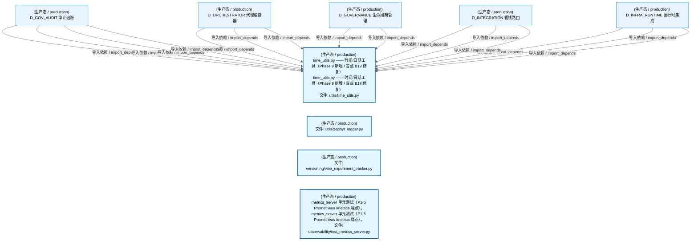

# 08_d_shared / 共享服务 / Shared Services

> **功能简介 / Overview**: 共享服务，负责跨域共享的工具、协议和基础服务

> **文档作用 / Purpose**: 展示 共享服务（D_SHARED）功能域的模块清单、域内依赖关系、跨域依赖关系、架构分层视图，供架构审查和域治理参考。

> 本文档由 generate_domain_doc.py 从 depgraph (PostgreSQL) 自动生成
> 数据源: depgraph (PostgreSQL) nodes表 + edges表

> **[可缩放 HTML 版 / Zoomable HTML](http://localhost:8765/docs/02_enterprise_architecture/02_domain_architecture_docs/08_d_shared.html)** — Ctrl+滚轮缩放 ｜ 双击重置 ｜ Ctrl+Shift+D 切换拖动/选择模式

## 域基本信息 / Domain Overview

| 字段 | 值 | Field | Value |
|------|------|-------|-------|
| 编号 | 08 | Number | 08 |
| 域ID | D_SHARED | Domain ID | D_SHARED |
| 域名称 | 共享服务 | Domain Name | Shared Services |
| 层级 | L0 基础设施层 | Layer | L0 Infrastructure |
| 模块数 | 184 | Module Count | 184 |
| 域内依赖 | 99 | Internal Dependencies | 99 |
| 跨域入边 | 759 | Cross-domain Incoming | 759 |
| 跨域出边 | 8 | Cross-domain Outgoing | 8 |
| 设计态模块 | 0 | Design Modules | 0 |
| 生产态模块 | 184 | Production Modules | 184 |
| 容量 | 184/150 (超容) | Capacity | 184/150 (超容) |
| 描述 | 事件总线(event_bus) | Description | 事件总线(event_bus) |

## 模块分层清单 / Module Layered List

> 按 architecture_layer 分组的模块清单（共 184 个模块 / 184 modules）。

### L0 基础设施层 / Infrastructure Layer (184 modules)

| # | 模块路径 / Module Path | 模块名称 / Module Name (功能简介 / Description) | 成熟度 / Maturity | 蓝图 / Blueprint |
|:--:|---------|---------|:---:|:---:|
| 1 | src/zephyr/shared/__version__.py | __version__.py —— ZephyrAlpha Shared 模块版本常量 | 生产态 / production | [MOD-INF-016](../../03_modules/_cross_layer/shared_core/blueprint.md) |
| 2 | src/zephyr/shared/_cross_layer/ml_experiment_pipeline.py | MLExperimentPipeline D_ML_TRAIN->实验跨层集成管道 | 生产态 / production | [MOD-INF-002](../../03_modules/_domain_infrastructure_runtime/runtime_integration/blueprint.md) |
| 3 | src/zephyr/shared/adaptation/execution_tuner.py | Execution Tuner — 执行调谐器（token/timeout 自适应）。 | 生产态 / production | [MOD-INF-016](../../03_modules/_cross_layer/shared_core/blueprint.md) |
| 4 | src/zephyr/shared/adaptation/prompt_version_manager.py | Prompt Version Manager — 版本化 Prompt 治理。 | 生产态 / production | [MOD-INF-016](../../03_modules/_cross_layer/shared_core/blueprint.md) |
| 5 | src/zephyr/shared/ai_guards/ai_audit_guard.py | ai_guards/ai_audit_guard.py | 生产态 / production | [MOD-INF-016](../../03_modules/_cross_layer/shared_core/blueprint.md) |
| 6 | src/zephyr/shared/ai_guards/combinatorial_gate.py | ai_guards/combinatorial_gate.py | 生产态 / production | [MOD-INF-016](../../03_modules/_cross_layer/shared_core/blueprint.md) |
| 7 | src/zephyr/shared/ai_guards/core_integrity_guard.py | ai_guards/core_integrity_guard.py | 生产态 / production | [MOD-INF-016](../../03_modules/_cross_layer/shared_core/blueprint.md) |
| 8 | src/zephyr/shared/alerts/alert_escalation.py | AlertEscalation — re-homed to eliminate shared->infrastructure circular import. | 生产态 / production | [MOD-INF-016](../../03_modules/_cross_layer/shared_core/blueprint.md) |
| 9 | src/zephyr/shared/alerts/alert_manager.py | alerts/alert_manager.py | 生产态 / production | [MOD-INF-016](../../03_modules/_cross_layer/shared_core/blueprint.md) |
| 10 | src/zephyr/shared/alerts/alert_precision_tracker.py | alerts/alert_precision_tracker.py | 生产态 / production | [MOD-INF-016](../../03_modules/_cross_layer/shared_core/blueprint.md) |
| 11 | src/zephyr/shared/alerts/dual_channel_alert.py | alerts/dual_channel_alert.py | 生产态 / production | [MOD-INF-016](../../03_modules/_cross_layer/shared_core/blueprint.md) |
| 12 | src/zephyr/shared/alerts/heartbeat_server.py | alerts/heartbeat_server.py | 生产态 / production | [MOD-INF-016](../../03_modules/_cross_layer/shared_core/blueprint.md) |
| 13 | src/zephyr/shared/api/api_client.py | api_client.py —— 统一 API Client 基类（Phase 7 新增 | 盲点 B11 修复） | 生产态 / production | [MOD-INF-016](../../03_modules/_cross_layer/shared_core/blueprint.md) |
| 14 | src/zephyr/shared/api/api_index.py | shared/ API 索引 — AI session 冷启动时的"员工通讯录" | 生产态 / production | [MOD-INF-016](../../03_modules/_cross_layer/shared_core/blueprint.md) |
| 15 | src/zephyr/shared/api/dos_launcher.py | api/dos_launcher.py | 生产态 / production | [MOD-INF-016](../../03_modules/_cross_layer/shared_core/blueprint.md) |
| 16 | src/zephyr/shared/blueprint_tools/ai_understandability_co... | blueprint_tools/ai_understandability_constraint.py | 生产态 / production | [MOD-INF-016](../../03_modules/_cross_layer/shared_core/blueprint.md) |
| 17 | src/zephyr/shared/blueprint_tools/blueprint_code_auditor.py | blueprint_tools/blueprint_code_auditor.py | 生产态 / production | [MOD-INF-016](../../03_modules/_cross_layer/shared_core/blueprint.md) |
| 18 | src/zephyr/shared/blueprint_tools/blueprint_decomposer.py | ZephyrAlpha 蓝图拆解器 | 生产态 / production |  |
| 19 | src/zephyr/shared/blueprint_tools/blueprint_scorer.py | blueprint_scorer.py — Re-export wrapper -> canonical: zephyr.orchestrator.qu... | 生产态 / production | [MOD-INF-016](../../03_modules/_cross_layer/shared_core/blueprint.md) |
| 20 | src/zephyr/shared/capacity_governance/adaptive_sampler.py | capacity_governance/adaptive_sampler.py | 生产态 / production | [MOD-INF-016](../../03_modules/_cross_layer/shared_core/blueprint.md) |
| 21 | src/zephyr/shared/capacity_governance/budget_aware_prompt.py | capacity_governance/budget_aware_prompt.py | 生产态 / production | [MOD-INF-016](../../03_modules/_cross_layer/shared_core/blueprint.md) |
| 22 | src/zephyr/shared/capacity_governance/capacity_calibrator.py | capacity_governance/capacity_calibrator.py | 生产态 / production | [MOD-INF-016](../../03_modules/_cross_layer/shared_core/blueprint.md) |
| 23 | src/zephyr/shared/capacity_governance/capacity_digital_tw... | capacity_governance/capacity_digital_twin.py | 生产态 / production | [MOD-INF-016](../../03_modules/_cross_layer/shared_core/blueprint.md) |
| 24 | src/zephyr/shared/capacity_governance/capacity_fingerprin... | capacity_governance/capacity_fingerprint.py | 生产态 / production | [MOD-INF-016](../../03_modules/_cross_layer/shared_core/blueprint.md) |
| 25 | src/zephyr/shared/capacity_governance/capacity_runbook_ge... | capacity_governance/capacity_runbook_generator.py | 生产态 / production | [MOD-INF-016](../../03_modules/_cross_layer/shared_core/blueprint.md) |
| 26 | src/zephyr/shared/capacity_governance/cost_estimator.py | capacity_governance/cost_estimator.py | 生产态 / production | [MOD-INF-016](../../03_modules/_cross_layer/shared_core/blueprint.md) |
| 27 | src/zephyr/shared/capacity_governance/dependency_capacity... | capacity_governance/dependency_capacity_guard.py | 生产态 / production | [MOD-INF-016](../../03_modules/_cross_layer/shared_core/blueprint.md) |
| 28 | src/zephyr/shared/capacity_governance/model_capacity_prob... | capacity_governance/model_capacity_probe.py | 生产态 / production | [MOD-INF-016](../../03_modules/_cross_layer/shared_core/blueprint.md) |
| 29 | src/zephyr/shared/compensation/saga_compensator.py | Saga Compensator — 补偿事务：多步操作任一失败 -> 反向补偿。 | 生产态 / production | [MOD-INF-016](../../03_modules/_cross_layer/shared_core/blueprint.md) |
| 30 | src/zephyr/shared/context/context_engine.py | Context Engine — AI 上下文组装与 Token 预算管理。 | 生产态 / production | [MOD-INF-016](../../03_modules/_cross_layer/shared_core/blueprint.md) |
| 31 | src/zephyr/shared/contracts/backpressure/_types.py | Shared internal backpressure type definitions. | 生产态 / production | [MOD-INF-016](../../03_modules/_cross_layer/shared_core/blueprint.md) |
| 32 | src/zephyr/shared/contracts/backpressure/pause.py | backpressure/pause.py | 生产态 / production | [MOD-INF-016](../../03_modules/_cross_layer/shared_core/blueprint.md) |
| 33 | src/zephyr/shared/contracts/backpressure/resume.py | backpressure/resume.py | 生产态 / production | [MOD-INF-016](../../03_modules/_cross_layer/shared_core/blueprint.md) |
| 34 | src/zephyr/shared/contracts/backpressure/throttle.py | backpressure/throttle.py | 生产态 / production | [MOD-INF-016](../../03_modules/_cross_layer/shared_core/blueprint.md) |
| 35 | src/zephyr/shared/contracts/contract_bus.py | ContractBus — 跨层通信抽象 + Pydantic v2 Schema Enforcement (M-09) | 生产态 / production | [MOD-INF-016](../../03_modules/_cross_layer/shared_core/blueprint.md) |
| 36 | src/zephyr/shared/contracts/core/base_event.py | BaseEvent — 跨层事件基类 | 生产态 / production | [MOD-INF-002](../../03_modules/_domain_infrastructure_runtime/runtime_integration/blueprint.md) |
| 37 | src/zephyr/shared/contracts/core/enforcer.py | ZephyrAlpha — shared/contracts/enforcer.py | 生产态 / production | [MOD-INF-002](../../03_modules/_domain_infrastructure_runtime/runtime_integration/blueprint.md) |
| 38 | src/zephyr/shared/contracts/core/factories.py | shared/contracts/factories.py — 跨层数据契约工厂方法 | 生产态 / production | [MOD-INF-002](../../03_modules/_domain_infrastructure_runtime/runtime_integration/blueprint.md) |
| 39 | src/zephyr/shared/contracts/core/gate_types.py | core/gate_types.py | 生产态 / production | [MOD-INF-002](../../03_modules/_domain_infrastructure_runtime/runtime_integration/blueprint.md) |
| 40 | src/zephyr/shared/contracts/core/registry.py | ZephyrAlpha — shared/contracts/registry.py | 生产态 / production | [MOD-INF-002](../../03_modules/_domain_infrastructure_runtime/runtime_integration/blueprint.md) |
| 41 | src/zephyr/shared/contracts/core/runtime_plane_tag.py | ZephyrAlpha — shared/contracts/runtime_plane_tag.py | 生产态 / production | [MOD-INF-002](../../03_modules/_domain_infrastructure_runtime/runtime_integration/blueprint.md) |
| 42 | src/zephyr/shared/contracts/core/system_configuration.py | core/system_configuration.py | 生产态 / production | [MOD-INF-002](../../03_modules/_domain_infrastructure_runtime/runtime_integration/blueprint.md) |
| 43 | src/zephyr/shared/contracts/core/timestamp.py | ZephyrAlpha — shared/contracts/timestamp.py | 生产态 / production | [MOD-INF-002](../../03_modules/_domain_infrastructure_runtime/runtime_integration/blueprint.md) |
| 44 | src/zephyr/shared/contracts/core/trace_context.py | core/trace_context.py | 生产态 / production | [MOD-INF-002](../../03_modules/_domain_infrastructure_runtime/runtime_integration/blueprint.md) |
| 45 | src/zephyr/shared/contracts/enums/__init__.py | shared/contracts/enums — 跨切面交易枚举真源 (5.152 #1 修复) | 生产态 / production | [MOD-INF-016](../../03_modules/_cross_layer/shared_core/blueprint.md) |
| 46 | src/zephyr/shared/contracts/enums/order_enums.py | OrderSide/OrderStatus/OrderType — 交易枚举真源 (5.152 #1 修复) | 生产态 / production | [MOD-INF-016](../../03_modules/_cross_layer/shared_core/blueprint.md) |
| 47 | src/zephyr/shared/contracts/errors/contract_violation_err... | errors/contract_violation_error.py | 生产态 / production | [MOD-INF-016](../../03_modules/_cross_layer/shared_core/blueprint.md) |
| 48 | src/zephyr/shared/contracts/errors/data_quality_error.py | CTR-ERR-001: DataQualityError / 行情质量门禁不通过错误 | 生产态 / production | [MOD-INF-016](../../03_modules/_cross_layer/shared_core/blueprint.md) |
| 49 | src/zephyr/shared/contracts/errors/execution_rejection_er... | errors/execution_rejection_error.py | 生产态 / production | [MOD-INF-016](../../03_modules/_cross_layer/shared_core/blueprint.md) |
| 50 | src/zephyr/shared/contracts/errors/factor_computation_err... | CTR-ERR-002: FactorComputationError / 因子计算失败错误 | 生产态 / production | [MOD-INF-016](../../03_modules/_cross_layer/shared_core/blueprint.md) |
| 51 | src/zephyr/shared/contracts/errors/risk_limit_violation_e... | errors/risk_limit_violation_error.py | 生产态 / production | [MOD-INF-016](../../03_modules/_cross_layer/shared_core/blueprint.md) |
| 52 | src/zephyr/shared/contracts/errors/signal_degradation_war... | errors/signal_degradation_warning.py | 生产态 / production | [MOD-INF-016](../../03_modules/_cross_layer/shared_core/blueprint.md) |
| 53 | src/zephyr/shared/contracts/escalation/budget_alert.py | escalation/budget_alert.py | 生产态 / production | [MOD-INF-016](../../03_modules/_cross_layer/shared_core/blueprint.md) |
| 54 | src/zephyr/shared/contracts/execution/capital_allocation_... | Backward-compat shim — canonical location is zephyr.trading.trading_contract... | 生产态 / production | [MOD-INF-016](../../03_modules/_cross_layer/shared_core/blueprint.md) |
| 55 | src/zephyr/shared/contracts/execution/execution_report.py | Backward-compat shim — canonical location is zephyr.trading.trading_contract... | 生产态 / production | [MOD-INF-016](../../03_modules/_cross_layer/shared_core/blueprint.md) |
| 56 | src/zephyr/shared/contracts/execution/fill.py | Backward-compat shim — canonical location is zephyr.trading.trading_contract... | 生产态 / production | [MOD-INF-016](../../03_modules/_cross_layer/shared_core/blueprint.md) |
| 57 | src/zephyr/shared/contracts/execution/model_serving_reque... | Backward-compat shim — canonical location is zephyr.trading.trading_contract... | 生产态 / production | [MOD-INF-016](../../03_modules/_cross_layer/shared_core/blueprint.md) |
| 58 | src/zephyr/shared/contracts/execution/order.py | Backward-compat shim — canonical location is zephyr.shared.contracts.order (... | 生产态 / production | [MOD-INF-016](../../03_modules/_cross_layer/shared_core/blueprint.md) |
| 59 | src/zephyr/shared/contracts/experiment/experiment_result.py | experiment/experiment_result.py | 生产态 / production | [MOD-INF-016](../../03_modules/_cross_layer/shared_core/blueprint.md) |
| 60 | src/zephyr/shared/contracts/experiment/model_serving_resp... | experiment/model_serving_response.py | 生产态 / production | [MOD-INF-016](../../03_modules/_cross_layer/shared_core/blueprint.md) |
| 61 | src/zephyr/shared/contracts/external/ext_001.py | external/ext_001.py | 生产态 / production | [MOD-INF-016](../../03_modules/_cross_layer/shared_core/blueprint.md) |
| 62 | src/zephyr/shared/contracts/external/ext_002.py | external/ext_002.py | 生产态 / production | [MOD-INF-016](../../03_modules/_cross_layer/shared_core/blueprint.md) |
| 63 | src/zephyr/shared/contracts/external/ext_003.py | external/ext_003.py | 生产态 / production | [MOD-INF-016](../../03_modules/_cross_layer/shared_core/blueprint.md) |
| 64 | src/zephyr/shared/contracts/external/ext_004.py | external/ext_004.py | 生产态 / production | [MOD-INF-016](../../03_modules/_cross_layer/shared_core/blueprint.md) |
| 65 | src/zephyr/shared/contracts/identity/agent_identity.py | identity/agent_identity.py | 生产态 / production | [MOD-INF-016](../../03_modules/_cross_layer/shared_core/blueprint.md) |
| 66 | src/zephyr/shared/contracts/identity/permission.py | identity/permission.py | 生产态 / production | [MOD-INF-016](../../03_modules/_cross_layer/shared_core/blueprint.md) |
| 67 | src/zephyr/shared/contracts/llm_gateway_protocol.py | LLMGatewayProtocol — LLM 网关抽象接口 | 生产态 / production | [MOD-INF-016](../../03_modules/_cross_layer/shared_core/blueprint.md) |
| 68 | src/zephyr/shared/contracts/market/instrument.py | Backward-compat shim — canonical location is zephyr.trading.trading_contract... | 生产态 / production | [MOD-INF-016](../../03_modules/_cross_layer/shared_core/blueprint.md) |
| 69 | src/zephyr/shared/contracts/orchestration_protocol.py | contracts/orchestration_protocol.py | 生产态 / production | [MOD-INF-016](../../03_modules/_cross_layer/shared_core/blueprint.md) |
| 70 | src/zephyr/shared/contracts/portfolio/money.py | portfolio/money.py | 生产态 / production | [MOD-INF-016](../../03_modules/_cross_layer/shared_core/blueprint.md) |
| 71 | src/zephyr/shared/contracts/portfolio/performance_attribu... | Re-export shim — 真源已收敛至 zephyr.shared.contracts.performance_attributio... | 生产态 / production | [MOD-INF-016](../../03_modules/_cross_layer/shared_core/blueprint.md) |
| 72 | src/zephyr/shared/contracts/portfolio/position.py | Backward-compat shim — canonical location is zephyr.trading.trading_contract... | 生产态 / production | [MOD-INF-016](../../03_modules/_cross_layer/shared_core/blueprint.md) |
| 73 | src/zephyr/shared/contracts/risk/compliance_rule.py | Backward-compat shim — canonical location is zephyr.trading.trading_contract... | 生产态 / production | [MOD-INF-016](../../03_modules/_cross_layer/shared_core/blueprint.md) |
| 74 | src/zephyr/shared/contracts/risk/risk_dashboard_snapshot.py | Backward-compat shim — canonical location is zephyr.trading.trading_contract... | 生产态 / production | [MOD-INF-016](../../03_modules/_cross_layer/shared_core/blueprint.md) |
| 75 | src/zephyr/shared/contracts/risk/risk_limits.py | Backward-compat shim — canonical location is zephyr.trading.trading_contract... | 生产态 / production | [MOD-INF-016](../../03_modules/_cross_layer/shared_core/blueprint.md) |
| 76 | src/zephyr/shared/contracts/risk/risk_metrics.py | Backward-compat shim — canonical location is zephyr.trading.trading_contract... | 生产态 / production | [MOD-INF-016](../../03_modules/_cross_layer/shared_core/blueprint.md) |
| 77 | src/zephyr/shared/contracts/risk/risk_validator_protocol.py | Backward-compat shim — canonical location is zephyr.trading.trading_contract... | 生产态 / production | [MOD-INF-016](../../03_modules/_cross_layer/shared_core/blueprint.md) |
| 78 | src/zephyr/shared/contracts/security/security_decision.py | security/security_decision.py | 生产态 / production | [MOD-INF-016](../../03_modules/_cross_layer/shared_core/blueprint.md) |
| 79 | src/zephyr/shared/contracts/skill_protocol.py | contracts/skill_protocol.py | 生产态 / production | [MOD-INF-016](../../03_modules/_cross_layer/shared_core/blueprint.md) |
| 80 | src/zephyr/shared/contracts/task_repository_protocol.py | TaskRepositoryProtocol — TaskRepository 的 Protocol 接口 | 生产态 / production | [MOD-INF-016](../../03_modules/_cross_layer/shared_core/blueprint.md) |
| 81 | src/zephyr/shared/database/__init__.py | 共享数据库工具包：提供 DatabaseService 共用的 CRUD mixin。 | 生产态 / production | [SH-DB-001](../../03_modules/_cross_layer/database/blueprint.md) |
| 82 | src/zephyr/shared/database/database_crud_mixin.py | DatabaseCRUDMixin: 共享的 governance.db + depgraph CRUD 方法 | 生产态 / production | [SH-DB-001](../../03_modules/_cross_layer/database/blueprint.md) |
| 83 | src/zephyr/shared/dependency/dependency_graph.py | Dependency Graph — 任务卡依赖关系管理。 | 生产态 / production | [MOD-INF-016](../../03_modules/_cross_layer/shared_core/blueprint.md) |
| 84 | src/zephyr/shared/draft/draft_assistant.py | Draft Assistant — 想法 -> MTH-012 蓝图骨架生成。 | 生产态 / production | [MOD-INF-016](../../03_modules/_cross_layer/shared_core/blueprint.md) |
| 85 | src/zephyr/shared/event_bus.py | EventBus — 事件总线（带背压控制）(M-07) | 生产态 / production | [MOD-INF-016](../../03_modules/_cross_layer/shared_core/blueprint.md) |
| 86 | src/zephyr/shared/events/dlq.py | dlq.py —— ZephyrAlpha 死信队列（Dead Letter Queue） | 生产态 / production | [MOD-INF-016](../../03_modules/_cross_layer/shared_core/blueprint.md) |
| 87 | src/zephyr/shared/events/dlq_bridge.py | CT-DLQ-001: DeadLetterQueue -> System Event Bus integration bridge. | 生产态 / production | [MOD-INF-016](../../03_modules/_cross_layer/shared_core/blueprint.md) |
| 88 | src/zephyr/shared/events/event_bus_upgrade.py | EventBus Upgrade — 事件总线升级 (M-16) | 生产态 / production | [MOD-INF-016](../../03_modules/_cross_layer/shared_core/blueprint.md) |
| 89 | src/zephyr/shared/events/event_reactor.py | Event Reactor — 事件反应器（自动响应事件）。 | 生产态 / production | [MOD-INF-016](../../03_modules/_cross_layer/shared_core/blueprint.md) |
| 90 | src/zephyr/shared/events/event_schemas.py | event_schemas.py —— Observer 事件体 Pydantic V2 Schema（盲点 B6/B10 修复） | 生产态 / production | [MOD-INF-016](../../03_modules/_cross_layer/shared_core/blueprint.md) |
| 91 | src/zephyr/shared/events/hook_dispatcher.py | Hook Dispatcher — 任务状态变更 -> 外部回调触发。 | 生产态 / production | [MOD-INF-016](../../03_modules/_cross_layer/shared_core/blueprint.md) |
| 92 | src/zephyr/shared/events/observer.py | observer.py —— Re-export wrapper -> canonical: zephyr.shared.infra.observer | 生产态 / production | [MOD-INF-016](../../03_modules/_cross_layer/shared_core/blueprint.md) |
| 93 | src/zephyr/shared/events/upgrade_strategy.py | EventBus 升级策略引擎 | 生产态 / production | [MOD-INF-016](../../03_modules/_cross_layer/shared_core/blueprint.md) |
| 94 | src/zephyr/shared/foundation/constants.py | constants.py —— 共享枚举 & 常量集中 re-export（Single Source of Truth） | 生产态 / production | [MOD-INF-016](../../03_modules/_cross_layer/shared_core/blueprint.md) |
| 95 | src/zephyr/shared/foundation/deprecation.py | deprecation.py —— ZephyrAlpha API 废弃策略 | 生产态 / production | [MOD-INF-016](../../03_modules/_cross_layer/shared_core/blueprint.md) |
| 96 | src/zephyr/shared/foundation/env.py | foundation/env.py | 生产态 / production | [MOD-INF-016](../../03_modules/_cross_layer/shared_core/blueprint.md) |
| 97 | src/zephyr/shared/foundation/errors.py | errors.py —— ZephyrAlpha 统一错误层次（Traditional Exception Hierarchy） | 生产态 / production | [MOD-INF-016](../../03_modules/_cross_layer/shared_core/blueprint.md) |
| 98 | src/zephyr/shared/foundation/flags.py | foundation/flags.py | 生产态 / production | [MOD-INF-016](../../03_modules/_cross_layer/shared_core/blueprint.md) |
| 99 | src/zephyr/shared/foundation/migration.py | migration.py —— Re-export wrapper -> canonical: zephyr.shared.utils.migration | 生产态 / production | [MOD-INF-016](../../03_modules/_cross_layer/shared_core/blueprint.md) |
| 100 | src/zephyr/shared/foundation/models.py | ZephyrAlpha 任务系统核心数据模型 | 生产态 / production | [MOD-INF-016](../../03_modules/_cross_layer/shared_core/blueprint.md) |
| 101 | src/zephyr/shared/foundation/types.py | types.py —— 共享类型别名 & 语义化 NewType（Phase 3 新增 | 盲点 #5 修复） | 生产态 / production | [MOD-INF-016](../../03_modules/_cross_layer/shared_core/blueprint.md) |
| 102 | src/zephyr/shared/infra/cache.py | cache.py —— 统一缓存抽象（Phase 8 新增 | 盲点 B13 修复） | 生产态 / production | [MOD-INF-016](../../03_modules/_cross_layer/shared_core/blueprint.md) |
| 103 | src/zephyr/shared/infra/idempotency.py | idempotency.py —— 幂等性基础设施（Phase 8 新增 | 盲点 B15 修复） | 生产态 / production | [MOD-INF-016](../../03_modules/_cross_layer/shared_core/blueprint.md) |
| 104 | src/zephyr/shared/infra/limiter.py | infra/limiter.py | 生产态 / production | [MOD-INF-016](../../03_modules/_cross_layer/shared_core/blueprint.md) |
| 105 | src/zephyr/shared/infra/lock.py | lock.py —— 分布式锁抽象（Phase 10 新增 | 盲点 B23 修复） | 生产态 / production | [MOD-INF-016](../../03_modules/_cross_layer/shared_core/blueprint.md) |
| 106 | src/zephyr/shared/infra/observer.py | Zero-dependency Observer pattern (subscribe/emit/unsubscribe). | 生产态 / production | [MOD-INF-016](../../03_modules/_cross_layer/shared_core/blueprint.md) |
| 107 | src/zephyr/shared/infra/outbox.py | outbox.py —— 事务性 Outbox 模式（Phase 10 新增 | 盲点 B24 修复） | 生产态 / production | [MOD-INF-016](../../03_modules/_cross_layer/shared_core/blueprint.md) |
| 108 | src/zephyr/shared/infra/process_lifecycle_gateway.py | ProcessLifecycleGateway — 进程生命周期统一入口 | 生产态 / production | [MOD-INF-016](../../03_modules/_cross_layer/shared_core/blueprint.md) |
| 109 | src/zephyr/shared/infra/process_pool.py | process_pool.py - Shared process pool for MCP servers and subprocess tasks | 生产态 / production | [MOD-INF-016](../../03_modules/_cross_layer/shared_core/blueprint.md) |
| 110 | src/zephyr/shared/io/content_fingerprint.py | SHA-256 content fingerprint computation and verification. | 生产态 / production | [MOD-INF-016](../../03_modules/_cross_layer/shared_core/blueprint.md) |
| 111 | src/zephyr/shared/io/file_utils.py | file_utils.py —— 安全文件操作工具（Phase 3 新增 | 盲点 #15 修复） | 生产态 / production | [MOD-INF-016](../../03_modules/_cross_layer/shared_core/blueprint.md) |
| 112 | src/zephyr/shared/io/frontmatter_utils.py | frontmatter_utils.py — Markdown/YAML frontmatter 解析 SSoT | 生产态 / production | [MOD-INF-016](../../03_modules/_cross_layer/shared_core/blueprint.md) |
| 113 | src/zephyr/shared/io/io_cache.py | io_cache.py - File-level I/O cache with LRU eviction | 生产态 / production | [MOD-INF-016](../../03_modules/_cross_layer/shared_core/blueprint.md) |
| 114 | src/zephyr/shared/io/paths.py | paths.py — 项目路径常量 SSoT（Single Source of Truth） | 生产态 / production | [MOD-INF-016](../../03_modules/_cross_layer/shared_core/blueprint.md) |
| 115 | src/zephyr/shared/io/serialization.py | serialization.py —— 统一序列化/反序列化基础设施（Phase 7 新增 | 盲点 B10 修复） | 生产态 / production | [MOD-INF-016](../../03_modules/_cross_layer/shared_core/blueprint.md) |
| 116 | src/zephyr/shared/io/sqlite_factory.py | SQLite 连接工厂真源（SSoT） | 生产态 / production |  |
| 117 | src/zephyr/shared/io/streaming_reader.py | streaming_reader.py - Memory-efficient streaming file readers | 生产态 / production | [MOD-INF-016](../../03_modules/_cross_layer/shared_core/blueprint.md) |
| 118 | src/zephyr/shared/io/workspace_telemetry.py | workspace_telemetry.py — 主工作区文件操作遥测公共 API（... | 生产态 / production | [MOD-INF-016](../../03_modules/_cross_layer/shared_core/blueprint.md) |
| 119 | src/zephyr/shared/io/yaml_utils.py | yaml_utils.py — vocabulary YAML 加载公共工具（SSoT 真源） | 生产态 / production |  |
| 120 | src/zephyr/shared/lifecycle/health.py | health.py —— ZephyrAlpha 聚合健康检查 | 生产态 / production | [MOD-INF-016](../../03_modules/_cross_layer/shared_core/blueprint.md) |
| 121 | src/zephyr/shared/lifecycle/health_discovery.py | CT-HEALTH-001: System-wide Health Discovery Registration. | 生产态 / production | [MOD-INF-016](../../03_modules/_cross_layer/shared_core/blueprint.md) |
| 122 | src/zephyr/shared/lifecycle/healthcheck_service.py | lifecycle/healthcheck_service.py | 生产态 / production | [MOD-INF-016](../../03_modules/_cross_layer/shared_core/blueprint.md) |
| 123 | src/zephyr/shared/lifecycle/longevity_monitor.py | lifecycle/longevity_monitor.py | 生产态 / production | [MOD-INF-016](../../03_modules/_cross_layer/shared_core/blueprint.md) |
| 124 | src/zephyr/shared/lifecycle/state_machine.py | StateMachine[S] — 通用状态机泛型基类 (MOD-INF-038) | 生产态 / production | [MOD-INF-038](../../03_modules/_domain_infrastructure_runtime/state_machine_engine/blueprint.md) |
| 125 | src/zephyr/shared/lifecycle/task_heartbeat.py | lifecycle/task_heartbeat.py | 生产态 / production | [MOD-INF-016](../../03_modules/_cross_layer/shared_core/blueprint.md) |
| 126 | src/zephyr/shared/lifecycle/ttl_cleanup_engine.py | lifecycle/ttl_cleanup_engine.py | 生产态 / production | [MOD-INF-016](../../03_modules/_cross_layer/shared_core/blueprint.md) |
| 127 | src/zephyr/shared/maintenance/autonomy_monitor.py | Autonomy Monitor — AI 自主等级监控与降级。 | 生产态 / production | [MOD-INF-016](../../03_modules/_cross_layer/shared_core/blueprint.md) |
| 128 | src/zephyr/shared/maintenance/code_economy_analyzer.py | maintenance/code_economy_analyzer.py | 生产态 / production | [MOD-INF-016](../../03_modules/_cross_layer/shared_core/blueprint.md) |
| 129 | src/zephyr/shared/maintenance/dogfooding.py | Dogfooding — 自举测试：用 TaskCard 管理 TaskCard 建设。 | 生产态 / production |  |
| 130 | src/zephyr/shared/maintenance/handbook.py | Onboarding Handbook — AI Agent 施工手册生成。 | 生产态 / production |  |
| 131 | src/zephyr/shared/maintenance/owner_trust_gauge.py | maintenance/owner_trust_gauge.py | 生产态 / production | [MOD-INF-016](../../03_modules/_cross_layer/shared_core/blueprint.md) |
| 132 | src/zephyr/shared/maintenance/slo_review_assistant.py | maintenance/slo_review_assistant.py | 生产态 / production | [MOD-INF-016](../../03_modules/_cross_layer/shared_core/blueprint.md) |
| 133 | src/zephyr/shared/maintenance/zero_config.py | maintenance/zero_config.py | 生产态 / production |  |
| 134 | src/zephyr/shared/observability/dashboard/__init__.py | Grafana 双数据源仪表盘模块（MOD-INF-044）。 | 生产态 / production |  |
| 135 | src/zephyr/shared/observability/metrics.py | metrics.py —— 轻量级 Metrics 收集基础设施（Phase 9 新增 | 盲点 B17 修复） | 生产态 / production | [MOD-INF-016](../../03_modules/_cross_layer/shared_core/blueprint.md) |
| 136 | src/zephyr/shared/observability/metrics_server.py | Prometheus /metrics HTTP 端点（P1-5 可观测性改造）。 | 生产态 / production | [MOD-INF-016](../../03_modules/_cross_layer/shared_core/blueprint.md) |
| 137 | src/zephyr/shared/observability/reasoning_spans.py | observability/reasoning_spans.py | 生产态 / production | [MOD-INF-016](../../03_modules/_cross_layer/shared_core/blueprint.md) |
| 138 | src/zephyr/shared/observability/tracing.py | tracing.py —— OpenTelemetry 分布式追踪（Phase B 补充 | 盲点 B1 修复） | 生产态 / production | [MOD-INF-016](../../03_modules/_cross_layer/shared_core/blueprint.md) |
| 139 | src/zephyr/shared/protocols/a2a/a2a_coordination.py | A2A Coordination — shared interface definitions for multi-agent coordination. | 生产态 / production |  |
| 140 | src/zephyr/shared/protocols/a2a/a2a_protocol.py | Core A2A Protocol interface and governance data contracts. | 生产态 / production |  |
| 141 | src/zephyr/shared/protocols/a2a/a2a_registry.py | A2A Registry and Agent Card contracts — discovery and identity interfaces. | 生产态 / production |  |
| 142 | src/zephyr/shared/protocols/a2a/a2a_schemas.py | A2A data structure contracts — Message, Task, and StateMachine schemas. | 生产态 / production |  |
| 143 | src/zephyr/shared/protocols/capability.py | capability.py —— Re-export wrapper -> canonical: zephyr.shared.security.cap... | 生产态 / production | [MOD-INF-016](../../03_modules/_cross_layer/shared_core/blueprint.md) |
| 144 | src/zephyr/shared/protocols/module_birth_registry.py | protocols/module_birth_registry.py | 生产态 / production | [MOD-INF-016](../../03_modules/_cross_layer/shared_core/blueprint.md) |
| 145 | src/zephyr/shared/protocols/ports.py | ports — D-DATA 服务的 Protocol 定义 | 生产态 / production |  |
| 146 | src/zephyr/shared/protocols/registry.py | registry — 运行时 DI 容器 | 生产态 / production |  |
| 147 | src/zephyr/shared/reliability/diff_planner.py | Diff Planner — 最小增量变更规划器。 | 生产态 / production | [MOD-INF-016](../../03_modules/_cross_layer/shared_core/blueprint.md) |
| 148 | src/zephyr/shared/reliability/retry_handler.py | Retry Handler — 指数退避重试 + 可恢复/不可恢复错误分类。 | 生产态 / production | [MOD-INF-016](../../03_modules/_cross_layer/shared_core/blueprint.md) |
| 149 | src/zephyr/shared/resilience/circuit_breaker.py | circuit_breaker.py —— 轻量熔断器状态机（Phase 2 新增 | 零依赖） | 生产态 / production | [MOD-INF-016](../../03_modules/_cross_layer/shared_core/blueprint.md) |
| 150 | src/zephyr/shared/resilience/degradation_chain.py | resilience/degradation_chain.py | 生产态 / production | [MOD-INF-016](../../03_modules/_cross_layer/shared_core/blueprint.md) |
| 151 | src/zephyr/shared/resilience/error_budget_tracker.py | resilience/error_budget_tracker.py | 生产态 / production | [MOD-INF-016](../../03_modules/_cross_layer/shared_core/blueprint.md) |
| 152 | src/zephyr/shared/resilience/fallback.py | fallback.py —— 降级策略模式（Phase 2 新增 | 零依赖） | 生产态 / production | [MOD-INF-016](../../03_modules/_cross_layer/shared_core/blueprint.md) |
| 153 | src/zephyr/shared/resilience/fault_isolator.py | resilience/fault_isolator.py | 生产态 / production | [MOD-INF-016](../../03_modules/_cross_layer/shared_core/blueprint.md) |
| 154 | src/zephyr/shared/resilience/limiter.py | limiter.py —— Re-export wrapper -> canonical: zephyr.shared.infra.limiter | 生产态 / production | [MOD-INF-016](../../03_modules/_cross_layer/shared_core/blueprint.md) |
| 155 | src/zephyr/shared/resilience/retry.py | retry.py —— 统一重试策略（Phase 2 新增 | 零依赖） | 生产态 / production | [MOD-INF-016](../../03_modules/_cross_layer/shared_core/blueprint.md) |
| 156 | src/zephyr/shared/schema/base_config.py | schema/base_config.py | 生产态 / production | [MOD-INF-016](../../03_modules/_cross_layer/shared_core/blueprint.md) |
| 157 | src/zephyr/shared/schema/execution_model.py | schema/execution_model.py | 生产态 / production | [MOD-INF-016](../../03_modules/_cross_layer/shared_core/blueprint.md) |
| 158 | src/zephyr/shared/schema/schema_registry.py | schema/schema_registry.py | 生产态 / production | [MOD-INF-016](../../03_modules/_cross_layer/shared_core/blueprint.md) |
| 159 | src/zephyr/shared/schema/schemas.py | schema/schemas.py | 生产态 / production | [MOD-INF-016](../../03_modules/_cross_layer/shared_core/blueprint.md) |
| 160 | src/zephyr/shared/schema/severity_types.py | schema/severity_types.py | 生产态 / production | [MOD-INF-016](../../03_modules/_cross_layer/shared_core/blueprint.md) |
| 161 | src/zephyr/shared/schema/task_types.py | task_types — 任务系统核心类型 re-export 层 | 生产态 / production | [MOD-INF-016](../../03_modules/_cross_layer/shared_core/blueprint.md) |
| 162 | src/zephyr/shared/security/capability.py | CBAC 能力检查器 (Capability-Based Access Control) | 生产态 / production | [MOD-INF-016](../../03_modules/_cross_layer/shared_core/blueprint.md) |
| 163 | src/zephyr/shared/security/idempotency.py | idempotency.py —— Re-export wrapper -> canonical: zephyr.shared.infra.idemp... | 生产态 / production | [MOD-INF-016](../../03_modules/_cross_layer/shared_core/blueprint.md) |
| 164 | src/zephyr/shared/security/lock.py | lock.py —— Re-export wrapper -> canonical: zephyr.shared.infra.lock | 生产态 / production | [MOD-INF-016](../../03_modules/_cross_layer/shared_core/blueprint.md) |
| 165 | src/zephyr/shared/security/sandbox_executor.py | SandboxExecutor — re-homed to eliminate shared->infrastructure circular import. | 生产态 / production | [MOD-INF-016](../../03_modules/_cross_layer/shared_core/blueprint.md) |
| 166 | src/zephyr/shared/security/secrets.py | secrets.py —— Secrets 管理抽象（Phase 7 新增 | 盲点 B12 修复） | 生产态 / production | [MOD-INF-016](../../03_modules/_cross_layer/shared_core/blueprint.md) |
| 167 | src/zephyr/shared/security/ssot_guard.py | security/ssot_guard.py | 生产态 / production | [MOD-INF-016](../../03_modules/_cross_layer/shared_core/blueprint.md) |
| 168 | src/zephyr/shared/session/session_audit.py | session_audit.py —— Session 审计轨迹（Phase 12 | 盲点 B32） | 生产态 / production | [MOD-INF-016](../../03_modules/_cross_layer/shared_core/blueprint.md) |
| 169 | src/zephyr/shared/session/session_boundary.py | Session Boundary — 会话边界管理。 | 生产态 / production | [MOD-INF-016](../../03_modules/_cross_layer/shared_core/blueprint.md) |
| 170 | src/zephyr/shared/session/session_continuity.py | SessionContinuity — Session 交接包自动生成与恢复 | 生产态 / production | [MOD-INF-016](../../03_modules/_cross_layer/shared_core/blueprint.md) |
| 171 | src/zephyr/shared/utils/async_utils.py | async_utils.py — async/sync 边界桥接（5.12.8 修复） | 生产态 / production | [MOD-INF-016](../../03_modules/_cross_layer/shared_core/blueprint.md) |
| 172 | src/zephyr/shared/utils/cli_summary.py | CLI Summary — CLI 友好施工汇总。 | 生产态 / production | [MOD-INF-016](../../03_modules/_cross_layer/shared_core/blueprint.md) |
| 173 | src/zephyr/shared/utils/context.py | context.py —— 结构化上下文传播（Phase 8 新增 | 盲点 B16 修复） | 生产态 / production | [MOD-INF-016](../../03_modules/_cross_layer/shared_core/blueprint.md) |
| 174 | src/zephyr/shared/utils/converters.py | converters.py — 类型转换工具（消除 '' vs None 语义鸿沟） | 生产态 / production |  |
| 175 | src/zephyr/shared/utils/db_utils.py | db_utils.py — SQLite 连接公共 API（SSoT: zephyr.governance.persistence.sqlit... | 生产态 / production | [MOD-INF-016](../../03_modules/_cross_layer/shared_core/blueprint.md) |
| 176 | src/zephyr/shared/utils/diff_utils.py | diff_utils.py —— 统一 Diff/Patch 工具（Phase 3 新增 | 盲点 #14 修复） | 生产态 / production | [MOD-INF-016](../../03_modules/_cross_layer/shared_core/blueprint.md) |
| 177 | src/zephyr/shared/utils/logging.py | logging.py —— ZephyrAlpha 结构化日志系统（Structured JSON Logger） | 生产态 / production | [MOD-INF-016](../../03_modules/_cross_layer/shared_core/blueprint.md) |
| 178 | src/zephyr/shared/utils/migration.py | migration.py —— ZephyrAlpha Schema 版本化迁移系统 | 生产态 / production | [MOD-INF-016](../../03_modules/_cross_layer/shared_core/blueprint.md) |
| 179 | src/zephyr/shared/utils/pagination.py | pagination.py —— 通用分页工具（Phase 9 新增 | 盲点 B18 修复） | 生产态 / production | [MOD-INF-016](../../03_modules/_cross_layer/shared_core/blueprint.md) |
| 180 | src/zephyr/shared/utils/testing.py | testing.py —— ZephyrAlpha 共享测试夹具/工厂 | 生产态 / production | [MOD-INF-016](../../03_modules/_cross_layer/shared_core/blueprint.md) |
| 181 | src/zephyr/shared/utils/time_utils.py | time_utils.py —— 时间/日期工具（Phase 9 新增 | 盲点 B19 修复） | 生产态 / production | [MOD-INF-016](../../03_modules/_cross_layer/shared_core/blueprint.md) |
| 182 | src/zephyr/shared/utils/zephyr_logger.py | utils/zephyr_logger.py | 生产态 / production | [MOD-INF-016](../../03_modules/_cross_layer/shared_core/blueprint.md) |
| 183 | src/zephyr/shared/versioning/vibe_experiment_tracker.py | versioning/vibe_experiment_tracker.py | 生产态 / production | [MOD-INF-016](../../03_modules/_cross_layer/shared_core/blueprint.md) |
| 184 | tests/zephyr/shared/observability/test_metrics_server.py | metrics_server 单元测试（P1-5 Prometheus /metrics 端点）。 | 生产态 / production |  |

## 域内依赖图 / Internal Dependency Diagram

> 依赖图内嵌在本文档中，IDE 可直接渲染显示。参考 decision_index.md 设计，分三个视图：合并全景图、运营态子图、设计态子图（按 design_maturity 实际值拆分）。
>
> **图例说明 / Legend**：
> - 🟦 **蓝色 = 运营态模块**（production，已上线运行）
> - 🟧 **橙色虚线 = 设计态模块**（design，蓝图阶段，代码未写）
> - **实线箭头 = 运营态依赖**（已生效的依赖关系）
> - **虚线箭头 = 非运营态依赖**（计划中/验证中的依赖关系）

### 合并全景图（全部模块，标签标注成熟度）

> 展示全部 184 个模块（生产态 184 + 设计态 0），标签标注成熟度。

#### 第 1 页 / 共 7 页

```mermaid
%%{init: {'theme': 'base', 'themeVariables': {'primaryColor': '#eaeaea', 'primaryTextColor': '#333333', 'primaryBorderColor': '#666666', 'lineColor': '#666666', 'secondaryColor': '#eaeaea', 'tertiaryColor': '#eaeaea', 'fontSize': '14px'}}}%%
flowchart TD
    src_zephyr_shared_version_py["(生产态 / production) __version__.py —— ZephyrAlpha Shared 模块版本常量<br/>__version__.py —— ZephyrAlpha Shared 模块版本常量<br/>文件: shared/__version__.py"]
    src_zephyr_shared_cross_layer_ml_experiment_pipeline_py["(生产态 / production) MLExperimentPipeline D_ML_TRAIN->实验跨层集成管道<br/>MLExperimentPipeline D_ML_TRAIN->实验跨层集成管道<br/>文件: _cross_layer/ml_experiment_pipeline.py"]
    src_zephyr_shared_adaptation_execution_tuner_py["(生产态 / production) Execution Tuner — 执行调谐器（token/timeout 自适应）。<br/>Execution Tuner — 执行调谐器（token/timeout 自适应）。<br/>文件: adaptation/execution_tuner.py"]
    src_zephyr_shared_adaptation_prompt_version_manager_py["(生产态 / production) Prompt Version Manager — 版本化 Prompt 治理。<br/>Prompt Version Manager — 版本化 Prompt 治理。<br/>文件: adaptation/prompt_version_manager.py"]
    src_zephyr_shared_ai_guards_ai_audit_guard_py["(生产态 / production)<br/>文件: ai_guards/ai_audit_guard.py"]
    src_zephyr_shared_ai_guards_combinatorial_gate_py["(生产态 / production)<br/>文件: ai_guards/combinatorial_gate.py"]
    src_zephyr_shared_ai_guards_core_integrity_guard_py["(生产态 / production)<br/>文件: ai_guards/core_integrity_guard.py"]
    src_zephyr_shared_alerts_alert_escalation_py["(生产态 / production) AlertEscalation — re-homed to eliminate shared->infrastructure circular import.<br/>AlertEscalation — re-homed to eliminate shared->infrastructure circular import.<br/>文件: alerts/alert_escalation.py"]
    src_zephyr_shared_alerts_alert_manager_py["(生产态 / production)<br/>文件: alerts/alert_manager.py"]
    src_zephyr_shared_alerts_alert_precision_tracker_py["(生产态 / production)<br/>文件: alerts/alert_precision_tracker.py"]
    src_zephyr_shared_alerts_dual_channel_alert_py["(生产态 / production)<br/>文件: alerts/dual_channel_alert.py"]
    src_zephyr_shared_alerts_heartbeat_server_py["(生产态 / production)<br/>文件: alerts/heartbeat_server.py"]
    src_zephyr_shared_api_api_client_py["(生产态 / production) api_client.py —— 统一 API Client 基类（Phase 7 新增 / 盲点 B11 修复）<br/>api_client.py —— 统一 API Client 基类（Phase 7 新增 / 盲点 B11 修复）<br/>文件: api/api_client.py"]
    src_zephyr_shared_api_api_index_py["(生产态 / production) shared/ API 索引 — AI session 冷启动时的'员工通讯录'<br/>shared/ API 索引 — AI session 冷启动时的'员工通讯录'<br/>文件: api/api_index.py"]
    src_zephyr_shared_api_dos_launcher_py["(生产态 / production)<br/>文件: api/dos_launcher.py"]
    src_zephyr_shared_blueprint_tools_ai_understandability_constraint_py["(生产态 / production)<br/>文件: blueprint_tools/ai_understandability_constraint.py"]
    src_zephyr_shared_blueprint_tools_blueprint_code_auditor_py["(生产态 / production)<br/>文件: blueprint_tools/blueprint_code_auditor.py"]
    src_zephyr_shared_blueprint_tools_blueprint_decomposer_py["(生产态 / production) ZephyrAlpha 蓝图拆解器<br/>ZephyrAlpha 蓝图拆解器<br/>文件: blueprint_tools/blueprint_decomposer.py"]
    src_zephyr_shared_blueprint_tools_blueprint_scorer_py["(生产态 / production) blueprint_scorer.py — Re-export wrapper -> canonical: zephyr.orchestrator.qu...<br/>blueprint_scorer.py — Re-export wrapper -> canonical: zephyr.orchestrator.qu...<br/>文件: blueprint_tools/blueprint_scorer.py"]
    src_zephyr_shared_capacity_governance_adaptive_sampler_py["(生产态 / production)<br/>文件: capacity_governance/adaptive_sampler.py"]
    src_zephyr_shared_capacity_governance_budget_aware_prompt_py["(生产态 / production)<br/>文件: capacity_governance/budget_aware_prompt.py"]
    src_zephyr_shared_capacity_governance_capacity_calibrator_py["(生产态 / production)<br/>文件: capacity_governance/capacity_calibrator.py"]
    src_zephyr_shared_capacity_governance_capacity_digital_twin_py["(生产态 / production)<br/>文件: capacity_governance/capacity_digital_twin.py"]
    src_zephyr_shared_capacity_governance_capacity_fingerprint_py["(生产态 / production)<br/>文件: capacity_governance/capacity_fingerprint.py"]
    src_zephyr_shared_capacity_governance_capacity_runbook_generator_py["(生产态 / production)<br/>文件: capacity_governance/capacity_runbook_generator.py"]
    src_zephyr_shared_capacity_governance_cost_estimator_py["(生产态 / production)<br/>文件: capacity_governance/cost_estimator.py"]
    src_zephyr_shared_capacity_governance_dependency_capacity_guard_py["(生产态 / production)<br/>文件: capacity_governance/dependency_capacity_guard.py"]
    src_zephyr_shared_capacity_governance_model_capacity_probe_py["(生产态 / production)<br/>文件: capacity_governance/model_capacity_probe.py"]
    src_zephyr_shared_compensation_saga_compensator_py["(生产态 / production) Saga Compensator — 补偿事务：多步操作任一失败 -> 反向补偿。<br/>Saga Compensator — 补偿事务：多步操作任一失败 -> 反向补偿。<br/>文件: compensation/saga_compensator.py"]
    src_zephyr_shared_context_context_engine_py["(生产态 / production) Context Engine — AI 上下文组装与 Token 预算管理。<br/>Context Engine — AI 上下文组装与 Token 预算管理。<br/>文件: context/context_engine.py"]
    src_zephyr_shared_version_py ~~~ src_zephyr_shared_cross_layer_ml_experiment_pipeline_py
    src_zephyr_shared_cross_layer_ml_experiment_pipeline_py ~~~ src_zephyr_shared_adaptation_execution_tuner_py
    src_zephyr_shared_adaptation_execution_tuner_py ~~~ src_zephyr_shared_adaptation_prompt_version_manager_py
    src_zephyr_shared_adaptation_prompt_version_manager_py ~~~ src_zephyr_shared_ai_guards_ai_audit_guard_py
    src_zephyr_shared_ai_guards_ai_audit_guard_py ~~~ src_zephyr_shared_ai_guards_combinatorial_gate_py
    src_zephyr_shared_ai_guards_combinatorial_gate_py ~~~ src_zephyr_shared_ai_guards_core_integrity_guard_py
    src_zephyr_shared_ai_guards_core_integrity_guard_py ~~~ src_zephyr_shared_alerts_alert_escalation_py
    src_zephyr_shared_alerts_alert_escalation_py ~~~ src_zephyr_shared_alerts_alert_manager_py
    src_zephyr_shared_alerts_alert_manager_py ~~~ src_zephyr_shared_alerts_alert_precision_tracker_py
    src_zephyr_shared_alerts_alert_precision_tracker_py ~~~ src_zephyr_shared_alerts_dual_channel_alert_py
    src_zephyr_shared_alerts_dual_channel_alert_py ~~~ src_zephyr_shared_alerts_heartbeat_server_py
    src_zephyr_shared_alerts_heartbeat_server_py ~~~ src_zephyr_shared_api_api_client_py
    src_zephyr_shared_api_api_client_py ~~~ src_zephyr_shared_api_api_index_py
    src_zephyr_shared_api_api_index_py ~~~ src_zephyr_shared_api_dos_launcher_py
    src_zephyr_shared_api_dos_launcher_py ~~~ src_zephyr_shared_blueprint_tools_ai_understandability_constraint_py
    src_zephyr_shared_blueprint_tools_ai_understandability_constraint_py ~~~ src_zephyr_shared_blueprint_tools_blueprint_code_auditor_py
    src_zephyr_shared_blueprint_tools_blueprint_code_auditor_py ~~~ src_zephyr_shared_blueprint_tools_blueprint_decomposer_py
    src_zephyr_shared_blueprint_tools_blueprint_decomposer_py ~~~ src_zephyr_shared_blueprint_tools_blueprint_scorer_py
    src_zephyr_shared_blueprint_tools_blueprint_scorer_py ~~~ src_zephyr_shared_capacity_governance_adaptive_sampler_py
    src_zephyr_shared_capacity_governance_adaptive_sampler_py ~~~ src_zephyr_shared_capacity_governance_budget_aware_prompt_py
    src_zephyr_shared_capacity_governance_budget_aware_prompt_py ~~~ src_zephyr_shared_capacity_governance_capacity_calibrator_py
    src_zephyr_shared_capacity_governance_capacity_calibrator_py ~~~ src_zephyr_shared_capacity_governance_capacity_digital_twin_py
    src_zephyr_shared_capacity_governance_capacity_digital_twin_py ~~~ src_zephyr_shared_capacity_governance_capacity_fingerprint_py
    src_zephyr_shared_capacity_governance_capacity_fingerprint_py ~~~ src_zephyr_shared_capacity_governance_capacity_runbook_generator_py
    src_zephyr_shared_capacity_governance_capacity_runbook_generator_py ~~~ src_zephyr_shared_capacity_governance_cost_estimator_py
    src_zephyr_shared_capacity_governance_cost_estimator_py ~~~ src_zephyr_shared_capacity_governance_dependency_capacity_guard_py
    src_zephyr_shared_capacity_governance_dependency_capacity_guard_py ~~~ src_zephyr_shared_capacity_governance_model_capacity_probe_py
    src_zephyr_shared_capacity_governance_model_capacity_probe_py ~~~ src_zephyr_shared_compensation_saga_compensator_py
    src_zephyr_shared_compensation_saga_compensator_py ~~~ src_zephyr_shared_context_context_engine_py
    D_ML_TRAIN["(生产态 / production) D_ML_TRAIN 训练"]
    src_zephyr_shared_cross_layer_ml_experiment_pipeline_py -->|导入依赖 / import_depends| D_ML_TRAIN
    D_INFRA_RUNTIME["(生产态 / production) D_INFRA_RUNTIME 运行时集成"]
    D_INFRA_RUNTIME -->|导入依赖 / import_depends| src_zephyr_shared_capacity_governance_capacity_fingerprint_py
    D_INTEGRATION["(生产态 / production) D_INTEGRATION 管线路由"]
    D_INTEGRATION -->|导入依赖 / import_depends| src_zephyr_shared_blueprint_tools_blueprint_decomposer_py
    D_INFRA_RUNTIME -->|导入依赖 / import_depends| src_zephyr_shared_capacity_governance_model_capacity_probe_py
    D_INFRA_RUNTIME -->|导入依赖 / import_depends| src_zephyr_shared_blueprint_tools_blueprint_decomposer_py
    D_RISK["(生产态 / production) D_RISK 风控"]
    D_RISK -->|导入依赖 / import_depends| src_zephyr_shared_cross_layer_ml_experiment_pipeline_py
    D_INFRA_RUNTIME -->|导入依赖 / import_depends| src_zephyr_shared_capacity_governance_capacity_calibrator_py
    D_INFRA_RUNTIME -->|导入依赖 / import_depends| src_zephyr_shared_capacity_governance_capacity_digital_twin_py
    D_INFRA_RUNTIME -->|导入依赖 / import_depends| src_zephyr_shared_capacity_governance_capacity_runbook_generator_py
    classDef production fill:#e1f5fe,stroke:#01579b,stroke-width:2px,color:#000
    classDef design fill:#fff3e0,stroke:#e65100,stroke-width:2px,color:#000,stroke-dasharray: 5 5
    classDef external_prod fill:#e8f4fd,stroke:#0277bd,stroke-width:1px,color:#000
    classDef external_design fill:#fff8e7,stroke:#ef6c00,stroke-width:1px,color:#000,stroke-dasharray: 5 5
    class src_zephyr_shared_version_py,src_zephyr_shared_cross_layer_ml_experiment_pipeline_py,src_zephyr_shared_adaptation_execution_tuner_py,src_zephyr_shared_adaptation_prompt_version_manager_py,src_zephyr_shared_ai_guards_ai_audit_guard_py,src_zephyr_shared_ai_guards_combinatorial_gate_py,src_zephyr_shared_ai_guards_core_integrity_guard_py,src_zephyr_shared_alerts_alert_escalation_py,src_zephyr_shared_alerts_alert_manager_py,src_zephyr_shared_alerts_alert_precision_tracker_py,src_zephyr_shared_alerts_dual_channel_alert_py,src_zephyr_shared_alerts_heartbeat_server_py,src_zephyr_shared_api_api_client_py,src_zephyr_shared_api_api_index_py,src_zephyr_shared_api_dos_launcher_py,src_zephyr_shared_blueprint_tools_ai_understandability_constraint_py,src_zephyr_shared_blueprint_tools_blueprint_code_auditor_py,src_zephyr_shared_blueprint_tools_blueprint_decomposer_py,src_zephyr_shared_blueprint_tools_blueprint_scorer_py,src_zephyr_shared_capacity_governance_adaptive_sampler_py,src_zephyr_shared_capacity_governance_budget_aware_prompt_py,src_zephyr_shared_capacity_governance_capacity_calibrator_py,src_zephyr_shared_capacity_governance_capacity_digital_twin_py,src_zephyr_shared_capacity_governance_capacity_fingerprint_py,src_zephyr_shared_capacity_governance_capacity_runbook_generator_py,src_zephyr_shared_capacity_governance_cost_estimator_py,src_zephyr_shared_capacity_governance_dependency_capacity_guard_py,src_zephyr_shared_capacity_governance_model_capacity_probe_py,src_zephyr_shared_compensation_saga_compensator_py,src_zephyr_shared_context_context_engine_py production
    class D_ML_TRAIN,D_INFRA_RUNTIME,D_INTEGRATION,D_RISK external_prod
```



#### 第 2 页 / 共 7 页

```mermaid
%%{init: {'theme': 'base', 'themeVariables': {'primaryColor': '#eaeaea', 'primaryTextColor': '#333333', 'primaryBorderColor': '#666666', 'lineColor': '#666666', 'secondaryColor': '#eaeaea', 'tertiaryColor': '#eaeaea', 'fontSize': '14px'}}}%%
flowchart TD
    src_zephyr_shared_contracts_backpressure_types_py["(生产态 / production) Shared internal backpressure type definitions.<br/>Shared internal backpressure type definitions.<br/>文件: backpressure/_types.py"]
    src_zephyr_shared_contracts_backpressure_pause_py["(生产态 / production)<br/>文件: backpressure/pause.py"]
    src_zephyr_shared_contracts_backpressure_resume_py["(生产态 / production)<br/>文件: backpressure/resume.py"]
    src_zephyr_shared_contracts_backpressure_throttle_py["(生产态 / production)<br/>文件: backpressure/throttle.py"]
    src_zephyr_shared_contracts_contract_bus_py["(生产态 / production) ContractBus — 跨层通信抽象 + Pydantic v2 Schema Enforcement (M-09)<br/>ContractBus — 跨层通信抽象 + Pydantic v2 Schema Enforcement (M-09)<br/>文件: contracts/contract_bus.py"]
    src_zephyr_shared_contracts_core_base_event_py["(生产态 / production) BaseEvent — 跨层事件基类<br/>BaseEvent — 跨层事件基类<br/>文件: core/base_event.py"]
    src_zephyr_shared_contracts_core_enforcer_py["(生产态 / production) ZephyrAlpha — shared/contracts/enforcer.py<br/>ZephyrAlpha — shared/contracts/enforcer.py<br/>文件: core/enforcer.py"]
    src_zephyr_shared_contracts_core_factories_py["(生产态 / production) shared/contracts/factories.py — 跨层数据契约工厂方法<br/>shared/contracts/factories.py — 跨层数据契约工厂方法<br/>文件: core/factories.py"]
    src_zephyr_shared_contracts_core_gate_types_py["(生产态 / production)<br/>文件: core/gate_types.py"]
    src_zephyr_shared_contracts_core_registry_py["(生产态 / production) ZephyrAlpha — shared/contracts/registry.py<br/>ZephyrAlpha — shared/contracts/registry.py<br/>文件: core/registry.py"]
    src_zephyr_shared_contracts_core_runtime_plane_tag_py["(生产态 / production) ZephyrAlpha — shared/contracts/runtime_plane_tag.py<br/>ZephyrAlpha — shared/contracts/runtime_plane_tag.py<br/>文件: core/runtime_plane_tag.py"]
    src_zephyr_shared_contracts_core_system_configuration_py["(生产态 / production)<br/>文件: core/system_configuration.py"]
    src_zephyr_shared_contracts_core_timestamp_py["(生产态 / production) ZephyrAlpha — shared/contracts/timestamp.py<br/>ZephyrAlpha — shared/contracts/timestamp.py<br/>文件: core/timestamp.py"]
    src_zephyr_shared_contracts_enums_init_py["(生产态 / production) shared/contracts/enums — 跨切面交易枚举真源 (5.152 #1 修复)<br/>shared/contracts/enums — 跨切面交易枚举真源 (5.152 #1 修复)<br/>文件: enums/__init__.py"]
    src_zephyr_shared_contracts_errors_contract_violation_error_py["(生产态 / production)<br/>文件: errors/contract_violation_error.py"]
    src_zephyr_shared_contracts_errors_data_quality_error_py["(生产态 / production) CTR-ERR-001: DataQualityError / 行情质量门禁不通过错误<br/>CTR-ERR-001: DataQualityError / 行情质量门禁不通过错误<br/>文件: errors/data_quality_error.py"]
    src_zephyr_shared_contracts_errors_execution_rejection_error_py["(生产态 / production)<br/>文件: errors/execution_rejection_error.py"]
    src_zephyr_shared_contracts_errors_factor_computation_error_py["(生产态 / production) CTR-ERR-002: FactorComputationError / 因子计算失败错误<br/>CTR-ERR-002: FactorComputationError / 因子计算失败错误<br/>文件: errors/factor_computation_error.py"]
    src_zephyr_shared_contracts_errors_risk_limit_violation_error_py["(生产态 / production)<br/>文件: errors/risk_limit_violation_error.py"]
    src_zephyr_shared_contracts_errors_signal_degradation_warning_py["(生产态 / production)<br/>文件: errors/signal_degradation_warning.py"]
    src_zephyr_shared_contracts_escalation_budget_alert_py["(生产态 / production)<br/>文件: escalation/budget_alert.py"]
    src_zephyr_shared_contracts_execution_capital_allocation_result_py["(生产态 / production) Backward-compat shim — canonical location is zephyr.trading.trading_contract...<br/>Backward-compat shim — canonical location is zephyr.trading.trading_contract...<br/>文件: execution/capital_allocation_result.py"]
    src_zephyr_shared_contracts_execution_execution_report_py["(生产态 / production) Backward-compat shim — canonical location is zephyr.trading.trading_contract...<br/>Backward-compat shim — canonical location is zephyr.trading.trading_contract...<br/>文件: execution/execution_report.py"]
    src_zephyr_shared_contracts_execution_fill_py["(生产态 / production) Backward-compat shim — canonical location is zephyr.trading.trading_contract...<br/>Backward-compat shim — canonical location is zephyr.trading.trading_contract...<br/>文件: execution/fill.py"]
    src_zephyr_shared_contracts_execution_model_serving_request_py["(生产态 / production) Backward-compat shim — canonical location is zephyr.trading.trading_contract...<br/>Backward-compat shim — canonical location is zephyr.trading.trading_contract...<br/>文件: execution/model_serving_request.py"]
    src_zephyr_shared_contracts_execution_order_py["(生产态 / production) Backward-compat shim — canonical location is zephyr.shared.contracts.order (...<br/>Backward-compat shim — canonical location is zephyr.shared.contracts.order (...<br/>文件: execution/order.py"]
    src_zephyr_shared_contracts_experiment_experiment_result_py["(生产态 / production)<br/>文件: experiment/experiment_result.py"]
    src_zephyr_shared_contracts_experiment_model_serving_response_py["(生产态 / production)<br/>文件: experiment/model_serving_response.py"]
    src_zephyr_shared_contracts_backpressure_types_py ~~~ src_zephyr_shared_contracts_backpressure_pause_py
    src_zephyr_shared_contracts_backpressure_pause_py ~~~ src_zephyr_shared_contracts_backpressure_resume_py
    src_zephyr_shared_contracts_backpressure_resume_py ~~~ src_zephyr_shared_contracts_backpressure_throttle_py
    src_zephyr_shared_contracts_backpressure_throttle_py ~~~ src_zephyr_shared_contracts_contract_bus_py
    src_zephyr_shared_contracts_contract_bus_py ~~~ src_zephyr_shared_contracts_core_base_event_py
    src_zephyr_shared_contracts_core_base_event_py ~~~ src_zephyr_shared_contracts_core_enforcer_py
    src_zephyr_shared_contracts_core_enforcer_py ~~~ src_zephyr_shared_contracts_core_factories_py
    src_zephyr_shared_contracts_core_factories_py ~~~ src_zephyr_shared_contracts_core_gate_types_py
    src_zephyr_shared_contracts_core_gate_types_py ~~~ src_zephyr_shared_contracts_core_registry_py
    src_zephyr_shared_contracts_core_registry_py ~~~ src_zephyr_shared_contracts_core_runtime_plane_tag_py
    src_zephyr_shared_contracts_core_runtime_plane_tag_py ~~~ src_zephyr_shared_contracts_core_system_configuration_py
    src_zephyr_shared_contracts_core_system_configuration_py ~~~ src_zephyr_shared_contracts_core_timestamp_py
    src_zephyr_shared_contracts_core_timestamp_py ~~~ src_zephyr_shared_contracts_enums_init_py
    src_zephyr_shared_contracts_enums_init_py ~~~ src_zephyr_shared_contracts_errors_contract_violation_error_py
    src_zephyr_shared_contracts_errors_contract_violation_error_py ~~~ src_zephyr_shared_contracts_errors_data_quality_error_py
    src_zephyr_shared_contracts_errors_data_quality_error_py ~~~ src_zephyr_shared_contracts_errors_execution_rejection_error_py
    src_zephyr_shared_contracts_errors_execution_rejection_error_py ~~~ src_zephyr_shared_contracts_errors_factor_computation_error_py
    src_zephyr_shared_contracts_errors_factor_computation_error_py ~~~ src_zephyr_shared_contracts_errors_risk_limit_violation_error_py
    src_zephyr_shared_contracts_errors_risk_limit_violation_error_py ~~~ src_zephyr_shared_contracts_errors_signal_degradation_warning_py
    src_zephyr_shared_contracts_errors_signal_degradation_warning_py ~~~ src_zephyr_shared_contracts_escalation_budget_alert_py
    src_zephyr_shared_contracts_escalation_budget_alert_py ~~~ src_zephyr_shared_contracts_execution_capital_allocation_result_py
    src_zephyr_shared_contracts_execution_capital_allocation_result_py ~~~ src_zephyr_shared_contracts_execution_execution_report_py
    src_zephyr_shared_contracts_execution_execution_report_py ~~~ src_zephyr_shared_contracts_execution_fill_py
    src_zephyr_shared_contracts_execution_fill_py ~~~ src_zephyr_shared_contracts_execution_model_serving_request_py
    src_zephyr_shared_contracts_execution_model_serving_request_py ~~~ src_zephyr_shared_contracts_execution_order_py
    src_zephyr_shared_contracts_execution_order_py ~~~ src_zephyr_shared_contracts_experiment_experiment_result_py
    src_zephyr_shared_contracts_experiment_experiment_result_py ~~~ src_zephyr_shared_contracts_experiment_model_serving_response_py
    src_zephyr_shared_contracts_core_trace_context_py["(生产态 / production)<br/>文件: core/trace_context.py"]
    src_zephyr_shared_contracts_enums_order_enums_py["(生产态 / production) OrderSide/OrderStatus/OrderType — 交易枚举真源 (5.152 #1 修复)<br/>OrderSide/OrderStatus/OrderType — 交易枚举真源 (5.152 #1 修复)<br/>文件: enums/order_enums.py"]
    src_zephyr_shared_contracts_core_trace_context_py ~~~ src_zephyr_shared_contracts_enums_order_enums_py
    src_zephyr_shared_contracts_backpressure_pause_py -->|导入依赖 / import_depends| src_zephyr_shared_contracts_core_trace_context_py
    src_zephyr_shared_contracts_backpressure_types_py -->|导入依赖 / import_depends| src_zephyr_shared_contracts_core_trace_context_py
    src_zephyr_shared_contracts_backpressure_resume_py -->|导入依赖 / import_depends| src_zephyr_shared_contracts_core_trace_context_py
    src_zephyr_shared_contracts_backpressure_throttle_py -->|导入依赖 / import_depends| src_zephyr_shared_contracts_core_trace_context_py
    src_zephyr_shared_contracts_enums_init_py -->|导入依赖 / import_depends| src_zephyr_shared_contracts_enums_order_enums_py
    src_zephyr_shared_contracts_errors_contract_violation_error_py -->|导入依赖 / import_depends| src_zephyr_shared_contracts_core_trace_context_py
    src_zephyr_shared_contracts_errors_execution_rejection_error_py -->|导入依赖 / import_depends| src_zephyr_shared_contracts_core_trace_context_py
    src_zephyr_shared_contracts_errors_data_quality_error_py -->|导入依赖 / import_depends| src_zephyr_shared_contracts_core_trace_context_py
    src_zephyr_shared_contracts_errors_risk_limit_violation_error_py -->|导入依赖 / import_depends| src_zephyr_shared_contracts_core_trace_context_py
    src_zephyr_shared_contracts_errors_factor_computation_error_py -->|导入依赖 / import_depends| src_zephyr_shared_contracts_core_trace_context_py
    src_zephyr_shared_contracts_errors_signal_degradation_warning_py -->|导入依赖 / import_depends| src_zephyr_shared_contracts_core_trace_context_py
    src_zephyr_shared_contracts_experiment_experiment_result_py -->|导入依赖 / import_depends| src_zephyr_shared_contracts_core_trace_context_py
    D_INFRASTRUCTURE["(生产态 / production) D_INFRASTRUCTURE 跨层契约基础设施"]
    D_INFRASTRUCTURE -->|导入依赖 / import_depends| src_zephyr_shared_contracts_core_trace_context_py
    D_INFRASTRUCTURE -->|导入依赖 / import_depends| src_zephyr_shared_contracts_core_trace_context_py
    D_TRADING["(生产态 / production) D_TRADING 交易运营"]
    D_TRADING -->|导入依赖 / import_depends| src_zephyr_shared_contracts_enums_order_enums_py
    D_INFRASTRUCTURE -->|导入依赖 / import_depends| src_zephyr_shared_contracts_core_trace_context_py
    D_INFRASTRUCTURE -->|导入依赖 / import_depends| src_zephyr_shared_contracts_core_trace_context_py
    D_INTEGRATION["(生产态 / production) D_INTEGRATION 管线路由"]
    D_INTEGRATION -->|导入依赖 / import_depends| src_zephyr_shared_contracts_core_trace_context_py
    D_ML_TRAIN["(生产态 / production) D_ML_TRAIN 训练"]
    D_ML_TRAIN -->|导入依赖 / import_depends| src_zephyr_shared_contracts_experiment_model_serving_response_py
    D_INTEGRATION -->|导入依赖 / import_depends| src_zephyr_shared_contracts_core_trace_context_py
    D_INFRA_RUNTIME["(生产态 / production) D_INFRA_RUNTIME 运行时集成"]
    D_INFRA_RUNTIME -->|导入依赖 / import_depends| src_zephyr_shared_contracts_core_trace_context_py
    D_INFRASTRUCTURE -->|导入依赖 / import_depends| src_zephyr_shared_contracts_core_trace_context_py
    D_GOVERNANCE["(生产态 / production) D_GOVERNANCE 生命周期管理"]
    D_GOVERNANCE -->|导入依赖 / import_depends| src_zephyr_shared_contracts_escalation_budget_alert_py
    D_PF_ALLOC["(生产态 / production) D_PF_ALLOC 组合分配"]
    D_PF_ALLOC -->|导入依赖 / import_depends| src_zephyr_shared_contracts_enums_order_enums_py
    D_INFRASTRUCTURE -->|导入依赖 / import_depends| src_zephyr_shared_contracts_core_trace_context_py
    D_INFRASTRUCTURE -->|导入依赖 / import_depends| src_zephyr_shared_contracts_core_trace_context_py
    D_INFRASTRUCTURE -->|导入依赖 / import_depends| src_zephyr_shared_contracts_core_trace_context_py
    classDef production fill:#e1f5fe,stroke:#01579b,stroke-width:2px,color:#000
    classDef design fill:#fff3e0,stroke:#e65100,stroke-width:2px,color:#000,stroke-dasharray: 5 5
    classDef external_prod fill:#e8f4fd,stroke:#0277bd,stroke-width:1px,color:#000
    classDef external_design fill:#fff8e7,stroke:#ef6c00,stroke-width:1px,color:#000,stroke-dasharray: 5 5
    class src_zephyr_shared_contracts_backpressure_types_py,src_zephyr_shared_contracts_backpressure_pause_py,src_zephyr_shared_contracts_backpressure_resume_py,src_zephyr_shared_contracts_backpressure_throttle_py,src_zephyr_shared_contracts_contract_bus_py,src_zephyr_shared_contracts_core_base_event_py,src_zephyr_shared_contracts_core_enforcer_py,src_zephyr_shared_contracts_core_factories_py,src_zephyr_shared_contracts_core_gate_types_py,src_zephyr_shared_contracts_core_registry_py,src_zephyr_shared_contracts_core_runtime_plane_tag_py,src_zephyr_shared_contracts_core_system_configuration_py,src_zephyr_shared_contracts_core_timestamp_py,src_zephyr_shared_contracts_core_trace_context_py,src_zephyr_shared_contracts_enums_init_py,src_zephyr_shared_contracts_enums_order_enums_py,src_zephyr_shared_contracts_errors_contract_violation_error_py,src_zephyr_shared_contracts_errors_data_quality_error_py,src_zephyr_shared_contracts_errors_execution_rejection_error_py,src_zephyr_shared_contracts_errors_factor_computation_error_py,src_zephyr_shared_contracts_errors_risk_limit_violation_error_py,src_zephyr_shared_contracts_errors_signal_degradation_warning_py,src_zephyr_shared_contracts_escalation_budget_alert_py,src_zephyr_shared_contracts_execution_capital_allocation_result_py,src_zephyr_shared_contracts_execution_execution_report_py,src_zephyr_shared_contracts_execution_fill_py,src_zephyr_shared_contracts_execution_model_serving_request_py,src_zephyr_shared_contracts_execution_order_py,src_zephyr_shared_contracts_experiment_experiment_result_py,src_zephyr_shared_contracts_experiment_model_serving_response_py production
    class D_INFRASTRUCTURE,D_TRADING,D_INTEGRATION,D_ML_TRAIN,D_INFRA_RUNTIME,D_GOVERNANCE,D_PF_ALLOC external_prod
```



#### 第 3 页 / 共 7 页

```mermaid
%%{init: {'theme': 'base', 'themeVariables': {'primaryColor': '#eaeaea', 'primaryTextColor': '#333333', 'primaryBorderColor': '#666666', 'lineColor': '#666666', 'secondaryColor': '#eaeaea', 'tertiaryColor': '#eaeaea', 'fontSize': '14px'}}}%%
flowchart TD
    src_zephyr_shared_contracts_external_ext_001_py["(生产态 / production)<br/>文件: external/ext_001.py"]
    src_zephyr_shared_contracts_external_ext_002_py["(生产态 / production)<br/>文件: external/ext_002.py"]
    src_zephyr_shared_contracts_external_ext_003_py["(生产态 / production)<br/>文件: external/ext_003.py"]
    src_zephyr_shared_contracts_external_ext_004_py["(生产态 / production)<br/>文件: external/ext_004.py"]
    src_zephyr_shared_contracts_identity_agent_identity_py["(生产态 / production)<br/>文件: identity/agent_identity.py"]
    src_zephyr_shared_contracts_identity_permission_py["(生产态 / production)<br/>文件: identity/permission.py"]
    src_zephyr_shared_contracts_llm_gateway_protocol_py["(生产态 / production) LLMGatewayProtocol — LLM 网关抽象接口<br/>LLMGatewayProtocol — LLM 网关抽象接口<br/>文件: contracts/llm_gateway_protocol.py"]
    src_zephyr_shared_contracts_market_instrument_py["(生产态 / production) Backward-compat shim — canonical location is zephyr.trading.trading_contract...<br/>Backward-compat shim — canonical location is zephyr.trading.trading_contract...<br/>文件: market/instrument.py"]
    src_zephyr_shared_contracts_orchestration_protocol_py["(生产态 / production)<br/>文件: contracts/orchestration_protocol.py"]
    src_zephyr_shared_contracts_portfolio_money_py["(生产态 / production)<br/>文件: portfolio/money.py"]
    src_zephyr_shared_contracts_portfolio_performance_attribution_report_py["(生产态 / production) Re-export shim — 真源已收敛至 zephyr.shared.contracts.performance_attributio...<br/>Re-export shim — 真源已收敛至 zephyr.shared.contracts.performance_attributio...<br/>文件: portfolio/performance_attribution_report.py"]
    src_zephyr_shared_contracts_portfolio_position_py["(生产态 / production) Backward-compat shim — canonical location is zephyr.trading.trading_contract...<br/>Backward-compat shim — canonical location is zephyr.trading.trading_contract...<br/>文件: portfolio/position.py"]
    src_zephyr_shared_contracts_risk_compliance_rule_py["(生产态 / production) Backward-compat shim — canonical location is zephyr.trading.trading_contract...<br/>Backward-compat shim — canonical location is zephyr.trading.trading_contract...<br/>文件: risk/compliance_rule.py"]
    src_zephyr_shared_contracts_risk_risk_dashboard_snapshot_py["(生产态 / production) Backward-compat shim — canonical location is zephyr.trading.trading_contract...<br/>Backward-compat shim — canonical location is zephyr.trading.trading_contract...<br/>文件: risk/risk_dashboard_snapshot.py"]
    src_zephyr_shared_contracts_risk_risk_limits_py["(生产态 / production) Backward-compat shim — canonical location is zephyr.trading.trading_contract...<br/>Backward-compat shim — canonical location is zephyr.trading.trading_contract...<br/>文件: risk/risk_limits.py"]
    src_zephyr_shared_contracts_risk_risk_metrics_py["(生产态 / production) Backward-compat shim — canonical location is zephyr.trading.trading_contract...<br/>Backward-compat shim — canonical location is zephyr.trading.trading_contract...<br/>文件: risk/risk_metrics.py"]
    src_zephyr_shared_contracts_risk_risk_validator_protocol_py["(生产态 / production) Backward-compat shim — canonical location is zephyr.trading.trading_contract...<br/>Backward-compat shim — canonical location is zephyr.trading.trading_contract...<br/>文件: risk/risk_validator_protocol.py"]
    src_zephyr_shared_contracts_security_security_decision_py["(生产态 / production)<br/>文件: security/security_decision.py"]
    src_zephyr_shared_contracts_skill_protocol_py["(生产态 / production)<br/>文件: contracts/skill_protocol.py"]
    src_zephyr_shared_contracts_task_repository_protocol_py["(生产态 / production) TaskRepositoryProtocol — TaskRepository 的 Protocol 接口<br/>TaskRepositoryProtocol — TaskRepository 的 Protocol 接口<br/>文件: contracts/task_repository_protocol.py"]
    src_zephyr_shared_database_init_py["(生产态 / production) 共享数据库工具包：提供 DatabaseService 共用的 CRUD mixin。<br/>共享数据库工具包：提供 DatabaseService 共用的 CRUD mixin。<br/>文件: database/__init__.py"]
    src_zephyr_shared_dependency_dependency_graph_py["(生产态 / production) Dependency Graph — 任务卡依赖关系管理。<br/>Dependency Graph — 任务卡依赖关系管理。<br/>文件: dependency/dependency_graph.py"]
    src_zephyr_shared_draft_draft_assistant_py["(生产态 / production) Draft Assistant — 想法 -> MTH-012 蓝图骨架生成。<br/>Draft Assistant — 想法 -> MTH-012 蓝图骨架生成。<br/>文件: draft/draft_assistant.py"]
    src_zephyr_shared_events_dlq_bridge_py["(生产态 / production) CT-DLQ-001: DeadLetterQueue -> System Event Bus integration bridge.<br/>CT-DLQ-001: DeadLetterQueue -> System Event Bus integration bridge.<br/>文件: events/dlq_bridge.py"]
    src_zephyr_shared_events_event_bus_upgrade_py["(生产态 / production) EventBus Upgrade — 事件总线升级 (M-16)<br/>EventBus Upgrade — 事件总线升级 (M-16)<br/>文件: events/event_bus_upgrade.py"]
    src_zephyr_shared_events_event_reactor_py["(生产态 / production) Event Reactor — 事件反应器（自动响应事件）。<br/>Event Reactor — 事件反应器（自动响应事件）。<br/>文件: events/event_reactor.py"]
    src_zephyr_shared_events_event_schemas_py["(生产态 / production) event_schemas.py —— Observer 事件体 Pydantic V2 Schema（盲点 B6/B10 修复）<br/>event_schemas.py —— Observer 事件体 Pydantic V2 Schema（盲点 B6/B10 修复）<br/>文件: events/event_schemas.py"]
    src_zephyr_shared_contracts_external_ext_001_py ~~~ src_zephyr_shared_contracts_external_ext_002_py
    src_zephyr_shared_contracts_external_ext_002_py ~~~ src_zephyr_shared_contracts_external_ext_003_py
    src_zephyr_shared_contracts_external_ext_003_py ~~~ src_zephyr_shared_contracts_external_ext_004_py
    src_zephyr_shared_contracts_external_ext_004_py ~~~ src_zephyr_shared_contracts_identity_agent_identity_py
    src_zephyr_shared_contracts_identity_agent_identity_py ~~~ src_zephyr_shared_contracts_identity_permission_py
    src_zephyr_shared_contracts_identity_permission_py ~~~ src_zephyr_shared_contracts_llm_gateway_protocol_py
    src_zephyr_shared_contracts_llm_gateway_protocol_py ~~~ src_zephyr_shared_contracts_market_instrument_py
    src_zephyr_shared_contracts_market_instrument_py ~~~ src_zephyr_shared_contracts_orchestration_protocol_py
    src_zephyr_shared_contracts_orchestration_protocol_py ~~~ src_zephyr_shared_contracts_portfolio_money_py
    src_zephyr_shared_contracts_portfolio_money_py ~~~ src_zephyr_shared_contracts_portfolio_performance_attribution_report_py
    src_zephyr_shared_contracts_portfolio_performance_attribution_report_py ~~~ src_zephyr_shared_contracts_portfolio_position_py
    src_zephyr_shared_contracts_portfolio_position_py ~~~ src_zephyr_shared_contracts_risk_compliance_rule_py
    src_zephyr_shared_contracts_risk_compliance_rule_py ~~~ src_zephyr_shared_contracts_risk_risk_dashboard_snapshot_py
    src_zephyr_shared_contracts_risk_risk_dashboard_snapshot_py ~~~ src_zephyr_shared_contracts_risk_risk_limits_py
    src_zephyr_shared_contracts_risk_risk_limits_py ~~~ src_zephyr_shared_contracts_risk_risk_metrics_py
    src_zephyr_shared_contracts_risk_risk_metrics_py ~~~ src_zephyr_shared_contracts_risk_risk_validator_protocol_py
    src_zephyr_shared_contracts_risk_risk_validator_protocol_py ~~~ src_zephyr_shared_contracts_security_security_decision_py
    src_zephyr_shared_contracts_security_security_decision_py ~~~ src_zephyr_shared_contracts_skill_protocol_py
    src_zephyr_shared_contracts_skill_protocol_py ~~~ src_zephyr_shared_contracts_task_repository_protocol_py
    src_zephyr_shared_contracts_task_repository_protocol_py ~~~ src_zephyr_shared_database_init_py
    src_zephyr_shared_database_init_py ~~~ src_zephyr_shared_dependency_dependency_graph_py
    src_zephyr_shared_dependency_dependency_graph_py ~~~ src_zephyr_shared_draft_draft_assistant_py
    src_zephyr_shared_draft_draft_assistant_py ~~~ src_zephyr_shared_events_dlq_bridge_py
    src_zephyr_shared_events_dlq_bridge_py ~~~ src_zephyr_shared_events_event_bus_upgrade_py
    src_zephyr_shared_events_event_bus_upgrade_py ~~~ src_zephyr_shared_events_event_reactor_py
    src_zephyr_shared_events_event_reactor_py ~~~ src_zephyr_shared_events_event_schemas_py
    src_zephyr_shared_database_database_crud_mixin_py["(生产态 / production) DatabaseCRUDMixin: 共享的 governance.db + depgraph CRUD 方法<br/>DatabaseCRUDMixin: 共享的 governance.db + depgraph CRUD 方法<br/>文件: database/database_crud_mixin.py"]
    src_zephyr_shared_event_bus_py["(生产态 / production) EventBus — 事件总线（带背压控制）(M-07)<br/>EventBus — 事件总线（带背压控制）(M-07)<br/>文件: shared/event_bus.py"]
    src_zephyr_shared_events_dlq_py["(生产态 / production) dlq.py —— ZephyrAlpha 死信队列（Dead Letter Queue）<br/>dlq.py —— ZephyrAlpha 死信队列（Dead Letter Queue）<br/>文件: events/dlq.py"]
    src_zephyr_shared_database_database_crud_mixin_py ~~~ src_zephyr_shared_event_bus_py
    src_zephyr_shared_event_bus_py ~~~ src_zephyr_shared_events_dlq_py
    src_zephyr_shared_database_init_py -->|config_depends / config_depends| src_zephyr_shared_database_database_crud_mixin_py
    src_zephyr_shared_events_dlq_bridge_py -->|导入依赖 / import_depends| src_zephyr_shared_events_dlq_py
    src_zephyr_shared_events_event_reactor_py -->|导入依赖 / import_depends| src_zephyr_shared_event_bus_py
    D_INFRASTRUCTURE["(生产态 / production) D_INFRASTRUCTURE 跨层契约基础设施"]
    src_zephyr_shared_contracts_portfolio_performance_attribution_report_py -->|导入依赖 / import_depends| D_INFRASTRUCTURE
    D_SECURITY["(生产态 / production) D_SECURITY 对抗验证"]
    D_SECURITY -->|导入依赖 / import_depends| src_zephyr_shared_event_bus_py
    D_AUTONOMY_CORE["(生产态 / production) D_AUTONOMY_CORE 自治核心"]
    D_AUTONOMY_CORE -->|导入依赖 / import_depends| src_zephyr_shared_event_bus_py
    D_SECURITY -->|导入依赖 / import_depends| src_zephyr_shared_contracts_security_security_decision_py
    D_INTEGRATION["(生产态 / production) D_INTEGRATION 管线路由"]
    D_INTEGRATION -->|导入依赖 / import_depends| src_zephyr_shared_contracts_task_repository_protocol_py
    D_INFRA_RUNTIME["(生产态 / production) D_INFRA_RUNTIME 运行时集成"]
    D_INFRA_RUNTIME -->|导入依赖 / import_depends| src_zephyr_shared_event_bus_py
    D_SECURITY -->|导入依赖 / import_depends| src_zephyr_shared_contracts_security_security_decision_py
    D_ORCHESTRATOR["(生产态 / production) D_ORCHESTRATOR 代理编排器"]
    D_ORCHESTRATOR -->|导入依赖 / import_depends| src_zephyr_shared_contracts_orchestration_protocol_py
    D_GOV_ENFORCEMENT["(生产态 / production) D_GOV_ENFORCEMENT 规则执行"]
    D_GOV_ENFORCEMENT -->|导入依赖 / import_depends| src_zephyr_shared_events_dlq_py
    D_INTEGRATION -->|导入依赖 / import_depends| src_zephyr_shared_contracts_llm_gateway_protocol_py
    D_INFRA_RUNTIME -->|导入依赖 / import_depends| src_zephyr_shared_event_bus_py
    D_SECURITY -->|导入依赖 / import_depends| src_zephyr_shared_event_bus_py
    D_INTEGRATION -->|导入依赖 / import_depends| src_zephyr_shared_event_bus_py
    D_TRADING["(生产态 / production) D_TRADING 交易运营"]
    D_TRADING -->|导入依赖 / import_depends| src_zephyr_shared_contracts_task_repository_protocol_py
    D_INFRA_RUNTIME -->|导入依赖 / import_depends| src_zephyr_shared_contracts_task_repository_protocol_py
    D_INFRA_RUNTIME -->|导入依赖 / import_depends| src_zephyr_shared_event_bus_py
    classDef production fill:#e1f5fe,stroke:#01579b,stroke-width:2px,color:#000
    classDef design fill:#fff3e0,stroke:#e65100,stroke-width:2px,color:#000,stroke-dasharray: 5 5
    classDef external_prod fill:#e8f4fd,stroke:#0277bd,stroke-width:1px,color:#000
    classDef external_design fill:#fff8e7,stroke:#ef6c00,stroke-width:1px,color:#000,stroke-dasharray: 5 5
    class src_zephyr_shared_contracts_external_ext_001_py,src_zephyr_shared_contracts_external_ext_002_py,src_zephyr_shared_contracts_external_ext_003_py,src_zephyr_shared_contracts_external_ext_004_py,src_zephyr_shared_contracts_identity_agent_identity_py,src_zephyr_shared_contracts_identity_permission_py,src_zephyr_shared_contracts_llm_gateway_protocol_py,src_zephyr_shared_contracts_market_instrument_py,src_zephyr_shared_contracts_orchestration_protocol_py,src_zephyr_shared_contracts_portfolio_money_py,src_zephyr_shared_contracts_portfolio_performance_attribution_report_py,src_zephyr_shared_contracts_portfolio_position_py,src_zephyr_shared_contracts_risk_compliance_rule_py,src_zephyr_shared_contracts_risk_risk_dashboard_snapshot_py,src_zephyr_shared_contracts_risk_risk_limits_py,src_zephyr_shared_contracts_risk_risk_metrics_py,src_zephyr_shared_contracts_risk_risk_validator_protocol_py,src_zephyr_shared_contracts_security_security_decision_py,src_zephyr_shared_contracts_skill_protocol_py,src_zephyr_shared_contracts_task_repository_protocol_py,src_zephyr_shared_database_init_py,src_zephyr_shared_database_database_crud_mixin_py,src_zephyr_shared_dependency_dependency_graph_py,src_zephyr_shared_draft_draft_assistant_py,src_zephyr_shared_event_bus_py,src_zephyr_shared_events_dlq_py,src_zephyr_shared_events_dlq_bridge_py,src_zephyr_shared_events_event_bus_upgrade_py,src_zephyr_shared_events_event_reactor_py,src_zephyr_shared_events_event_schemas_py production
    class D_INFRASTRUCTURE,D_SECURITY,D_AUTONOMY_CORE,D_INTEGRATION,D_INFRA_RUNTIME,D_ORCHESTRATOR,D_GOV_ENFORCEMENT,D_TRADING external_prod
```



#### 第 4 页 / 共 7 页

```mermaid
%%{init: {'theme': 'base', 'themeVariables': {'primaryColor': '#eaeaea', 'primaryTextColor': '#333333', 'primaryBorderColor': '#666666', 'lineColor': '#666666', 'secondaryColor': '#eaeaea', 'tertiaryColor': '#eaeaea', 'fontSize': '14px'}}}%%
flowchart TD
    src_zephyr_shared_events_hook_dispatcher_py["(生产态 / production) Hook Dispatcher — 任务状态变更 -> 外部回调触发。<br/>Hook Dispatcher — 任务状态变更 -> 外部回调触发。<br/>文件: events/hook_dispatcher.py"]
    src_zephyr_shared_events_upgrade_strategy_py["(生产态 / production) EventBus 升级策略引擎<br/>EventBus 升级策略引擎<br/>文件: events/upgrade_strategy.py"]
    src_zephyr_shared_foundation_constants_py["(生产态 / production) constants.py —— 共享枚举 & 常量集中 re-export（Single Source of Truth）<br/>constants.py —— 共享枚举 & 常量集中 re-export（Single Source of Truth）<br/>文件: foundation/constants.py"]
    src_zephyr_shared_foundation_deprecation_py["(生产态 / production) deprecation.py —— ZephyrAlpha API 废弃策略<br/>deprecation.py —— ZephyrAlpha API 废弃策略<br/>文件: foundation/deprecation.py"]
    src_zephyr_shared_foundation_env_py["(生产态 / production)<br/>文件: foundation/env.py"]
    src_zephyr_shared_foundation_flags_py["(生产态 / production)<br/>文件: foundation/flags.py"]
    src_zephyr_shared_foundation_migration_py["(生产态 / production) migration.py —— Re-export wrapper -> canonical: zephyr.shared.utils.migration<br/>migration.py —— Re-export wrapper -> canonical: zephyr.shared.utils.migration<br/>文件: foundation/migration.py"]
    src_zephyr_shared_foundation_models_py["(生产态 / production) ZephyrAlpha 任务系统核心数据模型<br/>ZephyrAlpha 任务系统核心数据模型<br/>文件: foundation/models.py"]
    src_zephyr_shared_foundation_types_py["(生产态 / production) types.py —— 共享类型别名 & 语义化 NewType（Phase 3 新增 / 盲点 #5 修复）<br/>types.py —— 共享类型别名 & 语义化 NewType（Phase 3 新增 / 盲点 #5 修复）<br/>文件: foundation/types.py"]
    src_zephyr_shared_infra_cache_py["(生产态 / production) cache.py —— 统一缓存抽象（Phase 8 新增 / 盲点 B13 修复）<br/>cache.py —— 统一缓存抽象（Phase 8 新增 / 盲点 B13 修复）<br/>文件: infra/cache.py"]
    src_zephyr_shared_infra_idempotency_py["(生产态 / production) idempotency.py —— 幂等性基础设施（Phase 8 新增 / 盲点 B15 修复）<br/>idempotency.py —— 幂等性基础设施（Phase 8 新增 / 盲点 B15 修复）<br/>文件: infra/idempotency.py"]
    src_zephyr_shared_infra_limiter_py["(生产态 / production)<br/>文件: infra/limiter.py"]
    src_zephyr_shared_infra_lock_py["(生产态 / production) lock.py —— 分布式锁抽象（Phase 10 新增 / 盲点 B23 修复）<br/>lock.py —— 分布式锁抽象（Phase 10 新增 / 盲点 B23 修复）<br/>文件: infra/lock.py"]
    src_zephyr_shared_infra_outbox_py["(生产态 / production) outbox.py —— 事务性 Outbox 模式（Phase 10 新增 / 盲点 B24 修复）<br/>outbox.py —— 事务性 Outbox 模式（Phase 10 新增 / 盲点 B24 修复）<br/>文件: infra/outbox.py"]
    src_zephyr_shared_infra_process_lifecycle_gateway_py["(生产态 / production) ProcessLifecycleGateway — 进程生命周期统一入口<br/>ProcessLifecycleGateway — 进程生命周期统一入口<br/>文件: infra/process_lifecycle_gateway.py"]
    src_zephyr_shared_io_content_fingerprint_py["(生产态 / production) SHA-256 content fingerprint computation and verification.<br/>SHA-256 content fingerprint computation and verification.<br/>文件: io/content_fingerprint.py"]
    src_zephyr_shared_io_file_utils_py["(生产态 / production) file_utils.py —— 安全文件操作工具（Phase 3 新增 / 盲点 #15 修复）<br/>file_utils.py —— 安全文件操作工具（Phase 3 新增 / 盲点 #15 修复）<br/>文件: io/file_utils.py"]
    src_zephyr_shared_io_frontmatter_utils_py["(生产态 / production) frontmatter_utils.py — Markdown/YAML frontmatter 解析 SSoT<br/>frontmatter_utils.py — Markdown/YAML frontmatter 解析 SSoT<br/>文件: io/frontmatter_utils.py"]
    src_zephyr_shared_io_io_cache_py["(生产态 / production) io_cache.py - File-level I/O cache with LRU eviction<br/>io_cache.py - File-level I/O cache with LRU eviction<br/>文件: io/io_cache.py"]
    src_zephyr_shared_io_serialization_py["(生产态 / production) serialization.py —— 统一序列化/反序列化基础设施（Phase 7 新增 / 盲点 B10 修复）<br/>serialization.py —— 统一序列化/反序列化基础设施（Phase 7 新增 / 盲点 B10 修复）<br/>文件: io/serialization.py"]
    src_zephyr_shared_io_sqlite_factory_py["(生产态 / production) SQLite 连接工厂真源（SSoT）<br/>SQLite 连接工厂真源（SSoT）<br/>文件: io/sqlite_factory.py"]
    src_zephyr_shared_io_streaming_reader_py["(生产态 / production) streaming_reader.py - Memory-efficient streaming file readers<br/>streaming_reader.py - Memory-efficient streaming file readers<br/>文件: io/streaming_reader.py"]
    src_zephyr_shared_io_workspace_telemetry_py["(生产态 / production) workspace_telemetry.py — 主工作区文件操作遥测公共 API（...<br/>workspace_telemetry.py — 主工作区文件操作遥测公共 API（...<br/>文件: io/workspace_telemetry.py"]
    src_zephyr_shared_io_yaml_utils_py["(生产态 / production) yaml_utils.py — vocabulary YAML 加载公共工具（SSoT 真源）<br/>yaml_utils.py — vocabulary YAML 加载公共工具（SSoT 真源）<br/>文件: io/yaml_utils.py"]
    src_zephyr_shared_lifecycle_health_py["(生产态 / production) health.py —— ZephyrAlpha 聚合健康检查<br/>health.py —— ZephyrAlpha 聚合健康检查<br/>文件: lifecycle/health.py"]
    src_zephyr_shared_events_hook_dispatcher_py ~~~ src_zephyr_shared_events_upgrade_strategy_py
    src_zephyr_shared_events_upgrade_strategy_py ~~~ src_zephyr_shared_foundation_constants_py
    src_zephyr_shared_foundation_constants_py ~~~ src_zephyr_shared_foundation_deprecation_py
    src_zephyr_shared_foundation_deprecation_py ~~~ src_zephyr_shared_foundation_env_py
    src_zephyr_shared_foundation_env_py ~~~ src_zephyr_shared_foundation_flags_py
    src_zephyr_shared_foundation_flags_py ~~~ src_zephyr_shared_foundation_migration_py
    src_zephyr_shared_foundation_migration_py ~~~ src_zephyr_shared_foundation_models_py
    src_zephyr_shared_foundation_models_py ~~~ src_zephyr_shared_foundation_types_py
    src_zephyr_shared_foundation_types_py ~~~ src_zephyr_shared_infra_cache_py
    src_zephyr_shared_infra_cache_py ~~~ src_zephyr_shared_infra_idempotency_py
    src_zephyr_shared_infra_idempotency_py ~~~ src_zephyr_shared_infra_limiter_py
    src_zephyr_shared_infra_limiter_py ~~~ src_zephyr_shared_infra_lock_py
    src_zephyr_shared_infra_lock_py ~~~ src_zephyr_shared_infra_outbox_py
    src_zephyr_shared_infra_outbox_py ~~~ src_zephyr_shared_infra_process_lifecycle_gateway_py
    src_zephyr_shared_infra_process_lifecycle_gateway_py ~~~ src_zephyr_shared_io_content_fingerprint_py
    src_zephyr_shared_io_content_fingerprint_py ~~~ src_zephyr_shared_io_file_utils_py
    src_zephyr_shared_io_file_utils_py ~~~ src_zephyr_shared_io_frontmatter_utils_py
    src_zephyr_shared_io_frontmatter_utils_py ~~~ src_zephyr_shared_io_io_cache_py
    src_zephyr_shared_io_io_cache_py ~~~ src_zephyr_shared_io_serialization_py
    src_zephyr_shared_io_serialization_py ~~~ src_zephyr_shared_io_sqlite_factory_py
    src_zephyr_shared_io_sqlite_factory_py ~~~ src_zephyr_shared_io_streaming_reader_py
    src_zephyr_shared_io_streaming_reader_py ~~~ src_zephyr_shared_io_workspace_telemetry_py
    src_zephyr_shared_io_workspace_telemetry_py ~~~ src_zephyr_shared_io_yaml_utils_py
    src_zephyr_shared_io_yaml_utils_py ~~~ src_zephyr_shared_lifecycle_health_py
    src_zephyr_shared_events_observer_py["(生产态 / production) observer.py —— Re-export wrapper -> canonical: zephyr.shared.infra.observer<br/>observer.py —— Re-export wrapper -> canonical: zephyr.shared.infra.observer<br/>文件: events/observer.py"]
    src_zephyr_shared_foundation_errors_py["(生产态 / production) errors.py —— ZephyrAlpha 统一错误层次（Traditional Exception Hierarchy）<br/>errors.py —— ZephyrAlpha 统一错误层次（Traditional Exception Hierarchy）<br/>文件: foundation/errors.py"]
    src_zephyr_shared_infra_process_pool_py["(生产态 / production) process_pool.py - Shared process pool for MCP servers and subprocess tasks<br/>process_pool.py - Shared process pool for MCP servers and subprocess tasks<br/>文件: infra/process_pool.py"]
    src_zephyr_shared_io_paths_py["(生产态 / production) paths.py — 项目路径常量 SSoT（Single Source of Truth）<br/>paths.py — 项目路径常量 SSoT（Single Source of Truth）<br/>文件: io/paths.py"]
    src_zephyr_shared_events_observer_py ~~~ src_zephyr_shared_foundation_errors_py
    src_zephyr_shared_foundation_errors_py ~~~ src_zephyr_shared_infra_process_pool_py
    src_zephyr_shared_infra_process_pool_py ~~~ src_zephyr_shared_io_paths_py
    src_zephyr_shared_infra_observer_py["(生产态 / production) Zero-dependency Observer pattern (subscribe/emit/unsubscribe).<br/>Zero-dependency Observer pattern (subscribe/emit/unsubscribe).<br/>文件: infra/observer.py"]
    src_zephyr_shared_events_upgrade_strategy_py -->|导入依赖 / import_depends| src_zephyr_shared_events_observer_py
    src_zephyr_shared_events_hook_dispatcher_py -->|导入依赖 / import_depends| src_zephyr_shared_infra_process_pool_py
    src_zephyr_shared_events_observer_py -->|导入依赖 / import_depends| src_zephyr_shared_infra_observer_py
    src_zephyr_shared_foundation_flags_py -->|导入依赖 / import_depends| src_zephyr_shared_foundation_errors_py
    src_zephyr_shared_foundation_flags_py -->|导入依赖 / import_depends| src_zephyr_shared_io_paths_py
    src_zephyr_shared_foundation_constants_py -->|导入依赖 / import_depends| src_zephyr_shared_infra_observer_py
    src_zephyr_shared_infra_limiter_py -->|导入依赖 / import_depends| src_zephyr_shared_foundation_errors_py
    src_zephyr_shared_infra_cache_py -->|导入依赖 / import_depends| src_zephyr_shared_foundation_errors_py
    src_zephyr_shared_infra_lock_py -->|导入依赖 / import_depends| src_zephyr_shared_foundation_errors_py
    src_zephyr_shared_infra_idempotency_py -->|导入依赖 / import_depends| src_zephyr_shared_foundation_errors_py
    src_zephyr_shared_infra_outbox_py -->|导入依赖 / import_depends| src_zephyr_shared_foundation_errors_py
    src_zephyr_shared_infra_process_lifecycle_gateway_py -->|导入依赖 / import_depends| src_zephyr_shared_infra_process_pool_py
    src_zephyr_shared_io_sqlite_factory_py -->|导入依赖 / import_depends| src_zephyr_shared_io_paths_py
    src_zephyr_shared_io_serialization_py -->|导入依赖 / import_depends| src_zephyr_shared_foundation_errors_py
    src_zephyr_shared_io_yaml_utils_py -->|导入依赖 / import_depends| src_zephyr_shared_io_paths_py
    src_zephyr_shared_io_workspace_telemetry_py -->|导入依赖 / import_depends| src_zephyr_shared_io_paths_py
    D_INFRA_RUNTIME["(生产态 / production) D_INFRA_RUNTIME 运行时集成"]
    src_zephyr_shared_infra_process_pool_py -->|导入依赖 / import_depends| D_INFRA_RUNTIME
    src_zephyr_shared_infra_process_lifecycle_gateway_py -->|导入依赖 / import_depends| D_INFRA_RUNTIME
    src_zephyr_shared_io_io_cache_py -->|导入依赖 / import_depends| D_INFRA_RUNTIME
    src_zephyr_shared_lifecycle_health_py -->|导入依赖 / import_depends| D_INFRA_RUNTIME
    D_INFRA_RUNTIME -->|导入依赖 / import_depends| src_zephyr_shared_io_sqlite_factory_py
    D_INTEGRATION["(生产态 / production) D_INTEGRATION 管线路由"]
    D_INTEGRATION -->|导入依赖 / import_depends| src_zephyr_shared_foundation_constants_py
    D_ORCHESTRATOR["(生产态 / production) D_ORCHESTRATOR 代理编排器"]
    D_ORCHESTRATOR -->|导入依赖 / import_depends| src_zephyr_shared_io_paths_py
    D_GOVERNANCE["(生产态 / production) D_GOVERNANCE 生命周期管理"]
    D_GOVERNANCE -->|导入依赖 / import_depends| src_zephyr_shared_io_paths_py
    D_INTELLIGENCE["(生产态 / production) D_INTELLIGENCE 上下文管理"]
    D_INTELLIGENCE -->|导入依赖 / import_depends| src_zephyr_shared_foundation_constants_py
    D_GOV_AUDIT["(生产态 / production) D_GOV_AUDIT 审计追踪"]
    D_GOV_AUDIT -->|导入依赖 / import_depends| src_zephyr_shared_io_paths_py
    D_INFRA_RUNTIME -->|导入依赖 / import_depends| src_zephyr_shared_io_paths_py
    D_SECURITY["(生产态 / production) D_SECURITY 对抗验证"]
    D_SECURITY -->|导入依赖 / import_depends| src_zephyr_shared_io_paths_py
    D_FEEDBACK_LOOP["(生产态 / production) D_FEEDBACK_LOOP 反馈循环引擎"]
    D_FEEDBACK_LOOP -->|导入依赖 / import_depends| src_zephyr_shared_io_serialization_py
    D_GOV_DRIFT["(生产态 / production) D_GOV_DRIFT 漂移检测"]
    D_GOV_DRIFT -->|导入依赖 / import_depends| src_zephyr_shared_io_paths_py
    D_INFRA_RUNTIME -->|导入依赖 / import_depends| src_zephyr_shared_io_paths_py
    D_INFRA_RUNTIME -->|导入依赖 / import_depends| src_zephyr_shared_io_paths_py
    D_GOVERNANCE -->|导入依赖 / import_depends| src_zephyr_shared_io_paths_py
    D_GOVERNANCE -->|导入依赖 / import_depends| src_zephyr_shared_io_paths_py
    D_TRADING["(生产态 / production) D_TRADING 交易运营"]
    D_TRADING -->|导入依赖 / import_depends| src_zephyr_shared_io_paths_py
    classDef production fill:#e1f5fe,stroke:#01579b,stroke-width:2px,color:#000
    classDef design fill:#fff3e0,stroke:#e65100,stroke-width:2px,color:#000,stroke-dasharray: 5 5
    classDef external_prod fill:#e8f4fd,stroke:#0277bd,stroke-width:1px,color:#000
    classDef external_design fill:#fff8e7,stroke:#ef6c00,stroke-width:1px,color:#000,stroke-dasharray: 5 5
    class src_zephyr_shared_events_hook_dispatcher_py,src_zephyr_shared_events_observer_py,src_zephyr_shared_events_upgrade_strategy_py,src_zephyr_shared_foundation_constants_py,src_zephyr_shared_foundation_deprecation_py,src_zephyr_shared_foundation_env_py,src_zephyr_shared_foundation_errors_py,src_zephyr_shared_foundation_flags_py,src_zephyr_shared_foundation_migration_py,src_zephyr_shared_foundation_models_py,src_zephyr_shared_foundation_types_py,src_zephyr_shared_infra_cache_py,src_zephyr_shared_infra_idempotency_py,src_zephyr_shared_infra_limiter_py,src_zephyr_shared_infra_lock_py,src_zephyr_shared_infra_observer_py,src_zephyr_shared_infra_outbox_py,src_zephyr_shared_infra_process_lifecycle_gateway_py,src_zephyr_shared_infra_process_pool_py,src_zephyr_shared_io_content_fingerprint_py,src_zephyr_shared_io_file_utils_py,src_zephyr_shared_io_frontmatter_utils_py,src_zephyr_shared_io_io_cache_py,src_zephyr_shared_io_paths_py,src_zephyr_shared_io_serialization_py,src_zephyr_shared_io_sqlite_factory_py,src_zephyr_shared_io_streaming_reader_py,src_zephyr_shared_io_workspace_telemetry_py,src_zephyr_shared_io_yaml_utils_py,src_zephyr_shared_lifecycle_health_py production
    class D_INFRA_RUNTIME,D_INTEGRATION,D_ORCHESTRATOR,D_GOVERNANCE,D_INTELLIGENCE,D_GOV_AUDIT,D_SECURITY,D_FEEDBACK_LOOP,D_GOV_DRIFT,D_TRADING external_prod
```



#### 第 5 页 / 共 7 页

```mermaid
%%{init: {'theme': 'base', 'themeVariables': {'primaryColor': '#eaeaea', 'primaryTextColor': '#333333', 'primaryBorderColor': '#666666', 'lineColor': '#666666', 'secondaryColor': '#eaeaea', 'tertiaryColor': '#eaeaea', 'fontSize': '14px'}}}%%
flowchart TD
    src_zephyr_shared_lifecycle_health_discovery_py["(生产态 / production) CT-HEALTH-001: System-wide Health Discovery Registration.<br/>CT-HEALTH-001: System-wide Health Discovery Registration.<br/>文件: lifecycle/health_discovery.py"]
    src_zephyr_shared_lifecycle_healthcheck_service_py["(生产态 / production)<br/>文件: lifecycle/healthcheck_service.py"]
    src_zephyr_shared_lifecycle_longevity_monitor_py["(生产态 / production)<br/>文件: lifecycle/longevity_monitor.py"]
    src_zephyr_shared_lifecycle_state_machine_py["(生产态 / production) StateMachine(S) — 通用状态机泛型基类 (MOD-INF-038)<br/>StateMachine(S) — 通用状态机泛型基类 (MOD-INF-038)<br/>文件: lifecycle/state_machine.py"]
    src_zephyr_shared_lifecycle_task_heartbeat_py["(生产态 / production)<br/>文件: lifecycle/task_heartbeat.py"]
    src_zephyr_shared_lifecycle_ttl_cleanup_engine_py["(生产态 / production)<br/>文件: lifecycle/ttl_cleanup_engine.py"]
    src_zephyr_shared_maintenance_autonomy_monitor_py["(生产态 / production) Autonomy Monitor — AI 自主等级监控与降级。<br/>Autonomy Monitor — AI 自主等级监控与降级。<br/>文件: maintenance/autonomy_monitor.py"]
    src_zephyr_shared_maintenance_code_economy_analyzer_py["(生产态 / production)<br/>文件: maintenance/code_economy_analyzer.py"]
    src_zephyr_shared_maintenance_dogfooding_py["(生产态 / production) Dogfooding — 自举测试：用 TaskCard 管理 TaskCard 建设。<br/>Dogfooding — 自举测试：用 TaskCard 管理 TaskCard 建设。<br/>文件: maintenance/dogfooding.py"]
    src_zephyr_shared_maintenance_handbook_py["(生产态 / production) Onboarding Handbook — AI Agent 施工手册生成。<br/>Onboarding Handbook — AI Agent 施工手册生成。<br/>文件: maintenance/handbook.py"]
    src_zephyr_shared_maintenance_owner_trust_gauge_py["(生产态 / production)<br/>文件: maintenance/owner_trust_gauge.py"]
    src_zephyr_shared_maintenance_slo_review_assistant_py["(生产态 / production)<br/>文件: maintenance/slo_review_assistant.py"]
    src_zephyr_shared_maintenance_zero_config_py["(生产态 / production)<br/>文件: maintenance/zero_config.py"]
    src_zephyr_shared_observability_dashboard_init_py["(生产态 / production) Grafana 双数据源仪表盘模块（MOD-INF-044）。<br/>Grafana 双数据源仪表盘模块（MOD-INF-044）。<br/>文件: dashboard/__init__.py"]
    src_zephyr_shared_observability_metrics_server_py["(生产态 / production) Prometheus /metrics HTTP 端点（P1-5 可观测性改造）。<br/>Prometheus /metrics HTTP 端点（P1-5 可观测性改造）。<br/>文件: observability/metrics_server.py"]
    src_zephyr_shared_observability_reasoning_spans_py["(生产态 / production)<br/>文件: observability/reasoning_spans.py"]
    src_zephyr_shared_observability_tracing_py["(生产态 / production) tracing.py —— OpenTelemetry 分布式追踪（Phase B 补充 / 盲点 B1 修复）<br/>tracing.py —— OpenTelemetry 分布式追踪（Phase B 补充 / 盲点 B1 修复）<br/>文件: observability/tracing.py"]
    src_zephyr_shared_protocols_a2a_a2a_coordination_py["(生产态 / production) A2A Coordination — shared interface definitions for multi-agent coordination.<br/>A2A Coordination — shared interface definitions for multi-agent coordination.<br/>文件: a2a/a2a_coordination.py"]
    src_zephyr_shared_protocols_a2a_a2a_protocol_py["(生产态 / production) Core A2A Protocol interface and governance data contracts.<br/>Core A2A Protocol interface and governance data contracts.<br/>文件: a2a/a2a_protocol.py"]
    src_zephyr_shared_protocols_a2a_a2a_schemas_py["(生产态 / production) A2A data structure contracts — Message, Task, and StateMachine schemas.<br/>A2A data structure contracts — Message, Task, and StateMachine schemas.<br/>文件: a2a/a2a_schemas.py"]
    src_zephyr_shared_protocols_capability_py["(生产态 / production) capability.py —— Re-export wrapper -> canonical: zephyr.shared.security.cap...<br/>capability.py —— Re-export wrapper -> canonical: zephyr.shared.security.cap...<br/>文件: protocols/capability.py"]
    src_zephyr_shared_protocols_module_birth_registry_py["(生产态 / production)<br/>文件: protocols/module_birth_registry.py"]
    src_zephyr_shared_protocols_ports_py["(生产态 / production) ports — D-DATA 服务的 Protocol 定义<br/>ports — D-DATA 服务的 Protocol 定义<br/>文件: protocols/ports.py"]
    src_zephyr_shared_protocols_registry_py["(生产态 / production) registry — 运行时 DI 容器<br/>registry — 运行时 DI 容器<br/>文件: protocols/registry.py"]
    src_zephyr_shared_reliability_diff_planner_py["(生产态 / production) Diff Planner — 最小增量变更规划器。<br/>Diff Planner — 最小增量变更规划器。<br/>文件: reliability/diff_planner.py"]
    src_zephyr_shared_reliability_retry_handler_py["(生产态 / production) Retry Handler — 指数退避重试 + 可恢复/不可恢复错误分类。<br/>Retry Handler — 指数退避重试 + 可恢复/不可恢复错误分类。<br/>文件: reliability/retry_handler.py"]
    src_zephyr_shared_resilience_circuit_breaker_py["(生产态 / production) circuit_breaker.py —— 轻量熔断器状态机（Phase 2 新增 / 零依赖）<br/>circuit_breaker.py —— 轻量熔断器状态机（Phase 2 新增 / 零依赖）<br/>文件: resilience/circuit_breaker.py"]
    src_zephyr_shared_resilience_degradation_chain_py["(生产态 / production)<br/>文件: resilience/degradation_chain.py"]
    src_zephyr_shared_lifecycle_health_discovery_py ~~~ src_zephyr_shared_lifecycle_healthcheck_service_py
    src_zephyr_shared_lifecycle_healthcheck_service_py ~~~ src_zephyr_shared_lifecycle_longevity_monitor_py
    src_zephyr_shared_lifecycle_longevity_monitor_py ~~~ src_zephyr_shared_lifecycle_state_machine_py
    src_zephyr_shared_lifecycle_state_machine_py ~~~ src_zephyr_shared_lifecycle_task_heartbeat_py
    src_zephyr_shared_lifecycle_task_heartbeat_py ~~~ src_zephyr_shared_lifecycle_ttl_cleanup_engine_py
    src_zephyr_shared_lifecycle_ttl_cleanup_engine_py ~~~ src_zephyr_shared_maintenance_autonomy_monitor_py
    src_zephyr_shared_maintenance_autonomy_monitor_py ~~~ src_zephyr_shared_maintenance_code_economy_analyzer_py
    src_zephyr_shared_maintenance_code_economy_analyzer_py ~~~ src_zephyr_shared_maintenance_dogfooding_py
    src_zephyr_shared_maintenance_dogfooding_py ~~~ src_zephyr_shared_maintenance_handbook_py
    src_zephyr_shared_maintenance_handbook_py ~~~ src_zephyr_shared_maintenance_owner_trust_gauge_py
    src_zephyr_shared_maintenance_owner_trust_gauge_py ~~~ src_zephyr_shared_maintenance_slo_review_assistant_py
    src_zephyr_shared_maintenance_slo_review_assistant_py ~~~ src_zephyr_shared_maintenance_zero_config_py
    src_zephyr_shared_maintenance_zero_config_py ~~~ src_zephyr_shared_observability_dashboard_init_py
    src_zephyr_shared_observability_dashboard_init_py ~~~ src_zephyr_shared_observability_metrics_server_py
    src_zephyr_shared_observability_metrics_server_py ~~~ src_zephyr_shared_observability_reasoning_spans_py
    src_zephyr_shared_observability_reasoning_spans_py ~~~ src_zephyr_shared_observability_tracing_py
    src_zephyr_shared_observability_tracing_py ~~~ src_zephyr_shared_protocols_a2a_a2a_coordination_py
    src_zephyr_shared_protocols_a2a_a2a_coordination_py ~~~ src_zephyr_shared_protocols_a2a_a2a_protocol_py
    src_zephyr_shared_protocols_a2a_a2a_protocol_py ~~~ src_zephyr_shared_protocols_a2a_a2a_schemas_py
    src_zephyr_shared_protocols_a2a_a2a_schemas_py ~~~ src_zephyr_shared_protocols_capability_py
    src_zephyr_shared_protocols_capability_py ~~~ src_zephyr_shared_protocols_module_birth_registry_py
    src_zephyr_shared_protocols_module_birth_registry_py ~~~ src_zephyr_shared_protocols_ports_py
    src_zephyr_shared_protocols_ports_py ~~~ src_zephyr_shared_protocols_registry_py
    src_zephyr_shared_protocols_registry_py ~~~ src_zephyr_shared_reliability_diff_planner_py
    src_zephyr_shared_reliability_diff_planner_py ~~~ src_zephyr_shared_reliability_retry_handler_py
    src_zephyr_shared_reliability_retry_handler_py ~~~ src_zephyr_shared_resilience_circuit_breaker_py
    src_zephyr_shared_resilience_circuit_breaker_py ~~~ src_zephyr_shared_resilience_degradation_chain_py
    src_zephyr_shared_observability_metrics_py["(生产态 / production) metrics.py —— 轻量级 Metrics 收集基础设施（Phase 9 新增 / 盲点 B17 修复）<br/>metrics.py —— 轻量级 Metrics 收集基础设施（Phase 9 新增 / 盲点 B17 修复）<br/>文件: observability/metrics.py"]
    src_zephyr_shared_protocols_a2a_a2a_registry_py["(生产态 / production) A2A Registry and Agent Card contracts — discovery and identity interfaces.<br/>A2A Registry and Agent Card contracts — discovery and identity interfaces.<br/>文件: a2a/a2a_registry.py"]
    src_zephyr_shared_observability_metrics_py ~~~ src_zephyr_shared_protocols_a2a_a2a_registry_py
    src_zephyr_shared_observability_metrics_server_py -->|导入依赖 / import_depends| src_zephyr_shared_observability_metrics_py
    src_zephyr_shared_protocols_a2a_a2a_coordination_py -->|导入依赖 / import_depends| src_zephyr_shared_protocols_a2a_a2a_registry_py
    D_GOV_RULE["(生产态 / production) D_GOV_RULE 规则治理"]
    src_zephyr_shared_protocols_a2a_a2a_coordination_py -->|导入依赖 / import_depends| D_GOV_RULE
    D_DATA["(生产态 / production) D_DATA 数据接入层"]
    D_DATA -->|导入依赖 / import_depends| src_zephyr_shared_observability_metrics_server_py
    D_INFRA_RUNTIME["(生产态 / production) D_INFRA_RUNTIME 运行时集成"]
    D_INFRA_RUNTIME -->|导入依赖 / import_depends| src_zephyr_shared_observability_metrics_py
    D_INFRA_RUNTIME -->|导入依赖 / import_depends| src_zephyr_shared_observability_metrics_py
    D_AUTONOMY_CORE["(生产态 / production) D_AUTONOMY_CORE 自治核心"]
    D_AUTONOMY_CORE -->|导入依赖 / import_depends| src_zephyr_shared_protocols_ports_py
    D_FACTOR["(生产态 / production) D_FACTOR 因子"]
    D_FACTOR -->|导入依赖 / import_depends| src_zephyr_shared_lifecycle_state_machine_py
    D_INFRA_RUNTIME -->|导入依赖 / import_depends| src_zephyr_shared_lifecycle_healthcheck_service_py
    D_INFRA_A2A["(生产态 / production) D_INFRA_A2A A2A通信"]
    D_INFRA_A2A -->|导入依赖 / import_depends| src_zephyr_shared_protocols_a2a_a2a_registry_py
    D_DATA -->|导入依赖 / import_depends| src_zephyr_shared_observability_metrics_py
    D_FACTOR -->|导入依赖 / import_depends| src_zephyr_shared_lifecycle_state_machine_py
    D_INFRA_A2A -->|导入依赖 / import_depends| src_zephyr_shared_protocols_a2a_a2a_coordination_py
    D_INFRA_RUNTIME -->|导入依赖 / import_depends| src_zephyr_shared_lifecycle_longevity_monitor_py
    D_DATA -->|导入依赖 / import_depends| src_zephyr_shared_observability_metrics_py
    D_GOV_OPS_RESILIENCE["(生产态 / production) D_GOV_OPS_RESILIENCE 运维弹性治理"]
    D_GOV_OPS_RESILIENCE -->|导入依赖 / import_depends| src_zephyr_shared_protocols_registry_py
    D_FEEDBACK_LOOP["(生产态 / production) D_FEEDBACK_LOOP 反馈循环引擎"]
    D_FEEDBACK_LOOP -->|导入依赖 / import_depends| src_zephyr_shared_observability_metrics_py
    D_INFRA_RUNTIME -->|导入依赖 / import_depends| src_zephyr_shared_maintenance_autonomy_monitor_py
    classDef production fill:#e1f5fe,stroke:#01579b,stroke-width:2px,color:#000
    classDef design fill:#fff3e0,stroke:#e65100,stroke-width:2px,color:#000,stroke-dasharray: 5 5
    classDef external_prod fill:#e8f4fd,stroke:#0277bd,stroke-width:1px,color:#000
    classDef external_design fill:#fff8e7,stroke:#ef6c00,stroke-width:1px,color:#000,stroke-dasharray: 5 5
    class src_zephyr_shared_lifecycle_health_discovery_py,src_zephyr_shared_lifecycle_healthcheck_service_py,src_zephyr_shared_lifecycle_longevity_monitor_py,src_zephyr_shared_lifecycle_state_machine_py,src_zephyr_shared_lifecycle_task_heartbeat_py,src_zephyr_shared_lifecycle_ttl_cleanup_engine_py,src_zephyr_shared_maintenance_autonomy_monitor_py,src_zephyr_shared_maintenance_code_economy_analyzer_py,src_zephyr_shared_maintenance_dogfooding_py,src_zephyr_shared_maintenance_handbook_py,src_zephyr_shared_maintenance_owner_trust_gauge_py,src_zephyr_shared_maintenance_slo_review_assistant_py,src_zephyr_shared_maintenance_zero_config_py,src_zephyr_shared_observability_dashboard_init_py,src_zephyr_shared_observability_metrics_py,src_zephyr_shared_observability_metrics_server_py,src_zephyr_shared_observability_reasoning_spans_py,src_zephyr_shared_observability_tracing_py,src_zephyr_shared_protocols_a2a_a2a_coordination_py,src_zephyr_shared_protocols_a2a_a2a_protocol_py,src_zephyr_shared_protocols_a2a_a2a_registry_py,src_zephyr_shared_protocols_a2a_a2a_schemas_py,src_zephyr_shared_protocols_capability_py,src_zephyr_shared_protocols_module_birth_registry_py,src_zephyr_shared_protocols_ports_py,src_zephyr_shared_protocols_registry_py,src_zephyr_shared_reliability_diff_planner_py,src_zephyr_shared_reliability_retry_handler_py,src_zephyr_shared_resilience_circuit_breaker_py,src_zephyr_shared_resilience_degradation_chain_py production
    class D_GOV_RULE,D_DATA,D_INFRA_RUNTIME,D_AUTONOMY_CORE,D_FACTOR,D_INFRA_A2A,D_GOV_OPS_RESILIENCE,D_FEEDBACK_LOOP external_prod
```



#### 第 6 页 / 共 7 页

```mermaid
%%{init: {'theme': 'base', 'themeVariables': {'primaryColor': '#eaeaea', 'primaryTextColor': '#333333', 'primaryBorderColor': '#666666', 'lineColor': '#666666', 'secondaryColor': '#eaeaea', 'tertiaryColor': '#eaeaea', 'fontSize': '14px'}}}%%
flowchart TD
    src_zephyr_shared_resilience_error_budget_tracker_py["(生产态 / production)<br/>文件: resilience/error_budget_tracker.py"]
    src_zephyr_shared_resilience_fallback_py["(生产态 / production) fallback.py —— 降级策略模式（Phase 2 新增 / 零依赖）<br/>fallback.py —— 降级策略模式（Phase 2 新增 / 零依赖）<br/>文件: resilience/fallback.py"]
    src_zephyr_shared_resilience_fault_isolator_py["(生产态 / production)<br/>文件: resilience/fault_isolator.py"]
    src_zephyr_shared_resilience_limiter_py["(生产态 / production) limiter.py —— Re-export wrapper -> canonical: zephyr.shared.infra.limiter<br/>limiter.py —— Re-export wrapper -> canonical: zephyr.shared.infra.limiter<br/>文件: resilience/limiter.py"]
    src_zephyr_shared_resilience_retry_py["(生产态 / production) retry.py —— 统一重试策略（Phase 2 新增 / 零依赖）<br/>retry.py —— 统一重试策略（Phase 2 新增 / 零依赖）<br/>文件: resilience/retry.py"]
    src_zephyr_shared_schema_schema_registry_py["(生产态 / production)<br/>文件: schema/schema_registry.py"]
    src_zephyr_shared_schema_task_types_py["(生产态 / production) task_types — 任务系统核心类型 re-export 层<br/>task_types — 任务系统核心类型 re-export 层<br/>文件: schema/task_types.py"]
    src_zephyr_shared_security_capability_py["(生产态 / production) CBAC 能力检查器 (Capability-Based Access Control)<br/>CBAC 能力检查器 (Capability-Based Access Control)<br/>文件: security/capability.py"]
    src_zephyr_shared_security_idempotency_py["(生产态 / production) idempotency.py —— Re-export wrapper -> canonical: zephyr.shared.infra.idemp...<br/>idempotency.py —— Re-export wrapper -> canonical: zephyr.shared.infra.idemp...<br/>文件: security/idempotency.py"]
    src_zephyr_shared_security_lock_py["(生产态 / production) lock.py —— Re-export wrapper -> canonical: zephyr.shared.infra.lock<br/>lock.py —— Re-export wrapper -> canonical: zephyr.shared.infra.lock<br/>文件: security/lock.py"]
    src_zephyr_shared_security_sandbox_executor_py["(生产态 / production) SandboxExecutor — re-homed to eliminate shared->infrastructure circular import.<br/>SandboxExecutor — re-homed to eliminate shared->infrastructure circular import.<br/>文件: security/sandbox_executor.py"]
    src_zephyr_shared_security_secrets_py["(生产态 / production) secrets.py —— Secrets 管理抽象（Phase 7 新增 / 盲点 B12 修复）<br/>secrets.py —— Secrets 管理抽象（Phase 7 新增 / 盲点 B12 修复）<br/>文件: security/secrets.py"]
    src_zephyr_shared_security_ssot_guard_py["(生产态 / production)<br/>文件: security/ssot_guard.py"]
    src_zephyr_shared_session_session_audit_py["(生产态 / production) session_audit.py —— Session 审计轨迹（Phase 12 / 盲点 B32）<br/>session_audit.py —— Session 审计轨迹（Phase 12 / 盲点 B32）<br/>文件: session/session_audit.py"]
    src_zephyr_shared_session_session_boundary_py["(生产态 / production) Session Boundary — 会话边界管理。<br/>Session Boundary — 会话边界管理。<br/>文件: session/session_boundary.py"]
    src_zephyr_shared_session_session_continuity_py["(生产态 / production) SessionContinuity — Session 交接包自动生成与恢复<br/>SessionContinuity — Session 交接包自动生成与恢复<br/>文件: session/session_continuity.py"]
    src_zephyr_shared_utils_async_utils_py["(生产态 / production) async_utils.py — async/sync 边界桥接（5.12.8 修复）<br/>async_utils.py — async/sync 边界桥接（5.12.8 修复）<br/>文件: utils/async_utils.py"]
    src_zephyr_shared_utils_cli_summary_py["(生产态 / production) CLI Summary — CLI 友好施工汇总。<br/>CLI Summary — CLI 友好施工汇总。<br/>文件: utils/cli_summary.py"]
    src_zephyr_shared_utils_context_py["(生产态 / production) context.py —— 结构化上下文传播（Phase 8 新增 / 盲点 B16 修复）<br/>context.py —— 结构化上下文传播（Phase 8 新增 / 盲点 B16 修复）<br/>文件: utils/context.py"]
    src_zephyr_shared_utils_converters_py["(生产态 / production) converters.py — 类型转换工具（消除 '' vs None 语义鸿沟）<br/>converters.py — 类型转换工具（消除 '' vs None 语义鸿沟）<br/>文件: utils/converters.py"]
    src_zephyr_shared_utils_db_utils_py["(生产态 / production) db_utils.py — SQLite 连接公共 API（SSoT: zephyr.governance.persistence.sqlit...<br/>db_utils.py — SQLite 连接公共 API（SSoT: zephyr.governance.persistence.sqlit...<br/>文件: utils/db_utils.py"]
    src_zephyr_shared_utils_diff_utils_py["(生产态 / production) diff_utils.py —— 统一 Diff/Patch 工具（Phase 3 新增 / 盲点 #14 修复）<br/>diff_utils.py —— 统一 Diff/Patch 工具（Phase 3 新增 / 盲点 #14 修复）<br/>文件: utils/diff_utils.py"]
    src_zephyr_shared_utils_logging_py["(生产态 / production) logging.py —— ZephyrAlpha 结构化日志系统（Structured JSON Logger）<br/>logging.py —— ZephyrAlpha 结构化日志系统（Structured JSON Logger）<br/>文件: utils/logging.py"]
    src_zephyr_shared_utils_migration_py["(生产态 / production) migration.py —— ZephyrAlpha Schema 版本化迁移系统<br/>migration.py —— ZephyrAlpha Schema 版本化迁移系统<br/>文件: utils/migration.py"]
    src_zephyr_shared_utils_pagination_py["(生产态 / production) pagination.py —— 通用分页工具（Phase 9 新增 / 盲点 B18 修复）<br/>pagination.py —— 通用分页工具（Phase 9 新增 / 盲点 B18 修复）<br/>文件: utils/pagination.py"]
    src_zephyr_shared_utils_testing_py["(生产态 / production) testing.py —— ZephyrAlpha 共享测试夹具/工厂<br/>testing.py —— ZephyrAlpha 共享测试夹具/工厂<br/>文件: utils/testing.py"]
    src_zephyr_shared_resilience_error_budget_tracker_py ~~~ src_zephyr_shared_resilience_fallback_py
    src_zephyr_shared_resilience_fallback_py ~~~ src_zephyr_shared_resilience_fault_isolator_py
    src_zephyr_shared_resilience_fault_isolator_py ~~~ src_zephyr_shared_resilience_limiter_py
    src_zephyr_shared_resilience_limiter_py ~~~ src_zephyr_shared_resilience_retry_py
    src_zephyr_shared_resilience_retry_py ~~~ src_zephyr_shared_schema_schema_registry_py
    src_zephyr_shared_schema_schema_registry_py ~~~ src_zephyr_shared_schema_task_types_py
    src_zephyr_shared_schema_task_types_py ~~~ src_zephyr_shared_security_capability_py
    src_zephyr_shared_security_capability_py ~~~ src_zephyr_shared_security_idempotency_py
    src_zephyr_shared_security_idempotency_py ~~~ src_zephyr_shared_security_lock_py
    src_zephyr_shared_security_lock_py ~~~ src_zephyr_shared_security_sandbox_executor_py
    src_zephyr_shared_security_sandbox_executor_py ~~~ src_zephyr_shared_security_secrets_py
    src_zephyr_shared_security_secrets_py ~~~ src_zephyr_shared_security_ssot_guard_py
    src_zephyr_shared_security_ssot_guard_py ~~~ src_zephyr_shared_session_session_audit_py
    src_zephyr_shared_session_session_audit_py ~~~ src_zephyr_shared_session_session_boundary_py
    src_zephyr_shared_session_session_boundary_py ~~~ src_zephyr_shared_session_session_continuity_py
    src_zephyr_shared_session_session_continuity_py ~~~ src_zephyr_shared_utils_async_utils_py
    src_zephyr_shared_utils_async_utils_py ~~~ src_zephyr_shared_utils_cli_summary_py
    src_zephyr_shared_utils_cli_summary_py ~~~ src_zephyr_shared_utils_context_py
    src_zephyr_shared_utils_context_py ~~~ src_zephyr_shared_utils_converters_py
    src_zephyr_shared_utils_converters_py ~~~ src_zephyr_shared_utils_db_utils_py
    src_zephyr_shared_utils_db_utils_py ~~~ src_zephyr_shared_utils_diff_utils_py
    src_zephyr_shared_utils_diff_utils_py ~~~ src_zephyr_shared_utils_logging_py
    src_zephyr_shared_utils_logging_py ~~~ src_zephyr_shared_utils_migration_py
    src_zephyr_shared_utils_migration_py ~~~ src_zephyr_shared_utils_pagination_py
    src_zephyr_shared_utils_pagination_py ~~~ src_zephyr_shared_utils_testing_py
    src_zephyr_shared_schema_schemas_py["(生产态 / production)<br/>文件: schema/schemas.py"]
    src_zephyr_shared_schema_base_config_py["(生产态 / production)<br/>文件: schema/base_config.py"]
    src_zephyr_shared_schema_execution_model_py["(生产态 / production)<br/>文件: schema/execution_model.py"]
    src_zephyr_shared_schema_severity_types_py["(生产态 / production)<br/>文件: schema/severity_types.py"]
    src_zephyr_shared_schema_base_config_py ~~~ src_zephyr_shared_schema_execution_model_py
    src_zephyr_shared_schema_execution_model_py ~~~ src_zephyr_shared_schema_severity_types_py
    src_zephyr_shared_schema_schemas_py -->|导入依赖 / import_depends| src_zephyr_shared_schema_execution_model_py
    src_zephyr_shared_schema_schemas_py -->|导入依赖 / import_depends| src_zephyr_shared_schema_base_config_py
    src_zephyr_shared_schema_schemas_py -->|导入依赖 / import_depends| src_zephyr_shared_schema_severity_types_py
    src_zephyr_shared_utils_testing_py -->|导入依赖 / import_depends| src_zephyr_shared_schema_schemas_py
    D_FEEDBACK_LOOP["(生产态 / production) D_FEEDBACK_LOOP 反馈循环引擎"]
    src_zephyr_shared_security_secrets_py -->|导入依赖 / import_depends| D_FEEDBACK_LOOP
    D_GOV_RULE["(生产态 / production) D_GOV_RULE 规则治理"]
    D_GOV_RULE -->|导入依赖 / import_depends| src_zephyr_shared_utils_db_utils_py
    D_INTEGRATION["(生产态 / production) D_INTEGRATION 管线路由"]
    D_INTEGRATION -->|导入依赖 / import_depends| src_zephyr_shared_schema_schemas_py
    D_GOV_OPS_RESILIENCE["(生产态 / production) D_GOV_OPS_RESILIENCE 运维弹性治理"]
    D_GOV_OPS_RESILIENCE -->|导入依赖 / import_depends| src_zephyr_shared_session_session_continuity_py
    D_INFRA_RUNTIME["(生产态 / production) D_INFRA_RUNTIME 运行时集成"]
    D_INFRA_RUNTIME -->|导入依赖 / import_depends| src_zephyr_shared_schema_schemas_py
    D_INFRA_RUNTIME -->|导入依赖 / import_depends| src_zephyr_shared_schema_task_types_py
    D_FEEDBACK_LOOP -->|导入依赖 / import_depends| src_zephyr_shared_schema_schemas_py
    D_SECURITY["(生产态 / production) D_SECURITY 对抗验证"]
    D_SECURITY -->|导入依赖 / import_depends| src_zephyr_shared_security_secrets_py
    D_INTEGRATION -->|导入依赖 / import_depends| src_zephyr_shared_schema_base_config_py
    D_SECURITY -->|导入依赖 / import_depends| src_zephyr_shared_schema_severity_types_py
    D_INFRA_RUNTIME -->|导入依赖 / import_depends| src_zephyr_shared_schema_schemas_py
    D_TRADING["(生产态 / production) D_TRADING 交易运营"]
    D_TRADING -->|导入依赖 / import_depends| src_zephyr_shared_schema_task_types_py
    D_INTEGRATION -->|导入依赖 / import_depends| src_zephyr_shared_schema_schemas_py
    D_ORCHESTRATOR["(生产态 / production) D_ORCHESTRATOR 代理编排器"]
    D_ORCHESTRATOR -->|导入依赖 / import_depends| src_zephyr_shared_utils_async_utils_py
    D_INFRA_RUNTIME -->|导入依赖 / import_depends| src_zephyr_shared_schema_schemas_py
    D_INFRA_RUNTIME -->|导入依赖 / import_depends| src_zephyr_shared_schema_schemas_py
    classDef production fill:#e1f5fe,stroke:#01579b,stroke-width:2px,color:#000
    classDef design fill:#fff3e0,stroke:#e65100,stroke-width:2px,color:#000,stroke-dasharray: 5 5
    classDef external_prod fill:#e8f4fd,stroke:#0277bd,stroke-width:1px,color:#000
    classDef external_design fill:#fff8e7,stroke:#ef6c00,stroke-width:1px,color:#000,stroke-dasharray: 5 5
    class src_zephyr_shared_resilience_error_budget_tracker_py,src_zephyr_shared_resilience_fallback_py,src_zephyr_shared_resilience_fault_isolator_py,src_zephyr_shared_resilience_limiter_py,src_zephyr_shared_resilience_retry_py,src_zephyr_shared_schema_base_config_py,src_zephyr_shared_schema_execution_model_py,src_zephyr_shared_schema_schema_registry_py,src_zephyr_shared_schema_schemas_py,src_zephyr_shared_schema_severity_types_py,src_zephyr_shared_schema_task_types_py,src_zephyr_shared_security_capability_py,src_zephyr_shared_security_idempotency_py,src_zephyr_shared_security_lock_py,src_zephyr_shared_security_sandbox_executor_py,src_zephyr_shared_security_secrets_py,src_zephyr_shared_security_ssot_guard_py,src_zephyr_shared_session_session_audit_py,src_zephyr_shared_session_session_boundary_py,src_zephyr_shared_session_session_continuity_py,src_zephyr_shared_utils_async_utils_py,src_zephyr_shared_utils_cli_summary_py,src_zephyr_shared_utils_context_py,src_zephyr_shared_utils_converters_py,src_zephyr_shared_utils_db_utils_py,src_zephyr_shared_utils_diff_utils_py,src_zephyr_shared_utils_logging_py,src_zephyr_shared_utils_migration_py,src_zephyr_shared_utils_pagination_py,src_zephyr_shared_utils_testing_py production
    class D_FEEDBACK_LOOP,D_GOV_RULE,D_INTEGRATION,D_GOV_OPS_RESILIENCE,D_INFRA_RUNTIME,D_SECURITY,D_TRADING,D_ORCHESTRATOR external_prod
```



#### 第 7 页 / 共 7 页



### 运营态子图（仅 design_maturity=production 的模块和依赖）

> 仅展示已上线运行的模块（共 184 个，99 条域内依赖）。

```mermaid
%%{init: {'theme': 'base', 'themeVariables': {'primaryColor': '#eaeaea', 'primaryTextColor': '#333333', 'primaryBorderColor': '#666666', 'lineColor': '#666666', 'secondaryColor': '#eaeaea', 'tertiaryColor': '#eaeaea', 'fontSize': '14px'}}}%%
flowchart TD
    src_zephyr_shared_cross_layer_ml_experiment_pipeline_py["(生产态 / production) MLExperimentPipeline D_ML_TRAIN->实验跨层集成管道<br/>MLExperimentPipeline D_ML_TRAIN->实验跨层集成管道<br/>文件: _cross_layer/ml_experiment_pipeline.py"]
    src_zephyr_shared_adaptation_execution_tuner_py["(生产态 / production) Execution Tuner — 执行调谐器（token/timeout 自适应）。<br/>Execution Tuner — 执行调谐器（token/timeout 自适应）。<br/>文件: adaptation/execution_tuner.py"]
    src_zephyr_shared_adaptation_prompt_version_manager_py["(生产态 / production) Prompt Version Manager — 版本化 Prompt 治理。<br/>Prompt Version Manager — 版本化 Prompt 治理。<br/>文件: adaptation/prompt_version_manager.py"]
    src_zephyr_shared_ai_guards_ai_audit_guard_py["(生产态 / production)<br/>文件: ai_guards/ai_audit_guard.py"]
    src_zephyr_shared_ai_guards_combinatorial_gate_py["(生产态 / production)<br/>文件: ai_guards/combinatorial_gate.py"]
    src_zephyr_shared_ai_guards_core_integrity_guard_py["(生产态 / production)<br/>文件: ai_guards/core_integrity_guard.py"]
    src_zephyr_shared_alerts_alert_escalation_py["(生产态 / production) AlertEscalation — re-homed to eliminate shared->infrastructure circular import.<br/>AlertEscalation — re-homed to eliminate shared->infrastructure circular import.<br/>文件: alerts/alert_escalation.py"]
    src_zephyr_shared_alerts_alert_manager_py["(生产态 / production)<br/>文件: alerts/alert_manager.py"]
    src_zephyr_shared_alerts_alert_precision_tracker_py["(生产态 / production)<br/>文件: alerts/alert_precision_tracker.py"]
    src_zephyr_shared_alerts_dual_channel_alert_py["(生产态 / production)<br/>文件: alerts/dual_channel_alert.py"]
    src_zephyr_shared_alerts_heartbeat_server_py["(生产态 / production)<br/>文件: alerts/heartbeat_server.py"]
    src_zephyr_shared_api_api_client_py["(生产态 / production) api_client.py —— 统一 API Client 基类（Phase 7 新增 / 盲点 B11 修复）<br/>api_client.py —— 统一 API Client 基类（Phase 7 新增 / 盲点 B11 修复）<br/>文件: api/api_client.py"]
    src_zephyr_shared_api_api_index_py["(生产态 / production) shared/ API 索引 — AI session 冷启动时的'员工通讯录'<br/>shared/ API 索引 — AI session 冷启动时的'员工通讯录'<br/>文件: api/api_index.py"]
    src_zephyr_shared_api_dos_launcher_py["(生产态 / production)<br/>文件: api/dos_launcher.py"]
    src_zephyr_shared_blueprint_tools_ai_understandability_constraint_py["(生产态 / production)<br/>文件: blueprint_tools/ai_understandability_constraint.py"]
    src_zephyr_shared_blueprint_tools_blueprint_code_auditor_py["(生产态 / production)<br/>文件: blueprint_tools/blueprint_code_auditor.py"]
    src_zephyr_shared_blueprint_tools_blueprint_scorer_py["(生产态 / production) blueprint_scorer.py — Re-export wrapper -> canonical: zephyr.orchestrator.qu...<br/>blueprint_scorer.py — Re-export wrapper -> canonical: zephyr.orchestrator.qu...<br/>文件: blueprint_tools/blueprint_scorer.py"]
    src_zephyr_shared_capacity_governance_adaptive_sampler_py["(生产态 / production)<br/>文件: capacity_governance/adaptive_sampler.py"]
    src_zephyr_shared_capacity_governance_budget_aware_prompt_py["(生产态 / production)<br/>文件: capacity_governance/budget_aware_prompt.py"]
    src_zephyr_shared_capacity_governance_capacity_calibrator_py["(生产态 / production)<br/>文件: capacity_governance/capacity_calibrator.py"]
    src_zephyr_shared_capacity_governance_capacity_digital_twin_py["(生产态 / production)<br/>文件: capacity_governance/capacity_digital_twin.py"]
    src_zephyr_shared_capacity_governance_capacity_fingerprint_py["(生产态 / production)<br/>文件: capacity_governance/capacity_fingerprint.py"]
    src_zephyr_shared_capacity_governance_capacity_runbook_generator_py["(生产态 / production)<br/>文件: capacity_governance/capacity_runbook_generator.py"]
    src_zephyr_shared_capacity_governance_cost_estimator_py["(生产态 / production)<br/>文件: capacity_governance/cost_estimator.py"]
    src_zephyr_shared_capacity_governance_dependency_capacity_guard_py["(生产态 / production)<br/>文件: capacity_governance/dependency_capacity_guard.py"]
    src_zephyr_shared_capacity_governance_model_capacity_probe_py["(生产态 / production)<br/>文件: capacity_governance/model_capacity_probe.py"]
    src_zephyr_shared_compensation_saga_compensator_py["(生产态 / production) Saga Compensator — 补偿事务：多步操作任一失败 -> 反向补偿。<br/>Saga Compensator — 补偿事务：多步操作任一失败 -> 反向补偿。<br/>文件: compensation/saga_compensator.py"]
    src_zephyr_shared_context_context_engine_py["(生产态 / production) Context Engine — AI 上下文组装与 Token 预算管理。<br/>Context Engine — AI 上下文组装与 Token 预算管理。<br/>文件: context/context_engine.py"]
    src_zephyr_shared_contracts_backpressure_types_py["(生产态 / production) Shared internal backpressure type definitions.<br/>Shared internal backpressure type definitions.<br/>文件: backpressure/_types.py"]
    src_zephyr_shared_contracts_backpressure_pause_py["(生产态 / production)<br/>文件: backpressure/pause.py"]
    src_zephyr_shared_contracts_backpressure_resume_py["(生产态 / production)<br/>文件: backpressure/resume.py"]
    src_zephyr_shared_contracts_backpressure_throttle_py["(生产态 / production)<br/>文件: backpressure/throttle.py"]
    src_zephyr_shared_contracts_contract_bus_py["(生产态 / production) ContractBus — 跨层通信抽象 + Pydantic v2 Schema Enforcement (M-09)<br/>ContractBus — 跨层通信抽象 + Pydantic v2 Schema Enforcement (M-09)<br/>文件: contracts/contract_bus.py"]
    src_zephyr_shared_contracts_core_base_event_py["(生产态 / production) BaseEvent — 跨层事件基类<br/>BaseEvent — 跨层事件基类<br/>文件: core/base_event.py"]
    src_zephyr_shared_contracts_core_enforcer_py["(生产态 / production) ZephyrAlpha — shared/contracts/enforcer.py<br/>ZephyrAlpha — shared/contracts/enforcer.py<br/>文件: core/enforcer.py"]
    src_zephyr_shared_contracts_core_factories_py["(生产态 / production) shared/contracts/factories.py — 跨层数据契约工厂方法<br/>shared/contracts/factories.py — 跨层数据契约工厂方法<br/>文件: core/factories.py"]
    src_zephyr_shared_contracts_core_gate_types_py["(生产态 / production)<br/>文件: core/gate_types.py"]
    src_zephyr_shared_contracts_core_registry_py["(生产态 / production) ZephyrAlpha — shared/contracts/registry.py<br/>ZephyrAlpha — shared/contracts/registry.py<br/>文件: core/registry.py"]
    src_zephyr_shared_contracts_core_system_configuration_py["(生产态 / production)<br/>文件: core/system_configuration.py"]
    src_zephyr_shared_contracts_core_timestamp_py["(生产态 / production) ZephyrAlpha — shared/contracts/timestamp.py<br/>ZephyrAlpha — shared/contracts/timestamp.py<br/>文件: core/timestamp.py"]
    src_zephyr_shared_contracts_enums_init_py["(生产态 / production) shared/contracts/enums — 跨切面交易枚举真源 (5.152 #1 修复)<br/>shared/contracts/enums — 跨切面交易枚举真源 (5.152 #1 修复)<br/>文件: enums/__init__.py"]
    src_zephyr_shared_contracts_errors_contract_violation_error_py["(生产态 / production)<br/>文件: errors/contract_violation_error.py"]
    src_zephyr_shared_contracts_errors_data_quality_error_py["(生产态 / production) CTR-ERR-001: DataQualityError / 行情质量门禁不通过错误<br/>CTR-ERR-001: DataQualityError / 行情质量门禁不通过错误<br/>文件: errors/data_quality_error.py"]
    src_zephyr_shared_contracts_errors_execution_rejection_error_py["(生产态 / production)<br/>文件: errors/execution_rejection_error.py"]
    src_zephyr_shared_contracts_errors_factor_computation_error_py["(生产态 / production) CTR-ERR-002: FactorComputationError / 因子计算失败错误<br/>CTR-ERR-002: FactorComputationError / 因子计算失败错误<br/>文件: errors/factor_computation_error.py"]
    src_zephyr_shared_contracts_errors_risk_limit_violation_error_py["(生产态 / production)<br/>文件: errors/risk_limit_violation_error.py"]
    src_zephyr_shared_contracts_errors_signal_degradation_warning_py["(生产态 / production)<br/>文件: errors/signal_degradation_warning.py"]
    src_zephyr_shared_contracts_escalation_budget_alert_py["(生产态 / production)<br/>文件: escalation/budget_alert.py"]
    src_zephyr_shared_contracts_execution_capital_allocation_result_py["(生产态 / production) Backward-compat shim — canonical location is zephyr.trading.trading_contract...<br/>Backward-compat shim — canonical location is zephyr.trading.trading_contract...<br/>文件: execution/capital_allocation_result.py"]
    src_zephyr_shared_contracts_execution_execution_report_py["(生产态 / production) Backward-compat shim — canonical location is zephyr.trading.trading_contract...<br/>Backward-compat shim — canonical location is zephyr.trading.trading_contract...<br/>文件: execution/execution_report.py"]
    src_zephyr_shared_contracts_execution_fill_py["(生产态 / production) Backward-compat shim — canonical location is zephyr.trading.trading_contract...<br/>Backward-compat shim — canonical location is zephyr.trading.trading_contract...<br/>文件: execution/fill.py"]
    src_zephyr_shared_contracts_execution_model_serving_request_py["(生产态 / production) Backward-compat shim — canonical location is zephyr.trading.trading_contract...<br/>Backward-compat shim — canonical location is zephyr.trading.trading_contract...<br/>文件: execution/model_serving_request.py"]
    src_zephyr_shared_contracts_execution_order_py["(生产态 / production) Backward-compat shim — canonical location is zephyr.shared.contracts.order (...<br/>Backward-compat shim — canonical location is zephyr.shared.contracts.order (...<br/>文件: execution/order.py"]
    src_zephyr_shared_contracts_experiment_experiment_result_py["(生产态 / production)<br/>文件: experiment/experiment_result.py"]
    src_zephyr_shared_contracts_experiment_model_serving_response_py["(生产态 / production)<br/>文件: experiment/model_serving_response.py"]
    src_zephyr_shared_contracts_external_ext_001_py["(生产态 / production)<br/>文件: external/ext_001.py"]
    src_zephyr_shared_contracts_external_ext_002_py["(生产态 / production)<br/>文件: external/ext_002.py"]
    src_zephyr_shared_contracts_external_ext_003_py["(生产态 / production)<br/>文件: external/ext_003.py"]
    src_zephyr_shared_contracts_external_ext_004_py["(生产态 / production)<br/>文件: external/ext_004.py"]
    src_zephyr_shared_contracts_identity_agent_identity_py["(生产态 / production)<br/>文件: identity/agent_identity.py"]
    src_zephyr_shared_contracts_identity_permission_py["(生产态 / production)<br/>文件: identity/permission.py"]
    src_zephyr_shared_contracts_llm_gateway_protocol_py["(生产态 / production) LLMGatewayProtocol — LLM 网关抽象接口<br/>LLMGatewayProtocol — LLM 网关抽象接口<br/>文件: contracts/llm_gateway_protocol.py"]
    src_zephyr_shared_contracts_market_instrument_py["(生产态 / production) Backward-compat shim — canonical location is zephyr.trading.trading_contract...<br/>Backward-compat shim — canonical location is zephyr.trading.trading_contract...<br/>文件: market/instrument.py"]
    src_zephyr_shared_contracts_orchestration_protocol_py["(生产态 / production)<br/>文件: contracts/orchestration_protocol.py"]
    src_zephyr_shared_contracts_portfolio_money_py["(生产态 / production)<br/>文件: portfolio/money.py"]
    src_zephyr_shared_contracts_portfolio_performance_attribution_report_py["(生产态 / production) Re-export shim — 真源已收敛至 zephyr.shared.contracts.performance_attributio...<br/>Re-export shim — 真源已收敛至 zephyr.shared.contracts.performance_attributio...<br/>文件: portfolio/performance_attribution_report.py"]
    src_zephyr_shared_contracts_portfolio_position_py["(生产态 / production) Backward-compat shim — canonical location is zephyr.trading.trading_contract...<br/>Backward-compat shim — canonical location is zephyr.trading.trading_contract...<br/>文件: portfolio/position.py"]
    src_zephyr_shared_contracts_risk_compliance_rule_py["(生产态 / production) Backward-compat shim — canonical location is zephyr.trading.trading_contract...<br/>Backward-compat shim — canonical location is zephyr.trading.trading_contract...<br/>文件: risk/compliance_rule.py"]
    src_zephyr_shared_contracts_risk_risk_dashboard_snapshot_py["(生产态 / production) Backward-compat shim — canonical location is zephyr.trading.trading_contract...<br/>Backward-compat shim — canonical location is zephyr.trading.trading_contract...<br/>文件: risk/risk_dashboard_snapshot.py"]
    src_zephyr_shared_contracts_risk_risk_limits_py["(生产态 / production) Backward-compat shim — canonical location is zephyr.trading.trading_contract...<br/>Backward-compat shim — canonical location is zephyr.trading.trading_contract...<br/>文件: risk/risk_limits.py"]
    src_zephyr_shared_contracts_risk_risk_metrics_py["(生产态 / production) Backward-compat shim — canonical location is zephyr.trading.trading_contract...<br/>Backward-compat shim — canonical location is zephyr.trading.trading_contract...<br/>文件: risk/risk_metrics.py"]
    src_zephyr_shared_contracts_risk_risk_validator_protocol_py["(生产态 / production) Backward-compat shim — canonical location is zephyr.trading.trading_contract...<br/>Backward-compat shim — canonical location is zephyr.trading.trading_contract...<br/>文件: risk/risk_validator_protocol.py"]
    src_zephyr_shared_contracts_security_security_decision_py["(生产态 / production)<br/>文件: security/security_decision.py"]
    src_zephyr_shared_contracts_skill_protocol_py["(生产态 / production)<br/>文件: contracts/skill_protocol.py"]
    src_zephyr_shared_database_init_py["(生产态 / production) 共享数据库工具包：提供 DatabaseService 共用的 CRUD mixin。<br/>共享数据库工具包：提供 DatabaseService 共用的 CRUD mixin。<br/>文件: database/__init__.py"]
    src_zephyr_shared_dependency_dependency_graph_py["(生产态 / production) Dependency Graph — 任务卡依赖关系管理。<br/>Dependency Graph — 任务卡依赖关系管理。<br/>文件: dependency/dependency_graph.py"]
    src_zephyr_shared_draft_draft_assistant_py["(生产态 / production) Draft Assistant — 想法 -> MTH-012 蓝图骨架生成。<br/>Draft Assistant — 想法 -> MTH-012 蓝图骨架生成。<br/>文件: draft/draft_assistant.py"]
    src_zephyr_shared_events_dlq_bridge_py["(生产态 / production) CT-DLQ-001: DeadLetterQueue -> System Event Bus integration bridge.<br/>CT-DLQ-001: DeadLetterQueue -> System Event Bus integration bridge.<br/>文件: events/dlq_bridge.py"]
    src_zephyr_shared_events_event_bus_upgrade_py["(生产态 / production) EventBus Upgrade — 事件总线升级 (M-16)<br/>EventBus Upgrade — 事件总线升级 (M-16)<br/>文件: events/event_bus_upgrade.py"]
    src_zephyr_shared_events_event_reactor_py["(生产态 / production) Event Reactor — 事件反应器（自动响应事件）。<br/>Event Reactor — 事件反应器（自动响应事件）。<br/>文件: events/event_reactor.py"]
    src_zephyr_shared_events_event_schemas_py["(生产态 / production) event_schemas.py —— Observer 事件体 Pydantic V2 Schema（盲点 B6/B10 修复）<br/>event_schemas.py —— Observer 事件体 Pydantic V2 Schema（盲点 B6/B10 修复）<br/>文件: events/event_schemas.py"]
    src_zephyr_shared_events_hook_dispatcher_py["(生产态 / production) Hook Dispatcher — 任务状态变更 -> 外部回调触发。<br/>Hook Dispatcher — 任务状态变更 -> 外部回调触发。<br/>文件: events/hook_dispatcher.py"]
    src_zephyr_shared_events_upgrade_strategy_py["(生产态 / production) EventBus 升级策略引擎<br/>EventBus 升级策略引擎<br/>文件: events/upgrade_strategy.py"]
    src_zephyr_shared_foundation_constants_py["(生产态 / production) constants.py —— 共享枚举 & 常量集中 re-export（Single Source of Truth）<br/>constants.py —— 共享枚举 & 常量集中 re-export（Single Source of Truth）<br/>文件: foundation/constants.py"]
    src_zephyr_shared_foundation_deprecation_py["(生产态 / production) deprecation.py —— ZephyrAlpha API 废弃策略<br/>deprecation.py —— ZephyrAlpha API 废弃策略<br/>文件: foundation/deprecation.py"]
    src_zephyr_shared_foundation_env_py["(生产态 / production)<br/>文件: foundation/env.py"]
    src_zephyr_shared_foundation_flags_py["(生产态 / production)<br/>文件: foundation/flags.py"]
    src_zephyr_shared_foundation_migration_py["(生产态 / production) migration.py —— Re-export wrapper -> canonical: zephyr.shared.utils.migration<br/>migration.py —— Re-export wrapper -> canonical: zephyr.shared.utils.migration<br/>文件: foundation/migration.py"]
    src_zephyr_shared_foundation_types_py["(生产态 / production) types.py —— 共享类型别名 & 语义化 NewType（Phase 3 新增 / 盲点 #5 修复）<br/>types.py —— 共享类型别名 & 语义化 NewType（Phase 3 新增 / 盲点 #5 修复）<br/>文件: foundation/types.py"]
    src_zephyr_shared_infra_cache_py["(生产态 / production) cache.py —— 统一缓存抽象（Phase 8 新增 / 盲点 B13 修复）<br/>cache.py —— 统一缓存抽象（Phase 8 新增 / 盲点 B13 修复）<br/>文件: infra/cache.py"]
    src_zephyr_shared_infra_outbox_py["(生产态 / production) outbox.py —— 事务性 Outbox 模式（Phase 10 新增 / 盲点 B24 修复）<br/>outbox.py —— 事务性 Outbox 模式（Phase 10 新增 / 盲点 B24 修复）<br/>文件: infra/outbox.py"]
    src_zephyr_shared_infra_process_lifecycle_gateway_py["(生产态 / production) ProcessLifecycleGateway — 进程生命周期统一入口<br/>ProcessLifecycleGateway — 进程生命周期统一入口<br/>文件: infra/process_lifecycle_gateway.py"]
    src_zephyr_shared_io_content_fingerprint_py["(生产态 / production) SHA-256 content fingerprint computation and verification.<br/>SHA-256 content fingerprint computation and verification.<br/>文件: io/content_fingerprint.py"]
    src_zephyr_shared_io_file_utils_py["(生产态 / production) file_utils.py —— 安全文件操作工具（Phase 3 新增 / 盲点 #15 修复）<br/>file_utils.py —— 安全文件操作工具（Phase 3 新增 / 盲点 #15 修复）<br/>文件: io/file_utils.py"]
    src_zephyr_shared_io_frontmatter_utils_py["(生产态 / production) frontmatter_utils.py — Markdown/YAML frontmatter 解析 SSoT<br/>frontmatter_utils.py — Markdown/YAML frontmatter 解析 SSoT<br/>文件: io/frontmatter_utils.py"]
    src_zephyr_shared_io_io_cache_py["(生产态 / production) io_cache.py - File-level I/O cache with LRU eviction<br/>io_cache.py - File-level I/O cache with LRU eviction<br/>文件: io/io_cache.py"]
    src_zephyr_shared_io_streaming_reader_py["(生产态 / production) streaming_reader.py - Memory-efficient streaming file readers<br/>streaming_reader.py - Memory-efficient streaming file readers<br/>文件: io/streaming_reader.py"]
    src_zephyr_shared_io_workspace_telemetry_py["(生产态 / production) workspace_telemetry.py — 主工作区文件操作遥测公共 API（...<br/>workspace_telemetry.py — 主工作区文件操作遥测公共 API（...<br/>文件: io/workspace_telemetry.py"]
    src_zephyr_shared_io_yaml_utils_py["(生产态 / production) yaml_utils.py — vocabulary YAML 加载公共工具（SSoT 真源）<br/>yaml_utils.py — vocabulary YAML 加载公共工具（SSoT 真源）<br/>文件: io/yaml_utils.py"]
    src_zephyr_shared_lifecycle_health_py["(生产态 / production) health.py —— ZephyrAlpha 聚合健康检查<br/>health.py —— ZephyrAlpha 聚合健康检查<br/>文件: lifecycle/health.py"]
    src_zephyr_shared_lifecycle_health_discovery_py["(生产态 / production) CT-HEALTH-001: System-wide Health Discovery Registration.<br/>CT-HEALTH-001: System-wide Health Discovery Registration.<br/>文件: lifecycle/health_discovery.py"]
    src_zephyr_shared_lifecycle_healthcheck_service_py["(生产态 / production)<br/>文件: lifecycle/healthcheck_service.py"]
    src_zephyr_shared_lifecycle_longevity_monitor_py["(生产态 / production)<br/>文件: lifecycle/longevity_monitor.py"]
    src_zephyr_shared_lifecycle_state_machine_py["(生产态 / production) StateMachine(S) — 通用状态机泛型基类 (MOD-INF-038)<br/>StateMachine(S) — 通用状态机泛型基类 (MOD-INF-038)<br/>文件: lifecycle/state_machine.py"]
    src_zephyr_shared_lifecycle_task_heartbeat_py["(生产态 / production)<br/>文件: lifecycle/task_heartbeat.py"]
    src_zephyr_shared_lifecycle_ttl_cleanup_engine_py["(生产态 / production)<br/>文件: lifecycle/ttl_cleanup_engine.py"]
    src_zephyr_shared_maintenance_autonomy_monitor_py["(生产态 / production) Autonomy Monitor — AI 自主等级监控与降级。<br/>Autonomy Monitor — AI 自主等级监控与降级。<br/>文件: maintenance/autonomy_monitor.py"]
    src_zephyr_shared_maintenance_code_economy_analyzer_py["(生产态 / production)<br/>文件: maintenance/code_economy_analyzer.py"]
    src_zephyr_shared_maintenance_dogfooding_py["(生产态 / production) Dogfooding — 自举测试：用 TaskCard 管理 TaskCard 建设。<br/>Dogfooding — 自举测试：用 TaskCard 管理 TaskCard 建设。<br/>文件: maintenance/dogfooding.py"]
    src_zephyr_shared_maintenance_handbook_py["(生产态 / production) Onboarding Handbook — AI Agent 施工手册生成。<br/>Onboarding Handbook — AI Agent 施工手册生成。<br/>文件: maintenance/handbook.py"]
    src_zephyr_shared_maintenance_owner_trust_gauge_py["(生产态 / production)<br/>文件: maintenance/owner_trust_gauge.py"]
    src_zephyr_shared_maintenance_slo_review_assistant_py["(生产态 / production)<br/>文件: maintenance/slo_review_assistant.py"]
    src_zephyr_shared_maintenance_zero_config_py["(生产态 / production)<br/>文件: maintenance/zero_config.py"]
    src_zephyr_shared_observability_dashboard_init_py["(生产态 / production) Grafana 双数据源仪表盘模块（MOD-INF-044）。<br/>Grafana 双数据源仪表盘模块（MOD-INF-044）。<br/>文件: dashboard/__init__.py"]
    src_zephyr_shared_observability_reasoning_spans_py["(生产态 / production)<br/>文件: observability/reasoning_spans.py"]
    src_zephyr_shared_observability_tracing_py["(生产态 / production) tracing.py —— OpenTelemetry 分布式追踪（Phase B 补充 / 盲点 B1 修复）<br/>tracing.py —— OpenTelemetry 分布式追踪（Phase B 补充 / 盲点 B1 修复）<br/>文件: observability/tracing.py"]
    src_zephyr_shared_protocols_a2a_a2a_coordination_py["(生产态 / production) A2A Coordination — shared interface definitions for multi-agent coordination.<br/>A2A Coordination — shared interface definitions for multi-agent coordination.<br/>文件: a2a/a2a_coordination.py"]
    src_zephyr_shared_protocols_a2a_a2a_protocol_py["(生产态 / production) Core A2A Protocol interface and governance data contracts.<br/>Core A2A Protocol interface and governance data contracts.<br/>文件: a2a/a2a_protocol.py"]
    src_zephyr_shared_protocols_a2a_a2a_schemas_py["(生产态 / production) A2A data structure contracts — Message, Task, and StateMachine schemas.<br/>A2A data structure contracts — Message, Task, and StateMachine schemas.<br/>文件: a2a/a2a_schemas.py"]
    src_zephyr_shared_protocols_capability_py["(生产态 / production) capability.py —— Re-export wrapper -> canonical: zephyr.shared.security.cap...<br/>capability.py —— Re-export wrapper -> canonical: zephyr.shared.security.cap...<br/>文件: protocols/capability.py"]
    src_zephyr_shared_protocols_module_birth_registry_py["(生产态 / production)<br/>文件: protocols/module_birth_registry.py"]
    src_zephyr_shared_protocols_ports_py["(生产态 / production) ports — D-DATA 服务的 Protocol 定义<br/>ports — D-DATA 服务的 Protocol 定义<br/>文件: protocols/ports.py"]
    src_zephyr_shared_reliability_diff_planner_py["(生产态 / production) Diff Planner — 最小增量变更规划器。<br/>Diff Planner — 最小增量变更规划器。<br/>文件: reliability/diff_planner.py"]
    src_zephyr_shared_reliability_retry_handler_py["(生产态 / production) Retry Handler — 指数退避重试 + 可恢复/不可恢复错误分类。<br/>Retry Handler — 指数退避重试 + 可恢复/不可恢复错误分类。<br/>文件: reliability/retry_handler.py"]
    src_zephyr_shared_resilience_degradation_chain_py["(生产态 / production)<br/>文件: resilience/degradation_chain.py"]
    src_zephyr_shared_resilience_error_budget_tracker_py["(生产态 / production)<br/>文件: resilience/error_budget_tracker.py"]
    src_zephyr_shared_resilience_fallback_py["(生产态 / production) fallback.py —— 降级策略模式（Phase 2 新增 / 零依赖）<br/>fallback.py —— 降级策略模式（Phase 2 新增 / 零依赖）<br/>文件: resilience/fallback.py"]
    src_zephyr_shared_resilience_fault_isolator_py["(生产态 / production)<br/>文件: resilience/fault_isolator.py"]
    src_zephyr_shared_resilience_limiter_py["(生产态 / production) limiter.py —— Re-export wrapper -> canonical: zephyr.shared.infra.limiter<br/>limiter.py —— Re-export wrapper -> canonical: zephyr.shared.infra.limiter<br/>文件: resilience/limiter.py"]
    src_zephyr_shared_schema_schema_registry_py["(生产态 / production)<br/>文件: schema/schema_registry.py"]
    src_zephyr_shared_security_idempotency_py["(生产态 / production) idempotency.py —— Re-export wrapper -> canonical: zephyr.shared.infra.idemp...<br/>idempotency.py —— Re-export wrapper -> canonical: zephyr.shared.infra.idemp...<br/>文件: security/idempotency.py"]
    src_zephyr_shared_security_lock_py["(生产态 / production) lock.py —— Re-export wrapper -> canonical: zephyr.shared.infra.lock<br/>lock.py —— Re-export wrapper -> canonical: zephyr.shared.infra.lock<br/>文件: security/lock.py"]
    src_zephyr_shared_security_sandbox_executor_py["(生产态 / production) SandboxExecutor — re-homed to eliminate shared->infrastructure circular import.<br/>SandboxExecutor — re-homed to eliminate shared->infrastructure circular import.<br/>文件: security/sandbox_executor.py"]
    src_zephyr_shared_security_secrets_py["(生产态 / production) secrets.py —— Secrets 管理抽象（Phase 7 新增 / 盲点 B12 修复）<br/>secrets.py —— Secrets 管理抽象（Phase 7 新增 / 盲点 B12 修复）<br/>文件: security/secrets.py"]
    src_zephyr_shared_security_ssot_guard_py["(生产态 / production)<br/>文件: security/ssot_guard.py"]
    src_zephyr_shared_session_session_audit_py["(生产态 / production) session_audit.py —— Session 审计轨迹（Phase 12 / 盲点 B32）<br/>session_audit.py —— Session 审计轨迹（Phase 12 / 盲点 B32）<br/>文件: session/session_audit.py"]
    src_zephyr_shared_session_session_boundary_py["(生产态 / production) Session Boundary — 会话边界管理。<br/>Session Boundary — 会话边界管理。<br/>文件: session/session_boundary.py"]
    src_zephyr_shared_session_session_continuity_py["(生产态 / production) SessionContinuity — Session 交接包自动生成与恢复<br/>SessionContinuity — Session 交接包自动生成与恢复<br/>文件: session/session_continuity.py"]
    src_zephyr_shared_utils_async_utils_py["(生产态 / production) async_utils.py — async/sync 边界桥接（5.12.8 修复）<br/>async_utils.py — async/sync 边界桥接（5.12.8 修复）<br/>文件: utils/async_utils.py"]
    src_zephyr_shared_utils_cli_summary_py["(生产态 / production) CLI Summary — CLI 友好施工汇总。<br/>CLI Summary — CLI 友好施工汇总。<br/>文件: utils/cli_summary.py"]
    src_zephyr_shared_utils_context_py["(生产态 / production) context.py —— 结构化上下文传播（Phase 8 新增 / 盲点 B16 修复）<br/>context.py —— 结构化上下文传播（Phase 8 新增 / 盲点 B16 修复）<br/>文件: utils/context.py"]
    src_zephyr_shared_utils_converters_py["(生产态 / production) converters.py — 类型转换工具（消除 '' vs None 语义鸿沟）<br/>converters.py — 类型转换工具（消除 '' vs None 语义鸿沟）<br/>文件: utils/converters.py"]
    src_zephyr_shared_utils_db_utils_py["(生产态 / production) db_utils.py — SQLite 连接公共 API（SSoT: zephyr.governance.persistence.sqlit...<br/>db_utils.py — SQLite 连接公共 API（SSoT: zephyr.governance.persistence.sqlit...<br/>文件: utils/db_utils.py"]
    src_zephyr_shared_utils_diff_utils_py["(生产态 / production) diff_utils.py —— 统一 Diff/Patch 工具（Phase 3 新增 / 盲点 #14 修复）<br/>diff_utils.py —— 统一 Diff/Patch 工具（Phase 3 新增 / 盲点 #14 修复）<br/>文件: utils/diff_utils.py"]
    src_zephyr_shared_utils_pagination_py["(生产态 / production) pagination.py —— 通用分页工具（Phase 9 新增 / 盲点 B18 修复）<br/>pagination.py —— 通用分页工具（Phase 9 新增 / 盲点 B18 修复）<br/>文件: utils/pagination.py"]
    src_zephyr_shared_utils_testing_py["(生产态 / production) testing.py —— ZephyrAlpha 共享测试夹具/工厂<br/>testing.py —— ZephyrAlpha 共享测试夹具/工厂<br/>文件: utils/testing.py"]
    src_zephyr_shared_utils_zephyr_logger_py["(生产态 / production)<br/>文件: utils/zephyr_logger.py"]
    src_zephyr_shared_versioning_vibe_experiment_tracker_py["(生产态 / production)<br/>文件: versioning/vibe_experiment_tracker.py"]
    tests_zephyr_shared_observability_test_metrics_server_py["(生产态 / production) metrics_server 单元测试（P1-5 Prometheus /metrics 端点）。<br/>metrics_server 单元测试（P1-5 Prometheus /metrics 端点）。<br/>文件: observability/test_metrics_server.py"]
    src_zephyr_shared_cross_layer_ml_experiment_pipeline_py ~~~ src_zephyr_shared_adaptation_execution_tuner_py
    src_zephyr_shared_adaptation_execution_tuner_py ~~~ src_zephyr_shared_adaptation_prompt_version_manager_py
    src_zephyr_shared_adaptation_prompt_version_manager_py ~~~ src_zephyr_shared_ai_guards_ai_audit_guard_py
    src_zephyr_shared_ai_guards_ai_audit_guard_py ~~~ src_zephyr_shared_ai_guards_combinatorial_gate_py
    src_zephyr_shared_ai_guards_combinatorial_gate_py ~~~ src_zephyr_shared_ai_guards_core_integrity_guard_py
    src_zephyr_shared_ai_guards_core_integrity_guard_py ~~~ src_zephyr_shared_alerts_alert_escalation_py
    src_zephyr_shared_alerts_alert_escalation_py ~~~ src_zephyr_shared_alerts_alert_manager_py
    src_zephyr_shared_alerts_alert_manager_py ~~~ src_zephyr_shared_alerts_alert_precision_tracker_py
    src_zephyr_shared_alerts_alert_precision_tracker_py ~~~ src_zephyr_shared_alerts_dual_channel_alert_py
    src_zephyr_shared_alerts_dual_channel_alert_py ~~~ src_zephyr_shared_alerts_heartbeat_server_py
    src_zephyr_shared_alerts_heartbeat_server_py ~~~ src_zephyr_shared_api_api_client_py
    src_zephyr_shared_api_api_client_py ~~~ src_zephyr_shared_api_api_index_py
    src_zephyr_shared_api_api_index_py ~~~ src_zephyr_shared_api_dos_launcher_py
    src_zephyr_shared_api_dos_launcher_py ~~~ src_zephyr_shared_blueprint_tools_ai_understandability_constraint_py
    src_zephyr_shared_blueprint_tools_ai_understandability_constraint_py ~~~ src_zephyr_shared_blueprint_tools_blueprint_code_auditor_py
    src_zephyr_shared_blueprint_tools_blueprint_code_auditor_py ~~~ src_zephyr_shared_blueprint_tools_blueprint_scorer_py
    src_zephyr_shared_blueprint_tools_blueprint_scorer_py ~~~ src_zephyr_shared_capacity_governance_adaptive_sampler_py
    src_zephyr_shared_capacity_governance_adaptive_sampler_py ~~~ src_zephyr_shared_capacity_governance_budget_aware_prompt_py
    src_zephyr_shared_capacity_governance_budget_aware_prompt_py ~~~ src_zephyr_shared_capacity_governance_capacity_calibrator_py
    src_zephyr_shared_capacity_governance_capacity_calibrator_py ~~~ src_zephyr_shared_capacity_governance_capacity_digital_twin_py
    src_zephyr_shared_capacity_governance_capacity_digital_twin_py ~~~ src_zephyr_shared_capacity_governance_capacity_fingerprint_py
    src_zephyr_shared_capacity_governance_capacity_fingerprint_py ~~~ src_zephyr_shared_capacity_governance_capacity_runbook_generator_py
    src_zephyr_shared_capacity_governance_capacity_runbook_generator_py ~~~ src_zephyr_shared_capacity_governance_cost_estimator_py
    src_zephyr_shared_capacity_governance_cost_estimator_py ~~~ src_zephyr_shared_capacity_governance_dependency_capacity_guard_py
    src_zephyr_shared_capacity_governance_dependency_capacity_guard_py ~~~ src_zephyr_shared_capacity_governance_model_capacity_probe_py
    src_zephyr_shared_capacity_governance_model_capacity_probe_py ~~~ src_zephyr_shared_compensation_saga_compensator_py
    src_zephyr_shared_compensation_saga_compensator_py ~~~ src_zephyr_shared_context_context_engine_py
    src_zephyr_shared_context_context_engine_py ~~~ src_zephyr_shared_contracts_backpressure_types_py
    src_zephyr_shared_contracts_backpressure_types_py ~~~ src_zephyr_shared_contracts_backpressure_pause_py
    src_zephyr_shared_contracts_backpressure_pause_py ~~~ src_zephyr_shared_contracts_backpressure_resume_py
    src_zephyr_shared_contracts_backpressure_resume_py ~~~ src_zephyr_shared_contracts_backpressure_throttle_py
    src_zephyr_shared_contracts_backpressure_throttle_py ~~~ src_zephyr_shared_contracts_contract_bus_py
    src_zephyr_shared_contracts_contract_bus_py ~~~ src_zephyr_shared_contracts_core_base_event_py
    src_zephyr_shared_contracts_core_base_event_py ~~~ src_zephyr_shared_contracts_core_enforcer_py
    src_zephyr_shared_contracts_core_enforcer_py ~~~ src_zephyr_shared_contracts_core_factories_py
    src_zephyr_shared_contracts_core_factories_py ~~~ src_zephyr_shared_contracts_core_gate_types_py
    src_zephyr_shared_contracts_core_gate_types_py ~~~ src_zephyr_shared_contracts_core_registry_py
    src_zephyr_shared_contracts_core_registry_py ~~~ src_zephyr_shared_contracts_core_system_configuration_py
    src_zephyr_shared_contracts_core_system_configuration_py ~~~ src_zephyr_shared_contracts_core_timestamp_py
    src_zephyr_shared_contracts_core_timestamp_py ~~~ src_zephyr_shared_contracts_enums_init_py
    src_zephyr_shared_contracts_enums_init_py ~~~ src_zephyr_shared_contracts_errors_contract_violation_error_py
    src_zephyr_shared_contracts_errors_contract_violation_error_py ~~~ src_zephyr_shared_contracts_errors_data_quality_error_py
    src_zephyr_shared_contracts_errors_data_quality_error_py ~~~ src_zephyr_shared_contracts_errors_execution_rejection_error_py
    src_zephyr_shared_contracts_errors_execution_rejection_error_py ~~~ src_zephyr_shared_contracts_errors_factor_computation_error_py
    src_zephyr_shared_contracts_errors_factor_computation_error_py ~~~ src_zephyr_shared_contracts_errors_risk_limit_violation_error_py
    src_zephyr_shared_contracts_errors_risk_limit_violation_error_py ~~~ src_zephyr_shared_contracts_errors_signal_degradation_warning_py
    src_zephyr_shared_contracts_errors_signal_degradation_warning_py ~~~ src_zephyr_shared_contracts_escalation_budget_alert_py
    src_zephyr_shared_contracts_escalation_budget_alert_py ~~~ src_zephyr_shared_contracts_execution_capital_allocation_result_py
    src_zephyr_shared_contracts_execution_capital_allocation_result_py ~~~ src_zephyr_shared_contracts_execution_execution_report_py
    src_zephyr_shared_contracts_execution_execution_report_py ~~~ src_zephyr_shared_contracts_execution_fill_py
    src_zephyr_shared_contracts_execution_fill_py ~~~ src_zephyr_shared_contracts_execution_model_serving_request_py
    src_zephyr_shared_contracts_execution_model_serving_request_py ~~~ src_zephyr_shared_contracts_execution_order_py
    src_zephyr_shared_contracts_execution_order_py ~~~ src_zephyr_shared_contracts_experiment_experiment_result_py
    src_zephyr_shared_contracts_experiment_experiment_result_py ~~~ src_zephyr_shared_contracts_experiment_model_serving_response_py
    src_zephyr_shared_contracts_experiment_model_serving_response_py ~~~ src_zephyr_shared_contracts_external_ext_001_py
    src_zephyr_shared_contracts_external_ext_001_py ~~~ src_zephyr_shared_contracts_external_ext_002_py
    src_zephyr_shared_contracts_external_ext_002_py ~~~ src_zephyr_shared_contracts_external_ext_003_py
    src_zephyr_shared_contracts_external_ext_003_py ~~~ src_zephyr_shared_contracts_external_ext_004_py
    src_zephyr_shared_contracts_external_ext_004_py ~~~ src_zephyr_shared_contracts_identity_agent_identity_py
    src_zephyr_shared_contracts_identity_agent_identity_py ~~~ src_zephyr_shared_contracts_identity_permission_py
    src_zephyr_shared_contracts_identity_permission_py ~~~ src_zephyr_shared_contracts_llm_gateway_protocol_py
    src_zephyr_shared_contracts_llm_gateway_protocol_py ~~~ src_zephyr_shared_contracts_market_instrument_py
    src_zephyr_shared_contracts_market_instrument_py ~~~ src_zephyr_shared_contracts_orchestration_protocol_py
    src_zephyr_shared_contracts_orchestration_protocol_py ~~~ src_zephyr_shared_contracts_portfolio_money_py
    src_zephyr_shared_contracts_portfolio_money_py ~~~ src_zephyr_shared_contracts_portfolio_performance_attribution_report_py
    src_zephyr_shared_contracts_portfolio_performance_attribution_report_py ~~~ src_zephyr_shared_contracts_portfolio_position_py
    src_zephyr_shared_contracts_portfolio_position_py ~~~ src_zephyr_shared_contracts_risk_compliance_rule_py
    src_zephyr_shared_contracts_risk_compliance_rule_py ~~~ src_zephyr_shared_contracts_risk_risk_dashboard_snapshot_py
    src_zephyr_shared_contracts_risk_risk_dashboard_snapshot_py ~~~ src_zephyr_shared_contracts_risk_risk_limits_py
    src_zephyr_shared_contracts_risk_risk_limits_py ~~~ src_zephyr_shared_contracts_risk_risk_metrics_py
    src_zephyr_shared_contracts_risk_risk_metrics_py ~~~ src_zephyr_shared_contracts_risk_risk_validator_protocol_py
    src_zephyr_shared_contracts_risk_risk_validator_protocol_py ~~~ src_zephyr_shared_contracts_security_security_decision_py
    src_zephyr_shared_contracts_security_security_decision_py ~~~ src_zephyr_shared_contracts_skill_protocol_py
    src_zephyr_shared_contracts_skill_protocol_py ~~~ src_zephyr_shared_database_init_py
    src_zephyr_shared_database_init_py ~~~ src_zephyr_shared_dependency_dependency_graph_py
    src_zephyr_shared_dependency_dependency_graph_py ~~~ src_zephyr_shared_draft_draft_assistant_py
    src_zephyr_shared_draft_draft_assistant_py ~~~ src_zephyr_shared_events_dlq_bridge_py
    src_zephyr_shared_events_dlq_bridge_py ~~~ src_zephyr_shared_events_event_bus_upgrade_py
    src_zephyr_shared_events_event_bus_upgrade_py ~~~ src_zephyr_shared_events_event_reactor_py
    src_zephyr_shared_events_event_reactor_py ~~~ src_zephyr_shared_events_event_schemas_py
    src_zephyr_shared_events_event_schemas_py ~~~ src_zephyr_shared_events_hook_dispatcher_py
    src_zephyr_shared_events_hook_dispatcher_py ~~~ src_zephyr_shared_events_upgrade_strategy_py
    src_zephyr_shared_events_upgrade_strategy_py ~~~ src_zephyr_shared_foundation_constants_py
    src_zephyr_shared_foundation_constants_py ~~~ src_zephyr_shared_foundation_deprecation_py
    src_zephyr_shared_foundation_deprecation_py ~~~ src_zephyr_shared_foundation_env_py
    src_zephyr_shared_foundation_env_py ~~~ src_zephyr_shared_foundation_flags_py
    src_zephyr_shared_foundation_flags_py ~~~ src_zephyr_shared_foundation_migration_py
    src_zephyr_shared_foundation_migration_py ~~~ src_zephyr_shared_foundation_types_py
    src_zephyr_shared_foundation_types_py ~~~ src_zephyr_shared_infra_cache_py
    src_zephyr_shared_infra_cache_py ~~~ src_zephyr_shared_infra_outbox_py
    src_zephyr_shared_infra_outbox_py ~~~ src_zephyr_shared_infra_process_lifecycle_gateway_py
    src_zephyr_shared_infra_process_lifecycle_gateway_py ~~~ src_zephyr_shared_io_content_fingerprint_py
    src_zephyr_shared_io_content_fingerprint_py ~~~ src_zephyr_shared_io_file_utils_py
    src_zephyr_shared_io_file_utils_py ~~~ src_zephyr_shared_io_frontmatter_utils_py
    src_zephyr_shared_io_frontmatter_utils_py ~~~ src_zephyr_shared_io_io_cache_py
    src_zephyr_shared_io_io_cache_py ~~~ src_zephyr_shared_io_streaming_reader_py
    src_zephyr_shared_io_streaming_reader_py ~~~ src_zephyr_shared_io_workspace_telemetry_py
    src_zephyr_shared_io_workspace_telemetry_py ~~~ src_zephyr_shared_io_yaml_utils_py
    src_zephyr_shared_io_yaml_utils_py ~~~ src_zephyr_shared_lifecycle_health_py
    src_zephyr_shared_lifecycle_health_py ~~~ src_zephyr_shared_lifecycle_health_discovery_py
    src_zephyr_shared_lifecycle_health_discovery_py ~~~ src_zephyr_shared_lifecycle_healthcheck_service_py
    src_zephyr_shared_lifecycle_healthcheck_service_py ~~~ src_zephyr_shared_lifecycle_longevity_monitor_py
    src_zephyr_shared_lifecycle_longevity_monitor_py ~~~ src_zephyr_shared_lifecycle_state_machine_py
    src_zephyr_shared_lifecycle_state_machine_py ~~~ src_zephyr_shared_lifecycle_task_heartbeat_py
    src_zephyr_shared_lifecycle_task_heartbeat_py ~~~ src_zephyr_shared_lifecycle_ttl_cleanup_engine_py
    src_zephyr_shared_lifecycle_ttl_cleanup_engine_py ~~~ src_zephyr_shared_maintenance_autonomy_monitor_py
    src_zephyr_shared_maintenance_autonomy_monitor_py ~~~ src_zephyr_shared_maintenance_code_economy_analyzer_py
    src_zephyr_shared_maintenance_code_economy_analyzer_py ~~~ src_zephyr_shared_maintenance_dogfooding_py
    src_zephyr_shared_maintenance_dogfooding_py ~~~ src_zephyr_shared_maintenance_handbook_py
    src_zephyr_shared_maintenance_handbook_py ~~~ src_zephyr_shared_maintenance_owner_trust_gauge_py
    src_zephyr_shared_maintenance_owner_trust_gauge_py ~~~ src_zephyr_shared_maintenance_slo_review_assistant_py
    src_zephyr_shared_maintenance_slo_review_assistant_py ~~~ src_zephyr_shared_maintenance_zero_config_py
    src_zephyr_shared_maintenance_zero_config_py ~~~ src_zephyr_shared_observability_dashboard_init_py
    src_zephyr_shared_observability_dashboard_init_py ~~~ src_zephyr_shared_observability_reasoning_spans_py
    src_zephyr_shared_observability_reasoning_spans_py ~~~ src_zephyr_shared_observability_tracing_py
    src_zephyr_shared_observability_tracing_py ~~~ src_zephyr_shared_protocols_a2a_a2a_coordination_py
    src_zephyr_shared_protocols_a2a_a2a_coordination_py ~~~ src_zephyr_shared_protocols_a2a_a2a_protocol_py
    src_zephyr_shared_protocols_a2a_a2a_protocol_py ~~~ src_zephyr_shared_protocols_a2a_a2a_schemas_py
    src_zephyr_shared_protocols_a2a_a2a_schemas_py ~~~ src_zephyr_shared_protocols_capability_py
    src_zephyr_shared_protocols_capability_py ~~~ src_zephyr_shared_protocols_module_birth_registry_py
    src_zephyr_shared_protocols_module_birth_registry_py ~~~ src_zephyr_shared_protocols_ports_py
    src_zephyr_shared_protocols_ports_py ~~~ src_zephyr_shared_reliability_diff_planner_py
    src_zephyr_shared_reliability_diff_planner_py ~~~ src_zephyr_shared_reliability_retry_handler_py
    src_zephyr_shared_reliability_retry_handler_py ~~~ src_zephyr_shared_resilience_degradation_chain_py
    src_zephyr_shared_resilience_degradation_chain_py ~~~ src_zephyr_shared_resilience_error_budget_tracker_py
    src_zephyr_shared_resilience_error_budget_tracker_py ~~~ src_zephyr_shared_resilience_fallback_py
    src_zephyr_shared_resilience_fallback_py ~~~ src_zephyr_shared_resilience_fault_isolator_py
    src_zephyr_shared_resilience_fault_isolator_py ~~~ src_zephyr_shared_resilience_limiter_py
    src_zephyr_shared_resilience_limiter_py ~~~ src_zephyr_shared_schema_schema_registry_py
    src_zephyr_shared_schema_schema_registry_py ~~~ src_zephyr_shared_security_idempotency_py
    src_zephyr_shared_security_idempotency_py ~~~ src_zephyr_shared_security_lock_py
    src_zephyr_shared_security_lock_py ~~~ src_zephyr_shared_security_sandbox_executor_py
    src_zephyr_shared_security_sandbox_executor_py ~~~ src_zephyr_shared_security_secrets_py
    src_zephyr_shared_security_secrets_py ~~~ src_zephyr_shared_security_ssot_guard_py
    src_zephyr_shared_security_ssot_guard_py ~~~ src_zephyr_shared_session_session_audit_py
    src_zephyr_shared_session_session_audit_py ~~~ src_zephyr_shared_session_session_boundary_py
    src_zephyr_shared_session_session_boundary_py ~~~ src_zephyr_shared_session_session_continuity_py
    src_zephyr_shared_session_session_continuity_py ~~~ src_zephyr_shared_utils_async_utils_py
    src_zephyr_shared_utils_async_utils_py ~~~ src_zephyr_shared_utils_cli_summary_py
    src_zephyr_shared_utils_cli_summary_py ~~~ src_zephyr_shared_utils_context_py
    src_zephyr_shared_utils_context_py ~~~ src_zephyr_shared_utils_converters_py
    src_zephyr_shared_utils_converters_py ~~~ src_zephyr_shared_utils_db_utils_py
    src_zephyr_shared_utils_db_utils_py ~~~ src_zephyr_shared_utils_diff_utils_py
    src_zephyr_shared_utils_diff_utils_py ~~~ src_zephyr_shared_utils_pagination_py
    src_zephyr_shared_utils_pagination_py ~~~ src_zephyr_shared_utils_testing_py
    src_zephyr_shared_utils_testing_py ~~~ src_zephyr_shared_utils_zephyr_logger_py
    src_zephyr_shared_utils_zephyr_logger_py ~~~ src_zephyr_shared_versioning_vibe_experiment_tracker_py
    src_zephyr_shared_versioning_vibe_experiment_tracker_py ~~~ tests_zephyr_shared_observability_test_metrics_server_py
    src_zephyr_shared_version_py["(生产态 / production) __version__.py —— ZephyrAlpha Shared 模块版本常量<br/>__version__.py —— ZephyrAlpha Shared 模块版本常量<br/>文件: shared/__version__.py"]
    src_zephyr_shared_blueprint_tools_blueprint_decomposer_py["(生产态 / production) ZephyrAlpha 蓝图拆解器<br/>ZephyrAlpha 蓝图拆解器<br/>文件: blueprint_tools/blueprint_decomposer.py"]
    src_zephyr_shared_contracts_core_runtime_plane_tag_py["(生产态 / production) ZephyrAlpha — shared/contracts/runtime_plane_tag.py<br/>ZephyrAlpha — shared/contracts/runtime_plane_tag.py<br/>文件: core/runtime_plane_tag.py"]
    src_zephyr_shared_contracts_core_trace_context_py["(生产态 / production)<br/>文件: core/trace_context.py"]
    src_zephyr_shared_contracts_enums_order_enums_py["(生产态 / production) OrderSide/OrderStatus/OrderType — 交易枚举真源 (5.152 #1 修复)<br/>OrderSide/OrderStatus/OrderType — 交易枚举真源 (5.152 #1 修复)<br/>文件: enums/order_enums.py"]
    src_zephyr_shared_contracts_task_repository_protocol_py["(生产态 / production) TaskRepositoryProtocol — TaskRepository 的 Protocol 接口<br/>TaskRepositoryProtocol — TaskRepository 的 Protocol 接口<br/>文件: contracts/task_repository_protocol.py"]
    src_zephyr_shared_database_database_crud_mixin_py["(生产态 / production) DatabaseCRUDMixin: 共享的 governance.db + depgraph CRUD 方法<br/>DatabaseCRUDMixin: 共享的 governance.db + depgraph CRUD 方法<br/>文件: database/database_crud_mixin.py"]
    src_zephyr_shared_events_dlq_py["(生产态 / production) dlq.py —— ZephyrAlpha 死信队列（Dead Letter Queue）<br/>dlq.py —— ZephyrAlpha 死信队列（Dead Letter Queue）<br/>文件: events/dlq.py"]
    src_zephyr_shared_events_observer_py["(生产态 / production) observer.py —— Re-export wrapper -> canonical: zephyr.shared.infra.observer<br/>observer.py —— Re-export wrapper -> canonical: zephyr.shared.infra.observer<br/>文件: events/observer.py"]
    src_zephyr_shared_infra_idempotency_py["(生产态 / production) idempotency.py —— 幂等性基础设施（Phase 8 新增 / 盲点 B15 修复）<br/>idempotency.py —— 幂等性基础设施（Phase 8 新增 / 盲点 B15 修复）<br/>文件: infra/idempotency.py"]
    src_zephyr_shared_infra_limiter_py["(生产态 / production)<br/>文件: infra/limiter.py"]
    src_zephyr_shared_infra_lock_py["(生产态 / production) lock.py —— 分布式锁抽象（Phase 10 新增 / 盲点 B23 修复）<br/>lock.py —— 分布式锁抽象（Phase 10 新增 / 盲点 B23 修复）<br/>文件: infra/lock.py"]
    src_zephyr_shared_infra_process_pool_py["(生产态 / production) process_pool.py - Shared process pool for MCP servers and subprocess tasks<br/>process_pool.py - Shared process pool for MCP servers and subprocess tasks<br/>文件: infra/process_pool.py"]
    src_zephyr_shared_observability_metrics_server_py["(生产态 / production) Prometheus /metrics HTTP 端点（P1-5 可观测性改造）。<br/>Prometheus /metrics HTTP 端点（P1-5 可观测性改造）。<br/>文件: observability/metrics_server.py"]
    src_zephyr_shared_protocols_a2a_a2a_registry_py["(生产态 / production) A2A Registry and Agent Card contracts — discovery and identity interfaces.<br/>A2A Registry and Agent Card contracts — discovery and identity interfaces.<br/>文件: a2a/a2a_registry.py"]
    src_zephyr_shared_protocols_registry_py["(生产态 / production) registry — 运行时 DI 容器<br/>registry — 运行时 DI 容器<br/>文件: protocols/registry.py"]
    src_zephyr_shared_resilience_circuit_breaker_py["(生产态 / production) circuit_breaker.py —— 轻量熔断器状态机（Phase 2 新增 / 零依赖）<br/>circuit_breaker.py —— 轻量熔断器状态机（Phase 2 新增 / 零依赖）<br/>文件: resilience/circuit_breaker.py"]
    src_zephyr_shared_resilience_retry_py["(生产态 / production) retry.py —— 统一重试策略（Phase 2 新增 / 零依赖）<br/>retry.py —— 统一重试策略（Phase 2 新增 / 零依赖）<br/>文件: resilience/retry.py"]
    src_zephyr_shared_schema_schemas_py["(生产态 / production)<br/>文件: schema/schemas.py"]
    src_zephyr_shared_security_capability_py["(生产态 / production) CBAC 能力检查器 (Capability-Based Access Control)<br/>CBAC 能力检查器 (Capability-Based Access Control)<br/>文件: security/capability.py"]
    src_zephyr_shared_utils_logging_py["(生产态 / production) logging.py —— ZephyrAlpha 结构化日志系统（Structured JSON Logger）<br/>logging.py —— ZephyrAlpha 结构化日志系统（Structured JSON Logger）<br/>文件: utils/logging.py"]
    src_zephyr_shared_utils_migration_py["(生产态 / production) migration.py —— ZephyrAlpha Schema 版本化迁移系统<br/>migration.py —— ZephyrAlpha Schema 版本化迁移系统<br/>文件: utils/migration.py"]
    src_zephyr_shared_version_py ~~~ src_zephyr_shared_blueprint_tools_blueprint_decomposer_py
    src_zephyr_shared_blueprint_tools_blueprint_decomposer_py ~~~ src_zephyr_shared_contracts_core_runtime_plane_tag_py
    src_zephyr_shared_contracts_core_runtime_plane_tag_py ~~~ src_zephyr_shared_contracts_core_trace_context_py
    src_zephyr_shared_contracts_core_trace_context_py ~~~ src_zephyr_shared_contracts_enums_order_enums_py
    src_zephyr_shared_contracts_enums_order_enums_py ~~~ src_zephyr_shared_contracts_task_repository_protocol_py
    src_zephyr_shared_contracts_task_repository_protocol_py ~~~ src_zephyr_shared_database_database_crud_mixin_py
    src_zephyr_shared_database_database_crud_mixin_py ~~~ src_zephyr_shared_events_dlq_py
    src_zephyr_shared_events_dlq_py ~~~ src_zephyr_shared_events_observer_py
    src_zephyr_shared_events_observer_py ~~~ src_zephyr_shared_infra_idempotency_py
    src_zephyr_shared_infra_idempotency_py ~~~ src_zephyr_shared_infra_limiter_py
    src_zephyr_shared_infra_limiter_py ~~~ src_zephyr_shared_infra_lock_py
    src_zephyr_shared_infra_lock_py ~~~ src_zephyr_shared_infra_process_pool_py
    src_zephyr_shared_infra_process_pool_py ~~~ src_zephyr_shared_observability_metrics_server_py
    src_zephyr_shared_observability_metrics_server_py ~~~ src_zephyr_shared_protocols_a2a_a2a_registry_py
    src_zephyr_shared_protocols_a2a_a2a_registry_py ~~~ src_zephyr_shared_protocols_registry_py
    src_zephyr_shared_protocols_registry_py ~~~ src_zephyr_shared_resilience_circuit_breaker_py
    src_zephyr_shared_resilience_circuit_breaker_py ~~~ src_zephyr_shared_resilience_retry_py
    src_zephyr_shared_resilience_retry_py ~~~ src_zephyr_shared_schema_schemas_py
    src_zephyr_shared_schema_schemas_py ~~~ src_zephyr_shared_security_capability_py
    src_zephyr_shared_security_capability_py ~~~ src_zephyr_shared_utils_logging_py
    src_zephyr_shared_utils_logging_py ~~~ src_zephyr_shared_utils_migration_py
    src_zephyr_shared_foundation_models_py["(生产态 / production) ZephyrAlpha 任务系统核心数据模型<br/>ZephyrAlpha 任务系统核心数据模型<br/>文件: foundation/models.py"]
    src_zephyr_shared_infra_observer_py["(生产态 / production) Zero-dependency Observer pattern (subscribe/emit/unsubscribe).<br/>Zero-dependency Observer pattern (subscribe/emit/unsubscribe).<br/>文件: infra/observer.py"]
    src_zephyr_shared_io_serialization_py["(生产态 / production) serialization.py —— 统一序列化/反序列化基础设施（Phase 7 新增 / 盲点 B10 修复）<br/>serialization.py —— 统一序列化/反序列化基础设施（Phase 7 新增 / 盲点 B10 修复）<br/>文件: io/serialization.py"]
    src_zephyr_shared_io_sqlite_factory_py["(生产态 / production) SQLite 连接工厂真源（SSoT）<br/>SQLite 连接工厂真源（SSoT）<br/>文件: io/sqlite_factory.py"]
    src_zephyr_shared_observability_metrics_py["(生产态 / production) metrics.py —— 轻量级 Metrics 收集基础设施（Phase 9 新增 / 盲点 B17 修复）<br/>metrics.py —— 轻量级 Metrics 收集基础设施（Phase 9 新增 / 盲点 B17 修复）<br/>文件: observability/metrics.py"]
    src_zephyr_shared_schema_base_config_py["(生产态 / production)<br/>文件: schema/base_config.py"]
    src_zephyr_shared_schema_execution_model_py["(生产态 / production)<br/>文件: schema/execution_model.py"]
    src_zephyr_shared_schema_severity_types_py["(生产态 / production)<br/>文件: schema/severity_types.py"]
    src_zephyr_shared_schema_task_types_py["(生产态 / production) task_types — 任务系统核心类型 re-export 层<br/>task_types — 任务系统核心类型 re-export 层<br/>文件: schema/task_types.py"]
    src_zephyr_shared_foundation_models_py ~~~ src_zephyr_shared_infra_observer_py
    src_zephyr_shared_infra_observer_py ~~~ src_zephyr_shared_io_serialization_py
    src_zephyr_shared_io_serialization_py ~~~ src_zephyr_shared_io_sqlite_factory_py
    src_zephyr_shared_io_sqlite_factory_py ~~~ src_zephyr_shared_observability_metrics_py
    src_zephyr_shared_observability_metrics_py ~~~ src_zephyr_shared_schema_base_config_py
    src_zephyr_shared_schema_base_config_py ~~~ src_zephyr_shared_schema_execution_model_py
    src_zephyr_shared_schema_execution_model_py ~~~ src_zephyr_shared_schema_severity_types_py
    src_zephyr_shared_schema_severity_types_py ~~~ src_zephyr_shared_schema_task_types_py
    src_zephyr_shared_event_bus_py["(生产态 / production) EventBus — 事件总线（带背压控制）(M-07)<br/>EventBus — 事件总线（带背压控制）(M-07)<br/>文件: shared/event_bus.py"]
    src_zephyr_shared_foundation_errors_py["(生产态 / production) errors.py —— ZephyrAlpha 统一错误层次（Traditional Exception Hierarchy）<br/>errors.py —— ZephyrAlpha 统一错误层次（Traditional Exception Hierarchy）<br/>文件: foundation/errors.py"]
    src_zephyr_shared_io_paths_py["(生产态 / production) paths.py — 项目路径常量 SSoT（Single Source of Truth）<br/>paths.py — 项目路径常量 SSoT（Single Source of Truth）<br/>文件: io/paths.py"]
    src_zephyr_shared_utils_time_utils_py["(生产态 / production) time_utils.py —— 时间/日期工具（Phase 9 新增 / 盲点 B19 修复）<br/>time_utils.py —— 时间/日期工具（Phase 9 新增 / 盲点 B19 修复）<br/>文件: utils/time_utils.py"]
    src_zephyr_shared_event_bus_py ~~~ src_zephyr_shared_foundation_errors_py
    src_zephyr_shared_foundation_errors_py ~~~ src_zephyr_shared_io_paths_py
    src_zephyr_shared_io_paths_py ~~~ src_zephyr_shared_utils_time_utils_py
    src_zephyr_shared_alerts_alert_escalation_py -->|导入依赖 / import_depends| src_zephyr_shared_utils_time_utils_py
    src_zephyr_shared_blueprint_tools_blueprint_decomposer_py -->|导入依赖 / import_depends| src_zephyr_shared_foundation_models_py
    src_zephyr_shared_blueprint_tools_blueprint_decomposer_py -->|导入依赖 / import_depends| src_zephyr_shared_schema_task_types_py
    src_zephyr_shared_blueprint_tools_blueprint_decomposer_py -->|导入依赖 / import_depends| src_zephyr_shared_schema_severity_types_py
    src_zephyr_shared_api_api_client_py -->|导入依赖 / import_depends| src_zephyr_shared_foundation_errors_py
    src_zephyr_shared_api_api_client_py -->|导入依赖 / import_depends| src_zephyr_shared_infra_idempotency_py
    src_zephyr_shared_api_api_client_py -->|导入依赖 / import_depends| src_zephyr_shared_infra_observer_py
    src_zephyr_shared_api_api_client_py -->|导入依赖 / import_depends| src_zephyr_shared_io_serialization_py
    src_zephyr_shared_api_api_client_py -->|导入依赖 / import_depends| src_zephyr_shared_resilience_circuit_breaker_py
    src_zephyr_shared_api_api_client_py -->|导入依赖 / import_depends| src_zephyr_shared_resilience_retry_py
    src_zephyr_shared_api_dos_launcher_py -->|导入依赖 / import_depends| src_zephyr_shared_io_paths_py
    src_zephyr_shared_api_dos_launcher_py -->|导入依赖 / import_depends| src_zephyr_shared_schema_schemas_py
    src_zephyr_shared_contracts_backpressure_pause_py -->|导入依赖 / import_depends| src_zephyr_shared_contracts_core_trace_context_py
    src_zephyr_shared_contracts_backpressure_types_py -->|导入依赖 / import_depends| src_zephyr_shared_contracts_core_trace_context_py
    src_zephyr_shared_contracts_backpressure_resume_py -->|导入依赖 / import_depends| src_zephyr_shared_contracts_core_trace_context_py
    src_zephyr_shared_contracts_backpressure_throttle_py -->|导入依赖 / import_depends| src_zephyr_shared_contracts_core_trace_context_py
    src_zephyr_shared_contracts_core_timestamp_py -->|导入依赖 / import_depends| src_zephyr_shared_utils_time_utils_py
    src_zephyr_shared_contracts_enums_init_py -->|导入依赖 / import_depends| src_zephyr_shared_contracts_enums_order_enums_py
    src_zephyr_shared_contracts_core_registry_py -->|导入依赖 / import_depends| src_zephyr_shared_infra_observer_py
    src_zephyr_shared_contracts_core_registry_py -->|导入依赖 / import_depends| src_zephyr_shared_io_paths_py
    src_zephyr_shared_contracts_core_registry_py -->|导入依赖 / import_depends| src_zephyr_shared_schema_schemas_py
    src_zephyr_shared_contracts_errors_contract_violation_error_py -->|导入依赖 / import_depends| src_zephyr_shared_contracts_core_trace_context_py
    src_zephyr_shared_contracts_errors_execution_rejection_error_py -->|导入依赖 / import_depends| src_zephyr_shared_contracts_core_trace_context_py
    src_zephyr_shared_contracts_errors_data_quality_error_py -->|导入依赖 / import_depends| src_zephyr_shared_contracts_core_trace_context_py
    src_zephyr_shared_contracts_errors_risk_limit_violation_error_py -->|导入依赖 / import_depends| src_zephyr_shared_contracts_core_trace_context_py
    src_zephyr_shared_contracts_errors_factor_computation_error_py -->|导入依赖 / import_depends| src_zephyr_shared_contracts_core_trace_context_py
    src_zephyr_shared_contracts_errors_signal_degradation_warning_py -->|导入依赖 / import_depends| src_zephyr_shared_contracts_core_trace_context_py
    src_zephyr_shared_contracts_experiment_experiment_result_py -->|导入依赖 / import_depends| src_zephyr_shared_contracts_core_trace_context_py
    src_zephyr_shared_database_init_py -->|config_depends / config_depends| src_zephyr_shared_database_database_crud_mixin_py
    src_zephyr_shared_events_dlq_bridge_py -->|导入依赖 / import_depends| src_zephyr_shared_events_dlq_py
    src_zephyr_shared_events_dlq_bridge_py -->|导入依赖 / import_depends| src_zephyr_shared_infra_observer_py
    src_zephyr_shared_events_dlq_py -->|导入依赖 / import_depends| src_zephyr_shared_infra_observer_py
    src_zephyr_shared_events_dlq_py -->|导入依赖 / import_depends| src_zephyr_shared_io_sqlite_factory_py
    src_zephyr_shared_events_dlq_py -->|导入依赖 / import_depends| src_zephyr_shared_io_serialization_py
    src_zephyr_shared_events_event_schemas_py -->|导入依赖 / import_depends| src_zephyr_shared_infra_observer_py
    src_zephyr_shared_events_event_schemas_py -->|导入依赖 / import_depends| src_zephyr_shared_schema_base_config_py
    src_zephyr_shared_events_upgrade_strategy_py -->|导入依赖 / import_depends| src_zephyr_shared_events_observer_py
    src_zephyr_shared_events_hook_dispatcher_py -->|导入依赖 / import_depends| src_zephyr_shared_event_bus_py
    src_zephyr_shared_events_hook_dispatcher_py -->|导入依赖 / import_depends| src_zephyr_shared_infra_process_pool_py
    src_zephyr_shared_events_observer_py -->|导入依赖 / import_depends| src_zephyr_shared_infra_observer_py
    src_zephyr_shared_events_event_reactor_py -->|导入依赖 / import_depends| src_zephyr_shared_event_bus_py
    src_zephyr_shared_foundation_migration_py -->|导入依赖 / import_depends| src_zephyr_shared_utils_migration_py
    src_zephyr_shared_foundation_flags_py -->|导入依赖 / import_depends| src_zephyr_shared_foundation_errors_py
    src_zephyr_shared_foundation_flags_py -->|导入依赖 / import_depends| src_zephyr_shared_io_paths_py
    src_zephyr_shared_foundation_constants_py -->|导入依赖 / import_depends| src_zephyr_shared_contracts_core_runtime_plane_tag_py
    src_zephyr_shared_foundation_constants_py -->|导入依赖 / import_depends| src_zephyr_shared_infra_observer_py
    src_zephyr_shared_foundation_constants_py -->|导入依赖 / import_depends| src_zephyr_shared_schema_schemas_py
    src_zephyr_shared_foundation_models_py -->|导入依赖 / import_depends| src_zephyr_shared_utils_time_utils_py
    src_zephyr_shared_infra_limiter_py -->|导入依赖 / import_depends| src_zephyr_shared_foundation_errors_py
    src_zephyr_shared_infra_cache_py -->|导入依赖 / import_depends| src_zephyr_shared_foundation_errors_py
    src_zephyr_shared_infra_lock_py -->|导入依赖 / import_depends| src_zephyr_shared_foundation_errors_py
    src_zephyr_shared_infra_idempotency_py -->|导入依赖 / import_depends| src_zephyr_shared_foundation_errors_py
    src_zephyr_shared_infra_outbox_py -->|导入依赖 / import_depends| src_zephyr_shared_foundation_errors_py
    src_zephyr_shared_infra_outbox_py -->|导入依赖 / import_depends| src_zephyr_shared_utils_logging_py
    src_zephyr_shared_infra_process_lifecycle_gateway_py -->|导入依赖 / import_depends| src_zephyr_shared_infra_process_pool_py
    src_zephyr_shared_io_sqlite_factory_py -->|导入依赖 / import_depends| src_zephyr_shared_io_paths_py
    src_zephyr_shared_io_serialization_py -->|导入依赖 / import_depends| src_zephyr_shared_foundation_errors_py
    src_zephyr_shared_io_yaml_utils_py -->|导入依赖 / import_depends| src_zephyr_shared_io_paths_py
    src_zephyr_shared_io_workspace_telemetry_py -->|导入依赖 / import_depends| src_zephyr_shared_io_paths_py
    src_zephyr_shared_lifecycle_health_py -->|导入依赖 / import_depends| src_zephyr_shared_event_bus_py
    src_zephyr_shared_lifecycle_healthcheck_service_py -->|导入依赖 / import_depends| src_zephyr_shared_blueprint_tools_blueprint_decomposer_py
    src_zephyr_shared_lifecycle_healthcheck_service_py -->|导入依赖 / import_depends| src_zephyr_shared_foundation_models_py
    src_zephyr_shared_lifecycle_healthcheck_service_py -->|导入依赖 / import_depends| src_zephyr_shared_infra_process_pool_py
    src_zephyr_shared_lifecycle_state_machine_py -->|导入依赖 / import_depends| src_zephyr_shared_foundation_errors_py
    src_zephyr_shared_maintenance_zero_config_py -->|导入依赖 / import_depends| src_zephyr_shared_infra_process_pool_py
    src_zephyr_shared_observability_metrics_py -->|导入依赖 / import_depends| src_zephyr_shared_event_bus_py
    src_zephyr_shared_observability_tracing_py -->|导入依赖 / import_depends| src_zephyr_shared_utils_logging_py
    src_zephyr_shared_observability_metrics_server_py -->|导入依赖 / import_depends| src_zephyr_shared_observability_metrics_py
    src_zephyr_shared_protocols_capability_py -->|导入依赖 / import_depends| src_zephyr_shared_security_capability_py
    src_zephyr_shared_protocols_a2a_a2a_coordination_py -->|导入依赖 / import_depends| src_zephyr_shared_protocols_a2a_a2a_registry_py
    src_zephyr_shared_protocols_a2a_a2a_schemas_py -->|导入依赖 / import_depends| src_zephyr_shared_utils_time_utils_py
    src_zephyr_shared_protocols_ports_py -->|导入依赖 / import_depends| src_zephyr_shared_contracts_task_repository_protocol_py
    src_zephyr_shared_resilience_fallback_py -->|导入依赖 / import_depends| src_zephyr_shared_foundation_errors_py
    src_zephyr_shared_resilience_circuit_breaker_py -->|导入依赖 / import_depends| src_zephyr_shared_foundation_errors_py
    src_zephyr_shared_resilience_degradation_chain_py -->|导入依赖 / import_depends| src_zephyr_shared_io_paths_py
    src_zephyr_shared_resilience_retry_py -->|导入依赖 / import_depends| src_zephyr_shared_foundation_errors_py
    src_zephyr_shared_resilience_limiter_py -->|导入依赖 / import_depends| src_zephyr_shared_infra_limiter_py
    src_zephyr_shared_schema_schema_registry_py -->|导入依赖 / import_depends| src_zephyr_shared_version_py
    src_zephyr_shared_schema_schema_registry_py -->|导入依赖 / import_depends| src_zephyr_shared_foundation_errors_py
    src_zephyr_shared_schema_schemas_py -->|导入依赖 / import_depends| src_zephyr_shared_schema_execution_model_py
    src_zephyr_shared_schema_schemas_py -->|导入依赖 / import_depends| src_zephyr_shared_schema_base_config_py
    src_zephyr_shared_schema_schemas_py -->|导入依赖 / import_depends| src_zephyr_shared_schema_severity_types_py
    src_zephyr_shared_security_capability_py -->|导入依赖 / import_depends| src_zephyr_shared_io_paths_py
    src_zephyr_shared_security_lock_py -->|导入依赖 / import_depends| src_zephyr_shared_infra_lock_py
    src_zephyr_shared_security_idempotency_py -->|导入依赖 / import_depends| src_zephyr_shared_infra_idempotency_py
    src_zephyr_shared_security_secrets_py -->|导入依赖 / import_depends| src_zephyr_shared_foundation_errors_py
    src_zephyr_shared_security_ssot_guard_py -->|导入依赖 / import_depends| src_zephyr_shared_foundation_errors_py
    src_zephyr_shared_security_ssot_guard_py -->|导入依赖 / import_depends| src_zephyr_shared_infra_process_pool_py
    src_zephyr_shared_session_session_continuity_py -->|导入依赖 / import_depends| src_zephyr_shared_infra_process_pool_py
    src_zephyr_shared_session_session_continuity_py -->|导入依赖 / import_depends| src_zephyr_shared_io_paths_py
    src_zephyr_shared_session_session_continuity_py -->|导入依赖 / import_depends| src_zephyr_shared_io_sqlite_factory_py
    src_zephyr_shared_session_session_continuity_py -->|导入依赖 / import_depends| src_zephyr_shared_protocols_registry_py
    src_zephyr_shared_utils_logging_py -->|导入依赖 / import_depends| src_zephyr_shared_io_serialization_py
    src_zephyr_shared_utils_testing_py -->|导入依赖 / import_depends| src_zephyr_shared_schema_schemas_py
    src_zephyr_shared_utils_zephyr_logger_py -->|导入依赖 / import_depends| src_zephyr_shared_utils_logging_py
    src_zephyr_shared_cross_layer_ml_experiment_pipeline_py -->|导入依赖 / import_depends| src_zephyr_shared_foundation_errors_py
    src_zephyr_shared_cross_layer_ml_experiment_pipeline_py -->|导入依赖 / import_depends| src_zephyr_shared_utils_time_utils_py
    tests_zephyr_shared_observability_test_metrics_server_py -->|测试依赖 / test_depends| src_zephyr_shared_observability_metrics_py
    tests_zephyr_shared_observability_test_metrics_server_py -->|测试依赖 / test_depends| src_zephyr_shared_observability_metrics_server_py
    D_INFRA_RUNTIME["(生产态 / production) D_INFRA_RUNTIME 运行时集成"]
    src_zephyr_shared_infra_process_pool_py -->|导入依赖 / import_depends| D_INFRA_RUNTIME
    D_FEEDBACK_LOOP["(生产态 / production) D_FEEDBACK_LOOP 反馈循环引擎"]
    src_zephyr_shared_security_secrets_py -->|导入依赖 / import_depends| D_FEEDBACK_LOOP
    src_zephyr_shared_infra_process_lifecycle_gateway_py -->|导入依赖 / import_depends| D_INFRA_RUNTIME
    src_zephyr_shared_io_io_cache_py -->|导入依赖 / import_depends| D_INFRA_RUNTIME
    D_INFRASTRUCTURE["(生产态 / production) D_INFRASTRUCTURE 跨层契约基础设施"]
    src_zephyr_shared_contracts_portfolio_performance_attribution_report_py -->|导入依赖 / import_depends| D_INFRASTRUCTURE
    D_GOV_RULE["(生产态 / production) D_GOV_RULE 规则治理"]
    src_zephyr_shared_protocols_a2a_a2a_coordination_py -->|导入依赖 / import_depends| D_GOV_RULE
    D_ML_TRAIN["(生产态 / production) D_ML_TRAIN 训练"]
    src_zephyr_shared_cross_layer_ml_experiment_pipeline_py -->|导入依赖 / import_depends| D_ML_TRAIN
    src_zephyr_shared_lifecycle_health_py -->|导入依赖 / import_depends| D_INFRA_RUNTIME
    D_GOV_RULE -->|导入依赖 / import_depends| src_zephyr_shared_utils_db_utils_py
    D_INFRA_RUNTIME -->|导入依赖 / import_depends| src_zephyr_shared_io_sqlite_factory_py
    D_INTEGRATION["(生产态 / production) D_INTEGRATION 管线路由"]
    D_INTEGRATION -->|导入依赖 / import_depends| src_zephyr_shared_foundation_constants_py
    D_INTEGRATION -->|导入依赖 / import_depends| src_zephyr_shared_schema_schemas_py
    D_ORCHESTRATOR["(生产态 / production) D_ORCHESTRATOR 代理编排器"]
    D_ORCHESTRATOR -->|导入依赖 / import_depends| src_zephyr_shared_io_paths_py
    D_GOVERNANCE["(生产态 / production) D_GOVERNANCE 生命周期管理"]
    D_GOVERNANCE -->|导入依赖 / import_depends| src_zephyr_shared_io_paths_py
    D_SECURITY["(生产态 / production) D_SECURITY 对抗验证"]
    D_SECURITY -->|导入依赖 / import_depends| src_zephyr_shared_event_bus_py
    D_INTELLIGENCE["(生产态 / production) D_INTELLIGENCE 上下文管理"]
    D_INTELLIGENCE -->|导入依赖 / import_depends| src_zephyr_shared_foundation_constants_py
    D_GOV_AUDIT["(生产态 / production) D_GOV_AUDIT 审计追踪"]
    D_GOV_AUDIT -->|导入依赖 / import_depends| src_zephyr_shared_io_paths_py
    D_GOV_OPS_RESILIENCE["(生产态 / production) D_GOV_OPS_RESILIENCE 运维弹性治理"]
    D_GOV_OPS_RESILIENCE -->|导入依赖 / import_depends| src_zephyr_shared_session_session_continuity_py
    D_INFRA_RUNTIME -->|导入依赖 / import_depends| src_zephyr_shared_io_paths_py
    D_GOV_AUDIT -->|导入依赖 / import_depends| src_zephyr_shared_utils_time_utils_py
    D_ORCHESTRATOR -->|导入依赖 / import_depends| src_zephyr_shared_utils_time_utils_py
    D_SECURITY -->|导入依赖 / import_depends| src_zephyr_shared_io_paths_py
    D_INFRA_RUNTIME -->|导入依赖 / import_depends| src_zephyr_shared_schema_schemas_py
    classDef production fill:#e1f5fe,stroke:#01579b,stroke-width:2px,color:#000
    classDef design fill:#fff3e0,stroke:#e65100,stroke-width:2px,color:#000,stroke-dasharray: 5 5
    classDef external_prod fill:#e8f4fd,stroke:#0277bd,stroke-width:1px,color:#000
    classDef external_design fill:#fff8e7,stroke:#ef6c00,stroke-width:1px,color:#000,stroke-dasharray: 5 5
    class src_zephyr_shared_version_py,src_zephyr_shared_cross_layer_ml_experiment_pipeline_py,src_zephyr_shared_adaptation_execution_tuner_py,src_zephyr_shared_adaptation_prompt_version_manager_py,src_zephyr_shared_ai_guards_ai_audit_guard_py,src_zephyr_shared_ai_guards_combinatorial_gate_py,src_zephyr_shared_ai_guards_core_integrity_guard_py,src_zephyr_shared_alerts_alert_escalation_py,src_zephyr_shared_alerts_alert_manager_py,src_zephyr_shared_alerts_alert_precision_tracker_py,src_zephyr_shared_alerts_dual_channel_alert_py,src_zephyr_shared_alerts_heartbeat_server_py,src_zephyr_shared_api_api_client_py,src_zephyr_shared_api_api_index_py,src_zephyr_shared_api_dos_launcher_py,src_zephyr_shared_blueprint_tools_ai_understandability_constraint_py,src_zephyr_shared_blueprint_tools_blueprint_code_auditor_py,src_zephyr_shared_blueprint_tools_blueprint_decomposer_py,src_zephyr_shared_blueprint_tools_blueprint_scorer_py,src_zephyr_shared_capacity_governance_adaptive_sampler_py,src_zephyr_shared_capacity_governance_budget_aware_prompt_py,src_zephyr_shared_capacity_governance_capacity_calibrator_py,src_zephyr_shared_capacity_governance_capacity_digital_twin_py,src_zephyr_shared_capacity_governance_capacity_fingerprint_py,src_zephyr_shared_capacity_governance_capacity_runbook_generator_py,src_zephyr_shared_capacity_governance_cost_estimator_py,src_zephyr_shared_capacity_governance_dependency_capacity_guard_py,src_zephyr_shared_capacity_governance_model_capacity_probe_py,src_zephyr_shared_compensation_saga_compensator_py,src_zephyr_shared_context_context_engine_py,src_zephyr_shared_contracts_backpressure_types_py,src_zephyr_shared_contracts_backpressure_pause_py,src_zephyr_shared_contracts_backpressure_resume_py,src_zephyr_shared_contracts_backpressure_throttle_py,src_zephyr_shared_contracts_contract_bus_py,src_zephyr_shared_contracts_core_base_event_py,src_zephyr_shared_contracts_core_enforcer_py,src_zephyr_shared_contracts_core_factories_py,src_zephyr_shared_contracts_core_gate_types_py,src_zephyr_shared_contracts_core_registry_py,src_zephyr_shared_contracts_core_runtime_plane_tag_py,src_zephyr_shared_contracts_core_system_configuration_py,src_zephyr_shared_contracts_core_timestamp_py,src_zephyr_shared_contracts_core_trace_context_py,src_zephyr_shared_contracts_enums_init_py,src_zephyr_shared_contracts_enums_order_enums_py,src_zephyr_shared_contracts_errors_contract_violation_error_py,src_zephyr_shared_contracts_errors_data_quality_error_py,src_zephyr_shared_contracts_errors_execution_rejection_error_py,src_zephyr_shared_contracts_errors_factor_computation_error_py,src_zephyr_shared_contracts_errors_risk_limit_violation_error_py,src_zephyr_shared_contracts_errors_signal_degradation_warning_py,src_zephyr_shared_contracts_escalation_budget_alert_py,src_zephyr_shared_contracts_execution_capital_allocation_result_py,src_zephyr_shared_contracts_execution_execution_report_py,src_zephyr_shared_contracts_execution_fill_py,src_zephyr_shared_contracts_execution_model_serving_request_py,src_zephyr_shared_contracts_execution_order_py,src_zephyr_shared_contracts_experiment_experiment_result_py,src_zephyr_shared_contracts_experiment_model_serving_response_py,src_zephyr_shared_contracts_external_ext_001_py,src_zephyr_shared_contracts_external_ext_002_py,src_zephyr_shared_contracts_external_ext_003_py,src_zephyr_shared_contracts_external_ext_004_py,src_zephyr_shared_contracts_identity_agent_identity_py,src_zephyr_shared_contracts_identity_permission_py,src_zephyr_shared_contracts_llm_gateway_protocol_py,src_zephyr_shared_contracts_market_instrument_py,src_zephyr_shared_contracts_orchestration_protocol_py,src_zephyr_shared_contracts_portfolio_money_py,src_zephyr_shared_contracts_portfolio_performance_attribution_report_py,src_zephyr_shared_contracts_portfolio_position_py,src_zephyr_shared_contracts_risk_compliance_rule_py,src_zephyr_shared_contracts_risk_risk_dashboard_snapshot_py,src_zephyr_shared_contracts_risk_risk_limits_py,src_zephyr_shared_contracts_risk_risk_metrics_py,src_zephyr_shared_contracts_risk_risk_validator_protocol_py,src_zephyr_shared_contracts_security_security_decision_py,src_zephyr_shared_contracts_skill_protocol_py,src_zephyr_shared_contracts_task_repository_protocol_py,src_zephyr_shared_database_init_py,src_zephyr_shared_database_database_crud_mixin_py,src_zephyr_shared_dependency_dependency_graph_py,src_zephyr_shared_draft_draft_assistant_py,src_zephyr_shared_event_bus_py,src_zephyr_shared_events_dlq_py,src_zephyr_shared_events_dlq_bridge_py,src_zephyr_shared_events_event_bus_upgrade_py,src_zephyr_shared_events_event_reactor_py,src_zephyr_shared_events_event_schemas_py,src_zephyr_shared_events_hook_dispatcher_py,src_zephyr_shared_events_observer_py,src_zephyr_shared_events_upgrade_strategy_py,src_zephyr_shared_foundation_constants_py,src_zephyr_shared_foundation_deprecation_py,src_zephyr_shared_foundation_env_py,src_zephyr_shared_foundation_errors_py,src_zephyr_shared_foundation_flags_py,src_zephyr_shared_foundation_migration_py,src_zephyr_shared_foundation_models_py,src_zephyr_shared_foundation_types_py,src_zephyr_shared_infra_cache_py,src_zephyr_shared_infra_idempotency_py,src_zephyr_shared_infra_limiter_py,src_zephyr_shared_infra_lock_py,src_zephyr_shared_infra_observer_py,src_zephyr_shared_infra_outbox_py,src_zephyr_shared_infra_process_lifecycle_gateway_py,src_zephyr_shared_infra_process_pool_py,src_zephyr_shared_io_content_fingerprint_py,src_zephyr_shared_io_file_utils_py,src_zephyr_shared_io_frontmatter_utils_py,src_zephyr_shared_io_io_cache_py,src_zephyr_shared_io_paths_py,src_zephyr_shared_io_serialization_py,src_zephyr_shared_io_sqlite_factory_py,src_zephyr_shared_io_streaming_reader_py,src_zephyr_shared_io_workspace_telemetry_py,src_zephyr_shared_io_yaml_utils_py,src_zephyr_shared_lifecycle_health_py,src_zephyr_shared_lifecycle_health_discovery_py,src_zephyr_shared_lifecycle_healthcheck_service_py,src_zephyr_shared_lifecycle_longevity_monitor_py,src_zephyr_shared_lifecycle_state_machine_py,src_zephyr_shared_lifecycle_task_heartbeat_py,src_zephyr_shared_lifecycle_ttl_cleanup_engine_py,src_zephyr_shared_maintenance_autonomy_monitor_py,src_zephyr_shared_maintenance_code_economy_analyzer_py,src_zephyr_shared_maintenance_dogfooding_py,src_zephyr_shared_maintenance_handbook_py,src_zephyr_shared_maintenance_owner_trust_gauge_py,src_zephyr_shared_maintenance_slo_review_assistant_py,src_zephyr_shared_maintenance_zero_config_py,src_zephyr_shared_observability_dashboard_init_py,src_zephyr_shared_observability_metrics_py,src_zephyr_shared_observability_metrics_server_py,src_zephyr_shared_observability_reasoning_spans_py,src_zephyr_shared_observability_tracing_py,src_zephyr_shared_protocols_a2a_a2a_coordination_py,src_zephyr_shared_protocols_a2a_a2a_protocol_py,src_zephyr_shared_protocols_a2a_a2a_registry_py,src_zephyr_shared_protocols_a2a_a2a_schemas_py,src_zephyr_shared_protocols_capability_py,src_zephyr_shared_protocols_module_birth_registry_py,src_zephyr_shared_protocols_ports_py,src_zephyr_shared_protocols_registry_py,src_zephyr_shared_reliability_diff_planner_py,src_zephyr_shared_reliability_retry_handler_py,src_zephyr_shared_resilience_circuit_breaker_py,src_zephyr_shared_resilience_degradation_chain_py,src_zephyr_shared_resilience_error_budget_tracker_py,src_zephyr_shared_resilience_fallback_py,src_zephyr_shared_resilience_fault_isolator_py,src_zephyr_shared_resilience_limiter_py,src_zephyr_shared_resilience_retry_py,src_zephyr_shared_schema_base_config_py,src_zephyr_shared_schema_execution_model_py,src_zephyr_shared_schema_schema_registry_py,src_zephyr_shared_schema_schemas_py,src_zephyr_shared_schema_severity_types_py,src_zephyr_shared_schema_task_types_py,src_zephyr_shared_security_capability_py,src_zephyr_shared_security_idempotency_py,src_zephyr_shared_security_lock_py,src_zephyr_shared_security_sandbox_executor_py,src_zephyr_shared_security_secrets_py,src_zephyr_shared_security_ssot_guard_py,src_zephyr_shared_session_session_audit_py,src_zephyr_shared_session_session_boundary_py,src_zephyr_shared_session_session_continuity_py,src_zephyr_shared_utils_async_utils_py,src_zephyr_shared_utils_cli_summary_py,src_zephyr_shared_utils_context_py,src_zephyr_shared_utils_converters_py,src_zephyr_shared_utils_db_utils_py,src_zephyr_shared_utils_diff_utils_py,src_zephyr_shared_utils_logging_py,src_zephyr_shared_utils_migration_py,src_zephyr_shared_utils_pagination_py,src_zephyr_shared_utils_testing_py,src_zephyr_shared_utils_time_utils_py,src_zephyr_shared_utils_zephyr_logger_py,src_zephyr_shared_versioning_vibe_experiment_tracker_py,tests_zephyr_shared_observability_test_metrics_server_py production
    class D_INFRA_RUNTIME,D_FEEDBACK_LOOP,D_INFRASTRUCTURE,D_GOV_RULE,D_ML_TRAIN,D_INTEGRATION,D_ORCHESTRATOR,D_GOVERNANCE,D_SECURITY,D_INTELLIGENCE,D_GOV_AUDIT,D_GOV_OPS_RESILIENCE external_prod
```

### 设计态子图（仅 design_maturity=design 的模块和依赖）

> 仅展示蓝图阶段、代码未写的设计态模块（共 0 个，0 条域内依赖）。

> （无设计态模块 / No design modules）

## 跨域依赖 / Cross-domain Dependencies

### 本域依赖的其他域（出边）/ Depends On

| # | 本域模块 / Source Module | → | 外部域-目标模块 / Target Module | 依赖类型 / Type |
|:--:|---------|:--:|---------|---------|
| 1 | secrets.py —— Secrets 管理抽象（Phase 7 新增 | 盲点 B12... | → | D_FEEDBACK_LOOP 反馈循环引擎: Secret Rotation — v0.14.0 R189 (security/secret_rotation.py) | 导入依赖 / import_depends |
| 2 | A2A Coordination — shared interface definitions for mult... | → | D_GOV_RULE 规则治理: 任务类型定义 / Task Types (rule_enforcement/task_types.py) | 导入依赖 / import_depends |
| 3 | Re-export shim — 真源已收敛至 zephyr.shared.contracts.pe... | → | D_INFRASTRUCTURE 跨层契约基础设施: contracts/performance_attribution_report.py | 导入依赖 / import_depends |
| 4 | ProcessLifecycleGateway — 进程生命周期统一入口 (infra/pr... | → | D_INFRA_RUNTIME 运行时集成: daemon_registry.py - unified daemon thread registry + res... | 导入依赖 / import_depends |
| 5 | process_pool.py - Shared process pool for MCP servers and... | → | D_INFRA_RUNTIME 运行时集成: models.py - Pydantic data models for resource optimizatio... | 导入依赖 / import_depends |
| 6 | io_cache.py - File-level I/O cache with LRU eviction (io/... | → | D_INFRA_RUNTIME 运行时集成: models.py - Pydantic data models for resource optimizatio... | 导入依赖 / import_depends |
| 7 | health.py —— ZephyrAlpha 聚合健康检查 (lifecycle/health.py) | → | D_INFRA_RUNTIME 运行时集成: hooks.py —— 模块生命周期钩子（Phase 2 新增 | 盲点 B8 修... | 导入依赖 / import_depends |
| 8 | MLExperimentPipeline D_ML_TRAIN->实验跨层集成管道 (_cross... | → | D_ML_TRAIN 训练: D_ML_TRAIN — ML Training Base (ml_train/trainer_base.py) | 导入依赖 / import_depends |

### 依赖本域的其他域（入边）/ Depended By

| # | 外部域-源模块 / Source Module | → | 本域模块 / Target Module | 依赖类型 / Type |
|:--:|---------|:--:|---------|---------|
| 1 | D_AUTONOMY_CORE 自治核心: checkpoint_manager.py — Inject 前快照 (DD100, TASK-019) ... | → | serialization.py —— 统一序列化/反序列化基础设施（Phase ... | 导入依赖 / import_depends |
| 2 | D_AUTONOMY_CORE 自治核心: ContextAssembler — 上下文装配、校验、影子留档 (context/c... | → | ports — D-DATA 服务的 Protocol 定义 (protocols/ports.py) | 导入依赖 / import_depends |
| 3 | D_AUTONOMY_CORE 自治核心: ContextAssembler — 上下文装配、校验、影子留档 (context/c... | → | schema/schemas.py | 导入依赖 / import_depends |
| 4 | D_AUTONOMY_CORE 自治核心: ContextBudgetTracker: token budget management with 3-leve... | → | Zero-dependency Observer pattern (subscribe/emit/unsubscr... | 导入依赖 / import_depends |
| 5 | D_AUTONOMY_CORE 自治核心: ContextBudgetTracker: token budget management with 3-leve... | → | paths.py — 项目路径常量 SSoT（Single Source of Truth） (... | 导入依赖 / import_depends |
| 6 | D_AUTONOMY_CORE 自治核心: ContextInjector: retrieve and inject relevant knowledge i... | → | schema/schemas.py | 导入依赖 / import_depends |
| 7 | D_AUTONOMY_CORE 自治核心: ContextInjector: retrieve and inject relevant knowledge i... | → | async_utils.py — async/sync 边界桥接（5.12.8 修复） (uti... | 导入依赖 / import_depends |
| 8 | D_AUTONOMY_CORE 自治核心: context_pipeline — Context Engine **四段流水线组合根** (... | → | schema/schemas.py | 导入依赖 / import_depends |
| 9 | D_AUTONOMY_CORE 自治核心: context_pipeline_auto.py — ContextPipeline 三层自动化机... | → | EventBus — 事件总线（带背压控制）(M-07) (shared/event_bu... | 导入依赖 / import_depends |
| 10 | D_AUTONOMY_CORE 自治核心: autonomy_core/file_autoregister.py | → | paths.py — 项目路径常量 SSoT（Single Source of Truth） (... | 导入依赖 / import_depends |
| 11 | D_AUTONOMY_CORE 自治核心: PromptRegistry: YAML-driven Prompt 模板注册表 (autonomy_c... | → | constants.py —— 共享枚举 & 常量集中 re-export（Single S... | 导入依赖 / import_depends |
| 12 | D_AUTONOMY_CORE 自治核心: PromptRegistry: YAML-driven Prompt 模板注册表 (autonomy_c... | → | schema/schemas.py | 导入依赖 / import_depends |
| 13 | D_AUTONOMY_CORE 自治核心: skills/skill_factory.py | → | paths.py — 项目路径常量 SSoT（Single Source of Truth） (... | 导入依赖 / import_depends |
| 14 | D_AUTONOMY_CORE 自治核心: MOD-INF-019: Agent Spec — Skill Feedback Loop (skills/sk... | → | serialization.py —— 统一序列化/反序列化基础设施（Phase ... | 导入依赖 / import_depends |
| 15 | D_AUTONOMY_CORE 自治核心: MOD-INF-019: Agent Spec — Skill Freshness Extensions (sk... | → | EventBus — 事件总线（带背压控制）(M-07) (shared/event_bu... | 导入依赖 / import_depends |
| 16 | D_AUTONOMY_CORE 自治核心: skill-registry.py —— Skill 注册基座（Phase 14 | 盲点 B3... | → | constants.py —— 共享枚举 & 常量集中 re-export（Single S... | 导入依赖 / import_depends |
| 17 | D_AUTONOMY_CORE 自治核心: skill-registry.py —— Skill 注册基座（Phase 14 | 盲点 B3... | → | yaml_utils.py — vocabulary YAML 加载公共工具（SSoT 真源... | 导入依赖 / import_depends |
| 18 | D_AUTONOMY_CORE 自治核心: skill-registry.py —— Skill 注册基座（Phase 14 | 盲点 B3... | → | schema/schemas.py | 导入依赖 / import_depends |
| 19 | D_AUTONOMY_CORE 自治核心: IntentKeywordMapper - Stage 1 of three-stage intent parsi... | → | schema/schemas.py | 导入依赖 / import_depends |
| 20 | D_AUTONOMY_CORE 自治核心: IntentParser · 意图三阶段级联解析器（V-09） (persistence... | → | schema/schemas.py | 导入依赖 / import_depends |
| 21 | D_AUTONOMY_CORE 自治核心: SystemSnapshotter — M1 系统状态镜像（CL-017 RI 扩展模式... | → | paths.py — 项目路径常量 SSoT（Single Source of Truth） (... | 导入依赖 / import_depends |
| 22 | D_AUTONOMY_CORE 自治核心: SystemSnapshotter — M1 系统状态镜像（CL-017 RI 扩展模式... | → | SQLite 连接工厂真源（SSoT） (io/sqlite_factory.py) | 导入依赖 / import_depends |
| 23 | D_AUTONOMY_CORE 自治核心: DocCompressor — 文档压缩服务（CL-018 RI 扩展模式） (io/d... | → | paths.py — 项目路径常量 SSoT（Single Source of Truth） (... | 导入依赖 / import_depends |
| 24 | D_AUTONOMY_CORE 自治核心: DocCompressor — 文档压缩服务（CL-018 RI 扩展模式） (io/d... | → | CBAC 能力检查器 (Capability-Based Access Control) (securi... | 导入依赖 / import_depends |
| 25 | D_AUTONOMY_CORE 自治核心: F1 事件触发启动测试 (f_lifecycle/test_f1_event_trigger.py) | → | EventBus — 事件总线（带背压控制）(M-07) (shared/event_bu... | 测试依赖 / test_depends |
| 26 | D_BACKTEST 回测: L_BACKTEST — Backtest Engine Layer (core/engine_base.py) | → | core/trace_context.py | 导入依赖 / import_depends |
| 27 | D_BACKTEST 回测: result_repository · 回测产物持久化/检索模块（v1.3.0 新增... | → | paths.py — 项目路径常量 SSoT（Single Source of Truth） (... | 导入依赖 / import_depends |
| 28 | D_BACKTEST 回测: result_repository · 回测产物持久化/检索模块（v1.3.0 新增... | → | time_utils.py —— 时间/日期工具（Phase 9 新增 | 盲点 B19... | 导入依赖 / import_depends |
| 29 | D_DATA 数据接入层: 告警管理（MOD-L00-004 §6.5 失败重试与告警 + §8 可观测性... | → | paths.py — 项目路径常量 SSoT（Single Source of Truth） (... | 导入依赖 / import_depends |
| 30 | D_DATA 数据接入层: 告警管理（MOD-L00-004 §6.5 失败重试与告警 + §8 可观测性... | → | secrets.py —— Secrets 管理抽象（Phase 7 新增 | 盲点 B12... | 导入依赖 / import_depends |
| 31 | D_DATA 数据接入层: 告警管理（MOD-L00-004 §6.5 失败重试与告警 + §8 可观测性... | → | time_utils.py —— 时间/日期工具（Phase 9 新增 | 盲点 B19... | 导入依赖 / import_depends |
| 32 | D_DATA 数据接入层: ClickHouse 连接配置单真源加载器（裁定 #ARCH-CH-017 / #ARC... | → | paths.py — 项目路径常量 SSoT（Single Source of Truth） (... | 导入依赖 / import_depends |
| 33 | D_DATA 数据接入层: ClickHouse 连接配置单真源加载器（裁定 #ARCH-CH-017 / #ARC... | → | secrets.py —— Secrets 管理抽象（Phase 7 新增 | 盲点 B12... | 导入依赖 / import_depends |
| 34 | D_DATA 数据接入层: ClickHouse 写入器（MOD-L00-004 §3.2 数据流第6步 + §7.3 ... | → | metrics.py —— 轻量级 Metrics 收集基础设施（Phase 9 新增... | 导入依赖 / import_depends |
| 35 | D_DATA 数据接入层: 财联社电报数据源 Provider 实现（MOD-L00-004 §4.3）。 (im... | → | constants.py —— 共享枚举 & 常量集中 re-export（Single S... | 导入依赖 / import_depends |
| 36 | D_DATA 数据接入层: RSS 财经新闻数据源 Provider 实现（MOD-L00-004 §4.3）。 (... | → | constants.py —— 共享枚举 & 常量集中 re-export（Single S... | 导入依赖 / import_depends |
| 37 | D_DATA 数据接入层: Tushare 数据源 Provider 实现（MOD-L00-004 §4.3）。 (impl... | → | secrets.py —— Secrets 管理抽象（Phase 7 新增 | 盲点 B12... | 导入依赖 / import_depends |
| 38 | D_DATA 数据接入层: 本地落盘兜底 + 自动回灌（裁定 #ARCH-CH-013 Phase 1）。 (d... | → | paths.py — 项目路径常量 SSoT（Single Source of Truth） (... | 导入依赖 / import_depends |
| 39 | D_DATA 数据接入层: 可观测性指标采集（MOD-L00-004 §11）。 (data/metrics.py) | → | paths.py — 项目路径常量 SSoT（Single Source of Truth） (... | 导入依赖 / import_depends |
| 40 | D_DATA 数据接入层: 统一进度存储（MOD-L00-004 §7）。 (data/progress_store.py) | → | paths.py — 项目路径常量 SSoT（Single Source of Truth） (... | 导入依赖 / import_depends |
| 41 | D_DATA 数据接入层: 统一进度存储（MOD-L00-004 §7）。 (data/progress_store.py) | → | time_utils.py —— 时间/日期工具（Phase 9 新增 | 盲点 B19... | 导入依赖 / import_depends |
| 42 | D_DATA 数据接入层: 数据源调度编排层（MOD-L00-004 §6）。 (data/scheduler.py) | → | paths.py — 项目路径常量 SSoT（Single Source of Truth） (... | 导入依赖 / import_depends |
| 43 | D_DATA 数据接入层: 数据源测速器（MOD-L00-004 §8.5）。 (data/speed_tester.py) | → | constants.py —— 共享枚举 & 常量集中 re-export（Single S... | 导入依赖 / import_depends |
| 44 | D_DATA 数据接入层: 表名/品类注册表消费层（裁定 #ARCH-CH-024 Phase 2）。 (dat... | → | paths.py — 项目路径常量 SSoT（Single Source of Truth） (... | 导入依赖 / import_depends |
| 45 | D_DATA 数据接入层: QMT 实时 Tick 订阅服务——subscribe_quote 实时推送，写入 ... | → | metrics.py —— 轻量级 Metrics 收集基础设施（Phase 9 新增... | 导入依赖 / import_depends |
| 46 | D_DATA 数据接入层: QMT 实时 Tick 订阅服务——subscribe_quote 实时推送，写入 ... | → | Prometheus /metrics HTTP 端点（P1-5 可观测性改造）。 (obs... | 导入依赖 / import_depends |
| 47 | D_DATA 数据接入层: 主动 WAL 写入器（P0-1 Phase A）。 (data/wal_writer.py) | → | metrics.py —— 轻量级 Metrics 收集基础设施（Phase 9 新增... | 导入依赖 / import_depends |
| 48 | D_EX_CORE 执行核心: MiniQMT 实盘券商适配器（对接 xttrader，A股实盘交易） (ada... | → | time_utils.py —— 时间/日期工具（Phase 9 新增 | 盲点 B19... | 导入依赖 / import_depends |
| 49 | D_EX_CORE 执行核心: D_EXECUTION_CORE — Order Manager (ex_core/order_manager.py) | → | OrderSide/OrderStatus/OrderType — 交易枚举真源 (5.152 #1... | 导入依赖 / import_depends |
| 50 | D_FACTOR 因子: D-FACTOR-GOV-01 因子生命周期状态机——复用项目级 StateMac... | → | StateMachine[S] — 通用状态机泛型基类 (MOD-INF-038) (life... | 导入依赖 / import_depends |
| 51 | D_FACTOR 因子: D-FACTOR-GOV-04 六步流程编排——因子从研究到实盘的治理流... | → | StateMachine[S] — 通用状态机泛型基类 (MOD-INF-038) (life... | 导入依赖 / import_depends |
| 52 | D_FBL_DIAGNOSERS 反馈诊断器: Operational Seasonality — v0.16.0 R228 (reliability/oper... | → | time_utils.py —— 时间/日期工具（Phase 9 新增 | 盲点 B19... | 导入依赖 / import_depends |
| 53 | D_FEEDBACK_LOOP 反馈循环引擎: API Version Contract — v0.14.0 R188 (actors/api_version_... | → | time_utils.py —— 时间/日期工具（Phase 9 新增 | 盲点 B19... | 导入依赖 / import_depends |
| 54 | D_FEEDBACK_LOOP 反馈循环引擎: FeedbackLoop core — 反馈闭环核心类。 (feedback_loop/core.py) | → | serialization.py —— 统一序列化/反序列化基础设施（Phase ... | 导入依赖 / import_depends |
| 55 | D_FEEDBACK_LOOP 反馈循环引擎: FeedbackLoop core — 反馈闭环核心类。 (feedback_loop/core.py) | → | schema/schemas.py | 导入依赖 / import_depends |
| 56 | D_FEEDBACK_LOOP 反馈循环引擎: FeedbackLoop core — 反馈闭环核心类。 (feedback_loop/core.py) | → | time_utils.py —— 时间/日期工具（Phase 9 新增 | 盲点 B19... | 导入依赖 / import_depends |
| 57 | D_FEEDBACK_LOOP 反馈循环引擎: FLE DB契约适配器 — 通过规范zephyr.governance.sqlite_sche... | → | paths.py — 项目路径常量 SSoT（Single Source of Truth） (... | 导入依赖 / import_depends |
| 58 | D_FEEDBACK_LOOP 反馈循环引擎: feedback_loop/evolution_engine.py | → | async_utils.py — async/sync 边界桥接（5.12.8 修复） (uti... | 导入依赖 / import_depends |
| 59 | D_FEEDBACK_LOOP 反馈循环引擎: FeedbackCollector: collect task execution feedback (feedb... | → | serialization.py —— 统一序列化/反序列化基础设施（Phase ... | 导入依赖 / import_depends |
| 60 | D_FEEDBACK_LOOP 反馈循环引擎: FeedbackCollector: collect task execution feedback (feedb... | → | schema/schemas.py | 导入依赖 / import_depends |
| 61 | D_FEEDBACK_LOOP 反馈循环引擎: FeedbackCollector: collect task execution feedback (feedb... | → | time_utils.py —— 时间/日期工具（Phase 9 新增 | 盲点 B19... | 导入依赖 / import_depends |
| 62 | D_FEEDBACK_LOOP 反馈循环引擎: feedback_loop/fitness_functions.py | → | serialization.py —— 统一序列化/反序列化基础设施（Phase ... | 导入依赖 / import_depends |
| 63 | D_FEEDBACK_LOOP 反馈循环引擎: Self-Modification Audit — v0.15.0 R218 (forensic/self_mo... | → | time_utils.py —— 时间/日期工具（Phase 9 新增 | 盲点 B19... | 导入依赖 / import_depends |
| 64 | D_FEEDBACK_LOOP 反馈循环引擎: MetricsCollector: append-only metrics recording. (feedbac... | → | SQLite 连接工厂真源（SSoT） (io/sqlite_factory.py) | 导入依赖 / import_depends |
| 65 | D_FEEDBACK_LOOP 反馈循环引擎: Config Hot-Reload Guard — v0.40.0 R498 (resilience/confi... | → | serialization.py —— 统一序列化/反序列化基础设施（Phase ... | 导入依赖 / import_depends |
| 66 | D_FEEDBACK_LOOP 反馈循环引擎: FLE 全链路调度器 —— collect->detect->diagnose->act->ver... | → | EventBus — 事件总线（带背压控制）(M-07) (shared/event_bu... | 导入依赖 / import_depends |
| 67 | D_FEEDBACK_LOOP 反馈循环引擎: FLE 全链路调度器 —— collect->detect->diagnose->act->ver... | → | paths.py — 项目路径常量 SSoT（Single Source of Truth） (... | 导入依赖 / import_depends |
| 68 | D_FEEDBACK_LOOP 反馈循环引擎: FLE 全链路调度器 —— collect->detect->diagnose->act->ver... | → | ports — D-DATA 服务的 Protocol 定义 (protocols/ports.py) | 导入依赖 / import_depends |
| 69 | D_FEEDBACK_LOOP 反馈循环引擎: FLE 全链路调度器 —— collect->detect->diagnose->act->ver... | → | async_utils.py — async/sync 边界桥接（5.12.8 修复） (uti... | 导入依赖 / import_depends |
| 70 | D_FEEDBACK_LOOP 反馈循环引擎: feedback_loop/scheduler_act.py | → | EventBus — 事件总线（带背压控制）(M-07) (shared/event_bu... | 导入依赖 / import_depends |
| 71 | D_FEEDBACK_LOOP 反馈循环引擎: feedback_loop/scheduler_safety.py | → | paths.py — 项目路径常量 SSoT（Single Source of Truth） (... | 导入依赖 / import_depends |
| 72 | D_FEEDBACK_LOOP 反馈循环引擎: Secret Rotation — v0.14.0 R189 (security/secret_rotation.py) | → | secrets.py —— Secrets 管理抽象（Phase 7 新增 | 盲点 B12... | 导入依赖 / import_depends |
| 73 | D_FEEDBACK_LOOP 反馈循环引擎: feedback_loop/slo_manager.py | → | EventBus — 事件总线（带背压控制）(M-07) (shared/event_bu... | 导入依赖 / import_depends |
| 74 | D_FEEDBACK_LOOP 反馈循环引擎: feedback_loop/slo_manager.py | → | metrics.py —— 轻量级 Metrics 收集基础设施（Phase 9 新增... | 导入依赖 / import_depends |
| 75 | D_FRONTEND 前端: chart_factory · 图表统一工厂（v3.0.0新增, #ARCH-047） (c... | → | serialization.py —— 统一序列化/反序列化基础设施（Phase ... | 导入依赖 / import_depends |
| 76 | D_FRONTEND 前端: trade_panel · 实盘交易面板组件（v3.0.0 Panel+HoloViz 重... | → | time_utils.py —— 时间/日期工具（Phase 9 新增 | 盲点 B19... | 导入依赖 / import_depends |
| 77 | D_FUNDAMENTAL_SIGNAL 基本面信号: AlphaSignalPipeline D_FACTOR->D_SIGNAL跨层集成管道 (signa... | → | errors.py —— ZephyrAlpha 统一错误层次（Traditional Exce... | 导入依赖 / import_depends |
| 78 | D_FUNDAMENTAL_SIGNAL 基本面信号: AlphaSignalPipeline D_FACTOR->D_SIGNAL跨层集成管道 (signa... | → | time_utils.py —— 时间/日期工具（Phase 9 新增 | 盲点 B19... | 导入依赖 / import_depends |
| 79 | D_GOVERNANCE 生命周期管理: construction/_e2e_check.py | → | paths.py — 项目路径常量 SSoT（Single Source of Truth） (... | 导入依赖 / import_depends |
| 80 | D_GOVERNANCE 生命周期管理: construction/_e2e_deep.py | → | paths.py — 项目路径常量 SSoT（Single Source of Truth） (... | 导入依赖 / import_depends |
| 81 | D_GOVERNANCE 生命周期管理: 初始化任务系统数据库 + 创建任务系统自身的施工任务卡（吃狗... | → | ZephyrAlpha 任务系统核心数据模型 (foundation/models.py) | 导入依赖 / import_depends |
| 82 | D_GOVERNANCE 生命周期管理: construction/reset_test_task.py | → | paths.py — 项目路径常量 SSoT（Single Source of Truth） (... | 导入依赖 / import_depends |
| 83 | D_GOVERNANCE 生命周期管理: generate_architecture_context.py — 预编译架构上下文包生... | → | paths.py — 项目路径常量 SSoT（Single Source of Truth） (... | 导入依赖 / import_depends |
| 84 | D_GOVERNANCE 生命周期管理: 诊断 breadth_failed 能力的根因。 (scripts/diagnose_breadt... | → | secrets.py —— Secrets 管理抽象（Phase 7 新增 | 盲点 B12... | 导入依赖 / import_depends |
| 85 | D_GOVERNANCE 生命周期管理: lock_files.py —— AI 对话文件锁协议（硬规则执行工具） (s... | → | process_pool.py - Shared process pool for MCP servers and... | 导入依赖 / import_depends |
| 86 | D_GOVERNANCE 生命周期管理: lock_files.py —— AI 对话文件锁协议（硬规则执行工具） (s... | → | paths.py — 项目路径常量 SSoT（Single Source of Truth） (... | 导入依赖 / import_depends |
| 87 | D_GOVERNANCE 生命周期管理: MCP DAG 编排启动器（MOD-INF-013 §14 拓扑排序 + ProcessLi... | → | ProcessLifecycleGateway — 进程生命周期统一入口 (infra/pr... | 导入依赖 / import_depends |
| 88 | D_GOVERNANCE 生命周期管理: 文件头部完整性校验（6 格式统一入口） (ops/verify_header_c... | → | paths.py — 项目路径常量 SSoT（Single Source of Truth） (... | 导入依赖 / import_depends |
| 89 | D_GOVERNANCE 生命周期管理: DeepSeek V4 入职考试运行脚本 (scripts/run_deepseek_v4_exa... | → | secrets.py —— Secrets 管理抽象（Phase 7 新增 | 盲点 B12... | 导入依赖 / import_depends |
| 90 | D_GOVERNANCE 生命周期管理: WorktreeLifecycle — worktree 生命周期状态机（5态 + 8转换... | → | errors.py —— ZephyrAlpha 统一错误层次（Traditional Exce... | 导入依赖 / import_depends |
| 91 | D_GOVERNANCE 生命周期管理: WorktreeLifecycle — worktree 生命周期状态机（5态 + 8转换... | → | paths.py — 项目路径常量 SSoT（Single Source of Truth） (... | 导入依赖 / import_depends |
| 92 | D_GOVERNANCE 生命周期管理: WorktreeLifecycle — worktree 生命周期状态机（5态 + 8转换... | → | time_utils.py —— 时间/日期工具（Phase 9 新增 | 盲点 B19... | 导入依赖 / import_depends |
| 93 | D_GOVERNANCE 生命周期管理: G-CT-007 契约：Budget -> RBAC 配额限制. (agent_spec/rbac_... | → | identity/agent_identity.py | 导入依赖 / import_depends |
| 94 | D_GOVERNANCE 生命周期管理: G-CT-003 契约：Agent Spec -> RBAC 能力检查. (agent_spec/r... | → | contracts/skill_protocol.py | 导入依赖 / import_depends |
| 95 | D_GOVERNANCE 生命周期管理: LLMImpactAnalyzer — LLM-based commit 语义影响分析器。 (a... | → | process_pool.py - Shared process pool for MCP servers and... | 导入依赖 / import_depends |
| 96 | D_GOVERNANCE 生命周期管理: LLMImpactAnalyzer — LLM-based commit 语义影响分析器。 (a... | → | async_utils.py — async/sync 边界桥接（5.12.8 修复） (uti... | 导入依赖 / import_depends |
| 97 | D_GOVERNANCE 生命周期管理: PathResolver — 模块路径解析器 (architecture_governance/p... | → | paths.py — 项目路径常量 SSoT（Single Source of Truth） (... | 导入依赖 / import_depends |
| 98 | D_GOVERNANCE 生命周期管理: post_sync_validator — post_sync_standard 命令校验逻辑的... | → | process_pool.py - Shared process pool for MCP servers and... | 导入依赖 / import_depends |
| 99 | D_GOVERNANCE 生命周期管理: G-CT-006 — BudgetAlert re-exported from shared.contracts... | → | escalation/budget_alert.py | 导入依赖 / import_depends |
| 100 | D_GOVERNANCE 生命周期管理: CapabilityLookup — 能力->真源文件反查注册表的查询 API + ... | → | process_pool.py - Shared process pool for MCP servers and... | 导入依赖 / import_depends |
| 101 | D_GOVERNANCE 生命周期管理: CapabilityLookup — 能力->真源文件反查注册表的查询 API + ... | → | paths.py — 项目路径常量 SSoT（Single Source of Truth） (... | 导入依赖 / import_depends |
| 102 | D_GOVERNANCE 生命周期管理: Context Package — D-022-08 委托上下文包: 升级原因+证据链... | → | A2A data structure contracts — Message, Task, and StateM... | 导入依赖 / import_depends |
| 103 | D_GOVERNANCE 生命周期管理: MiniQMT 实盘行情 Provider（Tick + 5档盘口） (data_governa... | → | time_utils.py —— 时间/日期工具（Phase 9 新增 | 盲点 B19... | 导入依赖 / import_depends |
| 104 | D_GOVERNANCE 生命周期管理: data_governance/pricing_sync.py | → | paths.py — 项目路径常量 SSoT（Single Source of Truth） (... | 导入依赖 / import_depends |
| 105 | D_GOVERNANCE 生命周期管理: depgraph Schema DDL + 版本化迁移框架 (governance/depgraph... | → | process_pool.py - Shared process pool for MCP servers and... | 导入依赖 / import_depends |
| 106 | D_GOVERNANCE 生命周期管理: depgraph Schema DDL + 版本化迁移框架 (governance/depgraph... | → | paths.py — 项目路径常量 SSoT（Single Source of Truth） (... | 导入依赖 / import_depends |
| 107 | D_GOVERNANCE 生命周期管理: depgraph Schema DDL + 版本化迁移框架 (governance/depgraph... | → | secrets.py —— Secrets 管理抽象（Phase 7 新增 | 盲点 B12... | 导入依赖 / import_depends |
| 108 | D_GOVERNANCE 生命周期管理: 实验 — Experimentation Pipeline Layer (engine/pipeline_b... | → | experiment/experiment_result.py | 导入依赖 / import_depends |
| 109 | D_GOVERNANCE 生命周期管理: governance/evidence_pack.py | → | serialization.py —— 统一序列化/反序列化基础设施（Phase ... | 导入依赖 / import_depends |
| 110 | D_GOVERNANCE 生命周期管理: AtomicTransactionManager — SQLite + 文件系统的跨介质原子... | → | paths.py — 项目路径常量 SSoT（Single Source of Truth） (... | 导入依赖 / import_depends |
| 111 | D_GOVERNANCE 生命周期管理: AtomicTransactionManager — SQLite + 文件系统的跨介质原子... | → | time_utils.py —— 时间/日期工具（Phase 9 新增 | 盲点 B19... | 导入依赖 / import_depends |
| 112 | D_GOVERNANCE 生命周期管理: AISG Sandbox Testing — AI Security Gateway 沙箱验证 (INV... | → | paths.py — 项目路径常量 SSoT（Single Source of Truth） (... | 导入依赖 / import_depends |
| 113 | D_GOVERNANCE 生命周期管理: CrossAgentConflictDetector — 多 Agent 并发冲突检测。 (in... | → | process_pool.py - Shared process pool for MCP servers and... | 导入依赖 / import_depends |
| 114 | D_GOVERNANCE 生命周期管理: Delegation Engine — MOD-INF-022 (intelligence_governance... | → | async_utils.py — async/sync 边界桥接（5.12.8 修复） (uti... | 导入依赖 / import_depends |
| 115 | D_GOVERNANCE 生命周期管理: Self-Benchmark (W3-7) — 5 组已知对自验证 + 引擎退化告警.... | → | errors.py —— ZephyrAlpha 统一错误层次（Traditional Exce... | 导入依赖 / import_depends |
| 116 | D_GOVERNANCE 生命周期管理: ProjectionEngine — 事件折叠为当前状态（DW-0003） (observ... | → | paths.py — 项目路径常量 SSoT（Single Source of Truth） (... | 导入依赖 / import_depends |
| 117 | D_GOVERNANCE 生命周期管理: QueryMetrics — SQL 查询性能监控装饰器（SH-DB-001 v2.0） ... | → | paths.py — 项目路径常量 SSoT（Single Source of Truth） (... | 导入依赖 / import_depends |
| 118 | D_GOVERNANCE 生命周期管理: QueryMetrics — SQL 查询性能监控装饰器（SH-DB-001 v2.0） ... | → | serialization.py —— 统一序列化/反序列化基础设施（Phase ... | 导入依赖 / import_depends |
| 119 | D_GOVERNANCE 生命周期管理: QueryMetrics — SQL 查询性能监控装饰器（SH-DB-001 v2.0） ... | → | SQLite 连接工厂真源（SSoT） (io/sqlite_factory.py) | 导入依赖 / import_depends |
| 120 | D_GOVERNANCE 生命周期管理: base_repo — 异常类、状态机常量、工具函数（从 task_repo.p... | → | SQLite 连接工厂真源（SSoT） (io/sqlite_factory.py) | 导入依赖 / import_depends |
| 121 | D_GOVERNANCE 生命周期管理: base_repo — 异常类、状态机常量、工具函数（从 task_repo.p... | → | task_types — 任务系统核心类型 re-export 层 (schema/task_... | 导入依赖 / import_depends |
| 122 | D_GOVERNANCE 生命周期管理: base_repo — 异常类、状态机常量、工具函数（从 task_repo.p... | → | time_utils.py —— 时间/日期工具（Phase 9 新增 | 盲点 B19... | 导入依赖 / import_depends |
| 123 | D_GOVERNANCE 生命周期管理: DatabaseManager — 连接池 + 健康检查 + 自动备份 + WAL che... | → | errors.py —— ZephyrAlpha 统一错误层次（Traditional Exce... | 导入依赖 / import_depends |
| 124 | D_GOVERNANCE 生命周期管理: DatabaseManager — 连接池 + 健康检查 + 自动备份 + WAL che... | → | paths.py — 项目路径常量 SSoT（Single Source of Truth） (... | 导入依赖 / import_depends |
| 125 | D_GOVERNANCE 生命周期管理: DatabaseManager — 连接池 + 健康检查 + 自动备份 + WAL che... | → | time_utils.py —— 时间/日期工具（Phase 9 新增 | 盲点 B19... | 导入依赖 / import_depends |
| 126 | D_GOVERNANCE 生命周期管理: decisiongraph Schema DDL + 不变量声明 (persistence/decisi... | → | paths.py — 项目路径常量 SSoT（Single Source of Truth） (... | 导入依赖 / import_depends |
| 127 | D_GOVERNANCE 生命周期管理: decisiongraph Schema DDL + 不变量声明 (persistence/decisi... | → | yaml_utils.py — vocabulary YAML 加载公共工具（SSoT 真源... | 导入依赖 / import_depends |
| 128 | D_GOVERNANCE 生命周期管理: SQLite 元数据层 Schema DDL + 版本化迁移框架（T-1-02 + SH-... | → | paths.py — 项目路径常量 SSoT（Single Source of Truth） (... | 导入依赖 / import_depends |
| 129 | D_GOVERNANCE 生命周期管理: SQLite 元数据层 Schema DDL + 版本化迁移框架（T-1-02 + SH-... | → | SQLite 连接工厂真源（SSoT） (io/sqlite_factory.py) | 导入依赖 / import_depends |
| 130 | D_GOVERNANCE 生命周期管理: TaskRepository — 任务登记表 CRUD + 状态机（T-1-04） (per... | → | process_pool.py - Shared process pool for MCP servers and... | 导入依赖 / import_depends |
| 131 | D_GOVERNANCE 生命周期管理: TaskRepository — 任务登记表 CRUD + 状态机（T-1-04） (per... | → | paths.py — 项目路径常量 SSoT（Single Source of Truth） (... | 导入依赖 / import_depends |
| 132 | D_GOVERNANCE 生命周期管理: TaskRepository — 任务登记表 CRUD + 状态机（T-1-04） (per... | → | schema/severity_types.py | 导入依赖 / import_depends |
| 133 | D_GOVERNANCE 生命周期管理: TaskRepository — 任务登记表 CRUD + 状态机（T-1-04） (per... | → | task_types — 任务系统核心类型 re-export 层 (schema/task_... | 导入依赖 / import_depends |
| 134 | D_GOVERNANCE 生命周期管理: TaskRepository — 任务登记表 CRUD + 状态机（T-1-04） (per... | → | time_utils.py —— 时间/日期工具（Phase 9 新增 | 盲点 B19... | 导入依赖 / import_depends |
| 135 | D_GOVERNANCE 生命周期管理: Escalation Adapter — MOD-INF-022 统一集成入口. (services... | → | EventBus — 事件总线（带背压控制）(M-07) (shared/event_bu... | 导入依赖 / import_depends |
| 136 | D_GOVERNANCE 生命周期管理: A2A GovernanceAdapter — Phase 4 治理集成桥接器 (governan... | → | security/security_decision.py | 导入依赖 / import_depends |
| 137 | D_GOVERNANCE 生命周期管理: A2A GovernanceAdapter — Phase 4 治理集成桥接器 (governan... | → | async_utils.py — async/sync 边界桥接（5.12.8 修复） (uti... | 导入依赖 / import_depends |
| 138 | D_GOVERNANCE 生命周期管理: G-CT-008 — A2ACommunication Pydantic V2 BaseModel agent-... | → | Core A2A Protocol interface and governance data contracts... | 导入依赖 / import_depends |
| 139 | D_GOVERNANCE 生命周期管理: A2A 治理适配器 — 连接 A2A 协议与 Governance 层 (layer3_c... | → | security/security_decision.py | 导入依赖 / import_depends |
| 140 | D_GOVERNANCE 生命周期管理: A2A 治理适配器 — 连接 A2A 协议与 Governance 层 (layer3_c... | → | async_utils.py — async/sync 边界桥接（5.12.8 修复） (uti... | 导入依赖 / import_depends |
| 141 | D_GOVERNANCE 生命周期管理: Registry Governance — MOD-INF-037 (infrastructure/regist... | → | paths.py — 项目路径常量 SSoT（Single Source of Truth） (... | 导入依赖 / import_depends |
| 142 | D_GOVERNANCE 生命周期管理: GovernanceServer: 治理域统一MCP入口 (mcp/governance_serve... | → | identity/agent_identity.py | 导入依赖 / import_depends |
| 143 | D_GOVERNANCE 生命周期管理: GovernanceServer: 治理域统一MCP入口 (mcp/governance_serve... | → | contracts/skill_protocol.py | 导入依赖 / import_depends |
| 144 | D_GOVERNANCE 生命周期管理: GovernanceServer: 治理域统一MCP入口 (mcp/governance_serve... | → | process_pool.py - Shared process pool for MCP servers and... | 导入依赖 / import_depends |
| 145 | D_GOVERNANCE 生命周期管理: GovernanceServer: 治理域统一MCP入口 (mcp/governance_serve... | → | paths.py — 项目路径常量 SSoT（Single Source of Truth） (... | 导入依赖 / import_depends |
| 146 | D_GOVERNANCE 生命周期管理: GovernanceServer: 治理域统一MCP入口 (mcp/governance_serve... | → | async_utils.py — async/sync 边界桥接（5.12.8 修复） (uti... | 导入依赖 / import_depends |
| 147 | D_GOVERNANCE 生命周期管理: test_git_commit_extreme.py — GitCommitGateway 极端故障注... | → | paths.py — 项目路径常量 SSoT（Single Source of Truth） (... | 测试依赖 / test_depends |
| 148 | D_GOVERNANCE 生命周期管理: test_depgraph_schema.py — depgraph_schema.py DDL 真源与... | → | paths.py — 项目路径常量 SSoT（Single Source of Truth） (... | 测试依赖 / test_depends |
| 149 | D_GOVERNANCE 生命周期管理: test_verify_schema_health.py — verify_schema_health.py ... | → | paths.py — 项目路径常量 SSoT（Single Source of Truth） (... | 测试依赖 / test_depends |
| 150 | D_GOV_AUDIT 审计追踪: [INVARIANTS] 20项红蓝对抗测试 (repair/red_blue_test.py) | → | paths.py — 项目路径常量 SSoT（Single Source of Truth） (... | 导入依赖 / import_depends |
| 151 | D_GOV_AUDIT 审计追踪: [INVARIANTS] 仅接受depgraph.backup.*路径; 回滚前自动备份... | → | paths.py — 项目路径常量 SSoT（Single Source of Truth） (... | 导入依赖 / import_depends |
| 152 | D_GOV_AUDIT 审计追踪: audit-trail.agent_signer — MOD-INF-020 · Agent Ed25519 ... | → | serialization.py —— 统一序列化/反序列化基础设施（Phase ... | 导入依赖 / import_depends |
| 153 | D_GOV_AUDIT 审计追踪: audit_schema — 审计视图与查询入口（SH-DB-001 v2.0） (gov... | → | paths.py — 项目路径常量 SSoT（Single Source of Truth） (... | 导入依赖 / import_depends |
| 154 | D_GOV_AUDIT 审计追踪: audit_schema — 审计视图与查询入口（SH-DB-001 v2.0） (gov... | → | SQLite 连接工厂真源（SSoT） (io/sqlite_factory.py) | 导入依赖 / import_depends |
| 155 | D_GOV_AUDIT 审计追踪: G-CT-007 Audit ↔ Drift 双向桥接 — MOD-INF-020 ↔ MOD-IN... | → | schema/schemas.py | 导入依赖 / import_depends |
| 156 | D_GOV_AUDIT 审计追踪: gov_audit/cli.py | → | serialization.py —— 统一序列化/反序列化基础设施（Phase ... | 导入依赖 / import_depends |
| 157 | D_GOV_AUDIT 审计追踪: gov_audit/cli.py | → | async_utils.py — async/sync 边界桥接（5.12.8 修复） (uti... | 导入依赖 / import_depends |
| 158 | D_GOV_AUDIT 审计追踪: BootstrapCache — 审计冷启动共享单例缓存。 (gov_audit/col... | → | serialization.py —— 统一序列化/反序列化基础设施（Phase ... | 导入依赖 / import_depends |
| 159 | D_GOV_AUDIT 审计追踪: BootstrapCache — 审计冷启动共享单例缓存。 (gov_audit/col... | → | time_utils.py —— 时间/日期工具（Phase 9 新增 | 盲点 B19... | 导入依赖 / import_depends |
| 160 | D_GOV_AUDIT 审计追踪: EventStore — Event Sourcing 事件追加与回放（DW-0002） (g... | → | paths.py — 项目路径常量 SSoT（Single Source of Truth） (... | 导入依赖 / import_depends |
| 161 | D_GOV_AUDIT 审计追踪: audit-trail.evidence_pack — MOD-INF-020 · 证据包导出器 ... | → | serialization.py —— 统一序列化/反序列化基础设施（Phase ... | 导入依赖 / import_depends |
| 162 | D_GOV_AUDIT 审计追踪: gov_audit/external_tool_audit.py | → | process_pool.py - Shared process pool for MCP servers and... | 导入依赖 / import_depends |
| 163 | D_GOV_AUDIT 审计追踪: gov_audit/feedback_bridge.py | → | paths.py — 项目路径常量 SSoT（Single Source of Truth） (... | 导入依赖 / import_depends |
| 164 | D_GOV_AUDIT 审计追踪: gov_audit/finding_ingest.py | → | EventBus — 事件总线（带背压控制）(M-07) (shared/event_bu... | 导入依赖 / import_depends |
| 165 | D_GOV_AUDIT 审计追踪: gov_audit/finding_model.py | → | schema/base_config.py | 导入依赖 / import_depends |
| 166 | D_GOV_AUDIT 审计追踪: Forensic Package — v0.8.0 取证就绪: escalation event bun... | → | serialization.py —— 统一序列化/反序列化基础设施（Phase ... | 导入依赖 / import_depends |
| 167 | D_GOV_AUDIT 审计追踪: gov_audit/indexer.py | → | serialization.py —— 统一序列化/反序列化基础设施（Phase ... | 导入依赖 / import_depends |
| 168 | D_GOV_AUDIT 审计追踪: gov_audit/indexer.py | → | time_utils.py —— 时间/日期工具（Phase 9 新增 | 盲点 B19... | 导入依赖 / import_depends |
| 169 | D_GOV_AUDIT 审计追踪: audit-trail.integrity — MOD-INF-020 · 密码学完整性验证... | → | paths.py — 项目路径常量 SSoT（Single Source of Truth） (... | 导入依赖 / import_depends |
| 170 | D_GOV_AUDIT 审计追踪: audit-trail.integrity — MOD-INF-020 · 密码学完整性验证... | → | serialization.py —— 统一序列化/反序列化基础设施（Phase ... | 导入依赖 / import_depends |
| 171 | D_GOV_AUDIT 审计追踪: gov_audit/log_rotation.py | → | time_utils.py —— 时间/日期工具（Phase 9 新增 | 盲点 B19... | 导入依赖 / import_depends |
| 172 | D_GOV_AUDIT 审计追踪: audit-trail.merkle_hourly — MOD-INF-020 · 每小时 Merkle... | → | serialization.py —— 统一序列化/反序列化基础设施（Phase ... | 导入依赖 / import_depends |
| 173 | D_GOV_AUDIT 审计追踪: gov_audit/pipeline_runner.py | → | process_pool.py - Shared process pool for MCP servers and... | 导入依赖 / import_depends |
| 174 | D_GOV_AUDIT 审计追踪: gov_audit/pipeline_runner.py | → | schema/base_config.py | 导入依赖 / import_depends |
| 175 | D_GOV_AUDIT 审计追踪: gov_audit/query.py | → | time_utils.py —— 时间/日期工具（Phase 9 新增 | 盲点 B19... | 导入依赖 / import_depends |
| 176 | D_GOV_AUDIT 审计追踪: gov_audit/retention.py | → | time_utils.py —— 时间/日期工具（Phase 9 新增 | 盲点 B19... | 导入依赖 / import_depends |
| 177 | D_GOV_AUDIT 审计追踪: audit-trail.supply_chain — MOD-INF-020 · 供应链审计 (go... | → | process_pool.py - Shared process pool for MCP servers and... | 导入依赖 / import_depends |
| 178 | D_GOV_AUDIT 审计追踪: gov_audit/text_to_finding_adapter.py | → | schema/base_config.py | 导入依赖 / import_depends |
| 179 | D_GOV_AUDIT 审计追踪: gov_audit/tiered_storage.py | → | time_utils.py —— 时间/日期工具（Phase 9 新增 | 盲点 B19... | 导入依赖 / import_depends |
| 180 | D_GOV_AUDIT 审计追踪: gov_audit/writer.py | → | serialization.py —— 统一序列化/反序列化基础设施（Phase ... | 导入依赖 / import_depends |
| 181 | D_GOV_AUDIT 审计追踪: gov_audit/writer.py | → | session_audit.py —— Session 审计轨迹（Phase 12 | 盲点 B... | 导入依赖 / import_depends |
| 182 | D_GOV_AUDIT 审计追踪: gov_audit/writer.py | → | time_utils.py —— 时间/日期工具（Phase 9 新增 | 盲点 B19... | 导入依赖 / import_depends |
| 183 | D_GOV_AUDIT 审计追踪: behavioral_admission/mcp_result_push.py | → | paths.py — 项目路径常量 SSoT（Single Source of Truth） (... | 导入依赖 / import_depends |
| 184 | D_GOV_AUDIT 审计追踪: post_process.py —— AI 生成代码后处理管道（Phase 13 | 盲... | → | process_pool.py - Shared process pool for MCP servers and... | 导入依赖 / import_depends |
| 185 | D_GOV_AUDIT 审计追踪: 审计链验证工具——独立重放门禁判定+Hash链完整性校验（beta... | → | serialization.py —— 统一序列化/反序列化基础设施（Phase ... | 导入依赖 / import_depends |
| 186 | D_GOV_AUDIT 审计追踪: SYS-MASTER-001 Compliance Checker (rule_enforcement/sys_m... | → | process_pool.py - Shared process pool for MCP servers and... | 导入依赖 / import_depends |
| 187 | D_GOV_AUDIT 审计追踪: SYS-MASTER-001 Compliance Checker (rule_enforcement/sys_m... | → | paths.py — 项目路径常量 SSoT（Single Source of Truth） (... | 导入依赖 / import_depends |
| 188 | D_GOV_AUDIT 审计追踪: _git_helpers.py — audit reconciler 共享 git 工具模块 (au... | → | process_pool.py - Shared process pool for MCP servers and... | 导入依赖 / import_depends |
| 189 | D_GOV_AUDIT 审计追踪: blueprint_status_transition_reconciler.py — 蓝图状态单调... | → | time_utils.py —— 时间/日期工具（Phase 9 新增 | 盲点 B19... | 导入依赖 / import_depends |
| 190 | D_GOV_AUDIT 审计追踪: commit_gateway_abuse_monitor_reconciler.py — commit gate... | → | process_pool.py - Shared process pool for MCP servers and... | 导入依赖 / import_depends |
| 191 | D_GOV_AUDIT 审计追踪: cross_layer_contract_signature_reconciler.py — 跨层契约... | → | time_utils.py —— 时间/日期工具（Phase 9 新增 | 盲点 B19... | 导入依赖 / import_depends |
| 192 | D_GOV_AUDIT 审计追踪: git_performance_monitor_reconciler.py — git 性能持续监控... | → | process_pool.py - Shared process pool for MCP servers and... | 导入依赖 / import_depends |
| 193 | D_GOV_AUDIT 审计追踪: reconcile_runner.py — Reconciler 链路异步化（Ruling:100P... | → | process_pool.py - Shared process pool for MCP servers and... | 导入依赖 / import_depends |
| 194 | D_GOV_AUDIT 审计追踪: reconcile_runner.py — Reconciler 链路异步化（Ruling:100P... | → | paths.py — 项目路径常量 SSoT（Single Source of Truth） (... | 导入依赖 / import_depends |
| 195 | D_GOV_AUDIT 审计追踪: reconciliation_registry.py — GitCommitGateway post-commi... | → | process_pool.py - Shared process pool for MCP servers and... | 导入依赖 / import_depends |
| 196 | D_GOV_AUDIT 审计追踪: reconciliation_registry.py — GitCommitGateway post-commi... | → | paths.py — 项目路径常量 SSoT（Single Source of Truth） (... | 导入依赖 / import_depends |
| 197 | D_GOV_AUDIT 审计追踪: reconciliation_registry.py — GitCommitGateway post-commi... | → | time_utils.py —— 时间/日期工具（Phase 9 新增 | 盲点 B19... | 导入依赖 / import_depends |
| 198 | D_GOV_AUDIT 审计追踪: remediation_progress_reconciler.py — 治本进度持久化 + 新... | → | time_utils.py —— 时间/日期工具（Phase 9 新增 | 盲点 B19... | 导入依赖 / import_depends |
| 199 | D_GOV_AUDIT 审计追踪: runtime_violation_snapshot.py — trae_060 §5 evidence 运... | → | process_pool.py - Shared process pool for MCP servers and... | 导入依赖 / import_depends |
| 200 | D_GOV_AUDIT 审计追踪: SnapshotManager — Event Sourcing 快照管理（DW-0005） (au... | → | paths.py — 项目路径常量 SSoT（Single Source of Truth） (... | 导入依赖 / import_depends |
| 201 | D_GOV_AUDIT 审计追踪: SnapshotManager — Event Sourcing 快照管理（DW-0005） (au... | → | serialization.py —— 统一序列化/反序列化基础设施（Phase ... | 导入依赖 / import_depends |
| 202 | D_GOV_AUDIT 审计追踪: workspace_hygiene_reconciler.py — 工作区卫生自动清理 rec... | → | process_pool.py - Shared process pool for MCP servers and... | 导入依赖 / import_depends |
| 203 | D_GOV_AUDIT 审计追踪: 收集各阶段审计结果，去重合并排序输出。 (semantic_audit/is... | → | time_utils.py —— 时间/日期工具（Phase 9 新增 | 盲点 B19... | 导入依赖 / import_depends |
| 204 | D_GOV_AUDIT 审计追踪: Stage 7 自愈闭环 — 修复->自测->回滚. (semantic_audit/sel... | → | process_pool.py - Shared process pool for MCP servers and... | 导入依赖 / import_depends |
| 205 | D_GOV_AUDIT 审计追踪: Stage 7 自愈闭环 — 修复->自测->回滚. (semantic_audit/sel... | → | yaml_utils.py — vocabulary YAML 加载公共工具（SSoT 真源... | 导入依赖 / import_depends |
| 206 | D_GOV_AUDIT 审计追踪: test_workspace_telemetry_shared.py — shared workspace_te... | → | paths.py — 项目路径常量 SSoT（Single Source of Truth） (... | 测试依赖 / test_depends |
| 207 | D_GOV_AUDIT 审计追踪: test_workspace_telemetry_shared.py — shared workspace_te... | → | workspace_telemetry.py — 主工作区文件操作遥测公共 API（.... | 测试依赖 / test_depends |
| 208 | D_GOV_CODE_QUALITY 代码质量治理: Stage 0: 函数缓存管理器 — 增量扫描的加速核心. (code_dedu... | → | serialization.py —— 统一序列化/反序列化基础设施（Phase ... | 导入依赖 / import_depends |
| 209 | D_GOV_CODE_QUALITY 代码质量治理: Stage 0: Git diff 变更检测器 — 函数粒度增量. (code_dedup... | → | process_pool.py - Shared process pool for MCP servers and... | 导入依赖 / import_depends |
| 210 | D_GOV_CODE_QUALITY 代码质量治理: _reference_helpers.py — 引用检测门禁共享工具函数（ARCH-R... | → | process_pool.py - Shared process pool for MCP servers and... | 导入依赖 / import_depends |
| 211 | D_GOV_CODE_QUALITY 代码质量治理: bare_getenv_gate.py — 裸 os.getenv 读密钥阻断门禁（NO-BA... | → | secrets.py —— Secrets 管理抽象（Phase 7 新增 | 盲点 B12... | 导入依赖 / import_depends |
| 212 | D_GOV_CODE_QUALITY 代码质量治理: blueprint_format_gate.py — [BLUEPRINT] 头部 module_id 格... | → | paths.py — 项目路径常量 SSoT（Single Source of Truth） (... | 导入依赖 / import_depends |
| 213 | D_GOV_CODE_QUALITY 代码质量治理: capability_lookup_required_gate.py — Capability Lookup ... | → | paths.py — 项目路径常量 SSoT（Single Source of Truth） (... | 导入依赖 / import_depends |
| 214 | D_GOV_CODE_QUALITY 代码质量治理: create_guard.py — 新建 .py / 非 rules/ .yaml 文件 creati... | → | paths.py — 项目路径常量 SSoT（Single Source of Truth） (... | 导入依赖 / import_depends |
| 215 | D_GOV_CODE_QUALITY 代码质量治理: data_task_completeness_gate.py — 数据任务完整性门禁（war... | → | process_pool.py - Shared process pool for MCP servers and... | 导入依赖 / import_depends |
| 216 | D_GOV_CODE_QUALITY 代码质量治理: encoding_gate.py — 编码安全校验门禁（治本：弥补 --no-ver... | → | process_pool.py - Shared process pool for MCP servers and... | 导入依赖 / import_depends |
| 217 | D_GOV_CODE_QUALITY 代码质量治理: exempt_zone_frontmatter_gate.py — 豁免区 frontmatter 门... | → | process_pool.py - Shared process pool for MCP servers and... | 导入依赖 / import_depends |
| 218 | D_GOV_CODE_QUALITY 代码质量治理: gate_repo.py — gates 表持久化仓库（AUDIT-07 P1-5: 从 gat... | → | paths.py — 项目路径常量 SSoT（Single Source of Truth） (... | 导入依赖 / import_depends |
| 219 | D_GOV_CODE_QUALITY 代码质量治理: gate_repo.py — gates 表持久化仓库（AUDIT-07 P1-5: 从 gat... | → | db_utils.py — SQLite 连接公共 API（SSoT: zephyr.governan... | 导入依赖 / import_depends |
| 220 | D_GOV_CODE_QUALITY 代码质量治理: pure_assertion_gate.py — 纯陈述原则阻断门禁（PURE-ASSERT... | → | process_pool.py - Shared process pool for MCP servers and... | 导入依赖 / import_depends |
| 221 | D_GOV_CODE_QUALITY 代码质量治理: pure_shim_gate.py — 纯 re-export shim 阻断门禁（PURE-SHI... | → | process_pool.py - Shared process pool for MCP servers and... | 导入依赖 / import_depends |
| 222 | D_GOV_CODE_QUALITY 代码质量治理: r5_digit_suffix_gate.py — R5 数字后缀目录禁止门禁（治本... | → | process_pool.py - Shared process pool for MCP servers and... | 导入依赖 / import_depends |
| 223 | D_GOV_CODE_QUALITY 代码质量治理: ruling_commit_verified_gate.py — 文档"已完成"声明 commit... | → | process_pool.py - Shared process pool for MCP servers and... | 导入依赖 / import_depends |
| 224 | D_GOV_CODE_QUALITY 代码质量治理: scripts_import_integrity_gate.py — _shared.constants 符... | → | paths.py — 项目路径常量 SSoT（Single Source of Truth） (... | 导入依赖 / import_depends |
| 225 | D_GOV_CODE_QUALITY 代码质量治理: test_source_consistency_gate.py — 测试-源码符号一致性门... | → | paths.py — 项目路径常量 SSoT（Single Source of Truth） (... | 导入依赖 / import_depends |
| 226 | D_GOV_CODE_QUALITY 代码质量治理: gate_auto_registrar.py — YAML 驱动的 in-process gate 自... | → | paths.py — 项目路径常量 SSoT（Single Source of Truth） (... | 导入依赖 / import_depends |
| 227 | D_GOV_DRIFT 漂移检测: gov_audit/self_monitor.py | → | time_utils.py —— 时间/日期工具（Phase 9 新增 | 盲点 B19... | 导入依赖 / import_depends |
| 228 | D_GOV_DRIFT 漂移检测: Owner Absence Manager — Owner缺席模式 §6.32。 (gov_drif... | → | serialization.py —— 统一序列化/反序列化基础设施（Phase ... | 导入依赖 / import_depends |
| 229 | D_GOV_DRIFT 漂移检测: Baseline Poisoning Guard — 基线投毒防护 D-023-36 · §6.... | → | process_pool.py - Shared process pool for MCP servers and... | 导入依赖 / import_depends |
| 230 | D_GOV_DRIFT 漂移检测: ProbeHierarchy - K8s 3-Probe + Terraform Reconciliation (... | → | process_pool.py - Shared process pool for MCP servers and... | 导入依赖 / import_depends |
| 231 | D_GOV_DRIFT 漂移检测: ProbeHierarchy - K8s 3-Probe + Terraform Reconciliation (... | → | paths.py — 项目路径常量 SSoT（Single Source of Truth） (... | 导入依赖 / import_depends |
| 232 | D_GOV_DRIFT 漂移检测: ProbeHierarchy - K8s 3-Probe + Terraform Reconciliation (... | → | async_utils.py — async/sync 边界桥接（5.12.8 修复） (uti... | 导入依赖 / import_depends |
| 233 | D_GOV_DRIFT 漂移检测: Detector Canary Controller — 检测器金丝雀部署 §6.11。 (... | → | serialization.py —— 统一序列化/反序列化基础设施（Phase ... | 导入依赖 / import_depends |
| 234 | D_GOV_DRIFT 漂移检测: Cascade Failure Detector — 级联故障检测 D-023-22 · §6.... | → | serialization.py —— 统一序列化/反序列化基础设施（Phase ... | 导入依赖 / import_depends |
| 235 | D_GOV_DRIFT 漂移检测: Drift Chaos Injector — 混沌工程主动漂移注入 §6.13。 (go... | → | serialization.py —— 统一序列化/反序列化基础设施（Phase ... | 导入依赖 / import_depends |
| 236 | D_GOV_DRIFT 漂移检测: Drift Chaos Injector — 混沌工程主动漂移注入 §6.13。 (go... | → | async_utils.py — async/sync 边界桥接（5.12.8 修复） (uti... | 导入依赖 / import_depends |
| 237 | D_GOV_DRIFT 漂移检测: Coverage Dashboard — dashboard.py (gov_drift/dashboard.py) | → | paths.py — 项目路径常量 SSoT（Single Source of Truth） (... | 导入依赖 / import_depends |
| 238 | D_GOV_DRIFT 漂移检测: DriftBridge — 漂移检测器事件桥接 (MOD-INF-023). (bridges... | → | EventBus — 事件总线（带背压控制）(M-07) (shared/event_bu... | 导入依赖 / import_depends |
| 239 | D_GOV_DRIFT 漂移检测: Drift Detector — 兼容别名，SSoT已迁移至 zephyr.gov_drift... | → | EventBus — 事件总线（带背压控制）(M-07) (shared/event_bu... | 导入依赖 / import_depends |
| 240 | D_GOV_DRIFT 漂移检测: Drift Engine — 编排器核心 (SRC-0030 精简后) (gov_drift/d... | → | paths.py — 项目路径常量 SSoT（Single Source of Truth） (... | 导入依赖 / import_depends |
| 241 | D_GOV_DRIFT 漂移检测: Drift Detector 基础设施 — drift_infrastructure.py (gov_d... | → | process_pool.py - Shared process pool for MCP servers and... | 导入依赖 / import_depends |
| 242 | D_GOV_DRIFT 漂移检测: Drift Detector 基础设施 — drift_infrastructure.py (gov_d... | → | paths.py — 项目路径常量 SSoT（Single Source of Truth） (... | 导入依赖 / import_depends |
| 243 | D_GOV_DRIFT 漂移检测: Drift Detector 数据模型 — drift_models.py (gov_drift/dri... | → | time_utils.py —— 时间/日期工具（Phase 9 新增 | 盲点 B19... | 导入依赖 / import_depends |
| 244 | D_GOV_DRIFT 漂移检测: Drift Detector 结果类型 + 专项检测函数 — drift_result_ty... | → | process_pool.py - Shared process pool for MCP servers and... | 导入依赖 / import_depends |
| 245 | D_GOV_DRIFT 漂移检测: Drift Forensics Engine — 漂移取证引擎 §6.17。 (gov_drif... | → | process_pool.py - Shared process pool for MCP servers and... | 导入依赖 / import_depends |
| 246 | D_GOV_DRIFT 漂移检测: Drift Forensics Engine — 漂移取证引擎 §6.17。 (gov_drif... | → | serialization.py —— 统一序列化/反序列化基础设施（Phase ... | 导入依赖 / import_depends |
| 247 | D_GOV_DRIFT 漂移检测: Gate Persistence — gate_persistence.py (gov_drift/gate_p... | → | paths.py — 项目路径常量 SSoT（Single Source of Truth） (... | 导入依赖 / import_depends |
| 248 | D_GOV_DRIFT 漂移检测: Gate Persistence — gate_persistence.py (gov_drift/gate_p... | → | serialization.py —— 统一序列化/反序列化基础设施（Phase ... | 导入依赖 / import_depends |
| 249 | D_GOV_DRIFT 漂移检测: Git Bisector — git_bisector.py (gov_drift/git_bisector.py) | → | process_pool.py - Shared process pool for MCP servers and... | 导入依赖 / import_depends |
| 250 | D_GOV_DRIFT 漂移检测: Cross-Session Handoff Manager — 跨Session修复上下文交接 ... | → | serialization.py —— 统一序列化/反序列化基础设施（Phase ... | 导入依赖 / import_depends |
| 251 | D_GOV_DRIFT 漂移检测: Headless Scanner — headless_scanner.py (gov_drift/headle... | → | process_pool.py - Shared process pool for MCP servers and... | 导入依赖 / import_depends |
| 252 | D_GOV_DRIFT 漂移检测: Incremental Scanner — incremental_scanner.py (gov_drift/... | → | process_pool.py - Shared process pool for MCP servers and... | 导入依赖 / import_depends |
| 253 | D_GOV_DRIFT 漂移检测: Scan Mutex — scan_mutex.py (gov_drift/scan_mutex.py) | → | lock.py —— 分布式锁抽象（Phase 10 新增 | 盲点 B23 修复... | 导入依赖 / import_depends |
| 254 | D_GOV_DRIFT 漂移检测: Tamper-Proof Audit — 防篡改审计 D-023-37 · §6.26。 (go... | → | serialization.py —— 统一序列化/反序列化基础设施（Phase ... | 导入依赖 / import_depends |
| 255 | D_GOV_DRIFT 漂移检测: Trend Analyzer — trend_analyzer.py (gov_drift/trend_anal... | → | paths.py — 项目路径常量 SSoT（Single Source of Truth） (... | 导入依赖 / import_depends |
| 256 | D_GOV_DRIFT 漂移检测: Trend Analyzer — trend_analyzer.py (gov_drift/trend_anal... | → | serialization.py —— 统一序列化/反序列化基础设施（Phase ... | 导入依赖 / import_depends |
| 257 | D_GOV_DRIFT 漂移检测: Gate-side Drift Detector Recovery — zephyr.gov_enforceme... | → | async_utils.py — async/sync 边界桥接（5.12.8 修复） (uti... | 导入依赖 / import_depends |
| 258 | D_GOV_DRIFT 漂移检测: EN-002 — Enforcement Mode Validator (invariants/en_002_e... | → | paths.py — 项目路径常量 SSoT（Single Source of Truth） (... | 导入依赖 / import_depends |
| 259 | D_GOV_DRIFT 漂移检测: EN-002 — Enforcement Mode Validator (invariants/en_002_e... | → | schema/schemas.py | 导入依赖 / import_depends |
| 260 | D_GOV_DRIFT 漂移检测: 真源优先级裁决器（Truth Source Validator） (rule_enforcem... | → | schema/schemas.py | 导入依赖 / import_depends |
| 261 | D_GOV_ENFORCEMENT 规则执行: session_worktree_cli.py — session worktree 管理 CLI（治... | → | paths.py — 项目路径常量 SSoT（Single Source of Truth） (... | 导入依赖 / import_depends |
| 262 | D_GOV_ENFORCEMENT 规则执行: GateEventAdapter — GateRepo 事件适配器（DW-0006） (behav... | → | paths.py — 项目路径常量 SSoT（Single Source of Truth） (... | 导入依赖 / import_depends |
| 263 | D_GOV_ENFORCEMENT 规则执行: behavioral_admission/gpu_consensus_scheduler.py | → | constants.py —— 共享枚举 & 常量集中 re-export（Single S... | 导入依赖 / import_depends |
| 264 | D_GOV_ENFORCEMENT 规则执行: commit_gate_registry.py — GitCommitGateway pre-commit 门... | → | process_pool.py - Shared process pool for MCP servers and... | 导入依赖 / import_depends |
| 265 | D_GOV_ENFORCEMENT 规则执行: emergency_commit.py — 紧急提交通道（Ruling:100PCT-AI-GOV... | → | process_pool.py - Shared process pool for MCP servers and... | 导入依赖 / import_depends |
| 266 | D_GOV_ENFORCEMENT 规则执行: emergency_commit.py — 紧急提交通道（Ruling:100PCT-AI-GOV... | → | paths.py — 项目路径常量 SSoT（Single Source of Truth） (... | 导入依赖 / import_depends |
| 267 | D_GOV_ENFORCEMENT 规则执行: GitCommitGateway — 全项目唯一合法 git commit 入口（OPS-2... | → | EventBus — 事件总线（带背压控制）(M-07) (shared/event_bu... | 导入依赖 / import_depends |
| 268 | D_GOV_ENFORCEMENT 规则执行: GitCommitGateway — 全项目唯一合法 git commit 入口（OPS-2... | → | process_pool.py - Shared process pool for MCP servers and... | 导入依赖 / import_depends |
| 269 | D_GOV_ENFORCEMENT 规则执行: GitCommitGateway — 全项目唯一合法 git commit 入口（OPS-2... | → | paths.py — 项目路径常量 SSoT（Single Source of Truth） (... | 导入依赖 / import_depends |
| 270 | D_GOV_ENFORCEMENT 规则执行: session_claim.py — AI 对话并发声明 helper（FP-ISO.4B 件2... | → | paths.py — 项目路径常量 SSoT（Single Source of Truth） (... | 导入依赖 / import_depends |
| 271 | D_GOV_ENFORCEMENT 规则执行: session_worktree.py — AI 对话 worktree 物理隔离 helper（... | → | process_pool.py - Shared process pool for MCP servers and... | 导入依赖 / import_depends |
| 272 | D_GOV_ENFORCEMENT 规则执行: session_worktree.py — AI 对话 worktree 物理隔离 helper（... | → | paths.py — 项目路径常量 SSoT（Single Source of Truth） (... | 导入依赖 / import_depends |
| 273 | D_GOV_ENFORCEMENT 规则执行: session_worktree.py — AI 对话 worktree 物理隔离 helper（... | → | workspace_telemetry.py — 主工作区文件操作遥测公共 API（.... | 导入依赖 / import_depends |
| 274 | D_GOV_ENFORCEMENT 规则执行: worktree_manager.py — session worktree 物理隔离管理器（... | → | process_pool.py - Shared process pool for MCP servers and... | 导入依赖 / import_depends |
| 275 | D_GOV_ENFORCEMENT 规则执行: worktree_manager.py — session worktree 物理隔离管理器（... | → | paths.py — 项目路径常量 SSoT（Single Source of Truth） (... | 导入依赖 / import_depends |
| 276 | D_GOV_ENFORCEMENT 规则执行: worktree_pool.py — Worktree 预创建池（ARCH-GIT-CALL-BUDG... | → | process_pool.py - Shared process pool for MCP servers and... | 导入依赖 / import_depends |
| 277 | D_GOV_ENFORCEMENT 规则执行: worktree_pool.py — Worktree 预创建池（ARCH-GIT-CALL-BUDG... | → | paths.py — 项目路径常量 SSoT（Single Source of Truth） (... | 导入依赖 / import_depends |
| 278 | D_GOV_ENFORCEMENT 规则执行: DLQ 重试策略 — 对接 shared/events/dlq.DeadLetterQueue 的... | → | dlq.py —— ZephyrAlpha 死信队列（Dead Letter Queue） (ev... | 导入依赖 / import_depends |
| 279 | D_GOV_ENFORCEMENT 规则执行: DLQ 重试策略 — 对接 shared/events/dlq.DeadLetterQueue 的... | → | Zero-dependency Observer pattern (subscribe/emit/unsubscr... | 导入依赖 / import_depends |
| 280 | D_GOV_ENFORCEMENT 规则执行: DLQ 重试策略 — 对接 shared/events/dlq.DeadLetterQueue 的... | → | paths.py — 项目路径常量 SSoT（Single Source of Truth） (... | 导入依赖 / import_depends |
| 281 | D_GOV_ENFORCEMENT 规则执行: RuleWatcher — YAML 规则文件变更检测与自动同步 (rule_engi... | → | process_pool.py - Shared process pool for MCP servers and... | 导入依赖 / import_depends |
| 282 | D_GOV_ENFORCEMENT 规则执行: RuleWatcher — YAML 规则文件变更检测与自动同步 (rule_engi... | → | SQLite 连接工厂真源（SSoT） (io/sqlite_factory.py) | 导入依赖 / import_depends |
| 283 | D_GOV_OPS_RESILIENCE 运维弹性治理: G-CT-003 消费端 — Escalation.on_rollback_failure() + G-C... | → | escalation/budget_alert.py | 导入依赖 / import_depends |
| 284 | D_GOV_OPS_RESILIENCE 运维弹性治理: Escalation Engine — MOD-INF-022 (escalation/escalation_e... | → | async_utils.py — async/sync 边界桥接（5.12.8 修复） (uti... | 导入依赖 / import_depends |
| 285 | D_GOV_OPS_RESILIENCE 运维弹性治理: G2 Triage 门禁 — 知识分类评分（T-2-13-B） (escalation/tr... | → | yaml_utils.py — vocabulary YAML 加载公共工具（SSoT 真源... | 导入依赖 / import_depends |
| 286 | D_GOV_OPS_RESILIENCE 运维弹性治理: PhaseManager->GateEngine 检查注册表桥梁 — 44 个阶段门控... | → | process_pool.py - Shared process pool for MCP servers and... | 导入依赖 / import_depends |
| 287 | D_GOV_OPS_RESILIENCE 运维弹性治理: PhaseManager->GateEngine 检查注册表桥梁 — 44 个阶段门控... | → | paths.py — 项目路径常量 SSoT（Single Source of Truth） (... | 导入依赖 / import_depends |
| 288 | D_GOV_OPS_RESILIENCE 运维弹性治理: PhaseManager->GateEngine 检查注册表桥梁 — 44 个阶段门控... | → | SessionContinuity — Session 交接包自动生成与恢复 (sessio... | 导入依赖 / import_depends |
| 289 | D_GOV_OPS_RESILIENCE 运维弹性治理: D-DATA -> ServiceRegistry 注册模块 (ops_governance/servic... | → | paths.py — 项目路径常量 SSoT（Single Source of Truth） (... | 导入依赖 / import_depends |
| 290 | D_GOV_OPS_RESILIENCE 运维弹性治理: D-DATA -> ServiceRegistry 注册模块 (ops_governance/servic... | → | registry — 运行时 DI 容器 (protocols/registry.py) | 导入依赖 / import_depends |
| 291 | D_GOV_OPS_RESILIENCE 运维弹性治理: blast_radius — MOD-INF-028 §3.1 Stage 9 (resilience_gov... | → | paths.py — 项目路径常量 SSoT（Single Source of Truth） (... | 导入依赖 / import_depends |
| 292 | D_GOV_OPS_RESILIENCE 运维弹性治理: F5EventSubscriber — F5 事件启动机制 (MOD-INF-022 §3). (... | → | EventBus — 事件总线（带背压控制）(M-07) (shared/event_bu... | 导入依赖 / import_depends |
| 293 | D_GOV_OPS_RESILIENCE 运维弹性治理: F5ShutdownManager — F5 自动关闭/状态持久化/信号处理 (MOD... | → | serialization.py —— 统一序列化/反序列化基础设施（Phase ... | 导入依赖 / import_depends |
| 294 | D_GOV_OPS_RESILIENCE 运维弹性治理: DefaultSecurityGateway — SecurityGateway 三层防御 OCP-00... | → | security/security_decision.py | 导入依赖 / import_depends |
| 295 | D_GOV_OPS_RESILIENCE 运维弹性治理: DefaultSecurityGateway — SecurityGateway 三层防御 OCP-00... | → | async_utils.py — async/sync 边界桥接（5.12.8 修复） (uti... | 导入依赖 / import_depends |
| 296 | D_GOV_RULE 规则治理: AI 能力边界守卫 / AI Capability Guard (rule_enforcement/a... | → | paths.py — 项目路径常量 SSoT（Single Source of Truth） (... | 导入依赖 / import_depends |
| 297 | D_GOV_RULE 规则治理: 单向熔断器 / Circuit Breaker (rule_enforcement/circuit_br... | → | paths.py — 项目路径常量 SSoT（Single Source of Truth） (... | 导入依赖 / import_depends |
| 298 | D_GOV_RULE 规则治理: 单向熔断器 / Circuit Breaker (rule_enforcement/circuit_br... | → | CBAC 能力检查器 (Capability-Based Access Control) (securi... | 导入依赖 / import_depends |
| 299 | D_GOV_RULE 规则治理: 单向熔断器 / Circuit Breaker (rule_enforcement/circuit_br... | → | db_utils.py — SQLite 连接公共 API（SSoT: zephyr.governan... | 导入依赖 / import_depends |
| 300 | D_GOV_RULE 规则治理: 契约模板管理器 / Contract Template Manager (rule_enforcem... | → | serialization.py —— 统一序列化/反序列化基础设施（Phase ... | 导入依赖 / import_depends |
| 301 | D_GOV_RULE 规则治理: 契约模板管理器 / Contract Template Manager (rule_enforcem... | → | schema/schemas.py | 导入依赖 / import_depends |
| 302 | D_GOV_RULE 规则治理: 门禁裁决引擎 / Gate Engine (gate_engine/gate_engine.py) | → | io_cache.py - File-level I/O cache with LRU eviction (io/... | 导入依赖 / import_depends |
| 303 | D_GOV_RULE 规则治理: 门禁裁决引擎 / Gate Engine (gate_engine/gate_engine.py) | → | paths.py — 项目路径常量 SSoT（Single Source of Truth） (... | 导入依赖 / import_depends |
| 304 | D_GOV_RULE 规则治理: 门禁裁决引擎 / Gate Engine (gate_engine/gate_engine.py) | → | db_utils.py — SQLite 连接公共 API（SSoT: zephyr.governan... | 导入依赖 / import_depends |
| 305 | D_GOV_RULE 规则治理: 门禁类型定义 / Gate Types (rule_enforcement/gate_types.py) | → | schema/schemas.py | 导入依赖 / import_depends |
| 306 | D_GOV_RULE 规则治理: 集成测试运行器 / Integration Test Runner (rule_enforcemen... | → | process_pool.py - Shared process pool for MCP servers and... | 导入依赖 / import_depends |
| 307 | D_GOV_RULE 规则治理: 循环依赖扫描器 / Circular Dependency Scanner (invariants/... | → | paths.py — 项目路径常量 SSoT（Single Source of Truth） (... | 导入依赖 / import_depends |
| 308 | D_GOV_RULE 规则治理: 契约兼容性检查器 / Contract Compatibility Checker (invari... | → | paths.py — 项目路径常量 SSoT（Single Source of Truth） (... | 导入依赖 / import_depends |
| 309 | D_GOV_RULE 规则治理: 进程生命周期网关 / Process Lifecycle Gateway (invariants/... | → | paths.py — 项目路径常量 SSoT（Single Source of Truth） (... | 导入依赖 / import_depends |
| 310 | D_GOV_RULE 规则治理: 零残留检查器 / Zero Residue Check (invariants/zero_residu... | → | process_pool.py - Shared process pool for MCP servers and... | 导入依赖 / import_depends |
| 311 | D_GOV_RULE 规则治理: 零残留检查器 / Zero Residue Check (invariants/zero_residu... | → | paths.py — 项目路径常量 SSoT（Single Source of Truth） (... | 导入依赖 / import_depends |
| 312 | D_GOV_RULE 规则治理: 任务类型定义 / Task Types (rule_enforcement/task_types.py) | → | schema/base_config.py | 导入依赖 / import_depends |
| 313 | D_GOV_RULE 规则治理: 任务类型定义 / Task Types (rule_enforcement/task_types.py) | → | schema/execution_model.py | 导入依赖 / import_depends |
| 314 | D_GOV_RULE 规则治理: 任务类型定义 / Task Types (rule_enforcement/task_types.py) | → | schema/severity_types.py | 导入依赖 / import_depends |
| 315 | D_GOV_RULE 规则治理: 三方对齐门禁 / Triple Alignment (rule_enforcement/triple_... | → | paths.py — 项目路径常量 SSoT（Single Source of Truth） (... | 导入依赖 / import_depends |
| 316 | D_GOV_RULE 规则治理: 宪法自愈 / Constitutional Update (constitutional_update/c... | → | file_utils.py —— 安全文件操作工具（Phase 3 新增 | 盲点 ... | 导入依赖 / import_depends |
| 317 | D_GOV_RULE 规则治理: 宪法自愈 / Constitutional Update (constitutional_update/c... | → | session_audit.py —— Session 审计轨迹（Phase 12 | 盲点 B... | 导入依赖 / import_depends |
| 318 | D_GOV_SCRIPTS 脚本治理: DM-106: P2-B 迁移全量验证脚本 (governance/dm106_p2b_verif... | → | paths.py — 项目路径常量 SSoT（Single Source of Truth） (... | 导入依赖 / import_depends |
| 319 | D_GOV_SCRIPTS 脚本治理: audit_post_sync_commands.py — post_sync_standard 命令可... | → | paths.py — 项目路径常量 SSoT（Single Source of Truth） (... | 导入依赖 / import_depends |
| 320 | D_GOV_SCRIPTS 脚本治理: DM-105: depgraph 未分配节点三策略处理脚本 (one_off/dm105_... | → | paths.py — 项目路径常量 SSoT（Single Source of Truth） (... | 导入依赖 / import_depends |
| 321 | D_GOV_SCRIPTS 脚本治理: constants.py — 审计脚本共享常量 (_shared/constants.py) | → | paths.py — 项目路径常量 SSoT（Single Source of Truth） (... | 导入依赖 / import_depends |
| 322 | D_GOV_SCRIPTS 脚本治理: _shared/file_utils.py — 原子写入共享工具（ARCH-036 P1-1... | → | file_utils.py —— 安全文件操作工具（Phase 3 新增 | 盲点 ... | 导入依赖 / import_depends |
| 323 | D_GOV_SCRIPTS 脚本治理: _shared/yaml_utils.py — YAML 文件加载共享工具 (_shared/y... | → | yaml_utils.py — vocabulary YAML 加载公共工具（SSoT 真源... | 导入依赖 / import_depends |
| 324 | D_GOV_SCRIPTS 脚本治理: [INVARIANTS] pg_advisory_lock 写锁; build_status 单调推进... | → | paths.py — 项目路径常量 SSoT（Single Source of Truth） (... | 导入依赖 / import_depends |
| 325 | D_GOV_SCRIPTS 脚本治理: [INVARIANTS] 原子写入（RULE-ONE）；变更前验证；禁止直接覆... | → | foundation/env.py | 导入依赖 / import_depends |
| 326 | D_GOV_SCRIPTS 脚本治理: [INVARIANTS] 原子写入（RULE-ONE）；变更前验证；禁止直接覆... | → | paths.py — 项目路径常量 SSoT（Single Source of Truth） (... | 导入依赖 / import_depends |
| 327 | D_GOV_SCRIPTS 脚本治理: [INVARIANTS] 原子写入（RULE-ONE）；变更前验证；禁止直接覆... | → | yaml_utils.py — vocabulary YAML 加载公共工具（SSoT 真源... | 导入依赖 / import_depends |
| 328 | D_GOV_SCRIPTS 脚本治理: GATE-SSOT: SSoT 创建门禁（pre-commit hook 双保险）。 (gov... | → | paths.py — 项目路径常量 SSoT（Single Source of Truth） (... | 导入依赖 / import_depends |
| 329 | D_GOV_SCRIPTS 脚本治理: GATE-SSOT-SINGLESOURCE: SSoT 单一真源门禁（Phase 7 治本防... | → | paths.py — 项目路径常量 SSoT（Single Source of Truth） (... | 导入依赖 / import_depends |
| 330 | D_GOV_SCRIPTS 脚本治理: # [BLUEPRINT] MOD-INF-005 | scripts/governance/diagnose_d... | → | yaml_utils.py — vocabulary YAML 加载公共工具（SSoT 真源... | 导入依赖 / import_depends |
| 331 | D_GOV_SCRIPTS 脚本治理: G-panorama-align: 四图对齐检测器（ARCH-053 + ARCH-056 四... | → | converters.py — 类型转换工具（消除 '' vs None 语义鸿沟）... | 导入依赖 / import_depends |
| 332 | D_GOV_SCRIPTS 脚本治理: G13: 从 depgraph (PostgreSQL) 生成资产清单全景图 (generat... | → | paths.py — 项目路径常量 SSoT（Single Source of Truth） (... | 导入依赖 / import_depends |
| 333 | D_GOV_SCRIPTS 脚本治理: Code Wiki 统计数据生成器（半自动维护机制）。 (generators/... | → | paths.py — 项目路径常量 SSoT（Single Source of Truth） (... | 导入依赖 / import_depends |
| 334 | D_GOV_SCRIPTS 脚本治理: G12: 从 depgraph (PostgreSQL) 生成契约目录全景图 (generat... | → | paths.py — 项目路径常量 SSoT（Single Source of Truth） (... | 导入依赖 / import_depends |
| 335 | D_GOV_SCRIPTS 脚本治理: generate_contracts.py -- SSoT to Codegen pipeline (genera... | → | paths.py — 项目路径常量 SSoT（Single Source of Truth） (... | 导入依赖 / import_depends |
| 336 | D_GOV_SCRIPTS 脚本治理: G-panorama-registry: 自动生成全景图清单总表 (generators/g... | → | paths.py — 项目路径常量 SSoT（Single Source of Truth） (... | 导入依赖 / import_depends |
| 337 | D_GOV_SCRIPTS 脚本治理: validate_module_lifecycle.py — 模块生命周期校验 (lifecyc... | → | yaml_utils.py — vocabulary YAML 加载公共工具（SSoT 真源... | 导入依赖 / import_depends |
| 338 | D_GOV_SCRIPTS 脚本治理: validate_interface_contracts.py — 接口契约校验 (validato... | → | yaml_utils.py — vocabulary YAML 加载公共工具（SSoT 真源... | 导入依赖 / import_depends |
| 339 | D_GOV_SCRIPTS 脚本治理: extract_decisiongraph - decisiongraph on-demand extractio... | → | paths.py — 项目路径常量 SSoT（Single Source of Truth） (... | 导入依赖 / import_depends |
| 340 | D_GOV_SCRIPTS 脚本治理: [INVARIANTS] 禁止AI直接Read 157MB depgraph文件；提取输出... | → | paths.py — 项目路径常量 SSoT（Single Source of Truth） (... | 导入依赖 / import_depends |
| 341 | D_GOV_SCRIPTS 脚本治理: [INVARIANTS] YAML 是唯一真源; DB 为只读缓存; 同步单向 YAM... | → | paths.py — 项目路径常量 SSoT（Single Source of Truth） (... | 导入依赖 / import_depends |
| 342 | D_GOV_SCRIPTS 脚本治理: # [BLUEPRINT] MOD-INF-005 | scripts/governance/generate_p... | → | process_pool.py - Shared process pool for MCP servers and... | 导入依赖 / import_depends |
| 343 | D_GOV_SCRIPTS 脚本治理: # [BLUEPRINT] MOD-INF-005 | scripts/governance/generate_p... | → | paths.py — 项目路径常量 SSoT（Single Source of Truth） (... | 导入依赖 / import_depends |
| 344 | D_GOV_SCRIPTS 脚本治理: # [BLUEPRINT] MOD-INF-005 | scripts/governance/generate_p... | → | yaml_utils.py — vocabulary YAML 加载公共工具（SSoT 真源... | 导入依赖 / import_depends |
| 345 | D_GOV_SCRIPTS 脚本治理: check_gate_inventory_drift.py — commit_gates 模块清单漂... | → | paths.py — 项目路径常量 SSoT（Single Source of Truth） (... | 导入依赖 / import_depends |
| 346 | D_GOV_SCRIPTS 脚本治理: Module docstring — see module-level docstring for detail... | → | process_pool.py - Shared process pool for MCP servers and... | 导入依赖 / import_depends |
| 347 | D_GOV_SCRIPTS 脚本治理: create_task_from_finding.py — Finding → 任务卡自动创建... | → | ZephyrAlpha 任务系统核心数据模型 (foundation/models.py) | 导入依赖 / import_depends |
| 348 | D_GOV_SCRIPTS 脚本治理: create_task_from_finding.py — Finding → 任务卡自动创建... | → | paths.py — 项目路径常量 SSoT（Single Source of Truth） (... | 导入依赖 / import_depends |
| 349 | D_GOV_SCRIPTS 脚本治理: SQLite → PostgreSQL 运营数据迁移脚本 (migrate_sqlite_to_... | → | paths.py — 项目路径常量 SSoT（Single Source of Truth） (... | 导入依赖 / import_depends |
| 350 | D_GOV_SCRIPTS 脚本治理: concurrent_commit_test.py — 幽灵提交红蓝对抗脚本（OPS-20... | → | paths.py — 项目路径常量 SSoT（Single Source of Truth） (... | 导入依赖 / import_depends |
| 351 | D_GOV_SCRIPTS 脚本治理: sync_panorama_module.py — 四图模块同步引擎（ARCH-056） (... | → | converters.py — 类型转换工具（消除 '' vs None 语义鸿沟）... | 导入依赖 / import_depends |
| 352 | D_INFRASTRUCTURE 跨层契约基础设施: contracts/experiment_result.py | → | core/trace_context.py | 导入依赖 / import_depends |
| 353 | D_INFRASTRUCTURE 跨层契约基础设施: contracts/factor_signal.py | → | core/trace_context.py | 导入依赖 / import_depends |
| 354 | D_INFRASTRUCTURE 跨层契约基础设施: contracts/fill.py | → | core/trace_context.py | 导入依赖 / import_depends |
| 355 | D_INFRASTRUCTURE 跨层契约基础设施: contracts/market_data.py | → | core/trace_context.py | 导入依赖 / import_depends |
| 356 | D_INFRASTRUCTURE 跨层契约基础设施: contracts/order.py | → | core/trace_context.py | 导入依赖 / import_depends |
| 357 | D_INFRASTRUCTURE 跨层契约基础设施: contracts/order.py | → | OrderSide/OrderStatus/OrderType — 交易枚举真源 (5.152 #1... | 导入依赖 / import_depends |
| 358 | D_INFRASTRUCTURE 跨层契约基础设施: contracts/position.py | → | core/trace_context.py | 导入依赖 / import_depends |
| 359 | D_INFRASTRUCTURE 跨层契约基础设施: contracts/risk_limits.py | → | core/trace_context.py | 导入依赖 / import_depends |
| 360 | D_INFRASTRUCTURE 跨层契约基础设施: contracts/synthesized_signal.py | → | core/trace_context.py | 导入依赖 / import_depends |
| 361 | D_INFRA_A2A A2A通信: Agent Card 模型 — A2A Layer 1 Discovery (layer1_discover... | → | A2A Registry and Agent Card contracts — discovery and id... | 导入依赖 / import_depends |
| 362 | D_INFRA_A2A A2A通信: A2A Message/Part 系统 — Layer 2 Communication (layer2_co... | → | A2A data structure contracts — Message, Task, and StateM... | 导入依赖 / import_depends |
| 363 | D_INFRA_A2A A2A通信: A2A Task 状态机 — Layer 2 Communication (layer2_communic... | → | A2A data structure contracts — Message, Task, and StateM... | 导入依赖 / import_depends |
| 364 | D_INFRA_A2A A2A通信: Context Package — A2A 上下文包 (layer2_communication/con... | → | A2A data structure contracts — Message, Task, and StateM... | 导入依赖 / import_depends |
| 365 | D_INFRA_A2A A2A通信: Handoff Manager — Agent 间任务交接 (layer2_communication... | → | A2A data structure contracts — Message, Task, and StateM... | 导入依赖 / import_depends |
| 366 | D_INFRA_A2A A2A通信: A2A 三级仲裁引擎 — priority -> rule -> escalation (layer... | → | A2A Coordination — shared interface definitions for mult... | 导入依赖 / import_depends |
| 367 | D_INFRA_A2A A2A通信: 施工后验证器 — 自指悖论防御：不橡胶图章，真正验证 A2A 协... | → | paths.py — 项目路径常量 SSoT（Single Source of Truth） (... | 导入依赖 / import_depends |
| 368 | D_INFRA_A2A A2A通信: Supervisor — A2A Layer 3 Coordination (layer3_coordinati... | → | time_utils.py —— 时间/日期工具（Phase 9 新增 | 盲点 B19... | 导入依赖 / import_depends |
| 369 | D_INFRA_A2A A2A通信: multi_agent.py —— Multi-Agent 编排基座（Phase 14 | 盲点... | → | A2A Coordination — shared interface definitions for mult... | 导入依赖 / import_depends |
| 370 | D_INFRA_RECOVERY 回滚恢复: AgentCooldown — Agent 冷却隔离器。 (rollback/agent_coold... | → | SQLite 连接工厂真源（SSoT） (io/sqlite_factory.py) | 导入依赖 / import_depends |
| 371 | D_INFRA_RECOVERY 回滚恢复: External Merkle Proof — 外部可验证回滚完整性证明。 (roll... | → | paths.py — 项目路径常量 SSoT（Single Source of Truth） (... | 导入依赖 / import_depends |
| 372 | D_INFRA_RECOVERY 回滚恢复: Forensic Engine — 取证基础设施（Phase 8 完整实现）。 (ro... | → | process_pool.py - Shared process pool for MCP servers and... | 导入依赖 / import_depends |
| 373 | D_INFRA_RECOVERY 回滚恢复: Forensic Engine — 取证基础设施（Phase 8 完整实现）。 (ro... | → | file_utils.py —— 安全文件操作工具（Phase 3 新增 | 盲点 ... | 导入依赖 / import_depends |
| 374 | D_INFRA_RECOVERY 回滚恢复: ForwardFixRunner — Forward-Fix 执行器。 (rollback/forwar... | → | process_pool.py - Shared process pool for MCP servers and... | 导入依赖 / import_depends |
| 375 | D_INFRA_RECOVERY 回滚恢复: ForwardFixRunner — Forward-Fix 执行器。 (rollback/forwar... | → | paths.py — 项目路径常量 SSoT（Single Source of Truth） (... | 导入依赖 / import_depends |
| 376 | D_INFRA_RECOVERY 回滚恢复: Right to be Forgotten — GDPR 遗忘权合规检查器。 (rollbac... | → | paths.py — 项目路径常量 SSoT（Single Source of Truth） (... | 导入依赖 / import_depends |
| 377 | D_INFRA_RECOVERY 回滚恢复: RollbackBootIntegration — 回滚系统自动启动/关闭集成 (MOD... | → | EventBus — 事件总线（带背压控制）(M-07) (shared/event_bu... | 导入依赖 / import_depends |
| 378 | D_INFRA_RECOVERY 回滚恢复: RollbackBootstrap — 零依赖自举回滚器。 (rollback/rollbac... | → | process_pool.py - Shared process pool for MCP servers and... | 导入依赖 / import_depends |
| 379 | D_INFRA_RECOVERY 回滚恢复: RollbackDrill — 定期回滚演练调度器 (DiRT-style)。 (rollb... | → | process_pool.py - Shared process pool for MCP servers and... | 导入依赖 / import_depends |
| 380 | D_INFRA_RECOVERY 回滚恢复: RollbackDrill — 定期回滚演练调度器 (DiRT-style)。 (rollb... | → | SQLite 连接工厂真源（SSoT） (io/sqlite_factory.py) | 导入依赖 / import_depends |
| 381 | D_INFRA_RECOVERY 回滚恢复: RollbackExecutor — 回滚执行器核心封装。 (rollback/rollba... | → | process_pool.py - Shared process pool for MCP servers and... | 导入依赖 / import_depends |
| 382 | D_INFRA_RECOVERY 回滚恢复: RollbackExecutor — 回滚执行器核心封装。 (rollback/rollba... | → | paths.py — 项目路径常量 SSoT（Single Source of Truth） (... | 导入依赖 / import_depends |
| 383 | D_INFRA_RECOVERY 回滚恢复: RollbackExecutor — 回滚执行器核心封装。 (rollback/rollba... | → | async_utils.py — async/sync 边界桥接（5.12.8 修复） (uti... | 导入依赖 / import_depends |
| 384 | D_INFRA_RECOVERY 回滚恢复: Rollback Integration — executor 集成增强层。 (rollback/r... | → | process_pool.py - Shared process pool for MCP servers and... | 导入依赖 / import_depends |
| 385 | D_INFRA_RECOVERY 回滚恢复: Rollback Integration — executor 集成增强层。 (rollback/r... | → | paths.py — 项目路径常量 SSoT（Single Source of Truth） (... | 导入依赖 / import_depends |
| 386 | D_INFRA_RECOVERY 回滚恢复: Rollback Integration — executor 集成增强层。 (rollback/r... | → | SQLite 连接工厂真源（SSoT） (io/sqlite_factory.py) | 导入依赖 / import_depends |
| 387 | D_INFRA_RECOVERY 回滚恢复: Rollback Integration — executor 集成增强层。 (rollback/r... | → | secrets.py —— Secrets 管理抽象（Phase 7 新增 | 盲点 B12... | 导入依赖 / import_depends |
| 388 | D_INFRA_RECOVERY 回滚恢复: RollbackLock — 全局回滚锁管理。 (rollback/rollback_lock.py) | → | lock.py —— 分布式锁抽象（Phase 10 新增 | 盲点 B23 修复... | 导入依赖 / import_depends |
| 389 | D_INFRA_RECOVERY 回滚恢复: RollbackSimulator — 回滚模拟器（CI 集成）。 (rollback/ro... | → | process_pool.py - Shared process pool for MCP servers and... | 导入依赖 / import_depends |
| 390 | D_INFRA_RECOVERY 回滚恢复: RollbackTargetStaleness — 回滚目标陈旧度检测。 (rollback... | → | process_pool.py - Shared process pool for MCP servers and... | 导入依赖 / import_depends |
| 391 | D_INFRA_RECOVERY 回滚恢复: RollbackVerifier — 回滚后验证器。 (rollback/rollback_ver... | → | SQLite 连接工厂真源（SSoT） (io/sqlite_factory.py) | 导入依赖 / import_depends |
| 392 | D_INFRA_RECOVERY 回滚恢复: S3 Snapshot Lifecycle Manager — 快照防生命周期过期。 (ro... | → | paths.py — 项目路径常量 SSoT（Single Source of Truth） (... | 导入依赖 / import_depends |
| 393 | D_INFRA_RECOVERY 回滚恢复: SemanticRollbackTag — 语义化 Rollback Tag 管理器。 (roll... | → | process_pool.py - Shared process pool for MCP servers and... | 导入依赖 / import_depends |
| 394 | D_INFRA_RECOVERY 回滚恢复: SqliteDumper — SQLite 双轨 Checkpoint 的 DB 层：dump / r... | → | process_pool.py - Shared process pool for MCP servers and... | 导入依赖 / import_depends |
| 395 | D_INFRA_RECOVERY 回滚恢复: SqliteDumper — SQLite 双轨 Checkpoint 的 DB 层：dump / r... | → | paths.py — 项目路径常量 SSoT（Single Source of Truth） (... | 导入依赖 / import_depends |
| 396 | D_INFRA_RECOVERY 回滚恢复: SqliteDumper — SQLite 双轨 Checkpoint 的 DB 层：dump / r... | → | SQLite 连接工厂真源（SSoT） (io/sqlite_factory.py) | 导入依赖 / import_depends |
| 397 | D_INFRA_RECOVERY 回滚恢复: SqliteDumper — SQLite 双轨 Checkpoint 的 DB 层：dump / r... | → | time_utils.py —— 时间/日期工具（Phase 9 新增 | 盲点 B19... | 导入依赖 / import_depends |
| 398 | D_INFRA_RECOVERY 回滚恢复: Submodule Sync — Submodule/Monorepo 多仓库同步回滚。 (ro... | → | process_pool.py - Shared process pool for MCP servers and... | 导入依赖 / import_depends |
| 399 | D_INFRA_RECOVERY 回滚恢复: TopologyChangeLog — 分支拓扑变更日志。 (rollback/topolog... | → | process_pool.py - Shared process pool for MCP servers and... | 导入依赖 / import_depends |
| 400 | D_INFRA_RECOVERY 回滚恢复: VenvSync — venv/conda 版本同步保障。 (rollback/venv_sync.py) | → | process_pool.py - Shared process pool for MCP servers and... | 导入依赖 / import_depends |
| 401 | D_INFRA_RECOVERY 回滚恢复: VulnerabilityRescanner — 依赖漏洞复扫。 (rollback/vulner... | → | process_pool.py - Shared process pool for MCP servers and... | 导入依赖 / import_depends |
| 402 | D_INFRA_RECOVERY 回滚恢复: WarmStandby — 温备热切（git worktree 副本维护）。 (rollb... | → | process_pool.py - Shared process pool for MCP servers and... | 导入依赖 / import_depends |
| 403 | D_INFRA_RECOVERY 回滚恢复: WarmStandby — 温备热切（git worktree 副本维护）。 (rollb... | → | serialization.py —— 统一序列化/反序列化基础设施（Phase ... | 导入依赖 / import_depends |
| 404 | D_INFRA_RUNTIME 运行时集成: Asset Inventory CLI — MOD-INF-026 蓝图 §31 (asset_inven... | → | process_pool.py - Shared process pool for MCP servers and... | 导入依赖 / import_depends |
| 405 | D_INFRA_RUNTIME 运行时集成: Asset Inventory CLI — MOD-INF-026 蓝图 §31 (asset_inven... | → | paths.py — 项目路径常量 SSoT（Single Source of Truth） (... | 导入依赖 / import_depends |
| 406 | D_INFRA_RUNTIME 运行时集成: Asset Inventory CLI — MOD-INF-026 蓝图 §31 (asset_inven... | → | serialization.py —— 统一序列化/反序列化基础设施（Phase ... | 导入依赖 / import_depends |
| 407 | D_INFRA_RUNTIME 运行时集成: AssetClassifier — MOD-INF-026 L2 资产自动分类器 (asset_i... | → | paths.py — 项目路径常量 SSoT（Single Source of Truth） (... | 导入依赖 / import_depends |
| 408 | D_INFRA_RUNTIME 运行时集成: AssetDashboard — MOD-INF-026 资产健康仪表盘生成器 (asset... | → | paths.py — 项目路径常量 SSoT（Single Source of Truth） (... | 导入依赖 / import_depends |
| 409 | D_INFRA_RUNTIME 运行时集成: UnifiedAssetIndex — MOD-INF-026 L3 统一资产索引生成器 (a... | → | paths.py — 项目路径常量 SSoT（Single Source of Truth） (... | 导入依赖 / import_depends |
| 410 | D_INFRA_RUNTIME 运行时集成: AssetLifecycle — MOD-INF-026 L5 ITIL生命周期自动化管理器... | → | paths.py — 项目路径常量 SSoT（Single Source of Truth） (... | 导入依赖 / import_depends |
| 411 | D_INFRA_RUNTIME 运行时集成: AssetInventory MCP Server — MOD-INF-026 蓝图 §21 (asset... | → | paths.py — 项目路径常量 SSoT（Single Source of Truth） (... | 导入依赖 / import_depends |
| 412 | D_INFRA_RUNTIME 运行时集成: asset_inventory/metadata.py | → | process_pool.py - Shared process pool for MCP servers and... | 导入依赖 / import_depends |
| 413 | D_INFRA_RUNTIME 运行时集成: ReconciliationEngine — MOD-INF-026 L4 注册表 vs 磁盘对账... | → | paths.py — 项目路径常量 SSoT（Single Source of Truth） (... | 导入依赖 / import_depends |
| 414 | D_INFRA_RUNTIME 运行时集成: MOD-INF-026 §17 — 24 个异构注册表统一解析适配器。 (asse... | → | paths.py — 项目路径常量 SSoT（Single Source of Truth） (... | 导入依赖 / import_depends |
| 415 | D_INFRA_RUNTIME 运行时集成: MOD-INF-026 §17 — 24 个异构注册表统一解析适配器。 (asse... | → | SQLite 连接工厂真源（SSoT） (io/sqlite_factory.py) | 导入依赖 / import_depends |
| 416 | D_INFRA_RUNTIME 运行时集成: AssetDiscoveryScanner — MOD-INF-026 L1 全量文件系统扫描... | → | paths.py — 项目路径常量 SSoT（Single Source of Truth） (... | 导入依赖 / import_depends |
| 417 | D_INFRA_RUNTIME 运行时集成: AssetInventoryTelemetry — MOD-INF-026 自监控指标 (asset_... | → | secrets.py —— Secrets 管理抽象（Phase 7 新增 | 盲点 B12... | 导入依赖 / import_depends |
| 418 | D_INFRA_RUNTIME 运行时集成: asset_inventory/trust_anchor.py | → | process_pool.py - Shared process pool for MCP servers and... | 导入依赖 / import_depends |
| 419 | D_INFRA_RUNTIME 运行时集成: asset_inventory/trust_anchor.py | → | paths.py — 项目路径常量 SSoT（Single Source of Truth） (... | 导入依赖 / import_depends |
| 420 | D_INFRA_RUNTIME 运行时集成: auto_fix_engine/alignment_syncer.py | → | paths.py — 项目路径常量 SSoT（Single Source of Truth） (... | 导入依赖 / import_depends |
| 421 | D_INFRA_RUNTIME 运行时集成: auto_fix_engine/all_completer.py | → | paths.py — 项目路径常量 SSoT（Single Source of Truth） (... | 导入依赖 / import_depends |
| 422 | D_INFRA_RUNTIME 运行时集成: auto_fix_engine/compliance_auditor.py | → | paths.py — 项目路径常量 SSoT（Single Source of Truth） (... | 导入依赖 / import_depends |
| 423 | D_INFRA_RUNTIME 运行时集成: auto_fix_engine/compliance_auditor.py | → | SQLite 连接工厂真源（SSoT） (io/sqlite_factory.py) | 导入依赖 / import_depends |
| 424 | D_INFRA_RUNTIME 运行时集成: auto_fix_engine/config_fixer.py | → | paths.py — 项目路径常量 SSoT（Single Source of Truth） (... | 导入依赖 / import_depends |
| 425 | D_INFRA_RUNTIME 运行时集成: auto_fix_engine/dedup_extractor.py | → | paths.py — 项目路径常量 SSoT（Single Source of Truth） (... | 导入依赖 / import_depends |
| 426 | D_INFRA_RUNTIME 运行时集成: auto_fix_engine/dep_version_fixer.py | → | paths.py — 项目路径常量 SSoT（Single Source of Truth） (... | 导入依赖 / import_depends |
| 427 | D_INFRA_RUNTIME 运行时集成: auto_fix_engine/drift_fixer.py | → | paths.py — 项目路径常量 SSoT（Single Source of Truth） (... | 导入依赖 / import_depends |
| 428 | D_INFRA_RUNTIME 运行时集成: auto_fix_engine/event_hooks.py | → | EventBus — 事件总线（带背压控制）(M-07) (shared/event_bu... | 导入依赖 / import_depends |
| 429 | D_INFRA_RUNTIME 运行时集成: auto_fix_engine/fix_budget.py | → | paths.py — 项目路径常量 SSoT（Single Source of Truth） (... | 导入依赖 / import_depends |
| 430 | D_INFRA_RUNTIME 运行时集成: auto_fix_engine/fix_budget.py | → | SQLite 连接工厂真源（SSoT） (io/sqlite_factory.py) | 导入依赖 / import_depends |
| 431 | D_INFRA_RUNTIME 运行时集成: auto_fix_engine/fix_health_check.py | → | paths.py — 项目路径常量 SSoT（Single Source of Truth） (... | 导入依赖 / import_depends |
| 432 | D_INFRA_RUNTIME 运行时集成: auto_fix_engine/fix_health_check.py | → | SQLite 连接工厂真源（SSoT） (io/sqlite_factory.py) | 导入依赖 / import_depends |
| 433 | D_INFRA_RUNTIME 运行时集成: auto_fix_engine/fix_pattern_miner.py | → | paths.py — 项目路径常量 SSoT（Single Source of Truth） (... | 导入依赖 / import_depends |
| 434 | D_INFRA_RUNTIME 运行时集成: auto_fix_engine/fix_pattern_miner.py | → | SQLite 连接工厂真源（SSoT） (io/sqlite_factory.py) | 导入依赖 / import_depends |
| 435 | D_INFRA_RUNTIME 运行时集成: auto_fix_engine/fix_reliability.py | → | paths.py — 项目路径常量 SSoT（Single Source of Truth） (... | 导入依赖 / import_depends |
| 436 | D_INFRA_RUNTIME 运行时集成: auto_fix_engine/fix_reliability.py | → | SQLite 连接工厂真源（SSoT） (io/sqlite_factory.py) | 导入依赖 / import_depends |
| 437 | D_INFRA_RUNTIME 运行时集成: auto_fix_engine/fix_safety.py | → | process_pool.py - Shared process pool for MCP servers and... | 导入依赖 / import_depends |
| 438 | D_INFRA_RUNTIME 运行时集成: auto_fix_engine/fix_safety.py | → | file_utils.py —— 安全文件操作工具（Phase 3 新增 | 盲点 ... | 导入依赖 / import_depends |
| 439 | D_INFRA_RUNTIME 运行时集成: auto_fix_engine/import_fixer.py | → | paths.py — 项目路径常量 SSoT（Single Source of Truth） (... | 导入依赖 / import_depends |
| 440 | D_INFRA_RUNTIME 运行时集成: auto_fix_engine/interrupt_guard.py | → | paths.py — 项目路径常量 SSoT（Single Source of Truth） (... | 导入依赖 / import_depends |
| 441 | D_INFRA_RUNTIME 运行时集成: auto_fix_engine/llm_fix_adapter.py | → | LLMGatewayProtocol — LLM 网关抽象接口 (contracts/llm_gat... | 导入依赖 / import_depends |
| 442 | D_INFRA_RUNTIME 运行时集成: auto_fix_engine/scaffold_registrar.py | → | paths.py — 项目路径常量 SSoT（Single Source of Truth） (... | 导入依赖 / import_depends |
| 443 | D_INFRA_RUNTIME 运行时集成: auto_fix_engine/shadow_workspace.py | → | process_pool.py - Shared process pool for MCP servers and... | 导入依赖 / import_depends |
| 444 | D_INFRA_RUNTIME 运行时集成: auto_fix_engine/shadow_workspace.py | → | paths.py — 项目路径常量 SSoT（Single Source of Truth） (... | 导入依赖 / import_depends |
| 445 | D_INFRA_RUNTIME 运行时集成: auto_fix_engine/zombie_cleaner.py | → | paths.py — 项目路径常量 SSoT（Single Source of Truth） (... | 导入依赖 / import_depends |
| 446 | D_INFRA_RUNTIME 运行时集成: Risk mitigation — R1~R16 全量风险缓解实现（对标蓝图 §14... | → | SQLite 连接工厂真源（SSoT） (io/sqlite_factory.py) | 导入依赖 / import_depends |
| 447 | D_INFRA_RUNTIME 运行时集成: SchemaManager — 容量保障体系数据库 Schema 管理器 (capaci... | → | SQLite 连接工厂真源（SSoT） (io/sqlite_factory.py) | 导入依赖 / import_depends |
| 448 | D_INFRA_RUNTIME 运行时集成: RI-15 CostTracker — 成本追踪器 (infrastructure/cost_trac... | → | paths.py — 项目路径常量 SSoT（Single Source of Truth） (... | 导入依赖 / import_depends |
| 449 | D_INFRA_RUNTIME 运行时集成: RI-15 CostTracker — 成本追踪器 (infrastructure/cost_trac... | → | SQLite 连接工厂真源（SSoT） (io/sqlite_factory.py) | 导入依赖 / import_depends |
| 450 | D_INFRA_RUNTIME 运行时集成: DatabaseService: 统一管理数据库的连接池、生命周期、健康检... | → | DatabaseCRUDMixin: 共享的 governance.db + depgraph CRUD ... | 导入依赖 / import_depends |
| 451 | D_INFRA_RUNTIME 运行时集成: DatabaseService: 统一管理数据库的连接池、生命周期、健康检... | → | paths.py — 项目路径常量 SSoT（Single Source of Truth） (... | 导入依赖 / import_depends |
| 452 | D_INFRA_RUNTIME 运行时集成: DEPRECATED: 此文件已废弃。 (infrastructure/event_bus_upgr... | → | EventBus 升级策略引擎 (events/upgrade_strategy.py) | 导入依赖 / import_depends |
| 453 | D_INFRA_RUNTIME 运行时集成: RI-13 EventStore — 事件存储 (infrastructure/event_store.py) | → | paths.py — 项目路径常量 SSoT（Single Source of Truth） (... | 导入依赖 / import_depends |
| 454 | D_INFRA_RUNTIME 运行时集成: RI-13 EventStore — 事件存储 (infrastructure/event_store.py) | → | SQLite 连接工厂真源（SSoT） (io/sqlite_factory.py) | 导入依赖 / import_depends |
| 455 | D_INFRA_RUNTIME 运行时集成: RI-13 EventStore — 事件存储 (infrastructure/event_store.py) | → | time_utils.py —— 时间/日期工具（Phase 9 新增 | 盲点 B19... | 导入依赖 / import_depends |
| 456 | D_INFRA_RUNTIME 运行时集成: Event Store — 事件持久化存储。 (events/event_store.py) | → | EventBus — 事件总线（带背压控制）(M-07) (shared/event_bu... | 导入依赖 / import_depends |
| 457 | D_INFRA_RUNTIME 运行时集成: Event Store — 事件持久化存储。 (events/event_store.py) | → | paths.py — 项目路径常量 SSoT（Single Source of Truth） (... | 导入依赖 / import_depends |
| 458 | D_INFRA_RUNTIME 运行时集成: infrastructure/file_watcher.py | → | ZephyrAlpha 蓝图拆解器 (blueprint_tools/blueprint_decompo... | 导入依赖 / import_depends |
| 459 | D_INFRA_RUNTIME 运行时集成: infrastructure/file_watcher.py | → | EventBus — 事件总线（带背压控制）(M-07) (shared/event_bu... | 导入依赖 / import_depends |
| 460 | D_INFRA_RUNTIME 运行时集成: infrastructure/file_watcher.py | → | paths.py — 项目路径常量 SSoT（Single Source of Truth） (... | 导入依赖 / import_depends |
| 461 | D_INFRA_RUNTIME 运行时集成: infrastructure/file_watcher.py | → | registry — 运行时 DI 容器 (protocols/registry.py) | 导入依赖 / import_depends |
| 462 | D_INFRA_RUNTIME 运行时集成: Finding->TaskCard 桥接器 (infrastructure/finding_task_bri... | → | paths.py — 项目路径常量 SSoT（Single Source of Truth） (... | 导入依赖 / import_depends |
| 463 | D_INFRA_RUNTIME 运行时集成: Finding->TaskCard 桥接器 (infrastructure/finding_task_bri... | → | registry — 运行时 DI 容器 (protocols/registry.py) | 导入依赖 / import_depends |
| 464 | D_INFRA_RUNTIME 运行时集成: Finding->TaskCard 桥接器 (infrastructure/finding_task_bri... | → | schema/schemas.py | 导入依赖 / import_depends |
| 465 | D_INFRA_RUNTIME 运行时集成: Finding->TaskCard 桥接器 (infrastructure/finding_task_bri... | → | task_types — 任务系统核心类型 re-export 层 (schema/task_... | 导入依赖 / import_depends |
| 466 | D_INFRA_RUNTIME 运行时集成: git_batcher.py — Git 命令批量化工具（ARCH-GIT-CALL-BUDGE... | → | process_pool.py - Shared process pool for MCP servers and... | 导入依赖 / import_depends |
| 467 | D_INFRA_RUNTIME 运行时集成: Kill Switch T0 Hardware Simulator (infrastructure/kill_sw... | → | time_utils.py —— 时间/日期工具（Phase 9 新增 | 盲点 B19... | 导入依赖 / import_depends |
| 468 | D_INFRA_RUNTIME 运行时集成: Notifier — 多渠道 Owner 通知。 (observability/notifier.py) | → | EventBus — 事件总线（带背压控制）(M-07) (shared/event_bu... | 导入依赖 / import_depends |
| 469 | D_INFRA_RUNTIME 运行时集成: Notifier — 多渠道 Owner 通知。 (observability/notifier.py) | → | paths.py — 项目路径常量 SSoT（Single Source of Truth） (... | 导入依赖 / import_depends |
| 470 | D_INFRA_RUNTIME 运行时集成: observability/trace_decorator.py | → | paths.py — 项目路径常量 SSoT（Single Source of Truth） (... | 导入依赖 / import_depends |
| 471 | D_INFRA_RUNTIME 运行时集成: backpressure_types.py - Pipeline backpressure signal data... | → | core/trace_context.py | 导入依赖 / import_depends |
| 472 | D_INFRA_RUNTIME 运行时集成: CT-PIPE-ORC-001 — TaskCard -> 管线入口节点路由 (pipeline... | → | ZephyrAlpha 任务系统核心数据模型 (foundation/models.py) | 导入依赖 / import_depends |
| 473 | D_INFRA_RUNTIME 运行时集成: CT-PIPE-ORC-001 — TaskCard -> 管线入口节点路由 (pipeline... | → | yaml_utils.py — vocabulary YAML 加载公共工具（SSoT 真源... | 导入依赖 / import_depends |
| 474 | D_INFRA_RUNTIME 运行时集成: CT-PIPE-ORC-001 — TaskCard -> 管线入口节点路由 (pipeline... | → | schema/schemas.py | 导入依赖 / import_depends |
| 475 | D_INFRA_RUNTIME 运行时集成: MOD-INF-019: Agent Spec — LLM Gateway (pipeline/llm_gate... | → | constants.py —— 共享枚举 & 常量集中 re-export（Single S... | 导入依赖 / import_depends |
| 476 | D_INFRA_RUNTIME 运行时集成: MOD-INF-019: Agent Spec — LLM Gateway (pipeline/llm_gate... | → | foundation/env.py | 导入依赖 / import_depends |
| 477 | D_INFRA_RUNTIME 运行时集成: MOD-INF-019: Agent Spec — LLM Gateway (pipeline/llm_gate... | → | secrets.py —— Secrets 管理抽象（Phase 7 新增 | 盲点 B12... | 导入依赖 / import_depends |
| 478 | D_INFRA_RUNTIME 运行时集成: MOD-INF-019: Agent Spec — LLM Gateway (pipeline/llm_gate... | → | async_utils.py — async/sync 边界桥接（5.12.8 修复） (uti... | 导入依赖 / import_depends |
| 479 | D_INFRA_RUNTIME 运行时集成: ModelRouter — 模型路由与降级链管理 (pipeline/model_route... | → | ZephyrAlpha 任务系统核心数据模型 (foundation/models.py) | 导入依赖 / import_depends |
| 480 | D_INFRA_RUNTIME 运行时集成: Pipeline 数据模型 (pipeline/models.py) | → | schema/schemas.py | 导入依赖 / import_depends |
| 481 | D_INFRA_RUNTIME 运行时集成: Pipeline 数据模型 (pipeline/models.py) | → | time_utils.py —— 时间/日期工具（Phase 9 新增 | 盲点 B19... | 导入依赖 / import_depends |
| 482 | D_INFRA_RUNTIME 运行时集成: Pipeline Lock — 双管线并发锁 (pipeline/pipeline_lock.py) | → | lock.py —— 分布式锁抽象（Phase 10 新增 | 盲点 B23 修复... | 导入依赖 / import_depends |
| 483 | D_INFRA_RUNTIME 运行时集成: PreemptionManager -- 优先级抢占管理器 (pipeline/preemptio... | → | serialization.py —— 统一序列化/反序列化基础设施（Phase ... | 导入依赖 / import_depends |
| 484 | D_INFRA_RUNTIME 运行时集成: PreemptionManager -- 优先级抢占管理器 (pipeline/preemptio... | → | task_types — 任务系统核心类型 re-export 层 (schema/task_... | 导入依赖 / import_depends |
| 485 | D_INFRA_RUNTIME 运行时集成: PreemptionManager -- 优先级抢占管理器 (pipeline/preemptio... | → | time_utils.py —— 时间/日期工具（Phase 9 新增 | 盲点 B19... | 导入依赖 / import_depends |
| 486 | D_INFRA_RUNTIME 运行时集成: Pipeline Routing Plugin System — K8s Scheduling Framewor... | → | yaml_utils.py — vocabulary YAML 加载公共工具（SSoT 真源... | 导入依赖 / import_depends |
| 487 | D_INFRA_RUNTIME 运行时集成: Task Queue — 后台任务队列 + 自动 Dispatch。 (queue/task_... | → | EventBus — 事件总线（带背压控制）(M-07) (shared/event_bu... | 导入依赖 / import_depends |
| 488 | D_INFRA_RUNTIME 运行时集成: Task Queue — 后台任务队列 + 自动 Dispatch。 (queue/task_... | → | paths.py — 项目路径常量 SSoT（Single Source of Truth） (... | 导入依赖 / import_depends |
| 489 | D_INFRA_RUNTIME 运行时集成: Task Scheduler — 任务调度器。 (queue/task_scheduler.py) | → | paths.py — 项目路径常量 SSoT（Single Source of Truth） (... | 导入依赖 / import_depends |
| 490 | D_INFRA_RUNTIME 运行时集成: Finding Schema — 审计发现标准化数据模型 (script_system/f... | → | schema/schemas.py | 导入依赖 / import_depends |
| 491 | D_INFRA_RUNTIME 运行时集成: SLA Monitor — 服务等级协议 (SLA) 监控 RTO/RPO。 (sla/sla... | → | EventBus — 事件总线（带背压控制）(M-07) (shared/event_bu... | 导入依赖 / import_depends |
| 492 | D_INFRA_RUNTIME 运行时集成: SLA Monitor — 服务等级协议 (SLA) 监控 RTO/RPO。 (sla/sla... | → | paths.py — 项目路径常量 SSoT（Single Source of Truth） (... | 导入依赖 / import_depends |
| 493 | D_INFRA_RUNTIME 运行时集成: 遥测 · archive/cold_stub — 冷存储归档管道。 (archive/co... | → | paths.py — 项目路径常量 SSoT（Single Source of Truth） (... | 导入依赖 / import_depends |
| 494 | D_INFRA_RUNTIME 运行时集成: auto_bootstrap — 全自动遥测注入钩子（MOD-INF-015 v2.1.0... | → | serialization.py —— 统一序列化/反序列化基础设施（Phase ... | 导入依赖 / import_depends |
| 495 | D_INFRA_RUNTIME 运行时集成: auto_bootstrap — 全自动遥测注入钩子（MOD-INF-015 v2.1.0... | → | SessionContinuity — Session 交接包自动生成与恢复 (sessio... | 导入依赖 / import_depends |
| 496 | D_INFRA_RUNTIME 运行时集成: Telemetry — 系统遥测门面类（MOD-INF-015 v2.1.0） (system... | → | paths.py — 项目路径常量 SSoT（Single Source of Truth） (... | 导入依赖 / import_depends |
| 497 | D_INFRA_RUNTIME 运行时集成: Telemetry — 系统遥测门面类（MOD-INF-015 v2.1.0） (system... | → | serialization.py —— 统一序列化/反序列化基础设施（Phase ... | 导入依赖 / import_depends |
| 498 | D_INFRA_RUNTIME 运行时集成: 健康聚合器（Health Aggregator） (system_telemetry/health_... | → | EventBus — 事件总线（带背压控制）(M-07) (shared/event_bu... | 导入依赖 / import_depends |
| 499 | D_INFRA_RUNTIME 运行时集成: 三态健康探针协议（Health Probes — CT-HEALTH-001） (syste... | → | paths.py — 项目路径常量 SSoT（Single Source of Truth） (... | 导入依赖 / import_depends |
| 500 | D_INFRA_RUNTIME 运行时集成: blueprint_metrics — 蓝图使用追踪 instrumentation (metric... | → | paths.py — 项目路径常量 SSoT（Single Source of Truth） (... | 导入依赖 / import_depends |
| 501 | D_INFRA_RUNTIME 运行时集成: TELE->FLE 指标桥接 — emit_metrics() 生产者 (system_telem... | → | registry — 运行时 DI 容器 (protocols/registry.py) | 导入依赖 / import_depends |
| 502 | D_INFRA_RUNTIME 运行时集成: 遥测 · traces/span_stub — W3C TraceContext 分布式追踪管... | → | logging.py —— ZephyrAlpha 结构化日志系统（Structured JS... | 导入依赖 / import_depends |
| 503 | D_INFRA_RUNTIME 运行时集成: 三冗余 Watchdog（CT-WATCHDOG-001）——互检+Panic Mode+Dea... | → | paths.py — 项目路径常量 SSoT（Single Source of Truth） (... | 导入依赖 / import_depends |
| 504 | D_INFRA_RUNTIME 运行时集成: ActionDispatcher --- 大脑的"手" v2.0 (Phase 2) (trading/a... | → | process_pool.py - Shared process pool for MCP servers and... | 导入依赖 / import_depends |
| 505 | D_INFRA_RUNTIME 运行时集成: ActionDispatcher --- 大脑的"手" v2.0 (Phase 2) (trading/a... | → | paths.py — 项目路径常量 SSoT（Single Source of Truth） (... | 导入依赖 / import_depends |
| 506 | D_INFRA_RUNTIME 运行时集成: ActionDispatcher --- 大脑的"手" v2.0 (Phase 2) (trading/a... | → | serialization.py —— 统一序列化/反序列化基础设施（Phase ... | 导入依赖 / import_depends |
| 507 | D_INFRA_RUNTIME 运行时集成: ActionDispatcher --- 大脑的"手" v2.0 (Phase 2) (trading/a... | → | task_types — 任务系统核心类型 re-export 层 (schema/task_... | 导入依赖 / import_depends |
| 508 | D_INFRA_RUNTIME 运行时集成: AiAuditLogger — AI 行为审计日志 (trading/ai_audit_logger.py) | → | serialization.py —— 统一序列化/反序列化基础设施（Phase ... | 导入依赖 / import_depends |
| 509 | D_INFRA_RUNTIME 运行时集成: AiAuditLogger — AI 行为审计日志 (trading/ai_audit_logger.py) | → | schema/schemas.py | 导入依赖 / import_depends |
| 510 | D_INFRA_RUNTIME 运行时集成: AiAuditLogger — AI 行为审计日志 (trading/ai_audit_logger.py) | → | time_utils.py —— 时间/日期工具（Phase 9 新增 | 盲点 B19... | 导入依赖 / import_depends |
| 511 | D_INFRA_RUNTIME 运行时集成: AutoIntegrator — 自动接入器 (trading/auto_integrator.py) | → | time_utils.py —— 时间/日期工具（Phase 9 新增 | 盲点 B19... | 导入依赖 / import_depends |
| 512 | D_INFRA_RUNTIME 运行时集成: AutoRuntimeCore — 三层运行时运营中心（系统大脑） (tradin... | → | core/system_configuration.py | 导入依赖 / import_depends |
| 513 | D_INFRA_RUNTIME 运行时集成: AutoRuntimeCore — 三层运行时运营中心（系统大脑） (tradin... | → | TaskRepositoryProtocol — TaskRepository 的 Protocol 接口... | 导入依赖 / import_depends |
| 514 | D_INFRA_RUNTIME 运行时集成: AutoRuntimeCore — 三层运行时运营中心（系统大脑） (tradin... | → | EventBus — 事件总线（带背压控制）(M-07) (shared/event_bu... | 导入依赖 / import_depends |
| 515 | D_INFRA_RUNTIME 运行时集成: AutoRuntimeCore — 三层运行时运营中心（系统大脑） (tradin... | → | constants.py —— 共享枚举 & 常量集中 re-export（Single S... | 导入依赖 / import_depends |
| 516 | D_INFRA_RUNTIME 运行时集成: AutoRuntimeCore — 三层运行时运营中心（系统大脑） (tradin... | → | process_pool.py - Shared process pool for MCP servers and... | 导入依赖 / import_depends |
| 517 | D_INFRA_RUNTIME 运行时集成: AutoRuntimeCore — 三层运行时运营中心（系统大脑） (tradin... | → | paths.py — 项目路径常量 SSoT（Single Source of Truth） (... | 导入依赖 / import_depends |
| 518 | D_INFRA_RUNTIME 运行时集成: AutoRuntimeCore — 三层运行时运营中心（系统大脑） (tradin... | → | A2A Registry and Agent Card contracts — discovery and id... | 导入依赖 / import_depends |
| 519 | D_INFRA_RUNTIME 运行时集成: AutoTaskGenerator — 自动任务生成器 (trading/auto_task_ge... | → | EventBus — 事件总线（带背压控制）(M-07) (shared/event_bu... | 导入依赖 / import_depends |
| 520 | D_INFRA_RUNTIME 运行时集成: AutoTaskGenerator — 自动任务生成器 (trading/auto_task_ge... | → | paths.py — 项目路径常量 SSoT（Single Source of Truth） (... | 导入依赖 / import_depends |
| 521 | D_INFRA_RUNTIME 运行时集成: trading/boot_hooks.py | → | TaskRepositoryProtocol — TaskRepository 的 Protocol 接口... | 导入依赖 / import_depends |
| 522 | D_INFRA_RUNTIME 运行时集成: trading/boot_hooks.py | → | EventBus — 事件总线（带背压控制）(M-07) (shared/event_bu... | 导入依赖 / import_depends |
| 523 | D_INFRA_RUNTIME 运行时集成: trading/boot_hooks.py | → | constants.py —— 共享枚举 & 常量集中 re-export（Single S... | 导入依赖 / import_depends |
| 524 | D_INFRA_RUNTIME 运行时集成: trading/boot_hooks.py | → | paths.py — 项目路径常量 SSoT（Single Source of Truth） (... | 导入依赖 / import_depends |
| 525 | D_INFRA_RUNTIME 运行时集成: trading/boot_hooks.py | → | health.py —— ZephyrAlpha 聚合健康检查 (lifecycle/health.py) | 导入依赖 / import_depends |
| 526 | D_INFRA_RUNTIME 运行时集成: trading/boot_hooks.py | → | CT-HEALTH-001: System-wide Health Discovery Registration.... | 导入依赖 / import_depends |
| 527 | D_INFRA_RUNTIME 运行时集成: trading/boot_hooks.py | → | lifecycle/healthcheck_service.py | 导入依赖 / import_depends |
| 528 | D_INFRA_RUNTIME 运行时集成: trading/boot_hooks.py | → | lifecycle/longevity_monitor.py | 导入依赖 / import_depends |
| 529 | D_INFRA_RUNTIME 运行时集成: trading/boot_hooks.py | → | Autonomy Monitor — AI 自主等级监控与降级。 (maintenance/... | 导入依赖 / import_depends |
| 530 | D_INFRA_RUNTIME 运行时集成: trading/boot_hooks.py | → | metrics.py —— 轻量级 Metrics 收集基础设施（Phase 9 新增... | 导入依赖 / import_depends |
| 531 | D_INFRA_RUNTIME 运行时集成: CapabilityCard — 能力卡片数据模型 (trading/capability_ca... | → | schema/schemas.py | 导入依赖 / import_depends |
| 532 | D_INFRA_RUNTIME 运行时集成: CapabilityCard — 能力卡片数据模型 (trading/capability_ca... | → | time_utils.py —— 时间/日期工具（Phase 9 新增 | 盲点 B19... | 导入依赖 / import_depends |
| 533 | D_INFRA_RUNTIME 运行时集成: CapabilityRegistry — 能力注册中心 (trading/capability_re... | → | serialization.py —— 统一序列化/反序列化基础设施（Phase ... | 导入依赖 / import_depends |
| 534 | D_INFRA_RUNTIME 运行时集成: DreamCycle — 知识固化引擎 (trading/dream_cycle.py) | → | schema/schemas.py | 导入依赖 / import_depends |
| 535 | D_INFRA_RUNTIME 运行时集成: DreamCycle — 知识固化引擎 (trading/dream_cycle.py) | → | time_utils.py —— 时间/日期工具（Phase 9 新增 | 盲点 B19... | 导入依赖 / import_depends |
| 536 | D_INFRA_RUNTIME 运行时集成: Finalizer — 优雅清理器 (trading/finalizer.py) | → | health.py —— ZephyrAlpha 聚合健康检查 (lifecycle/health.py) | 导入依赖 / import_depends |
| 537 | D_INFRA_RUNTIME 运行时集成: Finalizer — 优雅清理器 (trading/finalizer.py) | → | metrics.py —— 轻量级 Metrics 收集基础设施（Phase 9 新增... | 导入依赖 / import_depends |
| 538 | D_INFRA_RUNTIME 运行时集成: HealthMonitor — 健康监控 + 自愈 (trading/health_monitor.py) | → | EventBus — 事件总线（带背压控制）(M-07) (shared/event_bu... | 导入依赖 / import_depends |
| 539 | D_INFRA_RUNTIME 运行时集成: HealthMonitor — 健康监控 + 自愈 (trading/health_monitor.py) | → | paths.py — 项目路径常量 SSoT（Single Source of Truth） (... | 导入依赖 / import_depends |
| 540 | D_INFRA_RUNTIME 运行时集成: HealthMonitor — 健康监控 + 自愈 (trading/health_monitor.py) | → | lifecycle/healthcheck_service.py | 导入依赖 / import_depends |
| 541 | D_INFRA_RUNTIME 运行时集成: HealthMonitor — 健康监控 + 自愈 (trading/health_monitor.py) | → | lifecycle/longevity_monitor.py | 导入依赖 / import_depends |
| 542 | D_INFRA_RUNTIME 运行时集成: HealthMonitor — 健康监控 + 自愈 (trading/health_monitor.py) | → | metrics.py —— 轻量级 Metrics 收集基础设施（Phase 9 新增... | 导入依赖 / import_depends |
| 543 | D_INFRA_RUNTIME 运行时集成: HealthMonitor — 健康监控 + 自愈 (trading/health_monitor.py) | → | schema/schemas.py | 导入依赖 / import_depends |
| 544 | D_INFRA_RUNTIME 运行时集成: HealthMonitor — 健康监控 + 自愈 (trading/health_monitor.py) | → | time_utils.py —— 时间/日期工具（Phase 9 新增 | 盲点 B19... | 导入依赖 / import_depends |
| 545 | D_INFRA_RUNTIME 运行时集成: IntegrationRegistry — 集成注册表 (trading/integration_re... | → | schema/schemas.py | 导入依赖 / import_depends |
| 546 | D_INFRA_RUNTIME 运行时集成: trading/lifecycle_manager.py | → | paths.py — 项目路径常量 SSoT（Single Source of Truth） (... | 导入依赖 / import_depends |
| 547 | D_INFRA_RUNTIME 运行时集成: NightShiftQueue — 夜班登记表持久化 (trading/night_shift_... | → | serialization.py —— 统一序列化/反序列化基础设施（Phase ... | 导入依赖 / import_depends |
| 548 | D_INFRA_RUNTIME 运行时集成: NightShiftQueue — 夜班登记表持久化 (trading/night_shift_... | → | schema/schemas.py | 导入依赖 / import_depends |
| 549 | D_INFRA_RUNTIME 运行时集成: NightShiftQueue — 夜班登记表持久化 (trading/night_shift_... | → | time_utils.py —— 时间/日期工具（Phase 9 新增 | 盲点 B19... | 导入依赖 / import_depends |
| 550 | D_INFRA_RUNTIME 运行时集成: Protocol-based interface layer for runtime->pipeline depe... | → | task_types — 任务系统核心类型 re-export 层 (schema/task_... | 导入依赖 / import_depends |
| 551 | D_INFRA_RUNTIME 运行时集成: resource_optimization.py - MAPE-K autonomic resource opti... | → | capacity_governance/capacity_calibrator.py | 导入依赖 / import_depends |
| 552 | D_INFRA_RUNTIME 运行时集成: resource_optimization.py - MAPE-K autonomic resource opti... | → | capacity_governance/capacity_digital_twin.py | 导入依赖 / import_depends |
| 553 | D_INFRA_RUNTIME 运行时集成: resource_optimization.py - MAPE-K autonomic resource opti... | → | capacity_governance/capacity_fingerprint.py | 导入依赖 / import_depends |
| 554 | D_INFRA_RUNTIME 运行时集成: resource_optimization.py - MAPE-K autonomic resource opti... | → | capacity_governance/capacity_runbook_generator.py | 导入依赖 / import_depends |
| 555 | D_INFRA_RUNTIME 运行时集成: resource_optimization.py - MAPE-K autonomic resource opti... | → | capacity_governance/model_capacity_probe.py | 导入依赖 / import_depends |
| 556 | D_INFRA_RUNTIME 运行时集成: resource_optimization.py - MAPE-K autonomic resource opti... | → | EventBus — 事件总线（带背压控制）(M-07) (shared/event_bu... | 导入依赖 / import_depends |
| 557 | D_INFRA_RUNTIME 运行时集成: resource_optimization.py - MAPE-K autonomic resource opti... | → | process_pool.py - Shared process pool for MCP servers and... | 导入依赖 / import_depends |
| 558 | D_INFRA_RUNTIME 运行时集成: resource_optimization.py - MAPE-K autonomic resource opti... | → | io_cache.py - File-level I/O cache with LRU eviction (io/... | 导入依赖 / import_depends |
| 559 | D_INFRA_RUNTIME 运行时集成: StagingArea — 多AI并发草稿写入+提交+冲突检测模块（CT-SES... | → | lock.py —— 分布式锁抽象（Phase 10 新增 | 盲点 B23 修复... | 导入依赖 / import_depends |
| 560 | D_INFRA_RUNTIME 运行时集成: StatusDashboard — 实时状态面板 (trading/status_dashboard.py) | → | time_utils.py —— 时间/日期工具（Phase 9 新增 | 盲点 B19... | 导入依赖 / import_depends |
| 561 | D_INFRA_RUNTIME 运行时集成: StopGate — 质量闸门 (trading/stop_gate.py) | → | time_utils.py —— 时间/日期工具（Phase 9 新增 | 盲点 B19... | 导入依赖 / import_depends |
| 562 | D_INFRA_RUNTIME 运行时集成: WindowsService — Windows Service 包装器 (trading/windows... | → | process_pool.py - Shared process pool for MCP servers and... | 导入依赖 / import_depends |
| 563 | D_INFRA_RUNTIME 运行时集成: WorkDAG + WorkItem — 工作编排数据模型 (trading/work_dag.py) | → | schema/schemas.py | 导入依赖 / import_depends |
| 564 | D_INFRA_RUNTIME 运行时集成: trading/work_orchestrator.py | → | serialization.py —— 统一序列化/反序列化基础设施（Phase ... | 导入依赖 / import_depends |
| 565 | D_INFRA_RUNTIME 运行时集成: trading/work_orchestrator.py | → | time_utils.py —— 时间/日期工具（Phase 9 新增 | 盲点 B19... | 导入依赖 / import_depends |
| 566 | D_INFRA_RUNTIME 运行时集成: zombie_scanner.py — 僵尸 Python 进程检测与自动处置 (trad... | → | paths.py — 项目路径常量 SSoT（Single Source of Truth） (... | 导入依赖 / import_depends |
| 567 | D_INTEGRATION 管线路由: OllamaChat — 通过 Ollama HTTP API 进行本地 LLM 推理 (loc... | → | constants.py —— 共享枚举 & 常量集中 re-export（Single S... | 导入依赖 / import_depends |
| 568 | D_INTEGRATION 管线路由: OllamaEmbedder — 通过 Ollama HTTP API 生成文本嵌入 (loca... | → | constants.py —— 共享枚举 & 常量集中 re-export（Single S... | 导入依赖 / import_depends |
| 569 | D_INTEGRATION 管线路由: BaseMCPServer: stdio 传输 + JSON-RPC 2.0 协议基类 (mcp/_b... | → | async_utils.py — async/sync 边界桥接（5.12.8 修复） (uti... | 导入依赖 / import_depends |
| 570 | D_INTEGRATION 管线路由: MCP 全量工具调用审计日志（MOD-INF-013 §12 Step 4）。 (mc... | → | paths.py — 项目路径常量 SSoT（Single Source of Truth） (... | 导入依赖 / import_depends |
| 571 | D_INTEGRATION 管线路由: BlueprintSearchServer — MCP Server for blueprint discove... | → | paths.py — 项目路径常量 SSoT（Single Source of Truth） (... | 导入依赖 / import_depends |
| 572 | D_INTEGRATION 管线路由: DocGuardServer: 跨会话交接协议服务 MCP Server (mcp/doc_gu... | → | schema/schemas.py | 导入依赖 / import_depends |
| 573 | D_INTEGRATION 管线路由: DocGuardServer: 跨会话交接协议服务 MCP Server (mcp/doc_gu... | → | time_utils.py —— 时间/日期工具（Phase 9 新增 | 盲点 B19... | 导入依赖 / import_depends |
| 574 | D_INTEGRATION 管线路由: GateEngineServer: 门禁裁决服务 MCP Server (mcp/gate_engin... | → | schema/schemas.py | 导入依赖 / import_depends |
| 575 | D_INTEGRATION 管线路由: GateEngineServer: 门禁裁决服务 MCP Server (mcp/gate_engin... | → | time_utils.py —— 时间/日期工具（Phase 9 新增 | 盲点 B19... | 导入依赖 / import_depends |
| 576 | D_INTEGRATION 管线路由: MCP Gateway 集中式治理节点（MOD-INF-013 §12 Phase 5）。 ... | → | async_utils.py — async/sync 边界桥接（5.12.8 修复） (uti... | 导入依赖 / import_depends |
| 577 | D_INTEGRATION 管线路由: MCP Gateway 同步速率限制器（MOD-INF-013 §12 Step 3）。 (... | → | infra/limiter.py | 导入依赖 / import_depends |
| 578 | D_INTEGRATION 管线路由: MCP Resource 提供者（MOD-INF-013 Phase 6 — 关闭 B2/B41）... | → | paths.py — 项目路径常量 SSoT（Single Source of Truth） (... | 导入依赖 / import_depends |
| 579 | D_INTEGRATION 管线路由: RuleDiscoveryServer — MCP Server for rule discovery（...... | → | paths.py — 项目路径常量 SSoT（Single Source of Truth） (... | 导入依赖 / import_depends |
| 580 | D_INTEGRATION 管线路由: MCP sandbox 安全代码执行沙箱（MOD-INF-013 Phase 7 — 关闭... | → | process_pool.py - Shared process pool for MCP servers and... | 导入依赖 / import_depends |
| 581 | D_INTEGRATION 管线路由: ZephyrAlpha MCP Task Manager Server (mcp/task_manager_ser... | → | ZephyrAlpha 蓝图拆解器 (blueprint_tools/blueprint_decompo... | 导入依赖 / import_depends |
| 582 | D_INTEGRATION 管线路由: ZephyrAlpha MCP Task Manager Server (mcp/task_manager_ser... | → | ZephyrAlpha 任务系统核心数据模型 (foundation/models.py) | 导入依赖 / import_depends |
| 583 | D_INTEGRATION 管线路由: ZephyrAlpha MCP Task Manager Server (mcp/task_manager_ser... | → | paths.py — 项目路径常量 SSoT（Single Source of Truth） (... | 导入依赖 / import_depends |
| 584 | D_INTEGRATION 管线路由: ZephyrAlpha MCP Task Manager Server (mcp/task_manager_ser... | → | schema/schemas.py | 导入依赖 / import_depends |
| 585 | D_INTEGRATION 管线路由: ZephyrAlpha MCP Task Manager Server (mcp/task_manager_ser... | → | schema/severity_types.py | 导入依赖 / import_depends |
| 586 | D_INTEGRATION 管线路由: ZephyrAlpha MCP Task Manager Server (mcp/task_manager_ser... | → | time_utils.py —— 时间/日期工具（Phase 9 新增 | 盲点 B19... | 导入依赖 / import_depends |
| 587 | D_INTEGRATION 管线路由: ZephyrAlpha MCP Telemetry Server — 系统可观测性 MCP 接口... | → | paths.py — 项目路径常量 SSoT（Single Source of Truth） (... | 导入依赖 / import_depends |
| 588 | D_INTEGRATION 管线路由: VectorMemoryServer: VMS 向量记忆 MCP Server (MOD-INF-011 ... | → | ports — D-DATA 服务的 Protocol 定义 (protocols/ports.py) | 导入依赖 / import_depends |
| 589 | D_INTEGRATION 管线路由: AssetInventory MCP Server — MOD-INF-026 蓝图 §21 (integ... | → | EventBus — 事件总线（带背压控制）(M-07) (shared/event_bu... | 导入依赖 / import_depends |
| 590 | D_INTEGRATION 管线路由: AssetInventory MCP Server — MOD-INF-026 蓝图 §21 (integ... | → | paths.py — 项目路径常量 SSoT（Single Source of Truth） (... | 导入依赖 / import_depends |
| 591 | D_INTEGRATION 管线路由: PipelineOrchestrator — M1-M11 管线协调器 (integration/pi... | → | LLMGatewayProtocol — LLM 网关抽象接口 (contracts/llm_gat... | 导入依赖 / import_depends |
| 592 | D_INTEGRATION 管线路由: PipelineOrchestrator — M1-M11 管线协调器 (integration/pi... | → | TaskRepositoryProtocol — TaskRepository 的 Protocol 接口... | 导入依赖 / import_depends |
| 593 | D_INTEGRATION 管线路由: PipelineOrchestrator — M1-M11 管线协调器 (integration/pi... | → | EventBus — 事件总线（带背压控制）(M-07) (shared/event_bu... | 导入依赖 / import_depends |
| 594 | D_INTEGRATION 管线路由: PipelineOrchestrator — M1-M11 管线协调器 (integration/pi... | → | ZephyrAlpha 任务系统核心数据模型 (foundation/models.py) | 导入依赖 / import_depends |
| 595 | D_INTEGRATION 管线路由: PipelineOrchestrator — M1-M11 管线协调器 (integration/pi... | → | Zero-dependency Observer pattern (subscribe/emit/unsubscr... | 导入依赖 / import_depends |
| 596 | D_INTEGRATION 管线路由: PipelineOrchestrator — M1-M11 管线协调器 (integration/pi... | → | paths.py — 项目路径常量 SSoT（Single Source of Truth） (... | 导入依赖 / import_depends |
| 597 | D_INTEGRATION 管线路由: PipelineOrchestrator — M1-M11 管线协调器 (integration/pi... | → | ports — D-DATA 服务的 Protocol 定义 (protocols/ports.py) | 导入依赖 / import_depends |
| 598 | D_INTEGRATION 管线路由: PipelineOrchestrator — M1-M11 管线协调器 (integration/pi... | → | task_types — 任务系统核心类型 re-export 层 (schema/task_... | 导入依赖 / import_depends |
| 599 | D_INTEGRATION 管线路由: PipelineOrchestrator — M1-M11 管线协调器 (integration/pi... | → | async_utils.py — async/sync 边界桥接（5.12.8 修复） (uti... | 导入依赖 / import_depends |
| 600 | D_INTEGRATION 管线路由: PipelineOrchestrator — M1-M11 管线协调器 (integration/pi... | → | time_utils.py —— 时间/日期工具（Phase 9 新增 | 盲点 B19... | 导入依赖 / import_depends |
| 601 | D_INTEGRATION 管线路由: errors/contract_violation_error.py | → | core/trace_context.py | 导入依赖 / import_depends |
| 602 | D_INTEGRATION 管线路由: CTR-ERR-001: DataQualityError / 行情质量门禁不通过错误 (e... | → | core/trace_context.py | 导入依赖 / import_depends |
| 603 | D_INTEGRATION 管线路由: errors/execution_rejection_error.py | → | core/trace_context.py | 导入依赖 / import_depends |
| 604 | D_INTEGRATION 管线路由: CTR-ERR-002: FactorComputationError / 因子计算失败错误 (e... | → | core/trace_context.py | 导入依赖 / import_depends |
| 605 | D_INTEGRATION 管线路由: errors/risk_limit_violation_error.py | → | core/trace_context.py | 导入依赖 / import_depends |
| 606 | D_INTEGRATION 管线路由: errors/signal_degradation_warning.py | → | core/trace_context.py | 导入依赖 / import_depends |
| 607 | D_INTEGRATION 管线路由: CT-DLQ-001: DeadLetterQueue -> System Event Bus integrati... | → | dlq.py —— ZephyrAlpha 死信队列（Dead Letter Queue） (ev... | 导入依赖 / import_depends |
| 608 | D_INTEGRATION 管线路由: CT-DLQ-001: DeadLetterQueue -> System Event Bus integrati... | → | Zero-dependency Observer pattern (subscribe/emit/unsubscr... | 导入依赖 / import_depends |
| 609 | D_INTEGRATION 管线路由: event_schemas.py —— Observer 事件体 Pydantic V2 Schema... | → | Zero-dependency Observer pattern (subscribe/emit/unsubscr... | 导入依赖 / import_depends |
| 610 | D_INTEGRATION 管线路由: event_schemas.py —— Observer 事件体 Pydantic V2 Schema... | → | schema/base_config.py | 导入依赖 / import_depends |
| 611 | D_INTEGRATION 管线路由: EventBus 升级策略引擎 (events/upgrade_strategy.py) | → | observer.py —— Re-export wrapper -> canonical: zephyr.s... | 导入依赖 / import_depends |
| 612 | D_INTEGRATION 管线路由: ChunkStrategyRouter — MOD-INF-011 分块策略调度 (vector_m... | → | schema/schemas.py | 导入依赖 / import_depends |
| 613 | D_INTEGRATION 管线路由: CollectionManager — MOD-INF-011 八大 Collection 全生命周... | → | paths.py — 项目路径常量 SSoT（Single Source of Truth） (... | 导入依赖 / import_depends |
| 614 | D_INTEGRATION 管线路由: CollectionManager — MOD-INF-011 八大 Collection 全生命周... | → | schema/schemas.py | 导入依赖 / import_depends |
| 615 | D_INTEGRATION 管线路由: vector_memory/collection_schemas.py | → | paths.py — 项目路径常量 SSoT（Single Source of Truth） (... | 导入依赖 / import_depends |
| 616 | D_INTEGRATION 管线路由: vector_memory/collection_schemas.py | → | schema/schemas.py | 导入依赖 / import_depends |
| 617 | D_INTEGRATION 管线路由: HybridRetriever — MOD-INF-011 混合检索架构 (vector_memor... | → | ports — D-DATA 服务的 Protocol 定义 (protocols/ports.py) | 导入依赖 / import_depends |
| 618 | D_INTEGRATION 管线路由: HybridRetriever — MOD-INF-011 混合检索架构 (vector_memor... | → | schema/schemas.py | 导入依赖 / import_depends |
| 619 | D_INTEGRATION 管线路由: IndexHealthMonitor — MOD-INF-011 索引健康自检与自动修复 ... | → | schema/schemas.py | 导入依赖 / import_depends |
| 620 | D_INTEGRATION 管线路由: ChromDB -> FAISS + SQLite WAL 数据迁移脚本 (vector_memory... | → | paths.py — 项目路径常量 SSoT（Single Source of Truth） (... | 导入依赖 / import_depends |
| 621 | D_INTEGRATION 管线路由: RetrievalFeedback — MOD-INF-011 FLE 检索质量消费 (vector... | → | schema/schemas.py | 导入依赖 / import_depends |
| 622 | D_INTEGRATION 管线路由: SQLiteMetadataStore — VMS 元数据存储 (SQLite WAL + FTS5 ... | → | SQLite 连接工厂真源（SSoT） (io/sqlite_factory.py) | 导入依赖 / import_depends |
| 623 | D_INTEGRATION 管线路由: VectorBridge — MOD-INF-011 CE/KB 外部集成适配器 (vector_... | → | serialization.py —— 统一序列化/反序列化基础设施（Phase ... | 导入依赖 / import_depends |
| 624 | D_INTEGRATION 管线路由: VMS 共享数据模型 — MOD-INF-011 · 蓝图 §6.1 接口契约 (v... | → | schema/schemas.py | 导入依赖 / import_depends |
| 625 | D_INTEGRATION 管线路由: contracts/runtime_types.py | → | constants.py —— 共享枚举 & 常量集中 re-export（Single S... | 导入依赖 / import_depends |
| 626 | D_INTEGRATION 管线路由: contracts/runtime_types.py | → | paths.py — 项目路径常量 SSoT（Single Source of Truth） (... | 导入依赖 / import_depends |
| 627 | D_INTEGRATION 管线路由: contracts/runtime_types.py | → | schema/base_config.py | 导入依赖 / import_depends |
| 628 | D_INTELLIGENCE 上下文管理: ModelDriftDetector — LLM 模型行为漂移检测。 (intelligenc... | → | paths.py — 项目路径常量 SSoT（Single Source of Truth） (... | 导入依赖 / import_depends |
| 629 | D_INTELLIGENCE 上下文管理: D_ML_TRAIN — Default Inference Engine (implementations/d... | → | experiment/model_serving_response.py | 导入依赖 / import_depends |
| 630 | D_INTELLIGENCE 上下文管理: D_ML_TRAIN — Default Inference Engine (implementations/d... | → | paths.py — 项目路径常量 SSoT（Single Source of Truth） (... | 导入依赖 / import_depends |
| 631 | D_INTELLIGENCE 上下文管理: UnifiedMemoryAPI — RI-02 统一记忆 API（M2 跨模块封装） (... | → | CBAC 能力检查器 (Capability-Based Access Control) (securi... | 导入依赖 / import_depends |
| 632 | D_INTELLIGENCE 上下文管理: CapabilityPassport --- AI 模型能力护照 (model_profiling/c... | → | paths.py — 项目路径常量 SSoT（Single Source of Truth） (... | 导入依赖 / import_depends |
| 633 | D_INTELLIGENCE 上下文管理: CapabilityPassport --- AI 模型能力护照 (model_profiling/c... | → | serialization.py —— 统一序列化/反序列化基础设施（Phase ... | 导入依赖 / import_depends |
| 634 | D_INTELLIGENCE 上下文管理: CapabilityPassport --- AI 模型能力护照 (model_profiling/c... | → | secrets.py —— Secrets 管理抽象（Phase 7 新增 | 盲点 B12... | 导入依赖 / import_depends |
| 635 | D_INTELLIGENCE 上下文管理: 真实多文件注入装配器（Phase 3 极限深度）。 (model_profili... | → | paths.py — 项目路径常量 SSoT（Single Source of Truth） (... | 导入依赖 / import_depends |
| 636 | D_INTELLIGENCE 上下文管理: DeepSeekV4Chat --- DeepSeek V4 系列模型 API 客户端 (model... | → | constants.py —— 共享枚举 & 常量集中 re-export（Single S... | 导入依赖 / import_depends |
| 637 | D_INTELLIGENCE 上下文管理: DeepSeekV4Chat --- DeepSeek V4 系列模型 API 客户端 (model... | → | secrets.py —— Secrets 管理抽象（Phase 7 新增 | 盲点 B12... | 导入依赖 / import_depends |
| 638 | D_INTELLIGENCE 上下文管理: ExamExecutor --- 执行式代码评测（HumanEval pass@1 风格，v... | → | process_pool.py - Shared process pool for MCP servers and... | 导入依赖 / import_depends |
| 639 | D_INTELLIGENCE 上下文管理: JobMatcher --- 模型岗位匹配器 (model_profiling/job_matche... | → | paths.py — 项目路径常量 SSoT（Single Source of Truth） (... | 导入依赖 / import_depends |
| 640 | D_INTELLIGENCE 上下文管理: ModelDiscovery — 枚举所有本地 Ollama 模型 + 远程 API 模... | → | constants.py —— 共享枚举 & 常量集中 re-export（Single S... | 导入依赖 / import_depends |
| 641 | D_INTELLIGENCE 上下文管理: ModelProfiler — 核心性能分析引擎 (pipeline_routing/profi... | → | constants.py —— 共享枚举 & 常量集中 re-export（Single S... | 导入依赖 / import_depends |
| 642 | D_INTELLIGENCE 上下文管理: ModelProfiler — 核心性能分析引擎 (pipeline_routing/profi... | → | time_utils.py —— 时间/日期工具（Phase 9 新增 | 盲点 B19... | 导入依赖 / import_depends |
| 643 | D_INTELLIGENCE 上下文管理: Results Writer — 持久化 benchmark 结果，支持历史对比（漂... | → | time_utils.py —— 时间/日期工具（Phase 9 新增 | 盲点 B19... | 导入依赖 / import_depends |
| 644 | D_INTELLIGENCE 上下文管理: ModelProfiler — 核心性能分析引擎 (model_profiling/profil... | → | constants.py —— 共享枚举 & 常量集中 re-export（Single S... | 导入依赖 / import_depends |
| 645 | D_INTELLIGENCE 上下文管理: ModelProfiler — 核心性能分析引擎 (model_profiling/profil... | → | time_utils.py —— 时间/日期工具（Phase 9 新增 | 盲点 B19... | 导入依赖 / import_depends |
| 646 | D_INTELLIGENCE 上下文管理: Results Writer — 持久化 benchmark 结果，支持历史对比（漂... | → | time_utils.py —— 时间/日期工具（Phase 9 新增 | 盲点 B19... | 导入依赖 / import_depends |
| 647 | D_ML_TRAIN 训练: D_ML_TRAIN — Default Inference Engine (implementations/d... | → | experiment/model_serving_response.py | 导入依赖 / import_depends |
| 648 | D_ML_TRAIN 训练: D_ML_TRAIN — Default Inference Engine (implementations/d... | → | paths.py — 项目路径常量 SSoT（Single Source of Truth） (... | 导入依赖 / import_depends |
| 649 | D_ML_TRAIN 训练: D_ML_TRAIN — ML Inference Base (ml_train/inference_base.py) | → | experiment/model_serving_response.py | 导入依赖 / import_depends |
| 650 | D_OPS 反馈循环: Budget Enforcer core engine — MOD-INF-024 (ops_governanc... | → | EventBus — 事件总线（带背压控制）(M-07) (shared/event_bu... | 导入依赖 / import_depends |
| 651 | D_OPS 反馈循环: G-CT-006 消费端 — Escalation.on_budget_alert() 预算告急... | → | escalation/budget_alert.py | 导入依赖 / import_depends |
| 652 | D_OPS 反馈循环: cost_budget.py —— AI 成本预算与强制熔断（Phase 11 | 盲... | → | errors.py —— ZephyrAlpha 统一错误层次（Traditional Exce... | 导入依赖 / import_depends |
| 653 | D_OPS 反馈循环: cost_budget.py —— AI 成本预算与强制熔断（Phase 11 | 盲... | → | metrics.py —— 轻量级 Metrics 收集基础设施（Phase 9 新增... | 导入依赖 / import_depends |
| 654 | D_ORCHESTRATOR 代理编排器: AgentHealthMonitor · Agent 健康监控（三态 + 5 项 SLO） (... | → | schema/schemas.py | 导入依赖 / import_depends |
| 655 | D_ORCHESTRATOR 代理编排器: AgentHealthMonitor · Agent 健康监控（三态 + 5 项 SLO） (... | → | time_utils.py —— 时间/日期工具（Phase 9 新增 | 盲点 B19... | 导入依赖 / import_depends |
| 656 | D_ORCHESTRATOR 代理编排器: AgentOrchestrator · 多角色 Agent 路由、工具链编排与健康... | → | paths.py — 项目路径常量 SSoT（Single Source of Truth） (... | 导入依赖 / import_depends |
| 657 | D_ORCHESTRATOR 代理编排器: AgentOrchestrator · 多角色 Agent 路由、工具链编排与健康... | → | serialization.py —— 统一序列化/反序列化基础设施（Phase ... | 导入依赖 / import_depends |
| 658 | D_ORCHESTRATOR 代理编排器: AgentOrchestrator · 多角色 Agent 路由、工具链编排与健康... | → | schema/schemas.py | 导入依赖 / import_depends |
| 659 | D_ORCHESTRATOR 代理编排器: AgentOrchestrator · 多角色 Agent 路由、工具链编排与健康... | → | async_utils.py — async/sync 边界桥接（5.12.8 修复） (uti... | 导入依赖 / import_depends |
| 660 | D_ORCHESTRATOR 代理编排器: AgentOrchestrator · 多角色 Agent 路由、工具链编排与健康... | → | time_utils.py —— 时间/日期工具（Phase 9 新增 | 盲点 B19... | 导入依赖 / import_depends |
| 661 | D_ORCHESTRATOR 代理编排器: Orc 告警接收器 — handle_alert() 消费者 (contracts/alert_... | → | TaskRepositoryProtocol — TaskRepository 的 Protocol 接口... | 导入依赖 / import_depends |
| 662 | D_ORCHESTRATOR 代理编排器: Orc 告警接收器 — handle_alert() 消费者 (contracts/alert_... | → | ZephyrAlpha 任务系统核心数据模型 (foundation/models.py) | 导入依赖 / import_depends |
| 663 | D_ORCHESTRATOR 代理编排器: Orc 告警接收器 — handle_alert() 消费者 (contracts/alert_... | → | schema/base_config.py | 导入依赖 / import_depends |
| 664 | D_ORCHESTRATOR 代理编排器: Orc 告警接收器 — handle_alert() 消费者 (contracts/alert_... | → | schema/execution_model.py | 导入依赖 / import_depends |
| 665 | D_ORCHESTRATOR 代理编排器: Orc 告警接收器 — handle_alert() 消费者 (contracts/alert_... | → | schema/severity_types.py | 导入依赖 / import_depends |
| 666 | D_ORCHESTRATOR 代理编排器: Orc 告警接收器 — handle_alert() 消费者 (contracts/alert_... | → | task_types — 任务系统核心类型 re-export 层 (schema/task_... | 导入依赖 / import_depends |
| 667 | D_ORCHESTRATOR 代理编排器: CT-ORC-SCRIPT-001 运行时桥接 (contracts/finding_bridge.py) | → | ZephyrAlpha 任务系统核心数据模型 (foundation/models.py) | 导入依赖 / import_depends |
| 668 | D_ORCHESTRATOR 代理编排器: CT-ORC-SCRIPT-001 运行时桥接 (contracts/finding_bridge.py) | → | paths.py — 项目路径常量 SSoT（Single Source of Truth） (... | 导入依赖 / import_depends |
| 669 | D_ORCHESTRATOR 代理编排器: ActiveTaskQueue — 后台任务轮询与自动分发 (core/task_queu... | → | TaskRepositoryProtocol — TaskRepository 的 Protocol 接口... | 导入依赖 / import_depends |
| 670 | D_ORCHESTRATOR 代理编排器: DeferredQueue: WAITING -> READY task scheduler. (orchestr... | → | Zero-dependency Observer pattern (subscribe/emit/unsubscr... | 导入依赖 / import_depends |
| 671 | D_ORCHESTRATOR 代理编排器: DeferredQueue: WAITING -> READY task scheduler. (orchestr... | → | SQLite 连接工厂真源（SSoT） (io/sqlite_factory.py) | 导入依赖 / import_depends |
| 672 | D_ORCHESTRATOR 代理编排器: BatchOrchestrator — 多 Worker 批量任务协调器（MOD-INF-01... | → | TaskRepositoryProtocol — TaskRepository 的 Protocol 接口... | 导入依赖 / import_depends |
| 673 | D_ORCHESTRATOR 代理编排器: BatchOrchestrator — 多 Worker 批量任务协调器（MOD-INF-01... | → | ZephyrAlpha 任务系统核心数据模型 (foundation/models.py) | 导入依赖 / import_depends |
| 674 | D_ORCHESTRATOR 代理编排器: Orc->VMS 记忆写入器 (execution/memory_writer.py) | → | serialization.py —— 统一序列化/反序列化基础设施（Phase ... | 导入依赖 / import_depends |
| 675 | D_ORCHESTRATOR 代理编排器: Orc->Script 脚本执行器 — run_audit() 生产者 (execution/s... | → | process_pool.py - Shared process pool for MCP servers and... | 导入依赖 / import_depends |
| 676 | D_ORCHESTRATOR 代理编排器: CE 任务上下文构建器 — build_from_task() 消费者 (executio... | → | schema/schemas.py | 导入依赖 / import_depends |
| 677 | D_ORCHESTRATOR 代理编排器: TriggerRouter — RI-03 触发路由器（M3 跨模块触发分派） (e... | → | process_pool.py - Shared process pool for MCP servers and... | 导入依赖 / import_depends |
| 678 | D_ORCHESTRATOR 代理编排器: TriggerRouter — RI-03 触发路由器（M3 跨模块触发分派） (e... | → | paths.py — 项目路径常量 SSoT（Single Source of Truth） (... | 导入依赖 / import_depends |
| 679 | D_ORCHESTRATOR 代理编排器: WaveGenerator — 根据 Task 依赖图生成执行 Wave（T-2-03） ... | → | paths.py — 项目路径常量 SSoT（Single Source of Truth） (... | 导入依赖 / import_depends |
| 680 | D_ORCHESTRATOR 代理编排器: WaveGenerator — 根据 Task 依赖图生成执行 Wave（T-2-03） ... | → | db_utils.py — SQLite 连接公共 API（SSoT: zephyr.governan... | 导入依赖 / import_depends |
| 681 | D_ORCHESTRATOR 代理编排器: ChaosHook — integrates ChaosEngine with the orchestrator... | → | contracts/orchestration_protocol.py | 导入依赖 / import_depends |
| 682 | D_ORCHESTRATOR 代理编排器: FileTaskMapper — 文件路径 ↔ Task N:N 映射器（#21 裁定重... | → | paths.py — 项目路径常量 SSoT（Single Source of Truth） (... | 导入依赖 / import_depends |
| 683 | D_ORCHESTRATOR 代理编排器: FileTaskMapper — 文件路径 ↔ Task N:N 映射器（#21 裁定重... | → | yaml_utils.py — vocabulary YAML 加载公共工具（SSoT 真源... | 导入依赖 / import_depends |
| 684 | D_ORCHESTRATOR 代理编排器: FileTaskMapper — 文件路径 ↔ Task N:N 映射器（#21 裁定重... | → | task_types — 任务系统核心类型 re-export 层 (schema/task_... | 导入依赖 / import_depends |
| 685 | D_ORCHESTRATOR 代理编排器: FileTaskMapper — 文件路径 ↔ Task N:N 映射器（#21 裁定重... | → | db_utils.py — SQLite 连接公共 API（SSoT: zephyr.governan... | 导入依赖 / import_depends |
| 686 | D_ORCHESTRATOR 代理编排器: FileTaskMapper — 文件路径 ↔ Task N:N 映射器（#21 裁定重... | → | time_utils.py —— 时间/日期工具（Phase 9 新增 | 盲点 B19... | 导入依赖 / import_depends |
| 687 | D_ORCHESTRATOR 代理编排器: HallucinationDetector · Chain-of-Verification（CoVe）幻... | → | schema/schemas.py | 导入依赖 / import_depends |
| 688 | D_ORCHESTRATOR 代理编排器: HallucinationDetector · Chain-of-Verification（CoVe）幻... | → | time_utils.py —— 时间/日期工具（Phase 9 新增 | 盲点 B19... | 导入依赖 / import_depends |
| 689 | D_ORCHESTRATOR 代理编排器: StateSynchronizer — 同步 SQLite 状态与文件系统实际状态（... | → | paths.py — 项目路径常量 SSoT（Single Source of Truth） (... | 导入依赖 / import_depends |
| 690 | D_ORCHESTRATOR 代理编排器: StateSynchronizer — 同步 SQLite 状态与文件系统实际状态（... | → | yaml_utils.py — vocabulary YAML 加载公共工具（SSoT 真源... | 导入依赖 / import_depends |
| 691 | D_ORCHESTRATOR 代理编排器: StateSynchronizer — 同步 SQLite 状态与文件系统实际状态（... | → | db_utils.py — SQLite 连接公共 API（SSoT: zephyr.governan... | 导入依赖 / import_depends |
| 692 | D_ORCHESTRATOR 代理编排器: StateSynchronizer — 同步 SQLite 状态与文件系统实际状态（... | → | time_utils.py —— 时间/日期工具（Phase 9 新增 | 盲点 B19... | 导入依赖 / import_depends |
| 693 | D_ORCHESTRATOR 代理编排器: RollbackManager — 仅调试用途的 DB-state 快照，不用于自动... | → | paths.py — 项目路径常量 SSoT（Single Source of Truth） (... | 导入依赖 / import_depends |
| 694 | D_ORCHESTRATOR 代理编排器: RollbackManager — 仅调试用途的 DB-state 快照，不用于自动... | → | db_utils.py — SQLite 连接公共 API（SSoT: zephyr.governan... | 导入依赖 / import_depends |
| 695 | D_ORCHESTRATOR 代理编排器: RollbackManager — 仅调试用途的 DB-state 快照，不用于自动... | → | time_utils.py —— 时间/日期工具（Phase 9 新增 | 盲点 B19... | 导入依赖 / import_depends |
| 696 | D_PF_ALLOC 组合分配: D_PORTFOLIO_CORE — Default Equity Long-Only Strategy (pf... | → | OrderSide/OrderStatus/OrderType — 交易枚举真源 (5.152 #1... | 导入依赖 / import_depends |
| 697 | D_RISK 风控: cross_market_data_adapter/ml_experiment_pipeline.py | → | MLExperimentPipeline D_ML_TRAIN->实验跨层集成管道 (_cross... | 导入依赖 / import_depends |
| 698 | D_SECURITY 对抗验证: Drift Detector MOD-INF-023 CLI — 漂移扫描入口。 (gov_dri... | → | async_utils.py — async/sync 边界桥接（5.12.8 修复） (uti... | 导入依赖 / import_depends |
| 699 | D_SECURITY 对抗验证: Cold Start Bootstrapper — 冷启动引导 §6.31。 (gov_drift... | → | async_utils.py — async/sync 边界桥接（5.12.8 修复） (uti... | 导入依赖 / import_depends |
| 700 | D_SECURITY 对抗验证: Auto Reconciler — reconciler.py (gov_drift/reconciler.py) | → | process_pool.py - Shared process pool for MCP servers and... | 导入依赖 / import_depends |
| 701 | D_SECURITY 对抗验证: ABACGuard — 基于属性的权限守卫. (guards/abac_guard.py) | → | time_utils.py —— 时间/日期工具（Phase 9 新增 | 盲点 B19... | 导入依赖 / import_depends |
| 702 | D_SECURITY 对抗验证: Agent identity — 角色与成熟度定义. (access_control/ident... | → | identity/agent_identity.py | 导入依赖 / import_depends |
| 703 | D_SECURITY 对抗验证: ImmutableCore — 不可变核心验证器. (access_control/immuta... | → | paths.py — 项目路径常量 SSoT（Single Source of Truth） (... | 导入依赖 / import_depends |
| 704 | D_SECURITY 对抗验证: orphan_judge/__main__.py | → | serialization.py —— 统一序列化/反序列化基础设施（Phase ... | 导入依赖 / import_depends |
| 705 | D_SECURITY 对抗验证: orphan_judge/config_loader.py | → | serialization.py —— 统一序列化/反序列化基础设施（Phase ... | 导入依赖 / import_depends |
| 706 | D_SECURITY 对抗验证: orphan_judge/feedback_bridge.py | → | paths.py — 项目路径常量 SSoT（Single Source of Truth） (... | 导入依赖 / import_depends |
| 707 | D_SECURITY 对抗验证: orphan_judge/report_generator.py | → | serialization.py —— 统一序列化/反序列化基础设施（Phase ... | 导入依赖 / import_depends |
| 708 | D_SECURITY 对抗验证: Session 级并发协调模块（P2-SES 落地）。 (access_control/s... | → | process_pool.py - Shared process pool for MCP servers and... | 导入依赖 / import_depends |
| 709 | D_SECURITY 对抗验证: CommitTrigger — 事件驱动红蓝对抗触发器 (MOD-INF-030). (a... | → | EventBus — 事件总线（带背压控制）(M-07) (shared/event_bu... | 导入依赖 / import_depends |
| 710 | D_SECURITY 对抗验证: CommitTrigger — 事件驱动红蓝对抗触发器 (MOD-INF-030). (a... | → | paths.py — 项目路径常量 SSoT（Single Source of Truth） (... | 导入依赖 / import_depends |
| 711 | D_SECURITY 对抗验证: adversarial_validation/defense_runner.py | → | schema/execution_model.py | 导入依赖 / import_depends |
| 712 | D_SECURITY 对抗验证: adversarial_validation/defense_runner.py | → | schema/severity_types.py | 导入依赖 / import_depends |
| 713 | D_SECURITY 对抗验证: adversarial_validation/steady_state.py | → | process_pool.py - Shared process pool for MCP servers and... | 导入依赖 / import_depends |
| 714 | D_SECURITY 对抗验证: adversarial_validation/validator.py | → | EventBus — 事件总线（带背压控制）(M-07) (shared/event_bu... | 导入依赖 / import_depends |
| 715 | D_SECURITY 对抗验证: ValidatorEventBridge — 红蓝验证器事件桥接 (MOD-SEC-030).... | → | EventBus — 事件总线（带背压控制）(M-07) (shared/event_bu... | 导入依赖 / import_depends |
| 716 | D_SECURITY 对抗验证: llm_security/behavior_audit_logger.py | → | time_utils.py —— 时间/日期工具（Phase 9 新增 | 盲点 B19... | 导入依赖 / import_depends |
| 717 | D_SECURITY 对抗验证: LLM Security Gateway - Streamlit Dashboard. (dashboard/ap... | → | paths.py — 项目路径常量 SSoT（Single Source of Truth） (... | 导入依赖 / import_depends |
| 718 | D_SECURITY 对抗验证: layers/l0_supply_chain.py | → | security/security_decision.py | 导入依赖 / import_depends |
| 719 | D_SECURITY 对抗验证: layers/l0_supply_chain.py | → | process_pool.py - Shared process pool for MCP servers and... | 导入依赖 / import_depends |
| 720 | D_SECURITY 对抗验证: layers/l1_input.py | → | security/security_decision.py | 导入依赖 / import_depends |
| 721 | D_SECURITY 对抗验证: layers/l2_prompt_protection.py | → | security/security_decision.py | 导入依赖 / import_depends |
| 722 | D_SECURITY 对抗验证: layers/l2a_process_sandbox.py | → | security/security_decision.py | 导入依赖 / import_depends |
| 723 | D_SECURITY 对抗验证: layers/l2a_process_sandbox.py | → | process_pool.py - Shared process pool for MCP servers and... | 导入依赖 / import_depends |
| 724 | D_SECURITY 对抗验证: layers/l3_output.py | → | security/security_decision.py | 导入依赖 / import_depends |
| 725 | D_SECURITY 对抗验证: layers/l4_agent.py | → | security/security_decision.py | 导入依赖 / import_depends |
| 726 | D_SECURITY 对抗验证: layers/l4_agent.py | → | secrets.py —— Secrets 管理抽象（Phase 7 新增 | 盲点 B12... | 导入依赖 / import_depends |
| 727 | D_SECURITY 对抗验证: layers/l5_resource_protection.py | → | security/security_decision.py | 导入依赖 / import_depends |
| 728 | D_SECURITY 对抗验证: L6 Observability Layer — security event logging, alertin... | → | security/security_decision.py | 导入依赖 / import_depends |
| 729 | D_SECURITY 对抗验证: layers/l8_multi_agent.py | → | security/security_decision.py | 导入依赖 / import_depends |
| 730 | D_SECURITY 对抗验证: patterns/secrets.py | → | secrets.py —— Secrets 管理抽象（Phase 7 新增 | 盲点 B12... | 导入依赖 / import_depends |
| 731 | D_SECURITY 对抗验证: L2a ProcessSandbox — subprocess 路径白名单沙箱 (llm_secu... | → | process_pool.py - Shared process pool for MCP servers and... | 导入依赖 / import_depends |
| 732 | D_SECURITY 对抗验证: L2a ProcessSandbox — subprocess 路径白名单沙箱 (llm_secu... | → | paths.py — 项目路径常量 SSoT（Single Source of Truth） (... | 导入依赖 / import_depends |
| 733 | D_SECURITY 对抗验证: llm_security/protocol.py | → | security/security_decision.py | 导入依赖 / import_depends |
| 734 | D_SECURITY 对抗验证: self_protection/adversarial_mutator.py | → | async_utils.py — async/sync 边界桥接（5.12.8 修复） (uti... | 导入依赖 / import_depends |
| 735 | D_SECURITY 对抗验证: self_protection/l7_validation.py | → | security/security_decision.py | 导入依赖 / import_depends |
| 736 | D_SECURITY 对抗验证: self_protection/red_team_scanner.py | → | async_utils.py — async/sync 边界桥接（5.12.8 修复） (uti... | 导入依赖 / import_depends |
| 737 | D_TRADING 交易运营: action_dispatcher/__init__.py | → | process_pool.py - Shared process pool for MCP servers and... | 导入依赖 / import_depends |
| 738 | D_TRADING 交易运营: action_dispatcher/__init__.py | → | paths.py — 项目路径常量 SSoT（Single Source of Truth） (... | 导入依赖 / import_depends |
| 739 | D_TRADING 交易运营: action_dispatcher/__init__.py | → | serialization.py —— 统一序列化/反序列化基础设施（Phase ... | 导入依赖 / import_depends |
| 740 | D_TRADING 交易运营: action_dispatcher/__init__.py | → | task_types — 任务系统核心类型 re-export 层 (schema/task_... | 导入依赖 / import_depends |
| 741 | D_TRADING 交易运营: AutoDispatcher — 守护进程内的轻量 PipelineDispatcher (tr... | → | TaskRepositoryProtocol — TaskRepository 的 Protocol 接口... | 导入依赖 / import_depends |
| 742 | D_TRADING 交易运营: AutoDispatcher — 守护进程内的轻量 PipelineDispatcher (tr... | → | constants.py —— 共享枚举 & 常量集中 re-export（Single S... | 导入依赖 / import_depends |
| 743 | D_TRADING 交易运营: AutoPilot — AI session 自动找活干、认领任务。 (trading/a... | → | TaskRepositoryProtocol — TaskRepository 的 Protocol 接口... | 导入依赖 / import_depends |
| 744 | D_TRADING 交易运营: AutoPilot — AI session 自动找活干、认领任务。 (trading/a... | → | EventBus — 事件总线（带背压控制）(M-07) (shared/event_bu... | 导入依赖 / import_depends |
| 745 | D_TRADING 交易运营: AutoPilot — AI session 自动找活干、认领任务。 (trading/a... | → | constants.py —— 共享枚举 & 常量集中 re-export（Single S... | 导入依赖 / import_depends |
| 746 | D_TRADING 交易运营: AutoPilot — AI session 自动找活干、认领任务。 (trading/a... | → | ZephyrAlpha 任务系统核心数据模型 (foundation/models.py) | 导入依赖 / import_depends |
| 747 | D_TRADING 交易运营: Conductor — AI session 全自动指挥官。 (trading/conductor.py) | → | constants.py —— 共享枚举 & 常量集中 re-export（Single S... | 导入依赖 / import_depends |
| 748 | D_TRADING 交易运营: Conductor — AI session 全自动指挥官。 (trading/conductor.py) | → | ZephyrAlpha 任务系统核心数据模型 (foundation/models.py) | 导入依赖 / import_depends |
| 749 | D_TRADING 交易运营: trading/gpu_consensus_scheduler.py | → | constants.py —— 共享枚举 & 常量集中 re-export（Single S... | 导入依赖 / import_depends |
| 750 | D_TRADING 交易运营: gpu_monitor.py — NVIDIA GPU 状态采集器 (trading/gpu_moni... | → | process_pool.py - Shared process pool for MCP servers and... | 导入依赖 / import_depends |
| 751 | D_TRADING 交易运营: ide_health_daemon.py — TRAE IDE 幽灵窗口守护线程 (tradin... | → | TaskRepositoryProtocol — TaskRepository 的 Protocol 接口... | 导入依赖 / import_depends |
| 752 | D_TRADING 交易运营: ide_health_daemon.py — TRAE IDE 幽灵窗口守护线程 (tradin... | → | EventBus — 事件总线（带背压控制）(M-07) (shared/event_bu... | 导入依赖 / import_depends |
| 753 | D_TRADING 交易运营: ide_health_daemon.py — TRAE IDE 幽灵窗口守护线程 (tradin... | → | constants.py —— 共享枚举 & 常量集中 re-export（Single S... | 导入依赖 / import_depends |
| 754 | D_TRADING 交易运营: ide_health_daemon.py — TRAE IDE 幽灵窗口守护线程 (tradin... | → | process_pool.py - Shared process pool for MCP servers and... | 导入依赖 / import_depends |
| 755 | D_TRADING 交易运营: ide_health_daemon.py — TRAE IDE 幽灵窗口守护线程 (tradin... | → | time_utils.py —— 时间/日期工具（Phase 9 新增 | 盲点 B19... | 导入依赖 / import_depends |
| 756 | D_TRADING 交易运营: runtime/async_runtime.py | → | async_utils.py — async/sync 边界桥接（5.12.8 修复） (uti... | 导入依赖 / import_depends |
| 757 | D_TRADING 交易运营: trading/speed_baseline_checker.py | → | paths.py — 项目路径常量 SSoT（Single Source of Truth） (... | 导入依赖 / import_depends |
| 758 | D_TRADING 交易运营: Re-export wrapper: Order 真源在 zephyr.shared.contracts.o... | → | OrderSide/OrderStatus/OrderType — 交易枚举真源 (5.152 #1... | 导入依赖 / import_depends |
| 759 | D_TRADING 交易运营: 过渡兼容层（DEPRECATED）—— Money 契约 canonical 真源已... | → | portfolio/money.py | 导入依赖 / import_depends |

### 跨域依赖图 / Cross-domain Dependency Diagram

> 本域与 30 个外部域直接连接（出边 8 条 + 入边 759 条 = 767 条）。只显示直接连接的域，不展开具体节点。

```mermaid
%%{init: {'theme': 'base', 'themeVariables': {'primaryColor': '#eaeaea', 'primaryTextColor': '#333333', 'primaryBorderColor': '#666666', 'lineColor': '#666666', 'secondaryColor': '#eaeaea', 'tertiaryColor': '#eaeaea', 'fontSize': '14px'}}}%%
graph LR
    D_SHARED["D_SHARED<br/>共享服务"]
    D_INFRA_RUNTIME["D_INFRA_RUNTIME<br/>运行时集成"]
    D_FEEDBACK_LOOP["D_FEEDBACK_LOOP<br/>反馈循环引擎"]
    D_GOV_RULE["D_GOV_RULE<br/>规则治理"]
    D_INFRASTRUCTURE["D_INFRASTRUCTURE<br/>跨层契约基础设施"]
    D_ML_TRAIN["D_ML_TRAIN<br/>训练"]
    D_GOVERNANCE["D_GOVERNANCE<br/>生命周期管理"]
    D_INTEGRATION["D_INTEGRATION<br/>管线路由"]
    D_GOV_AUDIT["D_GOV_AUDIT<br/>审计追踪"]
    D_ORCHESTRATOR["D_ORCHESTRATOR<br/>代理编排器"]
    D_SECURITY["D_SECURITY<br/>对抗验证"]
    D_INFRA_RECOVERY["D_INFRA_RECOVERY<br/>回滚恢复"]
    D_GOV_SCRIPTS["D_GOV_SCRIPTS<br/>脚本治理"]
    D_GOV_DRIFT["D_GOV_DRIFT<br/>漂移检测"]
    D_AUTONOMY_CORE["D_AUTONOMY_CORE<br/>自治核心"]
    D_TRADING["D_TRADING<br/>交易运营"]
    D_GOV_ENFORCEMENT["D_GOV_ENFORCEMENT<br/>规则执行"]
    D_INTELLIGENCE["D_INTELLIGENCE<br/>上下文管理"]
    D_GOV_CODE_QUALITY["D_GOV_CODE_QUALITY<br/>代码质量治理"]
    D_DATA["D_DATA<br/>数据接入层"]
    D_GOV_OPS_RESILIENCE["D_GOV_OPS_RESILIENCE<br/>运维弹性治理"]
    D_INFRA_A2A["D_INFRA_A2A<br/>A2A通信"]
    D_OPS["D_OPS<br/>反馈循环"]
    D_BACKTEST["D_BACKTEST<br/>回测"]
    D_EX_CORE["D_EX_CORE<br/>执行核心"]
    D_FRONTEND["D_FRONTEND<br/>前端"]
    D_FACTOR["D_FACTOR<br/>因子"]
    D_FUNDAMENTAL_SIGNAL["D_FUNDAMENTAL_SIGNAL<br/>基本面信号"]
    D_PF_ALLOC["D_PF_ALLOC<br/>组合分配"]
    D_FBL_DIAGNOSERS["D_FBL_DIAGNOSERS<br/>反馈诊断器"]
    D_RISK["D_RISK<br/>风控"]
    D_SHARED -->|4条 导入依赖 / import_depends| D_INFRA_RUNTIME
    D_SHARED -->|1条 导入依赖 / import_depends| D_FEEDBACK_LOOP
    D_SHARED -->|1条 导入依赖 / import_depends| D_GOV_RULE
    D_SHARED -->|1条 导入依赖 / import_depends| D_INFRASTRUCTURE
    D_SHARED -->|1条 导入依赖 / import_depends| D_ML_TRAIN
    D_INFRA_RUNTIME -->|163条 导入依赖 / import_depends| D_SHARED
    D_GOVERNANCE -->|71条 导入依赖 / import_depends, 测试依赖 / test_depends| D_SHARED
    D_INTEGRATION -->|61条 导入依赖 / import_depends| D_SHARED
    D_GOV_AUDIT -->|58条 导入依赖 / import_depends, 测试依赖 / test_depends| D_SHARED
    D_ORCHESTRATOR -->|42条 导入依赖 / import_depends| D_SHARED
    D_SECURITY -->|39条 导入依赖 / import_depends| D_SHARED
    D_INFRA_RECOVERY -->|34条 导入依赖 / import_depends| D_SHARED
    D_GOV_SCRIPTS -->|34条 导入依赖 / import_depends| D_SHARED
    D_GOV_DRIFT -->|34条 导入依赖 / import_depends| D_SHARED
    D_AUTONOMY_CORE -->|25条 导入依赖 / import_depends, 测试依赖 / test_depends| D_SHARED
    D_TRADING -->|23条 导入依赖 / import_depends| D_SHARED
    D_FEEDBACK_LOOP -->|22条 导入依赖 / import_depends| D_SHARED
    D_GOV_RULE -->|22条 导入依赖 / import_depends| D_SHARED
    D_GOV_ENFORCEMENT -->|22条 导入依赖 / import_depends| D_SHARED
    D_INTELLIGENCE -->|19条 导入依赖 / import_depends| D_SHARED
    D_GOV_CODE_QUALITY -->|19条 导入依赖 / import_depends| D_SHARED
    D_DATA -->|19条 导入依赖 / import_depends| D_SHARED
    D_GOV_OPS_RESILIENCE -->|13条 导入依赖 / import_depends| D_SHARED
    D_INFRASTRUCTURE -->|9条 导入依赖 / import_depends| D_SHARED
    D_INFRA_A2A -->|9条 导入依赖 / import_depends| D_SHARED
    D_OPS -->|4条 导入依赖 / import_depends| D_SHARED
    D_BACKTEST -->|3条 导入依赖 / import_depends| D_SHARED
    D_ML_TRAIN -->|3条 导入依赖 / import_depends| D_SHARED
    D_EX_CORE -->|2条 导入依赖 / import_depends| D_SHARED
    D_FRONTEND -->|2条 导入依赖 / import_depends| D_SHARED
    D_FACTOR -->|2条 导入依赖 / import_depends| D_SHARED
    D_FUNDAMENTAL_SIGNAL -->|2条 导入依赖 / import_depends| D_SHARED
    D_PF_ALLOC -->|1条 导入依赖 / import_depends| D_SHARED
    D_FBL_DIAGNOSERS -->|1条 导入依赖 / import_depends| D_SHARED
    D_RISK -->|1条 导入依赖 / import_depends| D_SHARED
```



## 说明 / Notes

- **数据源 / Data Source**: `depgraph (PostgreSQL)` 的 `nodes`、`edges`、`domains` 表
- **生成器 / Generator**: `generate_domain_doc.py`（G2+G10 合并）
- **维护方式 / Maintenance**: 自动生成，全景图更新时刷新
- **文件名规则 / File Naming**: `{编号:02d}_{域ID小写}.md`，如 `16_d_trading.md`
- **图例说明 / Legend**: `[production]`=已上线 / `[design]`=设计中 / `[unknown]`=未知
