# 08_d_shared / 共享服务域 / Shared Services

> **功能简介 / Overview**: 共享服务，负责跨域共享的工具、协议和基础服务

> **文档作用 / Purpose**: 展示 共享服务（D_SHARED）功能域的域内依赖关系、跨域依赖关系，模块信息（成熟度/中英文名/大白话/文件路径）内嵌于 Mermaid 节点，供架构审查和域治理参考。

> 本文档由 generate_domain_doc.py 从 depgraph (PostgreSQL) 自动生成
> 数据源: depgraph (PostgreSQL) nodes表 + edges表

> **[可缩放 HTML 版 / Zoomable HTML](http://localhost:8765/docs/02_enterprise_architecture/02_domain_architecture_docs/_zoomable_html/08_d_shared.html)** — Ctrl+滚轮缩放 ｜ 双击重置 ｜ Ctrl+Shift+D 切换拖动/选择模式

## 域基本信息 / Domain Overview

| 字段 | 值 | Field | Value |
|------|------|-------|-------|
| 编号 | 08 | Number | 08 |
| 域ID | D_SHARED | Domain ID | D_SHARED |
| 域名称 | 共享服务 | Domain Name | Shared Services |
| 层级 | L0 基础设施层 | Layer | L0 Infrastructure |
| 模块数 | 184 | Module Count | 184 |
| 域内依赖 | 99 | Internal Dependencies | 99 |
| 跨域入边 | 759 | Cross-domain Incoming | 759 |
| 跨域出边 | 8 | Cross-domain Outgoing | 8 |
| 设计态模块 | 0 | Design Modules | 0 |
| 生产态模块 | 184 | Production Modules | 184 |
| 容量 | 184/150 (超容) | Capacity | 184/150 (超容) |
| 描述 | 事件总线(event_bus) | Description | 事件总线(event_bus) |

## 域内依赖图 / Internal Dependency Diagram

> 依赖图内嵌在本文档中，IDE 可直接渲染；网页版可 Ctrl+滚轮缩放 + 拖动平移查看细节。
>
> **图例说明 / Legend**：
> - 🟦 **蓝色 = 运营态模块**（production，已上线运行）
> - 🟧 **橙色虚线 = 设计态模块**（design，蓝图阶段，代码未写）
> - **实线箭头 = 运营态依赖**（已生效的依赖关系）
> - **虚线箭头 = 非运营态依赖**（计划中/验证中的依赖关系）

### 全景图（全部模块，颜色区分运营态/设计态）

> 展示全部 184 个模块（生产态 184 + 设计态 0），含跨域依赖外部节点。节点含成熟度+名称+大白话/简介+文件路径。

```mermaid
%%{init: {'theme': 'base', 'themeVariables': {'primaryColor': '#eaeaea', 'primaryTextColor': '#333333', 'primaryBorderColor': '#666666', 'lineColor': '#666666', 'secondaryColor': '#eaeaea', 'tertiaryColor': '#eaeaea', 'fontSize': '14px'}}}%%
flowchart TD
    src_zephyr_shared_cross_layer_ml_experiment_pipeline_py["(生产态 / production) MLExperimentPipeline DTRAIN->实验跨层集成管 / ml_experiment_pipeline<br/>MLExperimentPipeline D_ML_TRAIN->实验跨层集成管道<br/>文件: _cross_layer/ml_experiment_pipeline.py"]
    src_zephyr_shared_adaptation_execution_tuner_py["(生产态 / production) Execution Tuner — 执行调谐器（token/timeout 自适 / execution_tuner<br/>Execution Tuner — 执行调谐器（token/timeout 自适应）。<br/>文件: adaptation/execution_tuner.py"]
    src_zephyr_shared_adaptation_prompt_version_manager_py["(生产态 / production) Prompt Version Manager — 版本化 Prompt 治理。 / prompt_version_manager<br/>Prompt Version Manager — 版本化 Prompt 治理。<br/>文件: adaptation/prompt_version_manager.py"]
    src_zephyr_shared_ai_guards_ai_audit_guard_py["(生产态 / production) AI审计守卫 / ai_audit_guard<br/>AI审计守卫，守卫的记录器，把发生的事件/结果记下来留档。<br/>文件: ai_guards/ai_audit_guard.py"]
    src_zephyr_shared_ai_guards_combinatorial_gate_py["(生产态 / production) combinatorial门禁 / combinatorial_gate<br/>combinatorial门禁，守卫的功能模块。<br/>文件: ai_guards/combinatorial_gate.py"]
    src_zephyr_shared_ai_guards_core_integrity_guard_py["(生产态 / production) 核心完整性守卫 / core_integrity_guard<br/>核心完整性守卫，守卫的检查器，检查某项条件是否满足。<br/>文件: ai_guards/core_integrity_guard.py"]
    src_zephyr_shared_alerts_alert_escalation_py["(生产态 / production) 告警escalation / AlertEscalation — re-homed to eliminate shared->infrastructu<br/>告警escalation。AlertEscalation — re-homed to eliminate shared->infrastructure circular import.<br/>文件: alerts/alert_escalation.py"]
    src_zephyr_shared_alerts_alert_manager_py["(生产态 / production) 告警管理器 / alert_manager<br/>告警管理器，告警的功能模块。<br/>文件: alerts/alert_manager.py"]
    src_zephyr_shared_alerts_alert_precision_tracker_py["(生产态 / production) 告警precision追踪器 / alert_precision_tracker<br/>告警precision追踪器，告警的功能模块。<br/>文件: alerts/alert_precision_tracker.py"]
    src_zephyr_shared_alerts_dual_channel_alert_py["(生产态 / production) 双通道告警 / dual_channel_alert<br/>双通道告警，告警的功能模块。<br/>文件: alerts/dual_channel_alert.py"]
    src_zephyr_shared_alerts_heartbeat_server_py["(生产态 / production) heartbeat服务端 / heartbeat_server<br/>heartbeat服务端，告警的功能模块。<br/>文件: alerts/heartbeat_server.py"]
    src_zephyr_shared_api_api_client_py["(生产态 / production) APIclient.py —— 统一 API Client 基类（Phase  / api_client<br/>— 统一 API Client 基类（Phase 7 新增 / 盲点 B11 修复）<br/>文件: api/api_client.py"]
    src_zephyr_shared_api_api_index_py["(生产态 / production) shared/ API 索引 — AI session 冷启动时的'员工通讯录' / api_index<br/>shared/ API 索引 — AI session 冷启动时的'员工通讯录'<br/>文件: api/api_index.py"]
    src_zephyr_shared_api_dos_launcher_py["(生产态 / production) doslauncher / dos_launcher<br/>doslauncher，接口的功能模块。<br/>文件: api/dos_launcher.py"]
    src_zephyr_shared_blueprint_tools_ai_understandability_constraint_py["(生产态 / production) AIunderstandabilityconstraint / ai_understandability_constraint<br/>AIunderstandabilityconstraint，blueprint_tools的结果，封装操作结果的数据结构。<br/>文件: blueprint_tools/ai_understandability_constraint.py"]
    src_zephyr_shared_blueprint_tools_blueprint_code_auditor_py["(生产态 / production) 蓝图代码审计器 / blueprint_code_auditor<br/>蓝图代码审计器，blueprint_tools的功能模块。<br/>文件: blueprint_tools/blueprint_code_auditor.py"]
    src_zephyr_shared_blueprint_tools_blueprint_scorer_py["(生产态 / production) 蓝图评分器 / blueprint_scorer.py — Re-export wrapper -> canonical: zephyr<br/>蓝图评分器，blueprint_tools的功能模块。<br/>文件: blueprint_tools/blueprint_scorer.py"]
    src_zephyr_shared_capacity_governance_adaptive_sampler_py["(生产态 / production) adaptivesampler / adaptive_sampler<br/>adaptivesampler，治理的功能模块。<br/>文件: capacity_governance/adaptive_sampler.py"]
    src_zephyr_shared_capacity_governance_budget_aware_prompt_py["(生产态 / production) 预算aware提示 / budget_aware_prompt<br/>预算aware提示，治理的功能模块。<br/>文件: capacity_governance/budget_aware_prompt.py"]
    src_zephyr_shared_capacity_governance_capacity_calibrator_py["(生产态 / production) 容量calibrator / capacity_calibrator<br/>容量calibrator，治理的结果，封装操作结果的数据结构。<br/>文件: capacity_governance/capacity_calibrator.py"]
    src_zephyr_shared_capacity_governance_capacity_digital_twin_py["(生产态 / production) 容量digitaltwin / capacity_digital_twin<br/>容量digitaltwin，治理的状态机，管理状态流转。<br/>文件: capacity_governance/capacity_digital_twin.py"]
    src_zephyr_shared_capacity_governance_capacity_fingerprint_py["(生产态 / production) 容量fingerprint / capacity_fingerprint<br/>容量fingerprint，治理的功能模块。<br/>文件: capacity_governance/capacity_fingerprint.py"]
    src_zephyr_shared_capacity_governance_capacity_runbook_generator_py["(生产态 / production) 容量runbook生成器 / capacity_runbook_generator<br/>容量runbook生成器，治理的功能模块。<br/>文件: capacity_governance/capacity_runbook_generator.py"]
    src_zephyr_shared_capacity_governance_cost_estimator_py["(生产态 / production) 成本estimator / cost_estimator<br/>成本estimator，治理的功能模块。<br/>文件: capacity_governance/cost_estimator.py"]
    src_zephyr_shared_capacity_governance_dependency_capacity_guard_py["(生产态 / production) 依赖容量守卫 / dependency_capacity_guard<br/>依赖容量守卫，治理的功能模块。<br/>文件: capacity_governance/dependency_capacity_guard.py"]
    src_zephyr_shared_capacity_governance_model_capacity_probe_py["(生产态 / production) 模型容量probe / model_capacity_probe<br/>模型容量probe，治理的结果，封装操作结果的数据结构。<br/>文件: capacity_governance/model_capacity_probe.py"]
    src_zephyr_shared_compensation_saga_compensator_py["(生产态 / production) Saga Compensator — 补偿事务：多步操作任一失败 -> 反向补偿 / saga_compensator<br/>Saga Compensator — 补偿事务：多步操作任一失败 -> 反向补偿。<br/>文件: compensation/saga_compensator.py"]
    src_zephyr_shared_context_context_engine_py["(生产态 / production) Context Engine — AI 上下文组装与 Token 预算管理。 / context_engine<br/>Context Engine — AI 上下文组装与 Token 预算管理。<br/>文件: context/context_engine.py"]
    src_zephyr_shared_contracts_backpressure_types_py["(生产态 / production) 类型定义 / Shared internal backpressure type definitions.<br/>类型定义。Shared internal backpressure type definitions.<br/>文件: backpressure/_types.py"]
    src_zephyr_shared_contracts_backpressure_pause_py["(生产态 / production) 暂停 / pause<br/>暂停，backpressure的组成部分，依赖类型定义工作。<br/>文件: backpressure/pause.py"]
    src_zephyr_shared_contracts_backpressure_resume_py["(生产态 / production) 恢复 / resume<br/>恢复，backpressure的组成部分，依赖类型定义工作。<br/>文件: backpressure/resume.py"]
    src_zephyr_shared_contracts_backpressure_throttle_py["(生产态 / production) throttle / throttle<br/>throttle，backpressure的组成部分，依赖类型定义工作。<br/>文件: backpressure/throttle.py"]
    src_zephyr_shared_contracts_contract_bus_py["(生产态 / production) ContractBus — 跨层通信抽象 + Pydantic v2 Schem / contract_bus<br/>ContractBus — 跨层通信抽象 + Pydantic v2 Schema Enforcement (M-09)<br/>文件: contracts/contract_bus.py"]
    src_zephyr_shared_contracts_core_base_event_py["(生产态 / production) BaseEvent — 跨层事件基类 / base_event<br/>BaseEvent — 跨层事件基类<br/>文件: core/base_event.py"]
    src_zephyr_shared_contracts_core_enforcer_py["(生产态 / production) 执行器 / ZephyrAlpha — shared/contracts/enforcer.py<br/>装饰器——校验函数返回值是否符合指定契约类型。<br/>文件: core/enforcer.py"]
    src_zephyr_shared_contracts_core_factories_py["(生产态 / production) shared/contracts/factories.py — 跨层数据契约工厂 / factories<br/>跨层数据契约工厂方法<br/>文件: core/factories.py"]
    src_zephyr_shared_contracts_core_gate_types_py["(生产态 / production) 门禁类型定义 / gate_types<br/>门禁类型定义，core的类型，定义数据类型和枚举。<br/>文件: core/gate_types.py"]
    src_zephyr_shared_contracts_core_registry_py["(生产态 / production) 注册表 / ZephyrAlpha — shared/contracts/registry.py<br/>注册表，core的功能模块。<br/>文件: core/registry.py"]
    src_zephyr_shared_contracts_core_system_configuration_py["(生产态 / production) systemconfiguration / system_configuration<br/>systemconfiguration，core的配置，管理配置项的读取和校验。<br/>文件: core/system_configuration.py"]
    src_zephyr_shared_contracts_core_timestamp_py["(生产态 / production) timestamp / ZephyrAlpha — shared/contracts/timestamp.py<br/>试图使用 naive datetime（无 tzinfo）时抛出。<br/>文件: core/timestamp.py"]
    src_zephyr_shared_contracts_enums_init_py["(生产态 / production) shared/contracts/enums — 跨切面交易枚举真源 (5.15 / __init__<br/>shared/contracts/enums — 跨切面交易枚举真源 (5.152 #1 修复)<br/>文件: enums/__init__.py"]
    src_zephyr_shared_contracts_errors_contract_violation_error_py["(生产态 / production) 契约违规错误 / contract_violation_error<br/>契约违规错误，errors的异常，定义本模块的异常类型。<br/>文件: errors/contract_violation_error.py"]
    src_zephyr_shared_contracts_errors_data_quality_error_py["(生产态 / production) CTR-ERR-001: DataQualityError / 行情质量门禁不通 / data_quality_error<br/>CTR-ERR-001: DataQualityError / 行情质量门禁不通过错误<br/>文件: errors/data_quality_error.py"]
    src_zephyr_shared_contracts_errors_execution_rejection_error_py["(生产态 / production) 执行拒绝错误 / execution_rejection_error<br/>执行拒绝错误，errors的异常，定义本模块的异常类型。<br/>文件: errors/execution_rejection_error.py"]
    src_zephyr_shared_contracts_errors_factor_computation_error_py["(生产态 / production) CTR-ERR-002: FactorComputationError / 因子 / factor_computation_error<br/>CTR-ERR-002: FactorComputationError / 因子计算失败错误<br/>文件: errors/factor_computation_error.py"]
    src_zephyr_shared_contracts_errors_risk_limit_violation_error_py["(生产态 / production) 风险限制违规错误 / risk_limit_violation_error<br/>风险限制违规错误，errors的异常，定义本模块的异常类型。<br/>文件: errors/risk_limit_violation_error.py"]
    src_zephyr_shared_contracts_errors_signal_degradation_warning_py["(生产态 / production) 信号退化警告 / signal_degradation_warning<br/>信号退化警告，errors的组成部分，依赖包入口工作。<br/>文件: errors/signal_degradation_warning.py"]
    src_zephyr_shared_contracts_escalation_budget_alert_py["(生产态 / production) 预算告警 / budget_alert<br/>预算告警，escalation的功能模块。<br/>文件: escalation/budget_alert.py"]
    src_zephyr_shared_contracts_execution_capital_allocation_result_py["(生产态 / production) 资本allocation结果 / Backward-compat shim — canonical location is zephyr.trading.<br/>资本allocation结果。Backward-compat shim — canonical location is zephyr.trading.trading_contracts.execution.capital_allo<br/>文件: execution/capital_allocation_result.py"]
    src_zephyr_shared_contracts_execution_execution_report_py["(生产态 / production) 执行报告 / Backward-compat shim — canonical location is zephyr.trading.<br/>执行报告。Backward-compat shim — canonical location is zephyr.trading.trading_contracts.execution.execution_re<br/>文件: execution/execution_report.py"]
    src_zephyr_shared_contracts_execution_fill_py["(生产态 / production) 成交 / Backward-compat shim — canonical location is zephyr.trading.<br/>成交。Backward-compat shim — canonical location is zephyr.trading.trading_contracts.execution.fill.<br/>文件: execution/fill.py"]
    src_zephyr_shared_contracts_execution_model_serving_request_py["(生产态 / production) 模型服务请求 / Backward-compat shim — canonical location is zephyr.trading.<br/>模型服务请求。Backward-compat shim — canonical location is zephyr.trading.trading_contracts.execution.model_servin<br/>文件: execution/model_serving_request.py"]
    src_zephyr_shared_contracts_execution_order_py["(生产态 / production) Backward-compat shim — canonical locatio / order<br/>Backward-compat shim — canonical location is zephyr.shared.contracts.order (5.152 #1 修复后).<br/>文件: execution/order.py"]
    src_zephyr_shared_contracts_experiment_experiment_result_py["(生产态 / production) 实验结果 / experiment_result<br/>实验结果，experiment的结果，封装操作结果的数据结构。<br/>文件: experiment/experiment_result.py"]
    src_zephyr_shared_contracts_experiment_model_serving_response_py["(生产态 / production) 模型服务响应 / model_serving_response<br/>模型服务响应，experiment的模型，定义数据结构和字段。<br/>文件: experiment/model_serving_response.py"]
    src_zephyr_shared_contracts_external_ext_001_py["(生产态 / production) 扩展001 / ext_001<br/>扩展001，external的核心类，封装经纪人API相关逻辑。<br/>文件: external/ext_001.py"]
    src_zephyr_shared_contracts_external_ext_002_py["(生产态 / production) 扩展002 / ext_002<br/>扩展002，external的核心类，封装市场数据提供器相关逻辑。<br/>文件: external/ext_002.py"]
    src_zephyr_shared_contracts_external_ext_003_py["(生产态 / production) 扩展003 / ext_003<br/>扩展003，external的核心类，封装LLM提供器相关逻辑。<br/>文件: external/ext_003.py"]
    src_zephyr_shared_contracts_external_ext_004_py["(生产态 / production) 扩展004 / ext_004<br/>扩展004，external的核心类，封装Feishu相关逻辑。<br/>文件: external/ext_004.py"]
    src_zephyr_shared_contracts_identity_agent_identity_py["(生产态 / production) 代理identity / agent_identity<br/>代理identity，identity的功能模块。<br/>文件: identity/agent_identity.py"]
    src_zephyr_shared_contracts_identity_permission_py["(生产态 / production) 权限 / permission<br/>权限，identity的守卫，拦截不合规的操作。<br/>文件: identity/permission.py"]
    src_zephyr_shared_contracts_llm_gateway_protocol_py["(生产态 / production) LLMGatewayProtocol — LLM 网关抽象接口 / llm_gateway_protocol<br/>LLMGatewayProtocol — LLM 网关抽象接口<br/>文件: contracts/llm_gateway_protocol.py"]
    src_zephyr_shared_contracts_market_instrument_py["(生产态 / production) instrument / Backward-compat shim — canonical location is zephyr.trading.<br/>instrument，行情的功能模块。<br/>文件: market/instrument.py"]
    src_zephyr_shared_contracts_orchestration_protocol_py["(生产态 / production) orchestration协议 / orchestration_protocol<br/>orchestration协议。Shadow canary deployment protocol - decouples D-RES/D-GOV from D-ORCH.<br/>文件: contracts/orchestration_protocol.py"]
    src_zephyr_shared_contracts_portfolio_money_py["(生产态 / production) 金额精度错误（如试图用 float 构造 Money）。 / money<br/>金额精度错误（如试图用 float 构造 Money）。<br/>文件: portfolio/money.py"]
    src_zephyr_shared_contracts_portfolio_performance_attribution_report_py["(生产态 / production) Re-export shim — 真源已收敛至 zephyr.shared.co / performance_attribution_report<br/>Re-export shim — 真源已收敛至 zephyr.shared.contracts.performance_attribution_report.<br/>文件: portfolio/performance_attribution_report.py"]
    src_zephyr_shared_contracts_portfolio_position_py["(生产态 / production) 持仓 / Backward-compat shim — canonical location is zephyr.trading.<br/>持仓。Backward-compat shim — canonical location is zephyr.trading.trading_contracts.execution.position.<br/>文件: portfolio/position.py"]
    src_zephyr_shared_contracts_risk_compliance_rule_py["(生产态 / production) 合规规则 / Backward-compat shim — canonical location is zephyr.trading.<br/>合规规则。Backward-compat shim — canonical location is zephyr.trading.trading_contracts.risk.compliance_rule.<br/>文件: risk/compliance_rule.py"]
    src_zephyr_shared_contracts_risk_risk_dashboard_snapshot_py["(生产态 / production) 风险仪表盘快照 / Backward-compat shim — canonical location is zephyr.trading.<br/>风险仪表盘快照。Backward-compat shim — canonical location is zephyr.trading.trading_contracts.risk.risk_dashboard_sn<br/>文件: risk/risk_dashboard_snapshot.py"]
    src_zephyr_shared_contracts_risk_risk_limits_py["(生产态 / production) 风险limits / Backward-compat shim — canonical location is zephyr.trading.<br/>风险limits。Backward-compat shim — canonical location is zephyr.trading.trading_contracts.risk.risk_limits.<br/>文件: risk/risk_limits.py"]
    src_zephyr_shared_contracts_risk_risk_metrics_py["(生产态 / production) 风险指标 / Backward-compat shim — canonical location is zephyr.trading.<br/>风险指标。Backward-compat shim — canonical location is zephyr.trading.trading_contracts.risk.risk_metrics.<br/>文件: risk/risk_metrics.py"]
    src_zephyr_shared_contracts_risk_risk_validator_protocol_py["(生产态 / production) 风险校验器协议 / Backward-compat shim — canonical location is zephyr.trading.<br/>风险校验器协议。Backward-compat shim — canonical location is zephyr.trading.trading_contracts.risk.risk_validator_pr<br/>文件: risk/risk_validator_protocol.py"]
    src_zephyr_shared_contracts_security_security_decision_py["(生产态 / production) 安全决策 / security_decision<br/>安全决策，安全的功能模块。<br/>文件: security/security_decision.py"]
    src_zephyr_shared_contracts_skill_protocol_py["(生产态 / production) Skill加载器协议——解耦D-INFRA/D-GOV对D- / skill_protocol<br/>Skill加载器协议——解耦D-INFRA/D-GOV对D-ORCH的直接依赖。<br/>文件: contracts/skill_protocol.py"]
    src_zephyr_shared_database_init_py["(生产态 / production) 共享数据库工具包：提供 DatabaseService 共用的 CRUD mix / __init__<br/>共享数据库工具包：提供 DatabaseService 共用的 CRUD mixin。<br/>文件: database/__init__.py"]
    src_zephyr_shared_dependency_dependency_graph_py["(生产态 / production) Dependency Graph — 任务卡依赖关系管理。 / dependency_graph<br/>Dependency Graph — 任务卡依赖关系管理。<br/>文件: dependency/dependency_graph.py"]
    src_zephyr_shared_draft_draft_assistant_py["(生产态 / production) Draft Assistant — 想法 -> MTH-012 蓝图骨架生成。 / draft_assistant<br/>Draft Assistant — 想法 -> MTH-012 蓝图骨架生成。<br/>文件: draft/draft_assistant.py"]
    src_zephyr_shared_events_dlq_bridge_py["(生产态 / production) dlq桥接 / CT-DLQ-001: DeadLetterQueue -> System Event Bus integration <br/>dlq桥接。CT-DLQ-001: DeadLetterQueue -> System Event Bus integration bridge.<br/>文件: events/dlq_bridge.py"]
    src_zephyr_shared_events_event_bus_upgrade_py["(生产态 / production) EventBus Upgrade — 事件总线升级 (M-16) / event_bus_upgrade<br/>EventBus Upgrade — 事件总线升级 (M-16)<br/>文件: events/event_bus_upgrade.py"]
    src_zephyr_shared_events_event_reactor_py["(生产态 / production) Event Reactor — 事件反应器（自动响应事件）。 / event_reactor<br/>Event Reactor — 事件反应器（自动响应事件）。<br/>文件: events/event_reactor.py"]
    src_zephyr_shared_events_event_schemas_py["(生产态 / production) 事件schemas.py —— Observer 事件体 Pydanti / event_schemas<br/>— Observer 事件体 Pydantic V2 Schema（盲点 B6/B10 修复）<br/>文件: events/event_schemas.py"]
    src_zephyr_shared_events_hook_dispatcher_py["(生产态 / production) Hook Dispatcher — 任务状态变更 -> 外部回调触发。 / hook_dispatcher<br/>Hook Dispatcher — 任务状态变更 -> 外部回调触发。<br/>文件: events/hook_dispatcher.py"]
    src_zephyr_shared_events_upgrade_strategy_py["(生产态 / production) EventBus 升级策略引擎 / upgrade_strategy<br/>EventBus 升级策略引擎<br/>文件: events/upgrade_strategy.py"]
    src_zephyr_shared_foundation_constants_py["(生产态 / production) constants.py —— 共享枚举 & 常量集中 re-export（Si / constants<br/>— 共享枚举 & 常量集中 re-export（Single Source of Truth）<br/>文件: foundation/constants.py"]
    src_zephyr_shared_foundation_deprecation_py["(生产态 / production) deprecation.py —— ZephyrAlpha API 废弃策略 / deprecation<br/>— ZephyrAlpha API 废弃策略<br/>文件: foundation/deprecation.py"]
    src_zephyr_shared_foundation_env_py["(生产态 / production) 仅在 dev 环境下为 True——生产环境永远 False / env<br/>仅在 dev 环境下为 True——生产环境永远 False。<br/>文件: foundation/env.py"]
    src_zephyr_shared_foundation_flags_py["(生产态 / production) 请求的 FeatureFlag 未在注册表中找到。 / flags<br/>请求的 FeatureFlag 未在注册表中找到。<br/>文件: foundation/flags.py"]
    src_zephyr_shared_foundation_migration_py["(生产态 / production) 迁移 / migration.py —— Re-export wrapper -> canonical: zephyr.share<br/>迁移，foundation的功能模块。<br/>文件: foundation/migration.py"]
    src_zephyr_shared_foundation_types_py["(生产态 / production) types.py —— 共享类型别名 & 语义化 NewType（Phase 3 / types<br/>— 共享类型别名 & 语义化 NewType（Phase 3 新增 / 盲点 #5 修复）<br/>文件: foundation/types.py"]
    src_zephyr_shared_infra_cache_py["(生产态 / production) cache.py —— 统一缓存抽象（Phase 8 新增 / 盲点 B13 修 / cache<br/>— 统一缓存抽象（Phase 8 新增 / 盲点 B13 修复）<br/>文件: infra/cache.py"]
    src_zephyr_shared_infra_outbox_py["(生产态 / production) outbox.py —— 事务性 Outbox 模式（Phase 10 新增 / / outbox<br/>— 事务性 Outbox 模式（Phase 10 新增 / 盲点 B24 修复）<br/>文件: infra/outbox.py"]
    src_zephyr_shared_infra_process_lifecycle_gateway_py["(生产态 / production) ProcessLifecycleGateway — 进程生命周期统一入口 / process_lifecycle_gateway<br/>ProcessLifecycleGateway — 进程生命周期统一入口<br/>文件: infra/process_lifecycle_gateway.py"]
    src_zephyr_shared_io_content_fingerprint_py["(生产态 / production) contentfingerprint / SHA-256 content fingerprint computation and verification.<br/>内容指纹系统异常基类（所有指纹相关异常由此派生）。<br/>文件: io/content_fingerprint.py"]
    src_zephyr_shared_io_file_utils_py["(生产态 / production) 文件utils.py —— 安全文件操作工具（Phase 3 新增 / 盲 / file_utils<br/>— 安全文件操作工具（Phase 3 新增 / 盲点 #15 修复）<br/>文件: io/file_utils.py"]
    src_zephyr_shared_io_frontmatter_utils_py["(生产态 / production) frontmatter_utils.py — Markdown/YAML fro / frontmatter_utils<br/>Markdown/YAML frontmatter 解析 SSoT<br/>文件: io/frontmatter_utils.py"]
    src_zephyr_shared_io_io_cache_py["(生产态 / production) io缓存 / io_cache.py - File-level I/O cache with LRU eviction<br/>io缓存，io的缓存，暂存常用数据加速访问。<br/>文件: io/io_cache.py"]
    src_zephyr_shared_io_streaming_reader_py["(生产态 / production) 流式reader / streaming_reader.py - Memory-efficient streaming file reader<br/>流式reader，io的功能模块。<br/>文件: io/streaming_reader.py"]
    src_zephyr_shared_io_workspace_telemetry_py["(生产态 / production) workspacetelemetry.py — 主工作区文件操作遥测公共 AP / workspace_telemetry<br/>主工作区文件操作遥测公共 API（#ARCH-P3-FOLLOWUP-TODOS-001 裁定 A，2026-07-19）<br/>文件: io/workspace_telemetry.py"]
    src_zephyr_shared_io_yaml_utils_py["(生产态 / production) yamlutils.py — vocabulary YAML 加载公共工具（S / yaml_utils<br/>vocabulary YAML 加载公共工具（SSoT 真源）<br/>文件: io/yaml_utils.py"]
    src_zephyr_shared_lifecycle_health_py["(生产态 / production) health.py —— ZephyrAlpha 聚合健康检查 / health<br/>— ZephyrAlpha 聚合健康检查<br/>文件: lifecycle/health.py"]
    src_zephyr_shared_lifecycle_health_discovery_py["(生产态 / production) 健康discovery / CT-HEALTH-001: System-wide Health Discovery Registration.<br/>健康discovery。CT-HEALTH-001: System-wide Health Discovery Registration.<br/>文件: lifecycle/health_discovery.py"]
    src_zephyr_shared_lifecycle_healthcheck_service_py["(生产态 / production) healthcheck服务 / healthcheck_service<br/>healthcheck服务，lifecycle的组成部分，依赖包入口工作。<br/>文件: lifecycle/healthcheck_service.py"]
    src_zephyr_shared_lifecycle_longevity_monitor_py["(生产态 / production) longevity监控 / longevity_monitor<br/>longevity监控，lifecycle的报告器，汇总数据生成报告。<br/>文件: lifecycle/longevity_monitor.py"]
    src_zephyr_shared_lifecycle_state_machine_py["(生产态 / production) StateMachine(S) — 通用状态机泛型基类 (MOD-INF-038 / state_machine<br/>StateMachine(S) — 通用状态机泛型基类 (MOD-INF-038)<br/>文件: lifecycle/state_machine.py"]
    src_zephyr_shared_lifecycle_task_heartbeat_py["(生产态 / production) 任务heartbeat / task_heartbeat<br/>任务heartbeat，lifecycle的功能模块。<br/>文件: lifecycle/task_heartbeat.py"]
    src_zephyr_shared_lifecycle_ttl_cleanup_engine_py["(生产态 / production) 存活时间清理引擎 / ttl_cleanup_engine<br/>存活时间清理引擎，lifecycle的功能模块。<br/>文件: lifecycle/ttl_cleanup_engine.py"]
    src_zephyr_shared_maintenance_autonomy_monitor_py["(生产态 / production) Autonomy Monitor — AI 自主等级监控与降级。 / autonomy_monitor<br/>Autonomy Monitor — AI 自主等级监控与降级。<br/>文件: maintenance/autonomy_monitor.py"]
    src_zephyr_shared_maintenance_code_economy_analyzer_py["(生产态 / production) 代码economy分析器 / code_economy_analyzer<br/>代码economy分析器，供使用<br/>文件: maintenance/code_economy_analyzer.py"]
    src_zephyr_shared_maintenance_dogfooding_py["(生产态 / production) Dogfooding — 自举测试：用 TaskCard 管理 TaskCard / dogfooding<br/>Dogfooding — 自举测试：用 TaskCard 管理 TaskCard 建设。<br/>文件: maintenance/dogfooding.py"]
    src_zephyr_shared_maintenance_handbook_py["(生产态 / production) Onboarding Handbook — AI Agent 施工手册生成。 / handbook<br/>Onboarding Handbook — AI Agent 施工手册生成。<br/>文件: maintenance/handbook.py"]
    src_zephyr_shared_maintenance_owner_trust_gauge_py["(生产态 / production) 所有者信任gauge / owner_trust_gauge<br/>所有者信任gauge，maintenance的功能模块。<br/>文件: maintenance/owner_trust_gauge.py"]
    src_zephyr_shared_maintenance_slo_review_assistant_py["(生产态 / production) SLO审查assistant / slo_review_assistant<br/>SLO审查assistant，供使用<br/>文件: maintenance/slo_review_assistant.py"]
    src_zephyr_shared_maintenance_zero_config_py["(生产态 / production) zero配置 / zero_config<br/>zero配置，maintenance的检查器，检查某项条件是否满足。<br/>文件: maintenance/zero_config.py"]
    src_zephyr_shared_observability_dashboard_init_py["(生产态 / production) Grafana 双数据源仪表盘模块（MOD-INF-044）。 / __init__<br/>Grafana 双数据源仪表盘模块（MOD-INF-044）。<br/>文件: dashboard/__init__.py"]
    src_zephyr_shared_observability_reasoning_spans_py["(生产态 / production) reasoningspans / reasoning_spans<br/>reasoningspans，主要提供久期ms等功能，供初始化使用<br/>文件: observability/reasoning_spans.py"]
    src_zephyr_shared_observability_tracing_py["(生产态 / production) tracing.py —— OpenTelemetry 分布式追踪（Phase  / tracing<br/>— OpenTelemetry 分布式追踪（Phase B 补充 / 盲点 B1 修复）<br/>文件: observability/tracing.py"]
    src_zephyr_shared_protocols_a2a_a2a_coordination_py["(生产态 / production) A2Acoordination / A2A Coordination — shared interface definitions for multi-ag<br/>A2Acoordination，a2a的功能模块。<br/>文件: a2a/a2a_coordination.py"]
    src_zephyr_shared_protocols_a2a_a2a_protocol_py["(生产态 / production) A2A协议 / Core A2A Protocol interface and governance data contracts.<br/>A2A协议。Core A2A Protocol interface and governance data contracts.<br/>文件: a2a/a2a_protocol.py"]
    src_zephyr_shared_protocols_a2a_a2a_schemas_py["(生产态 / production) A2A模式 / A2A data structure contracts — Message, Task, and StateMachi<br/>A2A模式。A2A data structure contracts — Message, Task, and StateMachine schemas.<br/>文件: a2a/a2a_schemas.py"]
    src_zephyr_shared_protocols_capability_py["(生产态 / production) 能力 / capability.py —— Re-export wrapper -> canonical: zephyr.shar<br/>能力，protocols的功能模块。<br/>文件: protocols/capability.py"]
    src_zephyr_shared_protocols_module_birth_registry_py["(生产态 / production) 模块birth注册表 / module_birth_registry<br/>模块birth注册表，protocols的记录器，把发生的事件/结果记下来留档。<br/>文件: protocols/module_birth_registry.py"]
    src_zephyr_shared_protocols_ports_py["(生产态 / production) ports — D-DATA 服务的 Protocol 定义 / ports<br/>ports — D-DATA 服务的 Protocol 定义<br/>文件: protocols/ports.py"]
    src_zephyr_shared_reliability_diff_planner_py["(生产态 / production) Diff Planner — 最小增量变更规划器。 / diff_planner<br/>Diff Planner — 最小增量变更规划器。<br/>文件: reliability/diff_planner.py"]
    src_zephyr_shared_reliability_retry_handler_py["(生产态 / production) Retry Handler — 指数退避重试 + 可恢复/不可恢复错误分类。 / retry_handler<br/>Retry Handler — 指数退避重试 + 可恢复/不可恢复错误分类。<br/>文件: reliability/retry_handler.py"]
    src_zephyr_shared_resilience_degradation_chain_py["(生产态 / production) 退化链 / degradation_chain<br/>退化链，韧性的功能模块。<br/>文件: resilience/degradation_chain.py"]
    src_zephyr_shared_resilience_error_budget_tracker_py["(生产态 / production) 错误预算追踪器 / error_budget_tracker<br/>错误预算追踪器，韧性的功能模块。<br/>文件: resilience/error_budget_tracker.py"]
    src_zephyr_shared_resilience_fallback_py["(生产态 / production) fallback.py —— 降级策略模式（Phase 2 新增 / 零依赖） / fallback<br/>— 降级策略模式（Phase 2 新增 / 零依赖）<br/>文件: resilience/fallback.py"]
    src_zephyr_shared_resilience_fault_isolator_py["(生产态 / production) faultisolator / fault_isolator<br/>faultisolator，韧性的状态机，管理状态流转。<br/>文件: resilience/fault_isolator.py"]
    src_zephyr_shared_resilience_limiter_py["(生产态 / production) 限制器 / limiter.py —— Re-export wrapper -> canonical: zephyr.shared.<br/>限制器，韧性的功能模块。<br/>文件: resilience/limiter.py"]
    src_zephyr_shared_schema_schema_registry_py["(生产态 / production) Schema Registry 操作失败——schema 不 / schema_registry<br/>Schema Registry 操作失败——schema 不存在、版本冲突、兼容性违规。<br/>文件: schema/schema_registry.py"]
    src_zephyr_shared_security_idempotency_py["(生产态 / production) idempotency / idempotency.py —— Re-export wrapper -> canonical: zephyr.sha<br/>idempotency，安全的功能模块。<br/>文件: security/idempotency.py"]
    src_zephyr_shared_security_lock_py["(生产态 / production) 锁 / lock.py —— Re-export wrapper -> canonical: zephyr.shared.inf<br/>锁，安全的功能模块。<br/>文件: security/lock.py"]
    src_zephyr_shared_security_sandbox_executor_py["(生产态 / production) sandbox执行器 / SandboxExecutor — re-homed to eliminate shared->infrastructu<br/>sandbox执行器。SandboxExecutor — re-homed to eliminate shared->infrastructure circular import.<br/>文件: security/sandbox_executor.py"]
    src_zephyr_shared_security_secrets_py["(生产态 / production) secrets.py —— Secrets 管理抽象（Phase 7 新增 /  / secrets<br/>— Secrets 管理抽象（Phase 7 新增 / 盲点 B12 修复）<br/>文件: security/secrets.py"]
    src_zephyr_shared_security_ssot_guard_py["(生产态 / production) SSoT Guard 模块专属基类。 / ssot_guard<br/>SSoT Guard 模块专属基类。<br/>文件: security/ssot_guard.py"]
    src_zephyr_shared_session_session_audit_py["(生产态 / production) 会话audit.py —— Session 审计轨迹（Phase 1 / session_audit<br/>— Session 审计轨迹（Phase 12 / 盲点 B32）<br/>文件: session/session_audit.py"]
    src_zephyr_shared_session_session_boundary_py["(生产态 / production) Session Boundary — 会话边界管理。 / session_boundary<br/>Session Boundary — 会话边界管理。<br/>文件: session/session_boundary.py"]
    src_zephyr_shared_session_session_continuity_py["(生产态 / production) SessionContinuity — Session 交接包自动生成与恢复 / session_continuity<br/>SessionContinuity — Session 交接包自动生成与恢复<br/>文件: session/session_continuity.py"]
    src_zephyr_shared_utils_async_utils_py["(生产态 / production) 异步utils.py — async/sync 边界桥接（5.12.8  / async_utils<br/>async/sync 边界桥接（5.12.8 修复）<br/>文件: utils/async_utils.py"]
    src_zephyr_shared_utils_cli_summary_py["(生产态 / production) CLI Summary — CLI 友好施工汇总。 / cli_summary<br/>CLI Summary — CLI 友好施工汇总。<br/>文件: utils/cli_summary.py"]
    src_zephyr_shared_utils_context_py["(生产态 / production) context.py —— 结构化上下文传播（Phase 8 新增 / 盲点 B / context<br/>— 结构化上下文传播（Phase 8 新增 / 盲点 B16 修复）<br/>文件: utils/context.py"]
    src_zephyr_shared_utils_converters_py["(生产态 / production) converters.py — 类型转换工具（消除 '' vs None 语义鸿 / converters<br/>类型转换工具（消除 '' vs None 语义鸿沟）<br/>文件: utils/converters.py"]
    src_zephyr_shared_utils_db_utils_py["(生产态 / production) 数据库utils.py — SQLite 连接公共 API（SSoT: zeph / db_utils<br/>SQLite 连接公共 API（SSoT: zephyr.governance.persistence.sqlite_schema）<br/>文件: utils/db_utils.py"]
    src_zephyr_shared_utils_diff_utils_py["(生产态 / production) 差异utils.py —— 统一 Diff/Patch 工具（Phase  / diff_utils<br/>— 统一 Diff/Patch 工具（Phase 3 新增 / 盲点 #14 修复）<br/>文件: utils/diff_utils.py"]
    src_zephyr_shared_utils_pagination_py["(生产态 / production) pagination.py —— 通用分页工具（Phase 9 新增 / 盲点  / pagination<br/>— 通用分页工具（Phase 9 新增 / 盲点 B18 修复）<br/>文件: utils/pagination.py"]
    src_zephyr_shared_utils_testing_py["(生产态 / production) testing.py —— ZephyrAlpha 共享测试夹具/工厂 / testing<br/>— ZephyrAlpha 共享测试夹具/工厂<br/>文件: utils/testing.py"]
    src_zephyr_shared_utils_zephyr_logger_py["(生产态 / production) zephyr日志器 / zephyr_logger<br/>zephyr日志器，工具的日志器，记录运行日志。<br/>文件: utils/zephyr_logger.py"]
    src_zephyr_shared_versioning_vibe_experiment_tracker_py["(生产态 / production) vibe实验追踪器 / vibe_experiment_tracker<br/>vibe实验追踪器，版本的记录器，把发生的事件/结果记下来留档。<br/>文件: versioning/vibe_experiment_tracker.py"]
    tests_zephyr_shared_observability_test_metrics_server_py["(生产态 / production) 指标server 单元测试（P1-5 Prometheus /met / test_metrics_server<br/>metrics_server 单元测试（P1-5 Prometheus /metrics 端点）。<br/>文件: observability/test_metrics_server.py"]
    src_zephyr_shared_cross_layer_ml_experiment_pipeline_py ~~~ src_zephyr_shared_adaptation_execution_tuner_py
    src_zephyr_shared_adaptation_execution_tuner_py ~~~ src_zephyr_shared_adaptation_prompt_version_manager_py
    src_zephyr_shared_adaptation_prompt_version_manager_py ~~~ src_zephyr_shared_ai_guards_ai_audit_guard_py
    src_zephyr_shared_ai_guards_ai_audit_guard_py ~~~ src_zephyr_shared_ai_guards_combinatorial_gate_py
    src_zephyr_shared_ai_guards_combinatorial_gate_py ~~~ src_zephyr_shared_ai_guards_core_integrity_guard_py
    src_zephyr_shared_ai_guards_core_integrity_guard_py ~~~ src_zephyr_shared_alerts_alert_escalation_py
    src_zephyr_shared_alerts_alert_escalation_py ~~~ src_zephyr_shared_alerts_alert_manager_py
    src_zephyr_shared_alerts_alert_manager_py ~~~ src_zephyr_shared_alerts_alert_precision_tracker_py
    src_zephyr_shared_alerts_alert_precision_tracker_py ~~~ src_zephyr_shared_alerts_dual_channel_alert_py
    src_zephyr_shared_alerts_dual_channel_alert_py ~~~ src_zephyr_shared_alerts_heartbeat_server_py
    src_zephyr_shared_alerts_heartbeat_server_py ~~~ src_zephyr_shared_api_api_client_py
    src_zephyr_shared_api_api_client_py ~~~ src_zephyr_shared_api_api_index_py
    src_zephyr_shared_api_api_index_py ~~~ src_zephyr_shared_api_dos_launcher_py
    src_zephyr_shared_api_dos_launcher_py ~~~ src_zephyr_shared_blueprint_tools_ai_understandability_constraint_py
    src_zephyr_shared_blueprint_tools_ai_understandability_constraint_py ~~~ src_zephyr_shared_blueprint_tools_blueprint_code_auditor_py
    src_zephyr_shared_blueprint_tools_blueprint_code_auditor_py ~~~ src_zephyr_shared_blueprint_tools_blueprint_scorer_py
    src_zephyr_shared_blueprint_tools_blueprint_scorer_py ~~~ src_zephyr_shared_capacity_governance_adaptive_sampler_py
    src_zephyr_shared_capacity_governance_adaptive_sampler_py ~~~ src_zephyr_shared_capacity_governance_budget_aware_prompt_py
    src_zephyr_shared_capacity_governance_budget_aware_prompt_py ~~~ src_zephyr_shared_capacity_governance_capacity_calibrator_py
    src_zephyr_shared_capacity_governance_capacity_calibrator_py ~~~ src_zephyr_shared_capacity_governance_capacity_digital_twin_py
    src_zephyr_shared_capacity_governance_capacity_digital_twin_py ~~~ src_zephyr_shared_capacity_governance_capacity_fingerprint_py
    src_zephyr_shared_capacity_governance_capacity_fingerprint_py ~~~ src_zephyr_shared_capacity_governance_capacity_runbook_generator_py
    src_zephyr_shared_capacity_governance_capacity_runbook_generator_py ~~~ src_zephyr_shared_capacity_governance_cost_estimator_py
    src_zephyr_shared_capacity_governance_cost_estimator_py ~~~ src_zephyr_shared_capacity_governance_dependency_capacity_guard_py
    src_zephyr_shared_capacity_governance_dependency_capacity_guard_py ~~~ src_zephyr_shared_capacity_governance_model_capacity_probe_py
    src_zephyr_shared_capacity_governance_model_capacity_probe_py ~~~ src_zephyr_shared_compensation_saga_compensator_py
    src_zephyr_shared_compensation_saga_compensator_py ~~~ src_zephyr_shared_context_context_engine_py
    src_zephyr_shared_context_context_engine_py ~~~ src_zephyr_shared_contracts_backpressure_types_py
    src_zephyr_shared_contracts_backpressure_types_py ~~~ src_zephyr_shared_contracts_backpressure_pause_py
    src_zephyr_shared_contracts_backpressure_pause_py ~~~ src_zephyr_shared_contracts_backpressure_resume_py
    src_zephyr_shared_contracts_backpressure_resume_py ~~~ src_zephyr_shared_contracts_backpressure_throttle_py
    src_zephyr_shared_contracts_backpressure_throttle_py ~~~ src_zephyr_shared_contracts_contract_bus_py
    src_zephyr_shared_contracts_contract_bus_py ~~~ src_zephyr_shared_contracts_core_base_event_py
    src_zephyr_shared_contracts_core_base_event_py ~~~ src_zephyr_shared_contracts_core_enforcer_py
    src_zephyr_shared_contracts_core_enforcer_py ~~~ src_zephyr_shared_contracts_core_factories_py
    src_zephyr_shared_contracts_core_factories_py ~~~ src_zephyr_shared_contracts_core_gate_types_py
    src_zephyr_shared_contracts_core_gate_types_py ~~~ src_zephyr_shared_contracts_core_registry_py
    src_zephyr_shared_contracts_core_registry_py ~~~ src_zephyr_shared_contracts_core_system_configuration_py
    src_zephyr_shared_contracts_core_system_configuration_py ~~~ src_zephyr_shared_contracts_core_timestamp_py
    src_zephyr_shared_contracts_core_timestamp_py ~~~ src_zephyr_shared_contracts_enums_init_py
    src_zephyr_shared_contracts_enums_init_py ~~~ src_zephyr_shared_contracts_errors_contract_violation_error_py
    src_zephyr_shared_contracts_errors_contract_violation_error_py ~~~ src_zephyr_shared_contracts_errors_data_quality_error_py
    src_zephyr_shared_contracts_errors_data_quality_error_py ~~~ src_zephyr_shared_contracts_errors_execution_rejection_error_py
    src_zephyr_shared_contracts_errors_execution_rejection_error_py ~~~ src_zephyr_shared_contracts_errors_factor_computation_error_py
    src_zephyr_shared_contracts_errors_factor_computation_error_py ~~~ src_zephyr_shared_contracts_errors_risk_limit_violation_error_py
    src_zephyr_shared_contracts_errors_risk_limit_violation_error_py ~~~ src_zephyr_shared_contracts_errors_signal_degradation_warning_py
    src_zephyr_shared_contracts_errors_signal_degradation_warning_py ~~~ src_zephyr_shared_contracts_escalation_budget_alert_py
    src_zephyr_shared_contracts_escalation_budget_alert_py ~~~ src_zephyr_shared_contracts_execution_capital_allocation_result_py
    src_zephyr_shared_contracts_execution_capital_allocation_result_py ~~~ src_zephyr_shared_contracts_execution_execution_report_py
    src_zephyr_shared_contracts_execution_execution_report_py ~~~ src_zephyr_shared_contracts_execution_fill_py
    src_zephyr_shared_contracts_execution_fill_py ~~~ src_zephyr_shared_contracts_execution_model_serving_request_py
    src_zephyr_shared_contracts_execution_model_serving_request_py ~~~ src_zephyr_shared_contracts_execution_order_py
    src_zephyr_shared_contracts_execution_order_py ~~~ src_zephyr_shared_contracts_experiment_experiment_result_py
    src_zephyr_shared_contracts_experiment_experiment_result_py ~~~ src_zephyr_shared_contracts_experiment_model_serving_response_py
    src_zephyr_shared_contracts_experiment_model_serving_response_py ~~~ src_zephyr_shared_contracts_external_ext_001_py
    src_zephyr_shared_contracts_external_ext_001_py ~~~ src_zephyr_shared_contracts_external_ext_002_py
    src_zephyr_shared_contracts_external_ext_002_py ~~~ src_zephyr_shared_contracts_external_ext_003_py
    src_zephyr_shared_contracts_external_ext_003_py ~~~ src_zephyr_shared_contracts_external_ext_004_py
    src_zephyr_shared_contracts_external_ext_004_py ~~~ src_zephyr_shared_contracts_identity_agent_identity_py
    src_zephyr_shared_contracts_identity_agent_identity_py ~~~ src_zephyr_shared_contracts_identity_permission_py
    src_zephyr_shared_contracts_identity_permission_py ~~~ src_zephyr_shared_contracts_llm_gateway_protocol_py
    src_zephyr_shared_contracts_llm_gateway_protocol_py ~~~ src_zephyr_shared_contracts_market_instrument_py
    src_zephyr_shared_contracts_market_instrument_py ~~~ src_zephyr_shared_contracts_orchestration_protocol_py
    src_zephyr_shared_contracts_orchestration_protocol_py ~~~ src_zephyr_shared_contracts_portfolio_money_py
    src_zephyr_shared_contracts_portfolio_money_py ~~~ src_zephyr_shared_contracts_portfolio_performance_attribution_report_py
    src_zephyr_shared_contracts_portfolio_performance_attribution_report_py ~~~ src_zephyr_shared_contracts_portfolio_position_py
    src_zephyr_shared_contracts_portfolio_position_py ~~~ src_zephyr_shared_contracts_risk_compliance_rule_py
    src_zephyr_shared_contracts_risk_compliance_rule_py ~~~ src_zephyr_shared_contracts_risk_risk_dashboard_snapshot_py
    src_zephyr_shared_contracts_risk_risk_dashboard_snapshot_py ~~~ src_zephyr_shared_contracts_risk_risk_limits_py
    src_zephyr_shared_contracts_risk_risk_limits_py ~~~ src_zephyr_shared_contracts_risk_risk_metrics_py
    src_zephyr_shared_contracts_risk_risk_metrics_py ~~~ src_zephyr_shared_contracts_risk_risk_validator_protocol_py
    src_zephyr_shared_contracts_risk_risk_validator_protocol_py ~~~ src_zephyr_shared_contracts_security_security_decision_py
    src_zephyr_shared_contracts_security_security_decision_py ~~~ src_zephyr_shared_contracts_skill_protocol_py
    src_zephyr_shared_contracts_skill_protocol_py ~~~ src_zephyr_shared_database_init_py
    src_zephyr_shared_database_init_py ~~~ src_zephyr_shared_dependency_dependency_graph_py
    src_zephyr_shared_dependency_dependency_graph_py ~~~ src_zephyr_shared_draft_draft_assistant_py
    src_zephyr_shared_draft_draft_assistant_py ~~~ src_zephyr_shared_events_dlq_bridge_py
    src_zephyr_shared_events_dlq_bridge_py ~~~ src_zephyr_shared_events_event_bus_upgrade_py
    src_zephyr_shared_events_event_bus_upgrade_py ~~~ src_zephyr_shared_events_event_reactor_py
    src_zephyr_shared_events_event_reactor_py ~~~ src_zephyr_shared_events_event_schemas_py
    src_zephyr_shared_events_event_schemas_py ~~~ src_zephyr_shared_events_hook_dispatcher_py
    src_zephyr_shared_events_hook_dispatcher_py ~~~ src_zephyr_shared_events_upgrade_strategy_py
    src_zephyr_shared_events_upgrade_strategy_py ~~~ src_zephyr_shared_foundation_constants_py
    src_zephyr_shared_foundation_constants_py ~~~ src_zephyr_shared_foundation_deprecation_py
    src_zephyr_shared_foundation_deprecation_py ~~~ src_zephyr_shared_foundation_env_py
    src_zephyr_shared_foundation_env_py ~~~ src_zephyr_shared_foundation_flags_py
    src_zephyr_shared_foundation_flags_py ~~~ src_zephyr_shared_foundation_migration_py
    src_zephyr_shared_foundation_migration_py ~~~ src_zephyr_shared_foundation_types_py
    src_zephyr_shared_foundation_types_py ~~~ src_zephyr_shared_infra_cache_py
    src_zephyr_shared_infra_cache_py ~~~ src_zephyr_shared_infra_outbox_py
    src_zephyr_shared_infra_outbox_py ~~~ src_zephyr_shared_infra_process_lifecycle_gateway_py
    src_zephyr_shared_infra_process_lifecycle_gateway_py ~~~ src_zephyr_shared_io_content_fingerprint_py
    src_zephyr_shared_io_content_fingerprint_py ~~~ src_zephyr_shared_io_file_utils_py
    src_zephyr_shared_io_file_utils_py ~~~ src_zephyr_shared_io_frontmatter_utils_py
    src_zephyr_shared_io_frontmatter_utils_py ~~~ src_zephyr_shared_io_io_cache_py
    src_zephyr_shared_io_io_cache_py ~~~ src_zephyr_shared_io_streaming_reader_py
    src_zephyr_shared_io_streaming_reader_py ~~~ src_zephyr_shared_io_workspace_telemetry_py
    src_zephyr_shared_io_workspace_telemetry_py ~~~ src_zephyr_shared_io_yaml_utils_py
    src_zephyr_shared_io_yaml_utils_py ~~~ src_zephyr_shared_lifecycle_health_py
    src_zephyr_shared_lifecycle_health_py ~~~ src_zephyr_shared_lifecycle_health_discovery_py
    src_zephyr_shared_lifecycle_health_discovery_py ~~~ src_zephyr_shared_lifecycle_healthcheck_service_py
    src_zephyr_shared_lifecycle_healthcheck_service_py ~~~ src_zephyr_shared_lifecycle_longevity_monitor_py
    src_zephyr_shared_lifecycle_longevity_monitor_py ~~~ src_zephyr_shared_lifecycle_state_machine_py
    src_zephyr_shared_lifecycle_state_machine_py ~~~ src_zephyr_shared_lifecycle_task_heartbeat_py
    src_zephyr_shared_lifecycle_task_heartbeat_py ~~~ src_zephyr_shared_lifecycle_ttl_cleanup_engine_py
    src_zephyr_shared_lifecycle_ttl_cleanup_engine_py ~~~ src_zephyr_shared_maintenance_autonomy_monitor_py
    src_zephyr_shared_maintenance_autonomy_monitor_py ~~~ src_zephyr_shared_maintenance_code_economy_analyzer_py
    src_zephyr_shared_maintenance_code_economy_analyzer_py ~~~ src_zephyr_shared_maintenance_dogfooding_py
    src_zephyr_shared_maintenance_dogfooding_py ~~~ src_zephyr_shared_maintenance_handbook_py
    src_zephyr_shared_maintenance_handbook_py ~~~ src_zephyr_shared_maintenance_owner_trust_gauge_py
    src_zephyr_shared_maintenance_owner_trust_gauge_py ~~~ src_zephyr_shared_maintenance_slo_review_assistant_py
    src_zephyr_shared_maintenance_slo_review_assistant_py ~~~ src_zephyr_shared_maintenance_zero_config_py
    src_zephyr_shared_maintenance_zero_config_py ~~~ src_zephyr_shared_observability_dashboard_init_py
    src_zephyr_shared_observability_dashboard_init_py ~~~ src_zephyr_shared_observability_reasoning_spans_py
    src_zephyr_shared_observability_reasoning_spans_py ~~~ src_zephyr_shared_observability_tracing_py
    src_zephyr_shared_observability_tracing_py ~~~ src_zephyr_shared_protocols_a2a_a2a_coordination_py
    src_zephyr_shared_protocols_a2a_a2a_coordination_py ~~~ src_zephyr_shared_protocols_a2a_a2a_protocol_py
    src_zephyr_shared_protocols_a2a_a2a_protocol_py ~~~ src_zephyr_shared_protocols_a2a_a2a_schemas_py
    src_zephyr_shared_protocols_a2a_a2a_schemas_py ~~~ src_zephyr_shared_protocols_capability_py
    src_zephyr_shared_protocols_capability_py ~~~ src_zephyr_shared_protocols_module_birth_registry_py
    src_zephyr_shared_protocols_module_birth_registry_py ~~~ src_zephyr_shared_protocols_ports_py
    src_zephyr_shared_protocols_ports_py ~~~ src_zephyr_shared_reliability_diff_planner_py
    src_zephyr_shared_reliability_diff_planner_py ~~~ src_zephyr_shared_reliability_retry_handler_py
    src_zephyr_shared_reliability_retry_handler_py ~~~ src_zephyr_shared_resilience_degradation_chain_py
    src_zephyr_shared_resilience_degradation_chain_py ~~~ src_zephyr_shared_resilience_error_budget_tracker_py
    src_zephyr_shared_resilience_error_budget_tracker_py ~~~ src_zephyr_shared_resilience_fallback_py
    src_zephyr_shared_resilience_fallback_py ~~~ src_zephyr_shared_resilience_fault_isolator_py
    src_zephyr_shared_resilience_fault_isolator_py ~~~ src_zephyr_shared_resilience_limiter_py
    src_zephyr_shared_resilience_limiter_py ~~~ src_zephyr_shared_schema_schema_registry_py
    src_zephyr_shared_schema_schema_registry_py ~~~ src_zephyr_shared_security_idempotency_py
    src_zephyr_shared_security_idempotency_py ~~~ src_zephyr_shared_security_lock_py
    src_zephyr_shared_security_lock_py ~~~ src_zephyr_shared_security_sandbox_executor_py
    src_zephyr_shared_security_sandbox_executor_py ~~~ src_zephyr_shared_security_secrets_py
    src_zephyr_shared_security_secrets_py ~~~ src_zephyr_shared_security_ssot_guard_py
    src_zephyr_shared_security_ssot_guard_py ~~~ src_zephyr_shared_session_session_audit_py
    src_zephyr_shared_session_session_audit_py ~~~ src_zephyr_shared_session_session_boundary_py
    src_zephyr_shared_session_session_boundary_py ~~~ src_zephyr_shared_session_session_continuity_py
    src_zephyr_shared_session_session_continuity_py ~~~ src_zephyr_shared_utils_async_utils_py
    src_zephyr_shared_utils_async_utils_py ~~~ src_zephyr_shared_utils_cli_summary_py
    src_zephyr_shared_utils_cli_summary_py ~~~ src_zephyr_shared_utils_context_py
    src_zephyr_shared_utils_context_py ~~~ src_zephyr_shared_utils_converters_py
    src_zephyr_shared_utils_converters_py ~~~ src_zephyr_shared_utils_db_utils_py
    src_zephyr_shared_utils_db_utils_py ~~~ src_zephyr_shared_utils_diff_utils_py
    src_zephyr_shared_utils_diff_utils_py ~~~ src_zephyr_shared_utils_pagination_py
    src_zephyr_shared_utils_pagination_py ~~~ src_zephyr_shared_utils_testing_py
    src_zephyr_shared_utils_testing_py ~~~ src_zephyr_shared_utils_zephyr_logger_py
    src_zephyr_shared_utils_zephyr_logger_py ~~~ src_zephyr_shared_versioning_vibe_experiment_tracker_py
    src_zephyr_shared_versioning_vibe_experiment_tracker_py ~~~ tests_zephyr_shared_observability_test_metrics_server_py
    src_zephyr_shared_version_py["(生产态 / production) 版本.py —— ZephyrAlpha Shared 模块版 / __version__<br/>— ZephyrAlpha Shared 模块版本常量<br/>文件: shared/__version__.py"]
    src_zephyr_shared_blueprint_tools_blueprint_decomposer_py["(生产态 / production) ZephyrAlpha 蓝图拆解器 / blueprint_decomposer<br/>ZephyrAlpha 蓝图拆解器<br/>文件: blueprint_tools/blueprint_decomposer.py"]
    src_zephyr_shared_contracts_core_runtime_plane_tag_py["(生产态 / production) 运行时plane标签 / ZephyrAlpha — shared/contracts/runtime_plane_tag.py<br/>Runtime Plane 三档枚举（正交视图 runtime-planes 的规范类型）。<br/>文件: core/runtime_plane_tag.py"]
    src_zephyr_shared_contracts_core_trace_context_py["(生产态 / production) 追踪上下文 / trace_context<br/>追踪上下文，core的核心类，封装TraceContext相关逻辑。<br/>文件: core/trace_context.py"]
    src_zephyr_shared_contracts_enums_order_enums_py["(生产态 / production) OrderSide/OrderStatus/OrderType — 交易枚举真源 / order_enums<br/>OrderSide/OrderStatus/OrderType — 交易枚举真源 (5.152 #1 修复)<br/>文件: enums/order_enums.py"]
    src_zephyr_shared_contracts_task_repository_protocol_py["(生产态 / production) TaskRepositoryProtocol — TaskRepository  / task_repository_protocol<br/>TaskRepositoryProtocol — TaskRepository 的 Protocol 接口<br/>文件: contracts/task_repository_protocol.py"]
    src_zephyr_shared_database_database_crud_mixin_py["(生产态 / production) DatabaseCRUDMixin: 共享的 governance.db + d / database_crud_mixin<br/>DatabaseCRUDMixin: 共享的 governance.db + depgraph CRUD 方法<br/>文件: database/database_crud_mixin.py"]
    src_zephyr_shared_events_dlq_py["(生产态 / production) dlq.py —— ZephyrAlpha 死信队列（Dead Letter Q / dlq<br/>— ZephyrAlpha 死信队列（Dead Letter Queue）<br/>文件: events/dlq.py"]
    src_zephyr_shared_events_observer_py["(生产态 / production) 观察者 / observer.py —— Re-export wrapper -> canonical: zephyr.shared<br/>观察者，事件的服务端，接收并处理请求。<br/>文件: events/observer.py"]
    src_zephyr_shared_infra_idempotency_py["(生产态 / production) idempotency.py —— 幂等性基础设施（Phase 8 新增 / 盲 / idempotency<br/>— 幂等性基础设施（Phase 8 新增 / 盲点 B15 修复）<br/>文件: infra/idempotency.py"]
    src_zephyr_shared_infra_limiter_py["(生产态 / production) 速率限制耗尽——等待时间过长或无法获取 token。 / limiter<br/>速率限制耗尽——等待时间过长或无法获取 token。<br/>文件: infra/limiter.py"]
    src_zephyr_shared_infra_lock_py["(生产态 / production) lock.py —— 分布式锁抽象（Phase 10 新增 / 盲点 B23 修 / lock<br/>— 分布式锁抽象（Phase 10 新增 / 盲点 B23 修复）<br/>文件: infra/lock.py"]
    src_zephyr_shared_infra_process_pool_py["(生产态 / production) 进程池 / process_pool.py - Shared process pool for MCP servers and su<br/>返回 Windows 无窗口 creationflags；POSIX 返回 0。<br/>文件: infra/process_pool.py"]
    src_zephyr_shared_observability_metrics_server_py["(生产态 / production) Prometheus /metrics HTTP 端点（P1-5 可观测性改造） / metrics_server<br/>Prometheus /metrics HTTP 端点（P1-5 可观测性改造）。<br/>文件: observability/metrics_server.py"]
    src_zephyr_shared_protocols_a2a_a2a_registry_py["(生产态 / production) A2A注册表 / A2A Registry and Agent Card contracts — discovery and identi<br/>A2A注册表。A2A Registry and Agent Card contracts — discovery and identity interfaces.<br/>文件: a2a/a2a_registry.py"]
    src_zephyr_shared_protocols_registry_py["(生产态 / production) registry — 运行时 DI 容器 / registry<br/>registry — 运行时 DI 容器<br/>文件: protocols/registry.py"]
    src_zephyr_shared_resilience_circuit_breaker_py["(生产态 / production) 熔断breaker.py —— 轻量熔断器状态机（Phase 2 新 / circuit_breaker<br/>— 轻量熔断器状态机（Phase 2 新增 / 零依赖）<br/>文件: resilience/circuit_breaker.py"]
    src_zephyr_shared_resilience_retry_py["(生产态 / production) retry.py —— 统一重试策略（Phase 2 新增 / 零依赖） / retry<br/>— 统一重试策略（Phase 2 新增 / 零依赖）<br/>文件: resilience/retry.py"]
    src_zephyr_shared_schema_schemas_py["(生产态 / production) 模式 / schemas<br/>模式，结构定义的功能模块。<br/>文件: schema/schemas.py"]
    src_zephyr_shared_security_capability_py["(生产态 / production) CBAC 能力检查器 (Capability-Based Access Cont / capability<br/>CBAC 能力检查器 (Capability-Based Access Control)<br/>文件: security/capability.py"]
    src_zephyr_shared_utils_logging_py["(生产态 / production) logging.py —— ZephyrAlpha 结构化日志系统（Struct / logging<br/>— ZephyrAlpha 结构化日志系统（Structured JSON Logger）<br/>文件: utils/logging.py"]
    src_zephyr_shared_utils_migration_py["(生产态 / production) migration.py —— ZephyrAlpha Schema 版本化迁移 / migration<br/>— ZephyrAlpha Schema 版本化迁移系统<br/>文件: utils/migration.py"]
    src_zephyr_shared_version_py ~~~ src_zephyr_shared_blueprint_tools_blueprint_decomposer_py
    src_zephyr_shared_blueprint_tools_blueprint_decomposer_py ~~~ src_zephyr_shared_contracts_core_runtime_plane_tag_py
    src_zephyr_shared_contracts_core_runtime_plane_tag_py ~~~ src_zephyr_shared_contracts_core_trace_context_py
    src_zephyr_shared_contracts_core_trace_context_py ~~~ src_zephyr_shared_contracts_enums_order_enums_py
    src_zephyr_shared_contracts_enums_order_enums_py ~~~ src_zephyr_shared_contracts_task_repository_protocol_py
    src_zephyr_shared_contracts_task_repository_protocol_py ~~~ src_zephyr_shared_database_database_crud_mixin_py
    src_zephyr_shared_database_database_crud_mixin_py ~~~ src_zephyr_shared_events_dlq_py
    src_zephyr_shared_events_dlq_py ~~~ src_zephyr_shared_events_observer_py
    src_zephyr_shared_events_observer_py ~~~ src_zephyr_shared_infra_idempotency_py
    src_zephyr_shared_infra_idempotency_py ~~~ src_zephyr_shared_infra_limiter_py
    src_zephyr_shared_infra_limiter_py ~~~ src_zephyr_shared_infra_lock_py
    src_zephyr_shared_infra_lock_py ~~~ src_zephyr_shared_infra_process_pool_py
    src_zephyr_shared_infra_process_pool_py ~~~ src_zephyr_shared_observability_metrics_server_py
    src_zephyr_shared_observability_metrics_server_py ~~~ src_zephyr_shared_protocols_a2a_a2a_registry_py
    src_zephyr_shared_protocols_a2a_a2a_registry_py ~~~ src_zephyr_shared_protocols_registry_py
    src_zephyr_shared_protocols_registry_py ~~~ src_zephyr_shared_resilience_circuit_breaker_py
    src_zephyr_shared_resilience_circuit_breaker_py ~~~ src_zephyr_shared_resilience_retry_py
    src_zephyr_shared_resilience_retry_py ~~~ src_zephyr_shared_schema_schemas_py
    src_zephyr_shared_schema_schemas_py ~~~ src_zephyr_shared_security_capability_py
    src_zephyr_shared_security_capability_py ~~~ src_zephyr_shared_utils_logging_py
    src_zephyr_shared_utils_logging_py ~~~ src_zephyr_shared_utils_migration_py
    src_zephyr_shared_foundation_models_py["(生产态 / production) ZephyrAlpha 任务系统核心数据模型 / models<br/>ZephyrAlpha 任务系统核心数据模型<br/>文件: foundation/models.py"]
    src_zephyr_shared_infra_observer_py["(生产态 / production) 观察者 / Zero-dependency Observer pattern (subscribe/emit/unsubscribe<br/>观察者。Zero-dependency Observer pattern (subscribe/emit/unsubscribe).<br/>文件: infra/observer.py"]
    src_zephyr_shared_io_serialization_py["(生产态 / production) serialization.py —— 统一序列化/反序列化基础设施（Phase / serialization<br/>— 统一序列化/反序列化基础设施（Phase 7 新增 / 盲点 B10 修复）<br/>文件: io/serialization.py"]
    src_zephyr_shared_io_sqlite_factory_py["(生产态 / production) SQLite 连接工厂真源（SSoT） / sqlite_factory<br/>SQLite 连接工厂真源（SSoT）<br/>文件: io/sqlite_factory.py"]
    src_zephyr_shared_observability_metrics_py["(生产态 / production) metrics.py —— 轻量级 Metrics 收集基础设施（Phase 9 / metrics<br/>— 轻量级 Metrics 收集基础设施（Phase 9 新增 / 盲点 B17 修复）<br/>文件: observability/metrics.py"]
    src_zephyr_shared_schema_base_config_py["(生产态 / production) 基类配置 / base_config<br/>基类配置，结构定义的功能模块。<br/>文件: schema/base_config.py"]
    src_zephyr_shared_schema_execution_model_py["(生产态 / production) 执行模型 / execution_model<br/>执行模型，结构定义的模型，定义数据结构和字段。<br/>文件: schema/execution_model.py"]
    src_zephyr_shared_schema_severity_types_py["(生产态 / production) severity类型定义 / severity_types<br/>severity类型定义。Circuit breaker states — re-homed from infrastructure_runtime_integration.db.cir<br/>文件: schema/severity_types.py"]
    src_zephyr_shared_schema_task_types_py["(生产态 / production) 任务types — 任务系统核心类型 re-export 层 / task_types<br/>task_types — 任务系统核心类型 re-export 层<br/>文件: schema/task_types.py"]
    src_zephyr_shared_foundation_models_py ~~~ src_zephyr_shared_infra_observer_py
    src_zephyr_shared_infra_observer_py ~~~ src_zephyr_shared_io_serialization_py
    src_zephyr_shared_io_serialization_py ~~~ src_zephyr_shared_io_sqlite_factory_py
    src_zephyr_shared_io_sqlite_factory_py ~~~ src_zephyr_shared_observability_metrics_py
    src_zephyr_shared_observability_metrics_py ~~~ src_zephyr_shared_schema_base_config_py
    src_zephyr_shared_schema_base_config_py ~~~ src_zephyr_shared_schema_execution_model_py
    src_zephyr_shared_schema_execution_model_py ~~~ src_zephyr_shared_schema_severity_types_py
    src_zephyr_shared_schema_severity_types_py ~~~ src_zephyr_shared_schema_task_types_py
    src_zephyr_shared_event_bus_py["(生产态 / production) EventBus — 事件总线（带背压控制）(M-07) / event_bus<br/>EventBus — 事件总线（带背压控制）(M-07)<br/>文件: shared/event_bus.py"]
    src_zephyr_shared_foundation_errors_py["(生产态 / production) errors.py —— ZephyrAlpha 统一错误层次（Traditio / errors<br/>— ZephyrAlpha 统一错误层次（Traditional Exception Hierarchy）<br/>文件: foundation/errors.py"]
    src_zephyr_shared_io_paths_py["(生产态 / production) paths.py — 项目路径常量 SSoT（Single Source of  / paths<br/>项目路径常量 SSoT（Single Source of Truth）<br/>文件: io/paths.py"]
    src_zephyr_shared_utils_time_utils_py["(生产态 / production) 时间utils.py —— 时间/日期工具（Phase 9 新增 / 盲点 / time_utils<br/>— 时间/日期工具（Phase 9 新增 / 盲点 B19 修复）<br/>文件: utils/time_utils.py"]
    src_zephyr_shared_event_bus_py ~~~ src_zephyr_shared_foundation_errors_py
    src_zephyr_shared_foundation_errors_py ~~~ src_zephyr_shared_io_paths_py
    src_zephyr_shared_io_paths_py ~~~ src_zephyr_shared_utils_time_utils_py
    src_zephyr_shared_alerts_alert_escalation_py -->|导入依赖 / import_depends| src_zephyr_shared_utils_time_utils_py
    src_zephyr_shared_api_dos_launcher_py -->|导入依赖 / import_depends| src_zephyr_shared_io_paths_py
    src_zephyr_shared_api_dos_launcher_py -->|导入依赖 / import_depends| src_zephyr_shared_schema_schemas_py
    src_zephyr_shared_api_api_client_py -->|导入依赖 / import_depends| src_zephyr_shared_foundation_errors_py
    src_zephyr_shared_api_api_client_py -->|导入依赖 / import_depends| src_zephyr_shared_infra_idempotency_py
    src_zephyr_shared_api_api_client_py -->|导入依赖 / import_depends| src_zephyr_shared_infra_observer_py
    src_zephyr_shared_api_api_client_py -->|导入依赖 / import_depends| src_zephyr_shared_io_serialization_py
    src_zephyr_shared_api_api_client_py -->|导入依赖 / import_depends| src_zephyr_shared_resilience_circuit_breaker_py
    src_zephyr_shared_api_api_client_py -->|导入依赖 / import_depends| src_zephyr_shared_resilience_retry_py
    src_zephyr_shared_blueprint_tools_blueprint_decomposer_py -->|导入依赖 / import_depends| src_zephyr_shared_foundation_models_py
    src_zephyr_shared_blueprint_tools_blueprint_decomposer_py -->|导入依赖 / import_depends| src_zephyr_shared_schema_severity_types_py
    src_zephyr_shared_blueprint_tools_blueprint_decomposer_py -->|导入依赖 / import_depends| src_zephyr_shared_schema_task_types_py
    src_zephyr_shared_contracts_backpressure_pause_py -->|导入依赖 / import_depends| src_zephyr_shared_contracts_core_trace_context_py
    src_zephyr_shared_contracts_backpressure_throttle_py -->|导入依赖 / import_depends| src_zephyr_shared_contracts_core_trace_context_py
    src_zephyr_shared_contracts_backpressure_resume_py -->|导入依赖 / import_depends| src_zephyr_shared_contracts_core_trace_context_py
    src_zephyr_shared_contracts_backpressure_types_py -->|导入依赖 / import_depends| src_zephyr_shared_contracts_core_trace_context_py
    src_zephyr_shared_contracts_core_registry_py -->|导入依赖 / import_depends| src_zephyr_shared_infra_observer_py
    src_zephyr_shared_contracts_core_registry_py -->|导入依赖 / import_depends| src_zephyr_shared_io_paths_py
    src_zephyr_shared_contracts_core_registry_py -->|导入依赖 / import_depends| src_zephyr_shared_schema_schemas_py
    src_zephyr_shared_contracts_errors_contract_violation_error_py -->|导入依赖 / import_depends| src_zephyr_shared_contracts_core_trace_context_py
    src_zephyr_shared_contracts_core_timestamp_py -->|导入依赖 / import_depends| src_zephyr_shared_utils_time_utils_py
    src_zephyr_shared_contracts_enums_init_py -->|导入依赖 / import_depends| src_zephyr_shared_contracts_enums_order_enums_py
    src_zephyr_shared_contracts_errors_execution_rejection_error_py -->|导入依赖 / import_depends| src_zephyr_shared_contracts_core_trace_context_py
    src_zephyr_shared_contracts_errors_data_quality_error_py -->|导入依赖 / import_depends| src_zephyr_shared_contracts_core_trace_context_py
    src_zephyr_shared_contracts_errors_risk_limit_violation_error_py -->|导入依赖 / import_depends| src_zephyr_shared_contracts_core_trace_context_py
    src_zephyr_shared_contracts_errors_factor_computation_error_py -->|导入依赖 / import_depends| src_zephyr_shared_contracts_core_trace_context_py
    src_zephyr_shared_contracts_errors_signal_degradation_warning_py -->|导入依赖 / import_depends| src_zephyr_shared_contracts_core_trace_context_py
    src_zephyr_shared_contracts_experiment_experiment_result_py -->|导入依赖 / import_depends| src_zephyr_shared_contracts_core_trace_context_py
    src_zephyr_shared_database_init_py -->|config_depends / config_depends| src_zephyr_shared_database_database_crud_mixin_py
    src_zephyr_shared_events_dlq_py -->|导入依赖 / import_depends| src_zephyr_shared_infra_observer_py
    src_zephyr_shared_events_dlq_py -->|导入依赖 / import_depends| src_zephyr_shared_io_serialization_py
    src_zephyr_shared_events_dlq_py -->|导入依赖 / import_depends| src_zephyr_shared_io_sqlite_factory_py
    src_zephyr_shared_events_hook_dispatcher_py -->|导入依赖 / import_depends| src_zephyr_shared_event_bus_py
    src_zephyr_shared_events_hook_dispatcher_py -->|导入依赖 / import_depends| src_zephyr_shared_infra_process_pool_py
    src_zephyr_shared_events_dlq_bridge_py -->|导入依赖 / import_depends| src_zephyr_shared_events_dlq_py
    src_zephyr_shared_events_dlq_bridge_py -->|导入依赖 / import_depends| src_zephyr_shared_infra_observer_py
    src_zephyr_shared_events_event_reactor_py -->|导入依赖 / import_depends| src_zephyr_shared_event_bus_py
    src_zephyr_shared_events_event_schemas_py -->|导入依赖 / import_depends| src_zephyr_shared_infra_observer_py
    src_zephyr_shared_events_event_schemas_py -->|导入依赖 / import_depends| src_zephyr_shared_schema_base_config_py
    src_zephyr_shared_events_observer_py -->|导入依赖 / import_depends| src_zephyr_shared_infra_observer_py
    src_zephyr_shared_foundation_constants_py -->|导入依赖 / import_depends| src_zephyr_shared_contracts_core_runtime_plane_tag_py
    src_zephyr_shared_foundation_constants_py -->|导入依赖 / import_depends| src_zephyr_shared_infra_observer_py
    src_zephyr_shared_foundation_constants_py -->|导入依赖 / import_depends| src_zephyr_shared_schema_schemas_py
    src_zephyr_shared_foundation_migration_py -->|导入依赖 / import_depends| src_zephyr_shared_utils_migration_py
    src_zephyr_shared_events_upgrade_strategy_py -->|导入依赖 / import_depends| src_zephyr_shared_events_observer_py
    src_zephyr_shared_foundation_models_py -->|导入依赖 / import_depends| src_zephyr_shared_utils_time_utils_py
    src_zephyr_shared_foundation_flags_py -->|导入依赖 / import_depends| src_zephyr_shared_foundation_errors_py
    src_zephyr_shared_foundation_flags_py -->|导入依赖 / import_depends| src_zephyr_shared_io_paths_py
    src_zephyr_shared_infra_cache_py -->|导入依赖 / import_depends| src_zephyr_shared_foundation_errors_py
    src_zephyr_shared_infra_idempotency_py -->|导入依赖 / import_depends| src_zephyr_shared_foundation_errors_py
    src_zephyr_shared_infra_limiter_py -->|导入依赖 / import_depends| src_zephyr_shared_foundation_errors_py
    src_zephyr_shared_infra_lock_py -->|导入依赖 / import_depends| src_zephyr_shared_foundation_errors_py
    src_zephyr_shared_infra_process_lifecycle_gateway_py -->|导入依赖 / import_depends| src_zephyr_shared_infra_process_pool_py
    src_zephyr_shared_infra_outbox_py -->|导入依赖 / import_depends| src_zephyr_shared_foundation_errors_py
    src_zephyr_shared_infra_outbox_py -->|导入依赖 / import_depends| src_zephyr_shared_utils_logging_py
    src_zephyr_shared_io_serialization_py -->|导入依赖 / import_depends| src_zephyr_shared_foundation_errors_py
    src_zephyr_shared_io_sqlite_factory_py -->|导入依赖 / import_depends| src_zephyr_shared_io_paths_py
    src_zephyr_shared_io_workspace_telemetry_py -->|导入依赖 / import_depends| src_zephyr_shared_io_paths_py
    src_zephyr_shared_io_yaml_utils_py -->|导入依赖 / import_depends| src_zephyr_shared_io_paths_py
    src_zephyr_shared_lifecycle_health_py -->|导入依赖 / import_depends| src_zephyr_shared_event_bus_py
    src_zephyr_shared_lifecycle_healthcheck_service_py -->|导入依赖 / import_depends| src_zephyr_shared_blueprint_tools_blueprint_decomposer_py
    src_zephyr_shared_lifecycle_healthcheck_service_py -->|导入依赖 / import_depends| src_zephyr_shared_foundation_models_py
    src_zephyr_shared_lifecycle_healthcheck_service_py -->|导入依赖 / import_depends| src_zephyr_shared_infra_process_pool_py
    src_zephyr_shared_lifecycle_state_machine_py -->|导入依赖 / import_depends| src_zephyr_shared_foundation_errors_py
    src_zephyr_shared_observability_metrics_py -->|导入依赖 / import_depends| src_zephyr_shared_event_bus_py
    src_zephyr_shared_observability_metrics_server_py -->|导入依赖 / import_depends| src_zephyr_shared_observability_metrics_py
    src_zephyr_shared_observability_tracing_py -->|导入依赖 / import_depends| src_zephyr_shared_utils_logging_py
    src_zephyr_shared_protocols_capability_py -->|导入依赖 / import_depends| src_zephyr_shared_security_capability_py
    src_zephyr_shared_maintenance_zero_config_py -->|导入依赖 / import_depends| src_zephyr_shared_infra_process_pool_py
    src_zephyr_shared_protocols_a2a_a2a_coordination_py -->|导入依赖 / import_depends| src_zephyr_shared_protocols_a2a_a2a_registry_py
    src_zephyr_shared_protocols_ports_py -->|导入依赖 / import_depends| src_zephyr_shared_contracts_task_repository_protocol_py
    src_zephyr_shared_protocols_a2a_a2a_schemas_py -->|导入依赖 / import_depends| src_zephyr_shared_utils_time_utils_py
    src_zephyr_shared_resilience_circuit_breaker_py -->|导入依赖 / import_depends| src_zephyr_shared_foundation_errors_py
    src_zephyr_shared_resilience_degradation_chain_py -->|导入依赖 / import_depends| src_zephyr_shared_io_paths_py
    src_zephyr_shared_resilience_retry_py -->|导入依赖 / import_depends| src_zephyr_shared_foundation_errors_py
    src_zephyr_shared_resilience_limiter_py -->|导入依赖 / import_depends| src_zephyr_shared_infra_limiter_py
    src_zephyr_shared_resilience_fallback_py -->|导入依赖 / import_depends| src_zephyr_shared_foundation_errors_py
    src_zephyr_shared_schema_schema_registry_py -->|导入依赖 / import_depends| src_zephyr_shared_version_py
    src_zephyr_shared_schema_schema_registry_py -->|导入依赖 / import_depends| src_zephyr_shared_foundation_errors_py
    src_zephyr_shared_security_capability_py -->|导入依赖 / import_depends| src_zephyr_shared_io_paths_py
    src_zephyr_shared_schema_schemas_py -->|导入依赖 / import_depends| src_zephyr_shared_schema_base_config_py
    src_zephyr_shared_schema_schemas_py -->|导入依赖 / import_depends| src_zephyr_shared_schema_execution_model_py
    src_zephyr_shared_schema_schemas_py -->|导入依赖 / import_depends| src_zephyr_shared_schema_severity_types_py
    src_zephyr_shared_security_lock_py -->|导入依赖 / import_depends| src_zephyr_shared_infra_lock_py
    src_zephyr_shared_security_secrets_py -->|导入依赖 / import_depends| src_zephyr_shared_foundation_errors_py
    src_zephyr_shared_security_idempotency_py -->|导入依赖 / import_depends| src_zephyr_shared_infra_idempotency_py
    src_zephyr_shared_session_session_continuity_py -->|导入依赖 / import_depends| src_zephyr_shared_infra_process_pool_py
    src_zephyr_shared_session_session_continuity_py -->|导入依赖 / import_depends| src_zephyr_shared_io_paths_py
    src_zephyr_shared_session_session_continuity_py -->|导入依赖 / import_depends| src_zephyr_shared_io_sqlite_factory_py
    src_zephyr_shared_session_session_continuity_py -->|导入依赖 / import_depends| src_zephyr_shared_protocols_registry_py
    src_zephyr_shared_security_ssot_guard_py -->|导入依赖 / import_depends| src_zephyr_shared_foundation_errors_py
    src_zephyr_shared_security_ssot_guard_py -->|导入依赖 / import_depends| src_zephyr_shared_infra_process_pool_py
    src_zephyr_shared_utils_logging_py -->|导入依赖 / import_depends| src_zephyr_shared_io_serialization_py
    src_zephyr_shared_utils_testing_py -->|导入依赖 / import_depends| src_zephyr_shared_schema_schemas_py
    src_zephyr_shared_cross_layer_ml_experiment_pipeline_py -->|导入依赖 / import_depends| src_zephyr_shared_foundation_errors_py
    src_zephyr_shared_cross_layer_ml_experiment_pipeline_py -->|导入依赖 / import_depends| src_zephyr_shared_utils_time_utils_py
    src_zephyr_shared_utils_zephyr_logger_py -->|导入依赖 / import_depends| src_zephyr_shared_utils_logging_py
    tests_zephyr_shared_observability_test_metrics_server_py -->|测试依赖 / test_depends| src_zephyr_shared_observability_metrics_py
    tests_zephyr_shared_observability_test_metrics_server_py -->|测试依赖 / test_depends| src_zephyr_shared_observability_metrics_server_py
    D_FEEDBACK_LOOP["(生产态 / production) 反馈循环引擎 / Feedback Loop Engine<br/>反馈循环引擎，负责系统自我改进闭环：异常检测、根因诊断、自动修复和自我进化<br/>跨域节点 / cross-domain"]
    src_zephyr_shared_security_secrets_py -->|导入依赖 / import_depends| D_FEEDBACK_LOOP
    D_INFRA_RUNTIME["(生产态 / production) 运行时集成 / Runtime Integration<br/>运行时集成，负责组件生命周期编排、启动钩子和运行时上下文管理<br/>跨域节点 / cross-domain"]
    src_zephyr_shared_infra_process_lifecycle_gateway_py -->|导入依赖 / import_depends| D_INFRA_RUNTIME
    src_zephyr_shared_infra_process_pool_py -->|导入依赖 / import_depends| D_INFRA_RUNTIME
    src_zephyr_shared_io_io_cache_py -->|导入依赖 / import_depends| D_INFRA_RUNTIME
    D_GOV_RULE["(生产态 / production) 规则治理 / Rule Governance<br/>规则治理，负责规则注册、规则版本和规则依赖管理<br/>跨域节点 / cross-domain"]
    src_zephyr_shared_protocols_a2a_a2a_coordination_py -->|导入依赖 / import_depends| D_GOV_RULE
    D_INFRASTRUCTURE["(生产态 / production) 跨层契约基础设施 / Cross-Layer Contract Infrastructure<br/>跨层契约基础设施，负责跨层契约定义、共享契约管理和契约校验<br/>跨域节点 / cross-domain"]
    src_zephyr_shared_contracts_portfolio_performance_attribution_report_py -->|导入依赖 / import_depends| D_INFRASTRUCTURE
    D_ML_TRAIN["(生产态 / production) 训练 / Training<br/>训练，负责模型训练、特征工程和模型评估<br/>跨域节点 / cross-domain"]
    src_zephyr_shared_cross_layer_ml_experiment_pipeline_py -->|导入依赖 / import_depends| D_ML_TRAIN
    src_zephyr_shared_lifecycle_health_py -->|导入依赖 / import_depends| D_INFRA_RUNTIME
    D_GOVERNANCE["(生产态 / production) 生命周期管理 / Lifecycle Management<br/>生命周期管理，负责蓝图/模块/任务的声明周期管理和元数据治理<br/>跨域节点 / cross-domain"]
    D_GOVERNANCE -->|导入依赖 / import_depends| src_zephyr_shared_io_sqlite_factory_py
    D_GOVERNANCE -->|导入依赖 / import_depends| src_zephyr_shared_contracts_identity_agent_identity_py
    D_GOVERNANCE -->|导入依赖 / import_depends| src_zephyr_shared_utils_time_utils_py
    D_INFRA_RUNTIME -->|导入依赖 / import_depends| src_zephyr_shared_io_paths_py
    D_INTEGRATION["(生产态 / production) 管线路由 / Pipeline Routing<br/>管线路由，负责跨域数据流路由、管道编排和集成适配<br/>跨域节点 / cross-domain"]
    D_INTEGRATION -->|导入依赖 / import_depends| src_zephyr_shared_events_dlq_py
    D_GOV_CODE_QUALITY["(生产态 / production) 代码质量治理 / Code Quality Governance<br/>代码质量治理，负责代码去重引擎、函数重复检测、AST语义分析和提交门禁引擎<br/>跨域节点 / cross-domain"]
    D_GOV_CODE_QUALITY -->|导入依赖 / import_depends| src_zephyr_shared_io_paths_py
    D_INTEGRATION -->|导入依赖 / import_depends| src_zephyr_shared_utils_async_utils_py
    D_AUTONOMY_CORE["(生产态 / production) 自治核心 / Autonomy Core<br/>自治核心，负责 AI 自治决策、目标分解和执行编排<br/>跨域节点 / cross-domain"]
    D_AUTONOMY_CORE -->|导入依赖 / import_depends| src_zephyr_shared_foundation_constants_py
    D_INTELLIGENCE["(生产态 / production) 上下文管理 / Context Management<br/>上下文管理，负责 AI 上下文窗口管理、记忆检索和上下文压缩<br/>跨域节点 / cross-domain"]
    D_INTELLIGENCE -->|导入依赖 / import_depends| src_zephyr_shared_utils_time_utils_py
    D_AUTONOMY_CORE -->|导入依赖 / import_depends| src_zephyr_shared_io_serialization_py
    D_BACKTEST["(生产态 / production) 回测 / Backtest<br/>回测，负责历史数据回测、回测引擎和回测报告<br/>跨域节点 / cross-domain"]
    D_BACKTEST -->|导入依赖 / import_depends| src_zephyr_shared_io_paths_py
    D_AUTONOMY_CORE -->|导入依赖 / import_depends| src_zephyr_shared_event_bus_py
    D_SECURITY["(生产态 / production) 对抗验证 / Adversarial Validation<br/>对抗验证，负责系统安全对抗测试、漏洞扫描和攻防验证<br/>跨域节点 / cross-domain"]
    D_SECURITY -->|导入依赖 / import_depends| src_zephyr_shared_event_bus_py
    D_INFRA_RUNTIME -->|导入依赖 / import_depends| src_zephyr_shared_io_sqlite_factory_py
    D_INTEGRATION -->|导入依赖 / import_depends| src_zephyr_shared_schema_schemas_py
    classDef production fill:#e1f5fe,stroke:#01579b,stroke-width:2px,color:#000
    classDef design fill:#fff3e0,stroke:#e65100,stroke-width:2px,color:#000,stroke-dasharray: 5 5
    classDef external_prod fill:#e8f4fd,stroke:#0277bd,stroke-width:1px,color:#000
    classDef external_design fill:#fff8e7,stroke:#ef6c00,stroke-width:1px,color:#000,stroke-dasharray: 5 5
    class src_zephyr_shared_version_py,src_zephyr_shared_cross_layer_ml_experiment_pipeline_py,src_zephyr_shared_adaptation_execution_tuner_py,src_zephyr_shared_adaptation_prompt_version_manager_py,src_zephyr_shared_ai_guards_ai_audit_guard_py,src_zephyr_shared_ai_guards_combinatorial_gate_py,src_zephyr_shared_ai_guards_core_integrity_guard_py,src_zephyr_shared_alerts_alert_escalation_py,src_zephyr_shared_alerts_alert_manager_py,src_zephyr_shared_alerts_alert_precision_tracker_py,src_zephyr_shared_alerts_dual_channel_alert_py,src_zephyr_shared_alerts_heartbeat_server_py,src_zephyr_shared_api_api_client_py,src_zephyr_shared_api_api_index_py,src_zephyr_shared_api_dos_launcher_py,src_zephyr_shared_blueprint_tools_ai_understandability_constraint_py,src_zephyr_shared_blueprint_tools_blueprint_code_auditor_py,src_zephyr_shared_blueprint_tools_blueprint_decomposer_py,src_zephyr_shared_blueprint_tools_blueprint_scorer_py,src_zephyr_shared_capacity_governance_adaptive_sampler_py,src_zephyr_shared_capacity_governance_budget_aware_prompt_py,src_zephyr_shared_capacity_governance_capacity_calibrator_py,src_zephyr_shared_capacity_governance_capacity_digital_twin_py,src_zephyr_shared_capacity_governance_capacity_fingerprint_py,src_zephyr_shared_capacity_governance_capacity_runbook_generator_py,src_zephyr_shared_capacity_governance_cost_estimator_py,src_zephyr_shared_capacity_governance_dependency_capacity_guard_py,src_zephyr_shared_capacity_governance_model_capacity_probe_py,src_zephyr_shared_compensation_saga_compensator_py,src_zephyr_shared_context_context_engine_py,src_zephyr_shared_contracts_backpressure_types_py,src_zephyr_shared_contracts_backpressure_pause_py,src_zephyr_shared_contracts_backpressure_resume_py,src_zephyr_shared_contracts_backpressure_throttle_py,src_zephyr_shared_contracts_contract_bus_py,src_zephyr_shared_contracts_core_base_event_py,src_zephyr_shared_contracts_core_enforcer_py,src_zephyr_shared_contracts_core_factories_py,src_zephyr_shared_contracts_core_gate_types_py,src_zephyr_shared_contracts_core_registry_py,src_zephyr_shared_contracts_core_runtime_plane_tag_py,src_zephyr_shared_contracts_core_system_configuration_py,src_zephyr_shared_contracts_core_timestamp_py,src_zephyr_shared_contracts_core_trace_context_py,src_zephyr_shared_contracts_enums_init_py,src_zephyr_shared_contracts_enums_order_enums_py,src_zephyr_shared_contracts_errors_contract_violation_error_py,src_zephyr_shared_contracts_errors_data_quality_error_py,src_zephyr_shared_contracts_errors_execution_rejection_error_py,src_zephyr_shared_contracts_errors_factor_computation_error_py,src_zephyr_shared_contracts_errors_risk_limit_violation_error_py,src_zephyr_shared_contracts_errors_signal_degradation_warning_py,src_zephyr_shared_contracts_escalation_budget_alert_py,src_zephyr_shared_contracts_execution_capital_allocation_result_py,src_zephyr_shared_contracts_execution_execution_report_py,src_zephyr_shared_contracts_execution_fill_py,src_zephyr_shared_contracts_execution_model_serving_request_py,src_zephyr_shared_contracts_execution_order_py,src_zephyr_shared_contracts_experiment_experiment_result_py,src_zephyr_shared_contracts_experiment_model_serving_response_py,src_zephyr_shared_contracts_external_ext_001_py,src_zephyr_shared_contracts_external_ext_002_py,src_zephyr_shared_contracts_external_ext_003_py,src_zephyr_shared_contracts_external_ext_004_py,src_zephyr_shared_contracts_identity_agent_identity_py,src_zephyr_shared_contracts_identity_permission_py,src_zephyr_shared_contracts_llm_gateway_protocol_py,src_zephyr_shared_contracts_market_instrument_py,src_zephyr_shared_contracts_orchestration_protocol_py,src_zephyr_shared_contracts_portfolio_money_py,src_zephyr_shared_contracts_portfolio_performance_attribution_report_py,src_zephyr_shared_contracts_portfolio_position_py,src_zephyr_shared_contracts_risk_compliance_rule_py,src_zephyr_shared_contracts_risk_risk_dashboard_snapshot_py,src_zephyr_shared_contracts_risk_risk_limits_py,src_zephyr_shared_contracts_risk_risk_metrics_py,src_zephyr_shared_contracts_risk_risk_validator_protocol_py,src_zephyr_shared_contracts_security_security_decision_py,src_zephyr_shared_contracts_skill_protocol_py,src_zephyr_shared_contracts_task_repository_protocol_py,src_zephyr_shared_database_init_py,src_zephyr_shared_database_database_crud_mixin_py,src_zephyr_shared_dependency_dependency_graph_py,src_zephyr_shared_draft_draft_assistant_py,src_zephyr_shared_event_bus_py,src_zephyr_shared_events_dlq_py,src_zephyr_shared_events_dlq_bridge_py,src_zephyr_shared_events_event_bus_upgrade_py,src_zephyr_shared_events_event_reactor_py,src_zephyr_shared_events_event_schemas_py,src_zephyr_shared_events_hook_dispatcher_py,src_zephyr_shared_events_observer_py,src_zephyr_shared_events_upgrade_strategy_py,src_zephyr_shared_foundation_constants_py,src_zephyr_shared_foundation_deprecation_py,src_zephyr_shared_foundation_env_py,src_zephyr_shared_foundation_errors_py,src_zephyr_shared_foundation_flags_py,src_zephyr_shared_foundation_migration_py,src_zephyr_shared_foundation_models_py,src_zephyr_shared_foundation_types_py,src_zephyr_shared_infra_cache_py,src_zephyr_shared_infra_idempotency_py,src_zephyr_shared_infra_limiter_py,src_zephyr_shared_infra_lock_py,src_zephyr_shared_infra_observer_py,src_zephyr_shared_infra_outbox_py,src_zephyr_shared_infra_process_lifecycle_gateway_py,src_zephyr_shared_infra_process_pool_py,src_zephyr_shared_io_content_fingerprint_py,src_zephyr_shared_io_file_utils_py,src_zephyr_shared_io_frontmatter_utils_py,src_zephyr_shared_io_io_cache_py,src_zephyr_shared_io_paths_py,src_zephyr_shared_io_serialization_py,src_zephyr_shared_io_sqlite_factory_py,src_zephyr_shared_io_streaming_reader_py,src_zephyr_shared_io_workspace_telemetry_py,src_zephyr_shared_io_yaml_utils_py,src_zephyr_shared_lifecycle_health_py,src_zephyr_shared_lifecycle_health_discovery_py,src_zephyr_shared_lifecycle_healthcheck_service_py,src_zephyr_shared_lifecycle_longevity_monitor_py,src_zephyr_shared_lifecycle_state_machine_py,src_zephyr_shared_lifecycle_task_heartbeat_py,src_zephyr_shared_lifecycle_ttl_cleanup_engine_py,src_zephyr_shared_maintenance_autonomy_monitor_py,src_zephyr_shared_maintenance_code_economy_analyzer_py,src_zephyr_shared_maintenance_dogfooding_py,src_zephyr_shared_maintenance_handbook_py,src_zephyr_shared_maintenance_owner_trust_gauge_py,src_zephyr_shared_maintenance_slo_review_assistant_py,src_zephyr_shared_maintenance_zero_config_py,src_zephyr_shared_observability_dashboard_init_py,src_zephyr_shared_observability_metrics_py,src_zephyr_shared_observability_metrics_server_py,src_zephyr_shared_observability_reasoning_spans_py,src_zephyr_shared_observability_tracing_py,src_zephyr_shared_protocols_a2a_a2a_coordination_py,src_zephyr_shared_protocols_a2a_a2a_protocol_py,src_zephyr_shared_protocols_a2a_a2a_registry_py,src_zephyr_shared_protocols_a2a_a2a_schemas_py,src_zephyr_shared_protocols_capability_py,src_zephyr_shared_protocols_module_birth_registry_py,src_zephyr_shared_protocols_ports_py,src_zephyr_shared_protocols_registry_py,src_zephyr_shared_reliability_diff_planner_py,src_zephyr_shared_reliability_retry_handler_py,src_zephyr_shared_resilience_circuit_breaker_py,src_zephyr_shared_resilience_degradation_chain_py,src_zephyr_shared_resilience_error_budget_tracker_py,src_zephyr_shared_resilience_fallback_py,src_zephyr_shared_resilience_fault_isolator_py,src_zephyr_shared_resilience_limiter_py,src_zephyr_shared_resilience_retry_py,src_zephyr_shared_schema_base_config_py,src_zephyr_shared_schema_execution_model_py,src_zephyr_shared_schema_schema_registry_py,src_zephyr_shared_schema_schemas_py,src_zephyr_shared_schema_severity_types_py,src_zephyr_shared_schema_task_types_py,src_zephyr_shared_security_capability_py,src_zephyr_shared_security_idempotency_py,src_zephyr_shared_security_lock_py,src_zephyr_shared_security_sandbox_executor_py,src_zephyr_shared_security_secrets_py,src_zephyr_shared_security_ssot_guard_py,src_zephyr_shared_session_session_audit_py,src_zephyr_shared_session_session_boundary_py,src_zephyr_shared_session_session_continuity_py,src_zephyr_shared_utils_async_utils_py,src_zephyr_shared_utils_cli_summary_py,src_zephyr_shared_utils_context_py,src_zephyr_shared_utils_converters_py,src_zephyr_shared_utils_db_utils_py,src_zephyr_shared_utils_diff_utils_py,src_zephyr_shared_utils_logging_py,src_zephyr_shared_utils_migration_py,src_zephyr_shared_utils_pagination_py,src_zephyr_shared_utils_testing_py,src_zephyr_shared_utils_time_utils_py,src_zephyr_shared_utils_zephyr_logger_py,src_zephyr_shared_versioning_vibe_experiment_tracker_py,tests_zephyr_shared_observability_test_metrics_server_py production
    class D_FEEDBACK_LOOP,D_INFRA_RUNTIME,D_GOV_RULE,D_INFRASTRUCTURE,D_ML_TRAIN,D_GOVERNANCE,D_INTEGRATION,D_GOV_CODE_QUALITY,D_AUTONOMY_CORE,D_INTELLIGENCE,D_BACKTEST,D_SECURITY external_prod
```

### 运营态的图（仅 design_maturity=production 的模块和域内依赖）

> 仅展示已上线运行的模块（共 184 个），不含跨域外部节点。跨域依赖见下方跨域依赖章节。

```mermaid
%%{init: {'theme': 'base', 'themeVariables': {'primaryColor': '#eaeaea', 'primaryTextColor': '#333333', 'primaryBorderColor': '#666666', 'lineColor': '#666666', 'secondaryColor': '#eaeaea', 'tertiaryColor': '#eaeaea', 'fontSize': '14px'}}}%%
flowchart TD
    src_zephyr_shared_cross_layer_ml_experiment_pipeline_py["(生产态 / production) MLExperimentPipeline DTRAIN->实验跨层集成管 / ml_experiment_pipeline<br/>MLExperimentPipeline D_ML_TRAIN->实验跨层集成管道<br/>文件: _cross_layer/ml_experiment_pipeline.py"]
    src_zephyr_shared_adaptation_execution_tuner_py["(生产态 / production) Execution Tuner — 执行调谐器（token/timeout 自适 / execution_tuner<br/>Execution Tuner — 执行调谐器（token/timeout 自适应）。<br/>文件: adaptation/execution_tuner.py"]
    src_zephyr_shared_adaptation_prompt_version_manager_py["(生产态 / production) Prompt Version Manager — 版本化 Prompt 治理。 / prompt_version_manager<br/>Prompt Version Manager — 版本化 Prompt 治理。<br/>文件: adaptation/prompt_version_manager.py"]
    src_zephyr_shared_ai_guards_ai_audit_guard_py["(生产态 / production) AI审计守卫 / ai_audit_guard<br/>AI审计守卫，守卫的记录器，把发生的事件/结果记下来留档。<br/>文件: ai_guards/ai_audit_guard.py"]
    src_zephyr_shared_ai_guards_combinatorial_gate_py["(生产态 / production) combinatorial门禁 / combinatorial_gate<br/>combinatorial门禁，守卫的功能模块。<br/>文件: ai_guards/combinatorial_gate.py"]
    src_zephyr_shared_ai_guards_core_integrity_guard_py["(生产态 / production) 核心完整性守卫 / core_integrity_guard<br/>核心完整性守卫，守卫的检查器，检查某项条件是否满足。<br/>文件: ai_guards/core_integrity_guard.py"]
    src_zephyr_shared_alerts_alert_escalation_py["(生产态 / production) 告警escalation / AlertEscalation — re-homed to eliminate shared->infrastructu<br/>告警escalation。AlertEscalation — re-homed to eliminate shared->infrastructure circular import.<br/>文件: alerts/alert_escalation.py"]
    src_zephyr_shared_alerts_alert_manager_py["(生产态 / production) 告警管理器 / alert_manager<br/>告警管理器，告警的功能模块。<br/>文件: alerts/alert_manager.py"]
    src_zephyr_shared_alerts_alert_precision_tracker_py["(生产态 / production) 告警precision追踪器 / alert_precision_tracker<br/>告警precision追踪器，告警的功能模块。<br/>文件: alerts/alert_precision_tracker.py"]
    src_zephyr_shared_alerts_dual_channel_alert_py["(生产态 / production) 双通道告警 / dual_channel_alert<br/>双通道告警，告警的功能模块。<br/>文件: alerts/dual_channel_alert.py"]
    src_zephyr_shared_alerts_heartbeat_server_py["(生产态 / production) heartbeat服务端 / heartbeat_server<br/>heartbeat服务端，告警的功能模块。<br/>文件: alerts/heartbeat_server.py"]
    src_zephyr_shared_api_api_client_py["(生产态 / production) APIclient.py —— 统一 API Client 基类（Phase  / api_client<br/>— 统一 API Client 基类（Phase 7 新增 / 盲点 B11 修复）<br/>文件: api/api_client.py"]
    src_zephyr_shared_api_api_index_py["(生产态 / production) shared/ API 索引 — AI session 冷启动时的'员工通讯录' / api_index<br/>shared/ API 索引 — AI session 冷启动时的'员工通讯录'<br/>文件: api/api_index.py"]
    src_zephyr_shared_api_dos_launcher_py["(生产态 / production) doslauncher / dos_launcher<br/>doslauncher，接口的功能模块。<br/>文件: api/dos_launcher.py"]
    src_zephyr_shared_blueprint_tools_ai_understandability_constraint_py["(生产态 / production) AIunderstandabilityconstraint / ai_understandability_constraint<br/>AIunderstandabilityconstraint，blueprint_tools的结果，封装操作结果的数据结构。<br/>文件: blueprint_tools/ai_understandability_constraint.py"]
    src_zephyr_shared_blueprint_tools_blueprint_code_auditor_py["(生产态 / production) 蓝图代码审计器 / blueprint_code_auditor<br/>蓝图代码审计器，blueprint_tools的功能模块。<br/>文件: blueprint_tools/blueprint_code_auditor.py"]
    src_zephyr_shared_blueprint_tools_blueprint_scorer_py["(生产态 / production) 蓝图评分器 / blueprint_scorer.py — Re-export wrapper -> canonical: zephyr<br/>蓝图评分器，blueprint_tools的功能模块。<br/>文件: blueprint_tools/blueprint_scorer.py"]
    src_zephyr_shared_capacity_governance_adaptive_sampler_py["(生产态 / production) adaptivesampler / adaptive_sampler<br/>adaptivesampler，治理的功能模块。<br/>文件: capacity_governance/adaptive_sampler.py"]
    src_zephyr_shared_capacity_governance_budget_aware_prompt_py["(生产态 / production) 预算aware提示 / budget_aware_prompt<br/>预算aware提示，治理的功能模块。<br/>文件: capacity_governance/budget_aware_prompt.py"]
    src_zephyr_shared_capacity_governance_capacity_calibrator_py["(生产态 / production) 容量calibrator / capacity_calibrator<br/>容量calibrator，治理的结果，封装操作结果的数据结构。<br/>文件: capacity_governance/capacity_calibrator.py"]
    src_zephyr_shared_capacity_governance_capacity_digital_twin_py["(生产态 / production) 容量digitaltwin / capacity_digital_twin<br/>容量digitaltwin，治理的状态机，管理状态流转。<br/>文件: capacity_governance/capacity_digital_twin.py"]
    src_zephyr_shared_capacity_governance_capacity_fingerprint_py["(生产态 / production) 容量fingerprint / capacity_fingerprint<br/>容量fingerprint，治理的功能模块。<br/>文件: capacity_governance/capacity_fingerprint.py"]
    src_zephyr_shared_capacity_governance_capacity_runbook_generator_py["(生产态 / production) 容量runbook生成器 / capacity_runbook_generator<br/>容量runbook生成器，治理的功能模块。<br/>文件: capacity_governance/capacity_runbook_generator.py"]
    src_zephyr_shared_capacity_governance_cost_estimator_py["(生产态 / production) 成本estimator / cost_estimator<br/>成本estimator，治理的功能模块。<br/>文件: capacity_governance/cost_estimator.py"]
    src_zephyr_shared_capacity_governance_dependency_capacity_guard_py["(生产态 / production) 依赖容量守卫 / dependency_capacity_guard<br/>依赖容量守卫，治理的功能模块。<br/>文件: capacity_governance/dependency_capacity_guard.py"]
    src_zephyr_shared_capacity_governance_model_capacity_probe_py["(生产态 / production) 模型容量probe / model_capacity_probe<br/>模型容量probe，治理的结果，封装操作结果的数据结构。<br/>文件: capacity_governance/model_capacity_probe.py"]
    src_zephyr_shared_compensation_saga_compensator_py["(生产态 / production) Saga Compensator — 补偿事务：多步操作任一失败 -> 反向补偿 / saga_compensator<br/>Saga Compensator — 补偿事务：多步操作任一失败 -> 反向补偿。<br/>文件: compensation/saga_compensator.py"]
    src_zephyr_shared_context_context_engine_py["(生产态 / production) Context Engine — AI 上下文组装与 Token 预算管理。 / context_engine<br/>Context Engine — AI 上下文组装与 Token 预算管理。<br/>文件: context/context_engine.py"]
    src_zephyr_shared_contracts_backpressure_types_py["(生产态 / production) 类型定义 / Shared internal backpressure type definitions.<br/>类型定义。Shared internal backpressure type definitions.<br/>文件: backpressure/_types.py"]
    src_zephyr_shared_contracts_backpressure_pause_py["(生产态 / production) 暂停 / pause<br/>暂停，backpressure的组成部分，依赖类型定义工作。<br/>文件: backpressure/pause.py"]
    src_zephyr_shared_contracts_backpressure_resume_py["(生产态 / production) 恢复 / resume<br/>恢复，backpressure的组成部分，依赖类型定义工作。<br/>文件: backpressure/resume.py"]
    src_zephyr_shared_contracts_backpressure_throttle_py["(生产态 / production) throttle / throttle<br/>throttle，backpressure的组成部分，依赖类型定义工作。<br/>文件: backpressure/throttle.py"]
    src_zephyr_shared_contracts_contract_bus_py["(生产态 / production) ContractBus — 跨层通信抽象 + Pydantic v2 Schem / contract_bus<br/>ContractBus — 跨层通信抽象 + Pydantic v2 Schema Enforcement (M-09)<br/>文件: contracts/contract_bus.py"]
    src_zephyr_shared_contracts_core_base_event_py["(生产态 / production) BaseEvent — 跨层事件基类 / base_event<br/>BaseEvent — 跨层事件基类<br/>文件: core/base_event.py"]
    src_zephyr_shared_contracts_core_enforcer_py["(生产态 / production) 执行器 / ZephyrAlpha — shared/contracts/enforcer.py<br/>装饰器——校验函数返回值是否符合指定契约类型。<br/>文件: core/enforcer.py"]
    src_zephyr_shared_contracts_core_factories_py["(生产态 / production) shared/contracts/factories.py — 跨层数据契约工厂 / factories<br/>跨层数据契约工厂方法<br/>文件: core/factories.py"]
    src_zephyr_shared_contracts_core_gate_types_py["(生产态 / production) 门禁类型定义 / gate_types<br/>门禁类型定义，core的类型，定义数据类型和枚举。<br/>文件: core/gate_types.py"]
    src_zephyr_shared_contracts_core_registry_py["(生产态 / production) 注册表 / ZephyrAlpha — shared/contracts/registry.py<br/>注册表，core的功能模块。<br/>文件: core/registry.py"]
    src_zephyr_shared_contracts_core_system_configuration_py["(生产态 / production) systemconfiguration / system_configuration<br/>systemconfiguration，core的配置，管理配置项的读取和校验。<br/>文件: core/system_configuration.py"]
    src_zephyr_shared_contracts_core_timestamp_py["(生产态 / production) timestamp / ZephyrAlpha — shared/contracts/timestamp.py<br/>试图使用 naive datetime（无 tzinfo）时抛出。<br/>文件: core/timestamp.py"]
    src_zephyr_shared_contracts_enums_init_py["(生产态 / production) shared/contracts/enums — 跨切面交易枚举真源 (5.15 / __init__<br/>shared/contracts/enums — 跨切面交易枚举真源 (5.152 #1 修复)<br/>文件: enums/__init__.py"]
    src_zephyr_shared_contracts_errors_contract_violation_error_py["(生产态 / production) 契约违规错误 / contract_violation_error<br/>契约违规错误，errors的异常，定义本模块的异常类型。<br/>文件: errors/contract_violation_error.py"]
    src_zephyr_shared_contracts_errors_data_quality_error_py["(生产态 / production) CTR-ERR-001: DataQualityError / 行情质量门禁不通 / data_quality_error<br/>CTR-ERR-001: DataQualityError / 行情质量门禁不通过错误<br/>文件: errors/data_quality_error.py"]
    src_zephyr_shared_contracts_errors_execution_rejection_error_py["(生产态 / production) 执行拒绝错误 / execution_rejection_error<br/>执行拒绝错误，errors的异常，定义本模块的异常类型。<br/>文件: errors/execution_rejection_error.py"]
    src_zephyr_shared_contracts_errors_factor_computation_error_py["(生产态 / production) CTR-ERR-002: FactorComputationError / 因子 / factor_computation_error<br/>CTR-ERR-002: FactorComputationError / 因子计算失败错误<br/>文件: errors/factor_computation_error.py"]
    src_zephyr_shared_contracts_errors_risk_limit_violation_error_py["(生产态 / production) 风险限制违规错误 / risk_limit_violation_error<br/>风险限制违规错误，errors的异常，定义本模块的异常类型。<br/>文件: errors/risk_limit_violation_error.py"]
    src_zephyr_shared_contracts_errors_signal_degradation_warning_py["(生产态 / production) 信号退化警告 / signal_degradation_warning<br/>信号退化警告，errors的组成部分，依赖包入口工作。<br/>文件: errors/signal_degradation_warning.py"]
    src_zephyr_shared_contracts_escalation_budget_alert_py["(生产态 / production) 预算告警 / budget_alert<br/>预算告警，escalation的功能模块。<br/>文件: escalation/budget_alert.py"]
    src_zephyr_shared_contracts_execution_capital_allocation_result_py["(生产态 / production) 资本allocation结果 / Backward-compat shim — canonical location is zephyr.trading.<br/>资本allocation结果。Backward-compat shim — canonical location is zephyr.trading.trading_contracts.execution.capital_allo<br/>文件: execution/capital_allocation_result.py"]
    src_zephyr_shared_contracts_execution_execution_report_py["(生产态 / production) 执行报告 / Backward-compat shim — canonical location is zephyr.trading.<br/>执行报告。Backward-compat shim — canonical location is zephyr.trading.trading_contracts.execution.execution_re<br/>文件: execution/execution_report.py"]
    src_zephyr_shared_contracts_execution_fill_py["(生产态 / production) 成交 / Backward-compat shim — canonical location is zephyr.trading.<br/>成交。Backward-compat shim — canonical location is zephyr.trading.trading_contracts.execution.fill.<br/>文件: execution/fill.py"]
    src_zephyr_shared_contracts_execution_model_serving_request_py["(生产态 / production) 模型服务请求 / Backward-compat shim — canonical location is zephyr.trading.<br/>模型服务请求。Backward-compat shim — canonical location is zephyr.trading.trading_contracts.execution.model_servin<br/>文件: execution/model_serving_request.py"]
    src_zephyr_shared_contracts_execution_order_py["(生产态 / production) Backward-compat shim — canonical locatio / order<br/>Backward-compat shim — canonical location is zephyr.shared.contracts.order (5.152 #1 修复后).<br/>文件: execution/order.py"]
    src_zephyr_shared_contracts_experiment_experiment_result_py["(生产态 / production) 实验结果 / experiment_result<br/>实验结果，experiment的结果，封装操作结果的数据结构。<br/>文件: experiment/experiment_result.py"]
    src_zephyr_shared_contracts_experiment_model_serving_response_py["(生产态 / production) 模型服务响应 / model_serving_response<br/>模型服务响应，experiment的模型，定义数据结构和字段。<br/>文件: experiment/model_serving_response.py"]
    src_zephyr_shared_contracts_external_ext_001_py["(生产态 / production) 扩展001 / ext_001<br/>扩展001，external的核心类，封装经纪人API相关逻辑。<br/>文件: external/ext_001.py"]
    src_zephyr_shared_contracts_external_ext_002_py["(生产态 / production) 扩展002 / ext_002<br/>扩展002，external的核心类，封装市场数据提供器相关逻辑。<br/>文件: external/ext_002.py"]
    src_zephyr_shared_contracts_external_ext_003_py["(生产态 / production) 扩展003 / ext_003<br/>扩展003，external的核心类，封装LLM提供器相关逻辑。<br/>文件: external/ext_003.py"]
    src_zephyr_shared_contracts_external_ext_004_py["(生产态 / production) 扩展004 / ext_004<br/>扩展004，external的核心类，封装Feishu相关逻辑。<br/>文件: external/ext_004.py"]
    src_zephyr_shared_contracts_identity_agent_identity_py["(生产态 / production) 代理identity / agent_identity<br/>代理identity，identity的功能模块。<br/>文件: identity/agent_identity.py"]
    src_zephyr_shared_contracts_identity_permission_py["(生产态 / production) 权限 / permission<br/>权限，identity的守卫，拦截不合规的操作。<br/>文件: identity/permission.py"]
    src_zephyr_shared_contracts_llm_gateway_protocol_py["(生产态 / production) LLMGatewayProtocol — LLM 网关抽象接口 / llm_gateway_protocol<br/>LLMGatewayProtocol — LLM 网关抽象接口<br/>文件: contracts/llm_gateway_protocol.py"]
    src_zephyr_shared_contracts_market_instrument_py["(生产态 / production) instrument / Backward-compat shim — canonical location is zephyr.trading.<br/>instrument，行情的功能模块。<br/>文件: market/instrument.py"]
    src_zephyr_shared_contracts_orchestration_protocol_py["(生产态 / production) orchestration协议 / orchestration_protocol<br/>orchestration协议。Shadow canary deployment protocol - decouples D-RES/D-GOV from D-ORCH.<br/>文件: contracts/orchestration_protocol.py"]
    src_zephyr_shared_contracts_portfolio_money_py["(生产态 / production) 金额精度错误（如试图用 float 构造 Money）。 / money<br/>金额精度错误（如试图用 float 构造 Money）。<br/>文件: portfolio/money.py"]
    src_zephyr_shared_contracts_portfolio_performance_attribution_report_py["(生产态 / production) Re-export shim — 真源已收敛至 zephyr.shared.co / performance_attribution_report<br/>Re-export shim — 真源已收敛至 zephyr.shared.contracts.performance_attribution_report.<br/>文件: portfolio/performance_attribution_report.py"]
    src_zephyr_shared_contracts_portfolio_position_py["(生产态 / production) 持仓 / Backward-compat shim — canonical location is zephyr.trading.<br/>持仓。Backward-compat shim — canonical location is zephyr.trading.trading_contracts.execution.position.<br/>文件: portfolio/position.py"]
    src_zephyr_shared_contracts_risk_compliance_rule_py["(生产态 / production) 合规规则 / Backward-compat shim — canonical location is zephyr.trading.<br/>合规规则。Backward-compat shim — canonical location is zephyr.trading.trading_contracts.risk.compliance_rule.<br/>文件: risk/compliance_rule.py"]
    src_zephyr_shared_contracts_risk_risk_dashboard_snapshot_py["(生产态 / production) 风险仪表盘快照 / Backward-compat shim — canonical location is zephyr.trading.<br/>风险仪表盘快照。Backward-compat shim — canonical location is zephyr.trading.trading_contracts.risk.risk_dashboard_sn<br/>文件: risk/risk_dashboard_snapshot.py"]
    src_zephyr_shared_contracts_risk_risk_limits_py["(生产态 / production) 风险limits / Backward-compat shim — canonical location is zephyr.trading.<br/>风险limits。Backward-compat shim — canonical location is zephyr.trading.trading_contracts.risk.risk_limits.<br/>文件: risk/risk_limits.py"]
    src_zephyr_shared_contracts_risk_risk_metrics_py["(生产态 / production) 风险指标 / Backward-compat shim — canonical location is zephyr.trading.<br/>风险指标。Backward-compat shim — canonical location is zephyr.trading.trading_contracts.risk.risk_metrics.<br/>文件: risk/risk_metrics.py"]
    src_zephyr_shared_contracts_risk_risk_validator_protocol_py["(生产态 / production) 风险校验器协议 / Backward-compat shim — canonical location is zephyr.trading.<br/>风险校验器协议。Backward-compat shim — canonical location is zephyr.trading.trading_contracts.risk.risk_validator_pr<br/>文件: risk/risk_validator_protocol.py"]
    src_zephyr_shared_contracts_security_security_decision_py["(生产态 / production) 安全决策 / security_decision<br/>安全决策，安全的功能模块。<br/>文件: security/security_decision.py"]
    src_zephyr_shared_contracts_skill_protocol_py["(生产态 / production) Skill加载器协议——解耦D-INFRA/D-GOV对D- / skill_protocol<br/>Skill加载器协议——解耦D-INFRA/D-GOV对D-ORCH的直接依赖。<br/>文件: contracts/skill_protocol.py"]
    src_zephyr_shared_database_init_py["(生产态 / production) 共享数据库工具包：提供 DatabaseService 共用的 CRUD mix / __init__<br/>共享数据库工具包：提供 DatabaseService 共用的 CRUD mixin。<br/>文件: database/__init__.py"]
    src_zephyr_shared_dependency_dependency_graph_py["(生产态 / production) Dependency Graph — 任务卡依赖关系管理。 / dependency_graph<br/>Dependency Graph — 任务卡依赖关系管理。<br/>文件: dependency/dependency_graph.py"]
    src_zephyr_shared_draft_draft_assistant_py["(生产态 / production) Draft Assistant — 想法 -> MTH-012 蓝图骨架生成。 / draft_assistant<br/>Draft Assistant — 想法 -> MTH-012 蓝图骨架生成。<br/>文件: draft/draft_assistant.py"]
    src_zephyr_shared_events_dlq_bridge_py["(生产态 / production) dlq桥接 / CT-DLQ-001: DeadLetterQueue -> System Event Bus integration <br/>dlq桥接。CT-DLQ-001: DeadLetterQueue -> System Event Bus integration bridge.<br/>文件: events/dlq_bridge.py"]
    src_zephyr_shared_events_event_bus_upgrade_py["(生产态 / production) EventBus Upgrade — 事件总线升级 (M-16) / event_bus_upgrade<br/>EventBus Upgrade — 事件总线升级 (M-16)<br/>文件: events/event_bus_upgrade.py"]
    src_zephyr_shared_events_event_reactor_py["(生产态 / production) Event Reactor — 事件反应器（自动响应事件）。 / event_reactor<br/>Event Reactor — 事件反应器（自动响应事件）。<br/>文件: events/event_reactor.py"]
    src_zephyr_shared_events_event_schemas_py["(生产态 / production) 事件schemas.py —— Observer 事件体 Pydanti / event_schemas<br/>— Observer 事件体 Pydantic V2 Schema（盲点 B6/B10 修复）<br/>文件: events/event_schemas.py"]
    src_zephyr_shared_events_hook_dispatcher_py["(生产态 / production) Hook Dispatcher — 任务状态变更 -> 外部回调触发。 / hook_dispatcher<br/>Hook Dispatcher — 任务状态变更 -> 外部回调触发。<br/>文件: events/hook_dispatcher.py"]
    src_zephyr_shared_events_upgrade_strategy_py["(生产态 / production) EventBus 升级策略引擎 / upgrade_strategy<br/>EventBus 升级策略引擎<br/>文件: events/upgrade_strategy.py"]
    src_zephyr_shared_foundation_constants_py["(生产态 / production) constants.py —— 共享枚举 & 常量集中 re-export（Si / constants<br/>— 共享枚举 & 常量集中 re-export（Single Source of Truth）<br/>文件: foundation/constants.py"]
    src_zephyr_shared_foundation_deprecation_py["(生产态 / production) deprecation.py —— ZephyrAlpha API 废弃策略 / deprecation<br/>— ZephyrAlpha API 废弃策略<br/>文件: foundation/deprecation.py"]
    src_zephyr_shared_foundation_env_py["(生产态 / production) 仅在 dev 环境下为 True——生产环境永远 False / env<br/>仅在 dev 环境下为 True——生产环境永远 False。<br/>文件: foundation/env.py"]
    src_zephyr_shared_foundation_flags_py["(生产态 / production) 请求的 FeatureFlag 未在注册表中找到。 / flags<br/>请求的 FeatureFlag 未在注册表中找到。<br/>文件: foundation/flags.py"]
    src_zephyr_shared_foundation_migration_py["(生产态 / production) 迁移 / migration.py —— Re-export wrapper -> canonical: zephyr.share<br/>迁移，foundation的功能模块。<br/>文件: foundation/migration.py"]
    src_zephyr_shared_foundation_types_py["(生产态 / production) types.py —— 共享类型别名 & 语义化 NewType（Phase 3 / types<br/>— 共享类型别名 & 语义化 NewType（Phase 3 新增 / 盲点 #5 修复）<br/>文件: foundation/types.py"]
    src_zephyr_shared_infra_cache_py["(生产态 / production) cache.py —— 统一缓存抽象（Phase 8 新增 / 盲点 B13 修 / cache<br/>— 统一缓存抽象（Phase 8 新增 / 盲点 B13 修复）<br/>文件: infra/cache.py"]
    src_zephyr_shared_infra_outbox_py["(生产态 / production) outbox.py —— 事务性 Outbox 模式（Phase 10 新增 / / outbox<br/>— 事务性 Outbox 模式（Phase 10 新增 / 盲点 B24 修复）<br/>文件: infra/outbox.py"]
    src_zephyr_shared_infra_process_lifecycle_gateway_py["(生产态 / production) ProcessLifecycleGateway — 进程生命周期统一入口 / process_lifecycle_gateway<br/>ProcessLifecycleGateway — 进程生命周期统一入口<br/>文件: infra/process_lifecycle_gateway.py"]
    src_zephyr_shared_io_content_fingerprint_py["(生产态 / production) contentfingerprint / SHA-256 content fingerprint computation and verification.<br/>内容指纹系统异常基类（所有指纹相关异常由此派生）。<br/>文件: io/content_fingerprint.py"]
    src_zephyr_shared_io_file_utils_py["(生产态 / production) 文件utils.py —— 安全文件操作工具（Phase 3 新增 / 盲 / file_utils<br/>— 安全文件操作工具（Phase 3 新增 / 盲点 #15 修复）<br/>文件: io/file_utils.py"]
    src_zephyr_shared_io_frontmatter_utils_py["(生产态 / production) frontmatter_utils.py — Markdown/YAML fro / frontmatter_utils<br/>Markdown/YAML frontmatter 解析 SSoT<br/>文件: io/frontmatter_utils.py"]
    src_zephyr_shared_io_io_cache_py["(生产态 / production) io缓存 / io_cache.py - File-level I/O cache with LRU eviction<br/>io缓存，io的缓存，暂存常用数据加速访问。<br/>文件: io/io_cache.py"]
    src_zephyr_shared_io_streaming_reader_py["(生产态 / production) 流式reader / streaming_reader.py - Memory-efficient streaming file reader<br/>流式reader，io的功能模块。<br/>文件: io/streaming_reader.py"]
    src_zephyr_shared_io_workspace_telemetry_py["(生产态 / production) workspacetelemetry.py — 主工作区文件操作遥测公共 AP / workspace_telemetry<br/>主工作区文件操作遥测公共 API（#ARCH-P3-FOLLOWUP-TODOS-001 裁定 A，2026-07-19）<br/>文件: io/workspace_telemetry.py"]
    src_zephyr_shared_io_yaml_utils_py["(生产态 / production) yamlutils.py — vocabulary YAML 加载公共工具（S / yaml_utils<br/>vocabulary YAML 加载公共工具（SSoT 真源）<br/>文件: io/yaml_utils.py"]
    src_zephyr_shared_lifecycle_health_py["(生产态 / production) health.py —— ZephyrAlpha 聚合健康检查 / health<br/>— ZephyrAlpha 聚合健康检查<br/>文件: lifecycle/health.py"]
    src_zephyr_shared_lifecycle_health_discovery_py["(生产态 / production) 健康discovery / CT-HEALTH-001: System-wide Health Discovery Registration.<br/>健康discovery。CT-HEALTH-001: System-wide Health Discovery Registration.<br/>文件: lifecycle/health_discovery.py"]
    src_zephyr_shared_lifecycle_healthcheck_service_py["(生产态 / production) healthcheck服务 / healthcheck_service<br/>healthcheck服务，lifecycle的组成部分，依赖包入口工作。<br/>文件: lifecycle/healthcheck_service.py"]
    src_zephyr_shared_lifecycle_longevity_monitor_py["(生产态 / production) longevity监控 / longevity_monitor<br/>longevity监控，lifecycle的报告器，汇总数据生成报告。<br/>文件: lifecycle/longevity_monitor.py"]
    src_zephyr_shared_lifecycle_state_machine_py["(生产态 / production) StateMachine(S) — 通用状态机泛型基类 (MOD-INF-038 / state_machine<br/>StateMachine(S) — 通用状态机泛型基类 (MOD-INF-038)<br/>文件: lifecycle/state_machine.py"]
    src_zephyr_shared_lifecycle_task_heartbeat_py["(生产态 / production) 任务heartbeat / task_heartbeat<br/>任务heartbeat，lifecycle的功能模块。<br/>文件: lifecycle/task_heartbeat.py"]
    src_zephyr_shared_lifecycle_ttl_cleanup_engine_py["(生产态 / production) 存活时间清理引擎 / ttl_cleanup_engine<br/>存活时间清理引擎，lifecycle的功能模块。<br/>文件: lifecycle/ttl_cleanup_engine.py"]
    src_zephyr_shared_maintenance_autonomy_monitor_py["(生产态 / production) Autonomy Monitor — AI 自主等级监控与降级。 / autonomy_monitor<br/>Autonomy Monitor — AI 自主等级监控与降级。<br/>文件: maintenance/autonomy_monitor.py"]
    src_zephyr_shared_maintenance_code_economy_analyzer_py["(生产态 / production) 代码economy分析器 / code_economy_analyzer<br/>代码economy分析器，供使用<br/>文件: maintenance/code_economy_analyzer.py"]
    src_zephyr_shared_maintenance_dogfooding_py["(生产态 / production) Dogfooding — 自举测试：用 TaskCard 管理 TaskCard / dogfooding<br/>Dogfooding — 自举测试：用 TaskCard 管理 TaskCard 建设。<br/>文件: maintenance/dogfooding.py"]
    src_zephyr_shared_maintenance_handbook_py["(生产态 / production) Onboarding Handbook — AI Agent 施工手册生成。 / handbook<br/>Onboarding Handbook — AI Agent 施工手册生成。<br/>文件: maintenance/handbook.py"]
    src_zephyr_shared_maintenance_owner_trust_gauge_py["(生产态 / production) 所有者信任gauge / owner_trust_gauge<br/>所有者信任gauge，maintenance的功能模块。<br/>文件: maintenance/owner_trust_gauge.py"]
    src_zephyr_shared_maintenance_slo_review_assistant_py["(生产态 / production) SLO审查assistant / slo_review_assistant<br/>SLO审查assistant，供使用<br/>文件: maintenance/slo_review_assistant.py"]
    src_zephyr_shared_maintenance_zero_config_py["(生产态 / production) zero配置 / zero_config<br/>zero配置，maintenance的检查器，检查某项条件是否满足。<br/>文件: maintenance/zero_config.py"]
    src_zephyr_shared_observability_dashboard_init_py["(生产态 / production) Grafana 双数据源仪表盘模块（MOD-INF-044）。 / __init__<br/>Grafana 双数据源仪表盘模块（MOD-INF-044）。<br/>文件: dashboard/__init__.py"]
    src_zephyr_shared_observability_reasoning_spans_py["(生产态 / production) reasoningspans / reasoning_spans<br/>reasoningspans，主要提供久期ms等功能，供初始化使用<br/>文件: observability/reasoning_spans.py"]
    src_zephyr_shared_observability_tracing_py["(生产态 / production) tracing.py —— OpenTelemetry 分布式追踪（Phase  / tracing<br/>— OpenTelemetry 分布式追踪（Phase B 补充 / 盲点 B1 修复）<br/>文件: observability/tracing.py"]
    src_zephyr_shared_protocols_a2a_a2a_coordination_py["(生产态 / production) A2Acoordination / A2A Coordination — shared interface definitions for multi-ag<br/>A2Acoordination，a2a的功能模块。<br/>文件: a2a/a2a_coordination.py"]
    src_zephyr_shared_protocols_a2a_a2a_protocol_py["(生产态 / production) A2A协议 / Core A2A Protocol interface and governance data contracts.<br/>A2A协议。Core A2A Protocol interface and governance data contracts.<br/>文件: a2a/a2a_protocol.py"]
    src_zephyr_shared_protocols_a2a_a2a_schemas_py["(生产态 / production) A2A模式 / A2A data structure contracts — Message, Task, and StateMachi<br/>A2A模式。A2A data structure contracts — Message, Task, and StateMachine schemas.<br/>文件: a2a/a2a_schemas.py"]
    src_zephyr_shared_protocols_capability_py["(生产态 / production) 能力 / capability.py —— Re-export wrapper -> canonical: zephyr.shar<br/>能力，protocols的功能模块。<br/>文件: protocols/capability.py"]
    src_zephyr_shared_protocols_module_birth_registry_py["(生产态 / production) 模块birth注册表 / module_birth_registry<br/>模块birth注册表，protocols的记录器，把发生的事件/结果记下来留档。<br/>文件: protocols/module_birth_registry.py"]
    src_zephyr_shared_protocols_ports_py["(生产态 / production) ports — D-DATA 服务的 Protocol 定义 / ports<br/>ports — D-DATA 服务的 Protocol 定义<br/>文件: protocols/ports.py"]
    src_zephyr_shared_reliability_diff_planner_py["(生产态 / production) Diff Planner — 最小增量变更规划器。 / diff_planner<br/>Diff Planner — 最小增量变更规划器。<br/>文件: reliability/diff_planner.py"]
    src_zephyr_shared_reliability_retry_handler_py["(生产态 / production) Retry Handler — 指数退避重试 + 可恢复/不可恢复错误分类。 / retry_handler<br/>Retry Handler — 指数退避重试 + 可恢复/不可恢复错误分类。<br/>文件: reliability/retry_handler.py"]
    src_zephyr_shared_resilience_degradation_chain_py["(生产态 / production) 退化链 / degradation_chain<br/>退化链，韧性的功能模块。<br/>文件: resilience/degradation_chain.py"]
    src_zephyr_shared_resilience_error_budget_tracker_py["(生产态 / production) 错误预算追踪器 / error_budget_tracker<br/>错误预算追踪器，韧性的功能模块。<br/>文件: resilience/error_budget_tracker.py"]
    src_zephyr_shared_resilience_fallback_py["(生产态 / production) fallback.py —— 降级策略模式（Phase 2 新增 / 零依赖） / fallback<br/>— 降级策略模式（Phase 2 新增 / 零依赖）<br/>文件: resilience/fallback.py"]
    src_zephyr_shared_resilience_fault_isolator_py["(生产态 / production) faultisolator / fault_isolator<br/>faultisolator，韧性的状态机，管理状态流转。<br/>文件: resilience/fault_isolator.py"]
    src_zephyr_shared_resilience_limiter_py["(生产态 / production) 限制器 / limiter.py —— Re-export wrapper -> canonical: zephyr.shared.<br/>限制器，韧性的功能模块。<br/>文件: resilience/limiter.py"]
    src_zephyr_shared_schema_schema_registry_py["(生产态 / production) Schema Registry 操作失败——schema 不 / schema_registry<br/>Schema Registry 操作失败——schema 不存在、版本冲突、兼容性违规。<br/>文件: schema/schema_registry.py"]
    src_zephyr_shared_security_idempotency_py["(生产态 / production) idempotency / idempotency.py —— Re-export wrapper -> canonical: zephyr.sha<br/>idempotency，安全的功能模块。<br/>文件: security/idempotency.py"]
    src_zephyr_shared_security_lock_py["(生产态 / production) 锁 / lock.py —— Re-export wrapper -> canonical: zephyr.shared.inf<br/>锁，安全的功能模块。<br/>文件: security/lock.py"]
    src_zephyr_shared_security_sandbox_executor_py["(生产态 / production) sandbox执行器 / SandboxExecutor — re-homed to eliminate shared->infrastructu<br/>sandbox执行器。SandboxExecutor — re-homed to eliminate shared->infrastructure circular import.<br/>文件: security/sandbox_executor.py"]
    src_zephyr_shared_security_secrets_py["(生产态 / production) secrets.py —— Secrets 管理抽象（Phase 7 新增 /  / secrets<br/>— Secrets 管理抽象（Phase 7 新增 / 盲点 B12 修复）<br/>文件: security/secrets.py"]
    src_zephyr_shared_security_ssot_guard_py["(生产态 / production) SSoT Guard 模块专属基类。 / ssot_guard<br/>SSoT Guard 模块专属基类。<br/>文件: security/ssot_guard.py"]
    src_zephyr_shared_session_session_audit_py["(生产态 / production) 会话audit.py —— Session 审计轨迹（Phase 1 / session_audit<br/>— Session 审计轨迹（Phase 12 / 盲点 B32）<br/>文件: session/session_audit.py"]
    src_zephyr_shared_session_session_boundary_py["(生产态 / production) Session Boundary — 会话边界管理。 / session_boundary<br/>Session Boundary — 会话边界管理。<br/>文件: session/session_boundary.py"]
    src_zephyr_shared_session_session_continuity_py["(生产态 / production) SessionContinuity — Session 交接包自动生成与恢复 / session_continuity<br/>SessionContinuity — Session 交接包自动生成与恢复<br/>文件: session/session_continuity.py"]
    src_zephyr_shared_utils_async_utils_py["(生产态 / production) 异步utils.py — async/sync 边界桥接（5.12.8  / async_utils<br/>async/sync 边界桥接（5.12.8 修复）<br/>文件: utils/async_utils.py"]
    src_zephyr_shared_utils_cli_summary_py["(生产态 / production) CLI Summary — CLI 友好施工汇总。 / cli_summary<br/>CLI Summary — CLI 友好施工汇总。<br/>文件: utils/cli_summary.py"]
    src_zephyr_shared_utils_context_py["(生产态 / production) context.py —— 结构化上下文传播（Phase 8 新增 / 盲点 B / context<br/>— 结构化上下文传播（Phase 8 新增 / 盲点 B16 修复）<br/>文件: utils/context.py"]
    src_zephyr_shared_utils_converters_py["(生产态 / production) converters.py — 类型转换工具（消除 '' vs None 语义鸿 / converters<br/>类型转换工具（消除 '' vs None 语义鸿沟）<br/>文件: utils/converters.py"]
    src_zephyr_shared_utils_db_utils_py["(生产态 / production) 数据库utils.py — SQLite 连接公共 API（SSoT: zeph / db_utils<br/>SQLite 连接公共 API（SSoT: zephyr.governance.persistence.sqlite_schema）<br/>文件: utils/db_utils.py"]
    src_zephyr_shared_utils_diff_utils_py["(生产态 / production) 差异utils.py —— 统一 Diff/Patch 工具（Phase  / diff_utils<br/>— 统一 Diff/Patch 工具（Phase 3 新增 / 盲点 #14 修复）<br/>文件: utils/diff_utils.py"]
    src_zephyr_shared_utils_pagination_py["(生产态 / production) pagination.py —— 通用分页工具（Phase 9 新增 / 盲点  / pagination<br/>— 通用分页工具（Phase 9 新增 / 盲点 B18 修复）<br/>文件: utils/pagination.py"]
    src_zephyr_shared_utils_testing_py["(生产态 / production) testing.py —— ZephyrAlpha 共享测试夹具/工厂 / testing<br/>— ZephyrAlpha 共享测试夹具/工厂<br/>文件: utils/testing.py"]
    src_zephyr_shared_utils_zephyr_logger_py["(生产态 / production) zephyr日志器 / zephyr_logger<br/>zephyr日志器，工具的日志器，记录运行日志。<br/>文件: utils/zephyr_logger.py"]
    src_zephyr_shared_versioning_vibe_experiment_tracker_py["(生产态 / production) vibe实验追踪器 / vibe_experiment_tracker<br/>vibe实验追踪器，版本的记录器，把发生的事件/结果记下来留档。<br/>文件: versioning/vibe_experiment_tracker.py"]
    tests_zephyr_shared_observability_test_metrics_server_py["(生产态 / production) 指标server 单元测试（P1-5 Prometheus /met / test_metrics_server<br/>metrics_server 单元测试（P1-5 Prometheus /metrics 端点）。<br/>文件: observability/test_metrics_server.py"]
    src_zephyr_shared_cross_layer_ml_experiment_pipeline_py ~~~ src_zephyr_shared_adaptation_execution_tuner_py
    src_zephyr_shared_adaptation_execution_tuner_py ~~~ src_zephyr_shared_adaptation_prompt_version_manager_py
    src_zephyr_shared_adaptation_prompt_version_manager_py ~~~ src_zephyr_shared_ai_guards_ai_audit_guard_py
    src_zephyr_shared_ai_guards_ai_audit_guard_py ~~~ src_zephyr_shared_ai_guards_combinatorial_gate_py
    src_zephyr_shared_ai_guards_combinatorial_gate_py ~~~ src_zephyr_shared_ai_guards_core_integrity_guard_py
    src_zephyr_shared_ai_guards_core_integrity_guard_py ~~~ src_zephyr_shared_alerts_alert_escalation_py
    src_zephyr_shared_alerts_alert_escalation_py ~~~ src_zephyr_shared_alerts_alert_manager_py
    src_zephyr_shared_alerts_alert_manager_py ~~~ src_zephyr_shared_alerts_alert_precision_tracker_py
    src_zephyr_shared_alerts_alert_precision_tracker_py ~~~ src_zephyr_shared_alerts_dual_channel_alert_py
    src_zephyr_shared_alerts_dual_channel_alert_py ~~~ src_zephyr_shared_alerts_heartbeat_server_py
    src_zephyr_shared_alerts_heartbeat_server_py ~~~ src_zephyr_shared_api_api_client_py
    src_zephyr_shared_api_api_client_py ~~~ src_zephyr_shared_api_api_index_py
    src_zephyr_shared_api_api_index_py ~~~ src_zephyr_shared_api_dos_launcher_py
    src_zephyr_shared_api_dos_launcher_py ~~~ src_zephyr_shared_blueprint_tools_ai_understandability_constraint_py
    src_zephyr_shared_blueprint_tools_ai_understandability_constraint_py ~~~ src_zephyr_shared_blueprint_tools_blueprint_code_auditor_py
    src_zephyr_shared_blueprint_tools_blueprint_code_auditor_py ~~~ src_zephyr_shared_blueprint_tools_blueprint_scorer_py
    src_zephyr_shared_blueprint_tools_blueprint_scorer_py ~~~ src_zephyr_shared_capacity_governance_adaptive_sampler_py
    src_zephyr_shared_capacity_governance_adaptive_sampler_py ~~~ src_zephyr_shared_capacity_governance_budget_aware_prompt_py
    src_zephyr_shared_capacity_governance_budget_aware_prompt_py ~~~ src_zephyr_shared_capacity_governance_capacity_calibrator_py
    src_zephyr_shared_capacity_governance_capacity_calibrator_py ~~~ src_zephyr_shared_capacity_governance_capacity_digital_twin_py
    src_zephyr_shared_capacity_governance_capacity_digital_twin_py ~~~ src_zephyr_shared_capacity_governance_capacity_fingerprint_py
    src_zephyr_shared_capacity_governance_capacity_fingerprint_py ~~~ src_zephyr_shared_capacity_governance_capacity_runbook_generator_py
    src_zephyr_shared_capacity_governance_capacity_runbook_generator_py ~~~ src_zephyr_shared_capacity_governance_cost_estimator_py
    src_zephyr_shared_capacity_governance_cost_estimator_py ~~~ src_zephyr_shared_capacity_governance_dependency_capacity_guard_py
    src_zephyr_shared_capacity_governance_dependency_capacity_guard_py ~~~ src_zephyr_shared_capacity_governance_model_capacity_probe_py
    src_zephyr_shared_capacity_governance_model_capacity_probe_py ~~~ src_zephyr_shared_compensation_saga_compensator_py
    src_zephyr_shared_compensation_saga_compensator_py ~~~ src_zephyr_shared_context_context_engine_py
    src_zephyr_shared_context_context_engine_py ~~~ src_zephyr_shared_contracts_backpressure_types_py
    src_zephyr_shared_contracts_backpressure_types_py ~~~ src_zephyr_shared_contracts_backpressure_pause_py
    src_zephyr_shared_contracts_backpressure_pause_py ~~~ src_zephyr_shared_contracts_backpressure_resume_py
    src_zephyr_shared_contracts_backpressure_resume_py ~~~ src_zephyr_shared_contracts_backpressure_throttle_py
    src_zephyr_shared_contracts_backpressure_throttle_py ~~~ src_zephyr_shared_contracts_contract_bus_py
    src_zephyr_shared_contracts_contract_bus_py ~~~ src_zephyr_shared_contracts_core_base_event_py
    src_zephyr_shared_contracts_core_base_event_py ~~~ src_zephyr_shared_contracts_core_enforcer_py
    src_zephyr_shared_contracts_core_enforcer_py ~~~ src_zephyr_shared_contracts_core_factories_py
    src_zephyr_shared_contracts_core_factories_py ~~~ src_zephyr_shared_contracts_core_gate_types_py
    src_zephyr_shared_contracts_core_gate_types_py ~~~ src_zephyr_shared_contracts_core_registry_py
    src_zephyr_shared_contracts_core_registry_py ~~~ src_zephyr_shared_contracts_core_system_configuration_py
    src_zephyr_shared_contracts_core_system_configuration_py ~~~ src_zephyr_shared_contracts_core_timestamp_py
    src_zephyr_shared_contracts_core_timestamp_py ~~~ src_zephyr_shared_contracts_enums_init_py
    src_zephyr_shared_contracts_enums_init_py ~~~ src_zephyr_shared_contracts_errors_contract_violation_error_py
    src_zephyr_shared_contracts_errors_contract_violation_error_py ~~~ src_zephyr_shared_contracts_errors_data_quality_error_py
    src_zephyr_shared_contracts_errors_data_quality_error_py ~~~ src_zephyr_shared_contracts_errors_execution_rejection_error_py
    src_zephyr_shared_contracts_errors_execution_rejection_error_py ~~~ src_zephyr_shared_contracts_errors_factor_computation_error_py
    src_zephyr_shared_contracts_errors_factor_computation_error_py ~~~ src_zephyr_shared_contracts_errors_risk_limit_violation_error_py
    src_zephyr_shared_contracts_errors_risk_limit_violation_error_py ~~~ src_zephyr_shared_contracts_errors_signal_degradation_warning_py
    src_zephyr_shared_contracts_errors_signal_degradation_warning_py ~~~ src_zephyr_shared_contracts_escalation_budget_alert_py
    src_zephyr_shared_contracts_escalation_budget_alert_py ~~~ src_zephyr_shared_contracts_execution_capital_allocation_result_py
    src_zephyr_shared_contracts_execution_capital_allocation_result_py ~~~ src_zephyr_shared_contracts_execution_execution_report_py
    src_zephyr_shared_contracts_execution_execution_report_py ~~~ src_zephyr_shared_contracts_execution_fill_py
    src_zephyr_shared_contracts_execution_fill_py ~~~ src_zephyr_shared_contracts_execution_model_serving_request_py
    src_zephyr_shared_contracts_execution_model_serving_request_py ~~~ src_zephyr_shared_contracts_execution_order_py
    src_zephyr_shared_contracts_execution_order_py ~~~ src_zephyr_shared_contracts_experiment_experiment_result_py
    src_zephyr_shared_contracts_experiment_experiment_result_py ~~~ src_zephyr_shared_contracts_experiment_model_serving_response_py
    src_zephyr_shared_contracts_experiment_model_serving_response_py ~~~ src_zephyr_shared_contracts_external_ext_001_py
    src_zephyr_shared_contracts_external_ext_001_py ~~~ src_zephyr_shared_contracts_external_ext_002_py
    src_zephyr_shared_contracts_external_ext_002_py ~~~ src_zephyr_shared_contracts_external_ext_003_py
    src_zephyr_shared_contracts_external_ext_003_py ~~~ src_zephyr_shared_contracts_external_ext_004_py
    src_zephyr_shared_contracts_external_ext_004_py ~~~ src_zephyr_shared_contracts_identity_agent_identity_py
    src_zephyr_shared_contracts_identity_agent_identity_py ~~~ src_zephyr_shared_contracts_identity_permission_py
    src_zephyr_shared_contracts_identity_permission_py ~~~ src_zephyr_shared_contracts_llm_gateway_protocol_py
    src_zephyr_shared_contracts_llm_gateway_protocol_py ~~~ src_zephyr_shared_contracts_market_instrument_py
    src_zephyr_shared_contracts_market_instrument_py ~~~ src_zephyr_shared_contracts_orchestration_protocol_py
    src_zephyr_shared_contracts_orchestration_protocol_py ~~~ src_zephyr_shared_contracts_portfolio_money_py
    src_zephyr_shared_contracts_portfolio_money_py ~~~ src_zephyr_shared_contracts_portfolio_performance_attribution_report_py
    src_zephyr_shared_contracts_portfolio_performance_attribution_report_py ~~~ src_zephyr_shared_contracts_portfolio_position_py
    src_zephyr_shared_contracts_portfolio_position_py ~~~ src_zephyr_shared_contracts_risk_compliance_rule_py
    src_zephyr_shared_contracts_risk_compliance_rule_py ~~~ src_zephyr_shared_contracts_risk_risk_dashboard_snapshot_py
    src_zephyr_shared_contracts_risk_risk_dashboard_snapshot_py ~~~ src_zephyr_shared_contracts_risk_risk_limits_py
    src_zephyr_shared_contracts_risk_risk_limits_py ~~~ src_zephyr_shared_contracts_risk_risk_metrics_py
    src_zephyr_shared_contracts_risk_risk_metrics_py ~~~ src_zephyr_shared_contracts_risk_risk_validator_protocol_py
    src_zephyr_shared_contracts_risk_risk_validator_protocol_py ~~~ src_zephyr_shared_contracts_security_security_decision_py
    src_zephyr_shared_contracts_security_security_decision_py ~~~ src_zephyr_shared_contracts_skill_protocol_py
    src_zephyr_shared_contracts_skill_protocol_py ~~~ src_zephyr_shared_database_init_py
    src_zephyr_shared_database_init_py ~~~ src_zephyr_shared_dependency_dependency_graph_py
    src_zephyr_shared_dependency_dependency_graph_py ~~~ src_zephyr_shared_draft_draft_assistant_py
    src_zephyr_shared_draft_draft_assistant_py ~~~ src_zephyr_shared_events_dlq_bridge_py
    src_zephyr_shared_events_dlq_bridge_py ~~~ src_zephyr_shared_events_event_bus_upgrade_py
    src_zephyr_shared_events_event_bus_upgrade_py ~~~ src_zephyr_shared_events_event_reactor_py
    src_zephyr_shared_events_event_reactor_py ~~~ src_zephyr_shared_events_event_schemas_py
    src_zephyr_shared_events_event_schemas_py ~~~ src_zephyr_shared_events_hook_dispatcher_py
    src_zephyr_shared_events_hook_dispatcher_py ~~~ src_zephyr_shared_events_upgrade_strategy_py
    src_zephyr_shared_events_upgrade_strategy_py ~~~ src_zephyr_shared_foundation_constants_py
    src_zephyr_shared_foundation_constants_py ~~~ src_zephyr_shared_foundation_deprecation_py
    src_zephyr_shared_foundation_deprecation_py ~~~ src_zephyr_shared_foundation_env_py
    src_zephyr_shared_foundation_env_py ~~~ src_zephyr_shared_foundation_flags_py
    src_zephyr_shared_foundation_flags_py ~~~ src_zephyr_shared_foundation_migration_py
    src_zephyr_shared_foundation_migration_py ~~~ src_zephyr_shared_foundation_types_py
    src_zephyr_shared_foundation_types_py ~~~ src_zephyr_shared_infra_cache_py
    src_zephyr_shared_infra_cache_py ~~~ src_zephyr_shared_infra_outbox_py
    src_zephyr_shared_infra_outbox_py ~~~ src_zephyr_shared_infra_process_lifecycle_gateway_py
    src_zephyr_shared_infra_process_lifecycle_gateway_py ~~~ src_zephyr_shared_io_content_fingerprint_py
    src_zephyr_shared_io_content_fingerprint_py ~~~ src_zephyr_shared_io_file_utils_py
    src_zephyr_shared_io_file_utils_py ~~~ src_zephyr_shared_io_frontmatter_utils_py
    src_zephyr_shared_io_frontmatter_utils_py ~~~ src_zephyr_shared_io_io_cache_py
    src_zephyr_shared_io_io_cache_py ~~~ src_zephyr_shared_io_streaming_reader_py
    src_zephyr_shared_io_streaming_reader_py ~~~ src_zephyr_shared_io_workspace_telemetry_py
    src_zephyr_shared_io_workspace_telemetry_py ~~~ src_zephyr_shared_io_yaml_utils_py
    src_zephyr_shared_io_yaml_utils_py ~~~ src_zephyr_shared_lifecycle_health_py
    src_zephyr_shared_lifecycle_health_py ~~~ src_zephyr_shared_lifecycle_health_discovery_py
    src_zephyr_shared_lifecycle_health_discovery_py ~~~ src_zephyr_shared_lifecycle_healthcheck_service_py
    src_zephyr_shared_lifecycle_healthcheck_service_py ~~~ src_zephyr_shared_lifecycle_longevity_monitor_py
    src_zephyr_shared_lifecycle_longevity_monitor_py ~~~ src_zephyr_shared_lifecycle_state_machine_py
    src_zephyr_shared_lifecycle_state_machine_py ~~~ src_zephyr_shared_lifecycle_task_heartbeat_py
    src_zephyr_shared_lifecycle_task_heartbeat_py ~~~ src_zephyr_shared_lifecycle_ttl_cleanup_engine_py
    src_zephyr_shared_lifecycle_ttl_cleanup_engine_py ~~~ src_zephyr_shared_maintenance_autonomy_monitor_py
    src_zephyr_shared_maintenance_autonomy_monitor_py ~~~ src_zephyr_shared_maintenance_code_economy_analyzer_py
    src_zephyr_shared_maintenance_code_economy_analyzer_py ~~~ src_zephyr_shared_maintenance_dogfooding_py
    src_zephyr_shared_maintenance_dogfooding_py ~~~ src_zephyr_shared_maintenance_handbook_py
    src_zephyr_shared_maintenance_handbook_py ~~~ src_zephyr_shared_maintenance_owner_trust_gauge_py
    src_zephyr_shared_maintenance_owner_trust_gauge_py ~~~ src_zephyr_shared_maintenance_slo_review_assistant_py
    src_zephyr_shared_maintenance_slo_review_assistant_py ~~~ src_zephyr_shared_maintenance_zero_config_py
    src_zephyr_shared_maintenance_zero_config_py ~~~ src_zephyr_shared_observability_dashboard_init_py
    src_zephyr_shared_observability_dashboard_init_py ~~~ src_zephyr_shared_observability_reasoning_spans_py
    src_zephyr_shared_observability_reasoning_spans_py ~~~ src_zephyr_shared_observability_tracing_py
    src_zephyr_shared_observability_tracing_py ~~~ src_zephyr_shared_protocols_a2a_a2a_coordination_py
    src_zephyr_shared_protocols_a2a_a2a_coordination_py ~~~ src_zephyr_shared_protocols_a2a_a2a_protocol_py
    src_zephyr_shared_protocols_a2a_a2a_protocol_py ~~~ src_zephyr_shared_protocols_a2a_a2a_schemas_py
    src_zephyr_shared_protocols_a2a_a2a_schemas_py ~~~ src_zephyr_shared_protocols_capability_py
    src_zephyr_shared_protocols_capability_py ~~~ src_zephyr_shared_protocols_module_birth_registry_py
    src_zephyr_shared_protocols_module_birth_registry_py ~~~ src_zephyr_shared_protocols_ports_py
    src_zephyr_shared_protocols_ports_py ~~~ src_zephyr_shared_reliability_diff_planner_py
    src_zephyr_shared_reliability_diff_planner_py ~~~ src_zephyr_shared_reliability_retry_handler_py
    src_zephyr_shared_reliability_retry_handler_py ~~~ src_zephyr_shared_resilience_degradation_chain_py
    src_zephyr_shared_resilience_degradation_chain_py ~~~ src_zephyr_shared_resilience_error_budget_tracker_py
    src_zephyr_shared_resilience_error_budget_tracker_py ~~~ src_zephyr_shared_resilience_fallback_py
    src_zephyr_shared_resilience_fallback_py ~~~ src_zephyr_shared_resilience_fault_isolator_py
    src_zephyr_shared_resilience_fault_isolator_py ~~~ src_zephyr_shared_resilience_limiter_py
    src_zephyr_shared_resilience_limiter_py ~~~ src_zephyr_shared_schema_schema_registry_py
    src_zephyr_shared_schema_schema_registry_py ~~~ src_zephyr_shared_security_idempotency_py
    src_zephyr_shared_security_idempotency_py ~~~ src_zephyr_shared_security_lock_py
    src_zephyr_shared_security_lock_py ~~~ src_zephyr_shared_security_sandbox_executor_py
    src_zephyr_shared_security_sandbox_executor_py ~~~ src_zephyr_shared_security_secrets_py
    src_zephyr_shared_security_secrets_py ~~~ src_zephyr_shared_security_ssot_guard_py
    src_zephyr_shared_security_ssot_guard_py ~~~ src_zephyr_shared_session_session_audit_py
    src_zephyr_shared_session_session_audit_py ~~~ src_zephyr_shared_session_session_boundary_py
    src_zephyr_shared_session_session_boundary_py ~~~ src_zephyr_shared_session_session_continuity_py
    src_zephyr_shared_session_session_continuity_py ~~~ src_zephyr_shared_utils_async_utils_py
    src_zephyr_shared_utils_async_utils_py ~~~ src_zephyr_shared_utils_cli_summary_py
    src_zephyr_shared_utils_cli_summary_py ~~~ src_zephyr_shared_utils_context_py
    src_zephyr_shared_utils_context_py ~~~ src_zephyr_shared_utils_converters_py
    src_zephyr_shared_utils_converters_py ~~~ src_zephyr_shared_utils_db_utils_py
    src_zephyr_shared_utils_db_utils_py ~~~ src_zephyr_shared_utils_diff_utils_py
    src_zephyr_shared_utils_diff_utils_py ~~~ src_zephyr_shared_utils_pagination_py
    src_zephyr_shared_utils_pagination_py ~~~ src_zephyr_shared_utils_testing_py
    src_zephyr_shared_utils_testing_py ~~~ src_zephyr_shared_utils_zephyr_logger_py
    src_zephyr_shared_utils_zephyr_logger_py ~~~ src_zephyr_shared_versioning_vibe_experiment_tracker_py
    src_zephyr_shared_versioning_vibe_experiment_tracker_py ~~~ tests_zephyr_shared_observability_test_metrics_server_py
    src_zephyr_shared_version_py["(生产态 / production) 版本.py —— ZephyrAlpha Shared 模块版 / __version__<br/>— ZephyrAlpha Shared 模块版本常量<br/>文件: shared/__version__.py"]
    src_zephyr_shared_blueprint_tools_blueprint_decomposer_py["(生产态 / production) ZephyrAlpha 蓝图拆解器 / blueprint_decomposer<br/>ZephyrAlpha 蓝图拆解器<br/>文件: blueprint_tools/blueprint_decomposer.py"]
    src_zephyr_shared_contracts_core_runtime_plane_tag_py["(生产态 / production) 运行时plane标签 / ZephyrAlpha — shared/contracts/runtime_plane_tag.py<br/>Runtime Plane 三档枚举（正交视图 runtime-planes 的规范类型）。<br/>文件: core/runtime_plane_tag.py"]
    src_zephyr_shared_contracts_core_trace_context_py["(生产态 / production) 追踪上下文 / trace_context<br/>追踪上下文，core的核心类，封装TraceContext相关逻辑。<br/>文件: core/trace_context.py"]
    src_zephyr_shared_contracts_enums_order_enums_py["(生产态 / production) OrderSide/OrderStatus/OrderType — 交易枚举真源 / order_enums<br/>OrderSide/OrderStatus/OrderType — 交易枚举真源 (5.152 #1 修复)<br/>文件: enums/order_enums.py"]
    src_zephyr_shared_contracts_task_repository_protocol_py["(生产态 / production) TaskRepositoryProtocol — TaskRepository  / task_repository_protocol<br/>TaskRepositoryProtocol — TaskRepository 的 Protocol 接口<br/>文件: contracts/task_repository_protocol.py"]
    src_zephyr_shared_database_database_crud_mixin_py["(生产态 / production) DatabaseCRUDMixin: 共享的 governance.db + d / database_crud_mixin<br/>DatabaseCRUDMixin: 共享的 governance.db + depgraph CRUD 方法<br/>文件: database/database_crud_mixin.py"]
    src_zephyr_shared_events_dlq_py["(生产态 / production) dlq.py —— ZephyrAlpha 死信队列（Dead Letter Q / dlq<br/>— ZephyrAlpha 死信队列（Dead Letter Queue）<br/>文件: events/dlq.py"]
    src_zephyr_shared_events_observer_py["(生产态 / production) 观察者 / observer.py —— Re-export wrapper -> canonical: zephyr.shared<br/>观察者，事件的服务端，接收并处理请求。<br/>文件: events/observer.py"]
    src_zephyr_shared_infra_idempotency_py["(生产态 / production) idempotency.py —— 幂等性基础设施（Phase 8 新增 / 盲 / idempotency<br/>— 幂等性基础设施（Phase 8 新增 / 盲点 B15 修复）<br/>文件: infra/idempotency.py"]
    src_zephyr_shared_infra_limiter_py["(生产态 / production) 速率限制耗尽——等待时间过长或无法获取 token。 / limiter<br/>速率限制耗尽——等待时间过长或无法获取 token。<br/>文件: infra/limiter.py"]
    src_zephyr_shared_infra_lock_py["(生产态 / production) lock.py —— 分布式锁抽象（Phase 10 新增 / 盲点 B23 修 / lock<br/>— 分布式锁抽象（Phase 10 新增 / 盲点 B23 修复）<br/>文件: infra/lock.py"]
    src_zephyr_shared_infra_process_pool_py["(生产态 / production) 进程池 / process_pool.py - Shared process pool for MCP servers and su<br/>返回 Windows 无窗口 creationflags；POSIX 返回 0。<br/>文件: infra/process_pool.py"]
    src_zephyr_shared_observability_metrics_server_py["(生产态 / production) Prometheus /metrics HTTP 端点（P1-5 可观测性改造） / metrics_server<br/>Prometheus /metrics HTTP 端点（P1-5 可观测性改造）。<br/>文件: observability/metrics_server.py"]
    src_zephyr_shared_protocols_a2a_a2a_registry_py["(生产态 / production) A2A注册表 / A2A Registry and Agent Card contracts — discovery and identi<br/>A2A注册表。A2A Registry and Agent Card contracts — discovery and identity interfaces.<br/>文件: a2a/a2a_registry.py"]
    src_zephyr_shared_protocols_registry_py["(生产态 / production) registry — 运行时 DI 容器 / registry<br/>registry — 运行时 DI 容器<br/>文件: protocols/registry.py"]
    src_zephyr_shared_resilience_circuit_breaker_py["(生产态 / production) 熔断breaker.py —— 轻量熔断器状态机（Phase 2 新 / circuit_breaker<br/>— 轻量熔断器状态机（Phase 2 新增 / 零依赖）<br/>文件: resilience/circuit_breaker.py"]
    src_zephyr_shared_resilience_retry_py["(生产态 / production) retry.py —— 统一重试策略（Phase 2 新增 / 零依赖） / retry<br/>— 统一重试策略（Phase 2 新增 / 零依赖）<br/>文件: resilience/retry.py"]
    src_zephyr_shared_schema_schemas_py["(生产态 / production) 模式 / schemas<br/>模式，结构定义的功能模块。<br/>文件: schema/schemas.py"]
    src_zephyr_shared_security_capability_py["(生产态 / production) CBAC 能力检查器 (Capability-Based Access Cont / capability<br/>CBAC 能力检查器 (Capability-Based Access Control)<br/>文件: security/capability.py"]
    src_zephyr_shared_utils_logging_py["(生产态 / production) logging.py —— ZephyrAlpha 结构化日志系统（Struct / logging<br/>— ZephyrAlpha 结构化日志系统（Structured JSON Logger）<br/>文件: utils/logging.py"]
    src_zephyr_shared_utils_migration_py["(生产态 / production) migration.py —— ZephyrAlpha Schema 版本化迁移 / migration<br/>— ZephyrAlpha Schema 版本化迁移系统<br/>文件: utils/migration.py"]
    src_zephyr_shared_version_py ~~~ src_zephyr_shared_blueprint_tools_blueprint_decomposer_py
    src_zephyr_shared_blueprint_tools_blueprint_decomposer_py ~~~ src_zephyr_shared_contracts_core_runtime_plane_tag_py
    src_zephyr_shared_contracts_core_runtime_plane_tag_py ~~~ src_zephyr_shared_contracts_core_trace_context_py
    src_zephyr_shared_contracts_core_trace_context_py ~~~ src_zephyr_shared_contracts_enums_order_enums_py
    src_zephyr_shared_contracts_enums_order_enums_py ~~~ src_zephyr_shared_contracts_task_repository_protocol_py
    src_zephyr_shared_contracts_task_repository_protocol_py ~~~ src_zephyr_shared_database_database_crud_mixin_py
    src_zephyr_shared_database_database_crud_mixin_py ~~~ src_zephyr_shared_events_dlq_py
    src_zephyr_shared_events_dlq_py ~~~ src_zephyr_shared_events_observer_py
    src_zephyr_shared_events_observer_py ~~~ src_zephyr_shared_infra_idempotency_py
    src_zephyr_shared_infra_idempotency_py ~~~ src_zephyr_shared_infra_limiter_py
    src_zephyr_shared_infra_limiter_py ~~~ src_zephyr_shared_infra_lock_py
    src_zephyr_shared_infra_lock_py ~~~ src_zephyr_shared_infra_process_pool_py
    src_zephyr_shared_infra_process_pool_py ~~~ src_zephyr_shared_observability_metrics_server_py
    src_zephyr_shared_observability_metrics_server_py ~~~ src_zephyr_shared_protocols_a2a_a2a_registry_py
    src_zephyr_shared_protocols_a2a_a2a_registry_py ~~~ src_zephyr_shared_protocols_registry_py
    src_zephyr_shared_protocols_registry_py ~~~ src_zephyr_shared_resilience_circuit_breaker_py
    src_zephyr_shared_resilience_circuit_breaker_py ~~~ src_zephyr_shared_resilience_retry_py
    src_zephyr_shared_resilience_retry_py ~~~ src_zephyr_shared_schema_schemas_py
    src_zephyr_shared_schema_schemas_py ~~~ src_zephyr_shared_security_capability_py
    src_zephyr_shared_security_capability_py ~~~ src_zephyr_shared_utils_logging_py
    src_zephyr_shared_utils_logging_py ~~~ src_zephyr_shared_utils_migration_py
    src_zephyr_shared_foundation_models_py["(生产态 / production) ZephyrAlpha 任务系统核心数据模型 / models<br/>ZephyrAlpha 任务系统核心数据模型<br/>文件: foundation/models.py"]
    src_zephyr_shared_infra_observer_py["(生产态 / production) 观察者 / Zero-dependency Observer pattern (subscribe/emit/unsubscribe<br/>观察者。Zero-dependency Observer pattern (subscribe/emit/unsubscribe).<br/>文件: infra/observer.py"]
    src_zephyr_shared_io_serialization_py["(生产态 / production) serialization.py —— 统一序列化/反序列化基础设施（Phase / serialization<br/>— 统一序列化/反序列化基础设施（Phase 7 新增 / 盲点 B10 修复）<br/>文件: io/serialization.py"]
    src_zephyr_shared_io_sqlite_factory_py["(生产态 / production) SQLite 连接工厂真源（SSoT） / sqlite_factory<br/>SQLite 连接工厂真源（SSoT）<br/>文件: io/sqlite_factory.py"]
    src_zephyr_shared_observability_metrics_py["(生产态 / production) metrics.py —— 轻量级 Metrics 收集基础设施（Phase 9 / metrics<br/>— 轻量级 Metrics 收集基础设施（Phase 9 新增 / 盲点 B17 修复）<br/>文件: observability/metrics.py"]
    src_zephyr_shared_schema_base_config_py["(生产态 / production) 基类配置 / base_config<br/>基类配置，结构定义的功能模块。<br/>文件: schema/base_config.py"]
    src_zephyr_shared_schema_execution_model_py["(生产态 / production) 执行模型 / execution_model<br/>执行模型，结构定义的模型，定义数据结构和字段。<br/>文件: schema/execution_model.py"]
    src_zephyr_shared_schema_severity_types_py["(生产态 / production) severity类型定义 / severity_types<br/>severity类型定义。Circuit breaker states — re-homed from infrastructure_runtime_integration.db.cir<br/>文件: schema/severity_types.py"]
    src_zephyr_shared_schema_task_types_py["(生产态 / production) 任务types — 任务系统核心类型 re-export 层 / task_types<br/>task_types — 任务系统核心类型 re-export 层<br/>文件: schema/task_types.py"]
    src_zephyr_shared_foundation_models_py ~~~ src_zephyr_shared_infra_observer_py
    src_zephyr_shared_infra_observer_py ~~~ src_zephyr_shared_io_serialization_py
    src_zephyr_shared_io_serialization_py ~~~ src_zephyr_shared_io_sqlite_factory_py
    src_zephyr_shared_io_sqlite_factory_py ~~~ src_zephyr_shared_observability_metrics_py
    src_zephyr_shared_observability_metrics_py ~~~ src_zephyr_shared_schema_base_config_py
    src_zephyr_shared_schema_base_config_py ~~~ src_zephyr_shared_schema_execution_model_py
    src_zephyr_shared_schema_execution_model_py ~~~ src_zephyr_shared_schema_severity_types_py
    src_zephyr_shared_schema_severity_types_py ~~~ src_zephyr_shared_schema_task_types_py
    src_zephyr_shared_event_bus_py["(生产态 / production) EventBus — 事件总线（带背压控制）(M-07) / event_bus<br/>EventBus — 事件总线（带背压控制）(M-07)<br/>文件: shared/event_bus.py"]
    src_zephyr_shared_foundation_errors_py["(生产态 / production) errors.py —— ZephyrAlpha 统一错误层次（Traditio / errors<br/>— ZephyrAlpha 统一错误层次（Traditional Exception Hierarchy）<br/>文件: foundation/errors.py"]
    src_zephyr_shared_io_paths_py["(生产态 / production) paths.py — 项目路径常量 SSoT（Single Source of  / paths<br/>项目路径常量 SSoT（Single Source of Truth）<br/>文件: io/paths.py"]
    src_zephyr_shared_utils_time_utils_py["(生产态 / production) 时间utils.py —— 时间/日期工具（Phase 9 新增 / 盲点 / time_utils<br/>— 时间/日期工具（Phase 9 新增 / 盲点 B19 修复）<br/>文件: utils/time_utils.py"]
    src_zephyr_shared_event_bus_py ~~~ src_zephyr_shared_foundation_errors_py
    src_zephyr_shared_foundation_errors_py ~~~ src_zephyr_shared_io_paths_py
    src_zephyr_shared_io_paths_py ~~~ src_zephyr_shared_utils_time_utils_py
    src_zephyr_shared_alerts_alert_escalation_py -->|导入依赖 / import_depends| src_zephyr_shared_utils_time_utils_py
    src_zephyr_shared_api_dos_launcher_py -->|导入依赖 / import_depends| src_zephyr_shared_io_paths_py
    src_zephyr_shared_api_dos_launcher_py -->|导入依赖 / import_depends| src_zephyr_shared_schema_schemas_py
    src_zephyr_shared_api_api_client_py -->|导入依赖 / import_depends| src_zephyr_shared_foundation_errors_py
    src_zephyr_shared_api_api_client_py -->|导入依赖 / import_depends| src_zephyr_shared_infra_idempotency_py
    src_zephyr_shared_api_api_client_py -->|导入依赖 / import_depends| src_zephyr_shared_infra_observer_py
    src_zephyr_shared_api_api_client_py -->|导入依赖 / import_depends| src_zephyr_shared_io_serialization_py
    src_zephyr_shared_api_api_client_py -->|导入依赖 / import_depends| src_zephyr_shared_resilience_circuit_breaker_py
    src_zephyr_shared_api_api_client_py -->|导入依赖 / import_depends| src_zephyr_shared_resilience_retry_py
    src_zephyr_shared_blueprint_tools_blueprint_decomposer_py -->|导入依赖 / import_depends| src_zephyr_shared_foundation_models_py
    src_zephyr_shared_blueprint_tools_blueprint_decomposer_py -->|导入依赖 / import_depends| src_zephyr_shared_schema_severity_types_py
    src_zephyr_shared_blueprint_tools_blueprint_decomposer_py -->|导入依赖 / import_depends| src_zephyr_shared_schema_task_types_py
    src_zephyr_shared_contracts_backpressure_pause_py -->|导入依赖 / import_depends| src_zephyr_shared_contracts_core_trace_context_py
    src_zephyr_shared_contracts_backpressure_throttle_py -->|导入依赖 / import_depends| src_zephyr_shared_contracts_core_trace_context_py
    src_zephyr_shared_contracts_backpressure_resume_py -->|导入依赖 / import_depends| src_zephyr_shared_contracts_core_trace_context_py
    src_zephyr_shared_contracts_backpressure_types_py -->|导入依赖 / import_depends| src_zephyr_shared_contracts_core_trace_context_py
    src_zephyr_shared_contracts_core_registry_py -->|导入依赖 / import_depends| src_zephyr_shared_infra_observer_py
    src_zephyr_shared_contracts_core_registry_py -->|导入依赖 / import_depends| src_zephyr_shared_io_paths_py
    src_zephyr_shared_contracts_core_registry_py -->|导入依赖 / import_depends| src_zephyr_shared_schema_schemas_py
    src_zephyr_shared_contracts_errors_contract_violation_error_py -->|导入依赖 / import_depends| src_zephyr_shared_contracts_core_trace_context_py
    src_zephyr_shared_contracts_core_timestamp_py -->|导入依赖 / import_depends| src_zephyr_shared_utils_time_utils_py
    src_zephyr_shared_contracts_enums_init_py -->|导入依赖 / import_depends| src_zephyr_shared_contracts_enums_order_enums_py
    src_zephyr_shared_contracts_errors_execution_rejection_error_py -->|导入依赖 / import_depends| src_zephyr_shared_contracts_core_trace_context_py
    src_zephyr_shared_contracts_errors_data_quality_error_py -->|导入依赖 / import_depends| src_zephyr_shared_contracts_core_trace_context_py
    src_zephyr_shared_contracts_errors_risk_limit_violation_error_py -->|导入依赖 / import_depends| src_zephyr_shared_contracts_core_trace_context_py
    src_zephyr_shared_contracts_errors_factor_computation_error_py -->|导入依赖 / import_depends| src_zephyr_shared_contracts_core_trace_context_py
    src_zephyr_shared_contracts_errors_signal_degradation_warning_py -->|导入依赖 / import_depends| src_zephyr_shared_contracts_core_trace_context_py
    src_zephyr_shared_contracts_experiment_experiment_result_py -->|导入依赖 / import_depends| src_zephyr_shared_contracts_core_trace_context_py
    src_zephyr_shared_database_init_py -->|config_depends / config_depends| src_zephyr_shared_database_database_crud_mixin_py
    src_zephyr_shared_events_dlq_py -->|导入依赖 / import_depends| src_zephyr_shared_infra_observer_py
    src_zephyr_shared_events_dlq_py -->|导入依赖 / import_depends| src_zephyr_shared_io_serialization_py
    src_zephyr_shared_events_dlq_py -->|导入依赖 / import_depends| src_zephyr_shared_io_sqlite_factory_py
    src_zephyr_shared_events_hook_dispatcher_py -->|导入依赖 / import_depends| src_zephyr_shared_event_bus_py
    src_zephyr_shared_events_hook_dispatcher_py -->|导入依赖 / import_depends| src_zephyr_shared_infra_process_pool_py
    src_zephyr_shared_events_dlq_bridge_py -->|导入依赖 / import_depends| src_zephyr_shared_events_dlq_py
    src_zephyr_shared_events_dlq_bridge_py -->|导入依赖 / import_depends| src_zephyr_shared_infra_observer_py
    src_zephyr_shared_events_event_reactor_py -->|导入依赖 / import_depends| src_zephyr_shared_event_bus_py
    src_zephyr_shared_events_event_schemas_py -->|导入依赖 / import_depends| src_zephyr_shared_infra_observer_py
    src_zephyr_shared_events_event_schemas_py -->|导入依赖 / import_depends| src_zephyr_shared_schema_base_config_py
    src_zephyr_shared_events_observer_py -->|导入依赖 / import_depends| src_zephyr_shared_infra_observer_py
    src_zephyr_shared_foundation_constants_py -->|导入依赖 / import_depends| src_zephyr_shared_contracts_core_runtime_plane_tag_py
    src_zephyr_shared_foundation_constants_py -->|导入依赖 / import_depends| src_zephyr_shared_infra_observer_py
    src_zephyr_shared_foundation_constants_py -->|导入依赖 / import_depends| src_zephyr_shared_schema_schemas_py
    src_zephyr_shared_foundation_migration_py -->|导入依赖 / import_depends| src_zephyr_shared_utils_migration_py
    src_zephyr_shared_events_upgrade_strategy_py -->|导入依赖 / import_depends| src_zephyr_shared_events_observer_py
    src_zephyr_shared_foundation_models_py -->|导入依赖 / import_depends| src_zephyr_shared_utils_time_utils_py
    src_zephyr_shared_foundation_flags_py -->|导入依赖 / import_depends| src_zephyr_shared_foundation_errors_py
    src_zephyr_shared_foundation_flags_py -->|导入依赖 / import_depends| src_zephyr_shared_io_paths_py
    src_zephyr_shared_infra_cache_py -->|导入依赖 / import_depends| src_zephyr_shared_foundation_errors_py
    src_zephyr_shared_infra_idempotency_py -->|导入依赖 / import_depends| src_zephyr_shared_foundation_errors_py
    src_zephyr_shared_infra_limiter_py -->|导入依赖 / import_depends| src_zephyr_shared_foundation_errors_py
    src_zephyr_shared_infra_lock_py -->|导入依赖 / import_depends| src_zephyr_shared_foundation_errors_py
    src_zephyr_shared_infra_process_lifecycle_gateway_py -->|导入依赖 / import_depends| src_zephyr_shared_infra_process_pool_py
    src_zephyr_shared_infra_outbox_py -->|导入依赖 / import_depends| src_zephyr_shared_foundation_errors_py
    src_zephyr_shared_infra_outbox_py -->|导入依赖 / import_depends| src_zephyr_shared_utils_logging_py
    src_zephyr_shared_io_serialization_py -->|导入依赖 / import_depends| src_zephyr_shared_foundation_errors_py
    src_zephyr_shared_io_sqlite_factory_py -->|导入依赖 / import_depends| src_zephyr_shared_io_paths_py
    src_zephyr_shared_io_workspace_telemetry_py -->|导入依赖 / import_depends| src_zephyr_shared_io_paths_py
    src_zephyr_shared_io_yaml_utils_py -->|导入依赖 / import_depends| src_zephyr_shared_io_paths_py
    src_zephyr_shared_lifecycle_health_py -->|导入依赖 / import_depends| src_zephyr_shared_event_bus_py
    src_zephyr_shared_lifecycle_healthcheck_service_py -->|导入依赖 / import_depends| src_zephyr_shared_blueprint_tools_blueprint_decomposer_py
    src_zephyr_shared_lifecycle_healthcheck_service_py -->|导入依赖 / import_depends| src_zephyr_shared_foundation_models_py
    src_zephyr_shared_lifecycle_healthcheck_service_py -->|导入依赖 / import_depends| src_zephyr_shared_infra_process_pool_py
    src_zephyr_shared_lifecycle_state_machine_py -->|导入依赖 / import_depends| src_zephyr_shared_foundation_errors_py
    src_zephyr_shared_observability_metrics_py -->|导入依赖 / import_depends| src_zephyr_shared_event_bus_py
    src_zephyr_shared_observability_metrics_server_py -->|导入依赖 / import_depends| src_zephyr_shared_observability_metrics_py
    src_zephyr_shared_observability_tracing_py -->|导入依赖 / import_depends| src_zephyr_shared_utils_logging_py
    src_zephyr_shared_protocols_capability_py -->|导入依赖 / import_depends| src_zephyr_shared_security_capability_py
    src_zephyr_shared_maintenance_zero_config_py -->|导入依赖 / import_depends| src_zephyr_shared_infra_process_pool_py
    src_zephyr_shared_protocols_a2a_a2a_coordination_py -->|导入依赖 / import_depends| src_zephyr_shared_protocols_a2a_a2a_registry_py
    src_zephyr_shared_protocols_ports_py -->|导入依赖 / import_depends| src_zephyr_shared_contracts_task_repository_protocol_py
    src_zephyr_shared_protocols_a2a_a2a_schemas_py -->|导入依赖 / import_depends| src_zephyr_shared_utils_time_utils_py
    src_zephyr_shared_resilience_circuit_breaker_py -->|导入依赖 / import_depends| src_zephyr_shared_foundation_errors_py
    src_zephyr_shared_resilience_degradation_chain_py -->|导入依赖 / import_depends| src_zephyr_shared_io_paths_py
    src_zephyr_shared_resilience_retry_py -->|导入依赖 / import_depends| src_zephyr_shared_foundation_errors_py
    src_zephyr_shared_resilience_limiter_py -->|导入依赖 / import_depends| src_zephyr_shared_infra_limiter_py
    src_zephyr_shared_resilience_fallback_py -->|导入依赖 / import_depends| src_zephyr_shared_foundation_errors_py
    src_zephyr_shared_schema_schema_registry_py -->|导入依赖 / import_depends| src_zephyr_shared_version_py
    src_zephyr_shared_schema_schema_registry_py -->|导入依赖 / import_depends| src_zephyr_shared_foundation_errors_py
    src_zephyr_shared_security_capability_py -->|导入依赖 / import_depends| src_zephyr_shared_io_paths_py
    src_zephyr_shared_schema_schemas_py -->|导入依赖 / import_depends| src_zephyr_shared_schema_base_config_py
    src_zephyr_shared_schema_schemas_py -->|导入依赖 / import_depends| src_zephyr_shared_schema_execution_model_py
    src_zephyr_shared_schema_schemas_py -->|导入依赖 / import_depends| src_zephyr_shared_schema_severity_types_py
    src_zephyr_shared_security_lock_py -->|导入依赖 / import_depends| src_zephyr_shared_infra_lock_py
    src_zephyr_shared_security_secrets_py -->|导入依赖 / import_depends| src_zephyr_shared_foundation_errors_py
    src_zephyr_shared_security_idempotency_py -->|导入依赖 / import_depends| src_zephyr_shared_infra_idempotency_py
    src_zephyr_shared_session_session_continuity_py -->|导入依赖 / import_depends| src_zephyr_shared_infra_process_pool_py
    src_zephyr_shared_session_session_continuity_py -->|导入依赖 / import_depends| src_zephyr_shared_io_paths_py
    src_zephyr_shared_session_session_continuity_py -->|导入依赖 / import_depends| src_zephyr_shared_io_sqlite_factory_py
    src_zephyr_shared_session_session_continuity_py -->|导入依赖 / import_depends| src_zephyr_shared_protocols_registry_py
    src_zephyr_shared_security_ssot_guard_py -->|导入依赖 / import_depends| src_zephyr_shared_foundation_errors_py
    src_zephyr_shared_security_ssot_guard_py -->|导入依赖 / import_depends| src_zephyr_shared_infra_process_pool_py
    src_zephyr_shared_utils_logging_py -->|导入依赖 / import_depends| src_zephyr_shared_io_serialization_py
    src_zephyr_shared_utils_testing_py -->|导入依赖 / import_depends| src_zephyr_shared_schema_schemas_py
    src_zephyr_shared_cross_layer_ml_experiment_pipeline_py -->|导入依赖 / import_depends| src_zephyr_shared_foundation_errors_py
    src_zephyr_shared_cross_layer_ml_experiment_pipeline_py -->|导入依赖 / import_depends| src_zephyr_shared_utils_time_utils_py
    src_zephyr_shared_utils_zephyr_logger_py -->|导入依赖 / import_depends| src_zephyr_shared_utils_logging_py
    tests_zephyr_shared_observability_test_metrics_server_py -->|测试依赖 / test_depends| src_zephyr_shared_observability_metrics_py
    tests_zephyr_shared_observability_test_metrics_server_py -->|测试依赖 / test_depends| src_zephyr_shared_observability_metrics_server_py
    classDef production fill:#e1f5fe,stroke:#01579b,stroke-width:2px,color:#000
    classDef design fill:#fff3e0,stroke:#e65100,stroke-width:2px,color:#000,stroke-dasharray: 5 5
    classDef external_prod fill:#e8f4fd,stroke:#0277bd,stroke-width:1px,color:#000
    classDef external_design fill:#fff8e7,stroke:#ef6c00,stroke-width:1px,color:#000,stroke-dasharray: 5 5
    class src_zephyr_shared_version_py,src_zephyr_shared_cross_layer_ml_experiment_pipeline_py,src_zephyr_shared_adaptation_execution_tuner_py,src_zephyr_shared_adaptation_prompt_version_manager_py,src_zephyr_shared_ai_guards_ai_audit_guard_py,src_zephyr_shared_ai_guards_combinatorial_gate_py,src_zephyr_shared_ai_guards_core_integrity_guard_py,src_zephyr_shared_alerts_alert_escalation_py,src_zephyr_shared_alerts_alert_manager_py,src_zephyr_shared_alerts_alert_precision_tracker_py,src_zephyr_shared_alerts_dual_channel_alert_py,src_zephyr_shared_alerts_heartbeat_server_py,src_zephyr_shared_api_api_client_py,src_zephyr_shared_api_api_index_py,src_zephyr_shared_api_dos_launcher_py,src_zephyr_shared_blueprint_tools_ai_understandability_constraint_py,src_zephyr_shared_blueprint_tools_blueprint_code_auditor_py,src_zephyr_shared_blueprint_tools_blueprint_decomposer_py,src_zephyr_shared_blueprint_tools_blueprint_scorer_py,src_zephyr_shared_capacity_governance_adaptive_sampler_py,src_zephyr_shared_capacity_governance_budget_aware_prompt_py,src_zephyr_shared_capacity_governance_capacity_calibrator_py,src_zephyr_shared_capacity_governance_capacity_digital_twin_py,src_zephyr_shared_capacity_governance_capacity_fingerprint_py,src_zephyr_shared_capacity_governance_capacity_runbook_generator_py,src_zephyr_shared_capacity_governance_cost_estimator_py,src_zephyr_shared_capacity_governance_dependency_capacity_guard_py,src_zephyr_shared_capacity_governance_model_capacity_probe_py,src_zephyr_shared_compensation_saga_compensator_py,src_zephyr_shared_context_context_engine_py,src_zephyr_shared_contracts_backpressure_types_py,src_zephyr_shared_contracts_backpressure_pause_py,src_zephyr_shared_contracts_backpressure_resume_py,src_zephyr_shared_contracts_backpressure_throttle_py,src_zephyr_shared_contracts_contract_bus_py,src_zephyr_shared_contracts_core_base_event_py,src_zephyr_shared_contracts_core_enforcer_py,src_zephyr_shared_contracts_core_factories_py,src_zephyr_shared_contracts_core_gate_types_py,src_zephyr_shared_contracts_core_registry_py,src_zephyr_shared_contracts_core_runtime_plane_tag_py,src_zephyr_shared_contracts_core_system_configuration_py,src_zephyr_shared_contracts_core_timestamp_py,src_zephyr_shared_contracts_core_trace_context_py,src_zephyr_shared_contracts_enums_init_py,src_zephyr_shared_contracts_enums_order_enums_py,src_zephyr_shared_contracts_errors_contract_violation_error_py,src_zephyr_shared_contracts_errors_data_quality_error_py,src_zephyr_shared_contracts_errors_execution_rejection_error_py,src_zephyr_shared_contracts_errors_factor_computation_error_py,src_zephyr_shared_contracts_errors_risk_limit_violation_error_py,src_zephyr_shared_contracts_errors_signal_degradation_warning_py,src_zephyr_shared_contracts_escalation_budget_alert_py,src_zephyr_shared_contracts_execution_capital_allocation_result_py,src_zephyr_shared_contracts_execution_execution_report_py,src_zephyr_shared_contracts_execution_fill_py,src_zephyr_shared_contracts_execution_model_serving_request_py,src_zephyr_shared_contracts_execution_order_py,src_zephyr_shared_contracts_experiment_experiment_result_py,src_zephyr_shared_contracts_experiment_model_serving_response_py,src_zephyr_shared_contracts_external_ext_001_py,src_zephyr_shared_contracts_external_ext_002_py,src_zephyr_shared_contracts_external_ext_003_py,src_zephyr_shared_contracts_external_ext_004_py,src_zephyr_shared_contracts_identity_agent_identity_py,src_zephyr_shared_contracts_identity_permission_py,src_zephyr_shared_contracts_llm_gateway_protocol_py,src_zephyr_shared_contracts_market_instrument_py,src_zephyr_shared_contracts_orchestration_protocol_py,src_zephyr_shared_contracts_portfolio_money_py,src_zephyr_shared_contracts_portfolio_performance_attribution_report_py,src_zephyr_shared_contracts_portfolio_position_py,src_zephyr_shared_contracts_risk_compliance_rule_py,src_zephyr_shared_contracts_risk_risk_dashboard_snapshot_py,src_zephyr_shared_contracts_risk_risk_limits_py,src_zephyr_shared_contracts_risk_risk_metrics_py,src_zephyr_shared_contracts_risk_risk_validator_protocol_py,src_zephyr_shared_contracts_security_security_decision_py,src_zephyr_shared_contracts_skill_protocol_py,src_zephyr_shared_contracts_task_repository_protocol_py,src_zephyr_shared_database_init_py,src_zephyr_shared_database_database_crud_mixin_py,src_zephyr_shared_dependency_dependency_graph_py,src_zephyr_shared_draft_draft_assistant_py,src_zephyr_shared_event_bus_py,src_zephyr_shared_events_dlq_py,src_zephyr_shared_events_dlq_bridge_py,src_zephyr_shared_events_event_bus_upgrade_py,src_zephyr_shared_events_event_reactor_py,src_zephyr_shared_events_event_schemas_py,src_zephyr_shared_events_hook_dispatcher_py,src_zephyr_shared_events_observer_py,src_zephyr_shared_events_upgrade_strategy_py,src_zephyr_shared_foundation_constants_py,src_zephyr_shared_foundation_deprecation_py,src_zephyr_shared_foundation_env_py,src_zephyr_shared_foundation_errors_py,src_zephyr_shared_foundation_flags_py,src_zephyr_shared_foundation_migration_py,src_zephyr_shared_foundation_models_py,src_zephyr_shared_foundation_types_py,src_zephyr_shared_infra_cache_py,src_zephyr_shared_infra_idempotency_py,src_zephyr_shared_infra_limiter_py,src_zephyr_shared_infra_lock_py,src_zephyr_shared_infra_observer_py,src_zephyr_shared_infra_outbox_py,src_zephyr_shared_infra_process_lifecycle_gateway_py,src_zephyr_shared_infra_process_pool_py,src_zephyr_shared_io_content_fingerprint_py,src_zephyr_shared_io_file_utils_py,src_zephyr_shared_io_frontmatter_utils_py,src_zephyr_shared_io_io_cache_py,src_zephyr_shared_io_paths_py,src_zephyr_shared_io_serialization_py,src_zephyr_shared_io_sqlite_factory_py,src_zephyr_shared_io_streaming_reader_py,src_zephyr_shared_io_workspace_telemetry_py,src_zephyr_shared_io_yaml_utils_py,src_zephyr_shared_lifecycle_health_py,src_zephyr_shared_lifecycle_health_discovery_py,src_zephyr_shared_lifecycle_healthcheck_service_py,src_zephyr_shared_lifecycle_longevity_monitor_py,src_zephyr_shared_lifecycle_state_machine_py,src_zephyr_shared_lifecycle_task_heartbeat_py,src_zephyr_shared_lifecycle_ttl_cleanup_engine_py,src_zephyr_shared_maintenance_autonomy_monitor_py,src_zephyr_shared_maintenance_code_economy_analyzer_py,src_zephyr_shared_maintenance_dogfooding_py,src_zephyr_shared_maintenance_handbook_py,src_zephyr_shared_maintenance_owner_trust_gauge_py,src_zephyr_shared_maintenance_slo_review_assistant_py,src_zephyr_shared_maintenance_zero_config_py,src_zephyr_shared_observability_dashboard_init_py,src_zephyr_shared_observability_metrics_py,src_zephyr_shared_observability_metrics_server_py,src_zephyr_shared_observability_reasoning_spans_py,src_zephyr_shared_observability_tracing_py,src_zephyr_shared_protocols_a2a_a2a_coordination_py,src_zephyr_shared_protocols_a2a_a2a_protocol_py,src_zephyr_shared_protocols_a2a_a2a_registry_py,src_zephyr_shared_protocols_a2a_a2a_schemas_py,src_zephyr_shared_protocols_capability_py,src_zephyr_shared_protocols_module_birth_registry_py,src_zephyr_shared_protocols_ports_py,src_zephyr_shared_protocols_registry_py,src_zephyr_shared_reliability_diff_planner_py,src_zephyr_shared_reliability_retry_handler_py,src_zephyr_shared_resilience_circuit_breaker_py,src_zephyr_shared_resilience_degradation_chain_py,src_zephyr_shared_resilience_error_budget_tracker_py,src_zephyr_shared_resilience_fallback_py,src_zephyr_shared_resilience_fault_isolator_py,src_zephyr_shared_resilience_limiter_py,src_zephyr_shared_resilience_retry_py,src_zephyr_shared_schema_base_config_py,src_zephyr_shared_schema_execution_model_py,src_zephyr_shared_schema_schema_registry_py,src_zephyr_shared_schema_schemas_py,src_zephyr_shared_schema_severity_types_py,src_zephyr_shared_schema_task_types_py,src_zephyr_shared_security_capability_py,src_zephyr_shared_security_idempotency_py,src_zephyr_shared_security_lock_py,src_zephyr_shared_security_sandbox_executor_py,src_zephyr_shared_security_secrets_py,src_zephyr_shared_security_ssot_guard_py,src_zephyr_shared_session_session_audit_py,src_zephyr_shared_session_session_boundary_py,src_zephyr_shared_session_session_continuity_py,src_zephyr_shared_utils_async_utils_py,src_zephyr_shared_utils_cli_summary_py,src_zephyr_shared_utils_context_py,src_zephyr_shared_utils_converters_py,src_zephyr_shared_utils_db_utils_py,src_zephyr_shared_utils_diff_utils_py,src_zephyr_shared_utils_logging_py,src_zephyr_shared_utils_migration_py,src_zephyr_shared_utils_pagination_py,src_zephyr_shared_utils_testing_py,src_zephyr_shared_utils_time_utils_py,src_zephyr_shared_utils_zephyr_logger_py,src_zephyr_shared_versioning_vibe_experiment_tracker_py,tests_zephyr_shared_observability_test_metrics_server_py production
```

### 设计态的图（仅 design_maturity=design 的模块和域内依赖）

> 仅展示蓝图阶段、代码未写的设计态模块（共 0 个），不含跨域外部节点。

> （无模块 / No modules）

## 跨域依赖 / Cross-domain Dependencies

### 本域依赖的其他域（出边）/ Depends On

| # | 本域模块 / Source Module | → | 外部域-目标模块 / Target Module | 依赖类型 / Type |
|:--:|---------|:--:|---------|---------|
| 1 | secrets.py —— Secrets 管理抽象（Phase 7 新增 |  / secre... | → | D_FEEDBACK_LOOP 反馈循环引擎: 密钥rotation / Secret Rotation — v0.14.0 R189 (security/... | 导入依赖 / import_depends |
| 2 | A2Acoordination / A2A Coordination — shared interface de... | → | D_GOV_RULE 规则治理: 任务类型定义 / Task Types (rule_enforcement/task_types.py) | 导入依赖 / import_depends |
| 3 | Re-export shim — 真源已收敛至 zephyr.shared.co / perform... | → | D_INFRASTRUCTURE 跨层契约基础设施: 绩效attribution报告 / performance_attribution_report (con... | 导入依赖 / import_depends |
| 4 | ProcessLifecycleGateway — 进程生命周期统一入口 / process... | → | D_INFRA_RUNTIME 运行时集成: daemon注册表 / daemon_registry.py - unified daemon thread... | 导入依赖 / import_depends |
| 5 | 进程池 / process_pool.py - Shared process pool for MCP se... | → | D_INFRA_RUNTIME 运行时集成: resourceoptimization模型 / models.py - Pydantic data mode... | 导入依赖 / import_depends |
| 6 | io缓存 / io_cache.py - File-level I/O cache with LRU evic... | → | D_INFRA_RUNTIME 运行时集成: resourceoptimization模型 / models.py - Pydantic data mode... | 导入依赖 / import_depends |
| 7 | health.py —— ZephyrAlpha 聚合健康检查 / health (lifecyc... | → | D_INFRA_RUNTIME 运行时集成: hooks.py —— 模块生命周期钩子（Phase 2 新增 | 盲点 B8  /... | 导入依赖 / import_depends |
| 8 | MLExperimentPipeline DTRAIN->实验跨层集成管 / ml_experime... | → | D_ML_TRAIN 训练: trainer基类 / D_ML_TRAIN — ML Training Base (ml_train/tr... | 导入依赖 / import_depends |

### 依赖本域的其他域（入边）/ Depended By

| # | 外部域-源模块 / Source Module | → | 本域模块 / Target Module | 依赖类型 / Type |
|:--:|---------|:--:|---------|---------|
| 1 | D_AUTONOMY_CORE 自治核心: 检查点manager.py — Inject 前快照 (DD10 / checkpoint_mana... | → | serialization.py —— 统一序列化/反序列化基础设施（Phase ... | 导入依赖 / import_depends |
| 2 | D_AUTONOMY_CORE 自治核心: ContextAssembler — 上下文装配、校验、影子留档 / context_... | → | ports — D-DATA 服务的 Protocol 定义 / ports (protocols/p... | 导入依赖 / import_depends |
| 3 | D_AUTONOMY_CORE 自治核心: ContextAssembler — 上下文装配、校验、影子留档 / context_... | → | 模式 / schemas (schema/schemas.py) | 导入依赖 / import_depends |
| 4 | D_AUTONOMY_CORE 自治核心: 上下文预算追踪器 / ContextBudgetTracker: token budget man... | → | 观察者 / Zero-dependency Observer pattern (subscribe/emit... | 导入依赖 / import_depends |
| 5 | D_AUTONOMY_CORE 自治核心: 上下文预算追踪器 / ContextBudgetTracker: token budget man... | → | paths.py — 项目路径常量 SSoT（Single Source of  / paths ... | 导入依赖 / import_depends |
| 6 | D_AUTONOMY_CORE 自治核心: 上下文injector / ContextInjector: retrieve and inject rel... | → | 模式 / schemas (schema/schemas.py) | 导入依赖 / import_depends |
| 7 | D_AUTONOMY_CORE 自治核心: 上下文injector / ContextInjector: retrieve and inject rel... | → | 异步utils.py — async/sync 边界桥接（5.12.8  / async_util... | 导入依赖 / import_depends |
| 8 | D_AUTONOMY_CORE 自治核心: 上下文pipeline — Context Engine **四段流水 / context_pip... | → | 模式 / schemas (schema/schemas.py) | 导入依赖 / import_depends |
| 9 | D_AUTONOMY_CORE 自治核心: 上下文管线auto.py — ContextPipeli / context_pipeline_aut... | → | EventBus — 事件总线（带背压控制）(M-07) / event_bus (sha... | 导入依赖 / import_depends |
| 10 | D_AUTONOMY_CORE 自治核心: 文件autoregister / file_autoregister (autonomy_core/file_... | → | paths.py — 项目路径常量 SSoT（Single Source of  / paths ... | 导入依赖 / import_depends |
| 11 | D_AUTONOMY_CORE 自治核心: PromptRegistry: YAML-driven Prompt 模板注册表 / prompt_re... | → | constants.py —— 共享枚举 & 常量集中 re-export（Si / con... | 导入依赖 / import_depends |
| 12 | D_AUTONOMY_CORE 自治核心: PromptRegistry: YAML-driven Prompt 模板注册表 / prompt_re... | → | 模式 / schemas (schema/schemas.py) | 导入依赖 / import_depends |
| 13 | D_AUTONOMY_CORE 自治核心: 技能工厂 / skill_factory (skills/skill_factory.py) | → | paths.py — 项目路径常量 SSoT（Single Source of  / paths ... | 导入依赖 / import_depends |
| 14 | D_AUTONOMY_CORE 自治核心: 技能反馈 / MOD-INF-019: Agent Spec — Skill Feedback Loop... | → | serialization.py —— 统一序列化/反序列化基础设施（Phase ... | 导入依赖 / import_depends |
| 15 | D_AUTONOMY_CORE 自治核心: 技能freshness扩展 / MOD-INF-019: Agent Spec — Skill Fres... | → | EventBus — 事件总线（带背压控制）(M-07) / event_bus (sha... | 导入依赖 / import_depends |
| 16 | D_AUTONOMY_CORE 自治核心: skill-registry.py —— Skill 注册基座（Phase 14 / skill_r... | → | constants.py —— 共享枚举 & 常量集中 re-export（Si / con... | 导入依赖 / import_depends |
| 17 | D_AUTONOMY_CORE 自治核心: skill-registry.py —— Skill 注册基座（Phase 14 / skill_r... | → | yamlutils.py — vocabulary YAML 加载公共工具（S / yaml_ut... | 导入依赖 / import_depends |
| 18 | D_AUTONOMY_CORE 自治核心: skill-registry.py —— Skill 注册基座（Phase 14 / skill_r... | → | 模式 / schemas (schema/schemas.py) | 导入依赖 / import_depends |
| 19 | D_AUTONOMY_CORE 自治核心: intentkeywordmapper / IntentKeywordMapper - Stage 1 of th... | → | 模式 / schemas (schema/schemas.py) | 导入依赖 / import_depends |
| 20 | D_AUTONOMY_CORE 自治核心: IntentParser · 意图三阶段级联解析器（V-09） / intent_par... | → | 模式 / schemas (schema/schemas.py) | 导入依赖 / import_depends |
| 21 | D_AUTONOMY_CORE 自治核心: SystemSnapshotter — M1 系统状态镜像（CL-017 RI  / system... | → | paths.py — 项目路径常量 SSoT（Single Source of  / paths ... | 导入依赖 / import_depends |
| 22 | D_AUTONOMY_CORE 自治核心: SystemSnapshotter — M1 系统状态镜像（CL-017 RI  / system... | → | SQLite 连接工厂真源（SSoT） / sqlite_factory (io/sqlite_f... | 导入依赖 / import_depends |
| 23 | D_AUTONOMY_CORE 自治核心: DocCompressor — 文档压缩服务（CL-018 RI 扩展模式） / doc... | → | paths.py — 项目路径常量 SSoT（Single Source of  / paths ... | 导入依赖 / import_depends |
| 24 | D_AUTONOMY_CORE 自治核心: DocCompressor — 文档压缩服务（CL-018 RI 扩展模式） / doc... | → | CBAC 能力检查器 (Capability-Based Access Cont / capabilit... | 导入依赖 / import_depends |
| 25 | D_AUTONOMY_CORE 自治核心: F1 事件触发启动测试 / test_f1_event_trigger (f_lifecycle/... | → | EventBus — 事件总线（带背压控制）(M-07) / event_bus (sha... | 测试依赖 / test_depends |
| 26 | D_BACKTEST 回测: 引擎基类 / L_BACKTEST — Backtest Engine Layer (core/engi... | → | 追踪上下文 / trace_context (core/trace_context.py) | 导入依赖 / import_depends |
| 27 | D_BACKTEST 回测: 结果repository · 回测产物持久化/检索模块（v1.3.0  / resu... | → | paths.py — 项目路径常量 SSoT（Single Source of  / paths ... | 导入依赖 / import_depends |
| 28 | D_BACKTEST 回测: 结果repository · 回测产物持久化/检索模块（v1.3.0  / resu... | → | 时间utils.py —— 时间/日期工具（Phase 9 新增 | 盲点 / ti... | 导入依赖 / import_depends |
| 29 | D_DATA 数据接入层: 告警管理（MOD-L00-004 §6.5 失败重试与告警 + §8 可观测性... | → | paths.py — 项目路径常量 SSoT（Single Source of  / paths ... | 导入依赖 / import_depends |
| 30 | D_DATA 数据接入层: 告警管理（MOD-L00-004 §6.5 失败重试与告警 + §8 可观测性... | → | secrets.py —— Secrets 管理抽象（Phase 7 新增 |  / secre... | 导入依赖 / import_depends |
| 31 | D_DATA 数据接入层: 告警管理（MOD-L00-004 §6.5 失败重试与告警 + §8 可观测性... | → | 时间utils.py —— 时间/日期工具（Phase 9 新增 | 盲点 / ti... | 导入依赖 / import_depends |
| 32 | D_DATA 数据接入层: ClickHouse 连接配置单真源加载器（裁定 #ARCH-CH-017 /  / c... | → | paths.py — 项目路径常量 SSoT（Single Source of  / paths ... | 导入依赖 / import_depends |
| 33 | D_DATA 数据接入层: ClickHouse 连接配置单真源加载器（裁定 #ARCH-CH-017 /  / c... | → | secrets.py —— Secrets 管理抽象（Phase 7 新增 |  / secre... | 导入依赖 / import_depends |
| 34 | D_DATA 数据接入层: ClickHouse 写入器（MOD-L00-004 §3.2 数据流第6步 + / ch_w... | → | metrics.py —— 轻量级 Metrics 收集基础设施（Phase 9 / me... | 导入依赖 / import_depends |
| 35 | D_DATA 数据接入层: 财联社电报数据源 Provider 实现（MOD-L00-004 §4.3）。 / c... | → | constants.py —— 共享枚举 & 常量集中 re-export（Si / con... | 导入依赖 / import_depends |
| 36 | D_DATA 数据接入层: RSS 财经新闻数据源 Provider 实现（MOD-L00-004 §4.3 / rss... | → | constants.py —— 共享枚举 & 常量集中 re-export（Si / con... | 导入依赖 / import_depends |
| 37 | D_DATA 数据接入层: Tushare 数据源 Provider 实现（MOD-L00-004 §4.3 / tushare... | → | secrets.py —— Secrets 管理抽象（Phase 7 新增 |  / secre... | 导入依赖 / import_depends |
| 38 | D_DATA 数据接入层: 本地落盘兜底 + 自动回灌（裁定 #ARCH-CH-013 Phase 1）。 / ... | → | paths.py — 项目路径常量 SSoT（Single Source of  / paths ... | 导入依赖 / import_depends |
| 39 | D_DATA 数据接入层: 可观测性指标采集（MOD-L00-004 §11）。 / metrics (data/me... | → | paths.py — 项目路径常量 SSoT（Single Source of  / paths ... | 导入依赖 / import_depends |
| 40 | D_DATA 数据接入层: 统一进度存储（MOD-L00-004 §7）。 / progress_store (data/... | → | paths.py — 项目路径常量 SSoT（Single Source of  / paths ... | 导入依赖 / import_depends |
| 41 | D_DATA 数据接入层: 统一进度存储（MOD-L00-004 §7）。 / progress_store (data/... | → | 时间utils.py —— 时间/日期工具（Phase 9 新增 | 盲点 / ti... | 导入依赖 / import_depends |
| 42 | D_DATA 数据接入层: 数据源调度编排层（MOD-L00-004 §6）。 / scheduler (data/s... | → | paths.py — 项目路径常量 SSoT（Single Source of  / paths ... | 导入依赖 / import_depends |
| 43 | D_DATA 数据接入层: 数据源测速器（MOD-L00-004 §8.5）。 / speed_tester (data/... | → | constants.py —— 共享枚举 & 常量集中 re-export（Si / con... | 导入依赖 / import_depends |
| 44 | D_DATA 数据接入层: 表名/品类注册表消费层（裁定 #ARCH-CH-024 Phase 2）。 / ta... | → | paths.py — 项目路径常量 SSoT（Single Source of  / paths ... | 导入依赖 / import_depends |
| 45 | D_DATA 数据接入层: QMT 实时 Tick 订阅服务——subscribequote 实时推送，写 / t... | → | metrics.py —— 轻量级 Metrics 收集基础设施（Phase 9 / me... | 导入依赖 / import_depends |
| 46 | D_DATA 数据接入层: QMT 实时 Tick 订阅服务——subscribequote 实时推送，写 / t... | → | Prometheus /metrics HTTP 端点（P1-5 可观测性改造） / metr... | 导入依赖 / import_depends |
| 47 | D_DATA 数据接入层: 主动 WAL 写入器（P0-1 Phase A）。 / wal_writer (data/wal_... | → | metrics.py —— 轻量级 Metrics 收集基础设施（Phase 9 / me... | 导入依赖 / import_depends |
| 48 | D_EX_CORE 执行核心: MiniQMT 实盘券商适配器（对接 xttrader，A股实盘交易） / mi... | → | 时间utils.py —— 时间/日期工具（Phase 9 新增 | 盲点 / ti... | 导入依赖 / import_depends |
| 49 | D_EX_CORE 执行核心: 订单管理器 / D_EXECUTION_CORE — Order Manager (ex_core/o... | → | OrderSide/OrderStatus/OrderType — 交易枚举真源 / order_e... | 导入依赖 / import_depends |
| 50 | D_FACTOR 因子: D-FACTOR-GOV-01 因子生命周期状态机——复用项目级 StateMa ... | → | StateMachine[S] — 通用状态机泛型基类 (MOD-INF-038 / stat... | 导入依赖 / import_depends |
| 51 | D_FACTOR 因子: D-FACTOR-GOV-04 六步流程编排——因子从研究到实盘的治理流... | → | StateMachine[S] — 通用状态机泛型基类 (MOD-INF-038 / stat... | 导入依赖 / import_depends |
| 52 | D_FBL_DIAGNOSERS 反馈诊断器: operationalseasonality / Operational Seasonality — v0.16... | → | 时间utils.py —— 时间/日期工具（Phase 9 新增 | 盲点 / ti... | 导入依赖 / import_depends |
| 53 | D_FEEDBACK_LOOP 反馈循环引擎: API版本契约 / API Version Contract — v0.14.0 R188 (actor... | → | 时间utils.py —— 时间/日期工具（Phase 9 新增 | 盲点 / ti... | 导入依赖 / import_depends |
| 54 | D_FEEDBACK_LOOP 反馈循环引擎: FeedbackLoop core — 反馈闭环核心类。 / core (feedback_lo... | → | serialization.py —— 统一序列化/反序列化基础设施（Phase ... | 导入依赖 / import_depends |
| 55 | D_FEEDBACK_LOOP 反馈循环引擎: FeedbackLoop core — 反馈闭环核心类。 / core (feedback_lo... | → | 模式 / schemas (schema/schemas.py) | 导入依赖 / import_depends |
| 56 | D_FEEDBACK_LOOP 反馈循环引擎: FeedbackLoop core — 反馈闭环核心类。 / core (feedback_lo... | → | 时间utils.py —— 时间/日期工具（Phase 9 新增 | 盲点 / ti... | 导入依赖 / import_depends |
| 57 | D_FEEDBACK_LOOP 反馈循环引擎: FLE DB契约适配器 — 通过规范zephyr.governance.sqli / db_b... | → | paths.py — 项目路径常量 SSoT（Single Source of  / paths ... | 导入依赖 / import_depends |
| 58 | D_FEEDBACK_LOOP 反馈循环引擎: 进化引擎 / evolution_engine (feedback_loop/evolution_engi... | → | 异步utils.py — async/sync 边界桥接（5.12.8  / async_util... | 导入依赖 / import_depends |
| 59 | D_FEEDBACK_LOOP 反馈循环引擎: 反馈收集器 / FeedbackCollector: collect task execution fe... | → | serialization.py —— 统一序列化/反序列化基础设施（Phase ... | 导入依赖 / import_depends |
| 60 | D_FEEDBACK_LOOP 反馈循环引擎: 反馈收集器 / FeedbackCollector: collect task execution fe... | → | 模式 / schemas (schema/schemas.py) | 导入依赖 / import_depends |
| 61 | D_FEEDBACK_LOOP 反馈循环引擎: 反馈收集器 / FeedbackCollector: collect task execution fe... | → | 时间utils.py —— 时间/日期工具（Phase 9 新增 | 盲点 / ti... | 导入依赖 / import_depends |
| 62 | D_FEEDBACK_LOOP 反馈循环引擎: 适应度functions / fitness_functions (feedback_loop/fitnes... | → | serialization.py —— 统一序列化/反序列化基础设施（Phase ... | 导入依赖 / import_depends |
| 63 | D_FEEDBACK_LOOP 反馈循环引擎: 自modification审计 / Self-Modification Audit — v0.15.0 R... | → | 时间utils.py —— 时间/日期工具（Phase 9 新增 | 盲点 / ti... | 导入依赖 / import_depends |
| 64 | D_FEEDBACK_LOOP 反馈循环引擎: 指标收集器 / MetricsCollector: append-only metrics record... | → | SQLite 连接工厂真源（SSoT） / sqlite_factory (io/sqlite_f... | 导入依赖 / import_depends |
| 65 | D_FEEDBACK_LOOP 反馈循环引擎: 配置hotreload守卫 / Config Hot-Reload Guard — v0.40.0 R4... | → | serialization.py —— 统一序列化/反序列化基础设施（Phase ... | 导入依赖 / import_depends |
| 66 | D_FEEDBACK_LOOP 反馈循环引擎: FLE 全链路调度器 —— collect->detect->diagnose- / schedu... | → | EventBus — 事件总线（带背压控制）(M-07) / event_bus (sha... | 导入依赖 / import_depends |
| 67 | D_FEEDBACK_LOOP 反馈循环引擎: FLE 全链路调度器 —— collect->detect->diagnose- / schedu... | → | paths.py — 项目路径常量 SSoT（Single Source of  / paths ... | 导入依赖 / import_depends |
| 68 | D_FEEDBACK_LOOP 反馈循环引擎: FLE 全链路调度器 —— collect->detect->diagnose- / schedu... | → | ports — D-DATA 服务的 Protocol 定义 / ports (protocols/p... | 导入依赖 / import_depends |
| 69 | D_FEEDBACK_LOOP 反馈循环引擎: FLE 全链路调度器 —— collect->detect->diagnose- / schedu... | → | 异步utils.py — async/sync 边界桥接（5.12.8  / async_util... | 导入依赖 / import_depends |
| 70 | D_FEEDBACK_LOOP 反馈循环引擎: 调度器act / scheduler_act (feedback_loop/scheduler_act.py) | → | EventBus — 事件总线（带背压控制）(M-07) / event_bus (sha... | 导入依赖 / import_depends |
| 71 | D_FEEDBACK_LOOP 反馈循环引擎: 调度器安全 / scheduler_safety (feedback_loop/scheduler_sa... | → | paths.py — 项目路径常量 SSoT（Single Source of  / paths ... | 导入依赖 / import_depends |
| 72 | D_FEEDBACK_LOOP 反馈循环引擎: 密钥rotation / Secret Rotation — v0.14.0 R189 (security/... | → | secrets.py —— Secrets 管理抽象（Phase 7 新增 |  / secre... | 导入依赖 / import_depends |
| 73 | D_FEEDBACK_LOOP 反馈循环引擎: 5.39.6: SLOManager 进程级单例（boot / slo_manager (feedba... | → | EventBus — 事件总线（带背压控制）(M-07) / event_bus (sha... | 导入依赖 / import_depends |
| 74 | D_FEEDBACK_LOOP 反馈循环引擎: 5.39.6: SLOManager 进程级单例（boot / slo_manager (feedba... | → | metrics.py —— 轻量级 Metrics 收集基础设施（Phase 9 / me... | 导入依赖 / import_depends |
| 75 | D_FRONTEND 前端: chartfactory · 图表统一工厂（v3.0.0新增, #ARCH-047 / cha... | → | serialization.py —— 统一序列化/反序列化基础设施（Phase ... | 导入依赖 / import_depends |
| 76 | D_FRONTEND 前端: 成交panel · 实盘交易面板组件（v3.0.0 Panel+Holo / trade_... | → | 时间utils.py —— 时间/日期工具（Phase 9 新增 | 盲点 / ti... | 导入依赖 / import_depends |
| 77 | D_FUNDAMENTAL_SIGNAL 基本面信号: Alpha信号管线 / Alpha Signal Pipeline (signal_fundamental... | → | errors.py —— ZephyrAlpha 统一错误层次（Traditio / error... | 导入依赖 / import_depends |
| 78 | D_FUNDAMENTAL_SIGNAL 基本面信号: Alpha信号管线 / Alpha Signal Pipeline (signal_fundamental... | → | 时间utils.py —— 时间/日期工具（Phase 9 新增 | 盲点 / ti... | 导入依赖 / import_depends |
| 79 | D_GOVERNANCE 生命周期管理: 端到端检查 / _e2e_check (construction/_e2e_check.py) | → | paths.py — 项目路径常量 SSoT（Single Source of  / paths ... | 导入依赖 / import_depends |
| 80 | D_GOVERNANCE 生命周期管理: 端到端deep / _e2e_deep (construction/_e2e_deep.py) | → | paths.py — 项目路径常量 SSoT（Single Source of  / paths ... | 导入依赖 / import_depends |
| 81 | D_GOVERNANCE 生命周期管理: 初始化任务系统数据库 + 创建任务系统自身的施工任务卡（吃狗... | → | ZephyrAlpha 任务系统核心数据模型 / models (foundation/mod... | 导入依赖 / import_depends |
| 82 | D_GOVERNANCE 生命周期管理: 重置测试任务 / reset_test_task (construction/reset_test_t... | → | paths.py — 项目路径常量 SSoT（Single Source of  / paths ... | 导入依赖 / import_depends |
| 83 | D_GOVERNANCE 生命周期管理: 生成架构context.py — 预编译架构 / generate_architecture_... | → | paths.py — 项目路径常量 SSoT（Single Source of  / paths ... | 导入依赖 / import_depends |
| 84 | D_GOVERNANCE 生命周期管理: 诊断 breadthfailed 能力的根因。 / diagnose_breadth_failed... | → | secrets.py —— Secrets 管理抽象（Phase 7 新增 |  / secre... | 导入依赖 / import_depends |
| 85 | D_GOVERNANCE 生命周期管理: 锁files.py —— AI 对话文件锁协议（硬规则执行工具） / loc... | → | 进程池 / process_pool.py - Shared process pool for MCP se... | 导入依赖 / import_depends |
| 86 | D_GOVERNANCE 生命周期管理: 锁files.py —— AI 对话文件锁协议（硬规则执行工具） / loc... | → | paths.py — 项目路径常量 SSoT（Single Source of  / paths ... | 导入依赖 / import_depends |
| 87 | D_GOVERNANCE 生命周期管理: MCP DAG 编排启动器（MOD-INF-013 §14 拓扑排序 + Pro / lau... | → | ProcessLifecycleGateway — 进程生命周期统一入口 / process... | 导入依赖 / import_depends |
| 88 | D_GOVERNANCE 生命周期管理: 文件头部完整性校验（6 格式统一入口） / verify_header_comp... | → | paths.py — 项目路径常量 SSoT（Single Source of  / paths ... | 导入依赖 / import_depends |
| 89 | D_GOVERNANCE 生命周期管理: DeepSeek V4 入职考试运行脚本 / run_deepseek_v4_exam (scri... | → | secrets.py —— Secrets 管理抽象（Phase 7 新增 |  / secre... | 导入依赖 / import_depends |
| 90 | D_GOVERNANCE 生命周期管理: WorktreeLifecycle — worktree 生命周期状态机（5态  / work... | → | errors.py —— ZephyrAlpha 统一错误层次（Traditio / error... | 导入依赖 / import_depends |
| 91 | D_GOVERNANCE 生命周期管理: WorktreeLifecycle — worktree 生命周期状态机（5态  / work... | → | paths.py — 项目路径常量 SSoT（Single Source of  / paths ... | 导入依赖 / import_depends |
| 92 | D_GOVERNANCE 生命周期管理: WorktreeLifecycle — worktree 生命周期状态机（5态  / work... | → | 时间utils.py —— 时间/日期工具（Phase 9 新增 | 盲点 / ti... | 导入依赖 / import_depends |
| 93 | D_GOVERNANCE 生命周期管理: G-CT-007 契约：Budget -> RBAC 配额限制. / rbac_bridge (ag... | → | 代理identity / agent_identity (identity/agent_identity.py) | 导入依赖 / import_depends |
| 94 | D_GOVERNANCE 生命周期管理: G-CT-003 契约：Agent Spec -> RBAC 能力检查. / registry (a... | → | Skill加载器协议——解耦D-INFRA/D-GOV对D- / skill_protocol... | 导入依赖 / import_depends |
| 95 | D_GOVERNANCE 生命周期管理: LLMImpactAnalyzer — LLM-based commit 语义影 / llm_impact... | → | 进程池 / process_pool.py - Shared process pool for MCP se... | 导入依赖 / import_depends |
| 96 | D_GOVERNANCE 生命周期管理: LLMImpactAnalyzer — LLM-based commit 语义影 / llm_impact... | → | 异步utils.py — async/sync 边界桥接（5.12.8  / async_util... | 导入依赖 / import_depends |
| 97 | D_GOVERNANCE 生命周期管理: PathResolver — 模块路径解析器 / path_resolver (architect... | → | paths.py — 项目路径常量 SSoT（Single Source of  / paths ... | 导入依赖 / import_depends |
| 98 | D_GOVERNANCE 生命周期管理: 提交同步validator — post同步标准 / post_sync_validator (... | → | 进程池 / process_pool.py - Shared process pool for MCP se... | 导入依赖 / import_depends |
| 99 | D_GOVERNANCE 生命周期管理: alerts / G-CT-006 — BudgetAlert re-exported from shared.... | → | 预算告警 / budget_alert (escalation/budget_alert.py) | 导入依赖 / import_depends |
| 100 | D_GOVERNANCE 生命周期管理: CapabilityLookup — 能力->真源文件反查注册表的查询 API  /... | → | 进程池 / process_pool.py - Shared process pool for MCP se... | 导入依赖 / import_depends |
| 101 | D_GOVERNANCE 生命周期管理: CapabilityLookup — 能力->真源文件反查注册表的查询 API  /... | → | paths.py — 项目路径常量 SSoT（Single Source of  / paths ... | 导入依赖 / import_depends |
| 102 | D_GOVERNANCE 生命周期管理: Context Package — D-022-08 委托上下文包: 升级原因+ / con... | → | A2A模式 / A2A data structure contracts — Message, Task, ... | 导入依赖 / import_depends |
| 103 | D_GOVERNANCE 生命周期管理: MiniQMT 实盘行情 Provider（Tick + 5档盘口） / miniqmt_pro... | → | 时间utils.py —— 时间/日期工具（Phase 9 新增 | 盲点 / ti... | 导入依赖 / import_depends |
| 104 | D_GOVERNANCE 生命周期管理: pricing同步 / pricing_sync (data_governance/pricing_sync.py) | → | paths.py — 项目路径常量 SSoT（Single Source of  / paths ... | 导入依赖 / import_depends |
| 105 | D_GOVERNANCE 生命周期管理: depgraph Schema DDL + 版本化迁移框架 / depgraph_schema (g... | → | 进程池 / process_pool.py - Shared process pool for MCP se... | 导入依赖 / import_depends |
| 106 | D_GOVERNANCE 生命周期管理: depgraph Schema DDL + 版本化迁移框架 / depgraph_schema (g... | → | paths.py — 项目路径常量 SSoT（Single Source of  / paths ... | 导入依赖 / import_depends |
| 107 | D_GOVERNANCE 生命周期管理: depgraph Schema DDL + 版本化迁移框架 / depgraph_schema (g... | → | secrets.py —— Secrets 管理抽象（Phase 7 新增 |  / secre... | 导入依赖 / import_depends |
| 108 | D_GOVERNANCE 生命周期管理: 实验 — Experimentation Pipeline Layer / pipeline_base (e... | → | 实验结果 / experiment_result (experiment/experiment_resul... | 导入依赖 / import_depends |
| 109 | D_GOVERNANCE 生命周期管理: evidencepack / evidence_pack (governance/evidence_pack.py) | → | serialization.py —— 统一序列化/反序列化基础设施（Phase ... | 导入依赖 / import_depends |
| 110 | D_GOVERNANCE 生命周期管理: AtomicTransactionManager — SQLite + 文件系统 / atomic_tr... | → | paths.py — 项目路径常量 SSoT（Single Source of  / paths ... | 导入依赖 / import_depends |
| 111 | D_GOVERNANCE 生命周期管理: AtomicTransactionManager — SQLite + 文件系统 / atomic_tr... | → | 时间utils.py —— 时间/日期工具（Phase 9 新增 | 盲点 / ti... | 导入依赖 / import_depends |
| 112 | D_GOVERNANCE 生命周期管理: AISG Sandbox Testing — AI Security Gatew / aisg_sandbox ... | → | paths.py — 项目路径常量 SSoT（Single Source of  / paths ... | 导入依赖 / import_depends |
| 113 | D_GOVERNANCE 生命周期管理: CrossAgentConflictDetector — 多 Agent 并发冲 / cross_age... | → | 进程池 / process_pool.py - Shared process pool for MCP se... | 导入依赖 / import_depends |
| 114 | D_GOVERNANCE 生命周期管理: delegation引擎 / Delegation Engine — MOD-INF-022 (intell... | → | 异步utils.py — async/sync 边界桥接（5.12.8  / async_util... | 导入依赖 / import_depends |
| 115 | D_GOVERNANCE 生命周期管理: Self-Benchmark (W3-7) — 5 组已知对自验证 + 引擎退化 / se... | → | errors.py —— ZephyrAlpha 统一错误层次（Traditio / error... | 导入依赖 / import_depends |
| 116 | D_GOVERNANCE 生命周期管理: ProjectionEngine — 事件折叠为当前状态（DW-0003） / proje... | → | paths.py — 项目路径常量 SSoT（Single Source of  / paths ... | 导入依赖 / import_depends |
| 117 | D_GOVERNANCE 生命周期管理: QueryMetrics — SQL 查询性能监控装饰器（SH-DB-001 v / que... | → | paths.py — 项目路径常量 SSoT（Single Source of  / paths ... | 导入依赖 / import_depends |
| 118 | D_GOVERNANCE 生命周期管理: QueryMetrics — SQL 查询性能监控装饰器（SH-DB-001 v / que... | → | serialization.py —— 统一序列化/反序列化基础设施（Phase ... | 导入依赖 / import_depends |
| 119 | D_GOVERNANCE 生命周期管理: QueryMetrics — SQL 查询性能监控装饰器（SH-DB-001 v / que... | → | SQLite 连接工厂真源（SSoT） / sqlite_factory (io/sqlite_f... | 导入依赖 / import_depends |
| 120 | D_GOVERNANCE 生命周期管理: 基类repo — 异常类、状态机常量、工具函数（从 taskrepo.p /... | → | SQLite 连接工厂真源（SSoT） / sqlite_factory (io/sqlite_f... | 导入依赖 / import_depends |
| 121 | D_GOVERNANCE 生命周期管理: 基类repo — 异常类、状态机常量、工具函数（从 taskrepo.p /... | → | 任务types — 任务系统核心类型 re-export 层 / task_types (... | 导入依赖 / import_depends |
| 122 | D_GOVERNANCE 生命周期管理: 基类repo — 异常类、状态机常量、工具函数（从 taskrepo.p /... | → | 时间utils.py —— 时间/日期工具（Phase 9 新增 | 盲点 / ti... | 导入依赖 / import_depends |
| 123 | D_GOVERNANCE 生命周期管理: DatabaseManager — 连接池 + 健康检查 + 自动备份 + WA / da... | → | errors.py —— ZephyrAlpha 统一错误层次（Traditio / error... | 导入依赖 / import_depends |
| 124 | D_GOVERNANCE 生命周期管理: DatabaseManager — 连接池 + 健康检查 + 自动备份 + WA / da... | → | paths.py — 项目路径常量 SSoT（Single Source of  / paths ... | 导入依赖 / import_depends |
| 125 | D_GOVERNANCE 生命周期管理: DatabaseManager — 连接池 + 健康检查 + 自动备份 + WA / da... | → | 时间utils.py —— 时间/日期工具（Phase 9 新增 | 盲点 / ti... | 导入依赖 / import_depends |
| 126 | D_GOVERNANCE 生命周期管理: decisiongraph Schema DDL + 不变量声明 / decisiongraph_sch... | → | paths.py — 项目路径常量 SSoT（Single Source of  / paths ... | 导入依赖 / import_depends |
| 127 | D_GOVERNANCE 生命周期管理: decisiongraph Schema DDL + 不变量声明 / decisiongraph_sch... | → | yamlutils.py — vocabulary YAML 加载公共工具（S / yaml_ut... | 导入依赖 / import_depends |
| 128 | D_GOVERNANCE 生命周期管理: SQLite 元数据层 Schema DDL + 版本化迁移框架（T-1-02  / sq... | → | paths.py — 项目路径常量 SSoT（Single Source of  / paths ... | 导入依赖 / import_depends |
| 129 | D_GOVERNANCE 生命周期管理: SQLite 元数据层 Schema DDL + 版本化迁移框架（T-1-02  / sq... | → | SQLite 连接工厂真源（SSoT） / sqlite_factory (io/sqlite_f... | 导入依赖 / import_depends |
| 130 | D_GOVERNANCE 生命周期管理: TaskRepository — 任务登记表 CRUD + 状态机（T-1-04 / task... | → | 进程池 / process_pool.py - Shared process pool for MCP se... | 导入依赖 / import_depends |
| 131 | D_GOVERNANCE 生命周期管理: TaskRepository — 任务登记表 CRUD + 状态机（T-1-04 / task... | → | paths.py — 项目路径常量 SSoT（Single Source of  / paths ... | 导入依赖 / import_depends |
| 132 | D_GOVERNANCE 生命周期管理: TaskRepository — 任务登记表 CRUD + 状态机（T-1-04 / task... | → | severity类型定义 / severity_types (schema/severity_types.py) | 导入依赖 / import_depends |
| 133 | D_GOVERNANCE 生命周期管理: TaskRepository — 任务登记表 CRUD + 状态机（T-1-04 / task... | → | 任务types — 任务系统核心类型 re-export 层 / task_types (... | 导入依赖 / import_depends |
| 134 | D_GOVERNANCE 生命周期管理: TaskRepository — 任务登记表 CRUD + 状态机（T-1-04 / task... | → | 时间utils.py —— 时间/日期工具（Phase 9 新增 | 盲点 / ti... | 导入依赖 / import_depends |
| 135 | D_GOVERNANCE 生命周期管理: Escalation Adapter — MOD-INF-022 统一集成入口. / adapter... | → | EventBus — 事件总线（带背压控制）(M-07) / event_bus (sha... | 导入依赖 / import_depends |
| 136 | D_GOVERNANCE 生命周期管理: A2A GovernanceAdapter — Phase 4 治理集成桥接器 / governa... | → | 安全决策 / security_decision (security/security_decision.py) | 导入依赖 / import_depends |
| 137 | D_GOVERNANCE 生命周期管理: A2A GovernanceAdapter — Phase 4 治理集成桥接器 / governa... | → | 异步utils.py — async/sync 边界桥接（5.12.8  / async_util... | 导入依赖 / import_depends |
| 138 | D_GOVERNANCE 生命周期管理: G-CT-008 — A2ACommunication Pydantic V2  / protocol (gov... | → | A2A协议 / Core A2A Protocol interface and governance data... | 导入依赖 / import_depends |
| 139 | D_GOVERNANCE 生命周期管理: A2A 治理适配器 — 连接 A2A 协议与 Governance 层 / a2a_gov... | → | 安全决策 / security_decision (security/security_decision.py) | 导入依赖 / import_depends |
| 140 | D_GOVERNANCE 生命周期管理: A2A 治理适配器 — 连接 A2A 协议与 Governance 层 / a2a_gov... | → | 异步utils.py — async/sync 边界桥接（5.12.8  / async_util... | 导入依赖 / import_depends |
| 141 | D_GOVERNANCE 生命周期管理: 注册表治理 / Registry Governance — MOD-INF-037 (infrastr... | → | paths.py — 项目路径常量 SSoT（Single Source of  / paths ... | 导入依赖 / import_depends |
| 142 | D_GOVERNANCE 生命周期管理: GovernanceServer: 治理域统一MCP入口 / governance_server (... | → | 代理identity / agent_identity (identity/agent_identity.py) | 导入依赖 / import_depends |
| 143 | D_GOVERNANCE 生命周期管理: GovernanceServer: 治理域统一MCP入口 / governance_server (... | → | Skill加载器协议——解耦D-INFRA/D-GOV对D- / skill_protocol... | 导入依赖 / import_depends |
| 144 | D_GOVERNANCE 生命周期管理: GovernanceServer: 治理域统一MCP入口 / governance_server (... | → | 进程池 / process_pool.py - Shared process pool for MCP se... | 导入依赖 / import_depends |
| 145 | D_GOVERNANCE 生命周期管理: GovernanceServer: 治理域统一MCP入口 / governance_server (... | → | paths.py — 项目路径常量 SSoT（Single Source of  / paths ... | 导入依赖 / import_depends |
| 146 | D_GOVERNANCE 生命周期管理: GovernanceServer: 治理域统一MCP入口 / governance_server (... | → | 异步utils.py — async/sync 边界桥接（5.12.8  / async_util... | 导入依赖 / import_depends |
| 147 | D_GOVERNANCE 生命周期管理: 测试git提交extreme.py — GitCommitGa / test_git_commit_ex... | → | paths.py — 项目路径常量 SSoT（Single Source of  / paths ... | 测试依赖 / test_depends |
| 148 | D_GOVERNANCE 生命周期管理: 测试依赖图schema.py — depgraphschem / test_depgraph_sche... | → | paths.py — 项目路径常量 SSoT（Single Source of  / paths ... | 测试依赖 / test_depends |
| 149 | D_GOVERNANCE 生命周期管理: 测试验证结构health.py — verifysc / test_verify_schema_he... | → | paths.py — 项目路径常量 SSoT（Single Source of  / paths ... | 测试依赖 / test_depends |
| 150 | D_GOV_AUDIT 审计追踪: [INVARIANTS] 20项红蓝对抗测试 / red_blue_test (repair/red... | → | paths.py — 项目路径常量 SSoT（Single Source of  / paths ... | 导入依赖 / import_depends |
| 151 | D_GOV_AUDIT 审计追踪: [INVARIANTS] 仅接受depgraph.backup.*路径; 回滚前 / rollba... | → | paths.py — 项目路径常量 SSoT（Single Source of  / paths ... | 导入依赖 / import_depends |
| 152 | D_GOV_AUDIT 审计追踪: audit-trail.agent_signer — MOD-INF-020 · / agent_signer... | → | serialization.py —— 统一序列化/反序列化基础设施（Phase ... | 导入依赖 / import_depends |
| 153 | D_GOV_AUDIT 审计追踪: 审计schema — 审计视图与查询入口（SH-DB-001 v2.0） / audi... | → | paths.py — 项目路径常量 SSoT（Single Source of  / paths ... | 导入依赖 / import_depends |
| 154 | D_GOV_AUDIT 审计追踪: 审计schema — 审计视图与查询入口（SH-DB-001 v2.0） / audi... | → | SQLite 连接工厂真源（SSoT） / sqlite_factory (io/sqlite_f... | 导入依赖 / import_depends |
| 155 | D_GOV_AUDIT 审计追踪: G-CT-007 Audit ↔ Drift 双向桥接 — MOD-INF-02 / audit_dr... | → | 模式 / schemas (schema/schemas.py) | 导入依赖 / import_depends |
| 156 | D_GOV_AUDIT 审计追踪: 命令行 / cli (gov_audit/cli.py) | → | serialization.py —— 统一序列化/反序列化基础设施（Phase ... | 导入依赖 / import_depends |
| 157 | D_GOV_AUDIT 审计追踪: 命令行 / cli (gov_audit/cli.py) | → | 异步utils.py — async/sync 边界桥接（5.12.8  / async_util... | 导入依赖 / import_depends |
| 158 | D_GOV_AUDIT 审计追踪: BootstrapCache — 审计冷启动共享单例缓存。 / cold_start (... | → | serialization.py —— 统一序列化/反序列化基础设施（Phase ... | 导入依赖 / import_depends |
| 159 | D_GOV_AUDIT 审计追踪: BootstrapCache — 审计冷启动共享单例缓存。 / cold_start (... | → | 时间utils.py —— 时间/日期工具（Phase 9 新增 | 盲点 / ti... | 导入依赖 / import_depends |
| 160 | D_GOV_AUDIT 审计追踪: EventStore — Event Sourcing 事件追加与回放（DW-0 / event... | → | paths.py — 项目路径常量 SSoT（Single Source of  / paths ... | 导入依赖 / import_depends |
| 161 | D_GOV_AUDIT 审计追踪: audit-trail.evidence_pack — MOD-INF-020  / evidence_pack... | → | serialization.py —— 统一序列化/反序列化基础设施（Phase ... | 导入依赖 / import_depends |
| 162 | D_GOV_AUDIT 审计追踪: 外部tool审计 / external_tool_audit (gov_audit/external_to... | → | 进程池 / process_pool.py - Shared process pool for MCP se... | 导入依赖 / import_depends |
| 163 | D_GOV_AUDIT 审计追踪: 反馈桥接 / feedback_bridge (gov_audit/feedback_bridge.py) | → | paths.py — 项目路径常量 SSoT（Single Source of  / paths ... | 导入依赖 / import_depends |
| 164 | D_GOV_AUDIT 审计追踪: 发现ingest / finding_ingest (gov_audit/finding_ingest.py) | → | EventBus — 事件总线（带背压控制）(M-07) / event_bus (sha... | 导入依赖 / import_depends |
| 165 | D_GOV_AUDIT 审计追踪: 发现模型 / finding_model (gov_audit/finding_model.py) | → | 基类配置 / base_config (schema/base_config.py) | 导入依赖 / import_depends |
| 166 | D_GOV_AUDIT 审计追踪: Forensic Package — v0.8.0 取证就绪: escalati / forensic_... | → | serialization.py —— 统一序列化/反序列化基础设施（Phase ... | 导入依赖 / import_depends |
| 167 | D_GOV_AUDIT 审计追踪: 索引重建结果——治本（裁定#18 G5）：对齐 testa / indexer ... | → | serialization.py —— 统一序列化/反序列化基础设施（Phase ... | 导入依赖 / import_depends |
| 168 | D_GOV_AUDIT 审计追踪: 索引重建结果——治本（裁定#18 G5）：对齐 testa / indexer ... | → | 时间utils.py —— 时间/日期工具（Phase 9 新增 | 盲点 / ti... | 导入依赖 / import_depends |
| 169 | D_GOV_AUDIT 审计追踪: audit-trail.integrity — MOD-INF-020 · 密码 / integrity ... | → | paths.py — 项目路径常量 SSoT（Single Source of  / paths ... | 导入依赖 / import_depends |
| 170 | D_GOV_AUDIT 审计追踪: audit-trail.integrity — MOD-INF-020 · 密码 / integrity ... | → | serialization.py —— 统一序列化/反序列化基础设施（Phase ... | 导入依赖 / import_depends |
| 171 | D_GOV_AUDIT 审计追踪: 审计日志轮转管理器——按天轮转 events.jsonl，支 / log_rot... | → | 时间utils.py —— 时间/日期工具（Phase 9 新增 | 盲点 / ti... | 导入依赖 / import_depends |
| 172 | D_GOV_AUDIT 审计追踪: audit-trail.merkle_hourly — MOD-INF-020  / merkle_hourly... | → | serialization.py —— 统一序列化/反序列化基础设施（Phase ... | 导入依赖 / import_depends |
| 173 | D_GOV_AUDIT 审计追踪: 管线运行器 / pipeline_runner (gov_audit/pipeline_runner.py) | → | 进程池 / process_pool.py - Shared process pool for MCP se... | 导入依赖 / import_depends |
| 174 | D_GOV_AUDIT 审计追踪: 管线运行器 / pipeline_runner (gov_audit/pipeline_runner.py) | → | 基类配置 / base_config (schema/base_config.py) | 导入依赖 / import_depends |
| 175 | D_GOV_AUDIT 审计追踪: 旧版查询引擎（保留以兼容现有调用方）。 / query (gov_audit... | → | 时间utils.py —— 时间/日期工具（Phase 9 新增 | 盲点 / ti... | 导入依赖 / import_depends |
| 176 | D_GOV_AUDIT 审计追踪: 保留策略（补全测试期望接口）。 / retention (gov_audit/ret... | → | 时间utils.py —— 时间/日期工具（Phase 9 新增 | 盲点 / ti... | 导入依赖 / import_depends |
| 177 | D_GOV_AUDIT 审计追踪: audit-trail.supply_chain — MOD-INF-020 · / supply_chain... | → | 进程池 / process_pool.py - Shared process pool for MCP se... | 导入依赖 / import_depends |
| 178 | D_GOV_AUDIT 审计追踪: textto发现适配器 / text_to_finding_adapter (gov_audit/tex... | → | 基类配置 / base_config (schema/base_config.py) | 导入依赖 / import_depends |
| 179 | D_GOV_AUDIT 审计追踪: 旧版分层存储（保留以兼容现有调用方）。 / tiered_storage (... | → | 时间utils.py —— 时间/日期工具（Phase 9 新增 | 盲点 / ti... | 导入依赖 / import_depends |
| 180 | D_GOV_AUDIT 审计追踪: 不可变审计写入器——JSONL 追加 + SHA-256 哈 / writer (gov... | → | serialization.py —— 统一序列化/反序列化基础设施（Phase ... | 导入依赖 / import_depends |
| 181 | D_GOV_AUDIT 审计追踪: 不可变审计写入器——JSONL 追加 + SHA-256 哈 / writer (gov... | → | 会话audit.py —— Session 审计轨迹（Phase 1 / session_aud... | 导入依赖 / import_depends |
| 182 | D_GOV_AUDIT 审计追踪: 不可变审计写入器——JSONL 追加 + SHA-256 哈 / writer (gov... | → | 时间utils.py —— 时间/日期工具（Phase 9 新增 | 盲点 / ti... | 导入依赖 / import_depends |
| 183 | D_GOV_AUDIT 审计追踪: MCP结果推送 / mcp_result_push (behavioral_admission/mcp_r... | → | paths.py — 项目路径常量 SSoT（Single Source of  / paths ... | 导入依赖 / import_depends |
| 184 | D_GOV_AUDIT 审计追踪: 提交process.py —— AI 生成代码后处理管道（Phase 13 / pos... | → | 进程池 / process_pool.py - Shared process pool for MCP se... | 导入依赖 / import_depends |
| 185 | D_GOV_AUDIT 审计追踪: 审计链验证工具——独立重放门禁判定+Hash链完整性校验（beta... | → | serialization.py —— 统一序列化/反序列化基础设施（Phase ... | 导入依赖 / import_depends |
| 186 | D_GOV_AUDIT 审计追踪: sys主合规 / SYS-MASTER-001 Compliance Checker (rule_enfor... | → | 进程池 / process_pool.py - Shared process pool for MCP se... | 导入依赖 / import_depends |
| 187 | D_GOV_AUDIT 审计追踪: sys主合规 / SYS-MASTER-001 Compliance Checker (rule_enfor... | → | paths.py — 项目路径常量 SSoT（Single Source of  / paths ... | 导入依赖 / import_depends |
| 188 | D_GOV_AUDIT 审计追踪: githelpers.py — audit reconciler 共享 gi / _git_helpers ... | → | 进程池 / process_pool.py - Shared process pool for MCP se... | 导入依赖 / import_depends |
| 189 | D_GOV_AUDIT 审计追踪: 蓝图状态转换reconciler.p / blueprint_status_transition_re... | → | 时间utils.py —— 时间/日期工具（Phase 9 新增 | 盲点 / ti... | 导入依赖 / import_depends |
| 190 | D_GOV_AUDIT 审计追踪: 提交网关abuse监控器reconciler. / commit_gateway_abuse_mon... | → | 进程池 / process_pool.py - Shared process pool for MCP se... | 导入依赖 / import_depends |
| 191 | D_GOV_AUDIT 审计追踪: 跨层契约signature对账 / cross_layer_contract_signature_re... | → | 时间utils.py —— 时间/日期工具（Phase 9 新增 | 盲点 / ti... | 导入依赖 / import_depends |
| 192 | D_GOV_AUDIT 审计追踪: git绩效监控器reconciler.py —  / git_performance_monitor_... | → | 进程池 / process_pool.py - Shared process pool for MCP se... | 导入依赖 / import_depends |
| 193 | D_GOV_AUDIT 审计追踪: 对账runner.py — Reconciler 链路异步化（R / reconcile_run... | → | 进程池 / process_pool.py - Shared process pool for MCP se... | 导入依赖 / import_depends |
| 194 | D_GOV_AUDIT 审计追踪: 对账runner.py — Reconciler 链路异步化（R / reconcile_run... | → | paths.py — 项目路径常量 SSoT（Single Source of  / paths ... | 导入依赖 / import_depends |
| 195 | D_GOV_AUDIT 审计追踪: reconciliation_registry.py — GitCommitGa / reconciliatio... | → | 进程池 / process_pool.py - Shared process pool for MCP se... | 导入依赖 / import_depends |
| 196 | D_GOV_AUDIT 审计追踪: reconciliation_registry.py — GitCommitGa / reconciliatio... | → | paths.py — 项目路径常量 SSoT（Single Source of  / paths ... | 导入依赖 / import_depends |
| 197 | D_GOV_AUDIT 审计追踪: reconciliation_registry.py — GitCommitGa / reconciliatio... | → | 时间utils.py —— 时间/日期工具（Phase 9 新增 | 盲点 / ti... | 导入依赖 / import_depends |
| 198 | D_GOV_AUDIT 审计追踪: remediationprogressreconciler.py — 治本进 / remediation_... | → | 时间utils.py —— 时间/日期工具（Phase 9 新增 | 盲点 / ti... | 导入依赖 / import_depends |
| 199 | D_GOV_AUDIT 审计追踪: 运行时违规snapshot.py — trae060 / runtime_violation_snap... | → | 进程池 / process_pool.py - Shared process pool for MCP se... | 导入依赖 / import_depends |
| 200 | D_GOV_AUDIT 审计追踪: SnapshotManager — Event Sourcing 快照管理（DW / snapshot... | → | paths.py — 项目路径常量 SSoT（Single Source of  / paths ... | 导入依赖 / import_depends |
| 201 | D_GOV_AUDIT 审计追踪: SnapshotManager — Event Sourcing 快照管理（DW / snapshot... | → | serialization.py —— 统一序列化/反序列化基础设施（Phase ... | 导入依赖 / import_depends |
| 202 | D_GOV_AUDIT 审计追踪: workspacehygienereconciler.py — 工作区卫生自 / workspace... | → | 进程池 / process_pool.py - Shared process pool for MCP se... | 导入依赖 / import_depends |
| 203 | D_GOV_AUDIT 审计追踪: 收集各阶段审计结果，去重合并排序输出。 / issue_aggregator... | → | 时间utils.py —— 时间/日期工具（Phase 9 新增 | 盲点 / ti... | 导入依赖 / import_depends |
| 204 | D_GOV_AUDIT 审计追踪: Stage 7 自愈闭环 — 修复->自测->回滚. / self_healer (sema... | → | 进程池 / process_pool.py - Shared process pool for MCP se... | 导入依赖 / import_depends |
| 205 | D_GOV_AUDIT 审计追踪: Stage 7 自愈闭环 — 修复->自测->回滚. / self_healer (sema... | → | yamlutils.py — vocabulary YAML 加载公共工具（S / yaml_ut... | 导入依赖 / import_depends |
| 206 | D_GOV_AUDIT 审计追踪: 测试workspace遥测shared.py — sha / test_workspace_teleme... | → | paths.py — 项目路径常量 SSoT（Single Source of  / paths ... | 测试依赖 / test_depends |
| 207 | D_GOV_AUDIT 审计追踪: 测试workspace遥测shared.py — sha / test_workspace_teleme... | → | workspacetelemetry.py — 主工作区文件操作遥测公共 AP / wo... | 测试依赖 / test_depends |
| 208 | D_GOV_CODE_QUALITY 代码质量治理: Stage 0: 函数缓存管理器 — 增量扫描的加速核心. / cache_ma... | → | serialization.py —— 统一序列化/反序列化基础设施（Phase ... | 导入依赖 / import_depends |
| 209 | D_GOV_CODE_QUALITY 代码质量治理: Stage 0: Git diff 变更检测器 — 函数粒度增量. / diff_dete... | → | 进程池 / process_pool.py - Shared process pool for MCP se... | 导入依赖 / import_depends |
| 210 | D_GOV_CODE_QUALITY 代码质量治理: referencehelpers.py — 引用检测门禁共享工具函数（ARC / _r... | → | 进程池 / process_pool.py - Shared process pool for MCP se... | 导入依赖 / import_depends |
| 211 | D_GOV_CODE_QUALITY 代码质量治理: baregetenvgate.py — 裸 os.getenv 读密钥阻断门 / bare_get... | → | secrets.py —— Secrets 管理抽象（Phase 7 新增 |  / secre... | 导入依赖 / import_depends |
| 212 | D_GOV_CODE_QUALITY 代码质量治理: 蓝图formatgate.py — [BLUEPRINT] 头 / blueprint_format_ga... | → | paths.py — 项目路径常量 SSoT（Single Source of  / paths ... | 导入依赖 / import_depends |
| 213 | D_GOV_CODE_QUALITY 代码质量治理: 能力lookuprequiredgate.py — Cap / capability_lookup_requ... | → | paths.py — 项目路径常量 SSoT（Single Source of  / paths ... | 导入依赖 / import_depends |
| 214 | D_GOV_CODE_QUALITY 代码质量治理: 创建guard.py — 新建 .py / 非 rules/ .yam / create_guard ... | → | paths.py — 项目路径常量 SSoT（Single Source of  / paths ... | 导入依赖 / import_depends |
| 215 | D_GOV_CODE_QUALITY 代码质量治理: 数据任务completenessgate.py — 数据任务完整性 / data_task... | → | 进程池 / process_pool.py - Shared process pool for MCP se... | 导入依赖 / import_depends |
| 216 | D_GOV_CODE_QUALITY 代码质量治理: encodinggate.py — 编码安全校验门禁（治本：弥补 --no-v / ... | → | 进程池 / process_pool.py - Shared process pool for MCP se... | 导入依赖 / import_depends |
| 217 | D_GOV_CODE_QUALITY 代码质量治理: exemptzonefrontmattergate.py — 豁免区 fr / exempt_zone_f... | → | 进程池 / process_pool.py - Shared process pool for MCP se... | 导入依赖 / import_depends |
| 218 | D_GOV_CODE_QUALITY 代码质量治理: 门禁repo.py — gates 表持久化仓库（AUDIT-07 P1- / gate_re... | → | paths.py — 项目路径常量 SSoT（Single Source of  / paths ... | 导入依赖 / import_depends |
| 219 | D_GOV_CODE_QUALITY 代码质量治理: 门禁repo.py — gates 表持久化仓库（AUDIT-07 P1- / gate_re... | → | 数据库utils.py — SQLite 连接公共 API（SSoT: zeph / db_ut... | 导入依赖 / import_depends |
| 220 | D_GOV_CODE_QUALITY 代码质量治理: pureassertiongate.py — 纯陈述原则阻断门禁（PURE- / pure_... | → | 进程池 / process_pool.py - Shared process pool for MCP se... | 导入依赖 / import_depends |
| 221 | D_GOV_CODE_QUALITY 代码质量治理: pureshimgate.py — 纯 re-export shim 阻断门 / pure_shim_g... | → | 进程池 / process_pool.py - Shared process pool for MCP se... | 导入依赖 / import_depends |
| 222 | D_GOV_CODE_QUALITY 代码质量治理: r5digitsuffixgate.py — R5 数字后缀目录禁止门禁（ / r5_di... | → | 进程池 / process_pool.py - Shared process pool for MCP se... | 导入依赖 / import_depends |
| 223 | D_GOV_CODE_QUALITY 代码质量治理: ruling提交verifiedgate.py — 文档"已完成" / ruling_commit... | → | 进程池 / process_pool.py - Shared process pool for MCP se... | 导入依赖 / import_depends |
| 224 | D_GOV_CODE_QUALITY 代码质量治理: scripts导入完整性gate.py — shar / scripts_import_integri... | → | paths.py — 项目路径常量 SSoT（Single Source of  / paths ... | 导入依赖 / import_depends |
| 225 | D_GOV_CODE_QUALITY 代码质量治理: 测试源一致性gate.py — 测试-源码符 / test_source_consiste... | → | paths.py — 项目路径常量 SSoT（Single Source of  / paths ... | 导入依赖 / import_depends |
| 226 | D_GOV_CODE_QUALITY 代码质量治理: 门禁自动registrar.py — YAML 驱动的 in-pro / gate_auto_re... | → | paths.py — 项目路径常量 SSoT（Single Source of  / paths ... | 导入依赖 / import_depends |
| 227 | D_GOV_DRIFT 漂移检测: 自监控 / self_monitor (gov_audit/self_monitor.py) | → | 时间utils.py —— 时间/日期工具（Phase 9 新增 | 盲点 / ti... | 导入依赖 / import_depends |
| 228 | D_GOV_DRIFT 漂移检测: Owner Absence Manager — Owner缺席模式 §6.32。 / absence... | → | serialization.py —— 统一序列化/反序列化基础设施（Phase ... | 导入依赖 / import_depends |
| 229 | D_GOV_DRIFT 漂移检测: Baseline Poisoning Guard — 基线投毒防护 D-023- / baselin... | → | 进程池 / process_pool.py - Shared process pool for MCP se... | 导入依赖 / import_depends |
| 230 | D_GOV_DRIFT 漂移检测: brain集成 / ProbeHierarchy - K8s 3-Probe + Terraform Reco... | → | 进程池 / process_pool.py - Shared process pool for MCP se... | 导入依赖 / import_depends |
| 231 | D_GOV_DRIFT 漂移检测: brain集成 / ProbeHierarchy - K8s 3-Probe + Terraform Reco... | → | paths.py — 项目路径常量 SSoT（Single Source of  / paths ... | 导入依赖 / import_depends |
| 232 | D_GOV_DRIFT 漂移检测: brain集成 / ProbeHierarchy - K8s 3-Probe + Terraform Reco... | → | 异步utils.py — async/sync 边界桥接（5.12.8  / async_util... | 导入依赖 / import_depends |
| 233 | D_GOV_DRIFT 漂移检测: Detector Canary Controller — 检测器金丝雀部署 §6 / cana... | → | serialization.py —— 统一序列化/反序列化基础设施（Phase ... | 导入依赖 / import_depends |
| 234 | D_GOV_DRIFT 漂移检测: Cascade Failure Detector — 级联故障检测 D-023- / cascade... | → | serialization.py —— 统一序列化/反序列化基础设施（Phase ... | 导入依赖 / import_depends |
| 235 | D_GOV_DRIFT 漂移检测: Drift Chaos Injector — 混沌工程主动漂移注入 §6.13。 / c... | → | serialization.py —— 统一序列化/反序列化基础设施（Phase ... | 导入依赖 / import_depends |
| 236 | D_GOV_DRIFT 漂移检测: Drift Chaos Injector — 混沌工程主动漂移注入 §6.13。 / c... | → | 异步utils.py — async/sync 边界桥接（5.12.8  / async_util... | 导入依赖 / import_depends |
| 237 | D_GOV_DRIFT 漂移检测: 仪表盘 / Coverage Dashboard — dashboard.py (gov_drift/da... | → | paths.py — 项目路径常量 SSoT（Single Source of  / paths ... | 导入依赖 / import_depends |
| 238 | D_GOV_DRIFT 漂移检测: DriftBridge — 漂移检测器事件桥接 (MOD-INF-023). / drift_... | → | EventBus — 事件总线（带背压控制）(M-07) / event_bus (sha... | 导入依赖 / import_depends |
| 239 | D_GOV_DRIFT 漂移检测: Drift Detector — 兼容别名，SSoT已迁移至 zephyr.go / drif... | → | EventBus — 事件总线（带背压控制）(M-07) / event_bus (sha... | 导入依赖 / import_depends |
| 240 | D_GOV_DRIFT 漂移检测: Drift Engine — 编排器核心 (SRC-0030 精简后) / drift_engi... | → | paths.py — 项目路径常量 SSoT（Single Source of  / paths ... | 导入依赖 / import_depends |
| 241 | D_GOV_DRIFT 漂移检测: Drift Detector 基础设施 — driftinfrastructu / drift_infr... | → | 进程池 / process_pool.py - Shared process pool for MCP se... | 导入依赖 / import_depends |
| 242 | D_GOV_DRIFT 漂移检测: Drift Detector 基础设施 — driftinfrastructu / drift_infr... | → | paths.py — 项目路径常量 SSoT（Single Source of  / paths ... | 导入依赖 / import_depends |
| 243 | D_GOV_DRIFT 漂移检测: Drift Detector 数据模型 — driftmodels.py / drift_models ... | → | 时间utils.py —— 时间/日期工具（Phase 9 新增 | 盲点 / ti... | 导入依赖 / import_depends |
| 244 | D_GOV_DRIFT 漂移检测: Drift Detector 结果类型 + 专项检测函数 — driftres / drif... | → | 进程池 / process_pool.py - Shared process pool for MCP se... | 导入依赖 / import_depends |
| 245 | D_GOV_DRIFT 漂移检测: Drift Forensics Engine — 漂移取证引擎 §6.17。 / forensi... | → | 进程池 / process_pool.py - Shared process pool for MCP se... | 导入依赖 / import_depends |
| 246 | D_GOV_DRIFT 漂移检测: Drift Forensics Engine — 漂移取证引擎 §6.17。 / forensi... | → | serialization.py —— 统一序列化/反序列化基础设施（Phase ... | 导入依赖 / import_depends |
| 247 | D_GOV_DRIFT 漂移检测: 门禁persistence / Gate Persistence — gate_persistence.py... | → | paths.py — 项目路径常量 SSoT（Single Source of  / paths ... | 导入依赖 / import_depends |
| 248 | D_GOV_DRIFT 漂移检测: 门禁persistence / Gate Persistence — gate_persistence.py... | → | serialization.py —— 统一序列化/反序列化基础设施（Phase ... | 导入依赖 / import_depends |
| 249 | D_GOV_DRIFT 漂移检测: gitbisector / Git Bisector — git_bisector.py (gov_drift/... | → | 进程池 / process_pool.py - Shared process pool for MCP se... | 导入依赖 / import_depends |
| 250 | D_GOV_DRIFT 漂移检测: Cross-Session Handoff Manager — 跨Session / handoff_mana... | → | serialization.py —— 统一序列化/反序列化基础设施（Phase ... | 导入依赖 / import_depends |
| 251 | D_GOV_DRIFT 漂移检测: headless扫描器 / Headless Scanner — headless_scanner.py ... | → | 进程池 / process_pool.py - Shared process pool for MCP se... | 导入依赖 / import_depends |
| 252 | D_GOV_DRIFT 漂移检测: incremental扫描器 / Incremental Scanner — incremental_sc... | → | 进程池 / process_pool.py - Shared process pool for MCP se... | 导入依赖 / import_depends |
| 253 | D_GOV_DRIFT 漂移检测: 扫描mutex / Scan Mutex — scan_mutex.py (gov_drift/scan_m... | → | lock.py —— 分布式锁抽象（Phase 10 新增 | 盲点 B23 修 / ... | 导入依赖 / import_depends |
| 254 | D_GOV_DRIFT 漂移检测: Tamper-Proof Audit — 防篡改审计 D-023-37 · §6 / tamper... | → | serialization.py —— 统一序列化/反序列化基础设施（Phase ... | 导入依赖 / import_depends |
| 255 | D_GOV_DRIFT 漂移检测: 趋势分析器 / Trend Analyzer — trend_analyzer.py (gov_dri... | → | paths.py — 项目路径常量 SSoT（Single Source of  / paths ... | 导入依赖 / import_depends |
| 256 | D_GOV_DRIFT 漂移检测: 趋势分析器 / Trend Analyzer — trend_analyzer.py (gov_dri... | → | serialization.py —— 统一序列化/反序列化基础设施（Phase ... | 导入依赖 / import_depends |
| 257 | D_GOV_DRIFT 漂移检测: 漂移检测器 / Gate-side Drift Detector Recovery — zephyr.... | → | 异步utils.py — async/sync 边界桥接（5.12.8  / async_util... | 导入依赖 / import_depends |
| 258 | D_GOV_DRIFT 漂移检测: en002enforcement校验器 / EN-002 — Enforcement Mode Valid... | → | paths.py — 项目路径常量 SSoT（Single Source of  / paths ... | 导入依赖 / import_depends |
| 259 | D_GOV_DRIFT 漂移检测: en002enforcement校验器 / EN-002 — Enforcement Mode Valid... | → | 模式 / schemas (schema/schemas.py) | 导入依赖 / import_depends |
| 260 | D_GOV_DRIFT 漂移检测: 真源优先级裁决器（Truth Source Validator） / truth_source... | → | 模式 / schemas (schema/schemas.py) | 导入依赖 / import_depends |
| 261 | D_GOV_ENFORCEMENT 规则执行: 会话worktreecli.py — session worktr / session_worktree_c... | → | paths.py — 项目路径常量 SSoT（Single Source of  / paths ... | 导入依赖 / import_depends |
| 262 | D_GOV_ENFORCEMENT 规则执行: GateEventAdapter — GateRepo 事件适配器（DW-000 / gate_ev... | → | paths.py — 项目路径常量 SSoT（Single Source of  / paths ... | 导入依赖 / import_depends |
| 263 | D_GOV_ENFORCEMENT 规则执行: GPU共识调度器 / gpu_consensus_scheduler (behavioral_admis... | → | constants.py —— 共享枚举 & 常量集中 re-export（Si / con... | 导入依赖 / import_depends |
| 264 | D_GOV_ENFORCEMENT 规则执行: 提交门禁registry.py — GitCommitGatew / commit_gate_regis... | → | 进程池 / process_pool.py - Shared process pool for MCP se... | 导入依赖 / import_depends |
| 265 | D_GOV_ENFORCEMENT 规则执行: 紧急commit.py — 紧急提交通道（Ruling:100P / emergency_co... | → | 进程池 / process_pool.py - Shared process pool for MCP se... | 导入依赖 / import_depends |
| 266 | D_GOV_ENFORCEMENT 规则执行: 紧急commit.py — 紧急提交通道（Ruling:100P / emergency_co... | → | paths.py — 项目路径常量 SSoT（Single Source of  / paths ... | 导入依赖 / import_depends |
| 267 | D_GOV_ENFORCEMENT 规则执行: GitCommitGateway — 全项目唯一合法 git commit 入口 / git_... | → | EventBus — 事件总线（带背压控制）(M-07) / event_bus (sha... | 导入依赖 / import_depends |
| 268 | D_GOV_ENFORCEMENT 规则执行: GitCommitGateway — 全项目唯一合法 git commit 入口 / git_... | → | 进程池 / process_pool.py - Shared process pool for MCP se... | 导入依赖 / import_depends |
| 269 | D_GOV_ENFORCEMENT 规则执行: GitCommitGateway — 全项目唯一合法 git commit 入口 / git_... | → | paths.py — 项目路径常量 SSoT（Single Source of  / paths ... | 导入依赖 / import_depends |
| 270 | D_GOV_ENFORCEMENT 规则执行: 会话claim.py — AI 对话并发声明 helper（FP-I / session_cl... | → | paths.py — 项目路径常量 SSoT（Single Source of  / paths ... | 导入依赖 / import_depends |
| 271 | D_GOV_ENFORCEMENT 规则执行: 会话worktree.py — AI 对话 worktree 物理隔 / session_work... | → | 进程池 / process_pool.py - Shared process pool for MCP se... | 导入依赖 / import_depends |
| 272 | D_GOV_ENFORCEMENT 规则执行: 会话worktree.py — AI 对话 worktree 物理隔 / session_work... | → | paths.py — 项目路径常量 SSoT（Single Source of  / paths ... | 导入依赖 / import_depends |
| 273 | D_GOV_ENFORCEMENT 规则执行: 会话worktree.py — AI 对话 worktree 物理隔 / session_work... | → | workspacetelemetry.py — 主工作区文件操作遥测公共 AP / wo... | 导入依赖 / import_depends |
| 274 | D_GOV_ENFORCEMENT 规则执行: worktreemanager.py — session worktree 物 / worktree_mana... | → | 进程池 / process_pool.py - Shared process pool for MCP se... | 导入依赖 / import_depends |
| 275 | D_GOV_ENFORCEMENT 规则执行: worktreemanager.py — session worktree 物 / worktree_mana... | → | paths.py — 项目路径常量 SSoT（Single Source of  / paths ... | 导入依赖 / import_depends |
| 276 | D_GOV_ENFORCEMENT 规则执行: worktreepool.py — Worktree 预创建池（ARCH-GI / worktree_... | → | 进程池 / process_pool.py - Shared process pool for MCP se... | 导入依赖 / import_depends |
| 277 | D_GOV_ENFORCEMENT 规则执行: worktreepool.py — Worktree 预创建池（ARCH-GI / worktree_... | → | paths.py — 项目路径常量 SSoT（Single Source of  / paths ... | 导入依赖 / import_depends |
| 278 | D_GOV_ENFORCEMENT 规则执行: DLQ 重试策略 — 对接 shared/events/dlq.DeadLett / dlq_ret... | → | dlq.py —— ZephyrAlpha 死信队列（Dead Letter Q / dlq (ev... | 导入依赖 / import_depends |
| 279 | D_GOV_ENFORCEMENT 规则执行: DLQ 重试策略 — 对接 shared/events/dlq.DeadLett / dlq_ret... | → | 观察者 / Zero-dependency Observer pattern (subscribe/emit... | 导入依赖 / import_depends |
| 280 | D_GOV_ENFORCEMENT 规则执行: DLQ 重试策略 — 对接 shared/events/dlq.DeadLett / dlq_ret... | → | paths.py — 项目路径常量 SSoT（Single Source of  / paths ... | 导入依赖 / import_depends |
| 281 | D_GOV_ENFORCEMENT 规则执行: RuleWatcher — YAML 规则文件变更检测与自动同步 / rule_wat... | → | 进程池 / process_pool.py - Shared process pool for MCP se... | 导入依赖 / import_depends |
| 282 | D_GOV_ENFORCEMENT 规则执行: RuleWatcher — YAML 规则文件变更检测与自动同步 / rule_wat... | → | SQLite 连接工厂真源（SSoT） / sqlite_factory (io/sqlite_f... | 导入依赖 / import_depends |
| 283 | D_GOV_OPS_RESILIENCE 运维弹性治理: G-CT-003 消费端 — Escalation.on回滚fa / contracts (escal... | → | 预算告警 / budget_alert (escalation/budget_alert.py) | 导入依赖 / import_depends |
| 284 | D_GOV_OPS_RESILIENCE 运维弹性治理: escalation引擎 / Escalation Engine — MOD-INF-022 (escala... | → | 异步utils.py — async/sync 边界桥接（5.12.8  / async_util... | 导入依赖 / import_depends |
| 285 | D_GOV_OPS_RESILIENCE 运维弹性治理: G2 Triage 门禁 — 知识分类评分（T-2-13-B） / triage (esca... | → | yamlutils.py — vocabulary YAML 加载公共工具（S / yaml_ut... | 导入依赖 / import_depends |
| 286 | D_GOV_OPS_RESILIENCE 运维弹性治理: PhaseManager->GateEngine 检查注册表桥梁 — 44 个阶 / phas... | → | 进程池 / process_pool.py - Shared process pool for MCP se... | 导入依赖 / import_depends |
| 287 | D_GOV_OPS_RESILIENCE 运维弹性治理: PhaseManager->GateEngine 检查注册表桥梁 — 44 个阶 / phas... | → | paths.py — 项目路径常量 SSoT（Single Source of  / paths ... | 导入依赖 / import_depends |
| 288 | D_GOV_OPS_RESILIENCE 运维弹性治理: PhaseManager->GateEngine 检查注册表桥梁 — 44 个阶 / phas... | → | SessionContinuity — Session 交接包自动生成与恢复 / sessi... | 导入依赖 / import_depends |
| 289 | D_GOV_OPS_RESILIENCE 运维弹性治理: D-DATA -> ServiceRegistry 注册模块 / service_registration... | → | paths.py — 项目路径常量 SSoT（Single Source of  / paths ... | 导入依赖 / import_depends |
| 290 | D_GOV_OPS_RESILIENCE 运维弹性治理: D-DATA -> ServiceRegistry 注册模块 / service_registration... | → | registry — 运行时 DI 容器 / registry (protocols/registry.py) | 导入依赖 / import_depends |
| 291 | D_GOV_OPS_RESILIENCE 运维弹性治理: blastradius / blast_radius — MOD-INF-028 §3.1 Stage 9 (... | → | paths.py — 项目路径常量 SSoT（Single Source of  / paths ... | 导入依赖 / import_depends |
| 292 | D_GOV_OPS_RESILIENCE 运维弹性治理: F5EventSubscriber — F5 事件启动机制 (MOD-INF-0 / f5_even... | → | EventBus — 事件总线（带背压控制）(M-07) / event_bus (sha... | 导入依赖 / import_depends |
| 293 | D_GOV_OPS_RESILIENCE 运维弹性治理: F5ShutdownManager — F5 自动关闭/状态持久化/信号处理 ( / ... | → | serialization.py —— 统一序列化/反序列化基础设施（Phase ... | 导入依赖 / import_depends |
| 294 | D_GOV_OPS_RESILIENCE 运维弹性治理: DefaultSecurityGateway — SecurityGateway / default_secur... | → | 安全决策 / security_decision (security/security_decision.py) | 导入依赖 / import_depends |
| 295 | D_GOV_OPS_RESILIENCE 运维弹性治理: DefaultSecurityGateway — SecurityGateway / default_secur... | → | 异步utils.py — async/sync 边界桥接（5.12.8  / async_util... | 导入依赖 / import_depends |
| 296 | D_GOV_RULE 规则治理: AI 能力边界守卫 / AI Capability Guard (rule_enforcement/a... | → | paths.py — 项目路径常量 SSoT（Single Source of  / paths ... | 导入依赖 / import_depends |
| 297 | D_GOV_RULE 规则治理: 单向熔断器 / Circuit Breaker (rule_enforcement/circuit_br... | → | paths.py — 项目路径常量 SSoT（Single Source of  / paths ... | 导入依赖 / import_depends |
| 298 | D_GOV_RULE 规则治理: 单向熔断器 / Circuit Breaker (rule_enforcement/circuit_br... | → | CBAC 能力检查器 (Capability-Based Access Cont / capabilit... | 导入依赖 / import_depends |
| 299 | D_GOV_RULE 规则治理: 单向熔断器 / Circuit Breaker (rule_enforcement/circuit_br... | → | 数据库utils.py — SQLite 连接公共 API（SSoT: zeph / db_ut... | 导入依赖 / import_depends |
| 300 | D_GOV_RULE 规则治理: 契约模板管理器 / Contract Template Manager (rule_enforcem... | → | serialization.py —— 统一序列化/反序列化基础设施（Phase ... | 导入依赖 / import_depends |
| 301 | D_GOV_RULE 规则治理: 契约模板管理器 / Contract Template Manager (rule_enforcem... | → | 模式 / schemas (schema/schemas.py) | 导入依赖 / import_depends |
| 302 | D_GOV_RULE 规则治理: 门禁裁决引擎 / Gate Engine (gate_engine/gate_engine.py) | → | io缓存 / io_cache.py - File-level I/O cache with LRU evic... | 导入依赖 / import_depends |
| 303 | D_GOV_RULE 规则治理: 门禁裁决引擎 / Gate Engine (gate_engine/gate_engine.py) | → | paths.py — 项目路径常量 SSoT（Single Source of  / paths ... | 导入依赖 / import_depends |
| 304 | D_GOV_RULE 规则治理: 门禁裁决引擎 / Gate Engine (gate_engine/gate_engine.py) | → | 数据库utils.py — SQLite 连接公共 API（SSoT: zeph / db_ut... | 导入依赖 / import_depends |
| 305 | D_GOV_RULE 规则治理: 门禁类型定义 / Gate Types (rule_enforcement/gate_types.py) | → | 模式 / schemas (schema/schemas.py) | 导入依赖 / import_depends |
| 306 | D_GOV_RULE 规则治理: 集成测试运行器 / Integration Test Runner (rule_enforcemen... | → | 进程池 / process_pool.py - Shared process pool for MCP se... | 导入依赖 / import_depends |
| 307 | D_GOV_RULE 规则治理: 循环依赖扫描器 / Circular Dependency Scanner (invariants/... | → | paths.py — 项目路径常量 SSoT（Single Source of  / paths ... | 导入依赖 / import_depends |
| 308 | D_GOV_RULE 规则治理: 契约兼容性检查器 / Contract Compatibility Checker (invari... | → | paths.py — 项目路径常量 SSoT（Single Source of  / paths ... | 导入依赖 / import_depends |
| 309 | D_GOV_RULE 规则治理: 进程生命周期网关 / Process Lifecycle Gateway (invariants/... | → | paths.py — 项目路径常量 SSoT（Single Source of  / paths ... | 导入依赖 / import_depends |
| 310 | D_GOV_RULE 规则治理: 零残留检查器 / Zero Residue Check (invariants/zero_residu... | → | 进程池 / process_pool.py - Shared process pool for MCP se... | 导入依赖 / import_depends |
| 311 | D_GOV_RULE 规则治理: 零残留检查器 / Zero Residue Check (invariants/zero_residu... | → | paths.py — 项目路径常量 SSoT（Single Source of  / paths ... | 导入依赖 / import_depends |
| 312 | D_GOV_RULE 规则治理: 任务类型定义 / Task Types (rule_enforcement/task_types.py) | → | 基类配置 / base_config (schema/base_config.py) | 导入依赖 / import_depends |
| 313 | D_GOV_RULE 规则治理: 任务类型定义 / Task Types (rule_enforcement/task_types.py) | → | 执行模型 / execution_model (schema/execution_model.py) | 导入依赖 / import_depends |
| 314 | D_GOV_RULE 规则治理: 任务类型定义 / Task Types (rule_enforcement/task_types.py) | → | severity类型定义 / severity_types (schema/severity_types.py) | 导入依赖 / import_depends |
| 315 | D_GOV_RULE 规则治理: 三方对齐门禁 / Triple Alignment (rule_enforcement/triple_... | → | paths.py — 项目路径常量 SSoT（Single Source of  / paths ... | 导入依赖 / import_depends |
| 316 | D_GOV_RULE 规则治理: 宪法自愈 / Constitutional Update (constitutional_update/c... | → | 文件utils.py —— 安全文件操作工具（Phase 3 新增 | 盲 / f... | 导入依赖 / import_depends |
| 317 | D_GOV_RULE 规则治理: 宪法自愈 / Constitutional Update (constitutional_update/c... | → | 会话audit.py —— Session 审计轨迹（Phase 1 / session_aud... | 导入依赖 / import_depends |
| 318 | D_GOV_SCRIPTS 脚本治理: DM-106: P2-B 迁移全量验证脚本 / dm106_p2b_verification (g... | → | paths.py — 项目路径常量 SSoT（Single Source of  / paths ... | 导入依赖 / import_depends |
| 319 | D_GOV_SCRIPTS 脚本治理: 审计提交同步commands.py — post同步 / audit_post_sync_com... | → | paths.py — 项目路径常量 SSoT（Single Source of  / paths ... | 导入依赖 / import_depends |
| 320 | D_GOV_SCRIPTS 脚本治理: DM-105: depgraph 未分配节点三策略处理脚本 / dm105_depgrap... | → | paths.py — 项目路径常量 SSoT（Single Source of  / paths ... | 导入依赖 / import_depends |
| 321 | D_GOV_SCRIPTS 脚本治理: constants.py — 审计脚本共享常量 / constants (_shared/con... | → | paths.py — 项目路径常量 SSoT（Single Source of  / paths ... | 导入依赖 / import_depends |
| 322 | D_GOV_SCRIPTS 脚本治理: shared/fileutils.py — 原子写入共享工具（ARCH-03 / file_u... | → | 文件utils.py —— 安全文件操作工具（Phase 3 新增 | 盲 / f... | 导入依赖 / import_depends |
| 323 | D_GOV_SCRIPTS 脚本治理: shared/yamlutils.py — YAML 文件加载共享工具 / yaml_utils... | → | yamlutils.py — vocabulary YAML 加载公共工具（S / yaml_ut... | 导入依赖 / import_depends |
| 324 | D_GOV_SCRIPTS 脚本治理: [INVARIANTS] pgadvisorylock 写锁; build / apply_decisiong... | → | paths.py — 项目路径常量 SSoT（Single Source of  / paths ... | 导入依赖 / import_depends |
| 325 | D_GOV_SCRIPTS 脚本治理: [INVARIANTS] 原子写入（RULE-ONE）；变更前验证；禁止直接覆... | → | 仅在 dev 环境下为 True——生产环境永远 False / env (found... | 导入依赖 / import_depends |
| 326 | D_GOV_SCRIPTS 脚本治理: [INVARIANTS] 原子写入（RULE-ONE）；变更前验证；禁止直接覆... | → | paths.py — 项目路径常量 SSoT（Single Source of  / paths ... | 导入依赖 / import_depends |
| 327 | D_GOV_SCRIPTS 脚本治理: [INVARIANTS] 原子写入（RULE-ONE）；变更前验证；禁止直接覆... | → | yamlutils.py — vocabulary YAML 加载公共工具（S / yaml_ut... | 导入依赖 / import_depends |
| 328 | D_GOV_SCRIPTS 脚本治理: GATE-SSOT: SSoT 创建门禁（pre-commit hook 双保险 / check_... | → | paths.py — 项目路径常量 SSoT（Single Source of  / paths ... | 导入依赖 / import_depends |
| 329 | D_GOV_SCRIPTS 脚本治理: GATE-SSOT-SINGLESOURCE: SSoT 单一真源门禁（Phas / check_m... | → | paths.py — 项目路径常量 SSoT（Single Source of  / paths ... | 导入依赖 / import_depends |
| 330 | D_GOV_SCRIPTS 脚本治理: diagnose依赖图 / # [BLUEPRINT] MOD-INF-005 | scripts/gove... | → | yamlutils.py — vocabulary YAML 加载公共工具（S / yaml_ut... | 导入依赖 / import_depends |
| 331 | D_GOV_SCRIPTS 脚本治理: G-panorama-align: 四图对齐检测器（ARCH-053 + ARC / align_... | → | converters.py — 类型转换工具（消除 '' vs None 语义鸿 / c... | 导入依赖 / import_depends |
| 332 | D_GOV_SCRIPTS 脚本治理: G13: 从 depgraph (PostgreSQL) 生成资产清单全景图 / genera... | → | paths.py — 项目路径常量 SSoT（Single Source of  / paths ... | 导入依赖 / import_depends |
| 333 | D_GOV_SCRIPTS 脚本治理: Code Wiki 统计数据生成器（半自动维护机制）。 / generate_c... | → | paths.py — 项目路径常量 SSoT（Single Source of  / paths ... | 导入依赖 / import_depends |
| 334 | D_GOV_SCRIPTS 脚本治理: G12: 从 depgraph (PostgreSQL) 生成契约目录全景图 / genera... | → | paths.py — 项目路径常量 SSoT（Single Source of  / paths ... | 导入依赖 / import_depends |
| 335 | D_GOV_SCRIPTS 脚本治理: 生成契约 / generate_contracts.py -- SSoT to Codegen pipel... | → | paths.py — 项目路径常量 SSoT（Single Source of  / paths ... | 导入依赖 / import_depends |
| 336 | D_GOV_SCRIPTS 脚本治理: G-panorama-registry: 自动生成全景图清单总表 / generate_pa... | → | paths.py — 项目路径常量 SSoT（Single Source of  / paths ... | 导入依赖 / import_depends |
| 337 | D_GOV_SCRIPTS 脚本治理: 校验模块lifecycle.py — 模块生命周期校验 / validate_modul... | → | yamlutils.py — vocabulary YAML 加载公共工具（S / yaml_ut... | 导入依赖 / import_depends |
| 338 | D_GOV_SCRIPTS 脚本治理: 校验接口contracts.py — 接口契约校验 / validate_interface... | → | yamlutils.py — vocabulary YAML 加载公共工具（S / yaml_ut... | 导入依赖 / import_depends |
| 339 | D_GOV_SCRIPTS 脚本治理: 提取decisiongraph / extract_decisiongraph - decisiongraph... | → | paths.py — 项目路径常量 SSoT（Single Source of  / paths ... | 导入依赖 / import_depends |
| 340 | D_GOV_SCRIPTS 脚本治理: [INVARIANTS] 禁止AI直接Read 157MB depgraph文件 / extract_... | → | paths.py — 项目路径常量 SSoT（Single Source of  / paths ... | 导入依赖 / import_depends |
| 341 | D_GOV_SCRIPTS 脚本治理: [INVARIANTS] YAML 是唯一真源; DB 为只读缓存; 同步单向  / ... | → | paths.py — 项目路径常量 SSoT（Single Source of  / paths ... | 导入依赖 / import_depends |
| 342 | D_GOV_SCRIPTS 脚本治理: 生成project依赖图 / # [BLUEPRINT] MOD-INF-005 | scripts/g... | → | 进程池 / process_pool.py - Shared process pool for MCP se... | 导入依赖 / import_depends |
| 343 | D_GOV_SCRIPTS 脚本治理: 生成project依赖图 / # [BLUEPRINT] MOD-INF-005 | scripts/g... | → | paths.py — 项目路径常量 SSoT（Single Source of  / paths ... | 导入依赖 / import_depends |
| 344 | D_GOV_SCRIPTS 脚本治理: 生成project依赖图 / # [BLUEPRINT] MOD-INF-005 | scripts/g... | → | yamlutils.py — vocabulary YAML 加载公共工具（S / yaml_ut... | 导入依赖 / import_depends |
| 345 | D_GOV_SCRIPTS 脚本治理: 检查门禁inventorydrift.py — commitg / check_gate_invento... | → | paths.py — 项目路径常量 SSoT（Single Source of  / paths ... | 导入依赖 / import_depends |
| 346 | D_GOV_SCRIPTS 脚本治理: concurrency / Module docstring — see module-level docstr... | → | 进程池 / process_pool.py - Shared process pool for MCP se... | 导入依赖 / import_depends |
| 347 | D_GOV_SCRIPTS 脚本治理: 创建任务fromfinding.py — Finding →  / create_task_from_... | → | ZephyrAlpha 任务系统核心数据模型 / models (foundation/mod... | 导入依赖 / import_depends |
| 348 | D_GOV_SCRIPTS 脚本治理: 创建任务fromfinding.py — Finding →  / create_task_from_... | → | paths.py — 项目路径常量 SSoT（Single Source of  / paths ... | 导入依赖 / import_depends |
| 349 | D_GOV_SCRIPTS 脚本治理: SQLite → PostgreSQL 运营数据迁移脚本 / migrate_data (mig... | → | paths.py — 项目路径常量 SSoT（Single Source of  / paths ... | 导入依赖 / import_depends |
| 350 | D_GOV_SCRIPTS 脚本治理: 并发提交test.py — 幽灵提交红蓝对抗脚本（O / concurrent_c... | → | paths.py — 项目路径常量 SSoT（Single Source of  / paths ... | 导入依赖 / import_depends |
| 351 | D_GOV_SCRIPTS 脚本治理: 同步panoramamodule.py — 四图模块同步引擎（ARCH- / sync_p... | → | converters.py — 类型转换工具（消除 '' vs None 语义鸿 / c... | 导入依赖 / import_depends |
| 352 | D_INFRASTRUCTURE 跨层契约基础设施: 实验结果 / experiment_result (contracts/experiment_result... | → | 追踪上下文 / trace_context (core/trace_context.py) | 导入依赖 / import_depends |
| 353 | D_INFRASTRUCTURE 跨层契约基础设施: 因子信号 / factor_signal (contracts/factor_signal.py) | → | 追踪上下文 / trace_context (core/trace_context.py) | 导入依赖 / import_depends |
| 354 | D_INFRASTRUCTURE 跨层契约基础设施: 成交 / fill (contracts/fill.py) | → | 追踪上下文 / trace_context (core/trace_context.py) | 导入依赖 / import_depends |
| 355 | D_INFRASTRUCTURE 跨层契约基础设施: 市场数据 / market_data (contracts/market_data.py) | → | 追踪上下文 / trace_context (core/trace_context.py) | 导入依赖 / import_depends |
| 356 | D_INFRASTRUCTURE 跨层契约基础设施: 订单 / order (contracts/order.py) | → | 追踪上下文 / trace_context (core/trace_context.py) | 导入依赖 / import_depends |
| 357 | D_INFRASTRUCTURE 跨层契约基础设施: 订单 / order (contracts/order.py) | → | OrderSide/OrderStatus/OrderType — 交易枚举真源 / order_e... | 导入依赖 / import_depends |
| 358 | D_INFRASTRUCTURE 跨层契约基础设施: 持仓 / position (contracts/position.py) | → | 追踪上下文 / trace_context (core/trace_context.py) | 导入依赖 / import_depends |
| 359 | D_INFRASTRUCTURE 跨层契约基础设施: 风险limits / risk_limits (contracts/risk_limits.py) | → | 追踪上下文 / trace_context (core/trace_context.py) | 导入依赖 / import_depends |
| 360 | D_INFRASTRUCTURE 跨层契约基础设施: synthesized信号 / synthesized_signal (contracts/synthesiz... | → | 追踪上下文 / trace_context (core/trace_context.py) | 导入依赖 / import_depends |
| 361 | D_INFRA_A2A A2A通信: Agent Card 模型 — A2A Layer 1 Discovery / agent_card (la... | → | A2A注册表 / A2A Registry and Agent Card contracts — disc... | 导入依赖 / import_depends |
| 362 | D_INFRA_A2A A2A通信: A2A Message/Part 系统 — Layer 2 Communicat / a2a_schemas... | → | A2A模式 / A2A data structure contracts — Message, Task, ... | 导入依赖 / import_depends |
| 363 | D_INFRA_A2A A2A通信: A2A Task 状态机 — Layer 2 Communication / a2a_state (lay... | → | A2A模式 / A2A data structure contracts — Message, Task, ... | 导入依赖 / import_depends |
| 364 | D_INFRA_A2A A2A通信: Context Package — A2A 上下文包 / context_package (layer2... | → | A2A模式 / A2A data structure contracts — Message, Task, ... | 导入依赖 / import_depends |
| 365 | D_INFRA_A2A A2A通信: Handoff Manager — Agent 间任务交接 / handoff_manager (la... | → | A2A模式 / A2A data structure contracts — Message, Task, ... | 导入依赖 / import_depends |
| 366 | D_INFRA_A2A A2A通信: A2A 三级仲裁引擎 — priority -> rule -> escalat / arbitra... | → | A2Acoordination / A2A Coordination — shared interface de... | 导入依赖 / import_depends |
| 367 | D_INFRA_A2A A2A通信: 施工后验证器 — 自指悖论防御：不橡胶图章，真正验证 A2A 协... | → | paths.py — 项目路径常量 SSoT（Single Source of  / paths ... | 导入依赖 / import_depends |
| 368 | D_INFRA_A2A A2A通信: supervisor / Supervisor — A2A Layer 3 Coordination (laye... | → | 时间utils.py —— 时间/日期工具（Phase 9 新增 | 盲点 / ti... | 导入依赖 / import_depends |
| 369 | D_INFRA_A2A A2A通信: 多agent.py —— Multi-Agent 编排基座（Phase / multi_agent... | → | A2Acoordination / A2A Coordination — shared interface de... | 导入依赖 / import_depends |
| 370 | D_INFRA_RECOVERY 回滚恢复: AgentCooldown — Agent 冷却隔离器。 / agent_cooldown (rol... | → | SQLite 连接工厂真源（SSoT） / sqlite_factory (io/sqlite_f... | 导入依赖 / import_depends |
| 371 | D_INFRA_RECOVERY 回滚恢复: External Merkle Proof — 外部可验证回滚完整性证明。 / ext... | → | paths.py — 项目路径常量 SSoT（Single Source of  / paths ... | 导入依赖 / import_depends |
| 372 | D_INFRA_RECOVERY 回滚恢复: Forensic Engine — 取证基础设施（Phase 8 完整实现）。 / f... | → | 进程池 / process_pool.py - Shared process pool for MCP se... | 导入依赖 / import_depends |
| 373 | D_INFRA_RECOVERY 回滚恢复: Forensic Engine — 取证基础设施（Phase 8 完整实现）。 / f... | → | 文件utils.py —— 安全文件操作工具（Phase 3 新增 | 盲 / f... | 导入依赖 / import_depends |
| 374 | D_INFRA_RECOVERY 回滚恢复: ForwardFixRunner — Forward-Fix 执行器。 / forward_fix_ru... | → | 进程池 / process_pool.py - Shared process pool for MCP se... | 导入依赖 / import_depends |
| 375 | D_INFRA_RECOVERY 回滚恢复: ForwardFixRunner — Forward-Fix 执行器。 / forward_fix_ru... | → | paths.py — 项目路径常量 SSoT（Single Source of  / paths ... | 导入依赖 / import_depends |
| 376 | D_INFRA_RECOVERY 回滚恢复: Right to be Forgotten — GDPR 遗忘权合规检查器。 / right_... | → | paths.py — 项目路径常量 SSoT（Single Source of  / paths ... | 导入依赖 / import_depends |
| 377 | D_INFRA_RECOVERY 回滚恢复: RollbackBootIntegration — 回滚系统自动启动/关闭集成  / r... | → | EventBus — 事件总线（带背压控制）(M-07) / event_bus (sha... | 导入依赖 / import_depends |
| 378 | D_INFRA_RECOVERY 回滚恢复: RollbackBootstrap — 零依赖自举回滚器。 / rollback_bootst... | → | 进程池 / process_pool.py - Shared process pool for MCP se... | 导入依赖 / import_depends |
| 379 | D_INFRA_RECOVERY 回滚恢复: RollbackDrill — 定期回滚演练调度器 (DiRT-style)。 / roll... | → | 进程池 / process_pool.py - Shared process pool for MCP se... | 导入依赖 / import_depends |
| 380 | D_INFRA_RECOVERY 回滚恢复: RollbackDrill — 定期回滚演练调度器 (DiRT-style)。 / roll... | → | SQLite 连接工厂真源（SSoT） / sqlite_factory (io/sqlite_f... | 导入依赖 / import_depends |
| 381 | D_INFRA_RECOVERY 回滚恢复: RollbackExecutor — 回滚执行器核心封装。 / rollback_execu... | → | 进程池 / process_pool.py - Shared process pool for MCP se... | 导入依赖 / import_depends |
| 382 | D_INFRA_RECOVERY 回滚恢复: RollbackExecutor — 回滚执行器核心封装。 / rollback_execu... | → | paths.py — 项目路径常量 SSoT（Single Source of  / paths ... | 导入依赖 / import_depends |
| 383 | D_INFRA_RECOVERY 回滚恢复: RollbackExecutor — 回滚执行器核心封装。 / rollback_execu... | → | 异步utils.py — async/sync 边界桥接（5.12.8  / async_util... | 导入依赖 / import_depends |
| 384 | D_INFRA_RECOVERY 回滚恢复: Rollback Integration — executor 集成增强层。 / rollback_... | → | 进程池 / process_pool.py - Shared process pool for MCP se... | 导入依赖 / import_depends |
| 385 | D_INFRA_RECOVERY 回滚恢复: Rollback Integration — executor 集成增强层。 / rollback_... | → | paths.py — 项目路径常量 SSoT（Single Source of  / paths ... | 导入依赖 / import_depends |
| 386 | D_INFRA_RECOVERY 回滚恢复: Rollback Integration — executor 集成增强层。 / rollback_... | → | SQLite 连接工厂真源（SSoT） / sqlite_factory (io/sqlite_f... | 导入依赖 / import_depends |
| 387 | D_INFRA_RECOVERY 回滚恢复: Rollback Integration — executor 集成增强层。 / rollback_... | → | secrets.py —— Secrets 管理抽象（Phase 7 新增 |  / secre... | 导入依赖 / import_depends |
| 388 | D_INFRA_RECOVERY 回滚恢复: RollbackLock — 全局回滚锁管理。 / rollback_lock (rollbac... | → | lock.py —— 分布式锁抽象（Phase 10 新增 | 盲点 B23 修 / ... | 导入依赖 / import_depends |
| 389 | D_INFRA_RECOVERY 回滚恢复: RollbackSimulator — 回滚模拟器（CI 集成）。 / rollback_s... | → | 进程池 / process_pool.py - Shared process pool for MCP se... | 导入依赖 / import_depends |
| 390 | D_INFRA_RECOVERY 回滚恢复: RollbackTargetStaleness — 回滚目标陈旧度检测。 / rollbac... | → | 进程池 / process_pool.py - Shared process pool for MCP se... | 导入依赖 / import_depends |
| 391 | D_INFRA_RECOVERY 回滚恢复: RollbackVerifier — 回滚后验证器。 / rollback_verifier (r... | → | SQLite 连接工厂真源（SSoT） / sqlite_factory (io/sqlite_f... | 导入依赖 / import_depends |
| 392 | D_INFRA_RECOVERY 回滚恢复: S3 Snapshot Lifecycle Manager — 快照防生命周期过 / s3_sn... | → | paths.py — 项目路径常量 SSoT（Single Source of  / paths ... | 导入依赖 / import_depends |
| 393 | D_INFRA_RECOVERY 回滚恢复: SemanticRollbackTag — 语义化 Rollback Tag 管 / semantic_... | → | 进程池 / process_pool.py - Shared process pool for MCP se... | 导入依赖 / import_depends |
| 394 | D_INFRA_RECOVERY 回滚恢复: SqliteDumper — SQLite 双轨 Checkpoint 的 DB / sqlite_dum... | → | 进程池 / process_pool.py - Shared process pool for MCP se... | 导入依赖 / import_depends |
| 395 | D_INFRA_RECOVERY 回滚恢复: SqliteDumper — SQLite 双轨 Checkpoint 的 DB / sqlite_dum... | → | paths.py — 项目路径常量 SSoT（Single Source of  / paths ... | 导入依赖 / import_depends |
| 396 | D_INFRA_RECOVERY 回滚恢复: SqliteDumper — SQLite 双轨 Checkpoint 的 DB / sqlite_dum... | → | SQLite 连接工厂真源（SSoT） / sqlite_factory (io/sqlite_f... | 导入依赖 / import_depends |
| 397 | D_INFRA_RECOVERY 回滚恢复: SqliteDumper — SQLite 双轨 Checkpoint 的 DB / sqlite_dum... | → | 时间utils.py —— 时间/日期工具（Phase 9 新增 | 盲点 / ti... | 导入依赖 / import_depends |
| 398 | D_INFRA_RECOVERY 回滚恢复: Submodule Sync — Submodule/Monorepo 多仓库同 / submodule... | → | 进程池 / process_pool.py - Shared process pool for MCP se... | 导入依赖 / import_depends |
| 399 | D_INFRA_RECOVERY 回滚恢复: TopologyChangeLog — 分支拓扑变更日志。 / topology_change... | → | 进程池 / process_pool.py - Shared process pool for MCP se... | 导入依赖 / import_depends |
| 400 | D_INFRA_RECOVERY 回滚恢复: VenvSync — venv/conda 版本同步保障。 / venv_sync (rollba... | → | 进程池 / process_pool.py - Shared process pool for MCP se... | 导入依赖 / import_depends |
| 401 | D_INFRA_RECOVERY 回滚恢复: VulnerabilityRescanner — 依赖漏洞复扫。 / vulnerability_... | → | 进程池 / process_pool.py - Shared process pool for MCP se... | 导入依赖 / import_depends |
| 402 | D_INFRA_RECOVERY 回滚恢复: WarmStandby — 温备热切（git worktree 副本维护）。 / warm... | → | 进程池 / process_pool.py - Shared process pool for MCP se... | 导入依赖 / import_depends |
| 403 | D_INFRA_RECOVERY 回滚恢复: WarmStandby — 温备热切（git worktree 副本维护）。 / warm... | → | serialization.py —— 统一序列化/反序列化基础设施（Phase ... | 导入依赖 / import_depends |
| 404 | D_INFRA_RUNTIME 运行时集成: Asset Inventory CLI — MOD-INF-026 蓝图 §31 / __main__ (... | → | 进程池 / process_pool.py - Shared process pool for MCP se... | 导入依赖 / import_depends |
| 405 | D_INFRA_RUNTIME 运行时集成: Asset Inventory CLI — MOD-INF-026 蓝图 §31 / __main__ (... | → | paths.py — 项目路径常量 SSoT（Single Source of  / paths ... | 导入依赖 / import_depends |
| 406 | D_INFRA_RUNTIME 运行时集成: Asset Inventory CLI — MOD-INF-026 蓝图 §31 / __main__ (... | → | serialization.py —— 统一序列化/反序列化基础设施（Phase ... | 导入依赖 / import_depends |
| 407 | D_INFRA_RUNTIME 运行时集成: AssetClassifier — MOD-INF-026 L2 资产自动分类器 / classi... | → | paths.py — 项目路径常量 SSoT（Single Source of  / paths ... | 导入依赖 / import_depends |
| 408 | D_INFRA_RUNTIME 运行时集成: AssetDashboard — MOD-INF-026 资产健康仪表盘生成器 / dash... | → | paths.py — 项目路径常量 SSoT（Single Source of  / paths ... | 导入依赖 / import_depends |
| 409 | D_INFRA_RUNTIME 运行时集成: UnifiedAssetIndex — MOD-INF-026 L3 统一资产索 / index_ge... | → | paths.py — 项目路径常量 SSoT（Single Source of  / paths ... | 导入依赖 / import_depends |
| 410 | D_INFRA_RUNTIME 运行时集成: AssetLifecycle — MOD-INF-026 L5 ITIL生命周期 / lifecycle... | → | paths.py — 项目路径常量 SSoT（Single Source of  / paths ... | 导入依赖 / import_depends |
| 411 | D_INFRA_RUNTIME 运行时集成: AssetInventory MCP Server — MOD-INF-026  / mcp_server (a... | → | paths.py — 项目路径常量 SSoT（Single Source of  / paths ... | 导入依赖 / import_depends |
| 412 | D_INFRA_RUNTIME 运行时集成: 多 IDE 规则文件生成器——从 asset-invento / metadata (ass... | → | 进程池 / process_pool.py - Shared process pool for MCP se... | 导入依赖 / import_depends |
| 413 | D_INFRA_RUNTIME 运行时集成: ReconciliationEngine — MOD-INF-026 L4 注册 / reconciler ... | → | paths.py — 项目路径常量 SSoT（Single Source of  / paths ... | 导入依赖 / import_depends |
| 414 | D_INFRA_RUNTIME 运行时集成: MOD-INF-026 §17 — 24 个异构注册表统一解析适配器。 / reg... | → | paths.py — 项目路径常量 SSoT（Single Source of  / paths ... | 导入依赖 / import_depends |
| 415 | D_INFRA_RUNTIME 运行时集成: MOD-INF-026 §17 — 24 个异构注册表统一解析适配器。 / reg... | → | SQLite 连接工厂真源（SSoT） / sqlite_factory (io/sqlite_f... | 导入依赖 / import_depends |
| 416 | D_INFRA_RUNTIME 运行时集成: AssetDiscoveryScanner — MOD-INF-026 L1 全 / scanner (ass... | → | paths.py — 项目路径常量 SSoT（Single Source of  / paths ... | 导入依赖 / import_depends |
| 417 | D_INFRA_RUNTIME 运行时集成: AssetInventoryTelemetry — MOD-INF-026 自监 / telemetry (... | → | secrets.py —— Secrets 管理抽象（Phase 7 新增 |  / secre... | 导入依赖 / import_depends |
| 418 | D_INFRA_RUNTIME 运行时集成: 旁路状态——对标 K8s Admission Webhook / trust_anchor (as... | → | 进程池 / process_pool.py - Shared process pool for MCP se... | 导入依赖 / import_depends |
| 419 | D_INFRA_RUNTIME 运行时集成: 旁路状态——对标 K8s Admission Webhook / trust_anchor (as... | → | paths.py — 项目路径常量 SSoT（Single Source of  / paths ... | 导入依赖 / import_depends |
| 420 | D_INFRA_RUNTIME 运行时集成: alignmentsyncer / alignment_syncer (auto_fix_engine/align... | → | paths.py — 项目路径常量 SSoT（Single Source of  / paths ... | 导入依赖 / import_depends |
| 421 | D_INFRA_RUNTIME 运行时集成: allcompleter / all_completer (auto_fix_engine/all_complet... | → | paths.py — 项目路径常量 SSoT（Single Source of  / paths ... | 导入依赖 / import_depends |
| 422 | D_INFRA_RUNTIME 运行时集成: 合规审计器 / compliance_auditor (auto_fix_engine/complian... | → | paths.py — 项目路径常量 SSoT（Single Source of  / paths ... | 导入依赖 / import_depends |
| 423 | D_INFRA_RUNTIME 运行时集成: 合规审计器 / compliance_auditor (auto_fix_engine/complian... | → | SQLite 连接工厂真源（SSoT） / sqlite_factory (io/sqlite_f... | 导入依赖 / import_depends |
| 424 | D_INFRA_RUNTIME 运行时集成: 配置修复器 / config_fixer (auto_fix_engine/config_fixer.py) | → | paths.py — 项目路径常量 SSoT（Single Source of  / paths ... | 导入依赖 / import_depends |
| 425 | D_INFRA_RUNTIME 运行时集成: dedupextractor / dedup_extractor (auto_fix_engine/dedup_e... | → | paths.py — 项目路径常量 SSoT（Single Source of  / paths ... | 导入依赖 / import_depends |
| 426 | D_INFRA_RUNTIME 运行时集成: dep版本修复器 / dep_version_fixer (auto_fix_engine/dep_ve... | → | paths.py — 项目路径常量 SSoT（Single Source of  / paths ... | 导入依赖 / import_depends |
| 427 | D_INFRA_RUNTIME 运行时集成: 漂移修复器 / drift_fixer (auto_fix_engine/drift_fixer.py) | → | paths.py — 项目路径常量 SSoT（Single Source of  / paths ... | 导入依赖 / import_depends |
| 428 | D_INFRA_RUNTIME 运行时集成: 订阅 EventBusBackpressure 的 drif / event_hooks (auto_fix... | → | EventBus — 事件总线（带背压控制）(M-07) / event_bus (sha... | 导入依赖 / import_depends |
| 429 | D_INFRA_RUNTIME 运行时集成: 修复预算 / fix_budget (auto_fix_engine/fix_budget.py) | → | paths.py — 项目路径常量 SSoT（Single Source of  / paths ... | 导入依赖 / import_depends |
| 430 | D_INFRA_RUNTIME 运行时集成: 修复预算 / fix_budget (auto_fix_engine/fix_budget.py) | → | SQLite 连接工厂真源（SSoT） / sqlite_factory (io/sqlite_f... | 导入依赖 / import_depends |
| 431 | D_INFRA_RUNTIME 运行时集成: 修复健康检查 / fix_health_check (auto_fix_engine/fix_heal... | → | paths.py — 项目路径常量 SSoT（Single Source of  / paths ... | 导入依赖 / import_depends |
| 432 | D_INFRA_RUNTIME 运行时集成: 修复健康检查 / fix_health_check (auto_fix_engine/fix_heal... | → | SQLite 连接工厂真源（SSoT） / sqlite_factory (io/sqlite_f... | 导入依赖 / import_depends |
| 433 | D_INFRA_RUNTIME 运行时集成: 修复模式miner / fix_pattern_miner (auto_fix_engine/fix_pa... | → | paths.py — 项目路径常量 SSoT（Single Source of  / paths ... | 导入依赖 / import_depends |
| 434 | D_INFRA_RUNTIME 运行时集成: 修复模式miner / fix_pattern_miner (auto_fix_engine/fix_pa... | → | SQLite 连接工厂真源（SSoT） / sqlite_factory (io/sqlite_f... | 导入依赖 / import_depends |
| 435 | D_INFRA_RUNTIME 运行时集成: 修复可靠性 / fix_reliability (auto_fix_engine/fix_reliabi... | → | paths.py — 项目路径常量 SSoT（Single Source of  / paths ... | 导入依赖 / import_depends |
| 436 | D_INFRA_RUNTIME 运行时集成: 修复可靠性 / fix_reliability (auto_fix_engine/fix_reliabi... | → | SQLite 连接工厂真源（SSoT） / sqlite_factory (io/sqlite_f... | 导入依赖 / import_depends |
| 437 | D_INFRA_RUNTIME 运行时集成: 修复安全 / fix_safety (auto_fix_engine/fix_safety.py) | → | 进程池 / process_pool.py - Shared process pool for MCP se... | 导入依赖 / import_depends |
| 438 | D_INFRA_RUNTIME 运行时集成: 修复安全 / fix_safety (auto_fix_engine/fix_safety.py) | → | 文件utils.py —— 安全文件操作工具（Phase 3 新增 | 盲 / f... | 导入依赖 / import_depends |
| 439 | D_INFRA_RUNTIME 运行时集成: 导入修复器 / import_fixer (auto_fix_engine/import_fixer.py) | → | paths.py — 项目路径常量 SSoT（Single Source of  / paths ... | 导入依赖 / import_depends |
| 440 | D_INFRA_RUNTIME 运行时集成: 中断守卫 / interrupt_guard (auto_fix_engine/interrupt_gua... | → | paths.py — 项目路径常量 SSoT（Single Source of  / paths ... | 导入依赖 / import_depends |
| 441 | D_INFRA_RUNTIME 运行时集成: llm修复适配器 / llm_fix_adapter (auto_fix_engine/llm_fix_... | → | LLMGatewayProtocol — LLM 网关抽象接口 / llm_gateway_prot... | 导入依赖 / import_depends |
| 442 | D_INFRA_RUNTIME 运行时集成: 从 script-manifest.yaml 加载已注册脚本 / scaffold_registr... | → | paths.py — 项目路径常量 SSoT（Single Source of  / paths ... | 导入依赖 / import_depends |
| 443 | D_INFRA_RUNTIME 运行时集成: shadowworkspace / shadow_workspace (auto_fix_engine/shado... | → | 进程池 / process_pool.py - Shared process pool for MCP se... | 导入依赖 / import_depends |
| 444 | D_INFRA_RUNTIME 运行时集成: shadowworkspace / shadow_workspace (auto_fix_engine/shado... | → | paths.py — 项目路径常量 SSoT（Single Source of  / paths ... | 导入依赖 / import_depends |
| 445 | D_INFRA_RUNTIME 运行时集成: 移除 content 中指向不存在文件的僵尸引用，返回清理后 / zom... | → | paths.py — 项目路径常量 SSoT（Single Source of  / paths ... | 导入依赖 / import_depends |
| 446 | D_INFRA_RUNTIME 运行时集成: Risk mitigation — R1~R16 全量风险缓解实现（对标蓝图 § /... | → | SQLite 连接工厂真源（SSoT） / sqlite_factory (io/sqlite_f... | 导入依赖 / import_depends |
| 447 | D_INFRA_RUNTIME 运行时集成: SchemaManager — 容量保障体系数据库 Schema 管理器 / schem... | → | SQLite 连接工厂真源（SSoT） / sqlite_factory (io/sqlite_f... | 导入依赖 / import_depends |
| 448 | D_INFRA_RUNTIME 运行时集成: RI-15 CostTracker — 成本追踪器 / cost_tracker (infrastru... | → | paths.py — 项目路径常量 SSoT（Single Source of  / paths ... | 导入依赖 / import_depends |
| 449 | D_INFRA_RUNTIME 运行时集成: RI-15 CostTracker — 成本追踪器 / cost_tracker (infrastru... | → | SQLite 连接工厂真源（SSoT） / sqlite_factory (io/sqlite_f... | 导入依赖 / import_depends |
| 450 | D_INFRA_RUNTIME 运行时集成: DatabaseService: 统一管理数据库的连接池、生命周期、健康检... | → | DatabaseCRUDMixin: 共享的 governance.db + d / database_cr... | 导入依赖 / import_depends |
| 451 | D_INFRA_RUNTIME 运行时集成: DatabaseService: 统一管理数据库的连接池、生命周期、健康检... | → | paths.py — 项目路径常量 SSoT（Single Source of  / paths ... | 导入依赖 / import_depends |
| 452 | D_INFRA_RUNTIME 运行时集成: DEPRECATED: 此文件已废弃。 / event_bus_upgrade (infrastru... | → | EventBus 升级策略引擎 / upgrade_strategy (events/upgrade_... | 导入依赖 / import_depends |
| 453 | D_INFRA_RUNTIME 运行时集成: RI-13 EventStore — 事件存储 / event_store (infrastructur... | → | paths.py — 项目路径常量 SSoT（Single Source of  / paths ... | 导入依赖 / import_depends |
| 454 | D_INFRA_RUNTIME 运行时集成: RI-13 EventStore — 事件存储 / event_store (infrastructur... | → | SQLite 连接工厂真源（SSoT） / sqlite_factory (io/sqlite_f... | 导入依赖 / import_depends |
| 455 | D_INFRA_RUNTIME 运行时集成: RI-13 EventStore — 事件存储 / event_store (infrastructur... | → | 时间utils.py —— 时间/日期工具（Phase 9 新增 | 盲点 / ti... | 导入依赖 / import_depends |
| 456 | D_INFRA_RUNTIME 运行时集成: Event Store — 事件持久化存储。 / event_store (events/eve... | → | EventBus — 事件总线（带背压控制）(M-07) / event_bus (sha... | 导入依赖 / import_depends |
| 457 | D_INFRA_RUNTIME 运行时集成: Event Store — 事件持久化存储。 / event_store (events/eve... | → | paths.py — 项目路径常量 SSoT（Single Source of  / paths ... | 导入依赖 / import_depends |
| 458 | D_INFRA_RUNTIME 运行时集成: 文件watcher / file_watcher (infrastructure/file_watcher.py) | → | ZephyrAlpha 蓝图拆解器 / blueprint_decomposer (blueprint_... | 导入依赖 / import_depends |
| 459 | D_INFRA_RUNTIME 运行时集成: 文件watcher / file_watcher (infrastructure/file_watcher.py) | → | EventBus — 事件总线（带背压控制）(M-07) / event_bus (sha... | 导入依赖 / import_depends |
| 460 | D_INFRA_RUNTIME 运行时集成: 文件watcher / file_watcher (infrastructure/file_watcher.py) | → | paths.py — 项目路径常量 SSoT（Single Source of  / paths ... | 导入依赖 / import_depends |
| 461 | D_INFRA_RUNTIME 运行时集成: 文件watcher / file_watcher (infrastructure/file_watcher.py) | → | registry — 运行时 DI 容器 / registry (protocols/registry.py) | 导入依赖 / import_depends |
| 462 | D_INFRA_RUNTIME 运行时集成: Finding->TaskCard 桥接器 / finding_task_bridge (infrastru... | → | paths.py — 项目路径常量 SSoT（Single Source of  / paths ... | 导入依赖 / import_depends |
| 463 | D_INFRA_RUNTIME 运行时集成: Finding->TaskCard 桥接器 / finding_task_bridge (infrastru... | → | registry — 运行时 DI 容器 / registry (protocols/registry.py) | 导入依赖 / import_depends |
| 464 | D_INFRA_RUNTIME 运行时集成: Finding->TaskCard 桥接器 / finding_task_bridge (infrastru... | → | 模式 / schemas (schema/schemas.py) | 导入依赖 / import_depends |
| 465 | D_INFRA_RUNTIME 运行时集成: Finding->TaskCard 桥接器 / finding_task_bridge (infrastru... | → | 任务types — 任务系统核心类型 re-export 层 / task_types (... | 导入依赖 / import_depends |
| 466 | D_INFRA_RUNTIME 运行时集成: gitbatcher.py — Git 命令批量化工具（ARCH-GIT-CA / git_ba... | → | 进程池 / process_pool.py - Shared process pool for MCP se... | 导入依赖 / import_depends |
| 467 | D_INFRA_RUNTIME 运行时集成: 终止开关仿真 / Kill Switch T0 Hardware Simulator (infrast... | → | 时间utils.py —— 时间/日期工具（Phase 9 新增 | 盲点 / ti... | 导入依赖 / import_depends |
| 468 | D_INFRA_RUNTIME 运行时集成: Notifier — 多渠道 Owner 通知。 / notifier (observability... | → | EventBus — 事件总线（带背压控制）(M-07) / event_bus (sha... | 导入依赖 / import_depends |
| 469 | D_INFRA_RUNTIME 运行时集成: Notifier — 多渠道 Owner 通知。 / notifier (observability... | → | paths.py — 项目路径常量 SSoT（Single Source of  / paths ... | 导入依赖 / import_depends |
| 470 | D_INFRA_RUNTIME 运行时集成: 追踪装饰器 / trace_decorator (observability/trace_decorat... | → | paths.py — 项目路径常量 SSoT（Single Source of  / paths ... | 导入依赖 / import_depends |
| 471 | D_INFRA_RUNTIME 运行时集成: backpressure类型定义 / backpressure_types.py - Pipeline b... | → | 追踪上下文 / trace_context (core/trace_context.py) | 导入依赖 / import_depends |
| 472 | D_INFRA_RUNTIME 运行时集成: CT-PIPE-ORC-001 — TaskCard -> 管线入口节点路由 / ct_pipe... | → | ZephyrAlpha 任务系统核心数据模型 / models (foundation/mod... | 导入依赖 / import_depends |
| 473 | D_INFRA_RUNTIME 运行时集成: CT-PIPE-ORC-001 — TaskCard -> 管线入口节点路由 / ct_pipe... | → | yamlutils.py — vocabulary YAML 加载公共工具（S / yaml_ut... | 导入依赖 / import_depends |
| 474 | D_INFRA_RUNTIME 运行时集成: CT-PIPE-ORC-001 — TaskCard -> 管线入口节点路由 / ct_pipe... | → | 模式 / schemas (schema/schemas.py) | 导入依赖 / import_depends |
| 475 | D_INFRA_RUNTIME 运行时集成: llm网关 / MOD-INF-019: Agent Spec — LLM Gateway (pipelin... | → | constants.py —— 共享枚举 & 常量集中 re-export（Si / con... | 导入依赖 / import_depends |
| 476 | D_INFRA_RUNTIME 运行时集成: llm网关 / MOD-INF-019: Agent Spec — LLM Gateway (pipelin... | → | 仅在 dev 环境下为 True——生产环境永远 False / env (found... | 导入依赖 / import_depends |
| 477 | D_INFRA_RUNTIME 运行时集成: llm网关 / MOD-INF-019: Agent Spec — LLM Gateway (pipelin... | → | secrets.py —— Secrets 管理抽象（Phase 7 新增 |  / secre... | 导入依赖 / import_depends |
| 478 | D_INFRA_RUNTIME 运行时集成: llm网关 / MOD-INF-019: Agent Spec — LLM Gateway (pipelin... | → | 异步utils.py — async/sync 边界桥接（5.12.8  / async_util... | 导入依赖 / import_depends |
| 479 | D_INFRA_RUNTIME 运行时集成: ModelRouter — 模型路由与降级链管理 / model_router (pipel... | → | ZephyrAlpha 任务系统核心数据模型 / models (foundation/mod... | 导入依赖 / import_depends |
| 480 | D_INFRA_RUNTIME 运行时集成: Pipeline 数据模型 / models (pipeline/models.py) | → | 模式 / schemas (schema/schemas.py) | 导入依赖 / import_depends |
| 481 | D_INFRA_RUNTIME 运行时集成: Pipeline 数据模型 / models (pipeline/models.py) | → | 时间utils.py —— 时间/日期工具（Phase 9 新增 | 盲点 / ti... | 导入依赖 / import_depends |
| 482 | D_INFRA_RUNTIME 运行时集成: Pipeline Lock — 双管线并发锁 / pipeline_lock (pipeline/p... | → | lock.py —— 分布式锁抽象（Phase 10 新增 | 盲点 B23 修 / ... | 导入依赖 / import_depends |
| 483 | D_INFRA_RUNTIME 运行时集成: PreemptionManager -- 优先级抢占管理器 / preemption_manage... | → | serialization.py —— 统一序列化/反序列化基础设施（Phase ... | 导入依赖 / import_depends |
| 484 | D_INFRA_RUNTIME 运行时集成: PreemptionManager -- 优先级抢占管理器 / preemption_manage... | → | 任务types — 任务系统核心类型 re-export 层 / task_types (... | 导入依赖 / import_depends |
| 485 | D_INFRA_RUNTIME 运行时集成: PreemptionManager -- 优先级抢占管理器 / preemption_manage... | → | 时间utils.py —— 时间/日期工具（Phase 9 新增 | 盲点 / ti... | 导入依赖 / import_depends |
| 486 | D_INFRA_RUNTIME 运行时集成: Pipeline Routing Plugin System — K8s Sch / routing_plugi... | → | yamlutils.py — vocabulary YAML 加载公共工具（S / yaml_ut... | 导入依赖 / import_depends |
| 487 | D_INFRA_RUNTIME 运行时集成: Task Queue — 后台任务队列 + 自动 Dispatch。 / task_queue... | → | EventBus — 事件总线（带背压控制）(M-07) / event_bus (sha... | 导入依赖 / import_depends |
| 488 | D_INFRA_RUNTIME 运行时集成: Task Queue — 后台任务队列 + 自动 Dispatch。 / task_queue... | → | paths.py — 项目路径常量 SSoT（Single Source of  / paths ... | 导入依赖 / import_depends |
| 489 | D_INFRA_RUNTIME 运行时集成: Task Scheduler — 任务调度器。 / task_scheduler (queue/ta... | → | paths.py — 项目路径常量 SSoT（Single Source of  / paths ... | 导入依赖 / import_depends |
| 490 | D_INFRA_RUNTIME 运行时集成: Finding Schema — 审计发现标准化数据模型 / finding (scrip... | → | 模式 / schemas (schema/schemas.py) | 导入依赖 / import_depends |
| 491 | D_INFRA_RUNTIME 运行时集成: SLA Monitor — 服务等级协议 (SLA) 监控 RTO/RPO。 / sla_mo... | → | EventBus — 事件总线（带背压控制）(M-07) / event_bus (sha... | 导入依赖 / import_depends |
| 492 | D_INFRA_RUNTIME 运行时集成: SLA Monitor — 服务等级协议 (SLA) 监控 RTO/RPO。 / sla_mo... | → | paths.py — 项目路径常量 SSoT（Single Source of  / paths ... | 导入依赖 / import_depends |
| 493 | D_INFRA_RUNTIME 运行时集成: 遥测 · archive/coldstub — 冷存储归档管道。 / cold_stub ... | → | paths.py — 项目路径常量 SSoT（Single Source of  / paths ... | 导入依赖 / import_depends |
| 494 | D_INFRA_RUNTIME 运行时集成: 自动bootstrap — 全自动遥测注入钩子（MOD-INF-015 v / auto... | → | serialization.py —— 统一序列化/反序列化基础设施（Phase ... | 导入依赖 / import_depends |
| 495 | D_INFRA_RUNTIME 运行时集成: 自动bootstrap — 全自动遥测注入钩子（MOD-INF-015 v / auto... | → | SessionContinuity — Session 交接包自动生成与恢复 / sessi... | 导入依赖 / import_depends |
| 496 | D_INFRA_RUNTIME 运行时集成: Telemetry — 系统遥测门面类（MOD-INF-015 v2.1.0） / facad... | → | paths.py — 项目路径常量 SSoT（Single Source of  / paths ... | 导入依赖 / import_depends |
| 497 | D_INFRA_RUNTIME 运行时集成: Telemetry — 系统遥测门面类（MOD-INF-015 v2.1.0） / facad... | → | serialization.py —— 统一序列化/反序列化基础设施（Phase ... | 导入依赖 / import_depends |
| 498 | D_INFRA_RUNTIME 运行时集成: 健康聚合器（Health Aggregator） / health_aggregator (syst... | → | EventBus — 事件总线（带背压控制）(M-07) / event_bus (sha... | 导入依赖 / import_depends |
| 499 | D_INFRA_RUNTIME 运行时集成: 三态健康探针协议（Health Probes — CT-HEALTH-001） / heal... | → | paths.py — 项目路径常量 SSoT（Single Source of  / paths ... | 导入依赖 / import_depends |
| 500 | D_INFRA_RUNTIME 运行时集成: 蓝图metrics — 蓝图使用追踪 instrumentati / blueprint_met... | → | paths.py — 项目路径常量 SSoT（Single Source of  / paths ... | 导入依赖 / import_depends |
| 501 | D_INFRA_RUNTIME 运行时集成: TELE->FLE 指标桥接 — emitmetrics() 生产者 / metrics_brid... | → | registry — 运行时 DI 容器 / registry (protocols/registry.py) | 导入依赖 / import_depends |
| 502 | D_INFRA_RUNTIME 运行时集成: 遥测 · traces/spanstub — W3C TraceContext / span_stub (... | → | logging.py —— ZephyrAlpha 结构化日志系统（Struct / logg... | 导入依赖 / import_depends |
| 503 | D_INFRA_RUNTIME 运行时集成: 三冗余 Watchdog（CT-WATCHDOG-001）——互检+Panic  / watch... | → | paths.py — 项目路径常量 SSoT（Single Source of  / paths ... | 导入依赖 / import_depends |
| 504 | D_INFRA_RUNTIME 运行时集成: ActionDispatcher --- 大脑的"手" v2.0 (Phase  / action_dis... | → | 进程池 / process_pool.py - Shared process pool for MCP se... | 导入依赖 / import_depends |
| 505 | D_INFRA_RUNTIME 运行时集成: ActionDispatcher --- 大脑的"手" v2.0 (Phase  / action_dis... | → | paths.py — 项目路径常量 SSoT（Single Source of  / paths ... | 导入依赖 / import_depends |
| 506 | D_INFRA_RUNTIME 运行时集成: ActionDispatcher --- 大脑的"手" v2.0 (Phase  / action_dis... | → | serialization.py —— 统一序列化/反序列化基础设施（Phase ... | 导入依赖 / import_depends |
| 507 | D_INFRA_RUNTIME 运行时集成: ActionDispatcher --- 大脑的"手" v2.0 (Phase  / action_dis... | → | 任务types — 任务系统核心类型 re-export 层 / task_types (... | 导入依赖 / import_depends |
| 508 | D_INFRA_RUNTIME 运行时集成: AiAuditLogger — AI 行为审计日志 / ai_audit_logger (tradi... | → | serialization.py —— 统一序列化/反序列化基础设施（Phase ... | 导入依赖 / import_depends |
| 509 | D_INFRA_RUNTIME 运行时集成: AiAuditLogger — AI 行为审计日志 / ai_audit_logger (tradi... | → | 模式 / schemas (schema/schemas.py) | 导入依赖 / import_depends |
| 510 | D_INFRA_RUNTIME 运行时集成: AiAuditLogger — AI 行为审计日志 / ai_audit_logger (tradi... | → | 时间utils.py —— 时间/日期工具（Phase 9 新增 | 盲点 / ti... | 导入依赖 / import_depends |
| 511 | D_INFRA_RUNTIME 运行时集成: AutoIntegrator — 自动接入器 / auto_integrator (trading/a... | → | 时间utils.py —— 时间/日期工具（Phase 9 新增 | 盲点 / ti... | 导入依赖 / import_depends |
| 512 | D_INFRA_RUNTIME 运行时集成: AutoRuntimeCore — 三层运行时运营中心（系统大脑） / auto_... | → | systemconfiguration / system_configuration (core/system_c... | 导入依赖 / import_depends |
| 513 | D_INFRA_RUNTIME 运行时集成: AutoRuntimeCore — 三层运行时运营中心（系统大脑） / auto_... | → | TaskRepositoryProtocol — TaskRepository  / task_reposito... | 导入依赖 / import_depends |
| 514 | D_INFRA_RUNTIME 运行时集成: AutoRuntimeCore — 三层运行时运营中心（系统大脑） / auto_... | → | EventBus — 事件总线（带背压控制）(M-07) / event_bus (sha... | 导入依赖 / import_depends |
| 515 | D_INFRA_RUNTIME 运行时集成: AutoRuntimeCore — 三层运行时运营中心（系统大脑） / auto_... | → | constants.py —— 共享枚举 & 常量集中 re-export（Si / con... | 导入依赖 / import_depends |
| 516 | D_INFRA_RUNTIME 运行时集成: AutoRuntimeCore — 三层运行时运营中心（系统大脑） / auto_... | → | 进程池 / process_pool.py - Shared process pool for MCP se... | 导入依赖 / import_depends |
| 517 | D_INFRA_RUNTIME 运行时集成: AutoRuntimeCore — 三层运行时运营中心（系统大脑） / auto_... | → | paths.py — 项目路径常量 SSoT（Single Source of  / paths ... | 导入依赖 / import_depends |
| 518 | D_INFRA_RUNTIME 运行时集成: AutoRuntimeCore — 三层运行时运营中心（系统大脑） / auto_... | → | A2A注册表 / A2A Registry and Agent Card contracts — disc... | 导入依赖 / import_depends |
| 519 | D_INFRA_RUNTIME 运行时集成: AutoTaskGenerator — 自动任务生成器 / auto_task_generator... | → | EventBus — 事件总线（带背压控制）(M-07) / event_bus (sha... | 导入依赖 / import_depends |
| 520 | D_INFRA_RUNTIME 运行时集成: AutoTaskGenerator — 自动任务生成器 / auto_task_generator... | → | paths.py — 项目路径常量 SSoT（Single Source of  / paths ... | 导入依赖 / import_depends |
| 521 | D_INFRA_RUNTIME 运行时集成: 从 TaskRepository 查询 task 的 sou / boot_hooks (trading/... | → | TaskRepositoryProtocol — TaskRepository  / task_reposito... | 导入依赖 / import_depends |
| 522 | D_INFRA_RUNTIME 运行时集成: 从 TaskRepository 查询 task 的 sou / boot_hooks (trading/... | → | EventBus — 事件总线（带背压控制）(M-07) / event_bus (sha... | 导入依赖 / import_depends |
| 523 | D_INFRA_RUNTIME 运行时集成: 从 TaskRepository 查询 task 的 sou / boot_hooks (trading/... | → | constants.py —— 共享枚举 & 常量集中 re-export（Si / con... | 导入依赖 / import_depends |
| 524 | D_INFRA_RUNTIME 运行时集成: 从 TaskRepository 查询 task 的 sou / boot_hooks (trading/... | → | paths.py — 项目路径常量 SSoT（Single Source of  / paths ... | 导入依赖 / import_depends |
| 525 | D_INFRA_RUNTIME 运行时集成: 从 TaskRepository 查询 task 的 sou / boot_hooks (trading/... | → | health.py —— ZephyrAlpha 聚合健康检查 / health (lifecyc... | 导入依赖 / import_depends |
| 526 | D_INFRA_RUNTIME 运行时集成: 从 TaskRepository 查询 task 的 sou / boot_hooks (trading/... | → | 健康discovery / CT-HEALTH-001: System-wide Health Discove... | 导入依赖 / import_depends |
| 527 | D_INFRA_RUNTIME 运行时集成: 从 TaskRepository 查询 task 的 sou / boot_hooks (trading/... | → | healthcheck服务 / healthcheck_service (lifecycle/healthch... | 导入依赖 / import_depends |
| 528 | D_INFRA_RUNTIME 运行时集成: 从 TaskRepository 查询 task 的 sou / boot_hooks (trading/... | → | longevity监控 / longevity_monitor (lifecycle/longevity_mo... | 导入依赖 / import_depends |
| 529 | D_INFRA_RUNTIME 运行时集成: 从 TaskRepository 查询 task 的 sou / boot_hooks (trading/... | → | Autonomy Monitor — AI 自主等级监控与降级。 / autonomy_mo... | 导入依赖 / import_depends |
| 530 | D_INFRA_RUNTIME 运行时集成: 从 TaskRepository 查询 task 的 sou / boot_hooks (trading/... | → | metrics.py —— 轻量级 Metrics 收集基础设施（Phase 9 / me... | 导入依赖 / import_depends |
| 531 | D_INFRA_RUNTIME 运行时集成: CapabilityCard — 能力卡片数据模型 / capability_card (tra... | → | 模式 / schemas (schema/schemas.py) | 导入依赖 / import_depends |
| 532 | D_INFRA_RUNTIME 运行时集成: CapabilityCard — 能力卡片数据模型 / capability_card (tra... | → | 时间utils.py —— 时间/日期工具（Phase 9 新增 | 盲点 / ti... | 导入依赖 / import_depends |
| 533 | D_INFRA_RUNTIME 运行时集成: CapabilityRegistry — 能力注册中心 / capability_registry ... | → | serialization.py —— 统一序列化/反序列化基础设施（Phase ... | 导入依赖 / import_depends |
| 534 | D_INFRA_RUNTIME 运行时集成: DreamCycle — 知识固化引擎 / dream_cycle (trading/dream_c... | → | 模式 / schemas (schema/schemas.py) | 导入依赖 / import_depends |
| 535 | D_INFRA_RUNTIME 运行时集成: DreamCycle — 知识固化引擎 / dream_cycle (trading/dream_c... | → | 时间utils.py —— 时间/日期工具（Phase 9 新增 | 盲点 / ti... | 导入依赖 / import_depends |
| 536 | D_INFRA_RUNTIME 运行时集成: Finalizer — 优雅清理器 / finalizer (trading/finalizer.py) | → | health.py —— ZephyrAlpha 聚合健康检查 / health (lifecyc... | 导入依赖 / import_depends |
| 537 | D_INFRA_RUNTIME 运行时集成: Finalizer — 优雅清理器 / finalizer (trading/finalizer.py) | → | metrics.py —— 轻量级 Metrics 收集基础设施（Phase 9 / me... | 导入依赖 / import_depends |
| 538 | D_INFRA_RUNTIME 运行时集成: HealthMonitor — 健康监控 + 自愈 / health_monitor (tradin... | → | EventBus — 事件总线（带背压控制）(M-07) / event_bus (sha... | 导入依赖 / import_depends |
| 539 | D_INFRA_RUNTIME 运行时集成: HealthMonitor — 健康监控 + 自愈 / health_monitor (tradin... | → | paths.py — 项目路径常量 SSoT（Single Source of  / paths ... | 导入依赖 / import_depends |
| 540 | D_INFRA_RUNTIME 运行时集成: HealthMonitor — 健康监控 + 自愈 / health_monitor (tradin... | → | healthcheck服务 / healthcheck_service (lifecycle/healthch... | 导入依赖 / import_depends |
| 541 | D_INFRA_RUNTIME 运行时集成: HealthMonitor — 健康监控 + 自愈 / health_monitor (tradin... | → | longevity监控 / longevity_monitor (lifecycle/longevity_mo... | 导入依赖 / import_depends |
| 542 | D_INFRA_RUNTIME 运行时集成: HealthMonitor — 健康监控 + 自愈 / health_monitor (tradin... | → | metrics.py —— 轻量级 Metrics 收集基础设施（Phase 9 / me... | 导入依赖 / import_depends |
| 543 | D_INFRA_RUNTIME 运行时集成: HealthMonitor — 健康监控 + 自愈 / health_monitor (tradin... | → | 模式 / schemas (schema/schemas.py) | 导入依赖 / import_depends |
| 544 | D_INFRA_RUNTIME 运行时集成: HealthMonitor — 健康监控 + 自愈 / health_monitor (tradin... | → | 时间utils.py —— 时间/日期工具（Phase 9 新增 | 盲点 / ti... | 导入依赖 / import_depends |
| 545 | D_INFRA_RUNTIME 运行时集成: IntegrationRegistry — 集成注册表 / integration_registry ... | → | 模式 / schemas (schema/schemas.py) | 导入依赖 / import_depends |
| 546 | D_INFRA_RUNTIME 运行时集成: 生命周期管理器——Boot + Shutdown 序列。 / lifecycle_mana... | → | paths.py — 项目路径常量 SSoT（Single Source of  / paths ... | 导入依赖 / import_depends |
| 547 | D_INFRA_RUNTIME 运行时集成: NightShiftQueue — 夜班登记表持久化 / night_shift_queue (... | → | serialization.py —— 统一序列化/反序列化基础设施（Phase ... | 导入依赖 / import_depends |
| 548 | D_INFRA_RUNTIME 运行时集成: NightShiftQueue — 夜班登记表持久化 / night_shift_queue (... | → | 模式 / schemas (schema/schemas.py) | 导入依赖 / import_depends |
| 549 | D_INFRA_RUNTIME 运行时集成: NightShiftQueue — 夜班登记表持久化 / night_shift_queue (... | → | 时间utils.py —— 时间/日期工具（Phase 9 新增 | 盲点 / ti... | 导入依赖 / import_depends |
| 550 | D_INFRA_RUNTIME 运行时集成: ports / Protocol-based interface layer for runtime->pipel... | → | 任务types — 任务系统核心类型 re-export 层 / task_types (... | 导入依赖 / import_depends |
| 551 | D_INFRA_RUNTIME 运行时集成: resourceoptimization / resource_optimization.py - MAPE-K ... | → | 容量calibrator / capacity_calibrator (capacity_governance... | 导入依赖 / import_depends |
| 552 | D_INFRA_RUNTIME 运行时集成: resourceoptimization / resource_optimization.py - MAPE-K ... | → | 容量digitaltwin / capacity_digital_twin (capacity_governa... | 导入依赖 / import_depends |
| 553 | D_INFRA_RUNTIME 运行时集成: resourceoptimization / resource_optimization.py - MAPE-K ... | → | 容量fingerprint / capacity_fingerprint (capacity_governan... | 导入依赖 / import_depends |
| 554 | D_INFRA_RUNTIME 运行时集成: resourceoptimization / resource_optimization.py - MAPE-K ... | → | 容量runbook生成器 / capacity_runbook_generator (capacity_... | 导入依赖 / import_depends |
| 555 | D_INFRA_RUNTIME 运行时集成: resourceoptimization / resource_optimization.py - MAPE-K ... | → | 模型容量probe / model_capacity_probe (capacity_governance... | 导入依赖 / import_depends |
| 556 | D_INFRA_RUNTIME 运行时集成: resourceoptimization / resource_optimization.py - MAPE-K ... | → | EventBus — 事件总线（带背压控制）(M-07) / event_bus (sha... | 导入依赖 / import_depends |
| 557 | D_INFRA_RUNTIME 运行时集成: resourceoptimization / resource_optimization.py - MAPE-K ... | → | 进程池 / process_pool.py - Shared process pool for MCP se... | 导入依赖 / import_depends |
| 558 | D_INFRA_RUNTIME 运行时集成: resourceoptimization / resource_optimization.py - MAPE-K ... | → | io缓存 / io_cache.py - File-level I/O cache with LRU evic... | 导入依赖 / import_depends |
| 559 | D_INFRA_RUNTIME 运行时集成: StagingArea — 多AI并发草稿写入+提交+冲突检测模块（CT-SES... | → | lock.py —— 分布式锁抽象（Phase 10 新增 | 盲点 B23 修 / ... | 导入依赖 / import_depends |
| 560 | D_INFRA_RUNTIME 运行时集成: StatusDashboard — 实时状态面板 / status_dashboard (tradi... | → | 时间utils.py —— 时间/日期工具（Phase 9 新增 | 盲点 / ti... | 导入依赖 / import_depends |
| 561 | D_INFRA_RUNTIME 运行时集成: StopGate — 质量闸门 / stop_gate (trading/stop_gate.py) | → | 时间utils.py —— 时间/日期工具（Phase 9 新增 | 盲点 / ti... | 导入依赖 / import_depends |
| 562 | D_INFRA_RUNTIME 运行时集成: WindowsService — Windows Service 包装器 / windows_servic... | → | 进程池 / process_pool.py - Shared process pool for MCP se... | 导入依赖 / import_depends |
| 563 | D_INFRA_RUNTIME 运行时集成: WorkDAG + WorkItem — 工作编排数据模型 / work_dag (tradin... | → | 模式 / schemas (schema/schemas.py) | 导入依赖 / import_depends |
| 564 | D_INFRA_RUNTIME 运行时集成: 工作编排子系统——决定什么工作、什么时候、用什么模型、什... | → | serialization.py —— 统一序列化/反序列化基础设施（Phase ... | 导入依赖 / import_depends |
| 565 | D_INFRA_RUNTIME 运行时集成: 工作编排子系统——决定什么工作、什么时候、用什么模型、什... | → | 时间utils.py —— 时间/日期工具（Phase 9 新增 | 盲点 / ti... | 导入依赖 / import_depends |
| 566 | D_INFRA_RUNTIME 运行时集成: zombiescanner.py — 僵尸 Python 进程检测与自动处置 / zomb... | → | paths.py — 项目路径常量 SSoT（Single Source of  / paths ... | 导入依赖 / import_depends |
| 567 | D_INTEGRATION 管线路由: OllamaChat — 通过 Ollama HTTP API 进行本地 LLM / ollama_... | → | constants.py —— 共享枚举 & 常量集中 re-export（Si / con... | 导入依赖 / import_depends |
| 568 | D_INTEGRATION 管线路由: OllamaEmbedder — 通过 Ollama HTTP API 生成文本 / ollama_... | → | constants.py —— 共享枚举 & 常量集中 re-export（Si / con... | 导入依赖 / import_depends |
| 569 | D_INTEGRATION 管线路由: BaseMCPServer: stdio 传输 + JSON-RPC 2.0 协 / _base_serve... | → | 异步utils.py — async/sync 边界桥接（5.12.8  / async_util... | 导入依赖 / import_depends |
| 570 | D_INTEGRATION 管线路由: MCP 全量工具调用审计日志（MOD-INF-013 §12 Step 4）。 / a... | → | paths.py — 项目路径常量 SSoT（Single Source of  / paths ... | 导入依赖 / import_depends |
| 571 | D_INTEGRATION 管线路由: 蓝图search服务端 / BlueprintSearchServer — MCP Server fo... | → | paths.py — 项目路径常量 SSoT（Single Source of  / paths ... | 导入依赖 / import_depends |
| 572 | D_INTEGRATION 管线路由: DocGuardServer: 跨会话交接协议服务 MCP Server / doc_guard... | → | 模式 / schemas (schema/schemas.py) | 导入依赖 / import_depends |
| 573 | D_INTEGRATION 管线路由: DocGuardServer: 跨会话交接协议服务 MCP Server / doc_guard... | → | 时间utils.py —— 时间/日期工具（Phase 9 新增 | 盲点 / ti... | 导入依赖 / import_depends |
| 574 | D_INTEGRATION 管线路由: GateEngineServer: 门禁裁决服务 MCP Server / gate_engine_s... | → | 模式 / schemas (schema/schemas.py) | 导入依赖 / import_depends |
| 575 | D_INTEGRATION 管线路由: GateEngineServer: 门禁裁决服务 MCP Server / gate_engine_s... | → | 时间utils.py —— 时间/日期工具（Phase 9 新增 | 盲点 / ti... | 导入依赖 / import_depends |
| 576 | D_INTEGRATION 管线路由: MCP Gateway 集中式治理节点（MOD-INF-013 §12 Phas / gatew... | → | 异步utils.py — async/sync 边界桥接（5.12.8  / async_util... | 导入依赖 / import_depends |
| 577 | D_INTEGRATION 管线路由: MCP Gateway 同步速率限制器（MOD-INF-013 §12 Step / rate_... | → | 速率限制耗尽——等待时间过长或无法获取 token。 / limiter ... | 导入依赖 / import_depends |
| 578 | D_INTEGRATION 管线路由: MCP Resource 提供者（MOD-INF-013 Phase 6 — 关 / resource... | → | paths.py — 项目路径常量 SSoT（Single Source of  / paths ... | 导入依赖 / import_depends |
| 579 | D_INTEGRATION 管线路由: 规则discovery服务端 / RuleDiscoveryServer — MCP Server f... | → | paths.py — 项目路径常量 SSoT（Single Source of  / paths ... | 导入依赖 / import_depends |
| 580 | D_INTEGRATION 管线路由: MCP sandbox 安全代码执行沙箱（MOD-INF-013 Phase 7 / sandb... | → | 进程池 / process_pool.py - Shared process pool for MCP se... | 导入依赖 / import_depends |
| 581 | D_INTEGRATION 管线路由: 任务管理器服务端 / ZephyrAlpha MCP Task Manager Server (m... | → | ZephyrAlpha 蓝图拆解器 / blueprint_decomposer (blueprint_... | 导入依赖 / import_depends |
| 582 | D_INTEGRATION 管线路由: 任务管理器服务端 / ZephyrAlpha MCP Task Manager Server (m... | → | ZephyrAlpha 任务系统核心数据模型 / models (foundation/mod... | 导入依赖 / import_depends |
| 583 | D_INTEGRATION 管线路由: 任务管理器服务端 / ZephyrAlpha MCP Task Manager Server (m... | → | paths.py — 项目路径常量 SSoT（Single Source of  / paths ... | 导入依赖 / import_depends |
| 584 | D_INTEGRATION 管线路由: 任务管理器服务端 / ZephyrAlpha MCP Task Manager Server (m... | → | 模式 / schemas (schema/schemas.py) | 导入依赖 / import_depends |
| 585 | D_INTEGRATION 管线路由: 任务管理器服务端 / ZephyrAlpha MCP Task Manager Server (m... | → | severity类型定义 / severity_types (schema/severity_types.py) | 导入依赖 / import_depends |
| 586 | D_INTEGRATION 管线路由: 任务管理器服务端 / ZephyrAlpha MCP Task Manager Server (m... | → | 时间utils.py —— 时间/日期工具（Phase 9 新增 | 盲点 / ti... | 导入依赖 / import_depends |
| 587 | D_INTEGRATION 管线路由: ZephyrAlpha MCP Telemetry Server — 系统可观测 / telemetr... | → | paths.py — 项目路径常量 SSoT（Single Source of  / paths ... | 导入依赖 / import_depends |
| 588 | D_INTEGRATION 管线路由: VectorMemoryServer: VMS 向量记忆 MCP Server  / vector_mem... | → | ports — D-DATA 服务的 Protocol 定义 / ports (protocols/p... | 导入依赖 / import_depends |
| 589 | D_INTEGRATION 管线路由: AssetInventory MCP Server — MOD-INF-026  / mcp_server (i... | → | EventBus — 事件总线（带背压控制）(M-07) / event_bus (sha... | 导入依赖 / import_depends |
| 590 | D_INTEGRATION 管线路由: AssetInventory MCP Server — MOD-INF-026  / mcp_server (i... | → | paths.py — 项目路径常量 SSoT（Single Source of  / paths ... | 导入依赖 / import_depends |
| 591 | D_INTEGRATION 管线路由: PipelineOrchestrator — M1-M11 管线协调器 / pipeline_orch... | → | LLMGatewayProtocol — LLM 网关抽象接口 / llm_gateway_prot... | 导入依赖 / import_depends |
| 592 | D_INTEGRATION 管线路由: PipelineOrchestrator — M1-M11 管线协调器 / pipeline_orch... | → | TaskRepositoryProtocol — TaskRepository  / task_reposito... | 导入依赖 / import_depends |
| 593 | D_INTEGRATION 管线路由: PipelineOrchestrator — M1-M11 管线协调器 / pipeline_orch... | → | EventBus — 事件总线（带背压控制）(M-07) / event_bus (sha... | 导入依赖 / import_depends |
| 594 | D_INTEGRATION 管线路由: PipelineOrchestrator — M1-M11 管线协调器 / pipeline_orch... | → | ZephyrAlpha 任务系统核心数据模型 / models (foundation/mod... | 导入依赖 / import_depends |
| 595 | D_INTEGRATION 管线路由: PipelineOrchestrator — M1-M11 管线协调器 / pipeline_orch... | → | 观察者 / Zero-dependency Observer pattern (subscribe/emit... | 导入依赖 / import_depends |
| 596 | D_INTEGRATION 管线路由: PipelineOrchestrator — M1-M11 管线协调器 / pipeline_orch... | → | paths.py — 项目路径常量 SSoT（Single Source of  / paths ... | 导入依赖 / import_depends |
| 597 | D_INTEGRATION 管线路由: PipelineOrchestrator — M1-M11 管线协调器 / pipeline_orch... | → | ports — D-DATA 服务的 Protocol 定义 / ports (protocols/p... | 导入依赖 / import_depends |
| 598 | D_INTEGRATION 管线路由: PipelineOrchestrator — M1-M11 管线协调器 / pipeline_orch... | → | 任务types — 任务系统核心类型 re-export 层 / task_types (... | 导入依赖 / import_depends |
| 599 | D_INTEGRATION 管线路由: PipelineOrchestrator — M1-M11 管线协调器 / pipeline_orch... | → | 异步utils.py — async/sync 边界桥接（5.12.8  / async_util... | 导入依赖 / import_depends |
| 600 | D_INTEGRATION 管线路由: PipelineOrchestrator — M1-M11 管线协调器 / pipeline_orch... | → | 时间utils.py —— 时间/日期工具（Phase 9 新增 | 盲点 / ti... | 导入依赖 / import_depends |
| 601 | D_INTEGRATION 管线路由: 契约违规错误 / contract_violation_error (errors/contract_... | → | 追踪上下文 / trace_context (core/trace_context.py) | 导入依赖 / import_depends |
| 602 | D_INTEGRATION 管线路由: CTR-ERR-001: DataQualityError / 行情质量门禁不通 / data_q... | → | 追踪上下文 / trace_context (core/trace_context.py) | 导入依赖 / import_depends |
| 603 | D_INTEGRATION 管线路由: 执行拒绝错误 / execution_rejection_error (errors/executio... | → | 追踪上下文 / trace_context (core/trace_context.py) | 导入依赖 / import_depends |
| 604 | D_INTEGRATION 管线路由: CTR-ERR-002: FactorComputationError / 因子 / factor_compu... | → | 追踪上下文 / trace_context (core/trace_context.py) | 导入依赖 / import_depends |
| 605 | D_INTEGRATION 管线路由: 风险限制违规错误 / risk_limit_violation_error (errors/ris... | → | 追踪上下文 / trace_context (core/trace_context.py) | 导入依赖 / import_depends |
| 606 | D_INTEGRATION 管线路由: 信号退化警告 / signal_degradation_warning (errors/signal_... | → | 追踪上下文 / trace_context (core/trace_context.py) | 导入依赖 / import_depends |
| 607 | D_INTEGRATION 管线路由: dlq桥接 / CT-DLQ-001: DeadLetterQueue -> System Event Bus... | → | dlq.py —— ZephyrAlpha 死信队列（Dead Letter Q / dlq (ev... | 导入依赖 / import_depends |
| 608 | D_INTEGRATION 管线路由: dlq桥接 / CT-DLQ-001: DeadLetterQueue -> System Event Bus... | → | 观察者 / Zero-dependency Observer pattern (subscribe/emit... | 导入依赖 / import_depends |
| 609 | D_INTEGRATION 管线路由: 事件schemas.py —— Observer 事件体 Pydanti / event_schem... | → | 观察者 / Zero-dependency Observer pattern (subscribe/emit... | 导入依赖 / import_depends |
| 610 | D_INTEGRATION 管线路由: 事件schemas.py —— Observer 事件体 Pydanti / event_schem... | → | 基类配置 / base_config (schema/base_config.py) | 导入依赖 / import_depends |
| 611 | D_INTEGRATION 管线路由: EventBus 升级策略引擎 / upgrade_strategy (events/upgrade_... | → | 观察者 / observer.py —— Re-export wrapper -> canonical:... | 导入依赖 / import_depends |
| 612 | D_INTEGRATION 管线路由: ChunkStrategyRouter — MOD-INF-011 分块策略调度 / chunk_s... | → | 模式 / schemas (schema/schemas.py) | 导入依赖 / import_depends |
| 613 | D_INTEGRATION 管线路由: CollectionManager — MOD-INF-011 八大 Colle / collection_... | → | paths.py — 项目路径常量 SSoT（Single Source of  / paths ... | 导入依赖 / import_depends |
| 614 | D_INTEGRATION 管线路由: CollectionManager — MOD-INF-011 八大 Colle / collection_... | → | 模式 / schemas (schema/schemas.py) | 导入依赖 / import_depends |
| 615 | D_INTEGRATION 管线路由: 收集模式 / collection_schemas (vector_memory/collection_s... | → | paths.py — 项目路径常量 SSoT（Single Source of  / paths ... | 导入依赖 / import_depends |
| 616 | D_INTEGRATION 管线路由: 收集模式 / collection_schemas (vector_memory/collection_s... | → | 模式 / schemas (schema/schemas.py) | 导入依赖 / import_depends |
| 617 | D_INTEGRATION 管线路由: HybridRetriever — MOD-INF-011 混合检索架构 / hybrid_retr... | → | ports — D-DATA 服务的 Protocol 定义 / ports (protocols/p... | 导入依赖 / import_depends |
| 618 | D_INTEGRATION 管线路由: HybridRetriever — MOD-INF-011 混合检索架构 / hybrid_retr... | → | 模式 / schemas (schema/schemas.py) | 导入依赖 / import_depends |
| 619 | D_INTEGRATION 管线路由: IndexHealthMonitor — MOD-INF-011 索引健康自检与 / index_... | → | 模式 / schemas (schema/schemas.py) | 导入依赖 / import_depends |
| 620 | D_INTEGRATION 管线路由: ChromDB -> FAISS + SQLite WAL 数据迁移脚本 / migrate_chro... | → | paths.py — 项目路径常量 SSoT（Single Source of  / paths ... | 导入依赖 / import_depends |
| 621 | D_INTEGRATION 管线路由: RetrievalFeedback — MOD-INF-011 FLE 检索质量 / retrieval... | → | 模式 / schemas (schema/schemas.py) | 导入依赖 / import_depends |
| 622 | D_INTEGRATION 管线路由: SQLiteMetadataStore — VMS 元数据存储 (SQLite  / sqlite_m... | → | SQLite 连接工厂真源（SSoT） / sqlite_factory (io/sqlite_f... | 导入依赖 / import_depends |
| 623 | D_INTEGRATION 管线路由: VectorBridge — MOD-INF-011 CE/KB 外部集成适配器 / vector... | → | serialization.py —— 统一序列化/反序列化基础设施（Phase ... | 导入依赖 / import_depends |
| 624 | D_INTEGRATION 管线路由: VMS 共享数据模型 — MOD-INF-011 · 蓝图 §6.1 接口契约 / ... | → | 模式 / schemas (schema/schemas.py) | 导入依赖 / import_depends |
| 625 | D_INTEGRATION 管线路由: 运行时类型定义 / runtime_types (contracts/runtime_types.py) | → | constants.py —— 共享枚举 & 常量集中 re-export（Si / con... | 导入依赖 / import_depends |
| 626 | D_INTEGRATION 管线路由: 运行时类型定义 / runtime_types (contracts/runtime_types.py) | → | paths.py — 项目路径常量 SSoT（Single Source of  / paths ... | 导入依赖 / import_depends |
| 627 | D_INTEGRATION 管线路由: 运行时类型定义 / runtime_types (contracts/runtime_types.py) | → | 基类配置 / base_config (schema/base_config.py) | 导入依赖 / import_depends |
| 628 | D_INTELLIGENCE 上下文管理: ModelDriftDetector — LLM 模型行为漂移检测。 / model_drif... | → | paths.py — 项目路径常量 SSoT（Single Source of  / paths ... | 导入依赖 / import_depends |
| 629 | D_INTELLIGENCE 上下文管理: 默认推理引擎 / D_ML_TRAIN — Default Inference Engine (im... | → | 模型服务响应 / model_serving_response (experiment/model_s... | 导入依赖 / import_depends |
| 630 | D_INTELLIGENCE 上下文管理: 默认推理引擎 / D_ML_TRAIN — Default Inference Engine (im... | → | paths.py — 项目路径常量 SSoT（Single Source of  / paths ... | 导入依赖 / import_depends |
| 631 | D_INTELLIGENCE 上下文管理: UnifiedMemoryAPI — RI-02 统一记忆 API（M2 跨模块 / unifi... | → | CBAC 能力检查器 (Capability-Based Access Cont / capabilit... | 导入依赖 / import_depends |
| 632 | D_INTELLIGENCE 上下文管理: CapabilityPassport --- AI 模型能力护照 / capability_passp... | → | paths.py — 项目路径常量 SSoT（Single Source of  / paths ... | 导入依赖 / import_depends |
| 633 | D_INTELLIGENCE 上下文管理: CapabilityPassport --- AI 模型能力护照 / capability_passp... | → | serialization.py —— 统一序列化/反序列化基础设施（Phase ... | 导入依赖 / import_depends |
| 634 | D_INTELLIGENCE 上下文管理: CapabilityPassport --- AI 模型能力护照 / capability_passp... | → | secrets.py —— Secrets 管理抽象（Phase 7 新增 |  / secre... | 导入依赖 / import_depends |
| 635 | D_INTELLIGENCE 上下文管理: 真实多文件注入装配器（Phase 3 极限深度）。 / case_assembl... | → | paths.py — 项目路径常量 SSoT（Single Source of  / paths ... | 导入依赖 / import_depends |
| 636 | D_INTELLIGENCE 上下文管理: DeepSeekV4Chat --- DeepSeek V4 系列模型 API  / deepseek_v... | → | constants.py —— 共享枚举 & 常量集中 re-export（Si / con... | 导入依赖 / import_depends |
| 637 | D_INTELLIGENCE 上下文管理: DeepSeekV4Chat --- DeepSeek V4 系列模型 API  / deepseek_v... | → | secrets.py —— Secrets 管理抽象（Phase 7 新增 |  / secre... | 导入依赖 / import_depends |
| 638 | D_INTELLIGENCE 上下文管理: ExamExecutor --- 执行式代码评测（HumanEval pass@ / exam_e... | → | 进程池 / process_pool.py - Shared process pool for MCP se... | 导入依赖 / import_depends |
| 639 | D_INTELLIGENCE 上下文管理: JobMatcher --- 模型岗位匹配器 / job_matcher (model_profil... | → | paths.py — 项目路径常量 SSoT（Single Source of  / paths ... | 导入依赖 / import_depends |
| 640 | D_INTELLIGENCE 上下文管理: ModelDiscovery — 枚举所有本地 Ollama 模型 + 远程 A / mod... | → | constants.py —— 共享枚举 & 常量集中 re-export（Si / con... | 导入依赖 / import_depends |
| 641 | D_INTELLIGENCE 上下文管理: ModelProfiler — 核心性能分析引擎 / profiler (pipeline_ro... | → | constants.py —— 共享枚举 & 常量集中 re-export（Si / con... | 导入依赖 / import_depends |
| 642 | D_INTELLIGENCE 上下文管理: ModelProfiler — 核心性能分析引擎 / profiler (pipeline_ro... | → | 时间utils.py —— 时间/日期工具（Phase 9 新增 | 盲点 / ti... | 导入依赖 / import_depends |
| 643 | D_INTELLIGENCE 上下文管理: Results Writer — 持久化 benchmark 结果，支持历史对比 / r... | → | 时间utils.py —— 时间/日期工具（Phase 9 新增 | 盲点 / ti... | 导入依赖 / import_depends |
| 644 | D_INTELLIGENCE 上下文管理: ModelProfiler — 核心性能分析引擎 / profiler (model_profi... | → | constants.py —— 共享枚举 & 常量集中 re-export（Si / con... | 导入依赖 / import_depends |
| 645 | D_INTELLIGENCE 上下文管理: ModelProfiler — 核心性能分析引擎 / profiler (model_profi... | → | 时间utils.py —— 时间/日期工具（Phase 9 新增 | 盲点 / ti... | 导入依赖 / import_depends |
| 646 | D_INTELLIGENCE 上下文管理: Results Writer — 持久化 benchmark 结果，支持历史对比 / r... | → | 时间utils.py —— 时间/日期工具（Phase 9 新增 | 盲点 / ti... | 导入依赖 / import_depends |
| 647 | D_ML_TRAIN 训练: 默认推理引擎 / D_ML_TRAIN — Default Inference Engine (im... | → | 模型服务响应 / model_serving_response (experiment/model_s... | 导入依赖 / import_depends |
| 648 | D_ML_TRAIN 训练: 默认推理引擎 / D_ML_TRAIN — Default Inference Engine (im... | → | paths.py — 项目路径常量 SSoT（Single Source of  / paths ... | 导入依赖 / import_depends |
| 649 | D_ML_TRAIN 训练: 推理基类 / D_ML_TRAIN — ML Inference Base (ml_train/infe... | → | 模型服务响应 / model_serving_response (experiment/model_s... | 导入依赖 / import_depends |
| 650 | D_OPS 反馈循环: 预算引擎 / Budget Enforcer core engine — MOD-INF-024 (op... | → | EventBus — 事件总线（带背压控制）(M-07) / event_bus (sha... | 导入依赖 / import_depends |
| 651 | D_OPS 反馈循环: G-CT-006 消费端 — Escalation.on预算aler / budget_handler... | → | 预算告警 / budget_alert (escalation/budget_alert.py) | 导入依赖 / import_depends |
| 652 | D_OPS 反馈循环: 成本budget.py —— AI 成本预算与强制熔断（Phase 11  / cos... | → | errors.py —— ZephyrAlpha 统一错误层次（Traditio / error... | 导入依赖 / import_depends |
| 653 | D_OPS 反馈循环: 成本budget.py —— AI 成本预算与强制熔断（Phase 11  / cos... | → | metrics.py —— 轻量级 Metrics 收集基础设施（Phase 9 / me... | 导入依赖 / import_depends |
| 654 | D_ORCHESTRATOR 代理编排器: AgentHealthMonitor · Agent 健康监控（三态 + 5 项 / agent... | → | 模式 / schemas (schema/schemas.py) | 导入依赖 / import_depends |
| 655 | D_ORCHESTRATOR 代理编排器: AgentHealthMonitor · Agent 健康监控（三态 + 5 项 / agent... | → | 时间utils.py —— 时间/日期工具（Phase 9 新增 | 盲点 / ti... | 导入依赖 / import_depends |
| 656 | D_ORCHESTRATOR 代理编排器: AgentOrchestrator · 多角色 Agent 路由、工具链编排与健 / ... | → | paths.py — 项目路径常量 SSoT（Single Source of  / paths ... | 导入依赖 / import_depends |
| 657 | D_ORCHESTRATOR 代理编排器: AgentOrchestrator · 多角色 Agent 路由、工具链编排与健 / ... | → | serialization.py —— 统一序列化/反序列化基础设施（Phase ... | 导入依赖 / import_depends |
| 658 | D_ORCHESTRATOR 代理编排器: AgentOrchestrator · 多角色 Agent 路由、工具链编排与健 / ... | → | 模式 / schemas (schema/schemas.py) | 导入依赖 / import_depends |
| 659 | D_ORCHESTRATOR 代理编排器: AgentOrchestrator · 多角色 Agent 路由、工具链编排与健 / ... | → | 异步utils.py — async/sync 边界桥接（5.12.8  / async_util... | 导入依赖 / import_depends |
| 660 | D_ORCHESTRATOR 代理编排器: AgentOrchestrator · 多角色 Agent 路由、工具链编排与健 / ... | → | 时间utils.py —— 时间/日期工具（Phase 9 新增 | 盲点 / ti... | 导入依赖 / import_depends |
| 661 | D_ORCHESTRATOR 代理编排器: Orc 告警接收器 — handlealert() 消费者 / alert_handler (c... | → | TaskRepositoryProtocol — TaskRepository  / task_reposito... | 导入依赖 / import_depends |
| 662 | D_ORCHESTRATOR 代理编排器: Orc 告警接收器 — handlealert() 消费者 / alert_handler (c... | → | ZephyrAlpha 任务系统核心数据模型 / models (foundation/mod... | 导入依赖 / import_depends |
| 663 | D_ORCHESTRATOR 代理编排器: Orc 告警接收器 — handlealert() 消费者 / alert_handler (c... | → | 基类配置 / base_config (schema/base_config.py) | 导入依赖 / import_depends |
| 664 | D_ORCHESTRATOR 代理编排器: Orc 告警接收器 — handlealert() 消费者 / alert_handler (c... | → | 执行模型 / execution_model (schema/execution_model.py) | 导入依赖 / import_depends |
| 665 | D_ORCHESTRATOR 代理编排器: Orc 告警接收器 — handlealert() 消费者 / alert_handler (c... | → | severity类型定义 / severity_types (schema/severity_types.py) | 导入依赖 / import_depends |
| 666 | D_ORCHESTRATOR 代理编排器: Orc 告警接收器 — handlealert() 消费者 / alert_handler (c... | → | 任务types — 任务系统核心类型 re-export 层 / task_types (... | 导入依赖 / import_depends |
| 667 | D_ORCHESTRATOR 代理编排器: CT-ORC-SCRIPT-001 运行时桥接 / finding_bridge (contracts/... | → | ZephyrAlpha 任务系统核心数据模型 / models (foundation/mod... | 导入依赖 / import_depends |
| 668 | D_ORCHESTRATOR 代理编排器: CT-ORC-SCRIPT-001 运行时桥接 / finding_bridge (contracts/... | → | paths.py — 项目路径常量 SSoT（Single Source of  / paths ... | 导入依赖 / import_depends |
| 669 | D_ORCHESTRATOR 代理编排器: ActiveTaskQueue — 后台任务轮询与自动分发 / task_queue (c... | → | TaskRepositoryProtocol — TaskRepository  / task_reposito... | 导入依赖 / import_depends |
| 670 | D_ORCHESTRATOR 代理编排器: deferred队列 / DeferredQueue: WAITING -> READY task sched... | → | 观察者 / Zero-dependency Observer pattern (subscribe/emit... | 导入依赖 / import_depends |
| 671 | D_ORCHESTRATOR 代理编排器: deferred队列 / DeferredQueue: WAITING -> READY task sched... | → | SQLite 连接工厂真源（SSoT） / sqlite_factory (io/sqlite_f... | 导入依赖 / import_depends |
| 672 | D_ORCHESTRATOR 代理编排器: BatchOrchestrator — 多 Worker 批量任务协调器（MOD / batc... | → | TaskRepositoryProtocol — TaskRepository  / task_reposito... | 导入依赖 / import_depends |
| 673 | D_ORCHESTRATOR 代理编排器: BatchOrchestrator — 多 Worker 批量任务协调器（MOD / batc... | → | ZephyrAlpha 任务系统核心数据模型 / models (foundation/mod... | 导入依赖 / import_depends |
| 674 | D_ORCHESTRATOR 代理编排器: Orc->VMS 记忆写入器 / memory_writer (execution/memory_wri... | → | serialization.py —— 统一序列化/反序列化基础设施（Phase ... | 导入依赖 / import_depends |
| 675 | D_ORCHESTRATOR 代理编排器: Orc->Script 脚本执行器 — runaudit() 生产者 / script_runn... | → | 进程池 / process_pool.py - Shared process pool for MCP se... | 导入依赖 / import_depends |
| 676 | D_ORCHESTRATOR 代理编排器: CE 任务上下文构建器 — buildfromtask() 消费者 / task_cont... | → | 模式 / schemas (schema/schemas.py) | 导入依赖 / import_depends |
| 677 | D_ORCHESTRATOR 代理编排器: TriggerRouter — RI-03 触发路由器（M3 跨模块触发分派） / ... | → | 进程池 / process_pool.py - Shared process pool for MCP se... | 导入依赖 / import_depends |
| 678 | D_ORCHESTRATOR 代理编排器: TriggerRouter — RI-03 触发路由器（M3 跨模块触发分派） / ... | → | paths.py — 项目路径常量 SSoT（Single Source of  / paths ... | 导入依赖 / import_depends |
| 679 | D_ORCHESTRATOR 代理编排器: WaveGenerator — 根据 Task 依赖图生成执行 Wave（T-2 / wav... | → | paths.py — 项目路径常量 SSoT（Single Source of  / paths ... | 导入依赖 / import_depends |
| 680 | D_ORCHESTRATOR 代理编排器: WaveGenerator — 根据 Task 依赖图生成执行 Wave（T-2 / wav... | → | 数据库utils.py — SQLite 连接公共 API（SSoT: zeph / db_ut... | 导入依赖 / import_depends |
| 681 | D_ORCHESTRATOR 代理编排器: chaos钩子 / ChaosHook — integrates ChaosEngine with the ... | → | orchestration协议 / orchestration_protocol (contracts/orc... | 导入依赖 / import_depends |
| 682 | D_ORCHESTRATOR 代理编排器: FileTaskMapper — 文件路径 ↔ Task N:N 映射器（#21 / file... | → | paths.py — 项目路径常量 SSoT（Single Source of  / paths ... | 导入依赖 / import_depends |
| 683 | D_ORCHESTRATOR 代理编排器: FileTaskMapper — 文件路径 ↔ Task N:N 映射器（#21 / file... | → | yamlutils.py — vocabulary YAML 加载公共工具（S / yaml_ut... | 导入依赖 / import_depends |
| 684 | D_ORCHESTRATOR 代理编排器: FileTaskMapper — 文件路径 ↔ Task N:N 映射器（#21 / file... | → | 任务types — 任务系统核心类型 re-export 层 / task_types (... | 导入依赖 / import_depends |
| 685 | D_ORCHESTRATOR 代理编排器: FileTaskMapper — 文件路径 ↔ Task N:N 映射器（#21 / file... | → | 数据库utils.py — SQLite 连接公共 API（SSoT: zeph / db_ut... | 导入依赖 / import_depends |
| 686 | D_ORCHESTRATOR 代理编排器: FileTaskMapper — 文件路径 ↔ Task N:N 映射器（#21 / file... | → | 时间utils.py —— 时间/日期工具（Phase 9 新增 | 盲点 / ti... | 导入依赖 / import_depends |
| 687 | D_ORCHESTRATOR 代理编排器: HallucinationDetector · Chain-of-Verific / hallucination... | → | 模式 / schemas (schema/schemas.py) | 导入依赖 / import_depends |
| 688 | D_ORCHESTRATOR 代理编排器: HallucinationDetector · Chain-of-Verific / hallucination... | → | 时间utils.py —— 时间/日期工具（Phase 9 新增 | 盲点 / ti... | 导入依赖 / import_depends |
| 689 | D_ORCHESTRATOR 代理编排器: StateSynchronizer — 同步 SQLite 状态与文件系统实际状 / s... | → | paths.py — 项目路径常量 SSoT（Single Source of  / paths ... | 导入依赖 / import_depends |
| 690 | D_ORCHESTRATOR 代理编排器: StateSynchronizer — 同步 SQLite 状态与文件系统实际状 / s... | → | yamlutils.py — vocabulary YAML 加载公共工具（S / yaml_ut... | 导入依赖 / import_depends |
| 691 | D_ORCHESTRATOR 代理编排器: StateSynchronizer — 同步 SQLite 状态与文件系统实际状 / s... | → | 数据库utils.py — SQLite 连接公共 API（SSoT: zeph / db_ut... | 导入依赖 / import_depends |
| 692 | D_ORCHESTRATOR 代理编排器: StateSynchronizer — 同步 SQLite 状态与文件系统实际状 / s... | → | 时间utils.py —— 时间/日期工具（Phase 9 新增 | 盲点 / ti... | 导入依赖 / import_depends |
| 693 | D_ORCHESTRATOR 代理编排器: RollbackManager — 仅调试用途的 DB-state 快照，不用于 / r... | → | paths.py — 项目路径常量 SSoT（Single Source of  / paths ... | 导入依赖 / import_depends |
| 694 | D_ORCHESTRATOR 代理编排器: RollbackManager — 仅调试用途的 DB-state 快照，不用于 / r... | → | 数据库utils.py — SQLite 连接公共 API（SSoT: zeph / db_ut... | 导入依赖 / import_depends |
| 695 | D_ORCHESTRATOR 代理编排器: RollbackManager — 仅调试用途的 DB-state 快照，不用于 / r... | → | 时间utils.py —— 时间/日期工具（Phase 9 新增 | 盲点 / ti... | 导入依赖 / import_depends |
| 696 | D_PF_ALLOC 组合分配: 默认权益策略 / D_PORTFOLIO_CORE — Default Equity Long-On... | → | OrderSide/OrderStatus/OrderType — 交易枚举真源 / order_e... | 导入依赖 / import_depends |
| 697 | D_RISK 风控: 机器学习实验管线 / ml_experiment_pipeline (cross_market_d... | → | MLExperimentPipeline DTRAIN->实验跨层集成管 / ml_experime... | 导入依赖 / import_depends |
| 698 | D_SECURITY 对抗验证: Drift Detector MOD-INF-023 CLI — 漂移扫描入口。 / __main... | → | 异步utils.py — async/sync 边界桥接（5.12.8  / async_util... | 导入依赖 / import_depends |
| 699 | D_SECURITY 对抗验证: Cold Start Bootstrapper — 冷启动引导 §6.31。 / cold_sta... | → | 异步utils.py — async/sync 边界桥接（5.12.8  / async_util... | 导入依赖 / import_depends |
| 700 | D_SECURITY 对抗验证: 协调器 / Auto Reconciler — reconciler.py (gov_drift/reco... | → | 进程池 / process_pool.py - Shared process pool for MCP se... | 导入依赖 / import_depends |
| 701 | D_SECURITY 对抗验证: ABACGuard — 基于属性的权限守卫. / abac_guard (guards/aba... | → | 时间utils.py —— 时间/日期工具（Phase 9 新增 | 盲点 / ti... | 导入依赖 / import_depends |
| 702 | D_SECURITY 对抗验证: Agent identity — 角色与成熟度定义. / identity (access_co... | → | 代理identity / agent_identity (identity/agent_identity.py) | 导入依赖 / import_depends |
| 703 | D_SECURITY 对抗验证: ImmutableCore — 不可变核心验证器. / immutable_core (acce... | → | paths.py — 项目路径常量 SSoT（Single Source of  / paths ... | 导入依赖 / import_depends |
| 704 | D_SECURITY 对抗验证: 主入口 / __main__ (orphan_judge/__main__.py) | → | serialization.py —— 统一序列化/反序列化基础设施（Phase ... | 导入依赖 / import_depends |
| 705 | D_SECURITY 对抗验证: 配置加载器 / config_loader (orphan_judge/config_loader.py) | → | serialization.py —— 统一序列化/反序列化基础设施（Phase ... | 导入依赖 / import_depends |
| 706 | D_SECURITY 对抗验证: 反馈桥接 / feedback_bridge (orphan_judge/feedback_bridge.py) | → | paths.py — 项目路径常量 SSoT（Single Source of  / paths ... | 导入依赖 / import_depends |
| 707 | D_SECURITY 对抗验证: 报告生成器 / report_generator (orphan_judge/report_genera... | → | serialization.py —— 统一序列化/反序列化基础设施（Phase ... | 导入依赖 / import_depends |
| 708 | D_SECURITY 对抗验证: Session 级并发协调模块（P2-SES 落地）。 / session_concurr... | → | 进程池 / process_pool.py - Shared process pool for MCP se... | 导入依赖 / import_depends |
| 709 | D_SECURITY 对抗验证: CommitTrigger — 事件驱动红蓝对抗触发器 (MOD-INF-030 / co... | → | EventBus — 事件总线（带背压控制）(M-07) / event_bus (sha... | 导入依赖 / import_depends |
| 710 | D_SECURITY 对抗验证: CommitTrigger — 事件驱动红蓝对抗触发器 (MOD-INF-030 / co... | → | paths.py — 项目路径常量 SSoT（Single Source of  / paths ... | 导入依赖 / import_depends |
| 711 | D_SECURITY 对抗验证: 防御运行器 / defense_runner (adversarial_validation/defen... | → | 执行模型 / execution_model (schema/execution_model.py) | 导入依赖 / import_depends |
| 712 | D_SECURITY 对抗验证: 防御运行器 / defense_runner (adversarial_validation/defen... | → | severity类型定义 / severity_types (schema/severity_types.py) | 导入依赖 / import_depends |
| 713 | D_SECURITY 对抗验证: steady状态 / steady_state (adversarial_validation/steady_... | → | 进程池 / process_pool.py - Shared process pool for MCP se... | 导入依赖 / import_depends |
| 714 | D_SECURITY 对抗验证: 校验器 / validator (adversarial_validation/validator.py) | → | EventBus — 事件总线（带背压控制）(M-07) / event_bus (sha... | 导入依赖 / import_depends |
| 715 | D_SECURITY 对抗验证: ValidatorEventBridge — 红蓝验证器事件桥接 (MOD-SE / vali... | → | EventBus — 事件总线（带背压控制）(M-07) / event_bus (sha... | 导入依赖 / import_depends |
| 716 | D_SECURITY 对抗验证: 行为审计日志器 / behavior_audit_logger (llm_security/beha... | → | 时间utils.py —— 时间/日期工具（Phase 9 新增 | 盲点 / ti... | 导入依赖 / import_depends |
| 717 | D_SECURITY 对抗验证: app / LLM Security Gateway - Streamlit Dashboard. (dashbo... | → | paths.py — 项目路径常量 SSoT（Single Source of  / paths ... | 导入依赖 / import_depends |
| 718 | D_SECURITY 对抗验证: l0supply链 / l0_supply_chain (layers/l0_supply_chain.py) | → | 安全决策 / security_decision (security/security_decision.py) | 导入依赖 / import_depends |
| 719 | D_SECURITY 对抗验证: l0supply链 / l0_supply_chain (layers/l0_supply_chain.py) | → | 进程池 / process_pool.py - Shared process pool for MCP se... | 导入依赖 / import_depends |
| 720 | D_SECURITY 对抗验证: 输入来源类型。 / l1_input (layers/l1_input.py) | → | 安全决策 / security_decision (security/security_decision.py) | 导入依赖 / import_depends |
| 721 | D_SECURITY 对抗验证: prompt 泄露扫描结果。 / l2_prompt_protection (layers/l2_p... | → | 安全决策 / security_decision (security/security_decision.py) | 导入依赖 / import_depends |
| 722 | D_SECURITY 对抗验证: l2a进程sandbox / l2a_process_sandbox (layers/l2a_process_... | → | 安全决策 / security_decision (security/security_decision.py) | 导入依赖 / import_depends |
| 723 | D_SECURITY 对抗验证: l2a进程sandbox / l2a_process_sandbox (layers/l2a_process_... | → | 进程池 / process_pool.py - Shared process pool for MCP se... | 导入依赖 / import_depends |
| 724 | D_SECURITY 对抗验证: 兼容旧接口的输出过滤层。 / l3_output (layers/l3_output.py) | → | 安全决策 / security_decision (security/security_decision.py) | 导入依赖 / import_depends |
| 725 | D_SECURITY 对抗验证: 风险等级。 / l4_agent (layers/l4_agent.py) | → | 安全决策 / security_decision (security/security_decision.py) | 导入依赖 / import_depends |
| 726 | D_SECURITY 对抗验证: 风险等级。 / l4_agent (layers/l4_agent.py) | → | secrets.py —— Secrets 管理抽象（Phase 7 新增 |  / secre... | 导入依赖 / import_depends |
| 727 | D_SECURITY 对抗验证: L5 资源保护层：token/cost/rate 限额 +  / l5_resource_prot... | → | 安全决策 / security_decision (security/security_decision.py) | 导入依赖 / import_depends |
| 728 | D_SECURITY 对抗验证: l6observability / L6 Observability Layer — security even... | → | 安全决策 / security_decision (security/security_decision.py) | 导入依赖 / import_depends |
| 729 | D_SECURITY 对抗验证: l8多代理 / l8_multi_agent (layers/l8_multi_agent.py) | → | 安全决策 / security_decision (security/security_decision.py) | 导入依赖 / import_depends |
| 730 | D_SECURITY 对抗验证: secrets / secrets (patterns/secrets.py) | → | secrets.py —— Secrets 管理抽象（Phase 7 新增 |  / secre... | 导入依赖 / import_depends |
| 731 | D_SECURITY 对抗验证: L2a ProcessSandbox — subprocess 路径白名单沙箱 / process... | → | 进程池 / process_pool.py - Shared process pool for MCP se... | 导入依赖 / import_depends |
| 732 | D_SECURITY 对抗验证: L2a ProcessSandbox — subprocess 路径白名单沙箱 / process... | → | paths.py — 项目路径常量 SSoT（Single Source of  / paths ... | 导入依赖 / import_depends |
| 733 | D_SECURITY 对抗验证: LLM Security Gateway 九层防御统一接口契 / protocol (llm_s... | → | 安全决策 / security_decision (security/security_decision.py) | 导入依赖 / import_depends |
| 734 | D_SECURITY 对抗验证: 对抗变异生成器 — 对 Red Team 载荷施加 10 种 / adversaria... | → | 异步utils.py — async/sync 边界桥接（5.12.8  / async_util... | 导入依赖 / import_depends |
| 735 | D_SECURITY 对抗验证: l7验证 / l7_validation (self_protection/l7_validation.py) | → | 安全决策 / security_decision (security/security_decision.py) | 导入依赖 / import_depends |
| 736 | D_SECURITY 对抗验证: L7 Red Team 对抗扫描器. / red_team_scanner (self_protecti... | → | 异步utils.py — async/sync 边界桥接（5.12.8  / async_util... | 导入依赖 / import_depends |
| 737 | D_TRADING 交易运营: BRAIN 注释块文本编辑器（ActionDispatche / __init__ (actio... | → | 进程池 / process_pool.py - Shared process pool for MCP se... | 导入依赖 / import_depends |
| 738 | D_TRADING 交易运营: BRAIN 注释块文本编辑器（ActionDispatche / __init__ (actio... | → | paths.py — 项目路径常量 SSoT（Single Source of  / paths ... | 导入依赖 / import_depends |
| 739 | D_TRADING 交易运营: BRAIN 注释块文本编辑器（ActionDispatche / __init__ (actio... | → | serialization.py —— 统一序列化/反序列化基础设施（Phase ... | 导入依赖 / import_depends |
| 740 | D_TRADING 交易运营: BRAIN 注释块文本编辑器（ActionDispatche / __init__ (actio... | → | 任务types — 任务系统核心类型 re-export 层 / task_types (... | 导入依赖 / import_depends |
| 741 | D_TRADING 交易运营: AutoDispatcher — 守护进程内的轻量 PipelineDispat / auto_... | → | TaskRepositoryProtocol — TaskRepository  / task_reposito... | 导入依赖 / import_depends |
| 742 | D_TRADING 交易运营: AutoDispatcher — 守护进程内的轻量 PipelineDispat / auto_... | → | constants.py —— 共享枚举 & 常量集中 re-export（Si / con... | 导入依赖 / import_depends |
| 743 | D_TRADING 交易运营: AutoPilot — AI session 自动找活干、认领任务。 / autopilo... | → | TaskRepositoryProtocol — TaskRepository  / task_reposito... | 导入依赖 / import_depends |
| 744 | D_TRADING 交易运营: AutoPilot — AI session 自动找活干、认领任务。 / autopilo... | → | EventBus — 事件总线（带背压控制）(M-07) / event_bus (sha... | 导入依赖 / import_depends |
| 745 | D_TRADING 交易运营: AutoPilot — AI session 自动找活干、认领任务。 / autopilo... | → | constants.py —— 共享枚举 & 常量集中 re-export（Si / con... | 导入依赖 / import_depends |
| 746 | D_TRADING 交易运营: AutoPilot — AI session 自动找活干、认领任务。 / autopilo... | → | ZephyrAlpha 任务系统核心数据模型 / models (foundation/mod... | 导入依赖 / import_depends |
| 747 | D_TRADING 交易运营: Conductor — AI session 全自动指挥官。 / conductor (tradi... | → | constants.py —— 共享枚举 & 常量集中 re-export（Si / con... | 导入依赖 / import_depends |
| 748 | D_TRADING 交易运营: Conductor — AI session 全自动指挥官。 / conductor (tradi... | → | ZephyrAlpha 任务系统核心数据模型 / models (foundation/mod... | 导入依赖 / import_depends |
| 749 | D_TRADING 交易运营: GPU共识调度器 / gpu_consensus_scheduler (trading/gpu_cons... | → | constants.py —— 共享枚举 & 常量集中 re-export（Si / con... | 导入依赖 / import_depends |
| 750 | D_TRADING 交易运营: GPUmonitor.py — NVIDIA GPU 状态采集器 / gpu_monitor (tra... | → | 进程池 / process_pool.py - Shared process pool for MCP se... | 导入依赖 / import_depends |
| 751 | D_TRADING 交易运营: ide健康daemon.py — TRAE IDE 幽灵窗口守护线程 / ide_healt... | → | TaskRepositoryProtocol — TaskRepository  / task_reposito... | 导入依赖 / import_depends |
| 752 | D_TRADING 交易运营: ide健康daemon.py — TRAE IDE 幽灵窗口守护线程 / ide_healt... | → | EventBus — 事件总线（带背压控制）(M-07) / event_bus (sha... | 导入依赖 / import_depends |
| 753 | D_TRADING 交易运营: ide健康daemon.py — TRAE IDE 幽灵窗口守护线程 / ide_healt... | → | constants.py —— 共享枚举 & 常量集中 re-export（Si / con... | 导入依赖 / import_depends |
| 754 | D_TRADING 交易运营: ide健康daemon.py — TRAE IDE 幽灵窗口守护线程 / ide_healt... | → | 进程池 / process_pool.py - Shared process pool for MCP se... | 导入依赖 / import_depends |
| 755 | D_TRADING 交易运营: ide健康daemon.py — TRAE IDE 幽灵窗口守护线程 / ide_healt... | → | 时间utils.py —— 时间/日期工具（Phase 9 新增 | 盲点 / ti... | 导入依赖 / import_depends |
| 756 | D_TRADING 交易运营: 事件循环引导 + run入executor 桥接。 / async_runtime (runt... | → | 异步utils.py — async/sync 边界桥接（5.12.8  / async_util... | 导入依赖 / import_depends |
| 757 | D_TRADING 交易运营: speed基线检查器 / speed_baseline_checker (trading/speed_b... | → | paths.py — 项目路径常量 SSoT（Single Source of  / paths ... | 导入依赖 / import_depends |
| 758 | D_TRADING 交易运营: Re-export wrapper: Order 真源在 zephyr.shar / order (exec... | → | OrderSide/OrderStatus/OrderType — 交易枚举真源 / order_e... | 导入依赖 / import_depends |
| 759 | D_TRADING 交易运营: 过渡兼容层（DEPRECATED）—— Money 契约 canonical 真 / mo... | → | 金额精度错误（如试图用 float 构造 Money）。 / money (port... | 导入依赖 / import_depends |

### 跨域依赖图 / Cross-domain Dependency Diagram

> 本域与 30 个外部域直接连接（出边 8 条 + 入边 759 条 = 767 条）。只显示直接连接的域，不展开具体节点。

```mermaid
%%{init: {'theme': 'base', 'themeVariables': {'primaryColor': '#eaeaea', 'primaryTextColor': '#333333', 'primaryBorderColor': '#666666', 'lineColor': '#666666', 'secondaryColor': '#eaeaea', 'tertiaryColor': '#eaeaea', 'fontSize': '14px'}}}%%
graph LR
    D_SHARED["D_SHARED<br/>共享服务"]
    D_INFRA_RUNTIME["D_INFRA_RUNTIME<br/>运行时集成"]
    D_FEEDBACK_LOOP["D_FEEDBACK_LOOP<br/>反馈循环引擎"]
    D_GOV_RULE["D_GOV_RULE<br/>规则治理"]
    D_INFRASTRUCTURE["D_INFRASTRUCTURE<br/>跨层契约基础设施"]
    D_ML_TRAIN["D_ML_TRAIN<br/>训练"]
    D_GOVERNANCE["D_GOVERNANCE<br/>生命周期管理"]
    D_INTEGRATION["D_INTEGRATION<br/>管线路由"]
    D_GOV_AUDIT["D_GOV_AUDIT<br/>审计追踪"]
    D_ORCHESTRATOR["D_ORCHESTRATOR<br/>代理编排器"]
    D_SECURITY["D_SECURITY<br/>对抗验证"]
    D_INFRA_RECOVERY["D_INFRA_RECOVERY<br/>回滚恢复"]
    D_GOV_SCRIPTS["D_GOV_SCRIPTS<br/>脚本治理"]
    D_GOV_DRIFT["D_GOV_DRIFT<br/>漂移检测"]
    D_AUTONOMY_CORE["D_AUTONOMY_CORE<br/>自治核心"]
    D_TRADING["D_TRADING<br/>交易运营"]
    D_GOV_ENFORCEMENT["D_GOV_ENFORCEMENT<br/>规则执行"]
    D_INTELLIGENCE["D_INTELLIGENCE<br/>上下文管理"]
    D_GOV_CODE_QUALITY["D_GOV_CODE_QUALITY<br/>代码质量治理"]
    D_DATA["D_DATA<br/>数据接入层"]
    D_GOV_OPS_RESILIENCE["D_GOV_OPS_RESILIENCE<br/>运维弹性治理"]
    D_INFRA_A2A["D_INFRA_A2A<br/>A2A通信"]
    D_OPS["D_OPS<br/>反馈循环"]
    D_BACKTEST["D_BACKTEST<br/>回测"]
    D_EX_CORE["D_EX_CORE<br/>执行核心"]
    D_FRONTEND["D_FRONTEND<br/>前端"]
    D_FACTOR["D_FACTOR<br/>因子"]
    D_FUNDAMENTAL_SIGNAL["D_FUNDAMENTAL_SIGNAL<br/>基本面信号"]
    D_PF_ALLOC["D_PF_ALLOC<br/>组合分配"]
    D_FBL_DIAGNOSERS["D_FBL_DIAGNOSERS<br/>反馈诊断器"]
    D_RISK["D_RISK<br/>风控"]
    D_SHARED -->|4条 导入依赖 / import_depends| D_INFRA_RUNTIME
    D_SHARED -->|1条 导入依赖 / import_depends| D_FEEDBACK_LOOP
    D_SHARED -->|1条 导入依赖 / import_depends| D_GOV_RULE
    D_SHARED -->|1条 导入依赖 / import_depends| D_INFRASTRUCTURE
    D_SHARED -->|1条 导入依赖 / import_depends| D_ML_TRAIN
    D_INFRA_RUNTIME -->|163条 导入依赖 / import_depends| D_SHARED
    D_GOVERNANCE -->|71条 导入依赖 / import_depends, 测试依赖 / test_depends| D_SHARED
    D_INTEGRATION -->|61条 导入依赖 / import_depends| D_SHARED
    D_GOV_AUDIT -->|58条 导入依赖 / import_depends, 测试依赖 / test_depends| D_SHARED
    D_ORCHESTRATOR -->|42条 导入依赖 / import_depends| D_SHARED
    D_SECURITY -->|39条 导入依赖 / import_depends| D_SHARED
    D_INFRA_RECOVERY -->|34条 导入依赖 / import_depends| D_SHARED
    D_GOV_SCRIPTS -->|34条 导入依赖 / import_depends| D_SHARED
    D_GOV_DRIFT -->|34条 导入依赖 / import_depends| D_SHARED
    D_AUTONOMY_CORE -->|25条 导入依赖 / import_depends, 测试依赖 / test_depends| D_SHARED
    D_TRADING -->|23条 导入依赖 / import_depends| D_SHARED
    D_FEEDBACK_LOOP -->|22条 导入依赖 / import_depends| D_SHARED
    D_GOV_RULE -->|22条 导入依赖 / import_depends| D_SHARED
    D_GOV_ENFORCEMENT -->|22条 导入依赖 / import_depends| D_SHARED
    D_INTELLIGENCE -->|19条 导入依赖 / import_depends| D_SHARED
    D_GOV_CODE_QUALITY -->|19条 导入依赖 / import_depends| D_SHARED
    D_DATA -->|19条 导入依赖 / import_depends| D_SHARED
    D_GOV_OPS_RESILIENCE -->|13条 导入依赖 / import_depends| D_SHARED
    D_INFRASTRUCTURE -->|9条 导入依赖 / import_depends| D_SHARED
    D_INFRA_A2A -->|9条 导入依赖 / import_depends| D_SHARED
    D_OPS -->|4条 导入依赖 / import_depends| D_SHARED
    D_BACKTEST -->|3条 导入依赖 / import_depends| D_SHARED
    D_ML_TRAIN -->|3条 导入依赖 / import_depends| D_SHARED
    D_EX_CORE -->|2条 导入依赖 / import_depends| D_SHARED
    D_FRONTEND -->|2条 导入依赖 / import_depends| D_SHARED
    D_FACTOR -->|2条 导入依赖 / import_depends| D_SHARED
    D_FUNDAMENTAL_SIGNAL -->|2条 导入依赖 / import_depends| D_SHARED
    D_PF_ALLOC -->|1条 导入依赖 / import_depends| D_SHARED
    D_FBL_DIAGNOSERS -->|1条 导入依赖 / import_depends| D_SHARED
    D_RISK -->|1条 导入依赖 / import_depends| D_SHARED
```



## 说明 / Notes

- **数据源 / Data Source**: `depgraph (PostgreSQL)` 的 `nodes`、`edges`、`domains` 表
- **生成器 / Generator**: `generate_domain_doc.py`（G2+G10 合并）
- **维护方式 / Maintenance**: 自动生成，全景图更新时刷新
- **文件名规则 / File Naming**: `{编号:02d}_{域ID小写}.md`，如 `16_d_trading.md`
- **图例说明 / Legend**: `[production]`=已上线 / `[design]`=设计中 / `[unknown]`=未知
