# 08_d_shared / 共享服务域 / Shared Services

> **功能简介 / Overview**: 共享服务，负责跨域共享的工具、协议和基础服务

> **文档作用 / Purpose**: 展示 共享服务（D_SHARED）功能域的域内依赖关系、跨域依赖关系，模块信息（成熟度/中英文名/大白话/文件路径）内嵌于 Mermaid 节点，供架构审查和域治理参考。

> 本文档由 generate_domain_doc.py 从 depgraph (PostgreSQL) 自动生成
> 数据源: depgraph (PostgreSQL) nodes表 + edges表

> **[可缩放 HTML 版 / Zoomable HTML](http://localhost:8765/docs/02_enterprise_architecture/02_domain_architecture_docs/_zoomable_html/08_d_shared.html)** — Ctrl+滚轮缩放 ｜ 双击重置 ｜ Ctrl+Shift+D 切换拖动/选择模式

## 域基本信息 / Domain Overview

| 字段 | 值 | Field | Value |
|------|------|-------|-------|
| 编号 | 08 | Number | 08 |
| 域ID | D_SHARED | Domain ID | D_SHARED |
| 域名称 | 共享服务 | Domain Name | Shared Services |
| 层级 | L0 基础设施层 | Layer | L0 Infrastructure |
| 模块数 | 184 | Module Count | 184 |
| 域内依赖 | 99 | Internal Dependencies | 99 |
| 跨域入边 | 810 | Cross-domain Incoming | 810 |
| 跨域出边 | 8 | Cross-domain Outgoing | 8 |
| 设计态模块 | 0 | Design Modules | 0 |
| 生产态模块 | 184 | Production Modules | 184 |
| 容量 | 184/150 (超容) | Capacity | 184/150 (超容) |
| 描述 | 事件总线(event_bus) | Description | 事件总线(event_bus) |

## 域内依赖图 / Internal Dependency Diagram

> 依赖图内嵌在本文档中，IDE 可直接渲染；网页版可 Ctrl+滚轮缩放 + 拖动平移查看细节。
>
> **图例说明 / Legend**：
> - 🟦 **蓝色 = 运营态模块**（production，已上线运行）
> - 🟧 **橙色虚线 = 设计态模块**（design，蓝图阶段，代码未写）
> - **实线箭头 = 运营态依赖**（已生效的依赖关系）
> - **虚线箭头 = 非运营态依赖**（计划中/验证中的依赖关系）

### 全景图（全部模块，颜色区分运营态/设计态）

> 展示全部 184 个模块（生产态 184 + 设计态 0），含跨域依赖外部节点。节点含成熟度+名称+大白话/简介+文件路径。

```mermaid
%%{init: {'theme': 'base', 'themeVariables': {'primaryColor': '#eaeaea', 'primaryTextColor': '#333333', 'primaryBorderColor': '#666666', 'lineColor': '#666666', 'secondaryColor': '#eaeaea', 'tertiaryColor': '#eaeaea', 'fontSize': '14px'}}}%%
flowchart TD
    src_zephyr_shared_cross_layer_ml_experiment_pipeline_py["机器学习实验管线<br/>MLExperimentPipeline<br/>D_ML_TRAIN->实验跨层集成管道<br/>ml_experiment_pipeline<br/>文件: _cross_layer/ml_experiment_pipeline.py<br/>(生产态 / production)"]
    src_zephyr_shared_adaptation_execution_tuner_py["执行调谐器<br/>Execution Tuner — 执行调谐器（token/timeout<br/>自适应）。<br/>execution_tuner<br/>文件: adaptation/execution_tuner.py<br/>(生产态 / production)"]
    src_zephyr_shared_adaptation_prompt_version_manager_py["提示版本管理器<br/>Prompt Version Manager — 版本化 Prompt<br/>治理。依据：蓝图 MOD-TASK_SYSTEM §6.7 + v0.6.0<br/>prompt_version_manager<br/>文件: adaptation/prompt_version_manager.py<br/>(生产态 / production)"]
    src_zephyr_shared_ai_guards_ai_audit_guard_py["AI审计守卫<br/>守卫的记录器，把发生的事件/结果记下来留档<br/>ai_audit_guard<br/>文件: ai_guards/ai_audit_guard.py<br/>(生产态 / production)"]
    src_zephyr_shared_ai_guards_combinatorial_gate_py["组合门禁<br/>combinatorial门禁，AI守卫的门禁，在关键节点检查<br/>是否放行。<br/>combinatorial_gate<br/>文件: ai_guards/combinatorial_gate.py<br/>(生产态 / production)"]
    src_zephyr_shared_ai_guards_core_integrity_guard_py["核心完整性守卫<br/>守卫的检查器，检查某项条件是否满足<br/>core_integrity_guard<br/>文件: ai_guards/core_integrity_guard.py<br/>(生产态 / production)"]
    src_zephyr_shared_alerts_alert_escalation_py["alert升级<br/>告警触达——触发->分级->行动->超时->自动升级。<br/>文件: alerts/alert_escalation.py<br/>(生产态 / production)"]
    src_zephyr_shared_alerts_alert_manager_py["告警管理器<br/>告警的管理器，统一管理资源生命周期<br/>alert_manager<br/>文件: alerts/alert_manager.py<br/>(生产态 / production)"]
    src_zephyr_shared_alerts_alert_precision_tracker_py["alert精度追踪器<br/>告警precision追踪器，告警的追踪器，持续跟踪指标<br/>或状态变化。<br/>alert_precision_tracker<br/>文件: alerts/alert_precision_tracker.py<br/>(生产态 / production)"]
    src_zephyr_shared_alerts_dual_channel_alert_py["双通道告警<br/>把同一告警同时推到仪表盘和消息两个通道，确保关键<br/>告警不因单通道失效被漏掉<br/>dual_channel_alert<br/>文件: alerts/dual_channel_alert.py<br/>(生产态 / production)"]
    src_zephyr_shared_alerts_heartbeat_server_py["heartbeat服务端<br/>心跳服务端，接收并跟踪各组件心跳，按心跳间隔判定<br/>组件是否存活。<br/>heartbeat_server<br/>文件: alerts/heartbeat_server.py<br/>(生产态 / production)"]
    src_zephyr_shared_api_api_client_py["API客户端<br/>— 统一 API Client 基类（Phase 7 新增 / 盲点 B11<br/>修复）<br/>api_client<br/>文件: api/api_client.py<br/>(生产态 / production)"]
    src_zephyr_shared_api_api_index_py["API索引<br/>shared/ API 索引 — AI session<br/>冷启动时的'员工通讯录'<br/>api_index<br/>文件: api/api_index.py<br/>(生产态 / production)"]
    src_zephyr_shared_api_dos_launcher_py["DoS启动器<br/>接口的启动器，启动运行某流程<br/>dos_launcher<br/>文件: api/dos_launcher.py<br/>(生产态 / production)"]
    src_zephyr_shared_blueprint_tools_ai_understandability_constraint_py["AI可理解性约束<br/>blueprint_tools的结果，封装操作结果的数据结构<br/>ai_understandability_constraint<br/>文件: blueprint_tools<br/>/ai_understandability_constraint.py<br/>(生产态 / production)"]
    src_zephyr_shared_blueprint_tools_blueprint_code_auditor_py["蓝图代码审计器<br/>比对蓝图章节与实际代码文件，找出蓝图与代码的漂移<br/>（缺失、过期、不一致）并产出审计报告<br/>blueprint_code_auditor<br/>文件: blueprint_tools/blueprint_code_auditor.py<br/>(生产态 / production)"]
    src_zephyr_shared_blueprint_tools_blueprint_scorer_py["蓝图评分器<br/>共享能力（blueprint scorer）<br/>文件: blueprint_tools/blueprint_scorer.py<br/>(生产态 / production)"]
    src_zephyr_shared_capacity_governance_adaptive_sampler_py["adaptive采样器<br/>自适应采样器，按基础采样率加错误加权动态决定是否<br/>采样，错误多时提高采样率、平时压低，平衡可观测性<br/>与开销。<br/>adaptive_sampler<br/>文件: capacity_governance/adaptive_sampler.py<br/>(生产态 / production)"]
    src_zephyr_shared_capacity_governance_budget_aware_prompt_py["预算感知提示<br/>预算aware提示，容量治理的核心类，封装PromptBudge<br/>t相关逻辑。<br/>budget_aware_prompt<br/>文件: capacity_governance/budget_aware_prompt.py<br/>(生产态 / production)"]
    src_zephyr_shared_capacity_governance_capacity_calibrator_py["容量校准器<br/>容量calibrator，治理的结果，封装操作结果的数据结<br/>构。<br/>capacity_calibrator<br/>文件: capacity_governance/capacity_calibrator.py<br/>(生产态 / production)"]
    src_zephyr_shared_capacity_governance_capacity_digital_twin_py["容量数字孪生<br/>容量digitaltwin，治理的状态机，管理状态流转。<br/>capacity_digital_twin<br/>文件: capacity_governance<br/>/capacity_digital_twin.py<br/>(生产态 / production)"]
    src_zephyr_shared_capacity_governance_capacity_fingerprint_py["容量指纹<br/>把 CPU、内存、磁盘、网络、活跃任务等资源快照打包<br/>成指纹，供资源优化判断当前容量水位<br/>capacity_fingerprint<br/>文件: capacity_governance<br/>/capacity_fingerprint.py<br/>(生产态 / production)"]
    src_zephyr_shared_capacity_governance_capacity_runbook_generator_py["容量runbookgenerator<br/>容量runbook生成器，容量治理的生成器，按规则生成<br/>数据或报告。<br/>capacity_runbook_generator<br/>文件: capacity_governance<br/>/capacity_runbook_generator.py<br/>(生产态 / production)"]
    src_zephyr_shared_capacity_governance_cost_estimator_py["成本估算器<br/>成本estimator，容量治理的估算器，估算预估值。<br/>cost_estimator<br/>文件: capacity_governance/cost_estimator.py<br/>(生产态 / production)"]
    src_zephyr_shared_capacity_governance_dependency_capacity_guard_py["依赖容量守卫<br/>容量治理的守卫，拦截不合规操作<br/>dependency_capacity_guard<br/>文件: capacity_governance<br/>/dependency_capacity_guard.py<br/>(生产态 / production)"]
    src_zephyr_shared_capacity_governance_model_capacity_probe_py["模型容量probe<br/>治理的结果，封装操作结果的数据结构（model<br/>capacity probe）<br/>model_capacity_probe<br/>文件: capacity_governance<br/>/model_capacity_probe.py<br/>(生产态 / production)"]
    src_zephyr_shared_compensation_saga_compensator_py["Saga补偿器<br/>Saga Compensator — 补偿事务：多步操作任一失败<br/>-> 反向补偿。<br/>saga_compensator<br/>文件: compensation/saga_compensator.py<br/>(生产态 / production)"]
    src_zephyr_shared_context_context_engine_py["上下文引擎<br/>Context Engine — AI 上下文组装与 Token<br/>预算管理。<br/>context_engine<br/>文件: context/context_engine.py<br/>(生产态 / production)"]
    src_zephyr_shared_contracts_backpressure_types_py["类型定义<br/>背压内部类型定义，共享反压机制的类型声明。<br/>文件: backpressure/_types.py<br/>(生产态 / production)"]
    src_zephyr_shared_contracts_backpressure_pause_py["暂停<br/>依赖类型定义工作（pause）<br/>文件: backpressure/pause.py<br/>(生产态 / production)"]
    src_zephyr_shared_contracts_backpressure_resume_py["恢复<br/>依赖类型定义工作（resume）<br/>文件: backpressure/resume.py<br/>(生产态 / production)"]
    src_zephyr_shared_contracts_backpressure_throttle_py["限流器<br/>依赖类型定义工作（throttle）<br/>文件: backpressure/throttle.py<br/>(生产态 / production)"]
    src_zephyr_shared_contracts_contract_bus_py["契约总线<br/>所有模块间调用必须通过 ContractBus，Pydantic v2<br/>强类型校验。<br/>contract_bus<br/>文件: contracts/contract_bus.py<br/>(生产态 / production)"]
    src_zephyr_shared_contracts_core_base_event_py["基类事件<br/>INV-007 要求所有跨层事件必须携带幂等 Key。<br/>base_event<br/>文件: core/base_event.py<br/>(生产态 / production)"]
    src_zephyr_shared_contracts_core_enforcer_py["执行器<br/>装饰器——校验函数返回值是否符合指定契约类型。<br/>文件: core/enforcer.py<br/>(生产态 / production)"]
    src_zephyr_shared_contracts_core_factories_py["工厂<br/>跨层数据契约工厂方法<br/>factories<br/>文件: core/factories.py<br/>(生产态 / production)"]
    src_zephyr_shared_contracts_core_gate_types_py["门禁类型定义<br/>core的类型，定义数据类型和枚举<br/>gate_types<br/>文件: core/gate_types.py<br/>(生产态 / production)"]
    src_zephyr_shared_contracts_core_registry_py["注册表<br/>契约的注册表，登记和查询已注册条目<br/>文件: core/registry.py<br/>(生产态 / production)"]
    src_zephyr_shared_contracts_core_system_configuration_py["系统配置<br/>core的配置，管理配置项的读取和校验<br/>system_configuration<br/>文件: core/system_configuration.py<br/>(生产态 / production)"]
    src_zephyr_shared_contracts_core_timestamp_py["时间戳<br/>试图使用 naive datetime（无 tzinfo）时抛出。<br/>文件: core/timestamp.py<br/>(生产态 / production)"]
    src_zephyr_shared_contracts_enums_init_py["contracts/enums 包入口<br/>shared/contracts/enums — 跨切面交易枚举真源<br/>(5.152 #1 修复)<br/>文件: enums/__init__.py<br/>(生产态 / production)"]
    src_zephyr_shared_contracts_errors_contract_violation_error_py["契约违规错误<br/>定义共享层契约违规异常类型<br/>contract_violation_error<br/>文件: errors/contract_violation_error.py<br/>(生产态 / production)"]
    src_zephyr_shared_contracts_errors_data_quality_error_py["数据质量错误<br/>定义共享层行情质量门禁不通过异常<br/>data_quality_error<br/>文件: errors/data_quality_error.py<br/>(生产态 / production)"]
    src_zephyr_shared_contracts_errors_execution_rejection_error_py["执行拒绝错误<br/>定义共享层执行拒绝异常类型<br/>execution_rejection_error<br/>文件: errors/execution_rejection_error.py<br/>(生产态 / production)"]
    src_zephyr_shared_contracts_errors_factor_computation_error_py["因子computation错误<br/>因子计算错误，定义共享层因子计算失败异常<br/>factor_computation_error<br/>文件: errors/factor_computation_error.py<br/>(生产态 / production)"]
    src_zephyr_shared_contracts_errors_risk_limit_violation_error_py["风险限制违规错误<br/>定义共享层风控越限异常类型<br/>risk_limit_violation_error<br/>文件: errors/risk_limit_violation_error.py<br/>(生产态 / production)"]
    src_zephyr_shared_contracts_errors_signal_degradation_warning_py["信号退化警告<br/>契约定义（signal degradation warning）<br/>signal_degradation_warning<br/>文件: errors/signal_degradation_warning.py<br/>(生产态 / production)"]
    src_zephyr_shared_contracts_escalation_budget_alert_py["预算告警<br/>契约，定义预算告警严重度与事件结构，告警阈值不可<br/>静默、告警事件必须可审计<br/>budget_alert<br/>文件: escalation/budget_alert.py<br/>(生产态 / production)"]
    src_zephyr_shared_contracts_execution_capital_allocation_result_py["资本分配结果<br/>兼容转发层，资金分配结果的真正定义已搬到交易契约<br/>执行模块，这里保留旧入口转发引用，老代码不用改。<br/>文件: execution/capital_allocation_result.py<br/>(生产态 / production)"]
    src_zephyr_shared_contracts_execution_execution_report_py["执行报告<br/>兼容转发层，执行报告的真正定义已搬到交易契约执行<br/>模块，这里保留旧入口转发引用，老代码不用改。<br/>文件: execution/execution_report.py<br/>(生产态 / production)"]
    src_zephyr_shared_contracts_execution_fill_py["成交<br/>兼容转发层，成交记录的真正定义已搬到交易契约执行<br/>模块，这里保留旧入口转发引用，老代码不用改。<br/>文件: execution/fill.py<br/>(生产态 / production)"]
    src_zephyr_shared_contracts_execution_model_serving_request_py["模型服务请求<br/>兼容转发层，模型服务请求的真正定义已搬到交易契约<br/>执行模块，这里保留旧入口转发引用，老代码不用改。<br/>文件: execution/model_serving_request.py<br/>(生产态 / production)"]
    src_zephyr_shared_contracts_execution_order_py["订单<br/>兼容转发层，订单的真正定义已搬到共享订单契约模块<br/>，这里保留旧入口转发引用，老代码不用改。<br/>order<br/>文件: execution/order.py<br/>(生产态 / production)"]
    src_zephyr_shared_contracts_experiment_experiment_result_py["实验结果<br/>experiment的结果，封装操作结果的数据结构<br/>experiment_result<br/>文件: experiment/experiment_result.py<br/>(生产态 / production)"]
    src_zephyr_shared_contracts_experiment_model_serving_response_py["模型服务响应<br/>experiment的模型，定义数据结构和字段<br/>model_serving_response<br/>文件: experiment/model_serving_response.py<br/>(生产态 / production)"]
    src_zephyr_shared_contracts_external_ext_001_py["扩展001<br/>external的核心类，封装经纪人API相关逻辑<br/>ext_001<br/>文件: external/ext_001.py<br/>(生产态 / production)"]
    src_zephyr_shared_contracts_external_ext_002_py["扩展002<br/>external的核心类，封装市场数据提供器相关逻辑<br/>ext_002<br/>文件: external/ext_002.py<br/>(生产态 / production)"]
    src_zephyr_shared_contracts_external_ext_003_py["扩展003<br/>external的核心类，封装LLM提供器相关逻辑<br/>ext_003<br/>文件: external/ext_003.py<br/>(生产态 / production)"]
    src_zephyr_shared_contracts_external_ext_004_py["扩展004<br/>external的核心类，封装Feishu相关逻辑<br/>ext_004<br/>文件: external/ext_004.py<br/>(生产态 / production)"]
    src_zephyr_shared_contracts_identity_agent_identity_py["代理identity<br/>Agent 身份契约，定义身份模型与 L0-L4<br/>五级成熟度分级，身份不可篡改、分级不可扩展，为访<br/>问控制与升级提供基准。<br/>agent_identity<br/>文件: identity/agent_identity.py<br/>(生产态 / production)"]
    src_zephyr_shared_contracts_identity_permission_py["权限<br/>identity的守卫，拦截不合规的操作<br/>permission<br/>文件: identity/permission.py<br/>(生产态 / production)"]
    src_zephyr_shared_contracts_llm_gateway_protocol_py["LLM网关协议<br/>LLM 网关协议接口，定义 LLM 网关的结构化子类型<br/>Protocol。<br/>llm_gateway_protocol<br/>文件: contracts/llm_gateway_protocol.py<br/>(生产态 / production)"]
    src_zephyr_shared_contracts_market_instrument_py["market/instrument<br/>标的合约兼容转发层，真源在<br/>zephyr.trading.trading_contracts，本模块保留旧路<br/>径兼容。<br/>文件: market/instrument.py<br/>(生产态 / production)"]
    src_zephyr_shared_contracts_orchestration_protocol_py["orchestration协议<br/>编排协议契约，定义影子金丝雀部署等编排层<br/>Protocol<br/>接口，把韧性与治理域和编排域解耦，且禁止依赖交易<br/>域。<br/>orchestration_protocol<br/>文件: contracts/orchestration_protocol.py<br/>(生产态 / production)"]
    src_zephyr_shared_contracts_portfolio_money_py["金额精度错误（如试图用 float 构造 Money）。<br/>币种不匹配错误（如 CNY Money 与 USD Money<br/>直接相加）。<br/>文件: portfolio/money.py<br/>(生产态 / production)"]
    src_zephyr_shared_contracts_portfolio_performance_attribution_report_py["绩效attribution报告<br/>portfolio相关功能（performance attribution<br/>report）<br/>performance_attribution_report<br/>文件: portfolio<br/>/performance_attribution_report.py<br/>(生产态 / production)"]
    src_zephyr_shared_contracts_portfolio_position_py["持仓<br/>兼容转发层，持仓的真正定义已搬到交易契约执行模块<br/>，这里保留旧入口转发引用，老代码不用改。<br/>文件: portfolio/position.py<br/>(生产态 / production)"]
    src_zephyr_shared_contracts_risk_compliance_rule_py["合规规则<br/>兼容转发层，合规规则的真正定义已搬到交易契约风险<br/>模块，这里保留旧入口转发引用，老代码不用改。<br/>文件: risk/compliance_rule.py<br/>(生产态 / production)"]
    src_zephyr_shared_contracts_risk_risk_dashboard_snapshot_py["风险仪表盘快照<br/>兼容转发层，风险仪表盘快照的真正定义已搬到交易契<br/>约风险模块，这里保留旧入口转发引用，老代码不用改<br/>。<br/>文件: risk/risk_dashboard_snapshot.py<br/>(生产态 / production)"]
    src_zephyr_shared_contracts_risk_risk_limits_py["风险limits<br/>兼容转发层，风险限额的真正定义已搬到交易契约风险<br/>模块，这里保留旧入口转发引用，老代码不用改。<br/>文件: risk/risk_limits.py<br/>(生产态 / production)"]
    src_zephyr_shared_contracts_risk_risk_metrics_py["风险指标<br/>兼容转发层，风险指标的真正定义已搬到交易契约风险<br/>模块，这里保留旧入口转发引用，老代码不用改。<br/>文件: risk/risk_metrics.py<br/>(生产态 / production)"]
    src_zephyr_shared_contracts_risk_risk_validator_protocol_py["风险校验器协议<br/>兼容转发层，风险校验器协议的真正定义已搬到交易契<br/>约风险模块，这里保留旧入口转发引用，老代码不用改<br/>。<br/>文件: risk/risk_validator_protocol.py<br/>(生产态 / production)"]
    src_zephyr_shared_contracts_security_security_decision_py["安全决策<br/>契约，定义 BLOCK/ALLOW/DENY/FLAG<br/>四种安全裁定枚举，成员冻结或新增需<br/>ADR，为合规与安全层提供统一裁定语言<br/>security_decision<br/>文件: security/security_decision.py<br/>(生产态 / production)"]
    src_zephyr_shared_contracts_skill_protocol_py["技能协议<br/>Skill加载器协议——解耦D-INFRA<br/>/D-GOV对D-ORCH的直接依赖。<br/>skill_protocol<br/>文件: contracts/skill_protocol.py<br/>(生产态 / production)"]
    src_zephyr_shared_database_init_py["shared/database 包入口<br/>共享数据库工具包：提供 DatabaseService 共用的<br/>CRUD mixin。<br/>文件: database/__init__.py<br/>(生产态 / production)"]
    src_zephyr_shared_dependency_dependency_graph_py["依赖图<br/>Dependency Graph — 任务卡依赖关系管理。<br/>dependency_graph<br/>文件: dependency/dependency_graph.py<br/>(生产态 / production)"]
    src_zephyr_shared_draft_draft_assistant_py["Draft Assistant — 想法 -> MTH-012 蓝图骨架生成。<br/>- 输入想法 -> MTH-012 格式蓝图骨架<br/>draft_assistant<br/>文件: draft/draft_assistant.py<br/>(生产态 / production)"]
    src_zephyr_shared_events_dlq_bridge_py["dlq桥接<br/>死信队列桥接，把死信队列接到系统事件总线，让处理<br/>失败的事件自动落入死信队列持久化，防止失败事件丢<br/>失。<br/>文件: events/dlq_bridge.py<br/>(生产态 / production)"]
    src_zephyr_shared_events_event_bus_upgrade_py["事件总线upgrade<br/>事件总线升级，共享层事件总线升级方案与兼容迁移<br/>event_bus_upgrade<br/>文件: events/event_bus_upgrade.py<br/>(生产态 / production)"]
    src_zephyr_shared_events_event_reactor_py["事件reactor<br/>Event Reactor — 事件反应器（自动响应事件）。<br/>event_reactor<br/>文件: events/event_reactor.py<br/>(生产态 / production)"]
    src_zephyr_shared_events_event_schemas_py["事件模式<br/>观察者事件体 Schema，定义事件的 Pydantic V2<br/>数据结构。<br/>event_schemas<br/>文件: events/event_schemas.py<br/>(生产态 / production)"]
    src_zephyr_shared_events_hook_dispatcher_py["hook分发器<br/>Hook Dispatcher — 任务状态变更 -> 外部回调触发。<br/>hook_dispatcher<br/>文件: events/hook_dispatcher.py<br/>(生产态 / production)"]
    src_zephyr_shared_events_upgrade_strategy_py["upgrade策略<br/>升级策略引擎，共享层事件总线升级策略选择与执行<br/>upgrade_strategy<br/>文件: events/upgrade_strategy.py<br/>(生产态 / production)"]
    src_zephyr_shared_foundation_constants_py["常量<br/>— 共享枚举 & 常量集中 re-export（Single Source<br/>of Truth）<br/>constants<br/>文件: foundation/constants.py<br/>(生产态 / production)"]
    src_zephyr_shared_foundation_deprecation_py["弃用<br/>Phase 5 新增（盲点——解决 shared/ 中旧 API<br/>无法安全标记废弃、<br/>deprecation<br/>文件: foundation/deprecation.py<br/>(生产态 / production)"]
    src_zephyr_shared_foundation_env_py["环境<br/>仅在 dev 环境下为 True——生产环境永远 False。<br/>env<br/>文件: foundation/env.py<br/>(生产态 / production)"]
    src_zephyr_shared_foundation_flags_py["标志<br/>请求的 FeatureFlag 未在注册表中找到。<br/>flags<br/>文件: foundation/flags.py<br/>(生产态 / production)"]
    src_zephyr_shared_foundation_migration_py["迁移<br/>依赖迁移工作<br/>文件: foundation/migration.py<br/>(生产态 / production)"]
    src_zephyr_shared_foundation_types_py["类型定义<br/>— 共享类型别名 & 语义化 NewType（Phase 3 新增 /<br/>盲点 #5 修复）<br/>文件: foundation/types.py<br/>(生产态 / production)"]
    src_zephyr_shared_infra_cache_py["缓存<br/>— 统一缓存抽象（Phase 8 新增 / 盲点 B13 修复）<br/>cache<br/>文件: infra/cache.py<br/>(生产态 / production)"]
    src_zephyr_shared_infra_outbox_py["outbox.py —— 事务性 Outbox 模式（Phase 10 新增 /<br/>— 事务性 Outbox 模式（Phase 10 新增 / 盲点 B24<br/>修复）<br/>文件: infra/outbox.py<br/>(生产态 / production)"]
    src_zephyr_shared_infra_process_lifecycle_gateway_py["进程生命周期网关<br/>ProcessLifecycleGateway — 进程生命周期统一入口<br/>process_lifecycle_gateway<br/>文件: infra/process_lifecycle_gateway.py<br/>(生产态 / production)"]
    src_zephyr_shared_io_content_fingerprint_py["内容指纹<br/>系统异常基类（所有指纹相关异常由此派生）<br/>文件: io/content_fingerprint.py<br/>(生产态 / production)"]
    src_zephyr_shared_io_file_utils_py["文件工具<br/>— 安全文件操作工具（Phase 3 新增 / 盲点 #15<br/>修复）<br/>file_utils<br/>文件: io/file_utils.py<br/>(生产态 / production)"]
    src_zephyr_shared_io_frontmatter_utils_py["frontmatter工具<br/>根因修复：此前 frontmatter 解析逻辑在 src<br/>/zephyr/ 下 6 个文件中<br/>frontmatter_utils<br/>文件: io/frontmatter_utils.py<br/>(生产态 / production)"]
    src_zephyr_shared_io_io_cache_py["io缓存<br/>io的缓存，暂存常用数据加速访问<br/>文件: io/io_cache.py<br/>(生产态 / production)"]
    src_zephyr_shared_io_streaming_reader_py["流式读取器<br/>IO的读取器，读取数据流<br/>文件: io/streaming_reader.py<br/>(生产态 / production)"]
    src_zephyr_shared_io_workspace_telemetry_py["工作区遥测<br/>主工作区文件操作遥测公共 API<br/>（#ARCH-P3-FOLLOWUP-TODOS-001 裁定<br/>A，2026-07-19）<br/>workspace_telemetry<br/>文件: io/workspace_telemetry.py<br/>(生产态 / production)"]
    src_zephyr_shared_io_yaml_utils_py["yaml工具<br/>vocabulary YAML 加载公共工具（SSoT 真源）<br/>yaml_utils<br/>文件: io/yaml_utils.py<br/>(生产态 / production)"]
    src_zephyr_shared_lifecycle_health_py["健康<br/>Phase 6 新增（盲点——解决 LifecycleManager<br/>虽有单模块健康但<br/>health<br/>文件: lifecycle/health.py<br/>(生产态 / production)"]
    src_zephyr_shared_lifecycle_health_discovery_py["健康discovery<br/>健康发现注册，为多个基础设施子系统注册聚合健康并<br/>对外提供统一 healthz 端点，供外部监控探活。<br/>文件: lifecycle/health_discovery.py<br/>(生产态 / production)"]
    src_zephyr_shared_lifecycle_healthcheck_service_py["healthcheck服务<br/>提供共享基础能力（healthcheck service）<br/>healthcheck_service<br/>文件: lifecycle/healthcheck_service.py<br/>(生产态 / production)"]
    src_zephyr_shared_lifecycle_longevity_monitor_py["longevity监控器<br/>longevity监控，lifecycle的报告器，汇总数据生成报<br/>告。<br/>longevity_monitor<br/>文件: lifecycle/longevity_monitor.py<br/>(生产态 / production)"]
    src_zephyr_shared_lifecycle_state_machine_py["状态machine<br/>通用状态机泛型基类，统一全项目多个状态机实现，提<br/>供合法转换校验、转换守卫与命名空间注册，消除各处<br/>重复的同名异常。<br/>state_machine<br/>文件: lifecycle/state_machine.py<br/>(生产态 / production)"]
    src_zephyr_shared_lifecycle_task_heartbeat_py["任务heartbeat<br/>任务心跳，记录任务脉冲与间隔判定任务是否存活，供<br/>容量保障盯住长跑任务健康。<br/>task_heartbeat<br/>文件: lifecycle/task_heartbeat.py<br/>(生产态 / production)"]
    src_zephyr_shared_lifecycle_ttl_cleanup_engine_py["存活时间清理引擎<br/>共享的引擎，执行核心逻辑<br/>ttl_cleanup_engine<br/>文件: lifecycle/ttl_cleanup_engine.py<br/>(生产态 / production)"]
    src_zephyr_shared_maintenance_autonomy_monitor_py["autonomy监控器<br/>Autonomy Monitor — AI 自主等级监控与降级。<br/>autonomy_monitor<br/>文件: maintenance/autonomy_monitor.py<br/>(生产态 / production)"]
    src_zephyr_shared_maintenance_code_economy_analyzer_py["代码economy分析器<br/>代码经济性分析器，统计总行数、活跃行、死行、复用<br/>率、冗余率，衡量代码资产的经济健康度。<br/>code_economy_analyzer<br/>文件: maintenance/code_economy_analyzer.py<br/>(生产态 / production)"]
    src_zephyr_shared_maintenance_dogfooding_py["Dogfooding — 自举测试：用 TaskCard 管理 TaskCard<br/>提供共享基础能力（dogfooding）<br/>文件: maintenance/dogfooding.py<br/>(生产态 / production)"]
    src_zephyr_shared_maintenance_handbook_py["Onboarding Handbook — AI Agent 施工手册生成。<br/>新手上路手册生成器，按蓝图与任务卡为 AI Agent<br/>自动生成施工手册，帮助新 Agent<br/>快速上手施工规范。<br/>文件: maintenance/handbook.py<br/>(生产态 / production)"]
    src_zephyr_shared_maintenance_owner_trust_gauge_py["ownertrust仪表<br/>所有者信任gauge，共享的核心类，封装TrustLevel相<br/>关逻辑。<br/>owner_trust_gauge<br/>文件: maintenance/owner_trust_gauge.py<br/>(生产态 / production)"]
    src_zephyr_shared_maintenance_slo_review_assistant_py["SLO审查assistant<br/>SLO 审查助手，按 SLO<br/>名称、目标、实际值、合规与否、差距产出审查记录，<br/>辅助 SLO 达成度复盘。<br/>slo_review_assistant<br/>文件: maintenance/slo_review_assistant.py<br/>(生产态 / production)"]
    src_zephyr_shared_maintenance_zero_config_py["zero配置<br/>maintenance的检查器，检查某项条件是否满足<br/>zero_config<br/>文件: maintenance/zero_config.py<br/>(生产态 / production)"]
    src_zephyr_shared_observability_dashboard_init_py["observability/dashboard 包入口<br/>Grafana 双数据源仪表盘模块，生成 Prometheus 加<br/>ClickHouse 数据源配置、仪表盘 JSON<br/>模板和告警规则，配置由代码生成确保单一真源。<br/>文件: dashboard/__init__.py<br/>(生产态 / production)"]
    src_zephyr_shared_observability_reasoning_spans_py["推理跨度<br/>记录一次推理操作的起止时间、父跨度与元数据，串起<br/>推理链路供可观测性追踪<br/>reasoning_spans<br/>文件: observability/reasoning_spans.py<br/>(生产态 / production)"]
    src_zephyr_shared_observability_tracing_py["tracing.py —— OpenTelemetry 分布式追踪（Phase<br/>— OpenTelemetry 分布式追踪（Phase B 补充 / 盲点<br/>B1 修复）<br/>文件: observability/tracing.py<br/>(生产态 / production)"]
    src_zephyr_shared_protocols_a2a_a2a_coordination_py["A2A协调<br/>A2A 协调契约，定义多 Agent<br/>协调的角色优先级、任务状态、合并策略等接口与数据<br/>契约，且禁止依赖基础设施和交易域。<br/>文件: a2a/a2a_coordination.py<br/>(生产态 / production)"]
    src_zephyr_shared_protocols_a2a_a2a_protocol_py["A2A协议<br/>A2A 核心协议契约，定义 Agent 间通信的 Protocol<br/>接口与治理数据模型，是所有域共享的通信抽象。<br/>文件: a2a/a2a_protocol.py<br/>(生产态 / production)"]
    src_zephyr_shared_protocols_a2a_a2a_schemas_py["A2A模式<br/>A2A 数据结构契约，定义消息、任务、状态机等线格式<br/>Pydantic 模型，是各域共享的通信数据契约。<br/>文件: a2a/a2a_schemas.py<br/>(生产态 / production)"]
    src_zephyr_shared_protocols_capability_py["能力<br/>依赖能力工作<br/>文件: protocols/capability.py<br/>(生产态 / production)"]
    src_zephyr_shared_protocols_module_birth_registry_py["modulebirth注册表<br/>模块birth注册表，protocols的记录器，把发生的事件<br/>/结果记下来留档。<br/>module_birth_registry<br/>文件: protocols/module_birth_registry.py<br/>(生产态 / production)"]
    src_zephyr_shared_protocols_ports_py["端口<br/>D-INFRA 通过 Protocol 引用 D-DATA 的实现<br/>（结构化子类型），<br/>ports<br/>文件: protocols/ports.py<br/>(生产态 / production)"]
    src_zephyr_shared_reliability_diff_planner_py["差异规划器<br/>Diff Planner — 最小增量变更规划器。<br/>diff_planner<br/>文件: reliability/diff_planner.py<br/>(生产态 / production)"]
    src_zephyr_shared_reliability_retry_handler_py["重试处理器<br/>Retry Handler — 指数退避重试 + 可恢复<br/>/不可恢复错误分类。<br/>retry_handler<br/>文件: reliability/retry_handler.py<br/>(生产态 / production)"]
    src_zephyr_shared_resilience_degradation_chain_py["退化链<br/>韧性的核心类，封装DegradationLevel相关逻辑<br/>degradation_chain<br/>文件: resilience/degradation_chain.py<br/>(生产态 / production)"]
    src_zephyr_shared_resilience_error_budget_tracker_py["错误预算追踪器<br/>韧性的追踪器，持续跟踪指标或状态变化<br/>error_budget_tracker<br/>文件: resilience/error_budget_tracker.py<br/>(生产态 / production)"]
    src_zephyr_shared_resilience_fallback_py["降级<br/>— 降级策略模式（Phase 2 新增 / 零依赖）<br/>fallback<br/>文件: resilience/fallback.py<br/>(生产态 / production)"]
    src_zephyr_shared_resilience_fault_isolator_py["故障隔离器<br/>韧性的状态机，管理状态流转（fault isolator）<br/>fault_isolator<br/>文件: resilience/fault_isolator.py<br/>(生产态 / production)"]
    src_zephyr_shared_resilience_limiter_py["限制器<br/>依赖限制器工作<br/>文件: resilience/limiter.py<br/>(生产态 / production)"]
    src_zephyr_shared_schema_schema_registry_py["模式注册表<br/>Schema Registry 操作失败——schema<br/>不存在、版本冲突、兼容性违规。<br/>schema_registry<br/>文件: schema/schema_registry.py<br/>(生产态 / production)"]
    src_zephyr_shared_security_idempotency_py["幂等性<br/>依赖幂等性工作<br/>文件: security/idempotency.py<br/>(生产态 / production)"]
    src_zephyr_shared_security_lock_py["锁<br/>兼容转发层，把调用转发到<br/>上游真源模块，老导入路径不用改<br/>文件: security/lock.py<br/>(生产态 / production)"]
    src_zephyr_shared_security_sandbox_executor_py["沙箱执行器<br/>在隔离环境执行不可信代码，消除 shared 到<br/>infrastructure 的循环依赖<br/>文件: security/sandbox_executor.py<br/>(生产态 / production)"]
    src_zephyr_shared_security_secrets_py["密钥<br/>— Secrets 管理抽象（Phase 7 新增 / 盲点 B12<br/>修复）<br/>文件: security/secrets.py<br/>(生产态 / production)"]
    src_zephyr_shared_security_ssot_guard_py["ssot守卫<br/>SSoT 一致性违规——应阻断 commit。<br/>ssot_guard<br/>文件: security/ssot_guard.py<br/>(生产态 / production)"]
    src_zephyr_shared_session_session_audit_py["会话审计<br/>提供共享基础能力（session audit）<br/>session_audit<br/>文件: session/session_audit.py<br/>(生产态 / production)"]
    src_zephyr_shared_session_session_boundary_py["会话boundary<br/>会话边界管理器，保存会话边界状态供跨阶段恢复。<br/>session_boundary<br/>文件: session/session_boundary.py<br/>(生产态 / production)"]
    src_zephyr_shared_session_session_continuity_py["会话continuity<br/>SessionContinuity — Session 交接包自动生成与恢复<br/>session_continuity<br/>文件: session/session_continuity.py<br/>(生产态 / production)"]
    src_zephyr_shared_utils_async_utils_py["异步工具<br/>痛点：asyncio.run() 在已有事件循环上下文中抛<br/>RuntimeError：<br/>async_utils<br/>文件: utils/async_utils.py<br/>(生产态 / production)"]
    src_zephyr_shared_utils_cli_summary_py["命令行摘要<br/>命令行施工汇总器，生成 CLI 友好的施工进度摘要。<br/>cli_summary<br/>文件: utils/cli_summary.py<br/>(生产态 / production)"]
    src_zephyr_shared_utils_context_py["上下文<br/>— 结构化上下文传播（Phase 8 新增 / 盲点 B16<br/>修复）<br/>context<br/>文件: utils/context.py<br/>(生产态 / production)"]
    src_zephyr_shared_utils_converters_py["转换器<br/>类型转换工具（消除 '' vs None 语义鸿沟）<br/>converters<br/>文件: utils/converters.py<br/>(生产态 / production)"]
    src_zephyr_shared_utils_db_utils_py["数据库工具<br/>SQLite 连接公共工具，提供数据库连接的统一 API。<br/>db_utils<br/>文件: utils/db_utils.py<br/>(生产态 / production)"]
    src_zephyr_shared_utils_diff_utils_py["差异工具<br/>— 统一 Diff/Patch 工具（Phase 3 新增 / 盲点 #14<br/>修复）<br/>diff_utils<br/>文件: utils/diff_utils.py<br/>(生产态 / production)"]
    src_zephyr_shared_utils_pagination_py["pagination.py —— 通用分页工具（Phase 9 新增 /<br/>盲点<br/>— 通用分页工具（Phase 9 新增 / 盲点 B18 修复）<br/>文件: utils/pagination.py<br/>(生产态 / production)"]
    src_zephyr_shared_utils_testing_py["testing.py —— ZephyrAlpha 共享测试夹具/工厂<br/>工具相关功能（testing）<br/>文件: utils/testing.py<br/>(生产态 / production)"]
    src_zephyr_shared_utils_zephyr_logger_py["zephyr日志器<br/>工具的日志器，记录运行日志<br/>zephyr_logger<br/>文件: utils/zephyr_logger.py<br/>(生产态 / production)"]
    src_zephyr_shared_versioning_vibe_experiment_tracker_py["vibe实验追踪器<br/>版本的记录器，把发生的事件/结果记下来留档<br/>vibe_experiment_tracker<br/>文件: versioning/vibe_experiment_tracker.py<br/>(生产态 / production)"]
    tests_zephyr_shared_observability_test_metrics_server_py["测试指标服务端<br/>提供共享基础能力（test metrics server）<br/>test_metrics_server<br/>文件: observability/test_metrics_server.py<br/>(生产态 / production)"]
    src_zephyr_shared_cross_layer_ml_experiment_pipeline_py ~~~ src_zephyr_shared_adaptation_execution_tuner_py
    src_zephyr_shared_adaptation_execution_tuner_py ~~~ src_zephyr_shared_adaptation_prompt_version_manager_py
    src_zephyr_shared_adaptation_prompt_version_manager_py ~~~ src_zephyr_shared_ai_guards_ai_audit_guard_py
    src_zephyr_shared_ai_guards_ai_audit_guard_py ~~~ src_zephyr_shared_ai_guards_combinatorial_gate_py
    src_zephyr_shared_ai_guards_combinatorial_gate_py ~~~ src_zephyr_shared_ai_guards_core_integrity_guard_py
    src_zephyr_shared_ai_guards_core_integrity_guard_py ~~~ src_zephyr_shared_alerts_alert_escalation_py
    src_zephyr_shared_alerts_alert_escalation_py ~~~ src_zephyr_shared_alerts_alert_manager_py
    src_zephyr_shared_alerts_alert_manager_py ~~~ src_zephyr_shared_alerts_alert_precision_tracker_py
    src_zephyr_shared_alerts_alert_precision_tracker_py ~~~ src_zephyr_shared_alerts_dual_channel_alert_py
    src_zephyr_shared_alerts_dual_channel_alert_py ~~~ src_zephyr_shared_alerts_heartbeat_server_py
    src_zephyr_shared_alerts_heartbeat_server_py ~~~ src_zephyr_shared_api_api_client_py
    src_zephyr_shared_api_api_client_py ~~~ src_zephyr_shared_api_api_index_py
    src_zephyr_shared_api_api_index_py ~~~ src_zephyr_shared_api_dos_launcher_py
    src_zephyr_shared_api_dos_launcher_py ~~~ src_zephyr_shared_blueprint_tools_ai_understandability_constraint_py
    src_zephyr_shared_blueprint_tools_ai_understandability_constraint_py ~~~ src_zephyr_shared_blueprint_tools_blueprint_code_auditor_py
    src_zephyr_shared_blueprint_tools_blueprint_code_auditor_py ~~~ src_zephyr_shared_blueprint_tools_blueprint_scorer_py
    src_zephyr_shared_blueprint_tools_blueprint_scorer_py ~~~ src_zephyr_shared_capacity_governance_adaptive_sampler_py
    src_zephyr_shared_capacity_governance_adaptive_sampler_py ~~~ src_zephyr_shared_capacity_governance_budget_aware_prompt_py
    src_zephyr_shared_capacity_governance_budget_aware_prompt_py ~~~ src_zephyr_shared_capacity_governance_capacity_calibrator_py
    src_zephyr_shared_capacity_governance_capacity_calibrator_py ~~~ src_zephyr_shared_capacity_governance_capacity_digital_twin_py
    src_zephyr_shared_capacity_governance_capacity_digital_twin_py ~~~ src_zephyr_shared_capacity_governance_capacity_fingerprint_py
    src_zephyr_shared_capacity_governance_capacity_fingerprint_py ~~~ src_zephyr_shared_capacity_governance_capacity_runbook_generator_py
    src_zephyr_shared_capacity_governance_capacity_runbook_generator_py ~~~ src_zephyr_shared_capacity_governance_cost_estimator_py
    src_zephyr_shared_capacity_governance_cost_estimator_py ~~~ src_zephyr_shared_capacity_governance_dependency_capacity_guard_py
    src_zephyr_shared_capacity_governance_dependency_capacity_guard_py ~~~ src_zephyr_shared_capacity_governance_model_capacity_probe_py
    src_zephyr_shared_capacity_governance_model_capacity_probe_py ~~~ src_zephyr_shared_compensation_saga_compensator_py
    src_zephyr_shared_compensation_saga_compensator_py ~~~ src_zephyr_shared_context_context_engine_py
    src_zephyr_shared_context_context_engine_py ~~~ src_zephyr_shared_contracts_backpressure_types_py
    src_zephyr_shared_contracts_backpressure_types_py ~~~ src_zephyr_shared_contracts_backpressure_pause_py
    src_zephyr_shared_contracts_backpressure_pause_py ~~~ src_zephyr_shared_contracts_backpressure_resume_py
    src_zephyr_shared_contracts_backpressure_resume_py ~~~ src_zephyr_shared_contracts_backpressure_throttle_py
    src_zephyr_shared_contracts_backpressure_throttle_py ~~~ src_zephyr_shared_contracts_contract_bus_py
    src_zephyr_shared_contracts_contract_bus_py ~~~ src_zephyr_shared_contracts_core_base_event_py
    src_zephyr_shared_contracts_core_base_event_py ~~~ src_zephyr_shared_contracts_core_enforcer_py
    src_zephyr_shared_contracts_core_enforcer_py ~~~ src_zephyr_shared_contracts_core_factories_py
    src_zephyr_shared_contracts_core_factories_py ~~~ src_zephyr_shared_contracts_core_gate_types_py
    src_zephyr_shared_contracts_core_gate_types_py ~~~ src_zephyr_shared_contracts_core_registry_py
    src_zephyr_shared_contracts_core_registry_py ~~~ src_zephyr_shared_contracts_core_system_configuration_py
    src_zephyr_shared_contracts_core_system_configuration_py ~~~ src_zephyr_shared_contracts_core_timestamp_py
    src_zephyr_shared_contracts_core_timestamp_py ~~~ src_zephyr_shared_contracts_enums_init_py
    src_zephyr_shared_contracts_enums_init_py ~~~ src_zephyr_shared_contracts_errors_contract_violation_error_py
    src_zephyr_shared_contracts_errors_contract_violation_error_py ~~~ src_zephyr_shared_contracts_errors_data_quality_error_py
    src_zephyr_shared_contracts_errors_data_quality_error_py ~~~ src_zephyr_shared_contracts_errors_execution_rejection_error_py
    src_zephyr_shared_contracts_errors_execution_rejection_error_py ~~~ src_zephyr_shared_contracts_errors_factor_computation_error_py
    src_zephyr_shared_contracts_errors_factor_computation_error_py ~~~ src_zephyr_shared_contracts_errors_risk_limit_violation_error_py
    src_zephyr_shared_contracts_errors_risk_limit_violation_error_py ~~~ src_zephyr_shared_contracts_errors_signal_degradation_warning_py
    src_zephyr_shared_contracts_errors_signal_degradation_warning_py ~~~ src_zephyr_shared_contracts_escalation_budget_alert_py
    src_zephyr_shared_contracts_escalation_budget_alert_py ~~~ src_zephyr_shared_contracts_execution_capital_allocation_result_py
    src_zephyr_shared_contracts_execution_capital_allocation_result_py ~~~ src_zephyr_shared_contracts_execution_execution_report_py
    src_zephyr_shared_contracts_execution_execution_report_py ~~~ src_zephyr_shared_contracts_execution_fill_py
    src_zephyr_shared_contracts_execution_fill_py ~~~ src_zephyr_shared_contracts_execution_model_serving_request_py
    src_zephyr_shared_contracts_execution_model_serving_request_py ~~~ src_zephyr_shared_contracts_execution_order_py
    src_zephyr_shared_contracts_execution_order_py ~~~ src_zephyr_shared_contracts_experiment_experiment_result_py
    src_zephyr_shared_contracts_experiment_experiment_result_py ~~~ src_zephyr_shared_contracts_experiment_model_serving_response_py
    src_zephyr_shared_contracts_experiment_model_serving_response_py ~~~ src_zephyr_shared_contracts_external_ext_001_py
    src_zephyr_shared_contracts_external_ext_001_py ~~~ src_zephyr_shared_contracts_external_ext_002_py
    src_zephyr_shared_contracts_external_ext_002_py ~~~ src_zephyr_shared_contracts_external_ext_003_py
    src_zephyr_shared_contracts_external_ext_003_py ~~~ src_zephyr_shared_contracts_external_ext_004_py
    src_zephyr_shared_contracts_external_ext_004_py ~~~ src_zephyr_shared_contracts_identity_agent_identity_py
    src_zephyr_shared_contracts_identity_agent_identity_py ~~~ src_zephyr_shared_contracts_identity_permission_py
    src_zephyr_shared_contracts_identity_permission_py ~~~ src_zephyr_shared_contracts_llm_gateway_protocol_py
    src_zephyr_shared_contracts_llm_gateway_protocol_py ~~~ src_zephyr_shared_contracts_market_instrument_py
    src_zephyr_shared_contracts_market_instrument_py ~~~ src_zephyr_shared_contracts_orchestration_protocol_py
    src_zephyr_shared_contracts_orchestration_protocol_py ~~~ src_zephyr_shared_contracts_portfolio_money_py
    src_zephyr_shared_contracts_portfolio_money_py ~~~ src_zephyr_shared_contracts_portfolio_performance_attribution_report_py
    src_zephyr_shared_contracts_portfolio_performance_attribution_report_py ~~~ src_zephyr_shared_contracts_portfolio_position_py
    src_zephyr_shared_contracts_portfolio_position_py ~~~ src_zephyr_shared_contracts_risk_compliance_rule_py
    src_zephyr_shared_contracts_risk_compliance_rule_py ~~~ src_zephyr_shared_contracts_risk_risk_dashboard_snapshot_py
    src_zephyr_shared_contracts_risk_risk_dashboard_snapshot_py ~~~ src_zephyr_shared_contracts_risk_risk_limits_py
    src_zephyr_shared_contracts_risk_risk_limits_py ~~~ src_zephyr_shared_contracts_risk_risk_metrics_py
    src_zephyr_shared_contracts_risk_risk_metrics_py ~~~ src_zephyr_shared_contracts_risk_risk_validator_protocol_py
    src_zephyr_shared_contracts_risk_risk_validator_protocol_py ~~~ src_zephyr_shared_contracts_security_security_decision_py
    src_zephyr_shared_contracts_security_security_decision_py ~~~ src_zephyr_shared_contracts_skill_protocol_py
    src_zephyr_shared_contracts_skill_protocol_py ~~~ src_zephyr_shared_database_init_py
    src_zephyr_shared_database_init_py ~~~ src_zephyr_shared_dependency_dependency_graph_py
    src_zephyr_shared_dependency_dependency_graph_py ~~~ src_zephyr_shared_draft_draft_assistant_py
    src_zephyr_shared_draft_draft_assistant_py ~~~ src_zephyr_shared_events_dlq_bridge_py
    src_zephyr_shared_events_dlq_bridge_py ~~~ src_zephyr_shared_events_event_bus_upgrade_py
    src_zephyr_shared_events_event_bus_upgrade_py ~~~ src_zephyr_shared_events_event_reactor_py
    src_zephyr_shared_events_event_reactor_py ~~~ src_zephyr_shared_events_event_schemas_py
    src_zephyr_shared_events_event_schemas_py ~~~ src_zephyr_shared_events_hook_dispatcher_py
    src_zephyr_shared_events_hook_dispatcher_py ~~~ src_zephyr_shared_events_upgrade_strategy_py
    src_zephyr_shared_events_upgrade_strategy_py ~~~ src_zephyr_shared_foundation_constants_py
    src_zephyr_shared_foundation_constants_py ~~~ src_zephyr_shared_foundation_deprecation_py
    src_zephyr_shared_foundation_deprecation_py ~~~ src_zephyr_shared_foundation_env_py
    src_zephyr_shared_foundation_env_py ~~~ src_zephyr_shared_foundation_flags_py
    src_zephyr_shared_foundation_flags_py ~~~ src_zephyr_shared_foundation_migration_py
    src_zephyr_shared_foundation_migration_py ~~~ src_zephyr_shared_foundation_types_py
    src_zephyr_shared_foundation_types_py ~~~ src_zephyr_shared_infra_cache_py
    src_zephyr_shared_infra_cache_py ~~~ src_zephyr_shared_infra_outbox_py
    src_zephyr_shared_infra_outbox_py ~~~ src_zephyr_shared_infra_process_lifecycle_gateway_py
    src_zephyr_shared_infra_process_lifecycle_gateway_py ~~~ src_zephyr_shared_io_content_fingerprint_py
    src_zephyr_shared_io_content_fingerprint_py ~~~ src_zephyr_shared_io_file_utils_py
    src_zephyr_shared_io_file_utils_py ~~~ src_zephyr_shared_io_frontmatter_utils_py
    src_zephyr_shared_io_frontmatter_utils_py ~~~ src_zephyr_shared_io_io_cache_py
    src_zephyr_shared_io_io_cache_py ~~~ src_zephyr_shared_io_streaming_reader_py
    src_zephyr_shared_io_streaming_reader_py ~~~ src_zephyr_shared_io_workspace_telemetry_py
    src_zephyr_shared_io_workspace_telemetry_py ~~~ src_zephyr_shared_io_yaml_utils_py
    src_zephyr_shared_io_yaml_utils_py ~~~ src_zephyr_shared_lifecycle_health_py
    src_zephyr_shared_lifecycle_health_py ~~~ src_zephyr_shared_lifecycle_health_discovery_py
    src_zephyr_shared_lifecycle_health_discovery_py ~~~ src_zephyr_shared_lifecycle_healthcheck_service_py
    src_zephyr_shared_lifecycle_healthcheck_service_py ~~~ src_zephyr_shared_lifecycle_longevity_monitor_py
    src_zephyr_shared_lifecycle_longevity_monitor_py ~~~ src_zephyr_shared_lifecycle_state_machine_py
    src_zephyr_shared_lifecycle_state_machine_py ~~~ src_zephyr_shared_lifecycle_task_heartbeat_py
    src_zephyr_shared_lifecycle_task_heartbeat_py ~~~ src_zephyr_shared_lifecycle_ttl_cleanup_engine_py
    src_zephyr_shared_lifecycle_ttl_cleanup_engine_py ~~~ src_zephyr_shared_maintenance_autonomy_monitor_py
    src_zephyr_shared_maintenance_autonomy_monitor_py ~~~ src_zephyr_shared_maintenance_code_economy_analyzer_py
    src_zephyr_shared_maintenance_code_economy_analyzer_py ~~~ src_zephyr_shared_maintenance_dogfooding_py
    src_zephyr_shared_maintenance_dogfooding_py ~~~ src_zephyr_shared_maintenance_handbook_py
    src_zephyr_shared_maintenance_handbook_py ~~~ src_zephyr_shared_maintenance_owner_trust_gauge_py
    src_zephyr_shared_maintenance_owner_trust_gauge_py ~~~ src_zephyr_shared_maintenance_slo_review_assistant_py
    src_zephyr_shared_maintenance_slo_review_assistant_py ~~~ src_zephyr_shared_maintenance_zero_config_py
    src_zephyr_shared_maintenance_zero_config_py ~~~ src_zephyr_shared_observability_dashboard_init_py
    src_zephyr_shared_observability_dashboard_init_py ~~~ src_zephyr_shared_observability_reasoning_spans_py
    src_zephyr_shared_observability_reasoning_spans_py ~~~ src_zephyr_shared_observability_tracing_py
    src_zephyr_shared_observability_tracing_py ~~~ src_zephyr_shared_protocols_a2a_a2a_coordination_py
    src_zephyr_shared_protocols_a2a_a2a_coordination_py ~~~ src_zephyr_shared_protocols_a2a_a2a_protocol_py
    src_zephyr_shared_protocols_a2a_a2a_protocol_py ~~~ src_zephyr_shared_protocols_a2a_a2a_schemas_py
    src_zephyr_shared_protocols_a2a_a2a_schemas_py ~~~ src_zephyr_shared_protocols_capability_py
    src_zephyr_shared_protocols_capability_py ~~~ src_zephyr_shared_protocols_module_birth_registry_py
    src_zephyr_shared_protocols_module_birth_registry_py ~~~ src_zephyr_shared_protocols_ports_py
    src_zephyr_shared_protocols_ports_py ~~~ src_zephyr_shared_reliability_diff_planner_py
    src_zephyr_shared_reliability_diff_planner_py ~~~ src_zephyr_shared_reliability_retry_handler_py
    src_zephyr_shared_reliability_retry_handler_py ~~~ src_zephyr_shared_resilience_degradation_chain_py
    src_zephyr_shared_resilience_degradation_chain_py ~~~ src_zephyr_shared_resilience_error_budget_tracker_py
    src_zephyr_shared_resilience_error_budget_tracker_py ~~~ src_zephyr_shared_resilience_fallback_py
    src_zephyr_shared_resilience_fallback_py ~~~ src_zephyr_shared_resilience_fault_isolator_py
    src_zephyr_shared_resilience_fault_isolator_py ~~~ src_zephyr_shared_resilience_limiter_py
    src_zephyr_shared_resilience_limiter_py ~~~ src_zephyr_shared_schema_schema_registry_py
    src_zephyr_shared_schema_schema_registry_py ~~~ src_zephyr_shared_security_idempotency_py
    src_zephyr_shared_security_idempotency_py ~~~ src_zephyr_shared_security_lock_py
    src_zephyr_shared_security_lock_py ~~~ src_zephyr_shared_security_sandbox_executor_py
    src_zephyr_shared_security_sandbox_executor_py ~~~ src_zephyr_shared_security_secrets_py
    src_zephyr_shared_security_secrets_py ~~~ src_zephyr_shared_security_ssot_guard_py
    src_zephyr_shared_security_ssot_guard_py ~~~ src_zephyr_shared_session_session_audit_py
    src_zephyr_shared_session_session_audit_py ~~~ src_zephyr_shared_session_session_boundary_py
    src_zephyr_shared_session_session_boundary_py ~~~ src_zephyr_shared_session_session_continuity_py
    src_zephyr_shared_session_session_continuity_py ~~~ src_zephyr_shared_utils_async_utils_py
    src_zephyr_shared_utils_async_utils_py ~~~ src_zephyr_shared_utils_cli_summary_py
    src_zephyr_shared_utils_cli_summary_py ~~~ src_zephyr_shared_utils_context_py
    src_zephyr_shared_utils_context_py ~~~ src_zephyr_shared_utils_converters_py
    src_zephyr_shared_utils_converters_py ~~~ src_zephyr_shared_utils_db_utils_py
    src_zephyr_shared_utils_db_utils_py ~~~ src_zephyr_shared_utils_diff_utils_py
    src_zephyr_shared_utils_diff_utils_py ~~~ src_zephyr_shared_utils_pagination_py
    src_zephyr_shared_utils_pagination_py ~~~ src_zephyr_shared_utils_testing_py
    src_zephyr_shared_utils_testing_py ~~~ src_zephyr_shared_utils_zephyr_logger_py
    src_zephyr_shared_utils_zephyr_logger_py ~~~ src_zephyr_shared_versioning_vibe_experiment_tracker_py
    src_zephyr_shared_versioning_vibe_experiment_tracker_py ~~~ tests_zephyr_shared_observability_test_metrics_server_py
    src_zephyr_shared_version_py["版本<br/>Phase 6 新增（盲点——解决消费者无法在运行时得知<br/>shared/ 版本、<br/>__version__<br/>文件: shared/__version__.py<br/>(生产态 / production)"]
    src_zephyr_shared_blueprint_tools_blueprint_decomposer_py["蓝图decomposer<br/>输入：治理文档（KB 决策记录/TD/CS/CP 等<br/>blueprint.yaml），可选 task_repo<br/>blueprint_decomposer<br/>文件: blueprint_tools/blueprint_decomposer.py<br/>(生产态 / production)"]
    src_zephyr_shared_contracts_core_runtime_plane_tag_py["运行时planetag<br/>Runtime Plane 三档枚举（正交视图 runtime-planes<br/>的规范类型）。<br/>文件: core/runtime_plane_tag.py<br/>(生产态 / production)"]
    src_zephyr_shared_contracts_core_trace_context_py["追踪上下文<br/>core的核心类，封装TraceContext相关逻辑<br/>trace_context<br/>文件: core/trace_context.py<br/>(生产态 / production)"]
    src_zephyr_shared_contracts_enums_order_enums_py["订单枚举<br/>OrderSide/OrderStatus/OrderType — 交易枚举真源<br/>(5.152 #1 修复)<br/>order_enums<br/>文件: enums/order_enums.py<br/>(生产态 / production)"]
    src_zephyr_shared_contracts_task_repository_protocol_py["任务仓库协议<br/>D-ORCH / D-GOV / D-RESILIENCE 通过此 Protocol<br/>访问任务持久化，<br/>task_repository_protocol<br/>文件: contracts/task_repository_protocol.py<br/>(生产态 / production)"]
    src_zephyr_shared_database_database_crud_mixin_py["数据库crud混入<br/>P-PLAN 专项工程：抽取两个 DatabaseService 类<br/>（governance/persistence 版 + infrastructure<br/>版）<br/>database_crud_mixin<br/>文件: database/database_crud_mixin.py<br/>(生产态 / production)"]
    src_zephyr_shared_events_dlq_py["dlq.py —— ZephyrAlpha 死信队列（Dead Letter Q<br/>Phase 6 新增（盲点——解决 observer.emit() 静默吞<br/>handler 异常导致<br/>文件: events/dlq.py<br/>(生产态 / production)"]
    src_zephyr_shared_events_observer_py["观察者<br/>事件的服务端，接收并处理请求<br/>文件: events/observer.py<br/>(生产态 / production)"]
    src_zephyr_shared_infra_idempotency_py["幂等性<br/>— 幂等性基础设施（Phase 8 新增 / 盲点 B15 修复）<br/>idempotency<br/>文件: infra/idempotency.py<br/>(生产态 / production)"]
    src_zephyr_shared_infra_limiter_py["限制器<br/>速率限制耗尽——等待时间过长或无法获取 token。<br/>limiter<br/>文件: infra/limiter.py<br/>(生产态 / production)"]
    src_zephyr_shared_infra_lock_py["lock.py —— 分布式锁抽象（Phase 10 新增 / 盲点<br/>B23 修<br/>— 分布式锁抽象（Phase 10 新增 / 盲点 B23 修复）<br/>文件: infra/lock.py<br/>(生产态 / production)"]
    src_zephyr_shared_infra_process_pool_py["进程池<br/>统一无窗口 subprocess.run 入口 铁律2 落地）。<br/>文件: infra/process_pool.py<br/>(生产态 / production)"]
    src_zephyr_shared_observability_metrics_server_py["指标服务端<br/>Prometheus /metrics HTTP 端点（P1-5<br/>可观测性改造）。<br/>metrics_server<br/>文件: observability/metrics_server.py<br/>(生产态 / production)"]
    src_zephyr_shared_protocols_a2a_a2a_registry_py["A2A注册表<br/>提供共享基础能力（a2a registry）<br/>文件: a2a/a2a_registry.py<br/>(生产态 / production)"]
    src_zephyr_shared_protocols_registry_py["注册表<br/>运行时 DI 容器<br/>registry<br/>文件: protocols/registry.py<br/>(生产态 / production)"]
    src_zephyr_shared_resilience_circuit_breaker_py["熔断断路器<br/>— 轻量熔断器状态机（Phase 2 新增 / 零依赖）<br/>circuit_breaker<br/>文件: resilience/circuit_breaker.py<br/>(生产态 / production)"]
    src_zephyr_shared_resilience_retry_py["重试<br/>— 统一重试策略（Phase 2 新增 / 零依赖）<br/>retry<br/>文件: resilience/retry.py<br/>(生产态 / production)"]
    src_zephyr_shared_schema_schemas_py["模式<br/>结构定义的结构定义，定义数据结构和约束<br/>schemas<br/>文件: schema/schemas.py<br/>(生产态 / production)"]
    src_zephyr_shared_security_capability_py["能力<br/>CBAC 能力检查器，基于能力的访问控制最小实现。<br/>capability<br/>文件: security/capability.py<br/>(生产态 / production)"]
    src_zephyr_shared_utils_logging_py["logging.py —— ZephyrAlpha 结构化日志系统（Struct<br/>Phase 4 新增（盲点——解决此前各模块 print()<br/>/logging 混用、日志不可 grep、<br/>文件: utils/logging.py<br/>(生产态 / production)"]
    src_zephyr_shared_utils_migration_py["迁移<br/>Phase 5 新增（盲点——解决 schemas.py Task<br/>模型变更后<br/>migration<br/>文件: utils/migration.py<br/>(生产态 / production)"]
    src_zephyr_shared_version_py ~~~ src_zephyr_shared_blueprint_tools_blueprint_decomposer_py
    src_zephyr_shared_blueprint_tools_blueprint_decomposer_py ~~~ src_zephyr_shared_contracts_core_runtime_plane_tag_py
    src_zephyr_shared_contracts_core_runtime_plane_tag_py ~~~ src_zephyr_shared_contracts_core_trace_context_py
    src_zephyr_shared_contracts_core_trace_context_py ~~~ src_zephyr_shared_contracts_enums_order_enums_py
    src_zephyr_shared_contracts_enums_order_enums_py ~~~ src_zephyr_shared_contracts_task_repository_protocol_py
    src_zephyr_shared_contracts_task_repository_protocol_py ~~~ src_zephyr_shared_database_database_crud_mixin_py
    src_zephyr_shared_database_database_crud_mixin_py ~~~ src_zephyr_shared_events_dlq_py
    src_zephyr_shared_events_dlq_py ~~~ src_zephyr_shared_events_observer_py
    src_zephyr_shared_events_observer_py ~~~ src_zephyr_shared_infra_idempotency_py
    src_zephyr_shared_infra_idempotency_py ~~~ src_zephyr_shared_infra_limiter_py
    src_zephyr_shared_infra_limiter_py ~~~ src_zephyr_shared_infra_lock_py
    src_zephyr_shared_infra_lock_py ~~~ src_zephyr_shared_infra_process_pool_py
    src_zephyr_shared_infra_process_pool_py ~~~ src_zephyr_shared_observability_metrics_server_py
    src_zephyr_shared_observability_metrics_server_py ~~~ src_zephyr_shared_protocols_a2a_a2a_registry_py
    src_zephyr_shared_protocols_a2a_a2a_registry_py ~~~ src_zephyr_shared_protocols_registry_py
    src_zephyr_shared_protocols_registry_py ~~~ src_zephyr_shared_resilience_circuit_breaker_py
    src_zephyr_shared_resilience_circuit_breaker_py ~~~ src_zephyr_shared_resilience_retry_py
    src_zephyr_shared_resilience_retry_py ~~~ src_zephyr_shared_schema_schemas_py
    src_zephyr_shared_schema_schemas_py ~~~ src_zephyr_shared_security_capability_py
    src_zephyr_shared_security_capability_py ~~~ src_zephyr_shared_utils_logging_py
    src_zephyr_shared_utils_logging_py ~~~ src_zephyr_shared_utils_migration_py
    src_zephyr_shared_foundation_models_py["模型<br/>ZephyrAlpha 任务系统核心数据模型<br/>models<br/>文件: foundation/models.py<br/>(生产态 / production)"]
    src_zephyr_shared_infra_observer_py["观察者<br/>零依赖观察者模式，提供 subscribe 订阅、emit<br/>发射、unsubscribe 退订。<br/>文件: infra/observer.py<br/>(生产态 / production)"]
    src_zephyr_shared_io_serialization_py["serialization.py —— 统一序列化<br/>/反序列化基础设施（Phase<br/>— 统一序列化/反序列化基础设施（Phase 7 新增 /<br/>盲点 B10 修复）<br/>文件: io/serialization.py<br/>(生产态 / production)"]
    src_zephyr_shared_io_sqlite_factory_py["sqlite工厂<br/>提供统一的 SQLite 连接工厂函数，确保所有 SQLite<br/>连接都应用一致的 PRAGMA 基线<br/>sqlite_factory<br/>文件: io/sqlite_factory.py<br/>(生产态 / production)"]
    src_zephyr_shared_observability_metrics_py["指标<br/>— 轻量级 Metrics 收集基础设施（Phase 9 新增 /<br/>盲点 B17 修复）<br/>文件: observability/metrics.py<br/>(生产态 / production)"]
    src_zephyr_shared_schema_base_config_py["基类配置<br/>结构定义的配置，管理配置项读取和校验<br/>base_config<br/>文件: schema/base_config.py<br/>(生产态 / production)"]
    src_zephyr_shared_schema_execution_model_py["执行模型<br/>结构定义的模型，定义数据结构和字段<br/>execution_model<br/>文件: schema/execution_model.py<br/>(生产态 / production)"]
    src_zephyr_shared_schema_severity_types_py["severity类型<br/>严重度类型定义，定义 P0-P4 优先级与<br/>AuditSeverity 别名。<br/>severity_types<br/>文件: schema/severity_types.py<br/>(生产态 / production)"]
    src_zephyr_shared_schema_task_types_py["任务类型定义<br/>task_types — 任务系统核心类型 re-export 层<br/>文件: schema/task_types.py<br/>(生产态 / production)"]
    src_zephyr_shared_foundation_models_py ~~~ src_zephyr_shared_infra_observer_py
    src_zephyr_shared_infra_observer_py ~~~ src_zephyr_shared_io_serialization_py
    src_zephyr_shared_io_serialization_py ~~~ src_zephyr_shared_io_sqlite_factory_py
    src_zephyr_shared_io_sqlite_factory_py ~~~ src_zephyr_shared_observability_metrics_py
    src_zephyr_shared_observability_metrics_py ~~~ src_zephyr_shared_schema_base_config_py
    src_zephyr_shared_schema_base_config_py ~~~ src_zephyr_shared_schema_execution_model_py
    src_zephyr_shared_schema_execution_model_py ~~~ src_zephyr_shared_schema_severity_types_py
    src_zephyr_shared_schema_severity_types_py ~~~ src_zephyr_shared_schema_task_types_py
    src_zephyr_shared_event_bus_py["事件总线<br/>EventBus — 事件总线（带背压控制）(M-07)<br/>event_bus<br/>文件: shared/event_bus.py<br/>(生产态 / production)"]
    src_zephyr_shared_foundation_errors_py["错误<br/>补全 ssot_guard.py:L103 标记的「尚未完成的<br/>ZephyrBaseError 体系」。<br/>errors<br/>文件: foundation/errors.py<br/>(生产态 / production)"]
    src_zephyr_shared_io_paths_py["paths.py — 项目路径常量 SSoT（Single Source of<br/>对标 AGENTS.md §6.4（最有利于 AI 施工的选择）<br/>文件: io/paths.py<br/>(生产态 / production)"]
    src_zephyr_shared_utils_time_utils_py["时间工具<br/>— 时间/日期工具（Phase 9 新增 / 盲点 B19 修复）<br/>time_utils<br/>文件: utils/time_utils.py<br/>(生产态 / production)"]
    src_zephyr_shared_event_bus_py ~~~ src_zephyr_shared_foundation_errors_py
    src_zephyr_shared_foundation_errors_py ~~~ src_zephyr_shared_io_paths_py
    src_zephyr_shared_io_paths_py ~~~ src_zephyr_shared_utils_time_utils_py
    src_zephyr_shared_api_dos_launcher_py -->|导入依赖 / import_depends| src_zephyr_shared_io_paths_py
    src_zephyr_shared_api_dos_launcher_py -->|导入依赖 / import_depends| src_zephyr_shared_schema_schemas_py
    src_zephyr_shared_alerts_alert_escalation_py -->|导入依赖 / import_depends| src_zephyr_shared_utils_time_utils_py
    src_zephyr_shared_api_api_client_py -->|导入依赖 / import_depends| src_zephyr_shared_foundation_errors_py
    src_zephyr_shared_api_api_client_py -->|导入依赖 / import_depends| src_zephyr_shared_infra_idempotency_py
    src_zephyr_shared_api_api_client_py -->|导入依赖 / import_depends| src_zephyr_shared_infra_observer_py
    src_zephyr_shared_api_api_client_py -->|导入依赖 / import_depends| src_zephyr_shared_io_serialization_py
    src_zephyr_shared_api_api_client_py -->|导入依赖 / import_depends| src_zephyr_shared_resilience_circuit_breaker_py
    src_zephyr_shared_api_api_client_py -->|导入依赖 / import_depends| src_zephyr_shared_resilience_retry_py
    src_zephyr_shared_blueprint_tools_blueprint_decomposer_py -->|导入依赖 / import_depends| src_zephyr_shared_foundation_models_py
    src_zephyr_shared_blueprint_tools_blueprint_decomposer_py -->|导入依赖 / import_depends| src_zephyr_shared_schema_severity_types_py
    src_zephyr_shared_blueprint_tools_blueprint_decomposer_py -->|导入依赖 / import_depends| src_zephyr_shared_schema_task_types_py
    src_zephyr_shared_contracts_backpressure_pause_py -->|导入依赖 / import_depends| src_zephyr_shared_contracts_core_trace_context_py
    src_zephyr_shared_contracts_backpressure_resume_py -->|导入依赖 / import_depends| src_zephyr_shared_contracts_core_trace_context_py
    src_zephyr_shared_contracts_backpressure_throttle_py -->|导入依赖 / import_depends| src_zephyr_shared_contracts_core_trace_context_py
    src_zephyr_shared_contracts_backpressure_types_py -->|导入依赖 / import_depends| src_zephyr_shared_contracts_core_trace_context_py
    src_zephyr_shared_contracts_core_registry_py -->|导入依赖 / import_depends| src_zephyr_shared_infra_observer_py
    src_zephyr_shared_contracts_core_registry_py -->|导入依赖 / import_depends| src_zephyr_shared_io_paths_py
    src_zephyr_shared_contracts_core_registry_py -->|导入依赖 / import_depends| src_zephyr_shared_schema_schemas_py
    src_zephyr_shared_contracts_core_timestamp_py -->|导入依赖 / import_depends| src_zephyr_shared_utils_time_utils_py
    src_zephyr_shared_contracts_errors_factor_computation_error_py -->|导入依赖 / import_depends| src_zephyr_shared_contracts_core_trace_context_py
    src_zephyr_shared_contracts_errors_contract_violation_error_py -->|导入依赖 / import_depends| src_zephyr_shared_contracts_core_trace_context_py
    src_zephyr_shared_contracts_enums_init_py -->|导入依赖 / import_depends| src_zephyr_shared_contracts_enums_order_enums_py
    src_zephyr_shared_contracts_errors_execution_rejection_error_py -->|导入依赖 / import_depends| src_zephyr_shared_contracts_core_trace_context_py
    src_zephyr_shared_contracts_errors_risk_limit_violation_error_py -->|导入依赖 / import_depends| src_zephyr_shared_contracts_core_trace_context_py
    src_zephyr_shared_contracts_errors_signal_degradation_warning_py -->|导入依赖 / import_depends| src_zephyr_shared_contracts_core_trace_context_py
    src_zephyr_shared_contracts_errors_data_quality_error_py -->|导入依赖 / import_depends| src_zephyr_shared_contracts_core_trace_context_py
    src_zephyr_shared_contracts_experiment_experiment_result_py -->|导入依赖 / import_depends| src_zephyr_shared_contracts_core_trace_context_py
    src_zephyr_shared_database_init_py -->|config_depends / config_depends| src_zephyr_shared_database_database_crud_mixin_py
    src_zephyr_shared_events_event_reactor_py -->|导入依赖 / import_depends| src_zephyr_shared_event_bus_py
    src_zephyr_shared_events_dlq_bridge_py -->|导入依赖 / import_depends| src_zephyr_shared_events_dlq_py
    src_zephyr_shared_events_dlq_bridge_py -->|导入依赖 / import_depends| src_zephyr_shared_infra_observer_py
    src_zephyr_shared_events_event_schemas_py -->|导入依赖 / import_depends| src_zephyr_shared_infra_observer_py
    src_zephyr_shared_events_event_schemas_py -->|导入依赖 / import_depends| src_zephyr_shared_schema_base_config_py
    src_zephyr_shared_events_dlq_py -->|导入依赖 / import_depends| src_zephyr_shared_infra_observer_py
    src_zephyr_shared_events_dlq_py -->|导入依赖 / import_depends| src_zephyr_shared_io_sqlite_factory_py
    src_zephyr_shared_events_dlq_py -->|导入依赖 / import_depends| src_zephyr_shared_io_serialization_py
    src_zephyr_shared_events_hook_dispatcher_py -->|导入依赖 / import_depends| src_zephyr_shared_event_bus_py
    src_zephyr_shared_events_hook_dispatcher_py -->|导入依赖 / import_depends| src_zephyr_shared_infra_process_pool_py
    src_zephyr_shared_events_observer_py -->|导入依赖 / import_depends| src_zephyr_shared_infra_observer_py
    src_zephyr_shared_events_upgrade_strategy_py -->|导入依赖 / import_depends| src_zephyr_shared_events_observer_py
    src_zephyr_shared_foundation_flags_py -->|导入依赖 / import_depends| src_zephyr_shared_foundation_errors_py
    src_zephyr_shared_foundation_flags_py -->|导入依赖 / import_depends| src_zephyr_shared_io_paths_py
    src_zephyr_shared_foundation_constants_py -->|导入依赖 / import_depends| src_zephyr_shared_contracts_core_runtime_plane_tag_py
    src_zephyr_shared_foundation_constants_py -->|导入依赖 / import_depends| src_zephyr_shared_infra_observer_py
    src_zephyr_shared_foundation_constants_py -->|导入依赖 / import_depends| src_zephyr_shared_schema_schemas_py
    src_zephyr_shared_foundation_migration_py -->|导入依赖 / import_depends| src_zephyr_shared_utils_migration_py
    src_zephyr_shared_foundation_models_py -->|导入依赖 / import_depends| src_zephyr_shared_utils_time_utils_py
    src_zephyr_shared_infra_idempotency_py -->|导入依赖 / import_depends| src_zephyr_shared_foundation_errors_py
    src_zephyr_shared_infra_cache_py -->|导入依赖 / import_depends| src_zephyr_shared_foundation_errors_py
    src_zephyr_shared_infra_lock_py -->|导入依赖 / import_depends| src_zephyr_shared_foundation_errors_py
    src_zephyr_shared_infra_limiter_py -->|导入依赖 / import_depends| src_zephyr_shared_foundation_errors_py
    src_zephyr_shared_infra_process_lifecycle_gateway_py -->|导入依赖 / import_depends| src_zephyr_shared_infra_process_pool_py
    src_zephyr_shared_infra_outbox_py -->|导入依赖 / import_depends| src_zephyr_shared_foundation_errors_py
    src_zephyr_shared_infra_outbox_py -->|导入依赖 / import_depends| src_zephyr_shared_utils_logging_py
    src_zephyr_shared_io_sqlite_factory_py -->|导入依赖 / import_depends| src_zephyr_shared_io_paths_py
    src_zephyr_shared_io_serialization_py -->|导入依赖 / import_depends| src_zephyr_shared_foundation_errors_py
    src_zephyr_shared_io_workspace_telemetry_py -->|导入依赖 / import_depends| src_zephyr_shared_io_paths_py
    src_zephyr_shared_io_yaml_utils_py -->|导入依赖 / import_depends| src_zephyr_shared_io_paths_py
    src_zephyr_shared_lifecycle_healthcheck_service_py -->|导入依赖 / import_depends| src_zephyr_shared_blueprint_tools_blueprint_decomposer_py
    src_zephyr_shared_lifecycle_healthcheck_service_py -->|导入依赖 / import_depends| src_zephyr_shared_foundation_models_py
    src_zephyr_shared_lifecycle_healthcheck_service_py -->|导入依赖 / import_depends| src_zephyr_shared_infra_process_pool_py
    src_zephyr_shared_lifecycle_health_py -->|导入依赖 / import_depends| src_zephyr_shared_event_bus_py
    src_zephyr_shared_lifecycle_state_machine_py -->|导入依赖 / import_depends| src_zephyr_shared_foundation_errors_py
    src_zephyr_shared_maintenance_zero_config_py -->|导入依赖 / import_depends| src_zephyr_shared_infra_process_pool_py
    src_zephyr_shared_observability_metrics_server_py -->|导入依赖 / import_depends| src_zephyr_shared_observability_metrics_py
    src_zephyr_shared_observability_metrics_py -->|导入依赖 / import_depends| src_zephyr_shared_event_bus_py
    src_zephyr_shared_protocols_capability_py -->|导入依赖 / import_depends| src_zephyr_shared_security_capability_py
    src_zephyr_shared_protocols_ports_py -->|导入依赖 / import_depends| src_zephyr_shared_contracts_task_repository_protocol_py
    src_zephyr_shared_observability_tracing_py -->|导入依赖 / import_depends| src_zephyr_shared_utils_logging_py
    src_zephyr_shared_protocols_a2a_a2a_coordination_py -->|导入依赖 / import_depends| src_zephyr_shared_protocols_a2a_a2a_registry_py
    src_zephyr_shared_protocols_a2a_a2a_schemas_py -->|导入依赖 / import_depends| src_zephyr_shared_utils_time_utils_py
    src_zephyr_shared_resilience_circuit_breaker_py -->|导入依赖 / import_depends| src_zephyr_shared_foundation_errors_py
    src_zephyr_shared_resilience_degradation_chain_py -->|导入依赖 / import_depends| src_zephyr_shared_io_paths_py
    src_zephyr_shared_resilience_limiter_py -->|导入依赖 / import_depends| src_zephyr_shared_infra_limiter_py
    src_zephyr_shared_resilience_retry_py -->|导入依赖 / import_depends| src_zephyr_shared_foundation_errors_py
    src_zephyr_shared_resilience_fallback_py -->|导入依赖 / import_depends| src_zephyr_shared_foundation_errors_py
    src_zephyr_shared_schema_schema_registry_py -->|导入依赖 / import_depends| src_zephyr_shared_version_py
    src_zephyr_shared_schema_schema_registry_py -->|导入依赖 / import_depends| src_zephyr_shared_foundation_errors_py
    src_zephyr_shared_security_capability_py -->|导入依赖 / import_depends| src_zephyr_shared_io_paths_py
    src_zephyr_shared_schema_schemas_py -->|导入依赖 / import_depends| src_zephyr_shared_schema_base_config_py
    src_zephyr_shared_schema_schemas_py -->|导入依赖 / import_depends| src_zephyr_shared_schema_severity_types_py
    src_zephyr_shared_schema_schemas_py -->|导入依赖 / import_depends| src_zephyr_shared_schema_execution_model_py
    src_zephyr_shared_security_lock_py -->|导入依赖 / import_depends| src_zephyr_shared_infra_lock_py
    src_zephyr_shared_security_idempotency_py -->|导入依赖 / import_depends| src_zephyr_shared_infra_idempotency_py
    src_zephyr_shared_security_secrets_py -->|导入依赖 / import_depends| src_zephyr_shared_foundation_errors_py
    src_zephyr_shared_security_ssot_guard_py -->|导入依赖 / import_depends| src_zephyr_shared_foundation_errors_py
    src_zephyr_shared_security_ssot_guard_py -->|导入依赖 / import_depends| src_zephyr_shared_infra_process_pool_py
    src_zephyr_shared_session_session_continuity_py -->|导入依赖 / import_depends| src_zephyr_shared_infra_process_pool_py
    src_zephyr_shared_session_session_continuity_py -->|导入依赖 / import_depends| src_zephyr_shared_io_sqlite_factory_py
    src_zephyr_shared_session_session_continuity_py -->|导入依赖 / import_depends| src_zephyr_shared_io_paths_py
    src_zephyr_shared_session_session_continuity_py -->|导入依赖 / import_depends| src_zephyr_shared_protocols_registry_py
    src_zephyr_shared_utils_logging_py -->|导入依赖 / import_depends| src_zephyr_shared_io_serialization_py
    src_zephyr_shared_utils_testing_py -->|导入依赖 / import_depends| src_zephyr_shared_schema_schemas_py
    src_zephyr_shared_cross_layer_ml_experiment_pipeline_py -->|导入依赖 / import_depends| src_zephyr_shared_foundation_errors_py
    src_zephyr_shared_cross_layer_ml_experiment_pipeline_py -->|导入依赖 / import_depends| src_zephyr_shared_utils_time_utils_py
    src_zephyr_shared_utils_zephyr_logger_py -->|导入依赖 / import_depends| src_zephyr_shared_utils_logging_py
    tests_zephyr_shared_observability_test_metrics_server_py -->|测试依赖 / test_depends| src_zephyr_shared_observability_metrics_server_py
    tests_zephyr_shared_observability_test_metrics_server_py -->|测试依赖 / test_depends| src_zephyr_shared_observability_metrics_py
    D_FEEDBACK_LOOP["反馈循环引擎<br/>反馈循环引擎，负责系统自我改进闭环：异常检测、根<br/>因诊断、自动修复和自我进化<br/>Feedback Loop Engine<br/>跨域节点 / cross-domain<br/>(生产态 / production)"]
    src_zephyr_shared_security_secrets_py -->|导入依赖 / import_depends| D_FEEDBACK_LOOP
    D_INFRA_RUNTIME["运行时集成<br/>运行时集成，负责组件生命周期编排、启动钩子和运行<br/>时上下文管理<br/>Runtime Integration<br/>跨域节点 / cross-domain<br/>(生产态 / production)"]
    src_zephyr_shared_infra_process_lifecycle_gateway_py -->|导入依赖 / import_depends| D_INFRA_RUNTIME
    src_zephyr_shared_infra_process_pool_py -->|导入依赖 / import_depends| D_INFRA_RUNTIME
    D_GOV_RULE["规则治理<br/>规则治理，负责规则注册、规则版本和规则依赖管理<br/>Rule Governance<br/>跨域节点 / cross-domain<br/>(生产态 / production)"]
    src_zephyr_shared_protocols_a2a_a2a_coordination_py -->|导入依赖 / import_depends| D_GOV_RULE
    D_INFRASTRUCTURE["跨层契约基础设施<br/>跨层契约基础设施，负责跨层契约定义、共享契约管理<br/>和契约校验<br/>Cross-Layer Contract Infrastructure<br/>跨域节点 / cross-domain<br/>(生产态 / production)"]
    src_zephyr_shared_contracts_portfolio_performance_attribution_report_py -->|导入依赖 / import_depends| D_INFRASTRUCTURE
    src_zephyr_shared_io_io_cache_py -->|导入依赖 / import_depends| D_INFRA_RUNTIME
    D_ML_TRAIN["训练<br/>训练，负责模型训练、特征工程和模型评估<br/>Training<br/>跨域节点 / cross-domain<br/>(生产态 / production)"]
    src_zephyr_shared_cross_layer_ml_experiment_pipeline_py -->|导入依赖 / import_depends| D_ML_TRAIN
    src_zephyr_shared_lifecycle_health_py -->|导入依赖 / import_depends| D_INFRA_RUNTIME
    D_EX_CORE["执行核心<br/>执行核心，负责订单执行引擎、执行策略和执行管理<br/>Execution Core<br/>跨域节点 / cross-domain<br/>(生产态 / production)"]
    D_EX_CORE -->|导入依赖 / import_depends| src_zephyr_shared_foundation_errors_py
    D_EX_CORE -->|测试依赖 / test_depends| src_zephyr_shared_contracts_enums_order_enums_py
    D_EX_CORE -->|导入依赖 / import_depends| src_zephyr_shared_contracts_enums_order_enums_py
    D_EX_SOR["执行路由<br/>执行路由，负责订单路由、智能拆单和执行场所选择<br/>Execution Routing<br/>跨域节点 / cross-domain<br/>(生产态 / production)"]
    D_EX_SOR -->|导入依赖 / import_depends| src_zephyr_shared_contracts_enums_order_enums_py
    D_EX_SOR -->|导入依赖 / import_depends| src_zephyr_shared_foundation_errors_py
    D_EX_SOR -->|导入依赖 / import_depends| src_zephyr_shared_foundation_errors_py
    D_EX_SOR -->|导入依赖 / import_depends| src_zephyr_shared_contracts_enums_order_enums_py
    D_GOV_RULE -->|导入依赖 / import_depends| src_zephyr_shared_io_paths_py
    D_POSITION["仓位管理<br/>仓位管理，负责持仓跟踪、仓位计算和盈亏分析<br/>Position Management<br/>跨域节点 / cross-domain<br/>(生产态 / production)"]
    D_POSITION -->|导入依赖 / import_depends| src_zephyr_shared_foundation_errors_py
    D_AUTONOMY_CORE["自治核心<br/>自治核心，负责 AI 自治决策、目标分解和执行编排<br/>Autonomy Core<br/>跨域节点 / cross-domain<br/>(生产态 / production)"]
    D_AUTONOMY_CORE -->|导入依赖 / import_depends| src_zephyr_shared_io_serialization_py
    D_POSITION -->|导入依赖 / import_depends| src_zephyr_shared_foundation_errors_py
    D_POSITION -->|导入依赖 / import_depends| src_zephyr_shared_foundation_errors_py
    D_POSITION -->|导入依赖 / import_depends| src_zephyr_shared_foundation_errors_py
    D_GOV_AUDIT["审计追踪<br/>审计追踪，负责变更审计追踪和操作日志管理<br/>Audit Trail<br/>跨域节点 / cross-domain<br/>(生产态 / production)"]
    D_GOV_AUDIT -->|导入依赖 / import_depends| src_zephyr_shared_utils_time_utils_py
    D_EX_SOR -->|导入依赖 / import_depends| src_zephyr_shared_contracts_enums_order_enums_py
    classDef production fill:#e1f5fe,stroke:#01579b,stroke-width:2px,color:#000
    classDef design fill:#fff3e0,stroke:#e65100,stroke-width:2px,color:#000,stroke-dasharray: 5 5
    classDef external_prod fill:#e8f4fd,stroke:#0277bd,stroke-width:1px,color:#000
    classDef external_design fill:#fff8e7,stroke:#ef6c00,stroke-width:1px,color:#000,stroke-dasharray: 5 5
    class src_zephyr_shared_version_py,src_zephyr_shared_cross_layer_ml_experiment_pipeline_py,src_zephyr_shared_adaptation_execution_tuner_py,src_zephyr_shared_adaptation_prompt_version_manager_py,src_zephyr_shared_ai_guards_ai_audit_guard_py,src_zephyr_shared_ai_guards_combinatorial_gate_py,src_zephyr_shared_ai_guards_core_integrity_guard_py,src_zephyr_shared_alerts_alert_escalation_py,src_zephyr_shared_alerts_alert_manager_py,src_zephyr_shared_alerts_alert_precision_tracker_py,src_zephyr_shared_alerts_dual_channel_alert_py,src_zephyr_shared_alerts_heartbeat_server_py,src_zephyr_shared_api_api_client_py,src_zephyr_shared_api_api_index_py,src_zephyr_shared_api_dos_launcher_py,src_zephyr_shared_blueprint_tools_ai_understandability_constraint_py,src_zephyr_shared_blueprint_tools_blueprint_code_auditor_py,src_zephyr_shared_blueprint_tools_blueprint_decomposer_py,src_zephyr_shared_blueprint_tools_blueprint_scorer_py,src_zephyr_shared_capacity_governance_adaptive_sampler_py,src_zephyr_shared_capacity_governance_budget_aware_prompt_py,src_zephyr_shared_capacity_governance_capacity_calibrator_py,src_zephyr_shared_capacity_governance_capacity_digital_twin_py,src_zephyr_shared_capacity_governance_capacity_fingerprint_py,src_zephyr_shared_capacity_governance_capacity_runbook_generator_py,src_zephyr_shared_capacity_governance_cost_estimator_py,src_zephyr_shared_capacity_governance_dependency_capacity_guard_py,src_zephyr_shared_capacity_governance_model_capacity_probe_py,src_zephyr_shared_compensation_saga_compensator_py,src_zephyr_shared_context_context_engine_py,src_zephyr_shared_contracts_backpressure_types_py,src_zephyr_shared_contracts_backpressure_pause_py,src_zephyr_shared_contracts_backpressure_resume_py,src_zephyr_shared_contracts_backpressure_throttle_py,src_zephyr_shared_contracts_contract_bus_py,src_zephyr_shared_contracts_core_base_event_py,src_zephyr_shared_contracts_core_enforcer_py,src_zephyr_shared_contracts_core_factories_py,src_zephyr_shared_contracts_core_gate_types_py,src_zephyr_shared_contracts_core_registry_py,src_zephyr_shared_contracts_core_runtime_plane_tag_py,src_zephyr_shared_contracts_core_system_configuration_py,src_zephyr_shared_contracts_core_timestamp_py,src_zephyr_shared_contracts_core_trace_context_py,src_zephyr_shared_contracts_enums_init_py,src_zephyr_shared_contracts_enums_order_enums_py,src_zephyr_shared_contracts_errors_contract_violation_error_py,src_zephyr_shared_contracts_errors_data_quality_error_py,src_zephyr_shared_contracts_errors_execution_rejection_error_py,src_zephyr_shared_contracts_errors_factor_computation_error_py,src_zephyr_shared_contracts_errors_risk_limit_violation_error_py,src_zephyr_shared_contracts_errors_signal_degradation_warning_py,src_zephyr_shared_contracts_escalation_budget_alert_py,src_zephyr_shared_contracts_execution_capital_allocation_result_py,src_zephyr_shared_contracts_execution_execution_report_py,src_zephyr_shared_contracts_execution_fill_py,src_zephyr_shared_contracts_execution_model_serving_request_py,src_zephyr_shared_contracts_execution_order_py,src_zephyr_shared_contracts_experiment_experiment_result_py,src_zephyr_shared_contracts_experiment_model_serving_response_py,src_zephyr_shared_contracts_external_ext_001_py,src_zephyr_shared_contracts_external_ext_002_py,src_zephyr_shared_contracts_external_ext_003_py,src_zephyr_shared_contracts_external_ext_004_py,src_zephyr_shared_contracts_identity_agent_identity_py,src_zephyr_shared_contracts_identity_permission_py,src_zephyr_shared_contracts_llm_gateway_protocol_py,src_zephyr_shared_contracts_market_instrument_py,src_zephyr_shared_contracts_orchestration_protocol_py,src_zephyr_shared_contracts_portfolio_money_py,src_zephyr_shared_contracts_portfolio_performance_attribution_report_py,src_zephyr_shared_contracts_portfolio_position_py,src_zephyr_shared_contracts_risk_compliance_rule_py,src_zephyr_shared_contracts_risk_risk_dashboard_snapshot_py,src_zephyr_shared_contracts_risk_risk_limits_py,src_zephyr_shared_contracts_risk_risk_metrics_py,src_zephyr_shared_contracts_risk_risk_validator_protocol_py,src_zephyr_shared_contracts_security_security_decision_py,src_zephyr_shared_contracts_skill_protocol_py,src_zephyr_shared_contracts_task_repository_protocol_py,src_zephyr_shared_database_init_py,src_zephyr_shared_database_database_crud_mixin_py,src_zephyr_shared_dependency_dependency_graph_py,src_zephyr_shared_draft_draft_assistant_py,src_zephyr_shared_event_bus_py,src_zephyr_shared_events_dlq_py,src_zephyr_shared_events_dlq_bridge_py,src_zephyr_shared_events_event_bus_upgrade_py,src_zephyr_shared_events_event_reactor_py,src_zephyr_shared_events_event_schemas_py,src_zephyr_shared_events_hook_dispatcher_py,src_zephyr_shared_events_observer_py,src_zephyr_shared_events_upgrade_strategy_py,src_zephyr_shared_foundation_constants_py,src_zephyr_shared_foundation_deprecation_py,src_zephyr_shared_foundation_env_py,src_zephyr_shared_foundation_errors_py,src_zephyr_shared_foundation_flags_py,src_zephyr_shared_foundation_migration_py,src_zephyr_shared_foundation_models_py,src_zephyr_shared_foundation_types_py,src_zephyr_shared_infra_cache_py,src_zephyr_shared_infra_idempotency_py,src_zephyr_shared_infra_limiter_py,src_zephyr_shared_infra_lock_py,src_zephyr_shared_infra_observer_py,src_zephyr_shared_infra_outbox_py,src_zephyr_shared_infra_process_lifecycle_gateway_py,src_zephyr_shared_infra_process_pool_py,src_zephyr_shared_io_content_fingerprint_py,src_zephyr_shared_io_file_utils_py,src_zephyr_shared_io_frontmatter_utils_py,src_zephyr_shared_io_io_cache_py,src_zephyr_shared_io_paths_py,src_zephyr_shared_io_serialization_py,src_zephyr_shared_io_sqlite_factory_py,src_zephyr_shared_io_streaming_reader_py,src_zephyr_shared_io_workspace_telemetry_py,src_zephyr_shared_io_yaml_utils_py,src_zephyr_shared_lifecycle_health_py,src_zephyr_shared_lifecycle_health_discovery_py,src_zephyr_shared_lifecycle_healthcheck_service_py,src_zephyr_shared_lifecycle_longevity_monitor_py,src_zephyr_shared_lifecycle_state_machine_py,src_zephyr_shared_lifecycle_task_heartbeat_py,src_zephyr_shared_lifecycle_ttl_cleanup_engine_py,src_zephyr_shared_maintenance_autonomy_monitor_py,src_zephyr_shared_maintenance_code_economy_analyzer_py,src_zephyr_shared_maintenance_dogfooding_py,src_zephyr_shared_maintenance_handbook_py,src_zephyr_shared_maintenance_owner_trust_gauge_py,src_zephyr_shared_maintenance_slo_review_assistant_py,src_zephyr_shared_maintenance_zero_config_py,src_zephyr_shared_observability_dashboard_init_py,src_zephyr_shared_observability_metrics_py,src_zephyr_shared_observability_metrics_server_py,src_zephyr_shared_observability_reasoning_spans_py,src_zephyr_shared_observability_tracing_py,src_zephyr_shared_protocols_a2a_a2a_coordination_py,src_zephyr_shared_protocols_a2a_a2a_protocol_py,src_zephyr_shared_protocols_a2a_a2a_registry_py,src_zephyr_shared_protocols_a2a_a2a_schemas_py,src_zephyr_shared_protocols_capability_py,src_zephyr_shared_protocols_module_birth_registry_py,src_zephyr_shared_protocols_ports_py,src_zephyr_shared_protocols_registry_py,src_zephyr_shared_reliability_diff_planner_py,src_zephyr_shared_reliability_retry_handler_py,src_zephyr_shared_resilience_circuit_breaker_py,src_zephyr_shared_resilience_degradation_chain_py,src_zephyr_shared_resilience_error_budget_tracker_py,src_zephyr_shared_resilience_fallback_py,src_zephyr_shared_resilience_fault_isolator_py,src_zephyr_shared_resilience_limiter_py,src_zephyr_shared_resilience_retry_py,src_zephyr_shared_schema_base_config_py,src_zephyr_shared_schema_execution_model_py,src_zephyr_shared_schema_schema_registry_py,src_zephyr_shared_schema_schemas_py,src_zephyr_shared_schema_severity_types_py,src_zephyr_shared_schema_task_types_py,src_zephyr_shared_security_capability_py,src_zephyr_shared_security_idempotency_py,src_zephyr_shared_security_lock_py,src_zephyr_shared_security_sandbox_executor_py,src_zephyr_shared_security_secrets_py,src_zephyr_shared_security_ssot_guard_py,src_zephyr_shared_session_session_audit_py,src_zephyr_shared_session_session_boundary_py,src_zephyr_shared_session_session_continuity_py,src_zephyr_shared_utils_async_utils_py,src_zephyr_shared_utils_cli_summary_py,src_zephyr_shared_utils_context_py,src_zephyr_shared_utils_converters_py,src_zephyr_shared_utils_db_utils_py,src_zephyr_shared_utils_diff_utils_py,src_zephyr_shared_utils_logging_py,src_zephyr_shared_utils_migration_py,src_zephyr_shared_utils_pagination_py,src_zephyr_shared_utils_testing_py,src_zephyr_shared_utils_time_utils_py,src_zephyr_shared_utils_zephyr_logger_py,src_zephyr_shared_versioning_vibe_experiment_tracker_py,tests_zephyr_shared_observability_test_metrics_server_py production
    class D_FEEDBACK_LOOP,D_INFRA_RUNTIME,D_GOV_RULE,D_INFRASTRUCTURE,D_ML_TRAIN,D_EX_CORE,D_EX_SOR,D_POSITION,D_AUTONOMY_CORE,D_GOV_AUDIT external_prod
```

### 运营态的图（仅 design_maturity=production 的模块和域内依赖）

> 仅展示已上线运行的模块（共 184 个），不含跨域外部节点。跨域依赖见下方跨域依赖章节。

```mermaid
%%{init: {'theme': 'base', 'themeVariables': {'primaryColor': '#eaeaea', 'primaryTextColor': '#333333', 'primaryBorderColor': '#666666', 'lineColor': '#666666', 'secondaryColor': '#eaeaea', 'tertiaryColor': '#eaeaea', 'fontSize': '14px'}}}%%
flowchart TD
    src_zephyr_shared_cross_layer_ml_experiment_pipeline_py["机器学习实验管线<br/>MLExperimentPipeline<br/>D_ML_TRAIN->实验跨层集成管道<br/>ml_experiment_pipeline<br/>文件: _cross_layer/ml_experiment_pipeline.py<br/>(生产态 / production)"]
    src_zephyr_shared_adaptation_execution_tuner_py["执行调谐器<br/>Execution Tuner — 执行调谐器（token/timeout<br/>自适应）。<br/>execution_tuner<br/>文件: adaptation/execution_tuner.py<br/>(生产态 / production)"]
    src_zephyr_shared_adaptation_prompt_version_manager_py["提示版本管理器<br/>Prompt Version Manager — 版本化 Prompt<br/>治理。依据：蓝图 MOD-TASK_SYSTEM §6.7 + v0.6.0<br/>prompt_version_manager<br/>文件: adaptation/prompt_version_manager.py<br/>(生产态 / production)"]
    src_zephyr_shared_ai_guards_ai_audit_guard_py["AI审计守卫<br/>守卫的记录器，把发生的事件/结果记下来留档<br/>ai_audit_guard<br/>文件: ai_guards/ai_audit_guard.py<br/>(生产态 / production)"]
    src_zephyr_shared_ai_guards_combinatorial_gate_py["组合门禁<br/>combinatorial门禁，AI守卫的门禁，在关键节点检查<br/>是否放行。<br/>combinatorial_gate<br/>文件: ai_guards/combinatorial_gate.py<br/>(生产态 / production)"]
    src_zephyr_shared_ai_guards_core_integrity_guard_py["核心完整性守卫<br/>守卫的检查器，检查某项条件是否满足<br/>core_integrity_guard<br/>文件: ai_guards/core_integrity_guard.py<br/>(生产态 / production)"]
    src_zephyr_shared_alerts_alert_escalation_py["alert升级<br/>告警触达——触发->分级->行动->超时->自动升级。<br/>文件: alerts/alert_escalation.py<br/>(生产态 / production)"]
    src_zephyr_shared_alerts_alert_manager_py["告警管理器<br/>告警的管理器，统一管理资源生命周期<br/>alert_manager<br/>文件: alerts/alert_manager.py<br/>(生产态 / production)"]
    src_zephyr_shared_alerts_alert_precision_tracker_py["alert精度追踪器<br/>告警precision追踪器，告警的追踪器，持续跟踪指标<br/>或状态变化。<br/>alert_precision_tracker<br/>文件: alerts/alert_precision_tracker.py<br/>(生产态 / production)"]
    src_zephyr_shared_alerts_dual_channel_alert_py["双通道告警<br/>把同一告警同时推到仪表盘和消息两个通道，确保关键<br/>告警不因单通道失效被漏掉<br/>dual_channel_alert<br/>文件: alerts/dual_channel_alert.py<br/>(生产态 / production)"]
    src_zephyr_shared_alerts_heartbeat_server_py["heartbeat服务端<br/>心跳服务端，接收并跟踪各组件心跳，按心跳间隔判定<br/>组件是否存活。<br/>heartbeat_server<br/>文件: alerts/heartbeat_server.py<br/>(生产态 / production)"]
    src_zephyr_shared_api_api_client_py["API客户端<br/>— 统一 API Client 基类（Phase 7 新增 / 盲点 B11<br/>修复）<br/>api_client<br/>文件: api/api_client.py<br/>(生产态 / production)"]
    src_zephyr_shared_api_api_index_py["API索引<br/>shared/ API 索引 — AI session<br/>冷启动时的'员工通讯录'<br/>api_index<br/>文件: api/api_index.py<br/>(生产态 / production)"]
    src_zephyr_shared_api_dos_launcher_py["DoS启动器<br/>接口的启动器，启动运行某流程<br/>dos_launcher<br/>文件: api/dos_launcher.py<br/>(生产态 / production)"]
    src_zephyr_shared_blueprint_tools_ai_understandability_constraint_py["AI可理解性约束<br/>blueprint_tools的结果，封装操作结果的数据结构<br/>ai_understandability_constraint<br/>文件: blueprint_tools<br/>/ai_understandability_constraint.py<br/>(生产态 / production)"]
    src_zephyr_shared_blueprint_tools_blueprint_code_auditor_py["蓝图代码审计器<br/>比对蓝图章节与实际代码文件，找出蓝图与代码的漂移<br/>（缺失、过期、不一致）并产出审计报告<br/>blueprint_code_auditor<br/>文件: blueprint_tools/blueprint_code_auditor.py<br/>(生产态 / production)"]
    src_zephyr_shared_blueprint_tools_blueprint_scorer_py["蓝图评分器<br/>共享能力（blueprint scorer）<br/>文件: blueprint_tools/blueprint_scorer.py<br/>(生产态 / production)"]
    src_zephyr_shared_capacity_governance_adaptive_sampler_py["adaptive采样器<br/>自适应采样器，按基础采样率加错误加权动态决定是否<br/>采样，错误多时提高采样率、平时压低，平衡可观测性<br/>与开销。<br/>adaptive_sampler<br/>文件: capacity_governance/adaptive_sampler.py<br/>(生产态 / production)"]
    src_zephyr_shared_capacity_governance_budget_aware_prompt_py["预算感知提示<br/>预算aware提示，容量治理的核心类，封装PromptBudge<br/>t相关逻辑。<br/>budget_aware_prompt<br/>文件: capacity_governance/budget_aware_prompt.py<br/>(生产态 / production)"]
    src_zephyr_shared_capacity_governance_capacity_calibrator_py["容量校准器<br/>容量calibrator，治理的结果，封装操作结果的数据结<br/>构。<br/>capacity_calibrator<br/>文件: capacity_governance/capacity_calibrator.py<br/>(生产态 / production)"]
    src_zephyr_shared_capacity_governance_capacity_digital_twin_py["容量数字孪生<br/>容量digitaltwin，治理的状态机，管理状态流转。<br/>capacity_digital_twin<br/>文件: capacity_governance<br/>/capacity_digital_twin.py<br/>(生产态 / production)"]
    src_zephyr_shared_capacity_governance_capacity_fingerprint_py["容量指纹<br/>把 CPU、内存、磁盘、网络、活跃任务等资源快照打包<br/>成指纹，供资源优化判断当前容量水位<br/>capacity_fingerprint<br/>文件: capacity_governance<br/>/capacity_fingerprint.py<br/>(生产态 / production)"]
    src_zephyr_shared_capacity_governance_capacity_runbook_generator_py["容量runbookgenerator<br/>容量runbook生成器，容量治理的生成器，按规则生成<br/>数据或报告。<br/>capacity_runbook_generator<br/>文件: capacity_governance<br/>/capacity_runbook_generator.py<br/>(生产态 / production)"]
    src_zephyr_shared_capacity_governance_cost_estimator_py["成本估算器<br/>成本estimator，容量治理的估算器，估算预估值。<br/>cost_estimator<br/>文件: capacity_governance/cost_estimator.py<br/>(生产态 / production)"]
    src_zephyr_shared_capacity_governance_dependency_capacity_guard_py["依赖容量守卫<br/>容量治理的守卫，拦截不合规操作<br/>dependency_capacity_guard<br/>文件: capacity_governance<br/>/dependency_capacity_guard.py<br/>(生产态 / production)"]
    src_zephyr_shared_capacity_governance_model_capacity_probe_py["模型容量probe<br/>治理的结果，封装操作结果的数据结构（model<br/>capacity probe）<br/>model_capacity_probe<br/>文件: capacity_governance<br/>/model_capacity_probe.py<br/>(生产态 / production)"]
    src_zephyr_shared_compensation_saga_compensator_py["Saga补偿器<br/>Saga Compensator — 补偿事务：多步操作任一失败<br/>-> 反向补偿。<br/>saga_compensator<br/>文件: compensation/saga_compensator.py<br/>(生产态 / production)"]
    src_zephyr_shared_context_context_engine_py["上下文引擎<br/>Context Engine — AI 上下文组装与 Token<br/>预算管理。<br/>context_engine<br/>文件: context/context_engine.py<br/>(生产态 / production)"]
    src_zephyr_shared_contracts_backpressure_types_py["类型定义<br/>背压内部类型定义，共享反压机制的类型声明。<br/>文件: backpressure/_types.py<br/>(生产态 / production)"]
    src_zephyr_shared_contracts_backpressure_pause_py["暂停<br/>依赖类型定义工作（pause）<br/>文件: backpressure/pause.py<br/>(生产态 / production)"]
    src_zephyr_shared_contracts_backpressure_resume_py["恢复<br/>依赖类型定义工作（resume）<br/>文件: backpressure/resume.py<br/>(生产态 / production)"]
    src_zephyr_shared_contracts_backpressure_throttle_py["限流器<br/>依赖类型定义工作（throttle）<br/>文件: backpressure/throttle.py<br/>(生产态 / production)"]
    src_zephyr_shared_contracts_contract_bus_py["契约总线<br/>所有模块间调用必须通过 ContractBus，Pydantic v2<br/>强类型校验。<br/>contract_bus<br/>文件: contracts/contract_bus.py<br/>(生产态 / production)"]
    src_zephyr_shared_contracts_core_base_event_py["基类事件<br/>INV-007 要求所有跨层事件必须携带幂等 Key。<br/>base_event<br/>文件: core/base_event.py<br/>(生产态 / production)"]
    src_zephyr_shared_contracts_core_enforcer_py["执行器<br/>装饰器——校验函数返回值是否符合指定契约类型。<br/>文件: core/enforcer.py<br/>(生产态 / production)"]
    src_zephyr_shared_contracts_core_factories_py["工厂<br/>跨层数据契约工厂方法<br/>factories<br/>文件: core/factories.py<br/>(生产态 / production)"]
    src_zephyr_shared_contracts_core_gate_types_py["门禁类型定义<br/>core的类型，定义数据类型和枚举<br/>gate_types<br/>文件: core/gate_types.py<br/>(生产态 / production)"]
    src_zephyr_shared_contracts_core_registry_py["注册表<br/>契约的注册表，登记和查询已注册条目<br/>文件: core/registry.py<br/>(生产态 / production)"]
    src_zephyr_shared_contracts_core_system_configuration_py["系统配置<br/>core的配置，管理配置项的读取和校验<br/>system_configuration<br/>文件: core/system_configuration.py<br/>(生产态 / production)"]
    src_zephyr_shared_contracts_core_timestamp_py["时间戳<br/>试图使用 naive datetime（无 tzinfo）时抛出。<br/>文件: core/timestamp.py<br/>(生产态 / production)"]
    src_zephyr_shared_contracts_enums_init_py["contracts/enums 包入口<br/>shared/contracts/enums — 跨切面交易枚举真源<br/>(5.152 #1 修复)<br/>文件: enums/__init__.py<br/>(生产态 / production)"]
    src_zephyr_shared_contracts_errors_contract_violation_error_py["契约违规错误<br/>定义共享层契约违规异常类型<br/>contract_violation_error<br/>文件: errors/contract_violation_error.py<br/>(生产态 / production)"]
    src_zephyr_shared_contracts_errors_data_quality_error_py["数据质量错误<br/>定义共享层行情质量门禁不通过异常<br/>data_quality_error<br/>文件: errors/data_quality_error.py<br/>(生产态 / production)"]
    src_zephyr_shared_contracts_errors_execution_rejection_error_py["执行拒绝错误<br/>定义共享层执行拒绝异常类型<br/>execution_rejection_error<br/>文件: errors/execution_rejection_error.py<br/>(生产态 / production)"]
    src_zephyr_shared_contracts_errors_factor_computation_error_py["因子computation错误<br/>因子计算错误，定义共享层因子计算失败异常<br/>factor_computation_error<br/>文件: errors/factor_computation_error.py<br/>(生产态 / production)"]
    src_zephyr_shared_contracts_errors_risk_limit_violation_error_py["风险限制违规错误<br/>定义共享层风控越限异常类型<br/>risk_limit_violation_error<br/>文件: errors/risk_limit_violation_error.py<br/>(生产态 / production)"]
    src_zephyr_shared_contracts_errors_signal_degradation_warning_py["信号退化警告<br/>契约定义（signal degradation warning）<br/>signal_degradation_warning<br/>文件: errors/signal_degradation_warning.py<br/>(生产态 / production)"]
    src_zephyr_shared_contracts_escalation_budget_alert_py["预算告警<br/>契约，定义预算告警严重度与事件结构，告警阈值不可<br/>静默、告警事件必须可审计<br/>budget_alert<br/>文件: escalation/budget_alert.py<br/>(生产态 / production)"]
    src_zephyr_shared_contracts_execution_capital_allocation_result_py["资本分配结果<br/>兼容转发层，资金分配结果的真正定义已搬到交易契约<br/>执行模块，这里保留旧入口转发引用，老代码不用改。<br/>文件: execution/capital_allocation_result.py<br/>(生产态 / production)"]
    src_zephyr_shared_contracts_execution_execution_report_py["执行报告<br/>兼容转发层，执行报告的真正定义已搬到交易契约执行<br/>模块，这里保留旧入口转发引用，老代码不用改。<br/>文件: execution/execution_report.py<br/>(生产态 / production)"]
    src_zephyr_shared_contracts_execution_fill_py["成交<br/>兼容转发层，成交记录的真正定义已搬到交易契约执行<br/>模块，这里保留旧入口转发引用，老代码不用改。<br/>文件: execution/fill.py<br/>(生产态 / production)"]
    src_zephyr_shared_contracts_execution_model_serving_request_py["模型服务请求<br/>兼容转发层，模型服务请求的真正定义已搬到交易契约<br/>执行模块，这里保留旧入口转发引用，老代码不用改。<br/>文件: execution/model_serving_request.py<br/>(生产态 / production)"]
    src_zephyr_shared_contracts_execution_order_py["订单<br/>兼容转发层，订单的真正定义已搬到共享订单契约模块<br/>，这里保留旧入口转发引用，老代码不用改。<br/>order<br/>文件: execution/order.py<br/>(生产态 / production)"]
    src_zephyr_shared_contracts_experiment_experiment_result_py["实验结果<br/>experiment的结果，封装操作结果的数据结构<br/>experiment_result<br/>文件: experiment/experiment_result.py<br/>(生产态 / production)"]
    src_zephyr_shared_contracts_experiment_model_serving_response_py["模型服务响应<br/>experiment的模型，定义数据结构和字段<br/>model_serving_response<br/>文件: experiment/model_serving_response.py<br/>(生产态 / production)"]
    src_zephyr_shared_contracts_external_ext_001_py["扩展001<br/>external的核心类，封装经纪人API相关逻辑<br/>ext_001<br/>文件: external/ext_001.py<br/>(生产态 / production)"]
    src_zephyr_shared_contracts_external_ext_002_py["扩展002<br/>external的核心类，封装市场数据提供器相关逻辑<br/>ext_002<br/>文件: external/ext_002.py<br/>(生产态 / production)"]
    src_zephyr_shared_contracts_external_ext_003_py["扩展003<br/>external的核心类，封装LLM提供器相关逻辑<br/>ext_003<br/>文件: external/ext_003.py<br/>(生产态 / production)"]
    src_zephyr_shared_contracts_external_ext_004_py["扩展004<br/>external的核心类，封装Feishu相关逻辑<br/>ext_004<br/>文件: external/ext_004.py<br/>(生产态 / production)"]
    src_zephyr_shared_contracts_identity_agent_identity_py["代理identity<br/>Agent 身份契约，定义身份模型与 L0-L4<br/>五级成熟度分级，身份不可篡改、分级不可扩展，为访<br/>问控制与升级提供基准。<br/>agent_identity<br/>文件: identity/agent_identity.py<br/>(生产态 / production)"]
    src_zephyr_shared_contracts_identity_permission_py["权限<br/>identity的守卫，拦截不合规的操作<br/>permission<br/>文件: identity/permission.py<br/>(生产态 / production)"]
    src_zephyr_shared_contracts_llm_gateway_protocol_py["LLM网关协议<br/>LLM 网关协议接口，定义 LLM 网关的结构化子类型<br/>Protocol。<br/>llm_gateway_protocol<br/>文件: contracts/llm_gateway_protocol.py<br/>(生产态 / production)"]
    src_zephyr_shared_contracts_market_instrument_py["market/instrument<br/>标的合约兼容转发层，真源在<br/>zephyr.trading.trading_contracts，本模块保留旧路<br/>径兼容。<br/>文件: market/instrument.py<br/>(生产态 / production)"]
    src_zephyr_shared_contracts_orchestration_protocol_py["orchestration协议<br/>编排协议契约，定义影子金丝雀部署等编排层<br/>Protocol<br/>接口，把韧性与治理域和编排域解耦，且禁止依赖交易<br/>域。<br/>orchestration_protocol<br/>文件: contracts/orchestration_protocol.py<br/>(生产态 / production)"]
    src_zephyr_shared_contracts_portfolio_money_py["金额精度错误（如试图用 float 构造 Money）。<br/>币种不匹配错误（如 CNY Money 与 USD Money<br/>直接相加）。<br/>文件: portfolio/money.py<br/>(生产态 / production)"]
    src_zephyr_shared_contracts_portfolio_performance_attribution_report_py["绩效attribution报告<br/>portfolio相关功能（performance attribution<br/>report）<br/>performance_attribution_report<br/>文件: portfolio<br/>/performance_attribution_report.py<br/>(生产态 / production)"]
    src_zephyr_shared_contracts_portfolio_position_py["持仓<br/>兼容转发层，持仓的真正定义已搬到交易契约执行模块<br/>，这里保留旧入口转发引用，老代码不用改。<br/>文件: portfolio/position.py<br/>(生产态 / production)"]
    src_zephyr_shared_contracts_risk_compliance_rule_py["合规规则<br/>兼容转发层，合规规则的真正定义已搬到交易契约风险<br/>模块，这里保留旧入口转发引用，老代码不用改。<br/>文件: risk/compliance_rule.py<br/>(生产态 / production)"]
    src_zephyr_shared_contracts_risk_risk_dashboard_snapshot_py["风险仪表盘快照<br/>兼容转发层，风险仪表盘快照的真正定义已搬到交易契<br/>约风险模块，这里保留旧入口转发引用，老代码不用改<br/>。<br/>文件: risk/risk_dashboard_snapshot.py<br/>(生产态 / production)"]
    src_zephyr_shared_contracts_risk_risk_limits_py["风险limits<br/>兼容转发层，风险限额的真正定义已搬到交易契约风险<br/>模块，这里保留旧入口转发引用，老代码不用改。<br/>文件: risk/risk_limits.py<br/>(生产态 / production)"]
    src_zephyr_shared_contracts_risk_risk_metrics_py["风险指标<br/>兼容转发层，风险指标的真正定义已搬到交易契约风险<br/>模块，这里保留旧入口转发引用，老代码不用改。<br/>文件: risk/risk_metrics.py<br/>(生产态 / production)"]
    src_zephyr_shared_contracts_risk_risk_validator_protocol_py["风险校验器协议<br/>兼容转发层，风险校验器协议的真正定义已搬到交易契<br/>约风险模块，这里保留旧入口转发引用，老代码不用改<br/>。<br/>文件: risk/risk_validator_protocol.py<br/>(生产态 / production)"]
    src_zephyr_shared_contracts_security_security_decision_py["安全决策<br/>契约，定义 BLOCK/ALLOW/DENY/FLAG<br/>四种安全裁定枚举，成员冻结或新增需<br/>ADR，为合规与安全层提供统一裁定语言<br/>security_decision<br/>文件: security/security_decision.py<br/>(生产态 / production)"]
    src_zephyr_shared_contracts_skill_protocol_py["技能协议<br/>Skill加载器协议——解耦D-INFRA<br/>/D-GOV对D-ORCH的直接依赖。<br/>skill_protocol<br/>文件: contracts/skill_protocol.py<br/>(生产态 / production)"]
    src_zephyr_shared_database_init_py["shared/database 包入口<br/>共享数据库工具包：提供 DatabaseService 共用的<br/>CRUD mixin。<br/>文件: database/__init__.py<br/>(生产态 / production)"]
    src_zephyr_shared_dependency_dependency_graph_py["依赖图<br/>Dependency Graph — 任务卡依赖关系管理。<br/>dependency_graph<br/>文件: dependency/dependency_graph.py<br/>(生产态 / production)"]
    src_zephyr_shared_draft_draft_assistant_py["Draft Assistant — 想法 -> MTH-012 蓝图骨架生成。<br/>- 输入想法 -> MTH-012 格式蓝图骨架<br/>draft_assistant<br/>文件: draft/draft_assistant.py<br/>(生产态 / production)"]
    src_zephyr_shared_events_dlq_bridge_py["dlq桥接<br/>死信队列桥接，把死信队列接到系统事件总线，让处理<br/>失败的事件自动落入死信队列持久化，防止失败事件丢<br/>失。<br/>文件: events/dlq_bridge.py<br/>(生产态 / production)"]
    src_zephyr_shared_events_event_bus_upgrade_py["事件总线upgrade<br/>事件总线升级，共享层事件总线升级方案与兼容迁移<br/>event_bus_upgrade<br/>文件: events/event_bus_upgrade.py<br/>(生产态 / production)"]
    src_zephyr_shared_events_event_reactor_py["事件reactor<br/>Event Reactor — 事件反应器（自动响应事件）。<br/>event_reactor<br/>文件: events/event_reactor.py<br/>(生产态 / production)"]
    src_zephyr_shared_events_event_schemas_py["事件模式<br/>观察者事件体 Schema，定义事件的 Pydantic V2<br/>数据结构。<br/>event_schemas<br/>文件: events/event_schemas.py<br/>(生产态 / production)"]
    src_zephyr_shared_events_hook_dispatcher_py["hook分发器<br/>Hook Dispatcher — 任务状态变更 -> 外部回调触发。<br/>hook_dispatcher<br/>文件: events/hook_dispatcher.py<br/>(生产态 / production)"]
    src_zephyr_shared_events_upgrade_strategy_py["upgrade策略<br/>升级策略引擎，共享层事件总线升级策略选择与执行<br/>upgrade_strategy<br/>文件: events/upgrade_strategy.py<br/>(生产态 / production)"]
    src_zephyr_shared_foundation_constants_py["常量<br/>— 共享枚举 & 常量集中 re-export（Single Source<br/>of Truth）<br/>constants<br/>文件: foundation/constants.py<br/>(生产态 / production)"]
    src_zephyr_shared_foundation_deprecation_py["弃用<br/>Phase 5 新增（盲点——解决 shared/ 中旧 API<br/>无法安全标记废弃、<br/>deprecation<br/>文件: foundation/deprecation.py<br/>(生产态 / production)"]
    src_zephyr_shared_foundation_env_py["环境<br/>仅在 dev 环境下为 True——生产环境永远 False。<br/>env<br/>文件: foundation/env.py<br/>(生产态 / production)"]
    src_zephyr_shared_foundation_flags_py["标志<br/>请求的 FeatureFlag 未在注册表中找到。<br/>flags<br/>文件: foundation/flags.py<br/>(生产态 / production)"]
    src_zephyr_shared_foundation_migration_py["迁移<br/>依赖迁移工作<br/>文件: foundation/migration.py<br/>(生产态 / production)"]
    src_zephyr_shared_foundation_types_py["类型定义<br/>— 共享类型别名 & 语义化 NewType（Phase 3 新增 /<br/>盲点 #5 修复）<br/>文件: foundation/types.py<br/>(生产态 / production)"]
    src_zephyr_shared_infra_cache_py["缓存<br/>— 统一缓存抽象（Phase 8 新增 / 盲点 B13 修复）<br/>cache<br/>文件: infra/cache.py<br/>(生产态 / production)"]
    src_zephyr_shared_infra_outbox_py["outbox.py —— 事务性 Outbox 模式（Phase 10 新增 /<br/>— 事务性 Outbox 模式（Phase 10 新增 / 盲点 B24<br/>修复）<br/>文件: infra/outbox.py<br/>(生产态 / production)"]
    src_zephyr_shared_infra_process_lifecycle_gateway_py["进程生命周期网关<br/>ProcessLifecycleGateway — 进程生命周期统一入口<br/>process_lifecycle_gateway<br/>文件: infra/process_lifecycle_gateway.py<br/>(生产态 / production)"]
    src_zephyr_shared_io_content_fingerprint_py["内容指纹<br/>系统异常基类（所有指纹相关异常由此派生）<br/>文件: io/content_fingerprint.py<br/>(生产态 / production)"]
    src_zephyr_shared_io_file_utils_py["文件工具<br/>— 安全文件操作工具（Phase 3 新增 / 盲点 #15<br/>修复）<br/>file_utils<br/>文件: io/file_utils.py<br/>(生产态 / production)"]
    src_zephyr_shared_io_frontmatter_utils_py["frontmatter工具<br/>根因修复：此前 frontmatter 解析逻辑在 src<br/>/zephyr/ 下 6 个文件中<br/>frontmatter_utils<br/>文件: io/frontmatter_utils.py<br/>(生产态 / production)"]
    src_zephyr_shared_io_io_cache_py["io缓存<br/>io的缓存，暂存常用数据加速访问<br/>文件: io/io_cache.py<br/>(生产态 / production)"]
    src_zephyr_shared_io_streaming_reader_py["流式读取器<br/>IO的读取器，读取数据流<br/>文件: io/streaming_reader.py<br/>(生产态 / production)"]
    src_zephyr_shared_io_workspace_telemetry_py["工作区遥测<br/>主工作区文件操作遥测公共 API<br/>（#ARCH-P3-FOLLOWUP-TODOS-001 裁定<br/>A，2026-07-19）<br/>workspace_telemetry<br/>文件: io/workspace_telemetry.py<br/>(生产态 / production)"]
    src_zephyr_shared_io_yaml_utils_py["yaml工具<br/>vocabulary YAML 加载公共工具（SSoT 真源）<br/>yaml_utils<br/>文件: io/yaml_utils.py<br/>(生产态 / production)"]
    src_zephyr_shared_lifecycle_health_py["健康<br/>Phase 6 新增（盲点——解决 LifecycleManager<br/>虽有单模块健康但<br/>health<br/>文件: lifecycle/health.py<br/>(生产态 / production)"]
    src_zephyr_shared_lifecycle_health_discovery_py["健康discovery<br/>健康发现注册，为多个基础设施子系统注册聚合健康并<br/>对外提供统一 healthz 端点，供外部监控探活。<br/>文件: lifecycle/health_discovery.py<br/>(生产态 / production)"]
    src_zephyr_shared_lifecycle_healthcheck_service_py["healthcheck服务<br/>提供共享基础能力（healthcheck service）<br/>healthcheck_service<br/>文件: lifecycle/healthcheck_service.py<br/>(生产态 / production)"]
    src_zephyr_shared_lifecycle_longevity_monitor_py["longevity监控器<br/>longevity监控，lifecycle的报告器，汇总数据生成报<br/>告。<br/>longevity_monitor<br/>文件: lifecycle/longevity_monitor.py<br/>(生产态 / production)"]
    src_zephyr_shared_lifecycle_state_machine_py["状态machine<br/>通用状态机泛型基类，统一全项目多个状态机实现，提<br/>供合法转换校验、转换守卫与命名空间注册，消除各处<br/>重复的同名异常。<br/>state_machine<br/>文件: lifecycle/state_machine.py<br/>(生产态 / production)"]
    src_zephyr_shared_lifecycle_task_heartbeat_py["任务heartbeat<br/>任务心跳，记录任务脉冲与间隔判定任务是否存活，供<br/>容量保障盯住长跑任务健康。<br/>task_heartbeat<br/>文件: lifecycle/task_heartbeat.py<br/>(生产态 / production)"]
    src_zephyr_shared_lifecycle_ttl_cleanup_engine_py["存活时间清理引擎<br/>共享的引擎，执行核心逻辑<br/>ttl_cleanup_engine<br/>文件: lifecycle/ttl_cleanup_engine.py<br/>(生产态 / production)"]
    src_zephyr_shared_maintenance_autonomy_monitor_py["autonomy监控器<br/>Autonomy Monitor — AI 自主等级监控与降级。<br/>autonomy_monitor<br/>文件: maintenance/autonomy_monitor.py<br/>(生产态 / production)"]
    src_zephyr_shared_maintenance_code_economy_analyzer_py["代码economy分析器<br/>代码经济性分析器，统计总行数、活跃行、死行、复用<br/>率、冗余率，衡量代码资产的经济健康度。<br/>code_economy_analyzer<br/>文件: maintenance/code_economy_analyzer.py<br/>(生产态 / production)"]
    src_zephyr_shared_maintenance_dogfooding_py["Dogfooding — 自举测试：用 TaskCard 管理 TaskCard<br/>提供共享基础能力（dogfooding）<br/>文件: maintenance/dogfooding.py<br/>(生产态 / production)"]
    src_zephyr_shared_maintenance_handbook_py["Onboarding Handbook — AI Agent 施工手册生成。<br/>新手上路手册生成器，按蓝图与任务卡为 AI Agent<br/>自动生成施工手册，帮助新 Agent<br/>快速上手施工规范。<br/>文件: maintenance/handbook.py<br/>(生产态 / production)"]
    src_zephyr_shared_maintenance_owner_trust_gauge_py["ownertrust仪表<br/>所有者信任gauge，共享的核心类，封装TrustLevel相<br/>关逻辑。<br/>owner_trust_gauge<br/>文件: maintenance/owner_trust_gauge.py<br/>(生产态 / production)"]
    src_zephyr_shared_maintenance_slo_review_assistant_py["SLO审查assistant<br/>SLO 审查助手，按 SLO<br/>名称、目标、实际值、合规与否、差距产出审查记录，<br/>辅助 SLO 达成度复盘。<br/>slo_review_assistant<br/>文件: maintenance/slo_review_assistant.py<br/>(生产态 / production)"]
    src_zephyr_shared_maintenance_zero_config_py["zero配置<br/>maintenance的检查器，检查某项条件是否满足<br/>zero_config<br/>文件: maintenance/zero_config.py<br/>(生产态 / production)"]
    src_zephyr_shared_observability_dashboard_init_py["observability/dashboard 包入口<br/>Grafana 双数据源仪表盘模块，生成 Prometheus 加<br/>ClickHouse 数据源配置、仪表盘 JSON<br/>模板和告警规则，配置由代码生成确保单一真源。<br/>文件: dashboard/__init__.py<br/>(生产态 / production)"]
    src_zephyr_shared_observability_reasoning_spans_py["推理跨度<br/>记录一次推理操作的起止时间、父跨度与元数据，串起<br/>推理链路供可观测性追踪<br/>reasoning_spans<br/>文件: observability/reasoning_spans.py<br/>(生产态 / production)"]
    src_zephyr_shared_observability_tracing_py["tracing.py —— OpenTelemetry 分布式追踪（Phase<br/>— OpenTelemetry 分布式追踪（Phase B 补充 / 盲点<br/>B1 修复）<br/>文件: observability/tracing.py<br/>(生产态 / production)"]
    src_zephyr_shared_protocols_a2a_a2a_coordination_py["A2A协调<br/>A2A 协调契约，定义多 Agent<br/>协调的角色优先级、任务状态、合并策略等接口与数据<br/>契约，且禁止依赖基础设施和交易域。<br/>文件: a2a/a2a_coordination.py<br/>(生产态 / production)"]
    src_zephyr_shared_protocols_a2a_a2a_protocol_py["A2A协议<br/>A2A 核心协议契约，定义 Agent 间通信的 Protocol<br/>接口与治理数据模型，是所有域共享的通信抽象。<br/>文件: a2a/a2a_protocol.py<br/>(生产态 / production)"]
    src_zephyr_shared_protocols_a2a_a2a_schemas_py["A2A模式<br/>A2A 数据结构契约，定义消息、任务、状态机等线格式<br/>Pydantic 模型，是各域共享的通信数据契约。<br/>文件: a2a/a2a_schemas.py<br/>(生产态 / production)"]
    src_zephyr_shared_protocols_capability_py["能力<br/>依赖能力工作<br/>文件: protocols/capability.py<br/>(生产态 / production)"]
    src_zephyr_shared_protocols_module_birth_registry_py["modulebirth注册表<br/>模块birth注册表，protocols的记录器，把发生的事件<br/>/结果记下来留档。<br/>module_birth_registry<br/>文件: protocols/module_birth_registry.py<br/>(生产态 / production)"]
    src_zephyr_shared_protocols_ports_py["端口<br/>D-INFRA 通过 Protocol 引用 D-DATA 的实现<br/>（结构化子类型），<br/>ports<br/>文件: protocols/ports.py<br/>(生产态 / production)"]
    src_zephyr_shared_reliability_diff_planner_py["差异规划器<br/>Diff Planner — 最小增量变更规划器。<br/>diff_planner<br/>文件: reliability/diff_planner.py<br/>(生产态 / production)"]
    src_zephyr_shared_reliability_retry_handler_py["重试处理器<br/>Retry Handler — 指数退避重试 + 可恢复<br/>/不可恢复错误分类。<br/>retry_handler<br/>文件: reliability/retry_handler.py<br/>(生产态 / production)"]
    src_zephyr_shared_resilience_degradation_chain_py["退化链<br/>韧性的核心类，封装DegradationLevel相关逻辑<br/>degradation_chain<br/>文件: resilience/degradation_chain.py<br/>(生产态 / production)"]
    src_zephyr_shared_resilience_error_budget_tracker_py["错误预算追踪器<br/>韧性的追踪器，持续跟踪指标或状态变化<br/>error_budget_tracker<br/>文件: resilience/error_budget_tracker.py<br/>(生产态 / production)"]
    src_zephyr_shared_resilience_fallback_py["降级<br/>— 降级策略模式（Phase 2 新增 / 零依赖）<br/>fallback<br/>文件: resilience/fallback.py<br/>(生产态 / production)"]
    src_zephyr_shared_resilience_fault_isolator_py["故障隔离器<br/>韧性的状态机，管理状态流转（fault isolator）<br/>fault_isolator<br/>文件: resilience/fault_isolator.py<br/>(生产态 / production)"]
    src_zephyr_shared_resilience_limiter_py["限制器<br/>依赖限制器工作<br/>文件: resilience/limiter.py<br/>(生产态 / production)"]
    src_zephyr_shared_schema_schema_registry_py["模式注册表<br/>Schema Registry 操作失败——schema<br/>不存在、版本冲突、兼容性违规。<br/>schema_registry<br/>文件: schema/schema_registry.py<br/>(生产态 / production)"]
    src_zephyr_shared_security_idempotency_py["幂等性<br/>依赖幂等性工作<br/>文件: security/idempotency.py<br/>(生产态 / production)"]
    src_zephyr_shared_security_lock_py["锁<br/>兼容转发层，把调用转发到<br/>上游真源模块，老导入路径不用改<br/>文件: security/lock.py<br/>(生产态 / production)"]
    src_zephyr_shared_security_sandbox_executor_py["沙箱执行器<br/>在隔离环境执行不可信代码，消除 shared 到<br/>infrastructure 的循环依赖<br/>文件: security/sandbox_executor.py<br/>(生产态 / production)"]
    src_zephyr_shared_security_secrets_py["密钥<br/>— Secrets 管理抽象（Phase 7 新增 / 盲点 B12<br/>修复）<br/>文件: security/secrets.py<br/>(生产态 / production)"]
    src_zephyr_shared_security_ssot_guard_py["ssot守卫<br/>SSoT 一致性违规——应阻断 commit。<br/>ssot_guard<br/>文件: security/ssot_guard.py<br/>(生产态 / production)"]
    src_zephyr_shared_session_session_audit_py["会话审计<br/>提供共享基础能力（session audit）<br/>session_audit<br/>文件: session/session_audit.py<br/>(生产态 / production)"]
    src_zephyr_shared_session_session_boundary_py["会话boundary<br/>会话边界管理器，保存会话边界状态供跨阶段恢复。<br/>session_boundary<br/>文件: session/session_boundary.py<br/>(生产态 / production)"]
    src_zephyr_shared_session_session_continuity_py["会话continuity<br/>SessionContinuity — Session 交接包自动生成与恢复<br/>session_continuity<br/>文件: session/session_continuity.py<br/>(生产态 / production)"]
    src_zephyr_shared_utils_async_utils_py["异步工具<br/>痛点：asyncio.run() 在已有事件循环上下文中抛<br/>RuntimeError：<br/>async_utils<br/>文件: utils/async_utils.py<br/>(生产态 / production)"]
    src_zephyr_shared_utils_cli_summary_py["命令行摘要<br/>命令行施工汇总器，生成 CLI 友好的施工进度摘要。<br/>cli_summary<br/>文件: utils/cli_summary.py<br/>(生产态 / production)"]
    src_zephyr_shared_utils_context_py["上下文<br/>— 结构化上下文传播（Phase 8 新增 / 盲点 B16<br/>修复）<br/>context<br/>文件: utils/context.py<br/>(生产态 / production)"]
    src_zephyr_shared_utils_converters_py["转换器<br/>类型转换工具（消除 '' vs None 语义鸿沟）<br/>converters<br/>文件: utils/converters.py<br/>(生产态 / production)"]
    src_zephyr_shared_utils_db_utils_py["数据库工具<br/>SQLite 连接公共工具，提供数据库连接的统一 API。<br/>db_utils<br/>文件: utils/db_utils.py<br/>(生产态 / production)"]
    src_zephyr_shared_utils_diff_utils_py["差异工具<br/>— 统一 Diff/Patch 工具（Phase 3 新增 / 盲点 #14<br/>修复）<br/>diff_utils<br/>文件: utils/diff_utils.py<br/>(生产态 / production)"]
    src_zephyr_shared_utils_pagination_py["pagination.py —— 通用分页工具（Phase 9 新增 /<br/>盲点<br/>— 通用分页工具（Phase 9 新增 / 盲点 B18 修复）<br/>文件: utils/pagination.py<br/>(生产态 / production)"]
    src_zephyr_shared_utils_testing_py["testing.py —— ZephyrAlpha 共享测试夹具/工厂<br/>工具相关功能（testing）<br/>文件: utils/testing.py<br/>(生产态 / production)"]
    src_zephyr_shared_utils_zephyr_logger_py["zephyr日志器<br/>工具的日志器，记录运行日志<br/>zephyr_logger<br/>文件: utils/zephyr_logger.py<br/>(生产态 / production)"]
    src_zephyr_shared_versioning_vibe_experiment_tracker_py["vibe实验追踪器<br/>版本的记录器，把发生的事件/结果记下来留档<br/>vibe_experiment_tracker<br/>文件: versioning/vibe_experiment_tracker.py<br/>(生产态 / production)"]
    tests_zephyr_shared_observability_test_metrics_server_py["测试指标服务端<br/>提供共享基础能力（test metrics server）<br/>test_metrics_server<br/>文件: observability/test_metrics_server.py<br/>(生产态 / production)"]
    src_zephyr_shared_cross_layer_ml_experiment_pipeline_py ~~~ src_zephyr_shared_adaptation_execution_tuner_py
    src_zephyr_shared_adaptation_execution_tuner_py ~~~ src_zephyr_shared_adaptation_prompt_version_manager_py
    src_zephyr_shared_adaptation_prompt_version_manager_py ~~~ src_zephyr_shared_ai_guards_ai_audit_guard_py
    src_zephyr_shared_ai_guards_ai_audit_guard_py ~~~ src_zephyr_shared_ai_guards_combinatorial_gate_py
    src_zephyr_shared_ai_guards_combinatorial_gate_py ~~~ src_zephyr_shared_ai_guards_core_integrity_guard_py
    src_zephyr_shared_ai_guards_core_integrity_guard_py ~~~ src_zephyr_shared_alerts_alert_escalation_py
    src_zephyr_shared_alerts_alert_escalation_py ~~~ src_zephyr_shared_alerts_alert_manager_py
    src_zephyr_shared_alerts_alert_manager_py ~~~ src_zephyr_shared_alerts_alert_precision_tracker_py
    src_zephyr_shared_alerts_alert_precision_tracker_py ~~~ src_zephyr_shared_alerts_dual_channel_alert_py
    src_zephyr_shared_alerts_dual_channel_alert_py ~~~ src_zephyr_shared_alerts_heartbeat_server_py
    src_zephyr_shared_alerts_heartbeat_server_py ~~~ src_zephyr_shared_api_api_client_py
    src_zephyr_shared_api_api_client_py ~~~ src_zephyr_shared_api_api_index_py
    src_zephyr_shared_api_api_index_py ~~~ src_zephyr_shared_api_dos_launcher_py
    src_zephyr_shared_api_dos_launcher_py ~~~ src_zephyr_shared_blueprint_tools_ai_understandability_constraint_py
    src_zephyr_shared_blueprint_tools_ai_understandability_constraint_py ~~~ src_zephyr_shared_blueprint_tools_blueprint_code_auditor_py
    src_zephyr_shared_blueprint_tools_blueprint_code_auditor_py ~~~ src_zephyr_shared_blueprint_tools_blueprint_scorer_py
    src_zephyr_shared_blueprint_tools_blueprint_scorer_py ~~~ src_zephyr_shared_capacity_governance_adaptive_sampler_py
    src_zephyr_shared_capacity_governance_adaptive_sampler_py ~~~ src_zephyr_shared_capacity_governance_budget_aware_prompt_py
    src_zephyr_shared_capacity_governance_budget_aware_prompt_py ~~~ src_zephyr_shared_capacity_governance_capacity_calibrator_py
    src_zephyr_shared_capacity_governance_capacity_calibrator_py ~~~ src_zephyr_shared_capacity_governance_capacity_digital_twin_py
    src_zephyr_shared_capacity_governance_capacity_digital_twin_py ~~~ src_zephyr_shared_capacity_governance_capacity_fingerprint_py
    src_zephyr_shared_capacity_governance_capacity_fingerprint_py ~~~ src_zephyr_shared_capacity_governance_capacity_runbook_generator_py
    src_zephyr_shared_capacity_governance_capacity_runbook_generator_py ~~~ src_zephyr_shared_capacity_governance_cost_estimator_py
    src_zephyr_shared_capacity_governance_cost_estimator_py ~~~ src_zephyr_shared_capacity_governance_dependency_capacity_guard_py
    src_zephyr_shared_capacity_governance_dependency_capacity_guard_py ~~~ src_zephyr_shared_capacity_governance_model_capacity_probe_py
    src_zephyr_shared_capacity_governance_model_capacity_probe_py ~~~ src_zephyr_shared_compensation_saga_compensator_py
    src_zephyr_shared_compensation_saga_compensator_py ~~~ src_zephyr_shared_context_context_engine_py
    src_zephyr_shared_context_context_engine_py ~~~ src_zephyr_shared_contracts_backpressure_types_py
    src_zephyr_shared_contracts_backpressure_types_py ~~~ src_zephyr_shared_contracts_backpressure_pause_py
    src_zephyr_shared_contracts_backpressure_pause_py ~~~ src_zephyr_shared_contracts_backpressure_resume_py
    src_zephyr_shared_contracts_backpressure_resume_py ~~~ src_zephyr_shared_contracts_backpressure_throttle_py
    src_zephyr_shared_contracts_backpressure_throttle_py ~~~ src_zephyr_shared_contracts_contract_bus_py
    src_zephyr_shared_contracts_contract_bus_py ~~~ src_zephyr_shared_contracts_core_base_event_py
    src_zephyr_shared_contracts_core_base_event_py ~~~ src_zephyr_shared_contracts_core_enforcer_py
    src_zephyr_shared_contracts_core_enforcer_py ~~~ src_zephyr_shared_contracts_core_factories_py
    src_zephyr_shared_contracts_core_factories_py ~~~ src_zephyr_shared_contracts_core_gate_types_py
    src_zephyr_shared_contracts_core_gate_types_py ~~~ src_zephyr_shared_contracts_core_registry_py
    src_zephyr_shared_contracts_core_registry_py ~~~ src_zephyr_shared_contracts_core_system_configuration_py
    src_zephyr_shared_contracts_core_system_configuration_py ~~~ src_zephyr_shared_contracts_core_timestamp_py
    src_zephyr_shared_contracts_core_timestamp_py ~~~ src_zephyr_shared_contracts_enums_init_py
    src_zephyr_shared_contracts_enums_init_py ~~~ src_zephyr_shared_contracts_errors_contract_violation_error_py
    src_zephyr_shared_contracts_errors_contract_violation_error_py ~~~ src_zephyr_shared_contracts_errors_data_quality_error_py
    src_zephyr_shared_contracts_errors_data_quality_error_py ~~~ src_zephyr_shared_contracts_errors_execution_rejection_error_py
    src_zephyr_shared_contracts_errors_execution_rejection_error_py ~~~ src_zephyr_shared_contracts_errors_factor_computation_error_py
    src_zephyr_shared_contracts_errors_factor_computation_error_py ~~~ src_zephyr_shared_contracts_errors_risk_limit_violation_error_py
    src_zephyr_shared_contracts_errors_risk_limit_violation_error_py ~~~ src_zephyr_shared_contracts_errors_signal_degradation_warning_py
    src_zephyr_shared_contracts_errors_signal_degradation_warning_py ~~~ src_zephyr_shared_contracts_escalation_budget_alert_py
    src_zephyr_shared_contracts_escalation_budget_alert_py ~~~ src_zephyr_shared_contracts_execution_capital_allocation_result_py
    src_zephyr_shared_contracts_execution_capital_allocation_result_py ~~~ src_zephyr_shared_contracts_execution_execution_report_py
    src_zephyr_shared_contracts_execution_execution_report_py ~~~ src_zephyr_shared_contracts_execution_fill_py
    src_zephyr_shared_contracts_execution_fill_py ~~~ src_zephyr_shared_contracts_execution_model_serving_request_py
    src_zephyr_shared_contracts_execution_model_serving_request_py ~~~ src_zephyr_shared_contracts_execution_order_py
    src_zephyr_shared_contracts_execution_order_py ~~~ src_zephyr_shared_contracts_experiment_experiment_result_py
    src_zephyr_shared_contracts_experiment_experiment_result_py ~~~ src_zephyr_shared_contracts_experiment_model_serving_response_py
    src_zephyr_shared_contracts_experiment_model_serving_response_py ~~~ src_zephyr_shared_contracts_external_ext_001_py
    src_zephyr_shared_contracts_external_ext_001_py ~~~ src_zephyr_shared_contracts_external_ext_002_py
    src_zephyr_shared_contracts_external_ext_002_py ~~~ src_zephyr_shared_contracts_external_ext_003_py
    src_zephyr_shared_contracts_external_ext_003_py ~~~ src_zephyr_shared_contracts_external_ext_004_py
    src_zephyr_shared_contracts_external_ext_004_py ~~~ src_zephyr_shared_contracts_identity_agent_identity_py
    src_zephyr_shared_contracts_identity_agent_identity_py ~~~ src_zephyr_shared_contracts_identity_permission_py
    src_zephyr_shared_contracts_identity_permission_py ~~~ src_zephyr_shared_contracts_llm_gateway_protocol_py
    src_zephyr_shared_contracts_llm_gateway_protocol_py ~~~ src_zephyr_shared_contracts_market_instrument_py
    src_zephyr_shared_contracts_market_instrument_py ~~~ src_zephyr_shared_contracts_orchestration_protocol_py
    src_zephyr_shared_contracts_orchestration_protocol_py ~~~ src_zephyr_shared_contracts_portfolio_money_py
    src_zephyr_shared_contracts_portfolio_money_py ~~~ src_zephyr_shared_contracts_portfolio_performance_attribution_report_py
    src_zephyr_shared_contracts_portfolio_performance_attribution_report_py ~~~ src_zephyr_shared_contracts_portfolio_position_py
    src_zephyr_shared_contracts_portfolio_position_py ~~~ src_zephyr_shared_contracts_risk_compliance_rule_py
    src_zephyr_shared_contracts_risk_compliance_rule_py ~~~ src_zephyr_shared_contracts_risk_risk_dashboard_snapshot_py
    src_zephyr_shared_contracts_risk_risk_dashboard_snapshot_py ~~~ src_zephyr_shared_contracts_risk_risk_limits_py
    src_zephyr_shared_contracts_risk_risk_limits_py ~~~ src_zephyr_shared_contracts_risk_risk_metrics_py
    src_zephyr_shared_contracts_risk_risk_metrics_py ~~~ src_zephyr_shared_contracts_risk_risk_validator_protocol_py
    src_zephyr_shared_contracts_risk_risk_validator_protocol_py ~~~ src_zephyr_shared_contracts_security_security_decision_py
    src_zephyr_shared_contracts_security_security_decision_py ~~~ src_zephyr_shared_contracts_skill_protocol_py
    src_zephyr_shared_contracts_skill_protocol_py ~~~ src_zephyr_shared_database_init_py
    src_zephyr_shared_database_init_py ~~~ src_zephyr_shared_dependency_dependency_graph_py
    src_zephyr_shared_dependency_dependency_graph_py ~~~ src_zephyr_shared_draft_draft_assistant_py
    src_zephyr_shared_draft_draft_assistant_py ~~~ src_zephyr_shared_events_dlq_bridge_py
    src_zephyr_shared_events_dlq_bridge_py ~~~ src_zephyr_shared_events_event_bus_upgrade_py
    src_zephyr_shared_events_event_bus_upgrade_py ~~~ src_zephyr_shared_events_event_reactor_py
    src_zephyr_shared_events_event_reactor_py ~~~ src_zephyr_shared_events_event_schemas_py
    src_zephyr_shared_events_event_schemas_py ~~~ src_zephyr_shared_events_hook_dispatcher_py
    src_zephyr_shared_events_hook_dispatcher_py ~~~ src_zephyr_shared_events_upgrade_strategy_py
    src_zephyr_shared_events_upgrade_strategy_py ~~~ src_zephyr_shared_foundation_constants_py
    src_zephyr_shared_foundation_constants_py ~~~ src_zephyr_shared_foundation_deprecation_py
    src_zephyr_shared_foundation_deprecation_py ~~~ src_zephyr_shared_foundation_env_py
    src_zephyr_shared_foundation_env_py ~~~ src_zephyr_shared_foundation_flags_py
    src_zephyr_shared_foundation_flags_py ~~~ src_zephyr_shared_foundation_migration_py
    src_zephyr_shared_foundation_migration_py ~~~ src_zephyr_shared_foundation_types_py
    src_zephyr_shared_foundation_types_py ~~~ src_zephyr_shared_infra_cache_py
    src_zephyr_shared_infra_cache_py ~~~ src_zephyr_shared_infra_outbox_py
    src_zephyr_shared_infra_outbox_py ~~~ src_zephyr_shared_infra_process_lifecycle_gateway_py
    src_zephyr_shared_infra_process_lifecycle_gateway_py ~~~ src_zephyr_shared_io_content_fingerprint_py
    src_zephyr_shared_io_content_fingerprint_py ~~~ src_zephyr_shared_io_file_utils_py
    src_zephyr_shared_io_file_utils_py ~~~ src_zephyr_shared_io_frontmatter_utils_py
    src_zephyr_shared_io_frontmatter_utils_py ~~~ src_zephyr_shared_io_io_cache_py
    src_zephyr_shared_io_io_cache_py ~~~ src_zephyr_shared_io_streaming_reader_py
    src_zephyr_shared_io_streaming_reader_py ~~~ src_zephyr_shared_io_workspace_telemetry_py
    src_zephyr_shared_io_workspace_telemetry_py ~~~ src_zephyr_shared_io_yaml_utils_py
    src_zephyr_shared_io_yaml_utils_py ~~~ src_zephyr_shared_lifecycle_health_py
    src_zephyr_shared_lifecycle_health_py ~~~ src_zephyr_shared_lifecycle_health_discovery_py
    src_zephyr_shared_lifecycle_health_discovery_py ~~~ src_zephyr_shared_lifecycle_healthcheck_service_py
    src_zephyr_shared_lifecycle_healthcheck_service_py ~~~ src_zephyr_shared_lifecycle_longevity_monitor_py
    src_zephyr_shared_lifecycle_longevity_monitor_py ~~~ src_zephyr_shared_lifecycle_state_machine_py
    src_zephyr_shared_lifecycle_state_machine_py ~~~ src_zephyr_shared_lifecycle_task_heartbeat_py
    src_zephyr_shared_lifecycle_task_heartbeat_py ~~~ src_zephyr_shared_lifecycle_ttl_cleanup_engine_py
    src_zephyr_shared_lifecycle_ttl_cleanup_engine_py ~~~ src_zephyr_shared_maintenance_autonomy_monitor_py
    src_zephyr_shared_maintenance_autonomy_monitor_py ~~~ src_zephyr_shared_maintenance_code_economy_analyzer_py
    src_zephyr_shared_maintenance_code_economy_analyzer_py ~~~ src_zephyr_shared_maintenance_dogfooding_py
    src_zephyr_shared_maintenance_dogfooding_py ~~~ src_zephyr_shared_maintenance_handbook_py
    src_zephyr_shared_maintenance_handbook_py ~~~ src_zephyr_shared_maintenance_owner_trust_gauge_py
    src_zephyr_shared_maintenance_owner_trust_gauge_py ~~~ src_zephyr_shared_maintenance_slo_review_assistant_py
    src_zephyr_shared_maintenance_slo_review_assistant_py ~~~ src_zephyr_shared_maintenance_zero_config_py
    src_zephyr_shared_maintenance_zero_config_py ~~~ src_zephyr_shared_observability_dashboard_init_py
    src_zephyr_shared_observability_dashboard_init_py ~~~ src_zephyr_shared_observability_reasoning_spans_py
    src_zephyr_shared_observability_reasoning_spans_py ~~~ src_zephyr_shared_observability_tracing_py
    src_zephyr_shared_observability_tracing_py ~~~ src_zephyr_shared_protocols_a2a_a2a_coordination_py
    src_zephyr_shared_protocols_a2a_a2a_coordination_py ~~~ src_zephyr_shared_protocols_a2a_a2a_protocol_py
    src_zephyr_shared_protocols_a2a_a2a_protocol_py ~~~ src_zephyr_shared_protocols_a2a_a2a_schemas_py
    src_zephyr_shared_protocols_a2a_a2a_schemas_py ~~~ src_zephyr_shared_protocols_capability_py
    src_zephyr_shared_protocols_capability_py ~~~ src_zephyr_shared_protocols_module_birth_registry_py
    src_zephyr_shared_protocols_module_birth_registry_py ~~~ src_zephyr_shared_protocols_ports_py
    src_zephyr_shared_protocols_ports_py ~~~ src_zephyr_shared_reliability_diff_planner_py
    src_zephyr_shared_reliability_diff_planner_py ~~~ src_zephyr_shared_reliability_retry_handler_py
    src_zephyr_shared_reliability_retry_handler_py ~~~ src_zephyr_shared_resilience_degradation_chain_py
    src_zephyr_shared_resilience_degradation_chain_py ~~~ src_zephyr_shared_resilience_error_budget_tracker_py
    src_zephyr_shared_resilience_error_budget_tracker_py ~~~ src_zephyr_shared_resilience_fallback_py
    src_zephyr_shared_resilience_fallback_py ~~~ src_zephyr_shared_resilience_fault_isolator_py
    src_zephyr_shared_resilience_fault_isolator_py ~~~ src_zephyr_shared_resilience_limiter_py
    src_zephyr_shared_resilience_limiter_py ~~~ src_zephyr_shared_schema_schema_registry_py
    src_zephyr_shared_schema_schema_registry_py ~~~ src_zephyr_shared_security_idempotency_py
    src_zephyr_shared_security_idempotency_py ~~~ src_zephyr_shared_security_lock_py
    src_zephyr_shared_security_lock_py ~~~ src_zephyr_shared_security_sandbox_executor_py
    src_zephyr_shared_security_sandbox_executor_py ~~~ src_zephyr_shared_security_secrets_py
    src_zephyr_shared_security_secrets_py ~~~ src_zephyr_shared_security_ssot_guard_py
    src_zephyr_shared_security_ssot_guard_py ~~~ src_zephyr_shared_session_session_audit_py
    src_zephyr_shared_session_session_audit_py ~~~ src_zephyr_shared_session_session_boundary_py
    src_zephyr_shared_session_session_boundary_py ~~~ src_zephyr_shared_session_session_continuity_py
    src_zephyr_shared_session_session_continuity_py ~~~ src_zephyr_shared_utils_async_utils_py
    src_zephyr_shared_utils_async_utils_py ~~~ src_zephyr_shared_utils_cli_summary_py
    src_zephyr_shared_utils_cli_summary_py ~~~ src_zephyr_shared_utils_context_py
    src_zephyr_shared_utils_context_py ~~~ src_zephyr_shared_utils_converters_py
    src_zephyr_shared_utils_converters_py ~~~ src_zephyr_shared_utils_db_utils_py
    src_zephyr_shared_utils_db_utils_py ~~~ src_zephyr_shared_utils_diff_utils_py
    src_zephyr_shared_utils_diff_utils_py ~~~ src_zephyr_shared_utils_pagination_py
    src_zephyr_shared_utils_pagination_py ~~~ src_zephyr_shared_utils_testing_py
    src_zephyr_shared_utils_testing_py ~~~ src_zephyr_shared_utils_zephyr_logger_py
    src_zephyr_shared_utils_zephyr_logger_py ~~~ src_zephyr_shared_versioning_vibe_experiment_tracker_py
    src_zephyr_shared_versioning_vibe_experiment_tracker_py ~~~ tests_zephyr_shared_observability_test_metrics_server_py
    src_zephyr_shared_version_py["版本<br/>Phase 6 新增（盲点——解决消费者无法在运行时得知<br/>shared/ 版本、<br/>__version__<br/>文件: shared/__version__.py<br/>(生产态 / production)"]
    src_zephyr_shared_blueprint_tools_blueprint_decomposer_py["蓝图decomposer<br/>输入：治理文档（KB 决策记录/TD/CS/CP 等<br/>blueprint.yaml），可选 task_repo<br/>blueprint_decomposer<br/>文件: blueprint_tools/blueprint_decomposer.py<br/>(生产态 / production)"]
    src_zephyr_shared_contracts_core_runtime_plane_tag_py["运行时planetag<br/>Runtime Plane 三档枚举（正交视图 runtime-planes<br/>的规范类型）。<br/>文件: core/runtime_plane_tag.py<br/>(生产态 / production)"]
    src_zephyr_shared_contracts_core_trace_context_py["追踪上下文<br/>core的核心类，封装TraceContext相关逻辑<br/>trace_context<br/>文件: core/trace_context.py<br/>(生产态 / production)"]
    src_zephyr_shared_contracts_enums_order_enums_py["订单枚举<br/>OrderSide/OrderStatus/OrderType — 交易枚举真源<br/>(5.152 #1 修复)<br/>order_enums<br/>文件: enums/order_enums.py<br/>(生产态 / production)"]
    src_zephyr_shared_contracts_task_repository_protocol_py["任务仓库协议<br/>D-ORCH / D-GOV / D-RESILIENCE 通过此 Protocol<br/>访问任务持久化，<br/>task_repository_protocol<br/>文件: contracts/task_repository_protocol.py<br/>(生产态 / production)"]
    src_zephyr_shared_database_database_crud_mixin_py["数据库crud混入<br/>P-PLAN 专项工程：抽取两个 DatabaseService 类<br/>（governance/persistence 版 + infrastructure<br/>版）<br/>database_crud_mixin<br/>文件: database/database_crud_mixin.py<br/>(生产态 / production)"]
    src_zephyr_shared_events_dlq_py["dlq.py —— ZephyrAlpha 死信队列（Dead Letter Q<br/>Phase 6 新增（盲点——解决 observer.emit() 静默吞<br/>handler 异常导致<br/>文件: events/dlq.py<br/>(生产态 / production)"]
    src_zephyr_shared_events_observer_py["观察者<br/>事件的服务端，接收并处理请求<br/>文件: events/observer.py<br/>(生产态 / production)"]
    src_zephyr_shared_infra_idempotency_py["幂等性<br/>— 幂等性基础设施（Phase 8 新增 / 盲点 B15 修复）<br/>idempotency<br/>文件: infra/idempotency.py<br/>(生产态 / production)"]
    src_zephyr_shared_infra_limiter_py["限制器<br/>速率限制耗尽——等待时间过长或无法获取 token。<br/>limiter<br/>文件: infra/limiter.py<br/>(生产态 / production)"]
    src_zephyr_shared_infra_lock_py["lock.py —— 分布式锁抽象（Phase 10 新增 / 盲点<br/>B23 修<br/>— 分布式锁抽象（Phase 10 新增 / 盲点 B23 修复）<br/>文件: infra/lock.py<br/>(生产态 / production)"]
    src_zephyr_shared_infra_process_pool_py["进程池<br/>统一无窗口 subprocess.run 入口 铁律2 落地）。<br/>文件: infra/process_pool.py<br/>(生产态 / production)"]
    src_zephyr_shared_observability_metrics_server_py["指标服务端<br/>Prometheus /metrics HTTP 端点（P1-5<br/>可观测性改造）。<br/>metrics_server<br/>文件: observability/metrics_server.py<br/>(生产态 / production)"]
    src_zephyr_shared_protocols_a2a_a2a_registry_py["A2A注册表<br/>提供共享基础能力（a2a registry）<br/>文件: a2a/a2a_registry.py<br/>(生产态 / production)"]
    src_zephyr_shared_protocols_registry_py["注册表<br/>运行时 DI 容器<br/>registry<br/>文件: protocols/registry.py<br/>(生产态 / production)"]
    src_zephyr_shared_resilience_circuit_breaker_py["熔断断路器<br/>— 轻量熔断器状态机（Phase 2 新增 / 零依赖）<br/>circuit_breaker<br/>文件: resilience/circuit_breaker.py<br/>(生产态 / production)"]
    src_zephyr_shared_resilience_retry_py["重试<br/>— 统一重试策略（Phase 2 新增 / 零依赖）<br/>retry<br/>文件: resilience/retry.py<br/>(生产态 / production)"]
    src_zephyr_shared_schema_schemas_py["模式<br/>结构定义的结构定义，定义数据结构和约束<br/>schemas<br/>文件: schema/schemas.py<br/>(生产态 / production)"]
    src_zephyr_shared_security_capability_py["能力<br/>CBAC 能力检查器，基于能力的访问控制最小实现。<br/>capability<br/>文件: security/capability.py<br/>(生产态 / production)"]
    src_zephyr_shared_utils_logging_py["logging.py —— ZephyrAlpha 结构化日志系统（Struct<br/>Phase 4 新增（盲点——解决此前各模块 print()<br/>/logging 混用、日志不可 grep、<br/>文件: utils/logging.py<br/>(生产态 / production)"]
    src_zephyr_shared_utils_migration_py["迁移<br/>Phase 5 新增（盲点——解决 schemas.py Task<br/>模型变更后<br/>migration<br/>文件: utils/migration.py<br/>(生产态 / production)"]
    src_zephyr_shared_version_py ~~~ src_zephyr_shared_blueprint_tools_blueprint_decomposer_py
    src_zephyr_shared_blueprint_tools_blueprint_decomposer_py ~~~ src_zephyr_shared_contracts_core_runtime_plane_tag_py
    src_zephyr_shared_contracts_core_runtime_plane_tag_py ~~~ src_zephyr_shared_contracts_core_trace_context_py
    src_zephyr_shared_contracts_core_trace_context_py ~~~ src_zephyr_shared_contracts_enums_order_enums_py
    src_zephyr_shared_contracts_enums_order_enums_py ~~~ src_zephyr_shared_contracts_task_repository_protocol_py
    src_zephyr_shared_contracts_task_repository_protocol_py ~~~ src_zephyr_shared_database_database_crud_mixin_py
    src_zephyr_shared_database_database_crud_mixin_py ~~~ src_zephyr_shared_events_dlq_py
    src_zephyr_shared_events_dlq_py ~~~ src_zephyr_shared_events_observer_py
    src_zephyr_shared_events_observer_py ~~~ src_zephyr_shared_infra_idempotency_py
    src_zephyr_shared_infra_idempotency_py ~~~ src_zephyr_shared_infra_limiter_py
    src_zephyr_shared_infra_limiter_py ~~~ src_zephyr_shared_infra_lock_py
    src_zephyr_shared_infra_lock_py ~~~ src_zephyr_shared_infra_process_pool_py
    src_zephyr_shared_infra_process_pool_py ~~~ src_zephyr_shared_observability_metrics_server_py
    src_zephyr_shared_observability_metrics_server_py ~~~ src_zephyr_shared_protocols_a2a_a2a_registry_py
    src_zephyr_shared_protocols_a2a_a2a_registry_py ~~~ src_zephyr_shared_protocols_registry_py
    src_zephyr_shared_protocols_registry_py ~~~ src_zephyr_shared_resilience_circuit_breaker_py
    src_zephyr_shared_resilience_circuit_breaker_py ~~~ src_zephyr_shared_resilience_retry_py
    src_zephyr_shared_resilience_retry_py ~~~ src_zephyr_shared_schema_schemas_py
    src_zephyr_shared_schema_schemas_py ~~~ src_zephyr_shared_security_capability_py
    src_zephyr_shared_security_capability_py ~~~ src_zephyr_shared_utils_logging_py
    src_zephyr_shared_utils_logging_py ~~~ src_zephyr_shared_utils_migration_py
    src_zephyr_shared_foundation_models_py["模型<br/>ZephyrAlpha 任务系统核心数据模型<br/>models<br/>文件: foundation/models.py<br/>(生产态 / production)"]
    src_zephyr_shared_infra_observer_py["观察者<br/>零依赖观察者模式，提供 subscribe 订阅、emit<br/>发射、unsubscribe 退订。<br/>文件: infra/observer.py<br/>(生产态 / production)"]
    src_zephyr_shared_io_serialization_py["serialization.py —— 统一序列化<br/>/反序列化基础设施（Phase<br/>— 统一序列化/反序列化基础设施（Phase 7 新增 /<br/>盲点 B10 修复）<br/>文件: io/serialization.py<br/>(生产态 / production)"]
    src_zephyr_shared_io_sqlite_factory_py["sqlite工厂<br/>提供统一的 SQLite 连接工厂函数，确保所有 SQLite<br/>连接都应用一致的 PRAGMA 基线<br/>sqlite_factory<br/>文件: io/sqlite_factory.py<br/>(生产态 / production)"]
    src_zephyr_shared_observability_metrics_py["指标<br/>— 轻量级 Metrics 收集基础设施（Phase 9 新增 /<br/>盲点 B17 修复）<br/>文件: observability/metrics.py<br/>(生产态 / production)"]
    src_zephyr_shared_schema_base_config_py["基类配置<br/>结构定义的配置，管理配置项读取和校验<br/>base_config<br/>文件: schema/base_config.py<br/>(生产态 / production)"]
    src_zephyr_shared_schema_execution_model_py["执行模型<br/>结构定义的模型，定义数据结构和字段<br/>execution_model<br/>文件: schema/execution_model.py<br/>(生产态 / production)"]
    src_zephyr_shared_schema_severity_types_py["severity类型<br/>严重度类型定义，定义 P0-P4 优先级与<br/>AuditSeverity 别名。<br/>severity_types<br/>文件: schema/severity_types.py<br/>(生产态 / production)"]
    src_zephyr_shared_schema_task_types_py["任务类型定义<br/>task_types — 任务系统核心类型 re-export 层<br/>文件: schema/task_types.py<br/>(生产态 / production)"]
    src_zephyr_shared_foundation_models_py ~~~ src_zephyr_shared_infra_observer_py
    src_zephyr_shared_infra_observer_py ~~~ src_zephyr_shared_io_serialization_py
    src_zephyr_shared_io_serialization_py ~~~ src_zephyr_shared_io_sqlite_factory_py
    src_zephyr_shared_io_sqlite_factory_py ~~~ src_zephyr_shared_observability_metrics_py
    src_zephyr_shared_observability_metrics_py ~~~ src_zephyr_shared_schema_base_config_py
    src_zephyr_shared_schema_base_config_py ~~~ src_zephyr_shared_schema_execution_model_py
    src_zephyr_shared_schema_execution_model_py ~~~ src_zephyr_shared_schema_severity_types_py
    src_zephyr_shared_schema_severity_types_py ~~~ src_zephyr_shared_schema_task_types_py
    src_zephyr_shared_event_bus_py["事件总线<br/>EventBus — 事件总线（带背压控制）(M-07)<br/>event_bus<br/>文件: shared/event_bus.py<br/>(生产态 / production)"]
    src_zephyr_shared_foundation_errors_py["错误<br/>补全 ssot_guard.py:L103 标记的「尚未完成的<br/>ZephyrBaseError 体系」。<br/>errors<br/>文件: foundation/errors.py<br/>(生产态 / production)"]
    src_zephyr_shared_io_paths_py["paths.py — 项目路径常量 SSoT（Single Source of<br/>对标 AGENTS.md §6.4（最有利于 AI 施工的选择）<br/>文件: io/paths.py<br/>(生产态 / production)"]
    src_zephyr_shared_utils_time_utils_py["时间工具<br/>— 时间/日期工具（Phase 9 新增 / 盲点 B19 修复）<br/>time_utils<br/>文件: utils/time_utils.py<br/>(生产态 / production)"]
    src_zephyr_shared_event_bus_py ~~~ src_zephyr_shared_foundation_errors_py
    src_zephyr_shared_foundation_errors_py ~~~ src_zephyr_shared_io_paths_py
    src_zephyr_shared_io_paths_py ~~~ src_zephyr_shared_utils_time_utils_py
    src_zephyr_shared_api_dos_launcher_py -->|导入依赖 / import_depends| src_zephyr_shared_io_paths_py
    src_zephyr_shared_api_dos_launcher_py -->|导入依赖 / import_depends| src_zephyr_shared_schema_schemas_py
    src_zephyr_shared_alerts_alert_escalation_py -->|导入依赖 / import_depends| src_zephyr_shared_utils_time_utils_py
    src_zephyr_shared_api_api_client_py -->|导入依赖 / import_depends| src_zephyr_shared_foundation_errors_py
    src_zephyr_shared_api_api_client_py -->|导入依赖 / import_depends| src_zephyr_shared_infra_idempotency_py
    src_zephyr_shared_api_api_client_py -->|导入依赖 / import_depends| src_zephyr_shared_infra_observer_py
    src_zephyr_shared_api_api_client_py -->|导入依赖 / import_depends| src_zephyr_shared_io_serialization_py
    src_zephyr_shared_api_api_client_py -->|导入依赖 / import_depends| src_zephyr_shared_resilience_circuit_breaker_py
    src_zephyr_shared_api_api_client_py -->|导入依赖 / import_depends| src_zephyr_shared_resilience_retry_py
    src_zephyr_shared_blueprint_tools_blueprint_decomposer_py -->|导入依赖 / import_depends| src_zephyr_shared_foundation_models_py
    src_zephyr_shared_blueprint_tools_blueprint_decomposer_py -->|导入依赖 / import_depends| src_zephyr_shared_schema_severity_types_py
    src_zephyr_shared_blueprint_tools_blueprint_decomposer_py -->|导入依赖 / import_depends| src_zephyr_shared_schema_task_types_py
    src_zephyr_shared_contracts_backpressure_pause_py -->|导入依赖 / import_depends| src_zephyr_shared_contracts_core_trace_context_py
    src_zephyr_shared_contracts_backpressure_resume_py -->|导入依赖 / import_depends| src_zephyr_shared_contracts_core_trace_context_py
    src_zephyr_shared_contracts_backpressure_throttle_py -->|导入依赖 / import_depends| src_zephyr_shared_contracts_core_trace_context_py
    src_zephyr_shared_contracts_backpressure_types_py -->|导入依赖 / import_depends| src_zephyr_shared_contracts_core_trace_context_py
    src_zephyr_shared_contracts_core_registry_py -->|导入依赖 / import_depends| src_zephyr_shared_infra_observer_py
    src_zephyr_shared_contracts_core_registry_py -->|导入依赖 / import_depends| src_zephyr_shared_io_paths_py
    src_zephyr_shared_contracts_core_registry_py -->|导入依赖 / import_depends| src_zephyr_shared_schema_schemas_py
    src_zephyr_shared_contracts_core_timestamp_py -->|导入依赖 / import_depends| src_zephyr_shared_utils_time_utils_py
    src_zephyr_shared_contracts_errors_factor_computation_error_py -->|导入依赖 / import_depends| src_zephyr_shared_contracts_core_trace_context_py
    src_zephyr_shared_contracts_errors_contract_violation_error_py -->|导入依赖 / import_depends| src_zephyr_shared_contracts_core_trace_context_py
    src_zephyr_shared_contracts_enums_init_py -->|导入依赖 / import_depends| src_zephyr_shared_contracts_enums_order_enums_py
    src_zephyr_shared_contracts_errors_execution_rejection_error_py -->|导入依赖 / import_depends| src_zephyr_shared_contracts_core_trace_context_py
    src_zephyr_shared_contracts_errors_risk_limit_violation_error_py -->|导入依赖 / import_depends| src_zephyr_shared_contracts_core_trace_context_py
    src_zephyr_shared_contracts_errors_signal_degradation_warning_py -->|导入依赖 / import_depends| src_zephyr_shared_contracts_core_trace_context_py
    src_zephyr_shared_contracts_errors_data_quality_error_py -->|导入依赖 / import_depends| src_zephyr_shared_contracts_core_trace_context_py
    src_zephyr_shared_contracts_experiment_experiment_result_py -->|导入依赖 / import_depends| src_zephyr_shared_contracts_core_trace_context_py
    src_zephyr_shared_database_init_py -->|config_depends / config_depends| src_zephyr_shared_database_database_crud_mixin_py
    src_zephyr_shared_events_event_reactor_py -->|导入依赖 / import_depends| src_zephyr_shared_event_bus_py
    src_zephyr_shared_events_dlq_bridge_py -->|导入依赖 / import_depends| src_zephyr_shared_events_dlq_py
    src_zephyr_shared_events_dlq_bridge_py -->|导入依赖 / import_depends| src_zephyr_shared_infra_observer_py
    src_zephyr_shared_events_event_schemas_py -->|导入依赖 / import_depends| src_zephyr_shared_infra_observer_py
    src_zephyr_shared_events_event_schemas_py -->|导入依赖 / import_depends| src_zephyr_shared_schema_base_config_py
    src_zephyr_shared_events_dlq_py -->|导入依赖 / import_depends| src_zephyr_shared_infra_observer_py
    src_zephyr_shared_events_dlq_py -->|导入依赖 / import_depends| src_zephyr_shared_io_sqlite_factory_py
    src_zephyr_shared_events_dlq_py -->|导入依赖 / import_depends| src_zephyr_shared_io_serialization_py
    src_zephyr_shared_events_hook_dispatcher_py -->|导入依赖 / import_depends| src_zephyr_shared_event_bus_py
    src_zephyr_shared_events_hook_dispatcher_py -->|导入依赖 / import_depends| src_zephyr_shared_infra_process_pool_py
    src_zephyr_shared_events_observer_py -->|导入依赖 / import_depends| src_zephyr_shared_infra_observer_py
    src_zephyr_shared_events_upgrade_strategy_py -->|导入依赖 / import_depends| src_zephyr_shared_events_observer_py
    src_zephyr_shared_foundation_flags_py -->|导入依赖 / import_depends| src_zephyr_shared_foundation_errors_py
    src_zephyr_shared_foundation_flags_py -->|导入依赖 / import_depends| src_zephyr_shared_io_paths_py
    src_zephyr_shared_foundation_constants_py -->|导入依赖 / import_depends| src_zephyr_shared_contracts_core_runtime_plane_tag_py
    src_zephyr_shared_foundation_constants_py -->|导入依赖 / import_depends| src_zephyr_shared_infra_observer_py
    src_zephyr_shared_foundation_constants_py -->|导入依赖 / import_depends| src_zephyr_shared_schema_schemas_py
    src_zephyr_shared_foundation_migration_py -->|导入依赖 / import_depends| src_zephyr_shared_utils_migration_py
    src_zephyr_shared_foundation_models_py -->|导入依赖 / import_depends| src_zephyr_shared_utils_time_utils_py
    src_zephyr_shared_infra_idempotency_py -->|导入依赖 / import_depends| src_zephyr_shared_foundation_errors_py
    src_zephyr_shared_infra_cache_py -->|导入依赖 / import_depends| src_zephyr_shared_foundation_errors_py
    src_zephyr_shared_infra_lock_py -->|导入依赖 / import_depends| src_zephyr_shared_foundation_errors_py
    src_zephyr_shared_infra_limiter_py -->|导入依赖 / import_depends| src_zephyr_shared_foundation_errors_py
    src_zephyr_shared_infra_process_lifecycle_gateway_py -->|导入依赖 / import_depends| src_zephyr_shared_infra_process_pool_py
    src_zephyr_shared_infra_outbox_py -->|导入依赖 / import_depends| src_zephyr_shared_foundation_errors_py
    src_zephyr_shared_infra_outbox_py -->|导入依赖 / import_depends| src_zephyr_shared_utils_logging_py
    src_zephyr_shared_io_sqlite_factory_py -->|导入依赖 / import_depends| src_zephyr_shared_io_paths_py
    src_zephyr_shared_io_serialization_py -->|导入依赖 / import_depends| src_zephyr_shared_foundation_errors_py
    src_zephyr_shared_io_workspace_telemetry_py -->|导入依赖 / import_depends| src_zephyr_shared_io_paths_py
    src_zephyr_shared_io_yaml_utils_py -->|导入依赖 / import_depends| src_zephyr_shared_io_paths_py
    src_zephyr_shared_lifecycle_healthcheck_service_py -->|导入依赖 / import_depends| src_zephyr_shared_blueprint_tools_blueprint_decomposer_py
    src_zephyr_shared_lifecycle_healthcheck_service_py -->|导入依赖 / import_depends| src_zephyr_shared_foundation_models_py
    src_zephyr_shared_lifecycle_healthcheck_service_py -->|导入依赖 / import_depends| src_zephyr_shared_infra_process_pool_py
    src_zephyr_shared_lifecycle_health_py -->|导入依赖 / import_depends| src_zephyr_shared_event_bus_py
    src_zephyr_shared_lifecycle_state_machine_py -->|导入依赖 / import_depends| src_zephyr_shared_foundation_errors_py
    src_zephyr_shared_maintenance_zero_config_py -->|导入依赖 / import_depends| src_zephyr_shared_infra_process_pool_py
    src_zephyr_shared_observability_metrics_server_py -->|导入依赖 / import_depends| src_zephyr_shared_observability_metrics_py
    src_zephyr_shared_observability_metrics_py -->|导入依赖 / import_depends| src_zephyr_shared_event_bus_py
    src_zephyr_shared_protocols_capability_py -->|导入依赖 / import_depends| src_zephyr_shared_security_capability_py
    src_zephyr_shared_protocols_ports_py -->|导入依赖 / import_depends| src_zephyr_shared_contracts_task_repository_protocol_py
    src_zephyr_shared_observability_tracing_py -->|导入依赖 / import_depends| src_zephyr_shared_utils_logging_py
    src_zephyr_shared_protocols_a2a_a2a_coordination_py -->|导入依赖 / import_depends| src_zephyr_shared_protocols_a2a_a2a_registry_py
    src_zephyr_shared_protocols_a2a_a2a_schemas_py -->|导入依赖 / import_depends| src_zephyr_shared_utils_time_utils_py
    src_zephyr_shared_resilience_circuit_breaker_py -->|导入依赖 / import_depends| src_zephyr_shared_foundation_errors_py
    src_zephyr_shared_resilience_degradation_chain_py -->|导入依赖 / import_depends| src_zephyr_shared_io_paths_py
    src_zephyr_shared_resilience_limiter_py -->|导入依赖 / import_depends| src_zephyr_shared_infra_limiter_py
    src_zephyr_shared_resilience_retry_py -->|导入依赖 / import_depends| src_zephyr_shared_foundation_errors_py
    src_zephyr_shared_resilience_fallback_py -->|导入依赖 / import_depends| src_zephyr_shared_foundation_errors_py
    src_zephyr_shared_schema_schema_registry_py -->|导入依赖 / import_depends| src_zephyr_shared_version_py
    src_zephyr_shared_schema_schema_registry_py -->|导入依赖 / import_depends| src_zephyr_shared_foundation_errors_py
    src_zephyr_shared_security_capability_py -->|导入依赖 / import_depends| src_zephyr_shared_io_paths_py
    src_zephyr_shared_schema_schemas_py -->|导入依赖 / import_depends| src_zephyr_shared_schema_base_config_py
    src_zephyr_shared_schema_schemas_py -->|导入依赖 / import_depends| src_zephyr_shared_schema_severity_types_py
    src_zephyr_shared_schema_schemas_py -->|导入依赖 / import_depends| src_zephyr_shared_schema_execution_model_py
    src_zephyr_shared_security_lock_py -->|导入依赖 / import_depends| src_zephyr_shared_infra_lock_py
    src_zephyr_shared_security_idempotency_py -->|导入依赖 / import_depends| src_zephyr_shared_infra_idempotency_py
    src_zephyr_shared_security_secrets_py -->|导入依赖 / import_depends| src_zephyr_shared_foundation_errors_py
    src_zephyr_shared_security_ssot_guard_py -->|导入依赖 / import_depends| src_zephyr_shared_foundation_errors_py
    src_zephyr_shared_security_ssot_guard_py -->|导入依赖 / import_depends| src_zephyr_shared_infra_process_pool_py
    src_zephyr_shared_session_session_continuity_py -->|导入依赖 / import_depends| src_zephyr_shared_infra_process_pool_py
    src_zephyr_shared_session_session_continuity_py -->|导入依赖 / import_depends| src_zephyr_shared_io_sqlite_factory_py
    src_zephyr_shared_session_session_continuity_py -->|导入依赖 / import_depends| src_zephyr_shared_io_paths_py
    src_zephyr_shared_session_session_continuity_py -->|导入依赖 / import_depends| src_zephyr_shared_protocols_registry_py
    src_zephyr_shared_utils_logging_py -->|导入依赖 / import_depends| src_zephyr_shared_io_serialization_py
    src_zephyr_shared_utils_testing_py -->|导入依赖 / import_depends| src_zephyr_shared_schema_schemas_py
    src_zephyr_shared_cross_layer_ml_experiment_pipeline_py -->|导入依赖 / import_depends| src_zephyr_shared_foundation_errors_py
    src_zephyr_shared_cross_layer_ml_experiment_pipeline_py -->|导入依赖 / import_depends| src_zephyr_shared_utils_time_utils_py
    src_zephyr_shared_utils_zephyr_logger_py -->|导入依赖 / import_depends| src_zephyr_shared_utils_logging_py
    tests_zephyr_shared_observability_test_metrics_server_py -->|测试依赖 / test_depends| src_zephyr_shared_observability_metrics_server_py
    tests_zephyr_shared_observability_test_metrics_server_py -->|测试依赖 / test_depends| src_zephyr_shared_observability_metrics_py
    classDef production fill:#e1f5fe,stroke:#01579b,stroke-width:2px,color:#000
    classDef design fill:#fff3e0,stroke:#e65100,stroke-width:2px,color:#000,stroke-dasharray: 5 5
    classDef external_prod fill:#e8f4fd,stroke:#0277bd,stroke-width:1px,color:#000
    classDef external_design fill:#fff8e7,stroke:#ef6c00,stroke-width:1px,color:#000,stroke-dasharray: 5 5
    class src_zephyr_shared_version_py,src_zephyr_shared_cross_layer_ml_experiment_pipeline_py,src_zephyr_shared_adaptation_execution_tuner_py,src_zephyr_shared_adaptation_prompt_version_manager_py,src_zephyr_shared_ai_guards_ai_audit_guard_py,src_zephyr_shared_ai_guards_combinatorial_gate_py,src_zephyr_shared_ai_guards_core_integrity_guard_py,src_zephyr_shared_alerts_alert_escalation_py,src_zephyr_shared_alerts_alert_manager_py,src_zephyr_shared_alerts_alert_precision_tracker_py,src_zephyr_shared_alerts_dual_channel_alert_py,src_zephyr_shared_alerts_heartbeat_server_py,src_zephyr_shared_api_api_client_py,src_zephyr_shared_api_api_index_py,src_zephyr_shared_api_dos_launcher_py,src_zephyr_shared_blueprint_tools_ai_understandability_constraint_py,src_zephyr_shared_blueprint_tools_blueprint_code_auditor_py,src_zephyr_shared_blueprint_tools_blueprint_decomposer_py,src_zephyr_shared_blueprint_tools_blueprint_scorer_py,src_zephyr_shared_capacity_governance_adaptive_sampler_py,src_zephyr_shared_capacity_governance_budget_aware_prompt_py,src_zephyr_shared_capacity_governance_capacity_calibrator_py,src_zephyr_shared_capacity_governance_capacity_digital_twin_py,src_zephyr_shared_capacity_governance_capacity_fingerprint_py,src_zephyr_shared_capacity_governance_capacity_runbook_generator_py,src_zephyr_shared_capacity_governance_cost_estimator_py,src_zephyr_shared_capacity_governance_dependency_capacity_guard_py,src_zephyr_shared_capacity_governance_model_capacity_probe_py,src_zephyr_shared_compensation_saga_compensator_py,src_zephyr_shared_context_context_engine_py,src_zephyr_shared_contracts_backpressure_types_py,src_zephyr_shared_contracts_backpressure_pause_py,src_zephyr_shared_contracts_backpressure_resume_py,src_zephyr_shared_contracts_backpressure_throttle_py,src_zephyr_shared_contracts_contract_bus_py,src_zephyr_shared_contracts_core_base_event_py,src_zephyr_shared_contracts_core_enforcer_py,src_zephyr_shared_contracts_core_factories_py,src_zephyr_shared_contracts_core_gate_types_py,src_zephyr_shared_contracts_core_registry_py,src_zephyr_shared_contracts_core_runtime_plane_tag_py,src_zephyr_shared_contracts_core_system_configuration_py,src_zephyr_shared_contracts_core_timestamp_py,src_zephyr_shared_contracts_core_trace_context_py,src_zephyr_shared_contracts_enums_init_py,src_zephyr_shared_contracts_enums_order_enums_py,src_zephyr_shared_contracts_errors_contract_violation_error_py,src_zephyr_shared_contracts_errors_data_quality_error_py,src_zephyr_shared_contracts_errors_execution_rejection_error_py,src_zephyr_shared_contracts_errors_factor_computation_error_py,src_zephyr_shared_contracts_errors_risk_limit_violation_error_py,src_zephyr_shared_contracts_errors_signal_degradation_warning_py,src_zephyr_shared_contracts_escalation_budget_alert_py,src_zephyr_shared_contracts_execution_capital_allocation_result_py,src_zephyr_shared_contracts_execution_execution_report_py,src_zephyr_shared_contracts_execution_fill_py,src_zephyr_shared_contracts_execution_model_serving_request_py,src_zephyr_shared_contracts_execution_order_py,src_zephyr_shared_contracts_experiment_experiment_result_py,src_zephyr_shared_contracts_experiment_model_serving_response_py,src_zephyr_shared_contracts_external_ext_001_py,src_zephyr_shared_contracts_external_ext_002_py,src_zephyr_shared_contracts_external_ext_003_py,src_zephyr_shared_contracts_external_ext_004_py,src_zephyr_shared_contracts_identity_agent_identity_py,src_zephyr_shared_contracts_identity_permission_py,src_zephyr_shared_contracts_llm_gateway_protocol_py,src_zephyr_shared_contracts_market_instrument_py,src_zephyr_shared_contracts_orchestration_protocol_py,src_zephyr_shared_contracts_portfolio_money_py,src_zephyr_shared_contracts_portfolio_performance_attribution_report_py,src_zephyr_shared_contracts_portfolio_position_py,src_zephyr_shared_contracts_risk_compliance_rule_py,src_zephyr_shared_contracts_risk_risk_dashboard_snapshot_py,src_zephyr_shared_contracts_risk_risk_limits_py,src_zephyr_shared_contracts_risk_risk_metrics_py,src_zephyr_shared_contracts_risk_risk_validator_protocol_py,src_zephyr_shared_contracts_security_security_decision_py,src_zephyr_shared_contracts_skill_protocol_py,src_zephyr_shared_contracts_task_repository_protocol_py,src_zephyr_shared_database_init_py,src_zephyr_shared_database_database_crud_mixin_py,src_zephyr_shared_dependency_dependency_graph_py,src_zephyr_shared_draft_draft_assistant_py,src_zephyr_shared_event_bus_py,src_zephyr_shared_events_dlq_py,src_zephyr_shared_events_dlq_bridge_py,src_zephyr_shared_events_event_bus_upgrade_py,src_zephyr_shared_events_event_reactor_py,src_zephyr_shared_events_event_schemas_py,src_zephyr_shared_events_hook_dispatcher_py,src_zephyr_shared_events_observer_py,src_zephyr_shared_events_upgrade_strategy_py,src_zephyr_shared_foundation_constants_py,src_zephyr_shared_foundation_deprecation_py,src_zephyr_shared_foundation_env_py,src_zephyr_shared_foundation_errors_py,src_zephyr_shared_foundation_flags_py,src_zephyr_shared_foundation_migration_py,src_zephyr_shared_foundation_models_py,src_zephyr_shared_foundation_types_py,src_zephyr_shared_infra_cache_py,src_zephyr_shared_infra_idempotency_py,src_zephyr_shared_infra_limiter_py,src_zephyr_shared_infra_lock_py,src_zephyr_shared_infra_observer_py,src_zephyr_shared_infra_outbox_py,src_zephyr_shared_infra_process_lifecycle_gateway_py,src_zephyr_shared_infra_process_pool_py,src_zephyr_shared_io_content_fingerprint_py,src_zephyr_shared_io_file_utils_py,src_zephyr_shared_io_frontmatter_utils_py,src_zephyr_shared_io_io_cache_py,src_zephyr_shared_io_paths_py,src_zephyr_shared_io_serialization_py,src_zephyr_shared_io_sqlite_factory_py,src_zephyr_shared_io_streaming_reader_py,src_zephyr_shared_io_workspace_telemetry_py,src_zephyr_shared_io_yaml_utils_py,src_zephyr_shared_lifecycle_health_py,src_zephyr_shared_lifecycle_health_discovery_py,src_zephyr_shared_lifecycle_healthcheck_service_py,src_zephyr_shared_lifecycle_longevity_monitor_py,src_zephyr_shared_lifecycle_state_machine_py,src_zephyr_shared_lifecycle_task_heartbeat_py,src_zephyr_shared_lifecycle_ttl_cleanup_engine_py,src_zephyr_shared_maintenance_autonomy_monitor_py,src_zephyr_shared_maintenance_code_economy_analyzer_py,src_zephyr_shared_maintenance_dogfooding_py,src_zephyr_shared_maintenance_handbook_py,src_zephyr_shared_maintenance_owner_trust_gauge_py,src_zephyr_shared_maintenance_slo_review_assistant_py,src_zephyr_shared_maintenance_zero_config_py,src_zephyr_shared_observability_dashboard_init_py,src_zephyr_shared_observability_metrics_py,src_zephyr_shared_observability_metrics_server_py,src_zephyr_shared_observability_reasoning_spans_py,src_zephyr_shared_observability_tracing_py,src_zephyr_shared_protocols_a2a_a2a_coordination_py,src_zephyr_shared_protocols_a2a_a2a_protocol_py,src_zephyr_shared_protocols_a2a_a2a_registry_py,src_zephyr_shared_protocols_a2a_a2a_schemas_py,src_zephyr_shared_protocols_capability_py,src_zephyr_shared_protocols_module_birth_registry_py,src_zephyr_shared_protocols_ports_py,src_zephyr_shared_protocols_registry_py,src_zephyr_shared_reliability_diff_planner_py,src_zephyr_shared_reliability_retry_handler_py,src_zephyr_shared_resilience_circuit_breaker_py,src_zephyr_shared_resilience_degradation_chain_py,src_zephyr_shared_resilience_error_budget_tracker_py,src_zephyr_shared_resilience_fallback_py,src_zephyr_shared_resilience_fault_isolator_py,src_zephyr_shared_resilience_limiter_py,src_zephyr_shared_resilience_retry_py,src_zephyr_shared_schema_base_config_py,src_zephyr_shared_schema_execution_model_py,src_zephyr_shared_schema_schema_registry_py,src_zephyr_shared_schema_schemas_py,src_zephyr_shared_schema_severity_types_py,src_zephyr_shared_schema_task_types_py,src_zephyr_shared_security_capability_py,src_zephyr_shared_security_idempotency_py,src_zephyr_shared_security_lock_py,src_zephyr_shared_security_sandbox_executor_py,src_zephyr_shared_security_secrets_py,src_zephyr_shared_security_ssot_guard_py,src_zephyr_shared_session_session_audit_py,src_zephyr_shared_session_session_boundary_py,src_zephyr_shared_session_session_continuity_py,src_zephyr_shared_utils_async_utils_py,src_zephyr_shared_utils_cli_summary_py,src_zephyr_shared_utils_context_py,src_zephyr_shared_utils_converters_py,src_zephyr_shared_utils_db_utils_py,src_zephyr_shared_utils_diff_utils_py,src_zephyr_shared_utils_logging_py,src_zephyr_shared_utils_migration_py,src_zephyr_shared_utils_pagination_py,src_zephyr_shared_utils_testing_py,src_zephyr_shared_utils_time_utils_py,src_zephyr_shared_utils_zephyr_logger_py,src_zephyr_shared_versioning_vibe_experiment_tracker_py,tests_zephyr_shared_observability_test_metrics_server_py production
```

### 设计态的图（仅 design_maturity=design 的模块和域内依赖）

> 仅展示蓝图阶段、代码未写的设计态模块（共 0 个），不含跨域外部节点。

> （无模块 / No modules）

## 跨域依赖 / Cross-domain Dependencies

### 本域依赖的其他域（出边）/ Depends On

| # | 本域模块 / Source Module | → | 外部域-目标模块 / Target Module | 依赖类型 / Type |
|:--:|---------|:--:|---------|---------|
| 1 | 密钥 / secrets (security/secrets.py) | → | D_FEEDBACK_LOOP 反馈循环引擎: 密钥rotation / Secret Rotation — v0.14.0 R189 (security/... | 导入依赖 / import_depends |
| 2 | A2A协调 / A2A Coordination — shared interface definition... | → | D_GOV_RULE 规则治理: 任务类型定义 / Task Types (rule_enforcement/task_types.py) | 导入依赖 / import_depends |
| 3 | 绩效attribution报告 / performance_attribution_report (por... | → | D_INFRASTRUCTURE 跨层契约基础设施: 绩效attribution报告 / performance_attribution_report (con... | 导入依赖 / import_depends |
| 4 | 进程生命周期网关 / process_lifecycle_gateway (infra/proce... | → | D_INFRA_RUNTIME 运行时集成: daemon注册表 / daemon_registry.py - unified daemon thread... | 导入依赖 / import_depends |
| 5 | 进程池 / process_pool.py - Shared process pool for MCP se... | → | D_INFRA_RUNTIME 运行时集成: 资源优化模型 / models.py - Pydantic data models for resou... | 导入依赖 / import_depends |
| 6 | io缓存 / io_cache.py - File-level I/O cache with LRU evic... | → | D_INFRA_RUNTIME 运行时集成: 资源优化模型 / models.py - Pydantic data models for resou... | 导入依赖 / import_depends |
| 7 | 健康 / health (lifecycle/health.py) | → | D_INFRA_RUNTIME 运行时集成: 钩子 / hooks (lifecycle/hooks.py) | 导入依赖 / import_depends |
| 8 | 机器学习实验管线 / ml_experiment_pipeline (_cross_layer/m... | → | D_ML_TRAIN 训练: 训练器基类 / D_ML_TRAIN — ML Training Base (ml_train/tra... | 导入依赖 / import_depends |

### 依赖本域的其他域（入边）/ Depended By

| # | 外部域-源模块 / Source Module | → | 本域模块 / Target Module | 依赖类型 / Type |
|:--:|---------|:--:|---------|---------|
| 1 | D_AUTONOMY_CORE 自治核心: 检查点管理器 / checkpoint_manager (context/checkpoint_man... | → | serialization.py —— 统一序列化/反序列化基础设施（Phase ... | 导入依赖 / import_depends |
| 2 | D_AUTONOMY_CORE 自治核心: 上下文assembler / context_assembler (context/context_asse... | → | 端口 / ports (protocols/ports.py) | 导入依赖 / import_depends |
| 3 | D_AUTONOMY_CORE 自治核心: 上下文assembler / context_assembler (context/context_asse... | → | 模式 / schemas (schema/schemas.py) | 导入依赖 / import_depends |
| 4 | D_AUTONOMY_CORE 自治核心: 上下文预算追踪器 / ContextBudgetTracker: token budget man... | → | 观察者 / Zero-dependency Observer pattern (subscribe/emit... | 导入依赖 / import_depends |
| 5 | D_AUTONOMY_CORE 自治核心: 上下文预算追踪器 / ContextBudgetTracker: token budget man... | → | paths.py — 项目路径常量 SSoT（Single Source of  / paths ... | 导入依赖 / import_depends |
| 6 | D_AUTONOMY_CORE 自治核心: 上下文injector / ContextInjector: retrieve and inject rel... | → | 模式 / schemas (schema/schemas.py) | 导入依赖 / import_depends |
| 7 | D_AUTONOMY_CORE 自治核心: 上下文injector / ContextInjector: retrieve and inject rel... | → | 异步工具 / async_utils (utils/async_utils.py) | 导入依赖 / import_depends |
| 8 | D_AUTONOMY_CORE 自治核心: 上下文管线 / context_pipeline (context/context_pipeline.py) | → | 模式 / schemas (schema/schemas.py) | 导入依赖 / import_depends |
| 9 | D_AUTONOMY_CORE 自治核心: 上下文管线自动 / context_pipeline_auto (context/context_p... | → | 事件总线 / event_bus (shared/event_bus.py) | 导入依赖 / import_depends |
| 10 | D_AUTONOMY_CORE 自治核心: 文件autoregister / file_autoregister (autonomy_core/file_... | → | paths.py — 项目路径常量 SSoT（Single Source of  / paths ... | 导入依赖 / import_depends |
| 11 | D_AUTONOMY_CORE 自治核心: 提示注册表 / prompt_registry (autonomy_core/prompt_regist... | → | 常量 / constants (foundation/constants.py) | 导入依赖 / import_depends |
| 12 | D_AUTONOMY_CORE 自治核心: 提示注册表 / prompt_registry (autonomy_core/prompt_regist... | → | 模式 / schemas (schema/schemas.py) | 导入依赖 / import_depends |
| 13 | D_AUTONOMY_CORE 自治核心: 技能工厂 / skill_factory (skills/skill_factory.py) | → | paths.py — 项目路径常量 SSoT（Single Source of  / paths ... | 导入依赖 / import_depends |
| 14 | D_AUTONOMY_CORE 自治核心: 技能反馈 / MOD-INF-019: Agent Spec — Skill Feedback Loop... | → | serialization.py —— 统一序列化/反序列化基础设施（Phase ... | 导入依赖 / import_depends |
| 15 | D_AUTONOMY_CORE 自治核心: 技能freshness扩展 / MOD-INF-019: Agent Spec — Skill Fres... | → | 事件总线 / event_bus (shared/event_bus.py) | 导入依赖 / import_depends |
| 16 | D_AUTONOMY_CORE 自治核心: 技能注册表 / skill_registry (skills/skill_registry.py) | → | 常量 / constants (foundation/constants.py) | 导入依赖 / import_depends |
| 17 | D_AUTONOMY_CORE 自治核心: 技能注册表 / skill_registry (skills/skill_registry.py) | → | yaml工具 / yaml_utils (io/yaml_utils.py) | 导入依赖 / import_depends |
| 18 | D_AUTONOMY_CORE 自治核心: 技能注册表 / skill_registry (skills/skill_registry.py) | → | 模式 / schemas (schema/schemas.py) | 导入依赖 / import_depends |
| 19 | D_AUTONOMY_CORE 自治核心: 意图关键词映射器 / IntentKeywordMapper - Stage 1 of three... | → | 模式 / schemas (schema/schemas.py) | 导入依赖 / import_depends |
| 20 | D_AUTONOMY_CORE 自治核心: intent解析器 / intent_parser (persistence/intent_parser.py) | → | 模式 / schemas (schema/schemas.py) | 导入依赖 / import_depends |
| 21 | D_AUTONOMY_CORE 自治核心: 系统快照 / system_snapshot (infrastructure/system_snapsho... | → | paths.py — 项目路径常量 SSoT（Single Source of  / paths ... | 导入依赖 / import_depends |
| 22 | D_AUTONOMY_CORE 自治核心: 系统快照 / system_snapshot (infrastructure/system_snapsho... | → | sqlite工厂 / sqlite_factory (io/sqlite_factory.py) | 导入依赖 / import_depends |
| 23 | D_AUTONOMY_CORE 自治核心: doc压缩器 / doc_compressor (io/doc_compressor.py) | → | paths.py — 项目路径常量 SSoT（Single Source of  / paths ... | 导入依赖 / import_depends |
| 24 | D_AUTONOMY_CORE 自治核心: doc压缩器 / doc_compressor (io/doc_compressor.py) | → | 能力 / capability (security/capability.py) | 导入依赖 / import_depends |
| 25 | D_AUTONOMY_CORE 自治核心: F1 事件触发启动测试 / test_f1_event_trigger (f_lifecycle/... | → | 事件总线 / event_bus (shared/event_bus.py) | 测试依赖 / test_depends |
| 26 | D_BACKTEST 回测: 引擎基类 / L_BACKTEST — Backtest Engine Layer (core/engi... | → | 追踪上下文 / trace_context (core/trace_context.py) | 导入依赖 / import_depends |
| 27 | D_BACKTEST 回测: 结果仓库 / result_repository (io/result_repository.py) | → | paths.py — 项目路径常量 SSoT（Single Source of  / paths ... | 导入依赖 / import_depends |
| 28 | D_BACKTEST 回测: 结果仓库 / result_repository (io/result_repository.py) | → | 时间工具 / time_utils (utils/time_utils.py) | 导入依赖 / import_depends |
| 29 | D_BACKTEST 回测: 数据质量检查器 / data_quality_checker (services/data_qual... | → | 错误 / errors (foundation/errors.py) | 导入依赖 / import_depends |
| 30 | D_DATA 数据接入层: 告警管理（MOD-L00-004 §6.5 失败重试与告警 + §8 可观测性... | → | paths.py — 项目路径常量 SSoT（Single Source of  / paths ... | 导入依赖 / import_depends |
| 31 | D_DATA 数据接入层: 告警管理（MOD-L00-004 §6.5 失败重试与告警 + §8 可观测性... | → | 密钥 / secrets (security/secrets.py) | 导入依赖 / import_depends |
| 32 | D_DATA 数据接入层: 告警管理（MOD-L00-004 §6.5 失败重试与告警 + §8 可观测性... | → | 时间工具 / time_utils (utils/time_utils.py) | 导入依赖 / import_depends |
| 33 | D_DATA 数据接入层: ch配置 / ch_config (data/ch_config.py) | → | paths.py — 项目路径常量 SSoT（Single Source of  / paths ... | 导入依赖 / import_depends |
| 34 | D_DATA 数据接入层: ch配置 / ch_config (data/ch_config.py) | → | 密钥 / secrets (security/secrets.py) | 导入依赖 / import_depends |
| 35 | D_DATA 数据接入层: ch写入器 / ch_writer (data/ch_writer.py) | → | 指标 / metrics (observability/metrics.py) | 导入依赖 / import_depends |
| 36 | D_DATA 数据接入层: cls提供器 / cls_provider (implementations/cls_provider.py) | → | 常量 / constants (foundation/constants.py) | 导入依赖 / import_depends |
| 37 | D_DATA 数据接入层: rss提供器 / rss_provider (implementations/rss_provider.py) | → | 常量 / constants (foundation/constants.py) | 导入依赖 / import_depends |
| 38 | D_DATA 数据接入层: tushare提供器 / tushare_provider (implementations/tushare... | → | 密钥 / secrets (security/secrets.py) | 导入依赖 / import_depends |
| 39 | D_DATA 数据接入层: 本地replay / local_replay (data/local_replay.py) | → | paths.py — 项目路径常量 SSoT（Single Source of  / paths ... | 导入依赖 / import_depends |
| 40 | D_DATA 数据接入层: 可观测性指标采集（MOD-L00-004 §11）。 / metrics (data/me... | → | paths.py — 项目路径常量 SSoT（Single Source of  / paths ... | 导入依赖 / import_depends |
| 41 | D_DATA 数据接入层: 统一进度存储（MOD-L00-004 §7）。 / progress_store (data/... | → | paths.py — 项目路径常量 SSoT（Single Source of  / paths ... | 导入依赖 / import_depends |
| 42 | D_DATA 数据接入层: 统一进度存储（MOD-L00-004 §7）。 / progress_store (data/... | → | 时间工具 / time_utils (utils/time_utils.py) | 导入依赖 / import_depends |
| 43 | D_DATA 数据接入层: 数据源调度编排层（MOD-L00-004 §6）。 / scheduler (data/s... | → | paths.py — 项目路径常量 SSoT（Single Source of  / paths ... | 导入依赖 / import_depends |
| 44 | D_DATA 数据接入层: 数据源测速器（MOD-L00-004 §8.5）。 / speed_tester (data/... | → | 常量 / constants (foundation/constants.py) | 导入依赖 / import_depends |
| 45 | D_DATA 数据接入层: table注册表 / table_registry (data/table_registry.py) | → | paths.py — 项目路径常量 SSoT（Single Source of  / paths ... | 导入依赖 / import_depends |
| 46 | D_DATA 数据接入层: 逐笔订阅器 / tick_subscriber (data/tick_subscriber.py) | → | 指标 / metrics (observability/metrics.py) | 导入依赖 / import_depends |
| 47 | D_DATA 数据接入层: 逐笔订阅器 / tick_subscriber (data/tick_subscriber.py) | → | 指标服务端 / metrics_server (observability/metrics_server... | 导入依赖 / import_depends |
| 48 | D_DATA 数据接入层: wal写入器 / wal_writer (data/wal_writer.py) | → | 指标 / metrics (observability/metrics.py) | 导入依赖 / import_depends |
| 49 | D_EX_CORE 执行核心: miniqmt券商 / miniqmt_broker (adapters/miniqmt_broker.py) | → | 时间工具 / time_utils (utils/time_utils.py) | 导入依赖 / import_depends |
| 50 | D_EX_CORE 执行核心: Execution Audit Logger — 执行审计记录器 (MOD-EX-003 / D-... | → | 错误 / errors (foundation/errors.py) | 导入依赖 / import_depends |
| 51 | D_EX_CORE 执行核心: 订单管理器 / D_EXECUTION_CORE — Order Manager (ex_core/o... | → | 订单枚举 / order_enums (enums/order_enums.py) | 导入依赖 / import_depends |
| 52 | D_EX_CORE 执行核心: D_EXECUTION_CORE — Position Tracker (持仓跟踪器) (positi... | → | 订单枚举 / order_enums (enums/order_enums.py) | 导入依赖 / import_depends |
| 53 | D_EX_CORE 执行核心: 交易会话 / trading_session (ex_core/trading_session.py) | → | 订单枚举 / order_enums (enums/order_enums.py) | 导入依赖 / import_depends |
| 54 | D_EX_CORE 执行核心: PositionReconciler 单元测试 — D-EX-CORE-56 盘中持仓对账... | → | 订单枚举 / order_enums (enums/order_enums.py) | 测试依赖 / test_depends |
| 55 | D_EX_SOR 执行路由: Exchange API Rate Limiter — 交易所 API 限速器 (MOD-XS-01... | → | 错误 / errors (foundation/errors.py) | 导入依赖 / import_depends |
| 56 | D_EX_SOR 执行路由: Broker API Connector — 券商 API 连接器 (MOD-XS-013) (api... | → | 订单枚举 / order_enums (enums/order_enums.py) | 导入依赖 / import_depends |
| 57 | D_EX_SOR 执行路由: Broker API Connector — 券商 API 连接器 (MOD-XS-013) (api... | → | 错误 / errors (foundation/errors.py) | 导入依赖 / import_depends |
| 58 | D_EX_SOR 执行路由: 算法执行选择器 / algo_execution_selector (core/algo_execu... | → | 订单枚举 / order_enums (enums/order_enums.py) | 导入依赖 / import_depends |
| 59 | D_EX_SOR 执行路由: 算法执行选择器 / algo_execution_selector (core/algo_execu... | → | 错误 / errors (foundation/errors.py) | 导入依赖 / import_depends |
| 60 | D_EX_SOR 执行路由: 算法交易引擎 / algo_trading_engine (core/algo_trading_eng... | → | 订单枚举 / order_enums (enums/order_enums.py) | 导入依赖 / import_depends |
| 61 | D_EX_SOR 执行路由: 算法交易引擎 / algo_trading_engine (core/algo_trading_eng... | → | 错误 / errors (foundation/errors.py) | 导入依赖 / import_depends |
| 62 | D_EX_SOR 执行路由: 经纪人适配器管理器 / broker_adapter_manager (core/broker_... | → | 错误 / errors (foundation/errors.py) | 导入依赖 / import_depends |
| 63 | D_EX_SOR 执行路由: 执行调度器 / execution_scheduler (core/execution_schedule... | → | 错误 / errors (foundation/errors.py) | 导入依赖 / import_depends |
| 64 | D_EX_SOR 执行路由: optimal订单路由器 / optimal_order_router (core/optimal_or... | → | 错误 / errors (foundation/errors.py) | 导入依赖 / import_depends |
| 65 | D_EX_SOR 执行路由: 执行质量评分器 / execution_quality_scorer (services/execu... | → | 订单枚举 / order_enums (enums/order_enums.py) | 导入依赖 / import_depends |
| 66 | D_EX_SOR 执行路由: 执行质量评分器 / execution_quality_scorer (services/execu... | → | 错误 / errors (foundation/errors.py) | 导入依赖 / import_depends |
| 67 | D_EX_SOR 执行路由: 滑点分析器 / slippage_analyzer (services/slippage_analyze... | → | 订单枚举 / order_enums (enums/order_enums.py) | 导入依赖 / import_depends |
| 68 | D_EX_SOR 执行路由: 滑点分析器 / slippage_analyzer (services/slippage_analyze... | → | 错误 / errors (foundation/errors.py) | 导入依赖 / import_depends |
| 69 | D_EX_SOR 执行路由: 交易成本优化器 / transaction_cost_optimizer (services/tra... | → | 订单枚举 / order_enums (enums/order_enums.py) | 导入依赖 / import_depends |
| 70 | D_EX_SOR 执行路由: 交易成本优化器 / transaction_cost_optimizer (services/tra... | → | 错误 / errors (foundation/errors.py) | 导入依赖 / import_depends |
| 71 | D_FACTOR 因子: 生命周期状态machine / lifecycle_state_machine (governance... | → | 状态machine / state_machine (lifecycle/state_machine.py) | 导入依赖 / import_depends |
| 72 | D_FACTOR 因子: D-FACTOR-GOV-04 六步流程编排——因子从研究到实盘的治理流... | → | 状态machine / state_machine (lifecycle/state_machine.py) | 导入依赖 / import_depends |
| 73 | D_FBL_DIAGNOSERS 反馈诊断器: 运营季节性 / Operational Seasonality — v0.16.0 R228 (rel... | → | 时间工具 / time_utils (utils/time_utils.py) | 导入依赖 / import_depends |
| 74 | D_FEEDBACK_LOOP 反馈循环引擎: API版本契约 / API Version Contract — v0.14.0 R188 (actor... | → | 时间工具 / time_utils (utils/time_utils.py) | 导入依赖 / import_depends |
| 75 | D_FEEDBACK_LOOP 反馈循环引擎: 核心 / core (feedback_loop/core.py) | → | serialization.py —— 统一序列化/反序列化基础设施（Phase ... | 导入依赖 / import_depends |
| 76 | D_FEEDBACK_LOOP 反馈循环引擎: 核心 / core (feedback_loop/core.py) | → | 模式 / schemas (schema/schemas.py) | 导入依赖 / import_depends |
| 77 | D_FEEDBACK_LOOP 反馈循环引擎: 核心 / core (feedback_loop/core.py) | → | 时间工具 / time_utils (utils/time_utils.py) | 导入依赖 / import_depends |
| 78 | D_FEEDBACK_LOOP 反馈循环引擎: 数据库桥接 / db_bridge (feedback_loop/db_bridge.py) | → | paths.py — 项目路径常量 SSoT（Single Source of  / paths ... | 导入依赖 / import_depends |
| 79 | D_FEEDBACK_LOOP 反馈循环引擎: 进化引擎 / evolution_engine (feedback_loop/evolution_engi... | → | 异步工具 / async_utils (utils/async_utils.py) | 导入依赖 / import_depends |
| 80 | D_FEEDBACK_LOOP 反馈循环引擎: 反馈收集器 / FeedbackCollector: collect task execution fe... | → | serialization.py —— 统一序列化/反序列化基础设施（Phase ... | 导入依赖 / import_depends |
| 81 | D_FEEDBACK_LOOP 反馈循环引擎: 反馈收集器 / FeedbackCollector: collect task execution fe... | → | 模式 / schemas (schema/schemas.py) | 导入依赖 / import_depends |
| 82 | D_FEEDBACK_LOOP 反馈循环引擎: 反馈收集器 / FeedbackCollector: collect task execution fe... | → | 时间工具 / time_utils (utils/time_utils.py) | 导入依赖 / import_depends |
| 83 | D_FEEDBACK_LOOP 反馈循环引擎: 适应度functions / fitness_functions (feedback_loop/fitnes... | → | serialization.py —— 统一序列化/反序列化基础设施（Phase ... | 导入依赖 / import_depends |
| 84 | D_FEEDBACK_LOOP 反馈循环引擎: selfmodification审计 / Self-Modification Audit — v0.15.0... | → | 时间工具 / time_utils (utils/time_utils.py) | 导入依赖 / import_depends |
| 85 | D_FEEDBACK_LOOP 反馈循环引擎: 指标收集器 / MetricsCollector: append-only metrics record... | → | sqlite工厂 / sqlite_factory (io/sqlite_factory.py) | 导入依赖 / import_depends |
| 86 | D_FEEDBACK_LOOP 反馈循环引擎: 配置hotreload守卫 / Config Hot-Reload Guard — v0.40.0 R4... | → | serialization.py —— 统一序列化/反序列化基础设施（Phase ... | 导入依赖 / import_depends |
| 87 | D_FEEDBACK_LOOP 反馈循环引擎: 调度器 / scheduler (feedback_loop/scheduler.py) | → | 事件总线 / event_bus (shared/event_bus.py) | 导入依赖 / import_depends |
| 88 | D_FEEDBACK_LOOP 反馈循环引擎: 调度器 / scheduler (feedback_loop/scheduler.py) | → | paths.py — 项目路径常量 SSoT（Single Source of  / paths ... | 导入依赖 / import_depends |
| 89 | D_FEEDBACK_LOOP 反馈循环引擎: 调度器 / scheduler (feedback_loop/scheduler.py) | → | 端口 / ports (protocols/ports.py) | 导入依赖 / import_depends |
| 90 | D_FEEDBACK_LOOP 反馈循环引擎: 调度器 / scheduler (feedback_loop/scheduler.py) | → | 异步工具 / async_utils (utils/async_utils.py) | 导入依赖 / import_depends |
| 91 | D_FEEDBACK_LOOP 反馈循环引擎: 调度器act / scheduler_act (feedback_loop/scheduler_act.py) | → | 事件总线 / event_bus (shared/event_bus.py) | 导入依赖 / import_depends |
| 92 | D_FEEDBACK_LOOP 反馈循环引擎: 调度器安全 / scheduler_safety (feedback_loop/scheduler_sa... | → | paths.py — 项目路径常量 SSoT（Single Source of  / paths ... | 导入依赖 / import_depends |
| 93 | D_FEEDBACK_LOOP 反馈循环引擎: 密钥rotation / Secret Rotation — v0.14.0 R189 (security/... | → | 密钥 / secrets (security/secrets.py) | 导入依赖 / import_depends |
| 94 | D_FEEDBACK_LOOP 反馈循环引擎: SLO管理器 / slo_manager (feedback_loop/slo_manager.py) | → | 事件总线 / event_bus (shared/event_bus.py) | 导入依赖 / import_depends |
| 95 | D_FEEDBACK_LOOP 反馈循环引擎: SLO管理器 / slo_manager (feedback_loop/slo_manager.py) | → | 指标 / metrics (observability/metrics.py) | 导入依赖 / import_depends |
| 96 | D_FRONTEND 前端: chart工厂 / chart_factory (components/chart_factory.py) | → | serialization.py —— 统一序列化/反序列化基础设施（Phase ... | 导入依赖 / import_depends |
| 97 | D_FRONTEND 前端: 交易面板 / trade_panel (components/trade_panel.py) | → | 时间工具 / time_utils (utils/time_utils.py) | 导入依赖 / import_depends |
| 98 | D_FUNDAMENTAL_SIGNAL 基本面信号: 管线 / Alpha Signal Pipeline (signal_fundamental/pipeline... | → | 错误 / errors (foundation/errors.py) | 导入依赖 / import_depends |
| 99 | D_FUNDAMENTAL_SIGNAL 基本面信号: 管线 / Alpha Signal Pipeline (signal_fundamental/pipeline... | → | 时间工具 / time_utils (utils/time_utils.py) | 导入依赖 / import_depends |
| 100 | D_GOVERNANCE 生命周期管理: 端到端检查 / _e2e_check (construction/_e2e_check.py) | → | paths.py — 项目路径常量 SSoT（Single Source of  / paths ... | 导入依赖 / import_depends |
| 101 | D_GOVERNANCE 生命周期管理: 端到端deep / _e2e_deep (construction/_e2e_deep.py) | → | paths.py — 项目路径常量 SSoT（Single Source of  / paths ... | 导入依赖 / import_depends |
| 102 | D_GOVERNANCE 生命周期管理: 初始化任务系统数据库 + 创建任务系统自身的施工任务卡（吃狗... | → | 模型 / models (foundation/models.py) | 导入依赖 / import_depends |
| 103 | D_GOVERNANCE 生命周期管理: 重置测试任务 / reset_test_task (construction/reset_test_t... | → | paths.py — 项目路径常量 SSoT（Single Source of  / paths ... | 导入依赖 / import_depends |
| 104 | D_GOVERNANCE 生命周期管理: 生成架构上下文 / generate_architecture_context (context/g... | → | paths.py — 项目路径常量 SSoT（Single Source of  / paths ... | 导入依赖 / import_depends |
| 105 | D_GOVERNANCE 生命周期管理: diagnosebreadth失败 / diagnose_breadth_failed (scripts/di... | → | 密钥 / secrets (security/secrets.py) | 导入依赖 / import_depends |
| 106 | D_GOVERNANCE 生命周期管理: 锁files / lock_files (scripts/lock_files.py) | → | 进程池 / process_pool.py - Shared process pool for MCP se... | 导入依赖 / import_depends |
| 107 | D_GOVERNANCE 生命周期管理: 锁files / lock_files (scripts/lock_files.py) | → | paths.py — 项目路径常量 SSoT（Single Source of  / paths ... | 导入依赖 / import_depends |
| 108 | D_GOVERNANCE 生命周期管理: MCP DAG 编排启动器（MOD-INF-013 §14 拓扑排序 + Pro / lau... | → | 进程生命周期网关 / process_lifecycle_gateway (infra/proce... | 导入依赖 / import_depends |
| 109 | D_GOVERNANCE 生命周期管理: 文件头部完整性校验（6 格式统一入口） / verify_header_comp... | → | paths.py — 项目路径常量 SSoT（Single Source of  / paths ... | 导入依赖 / import_depends |
| 110 | D_GOVERNANCE 生命周期管理: 运行deepseekv4exam / run_deepseek_v4_exam (scripts/run_de... | → | 密钥 / secrets (security/secrets.py) | 导入依赖 / import_depends |
| 111 | D_GOVERNANCE 生命周期管理: worktree生命周期 / worktree_lifecycle (rule_bridge/worktr... | → | 错误 / errors (foundation/errors.py) | 导入依赖 / import_depends |
| 112 | D_GOVERNANCE 生命周期管理: worktree生命周期 / worktree_lifecycle (rule_bridge/worktr... | → | paths.py — 项目路径常量 SSoT（Single Source of  / paths ... | 导入依赖 / import_depends |
| 113 | D_GOVERNANCE 生命周期管理: worktree生命周期 / worktree_lifecycle (rule_bridge/worktr... | → | 时间工具 / time_utils (utils/time_utils.py) | 导入依赖 / import_depends |
| 114 | D_GOVERNANCE 生命周期管理: RBAC桥接 / rbac_bridge (agent_spec/rbac_bridge.py) | → | 代理identity / agent_identity (identity/agent_identity.py) | 导入依赖 / import_depends |
| 115 | D_GOVERNANCE 生命周期管理: 注册表 / registry (agent_spec/registry.py) | → | 技能协议 / skill_protocol (contracts/skill_protocol.py) | 导入依赖 / import_depends |
| 116 | D_GOVERNANCE 生命周期管理: LLM冲击分析器 / llm_impact_analyzer (architecture_governa... | → | 进程池 / process_pool.py - Shared process pool for MCP se... | 导入依赖 / import_depends |
| 117 | D_GOVERNANCE 生命周期管理: LLM冲击分析器 / llm_impact_analyzer (architecture_governa... | → | 异步工具 / async_utils (utils/async_utils.py) | 导入依赖 / import_depends |
| 118 | D_GOVERNANCE 生命周期管理: 路径解析器 / path_resolver (architecture_governance/path_... | → | paths.py — 项目路径常量 SSoT（Single Source of  / paths ... | 导入依赖 / import_depends |
| 119 | D_GOVERNANCE 生命周期管理: 提交同步校验器 / post_sync_validator (architecture_govern... | → | 进程池 / process_pool.py - Shared process pool for MCP se... | 导入依赖 / import_depends |
| 120 | D_GOVERNANCE 生命周期管理: 告警 / G-CT-006 — BudgetAlert re-exported from shared.co... | → | 预算告警 / budget_alert (escalation/budget_alert.py) | 导入依赖 / import_depends |
| 121 | D_GOVERNANCE 生命周期管理: 能力lookup / capability_lookup (governance/capability_loo... | → | 进程池 / process_pool.py - Shared process pool for MCP se... | 导入依赖 / import_depends |
| 122 | D_GOVERNANCE 生命周期管理: 能力lookup / capability_lookup (governance/capability_loo... | → | paths.py — 项目路径常量 SSoT（Single Source of  / paths ... | 导入依赖 / import_depends |
| 123 | D_GOVERNANCE 生命周期管理: 上下文包 / context_package (context_governance/context_pa... | → | A2A模式 / A2A data structure contracts — Message, Task, ... | 导入依赖 / import_depends |
| 124 | D_GOVERNANCE 生命周期管理: miniqmt提供器 / miniqmt_provider (data_governance/miniqmt... | → | 时间工具 / time_utils (utils/time_utils.py) | 导入依赖 / import_depends |
| 125 | D_GOVERNANCE 生命周期管理: pricing同步 / pricing_sync (data_governance/pricing_sync.py) | → | paths.py — 项目路径常量 SSoT（Single Source of  / paths ... | 导入依赖 / import_depends |
| 126 | D_GOVERNANCE 生命周期管理: 依赖图模式 / depgraph_schema (governance/depgraph_schema.py) | → | 进程池 / process_pool.py - Shared process pool for MCP se... | 导入依赖 / import_depends |
| 127 | D_GOVERNANCE 生命周期管理: 依赖图模式 / depgraph_schema (governance/depgraph_schema.py) | → | paths.py — 项目路径常量 SSoT（Single Source of  / paths ... | 导入依赖 / import_depends |
| 128 | D_GOVERNANCE 生命周期管理: 依赖图模式 / depgraph_schema (governance/depgraph_schema.py) | → | 密钥 / secrets (security/secrets.py) | 导入依赖 / import_depends |
| 129 | D_GOVERNANCE 生命周期管理: 管线基类 / pipeline_base (engine/pipeline_base.py) | → | 实验结果 / experiment_result (experiment/experiment_resul... | 导入依赖 / import_depends |
| 130 | D_GOVERNANCE 生命周期管理: 证据包 / evidence_pack (governance/evidence_pack.py) | → | serialization.py —— 统一序列化/反序列化基础设施（Phase ... | 导入依赖 / import_depends |
| 131 | D_GOVERNANCE 生命周期管理: atomic交易管理器 / atomic_transaction_manager (financial_... | → | paths.py — 项目路径常量 SSoT（Single Source of  / paths ... | 导入依赖 / import_depends |
| 132 | D_GOVERNANCE 生命周期管理: atomic交易管理器 / atomic_transaction_manager (financial_... | → | 时间工具 / time_utils (utils/time_utils.py) | 导入依赖 / import_depends |
| 133 | D_GOVERNANCE 生命周期管理: aisg沙箱 / aisg_sandbox (intelligence_governance/aisg_san... | → | paths.py — 项目路径常量 SSoT（Single Source of  / paths ... | 导入依赖 / import_depends |
| 134 | D_GOVERNANCE 生命周期管理: 跨代理冲突检测器 / cross_agent_conflict_detector (intelli... | → | 进程池 / process_pool.py - Shared process pool for MCP se... | 导入依赖 / import_depends |
| 135 | D_GOVERNANCE 生命周期管理: delegation引擎 / Delegation Engine — MOD-INF-022 (intell... | → | 异步工具 / async_utils (utils/async_utils.py) | 导入依赖 / import_depends |
| 136 | D_GOVERNANCE 生命周期管理: 自基准 / self_benchmark (intelligence_governance/self_ben... | → | 错误 / errors (foundation/errors.py) | 导入依赖 / import_depends |
| 137 | D_GOVERNANCE 生命周期管理: projection引擎 / projection_engine (observability_governa... | → | paths.py — 项目路径常量 SSoT（Single Source of  / paths ... | 导入依赖 / import_depends |
| 138 | D_GOVERNANCE 生命周期管理: 查询指标 / query_metrics (observability_governance/query_... | → | paths.py — 项目路径常量 SSoT（Single Source of  / paths ... | 导入依赖 / import_depends |
| 139 | D_GOVERNANCE 生命周期管理: 查询指标 / query_metrics (observability_governance/query_... | → | serialization.py —— 统一序列化/反序列化基础设施（Phase ... | 导入依赖 / import_depends |
| 140 | D_GOVERNANCE 生命周期管理: 查询指标 / query_metrics (observability_governance/query_... | → | sqlite工厂 / sqlite_factory (io/sqlite_factory.py) | 导入依赖 / import_depends |
| 141 | D_GOVERNANCE 生命周期管理: 基类repo / base_repo (persistence/base_repo.py) | → | sqlite工厂 / sqlite_factory (io/sqlite_factory.py) | 导入依赖 / import_depends |
| 142 | D_GOVERNANCE 生命周期管理: 基类repo / base_repo (persistence/base_repo.py) | → | 任务类型定义 / task_types (schema/task_types.py) | 导入依赖 / import_depends |
| 143 | D_GOVERNANCE 生命周期管理: 基类repo / base_repo (persistence/base_repo.py) | → | 时间工具 / time_utils (utils/time_utils.py) | 导入依赖 / import_depends |
| 144 | D_GOVERNANCE 生命周期管理: 数据库管理器 / database_manager (persistence/database_man... | → | 错误 / errors (foundation/errors.py) | 导入依赖 / import_depends |
| 145 | D_GOVERNANCE 生命周期管理: 数据库管理器 / database_manager (persistence/database_man... | → | paths.py — 项目路径常量 SSoT（Single Source of  / paths ... | 导入依赖 / import_depends |
| 146 | D_GOVERNANCE 生命周期管理: 数据库管理器 / database_manager (persistence/database_man... | → | 时间工具 / time_utils (utils/time_utils.py) | 导入依赖 / import_depends |
| 147 | D_GOVERNANCE 生命周期管理: decisiongraph结构 / decisiongraph_schema (persistence/dec... | → | paths.py — 项目路径常量 SSoT（Single Source of  / paths ... | 导入依赖 / import_depends |
| 148 | D_GOVERNANCE 生命周期管理: decisiongraph结构 / decisiongraph_schema (persistence/dec... | → | yaml工具 / yaml_utils (io/yaml_utils.py) | 导入依赖 / import_depends |
| 149 | D_GOVERNANCE 生命周期管理: sqlite结构 / sqlite_schema (persistence/sqlite_schema.py) | → | paths.py — 项目路径常量 SSoT（Single Source of  / paths ... | 导入依赖 / import_depends |
| 150 | D_GOVERNANCE 生命周期管理: sqlite结构 / sqlite_schema (persistence/sqlite_schema.py) | → | sqlite工厂 / sqlite_factory (io/sqlite_factory.py) | 导入依赖 / import_depends |
| 151 | D_GOVERNANCE 生命周期管理: 任务repo / task_repo (persistence/task_repo.py) | → | 进程池 / process_pool.py - Shared process pool for MCP se... | 导入依赖 / import_depends |
| 152 | D_GOVERNANCE 生命周期管理: 任务repo / task_repo (persistence/task_repo.py) | → | paths.py — 项目路径常量 SSoT（Single Source of  / paths ... | 导入依赖 / import_depends |
| 153 | D_GOVERNANCE 生命周期管理: 任务repo / task_repo (persistence/task_repo.py) | → | severity类型 / severity_types (schema/severity_types.py) | 导入依赖 / import_depends |
| 154 | D_GOVERNANCE 生命周期管理: 任务repo / task_repo (persistence/task_repo.py) | → | 任务类型定义 / task_types (schema/task_types.py) | 导入依赖 / import_depends |
| 155 | D_GOVERNANCE 生命周期管理: 任务repo / task_repo (persistence/task_repo.py) | → | 时间工具 / time_utils (utils/time_utils.py) | 导入依赖 / import_depends |
| 156 | D_GOVERNANCE 生命周期管理: 适配器 / adapter (services/adapter.py) | → | 事件总线 / event_bus (shared/event_bus.py) | 导入依赖 / import_depends |
| 157 | D_GOVERNANCE 生命周期管理: 治理适配器 / governance_adapter (governance/governance_ad... | → | 安全决策 / security_decision (security/security_decision.py) | 导入依赖 / import_depends |
| 158 | D_GOVERNANCE 生命周期管理: 治理适配器 / governance_adapter (governance/governance_ad... | → | 异步工具 / async_utils (utils/async_utils.py) | 导入依赖 / import_depends |
| 159 | D_GOVERNANCE 生命周期管理: 协议 / protocol (governance/protocol.py) | → | A2A协议 / Core A2A Protocol interface and governance data... | 导入依赖 / import_depends |
| 160 | D_GOVERNANCE 生命周期管理: A2A治理适配器 / a2a_governance_adapter (layer3_coordinati... | → | 安全决策 / security_decision (security/security_decision.py) | 导入依赖 / import_depends |
| 161 | D_GOVERNANCE 生命周期管理: A2A治理适配器 / a2a_governance_adapter (layer3_coordinati... | → | 异步工具 / async_utils (utils/async_utils.py) | 导入依赖 / import_depends |
| 162 | D_GOVERNANCE 生命周期管理: 注册表治理 / Registry Governance — MOD-INF-037 (infrastr... | → | paths.py — 项目路径常量 SSoT（Single Source of  / paths ... | 导入依赖 / import_depends |
| 163 | D_GOVERNANCE 生命周期管理: 治理服务端 / governance_server (mcp/governance_server.py) | → | 代理identity / agent_identity (identity/agent_identity.py) | 导入依赖 / import_depends |
| 164 | D_GOVERNANCE 生命周期管理: 治理服务端 / governance_server (mcp/governance_server.py) | → | 技能协议 / skill_protocol (contracts/skill_protocol.py) | 导入依赖 / import_depends |
| 165 | D_GOVERNANCE 生命周期管理: 治理服务端 / governance_server (mcp/governance_server.py) | → | 进程池 / process_pool.py - Shared process pool for MCP se... | 导入依赖 / import_depends |
| 166 | D_GOVERNANCE 生命周期管理: 治理服务端 / governance_server (mcp/governance_server.py) | → | paths.py — 项目路径常量 SSoT（Single Source of  / paths ... | 导入依赖 / import_depends |
| 167 | D_GOVERNANCE 生命周期管理: 治理服务端 / governance_server (mcp/governance_server.py) | → | 异步工具 / async_utils (utils/async_utils.py) | 导入依赖 / import_depends |
| 168 | D_GOVERNANCE 生命周期管理: 测试Gitcommitextreme / test_git_commit_extreme (git/test_... | → | paths.py — 项目路径常量 SSoT（Single Source of  / paths ... | 测试依赖 / test_depends |
| 169 | D_GOVERNANCE 生命周期管理: 测试依赖图模式 / test_depgraph_schema (io/test_depgraph_s... | → | paths.py — 项目路径常量 SSoT（Single Source of  / paths ... | 测试依赖 / test_depends |
| 170 | D_GOVERNANCE 生命周期管理: 测试校验模式健康 / test_verify_schema_health (io/test_ver... | → | paths.py — 项目路径常量 SSoT（Single Source of  / paths ... | 测试依赖 / test_depends |
| 171 | D_GOV_AUDIT 审计追踪: [INVARIANTS] 20项红蓝对抗测试 / red_blue_test (repair/red... | → | paths.py — 项目路径常量 SSoT（Single Source of  / paths ... | 导入依赖 / import_depends |
| 172 | D_GOV_AUDIT 审计追踪: 回滚依赖图 / rollback_depgraph (repair/rollback_depgraph.py) | → | paths.py — 项目路径常量 SSoT（Single Source of  / paths ... | 导入依赖 / import_depends |
| 173 | D_GOV_AUDIT 审计追踪: 代理signer / agent_signer (gov_audit/agent_signer.py) | → | serialization.py —— 统一序列化/反序列化基础设施（Phase ... | 导入依赖 / import_depends |
| 174 | D_GOV_AUDIT 审计追踪: 审计模式 / audit_schema (gov_audit/audit_schema.py) | → | paths.py — 项目路径常量 SSoT（Single Source of  / paths ... | 导入依赖 / import_depends |
| 175 | D_GOV_AUDIT 审计追踪: 审计模式 / audit_schema (gov_audit/audit_schema.py) | → | sqlite工厂 / sqlite_factory (io/sqlite_factory.py) | 导入依赖 / import_depends |
| 176 | D_GOV_AUDIT 审计追踪: 审计漂移桥接 / audit_drift_bridge (bridges/audit_drift_br... | → | 模式 / schemas (schema/schemas.py) | 导入依赖 / import_depends |
| 177 | D_GOV_AUDIT 审计追踪: 命令行 / cli (gov_audit/cli.py) | → | serialization.py —— 统一序列化/反序列化基础设施（Phase ... | 导入依赖 / import_depends |
| 178 | D_GOV_AUDIT 审计追踪: 命令行 / cli (gov_audit/cli.py) | → | 异步工具 / async_utils (utils/async_utils.py) | 导入依赖 / import_depends |
| 179 | D_GOV_AUDIT 审计追踪: 冷启动 / cold_start (gov_audit/cold_start.py) | → | serialization.py —— 统一序列化/反序列化基础设施（Phase ... | 导入依赖 / import_depends |
| 180 | D_GOV_AUDIT 审计追踪: 冷启动 / cold_start (gov_audit/cold_start.py) | → | 时间工具 / time_utils (utils/time_utils.py) | 导入依赖 / import_depends |
| 181 | D_GOV_AUDIT 审计追踪: 事件存储 / event_store (gov_audit/event_store.py) | → | paths.py — 项目路径常量 SSoT（Single Source of  / paths ... | 导入依赖 / import_depends |
| 182 | D_GOV_AUDIT 审计追踪: 证据包 / evidence_pack (gov_audit/evidence_pack.py) | → | serialization.py —— 统一序列化/反序列化基础设施（Phase ... | 导入依赖 / import_depends |
| 183 | D_GOV_AUDIT 审计追踪: externaltool审计 / external_tool_audit (gov_audit/externa... | → | 进程池 / process_pool.py - Shared process pool for MCP se... | 导入依赖 / import_depends |
| 184 | D_GOV_AUDIT 审计追踪: 反馈桥接 / feedback_bridge (gov_audit/feedback_bridge.py) | → | paths.py — 项目路径常量 SSoT（Single Source of  / paths ... | 导入依赖 / import_depends |
| 185 | D_GOV_AUDIT 审计追踪: 发现ingest / finding_ingest (gov_audit/finding_ingest.py) | → | 事件总线 / event_bus (shared/event_bus.py) | 导入依赖 / import_depends |
| 186 | D_GOV_AUDIT 审计追踪: 发现模型 / finding_model (gov_audit/finding_model.py) | → | 基类配置 / base_config (schema/base_config.py) | 导入依赖 / import_depends |
| 187 | D_GOV_AUDIT 审计追踪: 取证包 / forensic_package (gov_audit/forensic_package.py) | → | serialization.py —— 统一序列化/反序列化基础设施（Phase ... | 导入依赖 / import_depends |
| 188 | D_GOV_AUDIT 审计追踪: 索引重建结果——治本（裁定#18 G5）：对齐 testa / indexer ... | → | serialization.py —— 统一序列化/反序列化基础设施（Phase ... | 导入依赖 / import_depends |
| 189 | D_GOV_AUDIT 审计追踪: 索引重建结果——治本（裁定#18 G5）：对齐 testa / indexer ... | → | 时间工具 / time_utils (utils/time_utils.py) | 导入依赖 / import_depends |
| 190 | D_GOV_AUDIT 审计追踪: 完整性 / integrity (gov_audit/integrity.py) | → | paths.py — 项目路径常量 SSoT（Single Source of  / paths ... | 导入依赖 / import_depends |
| 191 | D_GOV_AUDIT 审计追踪: 完整性 / integrity (gov_audit/integrity.py) | → | serialization.py —— 统一序列化/反序列化基础设施（Phase ... | 导入依赖 / import_depends |
| 192 | D_GOV_AUDIT 审计追踪: 日志rotation / log_rotation (gov_audit/log_rotation.py) | → | 时间工具 / time_utils (utils/time_utils.py) | 导入依赖 / import_depends |
| 193 | D_GOV_AUDIT 审计追踪: audit-trail.merkle每小时 / merkle_hourly (gov_audit/merkl... | → | serialization.py —— 统一序列化/反序列化基础设施（Phase ... | 导入依赖 / import_depends |
| 194 | D_GOV_AUDIT 审计追踪: 管线运行器 / pipeline_runner (gov_audit/pipeline_runner.py) | → | 进程池 / process_pool.py - Shared process pool for MCP se... | 导入依赖 / import_depends |
| 195 | D_GOV_AUDIT 审计追踪: 管线运行器 / pipeline_runner (gov_audit/pipeline_runner.py) | → | 基类配置 / base_config (schema/base_config.py) | 导入依赖 / import_depends |
| 196 | D_GOV_AUDIT 审计追踪: 旧版查询引擎（保留以兼容现有调用方）。 / query (gov_audit... | → | 时间工具 / time_utils (utils/time_utils.py) | 导入依赖 / import_depends |
| 197 | D_GOV_AUDIT 审计追踪: 保留策略（补全测试期望接口）。 / retention (gov_audit/ret... | → | 时间工具 / time_utils (utils/time_utils.py) | 导入依赖 / import_depends |
| 198 | D_GOV_AUDIT 审计追踪: supply链 / supply_chain (gov_audit/supply_chain.py) | → | 进程池 / process_pool.py - Shared process pool for MCP se... | 导入依赖 / import_depends |
| 199 | D_GOV_AUDIT 审计追踪: texttofinding适配器 / text_to_finding_adapter (gov_audit/... | → | 基类配置 / base_config (schema/base_config.py) | 导入依赖 / import_depends |
| 200 | D_GOV_AUDIT 审计追踪: 旧版分层存储（保留以兼容现有调用方）。 / tiered_storage (... | → | 时间工具 / time_utils (utils/time_utils.py) | 导入依赖 / import_depends |
| 201 | D_GOV_AUDIT 审计追踪: 不可变审计写入器——JSONL 追加 + SHA-256 哈 / writer (gov... | → | serialization.py —— 统一序列化/反序列化基础设施（Phase ... | 导入依赖 / import_depends |
| 202 | D_GOV_AUDIT 审计追踪: 不可变审计写入器——JSONL 追加 + SHA-256 哈 / writer (gov... | → | 会话审计 / session_audit (session/session_audit.py) | 导入依赖 / import_depends |
| 203 | D_GOV_AUDIT 审计追踪: 不可变审计写入器——JSONL 追加 + SHA-256 哈 / writer (gov... | → | 时间工具 / time_utils (utils/time_utils.py) | 导入依赖 / import_depends |
| 204 | D_GOV_AUDIT 审计追踪: MCP结果推送 / mcp_result_push (behavioral_admission/mcp_r... | → | paths.py — 项目路径常量 SSoT（Single Source of  / paths ... | 导入依赖 / import_depends |
| 205 | D_GOV_AUDIT 审计追踪: 提交进程 / post_process (behavioral_admission/post_proces... | → | 进程池 / process_pool.py - Shared process pool for MCP se... | 导入依赖 / import_depends |
| 206 | D_GOV_AUDIT 审计追踪: 审计链验证器 / audit_chain_verifier (rule_enforcement/aud... | → | serialization.py —— 统一序列化/反序列化基础设施（Phase ... | 导入依赖 / import_depends |
| 207 | D_GOV_AUDIT 审计追踪: sys主合规 / SYS-MASTER-001 Compliance Checker (rule_enfor... | → | 进程池 / process_pool.py - Shared process pool for MCP se... | 导入依赖 / import_depends |
| 208 | D_GOV_AUDIT 审计追踪: sys主合规 / SYS-MASTER-001 Compliance Checker (rule_enfor... | → | paths.py — 项目路径常量 SSoT（Single Source of  / paths ... | 导入依赖 / import_depends |
| 209 | D_GOV_AUDIT 审计追踪: Git辅助 / _git_helpers (audit/_git_helpers.py) | → | 进程池 / process_pool.py - Shared process pool for MCP se... | 导入依赖 / import_depends |
| 210 | D_GOV_AUDIT 审计追踪: 蓝图状态转换协调器 / blueprint_status_transition_reconcil... | → | 时间工具 / time_utils (utils/time_utils.py) | 导入依赖 / import_depends |
| 211 | D_GOV_AUDIT 审计追踪: commitgatewayabuse监控器对账器 / commit_gateway_abuse_mon... | → | 进程池 / process_pool.py - Shared process pool for MCP se... | 导入依赖 / import_depends |
| 212 | D_GOV_AUDIT 审计追踪: 跨layercontractsignature对账器 / cross_layer_contract_sig... | → | 时间工具 / time_utils (utils/time_utils.py) | 导入依赖 / import_depends |
| 213 | D_GOV_AUDIT 审计追踪: Git绩效监控协调器 / git_performance_monitor_reconciler (a... | → | 进程池 / process_pool.py - Shared process pool for MCP se... | 导入依赖 / import_depends |
| 214 | D_GOV_AUDIT 审计追踪: 对账运行器 / reconcile_runner (audit/reconcile_runner.py) | → | 进程池 / process_pool.py - Shared process pool for MCP se... | 导入依赖 / import_depends |
| 215 | D_GOV_AUDIT 审计追踪: 对账运行器 / reconcile_runner (audit/reconcile_runner.py) | → | paths.py — 项目路径常量 SSoT（Single Source of  / paths ... | 导入依赖 / import_depends |
| 216 | D_GOV_AUDIT 审计追踪: 对账注册表 / reconciliation_registry (audit/reconciliatio... | → | 进程池 / process_pool.py - Shared process pool for MCP se... | 导入依赖 / import_depends |
| 217 | D_GOV_AUDIT 审计追踪: 对账注册表 / reconciliation_registry (audit/reconciliatio... | → | paths.py — 项目路径常量 SSoT（Single Source of  / paths ... | 导入依赖 / import_depends |
| 218 | D_GOV_AUDIT 审计追踪: 对账注册表 / reconciliation_registry (audit/reconciliatio... | → | 时间工具 / time_utils (utils/time_utils.py) | 导入依赖 / import_depends |
| 219 | D_GOV_AUDIT 审计追踪: 修复进度对账器 / remediation_progress_reconciler (audit/r... | → | 时间工具 / time_utils (utils/time_utils.py) | 导入依赖 / import_depends |
| 220 | D_GOV_AUDIT 审计追踪: 运行时违规快照 / runtime_violation_snapshot (audit/runtim... | → | 进程池 / process_pool.py - Shared process pool for MCP se... | 导入依赖 / import_depends |
| 221 | D_GOV_AUDIT 审计追踪: 快照管理器 / snapshot_manager (audit/snapshot_manager.py) | → | paths.py — 项目路径常量 SSoT（Single Source of  / paths ... | 导入依赖 / import_depends |
| 222 | D_GOV_AUDIT 审计追踪: 快照管理器 / snapshot_manager (audit/snapshot_manager.py) | → | serialization.py —— 统一序列化/反序列化基础设施（Phase ... | 导入依赖 / import_depends |
| 223 | D_GOV_AUDIT 审计追踪: 工作区hygiene对账器 / workspace_hygiene_reconciler (audit... | → | 进程池 / process_pool.py - Shared process pool for MCP se... | 导入依赖 / import_depends |
| 224 | D_GOV_AUDIT 审计追踪: 收集各阶段审计结果，去重合并排序输出。 / issue_aggregator... | → | 时间工具 / time_utils (utils/time_utils.py) | 导入依赖 / import_depends |
| 225 | D_GOV_AUDIT 审计追踪: self愈合器 / self_healer (semantic_audit/self_healer.py) | → | 进程池 / process_pool.py - Shared process pool for MCP se... | 导入依赖 / import_depends |
| 226 | D_GOV_AUDIT 审计追踪: self愈合器 / self_healer (semantic_audit/self_healer.py) | → | yaml工具 / yaml_utils (io/yaml_utils.py) | 导入依赖 / import_depends |
| 227 | D_GOV_AUDIT 审计追踪: 测试工作区遥测共享 / test_workspace_telemetry_shared (gov... | → | paths.py — 项目路径常量 SSoT（Single Source of  / paths ... | 测试依赖 / test_depends |
| 228 | D_GOV_AUDIT 审计追踪: 测试工作区遥测共享 / test_workspace_telemetry_shared (gov... | → | 工作区遥测 / workspace_telemetry (io/workspace_telemetry.py) | 测试依赖 / test_depends |
| 229 | D_GOV_CODE_QUALITY 代码质量治理: 缓存管理器 / cache_manager (code_dedup/cache_manager.py) | → | serialization.py —— 统一序列化/反序列化基础设施（Phase ... | 导入依赖 / import_depends |
| 230 | D_GOV_CODE_QUALITY 代码质量治理: 差异检测器 / diff_detector (code_dedup/diff_detector.py) | → | 进程池 / process_pool.py - Shared process pool for MCP se... | 导入依赖 / import_depends |
| 231 | D_GOV_CODE_QUALITY 代码质量治理: reference辅助 / _reference_helpers (commit_gates/_referen... | → | 进程池 / process_pool.py - Shared process pool for MCP se... | 导入依赖 / import_depends |
| 232 | D_GOV_CODE_QUALITY 代码质量治理: baregetenv门禁 / bare_getenv_gate (commit_gates/bare_gete... | → | 密钥 / secrets (security/secrets.py) | 导入依赖 / import_depends |
| 233 | D_GOV_CODE_QUALITY 代码质量治理: 蓝图format门禁 / blueprint_format_gate (commit_gates/blue... | → | paths.py — 项目路径常量 SSoT（Single Source of  / paths ... | 导入依赖 / import_depends |
| 234 | D_GOV_CODE_QUALITY 代码质量治理: capabilitylookuprequired门禁 / capability_lookup_required... | → | paths.py — 项目路径常量 SSoT（Single Source of  / paths ... | 导入依赖 / import_depends |
| 235 | D_GOV_CODE_QUALITY 代码质量治理: 创建守卫 / create_guard (commit_gates/create_guard.py) | → | paths.py — 项目路径常量 SSoT（Single Source of  / paths ... | 导入依赖 / import_depends |
| 236 | D_GOV_CODE_QUALITY 代码质量治理: 数据taskcompleteness门禁 / data_task_completeness_gate (c... | → | 进程池 / process_pool.py - Shared process pool for MCP se... | 导入依赖 / import_depends |
| 237 | D_GOV_CODE_QUALITY 代码质量治理: encoding门禁 / encoding_gate (commit_gates/encoding_gate.py) | → | 进程池 / process_pool.py - Shared process pool for MCP se... | 导入依赖 / import_depends |
| 238 | D_GOV_CODE_QUALITY 代码质量治理: exemptzonefrontmatter门禁 / exempt_zone_frontmatter_gate ... | → | 进程池 / process_pool.py - Shared process pool for MCP se... | 导入依赖 / import_depends |
| 239 | D_GOV_CODE_QUALITY 代码质量治理: 门禁repo / gate_repo (commit_gates/gate_repo.py) | → | paths.py — 项目路径常量 SSoT（Single Source of  / paths ... | 导入依赖 / import_depends |
| 240 | D_GOV_CODE_QUALITY 代码质量治理: 门禁repo / gate_repo (commit_gates/gate_repo.py) | → | 数据库工具 / db_utils (utils/db_utils.py) | 导入依赖 / import_depends |
| 241 | D_GOV_CODE_QUALITY 代码质量治理: pureassertion门禁 / pure_assertion_gate (commit_gates/pur... | → | 进程池 / process_pool.py - Shared process pool for MCP se... | 导入依赖 / import_depends |
| 242 | D_GOV_CODE_QUALITY 代码质量治理: pureshim门禁 / pure_shim_gate (commit_gates/pure_shim_gat... | → | 进程池 / process_pool.py - Shared process pool for MCP se... | 导入依赖 / import_depends |
| 243 | D_GOV_CODE_QUALITY 代码质量治理: r5digitsuffix门禁 / r5_digit_suffix_gate (commit_gates/r5... | → | 进程池 / process_pool.py - Shared process pool for MCP se... | 导入依赖 / import_depends |
| 244 | D_GOV_CODE_QUALITY 代码质量治理: rulingcommitverified门禁 / ruling_commit_verified_gate (c... | → | 进程池 / process_pool.py - Shared process pool for MCP se... | 导入依赖 / import_depends |
| 245 | D_GOV_CODE_QUALITY 代码质量治理: 脚本导入完整性门禁 / scripts_import_integrity_gate (commi... | → | paths.py — 项目路径常量 SSoT（Single Source of  / paths ... | 导入依赖 / import_depends |
| 246 | D_GOV_CODE_QUALITY 代码质量治理: 测试源一致性门禁 / test_source_consistency_gate (commit_g... | → | paths.py — 项目路径常量 SSoT（Single Source of  / paths ... | 导入依赖 / import_depends |
| 247 | D_GOV_CODE_QUALITY 代码质量治理: 门禁自动registrar / gate_auto_registrar (rule_bridge/gate... | → | paths.py — 项目路径常量 SSoT（Single Source of  / paths ... | 导入依赖 / import_depends |
| 248 | D_GOV_DRIFT 漂移检测: 自监控 / self_monitor (gov_audit/self_monitor.py) | → | 时间工具 / time_utils (utils/time_utils.py) | 导入依赖 / import_depends |
| 249 | D_GOV_DRIFT 漂移检测: absence管理器 / absence_manager (gov_drift/absence_manage... | → | serialization.py —— 统一序列化/反序列化基础设施（Phase ... | 导入依赖 / import_depends |
| 250 | D_GOV_DRIFT 漂移检测: 基线poisoning守卫 / baseline_poisoning_guard (gov_drift/b... | → | 进程池 / process_pool.py - Shared process pool for MCP se... | 导入依赖 / import_depends |
| 251 | D_GOV_DRIFT 漂移检测: brain集成 / ProbeHierarchy - K8s 3-Probe + Terraform Reco... | → | 进程池 / process_pool.py - Shared process pool for MCP se... | 导入依赖 / import_depends |
| 252 | D_GOV_DRIFT 漂移检测: brain集成 / ProbeHierarchy - K8s 3-Probe + Terraform Reco... | → | paths.py — 项目路径常量 SSoT（Single Source of  / paths ... | 导入依赖 / import_depends |
| 253 | D_GOV_DRIFT 漂移检测: brain集成 / ProbeHierarchy - K8s 3-Probe + Terraform Reco... | → | 异步工具 / async_utils (utils/async_utils.py) | 导入依赖 / import_depends |
| 254 | D_GOV_DRIFT 漂移检测: 金丝雀控制器 / canary_controller (gov_drift/canary_contro... | → | serialization.py —— 统一序列化/反序列化基础设施（Phase ... | 导入依赖 / import_depends |
| 255 | D_GOV_DRIFT 漂移检测: 级联检测器 / cascade_detector (gov_drift/cascade_detector... | → | serialization.py —— 统一序列化/反序列化基础设施（Phase ... | 导入依赖 / import_depends |
| 256 | D_GOV_DRIFT 漂移检测: Drift Chaos Injector — 混沌工程主动漂移注入 §6.13。 / c... | → | serialization.py —— 统一序列化/反序列化基础设施（Phase ... | 导入依赖 / import_depends |
| 257 | D_GOV_DRIFT 漂移检测: Drift Chaos Injector — 混沌工程主动漂移注入 §6.13。 / c... | → | 异步工具 / async_utils (utils/async_utils.py) | 导入依赖 / import_depends |
| 258 | D_GOV_DRIFT 漂移检测: 仪表盘 / Coverage Dashboard — dashboard.py (gov_drift/da... | → | paths.py — 项目路径常量 SSoT（Single Source of  / paths ... | 导入依赖 / import_depends |
| 259 | D_GOV_DRIFT 漂移检测: 漂移桥接 / drift_bridge (bridges/drift_bridge.py) | → | 事件总线 / event_bus (shared/event_bus.py) | 导入依赖 / import_depends |
| 260 | D_GOV_DRIFT 漂移检测: 漂移检测器 / drift_detector (gov_drift/drift_detector.py) | → | 事件总线 / event_bus (shared/event_bus.py) | 导入依赖 / import_depends |
| 261 | D_GOV_DRIFT 漂移检测: 漂移引擎 / drift_engine (gov_drift/drift_engine.py) | → | paths.py — 项目路径常量 SSoT（Single Source of  / paths ... | 导入依赖 / import_depends |
| 262 | D_GOV_DRIFT 漂移检测: 漂移基础设施 / drift_infrastructure (gov_drift/drift_infr... | → | 进程池 / process_pool.py - Shared process pool for MCP se... | 导入依赖 / import_depends |
| 263 | D_GOV_DRIFT 漂移检测: 漂移基础设施 / drift_infrastructure (gov_drift/drift_infr... | → | paths.py — 项目路径常量 SSoT（Single Source of  / paths ... | 导入依赖 / import_depends |
| 264 | D_GOV_DRIFT 漂移检测: 漂移模型 / drift_models (gov_drift/drift_models.py) | → | 时间工具 / time_utils (utils/time_utils.py) | 导入依赖 / import_depends |
| 265 | D_GOV_DRIFT 漂移检测: 漂移结果类型定义 / drift_result_types (gov_drift/drift_re... | → | 进程池 / process_pool.py - Shared process pool for MCP se... | 导入依赖 / import_depends |
| 266 | D_GOV_DRIFT 漂移检测: forensics引擎 / forensics_engine (gov_drift/forensics_eng... | → | 进程池 / process_pool.py - Shared process pool for MCP se... | 导入依赖 / import_depends |
| 267 | D_GOV_DRIFT 漂移检测: forensics引擎 / forensics_engine (gov_drift/forensics_eng... | → | serialization.py —— 统一序列化/反序列化基础设施（Phase ... | 导入依赖 / import_depends |
| 268 | D_GOV_DRIFT 漂移检测: 门禁持久化 / Gate Persistence — gate_persistence.py (gov... | → | paths.py — 项目路径常量 SSoT（Single Source of  / paths ... | 导入依赖 / import_depends |
| 269 | D_GOV_DRIFT 漂移检测: 门禁持久化 / Gate Persistence — gate_persistence.py (gov... | → | serialization.py —— 统一序列化/反序列化基础设施（Phase ... | 导入依赖 / import_depends |
| 270 | D_GOV_DRIFT 漂移检测: Git二分器 / Git Bisector — git_bisector.py (gov_drift/gi... | → | 进程池 / process_pool.py - Shared process pool for MCP se... | 导入依赖 / import_depends |
| 271 | D_GOV_DRIFT 漂移检测: handoff管理器 / handoff_manager (gov_drift/handoff_manage... | → | serialization.py —— 统一序列化/反序列化基础设施（Phase ... | 导入依赖 / import_depends |
| 272 | D_GOV_DRIFT 漂移检测: headless扫描器 / Headless Scanner — headless_scanner.py ... | → | 进程池 / process_pool.py - Shared process pool for MCP se... | 导入依赖 / import_depends |
| 273 | D_GOV_DRIFT 漂移检测: incremental扫描器 / Incremental Scanner — incremental_sc... | → | 进程池 / process_pool.py - Shared process pool for MCP se... | 导入依赖 / import_depends |
| 274 | D_GOV_DRIFT 漂移检测: scan互斥 / Scan Mutex — scan_mutex.py (gov_drift/scan_mu... | → | lock.py —— 分布式锁抽象（Phase 10 新增 | 盲点 B23 修 / ... | 导入依赖 / import_depends |
| 275 | D_GOV_DRIFT 漂移检测: tamperproof审计 / tamper_proof_audit (gov_drift/tamper_pr... | → | serialization.py —— 统一序列化/反序列化基础设施（Phase ... | 导入依赖 / import_depends |
| 276 | D_GOV_DRIFT 漂移检测: 趋势分析器 / Trend Analyzer — trend_analyzer.py (gov_dri... | → | paths.py — 项目路径常量 SSoT（Single Source of  / paths ... | 导入依赖 / import_depends |
| 277 | D_GOV_DRIFT 漂移检测: 趋势分析器 / Trend Analyzer — trend_analyzer.py (gov_dri... | → | serialization.py —— 统一序列化/反序列化基础设施（Phase ... | 导入依赖 / import_depends |
| 278 | D_GOV_DRIFT 漂移检测: 漂移检测器 / Gate-side Drift Detector Recovery — zephyr.... | → | 异步工具 / async_utils (utils/async_utils.py) | 导入依赖 / import_depends |
| 279 | D_GOV_DRIFT 漂移检测: en002执行校验器 / EN-002 — Enforcement Mode Validator (i... | → | paths.py — 项目路径常量 SSoT（Single Source of  / paths ... | 导入依赖 / import_depends |
| 280 | D_GOV_DRIFT 漂移检测: en002执行校验器 / EN-002 — Enforcement Mode Validator (i... | → | 模式 / schemas (schema/schemas.py) | 导入依赖 / import_depends |
| 281 | D_GOV_DRIFT 漂移检测: truth数据源校验器 / truth_source_validator (rule_enforcem... | → | 模式 / schemas (schema/schemas.py) | 导入依赖 / import_depends |
| 282 | D_GOV_ENFORCEMENT 规则执行: 会话worktreecli / session_worktree_cli (governance/sessio... | → | paths.py — 项目路径常量 SSoT（Single Source of  / paths ... | 导入依赖 / import_depends |
| 283 | D_GOV_ENFORCEMENT 规则执行: 门禁事件适配器 / gate_event_adapter (behavioral_admission... | → | paths.py — 项目路径常量 SSoT（Single Source of  / paths ... | 导入依赖 / import_depends |
| 284 | D_GOV_ENFORCEMENT 规则执行: GPU共识调度器 / gpu_consensus_scheduler (behavioral_admis... | → | 常量 / constants (foundation/constants.py) | 导入依赖 / import_depends |
| 285 | D_GOV_ENFORCEMENT 规则执行: 提交门禁注册表 / commit_gate_registry (rule_bridge/commit... | → | 进程池 / process_pool.py - Shared process pool for MCP se... | 导入依赖 / import_depends |
| 286 | D_GOV_ENFORCEMENT 规则执行: 紧急提交 / emergency_commit (rule_bridge/emergency_commit... | → | 进程池 / process_pool.py - Shared process pool for MCP se... | 导入依赖 / import_depends |
| 287 | D_GOV_ENFORCEMENT 规则执行: 紧急提交 / emergency_commit (rule_bridge/emergency_commit... | → | paths.py — 项目路径常量 SSoT（Single Source of  / paths ... | 导入依赖 / import_depends |
| 288 | D_GOV_ENFORCEMENT 规则执行: Git提交网关 / git_commit_gateway (rule_bridge/git_commit_... | → | 事件总线 / event_bus (shared/event_bus.py) | 导入依赖 / import_depends |
| 289 | D_GOV_ENFORCEMENT 规则执行: Git提交网关 / git_commit_gateway (rule_bridge/git_commit_... | → | 进程池 / process_pool.py - Shared process pool for MCP se... | 导入依赖 / import_depends |
| 290 | D_GOV_ENFORCEMENT 规则执行: Git提交网关 / git_commit_gateway (rule_bridge/git_commit_... | → | paths.py — 项目路径常量 SSoT（Single Source of  / paths ... | 导入依赖 / import_depends |
| 291 | D_GOV_ENFORCEMENT 规则执行: 会话claim / session_claim (rule_bridge/session_claim.py) | → | paths.py — 项目路径常量 SSoT（Single Source of  / paths ... | 导入依赖 / import_depends |
| 292 | D_GOV_ENFORCEMENT 规则执行: 会话worktree / session_worktree (rule_bridge/session_work... | → | 进程池 / process_pool.py - Shared process pool for MCP se... | 导入依赖 / import_depends |
| 293 | D_GOV_ENFORCEMENT 规则执行: 会话worktree / session_worktree (rule_bridge/session_work... | → | paths.py — 项目路径常量 SSoT（Single Source of  / paths ... | 导入依赖 / import_depends |
| 294 | D_GOV_ENFORCEMENT 规则执行: 会话worktree / session_worktree (rule_bridge/session_work... | → | 工作区遥测 / workspace_telemetry (io/workspace_telemetry.py) | 导入依赖 / import_depends |
| 295 | D_GOV_ENFORCEMENT 规则执行: worktree管理器 / worktree_manager (rule_bridge/worktree_m... | → | 进程池 / process_pool.py - Shared process pool for MCP se... | 导入依赖 / import_depends |
| 296 | D_GOV_ENFORCEMENT 规则执行: worktree管理器 / worktree_manager (rule_bridge/worktree_m... | → | paths.py — 项目路径常量 SSoT（Single Source of  / paths ... | 导入依赖 / import_depends |
| 297 | D_GOV_ENFORCEMENT 规则执行: worktree池 / worktree_pool (rule_bridge/worktree_pool.py) | → | 进程池 / process_pool.py - Shared process pool for MCP se... | 导入依赖 / import_depends |
| 298 | D_GOV_ENFORCEMENT 规则执行: worktree池 / worktree_pool (rule_bridge/worktree_pool.py) | → | paths.py — 项目路径常量 SSoT（Single Source of  / paths ... | 导入依赖 / import_depends |
| 299 | D_GOV_ENFORCEMENT 规则执行: dlq重试策略 / dlq_retry_policy (rule_enforcement/dlq_retr... | → | dlq.py —— ZephyrAlpha 死信队列（Dead Letter Q / dlq (ev... | 导入依赖 / import_depends |
| 300 | D_GOV_ENFORCEMENT 规则执行: dlq重试策略 / dlq_retry_policy (rule_enforcement/dlq_retr... | → | 观察者 / Zero-dependency Observer pattern (subscribe/emit... | 导入依赖 / import_depends |
| 301 | D_GOV_ENFORCEMENT 规则执行: dlq重试策略 / dlq_retry_policy (rule_enforcement/dlq_retr... | → | paths.py — 项目路径常量 SSoT（Single Source of  / paths ... | 导入依赖 / import_depends |
| 302 | D_GOV_ENFORCEMENT 规则执行: 规则监视器 / rule_watcher (rule_engine/rule_watcher.py) | → | 进程池 / process_pool.py - Shared process pool for MCP se... | 导入依赖 / import_depends |
| 303 | D_GOV_ENFORCEMENT 规则执行: 规则监视器 / rule_watcher (rule_engine/rule_watcher.py) | → | sqlite工厂 / sqlite_factory (io/sqlite_factory.py) | 导入依赖 / import_depends |
| 304 | D_GOV_OPS_RESILIENCE 运维弹性治理: 契约 / contracts (escalation/contracts.py) | → | 预算告警 / budget_alert (escalation/budget_alert.py) | 导入依赖 / import_depends |
| 305 | D_GOV_OPS_RESILIENCE 运维弹性治理: 升级引擎 / Escalation Engine — MOD-INF-022 (escalation/e... | → | 异步工具 / async_utils (utils/async_utils.py) | 导入依赖 / import_depends |
| 306 | D_GOV_OPS_RESILIENCE 运维弹性治理: 分诊 / triage (escalation/triage.py) | → | yaml工具 / yaml_utils (io/yaml_utils.py) | 导入依赖 / import_depends |
| 307 | D_GOV_OPS_RESILIENCE 运维弹性治理: 阶段检查注册表 / phase_check_registry (ops_governance/pha... | → | 进程池 / process_pool.py - Shared process pool for MCP se... | 导入依赖 / import_depends |
| 308 | D_GOV_OPS_RESILIENCE 运维弹性治理: 阶段检查注册表 / phase_check_registry (ops_governance/pha... | → | paths.py — 项目路径常量 SSoT（Single Source of  / paths ... | 导入依赖 / import_depends |
| 309 | D_GOV_OPS_RESILIENCE 运维弹性治理: 阶段检查注册表 / phase_check_registry (ops_governance/pha... | → | 会话continuity / session_continuity (session/session_cont... | 导入依赖 / import_depends |
| 310 | D_GOV_OPS_RESILIENCE 运维弹性治理: 服务registration / service_registration (ops_governance/s... | → | paths.py — 项目路径常量 SSoT（Single Source of  / paths ... | 导入依赖 / import_depends |
| 311 | D_GOV_OPS_RESILIENCE 运维弹性治理: 服务registration / service_registration (ops_governance/s... | → | 注册表 / registry (protocols/registry.py) | 导入依赖 / import_depends |
| 312 | D_GOV_OPS_RESILIENCE 运维弹性治理: 爆炸半径 / blast_radius — MOD-INF-028 §3.1 Stage 9 (res... | → | paths.py — 项目路径常量 SSoT（Single Source of  / paths ... | 导入依赖 / import_depends |
| 313 | D_GOV_OPS_RESILIENCE 运维弹性治理: f5事件订阅器 / f5_event_subscriber (resilience_governance... | → | 事件总线 / event_bus (shared/event_bus.py) | 导入依赖 / import_depends |
| 314 | D_GOV_OPS_RESILIENCE 运维弹性治理: f5关机管理器 / f5_shutdown_manager (resilience_governance... | → | serialization.py —— 统一序列化/反序列化基础设施（Phase ... | 导入依赖 / import_depends |
| 315 | D_GOV_OPS_RESILIENCE 运维弹性治理: 默认安全网关 / default_security_gateway (security_governa... | → | 安全决策 / security_decision (security/security_decision.py) | 导入依赖 / import_depends |
| 316 | D_GOV_OPS_RESILIENCE 运维弹性治理: 默认安全网关 / default_security_gateway (security_governa... | → | 异步工具 / async_utils (utils/async_utils.py) | 导入依赖 / import_depends |
| 317 | D_GOV_RULE 规则治理: AI 能力边界守卫 / AI Capability Guard (rule_enforcement/a... | → | paths.py — 项目路径常量 SSoT（Single Source of  / paths ... | 导入依赖 / import_depends |
| 318 | D_GOV_RULE 规则治理: 单向熔断器 / Circuit Breaker (rule_enforcement/circuit_br... | → | paths.py — 项目路径常量 SSoT（Single Source of  / paths ... | 导入依赖 / import_depends |
| 319 | D_GOV_RULE 规则治理: 单向熔断器 / Circuit Breaker (rule_enforcement/circuit_br... | → | 能力 / capability (security/capability.py) | 导入依赖 / import_depends |
| 320 | D_GOV_RULE 规则治理: 单向熔断器 / Circuit Breaker (rule_enforcement/circuit_br... | → | 数据库工具 / db_utils (utils/db_utils.py) | 导入依赖 / import_depends |
| 321 | D_GOV_RULE 规则治理: 契约模板管理器 / Contract Template Manager (rule_enforcem... | → | serialization.py —— 统一序列化/反序列化基础设施（Phase ... | 导入依赖 / import_depends |
| 322 | D_GOV_RULE 规则治理: 契约模板管理器 / Contract Template Manager (rule_enforcem... | → | 模式 / schemas (schema/schemas.py) | 导入依赖 / import_depends |
| 323 | D_GOV_RULE 规则治理: 门禁裁决引擎 / Gate Engine (gate_engine/gate_engine.py) | → | io缓存 / io_cache.py - File-level I/O cache with LRU evic... | 导入依赖 / import_depends |
| 324 | D_GOV_RULE 规则治理: 门禁裁决引擎 / Gate Engine (gate_engine/gate_engine.py) | → | paths.py — 项目路径常量 SSoT（Single Source of  / paths ... | 导入依赖 / import_depends |
| 325 | D_GOV_RULE 规则治理: 门禁裁决引擎 / Gate Engine (gate_engine/gate_engine.py) | → | 数据库工具 / db_utils (utils/db_utils.py) | 导入依赖 / import_depends |
| 326 | D_GOV_RULE 规则治理: 门禁类型定义 / Gate Types (rule_enforcement/gate_types.py) | → | 模式 / schemas (schema/schemas.py) | 导入依赖 / import_depends |
| 327 | D_GOV_RULE 规则治理: 集成测试运行器 / Integration Test Runner (rule_enforcemen... | → | 进程池 / process_pool.py - Shared process pool for MCP se... | 导入依赖 / import_depends |
| 328 | D_GOV_RULE 规则治理: 循环依赖扫描器 / Circular Dependency Scanner (invariants/... | → | paths.py — 项目路径常量 SSoT（Single Source of  / paths ... | 导入依赖 / import_depends |
| 329 | D_GOV_RULE 规则治理: 契约兼容性检查器 / Contract Compatibility Checker (invari... | → | paths.py — 项目路径常量 SSoT（Single Source of  / paths ... | 导入依赖 / import_depends |
| 330 | D_GOV_RULE 规则治理: 进程生命周期网关 / Process Lifecycle Gateway (invariants/... | → | paths.py — 项目路径常量 SSoT（Single Source of  / paths ... | 导入依赖 / import_depends |
| 331 | D_GOV_RULE 规则治理: 零残留检查器 / Zero Residue Check (invariants/zero_residu... | → | 进程池 / process_pool.py - Shared process pool for MCP se... | 导入依赖 / import_depends |
| 332 | D_GOV_RULE 规则治理: 零残留检查器 / Zero Residue Check (invariants/zero_residu... | → | paths.py — 项目路径常量 SSoT（Single Source of  / paths ... | 导入依赖 / import_depends |
| 333 | D_GOV_RULE 规则治理: 任务类型定义 / Task Types (rule_enforcement/task_types.py) | → | 基类配置 / base_config (schema/base_config.py) | 导入依赖 / import_depends |
| 334 | D_GOV_RULE 规则治理: 任务类型定义 / Task Types (rule_enforcement/task_types.py) | → | 执行模型 / execution_model (schema/execution_model.py) | 导入依赖 / import_depends |
| 335 | D_GOV_RULE 规则治理: 任务类型定义 / Task Types (rule_enforcement/task_types.py) | → | severity类型 / severity_types (schema/severity_types.py) | 导入依赖 / import_depends |
| 336 | D_GOV_RULE 规则治理: 三方对齐门禁 / Triple Alignment (rule_enforcement/triple_... | → | paths.py — 项目路径常量 SSoT（Single Source of  / paths ... | 导入依赖 / import_depends |
| 337 | D_GOV_RULE 规则治理: 宪法自愈 / Constitutional Update (constitutional_update/c... | → | 文件工具 / file_utils (io/file_utils.py) | 导入依赖 / import_depends |
| 338 | D_GOV_RULE 规则治理: 宪法自愈 / Constitutional Update (constitutional_update/c... | → | 会话审计 / session_audit (session/session_audit.py) | 导入依赖 / import_depends |
| 339 | D_GOV_SCRIPTS 脚本治理: DM-106: P2-B 迁移全量验证脚本 / dm106_p2b_verification (g... | → | paths.py — 项目路径常量 SSoT（Single Source of  / paths ... | 导入依赖 / import_depends |
| 340 | D_GOV_SCRIPTS 脚本治理: 审计postsynccommands / audit_post_sync_commands (one_off/... | → | paths.py — 项目路径常量 SSoT（Single Source of  / paths ... | 导入依赖 / import_depends |
| 341 | D_GOV_SCRIPTS 脚本治理: dm105depgraph分诊 / dm105_depgraph_triage (one_off/dm105_... | → | paths.py — 项目路径常量 SSoT（Single Source of  / paths ... | 导入依赖 / import_depends |
| 342 | D_GOV_SCRIPTS 脚本治理: 常量 / constants (_shared/constants.py) | → | paths.py — 项目路径常量 SSoT（Single Source of  / paths ... | 导入依赖 / import_depends |
| 343 | D_GOV_SCRIPTS 脚本治理: 文件工具 / file_utils (_shared/file_utils.py) | → | 文件工具 / file_utils (io/file_utils.py) | 导入依赖 / import_depends |
| 344 | D_GOV_SCRIPTS 脚本治理: yaml工具 / yaml_utils (_shared/yaml_utils.py) | → | yaml工具 / yaml_utils (io/yaml_utils.py) | 导入依赖 / import_depends |
| 345 | D_GOV_SCRIPTS 脚本治理: 应用decisiongraph / apply_decisiongraph (governance/apply... | → | paths.py — 项目路径常量 SSoT（Single Source of  / paths ... | 导入依赖 / import_depends |
| 346 | D_GOV_SCRIPTS 脚本治理: [INVARIANTS] 原子写入（RULE-ONE）；变更前验证；禁止直接覆... | → | 环境 / env (foundation/env.py) | 导入依赖 / import_depends |
| 347 | D_GOV_SCRIPTS 脚本治理: [INVARIANTS] 原子写入（RULE-ONE）；变更前验证；禁止直接覆... | → | paths.py — 项目路径常量 SSoT（Single Source of  / paths ... | 导入依赖 / import_depends |
| 348 | D_GOV_SCRIPTS 脚本治理: [INVARIANTS] 原子写入（RULE-ONE）；变更前验证；禁止直接覆... | → | yaml工具 / yaml_utils (io/yaml_utils.py) | 导入依赖 / import_depends |
| 349 | D_GOV_SCRIPTS 脚本治理: checkssot门禁 / check_ssot_gate (governance/check_ssot_ga... | → | paths.py — 项目路径常量 SSoT（Single Source of  / paths ... | 导入依赖 / import_depends |
| 350 | D_GOV_SCRIPTS 脚本治理: 检查模块singlesource / check_module_singlesource (d3_meta... | → | paths.py — 项目路径常量 SSoT（Single Source of  / paths ... | 导入依赖 / import_depends |
| 351 | D_GOV_SCRIPTS 脚本治理: diagnose依赖图 / # [BLUEPRINT] MOD-INF-005 | scripts/gove... | → | yaml工具 / yaml_utils (io/yaml_utils.py) | 导入依赖 / import_depends |
| 352 | D_GOV_SCRIPTS 脚本治理: G-panorama-align: 四图对齐检测器（ARCH-053 + ARC / align_... | → | 转换器 / converters (utils/converters.py) | 导入依赖 / import_depends |
| 353 | D_GOV_SCRIPTS 脚本治理: 生成资产目录 / generate_asset_catalog (generators/generat... | → | paths.py — 项目路径常量 SSoT（Single Source of  / paths ... | 导入依赖 / import_depends |
| 354 | D_GOV_SCRIPTS 脚本治理: 从 candidate_module_registry.yaml 生成候选模块清单报告（... | → | paths.py — 项目路径常量 SSoT（Single Source of  / paths ... | 导入依赖 / import_depends |
| 355 | D_GOV_SCRIPTS 脚本治理: generate代码wikistats / generate_code_wiki_stats (generat... | → | paths.py — 项目路径常量 SSoT（Single Source of  / paths ... | 导入依赖 / import_depends |
| 356 | D_GOV_SCRIPTS 脚本治理: 生成契约目录 / generate_contract_catalog (generators/gene... | → | paths.py — 项目路径常量 SSoT（Single Source of  / paths ... | 导入依赖 / import_depends |
| 357 | D_GOV_SCRIPTS 脚本治理: 生成契约 / generate_contracts.py -- SSoT to Codegen pipel... | → | paths.py — 项目路径常量 SSoT（Single Source of  / paths ... | 导入依赖 / import_depends |
| 358 | D_GOV_SCRIPTS 脚本治理: generatepanorama注册表 / generate_panorama_registry (gene... | → | paths.py — 项目路径常量 SSoT（Single Source of  / paths ... | 导入依赖 / import_depends |
| 359 | D_GOV_SCRIPTS 脚本治理: 校验模块生命周期 / validate_module_lifecycle (lifecycle/v... | → | yaml工具 / yaml_utils (io/yaml_utils.py) | 导入依赖 / import_depends |
| 360 | D_GOV_SCRIPTS 脚本治理: 校验接口契约 / validate_interface_contracts (validators/v... | → | yaml工具 / yaml_utils (io/yaml_utils.py) | 导入依赖 / import_depends |
| 361 | D_GOV_SCRIPTS 脚本治理: 提取decisiongraph / extract_decisiongraph - decisiongraph... | → | paths.py — 项目路径常量 SSoT（Single Source of  / paths ... | 导入依赖 / import_depends |
| 362 | D_GOV_SCRIPTS 脚本治理: 提取依赖图 / extract_depgraph (governance/extract_depgrap... | → | paths.py — 项目路径常量 SSoT（Single Source of  / paths ... | 导入依赖 / import_depends |
| 363 | D_GOV_SCRIPTS 脚本治理: [INVARIANTS] YAML 是唯一真源; DB 为只读缓存; 同步单向  / ... | → | paths.py — 项目路径常量 SSoT（Single Source of  / paths ... | 导入依赖 / import_depends |
| 364 | D_GOV_SCRIPTS 脚本治理: 生成project依赖图 / # [BLUEPRINT] MOD-INF-005 | scripts/g... | → | 进程池 / process_pool.py - Shared process pool for MCP se... | 导入依赖 / import_depends |
| 365 | D_GOV_SCRIPTS 脚本治理: 生成project依赖图 / # [BLUEPRINT] MOD-INF-005 | scripts/g... | → | paths.py — 项目路径常量 SSoT（Single Source of  / paths ... | 导入依赖 / import_depends |
| 366 | D_GOV_SCRIPTS 脚本治理: 生成project依赖图 / # [BLUEPRINT] MOD-INF-005 | scripts/g... | → | yaml工具 / yaml_utils (io/yaml_utils.py) | 导入依赖 / import_depends |
| 367 | D_GOV_SCRIPTS 脚本治理: check门禁inventory漂移 / check_gate_inventory_drift (gene... | → | paths.py — 项目路径常量 SSoT（Single Source of  / paths ... | 导入依赖 / import_depends |
| 368 | D_GOV_SCRIPTS 脚本治理: 从场外草稿 CSV 抓取候选模块入候选库（一次性 harvest 脚本... | → | 进程池 / process_pool.py - Shared process pool for MCP se... | 导入依赖 / import_depends |
| 369 | D_GOV_SCRIPTS 脚本治理: 并发 / Module docstring — see module-level docstring for... | → | 进程池 / process_pool.py - Shared process pool for MCP se... | 导入依赖 / import_depends |
| 370 | D_GOV_SCRIPTS 脚本治理: 创建任务from发现 / create_task_from_finding (meta/create_... | → | 模型 / models (foundation/models.py) | 导入依赖 / import_depends |
| 371 | D_GOV_SCRIPTS 脚本治理: 创建任务from发现 / create_task_from_finding (meta/create_... | → | paths.py — 项目路径常量 SSoT（Single Source of  / paths ... | 导入依赖 / import_depends |
| 372 | D_GOV_SCRIPTS 脚本治理: migrate数据 / migrate_data (migrate_sqlite_to_pg/migrate_... | → | paths.py — 项目路径常量 SSoT（Single Source of  / paths ... | 导入依赖 / import_depends |
| 373 | D_GOV_SCRIPTS 脚本治理: 并发提交测试 / concurrent_commit_test (repair/concurrent_... | → | paths.py — 项目路径常量 SSoT（Single Source of  / paths ... | 导入依赖 / import_depends |
| 374 | D_GOV_SCRIPTS 脚本治理: 同步panorama模块 / sync_panorama_module (governance/sync_... | → | 转换器 / converters (utils/converters.py) | 导入依赖 / import_depends |
| 375 | D_INFRASTRUCTURE 跨层契约基础设施: 实验结果 / experiment_result (contracts/experiment_result... | → | 追踪上下文 / trace_context (core/trace_context.py) | 导入依赖 / import_depends |
| 376 | D_INFRASTRUCTURE 跨层契约基础设施: 因子信号 / factor_signal (contracts/factor_signal.py) | → | 追踪上下文 / trace_context (core/trace_context.py) | 导入依赖 / import_depends |
| 377 | D_INFRASTRUCTURE 跨层契约基础设施: 成交 / fill (contracts/fill.py) | → | 追踪上下文 / trace_context (core/trace_context.py) | 导入依赖 / import_depends |
| 378 | D_INFRASTRUCTURE 跨层契约基础设施: 市场数据 / market_data (contracts/market_data.py) | → | 追踪上下文 / trace_context (core/trace_context.py) | 导入依赖 / import_depends |
| 379 | D_INFRASTRUCTURE 跨层契约基础设施: 订单 / order (contracts/order.py) | → | 追踪上下文 / trace_context (core/trace_context.py) | 导入依赖 / import_depends |
| 380 | D_INFRASTRUCTURE 跨层契约基础设施: 订单 / order (contracts/order.py) | → | 订单枚举 / order_enums (enums/order_enums.py) | 导入依赖 / import_depends |
| 381 | D_INFRASTRUCTURE 跨层契约基础设施: 持仓 / position (contracts/position.py) | → | 追踪上下文 / trace_context (core/trace_context.py) | 导入依赖 / import_depends |
| 382 | D_INFRASTRUCTURE 跨层契约基础设施: 风险limits / risk_limits (contracts/risk_limits.py) | → | 追踪上下文 / trace_context (core/trace_context.py) | 导入依赖 / import_depends |
| 383 | D_INFRASTRUCTURE 跨层契约基础设施: synthesized信号 / synthesized_signal (contracts/synthesiz... | → | 追踪上下文 / trace_context (core/trace_context.py) | 导入依赖 / import_depends |
| 384 | D_INFRA_A2A A2A通信: 代理card / agent_card (layer1_discovery/agent_card.py) | → | A2A注册表 / A2A Registry and Agent Card contracts — disc... | 导入依赖 / import_depends |
| 385 | D_INFRA_A2A A2A通信: A2A模式 / a2a_schemas (layer2_communication/a2a_schemas.py) | → | A2A模式 / A2A data structure contracts — Message, Task, ... | 导入依赖 / import_depends |
| 386 | D_INFRA_A2A A2A通信: A2A状态 / a2a_state (layer2_communication/a2a_state.py) | → | A2A模式 / A2A data structure contracts — Message, Task, ... | 导入依赖 / import_depends |
| 387 | D_INFRA_A2A A2A通信: 上下文包 / context_package (layer2_communication/context_... | → | A2A模式 / A2A data structure contracts — Message, Task, ... | 导入依赖 / import_depends |
| 388 | D_INFRA_A2A A2A通信: handoff管理器 / handoff_manager (layer2_communication/han... | → | A2A模式 / A2A data structure contracts — Message, Task, ... | 导入依赖 / import_depends |
| 389 | D_INFRA_A2A A2A通信: 仲裁器 / arbitrator (layer3_coordination/arbitrator.py) | → | A2A协调 / A2A Coordination — shared interface definition... | 导入依赖 / import_depends |
| 390 | D_INFRA_A2A A2A通信: 施工后验证器 — 自指悖论防御：不橡胶图章，真正验证 A2A 协... | → | paths.py — 项目路径常量 SSoT（Single Source of  / paths ... | 导入依赖 / import_depends |
| 391 | D_INFRA_A2A A2A通信: 监督器 / Supervisor — A2A Layer 3 Coordination (layer3_c... | → | 时间工具 / time_utils (utils/time_utils.py) | 导入依赖 / import_depends |
| 392 | D_INFRA_A2A A2A通信: 多代理 / multi_agent (a2a_protocol/multi_agent.py) | → | A2A协调 / A2A Coordination — shared interface definition... | 导入依赖 / import_depends |
| 393 | D_INFRA_RECOVERY 回滚恢复: 代理cooldown / agent_cooldown (rollback/agent_cooldown.py) | → | sqlite工厂 / sqlite_factory (io/sqlite_factory.py) | 导入依赖 / import_depends |
| 394 | D_INFRA_RECOVERY 回滚恢复: 外部merkleproof / external_merkle_proof (rollback/externa... | → | paths.py — 项目路径常量 SSoT（Single Source of  / paths ... | 导入依赖 / import_depends |
| 395 | D_INFRA_RECOVERY 回滚恢复: 取证 / forensic (rollback/forensic.py) | → | 进程池 / process_pool.py - Shared process pool for MCP se... | 导入依赖 / import_depends |
| 396 | D_INFRA_RECOVERY 回滚恢复: 取证 / forensic (rollback/forensic.py) | → | 文件工具 / file_utils (io/file_utils.py) | 导入依赖 / import_depends |
| 397 | D_INFRA_RECOVERY 回滚恢复: 前修复运行器 / forward_fix_runner (rollback/forward_fix_r... | → | 进程池 / process_pool.py - Shared process pool for MCP se... | 导入依赖 / import_depends |
| 398 | D_INFRA_RECOVERY 回滚恢复: 前修复运行器 / forward_fix_runner (rollback/forward_fix_r... | → | paths.py — 项目路径常量 SSoT（Single Source of  / paths ... | 导入依赖 / import_depends |
| 399 | D_INFRA_RECOVERY 回滚恢复: Right to be Forgotten — GDPR 遗忘权合规检查器。 / right_... | → | paths.py — 项目路径常量 SSoT（Single Source of  / paths ... | 导入依赖 / import_depends |
| 400 | D_INFRA_RECOVERY 回滚恢复: 回滚启动集成 / rollback_boot_integration (rollback/rollba... | → | 事件总线 / event_bus (shared/event_bus.py) | 导入依赖 / import_depends |
| 401 | D_INFRA_RECOVERY 回滚恢复: 回滚自举 / rollback_bootstrap (rollback/rollback_bootstra... | → | 进程池 / process_pool.py - Shared process pool for MCP se... | 导入依赖 / import_depends |
| 402 | D_INFRA_RECOVERY 回滚恢复: 回滚drill / rollback_drill (rollback/rollback_drill.py) | → | 进程池 / process_pool.py - Shared process pool for MCP se... | 导入依赖 / import_depends |
| 403 | D_INFRA_RECOVERY 回滚恢复: 回滚drill / rollback_drill (rollback/rollback_drill.py) | → | sqlite工厂 / sqlite_factory (io/sqlite_factory.py) | 导入依赖 / import_depends |
| 404 | D_INFRA_RECOVERY 回滚恢复: 回滚执行器 / rollback_executor (rollback/rollback_executo... | → | 进程池 / process_pool.py - Shared process pool for MCP se... | 导入依赖 / import_depends |
| 405 | D_INFRA_RECOVERY 回滚恢复: 回滚执行器 / rollback_executor (rollback/rollback_executo... | → | paths.py — 项目路径常量 SSoT（Single Source of  / paths ... | 导入依赖 / import_depends |
| 406 | D_INFRA_RECOVERY 回滚恢复: 回滚执行器 / rollback_executor (rollback/rollback_executo... | → | 异步工具 / async_utils (utils/async_utils.py) | 导入依赖 / import_depends |
| 407 | D_INFRA_RECOVERY 回滚恢复: 回滚集成 / rollback_integration (rollback/rollback_integr... | → | 进程池 / process_pool.py - Shared process pool for MCP se... | 导入依赖 / import_depends |
| 408 | D_INFRA_RECOVERY 回滚恢复: 回滚集成 / rollback_integration (rollback/rollback_integr... | → | paths.py — 项目路径常量 SSoT（Single Source of  / paths ... | 导入依赖 / import_depends |
| 409 | D_INFRA_RECOVERY 回滚恢复: 回滚集成 / rollback_integration (rollback/rollback_integr... | → | sqlite工厂 / sqlite_factory (io/sqlite_factory.py) | 导入依赖 / import_depends |
| 410 | D_INFRA_RECOVERY 回滚恢复: 回滚集成 / rollback_integration (rollback/rollback_integr... | → | 密钥 / secrets (security/secrets.py) | 导入依赖 / import_depends |
| 411 | D_INFRA_RECOVERY 回滚恢复: 回滚锁 / rollback_lock (rollback/rollback_lock.py) | → | lock.py —— 分布式锁抽象（Phase 10 新增 | 盲点 B23 修 / ... | 导入依赖 / import_depends |
| 412 | D_INFRA_RECOVERY 回滚恢复: 回滚模拟器 / rollback_simulator (rollback/rollback_simula... | → | 进程池 / process_pool.py - Shared process pool for MCP se... | 导入依赖 / import_depends |
| 413 | D_INFRA_RECOVERY 回滚恢复: 回滚targetstaleness / rollback_target_staleness (rollback... | → | 进程池 / process_pool.py - Shared process pool for MCP se... | 导入依赖 / import_depends |
| 414 | D_INFRA_RECOVERY 回滚恢复: 回滚验证器 / rollback_verifier (rollback/rollback_verifie... | → | sqlite工厂 / sqlite_factory (io/sqlite_factory.py) | 导入依赖 / import_depends |
| 415 | D_INFRA_RECOVERY 回滚恢复: s3快照生命周期 / s3_snapshot_lifecycle (rollback/s3_snaps... | → | paths.py — 项目路径常量 SSoT（Single Source of  / paths ... | 导入依赖 / import_depends |
| 416 | D_INFRA_RECOVERY 回滚恢复: semantic回滚tag / semantic_rollback_tag (rollback/semanti... | → | 进程池 / process_pool.py - Shared process pool for MCP se... | 导入依赖 / import_depends |
| 417 | D_INFRA_RECOVERY 回滚恢复: SqliteDumper — SQLite 双轨 Checkpoint 的 DB / sqlite_dum... | → | 进程池 / process_pool.py - Shared process pool for MCP se... | 导入依赖 / import_depends |
| 418 | D_INFRA_RECOVERY 回滚恢复: SqliteDumper — SQLite 双轨 Checkpoint 的 DB / sqlite_dum... | → | paths.py — 项目路径常量 SSoT（Single Source of  / paths ... | 导入依赖 / import_depends |
| 419 | D_INFRA_RECOVERY 回滚恢复: SqliteDumper — SQLite 双轨 Checkpoint 的 DB / sqlite_dum... | → | sqlite工厂 / sqlite_factory (io/sqlite_factory.py) | 导入依赖 / import_depends |
| 420 | D_INFRA_RECOVERY 回滚恢复: SqliteDumper — SQLite 双轨 Checkpoint 的 DB / sqlite_dum... | → | 时间工具 / time_utils (utils/time_utils.py) | 导入依赖 / import_depends |
| 421 | D_INFRA_RECOVERY 回滚恢复: submodule同步 / submodule_sync (rollback/submodule_sync.py) | → | 进程池 / process_pool.py - Shared process pool for MCP se... | 导入依赖 / import_depends |
| 422 | D_INFRA_RECOVERY 回滚恢复: topologychange日志 / topology_change_log (rollback/topolo... | → | 进程池 / process_pool.py - Shared process pool for MCP se... | 导入依赖 / import_depends |
| 423 | D_INFRA_RECOVERY 回滚恢复: venv同步 / venv_sync (rollback/venv_sync.py) | → | 进程池 / process_pool.py - Shared process pool for MCP se... | 导入依赖 / import_depends |
| 424 | D_INFRA_RECOVERY 回滚恢复: VulnerabilityRescanner — 依赖漏洞复扫。 / vulnerability_... | → | 进程池 / process_pool.py - Shared process pool for MCP se... | 导入依赖 / import_depends |
| 425 | D_INFRA_RECOVERY 回滚恢复: WarmStandby — 温备热切（git worktree 副本维护）。 / warm... | → | 进程池 / process_pool.py - Shared process pool for MCP se... | 导入依赖 / import_depends |
| 426 | D_INFRA_RECOVERY 回滚恢复: WarmStandby — 温备热切（git worktree 副本维护）。 / warm... | → | serialization.py —— 统一序列化/反序列化基础设施（Phase ... | 导入依赖 / import_depends |
| 427 | D_INFRA_RUNTIME 运行时集成: 主入口 / __main__ (asset_inventory/__main__.py) | → | 进程池 / process_pool.py - Shared process pool for MCP se... | 导入依赖 / import_depends |
| 428 | D_INFRA_RUNTIME 运行时集成: 主入口 / __main__ (asset_inventory/__main__.py) | → | paths.py — 项目路径常量 SSoT（Single Source of  / paths ... | 导入依赖 / import_depends |
| 429 | D_INFRA_RUNTIME 运行时集成: 主入口 / __main__ (asset_inventory/__main__.py) | → | serialization.py —— 统一序列化/反序列化基础设施（Phase ... | 导入依赖 / import_depends |
| 430 | D_INFRA_RUNTIME 运行时集成: 分类器 / classifier (asset_inventory/classifier.py) | → | paths.py — 项目路径常量 SSoT（Single Source of  / paths ... | 导入依赖 / import_depends |
| 431 | D_INFRA_RUNTIME 运行时集成: 仪表盘 / dashboard (asset_inventory/dashboard.py) | → | paths.py — 项目路径常量 SSoT（Single Source of  / paths ... | 导入依赖 / import_depends |
| 432 | D_INFRA_RUNTIME 运行时集成: 索引生成器 / index_generator (asset_inventory/index_gener... | → | paths.py — 项目路径常量 SSoT（Single Source of  / paths ... | 导入依赖 / import_depends |
| 433 | D_INFRA_RUNTIME 运行时集成: 生命周期 / lifecycle (asset_inventory/lifecycle.py) | → | paths.py — 项目路径常量 SSoT（Single Source of  / paths ... | 导入依赖 / import_depends |
| 434 | D_INFRA_RUNTIME 运行时集成: MCP服务端 / mcp_server (asset_inventory/mcp_server.py) | → | paths.py — 项目路径常量 SSoT（Single Source of  / paths ... | 导入依赖 / import_depends |
| 435 | D_INFRA_RUNTIME 运行时集成: 元数据 / metadata (asset_inventory/metadata.py) | → | 进程池 / process_pool.py - Shared process pool for MCP se... | 导入依赖 / import_depends |
| 436 | D_INFRA_RUNTIME 运行时集成: 协调器 / reconciler (asset_inventory/reconciler.py) | → | paths.py — 项目路径常量 SSoT（Single Source of  / paths ... | 导入依赖 / import_depends |
| 437 | D_INFRA_RUNTIME 运行时集成: MOD-INF-026 §17 — 24 个异构注册表统一解析适配器。 / reg... | → | paths.py — 项目路径常量 SSoT（Single Source of  / paths ... | 导入依赖 / import_depends |
| 438 | D_INFRA_RUNTIME 运行时集成: MOD-INF-026 §17 — 24 个异构注册表统一解析适配器。 / reg... | → | sqlite工厂 / sqlite_factory (io/sqlite_factory.py) | 导入依赖 / import_depends |
| 439 | D_INFRA_RUNTIME 运行时集成: 扫描器 / scanner (asset_inventory/scanner.py) | → | paths.py — 项目路径常量 SSoT（Single Source of  / paths ... | 导入依赖 / import_depends |
| 440 | D_INFRA_RUNTIME 运行时集成: 遥测 / telemetry (asset_inventory/telemetry.py) | → | 密钥 / secrets (security/secrets.py) | 导入依赖 / import_depends |
| 441 | D_INFRA_RUNTIME 运行时集成: 信任anchor / trust_anchor (asset_inventory/trust_anchor.py) | → | 进程池 / process_pool.py - Shared process pool for MCP se... | 导入依赖 / import_depends |
| 442 | D_INFRA_RUNTIME 运行时集成: 信任anchor / trust_anchor (asset_inventory/trust_anchor.py) | → | paths.py — 项目路径常量 SSoT（Single Source of  / paths ... | 导入依赖 / import_depends |
| 443 | D_INFRA_RUNTIME 运行时集成: 对齐同步器 / alignment_syncer (auto_fix_engine/alignment_... | → | paths.py — 项目路径常量 SSoT（Single Source of  / paths ... | 导入依赖 / import_depends |
| 444 | D_INFRA_RUNTIME 运行时集成: all补全器 / all_completer (auto_fix_engine/all_completer.py) | → | paths.py — 项目路径常量 SSoT（Single Source of  / paths ... | 导入依赖 / import_depends |
| 445 | D_INFRA_RUNTIME 运行时集成: 合规审计器 / compliance_auditor (auto_fix_engine/complian... | → | paths.py — 项目路径常量 SSoT（Single Source of  / paths ... | 导入依赖 / import_depends |
| 446 | D_INFRA_RUNTIME 运行时集成: 合规审计器 / compliance_auditor (auto_fix_engine/complian... | → | sqlite工厂 / sqlite_factory (io/sqlite_factory.py) | 导入依赖 / import_depends |
| 447 | D_INFRA_RUNTIME 运行时集成: 配置修复器 / config_fixer (auto_fix_engine/config_fixer.py) | → | paths.py — 项目路径常量 SSoT（Single Source of  / paths ... | 导入依赖 / import_depends |
| 448 | D_INFRA_RUNTIME 运行时集成: 去重提取器 / dedup_extractor (auto_fix_engine/dedup_extra... | → | paths.py — 项目路径常量 SSoT（Single Source of  / paths ... | 导入依赖 / import_depends |
| 449 | D_INFRA_RUNTIME 运行时集成: dep版本修复器 / dep_version_fixer (auto_fix_engine/dep_ve... | → | paths.py — 项目路径常量 SSoT（Single Source of  / paths ... | 导入依赖 / import_depends |
| 450 | D_INFRA_RUNTIME 运行时集成: 漂移修复器 / drift_fixer (auto_fix_engine/drift_fixer.py) | → | paths.py — 项目路径常量 SSoT（Single Source of  / paths ... | 导入依赖 / import_depends |
| 451 | D_INFRA_RUNTIME 运行时集成: 事件钩子 / event_hooks (auto_fix_engine/event_hooks.py) | → | 事件总线 / event_bus (shared/event_bus.py) | 导入依赖 / import_depends |
| 452 | D_INFRA_RUNTIME 运行时集成: 修复预算 / fix_budget (auto_fix_engine/fix_budget.py) | → | paths.py — 项目路径常量 SSoT（Single Source of  / paths ... | 导入依赖 / import_depends |
| 453 | D_INFRA_RUNTIME 运行时集成: 修复预算 / fix_budget (auto_fix_engine/fix_budget.py) | → | sqlite工厂 / sqlite_factory (io/sqlite_factory.py) | 导入依赖 / import_depends |
| 454 | D_INFRA_RUNTIME 运行时集成: 修复健康检查 / fix_health_check (auto_fix_engine/fix_heal... | → | paths.py — 项目路径常量 SSoT（Single Source of  / paths ... | 导入依赖 / import_depends |
| 455 | D_INFRA_RUNTIME 运行时集成: 修复健康检查 / fix_health_check (auto_fix_engine/fix_heal... | → | sqlite工厂 / sqlite_factory (io/sqlite_factory.py) | 导入依赖 / import_depends |
| 456 | D_INFRA_RUNTIME 运行时集成: 修复patternminer / fix_pattern_miner (auto_fix_engine/fix... | → | paths.py — 项目路径常量 SSoT（Single Source of  / paths ... | 导入依赖 / import_depends |
| 457 | D_INFRA_RUNTIME 运行时集成: 修复patternminer / fix_pattern_miner (auto_fix_engine/fix... | → | sqlite工厂 / sqlite_factory (io/sqlite_factory.py) | 导入依赖 / import_depends |
| 458 | D_INFRA_RUNTIME 运行时集成: 修复可靠性 / fix_reliability (auto_fix_engine/fix_reliabi... | → | paths.py — 项目路径常量 SSoT（Single Source of  / paths ... | 导入依赖 / import_depends |
| 459 | D_INFRA_RUNTIME 运行时集成: 修复可靠性 / fix_reliability (auto_fix_engine/fix_reliabi... | → | sqlite工厂 / sqlite_factory (io/sqlite_factory.py) | 导入依赖 / import_depends |
| 460 | D_INFRA_RUNTIME 运行时集成: 修复安全 / fix_safety (auto_fix_engine/fix_safety.py) | → | 进程池 / process_pool.py - Shared process pool for MCP se... | 导入依赖 / import_depends |
| 461 | D_INFRA_RUNTIME 运行时集成: 修复安全 / fix_safety (auto_fix_engine/fix_safety.py) | → | 文件工具 / file_utils (io/file_utils.py) | 导入依赖 / import_depends |
| 462 | D_INFRA_RUNTIME 运行时集成: 导入修复器 / import_fixer (auto_fix_engine/import_fixer.py) | → | paths.py — 项目路径常量 SSoT（Single Source of  / paths ... | 导入依赖 / import_depends |
| 463 | D_INFRA_RUNTIME 运行时集成: 中断守卫 / interrupt_guard (auto_fix_engine/interrupt_gua... | → | paths.py — 项目路径常量 SSoT（Single Source of  / paths ... | 导入依赖 / import_depends |
| 464 | D_INFRA_RUNTIME 运行时集成: llm修复适配器 / llm_fix_adapter (auto_fix_engine/llm_fix_... | → | LLM网关协议 / llm_gateway_protocol (contracts/llm_gateway... | 导入依赖 / import_depends |
| 465 | D_INFRA_RUNTIME 运行时集成: 从 script-manifest.yaml 加载已注册脚本 / scaffold_registr... | → | paths.py — 项目路径常量 SSoT（Single Source of  / paths ... | 导入依赖 / import_depends |
| 466 | D_INFRA_RUNTIME 运行时集成: 影子工作区 / shadow_workspace (auto_fix_engine/shadow_wor... | → | 进程池 / process_pool.py - Shared process pool for MCP se... | 导入依赖 / import_depends |
| 467 | D_INFRA_RUNTIME 运行时集成: 影子工作区 / shadow_workspace (auto_fix_engine/shadow_wor... | → | paths.py — 项目路径常量 SSoT（Single Source of  / paths ... | 导入依赖 / import_depends |
| 468 | D_INFRA_RUNTIME 运行时集成: zombie清理器 / zombie_cleaner (auto_fix_engine/zombie_cle... | → | paths.py — 项目路径常量 SSoT（Single Source of  / paths ... | 导入依赖 / import_depends |
| 469 | D_INFRA_RUNTIME 运行时集成: 风险mitigation / risk_mitigation (capacity_assurance/risk... | → | sqlite工厂 / sqlite_factory (io/sqlite_factory.py) | 导入依赖 / import_depends |
| 470 | D_INFRA_RUNTIME 运行时集成: 模式 / schema (capacity_assurance/schema.py) | → | sqlite工厂 / sqlite_factory (io/sqlite_factory.py) | 导入依赖 / import_depends |
| 471 | D_INFRA_RUNTIME 运行时集成: 成本追踪器 / cost_tracker (infrastructure/cost_tracker.py) | → | paths.py — 项目路径常量 SSoT（Single Source of  / paths ... | 导入依赖 / import_depends |
| 472 | D_INFRA_RUNTIME 运行时集成: 成本追踪器 / cost_tracker (infrastructure/cost_tracker.py) | → | sqlite工厂 / sqlite_factory (io/sqlite_factory.py) | 导入依赖 / import_depends |
| 473 | D_INFRA_RUNTIME 运行时集成: 数据库服务 / database_service (infrastructure/database_se... | → | 数据库crud混入 / database_crud_mixin (database/database_c... | 导入依赖 / import_depends |
| 474 | D_INFRA_RUNTIME 运行时集成: 数据库服务 / database_service (infrastructure/database_se... | → | paths.py — 项目路径常量 SSoT（Single Source of  / paths ... | 导入依赖 / import_depends |
| 475 | D_INFRA_RUNTIME 运行时集成: DEPRECATED: 此文件已废弃。 / event_bus_upgrade (infrastru... | → | upgrade策略 / upgrade_strategy (events/upgrade_strategy.py) | 导入依赖 / import_depends |
| 476 | D_INFRA_RUNTIME 运行时集成: 事件存储 / event_store (infrastructure/event_store.py) | → | paths.py — 项目路径常量 SSoT（Single Source of  / paths ... | 导入依赖 / import_depends |
| 477 | D_INFRA_RUNTIME 运行时集成: 事件存储 / event_store (infrastructure/event_store.py) | → | sqlite工厂 / sqlite_factory (io/sqlite_factory.py) | 导入依赖 / import_depends |
| 478 | D_INFRA_RUNTIME 运行时集成: 事件存储 / event_store (infrastructure/event_store.py) | → | 时间工具 / time_utils (utils/time_utils.py) | 导入依赖 / import_depends |
| 479 | D_INFRA_RUNTIME 运行时集成: 事件存储 / event_store (events/event_store.py) | → | 事件总线 / event_bus (shared/event_bus.py) | 导入依赖 / import_depends |
| 480 | D_INFRA_RUNTIME 运行时集成: 事件存储 / event_store (events/event_store.py) | → | paths.py — 项目路径常量 SSoT（Single Source of  / paths ... | 导入依赖 / import_depends |
| 481 | D_INFRA_RUNTIME 运行时集成: file监视器 / file_watcher (infrastructure/file_watcher.py) | → | 蓝图decomposer / blueprint_decomposer (blueprint_tools/bl... | 导入依赖 / import_depends |
| 482 | D_INFRA_RUNTIME 运行时集成: file监视器 / file_watcher (infrastructure/file_watcher.py) | → | 事件总线 / event_bus (shared/event_bus.py) | 导入依赖 / import_depends |
| 483 | D_INFRA_RUNTIME 运行时集成: file监视器 / file_watcher (infrastructure/file_watcher.py) | → | paths.py — 项目路径常量 SSoT（Single Source of  / paths ... | 导入依赖 / import_depends |
| 484 | D_INFRA_RUNTIME 运行时集成: file监视器 / file_watcher (infrastructure/file_watcher.py) | → | 注册表 / registry (protocols/registry.py) | 导入依赖 / import_depends |
| 485 | D_INFRA_RUNTIME 运行时集成: 发现任务桥接 / finding_task_bridge (infrastructure/findin... | → | paths.py — 项目路径常量 SSoT（Single Source of  / paths ... | 导入依赖 / import_depends |
| 486 | D_INFRA_RUNTIME 运行时集成: 发现任务桥接 / finding_task_bridge (infrastructure/findin... | → | 注册表 / registry (protocols/registry.py) | 导入依赖 / import_depends |
| 487 | D_INFRA_RUNTIME 运行时集成: 发现任务桥接 / finding_task_bridge (infrastructure/findin... | → | 模式 / schemas (schema/schemas.py) | 导入依赖 / import_depends |
| 488 | D_INFRA_RUNTIME 运行时集成: 发现任务桥接 / finding_task_bridge (infrastructure/findin... | → | 任务类型定义 / task_types (schema/task_types.py) | 导入依赖 / import_depends |
| 489 | D_INFRA_RUNTIME 运行时集成: Git批处理 / git_batcher (infrastructure/git_batcher.py) | → | 进程池 / process_pool.py - Shared process pool for MCP se... | 导入依赖 / import_depends |
| 490 | D_INFRA_RUNTIME 运行时集成: 终止开关仿真 / Kill Switch T0 Hardware Simulator (infrast... | → | 时间工具 / time_utils (utils/time_utils.py) | 导入依赖 / import_depends |
| 491 | D_INFRA_RUNTIME 运行时集成: 通知器 / notifier (observability/notifier.py) | → | 事件总线 / event_bus (shared/event_bus.py) | 导入依赖 / import_depends |
| 492 | D_INFRA_RUNTIME 运行时集成: 通知器 / notifier (observability/notifier.py) | → | paths.py — 项目路径常量 SSoT（Single Source of  / paths ... | 导入依赖 / import_depends |
| 493 | D_INFRA_RUNTIME 运行时集成: 追踪装饰器 / trace_decorator (observability/trace_decorat... | → | paths.py — 项目路径常量 SSoT（Single Source of  / paths ... | 导入依赖 / import_depends |
| 494 | D_INFRA_RUNTIME 运行时集成: 背压类型定义 / backpressure_types.py - Pipeline backpress... | → | 追踪上下文 / trace_context (core/trace_context.py) | 导入依赖 / import_depends |
| 495 | D_INFRA_RUNTIME 运行时集成: CT-PIPE-ORC-001 — TaskCard -> 管线入口节点路由 / ct_pipe... | → | 模型 / models (foundation/models.py) | 导入依赖 / import_depends |
| 496 | D_INFRA_RUNTIME 运行时集成: CT-PIPE-ORC-001 — TaskCard -> 管线入口节点路由 / ct_pipe... | → | yaml工具 / yaml_utils (io/yaml_utils.py) | 导入依赖 / import_depends |
| 497 | D_INFRA_RUNTIME 运行时集成: CT-PIPE-ORC-001 — TaskCard -> 管线入口节点路由 / ct_pipe... | → | 模式 / schemas (schema/schemas.py) | 导入依赖 / import_depends |
| 498 | D_INFRA_RUNTIME 运行时集成: llm网关 / MOD-INF-019: Agent Spec — LLM Gateway (pipelin... | → | 常量 / constants (foundation/constants.py) | 导入依赖 / import_depends |
| 499 | D_INFRA_RUNTIME 运行时集成: llm网关 / MOD-INF-019: Agent Spec — LLM Gateway (pipelin... | → | 环境 / env (foundation/env.py) | 导入依赖 / import_depends |
| 500 | D_INFRA_RUNTIME 运行时集成: llm网关 / MOD-INF-019: Agent Spec — LLM Gateway (pipelin... | → | 密钥 / secrets (security/secrets.py) | 导入依赖 / import_depends |
| 501 | D_INFRA_RUNTIME 运行时集成: llm网关 / MOD-INF-019: Agent Spec — LLM Gateway (pipelin... | → | 异步工具 / async_utils (utils/async_utils.py) | 导入依赖 / import_depends |
| 502 | D_INFRA_RUNTIME 运行时集成: 模型路由器 / model_router (pipeline/model_router.py) | → | 模型 / models (foundation/models.py) | 导入依赖 / import_depends |
| 503 | D_INFRA_RUNTIME 运行时集成: 模型 / models (pipeline/models.py) | → | 模式 / schemas (schema/schemas.py) | 导入依赖 / import_depends |
| 504 | D_INFRA_RUNTIME 运行时集成: 模型 / models (pipeline/models.py) | → | 时间工具 / time_utils (utils/time_utils.py) | 导入依赖 / import_depends |
| 505 | D_INFRA_RUNTIME 运行时集成: 管线锁 / pipeline_lock (pipeline/pipeline_lock.py) | → | lock.py —— 分布式锁抽象（Phase 10 新增 | 盲点 B23 修 / ... | 导入依赖 / import_depends |
| 506 | D_INFRA_RUNTIME 运行时集成: preemption管理器 / preemption_manager (pipeline/preemptio... | → | serialization.py —— 统一序列化/反序列化基础设施（Phase ... | 导入依赖 / import_depends |
| 507 | D_INFRA_RUNTIME 运行时集成: preemption管理器 / preemption_manager (pipeline/preemptio... | → | 任务类型定义 / task_types (schema/task_types.py) | 导入依赖 / import_depends |
| 508 | D_INFRA_RUNTIME 运行时集成: preemption管理器 / preemption_manager (pipeline/preemptio... | → | 时间工具 / time_utils (utils/time_utils.py) | 导入依赖 / import_depends |
| 509 | D_INFRA_RUNTIME 运行时集成: 管线 / routing_plugins (pipeline/routing_plugins.py) | → | yaml工具 / yaml_utils (io/yaml_utils.py) | 导入依赖 / import_depends |
| 510 | D_INFRA_RUNTIME 运行时集成: 任务队列 / task_queue (queue/task_queue.py) | → | 事件总线 / event_bus (shared/event_bus.py) | 导入依赖 / import_depends |
| 511 | D_INFRA_RUNTIME 运行时集成: 任务队列 / task_queue (queue/task_queue.py) | → | paths.py — 项目路径常量 SSoT（Single Source of  / paths ... | 导入依赖 / import_depends |
| 512 | D_INFRA_RUNTIME 运行时集成: 任务调度器 / task_scheduler (queue/task_scheduler.py) | → | paths.py — 项目路径常量 SSoT（Single Source of  / paths ... | 导入依赖 / import_depends |
| 513 | D_INFRA_RUNTIME 运行时集成: Redis 连接配置单真源加载器（H1 业务热缓存 INFRA-DB-007）... | → | paths.py — 项目路径常量 SSoT（Single Source of  / paths ... | 导入依赖 / import_depends |
| 514 | D_INFRA_RUNTIME 运行时集成: Redis 连接配置单真源加载器（H1 业务热缓存 INFRA-DB-007）... | → | 密钥 / secrets (security/secrets.py) | 导入依赖 / import_depends |
| 515 | D_INFRA_RUNTIME 运行时集成: 发现 / finding (script_system/finding.py) | → | 模式 / schemas (schema/schemas.py) | 导入依赖 / import_depends |
| 516 | D_INFRA_RUNTIME 运行时集成: sla监控 / sla_monitor (sla/sla_monitor.py) | → | 事件总线 / event_bus (shared/event_bus.py) | 导入依赖 / import_depends |
| 517 | D_INFRA_RUNTIME 运行时集成: sla监控 / sla_monitor (sla/sla_monitor.py) | → | paths.py — 项目路径常量 SSoT（Single Source of  / paths ... | 导入依赖 / import_depends |
| 518 | D_INFRA_RUNTIME 运行时集成: 冷桩 / cold_stub (archive/cold_stub.py) | → | paths.py — 项目路径常量 SSoT（Single Source of  / paths ... | 导入依赖 / import_depends |
| 519 | D_INFRA_RUNTIME 运行时集成: 自动自举 / auto_bootstrap (system_telemetry/auto_bootstra... | → | serialization.py —— 统一序列化/反序列化基础设施（Phase ... | 导入依赖 / import_depends |
| 520 | D_INFRA_RUNTIME 运行时集成: 自动自举 / auto_bootstrap (system_telemetry/auto_bootstra... | → | 会话continuity / session_continuity (session/session_cont... | 导入依赖 / import_depends |
| 521 | D_INFRA_RUNTIME 运行时集成: Telemetry — 系统遥测门面类（MOD-INF-015 v2.1.0） / facad... | → | paths.py — 项目路径常量 SSoT（Single Source of  / paths ... | 导入依赖 / import_depends |
| 522 | D_INFRA_RUNTIME 运行时集成: Telemetry — 系统遥测门面类（MOD-INF-015 v2.1.0） / facad... | → | serialization.py —— 统一序列化/反序列化基础设施（Phase ... | 导入依赖 / import_depends |
| 523 | D_INFRA_RUNTIME 运行时集成: 健康聚合器 / health_aggregator (system_telemetry/health_a... | → | 事件总线 / event_bus (shared/event_bus.py) | 导入依赖 / import_depends |
| 524 | D_INFRA_RUNTIME 运行时集成: 健康probes / health_probes (system_telemetry/health_probe... | → | paths.py — 项目路径常量 SSoT（Single Source of  / paths ... | 导入依赖 / import_depends |
| 525 | D_INFRA_RUNTIME 运行时集成: 蓝图指标 / blueprint_metrics (metrics/blueprint_metrics.py) | → | paths.py — 项目路径常量 SSoT（Single Source of  / paths ... | 导入依赖 / import_depends |
| 526 | D_INFRA_RUNTIME 运行时集成: 指标桥接 / metrics_bridge (system_telemetry/metrics_bridg... | → | 注册表 / registry (protocols/registry.py) | 导入依赖 / import_depends |
| 527 | D_INFRA_RUNTIME 运行时集成: span桩 / span_stub (traces/span_stub.py) | → | logging.py —— ZephyrAlpha 结构化日志系统（Struct / logg... | 导入依赖 / import_depends |
| 528 | D_INFRA_RUNTIME 运行时集成: 三冗余 Watchdog（CT-WATCHDOG-001）——互检+Panic  / watch... | → | paths.py — 项目路径常量 SSoT（Single Source of  / paths ... | 导入依赖 / import_depends |
| 529 | D_INFRA_RUNTIME 运行时集成: 行为分发器 / action_dispatcher (trading/action_dispatcher... | → | 进程池 / process_pool.py - Shared process pool for MCP se... | 导入依赖 / import_depends |
| 530 | D_INFRA_RUNTIME 运行时集成: 行为分发器 / action_dispatcher (trading/action_dispatcher... | → | paths.py — 项目路径常量 SSoT（Single Source of  / paths ... | 导入依赖 / import_depends |
| 531 | D_INFRA_RUNTIME 运行时集成: 行为分发器 / action_dispatcher (trading/action_dispatcher... | → | serialization.py —— 统一序列化/反序列化基础设施（Phase ... | 导入依赖 / import_depends |
| 532 | D_INFRA_RUNTIME 运行时集成: 行为分发器 / action_dispatcher (trading/action_dispatcher... | → | 任务类型定义 / task_types (schema/task_types.py) | 导入依赖 / import_depends |
| 533 | D_INFRA_RUNTIME 运行时集成: AI审计日志器 / ai_audit_logger (trading/ai_audit_logger.py) | → | serialization.py —— 统一序列化/反序列化基础设施（Phase ... | 导入依赖 / import_depends |
| 534 | D_INFRA_RUNTIME 运行时集成: AI审计日志器 / ai_audit_logger (trading/ai_audit_logger.py) | → | 模式 / schemas (schema/schemas.py) | 导入依赖 / import_depends |
| 535 | D_INFRA_RUNTIME 运行时集成: AI审计日志器 / ai_audit_logger (trading/ai_audit_logger.py) | → | 时间工具 / time_utils (utils/time_utils.py) | 导入依赖 / import_depends |
| 536 | D_INFRA_RUNTIME 运行时集成: 自动integrator / auto_integrator (trading/auto_integrator... | → | 时间工具 / time_utils (utils/time_utils.py) | 导入依赖 / import_depends |
| 537 | D_INFRA_RUNTIME 运行时集成: 自动运行时核心 / auto_runtime_core (trading/auto_runtime_... | → | 系统配置 / system_configuration (core/system_configuratio... | 导入依赖 / import_depends |
| 538 | D_INFRA_RUNTIME 运行时集成: 自动运行时核心 / auto_runtime_core (trading/auto_runtime_... | → | 任务仓库协议 / task_repository_protocol (contracts/task_r... | 导入依赖 / import_depends |
| 539 | D_INFRA_RUNTIME 运行时集成: 自动运行时核心 / auto_runtime_core (trading/auto_runtime_... | → | 事件总线 / event_bus (shared/event_bus.py) | 导入依赖 / import_depends |
| 540 | D_INFRA_RUNTIME 运行时集成: 自动运行时核心 / auto_runtime_core (trading/auto_runtime_... | → | 常量 / constants (foundation/constants.py) | 导入依赖 / import_depends |
| 541 | D_INFRA_RUNTIME 运行时集成: 自动运行时核心 / auto_runtime_core (trading/auto_runtime_... | → | 进程池 / process_pool.py - Shared process pool for MCP se... | 导入依赖 / import_depends |
| 542 | D_INFRA_RUNTIME 运行时集成: 自动运行时核心 / auto_runtime_core (trading/auto_runtime_... | → | paths.py — 项目路径常量 SSoT（Single Source of  / paths ... | 导入依赖 / import_depends |
| 543 | D_INFRA_RUNTIME 运行时集成: 自动运行时核心 / auto_runtime_core (trading/auto_runtime_... | → | A2A注册表 / A2A Registry and Agent Card contracts — disc... | 导入依赖 / import_depends |
| 544 | D_INFRA_RUNTIME 运行时集成: 自动任务生成器 / auto_task_generator (trading/auto_task_g... | → | 事件总线 / event_bus (shared/event_bus.py) | 导入依赖 / import_depends |
| 545 | D_INFRA_RUNTIME 运行时集成: 自动任务生成器 / auto_task_generator (trading/auto_task_g... | → | paths.py — 项目路径常量 SSoT（Single Source of  / paths ... | 导入依赖 / import_depends |
| 546 | D_INFRA_RUNTIME 运行时集成: 启动钩子 / boot_hooks (trading/boot_hooks.py) | → | 任务仓库协议 / task_repository_protocol (contracts/task_r... | 导入依赖 / import_depends |
| 547 | D_INFRA_RUNTIME 运行时集成: 启动钩子 / boot_hooks (trading/boot_hooks.py) | → | 事件总线 / event_bus (shared/event_bus.py) | 导入依赖 / import_depends |
| 548 | D_INFRA_RUNTIME 运行时集成: 启动钩子 / boot_hooks (trading/boot_hooks.py) | → | 常量 / constants (foundation/constants.py) | 导入依赖 / import_depends |
| 549 | D_INFRA_RUNTIME 运行时集成: 启动钩子 / boot_hooks (trading/boot_hooks.py) | → | paths.py — 项目路径常量 SSoT（Single Source of  / paths ... | 导入依赖 / import_depends |
| 550 | D_INFRA_RUNTIME 运行时集成: 启动钩子 / boot_hooks (trading/boot_hooks.py) | → | 健康 / health (lifecycle/health.py) | 导入依赖 / import_depends |
| 551 | D_INFRA_RUNTIME 运行时集成: 启动钩子 / boot_hooks (trading/boot_hooks.py) | → | 健康discovery / CT-HEALTH-001: System-wide Health Discove... | 导入依赖 / import_depends |
| 552 | D_INFRA_RUNTIME 运行时集成: 启动钩子 / boot_hooks (trading/boot_hooks.py) | → | healthcheck服务 / healthcheck_service (lifecycle/healthch... | 导入依赖 / import_depends |
| 553 | D_INFRA_RUNTIME 运行时集成: 启动钩子 / boot_hooks (trading/boot_hooks.py) | → | longevity监控器 / longevity_monitor (lifecycle/longevity_... | 导入依赖 / import_depends |
| 554 | D_INFRA_RUNTIME 运行时集成: 启动钩子 / boot_hooks (trading/boot_hooks.py) | → | autonomy监控器 / autonomy_monitor (maintenance/autonomy_m... | 导入依赖 / import_depends |
| 555 | D_INFRA_RUNTIME 运行时集成: 启动钩子 / boot_hooks (trading/boot_hooks.py) | → | 指标 / metrics (observability/metrics.py) | 导入依赖 / import_depends |
| 556 | D_INFRA_RUNTIME 运行时集成: 能力card / capability_card (trading/capability_card.py) | → | 模式 / schemas (schema/schemas.py) | 导入依赖 / import_depends |
| 557 | D_INFRA_RUNTIME 运行时集成: 能力card / capability_card (trading/capability_card.py) | → | 时间工具 / time_utils (utils/time_utils.py) | 导入依赖 / import_depends |
| 558 | D_INFRA_RUNTIME 运行时集成: 能力注册表 / capability_registry (trading/capability_regi... | → | serialization.py —— 统一序列化/反序列化基础设施（Phase ... | 导入依赖 / import_depends |
| 559 | D_INFRA_RUNTIME 运行时集成: DreamCycle — 知识固化引擎 / dream_cycle (trading/dream_c... | → | 模式 / schemas (schema/schemas.py) | 导入依赖 / import_depends |
| 560 | D_INFRA_RUNTIME 运行时集成: DreamCycle — 知识固化引擎 / dream_cycle (trading/dream_c... | → | 时间工具 / time_utils (utils/time_utils.py) | 导入依赖 / import_depends |
| 561 | D_INFRA_RUNTIME 运行时集成: 终结器 / finalizer (trading/finalizer.py) | → | 健康 / health (lifecycle/health.py) | 导入依赖 / import_depends |
| 562 | D_INFRA_RUNTIME 运行时集成: 终结器 / finalizer (trading/finalizer.py) | → | 指标 / metrics (observability/metrics.py) | 导入依赖 / import_depends |
| 563 | D_INFRA_RUNTIME 运行时集成: 健康监控 / health_monitor (trading/health_monitor.py) | → | 事件总线 / event_bus (shared/event_bus.py) | 导入依赖 / import_depends |
| 564 | D_INFRA_RUNTIME 运行时集成: 健康监控 / health_monitor (trading/health_monitor.py) | → | paths.py — 项目路径常量 SSoT（Single Source of  / paths ... | 导入依赖 / import_depends |
| 565 | D_INFRA_RUNTIME 运行时集成: 健康监控 / health_monitor (trading/health_monitor.py) | → | healthcheck服务 / healthcheck_service (lifecycle/healthch... | 导入依赖 / import_depends |
| 566 | D_INFRA_RUNTIME 运行时集成: 健康监控 / health_monitor (trading/health_monitor.py) | → | longevity监控器 / longevity_monitor (lifecycle/longevity_... | 导入依赖 / import_depends |
| 567 | D_INFRA_RUNTIME 运行时集成: 健康监控 / health_monitor (trading/health_monitor.py) | → | 指标 / metrics (observability/metrics.py) | 导入依赖 / import_depends |
| 568 | D_INFRA_RUNTIME 运行时集成: 健康监控 / health_monitor (trading/health_monitor.py) | → | 模式 / schemas (schema/schemas.py) | 导入依赖 / import_depends |
| 569 | D_INFRA_RUNTIME 运行时集成: 健康监控 / health_monitor (trading/health_monitor.py) | → | 时间工具 / time_utils (utils/time_utils.py) | 导入依赖 / import_depends |
| 570 | D_INFRA_RUNTIME 运行时集成: 集成注册表 / integration_registry (trading/integration_re... | → | 模式 / schemas (schema/schemas.py) | 导入依赖 / import_depends |
| 571 | D_INFRA_RUNTIME 运行时集成: 生命周期管理器 / lifecycle_manager (trading/lifecycle_man... | → | paths.py — 项目路径常量 SSoT（Single Source of  / paths ... | 导入依赖 / import_depends |
| 572 | D_INFRA_RUNTIME 运行时集成: nightshift队列 / night_shift_queue (trading/night_shift_q... | → | serialization.py —— 统一序列化/反序列化基础设施（Phase ... | 导入依赖 / import_depends |
| 573 | D_INFRA_RUNTIME 运行时集成: nightshift队列 / night_shift_queue (trading/night_shift_q... | → | 模式 / schemas (schema/schemas.py) | 导入依赖 / import_depends |
| 574 | D_INFRA_RUNTIME 运行时集成: nightshift队列 / night_shift_queue (trading/night_shift_q... | → | 时间工具 / time_utils (utils/time_utils.py) | 导入依赖 / import_depends |
| 575 | D_INFRA_RUNTIME 运行时集成: 端口 / Protocol-based interface layer for runtime->pipeli... | → | 任务类型定义 / task_types (schema/task_types.py) | 导入依赖 / import_depends |
| 576 | D_INFRA_RUNTIME 运行时集成: 资源优化 / resource_optimization.py - MAPE-K autonomic re... | → | 容量校准器 / capacity_calibrator (capacity_governance/cap... | 导入依赖 / import_depends |
| 577 | D_INFRA_RUNTIME 运行时集成: 资源优化 / resource_optimization.py - MAPE-K autonomic re... | → | 容量数字孪生 / capacity_digital_twin (capacity_governance... | 导入依赖 / import_depends |
| 578 | D_INFRA_RUNTIME 运行时集成: 资源优化 / resource_optimization.py - MAPE-K autonomic re... | → | 容量指纹 / capacity_fingerprint (capacity_governance/capa... | 导入依赖 / import_depends |
| 579 | D_INFRA_RUNTIME 运行时集成: 资源优化 / resource_optimization.py - MAPE-K autonomic re... | → | 容量runbookgenerator / capacity_runbook_generator (capaci... | 导入依赖 / import_depends |
| 580 | D_INFRA_RUNTIME 运行时集成: 资源优化 / resource_optimization.py - MAPE-K autonomic re... | → | 模型容量probe / model_capacity_probe (capacity_governance... | 导入依赖 / import_depends |
| 581 | D_INFRA_RUNTIME 运行时集成: 资源优化 / resource_optimization.py - MAPE-K autonomic re... | → | 事件总线 / event_bus (shared/event_bus.py) | 导入依赖 / import_depends |
| 582 | D_INFRA_RUNTIME 运行时集成: 资源优化 / resource_optimization.py - MAPE-K autonomic re... | → | 进程池 / process_pool.py - Shared process pool for MCP se... | 导入依赖 / import_depends |
| 583 | D_INFRA_RUNTIME 运行时集成: 资源优化 / resource_optimization.py - MAPE-K autonomic re... | → | io缓存 / io_cache.py - File-level I/O cache with LRU evic... | 导入依赖 / import_depends |
| 584 | D_INFRA_RUNTIME 运行时集成: StagingArea — 多AI并发草稿写入+提交+冲突检测模块（CT-SES... | → | lock.py —— 分布式锁抽象（Phase 10 新增 | 盲点 B23 修 / ... | 导入依赖 / import_depends |
| 585 | D_INFRA_RUNTIME 运行时集成: 状态仪表盘 / status_dashboard (trading/status_dashboard.py) | → | 时间工具 / time_utils (utils/time_utils.py) | 导入依赖 / import_depends |
| 586 | D_INFRA_RUNTIME 运行时集成: 停止门禁 / stop_gate (trading/stop_gate.py) | → | 时间工具 / time_utils (utils/time_utils.py) | 导入依赖 / import_depends |
| 587 | D_INFRA_RUNTIME 运行时集成: windows服务 / windows_service (trading/windows_service.py) | → | 进程池 / process_pool.py - Shared process pool for MCP se... | 导入依赖 / import_depends |
| 588 | D_INFRA_RUNTIME 运行时集成: WorkDAG + WorkItem — 工作编排数据模型 / work_dag (tradin... | → | 模式 / schemas (schema/schemas.py) | 导入依赖 / import_depends |
| 589 | D_INFRA_RUNTIME 运行时集成: 工作编排子系统——决定什么工作、什么时候、用什么模型、什... | → | serialization.py —— 统一序列化/反序列化基础设施（Phase ... | 导入依赖 / import_depends |
| 590 | D_INFRA_RUNTIME 运行时集成: 工作编排子系统——决定什么工作、什么时候、用什么模型、什... | → | 时间工具 / time_utils (utils/time_utils.py) | 导入依赖 / import_depends |
| 591 | D_INFRA_RUNTIME 运行时集成: zombie扫描器 / zombie_scanner (trading/zombie_scanner.py) | → | paths.py — 项目路径常量 SSoT（Single Source of  / paths ... | 导入依赖 / import_depends |
| 592 | D_INTEGRATION 管线路由: OllamaChat — 通过 Ollama HTTP API 进行本地 LLM / ollama_... | → | 常量 / constants (foundation/constants.py) | 导入依赖 / import_depends |
| 593 | D_INTEGRATION 管线路由: ollama嵌入 / ollama_embedding (local_model/ollama_embeddi... | → | 常量 / constants (foundation/constants.py) | 导入依赖 / import_depends |
| 594 | D_INTEGRATION 管线路由: 基类服务端 / _base_server (mcp/_base_server.py) | → | 异步工具 / async_utils (utils/async_utils.py) | 导入依赖 / import_depends |
| 595 | D_INTEGRATION 管线路由: 审计日志器 / audit_logger (mcp/audit_logger.py) | → | paths.py — 项目路径常量 SSoT（Single Source of  / paths ... | 导入依赖 / import_depends |
| 596 | D_INTEGRATION 管线路由: 蓝图search服务端 / BlueprintSearchServer — MCP Server fo... | → | paths.py — 项目路径常量 SSoT（Single Source of  / paths ... | 导入依赖 / import_depends |
| 597 | D_INTEGRATION 管线路由: doc守卫服务端 / doc_guard_server (mcp/doc_guard_server.py) | → | 模式 / schemas (schema/schemas.py) | 导入依赖 / import_depends |
| 598 | D_INTEGRATION 管线路由: doc守卫服务端 / doc_guard_server (mcp/doc_guard_server.py) | → | 时间工具 / time_utils (utils/time_utils.py) | 导入依赖 / import_depends |
| 599 | D_INTEGRATION 管线路由: 门禁引擎服务端 / gate_engine_server (mcp/gate_engine_serv... | → | 模式 / schemas (schema/schemas.py) | 导入依赖 / import_depends |
| 600 | D_INTEGRATION 管线路由: 门禁引擎服务端 / gate_engine_server (mcp/gate_engine_serv... | → | 时间工具 / time_utils (utils/time_utils.py) | 导入依赖 / import_depends |
| 601 | D_INTEGRATION 管线路由: 网关服务端 / gateway_server (mcp/gateway_server.py) | → | 异步工具 / async_utils (utils/async_utils.py) | 导入依赖 / import_depends |
| 602 | D_INTEGRATION 管线路由: 速率限制器 / rate_limiter (mcp/rate_limiter.py) | → | 限制器 / limiter (infra/limiter.py) | 导入依赖 / import_depends |
| 603 | D_INTEGRATION 管线路由: 资源提供器 / resource_provider (mcp/resource_provider.py) | → | paths.py — 项目路径常量 SSoT（Single Source of  / paths ... | 导入依赖 / import_depends |
| 604 | D_INTEGRATION 管线路由: 规则discovery服务端 / RuleDiscoveryServer — MCP Server f... | → | paths.py — 项目路径常量 SSoT（Single Source of  / paths ... | 导入依赖 / import_depends |
| 605 | D_INTEGRATION 管线路由: 沙箱服务端 / sandbox_server (mcp/sandbox_server.py) | → | 进程池 / process_pool.py - Shared process pool for MCP se... | 导入依赖 / import_depends |
| 606 | D_INTEGRATION 管线路由: 任务管理器服务端 / ZephyrAlpha MCP Task Manager Server (m... | → | 蓝图decomposer / blueprint_decomposer (blueprint_tools/bl... | 导入依赖 / import_depends |
| 607 | D_INTEGRATION 管线路由: 任务管理器服务端 / ZephyrAlpha MCP Task Manager Server (m... | → | 模型 / models (foundation/models.py) | 导入依赖 / import_depends |
| 608 | D_INTEGRATION 管线路由: 任务管理器服务端 / ZephyrAlpha MCP Task Manager Server (m... | → | paths.py — 项目路径常量 SSoT（Single Source of  / paths ... | 导入依赖 / import_depends |
| 609 | D_INTEGRATION 管线路由: 任务管理器服务端 / ZephyrAlpha MCP Task Manager Server (m... | → | 模式 / schemas (schema/schemas.py) | 导入依赖 / import_depends |
| 610 | D_INTEGRATION 管线路由: 任务管理器服务端 / ZephyrAlpha MCP Task Manager Server (m... | → | severity类型 / severity_types (schema/severity_types.py) | 导入依赖 / import_depends |
| 611 | D_INTEGRATION 管线路由: 任务管理器服务端 / ZephyrAlpha MCP Task Manager Server (m... | → | 时间工具 / time_utils (utils/time_utils.py) | 导入依赖 / import_depends |
| 612 | D_INTEGRATION 管线路由: 遥测服务端 / telemetry_server (mcp/telemetry_server.py) | → | paths.py — 项目路径常量 SSoT（Single Source of  / paths ... | 导入依赖 / import_depends |
| 613 | D_INTEGRATION 管线路由: 向量记忆服务端 / vector_memory_server (mcp/vector_memory_... | → | 端口 / ports (protocols/ports.py) | 导入依赖 / import_depends |
| 614 | D_INTEGRATION 管线路由: MCP服务端 / mcp_server (integration/mcp_server.py) | → | 事件总线 / event_bus (shared/event_bus.py) | 导入依赖 / import_depends |
| 615 | D_INTEGRATION 管线路由: MCP服务端 / mcp_server (integration/mcp_server.py) | → | paths.py — 项目路径常量 SSoT（Single Source of  / paths ... | 导入依赖 / import_depends |
| 616 | D_INTEGRATION 管线路由: 管线编排器 / pipeline_orchestrator (integration/pipeline_... | → | LLM网关协议 / llm_gateway_protocol (contracts/llm_gateway... | 导入依赖 / import_depends |
| 617 | D_INTEGRATION 管线路由: 管线编排器 / pipeline_orchestrator (integration/pipeline_... | → | 任务仓库协议 / task_repository_protocol (contracts/task_r... | 导入依赖 / import_depends |
| 618 | D_INTEGRATION 管线路由: 管线编排器 / pipeline_orchestrator (integration/pipeline_... | → | 事件总线 / event_bus (shared/event_bus.py) | 导入依赖 / import_depends |
| 619 | D_INTEGRATION 管线路由: 管线编排器 / pipeline_orchestrator (integration/pipeline_... | → | 模型 / models (foundation/models.py) | 导入依赖 / import_depends |
| 620 | D_INTEGRATION 管线路由: 管线编排器 / pipeline_orchestrator (integration/pipeline_... | → | 观察者 / Zero-dependency Observer pattern (subscribe/emit... | 导入依赖 / import_depends |
| 621 | D_INTEGRATION 管线路由: 管线编排器 / pipeline_orchestrator (integration/pipeline_... | → | paths.py — 项目路径常量 SSoT（Single Source of  / paths ... | 导入依赖 / import_depends |
| 622 | D_INTEGRATION 管线路由: 管线编排器 / pipeline_orchestrator (integration/pipeline_... | → | 端口 / ports (protocols/ports.py) | 导入依赖 / import_depends |
| 623 | D_INTEGRATION 管线路由: 管线编排器 / pipeline_orchestrator (integration/pipeline_... | → | 任务类型定义 / task_types (schema/task_types.py) | 导入依赖 / import_depends |
| 624 | D_INTEGRATION 管线路由: 管线编排器 / pipeline_orchestrator (integration/pipeline_... | → | 异步工具 / async_utils (utils/async_utils.py) | 导入依赖 / import_depends |
| 625 | D_INTEGRATION 管线路由: 管线编排器 / pipeline_orchestrator (integration/pipeline_... | → | 时间工具 / time_utils (utils/time_utils.py) | 导入依赖 / import_depends |
| 626 | D_INTEGRATION 管线路由: 契约违规错误 / contract_violation_error (errors/contract_... | → | 追踪上下文 / trace_context (core/trace_context.py) | 导入依赖 / import_depends |
| 627 | D_INTEGRATION 管线路由: 数据质量错误 / data_quality_error (errors/data_quality_er... | → | 追踪上下文 / trace_context (core/trace_context.py) | 导入依赖 / import_depends |
| 628 | D_INTEGRATION 管线路由: 执行拒绝错误 / execution_rejection_error (errors/executio... | → | 追踪上下文 / trace_context (core/trace_context.py) | 导入依赖 / import_depends |
| 629 | D_INTEGRATION 管线路由: 因子computation错误 / factor_computation_error (errors/fa... | → | 追踪上下文 / trace_context (core/trace_context.py) | 导入依赖 / import_depends |
| 630 | D_INTEGRATION 管线路由: 风险限制违规错误 / risk_limit_violation_error (errors/ris... | → | 追踪上下文 / trace_context (core/trace_context.py) | 导入依赖 / import_depends |
| 631 | D_INTEGRATION 管线路由: 信号退化警告 / signal_degradation_warning (errors/signal_... | → | 追踪上下文 / trace_context (core/trace_context.py) | 导入依赖 / import_depends |
| 632 | D_INTEGRATION 管线路由: dlq桥接 / CT-DLQ-001: DeadLetterQueue -> System Event Bus... | → | dlq.py —— ZephyrAlpha 死信队列（Dead Letter Q / dlq (ev... | 导入依赖 / import_depends |
| 633 | D_INTEGRATION 管线路由: dlq桥接 / CT-DLQ-001: DeadLetterQueue -> System Event Bus... | → | 观察者 / Zero-dependency Observer pattern (subscribe/emit... | 导入依赖 / import_depends |
| 634 | D_INTEGRATION 管线路由: 事件模式 / event_schemas (events/event_schemas.py) | → | 观察者 / Zero-dependency Observer pattern (subscribe/emit... | 导入依赖 / import_depends |
| 635 | D_INTEGRATION 管线路由: 事件模式 / event_schemas (events/event_schemas.py) | → | 基类配置 / base_config (schema/base_config.py) | 导入依赖 / import_depends |
| 636 | D_INTEGRATION 管线路由: upgrade策略 / upgrade_strategy (events/upgrade_strategy.py) | → | 观察者 / observer.py —— Re-export wrapper -> canonical:... | 导入依赖 / import_depends |
| 637 | D_INTEGRATION 管线路由: 块策略路由器 / chunk_strategy_router (vector_memory/chunk... | → | 模式 / schemas (schema/schemas.py) | 导入依赖 / import_depends |
| 638 | D_INTEGRATION 管线路由: 收集管理器 / collection_manager (vector_memory/collection... | → | paths.py — 项目路径常量 SSoT（Single Source of  / paths ... | 导入依赖 / import_depends |
| 639 | D_INTEGRATION 管线路由: 收集管理器 / collection_manager (vector_memory/collection... | → | 模式 / schemas (schema/schemas.py) | 导入依赖 / import_depends |
| 640 | D_INTEGRATION 管线路由: 收集模式 / collection_schemas (vector_memory/collection_s... | → | paths.py — 项目路径常量 SSoT（Single Source of  / paths ... | 导入依赖 / import_depends |
| 641 | D_INTEGRATION 管线路由: 收集模式 / collection_schemas (vector_memory/collection_s... | → | 模式 / schemas (schema/schemas.py) | 导入依赖 / import_depends |
| 642 | D_INTEGRATION 管线路由: HybridRetriever — MOD-INF-011 混合检索架构 / hybrid_retr... | → | 端口 / ports (protocols/ports.py) | 导入依赖 / import_depends |
| 643 | D_INTEGRATION 管线路由: HybridRetriever — MOD-INF-011 混合检索架构 / hybrid_retr... | → | 模式 / schemas (schema/schemas.py) | 导入依赖 / import_depends |
| 644 | D_INTEGRATION 管线路由: 索引健康监控 / index_health_monitor (vector_memory/index_... | → | 模式 / schemas (schema/schemas.py) | 导入依赖 / import_depends |
| 645 | D_INTEGRATION 管线路由: ChromDB -> FAISS + SQLite WAL 数据迁移脚本 / migrate_chro... | → | paths.py — 项目路径常量 SSoT（Single Source of  / paths ... | 导入依赖 / import_depends |
| 646 | D_INTEGRATION 管线路由: retrieval反馈 / retrieval_feedback (vector_memory/retriev... | → | 模式 / schemas (schema/schemas.py) | 导入依赖 / import_depends |
| 647 | D_INTEGRATION 管线路由: sqlitemetadata存储 / sqlite_metadata_store (vector_memory... | → | sqlite工厂 / sqlite_factory (io/sqlite_factory.py) | 导入依赖 / import_depends |
| 648 | D_INTEGRATION 管线路由: 向量桥接 / vector_bridge (vector_memory/vector_bridge.py) | → | serialization.py —— 统一序列化/反序列化基础设施（Phase ... | 导入依赖 / import_depends |
| 649 | D_INTEGRATION 管线路由: VMS 共享数据模型 — MOD-INF-011 · 蓝图 §6.1 接口契约 / ... | → | 模式 / schemas (schema/schemas.py) | 导入依赖 / import_depends |
| 650 | D_INTEGRATION 管线路由: 运行时类型定义 / runtime_types (contracts/runtime_types.py) | → | 常量 / constants (foundation/constants.py) | 导入依赖 / import_depends |
| 651 | D_INTEGRATION 管线路由: 运行时类型定义 / runtime_types (contracts/runtime_types.py) | → | paths.py — 项目路径常量 SSoT（Single Source of  / paths ... | 导入依赖 / import_depends |
| 652 | D_INTEGRATION 管线路由: 运行时类型定义 / runtime_types (contracts/runtime_types.py) | → | 基类配置 / base_config (schema/base_config.py) | 导入依赖 / import_depends |
| 653 | D_INTELLIGENCE 上下文管理: 模型漂移检测器 / model_drift_detector (intelligence/model... | → | paths.py — 项目路径常量 SSoT（Single Source of  / paths ... | 导入依赖 / import_depends |
| 654 | D_INTELLIGENCE 上下文管理: 默认推理引擎 / D_ML_TRAIN — Default Inference Engine (im... | → | 模型服务响应 / model_serving_response (experiment/model_s... | 导入依赖 / import_depends |
| 655 | D_INTELLIGENCE 上下文管理: 默认推理引擎 / D_ML_TRAIN — Default Inference Engine (im... | → | paths.py — 项目路径常量 SSoT（Single Source of  / paths ... | 导入依赖 / import_depends |
| 656 | D_INTELLIGENCE 上下文管理: unified记忆API / unified_memory_api (model_evaluation/uni... | → | 能力 / capability (security/capability.py) | 导入依赖 / import_depends |
| 657 | D_INTELLIGENCE 上下文管理: 能力passport / capability_passport (model_profiling/capab... | → | paths.py — 项目路径常量 SSoT（Single Source of  / paths ... | 导入依赖 / import_depends |
| 658 | D_INTELLIGENCE 上下文管理: 能力passport / capability_passport (model_profiling/capab... | → | serialization.py —— 统一序列化/反序列化基础设施（Phase ... | 导入依赖 / import_depends |
| 659 | D_INTELLIGENCE 上下文管理: 能力passport / capability_passport (model_profiling/capab... | → | 密钥 / secrets (security/secrets.py) | 导入依赖 / import_depends |
| 660 | D_INTELLIGENCE 上下文管理: 真实多文件注入装配器（Phase 3 极限深度）。 / case_assembl... | → | paths.py — 项目路径常量 SSoT（Single Source of  / paths ... | 导入依赖 / import_depends |
| 661 | D_INTELLIGENCE 上下文管理: DeepSeekV4Chat --- DeepSeek V4 系列模型 API  / deepseek_v... | → | 常量 / constants (foundation/constants.py) | 导入依赖 / import_depends |
| 662 | D_INTELLIGENCE 上下文管理: DeepSeekV4Chat --- DeepSeek V4 系列模型 API  / deepseek_v... | → | 密钥 / secrets (security/secrets.py) | 导入依赖 / import_depends |
| 663 | D_INTELLIGENCE 上下文管理: exam执行器 / exam_executor (model_profiling/exam_executor... | → | 进程池 / process_pool.py - Shared process pool for MCP se... | 导入依赖 / import_depends |
| 664 | D_INTELLIGENCE 上下文管理: job匹配器 / job_matcher (model_profiling/job_matcher.py) | → | paths.py — 项目路径常量 SSoT（Single Source of  / paths ... | 导入依赖 / import_depends |
| 665 | D_INTELLIGENCE 上下文管理: 模型discovery / model_discovery (model_profiling/model_di... | → | 常量 / constants (foundation/constants.py) | 导入依赖 / import_depends |
| 666 | D_INTELLIGENCE 上下文管理: 性能分析器 / profiler (pipeline_routing/profiler.py) | → | 常量 / constants (foundation/constants.py) | 导入依赖 / import_depends |
| 667 | D_INTELLIGENCE 上下文管理: 性能分析器 / profiler (pipeline_routing/profiler.py) | → | 时间工具 / time_utils (utils/time_utils.py) | 导入依赖 / import_depends |
| 668 | D_INTELLIGENCE 上下文管理: results写入器 / results_writer (pipeline_routing/results_... | → | 时间工具 / time_utils (utils/time_utils.py) | 导入依赖 / import_depends |
| 669 | D_INTELLIGENCE 上下文管理: 性能分析器 / profiler (model_profiling/profiler.py) | → | 常量 / constants (foundation/constants.py) | 导入依赖 / import_depends |
| 670 | D_INTELLIGENCE 上下文管理: 性能分析器 / profiler (model_profiling/profiler.py) | → | 时间工具 / time_utils (utils/time_utils.py) | 导入依赖 / import_depends |
| 671 | D_INTELLIGENCE 上下文管理: results写入器 / results_writer (model_profiling/results_w... | → | 时间工具 / time_utils (utils/time_utils.py) | 导入依赖 / import_depends |
| 672 | D_ML_TRAIN 训练: 默认推理引擎 / D_ML_TRAIN — Default Inference Engine (im... | → | 模型服务响应 / model_serving_response (experiment/model_s... | 导入依赖 / import_depends |
| 673 | D_ML_TRAIN 训练: 默认推理引擎 / D_ML_TRAIN — Default Inference Engine (im... | → | paths.py — 项目路径常量 SSoT（Single Source of  / paths ... | 导入依赖 / import_depends |
| 674 | D_ML_TRAIN 训练: 推理基类 / D_ML_TRAIN — ML Inference Base (ml_train/infe... | → | 模型服务响应 / model_serving_response (experiment/model_s... | 导入依赖 / import_depends |
| 675 | D_OPS 反馈循环: 预算引擎 / Budget Enforcer core engine — MOD-INF-024 (op... | → | 事件总线 / event_bus (shared/event_bus.py) | 导入依赖 / import_depends |
| 676 | D_OPS 反馈循环: 预算处理器 / budget_handler (ops_governance/budget_handle... | → | 预算告警 / budget_alert (escalation/budget_alert.py) | 导入依赖 / import_depends |
| 677 | D_OPS 反馈循环: 成本预算 / cost_budget (ops_governance/cost_budget.py) | → | 错误 / errors (foundation/errors.py) | 导入依赖 / import_depends |
| 678 | D_OPS 反馈循环: 成本预算 / cost_budget (ops_governance/cost_budget.py) | → | 指标 / metrics (observability/metrics.py) | 导入依赖 / import_depends |
| 679 | D_ORCHESTRATOR 代理编排器: 代理健康监控 / agent_health_monitor (orchestrator/agent_h... | → | 模式 / schemas (schema/schemas.py) | 导入依赖 / import_depends |
| 680 | D_ORCHESTRATOR 代理编排器: 代理健康监控 / agent_health_monitor (orchestrator/agent_h... | → | 时间工具 / time_utils (utils/time_utils.py) | 导入依赖 / import_depends |
| 681 | D_ORCHESTRATOR 代理编排器: 代理编排器 / agent_orchestrator (orchestrator/agent_orche... | → | paths.py — 项目路径常量 SSoT（Single Source of  / paths ... | 导入依赖 / import_depends |
| 682 | D_ORCHESTRATOR 代理编排器: 代理编排器 / agent_orchestrator (orchestrator/agent_orche... | → | serialization.py —— 统一序列化/反序列化基础设施（Phase ... | 导入依赖 / import_depends |
| 683 | D_ORCHESTRATOR 代理编排器: 代理编排器 / agent_orchestrator (orchestrator/agent_orche... | → | 模式 / schemas (schema/schemas.py) | 导入依赖 / import_depends |
| 684 | D_ORCHESTRATOR 代理编排器: 代理编排器 / agent_orchestrator (orchestrator/agent_orche... | → | 异步工具 / async_utils (utils/async_utils.py) | 导入依赖 / import_depends |
| 685 | D_ORCHESTRATOR 代理编排器: 代理编排器 / agent_orchestrator (orchestrator/agent_orche... | → | 时间工具 / time_utils (utils/time_utils.py) | 导入依赖 / import_depends |
| 686 | D_ORCHESTRATOR 代理编排器: 告警处理器 / alert_handler (contracts/alert_handler.py) | → | 任务仓库协议 / task_repository_protocol (contracts/task_r... | 导入依赖 / import_depends |
| 687 | D_ORCHESTRATOR 代理编排器: 告警处理器 / alert_handler (contracts/alert_handler.py) | → | 模型 / models (foundation/models.py) | 导入依赖 / import_depends |
| 688 | D_ORCHESTRATOR 代理编排器: 告警处理器 / alert_handler (contracts/alert_handler.py) | → | 基类配置 / base_config (schema/base_config.py) | 导入依赖 / import_depends |
| 689 | D_ORCHESTRATOR 代理编排器: 告警处理器 / alert_handler (contracts/alert_handler.py) | → | 执行模型 / execution_model (schema/execution_model.py) | 导入依赖 / import_depends |
| 690 | D_ORCHESTRATOR 代理编排器: 告警处理器 / alert_handler (contracts/alert_handler.py) | → | severity类型 / severity_types (schema/severity_types.py) | 导入依赖 / import_depends |
| 691 | D_ORCHESTRATOR 代理编排器: 告警处理器 / alert_handler (contracts/alert_handler.py) | → | 任务类型定义 / task_types (schema/task_types.py) | 导入依赖 / import_depends |
| 692 | D_ORCHESTRATOR 代理编排器: CT-ORC-SCRIPT-001 运行时桥接 / finding_bridge (contracts/... | → | 模型 / models (foundation/models.py) | 导入依赖 / import_depends |
| 693 | D_ORCHESTRATOR 代理编排器: CT-ORC-SCRIPT-001 运行时桥接 / finding_bridge (contracts/... | → | paths.py — 项目路径常量 SSoT（Single Source of  / paths ... | 导入依赖 / import_depends |
| 694 | D_ORCHESTRATOR 代理编排器: 任务队列 / task_queue (core/task_queue.py) | → | 任务仓库协议 / task_repository_protocol (contracts/task_r... | 导入依赖 / import_depends |
| 695 | D_ORCHESTRATOR 代理编排器: deferred队列 / DeferredQueue: WAITING -> READY task sched... | → | 观察者 / Zero-dependency Observer pattern (subscribe/emit... | 导入依赖 / import_depends |
| 696 | D_ORCHESTRATOR 代理编排器: deferred队列 / DeferredQueue: WAITING -> READY task sched... | → | sqlite工厂 / sqlite_factory (io/sqlite_factory.py) | 导入依赖 / import_depends |
| 697 | D_ORCHESTRATOR 代理编排器: 批次编排器 / batch_orchestrator (execution/batch_orchestr... | → | 任务仓库协议 / task_repository_protocol (contracts/task_r... | 导入依赖 / import_depends |
| 698 | D_ORCHESTRATOR 代理编排器: 批次编排器 / batch_orchestrator (execution/batch_orchestr... | → | 模型 / models (foundation/models.py) | 导入依赖 / import_depends |
| 699 | D_ORCHESTRATOR 代理编排器: Orc->VMS 记忆写入器 / memory_writer (execution/memory_wri... | → | serialization.py —— 统一序列化/反序列化基础设施（Phase ... | 导入依赖 / import_depends |
| 700 | D_ORCHESTRATOR 代理编排器: script运行器 / script_runner (execution/script_runner.py) | → | 进程池 / process_pool.py - Shared process pool for MCP se... | 导入依赖 / import_depends |
| 701 | D_ORCHESTRATOR 代理编排器: 任务上下文构建器 / task_context_builder (execution/task_c... | → | 模式 / schemas (schema/schemas.py) | 导入依赖 / import_depends |
| 702 | D_ORCHESTRATOR 代理编排器: 触发器路由器 / trigger_router (execution/trigger_router.py) | → | 进程池 / process_pool.py - Shared process pool for MCP se... | 导入依赖 / import_depends |
| 703 | D_ORCHESTRATOR 代理编排器: 触发器路由器 / trigger_router (execution/trigger_router.py) | → | paths.py — 项目路径常量 SSoT（Single Source of  / paths ... | 导入依赖 / import_depends |
| 704 | D_ORCHESTRATOR 代理编排器: wave生成器 / wave_generator (execution/wave_generator.py) | → | paths.py — 项目路径常量 SSoT（Single Source of  / paths ... | 导入依赖 / import_depends |
| 705 | D_ORCHESTRATOR 代理编排器: wave生成器 / wave_generator (execution/wave_generator.py) | → | 数据库工具 / db_utils (utils/db_utils.py) | 导入依赖 / import_depends |
| 706 | D_ORCHESTRATOR 代理编排器: chaos钩子 / ChaosHook — integrates ChaosEngine with the ... | → | orchestration协议 / orchestration_protocol (contracts/orc... | 导入依赖 / import_depends |
| 707 | D_ORCHESTRATOR 代理编排器: 文件任务mapper / file_task_mapper (orchestrator/file_task... | → | paths.py — 项目路径常量 SSoT（Single Source of  / paths ... | 导入依赖 / import_depends |
| 708 | D_ORCHESTRATOR 代理编排器: 文件任务mapper / file_task_mapper (orchestrator/file_task... | → | yaml工具 / yaml_utils (io/yaml_utils.py) | 导入依赖 / import_depends |
| 709 | D_ORCHESTRATOR 代理编排器: 文件任务mapper / file_task_mapper (orchestrator/file_task... | → | 任务类型定义 / task_types (schema/task_types.py) | 导入依赖 / import_depends |
| 710 | D_ORCHESTRATOR 代理编排器: 文件任务mapper / file_task_mapper (orchestrator/file_task... | → | 数据库工具 / db_utils (utils/db_utils.py) | 导入依赖 / import_depends |
| 711 | D_ORCHESTRATOR 代理编排器: 文件任务mapper / file_task_mapper (orchestrator/file_task... | → | 时间工具 / time_utils (utils/time_utils.py) | 导入依赖 / import_depends |
| 712 | D_ORCHESTRATOR 代理编排器: hallucination检测器 / hallucination_detector (orchestrato... | → | 模式 / schemas (schema/schemas.py) | 导入依赖 / import_depends |
| 713 | D_ORCHESTRATOR 代理编排器: hallucination检测器 / hallucination_detector (orchestrato... | → | 时间工具 / time_utils (utils/time_utils.py) | 导入依赖 / import_depends |
| 714 | D_ORCHESTRATOR 代理编排器: 状态synchronizer / state_synchronizer (lifecycle/state_sy... | → | paths.py — 项目路径常量 SSoT（Single Source of  / paths ... | 导入依赖 / import_depends |
| 715 | D_ORCHESTRATOR 代理编排器: 状态synchronizer / state_synchronizer (lifecycle/state_sy... | → | yaml工具 / yaml_utils (io/yaml_utils.py) | 导入依赖 / import_depends |
| 716 | D_ORCHESTRATOR 代理编排器: 状态synchronizer / state_synchronizer (lifecycle/state_sy... | → | 数据库工具 / db_utils (utils/db_utils.py) | 导入依赖 / import_depends |
| 717 | D_ORCHESTRATOR 代理编排器: 状态synchronizer / state_synchronizer (lifecycle/state_sy... | → | 时间工具 / time_utils (utils/time_utils.py) | 导入依赖 / import_depends |
| 718 | D_ORCHESTRATOR 代理编排器: 回滚管理器 / rollback_manager (orchestrator/rollback_mana... | → | paths.py — 项目路径常量 SSoT（Single Source of  / paths ... | 导入依赖 / import_depends |
| 719 | D_ORCHESTRATOR 代理编排器: 回滚管理器 / rollback_manager (orchestrator/rollback_mana... | → | 数据库工具 / db_utils (utils/db_utils.py) | 导入依赖 / import_depends |
| 720 | D_ORCHESTRATOR 代理编排器: 回滚管理器 / rollback_manager (orchestrator/rollback_mana... | → | 时间工具 / time_utils (utils/time_utils.py) | 导入依赖 / import_depends |
| 721 | D_PF_ALLOC 组合分配: Multi-Strategy Capital Allocator — 多策略资金分配器 (MOD... | → | 错误 / errors (foundation/errors.py) | 导入依赖 / import_depends |
| 722 | D_PF_ALLOC 组合分配: Signal Synthesis Combiner — 信号合成器 (MOD-PA-002) (cor... | → | 错误 / errors (foundation/errors.py) | 导入依赖 / import_depends |
| 723 | D_PF_ALLOC 组合分配: Strategy Correlation Gate — 策略相关性门禁 (MOD-PA-004) ... | → | 错误 / errors (foundation/errors.py) | 导入依赖 / import_depends |
| 724 | D_PF_ALLOC 组合分配: 默认权益策略 / D_PORTFOLIO_CORE — Default Equity Long-On... | → | 订单枚举 / order_enums (enums/order_enums.py) | 导入依赖 / import_depends |
| 725 | D_POSITION 仓位管理: 日历持仓约束 / calendar_position_constraint (core/calenda... | → | 错误 / errors (foundation/errors.py) | 导入依赖 / import_depends |
| 726 | D_POSITION 仓位管理: 资本curve管理器 / capital_curve_manager (core/capital_cur... | → | 错误 / errors (foundation/errors.py) | 导入依赖 / import_depends |
| 727 | D_POSITION 仓位管理: Cash Manager — 资金管理器 (MOD-POS-006) (core/cash_manag... | → | 错误 / errors (foundation/errors.py) | 导入依赖 / import_depends |
| 728 | D_POSITION 仓位管理: 回撤控制器 / drawdown_controller (core/drawdown_controlle... | → | 错误 / errors (foundation/errors.py) | 导入依赖 / import_depends |
| 729 | D_POSITION 仓位管理: 持仓漂移监控 / position_drift_monitor (core/position_drif... | → | 错误 / errors (foundation/errors.py) | 导入依赖 / import_depends |
| 730 | D_POSITION 仓位管理: Position Limit Enforcer — 限仓执行器 (MOD-POS-010) (core... | → | 错误 / errors (foundation/errors.py) | 导入依赖 / import_depends |
| 731 | D_POSITION 仓位管理: 持仓sizing引擎 / position_sizing_engine (core/position_si... | → | 错误 / errors (foundation/errors.py) | 导入依赖 / import_depends |
| 732 | D_POSITION 仓位管理: 持仓状态machine / position_state_machine (core/position_s... | → | 错误 / errors (foundation/errors.py) | 导入依赖 / import_depends |
| 733 | D_POSITION 仓位管理: 持仓状态machine / position_state_machine (core/position_s... | → | 状态machine / state_machine (lifecycle/state_machine.py) | 导入依赖 / import_depends |
| 734 | D_POSITION 仓位管理: rebalance引擎 / rebalance_engine (core/rebalance_engine.py) | → | 错误 / errors (foundation/errors.py) | 导入依赖 / import_depends |
| 735 | D_POSITION 仓位管理: 卖出持仓链接 / sell_position_link (core/sell_position_lin... | → | 错误 / errors (foundation/errors.py) | 导入依赖 / import_depends |
| 736 | D_POSITION 仓位管理: 持仓审计日志器 / position_audit_logger (services/position... | → | 错误 / errors (foundation/errors.py) | 导入依赖 / import_depends |
| 737 | D_RISK 风控: A-Share Stop-Loss Rule Engine — A股止损规则引擎 (MOD-RK-... | → | 错误 / errors (foundation/errors.py) | 导入依赖 / import_depends |
| 738 | D_RISK 风控: A-Share Systemic Risk Detector — A股系统性风险检测器 (MO... | → | 错误 / errors (foundation/errors.py) | 导入依赖 / import_depends |
| 739 | D_RISK 风控: Concentration Risk Monitor — 集中度风险监控器 (MOD-RK-07... | → | 错误 / errors (foundation/errors.py) | 导入依赖 / import_depends |
| 740 | D_RISK 风控: Post-Trade Daily Auditor — 日终审计器 (MOD-RK-20) (core/... | → | 错误 / errors (foundation/errors.py) | 导入依赖 / import_depends |
| 741 | D_RISK 风控: Risk Budget Allocator — 风险预算分配器 (MOD-RK-08) (core... | → | 错误 / errors (foundation/errors.py) | 导入依赖 / import_depends |
| 742 | D_RISK 风控: Risk Decomposition Engine — 风险分解引擎 (MOD-RK-16) (co... | → | 错误 / errors (foundation/errors.py) | 导入依赖 / import_depends |
| 743 | D_RISK 风控: Stress Test Engine — 压力测试引擎 (MOD-RK-12) (core/stre... | → | 错误 / errors (foundation/errors.py) | 导入依赖 / import_depends |
| 744 | D_RISK 风控: Tail Risk Monitor — 尾部风险监控器 (MOD-RK-15) (core/tai... | → | 错误 / errors (foundation/errors.py) | 导入依赖 / import_depends |
| 745 | D_RISK 风控: VaR Calculator — 风险价值计算器 (MOD-RK-05, Phase 1) (co... | → | 错误 / errors (foundation/errors.py) | 导入依赖 / import_depends |
| 746 | D_RISK 风控: 机器学习实验管线 / ml_experiment_pipeline (cross_market_d... | → | 机器学习实验管线 / ml_experiment_pipeline (_cross_layer/m... | 导入依赖 / import_depends |
| 747 | D_SECURITY 对抗验证: 主入口 / __main__ (gov_drift/__main__.py) | → | 异步工具 / async_utils (utils/async_utils.py) | 导入依赖 / import_depends |
| 748 | D_SECURITY 对抗验证: 冷启动 / cold_start (gov_drift/cold_start.py) | → | 异步工具 / async_utils (utils/async_utils.py) | 导入依赖 / import_depends |
| 749 | D_SECURITY 对抗验证: 协调器 / Auto Reconciler — reconciler.py (gov_drift/reco... | → | 进程池 / process_pool.py - Shared process pool for MCP se... | 导入依赖 / import_depends |
| 750 | D_SECURITY 对抗验证: abac守卫 / abac_guard (guards/abac_guard.py) | → | 时间工具 / time_utils (utils/time_utils.py) | 导入依赖 / import_depends |
| 751 | D_SECURITY 对抗验证: Agent identity — 角色与成熟度定义. / identity (access_co... | → | 代理identity / agent_identity (identity/agent_identity.py) | 导入依赖 / import_depends |
| 752 | D_SECURITY 对抗验证: 不可变核心 / immutable_core (access_control/immutable_cor... | → | paths.py — 项目路径常量 SSoT（Single Source of  / paths ... | 导入依赖 / import_depends |
| 753 | D_SECURITY 对抗验证: 主入口 / __main__ (orphan_judge/__main__.py) | → | serialization.py —— 统一序列化/反序列化基础设施（Phase ... | 导入依赖 / import_depends |
| 754 | D_SECURITY 对抗验证: 配置加载器 / config_loader (orphan_judge/config_loader.py) | → | serialization.py —— 统一序列化/反序列化基础设施（Phase ... | 导入依赖 / import_depends |
| 755 | D_SECURITY 对抗验证: 反馈桥接 / feedback_bridge (orphan_judge/feedback_bridge.py) | → | paths.py — 项目路径常量 SSoT（Single Source of  / paths ... | 导入依赖 / import_depends |
| 756 | D_SECURITY 对抗验证: 报告生成器 / report_generator (orphan_judge/report_genera... | → | serialization.py —— 统一序列化/反序列化基础设施（Phase ... | 导入依赖 / import_depends |
| 757 | D_SECURITY 对抗验证: 会话并发 / session_concurrency (access_control/session_co... | → | 进程池 / process_pool.py - Shared process pool for MCP se... | 导入依赖 / import_depends |
| 758 | D_SECURITY 对抗验证: 提交触发器 / commit_trigger (adversarial_validation/commi... | → | 事件总线 / event_bus (shared/event_bus.py) | 导入依赖 / import_depends |
| 759 | D_SECURITY 对抗验证: 提交触发器 / commit_trigger (adversarial_validation/commi... | → | paths.py — 项目路径常量 SSoT（Single Source of  / paths ... | 导入依赖 / import_depends |
| 760 | D_SECURITY 对抗验证: 防御运行器 / defense_runner (adversarial_validation/defen... | → | 执行模型 / execution_model (schema/execution_model.py) | 导入依赖 / import_depends |
| 761 | D_SECURITY 对抗验证: 防御运行器 / defense_runner (adversarial_validation/defen... | → | severity类型 / severity_types (schema/severity_types.py) | 导入依赖 / import_depends |
| 762 | D_SECURITY 对抗验证: steady状态 / steady_state (adversarial_validation/steady_... | → | 进程池 / process_pool.py - Shared process pool for MCP se... | 导入依赖 / import_depends |
| 763 | D_SECURITY 对抗验证: 校验器 / validator (adversarial_validation/validator.py) | → | 事件总线 / event_bus (shared/event_bus.py) | 导入依赖 / import_depends |
| 764 | D_SECURITY 对抗验证: 校验器事件桥接 / validator_event_bridge (adversarial_vali... | → | 事件总线 / event_bus (shared/event_bus.py) | 导入依赖 / import_depends |
| 765 | D_SECURITY 对抗验证: 行为审计日志器 / behavior_audit_logger (llm_security/beha... | → | 时间工具 / time_utils (utils/time_utils.py) | 导入依赖 / import_depends |
| 766 | D_SECURITY 对抗验证: 应用 / LLM Security Gateway - Streamlit Dashboard. (dashb... | → | paths.py — 项目路径常量 SSoT（Single Source of  / paths ... | 导入依赖 / import_depends |
| 767 | D_SECURITY 对抗验证: l0supply链 / l0_supply_chain (layers/l0_supply_chain.py) | → | 安全决策 / security_decision (security/security_decision.py) | 导入依赖 / import_depends |
| 768 | D_SECURITY 对抗验证: l0supply链 / l0_supply_chain (layers/l0_supply_chain.py) | → | 进程池 / process_pool.py - Shared process pool for MCP se... | 导入依赖 / import_depends |
| 769 | D_SECURITY 对抗验证: 输入来源类型。 / l1_input (layers/l1_input.py) | → | 安全决策 / security_decision (security/security_decision.py) | 导入依赖 / import_depends |
| 770 | D_SECURITY 对抗验证: l2提示保护 / l2_prompt_protection (layers/l2_prompt_prote... | → | 安全决策 / security_decision (security/security_decision.py) | 导入依赖 / import_depends |
| 771 | D_SECURITY 对抗验证: l2a进程沙箱 / l2a_process_sandbox (layers/l2a_process_san... | → | 安全决策 / security_decision (security/security_decision.py) | 导入依赖 / import_depends |
| 772 | D_SECURITY 对抗验证: l2a进程沙箱 / l2a_process_sandbox (layers/l2a_process_san... | → | 进程池 / process_pool.py - Shared process pool for MCP se... | 导入依赖 / import_depends |
| 773 | D_SECURITY 对抗验证: 兼容旧接口的输出过滤层。 / l3_output (layers/l3_output.py) | → | 安全决策 / security_decision (security/security_decision.py) | 导入依赖 / import_depends |
| 774 | D_SECURITY 对抗验证: 风险等级。 / l4_agent (layers/l4_agent.py) | → | 安全决策 / security_decision (security/security_decision.py) | 导入依赖 / import_depends |
| 775 | D_SECURITY 对抗验证: 风险等级。 / l4_agent (layers/l4_agent.py) | → | 密钥 / secrets (security/secrets.py) | 导入依赖 / import_depends |
| 776 | D_SECURITY 对抗验证: l5资源保护 / l5_resource_protection (layers/l5_resource_p... | → | 安全决策 / security_decision (security/security_decision.py) | 导入依赖 / import_depends |
| 777 | D_SECURITY 对抗验证: l6可观测性 / L6 Observability Layer — security event log... | → | 安全决策 / security_decision (security/security_decision.py) | 导入依赖 / import_depends |
| 778 | D_SECURITY 对抗验证: l8多代理 / l8_multi_agent (layers/l8_multi_agent.py) | → | 安全决策 / security_decision (security/security_decision.py) | 导入依赖 / import_depends |
| 779 | D_SECURITY 对抗验证: 密钥 / secrets (patterns/secrets.py) | → | 密钥 / secrets (security/secrets.py) | 导入依赖 / import_depends |
| 780 | D_SECURITY 对抗验证: 进程沙箱 / process_sandbox (llm_security/process_sandbox.py) | → | 进程池 / process_pool.py - Shared process pool for MCP se... | 导入依赖 / import_depends |
| 781 | D_SECURITY 对抗验证: 进程沙箱 / process_sandbox (llm_security/process_sandbox.py) | → | paths.py — 项目路径常量 SSoT（Single Source of  / paths ... | 导入依赖 / import_depends |
| 782 | D_SECURITY 对抗验证: 协议 / protocol (llm_security/protocol.py) | → | 安全决策 / security_decision (security/security_decision.py) | 导入依赖 / import_depends |
| 783 | D_SECURITY 对抗验证: 对抗变更器 / adversarial_mutator (self_protection/adversa... | → | 异步工具 / async_utils (utils/async_utils.py) | 导入依赖 / import_depends |
| 784 | D_SECURITY 对抗验证: l7验证 / l7_validation (self_protection/l7_validation.py) | → | 安全决策 / security_decision (security/security_decision.py) | 导入依赖 / import_depends |
| 785 | D_SECURITY 对抗验证: red团队扫描器 / red_team_scanner (self_protection/red_tea... | → | 异步工具 / async_utils (utils/async_utils.py) | 导入依赖 / import_depends |
| 786 | D_SELL_DECISION 卖出决策: Replacement & Rebalance Seller — 置换与再平衡卖出 (MOD-S... | → | 错误 / errors (foundation/errors.py) | 导入依赖 / import_depends |
| 787 | D_SELL_DECISION 卖出决策: Sell Conflict Arbitrator — 买卖冲突仲裁器 (MOD-SELL-008)... | → | 错误 / errors (foundation/errors.py) | 导入依赖 / import_depends |
| 788 | D_TRADING 交易运营: 包入口 / __init__ (action_dispatcher/__init__.py) | → | 进程池 / process_pool.py - Shared process pool for MCP se... | 导入依赖 / import_depends |
| 789 | D_TRADING 交易运营: 包入口 / __init__ (action_dispatcher/__init__.py) | → | paths.py — 项目路径常量 SSoT（Single Source of  / paths ... | 导入依赖 / import_depends |
| 790 | D_TRADING 交易运营: 包入口 / __init__ (action_dispatcher/__init__.py) | → | serialization.py —— 统一序列化/反序列化基础设施（Phase ... | 导入依赖 / import_depends |
| 791 | D_TRADING 交易运营: 包入口 / __init__ (action_dispatcher/__init__.py) | → | 任务类型定义 / task_types (schema/task_types.py) | 导入依赖 / import_depends |
| 792 | D_TRADING 交易运营: 自动分发器 / auto_dispatcher (trading/auto_dispatcher.py) | → | 任务仓库协议 / task_repository_protocol (contracts/task_r... | 导入依赖 / import_depends |
| 793 | D_TRADING 交易运营: 自动分发器 / auto_dispatcher (trading/auto_dispatcher.py) | → | 常量 / constants (foundation/constants.py) | 导入依赖 / import_depends |
| 794 | D_TRADING 交易运营: AutoPilot — AI session 自动找活干、认领任务。 / autopilo... | → | 任务仓库协议 / task_repository_protocol (contracts/task_r... | 导入依赖 / import_depends |
| 795 | D_TRADING 交易运营: AutoPilot — AI session 自动找活干、认领任务。 / autopilo... | → | 事件总线 / event_bus (shared/event_bus.py) | 导入依赖 / import_depends |
| 796 | D_TRADING 交易运营: AutoPilot — AI session 自动找活干、认领任务。 / autopilo... | → | 常量 / constants (foundation/constants.py) | 导入依赖 / import_depends |
| 797 | D_TRADING 交易运营: AutoPilot — AI session 自动找活干、认领任务。 / autopilo... | → | 模型 / models (foundation/models.py) | 导入依赖 / import_depends |
| 798 | D_TRADING 交易运营: Conductor — AI session 全自动指挥官。 / conductor (tradi... | → | 常量 / constants (foundation/constants.py) | 导入依赖 / import_depends |
| 799 | D_TRADING 交易运营: Conductor — AI session 全自动指挥官。 / conductor (tradi... | → | 模型 / models (foundation/models.py) | 导入依赖 / import_depends |
| 800 | D_TRADING 交易运营: GPU共识调度器 / gpu_consensus_scheduler (trading/gpu_cons... | → | 常量 / constants (foundation/constants.py) | 导入依赖 / import_depends |
| 801 | D_TRADING 交易运营: GPU监控 / gpu_monitor (trading/gpu_monitor.py) | → | 进程池 / process_pool.py - Shared process pool for MCP se... | 导入依赖 / import_depends |
| 802 | D_TRADING 交易运营: ide健康daemon / ide_health_daemon (trading/ide_health_dae... | → | 任务仓库协议 / task_repository_protocol (contracts/task_r... | 导入依赖 / import_depends |
| 803 | D_TRADING 交易运营: ide健康daemon / ide_health_daemon (trading/ide_health_dae... | → | 事件总线 / event_bus (shared/event_bus.py) | 导入依赖 / import_depends |
| 804 | D_TRADING 交易运营: ide健康daemon / ide_health_daemon (trading/ide_health_dae... | → | 常量 / constants (foundation/constants.py) | 导入依赖 / import_depends |
| 805 | D_TRADING 交易运营: ide健康daemon / ide_health_daemon (trading/ide_health_dae... | → | 进程池 / process_pool.py - Shared process pool for MCP se... | 导入依赖 / import_depends |
| 806 | D_TRADING 交易运营: ide健康daemon / ide_health_daemon (trading/ide_health_dae... | → | 时间工具 / time_utils (utils/time_utils.py) | 导入依赖 / import_depends |
| 807 | D_TRADING 交易运营: 异步运行时 / async_runtime (runtime/async_runtime.py) | → | 异步工具 / async_utils (utils/async_utils.py) | 导入依赖 / import_depends |
| 808 | D_TRADING 交易运营: 测速基线检查器 / speed_baseline_checker (trading/speed_ba... | → | paths.py — 项目路径常量 SSoT（Single Source of  / paths ... | 导入依赖 / import_depends |
| 809 | D_TRADING 交易运营: 订单 / order (execution/order.py) | → | 订单枚举 / order_enums (enums/order_enums.py) | 导入依赖 / import_depends |
| 810 | D_TRADING 交易运营: 过渡兼容层（DEPRECATED）—— Money 契约 canonical 真 / mo... | → | 金额精度错误（如试图用 float 构造 Money）。 / money (port... | 导入依赖 / import_depends |

### 跨域依赖图 / Cross-domain Dependency Diagram

> 本域与 33 个外部域直接连接（出边 8 条 + 入边 810 条 = 818 条）。只显示直接连接的域，不展开具体节点。

```mermaid
%%{init: {'theme': 'base', 'themeVariables': {'primaryColor': '#eaeaea', 'primaryTextColor': '#333333', 'primaryBorderColor': '#666666', 'lineColor': '#666666', 'secondaryColor': '#eaeaea', 'tertiaryColor': '#eaeaea', 'fontSize': '14px'}}}%%
graph LR
    D_SHARED["D_SHARED<br/>共享服务"]
    D_INFRA_RUNTIME["D_INFRA_RUNTIME<br/>运行时集成"]
    D_FEEDBACK_LOOP["D_FEEDBACK_LOOP<br/>反馈循环引擎"]
    D_GOV_RULE["D_GOV_RULE<br/>规则治理"]
    D_INFRASTRUCTURE["D_INFRASTRUCTURE<br/>跨层契约基础设施"]
    D_ML_TRAIN["D_ML_TRAIN<br/>训练"]
    D_GOVERNANCE["D_GOVERNANCE<br/>生命周期管理"]
    D_INTEGRATION["D_INTEGRATION<br/>管线路由"]
    D_GOV_AUDIT["D_GOV_AUDIT<br/>审计追踪"]
    D_ORCHESTRATOR["D_ORCHESTRATOR<br/>代理编排器"]
    D_SECURITY["D_SECURITY<br/>对抗验证"]
    D_GOV_SCRIPTS["D_GOV_SCRIPTS<br/>脚本治理"]
    D_INFRA_RECOVERY["D_INFRA_RECOVERY<br/>回滚恢复"]
    D_GOV_DRIFT["D_GOV_DRIFT<br/>漂移检测"]
    D_AUTONOMY_CORE["D_AUTONOMY_CORE<br/>自治核心"]
    D_TRADING["D_TRADING<br/>交易运营"]
    D_GOV_ENFORCEMENT["D_GOV_ENFORCEMENT<br/>规则执行"]
    D_INTELLIGENCE["D_INTELLIGENCE<br/>上下文管理"]
    D_GOV_CODE_QUALITY["D_GOV_CODE_QUALITY<br/>代码质量治理"]
    D_DATA["D_DATA<br/>数据接入层"]
    D_EX_SOR["D_EX_SOR<br/>执行路由"]
    D_GOV_OPS_RESILIENCE["D_GOV_OPS_RESILIENCE<br/>运维弹性治理"]
    D_POSITION["D_POSITION<br/>仓位管理"]
    D_RISK["D_RISK<br/>风控"]
    D_INFRA_A2A["D_INFRA_A2A<br/>A2A通信"]
    D_EX_CORE["D_EX_CORE<br/>执行核心"]
    D_BACKTEST["D_BACKTEST<br/>回测"]
    D_OPS["D_OPS<br/>反馈循环"]
    D_PF_ALLOC["D_PF_ALLOC<br/>组合分配"]
    D_FUNDAMENTAL_SIGNAL["D_FUNDAMENTAL_SIGNAL<br/>基本面信号"]
    D_FACTOR["D_FACTOR<br/>因子"]
    D_FRONTEND["D_FRONTEND<br/>前端"]
    D_SELL_DECISION["D_SELL_DECISION<br/>卖出决策"]
    D_FBL_DIAGNOSERS["D_FBL_DIAGNOSERS<br/>反馈诊断器"]
    D_SHARED -->|4条 导入依赖 / import_depends| D_INFRA_RUNTIME
    D_SHARED -->|1条 导入依赖 / import_depends| D_FEEDBACK_LOOP
    D_SHARED -->|1条 导入依赖 / import_depends| D_GOV_RULE
    D_SHARED -->|1条 导入依赖 / import_depends| D_INFRASTRUCTURE
    D_SHARED -->|1条 导入依赖 / import_depends| D_ML_TRAIN
    D_INFRA_RUNTIME -->|165条 导入依赖 / import_depends| D_SHARED
    D_GOVERNANCE -->|71条 导入依赖 / import_depends, 测试依赖 / test_depends| D_SHARED
    D_INTEGRATION -->|61条 导入依赖 / import_depends| D_SHARED
    D_GOV_AUDIT -->|58条 导入依赖 / import_depends, 测试依赖 / test_depends| D_SHARED
    D_ORCHESTRATOR -->|42条 导入依赖 / import_depends| D_SHARED
    D_SECURITY -->|39条 导入依赖 / import_depends| D_SHARED
    D_GOV_SCRIPTS -->|36条 导入依赖 / import_depends| D_SHARED
    D_INFRA_RECOVERY -->|34条 导入依赖 / import_depends| D_SHARED
    D_GOV_DRIFT -->|34条 导入依赖 / import_depends| D_SHARED
    D_AUTONOMY_CORE -->|25条 导入依赖 / import_depends, 测试依赖 / test_depends| D_SHARED
    D_TRADING -->|23条 导入依赖 / import_depends| D_SHARED
    D_GOV_ENFORCEMENT -->|22条 导入依赖 / import_depends| D_SHARED
    D_FEEDBACK_LOOP -->|22条 导入依赖 / import_depends| D_SHARED
    D_GOV_RULE -->|22条 导入依赖 / import_depends| D_SHARED
    D_INTELLIGENCE -->|19条 导入依赖 / import_depends| D_SHARED
    D_GOV_CODE_QUALITY -->|19条 导入依赖 / import_depends| D_SHARED
    D_DATA -->|19条 导入依赖 / import_depends| D_SHARED
    D_EX_SOR -->|16条 导入依赖 / import_depends| D_SHARED
    D_GOV_OPS_RESILIENCE -->|13条 导入依赖 / import_depends| D_SHARED
    D_POSITION -->|12条 导入依赖 / import_depends| D_SHARED
    D_RISK -->|10条 导入依赖 / import_depends| D_SHARED
    D_INFRA_A2A -->|9条 导入依赖 / import_depends| D_SHARED
    D_INFRASTRUCTURE -->|9条 导入依赖 / import_depends| D_SHARED
    D_EX_CORE -->|6条 导入依赖 / import_depends, 测试依赖 / test_depends| D_SHARED
    D_BACKTEST -->|4条 导入依赖 / import_depends| D_SHARED
    D_OPS -->|4条 导入依赖 / import_depends| D_SHARED
    D_PF_ALLOC -->|4条 导入依赖 / import_depends| D_SHARED
    D_ML_TRAIN -->|3条 导入依赖 / import_depends| D_SHARED
    D_FUNDAMENTAL_SIGNAL -->|2条 导入依赖 / import_depends| D_SHARED
    D_FACTOR -->|2条 导入依赖 / import_depends| D_SHARED
    D_FRONTEND -->|2条 导入依赖 / import_depends| D_SHARED
    D_SELL_DECISION -->|2条 导入依赖 / import_depends| D_SHARED
    D_FBL_DIAGNOSERS -->|1条 导入依赖 / import_depends| D_SHARED
```



## 说明 / Notes

- **数据源 / Data Source**: `depgraph (PostgreSQL)` 的 `nodes`、`edges`、`domains` 表
- **生成器 / Generator**: `generate_domain_doc.py`（G2+G10 合并）
- **维护方式 / Maintenance**: 自动生成，全景图更新时刷新
- **文件名规则 / File Naming**: `{编号:02d}_{域ID小写}.md`，如 `16_d_trading.md`
- **图例说明 / Legend**: `[production]`=已上线 / `[design]`=设计中 / `[unknown]`=未知
