```mermaid
graph TD
    subgraph D_AUTONOMY_CORE["D-AUTONOMY_CORE 自治核心"]
        D_AUTONOMY_CORE_11_Agents_Full_MVP_11_Agent_MVP["11 Agents Full MVP 11个Agent全部MVP实现 design"]
        D_AUTONOMY_CORE_8_Collection_Unified_Schema_Manager_8_Collection_Schema["8-Collection Unified Schema Manager 8大Collectio... design"]
        D_AUTONOMY_CORE_A2A_Check_A2A["A2A Check A2A检查 design"]
        D_AUTONOMY_CORE_A2A_Check_Gateway_A2A["A2A Check Gateway A2A检查网关 design"]
        D_AUTONOMY_CORE_A2A_Check_Gateway_Policy_Engine_A2A["A2A Check Gateway Policy Engine A2A检查网关策略引擎 design"]
        D_AUTONOMY_CORE_A2A_Check_Non_Bypassable_A2A["A2A Check Non-Bypassable A2A检查不可绕过 design"]
        D_AUTONOMY_CORE_A2A_Check_Protocol_A2A["A2A Check Protocol A2A检查协议 design"]
        D_AUTONOMY_CORE_A2A_Communication_Agent["A2A Communication Agent间通信 design"]
        D_AUTONOMY_CORE_A2A_Protocol_A2A["A2A Protocol A2A协议 design"]
        D_AUTONOMY_CORE_ABAC_ABAC_Policy["ABAC策略 ABAC Policy design"]
        D_AUTONOMY_CORE_AGENTICAITA_AGENTICAITA["AGENTICAITA AGENTICAITA框架 design"]
        D_AUTONOMY_CORE_AI["AI 人工智能 design"]
        D_AUTONOMY_CORE_AI_1["AI 治理执行者角色 design"]
        D_AUTONOMY_CORE_AISI_2026["AISI 2026报告 design"]
        D_AUTONOMY_CORE_AI_AI_Autonomous_Execution_Rate_Threshold["AI自主执行率阈值 AI Autonomous Execution Rate Threshold design"]
        D_AUTONOMY_CORE_AI_AI_Autonomous_Behavior_Audit["AI自治行为审计 AI Autonomous Behavior Audit design"]
        D_AUTONOMY_CORE_AI_Closed_Loop_Autonomy["AI自治运维是闭环而非开环 Closed-Loop Autonomy design"]
        D_AUTONOMY_CORE_AI_AI["AI自治运维闭环 AI自治运维 design"]
        D_AUTONOMY_CORE_AI_2["AI自治进化与闭环优化 design"]
        D_AUTONOMY_CORE_API_LLM["API LLM design"]
        D_AUTONOMY_CORE_ARA_Adaptive_Risk_Architecture_ARA["ARA Adaptive Risk Architecture ARA自适应风险架构 design"]
        D_AUTONOMY_CORE_ARA_ARA_Adaptive_Risk_Architecture["ARA自适应风险架构 ARA Adaptive Risk Architecture design"]
        D_AUTONOMY_CORE_ARS_ARS_Dual_track_Settlement_Model["ARS双轨结算模型 ARS Dual-track Settlement Model design"]
        D_AUTONOMY_CORE_AWQ_4_bit_Quantization_AWQ_4_bit["AWQ 4-bit Quantization AWQ 4-bit量化 design"]
        D_AUTONOMY_CORE_AWS_Agentic_AI_AWS_Agentic_AI_Security_Scope_Matrix["AWS Agentic AI安全范围矩阵 AWS Agentic AI Security Sc... design"]
        D_AUTONOMY_CORE_AWS_Resilient_AI_Agents_AWS_AI_Agent["AWS Resilient AI Agents AWS弹性AI Agent design"]
        D_AUTONOMY_CORE_Actor_Actor["Actor Actor执行器 design"]
        D_AUTONOMY_CORE_Actor["Actor 执行器 design"]
        D_AUTONOMY_CORE_Actor_Evaluator_SelfReflection_Actor_Evaluator_SelfReflection["Actor-Evaluator-SelfReflection Actor-Evaluator-... design"]
        D_AUTONOMY_CORE_Adaptive_Z_Score_Trigger_Engine_Z["Adaptive Z-Score Trigger Engine 自适应Z分数触发引擎 design"]
    end
    D_AUTONOMY_CORE_Actor_Evaluator_SelfReflection_Actor_Evaluator_SelfReflection -.->|import_depends| D_AUTONOMY_CORE_ARA_ARA_Adaptive_Risk_Architecture
    D_AUTONOMY_CORE_AI_1 -.->|import_depends| D_AUTONOMY_CORE_AISI_2026
    D_RISK["D-RISK design"]
    D_AUTONOMY_CORE_8_Collection_Unified_Schema_Manager_8_Collection_Schema -.->|event| D_RISK
    D_AUTONOMY_PERM["D-AUTONOMY_PERM design"]
    D_AUTONOMY_CORE_8_Collection_Unified_Schema_Manager_8_Collection_Schema -.->|data| D_AUTONOMY_PERM
    D_INTELLIGENCE["D-INTELLIGENCE design"]
    D_AUTONOMY_CORE_A2A_Communication_Agent -.->|data| D_INTELLIGENCE
    D_SIGNAL["D-SIGNAL design"]
    D_AUTONOMY_CORE_A2A_Communication_Agent -.->|config_depends| D_SIGNAL
    D_AUTONOMY_CORE_A2A_Communication_Agent -.->|contract| D_RISK
    D_KNOWLEDGE["D-KNOWLEDGE design"]
    D_AUTONOMY_CORE_A2A_Check_Gateway_A2A -.->|event| D_KNOWLEDGE
    D_ML_TRAIN["D-ML_TRAIN design"]
    D_AUTONOMY_CORE_A2A_Check_Non_Bypassable_A2A -.->|event| D_ML_TRAIN
    D_INFRA_RUNTIME["D-INFRA_RUNTIME design"]
    D_AUTONOMY_CORE_11_Agents_Full_MVP_11_Agent_MVP -.->|data| D_INFRA_RUNTIME
    D_AUTONOMY_CORE_11_Agents_Full_MVP_11_Agent_MVP -.->|data| D_RISK
    D_AUTONOMY_CORE_A2A_Check_Protocol_A2A -.->|contract| D_SIGNAL
    D_GOVERNANCE["D-GOVERNANCE design"]
    D_AUTONOMY_CORE_Actor -.->|event| D_GOVERNANCE
    D_MKT_DATA["D-MKT_DATA design"]
    D_AUTONOMY_CORE_AGENTICAITA_AGENTICAITA -.->|event| D_MKT_DATA
    D_SECURITY["D-SECURITY design"]
    D_AUTONOMY_CORE_Adaptive_Z_Score_Trigger_Engine_Z -.->|contract| D_SECURITY
    D_AUTONOMY_CORE_Adaptive_Z_Score_Trigger_Engine_Z -.->|event| D_SIGNAL
    D_AUTONOMY_CORE_Adaptive_Z_Score_Trigger_Engine_Z -.->|event| D_RISK
    D_COMPLIANCE["D-COMPLIANCE design"]
    D_COMPLIANCE -.->|contract| D_AUTONOMY_CORE_8_Collection_Unified_Schema_Manager_8_Collection_Schema
    D_INFRA_OPS["D-INFRA_OPS design"]
    D_INFRA_OPS -.->|data| D_AUTONOMY_CORE_A2A_Check_Non_Bypassable_A2A
    D_COMPLIANCE -.->|contract| D_AUTONOMY_CORE_A2A_Check_Non_Bypassable_A2A
    D_COMPLIANCE -.->|contract| D_AUTONOMY_CORE_A2A_Check_Protocol_A2A
    D_COMPLIANCE -.->|contract| D_AUTONOMY_CORE_Actor
    D_INFRA_OPS -.->|event| D_AUTONOMY_CORE_AWQ_4_bit_Quantization_AWQ_4_bit
    D_COMPLIANCE -.->|data| D_AUTONOMY_CORE_Actor_Actor
    D_OPS["D-OPS design"]
    D_OPS -.->|data| D_AUTONOMY_CORE_Actor_Evaluator_SelfReflection_Actor_Evaluator_SelfReflection
    D_COMPLIANCE -.->|event| D_AUTONOMY_CORE_Actor_Evaluator_SelfReflection_Actor_Evaluator_SelfReflection
    D_COMPLIANCE -.->|data| D_AUTONOMY_CORE_AI_1
    D_COMPLIANCE -.->|data| D_AUTONOMY_CORE_AI_1
    D_CROSS_ASSET["D-CROSS_ASSET design"]
    D_CROSS_ASSET -.->|event| D_AUTONOMY_CORE_AI_1
    D_OPS -.->|contract| D_AUTONOMY_CORE_AI_AI_Autonomous_Execution_Rate_Threshold
    D_COMPLIANCE -.->|event| D_AUTONOMY_CORE_ARS_ARS_Dual_track_Settlement_Model
    D_INFRA_OPS -.->|event| D_AUTONOMY_CORE_AWS_Agentic_AI_AWS_Agentic_AI_Security_Scope_Matrix
    classDef production fill:#e1f5fe,stroke:#01579b,stroke-width:2px,color:#000
    classDef design fill:#fff3e0,stroke:#e65100,stroke-width:2px,color:#000,stroke-dasharray: 5 5
    classDef external_prod fill:#e8f5e9,stroke:#1b5e20,stroke-width:1px,color:#000
    classDef external_design fill:#fce4ec,stroke:#880e4f,stroke-width:1px,color:#000,stroke-dasharray: 5 5
    class D_AUTONOMY_CORE_11_Agents_Full_MVP_11_Agent_MVP,D_AUTONOMY_CORE_8_Collection_Unified_Schema_Manager_8_Collection_Schema,D_AUTONOMY_CORE_A2A_Check_A2A,D_AUTONOMY_CORE_A2A_Check_Gateway_A2A,D_AUTONOMY_CORE_A2A_Check_Gateway_Policy_Engine_A2A,D_AUTONOMY_CORE_A2A_Check_Non_Bypassable_A2A,D_AUTONOMY_CORE_A2A_Check_Protocol_A2A,D_AUTONOMY_CORE_A2A_Communication_Agent,D_AUTONOMY_CORE_A2A_Protocol_A2A,D_AUTONOMY_CORE_ABAC_ABAC_Policy,D_AUTONOMY_CORE_AGENTICAITA_AGENTICAITA,D_AUTONOMY_CORE_AI,D_AUTONOMY_CORE_AI_1,D_AUTONOMY_CORE_AISI_2026,D_AUTONOMY_CORE_AI_AI_Autonomous_Execution_Rate_Threshold,D_AUTONOMY_CORE_AI_AI_Autonomous_Behavior_Audit,D_AUTONOMY_CORE_AI_Closed_Loop_Autonomy,D_AUTONOMY_CORE_AI_AI,D_AUTONOMY_CORE_AI_2,D_AUTONOMY_CORE_API_LLM,D_AUTONOMY_CORE_ARA_Adaptive_Risk_Architecture_ARA,D_AUTONOMY_CORE_ARA_ARA_Adaptive_Risk_Architecture,D_AUTONOMY_CORE_ARS_ARS_Dual_track_Settlement_Model,D_AUTONOMY_CORE_AWQ_4_bit_Quantization_AWQ_4_bit,D_AUTONOMY_CORE_AWS_Agentic_AI_AWS_Agentic_AI_Security_Scope_Matrix,D_AUTONOMY_CORE_AWS_Resilient_AI_Agents_AWS_AI_Agent,D_AUTONOMY_CORE_Actor_Actor,D_AUTONOMY_CORE_Actor,D_AUTONOMY_CORE_Actor_Evaluator_SelfReflection_Actor_Evaluator_SelfReflection,D_AUTONOMY_CORE_Adaptive_Z_Score_Trigger_Engine_Z design
    class D_RISK,D_AUTONOMY_PERM,D_INTELLIGENCE,D_SIGNAL,D_KNOWLEDGE,D_ML_TRAIN,D_INFRA_RUNTIME,D_GOVERNANCE,D_MKT_DATA,D_SECURITY,D_COMPLIANCE,D_INFRA_OPS,D_OPS,D_CROSS_ASSET external_design
```

# 09_d_autonomy_core 域文档

> 本文档由 generate_domain_doc.py 从 depgraph.db 自动生成
> 最后更新: 2026-06-24 02:24:12
> 数据源: depgraph.db nodes表 + edges表

## 域基本信息 / Domain Overview

| 字段 | 值 | Field | Value |
|------|------|-------|-------|
| 编号 | 09 | Number | 09 |
| 域ID | D-AUTONOMY_CORE | Domain ID | D-AUTONOMY_CORE |
| 域名称 | 自治核心 | Domain Name | 自治核心 |
| 层级 | L1_platform | Layer | L1_platform |
| 模块数 | 650 | Module Count | 650 |
| 域内依赖 | 643 | Internal Dependencies | 643 |
| 跨域入边 | 491 | Cross-domain Incoming | 491 |
| 跨域出边 | 638 | Cross-domain Outgoing | 638 |
| 设计态模块 | 475 | Design Modules | 475 |
| 原型态模块 | 168 | Prototype Modules | 168 |
| 生产态模块 | 1 | Production Modules | 1 |
| 容量 | 650/150 (超容) | Capacity | 650/150 (超容) |
| 描述 | 自治核心域。负责Agent自治运行时核心，包括AutoRuntime Core、PipelineOrchestrator、AgentOrchestrator、Task状态机。 | Description | 自治核心域。负责Agent自治运行时核心，包括AutoRuntime Core、PipelineOrchestrator、AgentOrchestrator、Task状态机。 |

## 模块清单 / Module List

共 650 个模块（按路径排序，最多显示前 200 个）

| 模块路径 | 模块名称 | 设计成熟度 | 构建状态 | Module Path | Module Name | Maturity | Build Status |
|---------|---------|-----------|---------|-------------|-------------|----------|--------------|
| D-AUTONOMY-CORE/11 Agents Full MVP 11个Agent全部MVP实现 | 11 Agents Full MVP 11个Agent全部MVP实现 | design | design_only | D-AUTONOMY-CORE/11 Agents Full MVP 11个Agent全部MVP实现 | 11 Agents Full MVP 11个Agent全部MVP实现 | design | design_only |
| D-AUTONOMY-CORE/8-Collection Unified Schema Manager 8大Collection统一Schema管理 | 8-Collection Unified Schema Manager 8... | design | design_only | D-AUTONOMY-CORE/8-Collection Unified Schema Manager 8大Collection统一Schema管理 | 8-Collection Unified Schema Manager 8... | design | design_only |
| D-AUTONOMY-CORE/A2A Check A2A检查 | A2A Check A2A检查 | design | design_only | D-AUTONOMY-CORE/A2A Check A2A检查 | A2A Check A2A检查 | design | design_only |
| D-AUTONOMY-CORE/A2A Check Gateway A2A检查网关 | A2A Check Gateway A2A检查网关 | design | design_only | D-AUTONOMY-CORE/A2A Check Gateway A2A检查网关 | A2A Check Gateway A2A检查网关 | design | design_only |
| D-AUTONOMY-CORE/A2A Check Gateway Policy Engine A2A检查网关策略引擎 | A2A Check Gateway Policy Engine A2A检查... | design | design_only | D-AUTONOMY-CORE/A2A Check Gateway Policy Engine A2A检查网关策略引擎 | A2A Check Gateway Policy Engine A2A检查... | design | design_only |
| D-AUTONOMY-CORE/A2A Check Non-Bypassable A2A检查不可绕过 | A2A Check Non-Bypassable A2A检查不可绕过 | design | design_only | D-AUTONOMY-CORE/A2A Check Non-Bypassable A2A检查不可绕过 | A2A Check Non-Bypassable A2A检查不可绕过 | design | design_only |
| D-AUTONOMY-CORE/A2A Check Protocol A2A检查协议 | A2A Check Protocol A2A检查协议 | design | design_only | D-AUTONOMY-CORE/A2A Check Protocol A2A检查协议 | A2A Check Protocol A2A检查协议 | design | design_only |
| D-AUTONOMY-CORE/A2A Communication Agent间通信 | A2A Communication Agent间通信 | design | design_only | D-AUTONOMY-CORE/A2A Communication Agent间通信 | A2A Communication Agent间通信 | design | design_only |
| D-AUTONOMY-CORE/A2A Protocol A2A协议 | A2A Protocol A2A协议 | design | design_only | D-AUTONOMY-CORE/A2A Protocol A2A协议 | A2A Protocol A2A协议 | design | design_only |
| D-AUTONOMY-CORE/ABAC策略 ABAC Policy | ABAC策略 ABAC Policy | design | design_only | D-AUTONOMY-CORE/ABAC策略 ABAC Policy | ABAC策略 ABAC Policy | design | design_only |
| D-AUTONOMY-CORE/AGENTICAITA AGENTICAITA框架 | AGENTICAITA AGENTICAITA框架 | design | design_only | D-AUTONOMY-CORE/AGENTICAITA AGENTICAITA框架 | AGENTICAITA AGENTICAITA框架 | design | design_only |
| D-AUTONOMY-CORE/AI 人工智能 | AI 人工智能 | design | design_only | D-AUTONOMY-CORE/AI 人工智能 | AI 人工智能 | design | design_only |
| D-AUTONOMY-CORE/AI 治理执行者角色 | AI 治理执行者角色 | design | design_only | D-AUTONOMY-CORE/AI 治理执行者角色 | AI 治理执行者角色 | design | design_only |
| D-AUTONOMY-CORE/AISI 2026报告 | AISI 2026报告 | design | design_only | D-AUTONOMY-CORE/AISI 2026报告 | AISI 2026报告 | design | design_only |
| D-AUTONOMY-CORE/AI自主执行率阈值 AI Autonomous Execution Rate Threshold | AI自主执行率阈值 AI Autonomous Execution Rat... | design | design_only | D-AUTONOMY-CORE/AI自主执行率阈值 AI Autonomous Execution Rate Threshold | AI自主执行率阈值 AI Autonomous Execution Rat... | design | design_only |
| D-AUTONOMY-CORE/AI自治行为审计 AI Autonomous Behavior Audit | AI自治行为审计 AI Autonomous Behavior Audit | design | design_only | D-AUTONOMY-CORE/AI自治行为审计 AI Autonomous Behavior Audit | AI自治行为审计 AI Autonomous Behavior Audit | design | design_only |
| D-AUTONOMY-CORE/AI自治运维是闭环而非开环 Closed-Loop Autonomy | AI自治运维是闭环而非开环 Closed-Loop Autonomy | design | design_only | D-AUTONOMY-CORE/AI自治运维是闭环而非开环 Closed-Loop Autonomy | AI自治运维是闭环而非开环 Closed-Loop Autonomy | design | design_only |
| D-AUTONOMY-CORE/AI自治运维闭环 AI自治运维 | AI自治运维闭环 AI自治运维 | design | design_only | D-AUTONOMY-CORE/AI自治运维闭环 AI自治运维 | AI自治运维闭环 AI自治运维 | design | design_only |
| D-AUTONOMY-CORE/AI自治进化与闭环优化 | AI自治进化与闭环优化 | design | design_only | D-AUTONOMY-CORE/AI自治进化与闭环优化 | AI自治进化与闭环优化 | design | design_only |
| D-AUTONOMY-CORE/API LLM | API LLM | design | design_only | D-AUTONOMY-CORE/API LLM | API LLM | design | design_only |
| D-AUTONOMY-CORE/ARA Adaptive Risk Architecture ARA自适应风险架构 | ARA Adaptive Risk Architecture ARA自适应... | design | design_only | D-AUTONOMY-CORE/ARA Adaptive Risk Architecture ARA自适应风险架构 | ARA Adaptive Risk Architecture ARA自适应... | design | design_only |
| D-AUTONOMY-CORE/ARA自适应风险架构 ARA Adaptive Risk Architecture | ARA自适应风险架构 ARA Adaptive Risk Architec... | design | design_only | D-AUTONOMY-CORE/ARA自适应风险架构 ARA Adaptive Risk Architecture | ARA自适应风险架构 ARA Adaptive Risk Architec... | design | design_only |
| D-AUTONOMY-CORE/ARS双轨结算模型 ARS Dual-track Settlement Model | ARS双轨结算模型 ARS Dual-track Settlement M... | design | design_only | D-AUTONOMY-CORE/ARS双轨结算模型 ARS Dual-track Settlement Model | ARS双轨结算模型 ARS Dual-track Settlement M... | design | design_only |
| D-AUTONOMY-CORE/AWQ 4-bit Quantization AWQ 4-bit量化 | AWQ 4-bit Quantization AWQ 4-bit量化 | design | design_only | D-AUTONOMY-CORE/AWQ 4-bit Quantization AWQ 4-bit量化 | AWQ 4-bit Quantization AWQ 4-bit量化 | design | design_only |
| D-AUTONOMY-CORE/AWS Agentic AI安全范围矩阵 AWS Agentic AI Security Scope Matrix | AWS Agentic AI安全范围矩阵 AWS Agentic AI S... | design | design_only | D-AUTONOMY-CORE/AWS Agentic AI安全范围矩阵 AWS Agentic AI Security Scope Matrix | AWS Agentic AI安全范围矩阵 AWS Agentic AI S... | design | design_only |
| D-AUTONOMY-CORE/AWS Resilient AI Agents AWS弹性AI Agent | AWS Resilient AI Agents AWS弹性AI Agent | design | design_only | D-AUTONOMY-CORE/AWS Resilient AI Agents AWS弹性AI Agent | AWS Resilient AI Agents AWS弹性AI Agent | design | design_only |
| D-AUTONOMY-CORE/Actor Actor执行器 | Actor Actor执行器 | design | design_only | D-AUTONOMY-CORE/Actor Actor执行器 | Actor Actor执行器 | design | design_only |
| D-AUTONOMY-CORE/Actor 执行器 | Actor 执行器 | design | design_only | D-AUTONOMY-CORE/Actor 执行器 | Actor 执行器 | design | design_only |
| D-AUTONOMY-CORE/Actor-Evaluator-SelfReflection Actor-Evaluator-SelfReflection三组件 | Actor-Evaluator-SelfReflection Actor-... | design | design_only | D-AUTONOMY-CORE/Actor-Evaluator-SelfReflection Actor-Evaluator-SelfReflection三组件 | Actor-Evaluator-SelfReflection Actor-... | design | design_only |
| D-AUTONOMY-CORE/Adaptive Z-Score Trigger Engine 自适应Z分数触发引擎 | Adaptive Z-Score Trigger Engine 自适应Z分... | design | design_only | D-AUTONOMY-CORE/Adaptive Z-Score Trigger Engine 自适应Z分数触发引擎 | Adaptive Z-Score Trigger Engine 自适应Z分... | design | design_only |
| D-AUTONOMY-CORE/Agent Architecture Position Agent架构在全局架构中的位置 | Agent Architecture Position Agent架构在全... | design | design_only | D-AUTONOMY-CORE/Agent Architecture Position Agent架构在全局架构中的位置 | Agent Architecture Position Agent架构在全... | design | design_only |
| D-AUTONOMY-CORE/Agent Architecture Unified Source Agent架构唯一真源 | Agent Architecture Unified Source Age... | design | design_only | D-AUTONOMY-CORE/Agent Architecture Unified Source Agent架构唯一真源 | Agent Architecture Unified Source Age... | design | design_only |
| D-AUTONOMY-CORE/Agent Audit Trail Agent审计链 | Agent Audit Trail Agent审计链 | design | design_only | D-AUTONOMY-CORE/Agent Audit Trail Agent审计链 | Agent Audit Trail Agent审计链 | design | design_only |
| D-AUTONOMY-CORE/Agent Autonomy Boundary Agent自治边界 | Agent Autonomy Boundary Agent自治边界 | design | design_only | D-AUTONOMY-CORE/Agent Autonomy Boundary Agent自治边界 | Agent Autonomy Boundary Agent自治边界 | design | design_only |
| D-AUTONOMY-CORE/Agent Budget Enforcer Agent预算执行器 | Agent Budget Enforcer Agent预算执行器 | design | design_only | D-AUTONOMY-CORE/Agent Budget Enforcer Agent预算执行器 | Agent Budget Enforcer Agent预算执行器 | design | design_only |
| D-AUTONOMY-CORE/Agent Card Registry Agent Card注册表 | Agent Card Registry Agent Card注册表 | design | design_only | D-AUTONOMY-CORE/Agent Card Registry Agent Card注册表 | Agent Card Registry Agent Card注册表 | design | design_only |
| D-AUTONOMY-CORE/Agent Challenge 代理挑战 | Agent Challenge 代理挑战 | design | design_only | D-AUTONOMY-CORE/Agent Challenge 代理挑战 | Agent Challenge 代理挑战 | design | design_only |
| D-AUTONOMY-CORE/Agent Cold Start Agent冷启动与技能注册 | Agent Cold Start Agent冷启动与技能注册 | design | design_only | D-AUTONOMY-CORE/Agent Cold Start Agent冷启动与技能注册 | Agent Cold Start Agent冷启动与技能注册 | design | design_only |
| D-AUTONOMY-CORE/Agent Cold Start Skill Registration Agent冷启动与技能注册 | Agent Cold Start Skill Registration A... | design | design_only | D-AUTONOMY-CORE/Agent Cold Start Skill Registration Agent冷启动与技能注册 | Agent Cold Start Skill Registration A... | design | design_only |
| D-AUTONOMY-CORE/Agent Collaboration Flow Panorama Agent协作流全景图 | Agent Collaboration Flow Panorama Age... | design | design_only | D-AUTONOMY-CORE/Agent Collaboration Flow Panorama Agent协作流全景图 | Agent Collaboration Flow Panorama Age... | design | design_only |
| D-AUTONOMY-CORE/Agent Command Chain Agent分层指挥链 | Agent Command Chain Agent分层指挥链 | design | design_only | D-AUTONOMY-CORE/Agent Command Chain Agent分层指挥链 | Agent Command Chain Agent分层指挥链 | design | design_only |
| D-AUTONOMY-CORE/Agent Communication Protocol Agent间通信协议 | Agent Communication Protocol Agent间通信协议 | design | design_only | D-AUTONOMY-CORE/Agent Communication Protocol Agent间通信协议 | Agent Communication Protocol Agent间通信协议 | design | design_only |
| D-AUTONOMY-CORE/Agent Communication Security Agent通信安全 | Agent Communication Security Agent通信安全 | design | design_only | D-AUTONOMY-CORE/Agent Communication Security Agent通信安全 | Agent Communication Security Agent通信安全 | design | design_only |
| D-AUTONOMY-CORE/Agent Coordination Agent协调 | Agent Coordination Agent协调 | design | design_only | D-AUTONOMY-CORE/Agent Coordination Agent协调 | Agent Coordination Agent协调 | design | design_only |
| D-AUTONOMY-CORE/Agent Dispatch Agent调度分发 | Agent Dispatch Agent调度分发 | design | design_only | D-AUTONOMY-CORE/Agent Dispatch Agent调度分发 | Agent Dispatch Agent调度分发 | design | design_only |
| D-AUTONOMY-CORE/Agent Drift Guard Agent漂移守卫 | Agent Drift Guard Agent漂移守卫 | design | design_only | D-AUTONOMY-CORE/Agent Drift Guard Agent漂移守卫 | Agent Drift Guard Agent漂移守卫 | design | design_only |
| D-AUTONOMY-CORE/Agent Drift量化检查器 Agent Drift Quantitative Checker | Agent Drift量化检查器 Agent Drift Quantita... | design | design_only | D-AUTONOMY-CORE/Agent Drift量化检查器 Agent Drift Quantitative Checker | Agent Drift量化检查器 Agent Drift Quantita... | design | design_only |
| D-AUTONOMY-CORE/Agent Error Recovery Agent错误恢复与优雅降级 | Agent Error Recovery Agent错误恢复与优雅降级 | design | design_only | D-AUTONOMY-CORE/Agent Error Recovery Agent错误恢复与优雅降级 | Agent Error Recovery Agent错误恢复与优雅降级 | design | design_only |
| D-AUTONOMY-CORE/Agent Escalation Engine Agent升级引擎 | Agent Escalation Engine Agent升级引擎 | design | design_only | D-AUTONOMY-CORE/Agent Escalation Engine Agent升级引擎 | Agent Escalation Engine Agent升级引擎 | design | design_only |
| D-AUTONOMY-CORE/Agent Four Level Autonomy Model Agent四级自治模型 | Agent Four Level Autonomy Model Agent... | design | design_only | D-AUTONOMY-CORE/Agent Four Level Autonomy Model Agent四级自治模型 | Agent Four Level Autonomy Model Agent... | design | design_only |
| D-AUTONOMY-CORE/Agent Identity Manager Agent身份管理器 | Agent Identity Manager Agent身份管理器 | design | design_only | D-AUTONOMY-CORE/Agent Identity Manager Agent身份管理器 | Agent Identity Manager Agent身份管理器 | design | design_only |
| D-AUTONOMY-CORE/Agent Kill Switch Agent紧急制动 | Agent Kill Switch Agent紧急制动 | design | design_only | D-AUTONOMY-CORE/Agent Kill Switch Agent紧急制动 | Agent Kill Switch Agent紧急制动 | design | design_only |
| D-AUTONOMY-CORE/Agent Legacy Issue Decision Agent遗留问题裁定21项 | Agent Legacy Issue Decision Agent遗留问题... | design | design_only | D-AUTONOMY-CORE/Agent Legacy Issue Decision Agent遗留问题裁定21项 | Agent Legacy Issue Decision Agent遗留问题... | design | design_only |
| D-AUTONOMY-CORE/Agent Memory Agent记忆 | Agent Memory Agent记忆 | design | design_only | D-AUTONOMY-CORE/Agent Memory Agent记忆 | Agent Memory Agent记忆 | design | design_only |
| D-AUTONOMY-CORE/Agent Memory Architecture Agent记忆架构 | Agent Memory Architecture Agent记忆架构 | design | design_only | D-AUTONOMY-CORE/Agent Memory Architecture Agent记忆架构 | Agent Memory Architecture Agent记忆架构 | design | design_only |
| D-AUTONOMY-CORE/Agent Memory Vector Retrieval RAG Agent记忆向量检索 | Agent Memory Vector Retrieval RAG Age... | design | design_only | D-AUTONOMY-CORE/Agent Memory Vector Retrieval RAG Agent记忆向量检索 | Agent Memory Vector Retrieval RAG Age... | design | design_only |
| D-AUTONOMY-CORE/Agent Observability Agent可观测性 | Agent Observability Agent可观测性 | design | design_only | D-AUTONOMY-CORE/Agent Observability Agent可观测性 | Agent Observability Agent可观测性 | design | design_only |
| D-AUTONOMY-CORE/Agent Permission Guard Agent权限守卫 | Agent Permission Guard Agent权限守卫 | design | design_only | D-AUTONOMY-CORE/Agent Permission Guard Agent权限守卫 | Agent Permission Guard Agent权限守卫 | design | design_only |
| D-AUTONOMY-CORE/Agent Process Crash Agent进程崩溃 | Agent Process Crash Agent进程崩溃 | design | design_only | D-AUTONOMY-CORE/Agent Process Crash Agent进程崩溃 | Agent Process Crash Agent进程崩溃 | design | design_only |
| D-AUTONOMY-CORE/Agent Registry Agent注册表 | Agent Registry Agent注册表 | design | design_only | D-AUTONOMY-CORE/Agent Registry Agent注册表 | Agent Registry Agent注册表 | design | design_only |
| D-AUTONOMY-CORE/Agent Resource Manager Agent资源管理器 | Agent Resource Manager Agent资源管理器 | design | design_only | D-AUTONOMY-CORE/Agent Resource Manager Agent资源管理器 | Agent Resource Manager Agent资源管理器 | design | design_only |
| D-AUTONOMY-CORE/Agent Spec Agent规格 | Agent Spec Agent规格 | design | design_only | D-AUTONOMY-CORE/Agent Spec Agent规格 | Agent Spec Agent规格 | design | design_only |
| D-AUTONOMY-CORE/Agent Stability Index ASI 索引 | Agent Stability Index ASI 索引 | design | design_only | D-AUTONOMY-CORE/Agent Stability Index ASI 索引 | Agent Stability Index ASI 索引 | design | design_only |
| D-AUTONOMY-CORE/Agent State Agent状态检查点 | Agent State Agent状态检查点 | design | design_only | D-AUTONOMY-CORE/Agent State Agent状态检查点 | Agent State Agent状态检查点 | design | design_only |
| D-AUTONOMY-CORE/Agent State Manager Agent状态管理器 | Agent State Manager Agent状态管理器 | design | design_only | D-AUTONOMY-CORE/Agent State Manager Agent状态管理器 | Agent State Manager Agent状态管理器 | design | design_only |
| D-AUTONOMY-CORE/Agent Test Chaos Engineering Agent测试与混沌工程 | Agent Test Chaos Engineering Agent测试与... | design | design_only | D-AUTONOMY-CORE/Agent Test Chaos Engineering Agent测试与混沌工程 | Agent Test Chaos Engineering Agent测试与... | design | design_only |
| D-AUTONOMY-CORE/Agent Testing Chaos Engineering Agent测试与混沌工程 | Agent Testing Chaos Engineering Agent... | design | design_only | D-AUTONOMY-CORE/Agent Testing Chaos Engineering Agent测试与混沌工程 | Agent Testing Chaos Engineering Agent... | design | design_only |
| D-AUTONOMY-CORE/Agent Three Layer Command Chain Agent三层指挥链 | Agent Three Layer Command Chain Agent... | design | design_only | D-AUTONOMY-CORE/Agent Three Layer Command Chain Agent三层指挥链 | Agent Three Layer Command Chain Agent... | design | design_only |
| D-AUTONOMY-CORE/Agent Upgrade Safety Mode Agent升级安全模式 | Agent Upgrade Safety Mode Agent升级安全模式 | design | design_only | D-AUTONOMY-CORE/Agent Upgrade Safety Mode Agent升级安全模式 | Agent Upgrade Safety Mode Agent升级安全模式 | design | design_only |
| D-AUTONOMY-CORE/Agent Version Management Agent版本管理策略 | Agent Version Management Agent版本管理策略 | design | design_only | D-AUTONOMY-CORE/Agent Version Management Agent版本管理策略 | Agent Version Management Agent版本管理策略 | design | design_only |
| D-AUTONOMY-CORE/Agent-R Agent-R实时反思 | Agent-R Agent-R实时反思 | design | design_only | D-AUTONOMY-CORE/Agent-R Agent-R实时反思 | Agent-R Agent-R实时反思 | design | design_only |
| D-AUTONOMY-CORE/AgentCard Agent技能卡 | AgentCard Agent技能卡 | design | design_only | D-AUTONOMY-CORE/AgentCard Agent技能卡 | AgentCard Agent技能卡 | design | design_only |
| D-AUTONOMY-CORE/Agentic Financial Market Model AFMM 模型 | Agentic Financial Market Model AFMM 模型 | design | design_only | D-AUTONOMY-CORE/Agentic Financial Market Model AFMM 模型 | Agentic Financial Market Model AFMM 模型 | design | design_only |
| D-AUTONOMY-CORE/Agent串谋检测 Agent Collusion Detection | Agent串谋检测 Agent Collusion Detection | design | design_only | D-AUTONOMY-CORE/Agent串谋检测 Agent Collusion Detection | Agent串谋检测 Agent Collusion Detection | design | design_only |
| D-AUTONOMY-CORE/Agent可观测性 | Agent可观测性 | design | design_only | D-AUTONOMY-CORE/Agent可观测性 | Agent可观测性 | design | design_only |
| D-AUTONOMY-CORE/Agent安全约束 | Agent安全约束 | design | design_only | D-AUTONOMY-CORE/Agent安全约束 | Agent安全约束 | design | design_only |
| D-AUTONOMY-CORE/Agent架构安全约束 | Agent架构安全约束 | design | design_only | D-AUTONOMY-CORE/Agent架构安全约束 | Agent架构安全约束 | design | design_only |
| D-AUTONOMY-CORE/Agent漏洞全景与防御升级 Agent Vulnerability Panorama and Defense Upgrade | Agent漏洞全景与防御升级 Agent Vulnerability Pa... | design | design_only | D-AUTONOMY-CORE/Agent漏洞全景与防御升级 Agent Vulnerability Panorama and Defense Upgrade | Agent漏洞全景与防御升级 Agent Vulnerability Pa... | design | design_only |
| D-AUTONOMY-CORE/Agent行为约束 | Agent行为约束 | design | design_only | D-AUTONOMY-CORE/Agent行为约束 | Agent行为约束 | design | design_only |
| D-AUTONOMY-CORE/Agent身份注册与认证 Agent Identity Registration and Authentication | Agent身份注册与认证 Agent Identity Registrat... | design | design_only | D-AUTONOMY-CORE/Agent身份注册与认证 Agent Identity Registration and Authentication | Agent身份注册与认证 Agent Identity Registrat... | design | design_only |
| D-AUTONOMY-CORE/Agent轮换策略 Agent Rotation Strategy | Agent轮换策略 Agent Rotation Strategy | design | design_only | D-AUTONOMY-CORE/Agent轮换策略 Agent Rotation Strategy | Agent轮换策略 Agent Rotation Strategy | design | design_only |
| D-AUTONOMY-CORE/Agent间信任利用攻击 Inter-agent Trust Exploitation | Agent间信任利用攻击 Inter-agent Trust Exploi... | design | design_only | D-AUTONOMY-CORE/Agent间信任利用攻击 Inter-agent Trust Exploitation | Agent间信任利用攻击 Inter-agent Trust Exploi... | design | design_only |
| D-AUTONOMY-CORE/Agent间通信协议 | Agent间通信协议 | design | design_only | D-AUTONOMY-CORE/Agent间通信协议 | Agent间通信协议 | design | design_only |
| D-AUTONOMY-CORE/Anthropic Agent Skills Anthropic Agent技能标准 | Anthropic Agent Skills Anthropic Agen... | design | design_only | D-AUTONOMY-CORE/Anthropic Agent Skills Anthropic Agent技能标准 | Anthropic Agent Skills Anthropic Agen... | design | design_only |
| D-AUTONOMY-CORE/Architecture Component to Domain Mapping 架构组件到功能域映射 | Architecture Component to Domain Mapp... | design | design_only | D-AUTONOMY-CORE/Architecture Component to Domain Mapping 架构组件到功能域映射 | Architecture Component to Domain Mapp... | design | design_only |
| D-AUTONOMY-CORE/Architecture Diagram Relations 与其他架构图的关系 | Architecture Diagram Relations 与其他架构图的关系 | design | design_only | D-AUTONOMY-CORE/Architecture Diagram Relations 与其他架构图的关系 | Architecture Diagram Relations 与其他架构图的关系 | design | design_only |
| D-AUTONOMY-CORE/Assurance Gap Manager 保障缺口管理器 | Assurance Gap Manager 保障缺口管理器 | design | design_only | D-AUTONOMY-CORE/Assurance Gap Manager 保障缺口管理器 | Assurance Gap Manager 保障缺口管理器 | design | design_only |
| D-AUTONOMY-CORE/Async Reflection 反思为异步执行 | Async Reflection 反思为异步执行 | design | design_only | D-AUTONOMY-CORE/Async Reflection 反思为异步执行 | Async Reflection 反思为异步执行 | design | design_only |
| D-AUTONOMY-CORE/Audit Trail 审计追踪 | Audit Trail 审计追踪 | design | design_only | D-AUTONOMY-CORE/Audit Trail 审计追踪 | Audit Trail 审计追踪 | design | design_only |
| D-AUTONOMY-CORE/AuditLogger 审计日志器 | AuditLogger 审计日志器 | design | design_only | D-AUTONOMY-CORE/AuditLogger 审计日志器 | AuditLogger 审计日志器 | design | design_only |
| D-AUTONOMY-CORE/AuditTrace Interface 审计追踪接口 | AuditTrace Interface 审计追踪接口 | design | design_only | D-AUTONOMY-CORE/AuditTrace Interface 审计追踪接口 | AuditTrace Interface 审计追踪接口 | design | design_only |
| D-AUTONOMY-CORE/Auto-Fix Engine 自动修复引擎 | Auto-Fix Engine 自动修复引擎 | design | design_only | D-AUTONOMY-CORE/Auto-Fix Engine 自动修复引擎 | Auto-Fix Engine 自动修复引擎 | design | design_only |
| D-AUTONOMY-CORE/AutoGen 2.0 | AutoGen 2.0 | design | design_only | D-AUTONOMY-CORE/AutoGen 2.0 | AutoGen 2.0 | design | design_only |
| D-AUTONOMY-CORE/Automated Operations Execution 自动化运维执行 | Automated Operations Execution 自动化运维执行 | design | design_only | D-AUTONOMY-CORE/Automated Operations Execution 自动化运维执行 | Automated Operations Execution 自动化运维执行 | design | design_only |
| D-AUTONOMY-CORE/AutonomousExecutionRateDegraded 自主执行率降级 | AutonomousExecutionRateDegraded 自主执行率降级 | design | design_only | D-AUTONOMY-CORE/AutonomousExecutionRateDegraded 自主执行率降级 | AutonomousExecutionRateDegraded 自主执行率降级 | design | design_only |
| D-AUTONOMY-CORE/Autonomy Boundary Enforcer 自治边界执行器 | Autonomy Boundary Enforcer 自治边界执行器 | design | design_only | D-AUTONOMY-CORE/Autonomy Boundary Enforcer 自治边界执行器 | Autonomy Boundary Enforcer 自治边界执行器 | design | design_only |
| D-AUTONOMY-CORE/Autonomy Circuit Breaker 自治熔断条件 | Autonomy Circuit Breaker 自治熔断条件 | design | design_only | D-AUTONOMY-CORE/Autonomy Circuit Breaker 自治熔断条件 | Autonomy Circuit Breaker 自治熔断条件 | design | design_only |
| D-AUTONOMY-CORE/Autonomy Maturity Grading 自治成熟度分级 | Autonomy Maturity Grading 自治成熟度分级 | design | design_only | D-AUTONOMY-CORE/Autonomy Maturity Grading 自治成熟度分级 | Autonomy Maturity Grading 自治成熟度分级 | design | design_only |
| D-AUTONOMY-CORE/Autonomy Passport 自治护照 | Autonomy Passport 自治护照 | design | design_only | D-AUTONOMY-CORE/Autonomy Passport 自治护照 | Autonomy Passport 自治护照 | design | design_only |
| D-AUTONOMY-CORE/Autopilot 自动驾驶 | Autopilot 自动驾驶 | design | design_only | D-AUTONOMY-CORE/Autopilot 自动驾驶 | Autopilot 自动驾驶 | design | design_only |
| D-AUTONOMY-CORE/BEST-Route BEST-Route路由 | BEST-Route BEST-Route路由 | design | design_only | D-AUTONOMY-CORE/BEST-Route BEST-Route路由 | BEST-Route BEST-Route路由 | design | design_only |
| D-AUTONOMY-CORE/Backtest Execution 回测执行 | Backtest Execution 回测执行 | design | design_only | D-AUTONOMY-CORE/Backtest Execution 回测执行 | Backtest Execution 回测执行 | design | design_only |
| D-AUTONOMY-CORE/Benchmark Analysis 对标分析 | Benchmark Analysis 对标分析 | design | design_only | D-AUTONOMY-CORE/Benchmark Analysis 对标分析 | Benchmark Analysis 对标分析 | design | design_only |
| D-AUTONOMY-CORE/BlackSwanDetected 黑天鹅检测 | BlackSwanDetected 黑天鹅检测 | design | design_only | D-AUTONOMY-CORE/BlackSwanDetected 黑天鹅检测 | BlackSwanDetected 黑天鹅检测 | design | design_only |
| D-AUTONOMY-CORE/Bootstrap Superadmin 超级管理员引导 | Bootstrap Superadmin 超级管理员引导 | design | design_only | D-AUTONOMY-CORE/Bootstrap Superadmin 超级管理员引导 | Bootstrap Superadmin 超级管理员引导 | design | design_only |
| D-AUTONOMY-CORE/Bounded Autonomy Level Manager 有界自治等级管理器 | Bounded Autonomy Level Manager 有界自治等级管理器 | design | design_only | D-AUTONOMY-CORE/Bounded Autonomy Level Manager 有界自治等级管理器 | Bounded Autonomy Level Manager 有界自治等级管理器 | design | design_only |
| D-AUTONOMY-CORE/Budget Enforcer 预算执行器 | Budget Enforcer 预算执行器 | design | design_only | D-AUTONOMY-CORE/Budget Enforcer 预算执行器 | Budget Enforcer 预算执行器 | design | design_only |
| D-AUTONOMY-CORE/Budget Management 预算管理 | Budget Management 预算管理 | design | design_only | D-AUTONOMY-CORE/Budget Management 预算管理 | Budget Management 预算管理 | design | design_only |
| D-AUTONOMY-CORE/BudgetExceeded 预算超限 | BudgetExceeded 预算超限 | design | design_only | D-AUTONOMY-CORE/BudgetExceeded 预算超限 | BudgetExceeded 预算超限 | design | design_only |
| D-AUTONOMY-CORE/CSCR CSCR路由 | CSCR CSCR路由 | design | design_only | D-AUTONOMY-CORE/CSCR CSCR路由 | CSCR CSCR路由 | design | design_only |
| D-AUTONOMY-CORE/CTR-P1-014 ExperimentResult CTR-P1-014实验结果 | CTR-P1-014 ExperimentResult CTR-P1-01... | design | design_only | D-AUTONOMY-CORE/CTR-P1-014 ExperimentResult CTR-P1-014实验结果 | CTR-P1-014 ExperimentResult CTR-P1-01... | design | design_only |
| D-AUTONOMY-CORE/CTR-TRACE-001 AuditTrace 审计追踪 | CTR-TRACE-001 AuditTrace 审计追踪 | design | design_only | D-AUTONOMY-CORE/CTR-TRACE-001 AuditTrace 审计追踪 | CTR-TRACE-001 AuditTrace 审计追踪 | design | design_only |
| D-AUTONOMY-CORE/CapabilityCard 能力卡片 | CapabilityCard 能力卡片 | design | design_only | D-AUTONOMY-CORE/CapabilityCard 能力卡片 | CapabilityCard 能力卡片 | design | design_only |
| D-AUTONOMY-CORE/Causal LLM Routing 因果LLM路由 | Causal LLM Routing 因果LLM路由 | design | design_only | D-AUTONOMY-CORE/Causal LLM Routing 因果LLM路由 | Causal LLM Routing 因果LLM路由 | design | design_only |
| D-AUTONOMY-CORE/Chaos Engineering Experiment Library 混沌工程实验库 | Chaos Engineering Experiment Library ... | design | design_only | D-AUTONOMY-CORE/Chaos Engineering Experiment Library 混沌工程实验库 | Chaos Engineering Experiment Library ... | design | design_only |
| D-AUTONOMY-CORE/Cheng Adaptive LLM Multi-Agent Cheng自适应LLM多Agent | Cheng Adaptive LLM Multi-Agent Cheng自... | design | design_only | D-AUTONOMY-CORE/Cheng Adaptive LLM Multi-Agent Cheng自适应LLM多Agent | Cheng Adaptive LLM Multi-Agent Cheng自... | design | design_only |
| D-AUTONOMY-CORE/ChromaDB Runtime Validator ChromaDB运行验证器 | ChromaDB Runtime Validator ChromaDB运行验证器 | design | design_only | D-AUTONOMY-CORE/ChromaDB Runtime Validator ChromaDB运行验证器 | ChromaDB Runtime Validator ChromaDB运行验证器 | design | design_only |
| D-AUTONOMY-CORE/Circuit Breaker 熔断器 | Circuit Breaker 熔断器 | design | design_only | D-AUTONOMY-CORE/Circuit Breaker 熔断器 | Circuit Breaker 熔断器 | design | design_only |
| D-AUTONOMY-CORE/Claude Claude模型 | Claude Claude模型 | design | design_only | D-AUTONOMY-CORE/Claude Claude模型 | Claude Claude模型 | design | design_only |
| D-AUTONOMY-CORE/Cold Start 6-Step 冷启动6步流程 | Cold Start 6-Step 冷启动6步流程 | design | design_only | D-AUTONOMY-CORE/Cold Start 6-Step 冷启动6步流程 | Cold Start 6-Step 冷启动6步流程 | design | design_only |
| D-AUTONOMY-CORE/Cold Start Process 冷启动流程 | Cold Start Process 冷启动流程 | design | design_only | D-AUTONOMY-CORE/Cold Start Process 冷启动流程 | Cold Start Process 冷启动流程 | design | design_only |
| D-AUTONOMY-CORE/Cold Start Requires Skill Registration Agent冷启动需要技能注册 | Cold Start Requires Skill Registratio... | design | design_only | D-AUTONOMY-CORE/Cold Start Requires Skill Registration Agent冷启动需要技能注册 | Cold Start Requires Skill Registratio... | design | design_only |
| D-AUTONOMY-CORE/Cold Start Skill Registration 冷启动与技能注册 | Cold Start Skill Registration 冷启动与技能注册 | design | design_only | D-AUTONOMY-CORE/Cold Start Skill Registration 冷启动与技能注册 | Cold Start Skill Registration 冷启动与技能注册 | design | design_only |
| D-AUTONOMY-CORE/Command Flow 指令流 | Command Flow 指令流 | design | design_only | D-AUTONOMY-CORE/Command Flow 指令流 | Command Flow 指令流 | design | design_only |
| D-AUTONOMY-CORE/Command Priority 指令优先级 | Command Priority 指令优先级 | design | design_only | D-AUTONOMY-CORE/Command Priority 指令优先级 | Command Priority 指令优先级 | design | design_only |
| D-AUTONOMY-CORE/Compliance Check 合规检查 | Compliance Check 合规检查 | design | design_only | D-AUTONOMY-CORE/Compliance Check 合规检查 | Compliance Check 合规检查 | design | design_only |
| D-AUTONOMY-CORE/Config Update 配置更新 | Config Update 配置更新 | design | design_only | D-AUTONOMY-CORE/Config Update 配置更新 | Config Update 配置更新 | design | design_only |
| D-AUTONOMY-CORE/Conflict & Contradiction Matrix 冲突与矛盾矩阵 | Conflict & Contradiction Matrix 冲突与矛盾矩阵 | design | design_only | D-AUTONOMY-CORE/Conflict & Contradiction Matrix 冲突与矛盾矩阵 | Conflict & Contradiction Matrix 冲突与矛盾矩阵 | design | design_only |
| D-AUTONOMY-CORE/Conflict Resolution 冲突解决 | Conflict Resolution 冲突解决 | design | design_only | D-AUTONOMY-CORE/Conflict Resolution 冲突解决 | Conflict Resolution 冲突解决 | design | design_only |
| D-AUTONOMY-CORE/ContestTrade ContestTrade框架 | ContestTrade ContestTrade框架 | design | design_only | D-AUTONOMY-CORE/ContestTrade ContestTrade框架 | ContestTrade ContestTrade框架 | design | design_only |
| D-AUTONOMY-CORE/Context Engine 上下文引擎 | Context Engine 上下文引擎 | design | design_only | D-AUTONOMY-CORE/Context Engine 上下文引擎 | Context Engine 上下文引擎 | design | design_only |
| D-AUTONOMY-CORE/Context Manager 上下文管理 | Context Manager 上下文管理 | design | design_only | D-AUTONOMY-CORE/Context Manager 上下文管理 | Context Manager 上下文管理 | design | design_only |
| D-AUTONOMY-CORE/Context Recycling 上下文回收 | Context Recycling 上下文回收 | design | design_only | D-AUTONOMY-CORE/Context Recycling 上下文回收 | Context Recycling 上下文回收 | design | design_only |
| D-AUTONOMY-CORE/CoreReadOnlyState 核心只读状态 | CoreReadOnlyState 核心只读状态 | design | design_only | D-AUTONOMY-CORE/CoreReadOnlyState 核心只读状态 | CoreReadOnlyState 核心只读状态 | design | design_only |
| D-AUTONOMY-CORE/Cost Control 成本控制 | Cost Control 成本控制 | design | design_only | D-AUTONOMY-CORE/Cost Control 成本控制 | Cost Control 成本控制 | design | design_only |
| D-AUTONOMY-CORE/Cost Controller 成本控制器 | Cost Controller 成本控制器 | design | design_only | D-AUTONOMY-CORE/Cost Controller 成本控制器 | Cost Controller 成本控制器 | design | design_only |
| D-AUTONOMY-CORE/Cost Governance 成本治理 | Cost Governance 成本治理 | design | design_only | D-AUTONOMY-CORE/Cost Governance 成本治理 | Cost Governance 成本治理 | design | design_only |
| D-AUTONOMY-CORE/Cost-Aware Routing 成本感知路由 | Cost-Aware Routing 成本感知路由 | design | design_only | D-AUTONOMY-CORE/Cost-Aware Routing 成本感知路由 | Cost-Aware Routing 成本感知路由 | design | design_only |
| D-AUTONOMY-CORE/CrewAI | CrewAI | design | design_only | D-AUTONOMY-CORE/CrewAI | CrewAI | design | design_only |
| D-AUTONOMY-CORE/Cross-Layer Interaction Matrix 跨层交互矩阵 | Cross-Layer Interaction Matrix 跨层交互矩阵 | design | design_only | D-AUTONOMY-CORE/Cross-Layer Interaction Matrix 跨层交互矩阵 | Cross-Layer Interaction Matrix 跨层交互矩阵 | design | design_only |
| D-AUTONOMY-CORE/Cross-Layer Interaction Rules 跨层交互规则 | Cross-Layer Interaction Rules 跨层交互规则 | design | design_only | D-AUTONOMY-CORE/Cross-Layer Interaction Rules 跨层交互规则 | Cross-Layer Interaction Rules 跨层交互规则 | design | design_only |
| D-AUTONOMY-CORE/CrowdnessWarning 拥挤度告警 | CrowdnessWarning 拥挤度告警 | design | design_only | D-AUTONOMY-CORE/CrowdnessWarning 拥挤度告警 | CrowdnessWarning 拥挤度告警 | design | design_only |
| D-AUTONOMY-CORE/D-AUT | D-AUT | design | design_only | D-AUTONOMY-CORE/D-AUT | D-AUT | design | design_only |
| D-AUTONOMY-CORE/D-AUT-CORE 核心 | D-AUT-CORE 核心 | design | design_only | D-AUTONOMY-CORE/D-AUT-CORE 核心 | D-AUT-CORE 核心 | design | design_only |
| D-AUTONOMY-CORE/D-AUTONOMY | D-AUTONOMY | design | design_only | D-AUTONOMY-CORE/D-AUTONOMY | D-AUTONOMY | design | design_only |
| D-AUTONOMY-CORE/D-AUTONOMY-CORE 核心 | D-AUTONOMY-CORE 核心 | design | design_only | D-AUTONOMY-CORE/D-AUTONOMY-CORE 核心 | D-AUTONOMY-CORE 核心 | design | design_only |
| D-AUTONOMY-CORE/Data Quality Check 数据质量检查 | Data Quality Check 数据质量检查 | design | design_only | D-AUTONOMY-CORE/Data Quality Check 数据质量检查 | Data Quality Check 数据质量检查 | design | design_only |
| D-AUTONOMY-CORE/Data Quality Self-Management 数据质量自管理 | Data Quality Self-Management 数据质量自管理 | design | design_only | D-AUTONOMY-CORE/Data Quality Self-Management 数据质量自管理 | Data Quality Self-Management 数据质量自管理 | design | design_only |
| D-AUTONOMY-CORE/Decision Checkpoint 决策前快照检查点 | Decision Checkpoint 决策前快照检查点 | design | design_only | D-AUTONOMY-CORE/Decision Checkpoint 决策前快照检查点 | Decision Checkpoint 决策前快照检查点 | design | design_only |
| D-AUTONOMY-CORE/DecisionTraceBroken 决策溯源断链 | DecisionTraceBroken 决策溯源断链 | design | design_only | D-AUTONOMY-CORE/DecisionTraceBroken 决策溯源断链 | DecisionTraceBroken 决策溯源断链 | design | design_only |
| D-AUTONOMY-CORE/DeepSeek V4 Pro DeepSeek V4 Pro模型 | DeepSeek V4 Pro DeepSeek V4 Pro模型 | design | design_only | D-AUTONOMY-CORE/DeepSeek V4 Pro DeepSeek V4 Pro模型 | DeepSeek V4 Pro DeepSeek V4 Pro模型 | design | design_only |
| D-AUTONOMY-CORE/DeepSeek-7B DeepSeek-7B模型 | DeepSeek-7B DeepSeek-7B模型 | design | design_only | D-AUTONOMY-CORE/DeepSeek-7B DeepSeek-7B模型 | DeepSeek-7B DeepSeek-7B模型 | design | design_only |
| D-AUTONOMY-CORE/Degradation Strategy Matrix 降级策略矩阵 | Degradation Strategy Matrix 降级策略矩阵 | design | design_only | D-AUTONOMY-CORE/Degradation Strategy Matrix 降级策略矩阵 | Degradation Strategy Matrix 降级策略矩阵 | design | design_only |
| D-AUTONOMY-CORE/Detect 异常检测 | Detect 异常检测 | design | design_only | D-AUTONOMY-CORE/Detect 异常检测 | Detect 异常检测 | design | design_only |
| D-AUTONOMY-CORE/Diagnose 根因分析 | Diagnose 根因分析 | design | design_only | D-AUTONOMY-CORE/Diagnose 根因分析 | Diagnose 根因分析 | design | design_only |
| D-AUTONOMY-CORE/Drift Detection 漂移检测 | Drift Detection 漂移检测 | design | design_only | D-AUTONOMY-CORE/Drift Detection 漂移检测 | Drift Detection 漂移检测 | design | design_only |
| D-AUTONOMY-CORE/Drift Detector 漂移检测器 | Drift Detector 漂移检测器 | design | design_only | D-AUTONOMY-CORE/Drift Detector 漂移检测器 | Drift Detector 漂移检测器 | design | design_only |
| D-AUTONOMY-CORE/Dual Channel Scheduler Decision 双通道调度决策 | Dual Channel Scheduler Decision 双通道调度决策 | design | design_only | D-AUTONOMY-CORE/Dual Channel Scheduler Decision 双通道调度决策 | Dual Channel Scheduler Decision 双通道调度决策 | design | design_only |
| D-AUTONOMY-CORE/Episodic Memory 情景记忆 | Episodic Memory 情景记忆 | design | design_only | D-AUTONOMY-CORE/Episodic Memory 情景记忆 | Episodic Memory 情景记忆 | design | design_only |
| D-AUTONOMY-CORE/Error Classification Recovery Strategy 错误分类与恢复策略 | Error Classification Recovery Strateg... | design | design_only | D-AUTONOMY-CORE/Error Classification Recovery Strategy 错误分类与恢复策略 | Error Classification Recovery Strateg... | design | design_only |
| D-AUTONOMY-CORE/Error Recovery 优雅降级 错误恢复与优雅降级 | Error Recovery 优雅降级 错误恢复与优雅降级 | design | design_only | D-AUTONOMY-CORE/Error Recovery 优雅降级 错误恢复与优雅降级 | Error Recovery 优雅降级 错误恢复与优雅降级 | design | design_only |
| D-AUTONOMY-CORE/Error Recovery 错误恢复 | Error Recovery 错误恢复 | design | design_only | D-AUTONOMY-CORE/Error Recovery 错误恢复 | Error Recovery 错误恢复 | design | design_only |
| D-AUTONOMY-CORE/Escalation Engine 升级引擎 | Escalation Engine 升级引擎 | design | design_only | D-AUTONOMY-CORE/Escalation Engine 升级引擎 | Escalation Engine 升级引擎 | design | design_only |
| D-AUTONOMY-CORE/EscalationTriggered 升级触发 | EscalationTriggered 升级触发 | design | design_only | D-AUTONOMY-CORE/EscalationTriggered 升级触发 | EscalationTriggered 升级触发 | design | design_only |
| D-AUTONOMY-CORE/Evaluator Evaluator评估器 | Evaluator Evaluator评估器 | design | design_only | D-AUTONOMY-CORE/Evaluator Evaluator评估器 | Evaluator Evaluator评估器 | design | design_only |
| D-AUTONOMY-CORE/Evaluator 评估器 | Evaluator 评估器 | design | design_only | D-AUTONOMY-CORE/Evaluator 评估器 | Evaluator 评估器 | design | design_only |
| D-AUTONOMY-CORE/Evolution Agent 进化Agent | Evolution Agent 进化Agent | design | design_only | D-AUTONOMY-CORE/Evolution Agent 进化Agent | Evolution Agent 进化Agent | design | design_only |
| D-AUTONOMY-CORE/Execution Bus 执行层消息总线 | Execution Bus 执行层消息总线 | design | design_only | D-AUTONOMY-CORE/Execution Bus 执行层消息总线 | Execution Bus 执行层消息总线 | design | design_only |
| D-AUTONOMY-CORE/Execution Layer Agents 执行层Agent组 | Execution Layer Agents 执行层Agent组 | design | design_only | D-AUTONOMY-CORE/Execution Layer Agents 执行层Agent组 | Execution Layer Agents 执行层Agent组 | design | design_only |
| D-AUTONOMY-CORE/Execution Traces Collection Manager 执行追踪Collection管理 | Execution Traces Collection Manager 执... | design | design_only | D-AUTONOMY-CORE/Execution Traces Collection Manager 执行追踪Collection管理 | Execution Traces Collection Manager 执... | design | design_only |
| D-AUTONOMY-CORE/ExperimentAnomaly 实验异常检测 | ExperimentAnomaly 实验异常检测 | design | design_only | D-AUTONOMY-CORE/ExperimentAnomaly 实验异常检测 | ExperimentAnomaly 实验异常检测 | design | design_only |
| D-AUTONOMY-CORE/FAISS FAISS向量检索引擎 | FAISS FAISS向量检索引擎 | design | design_only | D-AUTONOMY-CORE/FAISS FAISS向量检索引擎 | FAISS FAISS向量检索引擎 | design | design_only |
| D-AUTONOMY-CORE/FCA Mills Review自治光谱 | FCA Mills Review自治光谱 | design | design_only | D-AUTONOMY-CORE/FCA Mills Review自治光谱 | FCA Mills Review自治光谱 | design | design_only |
| D-AUTONOMY-CORE/FSM Verifier FSM验证器 | FSM Verifier FSM验证器 | design | design_only | D-AUTONOMY-CORE/FSM Verifier FSM验证器 | FSM Verifier FSM验证器 | design | design_only |
| D-AUTONOMY-CORE/Factor Computation 因子计算 | Factor Computation 因子计算 | design | design_only | D-AUTONOMY-CORE/Factor Computation 因子计算 | Factor Computation 因子计算 | design | design_only |
| D-AUTONOMY-CORE/Feature Store Dependency Drift Detector 特征依赖链漂移检测 | Feature Store Dependency Drift Detect... | design | design_only | D-AUTONOMY-CORE/Feature Store Dependency Drift Detector 特征依赖链漂移检测 | Feature Store Dependency Drift Detect... | design | design_only |
| D-AUTONOMY-CORE/Fee Track 费用轨道 | Fee Track 费用轨道 | design | design_only | D-AUTONOMY-CORE/Fee Track 费用轨道 | Fee Track 费用轨道 | design | design_only |
| D-AUTONOMY-CORE/Feedback Flow 反馈流 | Feedback Flow 反馈流 | design | design_only | D-AUTONOMY-CORE/Feedback Flow 反馈流 | Feedback Flow 反馈流 | design | design_only |
| D-AUTONOMY-CORE/Five-Stage Memory Pipeline 五阶段记忆流水线 | Five-Stage Memory Pipeline 五阶段记忆流水线 | design | design_only | D-AUTONOMY-CORE/Five-Stage Memory Pipeline 五阶段记忆流水线 | Five-Stage Memory Pipeline 五阶段记忆流水线 | design | design_only |
| D-AUTONOMY-CORE/Four Track Decision Path Agent Responsibility 四轨决策路径中Agent的职责 | Four Track Decision Path Agent Respon... | design | design_only | D-AUTONOMY-CORE/Four Track Decision Path Agent Responsibility 四轨决策路径中Agent的职责 | Four Track Decision Path Agent Respon... | design | design_only |
| D-AUTONOMY-CORE/Four-Layer Memory Model 四层记忆模型 | Four-Layer Memory Model 四层记忆模型 | design | design_only | D-AUTONOMY-CORE/Four-Layer Memory Model 四层记忆模型 | Four-Layer Memory Model 四层记忆模型 | design | design_only |
| D-AUTONOMY-CORE/Four-Layer Versioning 四层版本化 | Four-Layer Versioning 四层版本化 | design | design_only | D-AUTONOMY-CORE/Four-Layer Versioning 四层版本化 | Four-Layer Versioning 四层版本化 | design | design_only |
| D-AUTONOMY-CORE/Four-Layer Versioning 四层版本化分类法 | Four-Layer Versioning 四层版本化分类法 | design | design_only | D-AUTONOMY-CORE/Four-Layer Versioning 四层版本化分类法 | Four-Layer Versioning 四层版本化分类法 | design | design_only |
| D-AUTONOMY-CORE/Functional Domain List 功能域清单 | Functional Domain List 功能域清单 | design | design_only | D-AUTONOMY-CORE/Functional Domain List 功能域清单 | Functional Domain List 功能域清单 | design | design_only |
| D-AUTONOMY-CORE/GATE-GA 守护智能体汇总 | GATE-GA 守护智能体汇总 | design | design_only | D-AUTONOMY-CORE/GATE-GA 守护智能体汇总 | GATE-GA 守护智能体汇总 | design | design_only |
| D-AUTONOMY-CORE/GATE-GA-01 多Agent架构 | GATE-GA-01 多Agent架构 | design | design_only | D-AUTONOMY-CORE/GATE-GA-01 多Agent架构 | GATE-GA-01 多Agent架构 | design | design_only |
| D-AUTONOMY-CORE/GATE-GA-02 监控盲区 | GATE-GA-02 监控盲区 | design | design_only | D-AUTONOMY-CORE/GATE-GA-02 监控盲区 | GATE-GA-02 监控盲区 | design | design_only |
| D-AUTONOMY-CORE/GATE-GA-03 独立运行环境 | GATE-GA-03 独立运行环境 | design | design_only | D-AUTONOMY-CORE/GATE-GA-03 独立运行环境 | GATE-GA-03 独立运行环境 | design | design_only |
| D-AUTONOMY-CORE/GATE-SZP Szpruch运行时治理汇总 | GATE-SZP Szpruch运行时治理汇总 | design | design_only | D-AUTONOMY-CORE/GATE-SZP Szpruch运行时治理汇总 | GATE-SZP Szpruch运行时治理汇总 | design | design_only |
| D-AUTONOMY-CORE/GATE-SZP-01 日内高频 | GATE-SZP-01 日内高频 | design | design_only | D-AUTONOMY-CORE/GATE-SZP-01 日内高频 | GATE-SZP-01 日内高频 | design | design_only |
| D-AUTONOMY-CORE/GATE-SZP-02 多Agent工作流 | GATE-SZP-02 多Agent工作流 | design | design_only | D-AUTONOMY-CORE/GATE-SZP-02 多Agent工作流 | GATE-SZP-02 多Agent工作流 | design | design_only |
| D-AUTONOMY-CORE/GATE-SZP-03 轨迹漂移盲区 | GATE-SZP-03 轨迹漂移盲区 | design | design_only | D-AUTONOMY-CORE/GATE-SZP-03 轨迹漂移盲区 | GATE-SZP-03 轨迹漂移盲区 | design | design_only |
| D-AUTONOMY-CORE/GATE-TRUST Agent间信任防护汇总 | GATE-TRUST Agent间信任防护汇总 | design | design_only | D-AUTONOMY-CORE/GATE-TRUST Agent间信任防护汇总 | GATE-TRUST Agent间信任防护汇总 | design | design_only |
| D-AUTONOMY-CORE/GATE-TRUST-01 多Agent通信 | GATE-TRUST-01 多Agent通信 | design | design_only | D-AUTONOMY-CORE/GATE-TRUST-01 多Agent通信 | GATE-TRUST-01 多Agent通信 | design | design_only |
| D-AUTONOMY-CORE/GATE-TRUST-02 Agent间协议 | GATE-TRUST-02 Agent间协议 | design | design_only | D-AUTONOMY-CORE/GATE-TRUST-02 Agent间协议 | GATE-TRUST-02 Agent间协议 | design | design_only |
| D-AUTONOMY-CORE/GATE-TRUST-03 Meta-Governance 治理 | GATE-TRUST-03 Meta-Governance 治理 | design | design_only | D-AUTONOMY-CORE/GATE-TRUST-03 Meta-Governance 治理 | GATE-TRUST-03 Meta-Governance 治理 | design | design_only |
| D-AUTONOMY-CORE/GD-02 AI自治边界分三级 | GD-02 AI自治边界分三级 | design | design_only | D-AUTONOMY-CORE/GD-02 AI自治边界分三级 | GD-02 AI自治边界分三级 | design | design_only |
| D-AUTONOMY-CORE/GLM-5.1 GLM-5.1模型 | GLM-5.1 GLM-5.1模型 | design | design_only | D-AUTONOMY-CORE/GLM-5.1 GLM-5.1模型 | GLM-5.1 GLM-5.1模型 | design | design_only |
| D-AUTONOMY-CORE/GPU Management GPU管理 | GPU Management GPU管理 | design | design_only | D-AUTONOMY-CORE/GPU Management GPU管理 | GPU Management GPU管理 | design | design_only |
| D-AUTONOMY-CORE/GPU Memory Insufficient GPU显存不足 | GPU Memory Insufficient GPU显存不足 | design | design_only | D-AUTONOMY-CORE/GPU Memory Insufficient GPU显存不足 | GPU Memory Insufficient GPU显存不足 | design | design_only |

> (仅显示前 200 个模块，共 650 个)

## 域内依赖图 / Internal Dependency Diagram

> 依赖图内嵌在本文档中，IDE 可直接渲染显示。
>
> **图例说明 / Legend**：
> - **实线边框 = 运营态模块**（production，已上线运行）
> - **虚线边框 = 设计态模块**（design，还在设计中）
> - **实线箭头 = 运营态依赖**（已生效的依赖关系）
> - **虚线箭头 = 设计态依赖**（计划中的依赖关系）

> (依赖图最多显示前 30 个节点，共 650 个)

## 跨域依赖 / Cross-domain Dependencies

### 本域依赖的其他域（出边）/ Depends On

| 目标域 | 依赖数 | 依赖类型 | Target Domain | Count | Type |
|--------|:---:|---------|---------------|:---:|------|
| D-RISK | 87 | event,contract,config_depends,data | D-RISK | 87 | event,contract,config_depends,data |
| D-INTEGRATION | 76 | import_depends,data,event,contract,config_depends | D-INTEGRATION | 76 | import_depends,data,event,contract,config_depends |
| D-SECURITY | 67 | import_depends,event,data,contract,config_depends | D-SECURITY | 67 | import_depends,event,data,contract,config_depends |
| D-SIGNAL | 53 | event,contract,config_depends,data | D-SIGNAL | 53 | event,contract,config_depends,data |
| D-GOVERNANCE | 43 | import_depends,event,config_depends,contract,data | D-GOVERNANCE | 43 | import_depends,event,config_depends,contract,data |
| D-FACTOR | 34 | contract,config_depends,data,event | D-FACTOR | 34 | contract,config_depends,data,event |
| D-INTELLIGENCE | 32 | import_depends,contract,domain_dependency,data,config_depends,event | D-INTELLIGENCE | 32 | import_depends,contract,domain_dependency,data,config_depends,event |
| D-AUTONOMY_PERM | 32 | data,domain_dependency,contract,event,config_depends | D-AUTONOMY_PERM | 32 | data,domain_dependency,contract,event,config_depends |
| D-INFRA_RUNTIME | 31 | contract,event,data,config_depends | D-INFRA_RUNTIME | 31 | contract,event,data,config_depends |
| D-MKT_DATA | 26 | data,event,contract,config_depends | D-MKT_DATA | 26 | data,event,contract,config_depends |
| D-DATA_ENG | 20 | config_depends,contract,event,data | D-DATA_ENG | 20 | config_depends,contract,event,data |
| D-TRADING | 17 | data,contract,config_depends,event | D-TRADING | 17 | data,contract,config_depends,event |
| D-KNOWLEDGE | 17 | event,data,config_depends,contract | D-KNOWLEDGE | 17 | event,data,config_depends,contract |
| D-PF_CORE | 15 | event,contract,data,config_depends | D-PF_CORE | 15 | event,contract,data,config_depends |
| D-ML_TRAIN | 15 | data,event,contract,config_depends | D-ML_TRAIN | 15 | data,event,contract,config_depends |
| D-EX_SOR | 15 | data,event,contract,config_depends | D-EX_SOR | 15 | data,event,contract,config_depends |
| D-EX_CORE | 15 | data,config_depends,contract,event | D-EX_CORE | 15 | data,config_depends,contract,event |
| D-REPORTING | 10 | config_depends,contract,data,event | D-REPORTING | 10 | config_depends,contract,data,event |
| D-SIMULATION | 8 | contract,data,config_depends | D-SIMULATION | 8 | contract,data,config_depends |
| D-POSITION | 7 | contract,event,data | D-POSITION | 7 | contract,event,data |
| D-ML_SERVE | 7 | event,data,contract,config_depends | D-ML_SERVE | 7 | event,data,contract,config_depends |
| D-SHARED | 6 | import_depends | D-SHARED | 6 | import_depends |
| D-GOV_AUDIT | 4 | import_depends,data | D-GOV_AUDIT | 4 | import_depends,data |
| D-GOV_RULE | 1 | import_depends | D-GOV_RULE | 1 | import_depends |

### 依赖本域的其他域（入边）/ Depended By

| 源域 | 依赖数 | 依赖类型 | Source Domain | Count | Type |
|------|:---:|---------|---------------|:---:|------|
| D-GOVERNANCE | 213 | contract,runtime,import_depends,test_depends | D-GOVERNANCE | 213 | contract,runtime,import_depends,test_depends |
| D-COMPLIANCE | 126 | config_depends,data,event,contract | D-COMPLIANCE | 126 | config_depends,data,event,contract |
| D-INFRA_OPS | 43 | data,event,config_depends,contract | D-INFRA_OPS | 43 | data,event,config_depends,contract |
| D-OPS | 42 | import_depends,test_depends,config_depends,event,data,contract,runtime | D-OPS | 42 | import_depends,test_depends,config_depends,event,data,contract,runtime |
| D-FRONTEND | 25 | data,event,config_depends,contract | D-FRONTEND | 25 | data,event,config_depends,contract |
| D-ALT_DATA | 9 | contract,data,config_depends | D-ALT_DATA | 9 | contract,data,config_depends |
| D-SELL_DECISION | 6 | data,config_depends,contract,event | D-SELL_DECISION | 6 | data,config_depends,contract,event |
| D-PF_ALLOC | 6 | data,event,contract | D-PF_ALLOC | 6 | data,event,contract |
| D-CROSS_ASSET | 6 | contract,data,event | D-CROSS_ASSET | 6 | contract,data,event |
| D-DATA_GOV | 5 | config_depends,data,contract | D-DATA_GOV | 5 | config_depends,data,contract |
| D-TRADING | 3 | import_depends | D-TRADING | 3 | import_depends |
| D-INTEGRATION | 2 | import_depends | D-INTEGRATION | 2 | import_depends |
| D-DATA_SEC | 2 | data,contract | D-DATA_SEC | 2 | data,contract |
| D-KNOWLEDGE | 1 | test_depends | D-KNOWLEDGE | 1 | test_depends |
| D-INTELLIGENCE | 1 | import_depends | D-INTELLIGENCE | 1 | import_depends |
| D-AUTONOMY_PERM | 1 | test_depends | D-AUTONOMY_PERM | 1 | test_depends |

## 说明 / Notes

- **数据源 / Data Source**: `depgraph.db` 的 `nodes`、`edges`、`domains` 表
- **生成器 / Generator**: `generate_domain_doc.py`
- **维护方式 / Maintenance**: 自动生成，全景图更新时刷新
- **文件名规则 / File Naming**: `{编号:02d}_{域ID小写}.md`，如 `16_d_trading.md`
