# 09_d_autonomy_core / 自治核心

> **文档作用 / Purpose**: 展示 自治核心（D-AUTONOMY_CORE）功能域的模块清单、域内依赖关系和跨域依赖关系，供架构审查和域治理参考。

> 本文档由 generate_domain_doc.py 从 depgraph.db 自动生成
> 最后更新: 2026-06-24 23:56:39
> 数据源: depgraph.db nodes表 + edges表

## 域基本信息 / Domain Overview

| 字段 | 值 | Field | Value |
|------|------|-------|-------|
| 编号 | 09 | Number | 09 |
| 域ID | D-AUTONOMY_CORE | Domain ID | D-AUTONOMY_CORE |
| 域名称 | 自治核心 | Domain Name | agent_communication |
| 层级 | L1_platform | Layer | L1_platform |
| 模块数 | 654 | Module Count | 654 |
| 域内依赖 | 644 | Internal Dependencies | 644 |
| 跨域入边 | 492 | Cross-domain Incoming | 492 |
| 跨域出边 | 642 | Cross-domain Outgoing | 642 |
| 设计态模块 | 478 | Design Modules | 478 |
| 原型态模块 | 168 | Prototype Modules | 168 |
| 生产态模块 | 2 | Production Modules | 2 |
| 容量 | 650/150 (超容) | Capacity | 650/150 (超容) |
| 描述 | A2A Card注册与发现(card_registry) | Description | A2A Card注册与发现(card_registry) |

## 模块清单 / Module List

共 654 个模块（按路径排序，全部显示）

| 模块路径 / Module Path | 模块名称 / Module Name | 设计成熟度 / Maturity | 构建状态 / Build Status |
|---------|---------|-----------|---------|
| D-AUTONOMY-CORE/11 Agents Full MVP 11个Agent全部MVP实现 | 11 Agents Full MVP 11个Agent全部MVP实现 | design | design_only |
| D-AUTONOMY-CORE/8-Collection Unified Schema Manager 8大Collection统一Schema管理 | 8-Collection Unified Schema Manager 8... | design | design_only |
| D-AUTONOMY-CORE/A2A Check A2A检查 | A2A Check A2A检查 | design | design_only |
| D-AUTONOMY-CORE/A2A Check Gateway A2A检查网关 | A2A Check Gateway A2A检查网关 | design | design_only |
| D-AUTONOMY-CORE/A2A Check Gateway Policy Engine A2A检查网关策略引擎 | A2A Check Gateway Policy Engine A2A检查... | design | design_only |
| D-AUTONOMY-CORE/A2A Check Non-Bypassable A2A检查不可绕过 | A2A Check Non-Bypassable A2A检查不可绕过 | design | design_only |
| D-AUTONOMY-CORE/A2A Check Protocol A2A检查协议 | A2A Check Protocol A2A检查协议 | design | design_only |
| D-AUTONOMY-CORE/A2A Communication Agent间通信 | A2A Communication Agent间通信 | design | design_only |
| D-AUTONOMY-CORE/A2A Protocol A2A协议 | A2A Protocol A2A协议 | design | design_only |
| D-AUTONOMY-CORE/ABAC策略 ABAC Policy | ABAC策略 ABAC Policy | design | design_only |
| D-AUTONOMY-CORE/AGENTICAITA AGENTICAITA框架 | AGENTICAITA AGENTICAITA框架 | design | design_only |
| D-AUTONOMY-CORE/AI 人工智能 | AI 人工智能 | design | design_only |
| D-AUTONOMY-CORE/AI 治理执行者角色 | AI 治理执行者角色 | design | design_only |
| D-AUTONOMY-CORE/AISI 2026报告 | AISI 2026报告 | design | design_only |
| D-AUTONOMY-CORE/AI自主执行率阈值 AI Autonomous Execution Rate Threshold | AI自主执行率阈值 AI Autonomous Execution Rat... | design | design_only |
| D-AUTONOMY-CORE/AI自治行为审计 AI Autonomous Behavior Audit | AI自治行为审计 AI Autonomous Behavior Audit | design | design_only |
| D-AUTONOMY-CORE/AI自治运维是闭环而非开环 Closed-Loop Autonomy | AI自治运维是闭环而非开环 Closed-Loop Autonomy | design | design_only |
| D-AUTONOMY-CORE/AI自治运维闭环 AI自治运维 | AI自治运维闭环 AI自治运维 | design | design_only |
| D-AUTONOMY-CORE/AI自治进化与闭环优化 | AI自治进化与闭环优化 | design | design_only |
| D-AUTONOMY-CORE/API LLM | API LLM | design | design_only |
| D-AUTONOMY-CORE/ARA Adaptive Risk Architecture ARA自适应风险架构 | ARA Adaptive Risk Architecture ARA自适应... | design | design_only |
| D-AUTONOMY-CORE/ARA自适应风险架构 ARA Adaptive Risk Architecture | ARA自适应风险架构 ARA Adaptive Risk Architec... | design | design_only |
| D-AUTONOMY-CORE/ARS双轨结算模型 ARS Dual-track Settlement Model | ARS双轨结算模型 ARS Dual-track Settlement M... | design | design_only |
| D-AUTONOMY-CORE/AWQ 4-bit Quantization AWQ 4-bit量化 | AWQ 4-bit Quantization AWQ 4-bit量化 | design | design_only |
| D-AUTONOMY-CORE/AWS Agentic AI安全范围矩阵 AWS Agentic AI Security Scope Matrix | AWS Agentic AI安全范围矩阵 AWS Agentic AI S... | design | design_only |
| D-AUTONOMY-CORE/AWS Resilient AI Agents AWS弹性AI Agent | AWS Resilient AI Agents AWS弹性AI Agent | design | design_only |
| D-AUTONOMY-CORE/Actor Actor执行器 | Actor Actor执行器 | design | design_only |
| D-AUTONOMY-CORE/Actor 执行器 | Actor 执行器 | design | design_only |
| D-AUTONOMY-CORE/Actor-Evaluator-SelfReflection Actor-Evaluator-SelfReflection三组件 | Actor-Evaluator-SelfReflection Actor-... | design | design_only |
| D-AUTONOMY-CORE/Adaptive Z-Score Trigger Engine 自适应Z分数触发引擎 | Adaptive Z-Score Trigger Engine 自适应Z分... | design | design_only |
| D-AUTONOMY-CORE/Agent Architecture Position Agent架构在全局架构中的位置 | Agent Architecture Position Agent架构在全... | design | design_only |
| D-AUTONOMY-CORE/Agent Architecture Unified Source Agent架构唯一真源 | Agent Architecture Unified Source Age... | design | design_only |
| D-AUTONOMY-CORE/Agent Audit Trail Agent审计链 | Agent Audit Trail Agent审计链 | design | design_only |
| D-AUTONOMY-CORE/Agent Autonomy Boundary Agent自治边界 | Agent Autonomy Boundary Agent自治边界 | design | design_only |
| D-AUTONOMY-CORE/Agent Budget Enforcer Agent预算执行器 | Agent Budget Enforcer Agent预算执行器 | design | design_only |
| D-AUTONOMY-CORE/Agent Card Registry Agent Card注册表 | Agent Card Registry Agent Card注册表 | design | design_only |
| D-AUTONOMY-CORE/Agent Challenge 代理挑战 | Agent Challenge 代理挑战 | design | design_only |
| D-AUTONOMY-CORE/Agent Cold Start Agent冷启动与技能注册 | Agent Cold Start Agent冷启动与技能注册 | design | design_only |
| D-AUTONOMY-CORE/Agent Cold Start Skill Registration Agent冷启动与技能注册 | Agent Cold Start Skill Registration A... | design | design_only |
| D-AUTONOMY-CORE/Agent Collaboration Flow Panorama Agent协作流全景图 | Agent Collaboration Flow Panorama Age... | design | design_only |
| D-AUTONOMY-CORE/Agent Command Chain Agent分层指挥链 | Agent Command Chain Agent分层指挥链 | design | design_only |
| D-AUTONOMY-CORE/Agent Communication Protocol Agent间通信协议 | Agent Communication Protocol Agent间通信协议 | design | design_only |
| D-AUTONOMY-CORE/Agent Communication Security Agent通信安全 | Agent Communication Security Agent通信安全 | design | design_only |
| D-AUTONOMY-CORE/Agent Coordination Agent协调 | Agent Coordination Agent协调 | design | design_only |
| D-AUTONOMY-CORE/Agent Dispatch Agent调度分发 | Agent Dispatch Agent调度分发 | design | design_only |
| D-AUTONOMY-CORE/Agent Drift Guard Agent漂移守卫 | Agent Drift Guard Agent漂移守卫 | design | design_only |
| D-AUTONOMY-CORE/Agent Drift量化检查器 Agent Drift Quantitative Checker | Agent Drift量化检查器 Agent Drift Quantita... | design | design_only |
| D-AUTONOMY-CORE/Agent Error Recovery Agent错误恢复与优雅降级 | Agent Error Recovery Agent错误恢复与优雅降级 | design | design_only |
| D-AUTONOMY-CORE/Agent Escalation Engine Agent升级引擎 | Agent Escalation Engine Agent升级引擎 | design | design_only |
| D-AUTONOMY-CORE/Agent Four Level Autonomy Model Agent四级自治模型 | Agent Four Level Autonomy Model Agent... | design | design_only |
| D-AUTONOMY-CORE/Agent Identity Manager Agent身份管理器 | Agent Identity Manager Agent身份管理器 | design | design_only |
| D-AUTONOMY-CORE/Agent Kill Switch Agent紧急制动 | Agent Kill Switch Agent紧急制动 | design | design_only |
| D-AUTONOMY-CORE/Agent Legacy Issue Decision Agent遗留问题裁定21项 | Agent Legacy Issue Decision Agent遗留问题... | design | design_only |
| D-AUTONOMY-CORE/Agent Memory Agent记忆 | Agent Memory Agent记忆 | design | design_only |
| D-AUTONOMY-CORE/Agent Memory Architecture Agent记忆架构 | Agent Memory Architecture Agent记忆架构 | design | design_only |
| D-AUTONOMY-CORE/Agent Memory Vector Retrieval RAG Agent记忆向量检索 | Agent Memory Vector Retrieval RAG Age... | design | design_only |
| D-AUTONOMY-CORE/Agent Observability Agent可观测性 | Agent Observability Agent可观测性 | design | design_only |
| D-AUTONOMY-CORE/Agent Permission Guard Agent权限守卫 | Agent Permission Guard Agent权限守卫 | design | design_only |
| D-AUTONOMY-CORE/Agent Process Crash Agent进程崩溃 | Agent Process Crash Agent进程崩溃 | design | design_only |
| D-AUTONOMY-CORE/Agent Registry Agent注册表 | Agent Registry Agent注册表 | design | design_only |
| D-AUTONOMY-CORE/Agent Resource Manager Agent资源管理器 | Agent Resource Manager Agent资源管理器 | design | design_only |
| D-AUTONOMY-CORE/Agent Spec Agent规格 | Agent Spec Agent规格 | design | design_only |
| D-AUTONOMY-CORE/Agent Stability Index ASI 索引 | Agent Stability Index ASI 索引 | design | design_only |
| D-AUTONOMY-CORE/Agent State Agent状态检查点 | Agent State Agent状态检查点 | design | design_only |
| D-AUTONOMY-CORE/Agent State Manager Agent状态管理器 | Agent State Manager Agent状态管理器 | design | design_only |
| D-AUTONOMY-CORE/Agent Test Chaos Engineering Agent测试与混沌工程 | Agent Test Chaos Engineering Agent测试与... | design | design_only |
| D-AUTONOMY-CORE/Agent Testing Chaos Engineering Agent测试与混沌工程 | Agent Testing Chaos Engineering Agent... | design | design_only |
| D-AUTONOMY-CORE/Agent Three Layer Command Chain Agent三层指挥链 | Agent Three Layer Command Chain Agent... | design | design_only |
| D-AUTONOMY-CORE/Agent Upgrade Safety Mode Agent升级安全模式 | Agent Upgrade Safety Mode Agent升级安全模式 | design | design_only |
| D-AUTONOMY-CORE/Agent Version Management Agent版本管理策略 | Agent Version Management Agent版本管理策略 | design | design_only |
| D-AUTONOMY-CORE/Agent-R Agent-R实时反思 | Agent-R Agent-R实时反思 | design | design_only |
| D-AUTONOMY-CORE/AgentCard Agent技能卡 | AgentCard Agent技能卡 | design | design_only |
| D-AUTONOMY-CORE/Agentic Financial Market Model AFMM 模型 | Agentic Financial Market Model AFMM 模型 | design | design_only |
| D-AUTONOMY-CORE/Agent串谋检测 Agent Collusion Detection | Agent串谋检测 Agent Collusion Detection | design | design_only |
| D-AUTONOMY-CORE/Agent可观测性 | Agent可观测性 | design | design_only |
| D-AUTONOMY-CORE/Agent安全约束 | Agent安全约束 | design | design_only |
| D-AUTONOMY-CORE/Agent架构安全约束 | Agent架构安全约束 | design | design_only |
| D-AUTONOMY-CORE/Agent漏洞全景与防御升级 Agent Vulnerability Panorama and Defense Upgrade | Agent漏洞全景与防御升级 Agent Vulnerability Pa... | design | design_only |
| D-AUTONOMY-CORE/Agent行为约束 | Agent行为约束 | design | design_only |
| D-AUTONOMY-CORE/Agent身份注册与认证 Agent Identity Registration and Authentication | Agent身份注册与认证 Agent Identity Registrat... | design | design_only |
| D-AUTONOMY-CORE/Agent轮换策略 Agent Rotation Strategy | Agent轮换策略 Agent Rotation Strategy | design | design_only |
| D-AUTONOMY-CORE/Agent间信任利用攻击 Inter-agent Trust Exploitation | Agent间信任利用攻击 Inter-agent Trust Exploi... | design | design_only |
| D-AUTONOMY-CORE/Agent间通信协议 | Agent间通信协议 | design | design_only |
| D-AUTONOMY-CORE/Anthropic Agent Skills Anthropic Agent技能标准 | Anthropic Agent Skills Anthropic Agen... | design | design_only |
| D-AUTONOMY-CORE/Architecture Component to Domain Mapping 架构组件到功能域映射 | Architecture Component to Domain Mapp... | design | design_only |
| D-AUTONOMY-CORE/Architecture Diagram Relations 与其他架构图的关系 | Architecture Diagram Relations 与其他架构图的关系 | design | design_only |
| D-AUTONOMY-CORE/Assurance Gap Manager 保障缺口管理器 | Assurance Gap Manager 保障缺口管理器 | design | design_only |
| D-AUTONOMY-CORE/Async Reflection 反思为异步执行 | Async Reflection 反思为异步执行 | design | design_only |
| D-AUTONOMY-CORE/Audit Trail 审计追踪 | Audit Trail 审计追踪 | design | design_only |
| D-AUTONOMY-CORE/AuditLogger 审计日志器 | AuditLogger 审计日志器 | design | design_only |
| D-AUTONOMY-CORE/AuditTrace Interface 审计追踪接口 | AuditTrace Interface 审计追踪接口 | design | design_only |
| D-AUTONOMY-CORE/Auto-Fix Engine 自动修复引擎 | Auto-Fix Engine 自动修复引擎 | design | design_only |
| D-AUTONOMY-CORE/AutoGen 2.0 | AutoGen 2.0 | design | design_only |
| D-AUTONOMY-CORE/Automated Operations Execution 自动化运维执行 | Automated Operations Execution 自动化运维执行 | design | design_only |
| D-AUTONOMY-CORE/AutonomousExecutionRateDegraded 自主执行率降级 | AutonomousExecutionRateDegraded 自主执行率降级 | design | design_only |
| D-AUTONOMY-CORE/Autonomy Boundary Enforcer 自治边界执行器 | Autonomy Boundary Enforcer 自治边界执行器 | design | design_only |
| D-AUTONOMY-CORE/Autonomy Circuit Breaker 自治熔断条件 | Autonomy Circuit Breaker 自治熔断条件 | design | design_only |
| D-AUTONOMY-CORE/Autonomy Maturity Grading 自治成熟度分级 | Autonomy Maturity Grading 自治成熟度分级 | design | design_only |
| D-AUTONOMY-CORE/Autonomy Passport 自治护照 | Autonomy Passport 自治护照 | design | design_only |
| D-AUTONOMY-CORE/Autopilot 自动驾驶 | Autopilot 自动驾驶 | design | design_only |
| D-AUTONOMY-CORE/BEST-Route BEST-Route路由 | BEST-Route BEST-Route路由 | design | design_only |
| D-AUTONOMY-CORE/Backtest Execution 回测执行 | Backtest Execution 回测执行 | design | design_only |
| D-AUTONOMY-CORE/Benchmark Analysis 对标分析 | Benchmark Analysis 对标分析 | design | design_only |
| D-AUTONOMY-CORE/BlackSwanDetected 黑天鹅检测 | BlackSwanDetected 黑天鹅检测 | design | design_only |
| D-AUTONOMY-CORE/Bootstrap Superadmin 超级管理员引导 | Bootstrap Superadmin 超级管理员引导 | design | design_only |
| D-AUTONOMY-CORE/Bounded Autonomy Level Manager 有界自治等级管理器 | Bounded Autonomy Level Manager 有界自治等级管理器 | design | design_only |
| D-AUTONOMY-CORE/Budget Enforcer 预算执行器 | Budget Enforcer 预算执行器 | design | design_only |
| D-AUTONOMY-CORE/Budget Management 预算管理 | Budget Management 预算管理 | design | design_only |
| D-AUTONOMY-CORE/BudgetExceeded 预算超限 | BudgetExceeded 预算超限 | design | design_only |
| D-AUTONOMY-CORE/CSCR CSCR路由 | CSCR CSCR路由 | design | design_only |
| D-AUTONOMY-CORE/CTR-P1-014 ExperimentResult CTR-P1-014实验结果 | CTR-P1-014 ExperimentResult CTR-P1-01... | design | design_only |
| D-AUTONOMY-CORE/CTR-TRACE-001 AuditTrace 审计追踪 | CTR-TRACE-001 AuditTrace 审计追踪 | design | design_only |
| D-AUTONOMY-CORE/CapabilityCard 能力卡片 | CapabilityCard 能力卡片 | design | design_only |
| D-AUTONOMY-CORE/Causal LLM Routing 因果LLM路由 | Causal LLM Routing 因果LLM路由 | design | design_only |
| D-AUTONOMY-CORE/Chaos Engineering Experiment Library 混沌工程实验库 | Chaos Engineering Experiment Library ... | design | design_only |
| D-AUTONOMY-CORE/Cheng Adaptive LLM Multi-Agent Cheng自适应LLM多Agent | Cheng Adaptive LLM Multi-Agent Cheng自... | design | design_only |
| D-AUTONOMY-CORE/ChromaDB Runtime Validator ChromaDB运行验证器 | ChromaDB Runtime Validator ChromaDB运行验证器 | design | design_only |
| D-AUTONOMY-CORE/Circuit Breaker 熔断器 | Circuit Breaker 熔断器 | design | design_only |
| D-AUTONOMY-CORE/Claude Claude模型 | Claude Claude模型 | design | design_only |
| D-AUTONOMY-CORE/Cold Start 6-Step 冷启动6步流程 | Cold Start 6-Step 冷启动6步流程 | design | design_only |
| D-AUTONOMY-CORE/Cold Start Process 冷启动流程 | Cold Start Process 冷启动流程 | design | design_only |
| D-AUTONOMY-CORE/Cold Start Requires Skill Registration Agent冷启动需要技能注册 | Cold Start Requires Skill Registratio... | design | design_only |
| D-AUTONOMY-CORE/Cold Start Skill Registration 冷启动与技能注册 | Cold Start Skill Registration 冷启动与技能注册 | design | design_only |
| D-AUTONOMY-CORE/Command Flow 指令流 | Command Flow 指令流 | design | design_only |
| D-AUTONOMY-CORE/Command Priority 指令优先级 | Command Priority 指令优先级 | design | design_only |
| D-AUTONOMY-CORE/Compliance Check 合规检查 | Compliance Check 合规检查 | design | design_only |
| D-AUTONOMY-CORE/Config Update 配置更新 | Config Update 配置更新 | design | design_only |
| D-AUTONOMY-CORE/Conflict & Contradiction Matrix 冲突与矛盾矩阵 | Conflict & Contradiction Matrix 冲突与矛盾矩阵 | design | design_only |
| D-AUTONOMY-CORE/Conflict Resolution 冲突解决 | Conflict Resolution 冲突解决 | design | design_only |
| D-AUTONOMY-CORE/ContestTrade ContestTrade框架 | ContestTrade ContestTrade框架 | design | design_only |
| D-AUTONOMY-CORE/Context Engine 上下文引擎 | Context Engine 上下文引擎 | design | design_only |
| D-AUTONOMY-CORE/Context Manager 上下文管理 | Context Manager 上下文管理 | design | design_only |
| D-AUTONOMY-CORE/Context Recycling 上下文回收 | Context Recycling 上下文回收 | design | design_only |
| D-AUTONOMY-CORE/CoreReadOnlyState 核心只读状态 | CoreReadOnlyState 核心只读状态 | design | design_only |
| D-AUTONOMY-CORE/Cost Control 成本控制 | Cost Control 成本控制 | design | design_only |
| D-AUTONOMY-CORE/Cost Controller 成本控制器 | Cost Controller 成本控制器 | design | design_only |
| D-AUTONOMY-CORE/Cost Governance 成本治理 | Cost Governance 成本治理 | design | design_only |
| D-AUTONOMY-CORE/Cost-Aware Routing 成本感知路由 | Cost-Aware Routing 成本感知路由 | design | design_only |
| D-AUTONOMY-CORE/CrewAI | CrewAI | design | design_only |
| D-AUTONOMY-CORE/Cross-Layer Interaction Matrix 跨层交互矩阵 | Cross-Layer Interaction Matrix 跨层交互矩阵 | design | design_only |
| D-AUTONOMY-CORE/Cross-Layer Interaction Rules 跨层交互规则 | Cross-Layer Interaction Rules 跨层交互规则 | design | design_only |
| D-AUTONOMY-CORE/CrowdnessWarning 拥挤度告警 | CrowdnessWarning 拥挤度告警 | design | design_only |
| D-AUTONOMY-CORE/D-AUT | D-AUT | design | design_only |
| D-AUTONOMY-CORE/D-AUT-CORE 核心 | D-AUT-CORE 核心 | design | design_only |
| D-AUTONOMY-CORE/D-AUTONOMY | D-AUTONOMY | design | design_only |
| D-AUTONOMY-CORE/D-AUTONOMY-CORE 核心 | D-AUTONOMY-CORE 核心 | design | design_only |
| D-AUTONOMY-CORE/Data Quality Check 数据质量检查 | Data Quality Check 数据质量检查 | design | design_only |
| D-AUTONOMY-CORE/Data Quality Self-Management 数据质量自管理 | Data Quality Self-Management 数据质量自管理 | design | design_only |
| D-AUTONOMY-CORE/Decision Checkpoint 决策前快照检查点 | Decision Checkpoint 决策前快照检查点 | design | design_only |
| D-AUTONOMY-CORE/DecisionTraceBroken 决策溯源断链 | DecisionTraceBroken 决策溯源断链 | design | design_only |
| D-AUTONOMY-CORE/DeepSeek V4 Pro DeepSeek V4 Pro模型 | DeepSeek V4 Pro DeepSeek V4 Pro模型 | design | design_only |
| D-AUTONOMY-CORE/DeepSeek-7B DeepSeek-7B模型 | DeepSeek-7B DeepSeek-7B模型 | design | design_only |
| D-AUTONOMY-CORE/Degradation Strategy Matrix 降级策略矩阵 | Degradation Strategy Matrix 降级策略矩阵 | design | design_only |
| D-AUTONOMY-CORE/Detect 异常检测 | Detect 异常检测 | design | design_only |
| D-AUTONOMY-CORE/Diagnose 根因分析 | Diagnose 根因分析 | design | design_only |
| D-AUTONOMY-CORE/Drift Detection 漂移检测 | Drift Detection 漂移检测 | design | design_only |
| D-AUTONOMY-CORE/Drift Detector 漂移检测器 | Drift Detector 漂移检测器 | design | design_only |
| D-AUTONOMY-CORE/Dual Channel Scheduler Decision 双通道调度决策 | Dual Channel Scheduler Decision 双通道调度决策 | design | design_only |
| D-AUTONOMY-CORE/Episodic Memory 情景记忆 | Episodic Memory 情景记忆 | design | design_only |
| D-AUTONOMY-CORE/Error Classification Recovery Strategy 错误分类与恢复策略 | Error Classification Recovery Strateg... | design | design_only |
| D-AUTONOMY-CORE/Error Recovery 优雅降级 错误恢复与优雅降级 | Error Recovery 优雅降级 错误恢复与优雅降级 | design | design_only |
| D-AUTONOMY-CORE/Error Recovery 错误恢复 | Error Recovery 错误恢复 | design | design_only |
| D-AUTONOMY-CORE/Escalation Engine 升级引擎 | Escalation Engine 升级引擎 | design | design_only |
| D-AUTONOMY-CORE/EscalationTriggered 升级触发 | EscalationTriggered 升级触发 | design | design_only |
| D-AUTONOMY-CORE/Evaluator Evaluator评估器 | Evaluator Evaluator评估器 | design | design_only |
| D-AUTONOMY-CORE/Evaluator 评估器 | Evaluator 评估器 | design | design_only |
| D-AUTONOMY-CORE/Evolution Agent 进化Agent | Evolution Agent 进化Agent | design | design_only |
| D-AUTONOMY-CORE/Execution Bus 执行层消息总线 | Execution Bus 执行层消息总线 | design | design_only |
| D-AUTONOMY-CORE/Execution Layer Agents 执行层Agent组 | Execution Layer Agents 执行层Agent组 | design | design_only |
| D-AUTONOMY-CORE/Execution Traces Collection Manager 执行追踪Collection管理 | Execution Traces Collection Manager 执... | design | design_only |
| D-AUTONOMY-CORE/ExperimentAnomaly 实验异常检测 | ExperimentAnomaly 实验异常检测 | design | design_only |
| D-AUTONOMY-CORE/FAISS FAISS向量检索引擎 | FAISS FAISS向量检索引擎 | design | design_only |
| D-AUTONOMY-CORE/FCA Mills Review自治光谱 | FCA Mills Review自治光谱 | design | design_only |
| D-AUTONOMY-CORE/FSM Verifier FSM验证器 | FSM Verifier FSM验证器 | design | design_only |
| D-AUTONOMY-CORE/Factor Computation 因子计算 | Factor Computation 因子计算 | design | design_only |
| D-AUTONOMY-CORE/Feature Store Dependency Drift Detector 特征依赖链漂移检测 | Feature Store Dependency Drift Detect... | design | design_only |
| D-AUTONOMY-CORE/Fee Track 费用轨道 | Fee Track 费用轨道 | design | design_only |
| D-AUTONOMY-CORE/Feedback Flow 反馈流 | Feedback Flow 反馈流 | design | design_only |
| D-AUTONOMY-CORE/Five-Stage Memory Pipeline 五阶段记忆流水线 | Five-Stage Memory Pipeline 五阶段记忆流水线 | design | design_only |
| D-AUTONOMY-CORE/Four Track Decision Path Agent Responsibility 四轨决策路径中Agent的职责 | Four Track Decision Path Agent Respon... | design | design_only |
| D-AUTONOMY-CORE/Four-Layer Memory Model 四层记忆模型 | Four-Layer Memory Model 四层记忆模型 | design | design_only |
| D-AUTONOMY-CORE/Four-Layer Versioning 四层版本化 | Four-Layer Versioning 四层版本化 | design | design_only |
| D-AUTONOMY-CORE/Four-Layer Versioning 四层版本化分类法 | Four-Layer Versioning 四层版本化分类法 | design | design_only |
| D-AUTONOMY-CORE/Functional Domain List 功能域清单 | Functional Domain List 功能域清单 | design | design_only |
| D-AUTONOMY-CORE/GATE-GA 守护智能体汇总 | GATE-GA 守护智能体汇总 | design | design_only |
| D-AUTONOMY-CORE/GATE-GA-01 多Agent架构 | GATE-GA-01 多Agent架构 | design | design_only |
| D-AUTONOMY-CORE/GATE-GA-02 监控盲区 | GATE-GA-02 监控盲区 | design | design_only |
| D-AUTONOMY-CORE/GATE-GA-03 独立运行环境 | GATE-GA-03 独立运行环境 | design | design_only |
| D-AUTONOMY-CORE/GATE-SZP Szpruch运行时治理汇总 | GATE-SZP Szpruch运行时治理汇总 | design | design_only |
| D-AUTONOMY-CORE/GATE-SZP-01 日内高频 | GATE-SZP-01 日内高频 | design | design_only |
| D-AUTONOMY-CORE/GATE-SZP-02 多Agent工作流 | GATE-SZP-02 多Agent工作流 | design | design_only |
| D-AUTONOMY-CORE/GATE-SZP-03 轨迹漂移盲区 | GATE-SZP-03 轨迹漂移盲区 | design | design_only |
| D-AUTONOMY-CORE/GATE-TRUST Agent间信任防护汇总 | GATE-TRUST Agent间信任防护汇总 | design | design_only |
| D-AUTONOMY-CORE/GATE-TRUST-01 多Agent通信 | GATE-TRUST-01 多Agent通信 | design | design_only |
| D-AUTONOMY-CORE/GATE-TRUST-02 Agent间协议 | GATE-TRUST-02 Agent间协议 | design | design_only |
| D-AUTONOMY-CORE/GATE-TRUST-03 Meta-Governance 治理 | GATE-TRUST-03 Meta-Governance 治理 | design | design_only |
| D-AUTONOMY-CORE/GD-02 AI自治边界分三级 | GD-02 AI自治边界分三级 | design | design_only |
| D-AUTONOMY-CORE/GLM-5.1 GLM-5.1模型 | GLM-5.1 GLM-5.1模型 | design | design_only |
| D-AUTONOMY-CORE/GPU Management GPU管理 | GPU Management GPU管理 | design | design_only |
| D-AUTONOMY-CORE/GPU Memory Insufficient GPU显存不足 | GPU Memory Insufficient GPU显存不足 | design | design_only |
| D-AUTONOMY-CORE/GPU显存超限修复策略 | GPU显存超限修复策略 | design | design_only |
| D-AUTONOMY-CORE/Galileo AI Galileo AI故障恢复 | Galileo AI Galileo AI故障恢复 | design | design_only |
| D-AUTONOMY-CORE/Gartner Guardian Agents Gartner守护代理 | Gartner Guardian Agents Gartner守护代理 | design | design_only |
| D-AUTONOMY-CORE/Gasmi Agent间信任利用攻击 | Gasmi Agent间信任利用攻击 | design | design_only |
| D-AUTONOMY-CORE/Gate Engine 门禁引擎 | Gate Engine 门禁引擎 | design | design_only |
| D-AUTONOMY-CORE/General A-L4 通用A-L4 AI完全自主 | General A-L4 通用A-L4 AI完全自主 | design | design_only |
| D-AUTONOMY-CORE/Governance Drift Protector 治理漂移防护器 | Governance Drift Protector 治理漂移防护器 | design | design_only |
| D-AUTONOMY-CORE/Guardian Agent Conditional Gate 守护智能体条件门禁 | Guardian Agent Conditional Gate 守护智能体... | design | design_only |
| D-AUTONOMY-CORE/Guardian Agent 守护智能体 | Guardian Agent 守护智能体 | design | design_only |
| D-AUTONOMY-CORE/Hard-Gate架构 Hard-Gate Architecture | Hard-Gate架构 Hard-Gate Architecture | design | design_only |
| D-AUTONOMY-CORE/Health Check 健康检查 | Health Check 健康检查 | design | design_only |
| D-AUTONOMY-CORE/Health Monitor 健康监控器 | Health Monitor 健康监控器 | design | design_only |
| D-AUTONOMY-CORE/HealthStatus 健康状态 | HealthStatus 健康状态 | design | design_only |
| D-AUTONOMY-CORE/HedgeAgents HedgeAgents框架 | HedgeAgents HedgeAgents框架 | design | design_only |
| D-AUTONOMY-CORE/Hi-DARTS Hi-DARTS框架 | Hi-DARTS Hi-DARTS框架 | design | design_only |
| D-AUTONOMY-CORE/Human Supervisor Correctly Interpret AI Output 人类监督者正确解读AI输出 | Human Supervisor Correctly Interpret ... | design | design_only |
| D-AUTONOMY-CORE/Human Supervisor Understand AI Limitations 人类监督者理解AI限制 | Human Supervisor Understand AI Limita... | design | design_only |
| D-AUTONOMY-CORE/Human-in-the-Loop Gateway 人在闭环网关 | Human-in-the-Loop Gateway 人在闭环网关 | design | design_only |
| D-AUTONOMY-CORE/Incremental Scan Dependency Graph Decision 增量扫描依赖图决策 | Incremental Scan Dependency Graph Dec... | design | design_only |
| D-AUTONOMY-CORE/Inference Gating 推理门控 | Inference Gating 推理门控 | design | design_only |
| D-AUTONOMY-CORE/Inherited Goal Drift 继承目标漂移 | Inherited Goal Drift 继承目标漂移 | design | design_only |
| D-AUTONOMY-CORE/Inter-Agent Communication Must Pass A2A Agent间通信必须经过A2A检查 | Inter-Agent Communication Must Pass A... | design | design_only |
| D-AUTONOMY-CORE/Internal Contest Mechanism 内部竞赛机制 | Internal Contest Mechanism 内部竞赛机制 | design | design_only |
| D-AUTONOMY-CORE/JSON-RPC 2.0 JSON-RPC 2.0协议 | JSON-RPC 2.0 JSON-RPC 2.0协议 | design | design_only |
| D-AUTONOMY-CORE/Jaccard相似度 | Jaccard相似度 | design | design_only |
| D-AUTONOMY-CORE/Kill Switch Operation Kill Switch操作 | Kill Switch Operation Kill Switch操作 | design | design_only |
| D-AUTONOMY-CORE/KillSwitchActivated Kill Switch激活 | KillSwitchActivated Kill Switch激活 | design | design_only |
| D-AUTONOMY-CORE/KillSwitchActivated 紧急停机激活 | KillSwitchActivated 紧急停机激活 | design | design_only |
| D-AUTONOMY-CORE/KillSwitchDeactivated 紧急停机解除 | KillSwitchDeactivated 紧急停机解除 | design | design_only |
| D-AUTONOMY-CORE/Knowledge & Memory 知识与记忆 | Knowledge & Memory 知识与记忆 | design | design_only |
| D-AUTONOMY-CORE/Knowledge Query 知识库查询 | Knowledge Query 知识库查询 | design | design_only |
| D-AUTONOMY-CORE/L1-L5 Test Levels L1-L5测试层级 | L1-L5 Test Levels L1-L5测试层级 | design | design_only |
| D-AUTONOMY-CORE/LLM Agent Router LLM Agent路由 | LLM Agent Router LLM Agent路由 | design | design_only |
| D-AUTONOMY-CORE/LLM Agent Routing LLM Agent路由 | LLM Agent Routing LLM Agent路由 | design | design_only |
| D-AUTONOMY-CORE/LLM Degradation Strategy LLM降级策略 | LLM Degradation Strategy LLM降级策略 | design | design_only |
| D-AUTONOMY-CORE/LLM Inference LLM推理调用 | LLM Inference LLM推理调用 | design | design_only |
| D-AUTONOMY-CORE/LLM Inference Timeout LLM推理超时 | LLM Inference Timeout LLM推理超时 | design | design_only |
| D-AUTONOMY-CORE/LLM Prompt Change Requires Review LLM prompt变更需人工审核 | LLM Prompt Change Requires Review LLM... | design | design_only |
| D-AUTONOMY-CORE/LLM Prompt Template Non-Auto-Modify LLM prompt模板不可自动修改 | LLM Prompt Template Non-Auto-Modify L... | design | design_only |
| D-AUTONOMY-CORE/LLM Providers LLM提供商 | LLM Providers LLM提供商 | design | design_only |
| D-AUTONOMY-CORE/LLM Routing Cost Control LLM路由需要成本控制 | LLM Routing Cost Control LLM路由需要成本控制 | design | design_only |
| D-AUTONOMY-CORE/LLM Routing LLM路由 | LLM Routing LLM路由 | design | design_only |
| D-AUTONOMY-CORE/LLM Self-Evaluation & Cross-Validation LLM自评估与交叉验证 | LLM Self-Evaluation & Cross-Validatio... | design | design_only |
| D-AUTONOMY-CORE/LLMDeg LLMDeg降级策略 | LLMDeg LLMDeg降级策略 | design | design_only |
| D-AUTONOMY-CORE/LLMInference LLM推理 | LLMInference LLM推理 | design | design_only |
| D-AUTONOMY-CORE/LLM路由/方案/适配器系列 LLM Router/Schema/Adapter Series | LLM路由/方案/适配器系列 LLM Router/Schema/Adap... | design | design_only |
| D-AUTONOMY-CORE/LangChain LangChain框架 | LangChain LangChain框架 | design | design_only |
| D-AUTONOMY-CORE/LangGraph 图谱 | LangGraph 图谱 | design | design_only |
| D-AUTONOMY-CORE/Layered Timeout Strategy 分层超时策略 | Layered Timeout Strategy 分层超时策略 | design | design_only |
| D-AUTONOMY-CORE/Learn 经验学习 | Learn 经验学习 | design | design_only |
| D-AUTONOMY-CORE/Legacy Issue Decision 遗留问题裁定 | Legacy Issue Decision 遗留问题裁定 | design | design_only |
| D-AUTONOMY-CORE/Local LLM Ownership 本地LLM归属 | Local LLM Ownership 本地LLM归属 | design | design_only |
| D-AUTONOMY-CORE/Local LLM Priority for Low-Latency 本地LLM优先用于低延迟任务 | Local LLM Priority for Low-Latency 本地... | design | design_only |
| D-AUTONOMY-CORE/Local LLM Selection 本地LLM选型 | Local LLM Selection 本地LLM选型 | design | design_only |
| D-AUTONOMY-CORE/Local LLM 本地LLM | Local LLM 本地LLM | design | design_only |
| D-AUTONOMY-CORE/Local Model 本地模型 | Local Model 本地模型 | design | design_only |
| D-AUTONOMY-CORE/Local/API Time-Task Routing 本地/API分时分任务路由 | Local/API Time-Task Routing 本地/API分时分... | design | design_only |
| D-AUTONOMY-CORE/MAN+ESM MAN+ESM框架 | MAN+ESM MAN+ESM框架 | design | design_only |
| D-AUTONOMY-CORE/MAR Multi-Agent Reflexion多Agent反思 | MAR Multi-Agent Reflexion多Agent反思 | design | design_only |
| D-AUTONOMY-CORE/MASEval 5-Dimension Assessment MASEval五维评估 | MASEval 5-Dimension Assessment MASEva... | design | design_only |
| D-AUTONOMY-CORE/MASEval MASEval评估框架 | MASEval MASEval评估框架 | design | design_only |
| D-AUTONOMY-CORE/MASTest MASTest测试框架 | MASTest MASTest测试框架 | design | design_only |
| D-AUTONOMY-CORE/MCP Tool Call MCP工具调用 | MCP Tool Call MCP工具调用 | design | design_only |
| D-AUTONOMY-CORE/MCP Triple Gate MCP三重门 | MCP Triple Gate MCP三重门 | design | design_only |
| D-AUTONOMY-CORE/MI9 Agent Intelligence Protocol 协议 | MI9 Agent Intelligence Protocol 协议 | design | design_only |
| D-AUTONOMY-CORE/Main Force Capital Behavior Self-Iterative Analysis 主力资金行为自迭代分析 | Main Force Capital Behavior Self-Iter... | design | design_only |
| D-AUTONOMY-CORE/Manifest Layered Index Decision Manifest分层索引决策 | Manifest Layered Index Decision Manif... | design | design_only |
| D-AUTONOMY-CORE/Market Data Analysis 市场数据分析 | Market Data Analysis 市场数据分析 | design | design_only |
| ...Maker Behavior Pattern Self-Iterative Recognition & Simulation 庄家行为模式自迭代识别与模拟 | Market Maker Behavior Pattern Self-It... | design | design_only |
| D-AUTONOMY-CORE/MasRouter MasRouter路由 | MasRouter MasRouter路由 | design | design_only |
| D-AUTONOMY-CORE/Memory & Reflexion Integration 记忆与自反Agent集成 | Memory & Reflexion Integration 记忆与自反A... | design | design_only |
| D-AUTONOMY-CORE/Memory Consolidation Forgetting 记忆巩固与遗忘 | Memory Consolidation Forgetting 记忆巩固与遗忘 | design | design_only |
| D-AUTONOMY-CORE/Memory Layer Specs 各层记忆规格 | Memory Layer Specs 各层记忆规格 | design | design_only |
| D-AUTONOMY-CORE/Memory Provenance Enforcer 记忆来源强制器 | Memory Provenance Enforcer 记忆来源强制器 | design | design_only |
| D-AUTONOMY-CORE/Message Format 消息格式 | Message Format 消息格式 | design | design_only |
| D-AUTONOMY-CORE/Meta-Level Iteration 元级迭代 | Meta-Level Iteration 元级迭代 | design | design_only |
| D-AUTONOMY-CORE/Methodology Constraints Design Decisions 方法论约束与设计决策 | Methodology Constraints Design Decisi... | design | design_only |
| D-AUTONOMY-CORE/Microsoft Agent Governance Toolkit AGT 治理 | Microsoft Agent Governance Toolkit AG... | design | design_only |
| D-AUTONOMY-CORE/MoMA MoMA混合路由 | MoMA MoMA混合路由 | design | design_only |
| D-AUTONOMY-CORE/Model Hot-Swap 模型热交换 | Model Hot-Swap 模型热交换 | design | design_only |
| D-AUTONOMY-CORE/Model Selector 模型选择器 | Model Selector 模型选择器 | design | design_only |
| D-AUTONOMY-CORE/Monitoring Agent 监控Agent | Monitoring Agent 监控Agent | design | design_only |
| D-AUTONOMY-CORE/Monthly API Budget 月度API预算 | Monthly API Budget 月度API预算 | design | design_only |
| D-AUTONOMY-CORE/Multi-Agent Collaboration Assessment Dimensions 多Agent协作评估维度 | Multi-Agent Collaboration Assessment ... | design | design_only |
| ...TONOMY-CORE/Multi-Agent Orchestration Framework & MCP Protocol 多智能体编排框架与MCP协议 | Multi-Agent Orchestration Framework &... | design | design_only |
| D-AUTONOMY-CORE/Multi-Agent Orchestration Framework Selection 多智能体编排框架选型 | Multi-Agent Orchestration Framework S... | design | design_only |
| D-AUTONOMY-CORE/Multi-Agent Simultaneous Failure 多Agent同时故障 | Multi-Agent Simultaneous Failure 多Age... | design | design_only |
| D-AUTONOMY-CORE/Multi-Level Reflection 多级反思 | Multi-Level Reflection 多级反思 | design | design_only |
| D-AUTONOMY-CORE/Multi-Modal Financial Reasoning 多模态金融推理 | Multi-Modal Financial Reasoning 多模态金融推理 | design | design_only |
| D-AUTONOMY-CORE/MultiAgentBench MultiAgentBench评估框架 | MultiAgentBench MultiAgentBench评估框架 | design | design_only |
| D-AUTONOMY-CORE/NIST AI Agent Standards Initiative NIST AI代理标准倡议 | NIST AI Agent Standards Initiative NI... | design | design_only |
| D-AUTONOMY-CORE/NVIDIA Agentic Autonomy Levels NVIDIA自治等级 | NVIDIA Agentic Autonomy Levels NVIDIA... | design | design_only |
| D-AUTONOMY-CORE/Named Accountability Manager 命名问责管理器 | Named Accountability Manager 命名问责管理器 | design | design_only |
| D-AUTONOMY-CORE/Natural Person Explainable AI Output 自然人可解释AI输出 | Natural Person Explainable AI Output ... | design | design_only |
| D-AUTONOMY-CORE/Natural Person Intervene Stop Override 自然人可干预停止覆盖 | Natural Person Intervene Stop Overrid... | design | design_only |
| D-AUTONOMY-CORE/Neuro-Symbolic Fusion Reasoning 神经符号融合推理 | Neuro-Symbolic Fusion Reasoning 神经符号融合推理 | design | design_only |
| D-AUTONOMY-CORE/NexTrade NexTrade交易系统 | NexTrade NexTrade交易系统 | design | design_only |
| D-AUTONOMY-CORE/Notification 通知发送 | Notification 通知发送 | design | design_only |
| D-AUTONOMY-CORE/OWASP Agentic AI Top 10 Mapping OWASP Agentic AI Top 10映射 | OWASP Agentic AI Top 10 Mapping OWASP... | design | design_only |
| D-AUTONOMY-CORE/Offline Autonomy 离线自治 | Offline Autonomy 离线自治 | design | design_only |
| D-AUTONOMY-CORE/OpenTelemetry GenAI Agent Spans OpenTelemetry GenAI代理跨度 | OpenTelemetry GenAI Agent Spans OpenT... | design | design_only |
| D-AUTONOMY-CORE/Operations Agent 运维Agent | Operations Agent 运维Agent | design | design_only |
| D-AUTONOMY-CORE/Orchestrator Agent 编排Agent | Orchestrator Agent 编排Agent | design | design_only |
| D-AUTONOMY-CORE/Order Management 订单管理 | Order Management 订单管理 | design | design_only |
| D-AUTONOMY-CORE/OverfittingDetected 过拟合检测 | OverfittingDetected 过拟合检测 | design | design_only |
| D-AUTONOMY-CORE/Parameter Baseline 参数基线检查点 | Parameter Baseline 参数基线检查点 | design | design_only |
| D-AUTONOMY-CORE/Part Type Definition Part类型定义 | Part Type Definition Part类型定义 | design | design_only |
| D-AUTONOMY-CORE/Permission Guard 权限守卫 | Permission Guard 权限守卫 | design | design_only |
| D-AUTONOMY-CORE/PermissionChanged 权限变更 | PermissionChanged 权限变更 | design | design_only |
| D-AUTONOMY-CORE/Phase 5 Agentic Drift防护激活 | Phase 5 Agentic Drift防护激活 | design | design_only |
| D-AUTONOMY-CORE/Poisoning Monitor 投毒监控器 | Poisoning Monitor 投毒监控器 | design | design_only |
| D-AUTONOMY-CORE/Portfolio Optimization 组合优化 | Portfolio Optimization 组合优化 | design | design_only |
| D-AUTONOMY-CORE/Position Sizing 仓位计算 | Position Sizing 仓位计算 | design | design_only |
| D-AUTONOMY-CORE/PreFlect Lookahead Reflection 前瞻反思 | PreFlect Lookahead Reflection 前瞻反思 | design | design_only |
| D-AUTONOMY-CORE/PreFlect 前瞻反思 | PreFlect 前瞻反思 | design | design_only |
| D-AUTONOMY-CORE/Principal Track 本金轨道 | Principal Track 本金轨道 | design | design_only |
| D-AUTONOMY-CORE/Procedural Memory 程序记忆 | Procedural Memory 程序记忆 | design | design_only |
| D-AUTONOMY-CORE/Production Agent Key Metrics 生产级Agent关键指标 | Production Agent Key Metrics 生产级Agent... | design | design_only |
| D-AUTONOMY-CORE/QuantAgent QuantAgent框架 | QuantAgent QuantAgent框架 | design | design_only |
| D-AUTONOMY-CORE/Qwen2.5-7B-Instruct Qwen2.5-7B-Instruct模型 | Qwen2.5-7B-Instruct Qwen2.5-7B-Instru... | design | design_only |
| D-AUTONOMY-CORE/R2-Router R2-Router推理路由 | R2-Router R2-Router推理路由 | design | design_only |
| D-AUTONOMY-CORE/RBAC Bridge RBAC桥接 | RBAC Bridge RBAC桥接 | design | design_only |
| D-AUTONOMY-CORE/Real-Time In-Trajectory Reflection 实时轨迹内反思 | Real-Time In-Trajectory Reflection 实时... | design | design_only |
| D-AUTONOMY-CORE/Redis内存超限修复策略 | Redis内存超限修复策略 | design | design_only |
| D-AUTONOMY-CORE/ReflCtrl ReflCtrl反思频率控制 | ReflCtrl ReflCtrl反思频率控制 | design | design_only |
| D-AUTONOMY-CORE/ReflCtrl ReflCtrl频率控制 | ReflCtrl ReflCtrl频率控制 | design | design_only |
| D-AUTONOMY-CORE/Reflection Frequency Control 反思频率控制 | Reflection Frequency Control 反思频率控制 | design | design_only |
| D-AUTONOMY-CORE/Reflexion Agent Required 需要自反Agent | Reflexion Agent Required 需要自反Agent | design | design_only |
| D-AUTONOMY-CORE/Reflexion Agent 自反Agent | Reflexion Agent 自反Agent | design | design_only |
| D-AUTONOMY-CORE/Reflexion Reflexion反思框架 | Reflexion Reflexion反思框架 | design | design_only |
| D-AUTONOMY-CORE/Reflexive Agent 自反Agent | Reflexive Agent 自反Agent | design | design_only |
| D-AUTONOMY-CORE/RegimeDetector Agent 市场状态Agent | RegimeDetector Agent 市场状态Agent | design | design_only |
| D-AUTONOMY-CORE/Remediate 自动修复 | Remediate 自动修复 | design | design_only |
| D-AUTONOMY-CORE/Report Generation 报告生成 | Report Generation 报告生成 | design | design_only |
| D-AUTONOMY-CORE/Research Agent 研究Agent | Research Agent 研究Agent | design | design_only |
| D-AUTONOMY-CORE/Resource Optimization 资源优化 | Resource Optimization 资源优化 | design | design_only |
| D-AUTONOMY-CORE/Retry Strategy 重试策略 | Retry Strategy 重试策略 | design | design_only |
| D-AUTONOMY-CORE/Risk Agent 风控Agent | Risk Agent 风控Agent | design | design_only |
| D-AUTONOMY-CORE/Risk Manager 风控经理 | Risk Manager 风控经理 | design | design_only |
| D-AUTONOMY-CORE/Rollback Engine 回滚引擎 | Rollback Engine 回滚引擎 | design | design_only |
| D-AUTONOMY-CORE/Route Evaluation & Optimization 路由评估与优化 | Route Evaluation & Optimization 路由评估与优化 | design | design_only |
| D-AUTONOMY-CORE/Route Logging & Audit 路由日志与审计 | Route Logging & Audit 路由日志与审计 | design | design_only |
| D-AUTONOMY-CORE/Router Agent 路由Agent | Router Agent 路由Agent | design | design_only |
| D-AUTONOMY-CORE/Routing Architecture Cascade Controller 路由架构级联控制器 | Routing Architecture Cascade Controll... | design | design_only |
| D-AUTONOMY-CORE/Rule Engine 规则引擎 | Rule Engine 规则引擎 | design | design_only |
| D-AUTONOMY-CORE/SAMULE SAMULE三级反思 | SAMULE SAMULE三级反思 | design | design_only |
| D-AUTONOMY-CORE/SQLite Write Buffer Decision SQLite写入缓冲决策 | SQLite Write Buffer Decision SQLite写入... | design | design_only |
| D-AUTONOMY-CORE/SSE Server-Sent Events SSE流式传输 | SSE Server-Sent Events SSE流式传输 | design | design_only |
| D-AUTONOMY-CORE/Saga Distributed Transaction Compensation Saga分布式事务补偿 | Saga Distributed Transaction Compensa... | design | design_only |
| D-AUTONOMY-CORE/Self Reflective Agent Reflection Trajectory 自反Agent反思轨迹 | Self Reflective Agent Reflection Traj... | design | design_only |
| D-AUTONOMY-CORE/Self Reflective Agent 自反Agent | Self Reflective Agent 自反Agent | design | design_only |
| D-AUTONOMY-CORE/Self-Healing 自愈系统 | Self-Healing 自愈系统 | design | design_only |
| D-AUTONOMY-CORE/Self-Reflection 自反评估 | Self-Reflection 自反评估 | design | design_only |
| D-AUTONOMY-CORE/Self-Reflective Agent 自反Agent | Self-Reflective Agent 自反Agent | design | design_only |
| D-AUTONOMY-CORE/SelfReflection SelfReflection自反思器 | SelfReflection SelfReflection自反思器 | design | design_only |
| D-AUTONOMY-CORE/SelfReflection 自反思器 | SelfReflection 自反思器 | design | design_only |
| D-AUTONOMY-CORE/Session Concurrency 会话并发 | Session Concurrency 会话并发 | design | design_only |
| D-AUTONOMY-CORE/SessionStateChanged 会话状态变更 | SessionStateChanged 会话状态变更 | design | design_only |
| D-AUTONOMY-CORE/Shadow Mode Testing 影子模式测试 | Shadow Mode Testing 影子模式测试 | design | design_only |
| D-AUTONOMY-CORE/Shared+Core 共享核心 | Shared+Core 共享核心 | design | design_only |
| D-AUTONOMY-CORE/Sigmoid抵押 Sigmoid Collateral | Sigmoid抵押 Sigmoid Collateral | design | design_only |
| D-AUTONOMY-CORE/SignalAnalyst Agent 信号Agent | SignalAnalyst Agent 信号Agent | design | design_only |
| D-AUTONOMY-CORE/Skill Discovery & Matching 技能发现与匹配 | Skill Discovery & Matching 技能发现与匹配 | design | design_only |
| D-AUTONOMY-CORE/Skill Registration 技能注册 | Skill Registration 技能注册 | design | design_only |
| D-AUTONOMY-CORE/Skill Version Management 技能版本管理与退役 | Skill Version Management 技能版本管理与退役 | design | design_only |
| D-AUTONOMY-CORE/Stage 1 Task Classifier Stage 1任务分类器 | Stage 1 Task Classifier Stage 1任务分类器 | design | design_only |
| D-AUTONOMY-CORE/Stage 2 Model Selector Stage 2模型选择器 | Stage 2 Model Selector Stage 2模型选择器 | design | design_only |
| D-AUTONOMY-CORE/Stage 3 Cost Controller Stage 3成本控制器 | Stage 3 Cost Controller Stage 3成本控制器 | design | design_only |
| D-AUTONOMY-CORE/State Checkpoint Rollback 状态检查点与回滚 | State Checkpoint Rollback 状态检查点与回滚 | design | design_only |
| D-AUTONOMY-CORE/Stop Loss Management 止损管理 | Stop Loss Management 止损管理 | design | design_only |
| D-AUTONOMY-CORE/Strategic Bus 战略层消息总线 | Strategic Bus 战略层消息总线 | design | design_only |
| D-AUTONOMY-CORE/Strategic Layer Agents 战略层Agent组 | Strategic Layer Agents 战略层Agent组 | design | design_only |
| D-AUTONOMY-CORE/Strategy Agent 策略Agent | Strategy Agent 策略Agent | design | design_only |
| D-AUTONOMY-CORE/Strategy Execution 策略执行 | Strategy Execution 策略执行 | design | design_only |
| D-AUTONOMY-CORE/Strategy Self-Correction Loop 策略自我修正闭环 | Strategy Self-Correction Loop 策略自我修正闭环 | design | design_only |
| D-AUTONOMY-CORE/Strategy Self-correction Closed Loop 策略自我修正闭环 | Strategy Self-correction Closed Loop ... | design | design_only |
| D-AUTONOMY-CORE/StrategyRetired 策略退役 | StrategyRetired 策略退役 | design | design_only |
| D-AUTONOMY-CORE/Success Metrics 成功指标 | Success Metrics 成功指标 | design | design_only |
| D-AUTONOMY-CORE/SysDeg SysDeg系统降级策略 | SysDeg SysDeg系统降级策略 | design | design_only |
| D-AUTONOMY-CORE/System Design Human Cognitive Ability 系统设计人类认知能力 | System Design Human Cognitive Ability... | design | design_only |
| D-AUTONOMY-CORE/Szpruch可扩展运行时治理 | Szpruch可扩展运行时治理 | design | design_only |
| D-AUTONOMY-CORE/T0Trader Agent 做TAgent | T0Trader Agent 做TAgent | design | design_only |
| D-AUTONOMY-CORE/TAQUANT TAQUANT框架 | TAQUANT TAQUANT框架 | design | design_only |
| D-AUTONOMY-CORE/TNR安全规范 事务性无回归 | TNR安全规范 事务性无回归 | design | design_only |
| D-AUTONOMY-CORE/Tactical Bus 战术层消息总线 | Tactical Bus 战术层消息总线 | design | design_only |
| D-AUTONOMY-CORE/Tactical Layer Agents 战术层Agent组 | Tactical Layer Agents 战术层Agent组 | design | design_only |
| D-AUTONOMY-CORE/Task Classifier 任务分类器 | Task Classifier 任务分类器 | design | design_only |
| D-AUTONOMY-CORE/Task Lifecycle State Machine Task生命周期状态机 | Task Lifecycle State Machine Task生命周期状态机 | design | design_only |
| D-AUTONOMY-CORE/Task Orchestration 任务编排 | Task Orchestration 任务编排 | design | design_only |
| D-AUTONOMY-CORE/Test Hierarchy Model 测试层级模型 | Test Hierarchy Model 测试层级模型 | design | design_only |
| D-AUTONOMY-CORE/Test Level Model 测试层级模型 | Test Level Model 测试层级模型 | design | design_only |
| D-AUTONOMY-CORE/Testing Chaos Engineering 测试与混沌工程 | Testing Chaos Engineering 测试与混沌工程 | design | design_only |
| D-AUTONOMY-CORE/Three-Layer Command Chain Agent分三层指挥链 | Three-Layer Command Chain Agent分三层指挥链 | design | design_only |
| D-AUTONOMY-CORE/Three-Layer Command Chain Architecture 三层指挥链架构图 | Three-Layer Command Chain Architectur... | design | design_only |
| D-AUTONOMY-CORE/TiMi TiMi框架 | TiMi TiMi框架 | design | design_only |
| D-AUTONOMY-CORE/Timeout and Retry 超时与重试 | Timeout and Retry 超时与重试 | design | design_only |
| D-AUTONOMY-CORE/TimingAnalyst Agent 择时Agent | TimingAnalyst Agent 择时Agent | design | design_only |
| D-AUTONOMY-CORE/TraceContext 追踪上下文 | TraceContext 追踪上下文 | design | design_only |
| D-AUTONOMY-CORE/Trader角色 Trader Role | Trader角色 Trader Role | design | design_only |
| D-AUTONOMY-CORE/TradingAgents TradingAgents框架 | TradingAgents TradingAgents框架 | design | design_only |
| D-AUTONOMY-CORE/ZephyrLock Cross-Process Lock ZephyrLock跨进程锁 | ZephyrLock Cross-Process Lock ZephyrL... | design | design_only |
| D-AUTONOMY-CORE/agent_telemetry.py Agent遥测 | agent_telemetry.py Agent遥测 | design | design_only |
| D-AUTONOMY-CORE/agentskills.io agentskills.io技能标准 | agentskills.io agentskills.io技能标准 | design | design_only |
| D-AUTONOMY-CORE/boundary_audit.py 自治行为审计 | boundary_audit.py 自治行为审计 | design | design_only |
| D-AUTONOMY-CORE/iFind QPS超限修复策略 | iFind QPS超限修复策略 | design | design_only |
| D-AUTONOMY-CORE/langgraph-core langgraph-core核心包 | langgraph-core langgraph-core核心包 | design | design_only |
| D-AUTONOMY-CORE/multi-agent-patterns multi-agent-patterns项目 | multi-agent-patterns multi-agent-patt... | design | design_only |
| D-AUTONOMY-CORE/xRouter xRouter路由 | xRouter xRouter路由 | design | design_only |
| D-AUTONOMY-CORE/七层纵深防御 Seven-layer Defense in Depth | 七层纵深防御 Seven-layer Defense in Depth | design | design_only |
| D-AUTONOMY-CORE/业务功能域消费映射 Business Function Domain Consumption Mapping | 业务功能域消费映射 Business Function Domain Co... | design | design_only |
| D-AUTONOMY-CORE/串谋检测 Collusion Detection | 串谋检测 Collusion Detection | design | design_only |
| D-AUTONOMY-CORE/人工审批自治等级 L1 Human Approval | 人工审批自治等级 L1 Human Approval | design | design_only |
| D-AUTONOMY-CORE/人工确认自治等级 L2 Human Confirm | 人工确认自治等级 L2 Human Confirm | design | design_only |
| D-AUTONOMY-CORE/人工通知自治等级 L3 Human Notify | 人工通知自治等级 L3 Human Notify | design | design_only |
| D-AUTONOMY-CORE/保命轨 Life-saving Track | 保命轨 Life-saving Track | design | design_only |
| D-AUTONOMY-CORE/信号产出延迟修复策略 Signal Strategy Latency | 信号产出延迟修复策略 Signal Strategy Latency | design | design_only |
| D-AUTONOMY-CORE/假阴性率 False Negative Rate | 假阴性率 False Negative Rate | design | design_only |
| D-AUTONOMY-CORE/全自动自治等级 L4 Full Auto | 全自动自治等级 L4 Full Auto | design | design_only |
| D-AUTONOMY-CORE/关键Agent定义 Critical Agent Definition | 关键Agent定义 Critical Agent Definition | design | design_only |
| D-AUTONOMY-CORE/决策可解释性 Decision Explainability | 决策可解释性 Decision Explainability | design | design_only |
| D-AUTONOMY-CORE/决策正确性 Decision Correctness | 决策正确性 Decision Correctness | design | design_only |
| D-AUTONOMY-CORE/决策路径偏离检测 Decision Path Deviation Detection | 决策路径偏离检测 Decision Path Deviation Dete... | design | design_only |
| D-AUTONOMY-CORE/加载因子λ Load Factor λ | 加载因子λ Load Factor λ | design | design_only |
| D-AUTONOMY-CORE/协作伙伴轮换 Partner Rotation | 协作伙伴轮换 Partner Rotation | design | design_only |
| D-AUTONOMY-CORE/参数安全边界 Parameter Safety Boundary | 参数安全边界 Parameter Safety Boundary | design | design_only |
| D-AUTONOMY-CORE/反思轨迹上报 Reflection Trajectory Report | 反思轨迹上报 Reflection Trajectory Report | design | design_only |
| D-AUTONOMY-CORE/反馈循环 Feedback Loops | 反馈循环 Feedback Loops | design | design_only |
| D-AUTONOMY-CORE/否决规则引擎 Veto Rule Engine | 否决规则引擎 Veto Rule Engine | design | design_only |
| D-AUTONOMY-CORE/四轨决策路径中Agent职责 | 四轨决策路径中Agent职责 | design | design_only |
| D-AUTONOMY-CORE/基础设施自优化 Base | 基础设施自优化 Base | design | design_only |
| D-AUTONOMY-CORE/多重故障叠加修复策略 Strategy | 多重故障叠加修复策略 Strategy | design | design_only |
| D-AUTONOMY-CORE/审计可追溯 Audit Traceability | 审计可追溯 Audit Traceability | design | design_only |
| D-AUTONOMY-CORE/对抗性韧性 Adversarial Resilience | 对抗性韧性 Adversarial Resilience | design | design_only |
| D-AUTONOMY-CORE/市场状态Agent→D-PF-ALLOC | 市场状态Agent→D-PF-ALLOC | design | design_only |
| D-AUTONOMY-CORE/幻觉检测指标 Hallucination Detection Metrics | 幻觉检测指标 Hallucination Detection Metrics | design | design_only |
| D-AUTONOMY-CORE/幻觉防护 Hallucination Protection | 幻觉防护 Hallucination Protection | design | design_only |
| D-AUTONOMY-CORE/执行阶段 Execution Phase | 执行阶段 Execution Phase | design | design_only |
| D-AUTONOMY-CORE/故障可恢复 Failure Recoverability | 故障可恢复 Failure Recoverability | design | design_only |
| D-AUTONOMY-CORE/时间分散攻击 Time Dispersion Attack | 时间分散攻击 Time Dispersion Attack | design | design_only |
| D-AUTONOMY-CORE/有界自治 Bounded Autonomy | 有界自治 Bounded Autonomy | design | design_only |
| D-AUTONOMY-CORE/涌现行为分类 Emergent Behavior Classification | 涌现行为分类 Emergent Behavior Classification | design | design_only |
| D-AUTONOMY-CORE/涌现行为检测 Emergent Behavior Detection | 涌现行为检测 Emergent Behavior Detection | design | design_only |
| D-AUTONOMY-CORE/漂移自适应 Drift Adaptation | 漂移自适应 Drift Adaptation | design | design_only |
| D-AUTONOMY-CORE/用户损失减少 User Loss Reduction | 用户损失减少 User Loss Reduction | design | design_only |
| D-AUTONOMY-CORE/目标替换攻击 Goal Replacement Attack | 目标替换攻击 Goal Replacement Attack | design | design_only |
| D-AUTONOMY-CORE/磁盘空间不足修复策略 Strategy Disk | 磁盘空间不足修复策略 Strategy Disk | design | design_only |
| D-AUTONOMY-CORE/策略自我修正闭环 Strategy Self-correction Loop | 策略自我修正闭环 Strategy Self-correction Loop | design | design_only |
| D-AUTONOMY-CORE/红队对抗框架 Red Team Adversarial Framework | 红队对抗框架 Red Team Adversarial Framework | design | design_only |
| D-AUTONOMY-CORE/级联失败 Cascading Failure | 级联失败 Cascading Failure | design | design_only |
| D-AUTONOMY-CORE/结算阶段 Settlement Phase | 结算阶段 Settlement Phase | design | design_only |
| D-AUTONOMY-CORE/继承性目标漂移 Inherited Goal Drift | 继承性目标漂移 Inherited Goal Drift | design | design_only |
| D-AUTONOMY-CORE/编排Agent→D-PF-ALLOC | 编排Agent→D-PF-ALLOC | design | design_only |
| D-AUTONOMY-CORE/自动降级与人工升级 Auto Degrade and Human Upgrade | 自动降级与人工升级 Auto Degrade and Human Upgrade | design | design_only |
| D-AUTONOMY-CORE/自反Agent Reflexive Agent | 自反Agent Reflexive Agent | design | design_only |
| D-AUTONOMY-CORE/自治域不依赖业务域 Autonomy Domain No Business Dependency | 自治域不依赖业务域 Autonomy Domain No Business... | design | design_only |
| D-AUTONOMY-CORE/自治策略库 自治策略库 Strategy | 自治策略库 自治策略库 Strategy | design | design_only |
| D-AUTONOMY-CORE/自治边界检查器 Autonomy Boundary Checker | 自治边界检查器 Autonomy Boundary Checker | design | design_only |
| D-AUTONOMY-CORE/行为可预测 Behavioral Predictability | 行为可预测 Behavioral Predictability | design | design_only |
| D-AUTONOMY-CORE/行为基线建立 Behavior Baseline Establishment | 行为基线建立 Behavior Baseline Establishment | design | design_only |
| D-AUTONOMY-CORE/行为基线监控 Behavior Baseline Monitoring | 行为基线监控 Behavior Baseline Monitoring | design | design_only |
| D-AUTONOMY-CORE/订单执行失败率修复策略 Strategy Execution Order | 订单执行失败率修复策略 Strategy Execution Order | design | design_only |
| D-AUTONOMY-CORE/评估阶段 Evaluation Phase | 评估阶段 Evaluation Phase | design | design_only |
| D-AUTONOMY-CORE/请求协商阶段 Request Negotiation Phase | 请求协商阶段 Request Negotiation Phase | design | design_only |
| D-AUTONOMY-CORE/质量保障自驱动 Quality Assurance Self-Drive | 质量保障自驱动 Quality Assurance Self-Drive | design | design_only |
| D-AUTONOMY-CORE/资金安全 Fund Safety | 资金安全 Fund Safety | design | design_only |
| D-AUTONOMY-CORE/路径绕过攻击 Path Bypass Attack | 路径绕过攻击 Path Bypass Attack | design | design_only |
| D-AUTONOMY-CORE/输出验证层 Output Validation Layer | 输出验证层 Output Validation Layer | design | design_only |
| D-AUTONOMY-CORE/过度依赖 Over-reliance | 过度依赖 Over-reliance | design | design_only |
| D-AUTONOMY-CORE/运维保障流 Ops Safeguard Stream | 运维保障流 Ops Safeguard Stream | design | design_only |
| D-AUTONOMY-CORE/进程心跳超时修复策略 Strategy Timeout | 进程心跳超时修复策略 Strategy Timeout | design | design_only |
| D-AUTONOMY-CORE/阈值拆分攻击检测 Threshold Splitting Attack Detection | 阈值拆分攻击检测 Threshold Splitting Attack D... | design | design_only |
| D-AUTONOMY-CORE/阈值拆分检测器 Threshold Splitting Detector | 阈值拆分检测器 Threshold Splitting Detector | design | design_only |
| D-AUTONOMY-CORE/降级策略 Degrade Strategy | 降级策略 Degrade Strategy | design | design_only |
| F23-agent-orchestrator/ |  | design | stable |
| F24-agent-spec/ |  | design | stable |
| F32-state-machine/ |  | design | stable |
| src/zephyr/autonomy_core/__init__.py |  | production | draft |
| src/zephyr/autonomy_core/__init___from_orches.py |  | prototype | draft |
| src/zephyr/autonomy_core/__main__.py |  | prototype | draft |
| src/zephyr/autonomy_core/_extensions/__init__.py |  | scaffold_placeholder | orphan |
| src/zephyr/autonomy_core/_infrastructure.py |  | prototype | draft |
| src/zephyr/autonomy_core/_injection.py |  | prototype | draft |
| src/zephyr/autonomy_core/_pipeline.py |  | prototype | draft |
| src/zephyr/autonomy_core/_safety.py |  | prototype | draft |
| src/zephyr/autonomy_core/adversarial_robustness.py |  | prototype | draft |
| src/zephyr/autonomy_core/agent_observability.py |  | prototype | draft |
| src/zephyr/autonomy_core/alignment_scorer.py |  | prototype | draft |
| src/zephyr/autonomy_core/all_skill_modules.py |  | prototype | draft |
| src/zephyr/autonomy_core/api/__init__.py |  | scaffold_placeholder | orphan |
| src/zephyr/autonomy_core/architecture_context_loader.py |  | prototype | draft |
| src/zephyr/autonomy_core/assembly/__init__.py |  | prototype | draft |
| src/zephyr/autonomy_core/assembly/context_assembler.py |  | prototype | draft |
| src/zephyr/autonomy_core/assembly/context_injector.py |  | prototype | draft |
| src/zephyr/autonomy_core/assembly/context_pipeline.py |  | prototype | draft |
| src/zephyr/autonomy_core/atomic_injector.py |  | prototype | draft |
| src/zephyr/autonomy_core/budget_forecaster.py |  | prototype | draft |
| src/zephyr/autonomy_core/cache_invalidation.py |  | prototype | draft |
| src/zephyr/autonomy_core/ce_bootstrap.py |  | prototype | draft |
| src/zephyr/autonomy_core/ce_explain_cli.py |  | prototype | draft |
| src/zephyr/autonomy_core/ce_playground_v2.py |  | prototype | draft |
| src/zephyr/autonomy_core/ce_vibe_shortcuts.py |  | prototype | draft |
| src/zephyr/autonomy_core/checkpoint_manager.py |  | prototype | draft |
| src/zephyr/autonomy_core/citation_walker.py |  | prototype | draft |
| src/zephyr/autonomy_core/cold_start_booster.py |  | prototype | draft |
| src/zephyr/autonomy_core/complexity_budget.py |  | prototype | draft |
| src/zephyr/autonomy_core/config_safety_guard.py |  | prototype | draft |
| src/zephyr/autonomy_core/context_assembler.py |  | prototype | draft |
| src/zephyr/autonomy_core/context_budget.py |  | prototype | draft |
| src/zephyr/autonomy_core/context_budget_tracker.py |  | prototype | draft |
| src/zephyr/autonomy_core/context_debt_score.py |  | prototype | draft |
| src/zephyr/autonomy_core/context_evaluator.py |  | prototype | draft |
| src/zephyr/autonomy_core/context_evictor.py |  | prototype | draft |
| src/zephyr/autonomy_core/context_health_score.py |  | prototype | draft |
| src/zephyr/autonomy_core/context_injector.py |  | prototype | draft |
| src/zephyr/autonomy_core/context_model_strategy.py |  | prototype | draft |
| src/zephyr/autonomy_core/context_optimizer.py |  | prototype | draft |
| src/zephyr/autonomy_core/context_outcome_tracker.py |  | prototype | draft |
| src/zephyr/autonomy_core/context_pipeline.py |  | prototype | draft |
| src/zephyr/autonomy_core/context_pipeline_auto.py |  | production | draft |
| src/zephyr/autonomy_core/context_playground.py |  | prototype | draft |
| src/zephyr/autonomy_core/context_rot_model.py |  | prototype | draft |
| src/zephyr/autonomy_core/context_rule_registry.py |  | prototype | draft |
| src/zephyr/autonomy_core/context_value_attribution.py |  | prototype | draft |
| src/zephyr/autonomy_core/contextual_fetch_api.py |  | prototype | draft |
| src/zephyr/autonomy_core/core/__init__.py |  | scaffold_placeholder | orphan |
| src/zephyr/autonomy_core/curation_loop.py |  | prototype | draft |
| src/zephyr/autonomy_core/dependency_tracker.py |  | prototype | draft |
| src/zephyr/autonomy_core/diff_injector.py |  | prototype | draft |
| src/zephyr/autonomy_core/dispatch_table.py |  | prototype | draft |
| src/zephyr/autonomy_core/diversity_constraint.py |  | prototype | draft |
| src/zephyr/autonomy_core/doc_compressor.py |  | prototype | draft |
| src/zephyr/autonomy_core/domain_decay_config.py |  | prototype | draft |
| src/zephyr/autonomy_core/embedding_version_lock.py |  | prototype | draft |
| src/zephyr/autonomy_core/engine.py |  | prototype | draft |
| src/zephyr/autonomy_core/fallback_staleness_gate.py |  | prototype | draft |
| src/zephyr/autonomy_core/file_autoregister.py |  | prototype | draft |
| src/zephyr/autonomy_core/file_autorregister.py |  | prototype | draft |
| src/zephyr/autonomy_core/fragmentation_index.py |  | prototype | draft |
| src/zephyr/autonomy_core/host_resource_governor.py |  | prototype | draft |
| src/zephyr/autonomy_core/ide_watcher.py |  | prototype | draft |
| src/zephyr/autonomy_core/infrastructure/__init__.py |  | scaffold_placeholder | orphan |
| src/zephyr/autonomy_core/integration/__init__.py |  | prototype | draft |
| src/zephyr/autonomy_core/integration/pipeline_bridge.py |  | prototype | draft |
| src/zephyr/autonomy_core/integrity_check.py |  | prototype | draft |
| src/zephyr/autonomy_core/intent_keyword_mapper.py |  | prototype | draft |
| src/zephyr/autonomy_core/intent_parser.py |  | prototype | draft |
| src/zephyr/autonomy_core/kill_switch.py |  | prototype | draft |
| src/zephyr/autonomy_core/knowledge_distiller.py |  | prototype | draft |
| src/zephyr/autonomy_core/list_ce_files.py |  | prototype | draft |
| src/zephyr/autonomy_core/llm_gateway.py |  | prototype | draft |
| src/zephyr/autonomy_core/lsg_pattern_tracker.py |  | prototype | draft |
| src/zephyr/autonomy_core/management/__init__.py |  | prototype | draft |
| src/zephyr/autonomy_core/management/context_budget_tracker.py |  | prototype | draft |
| src/zephyr/autonomy_core/management/context_evictor.py |  | prototype | draft |
| src/zephyr/autonomy_core/management/context_rot_model.py |  | prototype | draft |
| src/zephyr/autonomy_core/mcp_adapter.py |  | prototype | draft |
| src/zephyr/autonomy_core/memory_bank.py |  | prototype | draft |
| src/zephyr/autonomy_core/mode_manager.py |  | prototype | draft |
| src/zephyr/autonomy_core/models/__init__.py |  | scaffold_placeholder | orphan |
| src/zephyr/autonomy_core/otel_instrumentation.py |  | prototype | draft |
| src/zephyr/autonomy_core/parsing/__init__.py |  | prototype | draft |
| src/zephyr/autonomy_core/parsing/intent_keyword_mapper.py |  | prototype | draft |
| src/zephyr/autonomy_core/parsing/intent_parser.py |  | prototype | draft |
| src/zephyr/autonomy_core/pattern_library.py |  | prototype | draft |
| src/zephyr/autonomy_core/phase_planner.py |  | prototype | draft |
| src/zephyr/autonomy_core/pipeline_orchestrator.py |  | prototype | draft |
| src/zephyr/autonomy_core/poisoning_monitor.py |  | prototype | draft |
| src/zephyr/autonomy_core/position_optimizer.py |  | prototype | draft |
| src/zephyr/autonomy_core/progressive_disclosure_injector.py |  | prototype | draft |
| src/zephyr/autonomy_core/prompt_registry.py |  | prototype | draft |
| src/zephyr/autonomy_core/rational.py |  | prototype | draft |
| src/zephyr/autonomy_core/registry.py |  | prototype | draft |
| src/zephyr/autonomy_core/security_filter.py |  | prototype | draft |
| src/zephyr/autonomy_core/self_diagnosis.py |  | prototype | draft |
| src/zephyr/autonomy_core/self_evolution_fidelity_gate.py |  | prototype | draft |
| src/zephyr/autonomy_core/sensitivity_classifier.py |  | prototype | draft |
| src/zephyr/autonomy_core/services/__init__.py |  | scaffold_placeholder | orphan |
| src/zephyr/autonomy_core/session_learner.py |  | prototype | draft |
| src/zephyr/autonomy_core/shadow_canary.py |  | prototype | draft |
| src/zephyr/autonomy_core/skill_attention.py |  | prototype | draft |
| src/zephyr/autonomy_core/skill_breakage_checker.py |  | prototype | draft |
| src/zephyr/autonomy_core/skill_cache_provider.py |  | prototype | draft |
| src/zephyr/autonomy_core/skill_calibration.py |  | prototype | draft |
| src/zephyr/autonomy_core/skill_canary.py |  | prototype | draft |
| src/zephyr/autonomy_core/skill_cognitive_preservation.py |  | prototype | draft |
| src/zephyr/autonomy_core/skill_compliance.py |  | prototype | draft |
| src/zephyr/autonomy_core/skill_consensus.py |  | prototype | draft |
| src/zephyr/autonomy_core/skill_constructor.py |  | prototype | draft |
| src/zephyr/autonomy_core/skill_context_isolation.py |  | prototype | draft |
| src/zephyr/autonomy_core/skill_contract.py |  | prototype | draft |
| src/zephyr/autonomy_core/skill_cross_model.py |  | prototype | draft |
| src/zephyr/autonomy_core/skill_di.py |  | prototype | draft |
| src/zephyr/autonomy_core/skill_discovery.py |  | prototype | draft |
| src/zephyr/autonomy_core/skill_durable.py |  | prototype | draft |
| src/zephyr/autonomy_core/skill_economics.py |  | prototype | draft |
| src/zephyr/autonomy_core/skill_efficacy_calibrator.py |  | prototype | draft |
| src/zephyr/autonomy_core/skill_evaluator.py |  | prototype | draft |
| src/zephyr/autonomy_core/skill_executor.py |  | prototype | draft |
| src/zephyr/autonomy_core/skill_explain.py |  | prototype | draft |
| src/zephyr/autonomy_core/skill_factory.py |  | prototype | draft |
| src/zephyr/autonomy_core/skill_feature_flags.py |  | prototype | draft |
| src/zephyr/autonomy_core/skill_feedback.py |  | prototype | draft |
| src/zephyr/autonomy_core/skill_freshness.py |  | prototype | draft |
| src/zephyr/autonomy_core/skill_freshness_ext.py |  | prototype | draft |
| src/zephyr/autonomy_core/skill_gitops.py |  | prototype | draft |
| src/zephyr/autonomy_core/skill_guardrails.py |  | prototype | draft |
| src/zephyr/autonomy_core/skill_idempotency.py |  | prototype | draft |
| src/zephyr/autonomy_core/skill_kill_switch.py |  | prototype | draft |
| src/zephyr/autonomy_core/skill_knowledge_base.py |  | prototype | draft |
| src/zephyr/autonomy_core/skill_kya.py |  | prototype | draft |
| src/zephyr/autonomy_core/skill_learning.py |  | prototype | draft |
| src/zephyr/autonomy_core/skill_lifecycle.py |  | prototype | draft |
| src/zephyr/autonomy_core/skill_lineage.py |  | prototype | draft |
| src/zephyr/autonomy_core/skill_loader.py |  | prototype | draft |
| src/zephyr/autonomy_core/skill_locking.py |  | prototype | draft |
| src/zephyr/autonomy_core/skill_model.py |  | prototype | draft |
| src/zephyr/autonomy_core/skill_model_evolution.py |  | prototype | draft |
| src/zephyr/autonomy_core/skill_observability.py |  | prototype | draft |
| src/zephyr/autonomy_core/skill_ontology.py |  | prototype | draft |
| src/zephyr/autonomy_core/skill_postmortem.py |  | prototype | draft |
| src/zephyr/autonomy_core/skill_prompt_cache.py |  | prototype | draft |
| src/zephyr/autonomy_core/skill_prompt_opt.py |  | prototype | draft |
| src/zephyr/autonomy_core/skill_registry.py |  | prototype | draft |
| src/zephyr/autonomy_core/skill_resilience.py |  | prototype | draft |
| src/zephyr/autonomy_core/skill_risk_mitigator.py |  | prototype | draft |
| src/zephyr/autonomy_core/skill_router.py |  | prototype | draft |
| src/zephyr/autonomy_core/skill_sandbox.py |  | prototype | draft |
| src/zephyr/autonomy_core/skill_schema_registry.py |  | prototype | draft |
| src/zephyr/autonomy_core/skill_security.py |  | prototype | draft |
| src/zephyr/autonomy_core/skill_shadow.py |  | prototype | draft |
| src/zephyr/autonomy_core/skill_silent_failure.py |  | prototype | draft |
| src/zephyr/autonomy_core/skill_team_optimizer.py |  | prototype | draft |
| src/zephyr/autonomy_core/skill_telemetry.py |  | prototype | draft |
| src/zephyr/autonomy_core/skill_temperature.py |  | prototype | draft |
| src/zephyr/autonomy_core/skill_tokenomics.py |  | prototype | draft |
| src/zephyr/autonomy_core/skill_translator.py |  | prototype | draft |
| src/zephyr/autonomy_core/skill_workflow.py |  | prototype | draft |
| src/zephyr/autonomy_core/solo_dev_safety_net.py |  | prototype | draft |
| src/zephyr/autonomy_core/staleness_manager.py |  | prototype | draft |
| src/zephyr/autonomy_core/support/__init__.py |  | prototype | draft |
| src/zephyr/autonomy_core/support/architecture_context_loader.py |  | prototype | draft |
| src/zephyr/autonomy_core/support/doc_compressor.py |  | prototype | draft |
| src/zephyr/autonomy_core/support/prompt_registry.py |  | prototype | draft |
| src/zephyr/autonomy_core/support/system_snapshot.py |  | prototype | draft |
| src/zephyr/autonomy_core/system_snapshot.py |  | prototype | draft |
| src/zephyr/autonomy_core/task_context_builder.py |  | prototype | draft |
| src/zephyr/autonomy_core/token_budget.py |  | prototype | draft |
| src/zephyr/autonomy_core/trigger_router.py |  | prototype | draft |
| src/zephyr/autonomy_core/vector_bridge.py |  | prototype | draft |
| src/zephyr/autonomy_core/vector_writer.py |  | prototype | draft |
| src/zephyr/autonomy_core/verify_paths.py |  | prototype | draft |
| src/zephyr/autonomy_core/vibe_coding_quality_gate.py |  | prototype | draft |
| 自治-向量库验证/D-AUTONOMY-125 | ChromaDB Runtime Validator | design | design_only |
| 自治-记忆溯源/D-AUTONOMY-73 | Memory Provenance Enforcer | design | design_only |

## 域内依赖图 / Internal Dependency Diagram

> 依赖图内嵌在本文档中，IDE 可直接渲染显示。每30个节点一组分页显示。
>
> **图例说明 / Legend**：
> - **实线边框 = 运营态模块**（production，已上线运行）
> - **虚线边框 = 设计态模块**（design，还在设计中）
> - **实线箭头 = 运营态依赖**（已生效的依赖关系）
> - **虚线箭头 = 设计态依赖**（计划中的依赖关系）

### 第 1 页 / 共 22 页 / Page 1 of 22

```mermaid
graph TD
    subgraph D_AUTONOMY_CORE["D-AUTONOMY_CORE 自治核心"]
        D_AUTONOMY_CORE_11_Agents_Full_MVP_11_Agent_MVP["11 Agents Full MVP 11个Agent全部MVP实现 design"]
        D_AUTONOMY_CORE_8_Collection_Unified_Schema_Manager_8_Collection_Schema["8-Collection Unified Schema Manager 8大Collectio... design"]
        D_AUTONOMY_CORE_A2A_Check_A2A["A2A Check A2A检查 design"]
        D_AUTONOMY_CORE_A2A_Check_Gateway_A2A["A2A Check Gateway A2A检查网关 design"]
        D_AUTONOMY_CORE_A2A_Check_Gateway_Policy_Engine_A2A["A2A Check Gateway Policy Engine A2A检查网关策略引擎 design"]
        D_AUTONOMY_CORE_A2A_Check_Non_Bypassable_A2A["A2A Check Non-Bypassable A2A检查不可绕过 design"]
        D_AUTONOMY_CORE_A2A_Check_Protocol_A2A["A2A Check Protocol A2A检查协议 design"]
        D_AUTONOMY_CORE_A2A_Communication_Agent["A2A Communication Agent间通信 design"]
        D_AUTONOMY_CORE_A2A_Protocol_A2A["A2A Protocol A2A协议 design"]
        D_AUTONOMY_CORE_ABAC_ABAC_Policy["ABAC策略 ABAC Policy design"]
        D_AUTONOMY_CORE_AGENTICAITA_AGENTICAITA["AGENTICAITA AGENTICAITA框架 design"]
        D_AUTONOMY_CORE_AI["AI 人工智能 design"]
        D_AUTONOMY_CORE_AI_1["AI 治理执行者角色 design"]
        D_AUTONOMY_CORE_AISI_2026["AISI 2026报告 design"]
        D_AUTONOMY_CORE_AI_AI_Autonomous_Execution_Rate_Threshold["AI自主执行率阈值 AI Autonomous Execution Rate Threshold design"]
        D_AUTONOMY_CORE_AI_AI_Autonomous_Behavior_Audit["AI自治行为审计 AI Autonomous Behavior Audit design"]
        D_AUTONOMY_CORE_AI_Closed_Loop_Autonomy["AI自治运维是闭环而非开环 Closed-Loop Autonomy design"]
        D_AUTONOMY_CORE_AI_AI["AI自治运维闭环 AI自治运维 design"]
        D_AUTONOMY_CORE_AI_2["AI自治进化与闭环优化 design"]
        D_AUTONOMY_CORE_API_LLM["API LLM design"]
        D_AUTONOMY_CORE_ARA_Adaptive_Risk_Architecture_ARA["ARA Adaptive Risk Architecture ARA自适应风险架构 design"]
        D_AUTONOMY_CORE_ARA_ARA_Adaptive_Risk_Architecture["ARA自适应风险架构 ARA Adaptive Risk Architecture design"]
        D_AUTONOMY_CORE_ARS_ARS_Dual_track_Settlement_Model["ARS双轨结算模型 ARS Dual-track Settlement Model design"]
        D_AUTONOMY_CORE_AWQ_4_bit_Quantization_AWQ_4_bit["AWQ 4-bit Quantization AWQ 4-bit量化 design"]
        D_AUTONOMY_CORE_AWS_Agentic_AI_AWS_Agentic_AI_Security_Scope_Matrix["AWS Agentic AI安全范围矩阵 AWS Agentic AI Security Sc... design"]
        D_AUTONOMY_CORE_AWS_Resilient_AI_Agents_AWS_AI_Agent["AWS Resilient AI Agents AWS弹性AI Agent design"]
        D_AUTONOMY_CORE_Actor_Actor["Actor Actor执行器 design"]
        D_AUTONOMY_CORE_Actor["Actor 执行器 design"]
        D_AUTONOMY_CORE_Actor_Evaluator_SelfReflection_Actor_Evaluator_SelfReflection["Actor-Evaluator-SelfReflection Actor-Evaluator-... design"]
        D_AUTONOMY_CORE_Adaptive_Z_Score_Trigger_Engine_Z["Adaptive Z-Score Trigger Engine 自适应Z分数触发引擎 design"]
    end
    D_AUTONOMY_CORE_Actor_Evaluator_SelfReflection_Actor_Evaluator_SelfReflection -.->|import_depends| D_AUTONOMY_CORE_ARA_ARA_Adaptive_Risk_Architecture
    D_AUTONOMY_CORE_AI_1 -.->|import_depends| D_AUTONOMY_CORE_AISI_2026
    D_RISK["D-RISK design"]
    D_AUTONOMY_CORE_8_Collection_Unified_Schema_Manager_8_Collection_Schema -.->|event| D_RISK
    D_AUTONOMY_PERM["D-AUTONOMY_PERM design"]
    D_AUTONOMY_CORE_8_Collection_Unified_Schema_Manager_8_Collection_Schema -.->|data| D_AUTONOMY_PERM
    D_INTELLIGENCE["D-INTELLIGENCE design"]
    D_AUTONOMY_CORE_A2A_Communication_Agent -.->|data| D_INTELLIGENCE
    D_SIGNAL["D-SIGNAL design"]
    D_AUTONOMY_CORE_A2A_Communication_Agent -.->|config_depends| D_SIGNAL
    D_AUTONOMY_CORE_A2A_Communication_Agent -.->|contract| D_RISK
    D_KNOWLEDGE["D-KNOWLEDGE design"]
    D_AUTONOMY_CORE_A2A_Check_Gateway_A2A -.->|event| D_KNOWLEDGE
    D_ML_TRAIN["D-ML_TRAIN design"]
    D_AUTONOMY_CORE_A2A_Check_Non_Bypassable_A2A -.->|event| D_ML_TRAIN
    D_INFRA_RUNTIME["D-INFRA_RUNTIME design"]
    D_AUTONOMY_CORE_11_Agents_Full_MVP_11_Agent_MVP -.->|data| D_INFRA_RUNTIME
    D_AUTONOMY_CORE_11_Agents_Full_MVP_11_Agent_MVP -.->|data| D_RISK
    D_AUTONOMY_CORE_A2A_Check_Protocol_A2A -.->|contract| D_SIGNAL
    D_GOVERNANCE["D-GOVERNANCE design"]
    D_AUTONOMY_CORE_Actor -.->|event| D_GOVERNANCE
    D_MKT_DATA["D-MKT_DATA design"]
    D_AUTONOMY_CORE_AGENTICAITA_AGENTICAITA -.->|event| D_MKT_DATA
    D_SECURITY["D-SECURITY design"]
    D_AUTONOMY_CORE_Adaptive_Z_Score_Trigger_Engine_Z -.->|contract| D_SECURITY
    D_AUTONOMY_CORE_Adaptive_Z_Score_Trigger_Engine_Z -.->|event| D_SIGNAL
    D_AUTONOMY_CORE_Adaptive_Z_Score_Trigger_Engine_Z -.->|event| D_RISK
    D_COMPLIANCE["D-COMPLIANCE design"]
    D_COMPLIANCE -.->|contract| D_AUTONOMY_CORE_8_Collection_Unified_Schema_Manager_8_Collection_Schema
    D_INFRA_OPS["D-INFRA_OPS design"]
    D_INFRA_OPS -.->|data| D_AUTONOMY_CORE_A2A_Check_Non_Bypassable_A2A
    D_COMPLIANCE -.->|contract| D_AUTONOMY_CORE_A2A_Check_Non_Bypassable_A2A
    D_COMPLIANCE -.->|contract| D_AUTONOMY_CORE_A2A_Check_Protocol_A2A
    D_COMPLIANCE -.->|contract| D_AUTONOMY_CORE_Actor
    D_INFRA_OPS -.->|event| D_AUTONOMY_CORE_AWQ_4_bit_Quantization_AWQ_4_bit
    D_COMPLIANCE -.->|data| D_AUTONOMY_CORE_Actor_Actor
    D_OPS["D-OPS design"]
    D_OPS -.->|data| D_AUTONOMY_CORE_Actor_Evaluator_SelfReflection_Actor_Evaluator_SelfReflection
    D_COMPLIANCE -.->|event| D_AUTONOMY_CORE_Actor_Evaluator_SelfReflection_Actor_Evaluator_SelfReflection
    D_COMPLIANCE -.->|data| D_AUTONOMY_CORE_AI_1
    D_COMPLIANCE -.->|data| D_AUTONOMY_CORE_AI_1
    D_CROSS_ASSET["D-CROSS_ASSET design"]
    D_CROSS_ASSET -.->|event| D_AUTONOMY_CORE_AI_1
    D_OPS -.->|contract| D_AUTONOMY_CORE_AI_AI_Autonomous_Execution_Rate_Threshold
    D_COMPLIANCE -.->|event| D_AUTONOMY_CORE_ARS_ARS_Dual_track_Settlement_Model
    D_INFRA_OPS -.->|event| D_AUTONOMY_CORE_AWS_Agentic_AI_AWS_Agentic_AI_Security_Scope_Matrix
    classDef production fill:#e1f5fe,stroke:#01579b,stroke-width:2px,color:#000
    classDef design fill:#fff3e0,stroke:#e65100,stroke-width:2px,color:#000,stroke-dasharray: 5 5
    classDef external_prod fill:#e8f5e9,stroke:#1b5e20,stroke-width:1px,color:#000
    classDef external_design fill:#fce4ec,stroke:#880e4f,stroke-width:1px,color:#000,stroke-dasharray: 5 5
    class D_AUTONOMY_CORE_11_Agents_Full_MVP_11_Agent_MVP,D_AUTONOMY_CORE_8_Collection_Unified_Schema_Manager_8_Collection_Schema,D_AUTONOMY_CORE_A2A_Check_A2A,D_AUTONOMY_CORE_A2A_Check_Gateway_A2A,D_AUTONOMY_CORE_A2A_Check_Gateway_Policy_Engine_A2A,D_AUTONOMY_CORE_A2A_Check_Non_Bypassable_A2A,D_AUTONOMY_CORE_A2A_Check_Protocol_A2A,D_AUTONOMY_CORE_A2A_Communication_Agent,D_AUTONOMY_CORE_A2A_Protocol_A2A,D_AUTONOMY_CORE_ABAC_ABAC_Policy,D_AUTONOMY_CORE_AGENTICAITA_AGENTICAITA,D_AUTONOMY_CORE_AI,D_AUTONOMY_CORE_AI_1,D_AUTONOMY_CORE_AISI_2026,D_AUTONOMY_CORE_AI_AI_Autonomous_Execution_Rate_Threshold,D_AUTONOMY_CORE_AI_AI_Autonomous_Behavior_Audit,D_AUTONOMY_CORE_AI_Closed_Loop_Autonomy,D_AUTONOMY_CORE_AI_AI,D_AUTONOMY_CORE_AI_2,D_AUTONOMY_CORE_API_LLM,D_AUTONOMY_CORE_ARA_Adaptive_Risk_Architecture_ARA,D_AUTONOMY_CORE_ARA_ARA_Adaptive_Risk_Architecture,D_AUTONOMY_CORE_ARS_ARS_Dual_track_Settlement_Model,D_AUTONOMY_CORE_AWQ_4_bit_Quantization_AWQ_4_bit,D_AUTONOMY_CORE_AWS_Agentic_AI_AWS_Agentic_AI_Security_Scope_Matrix,D_AUTONOMY_CORE_AWS_Resilient_AI_Agents_AWS_AI_Agent,D_AUTONOMY_CORE_Actor_Actor,D_AUTONOMY_CORE_Actor,D_AUTONOMY_CORE_Actor_Evaluator_SelfReflection_Actor_Evaluator_SelfReflection,D_AUTONOMY_CORE_Adaptive_Z_Score_Trigger_Engine_Z design
    class D_RISK,D_AUTONOMY_PERM,D_INTELLIGENCE,D_SIGNAL,D_KNOWLEDGE,D_ML_TRAIN,D_INFRA_RUNTIME,D_GOVERNANCE,D_MKT_DATA,D_SECURITY,D_COMPLIANCE,D_INFRA_OPS,D_OPS,D_CROSS_ASSET external_design
```

### 第 2 页 / 共 22 页 / Page 2 of 22

```mermaid
graph TD
    subgraph D_AUTONOMY_CORE["D-AUTONOMY_CORE 自治核心"]
        D_AUTONOMY_CORE_Agent_Architecture_Position_Agent["Agent Architecture Position Agent架构在全局架构中的位置 design"]
        D_AUTONOMY_CORE_Agent_Architecture_Unified_Source_Agent["Agent Architecture Unified Source Agent架构唯一真源 design"]
        D_AUTONOMY_CORE_Agent_Audit_Trail_Agent["Agent Audit Trail Agent审计链 design"]
        D_AUTONOMY_CORE_Agent_Autonomy_Boundary_Agent["Agent Autonomy Boundary Agent自治边界 design"]
        D_AUTONOMY_CORE_Agent_Budget_Enforcer_Agent["Agent Budget Enforcer Agent预算执行器 design"]
        D_AUTONOMY_CORE_Agent_Card_Registry_Agent_Card["Agent Card Registry Agent Card注册表 design"]
        D_AUTONOMY_CORE_Agent_Challenge["Agent Challenge 代理挑战 design"]
        D_AUTONOMY_CORE_Agent_Cold_Start_Agent["Agent Cold Start Agent冷启动与技能注册 design"]
        D_AUTONOMY_CORE_Agent_Cold_Start_Skill_Registration_Agent["Agent Cold Start Skill Registration Agent冷启动与技能注册 design"]
        D_AUTONOMY_CORE_Agent_Collaboration_Flow_Panorama_Agent["Agent Collaboration Flow Panorama Agent协作流全景图 design"]
        D_AUTONOMY_CORE_Agent_Command_Chain_Agent["Agent Command Chain Agent分层指挥链 design"]
        D_AUTONOMY_CORE_Agent_Communication_Protocol_Agent["Agent Communication Protocol Agent间通信协议 design"]
        D_AUTONOMY_CORE_Agent_Communication_Security_Agent["Agent Communication Security Agent通信安全 design"]
        D_AUTONOMY_CORE_Agent_Coordination_Agent["Agent Coordination Agent协调 design"]
        D_AUTONOMY_CORE_Agent_Dispatch_Agent["Agent Dispatch Agent调度分发 design"]
        D_AUTONOMY_CORE_Agent_Drift_Guard_Agent["Agent Drift Guard Agent漂移守卫 design"]
        D_AUTONOMY_CORE_Agent_Drift_Agent_Drift_Quantitative_Checker["Agent Drift量化检查器 Agent Drift Quantitative Checker design"]
        D_AUTONOMY_CORE_Agent_Error_Recovery_Agent["Agent Error Recovery Agent错误恢复与优雅降级 design"]
        D_AUTONOMY_CORE_Agent_Escalation_Engine_Agent["Agent Escalation Engine Agent升级引擎 design"]
        D_AUTONOMY_CORE_Agent_Four_Level_Autonomy_Model_Agent["Agent Four Level Autonomy Model Agent四级自治模型 design"]
        D_AUTONOMY_CORE_Agent_Identity_Manager_Agent["Agent Identity Manager Agent身份管理器 design"]
        D_AUTONOMY_CORE_Agent_Kill_Switch_Agent["Agent Kill Switch Agent紧急制动 design"]
        D_AUTONOMY_CORE_Agent_Legacy_Issue_Decision_Agent_21["Agent Legacy Issue Decision Agent遗留问题裁定21项 design"]
        D_AUTONOMY_CORE_Agent_Memory_Agent["Agent Memory Agent记忆 design"]
        D_AUTONOMY_CORE_Agent_Memory_Architecture_Agent["Agent Memory Architecture Agent记忆架构 design"]
        D_AUTONOMY_CORE_Agent_Memory_Vector_Retrieval_RAG_Agent["Agent Memory Vector Retrieval RAG Agent记忆向量检索 design"]
        D_AUTONOMY_CORE_Agent_Observability_Agent["Agent Observability Agent可观测性 design"]
        D_AUTONOMY_CORE_Agent_Permission_Guard_Agent["Agent Permission Guard Agent权限守卫 design"]
        D_AUTONOMY_CORE_Agent_Process_Crash_Agent["Agent Process Crash Agent进程崩溃 design"]
        D_AUTONOMY_CORE_Agent_Registry_Agent["Agent Registry Agent注册表 design"]
    end
    D_AUTONOMY_CORE_Agent_Identity_Manager_Agent -.->|import_depends| D_AUTONOMY_CORE_Agent_Permission_Guard_Agent
    D_AUTONOMY_CORE_Agent_Permission_Guard_Agent -.->|import_depends| D_AUTONOMY_CORE_Agent_Budget_Enforcer_Agent
    D_AUTONOMY_CORE_Agent_Budget_Enforcer_Agent -.->|import_depends| D_AUTONOMY_CORE_Agent_Escalation_Engine_Agent
    D_AUTONOMY_CORE_Agent_Escalation_Engine_Agent -.->|import_depends| D_AUTONOMY_CORE_Agent_Audit_Trail_Agent
    D_AUTONOMY_CORE_Agent_Audit_Trail_Agent -.->|import_depends| D_AUTONOMY_CORE_Agent_Kill_Switch_Agent
    D_AUTONOMY_CORE_Agent_Kill_Switch_Agent -.->|import_depends| D_AUTONOMY_CORE_Agent_Drift_Guard_Agent
    D_AUTONOMY_CORE_Agent_Drift_Guard_Agent -.->|import_depends| D_AUTONOMY_CORE_Agent_Communication_Security_Agent
    D_AUTONOMY_CORE_Agent_Communication_Protocol_Agent -.->|import_depends| D_AUTONOMY_CORE_Agent_Autonomy_Boundary_Agent
    D_AUTONOMY_CORE_Agent_Autonomy_Boundary_Agent -.->|import_depends| D_AUTONOMY_CORE_Agent_Cold_Start_Skill_Registration_Agent
    D_AUTONOMY_CORE_Agent_Error_Recovery_Agent -.->|import_depends| D_AUTONOMY_CORE_Agent_Observability_Agent
    D_FACTOR["D-FACTOR design"]
    D_AUTONOMY_CORE_Agent_Permission_Guard_Agent -.->|data| D_FACTOR
    D_INTEGRATION["D-INTEGRATION design"]
    D_AUTONOMY_CORE_Agent_Budget_Enforcer_Agent -.->|data| D_INTEGRATION
    D_AUTONOMY_CORE_Agent_Budget_Enforcer_Agent -.->|contract| D_INTEGRATION
    D_SECURITY["D-SECURITY design"]
    D_AUTONOMY_CORE_Agent_Budget_Enforcer_Agent -.->|config_depends| D_SECURITY
    D_SIMULATION["D-SIMULATION design"]
    D_AUTONOMY_CORE_Agent_Escalation_Engine_Agent -.->|contract| D_SIMULATION
    D_AUTONOMY_CORE_Agent_Audit_Trail_Agent -.->|contract| D_INTEGRATION
    D_PF_CORE["D-PF_CORE design"]
    D_AUTONOMY_CORE_Agent_Audit_Trail_Agent -.->|event| D_PF_CORE
    D_AUTONOMY_CORE_Agent_Audit_Trail_Agent -.->|contract| D_FACTOR
    D_AUTONOMY_CORE_Agent_Drift_Guard_Agent -.->|contract| D_INTEGRATION
    D_AUTONOMY_CORE_Agent_Drift_Guard_Agent -.->|contract| D_SECURITY
    D_INTELLIGENCE["D-INTELLIGENCE design"]
    D_AUTONOMY_CORE_Agent_Drift_Guard_Agent -.->|config_depends| D_INTELLIGENCE
    D_AUTONOMY_CORE_Agent_Communication_Security_Agent -.->|event| D_SECURITY
    D_AUTONOMY_PERM["D-AUTONOMY_PERM design"]
    D_AUTONOMY_CORE_Agent_Communication_Security_Agent -.->|config_depends| D_AUTONOMY_PERM
    D_RISK["D-RISK design"]
    D_AUTONOMY_CORE_Agent_Communication_Security_Agent -.->|config_depends| D_RISK
    D_AUTONOMY_CORE_Agent_Memory_Agent -.->|event| D_INTELLIGENCE
    D_COMPLIANCE["D-COMPLIANCE design"]
    D_COMPLIANCE -.->|event| D_AUTONOMY_CORE_Agent_Permission_Guard_Agent
    D_COMPLIANCE -.->|data| D_AUTONOMY_CORE_Agent_Escalation_Engine_Agent
    D_COMPLIANCE -.->|event| D_AUTONOMY_CORE_Agent_Escalation_Engine_Agent
    D_OPS["D-OPS design"]
    D_OPS -.->|contract| D_AUTONOMY_CORE_Agent_Communication_Security_Agent
    D_COMPLIANCE -.->|config_depends| D_AUTONOMY_CORE_Agent_Memory_Agent
    D_INFRA_OPS["D-INFRA_OPS design"]
    D_INFRA_OPS -.->|contract| D_AUTONOMY_CORE_Agent_Memory_Agent
    D_OPS -.->|contract| D_AUTONOMY_CORE_Agent_Memory_Vector_Retrieval_RAG_Agent
    D_FRONTEND["D-FRONTEND design"]
    D_FRONTEND -.->|event| D_AUTONOMY_CORE_Agent_Memory_Vector_Retrieval_RAG_Agent
    D_INFRA_OPS -.->|data| D_AUTONOMY_CORE_Agent_Process_Crash_Agent
    D_DATA_GOV["D-DATA_GOV design"]
    D_DATA_GOV -.->|config_depends| D_AUTONOMY_CORE_Agent_Architecture_Position_Agent
    D_COMPLIANCE -.->|data| D_AUTONOMY_CORE_Agent_Architecture_Unified_Source_Agent
    D_COMPLIANCE -.->|contract| D_AUTONOMY_CORE_Agent_Communication_Protocol_Agent
    D_COMPLIANCE -.->|event| D_AUTONOMY_CORE_Agent_Cold_Start_Skill_Registration_Agent
    D_COMPLIANCE -.->|contract| D_AUTONOMY_CORE_Agent_Cold_Start_Skill_Registration_Agent
    D_COMPLIANCE -.->|contract| D_AUTONOMY_CORE_Agent_Cold_Start_Skill_Registration_Agent
    classDef production fill:#e1f5fe,stroke:#01579b,stroke-width:2px,color:#000
    classDef design fill:#fff3e0,stroke:#e65100,stroke-width:2px,color:#000,stroke-dasharray: 5 5
    classDef external_prod fill:#e8f5e9,stroke:#1b5e20,stroke-width:1px,color:#000
    classDef external_design fill:#fce4ec,stroke:#880e4f,stroke-width:1px,color:#000,stroke-dasharray: 5 5
    class D_AUTONOMY_CORE_Agent_Architecture_Position_Agent,D_AUTONOMY_CORE_Agent_Architecture_Unified_Source_Agent,D_AUTONOMY_CORE_Agent_Audit_Trail_Agent,D_AUTONOMY_CORE_Agent_Autonomy_Boundary_Agent,D_AUTONOMY_CORE_Agent_Budget_Enforcer_Agent,D_AUTONOMY_CORE_Agent_Card_Registry_Agent_Card,D_AUTONOMY_CORE_Agent_Challenge,D_AUTONOMY_CORE_Agent_Cold_Start_Agent,D_AUTONOMY_CORE_Agent_Cold_Start_Skill_Registration_Agent,D_AUTONOMY_CORE_Agent_Collaboration_Flow_Panorama_Agent,D_AUTONOMY_CORE_Agent_Command_Chain_Agent,D_AUTONOMY_CORE_Agent_Communication_Protocol_Agent,D_AUTONOMY_CORE_Agent_Communication_Security_Agent,D_AUTONOMY_CORE_Agent_Coordination_Agent,D_AUTONOMY_CORE_Agent_Dispatch_Agent,D_AUTONOMY_CORE_Agent_Drift_Guard_Agent,D_AUTONOMY_CORE_Agent_Drift_Agent_Drift_Quantitative_Checker,D_AUTONOMY_CORE_Agent_Error_Recovery_Agent,D_AUTONOMY_CORE_Agent_Escalation_Engine_Agent,D_AUTONOMY_CORE_Agent_Four_Level_Autonomy_Model_Agent,D_AUTONOMY_CORE_Agent_Identity_Manager_Agent,D_AUTONOMY_CORE_Agent_Kill_Switch_Agent,D_AUTONOMY_CORE_Agent_Legacy_Issue_Decision_Agent_21,D_AUTONOMY_CORE_Agent_Memory_Agent,D_AUTONOMY_CORE_Agent_Memory_Architecture_Agent,D_AUTONOMY_CORE_Agent_Memory_Vector_Retrieval_RAG_Agent,D_AUTONOMY_CORE_Agent_Observability_Agent,D_AUTONOMY_CORE_Agent_Permission_Guard_Agent,D_AUTONOMY_CORE_Agent_Process_Crash_Agent,D_AUTONOMY_CORE_Agent_Registry_Agent design
    class D_FACTOR,D_INTEGRATION,D_SECURITY,D_SIMULATION,D_PF_CORE,D_INTELLIGENCE,D_AUTONOMY_PERM,D_RISK,D_COMPLIANCE,D_OPS,D_INFRA_OPS,D_FRONTEND,D_DATA_GOV external_design
```

### 第 3 页 / 共 22 页 / Page 3 of 22

```mermaid
graph TD
    subgraph D_AUTONOMY_CORE["D-AUTONOMY_CORE 自治核心"]
        D_AUTONOMY_CORE_Agent_Resource_Manager_Agent["Agent Resource Manager Agent资源管理器 design"]
        D_AUTONOMY_CORE_Agent_Spec_Agent["Agent Spec Agent规格 design"]
        D_AUTONOMY_CORE_Agent_Stability_Index_ASI["Agent Stability Index ASI 索引 design"]
        D_AUTONOMY_CORE_Agent_State_Agent["Agent State Agent状态检查点 design"]
        D_AUTONOMY_CORE_Agent_State_Manager_Agent["Agent State Manager Agent状态管理器 design"]
        D_AUTONOMY_CORE_Agent_Test_Chaos_Engineering_Agent["Agent Test Chaos Engineering Agent测试与混沌工程 design"]
        D_AUTONOMY_CORE_Agent_Testing_Chaos_Engineering_Agent["Agent Testing Chaos Engineering Agent测试与混沌工程 design"]
        D_AUTONOMY_CORE_Agent_Three_Layer_Command_Chain_Agent["Agent Three Layer Command Chain Agent三层指挥链 design"]
        D_AUTONOMY_CORE_Agent_Upgrade_Safety_Mode_Agent["Agent Upgrade Safety Mode Agent升级安全模式 design"]
        D_AUTONOMY_CORE_Agent_Version_Management_Agent["Agent Version Management Agent版本管理策略 design"]
        D_AUTONOMY_CORE_Agent_R_Agent_R["Agent-R Agent-R实时反思 design"]
        D_AUTONOMY_CORE_AgentCard_Agent["AgentCard Agent技能卡 design"]
        D_AUTONOMY_CORE_Agentic_Financial_Market_Model_AFMM["Agentic Financial Market Model AFMM 模型 design"]
        D_AUTONOMY_CORE_Agent_Agent_Collusion_Detection["Agent串谋检测 Agent Collusion Detection design"]
        D_AUTONOMY_CORE_Agent["Agent可观测性 design"]
        D_AUTONOMY_CORE_Agent_1["Agent安全约束 design"]
        D_AUTONOMY_CORE_Agent_2["Agent架构安全约束 design"]
        D_AUTONOMY_CORE_Agent_Agent_Vulnerability_Panorama_and_Defense_Upgrade["Agent漏洞全景与防御升级 Agent Vulnerability Panorama and... design"]
        D_AUTONOMY_CORE_Agent_3["Agent行为约束 design"]
        D_AUTONOMY_CORE_Agent_Agent_Identity_Registration_and_Authentication["Agent身份注册与认证 Agent Identity Registration and Au... design"]
        D_AUTONOMY_CORE_Agent_Agent_Rotation_Strategy["Agent轮换策略 Agent Rotation Strategy design"]
        D_AUTONOMY_CORE_Agent_Inter_agent_Trust_Exploitation["Agent间信任利用攻击 Inter-agent Trust Exploitation design"]
        D_AUTONOMY_CORE_Agent_4["Agent间通信协议 design"]
        D_AUTONOMY_CORE_Anthropic_Agent_Skills_Anthropic_Agent["Anthropic Agent Skills Anthropic Agent技能标准 design"]
        D_AUTONOMY_CORE_Architecture_Component_to_Domain_Mapping["Architecture Component to Domain Mapping 架构组件到功... design"]
        D_AUTONOMY_CORE_Architecture_Diagram_Relations["Architecture Diagram Relations 与其他架构图的关系 design"]
        D_AUTONOMY_CORE_Assurance_Gap_Manager["Assurance Gap Manager 保障缺口管理器 design"]
        D_AUTONOMY_CORE_Async_Reflection["Async Reflection 反思为异步执行 design"]
        D_AUTONOMY_CORE_Audit_Trail["Audit Trail 审计追踪 design"]
        D_AUTONOMY_CORE_AuditLogger["AuditLogger 审计日志器 design"]
    end
    D_AUTONOMY_CORE_Agent_Spec_Agent -.->|contract| D_AUTONOMY_CORE_AuditLogger
    D_AUTONOMY_CORE_Agent_Resource_Manager_Agent -.->|import_depends| D_AUTONOMY_CORE_Agent_State_Manager_Agent
    D_AUTONOMY_CORE_Agent_Agent_Collusion_Detection -.->|import_depends| D_AUTONOMY_CORE_Agent_Agent_Rotation_Strategy
    D_DATA_ENG["D-DATA_ENG design"]
    D_AUTONOMY_CORE_Agent_State_Manager_Agent -.->|contract| D_DATA_ENG
    D_AUTONOMY_PERM["D-AUTONOMY_PERM design"]
    D_AUTONOMY_CORE_Assurance_Gap_Manager -.->|data| D_AUTONOMY_PERM
    D_SIGNAL["D-SIGNAL design"]
    D_AUTONOMY_CORE_Agent_Version_Management_Agent -.->|data| D_SIGNAL
    D_SECURITY["D-SECURITY design"]
    D_AUTONOMY_CORE_Agent_R_Agent_R -.->|event| D_SECURITY
    D_INTEGRATION["D-INTEGRATION design"]
    D_AUTONOMY_CORE_Agent_R_Agent_R -.->|config_depends| D_INTEGRATION
    D_AUTONOMY_CORE_Agent_R_Agent_R -.->|event| D_DATA_ENG
    D_AUTONOMY_CORE_Agent_Upgrade_Safety_Mode_Agent -.->|event| D_SECURITY
    D_AUTONOMY_CORE_Architecture_Component_to_Domain_Mapping -.->|contract| D_DATA_ENG
    D_KNOWLEDGE["D-KNOWLEDGE design"]
    D_AUTONOMY_CORE_Architecture_Component_to_Domain_Mapping -.->|data| D_KNOWLEDGE
    D_RISK["D-RISK design"]
    D_AUTONOMY_CORE_Architecture_Diagram_Relations -.->|event| D_RISK
    D_TRADING["D-TRADING design"]
    D_AUTONOMY_CORE_Architecture_Diagram_Relations -.->|data| D_TRADING
    D_AUTONOMY_CORE_Agent_3 -.->|data| D_SECURITY
    D_MKT_DATA["D-MKT_DATA design"]
    D_AUTONOMY_CORE_Agent_1 -.->|contract| D_MKT_DATA
    D_EX_CORE["D-EX_CORE design"]
    D_AUTONOMY_CORE_Agent_1 -.->|config_depends| D_EX_CORE
    D_AUTONOMY_CORE_Agent_2 -.->|data| D_RISK
    D_COMPLIANCE["D-COMPLIANCE design"]
    D_COMPLIANCE -.->|data| D_AUTONOMY_CORE_Audit_Trail
    D_INFRA_OPS["D-INFRA_OPS design"]
    D_INFRA_OPS -.->|config_depends| D_AUTONOMY_CORE_Agent_Spec_Agent
    D_INFRA_OPS -.->|data| D_AUTONOMY_CORE_Assurance_Gap_Manager
    D_COMPLIANCE -.->|data| D_AUTONOMY_CORE_Agent_Version_Management_Agent
    D_INFRA_OPS -.->|data| D_AUTONOMY_CORE_Anthropic_Agent_Skills_Anthropic_Agent
    D_COMPLIANCE -.->|contract| D_AUTONOMY_CORE_Agent_State_Agent
    D_COMPLIANCE -.->|event| D_AUTONOMY_CORE_Architecture_Component_to_Domain_Mapping
    D_OPS["D-OPS design"]
    D_OPS -.->|contract| D_AUTONOMY_CORE_Architecture_Component_to_Domain_Mapping
    D_CROSS_ASSET["D-CROSS_ASSET design"]
    D_CROSS_ASSET -.->|data| D_AUTONOMY_CORE_Agent_1
    D_OPS -.->|data| D_AUTONOMY_CORE_Agent_2
    D_COMPLIANCE -.->|contract| D_AUTONOMY_CORE_Agent
    D_DATA_GOV["D-DATA_GOV design"]
    D_DATA_GOV -.->|contract| D_AUTONOMY_CORE_Agent_Test_Chaos_Engineering_Agent
    D_ALT_DATA["D-ALT_DATA design"]
    D_ALT_DATA -.->|config_depends| D_AUTONOMY_CORE_Agent_Three_Layer_Command_Chain_Agent
    D_COMPLIANCE -.->|event| D_AUTONOMY_CORE_Agent_Stability_Index_ASI
    D_COMPLIANCE -.->|contract| D_AUTONOMY_CORE_AuditLogger
    classDef production fill:#e1f5fe,stroke:#01579b,stroke-width:2px,color:#000
    classDef design fill:#fff3e0,stroke:#e65100,stroke-width:2px,color:#000,stroke-dasharray: 5 5
    classDef external_prod fill:#e8f5e9,stroke:#1b5e20,stroke-width:1px,color:#000
    classDef external_design fill:#fce4ec,stroke:#880e4f,stroke-width:1px,color:#000,stroke-dasharray: 5 5
    class D_AUTONOMY_CORE_Agent_Resource_Manager_Agent,D_AUTONOMY_CORE_Agent_Spec_Agent,D_AUTONOMY_CORE_Agent_Stability_Index_ASI,D_AUTONOMY_CORE_Agent_State_Agent,D_AUTONOMY_CORE_Agent_State_Manager_Agent,D_AUTONOMY_CORE_Agent_Test_Chaos_Engineering_Agent,D_AUTONOMY_CORE_Agent_Testing_Chaos_Engineering_Agent,D_AUTONOMY_CORE_Agent_Three_Layer_Command_Chain_Agent,D_AUTONOMY_CORE_Agent_Upgrade_Safety_Mode_Agent,D_AUTONOMY_CORE_Agent_Version_Management_Agent,D_AUTONOMY_CORE_Agent_R_Agent_R,D_AUTONOMY_CORE_AgentCard_Agent,D_AUTONOMY_CORE_Agentic_Financial_Market_Model_AFMM,D_AUTONOMY_CORE_Agent_Agent_Collusion_Detection,D_AUTONOMY_CORE_Agent,D_AUTONOMY_CORE_Agent_1,D_AUTONOMY_CORE_Agent_2,D_AUTONOMY_CORE_Agent_Agent_Vulnerability_Panorama_and_Defense_Upgrade,D_AUTONOMY_CORE_Agent_3,D_AUTONOMY_CORE_Agent_Agent_Identity_Registration_and_Authentication,D_AUTONOMY_CORE_Agent_Agent_Rotation_Strategy,D_AUTONOMY_CORE_Agent_Inter_agent_Trust_Exploitation,D_AUTONOMY_CORE_Agent_4,D_AUTONOMY_CORE_Anthropic_Agent_Skills_Anthropic_Agent,D_AUTONOMY_CORE_Architecture_Component_to_Domain_Mapping,D_AUTONOMY_CORE_Architecture_Diagram_Relations,D_AUTONOMY_CORE_Assurance_Gap_Manager,D_AUTONOMY_CORE_Async_Reflection,D_AUTONOMY_CORE_Audit_Trail,D_AUTONOMY_CORE_AuditLogger design
    class D_DATA_ENG,D_AUTONOMY_PERM,D_SIGNAL,D_SECURITY,D_INTEGRATION,D_KNOWLEDGE,D_RISK,D_TRADING,D_MKT_DATA,D_EX_CORE,D_COMPLIANCE,D_INFRA_OPS,D_OPS,D_CROSS_ASSET,D_DATA_GOV,D_ALT_DATA external_design
```

### 第 4 页 / 共 22 页 / Page 4 of 22

```mermaid
graph TD
    subgraph D_AUTONOMY_CORE["D-AUTONOMY_CORE 自治核心"]
        D_AUTONOMY_CORE_AuditTrace_Interface["AuditTrace Interface 审计追踪接口 design"]
        D_AUTONOMY_CORE_Auto_Fix_Engine["Auto-Fix Engine 自动修复引擎 design"]
        D_AUTONOMY_CORE_AutoGen_2_0["AutoGen 2.0 design"]
        D_AUTONOMY_CORE_Automated_Operations_Execution["Automated Operations Execution 自动化运维执行 design"]
        D_AUTONOMY_CORE_AutonomousExecutionRateDegraded["AutonomousExecutionRateDegraded 自主执行率降级 design"]
        D_AUTONOMY_CORE_Autonomy_Boundary_Enforcer["Autonomy Boundary Enforcer 自治边界执行器 design"]
        D_AUTONOMY_CORE_Autonomy_Circuit_Breaker["Autonomy Circuit Breaker 自治熔断条件 design"]
        D_AUTONOMY_CORE_Autonomy_Maturity_Grading["Autonomy Maturity Grading 自治成熟度分级 design"]
        D_AUTONOMY_CORE_Autonomy_Passport["Autonomy Passport 自治护照 design"]
        D_AUTONOMY_CORE_Autopilot["Autopilot 自动驾驶 design"]
        D_AUTONOMY_CORE_BEST_Route_BEST_Route["BEST-Route BEST-Route路由 design"]
        D_AUTONOMY_CORE_Backtest_Execution["Backtest Execution 回测执行 design"]
        D_AUTONOMY_CORE_Benchmark_Analysis["Benchmark Analysis 对标分析 design"]
        D_AUTONOMY_CORE_BlackSwanDetected["BlackSwanDetected 黑天鹅检测 design"]
        D_AUTONOMY_CORE_Bootstrap_Superadmin["Bootstrap Superadmin 超级管理员引导 design"]
        D_AUTONOMY_CORE_Bounded_Autonomy_Level_Manager["Bounded Autonomy Level Manager 有界自治等级管理器 design"]
        D_AUTONOMY_CORE_Budget_Enforcer["Budget Enforcer 预算执行器 design"]
        D_AUTONOMY_CORE_Budget_Management["Budget Management 预算管理 design"]
        D_AUTONOMY_CORE_BudgetExceeded["BudgetExceeded 预算超限 design"]
        D_AUTONOMY_CORE_CSCR_CSCR["CSCR CSCR路由 design"]
        D_AUTONOMY_CORE_CTR_P1_014_ExperimentResult_CTR_P1_014["CTR-P1-014 ExperimentResult CTR-P1-014实验结果 design"]
        D_AUTONOMY_CORE_CTR_TRACE_001_AuditTrace["CTR-TRACE-001 AuditTrace 审计追踪 design"]
        D_AUTONOMY_CORE_CapabilityCard["CapabilityCard 能力卡片 design"]
        D_AUTONOMY_CORE_Causal_LLM_Routing_LLM["Causal LLM Routing 因果LLM路由 design"]
        D_AUTONOMY_CORE_Chaos_Engineering_Experiment_Library["Chaos Engineering Experiment Library 混沌工程实验库 design"]
        D_AUTONOMY_CORE_Cheng_Adaptive_LLM_Multi_Agent_Cheng_LLM_Agent["Cheng Adaptive LLM Multi-Agent Cheng自适应LLM多Agent design"]
        D_AUTONOMY_CORE_ChromaDB_Runtime_Validator_ChromaDB["ChromaDB Runtime Validator ChromaDB运行验证器 design"]
        D_AUTONOMY_CORE_Circuit_Breaker["Circuit Breaker 熔断器 design"]
        D_AUTONOMY_CORE_Claude_Claude["Claude Claude模型 design"]
        D_AUTONOMY_CORE_Cold_Start_6_Step_6["Cold Start 6-Step 冷启动6步流程 design"]
    end
    D_AUTONOMY_CORE_Autonomy_Boundary_Enforcer -.->|import_depends| D_AUTONOMY_CORE_Autopilot
    D_AUTONOMY_CORE_Circuit_Breaker -.->|contract| D_AUTONOMY_CORE_AuditTrace_Interface
    D_AUTONOMY_CORE_AutonomousExecutionRateDegraded -.->|event| D_AUTONOMY_CORE_Autonomy_Circuit_Breaker
    D_AUTONOMY_CORE_Autonomy_Maturity_Grading -.->|import_depends| D_AUTONOMY_CORE_Autonomy_Circuit_Breaker
    D_RISK["D-RISK design"]
    D_AUTONOMY_CORE_Budget_Enforcer -.->|config_depends| D_RISK
    D_GOVERNANCE["D-GOVERNANCE design"]
    D_AUTONOMY_CORE_Budget_Enforcer -.->|config_depends| D_GOVERNANCE
    D_ML_SERVE["D-ML_SERVE design"]
    D_AUTONOMY_CORE_Auto_Fix_Engine -.->|event| D_ML_SERVE
    D_AUTONOMY_CORE_ChromaDB_Runtime_Validator_ChromaDB -.->|contract| D_GOVERNANCE
    D_AUTONOMY_CORE_ChromaDB_Runtime_Validator_ChromaDB -.->|config_depends| D_GOVERNANCE
    D_MKT_DATA["D-MKT_DATA design"]
    D_AUTONOMY_CORE_ChromaDB_Runtime_Validator_ChromaDB -.->|data| D_MKT_DATA
    D_FACTOR["D-FACTOR design"]
    D_AUTONOMY_CORE_Autopilot -.->|data| D_FACTOR
    D_SIGNAL["D-SIGNAL design"]
    D_AUTONOMY_CORE_Automated_Operations_Execution -.->|data| D_SIGNAL
    D_AUTONOMY_CORE_Automated_Operations_Execution -.->|data| D_SIGNAL
    D_AUTONOMY_CORE_Circuit_Breaker -.->|contract| D_GOVERNANCE
    D_AUTONOMY_CORE_Budget_Management -.->|data| D_RISK
    D_INTEGRATION["D-INTEGRATION design"]
    D_AUTONOMY_CORE_Budget_Management -.->|config_depends| D_INTEGRATION
    D_SECURITY["D-SECURITY design"]
    D_AUTONOMY_CORE_BEST_Route_BEST_Route -.->|data| D_SECURITY
    D_AUTONOMY_CORE_Causal_LLM_Routing_LLM -.->|contract| D_FACTOR
    D_AUTONOMY_CORE_Cheng_Adaptive_LLM_Multi_Agent_Cheng_LLM_Agent -.->|event| D_SIGNAL
    D_INFRA_OPS["D-INFRA_OPS design"]
    D_INFRA_OPS -.->|event| D_AUTONOMY_CORE_Budget_Enforcer
    D_COMPLIANCE["D-COMPLIANCE design"]
    D_COMPLIANCE -.->|event| D_AUTONOMY_CORE_Budget_Enforcer
    D_OPS["D-OPS design"]
    D_OPS -.->|data| D_AUTONOMY_CORE_Backtest_Execution
    D_COMPLIANCE -.->|event| D_AUTONOMY_CORE_Circuit_Breaker
    D_INFRA_OPS -.->|data| D_AUTONOMY_CORE_Circuit_Breaker
    D_COMPLIANCE -.->|config_depends| D_AUTONOMY_CORE_AutoGen_2_0
    D_COMPLIANCE -.->|contract| D_AUTONOMY_CORE_Cold_Start_6_Step_6
    D_ALT_DATA["D-ALT_DATA design"]
    D_ALT_DATA -.->|contract| D_AUTONOMY_CORE_Autonomy_Passport
    D_COMPLIANCE -.->|contract| D_AUTONOMY_CORE_CTR_P1_014_ExperimentResult_CTR_P1_014
    D_COMPLIANCE -.->|contract| D_AUTONOMY_CORE_BudgetExceeded
    D_FRONTEND["D-FRONTEND design"]
    D_FRONTEND -.->|config_depends| D_AUTONOMY_CORE_BudgetExceeded
    D_COMPLIANCE -.->|contract| D_AUTONOMY_CORE_AutonomousExecutionRateDegraded
    D_FRONTEND -.->|data| D_AUTONOMY_CORE_CapabilityCard
    D_COMPLIANCE -.->|contract| D_AUTONOMY_CORE_Autonomy_Maturity_Grading
    D_FRONTEND -.->|contract| D_AUTONOMY_CORE_CTR_TRACE_001_AuditTrace
    classDef production fill:#e1f5fe,stroke:#01579b,stroke-width:2px,color:#000
    classDef design fill:#fff3e0,stroke:#e65100,stroke-width:2px,color:#000,stroke-dasharray: 5 5
    classDef external_prod fill:#e8f5e9,stroke:#1b5e20,stroke-width:1px,color:#000
    classDef external_design fill:#fce4ec,stroke:#880e4f,stroke-width:1px,color:#000,stroke-dasharray: 5 5
    class D_AUTONOMY_CORE_AuditTrace_Interface,D_AUTONOMY_CORE_Auto_Fix_Engine,D_AUTONOMY_CORE_AutoGen_2_0,D_AUTONOMY_CORE_Automated_Operations_Execution,D_AUTONOMY_CORE_AutonomousExecutionRateDegraded,D_AUTONOMY_CORE_Autonomy_Boundary_Enforcer,D_AUTONOMY_CORE_Autonomy_Circuit_Breaker,D_AUTONOMY_CORE_Autonomy_Maturity_Grading,D_AUTONOMY_CORE_Autonomy_Passport,D_AUTONOMY_CORE_Autopilot,D_AUTONOMY_CORE_BEST_Route_BEST_Route,D_AUTONOMY_CORE_Backtest_Execution,D_AUTONOMY_CORE_Benchmark_Analysis,D_AUTONOMY_CORE_BlackSwanDetected,D_AUTONOMY_CORE_Bootstrap_Superadmin,D_AUTONOMY_CORE_Bounded_Autonomy_Level_Manager,D_AUTONOMY_CORE_Budget_Enforcer,D_AUTONOMY_CORE_Budget_Management,D_AUTONOMY_CORE_BudgetExceeded,D_AUTONOMY_CORE_CSCR_CSCR,D_AUTONOMY_CORE_CTR_P1_014_ExperimentResult_CTR_P1_014,D_AUTONOMY_CORE_CTR_TRACE_001_AuditTrace,D_AUTONOMY_CORE_CapabilityCard,D_AUTONOMY_CORE_Causal_LLM_Routing_LLM,D_AUTONOMY_CORE_Chaos_Engineering_Experiment_Library,D_AUTONOMY_CORE_Cheng_Adaptive_LLM_Multi_Agent_Cheng_LLM_Agent,D_AUTONOMY_CORE_ChromaDB_Runtime_Validator_ChromaDB,D_AUTONOMY_CORE_Circuit_Breaker,D_AUTONOMY_CORE_Claude_Claude,D_AUTONOMY_CORE_Cold_Start_6_Step_6 design
    class D_RISK,D_GOVERNANCE,D_ML_SERVE,D_MKT_DATA,D_FACTOR,D_SIGNAL,D_INTEGRATION,D_SECURITY,D_INFRA_OPS,D_COMPLIANCE,D_OPS,D_ALT_DATA,D_FRONTEND external_design
```

### 第 5 页 / 共 22 页 / Page 5 of 22

```mermaid
graph TD
    subgraph D_AUTONOMY_CORE["D-AUTONOMY_CORE 自治核心"]
        D_AUTONOMY_CORE_Cold_Start_Process["Cold Start Process 冷启动流程 design"]
        D_AUTONOMY_CORE_Cold_Start_Requires_Skill_Registration_Agent["Cold Start Requires Skill Registration Agent冷启动... design"]
        D_AUTONOMY_CORE_Cold_Start_Skill_Registration["Cold Start Skill Registration 冷启动与技能注册 design"]
        D_AUTONOMY_CORE_Command_Flow["Command Flow 指令流 design"]
        D_AUTONOMY_CORE_Command_Priority["Command Priority 指令优先级 design"]
        D_AUTONOMY_CORE_Compliance_Check["Compliance Check 合规检查 design"]
        D_AUTONOMY_CORE_Config_Update["Config Update 配置更新 design"]
        D_AUTONOMY_CORE_Conflict_Contradiction_Matrix["Conflict & Contradiction Matrix 冲突与矛盾矩阵 design"]
        D_AUTONOMY_CORE_Conflict_Resolution["Conflict Resolution 冲突解决 design"]
        D_AUTONOMY_CORE_ContestTrade_ContestTrade["ContestTrade ContestTrade框架 design"]
        D_AUTONOMY_CORE_Context_Engine["Context Engine 上下文引擎 design"]
        D_AUTONOMY_CORE_Context_Manager["Context Manager 上下文管理 design"]
        D_AUTONOMY_CORE_Context_Recycling["Context Recycling 上下文回收 design"]
        D_AUTONOMY_CORE_CoreReadOnlyState["CoreReadOnlyState 核心只读状态 design"]
        D_AUTONOMY_CORE_Cost_Control["Cost Control 成本控制 design"]
        D_AUTONOMY_CORE_Cost_Controller["Cost Controller 成本控制器 design"]
        D_AUTONOMY_CORE_Cost_Governance["Cost Governance 成本治理 design"]
        D_AUTONOMY_CORE_Cost_Aware_Routing["Cost-Aware Routing 成本感知路由 design"]
        D_AUTONOMY_CORE_CrewAI["CrewAI design"]
        D_AUTONOMY_CORE_Cross_Layer_Interaction_Matrix["Cross-Layer Interaction Matrix 跨层交互矩阵 design"]
        D_AUTONOMY_CORE_Cross_Layer_Interaction_Rules["Cross-Layer Interaction Rules 跨层交互规则 design"]
        D_AUTONOMY_CORE_CrowdnessWarning["CrowdnessWarning 拥挤度告警 design"]
        D_AUTONOMY_CORE_D_AUT["D-AUT design"]
        D_AUTONOMY_CORE_D_AUT_CORE["D-AUT-CORE 核心 design"]
        D_AUTONOMY_CORE_D_AUTONOMY["D-AUTONOMY design"]
        D_AUTONOMY_CORE_D_AUTONOMY_CORE["D-AUTONOMY-CORE 核心 design"]
        D_AUTONOMY_CORE_Data_Quality_Check["Data Quality Check 数据质量检查 design"]
        D_AUTONOMY_CORE_Data_Quality_Self_Management["Data Quality Self-Management 数据质量自管理 design"]
        D_AUTONOMY_CORE_Decision_Checkpoint["Decision Checkpoint 决策前快照检查点 design"]
        D_AUTONOMY_CORE_DecisionTraceBroken["DecisionTraceBroken 决策溯源断链 design"]
    end
    D_AUTONOMY_CORE_Cold_Start_Requires_Skill_Registration_Agent -.->|runtime| D_AUTONOMY_CORE_Command_Flow
    D_AUTONOMY_CORE_Cross_Layer_Interaction_Rules -.->|import_depends| D_AUTONOMY_CORE_Cross_Layer_Interaction_Matrix
    D_AUTONOMY_CORE_Cross_Layer_Interaction_Matrix -.->|import_depends| D_AUTONOMY_CORE_Command_Priority
    D_AUTONOMY_CORE_Context_Manager -.->|import_depends| D_AUTONOMY_CORE_Context_Recycling
    D_SECURITY["D-SECURITY design"]
    D_AUTONOMY_CORE_Data_Quality_Self_Management -.->|event| D_SECURITY
    D_INTEGRATION["D-INTEGRATION design"]
    D_AUTONOMY_CORE_Context_Engine -.->|data| D_INTEGRATION
    D_SIGNAL["D-SIGNAL design"]
    D_AUTONOMY_CORE_Context_Engine -.->|contract| D_SIGNAL
    D_EX_SOR["D-EX_SOR design"]
    D_AUTONOMY_CORE_D_AUT -.->|event| D_EX_SOR
    D_AUTONOMY_CORE_D_AUT -.->|event| D_INTEGRATION
    D_AUTONOMY_CORE_D_AUT -.->|data| D_SECURITY
    D_AUTONOMY_CORE_D_AUT -.->|contract| D_INTEGRATION
    D_AUTONOMY_PERM["D-AUTONOMY_PERM design"]
    D_AUTONOMY_CORE_D_AUT -.->|domain_dependency| D_AUTONOMY_PERM
    D_INTELLIGENCE["D-INTELLIGENCE design"]
    D_AUTONOMY_CORE_D_AUT -.->|domain_dependency| D_INTELLIGENCE
    D_PF_CORE["D-PF_CORE design"]
    D_AUTONOMY_CORE_Compliance_Check -.->|event| D_PF_CORE
    D_GOVERNANCE["D-GOVERNANCE design"]
    D_AUTONOMY_CORE_Compliance_Check -.->|contract| D_GOVERNANCE
    D_FACTOR["D-FACTOR design"]
    D_AUTONOMY_CORE_Cost_Governance -.->|contract| D_FACTOR
    D_AUTONOMY_CORE_Cost_Governance -.->|data| D_AUTONOMY_PERM
    D_RISK["D-RISK design"]
    D_AUTONOMY_CORE_Config_Update -.->|config_depends| D_RISK
    D_AUTONOMY_CORE_Conflict_Resolution -.->|data| D_SIGNAL
    D_ALT_DATA["D-ALT_DATA design"]
    D_ALT_DATA -.->|contract| D_AUTONOMY_CORE_Context_Engine
    D_CROSS_ASSET["D-CROSS_ASSET design"]
    D_CROSS_ASSET -.->|contract| D_AUTONOMY_CORE_Context_Engine
    D_INFRA_OPS["D-INFRA_OPS design"]
    D_INFRA_OPS -.->|contract| D_AUTONOMY_CORE_Data_Quality_Check
    D_FRONTEND["D-FRONTEND design"]
    D_FRONTEND -.->|config_depends| D_AUTONOMY_CORE_Data_Quality_Check
    D_COMPLIANCE["D-COMPLIANCE design"]
    D_COMPLIANCE -.->|data| D_AUTONOMY_CORE_Compliance_Check
    D_COMPLIANCE -.->|event| D_AUTONOMY_CORE_Cost_Governance
    D_COMPLIANCE -.->|data| D_AUTONOMY_CORE_Config_Update
    D_COMPLIANCE -.->|contract| D_AUTONOMY_CORE_Cold_Start_Process
    D_FRONTEND -.->|contract| D_AUTONOMY_CORE_Cost_Controller
    D_INFRA_OPS -.->|event| D_AUTONOMY_CORE_Command_Flow
    D_OPS["D-OPS design"]
    D_OPS -.->|contract| D_AUTONOMY_CORE_Cost_Control
    D_PF_ALLOC["D-PF_ALLOC design"]
    D_PF_ALLOC -.->|contract| D_AUTONOMY_CORE_Context_Manager
    D_OPS -.->|data| D_AUTONOMY_CORE_Context_Recycling
    D_COMPLIANCE -.->|data| D_AUTONOMY_CORE_DecisionTraceBroken
    classDef production fill:#e1f5fe,stroke:#01579b,stroke-width:2px,color:#000
    classDef design fill:#fff3e0,stroke:#e65100,stroke-width:2px,color:#000,stroke-dasharray: 5 5
    classDef external_prod fill:#e8f5e9,stroke:#1b5e20,stroke-width:1px,color:#000
    classDef external_design fill:#fce4ec,stroke:#880e4f,stroke-width:1px,color:#000,stroke-dasharray: 5 5
    class D_AUTONOMY_CORE_Cold_Start_Process,D_AUTONOMY_CORE_Cold_Start_Requires_Skill_Registration_Agent,D_AUTONOMY_CORE_Cold_Start_Skill_Registration,D_AUTONOMY_CORE_Command_Flow,D_AUTONOMY_CORE_Command_Priority,D_AUTONOMY_CORE_Compliance_Check,D_AUTONOMY_CORE_Config_Update,D_AUTONOMY_CORE_Conflict_Contradiction_Matrix,D_AUTONOMY_CORE_Conflict_Resolution,D_AUTONOMY_CORE_ContestTrade_ContestTrade,D_AUTONOMY_CORE_Context_Engine,D_AUTONOMY_CORE_Context_Manager,D_AUTONOMY_CORE_Context_Recycling,D_AUTONOMY_CORE_CoreReadOnlyState,D_AUTONOMY_CORE_Cost_Control,D_AUTONOMY_CORE_Cost_Controller,D_AUTONOMY_CORE_Cost_Governance,D_AUTONOMY_CORE_Cost_Aware_Routing,D_AUTONOMY_CORE_CrewAI,D_AUTONOMY_CORE_Cross_Layer_Interaction_Matrix,D_AUTONOMY_CORE_Cross_Layer_Interaction_Rules,D_AUTONOMY_CORE_CrowdnessWarning,D_AUTONOMY_CORE_D_AUT,D_AUTONOMY_CORE_D_AUT_CORE,D_AUTONOMY_CORE_D_AUTONOMY,D_AUTONOMY_CORE_D_AUTONOMY_CORE,D_AUTONOMY_CORE_Data_Quality_Check,D_AUTONOMY_CORE_Data_Quality_Self_Management,D_AUTONOMY_CORE_Decision_Checkpoint,D_AUTONOMY_CORE_DecisionTraceBroken design
    class D_SECURITY,D_INTEGRATION,D_SIGNAL,D_EX_SOR,D_AUTONOMY_PERM,D_INTELLIGENCE,D_PF_CORE,D_GOVERNANCE,D_FACTOR,D_RISK,D_ALT_DATA,D_CROSS_ASSET,D_INFRA_OPS,D_FRONTEND,D_COMPLIANCE,D_OPS,D_PF_ALLOC external_design
```

### 第 6 页 / 共 22 页 / Page 6 of 22

```mermaid
graph TD
    subgraph D_AUTONOMY_CORE["D-AUTONOMY_CORE 自治核心"]
        D_AUTONOMY_CORE_DeepSeek_V4_Pro_DeepSeek_V4_Pro["DeepSeek V4 Pro DeepSeek V4 Pro模型 design"]
        D_AUTONOMY_CORE_DeepSeek_7B_DeepSeek_7B["DeepSeek-7B DeepSeek-7B模型 design"]
        D_AUTONOMY_CORE_Degradation_Strategy_Matrix["Degradation Strategy Matrix 降级策略矩阵 design"]
        D_AUTONOMY_CORE_Detect["Detect 异常检测 design"]
        D_AUTONOMY_CORE_Diagnose["Diagnose 根因分析 design"]
        D_AUTONOMY_CORE_Drift_Detection["Drift Detection 漂移检测 design"]
        D_AUTONOMY_CORE_Drift_Detector["Drift Detector 漂移检测器 design"]
        D_AUTONOMY_CORE_Dual_Channel_Scheduler_Decision["Dual Channel Scheduler Decision 双通道调度决策 design"]
        D_AUTONOMY_CORE_Episodic_Memory["Episodic Memory 情景记忆 design"]
        D_AUTONOMY_CORE_Error_Classification_Recovery_Strategy["Error Classification Recovery Strategy 错误分类与恢复策略 design"]
        D_AUTONOMY_CORE_Error_Recovery["Error Recovery 优雅降级 错误恢复与优雅降级 design"]
        D_AUTONOMY_CORE_Error_Recovery_1["Error Recovery 错误恢复 design"]
        D_AUTONOMY_CORE_Escalation_Engine["Escalation Engine 升级引擎 design"]
        D_AUTONOMY_CORE_EscalationTriggered["EscalationTriggered 升级触发 design"]
        D_AUTONOMY_CORE_Evaluator_Evaluator["Evaluator Evaluator评估器 design"]
        D_AUTONOMY_CORE_Evaluator["Evaluator 评估器 design"]
        D_AUTONOMY_CORE_Evolution_Agent_Agent["Evolution Agent 进化Agent design"]
        D_AUTONOMY_CORE_Execution_Bus["Execution Bus 执行层消息总线 design"]
        D_AUTONOMY_CORE_Execution_Layer_Agents_Agent["Execution Layer Agents 执行层Agent组 design"]
        D_AUTONOMY_CORE_Execution_Traces_Collection_Manager_Collection["Execution Traces Collection Manager 执行追踪Collect... design"]
        D_AUTONOMY_CORE_ExperimentAnomaly["ExperimentAnomaly 实验异常检测 design"]
        D_AUTONOMY_CORE_FAISS_FAISS["FAISS FAISS向量检索引擎 design"]
        D_AUTONOMY_CORE_FCA_Mills_Review["FCA Mills Review自治光谱 design"]
        D_AUTONOMY_CORE_FSM_Verifier_FSM["FSM Verifier FSM验证器 design"]
        D_AUTONOMY_CORE_Factor_Computation["Factor Computation 因子计算 design"]
        D_AUTONOMY_CORE_Feature_Store_Dependency_Drift_Detector["Feature Store Dependency Drift Detector 特征依赖链漂移检测 design"]
        D_AUTONOMY_CORE_Fee_Track["Fee Track 费用轨道 design"]
        D_AUTONOMY_CORE_Feedback_Flow["Feedback Flow 反馈流 design"]
        D_AUTONOMY_CORE_Five_Stage_Memory_Pipeline["Five-Stage Memory Pipeline 五阶段记忆流水线 design"]
        D_AUTONOMY_CORE_Four_Track_Decision_Path_Agent_Responsibility_Agent["Four Track Decision Path Agent Responsibility 四... design"]
    end
    D_AUTONOMY_CORE_Drift_Detector -.->|runtime| D_AUTONOMY_CORE_Dual_Channel_Scheduler_Decision
    D_AUTONOMY_CORE_Execution_Traces_Collection_Manager_Collection -.->|import_depends| D_AUTONOMY_CORE_Feature_Store_Dependency_Drift_Detector
    D_AUTONOMY_CORE_DeepSeek_7B_DeepSeek_7B -.->|import_depends| D_AUTONOMY_CORE_DeepSeek_V4_Pro_DeepSeek_V4_Pro
    D_AUTONOMY_CORE_Detect -.->|import_depends| D_AUTONOMY_CORE_Diagnose
    D_RISK["D-RISK design"]
    D_AUTONOMY_CORE_Escalation_Engine -.->|data| D_RISK
    D_SECURITY["D-SECURITY design"]
    D_AUTONOMY_CORE_Execution_Traces_Collection_Manager_Collection -.->|event| D_SECURITY
    D_EX_CORE["D-EX_CORE design"]
    D_AUTONOMY_CORE_Drift_Detection -.->|data| D_EX_CORE
    D_GOVERNANCE["D-GOVERNANCE design"]
    D_AUTONOMY_CORE_Drift_Detection -.->|event| D_GOVERNANCE
    D_AUTONOMY_CORE_Drift_Detection -.->|contract| D_SECURITY
    D_SIGNAL["D-SIGNAL design"]
    D_AUTONOMY_CORE_Execution_Bus -.->|contract| D_SIGNAL
    D_INTEGRATION["D-INTEGRATION design"]
    D_AUTONOMY_CORE_Execution_Bus -.->|contract| D_INTEGRATION
    D_AUTONOMY_PERM["D-AUTONOMY_PERM design"]
    D_AUTONOMY_CORE_Error_Recovery -.->|contract| D_AUTONOMY_PERM
    D_INTELLIGENCE["D-INTELLIGENCE design"]
    D_AUTONOMY_CORE_Error_Recovery -.->|data| D_INTELLIGENCE
    D_DATA_ENG["D-DATA_ENG design"]
    D_AUTONOMY_CORE_Degradation_Strategy_Matrix -.->|contract| D_DATA_ENG
    D_AUTONOMY_CORE_Degradation_Strategy_Matrix -.->|data| D_RISK
    D_AUTONOMY_CORE_Degradation_Strategy_Matrix -.->|event| D_INTEGRATION
    D_ML_TRAIN["D-ML_TRAIN design"]
    D_AUTONOMY_CORE_FAISS_FAISS -.->|data| D_ML_TRAIN
    D_KNOWLEDGE["D-KNOWLEDGE design"]
    D_AUTONOMY_CORE_DeepSeek_7B_DeepSeek_7B -.->|config_depends| D_KNOWLEDGE
    D_AUTONOMY_CORE_DeepSeek_V4_Pro_DeepSeek_V4_Pro -.->|contract| D_INTELLIGENCE
    D_INFRA_OPS["D-INFRA_OPS design"]
    D_INFRA_OPS -.->|data| D_AUTONOMY_CORE_Escalation_Engine
    D_OPS["D-OPS design"]
    D_OPS -.->|config_depends| D_AUTONOMY_CORE_Escalation_Engine
    D_INFRA_OPS -.->|config_depends| D_AUTONOMY_CORE_Error_Recovery_1
    D_COMPLIANCE["D-COMPLIANCE design"]
    D_COMPLIANCE -.->|contract| D_AUTONOMY_CORE_Error_Recovery
    D_INFRA_OPS -.->|contract| D_AUTONOMY_CORE_Error_Recovery
    D_COMPLIANCE -.->|contract| D_AUTONOMY_CORE_Evaluator
    D_INFRA_OPS -.->|contract| D_AUTONOMY_CORE_DeepSeek_7B_DeepSeek_7B
    D_COMPLIANCE -.->|data| D_AUTONOMY_CORE_DeepSeek_V4_Pro_DeepSeek_V4_Pro
    D_OPS -.->|event| D_AUTONOMY_CORE_Feedback_Flow
    D_SELL_DECISION["D-SELL_DECISION design"]
    D_SELL_DECISION -.->|config_depends| D_AUTONOMY_CORE_FCA_Mills_Review
    D_OPS -.->|data| D_AUTONOMY_CORE_EscalationTriggered
    D_OPS -.->|runtime| D_AUTONOMY_CORE_Evolution_Agent_Agent
    D_FRONTEND["D-FRONTEND design"]
    D_FRONTEND -.->|data| D_AUTONOMY_CORE_FSM_Verifier_FSM
    D_DATA_SEC["D-DATA_SEC design"]
    D_DATA_SEC -.->|contract| D_AUTONOMY_CORE_Fee_Track
    D_COMPLIANCE -.->|event| D_AUTONOMY_CORE_ExperimentAnomaly
    classDef production fill:#e1f5fe,stroke:#01579b,stroke-width:2px,color:#000
    classDef design fill:#fff3e0,stroke:#e65100,stroke-width:2px,color:#000,stroke-dasharray: 5 5
    classDef external_prod fill:#e8f5e9,stroke:#1b5e20,stroke-width:1px,color:#000
    classDef external_design fill:#fce4ec,stroke:#880e4f,stroke-width:1px,color:#000,stroke-dasharray: 5 5
    class D_AUTONOMY_CORE_DeepSeek_V4_Pro_DeepSeek_V4_Pro,D_AUTONOMY_CORE_DeepSeek_7B_DeepSeek_7B,D_AUTONOMY_CORE_Degradation_Strategy_Matrix,D_AUTONOMY_CORE_Detect,D_AUTONOMY_CORE_Diagnose,D_AUTONOMY_CORE_Drift_Detection,D_AUTONOMY_CORE_Drift_Detector,D_AUTONOMY_CORE_Dual_Channel_Scheduler_Decision,D_AUTONOMY_CORE_Episodic_Memory,D_AUTONOMY_CORE_Error_Classification_Recovery_Strategy,D_AUTONOMY_CORE_Error_Recovery,D_AUTONOMY_CORE_Error_Recovery_1,D_AUTONOMY_CORE_Escalation_Engine,D_AUTONOMY_CORE_EscalationTriggered,D_AUTONOMY_CORE_Evaluator_Evaluator,D_AUTONOMY_CORE_Evaluator,D_AUTONOMY_CORE_Evolution_Agent_Agent,D_AUTONOMY_CORE_Execution_Bus,D_AUTONOMY_CORE_Execution_Layer_Agents_Agent,D_AUTONOMY_CORE_Execution_Traces_Collection_Manager_Collection,D_AUTONOMY_CORE_ExperimentAnomaly,D_AUTONOMY_CORE_FAISS_FAISS,D_AUTONOMY_CORE_FCA_Mills_Review,D_AUTONOMY_CORE_FSM_Verifier_FSM,D_AUTONOMY_CORE_Factor_Computation,D_AUTONOMY_CORE_Feature_Store_Dependency_Drift_Detector,D_AUTONOMY_CORE_Fee_Track,D_AUTONOMY_CORE_Feedback_Flow,D_AUTONOMY_CORE_Five_Stage_Memory_Pipeline,D_AUTONOMY_CORE_Four_Track_Decision_Path_Agent_Responsibility_Agent design
    class D_RISK,D_SECURITY,D_EX_CORE,D_GOVERNANCE,D_SIGNAL,D_INTEGRATION,D_AUTONOMY_PERM,D_INTELLIGENCE,D_DATA_ENG,D_ML_TRAIN,D_KNOWLEDGE,D_INFRA_OPS,D_OPS,D_COMPLIANCE,D_SELL_DECISION,D_FRONTEND,D_DATA_SEC external_design
```

### 第 7 页 / 共 22 页 / Page 7 of 22

```mermaid
graph TD
    subgraph D_AUTONOMY_CORE["D-AUTONOMY_CORE 自治核心"]
        D_AUTONOMY_CORE_Four_Layer_Memory_Model["Four-Layer Memory Model 四层记忆模型 design"]
        D_AUTONOMY_CORE_Four_Layer_Versioning["Four-Layer Versioning 四层版本化 design"]
        D_AUTONOMY_CORE_Four_Layer_Versioning_1["Four-Layer Versioning 四层版本化分类法 design"]
        D_AUTONOMY_CORE_Functional_Domain_List["Functional Domain List 功能域清单 design"]
        D_AUTONOMY_CORE_GATE_GA["GATE-GA 守护智能体汇总 design"]
        D_AUTONOMY_CORE_GATE_GA_01_Agent["GATE-GA-01 多Agent架构 design"]
        D_AUTONOMY_CORE_GATE_GA_02["GATE-GA-02 监控盲区 design"]
        D_AUTONOMY_CORE_GATE_GA_03["GATE-GA-03 独立运行环境 design"]
        D_AUTONOMY_CORE_GATE_SZP_Szpruch["GATE-SZP Szpruch运行时治理汇总 design"]
        D_AUTONOMY_CORE_GATE_SZP_01["GATE-SZP-01 日内高频 design"]
        D_AUTONOMY_CORE_GATE_SZP_02_Agent["GATE-SZP-02 多Agent工作流 design"]
        D_AUTONOMY_CORE_GATE_SZP_03["GATE-SZP-03 轨迹漂移盲区 design"]
        D_AUTONOMY_CORE_GATE_TRUST_Agent["GATE-TRUST Agent间信任防护汇总 design"]
        D_AUTONOMY_CORE_GATE_TRUST_01_Agent["GATE-TRUST-01 多Agent通信 design"]
        D_AUTONOMY_CORE_GATE_TRUST_02_Agent["GATE-TRUST-02 Agent间协议 design"]
        D_AUTONOMY_CORE_GATE_TRUST_03_Meta_Governance["GATE-TRUST-03 Meta-Governance 治理 design"]
        D_AUTONOMY_CORE_GD_02_AI["GD-02 AI自治边界分三级 design"]
        D_AUTONOMY_CORE_GLM_5_1_GLM_5_1["GLM-5.1 GLM-5.1模型 design"]
        D_AUTONOMY_CORE_GPU_Management_GPU["GPU Management GPU管理 design"]
        D_AUTONOMY_CORE_GPU_Memory_Insufficient_GPU["GPU Memory Insufficient GPU显存不足 design"]
        D_AUTONOMY_CORE_GPU["GPU显存超限修复策略 design"]
        D_AUTONOMY_CORE_Galileo_AI_Galileo_AI["Galileo AI Galileo AI故障恢复 design"]
        D_AUTONOMY_CORE_Gartner_Guardian_Agents_Gartner["Gartner Guardian Agents Gartner守护代理 design"]
        D_AUTONOMY_CORE_Gasmi_Agent["Gasmi Agent间信任利用攻击 design"]
        D_AUTONOMY_CORE_Gate_Engine["Gate Engine 门禁引擎 design"]
        D_AUTONOMY_CORE_General_A_L4_A_L4_AI["General A-L4 通用A-L4 AI完全自主 design"]
        D_AUTONOMY_CORE_Governance_Drift_Protector["Governance Drift Protector 治理漂移防护器 design"]
        D_AUTONOMY_CORE_Guardian_Agent_Conditional_Gate["Guardian Agent Conditional Gate 守护智能体条件门禁 design"]
        D_AUTONOMY_CORE_Guardian_Agent["Guardian Agent 守护智能体 design"]
        D_AUTONOMY_CORE_Hard_Gate_Hard_Gate_Architecture["Hard-Gate架构 Hard-Gate Architecture design"]
    end
    D_AUTONOMY_CORE_GPU_Management_GPU -.->|import_depends| D_AUTONOMY_CORE_Gartner_Guardian_Agents_Gartner
    D_AUTONOMY_CORE_Gartner_Guardian_Agents_Gartner -.->|import_depends| D_AUTONOMY_CORE_Gasmi_Agent
    D_RISK["D-RISK design"]
    D_AUTONOMY_CORE_Guardian_Agent_Conditional_Gate -.->|data| D_RISK
    D_PF_CORE["D-PF_CORE design"]
    D_AUTONOMY_CORE_Guardian_Agent_Conditional_Gate -.->|event| D_PF_CORE
    D_AUTONOMY_CORE_Guardian_Agent_Conditional_Gate -.->|contract| D_RISK
    D_GOVERNANCE["D-GOVERNANCE design"]
    D_AUTONOMY_CORE_Guardian_Agent_Conditional_Gate -.->|event| D_GOVERNANCE
    D_SIGNAL["D-SIGNAL design"]
    D_AUTONOMY_CORE_GPU_Management_GPU -.->|event| D_SIGNAL
    D_INTEGRATION["D-INTEGRATION design"]
    D_AUTONOMY_CORE_GPU_Management_GPU -.->|contract| D_INTEGRATION
    D_SECURITY["D-SECURITY design"]
    D_AUTONOMY_CORE_Governance_Drift_Protector -.->|data| D_SECURITY
    D_INTELLIGENCE["D-INTELLIGENCE design"]
    D_AUTONOMY_CORE_Governance_Drift_Protector -.->|config_depends| D_INTELLIGENCE
    D_EX_CORE["D-EX_CORE design"]
    D_AUTONOMY_CORE_Governance_Drift_Protector -.->|config_depends| D_EX_CORE
    D_AUTONOMY_CORE_GPU_Memory_Insufficient_GPU -.->|event| D_SECURITY
    D_KNOWLEDGE["D-KNOWLEDGE design"]
    D_AUTONOMY_CORE_GPU_Memory_Insufficient_GPU -.->|data| D_KNOWLEDGE
    D_AUTONOMY_CORE_Four_Layer_Versioning_1 -.->|data| D_GOVERNANCE
    D_AUTONOMY_CORE_Four_Layer_Versioning_1 -.->|data| D_SIGNAL
    D_TRADING["D-TRADING design"]
    D_AUTONOMY_CORE_Four_Layer_Versioning_1 -.->|config_depends| D_TRADING
    D_INFRA_RUNTIME["D-INFRA_RUNTIME design"]
    D_AUTONOMY_CORE_GLM_5_1_GLM_5_1 -.->|data| D_INFRA_RUNTIME
    D_FRONTEND["D-FRONTEND design"]
    D_FRONTEND -.->|contract| D_AUTONOMY_CORE_Governance_Drift_Protector
    D_SELL_DECISION["D-SELL_DECISION design"]
    D_SELL_DECISION -.->|config_depends| D_AUTONOMY_CORE_GPU_Memory_Insufficient_GPU
    D_INFRA_OPS["D-INFRA_OPS design"]
    D_INFRA_OPS -.->|event| D_AUTONOMY_CORE_Four_Layer_Versioning_1
    D_COMPLIANCE["D-COMPLIANCE design"]
    D_COMPLIANCE -.->|event| D_AUTONOMY_CORE_Galileo_AI_Galileo_AI
    D_OPS["D-OPS design"]
    D_OPS -.->|contract| D_AUTONOMY_CORE_GLM_5_1_GLM_5_1
    D_INFRA_OPS -.->|data| D_AUTONOMY_CORE_Functional_Domain_List
    D_COMPLIANCE -.->|data| D_AUTONOMY_CORE_Hard_Gate_Hard_Gate_Architecture
    D_INFRA_OPS -.->|data| D_AUTONOMY_CORE_GATE_GA_01_Agent
    D_COMPLIANCE -.->|contract| D_AUTONOMY_CORE_GATE_GA
    D_COMPLIANCE -.->|data| D_AUTONOMY_CORE_GATE_GA
    D_COMPLIANCE -.->|data| D_AUTONOMY_CORE_GATE_SZP_01
    D_COMPLIANCE -.->|contract| D_AUTONOMY_CORE_GATE_SZP_01
    D_INFRA_OPS -.->|data| D_AUTONOMY_CORE_GATE_SZP_02_Agent
    D_OPS -.->|event| D_AUTONOMY_CORE_GATE_TRUST_01_Agent
    D_FRONTEND -.->|contract| D_AUTONOMY_CORE_GATE_TRUST_01_Agent
    classDef production fill:#e1f5fe,stroke:#01579b,stroke-width:2px,color:#000
    classDef design fill:#fff3e0,stroke:#e65100,stroke-width:2px,color:#000,stroke-dasharray: 5 5
    classDef external_prod fill:#e8f5e9,stroke:#1b5e20,stroke-width:1px,color:#000
    classDef external_design fill:#fce4ec,stroke:#880e4f,stroke-width:1px,color:#000,stroke-dasharray: 5 5
    class D_AUTONOMY_CORE_Four_Layer_Memory_Model,D_AUTONOMY_CORE_Four_Layer_Versioning,D_AUTONOMY_CORE_Four_Layer_Versioning_1,D_AUTONOMY_CORE_Functional_Domain_List,D_AUTONOMY_CORE_GATE_GA,D_AUTONOMY_CORE_GATE_GA_01_Agent,D_AUTONOMY_CORE_GATE_GA_02,D_AUTONOMY_CORE_GATE_GA_03,D_AUTONOMY_CORE_GATE_SZP_Szpruch,D_AUTONOMY_CORE_GATE_SZP_01,D_AUTONOMY_CORE_GATE_SZP_02_Agent,D_AUTONOMY_CORE_GATE_SZP_03,D_AUTONOMY_CORE_GATE_TRUST_Agent,D_AUTONOMY_CORE_GATE_TRUST_01_Agent,D_AUTONOMY_CORE_GATE_TRUST_02_Agent,D_AUTONOMY_CORE_GATE_TRUST_03_Meta_Governance,D_AUTONOMY_CORE_GD_02_AI,D_AUTONOMY_CORE_GLM_5_1_GLM_5_1,D_AUTONOMY_CORE_GPU_Management_GPU,D_AUTONOMY_CORE_GPU_Memory_Insufficient_GPU,D_AUTONOMY_CORE_GPU,D_AUTONOMY_CORE_Galileo_AI_Galileo_AI,D_AUTONOMY_CORE_Gartner_Guardian_Agents_Gartner,D_AUTONOMY_CORE_Gasmi_Agent,D_AUTONOMY_CORE_Gate_Engine,D_AUTONOMY_CORE_General_A_L4_A_L4_AI,D_AUTONOMY_CORE_Governance_Drift_Protector,D_AUTONOMY_CORE_Guardian_Agent_Conditional_Gate,D_AUTONOMY_CORE_Guardian_Agent,D_AUTONOMY_CORE_Hard_Gate_Hard_Gate_Architecture design
    class D_RISK,D_PF_CORE,D_GOVERNANCE,D_SIGNAL,D_INTEGRATION,D_SECURITY,D_INTELLIGENCE,D_EX_CORE,D_KNOWLEDGE,D_TRADING,D_INFRA_RUNTIME,D_FRONTEND,D_SELL_DECISION,D_INFRA_OPS,D_COMPLIANCE,D_OPS external_design
```

### 第 8 页 / 共 22 页 / Page 8 of 22

```mermaid
graph TD
    subgraph D_AUTONOMY_CORE["D-AUTONOMY_CORE 自治核心"]
        D_AUTONOMY_CORE_Health_Check["Health Check 健康检查 design"]
        D_AUTONOMY_CORE_Health_Monitor["Health Monitor 健康监控器 design"]
        D_AUTONOMY_CORE_HealthStatus["HealthStatus 健康状态 design"]
        D_AUTONOMY_CORE_HedgeAgents_HedgeAgents["HedgeAgents HedgeAgents框架 design"]
        D_AUTONOMY_CORE_Hi_DARTS_Hi_DARTS["Hi-DARTS Hi-DARTS框架 design"]
        D_AUTONOMY_CORE_Human_Supervisor_Correctly_Interpret_AI_Output_AI["Human Supervisor Correctly Interpret AI Output ... design"]
        D_AUTONOMY_CORE_Human_Supervisor_Understand_AI_Limitations_AI["Human Supervisor Understand AI Limitations 人类监督... design"]
        D_AUTONOMY_CORE_Human_in_the_Loop_Gateway["Human-in-the-Loop Gateway 人在闭环网关 design"]
        D_AUTONOMY_CORE_Incremental_Scan_Dependency_Graph_Decision["Incremental Scan Dependency Graph Decision 增量扫描... design"]
        D_AUTONOMY_CORE_Inference_Gating["Inference Gating 推理门控 design"]
        D_AUTONOMY_CORE_Inherited_Goal_Drift["Inherited Goal Drift 继承目标漂移 design"]
        D_AUTONOMY_CORE_Inter_Agent_Communication_Must_Pass_A2A_Agent_A2A["Inter-Agent Communication Must Pass A2A Agent间通... design"]
        D_AUTONOMY_CORE_Internal_Contest_Mechanism["Internal Contest Mechanism 内部竞赛机制 design"]
        D_AUTONOMY_CORE_JSON_RPC_2_0_JSON_RPC_2_0["JSON-RPC 2.0 JSON-RPC 2.0协议 design"]
        D_AUTONOMY_CORE_Jaccard["Jaccard相似度 design"]
        D_AUTONOMY_CORE_Kill_Switch_Operation_Kill_Switch["Kill Switch Operation Kill Switch操作 design"]
        D_AUTONOMY_CORE_KillSwitchActivated_Kill_Switch["KillSwitchActivated Kill Switch激活 design"]
        D_AUTONOMY_CORE_KillSwitchActivated["KillSwitchActivated 紧急停机激活 design"]
        D_AUTONOMY_CORE_KillSwitchDeactivated["KillSwitchDeactivated 紧急停机解除 design"]
        D_AUTONOMY_CORE_Knowledge_Memory["Knowledge & Memory 知识与记忆 design"]
        D_AUTONOMY_CORE_Knowledge_Query["Knowledge Query 知识库查询 design"]
        D_AUTONOMY_CORE_L1_L5_Test_Levels_L1_L5["L1-L5 Test Levels L1-L5测试层级 design"]
        D_AUTONOMY_CORE_LLM_Agent_Router_LLM_Agent["LLM Agent Router LLM Agent路由 design"]
        D_AUTONOMY_CORE_LLM_Agent_Routing_LLM_Agent["LLM Agent Routing LLM Agent路由 design"]
        D_AUTONOMY_CORE_LLM_Degradation_Strategy_LLM["LLM Degradation Strategy LLM降级策略 design"]
        D_AUTONOMY_CORE_LLM_Inference_LLM["LLM Inference LLM推理调用 design"]
        D_AUTONOMY_CORE_LLM_Inference_Timeout_LLM["LLM Inference Timeout LLM推理超时 design"]
        D_AUTONOMY_CORE_LLM_Prompt_Change_Requires_Review_LLM_prompt["LLM Prompt Change Requires Review LLM prompt变更需... design"]
        D_AUTONOMY_CORE_LLM_Prompt_Template_Non_Auto_Modify_LLM_prompt["LLM Prompt Template Non-Auto-Modify LLM prompt模... design"]
        D_AUTONOMY_CORE_LLM_Providers_LLM["LLM Providers LLM提供商 design"]
    end
    D_RISK["D-RISK design"]
    D_AUTONOMY_CORE_Health_Monitor -.->|event| D_RISK
    D_SIGNAL["D-SIGNAL design"]
    D_AUTONOMY_CORE_Health_Monitor -.->|event| D_SIGNAL
    D_EX_SOR["D-EX_SOR design"]
    D_AUTONOMY_CORE_Knowledge_Memory -.->|contract| D_EX_SOR
    D_FACTOR["D-FACTOR design"]
    D_AUTONOMY_CORE_Human_in_the_Loop_Gateway -.->|config_depends| D_FACTOR
    D_AUTONOMY_CORE_Kill_Switch_Operation_Kill_Switch -.->|data| D_RISK
    D_ML_SERVE["D-ML_SERVE design"]
    D_AUTONOMY_CORE_LLM_Inference_LLM -.->|data| D_ML_SERVE
    D_AUTONOMY_PERM["D-AUTONOMY_PERM design"]
    D_AUTONOMY_CORE_LLM_Inference_LLM -.->|data| D_AUTONOMY_PERM
    D_SECURITY["D-SECURITY design"]
    D_AUTONOMY_CORE_Knowledge_Query -.->|contract| D_SECURITY
    D_AUTONOMY_CORE_Knowledge_Query -.->|event| D_AUTONOMY_PERM
    D_AUTONOMY_CORE_LLM_Agent_Router_LLM_Agent -.->|contract| D_FACTOR
    D_AUTONOMY_CORE_LLM_Agent_Router_LLM_Agent -.->|data| D_SECURITY
    D_GOVERNANCE["D-GOVERNANCE design"]
    D_AUTONOMY_CORE_Inter_Agent_Communication_Must_Pass_A2A_Agent_A2A -.->|data| D_GOVERNANCE
    D_AUTONOMY_CORE_Inter_Agent_Communication_Must_Pass_A2A_Agent_A2A -.->|data| D_SIGNAL
    D_POSITION["D-POSITION design"]
    D_AUTONOMY_CORE_Inter_Agent_Communication_Must_Pass_A2A_Agent_A2A -.->|event| D_POSITION
    D_KNOWLEDGE["D-KNOWLEDGE design"]
    D_AUTONOMY_CORE_Inter_Agent_Communication_Must_Pass_A2A_Agent_A2A -.->|data| D_KNOWLEDGE
    D_COMPLIANCE["D-COMPLIANCE design"]
    D_COMPLIANCE -.->|data| D_AUTONOMY_CORE_Health_Monitor
    D_OPS["D-OPS design"]
    D_OPS -.->|contract| D_AUTONOMY_CORE_Kill_Switch_Operation_Kill_Switch
    D_ALT_DATA["D-ALT_DATA design"]
    D_ALT_DATA -.->|data| D_AUTONOMY_CORE_LLM_Inference_LLM
    D_FRONTEND["D-FRONTEND design"]
    D_FRONTEND -.->|event| D_AUTONOMY_CORE_Health_Check
    D_COMPLIANCE -.->|data| D_AUTONOMY_CORE_LLM_Prompt_Change_Requires_Review_LLM_prompt
    D_COMPLIANCE -.->|event| D_AUTONOMY_CORE_LLM_Prompt_Template_Non_Auto_Modify_LLM_prompt
    D_INFRA_OPS["D-INFRA_OPS design"]
    D_INFRA_OPS -.->|contract| D_AUTONOMY_CORE_Internal_Contest_Mechanism
    D_COMPLIANCE -.->|contract| D_AUTONOMY_CORE_LLM_Inference_Timeout_LLM
    D_FRONTEND -.->|contract| D_AUTONOMY_CORE_LLM_Degradation_Strategy_LLM
    D_OPS -.->|contract| D_AUTONOMY_CORE_JSON_RPC_2_0_JSON_RPC_2_0
    D_OPS -.->|data| D_AUTONOMY_CORE_Human_Supervisor_Understand_AI_Limitations_AI
    D_COMPLIANCE -.->|contract| D_AUTONOMY_CORE_Human_Supervisor_Understand_AI_Limitations_AI
    D_COMPLIANCE -.->|data| D_AUTONOMY_CORE_Jaccard
    D_COMPLIANCE -.->|contract| D_AUTONOMY_CORE_Jaccard
    D_COMPLIANCE -.->|config_depends| D_AUTONOMY_CORE_KillSwitchActivated_Kill_Switch
    classDef production fill:#e1f5fe,stroke:#01579b,stroke-width:2px,color:#000
    classDef design fill:#fff3e0,stroke:#e65100,stroke-width:2px,color:#000,stroke-dasharray: 5 5
    classDef external_prod fill:#e8f5e9,stroke:#1b5e20,stroke-width:1px,color:#000
    classDef external_design fill:#fce4ec,stroke:#880e4f,stroke-width:1px,color:#000,stroke-dasharray: 5 5
    class D_AUTONOMY_CORE_Health_Check,D_AUTONOMY_CORE_Health_Monitor,D_AUTONOMY_CORE_HealthStatus,D_AUTONOMY_CORE_HedgeAgents_HedgeAgents,D_AUTONOMY_CORE_Hi_DARTS_Hi_DARTS,D_AUTONOMY_CORE_Human_Supervisor_Correctly_Interpret_AI_Output_AI,D_AUTONOMY_CORE_Human_Supervisor_Understand_AI_Limitations_AI,D_AUTONOMY_CORE_Human_in_the_Loop_Gateway,D_AUTONOMY_CORE_Incremental_Scan_Dependency_Graph_Decision,D_AUTONOMY_CORE_Inference_Gating,D_AUTONOMY_CORE_Inherited_Goal_Drift,D_AUTONOMY_CORE_Inter_Agent_Communication_Must_Pass_A2A_Agent_A2A,D_AUTONOMY_CORE_Internal_Contest_Mechanism,D_AUTONOMY_CORE_JSON_RPC_2_0_JSON_RPC_2_0,D_AUTONOMY_CORE_Jaccard,D_AUTONOMY_CORE_Kill_Switch_Operation_Kill_Switch,D_AUTONOMY_CORE_KillSwitchActivated_Kill_Switch,D_AUTONOMY_CORE_KillSwitchActivated,D_AUTONOMY_CORE_KillSwitchDeactivated,D_AUTONOMY_CORE_Knowledge_Memory,D_AUTONOMY_CORE_Knowledge_Query,D_AUTONOMY_CORE_L1_L5_Test_Levels_L1_L5,D_AUTONOMY_CORE_LLM_Agent_Router_LLM_Agent,D_AUTONOMY_CORE_LLM_Agent_Routing_LLM_Agent,D_AUTONOMY_CORE_LLM_Degradation_Strategy_LLM,D_AUTONOMY_CORE_LLM_Inference_LLM,D_AUTONOMY_CORE_LLM_Inference_Timeout_LLM,D_AUTONOMY_CORE_LLM_Prompt_Change_Requires_Review_LLM_prompt,D_AUTONOMY_CORE_LLM_Prompt_Template_Non_Auto_Modify_LLM_prompt,D_AUTONOMY_CORE_LLM_Providers_LLM design
    class D_RISK,D_SIGNAL,D_EX_SOR,D_FACTOR,D_ML_SERVE,D_AUTONOMY_PERM,D_SECURITY,D_GOVERNANCE,D_POSITION,D_KNOWLEDGE,D_COMPLIANCE,D_OPS,D_ALT_DATA,D_FRONTEND,D_INFRA_OPS external_design
```

### 第 9 页 / 共 22 页 / Page 9 of 22

```mermaid
graph TD
    subgraph D_AUTONOMY_CORE["D-AUTONOMY_CORE 自治核心"]
        D_AUTONOMY_CORE_LLM_Routing_Cost_Control_LLM["LLM Routing Cost Control LLM路由需要成本控制 design"]
        D_AUTONOMY_CORE_LLM_Routing_LLM["LLM Routing LLM路由 design"]
        D_AUTONOMY_CORE_LLM_Self_Evaluation_Cross_Validation_LLM["LLM Self-Evaluation & Cross-Validation LLM自评估与交叉验证 design"]
        D_AUTONOMY_CORE_LLMDeg_LLMDeg["LLMDeg LLMDeg降级策略 design"]
        D_AUTONOMY_CORE_LLMInference_LLM["LLMInference LLM推理 design"]
        D_AUTONOMY_CORE_LLM_LLM_Router_Schema_Adapter_Series["LLM路由/方案/适配器系列 LLM Router/Schema/Adapter Series design"]
        D_AUTONOMY_CORE_LangChain_LangChain["LangChain LangChain框架 design"]
        D_AUTONOMY_CORE_LangGraph["LangGraph 图谱 design"]
        D_AUTONOMY_CORE_Layered_Timeout_Strategy["Layered Timeout Strategy 分层超时策略 design"]
        D_AUTONOMY_CORE_Learn["Learn 经验学习 design"]
        D_AUTONOMY_CORE_Legacy_Issue_Decision["Legacy Issue Decision 遗留问题裁定 design"]
        D_AUTONOMY_CORE_Local_LLM_Ownership_LLM["Local LLM Ownership 本地LLM归属 design"]
        D_AUTONOMY_CORE_Local_LLM_Priority_for_Low_Latency_LLM["Local LLM Priority for Low-Latency 本地LLM优先用于低延迟任务 design"]
        D_AUTONOMY_CORE_Local_LLM_Selection_LLM["Local LLM Selection 本地LLM选型 design"]
        D_AUTONOMY_CORE_Local_LLM_LLM["Local LLM 本地LLM design"]
        D_AUTONOMY_CORE_Local_Model["Local Model 本地模型 design"]
        D_AUTONOMY_CORE_Local_API_Time_Task_Routing_API["Local/API Time-Task Routing 本地/API分时分任务路由 design"]
        D_AUTONOMY_CORE_MAN_ESM_MAN_ESM["MAN+ESM MAN+ESM框架 design"]
        D_AUTONOMY_CORE_MAR_Multi_Agent_Reflexion_Agent["MAR Multi-Agent Reflexion多Agent反思 design"]
        D_AUTONOMY_CORE_MASEval_5_Dimension_Assessment_MASEval["MASEval 5-Dimension Assessment MASEval五维评估 design"]
        D_AUTONOMY_CORE_MASEval_MASEval["MASEval MASEval评估框架 design"]
        D_AUTONOMY_CORE_MASTest_MASTest["MASTest MASTest测试框架 design"]
        D_AUTONOMY_CORE_MCP_Tool_Call_MCP["MCP Tool Call MCP工具调用 design"]
        D_AUTONOMY_CORE_MCP_Triple_Gate_MCP["MCP Triple Gate MCP三重门 design"]
        D_AUTONOMY_CORE_MI9_Agent_Intelligence_Protocol["MI9 Agent Intelligence Protocol 协议 design"]
        D_AUTONOMY_CORE_Main_Force_Capital_Behavior_Self_Iterative_Analysis["Main Force Capital Behavior Self-Iterative Anal... design"]
        D_AUTONOMY_CORE_Manifest_Layered_Index_Decision_Manifest["Manifest Layered Index Decision Manifest分层索引决策 design"]
        D_AUTONOMY_CORE_Market_Data_Analysis["Market Data Analysis 市场数据分析 design"]
        D_AUTONOMY_CORE_Market_Maker_Behavior_Pattern_Self_Iterative_Recognition_Simulation["Market Maker Behavior Pattern Self-Iterative Re... design"]
        D_AUTONOMY_CORE_MasRouter_MasRouter["MasRouter MasRouter路由 design"]
    end
    D_AUTONOMY_CORE_MasRouter_MasRouter -.->|import_depends| D_AUTONOMY_CORE_Legacy_Issue_Decision
    D_RISK["D-RISK design"]
    D_AUTONOMY_CORE_MCP_Triple_Gate_MCP -.->|contract| D_RISK
    D_SECURITY["D-SECURITY design"]
    D_AUTONOMY_CORE_LLM_Routing_Cost_Control_LLM -.->|config_depends| D_SECURITY
    D_GOVERNANCE["D-GOVERNANCE design"]
    D_AUTONOMY_CORE_Local_LLM_Priority_for_Low_Latency_LLM -.->|data| D_GOVERNANCE
    D_FACTOR["D-FACTOR design"]
    D_AUTONOMY_CORE_Local_LLM_Selection_LLM -.->|event| D_FACTOR
    D_SIGNAL["D-SIGNAL design"]
    D_AUTONOMY_CORE_Local_LLM_Selection_LLM -.->|data| D_SIGNAL
    D_EX_CORE["D-EX_CORE design"]
    D_AUTONOMY_CORE_LangGraph -.->|contract| D_EX_CORE
    D_AUTONOMY_CORE_MAN_ESM_MAN_ESM -.->|data| D_SIGNAL
    D_AUTONOMY_CORE_MASEval_MASEval -.->|contract| D_GOVERNANCE
    D_AUTONOMY_CORE_MASEval_MASEval -.->|data| D_FACTOR
    D_INFRA_RUNTIME["D-INFRA_RUNTIME design"]
    D_AUTONOMY_CORE_MASEval_MASEval -.->|data| D_INFRA_RUNTIME
    D_INTEGRATION["D-INTEGRATION design"]
    D_AUTONOMY_CORE_MASTest_MASTest -.->|contract| D_INTEGRATION
    D_INTELLIGENCE["D-INTELLIGENCE design"]
    D_AUTONOMY_CORE_MAR_Multi_Agent_Reflexion_Agent -.->|data| D_INTELLIGENCE
    D_AUTONOMY_CORE_LangChain_LangChain -.->|contract| D_FACTOR
    D_AUTONOMY_CORE_LangChain_LangChain -.->|data| D_SIGNAL
    D_AUTONOMY_CORE_LLMDeg_LLMDeg -.->|contract| D_SIGNAL
    D_INFRA_OPS["D-INFRA_OPS design"]
    D_INFRA_OPS -.->|data| D_AUTONOMY_CORE_Main_Force_Capital_Behavior_Self_Iterative_Analysis
    D_COMPLIANCE["D-COMPLIANCE design"]
    D_COMPLIANCE -.->|config_depends| D_AUTONOMY_CORE_Main_Force_Capital_Behavior_Self_Iterative_Analysis
    D_CROSS_ASSET["D-CROSS_ASSET design"]
    D_CROSS_ASSET -.->|contract| D_AUTONOMY_CORE_Market_Maker_Behavior_Pattern_Self_Iterative_Recognition_Simulation
    D_INFRA_OPS -.->|event| D_AUTONOMY_CORE_Market_Data_Analysis
    D_INFRA_OPS -.->|data| D_AUTONOMY_CORE_LLM_Routing_Cost_Control_LLM
    D_OPS["D-OPS design"]
    D_OPS -.->|event| D_AUTONOMY_CORE_LangGraph
    D_COMPLIANCE -.->|event| D_AUTONOMY_CORE_MAN_ESM_MAN_ESM
    D_COMPLIANCE -.->|event| D_AUTONOMY_CORE_MasRouter_MasRouter
    D_COMPLIANCE -.->|data| D_AUTONOMY_CORE_MasRouter_MasRouter
    D_COMPLIANCE -.->|contract| D_AUTONOMY_CORE_MAR_Multi_Agent_Reflexion_Agent
    D_ALT_DATA["D-ALT_DATA design"]
    D_ALT_DATA -.->|data| D_AUTONOMY_CORE_LLMDeg_LLMDeg
    D_COMPLIANCE -.->|data| D_AUTONOMY_CORE_LLMDeg_LLMDeg
    D_PF_ALLOC["D-PF_ALLOC design"]
    D_PF_ALLOC -.->|data| D_AUTONOMY_CORE_MASEval_5_Dimension_Assessment_MASEval
    D_COMPLIANCE -.->|event| D_AUTONOMY_CORE_MASEval_5_Dimension_Assessment_MASEval
    D_COMPLIANCE -.->|data| D_AUTONOMY_CORE_Layered_Timeout_Strategy
    classDef production fill:#e1f5fe,stroke:#01579b,stroke-width:2px,color:#000
    classDef design fill:#fff3e0,stroke:#e65100,stroke-width:2px,color:#000,stroke-dasharray: 5 5
    classDef external_prod fill:#e8f5e9,stroke:#1b5e20,stroke-width:1px,color:#000
    classDef external_design fill:#fce4ec,stroke:#880e4f,stroke-width:1px,color:#000,stroke-dasharray: 5 5
    class D_AUTONOMY_CORE_LLM_Routing_Cost_Control_LLM,D_AUTONOMY_CORE_LLM_Routing_LLM,D_AUTONOMY_CORE_LLM_Self_Evaluation_Cross_Validation_LLM,D_AUTONOMY_CORE_LLMDeg_LLMDeg,D_AUTONOMY_CORE_LLMInference_LLM,D_AUTONOMY_CORE_LLM_LLM_Router_Schema_Adapter_Series,D_AUTONOMY_CORE_LangChain_LangChain,D_AUTONOMY_CORE_LangGraph,D_AUTONOMY_CORE_Layered_Timeout_Strategy,D_AUTONOMY_CORE_Learn,D_AUTONOMY_CORE_Legacy_Issue_Decision,D_AUTONOMY_CORE_Local_LLM_Ownership_LLM,D_AUTONOMY_CORE_Local_LLM_Priority_for_Low_Latency_LLM,D_AUTONOMY_CORE_Local_LLM_Selection_LLM,D_AUTONOMY_CORE_Local_LLM_LLM,D_AUTONOMY_CORE_Local_Model,D_AUTONOMY_CORE_Local_API_Time_Task_Routing_API,D_AUTONOMY_CORE_MAN_ESM_MAN_ESM,D_AUTONOMY_CORE_MAR_Multi_Agent_Reflexion_Agent,D_AUTONOMY_CORE_MASEval_5_Dimension_Assessment_MASEval,D_AUTONOMY_CORE_MASEval_MASEval,D_AUTONOMY_CORE_MASTest_MASTest,D_AUTONOMY_CORE_MCP_Tool_Call_MCP,D_AUTONOMY_CORE_MCP_Triple_Gate_MCP,D_AUTONOMY_CORE_MI9_Agent_Intelligence_Protocol,D_AUTONOMY_CORE_Main_Force_Capital_Behavior_Self_Iterative_Analysis,D_AUTONOMY_CORE_Manifest_Layered_Index_Decision_Manifest,D_AUTONOMY_CORE_Market_Data_Analysis,D_AUTONOMY_CORE_Market_Maker_Behavior_Pattern_Self_Iterative_Recognition_Simulation,D_AUTONOMY_CORE_MasRouter_MasRouter design
    class D_RISK,D_SECURITY,D_GOVERNANCE,D_FACTOR,D_SIGNAL,D_EX_CORE,D_INFRA_RUNTIME,D_INTEGRATION,D_INTELLIGENCE,D_INFRA_OPS,D_COMPLIANCE,D_CROSS_ASSET,D_OPS,D_ALT_DATA,D_PF_ALLOC external_design
```

### 第 10 页 / 共 22 页 / Page 10 of 22

```mermaid
graph TD
    subgraph D_AUTONOMY_CORE["D-AUTONOMY_CORE 自治核心"]
        D_AUTONOMY_CORE_Memory_Reflexion_Integration_Agent["Memory & Reflexion Integration 记忆与自反Agent集成 design"]
        D_AUTONOMY_CORE_Memory_Consolidation_Forgetting["Memory Consolidation Forgetting 记忆巩固与遗忘 design"]
        D_AUTONOMY_CORE_Memory_Layer_Specs["Memory Layer Specs 各层记忆规格 design"]
        D_AUTONOMY_CORE_Memory_Provenance_Enforcer["Memory Provenance Enforcer 记忆来源强制器 design"]
        D_AUTONOMY_CORE_Message_Format["Message Format 消息格式 design"]
        D_AUTONOMY_CORE_Meta_Level_Iteration["Meta-Level Iteration 元级迭代 design"]
        D_AUTONOMY_CORE_Methodology_Constraints_Design_Decisions["Methodology Constraints Design Decisions 方法论约束与... design"]
        D_AUTONOMY_CORE_Microsoft_Agent_Governance_Toolkit_AGT["Microsoft Agent Governance Toolkit AGT 治理 design"]
        D_AUTONOMY_CORE_MoMA_MoMA["MoMA MoMA混合路由 design"]
        D_AUTONOMY_CORE_Model_Hot_Swap["Model Hot-Swap 模型热交换 design"]
        D_AUTONOMY_CORE_Model_Selector["Model Selector 模型选择器 design"]
        D_AUTONOMY_CORE_Monitoring_Agent_Agent["Monitoring Agent 监控Agent design"]
        D_AUTONOMY_CORE_Monthly_API_Budget_API["Monthly API Budget 月度API预算 design"]
        D_AUTONOMY_CORE_Multi_Agent_Collaboration_Assessment_Dimensions_Agent["Multi-Agent Collaboration Assessment Dimensions... design"]
        D_AUTONOMY_CORE_Multi_Agent_Orchestration_Framework_MCP_Protocol_MCP["Multi-Agent Orchestration Framework & MCP Proto... design"]
        D_AUTONOMY_CORE_Multi_Agent_Orchestration_Framework_Selection["Multi-Agent Orchestration Framework Selection 多... design"]
        D_AUTONOMY_CORE_Multi_Agent_Simultaneous_Failure_Agent["Multi-Agent Simultaneous Failure 多Agent同时故障 design"]
        D_AUTONOMY_CORE_Multi_Level_Reflection["Multi-Level Reflection 多级反思 design"]
        D_AUTONOMY_CORE_Multi_Modal_Financial_Reasoning["Multi-Modal Financial Reasoning 多模态金融推理 design"]
        D_AUTONOMY_CORE_MultiAgentBench_MultiAgentBench["MultiAgentBench MultiAgentBench评估框架 design"]
        D_AUTONOMY_CORE_NIST_AI_Agent_Standards_Initiative_NIST_AI["NIST AI Agent Standards Initiative NIST AI代理标准倡议 design"]
        D_AUTONOMY_CORE_NVIDIA_Agentic_Autonomy_Levels_NVIDIA["NVIDIA Agentic Autonomy Levels NVIDIA自治等级 design"]
        D_AUTONOMY_CORE_Named_Accountability_Manager["Named Accountability Manager 命名问责管理器 design"]
        D_AUTONOMY_CORE_Natural_Person_Explainable_AI_Output_AI["Natural Person Explainable AI Output 自然人可解释AI输出 design"]
        D_AUTONOMY_CORE_Natural_Person_Intervene_Stop_Override["Natural Person Intervene Stop Override 自然人可干预停止覆盖 design"]
        D_AUTONOMY_CORE_Neuro_Symbolic_Fusion_Reasoning["Neuro-Symbolic Fusion Reasoning 神经符号融合推理 design"]
        D_AUTONOMY_CORE_NexTrade_NexTrade["NexTrade NexTrade交易系统 design"]
        D_AUTONOMY_CORE_Notification["Notification 通知发送 design"]
        D_AUTONOMY_CORE_OWASP_Agentic_AI_Top_10_Mapping_OWASP_Agentic_AI_Top_10["OWASP Agentic AI Top 10 Mapping OWASP Agentic A... design"]
        D_AUTONOMY_CORE_Offline_Autonomy["Offline Autonomy 离线自治 design"]
    end
    D_AUTONOMY_CORE_Neuro_Symbolic_Fusion_Reasoning -.->|import_depends| D_AUTONOMY_CORE_Multi_Agent_Orchestration_Framework_MCP_Protocol_MCP
    D_AUTONOMY_CORE_Model_Hot_Swap -.->|import_depends| D_AUTONOMY_CORE_NIST_AI_Agent_Standards_Initiative_NIST_AI
    D_AUTONOMY_CORE_Multi_Level_Reflection -.->|import_depends| D_AUTONOMY_CORE_NexTrade_NexTrade
    D_AUTONOMY_CORE_Multi_Agent_Collaboration_Assessment_Dimensions_Agent -.->|import_depends| D_AUTONOMY_CORE_Message_Format
    D_AUTONOMY_CORE_Natural_Person_Explainable_AI_Output_AI -.->|import_depends| D_AUTONOMY_CORE_Offline_Autonomy
    D_RISK["D-RISK design"]
    D_AUTONOMY_CORE_Meta_Level_Iteration -.->|event| D_RISK
    D_AUTONOMY_CORE_Memory_Provenance_Enforcer -.->|contract| D_RISK
    D_AUTONOMY_CORE_Memory_Provenance_Enforcer -.->|config_depends| D_RISK
    D_REPORTING["D-REPORTING design"]
    D_AUTONOMY_CORE_Memory_Provenance_Enforcer -.->|config_depends| D_REPORTING
    D_ML_TRAIN["D-ML_TRAIN design"]
    D_AUTONOMY_CORE_Neuro_Symbolic_Fusion_Reasoning -.->|data| D_ML_TRAIN
    D_EX_SOR["D-EX_SOR design"]
    D_AUTONOMY_CORE_Multi_Agent_Orchestration_Framework_MCP_Protocol_MCP -.->|data| D_EX_SOR
    D_AUTONOMY_CORE_Multi_Agent_Orchestration_Framework_MCP_Protocol_MCP -.->|config_depends| D_RISK
    D_INFRA_RUNTIME["D-INFRA_RUNTIME design"]
    D_AUTONOMY_CORE_Multi_Agent_Orchestration_Framework_MCP_Protocol_MCP -.->|contract| D_INFRA_RUNTIME
    D_AUTONOMY_CORE_Multi_Modal_Financial_Reasoning -.->|event| D_INFRA_RUNTIME
    D_SIGNAL["D-SIGNAL design"]
    D_AUTONOMY_CORE_Notification -.->|config_depends| D_SIGNAL
    D_SECURITY["D-SECURITY design"]
    D_AUTONOMY_CORE_Model_Hot_Swap -.->|data| D_SECURITY
    D_AUTONOMY_CORE_Model_Hot_Swap -.->|contract| D_SIGNAL
    D_INTELLIGENCE["D-INTELLIGENCE design"]
    D_AUTONOMY_CORE_Named_Accountability_Manager -.->|data| D_INTELLIGENCE
    D_AUTONOMY_CORE_Named_Accountability_Manager -.->|contract| D_INTELLIGENCE
    D_POSITION["D-POSITION design"]
    D_AUTONOMY_CORE_Named_Accountability_Manager -.->|contract| D_POSITION
    D_COMPLIANCE["D-COMPLIANCE design"]
    D_COMPLIANCE -.->|data| D_AUTONOMY_CORE_Meta_Level_Iteration
    D_COMPLIANCE -.->|contract| D_AUTONOMY_CORE_Memory_Provenance_Enforcer
    D_INFRA_OPS["D-INFRA_OPS design"]
    D_INFRA_OPS -.->|contract| D_AUTONOMY_CORE_Neuro_Symbolic_Fusion_Reasoning
    D_OPS["D-OPS design"]
    D_OPS -.->|event| D_AUTONOMY_CORE_Neuro_Symbolic_Fusion_Reasoning
    D_OPS -.->|event| D_AUTONOMY_CORE_Neuro_Symbolic_Fusion_Reasoning
    D_COMPLIANCE -.->|data| D_AUTONOMY_CORE_Multi_Modal_Financial_Reasoning
    D_COMPLIANCE -.->|contract| D_AUTONOMY_CORE_Notification
    D_INFRA_OPS -.->|contract| D_AUTONOMY_CORE_Named_Accountability_Manager
    D_SELL_DECISION["D-SELL_DECISION design"]
    D_SELL_DECISION -.->|contract| D_AUTONOMY_CORE_Multi_Level_Reflection
    D_COMPLIANCE -.->|contract| D_AUTONOMY_CORE_MoMA_MoMA
    D_COMPLIANCE -.->|contract| D_AUTONOMY_CORE_NexTrade_NexTrade
    D_INFRA_OPS -.->|event| D_AUTONOMY_CORE_Model_Selector
    D_COMPLIANCE -.->|data| D_AUTONOMY_CORE_Memory_Layer_Specs
    D_INFRA_OPS -.->|data| D_AUTONOMY_CORE_Message_Format
    D_COMPLIANCE -.->|config_depends| D_AUTONOMY_CORE_Monitoring_Agent_Agent
    classDef production fill:#e1f5fe,stroke:#01579b,stroke-width:2px,color:#000
    classDef design fill:#fff3e0,stroke:#e65100,stroke-width:2px,color:#000,stroke-dasharray: 5 5
    classDef external_prod fill:#e8f5e9,stroke:#1b5e20,stroke-width:1px,color:#000
    classDef external_design fill:#fce4ec,stroke:#880e4f,stroke-width:1px,color:#000,stroke-dasharray: 5 5
    class D_AUTONOMY_CORE_Memory_Reflexion_Integration_Agent,D_AUTONOMY_CORE_Memory_Consolidation_Forgetting,D_AUTONOMY_CORE_Memory_Layer_Specs,D_AUTONOMY_CORE_Memory_Provenance_Enforcer,D_AUTONOMY_CORE_Message_Format,D_AUTONOMY_CORE_Meta_Level_Iteration,D_AUTONOMY_CORE_Methodology_Constraints_Design_Decisions,D_AUTONOMY_CORE_Microsoft_Agent_Governance_Toolkit_AGT,D_AUTONOMY_CORE_MoMA_MoMA,D_AUTONOMY_CORE_Model_Hot_Swap,D_AUTONOMY_CORE_Model_Selector,D_AUTONOMY_CORE_Monitoring_Agent_Agent,D_AUTONOMY_CORE_Monthly_API_Budget_API,D_AUTONOMY_CORE_Multi_Agent_Collaboration_Assessment_Dimensions_Agent,D_AUTONOMY_CORE_Multi_Agent_Orchestration_Framework_MCP_Protocol_MCP,D_AUTONOMY_CORE_Multi_Agent_Orchestration_Framework_Selection,D_AUTONOMY_CORE_Multi_Agent_Simultaneous_Failure_Agent,D_AUTONOMY_CORE_Multi_Level_Reflection,D_AUTONOMY_CORE_Multi_Modal_Financial_Reasoning,D_AUTONOMY_CORE_MultiAgentBench_MultiAgentBench,D_AUTONOMY_CORE_NIST_AI_Agent_Standards_Initiative_NIST_AI,D_AUTONOMY_CORE_NVIDIA_Agentic_Autonomy_Levels_NVIDIA,D_AUTONOMY_CORE_Named_Accountability_Manager,D_AUTONOMY_CORE_Natural_Person_Explainable_AI_Output_AI,D_AUTONOMY_CORE_Natural_Person_Intervene_Stop_Override,D_AUTONOMY_CORE_Neuro_Symbolic_Fusion_Reasoning,D_AUTONOMY_CORE_NexTrade_NexTrade,D_AUTONOMY_CORE_Notification,D_AUTONOMY_CORE_OWASP_Agentic_AI_Top_10_Mapping_OWASP_Agentic_AI_Top_10,D_AUTONOMY_CORE_Offline_Autonomy design
    class D_RISK,D_REPORTING,D_ML_TRAIN,D_EX_SOR,D_INFRA_RUNTIME,D_SIGNAL,D_SECURITY,D_INTELLIGENCE,D_POSITION,D_COMPLIANCE,D_INFRA_OPS,D_OPS,D_SELL_DECISION external_design
```

### 第 11 页 / 共 22 页 / Page 11 of 22

```mermaid
graph TD
    subgraph D_AUTONOMY_CORE["D-AUTONOMY_CORE 自治核心"]
        D_AUTONOMY_CORE_OpenTelemetry_GenAI_Agent_Spans_OpenTelemetry_GenAI["OpenTelemetry GenAI Agent Spans OpenTelemetry G... design"]
        D_AUTONOMY_CORE_Operations_Agent_Agent["Operations Agent 运维Agent design"]
        D_AUTONOMY_CORE_Orchestrator_Agent_Agent["Orchestrator Agent 编排Agent design"]
        D_AUTONOMY_CORE_Order_Management["Order Management 订单管理 design"]
        D_AUTONOMY_CORE_OverfittingDetected["OverfittingDetected 过拟合检测 design"]
        D_AUTONOMY_CORE_Parameter_Baseline["Parameter Baseline 参数基线检查点 design"]
        D_AUTONOMY_CORE_Part_Type_Definition_Part["Part Type Definition Part类型定义 design"]
        D_AUTONOMY_CORE_Permission_Guard["Permission Guard 权限守卫 design"]
        D_AUTONOMY_CORE_PermissionChanged["PermissionChanged 权限变更 design"]
        D_AUTONOMY_CORE_Phase_5_Agentic_Drift["Phase 5 Agentic Drift防护激活 design"]
        D_AUTONOMY_CORE_Poisoning_Monitor["Poisoning Monitor 投毒监控器 design"]
        D_AUTONOMY_CORE_Portfolio_Optimization["Portfolio Optimization 组合优化 design"]
        D_AUTONOMY_CORE_Position_Sizing["Position Sizing 仓位计算 design"]
        D_AUTONOMY_CORE_PreFlect_Lookahead_Reflection["PreFlect Lookahead Reflection 前瞻反思 design"]
        D_AUTONOMY_CORE_PreFlect["PreFlect 前瞻反思 design"]
        D_AUTONOMY_CORE_Principal_Track["Principal Track 本金轨道 design"]
        D_AUTONOMY_CORE_Procedural_Memory["Procedural Memory 程序记忆 design"]
        D_AUTONOMY_CORE_Production_Agent_Key_Metrics_Agent["Production Agent Key Metrics 生产级Agent关键指标 design"]
        D_AUTONOMY_CORE_QuantAgent_QuantAgent["QuantAgent QuantAgent框架 design"]
        D_AUTONOMY_CORE_Qwen2_5_7B_Instruct_Qwen2_5_7B_Instruct["Qwen2.5-7B-Instruct Qwen2.5-7B-Instruct模型 design"]
        D_AUTONOMY_CORE_R2_Router_R2_Router["R2-Router R2-Router推理路由 design"]
        D_AUTONOMY_CORE_RBAC_Bridge_RBAC["RBAC Bridge RBAC桥接 design"]
        D_AUTONOMY_CORE_Real_Time_In_Trajectory_Reflection["Real-Time In-Trajectory Reflection 实时轨迹内反思 design"]
        D_AUTONOMY_CORE_Redis["Redis内存超限修复策略 design"]
        D_AUTONOMY_CORE_ReflCtrl_ReflCtrl["ReflCtrl ReflCtrl反思频率控制 design"]
        D_AUTONOMY_CORE_ReflCtrl_ReflCtrl_1["ReflCtrl ReflCtrl频率控制 design"]
        D_AUTONOMY_CORE_Reflection_Frequency_Control["Reflection Frequency Control 反思频率控制 design"]
        D_AUTONOMY_CORE_Reflexion_Agent_Required_Agent["Reflexion Agent Required 需要自反Agent design"]
        D_AUTONOMY_CORE_Reflexion_Agent_Agent["Reflexion Agent 自反Agent design"]
        D_AUTONOMY_CORE_Reflexion_Reflexion["Reflexion Reflexion反思框架 design"]
    end
    D_AUTONOMY_CORE_PreFlect_Lookahead_Reflection -.->|import_depends| D_AUTONOMY_CORE_Real_Time_In_Trajectory_Reflection
    D_AUTONOMY_CORE_Real_Time_In_Trajectory_Reflection -.->|import_depends| D_AUTONOMY_CORE_Reflection_Frequency_Control
    D_AUTONOMY_CORE_R2_Router_R2_Router -.->|import_depends| D_AUTONOMY_CORE_Qwen2_5_7B_Instruct_Qwen2_5_7B_Instruct
    D_AUTONOMY_CORE_PreFlect -.->|import_depends| D_AUTONOMY_CORE_ReflCtrl_ReflCtrl_1
    D_FACTOR["D-FACTOR design"]
    D_AUTONOMY_CORE_Poisoning_Monitor -.->|contract| D_FACTOR
    D_SIGNAL["D-SIGNAL design"]
    D_AUTONOMY_CORE_Poisoning_Monitor -.->|contract| D_SIGNAL
    D_RISK["D-RISK design"]
    D_AUTONOMY_CORE_Portfolio_Optimization -.->|contract| D_RISK
    D_SECURITY["D-SECURITY design"]
    D_AUTONOMY_CORE_Position_Sizing -.->|event| D_SECURITY
    D_EX_SOR["D-EX_SOR design"]
    D_AUTONOMY_CORE_Orchestrator_Agent_Agent -.->|contract| D_EX_SOR
    D_AUTONOMY_CORE_Reflexion_Agent_Agent -.->|data| D_RISK
    D_AUTONOMY_CORE_Reflexion_Agent_Required_Agent -.->|contract| D_SECURITY
    D_TRADING["D-TRADING design"]
    D_AUTONOMY_CORE_Reflexion_Agent_Required_Agent -.->|contract| D_TRADING
    D_AUTONOMY_CORE_PreFlect_Lookahead_Reflection -.->|contract| D_RISK
    D_AUTONOMY_CORE_Real_Time_In_Trajectory_Reflection -.->|contract| D_FACTOR
    D_AUTONOMY_CORE_Reflection_Frequency_Control -.->|contract| D_RISK
    D_AUTONOMY_CORE_Reflection_Frequency_Control -.->|config_depends| D_SECURITY
    D_AUTONOMY_CORE_Procedural_Memory -.->|data| D_FACTOR
    D_MKT_DATA["D-MKT_DATA design"]
    D_AUTONOMY_CORE_QuantAgent_QuantAgent -.->|contract| D_MKT_DATA
    D_AUTONOMY_CORE_R2_Router_R2_Router -.->|config_depends| D_SIGNAL
    D_FRONTEND["D-FRONTEND design"]
    D_FRONTEND -.->|event| D_AUTONOMY_CORE_Order_Management
    D_FRONTEND -.->|contract| D_AUTONOMY_CORE_Reflexion_Agent_Required_Agent
    D_COMPLIANCE["D-COMPLIANCE design"]
    D_COMPLIANCE -.->|event| D_AUTONOMY_CORE_PreFlect_Lookahead_Reflection
    D_COMPLIANCE -.->|data| D_AUTONOMY_CORE_Real_Time_In_Trajectory_Reflection
    D_DATA_GOV["D-DATA_GOV design"]
    D_DATA_GOV -.->|config_depends| D_AUTONOMY_CORE_Reflection_Frequency_Control
    D_PF_ALLOC["D-PF_ALLOC design"]
    D_PF_ALLOC -.->|event| D_AUTONOMY_CORE_Part_Type_Definition_Part
    D_FRONTEND -.->|data| D_AUTONOMY_CORE_Phase_5_Agentic_Drift
    D_COMPLIANCE -.->|contract| D_AUTONOMY_CORE_Operations_Agent_Agent
    D_INFRA_OPS["D-INFRA_OPS design"]
    D_INFRA_OPS -.->|event| D_AUTONOMY_CORE_Redis
    D_ALT_DATA["D-ALT_DATA design"]
    D_ALT_DATA -.->|config_depends| D_AUTONOMY_CORE_Principal_Track
    classDef production fill:#e1f5fe,stroke:#01579b,stroke-width:2px,color:#000
    classDef design fill:#fff3e0,stroke:#e65100,stroke-width:2px,color:#000,stroke-dasharray: 5 5
    classDef external_prod fill:#e8f5e9,stroke:#1b5e20,stroke-width:1px,color:#000
    classDef external_design fill:#fce4ec,stroke:#880e4f,stroke-width:1px,color:#000,stroke-dasharray: 5 5
    class D_AUTONOMY_CORE_OpenTelemetry_GenAI_Agent_Spans_OpenTelemetry_GenAI,D_AUTONOMY_CORE_Operations_Agent_Agent,D_AUTONOMY_CORE_Orchestrator_Agent_Agent,D_AUTONOMY_CORE_Order_Management,D_AUTONOMY_CORE_OverfittingDetected,D_AUTONOMY_CORE_Parameter_Baseline,D_AUTONOMY_CORE_Part_Type_Definition_Part,D_AUTONOMY_CORE_Permission_Guard,D_AUTONOMY_CORE_PermissionChanged,D_AUTONOMY_CORE_Phase_5_Agentic_Drift,D_AUTONOMY_CORE_Poisoning_Monitor,D_AUTONOMY_CORE_Portfolio_Optimization,D_AUTONOMY_CORE_Position_Sizing,D_AUTONOMY_CORE_PreFlect_Lookahead_Reflection,D_AUTONOMY_CORE_PreFlect,D_AUTONOMY_CORE_Principal_Track,D_AUTONOMY_CORE_Procedural_Memory,D_AUTONOMY_CORE_Production_Agent_Key_Metrics_Agent,D_AUTONOMY_CORE_QuantAgent_QuantAgent,D_AUTONOMY_CORE_Qwen2_5_7B_Instruct_Qwen2_5_7B_Instruct,D_AUTONOMY_CORE_R2_Router_R2_Router,D_AUTONOMY_CORE_RBAC_Bridge_RBAC,D_AUTONOMY_CORE_Real_Time_In_Trajectory_Reflection,D_AUTONOMY_CORE_Redis,D_AUTONOMY_CORE_ReflCtrl_ReflCtrl,D_AUTONOMY_CORE_ReflCtrl_ReflCtrl_1,D_AUTONOMY_CORE_Reflection_Frequency_Control,D_AUTONOMY_CORE_Reflexion_Agent_Required_Agent,D_AUTONOMY_CORE_Reflexion_Agent_Agent,D_AUTONOMY_CORE_Reflexion_Reflexion design
    class D_FACTOR,D_SIGNAL,D_RISK,D_SECURITY,D_EX_SOR,D_TRADING,D_MKT_DATA,D_FRONTEND,D_COMPLIANCE,D_DATA_GOV,D_PF_ALLOC,D_INFRA_OPS,D_ALT_DATA external_design
```

### 第 12 页 / 共 22 页 / Page 12 of 22

```mermaid
graph TD
    subgraph D_AUTONOMY_CORE["D-AUTONOMY_CORE 自治核心"]
        D_AUTONOMY_CORE_Reflexive_Agent_Agent["Reflexive Agent 自反Agent design"]
        D_AUTONOMY_CORE_RegimeDetector_Agent_Agent["RegimeDetector Agent 市场状态Agent design"]
        D_AUTONOMY_CORE_Remediate["Remediate 自动修复 design"]
        D_AUTONOMY_CORE_Report_Generation["Report Generation 报告生成 design"]
        D_AUTONOMY_CORE_Research_Agent_Agent["Research Agent 研究Agent design"]
        D_AUTONOMY_CORE_Resource_Optimization["Resource Optimization 资源优化 design"]
        D_AUTONOMY_CORE_Retry_Strategy["Retry Strategy 重试策略 design"]
        D_AUTONOMY_CORE_Risk_Agent_Agent["Risk Agent 风控Agent design"]
        D_AUTONOMY_CORE_Risk_Manager["Risk Manager 风控经理 design"]
        D_AUTONOMY_CORE_Rollback_Engine["Rollback Engine 回滚引擎 design"]
        D_AUTONOMY_CORE_Route_Evaluation_Optimization["Route Evaluation & Optimization 路由评估与优化 design"]
        D_AUTONOMY_CORE_Route_Logging_Audit["Route Logging & Audit 路由日志与审计 design"]
        D_AUTONOMY_CORE_Router_Agent_Agent["Router Agent 路由Agent design"]
        D_AUTONOMY_CORE_Routing_Architecture_Cascade_Controller["Routing Architecture Cascade Controller 路由架构级联控制器 design"]
        D_AUTONOMY_CORE_Rule_Engine["Rule Engine 规则引擎 design"]
        D_AUTONOMY_CORE_SAMULE_SAMULE["SAMULE SAMULE三级反思 design"]
        D_AUTONOMY_CORE_SQLite_Write_Buffer_Decision_SQLite["SQLite Write Buffer Decision SQLite写入缓冲决策 design"]
        D_AUTONOMY_CORE_SSE_Server_Sent_Events_SSE["SSE Server-Sent Events SSE流式传输 design"]
        D_AUTONOMY_CORE_Saga_Distributed_Transaction_Compensation_Saga["Saga Distributed Transaction Compensation Saga分... design"]
        D_AUTONOMY_CORE_Self_Reflective_Agent_Reflection_Trajectory_Agent["Self Reflective Agent Reflection Trajectory 自反A... design"]
        D_AUTONOMY_CORE_Self_Reflective_Agent_Agent["Self Reflective Agent 自反Agent design"]
        D_AUTONOMY_CORE_Self_Healing["Self-Healing 自愈系统 design"]
        D_AUTONOMY_CORE_Self_Reflection["Self-Reflection 自反评估 design"]
        D_AUTONOMY_CORE_Self_Reflective_Agent_Agent_1["Self-Reflective Agent 自反Agent design"]
        D_AUTONOMY_CORE_SelfReflection_SelfReflection["SelfReflection SelfReflection自反思器 design"]
        D_AUTONOMY_CORE_SelfReflection["SelfReflection 自反思器 design"]
        D_AUTONOMY_CORE_Session_Concurrency["Session Concurrency 会话并发 design"]
        D_AUTONOMY_CORE_SessionStateChanged["SessionStateChanged 会话状态变更 design"]
        D_AUTONOMY_CORE_Shadow_Mode_Testing["Shadow Mode Testing 影子模式测试 design"]
        D_AUTONOMY_CORE_Shared_Core["Shared+Core 共享核心 design"]
    end
    D_AUTONOMY_CORE_Route_Evaluation_Optimization -.->|import_depends| D_AUTONOMY_CORE_Route_Logging_Audit
    D_AUTONOMY_CORE_Self_Reflective_Agent_Reflection_Trajectory_Agent -.->|import_depends| D_AUTONOMY_CORE_RegimeDetector_Agent_Agent
    D_INTELLIGENCE["D-INTELLIGENCE design"]
    D_AUTONOMY_CORE_Self_Healing -.->|contract| D_INTELLIGENCE
    D_ML_TRAIN["D-ML_TRAIN design"]
    D_AUTONOMY_CORE_Self_Healing -.->|data| D_ML_TRAIN
    D_INTEGRATION["D-INTEGRATION design"]
    D_AUTONOMY_CORE_Shared_Core -.->|data| D_INTEGRATION
    D_GOVERNANCE["D-GOVERNANCE design"]
    D_AUTONOMY_CORE_Resource_Optimization -.->|data| D_GOVERNANCE
    D_SIGNAL["D-SIGNAL design"]
    D_AUTONOMY_CORE_Report_Generation -.->|event| D_SIGNAL
    D_INFRA_RUNTIME["D-INFRA_RUNTIME design"]
    D_AUTONOMY_CORE_Report_Generation -.->|data| D_INFRA_RUNTIME
    D_DATA_ENG["D-DATA_ENG design"]
    D_AUTONOMY_CORE_Self_Reflection -.->|contract| D_DATA_ENG
    D_RISK["D-RISK design"]
    D_AUTONOMY_CORE_Self_Reflection -.->|contract| D_RISK
    D_KNOWLEDGE["D-KNOWLEDGE design"]
    D_AUTONOMY_CORE_Shadow_Mode_Testing -.->|event| D_KNOWLEDGE
    D_AUTONOMY_PERM["D-AUTONOMY_PERM design"]
    D_AUTONOMY_CORE_Shadow_Mode_Testing -.->|data| D_AUTONOMY_PERM
    D_MKT_DATA["D-MKT_DATA design"]
    D_AUTONOMY_CORE_Shadow_Mode_Testing -.->|contract| D_MKT_DATA
    D_AUTONOMY_CORE_Saga_Distributed_Transaction_Compensation_Saga -.->|contract| D_SIGNAL
    D_SECURITY["D-SECURITY design"]
    D_AUTONOMY_CORE_Saga_Distributed_Transaction_Compensation_Saga -.->|contract| D_SECURITY
    D_AUTONOMY_CORE_Routing_Architecture_Cascade_Controller -.->|data| D_RISK
    D_AUTONOMY_CORE_SAMULE_SAMULE -.->|contract| D_MKT_DATA
    D_COMPLIANCE["D-COMPLIANCE design"]
    D_COMPLIANCE -.->|data| D_AUTONOMY_CORE_Self_Healing
    D_SELL_DECISION["D-SELL_DECISION design"]
    D_SELL_DECISION -.->|data| D_AUTONOMY_CORE_Resource_Optimization
    D_OPS["D-OPS design"]
    D_OPS -.->|data| D_AUTONOMY_CORE_Resource_Optimization
    D_INFRA_OPS["D-INFRA_OPS design"]
    D_INFRA_OPS -.->|event| D_AUTONOMY_CORE_Self_Reflection
    D_DATA_GOV["D-DATA_GOV design"]
    D_DATA_GOV -.->|config_depends| D_AUTONOMY_CORE_Shadow_Mode_Testing
    D_COMPLIANCE -.->|contract| D_AUTONOMY_CORE_Saga_Distributed_Transaction_Compensation_Saga
    D_OPS -.->|data| D_AUTONOMY_CORE_SelfReflection
    D_FRONTEND["D-FRONTEND design"]
    D_FRONTEND -.->|contract| D_AUTONOMY_CORE_Route_Evaluation_Optimization
    D_FRONTEND -.->|contract| D_AUTONOMY_CORE_Route_Logging_Audit
    D_OPS -.->|data| D_AUTONOMY_CORE_Route_Logging_Audit
    D_COMPLIANCE -.->|contract| D_AUTONOMY_CORE_Self_Reflective_Agent_Agent
    D_COMPLIANCE -.->|contract| D_AUTONOMY_CORE_Remediate
    D_FRONTEND -.->|data| D_AUTONOMY_CORE_Session_Concurrency
    D_SELL_DECISION -.->|event| D_AUTONOMY_CORE_Self_Reflective_Agent_Agent_1
    classDef production fill:#e1f5fe,stroke:#01579b,stroke-width:2px,color:#000
    classDef design fill:#fff3e0,stroke:#e65100,stroke-width:2px,color:#000,stroke-dasharray: 5 5
    classDef external_prod fill:#e8f5e9,stroke:#1b5e20,stroke-width:1px,color:#000
    classDef external_design fill:#fce4ec,stroke:#880e4f,stroke-width:1px,color:#000,stroke-dasharray: 5 5
    class D_AUTONOMY_CORE_Reflexive_Agent_Agent,D_AUTONOMY_CORE_RegimeDetector_Agent_Agent,D_AUTONOMY_CORE_Remediate,D_AUTONOMY_CORE_Report_Generation,D_AUTONOMY_CORE_Research_Agent_Agent,D_AUTONOMY_CORE_Resource_Optimization,D_AUTONOMY_CORE_Retry_Strategy,D_AUTONOMY_CORE_Risk_Agent_Agent,D_AUTONOMY_CORE_Risk_Manager,D_AUTONOMY_CORE_Rollback_Engine,D_AUTONOMY_CORE_Route_Evaluation_Optimization,D_AUTONOMY_CORE_Route_Logging_Audit,D_AUTONOMY_CORE_Router_Agent_Agent,D_AUTONOMY_CORE_Routing_Architecture_Cascade_Controller,D_AUTONOMY_CORE_Rule_Engine,D_AUTONOMY_CORE_SAMULE_SAMULE,D_AUTONOMY_CORE_SQLite_Write_Buffer_Decision_SQLite,D_AUTONOMY_CORE_SSE_Server_Sent_Events_SSE,D_AUTONOMY_CORE_Saga_Distributed_Transaction_Compensation_Saga,D_AUTONOMY_CORE_Self_Reflective_Agent_Reflection_Trajectory_Agent,D_AUTONOMY_CORE_Self_Reflective_Agent_Agent,D_AUTONOMY_CORE_Self_Healing,D_AUTONOMY_CORE_Self_Reflection,D_AUTONOMY_CORE_Self_Reflective_Agent_Agent_1,D_AUTONOMY_CORE_SelfReflection_SelfReflection,D_AUTONOMY_CORE_SelfReflection,D_AUTONOMY_CORE_Session_Concurrency,D_AUTONOMY_CORE_SessionStateChanged,D_AUTONOMY_CORE_Shadow_Mode_Testing,D_AUTONOMY_CORE_Shared_Core design
    class D_INTELLIGENCE,D_ML_TRAIN,D_INTEGRATION,D_GOVERNANCE,D_SIGNAL,D_INFRA_RUNTIME,D_DATA_ENG,D_RISK,D_KNOWLEDGE,D_AUTONOMY_PERM,D_MKT_DATA,D_SECURITY,D_COMPLIANCE,D_SELL_DECISION,D_OPS,D_INFRA_OPS,D_DATA_GOV,D_FRONTEND external_design
```

### 第 13 页 / 共 22 页 / Page 13 of 22

```mermaid
graph TD
    subgraph D_AUTONOMY_CORE["D-AUTONOMY_CORE 自治核心"]
        D_AUTONOMY_CORE_Sigmoid_Sigmoid_Collateral["Sigmoid抵押 Sigmoid Collateral design"]
        D_AUTONOMY_CORE_SignalAnalyst_Agent_Agent["SignalAnalyst Agent 信号Agent design"]
        D_AUTONOMY_CORE_Skill_Discovery_Matching["Skill Discovery & Matching 技能发现与匹配 design"]
        D_AUTONOMY_CORE_Skill_Registration["Skill Registration 技能注册 design"]
        D_AUTONOMY_CORE_Skill_Version_Management["Skill Version Management 技能版本管理与退役 design"]
        D_AUTONOMY_CORE_Stage_1_Task_Classifier_Stage_1["Stage 1 Task Classifier Stage 1任务分类器 design"]
        D_AUTONOMY_CORE_Stage_2_Model_Selector_Stage_2["Stage 2 Model Selector Stage 2模型选择器 design"]
        D_AUTONOMY_CORE_Stage_3_Cost_Controller_Stage_3["Stage 3 Cost Controller Stage 3成本控制器 design"]
        D_AUTONOMY_CORE_State_Checkpoint_Rollback["State Checkpoint Rollback 状态检查点与回滚 design"]
        D_AUTONOMY_CORE_Stop_Loss_Management["Stop Loss Management 止损管理 design"]
        D_AUTONOMY_CORE_Strategic_Bus["Strategic Bus 战略层消息总线 design"]
        D_AUTONOMY_CORE_Strategic_Layer_Agents_Agent["Strategic Layer Agents 战略层Agent组 design"]
        D_AUTONOMY_CORE_Strategy_Agent_Agent["Strategy Agent 策略Agent design"]
        D_AUTONOMY_CORE_Strategy_Execution["Strategy Execution 策略执行 design"]
        D_AUTONOMY_CORE_Strategy_Self_Correction_Loop["Strategy Self-Correction Loop 策略自我修正闭环 design"]
        D_AUTONOMY_CORE_Strategy_Self_correction_Closed_Loop["Strategy Self-correction Closed Loop 策略自我修正闭环 design"]
        D_AUTONOMY_CORE_StrategyRetired["StrategyRetired 策略退役 design"]
        D_AUTONOMY_CORE_Success_Metrics["Success Metrics 成功指标 design"]
        D_AUTONOMY_CORE_SysDeg_SysDeg["SysDeg SysDeg系统降级策略 design"]
        D_AUTONOMY_CORE_System_Design_Human_Cognitive_Ability["System Design Human Cognitive Ability 系统设计人类认知能力 design"]
        D_AUTONOMY_CORE_Szpruch["Szpruch可扩展运行时治理 design"]
        D_AUTONOMY_CORE_T0Trader_Agent_TAgent["T0Trader Agent 做TAgent design"]
        D_AUTONOMY_CORE_TAQUANT_TAQUANT["TAQUANT TAQUANT框架 design"]
        D_AUTONOMY_CORE_TNR["TNR安全规范 事务性无回归 design"]
        D_AUTONOMY_CORE_Tactical_Bus["Tactical Bus 战术层消息总线 design"]
        D_AUTONOMY_CORE_Tactical_Layer_Agents_Agent["Tactical Layer Agents 战术层Agent组 design"]
        D_AUTONOMY_CORE_Task_Classifier["Task Classifier 任务分类器 design"]
        D_AUTONOMY_CORE_Task_Lifecycle_State_Machine_Task["Task Lifecycle State Machine Task生命周期状态机 design"]
        D_AUTONOMY_CORE_Task_Orchestration["Task Orchestration 任务编排 design"]
        D_AUTONOMY_CORE_Test_Hierarchy_Model["Test Hierarchy Model 测试层级模型 design"]
    end
    D_AUTONOMY_CORE_Strategy_Execution -.->|import_depends| D_AUTONOMY_CORE_Success_Metrics
    D_AUTONOMY_CORE_Stop_Loss_Management -.->|import_depends| D_AUTONOMY_CORE_SysDeg_SysDeg
    D_AUTONOMY_CORE_Strategic_Bus -.->|import_depends| D_AUTONOMY_CORE_Tactical_Bus
    D_AUTONOMY_CORE_Stage_1_Task_Classifier_Stage_1 -.->|import_depends| D_AUTONOMY_CORE_Stage_2_Model_Selector_Stage_2
    D_AUTONOMY_CORE_Stage_2_Model_Selector_Stage_2 -.->|import_depends| D_AUTONOMY_CORE_Stage_3_Cost_Controller_Stage_3
    D_AUTONOMY_CORE_Skill_Discovery_Matching -.->|import_depends| D_AUTONOMY_CORE_Skill_Version_Management
    D_AUTONOMY_CORE_Strategic_Layer_Agents_Agent -.->|import_depends| D_AUTONOMY_CORE_Tactical_Layer_Agents_Agent
    D_RISK["D-RISK design"]
    D_AUTONOMY_CORE_Strategy_Execution -.->|data| D_RISK
    D_DATA_ENG["D-DATA_ENG design"]
    D_AUTONOMY_CORE_Strategy_Execution -.->|config_depends| D_DATA_ENG
    D_REPORTING["D-REPORTING design"]
    D_AUTONOMY_CORE_Stop_Loss_Management -.->|contract| D_REPORTING
    D_AUTONOMY_PERM["D-AUTONOMY_PERM design"]
    D_AUTONOMY_CORE_Stop_Loss_Management -.->|contract| D_AUTONOMY_PERM
    D_AUTONOMY_CORE_Strategic_Bus -.->|contract| D_RISK
    D_SECURITY["D-SECURITY design"]
    D_AUTONOMY_CORE_Strategic_Bus -.->|event| D_SECURITY
    D_AUTONOMY_CORE_Strategic_Bus -.->|event| D_AUTONOMY_PERM
    D_SIMULATION["D-SIMULATION design"]
    D_AUTONOMY_CORE_Tactical_Bus -.->|contract| D_SIMULATION
    D_TRADING["D-TRADING design"]
    D_AUTONOMY_CORE_Task_Orchestration -.->|data| D_TRADING
    D_AUTONOMY_CORE_Task_Orchestration -.->|config_depends| D_RISK
    D_KNOWLEDGE["D-KNOWLEDGE design"]
    D_AUTONOMY_CORE_Skill_Registration -.->|event| D_KNOWLEDGE
    D_AUTONOMY_CORE_Strategy_Self_Correction_Loop -.->|event| D_TRADING
    D_FACTOR["D-FACTOR design"]
    D_AUTONOMY_CORE_Strategy_Self_Correction_Loop -.->|event| D_FACTOR
    D_AUTONOMY_CORE_Stage_1_Task_Classifier_Stage_1 -.->|event| D_FACTOR
    D_SIGNAL["D-SIGNAL design"]
    D_AUTONOMY_CORE_Stage_3_Cost_Controller_Stage_3 -.->|event| D_SIGNAL
    D_OPS["D-OPS design"]
    D_OPS -.->|contract| D_AUTONOMY_CORE_Strategic_Bus
    D_PF_ALLOC["D-PF_ALLOC design"]
    D_PF_ALLOC -.->|data| D_AUTONOMY_CORE_Task_Orchestration
    D_DATA_GOV["D-DATA_GOV design"]
    D_DATA_GOV -.->|data| D_AUTONOMY_CORE_Test_Hierarchy_Model
    D_COMPLIANCE["D-COMPLIANCE design"]
    D_COMPLIANCE -.->|data| D_AUTONOMY_CORE_Skill_Discovery_Matching
    D_COMPLIANCE -.->|event| D_AUTONOMY_CORE_Strategic_Layer_Agents_Agent
    D_COMPLIANCE -.->|data| D_AUTONOMY_CORE_System_Design_Human_Cognitive_Ability
    D_COMPLIANCE -.->|data| D_AUTONOMY_CORE_Szpruch
    D_INFRA_OPS["D-INFRA_OPS design"]
    D_INFRA_OPS -.->|config_depends| D_AUTONOMY_CORE_Szpruch
    D_OPS -.->|data| D_AUTONOMY_CORE_Szpruch
    D_COMPLIANCE -.->|data| D_AUTONOMY_CORE_Strategy_Agent_Agent
    D_COMPLIANCE -.->|contract| D_AUTONOMY_CORE_SignalAnalyst_Agent_Agent
    D_COMPLIANCE -.->|data| D_AUTONOMY_CORE_T0Trader_Agent_TAgent
    classDef production fill:#e1f5fe,stroke:#01579b,stroke-width:2px,color:#000
    classDef design fill:#fff3e0,stroke:#e65100,stroke-width:2px,color:#000,stroke-dasharray: 5 5
    classDef external_prod fill:#e8f5e9,stroke:#1b5e20,stroke-width:1px,color:#000
    classDef external_design fill:#fce4ec,stroke:#880e4f,stroke-width:1px,color:#000,stroke-dasharray: 5 5
    class D_AUTONOMY_CORE_Sigmoid_Sigmoid_Collateral,D_AUTONOMY_CORE_SignalAnalyst_Agent_Agent,D_AUTONOMY_CORE_Skill_Discovery_Matching,D_AUTONOMY_CORE_Skill_Registration,D_AUTONOMY_CORE_Skill_Version_Management,D_AUTONOMY_CORE_Stage_1_Task_Classifier_Stage_1,D_AUTONOMY_CORE_Stage_2_Model_Selector_Stage_2,D_AUTONOMY_CORE_Stage_3_Cost_Controller_Stage_3,D_AUTONOMY_CORE_State_Checkpoint_Rollback,D_AUTONOMY_CORE_Stop_Loss_Management,D_AUTONOMY_CORE_Strategic_Bus,D_AUTONOMY_CORE_Strategic_Layer_Agents_Agent,D_AUTONOMY_CORE_Strategy_Agent_Agent,D_AUTONOMY_CORE_Strategy_Execution,D_AUTONOMY_CORE_Strategy_Self_Correction_Loop,D_AUTONOMY_CORE_Strategy_Self_correction_Closed_Loop,D_AUTONOMY_CORE_StrategyRetired,D_AUTONOMY_CORE_Success_Metrics,D_AUTONOMY_CORE_SysDeg_SysDeg,D_AUTONOMY_CORE_System_Design_Human_Cognitive_Ability,D_AUTONOMY_CORE_Szpruch,D_AUTONOMY_CORE_T0Trader_Agent_TAgent,D_AUTONOMY_CORE_TAQUANT_TAQUANT,D_AUTONOMY_CORE_TNR,D_AUTONOMY_CORE_Tactical_Bus,D_AUTONOMY_CORE_Tactical_Layer_Agents_Agent,D_AUTONOMY_CORE_Task_Classifier,D_AUTONOMY_CORE_Task_Lifecycle_State_Machine_Task,D_AUTONOMY_CORE_Task_Orchestration,D_AUTONOMY_CORE_Test_Hierarchy_Model design
    class D_RISK,D_DATA_ENG,D_REPORTING,D_AUTONOMY_PERM,D_SECURITY,D_SIMULATION,D_TRADING,D_KNOWLEDGE,D_FACTOR,D_SIGNAL,D_OPS,D_PF_ALLOC,D_DATA_GOV,D_COMPLIANCE,D_INFRA_OPS external_design
```

### 第 14 页 / 共 22 页 / Page 14 of 22

```mermaid
graph TD
    subgraph D_AUTONOMY_CORE["D-AUTONOMY_CORE 自治核心"]
        D_AUTONOMY_CORE_Test_Level_Model["Test Level Model 测试层级模型 design"]
        D_AUTONOMY_CORE_Testing_Chaos_Engineering["Testing Chaos Engineering 测试与混沌工程 design"]
        D_AUTONOMY_CORE_Three_Layer_Command_Chain_Agent["Three-Layer Command Chain Agent分三层指挥链 design"]
        D_AUTONOMY_CORE_Three_Layer_Command_Chain_Architecture["Three-Layer Command Chain Architecture 三层指挥链架构图 design"]
        D_AUTONOMY_CORE_TiMi_TiMi["TiMi TiMi框架 design"]
        D_AUTONOMY_CORE_Timeout_and_Retry["Timeout and Retry 超时与重试 design"]
        D_AUTONOMY_CORE_TimingAnalyst_Agent_Agent["TimingAnalyst Agent 择时Agent design"]
        D_AUTONOMY_CORE_TraceContext["TraceContext 追踪上下文 design"]
        D_AUTONOMY_CORE_Trader_Trader_Role["Trader角色 Trader Role design"]
        D_AUTONOMY_CORE_TradingAgents_TradingAgents["TradingAgents TradingAgents框架 design"]
        D_AUTONOMY_CORE_ZephyrLock_Cross_Process_Lock_ZephyrLock["ZephyrLock Cross-Process Lock ZephyrLock跨进程锁 design"]
        D_AUTONOMY_CORE_agent_telemetry_py_Agent["agent_telemetry.py Agent遥测 design"]
        D_AUTONOMY_CORE_agentskills_io_agentskills_io["agentskills.io agentskills.io技能标准 design"]
        D_AUTONOMY_CORE_boundary_audit_py["boundary_audit.py 自治行为审计 design"]
        D_AUTONOMY_CORE_iFind_QPS["iFind QPS超限修复策略 design"]
        D_AUTONOMY_CORE_langgraph_core_langgraph_core["langgraph-core langgraph-core核心包 design"]
        D_AUTONOMY_CORE_multi_agent_patterns_multi_agent_patterns["multi-agent-patterns multi-agent-patterns项目 design"]
        D_AUTONOMY_CORE_xRouter_xRouter["xRouter xRouter路由 design"]
        D_AUTONOMY_CORE_Seven_layer_Defense_in_Depth["七层纵深防御 Seven-layer Defense in Depth design"]
        D_AUTONOMY_CORE_Business_Function_Domain_Consumption_Mapping["业务功能域消费映射 Business Function Domain Consumption ... design"]
        D_AUTONOMY_CORE_Collusion_Detection["串谋检测 Collusion Detection design"]
        D_AUTONOMY_CORE_L1_Human_Approval["人工审批自治等级 L1 Human Approval design"]
        D_AUTONOMY_CORE_L2_Human_Confirm["人工确认自治等级 L2 Human Confirm design"]
        D_AUTONOMY_CORE_L3_Human_Notify["人工通知自治等级 L3 Human Notify design"]
        D_AUTONOMY_CORE_Life_saving_Track["保命轨 Life-saving Track design"]
        D_AUTONOMY_CORE_Signal_Strategy_Latency["信号产出延迟修复策略 Signal Strategy Latency design"]
        D_AUTONOMY_CORE_False_Negative_Rate["假阴性率 False Negative Rate design"]
        D_AUTONOMY_CORE_L4_Full_Auto["全自动自治等级 L4 Full Auto design"]
        D_AUTONOMY_CORE_Agent_Critical_Agent_Definition["关键Agent定义 Critical Agent Definition design"]
        D_AUTONOMY_CORE_Decision_Explainability["决策可解释性 Decision Explainability design"]
    end
    D_AUTONOMY_CORE_agentskills_io_agentskills_io -.->|import_depends| D_AUTONOMY_CORE_Test_Level_Model
    D_AUTONOMY_CORE_boundary_audit_py -.->|import_depends| D_AUTONOMY_CORE_agent_telemetry_py_Agent
    D_AUTONOMY_CORE_boundary_audit_py -.->|contract| D_AUTONOMY_CORE_TraceContext
    D_RISK["D-RISK design"]
    D_AUTONOMY_CORE_Three_Layer_Command_Chain_Agent -.->|contract| D_RISK
    D_PF_CORE["D-PF_CORE design"]
    D_AUTONOMY_CORE_TiMi_TiMi -.->|contract| D_PF_CORE
    D_GOVERNANCE["D-GOVERNANCE design"]
    D_AUTONOMY_CORE_TiMi_TiMi -.->|contract| D_GOVERNANCE
    D_INTEGRATION["D-INTEGRATION design"]
    D_AUTONOMY_CORE_TradingAgents_TradingAgents -.->|contract| D_INTEGRATION
    D_POSITION["D-POSITION design"]
    D_AUTONOMY_CORE_multi_agent_patterns_multi_agent_patterns -.->|contract| D_POSITION
    D_AUTONOMY_CORE_multi_agent_patterns_multi_agent_patterns -.->|data| D_INTEGRATION
    D_INFRA_RUNTIME["D-INFRA_RUNTIME design"]
    D_AUTONOMY_CORE_agentskills_io_agentskills_io -.->|contract| D_INFRA_RUNTIME
    D_SECURITY["D-SECURITY design"]
    D_AUTONOMY_CORE_agentskills_io_agentskills_io -.->|config_depends| D_SECURITY
    D_AUTONOMY_PERM["D-AUTONOMY_PERM design"]
    D_AUTONOMY_CORE_Test_Level_Model -.->|contract| D_AUTONOMY_PERM
    D_AUTONOMY_CORE_Test_Level_Model -.->|data| D_RISK
    D_AUTONOMY_CORE_Test_Level_Model -.->|data| D_GOVERNANCE
    D_TRADING["D-TRADING design"]
    D_AUTONOMY_CORE_Test_Level_Model -.->|event| D_TRADING
    D_FACTOR["D-FACTOR design"]
    D_AUTONOMY_CORE_Three_Layer_Command_Chain_Architecture -.->|event| D_FACTOR
    D_AUTONOMY_CORE_Business_Function_Domain_Consumption_Mapping -.->|config_depends| D_INTEGRATION
    D_AUTONOMY_CORE_boundary_audit_py -.->|contract| D_TRADING
    D_COMPLIANCE["D-COMPLIANCE design"]
    D_COMPLIANCE -.->|event| D_AUTONOMY_CORE_TiMi_TiMi
    D_COMPLIANCE -.->|event| D_AUTONOMY_CORE_Test_Level_Model
    D_COMPLIANCE -.->|data| D_AUTONOMY_CORE_boundary_audit_py
    D_OPS["D-OPS design"]
    D_OPS -.->|config_depends| D_AUTONOMY_CORE_iFind_QPS
    D_INFRA_OPS["D-INFRA_OPS design"]
    D_INFRA_OPS -.->|data| D_AUTONOMY_CORE_iFind_QPS
    D_SELL_DECISION["D-SELL_DECISION design"]
    D_SELL_DECISION -.->|event| D_AUTONOMY_CORE_iFind_QPS
    D_INFRA_OPS -.->|event| D_AUTONOMY_CORE_Signal_Strategy_Latency
    D_ALT_DATA["D-ALT_DATA design"]
    D_ALT_DATA -.->|data| D_AUTONOMY_CORE_Signal_Strategy_Latency
    D_COMPLIANCE -.->|event| D_AUTONOMY_CORE_L1_Human_Approval
    D_COMPLIANCE -.->|event| D_AUTONOMY_CORE_L1_Human_Approval
    D_COMPLIANCE -.->|data| D_AUTONOMY_CORE_L1_Human_Approval
    D_FRONTEND["D-FRONTEND design"]
    D_FRONTEND -.->|contract| D_AUTONOMY_CORE_L2_Human_Confirm
    D_FRONTEND -.->|event| D_AUTONOMY_CORE_L3_Human_Notify
    D_COMPLIANCE -.->|data| D_AUTONOMY_CORE_L4_Full_Auto
    D_PF_ALLOC["D-PF_ALLOC design"]
    D_PF_ALLOC -.->|data| D_AUTONOMY_CORE_L4_Full_Auto
    classDef production fill:#e1f5fe,stroke:#01579b,stroke-width:2px,color:#000
    classDef design fill:#fff3e0,stroke:#e65100,stroke-width:2px,color:#000,stroke-dasharray: 5 5
    classDef external_prod fill:#e8f5e9,stroke:#1b5e20,stroke-width:1px,color:#000
    classDef external_design fill:#fce4ec,stroke:#880e4f,stroke-width:1px,color:#000,stroke-dasharray: 5 5
    class D_AUTONOMY_CORE_Test_Level_Model,D_AUTONOMY_CORE_Testing_Chaos_Engineering,D_AUTONOMY_CORE_Three_Layer_Command_Chain_Agent,D_AUTONOMY_CORE_Three_Layer_Command_Chain_Architecture,D_AUTONOMY_CORE_TiMi_TiMi,D_AUTONOMY_CORE_Timeout_and_Retry,D_AUTONOMY_CORE_TimingAnalyst_Agent_Agent,D_AUTONOMY_CORE_TraceContext,D_AUTONOMY_CORE_Trader_Trader_Role,D_AUTONOMY_CORE_TradingAgents_TradingAgents,D_AUTONOMY_CORE_ZephyrLock_Cross_Process_Lock_ZephyrLock,D_AUTONOMY_CORE_agent_telemetry_py_Agent,D_AUTONOMY_CORE_agentskills_io_agentskills_io,D_AUTONOMY_CORE_boundary_audit_py,D_AUTONOMY_CORE_iFind_QPS,D_AUTONOMY_CORE_langgraph_core_langgraph_core,D_AUTONOMY_CORE_multi_agent_patterns_multi_agent_patterns,D_AUTONOMY_CORE_xRouter_xRouter,D_AUTONOMY_CORE_Seven_layer_Defense_in_Depth,D_AUTONOMY_CORE_Business_Function_Domain_Consumption_Mapping,D_AUTONOMY_CORE_Collusion_Detection,D_AUTONOMY_CORE_L1_Human_Approval,D_AUTONOMY_CORE_L2_Human_Confirm,D_AUTONOMY_CORE_L3_Human_Notify,D_AUTONOMY_CORE_Life_saving_Track,D_AUTONOMY_CORE_Signal_Strategy_Latency,D_AUTONOMY_CORE_False_Negative_Rate,D_AUTONOMY_CORE_L4_Full_Auto,D_AUTONOMY_CORE_Agent_Critical_Agent_Definition,D_AUTONOMY_CORE_Decision_Explainability design
    class D_RISK,D_PF_CORE,D_GOVERNANCE,D_INTEGRATION,D_POSITION,D_INFRA_RUNTIME,D_SECURITY,D_AUTONOMY_PERM,D_TRADING,D_FACTOR,D_COMPLIANCE,D_OPS,D_INFRA_OPS,D_SELL_DECISION,D_ALT_DATA,D_FRONTEND,D_PF_ALLOC external_design
```

### 第 15 页 / 共 22 页 / Page 15 of 22

```mermaid
graph TD
    subgraph D_AUTONOMY_CORE["D-AUTONOMY_CORE 自治核心"]
        D_AUTONOMY_CORE_Decision_Correctness["决策正确性 Decision Correctness design"]
        D_AUTONOMY_CORE_Decision_Path_Deviation_Detection["决策路径偏离检测 Decision Path Deviation Detection design"]
        D_AUTONOMY_CORE_Load_Factor["加载因子λ Load Factor λ design"]
        D_AUTONOMY_CORE_Partner_Rotation["协作伙伴轮换 Partner Rotation design"]
        D_AUTONOMY_CORE_Parameter_Safety_Boundary["参数安全边界 Parameter Safety Boundary design"]
        D_AUTONOMY_CORE_Reflection_Trajectory_Report["反思轨迹上报 Reflection Trajectory Report design"]
        D_AUTONOMY_CORE_Feedback_Loops["反馈循环 Feedback Loops design"]
        D_AUTONOMY_CORE_Veto_Rule_Engine["否决规则引擎 Veto Rule Engine design"]
        D_AUTONOMY_CORE_Agent["四轨决策路径中Agent职责 design"]
        D_AUTONOMY_CORE_Base["基础设施自优化 Base design"]
        D_AUTONOMY_CORE_Strategy["多重故障叠加修复策略 Strategy design"]
        D_AUTONOMY_CORE_Audit_Traceability["审计可追溯 Audit Traceability design"]
        D_AUTONOMY_CORE_Adversarial_Resilience["对抗性韧性 Adversarial Resilience design"]
        D_AUTONOMY_CORE_Agent_D_PF_ALLOC["市场状态Agent→D-PF-ALLOC design"]
        D_AUTONOMY_CORE_Hallucination_Detection_Metrics["幻觉检测指标 Hallucination Detection Metrics design"]
        D_AUTONOMY_CORE_Hallucination_Protection["幻觉防护 Hallucination Protection design"]
        D_AUTONOMY_CORE_Execution_Phase["执行阶段 Execution Phase design"]
        D_AUTONOMY_CORE_Failure_Recoverability["故障可恢复 Failure Recoverability design"]
        D_AUTONOMY_CORE_Time_Dispersion_Attack["时间分散攻击 Time Dispersion Attack design"]
        D_AUTONOMY_CORE_Bounded_Autonomy["有界自治 Bounded Autonomy design"]
        D_AUTONOMY_CORE_Emergent_Behavior_Classification["涌现行为分类 Emergent Behavior Classification design"]
        D_AUTONOMY_CORE_Emergent_Behavior_Detection["涌现行为检测 Emergent Behavior Detection design"]
        D_AUTONOMY_CORE_Drift_Adaptation["漂移自适应 Drift Adaptation design"]
        D_AUTONOMY_CORE_User_Loss_Reduction["用户损失减少 User Loss Reduction design"]
        D_AUTONOMY_CORE_Goal_Replacement_Attack["目标替换攻击 Goal Replacement Attack design"]
        D_AUTONOMY_CORE_Strategy_Disk["磁盘空间不足修复策略 Strategy Disk design"]
        D_AUTONOMY_CORE_Strategy_Self_correction_Loop["策略自我修正闭环 Strategy Self-correction Loop design"]
        D_AUTONOMY_CORE_Red_Team_Adversarial_Framework["红队对抗框架 Red Team Adversarial Framework design"]
        D_AUTONOMY_CORE_Cascading_Failure["级联失败 Cascading Failure design"]
        D_AUTONOMY_CORE_Settlement_Phase["结算阶段 Settlement Phase design"]
    end
    D_AUTONOMY_CORE_Veto_Rule_Engine -.->|import_depends| D_AUTONOMY_CORE_Bounded_Autonomy
    D_AUTONOMY_CORE_Emergent_Behavior_Detection -.->|import_depends| D_AUTONOMY_CORE_Hallucination_Protection
    D_AUTONOMY_CORE_Hallucination_Protection -.->|import_depends| D_AUTONOMY_CORE_Red_Team_Adversarial_Framework
    D_AUTONOMY_CORE_Drift_Adaptation -.->|import_depends| D_AUTONOMY_CORE_Strategy_Self_correction_Loop
    D_AUTONOMY_CORE_Strategy_Self_correction_Loop -.->|import_depends| D_AUTONOMY_CORE_Reflection_Trajectory_Report
    D_AUTONOMY_CORE_Settlement_Phase -.->|import_depends| D_AUTONOMY_CORE_Partner_Rotation
    D_AUTONOMY_PERM["D-AUTONOMY_PERM design"]
    D_AUTONOMY_CORE_Base -.->|data| D_AUTONOMY_PERM
    D_SECURITY["D-SECURITY design"]
    D_AUTONOMY_CORE_Base -.->|event| D_SECURITY
    D_INTEGRATION["D-INTEGRATION design"]
    D_AUTONOMY_CORE_Base -.->|data| D_INTEGRATION
    D_RISK["D-RISK design"]
    D_AUTONOMY_CORE_Agent -.->|config_depends| D_RISK
    D_AUTONOMY_CORE_Agent -.->|config_depends| D_RISK
    D_AUTONOMY_CORE_Decision_Path_Deviation_Detection -.->|config_depends| D_SECURITY
    D_ML_SERVE["D-ML_SERVE design"]
    D_AUTONOMY_CORE_Time_Dispersion_Attack -.->|contract| D_ML_SERVE
    D_INFRA_RUNTIME["D-INFRA_RUNTIME design"]
    D_AUTONOMY_CORE_Time_Dispersion_Attack -.->|config_depends| D_INFRA_RUNTIME
    D_AUTONOMY_CORE_Time_Dispersion_Attack -.->|event| D_INFRA_RUNTIME
    D_KNOWLEDGE["D-KNOWLEDGE design"]
    D_AUTONOMY_CORE_Agent_D_PF_ALLOC -.->|event| D_KNOWLEDGE
    D_AUTONOMY_CORE_Cascading_Failure -.->|config_depends| D_INTEGRATION
    D_AUTONOMY_CORE_Cascading_Failure -.->|contract| D_INFRA_RUNTIME
    D_INTELLIGENCE["D-INTELLIGENCE design"]
    D_AUTONOMY_CORE_Strategy_Disk -.->|data| D_INTELLIGENCE
    D_SIGNAL["D-SIGNAL design"]
    D_AUTONOMY_CORE_Strategy_Disk -.->|data| D_SIGNAL
    D_FACTOR["D-FACTOR design"]
    D_AUTONOMY_CORE_Strategy -.->|config_depends| D_FACTOR
    D_FRONTEND["D-FRONTEND design"]
    D_FRONTEND -.->|data| D_AUTONOMY_CORE_Base
    D_COMPLIANCE["D-COMPLIANCE design"]
    D_COMPLIANCE -.->|data| D_AUTONOMY_CORE_Base
    D_COMPLIANCE -.->|contract| D_AUTONOMY_CORE_Agent
    D_FRONTEND -.->|config_depends| D_AUTONOMY_CORE_Decision_Path_Deviation_Detection
    D_FRONTEND -.->|contract| D_AUTONOMY_CORE_Agent_D_PF_ALLOC
    D_COMPLIANCE -.->|event| D_AUTONOMY_CORE_Agent_D_PF_ALLOC
    D_ALT_DATA["D-ALT_DATA design"]
    D_ALT_DATA -.->|contract| D_AUTONOMY_CORE_Agent_D_PF_ALLOC
    D_COMPLIANCE -.->|contract| D_AUTONOMY_CORE_Veto_Rule_Engine
    D_OPS["D-OPS design"]
    D_OPS -.->|event| D_AUTONOMY_CORE_Parameter_Safety_Boundary
    D_OPS -.->|runtime| D_AUTONOMY_CORE_Adversarial_Resilience
    D_COMPLIANCE -.->|data| D_AUTONOMY_CORE_Emergent_Behavior_Detection
    D_OPS -.->|data| D_AUTONOMY_CORE_Reflection_Trajectory_Report
    D_COMPLIANCE -.->|data| D_AUTONOMY_CORE_Decision_Correctness
    D_INFRA_OPS["D-INFRA_OPS design"]
    D_INFRA_OPS -.->|contract| D_AUTONOMY_CORE_Execution_Phase
    D_ALT_DATA -.->|data| D_AUTONOMY_CORE_User_Loss_Reduction
    classDef production fill:#e1f5fe,stroke:#01579b,stroke-width:2px,color:#000
    classDef design fill:#fff3e0,stroke:#e65100,stroke-width:2px,color:#000,stroke-dasharray: 5 5
    classDef external_prod fill:#e8f5e9,stroke:#1b5e20,stroke-width:1px,color:#000
    classDef external_design fill:#fce4ec,stroke:#880e4f,stroke-width:1px,color:#000,stroke-dasharray: 5 5
    class D_AUTONOMY_CORE_Decision_Correctness,D_AUTONOMY_CORE_Decision_Path_Deviation_Detection,D_AUTONOMY_CORE_Load_Factor,D_AUTONOMY_CORE_Partner_Rotation,D_AUTONOMY_CORE_Parameter_Safety_Boundary,D_AUTONOMY_CORE_Reflection_Trajectory_Report,D_AUTONOMY_CORE_Feedback_Loops,D_AUTONOMY_CORE_Veto_Rule_Engine,D_AUTONOMY_CORE_Agent,D_AUTONOMY_CORE_Base,D_AUTONOMY_CORE_Strategy,D_AUTONOMY_CORE_Audit_Traceability,D_AUTONOMY_CORE_Adversarial_Resilience,D_AUTONOMY_CORE_Agent_D_PF_ALLOC,D_AUTONOMY_CORE_Hallucination_Detection_Metrics,D_AUTONOMY_CORE_Hallucination_Protection,D_AUTONOMY_CORE_Execution_Phase,D_AUTONOMY_CORE_Failure_Recoverability,D_AUTONOMY_CORE_Time_Dispersion_Attack,D_AUTONOMY_CORE_Bounded_Autonomy,D_AUTONOMY_CORE_Emergent_Behavior_Classification,D_AUTONOMY_CORE_Emergent_Behavior_Detection,D_AUTONOMY_CORE_Drift_Adaptation,D_AUTONOMY_CORE_User_Loss_Reduction,D_AUTONOMY_CORE_Goal_Replacement_Attack,D_AUTONOMY_CORE_Strategy_Disk,D_AUTONOMY_CORE_Strategy_Self_correction_Loop,D_AUTONOMY_CORE_Red_Team_Adversarial_Framework,D_AUTONOMY_CORE_Cascading_Failure,D_AUTONOMY_CORE_Settlement_Phase design
    class D_AUTONOMY_PERM,D_SECURITY,D_INTEGRATION,D_RISK,D_ML_SERVE,D_INFRA_RUNTIME,D_KNOWLEDGE,D_INTELLIGENCE,D_SIGNAL,D_FACTOR,D_FRONTEND,D_COMPLIANCE,D_ALT_DATA,D_OPS,D_INFRA_OPS external_design
```

### 第 16 页 / 共 22 页 / Page 16 of 22

```mermaid
graph TD
    subgraph D_AUTONOMY_CORE["D-AUTONOMY_CORE 自治核心"]
        D_AUTONOMY_CORE_Inherited_Goal_Drift["继承性目标漂移 Inherited Goal Drift design"]
        D_AUTONOMY_CORE_Agent_D_PF_ALLOC["编排Agent→D-PF-ALLOC design"]
        D_AUTONOMY_CORE_Auto_Degrade_and_Human_Upgrade["自动降级与人工升级 Auto Degrade and Human Upgrade design"]
        D_AUTONOMY_CORE_Agent_Reflexive_Agent["自反Agent Reflexive Agent design"]
        D_AUTONOMY_CORE_Autonomy_Domain_No_Business_Dependency["自治域不依赖业务域 Autonomy Domain No Business Dependency design"]
        D_AUTONOMY_CORE_Strategy["自治策略库 自治策略库 Strategy design"]
        D_AUTONOMY_CORE_Autonomy_Boundary_Checker["自治边界检查器 Autonomy Boundary Checker design"]
        D_AUTONOMY_CORE_Behavioral_Predictability["行为可预测 Behavioral Predictability design"]
        D_AUTONOMY_CORE_Behavior_Baseline_Establishment["行为基线建立 Behavior Baseline Establishment design"]
        D_AUTONOMY_CORE_Behavior_Baseline_Monitoring["行为基线监控 Behavior Baseline Monitoring design"]
        D_AUTONOMY_CORE_Strategy_Execution_Order["订单执行失败率修复策略 Strategy Execution Order design"]
        D_AUTONOMY_CORE_Evaluation_Phase["评估阶段 Evaluation Phase design"]
        D_AUTONOMY_CORE_Request_Negotiation_Phase["请求协商阶段 Request Negotiation Phase design"]
        D_AUTONOMY_CORE_Quality_Assurance_Self_Drive["质量保障自驱动 Quality Assurance Self-Drive design"]
        D_AUTONOMY_CORE_Fund_Safety["资金安全 Fund Safety design"]
        D_AUTONOMY_CORE_Path_Bypass_Attack["路径绕过攻击 Path Bypass Attack design"]
        D_AUTONOMY_CORE_Output_Validation_Layer["输出验证层 Output Validation Layer design"]
        D_AUTONOMY_CORE_Over_reliance["过度依赖 Over-reliance design"]
        D_AUTONOMY_CORE_Ops_Safeguard_Stream["运维保障流 Ops Safeguard Stream design"]
        D_AUTONOMY_CORE_Strategy_Timeout["进程心跳超时修复策略 Strategy Timeout design"]
        D_AUTONOMY_CORE_Threshold_Splitting_Attack_Detection["阈值拆分攻击检测 Threshold Splitting Attack Detection design"]
        D_AUTONOMY_CORE_Threshold_Splitting_Detector["阈值拆分检测器 Threshold Splitting Detector design"]
        D_AUTONOMY_CORE_Degrade_Strategy["降级策略 Degrade Strategy design"]
        F23_agent_orchestrator["F23-agent-orchestrator/ design"]
        F24_agent_spec["F24-agent-spec/ design"]
        F32_state_machine["F32-state-machine/ design"]
        src_zephyr_autonomy_core_init_py["src/zephyr/autonomy_core/__init__.py production"]
        src_zephyr_autonomy_core_init_from_orches_py["src/zephyr/autonomy_core/__init___from_orches.py prototype"]
        src_zephyr_autonomy_core_main_py["src/zephyr/autonomy_core/__main__.py prototype"]
        src_zephyr_autonomy_core_extensions_init_py["src/zephyr/autonomy_core/_extensions/__init__.py scaffold_placeholder"]
    end
    src_zephyr_autonomy_core_main_py -.->|import_depends| src_zephyr_autonomy_core_init_py
    src_zephyr_autonomy_core_init_from_orches_py -.->|import_depends| src_zephyr_autonomy_core_init_py
    D_AUTONOMY_CORE_Autonomy_Boundary_Checker -.->|import_depends| D_AUTONOMY_CORE_Threshold_Splitting_Detector
    D_AUTONOMY_CORE_Auto_Degrade_and_Human_Upgrade -.->|import_depends| D_AUTONOMY_CORE_Output_Validation_Layer
    F23_agent_orchestrator -.->|runtime| F32_state_machine
    D_RISK["D-RISK design"]
    D_AUTONOMY_CORE_Quality_Assurance_Self_Drive -.->|contract| D_RISK
    D_EX_SOR["D-EX_SOR design"]
    D_AUTONOMY_CORE_Quality_Assurance_Self_Drive -.->|data| D_EX_SOR
    D_GOVERNANCE["D-GOVERNANCE design"]
    D_AUTONOMY_CORE_Quality_Assurance_Self_Drive -.->|event| D_GOVERNANCE
    D_AUTONOMY_PERM["D-AUTONOMY_PERM design"]
    D_AUTONOMY_CORE_Threshold_Splitting_Attack_Detection -.->|config_depends| D_AUTONOMY_PERM
    D_SIGNAL["D-SIGNAL design"]
    D_AUTONOMY_CORE_Path_Bypass_Attack -.->|data| D_SIGNAL
    D_AUTONOMY_CORE_Path_Bypass_Attack -.->|contract| D_GOVERNANCE
    D_INFRA_RUNTIME["D-INFRA_RUNTIME design"]
    D_AUTONOMY_CORE_Strategy_Timeout -.->|event| D_INFRA_RUNTIME
    D_INTEGRATION["D-INTEGRATION design"]
    D_AUTONOMY_CORE_Strategy_Execution_Order -.->|contract| D_INTEGRATION
    D_AUTONOMY_CORE_Strategy_Execution_Order -.->|contract| D_RISK
    D_INTELLIGENCE["D-INTELLIGENCE design"]
    D_AUTONOMY_CORE_Ops_Safeguard_Stream -.->|config_depends| D_INTELLIGENCE
    D_AUTONOMY_CORE_Autonomy_Domain_No_Business_Dependency -.->|event| D_RISK
    D_FACTOR["D-FACTOR design"]
    D_AUTONOMY_CORE_Behavioral_Predictability -.->|event| D_FACTOR
    D_SECURITY["D-SECURITY design"]
    D_AUTONOMY_CORE_Fund_Safety -.->|contract| D_SECURITY
    D_AUTONOMY_CORE_Fund_Safety -.->|event| D_INTEGRATION
    D_AUTONOMY_CORE_Request_Negotiation_Phase -.->|event| D_GOVERNANCE
    D_GOVERNANCE -.->|import_depends| src_zephyr_autonomy_core_init_py
    D_GOVERNANCE -.->|import_depends| src_zephyr_autonomy_core_init_py
    D_INTEGRATION -.->|import_depends| src_zephyr_autonomy_core_init_py
    D_INTEGRATION -.->|import_depends| src_zephyr_autonomy_core_init_py
    D_INTELLIGENCE -.->|import_depends| src_zephyr_autonomy_core_init_py
    D_OPS["D-OPS prototype"]
    D_OPS -.->|import_depends| src_zephyr_autonomy_core_init_py
    D_TRADING["D-TRADING prototype"]
    D_TRADING -.->|import_depends| src_zephyr_autonomy_core_init_py
    D_TRADING -.->|import_depends| src_zephyr_autonomy_core_init_py
    D_TRADING -.->|import_depends| src_zephyr_autonomy_core_init_py
    D_GOVERNANCE -.->|import_depends| src_zephyr_autonomy_core_init_py
    D_GOVERNANCE -.->|test_depends| src_zephyr_autonomy_core_init_py
    D_OPS -.->|test_depends| src_zephyr_autonomy_core_init_py
    D_GOVERNANCE -.->|test_depends| src_zephyr_autonomy_core_init_py
    D_GOVERNANCE -.->|test_depends| src_zephyr_autonomy_core_init_py
    D_GOVERNANCE -.->|test_depends| src_zephyr_autonomy_core_init_py
    classDef production fill:#e1f5fe,stroke:#01579b,stroke-width:2px,color:#000
    classDef design fill:#fff3e0,stroke:#e65100,stroke-width:2px,color:#000,stroke-dasharray: 5 5
    classDef external_prod fill:#e8f5e9,stroke:#1b5e20,stroke-width:1px,color:#000
    classDef external_design fill:#fce4ec,stroke:#880e4f,stroke-width:1px,color:#000,stroke-dasharray: 5 5
    class src_zephyr_autonomy_core_init_py production
    class D_AUTONOMY_CORE_Inherited_Goal_Drift,D_AUTONOMY_CORE_Agent_D_PF_ALLOC,D_AUTONOMY_CORE_Auto_Degrade_and_Human_Upgrade,D_AUTONOMY_CORE_Agent_Reflexive_Agent,D_AUTONOMY_CORE_Autonomy_Domain_No_Business_Dependency,D_AUTONOMY_CORE_Strategy,D_AUTONOMY_CORE_Autonomy_Boundary_Checker,D_AUTONOMY_CORE_Behavioral_Predictability,D_AUTONOMY_CORE_Behavior_Baseline_Establishment,D_AUTONOMY_CORE_Behavior_Baseline_Monitoring,D_AUTONOMY_CORE_Strategy_Execution_Order,D_AUTONOMY_CORE_Evaluation_Phase,D_AUTONOMY_CORE_Request_Negotiation_Phase,D_AUTONOMY_CORE_Quality_Assurance_Self_Drive,D_AUTONOMY_CORE_Fund_Safety,D_AUTONOMY_CORE_Path_Bypass_Attack,D_AUTONOMY_CORE_Output_Validation_Layer,D_AUTONOMY_CORE_Over_reliance,D_AUTONOMY_CORE_Ops_Safeguard_Stream,D_AUTONOMY_CORE_Strategy_Timeout,D_AUTONOMY_CORE_Threshold_Splitting_Attack_Detection,D_AUTONOMY_CORE_Threshold_Splitting_Detector,D_AUTONOMY_CORE_Degrade_Strategy,F23_agent_orchestrator,F24_agent_spec,F32_state_machine,src_zephyr_autonomy_core_init_from_orches_py,src_zephyr_autonomy_core_main_py,src_zephyr_autonomy_core_extensions_init_py design
    class D_RISK,D_EX_SOR,D_GOVERNANCE,D_AUTONOMY_PERM,D_SIGNAL,D_INFRA_RUNTIME,D_INTEGRATION,D_INTELLIGENCE,D_FACTOR,D_SECURITY,D_OPS,D_TRADING external_design
```

### 第 17 页 / 共 22 页 / Page 17 of 22

```mermaid
graph TD
    subgraph D_AUTONOMY_CORE["D-AUTONOMY_CORE 自治核心"]
        src_zephyr_autonomy_core_infrastructure_py["src/zephyr/autonomy_core/_infrastructure.py prototype"]
        src_zephyr_autonomy_core_injection_py["src/zephyr/autonomy_core/_injection.py prototype"]
        src_zephyr_autonomy_core_pipeline_py["src/zephyr/autonomy_core/_pipeline.py prototype"]
        src_zephyr_autonomy_core_safety_py["src/zephyr/autonomy_core/_safety.py prototype"]
        src_zephyr_autonomy_core_adversarial_robustness_py["src/zephyr/autonomy_core/adversarial_robustness.py prototype"]
        src_zephyr_autonomy_core_agent_observability_py["src/zephyr/autonomy_core/agent_observability.py prototype"]
        src_zephyr_autonomy_core_alignment_scorer_py["src/zephyr/autonomy_core/alignment_scorer.py prototype"]
        src_zephyr_autonomy_core_all_skill_modules_py["src/zephyr/autonomy_core/all_skill_modules.py prototype"]
        src_zephyr_autonomy_core_api_init_py["src/zephyr/autonomy_core/api/__init__.py scaffold_placeholder"]
        src_zephyr_autonomy_core_architecture_context_loader_py["src/zephyr/autonomy_core/architecture_context_l... prototype"]
        src_zephyr_autonomy_core_assembly_init_py["src/zephyr/autonomy_core/assembly/__init__.py prototype"]
        src_zephyr_autonomy_core_assembly_context_assembler_py["src/zephyr/autonomy_core/assembly/context_assem... prototype"]
        src_zephyr_autonomy_core_assembly_context_injector_py["src/zephyr/autonomy_core/assembly/context_injec... prototype"]
        src_zephyr_autonomy_core_assembly_context_pipeline_py["src/zephyr/autonomy_core/assembly/context_pipel... prototype"]
        src_zephyr_autonomy_core_atomic_injector_py["src/zephyr/autonomy_core/atomic_injector.py prototype"]
        src_zephyr_autonomy_core_budget_forecaster_py["src/zephyr/autonomy_core/budget_forecaster.py prototype"]
        src_zephyr_autonomy_core_cache_invalidation_py["src/zephyr/autonomy_core/cache_invalidation.py prototype"]
        src_zephyr_autonomy_core_ce_bootstrap_py["src/zephyr/autonomy_core/ce_bootstrap.py prototype"]
        src_zephyr_autonomy_core_ce_explain_cli_py["src/zephyr/autonomy_core/ce_explain_cli.py prototype"]
        src_zephyr_autonomy_core_ce_playground_v2_py["src/zephyr/autonomy_core/ce_playground_v2.py prototype"]
        src_zephyr_autonomy_core_ce_vibe_shortcuts_py["src/zephyr/autonomy_core/ce_vibe_shortcuts.py prototype"]
        src_zephyr_autonomy_core_checkpoint_manager_py["src/zephyr/autonomy_core/checkpoint_manager.py prototype"]
        src_zephyr_autonomy_core_citation_walker_py["src/zephyr/autonomy_core/citation_walker.py prototype"]
        src_zephyr_autonomy_core_cold_start_booster_py["src/zephyr/autonomy_core/cold_start_booster.py prototype"]
        src_zephyr_autonomy_core_complexity_budget_py["src/zephyr/autonomy_core/complexity_budget.py prototype"]
        src_zephyr_autonomy_core_config_safety_guard_py["src/zephyr/autonomy_core/config_safety_guard.py prototype"]
        src_zephyr_autonomy_core_context_assembler_py["src/zephyr/autonomy_core/context_assembler.py prototype"]
        src_zephyr_autonomy_core_context_budget_py["src/zephyr/autonomy_core/context_budget.py prototype"]
        src_zephyr_autonomy_core_context_budget_tracker_py["src/zephyr/autonomy_core/context_budget_tracker.py prototype"]
        src_zephyr_autonomy_core_context_debt_score_py["src/zephyr/autonomy_core/context_debt_score.py prototype"]
    end
    src_zephyr_autonomy_core_assembly_init_py -.->|config_depends| src_zephyr_autonomy_core_assembly_context_assembler_py
    D_INTEGRATION["D-INTEGRATION production"]
    src_zephyr_autonomy_core_context_assembler_py -.->|import_depends| D_INTEGRATION
    D_INTELLIGENCE["D-INTELLIGENCE production"]
    src_zephyr_autonomy_core_context_assembler_py -.->|import_depends| D_INTELLIGENCE
    src_zephyr_autonomy_core_context_assembler_py -.->|import_depends| D_INTELLIGENCE
    D_GOVERNANCE["D-GOVERNANCE production"]
    src_zephyr_autonomy_core_context_assembler_py -.->|import_depends| D_GOVERNANCE
    D_SHARED["D-SHARED production"]
    src_zephyr_autonomy_core_context_budget_tracker_py -.->|import_depends| D_SHARED
    src_zephyr_autonomy_core_context_budget_tracker_py -.->|import_depends| D_SHARED
    src_zephyr_autonomy_core_context_budget_tracker_py -.->|import_depends| D_SHARED
    src_zephyr_autonomy_core_assembly_context_assembler_py -.->|import_depends| D_INTEGRATION
    src_zephyr_autonomy_core_assembly_context_injector_py -.->|import_depends| D_INTEGRATION
    src_zephyr_autonomy_core_assembly_context_pipeline_py -.->|import_depends| D_INTEGRATION
    D_GOVERNANCE -.->|contract| src_zephyr_autonomy_core_architecture_context_loader_py
    D_GOVERNANCE -.->|runtime| src_zephyr_autonomy_core_architecture_context_loader_py
    D_GOVERNANCE -.->|runtime| src_zephyr_autonomy_core_architecture_context_loader_py
    D_GOVERNANCE -.->|runtime| src_zephyr_autonomy_core_architecture_context_loader_py
    classDef production fill:#e1f5fe,stroke:#01579b,stroke-width:2px,color:#000
    classDef design fill:#fff3e0,stroke:#e65100,stroke-width:2px,color:#000,stroke-dasharray: 5 5
    classDef external_prod fill:#e8f5e9,stroke:#1b5e20,stroke-width:1px,color:#000
    classDef external_design fill:#fce4ec,stroke:#880e4f,stroke-width:1px,color:#000,stroke-dasharray: 5 5
    class src_zephyr_autonomy_core_infrastructure_py,src_zephyr_autonomy_core_injection_py,src_zephyr_autonomy_core_pipeline_py,src_zephyr_autonomy_core_safety_py,src_zephyr_autonomy_core_adversarial_robustness_py,src_zephyr_autonomy_core_agent_observability_py,src_zephyr_autonomy_core_alignment_scorer_py,src_zephyr_autonomy_core_all_skill_modules_py,src_zephyr_autonomy_core_api_init_py,src_zephyr_autonomy_core_architecture_context_loader_py,src_zephyr_autonomy_core_assembly_init_py,src_zephyr_autonomy_core_assembly_context_assembler_py,src_zephyr_autonomy_core_assembly_context_injector_py,src_zephyr_autonomy_core_assembly_context_pipeline_py,src_zephyr_autonomy_core_atomic_injector_py,src_zephyr_autonomy_core_budget_forecaster_py,src_zephyr_autonomy_core_cache_invalidation_py,src_zephyr_autonomy_core_ce_bootstrap_py,src_zephyr_autonomy_core_ce_explain_cli_py,src_zephyr_autonomy_core_ce_playground_v2_py,src_zephyr_autonomy_core_ce_vibe_shortcuts_py,src_zephyr_autonomy_core_checkpoint_manager_py,src_zephyr_autonomy_core_citation_walker_py,src_zephyr_autonomy_core_cold_start_booster_py,src_zephyr_autonomy_core_complexity_budget_py,src_zephyr_autonomy_core_config_safety_guard_py,src_zephyr_autonomy_core_context_assembler_py,src_zephyr_autonomy_core_context_budget_py,src_zephyr_autonomy_core_context_budget_tracker_py,src_zephyr_autonomy_core_context_debt_score_py design
    class D_INTEGRATION,D_INTELLIGENCE,D_GOVERNANCE,D_SHARED external_prod
```

### 第 18 页 / 共 22 页 / Page 18 of 22

```mermaid
graph TD
    subgraph D_AUTONOMY_CORE["D-AUTONOMY_CORE 自治核心"]
        src_zephyr_autonomy_core_context_evaluator_py["src/zephyr/autonomy_core/context_evaluator.py prototype"]
        src_zephyr_autonomy_core_context_evictor_py["src/zephyr/autonomy_core/context_evictor.py prototype"]
        src_zephyr_autonomy_core_context_health_score_py["src/zephyr/autonomy_core/context_health_score.py prototype"]
        src_zephyr_autonomy_core_context_injector_py["src/zephyr/autonomy_core/context_injector.py prototype"]
        src_zephyr_autonomy_core_context_model_strategy_py["src/zephyr/autonomy_core/context_model_strategy.py prototype"]
        src_zephyr_autonomy_core_context_optimizer_py["src/zephyr/autonomy_core/context_optimizer.py prototype"]
        src_zephyr_autonomy_core_context_outcome_tracker_py["src/zephyr/autonomy_core/context_outcome_tracke... prototype"]
        src_zephyr_autonomy_core_context_pipeline_py["src/zephyr/autonomy_core/context_pipeline.py prototype"]
        src_zephyr_autonomy_core_context_pipeline_auto_py["src/zephyr/autonomy_core/context_pipeline_auto.py production"]
        src_zephyr_autonomy_core_context_playground_py["src/zephyr/autonomy_core/context_playground.py prototype"]
        src_zephyr_autonomy_core_context_rot_model_py["src/zephyr/autonomy_core/context_rot_model.py prototype"]
        src_zephyr_autonomy_core_context_rule_registry_py["src/zephyr/autonomy_core/context_rule_registry.py prototype"]
        src_zephyr_autonomy_core_context_value_attribution_py["src/zephyr/autonomy_core/context_value_attribut... prototype"]
        src_zephyr_autonomy_core_contextual_fetch_api_py["src/zephyr/autonomy_core/contextual_fetch_api.py prototype"]
        src_zephyr_autonomy_core_core_init_py["src/zephyr/autonomy_core/core/__init__.py scaffold_placeholder"]
        src_zephyr_autonomy_core_curation_loop_py["src/zephyr/autonomy_core/curation_loop.py prototype"]
        src_zephyr_autonomy_core_dependency_tracker_py["src/zephyr/autonomy_core/dependency_tracker.py prototype"]
        src_zephyr_autonomy_core_diff_injector_py["src/zephyr/autonomy_core/diff_injector.py prototype"]
        src_zephyr_autonomy_core_dispatch_table_py["src/zephyr/autonomy_core/dispatch_table.py prototype"]
        src_zephyr_autonomy_core_diversity_constraint_py["src/zephyr/autonomy_core/diversity_constraint.py prototype"]
        src_zephyr_autonomy_core_doc_compressor_py["src/zephyr/autonomy_core/doc_compressor.py prototype"]
        src_zephyr_autonomy_core_domain_decay_config_py["src/zephyr/autonomy_core/domain_decay_config.py prototype"]
        src_zephyr_autonomy_core_embedding_version_lock_py["src/zephyr/autonomy_core/embedding_version_lock.py prototype"]
        src_zephyr_autonomy_core_engine_py["src/zephyr/autonomy_core/engine.py prototype"]
        src_zephyr_autonomy_core_fallback_staleness_gate_py["src/zephyr/autonomy_core/fallback_staleness_gat... prototype"]
        src_zephyr_autonomy_core_file_autoregister_py["src/zephyr/autonomy_core/file_autoregister.py prototype"]
        src_zephyr_autonomy_core_file_autorregister_py["src/zephyr/autonomy_core/file_autorregister.py prototype"]
        src_zephyr_autonomy_core_fragmentation_index_py["src/zephyr/autonomy_core/fragmentation_index.py prototype"]
        src_zephyr_autonomy_core_host_resource_governor_py["src/zephyr/autonomy_core/host_resource_governor.py prototype"]
        src_zephyr_autonomy_core_ide_watcher_py["src/zephyr/autonomy_core/ide_watcher.py prototype"]
    end
    D_INTEGRATION["D-INTEGRATION production"]
    src_zephyr_autonomy_core_context_pipeline_py -.->|import_depends| D_INTEGRATION
    src_zephyr_autonomy_core_context_injector_py -.->|import_depends| D_INTEGRATION
    D_SECURITY["D-SECURITY production"]
    src_zephyr_autonomy_core_context_injector_py -.->|import_depends| D_SECURITY
    src_zephyr_autonomy_core_doc_compressor_py -.->|import_depends| D_INTEGRATION
    src_zephyr_autonomy_core_engine_py -.->|import_depends| D_INTEGRATION
    D_GOV_AUDIT["D-GOV_AUDIT production"]
    src_zephyr_autonomy_core_engine_py -.->|import_depends| D_GOV_AUDIT
    classDef production fill:#e1f5fe,stroke:#01579b,stroke-width:2px,color:#000
    classDef design fill:#fff3e0,stroke:#e65100,stroke-width:2px,color:#000,stroke-dasharray: 5 5
    classDef external_prod fill:#e8f5e9,stroke:#1b5e20,stroke-width:1px,color:#000
    classDef external_design fill:#fce4ec,stroke:#880e4f,stroke-width:1px,color:#000,stroke-dasharray: 5 5
    class src_zephyr_autonomy_core_context_pipeline_auto_py production
    class src_zephyr_autonomy_core_context_evaluator_py,src_zephyr_autonomy_core_context_evictor_py,src_zephyr_autonomy_core_context_health_score_py,src_zephyr_autonomy_core_context_injector_py,src_zephyr_autonomy_core_context_model_strategy_py,src_zephyr_autonomy_core_context_optimizer_py,src_zephyr_autonomy_core_context_outcome_tracker_py,src_zephyr_autonomy_core_context_pipeline_py,src_zephyr_autonomy_core_context_playground_py,src_zephyr_autonomy_core_context_rot_model_py,src_zephyr_autonomy_core_context_rule_registry_py,src_zephyr_autonomy_core_context_value_attribution_py,src_zephyr_autonomy_core_contextual_fetch_api_py,src_zephyr_autonomy_core_core_init_py,src_zephyr_autonomy_core_curation_loop_py,src_zephyr_autonomy_core_dependency_tracker_py,src_zephyr_autonomy_core_diff_injector_py,src_zephyr_autonomy_core_dispatch_table_py,src_zephyr_autonomy_core_diversity_constraint_py,src_zephyr_autonomy_core_doc_compressor_py,src_zephyr_autonomy_core_domain_decay_config_py,src_zephyr_autonomy_core_embedding_version_lock_py,src_zephyr_autonomy_core_engine_py,src_zephyr_autonomy_core_fallback_staleness_gate_py,src_zephyr_autonomy_core_file_autoregister_py,src_zephyr_autonomy_core_file_autorregister_py,src_zephyr_autonomy_core_fragmentation_index_py,src_zephyr_autonomy_core_host_resource_governor_py,src_zephyr_autonomy_core_ide_watcher_py design
    class D_INTEGRATION,D_SECURITY,D_GOV_AUDIT external_prod
```

### 第 19 页 / 共 22 页 / Page 19 of 22

```mermaid
graph TD
    subgraph D_AUTONOMY_CORE["D-AUTONOMY_CORE 自治核心"]
        src_zephyr_autonomy_core_infrastructure_init_py["src/zephyr/autonomy_core/infrastructure/__init_... scaffold_placeholder"]
        src_zephyr_autonomy_core_integration_init_py["src/zephyr/autonomy_core/integration/__init__.py prototype"]
        src_zephyr_autonomy_core_integration_pipeline_bridge_py["src/zephyr/autonomy_core/integration/pipeline_b... prototype"]
        src_zephyr_autonomy_core_integrity_check_py["src/zephyr/autonomy_core/integrity_check.py prototype"]
        src_zephyr_autonomy_core_intent_keyword_mapper_py["src/zephyr/autonomy_core/intent_keyword_mapper.py prototype"]
        src_zephyr_autonomy_core_intent_parser_py["src/zephyr/autonomy_core/intent_parser.py prototype"]
        src_zephyr_autonomy_core_kill_switch_py["src/zephyr/autonomy_core/kill_switch.py prototype"]
        src_zephyr_autonomy_core_knowledge_distiller_py["src/zephyr/autonomy_core/knowledge_distiller.py prototype"]
        src_zephyr_autonomy_core_list_ce_files_py["src/zephyr/autonomy_core/list_ce_files.py prototype"]
        src_zephyr_autonomy_core_llm_gateway_py["src/zephyr/autonomy_core/llm_gateway.py prototype"]
        src_zephyr_autonomy_core_lsg_pattern_tracker_py["src/zephyr/autonomy_core/lsg_pattern_tracker.py prototype"]
        src_zephyr_autonomy_core_management_init_py["src/zephyr/autonomy_core/management/__init__.py prototype"]
        src_zephyr_autonomy_core_management_context_budget_tracker_py["src/zephyr/autonomy_core/management/context_bud... prototype"]
        src_zephyr_autonomy_core_management_context_evictor_py["src/zephyr/autonomy_core/management/context_evi... prototype"]
        src_zephyr_autonomy_core_management_context_rot_model_py["src/zephyr/autonomy_core/management/context_rot... prototype"]
        src_zephyr_autonomy_core_mcp_adapter_py["src/zephyr/autonomy_core/mcp_adapter.py prototype"]
        src_zephyr_autonomy_core_memory_bank_py["src/zephyr/autonomy_core/memory_bank.py prototype"]
        src_zephyr_autonomy_core_mode_manager_py["src/zephyr/autonomy_core/mode_manager.py prototype"]
        src_zephyr_autonomy_core_models_init_py["src/zephyr/autonomy_core/models/__init__.py scaffold_placeholder"]
        src_zephyr_autonomy_core_otel_instrumentation_py["src/zephyr/autonomy_core/otel_instrumentation.py prototype"]
        src_zephyr_autonomy_core_parsing_init_py["src/zephyr/autonomy_core/parsing/__init__.py prototype"]
        src_zephyr_autonomy_core_parsing_intent_keyword_mapper_py["src/zephyr/autonomy_core/parsing/intent_keyword... prototype"]
        src_zephyr_autonomy_core_parsing_intent_parser_py["src/zephyr/autonomy_core/parsing/intent_parser.py prototype"]
        src_zephyr_autonomy_core_pattern_library_py["src/zephyr/autonomy_core/pattern_library.py prototype"]
        src_zephyr_autonomy_core_phase_planner_py["src/zephyr/autonomy_core/phase_planner.py prototype"]
        src_zephyr_autonomy_core_pipeline_orchestrator_py["src/zephyr/autonomy_core/pipeline_orchestrator.py prototype"]
        src_zephyr_autonomy_core_poisoning_monitor_py["src/zephyr/autonomy_core/poisoning_monitor.py prototype"]
        src_zephyr_autonomy_core_position_optimizer_py["src/zephyr/autonomy_core/position_optimizer.py prototype"]
        src_zephyr_autonomy_core_progressive_disclosure_injector_py["src/zephyr/autonomy_core/progressive_disclosure... prototype"]
        src_zephyr_autonomy_core_prompt_registry_py["src/zephyr/autonomy_core/prompt_registry.py prototype"]
    end
    src_zephyr_autonomy_core_integration_init_py -.->|config_depends| src_zephyr_autonomy_core_integration_pipeline_bridge_py
    src_zephyr_autonomy_core_management_init_py -.->|import_depends| src_zephyr_autonomy_core_management_context_rot_model_py
    src_zephyr_autonomy_core_management_init_py -.->|import_depends| src_zephyr_autonomy_core_management_context_evictor_py
    src_zephyr_autonomy_core_parsing_init_py -.->|config_depends| src_zephyr_autonomy_core_parsing_intent_parser_py
    D_INTEGRATION["D-INTEGRATION production"]
    src_zephyr_autonomy_core_intent_parser_py -.->|import_depends| D_INTEGRATION
    src_zephyr_autonomy_core_intent_keyword_mapper_py -.->|import_depends| D_INTEGRATION
    D_SECURITY["D-SECURITY production"]
    src_zephyr_autonomy_core_llm_gateway_py -.->|import_depends| D_SECURITY
    D_SHARED["D-SHARED prototype"]
    src_zephyr_autonomy_core_llm_gateway_py -.->|import_depends| D_SHARED
    src_zephyr_autonomy_core_pattern_library_py -.->|import_depends| D_INTEGRATION
    src_zephyr_autonomy_core_pattern_library_py -.->|import_depends| D_INTEGRATION
    src_zephyr_autonomy_core_pipeline_orchestrator_py -.->|import_depends| D_SHARED
    src_zephyr_autonomy_core_prompt_registry_py -.->|import_depends| D_INTEGRATION
    src_zephyr_autonomy_core_management_context_budget_tracker_py -.->|import_depends| D_SHARED
    src_zephyr_autonomy_core_management_context_evictor_py -.->|import_depends| D_INTEGRATION
    src_zephyr_autonomy_core_parsing_intent_parser_py -.->|import_depends| D_INTEGRATION
    src_zephyr_autonomy_core_parsing_intent_keyword_mapper_py -.->|import_depends| D_INTEGRATION
    classDef production fill:#e1f5fe,stroke:#01579b,stroke-width:2px,color:#000
    classDef design fill:#fff3e0,stroke:#e65100,stroke-width:2px,color:#000,stroke-dasharray: 5 5
    classDef external_prod fill:#e8f5e9,stroke:#1b5e20,stroke-width:1px,color:#000
    classDef external_design fill:#fce4ec,stroke:#880e4f,stroke-width:1px,color:#000,stroke-dasharray: 5 5
    class src_zephyr_autonomy_core_infrastructure_init_py,src_zephyr_autonomy_core_integration_init_py,src_zephyr_autonomy_core_integration_pipeline_bridge_py,src_zephyr_autonomy_core_integrity_check_py,src_zephyr_autonomy_core_intent_keyword_mapper_py,src_zephyr_autonomy_core_intent_parser_py,src_zephyr_autonomy_core_kill_switch_py,src_zephyr_autonomy_core_knowledge_distiller_py,src_zephyr_autonomy_core_list_ce_files_py,src_zephyr_autonomy_core_llm_gateway_py,src_zephyr_autonomy_core_lsg_pattern_tracker_py,src_zephyr_autonomy_core_management_init_py,src_zephyr_autonomy_core_management_context_budget_tracker_py,src_zephyr_autonomy_core_management_context_evictor_py,src_zephyr_autonomy_core_management_context_rot_model_py,src_zephyr_autonomy_core_mcp_adapter_py,src_zephyr_autonomy_core_memory_bank_py,src_zephyr_autonomy_core_mode_manager_py,src_zephyr_autonomy_core_models_init_py,src_zephyr_autonomy_core_otel_instrumentation_py,src_zephyr_autonomy_core_parsing_init_py,src_zephyr_autonomy_core_parsing_intent_keyword_mapper_py,src_zephyr_autonomy_core_parsing_intent_parser_py,src_zephyr_autonomy_core_pattern_library_py,src_zephyr_autonomy_core_phase_planner_py,src_zephyr_autonomy_core_pipeline_orchestrator_py,src_zephyr_autonomy_core_poisoning_monitor_py,src_zephyr_autonomy_core_position_optimizer_py,src_zephyr_autonomy_core_progressive_disclosure_injector_py,src_zephyr_autonomy_core_prompt_registry_py design
    class D_INTEGRATION,D_SECURITY external_prod
    class D_SHARED external_design
```

### 第 20 页 / 共 22 页 / Page 20 of 22

```mermaid
graph TD
    subgraph D_AUTONOMY_CORE["D-AUTONOMY_CORE 自治核心"]
        src_zephyr_autonomy_core_rational_py["src/zephyr/autonomy_core/rational.py prototype"]
        src_zephyr_autonomy_core_registry_py["src/zephyr/autonomy_core/registry.py prototype"]
        src_zephyr_autonomy_core_security_filter_py["src/zephyr/autonomy_core/security_filter.py prototype"]
        src_zephyr_autonomy_core_self_diagnosis_py["src/zephyr/autonomy_core/self_diagnosis.py prototype"]
        src_zephyr_autonomy_core_self_evolution_fidelity_gate_py["src/zephyr/autonomy_core/self_evolution_fidelit... prototype"]
        src_zephyr_autonomy_core_sensitivity_classifier_py["src/zephyr/autonomy_core/sensitivity_classifier.py prototype"]
        src_zephyr_autonomy_core_services_init_py["src/zephyr/autonomy_core/services/__init__.py scaffold_placeholder"]
        src_zephyr_autonomy_core_session_learner_py["src/zephyr/autonomy_core/session_learner.py prototype"]
        src_zephyr_autonomy_core_shadow_canary_py["src/zephyr/autonomy_core/shadow_canary.py prototype"]
        src_zephyr_autonomy_core_skill_attention_py["src/zephyr/autonomy_core/skill_attention.py prototype"]
        src_zephyr_autonomy_core_skill_breakage_checker_py["src/zephyr/autonomy_core/skill_breakage_checker.py prototype"]
        src_zephyr_autonomy_core_skill_cache_provider_py["src/zephyr/autonomy_core/skill_cache_provider.py prototype"]
        src_zephyr_autonomy_core_skill_calibration_py["src/zephyr/autonomy_core/skill_calibration.py prototype"]
        src_zephyr_autonomy_core_skill_canary_py["src/zephyr/autonomy_core/skill_canary.py prototype"]
        src_zephyr_autonomy_core_skill_cognitive_preservation_py["src/zephyr/autonomy_core/skill_cognitive_preser... prototype"]
        src_zephyr_autonomy_core_skill_compliance_py["src/zephyr/autonomy_core/skill_compliance.py prototype"]
        src_zephyr_autonomy_core_skill_consensus_py["src/zephyr/autonomy_core/skill_consensus.py prototype"]
        src_zephyr_autonomy_core_skill_constructor_py["src/zephyr/autonomy_core/skill_constructor.py prototype"]
        src_zephyr_autonomy_core_skill_context_isolation_py["src/zephyr/autonomy_core/skill_context_isolatio... prototype"]
        src_zephyr_autonomy_core_skill_contract_py["src/zephyr/autonomy_core/skill_contract.py prototype"]
        src_zephyr_autonomy_core_skill_cross_model_py["src/zephyr/autonomy_core/skill_cross_model.py prototype"]
        src_zephyr_autonomy_core_skill_di_py["src/zephyr/autonomy_core/skill_di.py prototype"]
        src_zephyr_autonomy_core_skill_discovery_py["src/zephyr/autonomy_core/skill_discovery.py prototype"]
        src_zephyr_autonomy_core_skill_durable_py["src/zephyr/autonomy_core/skill_durable.py prototype"]
        src_zephyr_autonomy_core_skill_economics_py["src/zephyr/autonomy_core/skill_economics.py prototype"]
        src_zephyr_autonomy_core_skill_efficacy_calibrator_py["src/zephyr/autonomy_core/skill_efficacy_calibra... prototype"]
        src_zephyr_autonomy_core_skill_evaluator_py["src/zephyr/autonomy_core/skill_evaluator.py prototype"]
        src_zephyr_autonomy_core_skill_executor_py["src/zephyr/autonomy_core/skill_executor.py prototype"]
        src_zephyr_autonomy_core_skill_explain_py["src/zephyr/autonomy_core/skill_explain.py prototype"]
        src_zephyr_autonomy_core_skill_factory_py["src/zephyr/autonomy_core/skill_factory.py prototype"]
    end
    D_SECURITY["D-SECURITY prototype"]
    src_zephyr_autonomy_core_security_filter_py -.->|import_depends| D_SECURITY
    D_INTEGRATION["D-INTEGRATION prototype"]
    src_zephyr_autonomy_core_skill_executor_py -.->|import_depends| D_INTEGRATION
    D_GOV_AUDIT["D-GOV_AUDIT production"]
    src_zephyr_autonomy_core_skill_executor_py -.->|import_depends| D_GOV_AUDIT
    D_GOV_RULE["D-GOV_RULE production"]
    src_zephyr_autonomy_core_skill_executor_py -.->|import_depends| D_GOV_RULE
    D_GOVERNANCE["D-GOVERNANCE design"]
    D_GOVERNANCE -.->|contract| src_zephyr_autonomy_core_security_filter_py
    classDef production fill:#e1f5fe,stroke:#01579b,stroke-width:2px,color:#000
    classDef design fill:#fff3e0,stroke:#e65100,stroke-width:2px,color:#000,stroke-dasharray: 5 5
    classDef external_prod fill:#e8f5e9,stroke:#1b5e20,stroke-width:1px,color:#000
    classDef external_design fill:#fce4ec,stroke:#880e4f,stroke-width:1px,color:#000,stroke-dasharray: 5 5
    class src_zephyr_autonomy_core_rational_py,src_zephyr_autonomy_core_registry_py,src_zephyr_autonomy_core_security_filter_py,src_zephyr_autonomy_core_self_diagnosis_py,src_zephyr_autonomy_core_self_evolution_fidelity_gate_py,src_zephyr_autonomy_core_sensitivity_classifier_py,src_zephyr_autonomy_core_services_init_py,src_zephyr_autonomy_core_session_learner_py,src_zephyr_autonomy_core_shadow_canary_py,src_zephyr_autonomy_core_skill_attention_py,src_zephyr_autonomy_core_skill_breakage_checker_py,src_zephyr_autonomy_core_skill_cache_provider_py,src_zephyr_autonomy_core_skill_calibration_py,src_zephyr_autonomy_core_skill_canary_py,src_zephyr_autonomy_core_skill_cognitive_preservation_py,src_zephyr_autonomy_core_skill_compliance_py,src_zephyr_autonomy_core_skill_consensus_py,src_zephyr_autonomy_core_skill_constructor_py,src_zephyr_autonomy_core_skill_context_isolation_py,src_zephyr_autonomy_core_skill_contract_py,src_zephyr_autonomy_core_skill_cross_model_py,src_zephyr_autonomy_core_skill_di_py,src_zephyr_autonomy_core_skill_discovery_py,src_zephyr_autonomy_core_skill_durable_py,src_zephyr_autonomy_core_skill_economics_py,src_zephyr_autonomy_core_skill_efficacy_calibrator_py,src_zephyr_autonomy_core_skill_evaluator_py,src_zephyr_autonomy_core_skill_executor_py,src_zephyr_autonomy_core_skill_explain_py,src_zephyr_autonomy_core_skill_factory_py design
    class D_GOV_AUDIT,D_GOV_RULE external_prod
    class D_SECURITY,D_INTEGRATION,D_GOVERNANCE external_design
```

### 第 21 页 / 共 22 页 / Page 21 of 22

```mermaid
graph TD
    subgraph D_AUTONOMY_CORE["D-AUTONOMY_CORE 自治核心"]
        src_zephyr_autonomy_core_skill_feature_flags_py["src/zephyr/autonomy_core/skill_feature_flags.py prototype"]
        src_zephyr_autonomy_core_skill_feedback_py["src/zephyr/autonomy_core/skill_feedback.py prototype"]
        src_zephyr_autonomy_core_skill_freshness_py["src/zephyr/autonomy_core/skill_freshness.py prototype"]
        src_zephyr_autonomy_core_skill_freshness_ext_py["src/zephyr/autonomy_core/skill_freshness_ext.py prototype"]
        src_zephyr_autonomy_core_skill_gitops_py["src/zephyr/autonomy_core/skill_gitops.py prototype"]
        src_zephyr_autonomy_core_skill_guardrails_py["src/zephyr/autonomy_core/skill_guardrails.py prototype"]
        src_zephyr_autonomy_core_skill_idempotency_py["src/zephyr/autonomy_core/skill_idempotency.py prototype"]
        src_zephyr_autonomy_core_skill_kill_switch_py["src/zephyr/autonomy_core/skill_kill_switch.py prototype"]
        src_zephyr_autonomy_core_skill_knowledge_base_py["src/zephyr/autonomy_core/skill_knowledge_base.py prototype"]
        src_zephyr_autonomy_core_skill_kya_py["src/zephyr/autonomy_core/skill_kya.py prototype"]
        src_zephyr_autonomy_core_skill_learning_py["src/zephyr/autonomy_core/skill_learning.py prototype"]
        src_zephyr_autonomy_core_skill_lifecycle_py["src/zephyr/autonomy_core/skill_lifecycle.py prototype"]
        src_zephyr_autonomy_core_skill_lineage_py["src/zephyr/autonomy_core/skill_lineage.py prototype"]
        src_zephyr_autonomy_core_skill_loader_py["src/zephyr/autonomy_core/skill_loader.py prototype"]
        src_zephyr_autonomy_core_skill_locking_py["src/zephyr/autonomy_core/skill_locking.py prototype"]
        src_zephyr_autonomy_core_skill_model_py["src/zephyr/autonomy_core/skill_model.py prototype"]
        src_zephyr_autonomy_core_skill_model_evolution_py["src/zephyr/autonomy_core/skill_model_evolution.py prototype"]
        src_zephyr_autonomy_core_skill_observability_py["src/zephyr/autonomy_core/skill_observability.py prototype"]
        src_zephyr_autonomy_core_skill_ontology_py["src/zephyr/autonomy_core/skill_ontology.py prototype"]
        src_zephyr_autonomy_core_skill_postmortem_py["src/zephyr/autonomy_core/skill_postmortem.py prototype"]
        src_zephyr_autonomy_core_skill_prompt_cache_py["src/zephyr/autonomy_core/skill_prompt_cache.py prototype"]
        src_zephyr_autonomy_core_skill_prompt_opt_py["src/zephyr/autonomy_core/skill_prompt_opt.py prototype"]
        src_zephyr_autonomy_core_skill_registry_py["src/zephyr/autonomy_core/skill_registry.py prototype"]
        src_zephyr_autonomy_core_skill_resilience_py["src/zephyr/autonomy_core/skill_resilience.py prototype"]
        src_zephyr_autonomy_core_skill_risk_mitigator_py["src/zephyr/autonomy_core/skill_risk_mitigator.py prototype"]
        src_zephyr_autonomy_core_skill_router_py["src/zephyr/autonomy_core/skill_router.py prototype"]
        src_zephyr_autonomy_core_skill_sandbox_py["src/zephyr/autonomy_core/skill_sandbox.py prototype"]
        src_zephyr_autonomy_core_skill_schema_registry_py["src/zephyr/autonomy_core/skill_schema_registry.py prototype"]
        src_zephyr_autonomy_core_skill_security_py["src/zephyr/autonomy_core/skill_security.py prototype"]
        src_zephyr_autonomy_core_skill_shadow_py["src/zephyr/autonomy_core/skill_shadow.py prototype"]
    end
    D_INTEGRATION["D-INTEGRATION production"]
    src_zephyr_autonomy_core_skill_freshness_ext_py -.->|import_depends| D_INTEGRATION
    src_zephyr_autonomy_core_skill_registry_py -.->|import_depends| D_INTEGRATION
    src_zephyr_autonomy_core_skill_router_py -.->|import_depends| D_INTEGRATION
    D_GOV_AUDIT["D-GOV_AUDIT production"]
    src_zephyr_autonomy_core_skill_sandbox_py -.->|import_depends| D_GOV_AUDIT
    classDef production fill:#e1f5fe,stroke:#01579b,stroke-width:2px,color:#000
    classDef design fill:#fff3e0,stroke:#e65100,stroke-width:2px,color:#000,stroke-dasharray: 5 5
    classDef external_prod fill:#e8f5e9,stroke:#1b5e20,stroke-width:1px,color:#000
    classDef external_design fill:#fce4ec,stroke:#880e4f,stroke-width:1px,color:#000,stroke-dasharray: 5 5
    class src_zephyr_autonomy_core_skill_feature_flags_py,src_zephyr_autonomy_core_skill_feedback_py,src_zephyr_autonomy_core_skill_freshness_py,src_zephyr_autonomy_core_skill_freshness_ext_py,src_zephyr_autonomy_core_skill_gitops_py,src_zephyr_autonomy_core_skill_guardrails_py,src_zephyr_autonomy_core_skill_idempotency_py,src_zephyr_autonomy_core_skill_kill_switch_py,src_zephyr_autonomy_core_skill_knowledge_base_py,src_zephyr_autonomy_core_skill_kya_py,src_zephyr_autonomy_core_skill_learning_py,src_zephyr_autonomy_core_skill_lifecycle_py,src_zephyr_autonomy_core_skill_lineage_py,src_zephyr_autonomy_core_skill_loader_py,src_zephyr_autonomy_core_skill_locking_py,src_zephyr_autonomy_core_skill_model_py,src_zephyr_autonomy_core_skill_model_evolution_py,src_zephyr_autonomy_core_skill_observability_py,src_zephyr_autonomy_core_skill_ontology_py,src_zephyr_autonomy_core_skill_postmortem_py,src_zephyr_autonomy_core_skill_prompt_cache_py,src_zephyr_autonomy_core_skill_prompt_opt_py,src_zephyr_autonomy_core_skill_registry_py,src_zephyr_autonomy_core_skill_resilience_py,src_zephyr_autonomy_core_skill_risk_mitigator_py,src_zephyr_autonomy_core_skill_router_py,src_zephyr_autonomy_core_skill_sandbox_py,src_zephyr_autonomy_core_skill_schema_registry_py,src_zephyr_autonomy_core_skill_security_py,src_zephyr_autonomy_core_skill_shadow_py design
    class D_INTEGRATION,D_GOV_AUDIT external_prod
```

### 第 22 页 / 共 22 页 / Page 22 of 22

```mermaid
graph TD
    subgraph D_AUTONOMY_CORE["D-AUTONOMY_CORE 自治核心"]
        src_zephyr_autonomy_core_skill_silent_failure_py["src/zephyr/autonomy_core/skill_silent_failure.py prototype"]
        src_zephyr_autonomy_core_skill_team_optimizer_py["src/zephyr/autonomy_core/skill_team_optimizer.py prototype"]
        src_zephyr_autonomy_core_skill_telemetry_py["src/zephyr/autonomy_core/skill_telemetry.py prototype"]
        src_zephyr_autonomy_core_skill_temperature_py["src/zephyr/autonomy_core/skill_temperature.py prototype"]
        src_zephyr_autonomy_core_skill_tokenomics_py["src/zephyr/autonomy_core/skill_tokenomics.py prototype"]
        src_zephyr_autonomy_core_skill_translator_py["src/zephyr/autonomy_core/skill_translator.py prototype"]
        src_zephyr_autonomy_core_skill_workflow_py["src/zephyr/autonomy_core/skill_workflow.py prototype"]
        src_zephyr_autonomy_core_solo_dev_safety_net_py["src/zephyr/autonomy_core/solo_dev_safety_net.py prototype"]
        src_zephyr_autonomy_core_staleness_manager_py["src/zephyr/autonomy_core/staleness_manager.py prototype"]
        src_zephyr_autonomy_core_support_init_py["src/zephyr/autonomy_core/support/__init__.py prototype"]
        src_zephyr_autonomy_core_support_architecture_context_loader_py["src/zephyr/autonomy_core/support/architecture_c... prototype"]
        src_zephyr_autonomy_core_support_doc_compressor_py["src/zephyr/autonomy_core/support/doc_compressor.py prototype"]
        src_zephyr_autonomy_core_support_prompt_registry_py["src/zephyr/autonomy_core/support/prompt_registr... prototype"]
        src_zephyr_autonomy_core_support_system_snapshot_py["src/zephyr/autonomy_core/support/system_snapsho... prototype"]
        src_zephyr_autonomy_core_system_snapshot_py["src/zephyr/autonomy_core/system_snapshot.py prototype"]
        src_zephyr_autonomy_core_task_context_builder_py["src/zephyr/autonomy_core/task_context_builder.py prototype"]
        src_zephyr_autonomy_core_token_budget_py["src/zephyr/autonomy_core/token_budget.py prototype"]
        src_zephyr_autonomy_core_trigger_router_py["src/zephyr/autonomy_core/trigger_router.py prototype"]
        src_zephyr_autonomy_core_vector_bridge_py["src/zephyr/autonomy_core/vector_bridge.py prototype"]
        src_zephyr_autonomy_core_vector_writer_py["src/zephyr/autonomy_core/vector_writer.py prototype"]
        src_zephyr_autonomy_core_verify_paths_py["src/zephyr/autonomy_core/verify_paths.py prototype"]
        src_zephyr_autonomy_core_vibe_coding_quality_gate_py["src/zephyr/autonomy_core/vibe_coding_quality_ga... prototype"]
        D_AUTONOMY_125["ChromaDB Runtime Validator design"]
        D_AUTONOMY_73["Memory Provenance Enforcer design"]
    end
    src_zephyr_autonomy_core_support_architecture_context_loader_py -.->|config_depends| src_zephyr_autonomy_core_support_init_py
    D_INTEGRATION["D-INTEGRATION prototype"]
    src_zephyr_autonomy_core_system_snapshot_py -.->|import_depends| D_INTEGRATION
    src_zephyr_autonomy_core_task_context_builder_py -.->|import_depends| D_INTEGRATION
    D_GOVERNANCE["D-GOVERNANCE production"]
    src_zephyr_autonomy_core_vector_writer_py -.->|import_depends| D_GOVERNANCE
    src_zephyr_autonomy_core_support_doc_compressor_py -.->|import_depends| D_INTEGRATION
    src_zephyr_autonomy_core_support_prompt_registry_py -.->|import_depends| D_INTEGRATION
    src_zephyr_autonomy_core_support_system_snapshot_py -.->|import_depends| D_INTEGRATION
    classDef production fill:#e1f5fe,stroke:#01579b,stroke-width:2px,color:#000
    classDef design fill:#fff3e0,stroke:#e65100,stroke-width:2px,color:#000,stroke-dasharray: 5 5
    classDef external_prod fill:#e8f5e9,stroke:#1b5e20,stroke-width:1px,color:#000
    classDef external_design fill:#fce4ec,stroke:#880e4f,stroke-width:1px,color:#000,stroke-dasharray: 5 5
    class src_zephyr_autonomy_core_skill_silent_failure_py,src_zephyr_autonomy_core_skill_team_optimizer_py,src_zephyr_autonomy_core_skill_telemetry_py,src_zephyr_autonomy_core_skill_temperature_py,src_zephyr_autonomy_core_skill_tokenomics_py,src_zephyr_autonomy_core_skill_translator_py,src_zephyr_autonomy_core_skill_workflow_py,src_zephyr_autonomy_core_solo_dev_safety_net_py,src_zephyr_autonomy_core_staleness_manager_py,src_zephyr_autonomy_core_support_init_py,src_zephyr_autonomy_core_support_architecture_context_loader_py,src_zephyr_autonomy_core_support_doc_compressor_py,src_zephyr_autonomy_core_support_prompt_registry_py,src_zephyr_autonomy_core_support_system_snapshot_py,src_zephyr_autonomy_core_system_snapshot_py,src_zephyr_autonomy_core_task_context_builder_py,src_zephyr_autonomy_core_token_budget_py,src_zephyr_autonomy_core_trigger_router_py,src_zephyr_autonomy_core_vector_bridge_py,src_zephyr_autonomy_core_vector_writer_py,src_zephyr_autonomy_core_verify_paths_py,src_zephyr_autonomy_core_vibe_coding_quality_gate_py,D_AUTONOMY_125,D_AUTONOMY_73 design
    class D_GOVERNANCE external_prod
    class D_INTEGRATION external_design
```

## 跨域依赖 / Cross-domain Dependencies

### 本域依赖的其他域（出边）/ Depends On

| 目标域 / Target Domain | 依赖数 / Count | 依赖类型 / Type |
|--------|:---:|---------|
| D-RISK | 87 | event,contract,config_depends,data |
| D-INTEGRATION | 77 | import_depends,data,event,contract,config_depends |
| D-SECURITY | 68 | import_depends,event,data,contract,config_depends |
| D-SIGNAL | 53 | event,contract,config_depends,data |
| D-GOVERNANCE | 43 | import_depends,event,config_depends,contract,data |
| D-FACTOR | 34 | contract,config_depends,data,event |
| D-INTELLIGENCE | 32 | import_depends,contract,domain_dependency,data,config_depends,event |
| D-AUTONOMY_PERM | 32 | data,domain_dependency,contract,event,config_depends |
| D-INFRA_RUNTIME | 31 | contract,event,data,config_depends |
| D-MKT_DATA | 26 | data,event,contract,config_depends |
| D-DATA_ENG | 20 | config_depends,contract,event,data |
| D-TRADING | 17 | data,contract,config_depends,event |
| D-KNOWLEDGE | 17 | event,data,config_depends,contract |
| D-PF_CORE | 15 | event,contract,data,config_depends |
| D-ML_TRAIN | 15 | data,event,contract,config_depends |
| D-EX_SOR | 15 | data,event,contract,config_depends |
| D-EX_CORE | 15 | data,config_depends,contract,event |
| D-REPORTING | 10 | config_depends,contract,data,event |
| D-SIMULATION | 8 | contract,data,config_depends |
| D-SHARED | 8 | import_depends,runtime |
| D-POSITION | 7 | contract,event,data |
| D-ML_SERVE | 7 | event,data,contract,config_depends |
| D-GOV_AUDIT | 4 | import_depends,data |
| D-GOV_RULE | 1 | import_depends |

### 依赖本域的其他域（入边）/ Depended By

| 源域 / Source Domain | 依赖数 / Count | 依赖类型 / Type |
|------|:---:|---------|
| D-GOVERNANCE | 213 | contract,runtime,import_depends,test_depends |
| D-COMPLIANCE | 126 | config_depends,data,event,contract |
| D-INFRA_OPS | 43 | data,event,config_depends,contract |
| D-OPS | 42 | import_depends,test_depends,config_depends,event,data,contract,runtime |
| D-FRONTEND | 25 | data,event,config_depends,contract |
| D-ALT_DATA | 9 | contract,data,config_depends |
| D-SELL_DECISION | 6 | data,config_depends,contract,event |
| D-PF_ALLOC | 6 | data,event,contract |
| D-CROSS_ASSET | 6 | contract,data,event |
| D-DATA_GOV | 5 | config_depends,data,contract |
| D-TRADING | 4 | import_depends,runtime |
| D-INTEGRATION | 2 | import_depends |
| D-DATA_SEC | 2 | data,contract |
| D-KNOWLEDGE | 1 | test_depends |
| D-INTELLIGENCE | 1 | import_depends |
| D-AUTONOMY_PERM | 1 | test_depends |

## 说明 / Notes

- **数据源 / Data Source**: `depgraph.db` 的 `nodes`、`edges`、`domains` 表
- **生成器 / Generator**: `generate_domain_doc.py`
- **维护方式 / Maintenance**: 自动生成，全景图更新时刷新
- **文件名规则 / File Naming**: `{编号:02d}_{域ID小写}.md`，如 `16_d_trading.md`
