# 09_d_data_eng / 数据工程

> **文档作用 / Purpose**: 展示 数据工程（D-DATA_ENG）功能域的模块清单、域内依赖关系和跨域依赖关系，供架构审查和域治理参考。

> 本文档由 generate_domain_doc.py 从 depgraph.db 自动生成
> 最后更新: 2026-06-25 18:42:45
> 数据源: depgraph.db nodes表 + edges表

## 域基本信息 / Domain Overview

| 字段 | 值 | Field | Value |
|------|------|-------|-------|
| 编号 | 09 | Number | 09 |
| 域ID | D-DATA_ENG | Domain ID | D-DATA_ENG |
| 域名称 | 数据工程 | Domain Name | 数据工程(增值+融合+知识) |
| 层级 | L1_foundation | Layer | L1_foundation |
| 模块数 | 11 | Module Count | 11 |
| 域内依赖 | 0 | Internal Dependencies | 0 |
| 跨域入边 | 0 | Cross-domain Incoming | 0 |
| 跨域出边 | 1 | Cross-domain Outgoing | 1 |
| 设计态模块 | 4 | Design Modules | 4 |
| 原型态模块 | 7 | Prototype Modules | 7 |
| 生产态模块 | 0 | Production Modules | 0 |
| 容量 | 0/150 (正常) | Capacity | 0/150 (正常) |
| 描述 | 数据工程域。负责数据增值处理、多源数据融合与知识提取，包括ETL管线、特征工程、数据融合引擎、知识图谱构建。拆分自原D-DATA域。 | Description | 数据工程域。负责数据增值处理、多源数据融合与知识提取，包括ETL管线、特征工程、数据融合引擎、知识图谱构建。拆分自原D-DATA域。 |

## 模块清单 / Module List

共 11 个模块（按路径排序，全部显示）

| 模块路径 / Module Path | 模块名称 / Module Name | 设计成熟度 / Maturity | 构建状态 / Build Status |
|---------|---------|-----------|---------|
| src/zephyr/data_eng/__init__.py |  | prototype | deprecated |
| src/zephyr/data_eng/_extensions/__init__.py |  | prototype | deprecated |
| src/zephyr/data_eng/api/__init__.py |  | prototype | deprecated |
| src/zephyr/data_eng/core/__init__.py |  | prototype | deprecated |
| src/zephyr/data_eng/infrastructure/__init__.py |  | prototype | deprecated |
| src/zephyr/data_eng/models/__init__.py |  | prototype | deprecated |
| src/zephyr/data_eng/services/__init__.py |  | prototype | deprecated |
| 数据域-L0数据接入/D-DATA-67 | AkShare Data Source Adapter | design | planned |
| 数据域-L0数据接入/D-DATA-78 | Data Source Health Monitor | design | planned |
| 数据域-L3存储优化/D-DATA-84 | Smart Scheduler | design | planned |
| 数据域-参考数据/D-DATA-113 | Market Regime Reference Data | design | planned |

## 域内依赖图 / Internal Dependency Diagram

> 依赖图内嵌在本文档中，IDE 可直接渲染显示。每30个节点一组分页显示。
>
> **图例说明 / Legend**：
> - **实线边框 = 运营态模块**（production，已上线运行）
> - **虚线边框 = 设计态模块**（design，还在设计中）
> - **实线箭头 = 运营态依赖**（已生效的依赖关系）
> - **虚线箭头 = 设计态依赖**（计划中的依赖关系）

```mermaid
graph TD
    subgraph D_DATA_ENG["D-DATA_ENG 数据工程"]
        src_zephyr_data_eng_init_py["src/zephyr/data_eng/__init__.py prototype"]
        src_zephyr_data_eng_extensions_init_py["src/zephyr/data_eng/_extensions/__init__.py prototype"]
        src_zephyr_data_eng_api_init_py["src/zephyr/data_eng/api/__init__.py prototype"]
        src_zephyr_data_eng_core_init_py["src/zephyr/data_eng/core/__init__.py prototype"]
        src_zephyr_data_eng_infrastructure_init_py["src/zephyr/data_eng/infrastructure/__init__.py prototype"]
        src_zephyr_data_eng_models_init_py["src/zephyr/data_eng/models/__init__.py prototype"]
        src_zephyr_data_eng_services_init_py["src/zephyr/data_eng/services/__init__.py prototype"]
        L0_D_DATA_67["AkShare Data Source Adapter design"]
        L0_D_DATA_78["Data Source Health Monitor design"]
        L3_D_DATA_84["Smart Scheduler design"]
        D_DATA_113["Market Regime Reference Data design"]
    end
    D_SHARED["D-SHARED design"]
    L0_D_DATA_67 -.->|contract| D_SHARED
    classDef production fill:#e1f5fe,stroke:#01579b,stroke-width:2px,color:#000
    classDef design fill:#fff3e0,stroke:#e65100,stroke-width:2px,color:#000,stroke-dasharray: 5 5
    classDef external_prod fill:#e8f5e9,stroke:#1b5e20,stroke-width:1px,color:#000
    classDef external_design fill:#fce4ec,stroke:#880e4f,stroke-width:1px,color:#000,stroke-dasharray: 5 5
    class src_zephyr_data_eng_init_py,src_zephyr_data_eng_extensions_init_py,src_zephyr_data_eng_api_init_py,src_zephyr_data_eng_core_init_py,src_zephyr_data_eng_infrastructure_init_py,src_zephyr_data_eng_models_init_py,src_zephyr_data_eng_services_init_py,L0_D_DATA_67,L0_D_DATA_78,L3_D_DATA_84,D_DATA_113 design
    class D_SHARED external_design
```

## 跨域依赖 / Cross-domain Dependencies

### 本域依赖的其他域（出边）/ Depends On

| 目标域 / Target Domain | 依赖数 / Count | 依赖类型 / Type |
|--------|:---:|---------|
| D-SHARED | 1 | contract |

### 依赖本域的其他域（入边）/ Depended By

无跨域入边依赖 / No cross-domain incoming dependencies

## 说明 / Notes

- **数据源 / Data Source**: `depgraph.db` 的 `nodes`、`edges`、`domains` 表
- **生成器 / Generator**: `generate_domain_doc.py`
- **维护方式 / Maintenance**: 自动生成，全景图更新时刷新
- **文件名规则 / File Naming**: `{编号:02d}_{域ID小写}.md`，如 `16_d_trading.md`
