# 09_d_data_gov / 数据治理 / 数据治理 / Data Governance

> **功能简介 / Overview**: 数据治理，负责数据标准、元数据管理和数据生命周期治理

> **文档作用 / Purpose**: 展示 数据治理（D_DATA_GOV）功能域的模块清单、域内依赖关系、跨域依赖关系、架构分层视图，供架构审查和域治理参考。

> 本文档由 generate_domain_doc.py 从 depgraph (PostgreSQL) 自动生成
> 最后更新: 2026-07-17 11:27:31
> 数据源: depgraph (PostgreSQL) nodes表 + edges表

## 域基本信息 / Domain Overview

| 字段 | 值 | Field | Value |
|------|------|-------|-------|
| 编号 | 09 | Number | 09 |
| 域ID | D_DATA_GOV | Domain ID | D_DATA_GOV |
| 域名称 | 数据治理 | Domain Name | Data Governance |
| 层级 | L1 基础平台层 | Layer | L1 Foundation |
| 模块数 | 30 | Module Count | 30 |
| 域内依赖 | 22 | Internal Dependencies | 22 |
| 跨域入边 | 0 | Cross-domain Incoming | 0 |
| 跨域出边 | 0 | Cross-domain Outgoing | 0 |
| 设计态模块 | 0 | Design Modules | 0 |
| 原型态模块 | 30 | Prototype Modules | 30 |
| 生产态模块 | 0 | Production Modules | 0 |
| 容量 | 0/150 (正常) | Capacity | 0/150 (正常) |
| 描述 | 数据治理域。负责数据质量管理、数据血缘追踪与参考数据管理，包括数据质量门禁、血缘图谱、主数据管理、数据字典。拆分自原D-DATA域。 | Description | 数据治理域。负责数据质量管理、数据血缘追踪与参考数据管理，包括数据质量门禁、血缘图谱、主数据管理、数据字典。拆分自原D-DATA域。 |

## 模块分层清单 / Module Layered List

> 按 architecture_layer 分组的模块清单（共 30 个模块 / 30 modules）。

### L1 基础层 / Foundation Layer (30 modules)

| # | 模块路径 / Module Path | 模块名称 / Module Name (功能简介 / Description) | 成熟度 / Maturity | 蓝图 / Blueprint |
|:--:|---------|---------|:---:|:---:|
| 1 | data/asset_index/archive/migration_scripts/_migration_sha... | 搬家脚本共享模块——数据加载、批次筛选、原子写入。 | 原型态 / prototype | [MOD-INF-037](../../03_modules/_domain_governance/registry_governance/blueprint.md) |
| 2 | data/asset_index/archive/migration_scripts/_verify_manife... | _verify_manifest.py | 原型态 / prototype |  |
| 3 | data/asset_index/archive/migration_scripts/_verify_step4.py | _verify_step4.py | 原型态 / prototype |  |
| 4 | data/asset_index/archive/migration_scripts/apply_rulings.py | apply_rulings.py | 原型态 / prototype |  |
| 5 | data/asset_index/archive/migration_scripts/check_coverage.py | check_coverage.py | 原型态 / prototype |  |
| 6 | data/asset_index/archive/migration_scripts/comprehensive_... | 从 path-migration-mapping.yaml 构建全面的 old→... | 原型态 / prototype | [MOD-INF-037](../../03_modules/_domain_governance/registry_governance/blueprint.md) |
| 7 | data/asset_index/archive/migration_scripts/create_target_... | 创建30域目标目录结构。 | 原型态 / prototype | [MOD-INF-037](../../03_modules/_domain_governance/registry_governance/blueprint.md) |
| 8 | data/asset_index/archive/migration_scripts/cross_domain_i... | 修复跨域 import 引用。 | 原型态 / prototype | [MOD-INF-037](../../03_modules/_domain_governance/registry_governance/blueprint.md) |
| 9 | data/asset_index/archive/migration_scripts/domain_prefix_... | 从域目录结构推导 old→new 模块路径映射，修复 im... | 原型态 / prototype | [MOD-INF-037](../../03_modules/_domain_governance/registry_governance/blueprint.md) |
| 10 | data/asset_index/archive/migration_scripts/execute_move.py | 批量文件复制——搬家核心引擎（文件级，复制模式）。 | 原型态 / prototype | [MOD-INF-037](../../03_modules/_domain_governance/registry_governance/blueprint.md) |
| 11 | data/asset_index/archive/migration_scripts/generate_migra... | generate_migration_registry.py | 原型态 / prototype |  |
| 12 | data/asset_index/archive/migration_scripts/generate_path_... | 从 depgraph v3 domain draft 的 physical_files ... | 原型态 / prototype | [MOD-INF-037](../../03_modules/_domain_governance/registry_governance/blueprint.md) |
| 13 | data/asset_index/archive/migration_scripts/inject_domain_... | inject_domain_fields.py | 原型态 / prototype |  |
| 14 | data/asset_index/archive/migration_scripts/lock_batch.py | 锁定搬家批次——验证通过后禁止回滚。 | 原型态 / prototype | [MOD-INF-037](../../03_modules/_domain_governance/registry_governance/blueprint.md) |
| 15 | data/asset_index/archive/migration_scripts/preflight_chec... | 搬家预检查——验证搬家可行性。 | 原型态 / prototype | [MOD-INF-037](../../03_modules/_domain_governance/registry_governance/blueprint.md) |
| 16 | data/asset_index/archive/migration_scripts/rollback_batch.py | 回滚搬家批次——从 migration-log 反向搬回。 | 原型态 / prototype | [MOD-INF-037](../../03_modules/_domain_governance/registry_governance/blueprint.md) |
| 17 | data/asset_index/archive/migration_scripts/scan_import_im... | scan_import_impact.py | 原型态 / prototype |  |
| 18 | data/asset_index/archive/migration_scripts/shared_import_... | 修复 zephyr.shared.* import 引用。 | 原型态 / prototype | [MOD-INF-037](../../03_modules/_domain_governance/registry_governance/blueprint.md) |
| 19 | data/asset_index/archive/migration_scripts/test_import_fi... | 修复 tests/ 目录中的 import 引用。 | 原型态 / prototype | [MOD-INF-037](../../03_modules/_domain_governance/registry_governance/blueprint.md) |
| 20 | data/asset_index/archive/migration_scripts/unnest_from_mc... | Phase 1: 将 src/zephyr/integration/mcp_server/ ... | 原型态 / prototype | [MOD-INF-037](../../03_modules/_domain_governance/registry_governance/blueprint.md) |
| 21 | data/asset_index/archive/migration_scripts/update_imports.py | 批量更新 import 引用。 | 原型态 / prototype | [MOD-INF-037](../../03_modules/_domain_governance/registry_governance/blueprint.md) |
| 22 | data/asset_index/archive/migration_scripts/update_non_imp... | 更新非 import 引用——蓝图头部/注册表/YAML/__in... | 原型态 / prototype | [MOD-INF-037](../../03_modules/_domain_governance/registry_governance/blueprint.md) |
| 23 | data/asset_index/archive/migration_scripts/verify_batch.py | 验证搬家批次——5项检查。 | 原型态 / prototype | [MOD-INF-037](../../03_modules/_domain_governance/registry_governance/blueprint.md) |
| 24 | src/zephyr/data_governance/__init__.py | __init__.py | 原型态 / prototype |  |
| 25 | src/zephyr/data_governance/_extensions/__init__.py | __init__.py | 原型态 / prototype |  |
| 26 | src/zephyr/data_governance/api/__init__.py | __init__.py | 原型态 / prototype |  |
| 27 | src/zephyr/data_governance/core/__init__.py | __init__.py | 原型态 / prototype |  |
| 28 | src/zephyr/data_governance/infrastructure/__init__.py | __init__.py | 原型态 / prototype |  |
| 29 | src/zephyr/data_governance/models/__init__.py | __init__.py | 原型态 / prototype |  |
| 30 | src/zephyr/data_governance/services/__init__.py | __init__.py | 原型态 / prototype |  |

## 域内依赖图 / Internal Dependency Diagram

> 依赖图内嵌在本文档中，IDE 可直接渲染显示。参考 decision_index.md 设计，分四个视图：合并全景图、运营态子图、设计态子图、原型态子图（按 design_maturity 实际值拆分）。
>
> **图例说明 / Legend**：
> - **实线边框 = 运营态模块**（production，已上线运行）
> - **虚线边框 = 设计态模块**（design，蓝图阶段，代码未写）
> - **虚线边框 = 原型态模块**（prototype，代码已写，验证中未稳定上线）
> - **实线箭头 = 运营态依赖**（已生效的依赖关系）
> - **虚线箭头 = 非运营态依赖**（计划中/验证中的依赖关系）

### 合并全景图（全部模块，标签标注成熟度）

> 展示全部 30 个模块（生产态 0 + 设计态 0 + 原型态 30），标签标注成熟度。

### 运营态子图（仅 design_maturity=production 的模块和依赖）

> 仅展示已上线运行的模块（共 0 个，0 条域内依赖）。

> （无运营态模块 / No production modules）

### 设计态子图（仅 design_maturity=design 的模块和依赖）

> 仅展示蓝图阶段、代码未写的设计态模块（共 0 个，0 条域内依赖）。

> （无设计态模块 / No design modules）

### 原型态子图（仅 design_maturity=prototype 的模块和依赖）

> 仅展示代码已写、验证中未稳定上线的原型态模块（共 30 个，22 条域内依赖）。

```mermaid
graph TD
    subgraph D_DATA_GOV["D_DATA_GOV 数据治理"]
        data_asset_index_archive_migration_scripts_migration_shared_py["(原型态 / prototype) 搬家脚本共享模块——数据加载、批次筛选、原子写入。<br/>文件: _migration_shared.py"]
        data_asset_index_archive_migration_scripts_verify_manifest_py["(原型态 / prototype) _verify_manifest.py"]
        data_asset_index_archive_migration_scripts_verify_step4_py["(原型态 / prototype) _verify_step4.py"]
        data_asset_index_archive_migration_scripts_apply_rulings_py["(原型态 / prototype) apply_rulings.py"]
        data_asset_index_archive_migration_scripts_check_coverage_py["(原型态 / prototype) check_coverage.py"]
        data_asset_index_archive_migration_scripts_comprehensive_import_fix_py["(原型态 / prototype) 从 path-migration-mapping.yaml 构建全面的 old→...<br/>文件: comprehensive_import_fix.py"]
        data_asset_index_archive_migration_scripts_create_target_dirs_py["(原型态 / prototype) 创建30域目标目录结构。<br/>文件: create_target_dirs.py"]
        data_asset_index_archive_migration_scripts_cross_domain_import_fix_py["(原型态 / prototype) 修复跨域 import 引用。<br/>文件: cross_domain_import_fix.py"]
        data_asset_index_archive_migration_scripts_domain_prefix_import_fix_py["(原型态 / prototype) 从域目录结构推导 old→new 模块路径映射，修复 im...<br/>文件: domain_prefix_import_fix.py"]
        data_asset_index_archive_migration_scripts_execute_move_py["(原型态 / prototype) 批量文件复制——搬家核心引擎（文件级，复制模式）。<br/>文件: execute_move.py"]
        data_asset_index_archive_migration_scripts_generate_migration_registry_py["(原型态 / prototype) generate_migration_registry.py"]
        data_asset_index_archive_migration_scripts_generate_path_migration_mapping_py["(原型态 / prototype) 从 depgraph v3 domain draft 的 physical_files ...<br/>文件: generate_path_migration_mapping.py"]
        data_asset_index_archive_migration_scripts_inject_domain_fields_py["(原型态 / prototype) inject_domain_fields.py"]
        data_asset_index_archive_migration_scripts_lock_batch_py["(原型态 / prototype) 锁定搬家批次——验证通过后禁止回滚。<br/>文件: lock_batch.py"]
        data_asset_index_archive_migration_scripts_preflight_check_py["(原型态 / prototype) 搬家预检查——验证搬家可行性。<br/>文件: preflight_check.py"]
        data_asset_index_archive_migration_scripts_rollback_batch_py["(原型态 / prototype) 回滚搬家批次——从 migration-log 反向搬回。<br/>文件: rollback_batch.py"]
        data_asset_index_archive_migration_scripts_scan_import_impact_py["(原型态 / prototype) scan_import_impact.py"]
        data_asset_index_archive_migration_scripts_shared_import_fix_py["(原型态 / prototype) 修复 zephyr.shared.* import 引用。<br/>文件: shared_import_fix.py"]
        data_asset_index_archive_migration_scripts_test_import_fix_py["(原型态 / prototype) 修复 tests/ 目录中的 import 引用。<br/>文件: test_import_fix.py"]
        data_asset_index_archive_migration_scripts_unnest_from_mcp_server_py["(原型态 / prototype) Phase 1: 将 src/zephyr/integration/mcp_server/ ...<br/>文件: unnest_from_mcp_server.py"]
        data_asset_index_archive_migration_scripts_update_imports_py["(原型态 / prototype) 批量更新 import 引用。<br/>文件: update_imports.py"]
        data_asset_index_archive_migration_scripts_update_non_import_refs_py["(原型态 / prototype) 更新非 import 引用——蓝图头部/注册表/YAML/__in...<br/>文件: update_non_import_refs.py"]
        data_asset_index_archive_migration_scripts_verify_batch_py["(原型态 / prototype) 验证搬家批次——5项检查。<br/>文件: verify_batch.py"]
        src_zephyr_data_governance_init_py["(原型态 / prototype) __init__.py"]
        src_zephyr_data_governance_extensions_init_py["(原型态 / prototype) __init__.py"]
        src_zephyr_data_governance_api_init_py["(原型态 / prototype) __init__.py"]
        src_zephyr_data_governance_core_init_py["(原型态 / prototype) __init__.py"]
        src_zephyr_data_governance_infrastructure_init_py["(原型态 / prototype) __init__.py"]
        src_zephyr_data_governance_models_init_py["(原型态 / prototype) __init__.py"]
        src_zephyr_data_governance_services_init_py["(原型态 / prototype) __init__.py"]
    end
    data_asset_index_archive_migration_scripts_apply_rulings_py -.->|config_depends / config_depends| data_asset_index_archive_migration_scripts_check_coverage_py
    data_asset_index_archive_migration_scripts_create_target_dirs_py -.->|config_depends / config_depends| data_asset_index_archive_migration_scripts_apply_rulings_py
    data_asset_index_archive_migration_scripts_comprehensive_import_fix_py -.->|config_depends / config_depends| data_asset_index_archive_migration_scripts_apply_rulings_py
    data_asset_index_archive_migration_scripts_domain_prefix_import_fix_py -.->|config_depends / config_depends| data_asset_index_archive_migration_scripts_apply_rulings_py
    data_asset_index_archive_migration_scripts_generate_path_migration_mapping_py -.->|config_depends / config_depends| data_asset_index_archive_migration_scripts_apply_rulings_py
    data_asset_index_archive_migration_scripts_execute_move_py -.->|config_depends / config_depends| data_asset_index_archive_migration_scripts_apply_rulings_py
    data_asset_index_archive_migration_scripts_cross_domain_import_fix_py -.->|config_depends / config_depends| data_asset_index_archive_migration_scripts_apply_rulings_py
    data_asset_index_archive_migration_scripts_preflight_check_py -.->|config_depends / config_depends| data_asset_index_archive_migration_scripts_apply_rulings_py
    data_asset_index_archive_migration_scripts_inject_domain_fields_py -.->|config_depends / config_depends| data_asset_index_archive_migration_scripts_apply_rulings_py
    data_asset_index_archive_migration_scripts_lock_batch_py -.->|config_depends / config_depends| data_asset_index_archive_migration_scripts_apply_rulings_py
    data_asset_index_archive_migration_scripts_generate_migration_registry_py -.->|config_depends / config_depends| data_asset_index_archive_migration_scripts_apply_rulings_py
    data_asset_index_archive_migration_scripts_rollback_batch_py -.->|config_depends / config_depends| data_asset_index_archive_migration_scripts_apply_rulings_py
    data_asset_index_archive_migration_scripts_unnest_from_mcp_server_py -.->|config_depends / config_depends| data_asset_index_archive_migration_scripts_apply_rulings_py
    data_asset_index_archive_migration_scripts_shared_import_fix_py -.->|config_depends / config_depends| data_asset_index_archive_migration_scripts_apply_rulings_py
    data_asset_index_archive_migration_scripts_scan_import_impact_py -.->|config_depends / config_depends| data_asset_index_archive_migration_scripts_apply_rulings_py
    data_asset_index_archive_migration_scripts_test_import_fix_py -.->|config_depends / config_depends| data_asset_index_archive_migration_scripts_apply_rulings_py
    data_asset_index_archive_migration_scripts_update_imports_py -.->|config_depends / config_depends| data_asset_index_archive_migration_scripts_apply_rulings_py
    data_asset_index_archive_migration_scripts_verify_batch_py -.->|config_depends / config_depends| data_asset_index_archive_migration_scripts_apply_rulings_py
    data_asset_index_archive_migration_scripts_update_non_import_refs_py -.->|config_depends / config_depends| data_asset_index_archive_migration_scripts_apply_rulings_py
    data_asset_index_archive_migration_scripts_migration_shared_py -.->|config_depends / config_depends| data_asset_index_archive_migration_scripts_apply_rulings_py
    data_asset_index_archive_migration_scripts_verify_step4_py -.->|config_depends / config_depends| data_asset_index_archive_migration_scripts_apply_rulings_py
    data_asset_index_archive_migration_scripts_verify_manifest_py -.->|config_depends / config_depends| data_asset_index_archive_migration_scripts_apply_rulings_py
    classDef production fill:#e1f5fe,stroke:#01579b,stroke-width:2px,color:#000
    classDef design fill:#fff3e0,stroke:#e65100,stroke-width:2px,color:#000,stroke-dasharray: 5 5
    classDef external_prod fill:#e8f5e9,stroke:#1b5e20,stroke-width:1px,color:#000
    classDef external_design fill:#fce4ec,stroke:#880e4f,stroke-width:1px,color:#000,stroke-dasharray: 5 5
    class data_asset_index_archive_migration_scripts_migration_shared_py,data_asset_index_archive_migration_scripts_verify_manifest_py,data_asset_index_archive_migration_scripts_verify_step4_py,data_asset_index_archive_migration_scripts_apply_rulings_py,data_asset_index_archive_migration_scripts_check_coverage_py,data_asset_index_archive_migration_scripts_comprehensive_import_fix_py,data_asset_index_archive_migration_scripts_create_target_dirs_py,data_asset_index_archive_migration_scripts_cross_domain_import_fix_py,data_asset_index_archive_migration_scripts_domain_prefix_import_fix_py,data_asset_index_archive_migration_scripts_execute_move_py,data_asset_index_archive_migration_scripts_generate_migration_registry_py,data_asset_index_archive_migration_scripts_generate_path_migration_mapping_py,data_asset_index_archive_migration_scripts_inject_domain_fields_py,data_asset_index_archive_migration_scripts_lock_batch_py,data_asset_index_archive_migration_scripts_preflight_check_py,data_asset_index_archive_migration_scripts_rollback_batch_py,data_asset_index_archive_migration_scripts_scan_import_impact_py,data_asset_index_archive_migration_scripts_shared_import_fix_py,data_asset_index_archive_migration_scripts_test_import_fix_py,data_asset_index_archive_migration_scripts_unnest_from_mcp_server_py,data_asset_index_archive_migration_scripts_update_imports_py,data_asset_index_archive_migration_scripts_update_non_import_refs_py,data_asset_index_archive_migration_scripts_verify_batch_py,src_zephyr_data_governance_init_py,src_zephyr_data_governance_extensions_init_py,src_zephyr_data_governance_api_init_py,src_zephyr_data_governance_core_init_py,src_zephyr_data_governance_infrastructure_init_py,src_zephyr_data_governance_models_init_py,src_zephyr_data_governance_services_init_py design
```

## 跨域依赖 / Cross-domain Dependencies

### 本域依赖的其他域（出边）/ Depends On

无跨域出边依赖 / No cross-domain outgoing dependencies

### 依赖本域的其他域（入边）/ Depended By

无跨域入边依赖 / No cross-domain incoming dependencies

### 跨域依赖图 / Cross-domain Dependency Diagram

> 本域与 0 个外部域直接连接（出边 0 条 + 入边 0 条 = 0 条）。只显示直接连接的域，不展开具体节点。

> （无跨域依赖 / No cross-domain dependencies）

## 说明 / Notes

- **数据源 / Data Source**: `depgraph (PostgreSQL)` 的 `nodes`、`edges`、`domains` 表
- **生成器 / Generator**: `generate_domain_doc.py`（G2+G10 合并）
- **维护方式 / Maintenance**: 自动生成，全景图更新时刷新
- **文件名规则 / File Naming**: `{编号:02d}_{域ID小写}.md`，如 `16_d_trading.md`
- **图例说明 / Legend**: `[production]`=已上线 / `[design]`=设计中 / `[prototype]`=原型 / `[unknown]`=未知
