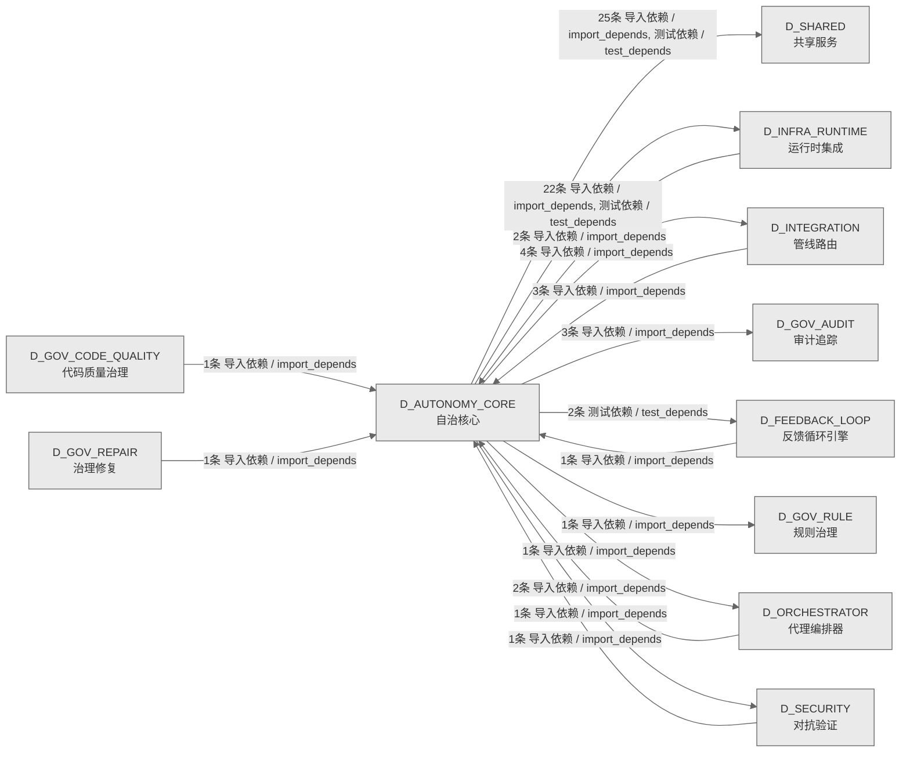

# 10_d_autonomy_core / 自治核心域 / Autonomy Core

> **功能简介 / Overview**: 自治核心，负责 AI 自治决策、目标分解和执行编排

> **文档作用 / Purpose**: 展示 自治核心（D_AUTONOMY_CORE）功能域的域内依赖关系、跨域依赖关系，模块信息（成熟度/中英文名/大白话/文件路径）内嵌于 Mermaid 节点，供架构审查和域治理参考。

> 本文档由 generate_domain_doc.py 从 depgraph (PostgreSQL) 自动生成
> 数据源: depgraph (PostgreSQL) nodes表 + edges表

> **[可缩放 HTML 版 / Zoomable HTML](http://localhost:8765/docs/02_enterprise_architecture/02_domain_architecture_docs/10_d_autonomy_core.html)** — Ctrl+滚轮缩放 ｜ 双击重置 ｜ Ctrl+Shift+D 切换拖动/选择模式

## 域基本信息 / Domain Overview

| 字段 | 值 | Field | Value |
|------|------|-------|-------|
| 编号 | 10 | Number | 10 |
| 域ID | D_AUTONOMY_CORE | Domain ID | D_AUTONOMY_CORE |
| 域名称 | 自治核心 | Domain Name | Autonomy Core |
| 层级 | L1 基础平台层 | Layer | L1 Foundation |
| 模块数 | 130 | Module Count | 130 |
| 域内依赖 | 43 | Internal Dependencies | 43 |
| 跨域入边 | 11 | Cross-domain Incoming | 11 |
| 跨域出边 | 59 | Cross-domain Outgoing | 59 |
| 设计态模块 | 0 | Design Modules | 0 |
| 生产态模块 | 130 | Production Modules | 130 |
| 容量 | 130/150 (正常) | Capacity | 130/150 (正常) |
| 描述 | Skill渐进披露(L0永久/L1触发/L2组合/L3按需) | Description | Skill渐进披露(L0永久/L1触发/L2组合/L3按需) |

## 域内依赖图 / Internal Dependency Diagram

> 依赖图内嵌在本文档中，IDE 可直接渲染；网页版可 Ctrl+滚轮缩放 + 拖动平移查看细节。全景图用颜色区分运营态/设计态，不再分页/拆子图。
>
> **图例说明 / Legend**：
> - 🟦 **蓝色 = 运营态模块**（production，已上线运行）
> - 🟧 **橙色虚线 = 设计态模块**（design，蓝图阶段，代码未写）
> - **实线箭头 = 运营态依赖**（已生效的依赖关系）
> - **虚线箭头 = 非运营态依赖**（计划中/验证中的依赖关系）

### 全景依赖图（全部模块，颜色区分运营态/设计态）

> 展示全部 130 个模块（生产态 130 + 设计态 0），节点含成熟度+中英文名+大白话+文件路径。

```mermaid
%%{init: {'theme': 'base', 'themeVariables': {'primaryColor': '#eaeaea', 'primaryTextColor': '#333333', 'primaryBorderColor': '#666666', 'lineColor': '#666666', 'secondaryColor': '#eaeaea', 'tertiaryColor': '#eaeaea', 'fontSize': '14px'}}}%%
flowchart TD
    src_zephyr_autonomy_core_main_py["(生产态 / production) agent-spec MOD-INF-019 CLI — 蓝图->Skill 升级引擎入口.<br/>agent-spec MOD-INF-019 CLI — 蓝图->Skill 升级引擎入口.<br/>文件: autonomy_core/__main__.py"]
    src_zephyr_autonomy_core_agent_observability_py["(生产态 / production) MOD-INF-019: Agent Spec — Agent Observability<br/>MOD-INF-019: Agent Spec — Agent Observability<br/>文件: autonomy_core/agent_observability.py"]
    src_zephyr_autonomy_core_all_skill_modules_py["(生产态 / production) MOD-INF-019: Agent Spec — All Skill Modules<br/>MOD-INF-019: Agent Spec — All Skill Modules<br/>文件: autonomy_core/all_skill_modules.py"]
    src_zephyr_autonomy_core_context_atomic_injector_py["(生产态 / production) atomic_injector.py — 原子注入 (DD101, TASK-019)<br/>atomic_injector.py — 原子注入 (DD101, TASK-019)<br/>文件: context/atomic_injector.py"]
    src_zephyr_autonomy_core_context_ce_bootstrap_py["(生产态 / production) ce_bootstrap.py — CE 自举架构 (B1, DD75, TASK-015 beta v)<br/>ce_bootstrap.py — CE 自举架构 (B1, DD75, TASK-015 beta v)<br/>文件: context/ce_bootstrap.py"]
    src_zephyr_autonomy_core_context_ce_explain_cli_py["(生产态 / production) ce_explain_cli.py — KE inclusion rationale 解释 CLI (TASK-016)<br/>ce_explain_cli.py — KE inclusion rationale 解释 CLI (TASK-016)<br/>文件: context/ce_explain_cli.py"]
    src_zephyr_autonomy_core_context_ce_file_lister_py["(生产态 / production) list_ce_files.py — CE 文件清单生成器<br/>list_ce_files.py — CE 文件清单生成器<br/>文件: context/ce_file_lister.py"]
    src_zephyr_autonomy_core_context_ce_playground_v2_py["(生产态 / production) ce_playground_v2.py — V2 Playground with full decision chain (TASK-016)<br/>ce_playground_v2.py — V2 Playground with full decision chain (TASK-016)<br/>文件: context/ce_playground_v2.py"]
    src_zephyr_autonomy_core_context_ce_vibe_shortcuts_py["(生产态 / production) ce_vibe_shortcuts.py — Vibe/Strict 模式切换 (TASK-016)<br/>ce_vibe_shortcuts.py — Vibe/Strict 模式切换 (TASK-016)<br/>文件: context/ce_vibe_shortcuts.py"]
    src_zephyr_autonomy_core_context_checkpoint_manager_py["(生产态 / production) checkpoint_manager.py — Inject 前快照 (DD100, TASK-019)<br/>checkpoint_manager.py — Inject 前快照 (DD100, TASK-019)<br/>文件: context/checkpoint_manager.py"]
    src_zephyr_autonomy_core_context_cold_start_booster_py["(生产态 / production) cold_start_booster.py — 冷启动 (DD107, TASK-019)<br/>cold_start_booster.py — 冷启动 (DD107, TASK-019)<br/>文件: context/cold_start_booster.py"]
    src_zephyr_autonomy_core_context_complexity_budget_py["(生产态 / production) complexity_budget.py — Token 预算复杂度因子 (DD103, TASK-019)<br/>complexity_budget.py — Token 预算复杂度因子 (DD103, TASK-019)<br/>文件: context/complexity_budget.py"]
    src_zephyr_autonomy_core_context_context_budget_py["(生产态 / production) TruncationStrategy — TruncationStrategy<br/>TruncationStrategy — TruncationStrategy<br/>文件: context/context_budget.py"]
    src_zephyr_autonomy_core_context_context_budget_tracker_py["(生产态 / production) ContextBudgetTracker: token budget management with 3-level thresholds.<br/>ContextBudgetTracker: token budget management with 3-level thresholds.<br/>文件: context/context_budget_tracker.py"]
    src_zephyr_autonomy_core_context_context_debt_score_py["(生产态 / production) context_debt_score.py — 上下文债务评分 (B19, DD93, TASK-017)<br/>context_debt_score.py — 上下文债务评分 (B19, DD93, TASK-017)<br/>文件: context/context_debt_score.py"]
    src_zephyr_autonomy_core_context_context_evaluator_py["(生产态 / production) context_evaluator.py — AI 引用率评估 (TASK-014 beta b)<br/>context_evaluator.py — AI 引用率评估 (TASK-014 beta b)<br/>文件: context/context_evaluator.py"]
    src_zephyr_autonomy_core_context_context_evictor_py["(生产态 / production) context_evictor.py — 三维逐出器 (DD9, TASK-014 beta a)<br/>context_evictor.py — 三维逐出器 (DD9, TASK-014 beta a)<br/>文件: context/context_evictor.py"]
    src_zephyr_autonomy_core_context_context_health_score_py["(生产态 / production) ContextHealthScore.py — 统一健康分 (B6, DD80, TASK-015 beta v)<br/>ContextHealthScore.py — 统一健康分 (B6, DD80, TASK-015 beta v)<br/>文件: context/context_health_score.py"]
    src_zephyr_autonomy_core_context_context_model_strategy_py["(生产态 / production) context_model_strategy.py — 模型选择策略 (DD118, TASK-020)<br/>context_model_strategy.py — 模型选择策略 (DD118, TASK-020)<br/>文件: context/context_model_strategy.py"]
    src_zephyr_autonomy_core_context_context_outcome_tracker_py["(生产态 / production) context_outcome_tracker.py — 因果链追踪 (B14, DD88, TASK-017)<br/>context_outcome_tracker.py — 因果链追踪 (B14, DD88, TASK-017)<br/>文件: context/context_outcome_tracker.py"]
    src_zephyr_autonomy_core_context_context_pipeline_auto_py["(生产态 / production) context_pipeline_auto.py — ContextPipeline 三层自动化机制<br/>context_pipeline_auto.py — ContextPipeline 三层自动化机制<br/>文件: context/context_pipeline_auto.py"]
    src_zephyr_autonomy_core_context_context_playground_py["(生产态 / production) context_playground.py — 上下文沙箱 dry-run (B5, DD79, TASK-015 beta v)<br/>context_playground.py — 上下文沙箱 dry-run (B5, DD79, TASK-015 beta v)<br/>文件: context/context_playground.py"]
    src_zephyr_autonomy_core_context_context_rot_model_py["(生产态 / production) context_rot_model.py — Context Rot 注意力衰减数学模型<br/>context_rot_model.py — Context Rot 注意力衰减数学模型<br/>文件: context/context_rot_model.py"]
    src_zephyr_autonomy_core_context_context_value_attribution_py["(生产态 / production) context_value_attribution.py — KE 级 ROI 归因 (B2, DD76, TASK-015 beta v)<br/>context_value_attribution.py — KE 级 ROI 归因 (B2, DD76, TASK-015 beta v)<br/>文件: context/context_value_attribution.py"]
    src_zephyr_autonomy_core_context_contextual_fetch_api_py["(生产态 / production) contextual_fetch_api.py — HTTP FE 对外 API (DD115, TASK-020)<br/>contextual_fetch_api.py — HTTP FE 对外 API (DD115, TASK-020)<br/>文件: context/contextual_fetch_api.py"]
    src_zephyr_autonomy_core_context_curation_loop_py["(生产态 / production) curation_loop.py — Per-Turn Curation 策展 (DD10, TASK-014 beta b)<br/>curation_loop.py — Per-Turn Curation 策展 (DD10, TASK-014 beta b)<br/>文件: context/curation_loop.py"]
    src_zephyr_autonomy_core_context_diff_injector_py["(生产态 / production) diff_injector.py — 增量注入 (DD98, TASK-019)<br/>diff_injector.py — 增量注入 (DD98, TASK-019)<br/>文件: context/diff_injector.py"]
    src_zephyr_autonomy_core_context_diversity_constraint_py["(生产态 / production) diversity_constraint.py — 多样性约束 (DD119, TASK-020)<br/>diversity_constraint.py — 多样性约束 (DD119, TASK-020)<br/>文件: context/diversity_constraint.py"]
    src_zephyr_autonomy_core_context_domain_decay_config_py["(生产态 / production) domain_decay_config.py — 每领域半衰期 (DD105, TASK-019)<br/>domain_decay_config.py — 每领域半衰期 (DD105, TASK-019)<br/>文件: context/domain_decay_config.py"]
    src_zephyr_autonomy_core_context_fallback_staleness_gate_py["(生产态 / production) fallback_staleness_gate.py — 兜底层自腐检测 (B13, DD87, TASK-017)<br/>fallback_staleness_gate.py — 兜底层自腐检测 (B13, DD87, TASK-017)<br/>文件: context/fallback_staleness_gate.py"]
    src_zephyr_autonomy_core_context_integrity_check_py["(生产态 / production) integrity_check.py — 注入后完整性 (DD106, TASK-019)<br/>integrity_check.py — 注入后完整性 (DD106, TASK-019)<br/>文件: context/integrity_check.py"]
    src_zephyr_autonomy_core_context_memory_bank_py["(生产态 / production) memory_bank.py — AI 读写结构化持久上下文 (DD: memory_bank, TASK-014 beta c)<br/>memory_bank.py — AI 读写结构化持久上下文 (DD: memory_bank, TASK-014 beta c)<br/>文件: context/memory_bank.py"]
    src_zephyr_autonomy_core_context_mode_manager_py["(生产态 / production) mode_manager.py — 模式管理器 (DD102, TASK-019)<br/>mode_manager.py — 模式管理器 (DD102, TASK-019)<br/>文件: context/mode_manager.py"]
    src_zephyr_autonomy_core_context_position_optimizer_py["(生产态 / production) position_optimizer.py — 位置优化 (DD104, TASK-019)<br/>position_optimizer.py — 位置优化 (DD104, TASK-019)<br/>文件: context/position_optimizer.py"]
    src_zephyr_autonomy_core_context_shadow_canary_py["(生产态 / production) shadow_canary.py — 金丝雀部署 (B4, DD78, TASK-015 beta w)<br/>shadow_canary.py — 金丝雀部署 (B4, DD78, TASK-015 beta w)<br/>文件: context/shadow_canary.py"]
    src_zephyr_autonomy_core_context_staleness_manager_py["(生产态 / production) staleness_manager.py — 全局过期检测 (DD112, TASK-019)<br/>staleness_manager.py — 全局过期检测 (DD112, TASK-019)<br/>文件: context/staleness_manager.py"]
    src_zephyr_autonomy_core_context_vector_bridge_py["(生产态 / production) VectorBridge — CE↔VMS 检索桥接 (Connect CT-CE-VMS-001)<br/>VectorBridge — CE↔VMS 检索桥接 (Connect CT-CE-VMS-001)<br/>文件: context/vector_bridge.py"]
    src_zephyr_autonomy_core_file_autoregister_py["(生产态 / production)<br/>文件: autonomy_core/file_autoregister.py"]
    src_zephyr_autonomy_core_ide_watcher_py["(生产态 / production) MOD-INF-019: Agent Spec — IDE Watcher<br/>MOD-INF-019: Agent Spec — IDE Watcher<br/>文件: autonomy_core/ide_watcher.py"]
    src_zephyr_autonomy_core_integration_pipeline_bridge_py["(生产态 / production) PipelineSkillBridge — Agent Spec -> Pipeline 双向桥接<br/>PipelineSkillBridge — Agent Spec -> Pipeline 双向桥接<br/>文件: integration/pipeline_bridge.py"]
    src_zephyr_autonomy_core_phase_planner_py["(生产态 / production) MOD-INF-019: Agent Spec — Phase Planner<br/>MOD-INF-019: Agent Spec — Phase Planner<br/>文件: autonomy_core/phase_planner.py"]
    src_zephyr_autonomy_core_progressive_disclosure_injector_py["(生产态 / production) progressive_disclosure_injector.py — 渐进式披露 (B7, DD81, TASK-015 beta w)<br/>progressive_disclosure_injector.py — 渐进式披露 (B7, DD81, TASK-015 beta w)<br/>文件: autonomy_core/progressive_disclosure_injector.py"]
    src_zephyr_autonomy_core_prompt_registry_py["(生产态 / production) PromptRegistry: YAML-driven Prompt 模板注册表<br/>PromptRegistry: YAML-driven Prompt 模板注册表<br/>文件: autonomy_core/prompt_registry.py"]
    src_zephyr_autonomy_core_self_evolution_fidelity_gate_py["(生产态 / production) MOD-INF-019: Agent Spec — Self Evolution Fidelity Gate<br/>MOD-INF-019: Agent Spec — Self Evolution Fidelity Gate<br/>文件: autonomy_core/self_evolution_fidelity_gate.py"]
    src_zephyr_autonomy_core_skill_rbac_registry_py["(生产态 / production) G-CT-003: Agent Spec -> RBAC capability check.<br/>G-CT-003: Agent Spec -> RBAC capability check.<br/>文件: autonomy_core/skill_rbac_registry.py"]
    src_zephyr_autonomy_core_skills_skill_attention_py["(生产态 / production) MOD-INF-019: Agent Spec — Skill Attention Management<br/>MOD-INF-019: Agent Spec — Skill Attention Management<br/>文件: skills/skill_attention.py"]
    src_zephyr_autonomy_core_skills_skill_breakage_checker_py["(生产态 / production) MOD-INF-019: Agent Spec — Skill Breakage Checker<br/>MOD-INF-019: Agent Spec — Skill Breakage Checker<br/>文件: skills/skill_breakage_checker.py"]
    src_zephyr_autonomy_core_skills_skill_cache_provider_py["(生产态 / production) MOD-INF-019: Agent Spec — Skill Cache Provider<br/>MOD-INF-019: Agent Spec — Skill Cache Provider<br/>文件: skills/skill_cache_provider.py"]
    src_zephyr_autonomy_core_skills_skill_calibration_py["(生产态 / production) MOD-INF-019: Agent Spec — Skill Calibration<br/>MOD-INF-019: Agent Spec — Skill Calibration<br/>文件: skills/skill_calibration.py"]
    src_zephyr_autonomy_core_skills_skill_canary_py["(生产态 / production) MOD-INF-019: Agent Spec — Skill Canary<br/>MOD-INF-019: Agent Spec — Skill Canary<br/>文件: skills/skill_canary.py"]
    src_zephyr_autonomy_core_skills_skill_cognitive_preservation_py["(生产态 / production) MOD-INF-019: Agent Spec — Skill Cognitive Preservation<br/>MOD-INF-019: Agent Spec — Skill Cognitive Preservation<br/>文件: skills/skill_cognitive_preservation.py"]
    src_zephyr_autonomy_core_skills_skill_compliance_py["(生产态 / production) MOD-INF-019: Agent Spec — Skill Compliance<br/>MOD-INF-019: Agent Spec — Skill Compliance<br/>文件: skills/skill_compliance.py"]
    src_zephyr_autonomy_core_skills_skill_consensus_py["(生产态 / production) MOD-INF-019: Agent Spec — Skill Consensus<br/>MOD-INF-019: Agent Spec — Skill Consensus<br/>文件: skills/skill_consensus.py"]
    src_zephyr_autonomy_core_skills_skill_constructor_py["(生产态 / production) MOD-INF-019: Agent Spec — Skill Constructor<br/>MOD-INF-019: Agent Spec — Skill Constructor<br/>文件: skills/skill_constructor.py"]
    src_zephyr_autonomy_core_skills_skill_context_isolation_py["(生产态 / production) MOD-INF-019: Agent Spec — Context Isolation<br/>MOD-INF-019: Agent Spec — Context Isolation<br/>文件: skills/skill_context_isolation.py"]
    src_zephyr_autonomy_core_skills_skill_contract_py["(生产态 / production) MOD-INF-019: Agent Spec — Skill Contract<br/>MOD-INF-019: Agent Spec — Skill Contract<br/>文件: skills/skill_contract.py"]
    src_zephyr_autonomy_core_skills_skill_cross_model_py["(生产态 / production) MOD-INF-019: Agent Spec — Skill Cross-Model<br/>MOD-INF-019: Agent Spec — Skill Cross-Model<br/>文件: skills/skill_cross_model.py"]
    src_zephyr_autonomy_core_skills_skill_di_py["(生产态 / production) MOD-INF-019: Agent Spec — Skill Dependency Injection<br/>MOD-INF-019: Agent Spec — Skill Dependency Injection<br/>文件: skills/skill_di.py"]
    src_zephyr_autonomy_core_skills_skill_discovery_py["(生产态 / production) MOD-INF-019: Agent Spec — Skill Discovery<br/>MOD-INF-019: Agent Spec — Skill Discovery<br/>文件: skills/skill_discovery.py"]
    src_zephyr_autonomy_core_skills_skill_durable_py["(生产态 / production) MOD-INF-019: Agent Spec — Durable Execution<br/>MOD-INF-019: Agent Spec — Durable Execution<br/>文件: skills/skill_durable.py"]
    src_zephyr_autonomy_core_skills_skill_economics_py["(生产态 / production) MOD-INF-019: Agent Spec — Skill Economics<br/>MOD-INF-019: Agent Spec — Skill Economics<br/>文件: skills/skill_economics.py"]
    src_zephyr_autonomy_core_skills_skill_efficacy_calibrator_py["(生产态 / production) MOD-INF-019: Agent Spec — Skill Efficacy Calibrator<br/>MOD-INF-019: Agent Spec — Skill Efficacy Calibrator<br/>文件: skills/skill_efficacy_calibrator.py"]
    src_zephyr_autonomy_core_skills_skill_executor_py["(生产态 / production)<br/>文件: skills/skill_executor.py"]
    src_zephyr_autonomy_core_skills_skill_explain_py["(生产态 / production) MOD-INF-019: Agent Spec — XAI Explainable Skill Engine<br/>MOD-INF-019: Agent Spec — XAI Explainable Skill Engine<br/>文件: skills/skill_explain.py"]
    src_zephyr_autonomy_core_skills_skill_feature_flags_py["(生产态 / production) MOD-INF-019: Agent Spec — Skill Feature Flags<br/>MOD-INF-019: Agent Spec — Skill Feature Flags<br/>文件: skills/skill_feature_flags.py"]
    src_zephyr_autonomy_core_skills_skill_feedback_py["(生产态 / production) MOD-INF-019: Agent Spec — Skill Feedback Loop<br/>MOD-INF-019: Agent Spec — Skill Feedback Loop<br/>文件: skills/skill_feedback.py"]
    src_zephyr_autonomy_core_skills_skill_freshness_ext_py["(生产态 / production) MOD-INF-019: Agent Spec — Skill Freshness Extensions<br/>MOD-INF-019: Agent Spec — Skill Freshness Extensions<br/>文件: skills/skill_freshness_ext.py"]
    src_zephyr_autonomy_core_skills_skill_gitops_py["(生产态 / production) MOD-INF-019: Agent Spec — Skill GitOps<br/>MOD-INF-019: Agent Spec — Skill GitOps<br/>文件: skills/skill_gitops.py"]
    src_zephyr_autonomy_core_skills_skill_guardrails_py["(生产态 / production) MOD-INF-019: Agent Spec — Skill Guardrails<br/>MOD-INF-019: Agent Spec — Skill Guardrails<br/>文件: skills/skill_guardrails.py"]
    src_zephyr_autonomy_core_skills_skill_idempotency_py["(生产态 / production) MOD-INF-019: Agent Spec — Skill Idempotency<br/>MOD-INF-019: Agent Spec — Skill Idempotency<br/>文件: skills/skill_idempotency.py"]
    src_zephyr_autonomy_core_skills_skill_kya_py["(生产态 / production) MOD-INF-019: Agent Spec — Skill KYA<br/>MOD-INF-019: Agent Spec — Skill KYA<br/>文件: skills/skill_kya.py"]
    src_zephyr_autonomy_core_skills_skill_learning_py["(生产态 / production) MOD-INF-019: Agent Spec — Skill Self-Learning Engine<br/>MOD-INF-019: Agent Spec — Skill Self-Learning Engine<br/>文件: skills/skill_learning.py"]
    src_zephyr_autonomy_core_skills_skill_lineage_py["(生产态 / production) MOD-INF-019: Agent Spec — Skill Lineage<br/>MOD-INF-019: Agent Spec — Skill Lineage<br/>文件: skills/skill_lineage.py"]
    src_zephyr_autonomy_core_skills_skill_locking_py["(生产态 / production) MOD-INF-019: Agent Spec — Skill Locking (Production Hardening)<br/>MOD-INF-019: Agent Spec — Skill Locking (Production Hardening)<br/>文件: skills/skill_locking.py"]
    src_zephyr_autonomy_core_skills_skill_observability_py["(生产态 / production) MOD-INF-019: Agent Spec — Skill Observability<br/>MOD-INF-019: Agent Spec — Skill Observability<br/>文件: skills/skill_observability.py"]
    src_zephyr_autonomy_core_skills_skill_ontology_py["(生产态 / production) MOD-INF-019: Agent Spec — Skill Ontology<br/>MOD-INF-019: Agent Spec — Skill Ontology<br/>文件: skills/skill_ontology.py"]
    src_zephyr_autonomy_core_skills_skill_postmortem_py["(生产态 / production) MOD-INF-019: Agent Spec — Skill Postmortem (追问到底)<br/>MOD-INF-019: Agent Spec — Skill Postmortem (追问到底)<br/>文件: skills/skill_postmortem.py"]
    src_zephyr_autonomy_core_skills_skill_prompt_cache_py["(生产态 / production) MOD-INF-019: Agent Spec — Skill Prompt Cache<br/>MOD-INF-019: Agent Spec — Skill Prompt Cache<br/>文件: skills/skill_prompt_cache.py"]
    src_zephyr_autonomy_core_skills_skill_prompt_opt_py["(生产态 / production) MOD-INF-019: Agent Spec — Skill Prompt Optimizer<br/>MOD-INF-019: Agent Spec — Skill Prompt Optimizer<br/>文件: skills/skill_prompt_opt.py"]
    src_zephyr_autonomy_core_skills_skill_resilience_py["(生产态 / production) MOD-INF-019: Agent Spec — Skill Resilience<br/>MOD-INF-019: Agent Spec — Skill Resilience<br/>文件: skills/skill_resilience.py"]
    src_zephyr_autonomy_core_skills_skill_risk_mitigator_py["(生产态 / production) MOD-INF-019: Agent Spec — Skill Risk Mitigator<br/>MOD-INF-019: Agent Spec — Skill Risk Mitigator<br/>文件: skills/skill_risk_mitigator.py"]
    src_zephyr_autonomy_core_skills_skill_router_py["(生产态 / production)<br/>文件: skills/skill_router.py"]
    src_zephyr_autonomy_core_skills_skill_sandbox_py["(生产态 / production) MOD-INF-019: Agent Spec — Skill Sandbox<br/>MOD-INF-019: Agent Spec — Skill Sandbox<br/>文件: skills/skill_sandbox.py"]
    src_zephyr_autonomy_core_skills_skill_schema_registry_py["(生产态 / production) MOD-INF-019: Agent Spec — Skill Schema Registry<br/>MOD-INF-019: Agent Spec — Skill Schema Registry<br/>文件: skills/skill_schema_registry.py"]
    src_zephyr_autonomy_core_skills_skill_security_py["(生产态 / production) MOD-INF-019: Agent Spec — Skill Security<br/>MOD-INF-019: Agent Spec — Skill Security<br/>文件: skills/skill_security.py"]
    src_zephyr_autonomy_core_skills_skill_shadow_py["(生产态 / production) MOD-INF-019: Agent Spec — Skill Shadow Deployment<br/>MOD-INF-019: Agent Spec — Skill Shadow Deployment<br/>文件: skills/skill_shadow.py"]
    src_zephyr_autonomy_core_skills_skill_silent_failure_py["(生产态 / production) MOD-INF-019: Agent Spec — Silent Failure Detector<br/>MOD-INF-019: Agent Spec — Silent Failure Detector<br/>文件: skills/skill_silent_failure.py"]
    src_zephyr_autonomy_core_skills_skill_team_optimizer_py["(生产态 / production) MOD-INF-019: Agent Spec — Skill Team Optimizer<br/>MOD-INF-019: Agent Spec — Skill Team Optimizer<br/>文件: skills/skill_team_optimizer.py"]
    src_zephyr_autonomy_core_skills_skill_telemetry_py["(生产态 / production) MOD-INF-019: Agent Spec — Skill Telemetry<br/>MOD-INF-019: Agent Spec — Skill Telemetry<br/>文件: skills/skill_telemetry.py"]
    src_zephyr_autonomy_core_skills_skill_temperature_py["(生产态 / production) MOD-INF-019: Agent Spec — Skill Temperature<br/>MOD-INF-019: Agent Spec — Skill Temperature<br/>文件: skills/skill_temperature.py"]
    src_zephyr_autonomy_core_skills_skill_tokenomics_py["(生产态 / production) MOD-INF-019: Agent Spec — Skill Tokenomics<br/>MOD-INF-019: Agent Spec — Skill Tokenomics<br/>文件: skills/skill_tokenomics.py"]
    src_zephyr_autonomy_core_skills_skill_translator_py["(生产态 / production) MOD-INF-019: Agent Spec — Skill Translator<br/>MOD-INF-019: Agent Spec — Skill Translator<br/>文件: skills/skill_translator.py"]
    src_zephyr_autonomy_core_skills_skill_workflow_py["(生产态 / production) MOD-INF-019: Agent Spec — Skill Workflow Orchestrator<br/>MOD-INF-019: Agent Spec — Skill Workflow Orchestrator<br/>文件: skills/skill_workflow.py"]
    src_zephyr_autonomy_core_spec_engine_py["(生产态 / production) MOD-INF-019: Agent Spec — SpecEngine 蓝图->Skill 升级引擎<br/>MOD-INF-019: Agent Spec — SpecEngine 蓝图->Skill 升级引擎<br/>文件: autonomy_core/spec_engine.py"]
    src_zephyr_autonomy_core_vibe_coding_quality_gate_py["(生产态 / production) VibeCodingQualityGate — 代码质量门禁（stub, tests 待实装后补全实现）<br/>VibeCodingQualityGate — 代码质量门禁（stub, tests 待实装后补全实现）<br/>文件: autonomy_core/vibe_coding_quality_gate.py"]
    src_zephyr_governance_persistence_intent_parser_py["(生产态 / production) IntentParser · 意图三阶段级联解析器（V-09）<br/>IntentParser · 意图三阶段级联解析器（V-09）<br/>文件: persistence/intent_parser.py"]
    src_zephyr_infrastructure_system_snapshot_py["(生产态 / production) SystemSnapshotter — M1 系统状态镜像（CL-017 RI 扩展模式）<br/>SystemSnapshotter — M1 系统状态镜像（CL-017 RI 扩展模式）<br/>文件: infrastructure/system_snapshot.py"]
    src_zephyr_infrastructure_system_telemetry_otel_instrumentation_py["(生产态 / production) otel_instrumentation.py — 全链路 OTel (B12, DD86, TASK-015 beta v)<br/>otel_instrumentation.py — 全链路 OTel (B12, DD86, TASK-015 beta v)<br/>文件: system_telemetry/otel_instrumentation.py"]
    src_zephyr_integration_vector_memory_vector_writer_py["(生产态 / production) CE 向量写入器 — vectorize_and_store() 生产者<br/>CE 向量写入器 — vectorize_and_store() 生产者<br/>文件: vector_memory/vector_writer.py"]
    src_zephyr_security_llm_defense_llm_security_adversarial_robustness_py["(生产态 / production) adversarial_robustness.py — 对抗鲁棒性 (B8, DD82, TASK-015 beta w)<br/>adversarial_robustness.py — 对抗鲁棒性 (B8, DD82, TASK-015 beta w)<br/>文件: llm_security/adversarial_robustness.py"]
    src_zephyr_security_llm_defense_llm_security_alignment_scorer_py["(生产态 / production) alignment_scorer.py — 对齐评分 (B11, DD85, TASK-015 beta w)<br/>alignment_scorer.py — 对齐评分 (B11, DD85, TASK-015 beta w)<br/>文件: llm_security/alignment_scorer.py"]
    src_zephyr_security_llm_defense_llm_security_lsg_pattern_tracker_py["(生产态 / production) lsg_pattern_tracker.py — LSG 模式逃逸追踪 (B20, DD94, TASK-017)<br/>lsg_pattern_tracker.py — LSG 模式逃逸追踪 (B20, DD94, TASK-017)<br/>文件: llm_security/lsg_pattern_tracker.py"]
    src_zephyr_security_llm_defense_llm_security_poisoning_monitor_py["(生产态 / production) poisoning_monitor.py — Embed 污染检测 (DD97, TASK-019)<br/>poisoning_monitor.py — Embed 污染检测 (DD97, TASK-019)<br/>文件: llm_security/poisoning_monitor.py"]
    src_zephyr_security_llm_defense_llm_security_sensitivity_classifier_py["(生产态 / production) sensitivity_classifier.py — 数据分级 (B9, DD83, TASK-015 beta w)<br/>sensitivity_classifier.py — 数据分级 (B9, DD83, TASK-015 beta w)<br/>文件: llm_security/sensitivity_classifier.py"]
    src_zephyr_security_llm_defense_llm_security_solo_dev_safety_net_py["(生产态 / production) solo_dev_safety_net.py — 单人无审查安全网 (B15, DD89, TASK-017)<br/>solo_dev_safety_net.py — 单人无审查安全网 (B15, DD89, TASK-017)<br/>文件: llm_security/solo_dev_safety_net.py"]
    src_zephyr_shared_ai_guards_config_safety_guard_py["(生产态 / production) config_safety_guard.py — 配置自毁防护 (B16, DD90, TASK-017)<br/>config_safety_guard.py — 配置自毁防护 (B16, DD90, TASK-017)<br/>文件: ai_guards/config_safety_guard.py"]
    src_zephyr_shared_dependency_dependency_tracker_py["(生产态 / production) dependency_tracker.py — 依赖追踪 (DD116, TASK-020)<br/>dependency_tracker.py — 依赖追踪 (DD116, TASK-020)<br/>文件: dependency/dependency_tracker.py"]
    src_zephyr_shared_io_cache_invalidation_py["(生产态 / production) cache_invalidation.py — 缓存一致性 (DD113, TASK-020)<br/>cache_invalidation.py — 缓存一致性 (DD113, TASK-020)<br/>文件: io/cache_invalidation.py"]
    src_zephyr_shared_utils_verify_paths_py["(生产态 / production) verify_paths.py — 代码路径索引验证 (TASK-012)<br/>verify_paths.py — 代码路径索引验证 (TASK-012)<br/>文件: utils/verify_paths.py"]
    tests_automation_test_auto_runtime_e2e_py["(生产态 / production) F1 AutoRuntimeCore 非mock端到端集成测试<br/>F1 AutoRuntimeCore 非mock端到端集成测试<br/>文件: automation/test_auto_runtime_e2e.py"]
    tests_f_lifecycle_test_f1_event_trigger_py["(生产态 / production) F1 事件触发启动测试<br/>F1 事件触发启动测试<br/>文件: f_lifecycle/test_f1_event_trigger.py"]
    tests_trading_extreme_test_f14_pipeline_extreme_py["(生产态 / production) F14 管线编排/反馈环 — 红蓝对抗端到端极端测试<br/>F14 管线编排/反馈环 — 红蓝对抗端到端极端测试<br/>文件: extreme/test_f14_pipeline_extreme.py"]
    tests_trading_extreme_test_f1_extreme_py["(生产态 / production) F1 自动驾驶/运行时大脑 — 红蓝对抗端到端极端测试<br/>F1 自动驾驶/运行时大脑 — 红蓝对抗端到端极端测试<br/>文件: extreme/test_f1_extreme.py"]
    src_zephyr_autonomy_core_main_py ~~~ src_zephyr_autonomy_core_agent_observability_py
    src_zephyr_autonomy_core_agent_observability_py ~~~ src_zephyr_autonomy_core_all_skill_modules_py
    src_zephyr_autonomy_core_all_skill_modules_py ~~~ src_zephyr_autonomy_core_context_atomic_injector_py
    src_zephyr_autonomy_core_context_atomic_injector_py ~~~ src_zephyr_autonomy_core_context_ce_bootstrap_py
    src_zephyr_autonomy_core_context_ce_bootstrap_py ~~~ src_zephyr_autonomy_core_context_ce_explain_cli_py
    src_zephyr_autonomy_core_context_ce_explain_cli_py ~~~ src_zephyr_autonomy_core_context_ce_file_lister_py
    src_zephyr_autonomy_core_context_ce_file_lister_py ~~~ src_zephyr_autonomy_core_context_ce_playground_v2_py
    src_zephyr_autonomy_core_context_ce_playground_v2_py ~~~ src_zephyr_autonomy_core_context_ce_vibe_shortcuts_py
    src_zephyr_autonomy_core_context_ce_vibe_shortcuts_py ~~~ src_zephyr_autonomy_core_context_checkpoint_manager_py
    src_zephyr_autonomy_core_context_checkpoint_manager_py ~~~ src_zephyr_autonomy_core_context_cold_start_booster_py
    src_zephyr_autonomy_core_context_cold_start_booster_py ~~~ src_zephyr_autonomy_core_context_complexity_budget_py
    src_zephyr_autonomy_core_context_complexity_budget_py ~~~ src_zephyr_autonomy_core_context_context_budget_py
    src_zephyr_autonomy_core_context_context_budget_py ~~~ src_zephyr_autonomy_core_context_context_budget_tracker_py
    src_zephyr_autonomy_core_context_context_budget_tracker_py ~~~ src_zephyr_autonomy_core_context_context_debt_score_py
    src_zephyr_autonomy_core_context_context_debt_score_py ~~~ src_zephyr_autonomy_core_context_context_evaluator_py
    src_zephyr_autonomy_core_context_context_evaluator_py ~~~ src_zephyr_autonomy_core_context_context_evictor_py
    src_zephyr_autonomy_core_context_context_evictor_py ~~~ src_zephyr_autonomy_core_context_context_health_score_py
    src_zephyr_autonomy_core_context_context_health_score_py ~~~ src_zephyr_autonomy_core_context_context_model_strategy_py
    src_zephyr_autonomy_core_context_context_model_strategy_py ~~~ src_zephyr_autonomy_core_context_context_outcome_tracker_py
    src_zephyr_autonomy_core_context_context_outcome_tracker_py ~~~ src_zephyr_autonomy_core_context_context_pipeline_auto_py
    src_zephyr_autonomy_core_context_context_pipeline_auto_py ~~~ src_zephyr_autonomy_core_context_context_playground_py
    src_zephyr_autonomy_core_context_context_playground_py ~~~ src_zephyr_autonomy_core_context_context_rot_model_py
    src_zephyr_autonomy_core_context_context_rot_model_py ~~~ src_zephyr_autonomy_core_context_context_value_attribution_py
    src_zephyr_autonomy_core_context_context_value_attribution_py ~~~ src_zephyr_autonomy_core_context_contextual_fetch_api_py
    src_zephyr_autonomy_core_context_contextual_fetch_api_py ~~~ src_zephyr_autonomy_core_context_curation_loop_py
    src_zephyr_autonomy_core_context_curation_loop_py ~~~ src_zephyr_autonomy_core_context_diff_injector_py
    src_zephyr_autonomy_core_context_diff_injector_py ~~~ src_zephyr_autonomy_core_context_diversity_constraint_py
    src_zephyr_autonomy_core_context_diversity_constraint_py ~~~ src_zephyr_autonomy_core_context_domain_decay_config_py
    src_zephyr_autonomy_core_context_domain_decay_config_py ~~~ src_zephyr_autonomy_core_context_fallback_staleness_gate_py
    src_zephyr_autonomy_core_context_fallback_staleness_gate_py ~~~ src_zephyr_autonomy_core_context_integrity_check_py
    src_zephyr_autonomy_core_context_integrity_check_py ~~~ src_zephyr_autonomy_core_context_memory_bank_py
    src_zephyr_autonomy_core_context_memory_bank_py ~~~ src_zephyr_autonomy_core_context_mode_manager_py
    src_zephyr_autonomy_core_context_mode_manager_py ~~~ src_zephyr_autonomy_core_context_position_optimizer_py
    src_zephyr_autonomy_core_context_position_optimizer_py ~~~ src_zephyr_autonomy_core_context_shadow_canary_py
    src_zephyr_autonomy_core_context_shadow_canary_py ~~~ src_zephyr_autonomy_core_context_staleness_manager_py
    src_zephyr_autonomy_core_context_staleness_manager_py ~~~ src_zephyr_autonomy_core_context_vector_bridge_py
    src_zephyr_autonomy_core_context_vector_bridge_py ~~~ src_zephyr_autonomy_core_file_autoregister_py
    src_zephyr_autonomy_core_file_autoregister_py ~~~ src_zephyr_autonomy_core_ide_watcher_py
    src_zephyr_autonomy_core_ide_watcher_py ~~~ src_zephyr_autonomy_core_integration_pipeline_bridge_py
    src_zephyr_autonomy_core_integration_pipeline_bridge_py ~~~ src_zephyr_autonomy_core_phase_planner_py
    src_zephyr_autonomy_core_phase_planner_py ~~~ src_zephyr_autonomy_core_progressive_disclosure_injector_py
    src_zephyr_autonomy_core_progressive_disclosure_injector_py ~~~ src_zephyr_autonomy_core_prompt_registry_py
    src_zephyr_autonomy_core_prompt_registry_py ~~~ src_zephyr_autonomy_core_self_evolution_fidelity_gate_py
    src_zephyr_autonomy_core_self_evolution_fidelity_gate_py ~~~ src_zephyr_autonomy_core_skill_rbac_registry_py
    src_zephyr_autonomy_core_skill_rbac_registry_py ~~~ src_zephyr_autonomy_core_skills_skill_attention_py
    src_zephyr_autonomy_core_skills_skill_attention_py ~~~ src_zephyr_autonomy_core_skills_skill_breakage_checker_py
    src_zephyr_autonomy_core_skills_skill_breakage_checker_py ~~~ src_zephyr_autonomy_core_skills_skill_cache_provider_py
    src_zephyr_autonomy_core_skills_skill_cache_provider_py ~~~ src_zephyr_autonomy_core_skills_skill_calibration_py
    src_zephyr_autonomy_core_skills_skill_calibration_py ~~~ src_zephyr_autonomy_core_skills_skill_canary_py
    src_zephyr_autonomy_core_skills_skill_canary_py ~~~ src_zephyr_autonomy_core_skills_skill_cognitive_preservation_py
    src_zephyr_autonomy_core_skills_skill_cognitive_preservation_py ~~~ src_zephyr_autonomy_core_skills_skill_compliance_py
    src_zephyr_autonomy_core_skills_skill_compliance_py ~~~ src_zephyr_autonomy_core_skills_skill_consensus_py
    src_zephyr_autonomy_core_skills_skill_consensus_py ~~~ src_zephyr_autonomy_core_skills_skill_constructor_py
    src_zephyr_autonomy_core_skills_skill_constructor_py ~~~ src_zephyr_autonomy_core_skills_skill_context_isolation_py
    src_zephyr_autonomy_core_skills_skill_context_isolation_py ~~~ src_zephyr_autonomy_core_skills_skill_contract_py
    src_zephyr_autonomy_core_skills_skill_contract_py ~~~ src_zephyr_autonomy_core_skills_skill_cross_model_py
    src_zephyr_autonomy_core_skills_skill_cross_model_py ~~~ src_zephyr_autonomy_core_skills_skill_di_py
    src_zephyr_autonomy_core_skills_skill_di_py ~~~ src_zephyr_autonomy_core_skills_skill_discovery_py
    src_zephyr_autonomy_core_skills_skill_discovery_py ~~~ src_zephyr_autonomy_core_skills_skill_durable_py
    src_zephyr_autonomy_core_skills_skill_durable_py ~~~ src_zephyr_autonomy_core_skills_skill_economics_py
    src_zephyr_autonomy_core_skills_skill_economics_py ~~~ src_zephyr_autonomy_core_skills_skill_efficacy_calibrator_py
    src_zephyr_autonomy_core_skills_skill_efficacy_calibrator_py ~~~ src_zephyr_autonomy_core_skills_skill_executor_py
    src_zephyr_autonomy_core_skills_skill_executor_py ~~~ src_zephyr_autonomy_core_skills_skill_explain_py
    src_zephyr_autonomy_core_skills_skill_explain_py ~~~ src_zephyr_autonomy_core_skills_skill_feature_flags_py
    src_zephyr_autonomy_core_skills_skill_feature_flags_py ~~~ src_zephyr_autonomy_core_skills_skill_feedback_py
    src_zephyr_autonomy_core_skills_skill_feedback_py ~~~ src_zephyr_autonomy_core_skills_skill_freshness_ext_py
    src_zephyr_autonomy_core_skills_skill_freshness_ext_py ~~~ src_zephyr_autonomy_core_skills_skill_gitops_py
    src_zephyr_autonomy_core_skills_skill_gitops_py ~~~ src_zephyr_autonomy_core_skills_skill_guardrails_py
    src_zephyr_autonomy_core_skills_skill_guardrails_py ~~~ src_zephyr_autonomy_core_skills_skill_idempotency_py
    src_zephyr_autonomy_core_skills_skill_idempotency_py ~~~ src_zephyr_autonomy_core_skills_skill_kya_py
    src_zephyr_autonomy_core_skills_skill_kya_py ~~~ src_zephyr_autonomy_core_skills_skill_learning_py
    src_zephyr_autonomy_core_skills_skill_learning_py ~~~ src_zephyr_autonomy_core_skills_skill_lineage_py
    src_zephyr_autonomy_core_skills_skill_lineage_py ~~~ src_zephyr_autonomy_core_skills_skill_locking_py
    src_zephyr_autonomy_core_skills_skill_locking_py ~~~ src_zephyr_autonomy_core_skills_skill_observability_py
    src_zephyr_autonomy_core_skills_skill_observability_py ~~~ src_zephyr_autonomy_core_skills_skill_ontology_py
    src_zephyr_autonomy_core_skills_skill_ontology_py ~~~ src_zephyr_autonomy_core_skills_skill_postmortem_py
    src_zephyr_autonomy_core_skills_skill_postmortem_py ~~~ src_zephyr_autonomy_core_skills_skill_prompt_cache_py
    src_zephyr_autonomy_core_skills_skill_prompt_cache_py ~~~ src_zephyr_autonomy_core_skills_skill_prompt_opt_py
    src_zephyr_autonomy_core_skills_skill_prompt_opt_py ~~~ src_zephyr_autonomy_core_skills_skill_resilience_py
    src_zephyr_autonomy_core_skills_skill_resilience_py ~~~ src_zephyr_autonomy_core_skills_skill_risk_mitigator_py
    src_zephyr_autonomy_core_skills_skill_risk_mitigator_py ~~~ src_zephyr_autonomy_core_skills_skill_router_py
    src_zephyr_autonomy_core_skills_skill_router_py ~~~ src_zephyr_autonomy_core_skills_skill_sandbox_py
    src_zephyr_autonomy_core_skills_skill_sandbox_py ~~~ src_zephyr_autonomy_core_skills_skill_schema_registry_py
    src_zephyr_autonomy_core_skills_skill_schema_registry_py ~~~ src_zephyr_autonomy_core_skills_skill_security_py
    src_zephyr_autonomy_core_skills_skill_security_py ~~~ src_zephyr_autonomy_core_skills_skill_shadow_py
    src_zephyr_autonomy_core_skills_skill_shadow_py ~~~ src_zephyr_autonomy_core_skills_skill_silent_failure_py
    src_zephyr_autonomy_core_skills_skill_silent_failure_py ~~~ src_zephyr_autonomy_core_skills_skill_team_optimizer_py
    src_zephyr_autonomy_core_skills_skill_team_optimizer_py ~~~ src_zephyr_autonomy_core_skills_skill_telemetry_py
    src_zephyr_autonomy_core_skills_skill_telemetry_py ~~~ src_zephyr_autonomy_core_skills_skill_temperature_py
    src_zephyr_autonomy_core_skills_skill_temperature_py ~~~ src_zephyr_autonomy_core_skills_skill_tokenomics_py
    src_zephyr_autonomy_core_skills_skill_tokenomics_py ~~~ src_zephyr_autonomy_core_skills_skill_translator_py
    src_zephyr_autonomy_core_skills_skill_translator_py ~~~ src_zephyr_autonomy_core_skills_skill_workflow_py
    src_zephyr_autonomy_core_skills_skill_workflow_py ~~~ src_zephyr_autonomy_core_spec_engine_py
    src_zephyr_autonomy_core_spec_engine_py ~~~ src_zephyr_autonomy_core_vibe_coding_quality_gate_py
    src_zephyr_autonomy_core_vibe_coding_quality_gate_py ~~~ src_zephyr_governance_persistence_intent_parser_py
    src_zephyr_governance_persistence_intent_parser_py ~~~ src_zephyr_infrastructure_system_snapshot_py
    src_zephyr_infrastructure_system_snapshot_py ~~~ src_zephyr_infrastructure_system_telemetry_otel_instrumentation_py
    src_zephyr_infrastructure_system_telemetry_otel_instrumentation_py ~~~ src_zephyr_integration_vector_memory_vector_writer_py
    src_zephyr_integration_vector_memory_vector_writer_py ~~~ src_zephyr_security_llm_defense_llm_security_adversarial_robustness_py
    src_zephyr_security_llm_defense_llm_security_adversarial_robustness_py ~~~ src_zephyr_security_llm_defense_llm_security_alignment_scorer_py
    src_zephyr_security_llm_defense_llm_security_alignment_scorer_py ~~~ src_zephyr_security_llm_defense_llm_security_lsg_pattern_tracker_py
    src_zephyr_security_llm_defense_llm_security_lsg_pattern_tracker_py ~~~ src_zephyr_security_llm_defense_llm_security_poisoning_monitor_py
    src_zephyr_security_llm_defense_llm_security_poisoning_monitor_py ~~~ src_zephyr_security_llm_defense_llm_security_sensitivity_classifier_py
    src_zephyr_security_llm_defense_llm_security_sensitivity_classifier_py ~~~ src_zephyr_security_llm_defense_llm_security_solo_dev_safety_net_py
    src_zephyr_security_llm_defense_llm_security_solo_dev_safety_net_py ~~~ src_zephyr_shared_ai_guards_config_safety_guard_py
    src_zephyr_shared_ai_guards_config_safety_guard_py ~~~ src_zephyr_shared_dependency_dependency_tracker_py
    src_zephyr_shared_dependency_dependency_tracker_py ~~~ src_zephyr_shared_io_cache_invalidation_py
    src_zephyr_shared_io_cache_invalidation_py ~~~ src_zephyr_shared_utils_verify_paths_py
    src_zephyr_shared_utils_verify_paths_py ~~~ tests_automation_test_auto_runtime_e2e_py
    tests_automation_test_auto_runtime_e2e_py ~~~ tests_f_lifecycle_test_f1_event_trigger_py
    tests_f_lifecycle_test_f1_event_trigger_py ~~~ tests_trading_extreme_test_f14_pipeline_extreme_py
    tests_trading_extreme_test_f14_pipeline_extreme_py ~~~ tests_trading_extreme_test_f1_extreme_py
    src_zephyr_autonomy_core_context_context_pipeline_py["(生产态 / production) context_pipeline — Context Engine **四段流水线组合根**<br/>context_pipeline — Context Engine **四段流水线组合根**<br/>文件: context/context_pipeline.py"]
    src_zephyr_autonomy_core_skills_skill_evaluator_py["(生产态 / production) MOD-INF-019: Agent Spec — Skill Evaluator<br/>MOD-INF-019: Agent Spec — Skill Evaluator<br/>文件: skills/skill_evaluator.py"]
    src_zephyr_autonomy_core_skills_skill_factory_py["(生产态 / production)<br/>文件: skills/skill_factory.py"]
    src_zephyr_autonomy_core_skills_skill_kill_switch_py["(生产态 / production) MOD-INF-019: Agent Spec — Skill Kill Switch<br/>MOD-INF-019: Agent Spec — Skill Kill Switch<br/>文件: skills/skill_kill_switch.py"]
    src_zephyr_autonomy_core_skills_skill_lifecycle_py["(生产态 / production) MOD-INF-019: Agent Spec — Skill Lifecycle<br/>MOD-INF-019: Agent Spec — Skill Lifecycle<br/>文件: skills/skill_lifecycle.py"]
    src_zephyr_autonomy_core_skills_skill_model_evolution_py["(生产态 / production) MOD-INF-019: Agent Spec — Skill Model Evolution<br/>MOD-INF-019: Agent Spec — Skill Model Evolution<br/>文件: skills/skill_model_evolution.py"]
    src_zephyr_autonomy_core_skills_skill_registry_py["(生产态 / production) skill-registry.py —— Skill 注册基座（Phase 14 / 盲点 B34）<br/>skill-registry.py —— Skill 注册基座（Phase 14 / 盲点 B34）<br/>文件: skills/skill_registry.py"]
    src_zephyr_autonomy_core_trigger_router_py["(生产态 / production)<br/>文件: autonomy_core/trigger_router.py"]
    src_zephyr_governance_persistence_intent_keyword_mapper_py["(生产态 / production) IntentKeywordMapper - Stage 1 of three-stage intent parsing (<br/>IntentKeywordMapper - Stage 1 of three-stage intent parsing (<br/>文件: persistence/intent_keyword_mapper.py"]
    src_zephyr_autonomy_core_context_context_pipeline_py ~~~ src_zephyr_autonomy_core_skills_skill_evaluator_py
    src_zephyr_autonomy_core_skills_skill_evaluator_py ~~~ src_zephyr_autonomy_core_skills_skill_factory_py
    src_zephyr_autonomy_core_skills_skill_factory_py ~~~ src_zephyr_autonomy_core_skills_skill_kill_switch_py
    src_zephyr_autonomy_core_skills_skill_kill_switch_py ~~~ src_zephyr_autonomy_core_skills_skill_lifecycle_py
    src_zephyr_autonomy_core_skills_skill_lifecycle_py ~~~ src_zephyr_autonomy_core_skills_skill_model_evolution_py
    src_zephyr_autonomy_core_skills_skill_model_evolution_py ~~~ src_zephyr_autonomy_core_skills_skill_registry_py
    src_zephyr_autonomy_core_skills_skill_registry_py ~~~ src_zephyr_autonomy_core_trigger_router_py
    src_zephyr_autonomy_core_trigger_router_py ~~~ src_zephyr_governance_persistence_intent_keyword_mapper_py
    src_zephyr_autonomy_core_context_context_assembler_py["(生产态 / production) ContextAssembler — 上下文装配、校验、影子留档<br/>ContextAssembler — 上下文装配、校验、影子留档<br/>文件: context/context_assembler.py"]
    src_zephyr_autonomy_core_context_context_injector_py["(生产态 / production) ContextInjector: retrieve and inject relevant knowledge into prompt context<br/>ContextInjector: retrieve and inject relevant knowledge into prompt context<br/>文件: context/context_injector.py"]
    src_zephyr_autonomy_core_skills_skill_freshness_py["(生产态 / production) MOD-INF-019: Agent Spec — Skill Freshness Decay<br/>MOD-INF-019: Agent Spec — Skill Freshness Decay<br/>文件: skills/skill_freshness.py"]
    src_zephyr_autonomy_core_skills_skill_loader_py["(生产态 / production)<br/>文件: skills/skill_loader.py"]
    src_zephyr_autonomy_core_skills_skill_model_py["(生产态 / production)<br/>文件: skills/skill_model.py"]
    src_zephyr_shared_blueprint_tools_architecture_context_loader_py["(生产态 / production) architecture_context_loader — 加载 ``generate_architecture_context.py`` 产出...<br/>architecture_context_loader — 加载 ``generate_architecture_context.py`` 产出...<br/>文件: blueprint_tools/architecture_context_loader.py"]
    src_zephyr_autonomy_core_context_context_assembler_py ~~~ src_zephyr_autonomy_core_context_context_injector_py
    src_zephyr_autonomy_core_context_context_injector_py ~~~ src_zephyr_autonomy_core_skills_skill_freshness_py
    src_zephyr_autonomy_core_skills_skill_freshness_py ~~~ src_zephyr_autonomy_core_skills_skill_loader_py
    src_zephyr_autonomy_core_skills_skill_loader_py ~~~ src_zephyr_autonomy_core_skills_skill_model_py
    src_zephyr_autonomy_core_skills_skill_model_py ~~~ src_zephyr_shared_blueprint_tools_architecture_context_loader_py
    src_zephyr_autonomy_core_context_context_rule_registry_py["(生产态 / production)<br/>文件: context/context_rule_registry.py"]
    src_zephyr_shared_io_doc_compressor_py["(生产态 / production) DocCompressor — 文档压缩服务（CL-018 RI 扩展模式）<br/>DocCompressor — 文档压缩服务（CL-018 RI 扩展模式）<br/>文件: io/doc_compressor.py"]
    src_zephyr_autonomy_core_context_context_rule_registry_py ~~~ src_zephyr_shared_io_doc_compressor_py
    src_zephyr_autonomy_core_prompt_registry_py -->|导入依赖 / import_depends| src_zephyr_autonomy_core_context_context_injector_py
    src_zephyr_autonomy_core_prompt_registry_py -->|导入依赖 / import_depends| src_zephyr_autonomy_core_skills_skill_registry_py
    src_zephyr_autonomy_core_spec_engine_py -->|导入依赖 / import_depends| src_zephyr_autonomy_core_trigger_router_py
    src_zephyr_autonomy_core_spec_engine_py -->|导入依赖 / import_depends| src_zephyr_autonomy_core_skills_skill_factory_py
    src_zephyr_autonomy_core_spec_engine_py -->|导入依赖 / import_depends| src_zephyr_autonomy_core_skills_skill_freshness_py
    src_zephyr_autonomy_core_spec_engine_py -->|导入依赖 / import_depends| src_zephyr_autonomy_core_skills_skill_loader_py
    src_zephyr_autonomy_core_main_py -->|导入依赖 / import_depends| src_zephyr_autonomy_core_skills_skill_model_py
    src_zephyr_autonomy_core_main_py -->|导入依赖 / import_depends| src_zephyr_autonomy_core_skills_skill_loader_py
    src_zephyr_autonomy_core_context_context_assembler_py -->|导入依赖 / import_depends| src_zephyr_autonomy_core_context_context_rule_registry_py
    src_zephyr_autonomy_core_context_context_assembler_py -->|导入依赖 / import_depends| src_zephyr_shared_io_doc_compressor_py
    src_zephyr_autonomy_core_context_context_budget_tracker_py -->|导入依赖 / import_depends| src_zephyr_shared_io_doc_compressor_py
    src_zephyr_autonomy_core_context_context_pipeline_py -->|导入依赖 / import_depends| src_zephyr_autonomy_core_context_context_assembler_py
    src_zephyr_autonomy_core_context_context_pipeline_py -->|导入依赖 / import_depends| src_zephyr_autonomy_core_context_context_injector_py
    src_zephyr_autonomy_core_context_context_pipeline_py -->|导入依赖 / import_depends| src_zephyr_autonomy_core_context_context_rule_registry_py
    src_zephyr_autonomy_core_context_context_pipeline_py -->|导入依赖 / import_depends| src_zephyr_shared_blueprint_tools_architecture_context_loader_py
    src_zephyr_autonomy_core_context_context_pipeline_auto_py -->|导入依赖 / import_depends| src_zephyr_autonomy_core_context_context_pipeline_py
    src_zephyr_autonomy_core_integration_pipeline_bridge_py -->|导入依赖 / import_depends| src_zephyr_autonomy_core_trigger_router_py
    src_zephyr_autonomy_core_integration_pipeline_bridge_py -->|导入依赖 / import_depends| src_zephyr_autonomy_core_skills_skill_loader_py
    src_zephyr_autonomy_core_skills_skill_constructor_py -->|导入依赖 / import_depends| src_zephyr_autonomy_core_skills_skill_loader_py
    src_zephyr_autonomy_core_skills_skill_consensus_py -->|导入依赖 / import_depends| src_zephyr_autonomy_core_skills_skill_freshness_py
    src_zephyr_autonomy_core_skills_skill_contract_py -->|导入依赖 / import_depends| src_zephyr_autonomy_core_skills_skill_loader_py
    src_zephyr_autonomy_core_skills_skill_discovery_py -->|导入依赖 / import_depends| src_zephyr_autonomy_core_skills_skill_factory_py
    src_zephyr_autonomy_core_skills_skill_discovery_py -->|导入依赖 / import_depends| src_zephyr_autonomy_core_skills_skill_loader_py
    src_zephyr_autonomy_core_skills_skill_evaluator_py -->|导入依赖 / import_depends| src_zephyr_autonomy_core_skills_skill_freshness_py
    src_zephyr_autonomy_core_skills_skill_evaluator_py -->|导入依赖 / import_depends| src_zephyr_autonomy_core_skills_skill_loader_py
    src_zephyr_autonomy_core_skills_skill_explain_py -->|导入依赖 / import_depends| src_zephyr_autonomy_core_skills_skill_evaluator_py
    src_zephyr_autonomy_core_skills_skill_explain_py -->|导入依赖 / import_depends| src_zephyr_autonomy_core_skills_skill_model_evolution_py
    src_zephyr_autonomy_core_skills_skill_feedback_py -->|导入依赖 / import_depends| src_zephyr_autonomy_core_skills_skill_freshness_py
    src_zephyr_autonomy_core_skills_skill_feedback_py -->|导入依赖 / import_depends| src_zephyr_autonomy_core_skills_skill_kill_switch_py
    src_zephyr_autonomy_core_skills_skill_efficacy_calibrator_py -->|导入依赖 / import_depends| src_zephyr_autonomy_core_skills_skill_loader_py
    src_zephyr_autonomy_core_skills_skill_freshness_ext_py -->|导入依赖 / import_depends| src_zephyr_autonomy_core_skills_skill_freshness_py
    src_zephyr_autonomy_core_skills_skill_freshness_ext_py -->|导入依赖 / import_depends| src_zephyr_autonomy_core_skills_skill_lifecycle_py
    src_zephyr_autonomy_core_skills_skill_freshness_ext_py -->|导入依赖 / import_depends| src_zephyr_autonomy_core_skills_skill_model_py
    src_zephyr_autonomy_core_skills_skill_executor_py -->|导入依赖 / import_depends| src_zephyr_autonomy_core_skills_skill_loader_py
    src_zephyr_autonomy_core_skills_skill_kill_switch_py -->|导入依赖 / import_depends| src_zephyr_autonomy_core_skills_skill_model_py
    src_zephyr_autonomy_core_skills_skill_kya_py -->|导入依赖 / import_depends| src_zephyr_autonomy_core_skills_skill_loader_py
    src_zephyr_autonomy_core_skills_skill_lifecycle_py -->|导入依赖 / import_depends| src_zephyr_autonomy_core_skills_skill_model_py
    src_zephyr_autonomy_core_skills_skill_prompt_opt_py -->|导入依赖 / import_depends| src_zephyr_autonomy_core_skills_skill_loader_py
    src_zephyr_autonomy_core_skills_skill_postmortem_py -->|导入依赖 / import_depends| src_zephyr_autonomy_core_skills_skill_loader_py
    src_zephyr_autonomy_core_skills_skill_shadow_py -->|导入依赖 / import_depends| src_zephyr_autonomy_core_skills_skill_freshness_py
    src_zephyr_autonomy_core_skills_skill_translator_py -->|导入依赖 / import_depends| src_zephyr_autonomy_core_skills_skill_loader_py
    src_zephyr_autonomy_core_skills_skill_workflow_py -->|导入依赖 / import_depends| src_zephyr_autonomy_core_skills_skill_loader_py
    src_zephyr_governance_persistence_intent_parser_py -->|导入依赖 / import_depends| src_zephyr_governance_persistence_intent_keyword_mapper_py
    D_SHARED["(生产态 / production) 共享服务 / Shared Services<br/>共享服务，负责跨域共享的工具、协议和基础服务<br/>跨域节点 / cross-domain"]
    src_zephyr_autonomy_core_context_context_budget_tracker_py -->|导入依赖 / import_depends| D_SHARED
    src_zephyr_autonomy_core_skills_skill_registry_py -->|导入依赖 / import_depends| D_SHARED
    src_zephyr_autonomy_core_context_checkpoint_manager_py -->|导入依赖 / import_depends| D_SHARED
    src_zephyr_autonomy_core_context_context_pipeline_auto_py -->|导入依赖 / import_depends| D_SHARED
    src_zephyr_autonomy_core_prompt_registry_py -->|导入依赖 / import_depends| D_SHARED
    D_INFRA_RUNTIME["(生产态 / production) 运行时集成 / Runtime Integration<br/>运行时集成，负责组件生命周期编排、启动钩子和运行时上下文管理<br/>跨域节点 / cross-domain"]
    tests_trading_extreme_test_f1_extreme_py -->|测试依赖 / test_depends| D_INFRA_RUNTIME
    D_ORCHESTRATOR["(生产态 / production) 代理编排器 / Agent Orchestrator<br/>代理编排器，负责 Agent 任务全生命周期：任务入队、调度、沙箱执行、幻觉检测和收尾归档<br/>跨域节点 / cross-domain"]
    src_zephyr_autonomy_core_context_context_assembler_py -->|导入依赖 / import_depends| D_ORCHESTRATOR
    tests_trading_extreme_test_f1_extreme_py -->|测试依赖 / test_depends| D_INFRA_RUNTIME
    src_zephyr_autonomy_core_context_context_assembler_py -->|导入依赖 / import_depends| D_SHARED
    src_zephyr_shared_io_doc_compressor_py -->|导入依赖 / import_depends| D_SHARED
    src_zephyr_autonomy_core_skills_skill_feedback_py -->|导入依赖 / import_depends| D_SHARED
    src_zephyr_autonomy_core_skills_skill_factory_py -->|导入依赖 / import_depends| D_SHARED
    src_zephyr_autonomy_core_skills_skill_registry_py -->|导入依赖 / import_depends| D_SHARED
    D_INTEGRATION["(生产态 / production) 管线路由 / Pipeline Routing<br/>管线路由，负责跨域数据流路由、管道编排和集成适配<br/>跨域节点 / cross-domain"]
    src_zephyr_integration_vector_memory_vector_writer_py -->|导入依赖 / import_depends| D_INTEGRATION
    src_zephyr_autonomy_core_context_context_budget_tracker_py -->|导入依赖 / import_depends| D_INFRA_RUNTIME
    D_GOV_CODE_QUALITY["(生产态 / production) 代码质量治理 / Code Quality Governance<br/>代码质量治理，负责代码去重引擎、函数重复检测、AST语义分析和提交门禁引擎<br/>跨域节点 / cross-domain"]
    D_GOV_CODE_QUALITY -->|导入依赖 / import_depends| src_zephyr_autonomy_core_context_context_rule_registry_py
    D_INTEGRATION -->|导入依赖 / import_depends| src_zephyr_governance_persistence_intent_keyword_mapper_py
    D_INTEGRATION -->|导入依赖 / import_depends| src_zephyr_autonomy_core_integration_pipeline_bridge_py
    D_SECURITY["(生产态 / production) 对抗验证 / Adversarial Validation<br/>对抗验证，负责系统安全对抗测试、漏洞扫描和攻防验证<br/>跨域节点 / cross-domain"]
    D_SECURITY -->|导入依赖 / import_depends| src_zephyr_autonomy_core_skill_rbac_registry_py
    D_GOV_REPAIR["(生产态 / production) 治理修复 / Governance Repair<br/>治理修复，负责治理问题自动修复和修复策略管理<br/>跨域节点 / cross-domain"]
    D_GOV_REPAIR -->|导入依赖 / import_depends| src_zephyr_autonomy_core_skills_skill_executor_py
    D_INFRA_RUNTIME -->|导入依赖 / import_depends| src_zephyr_autonomy_core_skills_skill_freshness_ext_py
    D_ORCHESTRATOR -->|导入依赖 / import_depends| src_zephyr_autonomy_core_context_vector_bridge_py
    D_FEEDBACK_LOOP["(生产态 / production) 反馈循环引擎 / Feedback Loop Engine<br/>反馈循环引擎，负责系统自我改进闭环：异常检测、根因诊断、自动修复和自我进化<br/>跨域节点 / cross-domain"]
    D_FEEDBACK_LOOP -->|导入依赖 / import_depends| src_zephyr_autonomy_core_context_vector_bridge_py
    D_ORCHESTRATOR -->|导入依赖 / import_depends| src_zephyr_integration_vector_memory_vector_writer_py
    D_INTEGRATION -->|导入依赖 / import_depends| src_zephyr_autonomy_core_skills_skill_feedback_py
    D_INFRA_RUNTIME -->|导入依赖 / import_depends| src_zephyr_autonomy_core_skills_skill_lifecycle_py
    classDef production fill:#e1f5fe,stroke:#01579b,stroke-width:2px,color:#000
    classDef design fill:#fff3e0,stroke:#e65100,stroke-width:2px,color:#000,stroke-dasharray: 5 5
    classDef external_prod fill:#e8f4fd,stroke:#0277bd,stroke-width:1px,color:#000
    classDef external_design fill:#fff8e7,stroke:#ef6c00,stroke-width:1px,color:#000,stroke-dasharray: 5 5
    class src_zephyr_autonomy_core_main_py,src_zephyr_autonomy_core_agent_observability_py,src_zephyr_autonomy_core_all_skill_modules_py,src_zephyr_autonomy_core_context_atomic_injector_py,src_zephyr_autonomy_core_context_ce_bootstrap_py,src_zephyr_autonomy_core_context_ce_explain_cli_py,src_zephyr_autonomy_core_context_ce_file_lister_py,src_zephyr_autonomy_core_context_ce_playground_v2_py,src_zephyr_autonomy_core_context_ce_vibe_shortcuts_py,src_zephyr_autonomy_core_context_checkpoint_manager_py,src_zephyr_autonomy_core_context_cold_start_booster_py,src_zephyr_autonomy_core_context_complexity_budget_py,src_zephyr_autonomy_core_context_context_assembler_py,src_zephyr_autonomy_core_context_context_budget_py,src_zephyr_autonomy_core_context_context_budget_tracker_py,src_zephyr_autonomy_core_context_context_debt_score_py,src_zephyr_autonomy_core_context_context_evaluator_py,src_zephyr_autonomy_core_context_context_evictor_py,src_zephyr_autonomy_core_context_context_health_score_py,src_zephyr_autonomy_core_context_context_injector_py,src_zephyr_autonomy_core_context_context_model_strategy_py,src_zephyr_autonomy_core_context_context_outcome_tracker_py,src_zephyr_autonomy_core_context_context_pipeline_py,src_zephyr_autonomy_core_context_context_pipeline_auto_py,src_zephyr_autonomy_core_context_context_playground_py,src_zephyr_autonomy_core_context_context_rot_model_py,src_zephyr_autonomy_core_context_context_rule_registry_py,src_zephyr_autonomy_core_context_context_value_attribution_py,src_zephyr_autonomy_core_context_contextual_fetch_api_py,src_zephyr_autonomy_core_context_curation_loop_py,src_zephyr_autonomy_core_context_diff_injector_py,src_zephyr_autonomy_core_context_diversity_constraint_py,src_zephyr_autonomy_core_context_domain_decay_config_py,src_zephyr_autonomy_core_context_fallback_staleness_gate_py,src_zephyr_autonomy_core_context_integrity_check_py,src_zephyr_autonomy_core_context_memory_bank_py,src_zephyr_autonomy_core_context_mode_manager_py,src_zephyr_autonomy_core_context_position_optimizer_py,src_zephyr_autonomy_core_context_shadow_canary_py,src_zephyr_autonomy_core_context_staleness_manager_py,src_zephyr_autonomy_core_context_vector_bridge_py,src_zephyr_autonomy_core_file_autoregister_py,src_zephyr_autonomy_core_ide_watcher_py,src_zephyr_autonomy_core_integration_pipeline_bridge_py,src_zephyr_autonomy_core_phase_planner_py,src_zephyr_autonomy_core_progressive_disclosure_injector_py,src_zephyr_autonomy_core_prompt_registry_py,src_zephyr_autonomy_core_self_evolution_fidelity_gate_py,src_zephyr_autonomy_core_skill_rbac_registry_py,src_zephyr_autonomy_core_skills_skill_attention_py,src_zephyr_autonomy_core_skills_skill_breakage_checker_py,src_zephyr_autonomy_core_skills_skill_cache_provider_py,src_zephyr_autonomy_core_skills_skill_calibration_py,src_zephyr_autonomy_core_skills_skill_canary_py,src_zephyr_autonomy_core_skills_skill_cognitive_preservation_py,src_zephyr_autonomy_core_skills_skill_compliance_py,src_zephyr_autonomy_core_skills_skill_consensus_py,src_zephyr_autonomy_core_skills_skill_constructor_py,src_zephyr_autonomy_core_skills_skill_context_isolation_py,src_zephyr_autonomy_core_skills_skill_contract_py,src_zephyr_autonomy_core_skills_skill_cross_model_py,src_zephyr_autonomy_core_skills_skill_di_py,src_zephyr_autonomy_core_skills_skill_discovery_py,src_zephyr_autonomy_core_skills_skill_durable_py,src_zephyr_autonomy_core_skills_skill_economics_py,src_zephyr_autonomy_core_skills_skill_efficacy_calibrator_py,src_zephyr_autonomy_core_skills_skill_evaluator_py,src_zephyr_autonomy_core_skills_skill_executor_py,src_zephyr_autonomy_core_skills_skill_explain_py,src_zephyr_autonomy_core_skills_skill_factory_py,src_zephyr_autonomy_core_skills_skill_feature_flags_py,src_zephyr_autonomy_core_skills_skill_feedback_py,src_zephyr_autonomy_core_skills_skill_freshness_py,src_zephyr_autonomy_core_skills_skill_freshness_ext_py,src_zephyr_autonomy_core_skills_skill_gitops_py,src_zephyr_autonomy_core_skills_skill_guardrails_py,src_zephyr_autonomy_core_skills_skill_idempotency_py,src_zephyr_autonomy_core_skills_skill_kill_switch_py,src_zephyr_autonomy_core_skills_skill_kya_py,src_zephyr_autonomy_core_skills_skill_learning_py,src_zephyr_autonomy_core_skills_skill_lifecycle_py,src_zephyr_autonomy_core_skills_skill_lineage_py,src_zephyr_autonomy_core_skills_skill_loader_py,src_zephyr_autonomy_core_skills_skill_locking_py,src_zephyr_autonomy_core_skills_skill_model_py,src_zephyr_autonomy_core_skills_skill_model_evolution_py,src_zephyr_autonomy_core_skills_skill_observability_py,src_zephyr_autonomy_core_skills_skill_ontology_py,src_zephyr_autonomy_core_skills_skill_postmortem_py,src_zephyr_autonomy_core_skills_skill_prompt_cache_py,src_zephyr_autonomy_core_skills_skill_prompt_opt_py,src_zephyr_autonomy_core_skills_skill_registry_py,src_zephyr_autonomy_core_skills_skill_resilience_py,src_zephyr_autonomy_core_skills_skill_risk_mitigator_py,src_zephyr_autonomy_core_skills_skill_router_py,src_zephyr_autonomy_core_skills_skill_sandbox_py,src_zephyr_autonomy_core_skills_skill_schema_registry_py,src_zephyr_autonomy_core_skills_skill_security_py,src_zephyr_autonomy_core_skills_skill_shadow_py,src_zephyr_autonomy_core_skills_skill_silent_failure_py,src_zephyr_autonomy_core_skills_skill_team_optimizer_py,src_zephyr_autonomy_core_skills_skill_telemetry_py,src_zephyr_autonomy_core_skills_skill_temperature_py,src_zephyr_autonomy_core_skills_skill_tokenomics_py,src_zephyr_autonomy_core_skills_skill_translator_py,src_zephyr_autonomy_core_skills_skill_workflow_py,src_zephyr_autonomy_core_spec_engine_py,src_zephyr_autonomy_core_trigger_router_py,src_zephyr_autonomy_core_vibe_coding_quality_gate_py,src_zephyr_governance_persistence_intent_keyword_mapper_py,src_zephyr_governance_persistence_intent_parser_py,src_zephyr_infrastructure_system_snapshot_py,src_zephyr_infrastructure_system_telemetry_otel_instrumentation_py,src_zephyr_integration_vector_memory_vector_writer_py,src_zephyr_security_llm_defense_llm_security_adversarial_robustness_py,src_zephyr_security_llm_defense_llm_security_alignment_scorer_py,src_zephyr_security_llm_defense_llm_security_lsg_pattern_tracker_py,src_zephyr_security_llm_defense_llm_security_poisoning_monitor_py,src_zephyr_security_llm_defense_llm_security_sensitivity_classifier_py,src_zephyr_security_llm_defense_llm_security_solo_dev_safety_net_py,src_zephyr_shared_ai_guards_config_safety_guard_py,src_zephyr_shared_blueprint_tools_architecture_context_loader_py,src_zephyr_shared_dependency_dependency_tracker_py,src_zephyr_shared_io_cache_invalidation_py,src_zephyr_shared_io_doc_compressor_py,src_zephyr_shared_utils_verify_paths_py,tests_automation_test_auto_runtime_e2e_py,tests_f_lifecycle_test_f1_event_trigger_py,tests_trading_extreme_test_f14_pipeline_extreme_py,tests_trading_extreme_test_f1_extreme_py production
    class D_SHARED,D_INFRA_RUNTIME,D_ORCHESTRATOR,D_INTEGRATION,D_GOV_CODE_QUALITY,D_SECURITY,D_GOV_REPAIR,D_FEEDBACK_LOOP external_prod
```

## 跨域依赖 / Cross-domain Dependencies

### 本域依赖的其他域（出边）/ Depends On

| # | 本域模块 / Source Module | → | 外部域-目标模块 / Target Module | 依赖类型 / Type |
|:--:|---------|:--:|---------|---------|
| 1 | F14 管线编排/反馈环 — 红蓝对抗端到端极端测试 (extreme/te... | → | D_FEEDBACK_LOOP 反馈循环引擎: Error Budget 状态机——monthly budget + burn_rate + exhau... | 测试依赖 / test_depends |
| 2 | F14 管线编排/反馈环 — 红蓝对抗端到端极端测试 (extreme/te... | → | D_FEEDBACK_LOOP 反馈循环引擎: FLE 全链路调度器 —— collect->detect->diagnose->act->ver... | 测试依赖 / test_depends |
| 3 | skills/skill_executor.py | → | D_GOV_AUDIT 审计追踪: gov_audit/writer.py | 导入依赖 / import_depends |
| 4 | MOD-INF-019: Agent Spec — Skill Sandbox (skills/skill_sa... | → | D_GOV_AUDIT 审计追踪: gov_audit/bridge.py | 导入依赖 / import_depends |
| 5 | MOD-INF-019: Agent Spec — SpecEngine 蓝图->Skill 升级引... | → | D_GOV_AUDIT 审计追踪: gov_audit/writer.py | 导入依赖 / import_depends |
| 6 | skills/skill_executor.py | → | D_GOV_RULE 规则治理: 门禁裁决引擎 / Gate Engine (gate_engine/gate_engine.py) | 导入依赖 / import_depends |
| 7 | ContextAssembler — 上下文装配、校验、影子留档 (context/c... | → | D_INFRA_RUNTIME 运行时集成: token_budget.py — Token 估算工具 SSoT (capacity_assuranc... | 导入依赖 / import_depends |
| 8 | TruncationStrategy — TruncationStrategy (context/context... | → | D_INFRA_RUNTIME 运行时集成: token_budget.py — Token 估算工具 SSoT (capacity_assuranc... | 导入依赖 / import_depends |
| 9 | ContextBudgetTracker: token budget management with 3-leve... | → | D_INFRA_RUNTIME 运行时集成: token_budget.py — Token 估算工具 SSoT (capacity_assuranc... | 导入依赖 / import_depends |
| 10 | ContextInjector: retrieve and inject relevant knowledge i... | → | D_INFRA_RUNTIME 运行时集成: token_budget.py — Token 估算工具 SSoT (capacity_assuranc... | 导入依赖 / import_depends |
| 11 | context_pipeline — Context Engine **四段流水线组合根** (... | → | D_INFRA_RUNTIME 运行时集成: token_budget.py — Token 估算工具 SSoT (capacity_assuranc... | 导入依赖 / import_depends |
| 12 | context_pipeline_auto.py — ContextPipeline 三层自动化机... | → | D_INFRA_RUNTIME 运行时集成: kill_switch.py -- safety circuit breaker (DD110, TASK-019... | 导入依赖 / import_depends |
| 13 | PromptRegistry: YAML-driven Prompt 模板注册表 (autonomy_c... | → | D_INFRA_RUNTIME 运行时集成: token_budget.py — Token 估算工具 SSoT (capacity_assuranc... | 导入依赖 / import_depends |
| 14 | F1 AutoRuntimeCore 非mock端到端集成测试 (automation/test_... | → | D_INFRA_RUNTIME 运行时集成: AutoRuntimeCore — 三层运行时运营中心（系统大脑） (tradin... | 测试依赖 / test_depends |
| 15 | F1 AutoRuntimeCore 非mock端到端集成测试 (automation/test_... | → | D_INFRA_RUNTIME 运行时集成: CapabilityRegistry — 能力注册中心 (trading/capability_re... | 测试依赖 / test_depends |
| 16 | F1 AutoRuntimeCore 非mock端到端集成测试 (automation/test_... | → | D_INFRA_RUNTIME 运行时集成: DreamCycle — 知识固化引擎 (trading/dream_cycle.py) | 测试依赖 / test_depends |
| 17 | F1 AutoRuntimeCore 非mock端到端集成测试 (automation/test_... | → | D_INFRA_RUNTIME 运行时集成: HealthMonitor — 健康监控 + 自愈 (trading/health_monitor.py) | 测试依赖 / test_depends |
| 18 | F1 AutoRuntimeCore 非mock端到端集成测试 (automation/test_... | → | D_INFRA_RUNTIME 运行时集成: trading/runtime_config.py | 测试依赖 / test_depends |
| 19 | F1 AutoRuntimeCore 非mock端到端集成测试 (automation/test_... | → | D_INFRA_RUNTIME 运行时集成: WorkDAG + WorkItem — 工作编排数据模型 (trading/work_dag.py) | 测试依赖 / test_depends |
| 20 | F1 AutoRuntimeCore 非mock端到端集成测试 (automation/test_... | → | D_INFRA_RUNTIME 运行时集成: trading/work_orchestrator.py | 测试依赖 / test_depends |
| 21 | F14 管线编排/反馈环 — 红蓝对抗端到端极端测试 (extreme/te... | → | D_INFRA_RUNTIME 运行时集成: Pipeline — Backpressure Manager (pipeline/backpressure_m... | 测试依赖 / test_depends |
| 22 | F14 管线编排/反馈环 — 红蓝对抗端到端极端测试 (extreme/te... | → | D_INFRA_RUNTIME 运行时集成: backpressure_types.py - Pipeline backpressure signal data... | 测试依赖 / test_depends |
| 23 | F14 管线编排/反馈环 — 红蓝对抗端到端极端测试 (extreme/te... | → | D_INFRA_RUNTIME 运行时集成: DeadLetterQueue — 死信队列 (pipeline/dead_letter_queue.py) | 测试依赖 / test_depends |
| 24 | F14 管线编排/反馈环 — 红蓝对抗端到端极端测试 (extreme/te... | → | D_INFRA_RUNTIME 运行时集成: Pipeline 数据模型 (pipeline/models.py) | 测试依赖 / test_depends |
| 25 | F1 自动驾驶/运行时大脑 — 红蓝对抗端到端极端测试 (extreme... | → | D_INFRA_RUNTIME 运行时集成: DreamCycle — 知识固化引擎 (trading/dream_cycle.py) | 测试依赖 / test_depends |
| 26 | F1 自动驾驶/运行时大脑 — 红蓝对抗端到端极端测试 (extreme... | → | D_INFRA_RUNTIME 运行时集成: HealthMonitor — 健康监控 + 自愈 (trading/health_monitor.py) | 测试依赖 / test_depends |
| 27 | F1 自动驾驶/运行时大脑 — 红蓝对抗端到端极端测试 (extreme... | → | D_INFRA_RUNTIME 运行时集成: WorkDAG + WorkItem — 工作编排数据模型 (trading/work_dag.py) | 测试依赖 / test_depends |
| 28 | F1 自动驾驶/运行时大脑 — 红蓝对抗端到端极端测试 (extreme... | → | D_INFRA_RUNTIME 运行时集成: trading/work_orchestrator.py | 测试依赖 / test_depends |
| 29 | skills/skill_executor.py | → | D_INTEGRATION 管线路由: Structural Protocol interfaces for cross-module contracts... | 导入依赖 / import_depends |
| 30 | skills/skill_router.py | → | D_INTEGRATION 管线路由: EmbeddingRouter — MOD-INF-011 双嵌入维度路由 (local_mode... | 导入依赖 / import_depends |
| 31 | MOD-INF-019: Agent Spec — SpecEngine 蓝图->Skill 升级引... | → | D_INTEGRATION 管线路由: Structural Protocol interfaces for cross-module contracts... | 导入依赖 / import_depends |
| 32 | CE 向量写入器 — vectorize_and_store() 生产者 (vector_mem... | → | D_INTEGRATION 管线路由: VMS 上下文注入器 — ingest_context() 消费者 (vector_memor... | 导入依赖 / import_depends |
| 33 | ContextAssembler — 上下文装配、校验、影子留档 (context/c... | → | D_ORCHESTRATOR 代理编排器: contracts — orchestrator contracts subpackage. (contract... | 导入依赖 / import_depends |
| 34 | ContextInjector: retrieve and inject relevant knowledge i... | → | D_SECURITY 对抗验证: llm_security/gateway.py | 导入依赖 / import_depends |
| 35 | checkpoint_manager.py — Inject 前快照 (DD100, TASK-019) ... | → | D_SHARED 共享服务: serialization.py —— 统一序列化/反序列化基础设施（Phase ... | 导入依赖 / import_depends |
| 36 | ContextAssembler — 上下文装配、校验、影子留档 (context/c... | → | D_SHARED 共享服务: ports — D-DATA 服务的 Protocol 定义 (protocols/ports.py) | 导入依赖 / import_depends |
| 37 | ContextAssembler — 上下文装配、校验、影子留档 (context/c... | → | D_SHARED 共享服务: schema/schemas.py | 导入依赖 / import_depends |
| 38 | ContextBudgetTracker: token budget management with 3-leve... | → | D_SHARED 共享服务: Zero-dependency Observer pattern (subscribe/emit/unsubscr... | 导入依赖 / import_depends |
| 39 | ContextBudgetTracker: token budget management with 3-leve... | → | D_SHARED 共享服务: paths.py — 项目路径常量 SSoT（Single Source of Truth） (... | 导入依赖 / import_depends |
| 40 | ContextInjector: retrieve and inject relevant knowledge i... | → | D_SHARED 共享服务: schema/schemas.py | 导入依赖 / import_depends |
| 41 | ContextInjector: retrieve and inject relevant knowledge i... | → | D_SHARED 共享服务: async_utils.py — async/sync 边界桥接（5.12.8 修复） (uti... | 导入依赖 / import_depends |
| 42 | context_pipeline — Context Engine **四段流水线组合根** (... | → | D_SHARED 共享服务: schema/schemas.py | 导入依赖 / import_depends |
| 43 | context_pipeline_auto.py — ContextPipeline 三层自动化机... | → | D_SHARED 共享服务: EventBus — 事件总线（带背压控制）(M-07) (shared/event_bu... | 导入依赖 / import_depends |
| 44 | autonomy_core/file_autoregister.py | → | D_SHARED 共享服务: paths.py — 项目路径常量 SSoT（Single Source of Truth） (... | 导入依赖 / import_depends |
| 45 | PromptRegistry: YAML-driven Prompt 模板注册表 (autonomy_c... | → | D_SHARED 共享服务: constants.py —— 共享枚举 & 常量集中 re-export（Single S... | 导入依赖 / import_depends |
| 46 | PromptRegistry: YAML-driven Prompt 模板注册表 (autonomy_c... | → | D_SHARED 共享服务: schema/schemas.py | 导入依赖 / import_depends |
| 47 | skills/skill_factory.py | → | D_SHARED 共享服务: paths.py — 项目路径常量 SSoT（Single Source of Truth） (... | 导入依赖 / import_depends |
| 48 | MOD-INF-019: Agent Spec — Skill Feedback Loop (skills/sk... | → | D_SHARED 共享服务: serialization.py —— 统一序列化/反序列化基础设施（Phase ... | 导入依赖 / import_depends |
| 49 | MOD-INF-019: Agent Spec — Skill Freshness Extensions (sk... | → | D_SHARED 共享服务: EventBus — 事件总线（带背压控制）(M-07) (shared/event_bu... | 导入依赖 / import_depends |
| 50 | skill-registry.py —— Skill 注册基座（Phase 14 | 盲点 B3... | → | D_SHARED 共享服务: constants.py —— 共享枚举 & 常量集中 re-export（Single S... | 导入依赖 / import_depends |
| 51 | skill-registry.py —— Skill 注册基座（Phase 14 | 盲点 B3... | → | D_SHARED 共享服务: yaml_utils.py — vocabulary YAML 加载公共工具（SSoT 真源... | 导入依赖 / import_depends |
| 52 | skill-registry.py —— Skill 注册基座（Phase 14 | 盲点 B3... | → | D_SHARED 共享服务: schema/schemas.py | 导入依赖 / import_depends |
| 53 | IntentKeywordMapper - Stage 1 of three-stage intent parsi... | → | D_SHARED 共享服务: schema/schemas.py | 导入依赖 / import_depends |
| 54 | IntentParser · 意图三阶段级联解析器（V-09） (persistence... | → | D_SHARED 共享服务: schema/schemas.py | 导入依赖 / import_depends |
| 55 | SystemSnapshotter — M1 系统状态镜像（CL-017 RI 扩展模式... | → | D_SHARED 共享服务: paths.py — 项目路径常量 SSoT（Single Source of Truth） (... | 导入依赖 / import_depends |
| 56 | SystemSnapshotter — M1 系统状态镜像（CL-017 RI 扩展模式... | → | D_SHARED 共享服务: SQLite 连接工厂真源（SSoT） (io/sqlite_factory.py) | 导入依赖 / import_depends |
| 57 | DocCompressor — 文档压缩服务（CL-018 RI 扩展模式） (io/d... | → | D_SHARED 共享服务: paths.py — 项目路径常量 SSoT（Single Source of Truth） (... | 导入依赖 / import_depends |
| 58 | DocCompressor — 文档压缩服务（CL-018 RI 扩展模式） (io/d... | → | D_SHARED 共享服务: CBAC 能力检查器 (Capability-Based Access Control) (securi... | 导入依赖 / import_depends |
| 59 | F1 事件触发启动测试 (f_lifecycle/test_f1_event_trigger.py) | → | D_SHARED 共享服务: EventBus — 事件总线（带背压控制）(M-07) (shared/event_bu... | 测试依赖 / test_depends |

### 依赖本域的其他域（入边）/ Depended By

| # | 外部域-源模块 / Source Module | → | 本域模块 / Target Module | 依赖类型 / Type |
|:--:|---------|:--:|---------|---------|
| 1 | D_FEEDBACK_LOOP 反馈循环引擎: FLE 全链路调度器 —— collect->detect->diagnose->act->ver... | → | VectorBridge — CE↔VMS 检索桥接 (Connect CT-CE-VMS-001) ... | 导入依赖 / import_depends |
| 2 | D_GOV_CODE_QUALITY 代码质量治理: 集成协调器 — 24集成+19更新+16GitHub整合. (code_dedup/int... | → | context/context_rule_registry.py | 导入依赖 / import_depends |
| 3 | D_GOV_REPAIR 治理修复: financial_governance/budget_enforcement.py | → | skills/skill_executor.py | 导入依赖 / import_depends |
| 4 | D_INFRA_RUNTIME 运行时集成: trading/boot_hooks.py | → | MOD-INF-019: Agent Spec — Skill Freshness Extensions (sk... | 导入依赖 / import_depends |
| 5 | D_INFRA_RUNTIME 运行时集成: trading/boot_hooks.py | → | MOD-INF-019: Agent Spec — Skill Lifecycle (skills/skill_... | 导入依赖 / import_depends |
| 6 | D_INTEGRATION 管线路由: SentinelServer: 意图路由哨兵 MCP Server (mcp/sentinel_ser... | → | IntentKeywordMapper - Stage 1 of three-stage intent parsi... | 导入依赖 / import_depends |
| 7 | D_INTEGRATION 管线路由: PipelineOrchestrator — M1-M11 管线协调器 (integration/pi... | → | PipelineSkillBridge — Agent Spec -> Pipeline 双向桥接 (i... | 导入依赖 / import_depends |
| 8 | D_INTEGRATION 管线路由: PipelineOrchestrator — M1-M11 管线协调器 (integration/pi... | → | MOD-INF-019: Agent Spec — Skill Feedback Loop (skills/sk... | 导入依赖 / import_depends |
| 9 | D_ORCHESTRATOR 代理编排器: Orc->CE 上下文桥接 — request_context() 生产者 (execution... | → | CE 向量写入器 — vectorize_and_store() 生产者 (vector_mem... | 导入依赖 / import_depends |
| 10 | D_ORCHESTRATOR 代理编排器: Orc->VMS 记忆写入器 (execution/memory_writer.py) | → | VectorBridge — CE↔VMS 检索桥接 (Connect CT-CE-VMS-001) ... | 导入依赖 / import_depends |
| 11 | D_SECURITY 对抗验证: Agent capability scope verification — 拒绝受限能力声明、... | → | G-CT-003: Agent Spec -> RBAC capability check. (autonomy_... | 导入依赖 / import_depends |

### 跨域依赖图 / Cross-domain Dependency Diagram

> 本域与 10 个外部域直接连接（出边 59 条 + 入边 11 条 = 70 条）。只显示直接连接的域，不展开具体节点。



## 说明 / Notes

- **数据源 / Data Source**: `depgraph (PostgreSQL)` 的 `nodes`、`edges`、`domains` 表
- **生成器 / Generator**: `generate_domain_doc.py`（G2+G10 合并）
- **维护方式 / Maintenance**: 自动生成，全景图更新时刷新
- **文件名规则 / File Naming**: `{编号:02d}_{域ID小写}.md`，如 `16_d_trading.md`
- **图例说明 / Legend**: `[production]`=已上线 / `[design]`=设计中 / `[unknown]`=未知
