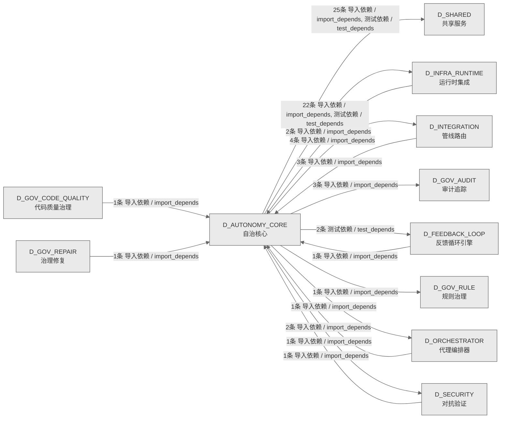

# 10_d_autonomy_core / 自治核心域 / Autonomy Core

> **功能简介 / Overview**: 自治核心，负责 AI 自治决策、目标分解和执行编排

> **文档作用 / Purpose**: 展示 自治核心（D_AUTONOMY_CORE）功能域的域内依赖关系、跨域依赖关系，模块信息（成熟度/中英文名/大白话/文件路径）内嵌于 Mermaid 节点，供架构审查和域治理参考。

> 本文档由 generate_domain_doc.py 从 depgraph (PostgreSQL) 自动生成
> 数据源: depgraph (PostgreSQL) nodes表 + edges表

> **[可缩放 HTML 版 / Zoomable HTML](http://localhost:8765/docs/02_enterprise_architecture/02_domain_architecture_docs/_zoomable_html/10_d_autonomy_core.html)** — Ctrl+滚轮缩放 ｜ 双击重置 ｜ Ctrl+Shift+D 切换拖动/选择模式

## 域基本信息 / Domain Overview

| 字段 | 值 | Field | Value |
|------|------|-------|-------|
| 编号 | 10 | Number | 10 |
| 域ID | D_AUTONOMY_CORE | Domain ID | D_AUTONOMY_CORE |
| 域名称 | 自治核心 | Domain Name | Autonomy Core |
| 层级 | L1 基础平台层 | Layer | L1 Foundation |
| 模块数 | 130 | Module Count | 130 |
| 域内依赖 | 43 | Internal Dependencies | 43 |
| 跨域入边 | 11 | Cross-domain Incoming | 11 |
| 跨域出边 | 59 | Cross-domain Outgoing | 59 |
| 设计态模块 | 0 | Design Modules | 0 |
| 生产态模块 | 130 | Production Modules | 130 |
| 容量 | 130/150 (正常) | Capacity | 130/150 (正常) |
| 描述 | Skill渐进披露(L0永久/L1触发/L2组合/L3按需) | Description | Skill渐进披露(L0永久/L1触发/L2组合/L3按需) |

## 域内依赖图 / Internal Dependency Diagram

> 依赖图内嵌在本文档中，IDE 可直接渲染；网页版可 Ctrl+滚轮缩放 + 拖动平移查看细节。全景图用颜色区分运营态/设计态，不再分页/拆子图。
>
> **图例说明 / Legend**：
> - 🟦 **蓝色 = 运营态模块**（production，已上线运行）
> - 🟧 **橙色虚线 = 设计态模块**（design，蓝图阶段，代码未写）
> - **实线箭头 = 运营态依赖**（已生效的依赖关系）
> - **虚线箭头 = 非运营态依赖**（计划中/验证中的依赖关系）

### 全景依赖图（全部模块，颜色区分运营态/设计态）

> 展示全部 130 个模块（生产态 130 + 设计态 0），节点含成熟度+中英文名+大白话+文件路径。

```mermaid
%%{init: {'theme': 'base', 'themeVariables': {'primaryColor': '#eaeaea', 'primaryTextColor': '#333333', 'primaryBorderColor': '#666666', 'lineColor': '#666666', 'secondaryColor': '#eaeaea', 'tertiaryColor': '#eaeaea', 'fontSize': '14px'}}}%%
flowchart TD
    src_zephyr_autonomy_core_main_py["(生产态 / production) 自治核心域命令行入口 / Autonomy Core CLI Entry<br/>自治核心域的命令行入口，可通过 python -m 直接运行该包。<br/>文件: autonomy_core/__main__.py"]
    src_zephyr_autonomy_core_agent_observability_py["(生产态 / production) 代理可观测性 / Agent Observability<br/>MOD-INF-019: Agent Spec — Agent Observability<br/>文件: autonomy_core/agent_observability.py"]
    src_zephyr_autonomy_core_all_skill_modules_py["(生产态 / production) 全量技能modules / All Skill Modules<br/>MOD-INF-019: Agent Spec — All Skill Modules<br/>文件: autonomy_core/all_skill_modules.py"]
    src_zephyr_autonomy_core_context_atomic_injector_py["(生产态 / production) atomicinjector / Atomic Injector<br/>atomic_injector.py — 原子注入 (DD101, TASK-019)<br/>文件: context/atomic_injector.py"]
    src_zephyr_autonomy_core_context_ce_bootstrap_py["(生产态 / production) cebootstrap / Ce Bootstrap<br/>ce_bootstrap.py — CE 自举架构 (B1, DD75, TASK-015 beta v)<br/>文件: context/ce_bootstrap.py"]
    src_zephyr_autonomy_core_context_ce_explain_cli_py["(生产态 / production) ceexplain命令行 / Ce Explain CLI<br/>ce_explain_cli.py — KE inclusion rationale 解释 CLI (TASK-016)<br/>文件: context/ce_explain_cli.py"]
    src_zephyr_autonomy_core_context_ce_file_lister_py["(生产态 / production) ce文件lister / Ce File Lister<br/>list_ce_files.py — CE 文件清单生成器<br/>文件: context/ce_file_lister.py"]
    src_zephyr_autonomy_core_context_ce_playground_v2_py["(生产态 / production) ceplaygroundv2 / Ce Playground V2<br/>ce_playground_v2.py — V2 Playground with full decision chain (TASK-016)<br/>文件: context/ce_playground_v2.py"]
    src_zephyr_autonomy_core_context_ce_vibe_shortcuts_py["(生产态 / production) ce直觉shortcuts / Ce Vibe Shortcuts<br/>ce_vibe_shortcuts.py — Vibe/Strict 模式切换 (TASK-016)<br/>文件: context/ce_vibe_shortcuts.py"]
    src_zephyr_autonomy_core_context_checkpoint_manager_py["(生产态 / production) checkpoint管理器 / Checkpoint Manager<br/>checkpoint_manager.py — Inject 前快照 (DD100, TASK-019)<br/>文件: context/checkpoint_manager.py"]
    src_zephyr_autonomy_core_context_cold_start_booster_py["(生产态 / production) 冷启动booster / Cold Start Booster<br/>cold_start_booster.py — 冷启动 (DD107, TASK-019)<br/>文件: context/cold_start_booster.py"]
    src_zephyr_autonomy_core_context_complexity_budget_py["(生产态 / production) complexity预算 / Complexity Budget<br/>complexity_budget.py — Token 预算复杂度因子 (DD103, TASK-019)<br/>文件: context/complexity_budget.py"]
    src_zephyr_autonomy_core_context_context_budget_py["(生产态 / production) 上下文预算 / Context Budget<br/>TruncationStrategy — TruncationStrategy<br/>文件: context/context_budget.py"]
    src_zephyr_autonomy_core_context_context_budget_tracker_py["(生产态 / production) 上下文预算追踪器 / Context Budget Tracker<br/>ContextBudgetTracker: token budget management with 3-level thresholds.<br/>文件: context/context_budget_tracker.py"]
    src_zephyr_autonomy_core_context_context_debt_score_py["(生产态 / production) 上下文debtscore / Context Debt Score<br/>context_debt_score.py — 上下文债务评分 (B19, DD93, TASK-017)<br/>文件: context/context_debt_score.py"]
    src_zephyr_autonomy_core_context_context_evaluator_py["(生产态 / production) 上下文evaluator / Context Evaluator<br/>context_evaluator.py — AI 引用率评估 (TASK-014 beta b)<br/>文件: context/context_evaluator.py"]
    src_zephyr_autonomy_core_context_context_evictor_py["(生产态 / production) 上下文evictor / Context Evictor<br/>context_evictor.py — 三维逐出器 (DD9, TASK-014 beta a)<br/>文件: context/context_evictor.py"]
    src_zephyr_autonomy_core_context_context_health_score_py["(生产态 / production) 上下文健康score / Context Health Score<br/>ContextHealthScore.py — 统一健康分 (B6, DD80, TASK-015 beta v)<br/>文件: context/context_health_score.py"]
    src_zephyr_autonomy_core_context_context_model_strategy_py["(生产态 / production) 上下文模型策略 / Context Model Strategy<br/>context_model_strategy.py — 模型选择策略 (DD118, TASK-020)<br/>文件: context/context_model_strategy.py"]
    src_zephyr_autonomy_core_context_context_outcome_tracker_py["(生产态 / production) 上下文outcome追踪器 / Context Outcome Tracker<br/>context_outcome_tracker.py — 因果链追踪 (B14, DD88, TASK-017)<br/>文件: context/context_outcome_tracker.py"]
    src_zephyr_autonomy_core_context_context_pipeline_auto_py["(生产态 / production) 上下文流水线自动 / Context Pipeline Auto<br/>context_pipeline_auto.py — ContextPipeline 三层自动化机制<br/>文件: context/context_pipeline_auto.py"]
    src_zephyr_autonomy_core_context_context_playground_py["(生产态 / production) 上下文playground / Context Playground<br/>context_playground.py — 上下文沙箱 dry-run (B5, DD79, TASK-015 beta v)<br/>文件: context/context_playground.py"]
    src_zephyr_autonomy_core_context_context_rot_model_py["(生产态 / production) 上下文rot模型 / Context Rot Model<br/>context_rot_model.py — Context Rot 注意力衰减数学模型<br/>文件: context/context_rot_model.py"]
    src_zephyr_autonomy_core_context_context_value_attribution_py["(生产态 / production) 上下文valueattribution / Context Value Attribution<br/>context_value_attribution.py — KE 级 ROI 归因 (B2, DD76, TASK-015 beta v)<br/>文件: context/context_value_attribution.py"]
    src_zephyr_autonomy_core_context_contextual_fetch_api_py["(生产态 / production) contextualfetchAPI / Contextual Fetch API<br/>contextual_fetch_api.py — HTTP FE 对外 API (DD115, TASK-020)<br/>文件: context/contextual_fetch_api.py"]
    src_zephyr_autonomy_core_context_curation_loop_py["(生产态 / production) curation环路 / Curation Loop<br/>curation_loop.py — Per-Turn Curation 策展 (DD10, TASK-014 beta b)<br/>文件: context/curation_loop.py"]
    src_zephyr_autonomy_core_context_diff_injector_py["(生产态 / production) 差异injector / Diff Injector<br/>diff_injector.py — 增量注入 (DD98, TASK-019)<br/>文件: context/diff_injector.py"]
    src_zephyr_autonomy_core_context_diversity_constraint_py["(生产态 / production) diversity约束 / Diversity Constraint<br/>diversity_constraint.py — 多样性约束 (DD119, TASK-020)<br/>文件: context/diversity_constraint.py"]
    src_zephyr_autonomy_core_context_domain_decay_config_py["(生产态 / production) domaindecay配置 / Domain Decay Config<br/>domain_decay_config.py — 每领域半衰期 (DD105, TASK-019)<br/>文件: context/domain_decay_config.py"]
    src_zephyr_autonomy_core_context_fallback_staleness_gate_py["(生产态 / production) fallbackstaleness门禁 / Fallback Staleness Gate<br/>fallback_staleness_gate.py — 兜底层自腐检测 (B13, DD87, TASK-017)<br/>文件: context/fallback_staleness_gate.py"]
    src_zephyr_autonomy_core_context_integrity_check_py["(生产态 / production) 完整性检查 / Integrity Check<br/>integrity_check.py — 注入后完整性 (DD106, TASK-019)<br/>文件: context/integrity_check.py"]
    src_zephyr_autonomy_core_context_memory_bank_py["(生产态 / production) memorybank / Memory Bank<br/>memory_bank.py — AI 读写结构化持久上下文 (DD: memory_bank, TASK-014 beta c)<br/>文件: context/memory_bank.py"]
    src_zephyr_autonomy_core_context_mode_manager_py["(生产态 / production) 模式管理器 / Mode Manager<br/>mode_manager.py — 模式管理器 (DD102, TASK-019)<br/>文件: context/mode_manager.py"]
    src_zephyr_autonomy_core_context_position_optimizer_py["(生产态 / production) position优化器 / Position Optimizer<br/>position_optimizer.py — 位置优化 (DD104, TASK-019)<br/>文件: context/position_optimizer.py"]
    src_zephyr_autonomy_core_context_shadow_canary_py["(生产态 / production) shadowcanary / Shadow Canary<br/>shadow_canary.py — 金丝雀部署 (B4, DD78, TASK-015 beta w)<br/>文件: context/shadow_canary.py"]
    src_zephyr_autonomy_core_context_staleness_manager_py["(生产态 / production) staleness管理器 / Staleness Manager<br/>staleness_manager.py — 全局过期检测 (DD112, TASK-019)<br/>文件: context/staleness_manager.py"]
    src_zephyr_autonomy_core_context_vector_bridge_py["(生产态 / production) vector桥接 / Vector Bridge<br/>VectorBridge — CE↔VMS 检索桥接 (Connect CT-CE-VMS-001)<br/>文件: context/vector_bridge.py"]
    src_zephyr_autonomy_core_file_autoregister_py["(生产态 / production) 文件自动注册 / File Autoregister<br/>定义 FileAutoRegister 等类型。<br/>文件: autonomy_core/file_autoregister.py"]
    src_zephyr_autonomy_core_ide_watcher_py["(生产态 / production) ide监视器 / Ide Watcher<br/>MOD-INF-019: Agent Spec — IDE Watcher<br/>文件: autonomy_core/ide_watcher.py"]
    src_zephyr_autonomy_core_integration_pipeline_bridge_py["(生产态 / production) 流水线桥接 / Pipeline Bridge<br/>PipelineSkillBridge — Agent Spec -> Pipeline 双向桥接<br/>文件: integration/pipeline_bridge.py"]
    src_zephyr_autonomy_core_phase_planner_py["(生产态 / production) phaseplanner / Phase Planner<br/>MOD-INF-019: Agent Spec — Phase Planner<br/>文件: autonomy_core/phase_planner.py"]
    src_zephyr_autonomy_core_progressive_disclosure_injector_py["(生产态 / production) progressivedisclosureinjector / Progressive Disclosure Injector<br/>progressive_disclosure_injector.py — 渐进式披露 (B7, DD81, TASK-015 beta w)<br/>文件: autonomy_core/progressive_disclosure_injector.py"]
    src_zephyr_autonomy_core_prompt_registry_py["(生产态 / production) 提示词注册表 / Prompt Registry<br/>PromptRegistry: YAML-driven Prompt 模板注册表<br/>文件: autonomy_core/prompt_registry.py"]
    src_zephyr_autonomy_core_self_evolution_fidelity_gate_py["(生产态 / production) 自我进化fidelity门禁 / Self Evolution Fidelity Gate<br/>MOD-INF-019: Agent Spec — Self Evolution Fidelity Gate<br/>文件: autonomy_core/self_evolution_fidelity_gate.py"]
    src_zephyr_autonomy_core_skill_rbac_registry_py["(生产态 / production) 技能RBAC注册表 / Skill RBAC Registry<br/>G-CT-003: Agent Spec -> RBAC capability check.<br/>文件: autonomy_core/skill_rbac_registry.py"]
    src_zephyr_autonomy_core_skills_skill_attention_py["(生产态 / production) 技能attention / Skill Attention<br/>MOD-INF-019: Agent Spec — Skill Attention Management<br/>文件: skills/skill_attention.py"]
    src_zephyr_autonomy_core_skills_skill_breakage_checker_py["(生产态 / production) 技能breakage检查器 / Skill Breakage Checker<br/>MOD-INF-019: Agent Spec — Skill Breakage Checker<br/>文件: skills/skill_breakage_checker.py"]
    src_zephyr_autonomy_core_skills_skill_cache_provider_py["(生产态 / production) 技能缓存提供者 / Skill Cache Provider<br/>MOD-INF-019: Agent Spec — Skill Cache Provider<br/>文件: skills/skill_cache_provider.py"]
    src_zephyr_autonomy_core_skills_skill_calibration_py["(生产态 / production) 技能calibration / Skill Calibration<br/>MOD-INF-019: Agent Spec — Skill Calibration<br/>文件: skills/skill_calibration.py"]
    src_zephyr_autonomy_core_skills_skill_canary_py["(生产态 / production) 技能canary / Skill Canary<br/>MOD-INF-019: Agent Spec — Skill Canary<br/>文件: skills/skill_canary.py"]
    src_zephyr_autonomy_core_skills_skill_cognitive_preservation_py["(生产态 / production) 技能cognitivepreservation / Skill Cognitive Preservation<br/>MOD-INF-019: Agent Spec — Skill Cognitive Preservation<br/>文件: skills/skill_cognitive_preservation.py"]
    src_zephyr_autonomy_core_skills_skill_compliance_py["(生产态 / production) 技能合规 / Skill Compliance<br/>MOD-INF-019: Agent Spec — Skill Compliance<br/>文件: skills/skill_compliance.py"]
    src_zephyr_autonomy_core_skills_skill_consensus_py["(生产态 / production) 技能共识 / Skill Consensus<br/>MOD-INF-019: Agent Spec — Skill Consensus<br/>文件: skills/skill_consensus.py"]
    src_zephyr_autonomy_core_skills_skill_constructor_py["(生产态 / production) 技能constructor / Skill Constructor<br/>MOD-INF-019: Agent Spec — Skill Constructor<br/>文件: skills/skill_constructor.py"]
    src_zephyr_autonomy_core_skills_skill_context_isolation_py["(生产态 / production) 技能上下文isolation / Skill Context Isolation<br/>MOD-INF-019: Agent Spec — Context Isolation<br/>文件: skills/skill_context_isolation.py"]
    src_zephyr_autonomy_core_skills_skill_contract_py["(生产态 / production) 技能contract / Skill Contract<br/>MOD-INF-019: Agent Spec — Skill Contract<br/>文件: skills/skill_contract.py"]
    src_zephyr_autonomy_core_skills_skill_cross_model_py["(生产态 / production) 技能跨模型 / Skill Cross Model<br/>MOD-INF-019: Agent Spec — Skill Cross-Model<br/>文件: skills/skill_cross_model.py"]
    src_zephyr_autonomy_core_skills_skill_di_py["(生产态 / production) 技能di / Skill Di<br/>MOD-INF-019: Agent Spec — Skill Dependency Injection<br/>文件: skills/skill_di.py"]
    src_zephyr_autonomy_core_skills_skill_discovery_py["(生产态 / production) 技能discovery / Skill Discovery<br/>MOD-INF-019: Agent Spec — Skill Discovery<br/>文件: skills/skill_discovery.py"]
    src_zephyr_autonomy_core_skills_skill_durable_py["(生产态 / production) 技能持久 / Skill Durable<br/>MOD-INF-019: Agent Spec — Durable Execution<br/>文件: skills/skill_durable.py"]
    src_zephyr_autonomy_core_skills_skill_economics_py["(生产态 / production) 技能economics / Skill Economics<br/>MOD-INF-019: Agent Spec — Skill Economics<br/>文件: skills/skill_economics.py"]
    src_zephyr_autonomy_core_skills_skill_efficacy_calibrator_py["(生产态 / production) 技能efficacy校准器 / Skill Efficacy Calibrator<br/>MOD-INF-019: Agent Spec — Skill Efficacy Calibrator<br/>文件: skills/skill_efficacy_calibrator.py"]
    src_zephyr_autonomy_core_skills_skill_executor_py["(生产态 / production) 技能executor / Skill Executor<br/>Skill 加载前创建回滚检查点<br/>文件: skills/skill_executor.py"]
    src_zephyr_autonomy_core_skills_skill_explain_py["(生产态 / production) 技能explain / Skill Explain<br/>MOD-INF-019: Agent Spec — XAI Explainable Skill Engine<br/>文件: skills/skill_explain.py"]
    src_zephyr_autonomy_core_skills_skill_feature_flags_py["(生产态 / production) 技能featureflags / Skill Feature Flags<br/>MOD-INF-019: Agent Spec — Skill Feature Flags<br/>文件: skills/skill_feature_flags.py"]
    src_zephyr_autonomy_core_skills_skill_feedback_py["(生产态 / production) 技能反馈 / Skill Feedback<br/>MOD-INF-019: Agent Spec — Skill Feedback Loop<br/>文件: skills/skill_feedback.py"]
    src_zephyr_autonomy_core_skills_skill_freshness_ext_py["(生产态 / production) 技能freshnessext / Skill Freshness Ext<br/>MOD-INF-019: Agent Spec — Skill Freshness Extensions<br/>文件: skills/skill_freshness_ext.py"]
    src_zephyr_autonomy_core_skills_skill_gitops_py["(生产态 / production) 技能gitops / Skill Gitops<br/>MOD-INF-019: Agent Spec — Skill GitOps<br/>文件: skills/skill_gitops.py"]
    src_zephyr_autonomy_core_skills_skill_guardrails_py["(生产态 / production) 技能guardrails / Skill Guardrails<br/>MOD-INF-019: Agent Spec — Skill Guardrails<br/>文件: skills/skill_guardrails.py"]
    src_zephyr_autonomy_core_skills_skill_idempotency_py["(生产态 / production) 技能idempotency / Skill Idempotency<br/>MOD-INF-019: Agent Spec — Skill Idempotency<br/>文件: skills/skill_idempotency.py"]
    src_zephyr_autonomy_core_skills_skill_kya_py["(生产态 / production) 技能kya / Skill Kya<br/>MOD-INF-019: Agent Spec — Skill KYA<br/>文件: skills/skill_kya.py"]
    src_zephyr_autonomy_core_skills_skill_learning_py["(生产态 / production) 技能learning / Skill Learning<br/>MOD-INF-019: Agent Spec — Skill Self-Learning Engine<br/>文件: skills/skill_learning.py"]
    src_zephyr_autonomy_core_skills_skill_lineage_py["(生产态 / production) 技能lineage / Skill Lineage<br/>MOD-INF-019: Agent Spec — Skill Lineage<br/>文件: skills/skill_lineage.py"]
    src_zephyr_autonomy_core_skills_skill_locking_py["(生产态 / production) 技能locking / Skill Locking<br/>MOD-INF-019: Agent Spec — Skill Locking (Production Hardening)<br/>文件: skills/skill_locking.py"]
    src_zephyr_autonomy_core_skills_skill_observability_py["(生产态 / production) 技能可观测性 / Skill Observability<br/>MOD-INF-019: Agent Spec — Skill Observability<br/>文件: skills/skill_observability.py"]
    src_zephyr_autonomy_core_skills_skill_ontology_py["(生产态 / production) 技能ontology / Skill Ontology<br/>MOD-INF-019: Agent Spec — Skill Ontology<br/>文件: skills/skill_ontology.py"]
    src_zephyr_autonomy_core_skills_skill_postmortem_py["(生产态 / production) 技能postmortem / Skill Postmortem<br/>MOD-INF-019: Agent Spec — Skill Postmortem (追问到底)<br/>文件: skills/skill_postmortem.py"]
    src_zephyr_autonomy_core_skills_skill_prompt_cache_py["(生产态 / production) 技能提示词缓存 / Skill Prompt Cache<br/>MOD-INF-019: Agent Spec — Skill Prompt Cache<br/>文件: skills/skill_prompt_cache.py"]
    src_zephyr_autonomy_core_skills_skill_prompt_opt_py["(生产态 / production) 技能提示词opt / Skill Prompt Opt<br/>MOD-INF-019: Agent Spec — Skill Prompt Optimizer<br/>文件: skills/skill_prompt_opt.py"]
    src_zephyr_autonomy_core_skills_skill_resilience_py["(生产态 / production) 技能韧性 / Skill Resilience<br/>MOD-INF-019: Agent Spec — Skill Resilience<br/>文件: skills/skill_resilience.py"]
    src_zephyr_autonomy_core_skills_skill_risk_mitigator_py["(生产态 / production) 技能风险mitigator / Skill Risk Mitigator<br/>MOD-INF-019: Agent Spec — Skill Risk Mitigator<br/>文件: skills/skill_risk_mitigator.py"]
    src_zephyr_autonomy_core_skills_skill_router_py["(生产态 / production) 技能路由器 / Skill Router<br/>定义 ConstructionStage、SkillRouter 等类型。<br/>文件: skills/skill_router.py"]
    src_zephyr_autonomy_core_skills_skill_sandbox_py["(生产态 / production) 技能沙箱 / Skill Sandbox<br/>MOD-INF-019: Agent Spec — Skill Sandbox<br/>文件: skills/skill_sandbox.py"]
    src_zephyr_autonomy_core_skills_skill_schema_registry_py["(生产态 / production) 技能schema注册表 / Skill Schema Registry<br/>MOD-INF-019: Agent Spec — Skill Schema Registry<br/>文件: skills/skill_schema_registry.py"]
    src_zephyr_autonomy_core_skills_skill_security_py["(生产态 / production) 技能安全 / Skill Security<br/>MOD-INF-019: Agent Spec — Skill Security<br/>文件: skills/skill_security.py"]
    src_zephyr_autonomy_core_skills_skill_shadow_py["(生产态 / production) 技能shadow / Skill Shadow<br/>MOD-INF-019: Agent Spec — Skill Shadow Deployment<br/>文件: skills/skill_shadow.py"]
    src_zephyr_autonomy_core_skills_skill_silent_failure_py["(生产态 / production) 技能silentfailure / Skill Silent Failure<br/>MOD-INF-019: Agent Spec — Silent Failure Detector<br/>文件: skills/skill_silent_failure.py"]
    src_zephyr_autonomy_core_skills_skill_team_optimizer_py["(生产态 / production) 技能team优化器 / Skill Team Optimizer<br/>MOD-INF-019: Agent Spec — Skill Team Optimizer<br/>文件: skills/skill_team_optimizer.py"]
    src_zephyr_autonomy_core_skills_skill_telemetry_py["(生产态 / production) 技能遥测 / Skill Telemetry<br/>MOD-INF-019: Agent Spec — Skill Telemetry<br/>文件: skills/skill_telemetry.py"]
    src_zephyr_autonomy_core_skills_skill_temperature_py["(生产态 / production) 技能temperature / Skill Temperature<br/>MOD-INF-019: Agent Spec — Skill Temperature<br/>文件: skills/skill_temperature.py"]
    src_zephyr_autonomy_core_skills_skill_tokenomics_py["(生产态 / production) 技能tokenomics / Skill Tokenomics<br/>MOD-INF-019: Agent Spec — Skill Tokenomics<br/>文件: skills/skill_tokenomics.py"]
    src_zephyr_autonomy_core_skills_skill_translator_py["(生产态 / production) 技能translator / Skill Translator<br/>MOD-INF-019: Agent Spec — Skill Translator<br/>文件: skills/skill_translator.py"]
    src_zephyr_autonomy_core_skills_skill_workflow_py["(生产态 / production) 技能workflow / Skill Workflow<br/>MOD-INF-019: Agent Spec — Skill Workflow Orchestrator<br/>文件: skills/skill_workflow.py"]
    src_zephyr_autonomy_core_spec_engine_py["(生产态 / production) 规格引擎 / Spec Engine<br/>MOD-INF-019: Agent Spec — SpecEngine 蓝图->Skill 升级引擎<br/>文件: autonomy_core/spec_engine.py"]
    src_zephyr_autonomy_core_vibe_coding_quality_gate_py["(生产态 / production) 直觉编码质量门禁 / Vibe Coding Quality Gate<br/>VibeCodingQualityGate — 代码质量门禁（stub, tests 待实装后补全实现）<br/>文件: autonomy_core/vibe_coding_quality_gate.py"]
    src_zephyr_governance_persistence_intent_parser_py["(生产态 / production) intentparser / Intent Parser<br/>IntentParser · 意图三阶段级联解析器（V-09）<br/>文件: persistence/intent_parser.py"]
    src_zephyr_infrastructure_system_snapshot_py["(生产态 / production) 系统snapshot / System Snapshot<br/>SystemSnapshotter — M1 系统状态镜像（CL-017 RI 扩展模式）<br/>文件: infrastructure/system_snapshot.py"]
    src_zephyr_infrastructure_system_telemetry_otel_instrumentation_py["(生产态 / production) otelinstrumentation / Otel Instrumentation<br/>otel_instrumentation.py — 全链路 OTel (B12, DD86, TASK-015 beta v)<br/>文件: system_telemetry/otel_instrumentation.py"]
    src_zephyr_integration_vector_memory_vector_writer_py["(生产态 / production) vectorwriter / Vector Writer<br/>CE 向量写入器 — vectorize_and_store() 生产者<br/>文件: vector_memory/vector_writer.py"]
    src_zephyr_security_llm_defense_llm_security_adversarial_robustness_py["(生产态 / production) 对抗robustness / Adversarial Robustness<br/>adversarial_robustness.py — 对抗鲁棒性 (B8, DD82, TASK-015 beta w)<br/>文件: llm_security/adversarial_robustness.py"]
    src_zephyr_security_llm_defense_llm_security_alignment_scorer_py["(生产态 / production) 对齐评分器 / Alignment Scorer<br/>alignment_scorer.py — 对齐评分 (B11, DD85, TASK-015 beta w)<br/>文件: llm_security/alignment_scorer.py"]
    src_zephyr_security_llm_defense_llm_security_lsg_pattern_tracker_py["(生产态 / production) lsg模式追踪器 / Lsg Pattern Tracker<br/>lsg_pattern_tracker.py — LSG 模式逃逸追踪 (B20, DD94, TASK-017)<br/>文件: llm_security/lsg_pattern_tracker.py"]
    src_zephyr_security_llm_defense_llm_security_poisoning_monitor_py["(生产态 / production) poisoning监控器 / Poisoning Monitor<br/>poisoning_monitor.py — Embed 污染检测 (DD97, TASK-019)<br/>文件: llm_security/poisoning_monitor.py"]
    src_zephyr_security_llm_defense_llm_security_sensitivity_classifier_py["(生产态 / production) sensitivityclassifier / Sensitivity Classifier<br/>sensitivity_classifier.py — 数据分级 (B9, DD83, TASK-015 beta w)<br/>文件: llm_security/sensitivity_classifier.py"]
    src_zephyr_security_llm_defense_llm_security_solo_dev_safety_net_py["(生产态 / production) solodev安全net / Solo Dev Safety Net<br/>solo_dev_safety_net.py — 单人无审查安全网 (B15, DD89, TASK-017)<br/>文件: llm_security/solo_dev_safety_net.py"]
    src_zephyr_shared_ai_guards_config_safety_guard_py["(生产态 / production) 配置安全守卫 / Config Safety Guard<br/>config_safety_guard.py — 配置自毁防护 (B16, DD90, TASK-017)<br/>文件: ai_guards/config_safety_guard.py"]
    src_zephyr_shared_dependency_dependency_tracker_py["(生产态 / production) 依赖追踪器 / Dependency Tracker<br/>dependency_tracker.py — 依赖追踪 (DD116, TASK-020)<br/>文件: dependency/dependency_tracker.py"]
    src_zephyr_shared_io_cache_invalidation_py["(生产态 / production) 缓存invalidation / Cache Invalidation<br/>cache_invalidation.py — 缓存一致性 (DD113, TASK-020)<br/>文件: io/cache_invalidation.py"]
    src_zephyr_shared_utils_verify_paths_py["(生产态 / production) verifypaths / Verify Paths<br/>verify_paths.py — 代码路径索引验证 (TASK-012)<br/>文件: utils/verify_paths.py"]
    tests_automation_test_auto_runtime_e2e_py["(生产态 / production) 测试自动运行时端到端 / Test Auto Runtime E2E<br/>F1 AutoRuntimeCore 非mock端到端集成测试<br/>文件: automation/test_auto_runtime_e2e.py"]
    tests_f_lifecycle_test_f1_event_trigger_py["(生产态 / production) 测试f1事件触发器 / Test F1 Event Trigger<br/>F1 事件触发启动测试<br/>文件: f_lifecycle/test_f1_event_trigger.py"]
    tests_trading_extreme_test_f14_pipeline_extreme_py["(生产态 / production) 测试f14流水线extreme / Test F14 Pipeline Extreme<br/>F14 管线编排/反馈环 — 红蓝对抗端到端极端测试<br/>文件: extreme/test_f14_pipeline_extreme.py"]
    tests_trading_extreme_test_f1_extreme_py["(生产态 / production) 测试f1extreme / Test F1 Extreme<br/>F1 自动驾驶/运行时大脑 — 红蓝对抗端到端极端测试<br/>文件: extreme/test_f1_extreme.py"]
    src_zephyr_autonomy_core_main_py ~~~ src_zephyr_autonomy_core_agent_observability_py
    src_zephyr_autonomy_core_agent_observability_py ~~~ src_zephyr_autonomy_core_all_skill_modules_py
    src_zephyr_autonomy_core_all_skill_modules_py ~~~ src_zephyr_autonomy_core_context_atomic_injector_py
    src_zephyr_autonomy_core_context_atomic_injector_py ~~~ src_zephyr_autonomy_core_context_ce_bootstrap_py
    src_zephyr_autonomy_core_context_ce_bootstrap_py ~~~ src_zephyr_autonomy_core_context_ce_explain_cli_py
    src_zephyr_autonomy_core_context_ce_explain_cli_py ~~~ src_zephyr_autonomy_core_context_ce_file_lister_py
    src_zephyr_autonomy_core_context_ce_file_lister_py ~~~ src_zephyr_autonomy_core_context_ce_playground_v2_py
    src_zephyr_autonomy_core_context_ce_playground_v2_py ~~~ src_zephyr_autonomy_core_context_ce_vibe_shortcuts_py
    src_zephyr_autonomy_core_context_ce_vibe_shortcuts_py ~~~ src_zephyr_autonomy_core_context_checkpoint_manager_py
    src_zephyr_autonomy_core_context_checkpoint_manager_py ~~~ src_zephyr_autonomy_core_context_cold_start_booster_py
    src_zephyr_autonomy_core_context_cold_start_booster_py ~~~ src_zephyr_autonomy_core_context_complexity_budget_py
    src_zephyr_autonomy_core_context_complexity_budget_py ~~~ src_zephyr_autonomy_core_context_context_budget_py
    src_zephyr_autonomy_core_context_context_budget_py ~~~ src_zephyr_autonomy_core_context_context_budget_tracker_py
    src_zephyr_autonomy_core_context_context_budget_tracker_py ~~~ src_zephyr_autonomy_core_context_context_debt_score_py
    src_zephyr_autonomy_core_context_context_debt_score_py ~~~ src_zephyr_autonomy_core_context_context_evaluator_py
    src_zephyr_autonomy_core_context_context_evaluator_py ~~~ src_zephyr_autonomy_core_context_context_evictor_py
    src_zephyr_autonomy_core_context_context_evictor_py ~~~ src_zephyr_autonomy_core_context_context_health_score_py
    src_zephyr_autonomy_core_context_context_health_score_py ~~~ src_zephyr_autonomy_core_context_context_model_strategy_py
    src_zephyr_autonomy_core_context_context_model_strategy_py ~~~ src_zephyr_autonomy_core_context_context_outcome_tracker_py
    src_zephyr_autonomy_core_context_context_outcome_tracker_py ~~~ src_zephyr_autonomy_core_context_context_pipeline_auto_py
    src_zephyr_autonomy_core_context_context_pipeline_auto_py ~~~ src_zephyr_autonomy_core_context_context_playground_py
    src_zephyr_autonomy_core_context_context_playground_py ~~~ src_zephyr_autonomy_core_context_context_rot_model_py
    src_zephyr_autonomy_core_context_context_rot_model_py ~~~ src_zephyr_autonomy_core_context_context_value_attribution_py
    src_zephyr_autonomy_core_context_context_value_attribution_py ~~~ src_zephyr_autonomy_core_context_contextual_fetch_api_py
    src_zephyr_autonomy_core_context_contextual_fetch_api_py ~~~ src_zephyr_autonomy_core_context_curation_loop_py
    src_zephyr_autonomy_core_context_curation_loop_py ~~~ src_zephyr_autonomy_core_context_diff_injector_py
    src_zephyr_autonomy_core_context_diff_injector_py ~~~ src_zephyr_autonomy_core_context_diversity_constraint_py
    src_zephyr_autonomy_core_context_diversity_constraint_py ~~~ src_zephyr_autonomy_core_context_domain_decay_config_py
    src_zephyr_autonomy_core_context_domain_decay_config_py ~~~ src_zephyr_autonomy_core_context_fallback_staleness_gate_py
    src_zephyr_autonomy_core_context_fallback_staleness_gate_py ~~~ src_zephyr_autonomy_core_context_integrity_check_py
    src_zephyr_autonomy_core_context_integrity_check_py ~~~ src_zephyr_autonomy_core_context_memory_bank_py
    src_zephyr_autonomy_core_context_memory_bank_py ~~~ src_zephyr_autonomy_core_context_mode_manager_py
    src_zephyr_autonomy_core_context_mode_manager_py ~~~ src_zephyr_autonomy_core_context_position_optimizer_py
    src_zephyr_autonomy_core_context_position_optimizer_py ~~~ src_zephyr_autonomy_core_context_shadow_canary_py
    src_zephyr_autonomy_core_context_shadow_canary_py ~~~ src_zephyr_autonomy_core_context_staleness_manager_py
    src_zephyr_autonomy_core_context_staleness_manager_py ~~~ src_zephyr_autonomy_core_context_vector_bridge_py
    src_zephyr_autonomy_core_context_vector_bridge_py ~~~ src_zephyr_autonomy_core_file_autoregister_py
    src_zephyr_autonomy_core_file_autoregister_py ~~~ src_zephyr_autonomy_core_ide_watcher_py
    src_zephyr_autonomy_core_ide_watcher_py ~~~ src_zephyr_autonomy_core_integration_pipeline_bridge_py
    src_zephyr_autonomy_core_integration_pipeline_bridge_py ~~~ src_zephyr_autonomy_core_phase_planner_py
    src_zephyr_autonomy_core_phase_planner_py ~~~ src_zephyr_autonomy_core_progressive_disclosure_injector_py
    src_zephyr_autonomy_core_progressive_disclosure_injector_py ~~~ src_zephyr_autonomy_core_prompt_registry_py
    src_zephyr_autonomy_core_prompt_registry_py ~~~ src_zephyr_autonomy_core_self_evolution_fidelity_gate_py
    src_zephyr_autonomy_core_self_evolution_fidelity_gate_py ~~~ src_zephyr_autonomy_core_skill_rbac_registry_py
    src_zephyr_autonomy_core_skill_rbac_registry_py ~~~ src_zephyr_autonomy_core_skills_skill_attention_py
    src_zephyr_autonomy_core_skills_skill_attention_py ~~~ src_zephyr_autonomy_core_skills_skill_breakage_checker_py
    src_zephyr_autonomy_core_skills_skill_breakage_checker_py ~~~ src_zephyr_autonomy_core_skills_skill_cache_provider_py
    src_zephyr_autonomy_core_skills_skill_cache_provider_py ~~~ src_zephyr_autonomy_core_skills_skill_calibration_py
    src_zephyr_autonomy_core_skills_skill_calibration_py ~~~ src_zephyr_autonomy_core_skills_skill_canary_py
    src_zephyr_autonomy_core_skills_skill_canary_py ~~~ src_zephyr_autonomy_core_skills_skill_cognitive_preservation_py
    src_zephyr_autonomy_core_skills_skill_cognitive_preservation_py ~~~ src_zephyr_autonomy_core_skills_skill_compliance_py
    src_zephyr_autonomy_core_skills_skill_compliance_py ~~~ src_zephyr_autonomy_core_skills_skill_consensus_py
    src_zephyr_autonomy_core_skills_skill_consensus_py ~~~ src_zephyr_autonomy_core_skills_skill_constructor_py
    src_zephyr_autonomy_core_skills_skill_constructor_py ~~~ src_zephyr_autonomy_core_skills_skill_context_isolation_py
    src_zephyr_autonomy_core_skills_skill_context_isolation_py ~~~ src_zephyr_autonomy_core_skills_skill_contract_py
    src_zephyr_autonomy_core_skills_skill_contract_py ~~~ src_zephyr_autonomy_core_skills_skill_cross_model_py
    src_zephyr_autonomy_core_skills_skill_cross_model_py ~~~ src_zephyr_autonomy_core_skills_skill_di_py
    src_zephyr_autonomy_core_skills_skill_di_py ~~~ src_zephyr_autonomy_core_skills_skill_discovery_py
    src_zephyr_autonomy_core_skills_skill_discovery_py ~~~ src_zephyr_autonomy_core_skills_skill_durable_py
    src_zephyr_autonomy_core_skills_skill_durable_py ~~~ src_zephyr_autonomy_core_skills_skill_economics_py
    src_zephyr_autonomy_core_skills_skill_economics_py ~~~ src_zephyr_autonomy_core_skills_skill_efficacy_calibrator_py
    src_zephyr_autonomy_core_skills_skill_efficacy_calibrator_py ~~~ src_zephyr_autonomy_core_skills_skill_executor_py
    src_zephyr_autonomy_core_skills_skill_executor_py ~~~ src_zephyr_autonomy_core_skills_skill_explain_py
    src_zephyr_autonomy_core_skills_skill_explain_py ~~~ src_zephyr_autonomy_core_skills_skill_feature_flags_py
    src_zephyr_autonomy_core_skills_skill_feature_flags_py ~~~ src_zephyr_autonomy_core_skills_skill_feedback_py
    src_zephyr_autonomy_core_skills_skill_feedback_py ~~~ src_zephyr_autonomy_core_skills_skill_freshness_ext_py
    src_zephyr_autonomy_core_skills_skill_freshness_ext_py ~~~ src_zephyr_autonomy_core_skills_skill_gitops_py
    src_zephyr_autonomy_core_skills_skill_gitops_py ~~~ src_zephyr_autonomy_core_skills_skill_guardrails_py
    src_zephyr_autonomy_core_skills_skill_guardrails_py ~~~ src_zephyr_autonomy_core_skills_skill_idempotency_py
    src_zephyr_autonomy_core_skills_skill_idempotency_py ~~~ src_zephyr_autonomy_core_skills_skill_kya_py
    src_zephyr_autonomy_core_skills_skill_kya_py ~~~ src_zephyr_autonomy_core_skills_skill_learning_py
    src_zephyr_autonomy_core_skills_skill_learning_py ~~~ src_zephyr_autonomy_core_skills_skill_lineage_py
    src_zephyr_autonomy_core_skills_skill_lineage_py ~~~ src_zephyr_autonomy_core_skills_skill_locking_py
    src_zephyr_autonomy_core_skills_skill_locking_py ~~~ src_zephyr_autonomy_core_skills_skill_observability_py
    src_zephyr_autonomy_core_skills_skill_observability_py ~~~ src_zephyr_autonomy_core_skills_skill_ontology_py
    src_zephyr_autonomy_core_skills_skill_ontology_py ~~~ src_zephyr_autonomy_core_skills_skill_postmortem_py
    src_zephyr_autonomy_core_skills_skill_postmortem_py ~~~ src_zephyr_autonomy_core_skills_skill_prompt_cache_py
    src_zephyr_autonomy_core_skills_skill_prompt_cache_py ~~~ src_zephyr_autonomy_core_skills_skill_prompt_opt_py
    src_zephyr_autonomy_core_skills_skill_prompt_opt_py ~~~ src_zephyr_autonomy_core_skills_skill_resilience_py
    src_zephyr_autonomy_core_skills_skill_resilience_py ~~~ src_zephyr_autonomy_core_skills_skill_risk_mitigator_py
    src_zephyr_autonomy_core_skills_skill_risk_mitigator_py ~~~ src_zephyr_autonomy_core_skills_skill_router_py
    src_zephyr_autonomy_core_skills_skill_router_py ~~~ src_zephyr_autonomy_core_skills_skill_sandbox_py
    src_zephyr_autonomy_core_skills_skill_sandbox_py ~~~ src_zephyr_autonomy_core_skills_skill_schema_registry_py
    src_zephyr_autonomy_core_skills_skill_schema_registry_py ~~~ src_zephyr_autonomy_core_skills_skill_security_py
    src_zephyr_autonomy_core_skills_skill_security_py ~~~ src_zephyr_autonomy_core_skills_skill_shadow_py
    src_zephyr_autonomy_core_skills_skill_shadow_py ~~~ src_zephyr_autonomy_core_skills_skill_silent_failure_py
    src_zephyr_autonomy_core_skills_skill_silent_failure_py ~~~ src_zephyr_autonomy_core_skills_skill_team_optimizer_py
    src_zephyr_autonomy_core_skills_skill_team_optimizer_py ~~~ src_zephyr_autonomy_core_skills_skill_telemetry_py
    src_zephyr_autonomy_core_skills_skill_telemetry_py ~~~ src_zephyr_autonomy_core_skills_skill_temperature_py
    src_zephyr_autonomy_core_skills_skill_temperature_py ~~~ src_zephyr_autonomy_core_skills_skill_tokenomics_py
    src_zephyr_autonomy_core_skills_skill_tokenomics_py ~~~ src_zephyr_autonomy_core_skills_skill_translator_py
    src_zephyr_autonomy_core_skills_skill_translator_py ~~~ src_zephyr_autonomy_core_skills_skill_workflow_py
    src_zephyr_autonomy_core_skills_skill_workflow_py ~~~ src_zephyr_autonomy_core_spec_engine_py
    src_zephyr_autonomy_core_spec_engine_py ~~~ src_zephyr_autonomy_core_vibe_coding_quality_gate_py
    src_zephyr_autonomy_core_vibe_coding_quality_gate_py ~~~ src_zephyr_governance_persistence_intent_parser_py
    src_zephyr_governance_persistence_intent_parser_py ~~~ src_zephyr_infrastructure_system_snapshot_py
    src_zephyr_infrastructure_system_snapshot_py ~~~ src_zephyr_infrastructure_system_telemetry_otel_instrumentation_py
    src_zephyr_infrastructure_system_telemetry_otel_instrumentation_py ~~~ src_zephyr_integration_vector_memory_vector_writer_py
    src_zephyr_integration_vector_memory_vector_writer_py ~~~ src_zephyr_security_llm_defense_llm_security_adversarial_robustness_py
    src_zephyr_security_llm_defense_llm_security_adversarial_robustness_py ~~~ src_zephyr_security_llm_defense_llm_security_alignment_scorer_py
    src_zephyr_security_llm_defense_llm_security_alignment_scorer_py ~~~ src_zephyr_security_llm_defense_llm_security_lsg_pattern_tracker_py
    src_zephyr_security_llm_defense_llm_security_lsg_pattern_tracker_py ~~~ src_zephyr_security_llm_defense_llm_security_poisoning_monitor_py
    src_zephyr_security_llm_defense_llm_security_poisoning_monitor_py ~~~ src_zephyr_security_llm_defense_llm_security_sensitivity_classifier_py
    src_zephyr_security_llm_defense_llm_security_sensitivity_classifier_py ~~~ src_zephyr_security_llm_defense_llm_security_solo_dev_safety_net_py
    src_zephyr_security_llm_defense_llm_security_solo_dev_safety_net_py ~~~ src_zephyr_shared_ai_guards_config_safety_guard_py
    src_zephyr_shared_ai_guards_config_safety_guard_py ~~~ src_zephyr_shared_dependency_dependency_tracker_py
    src_zephyr_shared_dependency_dependency_tracker_py ~~~ src_zephyr_shared_io_cache_invalidation_py
    src_zephyr_shared_io_cache_invalidation_py ~~~ src_zephyr_shared_utils_verify_paths_py
    src_zephyr_shared_utils_verify_paths_py ~~~ tests_automation_test_auto_runtime_e2e_py
    tests_automation_test_auto_runtime_e2e_py ~~~ tests_f_lifecycle_test_f1_event_trigger_py
    tests_f_lifecycle_test_f1_event_trigger_py ~~~ tests_trading_extreme_test_f14_pipeline_extreme_py
    tests_trading_extreme_test_f14_pipeline_extreme_py ~~~ tests_trading_extreme_test_f1_extreme_py
    src_zephyr_autonomy_core_context_context_pipeline_py["(生产态 / production) 上下文流水线 / Context Pipeline<br/>context_pipeline — Context Engine **四段流水线组合根**<br/>文件: context/context_pipeline.py"]
    src_zephyr_autonomy_core_skills_skill_evaluator_py["(生产态 / production) 技能evaluator / Skill Evaluator<br/>MOD-INF-019: Agent Spec — Skill Evaluator<br/>文件: skills/skill_evaluator.py"]
    src_zephyr_autonomy_core_skills_skill_factory_py["(生产态 / production) 技能工厂 / Skill Factory<br/>定义 SkillFactory 等类型。<br/>文件: skills/skill_factory.py"]
    src_zephyr_autonomy_core_skills_skill_kill_switch_py["(生产态 / production) 技能killswitch / Skill Kill Switch<br/>MOD-INF-019: Agent Spec — Skill Kill Switch<br/>文件: skills/skill_kill_switch.py"]
    src_zephyr_autonomy_core_skills_skill_lifecycle_py["(生产态 / production) 技能生命周期 / Skill Lifecycle<br/>MOD-INF-019: Agent Spec — Skill Lifecycle<br/>文件: skills/skill_lifecycle.py"]
    src_zephyr_autonomy_core_skills_skill_model_evolution_py["(生产态 / production) 技能模型进化 / Skill Model Evolution<br/>MOD-INF-019: Agent Spec — Skill Model Evolution<br/>文件: skills/skill_model_evolution.py"]
    src_zephyr_autonomy_core_skills_skill_registry_py["(生产态 / production) 技能注册表 / Skill Registry<br/>skill-registry.py —— Skill 注册基座（Phase 14 / 盲点 B34）<br/>文件: skills/skill_registry.py"]
    src_zephyr_autonomy_core_trigger_router_py["(生产态 / production) 触发器路由器 / Trigger Router<br/>定义 ConstructionStage、TriggerRouter 等类型。<br/>文件: autonomy_core/trigger_router.py"]
    src_zephyr_governance_persistence_intent_keyword_mapper_py["(生产态 / production) intentkeywordmapper / Intent Keyword Mapper<br/>IntentKeywordMapper - Stage 1 of three-stage intent parsing (<br/>文件: persistence/intent_keyword_mapper.py"]
    src_zephyr_autonomy_core_context_context_pipeline_py ~~~ src_zephyr_autonomy_core_skills_skill_evaluator_py
    src_zephyr_autonomy_core_skills_skill_evaluator_py ~~~ src_zephyr_autonomy_core_skills_skill_factory_py
    src_zephyr_autonomy_core_skills_skill_factory_py ~~~ src_zephyr_autonomy_core_skills_skill_kill_switch_py
    src_zephyr_autonomy_core_skills_skill_kill_switch_py ~~~ src_zephyr_autonomy_core_skills_skill_lifecycle_py
    src_zephyr_autonomy_core_skills_skill_lifecycle_py ~~~ src_zephyr_autonomy_core_skills_skill_model_evolution_py
    src_zephyr_autonomy_core_skills_skill_model_evolution_py ~~~ src_zephyr_autonomy_core_skills_skill_registry_py
    src_zephyr_autonomy_core_skills_skill_registry_py ~~~ src_zephyr_autonomy_core_trigger_router_py
    src_zephyr_autonomy_core_trigger_router_py ~~~ src_zephyr_governance_persistence_intent_keyword_mapper_py
    src_zephyr_autonomy_core_context_context_assembler_py["(生产态 / production) 上下文assembler / Context Assembler<br/>ContextAssembler — 上下文装配、校验、影子留档<br/>文件: context/context_assembler.py"]
    src_zephyr_autonomy_core_context_context_injector_py["(生产态 / production) 上下文injector / Context Injector<br/>ContextInjector: retrieve and inject relevant knowledge into prompt context<br/>文件: context/context_injector.py"]
    src_zephyr_autonomy_core_skills_skill_freshness_py["(生产态 / production) 技能freshness / Skill Freshness<br/>MOD-INF-019: Agent Spec — Skill Freshness Decay<br/>文件: skills/skill_freshness.py"]
    src_zephyr_autonomy_core_skills_skill_loader_py["(生产态 / production) 技能加载器 / Skill Loader<br/>定义 SkillLoader 等类型。<br/>文件: skills/skill_loader.py"]
    src_zephyr_autonomy_core_skills_skill_model_py["(生产态 / production) 技能模型 / Skill Model<br/>定义 SkillTier、SkillType、SkillStatus 等类型。<br/>文件: skills/skill_model.py"]
    src_zephyr_shared_blueprint_tools_architecture_context_loader_py["(生产态 / production) 架构上下文加载器 / Architecture Context Loader<br/>architecture_context_loader — 加载 ``generate_architecture_context.py`` 产出...<br/>文件: blueprint_tools/architecture_context_loader.py"]
    src_zephyr_autonomy_core_context_context_assembler_py ~~~ src_zephyr_autonomy_core_context_context_injector_py
    src_zephyr_autonomy_core_context_context_injector_py ~~~ src_zephyr_autonomy_core_skills_skill_freshness_py
    src_zephyr_autonomy_core_skills_skill_freshness_py ~~~ src_zephyr_autonomy_core_skills_skill_loader_py
    src_zephyr_autonomy_core_skills_skill_loader_py ~~~ src_zephyr_autonomy_core_skills_skill_model_py
    src_zephyr_autonomy_core_skills_skill_model_py ~~~ src_zephyr_shared_blueprint_tools_architecture_context_loader_py
    src_zephyr_autonomy_core_context_context_rule_registry_py["(生产态 / production) 上下文规则注册表 / Context Rule Registry<br/>register: rule_id 冲突->覆盖; lookup: 无匹配->空列表; load_yaml: 文件不存在->...<br/>文件: context/context_rule_registry.py"]
    src_zephyr_shared_io_doc_compressor_py["(生产态 / production) doccompressor / Doc Compressor<br/>DocCompressor — 文档压缩服务（CL-018 RI 扩展模式）<br/>文件: io/doc_compressor.py"]
    src_zephyr_autonomy_core_context_context_rule_registry_py ~~~ src_zephyr_shared_io_doc_compressor_py
    src_zephyr_autonomy_core_prompt_registry_py -->|导入依赖 / import_depends| src_zephyr_autonomy_core_context_context_injector_py
    src_zephyr_autonomy_core_prompt_registry_py -->|导入依赖 / import_depends| src_zephyr_autonomy_core_skills_skill_registry_py
    src_zephyr_autonomy_core_spec_engine_py -->|导入依赖 / import_depends| src_zephyr_autonomy_core_trigger_router_py
    src_zephyr_autonomy_core_spec_engine_py -->|导入依赖 / import_depends| src_zephyr_autonomy_core_skills_skill_factory_py
    src_zephyr_autonomy_core_spec_engine_py -->|导入依赖 / import_depends| src_zephyr_autonomy_core_skills_skill_freshness_py
    src_zephyr_autonomy_core_spec_engine_py -->|导入依赖 / import_depends| src_zephyr_autonomy_core_skills_skill_loader_py
    src_zephyr_autonomy_core_main_py -->|导入依赖 / import_depends| src_zephyr_autonomy_core_skills_skill_loader_py
    src_zephyr_autonomy_core_main_py -->|导入依赖 / import_depends| src_zephyr_autonomy_core_skills_skill_model_py
    src_zephyr_autonomy_core_context_context_assembler_py -->|导入依赖 / import_depends| src_zephyr_autonomy_core_context_context_rule_registry_py
    src_zephyr_autonomy_core_context_context_assembler_py -->|导入依赖 / import_depends| src_zephyr_shared_io_doc_compressor_py
    src_zephyr_autonomy_core_context_context_budget_tracker_py -->|导入依赖 / import_depends| src_zephyr_shared_io_doc_compressor_py
    src_zephyr_autonomy_core_context_context_pipeline_py -->|导入依赖 / import_depends| src_zephyr_autonomy_core_context_context_assembler_py
    src_zephyr_autonomy_core_context_context_pipeline_py -->|导入依赖 / import_depends| src_zephyr_autonomy_core_context_context_injector_py
    src_zephyr_autonomy_core_context_context_pipeline_py -->|导入依赖 / import_depends| src_zephyr_autonomy_core_context_context_rule_registry_py
    src_zephyr_autonomy_core_context_context_pipeline_py -->|导入依赖 / import_depends| src_zephyr_shared_blueprint_tools_architecture_context_loader_py
    src_zephyr_autonomy_core_context_context_pipeline_auto_py -->|导入依赖 / import_depends| src_zephyr_autonomy_core_context_context_pipeline_py
    src_zephyr_autonomy_core_integration_pipeline_bridge_py -->|导入依赖 / import_depends| src_zephyr_autonomy_core_trigger_router_py
    src_zephyr_autonomy_core_integration_pipeline_bridge_py -->|导入依赖 / import_depends| src_zephyr_autonomy_core_skills_skill_loader_py
    src_zephyr_autonomy_core_skills_skill_constructor_py -->|导入依赖 / import_depends| src_zephyr_autonomy_core_skills_skill_loader_py
    src_zephyr_autonomy_core_skills_skill_consensus_py -->|导入依赖 / import_depends| src_zephyr_autonomy_core_skills_skill_freshness_py
    src_zephyr_autonomy_core_skills_skill_contract_py -->|导入依赖 / import_depends| src_zephyr_autonomy_core_skills_skill_loader_py
    src_zephyr_autonomy_core_skills_skill_efficacy_calibrator_py -->|导入依赖 / import_depends| src_zephyr_autonomy_core_skills_skill_loader_py
    src_zephyr_autonomy_core_skills_skill_discovery_py -->|导入依赖 / import_depends| src_zephyr_autonomy_core_skills_skill_factory_py
    src_zephyr_autonomy_core_skills_skill_discovery_py -->|导入依赖 / import_depends| src_zephyr_autonomy_core_skills_skill_loader_py
    src_zephyr_autonomy_core_skills_skill_evaluator_py -->|导入依赖 / import_depends| src_zephyr_autonomy_core_skills_skill_freshness_py
    src_zephyr_autonomy_core_skills_skill_evaluator_py -->|导入依赖 / import_depends| src_zephyr_autonomy_core_skills_skill_loader_py
    src_zephyr_autonomy_core_skills_skill_executor_py -->|导入依赖 / import_depends| src_zephyr_autonomy_core_skills_skill_loader_py
    src_zephyr_autonomy_core_skills_skill_feedback_py -->|导入依赖 / import_depends| src_zephyr_autonomy_core_skills_skill_freshness_py
    src_zephyr_autonomy_core_skills_skill_feedback_py -->|导入依赖 / import_depends| src_zephyr_autonomy_core_skills_skill_kill_switch_py
    src_zephyr_autonomy_core_skills_skill_explain_py -->|导入依赖 / import_depends| src_zephyr_autonomy_core_skills_skill_evaluator_py
    src_zephyr_autonomy_core_skills_skill_explain_py -->|导入依赖 / import_depends| src_zephyr_autonomy_core_skills_skill_model_evolution_py
    src_zephyr_autonomy_core_skills_skill_freshness_ext_py -->|导入依赖 / import_depends| src_zephyr_autonomy_core_skills_skill_freshness_py
    src_zephyr_autonomy_core_skills_skill_freshness_ext_py -->|导入依赖 / import_depends| src_zephyr_autonomy_core_skills_skill_lifecycle_py
    src_zephyr_autonomy_core_skills_skill_freshness_ext_py -->|导入依赖 / import_depends| src_zephyr_autonomy_core_skills_skill_model_py
    src_zephyr_autonomy_core_skills_skill_kill_switch_py -->|导入依赖 / import_depends| src_zephyr_autonomy_core_skills_skill_model_py
    src_zephyr_autonomy_core_skills_skill_kya_py -->|导入依赖 / import_depends| src_zephyr_autonomy_core_skills_skill_loader_py
    src_zephyr_autonomy_core_skills_skill_lifecycle_py -->|导入依赖 / import_depends| src_zephyr_autonomy_core_skills_skill_model_py
    src_zephyr_autonomy_core_skills_skill_prompt_opt_py -->|导入依赖 / import_depends| src_zephyr_autonomy_core_skills_skill_loader_py
    src_zephyr_autonomy_core_skills_skill_postmortem_py -->|导入依赖 / import_depends| src_zephyr_autonomy_core_skills_skill_loader_py
    src_zephyr_autonomy_core_skills_skill_shadow_py -->|导入依赖 / import_depends| src_zephyr_autonomy_core_skills_skill_freshness_py
    src_zephyr_autonomy_core_skills_skill_translator_py -->|导入依赖 / import_depends| src_zephyr_autonomy_core_skills_skill_loader_py
    src_zephyr_autonomy_core_skills_skill_workflow_py -->|导入依赖 / import_depends| src_zephyr_autonomy_core_skills_skill_loader_py
    src_zephyr_governance_persistence_intent_parser_py -->|导入依赖 / import_depends| src_zephyr_governance_persistence_intent_keyword_mapper_py
    D_INFRA_RUNTIME["(生产态 / production) 运行时集成 / Runtime Integration<br/>运行时集成，负责组件生命周期编排、启动钩子和运行时上下文管理<br/>跨域节点 / cross-domain"]
    src_zephyr_autonomy_core_context_context_injector_py -->|导入依赖 / import_depends| D_INFRA_RUNTIME
    D_SHARED["(生产态 / production) 共享服务 / Shared Services<br/>共享服务，负责跨域共享的工具、协议和基础服务<br/>跨域节点 / cross-domain"]
    src_zephyr_autonomy_core_prompt_registry_py -->|导入依赖 / import_depends| D_SHARED
    src_zephyr_autonomy_core_context_checkpoint_manager_py -->|导入依赖 / import_depends| D_SHARED
    src_zephyr_autonomy_core_context_context_pipeline_auto_py -->|导入依赖 / import_depends| D_SHARED
    tests_trading_extreme_test_f1_extreme_py -->|测试依赖 / test_depends| D_INFRA_RUNTIME
    tests_trading_extreme_test_f1_extreme_py -->|测试依赖 / test_depends| D_INFRA_RUNTIME
    src_zephyr_autonomy_core_context_context_assembler_py -->|导入依赖 / import_depends| D_SHARED
    src_zephyr_shared_io_doc_compressor_py -->|导入依赖 / import_depends| D_SHARED
    src_zephyr_autonomy_core_skills_skill_feedback_py -->|导入依赖 / import_depends| D_SHARED
    src_zephyr_autonomy_core_skills_skill_factory_py -->|导入依赖 / import_depends| D_SHARED
    tests_automation_test_auto_runtime_e2e_py -->|测试依赖 / test_depends| D_INFRA_RUNTIME
    src_zephyr_autonomy_core_prompt_registry_py -->|导入依赖 / import_depends| D_INFRA_RUNTIME
    src_zephyr_autonomy_core_skills_skill_freshness_ext_py -->|导入依赖 / import_depends| D_SHARED
    tests_automation_test_auto_runtime_e2e_py -->|测试依赖 / test_depends| D_INFRA_RUNTIME
    src_zephyr_autonomy_core_context_context_assembler_py -->|导入依赖 / import_depends| D_SHARED
    D_INFRA_RUNTIME -->|导入依赖 / import_depends| src_zephyr_autonomy_core_skills_skill_freshness_ext_py
    D_ORCHESTRATOR["(生产态 / production) 代理编排器 / Agent Orchestrator<br/>代理编排器，负责 Agent 任务全生命周期：任务入队、调度、沙箱执行、幻觉检测和收尾归档<br/>跨域节点 / cross-domain"]
    D_ORCHESTRATOR -->|导入依赖 / import_depends| src_zephyr_autonomy_core_context_vector_bridge_py
    D_FEEDBACK_LOOP["(生产态 / production) 反馈循环引擎 / Feedback Loop Engine<br/>反馈循环引擎，负责系统自我改进闭环：异常检测、根因诊断、自动修复和自我进化<br/>跨域节点 / cross-domain"]
    D_FEEDBACK_LOOP -->|导入依赖 / import_depends| src_zephyr_autonomy_core_context_vector_bridge_py
    D_ORCHESTRATOR -->|导入依赖 / import_depends| src_zephyr_integration_vector_memory_vector_writer_py
    D_INTEGRATION["(生产态 / production) 管线路由 / Pipeline Routing<br/>管线路由，负责跨域数据流路由、管道编排和集成适配<br/>跨域节点 / cross-domain"]
    D_INTEGRATION -->|导入依赖 / import_depends| src_zephyr_autonomy_core_skills_skill_feedback_py
    D_GOV_CODE_QUALITY["(生产态 / production) 代码质量治理 / Code Quality Governance<br/>代码质量治理，负责代码去重引擎、函数重复检测、AST语义分析和提交门禁引擎<br/>跨域节点 / cross-domain"]
    D_GOV_CODE_QUALITY -->|导入依赖 / import_depends| src_zephyr_autonomy_core_context_context_rule_registry_py
    D_INTEGRATION -->|导入依赖 / import_depends| src_zephyr_governance_persistence_intent_keyword_mapper_py
    D_INFRA_RUNTIME -->|导入依赖 / import_depends| src_zephyr_autonomy_core_skills_skill_lifecycle_py
    D_INTEGRATION -->|导入依赖 / import_depends| src_zephyr_autonomy_core_integration_pipeline_bridge_py
    D_SECURITY["(生产态 / production) 对抗验证 / Adversarial Validation<br/>对抗验证，负责系统安全对抗测试、漏洞扫描和攻防验证<br/>跨域节点 / cross-domain"]
    D_SECURITY -->|导入依赖 / import_depends| src_zephyr_autonomy_core_skill_rbac_registry_py
    D_GOV_REPAIR["(生产态 / production) 治理修复 / Governance Repair<br/>治理修复，负责治理问题自动修复和修复策略管理<br/>跨域节点 / cross-domain"]
    D_GOV_REPAIR -->|导入依赖 / import_depends| src_zephyr_autonomy_core_skills_skill_executor_py
    classDef production fill:#e1f5fe,stroke:#01579b,stroke-width:2px,color:#000
    classDef design fill:#fff3e0,stroke:#e65100,stroke-width:2px,color:#000,stroke-dasharray: 5 5
    classDef external_prod fill:#e8f4fd,stroke:#0277bd,stroke-width:1px,color:#000
    classDef external_design fill:#fff8e7,stroke:#ef6c00,stroke-width:1px,color:#000,stroke-dasharray: 5 5
    class src_zephyr_autonomy_core_main_py,src_zephyr_autonomy_core_agent_observability_py,src_zephyr_autonomy_core_all_skill_modules_py,src_zephyr_autonomy_core_context_atomic_injector_py,src_zephyr_autonomy_core_context_ce_bootstrap_py,src_zephyr_autonomy_core_context_ce_explain_cli_py,src_zephyr_autonomy_core_context_ce_file_lister_py,src_zephyr_autonomy_core_context_ce_playground_v2_py,src_zephyr_autonomy_core_context_ce_vibe_shortcuts_py,src_zephyr_autonomy_core_context_checkpoint_manager_py,src_zephyr_autonomy_core_context_cold_start_booster_py,src_zephyr_autonomy_core_context_complexity_budget_py,src_zephyr_autonomy_core_context_context_assembler_py,src_zephyr_autonomy_core_context_context_budget_py,src_zephyr_autonomy_core_context_context_budget_tracker_py,src_zephyr_autonomy_core_context_context_debt_score_py,src_zephyr_autonomy_core_context_context_evaluator_py,src_zephyr_autonomy_core_context_context_evictor_py,src_zephyr_autonomy_core_context_context_health_score_py,src_zephyr_autonomy_core_context_context_injector_py,src_zephyr_autonomy_core_context_context_model_strategy_py,src_zephyr_autonomy_core_context_context_outcome_tracker_py,src_zephyr_autonomy_core_context_context_pipeline_py,src_zephyr_autonomy_core_context_context_pipeline_auto_py,src_zephyr_autonomy_core_context_context_playground_py,src_zephyr_autonomy_core_context_context_rot_model_py,src_zephyr_autonomy_core_context_context_rule_registry_py,src_zephyr_autonomy_core_context_context_value_attribution_py,src_zephyr_autonomy_core_context_contextual_fetch_api_py,src_zephyr_autonomy_core_context_curation_loop_py,src_zephyr_autonomy_core_context_diff_injector_py,src_zephyr_autonomy_core_context_diversity_constraint_py,src_zephyr_autonomy_core_context_domain_decay_config_py,src_zephyr_autonomy_core_context_fallback_staleness_gate_py,src_zephyr_autonomy_core_context_integrity_check_py,src_zephyr_autonomy_core_context_memory_bank_py,src_zephyr_autonomy_core_context_mode_manager_py,src_zephyr_autonomy_core_context_position_optimizer_py,src_zephyr_autonomy_core_context_shadow_canary_py,src_zephyr_autonomy_core_context_staleness_manager_py,src_zephyr_autonomy_core_context_vector_bridge_py,src_zephyr_autonomy_core_file_autoregister_py,src_zephyr_autonomy_core_ide_watcher_py,src_zephyr_autonomy_core_integration_pipeline_bridge_py,src_zephyr_autonomy_core_phase_planner_py,src_zephyr_autonomy_core_progressive_disclosure_injector_py,src_zephyr_autonomy_core_prompt_registry_py,src_zephyr_autonomy_core_self_evolution_fidelity_gate_py,src_zephyr_autonomy_core_skill_rbac_registry_py,src_zephyr_autonomy_core_skills_skill_attention_py,src_zephyr_autonomy_core_skills_skill_breakage_checker_py,src_zephyr_autonomy_core_skills_skill_cache_provider_py,src_zephyr_autonomy_core_skills_skill_calibration_py,src_zephyr_autonomy_core_skills_skill_canary_py,src_zephyr_autonomy_core_skills_skill_cognitive_preservation_py,src_zephyr_autonomy_core_skills_skill_compliance_py,src_zephyr_autonomy_core_skills_skill_consensus_py,src_zephyr_autonomy_core_skills_skill_constructor_py,src_zephyr_autonomy_core_skills_skill_context_isolation_py,src_zephyr_autonomy_core_skills_skill_contract_py,src_zephyr_autonomy_core_skills_skill_cross_model_py,src_zephyr_autonomy_core_skills_skill_di_py,src_zephyr_autonomy_core_skills_skill_discovery_py,src_zephyr_autonomy_core_skills_skill_durable_py,src_zephyr_autonomy_core_skills_skill_economics_py,src_zephyr_autonomy_core_skills_skill_efficacy_calibrator_py,src_zephyr_autonomy_core_skills_skill_evaluator_py,src_zephyr_autonomy_core_skills_skill_executor_py,src_zephyr_autonomy_core_skills_skill_explain_py,src_zephyr_autonomy_core_skills_skill_factory_py,src_zephyr_autonomy_core_skills_skill_feature_flags_py,src_zephyr_autonomy_core_skills_skill_feedback_py,src_zephyr_autonomy_core_skills_skill_freshness_py,src_zephyr_autonomy_core_skills_skill_freshness_ext_py,src_zephyr_autonomy_core_skills_skill_gitops_py,src_zephyr_autonomy_core_skills_skill_guardrails_py,src_zephyr_autonomy_core_skills_skill_idempotency_py,src_zephyr_autonomy_core_skills_skill_kill_switch_py,src_zephyr_autonomy_core_skills_skill_kya_py,src_zephyr_autonomy_core_skills_skill_learning_py,src_zephyr_autonomy_core_skills_skill_lifecycle_py,src_zephyr_autonomy_core_skills_skill_lineage_py,src_zephyr_autonomy_core_skills_skill_loader_py,src_zephyr_autonomy_core_skills_skill_locking_py,src_zephyr_autonomy_core_skills_skill_model_py,src_zephyr_autonomy_core_skills_skill_model_evolution_py,src_zephyr_autonomy_core_skills_skill_observability_py,src_zephyr_autonomy_core_skills_skill_ontology_py,src_zephyr_autonomy_core_skills_skill_postmortem_py,src_zephyr_autonomy_core_skills_skill_prompt_cache_py,src_zephyr_autonomy_core_skills_skill_prompt_opt_py,src_zephyr_autonomy_core_skills_skill_registry_py,src_zephyr_autonomy_core_skills_skill_resilience_py,src_zephyr_autonomy_core_skills_skill_risk_mitigator_py,src_zephyr_autonomy_core_skills_skill_router_py,src_zephyr_autonomy_core_skills_skill_sandbox_py,src_zephyr_autonomy_core_skills_skill_schema_registry_py,src_zephyr_autonomy_core_skills_skill_security_py,src_zephyr_autonomy_core_skills_skill_shadow_py,src_zephyr_autonomy_core_skills_skill_silent_failure_py,src_zephyr_autonomy_core_skills_skill_team_optimizer_py,src_zephyr_autonomy_core_skills_skill_telemetry_py,src_zephyr_autonomy_core_skills_skill_temperature_py,src_zephyr_autonomy_core_skills_skill_tokenomics_py,src_zephyr_autonomy_core_skills_skill_translator_py,src_zephyr_autonomy_core_skills_skill_workflow_py,src_zephyr_autonomy_core_spec_engine_py,src_zephyr_autonomy_core_trigger_router_py,src_zephyr_autonomy_core_vibe_coding_quality_gate_py,src_zephyr_governance_persistence_intent_keyword_mapper_py,src_zephyr_governance_persistence_intent_parser_py,src_zephyr_infrastructure_system_snapshot_py,src_zephyr_infrastructure_system_telemetry_otel_instrumentation_py,src_zephyr_integration_vector_memory_vector_writer_py,src_zephyr_security_llm_defense_llm_security_adversarial_robustness_py,src_zephyr_security_llm_defense_llm_security_alignment_scorer_py,src_zephyr_security_llm_defense_llm_security_lsg_pattern_tracker_py,src_zephyr_security_llm_defense_llm_security_poisoning_monitor_py,src_zephyr_security_llm_defense_llm_security_sensitivity_classifier_py,src_zephyr_security_llm_defense_llm_security_solo_dev_safety_net_py,src_zephyr_shared_ai_guards_config_safety_guard_py,src_zephyr_shared_blueprint_tools_architecture_context_loader_py,src_zephyr_shared_dependency_dependency_tracker_py,src_zephyr_shared_io_cache_invalidation_py,src_zephyr_shared_io_doc_compressor_py,src_zephyr_shared_utils_verify_paths_py,tests_automation_test_auto_runtime_e2e_py,tests_f_lifecycle_test_f1_event_trigger_py,tests_trading_extreme_test_f14_pipeline_extreme_py,tests_trading_extreme_test_f1_extreme_py production
    class D_INFRA_RUNTIME,D_SHARED,D_ORCHESTRATOR,D_FEEDBACK_LOOP,D_INTEGRATION,D_GOV_CODE_QUALITY,D_SECURITY,D_GOV_REPAIR external_prod
```

## 跨域依赖 / Cross-domain Dependencies

### 本域依赖的其他域（出边）/ Depends On

| # | 本域模块 / Source Module | → | 外部域-目标模块 / Target Module | 依赖类型 / Type |
|:--:|---------|:--:|---------|---------|
| 1 | 测试f14流水线extreme / Test F14 Pipeline Extreme (extreme... | → | D_FEEDBACK_LOOP 反馈循环引擎: 错误预算 / Error Budget (feedback_loop/error_budget.py) | 测试依赖 / test_depends |
| 2 | 测试f14流水线extreme / Test F14 Pipeline Extreme (extreme... | → | D_FEEDBACK_LOOP 反馈循环引擎: 调度器 / Scheduler (feedback_loop/scheduler.py) | 测试依赖 / test_depends |
| 3 | 技能executor / Skill Executor (skills/skill_executor.py) | → | D_GOV_AUDIT 审计追踪: writer / Writer (gov_audit/writer.py) | 导入依赖 / import_depends |
| 4 | 技能沙箱 / Skill Sandbox (skills/skill_sandbox.py) | → | D_GOV_AUDIT 审计追踪: 桥接 / Bridge (gov_audit/bridge.py) | 导入依赖 / import_depends |
| 5 | 规格引擎 / Spec Engine (autonomy_core/spec_engine.py) | → | D_GOV_AUDIT 审计追踪: writer / Writer (gov_audit/writer.py) | 导入依赖 / import_depends |
| 6 | 技能executor / Skill Executor (skills/skill_executor.py) | → | D_GOV_RULE 规则治理: 门禁裁决引擎 / Gate Engine (gate_engine/gate_engine.py) | 导入依赖 / import_depends |
| 7 | 上下文assembler / Context Assembler (context/context_asse... | → | D_INFRA_RUNTIME 运行时集成: token预算 / Token Budget (capacity_assurance/token_budget... | 导入依赖 / import_depends |
| 8 | 上下文预算 / Context Budget (context/context_budget.py) | → | D_INFRA_RUNTIME 运行时集成: token预算 / Token Budget (capacity_assurance/token_budget... | 导入依赖 / import_depends |
| 9 | 上下文预算追踪器 / Context Budget Tracker (context/contex... | → | D_INFRA_RUNTIME 运行时集成: token预算 / Token Budget (capacity_assurance/token_budget... | 导入依赖 / import_depends |
| 10 | 上下文injector / Context Injector (context/context_inject... | → | D_INFRA_RUNTIME 运行时集成: token预算 / Token Budget (capacity_assurance/token_budget... | 导入依赖 / import_depends |
| 11 | 上下文流水线 / Context Pipeline (context/context_pipeline... | → | D_INFRA_RUNTIME 运行时集成: token预算 / Token Budget (capacity_assurance/token_budget... | 导入依赖 / import_depends |
| 12 | 上下文流水线自动 / Context Pipeline Auto (context/context... | → | D_INFRA_RUNTIME 运行时集成: killswitch / Kill Switch (capacity_assurance/kill_switch.py) | 导入依赖 / import_depends |
| 13 | 提示词注册表 / Prompt Registry (autonomy_core/prompt_regi... | → | D_INFRA_RUNTIME 运行时集成: token预算 / Token Budget (capacity_assurance/token_budget... | 导入依赖 / import_depends |
| 14 | 测试自动运行时端到端 / Test Auto Runtime E2E (automation/... | → | D_INFRA_RUNTIME 运行时集成: 自动运行时核心 / Auto Runtime Core (trading/auto_runtime_... | 测试依赖 / test_depends |
| 15 | 测试自动运行时端到端 / Test Auto Runtime E2E (automation/... | → | D_INFRA_RUNTIME 运行时集成: 能力注册表 / Capability Registry (trading/capability_regi... | 测试依赖 / test_depends |
| 16 | 测试自动运行时端到端 / Test Auto Runtime E2E (automation/... | → | D_INFRA_RUNTIME 运行时集成: dreamcycle / Dream Cycle (trading/dream_cycle.py) | 测试依赖 / test_depends |
| 17 | 测试自动运行时端到端 / Test Auto Runtime E2E (automation/... | → | D_INFRA_RUNTIME 运行时集成: 健康监控器 / Health Monitor (trading/health_monitor.py) | 测试依赖 / test_depends |
| 18 | 测试自动运行时端到端 / Test Auto Runtime E2E (automation/... | → | D_INFRA_RUNTIME 运行时集成: 运行时配置 / Runtime Config (trading/runtime_config.py) | 测试依赖 / test_depends |
| 19 | 测试自动运行时端到端 / Test Auto Runtime E2E (automation/... | → | D_INFRA_RUNTIME 运行时集成: workdag / Work Dag (trading/work_dag.py) | 测试依赖 / test_depends |
| 20 | 测试自动运行时端到端 / Test Auto Runtime E2E (automation/... | → | D_INFRA_RUNTIME 运行时集成: workorchestrator / Work Orchestrator (trading/work_orches... | 测试依赖 / test_depends |
| 21 | 测试f14流水线extreme / Test F14 Pipeline Extreme (extreme... | → | D_INFRA_RUNTIME 运行时集成: backpressure管理器 / Backpressure Manager (pipeline/backp... | 测试依赖 / test_depends |
| 22 | 测试f14流水线extreme / Test F14 Pipeline Extreme (extreme... | → | D_INFRA_RUNTIME 运行时集成: backpressure类型 / Backpressure Types (pipeline/backpress... | 测试依赖 / test_depends |
| 23 | 测试f14流水线extreme / Test F14 Pipeline Extreme (extreme... | → | D_INFRA_RUNTIME 运行时集成: deadletterqueue / Dead Letter Queue (pipeline/dead_letter... | 测试依赖 / test_depends |
| 24 | 测试f14流水线extreme / Test F14 Pipeline Extreme (extreme... | → | D_INFRA_RUNTIME 运行时集成: 模型 / Models (pipeline/models.py) | 测试依赖 / test_depends |
| 25 | 测试f1extreme / Test F1 Extreme (extreme/test_f1_extreme.py) | → | D_INFRA_RUNTIME 运行时集成: dreamcycle / Dream Cycle (trading/dream_cycle.py) | 测试依赖 / test_depends |
| 26 | 测试f1extreme / Test F1 Extreme (extreme/test_f1_extreme.py) | → | D_INFRA_RUNTIME 运行时集成: 健康监控器 / Health Monitor (trading/health_monitor.py) | 测试依赖 / test_depends |
| 27 | 测试f1extreme / Test F1 Extreme (extreme/test_f1_extreme.py) | → | D_INFRA_RUNTIME 运行时集成: workdag / Work Dag (trading/work_dag.py) | 测试依赖 / test_depends |
| 28 | 测试f1extreme / Test F1 Extreme (extreme/test_f1_extreme.py) | → | D_INFRA_RUNTIME 运行时集成: workorchestrator / Work Orchestrator (trading/work_orches... | 测试依赖 / test_depends |
| 29 | 技能executor / Skill Executor (skills/skill_executor.py) | → | D_INTEGRATION 管线路由: 协议 / Protocols (contracts/protocols.py) | 导入依赖 / import_depends |
| 30 | 技能路由器 / Skill Router (skills/skill_router.py) | → | D_INTEGRATION 管线路由: 嵌入路由器 / Embedding Router (local_model/embedding_rout... | 导入依赖 / import_depends |
| 31 | 规格引擎 / Spec Engine (autonomy_core/spec_engine.py) | → | D_INTEGRATION 管线路由: 协议 / Protocols (contracts/protocols.py) | 导入依赖 / import_depends |
| 32 | vectorwriter / Vector Writer (vector_memory/vector_writer... | → | D_INTEGRATION 管线路由: 上下文摄入 / Context Ingest (vector_memory/context_ingest... | 导入依赖 / import_depends |
| 33 | 上下文assembler / Context Assembler (context/context_asse... | → | D_ORCHESTRATOR 代理编排器: 代理编排器契约包 / Orchestrator Contracts Package (contra... | 导入依赖 / import_depends |
| 34 | 上下文injector / Context Injector (context/context_inject... | → | D_SECURITY 对抗验证: gateway / Gateway (llm_security/gateway.py) | 导入依赖 / import_depends |
| 35 | checkpoint管理器 / Checkpoint Manager (context/checkpoint... | → | D_SHARED 共享服务: serialization / Serialization (io/serialization.py) | 导入依赖 / import_depends |
| 36 | 上下文assembler / Context Assembler (context/context_asse... | → | D_SHARED 共享服务: ports / Ports (protocols/ports.py) | 导入依赖 / import_depends |
| 37 | 上下文assembler / Context Assembler (context/context_asse... | → | D_SHARED 共享服务: 模式 / Schemas (schema/schemas.py) | 导入依赖 / import_depends |
| 38 | 上下文预算追踪器 / Context Budget Tracker (context/contex... | → | D_SHARED 共享服务: observer / Observer (infra/observer.py) | 导入依赖 / import_depends |
| 39 | 上下文预算追踪器 / Context Budget Tracker (context/contex... | → | D_SHARED 共享服务: paths / Paths (io/paths.py) | 导入依赖 / import_depends |
| 40 | 上下文injector / Context Injector (context/context_inject... | → | D_SHARED 共享服务: 模式 / Schemas (schema/schemas.py) | 导入依赖 / import_depends |
| 41 | 上下文injector / Context Injector (context/context_inject... | → | D_SHARED 共享服务: 异步utils / Async Utils (utils/async_utils.py) | 导入依赖 / import_depends |
| 42 | 上下文流水线 / Context Pipeline (context/context_pipeline... | → | D_SHARED 共享服务: 模式 / Schemas (schema/schemas.py) | 导入依赖 / import_depends |
| 43 | 上下文流水线自动 / Context Pipeline Auto (context/context... | → | D_SHARED 共享服务: 事件总线 / Event Bus (shared/event_bus.py) | 导入依赖 / import_depends |
| 44 | 文件自动注册 / File Autoregister (autonomy_core/file_auto... | → | D_SHARED 共享服务: paths / Paths (io/paths.py) | 导入依赖 / import_depends |
| 45 | 提示词注册表 / Prompt Registry (autonomy_core/prompt_regi... | → | D_SHARED 共享服务: constants / Constants (foundation/constants.py) | 导入依赖 / import_depends |
| 46 | 提示词注册表 / Prompt Registry (autonomy_core/prompt_regi... | → | D_SHARED 共享服务: 模式 / Schemas (schema/schemas.py) | 导入依赖 / import_depends |
| 47 | 技能工厂 / Skill Factory (skills/skill_factory.py) | → | D_SHARED 共享服务: paths / Paths (io/paths.py) | 导入依赖 / import_depends |
| 48 | 技能反馈 / Skill Feedback (skills/skill_feedback.py) | → | D_SHARED 共享服务: serialization / Serialization (io/serialization.py) | 导入依赖 / import_depends |
| 49 | 技能freshnessext / Skill Freshness Ext (skills/skill_fres... | → | D_SHARED 共享服务: 事件总线 / Event Bus (shared/event_bus.py) | 导入依赖 / import_depends |
| 50 | 技能注册表 / Skill Registry (skills/skill_registry.py) | → | D_SHARED 共享服务: constants / Constants (foundation/constants.py) | 导入依赖 / import_depends |
| 51 | 技能注册表 / Skill Registry (skills/skill_registry.py) | → | D_SHARED 共享服务: yamlutils / Yaml Utils (io/yaml_utils.py) | 导入依赖 / import_depends |
| 52 | 技能注册表 / Skill Registry (skills/skill_registry.py) | → | D_SHARED 共享服务: 模式 / Schemas (schema/schemas.py) | 导入依赖 / import_depends |
| 53 | intentkeywordmapper / Intent Keyword Mapper (persistence/... | → | D_SHARED 共享服务: 模式 / Schemas (schema/schemas.py) | 导入依赖 / import_depends |
| 54 | intentparser / Intent Parser (persistence/intent_parser.py) | → | D_SHARED 共享服务: 模式 / Schemas (schema/schemas.py) | 导入依赖 / import_depends |
| 55 | 系统snapshot / System Snapshot (infrastructure/system_sna... | → | D_SHARED 共享服务: paths / Paths (io/paths.py) | 导入依赖 / import_depends |
| 56 | 系统snapshot / System Snapshot (infrastructure/system_sna... | → | D_SHARED 共享服务: sqlite工厂 / Sqlite Factory (io/sqlite_factory.py) | 导入依赖 / import_depends |
| 57 | doccompressor / Doc Compressor (io/doc_compressor.py) | → | D_SHARED 共享服务: paths / Paths (io/paths.py) | 导入依赖 / import_depends |
| 58 | doccompressor / Doc Compressor (io/doc_compressor.py) | → | D_SHARED 共享服务: 能力 / Capability (security/capability.py) | 导入依赖 / import_depends |
| 59 | 测试f1事件触发器 / Test F1 Event Trigger (f_lifecycle/tes... | → | D_SHARED 共享服务: 事件总线 / Event Bus (shared/event_bus.py) | 测试依赖 / test_depends |

### 依赖本域的其他域（入边）/ Depended By

| # | 外部域-源模块 / Source Module | → | 本域模块 / Target Module | 依赖类型 / Type |
|:--:|---------|:--:|---------|---------|
| 1 | D_FEEDBACK_LOOP 反馈循环引擎: 调度器 / Scheduler (feedback_loop/scheduler.py) | → | vector桥接 / Vector Bridge (context/vector_bridge.py) | 导入依赖 / import_depends |
| 2 | D_GOV_CODE_QUALITY 代码质量治理: 集成hub / Integration Hub (code_dedup/integration_hub.py) | → | 上下文规则注册表 / Context Rule Registry (context/context... | 导入依赖 / import_depends |
| 3 | D_GOV_REPAIR 治理修复: 预算enforcement / Budget Enforcement (financial_governanc... | → | 技能executor / Skill Executor (skills/skill_executor.py) | 导入依赖 / import_depends |
| 4 | D_INFRA_RUNTIME 运行时集成: boothooks / Boot Hooks (trading/boot_hooks.py) | → | 技能freshnessext / Skill Freshness Ext (skills/skill_fres... | 导入依赖 / import_depends |
| 5 | D_INFRA_RUNTIME 运行时集成: boothooks / Boot Hooks (trading/boot_hooks.py) | → | 技能生命周期 / Skill Lifecycle (skills/skill_lifecycle.py) | 导入依赖 / import_depends |
| 6 | D_INTEGRATION 管线路由: sentinel服务端 / Sentinel Server (mcp/sentinel_server.py) | → | intentkeywordmapper / Intent Keyword Mapper (persistence/... | 导入依赖 / import_depends |
| 7 | D_INTEGRATION 管线路由: 流水线orchestrator / Pipeline Orchestrator (integration/p... | → | 流水线桥接 / Pipeline Bridge (integration/pipeline_bridge... | 导入依赖 / import_depends |
| 8 | D_INTEGRATION 管线路由: 流水线orchestrator / Pipeline Orchestrator (integration/p... | → | 技能反馈 / Skill Feedback (skills/skill_feedback.py) | 导入依赖 / import_depends |
| 9 | D_ORCHESTRATOR 代理编排器: 上下文桥接 / Context Bridge (execution/context_bridge.py) | → | vectorwriter / Vector Writer (vector_memory/vector_writer... | 导入依赖 / import_depends |
| 10 | D_ORCHESTRATOR 代理编排器: memorywriter / Memory Writer (execution/memory_writer.py) | → | vector桥接 / Vector Bridge (context/vector_bridge.py) | 导入依赖 / import_depends |
| 11 | D_SECURITY 对抗验证: 能力检查 / Capability Check (access_control/capability_ch... | → | 技能RBAC注册表 / Skill RBAC Registry (autonomy_core/skill... | 导入依赖 / import_depends |

### 跨域依赖图 / Cross-domain Dependency Diagram

> 本域与 10 个外部域直接连接（出边 59 条 + 入边 11 条 = 70 条）。只显示直接连接的域，不展开具体节点。



## 说明 / Notes

- **数据源 / Data Source**: `depgraph (PostgreSQL)` 的 `nodes`、`edges`、`domains` 表
- **生成器 / Generator**: `generate_domain_doc.py`（G2+G10 合并）
- **维护方式 / Maintenance**: 自动生成，全景图更新时刷新
- **文件名规则 / File Naming**: `{编号:02d}_{域ID小写}.md`，如 `16_d_trading.md`
- **图例说明 / Legend**: `[production]`=已上线 / `[design]`=设计中 / `[unknown]`=未知
