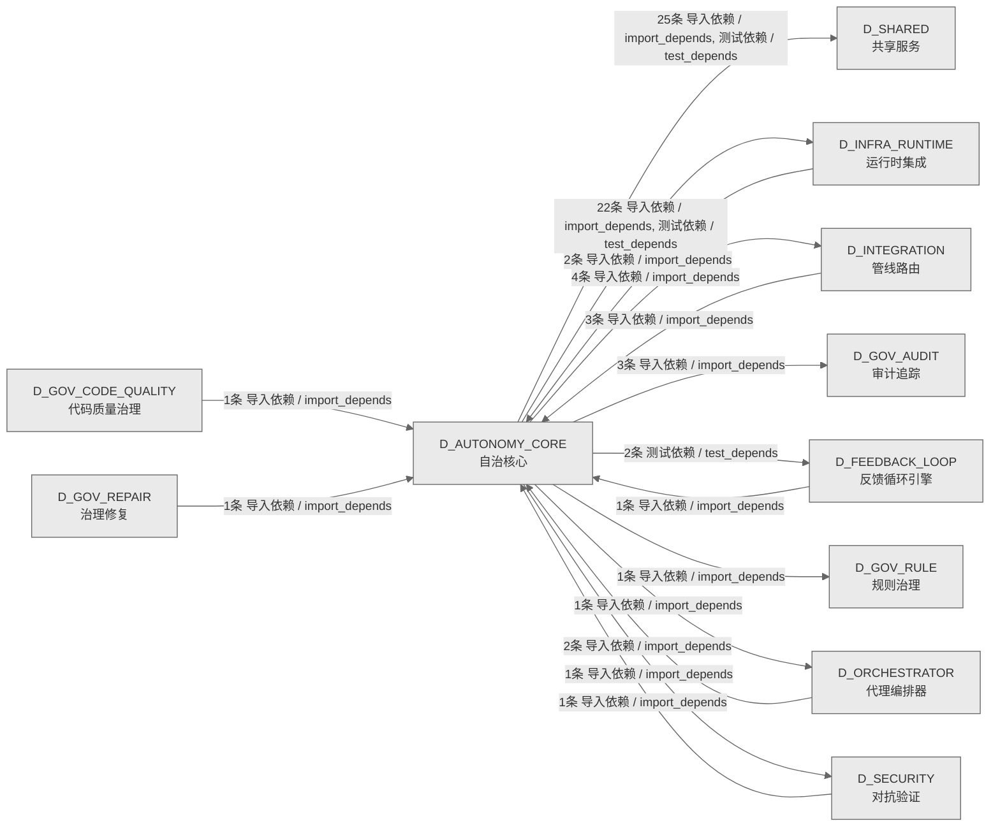

# 10_d_autonomy_core / 自治核心域 / Autonomy Core

> **功能简介 / Overview**: 自治核心，负责 AI 自治决策、目标分解和执行编排

> **文档作用 / Purpose**: 展示 自治核心（D_AUTONOMY_CORE）功能域的域内依赖关系、跨域依赖关系，模块信息（成熟度/中英文名/大白话/文件路径）内嵌于 Mermaid 节点，供架构审查和域治理参考。

> 本文档由 generate_domain_doc.py 从 depgraph (PostgreSQL) 自动生成
> 数据源: depgraph (PostgreSQL) nodes表 + edges表

> **[可缩放 HTML 版 / Zoomable HTML](http://localhost:8765/docs/02_enterprise_architecture/02_domain_architecture_docs/_zoomable_html/10_d_autonomy_core.html)** — Ctrl+滚轮缩放 ｜ 双击重置 ｜ Ctrl+Shift+D 切换拖动/选择模式

## 域基本信息 / Domain Overview

| 字段 | 值 | Field | Value |
|------|------|-------|-------|
| 编号 | 10 | Number | 10 |
| 域ID | D_AUTONOMY_CORE | Domain ID | D_AUTONOMY_CORE |
| 域名称 | 自治核心 | Domain Name | Autonomy Core |
| 层级 | L1 基础平台层 | Layer | L1 Foundation |
| 模块数 | 130 | Module Count | 130 |
| 域内依赖 | 43 | Internal Dependencies | 43 |
| 跨域入边 | 11 | Cross-domain Incoming | 11 |
| 跨域出边 | 59 | Cross-domain Outgoing | 59 |
| 设计态模块 | 0 | Design Modules | 0 |
| 生产态模块 | 130 | Production Modules | 130 |
| 容量 | 130/150 (正常) | Capacity | 130/150 (正常) |
| 描述 | Skill渐进披露(L0永久/L1触发/L2组合/L3按需) | Description | Skill渐进披露(L0永久/L1触发/L2组合/L3按需) |

## 域内依赖图 / Internal Dependency Diagram

> 依赖图内嵌在本文档中，IDE 可直接渲染；网页版可 Ctrl+滚轮缩放 + 拖动平移查看细节。
>
> **图例说明 / Legend**：
> - 🟦 **蓝色 = 运营态模块**（production，已上线运行）
> - 🟧 **橙色虚线 = 设计态模块**（design，蓝图阶段，代码未写）
> - **实线箭头 = 运营态依赖**（已生效的依赖关系）
> - **虚线箭头 = 非运营态依赖**（计划中/验证中的依赖关系）

### 全景图（全部模块，颜色区分运营态/设计态）

> 展示全部 130 个模块（生产态 130 + 设计态 0），含跨域依赖外部节点。节点含成熟度+名称+大白话/简介+文件路径。

```mermaid
%%{init: {'theme': 'base', 'themeVariables': {'primaryColor': '#eaeaea', 'primaryTextColor': '#333333', 'primaryBorderColor': '#666666', 'lineColor': '#666666', 'secondaryColor': '#eaeaea', 'tertiaryColor': '#eaeaea', 'fontSize': '14px'}}}%%
flowchart TD
    src_zephyr_autonomy_core_main_py["(生产态 / production) 主入口 / __main__<br/>代理规范 MOD-INF-019 CLI — 蓝图->Skill<br/>升级引擎入口.<br/>文件: autonomy_core/__main__.py"]
    src_zephyr_autonomy_core_agent_observability_py["(生产态 / production) 代理可观测性 /<br/>MOD-INF-019: Agent Spec — Agent Observability<br/>代理observability。MOD-INF-019: Agent Spec —<br/>Agent Observability<br/>文件: autonomy_core/agent_observability.py"]
    src_zephyr_autonomy_core_all_skill_modules_py["(生产态 / production) all技能modules /<br/>MOD-INF-019: Agent Spec — All Skill Modules<br/>all技能modules。MOD-INF-019: Agent Spec — All<br/>Skill Modules<br/>文件: autonomy_core/all_skill_modules.py"]
    src_zephyr_autonomy_core_context_atomic_injector_py["(生产态 / production) atomicinjector.py —<br/>原子注入 (DD101, TASK-0 / atomic_injector<br/>原子注入<br/>文件: context/atomic_injector.py"]
    src_zephyr_autonomy_core_context_ce_bootstrap_py["(生产态 / production) ce自举 / ce_bootstrap<br/>CE 自举架构 (B1, DD75, TASK-015 beta v)<br/>文件: context/ce_bootstrap.py"]
    src_zephyr_autonomy_core_context_ce_explain_cli_py["(生产态 / production) ceexplain命令行 / ce_<br/>explain_cli<br/>KE inclusion rationale 解释 CLI<br/>文件: context/ce_explain_cli.py"]
    src_zephyr_autonomy_core_context_ce_file_lister_py["(生产态 / production) ce文件lister / ce_file_<br/>lister<br/>CE 文件清单生成器<br/>文件: context/ce_file_lister.py"]
    src_zephyr_autonomy_core_context_ce_playground_v2_py["(生产态 / production) CE演练场v2 / ce_<br/>playground_v2.py — V2 Playground with full<br/>decision chain<br/>CE演练场v2，context的结果，封装操作结果的数据结<br/>构。<br/>文件: context/ce_playground_v2.py"]
    src_zephyr_autonomy_core_context_ce_vibe_shortcuts_py["(生产态 / production) cevibeshortcuts.py — Vibe<br/>/Strict 模式切换  / ce_vibe_shortcuts<br/>Vibe/Strict 模式切换<br/>文件: context/ce_vibe_shortcuts.py"]
    src_zephyr_autonomy_core_context_checkpoint_manager_py["(生产态 / production) 检查点管理器 / checkpoint_<br/>manager<br/>Inject 前快照<br/>文件: context/checkpoint_manager.py"]
    src_zephyr_autonomy_core_context_cold_start_booster_py["(生产态 / production) 冷启动booster / cold_<br/>start_booster<br/>冷启动<br/>文件: context/cold_start_booster.py"]
    src_zephyr_autonomy_core_context_complexity_budget_py["(生产态 / production) complexity预算 /<br/>complexity_budget<br/>Token 预算复杂度因子<br/>文件: context/complexity_budget.py"]
    src_zephyr_autonomy_core_context_context_budget_py["(生产态 / production) 上下文预算 /<br/>TruncationStrategy — TruncationStrategy<br/>上下文预算。TruncationStrategy —<br/>TruncationStrategy<br/>文件: context/context_budget.py"]
    src_zephyr_autonomy_core_context_context_budget_tracker_py["(生产态 / production) 上下文预算追踪器 /<br/>ContextBudgetTracker: token budget management<br/>with 3-level t<br/>上下文预算追踪器。ContextBudgetTracker: token<br/>budget management with 3-level thresholds.<br/>文件: context/context_budget_tracker.py"]
    src_zephyr_autonomy_core_context_context_debt_score_py["(生产态 / production) 上下文debtscore / context_<br/>debt_score<br/>上下文债务评分<br/>文件: context/context_debt_score.py"]
    src_zephyr_autonomy_core_context_context_evaluator_py["(生产态 / production) 上下文evaluator / context_<br/>evaluator<br/>AI 引用率评估 (TASK-014 beta b)<br/>文件: context/context_evaluator.py"]
    src_zephyr_autonomy_core_context_context_evictor_py["(生产态 / production) 上下文驱逐器 / context_<br/>evictor<br/>三维逐出器 (DD9, TASK-014 beta a)<br/>文件: context/context_evictor.py"]
    src_zephyr_autonomy_core_context_context_health_score_py["(生产态 / production) 上下文健康评分 / context_<br/>health_score<br/>统一健康分 (B6, DD80, TASK-015 beta v)<br/>文件: context/context_health_score.py"]
    src_zephyr_autonomy_core_context_context_model_strategy_py["(生产态 / production) 上下文模型策略 / context_<br/>model_strategy<br/>模型选择策略<br/>文件: context/context_model_strategy.py"]
    src_zephyr_autonomy_core_context_context_outcome_tracker_py["(生产态 / production) 上下文结果追踪器 /<br/>context_outcome_tracker<br/>因果链追踪<br/>文件: context/context_outcome_tracker.py"]
    src_zephyr_autonomy_core_context_context_pipeline_auto_py["(生产态 / production) 上下文管线自动 / context_<br/>pipeline_auto<br/>ContextPipeline 三层自动化机制<br/>文件: context/context_pipeline_auto.py"]
    src_zephyr_autonomy_core_context_context_playground_py["(生产态 / production) 上下文playground /<br/>context_playground<br/>上下文沙箱 dry-run (B5, DD79, TASK-015 beta v)<br/>文件: context/context_playground.py"]
    src_zephyr_autonomy_core_context_context_rot_model_py["(生产态 / production) 上下文rot模型 / context_<br/>rot_model<br/>Context Rot 注意力衰减数学模型<br/>文件: context/context_rot_model.py"]
    src_zephyr_autonomy_core_context_context_value_attribution_py["(生产态 / production) 上下文valueattribution /<br/>context_value_attribution<br/>KE 级 ROI 归因 (B2, DD76, TASK-015 beta v)<br/>文件: context/context_value_attribution.py"]
    src_zephyr_autonomy_core_context_contextual_fetch_api_py["(生产态 / production) contextual获取API /<br/>contextual_fetch_api<br/>HTTP FE 对外 API<br/>文件: context/contextual_fetch_api.py"]
    src_zephyr_autonomy_core_context_curation_loop_py["(生产态 / production) curation循环 / curation_<br/>loop<br/>Per-Turn Curation 策展 (DD10, TASK-014 beta b)<br/>文件: context/curation_loop.py"]
    src_zephyr_autonomy_core_context_diff_injector_py["(生产态 / production) 差异injector / diff_<br/>injector<br/>增量注入<br/>文件: context/diff_injector.py"]
    src_zephyr_autonomy_core_context_diversity_constraint_py["(生产态 / production) diversity约束 / diversity_<br/>constraint<br/>多样性约束<br/>文件: context/diversity_constraint.py"]
    src_zephyr_autonomy_core_context_domain_decay_config_py["(生产态 / production) domaindecay配置 / domain_<br/>decay_config<br/>每领域半衰期<br/>文件: context/domain_decay_config.py"]
    src_zephyr_autonomy_core_context_fallback_staleness_gate_py["(生产态 / production) 降级staleness门禁 /<br/>fallback_staleness_gate<br/>兜底层自腐检测<br/>文件: context/fallback_staleness_gate.py"]
    src_zephyr_autonomy_core_context_integrity_check_py["(生产态 / production) 完整性检查 / integrity_<br/>check<br/>注入后完整性<br/>文件: context/integrity_check.py"]
    src_zephyr_autonomy_core_context_memory_bank_py["(生产态 / production) 记忆bank / memory_bank<br/>AI 读写结构化持久上下文 (DD: memory_bank,<br/>TASK-014 beta c)<br/>文件: context/memory_bank.py"]
    src_zephyr_autonomy_core_context_mode_manager_py["(生产态 / production) mode管理器 / mode_manager<br/>模式管理器<br/>文件: context/mode_manager.py"]
    src_zephyr_autonomy_core_context_position_optimizer_py["(生产态 / production) 持仓优化器 / position_<br/>optimizer<br/>位置优化<br/>文件: context/position_optimizer.py"]
    src_zephyr_autonomy_core_context_shadow_canary_py["(生产态 / production) 影子金丝雀 / shadow_canary<br/>金丝雀部署 (B4, DD78, TASK-015 beta w)<br/>文件: context/shadow_canary.py"]
    src_zephyr_autonomy_core_context_staleness_manager_py["(生产态 / production) staleness管理器 /<br/>staleness_manager<br/>全局过期检测<br/>文件: context/staleness_manager.py"]
    src_zephyr_autonomy_core_context_vector_bridge_py["(生产态 / production) 向量桥接 / vector_bridge<br/>VectorBridge — CE↔VMS 检索桥接 (Connect<br/>CT-CE-VMS-001)<br/>文件: context/vector_bridge.py"]
    src_zephyr_autonomy_core_file_autoregister_py["(生产态 / production) 文件autoregister / file_<br/>autoregister<br/>文件autoregister，主要提供注册等功能<br/>文件: autonomy_core/file_autoregister.py"]
    src_zephyr_autonomy_core_ide_watcher_py["(生产态 / production) IDE监视器 / MOD-INF-019:<br/>Agent Spec — IDE Watcher<br/>IDE 热重载监视器——Skill 文件变更自动刷新<br/>AGENTS.md<br/>文件: autonomy_core/ide_watcher.py"]
    src_zephyr_autonomy_core_integration_pipeline_bridge_py["(生产态 / production) 管线桥接 / pipeline_bridge<br/>PipelineSkillBridge — Agent Spec -> Pipeline<br/>双向桥接<br/>文件: integration/pipeline_bridge.py"]
    src_zephyr_autonomy_core_phase_planner_py["(生产态 / production) 阶段规划器 / MOD-INF-019:<br/>Agent Spec — Phase Planner<br/>阶段planner。MOD-INF-019: Agent Spec — Phase<br/>Planner<br/>文件: autonomy_core/phase_planner.py"]
    src_zephyr_autonomy_core_progressive_disclosure_injector_py["(生产态 / production)<br/>progressivedisclosureinjector.py — 渐进式 /<br/>progressive_disclosure_injector<br/>渐进式披露 (B7, DD81, TASK-015 beta w)<br/>文件: autonomy_core/progressive_disclosure_<br/>injector.py"]
    src_zephyr_autonomy_core_prompt_registry_py["(生产态 / production) 提示注册表 / prompt_<br/>registry<br/>PromptRegistry: YAML-driven Prompt 模板注册表<br/>文件: autonomy_core/prompt_registry.py"]
    src_zephyr_autonomy_core_self_evolution_fidelity_gate_py["(生产态 / production) self进化fidelity门禁 /<br/>MOD-INF-019: Agent Spec — Self Evolution<br/>Fidelity Gate<br/>自进化fidelity门禁。MOD-INF-019: Agent Spec —<br/>Self Evolution Fidelity Gate<br/>文件: autonomy_core/self_evolution_fidelity_<br/>gate.py"]
    src_zephyr_autonomy_core_skill_rbac_registry_py["(生产态 / production) skillRBAC注册表 /<br/>G-CT-003: Agent Spec -> RBAC capability check.<br/>技能rbac注册表。G-CT-003: Agent Spec -> RBAC<br/>capability check.<br/>文件: autonomy_core/skill_rbac_registry.py"]
    src_zephyr_autonomy_core_skills_skill_attention_py["(生产态 / production) 技能attention /<br/>MOD-INF-019: Agent Spec — Skill Attention<br/>Management<br/>技能attention。MOD-INF-019: Agent Spec — Skill<br/>Attention Management<br/>文件: skills/skill_attention.py"]
    src_zephyr_autonomy_core_skills_skill_breakage_checker_py["(生产态 / production) skillbreakage检查器 /<br/>MOD-INF-019: Agent Spec — Skill Breakage Checker<br/>技能breakage检查器。MOD-INF-019: Agent Spec —<br/>Skill Breakage Checker<br/>文件: skills/skill_breakage_checker.py"]
    src_zephyr_autonomy_core_skills_skill_cache_provider_py["(生产态 / production) 技能缓存提供器 /<br/>MOD-INF-019: Agent Spec — Skill Cache Provider<br/>技能缓存提供器。MOD-INF-019: Agent Spec — Skill<br/>Cache Provider<br/>文件: skills/skill_cache_provider.py"]
    src_zephyr_autonomy_core_skills_skill_calibration_py["(生产态 / production) 技能calibration /<br/>MOD-INF-019: Agent Spec — Skill Calibration<br/>技能calibration。MOD-INF-019: Agent Spec —<br/>Skill Calibration<br/>文件: skills/skill_calibration.py"]
    src_zephyr_autonomy_core_skills_skill_canary_py["(生产态 / production) 技能金丝雀 / MOD-INF-019:<br/>Agent Spec — Skill Canary<br/>技能canary。MOD-INF-019: Agent Spec — Skill<br/>Canary<br/>文件: skills/skill_canary.py"]
    src_zephyr_autonomy_core_skills_skill_cognitive_preservation_py["(生产态 / production) skill认知preservation /<br/>MOD-INF-019: Agent Spec — Skill Cognitive<br/>Preservation<br/>技能cognitivepreservation。MOD-INF-019: Agent<br/>Spec — Skill Cognitive Preservation<br/>文件: skills/skill_cognitive_preservation.py"]
    src_zephyr_autonomy_core_skills_skill_compliance_py["(生产态 / production) 技能合规 / MOD-INF-019:<br/>Agent Spec — Skill Compliance<br/>技能合规。MOD-INF-019: Agent Spec — Skill<br/>Compliance<br/>文件: skills/skill_compliance.py"]
    src_zephyr_autonomy_core_skills_skill_consensus_py["(生产态 / production) 技能共识 / MOD-INF-019:<br/>Agent Spec — Skill Consensus<br/>技能共识。MOD-INF-019: Agent Spec — Skill<br/>Consensus<br/>文件: skills/skill_consensus.py"]
    src_zephyr_autonomy_core_skills_skill_constructor_py["(生产态 / production) 技能constructor /<br/>MOD-INF-019: Agent Spec — Skill Constructor<br/>技能constructor。MOD-INF-019: Agent Spec —<br/>Skill Constructor<br/>文件: skills/skill_constructor.py"]
    src_zephyr_autonomy_core_skills_skill_context_isolation_py["(生产态 / production) skill上下文isolation /<br/>MOD-INF-019: Agent Spec — Context Isolation<br/>技能上下文isolation。MOD-INF-019: Agent Spec —<br/>Context Isolation<br/>文件: skills/skill_context_isolation.py"]
    src_zephyr_autonomy_core_skills_skill_contract_py["(生产态 / production) 技能契约 / MOD-INF-019:<br/>Agent Spec — Skill Contract<br/>技能契约。MOD-INF-019: Agent Spec — Skill<br/>Contract<br/>文件: skills/skill_contract.py"]
    src_zephyr_autonomy_core_skills_skill_cross_model_py["(生产态 / production) 技能跨模型 / MOD-INF-019:<br/>Agent Spec — Skill Cross-Model<br/>技能跨模型。MOD-INF-019: Agent Spec — Skill<br/>Cross-Model<br/>文件: skills/skill_cross_model.py"]
    src_zephyr_autonomy_core_skills_skill_di_py["(生产态 / production) 技能di / MOD-INF-019:<br/>Agent Spec — Skill Dependency Injection<br/>技能di。MOD-INF-019: Agent Spec — Skill<br/>Dependency Injection<br/>文件: skills/skill_di.py"]
    src_zephyr_autonomy_core_skills_skill_discovery_py["(生产态 / production) 技能discovery /<br/>MOD-INF-019: Agent Spec — Skill Discovery<br/>技能discovery。MOD-INF-019: Agent Spec — Skill<br/>Discovery<br/>文件: skills/skill_discovery.py"]
    src_zephyr_autonomy_core_skills_skill_durable_py["(生产态 / production) 技能durable /<br/>MOD-INF-019: Agent Spec — Durable Execution<br/>技能durable。MOD-INF-019: Agent Spec — Durable<br/>Execution<br/>文件: skills/skill_durable.py"]
    src_zephyr_autonomy_core_skills_skill_economics_py["(生产态 / production) 技能economics /<br/>MOD-INF-019: Agent Spec — Skill Economics<br/>技能economics。MOD-INF-019: Agent Spec — Skill<br/>Economics<br/>文件: skills/skill_economics.py"]
    src_zephyr_autonomy_core_skills_skill_efficacy_calibrator_py["(生产态 / production) skillefficacy校准器 /<br/>MOD-INF-019: Agent Spec — Skill Efficacy<br/>Calibrator<br/>技能efficacycalibrator。MOD-INF-019: Agent Spec<br/>— Skill Efficacy Calibrator<br/>文件: skills/skill_efficacy_calibrator.py"]
    src_zephyr_autonomy_core_skills_skill_executor_py["(生产态 / production) 技能执行器 / skill_<br/>executor<br/>Skill 加载前创建回滚检查点<br/>文件: skills/skill_executor.py"]
    src_zephyr_autonomy_core_skills_skill_explain_py["(生产态 / production) 技能explain /<br/>MOD-INF-019: Agent Spec — XAI Explainable Skill<br/>Engine<br/>技能explain。MOD-INF-019: Agent Spec — XAI<br/>Explainable Skill Engine<br/>文件: skills/skill_explain.py"]
    src_zephyr_autonomy_core_skills_skill_feature_flags_py["(生产态 / production) 技能功能标志 /<br/>MOD-INF-019: Agent Spec — Skill Feature Flags<br/>技能功能标志。MOD-INF-019: Agent Spec — Skill<br/>Feature Flags<br/>文件: skills/skill_feature_flags.py"]
    src_zephyr_autonomy_core_skills_skill_feedback_py["(生产态 / production) 技能反馈 / MOD-INF-019:<br/>Agent Spec — Skill Feedback Loop<br/>技能反馈。MOD-INF-019: Agent Spec — Skill<br/>Feedback Loop<br/>文件: skills/skill_feedback.py"]
    src_zephyr_autonomy_core_skills_skill_freshness_ext_py["(生产态 / production) 技能freshness扩展 /<br/>MOD-INF-019: Agent Spec — Skill Freshness<br/>Extensions<br/>技能freshness扩展。MOD-INF-019: Agent Spec —<br/>Skill Freshness Extensions<br/>文件: skills/skill_freshness_ext.py"]
    src_zephyr_autonomy_core_skills_skill_gitops_py["(生产态 / production) 技能gitops / MOD-INF-019:<br/>Agent Spec — Skill GitOps<br/>技能gitops。MOD-INF-019: Agent Spec — Skill<br/>GitOps<br/>文件: skills/skill_gitops.py"]
    src_zephyr_autonomy_core_skills_skill_guardrails_py["(生产态 / production) 技能guardrails /<br/>MOD-INF-019: Agent Spec — Skill Guardrails<br/>技能guardrails。MOD-INF-019: Agent Spec — Skill<br/>Guardrails<br/>文件: skills/skill_guardrails.py"]
    src_zephyr_autonomy_core_skills_skill_idempotency_py["(生产态 / production) 技能幂等性 / MOD-INF-019:<br/>Agent Spec — Skill Idempotency<br/>技能idempotency。MOD-INF-019: Agent Spec —<br/>Skill Idempotency<br/>文件: skills/skill_idempotency.py"]
    src_zephyr_autonomy_core_skills_skill_kya_py["(生产态 / production) 技能kya / MOD-INF-019:<br/>Agent Spec — Skill KYA<br/>技能kya。MOD-INF-019: Agent Spec — Skill KYA<br/>文件: skills/skill_kya.py"]
    src_zephyr_autonomy_core_skills_skill_learning_py["(生产态 / production) 技能learning /<br/>MOD-INF-019: Agent Spec — Skill Self-Learning<br/>Engine<br/>技能learning。MOD-INF-019: Agent Spec — Skill<br/>Self-Learning Engine<br/>文件: skills/skill_learning.py"]
    src_zephyr_autonomy_core_skills_skill_lineage_py["(生产态 / production) 技能lineage /<br/>MOD-INF-019: Agent Spec — Skill Lineage<br/>技能lineage。MOD-INF-019: Agent Spec — Skill<br/>Lineage<br/>文件: skills/skill_lineage.py"]
    src_zephyr_autonomy_core_skills_skill_locking_py["(生产态 / production) 技能locking /<br/>MOD-INF-019: Agent Spec — Skill Locking<br/>(Production Hardenin<br/>技能locking。MOD-INF-019: Agent Spec — Skill<br/>Locking (Production Hardening)<br/>文件: skills/skill_locking.py"]
    src_zephyr_autonomy_core_skills_skill_observability_py["(生产态 / production) 技能可观测性 /<br/>MOD-INF-019: Agent Spec — Skill Observability<br/>技能observability。MOD-INF-019: Agent Spec —<br/>Skill Observability<br/>文件: skills/skill_observability.py"]
    src_zephyr_autonomy_core_skills_skill_ontology_py["(生产态 / production) 技能ontology /<br/>MOD-INF-019: Agent Spec — Skill Ontology<br/>技能ontology。MOD-INF-019: Agent Spec — Skill<br/>Ontology<br/>文件: skills/skill_ontology.py"]
    src_zephyr_autonomy_core_skills_skill_postmortem_py["(生产态 / production) 技能postmortem / skill_<br/>postmortem<br/>MOD-INF-019: Agent Spec — Skill Postmortem<br/>(追问到底)<br/>文件: skills/skill_postmortem.py"]
    src_zephyr_autonomy_core_skills_skill_prompt_cache_py["(生产态 / production) 技能提示缓存 /<br/>MOD-INF-019: Agent Spec — Skill Prompt Cache<br/>技能提示缓存。MOD-INF-019: Agent Spec — Skill<br/>Prompt Cache<br/>文件: skills/skill_prompt_cache.py"]
    src_zephyr_autonomy_core_skills_skill_prompt_opt_py["(生产态 / production) 技能提示opt /<br/>MOD-INF-019: Agent Spec — Skill Prompt Optimizer<br/>技能提示opt。MOD-INF-019: Agent Spec — Skill<br/>Prompt Optimizer<br/>文件: skills/skill_prompt_opt.py"]
    src_zephyr_autonomy_core_skills_skill_resilience_py["(生产态 / production) 技能韧性 / MOD-INF-019:<br/>Agent Spec — Skill Resilience<br/>技能韧性。MOD-INF-019: Agent Spec — Skill<br/>Resilience<br/>文件: skills/skill_resilience.py"]
    src_zephyr_autonomy_core_skills_skill_risk_mitigator_py["(生产态 / production) skill风险mitigator /<br/>MOD-INF-019: Agent Spec — Skill Risk Mitigator<br/>技能风险mitigator。MOD-INF-019: Agent Spec —<br/>Skill Risk Mitigator<br/>文件: skills/skill_risk_mitigator.py"]
    src_zephyr_autonomy_core_skills_skill_router_py["(生产态 / production) 技能路由器 / skill_router<br/>技能路由器，主要提供from标签等功能<br/>文件: skills/skill_router.py"]
    src_zephyr_autonomy_core_skills_skill_sandbox_py["(生产态 / production) 技能沙箱 / MOD-INF-019:<br/>Agent Spec — Skill Sandbox<br/>技能sandbox。MOD-INF-019: Agent Spec — Skill<br/>Sandbox<br/>文件: skills/skill_sandbox.py"]
    src_zephyr_autonomy_core_skills_skill_schema_registry_py["(生产态 / production) 技能模式注册表 /<br/>MOD-INF-019: Agent Spec — Skill Schema Registry<br/>技能模式注册表。MOD-INF-019: Agent Spec — Skill<br/>Schema Registry<br/>文件: skills/skill_schema_registry.py"]
    src_zephyr_autonomy_core_skills_skill_security_py["(生产态 / production) 技能安全 / MOD-INF-019:<br/>Agent Spec — Skill Security<br/>技能安全。MOD-INF-019: Agent Spec — Skill<br/>Security<br/>文件: skills/skill_security.py"]
    src_zephyr_autonomy_core_skills_skill_shadow_py["(生产态 / production) 技能影子 / MOD-INF-019:<br/>Agent Spec — Skill Shadow Deployment<br/>技能shadow。MOD-INF-019: Agent Spec — Skill<br/>Shadow Deployment<br/>文件: skills/skill_shadow.py"]
    src_zephyr_autonomy_core_skills_skill_silent_failure_py["(生产态 / production) skillsilent故障 /<br/>MOD-INF-019: Agent Spec — Silent Failure<br/>Detector<br/>技能silentfailure。MOD-INF-019: Agent Spec —<br/>Silent Failure Detector<br/>文件: skills/skill_silent_failure.py"]
    src_zephyr_autonomy_core_skills_skill_team_optimizer_py["(生产态 / production) 技能团队优化器 /<br/>MOD-INF-019: Agent Spec — Skill Team Optimizer<br/>技能团队优化器。MOD-INF-019: Agent Spec — Skill<br/>Team Optimizer<br/>文件: skills/skill_team_optimizer.py"]
    src_zephyr_autonomy_core_skills_skill_telemetry_py["(生产态 / production) 技能遥测 / MOD-INF-019:<br/>Agent Spec — Skill Telemetry<br/>技能遥测。MOD-INF-019: Agent Spec — Skill<br/>Telemetry<br/>文件: skills/skill_telemetry.py"]
    src_zephyr_autonomy_core_skills_skill_temperature_py["(生产态 / production) 技能temperature /<br/>MOD-INF-019: Agent Spec — Skill Temperature<br/>技能temperature。MOD-INF-019: Agent Spec —<br/>Skill Temperature<br/>文件: skills/skill_temperature.py"]
    src_zephyr_autonomy_core_skills_skill_tokenomics_py["(生产态 / production) 技能tokenomics /<br/>MOD-INF-019: Agent Spec — Skill Tokenomics<br/>技能tokenomics。MOD-INF-019: Agent Spec — Skill<br/>Tokenomics<br/>文件: skills/skill_tokenomics.py"]
    src_zephyr_autonomy_core_skills_skill_translator_py["(生产态 / production) 技能translator /<br/>MOD-INF-019: Agent Spec — Skill Translator<br/>技能translator。MOD-INF-019: Agent Spec — Skill<br/>Translator<br/>文件: skills/skill_translator.py"]
    src_zephyr_autonomy_core_skills_skill_workflow_py["(生产态 / production) 技能工作流 / MOD-INF-019:<br/>Agent Spec — Skill Workflow Orchestrator<br/>技能工作流。MOD-INF-019: Agent Spec — Skill<br/>Workflow Orchestrator<br/>文件: skills/skill_workflow.py"]
    src_zephyr_autonomy_core_spec_engine_py["(生产态 / production) spec引擎 / spec_engine<br/>MOD-INF-019: Agent Spec — SpecEngine<br/>蓝图->Skill 升级引擎<br/>文件: autonomy_core/spec_engine.py"]
    src_zephyr_autonomy_core_vibe_coding_quality_gate_py["(生产态 / production) vibecoding质量门禁 / vibe_<br/>coding_quality_gate<br/>VibeCodingQualityGate — 代码质量门禁（stub,<br/>tests 待实装后补全实现）<br/>文件: autonomy_core/vibe_coding_quality_gate.py"]
    src_zephyr_governance_persistence_intent_parser_py["(生产态 / production) intent解析器 / intent_<br/>parser<br/>IntentParser · 意图三阶段级联解析器（V-09）<br/>文件: persistence/intent_parser.py"]
    src_zephyr_infrastructure_system_snapshot_py["(生产态 / production) 系统快照 / system_snapshot<br/>SystemSnapshotter — M1 系统状态镜像（CL-017 RI<br/>扩展模式）<br/>文件: infrastructure/system_snapshot.py"]
    src_zephyr_infrastructure_system_telemetry_otel_instrumentation_py["(生产态 / production) otelinstrumentation.py —<br/>全链路 OTel (B12, / otel_instrumentation<br/>全链路 OTel (B12, DD86, TASK-015 beta v)<br/>文件: system_telemetry/otel_instrumentation.py"]
    src_zephyr_integration_vector_memory_vector_writer_py["(生产态 / production) 向量写入器 / vector_writer<br/>CE 向量写入器 — vectorize_and_store() 生产者<br/>文件: vector_memory/vector_writer.py"]
    src_zephyr_security_llm_defense_llm_security_adversarial_robustness_py["(生产态 / production) 对抗鲁棒性 / adversarial_<br/>robustness<br/>对抗鲁棒性 (B8, DD82, TASK-015 beta w)<br/>文件: llm_security/adversarial_robustness.py"]
    src_zephyr_security_llm_defense_llm_security_alignment_scorer_py["(生产态 / production) 对齐评分器 / alignment_<br/>scorer<br/>对齐评分 (B11, DD85, TASK-015 beta w)<br/>文件: llm_security/alignment_scorer.py"]
    src_zephyr_security_llm_defense_llm_security_lsg_pattern_tracker_py["(生产态 / production) lsg模式追踪器 / lsg_<br/>pattern_tracker<br/>LSG 模式逃逸追踪<br/>文件: llm_security/lsg_pattern_tracker.py"]
    src_zephyr_security_llm_defense_llm_security_poisoning_monitor_py["(生产态 / production) poisoning监控器 /<br/>poisoning_monitor<br/>Embed 污染检测<br/>文件: llm_security/poisoning_monitor.py"]
    src_zephyr_security_llm_defense_llm_security_sensitivity_classifier_py["(生产态 / production) sensitivity分类器 /<br/>sensitivity_classifier<br/>数据分级 (B9, DD83, TASK-015 beta w)<br/>文件: llm_security/sensitivity_classifier.py"]
    src_zephyr_security_llm_defense_llm_security_solo_dev_safety_net_py["(生产态 / production) solodev安全net / solo_dev_<br/>safety_net<br/>单人无审查安全网<br/>文件: llm_security/solo_dev_safety_net.py"]
    src_zephyr_shared_ai_guards_config_safety_guard_py["(生产态 / production) 配置安全守卫 / config_<br/>safety_guard<br/>配置自毁防护<br/>文件: ai_guards/config_safety_guard.py"]
    src_zephyr_shared_dependency_dependency_tracker_py["(生产态 / production) 依赖追踪器 / dependency_<br/>tracker<br/>依赖追踪<br/>文件: dependency/dependency_tracker.py"]
    src_zephyr_shared_io_cache_invalidation_py["(生产态 / production) 缓存invalidation / cache_<br/>invalidation<br/>缓存一致性<br/>文件: io/cache_invalidation.py"]
    src_zephyr_shared_utils_verify_paths_py["(生产态 / production) 校验paths / verify_paths<br/>代码路径索引验证<br/>文件: utils/verify_paths.py"]
    tests_automation_test_auto_runtime_e2e_py["(生产态 / production) 测试自动运行时端到端 /<br/>test_auto_runtime_e2e<br/>F1 AutoRuntimeCore 非mock端到端集成测试<br/>文件: automation/test_auto_runtime_e2e.py"]
    tests_f_lifecycle_test_f1_event_trigger_py["(生产态 / production) F1 事件触发启动测试 /<br/>test_f1_event_trigger<br/>F1 事件触发启动测试<br/>文件: f_lifecycle/test_f1_event_trigger.py"]
    tests_trading_extreme_test_f14_pipeline_extreme_py["(生产态 / production) F14 管线编排/反馈环 —<br/>红蓝对抗端到端极端测试 / test_f14_pipeline_<br/>extreme<br/>F14 管线编排/反馈环 — 红蓝对抗端到端极端测试<br/>文件: extreme/test_f14_pipeline_extreme.py"]
    tests_trading_extreme_test_f1_extreme_py["(生产态 / production) F1 自动驾驶/运行时大脑 —<br/>红蓝对抗端到端极端测试 / test_f1_extreme<br/>F1 自动驾驶/运行时大脑 — 红蓝对抗端到端极端测试<br/>文件: extreme/test_f1_extreme.py"]
    src_zephyr_autonomy_core_main_py ~~~ src_zephyr_autonomy_core_agent_observability_py
    src_zephyr_autonomy_core_agent_observability_py ~~~ src_zephyr_autonomy_core_all_skill_modules_py
    src_zephyr_autonomy_core_all_skill_modules_py ~~~ src_zephyr_autonomy_core_context_atomic_injector_py
    src_zephyr_autonomy_core_context_atomic_injector_py ~~~ src_zephyr_autonomy_core_context_ce_bootstrap_py
    src_zephyr_autonomy_core_context_ce_bootstrap_py ~~~ src_zephyr_autonomy_core_context_ce_explain_cli_py
    src_zephyr_autonomy_core_context_ce_explain_cli_py ~~~ src_zephyr_autonomy_core_context_ce_file_lister_py
    src_zephyr_autonomy_core_context_ce_file_lister_py ~~~ src_zephyr_autonomy_core_context_ce_playground_v2_py
    src_zephyr_autonomy_core_context_ce_playground_v2_py ~~~ src_zephyr_autonomy_core_context_ce_vibe_shortcuts_py
    src_zephyr_autonomy_core_context_ce_vibe_shortcuts_py ~~~ src_zephyr_autonomy_core_context_checkpoint_manager_py
    src_zephyr_autonomy_core_context_checkpoint_manager_py ~~~ src_zephyr_autonomy_core_context_cold_start_booster_py
    src_zephyr_autonomy_core_context_cold_start_booster_py ~~~ src_zephyr_autonomy_core_context_complexity_budget_py
    src_zephyr_autonomy_core_context_complexity_budget_py ~~~ src_zephyr_autonomy_core_context_context_budget_py
    src_zephyr_autonomy_core_context_context_budget_py ~~~ src_zephyr_autonomy_core_context_context_budget_tracker_py
    src_zephyr_autonomy_core_context_context_budget_tracker_py ~~~ src_zephyr_autonomy_core_context_context_debt_score_py
    src_zephyr_autonomy_core_context_context_debt_score_py ~~~ src_zephyr_autonomy_core_context_context_evaluator_py
    src_zephyr_autonomy_core_context_context_evaluator_py ~~~ src_zephyr_autonomy_core_context_context_evictor_py
    src_zephyr_autonomy_core_context_context_evictor_py ~~~ src_zephyr_autonomy_core_context_context_health_score_py
    src_zephyr_autonomy_core_context_context_health_score_py ~~~ src_zephyr_autonomy_core_context_context_model_strategy_py
    src_zephyr_autonomy_core_context_context_model_strategy_py ~~~ src_zephyr_autonomy_core_context_context_outcome_tracker_py
    src_zephyr_autonomy_core_context_context_outcome_tracker_py ~~~ src_zephyr_autonomy_core_context_context_pipeline_auto_py
    src_zephyr_autonomy_core_context_context_pipeline_auto_py ~~~ src_zephyr_autonomy_core_context_context_playground_py
    src_zephyr_autonomy_core_context_context_playground_py ~~~ src_zephyr_autonomy_core_context_context_rot_model_py
    src_zephyr_autonomy_core_context_context_rot_model_py ~~~ src_zephyr_autonomy_core_context_context_value_attribution_py
    src_zephyr_autonomy_core_context_context_value_attribution_py ~~~ src_zephyr_autonomy_core_context_contextual_fetch_api_py
    src_zephyr_autonomy_core_context_contextual_fetch_api_py ~~~ src_zephyr_autonomy_core_context_curation_loop_py
    src_zephyr_autonomy_core_context_curation_loop_py ~~~ src_zephyr_autonomy_core_context_diff_injector_py
    src_zephyr_autonomy_core_context_diff_injector_py ~~~ src_zephyr_autonomy_core_context_diversity_constraint_py
    src_zephyr_autonomy_core_context_diversity_constraint_py ~~~ src_zephyr_autonomy_core_context_domain_decay_config_py
    src_zephyr_autonomy_core_context_domain_decay_config_py ~~~ src_zephyr_autonomy_core_context_fallback_staleness_gate_py
    src_zephyr_autonomy_core_context_fallback_staleness_gate_py ~~~ src_zephyr_autonomy_core_context_integrity_check_py
    src_zephyr_autonomy_core_context_integrity_check_py ~~~ src_zephyr_autonomy_core_context_memory_bank_py
    src_zephyr_autonomy_core_context_memory_bank_py ~~~ src_zephyr_autonomy_core_context_mode_manager_py
    src_zephyr_autonomy_core_context_mode_manager_py ~~~ src_zephyr_autonomy_core_context_position_optimizer_py
    src_zephyr_autonomy_core_context_position_optimizer_py ~~~ src_zephyr_autonomy_core_context_shadow_canary_py
    src_zephyr_autonomy_core_context_shadow_canary_py ~~~ src_zephyr_autonomy_core_context_staleness_manager_py
    src_zephyr_autonomy_core_context_staleness_manager_py ~~~ src_zephyr_autonomy_core_context_vector_bridge_py
    src_zephyr_autonomy_core_context_vector_bridge_py ~~~ src_zephyr_autonomy_core_file_autoregister_py
    src_zephyr_autonomy_core_file_autoregister_py ~~~ src_zephyr_autonomy_core_ide_watcher_py
    src_zephyr_autonomy_core_ide_watcher_py ~~~ src_zephyr_autonomy_core_integration_pipeline_bridge_py
    src_zephyr_autonomy_core_integration_pipeline_bridge_py ~~~ src_zephyr_autonomy_core_phase_planner_py
    src_zephyr_autonomy_core_phase_planner_py ~~~ src_zephyr_autonomy_core_progressive_disclosure_injector_py
    src_zephyr_autonomy_core_progressive_disclosure_injector_py ~~~ src_zephyr_autonomy_core_prompt_registry_py
    src_zephyr_autonomy_core_prompt_registry_py ~~~ src_zephyr_autonomy_core_self_evolution_fidelity_gate_py
    src_zephyr_autonomy_core_self_evolution_fidelity_gate_py ~~~ src_zephyr_autonomy_core_skill_rbac_registry_py
    src_zephyr_autonomy_core_skill_rbac_registry_py ~~~ src_zephyr_autonomy_core_skills_skill_attention_py
    src_zephyr_autonomy_core_skills_skill_attention_py ~~~ src_zephyr_autonomy_core_skills_skill_breakage_checker_py
    src_zephyr_autonomy_core_skills_skill_breakage_checker_py ~~~ src_zephyr_autonomy_core_skills_skill_cache_provider_py
    src_zephyr_autonomy_core_skills_skill_cache_provider_py ~~~ src_zephyr_autonomy_core_skills_skill_calibration_py
    src_zephyr_autonomy_core_skills_skill_calibration_py ~~~ src_zephyr_autonomy_core_skills_skill_canary_py
    src_zephyr_autonomy_core_skills_skill_canary_py ~~~ src_zephyr_autonomy_core_skills_skill_cognitive_preservation_py
    src_zephyr_autonomy_core_skills_skill_cognitive_preservation_py ~~~ src_zephyr_autonomy_core_skills_skill_compliance_py
    src_zephyr_autonomy_core_skills_skill_compliance_py ~~~ src_zephyr_autonomy_core_skills_skill_consensus_py
    src_zephyr_autonomy_core_skills_skill_consensus_py ~~~ src_zephyr_autonomy_core_skills_skill_constructor_py
    src_zephyr_autonomy_core_skills_skill_constructor_py ~~~ src_zephyr_autonomy_core_skills_skill_context_isolation_py
    src_zephyr_autonomy_core_skills_skill_context_isolation_py ~~~ src_zephyr_autonomy_core_skills_skill_contract_py
    src_zephyr_autonomy_core_skills_skill_contract_py ~~~ src_zephyr_autonomy_core_skills_skill_cross_model_py
    src_zephyr_autonomy_core_skills_skill_cross_model_py ~~~ src_zephyr_autonomy_core_skills_skill_di_py
    src_zephyr_autonomy_core_skills_skill_di_py ~~~ src_zephyr_autonomy_core_skills_skill_discovery_py
    src_zephyr_autonomy_core_skills_skill_discovery_py ~~~ src_zephyr_autonomy_core_skills_skill_durable_py
    src_zephyr_autonomy_core_skills_skill_durable_py ~~~ src_zephyr_autonomy_core_skills_skill_economics_py
    src_zephyr_autonomy_core_skills_skill_economics_py ~~~ src_zephyr_autonomy_core_skills_skill_efficacy_calibrator_py
    src_zephyr_autonomy_core_skills_skill_efficacy_calibrator_py ~~~ src_zephyr_autonomy_core_skills_skill_executor_py
    src_zephyr_autonomy_core_skills_skill_executor_py ~~~ src_zephyr_autonomy_core_skills_skill_explain_py
    src_zephyr_autonomy_core_skills_skill_explain_py ~~~ src_zephyr_autonomy_core_skills_skill_feature_flags_py
    src_zephyr_autonomy_core_skills_skill_feature_flags_py ~~~ src_zephyr_autonomy_core_skills_skill_feedback_py
    src_zephyr_autonomy_core_skills_skill_feedback_py ~~~ src_zephyr_autonomy_core_skills_skill_freshness_ext_py
    src_zephyr_autonomy_core_skills_skill_freshness_ext_py ~~~ src_zephyr_autonomy_core_skills_skill_gitops_py
    src_zephyr_autonomy_core_skills_skill_gitops_py ~~~ src_zephyr_autonomy_core_skills_skill_guardrails_py
    src_zephyr_autonomy_core_skills_skill_guardrails_py ~~~ src_zephyr_autonomy_core_skills_skill_idempotency_py
    src_zephyr_autonomy_core_skills_skill_idempotency_py ~~~ src_zephyr_autonomy_core_skills_skill_kya_py
    src_zephyr_autonomy_core_skills_skill_kya_py ~~~ src_zephyr_autonomy_core_skills_skill_learning_py
    src_zephyr_autonomy_core_skills_skill_learning_py ~~~ src_zephyr_autonomy_core_skills_skill_lineage_py
    src_zephyr_autonomy_core_skills_skill_lineage_py ~~~ src_zephyr_autonomy_core_skills_skill_locking_py
    src_zephyr_autonomy_core_skills_skill_locking_py ~~~ src_zephyr_autonomy_core_skills_skill_observability_py
    src_zephyr_autonomy_core_skills_skill_observability_py ~~~ src_zephyr_autonomy_core_skills_skill_ontology_py
    src_zephyr_autonomy_core_skills_skill_ontology_py ~~~ src_zephyr_autonomy_core_skills_skill_postmortem_py
    src_zephyr_autonomy_core_skills_skill_postmortem_py ~~~ src_zephyr_autonomy_core_skills_skill_prompt_cache_py
    src_zephyr_autonomy_core_skills_skill_prompt_cache_py ~~~ src_zephyr_autonomy_core_skills_skill_prompt_opt_py
    src_zephyr_autonomy_core_skills_skill_prompt_opt_py ~~~ src_zephyr_autonomy_core_skills_skill_resilience_py
    src_zephyr_autonomy_core_skills_skill_resilience_py ~~~ src_zephyr_autonomy_core_skills_skill_risk_mitigator_py
    src_zephyr_autonomy_core_skills_skill_risk_mitigator_py ~~~ src_zephyr_autonomy_core_skills_skill_router_py
    src_zephyr_autonomy_core_skills_skill_router_py ~~~ src_zephyr_autonomy_core_skills_skill_sandbox_py
    src_zephyr_autonomy_core_skills_skill_sandbox_py ~~~ src_zephyr_autonomy_core_skills_skill_schema_registry_py
    src_zephyr_autonomy_core_skills_skill_schema_registry_py ~~~ src_zephyr_autonomy_core_skills_skill_security_py
    src_zephyr_autonomy_core_skills_skill_security_py ~~~ src_zephyr_autonomy_core_skills_skill_shadow_py
    src_zephyr_autonomy_core_skills_skill_shadow_py ~~~ src_zephyr_autonomy_core_skills_skill_silent_failure_py
    src_zephyr_autonomy_core_skills_skill_silent_failure_py ~~~ src_zephyr_autonomy_core_skills_skill_team_optimizer_py
    src_zephyr_autonomy_core_skills_skill_team_optimizer_py ~~~ src_zephyr_autonomy_core_skills_skill_telemetry_py
    src_zephyr_autonomy_core_skills_skill_telemetry_py ~~~ src_zephyr_autonomy_core_skills_skill_temperature_py
    src_zephyr_autonomy_core_skills_skill_temperature_py ~~~ src_zephyr_autonomy_core_skills_skill_tokenomics_py
    src_zephyr_autonomy_core_skills_skill_tokenomics_py ~~~ src_zephyr_autonomy_core_skills_skill_translator_py
    src_zephyr_autonomy_core_skills_skill_translator_py ~~~ src_zephyr_autonomy_core_skills_skill_workflow_py
    src_zephyr_autonomy_core_skills_skill_workflow_py ~~~ src_zephyr_autonomy_core_spec_engine_py
    src_zephyr_autonomy_core_spec_engine_py ~~~ src_zephyr_autonomy_core_vibe_coding_quality_gate_py
    src_zephyr_autonomy_core_vibe_coding_quality_gate_py ~~~ src_zephyr_governance_persistence_intent_parser_py
    src_zephyr_governance_persistence_intent_parser_py ~~~ src_zephyr_infrastructure_system_snapshot_py
    src_zephyr_infrastructure_system_snapshot_py ~~~ src_zephyr_infrastructure_system_telemetry_otel_instrumentation_py
    src_zephyr_infrastructure_system_telemetry_otel_instrumentation_py ~~~ src_zephyr_integration_vector_memory_vector_writer_py
    src_zephyr_integration_vector_memory_vector_writer_py ~~~ src_zephyr_security_llm_defense_llm_security_adversarial_robustness_py
    src_zephyr_security_llm_defense_llm_security_adversarial_robustness_py ~~~ src_zephyr_security_llm_defense_llm_security_alignment_scorer_py
    src_zephyr_security_llm_defense_llm_security_alignment_scorer_py ~~~ src_zephyr_security_llm_defense_llm_security_lsg_pattern_tracker_py
    src_zephyr_security_llm_defense_llm_security_lsg_pattern_tracker_py ~~~ src_zephyr_security_llm_defense_llm_security_poisoning_monitor_py
    src_zephyr_security_llm_defense_llm_security_poisoning_monitor_py ~~~ src_zephyr_security_llm_defense_llm_security_sensitivity_classifier_py
    src_zephyr_security_llm_defense_llm_security_sensitivity_classifier_py ~~~ src_zephyr_security_llm_defense_llm_security_solo_dev_safety_net_py
    src_zephyr_security_llm_defense_llm_security_solo_dev_safety_net_py ~~~ src_zephyr_shared_ai_guards_config_safety_guard_py
    src_zephyr_shared_ai_guards_config_safety_guard_py ~~~ src_zephyr_shared_dependency_dependency_tracker_py
    src_zephyr_shared_dependency_dependency_tracker_py ~~~ src_zephyr_shared_io_cache_invalidation_py
    src_zephyr_shared_io_cache_invalidation_py ~~~ src_zephyr_shared_utils_verify_paths_py
    src_zephyr_shared_utils_verify_paths_py ~~~ tests_automation_test_auto_runtime_e2e_py
    tests_automation_test_auto_runtime_e2e_py ~~~ tests_f_lifecycle_test_f1_event_trigger_py
    tests_f_lifecycle_test_f1_event_trigger_py ~~~ tests_trading_extreme_test_f14_pipeline_extreme_py
    tests_trading_extreme_test_f14_pipeline_extreme_py ~~~ tests_trading_extreme_test_f1_extreme_py
    src_zephyr_autonomy_core_context_context_pipeline_py["(生产态 / production) 上下文管线 / context_<br/>pipeline<br/>上下文管线 — Context Engine **四段流水线组合根**<br/>文件: context/context_pipeline.py"]
    src_zephyr_autonomy_core_skills_skill_evaluator_py["(生产态 / production) 技能evaluator /<br/>MOD-INF-019: Agent Spec — Skill Evaluator<br/>技能evaluator。MOD-INF-019: Agent Spec — Skill<br/>Evaluator<br/>文件: skills/skill_evaluator.py"]
    src_zephyr_autonomy_core_skills_skill_factory_py["(生产态 / production) 技能工厂 / skill_factory<br/>技能工厂，主要提供read蓝图、提取模块信息、findse<br/>ction等功能<br/>文件: skills/skill_factory.py"]
    src_zephyr_autonomy_core_skills_skill_kill_switch_py["(生产态 / production) 技能终止开关 /<br/>MOD-INF-019: Agent Spec — Skill Kill Switch<br/>技能终止开关。MOD-INF-019: Agent Spec — Skill<br/>Kill Switch<br/>文件: skills/skill_kill_switch.py"]
    src_zephyr_autonomy_core_skills_skill_lifecycle_py["(生产态 / production) 技能生命周期 /<br/>MOD-INF-019: Agent Spec — Skill Lifecycle<br/>技能生命周期。MOD-INF-019: Agent Spec — Skill<br/>Lifecycle<br/>文件: skills/skill_lifecycle.py"]
    src_zephyr_autonomy_core_skills_skill_model_evolution_py["(生产态 / production) 技能模型进化 /<br/>MOD-INF-019: Agent Spec — Skill Model Evolution<br/>技能模型进化。MOD-INF-019: Agent Spec — Skill<br/>Model Evolution<br/>文件: skills/skill_model_evolution.py"]
    src_zephyr_autonomy_core_skills_skill_registry_py["(生产态 / production) 技能注册表 / skill_<br/>registry<br/>技能注册表.py —— Skill 注册基座（Phase 14 /<br/>盲点 B34）<br/>文件: skills/skill_registry.py"]
    src_zephyr_autonomy_core_trigger_router_py["(生产态 / production) 触发器路由器 / trigger_<br/>router<br/>触发器路由器，主要提供from标签等功能<br/>文件: autonomy_core/trigger_router.py"]
    src_zephyr_governance_persistence_intent_keyword_mapper_py["(生产态 / production) 意图关键词映射器 /<br/>IntentKeywordMapper - Stage 1 of three-stage<br/>intent parsing<br/>意图识别域（D0-D9 + UNKNOWN，与 metadata_<br/>registry.yaml §9.2 domain 枚举对齐）。<br/>文件: persistence/intent_keyword_mapper.py"]
    src_zephyr_autonomy_core_context_context_pipeline_py ~~~ src_zephyr_autonomy_core_skills_skill_evaluator_py
    src_zephyr_autonomy_core_skills_skill_evaluator_py ~~~ src_zephyr_autonomy_core_skills_skill_factory_py
    src_zephyr_autonomy_core_skills_skill_factory_py ~~~ src_zephyr_autonomy_core_skills_skill_kill_switch_py
    src_zephyr_autonomy_core_skills_skill_kill_switch_py ~~~ src_zephyr_autonomy_core_skills_skill_lifecycle_py
    src_zephyr_autonomy_core_skills_skill_lifecycle_py ~~~ src_zephyr_autonomy_core_skills_skill_model_evolution_py
    src_zephyr_autonomy_core_skills_skill_model_evolution_py ~~~ src_zephyr_autonomy_core_skills_skill_registry_py
    src_zephyr_autonomy_core_skills_skill_registry_py ~~~ src_zephyr_autonomy_core_trigger_router_py
    src_zephyr_autonomy_core_trigger_router_py ~~~ src_zephyr_governance_persistence_intent_keyword_mapper_py
    src_zephyr_autonomy_core_context_context_assembler_py["(生产态 / production) 上下文assembler / context_<br/>assembler<br/>ContextAssembler — 上下文装配、校验、影子留档<br/>文件: context/context_assembler.py"]
    src_zephyr_autonomy_core_context_context_injector_py["(生产态 / production) 上下文injector /<br/>ContextInjector: retrieve and inject relevant<br/>knowledge into<br/>上下文injector。ContextInjector: retrieve and<br/>inject relevant knowledge into prompt context<br/>文件: context/context_injector.py"]
    src_zephyr_autonomy_core_skills_skill_freshness_py["(生产态 / production) 技能freshness /<br/>MOD-INF-019: Agent Spec — Skill Freshness Decay<br/>技能freshness。MOD-INF-019: Agent Spec — Skill<br/>Freshness Decay<br/>文件: skills/skill_freshness.py"]
    src_zephyr_autonomy_core_skills_skill_loader_py["(生产态 / production) 技能加载器 / skill_loader<br/>技能加载器，主要提供提取体、compressto严重rules<br/>、解析技能路径等功能<br/>文件: skills/skill_loader.py"]
    src_zephyr_autonomy_core_skills_skill_model_py["(生产态 / production) 技能模型 / skill_model<br/>技能模型，提供包入口和模块加载功能<br/>文件: skills/skill_model.py"]
    src_zephyr_shared_blueprint_tools_architecture_context_loader_py["(生产态 / production) 架构上下文加载器 /<br/>architecture_context_loader<br/>架构上下文加载器 — 加载 ``generate_architecture_<br/>context.py`` 产出的预编译 JSON<br/>文件: blueprint_tools/architecture_context_<br/>loader.py"]
    src_zephyr_autonomy_core_context_context_assembler_py ~~~ src_zephyr_autonomy_core_context_context_injector_py
    src_zephyr_autonomy_core_context_context_injector_py ~~~ src_zephyr_autonomy_core_skills_skill_freshness_py
    src_zephyr_autonomy_core_skills_skill_freshness_py ~~~ src_zephyr_autonomy_core_skills_skill_loader_py
    src_zephyr_autonomy_core_skills_skill_loader_py ~~~ src_zephyr_autonomy_core_skills_skill_model_py
    src_zephyr_autonomy_core_skills_skill_model_py ~~~ src_zephyr_shared_blueprint_tools_architecture_context_loader_py
    src_zephyr_autonomy_core_context_context_rule_registry_py["(生产态 / production) 上下文规则注册表 /<br/>context_rule_registry<br/>上下文规则注册表，context的注册表，登记和查询已<br/>注册条目。<br/>文件: context/context_rule_registry.py"]
    src_zephyr_shared_io_doc_compressor_py["(生产态 / production) doc压缩器 / doc_compressor<br/>DocCompressor — 文档压缩服务（CL-018 RI<br/>扩展模式）<br/>文件: io/doc_compressor.py"]
    src_zephyr_autonomy_core_context_context_rule_registry_py ~~~ src_zephyr_shared_io_doc_compressor_py
    src_zephyr_autonomy_core_prompt_registry_py -->|导入依赖 / import_depends| src_zephyr_autonomy_core_context_context_injector_py
    src_zephyr_autonomy_core_prompt_registry_py -->|导入依赖 / import_depends| src_zephyr_autonomy_core_skills_skill_registry_py
    src_zephyr_autonomy_core_main_py -->|导入依赖 / import_depends| src_zephyr_autonomy_core_skills_skill_loader_py
    src_zephyr_autonomy_core_main_py -->|导入依赖 / import_depends| src_zephyr_autonomy_core_skills_skill_model_py
    src_zephyr_autonomy_core_spec_engine_py -->|导入依赖 / import_depends| src_zephyr_autonomy_core_trigger_router_py
    src_zephyr_autonomy_core_spec_engine_py -->|导入依赖 / import_depends| src_zephyr_autonomy_core_skills_skill_factory_py
    src_zephyr_autonomy_core_spec_engine_py -->|导入依赖 / import_depends| src_zephyr_autonomy_core_skills_skill_freshness_py
    src_zephyr_autonomy_core_spec_engine_py -->|导入依赖 / import_depends| src_zephyr_autonomy_core_skills_skill_loader_py
    src_zephyr_autonomy_core_context_context_budget_tracker_py -->|导入依赖 / import_depends| src_zephyr_shared_io_doc_compressor_py
    src_zephyr_autonomy_core_context_context_assembler_py -->|导入依赖 / import_depends| src_zephyr_autonomy_core_context_context_rule_registry_py
    src_zephyr_autonomy_core_context_context_assembler_py -->|导入依赖 / import_depends| src_zephyr_shared_io_doc_compressor_py
    src_zephyr_autonomy_core_context_context_pipeline_py -->|导入依赖 / import_depends| src_zephyr_autonomy_core_context_context_assembler_py
    src_zephyr_autonomy_core_context_context_pipeline_py -->|导入依赖 / import_depends| src_zephyr_autonomy_core_context_context_injector_py
    src_zephyr_autonomy_core_context_context_pipeline_py -->|导入依赖 / import_depends| src_zephyr_autonomy_core_context_context_rule_registry_py
    src_zephyr_autonomy_core_context_context_pipeline_py -->|导入依赖 / import_depends| src_zephyr_shared_blueprint_tools_architecture_context_loader_py
    src_zephyr_autonomy_core_context_context_pipeline_auto_py -->|导入依赖 / import_depends| src_zephyr_autonomy_core_context_context_pipeline_py
    src_zephyr_autonomy_core_integration_pipeline_bridge_py -->|导入依赖 / import_depends| src_zephyr_autonomy_core_trigger_router_py
    src_zephyr_autonomy_core_integration_pipeline_bridge_py -->|导入依赖 / import_depends| src_zephyr_autonomy_core_skills_skill_loader_py
    src_zephyr_autonomy_core_skills_skill_constructor_py -->|导入依赖 / import_depends| src_zephyr_autonomy_core_skills_skill_loader_py
    src_zephyr_autonomy_core_skills_skill_consensus_py -->|导入依赖 / import_depends| src_zephyr_autonomy_core_skills_skill_freshness_py
    src_zephyr_autonomy_core_skills_skill_contract_py -->|导入依赖 / import_depends| src_zephyr_autonomy_core_skills_skill_loader_py
    src_zephyr_autonomy_core_skills_skill_discovery_py -->|导入依赖 / import_depends| src_zephyr_autonomy_core_skills_skill_factory_py
    src_zephyr_autonomy_core_skills_skill_discovery_py -->|导入依赖 / import_depends| src_zephyr_autonomy_core_skills_skill_loader_py
    src_zephyr_autonomy_core_skills_skill_efficacy_calibrator_py -->|导入依赖 / import_depends| src_zephyr_autonomy_core_skills_skill_loader_py
    src_zephyr_autonomy_core_skills_skill_evaluator_py -->|导入依赖 / import_depends| src_zephyr_autonomy_core_skills_skill_freshness_py
    src_zephyr_autonomy_core_skills_skill_evaluator_py -->|导入依赖 / import_depends| src_zephyr_autonomy_core_skills_skill_loader_py
    src_zephyr_autonomy_core_skills_skill_executor_py -->|导入依赖 / import_depends| src_zephyr_autonomy_core_skills_skill_loader_py
    src_zephyr_autonomy_core_skills_skill_explain_py -->|导入依赖 / import_depends| src_zephyr_autonomy_core_skills_skill_evaluator_py
    src_zephyr_autonomy_core_skills_skill_explain_py -->|导入依赖 / import_depends| src_zephyr_autonomy_core_skills_skill_model_evolution_py
    src_zephyr_autonomy_core_skills_skill_freshness_ext_py -->|导入依赖 / import_depends| src_zephyr_autonomy_core_skills_skill_freshness_py
    src_zephyr_autonomy_core_skills_skill_freshness_ext_py -->|导入依赖 / import_depends| src_zephyr_autonomy_core_skills_skill_lifecycle_py
    src_zephyr_autonomy_core_skills_skill_freshness_ext_py -->|导入依赖 / import_depends| src_zephyr_autonomy_core_skills_skill_model_py
    src_zephyr_autonomy_core_skills_skill_kill_switch_py -->|导入依赖 / import_depends| src_zephyr_autonomy_core_skills_skill_model_py
    src_zephyr_autonomy_core_skills_skill_feedback_py -->|导入依赖 / import_depends| src_zephyr_autonomy_core_skills_skill_freshness_py
    src_zephyr_autonomy_core_skills_skill_feedback_py -->|导入依赖 / import_depends| src_zephyr_autonomy_core_skills_skill_kill_switch_py
    src_zephyr_autonomy_core_skills_skill_kya_py -->|导入依赖 / import_depends| src_zephyr_autonomy_core_skills_skill_loader_py
    src_zephyr_autonomy_core_skills_skill_lifecycle_py -->|导入依赖 / import_depends| src_zephyr_autonomy_core_skills_skill_model_py
    src_zephyr_autonomy_core_skills_skill_postmortem_py -->|导入依赖 / import_depends| src_zephyr_autonomy_core_skills_skill_loader_py
    src_zephyr_autonomy_core_skills_skill_prompt_opt_py -->|导入依赖 / import_depends| src_zephyr_autonomy_core_skills_skill_loader_py
    src_zephyr_autonomy_core_skills_skill_shadow_py -->|导入依赖 / import_depends| src_zephyr_autonomy_core_skills_skill_freshness_py
    src_zephyr_autonomy_core_skills_skill_workflow_py -->|导入依赖 / import_depends| src_zephyr_autonomy_core_skills_skill_loader_py
    src_zephyr_autonomy_core_skills_skill_translator_py -->|导入依赖 / import_depends| src_zephyr_autonomy_core_skills_skill_loader_py
    src_zephyr_governance_persistence_intent_parser_py -->|导入依赖 / import_depends| src_zephyr_governance_persistence_intent_keyword_mapper_py
    D_INFRA_RUNTIME["(生产态 / production) 运行时集成 / Runtime<br/>Integration<br/>运行时集成，负责组件生命周期编排、启动钩子和运行<br/>时上下文管理<br/>跨域节点 / cross-domain"]
    src_zephyr_autonomy_core_prompt_registry_py -->|导入依赖 / import_depends| D_INFRA_RUNTIME
    D_SHARED["(生产态 / production) 共享服务 / Shared Services<br/>共享服务，负责跨域共享的工具、协议和基础服务<br/>跨域节点 / cross-domain"]
    src_zephyr_autonomy_core_context_context_pipeline_auto_py -->|导入依赖 / import_depends| D_SHARED
    tests_trading_extreme_test_f1_extreme_py -->|测试依赖 / test_depends| D_INFRA_RUNTIME
    src_zephyr_autonomy_core_prompt_registry_py -->|导入依赖 / import_depends| D_SHARED
    tests_trading_extreme_test_f1_extreme_py -->|测试依赖 / test_depends| D_INFRA_RUNTIME
    src_zephyr_autonomy_core_context_checkpoint_manager_py -->|导入依赖 / import_depends| D_SHARED
    src_zephyr_autonomy_core_context_context_assembler_py -->|导入依赖 / import_depends| D_SHARED
    src_zephyr_shared_io_doc_compressor_py -->|导入依赖 / import_depends| D_SHARED
    tests_automation_test_auto_runtime_e2e_py -->|测试依赖 / test_depends| D_INFRA_RUNTIME
    src_zephyr_autonomy_core_skills_skill_feedback_py -->|导入依赖 / import_depends| D_SHARED
    src_zephyr_autonomy_core_skills_skill_factory_py -->|导入依赖 / import_depends| D_SHARED
    src_zephyr_infrastructure_system_snapshot_py -->|导入依赖 / import_depends| D_SHARED
    D_GOV_AUDIT["(生产态 / production) 审计追踪 / Audit Trail<br/>审计追踪，负责变更审计追踪和操作日志管理<br/>跨域节点 / cross-domain"]
    src_zephyr_autonomy_core_skills_skill_executor_py -->|导入依赖 / import_depends| D_GOV_AUDIT
    src_zephyr_shared_io_doc_compressor_py -->|导入依赖 / import_depends| D_SHARED
    src_zephyr_autonomy_core_context_context_assembler_py -->|导入依赖 / import_depends| D_SHARED
    D_INFRA_RUNTIME -->|导入依赖 / import_depends| src_zephyr_autonomy_core_skills_skill_freshness_ext_py
    D_ORCHESTRATOR["(生产态 / production) 代理编排器 / Agent<br/>Orchestrator<br/>代理编排器，负责 Agent<br/>任务全生命周期：任务入队、调度、沙箱执行、幻觉检<br/>测和收尾归档<br/>跨域节点 / cross-domain"]
    D_ORCHESTRATOR -->|导入依赖 / import_depends| src_zephyr_autonomy_core_context_vector_bridge_py
    D_FEEDBACK_LOOP["(生产态 / production) 反馈循环引擎 / Feedback<br/>Loop Engine<br/>反馈循环引擎，负责系统自我改进闭环：异常检测、根<br/>因诊断、自动修复和自我进化<br/>跨域节点 / cross-domain"]
    D_FEEDBACK_LOOP -->|导入依赖 / import_depends| src_zephyr_autonomy_core_context_vector_bridge_py
    D_INTEGRATION["(生产态 / production) 管线路由 / Pipeline<br/>Routing<br/>管线路由，负责跨域数据流路由、管道编排和集成适配<br/>跨域节点 / cross-domain"]
    D_INTEGRATION -->|导入依赖 / import_depends| src_zephyr_autonomy_core_skills_skill_feedback_py
    D_GOV_CODE_QUALITY["(生产态 / production) 代码质量治理 / Code<br/>Quality Governance<br/>代码质量治理，负责代码去重引擎、函数重复检测、AS<br/>T语义分析和提交门禁引擎<br/>跨域节点 / cross-domain"]
    D_GOV_CODE_QUALITY -->|导入依赖 / import_depends| src_zephyr_autonomy_core_context_context_rule_registry_py
    D_ORCHESTRATOR -->|导入依赖 / import_depends| src_zephyr_integration_vector_memory_vector_writer_py
    D_INTEGRATION -->|导入依赖 / import_depends| src_zephyr_governance_persistence_intent_keyword_mapper_py
    D_INFRA_RUNTIME -->|导入依赖 / import_depends| src_zephyr_autonomy_core_skills_skill_lifecycle_py
    D_INTEGRATION -->|导入依赖 / import_depends| src_zephyr_autonomy_core_integration_pipeline_bridge_py
    D_SECURITY["(生产态 / production) 对抗验证 / Adversarial<br/>Validation<br/>对抗验证，负责系统安全对抗测试、漏洞扫描和攻防验<br/>证<br/>跨域节点 / cross-domain"]
    D_SECURITY -->|导入依赖 / import_depends| src_zephyr_autonomy_core_skill_rbac_registry_py
    D_GOV_REPAIR["(生产态 / production) 治理修复 / Governance<br/>Repair<br/>治理修复，负责治理问题自动修复和修复策略管理<br/>跨域节点 / cross-domain"]
    D_GOV_REPAIR -->|导入依赖 / import_depends| src_zephyr_autonomy_core_skills_skill_executor_py
    classDef production fill:#e1f5fe,stroke:#01579b,stroke-width:2px,color:#000
    classDef design fill:#fff3e0,stroke:#e65100,stroke-width:2px,color:#000,stroke-dasharray: 5 5
    classDef external_prod fill:#e8f4fd,stroke:#0277bd,stroke-width:1px,color:#000
    classDef external_design fill:#fff8e7,stroke:#ef6c00,stroke-width:1px,color:#000,stroke-dasharray: 5 5
    class src_zephyr_autonomy_core_main_py,src_zephyr_autonomy_core_agent_observability_py,src_zephyr_autonomy_core_all_skill_modules_py,src_zephyr_autonomy_core_context_atomic_injector_py,src_zephyr_autonomy_core_context_ce_bootstrap_py,src_zephyr_autonomy_core_context_ce_explain_cli_py,src_zephyr_autonomy_core_context_ce_file_lister_py,src_zephyr_autonomy_core_context_ce_playground_v2_py,src_zephyr_autonomy_core_context_ce_vibe_shortcuts_py,src_zephyr_autonomy_core_context_checkpoint_manager_py,src_zephyr_autonomy_core_context_cold_start_booster_py,src_zephyr_autonomy_core_context_complexity_budget_py,src_zephyr_autonomy_core_context_context_assembler_py,src_zephyr_autonomy_core_context_context_budget_py,src_zephyr_autonomy_core_context_context_budget_tracker_py,src_zephyr_autonomy_core_context_context_debt_score_py,src_zephyr_autonomy_core_context_context_evaluator_py,src_zephyr_autonomy_core_context_context_evictor_py,src_zephyr_autonomy_core_context_context_health_score_py,src_zephyr_autonomy_core_context_context_injector_py,src_zephyr_autonomy_core_context_context_model_strategy_py,src_zephyr_autonomy_core_context_context_outcome_tracker_py,src_zephyr_autonomy_core_context_context_pipeline_py,src_zephyr_autonomy_core_context_context_pipeline_auto_py,src_zephyr_autonomy_core_context_context_playground_py,src_zephyr_autonomy_core_context_context_rot_model_py,src_zephyr_autonomy_core_context_context_rule_registry_py,src_zephyr_autonomy_core_context_context_value_attribution_py,src_zephyr_autonomy_core_context_contextual_fetch_api_py,src_zephyr_autonomy_core_context_curation_loop_py,src_zephyr_autonomy_core_context_diff_injector_py,src_zephyr_autonomy_core_context_diversity_constraint_py,src_zephyr_autonomy_core_context_domain_decay_config_py,src_zephyr_autonomy_core_context_fallback_staleness_gate_py,src_zephyr_autonomy_core_context_integrity_check_py,src_zephyr_autonomy_core_context_memory_bank_py,src_zephyr_autonomy_core_context_mode_manager_py,src_zephyr_autonomy_core_context_position_optimizer_py,src_zephyr_autonomy_core_context_shadow_canary_py,src_zephyr_autonomy_core_context_staleness_manager_py,src_zephyr_autonomy_core_context_vector_bridge_py,src_zephyr_autonomy_core_file_autoregister_py,src_zephyr_autonomy_core_ide_watcher_py,src_zephyr_autonomy_core_integration_pipeline_bridge_py,src_zephyr_autonomy_core_phase_planner_py,src_zephyr_autonomy_core_progressive_disclosure_injector_py,src_zephyr_autonomy_core_prompt_registry_py,src_zephyr_autonomy_core_self_evolution_fidelity_gate_py,src_zephyr_autonomy_core_skill_rbac_registry_py,src_zephyr_autonomy_core_skills_skill_attention_py,src_zephyr_autonomy_core_skills_skill_breakage_checker_py,src_zephyr_autonomy_core_skills_skill_cache_provider_py,src_zephyr_autonomy_core_skills_skill_calibration_py,src_zephyr_autonomy_core_skills_skill_canary_py,src_zephyr_autonomy_core_skills_skill_cognitive_preservation_py,src_zephyr_autonomy_core_skills_skill_compliance_py,src_zephyr_autonomy_core_skills_skill_consensus_py,src_zephyr_autonomy_core_skills_skill_constructor_py,src_zephyr_autonomy_core_skills_skill_context_isolation_py,src_zephyr_autonomy_core_skills_skill_contract_py,src_zephyr_autonomy_core_skills_skill_cross_model_py,src_zephyr_autonomy_core_skills_skill_di_py,src_zephyr_autonomy_core_skills_skill_discovery_py,src_zephyr_autonomy_core_skills_skill_durable_py,src_zephyr_autonomy_core_skills_skill_economics_py,src_zephyr_autonomy_core_skills_skill_efficacy_calibrator_py,src_zephyr_autonomy_core_skills_skill_evaluator_py,src_zephyr_autonomy_core_skills_skill_executor_py,src_zephyr_autonomy_core_skills_skill_explain_py,src_zephyr_autonomy_core_skills_skill_factory_py,src_zephyr_autonomy_core_skills_skill_feature_flags_py,src_zephyr_autonomy_core_skills_skill_feedback_py,src_zephyr_autonomy_core_skills_skill_freshness_py,src_zephyr_autonomy_core_skills_skill_freshness_ext_py,src_zephyr_autonomy_core_skills_skill_gitops_py,src_zephyr_autonomy_core_skills_skill_guardrails_py,src_zephyr_autonomy_core_skills_skill_idempotency_py,src_zephyr_autonomy_core_skills_skill_kill_switch_py,src_zephyr_autonomy_core_skills_skill_kya_py,src_zephyr_autonomy_core_skills_skill_learning_py,src_zephyr_autonomy_core_skills_skill_lifecycle_py,src_zephyr_autonomy_core_skills_skill_lineage_py,src_zephyr_autonomy_core_skills_skill_loader_py,src_zephyr_autonomy_core_skills_skill_locking_py,src_zephyr_autonomy_core_skills_skill_model_py,src_zephyr_autonomy_core_skills_skill_model_evolution_py,src_zephyr_autonomy_core_skills_skill_observability_py,src_zephyr_autonomy_core_skills_skill_ontology_py,src_zephyr_autonomy_core_skills_skill_postmortem_py,src_zephyr_autonomy_core_skills_skill_prompt_cache_py,src_zephyr_autonomy_core_skills_skill_prompt_opt_py,src_zephyr_autonomy_core_skills_skill_registry_py,src_zephyr_autonomy_core_skills_skill_resilience_py,src_zephyr_autonomy_core_skills_skill_risk_mitigator_py,src_zephyr_autonomy_core_skills_skill_router_py,src_zephyr_autonomy_core_skills_skill_sandbox_py,src_zephyr_autonomy_core_skills_skill_schema_registry_py,src_zephyr_autonomy_core_skills_skill_security_py,src_zephyr_autonomy_core_skills_skill_shadow_py,src_zephyr_autonomy_core_skills_skill_silent_failure_py,src_zephyr_autonomy_core_skills_skill_team_optimizer_py,src_zephyr_autonomy_core_skills_skill_telemetry_py,src_zephyr_autonomy_core_skills_skill_temperature_py,src_zephyr_autonomy_core_skills_skill_tokenomics_py,src_zephyr_autonomy_core_skills_skill_translator_py,src_zephyr_autonomy_core_skills_skill_workflow_py,src_zephyr_autonomy_core_spec_engine_py,src_zephyr_autonomy_core_trigger_router_py,src_zephyr_autonomy_core_vibe_coding_quality_gate_py,src_zephyr_governance_persistence_intent_keyword_mapper_py,src_zephyr_governance_persistence_intent_parser_py,src_zephyr_infrastructure_system_snapshot_py,src_zephyr_infrastructure_system_telemetry_otel_instrumentation_py,src_zephyr_integration_vector_memory_vector_writer_py,src_zephyr_security_llm_defense_llm_security_adversarial_robustness_py,src_zephyr_security_llm_defense_llm_security_alignment_scorer_py,src_zephyr_security_llm_defense_llm_security_lsg_pattern_tracker_py,src_zephyr_security_llm_defense_llm_security_poisoning_monitor_py,src_zephyr_security_llm_defense_llm_security_sensitivity_classifier_py,src_zephyr_security_llm_defense_llm_security_solo_dev_safety_net_py,src_zephyr_shared_ai_guards_config_safety_guard_py,src_zephyr_shared_blueprint_tools_architecture_context_loader_py,src_zephyr_shared_dependency_dependency_tracker_py,src_zephyr_shared_io_cache_invalidation_py,src_zephyr_shared_io_doc_compressor_py,src_zephyr_shared_utils_verify_paths_py,tests_automation_test_auto_runtime_e2e_py,tests_f_lifecycle_test_f1_event_trigger_py,tests_trading_extreme_test_f14_pipeline_extreme_py,tests_trading_extreme_test_f1_extreme_py production
    class D_INFRA_RUNTIME,D_SHARED,D_GOV_AUDIT,D_ORCHESTRATOR,D_FEEDBACK_LOOP,D_INTEGRATION,D_GOV_CODE_QUALITY,D_SECURITY,D_GOV_REPAIR external_prod
```

### 运营态的图（仅 design_maturity=production 的模块和域内依赖）

> 仅展示已上线运行的模块（共 130 个），不含跨域外部节点。跨域依赖见下方跨域依赖章节。

```mermaid
%%{init: {'theme': 'base', 'themeVariables': {'primaryColor': '#eaeaea', 'primaryTextColor': '#333333', 'primaryBorderColor': '#666666', 'lineColor': '#666666', 'secondaryColor': '#eaeaea', 'tertiaryColor': '#eaeaea', 'fontSize': '14px'}}}%%
flowchart TD
    src_zephyr_autonomy_core_main_py["(生产态 / production) 主入口 / __main__<br/>代理规范 MOD-INF-019 CLI — 蓝图->Skill<br/>升级引擎入口.<br/>文件: autonomy_core/__main__.py"]
    src_zephyr_autonomy_core_agent_observability_py["(生产态 / production) 代理可观测性 /<br/>MOD-INF-019: Agent Spec — Agent Observability<br/>代理observability。MOD-INF-019: Agent Spec —<br/>Agent Observability<br/>文件: autonomy_core/agent_observability.py"]
    src_zephyr_autonomy_core_all_skill_modules_py["(生产态 / production) all技能modules /<br/>MOD-INF-019: Agent Spec — All Skill Modules<br/>all技能modules。MOD-INF-019: Agent Spec — All<br/>Skill Modules<br/>文件: autonomy_core/all_skill_modules.py"]
    src_zephyr_autonomy_core_context_atomic_injector_py["(生产态 / production) atomicinjector.py —<br/>原子注入 (DD101, TASK-0 / atomic_injector<br/>原子注入<br/>文件: context/atomic_injector.py"]
    src_zephyr_autonomy_core_context_ce_bootstrap_py["(生产态 / production) ce自举 / ce_bootstrap<br/>CE 自举架构 (B1, DD75, TASK-015 beta v)<br/>文件: context/ce_bootstrap.py"]
    src_zephyr_autonomy_core_context_ce_explain_cli_py["(生产态 / production) ceexplain命令行 / ce_<br/>explain_cli<br/>KE inclusion rationale 解释 CLI<br/>文件: context/ce_explain_cli.py"]
    src_zephyr_autonomy_core_context_ce_file_lister_py["(生产态 / production) ce文件lister / ce_file_<br/>lister<br/>CE 文件清单生成器<br/>文件: context/ce_file_lister.py"]
    src_zephyr_autonomy_core_context_ce_playground_v2_py["(生产态 / production) CE演练场v2 / ce_<br/>playground_v2.py — V2 Playground with full<br/>decision chain<br/>CE演练场v2，context的结果，封装操作结果的数据结<br/>构。<br/>文件: context/ce_playground_v2.py"]
    src_zephyr_autonomy_core_context_ce_vibe_shortcuts_py["(生产态 / production) cevibeshortcuts.py — Vibe<br/>/Strict 模式切换  / ce_vibe_shortcuts<br/>Vibe/Strict 模式切换<br/>文件: context/ce_vibe_shortcuts.py"]
    src_zephyr_autonomy_core_context_checkpoint_manager_py["(生产态 / production) 检查点管理器 / checkpoint_<br/>manager<br/>Inject 前快照<br/>文件: context/checkpoint_manager.py"]
    src_zephyr_autonomy_core_context_cold_start_booster_py["(生产态 / production) 冷启动booster / cold_<br/>start_booster<br/>冷启动<br/>文件: context/cold_start_booster.py"]
    src_zephyr_autonomy_core_context_complexity_budget_py["(生产态 / production) complexity预算 /<br/>complexity_budget<br/>Token 预算复杂度因子<br/>文件: context/complexity_budget.py"]
    src_zephyr_autonomy_core_context_context_budget_py["(生产态 / production) 上下文预算 /<br/>TruncationStrategy — TruncationStrategy<br/>上下文预算。TruncationStrategy —<br/>TruncationStrategy<br/>文件: context/context_budget.py"]
    src_zephyr_autonomy_core_context_context_budget_tracker_py["(生产态 / production) 上下文预算追踪器 /<br/>ContextBudgetTracker: token budget management<br/>with 3-level t<br/>上下文预算追踪器。ContextBudgetTracker: token<br/>budget management with 3-level thresholds.<br/>文件: context/context_budget_tracker.py"]
    src_zephyr_autonomy_core_context_context_debt_score_py["(生产态 / production) 上下文debtscore / context_<br/>debt_score<br/>上下文债务评分<br/>文件: context/context_debt_score.py"]
    src_zephyr_autonomy_core_context_context_evaluator_py["(生产态 / production) 上下文evaluator / context_<br/>evaluator<br/>AI 引用率评估 (TASK-014 beta b)<br/>文件: context/context_evaluator.py"]
    src_zephyr_autonomy_core_context_context_evictor_py["(生产态 / production) 上下文驱逐器 / context_<br/>evictor<br/>三维逐出器 (DD9, TASK-014 beta a)<br/>文件: context/context_evictor.py"]
    src_zephyr_autonomy_core_context_context_health_score_py["(生产态 / production) 上下文健康评分 / context_<br/>health_score<br/>统一健康分 (B6, DD80, TASK-015 beta v)<br/>文件: context/context_health_score.py"]
    src_zephyr_autonomy_core_context_context_model_strategy_py["(生产态 / production) 上下文模型策略 / context_<br/>model_strategy<br/>模型选择策略<br/>文件: context/context_model_strategy.py"]
    src_zephyr_autonomy_core_context_context_outcome_tracker_py["(生产态 / production) 上下文结果追踪器 /<br/>context_outcome_tracker<br/>因果链追踪<br/>文件: context/context_outcome_tracker.py"]
    src_zephyr_autonomy_core_context_context_pipeline_auto_py["(生产态 / production) 上下文管线自动 / context_<br/>pipeline_auto<br/>ContextPipeline 三层自动化机制<br/>文件: context/context_pipeline_auto.py"]
    src_zephyr_autonomy_core_context_context_playground_py["(生产态 / production) 上下文playground /<br/>context_playground<br/>上下文沙箱 dry-run (B5, DD79, TASK-015 beta v)<br/>文件: context/context_playground.py"]
    src_zephyr_autonomy_core_context_context_rot_model_py["(生产态 / production) 上下文rot模型 / context_<br/>rot_model<br/>Context Rot 注意力衰减数学模型<br/>文件: context/context_rot_model.py"]
    src_zephyr_autonomy_core_context_context_value_attribution_py["(生产态 / production) 上下文valueattribution /<br/>context_value_attribution<br/>KE 级 ROI 归因 (B2, DD76, TASK-015 beta v)<br/>文件: context/context_value_attribution.py"]
    src_zephyr_autonomy_core_context_contextual_fetch_api_py["(生产态 / production) contextual获取API /<br/>contextual_fetch_api<br/>HTTP FE 对外 API<br/>文件: context/contextual_fetch_api.py"]
    src_zephyr_autonomy_core_context_curation_loop_py["(生产态 / production) curation循环 / curation_<br/>loop<br/>Per-Turn Curation 策展 (DD10, TASK-014 beta b)<br/>文件: context/curation_loop.py"]
    src_zephyr_autonomy_core_context_diff_injector_py["(生产态 / production) 差异injector / diff_<br/>injector<br/>增量注入<br/>文件: context/diff_injector.py"]
    src_zephyr_autonomy_core_context_diversity_constraint_py["(生产态 / production) diversity约束 / diversity_<br/>constraint<br/>多样性约束<br/>文件: context/diversity_constraint.py"]
    src_zephyr_autonomy_core_context_domain_decay_config_py["(生产态 / production) domaindecay配置 / domain_<br/>decay_config<br/>每领域半衰期<br/>文件: context/domain_decay_config.py"]
    src_zephyr_autonomy_core_context_fallback_staleness_gate_py["(生产态 / production) 降级staleness门禁 /<br/>fallback_staleness_gate<br/>兜底层自腐检测<br/>文件: context/fallback_staleness_gate.py"]
    src_zephyr_autonomy_core_context_integrity_check_py["(生产态 / production) 完整性检查 / integrity_<br/>check<br/>注入后完整性<br/>文件: context/integrity_check.py"]
    src_zephyr_autonomy_core_context_memory_bank_py["(生产态 / production) 记忆bank / memory_bank<br/>AI 读写结构化持久上下文 (DD: memory_bank,<br/>TASK-014 beta c)<br/>文件: context/memory_bank.py"]
    src_zephyr_autonomy_core_context_mode_manager_py["(生产态 / production) mode管理器 / mode_manager<br/>模式管理器<br/>文件: context/mode_manager.py"]
    src_zephyr_autonomy_core_context_position_optimizer_py["(生产态 / production) 持仓优化器 / position_<br/>optimizer<br/>位置优化<br/>文件: context/position_optimizer.py"]
    src_zephyr_autonomy_core_context_shadow_canary_py["(生产态 / production) 影子金丝雀 / shadow_canary<br/>金丝雀部署 (B4, DD78, TASK-015 beta w)<br/>文件: context/shadow_canary.py"]
    src_zephyr_autonomy_core_context_staleness_manager_py["(生产态 / production) staleness管理器 /<br/>staleness_manager<br/>全局过期检测<br/>文件: context/staleness_manager.py"]
    src_zephyr_autonomy_core_context_vector_bridge_py["(生产态 / production) 向量桥接 / vector_bridge<br/>VectorBridge — CE↔VMS 检索桥接 (Connect<br/>CT-CE-VMS-001)<br/>文件: context/vector_bridge.py"]
    src_zephyr_autonomy_core_file_autoregister_py["(生产态 / production) 文件autoregister / file_<br/>autoregister<br/>文件autoregister，主要提供注册等功能<br/>文件: autonomy_core/file_autoregister.py"]
    src_zephyr_autonomy_core_ide_watcher_py["(生产态 / production) IDE监视器 / MOD-INF-019:<br/>Agent Spec — IDE Watcher<br/>IDE 热重载监视器——Skill 文件变更自动刷新<br/>AGENTS.md<br/>文件: autonomy_core/ide_watcher.py"]
    src_zephyr_autonomy_core_integration_pipeline_bridge_py["(生产态 / production) 管线桥接 / pipeline_bridge<br/>PipelineSkillBridge — Agent Spec -> Pipeline<br/>双向桥接<br/>文件: integration/pipeline_bridge.py"]
    src_zephyr_autonomy_core_phase_planner_py["(生产态 / production) 阶段规划器 / MOD-INF-019:<br/>Agent Spec — Phase Planner<br/>阶段planner。MOD-INF-019: Agent Spec — Phase<br/>Planner<br/>文件: autonomy_core/phase_planner.py"]
    src_zephyr_autonomy_core_progressive_disclosure_injector_py["(生产态 / production)<br/>progressivedisclosureinjector.py — 渐进式 /<br/>progressive_disclosure_injector<br/>渐进式披露 (B7, DD81, TASK-015 beta w)<br/>文件: autonomy_core/progressive_disclosure_<br/>injector.py"]
    src_zephyr_autonomy_core_prompt_registry_py["(生产态 / production) 提示注册表 / prompt_<br/>registry<br/>PromptRegistry: YAML-driven Prompt 模板注册表<br/>文件: autonomy_core/prompt_registry.py"]
    src_zephyr_autonomy_core_self_evolution_fidelity_gate_py["(生产态 / production) self进化fidelity门禁 /<br/>MOD-INF-019: Agent Spec — Self Evolution<br/>Fidelity Gate<br/>自进化fidelity门禁。MOD-INF-019: Agent Spec —<br/>Self Evolution Fidelity Gate<br/>文件: autonomy_core/self_evolution_fidelity_<br/>gate.py"]
    src_zephyr_autonomy_core_skill_rbac_registry_py["(生产态 / production) skillRBAC注册表 /<br/>G-CT-003: Agent Spec -> RBAC capability check.<br/>技能rbac注册表。G-CT-003: Agent Spec -> RBAC<br/>capability check.<br/>文件: autonomy_core/skill_rbac_registry.py"]
    src_zephyr_autonomy_core_skills_skill_attention_py["(生产态 / production) 技能attention /<br/>MOD-INF-019: Agent Spec — Skill Attention<br/>Management<br/>技能attention。MOD-INF-019: Agent Spec — Skill<br/>Attention Management<br/>文件: skills/skill_attention.py"]
    src_zephyr_autonomy_core_skills_skill_breakage_checker_py["(生产态 / production) skillbreakage检查器 /<br/>MOD-INF-019: Agent Spec — Skill Breakage Checker<br/>技能breakage检查器。MOD-INF-019: Agent Spec —<br/>Skill Breakage Checker<br/>文件: skills/skill_breakage_checker.py"]
    src_zephyr_autonomy_core_skills_skill_cache_provider_py["(生产态 / production) 技能缓存提供器 /<br/>MOD-INF-019: Agent Spec — Skill Cache Provider<br/>技能缓存提供器。MOD-INF-019: Agent Spec — Skill<br/>Cache Provider<br/>文件: skills/skill_cache_provider.py"]
    src_zephyr_autonomy_core_skills_skill_calibration_py["(生产态 / production) 技能calibration /<br/>MOD-INF-019: Agent Spec — Skill Calibration<br/>技能calibration。MOD-INF-019: Agent Spec —<br/>Skill Calibration<br/>文件: skills/skill_calibration.py"]
    src_zephyr_autonomy_core_skills_skill_canary_py["(生产态 / production) 技能金丝雀 / MOD-INF-019:<br/>Agent Spec — Skill Canary<br/>技能canary。MOD-INF-019: Agent Spec — Skill<br/>Canary<br/>文件: skills/skill_canary.py"]
    src_zephyr_autonomy_core_skills_skill_cognitive_preservation_py["(生产态 / production) skill认知preservation /<br/>MOD-INF-019: Agent Spec — Skill Cognitive<br/>Preservation<br/>技能cognitivepreservation。MOD-INF-019: Agent<br/>Spec — Skill Cognitive Preservation<br/>文件: skills/skill_cognitive_preservation.py"]
    src_zephyr_autonomy_core_skills_skill_compliance_py["(生产态 / production) 技能合规 / MOD-INF-019:<br/>Agent Spec — Skill Compliance<br/>技能合规。MOD-INF-019: Agent Spec — Skill<br/>Compliance<br/>文件: skills/skill_compliance.py"]
    src_zephyr_autonomy_core_skills_skill_consensus_py["(生产态 / production) 技能共识 / MOD-INF-019:<br/>Agent Spec — Skill Consensus<br/>技能共识。MOD-INF-019: Agent Spec — Skill<br/>Consensus<br/>文件: skills/skill_consensus.py"]
    src_zephyr_autonomy_core_skills_skill_constructor_py["(生产态 / production) 技能constructor /<br/>MOD-INF-019: Agent Spec — Skill Constructor<br/>技能constructor。MOD-INF-019: Agent Spec —<br/>Skill Constructor<br/>文件: skills/skill_constructor.py"]
    src_zephyr_autonomy_core_skills_skill_context_isolation_py["(生产态 / production) skill上下文isolation /<br/>MOD-INF-019: Agent Spec — Context Isolation<br/>技能上下文isolation。MOD-INF-019: Agent Spec —<br/>Context Isolation<br/>文件: skills/skill_context_isolation.py"]
    src_zephyr_autonomy_core_skills_skill_contract_py["(生产态 / production) 技能契约 / MOD-INF-019:<br/>Agent Spec — Skill Contract<br/>技能契约。MOD-INF-019: Agent Spec — Skill<br/>Contract<br/>文件: skills/skill_contract.py"]
    src_zephyr_autonomy_core_skills_skill_cross_model_py["(生产态 / production) 技能跨模型 / MOD-INF-019:<br/>Agent Spec — Skill Cross-Model<br/>技能跨模型。MOD-INF-019: Agent Spec — Skill<br/>Cross-Model<br/>文件: skills/skill_cross_model.py"]
    src_zephyr_autonomy_core_skills_skill_di_py["(生产态 / production) 技能di / MOD-INF-019:<br/>Agent Spec — Skill Dependency Injection<br/>技能di。MOD-INF-019: Agent Spec — Skill<br/>Dependency Injection<br/>文件: skills/skill_di.py"]
    src_zephyr_autonomy_core_skills_skill_discovery_py["(生产态 / production) 技能discovery /<br/>MOD-INF-019: Agent Spec — Skill Discovery<br/>技能discovery。MOD-INF-019: Agent Spec — Skill<br/>Discovery<br/>文件: skills/skill_discovery.py"]
    src_zephyr_autonomy_core_skills_skill_durable_py["(生产态 / production) 技能durable /<br/>MOD-INF-019: Agent Spec — Durable Execution<br/>技能durable。MOD-INF-019: Agent Spec — Durable<br/>Execution<br/>文件: skills/skill_durable.py"]
    src_zephyr_autonomy_core_skills_skill_economics_py["(生产态 / production) 技能economics /<br/>MOD-INF-019: Agent Spec — Skill Economics<br/>技能economics。MOD-INF-019: Agent Spec — Skill<br/>Economics<br/>文件: skills/skill_economics.py"]
    src_zephyr_autonomy_core_skills_skill_efficacy_calibrator_py["(生产态 / production) skillefficacy校准器 /<br/>MOD-INF-019: Agent Spec — Skill Efficacy<br/>Calibrator<br/>技能efficacycalibrator。MOD-INF-019: Agent Spec<br/>— Skill Efficacy Calibrator<br/>文件: skills/skill_efficacy_calibrator.py"]
    src_zephyr_autonomy_core_skills_skill_executor_py["(生产态 / production) 技能执行器 / skill_<br/>executor<br/>Skill 加载前创建回滚检查点<br/>文件: skills/skill_executor.py"]
    src_zephyr_autonomy_core_skills_skill_explain_py["(生产态 / production) 技能explain /<br/>MOD-INF-019: Agent Spec — XAI Explainable Skill<br/>Engine<br/>技能explain。MOD-INF-019: Agent Spec — XAI<br/>Explainable Skill Engine<br/>文件: skills/skill_explain.py"]
    src_zephyr_autonomy_core_skills_skill_feature_flags_py["(生产态 / production) 技能功能标志 /<br/>MOD-INF-019: Agent Spec — Skill Feature Flags<br/>技能功能标志。MOD-INF-019: Agent Spec — Skill<br/>Feature Flags<br/>文件: skills/skill_feature_flags.py"]
    src_zephyr_autonomy_core_skills_skill_feedback_py["(生产态 / production) 技能反馈 / MOD-INF-019:<br/>Agent Spec — Skill Feedback Loop<br/>技能反馈。MOD-INF-019: Agent Spec — Skill<br/>Feedback Loop<br/>文件: skills/skill_feedback.py"]
    src_zephyr_autonomy_core_skills_skill_freshness_ext_py["(生产态 / production) 技能freshness扩展 /<br/>MOD-INF-019: Agent Spec — Skill Freshness<br/>Extensions<br/>技能freshness扩展。MOD-INF-019: Agent Spec —<br/>Skill Freshness Extensions<br/>文件: skills/skill_freshness_ext.py"]
    src_zephyr_autonomy_core_skills_skill_gitops_py["(生产态 / production) 技能gitops / MOD-INF-019:<br/>Agent Spec — Skill GitOps<br/>技能gitops。MOD-INF-019: Agent Spec — Skill<br/>GitOps<br/>文件: skills/skill_gitops.py"]
    src_zephyr_autonomy_core_skills_skill_guardrails_py["(生产态 / production) 技能guardrails /<br/>MOD-INF-019: Agent Spec — Skill Guardrails<br/>技能guardrails。MOD-INF-019: Agent Spec — Skill<br/>Guardrails<br/>文件: skills/skill_guardrails.py"]
    src_zephyr_autonomy_core_skills_skill_idempotency_py["(生产态 / production) 技能幂等性 / MOD-INF-019:<br/>Agent Spec — Skill Idempotency<br/>技能idempotency。MOD-INF-019: Agent Spec —<br/>Skill Idempotency<br/>文件: skills/skill_idempotency.py"]
    src_zephyr_autonomy_core_skills_skill_kya_py["(生产态 / production) 技能kya / MOD-INF-019:<br/>Agent Spec — Skill KYA<br/>技能kya。MOD-INF-019: Agent Spec — Skill KYA<br/>文件: skills/skill_kya.py"]
    src_zephyr_autonomy_core_skills_skill_learning_py["(生产态 / production) 技能learning /<br/>MOD-INF-019: Agent Spec — Skill Self-Learning<br/>Engine<br/>技能learning。MOD-INF-019: Agent Spec — Skill<br/>Self-Learning Engine<br/>文件: skills/skill_learning.py"]
    src_zephyr_autonomy_core_skills_skill_lineage_py["(生产态 / production) 技能lineage /<br/>MOD-INF-019: Agent Spec — Skill Lineage<br/>技能lineage。MOD-INF-019: Agent Spec — Skill<br/>Lineage<br/>文件: skills/skill_lineage.py"]
    src_zephyr_autonomy_core_skills_skill_locking_py["(生产态 / production) 技能locking /<br/>MOD-INF-019: Agent Spec — Skill Locking<br/>(Production Hardenin<br/>技能locking。MOD-INF-019: Agent Spec — Skill<br/>Locking (Production Hardening)<br/>文件: skills/skill_locking.py"]
    src_zephyr_autonomy_core_skills_skill_observability_py["(生产态 / production) 技能可观测性 /<br/>MOD-INF-019: Agent Spec — Skill Observability<br/>技能observability。MOD-INF-019: Agent Spec —<br/>Skill Observability<br/>文件: skills/skill_observability.py"]
    src_zephyr_autonomy_core_skills_skill_ontology_py["(生产态 / production) 技能ontology /<br/>MOD-INF-019: Agent Spec — Skill Ontology<br/>技能ontology。MOD-INF-019: Agent Spec — Skill<br/>Ontology<br/>文件: skills/skill_ontology.py"]
    src_zephyr_autonomy_core_skills_skill_postmortem_py["(生产态 / production) 技能postmortem / skill_<br/>postmortem<br/>MOD-INF-019: Agent Spec — Skill Postmortem<br/>(追问到底)<br/>文件: skills/skill_postmortem.py"]
    src_zephyr_autonomy_core_skills_skill_prompt_cache_py["(生产态 / production) 技能提示缓存 /<br/>MOD-INF-019: Agent Spec — Skill Prompt Cache<br/>技能提示缓存。MOD-INF-019: Agent Spec — Skill<br/>Prompt Cache<br/>文件: skills/skill_prompt_cache.py"]
    src_zephyr_autonomy_core_skills_skill_prompt_opt_py["(生产态 / production) 技能提示opt /<br/>MOD-INF-019: Agent Spec — Skill Prompt Optimizer<br/>技能提示opt。MOD-INF-019: Agent Spec — Skill<br/>Prompt Optimizer<br/>文件: skills/skill_prompt_opt.py"]
    src_zephyr_autonomy_core_skills_skill_resilience_py["(生产态 / production) 技能韧性 / MOD-INF-019:<br/>Agent Spec — Skill Resilience<br/>技能韧性。MOD-INF-019: Agent Spec — Skill<br/>Resilience<br/>文件: skills/skill_resilience.py"]
    src_zephyr_autonomy_core_skills_skill_risk_mitigator_py["(生产态 / production) skill风险mitigator /<br/>MOD-INF-019: Agent Spec — Skill Risk Mitigator<br/>技能风险mitigator。MOD-INF-019: Agent Spec —<br/>Skill Risk Mitigator<br/>文件: skills/skill_risk_mitigator.py"]
    src_zephyr_autonomy_core_skills_skill_router_py["(生产态 / production) 技能路由器 / skill_router<br/>技能路由器，主要提供from标签等功能<br/>文件: skills/skill_router.py"]
    src_zephyr_autonomy_core_skills_skill_sandbox_py["(生产态 / production) 技能沙箱 / MOD-INF-019:<br/>Agent Spec — Skill Sandbox<br/>技能sandbox。MOD-INF-019: Agent Spec — Skill<br/>Sandbox<br/>文件: skills/skill_sandbox.py"]
    src_zephyr_autonomy_core_skills_skill_schema_registry_py["(生产态 / production) 技能模式注册表 /<br/>MOD-INF-019: Agent Spec — Skill Schema Registry<br/>技能模式注册表。MOD-INF-019: Agent Spec — Skill<br/>Schema Registry<br/>文件: skills/skill_schema_registry.py"]
    src_zephyr_autonomy_core_skills_skill_security_py["(生产态 / production) 技能安全 / MOD-INF-019:<br/>Agent Spec — Skill Security<br/>技能安全。MOD-INF-019: Agent Spec — Skill<br/>Security<br/>文件: skills/skill_security.py"]
    src_zephyr_autonomy_core_skills_skill_shadow_py["(生产态 / production) 技能影子 / MOD-INF-019:<br/>Agent Spec — Skill Shadow Deployment<br/>技能shadow。MOD-INF-019: Agent Spec — Skill<br/>Shadow Deployment<br/>文件: skills/skill_shadow.py"]
    src_zephyr_autonomy_core_skills_skill_silent_failure_py["(生产态 / production) skillsilent故障 /<br/>MOD-INF-019: Agent Spec — Silent Failure<br/>Detector<br/>技能silentfailure。MOD-INF-019: Agent Spec —<br/>Silent Failure Detector<br/>文件: skills/skill_silent_failure.py"]
    src_zephyr_autonomy_core_skills_skill_team_optimizer_py["(生产态 / production) 技能团队优化器 /<br/>MOD-INF-019: Agent Spec — Skill Team Optimizer<br/>技能团队优化器。MOD-INF-019: Agent Spec — Skill<br/>Team Optimizer<br/>文件: skills/skill_team_optimizer.py"]
    src_zephyr_autonomy_core_skills_skill_telemetry_py["(生产态 / production) 技能遥测 / MOD-INF-019:<br/>Agent Spec — Skill Telemetry<br/>技能遥测。MOD-INF-019: Agent Spec — Skill<br/>Telemetry<br/>文件: skills/skill_telemetry.py"]
    src_zephyr_autonomy_core_skills_skill_temperature_py["(生产态 / production) 技能temperature /<br/>MOD-INF-019: Agent Spec — Skill Temperature<br/>技能temperature。MOD-INF-019: Agent Spec —<br/>Skill Temperature<br/>文件: skills/skill_temperature.py"]
    src_zephyr_autonomy_core_skills_skill_tokenomics_py["(生产态 / production) 技能tokenomics /<br/>MOD-INF-019: Agent Spec — Skill Tokenomics<br/>技能tokenomics。MOD-INF-019: Agent Spec — Skill<br/>Tokenomics<br/>文件: skills/skill_tokenomics.py"]
    src_zephyr_autonomy_core_skills_skill_translator_py["(生产态 / production) 技能translator /<br/>MOD-INF-019: Agent Spec — Skill Translator<br/>技能translator。MOD-INF-019: Agent Spec — Skill<br/>Translator<br/>文件: skills/skill_translator.py"]
    src_zephyr_autonomy_core_skills_skill_workflow_py["(生产态 / production) 技能工作流 / MOD-INF-019:<br/>Agent Spec — Skill Workflow Orchestrator<br/>技能工作流。MOD-INF-019: Agent Spec — Skill<br/>Workflow Orchestrator<br/>文件: skills/skill_workflow.py"]
    src_zephyr_autonomy_core_spec_engine_py["(生产态 / production) spec引擎 / spec_engine<br/>MOD-INF-019: Agent Spec — SpecEngine<br/>蓝图->Skill 升级引擎<br/>文件: autonomy_core/spec_engine.py"]
    src_zephyr_autonomy_core_vibe_coding_quality_gate_py["(生产态 / production) vibecoding质量门禁 / vibe_<br/>coding_quality_gate<br/>VibeCodingQualityGate — 代码质量门禁（stub,<br/>tests 待实装后补全实现）<br/>文件: autonomy_core/vibe_coding_quality_gate.py"]
    src_zephyr_governance_persistence_intent_parser_py["(生产态 / production) intent解析器 / intent_<br/>parser<br/>IntentParser · 意图三阶段级联解析器（V-09）<br/>文件: persistence/intent_parser.py"]
    src_zephyr_infrastructure_system_snapshot_py["(生产态 / production) 系统快照 / system_snapshot<br/>SystemSnapshotter — M1 系统状态镜像（CL-017 RI<br/>扩展模式）<br/>文件: infrastructure/system_snapshot.py"]
    src_zephyr_infrastructure_system_telemetry_otel_instrumentation_py["(生产态 / production) otelinstrumentation.py —<br/>全链路 OTel (B12, / otel_instrumentation<br/>全链路 OTel (B12, DD86, TASK-015 beta v)<br/>文件: system_telemetry/otel_instrumentation.py"]
    src_zephyr_integration_vector_memory_vector_writer_py["(生产态 / production) 向量写入器 / vector_writer<br/>CE 向量写入器 — vectorize_and_store() 生产者<br/>文件: vector_memory/vector_writer.py"]
    src_zephyr_security_llm_defense_llm_security_adversarial_robustness_py["(生产态 / production) 对抗鲁棒性 / adversarial_<br/>robustness<br/>对抗鲁棒性 (B8, DD82, TASK-015 beta w)<br/>文件: llm_security/adversarial_robustness.py"]
    src_zephyr_security_llm_defense_llm_security_alignment_scorer_py["(生产态 / production) 对齐评分器 / alignment_<br/>scorer<br/>对齐评分 (B11, DD85, TASK-015 beta w)<br/>文件: llm_security/alignment_scorer.py"]
    src_zephyr_security_llm_defense_llm_security_lsg_pattern_tracker_py["(生产态 / production) lsg模式追踪器 / lsg_<br/>pattern_tracker<br/>LSG 模式逃逸追踪<br/>文件: llm_security/lsg_pattern_tracker.py"]
    src_zephyr_security_llm_defense_llm_security_poisoning_monitor_py["(生产态 / production) poisoning监控器 /<br/>poisoning_monitor<br/>Embed 污染检测<br/>文件: llm_security/poisoning_monitor.py"]
    src_zephyr_security_llm_defense_llm_security_sensitivity_classifier_py["(生产态 / production) sensitivity分类器 /<br/>sensitivity_classifier<br/>数据分级 (B9, DD83, TASK-015 beta w)<br/>文件: llm_security/sensitivity_classifier.py"]
    src_zephyr_security_llm_defense_llm_security_solo_dev_safety_net_py["(生产态 / production) solodev安全net / solo_dev_<br/>safety_net<br/>单人无审查安全网<br/>文件: llm_security/solo_dev_safety_net.py"]
    src_zephyr_shared_ai_guards_config_safety_guard_py["(生产态 / production) 配置安全守卫 / config_<br/>safety_guard<br/>配置自毁防护<br/>文件: ai_guards/config_safety_guard.py"]
    src_zephyr_shared_dependency_dependency_tracker_py["(生产态 / production) 依赖追踪器 / dependency_<br/>tracker<br/>依赖追踪<br/>文件: dependency/dependency_tracker.py"]
    src_zephyr_shared_io_cache_invalidation_py["(生产态 / production) 缓存invalidation / cache_<br/>invalidation<br/>缓存一致性<br/>文件: io/cache_invalidation.py"]
    src_zephyr_shared_utils_verify_paths_py["(生产态 / production) 校验paths / verify_paths<br/>代码路径索引验证<br/>文件: utils/verify_paths.py"]
    tests_automation_test_auto_runtime_e2e_py["(生产态 / production) 测试自动运行时端到端 /<br/>test_auto_runtime_e2e<br/>F1 AutoRuntimeCore 非mock端到端集成测试<br/>文件: automation/test_auto_runtime_e2e.py"]
    tests_f_lifecycle_test_f1_event_trigger_py["(生产态 / production) F1 事件触发启动测试 /<br/>test_f1_event_trigger<br/>F1 事件触发启动测试<br/>文件: f_lifecycle/test_f1_event_trigger.py"]
    tests_trading_extreme_test_f14_pipeline_extreme_py["(生产态 / production) F14 管线编排/反馈环 —<br/>红蓝对抗端到端极端测试 / test_f14_pipeline_<br/>extreme<br/>F14 管线编排/反馈环 — 红蓝对抗端到端极端测试<br/>文件: extreme/test_f14_pipeline_extreme.py"]
    tests_trading_extreme_test_f1_extreme_py["(生产态 / production) F1 自动驾驶/运行时大脑 —<br/>红蓝对抗端到端极端测试 / test_f1_extreme<br/>F1 自动驾驶/运行时大脑 — 红蓝对抗端到端极端测试<br/>文件: extreme/test_f1_extreme.py"]
    src_zephyr_autonomy_core_main_py ~~~ src_zephyr_autonomy_core_agent_observability_py
    src_zephyr_autonomy_core_agent_observability_py ~~~ src_zephyr_autonomy_core_all_skill_modules_py
    src_zephyr_autonomy_core_all_skill_modules_py ~~~ src_zephyr_autonomy_core_context_atomic_injector_py
    src_zephyr_autonomy_core_context_atomic_injector_py ~~~ src_zephyr_autonomy_core_context_ce_bootstrap_py
    src_zephyr_autonomy_core_context_ce_bootstrap_py ~~~ src_zephyr_autonomy_core_context_ce_explain_cli_py
    src_zephyr_autonomy_core_context_ce_explain_cli_py ~~~ src_zephyr_autonomy_core_context_ce_file_lister_py
    src_zephyr_autonomy_core_context_ce_file_lister_py ~~~ src_zephyr_autonomy_core_context_ce_playground_v2_py
    src_zephyr_autonomy_core_context_ce_playground_v2_py ~~~ src_zephyr_autonomy_core_context_ce_vibe_shortcuts_py
    src_zephyr_autonomy_core_context_ce_vibe_shortcuts_py ~~~ src_zephyr_autonomy_core_context_checkpoint_manager_py
    src_zephyr_autonomy_core_context_checkpoint_manager_py ~~~ src_zephyr_autonomy_core_context_cold_start_booster_py
    src_zephyr_autonomy_core_context_cold_start_booster_py ~~~ src_zephyr_autonomy_core_context_complexity_budget_py
    src_zephyr_autonomy_core_context_complexity_budget_py ~~~ src_zephyr_autonomy_core_context_context_budget_py
    src_zephyr_autonomy_core_context_context_budget_py ~~~ src_zephyr_autonomy_core_context_context_budget_tracker_py
    src_zephyr_autonomy_core_context_context_budget_tracker_py ~~~ src_zephyr_autonomy_core_context_context_debt_score_py
    src_zephyr_autonomy_core_context_context_debt_score_py ~~~ src_zephyr_autonomy_core_context_context_evaluator_py
    src_zephyr_autonomy_core_context_context_evaluator_py ~~~ src_zephyr_autonomy_core_context_context_evictor_py
    src_zephyr_autonomy_core_context_context_evictor_py ~~~ src_zephyr_autonomy_core_context_context_health_score_py
    src_zephyr_autonomy_core_context_context_health_score_py ~~~ src_zephyr_autonomy_core_context_context_model_strategy_py
    src_zephyr_autonomy_core_context_context_model_strategy_py ~~~ src_zephyr_autonomy_core_context_context_outcome_tracker_py
    src_zephyr_autonomy_core_context_context_outcome_tracker_py ~~~ src_zephyr_autonomy_core_context_context_pipeline_auto_py
    src_zephyr_autonomy_core_context_context_pipeline_auto_py ~~~ src_zephyr_autonomy_core_context_context_playground_py
    src_zephyr_autonomy_core_context_context_playground_py ~~~ src_zephyr_autonomy_core_context_context_rot_model_py
    src_zephyr_autonomy_core_context_context_rot_model_py ~~~ src_zephyr_autonomy_core_context_context_value_attribution_py
    src_zephyr_autonomy_core_context_context_value_attribution_py ~~~ src_zephyr_autonomy_core_context_contextual_fetch_api_py
    src_zephyr_autonomy_core_context_contextual_fetch_api_py ~~~ src_zephyr_autonomy_core_context_curation_loop_py
    src_zephyr_autonomy_core_context_curation_loop_py ~~~ src_zephyr_autonomy_core_context_diff_injector_py
    src_zephyr_autonomy_core_context_diff_injector_py ~~~ src_zephyr_autonomy_core_context_diversity_constraint_py
    src_zephyr_autonomy_core_context_diversity_constraint_py ~~~ src_zephyr_autonomy_core_context_domain_decay_config_py
    src_zephyr_autonomy_core_context_domain_decay_config_py ~~~ src_zephyr_autonomy_core_context_fallback_staleness_gate_py
    src_zephyr_autonomy_core_context_fallback_staleness_gate_py ~~~ src_zephyr_autonomy_core_context_integrity_check_py
    src_zephyr_autonomy_core_context_integrity_check_py ~~~ src_zephyr_autonomy_core_context_memory_bank_py
    src_zephyr_autonomy_core_context_memory_bank_py ~~~ src_zephyr_autonomy_core_context_mode_manager_py
    src_zephyr_autonomy_core_context_mode_manager_py ~~~ src_zephyr_autonomy_core_context_position_optimizer_py
    src_zephyr_autonomy_core_context_position_optimizer_py ~~~ src_zephyr_autonomy_core_context_shadow_canary_py
    src_zephyr_autonomy_core_context_shadow_canary_py ~~~ src_zephyr_autonomy_core_context_staleness_manager_py
    src_zephyr_autonomy_core_context_staleness_manager_py ~~~ src_zephyr_autonomy_core_context_vector_bridge_py
    src_zephyr_autonomy_core_context_vector_bridge_py ~~~ src_zephyr_autonomy_core_file_autoregister_py
    src_zephyr_autonomy_core_file_autoregister_py ~~~ src_zephyr_autonomy_core_ide_watcher_py
    src_zephyr_autonomy_core_ide_watcher_py ~~~ src_zephyr_autonomy_core_integration_pipeline_bridge_py
    src_zephyr_autonomy_core_integration_pipeline_bridge_py ~~~ src_zephyr_autonomy_core_phase_planner_py
    src_zephyr_autonomy_core_phase_planner_py ~~~ src_zephyr_autonomy_core_progressive_disclosure_injector_py
    src_zephyr_autonomy_core_progressive_disclosure_injector_py ~~~ src_zephyr_autonomy_core_prompt_registry_py
    src_zephyr_autonomy_core_prompt_registry_py ~~~ src_zephyr_autonomy_core_self_evolution_fidelity_gate_py
    src_zephyr_autonomy_core_self_evolution_fidelity_gate_py ~~~ src_zephyr_autonomy_core_skill_rbac_registry_py
    src_zephyr_autonomy_core_skill_rbac_registry_py ~~~ src_zephyr_autonomy_core_skills_skill_attention_py
    src_zephyr_autonomy_core_skills_skill_attention_py ~~~ src_zephyr_autonomy_core_skills_skill_breakage_checker_py
    src_zephyr_autonomy_core_skills_skill_breakage_checker_py ~~~ src_zephyr_autonomy_core_skills_skill_cache_provider_py
    src_zephyr_autonomy_core_skills_skill_cache_provider_py ~~~ src_zephyr_autonomy_core_skills_skill_calibration_py
    src_zephyr_autonomy_core_skills_skill_calibration_py ~~~ src_zephyr_autonomy_core_skills_skill_canary_py
    src_zephyr_autonomy_core_skills_skill_canary_py ~~~ src_zephyr_autonomy_core_skills_skill_cognitive_preservation_py
    src_zephyr_autonomy_core_skills_skill_cognitive_preservation_py ~~~ src_zephyr_autonomy_core_skills_skill_compliance_py
    src_zephyr_autonomy_core_skills_skill_compliance_py ~~~ src_zephyr_autonomy_core_skills_skill_consensus_py
    src_zephyr_autonomy_core_skills_skill_consensus_py ~~~ src_zephyr_autonomy_core_skills_skill_constructor_py
    src_zephyr_autonomy_core_skills_skill_constructor_py ~~~ src_zephyr_autonomy_core_skills_skill_context_isolation_py
    src_zephyr_autonomy_core_skills_skill_context_isolation_py ~~~ src_zephyr_autonomy_core_skills_skill_contract_py
    src_zephyr_autonomy_core_skills_skill_contract_py ~~~ src_zephyr_autonomy_core_skills_skill_cross_model_py
    src_zephyr_autonomy_core_skills_skill_cross_model_py ~~~ src_zephyr_autonomy_core_skills_skill_di_py
    src_zephyr_autonomy_core_skills_skill_di_py ~~~ src_zephyr_autonomy_core_skills_skill_discovery_py
    src_zephyr_autonomy_core_skills_skill_discovery_py ~~~ src_zephyr_autonomy_core_skills_skill_durable_py
    src_zephyr_autonomy_core_skills_skill_durable_py ~~~ src_zephyr_autonomy_core_skills_skill_economics_py
    src_zephyr_autonomy_core_skills_skill_economics_py ~~~ src_zephyr_autonomy_core_skills_skill_efficacy_calibrator_py
    src_zephyr_autonomy_core_skills_skill_efficacy_calibrator_py ~~~ src_zephyr_autonomy_core_skills_skill_executor_py
    src_zephyr_autonomy_core_skills_skill_executor_py ~~~ src_zephyr_autonomy_core_skills_skill_explain_py
    src_zephyr_autonomy_core_skills_skill_explain_py ~~~ src_zephyr_autonomy_core_skills_skill_feature_flags_py
    src_zephyr_autonomy_core_skills_skill_feature_flags_py ~~~ src_zephyr_autonomy_core_skills_skill_feedback_py
    src_zephyr_autonomy_core_skills_skill_feedback_py ~~~ src_zephyr_autonomy_core_skills_skill_freshness_ext_py
    src_zephyr_autonomy_core_skills_skill_freshness_ext_py ~~~ src_zephyr_autonomy_core_skills_skill_gitops_py
    src_zephyr_autonomy_core_skills_skill_gitops_py ~~~ src_zephyr_autonomy_core_skills_skill_guardrails_py
    src_zephyr_autonomy_core_skills_skill_guardrails_py ~~~ src_zephyr_autonomy_core_skills_skill_idempotency_py
    src_zephyr_autonomy_core_skills_skill_idempotency_py ~~~ src_zephyr_autonomy_core_skills_skill_kya_py
    src_zephyr_autonomy_core_skills_skill_kya_py ~~~ src_zephyr_autonomy_core_skills_skill_learning_py
    src_zephyr_autonomy_core_skills_skill_learning_py ~~~ src_zephyr_autonomy_core_skills_skill_lineage_py
    src_zephyr_autonomy_core_skills_skill_lineage_py ~~~ src_zephyr_autonomy_core_skills_skill_locking_py
    src_zephyr_autonomy_core_skills_skill_locking_py ~~~ src_zephyr_autonomy_core_skills_skill_observability_py
    src_zephyr_autonomy_core_skills_skill_observability_py ~~~ src_zephyr_autonomy_core_skills_skill_ontology_py
    src_zephyr_autonomy_core_skills_skill_ontology_py ~~~ src_zephyr_autonomy_core_skills_skill_postmortem_py
    src_zephyr_autonomy_core_skills_skill_postmortem_py ~~~ src_zephyr_autonomy_core_skills_skill_prompt_cache_py
    src_zephyr_autonomy_core_skills_skill_prompt_cache_py ~~~ src_zephyr_autonomy_core_skills_skill_prompt_opt_py
    src_zephyr_autonomy_core_skills_skill_prompt_opt_py ~~~ src_zephyr_autonomy_core_skills_skill_resilience_py
    src_zephyr_autonomy_core_skills_skill_resilience_py ~~~ src_zephyr_autonomy_core_skills_skill_risk_mitigator_py
    src_zephyr_autonomy_core_skills_skill_risk_mitigator_py ~~~ src_zephyr_autonomy_core_skills_skill_router_py
    src_zephyr_autonomy_core_skills_skill_router_py ~~~ src_zephyr_autonomy_core_skills_skill_sandbox_py
    src_zephyr_autonomy_core_skills_skill_sandbox_py ~~~ src_zephyr_autonomy_core_skills_skill_schema_registry_py
    src_zephyr_autonomy_core_skills_skill_schema_registry_py ~~~ src_zephyr_autonomy_core_skills_skill_security_py
    src_zephyr_autonomy_core_skills_skill_security_py ~~~ src_zephyr_autonomy_core_skills_skill_shadow_py
    src_zephyr_autonomy_core_skills_skill_shadow_py ~~~ src_zephyr_autonomy_core_skills_skill_silent_failure_py
    src_zephyr_autonomy_core_skills_skill_silent_failure_py ~~~ src_zephyr_autonomy_core_skills_skill_team_optimizer_py
    src_zephyr_autonomy_core_skills_skill_team_optimizer_py ~~~ src_zephyr_autonomy_core_skills_skill_telemetry_py
    src_zephyr_autonomy_core_skills_skill_telemetry_py ~~~ src_zephyr_autonomy_core_skills_skill_temperature_py
    src_zephyr_autonomy_core_skills_skill_temperature_py ~~~ src_zephyr_autonomy_core_skills_skill_tokenomics_py
    src_zephyr_autonomy_core_skills_skill_tokenomics_py ~~~ src_zephyr_autonomy_core_skills_skill_translator_py
    src_zephyr_autonomy_core_skills_skill_translator_py ~~~ src_zephyr_autonomy_core_skills_skill_workflow_py
    src_zephyr_autonomy_core_skills_skill_workflow_py ~~~ src_zephyr_autonomy_core_spec_engine_py
    src_zephyr_autonomy_core_spec_engine_py ~~~ src_zephyr_autonomy_core_vibe_coding_quality_gate_py
    src_zephyr_autonomy_core_vibe_coding_quality_gate_py ~~~ src_zephyr_governance_persistence_intent_parser_py
    src_zephyr_governance_persistence_intent_parser_py ~~~ src_zephyr_infrastructure_system_snapshot_py
    src_zephyr_infrastructure_system_snapshot_py ~~~ src_zephyr_infrastructure_system_telemetry_otel_instrumentation_py
    src_zephyr_infrastructure_system_telemetry_otel_instrumentation_py ~~~ src_zephyr_integration_vector_memory_vector_writer_py
    src_zephyr_integration_vector_memory_vector_writer_py ~~~ src_zephyr_security_llm_defense_llm_security_adversarial_robustness_py
    src_zephyr_security_llm_defense_llm_security_adversarial_robustness_py ~~~ src_zephyr_security_llm_defense_llm_security_alignment_scorer_py
    src_zephyr_security_llm_defense_llm_security_alignment_scorer_py ~~~ src_zephyr_security_llm_defense_llm_security_lsg_pattern_tracker_py
    src_zephyr_security_llm_defense_llm_security_lsg_pattern_tracker_py ~~~ src_zephyr_security_llm_defense_llm_security_poisoning_monitor_py
    src_zephyr_security_llm_defense_llm_security_poisoning_monitor_py ~~~ src_zephyr_security_llm_defense_llm_security_sensitivity_classifier_py
    src_zephyr_security_llm_defense_llm_security_sensitivity_classifier_py ~~~ src_zephyr_security_llm_defense_llm_security_solo_dev_safety_net_py
    src_zephyr_security_llm_defense_llm_security_solo_dev_safety_net_py ~~~ src_zephyr_shared_ai_guards_config_safety_guard_py
    src_zephyr_shared_ai_guards_config_safety_guard_py ~~~ src_zephyr_shared_dependency_dependency_tracker_py
    src_zephyr_shared_dependency_dependency_tracker_py ~~~ src_zephyr_shared_io_cache_invalidation_py
    src_zephyr_shared_io_cache_invalidation_py ~~~ src_zephyr_shared_utils_verify_paths_py
    src_zephyr_shared_utils_verify_paths_py ~~~ tests_automation_test_auto_runtime_e2e_py
    tests_automation_test_auto_runtime_e2e_py ~~~ tests_f_lifecycle_test_f1_event_trigger_py
    tests_f_lifecycle_test_f1_event_trigger_py ~~~ tests_trading_extreme_test_f14_pipeline_extreme_py
    tests_trading_extreme_test_f14_pipeline_extreme_py ~~~ tests_trading_extreme_test_f1_extreme_py
    src_zephyr_autonomy_core_context_context_pipeline_py["(生产态 / production) 上下文管线 / context_<br/>pipeline<br/>上下文管线 — Context Engine **四段流水线组合根**<br/>文件: context/context_pipeline.py"]
    src_zephyr_autonomy_core_skills_skill_evaluator_py["(生产态 / production) 技能evaluator /<br/>MOD-INF-019: Agent Spec — Skill Evaluator<br/>技能evaluator。MOD-INF-019: Agent Spec — Skill<br/>Evaluator<br/>文件: skills/skill_evaluator.py"]
    src_zephyr_autonomy_core_skills_skill_factory_py["(生产态 / production) 技能工厂 / skill_factory<br/>技能工厂，主要提供read蓝图、提取模块信息、findse<br/>ction等功能<br/>文件: skills/skill_factory.py"]
    src_zephyr_autonomy_core_skills_skill_kill_switch_py["(生产态 / production) 技能终止开关 /<br/>MOD-INF-019: Agent Spec — Skill Kill Switch<br/>技能终止开关。MOD-INF-019: Agent Spec — Skill<br/>Kill Switch<br/>文件: skills/skill_kill_switch.py"]
    src_zephyr_autonomy_core_skills_skill_lifecycle_py["(生产态 / production) 技能生命周期 /<br/>MOD-INF-019: Agent Spec — Skill Lifecycle<br/>技能生命周期。MOD-INF-019: Agent Spec — Skill<br/>Lifecycle<br/>文件: skills/skill_lifecycle.py"]
    src_zephyr_autonomy_core_skills_skill_model_evolution_py["(生产态 / production) 技能模型进化 /<br/>MOD-INF-019: Agent Spec — Skill Model Evolution<br/>技能模型进化。MOD-INF-019: Agent Spec — Skill<br/>Model Evolution<br/>文件: skills/skill_model_evolution.py"]
    src_zephyr_autonomy_core_skills_skill_registry_py["(生产态 / production) 技能注册表 / skill_<br/>registry<br/>技能注册表.py —— Skill 注册基座（Phase 14 /<br/>盲点 B34）<br/>文件: skills/skill_registry.py"]
    src_zephyr_autonomy_core_trigger_router_py["(生产态 / production) 触发器路由器 / trigger_<br/>router<br/>触发器路由器，主要提供from标签等功能<br/>文件: autonomy_core/trigger_router.py"]
    src_zephyr_governance_persistence_intent_keyword_mapper_py["(生产态 / production) 意图关键词映射器 /<br/>IntentKeywordMapper - Stage 1 of three-stage<br/>intent parsing<br/>意图识别域（D0-D9 + UNKNOWN，与 metadata_<br/>registry.yaml §9.2 domain 枚举对齐）。<br/>文件: persistence/intent_keyword_mapper.py"]
    src_zephyr_autonomy_core_context_context_pipeline_py ~~~ src_zephyr_autonomy_core_skills_skill_evaluator_py
    src_zephyr_autonomy_core_skills_skill_evaluator_py ~~~ src_zephyr_autonomy_core_skills_skill_factory_py
    src_zephyr_autonomy_core_skills_skill_factory_py ~~~ src_zephyr_autonomy_core_skills_skill_kill_switch_py
    src_zephyr_autonomy_core_skills_skill_kill_switch_py ~~~ src_zephyr_autonomy_core_skills_skill_lifecycle_py
    src_zephyr_autonomy_core_skills_skill_lifecycle_py ~~~ src_zephyr_autonomy_core_skills_skill_model_evolution_py
    src_zephyr_autonomy_core_skills_skill_model_evolution_py ~~~ src_zephyr_autonomy_core_skills_skill_registry_py
    src_zephyr_autonomy_core_skills_skill_registry_py ~~~ src_zephyr_autonomy_core_trigger_router_py
    src_zephyr_autonomy_core_trigger_router_py ~~~ src_zephyr_governance_persistence_intent_keyword_mapper_py
    src_zephyr_autonomy_core_context_context_assembler_py["(生产态 / production) 上下文assembler / context_<br/>assembler<br/>ContextAssembler — 上下文装配、校验、影子留档<br/>文件: context/context_assembler.py"]
    src_zephyr_autonomy_core_context_context_injector_py["(生产态 / production) 上下文injector /<br/>ContextInjector: retrieve and inject relevant<br/>knowledge into<br/>上下文injector。ContextInjector: retrieve and<br/>inject relevant knowledge into prompt context<br/>文件: context/context_injector.py"]
    src_zephyr_autonomy_core_skills_skill_freshness_py["(生产态 / production) 技能freshness /<br/>MOD-INF-019: Agent Spec — Skill Freshness Decay<br/>技能freshness。MOD-INF-019: Agent Spec — Skill<br/>Freshness Decay<br/>文件: skills/skill_freshness.py"]
    src_zephyr_autonomy_core_skills_skill_loader_py["(生产态 / production) 技能加载器 / skill_loader<br/>技能加载器，主要提供提取体、compressto严重rules<br/>、解析技能路径等功能<br/>文件: skills/skill_loader.py"]
    src_zephyr_autonomy_core_skills_skill_model_py["(生产态 / production) 技能模型 / skill_model<br/>技能模型，提供包入口和模块加载功能<br/>文件: skills/skill_model.py"]
    src_zephyr_shared_blueprint_tools_architecture_context_loader_py["(生产态 / production) 架构上下文加载器 /<br/>architecture_context_loader<br/>架构上下文加载器 — 加载 ``generate_architecture_<br/>context.py`` 产出的预编译 JSON<br/>文件: blueprint_tools/architecture_context_<br/>loader.py"]
    src_zephyr_autonomy_core_context_context_assembler_py ~~~ src_zephyr_autonomy_core_context_context_injector_py
    src_zephyr_autonomy_core_context_context_injector_py ~~~ src_zephyr_autonomy_core_skills_skill_freshness_py
    src_zephyr_autonomy_core_skills_skill_freshness_py ~~~ src_zephyr_autonomy_core_skills_skill_loader_py
    src_zephyr_autonomy_core_skills_skill_loader_py ~~~ src_zephyr_autonomy_core_skills_skill_model_py
    src_zephyr_autonomy_core_skills_skill_model_py ~~~ src_zephyr_shared_blueprint_tools_architecture_context_loader_py
    src_zephyr_autonomy_core_context_context_rule_registry_py["(生产态 / production) 上下文规则注册表 /<br/>context_rule_registry<br/>上下文规则注册表，context的注册表，登记和查询已<br/>注册条目。<br/>文件: context/context_rule_registry.py"]
    src_zephyr_shared_io_doc_compressor_py["(生产态 / production) doc压缩器 / doc_compressor<br/>DocCompressor — 文档压缩服务（CL-018 RI<br/>扩展模式）<br/>文件: io/doc_compressor.py"]
    src_zephyr_autonomy_core_context_context_rule_registry_py ~~~ src_zephyr_shared_io_doc_compressor_py
    src_zephyr_autonomy_core_prompt_registry_py -->|导入依赖 / import_depends| src_zephyr_autonomy_core_context_context_injector_py
    src_zephyr_autonomy_core_prompt_registry_py -->|导入依赖 / import_depends| src_zephyr_autonomy_core_skills_skill_registry_py
    src_zephyr_autonomy_core_main_py -->|导入依赖 / import_depends| src_zephyr_autonomy_core_skills_skill_loader_py
    src_zephyr_autonomy_core_main_py -->|导入依赖 / import_depends| src_zephyr_autonomy_core_skills_skill_model_py
    src_zephyr_autonomy_core_spec_engine_py -->|导入依赖 / import_depends| src_zephyr_autonomy_core_trigger_router_py
    src_zephyr_autonomy_core_spec_engine_py -->|导入依赖 / import_depends| src_zephyr_autonomy_core_skills_skill_factory_py
    src_zephyr_autonomy_core_spec_engine_py -->|导入依赖 / import_depends| src_zephyr_autonomy_core_skills_skill_freshness_py
    src_zephyr_autonomy_core_spec_engine_py -->|导入依赖 / import_depends| src_zephyr_autonomy_core_skills_skill_loader_py
    src_zephyr_autonomy_core_context_context_budget_tracker_py -->|导入依赖 / import_depends| src_zephyr_shared_io_doc_compressor_py
    src_zephyr_autonomy_core_context_context_assembler_py -->|导入依赖 / import_depends| src_zephyr_autonomy_core_context_context_rule_registry_py
    src_zephyr_autonomy_core_context_context_assembler_py -->|导入依赖 / import_depends| src_zephyr_shared_io_doc_compressor_py
    src_zephyr_autonomy_core_context_context_pipeline_py -->|导入依赖 / import_depends| src_zephyr_autonomy_core_context_context_assembler_py
    src_zephyr_autonomy_core_context_context_pipeline_py -->|导入依赖 / import_depends| src_zephyr_autonomy_core_context_context_injector_py
    src_zephyr_autonomy_core_context_context_pipeline_py -->|导入依赖 / import_depends| src_zephyr_autonomy_core_context_context_rule_registry_py
    src_zephyr_autonomy_core_context_context_pipeline_py -->|导入依赖 / import_depends| src_zephyr_shared_blueprint_tools_architecture_context_loader_py
    src_zephyr_autonomy_core_context_context_pipeline_auto_py -->|导入依赖 / import_depends| src_zephyr_autonomy_core_context_context_pipeline_py
    src_zephyr_autonomy_core_integration_pipeline_bridge_py -->|导入依赖 / import_depends| src_zephyr_autonomy_core_trigger_router_py
    src_zephyr_autonomy_core_integration_pipeline_bridge_py -->|导入依赖 / import_depends| src_zephyr_autonomy_core_skills_skill_loader_py
    src_zephyr_autonomy_core_skills_skill_constructor_py -->|导入依赖 / import_depends| src_zephyr_autonomy_core_skills_skill_loader_py
    src_zephyr_autonomy_core_skills_skill_consensus_py -->|导入依赖 / import_depends| src_zephyr_autonomy_core_skills_skill_freshness_py
    src_zephyr_autonomy_core_skills_skill_contract_py -->|导入依赖 / import_depends| src_zephyr_autonomy_core_skills_skill_loader_py
    src_zephyr_autonomy_core_skills_skill_discovery_py -->|导入依赖 / import_depends| src_zephyr_autonomy_core_skills_skill_factory_py
    src_zephyr_autonomy_core_skills_skill_discovery_py -->|导入依赖 / import_depends| src_zephyr_autonomy_core_skills_skill_loader_py
    src_zephyr_autonomy_core_skills_skill_efficacy_calibrator_py -->|导入依赖 / import_depends| src_zephyr_autonomy_core_skills_skill_loader_py
    src_zephyr_autonomy_core_skills_skill_evaluator_py -->|导入依赖 / import_depends| src_zephyr_autonomy_core_skills_skill_freshness_py
    src_zephyr_autonomy_core_skills_skill_evaluator_py -->|导入依赖 / import_depends| src_zephyr_autonomy_core_skills_skill_loader_py
    src_zephyr_autonomy_core_skills_skill_executor_py -->|导入依赖 / import_depends| src_zephyr_autonomy_core_skills_skill_loader_py
    src_zephyr_autonomy_core_skills_skill_explain_py -->|导入依赖 / import_depends| src_zephyr_autonomy_core_skills_skill_evaluator_py
    src_zephyr_autonomy_core_skills_skill_explain_py -->|导入依赖 / import_depends| src_zephyr_autonomy_core_skills_skill_model_evolution_py
    src_zephyr_autonomy_core_skills_skill_freshness_ext_py -->|导入依赖 / import_depends| src_zephyr_autonomy_core_skills_skill_freshness_py
    src_zephyr_autonomy_core_skills_skill_freshness_ext_py -->|导入依赖 / import_depends| src_zephyr_autonomy_core_skills_skill_lifecycle_py
    src_zephyr_autonomy_core_skills_skill_freshness_ext_py -->|导入依赖 / import_depends| src_zephyr_autonomy_core_skills_skill_model_py
    src_zephyr_autonomy_core_skills_skill_kill_switch_py -->|导入依赖 / import_depends| src_zephyr_autonomy_core_skills_skill_model_py
    src_zephyr_autonomy_core_skills_skill_feedback_py -->|导入依赖 / import_depends| src_zephyr_autonomy_core_skills_skill_freshness_py
    src_zephyr_autonomy_core_skills_skill_feedback_py -->|导入依赖 / import_depends| src_zephyr_autonomy_core_skills_skill_kill_switch_py
    src_zephyr_autonomy_core_skills_skill_kya_py -->|导入依赖 / import_depends| src_zephyr_autonomy_core_skills_skill_loader_py
    src_zephyr_autonomy_core_skills_skill_lifecycle_py -->|导入依赖 / import_depends| src_zephyr_autonomy_core_skills_skill_model_py
    src_zephyr_autonomy_core_skills_skill_postmortem_py -->|导入依赖 / import_depends| src_zephyr_autonomy_core_skills_skill_loader_py
    src_zephyr_autonomy_core_skills_skill_prompt_opt_py -->|导入依赖 / import_depends| src_zephyr_autonomy_core_skills_skill_loader_py
    src_zephyr_autonomy_core_skills_skill_shadow_py -->|导入依赖 / import_depends| src_zephyr_autonomy_core_skills_skill_freshness_py
    src_zephyr_autonomy_core_skills_skill_workflow_py -->|导入依赖 / import_depends| src_zephyr_autonomy_core_skills_skill_loader_py
    src_zephyr_autonomy_core_skills_skill_translator_py -->|导入依赖 / import_depends| src_zephyr_autonomy_core_skills_skill_loader_py
    src_zephyr_governance_persistence_intent_parser_py -->|导入依赖 / import_depends| src_zephyr_governance_persistence_intent_keyword_mapper_py
    classDef production fill:#e1f5fe,stroke:#01579b,stroke-width:2px,color:#000
    classDef design fill:#fff3e0,stroke:#e65100,stroke-width:2px,color:#000,stroke-dasharray: 5 5
    classDef external_prod fill:#e8f4fd,stroke:#0277bd,stroke-width:1px,color:#000
    classDef external_design fill:#fff8e7,stroke:#ef6c00,stroke-width:1px,color:#000,stroke-dasharray: 5 5
    class src_zephyr_autonomy_core_main_py,src_zephyr_autonomy_core_agent_observability_py,src_zephyr_autonomy_core_all_skill_modules_py,src_zephyr_autonomy_core_context_atomic_injector_py,src_zephyr_autonomy_core_context_ce_bootstrap_py,src_zephyr_autonomy_core_context_ce_explain_cli_py,src_zephyr_autonomy_core_context_ce_file_lister_py,src_zephyr_autonomy_core_context_ce_playground_v2_py,src_zephyr_autonomy_core_context_ce_vibe_shortcuts_py,src_zephyr_autonomy_core_context_checkpoint_manager_py,src_zephyr_autonomy_core_context_cold_start_booster_py,src_zephyr_autonomy_core_context_complexity_budget_py,src_zephyr_autonomy_core_context_context_assembler_py,src_zephyr_autonomy_core_context_context_budget_py,src_zephyr_autonomy_core_context_context_budget_tracker_py,src_zephyr_autonomy_core_context_context_debt_score_py,src_zephyr_autonomy_core_context_context_evaluator_py,src_zephyr_autonomy_core_context_context_evictor_py,src_zephyr_autonomy_core_context_context_health_score_py,src_zephyr_autonomy_core_context_context_injector_py,src_zephyr_autonomy_core_context_context_model_strategy_py,src_zephyr_autonomy_core_context_context_outcome_tracker_py,src_zephyr_autonomy_core_context_context_pipeline_py,src_zephyr_autonomy_core_context_context_pipeline_auto_py,src_zephyr_autonomy_core_context_context_playground_py,src_zephyr_autonomy_core_context_context_rot_model_py,src_zephyr_autonomy_core_context_context_rule_registry_py,src_zephyr_autonomy_core_context_context_value_attribution_py,src_zephyr_autonomy_core_context_contextual_fetch_api_py,src_zephyr_autonomy_core_context_curation_loop_py,src_zephyr_autonomy_core_context_diff_injector_py,src_zephyr_autonomy_core_context_diversity_constraint_py,src_zephyr_autonomy_core_context_domain_decay_config_py,src_zephyr_autonomy_core_context_fallback_staleness_gate_py,src_zephyr_autonomy_core_context_integrity_check_py,src_zephyr_autonomy_core_context_memory_bank_py,src_zephyr_autonomy_core_context_mode_manager_py,src_zephyr_autonomy_core_context_position_optimizer_py,src_zephyr_autonomy_core_context_shadow_canary_py,src_zephyr_autonomy_core_context_staleness_manager_py,src_zephyr_autonomy_core_context_vector_bridge_py,src_zephyr_autonomy_core_file_autoregister_py,src_zephyr_autonomy_core_ide_watcher_py,src_zephyr_autonomy_core_integration_pipeline_bridge_py,src_zephyr_autonomy_core_phase_planner_py,src_zephyr_autonomy_core_progressive_disclosure_injector_py,src_zephyr_autonomy_core_prompt_registry_py,src_zephyr_autonomy_core_self_evolution_fidelity_gate_py,src_zephyr_autonomy_core_skill_rbac_registry_py,src_zephyr_autonomy_core_skills_skill_attention_py,src_zephyr_autonomy_core_skills_skill_breakage_checker_py,src_zephyr_autonomy_core_skills_skill_cache_provider_py,src_zephyr_autonomy_core_skills_skill_calibration_py,src_zephyr_autonomy_core_skills_skill_canary_py,src_zephyr_autonomy_core_skills_skill_cognitive_preservation_py,src_zephyr_autonomy_core_skills_skill_compliance_py,src_zephyr_autonomy_core_skills_skill_consensus_py,src_zephyr_autonomy_core_skills_skill_constructor_py,src_zephyr_autonomy_core_skills_skill_context_isolation_py,src_zephyr_autonomy_core_skills_skill_contract_py,src_zephyr_autonomy_core_skills_skill_cross_model_py,src_zephyr_autonomy_core_skills_skill_di_py,src_zephyr_autonomy_core_skills_skill_discovery_py,src_zephyr_autonomy_core_skills_skill_durable_py,src_zephyr_autonomy_core_skills_skill_economics_py,src_zephyr_autonomy_core_skills_skill_efficacy_calibrator_py,src_zephyr_autonomy_core_skills_skill_evaluator_py,src_zephyr_autonomy_core_skills_skill_executor_py,src_zephyr_autonomy_core_skills_skill_explain_py,src_zephyr_autonomy_core_skills_skill_factory_py,src_zephyr_autonomy_core_skills_skill_feature_flags_py,src_zephyr_autonomy_core_skills_skill_feedback_py,src_zephyr_autonomy_core_skills_skill_freshness_py,src_zephyr_autonomy_core_skills_skill_freshness_ext_py,src_zephyr_autonomy_core_skills_skill_gitops_py,src_zephyr_autonomy_core_skills_skill_guardrails_py,src_zephyr_autonomy_core_skills_skill_idempotency_py,src_zephyr_autonomy_core_skills_skill_kill_switch_py,src_zephyr_autonomy_core_skills_skill_kya_py,src_zephyr_autonomy_core_skills_skill_learning_py,src_zephyr_autonomy_core_skills_skill_lifecycle_py,src_zephyr_autonomy_core_skills_skill_lineage_py,src_zephyr_autonomy_core_skills_skill_loader_py,src_zephyr_autonomy_core_skills_skill_locking_py,src_zephyr_autonomy_core_skills_skill_model_py,src_zephyr_autonomy_core_skills_skill_model_evolution_py,src_zephyr_autonomy_core_skills_skill_observability_py,src_zephyr_autonomy_core_skills_skill_ontology_py,src_zephyr_autonomy_core_skills_skill_postmortem_py,src_zephyr_autonomy_core_skills_skill_prompt_cache_py,src_zephyr_autonomy_core_skills_skill_prompt_opt_py,src_zephyr_autonomy_core_skills_skill_registry_py,src_zephyr_autonomy_core_skills_skill_resilience_py,src_zephyr_autonomy_core_skills_skill_risk_mitigator_py,src_zephyr_autonomy_core_skills_skill_router_py,src_zephyr_autonomy_core_skills_skill_sandbox_py,src_zephyr_autonomy_core_skills_skill_schema_registry_py,src_zephyr_autonomy_core_skills_skill_security_py,src_zephyr_autonomy_core_skills_skill_shadow_py,src_zephyr_autonomy_core_skills_skill_silent_failure_py,src_zephyr_autonomy_core_skills_skill_team_optimizer_py,src_zephyr_autonomy_core_skills_skill_telemetry_py,src_zephyr_autonomy_core_skills_skill_temperature_py,src_zephyr_autonomy_core_skills_skill_tokenomics_py,src_zephyr_autonomy_core_skills_skill_translator_py,src_zephyr_autonomy_core_skills_skill_workflow_py,src_zephyr_autonomy_core_spec_engine_py,src_zephyr_autonomy_core_trigger_router_py,src_zephyr_autonomy_core_vibe_coding_quality_gate_py,src_zephyr_governance_persistence_intent_keyword_mapper_py,src_zephyr_governance_persistence_intent_parser_py,src_zephyr_infrastructure_system_snapshot_py,src_zephyr_infrastructure_system_telemetry_otel_instrumentation_py,src_zephyr_integration_vector_memory_vector_writer_py,src_zephyr_security_llm_defense_llm_security_adversarial_robustness_py,src_zephyr_security_llm_defense_llm_security_alignment_scorer_py,src_zephyr_security_llm_defense_llm_security_lsg_pattern_tracker_py,src_zephyr_security_llm_defense_llm_security_poisoning_monitor_py,src_zephyr_security_llm_defense_llm_security_sensitivity_classifier_py,src_zephyr_security_llm_defense_llm_security_solo_dev_safety_net_py,src_zephyr_shared_ai_guards_config_safety_guard_py,src_zephyr_shared_blueprint_tools_architecture_context_loader_py,src_zephyr_shared_dependency_dependency_tracker_py,src_zephyr_shared_io_cache_invalidation_py,src_zephyr_shared_io_doc_compressor_py,src_zephyr_shared_utils_verify_paths_py,tests_automation_test_auto_runtime_e2e_py,tests_f_lifecycle_test_f1_event_trigger_py,tests_trading_extreme_test_f14_pipeline_extreme_py,tests_trading_extreme_test_f1_extreme_py production
```

### 设计态的图（仅 design_maturity=design 的模块和域内依赖）

> 仅展示蓝图阶段、代码未写的设计态模块（共 0 个），不含跨域外部节点。

> （无模块 / No modules）

## 跨域依赖 / Cross-domain Dependencies

### 本域依赖的其他域（出边）/ Depends On

| # | 本域模块 / Source Module | → | 外部域-目标模块 / Target Module | 依赖类型 / Type |
|:--:|---------|:--:|---------|---------|
| 1 | F14 管线编排/反馈环 — 红蓝对抗端到端极端测试 / test_f14_... | → | D_FEEDBACK_LOOP 反馈循环引擎: 错误预算 / error_budget (feedback_loop/error_budget.py) | 测试依赖 / test_depends |
| 2 | F14 管线编排/反馈环 — 红蓝对抗端到端极端测试 / test_f14_... | → | D_FEEDBACK_LOOP 反馈循环引擎: 调度器 / scheduler (feedback_loop/scheduler.py) | 测试依赖 / test_depends |
| 3 | 技能执行器 / skill_executor (skills/skill_executor.py) | → | D_GOV_AUDIT 审计追踪: 不可变审计写入器——JSONL 追加 + SHA-256 哈 / writer (gov... | 导入依赖 / import_depends |
| 4 | 技能沙箱 / MOD-INF-019: Agent Spec — Skill Sandbox (skil... | → | D_GOV_AUDIT 审计追踪: 写入核心审计链——治本（裁定#18 G7 + 5.37.1） / bridge (g... | 导入依赖 / import_depends |
| 5 | spec引擎 / spec_engine (autonomy_core/spec_engine.py) | → | D_GOV_AUDIT 审计追踪: 不可变审计写入器——JSONL 追加 + SHA-256 哈 / writer (gov... | 导入依赖 / import_depends |
| 6 | 技能执行器 / skill_executor (skills/skill_executor.py) | → | D_GOV_RULE 规则治理: 门禁裁决引擎 / Gate Engine (gate_engine/gate_engine.py) | 导入依赖 / import_depends |
| 7 | 上下文assembler / context_assembler (context/context_asse... | → | D_INFRA_RUNTIME 运行时集成: 令牌预算 / token_budget (capacity_assurance/token_budget.py) | 导入依赖 / import_depends |
| 8 | 上下文预算 / TruncationStrategy — TruncationStrategy (co... | → | D_INFRA_RUNTIME 运行时集成: 令牌预算 / token_budget (capacity_assurance/token_budget.py) | 导入依赖 / import_depends |
| 9 | 上下文预算追踪器 / ContextBudgetTracker: token budget man... | → | D_INFRA_RUNTIME 运行时集成: 令牌预算 / token_budget (capacity_assurance/token_budget.py) | 导入依赖 / import_depends |
| 10 | 上下文injector / ContextInjector: retrieve and inject rel... | → | D_INFRA_RUNTIME 运行时集成: 令牌预算 / token_budget (capacity_assurance/token_budget.py) | 导入依赖 / import_depends |
| 11 | 上下文管线 / context_pipeline (context/context_pipeline.py) | → | D_INFRA_RUNTIME 运行时集成: 令牌预算 / token_budget (capacity_assurance/token_budget.py) | 导入依赖 / import_depends |
| 12 | 上下文管线自动 / context_pipeline_auto (context/context_p... | → | D_INFRA_RUNTIME 运行时集成: 终止开关 / kill_switch.py -- safety circuit breaker (DD11... | 导入依赖 / import_depends |
| 13 | 提示注册表 / prompt_registry (autonomy_core/prompt_regist... | → | D_INFRA_RUNTIME 运行时集成: 令牌预算 / token_budget (capacity_assurance/token_budget.py) | 导入依赖 / import_depends |
| 14 | 测试自动运行时端到端 / test_auto_runtime_e2e (automation/... | → | D_INFRA_RUNTIME 运行时集成: 自动运行时核心 / auto_runtime_core (trading/auto_runtime_... | 测试依赖 / test_depends |
| 15 | 测试自动运行时端到端 / test_auto_runtime_e2e (automation/... | → | D_INFRA_RUNTIME 运行时集成: 能力注册表 / capability_registry (trading/capability_regi... | 测试依赖 / test_depends |
| 16 | 测试自动运行时端到端 / test_auto_runtime_e2e (automation/... | → | D_INFRA_RUNTIME 运行时集成: DreamCycle — 知识固化引擎 / dream_cycle (trading/dream_c... | 测试依赖 / test_depends |
| 17 | 测试自动运行时端到端 / test_auto_runtime_e2e (automation/... | → | D_INFRA_RUNTIME 运行时集成: 健康监控 / health_monitor (trading/health_monitor.py) | 测试依赖 / test_depends |
| 18 | 测试自动运行时端到端 / test_auto_runtime_e2e (automation/... | → | D_INFRA_RUNTIME 运行时集成: 启动前配置完整性校验（5.71.1 治本）——必填字段/类型 / ru... | 测试依赖 / test_depends |
| 19 | 测试自动运行时端到端 / test_auto_runtime_e2e (automation/... | → | D_INFRA_RUNTIME 运行时集成: WorkDAG + WorkItem — 工作编排数据模型 / work_dag (tradin... | 测试依赖 / test_depends |
| 20 | 测试自动运行时端到端 / test_auto_runtime_e2e (automation/... | → | D_INFRA_RUNTIME 运行时集成: 工作编排子系统——决定什么工作、什么时候、用什么模型、什... | 测试依赖 / test_depends |
| 21 | F14 管线编排/反馈环 — 红蓝对抗端到端极端测试 / test_f14_... | → | D_INFRA_RUNTIME 运行时集成: 背压管理器 / Pipeline — Backpressure Manager (pipeline/b... | 测试依赖 / test_depends |
| 22 | F14 管线编排/反馈环 — 红蓝对抗端到端极端测试 / test_f14_... | → | D_INFRA_RUNTIME 运行时集成: 背压类型定义 / backpressure_types.py - Pipeline backpress... | 测试依赖 / test_depends |
| 23 | F14 管线编排/反馈环 — 红蓝对抗端到端极端测试 / test_f14_... | → | D_INFRA_RUNTIME 运行时集成: deadletter队列 / dead_letter_queue (pipeline/dead_letter_... | 测试依赖 / test_depends |
| 24 | F14 管线编排/反馈环 — 红蓝对抗端到端极端测试 / test_f14_... | → | D_INFRA_RUNTIME 运行时集成: 模型 / models (pipeline/models.py) | 测试依赖 / test_depends |
| 25 | F1 自动驾驶/运行时大脑 — 红蓝对抗端到端极端测试 / test_f... | → | D_INFRA_RUNTIME 运行时集成: DreamCycle — 知识固化引擎 / dream_cycle (trading/dream_c... | 测试依赖 / test_depends |
| 26 | F1 自动驾驶/运行时大脑 — 红蓝对抗端到端极端测试 / test_f... | → | D_INFRA_RUNTIME 运行时集成: 健康监控 / health_monitor (trading/health_monitor.py) | 测试依赖 / test_depends |
| 27 | F1 自动驾驶/运行时大脑 — 红蓝对抗端到端极端测试 / test_f... | → | D_INFRA_RUNTIME 运行时集成: WorkDAG + WorkItem — 工作编排数据模型 / work_dag (tradin... | 测试依赖 / test_depends |
| 28 | F1 自动驾驶/运行时大脑 — 红蓝对抗端到端极端测试 / test_f... | → | D_INFRA_RUNTIME 运行时集成: 工作编排子系统——决定什么工作、什么时候、用什么模型、什... | 测试依赖 / test_depends |
| 29 | 技能执行器 / skill_executor (skills/skill_executor.py) | → | D_INTEGRATION 管线路由: 协议 / Structural Protocol interfaces for cross-module co... | 导入依赖 / import_depends |
| 30 | 技能路由器 / skill_router (skills/skill_router.py) | → | D_INTEGRATION 管线路由: 嵌入路由器 / embedding_router (local_model/embedding_rout... | 导入依赖 / import_depends |
| 31 | spec引擎 / spec_engine (autonomy_core/spec_engine.py) | → | D_INTEGRATION 管线路由: 协议 / Structural Protocol interfaces for cross-module co... | 导入依赖 / import_depends |
| 32 | 向量写入器 / vector_writer (vector_memory/vector_writer.py) | → | D_INTEGRATION 管线路由: 上下文ingest / context_ingest (vector_memory/context_inge... | 导入依赖 / import_depends |
| 33 | 上下文assembler / context_assembler (context/context_asse... | → | D_ORCHESTRATOR 代理编排器: 包入口 / contracts — orchestrator contracts subpackage. ... | 导入依赖 / import_depends |
| 34 | 上下文injector / ContextInjector: retrieve and inject rel... | → | D_SECURITY 对抗验证: 网关 / gateway (llm_security/gateway.py) | 导入依赖 / import_depends |
| 35 | 检查点管理器 / checkpoint_manager (context/checkpoint_man... | → | D_SHARED 共享服务: serialization.py —— 统一序列化/反序列化基础设施（Phase ... | 导入依赖 / import_depends |
| 36 | 上下文assembler / context_assembler (context/context_asse... | → | D_SHARED 共享服务: 端口 / ports (protocols/ports.py) | 导入依赖 / import_depends |
| 37 | 上下文assembler / context_assembler (context/context_asse... | → | D_SHARED 共享服务: 模式 / schemas (schema/schemas.py) | 导入依赖 / import_depends |
| 38 | 上下文预算追踪器 / ContextBudgetTracker: token budget man... | → | D_SHARED 共享服务: 观察者 / Zero-dependency Observer pattern (subscribe/emit... | 导入依赖 / import_depends |
| 39 | 上下文预算追踪器 / ContextBudgetTracker: token budget man... | → | D_SHARED 共享服务: paths.py — 项目路径常量 SSoT（Single Source of  / paths ... | 导入依赖 / import_depends |
| 40 | 上下文injector / ContextInjector: retrieve and inject rel... | → | D_SHARED 共享服务: 模式 / schemas (schema/schemas.py) | 导入依赖 / import_depends |
| 41 | 上下文injector / ContextInjector: retrieve and inject rel... | → | D_SHARED 共享服务: 异步工具 / async_utils (utils/async_utils.py) | 导入依赖 / import_depends |
| 42 | 上下文管线 / context_pipeline (context/context_pipeline.py) | → | D_SHARED 共享服务: 模式 / schemas (schema/schemas.py) | 导入依赖 / import_depends |
| 43 | 上下文管线自动 / context_pipeline_auto (context/context_p... | → | D_SHARED 共享服务: 事件总线 / event_bus (shared/event_bus.py) | 导入依赖 / import_depends |
| 44 | 文件autoregister / file_autoregister (autonomy_core/file_... | → | D_SHARED 共享服务: paths.py — 项目路径常量 SSoT（Single Source of  / paths ... | 导入依赖 / import_depends |
| 45 | 提示注册表 / prompt_registry (autonomy_core/prompt_regist... | → | D_SHARED 共享服务: 常量 / constants (foundation/constants.py) | 导入依赖 / import_depends |
| 46 | 提示注册表 / prompt_registry (autonomy_core/prompt_regist... | → | D_SHARED 共享服务: 模式 / schemas (schema/schemas.py) | 导入依赖 / import_depends |
| 47 | 技能工厂 / skill_factory (skills/skill_factory.py) | → | D_SHARED 共享服务: paths.py — 项目路径常量 SSoT（Single Source of  / paths ... | 导入依赖 / import_depends |
| 48 | 技能反馈 / MOD-INF-019: Agent Spec — Skill Feedback Loop... | → | D_SHARED 共享服务: serialization.py —— 统一序列化/反序列化基础设施（Phase ... | 导入依赖 / import_depends |
| 49 | 技能freshness扩展 / MOD-INF-019: Agent Spec — Skill Fres... | → | D_SHARED 共享服务: 事件总线 / event_bus (shared/event_bus.py) | 导入依赖 / import_depends |
| 50 | 技能注册表 / skill_registry (skills/skill_registry.py) | → | D_SHARED 共享服务: 常量 / constants (foundation/constants.py) | 导入依赖 / import_depends |
| 51 | 技能注册表 / skill_registry (skills/skill_registry.py) | → | D_SHARED 共享服务: yaml工具 / yaml_utils (io/yaml_utils.py) | 导入依赖 / import_depends |
| 52 | 技能注册表 / skill_registry (skills/skill_registry.py) | → | D_SHARED 共享服务: 模式 / schemas (schema/schemas.py) | 导入依赖 / import_depends |
| 53 | 意图关键词映射器 / IntentKeywordMapper - Stage 1 of three... | → | D_SHARED 共享服务: 模式 / schemas (schema/schemas.py) | 导入依赖 / import_depends |
| 54 | intent解析器 / intent_parser (persistence/intent_parser.py) | → | D_SHARED 共享服务: 模式 / schemas (schema/schemas.py) | 导入依赖 / import_depends |
| 55 | 系统快照 / system_snapshot (infrastructure/system_snapsho... | → | D_SHARED 共享服务: paths.py — 项目路径常量 SSoT（Single Source of  / paths ... | 导入依赖 / import_depends |
| 56 | 系统快照 / system_snapshot (infrastructure/system_snapsho... | → | D_SHARED 共享服务: sqlite工厂 / sqlite_factory (io/sqlite_factory.py) | 导入依赖 / import_depends |
| 57 | doc压缩器 / doc_compressor (io/doc_compressor.py) | → | D_SHARED 共享服务: paths.py — 项目路径常量 SSoT（Single Source of  / paths ... | 导入依赖 / import_depends |
| 58 | doc压缩器 / doc_compressor (io/doc_compressor.py) | → | D_SHARED 共享服务: 能力 / capability (security/capability.py) | 导入依赖 / import_depends |
| 59 | F1 事件触发启动测试 / test_f1_event_trigger (f_lifecycle/... | → | D_SHARED 共享服务: 事件总线 / event_bus (shared/event_bus.py) | 测试依赖 / test_depends |

### 依赖本域的其他域（入边）/ Depended By

| # | 外部域-源模块 / Source Module | → | 本域模块 / Target Module | 依赖类型 / Type |
|:--:|---------|:--:|---------|---------|
| 1 | D_FEEDBACK_LOOP 反馈循环引擎: 调度器 / scheduler (feedback_loop/scheduler.py) | → | 向量桥接 / vector_bridge (context/vector_bridge.py) | 导入依赖 / import_depends |
| 2 | D_GOV_CODE_QUALITY 代码质量治理: 集成hub / integration_hub (code_dedup/integration_hub.py) | → | 上下文规则注册表 / context_rule_registry (context/context... | 导入依赖 / import_depends |
| 3 | D_GOV_REPAIR 治理修复: 预算执行 / budget_enforcement (financial_governance/budge... | → | 技能执行器 / skill_executor (skills/skill_executor.py) | 导入依赖 / import_depends |
| 4 | D_INFRA_RUNTIME 运行时集成: 启动钩子 / boot_hooks (trading/boot_hooks.py) | → | 技能freshness扩展 / MOD-INF-019: Agent Spec — Skill Fres... | 导入依赖 / import_depends |
| 5 | D_INFRA_RUNTIME 运行时集成: 启动钩子 / boot_hooks (trading/boot_hooks.py) | → | 技能生命周期 / MOD-INF-019: Agent Spec — Skill Lifecycle... | 导入依赖 / import_depends |
| 6 | D_INTEGRATION 管线路由: 哨兵服务端 / sentinel_server (mcp/sentinel_server.py) | → | 意图关键词映射器 / IntentKeywordMapper - Stage 1 of three... | 导入依赖 / import_depends |
| 7 | D_INTEGRATION 管线路由: 管线编排器 / pipeline_orchestrator (integration/pipeline_... | → | 管线桥接 / pipeline_bridge (integration/pipeline_bridge.py) | 导入依赖 / import_depends |
| 8 | D_INTEGRATION 管线路由: 管线编排器 / pipeline_orchestrator (integration/pipeline_... | → | 技能反馈 / MOD-INF-019: Agent Spec — Skill Feedback Loop... | 导入依赖 / import_depends |
| 9 | D_ORCHESTRATOR 代理编排器: 上下文桥接 / context_bridge (execution/context_bridge.py) | → | 向量写入器 / vector_writer (vector_memory/vector_writer.py) | 导入依赖 / import_depends |
| 10 | D_ORCHESTRATOR 代理编排器: Orc->VMS 记忆写入器 / memory_writer (execution/memory_wri... | → | 向量桥接 / vector_bridge (context/vector_bridge.py) | 导入依赖 / import_depends |
| 11 | D_SECURITY 对抗验证: 能力检查 / capability_check (access_control/capability_ch... | → | skillRBAC注册表 / G-CT-003: Agent Spec -> RBAC capability... | 导入依赖 / import_depends |

### 跨域依赖图 / Cross-domain Dependency Diagram

> 本域与 10 个外部域直接连接（出边 59 条 + 入边 11 条 = 70 条）。只显示直接连接的域，不展开具体节点。



## 说明 / Notes

- **数据源 / Data Source**: `depgraph (PostgreSQL)` 的 `nodes`、`edges`、`domains` 表
- **生成器 / Generator**: `generate_domain_doc.py`（G2+G10 合并）
- **维护方式 / Maintenance**: 自动生成，全景图更新时刷新
- **文件名规则 / File Naming**: `{编号:02d}_{域ID小写}.md`，如 `16_d_trading.md`
- **图例说明 / Legend**: `[production]`=已上线 / `[design]`=设计中 / `[unknown]`=未知
