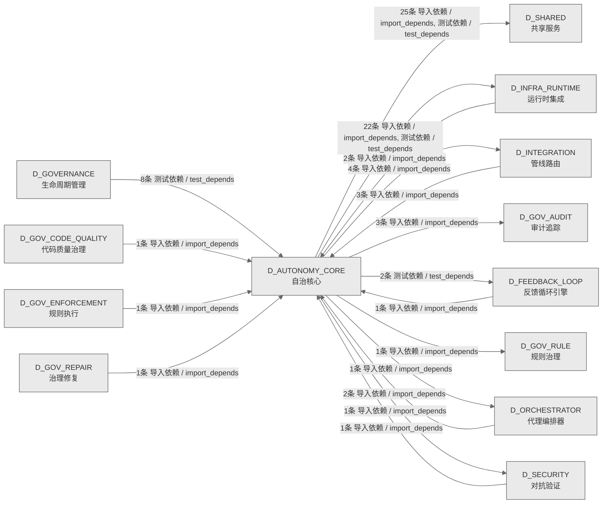

# 10_d_autonomy_core / 自治核心域 / Autonomy Core

> **功能简介 / Overview**: 自治核心，负责 AI 自治决策、目标分解和执行编排

> **文档作用 / Purpose**: 展示 自治核心（D_AUTONOMY_CORE）功能域的域内依赖关系、跨域依赖关系，模块信息（成熟度/中英文名/大白话/文件路径）内嵌于 Mermaid 节点，供架构审查和域治理参考。

> 本文档由 generate_domain_doc.py 从 depgraph (PostgreSQL) 自动生成
> 数据源: depgraph (PostgreSQL) nodes表 + edges表

> **[可缩放 HTML 版 / Zoomable HTML](http://localhost:8765/docs/02_enterprise_architecture/02_domain_architecture_docs/_zoomable_html/10_d_autonomy_core.html)** — Ctrl+滚轮缩放 ｜ 双击重置 ｜ Ctrl+Shift+D 切换拖动/选择模式

## 域基本信息 / Domain Overview

| 字段 | 值 | Field | Value |
|------|------|-------|-------|
| 编号 | 10 | Number | 10 |
| 域ID | D_AUTONOMY_CORE | Domain ID | D_AUTONOMY_CORE |
| 域名称 | 自治核心 | Domain Name | Autonomy Core |
| 层级 | L1 基础平台层 | Layer | L1 Foundation |
| 模块数 | 130 | Module Count | 130 |
| 域内依赖 | 43 | Internal Dependencies | 43 |
| 跨域入边 | 20 | Cross-domain Incoming | 20 |
| 跨域出边 | 59 | Cross-domain Outgoing | 59 |
| 设计态模块 | 0 | Design Modules | 0 |
| 生产态模块 | 130 | Production Modules | 130 |
| 容量 | 130/150 (正常) | Capacity | 130/150 (正常) |
| 描述 | Skill渐进披露(L0永久/L1触发/L2组合/L3按需) | Description | Skill渐进披露(L0永久/L1触发/L2组合/L3按需) |

## 域内依赖图 / Internal Dependency Diagram

> 依赖图内嵌在本文档中，IDE 可直接渲染；网页版可 Ctrl+滚轮缩放 + 拖动平移查看细节。
>
> **图例说明 / Legend**：
> - 🟦 **蓝色 = 运营态模块**（production，已上线运行）
> - 🟧 **橙色虚线 = 设计态模块**（design，蓝图阶段，代码未写）
> - **实线箭头 = 运营态依赖**（已生效的依赖关系）
> - **虚线箭头 = 非运营态依赖**（计划中/验证中的依赖关系）

### 全景图（全部模块，颜色区分运营态/设计态）

> 展示全部 130 个模块（生产态 130 + 设计态 0），含跨域依赖外部节点。节点含成熟度+名称+大白话/简介+文件路径。

```mermaid
%%{init: {'theme': 'base', 'themeVariables': {'primaryColor': '#eaeaea', 'primaryTextColor': '#333333', 'primaryBorderColor': '#666666', 'lineColor': '#666666', 'secondaryColor': '#eaeaea', 'tertiaryColor': '#eaeaea', 'fontSize': '14px'}}}%%
flowchart TD
    src_zephyr_autonomy_core_main_py["主入口<br/>agent-spec CLI 入口，蓝图→Skill<br/>升级引擎命令行，提供 list 列出技能、status<br/>模块健康、help 帮助子命令。<br/>__main__<br/>文件: autonomy_core/__main__.py<br/>(生产态 / production)"]
    src_zephyr_autonomy_core_agent_observability_py["代理可观测性<br/>支撑自主 Agent 的感知决策与执行（agent<br/>observability）<br/>文件: autonomy_core/agent_observability.py<br/>(生产态 / production)"]
    src_zephyr_autonomy_core_all_skill_modules_py["all技能modules<br/>全量 Skill 模块索引——从蓝图全部代码块落地<br/>文件: autonomy_core/all_skill_modules.py<br/>(生产态 / production)"]
    src_zephyr_autonomy_core_context_atomic_injector_py["atomicinjector.py — 原子注入 (DD101, TASK-0<br/>原子注入器，把上下文内容原子化写入，要么全成功要<br/>么全回滚，防中途失败污染。<br/>atomic_injector<br/>文件: context/atomic_injector.py<br/>(生产态 / production)"]
    src_zephyr_autonomy_core_context_ce_bootstrap_py["ce自举<br/>三级递进建造序列: CE-MVP -> Functional -><br/>FullCE.<br/>ce_bootstrap<br/>文件: context/ce_bootstrap.py<br/>(生产态 / production)"]
    src_zephyr_autonomy_core_context_ce_explain_cli_py["ceexplain命令行<br/>知识元素纳入理由解释<br/>CLI，解释为什么某个知识元素被纳入上下文，提升上<br/>下文透明度。<br/>ce_explain_cli<br/>文件: context/ce_explain_cli.py<br/>(生产态 / production)"]
    src_zephyr_autonomy_core_context_ce_file_lister_py["ce文件lister<br/>管理上下文与注入（ce file lister）<br/>ce_file_lister<br/>文件: context/ce_file_lister.py<br/>(生产态 / production)"]
    src_zephyr_autonomy_core_context_ce_playground_v2_py["CE演练场v2<br/>context的结果，封装操作结果的数据结构<br/>文件: context/ce_playground_v2.py<br/>(生产态 / production)"]
    src_zephyr_autonomy_core_context_ce_vibe_shortcuts_py["cevibeshortcuts.py — Vibe/Strict 模式切换<br/>Vibe/Strict 模式切换快捷方式，管理上下文与注入。<br/>ce_vibe_shortcuts<br/>文件: context/ce_vibe_shortcuts.py<br/>(生产态 / production)"]
    src_zephyr_autonomy_core_context_checkpoint_manager_py["检查点管理器<br/>管理上下文与注入（checkpoint）<br/>checkpoint_manager<br/>文件: context/checkpoint_manager.py<br/>(生产态 / production)"]
    src_zephyr_autonomy_core_context_cold_start_booster_py["冷启动booster<br/>管理上下文与注入（cold start booster）<br/>cold_start_booster<br/>文件: context/cold_start_booster.py<br/>(生产态 / production)"]
    src_zephyr_autonomy_core_context_complexity_budget_py["complexity预算<br/>Token 预算复杂度因子，管理上下文与注入<br/>complexity_budget<br/>文件: context/complexity_budget.py<br/>(生产态 / production)"]
    src_zephyr_autonomy_core_context_context_budget_py["上下文预算<br/>管理上下文与注入（context budget）<br/>TruncationStrategy — TruncationStrategy<br/>文件: context/context_budget.py<br/>(生产态 / production)"]
    src_zephyr_autonomy_core_context_context_budget_tracker_py["上下文预算追踪器<br/>ContextBudgetTracker: token budget management<br/>with 3-level thresholds<br/>文件: context/context_budget_tracker.py<br/>(生产态 / production)"]
    src_zephyr_autonomy_core_context_context_debt_score_py["上下文debtscore<br/>管理上下文与注入（context debt score）<br/>context_debt_score<br/>文件: context/context_debt_score.py<br/>(生产态 / production)"]
    src_zephyr_autonomy_core_context_context_evaluator_py["上下文evaluator<br/>计算 Agent 实际引用了多少注入的<br/>KE，作为上下文效率的可量化指标。<br/>context_evaluator<br/>文件: context/context_evaluator.py<br/>(生产态 / production)"]
    src_zephyr_autonomy_core_context_context_evictor_py["上下文驱逐器<br/>优先级(priority) × 新鲜度(freshness) × 相关性<br/>(relevance) 三维加权排序，<br/>context_evictor<br/>文件: context/context_evictor.py<br/>(生产态 / production)"]
    src_zephyr_autonomy_core_context_context_health_score_py["上下文健康评分<br/>器，计算统一健康分，量化上下文质量供调度决策<br/>context_health_score<br/>文件: context/context_health_score.py<br/>(生产态 / production)"]
    src_zephyr_autonomy_core_context_context_model_strategy_py["上下文模型策略<br/>管理上下文与注入（context model strategy）<br/>context_model_strategy<br/>文件: context/context_model_strategy.py<br/>(生产态 / production)"]
    src_zephyr_autonomy_core_context_context_outcome_tracker_py["上下文结果追踪器<br/>管理上下文与注入（context outcome）<br/>context_outcome_tracker<br/>文件: context/context_outcome_tracker.py<br/>(生产态 / production)"]
    src_zephyr_autonomy_core_context_context_pipeline_auto_py["上下文管线自动<br/>1. 自动启动 (auto_start):<br/>系统启动时初始化，注册 EventBus 订阅<br/>context_pipeline_auto<br/>文件: context/context_pipeline_auto.py<br/>(生产态 / production)"]
    src_zephyr_autonomy_core_context_context_playground_py["上下文playground<br/>上下文沙箱，dry-run<br/>模式测试上下文管道，不污染真实上下文。<br/>context_playground<br/>文件: context/context_playground.py<br/>(生产态 / production)"]
    src_zephyr_autonomy_core_context_context_rot_model_py["上下文rot模型<br/>Context Rot 注意力衰减数学模型<br/>context_rot_model<br/>文件: context/context_rot_model.py<br/>(生产态 / production)"]
    src_zephyr_autonomy_core_context_context_value_attribution_py["上下文valueattribution<br/>上下文价值归因器，按知识元素级计算 ROI<br/>归因，量化每条上下文的收益。<br/>context_value_attribution<br/>文件: context/context_value_attribution.py<br/>(生产态 / production)"]
    src_zephyr_autonomy_core_context_contextual_fetch_api_py["contextual获取API<br/>上下文获取对外 HTTP<br/>API，前端与外部服务查询上下文数据的接口。<br/>contextual_fetch_api<br/>文件: context/contextual_fetch_api.py<br/>(生产态 / production)"]
    src_zephyr_autonomy_core_context_curation_loop_py["curation循环<br/>多轮对话中不重复注入已注入的<br/>KE，渐进式策展上下文。<br/>curation_loop<br/>文件: context/curation_loop.py<br/>(生产态 / production)"]
    src_zephyr_autonomy_core_context_diff_injector_py["差异injector<br/>管理上下文与注入（diff injector）<br/>diff_injector<br/>文件: context/diff_injector.py<br/>(生产态 / production)"]
    src_zephyr_autonomy_core_context_diversity_constraint_py["diversity约束<br/>多样性约束，管理上下文与注入<br/>diversity_constraint<br/>文件: context/diversity_constraint.py<br/>(生产态 / production)"]
    src_zephyr_autonomy_core_context_domain_decay_config_py["domaindecay配置<br/>每领域半衰期，管理上下文与注入<br/>domain_decay_config<br/>文件: context/domain_decay_config.py<br/>(生产态 / production)"]
    src_zephyr_autonomy_core_context_fallback_staleness_gate_py["降级staleness门禁<br/>兜底层自腐检测，管理上下文与注入<br/>fallback_staleness_gate<br/>文件: context/fallback_staleness_gate.py<br/>(生产态 / production)"]
    src_zephyr_autonomy_core_context_integrity_check_py["完整性检查<br/>管理上下文与注入（integrity check）<br/>integrity_check<br/>文件: context/integrity_check.py<br/>(生产态 / production)"]
    src_zephyr_autonomy_core_context_memory_bank_py["记忆bank<br/>记忆库，6 个结构化 markdown 文件供 AI<br/>读写，作为跨 session 的持久上下文存储。<br/>memory_bank<br/>文件: context/memory_bank.py<br/>(生产态 / production)"]
    src_zephyr_autonomy_core_context_mode_manager_py["mode管理器<br/>管理上下文与注入（mode）<br/>mode_manager<br/>文件: context/mode_manager.py<br/>(生产态 / production)"]
    src_zephyr_autonomy_core_context_position_optimizer_py["持仓优化器<br/>管理上下文与注入（position optimizer）<br/>position_optimizer<br/>文件: context/position_optimizer.py<br/>(生产态 / production)"]
    src_zephyr_autonomy_core_context_shadow_canary_py["影子金丝雀<br/>新策略影子生成但不注入; 3-sigma superiority -><br/>promote.<br/>shadow_canary<br/>文件: context/shadow_canary.py<br/>(生产态 / production)"]
    src_zephyr_autonomy_core_context_staleness_manager_py["staleness管理器<br/>全局过期检测，管理上下文与注入<br/>staleness_manager<br/>文件: context/staleness_manager.py<br/>(生产态 / production)"]
    src_zephyr_autonomy_core_context_vector_bridge_py["向量桥接<br/>在 CE.build() 和 VMS.search()<br/>之间建立调用桥接，接受 query Embedding +<br/>vector_bridge<br/>文件: context/vector_bridge.py<br/>(生产态 / production)"]
    src_zephyr_autonomy_core_file_autoregister_py["文件autoregister<br/>主要提供注册等功能<br/>file_autoregister<br/>文件: autonomy_core/file_autoregister.py<br/>(生产态 / production)"]
    src_zephyr_autonomy_core_ide_watcher_py["IDE监视器<br/>IDE 热重载监视器——Skill 文件变更自动刷新<br/>AGENTS.md<br/>MOD-INF-019: Agent Spec — IDE Watcher<br/>文件: autonomy_core/ide_watcher.py<br/>(生产态 / production)"]
    src_zephyr_autonomy_core_integration_pipeline_bridge_py["管线桥接<br/>支撑自主 Agent 的感知决策与执行（pipeline）<br/>pipeline_bridge<br/>文件: integration/pipeline_bridge.py<br/>(生产态 / production)"]
    src_zephyr_autonomy_core_phase_planner_py["阶段规划器<br/>Agent Spec<br/>的阶段规划组件，把目标分解为可执行阶段<br/>MOD-INF-019: Agent Spec — Phase Planner<br/>文件: autonomy_core/phase_planner.py<br/>(生产态 / production)"]
    src_zephyr_autonomy_core_progressive_disclosure_injector_py["progressivedisclosureinjector.py — 渐进式<br/>摘要先注->agent 请求展开完整 KE.<br/>progressive_disclosure_injector<br/>文件: autonomy_core<br/>/progressive_disclosure_injector.py<br/>(生产态 / production)"]
    src_zephyr_autonomy_core_prompt_registry_py["提示注册表<br/>从 YAML 文件或字符串加载 Prompt 模板<br/>prompt_registry<br/>文件: autonomy_core/prompt_registry.py<br/>(生产态 / production)"]
    src_zephyr_autonomy_core_self_evolution_fidelity_gate_py["self进化fidelity门禁<br/>EchoTrap 自进化保真度门控 —— RAGEN<br/>保真度验证引擎<br/>文件: autonomy_core<br/>/self_evolution_fidelity_gate.py<br/>(生产态 / production)"]
    src_zephyr_autonomy_core_skill_rbac_registry_py["skillRBAC注册表<br/>技能rbac注册表。: Agent Spec -> RBAC capability<br/>check，支撑自主 Agent 的感知决策与执行<br/>文件: autonomy_core/skill_rbac_registry.py<br/>(生产态 / production)"]
    src_zephyr_autonomy_core_skills_skill_attention_py["技能attention<br/>Skill 注意力管理 —— 上下文窗口预算分配与裁剪。<br/>文件: skills/skill_attention.py<br/>(生产态 / production)"]
    src_zephyr_autonomy_core_skills_skill_breakage_checker_py["skillbreakage检查器<br/>Skill 破坏性变更检测 —— 向后兼容<br/>文件: skills/skill_breakage_checker.py<br/>(生产态 / production)"]
    src_zephyr_autonomy_core_skills_skill_cache_provider_py["技能缓存提供器<br/>Skill 缓存供应商——多后端缓存切换<br/>文件: skills/skill_cache_provider.py<br/>(生产态 / production)"]
    src_zephyr_autonomy_core_skills_skill_calibration_py["技能calibration<br/>Skill 校准 —— 置信度 vs 真实准确率对齐 + drift<br/>监控.<br/>文件: skills/skill_calibration.py<br/>(生产态 / production)"]
    src_zephyr_autonomy_core_skills_skill_canary_py["技能金丝雀<br/>发布器，渐进式灰度部署新技能，先小流量验证再全量<br/>推开<br/>MOD-INF-019: Agent Spec — Skill Canary<br/>文件: skills/skill_canary.py<br/>(生产态 / production)"]
    src_zephyr_autonomy_core_skills_skill_cognitive_preservation_py["skill认知preservation<br/>Skill 认知保留 —— 跨 Session/跨 Agent 的 Skill<br/>学习状态持久化.<br/>文件: skills/skill_cognitive_preservation.py<br/>(生产态 / production)"]
    src_zephyr_autonomy_core_skills_skill_compliance_py["技能合规<br/>公共接口：check_pii（Stage 4 公共化，委托到<br/>cls._check_pii）。<br/>文件: skills/skill_compliance.py<br/>(生产态 / production)"]
    src_zephyr_autonomy_core_skills_skill_consensus_py["技能共识<br/>Skill 共识 —— Multi-Agent 投票/协商/冲突裁决.<br/>文件: skills/skill_consensus.py<br/>(生产态 / production)"]
    src_zephyr_autonomy_core_skills_skill_constructor_py["技能constructor<br/>蓝图->Skill 全自动构造器<br/>文件: skills/skill_constructor.py<br/>(生产态 / production)"]
    src_zephyr_autonomy_core_skills_skill_context_isolation_py["skill上下文isolation<br/>防止跨 Skill 上下文污染:<br/>文件: skills/skill_context_isolation.py<br/>(生产态 / production)"]
    src_zephyr_autonomy_core_skills_skill_contract_py["技能契约<br/>Skill 契约验证 —— I/O Schema + 副作用 + 依赖<br/>MOD-INF-019: Agent Spec — Skill Contract<br/>文件: skills/skill_contract.py<br/>(生产态 / production)"]
    src_zephyr_autonomy_core_skills_skill_cross_model_py["技能跨模型<br/>适配器，让同一技能在不同模型间迁移与复用<br/>文件: skills/skill_cross_model.py<br/>(生产态 / production)"]
    src_zephyr_autonomy_core_skills_skill_di_py["技能di<br/>Skill DI——模块化 Skill 组装与依赖拓扑排序.<br/>文件: skills/skill_di.py<br/>(生产态 / production)"]
    src_zephyr_autonomy_core_skills_skill_discovery_py["技能discovery<br/>Skill 发现——从模块蓝图与源码自动发现可生成<br/>Skill 的模块。<br/>文件: skills/skill_discovery.py<br/>(生产态 / production)"]
    src_zephyr_autonomy_core_skills_skill_durable_py["技能durable<br/>支撑自主 Agent 的感知决策与执行（skill durable）<br/>文件: skills/skill_durable.py<br/>(生产态 / production)"]
    src_zephyr_autonomy_core_skills_skill_economics_py["技能economics<br/>技能经济学追踪器，跟踪技能调用的 Token 与 API<br/>成本。<br/>文件: skills/skill_economics.py<br/>(生产态 / production)"]
    src_zephyr_autonomy_core_skills_skill_efficacy_calibrator_py["skillefficacy校准器<br/>1. BenchmarkRunner: 对 Skill 执行标准化基准测试<br/>文件: skills/skill_efficacy_calibrator.py<br/>(生产态 / production)"]
    src_zephyr_autonomy_core_skills_skill_executor_py["技能执行器<br/>Skill 加载前创建回滚检查点<br/>skill_executor<br/>文件: skills/skill_executor.py<br/>(生产态 / production)"]
    src_zephyr_autonomy_core_skills_skill_explain_py["技能explain<br/>支撑自主 Agent 的感知决策与执行（skill explain）<br/>文件: skills/skill_explain.py<br/>(生产态 / production)"]
    src_zephyr_autonomy_core_skills_skill_feature_flags_py["技能功能标志<br/>Skill 特性开关 —— 运行时切换 Skill 行为。<br/>文件: skills/skill_feature_flags.py<br/>(生产态 / production)"]
    src_zephyr_autonomy_core_skills_skill_feedback_py["技能反馈<br/>Skill 反馈环 —— ModuleResult -> SkillLifecycle<br/>-> 自动优化闭.<br/>文件: skills/skill_feedback.py<br/>(生产态 / production)"]
    src_zephyr_autonomy_core_skills_skill_freshness_ext_py["技能freshness扩展<br/>技能新鲜度扩展，scan_all 全量扫描与<br/>auto_deprecate<br/>自动弃用过期技能，是这些操作的权威位置。<br/>文件: skills/skill_freshness_ext.py<br/>(生产态 / production)"]
    src_zephyr_autonomy_core_skills_skill_gitops_py["技能gitops<br/>Skill 版本管理与自动化发布:<br/>MOD-INF-019: Agent Spec — Skill GitOps<br/>文件: skills/skill_gitops.py<br/>(生产态 / production)"]
    src_zephyr_autonomy_core_skills_skill_guardrails_py["技能guardrails<br/>技能运行时护栏，做预算、变更、输出三类检查防技能<br/>越界。<br/>文件: skills/skill_guardrails.py<br/>(生产态 / production)"]
    src_zephyr_autonomy_core_skills_skill_idempotency_py["技能幂等性<br/>Skill 幂等性保证 —— 防止同一 Skill<br/>在相同输入下重复执行。<br/>文件: skills/skill_idempotency.py<br/>(生产态 / production)"]
    src_zephyr_autonomy_core_skills_skill_kya_py["技能kya<br/>支撑自主 Agent 的感知决策与执行（skill kya）<br/>MOD-INF-019: Agent Spec — Skill KYA<br/>文件: skills/skill_kya.py<br/>(生产态 / production)"]
    src_zephyr_autonomy_core_skills_skill_learning_py["技能learning<br/>从执行历史中学习并自我改进:<br/>文件: skills/skill_learning.py<br/>(生产态 / production)"]
    src_zephyr_autonomy_core_skills_skill_lineage_py["技能lineage<br/>Skill 版本谱系追踪——版本树、diff 对比、回滚路径.<br/>MOD-INF-019: Agent Spec — Skill Lineage<br/>文件: skills/skill_lineage.py<br/>(生产态 / production)"]
    src_zephyr_autonomy_core_skills_skill_locking_py["技能locking<br/>Skill 并发安全锁 —— 多 Session/多 Agent<br/>并发读写保护.<br/>文件: skills/skill_locking.py<br/>(生产态 / production)"]
    src_zephyr_autonomy_core_skills_skill_observability_py["技能可观测性<br/>Skill 可观测性 —— Trace/Span/Metric/Log<br/>四维信号.<br/>文件: skills/skill_observability.py<br/>(生产态 / production)"]
    src_zephyr_autonomy_core_skills_skill_ontology_py["技能ontology<br/>对齐 Skill 与项目知识图谱(KB)中的本体概念:<br/>MOD-INF-019: Agent Spec — Skill Ontology<br/>文件: skills/skill_ontology.py<br/>(生产态 / production)"]
    src_zephyr_autonomy_core_skills_skill_postmortem_py["技能postmortem<br/>追问到底根因分析引擎<br/>skill_postmortem<br/>文件: skills/skill_postmortem.py<br/>(生产态 / production)"]
    src_zephyr_autonomy_core_skills_skill_prompt_cache_py["技能提示缓存<br/>Skill Prompt 缓存——减少重复 LLM 调用，带 TTL<br/>过期.<br/>文件: skills/skill_prompt_cache.py<br/>(生产态 / production)"]
    src_zephyr_autonomy_core_skills_skill_prompt_opt_py["技能提示opt<br/>ReadabilityScore: 评估 Skill 正文可读性(Flesch<br/>近似)<br/>文件: skills/skill_prompt_opt.py<br/>(生产态 / production)"]
    src_zephyr_autonomy_core_skills_skill_resilience_py["技能韧性<br/>Skill 韧性——重试/降级/熔断策略 with exponential<br/>backoff.<br/>文件: skills/skill_resilience.py<br/>(生产态 / production)"]
    src_zephyr_autonomy_core_skills_skill_risk_mitigator_py["skill风险mitigator<br/>支撑自主 Agent 的感知决策与执行（skill risk<br/>mitigator）<br/>文件: skills/skill_risk_mitigator.py<br/>(生产态 / production)"]
    src_zephyr_autonomy_core_skills_skill_router_py["技能路由器<br/>主要提供from标签等功能（skill）<br/>skill_router<br/>文件: skills/skill_router.py<br/>(生产态 / production)"]
    src_zephyr_autonomy_core_skills_skill_sandbox_py["技能沙箱<br/>Skill 沙箱隔离执行引擎<br/>MOD-INF-019: Agent Spec — Skill Sandbox<br/>文件: skills/skill_sandbox.py<br/>(生产态 / production)"]
    src_zephyr_autonomy_core_skills_skill_schema_registry_py["技能模式注册表<br/>Skill I/O Schema 注册与契约验证——确保 Skill<br/>输入输出符合预期结构.<br/>文件: skills/skill_schema_registry.py<br/>(生产态 / production)"]
    src_zephyr_autonomy_core_skills_skill_security_py["技能安全<br/>支撑自主 Agent 的感知决策与执行（skill<br/>security）<br/>MOD-INF-019: Agent Spec — Skill Security<br/>文件: skills/skill_security.py<br/>(生产态 / production)"]
    src_zephyr_autonomy_core_skills_skill_shadow_py["技能影子<br/>支撑自主 Agent 的感知决策与执行（skill shadow）<br/>文件: skills/skill_shadow.py<br/>(生产态 / production)"]
    src_zephyr_autonomy_core_skills_skill_silent_failure_py["skillsilent故障<br/>静默失败检测引擎<br/>文件: skills/skill_silent_failure.py<br/>(生产态 / production)"]
    src_zephyr_autonomy_core_skills_skill_team_optimizer_py["技能团队优化器<br/>支撑自主 Agent 的感知决策与执行（skill team<br/>optimizer）<br/>文件: skills/skill_team_optimizer.py<br/>(生产态 / production)"]
    src_zephyr_autonomy_core_skills_skill_telemetry_py["技能遥测<br/>Skill Telemetry——使用遥测采集与聚合分析.<br/>文件: skills/skill_telemetry.py<br/>(生产态 / production)"]
    src_zephyr_autonomy_core_skills_skill_temperature_py["技能temperature<br/>Skill Temperature——按任务类型自适应调度 LLM<br/>创造性.<br/>文件: skills/skill_temperature.py<br/>(生产态 / production)"]
    src_zephyr_autonomy_core_skills_skill_tokenomics_py["技能tokenomics<br/>技能代币经济学，管理技能调用的 token<br/>预算与经济激励模型。<br/>文件: skills/skill_tokenomics.py<br/>(生产态 / production)"]
    src_zephyr_autonomy_core_skills_skill_translator_py["技能translator<br/>将 DeepSeek 风格的 Skill 指令翻译为 Claude/GLM<br/>/GPT 风格的等效指令:<br/>文件: skills/skill_translator.py<br/>(生产态 / production)"]
    src_zephyr_autonomy_core_skills_skill_workflow_py["技能工作流<br/>多 Skill 工作流编排引擎<br/>文件: skills/skill_workflow.py<br/>(生产态 / production)"]
    src_zephyr_autonomy_core_spec_engine_py["spec引擎<br/>支撑自主 Agent 的感知决策与执行（spec）<br/>spec_engine<br/>文件: autonomy_core/spec_engine.py<br/>(生产态 / production)"]
    src_zephyr_autonomy_core_vibe_coding_quality_gate_py["vibecoding质量门禁<br/>VibeCodingQualityGate — 代码质量门禁（stub,<br/>tests 待实装后补全实现）<br/>vibe_coding_quality_gate<br/>文件: autonomy_core/vibe_coding_quality_gate.py<br/>(生产态 / production)"]
    src_zephyr_governance_persistence_intent_parser_py["intent解析器<br/>IntentParser · 意图三阶段级联解析器（V-09）<br/>intent_parser<br/>文件: persistence/intent_parser.py<br/>(生产态 / production)"]
    src_zephyr_infrastructure_system_snapshot_py["系统快照<br/>SystemSnapshotter — M1 系统状态镜像（CL-017 RI<br/>扩展模式）<br/>system_snapshot<br/>文件: infrastructure/system_snapshot.py<br/>(生产态 / production)"]
    src_zephyr_infrastructure_system_telemetry_otel_instrumentation_py["otelinstrumentation.py — 全链路 OTel (B12,<br/>全链路 OpenTelemetry<br/>注入器，为系统调用链埋点，产出分布式追踪数据。<br/>otel_instrumentation<br/>文件: system_telemetry/otel_instrumentation.py<br/>(生产态 / production)"]
    src_zephyr_integration_vector_memory_vector_writer_py["向量写入器<br/>CE 向量写入器 — vectorize_and_store() 生产者<br/>vector_writer<br/>文件: vector_memory/vector_writer.py<br/>(生产态 / production)"]
    src_zephyr_security_llm_defense_llm_security_adversarial_robustness_py["对抗鲁棒性<br/>支撑自主 Agent 的感知决策与执行（adversarial<br/>robustness）<br/>adversarial_robustness<br/>文件: llm_security/adversarial_robustness.py<br/>(生产态 / production)"]
    src_zephyr_security_llm_defense_llm_security_alignment_scorer_py["对齐评分器<br/>评估模型输出与价值对齐的程度，输出对齐分数<br/>alignment_scorer<br/>文件: llm_security/alignment_scorer.py<br/>(生产态 / production)"]
    src_zephyr_security_llm_defense_llm_security_lsg_pattern_tracker_py["lsg模式追踪器<br/>支撑自主 Agent 的感知决策与执行（lsg pattern）<br/>lsg_pattern_tracker<br/>文件: llm_security/lsg_pattern_tracker.py<br/>(生产态 / production)"]
    src_zephyr_security_llm_defense_llm_security_poisoning_monitor_py["poisoning监控器<br/>Embed 污染检测，支撑自主 Agent 的感知决策与执行<br/>poisoning_monitor<br/>文件: llm_security/poisoning_monitor.py<br/>(生产态 / production)"]
    src_zephyr_security_llm_defense_llm_security_sensitivity_classifier_py["sensitivity分类器<br/>敏感度分类器，对数据进行分级标注，指导脱敏与访问<br/>控制。<br/>sensitivity_classifier<br/>文件: llm_security/sensitivity_classifier.py<br/>(生产态 / production)"]
    src_zephyr_security_llm_defense_llm_security_solo_dev_safety_net_py["solodev安全net<br/>单人无审查安全网<br/>solo_dev_safety_net<br/>文件: llm_security/solo_dev_safety_net.py<br/>(生产态 / production)"]
    src_zephyr_shared_ai_guards_config_safety_guard_py["配置安全守卫<br/>支撑自主 Agent 的感知决策与执行（config safety<br/>guard）<br/>config_safety_guard<br/>文件: ai_guards/config_safety_guard.py<br/>(生产态 / production)"]
    src_zephyr_shared_dependency_dependency_tracker_py["依赖追踪器<br/>支撑自主 Agent 的感知决策与执行（dependency）<br/>dependency_tracker<br/>文件: dependency/dependency_tracker.py<br/>(生产态 / production)"]
    src_zephyr_shared_io_cache_invalidation_py["缓存invalidation<br/>自动递增版本号——数据更新组件调用此方法触发自动失<br/>效.<br/>cache_invalidation<br/>文件: io/cache_invalidation.py<br/>(生产态 / production)"]
    src_zephyr_shared_utils_verify_paths_py["校验paths<br/>代码路径索引验证<br/>verify_paths<br/>文件: utils/verify_paths.py<br/>(生产态 / production)"]
    tests_automation_test_auto_runtime_e2e_py["测试自动运行时端到端<br/>F1 AutoRuntimeCore 非mock端到端集成测试<br/>test_auto_runtime_e2e<br/>文件: automation/test_auto_runtime_e2e.py<br/>(生产态 / production)"]
    tests_f_lifecycle_test_f1_event_trigger_py["F1 事件触发启动测试<br/>验证 F1 两套事件机制能否正确触发 F1 组件启动:<br/>test_f1_event_trigger<br/>文件: f_lifecycle/test_f1_event_trigger.py<br/>(生产态 / production)"]
    tests_trading_extreme_test_f14_pipeline_extreme_py["F14 管线编排/反馈环 — 红蓝对抗端到端极端测试<br/>覆盖 5 类极端场景（对应 施工步骤 ②-⑥）:<br/>test_f14_pipeline_extreme<br/>文件: extreme/test_f14_pipeline_extreme.py<br/>(生产态 / production)"]
    tests_trading_extreme_test_f1_extreme_py["F1 自动驾驶/运行时大脑 — 红蓝对抗端到端极端测试<br/>覆盖 5 类极端场景对 F1 核心组件的影响:<br/>test_f1_extreme<br/>文件: extreme/test_f1_extreme.py<br/>(生产态 / production)"]
    src_zephyr_autonomy_core_main_py ~~~ src_zephyr_autonomy_core_agent_observability_py
    src_zephyr_autonomy_core_agent_observability_py ~~~ src_zephyr_autonomy_core_all_skill_modules_py
    src_zephyr_autonomy_core_all_skill_modules_py ~~~ src_zephyr_autonomy_core_context_atomic_injector_py
    src_zephyr_autonomy_core_context_atomic_injector_py ~~~ src_zephyr_autonomy_core_context_ce_bootstrap_py
    src_zephyr_autonomy_core_context_ce_bootstrap_py ~~~ src_zephyr_autonomy_core_context_ce_explain_cli_py
    src_zephyr_autonomy_core_context_ce_explain_cli_py ~~~ src_zephyr_autonomy_core_context_ce_file_lister_py
    src_zephyr_autonomy_core_context_ce_file_lister_py ~~~ src_zephyr_autonomy_core_context_ce_playground_v2_py
    src_zephyr_autonomy_core_context_ce_playground_v2_py ~~~ src_zephyr_autonomy_core_context_ce_vibe_shortcuts_py
    src_zephyr_autonomy_core_context_ce_vibe_shortcuts_py ~~~ src_zephyr_autonomy_core_context_checkpoint_manager_py
    src_zephyr_autonomy_core_context_checkpoint_manager_py ~~~ src_zephyr_autonomy_core_context_cold_start_booster_py
    src_zephyr_autonomy_core_context_cold_start_booster_py ~~~ src_zephyr_autonomy_core_context_complexity_budget_py
    src_zephyr_autonomy_core_context_complexity_budget_py ~~~ src_zephyr_autonomy_core_context_context_budget_py
    src_zephyr_autonomy_core_context_context_budget_py ~~~ src_zephyr_autonomy_core_context_context_budget_tracker_py
    src_zephyr_autonomy_core_context_context_budget_tracker_py ~~~ src_zephyr_autonomy_core_context_context_debt_score_py
    src_zephyr_autonomy_core_context_context_debt_score_py ~~~ src_zephyr_autonomy_core_context_context_evaluator_py
    src_zephyr_autonomy_core_context_context_evaluator_py ~~~ src_zephyr_autonomy_core_context_context_evictor_py
    src_zephyr_autonomy_core_context_context_evictor_py ~~~ src_zephyr_autonomy_core_context_context_health_score_py
    src_zephyr_autonomy_core_context_context_health_score_py ~~~ src_zephyr_autonomy_core_context_context_model_strategy_py
    src_zephyr_autonomy_core_context_context_model_strategy_py ~~~ src_zephyr_autonomy_core_context_context_outcome_tracker_py
    src_zephyr_autonomy_core_context_context_outcome_tracker_py ~~~ src_zephyr_autonomy_core_context_context_pipeline_auto_py
    src_zephyr_autonomy_core_context_context_pipeline_auto_py ~~~ src_zephyr_autonomy_core_context_context_playground_py
    src_zephyr_autonomy_core_context_context_playground_py ~~~ src_zephyr_autonomy_core_context_context_rot_model_py
    src_zephyr_autonomy_core_context_context_rot_model_py ~~~ src_zephyr_autonomy_core_context_context_value_attribution_py
    src_zephyr_autonomy_core_context_context_value_attribution_py ~~~ src_zephyr_autonomy_core_context_contextual_fetch_api_py
    src_zephyr_autonomy_core_context_contextual_fetch_api_py ~~~ src_zephyr_autonomy_core_context_curation_loop_py
    src_zephyr_autonomy_core_context_curation_loop_py ~~~ src_zephyr_autonomy_core_context_diff_injector_py
    src_zephyr_autonomy_core_context_diff_injector_py ~~~ src_zephyr_autonomy_core_context_diversity_constraint_py
    src_zephyr_autonomy_core_context_diversity_constraint_py ~~~ src_zephyr_autonomy_core_context_domain_decay_config_py
    src_zephyr_autonomy_core_context_domain_decay_config_py ~~~ src_zephyr_autonomy_core_context_fallback_staleness_gate_py
    src_zephyr_autonomy_core_context_fallback_staleness_gate_py ~~~ src_zephyr_autonomy_core_context_integrity_check_py
    src_zephyr_autonomy_core_context_integrity_check_py ~~~ src_zephyr_autonomy_core_context_memory_bank_py
    src_zephyr_autonomy_core_context_memory_bank_py ~~~ src_zephyr_autonomy_core_context_mode_manager_py
    src_zephyr_autonomy_core_context_mode_manager_py ~~~ src_zephyr_autonomy_core_context_position_optimizer_py
    src_zephyr_autonomy_core_context_position_optimizer_py ~~~ src_zephyr_autonomy_core_context_shadow_canary_py
    src_zephyr_autonomy_core_context_shadow_canary_py ~~~ src_zephyr_autonomy_core_context_staleness_manager_py
    src_zephyr_autonomy_core_context_staleness_manager_py ~~~ src_zephyr_autonomy_core_context_vector_bridge_py
    src_zephyr_autonomy_core_context_vector_bridge_py ~~~ src_zephyr_autonomy_core_file_autoregister_py
    src_zephyr_autonomy_core_file_autoregister_py ~~~ src_zephyr_autonomy_core_ide_watcher_py
    src_zephyr_autonomy_core_ide_watcher_py ~~~ src_zephyr_autonomy_core_integration_pipeline_bridge_py
    src_zephyr_autonomy_core_integration_pipeline_bridge_py ~~~ src_zephyr_autonomy_core_phase_planner_py
    src_zephyr_autonomy_core_phase_planner_py ~~~ src_zephyr_autonomy_core_progressive_disclosure_injector_py
    src_zephyr_autonomy_core_progressive_disclosure_injector_py ~~~ src_zephyr_autonomy_core_prompt_registry_py
    src_zephyr_autonomy_core_prompt_registry_py ~~~ src_zephyr_autonomy_core_self_evolution_fidelity_gate_py
    src_zephyr_autonomy_core_self_evolution_fidelity_gate_py ~~~ src_zephyr_autonomy_core_skill_rbac_registry_py
    src_zephyr_autonomy_core_skill_rbac_registry_py ~~~ src_zephyr_autonomy_core_skills_skill_attention_py
    src_zephyr_autonomy_core_skills_skill_attention_py ~~~ src_zephyr_autonomy_core_skills_skill_breakage_checker_py
    src_zephyr_autonomy_core_skills_skill_breakage_checker_py ~~~ src_zephyr_autonomy_core_skills_skill_cache_provider_py
    src_zephyr_autonomy_core_skills_skill_cache_provider_py ~~~ src_zephyr_autonomy_core_skills_skill_calibration_py
    src_zephyr_autonomy_core_skills_skill_calibration_py ~~~ src_zephyr_autonomy_core_skills_skill_canary_py
    src_zephyr_autonomy_core_skills_skill_canary_py ~~~ src_zephyr_autonomy_core_skills_skill_cognitive_preservation_py
    src_zephyr_autonomy_core_skills_skill_cognitive_preservation_py ~~~ src_zephyr_autonomy_core_skills_skill_compliance_py
    src_zephyr_autonomy_core_skills_skill_compliance_py ~~~ src_zephyr_autonomy_core_skills_skill_consensus_py
    src_zephyr_autonomy_core_skills_skill_consensus_py ~~~ src_zephyr_autonomy_core_skills_skill_constructor_py
    src_zephyr_autonomy_core_skills_skill_constructor_py ~~~ src_zephyr_autonomy_core_skills_skill_context_isolation_py
    src_zephyr_autonomy_core_skills_skill_context_isolation_py ~~~ src_zephyr_autonomy_core_skills_skill_contract_py
    src_zephyr_autonomy_core_skills_skill_contract_py ~~~ src_zephyr_autonomy_core_skills_skill_cross_model_py
    src_zephyr_autonomy_core_skills_skill_cross_model_py ~~~ src_zephyr_autonomy_core_skills_skill_di_py
    src_zephyr_autonomy_core_skills_skill_di_py ~~~ src_zephyr_autonomy_core_skills_skill_discovery_py
    src_zephyr_autonomy_core_skills_skill_discovery_py ~~~ src_zephyr_autonomy_core_skills_skill_durable_py
    src_zephyr_autonomy_core_skills_skill_durable_py ~~~ src_zephyr_autonomy_core_skills_skill_economics_py
    src_zephyr_autonomy_core_skills_skill_economics_py ~~~ src_zephyr_autonomy_core_skills_skill_efficacy_calibrator_py
    src_zephyr_autonomy_core_skills_skill_efficacy_calibrator_py ~~~ src_zephyr_autonomy_core_skills_skill_executor_py
    src_zephyr_autonomy_core_skills_skill_executor_py ~~~ src_zephyr_autonomy_core_skills_skill_explain_py
    src_zephyr_autonomy_core_skills_skill_explain_py ~~~ src_zephyr_autonomy_core_skills_skill_feature_flags_py
    src_zephyr_autonomy_core_skills_skill_feature_flags_py ~~~ src_zephyr_autonomy_core_skills_skill_feedback_py
    src_zephyr_autonomy_core_skills_skill_feedback_py ~~~ src_zephyr_autonomy_core_skills_skill_freshness_ext_py
    src_zephyr_autonomy_core_skills_skill_freshness_ext_py ~~~ src_zephyr_autonomy_core_skills_skill_gitops_py
    src_zephyr_autonomy_core_skills_skill_gitops_py ~~~ src_zephyr_autonomy_core_skills_skill_guardrails_py
    src_zephyr_autonomy_core_skills_skill_guardrails_py ~~~ src_zephyr_autonomy_core_skills_skill_idempotency_py
    src_zephyr_autonomy_core_skills_skill_idempotency_py ~~~ src_zephyr_autonomy_core_skills_skill_kya_py
    src_zephyr_autonomy_core_skills_skill_kya_py ~~~ src_zephyr_autonomy_core_skills_skill_learning_py
    src_zephyr_autonomy_core_skills_skill_learning_py ~~~ src_zephyr_autonomy_core_skills_skill_lineage_py
    src_zephyr_autonomy_core_skills_skill_lineage_py ~~~ src_zephyr_autonomy_core_skills_skill_locking_py
    src_zephyr_autonomy_core_skills_skill_locking_py ~~~ src_zephyr_autonomy_core_skills_skill_observability_py
    src_zephyr_autonomy_core_skills_skill_observability_py ~~~ src_zephyr_autonomy_core_skills_skill_ontology_py
    src_zephyr_autonomy_core_skills_skill_ontology_py ~~~ src_zephyr_autonomy_core_skills_skill_postmortem_py
    src_zephyr_autonomy_core_skills_skill_postmortem_py ~~~ src_zephyr_autonomy_core_skills_skill_prompt_cache_py
    src_zephyr_autonomy_core_skills_skill_prompt_cache_py ~~~ src_zephyr_autonomy_core_skills_skill_prompt_opt_py
    src_zephyr_autonomy_core_skills_skill_prompt_opt_py ~~~ src_zephyr_autonomy_core_skills_skill_resilience_py
    src_zephyr_autonomy_core_skills_skill_resilience_py ~~~ src_zephyr_autonomy_core_skills_skill_risk_mitigator_py
    src_zephyr_autonomy_core_skills_skill_risk_mitigator_py ~~~ src_zephyr_autonomy_core_skills_skill_router_py
    src_zephyr_autonomy_core_skills_skill_router_py ~~~ src_zephyr_autonomy_core_skills_skill_sandbox_py
    src_zephyr_autonomy_core_skills_skill_sandbox_py ~~~ src_zephyr_autonomy_core_skills_skill_schema_registry_py
    src_zephyr_autonomy_core_skills_skill_schema_registry_py ~~~ src_zephyr_autonomy_core_skills_skill_security_py
    src_zephyr_autonomy_core_skills_skill_security_py ~~~ src_zephyr_autonomy_core_skills_skill_shadow_py
    src_zephyr_autonomy_core_skills_skill_shadow_py ~~~ src_zephyr_autonomy_core_skills_skill_silent_failure_py
    src_zephyr_autonomy_core_skills_skill_silent_failure_py ~~~ src_zephyr_autonomy_core_skills_skill_team_optimizer_py
    src_zephyr_autonomy_core_skills_skill_team_optimizer_py ~~~ src_zephyr_autonomy_core_skills_skill_telemetry_py
    src_zephyr_autonomy_core_skills_skill_telemetry_py ~~~ src_zephyr_autonomy_core_skills_skill_temperature_py
    src_zephyr_autonomy_core_skills_skill_temperature_py ~~~ src_zephyr_autonomy_core_skills_skill_tokenomics_py
    src_zephyr_autonomy_core_skills_skill_tokenomics_py ~~~ src_zephyr_autonomy_core_skills_skill_translator_py
    src_zephyr_autonomy_core_skills_skill_translator_py ~~~ src_zephyr_autonomy_core_skills_skill_workflow_py
    src_zephyr_autonomy_core_skills_skill_workflow_py ~~~ src_zephyr_autonomy_core_spec_engine_py
    src_zephyr_autonomy_core_spec_engine_py ~~~ src_zephyr_autonomy_core_vibe_coding_quality_gate_py
    src_zephyr_autonomy_core_vibe_coding_quality_gate_py ~~~ src_zephyr_governance_persistence_intent_parser_py
    src_zephyr_governance_persistence_intent_parser_py ~~~ src_zephyr_infrastructure_system_snapshot_py
    src_zephyr_infrastructure_system_snapshot_py ~~~ src_zephyr_infrastructure_system_telemetry_otel_instrumentation_py
    src_zephyr_infrastructure_system_telemetry_otel_instrumentation_py ~~~ src_zephyr_integration_vector_memory_vector_writer_py
    src_zephyr_integration_vector_memory_vector_writer_py ~~~ src_zephyr_security_llm_defense_llm_security_adversarial_robustness_py
    src_zephyr_security_llm_defense_llm_security_adversarial_robustness_py ~~~ src_zephyr_security_llm_defense_llm_security_alignment_scorer_py
    src_zephyr_security_llm_defense_llm_security_alignment_scorer_py ~~~ src_zephyr_security_llm_defense_llm_security_lsg_pattern_tracker_py
    src_zephyr_security_llm_defense_llm_security_lsg_pattern_tracker_py ~~~ src_zephyr_security_llm_defense_llm_security_poisoning_monitor_py
    src_zephyr_security_llm_defense_llm_security_poisoning_monitor_py ~~~ src_zephyr_security_llm_defense_llm_security_sensitivity_classifier_py
    src_zephyr_security_llm_defense_llm_security_sensitivity_classifier_py ~~~ src_zephyr_security_llm_defense_llm_security_solo_dev_safety_net_py
    src_zephyr_security_llm_defense_llm_security_solo_dev_safety_net_py ~~~ src_zephyr_shared_ai_guards_config_safety_guard_py
    src_zephyr_shared_ai_guards_config_safety_guard_py ~~~ src_zephyr_shared_dependency_dependency_tracker_py
    src_zephyr_shared_dependency_dependency_tracker_py ~~~ src_zephyr_shared_io_cache_invalidation_py
    src_zephyr_shared_io_cache_invalidation_py ~~~ src_zephyr_shared_utils_verify_paths_py
    src_zephyr_shared_utils_verify_paths_py ~~~ tests_automation_test_auto_runtime_e2e_py
    tests_automation_test_auto_runtime_e2e_py ~~~ tests_f_lifecycle_test_f1_event_trigger_py
    tests_f_lifecycle_test_f1_event_trigger_py ~~~ tests_trading_extreme_test_f14_pipeline_extreme_py
    tests_trading_extreme_test_f14_pipeline_extreme_py ~~~ tests_trading_extreme_test_f1_extreme_py
    src_zephyr_autonomy_core_context_context_pipeline_py["上下文管线<br/>Context Engine **四段流水线组合根**<br/>context_pipeline<br/>文件: context/context_pipeline.py<br/>(生产态 / production)"]
    src_zephyr_autonomy_core_skills_skill_evaluator_py["技能evaluator<br/>Skill 质量评估器 — 多维度输出质量评分<br/>文件: skills/skill_evaluator.py<br/>(生产态 / production)"]
    src_zephyr_autonomy_core_skills_skill_factory_py["技能工厂<br/>主要提供read蓝图、提取模块信息、findsection等功<br/>能<br/>skill_factory<br/>文件: skills/skill_factory.py<br/>(生产态 / production)"]
    src_zephyr_autonomy_core_skills_skill_kill_switch_py["技能终止开关<br/>Skill 熔断开关 —— 紧急停用异常 Skill，防雪崩。<br/>文件: skills/skill_kill_switch.py<br/>(生产态 / production)"]
    src_zephyr_autonomy_core_skills_skill_lifecycle_py["技能生命周期<br/>Skill 生命周期状态机 + 跨模块协调.<br/>文件: skills/skill_lifecycle.py<br/>(生产态 / production)"]
    src_zephyr_autonomy_core_skills_skill_model_evolution_py["技能模型进化<br/>LLM 升级影响评估引擎<br/>文件: skills/skill_model_evolution.py<br/>(生产态 / production)"]
    src_zephyr_autonomy_core_skills_skill_registry_py["技能注册表<br/>技能注册基座，定义 PromptTemplate 与<br/>SkillDefinition Pydantic 模型作为跨层契约。<br/>skill_registry<br/>文件: skills/skill_registry.py<br/>(生产态 / production)"]
    src_zephyr_autonomy_core_trigger_router_py["触发器路由器<br/>主要提供from标签等功能（trigger）<br/>trigger_router<br/>文件: autonomy_core/trigger_router.py<br/>(生产态 / production)"]
    src_zephyr_governance_persistence_intent_keyword_mapper_py["意图关键词映射器<br/>意图识别域（D0-D9 + UNKNOWN，与<br/>metadata_registry.yaml §9.2 domain 枚举对齐）。<br/>文件: persistence/intent_keyword_mapper.py<br/>(生产态 / production)"]
    src_zephyr_autonomy_core_context_context_pipeline_py ~~~ src_zephyr_autonomy_core_skills_skill_evaluator_py
    src_zephyr_autonomy_core_skills_skill_evaluator_py ~~~ src_zephyr_autonomy_core_skills_skill_factory_py
    src_zephyr_autonomy_core_skills_skill_factory_py ~~~ src_zephyr_autonomy_core_skills_skill_kill_switch_py
    src_zephyr_autonomy_core_skills_skill_kill_switch_py ~~~ src_zephyr_autonomy_core_skills_skill_lifecycle_py
    src_zephyr_autonomy_core_skills_skill_lifecycle_py ~~~ src_zephyr_autonomy_core_skills_skill_model_evolution_py
    src_zephyr_autonomy_core_skills_skill_model_evolution_py ~~~ src_zephyr_autonomy_core_skills_skill_registry_py
    src_zephyr_autonomy_core_skills_skill_registry_py ~~~ src_zephyr_autonomy_core_trigger_router_py
    src_zephyr_autonomy_core_trigger_router_py ~~~ src_zephyr_governance_persistence_intent_keyword_mapper_py
    src_zephyr_autonomy_core_context_context_assembler_py["上下文assembler<br/>ContextAssembler — 上下文装配、校验、影子留档<br/>context_assembler<br/>文件: context/context_assembler.py<br/>(生产态 / production)"]
    src_zephyr_autonomy_core_context_context_injector_py["上下文injector<br/>将 ValidatedContext 按四层结构格式化。<br/>文件: context/context_injector.py<br/>(生产态 / production)"]
    src_zephyr_autonomy_core_skills_skill_freshness_py["技能freshness<br/>支撑自主 Agent 的感知决策与执行（skill<br/>freshness）<br/>文件: skills/skill_freshness.py<br/>(生产态 / production)"]
    src_zephyr_autonomy_core_skills_skill_loader_py["技能加载器<br/>主要提供提取体、compressto严重rules、解析技能路<br/>径等功能<br/>skill_loader<br/>文件: skills/skill_loader.py<br/>(生产态 / production)"]
    src_zephyr_autonomy_core_skills_skill_model_py["技能模型<br/>技能管理（skill model）<br/>skill_model<br/>文件: skills/skill_model.py<br/>(生产态 / production)"]
    src_zephyr_shared_blueprint_tools_architecture_context_loader_py["架构上下文加载器<br/>加载 ``generate_architecture_context.py``<br/>产出的预编译 JSON<br/>architecture_context_loader<br/>文件: blueprint_tools<br/>/architecture_context_loader.py<br/>(生产态 / production)"]
    src_zephyr_autonomy_core_context_context_assembler_py ~~~ src_zephyr_autonomy_core_context_context_injector_py
    src_zephyr_autonomy_core_context_context_injector_py ~~~ src_zephyr_autonomy_core_skills_skill_freshness_py
    src_zephyr_autonomy_core_skills_skill_freshness_py ~~~ src_zephyr_autonomy_core_skills_skill_loader_py
    src_zephyr_autonomy_core_skills_skill_loader_py ~~~ src_zephyr_autonomy_core_skills_skill_model_py
    src_zephyr_autonomy_core_skills_skill_model_py ~~~ src_zephyr_shared_blueprint_tools_architecture_context_loader_py
    src_zephyr_autonomy_core_context_context_rule_registry_py["上下文规则注册表<br/>context的注册表，登记和查询已注册条目<br/>context_rule_registry<br/>文件: context/context_rule_registry.py<br/>(生产态 / production)"]
    src_zephyr_shared_io_doc_compressor_py["doc压缩器<br/>DocCompressor — 文档压缩服务（CL-018 RI<br/>扩展模式）<br/>doc_compressor<br/>文件: io/doc_compressor.py<br/>(生产态 / production)"]
    src_zephyr_autonomy_core_context_context_rule_registry_py ~~~ src_zephyr_shared_io_doc_compressor_py
    src_zephyr_autonomy_core_spec_engine_py -->|导入依赖 / import_depends| src_zephyr_autonomy_core_trigger_router_py
    src_zephyr_autonomy_core_spec_engine_py -->|导入依赖 / import_depends| src_zephyr_autonomy_core_skills_skill_factory_py
    src_zephyr_autonomy_core_spec_engine_py -->|导入依赖 / import_depends| src_zephyr_autonomy_core_skills_skill_freshness_py
    src_zephyr_autonomy_core_spec_engine_py -->|导入依赖 / import_depends| src_zephyr_autonomy_core_skills_skill_loader_py
    src_zephyr_autonomy_core_prompt_registry_py -->|导入依赖 / import_depends| src_zephyr_autonomy_core_context_context_injector_py
    src_zephyr_autonomy_core_prompt_registry_py -->|导入依赖 / import_depends| src_zephyr_autonomy_core_skills_skill_registry_py
    src_zephyr_autonomy_core_main_py -->|导入依赖 / import_depends| src_zephyr_autonomy_core_skills_skill_loader_py
    src_zephyr_autonomy_core_main_py -->|导入依赖 / import_depends| src_zephyr_autonomy_core_skills_skill_model_py
    src_zephyr_autonomy_core_context_context_assembler_py -->|导入依赖 / import_depends| src_zephyr_autonomy_core_context_context_rule_registry_py
    src_zephyr_autonomy_core_context_context_assembler_py -->|导入依赖 / import_depends| src_zephyr_shared_io_doc_compressor_py
    src_zephyr_autonomy_core_context_context_budget_tracker_py -->|导入依赖 / import_depends| src_zephyr_shared_io_doc_compressor_py
    src_zephyr_autonomy_core_context_context_pipeline_auto_py -->|导入依赖 / import_depends| src_zephyr_autonomy_core_context_context_pipeline_py
    src_zephyr_autonomy_core_context_context_pipeline_py -->|导入依赖 / import_depends| src_zephyr_autonomy_core_context_context_assembler_py
    src_zephyr_autonomy_core_context_context_pipeline_py -->|导入依赖 / import_depends| src_zephyr_autonomy_core_context_context_injector_py
    src_zephyr_autonomy_core_context_context_pipeline_py -->|导入依赖 / import_depends| src_zephyr_autonomy_core_context_context_rule_registry_py
    src_zephyr_autonomy_core_context_context_pipeline_py -->|导入依赖 / import_depends| src_zephyr_shared_blueprint_tools_architecture_context_loader_py
    src_zephyr_autonomy_core_integration_pipeline_bridge_py -->|导入依赖 / import_depends| src_zephyr_autonomy_core_trigger_router_py
    src_zephyr_autonomy_core_integration_pipeline_bridge_py -->|导入依赖 / import_depends| src_zephyr_autonomy_core_skills_skill_loader_py
    src_zephyr_autonomy_core_skills_skill_consensus_py -->|导入依赖 / import_depends| src_zephyr_autonomy_core_skills_skill_freshness_py
    src_zephyr_autonomy_core_skills_skill_constructor_py -->|导入依赖 / import_depends| src_zephyr_autonomy_core_skills_skill_loader_py
    src_zephyr_autonomy_core_skills_skill_contract_py -->|导入依赖 / import_depends| src_zephyr_autonomy_core_skills_skill_loader_py
    src_zephyr_autonomy_core_skills_skill_discovery_py -->|导入依赖 / import_depends| src_zephyr_autonomy_core_skills_skill_factory_py
    src_zephyr_autonomy_core_skills_skill_discovery_py -->|导入依赖 / import_depends| src_zephyr_autonomy_core_skills_skill_loader_py
    src_zephyr_autonomy_core_skills_skill_efficacy_calibrator_py -->|导入依赖 / import_depends| src_zephyr_autonomy_core_skills_skill_loader_py
    src_zephyr_autonomy_core_skills_skill_executor_py -->|导入依赖 / import_depends| src_zephyr_autonomy_core_skills_skill_loader_py
    src_zephyr_autonomy_core_skills_skill_evaluator_py -->|导入依赖 / import_depends| src_zephyr_autonomy_core_skills_skill_freshness_py
    src_zephyr_autonomy_core_skills_skill_evaluator_py -->|导入依赖 / import_depends| src_zephyr_autonomy_core_skills_skill_loader_py
    src_zephyr_autonomy_core_skills_skill_explain_py -->|导入依赖 / import_depends| src_zephyr_autonomy_core_skills_skill_evaluator_py
    src_zephyr_autonomy_core_skills_skill_explain_py -->|导入依赖 / import_depends| src_zephyr_autonomy_core_skills_skill_model_evolution_py
    src_zephyr_autonomy_core_skills_skill_feedback_py -->|导入依赖 / import_depends| src_zephyr_autonomy_core_skills_skill_freshness_py
    src_zephyr_autonomy_core_skills_skill_feedback_py -->|导入依赖 / import_depends| src_zephyr_autonomy_core_skills_skill_kill_switch_py
    src_zephyr_autonomy_core_skills_skill_freshness_ext_py -->|导入依赖 / import_depends| src_zephyr_autonomy_core_skills_skill_freshness_py
    src_zephyr_autonomy_core_skills_skill_freshness_ext_py -->|导入依赖 / import_depends| src_zephyr_autonomy_core_skills_skill_lifecycle_py
    src_zephyr_autonomy_core_skills_skill_freshness_ext_py -->|导入依赖 / import_depends| src_zephyr_autonomy_core_skills_skill_model_py
    src_zephyr_autonomy_core_skills_skill_kya_py -->|导入依赖 / import_depends| src_zephyr_autonomy_core_skills_skill_loader_py
    src_zephyr_autonomy_core_skills_skill_kill_switch_py -->|导入依赖 / import_depends| src_zephyr_autonomy_core_skills_skill_model_py
    src_zephyr_autonomy_core_skills_skill_lifecycle_py -->|导入依赖 / import_depends| src_zephyr_autonomy_core_skills_skill_model_py
    src_zephyr_autonomy_core_skills_skill_postmortem_py -->|导入依赖 / import_depends| src_zephyr_autonomy_core_skills_skill_loader_py
    src_zephyr_autonomy_core_skills_skill_prompt_opt_py -->|导入依赖 / import_depends| src_zephyr_autonomy_core_skills_skill_loader_py
    src_zephyr_autonomy_core_skills_skill_shadow_py -->|导入依赖 / import_depends| src_zephyr_autonomy_core_skills_skill_freshness_py
    src_zephyr_autonomy_core_skills_skill_translator_py -->|导入依赖 / import_depends| src_zephyr_autonomy_core_skills_skill_loader_py
    src_zephyr_autonomy_core_skills_skill_workflow_py -->|导入依赖 / import_depends| src_zephyr_autonomy_core_skills_skill_loader_py
    src_zephyr_governance_persistence_intent_parser_py -->|导入依赖 / import_depends| src_zephyr_governance_persistence_intent_keyword_mapper_py
    D_INFRA_RUNTIME["运行时集成<br/>运行时集成，负责组件生命周期编排、启动钩子和运行<br/>时上下文管理<br/>Runtime Integration<br/>跨域节点 / cross-domain<br/>(生产态 / production)"]
    src_zephyr_autonomy_core_context_context_budget_tracker_py -->|导入依赖 / import_depends| D_INFRA_RUNTIME
    D_SHARED["共享服务<br/>共享服务，负责跨域共享的工具、协议和基础服务<br/>Shared Services<br/>跨域节点 / cross-domain<br/>(生产态 / production)"]
    src_zephyr_autonomy_core_skills_skill_freshness_ext_py -->|导入依赖 / import_depends| D_SHARED
    D_SECURITY["对抗验证<br/>对抗验证，负责系统安全对抗测试、漏洞扫描和攻防验<br/>证<br/>Adversarial Validation<br/>跨域节点 / cross-domain<br/>(生产态 / production)"]
    src_zephyr_autonomy_core_context_context_injector_py -->|导入依赖 / import_depends| D_SECURITY
    src_zephyr_governance_persistence_intent_parser_py -->|导入依赖 / import_depends| D_SHARED
    src_zephyr_autonomy_core_context_context_budget_tracker_py -->|导入依赖 / import_depends| D_SHARED
    src_zephyr_shared_io_doc_compressor_py -->|导入依赖 / import_depends| D_SHARED
    src_zephyr_autonomy_core_skills_skill_factory_py -->|导入依赖 / import_depends| D_SHARED
    src_zephyr_autonomy_core_context_context_pipeline_py -->|导入依赖 / import_depends| D_INFRA_RUNTIME
    src_zephyr_autonomy_core_context_context_pipeline_auto_py -->|导入依赖 / import_depends| D_SHARED
    D_ORCHESTRATOR["代理编排器<br/>代理编排器，负责 Agent<br/>任务全生命周期：任务入队、调度、沙箱执行、幻觉检<br/>测和收尾归档<br/>Agent Orchestrator<br/>跨域节点 / cross-domain<br/>(生产态 / production)"]
    src_zephyr_autonomy_core_context_context_assembler_py -->|导入依赖 / import_depends| D_ORCHESTRATOR
    tests_f_lifecycle_test_f1_event_trigger_py -->|测试依赖 / test_depends| D_SHARED
    src_zephyr_autonomy_core_context_context_injector_py -->|导入依赖 / import_depends| D_SHARED
    D_GOV_AUDIT["审计追踪<br/>审计追踪，负责变更审计追踪和操作日志管理<br/>Audit Trail<br/>跨域节点 / cross-domain<br/>(生产态 / production)"]
    src_zephyr_autonomy_core_skills_skill_sandbox_py -->|导入依赖 / import_depends| D_GOV_AUDIT
    src_zephyr_autonomy_core_skills_skill_registry_py -->|导入依赖 / import_depends| D_SHARED
    src_zephyr_autonomy_core_skills_skill_registry_py -->|导入依赖 / import_depends| D_SHARED
    D_ORCHESTRATOR -->|导入依赖 / import_depends| src_zephyr_integration_vector_memory_vector_writer_py
    D_ORCHESTRATOR -->|导入依赖 / import_depends| src_zephyr_autonomy_core_context_vector_bridge_py
    D_INFRA_RUNTIME -->|导入依赖 / import_depends| src_zephyr_autonomy_core_skills_skill_lifecycle_py
    D_GOVERNANCE["生命周期管理<br/>生命周期管理，负责蓝图/模块<br/>/任务的声明周期管理和元数据治理<br/>Lifecycle Management<br/>跨域节点 / cross-domain<br/>(生产态 / production)"]
    D_GOVERNANCE -->|测试依赖 / test_depends| src_zephyr_autonomy_core_skill_rbac_registry_py
    D_GOVERNANCE -->|测试依赖 / test_depends| src_zephyr_autonomy_core_skill_rbac_registry_py
    D_GOVERNANCE -->|测试依赖 / test_depends| src_zephyr_autonomy_core_skill_rbac_registry_py
    D_GOVERNANCE -->|测试依赖 / test_depends| src_zephyr_autonomy_core_skill_rbac_registry_py
    D_GOVERNANCE -->|测试依赖 / test_depends| src_zephyr_autonomy_core_skill_rbac_registry_py
    D_SECURITY -->|导入依赖 / import_depends| src_zephyr_autonomy_core_skill_rbac_registry_py
    D_GOVERNANCE -->|测试依赖 / test_depends| src_zephyr_autonomy_core_skill_rbac_registry_py
    D_FEEDBACK_LOOP["反馈循环引擎<br/>反馈循环引擎，负责系统自我改进闭环：异常检测、根<br/>因诊断、自动修复和自我进化<br/>Feedback Loop Engine<br/>跨域节点 / cross-domain<br/>(生产态 / production)"]
    D_FEEDBACK_LOOP -->|导入依赖 / import_depends| src_zephyr_autonomy_core_context_vector_bridge_py
    D_GOVERNANCE -->|测试依赖 / test_depends| src_zephyr_autonomy_core_skill_rbac_registry_py
    D_GOV_REPAIR["治理修复<br/>治理修复，负责治理问题自动修复和修复策略管理<br/>Governance Repair<br/>跨域节点 / cross-domain<br/>(生产态 / production)"]
    D_GOV_REPAIR -->|导入依赖 / import_depends| src_zephyr_autonomy_core_skills_skill_executor_py
    D_GOVERNANCE -->|测试依赖 / test_depends| src_zephyr_autonomy_core_skill_rbac_registry_py
    D_INFRA_RUNTIME -->|导入依赖 / import_depends| src_zephyr_autonomy_core_skills_skill_freshness_ext_py
    classDef production fill:#e1f5fe,stroke:#01579b,stroke-width:2px,color:#000
    classDef design fill:#fff3e0,stroke:#e65100,stroke-width:2px,color:#000,stroke-dasharray: 5 5
    classDef external_prod fill:#e8f4fd,stroke:#0277bd,stroke-width:1px,color:#000
    classDef external_design fill:#fff8e7,stroke:#ef6c00,stroke-width:1px,color:#000,stroke-dasharray: 5 5
    class src_zephyr_autonomy_core_main_py,src_zephyr_autonomy_core_agent_observability_py,src_zephyr_autonomy_core_all_skill_modules_py,src_zephyr_autonomy_core_context_atomic_injector_py,src_zephyr_autonomy_core_context_ce_bootstrap_py,src_zephyr_autonomy_core_context_ce_explain_cli_py,src_zephyr_autonomy_core_context_ce_file_lister_py,src_zephyr_autonomy_core_context_ce_playground_v2_py,src_zephyr_autonomy_core_context_ce_vibe_shortcuts_py,src_zephyr_autonomy_core_context_checkpoint_manager_py,src_zephyr_autonomy_core_context_cold_start_booster_py,src_zephyr_autonomy_core_context_complexity_budget_py,src_zephyr_autonomy_core_context_context_assembler_py,src_zephyr_autonomy_core_context_context_budget_py,src_zephyr_autonomy_core_context_context_budget_tracker_py,src_zephyr_autonomy_core_context_context_debt_score_py,src_zephyr_autonomy_core_context_context_evaluator_py,src_zephyr_autonomy_core_context_context_evictor_py,src_zephyr_autonomy_core_context_context_health_score_py,src_zephyr_autonomy_core_context_context_injector_py,src_zephyr_autonomy_core_context_context_model_strategy_py,src_zephyr_autonomy_core_context_context_outcome_tracker_py,src_zephyr_autonomy_core_context_context_pipeline_py,src_zephyr_autonomy_core_context_context_pipeline_auto_py,src_zephyr_autonomy_core_context_context_playground_py,src_zephyr_autonomy_core_context_context_rot_model_py,src_zephyr_autonomy_core_context_context_rule_registry_py,src_zephyr_autonomy_core_context_context_value_attribution_py,src_zephyr_autonomy_core_context_contextual_fetch_api_py,src_zephyr_autonomy_core_context_curation_loop_py,src_zephyr_autonomy_core_context_diff_injector_py,src_zephyr_autonomy_core_context_diversity_constraint_py,src_zephyr_autonomy_core_context_domain_decay_config_py,src_zephyr_autonomy_core_context_fallback_staleness_gate_py,src_zephyr_autonomy_core_context_integrity_check_py,src_zephyr_autonomy_core_context_memory_bank_py,src_zephyr_autonomy_core_context_mode_manager_py,src_zephyr_autonomy_core_context_position_optimizer_py,src_zephyr_autonomy_core_context_shadow_canary_py,src_zephyr_autonomy_core_context_staleness_manager_py,src_zephyr_autonomy_core_context_vector_bridge_py,src_zephyr_autonomy_core_file_autoregister_py,src_zephyr_autonomy_core_ide_watcher_py,src_zephyr_autonomy_core_integration_pipeline_bridge_py,src_zephyr_autonomy_core_phase_planner_py,src_zephyr_autonomy_core_progressive_disclosure_injector_py,src_zephyr_autonomy_core_prompt_registry_py,src_zephyr_autonomy_core_self_evolution_fidelity_gate_py,src_zephyr_autonomy_core_skill_rbac_registry_py,src_zephyr_autonomy_core_skills_skill_attention_py,src_zephyr_autonomy_core_skills_skill_breakage_checker_py,src_zephyr_autonomy_core_skills_skill_cache_provider_py,src_zephyr_autonomy_core_skills_skill_calibration_py,src_zephyr_autonomy_core_skills_skill_canary_py,src_zephyr_autonomy_core_skills_skill_cognitive_preservation_py,src_zephyr_autonomy_core_skills_skill_compliance_py,src_zephyr_autonomy_core_skills_skill_consensus_py,src_zephyr_autonomy_core_skills_skill_constructor_py,src_zephyr_autonomy_core_skills_skill_context_isolation_py,src_zephyr_autonomy_core_skills_skill_contract_py,src_zephyr_autonomy_core_skills_skill_cross_model_py,src_zephyr_autonomy_core_skills_skill_di_py,src_zephyr_autonomy_core_skills_skill_discovery_py,src_zephyr_autonomy_core_skills_skill_durable_py,src_zephyr_autonomy_core_skills_skill_economics_py,src_zephyr_autonomy_core_skills_skill_efficacy_calibrator_py,src_zephyr_autonomy_core_skills_skill_evaluator_py,src_zephyr_autonomy_core_skills_skill_executor_py,src_zephyr_autonomy_core_skills_skill_explain_py,src_zephyr_autonomy_core_skills_skill_factory_py,src_zephyr_autonomy_core_skills_skill_feature_flags_py,src_zephyr_autonomy_core_skills_skill_feedback_py,src_zephyr_autonomy_core_skills_skill_freshness_py,src_zephyr_autonomy_core_skills_skill_freshness_ext_py,src_zephyr_autonomy_core_skills_skill_gitops_py,src_zephyr_autonomy_core_skills_skill_guardrails_py,src_zephyr_autonomy_core_skills_skill_idempotency_py,src_zephyr_autonomy_core_skills_skill_kill_switch_py,src_zephyr_autonomy_core_skills_skill_kya_py,src_zephyr_autonomy_core_skills_skill_learning_py,src_zephyr_autonomy_core_skills_skill_lifecycle_py,src_zephyr_autonomy_core_skills_skill_lineage_py,src_zephyr_autonomy_core_skills_skill_loader_py,src_zephyr_autonomy_core_skills_skill_locking_py,src_zephyr_autonomy_core_skills_skill_model_py,src_zephyr_autonomy_core_skills_skill_model_evolution_py,src_zephyr_autonomy_core_skills_skill_observability_py,src_zephyr_autonomy_core_skills_skill_ontology_py,src_zephyr_autonomy_core_skills_skill_postmortem_py,src_zephyr_autonomy_core_skills_skill_prompt_cache_py,src_zephyr_autonomy_core_skills_skill_prompt_opt_py,src_zephyr_autonomy_core_skills_skill_registry_py,src_zephyr_autonomy_core_skills_skill_resilience_py,src_zephyr_autonomy_core_skills_skill_risk_mitigator_py,src_zephyr_autonomy_core_skills_skill_router_py,src_zephyr_autonomy_core_skills_skill_sandbox_py,src_zephyr_autonomy_core_skills_skill_schema_registry_py,src_zephyr_autonomy_core_skills_skill_security_py,src_zephyr_autonomy_core_skills_skill_shadow_py,src_zephyr_autonomy_core_skills_skill_silent_failure_py,src_zephyr_autonomy_core_skills_skill_team_optimizer_py,src_zephyr_autonomy_core_skills_skill_telemetry_py,src_zephyr_autonomy_core_skills_skill_temperature_py,src_zephyr_autonomy_core_skills_skill_tokenomics_py,src_zephyr_autonomy_core_skills_skill_translator_py,src_zephyr_autonomy_core_skills_skill_workflow_py,src_zephyr_autonomy_core_spec_engine_py,src_zephyr_autonomy_core_trigger_router_py,src_zephyr_autonomy_core_vibe_coding_quality_gate_py,src_zephyr_governance_persistence_intent_keyword_mapper_py,src_zephyr_governance_persistence_intent_parser_py,src_zephyr_infrastructure_system_snapshot_py,src_zephyr_infrastructure_system_telemetry_otel_instrumentation_py,src_zephyr_integration_vector_memory_vector_writer_py,src_zephyr_security_llm_defense_llm_security_adversarial_robustness_py,src_zephyr_security_llm_defense_llm_security_alignment_scorer_py,src_zephyr_security_llm_defense_llm_security_lsg_pattern_tracker_py,src_zephyr_security_llm_defense_llm_security_poisoning_monitor_py,src_zephyr_security_llm_defense_llm_security_sensitivity_classifier_py,src_zephyr_security_llm_defense_llm_security_solo_dev_safety_net_py,src_zephyr_shared_ai_guards_config_safety_guard_py,src_zephyr_shared_blueprint_tools_architecture_context_loader_py,src_zephyr_shared_dependency_dependency_tracker_py,src_zephyr_shared_io_cache_invalidation_py,src_zephyr_shared_io_doc_compressor_py,src_zephyr_shared_utils_verify_paths_py,tests_automation_test_auto_runtime_e2e_py,tests_f_lifecycle_test_f1_event_trigger_py,tests_trading_extreme_test_f14_pipeline_extreme_py,tests_trading_extreme_test_f1_extreme_py production
    class D_INFRA_RUNTIME,D_SHARED,D_SECURITY,D_ORCHESTRATOR,D_GOV_AUDIT,D_GOVERNANCE,D_FEEDBACK_LOOP,D_GOV_REPAIR external_prod
```

### 运营态的图（仅 design_maturity=production 的模块和域内依赖）

> 仅展示已上线运行的模块（共 130 个），不含跨域外部节点。跨域依赖见下方跨域依赖章节。

```mermaid
%%{init: {'theme': 'base', 'themeVariables': {'primaryColor': '#eaeaea', 'primaryTextColor': '#333333', 'primaryBorderColor': '#666666', 'lineColor': '#666666', 'secondaryColor': '#eaeaea', 'tertiaryColor': '#eaeaea', 'fontSize': '14px'}}}%%
flowchart TD
    src_zephyr_autonomy_core_main_py["主入口<br/>agent-spec CLI 入口，蓝图→Skill<br/>升级引擎命令行，提供 list 列出技能、status<br/>模块健康、help 帮助子命令。<br/>__main__<br/>文件: autonomy_core/__main__.py<br/>(生产态 / production)"]
    src_zephyr_autonomy_core_agent_observability_py["代理可观测性<br/>支撑自主 Agent 的感知决策与执行（agent<br/>observability）<br/>文件: autonomy_core/agent_observability.py<br/>(生产态 / production)"]
    src_zephyr_autonomy_core_all_skill_modules_py["all技能modules<br/>全量 Skill 模块索引——从蓝图全部代码块落地<br/>文件: autonomy_core/all_skill_modules.py<br/>(生产态 / production)"]
    src_zephyr_autonomy_core_context_atomic_injector_py["atomicinjector.py — 原子注入 (DD101, TASK-0<br/>原子注入器，把上下文内容原子化写入，要么全成功要<br/>么全回滚，防中途失败污染。<br/>atomic_injector<br/>文件: context/atomic_injector.py<br/>(生产态 / production)"]
    src_zephyr_autonomy_core_context_ce_bootstrap_py["ce自举<br/>三级递进建造序列: CE-MVP -> Functional -><br/>FullCE.<br/>ce_bootstrap<br/>文件: context/ce_bootstrap.py<br/>(生产态 / production)"]
    src_zephyr_autonomy_core_context_ce_explain_cli_py["ceexplain命令行<br/>知识元素纳入理由解释<br/>CLI，解释为什么某个知识元素被纳入上下文，提升上<br/>下文透明度。<br/>ce_explain_cli<br/>文件: context/ce_explain_cli.py<br/>(生产态 / production)"]
    src_zephyr_autonomy_core_context_ce_file_lister_py["ce文件lister<br/>管理上下文与注入（ce file lister）<br/>ce_file_lister<br/>文件: context/ce_file_lister.py<br/>(生产态 / production)"]
    src_zephyr_autonomy_core_context_ce_playground_v2_py["CE演练场v2<br/>context的结果，封装操作结果的数据结构<br/>文件: context/ce_playground_v2.py<br/>(生产态 / production)"]
    src_zephyr_autonomy_core_context_ce_vibe_shortcuts_py["cevibeshortcuts.py — Vibe/Strict 模式切换<br/>Vibe/Strict 模式切换快捷方式，管理上下文与注入。<br/>ce_vibe_shortcuts<br/>文件: context/ce_vibe_shortcuts.py<br/>(生产态 / production)"]
    src_zephyr_autonomy_core_context_checkpoint_manager_py["检查点管理器<br/>管理上下文与注入（checkpoint）<br/>checkpoint_manager<br/>文件: context/checkpoint_manager.py<br/>(生产态 / production)"]
    src_zephyr_autonomy_core_context_cold_start_booster_py["冷启动booster<br/>管理上下文与注入（cold start booster）<br/>cold_start_booster<br/>文件: context/cold_start_booster.py<br/>(生产态 / production)"]
    src_zephyr_autonomy_core_context_complexity_budget_py["complexity预算<br/>Token 预算复杂度因子，管理上下文与注入<br/>complexity_budget<br/>文件: context/complexity_budget.py<br/>(生产态 / production)"]
    src_zephyr_autonomy_core_context_context_budget_py["上下文预算<br/>管理上下文与注入（context budget）<br/>TruncationStrategy — TruncationStrategy<br/>文件: context/context_budget.py<br/>(生产态 / production)"]
    src_zephyr_autonomy_core_context_context_budget_tracker_py["上下文预算追踪器<br/>ContextBudgetTracker: token budget management<br/>with 3-level thresholds<br/>文件: context/context_budget_tracker.py<br/>(生产态 / production)"]
    src_zephyr_autonomy_core_context_context_debt_score_py["上下文debtscore<br/>管理上下文与注入（context debt score）<br/>context_debt_score<br/>文件: context/context_debt_score.py<br/>(生产态 / production)"]
    src_zephyr_autonomy_core_context_context_evaluator_py["上下文evaluator<br/>计算 Agent 实际引用了多少注入的<br/>KE，作为上下文效率的可量化指标。<br/>context_evaluator<br/>文件: context/context_evaluator.py<br/>(生产态 / production)"]
    src_zephyr_autonomy_core_context_context_evictor_py["上下文驱逐器<br/>优先级(priority) × 新鲜度(freshness) × 相关性<br/>(relevance) 三维加权排序，<br/>context_evictor<br/>文件: context/context_evictor.py<br/>(生产态 / production)"]
    src_zephyr_autonomy_core_context_context_health_score_py["上下文健康评分<br/>器，计算统一健康分，量化上下文质量供调度决策<br/>context_health_score<br/>文件: context/context_health_score.py<br/>(生产态 / production)"]
    src_zephyr_autonomy_core_context_context_model_strategy_py["上下文模型策略<br/>管理上下文与注入（context model strategy）<br/>context_model_strategy<br/>文件: context/context_model_strategy.py<br/>(生产态 / production)"]
    src_zephyr_autonomy_core_context_context_outcome_tracker_py["上下文结果追踪器<br/>管理上下文与注入（context outcome）<br/>context_outcome_tracker<br/>文件: context/context_outcome_tracker.py<br/>(生产态 / production)"]
    src_zephyr_autonomy_core_context_context_pipeline_auto_py["上下文管线自动<br/>1. 自动启动 (auto_start):<br/>系统启动时初始化，注册 EventBus 订阅<br/>context_pipeline_auto<br/>文件: context/context_pipeline_auto.py<br/>(生产态 / production)"]
    src_zephyr_autonomy_core_context_context_playground_py["上下文playground<br/>上下文沙箱，dry-run<br/>模式测试上下文管道，不污染真实上下文。<br/>context_playground<br/>文件: context/context_playground.py<br/>(生产态 / production)"]
    src_zephyr_autonomy_core_context_context_rot_model_py["上下文rot模型<br/>Context Rot 注意力衰减数学模型<br/>context_rot_model<br/>文件: context/context_rot_model.py<br/>(生产态 / production)"]
    src_zephyr_autonomy_core_context_context_value_attribution_py["上下文valueattribution<br/>上下文价值归因器，按知识元素级计算 ROI<br/>归因，量化每条上下文的收益。<br/>context_value_attribution<br/>文件: context/context_value_attribution.py<br/>(生产态 / production)"]
    src_zephyr_autonomy_core_context_contextual_fetch_api_py["contextual获取API<br/>上下文获取对外 HTTP<br/>API，前端与外部服务查询上下文数据的接口。<br/>contextual_fetch_api<br/>文件: context/contextual_fetch_api.py<br/>(生产态 / production)"]
    src_zephyr_autonomy_core_context_curation_loop_py["curation循环<br/>多轮对话中不重复注入已注入的<br/>KE，渐进式策展上下文。<br/>curation_loop<br/>文件: context/curation_loop.py<br/>(生产态 / production)"]
    src_zephyr_autonomy_core_context_diff_injector_py["差异injector<br/>管理上下文与注入（diff injector）<br/>diff_injector<br/>文件: context/diff_injector.py<br/>(生产态 / production)"]
    src_zephyr_autonomy_core_context_diversity_constraint_py["diversity约束<br/>多样性约束，管理上下文与注入<br/>diversity_constraint<br/>文件: context/diversity_constraint.py<br/>(生产态 / production)"]
    src_zephyr_autonomy_core_context_domain_decay_config_py["domaindecay配置<br/>每领域半衰期，管理上下文与注入<br/>domain_decay_config<br/>文件: context/domain_decay_config.py<br/>(生产态 / production)"]
    src_zephyr_autonomy_core_context_fallback_staleness_gate_py["降级staleness门禁<br/>兜底层自腐检测，管理上下文与注入<br/>fallback_staleness_gate<br/>文件: context/fallback_staleness_gate.py<br/>(生产态 / production)"]
    src_zephyr_autonomy_core_context_integrity_check_py["完整性检查<br/>管理上下文与注入（integrity check）<br/>integrity_check<br/>文件: context/integrity_check.py<br/>(生产态 / production)"]
    src_zephyr_autonomy_core_context_memory_bank_py["记忆bank<br/>记忆库，6 个结构化 markdown 文件供 AI<br/>读写，作为跨 session 的持久上下文存储。<br/>memory_bank<br/>文件: context/memory_bank.py<br/>(生产态 / production)"]
    src_zephyr_autonomy_core_context_mode_manager_py["mode管理器<br/>管理上下文与注入（mode）<br/>mode_manager<br/>文件: context/mode_manager.py<br/>(生产态 / production)"]
    src_zephyr_autonomy_core_context_position_optimizer_py["持仓优化器<br/>管理上下文与注入（position optimizer）<br/>position_optimizer<br/>文件: context/position_optimizer.py<br/>(生产态 / production)"]
    src_zephyr_autonomy_core_context_shadow_canary_py["影子金丝雀<br/>新策略影子生成但不注入; 3-sigma superiority -><br/>promote.<br/>shadow_canary<br/>文件: context/shadow_canary.py<br/>(生产态 / production)"]
    src_zephyr_autonomy_core_context_staleness_manager_py["staleness管理器<br/>全局过期检测，管理上下文与注入<br/>staleness_manager<br/>文件: context/staleness_manager.py<br/>(生产态 / production)"]
    src_zephyr_autonomy_core_context_vector_bridge_py["向量桥接<br/>在 CE.build() 和 VMS.search()<br/>之间建立调用桥接，接受 query Embedding +<br/>vector_bridge<br/>文件: context/vector_bridge.py<br/>(生产态 / production)"]
    src_zephyr_autonomy_core_file_autoregister_py["文件autoregister<br/>主要提供注册等功能<br/>file_autoregister<br/>文件: autonomy_core/file_autoregister.py<br/>(生产态 / production)"]
    src_zephyr_autonomy_core_ide_watcher_py["IDE监视器<br/>IDE 热重载监视器——Skill 文件变更自动刷新<br/>AGENTS.md<br/>MOD-INF-019: Agent Spec — IDE Watcher<br/>文件: autonomy_core/ide_watcher.py<br/>(生产态 / production)"]
    src_zephyr_autonomy_core_integration_pipeline_bridge_py["管线桥接<br/>支撑自主 Agent 的感知决策与执行（pipeline）<br/>pipeline_bridge<br/>文件: integration/pipeline_bridge.py<br/>(生产态 / production)"]
    src_zephyr_autonomy_core_phase_planner_py["阶段规划器<br/>Agent Spec<br/>的阶段规划组件，把目标分解为可执行阶段<br/>MOD-INF-019: Agent Spec — Phase Planner<br/>文件: autonomy_core/phase_planner.py<br/>(生产态 / production)"]
    src_zephyr_autonomy_core_progressive_disclosure_injector_py["progressivedisclosureinjector.py — 渐进式<br/>摘要先注->agent 请求展开完整 KE.<br/>progressive_disclosure_injector<br/>文件: autonomy_core<br/>/progressive_disclosure_injector.py<br/>(生产态 / production)"]
    src_zephyr_autonomy_core_prompt_registry_py["提示注册表<br/>从 YAML 文件或字符串加载 Prompt 模板<br/>prompt_registry<br/>文件: autonomy_core/prompt_registry.py<br/>(生产态 / production)"]
    src_zephyr_autonomy_core_self_evolution_fidelity_gate_py["self进化fidelity门禁<br/>EchoTrap 自进化保真度门控 —— RAGEN<br/>保真度验证引擎<br/>文件: autonomy_core<br/>/self_evolution_fidelity_gate.py<br/>(生产态 / production)"]
    src_zephyr_autonomy_core_skill_rbac_registry_py["skillRBAC注册表<br/>技能rbac注册表。: Agent Spec -> RBAC capability<br/>check，支撑自主 Agent 的感知决策与执行<br/>文件: autonomy_core/skill_rbac_registry.py<br/>(生产态 / production)"]
    src_zephyr_autonomy_core_skills_skill_attention_py["技能attention<br/>Skill 注意力管理 —— 上下文窗口预算分配与裁剪。<br/>文件: skills/skill_attention.py<br/>(生产态 / production)"]
    src_zephyr_autonomy_core_skills_skill_breakage_checker_py["skillbreakage检查器<br/>Skill 破坏性变更检测 —— 向后兼容<br/>文件: skills/skill_breakage_checker.py<br/>(生产态 / production)"]
    src_zephyr_autonomy_core_skills_skill_cache_provider_py["技能缓存提供器<br/>Skill 缓存供应商——多后端缓存切换<br/>文件: skills/skill_cache_provider.py<br/>(生产态 / production)"]
    src_zephyr_autonomy_core_skills_skill_calibration_py["技能calibration<br/>Skill 校准 —— 置信度 vs 真实准确率对齐 + drift<br/>监控.<br/>文件: skills/skill_calibration.py<br/>(生产态 / production)"]
    src_zephyr_autonomy_core_skills_skill_canary_py["技能金丝雀<br/>发布器，渐进式灰度部署新技能，先小流量验证再全量<br/>推开<br/>MOD-INF-019: Agent Spec — Skill Canary<br/>文件: skills/skill_canary.py<br/>(生产态 / production)"]
    src_zephyr_autonomy_core_skills_skill_cognitive_preservation_py["skill认知preservation<br/>Skill 认知保留 —— 跨 Session/跨 Agent 的 Skill<br/>学习状态持久化.<br/>文件: skills/skill_cognitive_preservation.py<br/>(生产态 / production)"]
    src_zephyr_autonomy_core_skills_skill_compliance_py["技能合规<br/>公共接口：check_pii（Stage 4 公共化，委托到<br/>cls._check_pii）。<br/>文件: skills/skill_compliance.py<br/>(生产态 / production)"]
    src_zephyr_autonomy_core_skills_skill_consensus_py["技能共识<br/>Skill 共识 —— Multi-Agent 投票/协商/冲突裁决.<br/>文件: skills/skill_consensus.py<br/>(生产态 / production)"]
    src_zephyr_autonomy_core_skills_skill_constructor_py["技能constructor<br/>蓝图->Skill 全自动构造器<br/>文件: skills/skill_constructor.py<br/>(生产态 / production)"]
    src_zephyr_autonomy_core_skills_skill_context_isolation_py["skill上下文isolation<br/>防止跨 Skill 上下文污染:<br/>文件: skills/skill_context_isolation.py<br/>(生产态 / production)"]
    src_zephyr_autonomy_core_skills_skill_contract_py["技能契约<br/>Skill 契约验证 —— I/O Schema + 副作用 + 依赖<br/>MOD-INF-019: Agent Spec — Skill Contract<br/>文件: skills/skill_contract.py<br/>(生产态 / production)"]
    src_zephyr_autonomy_core_skills_skill_cross_model_py["技能跨模型<br/>适配器，让同一技能在不同模型间迁移与复用<br/>文件: skills/skill_cross_model.py<br/>(生产态 / production)"]
    src_zephyr_autonomy_core_skills_skill_di_py["技能di<br/>Skill DI——模块化 Skill 组装与依赖拓扑排序.<br/>文件: skills/skill_di.py<br/>(生产态 / production)"]
    src_zephyr_autonomy_core_skills_skill_discovery_py["技能discovery<br/>Skill 发现——从模块蓝图与源码自动发现可生成<br/>Skill 的模块。<br/>文件: skills/skill_discovery.py<br/>(生产态 / production)"]
    src_zephyr_autonomy_core_skills_skill_durable_py["技能durable<br/>支撑自主 Agent 的感知决策与执行（skill durable）<br/>文件: skills/skill_durable.py<br/>(生产态 / production)"]
    src_zephyr_autonomy_core_skills_skill_economics_py["技能economics<br/>技能经济学追踪器，跟踪技能调用的 Token 与 API<br/>成本。<br/>文件: skills/skill_economics.py<br/>(生产态 / production)"]
    src_zephyr_autonomy_core_skills_skill_efficacy_calibrator_py["skillefficacy校准器<br/>1. BenchmarkRunner: 对 Skill 执行标准化基准测试<br/>文件: skills/skill_efficacy_calibrator.py<br/>(生产态 / production)"]
    src_zephyr_autonomy_core_skills_skill_executor_py["技能执行器<br/>Skill 加载前创建回滚检查点<br/>skill_executor<br/>文件: skills/skill_executor.py<br/>(生产态 / production)"]
    src_zephyr_autonomy_core_skills_skill_explain_py["技能explain<br/>支撑自主 Agent 的感知决策与执行（skill explain）<br/>文件: skills/skill_explain.py<br/>(生产态 / production)"]
    src_zephyr_autonomy_core_skills_skill_feature_flags_py["技能功能标志<br/>Skill 特性开关 —— 运行时切换 Skill 行为。<br/>文件: skills/skill_feature_flags.py<br/>(生产态 / production)"]
    src_zephyr_autonomy_core_skills_skill_feedback_py["技能反馈<br/>Skill 反馈环 —— ModuleResult -> SkillLifecycle<br/>-> 自动优化闭.<br/>文件: skills/skill_feedback.py<br/>(生产态 / production)"]
    src_zephyr_autonomy_core_skills_skill_freshness_ext_py["技能freshness扩展<br/>技能新鲜度扩展，scan_all 全量扫描与<br/>auto_deprecate<br/>自动弃用过期技能，是这些操作的权威位置。<br/>文件: skills/skill_freshness_ext.py<br/>(生产态 / production)"]
    src_zephyr_autonomy_core_skills_skill_gitops_py["技能gitops<br/>Skill 版本管理与自动化发布:<br/>MOD-INF-019: Agent Spec — Skill GitOps<br/>文件: skills/skill_gitops.py<br/>(生产态 / production)"]
    src_zephyr_autonomy_core_skills_skill_guardrails_py["技能guardrails<br/>技能运行时护栏，做预算、变更、输出三类检查防技能<br/>越界。<br/>文件: skills/skill_guardrails.py<br/>(生产态 / production)"]
    src_zephyr_autonomy_core_skills_skill_idempotency_py["技能幂等性<br/>Skill 幂等性保证 —— 防止同一 Skill<br/>在相同输入下重复执行。<br/>文件: skills/skill_idempotency.py<br/>(生产态 / production)"]
    src_zephyr_autonomy_core_skills_skill_kya_py["技能kya<br/>支撑自主 Agent 的感知决策与执行（skill kya）<br/>MOD-INF-019: Agent Spec — Skill KYA<br/>文件: skills/skill_kya.py<br/>(生产态 / production)"]
    src_zephyr_autonomy_core_skills_skill_learning_py["技能learning<br/>从执行历史中学习并自我改进:<br/>文件: skills/skill_learning.py<br/>(生产态 / production)"]
    src_zephyr_autonomy_core_skills_skill_lineage_py["技能lineage<br/>Skill 版本谱系追踪——版本树、diff 对比、回滚路径.<br/>MOD-INF-019: Agent Spec — Skill Lineage<br/>文件: skills/skill_lineage.py<br/>(生产态 / production)"]
    src_zephyr_autonomy_core_skills_skill_locking_py["技能locking<br/>Skill 并发安全锁 —— 多 Session/多 Agent<br/>并发读写保护.<br/>文件: skills/skill_locking.py<br/>(生产态 / production)"]
    src_zephyr_autonomy_core_skills_skill_observability_py["技能可观测性<br/>Skill 可观测性 —— Trace/Span/Metric/Log<br/>四维信号.<br/>文件: skills/skill_observability.py<br/>(生产态 / production)"]
    src_zephyr_autonomy_core_skills_skill_ontology_py["技能ontology<br/>对齐 Skill 与项目知识图谱(KB)中的本体概念:<br/>MOD-INF-019: Agent Spec — Skill Ontology<br/>文件: skills/skill_ontology.py<br/>(生产态 / production)"]
    src_zephyr_autonomy_core_skills_skill_postmortem_py["技能postmortem<br/>追问到底根因分析引擎<br/>skill_postmortem<br/>文件: skills/skill_postmortem.py<br/>(生产态 / production)"]
    src_zephyr_autonomy_core_skills_skill_prompt_cache_py["技能提示缓存<br/>Skill Prompt 缓存——减少重复 LLM 调用，带 TTL<br/>过期.<br/>文件: skills/skill_prompt_cache.py<br/>(生产态 / production)"]
    src_zephyr_autonomy_core_skills_skill_prompt_opt_py["技能提示opt<br/>ReadabilityScore: 评估 Skill 正文可读性(Flesch<br/>近似)<br/>文件: skills/skill_prompt_opt.py<br/>(生产态 / production)"]
    src_zephyr_autonomy_core_skills_skill_resilience_py["技能韧性<br/>Skill 韧性——重试/降级/熔断策略 with exponential<br/>backoff.<br/>文件: skills/skill_resilience.py<br/>(生产态 / production)"]
    src_zephyr_autonomy_core_skills_skill_risk_mitigator_py["skill风险mitigator<br/>支撑自主 Agent 的感知决策与执行（skill risk<br/>mitigator）<br/>文件: skills/skill_risk_mitigator.py<br/>(生产态 / production)"]
    src_zephyr_autonomy_core_skills_skill_router_py["技能路由器<br/>主要提供from标签等功能（skill）<br/>skill_router<br/>文件: skills/skill_router.py<br/>(生产态 / production)"]
    src_zephyr_autonomy_core_skills_skill_sandbox_py["技能沙箱<br/>Skill 沙箱隔离执行引擎<br/>MOD-INF-019: Agent Spec — Skill Sandbox<br/>文件: skills/skill_sandbox.py<br/>(生产态 / production)"]
    src_zephyr_autonomy_core_skills_skill_schema_registry_py["技能模式注册表<br/>Skill I/O Schema 注册与契约验证——确保 Skill<br/>输入输出符合预期结构.<br/>文件: skills/skill_schema_registry.py<br/>(生产态 / production)"]
    src_zephyr_autonomy_core_skills_skill_security_py["技能安全<br/>支撑自主 Agent 的感知决策与执行（skill<br/>security）<br/>MOD-INF-019: Agent Spec — Skill Security<br/>文件: skills/skill_security.py<br/>(生产态 / production)"]
    src_zephyr_autonomy_core_skills_skill_shadow_py["技能影子<br/>支撑自主 Agent 的感知决策与执行（skill shadow）<br/>文件: skills/skill_shadow.py<br/>(生产态 / production)"]
    src_zephyr_autonomy_core_skills_skill_silent_failure_py["skillsilent故障<br/>静默失败检测引擎<br/>文件: skills/skill_silent_failure.py<br/>(生产态 / production)"]
    src_zephyr_autonomy_core_skills_skill_team_optimizer_py["技能团队优化器<br/>支撑自主 Agent 的感知决策与执行（skill team<br/>optimizer）<br/>文件: skills/skill_team_optimizer.py<br/>(生产态 / production)"]
    src_zephyr_autonomy_core_skills_skill_telemetry_py["技能遥测<br/>Skill Telemetry——使用遥测采集与聚合分析.<br/>文件: skills/skill_telemetry.py<br/>(生产态 / production)"]
    src_zephyr_autonomy_core_skills_skill_temperature_py["技能temperature<br/>Skill Temperature——按任务类型自适应调度 LLM<br/>创造性.<br/>文件: skills/skill_temperature.py<br/>(生产态 / production)"]
    src_zephyr_autonomy_core_skills_skill_tokenomics_py["技能tokenomics<br/>技能代币经济学，管理技能调用的 token<br/>预算与经济激励模型。<br/>文件: skills/skill_tokenomics.py<br/>(生产态 / production)"]
    src_zephyr_autonomy_core_skills_skill_translator_py["技能translator<br/>将 DeepSeek 风格的 Skill 指令翻译为 Claude/GLM<br/>/GPT 风格的等效指令:<br/>文件: skills/skill_translator.py<br/>(生产态 / production)"]
    src_zephyr_autonomy_core_skills_skill_workflow_py["技能工作流<br/>多 Skill 工作流编排引擎<br/>文件: skills/skill_workflow.py<br/>(生产态 / production)"]
    src_zephyr_autonomy_core_spec_engine_py["spec引擎<br/>支撑自主 Agent 的感知决策与执行（spec）<br/>spec_engine<br/>文件: autonomy_core/spec_engine.py<br/>(生产态 / production)"]
    src_zephyr_autonomy_core_vibe_coding_quality_gate_py["vibecoding质量门禁<br/>VibeCodingQualityGate — 代码质量门禁（stub,<br/>tests 待实装后补全实现）<br/>vibe_coding_quality_gate<br/>文件: autonomy_core/vibe_coding_quality_gate.py<br/>(生产态 / production)"]
    src_zephyr_governance_persistence_intent_parser_py["intent解析器<br/>IntentParser · 意图三阶段级联解析器（V-09）<br/>intent_parser<br/>文件: persistence/intent_parser.py<br/>(生产态 / production)"]
    src_zephyr_infrastructure_system_snapshot_py["系统快照<br/>SystemSnapshotter — M1 系统状态镜像（CL-017 RI<br/>扩展模式）<br/>system_snapshot<br/>文件: infrastructure/system_snapshot.py<br/>(生产态 / production)"]
    src_zephyr_infrastructure_system_telemetry_otel_instrumentation_py["otelinstrumentation.py — 全链路 OTel (B12,<br/>全链路 OpenTelemetry<br/>注入器，为系统调用链埋点，产出分布式追踪数据。<br/>otel_instrumentation<br/>文件: system_telemetry/otel_instrumentation.py<br/>(生产态 / production)"]
    src_zephyr_integration_vector_memory_vector_writer_py["向量写入器<br/>CE 向量写入器 — vectorize_and_store() 生产者<br/>vector_writer<br/>文件: vector_memory/vector_writer.py<br/>(生产态 / production)"]
    src_zephyr_security_llm_defense_llm_security_adversarial_robustness_py["对抗鲁棒性<br/>支撑自主 Agent 的感知决策与执行（adversarial<br/>robustness）<br/>adversarial_robustness<br/>文件: llm_security/adversarial_robustness.py<br/>(生产态 / production)"]
    src_zephyr_security_llm_defense_llm_security_alignment_scorer_py["对齐评分器<br/>评估模型输出与价值对齐的程度，输出对齐分数<br/>alignment_scorer<br/>文件: llm_security/alignment_scorer.py<br/>(生产态 / production)"]
    src_zephyr_security_llm_defense_llm_security_lsg_pattern_tracker_py["lsg模式追踪器<br/>支撑自主 Agent 的感知决策与执行（lsg pattern）<br/>lsg_pattern_tracker<br/>文件: llm_security/lsg_pattern_tracker.py<br/>(生产态 / production)"]
    src_zephyr_security_llm_defense_llm_security_poisoning_monitor_py["poisoning监控器<br/>Embed 污染检测，支撑自主 Agent 的感知决策与执行<br/>poisoning_monitor<br/>文件: llm_security/poisoning_monitor.py<br/>(生产态 / production)"]
    src_zephyr_security_llm_defense_llm_security_sensitivity_classifier_py["sensitivity分类器<br/>敏感度分类器，对数据进行分级标注，指导脱敏与访问<br/>控制。<br/>sensitivity_classifier<br/>文件: llm_security/sensitivity_classifier.py<br/>(生产态 / production)"]
    src_zephyr_security_llm_defense_llm_security_solo_dev_safety_net_py["solodev安全net<br/>单人无审查安全网<br/>solo_dev_safety_net<br/>文件: llm_security/solo_dev_safety_net.py<br/>(生产态 / production)"]
    src_zephyr_shared_ai_guards_config_safety_guard_py["配置安全守卫<br/>支撑自主 Agent 的感知决策与执行（config safety<br/>guard）<br/>config_safety_guard<br/>文件: ai_guards/config_safety_guard.py<br/>(生产态 / production)"]
    src_zephyr_shared_dependency_dependency_tracker_py["依赖追踪器<br/>支撑自主 Agent 的感知决策与执行（dependency）<br/>dependency_tracker<br/>文件: dependency/dependency_tracker.py<br/>(生产态 / production)"]
    src_zephyr_shared_io_cache_invalidation_py["缓存invalidation<br/>自动递增版本号——数据更新组件调用此方法触发自动失<br/>效.<br/>cache_invalidation<br/>文件: io/cache_invalidation.py<br/>(生产态 / production)"]
    src_zephyr_shared_utils_verify_paths_py["校验paths<br/>代码路径索引验证<br/>verify_paths<br/>文件: utils/verify_paths.py<br/>(生产态 / production)"]
    tests_automation_test_auto_runtime_e2e_py["测试自动运行时端到端<br/>F1 AutoRuntimeCore 非mock端到端集成测试<br/>test_auto_runtime_e2e<br/>文件: automation/test_auto_runtime_e2e.py<br/>(生产态 / production)"]
    tests_f_lifecycle_test_f1_event_trigger_py["F1 事件触发启动测试<br/>验证 F1 两套事件机制能否正确触发 F1 组件启动:<br/>test_f1_event_trigger<br/>文件: f_lifecycle/test_f1_event_trigger.py<br/>(生产态 / production)"]
    tests_trading_extreme_test_f14_pipeline_extreme_py["F14 管线编排/反馈环 — 红蓝对抗端到端极端测试<br/>覆盖 5 类极端场景（对应 施工步骤 ②-⑥）:<br/>test_f14_pipeline_extreme<br/>文件: extreme/test_f14_pipeline_extreme.py<br/>(生产态 / production)"]
    tests_trading_extreme_test_f1_extreme_py["F1 自动驾驶/运行时大脑 — 红蓝对抗端到端极端测试<br/>覆盖 5 类极端场景对 F1 核心组件的影响:<br/>test_f1_extreme<br/>文件: extreme/test_f1_extreme.py<br/>(生产态 / production)"]
    src_zephyr_autonomy_core_main_py ~~~ src_zephyr_autonomy_core_agent_observability_py
    src_zephyr_autonomy_core_agent_observability_py ~~~ src_zephyr_autonomy_core_all_skill_modules_py
    src_zephyr_autonomy_core_all_skill_modules_py ~~~ src_zephyr_autonomy_core_context_atomic_injector_py
    src_zephyr_autonomy_core_context_atomic_injector_py ~~~ src_zephyr_autonomy_core_context_ce_bootstrap_py
    src_zephyr_autonomy_core_context_ce_bootstrap_py ~~~ src_zephyr_autonomy_core_context_ce_explain_cli_py
    src_zephyr_autonomy_core_context_ce_explain_cli_py ~~~ src_zephyr_autonomy_core_context_ce_file_lister_py
    src_zephyr_autonomy_core_context_ce_file_lister_py ~~~ src_zephyr_autonomy_core_context_ce_playground_v2_py
    src_zephyr_autonomy_core_context_ce_playground_v2_py ~~~ src_zephyr_autonomy_core_context_ce_vibe_shortcuts_py
    src_zephyr_autonomy_core_context_ce_vibe_shortcuts_py ~~~ src_zephyr_autonomy_core_context_checkpoint_manager_py
    src_zephyr_autonomy_core_context_checkpoint_manager_py ~~~ src_zephyr_autonomy_core_context_cold_start_booster_py
    src_zephyr_autonomy_core_context_cold_start_booster_py ~~~ src_zephyr_autonomy_core_context_complexity_budget_py
    src_zephyr_autonomy_core_context_complexity_budget_py ~~~ src_zephyr_autonomy_core_context_context_budget_py
    src_zephyr_autonomy_core_context_context_budget_py ~~~ src_zephyr_autonomy_core_context_context_budget_tracker_py
    src_zephyr_autonomy_core_context_context_budget_tracker_py ~~~ src_zephyr_autonomy_core_context_context_debt_score_py
    src_zephyr_autonomy_core_context_context_debt_score_py ~~~ src_zephyr_autonomy_core_context_context_evaluator_py
    src_zephyr_autonomy_core_context_context_evaluator_py ~~~ src_zephyr_autonomy_core_context_context_evictor_py
    src_zephyr_autonomy_core_context_context_evictor_py ~~~ src_zephyr_autonomy_core_context_context_health_score_py
    src_zephyr_autonomy_core_context_context_health_score_py ~~~ src_zephyr_autonomy_core_context_context_model_strategy_py
    src_zephyr_autonomy_core_context_context_model_strategy_py ~~~ src_zephyr_autonomy_core_context_context_outcome_tracker_py
    src_zephyr_autonomy_core_context_context_outcome_tracker_py ~~~ src_zephyr_autonomy_core_context_context_pipeline_auto_py
    src_zephyr_autonomy_core_context_context_pipeline_auto_py ~~~ src_zephyr_autonomy_core_context_context_playground_py
    src_zephyr_autonomy_core_context_context_playground_py ~~~ src_zephyr_autonomy_core_context_context_rot_model_py
    src_zephyr_autonomy_core_context_context_rot_model_py ~~~ src_zephyr_autonomy_core_context_context_value_attribution_py
    src_zephyr_autonomy_core_context_context_value_attribution_py ~~~ src_zephyr_autonomy_core_context_contextual_fetch_api_py
    src_zephyr_autonomy_core_context_contextual_fetch_api_py ~~~ src_zephyr_autonomy_core_context_curation_loop_py
    src_zephyr_autonomy_core_context_curation_loop_py ~~~ src_zephyr_autonomy_core_context_diff_injector_py
    src_zephyr_autonomy_core_context_diff_injector_py ~~~ src_zephyr_autonomy_core_context_diversity_constraint_py
    src_zephyr_autonomy_core_context_diversity_constraint_py ~~~ src_zephyr_autonomy_core_context_domain_decay_config_py
    src_zephyr_autonomy_core_context_domain_decay_config_py ~~~ src_zephyr_autonomy_core_context_fallback_staleness_gate_py
    src_zephyr_autonomy_core_context_fallback_staleness_gate_py ~~~ src_zephyr_autonomy_core_context_integrity_check_py
    src_zephyr_autonomy_core_context_integrity_check_py ~~~ src_zephyr_autonomy_core_context_memory_bank_py
    src_zephyr_autonomy_core_context_memory_bank_py ~~~ src_zephyr_autonomy_core_context_mode_manager_py
    src_zephyr_autonomy_core_context_mode_manager_py ~~~ src_zephyr_autonomy_core_context_position_optimizer_py
    src_zephyr_autonomy_core_context_position_optimizer_py ~~~ src_zephyr_autonomy_core_context_shadow_canary_py
    src_zephyr_autonomy_core_context_shadow_canary_py ~~~ src_zephyr_autonomy_core_context_staleness_manager_py
    src_zephyr_autonomy_core_context_staleness_manager_py ~~~ src_zephyr_autonomy_core_context_vector_bridge_py
    src_zephyr_autonomy_core_context_vector_bridge_py ~~~ src_zephyr_autonomy_core_file_autoregister_py
    src_zephyr_autonomy_core_file_autoregister_py ~~~ src_zephyr_autonomy_core_ide_watcher_py
    src_zephyr_autonomy_core_ide_watcher_py ~~~ src_zephyr_autonomy_core_integration_pipeline_bridge_py
    src_zephyr_autonomy_core_integration_pipeline_bridge_py ~~~ src_zephyr_autonomy_core_phase_planner_py
    src_zephyr_autonomy_core_phase_planner_py ~~~ src_zephyr_autonomy_core_progressive_disclosure_injector_py
    src_zephyr_autonomy_core_progressive_disclosure_injector_py ~~~ src_zephyr_autonomy_core_prompt_registry_py
    src_zephyr_autonomy_core_prompt_registry_py ~~~ src_zephyr_autonomy_core_self_evolution_fidelity_gate_py
    src_zephyr_autonomy_core_self_evolution_fidelity_gate_py ~~~ src_zephyr_autonomy_core_skill_rbac_registry_py
    src_zephyr_autonomy_core_skill_rbac_registry_py ~~~ src_zephyr_autonomy_core_skills_skill_attention_py
    src_zephyr_autonomy_core_skills_skill_attention_py ~~~ src_zephyr_autonomy_core_skills_skill_breakage_checker_py
    src_zephyr_autonomy_core_skills_skill_breakage_checker_py ~~~ src_zephyr_autonomy_core_skills_skill_cache_provider_py
    src_zephyr_autonomy_core_skills_skill_cache_provider_py ~~~ src_zephyr_autonomy_core_skills_skill_calibration_py
    src_zephyr_autonomy_core_skills_skill_calibration_py ~~~ src_zephyr_autonomy_core_skills_skill_canary_py
    src_zephyr_autonomy_core_skills_skill_canary_py ~~~ src_zephyr_autonomy_core_skills_skill_cognitive_preservation_py
    src_zephyr_autonomy_core_skills_skill_cognitive_preservation_py ~~~ src_zephyr_autonomy_core_skills_skill_compliance_py
    src_zephyr_autonomy_core_skills_skill_compliance_py ~~~ src_zephyr_autonomy_core_skills_skill_consensus_py
    src_zephyr_autonomy_core_skills_skill_consensus_py ~~~ src_zephyr_autonomy_core_skills_skill_constructor_py
    src_zephyr_autonomy_core_skills_skill_constructor_py ~~~ src_zephyr_autonomy_core_skills_skill_context_isolation_py
    src_zephyr_autonomy_core_skills_skill_context_isolation_py ~~~ src_zephyr_autonomy_core_skills_skill_contract_py
    src_zephyr_autonomy_core_skills_skill_contract_py ~~~ src_zephyr_autonomy_core_skills_skill_cross_model_py
    src_zephyr_autonomy_core_skills_skill_cross_model_py ~~~ src_zephyr_autonomy_core_skills_skill_di_py
    src_zephyr_autonomy_core_skills_skill_di_py ~~~ src_zephyr_autonomy_core_skills_skill_discovery_py
    src_zephyr_autonomy_core_skills_skill_discovery_py ~~~ src_zephyr_autonomy_core_skills_skill_durable_py
    src_zephyr_autonomy_core_skills_skill_durable_py ~~~ src_zephyr_autonomy_core_skills_skill_economics_py
    src_zephyr_autonomy_core_skills_skill_economics_py ~~~ src_zephyr_autonomy_core_skills_skill_efficacy_calibrator_py
    src_zephyr_autonomy_core_skills_skill_efficacy_calibrator_py ~~~ src_zephyr_autonomy_core_skills_skill_executor_py
    src_zephyr_autonomy_core_skills_skill_executor_py ~~~ src_zephyr_autonomy_core_skills_skill_explain_py
    src_zephyr_autonomy_core_skills_skill_explain_py ~~~ src_zephyr_autonomy_core_skills_skill_feature_flags_py
    src_zephyr_autonomy_core_skills_skill_feature_flags_py ~~~ src_zephyr_autonomy_core_skills_skill_feedback_py
    src_zephyr_autonomy_core_skills_skill_feedback_py ~~~ src_zephyr_autonomy_core_skills_skill_freshness_ext_py
    src_zephyr_autonomy_core_skills_skill_freshness_ext_py ~~~ src_zephyr_autonomy_core_skills_skill_gitops_py
    src_zephyr_autonomy_core_skills_skill_gitops_py ~~~ src_zephyr_autonomy_core_skills_skill_guardrails_py
    src_zephyr_autonomy_core_skills_skill_guardrails_py ~~~ src_zephyr_autonomy_core_skills_skill_idempotency_py
    src_zephyr_autonomy_core_skills_skill_idempotency_py ~~~ src_zephyr_autonomy_core_skills_skill_kya_py
    src_zephyr_autonomy_core_skills_skill_kya_py ~~~ src_zephyr_autonomy_core_skills_skill_learning_py
    src_zephyr_autonomy_core_skills_skill_learning_py ~~~ src_zephyr_autonomy_core_skills_skill_lineage_py
    src_zephyr_autonomy_core_skills_skill_lineage_py ~~~ src_zephyr_autonomy_core_skills_skill_locking_py
    src_zephyr_autonomy_core_skills_skill_locking_py ~~~ src_zephyr_autonomy_core_skills_skill_observability_py
    src_zephyr_autonomy_core_skills_skill_observability_py ~~~ src_zephyr_autonomy_core_skills_skill_ontology_py
    src_zephyr_autonomy_core_skills_skill_ontology_py ~~~ src_zephyr_autonomy_core_skills_skill_postmortem_py
    src_zephyr_autonomy_core_skills_skill_postmortem_py ~~~ src_zephyr_autonomy_core_skills_skill_prompt_cache_py
    src_zephyr_autonomy_core_skills_skill_prompt_cache_py ~~~ src_zephyr_autonomy_core_skills_skill_prompt_opt_py
    src_zephyr_autonomy_core_skills_skill_prompt_opt_py ~~~ src_zephyr_autonomy_core_skills_skill_resilience_py
    src_zephyr_autonomy_core_skills_skill_resilience_py ~~~ src_zephyr_autonomy_core_skills_skill_risk_mitigator_py
    src_zephyr_autonomy_core_skills_skill_risk_mitigator_py ~~~ src_zephyr_autonomy_core_skills_skill_router_py
    src_zephyr_autonomy_core_skills_skill_router_py ~~~ src_zephyr_autonomy_core_skills_skill_sandbox_py
    src_zephyr_autonomy_core_skills_skill_sandbox_py ~~~ src_zephyr_autonomy_core_skills_skill_schema_registry_py
    src_zephyr_autonomy_core_skills_skill_schema_registry_py ~~~ src_zephyr_autonomy_core_skills_skill_security_py
    src_zephyr_autonomy_core_skills_skill_security_py ~~~ src_zephyr_autonomy_core_skills_skill_shadow_py
    src_zephyr_autonomy_core_skills_skill_shadow_py ~~~ src_zephyr_autonomy_core_skills_skill_silent_failure_py
    src_zephyr_autonomy_core_skills_skill_silent_failure_py ~~~ src_zephyr_autonomy_core_skills_skill_team_optimizer_py
    src_zephyr_autonomy_core_skills_skill_team_optimizer_py ~~~ src_zephyr_autonomy_core_skills_skill_telemetry_py
    src_zephyr_autonomy_core_skills_skill_telemetry_py ~~~ src_zephyr_autonomy_core_skills_skill_temperature_py
    src_zephyr_autonomy_core_skills_skill_temperature_py ~~~ src_zephyr_autonomy_core_skills_skill_tokenomics_py
    src_zephyr_autonomy_core_skills_skill_tokenomics_py ~~~ src_zephyr_autonomy_core_skills_skill_translator_py
    src_zephyr_autonomy_core_skills_skill_translator_py ~~~ src_zephyr_autonomy_core_skills_skill_workflow_py
    src_zephyr_autonomy_core_skills_skill_workflow_py ~~~ src_zephyr_autonomy_core_spec_engine_py
    src_zephyr_autonomy_core_spec_engine_py ~~~ src_zephyr_autonomy_core_vibe_coding_quality_gate_py
    src_zephyr_autonomy_core_vibe_coding_quality_gate_py ~~~ src_zephyr_governance_persistence_intent_parser_py
    src_zephyr_governance_persistence_intent_parser_py ~~~ src_zephyr_infrastructure_system_snapshot_py
    src_zephyr_infrastructure_system_snapshot_py ~~~ src_zephyr_infrastructure_system_telemetry_otel_instrumentation_py
    src_zephyr_infrastructure_system_telemetry_otel_instrumentation_py ~~~ src_zephyr_integration_vector_memory_vector_writer_py
    src_zephyr_integration_vector_memory_vector_writer_py ~~~ src_zephyr_security_llm_defense_llm_security_adversarial_robustness_py
    src_zephyr_security_llm_defense_llm_security_adversarial_robustness_py ~~~ src_zephyr_security_llm_defense_llm_security_alignment_scorer_py
    src_zephyr_security_llm_defense_llm_security_alignment_scorer_py ~~~ src_zephyr_security_llm_defense_llm_security_lsg_pattern_tracker_py
    src_zephyr_security_llm_defense_llm_security_lsg_pattern_tracker_py ~~~ src_zephyr_security_llm_defense_llm_security_poisoning_monitor_py
    src_zephyr_security_llm_defense_llm_security_poisoning_monitor_py ~~~ src_zephyr_security_llm_defense_llm_security_sensitivity_classifier_py
    src_zephyr_security_llm_defense_llm_security_sensitivity_classifier_py ~~~ src_zephyr_security_llm_defense_llm_security_solo_dev_safety_net_py
    src_zephyr_security_llm_defense_llm_security_solo_dev_safety_net_py ~~~ src_zephyr_shared_ai_guards_config_safety_guard_py
    src_zephyr_shared_ai_guards_config_safety_guard_py ~~~ src_zephyr_shared_dependency_dependency_tracker_py
    src_zephyr_shared_dependency_dependency_tracker_py ~~~ src_zephyr_shared_io_cache_invalidation_py
    src_zephyr_shared_io_cache_invalidation_py ~~~ src_zephyr_shared_utils_verify_paths_py
    src_zephyr_shared_utils_verify_paths_py ~~~ tests_automation_test_auto_runtime_e2e_py
    tests_automation_test_auto_runtime_e2e_py ~~~ tests_f_lifecycle_test_f1_event_trigger_py
    tests_f_lifecycle_test_f1_event_trigger_py ~~~ tests_trading_extreme_test_f14_pipeline_extreme_py
    tests_trading_extreme_test_f14_pipeline_extreme_py ~~~ tests_trading_extreme_test_f1_extreme_py
    src_zephyr_autonomy_core_context_context_pipeline_py["上下文管线<br/>Context Engine **四段流水线组合根**<br/>context_pipeline<br/>文件: context/context_pipeline.py<br/>(生产态 / production)"]
    src_zephyr_autonomy_core_skills_skill_evaluator_py["技能evaluator<br/>Skill 质量评估器 — 多维度输出质量评分<br/>文件: skills/skill_evaluator.py<br/>(生产态 / production)"]
    src_zephyr_autonomy_core_skills_skill_factory_py["技能工厂<br/>主要提供read蓝图、提取模块信息、findsection等功<br/>能<br/>skill_factory<br/>文件: skills/skill_factory.py<br/>(生产态 / production)"]
    src_zephyr_autonomy_core_skills_skill_kill_switch_py["技能终止开关<br/>Skill 熔断开关 —— 紧急停用异常 Skill，防雪崩。<br/>文件: skills/skill_kill_switch.py<br/>(生产态 / production)"]
    src_zephyr_autonomy_core_skills_skill_lifecycle_py["技能生命周期<br/>Skill 生命周期状态机 + 跨模块协调.<br/>文件: skills/skill_lifecycle.py<br/>(生产态 / production)"]
    src_zephyr_autonomy_core_skills_skill_model_evolution_py["技能模型进化<br/>LLM 升级影响评估引擎<br/>文件: skills/skill_model_evolution.py<br/>(生产态 / production)"]
    src_zephyr_autonomy_core_skills_skill_registry_py["技能注册表<br/>技能注册基座，定义 PromptTemplate 与<br/>SkillDefinition Pydantic 模型作为跨层契约。<br/>skill_registry<br/>文件: skills/skill_registry.py<br/>(生产态 / production)"]
    src_zephyr_autonomy_core_trigger_router_py["触发器路由器<br/>主要提供from标签等功能（trigger）<br/>trigger_router<br/>文件: autonomy_core/trigger_router.py<br/>(生产态 / production)"]
    src_zephyr_governance_persistence_intent_keyword_mapper_py["意图关键词映射器<br/>意图识别域（D0-D9 + UNKNOWN，与<br/>metadata_registry.yaml §9.2 domain 枚举对齐）。<br/>文件: persistence/intent_keyword_mapper.py<br/>(生产态 / production)"]
    src_zephyr_autonomy_core_context_context_pipeline_py ~~~ src_zephyr_autonomy_core_skills_skill_evaluator_py
    src_zephyr_autonomy_core_skills_skill_evaluator_py ~~~ src_zephyr_autonomy_core_skills_skill_factory_py
    src_zephyr_autonomy_core_skills_skill_factory_py ~~~ src_zephyr_autonomy_core_skills_skill_kill_switch_py
    src_zephyr_autonomy_core_skills_skill_kill_switch_py ~~~ src_zephyr_autonomy_core_skills_skill_lifecycle_py
    src_zephyr_autonomy_core_skills_skill_lifecycle_py ~~~ src_zephyr_autonomy_core_skills_skill_model_evolution_py
    src_zephyr_autonomy_core_skills_skill_model_evolution_py ~~~ src_zephyr_autonomy_core_skills_skill_registry_py
    src_zephyr_autonomy_core_skills_skill_registry_py ~~~ src_zephyr_autonomy_core_trigger_router_py
    src_zephyr_autonomy_core_trigger_router_py ~~~ src_zephyr_governance_persistence_intent_keyword_mapper_py
    src_zephyr_autonomy_core_context_context_assembler_py["上下文assembler<br/>ContextAssembler — 上下文装配、校验、影子留档<br/>context_assembler<br/>文件: context/context_assembler.py<br/>(生产态 / production)"]
    src_zephyr_autonomy_core_context_context_injector_py["上下文injector<br/>将 ValidatedContext 按四层结构格式化。<br/>文件: context/context_injector.py<br/>(生产态 / production)"]
    src_zephyr_autonomy_core_skills_skill_freshness_py["技能freshness<br/>支撑自主 Agent 的感知决策与执行（skill<br/>freshness）<br/>文件: skills/skill_freshness.py<br/>(生产态 / production)"]
    src_zephyr_autonomy_core_skills_skill_loader_py["技能加载器<br/>主要提供提取体、compressto严重rules、解析技能路<br/>径等功能<br/>skill_loader<br/>文件: skills/skill_loader.py<br/>(生产态 / production)"]
    src_zephyr_autonomy_core_skills_skill_model_py["技能模型<br/>技能管理（skill model）<br/>skill_model<br/>文件: skills/skill_model.py<br/>(生产态 / production)"]
    src_zephyr_shared_blueprint_tools_architecture_context_loader_py["架构上下文加载器<br/>加载 ``generate_architecture_context.py``<br/>产出的预编译 JSON<br/>architecture_context_loader<br/>文件: blueprint_tools<br/>/architecture_context_loader.py<br/>(生产态 / production)"]
    src_zephyr_autonomy_core_context_context_assembler_py ~~~ src_zephyr_autonomy_core_context_context_injector_py
    src_zephyr_autonomy_core_context_context_injector_py ~~~ src_zephyr_autonomy_core_skills_skill_freshness_py
    src_zephyr_autonomy_core_skills_skill_freshness_py ~~~ src_zephyr_autonomy_core_skills_skill_loader_py
    src_zephyr_autonomy_core_skills_skill_loader_py ~~~ src_zephyr_autonomy_core_skills_skill_model_py
    src_zephyr_autonomy_core_skills_skill_model_py ~~~ src_zephyr_shared_blueprint_tools_architecture_context_loader_py
    src_zephyr_autonomy_core_context_context_rule_registry_py["上下文规则注册表<br/>context的注册表，登记和查询已注册条目<br/>context_rule_registry<br/>文件: context/context_rule_registry.py<br/>(生产态 / production)"]
    src_zephyr_shared_io_doc_compressor_py["doc压缩器<br/>DocCompressor — 文档压缩服务（CL-018 RI<br/>扩展模式）<br/>doc_compressor<br/>文件: io/doc_compressor.py<br/>(生产态 / production)"]
    src_zephyr_autonomy_core_context_context_rule_registry_py ~~~ src_zephyr_shared_io_doc_compressor_py
    src_zephyr_autonomy_core_spec_engine_py -->|导入依赖 / import_depends| src_zephyr_autonomy_core_trigger_router_py
    src_zephyr_autonomy_core_spec_engine_py -->|导入依赖 / import_depends| src_zephyr_autonomy_core_skills_skill_factory_py
    src_zephyr_autonomy_core_spec_engine_py -->|导入依赖 / import_depends| src_zephyr_autonomy_core_skills_skill_freshness_py
    src_zephyr_autonomy_core_spec_engine_py -->|导入依赖 / import_depends| src_zephyr_autonomy_core_skills_skill_loader_py
    src_zephyr_autonomy_core_prompt_registry_py -->|导入依赖 / import_depends| src_zephyr_autonomy_core_context_context_injector_py
    src_zephyr_autonomy_core_prompt_registry_py -->|导入依赖 / import_depends| src_zephyr_autonomy_core_skills_skill_registry_py
    src_zephyr_autonomy_core_main_py -->|导入依赖 / import_depends| src_zephyr_autonomy_core_skills_skill_loader_py
    src_zephyr_autonomy_core_main_py -->|导入依赖 / import_depends| src_zephyr_autonomy_core_skills_skill_model_py
    src_zephyr_autonomy_core_context_context_assembler_py -->|导入依赖 / import_depends| src_zephyr_autonomy_core_context_context_rule_registry_py
    src_zephyr_autonomy_core_context_context_assembler_py -->|导入依赖 / import_depends| src_zephyr_shared_io_doc_compressor_py
    src_zephyr_autonomy_core_context_context_budget_tracker_py -->|导入依赖 / import_depends| src_zephyr_shared_io_doc_compressor_py
    src_zephyr_autonomy_core_context_context_pipeline_auto_py -->|导入依赖 / import_depends| src_zephyr_autonomy_core_context_context_pipeline_py
    src_zephyr_autonomy_core_context_context_pipeline_py -->|导入依赖 / import_depends| src_zephyr_autonomy_core_context_context_assembler_py
    src_zephyr_autonomy_core_context_context_pipeline_py -->|导入依赖 / import_depends| src_zephyr_autonomy_core_context_context_injector_py
    src_zephyr_autonomy_core_context_context_pipeline_py -->|导入依赖 / import_depends| src_zephyr_autonomy_core_context_context_rule_registry_py
    src_zephyr_autonomy_core_context_context_pipeline_py -->|导入依赖 / import_depends| src_zephyr_shared_blueprint_tools_architecture_context_loader_py
    src_zephyr_autonomy_core_integration_pipeline_bridge_py -->|导入依赖 / import_depends| src_zephyr_autonomy_core_trigger_router_py
    src_zephyr_autonomy_core_integration_pipeline_bridge_py -->|导入依赖 / import_depends| src_zephyr_autonomy_core_skills_skill_loader_py
    src_zephyr_autonomy_core_skills_skill_consensus_py -->|导入依赖 / import_depends| src_zephyr_autonomy_core_skills_skill_freshness_py
    src_zephyr_autonomy_core_skills_skill_constructor_py -->|导入依赖 / import_depends| src_zephyr_autonomy_core_skills_skill_loader_py
    src_zephyr_autonomy_core_skills_skill_contract_py -->|导入依赖 / import_depends| src_zephyr_autonomy_core_skills_skill_loader_py
    src_zephyr_autonomy_core_skills_skill_discovery_py -->|导入依赖 / import_depends| src_zephyr_autonomy_core_skills_skill_factory_py
    src_zephyr_autonomy_core_skills_skill_discovery_py -->|导入依赖 / import_depends| src_zephyr_autonomy_core_skills_skill_loader_py
    src_zephyr_autonomy_core_skills_skill_efficacy_calibrator_py -->|导入依赖 / import_depends| src_zephyr_autonomy_core_skills_skill_loader_py
    src_zephyr_autonomy_core_skills_skill_executor_py -->|导入依赖 / import_depends| src_zephyr_autonomy_core_skills_skill_loader_py
    src_zephyr_autonomy_core_skills_skill_evaluator_py -->|导入依赖 / import_depends| src_zephyr_autonomy_core_skills_skill_freshness_py
    src_zephyr_autonomy_core_skills_skill_evaluator_py -->|导入依赖 / import_depends| src_zephyr_autonomy_core_skills_skill_loader_py
    src_zephyr_autonomy_core_skills_skill_explain_py -->|导入依赖 / import_depends| src_zephyr_autonomy_core_skills_skill_evaluator_py
    src_zephyr_autonomy_core_skills_skill_explain_py -->|导入依赖 / import_depends| src_zephyr_autonomy_core_skills_skill_model_evolution_py
    src_zephyr_autonomy_core_skills_skill_feedback_py -->|导入依赖 / import_depends| src_zephyr_autonomy_core_skills_skill_freshness_py
    src_zephyr_autonomy_core_skills_skill_feedback_py -->|导入依赖 / import_depends| src_zephyr_autonomy_core_skills_skill_kill_switch_py
    src_zephyr_autonomy_core_skills_skill_freshness_ext_py -->|导入依赖 / import_depends| src_zephyr_autonomy_core_skills_skill_freshness_py
    src_zephyr_autonomy_core_skills_skill_freshness_ext_py -->|导入依赖 / import_depends| src_zephyr_autonomy_core_skills_skill_lifecycle_py
    src_zephyr_autonomy_core_skills_skill_freshness_ext_py -->|导入依赖 / import_depends| src_zephyr_autonomy_core_skills_skill_model_py
    src_zephyr_autonomy_core_skills_skill_kya_py -->|导入依赖 / import_depends| src_zephyr_autonomy_core_skills_skill_loader_py
    src_zephyr_autonomy_core_skills_skill_kill_switch_py -->|导入依赖 / import_depends| src_zephyr_autonomy_core_skills_skill_model_py
    src_zephyr_autonomy_core_skills_skill_lifecycle_py -->|导入依赖 / import_depends| src_zephyr_autonomy_core_skills_skill_model_py
    src_zephyr_autonomy_core_skills_skill_postmortem_py -->|导入依赖 / import_depends| src_zephyr_autonomy_core_skills_skill_loader_py
    src_zephyr_autonomy_core_skills_skill_prompt_opt_py -->|导入依赖 / import_depends| src_zephyr_autonomy_core_skills_skill_loader_py
    src_zephyr_autonomy_core_skills_skill_shadow_py -->|导入依赖 / import_depends| src_zephyr_autonomy_core_skills_skill_freshness_py
    src_zephyr_autonomy_core_skills_skill_translator_py -->|导入依赖 / import_depends| src_zephyr_autonomy_core_skills_skill_loader_py
    src_zephyr_autonomy_core_skills_skill_workflow_py -->|导入依赖 / import_depends| src_zephyr_autonomy_core_skills_skill_loader_py
    src_zephyr_governance_persistence_intent_parser_py -->|导入依赖 / import_depends| src_zephyr_governance_persistence_intent_keyword_mapper_py
    classDef production fill:#e1f5fe,stroke:#01579b,stroke-width:2px,color:#000
    classDef design fill:#fff3e0,stroke:#e65100,stroke-width:2px,color:#000,stroke-dasharray: 5 5
    classDef external_prod fill:#e8f4fd,stroke:#0277bd,stroke-width:1px,color:#000
    classDef external_design fill:#fff8e7,stroke:#ef6c00,stroke-width:1px,color:#000,stroke-dasharray: 5 5
    class src_zephyr_autonomy_core_main_py,src_zephyr_autonomy_core_agent_observability_py,src_zephyr_autonomy_core_all_skill_modules_py,src_zephyr_autonomy_core_context_atomic_injector_py,src_zephyr_autonomy_core_context_ce_bootstrap_py,src_zephyr_autonomy_core_context_ce_explain_cli_py,src_zephyr_autonomy_core_context_ce_file_lister_py,src_zephyr_autonomy_core_context_ce_playground_v2_py,src_zephyr_autonomy_core_context_ce_vibe_shortcuts_py,src_zephyr_autonomy_core_context_checkpoint_manager_py,src_zephyr_autonomy_core_context_cold_start_booster_py,src_zephyr_autonomy_core_context_complexity_budget_py,src_zephyr_autonomy_core_context_context_assembler_py,src_zephyr_autonomy_core_context_context_budget_py,src_zephyr_autonomy_core_context_context_budget_tracker_py,src_zephyr_autonomy_core_context_context_debt_score_py,src_zephyr_autonomy_core_context_context_evaluator_py,src_zephyr_autonomy_core_context_context_evictor_py,src_zephyr_autonomy_core_context_context_health_score_py,src_zephyr_autonomy_core_context_context_injector_py,src_zephyr_autonomy_core_context_context_model_strategy_py,src_zephyr_autonomy_core_context_context_outcome_tracker_py,src_zephyr_autonomy_core_context_context_pipeline_py,src_zephyr_autonomy_core_context_context_pipeline_auto_py,src_zephyr_autonomy_core_context_context_playground_py,src_zephyr_autonomy_core_context_context_rot_model_py,src_zephyr_autonomy_core_context_context_rule_registry_py,src_zephyr_autonomy_core_context_context_value_attribution_py,src_zephyr_autonomy_core_context_contextual_fetch_api_py,src_zephyr_autonomy_core_context_curation_loop_py,src_zephyr_autonomy_core_context_diff_injector_py,src_zephyr_autonomy_core_context_diversity_constraint_py,src_zephyr_autonomy_core_context_domain_decay_config_py,src_zephyr_autonomy_core_context_fallback_staleness_gate_py,src_zephyr_autonomy_core_context_integrity_check_py,src_zephyr_autonomy_core_context_memory_bank_py,src_zephyr_autonomy_core_context_mode_manager_py,src_zephyr_autonomy_core_context_position_optimizer_py,src_zephyr_autonomy_core_context_shadow_canary_py,src_zephyr_autonomy_core_context_staleness_manager_py,src_zephyr_autonomy_core_context_vector_bridge_py,src_zephyr_autonomy_core_file_autoregister_py,src_zephyr_autonomy_core_ide_watcher_py,src_zephyr_autonomy_core_integration_pipeline_bridge_py,src_zephyr_autonomy_core_phase_planner_py,src_zephyr_autonomy_core_progressive_disclosure_injector_py,src_zephyr_autonomy_core_prompt_registry_py,src_zephyr_autonomy_core_self_evolution_fidelity_gate_py,src_zephyr_autonomy_core_skill_rbac_registry_py,src_zephyr_autonomy_core_skills_skill_attention_py,src_zephyr_autonomy_core_skills_skill_breakage_checker_py,src_zephyr_autonomy_core_skills_skill_cache_provider_py,src_zephyr_autonomy_core_skills_skill_calibration_py,src_zephyr_autonomy_core_skills_skill_canary_py,src_zephyr_autonomy_core_skills_skill_cognitive_preservation_py,src_zephyr_autonomy_core_skills_skill_compliance_py,src_zephyr_autonomy_core_skills_skill_consensus_py,src_zephyr_autonomy_core_skills_skill_constructor_py,src_zephyr_autonomy_core_skills_skill_context_isolation_py,src_zephyr_autonomy_core_skills_skill_contract_py,src_zephyr_autonomy_core_skills_skill_cross_model_py,src_zephyr_autonomy_core_skills_skill_di_py,src_zephyr_autonomy_core_skills_skill_discovery_py,src_zephyr_autonomy_core_skills_skill_durable_py,src_zephyr_autonomy_core_skills_skill_economics_py,src_zephyr_autonomy_core_skills_skill_efficacy_calibrator_py,src_zephyr_autonomy_core_skills_skill_evaluator_py,src_zephyr_autonomy_core_skills_skill_executor_py,src_zephyr_autonomy_core_skills_skill_explain_py,src_zephyr_autonomy_core_skills_skill_factory_py,src_zephyr_autonomy_core_skills_skill_feature_flags_py,src_zephyr_autonomy_core_skills_skill_feedback_py,src_zephyr_autonomy_core_skills_skill_freshness_py,src_zephyr_autonomy_core_skills_skill_freshness_ext_py,src_zephyr_autonomy_core_skills_skill_gitops_py,src_zephyr_autonomy_core_skills_skill_guardrails_py,src_zephyr_autonomy_core_skills_skill_idempotency_py,src_zephyr_autonomy_core_skills_skill_kill_switch_py,src_zephyr_autonomy_core_skills_skill_kya_py,src_zephyr_autonomy_core_skills_skill_learning_py,src_zephyr_autonomy_core_skills_skill_lifecycle_py,src_zephyr_autonomy_core_skills_skill_lineage_py,src_zephyr_autonomy_core_skills_skill_loader_py,src_zephyr_autonomy_core_skills_skill_locking_py,src_zephyr_autonomy_core_skills_skill_model_py,src_zephyr_autonomy_core_skills_skill_model_evolution_py,src_zephyr_autonomy_core_skills_skill_observability_py,src_zephyr_autonomy_core_skills_skill_ontology_py,src_zephyr_autonomy_core_skills_skill_postmortem_py,src_zephyr_autonomy_core_skills_skill_prompt_cache_py,src_zephyr_autonomy_core_skills_skill_prompt_opt_py,src_zephyr_autonomy_core_skills_skill_registry_py,src_zephyr_autonomy_core_skills_skill_resilience_py,src_zephyr_autonomy_core_skills_skill_risk_mitigator_py,src_zephyr_autonomy_core_skills_skill_router_py,src_zephyr_autonomy_core_skills_skill_sandbox_py,src_zephyr_autonomy_core_skills_skill_schema_registry_py,src_zephyr_autonomy_core_skills_skill_security_py,src_zephyr_autonomy_core_skills_skill_shadow_py,src_zephyr_autonomy_core_skills_skill_silent_failure_py,src_zephyr_autonomy_core_skills_skill_team_optimizer_py,src_zephyr_autonomy_core_skills_skill_telemetry_py,src_zephyr_autonomy_core_skills_skill_temperature_py,src_zephyr_autonomy_core_skills_skill_tokenomics_py,src_zephyr_autonomy_core_skills_skill_translator_py,src_zephyr_autonomy_core_skills_skill_workflow_py,src_zephyr_autonomy_core_spec_engine_py,src_zephyr_autonomy_core_trigger_router_py,src_zephyr_autonomy_core_vibe_coding_quality_gate_py,src_zephyr_governance_persistence_intent_keyword_mapper_py,src_zephyr_governance_persistence_intent_parser_py,src_zephyr_infrastructure_system_snapshot_py,src_zephyr_infrastructure_system_telemetry_otel_instrumentation_py,src_zephyr_integration_vector_memory_vector_writer_py,src_zephyr_security_llm_defense_llm_security_adversarial_robustness_py,src_zephyr_security_llm_defense_llm_security_alignment_scorer_py,src_zephyr_security_llm_defense_llm_security_lsg_pattern_tracker_py,src_zephyr_security_llm_defense_llm_security_poisoning_monitor_py,src_zephyr_security_llm_defense_llm_security_sensitivity_classifier_py,src_zephyr_security_llm_defense_llm_security_solo_dev_safety_net_py,src_zephyr_shared_ai_guards_config_safety_guard_py,src_zephyr_shared_blueprint_tools_architecture_context_loader_py,src_zephyr_shared_dependency_dependency_tracker_py,src_zephyr_shared_io_cache_invalidation_py,src_zephyr_shared_io_doc_compressor_py,src_zephyr_shared_utils_verify_paths_py,tests_automation_test_auto_runtime_e2e_py,tests_f_lifecycle_test_f1_event_trigger_py,tests_trading_extreme_test_f14_pipeline_extreme_py,tests_trading_extreme_test_f1_extreme_py production
```

### 设计态的图（仅 design_maturity=design 的模块和域内依赖）

> 仅展示蓝图阶段、代码未写的设计态模块（共 0 个），不含跨域外部节点。

> （无模块 / No modules）

## 跨域依赖 / Cross-domain Dependencies

### 本域依赖的其他域（出边）/ Depends On

| # | 本域模块 / Source Module | → | 外部域-目标模块 / Target Module | 依赖类型 / Type |
|:--:|---------|:--:|---------|---------|
| 1 | F14 管线编排/反馈环 — 红蓝对抗端到端极端测试 / test_f14_... | → | D_FEEDBACK_LOOP 反馈循环引擎: 错误预算 / error_budget (feedback_loop/error_budget.py) | 测试依赖 / test_depends |
| 2 | F14 管线编排/反馈环 — 红蓝对抗端到端极端测试 / test_f14_... | → | D_FEEDBACK_LOOP 反馈循环引擎: 调度器 / scheduler (feedback_loop/scheduler.py) | 测试依赖 / test_depends |
| 3 | 技能执行器 / skill_executor (skills/skill_executor.py) | → | D_GOV_AUDIT 审计追踪: 不可变审计写入器——JSONL 追加 + SHA-256 哈 / writer (gov... | 导入依赖 / import_depends |
| 4 | 技能沙箱 / MOD-INF-019: Agent Spec — Skill Sandbox (skil... | → | D_GOV_AUDIT 审计追踪: 写入核心审计链——治本（裁定#18 G7 + 5.37.1） / bridge (g... | 导入依赖 / import_depends |
| 5 | spec引擎 / spec_engine (autonomy_core/spec_engine.py) | → | D_GOV_AUDIT 审计追踪: 不可变审计写入器——JSONL 追加 + SHA-256 哈 / writer (gov... | 导入依赖 / import_depends |
| 6 | 技能执行器 / skill_executor (skills/skill_executor.py) | → | D_GOV_RULE 规则治理: 门禁裁决引擎 / Gate Engine (gate_engine/gate_engine.py) | 导入依赖 / import_depends |
| 7 | 上下文assembler / context_assembler (context/context_asse... | → | D_INFRA_RUNTIME 运行时集成: token_budget.py — Token 估算工具 SSoT (capacity_assuranc... | 导入依赖 / import_depends |
| 8 | 上下文预算 / TruncationStrategy — TruncationStrategy (co... | → | D_INFRA_RUNTIME 运行时集成: token_budget.py — Token 估算工具 SSoT (capacity_assuranc... | 导入依赖 / import_depends |
| 9 | 上下文预算追踪器 / ContextBudgetTracker: token budget man... | → | D_INFRA_RUNTIME 运行时集成: token_budget.py — Token 估算工具 SSoT (capacity_assuranc... | 导入依赖 / import_depends |
| 10 | 上下文injector / ContextInjector: retrieve and inject rel... | → | D_INFRA_RUNTIME 运行时集成: token_budget.py — Token 估算工具 SSoT (capacity_assuranc... | 导入依赖 / import_depends |
| 11 | 上下文管线 / context_pipeline (context/context_pipeline.py) | → | D_INFRA_RUNTIME 运行时集成: token_budget.py — Token 估算工具 SSoT (capacity_assuranc... | 导入依赖 / import_depends |
| 12 | 上下文管线自动 / context_pipeline_auto (context/context_p... | → | D_INFRA_RUNTIME 运行时集成: kill_switch.py -- safety circuit breaker (DD110, TASK-019... | 导入依赖 / import_depends |
| 13 | 提示注册表 / prompt_registry (autonomy_core/prompt_regist... | → | D_INFRA_RUNTIME 运行时集成: token_budget.py — Token 估算工具 SSoT (capacity_assuranc... | 导入依赖 / import_depends |
| 14 | 测试自动运行时端到端 / test_auto_runtime_e2e (automation/... | → | D_INFRA_RUNTIME 运行时集成: AutoRuntimeCore — 三层运行时运营中心（系统大脑） (tradin... | 测试依赖 / test_depends |
| 15 | 测试自动运行时端到端 / test_auto_runtime_e2e (automation/... | → | D_INFRA_RUNTIME 运行时集成: CapabilityRegistry — 能力注册中心 (trading/capability_re... | 测试依赖 / test_depends |
| 16 | 测试自动运行时端到端 / test_auto_runtime_e2e (automation/... | → | D_INFRA_RUNTIME 运行时集成: DreamCycle — 知识固化引擎 (trading/dream_cycle.py) | 测试依赖 / test_depends |
| 17 | 测试自动运行时端到端 / test_auto_runtime_e2e (automation/... | → | D_INFRA_RUNTIME 运行时集成: HealthMonitor — 健康监控 + 自愈 (trading/health_monitor.py) | 测试依赖 / test_depends |
| 18 | 测试自动运行时端到端 / test_auto_runtime_e2e (automation/... | → | D_INFRA_RUNTIME 运行时集成: trading/runtime_config.py | 测试依赖 / test_depends |
| 19 | 测试自动运行时端到端 / test_auto_runtime_e2e (automation/... | → | D_INFRA_RUNTIME 运行时集成: WorkDAG + WorkItem — 工作编排数据模型 (trading/work_dag.py) | 测试依赖 / test_depends |
| 20 | 测试自动运行时端到端 / test_auto_runtime_e2e (automation/... | → | D_INFRA_RUNTIME 运行时集成: trading/work_orchestrator.py | 测试依赖 / test_depends |
| 21 | F14 管线编排/反馈环 — 红蓝对抗端到端极端测试 / test_f14_... | → | D_INFRA_RUNTIME 运行时集成: Pipeline — Backpressure Manager (pipeline/backpressure_m... | 测试依赖 / test_depends |
| 22 | F14 管线编排/反馈环 — 红蓝对抗端到端极端测试 / test_f14_... | → | D_INFRA_RUNTIME 运行时集成: backpressure_types.py - Pipeline backpressure signal data... | 测试依赖 / test_depends |
| 23 | F14 管线编排/反馈环 — 红蓝对抗端到端极端测试 / test_f14_... | → | D_INFRA_RUNTIME 运行时集成: DeadLetterQueue — 死信队列 (pipeline/dead_letter_queue.py) | 测试依赖 / test_depends |
| 24 | F14 管线编排/反馈环 — 红蓝对抗端到端极端测试 / test_f14_... | → | D_INFRA_RUNTIME 运行时集成: Pipeline 数据模型 (pipeline/models.py) | 测试依赖 / test_depends |
| 25 | F1 自动驾驶/运行时大脑 — 红蓝对抗端到端极端测试 / test_f... | → | D_INFRA_RUNTIME 运行时集成: DreamCycle — 知识固化引擎 (trading/dream_cycle.py) | 测试依赖 / test_depends |
| 26 | F1 自动驾驶/运行时大脑 — 红蓝对抗端到端极端测试 / test_f... | → | D_INFRA_RUNTIME 运行时集成: HealthMonitor — 健康监控 + 自愈 (trading/health_monitor.py) | 测试依赖 / test_depends |
| 27 | F1 自动驾驶/运行时大脑 — 红蓝对抗端到端极端测试 / test_f... | → | D_INFRA_RUNTIME 运行时集成: WorkDAG + WorkItem — 工作编排数据模型 (trading/work_dag.py) | 测试依赖 / test_depends |
| 28 | F1 自动驾驶/运行时大脑 — 红蓝对抗端到端极端测试 / test_f... | → | D_INFRA_RUNTIME 运行时集成: trading/work_orchestrator.py | 测试依赖 / test_depends |
| 29 | 技能执行器 / skill_executor (skills/skill_executor.py) | → | D_INTEGRATION 管线路由: Structural Protocol interfaces for cross-module contracts... | 导入依赖 / import_depends |
| 30 | 技能路由器 / skill_router (skills/skill_router.py) | → | D_INTEGRATION 管线路由: EmbeddingRouter — MOD-INF-011 双嵌入维度路由 (local_mode... | 导入依赖 / import_depends |
| 31 | spec引擎 / spec_engine (autonomy_core/spec_engine.py) | → | D_INTEGRATION 管线路由: Structural Protocol interfaces for cross-module contracts... | 导入依赖 / import_depends |
| 32 | 向量写入器 / vector_writer (vector_memory/vector_writer.py) | → | D_INTEGRATION 管线路由: VMS 上下文注入器 — ingest_context() 消费者 (vector_memor... | 导入依赖 / import_depends |
| 33 | 上下文assembler / context_assembler (context/context_asse... | → | D_ORCHESTRATOR 代理编排器: contracts — orchestrator contracts subpackage. (contract... | 导入依赖 / import_depends |
| 34 | 上下文injector / ContextInjector: retrieve and inject rel... | → | D_SECURITY 对抗验证: llm_security/gateway.py | 导入依赖 / import_depends |
| 35 | 检查点管理器 / checkpoint_manager (context/checkpoint_man... | → | D_SHARED 共享服务: serialization.py —— 统一序列化/反序列化基础设施（Phase ... | 导入依赖 / import_depends |
| 36 | 上下文assembler / context_assembler (context/context_asse... | → | D_SHARED 共享服务: ports — D-DATA 服务的 Protocol 定义 (protocols/ports.py) | 导入依赖 / import_depends |
| 37 | 上下文assembler / context_assembler (context/context_asse... | → | D_SHARED 共享服务: schema/schemas.py | 导入依赖 / import_depends |
| 38 | 上下文预算追踪器 / ContextBudgetTracker: token budget man... | → | D_SHARED 共享服务: Zero-dependency Observer pattern (subscribe/emit/unsubscr... | 导入依赖 / import_depends |
| 39 | 上下文预算追踪器 / ContextBudgetTracker: token budget man... | → | D_SHARED 共享服务: paths.py — 项目路径常量 SSoT（Single Source of Truth） (... | 导入依赖 / import_depends |
| 40 | 上下文injector / ContextInjector: retrieve and inject rel... | → | D_SHARED 共享服务: schema/schemas.py | 导入依赖 / import_depends |
| 41 | 上下文injector / ContextInjector: retrieve and inject rel... | → | D_SHARED 共享服务: async_utils.py — async/sync 边界桥接（5.12.8 修复） (uti... | 导入依赖 / import_depends |
| 42 | 上下文管线 / context_pipeline (context/context_pipeline.py) | → | D_SHARED 共享服务: schema/schemas.py | 导入依赖 / import_depends |
| 43 | 上下文管线自动 / context_pipeline_auto (context/context_p... | → | D_SHARED 共享服务: EventBus — 事件总线（带背压控制）(M-07) (shared/event_bu... | 导入依赖 / import_depends |
| 44 | 文件autoregister / file_autoregister (autonomy_core/file_... | → | D_SHARED 共享服务: paths.py — 项目路径常量 SSoT（Single Source of Truth） (... | 导入依赖 / import_depends |
| 45 | 提示注册表 / prompt_registry (autonomy_core/prompt_regist... | → | D_SHARED 共享服务: constants.py —— 共享枚举 & 常量集中 re-export（Single S... | 导入依赖 / import_depends |
| 46 | 提示注册表 / prompt_registry (autonomy_core/prompt_regist... | → | D_SHARED 共享服务: schema/schemas.py | 导入依赖 / import_depends |
| 47 | 技能工厂 / skill_factory (skills/skill_factory.py) | → | D_SHARED 共享服务: paths.py — 项目路径常量 SSoT（Single Source of Truth） (... | 导入依赖 / import_depends |
| 48 | 技能反馈 / MOD-INF-019: Agent Spec — Skill Feedback Loop... | → | D_SHARED 共享服务: serialization.py —— 统一序列化/反序列化基础设施（Phase ... | 导入依赖 / import_depends |
| 49 | 技能freshness扩展 / MOD-INF-019: Agent Spec — Skill Fres... | → | D_SHARED 共享服务: EventBus — 事件总线（带背压控制）(M-07) (shared/event_bu... | 导入依赖 / import_depends |
| 50 | 技能注册表 / skill_registry (skills/skill_registry.py) | → | D_SHARED 共享服务: constants.py —— 共享枚举 & 常量集中 re-export（Single S... | 导入依赖 / import_depends |
| 51 | 技能注册表 / skill_registry (skills/skill_registry.py) | → | D_SHARED 共享服务: yaml_utils.py — vocabulary YAML 加载公共工具（SSoT 真源... | 导入依赖 / import_depends |
| 52 | 技能注册表 / skill_registry (skills/skill_registry.py) | → | D_SHARED 共享服务: schema/schemas.py | 导入依赖 / import_depends |
| 53 | 意图关键词映射器 / IntentKeywordMapper - Stage 1 of three... | → | D_SHARED 共享服务: schema/schemas.py | 导入依赖 / import_depends |
| 54 | intent解析器 / intent_parser (persistence/intent_parser.py) | → | D_SHARED 共享服务: schema/schemas.py | 导入依赖 / import_depends |
| 55 | 系统快照 / system_snapshot (infrastructure/system_snapsho... | → | D_SHARED 共享服务: paths.py — 项目路径常量 SSoT（Single Source of Truth） (... | 导入依赖 / import_depends |
| 56 | 系统快照 / system_snapshot (infrastructure/system_snapsho... | → | D_SHARED 共享服务: SQLite 连接工厂真源（SSoT） (io/sqlite_factory.py) | 导入依赖 / import_depends |
| 57 | doc压缩器 / doc_compressor (io/doc_compressor.py) | → | D_SHARED 共享服务: paths.py — 项目路径常量 SSoT（Single Source of Truth） (... | 导入依赖 / import_depends |
| 58 | doc压缩器 / doc_compressor (io/doc_compressor.py) | → | D_SHARED 共享服务: CBAC 能力检查器 (Capability-Based Access Control) (securi... | 导入依赖 / import_depends |
| 59 | F1 事件触发启动测试 / test_f1_event_trigger (f_lifecycle/... | → | D_SHARED 共享服务: EventBus — 事件总线（带背压控制）(M-07) (shared/event_bu... | 测试依赖 / test_depends |

### 依赖本域的其他域（入边）/ Depended By

| # | 外部域-源模块 / Source Module | → | 本域模块 / Target Module | 依赖类型 / Type |
|:--:|---------|:--:|---------|---------|
| 1 | D_FEEDBACK_LOOP 反馈循环引擎: 调度器 / scheduler (feedback_loop/scheduler.py) | → | 向量桥接 / vector_bridge (context/vector_bridge.py) | 导入依赖 / import_depends |
| 2 | D_GOVERNANCE 生命周期管理: G-CT GCT集成契约测试. (drift/test_gct_integration.py) | → | skillRBAC注册表 / G-CT-003: Agent Spec -> RBAC capability... | 测试依赖 / test_depends |
| 3 | D_GOVERNANCE 生命周期管理: test_adversarial_contract_attacks.py — 治理域八件套红白... | → | skillRBAC注册表 / G-CT-003: Agent Spec -> RBAC capability... | 测试依赖 / test_depends |
| 4 | D_GOVERNANCE 生命周期管理: security/test_governance_capability_check.py | → | skillRBAC注册表 / G-CT-003: Agent Spec -> RBAC capability... | 测试依赖 / test_depends |
| 5 | D_GOVERNANCE 生命周期管理: DOM-GOV-001 P0 测试用例 — P0-U1 冒烟测试 + P0-U2 输入校... | → | skillRBAC注册表 / G-CT-003: Agent Spec -> RBAC capability... | 测试依赖 / test_depends |
| 6 | D_GOVERNANCE 生命周期管理: G-CT-007 — Agent Spec → Audit 集成测试. (shared/test_gc... | → | skillRBAC注册表 / G-CT-003: Agent Spec -> RBAC capability... | 测试依赖 / test_depends |
| 7 | D_GOVERNANCE 生命周期管理: P0-U2 输入校验测试 — DOM-GOV-001 §8.2. (shared/test_p0_... | → | skillRBAC注册表 / G-CT-003: Agent Spec -> RBAC capability... | 测试依赖 / test_depends |
| 8 | D_GOVERNANCE 生命周期管理: Phase 4 门禁验证测试 — G-CT-007/008 全部通过. (shared/te... | → | skillRBAC注册表 / G-CT-003: Agent Spec -> RBAC capability... | 测试依赖 / test_depends |
| 9 | D_GOVERNANCE 生命周期管理: Phase Gates + 依赖审计隔离 + A2A Phase 4 Hold 测试. (shar... | → | skillRBAC注册表 / G-CT-003: Agent Spec -> RBAC capability... | 测试依赖 / test_depends |
| 10 | D_GOV_CODE_QUALITY 代码质量治理: 集成hub / integration_hub (code_dedup/integration_hub.py) | → | 上下文规则注册表 / context_rule_registry (context/context... | 导入依赖 / import_depends |
| 11 | D_GOV_ENFORCEMENT 规则执行: 影子金丝雀部署运行器 / Shadow Canary Deploy Runner (ops/s... | → | 影子金丝雀 / shadow_canary (context/shadow_canary.py) | 导入依赖 / import_depends |
| 12 | D_GOV_REPAIR 治理修复: financial_governance/budget_enforcement.py | → | 技能执行器 / skill_executor (skills/skill_executor.py) | 导入依赖 / import_depends |
| 13 | D_INFRA_RUNTIME 运行时集成: trading/boot_hooks.py | → | 技能freshness扩展 / MOD-INF-019: Agent Spec — Skill Fres... | 导入依赖 / import_depends |
| 14 | D_INFRA_RUNTIME 运行时集成: trading/boot_hooks.py | → | 技能生命周期 / MOD-INF-019: Agent Spec — Skill Lifecycle... | 导入依赖 / import_depends |
| 15 | D_INTEGRATION 管线路由: SentinelServer: 意图路由哨兵 MCP Server (mcp/sentinel_ser... | → | 意图关键词映射器 / IntentKeywordMapper - Stage 1 of three... | 导入依赖 / import_depends |
| 16 | D_INTEGRATION 管线路由: PipelineOrchestrator — M1-M11 管线协调器 (integration/pi... | → | 管线桥接 / pipeline_bridge (integration/pipeline_bridge.py) | 导入依赖 / import_depends |
| 17 | D_INTEGRATION 管线路由: PipelineOrchestrator — M1-M11 管线协调器 (integration/pi... | → | 技能反馈 / MOD-INF-019: Agent Spec — Skill Feedback Loop... | 导入依赖 / import_depends |
| 18 | D_ORCHESTRATOR 代理编排器: Orc->CE 上下文桥接 — request_context() 生产者 (execution... | → | 向量写入器 / vector_writer (vector_memory/vector_writer.py) | 导入依赖 / import_depends |
| 19 | D_ORCHESTRATOR 代理编排器: Orc->VMS 记忆写入器 (execution/memory_writer.py) | → | 向量桥接 / vector_bridge (context/vector_bridge.py) | 导入依赖 / import_depends |
| 20 | D_SECURITY 对抗验证: Agent capability scope verification — 拒绝受限能力声明、... | → | skillRBAC注册表 / G-CT-003: Agent Spec -> RBAC capability... | 导入依赖 / import_depends |

### 跨域依赖图 / Cross-domain Dependency Diagram

> 本域与 12 个外部域直接连接（出边 59 条 + 入边 20 条 = 79 条）。只显示直接连接的域，不展开具体节点。



## 说明 / Notes

- **数据源 / Data Source**: `depgraph (PostgreSQL)` 的 `nodes`、`edges`、`domains` 表
- **生成器 / Generator**: `generate_domain_doc.py`（G2+G10 合并）
- **维护方式 / Maintenance**: 自动生成，全景图更新时刷新
- **文件名规则 / File Naming**: `{编号:02d}_{域ID小写}.md`，如 `16_d_trading.md`
- **图例说明 / Legend**: `[production]`=已上线 / `[design]`=设计中 / `[unknown]`=未知
