# 10_d_frontend / 前端

> **文档作用 / Purpose**: 展示 前端（D-FRONTEND）功能域的模块清单、域内依赖关系和跨域依赖关系，供架构审查和域治理参考。

> 本文档由 generate_domain_doc.py 从 depgraph.db 自动生成
> 最后更新: 2026-06-24 23:01:53
> 数据源: depgraph.db nodes表 + edges表

## 域基本信息 / Domain Overview

| 字段 | 值 | Field | Value |
|------|------|-------|-------|
| 编号 | 10 | Number | 10 |
| 域ID | D-FRONTEND | Domain ID | D-FRONTEND |
| 域名称 | 前端 | Domain Name | 前端 |
| 层级 | L1_platform | Layer | L1_platform |
| 模块数 | 236 | Module Count | 236 |
| 域内依赖 | 220 | Internal Dependencies | 220 |
| 跨域入边 | 63 | Cross-domain Incoming | 63 |
| 跨域出边 | 369 | Cross-domain Outgoing | 369 |
| 设计态模块 | 213 | Design Modules | 213 |
| 原型态模块 | 10 | Prototype Modules | 10 |
| 生产态模块 | 7 | Production Modules | 7 |
| 容量 | 237/150 (超容) | Capacity | 237/150 (超容) |
| 描述 | Web界面、可视化看板、交互组件。人机交互入口。 | Description | Web界面、可视化看板、交互组件。人机交互入口。 |

## 模块清单 / Module List

共 236 个模块（按路径排序，全部显示）

| 模块路径 / Module Path | 模块名称 / Module Name | 设计成熟度 / Maturity | 构建状态 / Build Status |
|---------|---------|-----------|---------|
| D-FRONTEND/3D Force-Directed Layout 3D力导向布局器 | 3D Force-Directed Layout 3D力导向布局器 | design | design_only |
| D-FRONTEND/4-Level Risk Decision 4级风控决策 | 4-Level Risk Decision 4级风控决策 | design | design_only |
| D-FRONTEND/AI Agent调用链追踪器 AI Agent Call Chain Tracer | AI Agent调用链追踪器 AI Agent Call Chain Tr... | design | design_only |
| D-FRONTEND/AI Autonomy Dashboard AI自治仪表盘 | AI Autonomy Dashboard AI自治仪表盘 | design | design_only |
| D-FRONTEND/AI Collection Result Display AI采集结果展示 | AI Collection Result Display AI采集结果展示 | design | design_only |
| D-FRONTEND/AI Model HR Dashboard AI模型HR管理面板 | AI Model HR Dashboard AI模型HR管理面板 | design | design_only |
| D-FRONTEND/AI Role AI角色 | AI Role AI角色 | design | design_only |
| D-FRONTEND/AI-Driven Dependency Explorer AI驱动依赖图探索器 | AI-Driven Dependency Explorer AI驱动依赖图探索器 | design | design_only |
| D-FRONTEND/API Dependency Visualizer API依赖可视化器 | API Dependency Visualizer API依赖可视化器 | design | design_only |
| D-FRONTEND/API Gateway Proxy API网关代理 | API Gateway Proxy API网关代理 | design | design_only |
| D-FRONTEND/API Gateway UI API网关界面 | API Gateway UI API网关界面 | design | design_only |
| D-FRONTEND/AST Sandbox Validation Result AST沙箱验证结果 | AST Sandbox Validation Result AST沙箱验证结果 | design | design_only |
| D-FRONTEND/Administrator Role 管理员角色 | Administrator Role 管理员角色 | design | design_only |
| D-FRONTEND/Adversarial Test Result 对抗性测试结果 | Adversarial Test Result 对抗性测试结果 | design | design_only |
| D-FRONTEND/Agent Behavior Monitoring Agent行为监控 | Agent Behavior Monitoring Agent行为监控 | design | design_only |
| D-FRONTEND/Agent Dependency Heatmap Agent依赖热力图 | Agent Dependency Heatmap Agent依赖热力图 | design | design_only |
| D-FRONTEND/Alert Notification UI 告警通知界面 | Alert Notification UI 告警通知界面 | design | design_only |
| D-FRONTEND/Alert Output Alert产出 | Alert Output Alert产出 | design | design_only |
| D-FRONTEND/AlertTriggered 告警已触发 | AlertTriggered 告警已触发 | design | design_only |
| D-FRONTEND/AlertVisualization 告警可视化 | AlertVisualization 告警可视化 | design | design_only |
| D-FRONTEND/Anomaly Propagation 3D Visualizer 异常传播3D可视化器 | Anomaly Propagation 3D Visualizer 异常传... | design | design_only |
| D-FRONTEND/Approval Interface Security 审批界面安全约束 | Approval Interface Security 审批界面安全约束 | design | design_only |
| D-FRONTEND/Approval Workflow UI 审批流程界面 | Approval Workflow UI 审批流程界面 | design | design_only |
| D-FRONTEND/ApprovalRequest Output ApprovalRequest产出 | ApprovalRequest Output ApprovalRequest产出 | design | design_only |
| D-FRONTEND/ApprovalRequested 审批已请求 | ApprovalRequested 审批已请求 | design | design_only |
| D-FRONTEND/ApprovalWorkflowUI 审批工作流UI | ApprovalWorkflowUI 审批工作流UI | design | design_only |
| D-FRONTEND/Architecture Doc Auto-Generator 架构文档自动生成器 | Architecture Doc Auto-Generator 架构文档自... | design | design_only |
| D-FRONTEND/Auto-Layout Optimizer 自动布局优化器 | Auto-Layout Optimizer 自动布局优化器 | design | design_only |
| D-FRONTEND/Backtest Result Summary 回测结果摘要 | Backtest Result Summary 回测结果摘要 | design | design_only |
| D-FRONTEND/BacktestPassed 回测已通过 | BacktestPassed 回测已通过 | design | design_only |
| D-FRONTEND/CLI Interface 命令行交互入口 | CLI Interface 命令行交互入口 | design | design_only |
| D-FRONTEND/CQRS Visualization CQRS可视化器 | CQRS Visualization CQRS可视化器 | design | design_only |
| D-FRONTEND/CVaR Conditional VaR 条件风险价值 | CVaR Conditional VaR 条件风险价值 | design | design_only |
| D-FRONTEND/Call Graph Visualizer 调用图可视化器 | Call Graph Visualizer 调用图可视化器 | design | design_only |
| D-FRONTEND/Capacity Dashboard 容量仪表盘 | Capacity Dashboard 容量仪表盘 | design | design_only |
| D-FRONTEND/Chart Engine 图表引擎 | Chart Engine 图表引擎 | design | design_only |
| D-FRONTEND/Cluster Heatmap 集群热力图 | Cluster Heatmap 集群热力图 | design | design_only |
| D-FRONTEND/Code Comparison View 代码对比视图 | Code Comparison View 代码对比视图 | design | design_only |
| D-FRONTEND/Code Review Panel 代码审查面板 | Code Review Panel 代码审查面板 | design | design_only |
| D-FRONTEND/Collaboration Annotation 协作批注 | Collaboration Annotation 协作批注 | design | design_only |
| D-FRONTEND/Collaboration Annotation 报告协作批注 | Collaboration Annotation 报告协作批注 | design | design_only |
| D-FRONTEND/Collaboration Watermark 协作平台水印 | Collaboration Watermark 协作平台水印 | design | design_only |
| D-FRONTEND/Collaboration Watermark 协作版报告水印 | Collaboration Watermark 协作版报告水印 | design | design_only |
| D-FRONTEND/Collaborative Dependency Annotator 协作依赖图标注器 | Collaborative Dependency Annotator 协作... | design | design_only |
| D-FRONTEND/Collaborative Workspace 协作工作区 | Collaborative Workspace 协作工作区 | design | design_only |
| D-FRONTEND/Collection Progress Tracking 采集进度追踪 | Collection Progress Tracking 采集进度追踪 | design | design_only |
| D-FRONTEND/Collection Strategy Adjustment Log 采集策略调整日志 | Collection Strategy Adjustment Log 采集... | design | design_only |
| D-FRONTEND/Conformal VaR 共形VaR | Conformal VaR 共形VaR | design | design_only |
| D-FRONTEND/Convergence Status Indicator 收敛状态指示 | Convergence Status Indicator 收敛状态指示 | design | design_only |
| D-FRONTEND/Coupling Heatmap 耦合热力图 | Coupling Heatmap 耦合热力图 | design | design_only |
| D-FRONTEND/Critic Criticism Display Critic批评展示 | Critic Criticism Display Critic批评展示 | design | design_only |
| D-FRONTEND/Critic 批评器 | Critic 批评器 | design | design_only |
| D-FRONTEND/Cross-Service Trace Correlator 跨服务Trace关联器 | Cross-Service Trace Correlator 跨服务Tra... | design | design_only |
| D-FRONTEND/Custom Chart Builder 自定义图表 | Custom Chart Builder 自定义图表 | design | design_only |
| D-FRONTEND/D-FRONTEND 前端 | D-FRONTEND 前端 | design | design_only |
| D-FRONTEND/D-PORTFOLIO Domain 组合域 | D-PORTFOLIO Domain 组合域 | design | design_only |
| D-FRONTEND/Daily Risk Report 日度风险报告 | Daily Risk Report 日度风险报告 | design | design_only |
| D-FRONTEND/Daily Risk Summary 日度风险摘要 | Daily Risk Summary 日度风险摘要 | design | design_only |
| D-FRONTEND/Dashboard Framework 仪表盘框架 | Dashboard Framework 仪表盘框架 | design | design_only |
| D-FRONTEND/Dashboard Output Dashboard产出 | Dashboard Output Dashboard产出 | design | design_only |
| D-FRONTEND/Dashboard 仪表盘 | Dashboard 仪表盘 | design | design_only |
| D-FRONTEND/DashboardUpdated 仪表盘已更新 | DashboardUpdated 仪表盘已更新 | design | design_only |
| D-FRONTEND/Decision Gate Progress 决策门控进度 | Decision Gate Progress 决策门控进度 | design | design_only |
| D-FRONTEND/Decision Gate State Machine 决策门控状态机 | Decision Gate State Machine 决策门控状态机 | design | design_only |
| D-FRONTEND/Decision Tree Visualizer 决策树可视化器 | Decision Tree Visualizer 决策树可视化器 | design | design_only |
| D-FRONTEND/Degradation Status Dashboard 降级状态仪表盘 | Degradation Status Dashboard 降级状态仪表盘 | design | design_only |
| D-FRONTEND/Density-Aware VaR 密度感知VaR | Density-Aware VaR 密度感知VaR | design | design_only |
| D-FRONTEND/Dependency Diff Viewer 依赖图差异查看器 | Dependency Diff Viewer 依赖图差异查看器 | design | design_only |
| D-FRONTEND/Dependency Graph LOD Engine 依赖图LOD引擎 | Dependency Graph LOD Engine 依赖图LOD引擎 | design | design_only |
| D-FRONTEND/Dependency Timeline Player 依赖图时间线播放器 | Dependency Timeline Player 依赖图时间线播放器 | design | design_only |
| D-FRONTEND/Developer Dashboard 开发者仪表盘 | Developer Dashboard 开发者仪表盘 | design | design_only |
| D-FRONTEND/Drift Detection Status Panel 漂移检测状态面板 | Drift Detection Status Panel 漂移检测状态面板 | design | design_only |
| D-FRONTEND/E-SIM-04 BacktestPassed 回测通过 | E-SIM-04 BacktestPassed 回测通过 | design | design_only |
| D-FRONTEND/Effect Evaluation Report 效果评估报告 | Effect Evaluation Report 效果评估报告 | design | design_only |
| D-FRONTEND/Effect Metric Trend 效果指标趋势 | Effect Metric Trend 效果指标趋势 | design | design_only |
| D-FRONTEND/Email SMTP 邮件SMTP | Email SMTP 邮件SMTP | design | design_only |
| D-FRONTEND/End-to-End Trace Visualizer 端到端追踪可视化 | End-to-End Trace Visualizer 端到端追踪可视化 | design | design_only |
| D-FRONTEND/EndToEndTraceVisualizer 端到端追踪可视化 | EndToEndTraceVisualizer 端到端追踪可视化 | design | design_only |
| D-FRONTEND/Endpoint Refiner 端点级细化器 | Endpoint Refiner 端点级细化器 | design | design_only |
| D-FRONTEND/EscalationTriggered 升级已触发 | EscalationTriggered 升级已触发 | design | design_only |
| D-FRONTEND/Event Risk Flash 事件风险快报 | Event Risk Flash 事件风险快报 | design | design_only |
| D-FRONTEND/Event Risk Report 事件风险报告 | Event Risk Report 事件风险报告 | design | design_only |
| D-FRONTEND/Execution Agent 执行Agent | Execution Agent 执行Agent | design | design_only |
| D-FRONTEND/Explainable Design Display 可解释设计展示 | Explainable Design Display 可解释设计展示 | design | design_only |
| D-FRONTEND/Exporter 导出器 | Exporter 导出器 | design | design_only |
| D-FRONTEND/ExternalCommand 外部指令 | ExternalCommand 外部指令 | design | design_only |
| D-FRONTEND/Feature Lineage Visualizer 特征血缘可视化器 | Feature Lineage Visualizer 特征血缘可视化器 | design | design_only |
| D-FRONTEND/Feishu Bot 飞书机器人 | Feishu Bot 飞书机器人 | design | design_only |
| D-FRONTEND/Feishu REST Webhook 飞书REST Webhook | Feishu REST Webhook 飞书REST Webhook | design | design_only |
| D-FRONTEND/Force-Directed GPU Accelerator 力导向GPU加速器 | Force-Directed GPU Accelerator 力导向GPU加速器 | design | design_only |
| D-FRONTEND/Frontend Domain 前端域 | Frontend Domain 前端域 | design | design_only |
| D-FRONTEND/Frontend-Autonomy Contract 01 前端-自治权限契约 | Frontend-Autonomy Contract 01 前端-自治权限契约 | design | design_only |
| D-FRONTEND/Frontend-Data Contract 01 前端-数据契约 | Frontend-Data Contract 01 前端-数据契约 | design | design_only |
| D-FRONTEND/Frontend-Governance Contract 01 前端-治理契约 | Frontend-Governance Contract 01 前端-治理契约 | design | design_only |
| D-FRONTEND/Frontend-Infrastructure Contract 01 前端-基础设施契约 | Frontend-Infrastructure Contract 01 前... | design | design_only |
| D-FRONTEND/Frontend-Integration Contract 01 前端-集成契约 | Frontend-Integration Contract 01 前端-集成契约 | design | design_only |
| D-FRONTEND/Frontend-Knowledge Contract 01 前端-知识契约 | Frontend-Knowledge Contract 01 前端-知识契约 | design | design_only |
| D-FRONTEND/Frontend-ML Contract 01 前端-ML契约 | Frontend-ML Contract 01 前端-ML契约 | design | design_only |
| D-FRONTEND/Frontend-Ops Contract 01 前端-运维契约 | Frontend-Ops Contract 01 前端-运维契约 | design | design_only |
| D-FRONTEND/Frontend-Report Contract 01 前端-报告契约 | Frontend-Report Contract 01 前端-报告契约 | design | design_only |
| D-FRONTEND/Frontend-Risk Contract 01 前端-风控契约 | Frontend-Risk Contract 01 前端-风控契约 | design | design_only |
| D-FRONTEND/Frontend-Risk Contract 02 前端-风控契约 | Frontend-Risk Contract 02 前端-风控契约 | design | design_only |
| D-FRONTEND/Frontend-Risk Contract 03 前端-风控契约 | Frontend-Risk Contract 03 前端-风控契约 | design | design_only |
| D-FRONTEND/Frontend-Simulation Contract 01 前端-模拟契约 | Frontend-Simulation Contract 01 前端-模拟契约 | design | design_only |
| D-FRONTEND/Frontend→Autonomy Interface 01 前端→自治接口 | Frontend→Autonomy Interface 01 前端→自治接口 | design | design_only |
| D-FRONTEND/Frontend→Governance Interface 01 前端→治理接口 | Frontend→Governance Interface 01 前端→治理接口 | design | design_only |
| D-FRONTEND/Frontend→Portfolio Interface 01 前端→组合接口 | Frontend→Portfolio Interface 01 前端→组合接口 | design | design_only |
| D-FRONTEND/Generator 生成器 | Generator 生成器 | design | design_only |
| D-FRONTEND/Graph Rendering Engine 图渲染引擎 | Graph Rendering Engine 图渲染引擎 | design | design_only |
| D-FRONTEND/Gray Release Status 灰度发布状态 | Gray Release Status 灰度发布状态 | design | design_only |
| D-FRONTEND/HITL Trigger Condition HITL触发条件 | HITL Trigger Condition HITL触发条件 | design | design_only |
| D-FRONTEND/HealthDegraded 健康已降级 | HealthDegraded 健康已降级 | design | design_only |
| D-FRONTEND/IS Stability Gate IS阶段稳定性门控 | IS Stability Gate IS阶段稳定性门控 | design | design_only |
| D-FRONTEND/Impact Visualizer 影响可视化器 | Impact Visualizer 影响可视化器 | design | design_only |
| D-FRONTEND/Integration API 集成API契约 | Integration API 集成API契约 | design | design_only |
| D-FRONTEND/Interaction Controller 交互控制器 | Interaction Controller 交互控制器 | design | design_only |
| D-FRONTEND/Interactive Analysis 交互式分析 | Interactive Analysis 交互式分析 | design | design_only |
| D-FRONTEND/Judge 裁判器 | Judge 裁判器 | design | design_only |
| D-FRONTEND/KGImpactAnalysis 知识图谱影响分析 | KGImpactAnalysis 知识图谱影响分析 | design | design_only |
| D-FRONTEND/L08 HMI CLI 人机交互CLI | L08 HMI CLI 人机交互CLI | design | design_only |
| D-FRONTEND/L08 HMI Notifications 人机交互通知 | L08 HMI Notifications 人机交互通知 | design | design_only |
| D-FRONTEND/L08 HMI Orchestration 人机交互编排 | L08 HMI Orchestration 人机交互编排 | design | design_only |
| D-FRONTEND/LP-021 Frontend Domain Substitute 前端域替代 | LP-021 Frontend Domain Substitute 前端域替代 | design | design_only |
| D-FRONTEND/Large-Scale Graph Rendering Engine 大规模图渲染引擎 | Large-Scale Graph Rendering Engine 大规... | design | design_only |
| D-FRONTEND/Latency Waterfall Chart 延迟瀑布图 | Latency Waterfall Chart 延迟瀑布图 | design | design_only |
| D-FRONTEND/M5-S07 | M5-S07 | design | design_only |
| D-FRONTEND/M6-S07 | M6-S07 | design | design_only |
| D-FRONTEND/M7-NEW-06 | M7-NEW-06 | design | design_only |
| D-FRONTEND/M7-NEW-07 | M7-NEW-07 | design | design_only |
| D-FRONTEND/M7-S06 | M7-S06 | design | design_only |
| D-FRONTEND/M8-S08 | M8-S08 | design | design_only |
| D-FRONTEND/Manual Review Decision 人工审核决策 | Manual Review Decision 人工审核决策 | design | design_only |
| D-FRONTEND/Manual Review Panel 人工审核面板 | Manual Review Panel 人工审核面板 | design | design_only |
| D-FRONTEND/Manual Submit Interface 手动提交界面 | Manual Submit Interface 手动提交界面 | design | design_only |
| D-FRONTEND/Manual Supplement Input 人工补充输入 | Manual Supplement Input 人工补充输入 | design | design_only |
| D-FRONTEND/Mathematical Reflection Optimization 数学反思优化结果 | Mathematical Reflection Optimization ... | design | design_only |
| D-FRONTEND/Mesh Visualizer 网格可视化器 | Mesh Visualizer 网格可视化器 | design | design_only |
| D-FRONTEND/Mobile Dashboard 移动端仪表盘 | Mobile Dashboard 移动端仪表盘 | design | design_only |
| D-FRONTEND/ModelDriftDetected 模型漂移已检测 | ModelDriftDetected 模型漂移已检测 | design | design_only |
| D-FRONTEND/Module Output Monitoring 模块输出监控 | Module Output Monitoring 模块输出监控 | design | design_only |
| D-FRONTEND/Monthly Risk Governance 月度风险治理 | Monthly Risk Governance 月度风险治理 | design | design_only |
| D-FRONTEND/Monthly Risk Report 月度风险报告 | Monthly Risk Report 月度风险报告 | design | design_only |
| D-FRONTEND/Multi-Scale Drift Level 多尺度漂移等级 | Multi-Scale Drift Level 多尺度漂移等级 | design | design_only |
| D-FRONTEND/Natural Language Interface 自然语言界面 | Natural Language Interface 自然语言界面 | design | design_only |
| D-FRONTEND/NotificationRouter 通知路由 | NotificationRouter 通知路由 | design | design_only |
| D-FRONTEND/OOS Gate OOS阶段门控 | OOS Gate OOS阶段门控 | design | design_only |
| D-FRONTEND/OTel Trace Renderer OTel追踪渲染器 | OTel Trace Renderer OTel追踪渲染器 | design | design_only |
| D-FRONTEND/OTel追踪渲染器族 OTel Trace Renderers | OTel追踪渲染器族 OTel Trace Renderers | design | design_only |
| D-FRONTEND/One-Click Quant Interface 一键量化交易界面 | One-Click Quant Interface 一键量化交易界面 | design | design_only |
| D-FRONTEND/Orchestration Visualizer 编排可视化器 | Orchestration Visualizer 编排可视化器 | design | design_only |
| D-FRONTEND/Phase 5 Activation Phase 5激活阶段 | Phase 5 Activation Phase 5激活阶段 | design | design_only |
| D-FRONTEND/PlantUML Rendering PlantUML渲染 | PlantUML Rendering PlantUML渲染 | design | design_only |
| D-FRONTEND/Real-time Dashboard 实时仪表盘 | Real-time Dashboard 实时仪表盘 | design | design_only |
| D-FRONTEND/Real-time P&L 实时P&L | Real-time P&L 实时P&L | design | design_only |
| D-FRONTEND/Real-time Renderer 实时渲染器 | Real-time Renderer 实时渲染器 | design | design_only |
| D-FRONTEND/Real-time Rendering Enhancer 实时渲染增强器 | Real-time Rendering Enhancer 实时渲染增强器 | design | design_only |
| D-FRONTEND/Real-time Updater 实时更新器 | Real-time Updater 实时更新器 | design | design_only |
| D-FRONTEND/RealtimeDashboard 实时仪表盘 | RealtimeDashboard 实时仪表盘 | design | design_only |
| D-FRONTEND/Report Visualization 报告可视化 | Report Visualization 报告可视化 | design | design_only |
| D-FRONTEND/Representation Learning Drift Warning 表示学习漂移预警 | Representation Learning Drift Warning... | design | design_only |
| D-FRONTEND/Result Renderer 结果渲染器 | Result Renderer 结果渲染器 | design | design_only |
| D-FRONTEND/Risk Contagion Visualizer 风险传染可视化器 | Risk Contagion Visualizer 风险传染可视化器 | design | design_only |
| D-FRONTEND/Risk Control System Role 风控系统角色 | Risk Control System Role 风控系统角色 | design | design_only |
| D-FRONTEND/Robo-Advisor 智能投顾 | Robo-Advisor 智能投顾 | design | design_only |
| D-FRONTEND/Saga Visualizer Saga可视化器 | Saga Visualizer Saga可视化器 | design | design_only |
| D-FRONTEND/Search Locator 搜索定位器 | Search Locator 搜索定位器 | design | design_only |
| D-FRONTEND/Security Dependency Visualizer 安全依赖可视化器 | Security Dependency Visualizer 安全依赖可视化器 | design | design_only |
| D-FRONTEND/Signal Agent 信号Agent | Signal Agent 信号Agent | design | design_only |
| D-FRONTEND/Simulation Observation Data 模拟盘观察数据 | Simulation Observation Data 模拟盘观察数据 | design | design_only |
| D-FRONTEND/Strategy Management UI 策略管理界面 | Strategy Management UI 策略管理界面 | design | design_only |
| D-FRONTEND/Streamlit Dashboard Streamlit轻量仪表盘 | Streamlit Dashboard Streamlit轻量仪表盘 | design | design_only |
| D-FRONTEND/Streamlit Streamlit仪表盘 | Streamlit Streamlit仪表盘 | design | design_only |
| D-FRONTEND/Stress Test 压力测试 | Stress Test 压力测试 | design | design_only |
| D-FRONTEND/System Health Dashboard 系统健康仪表盘 | System Health Dashboard 系统健康仪表盘 | design | design_only |
| D-FRONTEND/SystemDegraded 系统已降级 | SystemDegraded 系统已降级 | design | design_only |
| D-FRONTEND/SystemHealthVisualization 系统健康可视化 | SystemHealthVisualization 系统健康可视化 | design | design_only |
| D-FRONTEND/Time Dimension Animator 时间维度动画器 | Time Dimension Animator 时间维度动画器 | design | design_only |
| D-FRONTEND/Time Travel Controller 时间旅行控制器 | Time Travel Controller 时间旅行控制器 | design | design_only |
| D-FRONTEND/Trace Anomaly ML Detector Trace异常ML检测器 | Trace Anomaly ML Detector Trace异常ML检测器 | design | design_only |
| D-FRONTEND/Trace Reporter 追踪报告器 | Trace Reporter 追踪报告器 | design | design_only |
| D-FRONTEND/Trace Topology Auto-Extractor Trace拓扑自动提取器 | Trace Topology Auto-Extractor Trace拓扑... | design | design_only |
| D-FRONTEND/Trace Visualizer 追踪可视化器 | Trace Visualizer 追踪可视化器 | design | design_only |
| D-FRONTEND/Traceability Visualizer 追溯可视化器 | Traceability Visualizer 追溯可视化器 | design | design_only |
| D-FRONTEND/Trace到依赖图映射器 Trace to DepGraph Mapper | Trace到依赖图映射器 Trace to DepGraph Mapper | design | design_only |
| D-FRONTEND/Trader Role 交易员角色 | Trader Role 交易员角色 | design | design_only |
| D-FRONTEND/Trading Architecture Visualizer 交易架构可视化器 | Trading Architecture Visualizer 交易架构可视化器 | design | design_only |
| D-FRONTEND/Trading Chatbot 交易智能客服 | Trading Chatbot 交易智能客服 | design | design_only |
| D-FRONTEND/Trading Monitoring Dashboard 交易监控仪表盘 | Trading Monitoring Dashboard 交易监控仪表盘 | design | design_only |
| D-FRONTEND/Triple Semantic Consistency Display 三重语义一致性展示 | Triple Semantic Consistency Display 三... | design | design_only |
| D-FRONTEND/Ultra-Large Graph Interaction Optimizer 超大规模图交互优化器 | Ultra-Large Graph Interaction Optimiz... | design | design_only |
| D-FRONTEND/UserAction 用户操作 | UserAction 用户操作 | design | design_only |
| D-FRONTEND/VR Renderer VR渲染器 | VR Renderer VR渲染器 | design | design_only |
| D-FRONTEND/VaR Value at Risk 风险价值 | VaR Value at Risk 风险价值 | design | design_only |
| D-FRONTEND/WFA Gate WFA阶段门控 | WFA Gate WFA阶段门控 | design | design_only |
| D-FRONTEND/Waterfall Interaction Engine 瀑布图交互引擎 | Waterfall Interaction Engine 瀑布图交互引擎 | design | design_only |
| D-FRONTEND/WeChat Bot 微信机器人 | WeChat Bot 微信机器人 | design | design_only |
| D-FRONTEND/WeChat Webhook 微信Webhook | WeChat Webhook 微信Webhook | design | design_only |
| D-FRONTEND/WebGPU Large-Scale Renderer WebGPU大规模渲染器 | WebGPU Large-Scale Renderer WebGPU大规模渲染器 | design | design_only |
| D-FRONTEND/Weekly Risk Deep Dive 周度风险深度 | Weekly Risk Deep Dive 周度风险深度 | design | design_only |
| D-FRONTEND/Weekly Risk Report 周度风险报告 | Weekly Risk Report 周度风险报告 | design | design_only |
| D-FRONTEND/XR Collaborative Explorer XR协作探索器 | XR Collaborative Explorer XR协作探索器 | design | design_only |
| D-FRONTEND/仪表盘设计 仪表盘 Table | 仪表盘设计 仪表盘 Table | design | design_only |
| D-FRONTEND/运行时依赖可视化器 Runtime Dependency Visualizer | 运行时依赖可视化器 Runtime Dependency Visualizer | design | design_only |
| src/zephyr/frontend/__init__.py |  | prototype | draft |
| src/zephyr/frontend/_extensions/__init__.py |  | scaffold_placeholder | orphan |
| src/zephyr/frontend/api/__init__.py |  | scaffold_placeholder | orphan |
| src/zephyr/frontend/core/__init__.py |  | scaffold_placeholder | orphan |
| src/zephyr/frontend/dashboard/__init__.py |  | prototype | draft |
| src/zephyr/frontend/dashboard/app.py |  | production | draft |
| src/zephyr/frontend/dashboard/app.py |  | prototype | draft |
| src/zephyr/frontend/dashboard/components/__init__.py |  | prototype | draft |
| src/zephyr/frontend/dashboard/components/fitness_functions.py |  | production | draft |
| src/zephyr/frontend/dashboard/components/fitness_functions.py |  | prototype | draft |
| src/zephyr/frontend/dashboard/components/gate_statistics.py |  | production | draft |
| src/zephyr/frontend/dashboard/components/gate_statistics.py |  | prototype | draft |
| src/zephyr/frontend/dashboard/components/knowledge_overview.py |  | production | draft |
| src/zephyr/frontend/dashboard/components/knowledge_overview.py |  | prototype | draft |
| src/zephyr/frontend/dashboard/components/olap_trend.py |  | production | draft |
| src/zephyr/frontend/dashboard/components/olap_trend.py |  | prototype | draft |
| src/zephyr/frontend/dashboard/components/task_progress.py |  | production | draft |
| src/zephyr/frontend/dashboard/components/task_progress.py |  | prototype | draft |
| src/zephyr/frontend/infrastructure/__init__.py |  | scaffold_placeholder | orphan |
| src/zephyr/frontend/interface_base.py |  | production | draft |
| src/zephyr/frontend/interface_base.py |  | prototype | draft |
| src/zephyr/frontend/models/__init__.py |  | scaffold_placeholder | orphan |
| src/zephyr/frontend/services/__init__.py |  | scaffold_placeholder | orphan |
| 前端域/D-FRONTEND-06 | Report Visualization | design | design_only |
| 前端域/D-FRONTEND-08 | Alert Visualization | design | design_only |
| 前端域/D-FRONTEND-10 | Custom Chart Builder | design | design_only |
| 前端域/D-FRONTEND-12 | Approval Workflow UI | design | design_only |
| 前端域/D-FRONTEND-14 | Mobile Dashboard | design | design_only |
| 前端域/D-FRONTEND-16 | Collaborative Workspace | design | design_only |
| 前端域/D-FRONTEND-18 | Trading Chatbot | design | design_only |
| 前端域/D-FRONTEND-20 | One-Click Quant Interface | design | design_only |
| 前端域/D-FRONTEND-22 | API Gateway Proxy | design | design_only |
| 前端域/D-FRONTEND-24 | Feishu Bot | design | design_only |

## 域内依赖图 / Internal Dependency Diagram

> 依赖图内嵌在本文档中，IDE 可直接渲染显示。每30个节点一组分页显示。
>
> **图例说明 / Legend**：
> - **实线边框 = 运营态模块**（production，已上线运行）
> - **虚线边框 = 设计态模块**（design，还在设计中）
> - **实线箭头 = 运营态依赖**（已生效的依赖关系）
> - **虚线箭头 = 设计态依赖**（计划中的依赖关系）

### 第 1 页 / 共 8 页 / Page 1 of 8

```mermaid
graph TD
    subgraph D_FRONTEND["D-FRONTEND 前端"]
        D_FRONTEND_3D_Force_Directed_Layout_3D["3D Force-Directed Layout 3D力导向布局器 design"]
        D_FRONTEND_4_Level_Risk_Decision_4["4-Level Risk Decision 4级风控决策 design"]
        D_FRONTEND_AI_Agent_AI_Agent_Call_Chain_Tracer["AI Agent调用链追踪器 AI Agent Call Chain Tracer design"]
        D_FRONTEND_AI_Autonomy_Dashboard_AI["AI Autonomy Dashboard AI自治仪表盘 design"]
        D_FRONTEND_AI_Collection_Result_Display_AI["AI Collection Result Display AI采集结果展示 design"]
        D_FRONTEND_AI_Model_HR_Dashboard_AI_HR["AI Model HR Dashboard AI模型HR管理面板 design"]
        D_FRONTEND_AI_Role_AI["AI Role AI角色 design"]
        D_FRONTEND_AI_Driven_Dependency_Explorer_AI["AI-Driven Dependency Explorer AI驱动依赖图探索器 design"]
        D_FRONTEND_API_Dependency_Visualizer_API["API Dependency Visualizer API依赖可视化器 design"]
        D_FRONTEND_API_Gateway_Proxy_API["API Gateway Proxy API网关代理 design"]
        D_FRONTEND_API_Gateway_UI_API["API Gateway UI API网关界面 design"]
        D_FRONTEND_AST_Sandbox_Validation_Result_AST["AST Sandbox Validation Result AST沙箱验证结果 design"]
        D_FRONTEND_Administrator_Role["Administrator Role 管理员角色 design"]
        D_FRONTEND_Adversarial_Test_Result["Adversarial Test Result 对抗性测试结果 design"]
        D_FRONTEND_Agent_Behavior_Monitoring_Agent["Agent Behavior Monitoring Agent行为监控 design"]
        D_FRONTEND_Agent_Dependency_Heatmap_Agent["Agent Dependency Heatmap Agent依赖热力图 design"]
        D_FRONTEND_Alert_Notification_UI["Alert Notification UI 告警通知界面 design"]
        D_FRONTEND_Alert_Output_Alert["Alert Output Alert产出 design"]
        D_FRONTEND_AlertTriggered["AlertTriggered 告警已触发 design"]
        D_FRONTEND_AlertVisualization["AlertVisualization 告警可视化 design"]
        D_FRONTEND_Anomaly_Propagation_3D_Visualizer_3D["Anomaly Propagation 3D Visualizer 异常传播3D可视化器 design"]
        D_FRONTEND_Approval_Interface_Security["Approval Interface Security 审批界面安全约束 design"]
        D_FRONTEND_Approval_Workflow_UI["Approval Workflow UI 审批流程界面 design"]
        D_FRONTEND_ApprovalRequest_Output_ApprovalRequest["ApprovalRequest Output ApprovalRequest产出 design"]
        D_FRONTEND_ApprovalRequested["ApprovalRequested 审批已请求 design"]
        D_FRONTEND_ApprovalWorkflowUI_UI["ApprovalWorkflowUI 审批工作流UI design"]
        D_FRONTEND_Architecture_Doc_Auto_Generator["Architecture Doc Auto-Generator 架构文档自动生成器 design"]
        D_FRONTEND_Auto_Layout_Optimizer["Auto-Layout Optimizer 自动布局优化器 design"]
        D_FRONTEND_Backtest_Result_Summary["Backtest Result Summary 回测结果摘要 design"]
        D_FRONTEND_BacktestPassed["BacktestPassed 回测已通过 design"]
    end
    D_FRONTEND_API_Gateway_UI_API -.->|import_depends| D_FRONTEND_Approval_Workflow_UI
    D_FRONTEND_AI_Model_HR_Dashboard_AI_HR -.->|import_depends| D_FRONTEND_API_Gateway_Proxy_API
    D_FRONTEND_AI_Model_HR_Dashboard_AI_HR -.->|contract| D_FRONTEND_Approval_Interface_Security
    D_FRONTEND_AlertTriggered -.->|event| D_FRONTEND_ApprovalWorkflowUI_UI
    D_FRONTEND_Auto_Layout_Optimizer -.->|import_depends| D_FRONTEND_Architecture_Doc_Auto_Generator
    D_FRONTEND_Alert_Output_Alert -.->|import_depends| D_FRONTEND_ApprovalRequest_Output_ApprovalRequest
    D_REPORTING["D-REPORTING design"]
    D_FRONTEND_AlertVisualization -.->|event| D_REPORTING
    D_INTEGRATION["D-INTEGRATION design"]
    D_FRONTEND_AlertVisualization -.->|event| D_INTEGRATION
    D_SIGNAL["D-SIGNAL design"]
    D_FRONTEND_AlertVisualization -.->|config_depends| D_SIGNAL
    D_INFRA_RUNTIME["D-INFRA_RUNTIME design"]
    D_FRONTEND_AlertVisualization -.->|config_depends| D_INFRA_RUNTIME
    D_FRONTEND_API_Gateway_UI_API -.->|event| D_INTEGRATION
    D_KNOWLEDGE["D-KNOWLEDGE design"]
    D_FRONTEND_Approval_Workflow_UI -.->|data| D_KNOWLEDGE
    D_RISK["D-RISK design"]
    D_FRONTEND_Approval_Workflow_UI -.->|contract| D_RISK
    D_EX_CORE["D-EX_CORE design"]
    D_FRONTEND_AI_Model_HR_Dashboard_AI_HR -.->|event| D_EX_CORE
    D_MKT_DATA["D-MKT_DATA design"]
    D_FRONTEND_AI_Model_HR_Dashboard_AI_HR -.->|config_depends| D_MKT_DATA
    D_FACTOR["D-FACTOR design"]
    D_FRONTEND_AI_Model_HR_Dashboard_AI_HR -.->|contract| D_FACTOR
    D_OPS["D-OPS design"]
    D_FRONTEND_AI_Model_HR_Dashboard_AI_HR -.->|event| D_OPS
    D_FRONTEND_API_Gateway_Proxy_API -.->|event| D_FACTOR
    D_INTELLIGENCE["D-INTELLIGENCE design"]
    D_FRONTEND_API_Gateway_Proxy_API -.->|event| D_INTELLIGENCE
    D_FRONTEND_AI_Agent_AI_Agent_Call_Chain_Tracer -.->|contract| D_REPORTING
    D_FRONTEND_AI_Agent_AI_Agent_Call_Chain_Tracer -.->|contract| D_MKT_DATA
    D_COMPLIANCE["D-COMPLIANCE design"]
    D_COMPLIANCE -.->|data| D_FRONTEND_API_Gateway_UI_API
    D_COMPLIANCE -.->|event| D_FRONTEND_ApprovalRequested
    D_COMPLIANCE -.->|contract| D_FRONTEND_ApprovalRequested
    D_COMPLIANCE -.->|event| D_FRONTEND_Agent_Dependency_Heatmap_Agent
    D_COMPLIANCE -.->|data| D_FRONTEND_Anomaly_Propagation_3D_Visualizer_3D
    classDef production fill:#e1f5fe,stroke:#01579b,stroke-width:2px,color:#000
    classDef design fill:#fff3e0,stroke:#e65100,stroke-width:2px,color:#000,stroke-dasharray: 5 5
    classDef external_prod fill:#e8f5e9,stroke:#1b5e20,stroke-width:1px,color:#000
    classDef external_design fill:#fce4ec,stroke:#880e4f,stroke-width:1px,color:#000,stroke-dasharray: 5 5
    class D_FRONTEND_3D_Force_Directed_Layout_3D,D_FRONTEND_4_Level_Risk_Decision_4,D_FRONTEND_AI_Agent_AI_Agent_Call_Chain_Tracer,D_FRONTEND_AI_Autonomy_Dashboard_AI,D_FRONTEND_AI_Collection_Result_Display_AI,D_FRONTEND_AI_Model_HR_Dashboard_AI_HR,D_FRONTEND_AI_Role_AI,D_FRONTEND_AI_Driven_Dependency_Explorer_AI,D_FRONTEND_API_Dependency_Visualizer_API,D_FRONTEND_API_Gateway_Proxy_API,D_FRONTEND_API_Gateway_UI_API,D_FRONTEND_AST_Sandbox_Validation_Result_AST,D_FRONTEND_Administrator_Role,D_FRONTEND_Adversarial_Test_Result,D_FRONTEND_Agent_Behavior_Monitoring_Agent,D_FRONTEND_Agent_Dependency_Heatmap_Agent,D_FRONTEND_Alert_Notification_UI,D_FRONTEND_Alert_Output_Alert,D_FRONTEND_AlertTriggered,D_FRONTEND_AlertVisualization,D_FRONTEND_Anomaly_Propagation_3D_Visualizer_3D,D_FRONTEND_Approval_Interface_Security,D_FRONTEND_Approval_Workflow_UI,D_FRONTEND_ApprovalRequest_Output_ApprovalRequest,D_FRONTEND_ApprovalRequested,D_FRONTEND_ApprovalWorkflowUI_UI,D_FRONTEND_Architecture_Doc_Auto_Generator,D_FRONTEND_Auto_Layout_Optimizer,D_FRONTEND_Backtest_Result_Summary,D_FRONTEND_BacktestPassed design
    class D_REPORTING,D_INTEGRATION,D_SIGNAL,D_INFRA_RUNTIME,D_KNOWLEDGE,D_RISK,D_EX_CORE,D_MKT_DATA,D_FACTOR,D_OPS,D_INTELLIGENCE,D_COMPLIANCE external_design
```

### 第 2 页 / 共 8 页 / Page 2 of 8

```mermaid
graph TD
    subgraph D_FRONTEND["D-FRONTEND 前端"]
        D_FRONTEND_CLI_Interface["CLI Interface 命令行交互入口 design"]
        D_FRONTEND_CQRS_Visualization_CQRS["CQRS Visualization CQRS可视化器 design"]
        D_FRONTEND_CVaR_Conditional_VaR["CVaR Conditional VaR 条件风险价值 design"]
        D_FRONTEND_Call_Graph_Visualizer["Call Graph Visualizer 调用图可视化器 design"]
        D_FRONTEND_Capacity_Dashboard["Capacity Dashboard 容量仪表盘 design"]
        D_FRONTEND_Chart_Engine["Chart Engine 图表引擎 design"]
        D_FRONTEND_Cluster_Heatmap["Cluster Heatmap 集群热力图 design"]
        D_FRONTEND_Code_Comparison_View["Code Comparison View 代码对比视图 design"]
        D_FRONTEND_Code_Review_Panel["Code Review Panel 代码审查面板 design"]
        D_FRONTEND_Collaboration_Annotation["Collaboration Annotation 协作批注 design"]
        D_FRONTEND_Collaboration_Annotation_1["Collaboration Annotation 报告协作批注 design"]
        D_FRONTEND_Collaboration_Watermark["Collaboration Watermark 协作平台水印 design"]
        D_FRONTEND_Collaboration_Watermark_1["Collaboration Watermark 协作版报告水印 design"]
        D_FRONTEND_Collaborative_Dependency_Annotator["Collaborative Dependency Annotator 协作依赖图标注器 design"]
        D_FRONTEND_Collaborative_Workspace["Collaborative Workspace 协作工作区 design"]
        D_FRONTEND_Collection_Progress_Tracking["Collection Progress Tracking 采集进度追踪 design"]
        D_FRONTEND_Collection_Strategy_Adjustment_Log["Collection Strategy Adjustment Log 采集策略调整日志 design"]
        D_FRONTEND_Conformal_VaR_VaR["Conformal VaR 共形VaR design"]
        D_FRONTEND_Convergence_Status_Indicator["Convergence Status Indicator 收敛状态指示 design"]
        D_FRONTEND_Coupling_Heatmap["Coupling Heatmap 耦合热力图 design"]
        D_FRONTEND_Critic_Criticism_Display_Critic["Critic Criticism Display Critic批评展示 design"]
        D_FRONTEND_Critic["Critic 批评器 design"]
        D_FRONTEND_Cross_Service_Trace_Correlator_Trace["Cross-Service Trace Correlator 跨服务Trace关联器 design"]
        D_FRONTEND_Custom_Chart_Builder["Custom Chart Builder 自定义图表 design"]
        D_FRONTEND_D_FRONTEND["D-FRONTEND 前端 design"]
        D_FRONTEND_D_PORTFOLIO_Domain["D-PORTFOLIO Domain 组合域 design"]
        D_FRONTEND_Daily_Risk_Report["Daily Risk Report 日度风险报告 design"]
        D_FRONTEND_Daily_Risk_Summary["Daily Risk Summary 日度风险摘要 design"]
        D_FRONTEND_Dashboard_Framework["Dashboard Framework 仪表盘框架 design"]
        D_FRONTEND_Dashboard_Output_Dashboard["Dashboard Output Dashboard产出 design"]
    end
    D_FRONTEND_Dashboard_Framework -.->|import_depends| D_FRONTEND_Chart_Engine
    D_FRONTEND_Collaboration_Watermark_1 -.->|import_depends| D_FRONTEND_Collaboration_Annotation
    D_FRONTEND_Collaboration_Watermark -.->|import_depends| D_FRONTEND_Collaboration_Annotation_1
    D_FRONTEND_Call_Graph_Visualizer -.->|import_depends| D_FRONTEND_Coupling_Heatmap
    D_FRONTEND_Code_Comparison_View -.->|import_depends| D_FRONTEND_Critic_Criticism_Display_Critic
    D_FRONTEND_Critic_Criticism_Display_Critic -.->|import_depends| D_FRONTEND_Convergence_Status_Indicator
    D_RISK["D-RISK design"]
    D_FRONTEND_Dashboard_Framework -.->|event| D_RISK
    D_MKT_DATA["D-MKT_DATA design"]
    D_FRONTEND_Dashboard_Framework -.->|config_depends| D_MKT_DATA
    D_FRONTEND_Dashboard_Framework -.->|event| D_RISK
    D_INTELLIGENCE["D-INTELLIGENCE design"]
    D_FRONTEND_Dashboard_Framework -.->|contract| D_INTELLIGENCE
    D_FACTOR["D-FACTOR design"]
    D_FRONTEND_Chart_Engine -.->|config_depends| D_FACTOR
    D_KNOWLEDGE["D-KNOWLEDGE design"]
    D_FRONTEND_Custom_Chart_Builder -.->|contract| D_KNOWLEDGE
    D_GOVERNANCE["D-GOVERNANCE design"]
    D_FRONTEND_Collaborative_Workspace -.->|data| D_GOVERNANCE
    D_SECURITY["D-SECURITY design"]
    D_FRONTEND_CLI_Interface -.->|contract| D_SECURITY
    D_PF_CORE["D-PF_CORE design"]
    D_FRONTEND_Collaboration_Watermark_1 -.->|contract| D_PF_CORE
    D_FRONTEND_Collaboration_Watermark_1 -.->|data| D_INTELLIGENCE
    D_FRONTEND_Collaboration_Watermark_1 -.->|data| D_FACTOR
    D_AUTONOMY_CORE["D-AUTONOMY_CORE design"]
    D_FRONTEND_Collaboration_Watermark_1 -.->|data| D_AUTONOMY_CORE
    D_FRONTEND_Collaboration_Watermark_1 -.->|config_depends| D_FACTOR
    D_SELL_DECISION["D-SELL_DECISION design"]
    D_FRONTEND_Collaboration_Annotation -.->|config_depends| D_SELL_DECISION
    D_AUTONOMY_PERM["D-AUTONOMY_PERM design"]
    D_FRONTEND_Collaboration_Watermark -.->|contract| D_AUTONOMY_PERM
    D_COMPLIANCE["D-COMPLIANCE design"]
    D_COMPLIANCE -.->|event| D_FRONTEND_Custom_Chart_Builder
    D_COMPLIANCE -.->|contract| D_FRONTEND_Collaborative_Workspace
    D_COMPLIANCE -.->|data| D_FRONTEND_CLI_Interface
    D_COMPLIANCE -.->|contract| D_FRONTEND_Collaboration_Watermark_1
    D_COMPLIANCE -.->|contract| D_FRONTEND_Cluster_Heatmap
    D_COMPLIANCE -.->|config_depends| D_FRONTEND_Collection_Progress_Tracking
    D_COMPLIANCE -.->|event| D_FRONTEND_Critic_Criticism_Display_Critic
    D_COMPLIANCE -.->|event| D_FRONTEND_Code_Review_Panel
    D_COMPLIANCE -.->|contract| D_FRONTEND_Collection_Strategy_Adjustment_Log
    D_COMPLIANCE -.->|event| D_FRONTEND_Conformal_VaR_VaR
    D_COMPLIANCE -.->|contract| D_FRONTEND_D_PORTFOLIO_Domain
    D_COMPLIANCE -.->|data| D_FRONTEND_Daily_Risk_Summary
    classDef production fill:#e1f5fe,stroke:#01579b,stroke-width:2px,color:#000
    classDef design fill:#fff3e0,stroke:#e65100,stroke-width:2px,color:#000,stroke-dasharray: 5 5
    classDef external_prod fill:#e8f5e9,stroke:#1b5e20,stroke-width:1px,color:#000
    classDef external_design fill:#fce4ec,stroke:#880e4f,stroke-width:1px,color:#000,stroke-dasharray: 5 5
    class D_FRONTEND_CLI_Interface,D_FRONTEND_CQRS_Visualization_CQRS,D_FRONTEND_CVaR_Conditional_VaR,D_FRONTEND_Call_Graph_Visualizer,D_FRONTEND_Capacity_Dashboard,D_FRONTEND_Chart_Engine,D_FRONTEND_Cluster_Heatmap,D_FRONTEND_Code_Comparison_View,D_FRONTEND_Code_Review_Panel,D_FRONTEND_Collaboration_Annotation,D_FRONTEND_Collaboration_Annotation_1,D_FRONTEND_Collaboration_Watermark,D_FRONTEND_Collaboration_Watermark_1,D_FRONTEND_Collaborative_Dependency_Annotator,D_FRONTEND_Collaborative_Workspace,D_FRONTEND_Collection_Progress_Tracking,D_FRONTEND_Collection_Strategy_Adjustment_Log,D_FRONTEND_Conformal_VaR_VaR,D_FRONTEND_Convergence_Status_Indicator,D_FRONTEND_Coupling_Heatmap,D_FRONTEND_Critic_Criticism_Display_Critic,D_FRONTEND_Critic,D_FRONTEND_Cross_Service_Trace_Correlator_Trace,D_FRONTEND_Custom_Chart_Builder,D_FRONTEND_D_FRONTEND,D_FRONTEND_D_PORTFOLIO_Domain,D_FRONTEND_Daily_Risk_Report,D_FRONTEND_Daily_Risk_Summary,D_FRONTEND_Dashboard_Framework,D_FRONTEND_Dashboard_Output_Dashboard design
    class D_RISK,D_MKT_DATA,D_INTELLIGENCE,D_FACTOR,D_KNOWLEDGE,D_GOVERNANCE,D_SECURITY,D_PF_CORE,D_AUTONOMY_CORE,D_SELL_DECISION,D_AUTONOMY_PERM,D_COMPLIANCE external_design
```

### 第 3 页 / 共 8 页 / Page 3 of 8

```mermaid
graph TD
    subgraph D_FRONTEND["D-FRONTEND 前端"]
        D_FRONTEND_Dashboard["Dashboard 仪表盘 design"]
        D_FRONTEND_DashboardUpdated["DashboardUpdated 仪表盘已更新 design"]
        D_FRONTEND_Decision_Gate_Progress["Decision Gate Progress 决策门控进度 design"]
        D_FRONTEND_Decision_Gate_State_Machine["Decision Gate State Machine 决策门控状态机 design"]
        D_FRONTEND_Decision_Tree_Visualizer["Decision Tree Visualizer 决策树可视化器 design"]
        D_FRONTEND_Degradation_Status_Dashboard["Degradation Status Dashboard 降级状态仪表盘 design"]
        D_FRONTEND_Density_Aware_VaR_VaR["Density-Aware VaR 密度感知VaR design"]
        D_FRONTEND_Dependency_Diff_Viewer["Dependency Diff Viewer 依赖图差异查看器 design"]
        D_FRONTEND_Dependency_Graph_LOD_Engine_LOD["Dependency Graph LOD Engine 依赖图LOD引擎 design"]
        D_FRONTEND_Dependency_Timeline_Player["Dependency Timeline Player 依赖图时间线播放器 design"]
        D_FRONTEND_Developer_Dashboard["Developer Dashboard 开发者仪表盘 design"]
        D_FRONTEND_Drift_Detection_Status_Panel["Drift Detection Status Panel 漂移检测状态面板 design"]
        D_FRONTEND_E_SIM_04_BacktestPassed["E-SIM-04 BacktestPassed 回测通过 design"]
        D_FRONTEND_Effect_Evaluation_Report["Effect Evaluation Report 效果评估报告 design"]
        D_FRONTEND_Effect_Metric_Trend["Effect Metric Trend 效果指标趋势 design"]
        D_FRONTEND_Email_SMTP_SMTP["Email SMTP 邮件SMTP design"]
        D_FRONTEND_End_to_End_Trace_Visualizer["End-to-End Trace Visualizer 端到端追踪可视化 design"]
        D_FRONTEND_EndToEndTraceVisualizer["EndToEndTraceVisualizer 端到端追踪可视化 design"]
        D_FRONTEND_Endpoint_Refiner["Endpoint Refiner 端点级细化器 design"]
        D_FRONTEND_EscalationTriggered["EscalationTriggered 升级已触发 design"]
        D_FRONTEND_Event_Risk_Flash["Event Risk Flash 事件风险快报 design"]
        D_FRONTEND_Event_Risk_Report["Event Risk Report 事件风险报告 design"]
        D_FRONTEND_Execution_Agent_Agent["Execution Agent 执行Agent design"]
        D_FRONTEND_Explainable_Design_Display["Explainable Design Display 可解释设计展示 design"]
        D_FRONTEND_Exporter["Exporter 导出器 design"]
        D_FRONTEND_ExternalCommand["ExternalCommand 外部指令 design"]
        D_FRONTEND_Feature_Lineage_Visualizer["Feature Lineage Visualizer 特征血缘可视化器 design"]
        D_FRONTEND_Feishu_Bot["Feishu Bot 飞书机器人 design"]
        D_FRONTEND_Feishu_REST_Webhook_REST_Webhook["Feishu REST Webhook 飞书REST Webhook design"]
        D_FRONTEND_Force_Directed_GPU_Accelerator_GPU["Force-Directed GPU Accelerator 力导向GPU加速器 design"]
    end
    D_FRONTEND_Dependency_Timeline_Player -.->|import_depends| D_FRONTEND_Dependency_Diff_Viewer
    D_FRONTEND_Developer_Dashboard -.->|import_depends| D_FRONTEND_Feature_Lineage_Visualizer
    D_FRONTEND_Force_Directed_GPU_Accelerator_GPU -.->|import_depends| D_FRONTEND_Dependency_Graph_LOD_Engine_LOD
    D_RISK["D-RISK design"]
    D_FRONTEND_End_to_End_Trace_Visualizer -.->|config_depends| D_RISK
    D_FRONTEND_Feishu_Bot -.->|data| D_RISK
    D_OPS["D-OPS design"]
    D_FRONTEND_Feishu_Bot -.->|config_depends| D_OPS
    D_INFRA_OPS["D-INFRA_OPS design"]
    D_FRONTEND_DashboardUpdated -.->|contract| D_INFRA_OPS
    D_FRONTEND_DashboardUpdated -.->|data| D_RISK
    D_GOVERNANCE["D-GOVERNANCE design"]
    D_FRONTEND_DashboardUpdated -.->|config_depends| D_GOVERNANCE
    D_SIMULATION["D-SIMULATION design"]
    D_FRONTEND_ExternalCommand -.->|data| D_SIMULATION
    D_PF_ALLOC["D-PF_ALLOC design"]
    D_FRONTEND_ExternalCommand -.->|contract| D_PF_ALLOC
    D_PF_CORE["D-PF_CORE design"]
    D_FRONTEND_ExternalCommand -.->|event| D_PF_CORE
    D_SECURITY["D-SECURITY design"]
    D_FRONTEND_Exporter -.->|contract| D_SECURITY
    D_MKT_DATA["D-MKT_DATA design"]
    D_FRONTEND_Exporter -.->|event| D_MKT_DATA
    D_SIGNAL["D-SIGNAL design"]
    D_FRONTEND_Dependency_Timeline_Player -.->|data| D_SIGNAL
    D_AUTONOMY_CORE["D-AUTONOMY_CORE design"]
    D_FRONTEND_Dependency_Timeline_Player -.->|contract| D_AUTONOMY_CORE
    D_AUTONOMY_PERM["D-AUTONOMY_PERM design"]
    D_FRONTEND_Dependency_Timeline_Player -.->|contract| D_AUTONOMY_PERM
    D_FRONTEND_Dependency_Timeline_Player -.->|config_depends| D_OPS
    D_COMPLIANCE["D-COMPLIANCE design"]
    D_COMPLIANCE -.->|data| D_FRONTEND_Dependency_Timeline_Player
    D_COMPLIANCE -.->|config_depends| D_FRONTEND_Feishu_REST_Webhook_REST_Webhook
    D_COMPLIANCE -.->|event| D_FRONTEND_Explainable_Design_Display
    D_COMPLIANCE -.->|data| D_FRONTEND_Event_Risk_Flash
    D_COMPLIANCE -.->|data| D_FRONTEND_EndToEndTraceVisualizer
    classDef production fill:#e1f5fe,stroke:#01579b,stroke-width:2px,color:#000
    classDef design fill:#fff3e0,stroke:#e65100,stroke-width:2px,color:#000,stroke-dasharray: 5 5
    classDef external_prod fill:#e8f5e9,stroke:#1b5e20,stroke-width:1px,color:#000
    classDef external_design fill:#fce4ec,stroke:#880e4f,stroke-width:1px,color:#000,stroke-dasharray: 5 5
    class D_FRONTEND_Dashboard,D_FRONTEND_DashboardUpdated,D_FRONTEND_Decision_Gate_Progress,D_FRONTEND_Decision_Gate_State_Machine,D_FRONTEND_Decision_Tree_Visualizer,D_FRONTEND_Degradation_Status_Dashboard,D_FRONTEND_Density_Aware_VaR_VaR,D_FRONTEND_Dependency_Diff_Viewer,D_FRONTEND_Dependency_Graph_LOD_Engine_LOD,D_FRONTEND_Dependency_Timeline_Player,D_FRONTEND_Developer_Dashboard,D_FRONTEND_Drift_Detection_Status_Panel,D_FRONTEND_E_SIM_04_BacktestPassed,D_FRONTEND_Effect_Evaluation_Report,D_FRONTEND_Effect_Metric_Trend,D_FRONTEND_Email_SMTP_SMTP,D_FRONTEND_End_to_End_Trace_Visualizer,D_FRONTEND_EndToEndTraceVisualizer,D_FRONTEND_Endpoint_Refiner,D_FRONTEND_EscalationTriggered,D_FRONTEND_Event_Risk_Flash,D_FRONTEND_Event_Risk_Report,D_FRONTEND_Execution_Agent_Agent,D_FRONTEND_Explainable_Design_Display,D_FRONTEND_Exporter,D_FRONTEND_ExternalCommand,D_FRONTEND_Feature_Lineage_Visualizer,D_FRONTEND_Feishu_Bot,D_FRONTEND_Feishu_REST_Webhook_REST_Webhook,D_FRONTEND_Force_Directed_GPU_Accelerator_GPU design
    class D_RISK,D_OPS,D_INFRA_OPS,D_GOVERNANCE,D_SIMULATION,D_PF_ALLOC,D_PF_CORE,D_SECURITY,D_MKT_DATA,D_SIGNAL,D_AUTONOMY_CORE,D_AUTONOMY_PERM,D_COMPLIANCE external_design
```

### 第 4 页 / 共 8 页 / Page 4 of 8

```mermaid
graph TD
    subgraph D_FRONTEND["D-FRONTEND 前端"]
        D_FRONTEND_Frontend_Domain["Frontend Domain 前端域 design"]
        D_FRONTEND_Frontend_Autonomy_Contract_01["Frontend-Autonomy Contract 01 前端-自治权限契约 design"]
        D_FRONTEND_Frontend_Data_Contract_01["Frontend-Data Contract 01 前端-数据契约 design"]
        D_FRONTEND_Frontend_Governance_Contract_01["Frontend-Governance Contract 01 前端-治理契约 design"]
        D_FRONTEND_Frontend_Infrastructure_Contract_01["Frontend-Infrastructure Contract 01 前端-基础设施契约 design"]
        D_FRONTEND_Frontend_Integration_Contract_01["Frontend-Integration Contract 01 前端-集成契约 design"]
        D_FRONTEND_Frontend_Knowledge_Contract_01["Frontend-Knowledge Contract 01 前端-知识契约 design"]
        D_FRONTEND_Frontend_ML_Contract_01_ML["Frontend-ML Contract 01 前端-ML契约 design"]
        D_FRONTEND_Frontend_Ops_Contract_01["Frontend-Ops Contract 01 前端-运维契约 design"]
        D_FRONTEND_Frontend_Report_Contract_01["Frontend-Report Contract 01 前端-报告契约 design"]
        D_FRONTEND_Frontend_Risk_Contract_01["Frontend-Risk Contract 01 前端-风控契约 design"]
        D_FRONTEND_Frontend_Risk_Contract_02["Frontend-Risk Contract 02 前端-风控契约 design"]
        D_FRONTEND_Frontend_Risk_Contract_03["Frontend-Risk Contract 03 前端-风控契约 design"]
        D_FRONTEND_Frontend_Simulation_Contract_01["Frontend-Simulation Contract 01 前端-模拟契约 design"]
        D_FRONTEND_Frontend_Autonomy_Interface_01["Frontend→Autonomy Interface 01 前端→自治接口 design"]
        D_FRONTEND_Frontend_Governance_Interface_01["Frontend→Governance Interface 01 前端→治理接口 design"]
        D_FRONTEND_Frontend_Portfolio_Interface_01["Frontend→Portfolio Interface 01 前端→组合接口 design"]
        D_FRONTEND_Generator["Generator 生成器 design"]
        D_FRONTEND_Graph_Rendering_Engine["Graph Rendering Engine 图渲染引擎 design"]
        D_FRONTEND_Gray_Release_Status["Gray Release Status 灰度发布状态 design"]
        D_FRONTEND_HITL_Trigger_Condition_HITL["HITL Trigger Condition HITL触发条件 design"]
        D_FRONTEND_HealthDegraded["HealthDegraded 健康已降级 design"]
        D_FRONTEND_IS_Stability_Gate_IS["IS Stability Gate IS阶段稳定性门控 design"]
        D_FRONTEND_Impact_Visualizer["Impact Visualizer 影响可视化器 design"]
        D_FRONTEND_Integration_API_API["Integration API 集成API契约 design"]
        D_FRONTEND_Interaction_Controller["Interaction Controller 交互控制器 design"]
        D_FRONTEND_Interactive_Analysis["Interactive Analysis 交互式分析 design"]
        D_FRONTEND_Judge["Judge 裁判器 design"]
        D_FRONTEND_KGImpactAnalysis["KGImpactAnalysis 知识图谱影响分析 design"]
        D_FRONTEND_L08_HMI_CLI_CLI["L08 HMI CLI 人机交互CLI design"]
    end
    D_FRONTEND_Interactive_Analysis -.->|contract| D_FRONTEND_Frontend_Ops_Contract_01
    D_FRONTEND_Impact_Visualizer -.->|import_depends| D_FRONTEND_Graph_Rendering_Engine
    D_FRONTEND_Graph_Rendering_Engine -.->|import_depends| D_FRONTEND_Interaction_Controller
    D_REPORTING["D-REPORTING design"]
    D_FRONTEND_Interactive_Analysis -.->|data| D_REPORTING
    D_EX_SOR["D-EX_SOR design"]
    D_FRONTEND_Interactive_Analysis -.->|data| D_EX_SOR
    D_SIMULATION["D-SIMULATION design"]
    D_FRONTEND_Impact_Visualizer -.->|data| D_SIMULATION
    D_INFRA_OPS["D-INFRA_OPS design"]
    D_FRONTEND_Graph_Rendering_Engine -.->|config_depends| D_INFRA_OPS
    D_INTEGRATION["D-INTEGRATION design"]
    D_FRONTEND_Graph_Rendering_Engine -.->|event| D_INTEGRATION
    D_FRONTEND_Interaction_Controller -.->|contract| D_INTEGRATION
    D_AUTONOMY_CORE["D-AUTONOMY_CORE design"]
    D_FRONTEND_Interaction_Controller -.->|contract| D_AUTONOMY_CORE
    D_ML_SERVE["D-ML_SERVE design"]
    D_FRONTEND_Interaction_Controller -.->|event| D_ML_SERVE
    D_FRONTEND_Frontend_Autonomy_Contract_01 -.->|contract| D_INFRA_OPS
    D_SIGNAL["D-SIGNAL design"]
    D_FRONTEND_Frontend_Autonomy_Contract_01 -.->|contract| D_SIGNAL
    D_SECURITY["D-SECURITY design"]
    D_FRONTEND_Frontend_Autonomy_Contract_01 -.->|data| D_SECURITY
    D_FRONTEND_L08_HMI_CLI_CLI -.->|event| D_SECURITY
    D_FRONTEND_L08_HMI_CLI_CLI -.->|contract| D_SIGNAL
    D_GOVERNANCE["D-GOVERNANCE design"]
    D_FRONTEND_L08_HMI_CLI_CLI -.->|contract| D_GOVERNANCE
    D_AUTONOMY_PERM["D-AUTONOMY_PERM design"]
    D_FRONTEND_L08_HMI_CLI_CLI -.->|contract| D_AUTONOMY_PERM
    D_COMPLIANCE["D-COMPLIANCE design"]
    D_COMPLIANCE -.->|contract| D_FRONTEND_Interactive_Analysis
    D_COMPLIANCE -.->|data| D_FRONTEND_Frontend_Domain
    D_COMPLIANCE -.->|event| D_FRONTEND_Impact_Visualizer
    D_COMPLIANCE -.->|data| D_FRONTEND_Frontend_Integration_Contract_01
    D_COMPLIANCE -.->|contract| D_FRONTEND_Integration_API_API
    D_COMPLIANCE -.->|contract| D_FRONTEND_HealthDegraded
    D_COMPLIANCE -.->|contract| D_FRONTEND_Frontend_Data_Contract_01
    D_COMPLIANCE -.->|config_depends| D_FRONTEND_Frontend_Autonomy_Interface_01
    D_COMPLIANCE -.->|contract| D_FRONTEND_HITL_Trigger_Condition_HITL
    classDef production fill:#e1f5fe,stroke:#01579b,stroke-width:2px,color:#000
    classDef design fill:#fff3e0,stroke:#e65100,stroke-width:2px,color:#000,stroke-dasharray: 5 5
    classDef external_prod fill:#e8f5e9,stroke:#1b5e20,stroke-width:1px,color:#000
    classDef external_design fill:#fce4ec,stroke:#880e4f,stroke-width:1px,color:#000,stroke-dasharray: 5 5
    class D_FRONTEND_Frontend_Domain,D_FRONTEND_Frontend_Autonomy_Contract_01,D_FRONTEND_Frontend_Data_Contract_01,D_FRONTEND_Frontend_Governance_Contract_01,D_FRONTEND_Frontend_Infrastructure_Contract_01,D_FRONTEND_Frontend_Integration_Contract_01,D_FRONTEND_Frontend_Knowledge_Contract_01,D_FRONTEND_Frontend_ML_Contract_01_ML,D_FRONTEND_Frontend_Ops_Contract_01,D_FRONTEND_Frontend_Report_Contract_01,D_FRONTEND_Frontend_Risk_Contract_01,D_FRONTEND_Frontend_Risk_Contract_02,D_FRONTEND_Frontend_Risk_Contract_03,D_FRONTEND_Frontend_Simulation_Contract_01,D_FRONTEND_Frontend_Autonomy_Interface_01,D_FRONTEND_Frontend_Governance_Interface_01,D_FRONTEND_Frontend_Portfolio_Interface_01,D_FRONTEND_Generator,D_FRONTEND_Graph_Rendering_Engine,D_FRONTEND_Gray_Release_Status,D_FRONTEND_HITL_Trigger_Condition_HITL,D_FRONTEND_HealthDegraded,D_FRONTEND_IS_Stability_Gate_IS,D_FRONTEND_Impact_Visualizer,D_FRONTEND_Integration_API_API,D_FRONTEND_Interaction_Controller,D_FRONTEND_Interactive_Analysis,D_FRONTEND_Judge,D_FRONTEND_KGImpactAnalysis,D_FRONTEND_L08_HMI_CLI_CLI design
    class D_REPORTING,D_EX_SOR,D_SIMULATION,D_INFRA_OPS,D_INTEGRATION,D_AUTONOMY_CORE,D_ML_SERVE,D_SIGNAL,D_SECURITY,D_GOVERNANCE,D_AUTONOMY_PERM,D_COMPLIANCE external_design
```

### 第 5 页 / 共 8 页 / Page 5 of 8

```mermaid
graph TD
    subgraph D_FRONTEND["D-FRONTEND 前端"]
        D_FRONTEND_L08_HMI_Notifications["L08 HMI Notifications 人机交互通知 design"]
        D_FRONTEND_L08_HMI_Orchestration["L08 HMI Orchestration 人机交互编排 design"]
        D_FRONTEND_LP_021_Frontend_Domain_Substitute["LP-021 Frontend Domain Substitute 前端域替代 design"]
        D_FRONTEND_Large_Scale_Graph_Rendering_Engine["Large-Scale Graph Rendering Engine 大规模图渲染引擎 design"]
        D_FRONTEND_Latency_Waterfall_Chart["Latency Waterfall Chart 延迟瀑布图 design"]
        D_FRONTEND_M5_S07["M5-S07 design"]
        D_FRONTEND_M6_S07["M6-S07 design"]
        D_FRONTEND_M7_NEW_06["M7-NEW-06 design"]
        D_FRONTEND_M7_NEW_07["M7-NEW-07 design"]
        D_FRONTEND_M7_S06["M7-S06 design"]
        D_FRONTEND_M8_S08["M8-S08 design"]
        D_FRONTEND_Manual_Review_Decision["Manual Review Decision 人工审核决策 design"]
        D_FRONTEND_Manual_Review_Panel["Manual Review Panel 人工审核面板 design"]
        D_FRONTEND_Manual_Submit_Interface["Manual Submit Interface 手动提交界面 design"]
        D_FRONTEND_Manual_Supplement_Input["Manual Supplement Input 人工补充输入 design"]
        D_FRONTEND_Mathematical_Reflection_Optimization["Mathematical Reflection Optimization 数学反思优化结果 design"]
        D_FRONTEND_Mesh_Visualizer["Mesh Visualizer 网格可视化器 design"]
        D_FRONTEND_Mobile_Dashboard["Mobile Dashboard 移动端仪表盘 design"]
        D_FRONTEND_ModelDriftDetected["ModelDriftDetected 模型漂移已检测 design"]
        D_FRONTEND_Module_Output_Monitoring["Module Output Monitoring 模块输出监控 design"]
        D_FRONTEND_Monthly_Risk_Governance["Monthly Risk Governance 月度风险治理 design"]
        D_FRONTEND_Monthly_Risk_Report["Monthly Risk Report 月度风险报告 design"]
        D_FRONTEND_Multi_Scale_Drift_Level["Multi-Scale Drift Level 多尺度漂移等级 design"]
        D_FRONTEND_Natural_Language_Interface["Natural Language Interface 自然语言界面 design"]
        D_FRONTEND_NotificationRouter["NotificationRouter 通知路由 design"]
        D_FRONTEND_OOS_Gate_OOS["OOS Gate OOS阶段门控 design"]
        D_FRONTEND_OTel_Trace_Renderer_OTel["OTel Trace Renderer OTel追踪渲染器 design"]
        D_FRONTEND_OTel_OTel_Trace_Renderers["OTel追踪渲染器族 OTel Trace Renderers design"]
        D_FRONTEND_One_Click_Quant_Interface["One-Click Quant Interface 一键量化交易界面 design"]
        D_FRONTEND_Orchestration_Visualizer["Orchestration Visualizer 编排可视化器 design"]
    end
    D_FRONTEND_M5_S07 -.->|import_depends| D_FRONTEND_M6_S07
    D_FRONTEND_M6_S07 -.->|import_depends| D_FRONTEND_M7_S06
    D_FRONTEND_M7_S06 -.->|import_depends| D_FRONTEND_M7_NEW_06
    D_FRONTEND_M7_NEW_06 -.->|import_depends| D_FRONTEND_M7_NEW_07
    D_FRONTEND_M7_NEW_07 -.->|import_depends| D_FRONTEND_M8_S08
    D_FRONTEND_NotificationRouter -.->|import_depends| D_FRONTEND_Mobile_Dashboard
    D_FRONTEND_L08_HMI_Orchestration -.->|import_depends| D_FRONTEND_L08_HMI_Notifications
    D_FRONTEND_Manual_Review_Panel -.->|import_depends| D_FRONTEND_Manual_Supplement_Input
    D_FRONTEND_Mathematical_Reflection_Optimization -.->|import_depends| D_FRONTEND_Module_Output_Monitoring
    D_AUTONOMY_PERM["D-AUTONOMY_PERM design"]
    D_FRONTEND_M5_S07 -.->|data| D_AUTONOMY_PERM
    D_FACTOR["D-FACTOR design"]
    D_FRONTEND_M5_S07 -.->|event| D_FACTOR
    D_ML_TRAIN["D-ML_TRAIN design"]
    D_FRONTEND_M7_S06 -.->|contract| D_ML_TRAIN
    D_SECURITY["D-SECURITY design"]
    D_FRONTEND_M7_NEW_06 -.->|contract| D_SECURITY
    D_OPS["D-OPS design"]
    D_FRONTEND_M7_NEW_06 -.->|contract| D_OPS
    D_RISK["D-RISK design"]
    D_FRONTEND_M7_NEW_07 -.->|event| D_RISK
    D_FRONTEND_M7_NEW_07 -.->|config_depends| D_RISK
    D_SIGNAL["D-SIGNAL design"]
    D_FRONTEND_M7_NEW_07 -.->|config_depends| D_SIGNAL
    D_FRONTEND_Mobile_Dashboard -.->|contract| D_FACTOR
    D_FRONTEND_Mobile_Dashboard -.->|data| D_FACTOR
    D_GOVERNANCE["D-GOVERNANCE design"]
    D_FRONTEND_Natural_Language_Interface -.->|contract| D_GOVERNANCE
    D_MKT_DATA["D-MKT_DATA design"]
    D_FRONTEND_One_Click_Quant_Interface -.->|data| D_MKT_DATA
    D_FRONTEND_One_Click_Quant_Interface -.->|event| D_RISK
    D_INFRA_OPS["D-INFRA_OPS design"]
    D_FRONTEND_One_Click_Quant_Interface -.->|config_depends| D_INFRA_OPS
    D_FRONTEND_LP_021_Frontend_Domain_Substitute -.->|contract| D_INFRA_OPS
    D_COMPLIANCE["D-COMPLIANCE design"]
    D_COMPLIANCE -.->|contract| D_FRONTEND_M6_S07
    D_COMPLIANCE -.->|contract| D_FRONTEND_LP_021_Frontend_Domain_Substitute
    D_COMPLIANCE -.->|data| D_FRONTEND_OTel_OTel_Trace_Renderers
    D_COMPLIANCE -.->|config_depends| D_FRONTEND_Large_Scale_Graph_Rendering_Engine
    D_COMPLIANCE -.->|event| D_FRONTEND_Manual_Submit_Interface
    D_COMPLIANCE -.->|contract| D_FRONTEND_Manual_Review_Decision
    D_CROSS_ASSET["D-CROSS_ASSET design"]
    D_CROSS_ASSET -.->|contract| D_FRONTEND_OOS_Gate_OOS
    classDef production fill:#e1f5fe,stroke:#01579b,stroke-width:2px,color:#000
    classDef design fill:#fff3e0,stroke:#e65100,stroke-width:2px,color:#000,stroke-dasharray: 5 5
    classDef external_prod fill:#e8f5e9,stroke:#1b5e20,stroke-width:1px,color:#000
    classDef external_design fill:#fce4ec,stroke:#880e4f,stroke-width:1px,color:#000,stroke-dasharray: 5 5
    class D_FRONTEND_L08_HMI_Notifications,D_FRONTEND_L08_HMI_Orchestration,D_FRONTEND_LP_021_Frontend_Domain_Substitute,D_FRONTEND_Large_Scale_Graph_Rendering_Engine,D_FRONTEND_Latency_Waterfall_Chart,D_FRONTEND_M5_S07,D_FRONTEND_M6_S07,D_FRONTEND_M7_NEW_06,D_FRONTEND_M7_NEW_07,D_FRONTEND_M7_S06,D_FRONTEND_M8_S08,D_FRONTEND_Manual_Review_Decision,D_FRONTEND_Manual_Review_Panel,D_FRONTEND_Manual_Submit_Interface,D_FRONTEND_Manual_Supplement_Input,D_FRONTEND_Mathematical_Reflection_Optimization,D_FRONTEND_Mesh_Visualizer,D_FRONTEND_Mobile_Dashboard,D_FRONTEND_ModelDriftDetected,D_FRONTEND_Module_Output_Monitoring,D_FRONTEND_Monthly_Risk_Governance,D_FRONTEND_Monthly_Risk_Report,D_FRONTEND_Multi_Scale_Drift_Level,D_FRONTEND_Natural_Language_Interface,D_FRONTEND_NotificationRouter,D_FRONTEND_OOS_Gate_OOS,D_FRONTEND_OTel_Trace_Renderer_OTel,D_FRONTEND_OTel_OTel_Trace_Renderers,D_FRONTEND_One_Click_Quant_Interface,D_FRONTEND_Orchestration_Visualizer design
    class D_AUTONOMY_PERM,D_FACTOR,D_ML_TRAIN,D_SECURITY,D_OPS,D_RISK,D_SIGNAL,D_GOVERNANCE,D_MKT_DATA,D_INFRA_OPS,D_COMPLIANCE,D_CROSS_ASSET external_design
```

### 第 6 页 / 共 8 页 / Page 6 of 8

```mermaid
graph TD
    subgraph D_FRONTEND["D-FRONTEND 前端"]
        D_FRONTEND_Phase_5_Activation_Phase_5["Phase 5 Activation Phase 5激活阶段 design"]
        D_FRONTEND_PlantUML_Rendering_PlantUML["PlantUML Rendering PlantUML渲染 design"]
        D_FRONTEND_Real_time_Dashboard["Real-time Dashboard 实时仪表盘 design"]
        D_FRONTEND_Real_time_P_L_P_L["Real-time P&L 实时P&L design"]
        D_FRONTEND_Real_time_Renderer["Real-time Renderer 实时渲染器 design"]
        D_FRONTEND_Real_time_Rendering_Enhancer["Real-time Rendering Enhancer 实时渲染增强器 design"]
        D_FRONTEND_Real_time_Updater["Real-time Updater 实时更新器 design"]
        D_FRONTEND_RealtimeDashboard["RealtimeDashboard 实时仪表盘 design"]
        D_FRONTEND_Report_Visualization["Report Visualization 报告可视化 design"]
        D_FRONTEND_Representation_Learning_Drift_Warning["Representation Learning Drift Warning 表示学习漂移预警 design"]
        D_FRONTEND_Result_Renderer["Result Renderer 结果渲染器 design"]
        D_FRONTEND_Risk_Contagion_Visualizer["Risk Contagion Visualizer 风险传染可视化器 design"]
        D_FRONTEND_Risk_Control_System_Role["Risk Control System Role 风控系统角色 design"]
        D_FRONTEND_Robo_Advisor["Robo-Advisor 智能投顾 design"]
        D_FRONTEND_Saga_Visualizer_Saga["Saga Visualizer Saga可视化器 design"]
        D_FRONTEND_Search_Locator["Search Locator 搜索定位器 design"]
        D_FRONTEND_Security_Dependency_Visualizer["Security Dependency Visualizer 安全依赖可视化器 design"]
        D_FRONTEND_Signal_Agent_Agent["Signal Agent 信号Agent design"]
        D_FRONTEND_Simulation_Observation_Data["Simulation Observation Data 模拟盘观察数据 design"]
        D_FRONTEND_Strategy_Management_UI["Strategy Management UI 策略管理界面 design"]
        D_FRONTEND_Streamlit_Dashboard_Streamlit["Streamlit Dashboard Streamlit轻量仪表盘 design"]
        D_FRONTEND_Streamlit_Streamlit["Streamlit Streamlit仪表盘 design"]
        D_FRONTEND_Stress_Test["Stress Test 压力测试 design"]
        D_FRONTEND_System_Health_Dashboard["System Health Dashboard 系统健康仪表盘 design"]
        D_FRONTEND_SystemDegraded["SystemDegraded 系统已降级 design"]
        D_FRONTEND_SystemHealthVisualization["SystemHealthVisualization 系统健康可视化 design"]
        D_FRONTEND_Time_Dimension_Animator["Time Dimension Animator 时间维度动画器 design"]
        D_FRONTEND_Time_Travel_Controller["Time Travel Controller 时间旅行控制器 design"]
        D_FRONTEND_Trace_Anomaly_ML_Detector_Trace_ML["Trace Anomaly ML Detector Trace异常ML检测器 design"]
        D_FRONTEND_Trace_Reporter["Trace Reporter 追踪报告器 design"]
    end
    D_FRONTEND_Strategy_Management_UI -.->|import_depends| D_FRONTEND_Report_Visualization
    D_FRONTEND_Strategy_Management_UI -.->|event| D_FRONTEND_SystemDegraded
    D_FRONTEND_PlantUML_Rendering_PlantUML -.->|import_depends| D_FRONTEND_Streamlit_Streamlit
    D_FRONTEND_Saga_Visualizer_Saga -.->|import_depends| D_FRONTEND_Risk_Contagion_Visualizer
    D_FRONTEND_Real_time_Renderer -.->|import_depends| D_FRONTEND_Real_time_Rendering_Enhancer
    D_FRONTEND_Risk_Control_System_Role -.->|import_depends| D_FRONTEND_RealtimeDashboard
    D_SELL_DECISION["D-SELL_DECISION design"]
    D_FRONTEND_Report_Visualization -.->|contract| D_SELL_DECISION
    D_AUTONOMY_PERM["D-AUTONOMY_PERM design"]
    D_FRONTEND_Report_Visualization -.->|data| D_AUTONOMY_PERM
    D_EX_CORE["D-EX_CORE design"]
    D_FRONTEND_Report_Visualization -.->|event| D_EX_CORE
    D_RISK["D-RISK design"]
    D_FRONTEND_Report_Visualization -.->|data| D_RISK
    D_FRONTEND_SystemHealthVisualization -.->|data| D_SELL_DECISION
    D_MKT_DATA["D-MKT_DATA design"]
    D_FRONTEND_SystemHealthVisualization -.->|data| D_MKT_DATA
    D_GOVERNANCE["D-GOVERNANCE design"]
    D_FRONTEND_Robo_Advisor -.->|contract| D_GOVERNANCE
    D_SIGNAL["D-SIGNAL design"]
    D_FRONTEND_Search_Locator -.->|data| D_SIGNAL
    D_SIMULATION["D-SIMULATION design"]
    D_FRONTEND_Search_Locator -.->|data| D_SIMULATION
    D_FACTOR["D-FACTOR design"]
    D_FRONTEND_Search_Locator -.->|data| D_FACTOR
    D_FRONTEND_Search_Locator -.->|event| D_SIGNAL
    D_DATA_ENG["D-DATA_ENG design"]
    D_FRONTEND_Real_time_Updater -.->|event| D_DATA_ENG
    D_FRONTEND_Real_time_Updater -.->|data| D_SIMULATION
    D_FRONTEND_Saga_Visualizer_Saga -.->|event| D_GOVERNANCE
    D_AUTONOMY_CORE["D-AUTONOMY_CORE design"]
    D_FRONTEND_Saga_Visualizer_Saga -.->|data| D_AUTONOMY_CORE
    D_COMPLIANCE["D-COMPLIANCE design"]
    D_COMPLIANCE -.->|contract| D_FRONTEND_Real_time_Dashboard
    D_COMPLIANCE -.->|data| D_FRONTEND_Streamlit_Streamlit
    D_COMPLIANCE -.->|data| D_FRONTEND_Risk_Contagion_Visualizer
    D_COMPLIANCE -.->|contract| D_FRONTEND_Security_Dependency_Visualizer
    D_DATA_GOV["D-DATA_GOV design"]
    D_DATA_GOV -.->|data| D_FRONTEND_Result_Renderer
    D_COMPLIANCE -.->|contract| D_FRONTEND_Time_Travel_Controller
    D_COMPLIANCE -.->|event| D_FRONTEND_Real_time_Renderer
    D_COMPLIANCE -.->|data| D_FRONTEND_RealtimeDashboard
    D_COMPLIANCE -.->|config_depends| D_FRONTEND_RealtimeDashboard
    classDef production fill:#e1f5fe,stroke:#01579b,stroke-width:2px,color:#000
    classDef design fill:#fff3e0,stroke:#e65100,stroke-width:2px,color:#000,stroke-dasharray: 5 5
    classDef external_prod fill:#e8f5e9,stroke:#1b5e20,stroke-width:1px,color:#000
    classDef external_design fill:#fce4ec,stroke:#880e4f,stroke-width:1px,color:#000,stroke-dasharray: 5 5
    class D_FRONTEND_Phase_5_Activation_Phase_5,D_FRONTEND_PlantUML_Rendering_PlantUML,D_FRONTEND_Real_time_Dashboard,D_FRONTEND_Real_time_P_L_P_L,D_FRONTEND_Real_time_Renderer,D_FRONTEND_Real_time_Rendering_Enhancer,D_FRONTEND_Real_time_Updater,D_FRONTEND_RealtimeDashboard,D_FRONTEND_Report_Visualization,D_FRONTEND_Representation_Learning_Drift_Warning,D_FRONTEND_Result_Renderer,D_FRONTEND_Risk_Contagion_Visualizer,D_FRONTEND_Risk_Control_System_Role,D_FRONTEND_Robo_Advisor,D_FRONTEND_Saga_Visualizer_Saga,D_FRONTEND_Search_Locator,D_FRONTEND_Security_Dependency_Visualizer,D_FRONTEND_Signal_Agent_Agent,D_FRONTEND_Simulation_Observation_Data,D_FRONTEND_Strategy_Management_UI,D_FRONTEND_Streamlit_Dashboard_Streamlit,D_FRONTEND_Streamlit_Streamlit,D_FRONTEND_Stress_Test,D_FRONTEND_System_Health_Dashboard,D_FRONTEND_SystemDegraded,D_FRONTEND_SystemHealthVisualization,D_FRONTEND_Time_Dimension_Animator,D_FRONTEND_Time_Travel_Controller,D_FRONTEND_Trace_Anomaly_ML_Detector_Trace_ML,D_FRONTEND_Trace_Reporter design
    class D_SELL_DECISION,D_AUTONOMY_PERM,D_EX_CORE,D_RISK,D_MKT_DATA,D_GOVERNANCE,D_SIGNAL,D_SIMULATION,D_FACTOR,D_DATA_ENG,D_AUTONOMY_CORE,D_COMPLIANCE,D_DATA_GOV external_design
```

### 第 7 页 / 共 8 页 / Page 7 of 8

```mermaid
graph TD
    subgraph D_FRONTEND["D-FRONTEND 前端"]
        D_FRONTEND_Trace_Topology_Auto_Extractor_Trace["Trace Topology Auto-Extractor Trace拓扑自动提取器 design"]
        D_FRONTEND_Trace_Visualizer["Trace Visualizer 追踪可视化器 design"]
        D_FRONTEND_Traceability_Visualizer["Traceability Visualizer 追溯可视化器 design"]
        D_FRONTEND_Trace_Trace_to_DepGraph_Mapper["Trace到依赖图映射器 Trace to DepGraph Mapper design"]
        D_FRONTEND_Trader_Role["Trader Role 交易员角色 design"]
        D_FRONTEND_Trading_Architecture_Visualizer["Trading Architecture Visualizer 交易架构可视化器 design"]
        D_FRONTEND_Trading_Chatbot["Trading Chatbot 交易智能客服 design"]
        D_FRONTEND_Trading_Monitoring_Dashboard["Trading Monitoring Dashboard 交易监控仪表盘 design"]
        D_FRONTEND_Triple_Semantic_Consistency_Display["Triple Semantic Consistency Display 三重语义一致性展示 design"]
        D_FRONTEND_Ultra_Large_Graph_Interaction_Optimizer["Ultra-Large Graph Interaction Optimizer 超大规模图交互优化器 design"]
        D_FRONTEND_UserAction["UserAction 用户操作 design"]
        D_FRONTEND_VR_Renderer_VR["VR Renderer VR渲染器 design"]
        D_FRONTEND_VaR_Value_at_Risk["VaR Value at Risk 风险价值 design"]
        D_FRONTEND_WFA_Gate_WFA["WFA Gate WFA阶段门控 design"]
        D_FRONTEND_Waterfall_Interaction_Engine["Waterfall Interaction Engine 瀑布图交互引擎 design"]
        D_FRONTEND_WeChat_Bot["WeChat Bot 微信机器人 design"]
        D_FRONTEND_WeChat_Webhook_Webhook["WeChat Webhook 微信Webhook design"]
        D_FRONTEND_WebGPU_Large_Scale_Renderer_WebGPU["WebGPU Large-Scale Renderer WebGPU大规模渲染器 design"]
        D_FRONTEND_Weekly_Risk_Deep_Dive["Weekly Risk Deep Dive 周度风险深度 design"]
        D_FRONTEND_Weekly_Risk_Report["Weekly Risk Report 周度风险报告 design"]
        D_FRONTEND_XR_Collaborative_Explorer_XR["XR Collaborative Explorer XR协作探索器 design"]
        D_FRONTEND_Table["仪表盘设计 仪表盘 Table design"]
        D_FRONTEND_Runtime_Dependency_Visualizer["运行时依赖可视化器 Runtime Dependency Visualizer design"]
        src_zephyr_frontend_init_py["src/zephyr/frontend/__init__.py prototype"]
        src_zephyr_frontend_extensions_init_py["src/zephyr/frontend/_extensions/__init__.py scaffold_placeholder"]
        src_zephyr_frontend_api_init_py["src/zephyr/frontend/api/__init__.py scaffold_placeholder"]
        src_zephyr_frontend_core_init_py["src/zephyr/frontend/core/__init__.py scaffold_placeholder"]
        src_zephyr_frontend_dashboard_init_py["src/zephyr/frontend/dashboard/__init__.py prototype"]
        src_zephyr_frontend_dashboard_app_py["src/zephyr/frontend/dashboard/app.py production"]
        src_zephyr_frontend_dashboard_app_py_1["src/zephyr/frontend/dashboard/app.py prototype"]
    end
    src_zephyr_frontend_dashboard_init_py -.->|config_depends| src_zephyr_frontend_dashboard_app_py
    D_FRONTEND_WeChat_Bot -.->|import_depends| D_FRONTEND_WeChat_Webhook_Webhook
    D_FRONTEND_Runtime_Dependency_Visualizer -.->|import_depends| D_FRONTEND_Trace_Trace_to_DepGraph_Mapper
    D_FRONTEND_UserAction -.->|event| D_FRONTEND_Trading_Monitoring_Dashboard
    D_FRONTEND_Trace_Topology_Auto_Extractor_Trace -.->|import_depends| D_FRONTEND_Waterfall_Interaction_Engine
    D_INFRA_OPS["D-INFRA_OPS prototype"]
    src_zephyr_frontend_dashboard_app_py_1 -.->|import_depends| D_INFRA_OPS
    D_SHARED["D-SHARED prototype"]
    src_zephyr_frontend_dashboard_app_py_1 -.->|import_depends| D_SHARED
    D_GOVERNANCE["D-GOVERNANCE production"]
    src_zephyr_frontend_dashboard_app_py_1 -->|import_depends| D_GOVERNANCE
    src_zephyr_frontend_dashboard_app_py_1 -->|import_depends| D_GOVERNANCE
    src_zephyr_frontend_dashboard_app_py_1 -.->|import_depends| D_GOVERNANCE
    src_zephyr_frontend_dashboard_app_py_1 -.->|import_depends| D_GOVERNANCE
    D_FRONTEND_Trading_Chatbot -.->|contract| D_INFRA_OPS
    D_RISK["D-RISK design"]
    D_FRONTEND_WeChat_Bot -.->|contract| D_RISK
    D_FRONTEND_WeChat_Bot -.->|data| D_INFRA_OPS
    D_SECURITY["D-SECURITY design"]
    D_FRONTEND_WeChat_Webhook_Webhook -.->|contract| D_SECURITY
    D_FACTOR["D-FACTOR design"]
    D_FRONTEND_WeChat_Webhook_Webhook -.->|data| D_FACTOR
    D_KNOWLEDGE["D-KNOWLEDGE design"]
    D_FRONTEND_WeChat_Webhook_Webhook -.->|event| D_KNOWLEDGE
    D_FRONTEND_WeChat_Webhook_Webhook -.->|contract| D_RISK
    D_FRONTEND_Table -.->|contract| D_INFRA_OPS
    D_INTEGRATION["D-INTEGRATION design"]
    D_FRONTEND_Runtime_Dependency_Visualizer -.->|contract| D_INTEGRATION
    D_GOVERNANCE -.->|test_depends| src_zephyr_frontend_dashboard_app_py_1
    D_COMPLIANCE["D-COMPLIANCE design"]
    D_COMPLIANCE -.->|contract| D_FRONTEND_WeChat_Bot
    D_COMPLIANCE -.->|contract| D_FRONTEND_VR_Renderer_VR
    D_COMPLIANCE -.->|config_depends| D_FRONTEND_VR_Renderer_VR
    D_COMPLIANCE -.->|event| D_FRONTEND_Trace_Topology_Auto_Extractor_Trace
    D_COMPLIANCE -.->|contract| D_FRONTEND_Waterfall_Interaction_Engine
    D_COMPLIANCE -.->|data| D_FRONTEND_Waterfall_Interaction_Engine
    D_DATA_SEC["D-DATA_SEC design"]
    D_DATA_SEC -.->|event| D_FRONTEND_Triple_Semantic_Consistency_Display
    D_COMPLIANCE -.->|config_depends| D_FRONTEND_Weekly_Risk_Deep_Dive
    classDef production fill:#e1f5fe,stroke:#01579b,stroke-width:2px,color:#000
    classDef design fill:#fff3e0,stroke:#e65100,stroke-width:2px,color:#000,stroke-dasharray: 5 5
    classDef external_prod fill:#e8f5e9,stroke:#1b5e20,stroke-width:1px,color:#000
    classDef external_design fill:#fce4ec,stroke:#880e4f,stroke-width:1px,color:#000,stroke-dasharray: 5 5
    class src_zephyr_frontend_dashboard_app_py production
    class D_FRONTEND_Trace_Topology_Auto_Extractor_Trace,D_FRONTEND_Trace_Visualizer,D_FRONTEND_Traceability_Visualizer,D_FRONTEND_Trace_Trace_to_DepGraph_Mapper,D_FRONTEND_Trader_Role,D_FRONTEND_Trading_Architecture_Visualizer,D_FRONTEND_Trading_Chatbot,D_FRONTEND_Trading_Monitoring_Dashboard,D_FRONTEND_Triple_Semantic_Consistency_Display,D_FRONTEND_Ultra_Large_Graph_Interaction_Optimizer,D_FRONTEND_UserAction,D_FRONTEND_VR_Renderer_VR,D_FRONTEND_VaR_Value_at_Risk,D_FRONTEND_WFA_Gate_WFA,D_FRONTEND_Waterfall_Interaction_Engine,D_FRONTEND_WeChat_Bot,D_FRONTEND_WeChat_Webhook_Webhook,D_FRONTEND_WebGPU_Large_Scale_Renderer_WebGPU,D_FRONTEND_Weekly_Risk_Deep_Dive,D_FRONTEND_Weekly_Risk_Report,D_FRONTEND_XR_Collaborative_Explorer_XR,D_FRONTEND_Table,D_FRONTEND_Runtime_Dependency_Visualizer,src_zephyr_frontend_init_py,src_zephyr_frontend_extensions_init_py,src_zephyr_frontend_api_init_py,src_zephyr_frontend_core_init_py,src_zephyr_frontend_dashboard_init_py,src_zephyr_frontend_dashboard_app_py_1 design
    class D_GOVERNANCE external_prod
    class D_INFRA_OPS,D_SHARED,D_RISK,D_SECURITY,D_FACTOR,D_KNOWLEDGE,D_INTEGRATION,D_COMPLIANCE,D_DATA_SEC external_design
```

### 第 8 页 / 共 8 页 / Page 8 of 8

```mermaid
graph TD
    subgraph D_FRONTEND["D-FRONTEND 前端"]
        src_zephyr_frontend_dashboard_components_init_py["src/zephyr/frontend/dashboard/components/__init... prototype"]
        src_zephyr_frontend_dashboard_components_fitness_functions_py["src/zephyr/frontend/dashboard/components/fitnes... production"]
        src_zephyr_frontend_dashboard_components_fitness_functions_py_1["src/zephyr/frontend/dashboard/components/fitnes... prototype"]
        src_zephyr_frontend_dashboard_components_gate_statistics_py["src/zephyr/frontend/dashboard/components/gate_s... production"]
        src_zephyr_frontend_dashboard_components_gate_statistics_py_1["src/zephyr/frontend/dashboard/components/gate_s... prototype"]
        src_zephyr_frontend_dashboard_components_knowledge_overview_py["src/zephyr/frontend/dashboard/components/knowle... production"]
        src_zephyr_frontend_dashboard_components_knowledge_overview_py_1["src/zephyr/frontend/dashboard/components/knowle... prototype"]
        src_zephyr_frontend_dashboard_components_olap_trend_py["src/zephyr/frontend/dashboard/components/olap_t... production"]
        src_zephyr_frontend_dashboard_components_olap_trend_py_1["src/zephyr/frontend/dashboard/components/olap_t... prototype"]
        src_zephyr_frontend_dashboard_components_task_progress_py["src/zephyr/frontend/dashboard/components/task_p... production"]
        src_zephyr_frontend_dashboard_components_task_progress_py_1["src/zephyr/frontend/dashboard/components/task_p... prototype"]
        src_zephyr_frontend_infrastructure_init_py["src/zephyr/frontend/infrastructure/__init__.py scaffold_placeholder"]
        src_zephyr_frontend_interface_base_py["src/zephyr/frontend/interface_base.py production"]
        src_zephyr_frontend_interface_base_py_1["src/zephyr/frontend/interface_base.py prototype"]
        src_zephyr_frontend_models_init_py["src/zephyr/frontend/models/__init__.py scaffold_placeholder"]
        src_zephyr_frontend_services_init_py["src/zephyr/frontend/services/__init__.py scaffold_placeholder"]
        D_FRONTEND_06["Report Visualization design"]
        D_FRONTEND_08["Alert Visualization design"]
        D_FRONTEND_10["Custom Chart Builder design"]
        D_FRONTEND_12["Approval Workflow UI design"]
        D_FRONTEND_14["Mobile Dashboard design"]
        D_FRONTEND_16["Collaborative Workspace design"]
        D_FRONTEND_18["Trading Chatbot design"]
        D_FRONTEND_20["One-Click Quant Interface design"]
        D_FRONTEND_22["API Gateway Proxy design"]
        D_FRONTEND_24["Feishu Bot design"]
    end
    src_zephyr_frontend_dashboard_components_init_py -.->|config_depends| src_zephyr_frontend_dashboard_components_fitness_functions_py
    src_zephyr_frontend_dashboard_components_knowledge_overview_py_1 -.->|config_depends| src_zephyr_frontend_dashboard_components_fitness_functions_py_1
    src_zephyr_frontend_dashboard_components_olap_trend_py_1 -.->|config_depends| src_zephyr_frontend_dashboard_components_fitness_functions_py_1
    src_zephyr_frontend_interface_base_py_1 -.->|config_depends| src_zephyr_frontend_dashboard_components_fitness_functions_py_1
    src_zephyr_frontend_dashboard_components_gate_statistics_py_1 -.->|config_depends| src_zephyr_frontend_dashboard_components_fitness_functions_py_1
    src_zephyr_frontend_dashboard_components_task_progress_py_1 -.->|config_depends| src_zephyr_frontend_dashboard_components_fitness_functions_py_1
    D_OPS["D-OPS design"]
    D_FRONTEND_06 -.->|contract| D_OPS
    src_zephyr_frontend_dashboard_components_fitness_functions_py_1 -->|import_depends| D_OPS
    src_zephyr_frontend_dashboard_components_fitness_functions_py_1 -.->|import_depends| D_OPS
    D_GOVERNANCE["D-GOVERNANCE prototype"]
    D_GOVERNANCE -.->|test_depends| src_zephyr_frontend_interface_base_py_1
    D_GOVERNANCE -.->|test_depends| src_zephyr_frontend_interface_base_py_1
    D_GOVERNANCE -.->|test_depends| src_zephyr_frontend_dashboard_components_fitness_functions_py_1
    D_GOVERNANCE -.->|test_depends| src_zephyr_frontend_dashboard_components_knowledge_overview_py_1
    D_GOVERNANCE -.->|test_depends| src_zephyr_frontend_dashboard_components_gate_statistics_py_1
    D_GOVERNANCE -.->|test_depends| src_zephyr_frontend_dashboard_components_olap_trend_py_1
    D_GOVERNANCE -.->|test_depends| src_zephyr_frontend_dashboard_components_task_progress_py_1
    classDef production fill:#e1f5fe,stroke:#01579b,stroke-width:2px,color:#000
    classDef design fill:#fff3e0,stroke:#e65100,stroke-width:2px,color:#000,stroke-dasharray: 5 5
    classDef external_prod fill:#e8f5e9,stroke:#1b5e20,stroke-width:1px,color:#000
    classDef external_design fill:#fce4ec,stroke:#880e4f,stroke-width:1px,color:#000,stroke-dasharray: 5 5
    class src_zephyr_frontend_dashboard_components_fitness_functions_py,src_zephyr_frontend_dashboard_components_gate_statistics_py,src_zephyr_frontend_dashboard_components_knowledge_overview_py,src_zephyr_frontend_dashboard_components_olap_trend_py,src_zephyr_frontend_dashboard_components_task_progress_py,src_zephyr_frontend_interface_base_py production
    class src_zephyr_frontend_dashboard_components_init_py,src_zephyr_frontend_dashboard_components_fitness_functions_py_1,src_zephyr_frontend_dashboard_components_gate_statistics_py_1,src_zephyr_frontend_dashboard_components_knowledge_overview_py_1,src_zephyr_frontend_dashboard_components_olap_trend_py_1,src_zephyr_frontend_dashboard_components_task_progress_py_1,src_zephyr_frontend_infrastructure_init_py,src_zephyr_frontend_interface_base_py_1,src_zephyr_frontend_models_init_py,src_zephyr_frontend_services_init_py,D_FRONTEND_06,D_FRONTEND_08,D_FRONTEND_10,D_FRONTEND_12,D_FRONTEND_14,D_FRONTEND_16,D_FRONTEND_18,D_FRONTEND_20,D_FRONTEND_22,D_FRONTEND_24 design
    class D_OPS,D_GOVERNANCE external_design
```

## 跨域依赖 / Cross-domain Dependencies

### 本域依赖的其他域（出边）/ Depends On

| 目标域 / Target Domain | 依赖数 / Count | 依赖类型 / Type |
|--------|:---:|---------|
| D-RISK | 47 | event,config_depends,data,contract |
| D-INTEGRATION | 34 | event,contract,data,config_depends |
| D-SECURITY | 29 | contract,event,data,config_depends |
| D-SIGNAL | 28 | config_depends,event,data,contract |
| D-AUTONOMY_CORE | 25 | data,contract,config_depends,event |
| D-INFRA_OPS | 23 | import_depends,contract,config_depends,data,event |
| D-GOVERNANCE | 23 | import_depends,data,contract,config_depends,event |
| D-FACTOR | 22 | event,config_depends,contract,data |
| D-OPS | 21 | contract,import_depends,event,config_depends,data |
| D-MKT_DATA | 15 | config_depends,data,contract,event |
| D-PF_CORE | 11 | contract,event,config_depends,data |
| D-REPORTING | 10 | data,event,contract,config_depends,domain_dependency |
| D-AUTONOMY_PERM | 10 | data,contract,event |
| D-INTELLIGENCE | 9 | contract,event,data |
| D-SIMULATION | 7 | data,config_depends,contract |
| D-EX_SOR | 7 | data,config_depends,contract |
| D-KNOWLEDGE | 6 | contract,data,event |
| D-INFRA_RUNTIME | 6 | config_depends,data,contract |
| D-SELL_DECISION | 5 | contract,data,config_depends |
| D-PF_ALLOC | 5 | contract,config_depends,data |
| D-EX_CORE | 5 | event,data,config_depends |
| D-DATA_ENG | 5 | event,data,contract |
| D-TRADING | 4 | contract,event,config_depends |
| D-ML_TRAIN | 4 | contract,event |
| D-ML_SERVE | 4 | event,data,contract |
| D-POSITION | 2 | config_depends,contract |
| D-SHARED | 1 | import_depends |
| D-ALT_DATA | 1 | contract |

### 依赖本域的其他域（入边）/ Depended By

| 源域 / Source Domain | 依赖数 / Count | 依赖类型 / Type |
|------|:---:|---------|
| D-COMPLIANCE | 52 | contract,event,data,config_depends |
| D-GOVERNANCE | 8 | test_depends |
| D-DATA_SEC | 1 | event |
| D-DATA_GOV | 1 | data |
| D-CROSS_ASSET | 1 | contract |

## 说明 / Notes

- **数据源 / Data Source**: `depgraph.db` 的 `nodes`、`edges`、`domains` 表
- **生成器 / Generator**: `generate_domain_doc.py`
- **维护方式 / Maintenance**: 自动生成，全景图更新时刷新
- **文件名规则 / File Naming**: `{编号:02d}_{域ID小写}.md`，如 `16_d_trading.md`
