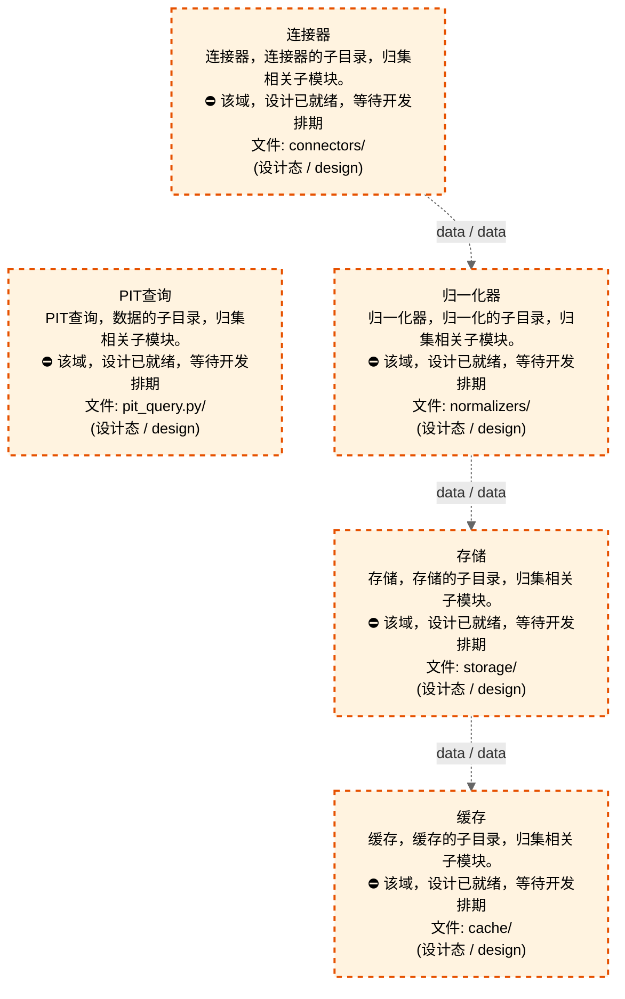
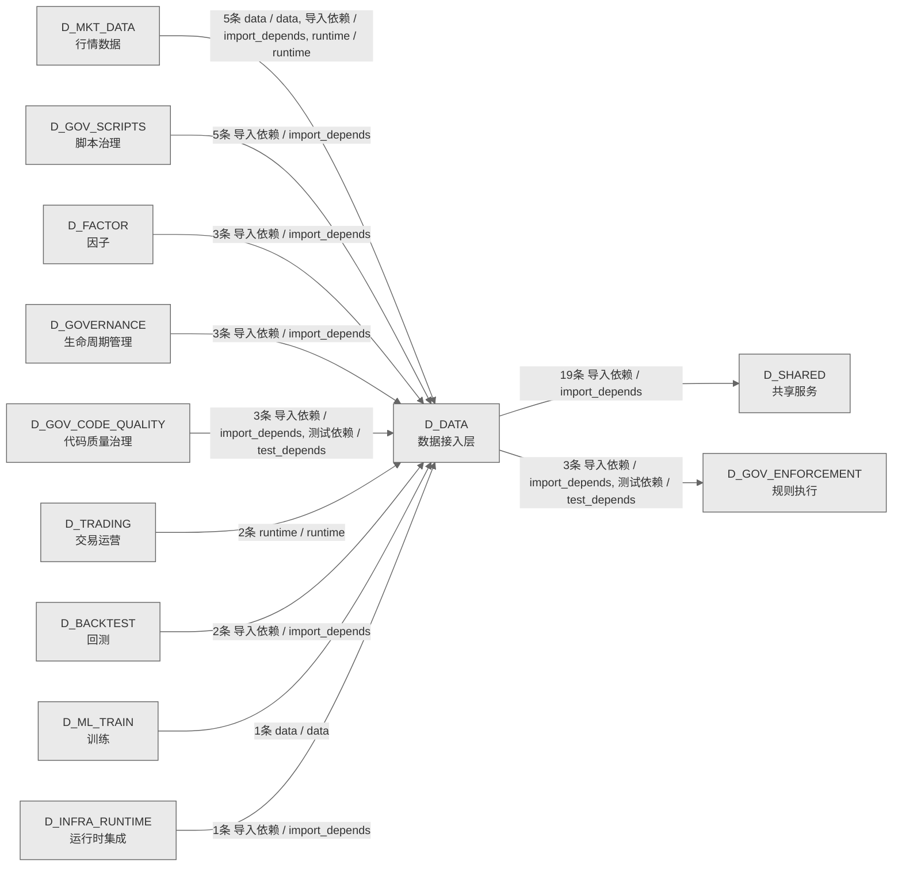

# 11_d_data / 数据接入层域 / Data Access Layer

> **功能简介 / Overview**: 数据接入层，负责数据源接入、数据集成和数据标准化

> **文档作用 / Purpose**: 展示 数据接入层（D_DATA）功能域的域内依赖关系、跨域依赖关系，模块信息（成熟度/中英文名/大白话/文件路径）内嵌于 Mermaid 节点，供架构审查和域治理参考。

> 本文档由 generate_domain_doc.py 从 depgraph (PostgreSQL) 自动生成
> 数据源: depgraph (PostgreSQL) nodes表 + edges表

> **[可缩放 HTML 版 / Zoomable HTML](http://localhost:8765/docs/02_enterprise_architecture/02_domain_architecture_docs/_zoomable_html/11_d_data.html)** — Ctrl+滚轮缩放 ｜ 双击重置 ｜ Ctrl+Shift+D 切换拖动/选择模式

## 域基本信息 / Domain Overview

| 字段 | 值 | Field | Value |
|------|------|-------|-------|
| 编号 | 11 | Number | 11 |
| 域ID | D_DATA | Domain ID | D_DATA |
| 域名称 | 数据接入层 | Domain Name | Data Access Layer |
| 层级 | L1 基础平台层 | Layer | L1 Foundation |
| 模块数 | 167 | Module Count | 167 |
| 域内依赖 | 263 | Internal Dependencies | 263 |
| 跨域入边 | 25 | Cross-domain Incoming | 25 |
| 跨域出边 | 22 | Cross-domain Outgoing | 22 |
| 设计态模块 | 5 | Design Modules | 5 |
| 生产态模块 | 162 | Production Modules | 162 |
| 容量 | 162/150 (超容) | Capacity | 162/150 (超容) |
| 描述 | 数据源集成器 | Description | 数据源集成器 |

## 域内依赖图 / Internal Dependency Diagram

> 依赖图内嵌在本文档中，IDE 可直接渲染；网页版可 Ctrl+滚轮缩放 + 拖动平移查看细节。
>
> **图例说明 / Legend**：
> - 🟦 **蓝色 = 运营态模块**（production，已上线运行）
> - 🟧 **橙色虚线 = 设计态模块**（design，蓝图阶段，代码未写）
> - **实线箭头 = 运营态依赖**（已生效的依赖关系）
> - **虚线箭头 = 非运营态依赖**（计划中/验证中的依赖关系）

### 全景图（全部模块，颜色区分运营态/设计态）

> 展示全部 167 个模块（生产态 162 + 设计态 5），含跨域依赖外部节点。节点含成熟度+名称+大白话/简介+文件路径。

```mermaid
%%{init: {'theme': 'base', 'themeVariables': {'primaryColor': '#eaeaea', 'primaryTextColor': '#333333', 'primaryBorderColor': '#666666', 'lineColor': '#666666', 'secondaryColor': '#eaeaea', 'tertiaryColor': '#eaeaea', 'fontSize': '14px'}}}%%
flowchart TD
    schemas_categories_cross_validation_log_py["跨验证日志<br/>cross_validation_log 表 DDL-as-Code（P1-4<br/>多源交叉校验）。<br/>文件: categories/cross_validation_log.py<br/>(生产态 / production)"]
    schemas_categories_fundamental_balance_sheet_py["fundamental余额sheet<br/>fundamental余额sheet（资产负债表）DDL-as-Code<br/>（category_id: fundamental_balance_sheet, calc_<br/>mode: preload）。<br/>文件: categories/fundamental_balance_sheet.py<br/>(生产态 / production)"]
    schemas_categories_fundamental_disclosure_plan_py["fundamentaldisclosure计划<br/>fundamentaldisclosure计划<br/>（披露计划）DDL-as-Code（category_id:<br/>fundamental_disclosure_plan, calc_mode:<br/>preload）。<br/>文件: categories/fundamental_disclosure_plan.py<br/>(生产态 / production)"]
    schemas_categories_fundamental_equity_pledge_detail_py["fundamentalequitypledge详情<br/>fundamentalequitypledge详情<br/>（股权质押明细）DDL-as-Code（category_id:<br/>fundamental_equity_pledge_detail）。<br/>文件: categories/fundamental_equity_pledge_<br/>detail.py<br/>(生产态 / production)"]
    schemas_categories_fundamental_income_statement_py["fundamentalincome报表<br/>fundamentalincome报表（利润表）DDL-as-Code<br/>（category_id: fundamental_income_statement,<br/>calc_mode: preload）。<br/>文件: categories/fundamental_income_statement.py<br/>(生产态 / production)"]
    schemas_categories_fundamental_industry_class_py["fundamentalindustry类<br/>industry_class 表 DDL-as-Code（category_id:<br/>fundamental_industry_class, calc_mode: lazy）。<br/>文件: categories/fundamental_industry_class.py<br/>(生产态 / production)"]
    schemas_categories_fundamental_industry_class_suppl_py["fundamentalindustry类suppl<br/>fundamentalindustry类suppl<br/>（补充行业分类）DDL-as-Code（category_id:<br/>fundamental_industry_class_suppl）。<br/>文件: categories/fundamental_industry_class_<br/>suppl.py<br/>(生产态 / production)"]
    schemas_categories_fundamental_restricted_shares_py["restrictedshares（限售股明细）DDL-as-Code（cate<br/>restrictedshares（限售股明细）DDL-as-Code<br/>（cate（限售股明细）DDL-as-Code（cate<br/>（限售股明细）DDL-as-Code（category_id:<br/>fundamental_restricted_shares）。<br/>文件: categories/fundamental_restricted_<br/>shares.py<br/>(生产态 / production)"]
    schemas_categories_fundamental_rights_issue_py["rightsissue（分红配股）DDL-as-Code（categoryi<br/>rightsissue（分红配股）DDL-as-Code（categoryi<br/>（分红配股）DDL-as-Code（categoryi<br/>（分红配股）DDL-as-Code（category_id:<br/>fundamental_rights_issue）。<br/>文件: categories/fundamental_rights_issue.py<br/>(生产态 / production)"]
    schemas_categories_fundamental_share_change_py["fundamental股票变更<br/>fundamental股票变更（股本变动）DDL-as-Code<br/>（category_id: fundamental_share_change）。<br/>文件: categories/fundamental_share_change.py<br/>(生产态 / production)"]
    schemas_categories_fundamental_share_unlock_py["fundamental股票unlock<br/>fundamental股票unlock（解除限售）DDL-as-Code<br/>（category_id: fundamental_share_unlock）。<br/>文件: categories/fundamental_share_unlock.py<br/>(生产态 / production)"]
    schemas_categories_macro_edb_data_py["macroedb数据<br/>edb_data 表 DDL-as-Code（category_id: macro_edb_<br/>data, calc_mode: lazy）。<br/>文件: categories/macro_edb_data.py<br/>(生产态 / production)"]
    schemas_categories_macro_macro_data_py["macromacro数据<br/>macro_data 表 DDL-as-Code（category_id: macro_<br/>macro_data, calc_mode: lazy）。<br/>文件: categories/macro_macro_data.py<br/>(生产态 / production)"]
    schemas_categories_market_adj_factor_py["行情adj因子<br/>adj_factor 表 DDL-as-Code（category_id: market_<br/>adj_factor, calc_mode: lazy）。<br/>文件: categories/market_adj_factor.py<br/>(生产态 / production)"]
    schemas_categories_market_auction_py["行情拍卖<br/>auction_snapshot 表 DDL-as-Code（category_id:<br/>market_auction, calc_mode: preload）。<br/>文件: categories/market_auction.py<br/>(生产态 / production)"]
    schemas_categories_market_auction_book_py["行情拍卖book<br/>auction_book 表 DDL-as-Code（category_id:<br/>market_auction_book, calc_mode: preload）。<br/>文件: categories/market_auction_book.py<br/>(生产态 / production)"]
    schemas_categories_market_block_trade_py["行情块交易<br/>block_trade 表 DDL-as-Code（category_id: market_<br/>block_trade, calc_mode: lazy）。<br/>文件: categories/market_block_trade.py<br/>(生产态 / production)"]
    schemas_categories_market_block_trade_detail_py["行情block成交详情<br/>block_trade_detail 表 DDL-as-Code（category_id:<br/>market_block_trade_detail, calc_mode: lazy）。<br/>文件: categories/market_block_trade_detail.py<br/>(生产态 / production)"]
    schemas_categories_market_cb_iv_py["行情cb隐含波动率<br/>convertible_bond_iv 表 DDL-as-Code（category_<br/>id: market_cb_iv, calc_mode: preload）。<br/>文件: categories/market_cb_iv.py<br/>(生产态 / production)"]
    schemas_categories_market_concept_board_py["行情conceptboard<br/>concept_board 表 DDL-as-Code（category_id:<br/>market_concept_board, calc_mode: preload）.<br/>文件: categories/market_concept_board.py<br/>(生产态 / production)"]
    schemas_categories_market_concept_board_constituent_py["行情conceptboardconstituent<br/>concept_board_constituent 表 DDL-as-Code<br/>（category_id: market_concept_board_<br/>constituent, calc_mode: preload）.<br/>文件: categories/market_concept_board_<br/>constituent.py<br/>(生产态 / production)"]
    schemas_categories_market_concept_sector_py["行情conceptsector<br/>concept_sector 表 DDL-as-Code（category_id:<br/>market_concept_sector, calc_mode: preload）.<br/>文件: categories/market_concept_sector.py<br/>(生产态 / production)"]
    schemas_categories_market_convertible_bond_list_py["行情convertiblebondlist<br/>convertible_bond_list 表 DDL-as-Code（category_<br/>id: market_convertible_bond_list, calc_mode:<br/>preload）.<br/>文件: categories/market_convertible_bond_list.py<br/>(生产态 / production)"]
    schemas_categories_market_daily_valuation_py["行情dailyvaluation<br/>daily_valuation 表 DDL-as-Code（category_id:<br/>market_daily_valuation, calc_mode: lazy）。<br/>文件: categories/market_daily_valuation.py<br/>(生产态 / production)"]
    schemas_categories_market_dragon_tiger_py["行情dragontiger<br/>dragon_tiger 表 DDL-as-Code（category_id:<br/>market_dragon_tiger, calc_mode: lazy）。<br/>文件: categories/market_dragon_tiger.py<br/>(生产态 / production)"]
    schemas_categories_market_dragon_tiger_seat_py["行情dragontigerseat<br/>dragon_tiger_seat 表 DDL-as-Code（category_id:<br/>market_dragon_tiger_seat, calc_mode: lazy）。<br/>文件: categories/market_dragon_tiger_seat.py<br/>(生产态 / production)"]
    schemas_categories_market_etf_benchmark_py["行情etf基准<br/>etf_benchmark 表 DDL-as-Code（category_id:<br/>market_etf_benchmark, calc_mode: preload）.<br/>文件: categories/market_etf_benchmark.py<br/>(生产态 / production)"]
    schemas_categories_market_etf_list_py["行情etf列表<br/>etf_list 表 DDL-as-Code（category_id: market_<br/>etf_list, calc_mode: preload）.<br/>文件: categories/market_etf_list.py<br/>(生产态 / production)"]
    schemas_categories_market_etf_nav_py["行情etfnav<br/>etf_nav 表 DDL-as-Code（category_id: market_etf_<br/>nav, calc_mode: lazy）。<br/>文件: categories/market_etf_nav.py<br/>(生产态 / production)"]
    schemas_categories_market_futures_kline_qmt_py["行情futuresklineqmt<br/>futures_kline_qmt 表 DDL-as-Code（category_id:<br/>market_futures_kline_qmt, calc_mode: lazy）。<br/>文件: categories/market_futures_kline_qmt.py<br/>(生产态 / production)"]
    schemas_categories_market_futures_position_py["行情futures持仓<br/>futures_position 表 DDL-as-Code（category_id:<br/>market_futures_position, calc_mode: preload）。<br/>文件: categories/market_futures_position.py<br/>(生产态 / production)"]
    schemas_categories_market_futures_term_py["行情futures期限<br/>futures_term_structure 表 DDL-as-Code（category_<br/>id: market_futures_term, calc_mode: preload）。<br/>文件: categories/market_futures_term.py<br/>(生产态 / production)"]
    schemas_categories_market_hk_connect_flow_py["行情hkconnect流程<br/>hk_connect_flow 表 DDL-as-Code（category_id:<br/>market_hk_connect_flow, calc_mode: lazy）。<br/>文件: categories/market_hk_connect_flow.py<br/>(生产态 / production)"]
    schemas_categories_market_hk_kline_py["行情hkkline<br/>hk_kline 表 DDL-as-Code（category_id: market_hk_<br/>kline, calc_mode: lazy）。<br/>文件: categories/market_hk_kline.py<br/>(生产态 / production)"]
    schemas_categories_market_hk_stock_list_py["行情hk股票列表<br/>hk_stock_list 表 DDL-as-Code（category_id:<br/>market_hk_stock_list, calc_mode: preload）.<br/>文件: categories/market_hk_stock_list.py<br/>(生产态 / production)"]
    schemas_categories_market_hk_trade_calendar_py["行情hk成交日历<br/>hk_trade_calendar 表 DDL-as-Code（category_id:<br/>market_hk_trade_calendar, calc_mode: preload）.<br/>文件: categories/market_hk_trade_calendar.py<br/>(生产态 / production)"]
    schemas_categories_market_index_py["行情索引<br/>index_quote 表 DDL-as-Code（category_id: market_<br/>index_quote, calc_mode: replay）。<br/>文件: categories/market_index.py<br/>(生产态 / production)"]
    schemas_categories_market_index_constituent_py["行情索引constituent<br/>index_constituent 表 DDL-as-Code（category_id:<br/>market_index_constituent, calc_mode: preload）.<br/>文件: categories/market_index_constituent.py<br/>(生产态 / production)"]
    schemas_categories_market_index_list_py["行情索引列表<br/>index_list 表 DDL-as-Code（category_id: market_<br/>index_list, calc_mode: preload）.<br/>文件: categories/market_index_list.py<br/>(生产态 / production)"]
    schemas_categories_market_index_meta_py["行情索引元<br/>market_index_meta 表 DDL-as-Code（category_id:<br/>market_index_meta, calc_mode: lazy）。<br/>文件: categories/market_index_meta.py<br/>(生产态 / production)"]
    schemas_categories_market_index_weight_py["行情索引weight<br/>index_weight 表 DDL-as-Code（category_id:<br/>market_index_weight, calc_mode: none）。<br/>文件: categories/market_index_weight.py<br/>(生产态 / production)"]
    schemas_categories_market_kline_15min_py["行情kline15min<br/>kline_15min 表 DDL-as-Code（category_id: market_<br/>kline_15min, calc_mode: lazy）。<br/>文件: categories/market_kline_15min.py<br/>(生产态 / production)"]
    schemas_categories_market_kline_1min_py["行情kline1min<br/>kline_1min 表 DDL-as-Code（category_id: market_<br/>kline_1min, calc_mode: lazy）。<br/>文件: categories/market_kline_1min.py<br/>(生产态 / production)"]
    schemas_categories_market_kline_30min_py["行情kline30min<br/>kline_30min 表 DDL-as-Code（category_id: market_<br/>kline_30min, calc_mode: lazy）。<br/>文件: categories/market_kline_30min.py<br/>(生产态 / production)"]
    schemas_categories_market_kline_5min_py["行情kline5min<br/>kline_5min 表 DDL-as-Code（category_id: market_<br/>kline_5min, calc_mode: lazy）。<br/>文件: categories/market_kline_5min.py<br/>(生产态 / production)"]
    schemas_categories_market_kline_60min_py["行情kline60min<br/>kline_60min 表 DDL-as-Code（category_id: market_<br/>kline_60min, calc_mode: lazy）。<br/>文件: categories/market_kline_60min.py<br/>(生产态 / production)"]
    schemas_categories_market_kline_cb_py["行情klinecb<br/>kline_cb 表 DDL-as-Code（category_id: market_<br/>kline_cb, calc_mode: lazy）。<br/>文件: categories/market_kline_cb.py<br/>(生产态 / production)"]
    schemas_categories_market_kline_daily_py["行情klinedaily<br/>kline_daily 表 DDL-as-Code（category_id: market_<br/>kline_daily, calc_mode: preload）。<br/>文件: categories/market_kline_daily.py<br/>(生产态 / production)"]
    schemas_categories_market_kline_daily_hfq_py["行情klinedailyhfq<br/>kline_daily_hfq 表 DDL-as-Code（category_id:<br/>market_kline_daily_hfq, calc_mode: lazy）。<br/>文件: categories/market_kline_daily_hfq.py<br/>(生产态 / production)"]
    schemas_categories_market_kline_etf_15min_py["行情klineetf15min<br/>kline_etf_15min 表 DDL-as-Code（category_id:<br/>market_kline_etf_15min, calc_mode: lazy）。<br/>文件: categories/market_kline_etf_15min.py<br/>(生产态 / production)"]
    schemas_categories_market_kline_etf_1min_py["行情klineetf1min<br/>kline_etf_1min 表 DDL-as-Code（category_id:<br/>market_kline_etf_1min, calc_mode: lazy）。<br/>文件: categories/market_kline_etf_1min.py<br/>(生产态 / production)"]
    schemas_categories_market_kline_etf_30min_py["行情klineetf30min<br/>kline_etf_30min 表 DDL-as-Code（category_id:<br/>market_kline_etf_30min, calc_mode: lazy）。<br/>文件: categories/market_kline_etf_30min.py<br/>(生产态 / production)"]
    schemas_categories_market_kline_etf_5min_py["行情klineetf5min<br/>kline_etf_5min 表 DDL-as-Code（category_id:<br/>market_kline_etf_5min, calc_mode: lazy）。<br/>文件: categories/market_kline_etf_5min.py<br/>(生产态 / production)"]
    schemas_categories_market_kline_etf_60min_py["行情klineetf60min<br/>kline_etf_60min 表 DDL-as-Code（category_id:<br/>market_kline_etf_60min, calc_mode: lazy）。<br/>文件: categories/market_kline_etf_60min.py<br/>(生产态 / production)"]
    schemas_categories_market_kline_futures_py["行情klinefutures<br/>kline_futures 表 DDL-as-Code（category_id:<br/>market_kline_futures, calc_mode: lazy）。<br/>文件: categories/market_kline_futures.py<br/>(生产态 / production)"]
    schemas_categories_market_kline_hk_daily_py["行情klinehkdaily<br/>kline_hk_daily 表 DDL-as-Code（category_id:<br/>market_kline_hk_daily, calc_mode: lazy）。<br/>文件: categories/market_kline_hk_daily.py<br/>(生产态 / production)"]
    schemas_categories_market_kline_index_py["行情kline索引<br/>kline_index 表 DDL-as-Code（category_id: market_<br/>kline_index, calc_mode: lazy）。<br/>文件: categories/market_kline_index.py<br/>(生产态 / production)"]
    schemas_categories_market_kline_lof_15min_py["行情klinelof15min<br/>kline_lof_15min 表 DDL-as-Code（category_id:<br/>market_kline_lof_15min, calc_mode: lazy）。<br/>文件: categories/market_kline_lof_15min.py<br/>(生产态 / production)"]
    schemas_categories_market_kline_lof_1min_py["行情klinelof1min<br/>kline_lof_1min 表 DDL-as-Code（category_id:<br/>market_kline_lof_1min, calc_mode: lazy）。<br/>文件: categories/market_kline_lof_1min.py<br/>(生产态 / production)"]
    schemas_categories_market_kline_lof_30min_py["行情klinelof30min<br/>kline_lof_30min 表 DDL-as-Code（category_id:<br/>market_kline_lof_30min, calc_mode: lazy）。<br/>文件: categories/market_kline_lof_30min.py<br/>(生产态 / production)"]
    schemas_categories_market_kline_lof_5min_py["行情klinelof5min<br/>kline_lof_5min 表 DDL-as-Code（category_id:<br/>market_kline_lof_5min, calc_mode: lazy）。<br/>文件: categories/market_kline_lof_5min.py<br/>(生产态 / production)"]
    schemas_categories_market_kline_lof_60min_py["行情klinelof60min<br/>kline_lof_60min 表 DDL-as-Code（category_id:<br/>market_kline_lof_60min, calc_mode: lazy）。<br/>文件: categories/market_kline_lof_60min.py<br/>(生产态 / production)"]
    schemas_categories_market_kline_monthly_py["行情klinemonthly<br/>kline_monthly 表 DDL-as-Code（category_id:<br/>market_kline_monthly, calc_mode: lazy）。<br/>文件: categories/market_kline_monthly.py<br/>(生产态 / production)"]
    schemas_categories_market_kline_monthly_hfq_py["行情klinemonthlyhfq<br/>kline_monthly_hfq 表 DDL-as-Code（category_id:<br/>market_kline_monthly_hfq, calc_mode: lazy）。<br/>文件: categories/market_kline_monthly_hfq.py<br/>(生产态 / production)"]
    schemas_categories_market_kline_sector_py["行情klinesector<br/>kline_sector 表 DDL-as-Code（category_id:<br/>market_kline_sector, calc_mode: lazy）。<br/>文件: categories/market_kline_sector.py<br/>(生产态 / production)"]
    schemas_categories_market_kline_sector_880_py["行情klinesector880<br/>kline_sector_880 表 DDL-as-Code（category_id:<br/>market_kline_sector_880, calc_mode: lazy）。<br/>文件: categories/market_kline_sector_880.py<br/>(生产态 / production)"]
    schemas_categories_market_kline_sector_intraday_py["行情klinesectorintraday<br/>kline_sector_intraday 表 DDL-as-Code（category_<br/>id: market_kline_sector_intraday, calc_mode:<br/>lazy）。<br/>文件: categories/market_kline_sector_intraday.py<br/>(生产态 / production)"]
    schemas_categories_market_kline_us_daily_py["行情klineusdaily<br/>kline_us_daily 表 DDL-as-Code（category_id:<br/>market_kline_us_daily, calc_mode: lazy）。<br/>文件: categories/market_kline_us_daily.py<br/>(生产态 / production)"]
    schemas_categories_market_kline_weekly_py["行情klineweekly<br/>kline_weekly 表 DDL-as-Code（category_id:<br/>market_kline_weekly, calc_mode: lazy）。<br/>文件: categories/market_kline_weekly.py<br/>(生产态 / production)"]
    schemas_categories_market_kline_weekly_hfq_py["行情klineweeklyhfq<br/>kline_weekly_hfq 表 DDL-as-Code（category_id:<br/>market_kline_weekly_hfq, calc_mode: lazy）。<br/>文件: categories/market_kline_weekly_hfq.py<br/>(生产态 / production)"]
    schemas_categories_market_l2_tick_py["行情l2逐笔<br/>l2_tick 表 DDL-as-Code（category_id: market_l2_<br/>tick, calc_mode: replay）。<br/>文件: categories/market_l2_tick.py<br/>(生产态 / production)"]
    schemas_categories_market_limit_up_down_py["行情限制上下<br/>limit_up_down 表 DDL-as-Code（category_id:<br/>market_limit_up_down, calc_mode: lazy）。<br/>文件: categories/market_limit_up_down.py<br/>(生产态 / production)"]
    schemas_categories_market_lof_list_py["行情lof列表<br/>lof_list 表 DDL-as-Code（category_id: market_<br/>lof_list, calc_mode: preload）.<br/>文件: categories/market_lof_list.py<br/>(生产态 / production)"]
    schemas_categories_market_margin_trading_py["行情保证金交易<br/>margin_trading 表 DDL-as-Code（category_id:<br/>market_margin_trading, calc_mode: lazy）。<br/>文件: categories/market_margin_trading.py<br/>(生产态 / production)"]
    schemas_categories_market_money_flow_py["行情money流程<br/>money_flow 表 DDL-as-Code（category_id: market_<br/>money_flow, calc_mode: lazy）。<br/>文件: categories/market_money_flow.py<br/>(生产态 / production)"]
    schemas_categories_market_option_greeks_py["行情选项greeks<br/>option_greeks 表 DDL-as-Code（category_id:<br/>market_option_greeks, calc_mode: lazy）。<br/>文件: categories/market_option_greeks.py<br/>(生产态 / production)"]
    schemas_categories_market_option_iv_py["行情选项隐含波动率<br/>option_iv_surface 表 DDL-as-Code（category_id:<br/>market_option_iv, calc_mode: preload）。<br/>文件: categories/market_option_iv.py<br/>(生产态 / production)"]
    schemas_categories_market_option_kline_py["行情选项kline<br/>option_kline 表 DDL-as-Code（category_id:<br/>market_option_kline, calc_mode: lazy）。<br/>文件: categories/market_option_kline.py<br/>(生产态 / production)"]
    schemas_categories_market_realtime_snapshot_py["行情实时快照<br/>realtime_snapshot 表 DDL-as-Code（category_id:<br/>market_realtime_snapshot, calc_mode: lazy）。<br/>文件: categories/market_realtime_snapshot.py<br/>(生产态 / production)"]
    schemas_categories_market_sector_constituent_py["行情sectorconstituent<br/>sector_constituent 表 DDL-as-Code（category_id:<br/>market_sector_constituent, calc_mode: preload）.<br/>文件: categories/market_sector_constituent.py<br/>(生产态 / production)"]
    schemas_categories_market_sector_list_py["行情板块列表<br/>sector_list 表 DDL-as-Code（category_id: market_<br/>sector_list, calc_mode: none）。<br/>文件: categories/market_sector_list.py<br/>(生产态 / production)"]
    schemas_categories_market_sector_meta_py["行情板块元<br/>sector_meta 表 DDL-as-Code（category_id: market_<br/>sector_meta, calc_mode: none）。<br/>文件: categories/market_sector_meta.py<br/>(生产态 / production)"]
    schemas_categories_market_sector_snapshot_py["行情板块快照<br/>sector_snapshot 表 DDL-as-Code（category_id:<br/>market_sector_snapshot, calc_mode: streaming）。<br/>文件: categories/market_sector_snapshot.py<br/>(生产态 / production)"]
    schemas_categories_market_st_stock_list_py["行情st股票列表<br/>st_stock_list 表 DDL-as-Code（category_id:<br/>market_st_stock_list, calc_mode: preload）.<br/>文件: categories/market_st_stock_list.py<br/>(生产态 / production)"]
    schemas_categories_market_stock_indicator_py["行情股票指标<br/>stock_indicator 表 DDL-as-Code（category_id:<br/>market_stock_indicator, calc_mode: lazy）。<br/>文件: categories/market_stock_indicator.py<br/>(生产态 / production)"]
    schemas_categories_market_stock_list_py["行情股票列表<br/>stock_list 表 DDL-as-Code（category_id: market_<br/>stock_list, calc_mode: preload）。<br/>文件: categories/market_stock_list.py<br/>(生产态 / production)"]
    schemas_categories_market_tick_py["行情逐笔<br/>tick_data 表 DDL-as-Code（category_id: market_<br/>tick, calc_mode: replay）。<br/>文件: categories/market_tick.py<br/>(生产态 / production)"]
    schemas_categories_market_trade_calendar_py["行情成交日历<br/>trade_calendar 表 DDL-as-Code（category_id:<br/>market_trade_calendar, calc_mode: preload）.<br/>文件: categories/market_trade_calendar.py<br/>(生产态 / production)"]
    schemas_categories_market_us_index_py["行情us索引<br/>us_index 表 DDL-as-Code（category_id: market_us_<br/>index, calc_mode: lazy）。<br/>文件: categories/market_us_index.py<br/>(生产态 / production)"]
    scripts_ch_data_inventory_py["全库数据盘点：逐表审计行数/日期范围/空表<br/>/缺失日期/引擎/大小。<br/>_data_inventory<br/>文件: ch/_data_inventory.py<br/>(生产态 / production)"]
    scripts_ch_recovery_drill_py["恢复演练：轮询备份完成 → 恢复小表到临时库 →<br/>行数校验 → 清理。<br/>_recovery_drill<br/>文件: ch/_recovery_drill.py<br/>(生产态 / production)"]
    scripts_ch_apply_fundamental_tables_ddl_py["应用fundamentaltablesddl<br/>ClickHouse c3_fundamental 财务三表 DDL 部署 +<br/>精度验证脚本（audit 1.2 治本）。<br/>apply_fundamental_tables_ddl<br/>文件: ch/apply_fundamental_tables_ddl.py<br/>(生产态 / production)"]
    scripts_ch_apply_market_tables_ddl_py["apply行情tablesddl<br/>ClickHouse c1_market 建表 DDL 部署 +<br/>引擎验证脚本（Phase F）。<br/>apply_market_tables_ddl<br/>文件: ch/apply_market_tables_ddl.py<br/>(生产态 / production)"]
    scripts_ch_apply_rbac_py["应用rbac<br/>ClickHouse RBAC 账号分级部署 + 验证脚本（audit<br/>9.4 治本 #ARCH-CH-027）。<br/>apply_rbac<br/>文件: ch/apply_rbac.py<br/>(生产态 / production)"]
    scripts_ch_apply_timezone_migration_py["应用timezone迁移<br/>ClickHouse 时区防线迁移脚本（audit A组 Schema<br/>治理 - 时区防线，#ARCH-CH-022）。<br/>apply_timezone_migration<br/>文件: ch/apply_timezone_migration.py<br/>(生产态 / production)"]
    scripts_ch_lint_symbol_convention_py["Symbol 约定 lint 门禁（TRAE-082 GATE-SYMBOL-C<br/>Symbol 约定 lint 门禁（TRAE-082<br/>GATE-SYMBOL-CONVENTION）。<br/>lint_symbol_convention<br/>文件: ch/lint_symbol_convention.py<br/>(生产态 / production)"]
    scripts_ch_verify_exchange_coverage_py["verify交易所coverage<br/>exchange+symbol_canonical 数据覆盖率校验器<br/>（TRAE-082 1.1.0 阶段2 配套）。<br/>verify_exchange_coverage<br/>文件: ch/verify_exchange_coverage.py<br/>(生产态 / production)"]
    scripts_ch_verify_schema_truth_py["verify结构truth<br/>DDL-as-Code 真源 vs ClickHouse 实际表结构<br/>漂移校验器（治本工具）。<br/>verify_schema_truth<br/>文件: ch/verify_schema_truth.py<br/>(生产态 / production)"]
    scripts_ops_verify_alert_channels_py["告警通道端到端验证<br/>（B2，#ARCH-CH-023，2026-07-25）。<br/>verify_alert_channels<br/>文件: ops/verify_alert_channels.py<br/>(生产态 / production)"]
    scripts_register_aux_tasks_ps1["注册aux任务<br/>注册aux任务，register_aux_<br/>tasks.ps1的注册表，登记和查询已注册的条目。<br/>文件: scripts/register_aux_tasks.ps1<br/>(生产态 / production)"]
    scripts_register_guard_tasks_ps1["注册守卫任务<br/>注册守卫任务，守卫的注册表，登记和查询已注册的条<br/>目。<br/>register_guard_tasks<br/>文件: scripts/register_guard_tasks.ps1<br/>(生产态 / production)"]
    scripts_start_scheduler_ps1["启动调度器<br/>启动调度器，调度器的调度器，按时间或优先级安排任<br/>务执行。<br/>start_scheduler<br/>文件: scripts/start_scheduler.ps1<br/>(生产态 / production)"]
    scripts_start_tick_subscriber_ps1["启动逐笔订阅器<br/>启动逐笔订阅器，start_tick_<br/>subscriber.ps1的订阅器，订阅接收数据。<br/>文件: scripts/start_tick_subscriber.ps1<br/>(生产态 / production)"]
    src_zephyr_data_main_py["主入口<br/>主入口.data — 数据源集成器 CLI 入口。<br/>__main__<br/>文件: data/__main__.py<br/>(生产态 / production)"]
    src_zephyr_data_config_policies_yaml["策略<br/>策略（policies.yaml）<br/>文件: config/policies.yaml<br/>(生产态 / production)"]
    src_zephyr_data_config_schedule_yaml["调度计划<br/>调度计划，机器学习的调度器，按时间或优先级安排任<br/>务执行。<br/>schedule<br/>文件: config/schedule.yaml<br/>(生产态 / production)"]
    src_zephyr_data_config_tasks_yaml["任务<br/>任务（tasks.yaml）<br/>文件: config/tasks.yaml<br/>(生产态 / production)"]
    src_zephyr_data_connectors["连接器<br/>连接器，连接器的子目录，归集相关子模块。<br/>⛔ 该域，设计已就绪，等待开发排期<br/>文件: connectors/<br/>(设计态 / design)"]
    src_zephyr_data_implementations_init_py["包入口<br/>数据源 Provider 实现集合（MOD-L00-004 §4.3）。<br/>__init__<br/>文件: implementations/__init__.py<br/>(生产态 / production)"]
    src_zephyr_data_kline_resampler_py["880xxx 板块K线合成器——从 1m/5m 合成 15m/30m/60m<br/>写<br/>880xxx 板块K线合成器——从 1m/5m 合成 15m/30m/60m<br/>写入 ClickHouse。<br/>kline_resampler<br/>文件: data/kline_resampler.py<br/>(生产态 / production)"]
    src_zephyr_data_pit_query_py_1["PIT查询<br/>PIT查询，数据的子目录，归集相关子模块。<br/>⛔ 该域，设计已就绪，等待开发排期<br/>文件: pit_query.py/<br/>(设计态 / design)"]
    src_zephyr_data_redundant_source_init_py["数据源冗余与热切换模块（MOD-L00-005）。<br/>__init__<br/>文件: redundant_source/__init__.py<br/>(生产态 / production)"]
    src_zephyr_data_satellite_geospatial_engine_init_py["包入口<br/>包入口。D_DATA Data Source<br/>文件: satellite_geospatial_engine/__init__.py<br/>(生产态 / production)"]
    src_zephyr_data_sector_kline_downloader_py["板块klinedownloader<br/>880xxx 板块指数K线下载器——盘后从 tqcenter<br/>下载日K/分钟K写入 ClickHouse。<br/>sector_kline_downloader<br/>文件: data/sector_kline_downloader.py<br/>(生产态 / production)"]
    src_zephyr_data_sector_snapshot_collector_py["板块快照收集器<br/>880xxx 板块实时快照采集器（tqcenter →<br/>ClickHouse sector_snapshot 表）。<br/>sector_snapshot_collector<br/>文件: data/sector_snapshot_collector.py<br/>(生产态 / production)"]
    src_zephyr_data_symbol_normalizer_init_py["包入口<br/>Symbol 标准化模块——TRAE-082 symbol<br/>约定铁律的实现真源。<br/>__init__<br/>文件: symbol_normalizer/__init__.py<br/>(生产态 / production)"]
    src_zephyr_data_wal_codec_init_py["WAL 段编解码模块（MOD-L00-006）。<br/>__init__<br/>文件: wal_codec/__init__.py<br/>(生产态 / production)"]
    tests_data_test_market_quality_validator_py["#ARCH-CH-021 P0-4:<br/>写入路径异常值校验器四门禁测试。<br/>test_market_quality_validator<br/>文件: data/test_market_quality_validator.py<br/>(生产态 / production)"]
    tests_data_test_pit_query_py["#ARCH-CH-021 P0-5: 财报 PIT 查询能力测试。<br/>test_pit_query<br/>文件: data/test_pit_query.py<br/>(生产态 / production)"]
    tests_zephyr_data_test_cross_source_validator_py["测试跨源校验器<br/>cross_source_validator 单元测试（P1-4<br/>多源交叉校验）。<br/>test_cross_source_validator<br/>文件: data/test_cross_source_validator.py<br/>(生产态 / production)"]
    tests_zephyr_data_test_tick_subscriber_py["测试逐笔订阅器<br/>tick_subscriber 单元测试（含 Phase C: WalWriter<br/>+ 批量出队 + 无锁计数）。<br/>test_tick_subscriber<br/>文件: data/test_tick_subscriber.py<br/>(生产态 / production)"]
    schemas_categories_cross_validation_log_py ~~~ schemas_categories_fundamental_balance_sheet_py
    schemas_categories_fundamental_balance_sheet_py ~~~ schemas_categories_fundamental_disclosure_plan_py
    schemas_categories_fundamental_disclosure_plan_py ~~~ schemas_categories_fundamental_equity_pledge_detail_py
    schemas_categories_fundamental_equity_pledge_detail_py ~~~ schemas_categories_fundamental_income_statement_py
    schemas_categories_fundamental_income_statement_py ~~~ schemas_categories_fundamental_industry_class_py
    schemas_categories_fundamental_industry_class_py ~~~ schemas_categories_fundamental_industry_class_suppl_py
    schemas_categories_fundamental_industry_class_suppl_py ~~~ schemas_categories_fundamental_restricted_shares_py
    schemas_categories_fundamental_restricted_shares_py ~~~ schemas_categories_fundamental_rights_issue_py
    schemas_categories_fundamental_rights_issue_py ~~~ schemas_categories_fundamental_share_change_py
    schemas_categories_fundamental_share_change_py ~~~ schemas_categories_fundamental_share_unlock_py
    schemas_categories_fundamental_share_unlock_py ~~~ schemas_categories_macro_edb_data_py
    schemas_categories_macro_edb_data_py ~~~ schemas_categories_macro_macro_data_py
    schemas_categories_macro_macro_data_py ~~~ schemas_categories_market_adj_factor_py
    schemas_categories_market_adj_factor_py ~~~ schemas_categories_market_auction_py
    schemas_categories_market_auction_py ~~~ schemas_categories_market_auction_book_py
    schemas_categories_market_auction_book_py ~~~ schemas_categories_market_block_trade_py
    schemas_categories_market_block_trade_py ~~~ schemas_categories_market_block_trade_detail_py
    schemas_categories_market_block_trade_detail_py ~~~ schemas_categories_market_cb_iv_py
    schemas_categories_market_cb_iv_py ~~~ schemas_categories_market_concept_board_py
    schemas_categories_market_concept_board_py ~~~ schemas_categories_market_concept_board_constituent_py
    schemas_categories_market_concept_board_constituent_py ~~~ schemas_categories_market_concept_sector_py
    schemas_categories_market_concept_sector_py ~~~ schemas_categories_market_convertible_bond_list_py
    schemas_categories_market_convertible_bond_list_py ~~~ schemas_categories_market_daily_valuation_py
    schemas_categories_market_daily_valuation_py ~~~ schemas_categories_market_dragon_tiger_py
    schemas_categories_market_dragon_tiger_py ~~~ schemas_categories_market_dragon_tiger_seat_py
    schemas_categories_market_dragon_tiger_seat_py ~~~ schemas_categories_market_etf_benchmark_py
    schemas_categories_market_etf_benchmark_py ~~~ schemas_categories_market_etf_list_py
    schemas_categories_market_etf_list_py ~~~ schemas_categories_market_etf_nav_py
    schemas_categories_market_etf_nav_py ~~~ schemas_categories_market_futures_kline_qmt_py
    schemas_categories_market_futures_kline_qmt_py ~~~ schemas_categories_market_futures_position_py
    schemas_categories_market_futures_position_py ~~~ schemas_categories_market_futures_term_py
    schemas_categories_market_futures_term_py ~~~ schemas_categories_market_hk_connect_flow_py
    schemas_categories_market_hk_connect_flow_py ~~~ schemas_categories_market_hk_kline_py
    schemas_categories_market_hk_kline_py ~~~ schemas_categories_market_hk_stock_list_py
    schemas_categories_market_hk_stock_list_py ~~~ schemas_categories_market_hk_trade_calendar_py
    schemas_categories_market_hk_trade_calendar_py ~~~ schemas_categories_market_index_py
    schemas_categories_market_index_py ~~~ schemas_categories_market_index_constituent_py
    schemas_categories_market_index_constituent_py ~~~ schemas_categories_market_index_list_py
    schemas_categories_market_index_list_py ~~~ schemas_categories_market_index_meta_py
    schemas_categories_market_index_meta_py ~~~ schemas_categories_market_index_weight_py
    schemas_categories_market_index_weight_py ~~~ schemas_categories_market_kline_15min_py
    schemas_categories_market_kline_15min_py ~~~ schemas_categories_market_kline_1min_py
    schemas_categories_market_kline_1min_py ~~~ schemas_categories_market_kline_30min_py
    schemas_categories_market_kline_30min_py ~~~ schemas_categories_market_kline_5min_py
    schemas_categories_market_kline_5min_py ~~~ schemas_categories_market_kline_60min_py
    schemas_categories_market_kline_60min_py ~~~ schemas_categories_market_kline_cb_py
    schemas_categories_market_kline_cb_py ~~~ schemas_categories_market_kline_daily_py
    schemas_categories_market_kline_daily_py ~~~ schemas_categories_market_kline_daily_hfq_py
    schemas_categories_market_kline_daily_hfq_py ~~~ schemas_categories_market_kline_etf_15min_py
    schemas_categories_market_kline_etf_15min_py ~~~ schemas_categories_market_kline_etf_1min_py
    schemas_categories_market_kline_etf_1min_py ~~~ schemas_categories_market_kline_etf_30min_py
    schemas_categories_market_kline_etf_30min_py ~~~ schemas_categories_market_kline_etf_5min_py
    schemas_categories_market_kline_etf_5min_py ~~~ schemas_categories_market_kline_etf_60min_py
    schemas_categories_market_kline_etf_60min_py ~~~ schemas_categories_market_kline_futures_py
    schemas_categories_market_kline_futures_py ~~~ schemas_categories_market_kline_hk_daily_py
    schemas_categories_market_kline_hk_daily_py ~~~ schemas_categories_market_kline_index_py
    schemas_categories_market_kline_index_py ~~~ schemas_categories_market_kline_lof_15min_py
    schemas_categories_market_kline_lof_15min_py ~~~ schemas_categories_market_kline_lof_1min_py
    schemas_categories_market_kline_lof_1min_py ~~~ schemas_categories_market_kline_lof_30min_py
    schemas_categories_market_kline_lof_30min_py ~~~ schemas_categories_market_kline_lof_5min_py
    schemas_categories_market_kline_lof_5min_py ~~~ schemas_categories_market_kline_lof_60min_py
    schemas_categories_market_kline_lof_60min_py ~~~ schemas_categories_market_kline_monthly_py
    schemas_categories_market_kline_monthly_py ~~~ schemas_categories_market_kline_monthly_hfq_py
    schemas_categories_market_kline_monthly_hfq_py ~~~ schemas_categories_market_kline_sector_py
    schemas_categories_market_kline_sector_py ~~~ schemas_categories_market_kline_sector_880_py
    schemas_categories_market_kline_sector_880_py ~~~ schemas_categories_market_kline_sector_intraday_py
    schemas_categories_market_kline_sector_intraday_py ~~~ schemas_categories_market_kline_us_daily_py
    schemas_categories_market_kline_us_daily_py ~~~ schemas_categories_market_kline_weekly_py
    schemas_categories_market_kline_weekly_py ~~~ schemas_categories_market_kline_weekly_hfq_py
    schemas_categories_market_kline_weekly_hfq_py ~~~ schemas_categories_market_l2_tick_py
    schemas_categories_market_l2_tick_py ~~~ schemas_categories_market_limit_up_down_py
    schemas_categories_market_limit_up_down_py ~~~ schemas_categories_market_lof_list_py
    schemas_categories_market_lof_list_py ~~~ schemas_categories_market_margin_trading_py
    schemas_categories_market_margin_trading_py ~~~ schemas_categories_market_money_flow_py
    schemas_categories_market_money_flow_py ~~~ schemas_categories_market_option_greeks_py
    schemas_categories_market_option_greeks_py ~~~ schemas_categories_market_option_iv_py
    schemas_categories_market_option_iv_py ~~~ schemas_categories_market_option_kline_py
    schemas_categories_market_option_kline_py ~~~ schemas_categories_market_realtime_snapshot_py
    schemas_categories_market_realtime_snapshot_py ~~~ schemas_categories_market_sector_constituent_py
    schemas_categories_market_sector_constituent_py ~~~ schemas_categories_market_sector_list_py
    schemas_categories_market_sector_list_py ~~~ schemas_categories_market_sector_meta_py
    schemas_categories_market_sector_meta_py ~~~ schemas_categories_market_sector_snapshot_py
    schemas_categories_market_sector_snapshot_py ~~~ schemas_categories_market_st_stock_list_py
    schemas_categories_market_st_stock_list_py ~~~ schemas_categories_market_stock_indicator_py
    schemas_categories_market_stock_indicator_py ~~~ schemas_categories_market_stock_list_py
    schemas_categories_market_stock_list_py ~~~ schemas_categories_market_tick_py
    schemas_categories_market_tick_py ~~~ schemas_categories_market_trade_calendar_py
    schemas_categories_market_trade_calendar_py ~~~ schemas_categories_market_us_index_py
    schemas_categories_market_us_index_py ~~~ scripts_ch_data_inventory_py
    scripts_ch_data_inventory_py ~~~ scripts_ch_recovery_drill_py
    scripts_ch_recovery_drill_py ~~~ scripts_ch_apply_fundamental_tables_ddl_py
    scripts_ch_apply_fundamental_tables_ddl_py ~~~ scripts_ch_apply_market_tables_ddl_py
    scripts_ch_apply_market_tables_ddl_py ~~~ scripts_ch_apply_rbac_py
    scripts_ch_apply_rbac_py ~~~ scripts_ch_apply_timezone_migration_py
    scripts_ch_apply_timezone_migration_py ~~~ scripts_ch_lint_symbol_convention_py
    scripts_ch_lint_symbol_convention_py ~~~ scripts_ch_verify_exchange_coverage_py
    scripts_ch_verify_exchange_coverage_py ~~~ scripts_ch_verify_schema_truth_py
    scripts_ch_verify_schema_truth_py ~~~ scripts_ops_verify_alert_channels_py
    scripts_ops_verify_alert_channels_py ~~~ scripts_register_aux_tasks_ps1
    scripts_register_aux_tasks_ps1 ~~~ scripts_register_guard_tasks_ps1
    scripts_register_guard_tasks_ps1 ~~~ scripts_start_scheduler_ps1
    scripts_start_scheduler_ps1 ~~~ scripts_start_tick_subscriber_ps1
    scripts_start_tick_subscriber_ps1 ~~~ src_zephyr_data_main_py
    src_zephyr_data_main_py ~~~ src_zephyr_data_config_policies_yaml
    src_zephyr_data_config_policies_yaml ~~~ src_zephyr_data_config_schedule_yaml
    src_zephyr_data_config_schedule_yaml ~~~ src_zephyr_data_config_tasks_yaml
    src_zephyr_data_config_tasks_yaml ~~~ src_zephyr_data_connectors
    src_zephyr_data_connectors ~~~ src_zephyr_data_implementations_init_py
    src_zephyr_data_implementations_init_py ~~~ src_zephyr_data_kline_resampler_py
    src_zephyr_data_kline_resampler_py ~~~ src_zephyr_data_pit_query_py_1
    src_zephyr_data_pit_query_py_1 ~~~ src_zephyr_data_redundant_source_init_py
    src_zephyr_data_redundant_source_init_py ~~~ src_zephyr_data_satellite_geospatial_engine_init_py
    src_zephyr_data_satellite_geospatial_engine_init_py ~~~ src_zephyr_data_sector_kline_downloader_py
    src_zephyr_data_sector_kline_downloader_py ~~~ src_zephyr_data_sector_snapshot_collector_py
    src_zephyr_data_sector_snapshot_collector_py ~~~ src_zephyr_data_symbol_normalizer_init_py
    src_zephyr_data_symbol_normalizer_init_py ~~~ src_zephyr_data_wal_codec_init_py
    src_zephyr_data_wal_codec_init_py ~~~ tests_data_test_market_quality_validator_py
    tests_data_test_market_quality_validator_py ~~~ tests_data_test_pit_query_py
    tests_data_test_pit_query_py ~~~ tests_zephyr_data_test_cross_source_validator_py
    tests_zephyr_data_test_cross_source_validator_py ~~~ tests_zephyr_data_test_tick_subscriber_py
    schemas_categories_fundamental_cashflow_statement_py["fundamentalcashflow报表<br/>fundamentalcashflow报表<br/>（现金流量表）DDL-as-Code（category_id:<br/>fundamental_cashflow_statement, calc_mode:<br/>preload）。<br/>文件: categories/fundamental_cashflow_<br/>statement.py<br/>(生产态 / production)"]
    scripts_ch_apply_exchange_columns_py["apply交易所columns<br/>ClickHouse exchange+symbol_canonical<br/>列部署脚本（TRAE-082 1.1.0 治本<br/>#ARCH-DATA-SYMBOL-002）。<br/>apply_exchange_columns<br/>文件: ch/apply_exchange_columns.py<br/>(生产态 / production)"]
    src_zephyr_data_alerter_py["告警管理（MOD-L00-004 §6.5 失败重试与告警 + §8<br/>可观测性）<br/>告警管理（MOD-L00-004 §6.5 失败重试与告警 + §8<br/>可观测性）。<br/>alerter<br/>文件: data/alerter.py<br/>(生产态 / production)"]
    src_zephyr_data_cli_py["数据源集成器 CLI（MOD-L00-004 §8.4）。<br/>文件: data/cli.py<br/>(生产态 / production)"]
    src_zephyr_data_cross_source_validator_py["跨源校验器<br/>多源交叉校验器——比较 QMT 主源与 TDX 备源 tick<br/>数据一致性（P1-4）。<br/>cross_source_validator<br/>文件: data/cross_source_validator.py<br/>(生产态 / production)"]
    src_zephyr_data_normalizers["归一化器<br/>归一化器，归一化的子目录，归集相关子模块。<br/>⛔ 该域，设计已就绪，等待开发排期<br/>文件: normalizers/<br/>(设计态 / design)"]
    src_zephyr_data_pit_query_py["pit查询<br/>财报 Point-In-Time (PIT) 查询能力（#ARCH-CH-021<br/>P0-5）。<br/>pit_query<br/>文件: data/pit_query.py<br/>(生产态 / production)"]
    src_zephyr_data_sector_ranking_engine_py["880xxx 板块动态排名引擎——5因子复合排名调整99只推<br/>送池。<br/>sector_ranking_engine<br/>文件: data/sector_ranking_engine.py<br/>(生产态 / production)"]
    src_zephyr_data_tick_subscriber_py["逐笔订阅器<br/>QMT 实时 Tick 订阅服务——subscribe_quote<br/>实时推送，写入 ClickHouse tick_data。<br/>tick_subscriber<br/>文件: data/tick_subscriber.py<br/>(生产态 / production)"]
    schemas_categories_fundamental_cashflow_statement_py ~~~ scripts_ch_apply_exchange_columns_py
    scripts_ch_apply_exchange_columns_py ~~~ src_zephyr_data_alerter_py
    src_zephyr_data_alerter_py ~~~ src_zephyr_data_cli_py
    src_zephyr_data_cli_py ~~~ src_zephyr_data_cross_source_validator_py
    src_zephyr_data_cross_source_validator_py ~~~ src_zephyr_data_normalizers
    src_zephyr_data_normalizers ~~~ src_zephyr_data_pit_query_py
    src_zephyr_data_pit_query_py ~~~ src_zephyr_data_sector_ranking_engine_py
    src_zephyr_data_sector_ranking_engine_py ~~~ src_zephyr_data_tick_subscriber_py
    schemas_categories_fundamental_analyst_forecast_py["fundamentalanalyst预测<br/>fundamentalanalyst预测<br/>（分析师预测）DDL-as-Code（category_id:<br/>fundamental_analyst_forecast, calc_mode:<br/>preload）。<br/>文件: categories/fundamental_analyst_forecast.py<br/>(生产态 / production)"]
    src_zephyr_data_ch_config_py["ch配置<br/>ClickHouse 连接配置单真源加载器（裁定<br/>#ARCH-CH-017 / #ARCH-CH-019）。<br/>ch_config<br/>文件: data/ch_config.py<br/>(生产态 / production)"]
    src_zephyr_data_ch_reader_py["ch读取器<br/>ClickHouse 统一读取层（裁定 #ARCH-CH-007）。<br/>ch_reader<br/>文件: data/ch_reader.py<br/>(生产态 / production)"]
    src_zephyr_data_progress_store_py["统一进度存储（MOD-L00-004 §7）。<br/>progress_store<br/>文件: data/progress_store.py<br/>(生产态 / production)"]
    src_zephyr_data_scheduler_py["数据源调度编排层（MOD-L00-004 §6）。<br/>scheduler<br/>文件: data/scheduler.py<br/>(生产态 / production)"]
    src_zephyr_data_speed_tester_py["数据源测速器（MOD-L00-004 §8.5）。<br/>speed_tester<br/>文件: data/speed_tester.py<br/>(生产态 / production)"]
    src_zephyr_data_storage["存储<br/>存储，存储的子目录，归集相关子模块。<br/>⛔ 该域，设计已就绪，等待开发排期<br/>文件: storage/<br/>(设计态 / design)"]
    src_zephyr_data_symbol_normalizer_normalizer_py["归一化器<br/>symbol 标准化核心实现——TRAE-082 symbol<br/>约定铁律。<br/>normalizer<br/>文件: symbol_normalizer/normalizer.py<br/>(生产态 / production)"]
    schemas_categories_fundamental_analyst_forecast_py ~~~ src_zephyr_data_ch_config_py
    src_zephyr_data_ch_config_py ~~~ src_zephyr_data_ch_reader_py
    src_zephyr_data_ch_reader_py ~~~ src_zephyr_data_progress_store_py
    src_zephyr_data_progress_store_py ~~~ src_zephyr_data_scheduler_py
    src_zephyr_data_scheduler_py ~~~ src_zephyr_data_speed_tester_py
    src_zephyr_data_speed_tester_py ~~~ src_zephyr_data_storage
    src_zephyr_data_storage ~~~ src_zephyr_data_symbol_normalizer_normalizer_py
    src_zephyr_data_init_py["包入口<br/>包入口.data — 数据源集成器（MOD-L00-004）。<br/>__init__<br/>文件: data/__init__.py<br/>(生产态 / production)"]
    src_zephyr_data_cache["缓存<br/>缓存，缓存的子目录，归集相关子模块。<br/>⛔ 该域，设计已就绪，等待开发排期<br/>文件: cache/<br/>(设计态 / design)"]
    src_zephyr_data_ch_writer_py["ch写入器<br/>ClickHouse 写入器（MOD-L00-004 §3.2 数据流第6步<br/>+ §7.3 幂等性）。<br/>ch_writer<br/>文件: data/ch_writer.py<br/>(生产态 / production)"]
    src_zephyr_data_implementations_akshare_provider_py["akshare提供器<br/>AKShare 数据源 Provider 实现（MOD-L00-004<br/>§4.3）。<br/>akshare_provider<br/>文件: implementations/akshare_provider.py<br/>(生产态 / production)"]
    src_zephyr_data_implementations_baostock_provider_py["baostock提供器<br/>Baostock 数据源 Provider 实现（MOD-L00-004<br/>§4.3）。<br/>baostock_provider<br/>文件: implementations/baostock_provider.py<br/>(生产态 / production)"]
    src_zephyr_data_implementations_cls_provider_py["cls提供器<br/>财联社电报数据源 Provider 实现（MOD-L00-004<br/>§4.3）。<br/>cls_provider<br/>文件: implementations/cls_provider.py<br/>(生产态 / production)"]
    src_zephyr_data_implementations_eastmoney_news_provider_py["eastmoney新闻提供器<br/>东方财富新闻数据源 Provider 实现（MOD-L00-004<br/>§4.3）。<br/>eastmoney_news_provider<br/>文件: implementations/eastmoney_news_provider.py<br/>(生产态 / production)"]
    src_zephyr_data_implementations_ifind_provider_py["ifind提供器<br/>IFindProvider 实现（MOD-L00-004 §4.3<br/>数据源集成器）。<br/>ifind_provider<br/>文件: implementations/ifind_provider.py<br/>(生产态 / production)"]
    src_zephyr_data_implementations_miniqmt_provider_py["miniqmt提供器<br/>MOD-L00-004 数据源集成器 ·<br/>MiniQmtIngestProvider 实现。<br/>miniqmt_provider<br/>文件: implementations/miniqmt_provider.py<br/>(生产态 / production)"]
    src_zephyr_data_implementations_rss_provider_py["rss提供器<br/>RSS 财经新闻数据源 Provider 实现（MOD-L00-004<br/>§4.3）。<br/>rss_provider<br/>文件: implementations/rss_provider.py<br/>(生产态 / production)"]
    src_zephyr_data_implementations_tdx_provider_py["tdx提供器<br/>通达信数据源 Provider 实现（MOD-L00-004 §4.3）。<br/>tdx_provider<br/>文件: implementations/tdx_provider.py<br/>(生产态 / production)"]
    src_zephyr_data_implementations_tickflow_provider_py["tickflow提供器<br/>TickFlow 数据源 Provider 实现（MOD-L00-004<br/>§4.3）。<br/>tickflow_provider<br/>文件: implementations/tickflow_provider.py<br/>(生产态 / production)"]
    src_zephyr_data_implementations_tushare_provider_py["tushare提供器<br/>Tushare 数据源 Provider 实现（MOD-L00-004<br/>§4.3）。<br/>tushare_provider<br/>文件: implementations/tushare_provider.py<br/>(生产态 / production)"]
    src_zephyr_data_policy_registry_py["策略注册表<br/>per-source 调用策略注册表（MOD-L00-004 §5）。<br/>policy_registry<br/>文件: data/policy_registry.py<br/>(生产态 / production)"]
    src_zephyr_data_provider_base_py["提供器基类<br/>数据源 Provider 抽象基类（MOD-L00-004 §4）。<br/>provider_base<br/>文件: data/provider_base.py<br/>(生产态 / production)"]
    src_zephyr_data_table_registry_py["table注册表<br/>表名/品类注册表消费层（裁定 #ARCH-CH-024 Phase<br/>2）。<br/>table_registry<br/>文件: data/table_registry.py<br/>(生产态 / production)"]
    src_zephyr_data_init_py ~~~ src_zephyr_data_cache
    src_zephyr_data_cache ~~~ src_zephyr_data_ch_writer_py
    src_zephyr_data_ch_writer_py ~~~ src_zephyr_data_implementations_akshare_provider_py
    src_zephyr_data_implementations_akshare_provider_py ~~~ src_zephyr_data_implementations_baostock_provider_py
    src_zephyr_data_implementations_baostock_provider_py ~~~ src_zephyr_data_implementations_cls_provider_py
    src_zephyr_data_implementations_cls_provider_py ~~~ src_zephyr_data_implementations_eastmoney_news_provider_py
    src_zephyr_data_implementations_eastmoney_news_provider_py ~~~ src_zephyr_data_implementations_ifind_provider_py
    src_zephyr_data_implementations_ifind_provider_py ~~~ src_zephyr_data_implementations_miniqmt_provider_py
    src_zephyr_data_implementations_miniqmt_provider_py ~~~ src_zephyr_data_implementations_rss_provider_py
    src_zephyr_data_implementations_rss_provider_py ~~~ src_zephyr_data_implementations_tdx_provider_py
    src_zephyr_data_implementations_tdx_provider_py ~~~ src_zephyr_data_implementations_tickflow_provider_py
    src_zephyr_data_implementations_tickflow_provider_py ~~~ src_zephyr_data_implementations_tushare_provider_py
    src_zephyr_data_implementations_tushare_provider_py ~~~ src_zephyr_data_policy_registry_py
    src_zephyr_data_policy_registry_py ~~~ src_zephyr_data_provider_base_py
    src_zephyr_data_provider_base_py ~~~ src_zephyr_data_table_registry_py
    src_zephyr_data_backfill_checker_py["L10 周末补下载检测器——检测过去N天缺失数据并精准<br/>补下载。<br/>backfill_checker<br/>文件: data/backfill_checker.py<br/>(生产态 / production)"]
    src_zephyr_data_buffered_writer_py["批量聚合写入器（MOD-L00-004 §18.3 裁定<br/>#ARCH-CH-003<br/>批量聚合写入器（MOD-L00-004 §18.3 裁定<br/>#ARCH-CH-003）。<br/>buffered_writer<br/>文件: data/buffered_writer.py<br/>(生产态 / production)"]
    src_zephyr_data_capability_validator_py["能力校验器<br/>Provider Capability 行为契约校验器（裁定<br/>#ARCH-CH-022）。<br/>capability_validator<br/>文件: data/capability_validator.py<br/>(生产态 / production)"]
    src_zephyr_data_error_classifier_py["数据源错误分类器——根据错误字符串判断可恢复性。<br/>error_classifier<br/>文件: data/error_classifier.py<br/>(生产态 / production)"]
    src_zephyr_data_implementations_tqcenter_provider_py["TQCenter提供器<br/>tqcenter 数据源 Provider 实现。<br/>tqcenter_provider<br/>文件: implementations/tqcenter_provider.py<br/>(生产态 / production)"]
    src_zephyr_data_integrity_checker_py["数据完整性巡检器——每天盘后检测全表当日数据是否达<br/>标。<br/>integrity_checker<br/>文件: data/integrity_checker.py<br/>(生产态 / production)"]
    src_zephyr_data_local_replay_py["本地replay<br/>本地落盘兜底 + 自动回灌（裁定 #ARCH-CH-013<br/>Phase 1）。<br/>local_replay<br/>文件: data/local_replay.py<br/>(生产态 / production)"]
    src_zephyr_data_metrics_py["可观测性指标采集（MOD-L00-004 §11）。<br/>metrics<br/>文件: data/metrics.py<br/>(生产态 / production)"]
    src_zephyr_data_news_dedup_py["新闻数据去重模块（MOD-L00-004 §4.3）。<br/>news_dedup<br/>文件: data/news_dedup.py<br/>(生产态 / production)"]
    src_zephyr_data_quality_gate_py["质量门禁<br/>Re-export wrapper: QualityReport 真源在<br/>zephyr.gov_enforcement.rule_enforcement.quality_<br/>gate<br/>文件: data/quality_gate.py<br/>(生产态 / production)"]
    src_zephyr_data_task_queue_py["任务依赖图 + 优先级队列（MOD-L00-004 §6.3<br/>任务依赖图 + §<br/>任务依赖图 + 优先级队列（MOD-L00-004 §6.3<br/>任务依赖图 + §6.4 并发控制）。<br/>task_queue<br/>文件: data/task_queue.py<br/>(生产态 / production)"]
    src_zephyr_data_trading_calendar_py["A 股交易日历守卫（MOD-L00-004）。<br/>trading_calendar<br/>文件: data/trading_calendar.py<br/>(生产态 / production)"]
    src_zephyr_data_wal_writer_py["wal写入器<br/>主动 WAL 写入器（P0-1 Phase A）。<br/>wal_writer<br/>文件: data/wal_writer.py<br/>(生产态 / production)"]
    src_zephyr_data_backfill_checker_py ~~~ src_zephyr_data_buffered_writer_py
    src_zephyr_data_buffered_writer_py ~~~ src_zephyr_data_capability_validator_py
    src_zephyr_data_capability_validator_py ~~~ src_zephyr_data_error_classifier_py
    src_zephyr_data_error_classifier_py ~~~ src_zephyr_data_implementations_tqcenter_provider_py
    src_zephyr_data_implementations_tqcenter_provider_py ~~~ src_zephyr_data_integrity_checker_py
    src_zephyr_data_integrity_checker_py ~~~ src_zephyr_data_local_replay_py
    src_zephyr_data_local_replay_py ~~~ src_zephyr_data_metrics_py
    src_zephyr_data_metrics_py ~~~ src_zephyr_data_news_dedup_py
    src_zephyr_data_news_dedup_py ~~~ src_zephyr_data_quality_gate_py
    src_zephyr_data_quality_gate_py ~~~ src_zephyr_data_task_queue_py
    src_zephyr_data_task_queue_py ~~~ src_zephyr_data_trading_calendar_py
    src_zephyr_data_trading_calendar_py ~~~ src_zephyr_data_wal_writer_py
    src_zephyr_data_connectors -.->|data / data| src_zephyr_data_normalizers
    src_zephyr_data_normalizers -.->|data / data| src_zephyr_data_storage
    src_zephyr_data_storage -.->|data / data| src_zephyr_data_cache
    src_zephyr_data_backfill_checker_py -->|导入依赖 / import_depends| src_zephyr_data_ch_reader_py
    src_zephyr_data_backfill_checker_py -->|导入依赖 / import_depends| src_zephyr_data_ch_writer_py
    src_zephyr_data_backfill_checker_py -->|导入依赖 / import_depends| src_zephyr_data_tick_subscriber_py
    src_zephyr_data_backfill_checker_py -->|导入依赖 / import_depends| src_zephyr_data_table_registry_py
    src_zephyr_data_backfill_checker_py -->|导入依赖 / import_depends| src_zephyr_data_init_py
    src_zephyr_data_buffered_writer_py -->|导入依赖 / import_depends| src_zephyr_data_ch_writer_py
    src_zephyr_data_buffered_writer_py -->|导入依赖 / import_depends| src_zephyr_data_provider_base_py
    src_zephyr_data_capability_validator_py -->|导入依赖 / import_depends| src_zephyr_data_provider_base_py
    src_zephyr_data_ch_reader_py -->|导入依赖 / import_depends| src_zephyr_data_ch_writer_py
    src_zephyr_data_ch_reader_py -->|导入依赖 / import_depends| src_zephyr_data_init_py
    src_zephyr_data_integrity_checker_py -->|导入依赖 / import_depends| src_zephyr_data_backfill_checker_py
    src_zephyr_data_integrity_checker_py -->|导入依赖 / import_depends| src_zephyr_data_ch_reader_py
    src_zephyr_data_integrity_checker_py -->|导入依赖 / import_depends| src_zephyr_data_init_py
    src_zephyr_data_cli_py -->|导入依赖 / import_depends| src_zephyr_data_ch_config_py
    src_zephyr_data_cli_py -->|导入依赖 / import_depends| src_zephyr_data_scheduler_py
    src_zephyr_data_cli_py -->|导入依赖 / import_depends| src_zephyr_data_policy_registry_py
    src_zephyr_data_cli_py -->|导入依赖 / import_depends| src_zephyr_data_progress_store_py
    src_zephyr_data_cli_py -->|导入依赖 / import_depends| src_zephyr_data_speed_tester_py
    src_zephyr_data_cli_py -->|导入依赖 / import_depends| src_zephyr_data_init_py
    src_zephyr_data_kline_resampler_py -->|导入依赖 / import_depends| src_zephyr_data_ch_config_py
    src_zephyr_data_cross_source_validator_py -->|导入依赖 / import_depends| src_zephyr_data_ch_reader_py
    src_zephyr_data_cross_source_validator_py -->|导入依赖 / import_depends| src_zephyr_data_ch_writer_py
    src_zephyr_data_cross_source_validator_py -->|导入依赖 / import_depends| src_zephyr_data_table_registry_py
    src_zephyr_data_cross_source_validator_py -->|导入依赖 / import_depends| src_zephyr_data_init_py
    src_zephyr_data_news_dedup_py -->|导入依赖 / import_depends| src_zephyr_data_ch_reader_py
    src_zephyr_data_news_dedup_py -->|导入依赖 / import_depends| src_zephyr_data_provider_base_py
    src_zephyr_data_news_dedup_py -->|导入依赖 / import_depends| src_zephyr_data_table_registry_py
    src_zephyr_data_local_replay_py -->|导入依赖 / import_depends| src_zephyr_data_ch_writer_py
    src_zephyr_data_ch_writer_py -->|导入依赖 / import_depends| src_zephyr_data_ch_config_py
    src_zephyr_data_ch_writer_py -->|导入依赖 / import_depends| src_zephyr_data_local_replay_py
    src_zephyr_data_ch_writer_py -->|导入依赖 / import_depends| src_zephyr_data_provider_base_py
    src_zephyr_data_ch_writer_py -->|导入依赖 / import_depends| src_zephyr_data_quality_gate_py
    src_zephyr_data_provider_base_py -->|导入依赖 / import_depends| src_zephyr_data_policy_registry_py
    src_zephyr_data_pit_query_py -->|导入依赖 / import_depends| src_zephyr_data_ch_reader_py
    src_zephyr_data_pit_query_py -->|导入依赖 / import_depends| src_zephyr_data_table_registry_py
    src_zephyr_data_pit_query_py -->|导入依赖 / import_depends| src_zephyr_data_init_py
    src_zephyr_data_scheduler_py -->|导入依赖 / import_depends| src_zephyr_data_backfill_checker_py
    src_zephyr_data_scheduler_py -->|导入依赖 / import_depends| src_zephyr_data_ch_config_py
    src_zephyr_data_scheduler_py -->|导入依赖 / import_depends| src_zephyr_data_alerter_py
    src_zephyr_data_scheduler_py -->|导入依赖 / import_depends| src_zephyr_data_buffered_writer_py
    src_zephyr_data_scheduler_py -->|导入依赖 / import_depends| src_zephyr_data_capability_validator_py
    src_zephyr_data_scheduler_py -->|导入依赖 / import_depends| src_zephyr_data_ch_reader_py
    src_zephyr_data_scheduler_py -->|导入依赖 / import_depends| src_zephyr_data_integrity_checker_py
    src_zephyr_data_scheduler_py -->|导入依赖 / import_depends| src_zephyr_data_error_classifier_py
    src_zephyr_data_scheduler_py -->|导入依赖 / import_depends| src_zephyr_data_metrics_py
    src_zephyr_data_scheduler_py -->|导入依赖 / import_depends| src_zephyr_data_news_dedup_py
    src_zephyr_data_scheduler_py -->|导入依赖 / import_depends| src_zephyr_data_local_replay_py
    src_zephyr_data_scheduler_py -->|导入依赖 / import_depends| src_zephyr_data_ch_writer_py
    src_zephyr_data_scheduler_py -->|导入依赖 / import_depends| src_zephyr_data_provider_base_py
    src_zephyr_data_scheduler_py -->|导入依赖 / import_depends| src_zephyr_data_policy_registry_py
    src_zephyr_data_scheduler_py -->|导入依赖 / import_depends| src_zephyr_data_progress_store_py
    src_zephyr_data_scheduler_py -->|导入依赖 / import_depends| src_zephyr_data_task_queue_py
    src_zephyr_data_scheduler_py -->|导入依赖 / import_depends| src_zephyr_data_trading_calendar_py
    src_zephyr_data_scheduler_py -->|导入依赖 / import_depends| src_zephyr_data_table_registry_py
    src_zephyr_data_scheduler_py -->|导入依赖 / import_depends| src_zephyr_data_init_py
    src_zephyr_data_scheduler_py -->|导入依赖 / import_depends| src_zephyr_data_implementations_ifind_provider_py
    src_zephyr_data_scheduler_py -->|导入依赖 / import_depends| src_zephyr_data_implementations_baostock_provider_py
    src_zephyr_data_scheduler_py -->|导入依赖 / import_depends| src_zephyr_data_implementations_eastmoney_news_provider_py
    src_zephyr_data_scheduler_py -->|导入依赖 / import_depends| src_zephyr_data_implementations_cls_provider_py
    src_zephyr_data_scheduler_py -->|导入依赖 / import_depends| src_zephyr_data_implementations_tdx_provider_py
    src_zephyr_data_scheduler_py -->|导入依赖 / import_depends| src_zephyr_data_implementations_akshare_provider_py
    src_zephyr_data_scheduler_py -->|导入依赖 / import_depends| src_zephyr_data_implementations_rss_provider_py
    src_zephyr_data_scheduler_py -->|导入依赖 / import_depends| src_zephyr_data_implementations_tickflow_provider_py
    src_zephyr_data_scheduler_py -->|导入依赖 / import_depends| src_zephyr_data_implementations_tushare_provider_py
    src_zephyr_data_scheduler_py -->|导入依赖 / import_depends| src_zephyr_data_implementations_tqcenter_provider_py
    src_zephyr_data_scheduler_py -->|导入依赖 / import_depends| src_zephyr_data_implementations_miniqmt_provider_py
    src_zephyr_data_sector_kline_downloader_py -->|导入依赖 / import_depends| src_zephyr_data_ch_writer_py
    src_zephyr_data_sector_kline_downloader_py -->|导入依赖 / import_depends| src_zephyr_data_provider_base_py
    src_zephyr_data_sector_kline_downloader_py -->|导入依赖 / import_depends| src_zephyr_data_table_registry_py
    src_zephyr_data_sector_kline_downloader_py -->|导入依赖 / import_depends| src_zephyr_data_init_py
    src_zephyr_data_sector_snapshot_collector_py -->|导入依赖 / import_depends| src_zephyr_data_ch_config_py
    src_zephyr_data_sector_snapshot_collector_py -->|导入依赖 / import_depends| src_zephyr_data_sector_ranking_engine_py
    src_zephyr_data_tick_subscriber_py -->|导入依赖 / import_depends| src_zephyr_data_provider_base_py
    src_zephyr_data_tick_subscriber_py -->|导入依赖 / import_depends| src_zephyr_data_table_registry_py
    src_zephyr_data_tick_subscriber_py -->|导入依赖 / import_depends| src_zephyr_data_wal_writer_py
    src_zephyr_data_speed_tester_py -->|导入依赖 / import_depends| src_zephyr_data_ch_writer_py
    src_zephyr_data_speed_tester_py -->|导入依赖 / import_depends| src_zephyr_data_provider_base_py
    src_zephyr_data_speed_tester_py -->|导入依赖 / import_depends| src_zephyr_data_policy_registry_py
    src_zephyr_data_speed_tester_py -->|导入依赖 / import_depends| src_zephyr_data_table_registry_py
    src_zephyr_data_speed_tester_py -->|导入依赖 / import_depends| src_zephyr_data_init_py
    src_zephyr_data_speed_tester_py -->|导入依赖 / import_depends| src_zephyr_data_implementations_ifind_provider_py
    src_zephyr_data_speed_tester_py -->|导入依赖 / import_depends| src_zephyr_data_implementations_baostock_provider_py
    src_zephyr_data_speed_tester_py -->|导入依赖 / import_depends| src_zephyr_data_implementations_eastmoney_news_provider_py
    src_zephyr_data_speed_tester_py -->|导入依赖 / import_depends| src_zephyr_data_implementations_cls_provider_py
    src_zephyr_data_speed_tester_py -->|导入依赖 / import_depends| src_zephyr_data_implementations_tdx_provider_py
    src_zephyr_data_speed_tester_py -->|导入依赖 / import_depends| src_zephyr_data_implementations_akshare_provider_py
    src_zephyr_data_speed_tester_py -->|导入依赖 / import_depends| src_zephyr_data_implementations_rss_provider_py
    src_zephyr_data_speed_tester_py -->|导入依赖 / import_depends| src_zephyr_data_implementations_tickflow_provider_py
    src_zephyr_data_speed_tester_py -->|导入依赖 / import_depends| src_zephyr_data_implementations_tushare_provider_py
    src_zephyr_data_speed_tester_py -->|导入依赖 / import_depends| src_zephyr_data_implementations_miniqmt_provider_py
    src_zephyr_data_init_py -->|导入依赖 / import_depends| src_zephyr_data_provider_base_py
    src_zephyr_data_init_py -->|导入依赖 / import_depends| src_zephyr_data_scheduler_py
    src_zephyr_data_init_py -->|导入依赖 / import_depends| src_zephyr_data_policy_registry_py
    src_zephyr_data_main_py -->|导入依赖 / import_depends| src_zephyr_data_cli_py
    src_zephyr_data_implementations_ifind_provider_py -->|导入依赖 / import_depends| src_zephyr_data_ch_reader_py
    src_zephyr_data_implementations_ifind_provider_py -->|导入依赖 / import_depends| src_zephyr_data_provider_base_py
    src_zephyr_data_implementations_ifind_provider_py -->|导入依赖 / import_depends| src_zephyr_data_policy_registry_py
    src_zephyr_data_implementations_ifind_provider_py -->|导入依赖 / import_depends| src_zephyr_data_table_registry_py
    src_zephyr_data_implementations_ifind_provider_py -->|导入依赖 / import_depends| src_zephyr_data_init_py
    src_zephyr_data_wal_writer_py -->|导入依赖 / import_depends| src_zephyr_data_local_replay_py
    src_zephyr_data_wal_writer_py -->|导入依赖 / import_depends| src_zephyr_data_ch_writer_py
    src_zephyr_data_wal_writer_py -->|导入依赖 / import_depends| src_zephyr_data_provider_base_py
    src_zephyr_data_implementations_baostock_provider_py -->|导入依赖 / import_depends| src_zephyr_data_provider_base_py
    src_zephyr_data_implementations_baostock_provider_py -->|导入依赖 / import_depends| src_zephyr_data_policy_registry_py
    src_zephyr_data_implementations_baostock_provider_py -->|导入依赖 / import_depends| src_zephyr_data_table_registry_py
    src_zephyr_data_implementations_eastmoney_news_provider_py -->|导入依赖 / import_depends| src_zephyr_data_news_dedup_py
    src_zephyr_data_implementations_eastmoney_news_provider_py -->|导入依赖 / import_depends| src_zephyr_data_provider_base_py
    src_zephyr_data_implementations_eastmoney_news_provider_py -->|导入依赖 / import_depends| src_zephyr_data_policy_registry_py
    src_zephyr_data_implementations_eastmoney_news_provider_py -->|导入依赖 / import_depends| src_zephyr_data_table_registry_py
    src_zephyr_data_implementations_cls_provider_py -->|导入依赖 / import_depends| src_zephyr_data_news_dedup_py
    src_zephyr_data_implementations_cls_provider_py -->|导入依赖 / import_depends| src_zephyr_data_provider_base_py
    src_zephyr_data_implementations_cls_provider_py -->|导入依赖 / import_depends| src_zephyr_data_policy_registry_py
    src_zephyr_data_implementations_cls_provider_py -->|导入依赖 / import_depends| src_zephyr_data_table_registry_py
    src_zephyr_data_implementations_tdx_provider_py -->|导入依赖 / import_depends| src_zephyr_data_ch_config_py
    src_zephyr_data_implementations_tdx_provider_py -->|导入依赖 / import_depends| src_zephyr_data_provider_base_py
    src_zephyr_data_implementations_tdx_provider_py -->|导入依赖 / import_depends| src_zephyr_data_policy_registry_py
    src_zephyr_data_implementations_tdx_provider_py -->|导入依赖 / import_depends| src_zephyr_data_table_registry_py
    src_zephyr_data_implementations_akshare_provider_py -->|导入依赖 / import_depends| src_zephyr_data_ch_reader_py
    src_zephyr_data_implementations_akshare_provider_py -->|导入依赖 / import_depends| src_zephyr_data_news_dedup_py
    src_zephyr_data_implementations_akshare_provider_py -->|导入依赖 / import_depends| src_zephyr_data_provider_base_py
    src_zephyr_data_implementations_akshare_provider_py -->|导入依赖 / import_depends| src_zephyr_data_policy_registry_py
    src_zephyr_data_implementations_akshare_provider_py -->|导入依赖 / import_depends| src_zephyr_data_table_registry_py
    src_zephyr_data_implementations_akshare_provider_py -->|导入依赖 / import_depends| src_zephyr_data_init_py
    src_zephyr_data_implementations_rss_provider_py -->|导入依赖 / import_depends| src_zephyr_data_news_dedup_py
    src_zephyr_data_implementations_rss_provider_py -->|导入依赖 / import_depends| src_zephyr_data_provider_base_py
    src_zephyr_data_implementations_rss_provider_py -->|导入依赖 / import_depends| src_zephyr_data_policy_registry_py
    src_zephyr_data_implementations_rss_provider_py -->|导入依赖 / import_depends| src_zephyr_data_table_registry_py
    src_zephyr_data_implementations_tickflow_provider_py -->|导入依赖 / import_depends| src_zephyr_data_provider_base_py
    src_zephyr_data_implementations_tickflow_provider_py -->|导入依赖 / import_depends| src_zephyr_data_policy_registry_py
    src_zephyr_data_implementations_tickflow_provider_py -->|导入依赖 / import_depends| src_zephyr_data_table_registry_py
    src_zephyr_data_implementations_tushare_provider_py -->|导入依赖 / import_depends| src_zephyr_data_news_dedup_py
    src_zephyr_data_implementations_tushare_provider_py -->|导入依赖 / import_depends| src_zephyr_data_provider_base_py
    src_zephyr_data_implementations_tushare_provider_py -->|导入依赖 / import_depends| src_zephyr_data_policy_registry_py
    src_zephyr_data_implementations_tushare_provider_py -->|导入依赖 / import_depends| src_zephyr_data_table_registry_py
    src_zephyr_data_implementations_tqcenter_provider_py -->|导入依赖 / import_depends| src_zephyr_data_ch_reader_py
    src_zephyr_data_implementations_tqcenter_provider_py -->|导入依赖 / import_depends| src_zephyr_data_ch_writer_py
    src_zephyr_data_implementations_tqcenter_provider_py -->|导入依赖 / import_depends| src_zephyr_data_provider_base_py
    src_zephyr_data_implementations_tqcenter_provider_py -->|导入依赖 / import_depends| src_zephyr_data_policy_registry_py
    src_zephyr_data_implementations_tqcenter_provider_py -->|导入依赖 / import_depends| src_zephyr_data_table_registry_py
    src_zephyr_data_implementations_miniqmt_provider_py -->|导入依赖 / import_depends| src_zephyr_data_ch_reader_py
    src_zephyr_data_implementations_miniqmt_provider_py -->|导入依赖 / import_depends| src_zephyr_data_provider_base_py
    src_zephyr_data_implementations_miniqmt_provider_py -->|导入依赖 / import_depends| src_zephyr_data_policy_registry_py
    src_zephyr_data_implementations_miniqmt_provider_py -->|导入依赖 / import_depends| src_zephyr_data_table_registry_py
    src_zephyr_data_symbol_normalizer_init_py -->|导入依赖 / import_depends| src_zephyr_data_symbol_normalizer_normalizer_py
    src_zephyr_data_implementations_init_py -->|导入依赖 / import_depends| src_zephyr_data_implementations_ifind_provider_py
    src_zephyr_data_implementations_init_py -->|导入依赖 / import_depends| src_zephyr_data_implementations_akshare_provider_py
    src_zephyr_data_implementations_init_py -->|导入依赖 / import_depends| src_zephyr_data_implementations_miniqmt_provider_py
    src_zephyr_data_satellite_geospatial_engine_init_py -->|导入依赖 / import_depends| src_zephyr_data_provider_base_py
    scripts_ch_apply_exchange_columns_py -->|导入依赖 / import_depends| src_zephyr_data_ch_writer_py
    scripts_ch_apply_exchange_columns_py -->|导入依赖 / import_depends| src_zephyr_data_init_py
    scripts_ch_apply_exchange_columns_py -->|导入依赖 / import_depends| src_zephyr_data_symbol_normalizer_normalizer_py
    scripts_ch_apply_market_tables_ddl_py -->|导入依赖 / import_depends| src_zephyr_data_ch_writer_py
    scripts_ch_apply_market_tables_ddl_py -->|导入依赖 / import_depends| src_zephyr_data_init_py
    scripts_ch_apply_fundamental_tables_ddl_py -->|导入依赖 / import_depends| src_zephyr_data_ch_reader_py
    scripts_ch_apply_fundamental_tables_ddl_py -->|导入依赖 / import_depends| src_zephyr_data_ch_writer_py
    scripts_ch_apply_fundamental_tables_ddl_py -->|导入依赖 / import_depends| src_zephyr_data_init_py
    scripts_ch_apply_timezone_migration_py -->|导入依赖 / import_depends| src_zephyr_data_ch_config_py
    scripts_ch_apply_rbac_py -->|导入依赖 / import_depends| src_zephyr_data_ch_config_py
    scripts_ch_lint_symbol_convention_py -->|config_depends / config_depends| scripts_ch_apply_exchange_columns_py
    scripts_ch_recovery_drill_py -->|导入依赖 / import_depends| src_zephyr_data_ch_config_py
    scripts_ch_verify_schema_truth_py -->|导入依赖 / import_depends| src_zephyr_data_ch_config_py
    scripts_ch_verify_exchange_coverage_py -->|导入依赖 / import_depends| src_zephyr_data_ch_writer_py
    scripts_ch_verify_exchange_coverage_py -->|导入依赖 / import_depends| src_zephyr_data_init_py
    scripts_ch_verify_exchange_coverage_py -->|导入依赖 / import_depends| scripts_ch_apply_exchange_columns_py
    scripts_ch_data_inventory_py -->|导入依赖 / import_depends| src_zephyr_data_ch_config_py
    scripts_ops_verify_alert_channels_py -->|导入依赖 / import_depends| src_zephyr_data_alerter_py
    tests_data_test_pit_query_py -->|测试依赖 / test_depends| src_zephyr_data_pit_query_py
    tests_data_test_pit_query_py -->|测试依赖 / test_depends| src_zephyr_data_init_py
    tests_zephyr_data_test_cross_source_validator_py -->|测试依赖 / test_depends| src_zephyr_data_cross_source_validator_py
    tests_zephyr_data_test_tick_subscriber_py -->|测试依赖 / test_depends| src_zephyr_data_tick_subscriber_py
    schemas_categories_fundamental_cashflow_statement_py -->|config_depends / config_depends| schemas_categories_fundamental_analyst_forecast_py
    schemas_categories_fundamental_balance_sheet_py -->|config_depends / config_depends| schemas_categories_fundamental_cashflow_statement_py
    schemas_categories_cross_validation_log_py -->|config_depends / config_depends| schemas_categories_fundamental_cashflow_statement_py
    schemas_categories_fundamental_disclosure_plan_py -->|config_depends / config_depends| schemas_categories_fundamental_cashflow_statement_py
    schemas_categories_fundamental_equity_pledge_detail_py -->|config_depends / config_depends| schemas_categories_fundamental_cashflow_statement_py
    schemas_categories_fundamental_rights_issue_py -->|config_depends / config_depends| schemas_categories_fundamental_cashflow_statement_py
    schemas_categories_fundamental_income_statement_py -->|config_depends / config_depends| schemas_categories_fundamental_cashflow_statement_py
    schemas_categories_fundamental_share_change_py -->|config_depends / config_depends| schemas_categories_fundamental_cashflow_statement_py
    schemas_categories_fundamental_industry_class_suppl_py -->|config_depends / config_depends| schemas_categories_fundamental_cashflow_statement_py
    schemas_categories_fundamental_share_unlock_py -->|config_depends / config_depends| schemas_categories_fundamental_cashflow_statement_py
    schemas_categories_fundamental_restricted_shares_py -->|config_depends / config_depends| schemas_categories_fundamental_cashflow_statement_py
    schemas_categories_macro_macro_data_py -->|config_depends / config_depends| schemas_categories_fundamental_cashflow_statement_py
    schemas_categories_fundamental_industry_class_py -->|config_depends / config_depends| schemas_categories_fundamental_cashflow_statement_py
    schemas_categories_market_adj_factor_py -->|config_depends / config_depends| schemas_categories_fundamental_cashflow_statement_py
    schemas_categories_market_block_trade_detail_py -->|config_depends / config_depends| schemas_categories_fundamental_cashflow_statement_py
    schemas_categories_market_cb_iv_py -->|config_depends / config_depends| schemas_categories_fundamental_cashflow_statement_py
    schemas_categories_market_auction_book_py -->|config_depends / config_depends| schemas_categories_fundamental_cashflow_statement_py
    schemas_categories_macro_edb_data_py -->|config_depends / config_depends| schemas_categories_fundamental_cashflow_statement_py
    schemas_categories_market_block_trade_py -->|config_depends / config_depends| schemas_categories_fundamental_cashflow_statement_py
    schemas_categories_market_auction_py -->|config_depends / config_depends| schemas_categories_fundamental_cashflow_statement_py
    schemas_categories_market_concept_sector_py -->|config_depends / config_depends| schemas_categories_fundamental_cashflow_statement_py
    schemas_categories_market_concept_board_py -->|config_depends / config_depends| schemas_categories_fundamental_cashflow_statement_py
    schemas_categories_market_convertible_bond_list_py -->|config_depends / config_depends| schemas_categories_fundamental_cashflow_statement_py
    schemas_categories_market_concept_board_constituent_py -->|config_depends / config_depends| schemas_categories_fundamental_cashflow_statement_py
    schemas_categories_market_dragon_tiger_seat_py -->|config_depends / config_depends| schemas_categories_fundamental_cashflow_statement_py
    schemas_categories_market_daily_valuation_py -->|config_depends / config_depends| schemas_categories_fundamental_cashflow_statement_py
    schemas_categories_market_futures_kline_qmt_py -->|config_depends / config_depends| schemas_categories_fundamental_cashflow_statement_py
    schemas_categories_market_etf_benchmark_py -->|config_depends / config_depends| schemas_categories_fundamental_cashflow_statement_py
    schemas_categories_market_dragon_tiger_py -->|config_depends / config_depends| schemas_categories_fundamental_cashflow_statement_py
    schemas_categories_market_etf_list_py -->|config_depends / config_depends| schemas_categories_fundamental_cashflow_statement_py
    schemas_categories_market_etf_nav_py -->|config_depends / config_depends| schemas_categories_fundamental_cashflow_statement_py
    schemas_categories_market_futures_position_py -->|config_depends / config_depends| schemas_categories_fundamental_cashflow_statement_py
    schemas_categories_market_hk_connect_flow_py -->|config_depends / config_depends| schemas_categories_fundamental_cashflow_statement_py
    schemas_categories_market_futures_term_py -->|config_depends / config_depends| schemas_categories_fundamental_cashflow_statement_py
    schemas_categories_market_hk_trade_calendar_py -->|config_depends / config_depends| schemas_categories_fundamental_cashflow_statement_py
    schemas_categories_market_hk_kline_py -->|config_depends / config_depends| schemas_categories_fundamental_cashflow_statement_py
    schemas_categories_market_hk_stock_list_py -->|config_depends / config_depends| schemas_categories_fundamental_cashflow_statement_py
    schemas_categories_market_index_py -->|config_depends / config_depends| schemas_categories_fundamental_cashflow_statement_py
    schemas_categories_market_index_constituent_py -->|config_depends / config_depends| schemas_categories_fundamental_cashflow_statement_py
    schemas_categories_market_index_weight_py -->|config_depends / config_depends| schemas_categories_fundamental_cashflow_statement_py
    schemas_categories_market_index_meta_py -->|config_depends / config_depends| schemas_categories_fundamental_cashflow_statement_py
    schemas_categories_market_kline_1min_py -->|config_depends / config_depends| schemas_categories_fundamental_cashflow_statement_py
    schemas_categories_market_kline_15min_py -->|config_depends / config_depends| schemas_categories_fundamental_cashflow_statement_py
    schemas_categories_market_kline_30min_py -->|config_depends / config_depends| schemas_categories_fundamental_cashflow_statement_py
    schemas_categories_market_index_list_py -->|config_depends / config_depends| schemas_categories_fundamental_cashflow_statement_py
    schemas_categories_market_kline_60min_py -->|config_depends / config_depends| schemas_categories_fundamental_cashflow_statement_py
    schemas_categories_market_kline_5min_py -->|config_depends / config_depends| schemas_categories_fundamental_cashflow_statement_py
    schemas_categories_market_kline_daily_py -->|config_depends / config_depends| schemas_categories_fundamental_cashflow_statement_py
    schemas_categories_market_kline_etf_15min_py -->|config_depends / config_depends| schemas_categories_fundamental_cashflow_statement_py
    schemas_categories_market_kline_daily_hfq_py -->|config_depends / config_depends| schemas_categories_fundamental_cashflow_statement_py
    schemas_categories_market_kline_etf_1min_py -->|config_depends / config_depends| schemas_categories_fundamental_cashflow_statement_py
    schemas_categories_market_kline_etf_30min_py -->|config_depends / config_depends| schemas_categories_fundamental_cashflow_statement_py
    schemas_categories_market_kline_cb_py -->|config_depends / config_depends| schemas_categories_fundamental_cashflow_statement_py
    schemas_categories_market_kline_etf_60min_py -->|config_depends / config_depends| schemas_categories_fundamental_cashflow_statement_py
    schemas_categories_market_kline_etf_5min_py -->|config_depends / config_depends| schemas_categories_fundamental_cashflow_statement_py
    schemas_categories_market_kline_hk_daily_py -->|config_depends / config_depends| schemas_categories_fundamental_cashflow_statement_py
    schemas_categories_market_kline_lof_1min_py -->|config_depends / config_depends| schemas_categories_fundamental_cashflow_statement_py
    schemas_categories_market_kline_lof_60min_py -->|config_depends / config_depends| schemas_categories_fundamental_cashflow_statement_py
    schemas_categories_market_kline_futures_py -->|config_depends / config_depends| schemas_categories_fundamental_cashflow_statement_py
    schemas_categories_market_kline_index_py -->|config_depends / config_depends| schemas_categories_fundamental_cashflow_statement_py
    schemas_categories_market_kline_lof_30min_py -->|config_depends / config_depends| schemas_categories_fundamental_cashflow_statement_py
    schemas_categories_market_kline_lof_15min_py -->|config_depends / config_depends| schemas_categories_fundamental_cashflow_statement_py
    schemas_categories_market_kline_lof_5min_py -->|config_depends / config_depends| schemas_categories_fundamental_cashflow_statement_py
    schemas_categories_market_kline_sector_intraday_py -->|config_depends / config_depends| schemas_categories_fundamental_cashflow_statement_py
    schemas_categories_market_kline_monthly_hfq_py -->|config_depends / config_depends| schemas_categories_fundamental_cashflow_statement_py
    schemas_categories_market_kline_sector_880_py -->|config_depends / config_depends| schemas_categories_fundamental_cashflow_statement_py
    schemas_categories_market_kline_weekly_hfq_py -->|config_depends / config_depends| schemas_categories_fundamental_cashflow_statement_py
    schemas_categories_market_kline_sector_py -->|config_depends / config_depends| schemas_categories_fundamental_cashflow_statement_py
    schemas_categories_market_kline_weekly_py -->|config_depends / config_depends| schemas_categories_fundamental_cashflow_statement_py
    schemas_categories_market_kline_monthly_py -->|config_depends / config_depends| schemas_categories_fundamental_cashflow_statement_py
    schemas_categories_market_l2_tick_py -->|config_depends / config_depends| schemas_categories_fundamental_cashflow_statement_py
    schemas_categories_market_lof_list_py -->|config_depends / config_depends| schemas_categories_fundamental_cashflow_statement_py
    schemas_categories_market_limit_up_down_py -->|config_depends / config_depends| schemas_categories_fundamental_cashflow_statement_py
    schemas_categories_market_kline_us_daily_py -->|config_depends / config_depends| schemas_categories_fundamental_cashflow_statement_py
    schemas_categories_market_option_iv_py -->|config_depends / config_depends| schemas_categories_fundamental_cashflow_statement_py
    schemas_categories_market_money_flow_py -->|config_depends / config_depends| schemas_categories_fundamental_cashflow_statement_py
    schemas_categories_market_option_greeks_py -->|config_depends / config_depends| schemas_categories_fundamental_cashflow_statement_py
    schemas_categories_market_margin_trading_py -->|config_depends / config_depends| schemas_categories_fundamental_cashflow_statement_py
    schemas_categories_market_option_kline_py -->|config_depends / config_depends| schemas_categories_fundamental_cashflow_statement_py
    schemas_categories_market_sector_constituent_py -->|config_depends / config_depends| schemas_categories_fundamental_cashflow_statement_py
    schemas_categories_market_sector_list_py -->|config_depends / config_depends| schemas_categories_fundamental_cashflow_statement_py
    schemas_categories_market_realtime_snapshot_py -->|config_depends / config_depends| schemas_categories_fundamental_cashflow_statement_py
    schemas_categories_market_st_stock_list_py -->|config_depends / config_depends| schemas_categories_fundamental_cashflow_statement_py
    schemas_categories_market_stock_list_py -->|config_depends / config_depends| schemas_categories_fundamental_cashflow_statement_py
    schemas_categories_market_stock_indicator_py -->|config_depends / config_depends| schemas_categories_fundamental_cashflow_statement_py
    schemas_categories_market_sector_snapshot_py -->|config_depends / config_depends| schemas_categories_fundamental_cashflow_statement_py
    schemas_categories_market_trade_calendar_py -->|config_depends / config_depends| schemas_categories_fundamental_cashflow_statement_py
    schemas_categories_market_sector_meta_py -->|config_depends / config_depends| schemas_categories_fundamental_cashflow_statement_py
    schemas_categories_market_tick_py -->|config_depends / config_depends| schemas_categories_fundamental_cashflow_statement_py
    schemas_categories_market_us_index_py -->|config_depends / config_depends| schemas_categories_fundamental_cashflow_statement_py
    D_SHARED["共享服务<br/>共享服务，负责跨域共享的工具、协议和基础服务<br/>Shared Services<br/>跨域节点 / cross-domain<br/>(生产态 / production)"]
    src_zephyr_data_ch_config_py -->|导入依赖 / import_depends| D_SHARED
    src_zephyr_data_progress_store_py -->|导入依赖 / import_depends| D_SHARED
    D_GOV_ENFORCEMENT["规则执行<br/>规则执行，负责治理规则执行和门禁拦截<br/>Rule Enforcement<br/>跨域节点 / cross-domain<br/>(生产态 / production)"]
    src_zephyr_data_satellite_geospatial_engine_init_py -->|导入依赖 / import_depends| D_GOV_ENFORCEMENT
    src_zephyr_data_alerter_py -->|导入依赖 / import_depends| D_SHARED
    src_zephyr_data_implementations_rss_provider_py -->|导入依赖 / import_depends| D_SHARED
    src_zephyr_data_tick_subscriber_py -->|导入依赖 / import_depends| D_SHARED
    src_zephyr_data_wal_writer_py -->|导入依赖 / import_depends| D_SHARED
    src_zephyr_data_quality_gate_py -->|导入依赖 / import_depends| D_GOV_ENFORCEMENT
    tests_data_test_market_quality_validator_py -->|测试依赖 / test_depends| D_GOV_ENFORCEMENT
    src_zephyr_data_ch_writer_py -->|导入依赖 / import_depends| D_SHARED
    src_zephyr_data_alerter_py -->|导入依赖 / import_depends| D_SHARED
    src_zephyr_data_table_registry_py -->|导入依赖 / import_depends| D_SHARED
    src_zephyr_data_tick_subscriber_py -->|导入依赖 / import_depends| D_SHARED
    src_zephyr_data_implementations_cls_provider_py -->|导入依赖 / import_depends| D_SHARED
    src_zephyr_data_ch_config_py -->|导入依赖 / import_depends| D_SHARED
    D_MKT_DATA["行情数据<br/>行情数据，负责市场行情数据的采集、分发和订阅管理<br/>Market Data<br/>跨域节点 / cross-domain<br/>(设计态 / design)"]
    D_MKT_DATA -.->|data / data| src_zephyr_data_provider_base_py
    D_MKT_DATA -.->|runtime / runtime| src_zephyr_data_table_registry_py
    D_ML_TRAIN["训练<br/>训练，负责模型训练、特征工程和模型评估<br/>Training<br/>跨域节点 / cross-domain<br/>(设计态 / design)"]
    D_ML_TRAIN -.->|data / data| src_zephyr_data_pit_query_py
    D_TRADING["交易运营<br/>交易运营，负责交易生命周期管理、订单状态和成交处<br/>理<br/>Trading Operations<br/>跨域节点 / cross-domain<br/>(设计态 / design)"]
    D_TRADING -.->|runtime / runtime| src_zephyr_data_pit_query_py_1
    D_TRADING -.->|runtime / runtime| src_zephyr_data_pit_query_py_1
    D_GOV_SCRIPTS["脚本治理<br/>脚本治理，负责脚本生命周期管理和脚本质量门禁<br/>Script Governance<br/>跨域节点 / cross-domain<br/>(生产态 / production)"]
    D_GOV_SCRIPTS -->|导入依赖 / import_depends| src_zephyr_data_ch_reader_py
    D_MKT_DATA -->|导入依赖 / import_depends| src_zephyr_data_ch_reader_py
    D_GOV_SCRIPTS -->|导入依赖 / import_depends| src_zephyr_data_init_py
    D_GOV_SCRIPTS -->|导入依赖 / import_depends| src_zephyr_data_table_registry_py
    D_MKT_DATA -->|导入依赖 / import_depends| src_zephyr_data_table_registry_py
    D_GOV_CODE_QUALITY["代码质量治理<br/>代码质量治理，负责代码去重引擎、函数重复检测、AS<br/>T语义分析和提交门禁引擎<br/>Code Quality Governance<br/>跨域节点 / cross-domain<br/>(生产态 / production)"]
    D_GOV_CODE_QUALITY -->|测试依赖 / test_depends| src_zephyr_data_symbol_normalizer_init_py
    D_FACTOR["因子<br/>因子，负责因子计算、因子库管理和因子评价<br/>Factor<br/>跨域节点 / cross-domain<br/>(生产态 / production)"]
    D_FACTOR -->|导入依赖 / import_depends| src_zephyr_data_ch_reader_py
    D_GOV_CODE_QUALITY -->|导入依赖 / import_depends| src_zephyr_data_capability_validator_py
    D_FACTOR -->|导入依赖 / import_depends| src_zephyr_data_init_py
    D_GOV_SCRIPTS -->|导入依赖 / import_depends| src_zephyr_data_ch_reader_py
    classDef production fill:#e1f5fe,stroke:#01579b,stroke-width:2px,color:#000
    classDef design fill:#fff3e0,stroke:#e65100,stroke-width:2px,color:#000,stroke-dasharray: 5 5
    classDef external_prod fill:#e8f4fd,stroke:#0277bd,stroke-width:1px,color:#000
    classDef external_design fill:#fff8e7,stroke:#ef6c00,stroke-width:1px,color:#000,stroke-dasharray: 5 5
    class schemas_categories_cross_validation_log_py,schemas_categories_fundamental_analyst_forecast_py,schemas_categories_fundamental_balance_sheet_py,schemas_categories_fundamental_cashflow_statement_py,schemas_categories_fundamental_disclosure_plan_py,schemas_categories_fundamental_equity_pledge_detail_py,schemas_categories_fundamental_income_statement_py,schemas_categories_fundamental_industry_class_py,schemas_categories_fundamental_industry_class_suppl_py,schemas_categories_fundamental_restricted_shares_py,schemas_categories_fundamental_rights_issue_py,schemas_categories_fundamental_share_change_py,schemas_categories_fundamental_share_unlock_py,schemas_categories_macro_edb_data_py,schemas_categories_macro_macro_data_py,schemas_categories_market_adj_factor_py,schemas_categories_market_auction_py,schemas_categories_market_auction_book_py,schemas_categories_market_block_trade_py,schemas_categories_market_block_trade_detail_py,schemas_categories_market_cb_iv_py,schemas_categories_market_concept_board_py,schemas_categories_market_concept_board_constituent_py,schemas_categories_market_concept_sector_py,schemas_categories_market_convertible_bond_list_py,schemas_categories_market_daily_valuation_py,schemas_categories_market_dragon_tiger_py,schemas_categories_market_dragon_tiger_seat_py,schemas_categories_market_etf_benchmark_py,schemas_categories_market_etf_list_py,schemas_categories_market_etf_nav_py,schemas_categories_market_futures_kline_qmt_py,schemas_categories_market_futures_position_py,schemas_categories_market_futures_term_py,schemas_categories_market_hk_connect_flow_py,schemas_categories_market_hk_kline_py,schemas_categories_market_hk_stock_list_py,schemas_categories_market_hk_trade_calendar_py,schemas_categories_market_index_py,schemas_categories_market_index_constituent_py,schemas_categories_market_index_list_py,schemas_categories_market_index_meta_py,schemas_categories_market_index_weight_py,schemas_categories_market_kline_15min_py,schemas_categories_market_kline_1min_py,schemas_categories_market_kline_30min_py,schemas_categories_market_kline_5min_py,schemas_categories_market_kline_60min_py,schemas_categories_market_kline_cb_py,schemas_categories_market_kline_daily_py,schemas_categories_market_kline_daily_hfq_py,schemas_categories_market_kline_etf_15min_py,schemas_categories_market_kline_etf_1min_py,schemas_categories_market_kline_etf_30min_py,schemas_categories_market_kline_etf_5min_py,schemas_categories_market_kline_etf_60min_py,schemas_categories_market_kline_futures_py,schemas_categories_market_kline_hk_daily_py,schemas_categories_market_kline_index_py,schemas_categories_market_kline_lof_15min_py,schemas_categories_market_kline_lof_1min_py,schemas_categories_market_kline_lof_30min_py,schemas_categories_market_kline_lof_5min_py,schemas_categories_market_kline_lof_60min_py,schemas_categories_market_kline_monthly_py,schemas_categories_market_kline_monthly_hfq_py,schemas_categories_market_kline_sector_py,schemas_categories_market_kline_sector_880_py,schemas_categories_market_kline_sector_intraday_py,schemas_categories_market_kline_us_daily_py,schemas_categories_market_kline_weekly_py,schemas_categories_market_kline_weekly_hfq_py,schemas_categories_market_l2_tick_py,schemas_categories_market_limit_up_down_py,schemas_categories_market_lof_list_py,schemas_categories_market_margin_trading_py,schemas_categories_market_money_flow_py,schemas_categories_market_option_greeks_py,schemas_categories_market_option_iv_py,schemas_categories_market_option_kline_py,schemas_categories_market_realtime_snapshot_py,schemas_categories_market_sector_constituent_py,schemas_categories_market_sector_list_py,schemas_categories_market_sector_meta_py,schemas_categories_market_sector_snapshot_py,schemas_categories_market_st_stock_list_py,schemas_categories_market_stock_indicator_py,schemas_categories_market_stock_list_py,schemas_categories_market_tick_py,schemas_categories_market_trade_calendar_py,schemas_categories_market_us_index_py,scripts_ch_data_inventory_py,scripts_ch_recovery_drill_py,scripts_ch_apply_exchange_columns_py,scripts_ch_apply_fundamental_tables_ddl_py,scripts_ch_apply_market_tables_ddl_py,scripts_ch_apply_rbac_py,scripts_ch_apply_timezone_migration_py,scripts_ch_lint_symbol_convention_py,scripts_ch_verify_exchange_coverage_py,scripts_ch_verify_schema_truth_py,scripts_ops_verify_alert_channels_py,scripts_register_aux_tasks_ps1,scripts_register_guard_tasks_ps1,scripts_start_scheduler_ps1,scripts_start_tick_subscriber_ps1,src_zephyr_data_init_py,src_zephyr_data_main_py,src_zephyr_data_alerter_py,src_zephyr_data_backfill_checker_py,src_zephyr_data_buffered_writer_py,src_zephyr_data_capability_validator_py,src_zephyr_data_ch_config_py,src_zephyr_data_ch_reader_py,src_zephyr_data_ch_writer_py,src_zephyr_data_cli_py,src_zephyr_data_config_policies_yaml,src_zephyr_data_config_schedule_yaml,src_zephyr_data_config_tasks_yaml,src_zephyr_data_cross_source_validator_py,src_zephyr_data_error_classifier_py,src_zephyr_data_implementations_init_py,src_zephyr_data_implementations_akshare_provider_py,src_zephyr_data_implementations_baostock_provider_py,src_zephyr_data_implementations_cls_provider_py,src_zephyr_data_implementations_eastmoney_news_provider_py,src_zephyr_data_implementations_ifind_provider_py,src_zephyr_data_implementations_miniqmt_provider_py,src_zephyr_data_implementations_rss_provider_py,src_zephyr_data_implementations_tdx_provider_py,src_zephyr_data_implementations_tickflow_provider_py,src_zephyr_data_implementations_tqcenter_provider_py,src_zephyr_data_implementations_tushare_provider_py,src_zephyr_data_integrity_checker_py,src_zephyr_data_kline_resampler_py,src_zephyr_data_local_replay_py,src_zephyr_data_metrics_py,src_zephyr_data_news_dedup_py,src_zephyr_data_pit_query_py,src_zephyr_data_policy_registry_py,src_zephyr_data_progress_store_py,src_zephyr_data_provider_base_py,src_zephyr_data_quality_gate_py,src_zephyr_data_redundant_source_init_py,src_zephyr_data_satellite_geospatial_engine_init_py,src_zephyr_data_scheduler_py,src_zephyr_data_sector_kline_downloader_py,src_zephyr_data_sector_ranking_engine_py,src_zephyr_data_sector_snapshot_collector_py,src_zephyr_data_speed_tester_py,src_zephyr_data_symbol_normalizer_init_py,src_zephyr_data_symbol_normalizer_normalizer_py,src_zephyr_data_table_registry_py,src_zephyr_data_task_queue_py,src_zephyr_data_tick_subscriber_py,src_zephyr_data_trading_calendar_py,src_zephyr_data_wal_codec_init_py,src_zephyr_data_wal_writer_py,tests_data_test_market_quality_validator_py,tests_data_test_pit_query_py,tests_zephyr_data_test_cross_source_validator_py,tests_zephyr_data_test_tick_subscriber_py production
    class src_zephyr_data_cache,src_zephyr_data_connectors,src_zephyr_data_normalizers,src_zephyr_data_pit_query_py_1,src_zephyr_data_storage design
    class D_SHARED,D_GOV_ENFORCEMENT,D_GOV_SCRIPTS,D_GOV_CODE_QUALITY,D_FACTOR external_prod
    class D_MKT_DATA,D_ML_TRAIN,D_TRADING external_design
```

### 运营态的图（仅 design_maturity=production 的模块和域内依赖）

> 仅展示已上线运行的模块（共 162 个），不含跨域外部节点。跨域依赖见下方跨域依赖章节。

```mermaid
%%{init: {'theme': 'base', 'themeVariables': {'primaryColor': '#eaeaea', 'primaryTextColor': '#333333', 'primaryBorderColor': '#666666', 'lineColor': '#666666', 'secondaryColor': '#eaeaea', 'tertiaryColor': '#eaeaea', 'fontSize': '14px'}}}%%
flowchart TD
    schemas_categories_cross_validation_log_py["跨验证日志<br/>cross_validation_log 表 DDL-as-Code（P1-4<br/>多源交叉校验）。<br/>文件: categories/cross_validation_log.py<br/>(生产态 / production)"]
    schemas_categories_fundamental_balance_sheet_py["fundamental余额sheet<br/>fundamental余额sheet（资产负债表）DDL-as-Code<br/>（category_id: fundamental_balance_sheet, calc_<br/>mode: preload）。<br/>文件: categories/fundamental_balance_sheet.py<br/>(生产态 / production)"]
    schemas_categories_fundamental_disclosure_plan_py["fundamentaldisclosure计划<br/>fundamentaldisclosure计划<br/>（披露计划）DDL-as-Code（category_id:<br/>fundamental_disclosure_plan, calc_mode:<br/>preload）。<br/>文件: categories/fundamental_disclosure_plan.py<br/>(生产态 / production)"]
    schemas_categories_fundamental_equity_pledge_detail_py["fundamentalequitypledge详情<br/>fundamentalequitypledge详情<br/>（股权质押明细）DDL-as-Code（category_id:<br/>fundamental_equity_pledge_detail）。<br/>文件: categories/fundamental_equity_pledge_<br/>detail.py<br/>(生产态 / production)"]
    schemas_categories_fundamental_income_statement_py["fundamentalincome报表<br/>fundamentalincome报表（利润表）DDL-as-Code<br/>（category_id: fundamental_income_statement,<br/>calc_mode: preload）。<br/>文件: categories/fundamental_income_statement.py<br/>(生产态 / production)"]
    schemas_categories_fundamental_industry_class_py["fundamentalindustry类<br/>industry_class 表 DDL-as-Code（category_id:<br/>fundamental_industry_class, calc_mode: lazy）。<br/>文件: categories/fundamental_industry_class.py<br/>(生产态 / production)"]
    schemas_categories_fundamental_industry_class_suppl_py["fundamentalindustry类suppl<br/>fundamentalindustry类suppl<br/>（补充行业分类）DDL-as-Code（category_id:<br/>fundamental_industry_class_suppl）。<br/>文件: categories/fundamental_industry_class_<br/>suppl.py<br/>(生产态 / production)"]
    schemas_categories_fundamental_restricted_shares_py["restrictedshares（限售股明细）DDL-as-Code（cate<br/>restrictedshares（限售股明细）DDL-as-Code<br/>（cate（限售股明细）DDL-as-Code（cate<br/>（限售股明细）DDL-as-Code（category_id:<br/>fundamental_restricted_shares）。<br/>文件: categories/fundamental_restricted_<br/>shares.py<br/>(生产态 / production)"]
    schemas_categories_fundamental_rights_issue_py["rightsissue（分红配股）DDL-as-Code（categoryi<br/>rightsissue（分红配股）DDL-as-Code（categoryi<br/>（分红配股）DDL-as-Code（categoryi<br/>（分红配股）DDL-as-Code（category_id:<br/>fundamental_rights_issue）。<br/>文件: categories/fundamental_rights_issue.py<br/>(生产态 / production)"]
    schemas_categories_fundamental_share_change_py["fundamental股票变更<br/>fundamental股票变更（股本变动）DDL-as-Code<br/>（category_id: fundamental_share_change）。<br/>文件: categories/fundamental_share_change.py<br/>(生产态 / production)"]
    schemas_categories_fundamental_share_unlock_py["fundamental股票unlock<br/>fundamental股票unlock（解除限售）DDL-as-Code<br/>（category_id: fundamental_share_unlock）。<br/>文件: categories/fundamental_share_unlock.py<br/>(生产态 / production)"]
    schemas_categories_macro_edb_data_py["macroedb数据<br/>edb_data 表 DDL-as-Code（category_id: macro_edb_<br/>data, calc_mode: lazy）。<br/>文件: categories/macro_edb_data.py<br/>(生产态 / production)"]
    schemas_categories_macro_macro_data_py["macromacro数据<br/>macro_data 表 DDL-as-Code（category_id: macro_<br/>macro_data, calc_mode: lazy）。<br/>文件: categories/macro_macro_data.py<br/>(生产态 / production)"]
    schemas_categories_market_adj_factor_py["行情adj因子<br/>adj_factor 表 DDL-as-Code（category_id: market_<br/>adj_factor, calc_mode: lazy）。<br/>文件: categories/market_adj_factor.py<br/>(生产态 / production)"]
    schemas_categories_market_auction_py["行情拍卖<br/>auction_snapshot 表 DDL-as-Code（category_id:<br/>market_auction, calc_mode: preload）。<br/>文件: categories/market_auction.py<br/>(生产态 / production)"]
    schemas_categories_market_auction_book_py["行情拍卖book<br/>auction_book 表 DDL-as-Code（category_id:<br/>market_auction_book, calc_mode: preload）。<br/>文件: categories/market_auction_book.py<br/>(生产态 / production)"]
    schemas_categories_market_block_trade_py["行情块交易<br/>block_trade 表 DDL-as-Code（category_id: market_<br/>block_trade, calc_mode: lazy）。<br/>文件: categories/market_block_trade.py<br/>(生产态 / production)"]
    schemas_categories_market_block_trade_detail_py["行情block成交详情<br/>block_trade_detail 表 DDL-as-Code（category_id:<br/>market_block_trade_detail, calc_mode: lazy）。<br/>文件: categories/market_block_trade_detail.py<br/>(生产态 / production)"]
    schemas_categories_market_cb_iv_py["行情cb隐含波动率<br/>convertible_bond_iv 表 DDL-as-Code（category_<br/>id: market_cb_iv, calc_mode: preload）。<br/>文件: categories/market_cb_iv.py<br/>(生产态 / production)"]
    schemas_categories_market_concept_board_py["行情conceptboard<br/>concept_board 表 DDL-as-Code（category_id:<br/>market_concept_board, calc_mode: preload）.<br/>文件: categories/market_concept_board.py<br/>(生产态 / production)"]
    schemas_categories_market_concept_board_constituent_py["行情conceptboardconstituent<br/>concept_board_constituent 表 DDL-as-Code<br/>（category_id: market_concept_board_<br/>constituent, calc_mode: preload）.<br/>文件: categories/market_concept_board_<br/>constituent.py<br/>(生产态 / production)"]
    schemas_categories_market_concept_sector_py["行情conceptsector<br/>concept_sector 表 DDL-as-Code（category_id:<br/>market_concept_sector, calc_mode: preload）.<br/>文件: categories/market_concept_sector.py<br/>(生产态 / production)"]
    schemas_categories_market_convertible_bond_list_py["行情convertiblebondlist<br/>convertible_bond_list 表 DDL-as-Code（category_<br/>id: market_convertible_bond_list, calc_mode:<br/>preload）.<br/>文件: categories/market_convertible_bond_list.py<br/>(生产态 / production)"]
    schemas_categories_market_daily_valuation_py["行情dailyvaluation<br/>daily_valuation 表 DDL-as-Code（category_id:<br/>market_daily_valuation, calc_mode: lazy）。<br/>文件: categories/market_daily_valuation.py<br/>(生产态 / production)"]
    schemas_categories_market_dragon_tiger_py["行情dragontiger<br/>dragon_tiger 表 DDL-as-Code（category_id:<br/>market_dragon_tiger, calc_mode: lazy）。<br/>文件: categories/market_dragon_tiger.py<br/>(生产态 / production)"]
    schemas_categories_market_dragon_tiger_seat_py["行情dragontigerseat<br/>dragon_tiger_seat 表 DDL-as-Code（category_id:<br/>market_dragon_tiger_seat, calc_mode: lazy）。<br/>文件: categories/market_dragon_tiger_seat.py<br/>(生产态 / production)"]
    schemas_categories_market_etf_benchmark_py["行情etf基准<br/>etf_benchmark 表 DDL-as-Code（category_id:<br/>market_etf_benchmark, calc_mode: preload）.<br/>文件: categories/market_etf_benchmark.py<br/>(生产态 / production)"]
    schemas_categories_market_etf_list_py["行情etf列表<br/>etf_list 表 DDL-as-Code（category_id: market_<br/>etf_list, calc_mode: preload）.<br/>文件: categories/market_etf_list.py<br/>(生产态 / production)"]
    schemas_categories_market_etf_nav_py["行情etfnav<br/>etf_nav 表 DDL-as-Code（category_id: market_etf_<br/>nav, calc_mode: lazy）。<br/>文件: categories/market_etf_nav.py<br/>(生产态 / production)"]
    schemas_categories_market_futures_kline_qmt_py["行情futuresklineqmt<br/>futures_kline_qmt 表 DDL-as-Code（category_id:<br/>market_futures_kline_qmt, calc_mode: lazy）。<br/>文件: categories/market_futures_kline_qmt.py<br/>(生产态 / production)"]
    schemas_categories_market_futures_position_py["行情futures持仓<br/>futures_position 表 DDL-as-Code（category_id:<br/>market_futures_position, calc_mode: preload）。<br/>文件: categories/market_futures_position.py<br/>(生产态 / production)"]
    schemas_categories_market_futures_term_py["行情futures期限<br/>futures_term_structure 表 DDL-as-Code（category_<br/>id: market_futures_term, calc_mode: preload）。<br/>文件: categories/market_futures_term.py<br/>(生产态 / production)"]
    schemas_categories_market_hk_connect_flow_py["行情hkconnect流程<br/>hk_connect_flow 表 DDL-as-Code（category_id:<br/>market_hk_connect_flow, calc_mode: lazy）。<br/>文件: categories/market_hk_connect_flow.py<br/>(生产态 / production)"]
    schemas_categories_market_hk_kline_py["行情hkkline<br/>hk_kline 表 DDL-as-Code（category_id: market_hk_<br/>kline, calc_mode: lazy）。<br/>文件: categories/market_hk_kline.py<br/>(生产态 / production)"]
    schemas_categories_market_hk_stock_list_py["行情hk股票列表<br/>hk_stock_list 表 DDL-as-Code（category_id:<br/>market_hk_stock_list, calc_mode: preload）.<br/>文件: categories/market_hk_stock_list.py<br/>(生产态 / production)"]
    schemas_categories_market_hk_trade_calendar_py["行情hk成交日历<br/>hk_trade_calendar 表 DDL-as-Code（category_id:<br/>market_hk_trade_calendar, calc_mode: preload）.<br/>文件: categories/market_hk_trade_calendar.py<br/>(生产态 / production)"]
    schemas_categories_market_index_py["行情索引<br/>index_quote 表 DDL-as-Code（category_id: market_<br/>index_quote, calc_mode: replay）。<br/>文件: categories/market_index.py<br/>(生产态 / production)"]
    schemas_categories_market_index_constituent_py["行情索引constituent<br/>index_constituent 表 DDL-as-Code（category_id:<br/>market_index_constituent, calc_mode: preload）.<br/>文件: categories/market_index_constituent.py<br/>(生产态 / production)"]
    schemas_categories_market_index_list_py["行情索引列表<br/>index_list 表 DDL-as-Code（category_id: market_<br/>index_list, calc_mode: preload）.<br/>文件: categories/market_index_list.py<br/>(生产态 / production)"]
    schemas_categories_market_index_meta_py["行情索引元<br/>market_index_meta 表 DDL-as-Code（category_id:<br/>market_index_meta, calc_mode: lazy）。<br/>文件: categories/market_index_meta.py<br/>(生产态 / production)"]
    schemas_categories_market_index_weight_py["行情索引weight<br/>index_weight 表 DDL-as-Code（category_id:<br/>market_index_weight, calc_mode: none）。<br/>文件: categories/market_index_weight.py<br/>(生产态 / production)"]
    schemas_categories_market_kline_15min_py["行情kline15min<br/>kline_15min 表 DDL-as-Code（category_id: market_<br/>kline_15min, calc_mode: lazy）。<br/>文件: categories/market_kline_15min.py<br/>(生产态 / production)"]
    schemas_categories_market_kline_1min_py["行情kline1min<br/>kline_1min 表 DDL-as-Code（category_id: market_<br/>kline_1min, calc_mode: lazy）。<br/>文件: categories/market_kline_1min.py<br/>(生产态 / production)"]
    schemas_categories_market_kline_30min_py["行情kline30min<br/>kline_30min 表 DDL-as-Code（category_id: market_<br/>kline_30min, calc_mode: lazy）。<br/>文件: categories/market_kline_30min.py<br/>(生产态 / production)"]
    schemas_categories_market_kline_5min_py["行情kline5min<br/>kline_5min 表 DDL-as-Code（category_id: market_<br/>kline_5min, calc_mode: lazy）。<br/>文件: categories/market_kline_5min.py<br/>(生产态 / production)"]
    schemas_categories_market_kline_60min_py["行情kline60min<br/>kline_60min 表 DDL-as-Code（category_id: market_<br/>kline_60min, calc_mode: lazy）。<br/>文件: categories/market_kline_60min.py<br/>(生产态 / production)"]
    schemas_categories_market_kline_cb_py["行情klinecb<br/>kline_cb 表 DDL-as-Code（category_id: market_<br/>kline_cb, calc_mode: lazy）。<br/>文件: categories/market_kline_cb.py<br/>(生产态 / production)"]
    schemas_categories_market_kline_daily_py["行情klinedaily<br/>kline_daily 表 DDL-as-Code（category_id: market_<br/>kline_daily, calc_mode: preload）。<br/>文件: categories/market_kline_daily.py<br/>(生产态 / production)"]
    schemas_categories_market_kline_daily_hfq_py["行情klinedailyhfq<br/>kline_daily_hfq 表 DDL-as-Code（category_id:<br/>market_kline_daily_hfq, calc_mode: lazy）。<br/>文件: categories/market_kline_daily_hfq.py<br/>(生产态 / production)"]
    schemas_categories_market_kline_etf_15min_py["行情klineetf15min<br/>kline_etf_15min 表 DDL-as-Code（category_id:<br/>market_kline_etf_15min, calc_mode: lazy）。<br/>文件: categories/market_kline_etf_15min.py<br/>(生产态 / production)"]
    schemas_categories_market_kline_etf_1min_py["行情klineetf1min<br/>kline_etf_1min 表 DDL-as-Code（category_id:<br/>market_kline_etf_1min, calc_mode: lazy）。<br/>文件: categories/market_kline_etf_1min.py<br/>(生产态 / production)"]
    schemas_categories_market_kline_etf_30min_py["行情klineetf30min<br/>kline_etf_30min 表 DDL-as-Code（category_id:<br/>market_kline_etf_30min, calc_mode: lazy）。<br/>文件: categories/market_kline_etf_30min.py<br/>(生产态 / production)"]
    schemas_categories_market_kline_etf_5min_py["行情klineetf5min<br/>kline_etf_5min 表 DDL-as-Code（category_id:<br/>market_kline_etf_5min, calc_mode: lazy）。<br/>文件: categories/market_kline_etf_5min.py<br/>(生产态 / production)"]
    schemas_categories_market_kline_etf_60min_py["行情klineetf60min<br/>kline_etf_60min 表 DDL-as-Code（category_id:<br/>market_kline_etf_60min, calc_mode: lazy）。<br/>文件: categories/market_kline_etf_60min.py<br/>(生产态 / production)"]
    schemas_categories_market_kline_futures_py["行情klinefutures<br/>kline_futures 表 DDL-as-Code（category_id:<br/>market_kline_futures, calc_mode: lazy）。<br/>文件: categories/market_kline_futures.py<br/>(生产态 / production)"]
    schemas_categories_market_kline_hk_daily_py["行情klinehkdaily<br/>kline_hk_daily 表 DDL-as-Code（category_id:<br/>market_kline_hk_daily, calc_mode: lazy）。<br/>文件: categories/market_kline_hk_daily.py<br/>(生产态 / production)"]
    schemas_categories_market_kline_index_py["行情kline索引<br/>kline_index 表 DDL-as-Code（category_id: market_<br/>kline_index, calc_mode: lazy）。<br/>文件: categories/market_kline_index.py<br/>(生产态 / production)"]
    schemas_categories_market_kline_lof_15min_py["行情klinelof15min<br/>kline_lof_15min 表 DDL-as-Code（category_id:<br/>market_kline_lof_15min, calc_mode: lazy）。<br/>文件: categories/market_kline_lof_15min.py<br/>(生产态 / production)"]
    schemas_categories_market_kline_lof_1min_py["行情klinelof1min<br/>kline_lof_1min 表 DDL-as-Code（category_id:<br/>market_kline_lof_1min, calc_mode: lazy）。<br/>文件: categories/market_kline_lof_1min.py<br/>(生产态 / production)"]
    schemas_categories_market_kline_lof_30min_py["行情klinelof30min<br/>kline_lof_30min 表 DDL-as-Code（category_id:<br/>market_kline_lof_30min, calc_mode: lazy）。<br/>文件: categories/market_kline_lof_30min.py<br/>(生产态 / production)"]
    schemas_categories_market_kline_lof_5min_py["行情klinelof5min<br/>kline_lof_5min 表 DDL-as-Code（category_id:<br/>market_kline_lof_5min, calc_mode: lazy）。<br/>文件: categories/market_kline_lof_5min.py<br/>(生产态 / production)"]
    schemas_categories_market_kline_lof_60min_py["行情klinelof60min<br/>kline_lof_60min 表 DDL-as-Code（category_id:<br/>market_kline_lof_60min, calc_mode: lazy）。<br/>文件: categories/market_kline_lof_60min.py<br/>(生产态 / production)"]
    schemas_categories_market_kline_monthly_py["行情klinemonthly<br/>kline_monthly 表 DDL-as-Code（category_id:<br/>market_kline_monthly, calc_mode: lazy）。<br/>文件: categories/market_kline_monthly.py<br/>(生产态 / production)"]
    schemas_categories_market_kline_monthly_hfq_py["行情klinemonthlyhfq<br/>kline_monthly_hfq 表 DDL-as-Code（category_id:<br/>market_kline_monthly_hfq, calc_mode: lazy）。<br/>文件: categories/market_kline_monthly_hfq.py<br/>(生产态 / production)"]
    schemas_categories_market_kline_sector_py["行情klinesector<br/>kline_sector 表 DDL-as-Code（category_id:<br/>market_kline_sector, calc_mode: lazy）。<br/>文件: categories/market_kline_sector.py<br/>(生产态 / production)"]
    schemas_categories_market_kline_sector_880_py["行情klinesector880<br/>kline_sector_880 表 DDL-as-Code（category_id:<br/>market_kline_sector_880, calc_mode: lazy）。<br/>文件: categories/market_kline_sector_880.py<br/>(生产态 / production)"]
    schemas_categories_market_kline_sector_intraday_py["行情klinesectorintraday<br/>kline_sector_intraday 表 DDL-as-Code（category_<br/>id: market_kline_sector_intraday, calc_mode:<br/>lazy）。<br/>文件: categories/market_kline_sector_intraday.py<br/>(生产态 / production)"]
    schemas_categories_market_kline_us_daily_py["行情klineusdaily<br/>kline_us_daily 表 DDL-as-Code（category_id:<br/>market_kline_us_daily, calc_mode: lazy）。<br/>文件: categories/market_kline_us_daily.py<br/>(生产态 / production)"]
    schemas_categories_market_kline_weekly_py["行情klineweekly<br/>kline_weekly 表 DDL-as-Code（category_id:<br/>market_kline_weekly, calc_mode: lazy）。<br/>文件: categories/market_kline_weekly.py<br/>(生产态 / production)"]
    schemas_categories_market_kline_weekly_hfq_py["行情klineweeklyhfq<br/>kline_weekly_hfq 表 DDL-as-Code（category_id:<br/>market_kline_weekly_hfq, calc_mode: lazy）。<br/>文件: categories/market_kline_weekly_hfq.py<br/>(生产态 / production)"]
    schemas_categories_market_l2_tick_py["行情l2逐笔<br/>l2_tick 表 DDL-as-Code（category_id: market_l2_<br/>tick, calc_mode: replay）。<br/>文件: categories/market_l2_tick.py<br/>(生产态 / production)"]
    schemas_categories_market_limit_up_down_py["行情限制上下<br/>limit_up_down 表 DDL-as-Code（category_id:<br/>market_limit_up_down, calc_mode: lazy）。<br/>文件: categories/market_limit_up_down.py<br/>(生产态 / production)"]
    schemas_categories_market_lof_list_py["行情lof列表<br/>lof_list 表 DDL-as-Code（category_id: market_<br/>lof_list, calc_mode: preload）.<br/>文件: categories/market_lof_list.py<br/>(生产态 / production)"]
    schemas_categories_market_margin_trading_py["行情保证金交易<br/>margin_trading 表 DDL-as-Code（category_id:<br/>market_margin_trading, calc_mode: lazy）。<br/>文件: categories/market_margin_trading.py<br/>(生产态 / production)"]
    schemas_categories_market_money_flow_py["行情money流程<br/>money_flow 表 DDL-as-Code（category_id: market_<br/>money_flow, calc_mode: lazy）。<br/>文件: categories/market_money_flow.py<br/>(生产态 / production)"]
    schemas_categories_market_option_greeks_py["行情选项greeks<br/>option_greeks 表 DDL-as-Code（category_id:<br/>market_option_greeks, calc_mode: lazy）。<br/>文件: categories/market_option_greeks.py<br/>(生产态 / production)"]
    schemas_categories_market_option_iv_py["行情选项隐含波动率<br/>option_iv_surface 表 DDL-as-Code（category_id:<br/>market_option_iv, calc_mode: preload）。<br/>文件: categories/market_option_iv.py<br/>(生产态 / production)"]
    schemas_categories_market_option_kline_py["行情选项kline<br/>option_kline 表 DDL-as-Code（category_id:<br/>market_option_kline, calc_mode: lazy）。<br/>文件: categories/market_option_kline.py<br/>(生产态 / production)"]
    schemas_categories_market_realtime_snapshot_py["行情实时快照<br/>realtime_snapshot 表 DDL-as-Code（category_id:<br/>market_realtime_snapshot, calc_mode: lazy）。<br/>文件: categories/market_realtime_snapshot.py<br/>(生产态 / production)"]
    schemas_categories_market_sector_constituent_py["行情sectorconstituent<br/>sector_constituent 表 DDL-as-Code（category_id:<br/>market_sector_constituent, calc_mode: preload）.<br/>文件: categories/market_sector_constituent.py<br/>(生产态 / production)"]
    schemas_categories_market_sector_list_py["行情板块列表<br/>sector_list 表 DDL-as-Code（category_id: market_<br/>sector_list, calc_mode: none）。<br/>文件: categories/market_sector_list.py<br/>(生产态 / production)"]
    schemas_categories_market_sector_meta_py["行情板块元<br/>sector_meta 表 DDL-as-Code（category_id: market_<br/>sector_meta, calc_mode: none）。<br/>文件: categories/market_sector_meta.py<br/>(生产态 / production)"]
    schemas_categories_market_sector_snapshot_py["行情板块快照<br/>sector_snapshot 表 DDL-as-Code（category_id:<br/>market_sector_snapshot, calc_mode: streaming）。<br/>文件: categories/market_sector_snapshot.py<br/>(生产态 / production)"]
    schemas_categories_market_st_stock_list_py["行情st股票列表<br/>st_stock_list 表 DDL-as-Code（category_id:<br/>market_st_stock_list, calc_mode: preload）.<br/>文件: categories/market_st_stock_list.py<br/>(生产态 / production)"]
    schemas_categories_market_stock_indicator_py["行情股票指标<br/>stock_indicator 表 DDL-as-Code（category_id:<br/>market_stock_indicator, calc_mode: lazy）。<br/>文件: categories/market_stock_indicator.py<br/>(生产态 / production)"]
    schemas_categories_market_stock_list_py["行情股票列表<br/>stock_list 表 DDL-as-Code（category_id: market_<br/>stock_list, calc_mode: preload）。<br/>文件: categories/market_stock_list.py<br/>(生产态 / production)"]
    schemas_categories_market_tick_py["行情逐笔<br/>tick_data 表 DDL-as-Code（category_id: market_<br/>tick, calc_mode: replay）。<br/>文件: categories/market_tick.py<br/>(生产态 / production)"]
    schemas_categories_market_trade_calendar_py["行情成交日历<br/>trade_calendar 表 DDL-as-Code（category_id:<br/>market_trade_calendar, calc_mode: preload）.<br/>文件: categories/market_trade_calendar.py<br/>(生产态 / production)"]
    schemas_categories_market_us_index_py["行情us索引<br/>us_index 表 DDL-as-Code（category_id: market_us_<br/>index, calc_mode: lazy）。<br/>文件: categories/market_us_index.py<br/>(生产态 / production)"]
    scripts_ch_data_inventory_py["全库数据盘点：逐表审计行数/日期范围/空表<br/>/缺失日期/引擎/大小。<br/>_data_inventory<br/>文件: ch/_data_inventory.py<br/>(生产态 / production)"]
    scripts_ch_recovery_drill_py["恢复演练：轮询备份完成 → 恢复小表到临时库 →<br/>行数校验 → 清理。<br/>_recovery_drill<br/>文件: ch/_recovery_drill.py<br/>(生产态 / production)"]
    scripts_ch_apply_fundamental_tables_ddl_py["应用fundamentaltablesddl<br/>ClickHouse c3_fundamental 财务三表 DDL 部署 +<br/>精度验证脚本（audit 1.2 治本）。<br/>apply_fundamental_tables_ddl<br/>文件: ch/apply_fundamental_tables_ddl.py<br/>(生产态 / production)"]
    scripts_ch_apply_market_tables_ddl_py["apply行情tablesddl<br/>ClickHouse c1_market 建表 DDL 部署 +<br/>引擎验证脚本（Phase F）。<br/>apply_market_tables_ddl<br/>文件: ch/apply_market_tables_ddl.py<br/>(生产态 / production)"]
    scripts_ch_apply_rbac_py["应用rbac<br/>ClickHouse RBAC 账号分级部署 + 验证脚本（audit<br/>9.4 治本 #ARCH-CH-027）。<br/>apply_rbac<br/>文件: ch/apply_rbac.py<br/>(生产态 / production)"]
    scripts_ch_apply_timezone_migration_py["应用timezone迁移<br/>ClickHouse 时区防线迁移脚本（audit A组 Schema<br/>治理 - 时区防线，#ARCH-CH-022）。<br/>apply_timezone_migration<br/>文件: ch/apply_timezone_migration.py<br/>(生产态 / production)"]
    scripts_ch_lint_symbol_convention_py["Symbol 约定 lint 门禁（TRAE-082 GATE-SYMBOL-C<br/>Symbol 约定 lint 门禁（TRAE-082<br/>GATE-SYMBOL-CONVENTION）。<br/>lint_symbol_convention<br/>文件: ch/lint_symbol_convention.py<br/>(生产态 / production)"]
    scripts_ch_verify_exchange_coverage_py["verify交易所coverage<br/>exchange+symbol_canonical 数据覆盖率校验器<br/>（TRAE-082 1.1.0 阶段2 配套）。<br/>verify_exchange_coverage<br/>文件: ch/verify_exchange_coverage.py<br/>(生产态 / production)"]
    scripts_ch_verify_schema_truth_py["verify结构truth<br/>DDL-as-Code 真源 vs ClickHouse 实际表结构<br/>漂移校验器（治本工具）。<br/>verify_schema_truth<br/>文件: ch/verify_schema_truth.py<br/>(生产态 / production)"]
    scripts_ops_verify_alert_channels_py["告警通道端到端验证<br/>（B2，#ARCH-CH-023，2026-07-25）。<br/>verify_alert_channels<br/>文件: ops/verify_alert_channels.py<br/>(生产态 / production)"]
    scripts_register_aux_tasks_ps1["注册aux任务<br/>注册aux任务，register_aux_<br/>tasks.ps1的注册表，登记和查询已注册的条目。<br/>文件: scripts/register_aux_tasks.ps1<br/>(生产态 / production)"]
    scripts_register_guard_tasks_ps1["注册守卫任务<br/>注册守卫任务，守卫的注册表，登记和查询已注册的条<br/>目。<br/>register_guard_tasks<br/>文件: scripts/register_guard_tasks.ps1<br/>(生产态 / production)"]
    scripts_start_scheduler_ps1["启动调度器<br/>启动调度器，调度器的调度器，按时间或优先级安排任<br/>务执行。<br/>start_scheduler<br/>文件: scripts/start_scheduler.ps1<br/>(生产态 / production)"]
    scripts_start_tick_subscriber_ps1["启动逐笔订阅器<br/>启动逐笔订阅器，start_tick_<br/>subscriber.ps1的订阅器，订阅接收数据。<br/>文件: scripts/start_tick_subscriber.ps1<br/>(生产态 / production)"]
    src_zephyr_data_main_py["主入口<br/>主入口.data — 数据源集成器 CLI 入口。<br/>__main__<br/>文件: data/__main__.py<br/>(生产态 / production)"]
    src_zephyr_data_config_policies_yaml["策略<br/>策略（policies.yaml）<br/>文件: config/policies.yaml<br/>(生产态 / production)"]
    src_zephyr_data_config_schedule_yaml["调度计划<br/>调度计划，机器学习的调度器，按时间或优先级安排任<br/>务执行。<br/>schedule<br/>文件: config/schedule.yaml<br/>(生产态 / production)"]
    src_zephyr_data_config_tasks_yaml["任务<br/>任务（tasks.yaml）<br/>文件: config/tasks.yaml<br/>(生产态 / production)"]
    src_zephyr_data_implementations_init_py["包入口<br/>数据源 Provider 实现集合（MOD-L00-004 §4.3）。<br/>__init__<br/>文件: implementations/__init__.py<br/>(生产态 / production)"]
    src_zephyr_data_kline_resampler_py["880xxx 板块K线合成器——从 1m/5m 合成 15m/30m/60m<br/>写<br/>880xxx 板块K线合成器——从 1m/5m 合成 15m/30m/60m<br/>写入 ClickHouse。<br/>kline_resampler<br/>文件: data/kline_resampler.py<br/>(生产态 / production)"]
    src_zephyr_data_redundant_source_init_py["数据源冗余与热切换模块（MOD-L00-005）。<br/>__init__<br/>文件: redundant_source/__init__.py<br/>(生产态 / production)"]
    src_zephyr_data_satellite_geospatial_engine_init_py["包入口<br/>包入口。D_DATA Data Source<br/>文件: satellite_geospatial_engine/__init__.py<br/>(生产态 / production)"]
    src_zephyr_data_sector_kline_downloader_py["板块klinedownloader<br/>880xxx 板块指数K线下载器——盘后从 tqcenter<br/>下载日K/分钟K写入 ClickHouse。<br/>sector_kline_downloader<br/>文件: data/sector_kline_downloader.py<br/>(生产态 / production)"]
    src_zephyr_data_sector_snapshot_collector_py["板块快照收集器<br/>880xxx 板块实时快照采集器（tqcenter →<br/>ClickHouse sector_snapshot 表）。<br/>sector_snapshot_collector<br/>文件: data/sector_snapshot_collector.py<br/>(生产态 / production)"]
    src_zephyr_data_symbol_normalizer_init_py["包入口<br/>Symbol 标准化模块——TRAE-082 symbol<br/>约定铁律的实现真源。<br/>__init__<br/>文件: symbol_normalizer/__init__.py<br/>(生产态 / production)"]
    src_zephyr_data_wal_codec_init_py["WAL 段编解码模块（MOD-L00-006）。<br/>__init__<br/>文件: wal_codec/__init__.py<br/>(生产态 / production)"]
    tests_data_test_market_quality_validator_py["#ARCH-CH-021 P0-4:<br/>写入路径异常值校验器四门禁测试。<br/>test_market_quality_validator<br/>文件: data/test_market_quality_validator.py<br/>(生产态 / production)"]
    tests_data_test_pit_query_py["#ARCH-CH-021 P0-5: 财报 PIT 查询能力测试。<br/>test_pit_query<br/>文件: data/test_pit_query.py<br/>(生产态 / production)"]
    tests_zephyr_data_test_cross_source_validator_py["测试跨源校验器<br/>cross_source_validator 单元测试（P1-4<br/>多源交叉校验）。<br/>test_cross_source_validator<br/>文件: data/test_cross_source_validator.py<br/>(生产态 / production)"]
    tests_zephyr_data_test_tick_subscriber_py["测试逐笔订阅器<br/>tick_subscriber 单元测试（含 Phase C: WalWriter<br/>+ 批量出队 + 无锁计数）。<br/>test_tick_subscriber<br/>文件: data/test_tick_subscriber.py<br/>(生产态 / production)"]
    schemas_categories_cross_validation_log_py ~~~ schemas_categories_fundamental_balance_sheet_py
    schemas_categories_fundamental_balance_sheet_py ~~~ schemas_categories_fundamental_disclosure_plan_py
    schemas_categories_fundamental_disclosure_plan_py ~~~ schemas_categories_fundamental_equity_pledge_detail_py
    schemas_categories_fundamental_equity_pledge_detail_py ~~~ schemas_categories_fundamental_income_statement_py
    schemas_categories_fundamental_income_statement_py ~~~ schemas_categories_fundamental_industry_class_py
    schemas_categories_fundamental_industry_class_py ~~~ schemas_categories_fundamental_industry_class_suppl_py
    schemas_categories_fundamental_industry_class_suppl_py ~~~ schemas_categories_fundamental_restricted_shares_py
    schemas_categories_fundamental_restricted_shares_py ~~~ schemas_categories_fundamental_rights_issue_py
    schemas_categories_fundamental_rights_issue_py ~~~ schemas_categories_fundamental_share_change_py
    schemas_categories_fundamental_share_change_py ~~~ schemas_categories_fundamental_share_unlock_py
    schemas_categories_fundamental_share_unlock_py ~~~ schemas_categories_macro_edb_data_py
    schemas_categories_macro_edb_data_py ~~~ schemas_categories_macro_macro_data_py
    schemas_categories_macro_macro_data_py ~~~ schemas_categories_market_adj_factor_py
    schemas_categories_market_adj_factor_py ~~~ schemas_categories_market_auction_py
    schemas_categories_market_auction_py ~~~ schemas_categories_market_auction_book_py
    schemas_categories_market_auction_book_py ~~~ schemas_categories_market_block_trade_py
    schemas_categories_market_block_trade_py ~~~ schemas_categories_market_block_trade_detail_py
    schemas_categories_market_block_trade_detail_py ~~~ schemas_categories_market_cb_iv_py
    schemas_categories_market_cb_iv_py ~~~ schemas_categories_market_concept_board_py
    schemas_categories_market_concept_board_py ~~~ schemas_categories_market_concept_board_constituent_py
    schemas_categories_market_concept_board_constituent_py ~~~ schemas_categories_market_concept_sector_py
    schemas_categories_market_concept_sector_py ~~~ schemas_categories_market_convertible_bond_list_py
    schemas_categories_market_convertible_bond_list_py ~~~ schemas_categories_market_daily_valuation_py
    schemas_categories_market_daily_valuation_py ~~~ schemas_categories_market_dragon_tiger_py
    schemas_categories_market_dragon_tiger_py ~~~ schemas_categories_market_dragon_tiger_seat_py
    schemas_categories_market_dragon_tiger_seat_py ~~~ schemas_categories_market_etf_benchmark_py
    schemas_categories_market_etf_benchmark_py ~~~ schemas_categories_market_etf_list_py
    schemas_categories_market_etf_list_py ~~~ schemas_categories_market_etf_nav_py
    schemas_categories_market_etf_nav_py ~~~ schemas_categories_market_futures_kline_qmt_py
    schemas_categories_market_futures_kline_qmt_py ~~~ schemas_categories_market_futures_position_py
    schemas_categories_market_futures_position_py ~~~ schemas_categories_market_futures_term_py
    schemas_categories_market_futures_term_py ~~~ schemas_categories_market_hk_connect_flow_py
    schemas_categories_market_hk_connect_flow_py ~~~ schemas_categories_market_hk_kline_py
    schemas_categories_market_hk_kline_py ~~~ schemas_categories_market_hk_stock_list_py
    schemas_categories_market_hk_stock_list_py ~~~ schemas_categories_market_hk_trade_calendar_py
    schemas_categories_market_hk_trade_calendar_py ~~~ schemas_categories_market_index_py
    schemas_categories_market_index_py ~~~ schemas_categories_market_index_constituent_py
    schemas_categories_market_index_constituent_py ~~~ schemas_categories_market_index_list_py
    schemas_categories_market_index_list_py ~~~ schemas_categories_market_index_meta_py
    schemas_categories_market_index_meta_py ~~~ schemas_categories_market_index_weight_py
    schemas_categories_market_index_weight_py ~~~ schemas_categories_market_kline_15min_py
    schemas_categories_market_kline_15min_py ~~~ schemas_categories_market_kline_1min_py
    schemas_categories_market_kline_1min_py ~~~ schemas_categories_market_kline_30min_py
    schemas_categories_market_kline_30min_py ~~~ schemas_categories_market_kline_5min_py
    schemas_categories_market_kline_5min_py ~~~ schemas_categories_market_kline_60min_py
    schemas_categories_market_kline_60min_py ~~~ schemas_categories_market_kline_cb_py
    schemas_categories_market_kline_cb_py ~~~ schemas_categories_market_kline_daily_py
    schemas_categories_market_kline_daily_py ~~~ schemas_categories_market_kline_daily_hfq_py
    schemas_categories_market_kline_daily_hfq_py ~~~ schemas_categories_market_kline_etf_15min_py
    schemas_categories_market_kline_etf_15min_py ~~~ schemas_categories_market_kline_etf_1min_py
    schemas_categories_market_kline_etf_1min_py ~~~ schemas_categories_market_kline_etf_30min_py
    schemas_categories_market_kline_etf_30min_py ~~~ schemas_categories_market_kline_etf_5min_py
    schemas_categories_market_kline_etf_5min_py ~~~ schemas_categories_market_kline_etf_60min_py
    schemas_categories_market_kline_etf_60min_py ~~~ schemas_categories_market_kline_futures_py
    schemas_categories_market_kline_futures_py ~~~ schemas_categories_market_kline_hk_daily_py
    schemas_categories_market_kline_hk_daily_py ~~~ schemas_categories_market_kline_index_py
    schemas_categories_market_kline_index_py ~~~ schemas_categories_market_kline_lof_15min_py
    schemas_categories_market_kline_lof_15min_py ~~~ schemas_categories_market_kline_lof_1min_py
    schemas_categories_market_kline_lof_1min_py ~~~ schemas_categories_market_kline_lof_30min_py
    schemas_categories_market_kline_lof_30min_py ~~~ schemas_categories_market_kline_lof_5min_py
    schemas_categories_market_kline_lof_5min_py ~~~ schemas_categories_market_kline_lof_60min_py
    schemas_categories_market_kline_lof_60min_py ~~~ schemas_categories_market_kline_monthly_py
    schemas_categories_market_kline_monthly_py ~~~ schemas_categories_market_kline_monthly_hfq_py
    schemas_categories_market_kline_monthly_hfq_py ~~~ schemas_categories_market_kline_sector_py
    schemas_categories_market_kline_sector_py ~~~ schemas_categories_market_kline_sector_880_py
    schemas_categories_market_kline_sector_880_py ~~~ schemas_categories_market_kline_sector_intraday_py
    schemas_categories_market_kline_sector_intraday_py ~~~ schemas_categories_market_kline_us_daily_py
    schemas_categories_market_kline_us_daily_py ~~~ schemas_categories_market_kline_weekly_py
    schemas_categories_market_kline_weekly_py ~~~ schemas_categories_market_kline_weekly_hfq_py
    schemas_categories_market_kline_weekly_hfq_py ~~~ schemas_categories_market_l2_tick_py
    schemas_categories_market_l2_tick_py ~~~ schemas_categories_market_limit_up_down_py
    schemas_categories_market_limit_up_down_py ~~~ schemas_categories_market_lof_list_py
    schemas_categories_market_lof_list_py ~~~ schemas_categories_market_margin_trading_py
    schemas_categories_market_margin_trading_py ~~~ schemas_categories_market_money_flow_py
    schemas_categories_market_money_flow_py ~~~ schemas_categories_market_option_greeks_py
    schemas_categories_market_option_greeks_py ~~~ schemas_categories_market_option_iv_py
    schemas_categories_market_option_iv_py ~~~ schemas_categories_market_option_kline_py
    schemas_categories_market_option_kline_py ~~~ schemas_categories_market_realtime_snapshot_py
    schemas_categories_market_realtime_snapshot_py ~~~ schemas_categories_market_sector_constituent_py
    schemas_categories_market_sector_constituent_py ~~~ schemas_categories_market_sector_list_py
    schemas_categories_market_sector_list_py ~~~ schemas_categories_market_sector_meta_py
    schemas_categories_market_sector_meta_py ~~~ schemas_categories_market_sector_snapshot_py
    schemas_categories_market_sector_snapshot_py ~~~ schemas_categories_market_st_stock_list_py
    schemas_categories_market_st_stock_list_py ~~~ schemas_categories_market_stock_indicator_py
    schemas_categories_market_stock_indicator_py ~~~ schemas_categories_market_stock_list_py
    schemas_categories_market_stock_list_py ~~~ schemas_categories_market_tick_py
    schemas_categories_market_tick_py ~~~ schemas_categories_market_trade_calendar_py
    schemas_categories_market_trade_calendar_py ~~~ schemas_categories_market_us_index_py
    schemas_categories_market_us_index_py ~~~ scripts_ch_data_inventory_py
    scripts_ch_data_inventory_py ~~~ scripts_ch_recovery_drill_py
    scripts_ch_recovery_drill_py ~~~ scripts_ch_apply_fundamental_tables_ddl_py
    scripts_ch_apply_fundamental_tables_ddl_py ~~~ scripts_ch_apply_market_tables_ddl_py
    scripts_ch_apply_market_tables_ddl_py ~~~ scripts_ch_apply_rbac_py
    scripts_ch_apply_rbac_py ~~~ scripts_ch_apply_timezone_migration_py
    scripts_ch_apply_timezone_migration_py ~~~ scripts_ch_lint_symbol_convention_py
    scripts_ch_lint_symbol_convention_py ~~~ scripts_ch_verify_exchange_coverage_py
    scripts_ch_verify_exchange_coverage_py ~~~ scripts_ch_verify_schema_truth_py
    scripts_ch_verify_schema_truth_py ~~~ scripts_ops_verify_alert_channels_py
    scripts_ops_verify_alert_channels_py ~~~ scripts_register_aux_tasks_ps1
    scripts_register_aux_tasks_ps1 ~~~ scripts_register_guard_tasks_ps1
    scripts_register_guard_tasks_ps1 ~~~ scripts_start_scheduler_ps1
    scripts_start_scheduler_ps1 ~~~ scripts_start_tick_subscriber_ps1
    scripts_start_tick_subscriber_ps1 ~~~ src_zephyr_data_main_py
    src_zephyr_data_main_py ~~~ src_zephyr_data_config_policies_yaml
    src_zephyr_data_config_policies_yaml ~~~ src_zephyr_data_config_schedule_yaml
    src_zephyr_data_config_schedule_yaml ~~~ src_zephyr_data_config_tasks_yaml
    src_zephyr_data_config_tasks_yaml ~~~ src_zephyr_data_implementations_init_py
    src_zephyr_data_implementations_init_py ~~~ src_zephyr_data_kline_resampler_py
    src_zephyr_data_kline_resampler_py ~~~ src_zephyr_data_redundant_source_init_py
    src_zephyr_data_redundant_source_init_py ~~~ src_zephyr_data_satellite_geospatial_engine_init_py
    src_zephyr_data_satellite_geospatial_engine_init_py ~~~ src_zephyr_data_sector_kline_downloader_py
    src_zephyr_data_sector_kline_downloader_py ~~~ src_zephyr_data_sector_snapshot_collector_py
    src_zephyr_data_sector_snapshot_collector_py ~~~ src_zephyr_data_symbol_normalizer_init_py
    src_zephyr_data_symbol_normalizer_init_py ~~~ src_zephyr_data_wal_codec_init_py
    src_zephyr_data_wal_codec_init_py ~~~ tests_data_test_market_quality_validator_py
    tests_data_test_market_quality_validator_py ~~~ tests_data_test_pit_query_py
    tests_data_test_pit_query_py ~~~ tests_zephyr_data_test_cross_source_validator_py
    tests_zephyr_data_test_cross_source_validator_py ~~~ tests_zephyr_data_test_tick_subscriber_py
    schemas_categories_fundamental_cashflow_statement_py["fundamentalcashflow报表<br/>fundamentalcashflow报表<br/>（现金流量表）DDL-as-Code（category_id:<br/>fundamental_cashflow_statement, calc_mode:<br/>preload）。<br/>文件: categories/fundamental_cashflow_<br/>statement.py<br/>(生产态 / production)"]
    scripts_ch_apply_exchange_columns_py["apply交易所columns<br/>ClickHouse exchange+symbol_canonical<br/>列部署脚本（TRAE-082 1.1.0 治本<br/>#ARCH-DATA-SYMBOL-002）。<br/>apply_exchange_columns<br/>文件: ch/apply_exchange_columns.py<br/>(生产态 / production)"]
    src_zephyr_data_alerter_py["告警管理（MOD-L00-004 §6.5 失败重试与告警 + §8<br/>可观测性）<br/>告警管理（MOD-L00-004 §6.5 失败重试与告警 + §8<br/>可观测性）。<br/>alerter<br/>文件: data/alerter.py<br/>(生产态 / production)"]
    src_zephyr_data_cli_py["数据源集成器 CLI（MOD-L00-004 §8.4）。<br/>文件: data/cli.py<br/>(生产态 / production)"]
    src_zephyr_data_cross_source_validator_py["跨源校验器<br/>多源交叉校验器——比较 QMT 主源与 TDX 备源 tick<br/>数据一致性（P1-4）。<br/>cross_source_validator<br/>文件: data/cross_source_validator.py<br/>(生产态 / production)"]
    src_zephyr_data_pit_query_py["pit查询<br/>财报 Point-In-Time (PIT) 查询能力（#ARCH-CH-021<br/>P0-5）。<br/>pit_query<br/>文件: data/pit_query.py<br/>(生产态 / production)"]
    src_zephyr_data_sector_ranking_engine_py["880xxx 板块动态排名引擎——5因子复合排名调整99只推<br/>送池。<br/>sector_ranking_engine<br/>文件: data/sector_ranking_engine.py<br/>(生产态 / production)"]
    src_zephyr_data_tick_subscriber_py["逐笔订阅器<br/>QMT 实时 Tick 订阅服务——subscribe_quote<br/>实时推送，写入 ClickHouse tick_data。<br/>tick_subscriber<br/>文件: data/tick_subscriber.py<br/>(生产态 / production)"]
    schemas_categories_fundamental_cashflow_statement_py ~~~ scripts_ch_apply_exchange_columns_py
    scripts_ch_apply_exchange_columns_py ~~~ src_zephyr_data_alerter_py
    src_zephyr_data_alerter_py ~~~ src_zephyr_data_cli_py
    src_zephyr_data_cli_py ~~~ src_zephyr_data_cross_source_validator_py
    src_zephyr_data_cross_source_validator_py ~~~ src_zephyr_data_pit_query_py
    src_zephyr_data_pit_query_py ~~~ src_zephyr_data_sector_ranking_engine_py
    src_zephyr_data_sector_ranking_engine_py ~~~ src_zephyr_data_tick_subscriber_py
    schemas_categories_fundamental_analyst_forecast_py["fundamentalanalyst预测<br/>fundamentalanalyst预测<br/>（分析师预测）DDL-as-Code（category_id:<br/>fundamental_analyst_forecast, calc_mode:<br/>preload）。<br/>文件: categories/fundamental_analyst_forecast.py<br/>(生产态 / production)"]
    src_zephyr_data_ch_config_py["ch配置<br/>ClickHouse 连接配置单真源加载器（裁定<br/>#ARCH-CH-017 / #ARCH-CH-019）。<br/>ch_config<br/>文件: data/ch_config.py<br/>(生产态 / production)"]
    src_zephyr_data_ch_reader_py["ch读取器<br/>ClickHouse 统一读取层（裁定 #ARCH-CH-007）。<br/>ch_reader<br/>文件: data/ch_reader.py<br/>(生产态 / production)"]
    src_zephyr_data_progress_store_py["统一进度存储（MOD-L00-004 §7）。<br/>progress_store<br/>文件: data/progress_store.py<br/>(生产态 / production)"]
    src_zephyr_data_scheduler_py["数据源调度编排层（MOD-L00-004 §6）。<br/>scheduler<br/>文件: data/scheduler.py<br/>(生产态 / production)"]
    src_zephyr_data_speed_tester_py["数据源测速器（MOD-L00-004 §8.5）。<br/>speed_tester<br/>文件: data/speed_tester.py<br/>(生产态 / production)"]
    src_zephyr_data_symbol_normalizer_normalizer_py["归一化器<br/>symbol 标准化核心实现——TRAE-082 symbol<br/>约定铁律。<br/>normalizer<br/>文件: symbol_normalizer/normalizer.py<br/>(生产态 / production)"]
    schemas_categories_fundamental_analyst_forecast_py ~~~ src_zephyr_data_ch_config_py
    src_zephyr_data_ch_config_py ~~~ src_zephyr_data_ch_reader_py
    src_zephyr_data_ch_reader_py ~~~ src_zephyr_data_progress_store_py
    src_zephyr_data_progress_store_py ~~~ src_zephyr_data_scheduler_py
    src_zephyr_data_scheduler_py ~~~ src_zephyr_data_speed_tester_py
    src_zephyr_data_speed_tester_py ~~~ src_zephyr_data_symbol_normalizer_normalizer_py
    src_zephyr_data_init_py["包入口<br/>包入口.data — 数据源集成器（MOD-L00-004）。<br/>__init__<br/>文件: data/__init__.py<br/>(生产态 / production)"]
    src_zephyr_data_ch_writer_py["ch写入器<br/>ClickHouse 写入器（MOD-L00-004 §3.2 数据流第6步<br/>+ §7.3 幂等性）。<br/>ch_writer<br/>文件: data/ch_writer.py<br/>(生产态 / production)"]
    src_zephyr_data_implementations_akshare_provider_py["akshare提供器<br/>AKShare 数据源 Provider 实现（MOD-L00-004<br/>§4.3）。<br/>akshare_provider<br/>文件: implementations/akshare_provider.py<br/>(生产态 / production)"]
    src_zephyr_data_implementations_baostock_provider_py["baostock提供器<br/>Baostock 数据源 Provider 实现（MOD-L00-004<br/>§4.3）。<br/>baostock_provider<br/>文件: implementations/baostock_provider.py<br/>(生产态 / production)"]
    src_zephyr_data_implementations_cls_provider_py["cls提供器<br/>财联社电报数据源 Provider 实现（MOD-L00-004<br/>§4.3）。<br/>cls_provider<br/>文件: implementations/cls_provider.py<br/>(生产态 / production)"]
    src_zephyr_data_implementations_eastmoney_news_provider_py["eastmoney新闻提供器<br/>东方财富新闻数据源 Provider 实现（MOD-L00-004<br/>§4.3）。<br/>eastmoney_news_provider<br/>文件: implementations/eastmoney_news_provider.py<br/>(生产态 / production)"]
    src_zephyr_data_implementations_ifind_provider_py["ifind提供器<br/>IFindProvider 实现（MOD-L00-004 §4.3<br/>数据源集成器）。<br/>ifind_provider<br/>文件: implementations/ifind_provider.py<br/>(生产态 / production)"]
    src_zephyr_data_implementations_miniqmt_provider_py["miniqmt提供器<br/>MOD-L00-004 数据源集成器 ·<br/>MiniQmtIngestProvider 实现。<br/>miniqmt_provider<br/>文件: implementations/miniqmt_provider.py<br/>(生产态 / production)"]
    src_zephyr_data_implementations_rss_provider_py["rss提供器<br/>RSS 财经新闻数据源 Provider 实现（MOD-L00-004<br/>§4.3）。<br/>rss_provider<br/>文件: implementations/rss_provider.py<br/>(生产态 / production)"]
    src_zephyr_data_implementations_tdx_provider_py["tdx提供器<br/>通达信数据源 Provider 实现（MOD-L00-004 §4.3）。<br/>tdx_provider<br/>文件: implementations/tdx_provider.py<br/>(生产态 / production)"]
    src_zephyr_data_implementations_tickflow_provider_py["tickflow提供器<br/>TickFlow 数据源 Provider 实现（MOD-L00-004<br/>§4.3）。<br/>tickflow_provider<br/>文件: implementations/tickflow_provider.py<br/>(生产态 / production)"]
    src_zephyr_data_implementations_tushare_provider_py["tushare提供器<br/>Tushare 数据源 Provider 实现（MOD-L00-004<br/>§4.3）。<br/>tushare_provider<br/>文件: implementations/tushare_provider.py<br/>(生产态 / production)"]
    src_zephyr_data_policy_registry_py["策略注册表<br/>per-source 调用策略注册表（MOD-L00-004 §5）。<br/>policy_registry<br/>文件: data/policy_registry.py<br/>(生产态 / production)"]
    src_zephyr_data_provider_base_py["提供器基类<br/>数据源 Provider 抽象基类（MOD-L00-004 §4）。<br/>provider_base<br/>文件: data/provider_base.py<br/>(生产态 / production)"]
    src_zephyr_data_table_registry_py["table注册表<br/>表名/品类注册表消费层（裁定 #ARCH-CH-024 Phase<br/>2）。<br/>table_registry<br/>文件: data/table_registry.py<br/>(生产态 / production)"]
    src_zephyr_data_init_py ~~~ src_zephyr_data_ch_writer_py
    src_zephyr_data_ch_writer_py ~~~ src_zephyr_data_implementations_akshare_provider_py
    src_zephyr_data_implementations_akshare_provider_py ~~~ src_zephyr_data_implementations_baostock_provider_py
    src_zephyr_data_implementations_baostock_provider_py ~~~ src_zephyr_data_implementations_cls_provider_py
    src_zephyr_data_implementations_cls_provider_py ~~~ src_zephyr_data_implementations_eastmoney_news_provider_py
    src_zephyr_data_implementations_eastmoney_news_provider_py ~~~ src_zephyr_data_implementations_ifind_provider_py
    src_zephyr_data_implementations_ifind_provider_py ~~~ src_zephyr_data_implementations_miniqmt_provider_py
    src_zephyr_data_implementations_miniqmt_provider_py ~~~ src_zephyr_data_implementations_rss_provider_py
    src_zephyr_data_implementations_rss_provider_py ~~~ src_zephyr_data_implementations_tdx_provider_py
    src_zephyr_data_implementations_tdx_provider_py ~~~ src_zephyr_data_implementations_tickflow_provider_py
    src_zephyr_data_implementations_tickflow_provider_py ~~~ src_zephyr_data_implementations_tushare_provider_py
    src_zephyr_data_implementations_tushare_provider_py ~~~ src_zephyr_data_policy_registry_py
    src_zephyr_data_policy_registry_py ~~~ src_zephyr_data_provider_base_py
    src_zephyr_data_provider_base_py ~~~ src_zephyr_data_table_registry_py
    src_zephyr_data_backfill_checker_py["L10 周末补下载检测器——检测过去N天缺失数据并精准<br/>补下载。<br/>backfill_checker<br/>文件: data/backfill_checker.py<br/>(生产态 / production)"]
    src_zephyr_data_buffered_writer_py["批量聚合写入器（MOD-L00-004 §18.3 裁定<br/>#ARCH-CH-003<br/>批量聚合写入器（MOD-L00-004 §18.3 裁定<br/>#ARCH-CH-003）。<br/>buffered_writer<br/>文件: data/buffered_writer.py<br/>(生产态 / production)"]
    src_zephyr_data_capability_validator_py["能力校验器<br/>Provider Capability 行为契约校验器（裁定<br/>#ARCH-CH-022）。<br/>capability_validator<br/>文件: data/capability_validator.py<br/>(生产态 / production)"]
    src_zephyr_data_error_classifier_py["数据源错误分类器——根据错误字符串判断可恢复性。<br/>error_classifier<br/>文件: data/error_classifier.py<br/>(生产态 / production)"]
    src_zephyr_data_implementations_tqcenter_provider_py["TQCenter提供器<br/>tqcenter 数据源 Provider 实现。<br/>tqcenter_provider<br/>文件: implementations/tqcenter_provider.py<br/>(生产态 / production)"]
    src_zephyr_data_integrity_checker_py["数据完整性巡检器——每天盘后检测全表当日数据是否达<br/>标。<br/>integrity_checker<br/>文件: data/integrity_checker.py<br/>(生产态 / production)"]
    src_zephyr_data_local_replay_py["本地replay<br/>本地落盘兜底 + 自动回灌（裁定 #ARCH-CH-013<br/>Phase 1）。<br/>local_replay<br/>文件: data/local_replay.py<br/>(生产态 / production)"]
    src_zephyr_data_metrics_py["可观测性指标采集（MOD-L00-004 §11）。<br/>metrics<br/>文件: data/metrics.py<br/>(生产态 / production)"]
    src_zephyr_data_news_dedup_py["新闻数据去重模块（MOD-L00-004 §4.3）。<br/>news_dedup<br/>文件: data/news_dedup.py<br/>(生产态 / production)"]
    src_zephyr_data_quality_gate_py["质量门禁<br/>Re-export wrapper: QualityReport 真源在<br/>zephyr.gov_enforcement.rule_enforcement.quality_<br/>gate<br/>文件: data/quality_gate.py<br/>(生产态 / production)"]
    src_zephyr_data_task_queue_py["任务依赖图 + 优先级队列（MOD-L00-004 §6.3<br/>任务依赖图 + §<br/>任务依赖图 + 优先级队列（MOD-L00-004 §6.3<br/>任务依赖图 + §6.4 并发控制）。<br/>task_queue<br/>文件: data/task_queue.py<br/>(生产态 / production)"]
    src_zephyr_data_trading_calendar_py["A 股交易日历守卫（MOD-L00-004）。<br/>trading_calendar<br/>文件: data/trading_calendar.py<br/>(生产态 / production)"]
    src_zephyr_data_wal_writer_py["wal写入器<br/>主动 WAL 写入器（P0-1 Phase A）。<br/>wal_writer<br/>文件: data/wal_writer.py<br/>(生产态 / production)"]
    src_zephyr_data_backfill_checker_py ~~~ src_zephyr_data_buffered_writer_py
    src_zephyr_data_buffered_writer_py ~~~ src_zephyr_data_capability_validator_py
    src_zephyr_data_capability_validator_py ~~~ src_zephyr_data_error_classifier_py
    src_zephyr_data_error_classifier_py ~~~ src_zephyr_data_implementations_tqcenter_provider_py
    src_zephyr_data_implementations_tqcenter_provider_py ~~~ src_zephyr_data_integrity_checker_py
    src_zephyr_data_integrity_checker_py ~~~ src_zephyr_data_local_replay_py
    src_zephyr_data_local_replay_py ~~~ src_zephyr_data_metrics_py
    src_zephyr_data_metrics_py ~~~ src_zephyr_data_news_dedup_py
    src_zephyr_data_news_dedup_py ~~~ src_zephyr_data_quality_gate_py
    src_zephyr_data_quality_gate_py ~~~ src_zephyr_data_task_queue_py
    src_zephyr_data_task_queue_py ~~~ src_zephyr_data_trading_calendar_py
    src_zephyr_data_trading_calendar_py ~~~ src_zephyr_data_wal_writer_py
    src_zephyr_data_backfill_checker_py -->|导入依赖 / import_depends| src_zephyr_data_ch_reader_py
    src_zephyr_data_backfill_checker_py -->|导入依赖 / import_depends| src_zephyr_data_ch_writer_py
    src_zephyr_data_backfill_checker_py -->|导入依赖 / import_depends| src_zephyr_data_tick_subscriber_py
    src_zephyr_data_backfill_checker_py -->|导入依赖 / import_depends| src_zephyr_data_table_registry_py
    src_zephyr_data_backfill_checker_py -->|导入依赖 / import_depends| src_zephyr_data_init_py
    src_zephyr_data_buffered_writer_py -->|导入依赖 / import_depends| src_zephyr_data_ch_writer_py
    src_zephyr_data_buffered_writer_py -->|导入依赖 / import_depends| src_zephyr_data_provider_base_py
    src_zephyr_data_capability_validator_py -->|导入依赖 / import_depends| src_zephyr_data_provider_base_py
    src_zephyr_data_ch_reader_py -->|导入依赖 / import_depends| src_zephyr_data_ch_writer_py
    src_zephyr_data_ch_reader_py -->|导入依赖 / import_depends| src_zephyr_data_init_py
    src_zephyr_data_integrity_checker_py -->|导入依赖 / import_depends| src_zephyr_data_backfill_checker_py
    src_zephyr_data_integrity_checker_py -->|导入依赖 / import_depends| src_zephyr_data_ch_reader_py
    src_zephyr_data_integrity_checker_py -->|导入依赖 / import_depends| src_zephyr_data_init_py
    src_zephyr_data_cli_py -->|导入依赖 / import_depends| src_zephyr_data_ch_config_py
    src_zephyr_data_cli_py -->|导入依赖 / import_depends| src_zephyr_data_scheduler_py
    src_zephyr_data_cli_py -->|导入依赖 / import_depends| src_zephyr_data_policy_registry_py
    src_zephyr_data_cli_py -->|导入依赖 / import_depends| src_zephyr_data_progress_store_py
    src_zephyr_data_cli_py -->|导入依赖 / import_depends| src_zephyr_data_speed_tester_py
    src_zephyr_data_cli_py -->|导入依赖 / import_depends| src_zephyr_data_init_py
    src_zephyr_data_kline_resampler_py -->|导入依赖 / import_depends| src_zephyr_data_ch_config_py
    src_zephyr_data_cross_source_validator_py -->|导入依赖 / import_depends| src_zephyr_data_ch_reader_py
    src_zephyr_data_cross_source_validator_py -->|导入依赖 / import_depends| src_zephyr_data_ch_writer_py
    src_zephyr_data_cross_source_validator_py -->|导入依赖 / import_depends| src_zephyr_data_table_registry_py
    src_zephyr_data_cross_source_validator_py -->|导入依赖 / import_depends| src_zephyr_data_init_py
    src_zephyr_data_news_dedup_py -->|导入依赖 / import_depends| src_zephyr_data_ch_reader_py
    src_zephyr_data_news_dedup_py -->|导入依赖 / import_depends| src_zephyr_data_provider_base_py
    src_zephyr_data_news_dedup_py -->|导入依赖 / import_depends| src_zephyr_data_table_registry_py
    src_zephyr_data_local_replay_py -->|导入依赖 / import_depends| src_zephyr_data_ch_writer_py
    src_zephyr_data_ch_writer_py -->|导入依赖 / import_depends| src_zephyr_data_ch_config_py
    src_zephyr_data_ch_writer_py -->|导入依赖 / import_depends| src_zephyr_data_local_replay_py
    src_zephyr_data_ch_writer_py -->|导入依赖 / import_depends| src_zephyr_data_provider_base_py
    src_zephyr_data_ch_writer_py -->|导入依赖 / import_depends| src_zephyr_data_quality_gate_py
    src_zephyr_data_provider_base_py -->|导入依赖 / import_depends| src_zephyr_data_policy_registry_py
    src_zephyr_data_pit_query_py -->|导入依赖 / import_depends| src_zephyr_data_ch_reader_py
    src_zephyr_data_pit_query_py -->|导入依赖 / import_depends| src_zephyr_data_table_registry_py
    src_zephyr_data_pit_query_py -->|导入依赖 / import_depends| src_zephyr_data_init_py
    src_zephyr_data_scheduler_py -->|导入依赖 / import_depends| src_zephyr_data_backfill_checker_py
    src_zephyr_data_scheduler_py -->|导入依赖 / import_depends| src_zephyr_data_ch_config_py
    src_zephyr_data_scheduler_py -->|导入依赖 / import_depends| src_zephyr_data_alerter_py
    src_zephyr_data_scheduler_py -->|导入依赖 / import_depends| src_zephyr_data_buffered_writer_py
    src_zephyr_data_scheduler_py -->|导入依赖 / import_depends| src_zephyr_data_capability_validator_py
    src_zephyr_data_scheduler_py -->|导入依赖 / import_depends| src_zephyr_data_ch_reader_py
    src_zephyr_data_scheduler_py -->|导入依赖 / import_depends| src_zephyr_data_integrity_checker_py
    src_zephyr_data_scheduler_py -->|导入依赖 / import_depends| src_zephyr_data_error_classifier_py
    src_zephyr_data_scheduler_py -->|导入依赖 / import_depends| src_zephyr_data_metrics_py
    src_zephyr_data_scheduler_py -->|导入依赖 / import_depends| src_zephyr_data_news_dedup_py
    src_zephyr_data_scheduler_py -->|导入依赖 / import_depends| src_zephyr_data_local_replay_py
    src_zephyr_data_scheduler_py -->|导入依赖 / import_depends| src_zephyr_data_ch_writer_py
    src_zephyr_data_scheduler_py -->|导入依赖 / import_depends| src_zephyr_data_provider_base_py
    src_zephyr_data_scheduler_py -->|导入依赖 / import_depends| src_zephyr_data_policy_registry_py
    src_zephyr_data_scheduler_py -->|导入依赖 / import_depends| src_zephyr_data_progress_store_py
    src_zephyr_data_scheduler_py -->|导入依赖 / import_depends| src_zephyr_data_task_queue_py
    src_zephyr_data_scheduler_py -->|导入依赖 / import_depends| src_zephyr_data_trading_calendar_py
    src_zephyr_data_scheduler_py -->|导入依赖 / import_depends| src_zephyr_data_table_registry_py
    src_zephyr_data_scheduler_py -->|导入依赖 / import_depends| src_zephyr_data_init_py
    src_zephyr_data_scheduler_py -->|导入依赖 / import_depends| src_zephyr_data_implementations_ifind_provider_py
    src_zephyr_data_scheduler_py -->|导入依赖 / import_depends| src_zephyr_data_implementations_baostock_provider_py
    src_zephyr_data_scheduler_py -->|导入依赖 / import_depends| src_zephyr_data_implementations_eastmoney_news_provider_py
    src_zephyr_data_scheduler_py -->|导入依赖 / import_depends| src_zephyr_data_implementations_cls_provider_py
    src_zephyr_data_scheduler_py -->|导入依赖 / import_depends| src_zephyr_data_implementations_tdx_provider_py
    src_zephyr_data_scheduler_py -->|导入依赖 / import_depends| src_zephyr_data_implementations_akshare_provider_py
    src_zephyr_data_scheduler_py -->|导入依赖 / import_depends| src_zephyr_data_implementations_rss_provider_py
    src_zephyr_data_scheduler_py -->|导入依赖 / import_depends| src_zephyr_data_implementations_tickflow_provider_py
    src_zephyr_data_scheduler_py -->|导入依赖 / import_depends| src_zephyr_data_implementations_tushare_provider_py
    src_zephyr_data_scheduler_py -->|导入依赖 / import_depends| src_zephyr_data_implementations_tqcenter_provider_py
    src_zephyr_data_scheduler_py -->|导入依赖 / import_depends| src_zephyr_data_implementations_miniqmt_provider_py
    src_zephyr_data_sector_kline_downloader_py -->|导入依赖 / import_depends| src_zephyr_data_ch_writer_py
    src_zephyr_data_sector_kline_downloader_py -->|导入依赖 / import_depends| src_zephyr_data_provider_base_py
    src_zephyr_data_sector_kline_downloader_py -->|导入依赖 / import_depends| src_zephyr_data_table_registry_py
    src_zephyr_data_sector_kline_downloader_py -->|导入依赖 / import_depends| src_zephyr_data_init_py
    src_zephyr_data_sector_snapshot_collector_py -->|导入依赖 / import_depends| src_zephyr_data_ch_config_py
    src_zephyr_data_sector_snapshot_collector_py -->|导入依赖 / import_depends| src_zephyr_data_sector_ranking_engine_py
    src_zephyr_data_tick_subscriber_py -->|导入依赖 / import_depends| src_zephyr_data_provider_base_py
    src_zephyr_data_tick_subscriber_py -->|导入依赖 / import_depends| src_zephyr_data_table_registry_py
    src_zephyr_data_tick_subscriber_py -->|导入依赖 / import_depends| src_zephyr_data_wal_writer_py
    src_zephyr_data_speed_tester_py -->|导入依赖 / import_depends| src_zephyr_data_ch_writer_py
    src_zephyr_data_speed_tester_py -->|导入依赖 / import_depends| src_zephyr_data_provider_base_py
    src_zephyr_data_speed_tester_py -->|导入依赖 / import_depends| src_zephyr_data_policy_registry_py
    src_zephyr_data_speed_tester_py -->|导入依赖 / import_depends| src_zephyr_data_table_registry_py
    src_zephyr_data_speed_tester_py -->|导入依赖 / import_depends| src_zephyr_data_init_py
    src_zephyr_data_speed_tester_py -->|导入依赖 / import_depends| src_zephyr_data_implementations_ifind_provider_py
    src_zephyr_data_speed_tester_py -->|导入依赖 / import_depends| src_zephyr_data_implementations_baostock_provider_py
    src_zephyr_data_speed_tester_py -->|导入依赖 / import_depends| src_zephyr_data_implementations_eastmoney_news_provider_py
    src_zephyr_data_speed_tester_py -->|导入依赖 / import_depends| src_zephyr_data_implementations_cls_provider_py
    src_zephyr_data_speed_tester_py -->|导入依赖 / import_depends| src_zephyr_data_implementations_tdx_provider_py
    src_zephyr_data_speed_tester_py -->|导入依赖 / import_depends| src_zephyr_data_implementations_akshare_provider_py
    src_zephyr_data_speed_tester_py -->|导入依赖 / import_depends| src_zephyr_data_implementations_rss_provider_py
    src_zephyr_data_speed_tester_py -->|导入依赖 / import_depends| src_zephyr_data_implementations_tickflow_provider_py
    src_zephyr_data_speed_tester_py -->|导入依赖 / import_depends| src_zephyr_data_implementations_tushare_provider_py
    src_zephyr_data_speed_tester_py -->|导入依赖 / import_depends| src_zephyr_data_implementations_miniqmt_provider_py
    src_zephyr_data_init_py -->|导入依赖 / import_depends| src_zephyr_data_provider_base_py
    src_zephyr_data_init_py -->|导入依赖 / import_depends| src_zephyr_data_scheduler_py
    src_zephyr_data_init_py -->|导入依赖 / import_depends| src_zephyr_data_policy_registry_py
    src_zephyr_data_main_py -->|导入依赖 / import_depends| src_zephyr_data_cli_py
    src_zephyr_data_implementations_ifind_provider_py -->|导入依赖 / import_depends| src_zephyr_data_ch_reader_py
    src_zephyr_data_implementations_ifind_provider_py -->|导入依赖 / import_depends| src_zephyr_data_provider_base_py
    src_zephyr_data_implementations_ifind_provider_py -->|导入依赖 / import_depends| src_zephyr_data_policy_registry_py
    src_zephyr_data_implementations_ifind_provider_py -->|导入依赖 / import_depends| src_zephyr_data_table_registry_py
    src_zephyr_data_implementations_ifind_provider_py -->|导入依赖 / import_depends| src_zephyr_data_init_py
    src_zephyr_data_wal_writer_py -->|导入依赖 / import_depends| src_zephyr_data_local_replay_py
    src_zephyr_data_wal_writer_py -->|导入依赖 / import_depends| src_zephyr_data_ch_writer_py
    src_zephyr_data_wal_writer_py -->|导入依赖 / import_depends| src_zephyr_data_provider_base_py
    src_zephyr_data_implementations_baostock_provider_py -->|导入依赖 / import_depends| src_zephyr_data_provider_base_py
    src_zephyr_data_implementations_baostock_provider_py -->|导入依赖 / import_depends| src_zephyr_data_policy_registry_py
    src_zephyr_data_implementations_baostock_provider_py -->|导入依赖 / import_depends| src_zephyr_data_table_registry_py
    src_zephyr_data_implementations_eastmoney_news_provider_py -->|导入依赖 / import_depends| src_zephyr_data_news_dedup_py
    src_zephyr_data_implementations_eastmoney_news_provider_py -->|导入依赖 / import_depends| src_zephyr_data_provider_base_py
    src_zephyr_data_implementations_eastmoney_news_provider_py -->|导入依赖 / import_depends| src_zephyr_data_policy_registry_py
    src_zephyr_data_implementations_eastmoney_news_provider_py -->|导入依赖 / import_depends| src_zephyr_data_table_registry_py
    src_zephyr_data_implementations_cls_provider_py -->|导入依赖 / import_depends| src_zephyr_data_news_dedup_py
    src_zephyr_data_implementations_cls_provider_py -->|导入依赖 / import_depends| src_zephyr_data_provider_base_py
    src_zephyr_data_implementations_cls_provider_py -->|导入依赖 / import_depends| src_zephyr_data_policy_registry_py
    src_zephyr_data_implementations_cls_provider_py -->|导入依赖 / import_depends| src_zephyr_data_table_registry_py
    src_zephyr_data_implementations_tdx_provider_py -->|导入依赖 / import_depends| src_zephyr_data_ch_config_py
    src_zephyr_data_implementations_tdx_provider_py -->|导入依赖 / import_depends| src_zephyr_data_provider_base_py
    src_zephyr_data_implementations_tdx_provider_py -->|导入依赖 / import_depends| src_zephyr_data_policy_registry_py
    src_zephyr_data_implementations_tdx_provider_py -->|导入依赖 / import_depends| src_zephyr_data_table_registry_py
    src_zephyr_data_implementations_akshare_provider_py -->|导入依赖 / import_depends| src_zephyr_data_ch_reader_py
    src_zephyr_data_implementations_akshare_provider_py -->|导入依赖 / import_depends| src_zephyr_data_news_dedup_py
    src_zephyr_data_implementations_akshare_provider_py -->|导入依赖 / import_depends| src_zephyr_data_provider_base_py
    src_zephyr_data_implementations_akshare_provider_py -->|导入依赖 / import_depends| src_zephyr_data_policy_registry_py
    src_zephyr_data_implementations_akshare_provider_py -->|导入依赖 / import_depends| src_zephyr_data_table_registry_py
    src_zephyr_data_implementations_akshare_provider_py -->|导入依赖 / import_depends| src_zephyr_data_init_py
    src_zephyr_data_implementations_rss_provider_py -->|导入依赖 / import_depends| src_zephyr_data_news_dedup_py
    src_zephyr_data_implementations_rss_provider_py -->|导入依赖 / import_depends| src_zephyr_data_provider_base_py
    src_zephyr_data_implementations_rss_provider_py -->|导入依赖 / import_depends| src_zephyr_data_policy_registry_py
    src_zephyr_data_implementations_rss_provider_py -->|导入依赖 / import_depends| src_zephyr_data_table_registry_py
    src_zephyr_data_implementations_tickflow_provider_py -->|导入依赖 / import_depends| src_zephyr_data_provider_base_py
    src_zephyr_data_implementations_tickflow_provider_py -->|导入依赖 / import_depends| src_zephyr_data_policy_registry_py
    src_zephyr_data_implementations_tickflow_provider_py -->|导入依赖 / import_depends| src_zephyr_data_table_registry_py
    src_zephyr_data_implementations_tushare_provider_py -->|导入依赖 / import_depends| src_zephyr_data_news_dedup_py
    src_zephyr_data_implementations_tushare_provider_py -->|导入依赖 / import_depends| src_zephyr_data_provider_base_py
    src_zephyr_data_implementations_tushare_provider_py -->|导入依赖 / import_depends| src_zephyr_data_policy_registry_py
    src_zephyr_data_implementations_tushare_provider_py -->|导入依赖 / import_depends| src_zephyr_data_table_registry_py
    src_zephyr_data_implementations_tqcenter_provider_py -->|导入依赖 / import_depends| src_zephyr_data_ch_reader_py
    src_zephyr_data_implementations_tqcenter_provider_py -->|导入依赖 / import_depends| src_zephyr_data_ch_writer_py
    src_zephyr_data_implementations_tqcenter_provider_py -->|导入依赖 / import_depends| src_zephyr_data_provider_base_py
    src_zephyr_data_implementations_tqcenter_provider_py -->|导入依赖 / import_depends| src_zephyr_data_policy_registry_py
    src_zephyr_data_implementations_tqcenter_provider_py -->|导入依赖 / import_depends| src_zephyr_data_table_registry_py
    src_zephyr_data_implementations_miniqmt_provider_py -->|导入依赖 / import_depends| src_zephyr_data_ch_reader_py
    src_zephyr_data_implementations_miniqmt_provider_py -->|导入依赖 / import_depends| src_zephyr_data_provider_base_py
    src_zephyr_data_implementations_miniqmt_provider_py -->|导入依赖 / import_depends| src_zephyr_data_policy_registry_py
    src_zephyr_data_implementations_miniqmt_provider_py -->|导入依赖 / import_depends| src_zephyr_data_table_registry_py
    src_zephyr_data_symbol_normalizer_init_py -->|导入依赖 / import_depends| src_zephyr_data_symbol_normalizer_normalizer_py
    src_zephyr_data_implementations_init_py -->|导入依赖 / import_depends| src_zephyr_data_implementations_ifind_provider_py
    src_zephyr_data_implementations_init_py -->|导入依赖 / import_depends| src_zephyr_data_implementations_akshare_provider_py
    src_zephyr_data_implementations_init_py -->|导入依赖 / import_depends| src_zephyr_data_implementations_miniqmt_provider_py
    src_zephyr_data_satellite_geospatial_engine_init_py -->|导入依赖 / import_depends| src_zephyr_data_provider_base_py
    scripts_ch_apply_exchange_columns_py -->|导入依赖 / import_depends| src_zephyr_data_ch_writer_py
    scripts_ch_apply_exchange_columns_py -->|导入依赖 / import_depends| src_zephyr_data_init_py
    scripts_ch_apply_exchange_columns_py -->|导入依赖 / import_depends| src_zephyr_data_symbol_normalizer_normalizer_py
    scripts_ch_apply_market_tables_ddl_py -->|导入依赖 / import_depends| src_zephyr_data_ch_writer_py
    scripts_ch_apply_market_tables_ddl_py -->|导入依赖 / import_depends| src_zephyr_data_init_py
    scripts_ch_apply_fundamental_tables_ddl_py -->|导入依赖 / import_depends| src_zephyr_data_ch_reader_py
    scripts_ch_apply_fundamental_tables_ddl_py -->|导入依赖 / import_depends| src_zephyr_data_ch_writer_py
    scripts_ch_apply_fundamental_tables_ddl_py -->|导入依赖 / import_depends| src_zephyr_data_init_py
    scripts_ch_apply_timezone_migration_py -->|导入依赖 / import_depends| src_zephyr_data_ch_config_py
    scripts_ch_apply_rbac_py -->|导入依赖 / import_depends| src_zephyr_data_ch_config_py
    scripts_ch_lint_symbol_convention_py -->|config_depends / config_depends| scripts_ch_apply_exchange_columns_py
    scripts_ch_recovery_drill_py -->|导入依赖 / import_depends| src_zephyr_data_ch_config_py
    scripts_ch_verify_schema_truth_py -->|导入依赖 / import_depends| src_zephyr_data_ch_config_py
    scripts_ch_verify_exchange_coverage_py -->|导入依赖 / import_depends| src_zephyr_data_ch_writer_py
    scripts_ch_verify_exchange_coverage_py -->|导入依赖 / import_depends| src_zephyr_data_init_py
    scripts_ch_verify_exchange_coverage_py -->|导入依赖 / import_depends| scripts_ch_apply_exchange_columns_py
    scripts_ch_data_inventory_py -->|导入依赖 / import_depends| src_zephyr_data_ch_config_py
    scripts_ops_verify_alert_channels_py -->|导入依赖 / import_depends| src_zephyr_data_alerter_py
    tests_data_test_pit_query_py -->|测试依赖 / test_depends| src_zephyr_data_pit_query_py
    tests_data_test_pit_query_py -->|测试依赖 / test_depends| src_zephyr_data_init_py
    tests_zephyr_data_test_cross_source_validator_py -->|测试依赖 / test_depends| src_zephyr_data_cross_source_validator_py
    tests_zephyr_data_test_tick_subscriber_py -->|测试依赖 / test_depends| src_zephyr_data_tick_subscriber_py
    schemas_categories_fundamental_cashflow_statement_py -->|config_depends / config_depends| schemas_categories_fundamental_analyst_forecast_py
    schemas_categories_fundamental_balance_sheet_py -->|config_depends / config_depends| schemas_categories_fundamental_cashflow_statement_py
    schemas_categories_cross_validation_log_py -->|config_depends / config_depends| schemas_categories_fundamental_cashflow_statement_py
    schemas_categories_fundamental_disclosure_plan_py -->|config_depends / config_depends| schemas_categories_fundamental_cashflow_statement_py
    schemas_categories_fundamental_equity_pledge_detail_py -->|config_depends / config_depends| schemas_categories_fundamental_cashflow_statement_py
    schemas_categories_fundamental_rights_issue_py -->|config_depends / config_depends| schemas_categories_fundamental_cashflow_statement_py
    schemas_categories_fundamental_income_statement_py -->|config_depends / config_depends| schemas_categories_fundamental_cashflow_statement_py
    schemas_categories_fundamental_share_change_py -->|config_depends / config_depends| schemas_categories_fundamental_cashflow_statement_py
    schemas_categories_fundamental_industry_class_suppl_py -->|config_depends / config_depends| schemas_categories_fundamental_cashflow_statement_py
    schemas_categories_fundamental_share_unlock_py -->|config_depends / config_depends| schemas_categories_fundamental_cashflow_statement_py
    schemas_categories_fundamental_restricted_shares_py -->|config_depends / config_depends| schemas_categories_fundamental_cashflow_statement_py
    schemas_categories_macro_macro_data_py -->|config_depends / config_depends| schemas_categories_fundamental_cashflow_statement_py
    schemas_categories_fundamental_industry_class_py -->|config_depends / config_depends| schemas_categories_fundamental_cashflow_statement_py
    schemas_categories_market_adj_factor_py -->|config_depends / config_depends| schemas_categories_fundamental_cashflow_statement_py
    schemas_categories_market_block_trade_detail_py -->|config_depends / config_depends| schemas_categories_fundamental_cashflow_statement_py
    schemas_categories_market_cb_iv_py -->|config_depends / config_depends| schemas_categories_fundamental_cashflow_statement_py
    schemas_categories_market_auction_book_py -->|config_depends / config_depends| schemas_categories_fundamental_cashflow_statement_py
    schemas_categories_macro_edb_data_py -->|config_depends / config_depends| schemas_categories_fundamental_cashflow_statement_py
    schemas_categories_market_block_trade_py -->|config_depends / config_depends| schemas_categories_fundamental_cashflow_statement_py
    schemas_categories_market_auction_py -->|config_depends / config_depends| schemas_categories_fundamental_cashflow_statement_py
    schemas_categories_market_concept_sector_py -->|config_depends / config_depends| schemas_categories_fundamental_cashflow_statement_py
    schemas_categories_market_concept_board_py -->|config_depends / config_depends| schemas_categories_fundamental_cashflow_statement_py
    schemas_categories_market_convertible_bond_list_py -->|config_depends / config_depends| schemas_categories_fundamental_cashflow_statement_py
    schemas_categories_market_concept_board_constituent_py -->|config_depends / config_depends| schemas_categories_fundamental_cashflow_statement_py
    schemas_categories_market_dragon_tiger_seat_py -->|config_depends / config_depends| schemas_categories_fundamental_cashflow_statement_py
    schemas_categories_market_daily_valuation_py -->|config_depends / config_depends| schemas_categories_fundamental_cashflow_statement_py
    schemas_categories_market_futures_kline_qmt_py -->|config_depends / config_depends| schemas_categories_fundamental_cashflow_statement_py
    schemas_categories_market_etf_benchmark_py -->|config_depends / config_depends| schemas_categories_fundamental_cashflow_statement_py
    schemas_categories_market_dragon_tiger_py -->|config_depends / config_depends| schemas_categories_fundamental_cashflow_statement_py
    schemas_categories_market_etf_list_py -->|config_depends / config_depends| schemas_categories_fundamental_cashflow_statement_py
    schemas_categories_market_etf_nav_py -->|config_depends / config_depends| schemas_categories_fundamental_cashflow_statement_py
    schemas_categories_market_futures_position_py -->|config_depends / config_depends| schemas_categories_fundamental_cashflow_statement_py
    schemas_categories_market_hk_connect_flow_py -->|config_depends / config_depends| schemas_categories_fundamental_cashflow_statement_py
    schemas_categories_market_futures_term_py -->|config_depends / config_depends| schemas_categories_fundamental_cashflow_statement_py
    schemas_categories_market_hk_trade_calendar_py -->|config_depends / config_depends| schemas_categories_fundamental_cashflow_statement_py
    schemas_categories_market_hk_kline_py -->|config_depends / config_depends| schemas_categories_fundamental_cashflow_statement_py
    schemas_categories_market_hk_stock_list_py -->|config_depends / config_depends| schemas_categories_fundamental_cashflow_statement_py
    schemas_categories_market_index_py -->|config_depends / config_depends| schemas_categories_fundamental_cashflow_statement_py
    schemas_categories_market_index_constituent_py -->|config_depends / config_depends| schemas_categories_fundamental_cashflow_statement_py
    schemas_categories_market_index_weight_py -->|config_depends / config_depends| schemas_categories_fundamental_cashflow_statement_py
    schemas_categories_market_index_meta_py -->|config_depends / config_depends| schemas_categories_fundamental_cashflow_statement_py
    schemas_categories_market_kline_1min_py -->|config_depends / config_depends| schemas_categories_fundamental_cashflow_statement_py
    schemas_categories_market_kline_15min_py -->|config_depends / config_depends| schemas_categories_fundamental_cashflow_statement_py
    schemas_categories_market_kline_30min_py -->|config_depends / config_depends| schemas_categories_fundamental_cashflow_statement_py
    schemas_categories_market_index_list_py -->|config_depends / config_depends| schemas_categories_fundamental_cashflow_statement_py
    schemas_categories_market_kline_60min_py -->|config_depends / config_depends| schemas_categories_fundamental_cashflow_statement_py
    schemas_categories_market_kline_5min_py -->|config_depends / config_depends| schemas_categories_fundamental_cashflow_statement_py
    schemas_categories_market_kline_daily_py -->|config_depends / config_depends| schemas_categories_fundamental_cashflow_statement_py
    schemas_categories_market_kline_etf_15min_py -->|config_depends / config_depends| schemas_categories_fundamental_cashflow_statement_py
    schemas_categories_market_kline_daily_hfq_py -->|config_depends / config_depends| schemas_categories_fundamental_cashflow_statement_py
    schemas_categories_market_kline_etf_1min_py -->|config_depends / config_depends| schemas_categories_fundamental_cashflow_statement_py
    schemas_categories_market_kline_etf_30min_py -->|config_depends / config_depends| schemas_categories_fundamental_cashflow_statement_py
    schemas_categories_market_kline_cb_py -->|config_depends / config_depends| schemas_categories_fundamental_cashflow_statement_py
    schemas_categories_market_kline_etf_60min_py -->|config_depends / config_depends| schemas_categories_fundamental_cashflow_statement_py
    schemas_categories_market_kline_etf_5min_py -->|config_depends / config_depends| schemas_categories_fundamental_cashflow_statement_py
    schemas_categories_market_kline_hk_daily_py -->|config_depends / config_depends| schemas_categories_fundamental_cashflow_statement_py
    schemas_categories_market_kline_lof_1min_py -->|config_depends / config_depends| schemas_categories_fundamental_cashflow_statement_py
    schemas_categories_market_kline_lof_60min_py -->|config_depends / config_depends| schemas_categories_fundamental_cashflow_statement_py
    schemas_categories_market_kline_futures_py -->|config_depends / config_depends| schemas_categories_fundamental_cashflow_statement_py
    schemas_categories_market_kline_index_py -->|config_depends / config_depends| schemas_categories_fundamental_cashflow_statement_py
    schemas_categories_market_kline_lof_30min_py -->|config_depends / config_depends| schemas_categories_fundamental_cashflow_statement_py
    schemas_categories_market_kline_lof_15min_py -->|config_depends / config_depends| schemas_categories_fundamental_cashflow_statement_py
    schemas_categories_market_kline_lof_5min_py -->|config_depends / config_depends| schemas_categories_fundamental_cashflow_statement_py
    schemas_categories_market_kline_sector_intraday_py -->|config_depends / config_depends| schemas_categories_fundamental_cashflow_statement_py
    schemas_categories_market_kline_monthly_hfq_py -->|config_depends / config_depends| schemas_categories_fundamental_cashflow_statement_py
    schemas_categories_market_kline_sector_880_py -->|config_depends / config_depends| schemas_categories_fundamental_cashflow_statement_py
    schemas_categories_market_kline_weekly_hfq_py -->|config_depends / config_depends| schemas_categories_fundamental_cashflow_statement_py
    schemas_categories_market_kline_sector_py -->|config_depends / config_depends| schemas_categories_fundamental_cashflow_statement_py
    schemas_categories_market_kline_weekly_py -->|config_depends / config_depends| schemas_categories_fundamental_cashflow_statement_py
    schemas_categories_market_kline_monthly_py -->|config_depends / config_depends| schemas_categories_fundamental_cashflow_statement_py
    schemas_categories_market_l2_tick_py -->|config_depends / config_depends| schemas_categories_fundamental_cashflow_statement_py
    schemas_categories_market_lof_list_py -->|config_depends / config_depends| schemas_categories_fundamental_cashflow_statement_py
    schemas_categories_market_limit_up_down_py -->|config_depends / config_depends| schemas_categories_fundamental_cashflow_statement_py
    schemas_categories_market_kline_us_daily_py -->|config_depends / config_depends| schemas_categories_fundamental_cashflow_statement_py
    schemas_categories_market_option_iv_py -->|config_depends / config_depends| schemas_categories_fundamental_cashflow_statement_py
    schemas_categories_market_money_flow_py -->|config_depends / config_depends| schemas_categories_fundamental_cashflow_statement_py
    schemas_categories_market_option_greeks_py -->|config_depends / config_depends| schemas_categories_fundamental_cashflow_statement_py
    schemas_categories_market_margin_trading_py -->|config_depends / config_depends| schemas_categories_fundamental_cashflow_statement_py
    schemas_categories_market_option_kline_py -->|config_depends / config_depends| schemas_categories_fundamental_cashflow_statement_py
    schemas_categories_market_sector_constituent_py -->|config_depends / config_depends| schemas_categories_fundamental_cashflow_statement_py
    schemas_categories_market_sector_list_py -->|config_depends / config_depends| schemas_categories_fundamental_cashflow_statement_py
    schemas_categories_market_realtime_snapshot_py -->|config_depends / config_depends| schemas_categories_fundamental_cashflow_statement_py
    schemas_categories_market_st_stock_list_py -->|config_depends / config_depends| schemas_categories_fundamental_cashflow_statement_py
    schemas_categories_market_stock_list_py -->|config_depends / config_depends| schemas_categories_fundamental_cashflow_statement_py
    schemas_categories_market_stock_indicator_py -->|config_depends / config_depends| schemas_categories_fundamental_cashflow_statement_py
    schemas_categories_market_sector_snapshot_py -->|config_depends / config_depends| schemas_categories_fundamental_cashflow_statement_py
    schemas_categories_market_trade_calendar_py -->|config_depends / config_depends| schemas_categories_fundamental_cashflow_statement_py
    schemas_categories_market_sector_meta_py -->|config_depends / config_depends| schemas_categories_fundamental_cashflow_statement_py
    schemas_categories_market_tick_py -->|config_depends / config_depends| schemas_categories_fundamental_cashflow_statement_py
    schemas_categories_market_us_index_py -->|config_depends / config_depends| schemas_categories_fundamental_cashflow_statement_py
    classDef production fill:#e1f5fe,stroke:#01579b,stroke-width:2px,color:#000
    classDef design fill:#fff3e0,stroke:#e65100,stroke-width:2px,color:#000,stroke-dasharray: 5 5
    classDef external_prod fill:#e8f4fd,stroke:#0277bd,stroke-width:1px,color:#000
    classDef external_design fill:#fff8e7,stroke:#ef6c00,stroke-width:1px,color:#000,stroke-dasharray: 5 5
    class schemas_categories_cross_validation_log_py,schemas_categories_fundamental_analyst_forecast_py,schemas_categories_fundamental_balance_sheet_py,schemas_categories_fundamental_cashflow_statement_py,schemas_categories_fundamental_disclosure_plan_py,schemas_categories_fundamental_equity_pledge_detail_py,schemas_categories_fundamental_income_statement_py,schemas_categories_fundamental_industry_class_py,schemas_categories_fundamental_industry_class_suppl_py,schemas_categories_fundamental_restricted_shares_py,schemas_categories_fundamental_rights_issue_py,schemas_categories_fundamental_share_change_py,schemas_categories_fundamental_share_unlock_py,schemas_categories_macro_edb_data_py,schemas_categories_macro_macro_data_py,schemas_categories_market_adj_factor_py,schemas_categories_market_auction_py,schemas_categories_market_auction_book_py,schemas_categories_market_block_trade_py,schemas_categories_market_block_trade_detail_py,schemas_categories_market_cb_iv_py,schemas_categories_market_concept_board_py,schemas_categories_market_concept_board_constituent_py,schemas_categories_market_concept_sector_py,schemas_categories_market_convertible_bond_list_py,schemas_categories_market_daily_valuation_py,schemas_categories_market_dragon_tiger_py,schemas_categories_market_dragon_tiger_seat_py,schemas_categories_market_etf_benchmark_py,schemas_categories_market_etf_list_py,schemas_categories_market_etf_nav_py,schemas_categories_market_futures_kline_qmt_py,schemas_categories_market_futures_position_py,schemas_categories_market_futures_term_py,schemas_categories_market_hk_connect_flow_py,schemas_categories_market_hk_kline_py,schemas_categories_market_hk_stock_list_py,schemas_categories_market_hk_trade_calendar_py,schemas_categories_market_index_py,schemas_categories_market_index_constituent_py,schemas_categories_market_index_list_py,schemas_categories_market_index_meta_py,schemas_categories_market_index_weight_py,schemas_categories_market_kline_15min_py,schemas_categories_market_kline_1min_py,schemas_categories_market_kline_30min_py,schemas_categories_market_kline_5min_py,schemas_categories_market_kline_60min_py,schemas_categories_market_kline_cb_py,schemas_categories_market_kline_daily_py,schemas_categories_market_kline_daily_hfq_py,schemas_categories_market_kline_etf_15min_py,schemas_categories_market_kline_etf_1min_py,schemas_categories_market_kline_etf_30min_py,schemas_categories_market_kline_etf_5min_py,schemas_categories_market_kline_etf_60min_py,schemas_categories_market_kline_futures_py,schemas_categories_market_kline_hk_daily_py,schemas_categories_market_kline_index_py,schemas_categories_market_kline_lof_15min_py,schemas_categories_market_kline_lof_1min_py,schemas_categories_market_kline_lof_30min_py,schemas_categories_market_kline_lof_5min_py,schemas_categories_market_kline_lof_60min_py,schemas_categories_market_kline_monthly_py,schemas_categories_market_kline_monthly_hfq_py,schemas_categories_market_kline_sector_py,schemas_categories_market_kline_sector_880_py,schemas_categories_market_kline_sector_intraday_py,schemas_categories_market_kline_us_daily_py,schemas_categories_market_kline_weekly_py,schemas_categories_market_kline_weekly_hfq_py,schemas_categories_market_l2_tick_py,schemas_categories_market_limit_up_down_py,schemas_categories_market_lof_list_py,schemas_categories_market_margin_trading_py,schemas_categories_market_money_flow_py,schemas_categories_market_option_greeks_py,schemas_categories_market_option_iv_py,schemas_categories_market_option_kline_py,schemas_categories_market_realtime_snapshot_py,schemas_categories_market_sector_constituent_py,schemas_categories_market_sector_list_py,schemas_categories_market_sector_meta_py,schemas_categories_market_sector_snapshot_py,schemas_categories_market_st_stock_list_py,schemas_categories_market_stock_indicator_py,schemas_categories_market_stock_list_py,schemas_categories_market_tick_py,schemas_categories_market_trade_calendar_py,schemas_categories_market_us_index_py,scripts_ch_data_inventory_py,scripts_ch_recovery_drill_py,scripts_ch_apply_exchange_columns_py,scripts_ch_apply_fundamental_tables_ddl_py,scripts_ch_apply_market_tables_ddl_py,scripts_ch_apply_rbac_py,scripts_ch_apply_timezone_migration_py,scripts_ch_lint_symbol_convention_py,scripts_ch_verify_exchange_coverage_py,scripts_ch_verify_schema_truth_py,scripts_ops_verify_alert_channels_py,scripts_register_aux_tasks_ps1,scripts_register_guard_tasks_ps1,scripts_start_scheduler_ps1,scripts_start_tick_subscriber_ps1,src_zephyr_data_init_py,src_zephyr_data_main_py,src_zephyr_data_alerter_py,src_zephyr_data_backfill_checker_py,src_zephyr_data_buffered_writer_py,src_zephyr_data_capability_validator_py,src_zephyr_data_ch_config_py,src_zephyr_data_ch_reader_py,src_zephyr_data_ch_writer_py,src_zephyr_data_cli_py,src_zephyr_data_config_policies_yaml,src_zephyr_data_config_schedule_yaml,src_zephyr_data_config_tasks_yaml,src_zephyr_data_cross_source_validator_py,src_zephyr_data_error_classifier_py,src_zephyr_data_implementations_init_py,src_zephyr_data_implementations_akshare_provider_py,src_zephyr_data_implementations_baostock_provider_py,src_zephyr_data_implementations_cls_provider_py,src_zephyr_data_implementations_eastmoney_news_provider_py,src_zephyr_data_implementations_ifind_provider_py,src_zephyr_data_implementations_miniqmt_provider_py,src_zephyr_data_implementations_rss_provider_py,src_zephyr_data_implementations_tdx_provider_py,src_zephyr_data_implementations_tickflow_provider_py,src_zephyr_data_implementations_tqcenter_provider_py,src_zephyr_data_implementations_tushare_provider_py,src_zephyr_data_integrity_checker_py,src_zephyr_data_kline_resampler_py,src_zephyr_data_local_replay_py,src_zephyr_data_metrics_py,src_zephyr_data_news_dedup_py,src_zephyr_data_pit_query_py,src_zephyr_data_policy_registry_py,src_zephyr_data_progress_store_py,src_zephyr_data_provider_base_py,src_zephyr_data_quality_gate_py,src_zephyr_data_redundant_source_init_py,src_zephyr_data_satellite_geospatial_engine_init_py,src_zephyr_data_scheduler_py,src_zephyr_data_sector_kline_downloader_py,src_zephyr_data_sector_ranking_engine_py,src_zephyr_data_sector_snapshot_collector_py,src_zephyr_data_speed_tester_py,src_zephyr_data_symbol_normalizer_init_py,src_zephyr_data_symbol_normalizer_normalizer_py,src_zephyr_data_table_registry_py,src_zephyr_data_task_queue_py,src_zephyr_data_tick_subscriber_py,src_zephyr_data_trading_calendar_py,src_zephyr_data_wal_codec_init_py,src_zephyr_data_wal_writer_py,tests_data_test_market_quality_validator_py,tests_data_test_pit_query_py,tests_zephyr_data_test_cross_source_validator_py,tests_zephyr_data_test_tick_subscriber_py production
```

### 设计态的图（仅 design_maturity=design 的模块和域内依赖）

> 仅展示蓝图阶段、代码未写的设计态模块（共 5 个），不含跨域外部节点。



## 跨域依赖 / Cross-domain Dependencies

### 本域依赖的其他域（出边）/ Depends On

| # | 本域模块 / Source Module | → | 外部域-目标模块 / Target Module | 依赖类型 / Type |
|:--:|---------|:--:|---------|---------|
| 1 | 质量门禁 / quality_gate (data/quality_gate.py) | → | D_GOV_ENFORCEMENT 规则执行: 质量门禁 / D_DATA — Data Quality Gate (rule_enforcement/... | 导入依赖 / import_depends |
| 2 | 包入口 / D_DATA Data Source (satellite_geospatial_engine/... | → | D_GOV_ENFORCEMENT 规则执行: 质量门禁 / D_DATA — Data Quality Gate (rule_enforcement/... | 导入依赖 / import_depends |
| 3 | #ARCH-CH-021 P0-4: 写入路径异常值校验器四门禁测试。 / tes... | → | D_GOV_ENFORCEMENT 规则执行: 质量门禁 / D_DATA — Data Quality Gate (rule_enforcement/... | 测试依赖 / test_depends |
| 4 | 告警管理（MOD-L00-004 §6.5 失败重试与告警 + §8 可观测性... | → | D_SHARED 共享服务: paths.py — 项目路径常量 SSoT（Single Source of  / paths ... | 导入依赖 / import_depends |
| 5 | 告警管理（MOD-L00-004 §6.5 失败重试与告警 + §8 可观测性... | → | D_SHARED 共享服务: 密钥 / secrets (security/secrets.py) | 导入依赖 / import_depends |
| 6 | 告警管理（MOD-L00-004 §6.5 失败重试与告警 + §8 可观测性... | → | D_SHARED 共享服务: 时间工具 / time_utils (utils/time_utils.py) | 导入依赖 / import_depends |
| 7 | ch配置 / ch_config (data/ch_config.py) | → | D_SHARED 共享服务: paths.py — 项目路径常量 SSoT（Single Source of  / paths ... | 导入依赖 / import_depends |
| 8 | ch配置 / ch_config (data/ch_config.py) | → | D_SHARED 共享服务: 密钥 / secrets (security/secrets.py) | 导入依赖 / import_depends |
| 9 | ch写入器 / ch_writer (data/ch_writer.py) | → | D_SHARED 共享服务: 指标 / metrics (observability/metrics.py) | 导入依赖 / import_depends |
| 10 | cls提供器 / cls_provider (implementations/cls_provider.py) | → | D_SHARED 共享服务: 常量 / constants (foundation/constants.py) | 导入依赖 / import_depends |
| 11 | rss提供器 / rss_provider (implementations/rss_provider.py) | → | D_SHARED 共享服务: 常量 / constants (foundation/constants.py) | 导入依赖 / import_depends |
| 12 | tushare提供器 / tushare_provider (implementations/tushare... | → | D_SHARED 共享服务: 密钥 / secrets (security/secrets.py) | 导入依赖 / import_depends |
| 13 | 本地replay / local_replay (data/local_replay.py) | → | D_SHARED 共享服务: paths.py — 项目路径常量 SSoT（Single Source of  / paths ... | 导入依赖 / import_depends |
| 14 | 可观测性指标采集（MOD-L00-004 §11）。 / metrics (data/me... | → | D_SHARED 共享服务: paths.py — 项目路径常量 SSoT（Single Source of  / paths ... | 导入依赖 / import_depends |
| 15 | 统一进度存储（MOD-L00-004 §7）。 / progress_store (data/... | → | D_SHARED 共享服务: paths.py — 项目路径常量 SSoT（Single Source of  / paths ... | 导入依赖 / import_depends |
| 16 | 统一进度存储（MOD-L00-004 §7）。 / progress_store (data/... | → | D_SHARED 共享服务: 时间工具 / time_utils (utils/time_utils.py) | 导入依赖 / import_depends |
| 17 | 数据源调度编排层（MOD-L00-004 §6）。 / scheduler (data/s... | → | D_SHARED 共享服务: paths.py — 项目路径常量 SSoT（Single Source of  / paths ... | 导入依赖 / import_depends |
| 18 | 数据源测速器（MOD-L00-004 §8.5）。 / speed_tester (data/... | → | D_SHARED 共享服务: 常量 / constants (foundation/constants.py) | 导入依赖 / import_depends |
| 19 | table注册表 / table_registry (data/table_registry.py) | → | D_SHARED 共享服务: paths.py — 项目路径常量 SSoT（Single Source of  / paths ... | 导入依赖 / import_depends |
| 20 | 逐笔订阅器 / tick_subscriber (data/tick_subscriber.py) | → | D_SHARED 共享服务: 指标 / metrics (observability/metrics.py) | 导入依赖 / import_depends |
| 21 | 逐笔订阅器 / tick_subscriber (data/tick_subscriber.py) | → | D_SHARED 共享服务: 指标服务端 / metrics_server (observability/metrics_server... | 导入依赖 / import_depends |
| 22 | wal写入器 / wal_writer (data/wal_writer.py) | → | D_SHARED 共享服务: 指标 / metrics (observability/metrics.py) | 导入依赖 / import_depends |

### 依赖本域的其他域（入边）/ Depended By

| # | 外部域-源模块 / Source Module | → | 本域模块 / Target Module | 依赖类型 / Type |
|:--:|---------|:--:|---------|---------|
| 1 | D_BACKTEST 回测: 数据处理器 / data_handler (core/data_handler.py) | → | 包入口 / __init__ (data/__init__.py) | 导入依赖 / import_depends |
| 2 | D_BACKTEST 回测: 数据处理器 / data_handler (core/data_handler.py) | → | ch读取器 / ch_reader (data/ch_reader.py) | 导入依赖 / import_depends |
| 3 | D_FACTOR 因子: D-FACTOR-03 因子评估回测运行器——端到端因子评估。 / back... | → | 包入口 / __init__ (data/__init__.py) | 导入依赖 / import_depends |
| 4 | D_FACTOR 因子: D-FACTOR-03 因子评估回测运行器——端到端因子评估。 / back... | → | ch读取器 / ch_reader (data/ch_reader.py) | 导入依赖 / import_depends |
| 5 | D_FACTOR 因子: D-FACTOR-03 因子评估回测运行器——端到端因子评估。 / back... | → | table注册表 / table_registry (data/table_registry.py) | 导入依赖 / import_depends |
| 6 | D_GOVERNANCE 生命周期管理: demoe2e管线 / demo_e2e_pipeline (construction/demo_e2e_pi... | → | 包入口 / __init__ (data/__init__.py) | 导入依赖 / import_depends |
| 7 | D_GOVERNANCE 生命周期管理: 记忆提供器 / D_DATA — Memory Provider (intelligence_gove... | → | 策略注册表 / policy_registry (data/policy_registry.py) | 导入依赖 / import_depends |
| 8 | D_GOVERNANCE 生命周期管理: 记忆提供器 / D_DATA — Memory Provider (intelligence_gove... | → | 提供器基类 / provider_base (data/provider_base.py) | 导入依赖 / import_depends |
| 9 | D_GOV_CODE_QUALITY 代码质量治理: 能力一致性门禁 / capability_consistency_gate (commit_gate... | → | 能力校验器 / capability_validator (data/capability_valida... | 导入依赖 / import_depends |
| 10 | D_GOV_CODE_QUALITY 代码质量治理: tablename注册表门禁 / table_name_registry_gate (commit_ga... | → | table注册表 / table_registry (data/table_registry.py) | 导入依赖 / import_depends |
| 11 | D_GOV_CODE_QUALITY 代码质量治理: 测试symbol归一化器 / test_symbol_normalizer (data/test_sy... | → | 包入口 / __init__ (symbol_normalizer/__init__.py) | 测试依赖 / test_depends |
| 12 | D_GOV_SCRIPTS 脚本治理: generate代码wikistats / generate_code_wiki_stats (generat... | → | table注册表 / table_registry (data/table_registry.py) | 导入依赖 / import_depends |
| 13 | D_GOV_SCRIPTS 脚本治理: generate数据inventory / generate_data_inventory (generato... | → | 包入口 / __init__ (data/__init__.py) | 导入依赖 / import_depends |
| 14 | D_GOV_SCRIPTS 脚本治理: generate数据inventory / generate_data_inventory (generato... | → | ch读取器 / ch_reader (data/ch_reader.py) | 导入依赖 / import_depends |
| 15 | D_GOV_SCRIPTS 脚本治理: check逐笔duplication / check_tick_duplication (data_quali... | → | 包入口 / __init__ (data/__init__.py) | 导入依赖 / import_depends |
| 16 | D_GOV_SCRIPTS 脚本治理: check逐笔duplication / check_tick_duplication (data_quali... | → | ch读取器 / ch_reader (data/ch_reader.py) | 导入依赖 / import_depends |
| 17 | D_INFRA_RUNTIME 运行时集成: 数据库服务 / database_service (infrastructure/database_se... | → | ch配置 / ch_config (data/ch_config.py) | 导入依赖 / import_depends |
| 18 | D_MKT_DATA 行情数据: 自动加载 / autoload (market_data/autoload.py) | → | table注册表 / table_registry (data/table_registry.py) | runtime / runtime |
| 19 | D_MKT_DATA 行情数据: 生产者 / producer (normalized_market_data_producer/produc... | → | 包入口 / __init__ (data/__init__.py) | 导入依赖 / import_depends |
| 20 | D_MKT_DATA 行情数据: 生产者 / producer (normalized_market_data_producer/produc... | → | ch读取器 / ch_reader (data/ch_reader.py) | 导入依赖 / import_depends |
| 21 | D_MKT_DATA 行情数据: 生产者 / producer (normalized_market_data_producer/produc... | → | table注册表 / table_registry (data/table_registry.py) | 导入依赖 / import_depends |
| 22 | D_MKT_DATA 行情数据: raw数据缓存 (raw_data_cache/) | → | 提供器基类 / provider_base (data/provider_base.py) | data / data |
| 23 | D_ML_TRAIN 训练: training管线 (training_pipeline/) | → | pit查询 / pit_query (data/pit_query.py) | data / data |
| 24 | D_TRADING 交易运营: 公司行为处理器 / corporate_action_processor (trading/corp... | → | PIT查询 (pit_query.py/) | runtime / runtime |
| 25 | D_TRADING 交易运营: 公司行为处理器 / corporate_action_processor (trading/corp... | → | PIT查询 (pit_query.py/) | runtime / runtime |

### 跨域依赖图 / Cross-domain Dependency Diagram

> 本域与 11 个外部域直接连接（出边 22 条 + 入边 25 条 = 47 条）。只显示直接连接的域，不展开具体节点。



## 说明 / Notes

- **数据源 / Data Source**: `depgraph (PostgreSQL)` 的 `nodes`、`edges`、`domains` 表
- **生成器 / Generator**: `generate_domain_doc.py`（G2+G10 合并）
- **维护方式 / Maintenance**: 自动生成，全景图更新时刷新
- **文件名规则 / File Naming**: `{编号:02d}_{域ID小写}.md`，如 `16_d_trading.md`
- **图例说明 / Legend**: `[production]`=已上线 / `[design]`=设计中 / `[unknown]`=未知
