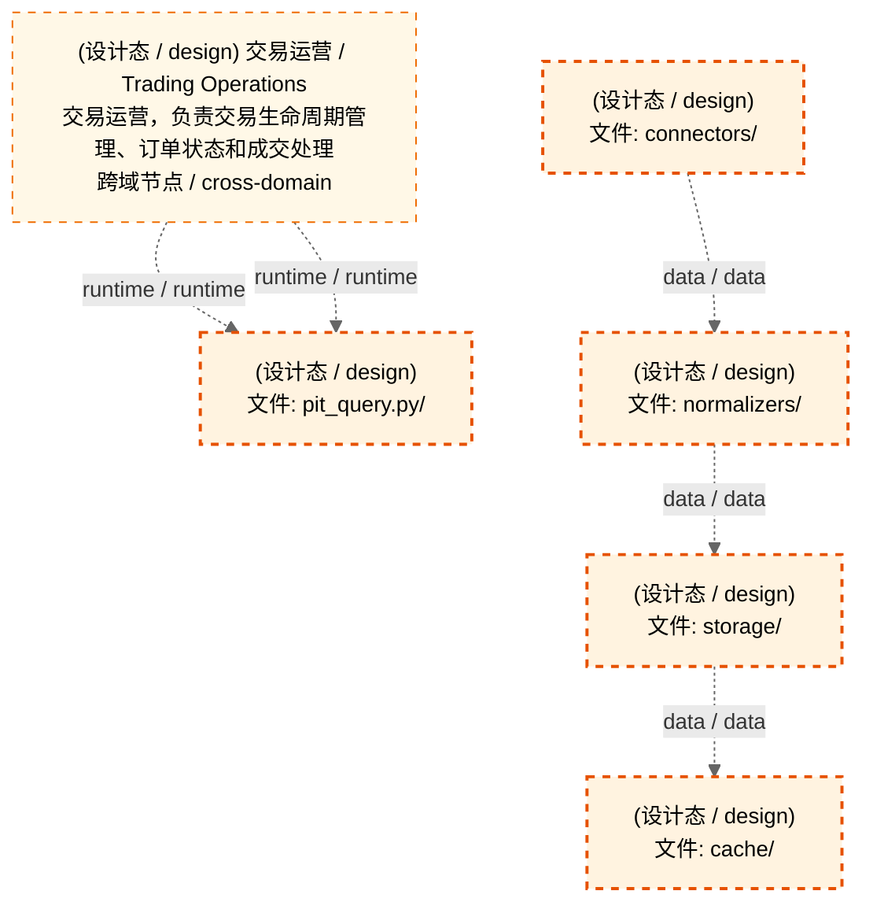
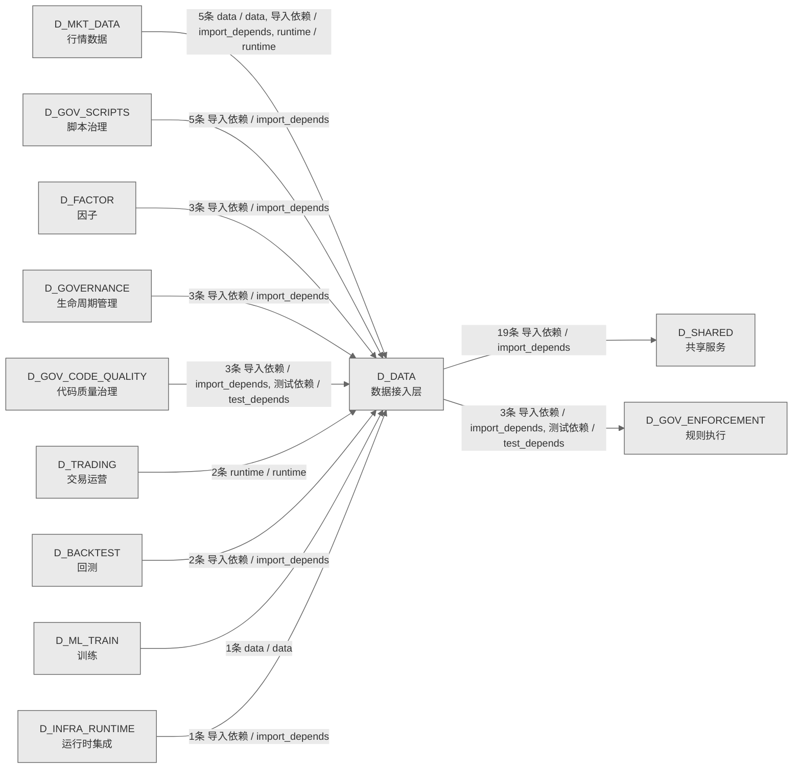

# 11_d_data / 数据接入层域 / Data Access Layer

> **功能简介 / Overview**: 数据接入层，负责数据源接入、数据集成和数据标准化

> **文档作用 / Purpose**: 展示 数据接入层（D_DATA）功能域的域内依赖关系、跨域依赖关系，模块信息（成熟度/中英文名/大白话/文件路径）内嵌于 Mermaid 节点，供架构审查和域治理参考。

> 本文档由 generate_domain_doc.py 从 depgraph (PostgreSQL) 自动生成
> 数据源: depgraph (PostgreSQL) nodes表 + edges表

> **[可缩放 HTML 版 / Zoomable HTML](http://localhost:8765/docs/02_enterprise_architecture/02_domain_architecture_docs/_zoomable_html/11_d_data.html)** — Ctrl+滚轮缩放 ｜ 双击重置 ｜ Ctrl+Shift+D 切换拖动/选择模式

## 域基本信息 / Domain Overview

| 字段 | 值 | Field | Value |
|------|------|-------|-------|
| 编号 | 11 | Number | 11 |
| 域ID | D_DATA | Domain ID | D_DATA |
| 域名称 | 数据接入层 | Domain Name | Data Access Layer |
| 层级 | L1 基础平台层 | Layer | L1 Foundation |
| 模块数 | 167 | Module Count | 167 |
| 域内依赖 | 263 | Internal Dependencies | 263 |
| 跨域入边 | 25 | Cross-domain Incoming | 25 |
| 跨域出边 | 22 | Cross-domain Outgoing | 22 |
| 设计态模块 | 5 | Design Modules | 5 |
| 生产态模块 | 162 | Production Modules | 162 |
| 容量 | 162/150 (超容) | Capacity | 162/150 (超容) |
| 描述 | 数据源集成器 | Description | 数据源集成器 |

## 域内依赖图 / Internal Dependency Diagram

> 依赖图内嵌在本文档中，共三个图：全景图、运营态图、设计态图。大图在 MD 预览可能渲染失败，请用可缩放 HTML 版查看（已放开渲染上限，浏览器可正常渲染 + Ctrl+滚轮缩放 + 拖动平移）。
>
> **图例说明 / Legend**：
> - 🟦 **蓝色 = 运营态模块**（production，已上线运行）
> - 🟧 **橙色虚线 = 设计态模块**（design，蓝图阶段，代码未写）
> - **实线箭头 = 运营态依赖**（已生效的依赖关系）
> - **虚线箭头 = 非运营态依赖**（计划中/验证中的依赖关系）

### 全景图（全部模块）

> 展示全部 167 个模块（生产态 162 + 设计态 5），节点含成熟度+中英文名+大白话+文件路径。

```mermaid
%%{init: {'theme': 'base', 'themeVariables': {'primaryColor': '#eaeaea', 'primaryTextColor': '#333333', 'primaryBorderColor': '#666666', 'lineColor': '#666666', 'secondaryColor': '#eaeaea', 'tertiaryColor': '#eaeaea', 'fontSize': '14px'}}}%%
flowchart TD
    schemas_categories_cross_validation_log_py["(生产态 / production) cross_validation_log 表 DDL-as-Code（P1-4 多源交叉校验）。<br/>cross_validation_log 表 DDL-as-Code（P1-4 多源交叉校验）。<br/>文件: categories/cross_validation_log.py"]
    schemas_categories_fundamental_balance_sheet_py["(生产态 / production) balance_sheet（资产负债表）DDL-as-Code（category_id: fundamental_balance_shee...<br/>balance_sheet（资产负债表）DDL-as-Code（category_id: fundamental_balance_shee...<br/>文件: categories/fundamental_balance_sheet.py"]
    schemas_categories_fundamental_disclosure_plan_py["(生产态 / production) disclosure_plan（披露计划）DDL-as-Code（category_id: fundamental_disclosure_p...<br/>disclosure_plan（披露计划）DDL-as-Code（category_id: fundamental_disclosure_p...<br/>文件: categories/fundamental_disclosure_plan.py"]
    schemas_categories_fundamental_equity_pledge_detail_py["(生产态 / production) equity_pledge_detail（股权质押明细）DDL-as-Code（category_id: fundamental_equ...<br/>equity_pledge_detail（股权质押明细）DDL-as-Code（category_id: fundamental_equ...<br/>文件: categories/fundamental_equity_pledge_detail.py"]
    schemas_categories_fundamental_income_statement_py["(生产态 / production) income_statement（利润表）DDL-as-Code（category_id: fundamental_income_statem...<br/>income_statement（利润表）DDL-as-Code（category_id: fundamental_income_statem...<br/>文件: categories/fundamental_income_statement.py"]
    schemas_categories_fundamental_industry_class_py["(生产态 / production) industry_class 表 DDL-as-Code（category_id: fundamental_industry_class, calc_...<br/>industry_class 表 DDL-as-Code（category_id: fundamental_industry_class, calc_...<br/>文件: categories/fundamental_industry_class.py"]
    schemas_categories_fundamental_industry_class_suppl_py["(生产态 / production) industry_class_suppl（补充行业分类）DDL-as-Code（category_id: fundamental_ind...<br/>industry_class_suppl（补充行业分类）DDL-as-Code（category_id: fundamental_ind...<br/>文件: categories/fundamental_industry_class_suppl.py"]
    schemas_categories_fundamental_restricted_shares_py["(生产态 / production) restricted_shares（限售股明细）DDL-as-Code（category_id: fundamental_restrict...<br/>restricted_shares（限售股明细）DDL-as-Code（category_id: fundamental_restrict...<br/>文件: categories/fundamental_restricted_shares.py"]
    schemas_categories_fundamental_rights_issue_py["(生产态 / production) rights_issue（分红配股）DDL-as-Code（category_id: fundamental_rights_issue）。<br/>rights_issue（分红配股）DDL-as-Code（category_id: fundamental_rights_issue）。<br/>文件: categories/fundamental_rights_issue.py"]
    schemas_categories_fundamental_share_change_py["(生产态 / production) share_change（股本变动）DDL-as-Code（category_id: fundamental_share_change）。<br/>share_change（股本变动）DDL-as-Code（category_id: fundamental_share_change）。<br/>文件: categories/fundamental_share_change.py"]
    schemas_categories_fundamental_share_unlock_py["(生产态 / production) share_unlock（解除限售）DDL-as-Code（category_id: fundamental_share_unlock）。<br/>share_unlock（解除限售）DDL-as-Code（category_id: fundamental_share_unlock）。<br/>文件: categories/fundamental_share_unlock.py"]
    schemas_categories_macro_edb_data_py["(生产态 / production) edb_data 表 DDL-as-Code（category_id: macro_edb_data, calc_mode: lazy）。<br/>edb_data 表 DDL-as-Code（category_id: macro_edb_data, calc_mode: lazy）。<br/>文件: categories/macro_edb_data.py"]
    schemas_categories_macro_macro_data_py["(生产态 / production) macro_data 表 DDL-as-Code（category_id: macro_macro_data, calc_mode: lazy）。<br/>macro_data 表 DDL-as-Code（category_id: macro_macro_data, calc_mode: lazy）。<br/>文件: categories/macro_macro_data.py"]
    schemas_categories_market_adj_factor_py["(生产态 / production) adj_factor 表 DDL-as-Code（category_id: market_adj_factor, calc_mode: lazy）。<br/>adj_factor 表 DDL-as-Code（category_id: market_adj_factor, calc_mode: lazy）。<br/>文件: categories/market_adj_factor.py"]
    schemas_categories_market_auction_py["(生产态 / production) auction_snapshot 表 DDL-as-Code（category_id: market_auction, calc_mode: prel...<br/>auction_snapshot 表 DDL-as-Code（category_id: market_auction, calc_mode: prel...<br/>文件: categories/market_auction.py"]
    schemas_categories_market_auction_book_py["(生产态 / production) auction_book 表 DDL-as-Code（category_id: market_auction_book, calc_mode: pre...<br/>auction_book 表 DDL-as-Code（category_id: market_auction_book, calc_mode: pre...<br/>文件: categories/market_auction_book.py"]
    schemas_categories_market_block_trade_py["(生产态 / production) block_trade 表 DDL-as-Code（category_id: market_block_trade, calc_mode: lazy）。<br/>block_trade 表 DDL-as-Code（category_id: market_block_trade, calc_mode: lazy）。<br/>文件: categories/market_block_trade.py"]
    schemas_categories_market_block_trade_detail_py["(生产态 / production) block_trade_detail 表 DDL-as-Code（category_id: market_block_trade_detail, ca...<br/>block_trade_detail 表 DDL-as-Code（category_id: market_block_trade_detail, ca...<br/>文件: categories/market_block_trade_detail.py"]
    schemas_categories_market_cb_iv_py["(生产态 / production) convertible_bond_iv 表 DDL-as-Code（category_id: market_cb_iv, calc_mode: pre...<br/>convertible_bond_iv 表 DDL-as-Code（category_id: market_cb_iv, calc_mode: pre...<br/>文件: categories/market_cb_iv.py"]
    schemas_categories_market_concept_board_py["(生产态 / production) concept_board 表 DDL-as-Code（category_id: market_concept_board, calc_mode: p...<br/>concept_board 表 DDL-as-Code（category_id: market_concept_board, calc_mode: p...<br/>文件: categories/market_concept_board.py"]
    schemas_categories_market_concept_board_constituent_py["(生产态 / production) concept_board_constituent 表 DDL-as-Code（category_id: market_concept_board_c...<br/>concept_board_constituent 表 DDL-as-Code（category_id: market_concept_board_c...<br/>文件: categories/market_concept_board_constituent.py"]
    schemas_categories_market_concept_sector_py["(生产态 / production) concept_sector 表 DDL-as-Code（category_id: market_concept_sector, calc_mode:...<br/>concept_sector 表 DDL-as-Code（category_id: market_concept_sector, calc_mode:...<br/>文件: categories/market_concept_sector.py"]
    schemas_categories_market_convertible_bond_list_py["(生产态 / production) convertible_bond_list 表 DDL-as-Code（category_id: market_convertible_bond_li...<br/>convertible_bond_list 表 DDL-as-Code（category_id: market_convertible_bond_li...<br/>文件: categories/market_convertible_bond_list.py"]
    schemas_categories_market_daily_valuation_py["(生产态 / production) daily_valuation 表 DDL-as-Code（category_id: market_daily_valuation, calc_mod...<br/>daily_valuation 表 DDL-as-Code（category_id: market_daily_valuation, calc_mod...<br/>文件: categories/market_daily_valuation.py"]
    schemas_categories_market_dragon_tiger_py["(生产态 / production) dragon_tiger 表 DDL-as-Code（category_id: market_dragon_tiger, calc_mode: laz...<br/>dragon_tiger 表 DDL-as-Code（category_id: market_dragon_tiger, calc_mode: laz...<br/>文件: categories/market_dragon_tiger.py"]
    schemas_categories_market_dragon_tiger_seat_py["(生产态 / production) dragon_tiger_seat 表 DDL-as-Code（category_id: market_dragon_tiger_seat, calc...<br/>dragon_tiger_seat 表 DDL-as-Code（category_id: market_dragon_tiger_seat, calc...<br/>文件: categories/market_dragon_tiger_seat.py"]
    schemas_categories_market_etf_benchmark_py["(生产态 / production) etf_benchmark 表 DDL-as-Code（category_id: market_etf_benchmark, calc_mode: p...<br/>etf_benchmark 表 DDL-as-Code（category_id: market_etf_benchmark, calc_mode: p...<br/>文件: categories/market_etf_benchmark.py"]
    schemas_categories_market_etf_list_py["(生产态 / production) etf_list 表 DDL-as-Code（category_id: market_etf_list, calc_mode: preload）.<br/>etf_list 表 DDL-as-Code（category_id: market_etf_list, calc_mode: preload）.<br/>文件: categories/market_etf_list.py"]
    schemas_categories_market_etf_nav_py["(生产态 / production) etf_nav 表 DDL-as-Code（category_id: market_etf_nav, calc_mode: lazy）。<br/>etf_nav 表 DDL-as-Code（category_id: market_etf_nav, calc_mode: lazy）。<br/>文件: categories/market_etf_nav.py"]
    schemas_categories_market_futures_kline_qmt_py["(生产态 / production) futures_kline_qmt 表 DDL-as-Code（category_id: market_futures_kline_qmt, calc...<br/>futures_kline_qmt 表 DDL-as-Code（category_id: market_futures_kline_qmt, calc...<br/>文件: categories/market_futures_kline_qmt.py"]
    schemas_categories_market_futures_position_py["(生产态 / production) futures_position 表 DDL-as-Code（category_id: market_futures_position, calc_m...<br/>futures_position 表 DDL-as-Code（category_id: market_futures_position, calc_m...<br/>文件: categories/market_futures_position.py"]
    schemas_categories_market_futures_term_py["(生产态 / production) futures_term_structure 表 DDL-as-Code（category_id: market_futures_term, calc...<br/>futures_term_structure 表 DDL-as-Code（category_id: market_futures_term, calc...<br/>文件: categories/market_futures_term.py"]
    schemas_categories_market_hk_connect_flow_py["(生产态 / production) hk_connect_flow 表 DDL-as-Code（category_id: market_hk_connect_flow, calc_mod...<br/>hk_connect_flow 表 DDL-as-Code（category_id: market_hk_connect_flow, calc_mod...<br/>文件: categories/market_hk_connect_flow.py"]
    schemas_categories_market_hk_kline_py["(生产态 / production) hk_kline 表 DDL-as-Code（category_id: market_hk_kline, calc_mode: lazy）。<br/>hk_kline 表 DDL-as-Code（category_id: market_hk_kline, calc_mode: lazy）。<br/>文件: categories/market_hk_kline.py"]
    schemas_categories_market_hk_stock_list_py["(生产态 / production) hk_stock_list 表 DDL-as-Code（category_id: market_hk_stock_list, calc_mode: p...<br/>hk_stock_list 表 DDL-as-Code（category_id: market_hk_stock_list, calc_mode: p...<br/>文件: categories/market_hk_stock_list.py"]
    schemas_categories_market_hk_trade_calendar_py["(生产态 / production) hk_trade_calendar 表 DDL-as-Code（category_id: market_hk_trade_calendar, calc...<br/>hk_trade_calendar 表 DDL-as-Code（category_id: market_hk_trade_calendar, calc...<br/>文件: categories/market_hk_trade_calendar.py"]
    schemas_categories_market_index_py["(生产态 / production) index_quote 表 DDL-as-Code（category_id: market_index_quote, calc_mode: repla...<br/>index_quote 表 DDL-as-Code（category_id: market_index_quote, calc_mode: repla...<br/>文件: categories/market_index.py"]
    schemas_categories_market_index_constituent_py["(生产态 / production) index_constituent 表 DDL-as-Code（category_id: market_index_constituent, calc...<br/>index_constituent 表 DDL-as-Code（category_id: market_index_constituent, calc...<br/>文件: categories/market_index_constituent.py"]
    schemas_categories_market_index_list_py["(生产态 / production) index_list 表 DDL-as-Code（category_id: market_index_list, calc_mode: preload）.<br/>index_list 表 DDL-as-Code（category_id: market_index_list, calc_mode: preload）.<br/>文件: categories/market_index_list.py"]
    schemas_categories_market_index_meta_py["(生产态 / production) market_index_meta 表 DDL-as-Code（category_id: market_index_meta, calc_mode: ...<br/>market_index_meta 表 DDL-as-Code（category_id: market_index_meta, calc_mode: ...<br/>文件: categories/market_index_meta.py"]
    schemas_categories_market_index_weight_py["(生产态 / production) index_weight 表 DDL-as-Code（category_id: market_index_weight, calc_mode: non...<br/>index_weight 表 DDL-as-Code（category_id: market_index_weight, calc_mode: non...<br/>文件: categories/market_index_weight.py"]
    schemas_categories_market_kline_15min_py["(生产态 / production) kline_15min 表 DDL-as-Code（category_id: market_kline_15min, calc_mode: lazy）。<br/>kline_15min 表 DDL-as-Code（category_id: market_kline_15min, calc_mode: lazy）。<br/>文件: categories/market_kline_15min.py"]
    schemas_categories_market_kline_1min_py["(生产态 / production) kline_1min 表 DDL-as-Code（category_id: market_kline_1min, calc_mode: lazy）。<br/>kline_1min 表 DDL-as-Code（category_id: market_kline_1min, calc_mode: lazy）。<br/>文件: categories/market_kline_1min.py"]
    schemas_categories_market_kline_30min_py["(生产态 / production) kline_30min 表 DDL-as-Code（category_id: market_kline_30min, calc_mode: lazy）。<br/>kline_30min 表 DDL-as-Code（category_id: market_kline_30min, calc_mode: lazy）。<br/>文件: categories/market_kline_30min.py"]
    schemas_categories_market_kline_5min_py["(生产态 / production) kline_5min 表 DDL-as-Code（category_id: market_kline_5min, calc_mode: lazy）。<br/>kline_5min 表 DDL-as-Code（category_id: market_kline_5min, calc_mode: lazy）。<br/>文件: categories/market_kline_5min.py"]
    schemas_categories_market_kline_60min_py["(生产态 / production) kline_60min 表 DDL-as-Code（category_id: market_kline_60min, calc_mode: lazy）。<br/>kline_60min 表 DDL-as-Code（category_id: market_kline_60min, calc_mode: lazy）。<br/>文件: categories/market_kline_60min.py"]
    schemas_categories_market_kline_cb_py["(生产态 / production) kline_cb 表 DDL-as-Code（category_id: market_kline_cb, calc_mode: lazy）。<br/>kline_cb 表 DDL-as-Code（category_id: market_kline_cb, calc_mode: lazy）。<br/>文件: categories/market_kline_cb.py"]
    schemas_categories_market_kline_daily_py["(生产态 / production) kline_daily 表 DDL-as-Code（category_id: market_kline_daily, calc_mode: prelo...<br/>kline_daily 表 DDL-as-Code（category_id: market_kline_daily, calc_mode: prelo...<br/>文件: categories/market_kline_daily.py"]
    schemas_categories_market_kline_daily_hfq_py["(生产态 / production) kline_daily_hfq 表 DDL-as-Code（category_id: market_kline_daily_hfq, calc_mod...<br/>kline_daily_hfq 表 DDL-as-Code（category_id: market_kline_daily_hfq, calc_mod...<br/>文件: categories/market_kline_daily_hfq.py"]
    schemas_categories_market_kline_etf_15min_py["(生产态 / production) kline_etf_15min 表 DDL-as-Code（category_id: market_kline_etf_15min, calc_mod...<br/>kline_etf_15min 表 DDL-as-Code（category_id: market_kline_etf_15min, calc_mod...<br/>文件: categories/market_kline_etf_15min.py"]
    schemas_categories_market_kline_etf_1min_py["(生产态 / production) kline_etf_1min 表 DDL-as-Code（category_id: market_kline_etf_1min, calc_mode:...<br/>kline_etf_1min 表 DDL-as-Code（category_id: market_kline_etf_1min, calc_mode:...<br/>文件: categories/market_kline_etf_1min.py"]
    schemas_categories_market_kline_etf_30min_py["(生产态 / production) kline_etf_30min 表 DDL-as-Code（category_id: market_kline_etf_30min, calc_mod...<br/>kline_etf_30min 表 DDL-as-Code（category_id: market_kline_etf_30min, calc_mod...<br/>文件: categories/market_kline_etf_30min.py"]
    schemas_categories_market_kline_etf_5min_py["(生产态 / production) kline_etf_5min 表 DDL-as-Code（category_id: market_kline_etf_5min, calc_mode:...<br/>kline_etf_5min 表 DDL-as-Code（category_id: market_kline_etf_5min, calc_mode:...<br/>文件: categories/market_kline_etf_5min.py"]
    schemas_categories_market_kline_etf_60min_py["(生产态 / production) kline_etf_60min 表 DDL-as-Code（category_id: market_kline_etf_60min, calc_mod...<br/>kline_etf_60min 表 DDL-as-Code（category_id: market_kline_etf_60min, calc_mod...<br/>文件: categories/market_kline_etf_60min.py"]
    schemas_categories_market_kline_futures_py["(生产态 / production) kline_futures 表 DDL-as-Code（category_id: market_kline_futures, calc_mode: l...<br/>kline_futures 表 DDL-as-Code（category_id: market_kline_futures, calc_mode: l...<br/>文件: categories/market_kline_futures.py"]
    schemas_categories_market_kline_hk_daily_py["(生产态 / production) kline_hk_daily 表 DDL-as-Code（category_id: market_kline_hk_daily, calc_mode:...<br/>kline_hk_daily 表 DDL-as-Code（category_id: market_kline_hk_daily, calc_mode:...<br/>文件: categories/market_kline_hk_daily.py"]
    schemas_categories_market_kline_index_py["(生产态 / production) kline_index 表 DDL-as-Code（category_id: market_kline_index, calc_mode: lazy）。<br/>kline_index 表 DDL-as-Code（category_id: market_kline_index, calc_mode: lazy）。<br/>文件: categories/market_kline_index.py"]
    schemas_categories_market_kline_lof_15min_py["(生产态 / production) kline_lof_15min 表 DDL-as-Code（category_id: market_kline_lof_15min, calc_mod...<br/>kline_lof_15min 表 DDL-as-Code（category_id: market_kline_lof_15min, calc_mod...<br/>文件: categories/market_kline_lof_15min.py"]
    schemas_categories_market_kline_lof_1min_py["(生产态 / production) kline_lof_1min 表 DDL-as-Code（category_id: market_kline_lof_1min, calc_mode:...<br/>kline_lof_1min 表 DDL-as-Code（category_id: market_kline_lof_1min, calc_mode:...<br/>文件: categories/market_kline_lof_1min.py"]
    schemas_categories_market_kline_lof_30min_py["(生产态 / production) kline_lof_30min 表 DDL-as-Code（category_id: market_kline_lof_30min, calc_mod...<br/>kline_lof_30min 表 DDL-as-Code（category_id: market_kline_lof_30min, calc_mod...<br/>文件: categories/market_kline_lof_30min.py"]
    schemas_categories_market_kline_lof_5min_py["(生产态 / production) kline_lof_5min 表 DDL-as-Code（category_id: market_kline_lof_5min, calc_mode:...<br/>kline_lof_5min 表 DDL-as-Code（category_id: market_kline_lof_5min, calc_mode:...<br/>文件: categories/market_kline_lof_5min.py"]
    schemas_categories_market_kline_lof_60min_py["(生产态 / production) kline_lof_60min 表 DDL-as-Code（category_id: market_kline_lof_60min, calc_mod...<br/>kline_lof_60min 表 DDL-as-Code（category_id: market_kline_lof_60min, calc_mod...<br/>文件: categories/market_kline_lof_60min.py"]
    schemas_categories_market_kline_monthly_py["(生产态 / production) kline_monthly 表 DDL-as-Code（category_id: market_kline_monthly, calc_mode: l...<br/>kline_monthly 表 DDL-as-Code（category_id: market_kline_monthly, calc_mode: l...<br/>文件: categories/market_kline_monthly.py"]
    schemas_categories_market_kline_monthly_hfq_py["(生产态 / production) kline_monthly_hfq 表 DDL-as-Code（category_id: market_kline_monthly_hfq, calc...<br/>kline_monthly_hfq 表 DDL-as-Code（category_id: market_kline_monthly_hfq, calc...<br/>文件: categories/market_kline_monthly_hfq.py"]
    schemas_categories_market_kline_sector_py["(生产态 / production) kline_sector 表 DDL-as-Code（category_id: market_kline_sector, calc_mode: laz...<br/>kline_sector 表 DDL-as-Code（category_id: market_kline_sector, calc_mode: laz...<br/>文件: categories/market_kline_sector.py"]
    schemas_categories_market_kline_sector_880_py["(生产态 / production) kline_sector_880 表 DDL-as-Code（category_id: market_kline_sector_880, calc_m...<br/>kline_sector_880 表 DDL-as-Code（category_id: market_kline_sector_880, calc_m...<br/>文件: categories/market_kline_sector_880.py"]
    schemas_categories_market_kline_sector_intraday_py["(生产态 / production) kline_sector_intraday 表 DDL-as-Code（category_id: market_kline_sector_intrad...<br/>kline_sector_intraday 表 DDL-as-Code（category_id: market_kline_sector_intrad...<br/>文件: categories/market_kline_sector_intraday.py"]
    schemas_categories_market_kline_us_daily_py["(生产态 / production) kline_us_daily 表 DDL-as-Code（category_id: market_kline_us_daily, calc_mode:...<br/>kline_us_daily 表 DDL-as-Code（category_id: market_kline_us_daily, calc_mode:...<br/>文件: categories/market_kline_us_daily.py"]
    schemas_categories_market_kline_weekly_py["(生产态 / production) kline_weekly 表 DDL-as-Code（category_id: market_kline_weekly, calc_mode: laz...<br/>kline_weekly 表 DDL-as-Code（category_id: market_kline_weekly, calc_mode: laz...<br/>文件: categories/market_kline_weekly.py"]
    schemas_categories_market_kline_weekly_hfq_py["(生产态 / production) kline_weekly_hfq 表 DDL-as-Code（category_id: market_kline_weekly_hfq, calc_m...<br/>kline_weekly_hfq 表 DDL-as-Code（category_id: market_kline_weekly_hfq, calc_m...<br/>文件: categories/market_kline_weekly_hfq.py"]
    schemas_categories_market_l2_tick_py["(生产态 / production) l2_tick 表 DDL-as-Code（category_id: market_l2_tick, calc_mode: replay）。<br/>l2_tick 表 DDL-as-Code（category_id: market_l2_tick, calc_mode: replay）。<br/>文件: categories/market_l2_tick.py"]
    schemas_categories_market_limit_up_down_py["(生产态 / production) limit_up_down 表 DDL-as-Code（category_id: market_limit_up_down, calc_mode: l...<br/>limit_up_down 表 DDL-as-Code（category_id: market_limit_up_down, calc_mode: l...<br/>文件: categories/market_limit_up_down.py"]
    schemas_categories_market_lof_list_py["(生产态 / production) lof_list 表 DDL-as-Code（category_id: market_lof_list, calc_mode: preload）.<br/>lof_list 表 DDL-as-Code（category_id: market_lof_list, calc_mode: preload）.<br/>文件: categories/market_lof_list.py"]
    schemas_categories_market_margin_trading_py["(生产态 / production) margin_trading 表 DDL-as-Code（category_id: market_margin_trading, calc_mode:...<br/>margin_trading 表 DDL-as-Code（category_id: market_margin_trading, calc_mode:...<br/>文件: categories/market_margin_trading.py"]
    schemas_categories_market_money_flow_py["(生产态 / production) money_flow 表 DDL-as-Code（category_id: market_money_flow, calc_mode: lazy）。<br/>money_flow 表 DDL-as-Code（category_id: market_money_flow, calc_mode: lazy）。<br/>文件: categories/market_money_flow.py"]
    schemas_categories_market_option_greeks_py["(生产态 / production) option_greeks 表 DDL-as-Code（category_id: market_option_greeks, calc_mode: l...<br/>option_greeks 表 DDL-as-Code（category_id: market_option_greeks, calc_mode: l...<br/>文件: categories/market_option_greeks.py"]
    schemas_categories_market_option_iv_py["(生产态 / production) option_iv_surface 表 DDL-as-Code（category_id: market_option_iv, calc_mode: p...<br/>option_iv_surface 表 DDL-as-Code（category_id: market_option_iv, calc_mode: p...<br/>文件: categories/market_option_iv.py"]
    schemas_categories_market_option_kline_py["(生产态 / production) option_kline 表 DDL-as-Code（category_id: market_option_kline, calc_mode: laz...<br/>option_kline 表 DDL-as-Code（category_id: market_option_kline, calc_mode: laz...<br/>文件: categories/market_option_kline.py"]
    schemas_categories_market_realtime_snapshot_py["(生产态 / production) realtime_snapshot 表 DDL-as-Code（category_id: market_realtime_snapshot, calc...<br/>realtime_snapshot 表 DDL-as-Code（category_id: market_realtime_snapshot, calc...<br/>文件: categories/market_realtime_snapshot.py"]
    schemas_categories_market_sector_constituent_py["(生产态 / production) sector_constituent 表 DDL-as-Code（category_id: market_sector_constituent, ca...<br/>sector_constituent 表 DDL-as-Code（category_id: market_sector_constituent, ca...<br/>文件: categories/market_sector_constituent.py"]
    schemas_categories_market_sector_list_py["(生产态 / production) sector_list 表 DDL-as-Code（category_id: market_sector_list, calc_mode: none）。<br/>sector_list 表 DDL-as-Code（category_id: market_sector_list, calc_mode: none）。<br/>文件: categories/market_sector_list.py"]
    schemas_categories_market_sector_meta_py["(生产态 / production) sector_meta 表 DDL-as-Code（category_id: market_sector_meta, calc_mode: none）。<br/>sector_meta 表 DDL-as-Code（category_id: market_sector_meta, calc_mode: none）。<br/>文件: categories/market_sector_meta.py"]
    schemas_categories_market_sector_snapshot_py["(生产态 / production) sector_snapshot 表 DDL-as-Code（category_id: market_sector_snapshot, calc_mod...<br/>sector_snapshot 表 DDL-as-Code（category_id: market_sector_snapshot, calc_mod...<br/>文件: categories/market_sector_snapshot.py"]
    schemas_categories_market_st_stock_list_py["(生产态 / production) st_stock_list 表 DDL-as-Code（category_id: market_st_stock_list, calc_mode: p...<br/>st_stock_list 表 DDL-as-Code（category_id: market_st_stock_list, calc_mode: p...<br/>文件: categories/market_st_stock_list.py"]
    schemas_categories_market_stock_indicator_py["(生产态 / production) stock_indicator 表 DDL-as-Code（category_id: market_stock_indicator, calc_mod...<br/>stock_indicator 表 DDL-as-Code（category_id: market_stock_indicator, calc_mod...<br/>文件: categories/market_stock_indicator.py"]
    schemas_categories_market_stock_list_py["(生产态 / production) stock_list 表 DDL-as-Code（category_id: market_stock_list, calc_mode: preload...<br/>stock_list 表 DDL-as-Code（category_id: market_stock_list, calc_mode: preload...<br/>文件: categories/market_stock_list.py"]
    schemas_categories_market_tick_py["(生产态 / production) tick_data 表 DDL-as-Code（category_id: market_tick, calc_mode: replay）。<br/>tick_data 表 DDL-as-Code（category_id: market_tick, calc_mode: replay）。<br/>文件: categories/market_tick.py"]
    schemas_categories_market_trade_calendar_py["(生产态 / production) trade_calendar 表 DDL-as-Code（category_id: market_trade_calendar, calc_mode:...<br/>trade_calendar 表 DDL-as-Code（category_id: market_trade_calendar, calc_mode:...<br/>文件: categories/market_trade_calendar.py"]
    schemas_categories_market_us_index_py["(生产态 / production) us_index 表 DDL-as-Code（category_id: market_us_index, calc_mode: lazy）。<br/>us_index 表 DDL-as-Code（category_id: market_us_index, calc_mode: lazy）。<br/>文件: categories/market_us_index.py"]
    scripts_ch_data_inventory_py["(生产态 / production) 全库数据盘点：逐表审计行数/日期范围/空表/缺失日期/引擎/大小。<br/>全库数据盘点：逐表审计行数/日期范围/空表/缺失日期/引擎/大小。<br/>文件: ch/_data_inventory.py"]
    scripts_ch_recovery_drill_py["(生产态 / production) 恢复演练：轮询备份完成 → 恢复小表到临时库 → 行数校验 → 清理。<br/>恢复演练：轮询备份完成 → 恢复小表到临时库 → 行数校验 → 清理。<br/>文件: ch/_recovery_drill.py"]
    scripts_ch_apply_fundamental_tables_ddl_py["(生产态 / production) ClickHouse c3_fundamental 财务三表 DDL 部署 + 精度验证脚本（audit 1.2 治本）。<br/>ClickHouse c3_fundamental 财务三表 DDL 部署 + 精度验证脚本（audit 1.2 治本）。<br/>文件: ch/apply_fundamental_tables_ddl.py"]
    scripts_ch_apply_market_tables_ddl_py["(生产态 / production) ClickHouse c1_market 建表 DDL 部署 + 引擎验证脚本（Phase F）。<br/>ClickHouse c1_market 建表 DDL 部署 + 引擎验证脚本（Phase F）。<br/>文件: ch/apply_market_tables_ddl.py"]
    scripts_ch_apply_timezone_migration_py["(生产态 / production) ClickHouse 时区防线迁移脚本（audit A组 Schema 治理 - 时区防线，#ARCH-CH-022）。<br/>ClickHouse 时区防线迁移脚本（audit A组 Schema 治理 - 时区防线，#ARCH-CH-022）。<br/>文件: ch/apply_timezone_migration.py"]
    scripts_ch_lint_symbol_convention_py["(生产态 / production) Symbol 约定 lint 门禁（TRAE-082 GATE-SYMBOL-CONVENTION）。<br/>Symbol 约定 lint 门禁（TRAE-082 GATE-SYMBOL-CONVENTION）。<br/>文件: ch/lint_symbol_convention.py"]
    scripts_ch_verify_exchange_coverage_py["(生产态 / production) exchange+symbol_canonical 数据覆盖率校验器（TRAE-082 1.1.0 阶段2 配套）。<br/>exchange+symbol_canonical 数据覆盖率校验器（TRAE-082 1.1.0 阶段2 配套）。<br/>文件: ch/verify_exchange_coverage.py"]
    scripts_ch_verify_schema_truth_py["(生产态 / production) DDL-as-Code 真源 vs ClickHouse 实际表结构 漂移校验器（治本工具）。<br/>DDL-as-Code 真源 vs ClickHouse 实际表结构 漂移校验器（治本工具）。<br/>文件: ch/verify_schema_truth.py"]
    scripts_ops_verify_alert_channels_py["(生产态 / production) 告警通道端到端验证（B2，#ARCH-CH-023，2026-07-25）。<br/>告警通道端到端验证（B2，#ARCH-CH-023，2026-07-25）。<br/>文件: ops/verify_alert_channels.py"]
    scripts_register_aux_tasks_ps1["(生产态 / production)<br/>文件: scripts/register_aux_tasks.ps1"]
    scripts_register_guard_tasks_ps1["(生产态 / production)<br/>文件: scripts/register_guard_tasks.ps1"]
    scripts_start_scheduler_ps1["(生产态 / production)<br/>文件: scripts/start_scheduler.ps1"]
    scripts_start_tick_subscriber_ps1["(生产态 / production)<br/>文件: scripts/start_tick_subscriber.ps1"]
    src_zephyr_data_main_py["(生产态 / production) python -m zephyr.data — 数据源集成器 CLI 入口。<br/>python -m zephyr.data — 数据源集成器 CLI 入口。<br/>文件: data/__main__.py"]
    src_zephyr_data_config_policies_yaml["(生产态 / production)<br/>文件: config/policies.yaml"]
    src_zephyr_data_config_schedule_yaml["(生产态 / production)<br/>文件: config/schedule.yaml"]
    src_zephyr_data_config_tasks_yaml["(生产态 / production)<br/>文件: config/tasks.yaml"]
    src_zephyr_data_connectors["(设计态 / design)<br/>文件: connectors/"]
    src_zephyr_data_implementations_init_py["(生产态 / production) 数据源 Provider 实现集合（MOD-L00-004 §4.3）。<br/>数据源 Provider 实现集合（MOD-L00-004 §4.3）。<br/>文件: implementations/__init__.py"]
    src_zephyr_data_kline_resampler_py["(生产态 / production) 880xxx 板块K线合成器——从 1m/5m 合成 15m/30m/60m 写入 ClickHouse。<br/>880xxx 板块K线合成器——从 1m/5m 合成 15m/30m/60m 写入 ClickHouse。<br/>文件: data/kline_resampler.py"]
    src_zephyr_data_pit_query_py_1["(设计态 / design)<br/>文件: pit_query.py/"]
    src_zephyr_data_redundant_source_init_py["(生产态 / production) 数据源冗余与热切换模块（MOD-L00-005）。<br/>数据源冗余与热切换模块（MOD-L00-005）。<br/>文件: redundant_source/__init__.py"]
    src_zephyr_data_satellite_geospatial_engine_init_py["(生产态 / production) D_DATA Data Source<br/>D_DATA Data Source<br/>文件: satellite_geospatial_engine/__init__.py"]
    src_zephyr_data_sector_kline_downloader_py["(生产态 / production) 880xxx 板块指数K线下载器——盘后从 tqcenter 下载日K/分钟K写入 ClickHouse。<br/>880xxx 板块指数K线下载器——盘后从 tqcenter 下载日K/分钟K写入 ClickHouse。<br/>文件: data/sector_kline_downloader.py"]
    src_zephyr_data_sector_snapshot_collector_py["(生产态 / production) 880xxx 板块实时快照采集器（tqcenter → ClickHouse sector_snapshot 表）。<br/>880xxx 板块实时快照采集器（tqcenter → ClickHouse sector_snapshot 表）。<br/>文件: data/sector_snapshot_collector.py"]
    src_zephyr_data_symbol_normalizer_init_py["(生产态 / production) Symbol 标准化模块——TRAE-082 symbol 约定铁律的实现真源。<br/>Symbol 标准化模块——TRAE-082 symbol 约定铁律的实现真源。<br/>文件: symbol_normalizer/__init__.py"]
    src_zephyr_data_wal_codec_init_py["(生产态 / production) WAL 段编解码模块（MOD-L00-006）。<br/>WAL 段编解码模块（MOD-L00-006）。<br/>文件: wal_codec/__init__.py"]
    tests_data_test_market_quality_validator_py["(生产态 / production) #ARCH-CH-021 P0-4: 写入路径异常值校验器四门禁测试。<br/>#ARCH-CH-021 P0-4: 写入路径异常值校验器四门禁测试。<br/>文件: data/test_market_quality_validator.py"]
    tests_data_test_pit_query_py["(生产态 / production) #ARCH-CH-021 P0-5: 财报 PIT 查询能力测试。<br/>#ARCH-CH-021 P0-5: 财报 PIT 查询能力测试。<br/>文件: data/test_pit_query.py"]
    tests_zephyr_data_test_cross_source_validator_py["(生产态 / production) cross_source_validator 单元测试（P1-4 多源交叉校验）。<br/>cross_source_validator 单元测试（P1-4 多源交叉校验）。<br/>文件: data/test_cross_source_validator.py"]
    tests_zephyr_data_test_tick_subscriber_py["(生产态 / production) tick_subscriber 单元测试（含 Phase C: WalWriter + 批量出队 + 无锁计数）。<br/>tick_subscriber 单元测试（含 Phase C: WalWriter + 批量出队 + 无锁计数）。<br/>文件: data/test_tick_subscriber.py"]
    schemas_categories_cross_validation_log_py ~~~ schemas_categories_fundamental_balance_sheet_py
    schemas_categories_fundamental_balance_sheet_py ~~~ schemas_categories_fundamental_disclosure_plan_py
    schemas_categories_fundamental_disclosure_plan_py ~~~ schemas_categories_fundamental_equity_pledge_detail_py
    schemas_categories_fundamental_equity_pledge_detail_py ~~~ schemas_categories_fundamental_income_statement_py
    schemas_categories_fundamental_income_statement_py ~~~ schemas_categories_fundamental_industry_class_py
    schemas_categories_fundamental_industry_class_py ~~~ schemas_categories_fundamental_industry_class_suppl_py
    schemas_categories_fundamental_industry_class_suppl_py ~~~ schemas_categories_fundamental_restricted_shares_py
    schemas_categories_fundamental_restricted_shares_py ~~~ schemas_categories_fundamental_rights_issue_py
    schemas_categories_fundamental_rights_issue_py ~~~ schemas_categories_fundamental_share_change_py
    schemas_categories_fundamental_share_change_py ~~~ schemas_categories_fundamental_share_unlock_py
    schemas_categories_fundamental_share_unlock_py ~~~ schemas_categories_macro_edb_data_py
    schemas_categories_macro_edb_data_py ~~~ schemas_categories_macro_macro_data_py
    schemas_categories_macro_macro_data_py ~~~ schemas_categories_market_adj_factor_py
    schemas_categories_market_adj_factor_py ~~~ schemas_categories_market_auction_py
    schemas_categories_market_auction_py ~~~ schemas_categories_market_auction_book_py
    schemas_categories_market_auction_book_py ~~~ schemas_categories_market_block_trade_py
    schemas_categories_market_block_trade_py ~~~ schemas_categories_market_block_trade_detail_py
    schemas_categories_market_block_trade_detail_py ~~~ schemas_categories_market_cb_iv_py
    schemas_categories_market_cb_iv_py ~~~ schemas_categories_market_concept_board_py
    schemas_categories_market_concept_board_py ~~~ schemas_categories_market_concept_board_constituent_py
    schemas_categories_market_concept_board_constituent_py ~~~ schemas_categories_market_concept_sector_py
    schemas_categories_market_concept_sector_py ~~~ schemas_categories_market_convertible_bond_list_py
    schemas_categories_market_convertible_bond_list_py ~~~ schemas_categories_market_daily_valuation_py
    schemas_categories_market_daily_valuation_py ~~~ schemas_categories_market_dragon_tiger_py
    schemas_categories_market_dragon_tiger_py ~~~ schemas_categories_market_dragon_tiger_seat_py
    schemas_categories_market_dragon_tiger_seat_py ~~~ schemas_categories_market_etf_benchmark_py
    schemas_categories_market_etf_benchmark_py ~~~ schemas_categories_market_etf_list_py
    schemas_categories_market_etf_list_py ~~~ schemas_categories_market_etf_nav_py
    schemas_categories_market_etf_nav_py ~~~ schemas_categories_market_futures_kline_qmt_py
    schemas_categories_market_futures_kline_qmt_py ~~~ schemas_categories_market_futures_position_py
    schemas_categories_market_futures_position_py ~~~ schemas_categories_market_futures_term_py
    schemas_categories_market_futures_term_py ~~~ schemas_categories_market_hk_connect_flow_py
    schemas_categories_market_hk_connect_flow_py ~~~ schemas_categories_market_hk_kline_py
    schemas_categories_market_hk_kline_py ~~~ schemas_categories_market_hk_stock_list_py
    schemas_categories_market_hk_stock_list_py ~~~ schemas_categories_market_hk_trade_calendar_py
    schemas_categories_market_hk_trade_calendar_py ~~~ schemas_categories_market_index_py
    schemas_categories_market_index_py ~~~ schemas_categories_market_index_constituent_py
    schemas_categories_market_index_constituent_py ~~~ schemas_categories_market_index_list_py
    schemas_categories_market_index_list_py ~~~ schemas_categories_market_index_meta_py
    schemas_categories_market_index_meta_py ~~~ schemas_categories_market_index_weight_py
    schemas_categories_market_index_weight_py ~~~ schemas_categories_market_kline_15min_py
    schemas_categories_market_kline_15min_py ~~~ schemas_categories_market_kline_1min_py
    schemas_categories_market_kline_1min_py ~~~ schemas_categories_market_kline_30min_py
    schemas_categories_market_kline_30min_py ~~~ schemas_categories_market_kline_5min_py
    schemas_categories_market_kline_5min_py ~~~ schemas_categories_market_kline_60min_py
    schemas_categories_market_kline_60min_py ~~~ schemas_categories_market_kline_cb_py
    schemas_categories_market_kline_cb_py ~~~ schemas_categories_market_kline_daily_py
    schemas_categories_market_kline_daily_py ~~~ schemas_categories_market_kline_daily_hfq_py
    schemas_categories_market_kline_daily_hfq_py ~~~ schemas_categories_market_kline_etf_15min_py
    schemas_categories_market_kline_etf_15min_py ~~~ schemas_categories_market_kline_etf_1min_py
    schemas_categories_market_kline_etf_1min_py ~~~ schemas_categories_market_kline_etf_30min_py
    schemas_categories_market_kline_etf_30min_py ~~~ schemas_categories_market_kline_etf_5min_py
    schemas_categories_market_kline_etf_5min_py ~~~ schemas_categories_market_kline_etf_60min_py
    schemas_categories_market_kline_etf_60min_py ~~~ schemas_categories_market_kline_futures_py
    schemas_categories_market_kline_futures_py ~~~ schemas_categories_market_kline_hk_daily_py
    schemas_categories_market_kline_hk_daily_py ~~~ schemas_categories_market_kline_index_py
    schemas_categories_market_kline_index_py ~~~ schemas_categories_market_kline_lof_15min_py
    schemas_categories_market_kline_lof_15min_py ~~~ schemas_categories_market_kline_lof_1min_py
    schemas_categories_market_kline_lof_1min_py ~~~ schemas_categories_market_kline_lof_30min_py
    schemas_categories_market_kline_lof_30min_py ~~~ schemas_categories_market_kline_lof_5min_py
    schemas_categories_market_kline_lof_5min_py ~~~ schemas_categories_market_kline_lof_60min_py
    schemas_categories_market_kline_lof_60min_py ~~~ schemas_categories_market_kline_monthly_py
    schemas_categories_market_kline_monthly_py ~~~ schemas_categories_market_kline_monthly_hfq_py
    schemas_categories_market_kline_monthly_hfq_py ~~~ schemas_categories_market_kline_sector_py
    schemas_categories_market_kline_sector_py ~~~ schemas_categories_market_kline_sector_880_py
    schemas_categories_market_kline_sector_880_py ~~~ schemas_categories_market_kline_sector_intraday_py
    schemas_categories_market_kline_sector_intraday_py ~~~ schemas_categories_market_kline_us_daily_py
    schemas_categories_market_kline_us_daily_py ~~~ schemas_categories_market_kline_weekly_py
    schemas_categories_market_kline_weekly_py ~~~ schemas_categories_market_kline_weekly_hfq_py
    schemas_categories_market_kline_weekly_hfq_py ~~~ schemas_categories_market_l2_tick_py
    schemas_categories_market_l2_tick_py ~~~ schemas_categories_market_limit_up_down_py
    schemas_categories_market_limit_up_down_py ~~~ schemas_categories_market_lof_list_py
    schemas_categories_market_lof_list_py ~~~ schemas_categories_market_margin_trading_py
    schemas_categories_market_margin_trading_py ~~~ schemas_categories_market_money_flow_py
    schemas_categories_market_money_flow_py ~~~ schemas_categories_market_option_greeks_py
    schemas_categories_market_option_greeks_py ~~~ schemas_categories_market_option_iv_py
    schemas_categories_market_option_iv_py ~~~ schemas_categories_market_option_kline_py
    schemas_categories_market_option_kline_py ~~~ schemas_categories_market_realtime_snapshot_py
    schemas_categories_market_realtime_snapshot_py ~~~ schemas_categories_market_sector_constituent_py
    schemas_categories_market_sector_constituent_py ~~~ schemas_categories_market_sector_list_py
    schemas_categories_market_sector_list_py ~~~ schemas_categories_market_sector_meta_py
    schemas_categories_market_sector_meta_py ~~~ schemas_categories_market_sector_snapshot_py
    schemas_categories_market_sector_snapshot_py ~~~ schemas_categories_market_st_stock_list_py
    schemas_categories_market_st_stock_list_py ~~~ schemas_categories_market_stock_indicator_py
    schemas_categories_market_stock_indicator_py ~~~ schemas_categories_market_stock_list_py
    schemas_categories_market_stock_list_py ~~~ schemas_categories_market_tick_py
    schemas_categories_market_tick_py ~~~ schemas_categories_market_trade_calendar_py
    schemas_categories_market_trade_calendar_py ~~~ schemas_categories_market_us_index_py
    schemas_categories_market_us_index_py ~~~ scripts_ch_data_inventory_py
    scripts_ch_data_inventory_py ~~~ scripts_ch_recovery_drill_py
    scripts_ch_recovery_drill_py ~~~ scripts_ch_apply_fundamental_tables_ddl_py
    scripts_ch_apply_fundamental_tables_ddl_py ~~~ scripts_ch_apply_market_tables_ddl_py
    scripts_ch_apply_market_tables_ddl_py ~~~ scripts_ch_apply_timezone_migration_py
    scripts_ch_apply_timezone_migration_py ~~~ scripts_ch_lint_symbol_convention_py
    scripts_ch_lint_symbol_convention_py ~~~ scripts_ch_verify_exchange_coverage_py
    scripts_ch_verify_exchange_coverage_py ~~~ scripts_ch_verify_schema_truth_py
    scripts_ch_verify_schema_truth_py ~~~ scripts_ops_verify_alert_channels_py
    scripts_ops_verify_alert_channels_py ~~~ scripts_register_aux_tasks_ps1
    scripts_register_aux_tasks_ps1 ~~~ scripts_register_guard_tasks_ps1
    scripts_register_guard_tasks_ps1 ~~~ scripts_start_scheduler_ps1
    scripts_start_scheduler_ps1 ~~~ scripts_start_tick_subscriber_ps1
    scripts_start_tick_subscriber_ps1 ~~~ src_zephyr_data_main_py
    src_zephyr_data_main_py ~~~ src_zephyr_data_config_policies_yaml
    src_zephyr_data_config_policies_yaml ~~~ src_zephyr_data_config_schedule_yaml
    src_zephyr_data_config_schedule_yaml ~~~ src_zephyr_data_config_tasks_yaml
    src_zephyr_data_config_tasks_yaml ~~~ src_zephyr_data_connectors
    src_zephyr_data_connectors ~~~ src_zephyr_data_implementations_init_py
    src_zephyr_data_implementations_init_py ~~~ src_zephyr_data_kline_resampler_py
    src_zephyr_data_kline_resampler_py ~~~ src_zephyr_data_pit_query_py_1
    src_zephyr_data_pit_query_py_1 ~~~ src_zephyr_data_redundant_source_init_py
    src_zephyr_data_redundant_source_init_py ~~~ src_zephyr_data_satellite_geospatial_engine_init_py
    src_zephyr_data_satellite_geospatial_engine_init_py ~~~ src_zephyr_data_sector_kline_downloader_py
    src_zephyr_data_sector_kline_downloader_py ~~~ src_zephyr_data_sector_snapshot_collector_py
    src_zephyr_data_sector_snapshot_collector_py ~~~ src_zephyr_data_symbol_normalizer_init_py
    src_zephyr_data_symbol_normalizer_init_py ~~~ src_zephyr_data_wal_codec_init_py
    src_zephyr_data_wal_codec_init_py ~~~ tests_data_test_market_quality_validator_py
    tests_data_test_market_quality_validator_py ~~~ tests_data_test_pit_query_py
    tests_data_test_pit_query_py ~~~ tests_zephyr_data_test_cross_source_validator_py
    tests_zephyr_data_test_cross_source_validator_py ~~~ tests_zephyr_data_test_tick_subscriber_py
    schemas_categories_fundamental_analyst_forecast_py["(生产态 / production) analyst_forecast（分析师预测）DDL-as-Code（category_id: fundamental_analyst_f...<br/>analyst_forecast（分析师预测）DDL-as-Code（category_id: fundamental_analyst_f...<br/>文件: categories/fundamental_analyst_forecast.py"]
    scripts_ch_apply_exchange_columns_py["(生产态 / production) ClickHouse exchange+symbol_canonical 列部署脚本（TRAE-082 1.1.0 治本...<br/>ClickHouse exchange+symbol_canonical 列部署脚本（TRAE-082 1.1.0 治本...<br/>文件: ch/apply_exchange_columns.py"]
    scripts_ch_apply_rbac_py["(生产态 / production) ClickHouse RBAC 账号分级部署 + 验证脚本（audit 9.4 治本 #ARCH-CH-027）。<br/>ClickHouse RBAC 账号分级部署 + 验证脚本（audit 9.4 治本 #ARCH-CH-027）。<br/>文件: ch/apply_rbac.py"]
    src_zephyr_data_alerter_py["(生产态 / production) 告警管理（MOD-L00-004 §6.5 失败重试与告警 + §8 可观测性）。<br/>告警管理（MOD-L00-004 §6.5 失败重试与告警 + §8 可观测性）。<br/>文件: data/alerter.py"]
    src_zephyr_data_cli_py["(生产态 / production) 数据源集成器 CLI（MOD-L00-004 §8.4）。<br/>数据源集成器 CLI（MOD-L00-004 §8.4）。<br/>文件: data/cli.py"]
    src_zephyr_data_cross_source_validator_py["(生产态 / production) 多源交叉校验器——比较 QMT 主源与 TDX 备源 tick 数据一致性（P1-4）。<br/>多源交叉校验器——比较 QMT 主源与 TDX 备源 tick 数据一致性（P1-4）。<br/>文件: data/cross_source_validator.py"]
    src_zephyr_data_normalizers["(设计态 / design)<br/>文件: normalizers/"]
    src_zephyr_data_pit_query_py["(生产态 / production) 财报 Point-In-Time (PIT) 查询能力（#ARCH-CH-021 P0-5）。<br/>财报 Point-In-Time (PIT) 查询能力（#ARCH-CH-021 P0-5）。<br/>文件: data/pit_query.py"]
    src_zephyr_data_sector_ranking_engine_py["(生产态 / production) 880xxx 板块动态排名引擎——5因子复合排名调整99只推送池。<br/>880xxx 板块动态排名引擎——5因子复合排名调整99只推送池。<br/>文件: data/sector_ranking_engine.py"]
    src_zephyr_data_tick_subscriber_py["(生产态 / production) QMT 实时 Tick 订阅服务——subscribe_quote 实时推送，写入 ClickHouse tick_data。<br/>QMT 实时 Tick 订阅服务——subscribe_quote 实时推送，写入 ClickHouse tick_data。<br/>文件: data/tick_subscriber.py"]
    schemas_categories_fundamental_analyst_forecast_py ~~~ scripts_ch_apply_exchange_columns_py
    scripts_ch_apply_exchange_columns_py ~~~ scripts_ch_apply_rbac_py
    scripts_ch_apply_rbac_py ~~~ src_zephyr_data_alerter_py
    src_zephyr_data_alerter_py ~~~ src_zephyr_data_cli_py
    src_zephyr_data_cli_py ~~~ src_zephyr_data_cross_source_validator_py
    src_zephyr_data_cross_source_validator_py ~~~ src_zephyr_data_normalizers
    src_zephyr_data_normalizers ~~~ src_zephyr_data_pit_query_py
    src_zephyr_data_pit_query_py ~~~ src_zephyr_data_sector_ranking_engine_py
    src_zephyr_data_sector_ranking_engine_py ~~~ src_zephyr_data_tick_subscriber_py
    schemas_categories_fundamental_cashflow_statement_py["(生产态 / production) cashflow_statement（现金流量表）DDL-as-Code（category_id: fundamental_cashflo...<br/>cashflow_statement（现金流量表）DDL-as-Code（category_id: fundamental_cashflo...<br/>文件: categories/fundamental_cashflow_statement.py"]
    src_zephyr_data_ch_config_py["(生产态 / production) ClickHouse 连接配置单真源加载器（裁定 #ARCH-CH-017 / #ARCH-CH-019）。<br/>ClickHouse 连接配置单真源加载器（裁定 #ARCH-CH-017 / #ARCH-CH-019）。<br/>文件: data/ch_config.py"]
    src_zephyr_data_ch_reader_py["(生产态 / production) ClickHouse 统一读取层（裁定 #ARCH-CH-007）。<br/>ClickHouse 统一读取层（裁定 #ARCH-CH-007）。<br/>文件: data/ch_reader.py"]
    src_zephyr_data_progress_store_py["(生产态 / production) 统一进度存储（MOD-L00-004 §7）。<br/>统一进度存储（MOD-L00-004 §7）。<br/>文件: data/progress_store.py"]
    src_zephyr_data_scheduler_py["(生产态 / production) 数据源调度编排层（MOD-L00-004 §6）。<br/>数据源调度编排层（MOD-L00-004 §6）。<br/>文件: data/scheduler.py"]
    src_zephyr_data_speed_tester_py["(生产态 / production) 数据源测速器（MOD-L00-004 §8.5）。<br/>数据源测速器（MOD-L00-004 §8.5）。<br/>文件: data/speed_tester.py"]
    src_zephyr_data_storage["(设计态 / design)<br/>文件: storage/"]
    src_zephyr_data_symbol_normalizer_normalizer_py["(生产态 / production) symbol 标准化核心实现——TRAE-082 symbol 约定铁律。<br/>symbol 标准化核心实现——TRAE-082 symbol 约定铁律。<br/>文件: symbol_normalizer/normalizer.py"]
    schemas_categories_fundamental_cashflow_statement_py ~~~ src_zephyr_data_ch_config_py
    src_zephyr_data_ch_config_py ~~~ src_zephyr_data_ch_reader_py
    src_zephyr_data_ch_reader_py ~~~ src_zephyr_data_progress_store_py
    src_zephyr_data_progress_store_py ~~~ src_zephyr_data_scheduler_py
    src_zephyr_data_scheduler_py ~~~ src_zephyr_data_speed_tester_py
    src_zephyr_data_speed_tester_py ~~~ src_zephyr_data_storage
    src_zephyr_data_storage ~~~ src_zephyr_data_symbol_normalizer_normalizer_py
    src_zephyr_data_init_py["(生产态 / production) zephyr.data — 数据源集成器（MOD-L00-004）。<br/>zephyr.data — 数据源集成器（MOD-L00-004）。<br/>文件: data/__init__.py"]
    src_zephyr_data_cache["(设计态 / design)<br/>文件: cache/"]
    src_zephyr_data_ch_writer_py["(生产态 / production) ClickHouse 写入器（MOD-L00-004 §3.2 数据流第6步 + §7.3 幂等性）。<br/>ClickHouse 写入器（MOD-L00-004 §3.2 数据流第6步 + §7.3 幂等性）。<br/>文件: data/ch_writer.py"]
    src_zephyr_data_implementations_akshare_provider_py["(生产态 / production) AKShare 数据源 Provider 实现（MOD-L00-004 §4.3）。<br/>AKShare 数据源 Provider 实现（MOD-L00-004 §4.3）。<br/>文件: implementations/akshare_provider.py"]
    src_zephyr_data_implementations_baostock_provider_py["(生产态 / production) Baostock 数据源 Provider 实现（MOD-L00-004 §4.3）。<br/>Baostock 数据源 Provider 实现（MOD-L00-004 §4.3）。<br/>文件: implementations/baostock_provider.py"]
    src_zephyr_data_implementations_cls_provider_py["(生产态 / production) 财联社电报数据源 Provider 实现（MOD-L00-004 §4.3）。<br/>财联社电报数据源 Provider 实现（MOD-L00-004 §4.3）。<br/>文件: implementations/cls_provider.py"]
    src_zephyr_data_implementations_eastmoney_news_provider_py["(生产态 / production) 东方财富新闻数据源 Provider 实现（MOD-L00-004 §4.3）。<br/>东方财富新闻数据源 Provider 实现（MOD-L00-004 §4.3）。<br/>文件: implementations/eastmoney_news_provider.py"]
    src_zephyr_data_implementations_ifind_provider_py["(生产态 / production) IFindProvider 实现（MOD-L00-004 §4.3 数据源集成器）。<br/>IFindProvider 实现（MOD-L00-004 §4.3 数据源集成器）。<br/>文件: implementations/ifind_provider.py"]
    src_zephyr_data_implementations_miniqmt_provider_py["(生产态 / production) MOD-L00-004 数据源集成器 · MiniQmtIngestProvider 实现。<br/>MOD-L00-004 数据源集成器 · MiniQmtIngestProvider 实现。<br/>文件: implementations/miniqmt_provider.py"]
    src_zephyr_data_implementations_rss_provider_py["(生产态 / production) RSS 财经新闻数据源 Provider 实现（MOD-L00-004 §4.3）。<br/>RSS 财经新闻数据源 Provider 实现（MOD-L00-004 §4.3）。<br/>文件: implementations/rss_provider.py"]
    src_zephyr_data_implementations_tdx_provider_py["(生产态 / production) 通达信数据源 Provider 实现（MOD-L00-004 §4.3）。<br/>通达信数据源 Provider 实现（MOD-L00-004 §4.3）。<br/>文件: implementations/tdx_provider.py"]
    src_zephyr_data_implementations_tickflow_provider_py["(生产态 / production) TickFlow 数据源 Provider 实现（MOD-L00-004 §4.3）。<br/>TickFlow 数据源 Provider 实现（MOD-L00-004 §4.3）。<br/>文件: implementations/tickflow_provider.py"]
    src_zephyr_data_implementations_tushare_provider_py["(生产态 / production) Tushare 数据源 Provider 实现（MOD-L00-004 §4.3）。<br/>Tushare 数据源 Provider 实现（MOD-L00-004 §4.3）。<br/>文件: implementations/tushare_provider.py"]
    src_zephyr_data_policy_registry_py["(生产态 / production) per-source 调用策略注册表（MOD-L00-004 §5）。<br/>per-source 调用策略注册表（MOD-L00-004 §5）。<br/>文件: data/policy_registry.py"]
    src_zephyr_data_provider_base_py["(生产态 / production) 数据源 Provider 抽象基类（MOD-L00-004 §4）。<br/>数据源 Provider 抽象基类（MOD-L00-004 §4）。<br/>文件: data/provider_base.py"]
    src_zephyr_data_table_registry_py["(生产态 / production) 表名/品类注册表消费层（裁定 #ARCH-CH-024 Phase 2）。<br/>表名/品类注册表消费层（裁定 #ARCH-CH-024 Phase 2）。<br/>文件: data/table_registry.py"]
    src_zephyr_data_init_py ~~~ src_zephyr_data_cache
    src_zephyr_data_cache ~~~ src_zephyr_data_ch_writer_py
    src_zephyr_data_ch_writer_py ~~~ src_zephyr_data_implementations_akshare_provider_py
    src_zephyr_data_implementations_akshare_provider_py ~~~ src_zephyr_data_implementations_baostock_provider_py
    src_zephyr_data_implementations_baostock_provider_py ~~~ src_zephyr_data_implementations_cls_provider_py
    src_zephyr_data_implementations_cls_provider_py ~~~ src_zephyr_data_implementations_eastmoney_news_provider_py
    src_zephyr_data_implementations_eastmoney_news_provider_py ~~~ src_zephyr_data_implementations_ifind_provider_py
    src_zephyr_data_implementations_ifind_provider_py ~~~ src_zephyr_data_implementations_miniqmt_provider_py
    src_zephyr_data_implementations_miniqmt_provider_py ~~~ src_zephyr_data_implementations_rss_provider_py
    src_zephyr_data_implementations_rss_provider_py ~~~ src_zephyr_data_implementations_tdx_provider_py
    src_zephyr_data_implementations_tdx_provider_py ~~~ src_zephyr_data_implementations_tickflow_provider_py
    src_zephyr_data_implementations_tickflow_provider_py ~~~ src_zephyr_data_implementations_tushare_provider_py
    src_zephyr_data_implementations_tushare_provider_py ~~~ src_zephyr_data_policy_registry_py
    src_zephyr_data_policy_registry_py ~~~ src_zephyr_data_provider_base_py
    src_zephyr_data_provider_base_py ~~~ src_zephyr_data_table_registry_py
    src_zephyr_data_backfill_checker_py["(生产态 / production) L10 周末补下载检测器——检测过去N天缺失数据并精准补下载。<br/>L10 周末补下载检测器——检测过去N天缺失数据并精准补下载。<br/>文件: data/backfill_checker.py"]
    src_zephyr_data_buffered_writer_py["(生产态 / production) 批量聚合写入器（MOD-L00-004 §18.3 裁定 #ARCH-CH-003）。<br/>批量聚合写入器（MOD-L00-004 §18.3 裁定 #ARCH-CH-003）。<br/>文件: data/buffered_writer.py"]
    src_zephyr_data_capability_validator_py["(生产态 / production) Provider Capability 行为契约校验器（裁定 #ARCH-CH-022）。<br/>Provider Capability 行为契约校验器（裁定 #ARCH-CH-022）。<br/>文件: data/capability_validator.py"]
    src_zephyr_data_error_classifier_py["(生产态 / production) 数据源错误分类器——根据错误字符串判断可恢复性。<br/>数据源错误分类器——根据错误字符串判断可恢复性。<br/>文件: data/error_classifier.py"]
    src_zephyr_data_implementations_tqcenter_provider_py["(生产态 / production) tqcenter 数据源 Provider 实现。<br/>tqcenter 数据源 Provider 实现。<br/>文件: implementations/tqcenter_provider.py"]
    src_zephyr_data_integrity_checker_py["(生产态 / production) 数据完整性巡检器——每天盘后检测全表当日数据是否达标。<br/>数据完整性巡检器——每天盘后检测全表当日数据是否达标。<br/>文件: data/integrity_checker.py"]
    src_zephyr_data_local_replay_py["(生产态 / production) 本地落盘兜底 + 自动回灌（裁定 #ARCH-CH-013 Phase 1）。<br/>本地落盘兜底 + 自动回灌（裁定 #ARCH-CH-013 Phase 1）。<br/>文件: data/local_replay.py"]
    src_zephyr_data_metrics_py["(生产态 / production) 可观测性指标采集（MOD-L00-004 §11）。<br/>可观测性指标采集（MOD-L00-004 §11）。<br/>文件: data/metrics.py"]
    src_zephyr_data_news_dedup_py["(生产态 / production) 新闻数据去重模块（MOD-L00-004 §4.3）。<br/>新闻数据去重模块（MOD-L00-004 §4.3）。<br/>文件: data/news_dedup.py"]
    src_zephyr_data_quality_gate_py["(生产态 / production) Re-export wrapper: QualityReport 真源在 zephyr.gov_enforcement.rule_enforceme...<br/>Re-export wrapper: QualityReport 真源在 zephyr.gov_enforcement.rule_enforceme...<br/>文件: data/quality_gate.py"]
    src_zephyr_data_task_queue_py["(生产态 / production) 任务依赖图 + 优先级队列（MOD-L00-004 §6.3 任务依赖图 + §6.4 并发控制）。<br/>任务依赖图 + 优先级队列（MOD-L00-004 §6.3 任务依赖图 + §6.4 并发控制）。<br/>文件: data/task_queue.py"]
    src_zephyr_data_trading_calendar_py["(生产态 / production) A 股交易日历守卫（MOD-L00-004）。<br/>A 股交易日历守卫（MOD-L00-004）。<br/>文件: data/trading_calendar.py"]
    src_zephyr_data_wal_writer_py["(生产态 / production) 主动 WAL 写入器（P0-1 Phase A）。<br/>主动 WAL 写入器（P0-1 Phase A）。<br/>文件: data/wal_writer.py"]
    src_zephyr_data_backfill_checker_py ~~~ src_zephyr_data_buffered_writer_py
    src_zephyr_data_buffered_writer_py ~~~ src_zephyr_data_capability_validator_py
    src_zephyr_data_capability_validator_py ~~~ src_zephyr_data_error_classifier_py
    src_zephyr_data_error_classifier_py ~~~ src_zephyr_data_implementations_tqcenter_provider_py
    src_zephyr_data_implementations_tqcenter_provider_py ~~~ src_zephyr_data_integrity_checker_py
    src_zephyr_data_integrity_checker_py ~~~ src_zephyr_data_local_replay_py
    src_zephyr_data_local_replay_py ~~~ src_zephyr_data_metrics_py
    src_zephyr_data_metrics_py ~~~ src_zephyr_data_news_dedup_py
    src_zephyr_data_news_dedup_py ~~~ src_zephyr_data_quality_gate_py
    src_zephyr_data_quality_gate_py ~~~ src_zephyr_data_task_queue_py
    src_zephyr_data_task_queue_py ~~~ src_zephyr_data_trading_calendar_py
    src_zephyr_data_trading_calendar_py ~~~ src_zephyr_data_wal_writer_py
    src_zephyr_data_connectors -.->|data / data| src_zephyr_data_normalizers
    src_zephyr_data_normalizers -.->|data / data| src_zephyr_data_storage
    src_zephyr_data_storage -.->|data / data| src_zephyr_data_cache
    src_zephyr_data_backfill_checker_py -->|导入依赖 / import_depends| src_zephyr_data_ch_writer_py
    src_zephyr_data_backfill_checker_py -->|导入依赖 / import_depends| src_zephyr_data_ch_reader_py
    src_zephyr_data_backfill_checker_py -->|导入依赖 / import_depends| src_zephyr_data_table_registry_py
    src_zephyr_data_backfill_checker_py -->|导入依赖 / import_depends| src_zephyr_data_init_py
    src_zephyr_data_backfill_checker_py -->|导入依赖 / import_depends| src_zephyr_data_tick_subscriber_py
    src_zephyr_data_buffered_writer_py -->|导入依赖 / import_depends| src_zephyr_data_ch_writer_py
    src_zephyr_data_buffered_writer_py -->|导入依赖 / import_depends| src_zephyr_data_provider_base_py
    src_zephyr_data_ch_writer_py -->|导入依赖 / import_depends| src_zephyr_data_ch_config_py
    src_zephyr_data_ch_writer_py -->|导入依赖 / import_depends| src_zephyr_data_local_replay_py
    src_zephyr_data_ch_writer_py -->|导入依赖 / import_depends| src_zephyr_data_quality_gate_py
    src_zephyr_data_ch_writer_py -->|导入依赖 / import_depends| src_zephyr_data_provider_base_py
    src_zephyr_data_capability_validator_py -->|导入依赖 / import_depends| src_zephyr_data_provider_base_py
    src_zephyr_data_cross_source_validator_py -->|导入依赖 / import_depends| src_zephyr_data_ch_writer_py
    src_zephyr_data_cross_source_validator_py -->|导入依赖 / import_depends| src_zephyr_data_ch_reader_py
    src_zephyr_data_cross_source_validator_py -->|导入依赖 / import_depends| src_zephyr_data_table_registry_py
    src_zephyr_data_cross_source_validator_py -->|导入依赖 / import_depends| src_zephyr_data_init_py
    src_zephyr_data_ch_reader_py -->|导入依赖 / import_depends| src_zephyr_data_ch_writer_py
    src_zephyr_data_ch_reader_py -->|导入依赖 / import_depends| src_zephyr_data_init_py
    src_zephyr_data_integrity_checker_py -->|导入依赖 / import_depends| src_zephyr_data_backfill_checker_py
    src_zephyr_data_integrity_checker_py -->|导入依赖 / import_depends| src_zephyr_data_ch_reader_py
    src_zephyr_data_integrity_checker_py -->|导入依赖 / import_depends| src_zephyr_data_init_py
    src_zephyr_data_cli_py -->|导入依赖 / import_depends| src_zephyr_data_ch_config_py
    src_zephyr_data_cli_py -->|导入依赖 / import_depends| src_zephyr_data_policy_registry_py
    src_zephyr_data_cli_py -->|导入依赖 / import_depends| src_zephyr_data_progress_store_py
    src_zephyr_data_cli_py -->|导入依赖 / import_depends| src_zephyr_data_speed_tester_py
    src_zephyr_data_cli_py -->|导入依赖 / import_depends| src_zephyr_data_scheduler_py
    src_zephyr_data_cli_py -->|导入依赖 / import_depends| src_zephyr_data_init_py
    src_zephyr_data_kline_resampler_py -->|导入依赖 / import_depends| src_zephyr_data_ch_config_py
    src_zephyr_data_local_replay_py -->|导入依赖 / import_depends| src_zephyr_data_ch_writer_py
    src_zephyr_data_news_dedup_py -->|导入依赖 / import_depends| src_zephyr_data_ch_reader_py
    src_zephyr_data_news_dedup_py -->|导入依赖 / import_depends| src_zephyr_data_provider_base_py
    src_zephyr_data_news_dedup_py -->|导入依赖 / import_depends| src_zephyr_data_table_registry_py
    src_zephyr_data_pit_query_py -->|导入依赖 / import_depends| src_zephyr_data_ch_reader_py
    src_zephyr_data_pit_query_py -->|导入依赖 / import_depends| src_zephyr_data_table_registry_py
    src_zephyr_data_pit_query_py -->|导入依赖 / import_depends| src_zephyr_data_init_py
    src_zephyr_data_provider_base_py -->|导入依赖 / import_depends| src_zephyr_data_policy_registry_py
    src_zephyr_data_sector_kline_downloader_py -->|导入依赖 / import_depends| src_zephyr_data_ch_writer_py
    src_zephyr_data_sector_kline_downloader_py -->|导入依赖 / import_depends| src_zephyr_data_provider_base_py
    src_zephyr_data_sector_kline_downloader_py -->|导入依赖 / import_depends| src_zephyr_data_table_registry_py
    src_zephyr_data_sector_kline_downloader_py -->|导入依赖 / import_depends| src_zephyr_data_init_py
    src_zephyr_data_speed_tester_py -->|导入依赖 / import_depends| src_zephyr_data_ch_writer_py
    src_zephyr_data_speed_tester_py -->|导入依赖 / import_depends| src_zephyr_data_policy_registry_py
    src_zephyr_data_speed_tester_py -->|导入依赖 / import_depends| src_zephyr_data_provider_base_py
    src_zephyr_data_speed_tester_py -->|导入依赖 / import_depends| src_zephyr_data_table_registry_py
    src_zephyr_data_speed_tester_py -->|导入依赖 / import_depends| src_zephyr_data_init_py
    src_zephyr_data_speed_tester_py -->|导入依赖 / import_depends| src_zephyr_data_implementations_akshare_provider_py
    src_zephyr_data_speed_tester_py -->|导入依赖 / import_depends| src_zephyr_data_implementations_baostock_provider_py
    src_zephyr_data_speed_tester_py -->|导入依赖 / import_depends| src_zephyr_data_implementations_cls_provider_py
    src_zephyr_data_speed_tester_py -->|导入依赖 / import_depends| src_zephyr_data_implementations_ifind_provider_py
    src_zephyr_data_speed_tester_py -->|导入依赖 / import_depends| src_zephyr_data_implementations_miniqmt_provider_py
    src_zephyr_data_speed_tester_py -->|导入依赖 / import_depends| src_zephyr_data_implementations_eastmoney_news_provider_py
    src_zephyr_data_speed_tester_py -->|导入依赖 / import_depends| src_zephyr_data_implementations_tdx_provider_py
    src_zephyr_data_speed_tester_py -->|导入依赖 / import_depends| src_zephyr_data_implementations_rss_provider_py
    src_zephyr_data_speed_tester_py -->|导入依赖 / import_depends| src_zephyr_data_implementations_tushare_provider_py
    src_zephyr_data_speed_tester_py -->|导入依赖 / import_depends| src_zephyr_data_implementations_tickflow_provider_py
    src_zephyr_data_scheduler_py -->|导入依赖 / import_depends| src_zephyr_data_alerter_py
    src_zephyr_data_scheduler_py -->|导入依赖 / import_depends| src_zephyr_data_backfill_checker_py
    src_zephyr_data_scheduler_py -->|导入依赖 / import_depends| src_zephyr_data_buffered_writer_py
    src_zephyr_data_scheduler_py -->|导入依赖 / import_depends| src_zephyr_data_ch_writer_py
    src_zephyr_data_scheduler_py -->|导入依赖 / import_depends| src_zephyr_data_ch_config_py
    src_zephyr_data_scheduler_py -->|导入依赖 / import_depends| src_zephyr_data_capability_validator_py
    src_zephyr_data_scheduler_py -->|导入依赖 / import_depends| src_zephyr_data_ch_reader_py
    src_zephyr_data_scheduler_py -->|导入依赖 / import_depends| src_zephyr_data_integrity_checker_py
    src_zephyr_data_scheduler_py -->|导入依赖 / import_depends| src_zephyr_data_local_replay_py
    src_zephyr_data_scheduler_py -->|导入依赖 / import_depends| src_zephyr_data_error_classifier_py
    src_zephyr_data_scheduler_py -->|导入依赖 / import_depends| src_zephyr_data_news_dedup_py
    src_zephyr_data_scheduler_py -->|导入依赖 / import_depends| src_zephyr_data_policy_registry_py
    src_zephyr_data_scheduler_py -->|导入依赖 / import_depends| src_zephyr_data_provider_base_py
    src_zephyr_data_scheduler_py -->|导入依赖 / import_depends| src_zephyr_data_progress_store_py
    src_zephyr_data_scheduler_py -->|导入依赖 / import_depends| src_zephyr_data_metrics_py
    src_zephyr_data_scheduler_py -->|导入依赖 / import_depends| src_zephyr_data_task_queue_py
    src_zephyr_data_scheduler_py -->|导入依赖 / import_depends| src_zephyr_data_trading_calendar_py
    src_zephyr_data_scheduler_py -->|导入依赖 / import_depends| src_zephyr_data_table_registry_py
    src_zephyr_data_scheduler_py -->|导入依赖 / import_depends| src_zephyr_data_init_py
    src_zephyr_data_scheduler_py -->|导入依赖 / import_depends| src_zephyr_data_implementations_akshare_provider_py
    src_zephyr_data_scheduler_py -->|导入依赖 / import_depends| src_zephyr_data_implementations_baostock_provider_py
    src_zephyr_data_scheduler_py -->|导入依赖 / import_depends| src_zephyr_data_implementations_cls_provider_py
    src_zephyr_data_scheduler_py -->|导入依赖 / import_depends| src_zephyr_data_implementations_ifind_provider_py
    src_zephyr_data_scheduler_py -->|导入依赖 / import_depends| src_zephyr_data_implementations_miniqmt_provider_py
    src_zephyr_data_scheduler_py -->|导入依赖 / import_depends| src_zephyr_data_implementations_eastmoney_news_provider_py
    src_zephyr_data_scheduler_py -->|导入依赖 / import_depends| src_zephyr_data_implementations_tdx_provider_py
    src_zephyr_data_scheduler_py -->|导入依赖 / import_depends| src_zephyr_data_implementations_rss_provider_py
    src_zephyr_data_scheduler_py -->|导入依赖 / import_depends| src_zephyr_data_implementations_tushare_provider_py
    src_zephyr_data_scheduler_py -->|导入依赖 / import_depends| src_zephyr_data_implementations_tickflow_provider_py
    src_zephyr_data_scheduler_py -->|导入依赖 / import_depends| src_zephyr_data_implementations_tqcenter_provider_py
    src_zephyr_data_sector_snapshot_collector_py -->|导入依赖 / import_depends| src_zephyr_data_ch_config_py
    src_zephyr_data_sector_snapshot_collector_py -->|导入依赖 / import_depends| src_zephyr_data_sector_ranking_engine_py
    src_zephyr_data_wal_writer_py -->|导入依赖 / import_depends| src_zephyr_data_ch_writer_py
    src_zephyr_data_wal_writer_py -->|导入依赖 / import_depends| src_zephyr_data_local_replay_py
    src_zephyr_data_wal_writer_py -->|导入依赖 / import_depends| src_zephyr_data_provider_base_py
    src_zephyr_data_init_py -->|导入依赖 / import_depends| src_zephyr_data_policy_registry_py
    src_zephyr_data_init_py -->|导入依赖 / import_depends| src_zephyr_data_provider_base_py
    src_zephyr_data_init_py -->|导入依赖 / import_depends| src_zephyr_data_scheduler_py
    src_zephyr_data_tick_subscriber_py -->|导入依赖 / import_depends| src_zephyr_data_provider_base_py
    src_zephyr_data_tick_subscriber_py -->|导入依赖 / import_depends| src_zephyr_data_table_registry_py
    src_zephyr_data_tick_subscriber_py -->|导入依赖 / import_depends| src_zephyr_data_wal_writer_py
    src_zephyr_data_main_py -->|导入依赖 / import_depends| src_zephyr_data_cli_py
    src_zephyr_data_implementations_akshare_provider_py -->|导入依赖 / import_depends| src_zephyr_data_ch_reader_py
    src_zephyr_data_implementations_akshare_provider_py -->|导入依赖 / import_depends| src_zephyr_data_news_dedup_py
    src_zephyr_data_implementations_akshare_provider_py -->|导入依赖 / import_depends| src_zephyr_data_policy_registry_py
    src_zephyr_data_implementations_akshare_provider_py -->|导入依赖 / import_depends| src_zephyr_data_provider_base_py
    src_zephyr_data_implementations_akshare_provider_py -->|导入依赖 / import_depends| src_zephyr_data_table_registry_py
    src_zephyr_data_implementations_akshare_provider_py -->|导入依赖 / import_depends| src_zephyr_data_init_py
    src_zephyr_data_implementations_baostock_provider_py -->|导入依赖 / import_depends| src_zephyr_data_policy_registry_py
    src_zephyr_data_implementations_baostock_provider_py -->|导入依赖 / import_depends| src_zephyr_data_provider_base_py
    src_zephyr_data_implementations_baostock_provider_py -->|导入依赖 / import_depends| src_zephyr_data_table_registry_py
    src_zephyr_data_implementations_cls_provider_py -->|导入依赖 / import_depends| src_zephyr_data_news_dedup_py
    src_zephyr_data_implementations_cls_provider_py -->|导入依赖 / import_depends| src_zephyr_data_policy_registry_py
    src_zephyr_data_implementations_cls_provider_py -->|导入依赖 / import_depends| src_zephyr_data_provider_base_py
    src_zephyr_data_implementations_cls_provider_py -->|导入依赖 / import_depends| src_zephyr_data_table_registry_py
    src_zephyr_data_implementations_ifind_provider_py -->|导入依赖 / import_depends| src_zephyr_data_ch_reader_py
    src_zephyr_data_implementations_ifind_provider_py -->|导入依赖 / import_depends| src_zephyr_data_policy_registry_py
    src_zephyr_data_implementations_ifind_provider_py -->|导入依赖 / import_depends| src_zephyr_data_provider_base_py
    src_zephyr_data_implementations_ifind_provider_py -->|导入依赖 / import_depends| src_zephyr_data_table_registry_py
    src_zephyr_data_implementations_ifind_provider_py -->|导入依赖 / import_depends| src_zephyr_data_init_py
    src_zephyr_data_implementations_miniqmt_provider_py -->|导入依赖 / import_depends| src_zephyr_data_ch_reader_py
    src_zephyr_data_implementations_miniqmt_provider_py -->|导入依赖 / import_depends| src_zephyr_data_policy_registry_py
    src_zephyr_data_implementations_miniqmt_provider_py -->|导入依赖 / import_depends| src_zephyr_data_provider_base_py
    src_zephyr_data_implementations_miniqmt_provider_py -->|导入依赖 / import_depends| src_zephyr_data_table_registry_py
    src_zephyr_data_implementations_eastmoney_news_provider_py -->|导入依赖 / import_depends| src_zephyr_data_news_dedup_py
    src_zephyr_data_implementations_eastmoney_news_provider_py -->|导入依赖 / import_depends| src_zephyr_data_policy_registry_py
    src_zephyr_data_implementations_eastmoney_news_provider_py -->|导入依赖 / import_depends| src_zephyr_data_provider_base_py
    src_zephyr_data_implementations_eastmoney_news_provider_py -->|导入依赖 / import_depends| src_zephyr_data_table_registry_py
    src_zephyr_data_implementations_tdx_provider_py -->|导入依赖 / import_depends| src_zephyr_data_ch_config_py
    src_zephyr_data_implementations_tdx_provider_py -->|导入依赖 / import_depends| src_zephyr_data_policy_registry_py
    src_zephyr_data_implementations_tdx_provider_py -->|导入依赖 / import_depends| src_zephyr_data_provider_base_py
    src_zephyr_data_implementations_tdx_provider_py -->|导入依赖 / import_depends| src_zephyr_data_table_registry_py
    src_zephyr_data_implementations_rss_provider_py -->|导入依赖 / import_depends| src_zephyr_data_news_dedup_py
    src_zephyr_data_implementations_rss_provider_py -->|导入依赖 / import_depends| src_zephyr_data_policy_registry_py
    src_zephyr_data_implementations_rss_provider_py -->|导入依赖 / import_depends| src_zephyr_data_provider_base_py
    src_zephyr_data_implementations_rss_provider_py -->|导入依赖 / import_depends| src_zephyr_data_table_registry_py
    src_zephyr_data_implementations_tushare_provider_py -->|导入依赖 / import_depends| src_zephyr_data_news_dedup_py
    src_zephyr_data_implementations_tushare_provider_py -->|导入依赖 / import_depends| src_zephyr_data_policy_registry_py
    src_zephyr_data_implementations_tushare_provider_py -->|导入依赖 / import_depends| src_zephyr_data_provider_base_py
    src_zephyr_data_implementations_tushare_provider_py -->|导入依赖 / import_depends| src_zephyr_data_table_registry_py
    src_zephyr_data_implementations_tickflow_provider_py -->|导入依赖 / import_depends| src_zephyr_data_policy_registry_py
    src_zephyr_data_implementations_tickflow_provider_py -->|导入依赖 / import_depends| src_zephyr_data_provider_base_py
    src_zephyr_data_implementations_tickflow_provider_py -->|导入依赖 / import_depends| src_zephyr_data_table_registry_py
    src_zephyr_data_implementations_init_py -->|导入依赖 / import_depends| src_zephyr_data_implementations_akshare_provider_py
    src_zephyr_data_implementations_init_py -->|导入依赖 / import_depends| src_zephyr_data_implementations_ifind_provider_py
    src_zephyr_data_implementations_init_py -->|导入依赖 / import_depends| src_zephyr_data_implementations_miniqmt_provider_py
    src_zephyr_data_implementations_tqcenter_provider_py -->|导入依赖 / import_depends| src_zephyr_data_ch_writer_py
    src_zephyr_data_implementations_tqcenter_provider_py -->|导入依赖 / import_depends| src_zephyr_data_ch_reader_py
    src_zephyr_data_implementations_tqcenter_provider_py -->|导入依赖 / import_depends| src_zephyr_data_policy_registry_py
    src_zephyr_data_implementations_tqcenter_provider_py -->|导入依赖 / import_depends| src_zephyr_data_provider_base_py
    src_zephyr_data_implementations_tqcenter_provider_py -->|导入依赖 / import_depends| src_zephyr_data_table_registry_py
    src_zephyr_data_satellite_geospatial_engine_init_py -->|导入依赖 / import_depends| src_zephyr_data_provider_base_py
    src_zephyr_data_symbol_normalizer_init_py -->|导入依赖 / import_depends| src_zephyr_data_symbol_normalizer_normalizer_py
    scripts_ch_apply_rbac_py -->|导入依赖 / import_depends| src_zephyr_data_ch_config_py
    scripts_ch_apply_timezone_migration_py -->|导入依赖 / import_depends| src_zephyr_data_ch_config_py
    scripts_ch_apply_fundamental_tables_ddl_py -->|导入依赖 / import_depends| src_zephyr_data_ch_writer_py
    scripts_ch_apply_fundamental_tables_ddl_py -->|导入依赖 / import_depends| src_zephyr_data_ch_reader_py
    scripts_ch_apply_fundamental_tables_ddl_py -->|导入依赖 / import_depends| src_zephyr_data_init_py
    scripts_ch_apply_market_tables_ddl_py -->|导入依赖 / import_depends| src_zephyr_data_ch_writer_py
    scripts_ch_apply_market_tables_ddl_py -->|导入依赖 / import_depends| src_zephyr_data_init_py
    scripts_ch_apply_exchange_columns_py -->|导入依赖 / import_depends| src_zephyr_data_ch_writer_py
    scripts_ch_apply_exchange_columns_py -->|导入依赖 / import_depends| src_zephyr_data_init_py
    scripts_ch_apply_exchange_columns_py -->|导入依赖 / import_depends| src_zephyr_data_symbol_normalizer_normalizer_py
    scripts_ch_lint_symbol_convention_py -->|config_depends / config_depends| scripts_ch_apply_rbac_py
    scripts_ch_verify_schema_truth_py -->|导入依赖 / import_depends| src_zephyr_data_ch_config_py
    scripts_ch_verify_exchange_coverage_py -->|导入依赖 / import_depends| src_zephyr_data_ch_writer_py
    scripts_ch_verify_exchange_coverage_py -->|导入依赖 / import_depends| src_zephyr_data_init_py
    scripts_ch_verify_exchange_coverage_py -->|导入依赖 / import_depends| scripts_ch_apply_exchange_columns_py
    scripts_ch_recovery_drill_py -->|导入依赖 / import_depends| src_zephyr_data_ch_config_py
    scripts_ch_data_inventory_py -->|导入依赖 / import_depends| src_zephyr_data_ch_config_py
    scripts_ops_verify_alert_channels_py -->|导入依赖 / import_depends| src_zephyr_data_alerter_py
    tests_data_test_pit_query_py -->|测试依赖 / test_depends| src_zephyr_data_pit_query_py
    tests_data_test_pit_query_py -->|测试依赖 / test_depends| src_zephyr_data_init_py
    tests_zephyr_data_test_cross_source_validator_py -->|测试依赖 / test_depends| src_zephyr_data_cross_source_validator_py
    tests_zephyr_data_test_tick_subscriber_py -->|测试依赖 / test_depends| src_zephyr_data_tick_subscriber_py
    schemas_categories_fundamental_analyst_forecast_py -->|config_depends / config_depends| schemas_categories_fundamental_cashflow_statement_py
    schemas_categories_fundamental_equity_pledge_detail_py -->|config_depends / config_depends| schemas_categories_fundamental_analyst_forecast_py
    schemas_categories_fundamental_balance_sheet_py -->|config_depends / config_depends| schemas_categories_fundamental_analyst_forecast_py
    schemas_categories_fundamental_industry_class_py -->|config_depends / config_depends| schemas_categories_fundamental_analyst_forecast_py
    schemas_categories_cross_validation_log_py -->|config_depends / config_depends| schemas_categories_fundamental_analyst_forecast_py
    schemas_categories_fundamental_restricted_shares_py -->|config_depends / config_depends| schemas_categories_fundamental_analyst_forecast_py
    schemas_categories_fundamental_disclosure_plan_py -->|config_depends / config_depends| schemas_categories_fundamental_analyst_forecast_py
    schemas_categories_fundamental_industry_class_suppl_py -->|config_depends / config_depends| schemas_categories_fundamental_analyst_forecast_py
    schemas_categories_fundamental_rights_issue_py -->|config_depends / config_depends| schemas_categories_fundamental_analyst_forecast_py
    schemas_categories_fundamental_income_statement_py -->|config_depends / config_depends| schemas_categories_fundamental_analyst_forecast_py
    schemas_categories_fundamental_share_change_py -->|config_depends / config_depends| schemas_categories_fundamental_analyst_forecast_py
    schemas_categories_market_auction_book_py -->|config_depends / config_depends| schemas_categories_fundamental_analyst_forecast_py
    schemas_categories_macro_edb_data_py -->|config_depends / config_depends| schemas_categories_fundamental_analyst_forecast_py
    schemas_categories_market_adj_factor_py -->|config_depends / config_depends| schemas_categories_fundamental_analyst_forecast_py
    schemas_categories_macro_macro_data_py -->|config_depends / config_depends| schemas_categories_fundamental_analyst_forecast_py
    schemas_categories_market_auction_py -->|config_depends / config_depends| schemas_categories_fundamental_analyst_forecast_py
    schemas_categories_fundamental_share_unlock_py -->|config_depends / config_depends| schemas_categories_fundamental_analyst_forecast_py
    schemas_categories_market_block_trade_py -->|config_depends / config_depends| schemas_categories_fundamental_analyst_forecast_py
    schemas_categories_market_concept_board_py -->|config_depends / config_depends| schemas_categories_fundamental_analyst_forecast_py
    schemas_categories_market_concept_board_constituent_py -->|config_depends / config_depends| schemas_categories_fundamental_analyst_forecast_py
    schemas_categories_market_cb_iv_py -->|config_depends / config_depends| schemas_categories_fundamental_analyst_forecast_py
    schemas_categories_market_convertible_bond_list_py -->|config_depends / config_depends| schemas_categories_fundamental_analyst_forecast_py
    schemas_categories_market_concept_sector_py -->|config_depends / config_depends| schemas_categories_fundamental_analyst_forecast_py
    schemas_categories_market_dragon_tiger_py -->|config_depends / config_depends| schemas_categories_fundamental_analyst_forecast_py
    schemas_categories_market_block_trade_detail_py -->|config_depends / config_depends| schemas_categories_fundamental_analyst_forecast_py
    schemas_categories_market_daily_valuation_py -->|config_depends / config_depends| schemas_categories_fundamental_analyst_forecast_py
    schemas_categories_market_etf_list_py -->|config_depends / config_depends| schemas_categories_fundamental_analyst_forecast_py
    schemas_categories_market_etf_nav_py -->|config_depends / config_depends| schemas_categories_fundamental_analyst_forecast_py
    schemas_categories_market_etf_benchmark_py -->|config_depends / config_depends| schemas_categories_fundamental_analyst_forecast_py
    schemas_categories_market_futures_position_py -->|config_depends / config_depends| schemas_categories_fundamental_analyst_forecast_py
    schemas_categories_market_dragon_tiger_seat_py -->|config_depends / config_depends| schemas_categories_fundamental_analyst_forecast_py
    schemas_categories_market_futures_term_py -->|config_depends / config_depends| schemas_categories_fundamental_analyst_forecast_py
    schemas_categories_market_hk_connect_flow_py -->|config_depends / config_depends| schemas_categories_fundamental_analyst_forecast_py
    schemas_categories_market_hk_stock_list_py -->|config_depends / config_depends| schemas_categories_fundamental_analyst_forecast_py
    schemas_categories_market_futures_kline_qmt_py -->|config_depends / config_depends| schemas_categories_fundamental_analyst_forecast_py
    schemas_categories_market_hk_trade_calendar_py -->|config_depends / config_depends| schemas_categories_fundamental_analyst_forecast_py
    schemas_categories_market_hk_kline_py -->|config_depends / config_depends| schemas_categories_fundamental_analyst_forecast_py
    schemas_categories_market_index_py -->|config_depends / config_depends| schemas_categories_fundamental_analyst_forecast_py
    schemas_categories_market_index_list_py -->|config_depends / config_depends| schemas_categories_fundamental_analyst_forecast_py
    schemas_categories_market_kline_1min_py -->|config_depends / config_depends| schemas_categories_fundamental_analyst_forecast_py
    schemas_categories_market_kline_15min_py -->|config_depends / config_depends| schemas_categories_fundamental_analyst_forecast_py
    schemas_categories_market_kline_30min_py -->|config_depends / config_depends| schemas_categories_fundamental_analyst_forecast_py
    schemas_categories_market_index_constituent_py -->|config_depends / config_depends| schemas_categories_fundamental_analyst_forecast_py
    schemas_categories_market_kline_60min_py -->|config_depends / config_depends| schemas_categories_fundamental_analyst_forecast_py
    schemas_categories_market_index_weight_py -->|config_depends / config_depends| schemas_categories_fundamental_analyst_forecast_py
    schemas_categories_market_index_meta_py -->|config_depends / config_depends| schemas_categories_fundamental_analyst_forecast_py
    schemas_categories_market_kline_cb_py -->|config_depends / config_depends| schemas_categories_fundamental_analyst_forecast_py
    schemas_categories_market_kline_5min_py -->|config_depends / config_depends| schemas_categories_fundamental_analyst_forecast_py
    schemas_categories_market_kline_daily_hfq_py -->|config_depends / config_depends| schemas_categories_fundamental_analyst_forecast_py
    schemas_categories_market_kline_daily_py -->|config_depends / config_depends| schemas_categories_fundamental_analyst_forecast_py
    schemas_categories_market_kline_etf_60min_py -->|config_depends / config_depends| schemas_categories_fundamental_analyst_forecast_py
    schemas_categories_market_kline_etf_5min_py -->|config_depends / config_depends| schemas_categories_fundamental_analyst_forecast_py
    schemas_categories_market_kline_etf_15min_py -->|config_depends / config_depends| schemas_categories_fundamental_analyst_forecast_py
    schemas_categories_market_kline_etf_1min_py -->|config_depends / config_depends| schemas_categories_fundamental_analyst_forecast_py
    schemas_categories_market_kline_futures_py -->|config_depends / config_depends| schemas_categories_fundamental_analyst_forecast_py
    schemas_categories_market_kline_etf_30min_py -->|config_depends / config_depends| schemas_categories_fundamental_analyst_forecast_py
    schemas_categories_market_kline_hk_daily_py -->|config_depends / config_depends| schemas_categories_fundamental_analyst_forecast_py
    schemas_categories_market_kline_lof_15min_py -->|config_depends / config_depends| schemas_categories_fundamental_analyst_forecast_py
    schemas_categories_market_kline_lof_5min_py -->|config_depends / config_depends| schemas_categories_fundamental_analyst_forecast_py
    schemas_categories_market_kline_index_py -->|config_depends / config_depends| schemas_categories_fundamental_analyst_forecast_py
    schemas_categories_market_kline_monthly_py -->|config_depends / config_depends| schemas_categories_fundamental_analyst_forecast_py
    schemas_categories_market_kline_lof_1min_py -->|config_depends / config_depends| schemas_categories_fundamental_analyst_forecast_py
    schemas_categories_market_kline_lof_60min_py -->|config_depends / config_depends| schemas_categories_fundamental_analyst_forecast_py
    schemas_categories_market_kline_lof_30min_py -->|config_depends / config_depends| schemas_categories_fundamental_analyst_forecast_py
    schemas_categories_market_kline_sector_880_py -->|config_depends / config_depends| schemas_categories_fundamental_analyst_forecast_py
    schemas_categories_market_kline_monthly_hfq_py -->|config_depends / config_depends| schemas_categories_fundamental_analyst_forecast_py
    schemas_categories_market_kline_sector_intraday_py -->|config_depends / config_depends| schemas_categories_fundamental_analyst_forecast_py
    schemas_categories_market_kline_weekly_py -->|config_depends / config_depends| schemas_categories_fundamental_analyst_forecast_py
    schemas_categories_market_kline_us_daily_py -->|config_depends / config_depends| schemas_categories_fundamental_analyst_forecast_py
    schemas_categories_market_kline_sector_py -->|config_depends / config_depends| schemas_categories_fundamental_analyst_forecast_py
    schemas_categories_market_limit_up_down_py -->|config_depends / config_depends| schemas_categories_fundamental_analyst_forecast_py
    schemas_categories_market_l2_tick_py -->|config_depends / config_depends| schemas_categories_fundamental_analyst_forecast_py
    schemas_categories_market_kline_weekly_hfq_py -->|config_depends / config_depends| schemas_categories_fundamental_analyst_forecast_py
    schemas_categories_market_option_kline_py -->|config_depends / config_depends| schemas_categories_fundamental_analyst_forecast_py
    schemas_categories_market_option_iv_py -->|config_depends / config_depends| schemas_categories_fundamental_analyst_forecast_py
    schemas_categories_market_option_greeks_py -->|config_depends / config_depends| schemas_categories_fundamental_analyst_forecast_py
    schemas_categories_market_margin_trading_py -->|config_depends / config_depends| schemas_categories_fundamental_analyst_forecast_py
    schemas_categories_market_sector_list_py -->|config_depends / config_depends| schemas_categories_fundamental_analyst_forecast_py
    schemas_categories_market_sector_constituent_py -->|config_depends / config_depends| schemas_categories_fundamental_analyst_forecast_py
    schemas_categories_market_realtime_snapshot_py -->|config_depends / config_depends| schemas_categories_fundamental_analyst_forecast_py
    schemas_categories_market_lof_list_py -->|config_depends / config_depends| schemas_categories_fundamental_analyst_forecast_py
    schemas_categories_market_money_flow_py -->|config_depends / config_depends| schemas_categories_fundamental_analyst_forecast_py
    schemas_categories_market_stock_indicator_py -->|config_depends / config_depends| schemas_categories_fundamental_analyst_forecast_py
    schemas_categories_market_sector_snapshot_py -->|config_depends / config_depends| schemas_categories_fundamental_analyst_forecast_py
    schemas_categories_market_sector_meta_py -->|config_depends / config_depends| schemas_categories_fundamental_analyst_forecast_py
    schemas_categories_market_st_stock_list_py -->|config_depends / config_depends| schemas_categories_fundamental_analyst_forecast_py
    schemas_categories_market_tick_py -->|config_depends / config_depends| schemas_categories_fundamental_analyst_forecast_py
    schemas_categories_market_stock_list_py -->|config_depends / config_depends| schemas_categories_fundamental_analyst_forecast_py
    schemas_categories_market_trade_calendar_py -->|config_depends / config_depends| schemas_categories_fundamental_analyst_forecast_py
    schemas_categories_market_us_index_py -->|config_depends / config_depends| schemas_categories_fundamental_analyst_forecast_py
    D_SHARED["(生产态 / production) 共享服务 / Shared Services<br/>共享服务，负责跨域共享的工具、协议和基础服务<br/>跨域节点 / cross-domain"]
    src_zephyr_data_ch_config_py -->|导入依赖 / import_depends| D_SHARED
    src_zephyr_data_progress_store_py -->|导入依赖 / import_depends| D_SHARED
    D_GOV_ENFORCEMENT["(生产态 / production) 规则执行 / Rule Enforcement<br/>规则执行，负责治理规则执行和门禁拦截<br/>跨域节点 / cross-domain"]
    src_zephyr_data_satellite_geospatial_engine_init_py -->|导入依赖 / import_depends| D_GOV_ENFORCEMENT
    src_zephyr_data_alerter_py -->|导入依赖 / import_depends| D_SHARED
    src_zephyr_data_tick_subscriber_py -->|导入依赖 / import_depends| D_SHARED
    src_zephyr_data_implementations_rss_provider_py -->|导入依赖 / import_depends| D_SHARED
    src_zephyr_data_quality_gate_py -->|导入依赖 / import_depends| D_GOV_ENFORCEMENT
    src_zephyr_data_wal_writer_py -->|导入依赖 / import_depends| D_SHARED
    tests_data_test_market_quality_validator_py -->|测试依赖 / test_depends| D_GOV_ENFORCEMENT
    src_zephyr_data_ch_writer_py -->|导入依赖 / import_depends| D_SHARED
    src_zephyr_data_table_registry_py -->|导入依赖 / import_depends| D_SHARED
    src_zephyr_data_alerter_py -->|导入依赖 / import_depends| D_SHARED
    src_zephyr_data_local_replay_py -->|导入依赖 / import_depends| D_SHARED
    src_zephyr_data_tick_subscriber_py -->|导入依赖 / import_depends| D_SHARED
    src_zephyr_data_implementations_cls_provider_py -->|导入依赖 / import_depends| D_SHARED
    D_TRADING["(设计态 / design) 交易运营 / Trading Operations<br/>交易运营，负责交易生命周期管理、订单状态和成交处理<br/>跨域节点 / cross-domain"]
    D_TRADING -.->|runtime / runtime| src_zephyr_data_pit_query_py_1
    D_MKT_DATA["(设计态 / design) 行情数据 / Market Data<br/>行情数据，负责市场行情数据的采集、分发和订阅管理<br/>跨域节点 / cross-domain"]
    D_MKT_DATA -.->|data / data| src_zephyr_data_provider_base_py
    D_MKT_DATA -.->|runtime / runtime| src_zephyr_data_table_registry_py
    D_ML_TRAIN["(设计态 / design) 训练 / Training<br/>训练，负责模型训练、特征工程和模型评估<br/>跨域节点 / cross-domain"]
    D_ML_TRAIN -.->|data / data| src_zephyr_data_pit_query_py
    D_TRADING -.->|runtime / runtime| src_zephyr_data_pit_query_py_1
    D_GOV_SCRIPTS["(生产态 / production) 脚本治理 / Script Governance<br/>脚本治理，负责脚本生命周期管理和脚本质量门禁<br/>跨域节点 / cross-domain"]
    D_GOV_SCRIPTS -->|导入依赖 / import_depends| src_zephyr_data_ch_reader_py
    D_MKT_DATA -->|导入依赖 / import_depends| src_zephyr_data_ch_reader_py
    D_MKT_DATA -->|导入依赖 / import_depends| src_zephyr_data_table_registry_py
    D_GOV_SCRIPTS -->|导入依赖 / import_depends| src_zephyr_data_init_py
    D_GOV_SCRIPTS -->|导入依赖 / import_depends| src_zephyr_data_table_registry_py
    D_GOV_CODE_QUALITY["(生产态 / production) 代码质量治理 / Code Quality Governance<br/>代码质量治理，负责代码去重引擎、函数重复检测、AST语义分析和提交门禁引擎<br/>跨域节点 / cross-domain"]
    D_GOV_CODE_QUALITY -->|测试依赖 / test_depends| src_zephyr_data_symbol_normalizer_init_py
    D_FACTOR["(生产态 / production) 因子 / Factor<br/>因子，负责因子计算、因子库管理和因子评价<br/>跨域节点 / cross-domain"]
    D_FACTOR -->|导入依赖 / import_depends| src_zephyr_data_ch_reader_py
    D_FACTOR -->|导入依赖 / import_depends| src_zephyr_data_init_py
    D_GOV_SCRIPTS -->|导入依赖 / import_depends| src_zephyr_data_ch_reader_py
    D_GOV_CODE_QUALITY -->|导入依赖 / import_depends| src_zephyr_data_capability_validator_py
    classDef production fill:#e1f5fe,stroke:#01579b,stroke-width:2px,color:#000
    classDef design fill:#fff3e0,stroke:#e65100,stroke-width:2px,color:#000,stroke-dasharray: 5 5
    classDef external_prod fill:#e8f4fd,stroke:#0277bd,stroke-width:1px,color:#000
    classDef external_design fill:#fff8e7,stroke:#ef6c00,stroke-width:1px,color:#000,stroke-dasharray: 5 5
    class schemas_categories_cross_validation_log_py,schemas_categories_fundamental_analyst_forecast_py,schemas_categories_fundamental_balance_sheet_py,schemas_categories_fundamental_cashflow_statement_py,schemas_categories_fundamental_disclosure_plan_py,schemas_categories_fundamental_equity_pledge_detail_py,schemas_categories_fundamental_income_statement_py,schemas_categories_fundamental_industry_class_py,schemas_categories_fundamental_industry_class_suppl_py,schemas_categories_fundamental_restricted_shares_py,schemas_categories_fundamental_rights_issue_py,schemas_categories_fundamental_share_change_py,schemas_categories_fundamental_share_unlock_py,schemas_categories_macro_edb_data_py,schemas_categories_macro_macro_data_py,schemas_categories_market_adj_factor_py,schemas_categories_market_auction_py,schemas_categories_market_auction_book_py,schemas_categories_market_block_trade_py,schemas_categories_market_block_trade_detail_py,schemas_categories_market_cb_iv_py,schemas_categories_market_concept_board_py,schemas_categories_market_concept_board_constituent_py,schemas_categories_market_concept_sector_py,schemas_categories_market_convertible_bond_list_py,schemas_categories_market_daily_valuation_py,schemas_categories_market_dragon_tiger_py,schemas_categories_market_dragon_tiger_seat_py,schemas_categories_market_etf_benchmark_py,schemas_categories_market_etf_list_py,schemas_categories_market_etf_nav_py,schemas_categories_market_futures_kline_qmt_py,schemas_categories_market_futures_position_py,schemas_categories_market_futures_term_py,schemas_categories_market_hk_connect_flow_py,schemas_categories_market_hk_kline_py,schemas_categories_market_hk_stock_list_py,schemas_categories_market_hk_trade_calendar_py,schemas_categories_market_index_py,schemas_categories_market_index_constituent_py,schemas_categories_market_index_list_py,schemas_categories_market_index_meta_py,schemas_categories_market_index_weight_py,schemas_categories_market_kline_15min_py,schemas_categories_market_kline_1min_py,schemas_categories_market_kline_30min_py,schemas_categories_market_kline_5min_py,schemas_categories_market_kline_60min_py,schemas_categories_market_kline_cb_py,schemas_categories_market_kline_daily_py,schemas_categories_market_kline_daily_hfq_py,schemas_categories_market_kline_etf_15min_py,schemas_categories_market_kline_etf_1min_py,schemas_categories_market_kline_etf_30min_py,schemas_categories_market_kline_etf_5min_py,schemas_categories_market_kline_etf_60min_py,schemas_categories_market_kline_futures_py,schemas_categories_market_kline_hk_daily_py,schemas_categories_market_kline_index_py,schemas_categories_market_kline_lof_15min_py,schemas_categories_market_kline_lof_1min_py,schemas_categories_market_kline_lof_30min_py,schemas_categories_market_kline_lof_5min_py,schemas_categories_market_kline_lof_60min_py,schemas_categories_market_kline_monthly_py,schemas_categories_market_kline_monthly_hfq_py,schemas_categories_market_kline_sector_py,schemas_categories_market_kline_sector_880_py,schemas_categories_market_kline_sector_intraday_py,schemas_categories_market_kline_us_daily_py,schemas_categories_market_kline_weekly_py,schemas_categories_market_kline_weekly_hfq_py,schemas_categories_market_l2_tick_py,schemas_categories_market_limit_up_down_py,schemas_categories_market_lof_list_py,schemas_categories_market_margin_trading_py,schemas_categories_market_money_flow_py,schemas_categories_market_option_greeks_py,schemas_categories_market_option_iv_py,schemas_categories_market_option_kline_py,schemas_categories_market_realtime_snapshot_py,schemas_categories_market_sector_constituent_py,schemas_categories_market_sector_list_py,schemas_categories_market_sector_meta_py,schemas_categories_market_sector_snapshot_py,schemas_categories_market_st_stock_list_py,schemas_categories_market_stock_indicator_py,schemas_categories_market_stock_list_py,schemas_categories_market_tick_py,schemas_categories_market_trade_calendar_py,schemas_categories_market_us_index_py,scripts_ch_data_inventory_py,scripts_ch_recovery_drill_py,scripts_ch_apply_exchange_columns_py,scripts_ch_apply_fundamental_tables_ddl_py,scripts_ch_apply_market_tables_ddl_py,scripts_ch_apply_rbac_py,scripts_ch_apply_timezone_migration_py,scripts_ch_lint_symbol_convention_py,scripts_ch_verify_exchange_coverage_py,scripts_ch_verify_schema_truth_py,scripts_ops_verify_alert_channels_py,scripts_register_aux_tasks_ps1,scripts_register_guard_tasks_ps1,scripts_start_scheduler_ps1,scripts_start_tick_subscriber_ps1,src_zephyr_data_init_py,src_zephyr_data_main_py,src_zephyr_data_alerter_py,src_zephyr_data_backfill_checker_py,src_zephyr_data_buffered_writer_py,src_zephyr_data_capability_validator_py,src_zephyr_data_ch_config_py,src_zephyr_data_ch_reader_py,src_zephyr_data_ch_writer_py,src_zephyr_data_cli_py,src_zephyr_data_config_policies_yaml,src_zephyr_data_config_schedule_yaml,src_zephyr_data_config_tasks_yaml,src_zephyr_data_cross_source_validator_py,src_zephyr_data_error_classifier_py,src_zephyr_data_implementations_init_py,src_zephyr_data_implementations_akshare_provider_py,src_zephyr_data_implementations_baostock_provider_py,src_zephyr_data_implementations_cls_provider_py,src_zephyr_data_implementations_eastmoney_news_provider_py,src_zephyr_data_implementations_ifind_provider_py,src_zephyr_data_implementations_miniqmt_provider_py,src_zephyr_data_implementations_rss_provider_py,src_zephyr_data_implementations_tdx_provider_py,src_zephyr_data_implementations_tickflow_provider_py,src_zephyr_data_implementations_tqcenter_provider_py,src_zephyr_data_implementations_tushare_provider_py,src_zephyr_data_integrity_checker_py,src_zephyr_data_kline_resampler_py,src_zephyr_data_local_replay_py,src_zephyr_data_metrics_py,src_zephyr_data_news_dedup_py,src_zephyr_data_pit_query_py,src_zephyr_data_policy_registry_py,src_zephyr_data_progress_store_py,src_zephyr_data_provider_base_py,src_zephyr_data_quality_gate_py,src_zephyr_data_redundant_source_init_py,src_zephyr_data_satellite_geospatial_engine_init_py,src_zephyr_data_scheduler_py,src_zephyr_data_sector_kline_downloader_py,src_zephyr_data_sector_ranking_engine_py,src_zephyr_data_sector_snapshot_collector_py,src_zephyr_data_speed_tester_py,src_zephyr_data_symbol_normalizer_init_py,src_zephyr_data_symbol_normalizer_normalizer_py,src_zephyr_data_table_registry_py,src_zephyr_data_task_queue_py,src_zephyr_data_tick_subscriber_py,src_zephyr_data_trading_calendar_py,src_zephyr_data_wal_codec_init_py,src_zephyr_data_wal_writer_py,tests_data_test_market_quality_validator_py,tests_data_test_pit_query_py,tests_zephyr_data_test_cross_source_validator_py,tests_zephyr_data_test_tick_subscriber_py production
    class src_zephyr_data_cache,src_zephyr_data_connectors,src_zephyr_data_normalizers,src_zephyr_data_pit_query_py_1,src_zephyr_data_storage design
    class D_SHARED,D_GOV_ENFORCEMENT,D_GOV_SCRIPTS,D_GOV_CODE_QUALITY,D_FACTOR external_prod
    class D_TRADING,D_MKT_DATA,D_ML_TRAIN external_design
```

### 运营态图（仅 production 模块）

> 仅展示已上线运行的模块（共 162 个，260 条域内依赖）。

```mermaid
%%{init: {'theme': 'base', 'themeVariables': {'primaryColor': '#eaeaea', 'primaryTextColor': '#333333', 'primaryBorderColor': '#666666', 'lineColor': '#666666', 'secondaryColor': '#eaeaea', 'tertiaryColor': '#eaeaea', 'fontSize': '14px'}}}%%
flowchart TD
    schemas_categories_cross_validation_log_py["(生产态 / production) cross_validation_log 表 DDL-as-Code（P1-4 多源交叉校验）。<br/>cross_validation_log 表 DDL-as-Code（P1-4 多源交叉校验）。<br/>文件: categories/cross_validation_log.py"]
    schemas_categories_fundamental_balance_sheet_py["(生产态 / production) balance_sheet（资产负债表）DDL-as-Code（category_id: fundamental_balance_shee...<br/>balance_sheet（资产负债表）DDL-as-Code（category_id: fundamental_balance_shee...<br/>文件: categories/fundamental_balance_sheet.py"]
    schemas_categories_fundamental_disclosure_plan_py["(生产态 / production) disclosure_plan（披露计划）DDL-as-Code（category_id: fundamental_disclosure_p...<br/>disclosure_plan（披露计划）DDL-as-Code（category_id: fundamental_disclosure_p...<br/>文件: categories/fundamental_disclosure_plan.py"]
    schemas_categories_fundamental_equity_pledge_detail_py["(生产态 / production) equity_pledge_detail（股权质押明细）DDL-as-Code（category_id: fundamental_equ...<br/>equity_pledge_detail（股权质押明细）DDL-as-Code（category_id: fundamental_equ...<br/>文件: categories/fundamental_equity_pledge_detail.py"]
    schemas_categories_fundamental_income_statement_py["(生产态 / production) income_statement（利润表）DDL-as-Code（category_id: fundamental_income_statem...<br/>income_statement（利润表）DDL-as-Code（category_id: fundamental_income_statem...<br/>文件: categories/fundamental_income_statement.py"]
    schemas_categories_fundamental_industry_class_py["(生产态 / production) industry_class 表 DDL-as-Code（category_id: fundamental_industry_class, calc_...<br/>industry_class 表 DDL-as-Code（category_id: fundamental_industry_class, calc_...<br/>文件: categories/fundamental_industry_class.py"]
    schemas_categories_fundamental_industry_class_suppl_py["(生产态 / production) industry_class_suppl（补充行业分类）DDL-as-Code（category_id: fundamental_ind...<br/>industry_class_suppl（补充行业分类）DDL-as-Code（category_id: fundamental_ind...<br/>文件: categories/fundamental_industry_class_suppl.py"]
    schemas_categories_fundamental_restricted_shares_py["(生产态 / production) restricted_shares（限售股明细）DDL-as-Code（category_id: fundamental_restrict...<br/>restricted_shares（限售股明细）DDL-as-Code（category_id: fundamental_restrict...<br/>文件: categories/fundamental_restricted_shares.py"]
    schemas_categories_fundamental_rights_issue_py["(生产态 / production) rights_issue（分红配股）DDL-as-Code（category_id: fundamental_rights_issue）。<br/>rights_issue（分红配股）DDL-as-Code（category_id: fundamental_rights_issue）。<br/>文件: categories/fundamental_rights_issue.py"]
    schemas_categories_fundamental_share_change_py["(生产态 / production) share_change（股本变动）DDL-as-Code（category_id: fundamental_share_change）。<br/>share_change（股本变动）DDL-as-Code（category_id: fundamental_share_change）。<br/>文件: categories/fundamental_share_change.py"]
    schemas_categories_fundamental_share_unlock_py["(生产态 / production) share_unlock（解除限售）DDL-as-Code（category_id: fundamental_share_unlock）。<br/>share_unlock（解除限售）DDL-as-Code（category_id: fundamental_share_unlock）。<br/>文件: categories/fundamental_share_unlock.py"]
    schemas_categories_macro_edb_data_py["(生产态 / production) edb_data 表 DDL-as-Code（category_id: macro_edb_data, calc_mode: lazy）。<br/>edb_data 表 DDL-as-Code（category_id: macro_edb_data, calc_mode: lazy）。<br/>文件: categories/macro_edb_data.py"]
    schemas_categories_macro_macro_data_py["(生产态 / production) macro_data 表 DDL-as-Code（category_id: macro_macro_data, calc_mode: lazy）。<br/>macro_data 表 DDL-as-Code（category_id: macro_macro_data, calc_mode: lazy）。<br/>文件: categories/macro_macro_data.py"]
    schemas_categories_market_adj_factor_py["(生产态 / production) adj_factor 表 DDL-as-Code（category_id: market_adj_factor, calc_mode: lazy）。<br/>adj_factor 表 DDL-as-Code（category_id: market_adj_factor, calc_mode: lazy）。<br/>文件: categories/market_adj_factor.py"]
    schemas_categories_market_auction_py["(生产态 / production) auction_snapshot 表 DDL-as-Code（category_id: market_auction, calc_mode: prel...<br/>auction_snapshot 表 DDL-as-Code（category_id: market_auction, calc_mode: prel...<br/>文件: categories/market_auction.py"]
    schemas_categories_market_auction_book_py["(生产态 / production) auction_book 表 DDL-as-Code（category_id: market_auction_book, calc_mode: pre...<br/>auction_book 表 DDL-as-Code（category_id: market_auction_book, calc_mode: pre...<br/>文件: categories/market_auction_book.py"]
    schemas_categories_market_block_trade_py["(生产态 / production) block_trade 表 DDL-as-Code（category_id: market_block_trade, calc_mode: lazy）。<br/>block_trade 表 DDL-as-Code（category_id: market_block_trade, calc_mode: lazy）。<br/>文件: categories/market_block_trade.py"]
    schemas_categories_market_block_trade_detail_py["(生产态 / production) block_trade_detail 表 DDL-as-Code（category_id: market_block_trade_detail, ca...<br/>block_trade_detail 表 DDL-as-Code（category_id: market_block_trade_detail, ca...<br/>文件: categories/market_block_trade_detail.py"]
    schemas_categories_market_cb_iv_py["(生产态 / production) convertible_bond_iv 表 DDL-as-Code（category_id: market_cb_iv, calc_mode: pre...<br/>convertible_bond_iv 表 DDL-as-Code（category_id: market_cb_iv, calc_mode: pre...<br/>文件: categories/market_cb_iv.py"]
    schemas_categories_market_concept_board_py["(生产态 / production) concept_board 表 DDL-as-Code（category_id: market_concept_board, calc_mode: p...<br/>concept_board 表 DDL-as-Code（category_id: market_concept_board, calc_mode: p...<br/>文件: categories/market_concept_board.py"]
    schemas_categories_market_concept_board_constituent_py["(生产态 / production) concept_board_constituent 表 DDL-as-Code（category_id: market_concept_board_c...<br/>concept_board_constituent 表 DDL-as-Code（category_id: market_concept_board_c...<br/>文件: categories/market_concept_board_constituent.py"]
    schemas_categories_market_concept_sector_py["(生产态 / production) concept_sector 表 DDL-as-Code（category_id: market_concept_sector, calc_mode:...<br/>concept_sector 表 DDL-as-Code（category_id: market_concept_sector, calc_mode:...<br/>文件: categories/market_concept_sector.py"]
    schemas_categories_market_convertible_bond_list_py["(生产态 / production) convertible_bond_list 表 DDL-as-Code（category_id: market_convertible_bond_li...<br/>convertible_bond_list 表 DDL-as-Code（category_id: market_convertible_bond_li...<br/>文件: categories/market_convertible_bond_list.py"]
    schemas_categories_market_daily_valuation_py["(生产态 / production) daily_valuation 表 DDL-as-Code（category_id: market_daily_valuation, calc_mod...<br/>daily_valuation 表 DDL-as-Code（category_id: market_daily_valuation, calc_mod...<br/>文件: categories/market_daily_valuation.py"]
    schemas_categories_market_dragon_tiger_py["(生产态 / production) dragon_tiger 表 DDL-as-Code（category_id: market_dragon_tiger, calc_mode: laz...<br/>dragon_tiger 表 DDL-as-Code（category_id: market_dragon_tiger, calc_mode: laz...<br/>文件: categories/market_dragon_tiger.py"]
    schemas_categories_market_dragon_tiger_seat_py["(生产态 / production) dragon_tiger_seat 表 DDL-as-Code（category_id: market_dragon_tiger_seat, calc...<br/>dragon_tiger_seat 表 DDL-as-Code（category_id: market_dragon_tiger_seat, calc...<br/>文件: categories/market_dragon_tiger_seat.py"]
    schemas_categories_market_etf_benchmark_py["(生产态 / production) etf_benchmark 表 DDL-as-Code（category_id: market_etf_benchmark, calc_mode: p...<br/>etf_benchmark 表 DDL-as-Code（category_id: market_etf_benchmark, calc_mode: p...<br/>文件: categories/market_etf_benchmark.py"]
    schemas_categories_market_etf_list_py["(生产态 / production) etf_list 表 DDL-as-Code（category_id: market_etf_list, calc_mode: preload）.<br/>etf_list 表 DDL-as-Code（category_id: market_etf_list, calc_mode: preload）.<br/>文件: categories/market_etf_list.py"]
    schemas_categories_market_etf_nav_py["(生产态 / production) etf_nav 表 DDL-as-Code（category_id: market_etf_nav, calc_mode: lazy）。<br/>etf_nav 表 DDL-as-Code（category_id: market_etf_nav, calc_mode: lazy）。<br/>文件: categories/market_etf_nav.py"]
    schemas_categories_market_futures_kline_qmt_py["(生产态 / production) futures_kline_qmt 表 DDL-as-Code（category_id: market_futures_kline_qmt, calc...<br/>futures_kline_qmt 表 DDL-as-Code（category_id: market_futures_kline_qmt, calc...<br/>文件: categories/market_futures_kline_qmt.py"]
    schemas_categories_market_futures_position_py["(生产态 / production) futures_position 表 DDL-as-Code（category_id: market_futures_position, calc_m...<br/>futures_position 表 DDL-as-Code（category_id: market_futures_position, calc_m...<br/>文件: categories/market_futures_position.py"]
    schemas_categories_market_futures_term_py["(生产态 / production) futures_term_structure 表 DDL-as-Code（category_id: market_futures_term, calc...<br/>futures_term_structure 表 DDL-as-Code（category_id: market_futures_term, calc...<br/>文件: categories/market_futures_term.py"]
    schemas_categories_market_hk_connect_flow_py["(生产态 / production) hk_connect_flow 表 DDL-as-Code（category_id: market_hk_connect_flow, calc_mod...<br/>hk_connect_flow 表 DDL-as-Code（category_id: market_hk_connect_flow, calc_mod...<br/>文件: categories/market_hk_connect_flow.py"]
    schemas_categories_market_hk_kline_py["(生产态 / production) hk_kline 表 DDL-as-Code（category_id: market_hk_kline, calc_mode: lazy）。<br/>hk_kline 表 DDL-as-Code（category_id: market_hk_kline, calc_mode: lazy）。<br/>文件: categories/market_hk_kline.py"]
    schemas_categories_market_hk_stock_list_py["(生产态 / production) hk_stock_list 表 DDL-as-Code（category_id: market_hk_stock_list, calc_mode: p...<br/>hk_stock_list 表 DDL-as-Code（category_id: market_hk_stock_list, calc_mode: p...<br/>文件: categories/market_hk_stock_list.py"]
    schemas_categories_market_hk_trade_calendar_py["(生产态 / production) hk_trade_calendar 表 DDL-as-Code（category_id: market_hk_trade_calendar, calc...<br/>hk_trade_calendar 表 DDL-as-Code（category_id: market_hk_trade_calendar, calc...<br/>文件: categories/market_hk_trade_calendar.py"]
    schemas_categories_market_index_py["(生产态 / production) index_quote 表 DDL-as-Code（category_id: market_index_quote, calc_mode: repla...<br/>index_quote 表 DDL-as-Code（category_id: market_index_quote, calc_mode: repla...<br/>文件: categories/market_index.py"]
    schemas_categories_market_index_constituent_py["(生产态 / production) index_constituent 表 DDL-as-Code（category_id: market_index_constituent, calc...<br/>index_constituent 表 DDL-as-Code（category_id: market_index_constituent, calc...<br/>文件: categories/market_index_constituent.py"]
    schemas_categories_market_index_list_py["(生产态 / production) index_list 表 DDL-as-Code（category_id: market_index_list, calc_mode: preload）.<br/>index_list 表 DDL-as-Code（category_id: market_index_list, calc_mode: preload）.<br/>文件: categories/market_index_list.py"]
    schemas_categories_market_index_meta_py["(生产态 / production) market_index_meta 表 DDL-as-Code（category_id: market_index_meta, calc_mode: ...<br/>market_index_meta 表 DDL-as-Code（category_id: market_index_meta, calc_mode: ...<br/>文件: categories/market_index_meta.py"]
    schemas_categories_market_index_weight_py["(生产态 / production) index_weight 表 DDL-as-Code（category_id: market_index_weight, calc_mode: non...<br/>index_weight 表 DDL-as-Code（category_id: market_index_weight, calc_mode: non...<br/>文件: categories/market_index_weight.py"]
    schemas_categories_market_kline_15min_py["(生产态 / production) kline_15min 表 DDL-as-Code（category_id: market_kline_15min, calc_mode: lazy）。<br/>kline_15min 表 DDL-as-Code（category_id: market_kline_15min, calc_mode: lazy）。<br/>文件: categories/market_kline_15min.py"]
    schemas_categories_market_kline_1min_py["(生产态 / production) kline_1min 表 DDL-as-Code（category_id: market_kline_1min, calc_mode: lazy）。<br/>kline_1min 表 DDL-as-Code（category_id: market_kline_1min, calc_mode: lazy）。<br/>文件: categories/market_kline_1min.py"]
    schemas_categories_market_kline_30min_py["(生产态 / production) kline_30min 表 DDL-as-Code（category_id: market_kline_30min, calc_mode: lazy）。<br/>kline_30min 表 DDL-as-Code（category_id: market_kline_30min, calc_mode: lazy）。<br/>文件: categories/market_kline_30min.py"]
    schemas_categories_market_kline_5min_py["(生产态 / production) kline_5min 表 DDL-as-Code（category_id: market_kline_5min, calc_mode: lazy）。<br/>kline_5min 表 DDL-as-Code（category_id: market_kline_5min, calc_mode: lazy）。<br/>文件: categories/market_kline_5min.py"]
    schemas_categories_market_kline_60min_py["(生产态 / production) kline_60min 表 DDL-as-Code（category_id: market_kline_60min, calc_mode: lazy）。<br/>kline_60min 表 DDL-as-Code（category_id: market_kline_60min, calc_mode: lazy）。<br/>文件: categories/market_kline_60min.py"]
    schemas_categories_market_kline_cb_py["(生产态 / production) kline_cb 表 DDL-as-Code（category_id: market_kline_cb, calc_mode: lazy）。<br/>kline_cb 表 DDL-as-Code（category_id: market_kline_cb, calc_mode: lazy）。<br/>文件: categories/market_kline_cb.py"]
    schemas_categories_market_kline_daily_py["(生产态 / production) kline_daily 表 DDL-as-Code（category_id: market_kline_daily, calc_mode: prelo...<br/>kline_daily 表 DDL-as-Code（category_id: market_kline_daily, calc_mode: prelo...<br/>文件: categories/market_kline_daily.py"]
    schemas_categories_market_kline_daily_hfq_py["(生产态 / production) kline_daily_hfq 表 DDL-as-Code（category_id: market_kline_daily_hfq, calc_mod...<br/>kline_daily_hfq 表 DDL-as-Code（category_id: market_kline_daily_hfq, calc_mod...<br/>文件: categories/market_kline_daily_hfq.py"]
    schemas_categories_market_kline_etf_15min_py["(生产态 / production) kline_etf_15min 表 DDL-as-Code（category_id: market_kline_etf_15min, calc_mod...<br/>kline_etf_15min 表 DDL-as-Code（category_id: market_kline_etf_15min, calc_mod...<br/>文件: categories/market_kline_etf_15min.py"]
    schemas_categories_market_kline_etf_1min_py["(生产态 / production) kline_etf_1min 表 DDL-as-Code（category_id: market_kline_etf_1min, calc_mode:...<br/>kline_etf_1min 表 DDL-as-Code（category_id: market_kline_etf_1min, calc_mode:...<br/>文件: categories/market_kline_etf_1min.py"]
    schemas_categories_market_kline_etf_30min_py["(生产态 / production) kline_etf_30min 表 DDL-as-Code（category_id: market_kline_etf_30min, calc_mod...<br/>kline_etf_30min 表 DDL-as-Code（category_id: market_kline_etf_30min, calc_mod...<br/>文件: categories/market_kline_etf_30min.py"]
    schemas_categories_market_kline_etf_5min_py["(生产态 / production) kline_etf_5min 表 DDL-as-Code（category_id: market_kline_etf_5min, calc_mode:...<br/>kline_etf_5min 表 DDL-as-Code（category_id: market_kline_etf_5min, calc_mode:...<br/>文件: categories/market_kline_etf_5min.py"]
    schemas_categories_market_kline_etf_60min_py["(生产态 / production) kline_etf_60min 表 DDL-as-Code（category_id: market_kline_etf_60min, calc_mod...<br/>kline_etf_60min 表 DDL-as-Code（category_id: market_kline_etf_60min, calc_mod...<br/>文件: categories/market_kline_etf_60min.py"]
    schemas_categories_market_kline_futures_py["(生产态 / production) kline_futures 表 DDL-as-Code（category_id: market_kline_futures, calc_mode: l...<br/>kline_futures 表 DDL-as-Code（category_id: market_kline_futures, calc_mode: l...<br/>文件: categories/market_kline_futures.py"]
    schemas_categories_market_kline_hk_daily_py["(生产态 / production) kline_hk_daily 表 DDL-as-Code（category_id: market_kline_hk_daily, calc_mode:...<br/>kline_hk_daily 表 DDL-as-Code（category_id: market_kline_hk_daily, calc_mode:...<br/>文件: categories/market_kline_hk_daily.py"]
    schemas_categories_market_kline_index_py["(生产态 / production) kline_index 表 DDL-as-Code（category_id: market_kline_index, calc_mode: lazy）。<br/>kline_index 表 DDL-as-Code（category_id: market_kline_index, calc_mode: lazy）。<br/>文件: categories/market_kline_index.py"]
    schemas_categories_market_kline_lof_15min_py["(生产态 / production) kline_lof_15min 表 DDL-as-Code（category_id: market_kline_lof_15min, calc_mod...<br/>kline_lof_15min 表 DDL-as-Code（category_id: market_kline_lof_15min, calc_mod...<br/>文件: categories/market_kline_lof_15min.py"]
    schemas_categories_market_kline_lof_1min_py["(生产态 / production) kline_lof_1min 表 DDL-as-Code（category_id: market_kline_lof_1min, calc_mode:...<br/>kline_lof_1min 表 DDL-as-Code（category_id: market_kline_lof_1min, calc_mode:...<br/>文件: categories/market_kline_lof_1min.py"]
    schemas_categories_market_kline_lof_30min_py["(生产态 / production) kline_lof_30min 表 DDL-as-Code（category_id: market_kline_lof_30min, calc_mod...<br/>kline_lof_30min 表 DDL-as-Code（category_id: market_kline_lof_30min, calc_mod...<br/>文件: categories/market_kline_lof_30min.py"]
    schemas_categories_market_kline_lof_5min_py["(生产态 / production) kline_lof_5min 表 DDL-as-Code（category_id: market_kline_lof_5min, calc_mode:...<br/>kline_lof_5min 表 DDL-as-Code（category_id: market_kline_lof_5min, calc_mode:...<br/>文件: categories/market_kline_lof_5min.py"]
    schemas_categories_market_kline_lof_60min_py["(生产态 / production) kline_lof_60min 表 DDL-as-Code（category_id: market_kline_lof_60min, calc_mod...<br/>kline_lof_60min 表 DDL-as-Code（category_id: market_kline_lof_60min, calc_mod...<br/>文件: categories/market_kline_lof_60min.py"]
    schemas_categories_market_kline_monthly_py["(生产态 / production) kline_monthly 表 DDL-as-Code（category_id: market_kline_monthly, calc_mode: l...<br/>kline_monthly 表 DDL-as-Code（category_id: market_kline_monthly, calc_mode: l...<br/>文件: categories/market_kline_monthly.py"]
    schemas_categories_market_kline_monthly_hfq_py["(生产态 / production) kline_monthly_hfq 表 DDL-as-Code（category_id: market_kline_monthly_hfq, calc...<br/>kline_monthly_hfq 表 DDL-as-Code（category_id: market_kline_monthly_hfq, calc...<br/>文件: categories/market_kline_monthly_hfq.py"]
    schemas_categories_market_kline_sector_py["(生产态 / production) kline_sector 表 DDL-as-Code（category_id: market_kline_sector, calc_mode: laz...<br/>kline_sector 表 DDL-as-Code（category_id: market_kline_sector, calc_mode: laz...<br/>文件: categories/market_kline_sector.py"]
    schemas_categories_market_kline_sector_880_py["(生产态 / production) kline_sector_880 表 DDL-as-Code（category_id: market_kline_sector_880, calc_m...<br/>kline_sector_880 表 DDL-as-Code（category_id: market_kline_sector_880, calc_m...<br/>文件: categories/market_kline_sector_880.py"]
    schemas_categories_market_kline_sector_intraday_py["(生产态 / production) kline_sector_intraday 表 DDL-as-Code（category_id: market_kline_sector_intrad...<br/>kline_sector_intraday 表 DDL-as-Code（category_id: market_kline_sector_intrad...<br/>文件: categories/market_kline_sector_intraday.py"]
    schemas_categories_market_kline_us_daily_py["(生产态 / production) kline_us_daily 表 DDL-as-Code（category_id: market_kline_us_daily, calc_mode:...<br/>kline_us_daily 表 DDL-as-Code（category_id: market_kline_us_daily, calc_mode:...<br/>文件: categories/market_kline_us_daily.py"]
    schemas_categories_market_kline_weekly_py["(生产态 / production) kline_weekly 表 DDL-as-Code（category_id: market_kline_weekly, calc_mode: laz...<br/>kline_weekly 表 DDL-as-Code（category_id: market_kline_weekly, calc_mode: laz...<br/>文件: categories/market_kline_weekly.py"]
    schemas_categories_market_kline_weekly_hfq_py["(生产态 / production) kline_weekly_hfq 表 DDL-as-Code（category_id: market_kline_weekly_hfq, calc_m...<br/>kline_weekly_hfq 表 DDL-as-Code（category_id: market_kline_weekly_hfq, calc_m...<br/>文件: categories/market_kline_weekly_hfq.py"]
    schemas_categories_market_l2_tick_py["(生产态 / production) l2_tick 表 DDL-as-Code（category_id: market_l2_tick, calc_mode: replay）。<br/>l2_tick 表 DDL-as-Code（category_id: market_l2_tick, calc_mode: replay）。<br/>文件: categories/market_l2_tick.py"]
    schemas_categories_market_limit_up_down_py["(生产态 / production) limit_up_down 表 DDL-as-Code（category_id: market_limit_up_down, calc_mode: l...<br/>limit_up_down 表 DDL-as-Code（category_id: market_limit_up_down, calc_mode: l...<br/>文件: categories/market_limit_up_down.py"]
    schemas_categories_market_lof_list_py["(生产态 / production) lof_list 表 DDL-as-Code（category_id: market_lof_list, calc_mode: preload）.<br/>lof_list 表 DDL-as-Code（category_id: market_lof_list, calc_mode: preload）.<br/>文件: categories/market_lof_list.py"]
    schemas_categories_market_margin_trading_py["(生产态 / production) margin_trading 表 DDL-as-Code（category_id: market_margin_trading, calc_mode:...<br/>margin_trading 表 DDL-as-Code（category_id: market_margin_trading, calc_mode:...<br/>文件: categories/market_margin_trading.py"]
    schemas_categories_market_money_flow_py["(生产态 / production) money_flow 表 DDL-as-Code（category_id: market_money_flow, calc_mode: lazy）。<br/>money_flow 表 DDL-as-Code（category_id: market_money_flow, calc_mode: lazy）。<br/>文件: categories/market_money_flow.py"]
    schemas_categories_market_option_greeks_py["(生产态 / production) option_greeks 表 DDL-as-Code（category_id: market_option_greeks, calc_mode: l...<br/>option_greeks 表 DDL-as-Code（category_id: market_option_greeks, calc_mode: l...<br/>文件: categories/market_option_greeks.py"]
    schemas_categories_market_option_iv_py["(生产态 / production) option_iv_surface 表 DDL-as-Code（category_id: market_option_iv, calc_mode: p...<br/>option_iv_surface 表 DDL-as-Code（category_id: market_option_iv, calc_mode: p...<br/>文件: categories/market_option_iv.py"]
    schemas_categories_market_option_kline_py["(生产态 / production) option_kline 表 DDL-as-Code（category_id: market_option_kline, calc_mode: laz...<br/>option_kline 表 DDL-as-Code（category_id: market_option_kline, calc_mode: laz...<br/>文件: categories/market_option_kline.py"]
    schemas_categories_market_realtime_snapshot_py["(生产态 / production) realtime_snapshot 表 DDL-as-Code（category_id: market_realtime_snapshot, calc...<br/>realtime_snapshot 表 DDL-as-Code（category_id: market_realtime_snapshot, calc...<br/>文件: categories/market_realtime_snapshot.py"]
    schemas_categories_market_sector_constituent_py["(生产态 / production) sector_constituent 表 DDL-as-Code（category_id: market_sector_constituent, ca...<br/>sector_constituent 表 DDL-as-Code（category_id: market_sector_constituent, ca...<br/>文件: categories/market_sector_constituent.py"]
    schemas_categories_market_sector_list_py["(生产态 / production) sector_list 表 DDL-as-Code（category_id: market_sector_list, calc_mode: none）。<br/>sector_list 表 DDL-as-Code（category_id: market_sector_list, calc_mode: none）。<br/>文件: categories/market_sector_list.py"]
    schemas_categories_market_sector_meta_py["(生产态 / production) sector_meta 表 DDL-as-Code（category_id: market_sector_meta, calc_mode: none）。<br/>sector_meta 表 DDL-as-Code（category_id: market_sector_meta, calc_mode: none）。<br/>文件: categories/market_sector_meta.py"]
    schemas_categories_market_sector_snapshot_py["(生产态 / production) sector_snapshot 表 DDL-as-Code（category_id: market_sector_snapshot, calc_mod...<br/>sector_snapshot 表 DDL-as-Code（category_id: market_sector_snapshot, calc_mod...<br/>文件: categories/market_sector_snapshot.py"]
    schemas_categories_market_st_stock_list_py["(生产态 / production) st_stock_list 表 DDL-as-Code（category_id: market_st_stock_list, calc_mode: p...<br/>st_stock_list 表 DDL-as-Code（category_id: market_st_stock_list, calc_mode: p...<br/>文件: categories/market_st_stock_list.py"]
    schemas_categories_market_stock_indicator_py["(生产态 / production) stock_indicator 表 DDL-as-Code（category_id: market_stock_indicator, calc_mod...<br/>stock_indicator 表 DDL-as-Code（category_id: market_stock_indicator, calc_mod...<br/>文件: categories/market_stock_indicator.py"]
    schemas_categories_market_stock_list_py["(生产态 / production) stock_list 表 DDL-as-Code（category_id: market_stock_list, calc_mode: preload...<br/>stock_list 表 DDL-as-Code（category_id: market_stock_list, calc_mode: preload...<br/>文件: categories/market_stock_list.py"]
    schemas_categories_market_tick_py["(生产态 / production) tick_data 表 DDL-as-Code（category_id: market_tick, calc_mode: replay）。<br/>tick_data 表 DDL-as-Code（category_id: market_tick, calc_mode: replay）。<br/>文件: categories/market_tick.py"]
    schemas_categories_market_trade_calendar_py["(生产态 / production) trade_calendar 表 DDL-as-Code（category_id: market_trade_calendar, calc_mode:...<br/>trade_calendar 表 DDL-as-Code（category_id: market_trade_calendar, calc_mode:...<br/>文件: categories/market_trade_calendar.py"]
    schemas_categories_market_us_index_py["(生产态 / production) us_index 表 DDL-as-Code（category_id: market_us_index, calc_mode: lazy）。<br/>us_index 表 DDL-as-Code（category_id: market_us_index, calc_mode: lazy）。<br/>文件: categories/market_us_index.py"]
    scripts_ch_data_inventory_py["(生产态 / production) 全库数据盘点：逐表审计行数/日期范围/空表/缺失日期/引擎/大小。<br/>全库数据盘点：逐表审计行数/日期范围/空表/缺失日期/引擎/大小。<br/>文件: ch/_data_inventory.py"]
    scripts_ch_recovery_drill_py["(生产态 / production) 恢复演练：轮询备份完成 → 恢复小表到临时库 → 行数校验 → 清理。<br/>恢复演练：轮询备份完成 → 恢复小表到临时库 → 行数校验 → 清理。<br/>文件: ch/_recovery_drill.py"]
    scripts_ch_apply_fundamental_tables_ddl_py["(生产态 / production) ClickHouse c3_fundamental 财务三表 DDL 部署 + 精度验证脚本（audit 1.2 治本）。<br/>ClickHouse c3_fundamental 财务三表 DDL 部署 + 精度验证脚本（audit 1.2 治本）。<br/>文件: ch/apply_fundamental_tables_ddl.py"]
    scripts_ch_apply_market_tables_ddl_py["(生产态 / production) ClickHouse c1_market 建表 DDL 部署 + 引擎验证脚本（Phase F）。<br/>ClickHouse c1_market 建表 DDL 部署 + 引擎验证脚本（Phase F）。<br/>文件: ch/apply_market_tables_ddl.py"]
    scripts_ch_apply_timezone_migration_py["(生产态 / production) ClickHouse 时区防线迁移脚本（audit A组 Schema 治理 - 时区防线，#ARCH-CH-022）。<br/>ClickHouse 时区防线迁移脚本（audit A组 Schema 治理 - 时区防线，#ARCH-CH-022）。<br/>文件: ch/apply_timezone_migration.py"]
    scripts_ch_lint_symbol_convention_py["(生产态 / production) Symbol 约定 lint 门禁（TRAE-082 GATE-SYMBOL-CONVENTION）。<br/>Symbol 约定 lint 门禁（TRAE-082 GATE-SYMBOL-CONVENTION）。<br/>文件: ch/lint_symbol_convention.py"]
    scripts_ch_verify_exchange_coverage_py["(生产态 / production) exchange+symbol_canonical 数据覆盖率校验器（TRAE-082 1.1.0 阶段2 配套）。<br/>exchange+symbol_canonical 数据覆盖率校验器（TRAE-082 1.1.0 阶段2 配套）。<br/>文件: ch/verify_exchange_coverage.py"]
    scripts_ch_verify_schema_truth_py["(生产态 / production) DDL-as-Code 真源 vs ClickHouse 实际表结构 漂移校验器（治本工具）。<br/>DDL-as-Code 真源 vs ClickHouse 实际表结构 漂移校验器（治本工具）。<br/>文件: ch/verify_schema_truth.py"]
    scripts_ops_verify_alert_channels_py["(生产态 / production) 告警通道端到端验证（B2，#ARCH-CH-023，2026-07-25）。<br/>告警通道端到端验证（B2，#ARCH-CH-023，2026-07-25）。<br/>文件: ops/verify_alert_channels.py"]
    scripts_register_aux_tasks_ps1["(生产态 / production)<br/>文件: scripts/register_aux_tasks.ps1"]
    scripts_register_guard_tasks_ps1["(生产态 / production)<br/>文件: scripts/register_guard_tasks.ps1"]
    scripts_start_scheduler_ps1["(生产态 / production)<br/>文件: scripts/start_scheduler.ps1"]
    scripts_start_tick_subscriber_ps1["(生产态 / production)<br/>文件: scripts/start_tick_subscriber.ps1"]
    src_zephyr_data_main_py["(生产态 / production) python -m zephyr.data — 数据源集成器 CLI 入口。<br/>python -m zephyr.data — 数据源集成器 CLI 入口。<br/>文件: data/__main__.py"]
    src_zephyr_data_config_policies_yaml["(生产态 / production)<br/>文件: config/policies.yaml"]
    src_zephyr_data_config_schedule_yaml["(生产态 / production)<br/>文件: config/schedule.yaml"]
    src_zephyr_data_config_tasks_yaml["(生产态 / production)<br/>文件: config/tasks.yaml"]
    src_zephyr_data_implementations_init_py["(生产态 / production) 数据源 Provider 实现集合（MOD-L00-004 §4.3）。<br/>数据源 Provider 实现集合（MOD-L00-004 §4.3）。<br/>文件: implementations/__init__.py"]
    src_zephyr_data_kline_resampler_py["(生产态 / production) 880xxx 板块K线合成器——从 1m/5m 合成 15m/30m/60m 写入 ClickHouse。<br/>880xxx 板块K线合成器——从 1m/5m 合成 15m/30m/60m 写入 ClickHouse。<br/>文件: data/kline_resampler.py"]
    src_zephyr_data_redundant_source_init_py["(生产态 / production) 数据源冗余与热切换模块（MOD-L00-005）。<br/>数据源冗余与热切换模块（MOD-L00-005）。<br/>文件: redundant_source/__init__.py"]
    src_zephyr_data_satellite_geospatial_engine_init_py["(生产态 / production) D_DATA Data Source<br/>D_DATA Data Source<br/>文件: satellite_geospatial_engine/__init__.py"]
    src_zephyr_data_sector_kline_downloader_py["(生产态 / production) 880xxx 板块指数K线下载器——盘后从 tqcenter 下载日K/分钟K写入 ClickHouse。<br/>880xxx 板块指数K线下载器——盘后从 tqcenter 下载日K/分钟K写入 ClickHouse。<br/>文件: data/sector_kline_downloader.py"]
    src_zephyr_data_sector_snapshot_collector_py["(生产态 / production) 880xxx 板块实时快照采集器（tqcenter → ClickHouse sector_snapshot 表）。<br/>880xxx 板块实时快照采集器（tqcenter → ClickHouse sector_snapshot 表）。<br/>文件: data/sector_snapshot_collector.py"]
    src_zephyr_data_symbol_normalizer_init_py["(生产态 / production) Symbol 标准化模块——TRAE-082 symbol 约定铁律的实现真源。<br/>Symbol 标准化模块——TRAE-082 symbol 约定铁律的实现真源。<br/>文件: symbol_normalizer/__init__.py"]
    src_zephyr_data_wal_codec_init_py["(生产态 / production) WAL 段编解码模块（MOD-L00-006）。<br/>WAL 段编解码模块（MOD-L00-006）。<br/>文件: wal_codec/__init__.py"]
    tests_data_test_market_quality_validator_py["(生产态 / production) #ARCH-CH-021 P0-4: 写入路径异常值校验器四门禁测试。<br/>#ARCH-CH-021 P0-4: 写入路径异常值校验器四门禁测试。<br/>文件: data/test_market_quality_validator.py"]
    tests_data_test_pit_query_py["(生产态 / production) #ARCH-CH-021 P0-5: 财报 PIT 查询能力测试。<br/>#ARCH-CH-021 P0-5: 财报 PIT 查询能力测试。<br/>文件: data/test_pit_query.py"]
    tests_zephyr_data_test_cross_source_validator_py["(生产态 / production) cross_source_validator 单元测试（P1-4 多源交叉校验）。<br/>cross_source_validator 单元测试（P1-4 多源交叉校验）。<br/>文件: data/test_cross_source_validator.py"]
    tests_zephyr_data_test_tick_subscriber_py["(生产态 / production) tick_subscriber 单元测试（含 Phase C: WalWriter + 批量出队 + 无锁计数）。<br/>tick_subscriber 单元测试（含 Phase C: WalWriter + 批量出队 + 无锁计数）。<br/>文件: data/test_tick_subscriber.py"]
    schemas_categories_cross_validation_log_py ~~~ schemas_categories_fundamental_balance_sheet_py
    schemas_categories_fundamental_balance_sheet_py ~~~ schemas_categories_fundamental_disclosure_plan_py
    schemas_categories_fundamental_disclosure_plan_py ~~~ schemas_categories_fundamental_equity_pledge_detail_py
    schemas_categories_fundamental_equity_pledge_detail_py ~~~ schemas_categories_fundamental_income_statement_py
    schemas_categories_fundamental_income_statement_py ~~~ schemas_categories_fundamental_industry_class_py
    schemas_categories_fundamental_industry_class_py ~~~ schemas_categories_fundamental_industry_class_suppl_py
    schemas_categories_fundamental_industry_class_suppl_py ~~~ schemas_categories_fundamental_restricted_shares_py
    schemas_categories_fundamental_restricted_shares_py ~~~ schemas_categories_fundamental_rights_issue_py
    schemas_categories_fundamental_rights_issue_py ~~~ schemas_categories_fundamental_share_change_py
    schemas_categories_fundamental_share_change_py ~~~ schemas_categories_fundamental_share_unlock_py
    schemas_categories_fundamental_share_unlock_py ~~~ schemas_categories_macro_edb_data_py
    schemas_categories_macro_edb_data_py ~~~ schemas_categories_macro_macro_data_py
    schemas_categories_macro_macro_data_py ~~~ schemas_categories_market_adj_factor_py
    schemas_categories_market_adj_factor_py ~~~ schemas_categories_market_auction_py
    schemas_categories_market_auction_py ~~~ schemas_categories_market_auction_book_py
    schemas_categories_market_auction_book_py ~~~ schemas_categories_market_block_trade_py
    schemas_categories_market_block_trade_py ~~~ schemas_categories_market_block_trade_detail_py
    schemas_categories_market_block_trade_detail_py ~~~ schemas_categories_market_cb_iv_py
    schemas_categories_market_cb_iv_py ~~~ schemas_categories_market_concept_board_py
    schemas_categories_market_concept_board_py ~~~ schemas_categories_market_concept_board_constituent_py
    schemas_categories_market_concept_board_constituent_py ~~~ schemas_categories_market_concept_sector_py
    schemas_categories_market_concept_sector_py ~~~ schemas_categories_market_convertible_bond_list_py
    schemas_categories_market_convertible_bond_list_py ~~~ schemas_categories_market_daily_valuation_py
    schemas_categories_market_daily_valuation_py ~~~ schemas_categories_market_dragon_tiger_py
    schemas_categories_market_dragon_tiger_py ~~~ schemas_categories_market_dragon_tiger_seat_py
    schemas_categories_market_dragon_tiger_seat_py ~~~ schemas_categories_market_etf_benchmark_py
    schemas_categories_market_etf_benchmark_py ~~~ schemas_categories_market_etf_list_py
    schemas_categories_market_etf_list_py ~~~ schemas_categories_market_etf_nav_py
    schemas_categories_market_etf_nav_py ~~~ schemas_categories_market_futures_kline_qmt_py
    schemas_categories_market_futures_kline_qmt_py ~~~ schemas_categories_market_futures_position_py
    schemas_categories_market_futures_position_py ~~~ schemas_categories_market_futures_term_py
    schemas_categories_market_futures_term_py ~~~ schemas_categories_market_hk_connect_flow_py
    schemas_categories_market_hk_connect_flow_py ~~~ schemas_categories_market_hk_kline_py
    schemas_categories_market_hk_kline_py ~~~ schemas_categories_market_hk_stock_list_py
    schemas_categories_market_hk_stock_list_py ~~~ schemas_categories_market_hk_trade_calendar_py
    schemas_categories_market_hk_trade_calendar_py ~~~ schemas_categories_market_index_py
    schemas_categories_market_index_py ~~~ schemas_categories_market_index_constituent_py
    schemas_categories_market_index_constituent_py ~~~ schemas_categories_market_index_list_py
    schemas_categories_market_index_list_py ~~~ schemas_categories_market_index_meta_py
    schemas_categories_market_index_meta_py ~~~ schemas_categories_market_index_weight_py
    schemas_categories_market_index_weight_py ~~~ schemas_categories_market_kline_15min_py
    schemas_categories_market_kline_15min_py ~~~ schemas_categories_market_kline_1min_py
    schemas_categories_market_kline_1min_py ~~~ schemas_categories_market_kline_30min_py
    schemas_categories_market_kline_30min_py ~~~ schemas_categories_market_kline_5min_py
    schemas_categories_market_kline_5min_py ~~~ schemas_categories_market_kline_60min_py
    schemas_categories_market_kline_60min_py ~~~ schemas_categories_market_kline_cb_py
    schemas_categories_market_kline_cb_py ~~~ schemas_categories_market_kline_daily_py
    schemas_categories_market_kline_daily_py ~~~ schemas_categories_market_kline_daily_hfq_py
    schemas_categories_market_kline_daily_hfq_py ~~~ schemas_categories_market_kline_etf_15min_py
    schemas_categories_market_kline_etf_15min_py ~~~ schemas_categories_market_kline_etf_1min_py
    schemas_categories_market_kline_etf_1min_py ~~~ schemas_categories_market_kline_etf_30min_py
    schemas_categories_market_kline_etf_30min_py ~~~ schemas_categories_market_kline_etf_5min_py
    schemas_categories_market_kline_etf_5min_py ~~~ schemas_categories_market_kline_etf_60min_py
    schemas_categories_market_kline_etf_60min_py ~~~ schemas_categories_market_kline_futures_py
    schemas_categories_market_kline_futures_py ~~~ schemas_categories_market_kline_hk_daily_py
    schemas_categories_market_kline_hk_daily_py ~~~ schemas_categories_market_kline_index_py
    schemas_categories_market_kline_index_py ~~~ schemas_categories_market_kline_lof_15min_py
    schemas_categories_market_kline_lof_15min_py ~~~ schemas_categories_market_kline_lof_1min_py
    schemas_categories_market_kline_lof_1min_py ~~~ schemas_categories_market_kline_lof_30min_py
    schemas_categories_market_kline_lof_30min_py ~~~ schemas_categories_market_kline_lof_5min_py
    schemas_categories_market_kline_lof_5min_py ~~~ schemas_categories_market_kline_lof_60min_py
    schemas_categories_market_kline_lof_60min_py ~~~ schemas_categories_market_kline_monthly_py
    schemas_categories_market_kline_monthly_py ~~~ schemas_categories_market_kline_monthly_hfq_py
    schemas_categories_market_kline_monthly_hfq_py ~~~ schemas_categories_market_kline_sector_py
    schemas_categories_market_kline_sector_py ~~~ schemas_categories_market_kline_sector_880_py
    schemas_categories_market_kline_sector_880_py ~~~ schemas_categories_market_kline_sector_intraday_py
    schemas_categories_market_kline_sector_intraday_py ~~~ schemas_categories_market_kline_us_daily_py
    schemas_categories_market_kline_us_daily_py ~~~ schemas_categories_market_kline_weekly_py
    schemas_categories_market_kline_weekly_py ~~~ schemas_categories_market_kline_weekly_hfq_py
    schemas_categories_market_kline_weekly_hfq_py ~~~ schemas_categories_market_l2_tick_py
    schemas_categories_market_l2_tick_py ~~~ schemas_categories_market_limit_up_down_py
    schemas_categories_market_limit_up_down_py ~~~ schemas_categories_market_lof_list_py
    schemas_categories_market_lof_list_py ~~~ schemas_categories_market_margin_trading_py
    schemas_categories_market_margin_trading_py ~~~ schemas_categories_market_money_flow_py
    schemas_categories_market_money_flow_py ~~~ schemas_categories_market_option_greeks_py
    schemas_categories_market_option_greeks_py ~~~ schemas_categories_market_option_iv_py
    schemas_categories_market_option_iv_py ~~~ schemas_categories_market_option_kline_py
    schemas_categories_market_option_kline_py ~~~ schemas_categories_market_realtime_snapshot_py
    schemas_categories_market_realtime_snapshot_py ~~~ schemas_categories_market_sector_constituent_py
    schemas_categories_market_sector_constituent_py ~~~ schemas_categories_market_sector_list_py
    schemas_categories_market_sector_list_py ~~~ schemas_categories_market_sector_meta_py
    schemas_categories_market_sector_meta_py ~~~ schemas_categories_market_sector_snapshot_py
    schemas_categories_market_sector_snapshot_py ~~~ schemas_categories_market_st_stock_list_py
    schemas_categories_market_st_stock_list_py ~~~ schemas_categories_market_stock_indicator_py
    schemas_categories_market_stock_indicator_py ~~~ schemas_categories_market_stock_list_py
    schemas_categories_market_stock_list_py ~~~ schemas_categories_market_tick_py
    schemas_categories_market_tick_py ~~~ schemas_categories_market_trade_calendar_py
    schemas_categories_market_trade_calendar_py ~~~ schemas_categories_market_us_index_py
    schemas_categories_market_us_index_py ~~~ scripts_ch_data_inventory_py
    scripts_ch_data_inventory_py ~~~ scripts_ch_recovery_drill_py
    scripts_ch_recovery_drill_py ~~~ scripts_ch_apply_fundamental_tables_ddl_py
    scripts_ch_apply_fundamental_tables_ddl_py ~~~ scripts_ch_apply_market_tables_ddl_py
    scripts_ch_apply_market_tables_ddl_py ~~~ scripts_ch_apply_timezone_migration_py
    scripts_ch_apply_timezone_migration_py ~~~ scripts_ch_lint_symbol_convention_py
    scripts_ch_lint_symbol_convention_py ~~~ scripts_ch_verify_exchange_coverage_py
    scripts_ch_verify_exchange_coverage_py ~~~ scripts_ch_verify_schema_truth_py
    scripts_ch_verify_schema_truth_py ~~~ scripts_ops_verify_alert_channels_py
    scripts_ops_verify_alert_channels_py ~~~ scripts_register_aux_tasks_ps1
    scripts_register_aux_tasks_ps1 ~~~ scripts_register_guard_tasks_ps1
    scripts_register_guard_tasks_ps1 ~~~ scripts_start_scheduler_ps1
    scripts_start_scheduler_ps1 ~~~ scripts_start_tick_subscriber_ps1
    scripts_start_tick_subscriber_ps1 ~~~ src_zephyr_data_main_py
    src_zephyr_data_main_py ~~~ src_zephyr_data_config_policies_yaml
    src_zephyr_data_config_policies_yaml ~~~ src_zephyr_data_config_schedule_yaml
    src_zephyr_data_config_schedule_yaml ~~~ src_zephyr_data_config_tasks_yaml
    src_zephyr_data_config_tasks_yaml ~~~ src_zephyr_data_implementations_init_py
    src_zephyr_data_implementations_init_py ~~~ src_zephyr_data_kline_resampler_py
    src_zephyr_data_kline_resampler_py ~~~ src_zephyr_data_redundant_source_init_py
    src_zephyr_data_redundant_source_init_py ~~~ src_zephyr_data_satellite_geospatial_engine_init_py
    src_zephyr_data_satellite_geospatial_engine_init_py ~~~ src_zephyr_data_sector_kline_downloader_py
    src_zephyr_data_sector_kline_downloader_py ~~~ src_zephyr_data_sector_snapshot_collector_py
    src_zephyr_data_sector_snapshot_collector_py ~~~ src_zephyr_data_symbol_normalizer_init_py
    src_zephyr_data_symbol_normalizer_init_py ~~~ src_zephyr_data_wal_codec_init_py
    src_zephyr_data_wal_codec_init_py ~~~ tests_data_test_market_quality_validator_py
    tests_data_test_market_quality_validator_py ~~~ tests_data_test_pit_query_py
    tests_data_test_pit_query_py ~~~ tests_zephyr_data_test_cross_source_validator_py
    tests_zephyr_data_test_cross_source_validator_py ~~~ tests_zephyr_data_test_tick_subscriber_py
    schemas_categories_fundamental_analyst_forecast_py["(生产态 / production) analyst_forecast（分析师预测）DDL-as-Code（category_id: fundamental_analyst_f...<br/>analyst_forecast（分析师预测）DDL-as-Code（category_id: fundamental_analyst_f...<br/>文件: categories/fundamental_analyst_forecast.py"]
    scripts_ch_apply_exchange_columns_py["(生产态 / production) ClickHouse exchange+symbol_canonical 列部署脚本（TRAE-082 1.1.0 治本...<br/>ClickHouse exchange+symbol_canonical 列部署脚本（TRAE-082 1.1.0 治本...<br/>文件: ch/apply_exchange_columns.py"]
    scripts_ch_apply_rbac_py["(生产态 / production) ClickHouse RBAC 账号分级部署 + 验证脚本（audit 9.4 治本 #ARCH-CH-027）。<br/>ClickHouse RBAC 账号分级部署 + 验证脚本（audit 9.4 治本 #ARCH-CH-027）。<br/>文件: ch/apply_rbac.py"]
    src_zephyr_data_alerter_py["(生产态 / production) 告警管理（MOD-L00-004 §6.5 失败重试与告警 + §8 可观测性）。<br/>告警管理（MOD-L00-004 §6.5 失败重试与告警 + §8 可观测性）。<br/>文件: data/alerter.py"]
    src_zephyr_data_cli_py["(生产态 / production) 数据源集成器 CLI（MOD-L00-004 §8.4）。<br/>数据源集成器 CLI（MOD-L00-004 §8.4）。<br/>文件: data/cli.py"]
    src_zephyr_data_cross_source_validator_py["(生产态 / production) 多源交叉校验器——比较 QMT 主源与 TDX 备源 tick 数据一致性（P1-4）。<br/>多源交叉校验器——比较 QMT 主源与 TDX 备源 tick 数据一致性（P1-4）。<br/>文件: data/cross_source_validator.py"]
    src_zephyr_data_pit_query_py["(生产态 / production) 财报 Point-In-Time (PIT) 查询能力（#ARCH-CH-021 P0-5）。<br/>财报 Point-In-Time (PIT) 查询能力（#ARCH-CH-021 P0-5）。<br/>文件: data/pit_query.py"]
    src_zephyr_data_sector_ranking_engine_py["(生产态 / production) 880xxx 板块动态排名引擎——5因子复合排名调整99只推送池。<br/>880xxx 板块动态排名引擎——5因子复合排名调整99只推送池。<br/>文件: data/sector_ranking_engine.py"]
    src_zephyr_data_tick_subscriber_py["(生产态 / production) QMT 实时 Tick 订阅服务——subscribe_quote 实时推送，写入 ClickHouse tick_data。<br/>QMT 实时 Tick 订阅服务——subscribe_quote 实时推送，写入 ClickHouse tick_data。<br/>文件: data/tick_subscriber.py"]
    schemas_categories_fundamental_analyst_forecast_py ~~~ scripts_ch_apply_exchange_columns_py
    scripts_ch_apply_exchange_columns_py ~~~ scripts_ch_apply_rbac_py
    scripts_ch_apply_rbac_py ~~~ src_zephyr_data_alerter_py
    src_zephyr_data_alerter_py ~~~ src_zephyr_data_cli_py
    src_zephyr_data_cli_py ~~~ src_zephyr_data_cross_source_validator_py
    src_zephyr_data_cross_source_validator_py ~~~ src_zephyr_data_pit_query_py
    src_zephyr_data_pit_query_py ~~~ src_zephyr_data_sector_ranking_engine_py
    src_zephyr_data_sector_ranking_engine_py ~~~ src_zephyr_data_tick_subscriber_py
    schemas_categories_fundamental_cashflow_statement_py["(生产态 / production) cashflow_statement（现金流量表）DDL-as-Code（category_id: fundamental_cashflo...<br/>cashflow_statement（现金流量表）DDL-as-Code（category_id: fundamental_cashflo...<br/>文件: categories/fundamental_cashflow_statement.py"]
    src_zephyr_data_ch_config_py["(生产态 / production) ClickHouse 连接配置单真源加载器（裁定 #ARCH-CH-017 / #ARCH-CH-019）。<br/>ClickHouse 连接配置单真源加载器（裁定 #ARCH-CH-017 / #ARCH-CH-019）。<br/>文件: data/ch_config.py"]
    src_zephyr_data_ch_reader_py["(生产态 / production) ClickHouse 统一读取层（裁定 #ARCH-CH-007）。<br/>ClickHouse 统一读取层（裁定 #ARCH-CH-007）。<br/>文件: data/ch_reader.py"]
    src_zephyr_data_progress_store_py["(生产态 / production) 统一进度存储（MOD-L00-004 §7）。<br/>统一进度存储（MOD-L00-004 §7）。<br/>文件: data/progress_store.py"]
    src_zephyr_data_scheduler_py["(生产态 / production) 数据源调度编排层（MOD-L00-004 §6）。<br/>数据源调度编排层（MOD-L00-004 §6）。<br/>文件: data/scheduler.py"]
    src_zephyr_data_speed_tester_py["(生产态 / production) 数据源测速器（MOD-L00-004 §8.5）。<br/>数据源测速器（MOD-L00-004 §8.5）。<br/>文件: data/speed_tester.py"]
    src_zephyr_data_symbol_normalizer_normalizer_py["(生产态 / production) symbol 标准化核心实现——TRAE-082 symbol 约定铁律。<br/>symbol 标准化核心实现——TRAE-082 symbol 约定铁律。<br/>文件: symbol_normalizer/normalizer.py"]
    schemas_categories_fundamental_cashflow_statement_py ~~~ src_zephyr_data_ch_config_py
    src_zephyr_data_ch_config_py ~~~ src_zephyr_data_ch_reader_py
    src_zephyr_data_ch_reader_py ~~~ src_zephyr_data_progress_store_py
    src_zephyr_data_progress_store_py ~~~ src_zephyr_data_scheduler_py
    src_zephyr_data_scheduler_py ~~~ src_zephyr_data_speed_tester_py
    src_zephyr_data_speed_tester_py ~~~ src_zephyr_data_symbol_normalizer_normalizer_py
    src_zephyr_data_init_py["(生产态 / production) zephyr.data — 数据源集成器（MOD-L00-004）。<br/>zephyr.data — 数据源集成器（MOD-L00-004）。<br/>文件: data/__init__.py"]
    src_zephyr_data_ch_writer_py["(生产态 / production) ClickHouse 写入器（MOD-L00-004 §3.2 数据流第6步 + §7.3 幂等性）。<br/>ClickHouse 写入器（MOD-L00-004 §3.2 数据流第6步 + §7.3 幂等性）。<br/>文件: data/ch_writer.py"]
    src_zephyr_data_implementations_akshare_provider_py["(生产态 / production) AKShare 数据源 Provider 实现（MOD-L00-004 §4.3）。<br/>AKShare 数据源 Provider 实现（MOD-L00-004 §4.3）。<br/>文件: implementations/akshare_provider.py"]
    src_zephyr_data_implementations_baostock_provider_py["(生产态 / production) Baostock 数据源 Provider 实现（MOD-L00-004 §4.3）。<br/>Baostock 数据源 Provider 实现（MOD-L00-004 §4.3）。<br/>文件: implementations/baostock_provider.py"]
    src_zephyr_data_implementations_cls_provider_py["(生产态 / production) 财联社电报数据源 Provider 实现（MOD-L00-004 §4.3）。<br/>财联社电报数据源 Provider 实现（MOD-L00-004 §4.3）。<br/>文件: implementations/cls_provider.py"]
    src_zephyr_data_implementations_eastmoney_news_provider_py["(生产态 / production) 东方财富新闻数据源 Provider 实现（MOD-L00-004 §4.3）。<br/>东方财富新闻数据源 Provider 实现（MOD-L00-004 §4.3）。<br/>文件: implementations/eastmoney_news_provider.py"]
    src_zephyr_data_implementations_ifind_provider_py["(生产态 / production) IFindProvider 实现（MOD-L00-004 §4.3 数据源集成器）。<br/>IFindProvider 实现（MOD-L00-004 §4.3 数据源集成器）。<br/>文件: implementations/ifind_provider.py"]
    src_zephyr_data_implementations_miniqmt_provider_py["(生产态 / production) MOD-L00-004 数据源集成器 · MiniQmtIngestProvider 实现。<br/>MOD-L00-004 数据源集成器 · MiniQmtIngestProvider 实现。<br/>文件: implementations/miniqmt_provider.py"]
    src_zephyr_data_implementations_rss_provider_py["(生产态 / production) RSS 财经新闻数据源 Provider 实现（MOD-L00-004 §4.3）。<br/>RSS 财经新闻数据源 Provider 实现（MOD-L00-004 §4.3）。<br/>文件: implementations/rss_provider.py"]
    src_zephyr_data_implementations_tdx_provider_py["(生产态 / production) 通达信数据源 Provider 实现（MOD-L00-004 §4.3）。<br/>通达信数据源 Provider 实现（MOD-L00-004 §4.3）。<br/>文件: implementations/tdx_provider.py"]
    src_zephyr_data_implementations_tickflow_provider_py["(生产态 / production) TickFlow 数据源 Provider 实现（MOD-L00-004 §4.3）。<br/>TickFlow 数据源 Provider 实现（MOD-L00-004 §4.3）。<br/>文件: implementations/tickflow_provider.py"]
    src_zephyr_data_implementations_tushare_provider_py["(生产态 / production) Tushare 数据源 Provider 实现（MOD-L00-004 §4.3）。<br/>Tushare 数据源 Provider 实现（MOD-L00-004 §4.3）。<br/>文件: implementations/tushare_provider.py"]
    src_zephyr_data_policy_registry_py["(生产态 / production) per-source 调用策略注册表（MOD-L00-004 §5）。<br/>per-source 调用策略注册表（MOD-L00-004 §5）。<br/>文件: data/policy_registry.py"]
    src_zephyr_data_provider_base_py["(生产态 / production) 数据源 Provider 抽象基类（MOD-L00-004 §4）。<br/>数据源 Provider 抽象基类（MOD-L00-004 §4）。<br/>文件: data/provider_base.py"]
    src_zephyr_data_table_registry_py["(生产态 / production) 表名/品类注册表消费层（裁定 #ARCH-CH-024 Phase 2）。<br/>表名/品类注册表消费层（裁定 #ARCH-CH-024 Phase 2）。<br/>文件: data/table_registry.py"]
    src_zephyr_data_init_py ~~~ src_zephyr_data_ch_writer_py
    src_zephyr_data_ch_writer_py ~~~ src_zephyr_data_implementations_akshare_provider_py
    src_zephyr_data_implementations_akshare_provider_py ~~~ src_zephyr_data_implementations_baostock_provider_py
    src_zephyr_data_implementations_baostock_provider_py ~~~ src_zephyr_data_implementations_cls_provider_py
    src_zephyr_data_implementations_cls_provider_py ~~~ src_zephyr_data_implementations_eastmoney_news_provider_py
    src_zephyr_data_implementations_eastmoney_news_provider_py ~~~ src_zephyr_data_implementations_ifind_provider_py
    src_zephyr_data_implementations_ifind_provider_py ~~~ src_zephyr_data_implementations_miniqmt_provider_py
    src_zephyr_data_implementations_miniqmt_provider_py ~~~ src_zephyr_data_implementations_rss_provider_py
    src_zephyr_data_implementations_rss_provider_py ~~~ src_zephyr_data_implementations_tdx_provider_py
    src_zephyr_data_implementations_tdx_provider_py ~~~ src_zephyr_data_implementations_tickflow_provider_py
    src_zephyr_data_implementations_tickflow_provider_py ~~~ src_zephyr_data_implementations_tushare_provider_py
    src_zephyr_data_implementations_tushare_provider_py ~~~ src_zephyr_data_policy_registry_py
    src_zephyr_data_policy_registry_py ~~~ src_zephyr_data_provider_base_py
    src_zephyr_data_provider_base_py ~~~ src_zephyr_data_table_registry_py
    src_zephyr_data_backfill_checker_py["(生产态 / production) L10 周末补下载检测器——检测过去N天缺失数据并精准补下载。<br/>L10 周末补下载检测器——检测过去N天缺失数据并精准补下载。<br/>文件: data/backfill_checker.py"]
    src_zephyr_data_buffered_writer_py["(生产态 / production) 批量聚合写入器（MOD-L00-004 §18.3 裁定 #ARCH-CH-003）。<br/>批量聚合写入器（MOD-L00-004 §18.3 裁定 #ARCH-CH-003）。<br/>文件: data/buffered_writer.py"]
    src_zephyr_data_capability_validator_py["(生产态 / production) Provider Capability 行为契约校验器（裁定 #ARCH-CH-022）。<br/>Provider Capability 行为契约校验器（裁定 #ARCH-CH-022）。<br/>文件: data/capability_validator.py"]
    src_zephyr_data_error_classifier_py["(生产态 / production) 数据源错误分类器——根据错误字符串判断可恢复性。<br/>数据源错误分类器——根据错误字符串判断可恢复性。<br/>文件: data/error_classifier.py"]
    src_zephyr_data_implementations_tqcenter_provider_py["(生产态 / production) tqcenter 数据源 Provider 实现。<br/>tqcenter 数据源 Provider 实现。<br/>文件: implementations/tqcenter_provider.py"]
    src_zephyr_data_integrity_checker_py["(生产态 / production) 数据完整性巡检器——每天盘后检测全表当日数据是否达标。<br/>数据完整性巡检器——每天盘后检测全表当日数据是否达标。<br/>文件: data/integrity_checker.py"]
    src_zephyr_data_local_replay_py["(生产态 / production) 本地落盘兜底 + 自动回灌（裁定 #ARCH-CH-013 Phase 1）。<br/>本地落盘兜底 + 自动回灌（裁定 #ARCH-CH-013 Phase 1）。<br/>文件: data/local_replay.py"]
    src_zephyr_data_metrics_py["(生产态 / production) 可观测性指标采集（MOD-L00-004 §11）。<br/>可观测性指标采集（MOD-L00-004 §11）。<br/>文件: data/metrics.py"]
    src_zephyr_data_news_dedup_py["(生产态 / production) 新闻数据去重模块（MOD-L00-004 §4.3）。<br/>新闻数据去重模块（MOD-L00-004 §4.3）。<br/>文件: data/news_dedup.py"]
    src_zephyr_data_quality_gate_py["(生产态 / production) Re-export wrapper: QualityReport 真源在 zephyr.gov_enforcement.rule_enforceme...<br/>Re-export wrapper: QualityReport 真源在 zephyr.gov_enforcement.rule_enforceme...<br/>文件: data/quality_gate.py"]
    src_zephyr_data_task_queue_py["(生产态 / production) 任务依赖图 + 优先级队列（MOD-L00-004 §6.3 任务依赖图 + §6.4 并发控制）。<br/>任务依赖图 + 优先级队列（MOD-L00-004 §6.3 任务依赖图 + §6.4 并发控制）。<br/>文件: data/task_queue.py"]
    src_zephyr_data_trading_calendar_py["(生产态 / production) A 股交易日历守卫（MOD-L00-004）。<br/>A 股交易日历守卫（MOD-L00-004）。<br/>文件: data/trading_calendar.py"]
    src_zephyr_data_wal_writer_py["(生产态 / production) 主动 WAL 写入器（P0-1 Phase A）。<br/>主动 WAL 写入器（P0-1 Phase A）。<br/>文件: data/wal_writer.py"]
    src_zephyr_data_backfill_checker_py ~~~ src_zephyr_data_buffered_writer_py
    src_zephyr_data_buffered_writer_py ~~~ src_zephyr_data_capability_validator_py
    src_zephyr_data_capability_validator_py ~~~ src_zephyr_data_error_classifier_py
    src_zephyr_data_error_classifier_py ~~~ src_zephyr_data_implementations_tqcenter_provider_py
    src_zephyr_data_implementations_tqcenter_provider_py ~~~ src_zephyr_data_integrity_checker_py
    src_zephyr_data_integrity_checker_py ~~~ src_zephyr_data_local_replay_py
    src_zephyr_data_local_replay_py ~~~ src_zephyr_data_metrics_py
    src_zephyr_data_metrics_py ~~~ src_zephyr_data_news_dedup_py
    src_zephyr_data_news_dedup_py ~~~ src_zephyr_data_quality_gate_py
    src_zephyr_data_quality_gate_py ~~~ src_zephyr_data_task_queue_py
    src_zephyr_data_task_queue_py ~~~ src_zephyr_data_trading_calendar_py
    src_zephyr_data_trading_calendar_py ~~~ src_zephyr_data_wal_writer_py
    src_zephyr_data_backfill_checker_py -->|导入依赖 / import_depends| src_zephyr_data_ch_writer_py
    src_zephyr_data_backfill_checker_py -->|导入依赖 / import_depends| src_zephyr_data_ch_reader_py
    src_zephyr_data_backfill_checker_py -->|导入依赖 / import_depends| src_zephyr_data_table_registry_py
    src_zephyr_data_backfill_checker_py -->|导入依赖 / import_depends| src_zephyr_data_init_py
    src_zephyr_data_backfill_checker_py -->|导入依赖 / import_depends| src_zephyr_data_tick_subscriber_py
    src_zephyr_data_buffered_writer_py -->|导入依赖 / import_depends| src_zephyr_data_ch_writer_py
    src_zephyr_data_buffered_writer_py -->|导入依赖 / import_depends| src_zephyr_data_provider_base_py
    src_zephyr_data_ch_writer_py -->|导入依赖 / import_depends| src_zephyr_data_ch_config_py
    src_zephyr_data_ch_writer_py -->|导入依赖 / import_depends| src_zephyr_data_local_replay_py
    src_zephyr_data_ch_writer_py -->|导入依赖 / import_depends| src_zephyr_data_quality_gate_py
    src_zephyr_data_ch_writer_py -->|导入依赖 / import_depends| src_zephyr_data_provider_base_py
    src_zephyr_data_capability_validator_py -->|导入依赖 / import_depends| src_zephyr_data_provider_base_py
    src_zephyr_data_cross_source_validator_py -->|导入依赖 / import_depends| src_zephyr_data_ch_writer_py
    src_zephyr_data_cross_source_validator_py -->|导入依赖 / import_depends| src_zephyr_data_ch_reader_py
    src_zephyr_data_cross_source_validator_py -->|导入依赖 / import_depends| src_zephyr_data_table_registry_py
    src_zephyr_data_cross_source_validator_py -->|导入依赖 / import_depends| src_zephyr_data_init_py
    src_zephyr_data_ch_reader_py -->|导入依赖 / import_depends| src_zephyr_data_ch_writer_py
    src_zephyr_data_ch_reader_py -->|导入依赖 / import_depends| src_zephyr_data_init_py
    src_zephyr_data_integrity_checker_py -->|导入依赖 / import_depends| src_zephyr_data_backfill_checker_py
    src_zephyr_data_integrity_checker_py -->|导入依赖 / import_depends| src_zephyr_data_ch_reader_py
    src_zephyr_data_integrity_checker_py -->|导入依赖 / import_depends| src_zephyr_data_init_py
    src_zephyr_data_cli_py -->|导入依赖 / import_depends| src_zephyr_data_ch_config_py
    src_zephyr_data_cli_py -->|导入依赖 / import_depends| src_zephyr_data_policy_registry_py
    src_zephyr_data_cli_py -->|导入依赖 / import_depends| src_zephyr_data_progress_store_py
    src_zephyr_data_cli_py -->|导入依赖 / import_depends| src_zephyr_data_speed_tester_py
    src_zephyr_data_cli_py -->|导入依赖 / import_depends| src_zephyr_data_scheduler_py
    src_zephyr_data_cli_py -->|导入依赖 / import_depends| src_zephyr_data_init_py
    src_zephyr_data_kline_resampler_py -->|导入依赖 / import_depends| src_zephyr_data_ch_config_py
    src_zephyr_data_local_replay_py -->|导入依赖 / import_depends| src_zephyr_data_ch_writer_py
    src_zephyr_data_news_dedup_py -->|导入依赖 / import_depends| src_zephyr_data_ch_reader_py
    src_zephyr_data_news_dedup_py -->|导入依赖 / import_depends| src_zephyr_data_provider_base_py
    src_zephyr_data_news_dedup_py -->|导入依赖 / import_depends| src_zephyr_data_table_registry_py
    src_zephyr_data_pit_query_py -->|导入依赖 / import_depends| src_zephyr_data_ch_reader_py
    src_zephyr_data_pit_query_py -->|导入依赖 / import_depends| src_zephyr_data_table_registry_py
    src_zephyr_data_pit_query_py -->|导入依赖 / import_depends| src_zephyr_data_init_py
    src_zephyr_data_provider_base_py -->|导入依赖 / import_depends| src_zephyr_data_policy_registry_py
    src_zephyr_data_sector_kline_downloader_py -->|导入依赖 / import_depends| src_zephyr_data_ch_writer_py
    src_zephyr_data_sector_kline_downloader_py -->|导入依赖 / import_depends| src_zephyr_data_provider_base_py
    src_zephyr_data_sector_kline_downloader_py -->|导入依赖 / import_depends| src_zephyr_data_table_registry_py
    src_zephyr_data_sector_kline_downloader_py -->|导入依赖 / import_depends| src_zephyr_data_init_py
    src_zephyr_data_speed_tester_py -->|导入依赖 / import_depends| src_zephyr_data_ch_writer_py
    src_zephyr_data_speed_tester_py -->|导入依赖 / import_depends| src_zephyr_data_policy_registry_py
    src_zephyr_data_speed_tester_py -->|导入依赖 / import_depends| src_zephyr_data_provider_base_py
    src_zephyr_data_speed_tester_py -->|导入依赖 / import_depends| src_zephyr_data_table_registry_py
    src_zephyr_data_speed_tester_py -->|导入依赖 / import_depends| src_zephyr_data_init_py
    src_zephyr_data_speed_tester_py -->|导入依赖 / import_depends| src_zephyr_data_implementations_akshare_provider_py
    src_zephyr_data_speed_tester_py -->|导入依赖 / import_depends| src_zephyr_data_implementations_baostock_provider_py
    src_zephyr_data_speed_tester_py -->|导入依赖 / import_depends| src_zephyr_data_implementations_cls_provider_py
    src_zephyr_data_speed_tester_py -->|导入依赖 / import_depends| src_zephyr_data_implementations_ifind_provider_py
    src_zephyr_data_speed_tester_py -->|导入依赖 / import_depends| src_zephyr_data_implementations_miniqmt_provider_py
    src_zephyr_data_speed_tester_py -->|导入依赖 / import_depends| src_zephyr_data_implementations_eastmoney_news_provider_py
    src_zephyr_data_speed_tester_py -->|导入依赖 / import_depends| src_zephyr_data_implementations_tdx_provider_py
    src_zephyr_data_speed_tester_py -->|导入依赖 / import_depends| src_zephyr_data_implementations_rss_provider_py
    src_zephyr_data_speed_tester_py -->|导入依赖 / import_depends| src_zephyr_data_implementations_tushare_provider_py
    src_zephyr_data_speed_tester_py -->|导入依赖 / import_depends| src_zephyr_data_implementations_tickflow_provider_py
    src_zephyr_data_scheduler_py -->|导入依赖 / import_depends| src_zephyr_data_alerter_py
    src_zephyr_data_scheduler_py -->|导入依赖 / import_depends| src_zephyr_data_backfill_checker_py
    src_zephyr_data_scheduler_py -->|导入依赖 / import_depends| src_zephyr_data_buffered_writer_py
    src_zephyr_data_scheduler_py -->|导入依赖 / import_depends| src_zephyr_data_ch_writer_py
    src_zephyr_data_scheduler_py -->|导入依赖 / import_depends| src_zephyr_data_ch_config_py
    src_zephyr_data_scheduler_py -->|导入依赖 / import_depends| src_zephyr_data_capability_validator_py
    src_zephyr_data_scheduler_py -->|导入依赖 / import_depends| src_zephyr_data_ch_reader_py
    src_zephyr_data_scheduler_py -->|导入依赖 / import_depends| src_zephyr_data_integrity_checker_py
    src_zephyr_data_scheduler_py -->|导入依赖 / import_depends| src_zephyr_data_local_replay_py
    src_zephyr_data_scheduler_py -->|导入依赖 / import_depends| src_zephyr_data_error_classifier_py
    src_zephyr_data_scheduler_py -->|导入依赖 / import_depends| src_zephyr_data_news_dedup_py
    src_zephyr_data_scheduler_py -->|导入依赖 / import_depends| src_zephyr_data_policy_registry_py
    src_zephyr_data_scheduler_py -->|导入依赖 / import_depends| src_zephyr_data_provider_base_py
    src_zephyr_data_scheduler_py -->|导入依赖 / import_depends| src_zephyr_data_progress_store_py
    src_zephyr_data_scheduler_py -->|导入依赖 / import_depends| src_zephyr_data_metrics_py
    src_zephyr_data_scheduler_py -->|导入依赖 / import_depends| src_zephyr_data_task_queue_py
    src_zephyr_data_scheduler_py -->|导入依赖 / import_depends| src_zephyr_data_trading_calendar_py
    src_zephyr_data_scheduler_py -->|导入依赖 / import_depends| src_zephyr_data_table_registry_py
    src_zephyr_data_scheduler_py -->|导入依赖 / import_depends| src_zephyr_data_init_py
    src_zephyr_data_scheduler_py -->|导入依赖 / import_depends| src_zephyr_data_implementations_akshare_provider_py
    src_zephyr_data_scheduler_py -->|导入依赖 / import_depends| src_zephyr_data_implementations_baostock_provider_py
    src_zephyr_data_scheduler_py -->|导入依赖 / import_depends| src_zephyr_data_implementations_cls_provider_py
    src_zephyr_data_scheduler_py -->|导入依赖 / import_depends| src_zephyr_data_implementations_ifind_provider_py
    src_zephyr_data_scheduler_py -->|导入依赖 / import_depends| src_zephyr_data_implementations_miniqmt_provider_py
    src_zephyr_data_scheduler_py -->|导入依赖 / import_depends| src_zephyr_data_implementations_eastmoney_news_provider_py
    src_zephyr_data_scheduler_py -->|导入依赖 / import_depends| src_zephyr_data_implementations_tdx_provider_py
    src_zephyr_data_scheduler_py -->|导入依赖 / import_depends| src_zephyr_data_implementations_rss_provider_py
    src_zephyr_data_scheduler_py -->|导入依赖 / import_depends| src_zephyr_data_implementations_tushare_provider_py
    src_zephyr_data_scheduler_py -->|导入依赖 / import_depends| src_zephyr_data_implementations_tickflow_provider_py
    src_zephyr_data_scheduler_py -->|导入依赖 / import_depends| src_zephyr_data_implementations_tqcenter_provider_py
    src_zephyr_data_sector_snapshot_collector_py -->|导入依赖 / import_depends| src_zephyr_data_ch_config_py
    src_zephyr_data_sector_snapshot_collector_py -->|导入依赖 / import_depends| src_zephyr_data_sector_ranking_engine_py
    src_zephyr_data_wal_writer_py -->|导入依赖 / import_depends| src_zephyr_data_ch_writer_py
    src_zephyr_data_wal_writer_py -->|导入依赖 / import_depends| src_zephyr_data_local_replay_py
    src_zephyr_data_wal_writer_py -->|导入依赖 / import_depends| src_zephyr_data_provider_base_py
    src_zephyr_data_init_py -->|导入依赖 / import_depends| src_zephyr_data_policy_registry_py
    src_zephyr_data_init_py -->|导入依赖 / import_depends| src_zephyr_data_provider_base_py
    src_zephyr_data_init_py -->|导入依赖 / import_depends| src_zephyr_data_scheduler_py
    src_zephyr_data_tick_subscriber_py -->|导入依赖 / import_depends| src_zephyr_data_provider_base_py
    src_zephyr_data_tick_subscriber_py -->|导入依赖 / import_depends| src_zephyr_data_table_registry_py
    src_zephyr_data_tick_subscriber_py -->|导入依赖 / import_depends| src_zephyr_data_wal_writer_py
    src_zephyr_data_main_py -->|导入依赖 / import_depends| src_zephyr_data_cli_py
    src_zephyr_data_implementations_akshare_provider_py -->|导入依赖 / import_depends| src_zephyr_data_ch_reader_py
    src_zephyr_data_implementations_akshare_provider_py -->|导入依赖 / import_depends| src_zephyr_data_news_dedup_py
    src_zephyr_data_implementations_akshare_provider_py -->|导入依赖 / import_depends| src_zephyr_data_policy_registry_py
    src_zephyr_data_implementations_akshare_provider_py -->|导入依赖 / import_depends| src_zephyr_data_provider_base_py
    src_zephyr_data_implementations_akshare_provider_py -->|导入依赖 / import_depends| src_zephyr_data_table_registry_py
    src_zephyr_data_implementations_akshare_provider_py -->|导入依赖 / import_depends| src_zephyr_data_init_py
    src_zephyr_data_implementations_baostock_provider_py -->|导入依赖 / import_depends| src_zephyr_data_policy_registry_py
    src_zephyr_data_implementations_baostock_provider_py -->|导入依赖 / import_depends| src_zephyr_data_provider_base_py
    src_zephyr_data_implementations_baostock_provider_py -->|导入依赖 / import_depends| src_zephyr_data_table_registry_py
    src_zephyr_data_implementations_cls_provider_py -->|导入依赖 / import_depends| src_zephyr_data_news_dedup_py
    src_zephyr_data_implementations_cls_provider_py -->|导入依赖 / import_depends| src_zephyr_data_policy_registry_py
    src_zephyr_data_implementations_cls_provider_py -->|导入依赖 / import_depends| src_zephyr_data_provider_base_py
    src_zephyr_data_implementations_cls_provider_py -->|导入依赖 / import_depends| src_zephyr_data_table_registry_py
    src_zephyr_data_implementations_ifind_provider_py -->|导入依赖 / import_depends| src_zephyr_data_ch_reader_py
    src_zephyr_data_implementations_ifind_provider_py -->|导入依赖 / import_depends| src_zephyr_data_policy_registry_py
    src_zephyr_data_implementations_ifind_provider_py -->|导入依赖 / import_depends| src_zephyr_data_provider_base_py
    src_zephyr_data_implementations_ifind_provider_py -->|导入依赖 / import_depends| src_zephyr_data_table_registry_py
    src_zephyr_data_implementations_ifind_provider_py -->|导入依赖 / import_depends| src_zephyr_data_init_py
    src_zephyr_data_implementations_miniqmt_provider_py -->|导入依赖 / import_depends| src_zephyr_data_ch_reader_py
    src_zephyr_data_implementations_miniqmt_provider_py -->|导入依赖 / import_depends| src_zephyr_data_policy_registry_py
    src_zephyr_data_implementations_miniqmt_provider_py -->|导入依赖 / import_depends| src_zephyr_data_provider_base_py
    src_zephyr_data_implementations_miniqmt_provider_py -->|导入依赖 / import_depends| src_zephyr_data_table_registry_py
    src_zephyr_data_implementations_eastmoney_news_provider_py -->|导入依赖 / import_depends| src_zephyr_data_news_dedup_py
    src_zephyr_data_implementations_eastmoney_news_provider_py -->|导入依赖 / import_depends| src_zephyr_data_policy_registry_py
    src_zephyr_data_implementations_eastmoney_news_provider_py -->|导入依赖 / import_depends| src_zephyr_data_provider_base_py
    src_zephyr_data_implementations_eastmoney_news_provider_py -->|导入依赖 / import_depends| src_zephyr_data_table_registry_py
    src_zephyr_data_implementations_tdx_provider_py -->|导入依赖 / import_depends| src_zephyr_data_ch_config_py
    src_zephyr_data_implementations_tdx_provider_py -->|导入依赖 / import_depends| src_zephyr_data_policy_registry_py
    src_zephyr_data_implementations_tdx_provider_py -->|导入依赖 / import_depends| src_zephyr_data_provider_base_py
    src_zephyr_data_implementations_tdx_provider_py -->|导入依赖 / import_depends| src_zephyr_data_table_registry_py
    src_zephyr_data_implementations_rss_provider_py -->|导入依赖 / import_depends| src_zephyr_data_news_dedup_py
    src_zephyr_data_implementations_rss_provider_py -->|导入依赖 / import_depends| src_zephyr_data_policy_registry_py
    src_zephyr_data_implementations_rss_provider_py -->|导入依赖 / import_depends| src_zephyr_data_provider_base_py
    src_zephyr_data_implementations_rss_provider_py -->|导入依赖 / import_depends| src_zephyr_data_table_registry_py
    src_zephyr_data_implementations_tushare_provider_py -->|导入依赖 / import_depends| src_zephyr_data_news_dedup_py
    src_zephyr_data_implementations_tushare_provider_py -->|导入依赖 / import_depends| src_zephyr_data_policy_registry_py
    src_zephyr_data_implementations_tushare_provider_py -->|导入依赖 / import_depends| src_zephyr_data_provider_base_py
    src_zephyr_data_implementations_tushare_provider_py -->|导入依赖 / import_depends| src_zephyr_data_table_registry_py
    src_zephyr_data_implementations_tickflow_provider_py -->|导入依赖 / import_depends| src_zephyr_data_policy_registry_py
    src_zephyr_data_implementations_tickflow_provider_py -->|导入依赖 / import_depends| src_zephyr_data_provider_base_py
    src_zephyr_data_implementations_tickflow_provider_py -->|导入依赖 / import_depends| src_zephyr_data_table_registry_py
    src_zephyr_data_implementations_init_py -->|导入依赖 / import_depends| src_zephyr_data_implementations_akshare_provider_py
    src_zephyr_data_implementations_init_py -->|导入依赖 / import_depends| src_zephyr_data_implementations_ifind_provider_py
    src_zephyr_data_implementations_init_py -->|导入依赖 / import_depends| src_zephyr_data_implementations_miniqmt_provider_py
    src_zephyr_data_implementations_tqcenter_provider_py -->|导入依赖 / import_depends| src_zephyr_data_ch_writer_py
    src_zephyr_data_implementations_tqcenter_provider_py -->|导入依赖 / import_depends| src_zephyr_data_ch_reader_py
    src_zephyr_data_implementations_tqcenter_provider_py -->|导入依赖 / import_depends| src_zephyr_data_policy_registry_py
    src_zephyr_data_implementations_tqcenter_provider_py -->|导入依赖 / import_depends| src_zephyr_data_provider_base_py
    src_zephyr_data_implementations_tqcenter_provider_py -->|导入依赖 / import_depends| src_zephyr_data_table_registry_py
    src_zephyr_data_satellite_geospatial_engine_init_py -->|导入依赖 / import_depends| src_zephyr_data_provider_base_py
    src_zephyr_data_symbol_normalizer_init_py -->|导入依赖 / import_depends| src_zephyr_data_symbol_normalizer_normalizer_py
    scripts_ch_apply_rbac_py -->|导入依赖 / import_depends| src_zephyr_data_ch_config_py
    scripts_ch_apply_timezone_migration_py -->|导入依赖 / import_depends| src_zephyr_data_ch_config_py
    scripts_ch_apply_fundamental_tables_ddl_py -->|导入依赖 / import_depends| src_zephyr_data_ch_writer_py
    scripts_ch_apply_fundamental_tables_ddl_py -->|导入依赖 / import_depends| src_zephyr_data_ch_reader_py
    scripts_ch_apply_fundamental_tables_ddl_py -->|导入依赖 / import_depends| src_zephyr_data_init_py
    scripts_ch_apply_market_tables_ddl_py -->|导入依赖 / import_depends| src_zephyr_data_ch_writer_py
    scripts_ch_apply_market_tables_ddl_py -->|导入依赖 / import_depends| src_zephyr_data_init_py
    scripts_ch_apply_exchange_columns_py -->|导入依赖 / import_depends| src_zephyr_data_ch_writer_py
    scripts_ch_apply_exchange_columns_py -->|导入依赖 / import_depends| src_zephyr_data_init_py
    scripts_ch_apply_exchange_columns_py -->|导入依赖 / import_depends| src_zephyr_data_symbol_normalizer_normalizer_py
    scripts_ch_lint_symbol_convention_py -->|config_depends / config_depends| scripts_ch_apply_rbac_py
    scripts_ch_verify_schema_truth_py -->|导入依赖 / import_depends| src_zephyr_data_ch_config_py
    scripts_ch_verify_exchange_coverage_py -->|导入依赖 / import_depends| src_zephyr_data_ch_writer_py
    scripts_ch_verify_exchange_coverage_py -->|导入依赖 / import_depends| src_zephyr_data_init_py
    scripts_ch_verify_exchange_coverage_py -->|导入依赖 / import_depends| scripts_ch_apply_exchange_columns_py
    scripts_ch_recovery_drill_py -->|导入依赖 / import_depends| src_zephyr_data_ch_config_py
    scripts_ch_data_inventory_py -->|导入依赖 / import_depends| src_zephyr_data_ch_config_py
    scripts_ops_verify_alert_channels_py -->|导入依赖 / import_depends| src_zephyr_data_alerter_py
    tests_data_test_pit_query_py -->|测试依赖 / test_depends| src_zephyr_data_pit_query_py
    tests_data_test_pit_query_py -->|测试依赖 / test_depends| src_zephyr_data_init_py
    tests_zephyr_data_test_cross_source_validator_py -->|测试依赖 / test_depends| src_zephyr_data_cross_source_validator_py
    tests_zephyr_data_test_tick_subscriber_py -->|测试依赖 / test_depends| src_zephyr_data_tick_subscriber_py
    schemas_categories_fundamental_analyst_forecast_py -->|config_depends / config_depends| schemas_categories_fundamental_cashflow_statement_py
    schemas_categories_fundamental_equity_pledge_detail_py -->|config_depends / config_depends| schemas_categories_fundamental_analyst_forecast_py
    schemas_categories_fundamental_balance_sheet_py -->|config_depends / config_depends| schemas_categories_fundamental_analyst_forecast_py
    schemas_categories_fundamental_industry_class_py -->|config_depends / config_depends| schemas_categories_fundamental_analyst_forecast_py
    schemas_categories_cross_validation_log_py -->|config_depends / config_depends| schemas_categories_fundamental_analyst_forecast_py
    schemas_categories_fundamental_restricted_shares_py -->|config_depends / config_depends| schemas_categories_fundamental_analyst_forecast_py
    schemas_categories_fundamental_disclosure_plan_py -->|config_depends / config_depends| schemas_categories_fundamental_analyst_forecast_py
    schemas_categories_fundamental_industry_class_suppl_py -->|config_depends / config_depends| schemas_categories_fundamental_analyst_forecast_py
    schemas_categories_fundamental_rights_issue_py -->|config_depends / config_depends| schemas_categories_fundamental_analyst_forecast_py
    schemas_categories_fundamental_income_statement_py -->|config_depends / config_depends| schemas_categories_fundamental_analyst_forecast_py
    schemas_categories_fundamental_share_change_py -->|config_depends / config_depends| schemas_categories_fundamental_analyst_forecast_py
    schemas_categories_market_auction_book_py -->|config_depends / config_depends| schemas_categories_fundamental_analyst_forecast_py
    schemas_categories_macro_edb_data_py -->|config_depends / config_depends| schemas_categories_fundamental_analyst_forecast_py
    schemas_categories_market_adj_factor_py -->|config_depends / config_depends| schemas_categories_fundamental_analyst_forecast_py
    schemas_categories_macro_macro_data_py -->|config_depends / config_depends| schemas_categories_fundamental_analyst_forecast_py
    schemas_categories_market_auction_py -->|config_depends / config_depends| schemas_categories_fundamental_analyst_forecast_py
    schemas_categories_fundamental_share_unlock_py -->|config_depends / config_depends| schemas_categories_fundamental_analyst_forecast_py
    schemas_categories_market_block_trade_py -->|config_depends / config_depends| schemas_categories_fundamental_analyst_forecast_py
    schemas_categories_market_concept_board_py -->|config_depends / config_depends| schemas_categories_fundamental_analyst_forecast_py
    schemas_categories_market_concept_board_constituent_py -->|config_depends / config_depends| schemas_categories_fundamental_analyst_forecast_py
    schemas_categories_market_cb_iv_py -->|config_depends / config_depends| schemas_categories_fundamental_analyst_forecast_py
    schemas_categories_market_convertible_bond_list_py -->|config_depends / config_depends| schemas_categories_fundamental_analyst_forecast_py
    schemas_categories_market_concept_sector_py -->|config_depends / config_depends| schemas_categories_fundamental_analyst_forecast_py
    schemas_categories_market_dragon_tiger_py -->|config_depends / config_depends| schemas_categories_fundamental_analyst_forecast_py
    schemas_categories_market_block_trade_detail_py -->|config_depends / config_depends| schemas_categories_fundamental_analyst_forecast_py
    schemas_categories_market_daily_valuation_py -->|config_depends / config_depends| schemas_categories_fundamental_analyst_forecast_py
    schemas_categories_market_etf_list_py -->|config_depends / config_depends| schemas_categories_fundamental_analyst_forecast_py
    schemas_categories_market_etf_nav_py -->|config_depends / config_depends| schemas_categories_fundamental_analyst_forecast_py
    schemas_categories_market_etf_benchmark_py -->|config_depends / config_depends| schemas_categories_fundamental_analyst_forecast_py
    schemas_categories_market_futures_position_py -->|config_depends / config_depends| schemas_categories_fundamental_analyst_forecast_py
    schemas_categories_market_dragon_tiger_seat_py -->|config_depends / config_depends| schemas_categories_fundamental_analyst_forecast_py
    schemas_categories_market_futures_term_py -->|config_depends / config_depends| schemas_categories_fundamental_analyst_forecast_py
    schemas_categories_market_hk_connect_flow_py -->|config_depends / config_depends| schemas_categories_fundamental_analyst_forecast_py
    schemas_categories_market_hk_stock_list_py -->|config_depends / config_depends| schemas_categories_fundamental_analyst_forecast_py
    schemas_categories_market_futures_kline_qmt_py -->|config_depends / config_depends| schemas_categories_fundamental_analyst_forecast_py
    schemas_categories_market_hk_trade_calendar_py -->|config_depends / config_depends| schemas_categories_fundamental_analyst_forecast_py
    schemas_categories_market_hk_kline_py -->|config_depends / config_depends| schemas_categories_fundamental_analyst_forecast_py
    schemas_categories_market_index_py -->|config_depends / config_depends| schemas_categories_fundamental_analyst_forecast_py
    schemas_categories_market_index_list_py -->|config_depends / config_depends| schemas_categories_fundamental_analyst_forecast_py
    schemas_categories_market_kline_1min_py -->|config_depends / config_depends| schemas_categories_fundamental_analyst_forecast_py
    schemas_categories_market_kline_15min_py -->|config_depends / config_depends| schemas_categories_fundamental_analyst_forecast_py
    schemas_categories_market_kline_30min_py -->|config_depends / config_depends| schemas_categories_fundamental_analyst_forecast_py
    schemas_categories_market_index_constituent_py -->|config_depends / config_depends| schemas_categories_fundamental_analyst_forecast_py
    schemas_categories_market_kline_60min_py -->|config_depends / config_depends| schemas_categories_fundamental_analyst_forecast_py
    schemas_categories_market_index_weight_py -->|config_depends / config_depends| schemas_categories_fundamental_analyst_forecast_py
    schemas_categories_market_index_meta_py -->|config_depends / config_depends| schemas_categories_fundamental_analyst_forecast_py
    schemas_categories_market_kline_cb_py -->|config_depends / config_depends| schemas_categories_fundamental_analyst_forecast_py
    schemas_categories_market_kline_5min_py -->|config_depends / config_depends| schemas_categories_fundamental_analyst_forecast_py
    schemas_categories_market_kline_daily_hfq_py -->|config_depends / config_depends| schemas_categories_fundamental_analyst_forecast_py
    schemas_categories_market_kline_daily_py -->|config_depends / config_depends| schemas_categories_fundamental_analyst_forecast_py
    schemas_categories_market_kline_etf_60min_py -->|config_depends / config_depends| schemas_categories_fundamental_analyst_forecast_py
    schemas_categories_market_kline_etf_5min_py -->|config_depends / config_depends| schemas_categories_fundamental_analyst_forecast_py
    schemas_categories_market_kline_etf_15min_py -->|config_depends / config_depends| schemas_categories_fundamental_analyst_forecast_py
    schemas_categories_market_kline_etf_1min_py -->|config_depends / config_depends| schemas_categories_fundamental_analyst_forecast_py
    schemas_categories_market_kline_futures_py -->|config_depends / config_depends| schemas_categories_fundamental_analyst_forecast_py
    schemas_categories_market_kline_etf_30min_py -->|config_depends / config_depends| schemas_categories_fundamental_analyst_forecast_py
    schemas_categories_market_kline_hk_daily_py -->|config_depends / config_depends| schemas_categories_fundamental_analyst_forecast_py
    schemas_categories_market_kline_lof_15min_py -->|config_depends / config_depends| schemas_categories_fundamental_analyst_forecast_py
    schemas_categories_market_kline_lof_5min_py -->|config_depends / config_depends| schemas_categories_fundamental_analyst_forecast_py
    schemas_categories_market_kline_index_py -->|config_depends / config_depends| schemas_categories_fundamental_analyst_forecast_py
    schemas_categories_market_kline_monthly_py -->|config_depends / config_depends| schemas_categories_fundamental_analyst_forecast_py
    schemas_categories_market_kline_lof_1min_py -->|config_depends / config_depends| schemas_categories_fundamental_analyst_forecast_py
    schemas_categories_market_kline_lof_60min_py -->|config_depends / config_depends| schemas_categories_fundamental_analyst_forecast_py
    schemas_categories_market_kline_lof_30min_py -->|config_depends / config_depends| schemas_categories_fundamental_analyst_forecast_py
    schemas_categories_market_kline_sector_880_py -->|config_depends / config_depends| schemas_categories_fundamental_analyst_forecast_py
    schemas_categories_market_kline_monthly_hfq_py -->|config_depends / config_depends| schemas_categories_fundamental_analyst_forecast_py
    schemas_categories_market_kline_sector_intraday_py -->|config_depends / config_depends| schemas_categories_fundamental_analyst_forecast_py
    schemas_categories_market_kline_weekly_py -->|config_depends / config_depends| schemas_categories_fundamental_analyst_forecast_py
    schemas_categories_market_kline_us_daily_py -->|config_depends / config_depends| schemas_categories_fundamental_analyst_forecast_py
    schemas_categories_market_kline_sector_py -->|config_depends / config_depends| schemas_categories_fundamental_analyst_forecast_py
    schemas_categories_market_limit_up_down_py -->|config_depends / config_depends| schemas_categories_fundamental_analyst_forecast_py
    schemas_categories_market_l2_tick_py -->|config_depends / config_depends| schemas_categories_fundamental_analyst_forecast_py
    schemas_categories_market_kline_weekly_hfq_py -->|config_depends / config_depends| schemas_categories_fundamental_analyst_forecast_py
    schemas_categories_market_option_kline_py -->|config_depends / config_depends| schemas_categories_fundamental_analyst_forecast_py
    schemas_categories_market_option_iv_py -->|config_depends / config_depends| schemas_categories_fundamental_analyst_forecast_py
    schemas_categories_market_option_greeks_py -->|config_depends / config_depends| schemas_categories_fundamental_analyst_forecast_py
    schemas_categories_market_margin_trading_py -->|config_depends / config_depends| schemas_categories_fundamental_analyst_forecast_py
    schemas_categories_market_sector_list_py -->|config_depends / config_depends| schemas_categories_fundamental_analyst_forecast_py
    schemas_categories_market_sector_constituent_py -->|config_depends / config_depends| schemas_categories_fundamental_analyst_forecast_py
    schemas_categories_market_realtime_snapshot_py -->|config_depends / config_depends| schemas_categories_fundamental_analyst_forecast_py
    schemas_categories_market_lof_list_py -->|config_depends / config_depends| schemas_categories_fundamental_analyst_forecast_py
    schemas_categories_market_money_flow_py -->|config_depends / config_depends| schemas_categories_fundamental_analyst_forecast_py
    schemas_categories_market_stock_indicator_py -->|config_depends / config_depends| schemas_categories_fundamental_analyst_forecast_py
    schemas_categories_market_sector_snapshot_py -->|config_depends / config_depends| schemas_categories_fundamental_analyst_forecast_py
    schemas_categories_market_sector_meta_py -->|config_depends / config_depends| schemas_categories_fundamental_analyst_forecast_py
    schemas_categories_market_st_stock_list_py -->|config_depends / config_depends| schemas_categories_fundamental_analyst_forecast_py
    schemas_categories_market_tick_py -->|config_depends / config_depends| schemas_categories_fundamental_analyst_forecast_py
    schemas_categories_market_stock_list_py -->|config_depends / config_depends| schemas_categories_fundamental_analyst_forecast_py
    schemas_categories_market_trade_calendar_py -->|config_depends / config_depends| schemas_categories_fundamental_analyst_forecast_py
    schemas_categories_market_us_index_py -->|config_depends / config_depends| schemas_categories_fundamental_analyst_forecast_py
    D_SHARED["(生产态 / production) 共享服务 / Shared Services<br/>共享服务，负责跨域共享的工具、协议和基础服务<br/>跨域节点 / cross-domain"]
    src_zephyr_data_ch_config_py -->|导入依赖 / import_depends| D_SHARED
    src_zephyr_data_progress_store_py -->|导入依赖 / import_depends| D_SHARED
    D_GOV_ENFORCEMENT["(生产态 / production) 规则执行 / Rule Enforcement<br/>规则执行，负责治理规则执行和门禁拦截<br/>跨域节点 / cross-domain"]
    src_zephyr_data_satellite_geospatial_engine_init_py -->|导入依赖 / import_depends| D_GOV_ENFORCEMENT
    src_zephyr_data_alerter_py -->|导入依赖 / import_depends| D_SHARED
    src_zephyr_data_tick_subscriber_py -->|导入依赖 / import_depends| D_SHARED
    src_zephyr_data_implementations_rss_provider_py -->|导入依赖 / import_depends| D_SHARED
    src_zephyr_data_quality_gate_py -->|导入依赖 / import_depends| D_GOV_ENFORCEMENT
    src_zephyr_data_wal_writer_py -->|导入依赖 / import_depends| D_SHARED
    tests_data_test_market_quality_validator_py -->|测试依赖 / test_depends| D_GOV_ENFORCEMENT
    src_zephyr_data_ch_writer_py -->|导入依赖 / import_depends| D_SHARED
    src_zephyr_data_table_registry_py -->|导入依赖 / import_depends| D_SHARED
    src_zephyr_data_alerter_py -->|导入依赖 / import_depends| D_SHARED
    src_zephyr_data_local_replay_py -->|导入依赖 / import_depends| D_SHARED
    src_zephyr_data_tick_subscriber_py -->|导入依赖 / import_depends| D_SHARED
    src_zephyr_data_implementations_cls_provider_py -->|导入依赖 / import_depends| D_SHARED
    D_MKT_DATA["(设计态 / design) 行情数据 / Market Data<br/>行情数据，负责市场行情数据的采集、分发和订阅管理<br/>跨域节点 / cross-domain"]
    D_MKT_DATA -.->|data / data| src_zephyr_data_provider_base_py
    D_MKT_DATA -.->|runtime / runtime| src_zephyr_data_table_registry_py
    D_ML_TRAIN["(设计态 / design) 训练 / Training<br/>训练，负责模型训练、特征工程和模型评估<br/>跨域节点 / cross-domain"]
    D_ML_TRAIN -.->|data / data| src_zephyr_data_pit_query_py
    D_GOV_SCRIPTS["(生产态 / production) 脚本治理 / Script Governance<br/>脚本治理，负责脚本生命周期管理和脚本质量门禁<br/>跨域节点 / cross-domain"]
    D_GOV_SCRIPTS -->|导入依赖 / import_depends| src_zephyr_data_ch_reader_py
    D_MKT_DATA -->|导入依赖 / import_depends| src_zephyr_data_ch_reader_py
    D_MKT_DATA -->|导入依赖 / import_depends| src_zephyr_data_table_registry_py
    D_GOV_SCRIPTS -->|导入依赖 / import_depends| src_zephyr_data_init_py
    D_GOV_SCRIPTS -->|导入依赖 / import_depends| src_zephyr_data_table_registry_py
    D_GOV_CODE_QUALITY["(生产态 / production) 代码质量治理 / Code Quality Governance<br/>代码质量治理，负责代码去重引擎、函数重复检测、AST语义分析和提交门禁引擎<br/>跨域节点 / cross-domain"]
    D_GOV_CODE_QUALITY -->|测试依赖 / test_depends| src_zephyr_data_symbol_normalizer_init_py
    D_FACTOR["(生产态 / production) 因子 / Factor<br/>因子，负责因子计算、因子库管理和因子评价<br/>跨域节点 / cross-domain"]
    D_FACTOR -->|导入依赖 / import_depends| src_zephyr_data_ch_reader_py
    D_FACTOR -->|导入依赖 / import_depends| src_zephyr_data_init_py
    D_GOV_SCRIPTS -->|导入依赖 / import_depends| src_zephyr_data_ch_reader_py
    D_GOV_CODE_QUALITY -->|导入依赖 / import_depends| src_zephyr_data_capability_validator_py
    D_FACTOR -->|导入依赖 / import_depends| src_zephyr_data_table_registry_py
    D_MKT_DATA -->|导入依赖 / import_depends| src_zephyr_data_init_py
    classDef production fill:#e1f5fe,stroke:#01579b,stroke-width:2px,color:#000
    classDef design fill:#fff3e0,stroke:#e65100,stroke-width:2px,color:#000,stroke-dasharray: 5 5
    classDef external_prod fill:#e8f4fd,stroke:#0277bd,stroke-width:1px,color:#000
    classDef external_design fill:#fff8e7,stroke:#ef6c00,stroke-width:1px,color:#000,stroke-dasharray: 5 5
    class schemas_categories_cross_validation_log_py,schemas_categories_fundamental_analyst_forecast_py,schemas_categories_fundamental_balance_sheet_py,schemas_categories_fundamental_cashflow_statement_py,schemas_categories_fundamental_disclosure_plan_py,schemas_categories_fundamental_equity_pledge_detail_py,schemas_categories_fundamental_income_statement_py,schemas_categories_fundamental_industry_class_py,schemas_categories_fundamental_industry_class_suppl_py,schemas_categories_fundamental_restricted_shares_py,schemas_categories_fundamental_rights_issue_py,schemas_categories_fundamental_share_change_py,schemas_categories_fundamental_share_unlock_py,schemas_categories_macro_edb_data_py,schemas_categories_macro_macro_data_py,schemas_categories_market_adj_factor_py,schemas_categories_market_auction_py,schemas_categories_market_auction_book_py,schemas_categories_market_block_trade_py,schemas_categories_market_block_trade_detail_py,schemas_categories_market_cb_iv_py,schemas_categories_market_concept_board_py,schemas_categories_market_concept_board_constituent_py,schemas_categories_market_concept_sector_py,schemas_categories_market_convertible_bond_list_py,schemas_categories_market_daily_valuation_py,schemas_categories_market_dragon_tiger_py,schemas_categories_market_dragon_tiger_seat_py,schemas_categories_market_etf_benchmark_py,schemas_categories_market_etf_list_py,schemas_categories_market_etf_nav_py,schemas_categories_market_futures_kline_qmt_py,schemas_categories_market_futures_position_py,schemas_categories_market_futures_term_py,schemas_categories_market_hk_connect_flow_py,schemas_categories_market_hk_kline_py,schemas_categories_market_hk_stock_list_py,schemas_categories_market_hk_trade_calendar_py,schemas_categories_market_index_py,schemas_categories_market_index_constituent_py,schemas_categories_market_index_list_py,schemas_categories_market_index_meta_py,schemas_categories_market_index_weight_py,schemas_categories_market_kline_15min_py,schemas_categories_market_kline_1min_py,schemas_categories_market_kline_30min_py,schemas_categories_market_kline_5min_py,schemas_categories_market_kline_60min_py,schemas_categories_market_kline_cb_py,schemas_categories_market_kline_daily_py,schemas_categories_market_kline_daily_hfq_py,schemas_categories_market_kline_etf_15min_py,schemas_categories_market_kline_etf_1min_py,schemas_categories_market_kline_etf_30min_py,schemas_categories_market_kline_etf_5min_py,schemas_categories_market_kline_etf_60min_py,schemas_categories_market_kline_futures_py,schemas_categories_market_kline_hk_daily_py,schemas_categories_market_kline_index_py,schemas_categories_market_kline_lof_15min_py,schemas_categories_market_kline_lof_1min_py,schemas_categories_market_kline_lof_30min_py,schemas_categories_market_kline_lof_5min_py,schemas_categories_market_kline_lof_60min_py,schemas_categories_market_kline_monthly_py,schemas_categories_market_kline_monthly_hfq_py,schemas_categories_market_kline_sector_py,schemas_categories_market_kline_sector_880_py,schemas_categories_market_kline_sector_intraday_py,schemas_categories_market_kline_us_daily_py,schemas_categories_market_kline_weekly_py,schemas_categories_market_kline_weekly_hfq_py,schemas_categories_market_l2_tick_py,schemas_categories_market_limit_up_down_py,schemas_categories_market_lof_list_py,schemas_categories_market_margin_trading_py,schemas_categories_market_money_flow_py,schemas_categories_market_option_greeks_py,schemas_categories_market_option_iv_py,schemas_categories_market_option_kline_py,schemas_categories_market_realtime_snapshot_py,schemas_categories_market_sector_constituent_py,schemas_categories_market_sector_list_py,schemas_categories_market_sector_meta_py,schemas_categories_market_sector_snapshot_py,schemas_categories_market_st_stock_list_py,schemas_categories_market_stock_indicator_py,schemas_categories_market_stock_list_py,schemas_categories_market_tick_py,schemas_categories_market_trade_calendar_py,schemas_categories_market_us_index_py,scripts_ch_data_inventory_py,scripts_ch_recovery_drill_py,scripts_ch_apply_exchange_columns_py,scripts_ch_apply_fundamental_tables_ddl_py,scripts_ch_apply_market_tables_ddl_py,scripts_ch_apply_rbac_py,scripts_ch_apply_timezone_migration_py,scripts_ch_lint_symbol_convention_py,scripts_ch_verify_exchange_coverage_py,scripts_ch_verify_schema_truth_py,scripts_ops_verify_alert_channels_py,scripts_register_aux_tasks_ps1,scripts_register_guard_tasks_ps1,scripts_start_scheduler_ps1,scripts_start_tick_subscriber_ps1,src_zephyr_data_init_py,src_zephyr_data_main_py,src_zephyr_data_alerter_py,src_zephyr_data_backfill_checker_py,src_zephyr_data_buffered_writer_py,src_zephyr_data_capability_validator_py,src_zephyr_data_ch_config_py,src_zephyr_data_ch_reader_py,src_zephyr_data_ch_writer_py,src_zephyr_data_cli_py,src_zephyr_data_config_policies_yaml,src_zephyr_data_config_schedule_yaml,src_zephyr_data_config_tasks_yaml,src_zephyr_data_cross_source_validator_py,src_zephyr_data_error_classifier_py,src_zephyr_data_implementations_init_py,src_zephyr_data_implementations_akshare_provider_py,src_zephyr_data_implementations_baostock_provider_py,src_zephyr_data_implementations_cls_provider_py,src_zephyr_data_implementations_eastmoney_news_provider_py,src_zephyr_data_implementations_ifind_provider_py,src_zephyr_data_implementations_miniqmt_provider_py,src_zephyr_data_implementations_rss_provider_py,src_zephyr_data_implementations_tdx_provider_py,src_zephyr_data_implementations_tickflow_provider_py,src_zephyr_data_implementations_tqcenter_provider_py,src_zephyr_data_implementations_tushare_provider_py,src_zephyr_data_integrity_checker_py,src_zephyr_data_kline_resampler_py,src_zephyr_data_local_replay_py,src_zephyr_data_metrics_py,src_zephyr_data_news_dedup_py,src_zephyr_data_pit_query_py,src_zephyr_data_policy_registry_py,src_zephyr_data_progress_store_py,src_zephyr_data_provider_base_py,src_zephyr_data_quality_gate_py,src_zephyr_data_redundant_source_init_py,src_zephyr_data_satellite_geospatial_engine_init_py,src_zephyr_data_scheduler_py,src_zephyr_data_sector_kline_downloader_py,src_zephyr_data_sector_ranking_engine_py,src_zephyr_data_sector_snapshot_collector_py,src_zephyr_data_speed_tester_py,src_zephyr_data_symbol_normalizer_init_py,src_zephyr_data_symbol_normalizer_normalizer_py,src_zephyr_data_table_registry_py,src_zephyr_data_task_queue_py,src_zephyr_data_tick_subscriber_py,src_zephyr_data_trading_calendar_py,src_zephyr_data_wal_codec_init_py,src_zephyr_data_wal_writer_py,tests_data_test_market_quality_validator_py,tests_data_test_pit_query_py,tests_zephyr_data_test_cross_source_validator_py,tests_zephyr_data_test_tick_subscriber_py production
    class D_SHARED,D_GOV_ENFORCEMENT,D_GOV_SCRIPTS,D_GOV_CODE_QUALITY,D_FACTOR external_prod
    class D_MKT_DATA,D_ML_TRAIN external_design
```

### 设计态图（仅 design 模块）

> 仅展示蓝图阶段、代码未写的设计态模块（共 5 个，3 条域内依赖）。



## 跨域依赖 / Cross-domain Dependencies

### 本域依赖的其他域（出边）/ Depends On

| # | 本域模块 / Source Module | → | 外部域-目标模块 / Target Module | 依赖类型 / Type |
|:--:|---------|:--:|---------|---------|
| 1 | Re-export wrapper: QualityReport 真源在 zephyr.gov_enforc... | → | D_GOV_ENFORCEMENT 规则执行: D_DATA — Data Quality Gate (rule_enforcement/quality_gat... | 导入依赖 / import_depends |
| 2 | D_DATA Data Source (satellite_geospatial_engine/__init__.py) | → | D_GOV_ENFORCEMENT 规则执行: D_DATA — Data Quality Gate (rule_enforcement/quality_gat... | 导入依赖 / import_depends |
| 3 | #ARCH-CH-021 P0-4: 写入路径异常值校验器四门禁测试。 (data... | → | D_GOV_ENFORCEMENT 规则执行: D_DATA — Data Quality Gate (rule_enforcement/quality_gat... | 测试依赖 / test_depends |
| 4 | 告警管理（MOD-L00-004 §6.5 失败重试与告警 + §8 可观测性... | → | D_SHARED 共享服务: paths.py — 项目路径常量 SSoT（Single Source of Truth） (... | 导入依赖 / import_depends |
| 5 | 告警管理（MOD-L00-004 §6.5 失败重试与告警 + §8 可观测性... | → | D_SHARED 共享服务: secrets.py —— Secrets 管理抽象（Phase 7 新增 | 盲点 B12... | 导入依赖 / import_depends |
| 6 | 告警管理（MOD-L00-004 §6.5 失败重试与告警 + §8 可观测性... | → | D_SHARED 共享服务: time_utils.py —— 时间/日期工具（Phase 9 新增 | 盲点 B19... | 导入依赖 / import_depends |
| 7 | ClickHouse 连接配置单真源加载器（裁定 #ARCH-CH-017 / #ARC... | → | D_SHARED 共享服务: paths.py — 项目路径常量 SSoT（Single Source of Truth） (... | 导入依赖 / import_depends |
| 8 | ClickHouse 连接配置单真源加载器（裁定 #ARCH-CH-017 / #ARC... | → | D_SHARED 共享服务: secrets.py —— Secrets 管理抽象（Phase 7 新增 | 盲点 B12... | 导入依赖 / import_depends |
| 9 | ClickHouse 写入器（MOD-L00-004 §3.2 数据流第6步 + §7.3 ... | → | D_SHARED 共享服务: metrics.py —— 轻量级 Metrics 收集基础设施（Phase 9 新增... | 导入依赖 / import_depends |
| 10 | 财联社电报数据源 Provider 实现（MOD-L00-004 §4.3）。 (im... | → | D_SHARED 共享服务: constants.py —— 共享枚举 & 常量集中 re-export（Single S... | 导入依赖 / import_depends |
| 11 | RSS 财经新闻数据源 Provider 实现（MOD-L00-004 §4.3）。 (... | → | D_SHARED 共享服务: constants.py —— 共享枚举 & 常量集中 re-export（Single S... | 导入依赖 / import_depends |
| 12 | Tushare 数据源 Provider 实现（MOD-L00-004 §4.3）。 (impl... | → | D_SHARED 共享服务: secrets.py —— Secrets 管理抽象（Phase 7 新增 | 盲点 B12... | 导入依赖 / import_depends |
| 13 | 本地落盘兜底 + 自动回灌（裁定 #ARCH-CH-013 Phase 1）。 (d... | → | D_SHARED 共享服务: paths.py — 项目路径常量 SSoT（Single Source of Truth） (... | 导入依赖 / import_depends |
| 14 | 可观测性指标采集（MOD-L00-004 §11）。 (data/metrics.py) | → | D_SHARED 共享服务: paths.py — 项目路径常量 SSoT（Single Source of Truth） (... | 导入依赖 / import_depends |
| 15 | 统一进度存储（MOD-L00-004 §7）。 (data/progress_store.py) | → | D_SHARED 共享服务: paths.py — 项目路径常量 SSoT（Single Source of Truth） (... | 导入依赖 / import_depends |
| 16 | 统一进度存储（MOD-L00-004 §7）。 (data/progress_store.py) | → | D_SHARED 共享服务: time_utils.py —— 时间/日期工具（Phase 9 新增 | 盲点 B19... | 导入依赖 / import_depends |
| 17 | 数据源调度编排层（MOD-L00-004 §6）。 (data/scheduler.py) | → | D_SHARED 共享服务: paths.py — 项目路径常量 SSoT（Single Source of Truth） (... | 导入依赖 / import_depends |
| 18 | 数据源测速器（MOD-L00-004 §8.5）。 (data/speed_tester.py) | → | D_SHARED 共享服务: constants.py —— 共享枚举 & 常量集中 re-export（Single S... | 导入依赖 / import_depends |
| 19 | 表名/品类注册表消费层（裁定 #ARCH-CH-024 Phase 2）。 (dat... | → | D_SHARED 共享服务: paths.py — 项目路径常量 SSoT（Single Source of Truth） (... | 导入依赖 / import_depends |
| 20 | QMT 实时 Tick 订阅服务——subscribe_quote 实时推送，写入 ... | → | D_SHARED 共享服务: metrics.py —— 轻量级 Metrics 收集基础设施（Phase 9 新增... | 导入依赖 / import_depends |
| 21 | QMT 实时 Tick 订阅服务——subscribe_quote 实时推送，写入 ... | → | D_SHARED 共享服务: Prometheus /metrics HTTP 端点（P1-5 可观测性改造）。 (obs... | 导入依赖 / import_depends |
| 22 | 主动 WAL 写入器（P0-1 Phase A）。 (data/wal_writer.py) | → | D_SHARED 共享服务: metrics.py —— 轻量级 Metrics 收集基础设施（Phase 9 新增... | 导入依赖 / import_depends |

### 依赖本域的其他域（入边）/ Depended By

| # | 外部域-源模块 / Source Module | → | 本域模块 / Target Module | 依赖类型 / Type |
|:--:|---------|:--:|---------|---------|
| 1 | D_BACKTEST 回测: 回测数据处理器模块（v1.1.0 扩展：多源化 + ClickHouse 实现... | → | zephyr.data — 数据源集成器（MOD-L00-004）。 (data/__init... | 导入依赖 / import_depends |
| 2 | D_BACKTEST 回测: 回测数据处理器模块（v1.1.0 扩展：多源化 + ClickHouse 实现... | → | ClickHouse 统一读取层（裁定 #ARCH-CH-007）。 (data/ch_rea... | 导入依赖 / import_depends |
| 3 | D_FACTOR 因子: D-FACTOR-03 因子评估回测运行器——端到端因子评估。 (evalu... | → | zephyr.data — 数据源集成器（MOD-L00-004）。 (data/__init... | 导入依赖 / import_depends |
| 4 | D_FACTOR 因子: D-FACTOR-03 因子评估回测运行器——端到端因子评估。 (evalu... | → | ClickHouse 统一读取层（裁定 #ARCH-CH-007）。 (data/ch_rea... | 导入依赖 / import_depends |
| 5 | D_FACTOR 因子: D-FACTOR-03 因子评估回测运行器——端到端因子评估。 (evalu... | → | 表名/品类注册表消费层（裁定 #ARCH-CH-024 Phase 2）。 (dat... | 导入依赖 / import_depends |
| 6 | D_GOVERNANCE 生命周期管理: C-track 端到端演示 —— 全流水线一次性运行 (construction/... | → | zephyr.data — 数据源集成器（MOD-L00-004）。 (data/__init... | 导入依赖 / import_depends |
| 7 | D_GOVERNANCE 生命周期管理: D_DATA — Memory Provider (intelligence_governance/memory... | → | per-source 调用策略注册表（MOD-L00-004 §5）。 (data/poli... | 导入依赖 / import_depends |
| 8 | D_GOVERNANCE 生命周期管理: D_DATA — Memory Provider (intelligence_governance/memory... | → | 数据源 Provider 抽象基类（MOD-L00-004 §4）。 (data/provi... | 导入依赖 / import_depends |
| 9 | D_GOV_CODE_QUALITY 代码质量治理: capability_consistency_gate.py — Provider 路由-meta 一致... | → | Provider Capability 行为契约校验器（裁定 #ARCH-CH-022）。... | 导入依赖 / import_depends |
| 10 | D_GOV_CODE_QUALITY 代码质量治理: table_name_registry_gate.py — TABLE-NAME-REGISTRY block ... | → | 表名/品类注册表消费层（裁定 #ARCH-CH-024 Phase 2）。 (dat... | 导入依赖 / import_depends |
| 11 | D_GOV_CODE_QUALITY 代码质量治理: test_symbol_normalizer.py — TRAE-082 symbol 标准化模块测... | → | Symbol 标准化模块——TRAE-082 symbol 约定铁律的实现真源。... | 测试依赖 / test_depends |
| 12 | D_GOV_SCRIPTS 脚本治理: Code Wiki 统计数据生成器（半自动维护机制）。 (generators/... | → | 表名/品类注册表消费层（裁定 #ARCH-CH-024 Phase 2）。 (dat... | 导入依赖 / import_depends |
| 13 | D_GOV_SCRIPTS 脚本治理: G-inventory: 扫描 ClickHouse 生成业务数据清单 MD (generat... | → | zephyr.data — 数据源集成器（MOD-L00-004）。 (data/__init... | 导入依赖 / import_depends |
| 14 | D_GOV_SCRIPTS 脚本治理: G-inventory: 扫描 ClickHouse 生成业务数据清单 MD (generat... | → | ClickHouse 统一读取层（裁定 #ARCH-CH-007）。 (data/ch_rea... | 导入依赖 / import_depends |
| 15 | D_GOV_SCRIPTS 脚本治理: tick_data 表真重复检查工具（RULE-DATA-OPS 配套，TRAE-063 ... | → | zephyr.data — 数据源集成器（MOD-L00-004）。 (data/__init... | 导入依赖 / import_depends |
| 16 | D_GOV_SCRIPTS 脚本治理: tick_data 表真重复检查工具（RULE-DATA-OPS 配套，TRAE-063 ... | → | ClickHouse 统一读取层（裁定 #ARCH-CH-007）。 (data/ch_rea... | 导入依赖 / import_depends |
| 17 | D_INFRA_RUNTIME 运行时集成: DatabaseService: 统一管理数据库的连接池、生命周期、健康检... | → | ClickHouse 连接配置单真源加载器（裁定 #ARCH-CH-017 / #ARC... | 导入依赖 / import_depends |
| 18 | D_MKT_DATA 行情数据: NormalizedMarketData 生产者——D_MKT_DATA→D_FACTOR 数据... | → | zephyr.data — 数据源集成器（MOD-L00-004）。 (data/__init... | 导入依赖 / import_depends |
| 19 | D_MKT_DATA 行情数据: NormalizedMarketData 生产者——D_MKT_DATA→D_FACTOR 数据... | → | ClickHouse 统一读取层（裁定 #ARCH-CH-007）。 (data/ch_rea... | 导入依赖 / import_depends |
| 20 | D_MKT_DATA 行情数据: NormalizedMarketData 生产者——D_MKT_DATA→D_FACTOR 数据... | → | 表名/品类注册表消费层（裁定 #ARCH-CH-024 Phase 2）。 (dat... | 导入依赖 / import_depends |

### 跨域依赖图 / Cross-domain Dependency Diagram

> 本域与 11 个外部域直接连接（出边 22 条 + 入边 25 条 = 47 条）。只显示直接连接的域，不展开具体节点。



## 说明 / Notes

- **数据源 / Data Source**: `depgraph (PostgreSQL)` 的 `nodes`、`edges`、`domains` 表
- **生成器 / Generator**: `generate_domain_doc.py`（G2+G10 合并）
- **维护方式 / Maintenance**: 自动生成，全景图更新时刷新
- **文件名规则 / File Naming**: `{编号:02d}_{域ID小写}.md`，如 `16_d_trading.md`
- **图例说明 / Legend**: `[production]`=已上线 / `[design]`=设计中 / `[unknown]`=未知
