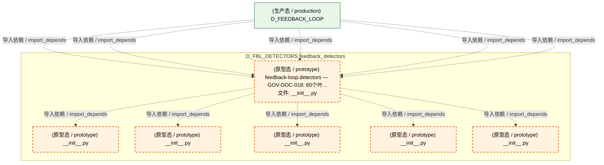
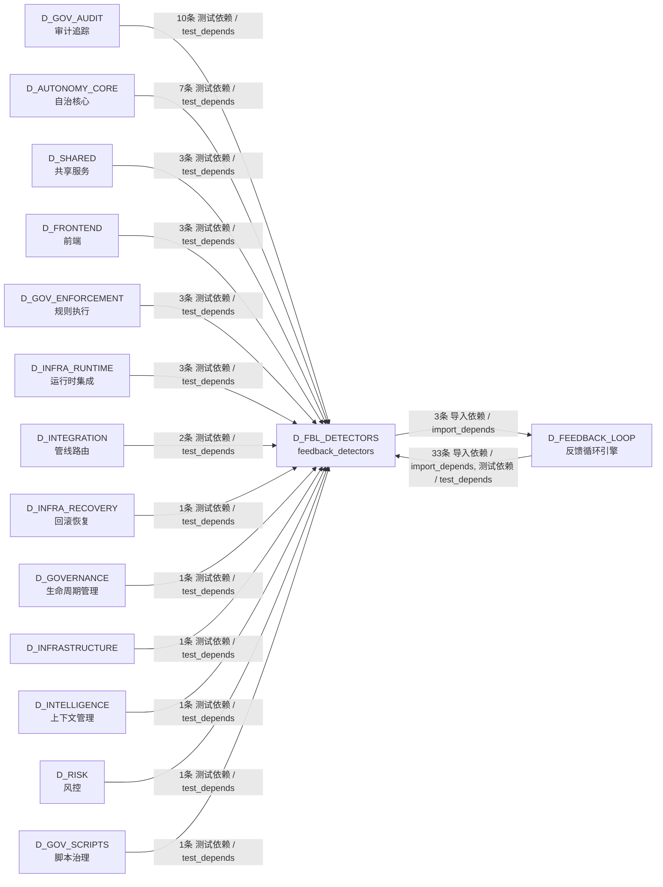

# 11_d_fbl_detectors / feedback_detectors / feedback_detectors / Feedback Detectors

> **功能简介 / Overview**: 反馈检测器，负责异常检测、漂移检测、反馈信号检测和可靠性监控

> **文档作用 / Purpose**: 展示 feedback_detectors（D_FBL_DETECTORS）功能域的模块清单、域内依赖关系、跨域依赖关系、架构分层视图，供架构审查和域治理参考。

> 本文档由 generate_domain_doc.py 从 depgraph (PostgreSQL) 自动生成
> 最后更新: 2026-07-15 04:34:18
> 数据源: depgraph (PostgreSQL) nodes表 + edges表

## 域基本信息 / Domain Overview

| 字段 | 值 | Field | Value |
|------|------|-------|-------|
| 编号 | 11 | Number | 11 |
| 域ID | D_FBL_DETECTORS | Domain ID | D_FBL_DETECTORS |
| 域名称 | feedback_detectors | Domain Name | Feedback Detectors |
| 层级 | L1 基础平台层 | Layer | L1 Foundation |
| 模块数 | 65 | Module Count | 65 |
| 域内依赖 | 5 | Internal Dependencies | 5 |
| 跨域入边 | 70 | Cross-domain Incoming | 70 |
| 跨域出边 | 3 | Cross-domain Outgoing | 3 |
| 设计态模块 | 0 | Design Modules | 0 |
| 原型态模块 | 6 | Prototype Modules | 6 |
| 生产态模块 | 59 | Production Modules | 59 |
| 容量 | 59/150 (正常) | Capacity | 59/150 (正常) |
| 描述 | 反馈循环检测(feedback_loop/detectors)——异常检测、漂移检测、相关性检测 | Description | 反馈循环检测(feedback_loop/detectors)——异常检测、漂移检测、相关性检测 |

## 模块分层清单 / Module Layered List

> 按 architecture_layer 分组的模块清单（共 65 个模块 / 65 modules）。

### L1 基础层 / Foundation Layer (65 modules)

| # | 模块路径 / Module Path | 模块名称 / Module Name (功能简介 / Description) | 成熟度 / Maturity | 蓝图 / Blueprint |
|:--:|---------|---------|:---:|:---:|
| 1 | src/zephyr/feedback_loop/detectors/__init__.py | feedback-loop.detectors — GOV-DOC-018: 60个叶... | 原型态 / prototype | [MOD-FEEDBACK_LOOP](../../03_modules/_cross_layer/feedback_loop/blueprint.md) |
| 2 | src/zephyr/feedback_loop/detectors/anomaly/__init__.py | __init__.py | 原型态 / prototype | [MOD-FEEDBACK_LOOP](../../03_modules/_cross_layer/feedback_loop/blueprint.md) |
| 3 | src/zephyr/feedback_loop/detectors/anomaly/anomaly_cluste... | Anomaly Clustering — v0.9.0 R119 | 生产态 / production | [MOD-FEEDBACK_LOOP](../../03_modules/_cross_layer/feedback_loop/blueprint.md) |
| 4 | src/zephyr/feedback_loop/detectors/anomaly/anomaly_detect... | anomaly_detector.py | 生产态 / production | [MOD-FEEDBACK_LOOP](../../03_modules/_cross_layer/feedback_loop/blueprint.md) |
| 5 | src/zephyr/feedback_loop/detectors/anomaly/emergent_behav... | Emergent Behavior Detector — v0.38.0 R473 | 生产态 / production | [MOD-FEEDBACK_LOOP](../../03_modules/_cross_layer/feedback_loop/blueprint.md) |
| 6 | src/zephyr/feedback_loop/detectors/anomaly/flapping_detec... | Flapping Detector — v0.40.0 R494 | 生产态 / production | [MOD-FEEDBACK_LOOP](../../03_modules/_cross_layer/feedback_loop/blueprint.md) |
| 7 | src/zephyr/feedback_loop/detectors/anomaly/heisenbug_dete... | Heisenbug Detector — v0.38.0 R470 | 生产态 / production | [MOD-FEEDBACK_LOOP](../../03_modules/_cross_layer/feedback_loop/blueprint.md) |
| 8 | src/zephyr/feedback_loop/detectors/anomaly/infinite_loop_... | Infinite Loop Detector — v0.15.0 R219 | 生产态 / production | [MOD-FEEDBACK_LOOP](../../03_modules/_cross_layer/feedback_loop/blueprint.md) |
| 9 | src/zephyr/feedback_loop/detectors/anomaly/intermittent_f... | Intermittent Failure Pattern Detector — v0.40.... | 生产态 / production | [MOD-FEEDBACK_LOOP](../../03_modules/_cross_layer/feedback_loop/blueprint.md) |
| 10 | src/zephyr/feedback_loop/detectors/anomaly/log_anomaly.py | Log Anomaly Detector — v0.6.0 R61 | 生产态 / production | [MOD-FEEDBACK_LOOP](../../03_modules/_cross_layer/feedback_loop/blueprint.md) |
| 11 | src/zephyr/feedback_loop/detectors/anomaly/silent_corrupt... | Silent Corruption Detector — v0.40.0 R499 | 生产态 / production | [MOD-FEEDBACK_LOOP](../../03_modules/_cross_layer/feedback_loop/blueprint.md) |
| 12 | src/zephyr/feedback_loop/detectors/anomaly/synthetic_anom... | Synthetic Anomaly Generator — v0.9.0 R112 | 生产态 / production | [MOD-FEEDBACK_LOOP](../../03_modules/_cross_layer/feedback_loop/blueprint.md) |
| 13 | src/zephyr/feedback_loop/detectors/anomaly/temporal_patte... | Temporal Pattern Detector — v0.12.0 R164 | 生产态 / production | [MOD-FEEDBACK_LOOP](../../03_modules/_cross_layer/feedback_loop/blueprint.md) |
| 14 | src/zephyr/feedback_loop/detectors/correlation/__init__.py | __init__.py | 原型态 / prototype | [MOD-FEEDBACK_LOOP](../../03_modules/_cross_layer/feedback_loop/blueprint.md) |
| 15 | src/zephyr/feedback_loop/detectors/correlation/action_eff... | R507: ActionEfficacyDecayDetector | 生产态 / production | [MOD-FEEDBACK_LOOP](../../03_modules/_cross_layer/feedback_loop/blueprint.md) |
| 16 | src/zephyr/feedback_loop/detectors/correlation/action_int... | Action Interaction Detector — v0.38.0 R472 | 生产态 / production | [MOD-FEEDBACK_LOOP](../../03_modules/_cross_layer/feedback_loop/blueprint.md) |
| 17 | src/zephyr/feedback_loop/detectors/correlation/action_sid... | R526: ActionSideEffectCumulativeDetector | 生产态 / production | [MOD-FEEDBACK_LOOP](../../03_modules/_cross_layer/feedback_loop/blueprint.md) |
| 18 | src/zephyr/feedback_loop/detectors/correlation/agent_traj... | R503: AgentTrajectoryAnomalyDetector | 生产态 / production | [MOD-FEEDBACK_LOOP](../../03_modules/_cross_layer/feedback_loop/blueprint.md) |
| 19 | src/zephyr/feedback_loop/detectors/correlation/cross_sign... | Cross-Signal Validator — v0.6.0 R63 | 生产态 / production | [MOD-FEEDBACK_LOOP](../../03_modules/_cross_layer/feedback_loop/blueprint.md) |
| 20 | src/zephyr/feedback_loop/detectors/correlation/cross_syst... | Cross-System Correlator — v0.13.0 R185 | 生产态 / production | [MOD-FEEDBACK_LOOP](../../03_modules/_cross_layer/feedback_loop/blueprint.md) |
| 21 | src/zephyr/feedback_loop/detectors/correlation/decision_p... | Decision Provenance — v0.12.0 R166 | 生产态 / production | [MOD-FEEDBACK_LOOP](../../03_modules/_cross_layer/feedback_loop/blueprint.md) |
| 22 | src/zephyr/feedback_loop/detectors/correlation/dependency... | Dependency Freshness Monitor — v0.38.0 R474 | 生产态 / production | [MOD-FEEDBACK_LOOP](../../03_modules/_cross_layer/feedback_loop/blueprint.md) |
| 23 | src/zephyr/feedback_loop/detectors/correlation/ensemble_d... | Ensemble Detector — v0.4.0 R21 | 生产态 / production | [MOD-FEEDBACK_LOOP](../../03_modules/_cross_layer/feedback_loop/blueprint.md) |
| 24 | src/zephyr/feedback_loop/detectors/correlation/external_h... | External Health Monitor — v0.14.0 R193 | 生产态 / production | [MOD-FEEDBACK_LOOP](../../03_modules/_cross_layer/feedback_loop/blueprint.md) |
| 25 | src/zephyr/feedback_loop/detectors/correlation/external_v... | R524: ExternalValidationCheckpoint | 生产态 / production | [MOD-FEEDBACK_LOOP](../../03_modules/_cross_layer/feedback_loop/blueprint.md) |
| 26 | src/zephyr/feedback_loop/detectors/correlation/fle_perfor... | R532: FLEPerformanceRegressionDetector | 生产态 / production | [MOD-FEEDBACK_LOOP](../../03_modules/_cross_layer/feedback_loop/blueprint.md) |
| 27 | src/zephyr/feedback_loop/detectors/correlation/multi_sign... | Multi-Signal Correlator — v0.4.0 R22 | 生产态 / production | [MOD-FEEDBACK_LOOP](../../03_modules/_cross_layer/feedback_loop/blueprint.md) |
| 28 | src/zephyr/feedback_loop/detectors/correlation/rumor_nois... | Rumor Noise Filter — v0.37.0 R460 | 生产态 / production | [MOD-FEEDBACK_LOOP](../../03_modules/_cross_layer/feedback_loop/blueprint.md) |
| 29 | src/zephyr/feedback_loop/detectors/correlation/trace_caus... | Trace Causal Bridge — v0.6.0 R62 | 生产态 / production | [MOD-FEEDBACK_LOOP](../../03_modules/_cross_layer/feedback_loop/blueprint.md) |
| 30 | src/zephyr/feedback_loop/detectors/correlation/traffic_re... | Traffic Replay Validator — v0.14.0 R202 | 生产态 / production | [MOD-FEEDBACK_LOOP](../../03_modules/_cross_layer/feedback_loop/blueprint.md) |
| 31 | src/zephyr/feedback_loop/detectors/drift/__init__.py | __init__.py | 原型态 / prototype | [MOD-FEEDBACK_LOOP](../../03_modules/_cross_layer/feedback_loop/blueprint.md) |
| 32 | src/zephyr/feedback_loop/detectors/drift/concept_drift.py | Concept Drift Detector — v0.5.0 R42 | 生产态 / production | [MOD-FEEDBACK_LOOP](../../03_modules/_cross_layer/feedback_loop/blueprint.md) |
| 33 | src/zephyr/feedback_loop/detectors/drift/config_drift.py | Config Drift Detector — v0.13.0 R182 | 生产态 / production | [MOD-FEEDBACK_LOOP](../../03_modules/_cross_layer/feedback_loop/blueprint.md) |
| 34 | src/zephyr/feedback_loop/detectors/drift/context_window_c... | Context Window Contamination Detector — v0.38.... | 生产态 / production | [MOD-FEEDBACK_LOOP](../../03_modules/_cross_layer/feedback_loop/blueprint.md) |
| 35 | src/zephyr/feedback_loop/detectors/drift/diminishing_retu... | R528: DiminishingReturnsDetector | 生产态 / production | [MOD-FEEDBACK_LOOP](../../03_modules/_cross_layer/feedback_loop/blueprint.md) |
| 36 | src/zephyr/feedback_loop/detectors/drift/ensemble_drift.py | Ensemble Drift — v0.5.0 R43 | 生产态 / production | [MOD-FEEDBACK_LOOP](../../03_modules/_cross_layer/feedback_loop/blueprint.md) |
| 37 | src/zephyr/feedback_loop/detectors/drift/gradual_poisonin... | Gradual Poisoning Detector — v0.15.0 R210 | 生产态 / production | [MOD-FEEDBACK_LOOP](../../03_modules/_cross_layer/feedback_loop/blueprint.md) |
| 38 | src/zephyr/feedback_loop/detectors/drift/trend_cycle_sepa... | Trend-Cycle Separator — v0.9.0 R113 | 生产态 / production | [MOD-FEEDBACK_LOOP](../../03_modules/_cross_layer/feedback_loop/blueprint.md) |
| 39 | src/zephyr/feedback_loop/detectors/guard/__init__.py | __init__.py | 原型态 / prototype | [MOD-FEEDBACK_LOOP](../../03_modules/_cross_layer/feedback_loop/blueprint.md) |
| 40 | src/zephyr/feedback_loop/detectors/guard/alert_desensitiz... | Alert Desensitization Curve — v0.37.0 R492 | 生产态 / production | [MOD-FEEDBACK_LOOP](../../03_modules/_cross_layer/feedback_loop/blueprint.md) |
| 41 | src/zephyr/feedback_loop/detectors/guard/guard_cascade_de... | R520: GuardCascadeDetector | 生产态 / production | [MOD-FEEDBACK_LOOP](../../03_modules/_cross_layer/feedback_loop/blueprint.md) |
| 42 | src/zephyr/feedback_loop/detectors/guard/guard_oscillatio... | R519: GuardOscillationDetector | 生产态 / production | [MOD-FEEDBACK_LOOP](../../03_modules/_cross_layer/feedback_loop/blueprint.md) |
| 43 | src/zephyr/feedback_loop/detectors/guard/placebo_action_d... | R508: PlaceboActionDetector | 生产态 / production | [MOD-FEEDBACK_LOOP](../../03_modules/_cross_layer/feedback_loop/blueprint.md) |
| 44 | src/zephyr/feedback_loop/detectors/guard/positive_feedbac... | Positive Feedback Defense — v0.4.0 R28 | 生产态 / production | [MOD-FEEDBACK_LOOP](../../03_modules/_cross_layer/feedback_loop/blueprint.md) |
| 45 | src/zephyr/feedback_loop/detectors/guard/recursive_diagno... | R517: RecursiveDiagnosisTrustEvaluator | 生产态 / production | [MOD-FEEDBACK_LOOP](../../03_modules/_cross_layer/feedback_loop/blueprint.md) |
| 46 | src/zephyr/feedback_loop/detectors/guard/self_audit.py | Self Audit — v0.13.0 R183 | 生产态 / production | [MOD-FEEDBACK_LOOP](../../03_modules/_cross_layer/feedback_loop/blueprint.md) |
| 47 | src/zephyr/feedback_loop/detectors/guard/self_diagnosis_d... | R530: SelfDiagnosisDataLeakDetector | 生产态 / production | [MOD-FEEDBACK_LOOP](../../03_modules/_cross_layer/feedback_loop/blueprint.md) |
| 48 | src/zephyr/feedback_loop/detectors/guard/self_ha.py | Self HA — v0.13.0 R173 | 生产态 / production | [MOD-FEEDBACK_LOOP](../../03_modules/_cross_layer/feedback_loop/blueprint.md) |
| 49 | src/zephyr/feedback_loop/detectors/guard/temporal_coheren... | R525: TemporalCoherenceOfSelfModel | 生产态 / production | [MOD-FEEDBACK_LOOP](../../03_modules/_cross_layer/feedback_loop/blueprint.md) |
| 50 | src/zephyr/feedback_loop/detectors/reliability/__init__.py | __init__.py | 原型态 / prototype | [MOD-FEEDBACK_LOOP](../../03_modules/_cross_layer/feedback_loop/blueprint.md) |
| 51 | src/zephyr/feedback_loop/detectors/reliability/autoscale_... | Autoscale Remediation — v0.13.0 R174 | 生产态 / production | [MOD-FEEDBACK_LOOP](../../03_modules/_cross_layer/feedback_loop/blueprint.md) |
| 52 | src/zephyr/feedback_loop/detectors/reliability/blast_radi... | Blast Radius Detector — v0.12.0 R167 | 生产态 / production | [MOD-FEEDBACK_LOOP](../../03_modules/_cross_layer/feedback_loop/blueprint.md) |
| 53 | src/zephyr/feedback_loop/detectors/reliability/blast_radi... | Blast Radius Budget — v0.13.0 R178 | 生产态 / production | [MOD-FEEDBACK_LOOP](../../03_modules/_cross_layer/feedback_loop/blueprint.md) |
| 54 | src/zephyr/feedback_loop/detectors/reliability/capacity_f... | Capacity Forecast — v0.13.0 R186b | 生产态 / production | [MOD-FEEDBACK_LOOP](../../03_modules/_cross_layer/feedback_loop/blueprint.md) |
| 55 | src/zephyr/feedback_loop/detectors/reliability/chaos_engi... | Chaos Engineering — v0.13.0 R172 | 生产态 / production | [MOD-FEEDBACK_LOOP](../../03_modules/_cross_layer/feedback_loop/blueprint.md) |
| 56 | src/zephyr/feedback_loop/detectors/reliability/ebpf_monit... | eBPF Monitor — v0.6.0 R64 | 生产态 / production | [MOD-FEEDBACK_LOOP](../../03_modules/_cross_layer/feedback_loop/blueprint.md) |
| 57 | src/zephyr/feedback_loop/detectors/reliability/flag_lifec... | Flag Lifecycle Detector — v0.13.0 R180 | 生产态 / production | [MOD-FEEDBACK_LOOP](../../03_modules/_cross_layer/feedback_loop/blueprint.md) |
| 58 | src/zephyr/feedback_loop/detectors/reliability/maintenanc... | Maintenance Coordinator — v0.12.0 R168 | 生产态 / production | [MOD-FEEDBACK_LOOP](../../03_modules/_cross_layer/feedback_loop/blueprint.md) |
| 59 | src/zephyr/feedback_loop/detectors/reliability/metric_car... | Metric Cardinality Guard — v0.40.0 R495 | 生产态 / production | [MOD-FEEDBACK_LOOP](../../03_modules/_cross_layer/feedback_loop/blueprint.md) |
| 60 | src/zephyr/feedback_loop/detectors/reliability/openfeatur... | OpenFeature Integration — v0.13.0 R181 | 生产态 / production | [MOD-FEEDBACK_LOOP](../../03_modules/_cross_layer/feedback_loop/blueprint.md) |
| 61 | src/zephyr/feedback_loop/detectors/reliability/otel_adapt... | OTel Adapter — v0.12.0 R170 | 生产态 / production | [MOD-FEEDBACK_LOOP](../../03_modules/_cross_layer/feedback_loop/blueprint.md) |
| 62 | src/zephyr/feedback_loop/detectors/reliability/regulatory... | Regulatory Audit Detector — v0.13.0 R184 | 生产态 / production | [MOD-FEEDBACK_LOOP](../../03_modules/_cross_layer/feedback_loop/blueprint.md) |
| 63 | src/zephyr/feedback_loop/detectors/reliability/resolution... | Resolution Tracker — v0.12.0 R165 | 生产态 / production | [MOD-FEEDBACK_LOOP](../../03_modules/_cross_layer/feedback_loop/blueprint.md) |
| 64 | src/zephyr/feedback_loop/detectors/reliability/runbook_ex... | Runbook Executor — v0.13.0 R186a | 生产态 / production | [MOD-FEEDBACK_LOOP](../../03_modules/_cross_layer/feedback_loop/blueprint.md) |
| 65 | src/zephyr/feedback_loop/detectors/reliability/version_mi... | Version Migrator — v0.12.0 R169 | 生产态 / production | [MOD-FEEDBACK_LOOP](../../03_modules/_cross_layer/feedback_loop/blueprint.md) |

## 域内依赖图 / Internal Dependency Diagram

> 依赖图内嵌在本文档中，IDE 可直接渲染显示。参考 decision_index.md 设计，分四个视图：合并全景图、运营态子图、设计态子图、原型态子图（按 design_maturity 实际值拆分）。
>
> **图例说明 / Legend**：
> - **实线边框 = 运营态模块**（production，已上线运行）
> - **虚线边框 = 设计态模块**（design，蓝图阶段，代码未写）
> - **虚线边框 = 原型态模块**（prototype，代码已写，验证中未稳定上线）
> - **实线箭头 = 运营态依赖**（已生效的依赖关系）
> - **虚线箭头 = 非运营态依赖**（计划中/验证中的依赖关系）

### 合并全景图（全部模块，标签标注成熟度）

> 展示全部 65 个模块（生产态 59 + 设计态 0 + 原型态 6），标签标注成熟度。

#### 第 1 页 / 共 3 页

```mermaid
graph TD
    subgraph D_FBL_DETECTORS["D_FBL_DETECTORS feedback_detectors"]
        src_zephyr_feedback_loop_detectors_init_py["(原型态 / prototype) feedback-loop.detectors — GOV-DOC-018: 60个叶...<br/>文件: __init__.py"]
        src_zephyr_feedback_loop_detectors_anomaly_init_py["(原型态 / prototype) __init__.py"]
        src_zephyr_feedback_loop_detectors_anomaly_anomaly_clustering_py["(生产态 / production) Anomaly Clustering — v0.9.0 R119<br/>文件: anomaly_clustering.py"]
        src_zephyr_feedback_loop_detectors_anomaly_anomaly_detector_py["(生产态 / production) anomaly_detector.py"]
        src_zephyr_feedback_loop_detectors_anomaly_emergent_behavior_detector_py["(生产态 / production) Emergent Behavior Detector — v0.38.0 R473<br/>文件: emergent_behavior_detector.py"]
        src_zephyr_feedback_loop_detectors_anomaly_flapping_detector_py["(生产态 / production) Flapping Detector — v0.40.0 R494<br/>文件: flapping_detector.py"]
        src_zephyr_feedback_loop_detectors_anomaly_heisenbug_detector_py["(生产态 / production) Heisenbug Detector — v0.38.0 R470<br/>文件: heisenbug_detector.py"]
        src_zephyr_feedback_loop_detectors_anomaly_infinite_loop_detector_py["(生产态 / production) Infinite Loop Detector — v0.15.0 R219<br/>文件: infinite_loop_detector.py"]
        src_zephyr_feedback_loop_detectors_anomaly_intermittent_failure_pattern_py["(生产态 / production) Intermittent Failure Pattern Detector — v0.40....<br/>文件: intermittent_failure_pattern.py"]
        src_zephyr_feedback_loop_detectors_anomaly_log_anomaly_py["(生产态 / production) Log Anomaly Detector — v0.6.0 R61<br/>文件: log_anomaly.py"]
        src_zephyr_feedback_loop_detectors_anomaly_silent_corruption_detector_py["(生产态 / production) Silent Corruption Detector — v0.40.0 R499<br/>文件: silent_corruption_detector.py"]
        src_zephyr_feedback_loop_detectors_anomaly_synthetic_anomaly_generator_py["(生产态 / production) Synthetic Anomaly Generator — v0.9.0 R112<br/>文件: synthetic_anomaly_generator.py"]
        src_zephyr_feedback_loop_detectors_anomaly_temporal_pattern_py["(生产态 / production) Temporal Pattern Detector — v0.12.0 R164<br/>文件: temporal_pattern.py"]
        src_zephyr_feedback_loop_detectors_correlation_init_py["(原型态 / prototype) __init__.py"]
        src_zephyr_feedback_loop_detectors_correlation_action_efficacy_decay_detector_py["(生产态 / production) R507: ActionEfficacyDecayDetector<br/>文件: action_efficacy_decay_detector.py"]
        src_zephyr_feedback_loop_detectors_correlation_action_interaction_detector_py["(生产态 / production) Action Interaction Detector — v0.38.0 R472<br/>文件: action_interaction_detector.py"]
        src_zephyr_feedback_loop_detectors_correlation_action_side_effect_cumulative_detector_py["(生产态 / production) R526: ActionSideEffectCumulativeDetector<br/>文件: action_side_effect_cumulative_detector.py"]
        src_zephyr_feedback_loop_detectors_correlation_agent_trajectory_anomaly_detector_py["(生产态 / production) R503: AgentTrajectoryAnomalyDetector<br/>文件: agent_trajectory_anomaly_detector.py"]
        src_zephyr_feedback_loop_detectors_correlation_cross_signal_validator_py["(生产态 / production) Cross-Signal Validator — v0.6.0 R63<br/>文件: cross_signal_validator.py"]
        src_zephyr_feedback_loop_detectors_correlation_cross_system_correlator_py["(生产态 / production) Cross-System Correlator — v0.13.0 R185<br/>文件: cross_system_correlator.py"]
        src_zephyr_feedback_loop_detectors_correlation_decision_provenance_py["(生产态 / production) Decision Provenance — v0.12.0 R166<br/>文件: decision_provenance.py"]
        src_zephyr_feedback_loop_detectors_correlation_dependency_freshness_monitor_py["(生产态 / production) Dependency Freshness Monitor — v0.38.0 R474<br/>文件: dependency_freshness_monitor.py"]
        src_zephyr_feedback_loop_detectors_correlation_ensemble_detector_py["(生产态 / production) Ensemble Detector — v0.4.0 R21<br/>文件: ensemble_detector.py"]
        src_zephyr_feedback_loop_detectors_correlation_external_health_py["(生产态 / production) External Health Monitor — v0.14.0 R193<br/>文件: external_health.py"]
        src_zephyr_feedback_loop_detectors_correlation_external_validation_checkpoint_py["(生产态 / production) R524: ExternalValidationCheckpoint<br/>文件: external_validation_checkpoint.py"]
        src_zephyr_feedback_loop_detectors_correlation_fle_performance_regression_detector_py["(生产态 / production) R532: FLEPerformanceRegressionDetector<br/>文件: fle_performance_regression_detector.py"]
        src_zephyr_feedback_loop_detectors_correlation_multi_signal_correlator_py["(生产态 / production) Multi-Signal Correlator — v0.4.0 R22<br/>文件: multi_signal_correlator.py"]
        src_zephyr_feedback_loop_detectors_correlation_rumor_noise_filter_py["(生产态 / production) Rumor Noise Filter — v0.37.0 R460<br/>文件: rumor_noise_filter.py"]
        src_zephyr_feedback_loop_detectors_correlation_trace_causal_bridge_py["(生产态 / production) Trace Causal Bridge — v0.6.0 R62<br/>文件: trace_causal_bridge.py"]
        src_zephyr_feedback_loop_detectors_correlation_traffic_replay_validator_py["(生产态 / production) Traffic Replay Validator — v0.14.0 R202<br/>文件: traffic_replay_validator.py"]
    end
    src_zephyr_feedback_loop_detectors_init_py -.->|导入依赖 / import_depends| src_zephyr_feedback_loop_detectors_anomaly_init_py
    src_zephyr_feedback_loop_detectors_init_py -.->|导入依赖 / import_depends| src_zephyr_feedback_loop_detectors_correlation_init_py
    D_FEEDBACK_LOOP["(生产态 / production) D_FEEDBACK_LOOP"]
    src_zephyr_feedback_loop_detectors_anomaly_anomaly_detector_py -->|导入依赖 / import_depends| D_FEEDBACK_LOOP
    src_zephyr_feedback_loop_detectors_anomaly_anomaly_detector_py -.->|导入依赖 / import_depends| D_FEEDBACK_LOOP
    src_zephyr_feedback_loop_detectors_anomaly_anomaly_detector_py -.->|导入依赖 / import_depends| D_FEEDBACK_LOOP
    D_FEEDBACK_LOOP -.->|导入依赖 / import_depends| src_zephyr_feedback_loop_detectors_init_py
    D_FEEDBACK_LOOP -.->|导入依赖 / import_depends| src_zephyr_feedback_loop_detectors_init_py
    D_FEEDBACK_LOOP -.->|导入依赖 / import_depends| src_zephyr_feedback_loop_detectors_init_py
    D_FEEDBACK_LOOP -.->|导入依赖 / import_depends| src_zephyr_feedback_loop_detectors_init_py
    D_FEEDBACK_LOOP -.->|导入依赖 / import_depends| src_zephyr_feedback_loop_detectors_init_py
    D_FEEDBACK_LOOP -.->|测试依赖 / test_depends| src_zephyr_feedback_loop_detectors_anomaly_anomaly_clustering_py
    D_FEEDBACK_LOOP -.->|测试依赖 / test_depends| src_zephyr_feedback_loop_detectors_anomaly_flapping_detector_py
    D_FRONTEND["(原型态 / prototype) D_FRONTEND"]
    D_FRONTEND -.->|测试依赖 / test_depends| src_zephyr_feedback_loop_detectors_anomaly_anomaly_detector_py
    D_AUTONOMY_CORE["(原型态 / prototype) D_AUTONOMY_CORE"]
    D_AUTONOMY_CORE -.->|测试依赖 / test_depends| src_zephyr_feedback_loop_detectors_anomaly_anomaly_detector_py
    D_FEEDBACK_LOOP -->|导入依赖 / import_depends| src_zephyr_feedback_loop_detectors_anomaly_anomaly_detector_py
    D_GOV_AUDIT["(原型态 / prototype) D_GOV_AUDIT"]
    D_GOV_AUDIT -.->|测试依赖 / test_depends| src_zephyr_feedback_loop_detectors_anomaly_emergent_behavior_detector_py
    D_FEEDBACK_LOOP -.->|测试依赖 / test_depends| src_zephyr_feedback_loop_detectors_anomaly_heisenbug_detector_py
    D_FEEDBACK_LOOP -.->|测试依赖 / test_depends| src_zephyr_feedback_loop_detectors_anomaly_infinite_loop_detector_py
    D_FEEDBACK_LOOP -.->|测试依赖 / test_depends| src_zephyr_feedback_loop_detectors_anomaly_log_anomaly_py
    D_GOV_AUDIT -.->|测试依赖 / test_depends| src_zephyr_feedback_loop_detectors_anomaly_intermittent_failure_pattern_py
    classDef production fill:#e1f5fe,stroke:#01579b,stroke-width:2px,color:#000
    classDef design fill:#fff3e0,stroke:#e65100,stroke-width:2px,color:#000,stroke-dasharray: 5 5
    classDef external_prod fill:#e8f5e9,stroke:#1b5e20,stroke-width:1px,color:#000
    classDef external_design fill:#fce4ec,stroke:#880e4f,stroke-width:1px,color:#000,stroke-dasharray: 5 5
    class src_zephyr_feedback_loop_detectors_anomaly_anomaly_clustering_py,src_zephyr_feedback_loop_detectors_anomaly_anomaly_detector_py,src_zephyr_feedback_loop_detectors_anomaly_emergent_behavior_detector_py,src_zephyr_feedback_loop_detectors_anomaly_flapping_detector_py,src_zephyr_feedback_loop_detectors_anomaly_heisenbug_detector_py,src_zephyr_feedback_loop_detectors_anomaly_infinite_loop_detector_py,src_zephyr_feedback_loop_detectors_anomaly_intermittent_failure_pattern_py,src_zephyr_feedback_loop_detectors_anomaly_log_anomaly_py,src_zephyr_feedback_loop_detectors_anomaly_silent_corruption_detector_py,src_zephyr_feedback_loop_detectors_anomaly_synthetic_anomaly_generator_py,src_zephyr_feedback_loop_detectors_anomaly_temporal_pattern_py,src_zephyr_feedback_loop_detectors_correlation_action_efficacy_decay_detector_py,src_zephyr_feedback_loop_detectors_correlation_action_interaction_detector_py,src_zephyr_feedback_loop_detectors_correlation_action_side_effect_cumulative_detector_py,src_zephyr_feedback_loop_detectors_correlation_agent_trajectory_anomaly_detector_py,src_zephyr_feedback_loop_detectors_correlation_cross_signal_validator_py,src_zephyr_feedback_loop_detectors_correlation_cross_system_correlator_py,src_zephyr_feedback_loop_detectors_correlation_decision_provenance_py,src_zephyr_feedback_loop_detectors_correlation_dependency_freshness_monitor_py,src_zephyr_feedback_loop_detectors_correlation_ensemble_detector_py,src_zephyr_feedback_loop_detectors_correlation_external_health_py,src_zephyr_feedback_loop_detectors_correlation_external_validation_checkpoint_py,src_zephyr_feedback_loop_detectors_correlation_fle_performance_regression_detector_py,src_zephyr_feedback_loop_detectors_correlation_multi_signal_correlator_py,src_zephyr_feedback_loop_detectors_correlation_rumor_noise_filter_py,src_zephyr_feedback_loop_detectors_correlation_trace_causal_bridge_py,src_zephyr_feedback_loop_detectors_correlation_traffic_replay_validator_py production
    class src_zephyr_feedback_loop_detectors_init_py,src_zephyr_feedback_loop_detectors_anomaly_init_py,src_zephyr_feedback_loop_detectors_correlation_init_py design
    class D_FEEDBACK_LOOP external_prod
    class D_FRONTEND,D_AUTONOMY_CORE,D_GOV_AUDIT external_design
```



#### 第 2 页 / 共 3 页

```mermaid
graph TD
    subgraph D_FBL_DETECTORS["D_FBL_DETECTORS feedback_detectors"]
        src_zephyr_feedback_loop_detectors_drift_init_py["(原型态 / prototype) __init__.py"]
        src_zephyr_feedback_loop_detectors_drift_concept_drift_py["(生产态 / production) Concept Drift Detector — v0.5.0 R42<br/>文件: concept_drift.py"]
        src_zephyr_feedback_loop_detectors_drift_config_drift_py["(生产态 / production) Config Drift Detector — v0.13.0 R182<br/>文件: config_drift.py"]
        src_zephyr_feedback_loop_detectors_drift_context_window_contamination_detector_py["(生产态 / production) Context Window Contamination Detector — v0.38....<br/>文件: context_window_contamination_detector.py"]
        src_zephyr_feedback_loop_detectors_drift_diminishing_returns_detector_py["(生产态 / production) R528: DiminishingReturnsDetector<br/>文件: diminishing_returns_detector.py"]
        src_zephyr_feedback_loop_detectors_drift_ensemble_drift_py["(生产态 / production) Ensemble Drift — v0.5.0 R43<br/>文件: ensemble_drift.py"]
        src_zephyr_feedback_loop_detectors_drift_gradual_poisoning_detector_py["(生产态 / production) Gradual Poisoning Detector — v0.15.0 R210<br/>文件: gradual_poisoning_detector.py"]
        src_zephyr_feedback_loop_detectors_drift_trend_cycle_separator_py["(生产态 / production) Trend-Cycle Separator — v0.9.0 R113<br/>文件: trend_cycle_separator.py"]
        src_zephyr_feedback_loop_detectors_guard_init_py["(原型态 / prototype) __init__.py"]
        src_zephyr_feedback_loop_detectors_guard_alert_desensitization_curve_py["(生产态 / production) Alert Desensitization Curve — v0.37.0 R492<br/>文件: alert_desensitization_curve.py"]
        src_zephyr_feedback_loop_detectors_guard_guard_cascade_detector_py["(生产态 / production) R520: GuardCascadeDetector<br/>文件: guard_cascade_detector.py"]
        src_zephyr_feedback_loop_detectors_guard_guard_oscillation_detector_py["(生产态 / production) R519: GuardOscillationDetector<br/>文件: guard_oscillation_detector.py"]
        src_zephyr_feedback_loop_detectors_guard_placebo_action_detector_py["(生产态 / production) R508: PlaceboActionDetector<br/>文件: placebo_action_detector.py"]
        src_zephyr_feedback_loop_detectors_guard_positive_feedback_defense_py["(生产态 / production) Positive Feedback Defense — v0.4.0 R28<br/>文件: positive_feedback_defense.py"]
        src_zephyr_feedback_loop_detectors_guard_recursive_diagnosis_trust_evaluator_py["(生产态 / production) R517: RecursiveDiagnosisTrustEvaluator<br/>文件: recursive_diagnosis_trust_evaluator.py"]
        src_zephyr_feedback_loop_detectors_guard_self_audit_py["(生产态 / production) Self Audit — v0.13.0 R183<br/>文件: self_audit.py"]
        src_zephyr_feedback_loop_detectors_guard_self_diagnosis_data_leak_detector_py["(生产态 / production) R530: SelfDiagnosisDataLeakDetector<br/>文件: self_diagnosis_data_leak_detector.py"]
        src_zephyr_feedback_loop_detectors_guard_self_ha_py["(生产态 / production) Self HA — v0.13.0 R173<br/>文件: self_ha.py"]
        src_zephyr_feedback_loop_detectors_guard_temporal_coherence_of_self_model_py["(生产态 / production) R525: TemporalCoherenceOfSelfModel<br/>文件: temporal_coherence_of_self_model.py"]
        src_zephyr_feedback_loop_detectors_reliability_init_py["(原型态 / prototype) __init__.py"]
        src_zephyr_feedback_loop_detectors_reliability_autoscale_remediation_py["(生产态 / production) Autoscale Remediation — v0.13.0 R174<br/>文件: autoscale_remediation.py"]
        src_zephyr_feedback_loop_detectors_reliability_blast_radius_py["(生产态 / production) Blast Radius Detector — v0.12.0 R167<br/>文件: blast_radius.py"]
        src_zephyr_feedback_loop_detectors_reliability_blast_radius_budget_py["(生产态 / production) Blast Radius Budget — v0.13.0 R178<br/>文件: blast_radius_budget.py"]
        src_zephyr_feedback_loop_detectors_reliability_capacity_forecast_py["(生产态 / production) Capacity Forecast — v0.13.0 R186b<br/>文件: capacity_forecast.py"]
        src_zephyr_feedback_loop_detectors_reliability_chaos_engineering_py["(生产态 / production) Chaos Engineering — v0.13.0 R172<br/>文件: chaos_engineering.py"]
        src_zephyr_feedback_loop_detectors_reliability_ebpf_monitor_py["(生产态 / production) eBPF Monitor — v0.6.0 R64<br/>文件: ebpf_monitor.py"]
        src_zephyr_feedback_loop_detectors_reliability_flag_lifecycle_py["(生产态 / production) Flag Lifecycle Detector — v0.13.0 R180<br/>文件: flag_lifecycle.py"]
        src_zephyr_feedback_loop_detectors_reliability_maintenance_coordinator_py["(生产态 / production) Maintenance Coordinator — v0.12.0 R168<br/>文件: maintenance_coordinator.py"]
        src_zephyr_feedback_loop_detectors_reliability_metric_cardinality_guard_py["(生产态 / production) Metric Cardinality Guard — v0.40.0 R495<br/>文件: metric_cardinality_guard.py"]
        src_zephyr_feedback_loop_detectors_reliability_openfeature_py["(生产态 / production) OpenFeature Integration — v0.13.0 R181<br/>文件: openfeature.py"]
    end
    D_GOV_AUDIT["(原型态 / prototype) D_GOV_AUDIT"]
    D_GOV_AUDIT -.->|测试依赖 / test_depends| src_zephyr_feedback_loop_detectors_drift_concept_drift_py
    D_INFRASTRUCTURE["(原型态 / prototype) D_INFRASTRUCTURE"]
    D_INFRASTRUCTURE -.->|测试依赖 / test_depends| src_zephyr_feedback_loop_detectors_drift_config_drift_py
    D_FEEDBACK_LOOP["(原型态 / prototype) D_FEEDBACK_LOOP"]
    D_FEEDBACK_LOOP -.->|测试依赖 / test_depends| src_zephyr_feedback_loop_detectors_drift_ensemble_drift_py
    D_GOVERNANCE["(原型态 / prototype) D_GOVERNANCE"]
    D_GOVERNANCE -.->|测试依赖 / test_depends| src_zephyr_feedback_loop_detectors_drift_context_window_contamination_detector_py
    D_FEEDBACK_LOOP -.->|测试依赖 / test_depends| src_zephyr_feedback_loop_detectors_drift_diminishing_returns_detector_py
    D_FEEDBACK_LOOP -.->|测试依赖 / test_depends| src_zephyr_feedback_loop_detectors_drift_trend_cycle_separator_py
    D_FEEDBACK_LOOP -.->|测试依赖 / test_depends| src_zephyr_feedback_loop_detectors_drift_gradual_poisoning_detector_py
    D_GOV_ENFORCEMENT["(原型态 / prototype) D_GOV_ENFORCEMENT"]
    D_GOV_ENFORCEMENT -.->|测试依赖 / test_depends| src_zephyr_feedback_loop_detectors_guard_guard_cascade_detector_py
    D_FEEDBACK_LOOP -.->|测试依赖 / test_depends| src_zephyr_feedback_loop_detectors_guard_alert_desensitization_curve_py
    D_GOV_ENFORCEMENT -.->|测试依赖 / test_depends| src_zephyr_feedback_loop_detectors_guard_guard_oscillation_detector_py
    D_FEEDBACK_LOOP -.->|测试依赖 / test_depends| src_zephyr_feedback_loop_detectors_guard_guard_oscillation_detector_py
    D_AUTONOMY_CORE["(原型态 / prototype) D_AUTONOMY_CORE"]
    D_AUTONOMY_CORE -.->|测试依赖 / test_depends| src_zephyr_feedback_loop_detectors_guard_guard_oscillation_detector_py
    D_AUTONOMY_CORE -.->|测试依赖 / test_depends| src_zephyr_feedback_loop_detectors_guard_guard_oscillation_detector_py
    D_FEEDBACK_LOOP -.->|测试依赖 / test_depends| src_zephyr_feedback_loop_detectors_guard_placebo_action_detector_py
    D_FEEDBACK_LOOP -.->|测试依赖 / test_depends| src_zephyr_feedback_loop_detectors_guard_recursive_diagnosis_trust_evaluator_py
    classDef production fill:#e1f5fe,stroke:#01579b,stroke-width:2px,color:#000
    classDef design fill:#fff3e0,stroke:#e65100,stroke-width:2px,color:#000,stroke-dasharray: 5 5
    classDef external_prod fill:#e8f5e9,stroke:#1b5e20,stroke-width:1px,color:#000
    classDef external_design fill:#fce4ec,stroke:#880e4f,stroke-width:1px,color:#000,stroke-dasharray: 5 5
    class src_zephyr_feedback_loop_detectors_drift_concept_drift_py,src_zephyr_feedback_loop_detectors_drift_config_drift_py,src_zephyr_feedback_loop_detectors_drift_context_window_contamination_detector_py,src_zephyr_feedback_loop_detectors_drift_diminishing_returns_detector_py,src_zephyr_feedback_loop_detectors_drift_ensemble_drift_py,src_zephyr_feedback_loop_detectors_drift_gradual_poisoning_detector_py,src_zephyr_feedback_loop_detectors_drift_trend_cycle_separator_py,src_zephyr_feedback_loop_detectors_guard_alert_desensitization_curve_py,src_zephyr_feedback_loop_detectors_guard_guard_cascade_detector_py,src_zephyr_feedback_loop_detectors_guard_guard_oscillation_detector_py,src_zephyr_feedback_loop_detectors_guard_placebo_action_detector_py,src_zephyr_feedback_loop_detectors_guard_positive_feedback_defense_py,src_zephyr_feedback_loop_detectors_guard_recursive_diagnosis_trust_evaluator_py,src_zephyr_feedback_loop_detectors_guard_self_audit_py,src_zephyr_feedback_loop_detectors_guard_self_diagnosis_data_leak_detector_py,src_zephyr_feedback_loop_detectors_guard_self_ha_py,src_zephyr_feedback_loop_detectors_guard_temporal_coherence_of_self_model_py,src_zephyr_feedback_loop_detectors_reliability_autoscale_remediation_py,src_zephyr_feedback_loop_detectors_reliability_blast_radius_py,src_zephyr_feedback_loop_detectors_reliability_blast_radius_budget_py,src_zephyr_feedback_loop_detectors_reliability_capacity_forecast_py,src_zephyr_feedback_loop_detectors_reliability_chaos_engineering_py,src_zephyr_feedback_loop_detectors_reliability_ebpf_monitor_py,src_zephyr_feedback_loop_detectors_reliability_flag_lifecycle_py,src_zephyr_feedback_loop_detectors_reliability_maintenance_coordinator_py,src_zephyr_feedback_loop_detectors_reliability_metric_cardinality_guard_py,src_zephyr_feedback_loop_detectors_reliability_openfeature_py production
    class src_zephyr_feedback_loop_detectors_drift_init_py,src_zephyr_feedback_loop_detectors_guard_init_py,src_zephyr_feedback_loop_detectors_reliability_init_py design
    class D_GOV_AUDIT,D_INFRASTRUCTURE,D_FEEDBACK_LOOP,D_GOVERNANCE,D_GOV_ENFORCEMENT,D_AUTONOMY_CORE external_design
```



#### 第 3 页 / 共 3 页

```mermaid
graph TD
    subgraph D_FBL_DETECTORS["D_FBL_DETECTORS feedback_detectors"]
        src_zephyr_feedback_loop_detectors_reliability_otel_adapter_py["(生产态 / production) OTel Adapter — v0.12.0 R170<br/>文件: otel_adapter.py"]
        src_zephyr_feedback_loop_detectors_reliability_regulatory_audit_py["(生产态 / production) Regulatory Audit Detector — v0.13.0 R184<br/>文件: regulatory_audit.py"]
        src_zephyr_feedback_loop_detectors_reliability_resolution_tracker_py["(生产态 / production) Resolution Tracker — v0.12.0 R165<br/>文件: resolution_tracker.py"]
        src_zephyr_feedback_loop_detectors_reliability_runbook_executor_py["(生产态 / production) Runbook Executor — v0.13.0 R186a<br/>文件: runbook_executor.py"]
        src_zephyr_feedback_loop_detectors_reliability_version_migrator_py["(生产态 / production) Version Migrator — v0.12.0 R169<br/>文件: version_migrator.py"]
    end
    D_GOV_AUDIT["(原型态 / prototype) D_GOV_AUDIT"]
    D_GOV_AUDIT -.->|测试依赖 / test_depends| src_zephyr_feedback_loop_detectors_reliability_version_migrator_py
    D_FEEDBACK_LOOP["(原型态 / prototype) D_FEEDBACK_LOOP"]
    D_FEEDBACK_LOOP -.->|测试依赖 / test_depends| src_zephyr_feedback_loop_detectors_reliability_otel_adapter_py
    D_FEEDBACK_LOOP -.->|测试依赖 / test_depends| src_zephyr_feedback_loop_detectors_reliability_regulatory_audit_py
    D_FEEDBACK_LOOP -.->|测试依赖 / test_depends| src_zephyr_feedback_loop_detectors_reliability_resolution_tracker_py
    D_FEEDBACK_LOOP -.->|测试依赖 / test_depends| src_zephyr_feedback_loop_detectors_reliability_runbook_executor_py
    classDef production fill:#e1f5fe,stroke:#01579b,stroke-width:2px,color:#000
    classDef design fill:#fff3e0,stroke:#e65100,stroke-width:2px,color:#000,stroke-dasharray: 5 5
    classDef external_prod fill:#e8f5e9,stroke:#1b5e20,stroke-width:1px,color:#000
    classDef external_design fill:#fce4ec,stroke:#880e4f,stroke-width:1px,color:#000,stroke-dasharray: 5 5
    class src_zephyr_feedback_loop_detectors_reliability_otel_adapter_py,src_zephyr_feedback_loop_detectors_reliability_regulatory_audit_py,src_zephyr_feedback_loop_detectors_reliability_resolution_tracker_py,src_zephyr_feedback_loop_detectors_reliability_runbook_executor_py,src_zephyr_feedback_loop_detectors_reliability_version_migrator_py production
    class D_GOV_AUDIT,D_FEEDBACK_LOOP external_design
```



### 运营态子图（仅 design_maturity=production 的模块和依赖）

> 仅展示已上线运行的模块（共 59 个，0 条域内依赖）。

```mermaid
graph TD
    subgraph D_FBL_DETECTORS["D_FBL_DETECTORS feedback_detectors"]
        src_zephyr_feedback_loop_detectors_anomaly_anomaly_clustering_py["(生产态 / production) Anomaly Clustering — v0.9.0 R119<br/>文件: anomaly_clustering.py"]
        src_zephyr_feedback_loop_detectors_anomaly_anomaly_detector_py["(生产态 / production) anomaly_detector.py"]
        src_zephyr_feedback_loop_detectors_anomaly_emergent_behavior_detector_py["(生产态 / production) Emergent Behavior Detector — v0.38.0 R473<br/>文件: emergent_behavior_detector.py"]
        src_zephyr_feedback_loop_detectors_anomaly_flapping_detector_py["(生产态 / production) Flapping Detector — v0.40.0 R494<br/>文件: flapping_detector.py"]
        src_zephyr_feedback_loop_detectors_anomaly_heisenbug_detector_py["(生产态 / production) Heisenbug Detector — v0.38.0 R470<br/>文件: heisenbug_detector.py"]
        src_zephyr_feedback_loop_detectors_anomaly_infinite_loop_detector_py["(生产态 / production) Infinite Loop Detector — v0.15.0 R219<br/>文件: infinite_loop_detector.py"]
        src_zephyr_feedback_loop_detectors_anomaly_intermittent_failure_pattern_py["(生产态 / production) Intermittent Failure Pattern Detector — v0.40....<br/>文件: intermittent_failure_pattern.py"]
        src_zephyr_feedback_loop_detectors_anomaly_log_anomaly_py["(生产态 / production) Log Anomaly Detector — v0.6.0 R61<br/>文件: log_anomaly.py"]
        src_zephyr_feedback_loop_detectors_anomaly_silent_corruption_detector_py["(生产态 / production) Silent Corruption Detector — v0.40.0 R499<br/>文件: silent_corruption_detector.py"]
        src_zephyr_feedback_loop_detectors_anomaly_synthetic_anomaly_generator_py["(生产态 / production) Synthetic Anomaly Generator — v0.9.0 R112<br/>文件: synthetic_anomaly_generator.py"]
        src_zephyr_feedback_loop_detectors_anomaly_temporal_pattern_py["(生产态 / production) Temporal Pattern Detector — v0.12.0 R164<br/>文件: temporal_pattern.py"]
        src_zephyr_feedback_loop_detectors_correlation_action_efficacy_decay_detector_py["(生产态 / production) R507: ActionEfficacyDecayDetector<br/>文件: action_efficacy_decay_detector.py"]
        src_zephyr_feedback_loop_detectors_correlation_action_interaction_detector_py["(生产态 / production) Action Interaction Detector — v0.38.0 R472<br/>文件: action_interaction_detector.py"]
        src_zephyr_feedback_loop_detectors_correlation_action_side_effect_cumulative_detector_py["(生产态 / production) R526: ActionSideEffectCumulativeDetector<br/>文件: action_side_effect_cumulative_detector.py"]
        src_zephyr_feedback_loop_detectors_correlation_agent_trajectory_anomaly_detector_py["(生产态 / production) R503: AgentTrajectoryAnomalyDetector<br/>文件: agent_trajectory_anomaly_detector.py"]
        src_zephyr_feedback_loop_detectors_correlation_cross_signal_validator_py["(生产态 / production) Cross-Signal Validator — v0.6.0 R63<br/>文件: cross_signal_validator.py"]
        src_zephyr_feedback_loop_detectors_correlation_cross_system_correlator_py["(生产态 / production) Cross-System Correlator — v0.13.0 R185<br/>文件: cross_system_correlator.py"]
        src_zephyr_feedback_loop_detectors_correlation_decision_provenance_py["(生产态 / production) Decision Provenance — v0.12.0 R166<br/>文件: decision_provenance.py"]
        src_zephyr_feedback_loop_detectors_correlation_dependency_freshness_monitor_py["(生产态 / production) Dependency Freshness Monitor — v0.38.0 R474<br/>文件: dependency_freshness_monitor.py"]
        src_zephyr_feedback_loop_detectors_correlation_ensemble_detector_py["(生产态 / production) Ensemble Detector — v0.4.0 R21<br/>文件: ensemble_detector.py"]
        src_zephyr_feedback_loop_detectors_correlation_external_health_py["(生产态 / production) External Health Monitor — v0.14.0 R193<br/>文件: external_health.py"]
        src_zephyr_feedback_loop_detectors_correlation_external_validation_checkpoint_py["(生产态 / production) R524: ExternalValidationCheckpoint<br/>文件: external_validation_checkpoint.py"]
        src_zephyr_feedback_loop_detectors_correlation_fle_performance_regression_detector_py["(生产态 / production) R532: FLEPerformanceRegressionDetector<br/>文件: fle_performance_regression_detector.py"]
        src_zephyr_feedback_loop_detectors_correlation_multi_signal_correlator_py["(生产态 / production) Multi-Signal Correlator — v0.4.0 R22<br/>文件: multi_signal_correlator.py"]
        src_zephyr_feedback_loop_detectors_correlation_rumor_noise_filter_py["(生产态 / production) Rumor Noise Filter — v0.37.0 R460<br/>文件: rumor_noise_filter.py"]
        src_zephyr_feedback_loop_detectors_correlation_trace_causal_bridge_py["(生产态 / production) Trace Causal Bridge — v0.6.0 R62<br/>文件: trace_causal_bridge.py"]
        src_zephyr_feedback_loop_detectors_correlation_traffic_replay_validator_py["(生产态 / production) Traffic Replay Validator — v0.14.0 R202<br/>文件: traffic_replay_validator.py"]
        src_zephyr_feedback_loop_detectors_drift_concept_drift_py["(生产态 / production) Concept Drift Detector — v0.5.0 R42<br/>文件: concept_drift.py"]
        src_zephyr_feedback_loop_detectors_drift_config_drift_py["(生产态 / production) Config Drift Detector — v0.13.0 R182<br/>文件: config_drift.py"]
        src_zephyr_feedback_loop_detectors_drift_context_window_contamination_detector_py["(生产态 / production) Context Window Contamination Detector — v0.38....<br/>文件: context_window_contamination_detector.py"]
        src_zephyr_feedback_loop_detectors_drift_diminishing_returns_detector_py["(生产态 / production) R528: DiminishingReturnsDetector<br/>文件: diminishing_returns_detector.py"]
        src_zephyr_feedback_loop_detectors_drift_ensemble_drift_py["(生产态 / production) Ensemble Drift — v0.5.0 R43<br/>文件: ensemble_drift.py"]
        src_zephyr_feedback_loop_detectors_drift_gradual_poisoning_detector_py["(生产态 / production) Gradual Poisoning Detector — v0.15.0 R210<br/>文件: gradual_poisoning_detector.py"]
        src_zephyr_feedback_loop_detectors_drift_trend_cycle_separator_py["(生产态 / production) Trend-Cycle Separator — v0.9.0 R113<br/>文件: trend_cycle_separator.py"]
        src_zephyr_feedback_loop_detectors_guard_alert_desensitization_curve_py["(生产态 / production) Alert Desensitization Curve — v0.37.0 R492<br/>文件: alert_desensitization_curve.py"]
        src_zephyr_feedback_loop_detectors_guard_guard_cascade_detector_py["(生产态 / production) R520: GuardCascadeDetector<br/>文件: guard_cascade_detector.py"]
        src_zephyr_feedback_loop_detectors_guard_guard_oscillation_detector_py["(生产态 / production) R519: GuardOscillationDetector<br/>文件: guard_oscillation_detector.py"]
        src_zephyr_feedback_loop_detectors_guard_placebo_action_detector_py["(生产态 / production) R508: PlaceboActionDetector<br/>文件: placebo_action_detector.py"]
        src_zephyr_feedback_loop_detectors_guard_positive_feedback_defense_py["(生产态 / production) Positive Feedback Defense — v0.4.0 R28<br/>文件: positive_feedback_defense.py"]
        src_zephyr_feedback_loop_detectors_guard_recursive_diagnosis_trust_evaluator_py["(生产态 / production) R517: RecursiveDiagnosisTrustEvaluator<br/>文件: recursive_diagnosis_trust_evaluator.py"]
        src_zephyr_feedback_loop_detectors_guard_self_audit_py["(生产态 / production) Self Audit — v0.13.0 R183<br/>文件: self_audit.py"]
        src_zephyr_feedback_loop_detectors_guard_self_diagnosis_data_leak_detector_py["(生产态 / production) R530: SelfDiagnosisDataLeakDetector<br/>文件: self_diagnosis_data_leak_detector.py"]
        src_zephyr_feedback_loop_detectors_guard_self_ha_py["(生产态 / production) Self HA — v0.13.0 R173<br/>文件: self_ha.py"]
        src_zephyr_feedback_loop_detectors_guard_temporal_coherence_of_self_model_py["(生产态 / production) R525: TemporalCoherenceOfSelfModel<br/>文件: temporal_coherence_of_self_model.py"]
        src_zephyr_feedback_loop_detectors_reliability_autoscale_remediation_py["(生产态 / production) Autoscale Remediation — v0.13.0 R174<br/>文件: autoscale_remediation.py"]
        src_zephyr_feedback_loop_detectors_reliability_blast_radius_py["(生产态 / production) Blast Radius Detector — v0.12.0 R167<br/>文件: blast_radius.py"]
        src_zephyr_feedback_loop_detectors_reliability_blast_radius_budget_py["(生产态 / production) Blast Radius Budget — v0.13.0 R178<br/>文件: blast_radius_budget.py"]
        src_zephyr_feedback_loop_detectors_reliability_capacity_forecast_py["(生产态 / production) Capacity Forecast — v0.13.0 R186b<br/>文件: capacity_forecast.py"]
        src_zephyr_feedback_loop_detectors_reliability_chaos_engineering_py["(生产态 / production) Chaos Engineering — v0.13.0 R172<br/>文件: chaos_engineering.py"]
        src_zephyr_feedback_loop_detectors_reliability_ebpf_monitor_py["(生产态 / production) eBPF Monitor — v0.6.0 R64<br/>文件: ebpf_monitor.py"]
        src_zephyr_feedback_loop_detectors_reliability_flag_lifecycle_py["(生产态 / production) Flag Lifecycle Detector — v0.13.0 R180<br/>文件: flag_lifecycle.py"]
        src_zephyr_feedback_loop_detectors_reliability_maintenance_coordinator_py["(生产态 / production) Maintenance Coordinator — v0.12.0 R168<br/>文件: maintenance_coordinator.py"]
        src_zephyr_feedback_loop_detectors_reliability_metric_cardinality_guard_py["(生产态 / production) Metric Cardinality Guard — v0.40.0 R495<br/>文件: metric_cardinality_guard.py"]
        src_zephyr_feedback_loop_detectors_reliability_openfeature_py["(生产态 / production) OpenFeature Integration — v0.13.0 R181<br/>文件: openfeature.py"]
        src_zephyr_feedback_loop_detectors_reliability_otel_adapter_py["(生产态 / production) OTel Adapter — v0.12.0 R170<br/>文件: otel_adapter.py"]
        src_zephyr_feedback_loop_detectors_reliability_regulatory_audit_py["(生产态 / production) Regulatory Audit Detector — v0.13.0 R184<br/>文件: regulatory_audit.py"]
        src_zephyr_feedback_loop_detectors_reliability_resolution_tracker_py["(生产态 / production) Resolution Tracker — v0.12.0 R165<br/>文件: resolution_tracker.py"]
        src_zephyr_feedback_loop_detectors_reliability_runbook_executor_py["(生产态 / production) Runbook Executor — v0.13.0 R186a<br/>文件: runbook_executor.py"]
        src_zephyr_feedback_loop_detectors_reliability_version_migrator_py["(生产态 / production) Version Migrator — v0.12.0 R169<br/>文件: version_migrator.py"]
    end
    D_FEEDBACK_LOOP["(原型态 / prototype) D_FEEDBACK_LOOP"]
    src_zephyr_feedback_loop_detectors_anomaly_anomaly_detector_py -.->|导入依赖 / import_depends| D_FEEDBACK_LOOP
    src_zephyr_feedback_loop_detectors_anomaly_anomaly_detector_py -.->|导入依赖 / import_depends| D_FEEDBACK_LOOP
    src_zephyr_feedback_loop_detectors_anomaly_anomaly_detector_py -->|导入依赖 / import_depends| D_FEEDBACK_LOOP
    D_FEEDBACK_LOOP -->|导入依赖 / import_depends| src_zephyr_feedback_loop_detectors_anomaly_anomaly_detector_py
    D_AUTONOMY_CORE["(原型态 / prototype) D_AUTONOMY_CORE"]
    D_AUTONOMY_CORE -.->|测试依赖 / test_depends| src_zephyr_feedback_loop_detectors_correlation_action_efficacy_decay_detector_py
    D_AUTONOMY_CORE -.->|测试依赖 / test_depends| src_zephyr_feedback_loop_detectors_correlation_action_interaction_detector_py
    D_AUTONOMY_CORE -.->|测试依赖 / test_depends| src_zephyr_feedback_loop_detectors_correlation_action_side_effect_cumulative_detector_py
    D_AUTONOMY_CORE -.->|测试依赖 / test_depends| src_zephyr_feedback_loop_detectors_correlation_agent_trajectory_anomaly_detector_py
    D_GOV_AUDIT["(原型态 / prototype) D_GOV_AUDIT"]
    D_GOV_AUDIT -.->|测试依赖 / test_depends| src_zephyr_feedback_loop_detectors_anomaly_emergent_behavior_detector_py
    D_GOV_AUDIT -.->|测试依赖 / test_depends| src_zephyr_feedback_loop_detectors_anomaly_intermittent_failure_pattern_py
    D_GOV_AUDIT -.->|测试依赖 / test_depends| src_zephyr_feedback_loop_detectors_correlation_traffic_replay_validator_py
    D_GOV_ENFORCEMENT["(原型态 / prototype) D_GOV_ENFORCEMENT"]
    D_GOV_ENFORCEMENT -.->|测试依赖 / test_depends| src_zephyr_feedback_loop_detectors_reliability_capacity_forecast_py
    D_INFRA_RECOVERY["(原型态 / prototype) D_INFRA_RECOVERY"]
    D_INFRA_RECOVERY -.->|测试依赖 / test_depends| src_zephyr_feedback_loop_detectors_reliability_chaos_engineering_py
    D_INFRASTRUCTURE["(原型态 / prototype) D_INFRASTRUCTURE"]
    D_INFRASTRUCTURE -.->|测试依赖 / test_depends| src_zephyr_feedback_loop_detectors_drift_config_drift_py
    D_GOVERNANCE["(原型态 / prototype) D_GOVERNANCE"]
    D_GOVERNANCE -.->|测试依赖 / test_depends| src_zephyr_feedback_loop_detectors_drift_context_window_contamination_detector_py
    D_SHARED["(原型态 / prototype) D_SHARED"]
    D_SHARED -.->|测试依赖 / test_depends| src_zephyr_feedback_loop_detectors_correlation_cross_signal_validator_py
    D_SHARED -.->|测试依赖 / test_depends| src_zephyr_feedback_loop_detectors_correlation_cross_system_correlator_py
    D_INTELLIGENCE["(原型态 / prototype) D_INTELLIGENCE"]
    D_INTELLIGENCE -.->|测试依赖 / test_depends| src_zephyr_feedback_loop_detectors_correlation_decision_provenance_py
    classDef production fill:#e1f5fe,stroke:#01579b,stroke-width:2px,color:#000
    classDef design fill:#fff3e0,stroke:#e65100,stroke-width:2px,color:#000,stroke-dasharray: 5 5
    classDef external_prod fill:#e8f5e9,stroke:#1b5e20,stroke-width:1px,color:#000
    classDef external_design fill:#fce4ec,stroke:#880e4f,stroke-width:1px,color:#000,stroke-dasharray: 5 5
    class src_zephyr_feedback_loop_detectors_anomaly_anomaly_clustering_py,src_zephyr_feedback_loop_detectors_anomaly_anomaly_detector_py,src_zephyr_feedback_loop_detectors_anomaly_emergent_behavior_detector_py,src_zephyr_feedback_loop_detectors_anomaly_flapping_detector_py,src_zephyr_feedback_loop_detectors_anomaly_heisenbug_detector_py,src_zephyr_feedback_loop_detectors_anomaly_infinite_loop_detector_py,src_zephyr_feedback_loop_detectors_anomaly_intermittent_failure_pattern_py,src_zephyr_feedback_loop_detectors_anomaly_log_anomaly_py,src_zephyr_feedback_loop_detectors_anomaly_silent_corruption_detector_py,src_zephyr_feedback_loop_detectors_anomaly_synthetic_anomaly_generator_py,src_zephyr_feedback_loop_detectors_anomaly_temporal_pattern_py,src_zephyr_feedback_loop_detectors_correlation_action_efficacy_decay_detector_py,src_zephyr_feedback_loop_detectors_correlation_action_interaction_detector_py,src_zephyr_feedback_loop_detectors_correlation_action_side_effect_cumulative_detector_py,src_zephyr_feedback_loop_detectors_correlation_agent_trajectory_anomaly_detector_py,src_zephyr_feedback_loop_detectors_correlation_cross_signal_validator_py,src_zephyr_feedback_loop_detectors_correlation_cross_system_correlator_py,src_zephyr_feedback_loop_detectors_correlation_decision_provenance_py,src_zephyr_feedback_loop_detectors_correlation_dependency_freshness_monitor_py,src_zephyr_feedback_loop_detectors_correlation_ensemble_detector_py,src_zephyr_feedback_loop_detectors_correlation_external_health_py,src_zephyr_feedback_loop_detectors_correlation_external_validation_checkpoint_py,src_zephyr_feedback_loop_detectors_correlation_fle_performance_regression_detector_py,src_zephyr_feedback_loop_detectors_correlation_multi_signal_correlator_py,src_zephyr_feedback_loop_detectors_correlation_rumor_noise_filter_py,src_zephyr_feedback_loop_detectors_correlation_trace_causal_bridge_py,src_zephyr_feedback_loop_detectors_correlation_traffic_replay_validator_py,src_zephyr_feedback_loop_detectors_drift_concept_drift_py,src_zephyr_feedback_loop_detectors_drift_config_drift_py,src_zephyr_feedback_loop_detectors_drift_context_window_contamination_detector_py,src_zephyr_feedback_loop_detectors_drift_diminishing_returns_detector_py,src_zephyr_feedback_loop_detectors_drift_ensemble_drift_py,src_zephyr_feedback_loop_detectors_drift_gradual_poisoning_detector_py,src_zephyr_feedback_loop_detectors_drift_trend_cycle_separator_py,src_zephyr_feedback_loop_detectors_guard_alert_desensitization_curve_py,src_zephyr_feedback_loop_detectors_guard_guard_cascade_detector_py,src_zephyr_feedback_loop_detectors_guard_guard_oscillation_detector_py,src_zephyr_feedback_loop_detectors_guard_placebo_action_detector_py,src_zephyr_feedback_loop_detectors_guard_positive_feedback_defense_py,src_zephyr_feedback_loop_detectors_guard_recursive_diagnosis_trust_evaluator_py,src_zephyr_feedback_loop_detectors_guard_self_audit_py,src_zephyr_feedback_loop_detectors_guard_self_diagnosis_data_leak_detector_py,src_zephyr_feedback_loop_detectors_guard_self_ha_py,src_zephyr_feedback_loop_detectors_guard_temporal_coherence_of_self_model_py,src_zephyr_feedback_loop_detectors_reliability_autoscale_remediation_py,src_zephyr_feedback_loop_detectors_reliability_blast_radius_py,src_zephyr_feedback_loop_detectors_reliability_blast_radius_budget_py,src_zephyr_feedback_loop_detectors_reliability_capacity_forecast_py,src_zephyr_feedback_loop_detectors_reliability_chaos_engineering_py,src_zephyr_feedback_loop_detectors_reliability_ebpf_monitor_py,src_zephyr_feedback_loop_detectors_reliability_flag_lifecycle_py,src_zephyr_feedback_loop_detectors_reliability_maintenance_coordinator_py,src_zephyr_feedback_loop_detectors_reliability_metric_cardinality_guard_py,src_zephyr_feedback_loop_detectors_reliability_openfeature_py,src_zephyr_feedback_loop_detectors_reliability_otel_adapter_py,src_zephyr_feedback_loop_detectors_reliability_regulatory_audit_py,src_zephyr_feedback_loop_detectors_reliability_resolution_tracker_py,src_zephyr_feedback_loop_detectors_reliability_runbook_executor_py,src_zephyr_feedback_loop_detectors_reliability_version_migrator_py production
    class D_FEEDBACK_LOOP,D_AUTONOMY_CORE,D_GOV_AUDIT,D_GOV_ENFORCEMENT,D_INFRA_RECOVERY,D_INFRASTRUCTURE,D_GOVERNANCE,D_SHARED,D_INTELLIGENCE external_design
```

### 设计态子图（仅 design_maturity=design 的模块和依赖）

> 仅展示蓝图阶段、代码未写的设计态模块（共 0 个，0 条域内依赖）。

> （无设计态模块 / No design modules）

### 原型态子图（仅 design_maturity=prototype 的模块和依赖）

> 仅展示代码已写、验证中未稳定上线的原型态模块（共 6 个，5 条域内依赖）。



## 跨域依赖 / Cross-domain Dependencies

### 本域依赖的其他域（出边）/ Depends On

| # | 本域模块 / Source Module | → | 外部域-目标模块 / Target Module | 依赖类型 / Type |
|:--:|---------|:--:|---------|---------|
| 1 | anomaly_detector.py | → | D_FEEDBACK_LOOP 反馈循环引擎: feedback_collector.py | 导入依赖 / import_depends |
| 2 | anomaly_detector.py | → | D_FEEDBACK_LOOP 反馈循环引擎: metrics_collector.py | 导入依赖 / import_depends |
| 3 | anomaly_detector.py | → | D_FEEDBACK_LOOP 反馈循环引擎: protocols.py | 导入依赖 / import_depends |

### 依赖本域的其他域（入边）/ Depended By

| # | 外部域-源模块 / Source Module | → | 本域模块 / Target Module | 依赖类型 / Type |
|:--:|---------|:--:|---------|---------|
| 1 | D_AUTONOMY_CORE 自治核心: test_action_efficacy_decay_detector.py | → | R507: ActionEfficacyDecayDetector (action_effic... | 测试依赖 / test_depends |
| 2 | D_AUTONOMY_CORE 自治核心: test_action_interaction_detector.py | → | Action Interaction Detector — v0.38.0 R472 (ac... | 测试依赖 / test_depends |
| 3 | D_AUTONOMY_CORE 自治核心: test_action_side_effect_cumulative_detector.py | → | R526: ActionSideEffectCumulativeDetector (actio... | 测试依赖 / test_depends |
| 4 | D_AUTONOMY_CORE 自治核心: test_agent_trajectory_anomaly_detector.py | → | R503: AgentTrajectoryAnomalyDetector (agent_tra... | 测试依赖 / test_depends |
| 5 | D_AUTONOMY_CORE 自治核心: test_fl_anomaly_detector.py | → | anomaly_detector.py | 测试依赖 / test_depends |
| 6 | D_AUTONOMY_CORE 自治核心: test_fl_scheduler_act.py | → | R519: GuardOscillationDetector (guard_oscillati... | 测试依赖 / test_depends |
| 7 | D_AUTONOMY_CORE 自治核心: test_fl_scheduler_collect_detect.py | → | R519: GuardOscillationDetector (guard_oscillati... | 测试依赖 / test_depends |
| 8 | D_FEEDBACK_LOOP 反馈循环引擎: FLE 全链路调度器 —— collect->detect->diagnose... | → | feedback-loop.detectors — GOV-DOC-018: 60个叶.... | 导入依赖 / import_depends |
| 9 | D_FEEDBACK_LOOP 反馈循环引擎: FLE 全链路调度器 —— collect->detect->diagnose... | → | anomaly_detector.py | 导入依赖 / import_depends |
| 10 | D_FEEDBACK_LOOP 反馈循环引擎: scheduler_act.py | → | feedback-loop.detectors — GOV-DOC-018: 60个叶.... | 导入依赖 / import_depends |
| 11 | D_FEEDBACK_LOOP 反馈循环引擎: scheduler_collect_detect.py | → | feedback-loop.detectors — GOV-DOC-018: 60个叶.... | 导入依赖 / import_depends |
| 12 | D_FEEDBACK_LOOP 反馈循环引擎: scheduler_health.py | → | feedback-loop.detectors — GOV-DOC-018: 60个叶.... | 导入依赖 / import_depends |
| 13 | D_FEEDBACK_LOOP 反馈循环引擎: E2E Integration Test Pipeline — TASK-MOD-FEEDB... | → | feedback-loop.detectors — GOV-DOC-018: 60个叶.... | 导入依赖 / import_depends |
| 14 | D_FEEDBACK_LOOP 反馈循环引擎: test_alert_desensitization_curve.py | → | Alert Desensitization Curve — v0.37.0 R492 (al... | 测试依赖 / test_depends |
| 15 | D_FEEDBACK_LOOP 反馈循环引擎: test_anomaly_clustering.py | → | Anomaly Clustering — v0.9.0 R119 (anomaly_clus... | 测试依赖 / test_depends |
| 16 | D_FEEDBACK_LOOP 反馈循环引擎: test_autoscale_remediation.py | → | Autoscale Remediation — v0.13.0 R174 (autoscal... | 测试依赖 / test_depends |
| 17 | D_FEEDBACK_LOOP 反馈循环引擎: test_blast_radius_budget.py | → | Blast Radius Budget — v0.13.0 R178 (blast_radi... | 测试依赖 / test_depends |
| 18 | D_FEEDBACK_LOOP 反馈循环引擎: test_diminishing_returns_detector.py | → | R528: DiminishingReturnsDetector (diminishing_r... | 测试依赖 / test_depends |
| 19 | D_FEEDBACK_LOOP 反馈循环引擎: test_ebpf_monitor.py | → | eBPF Monitor — v0.6.0 R64 (ebpf_monitor.py) | 测试依赖 / test_depends |
| 20 | D_FEEDBACK_LOOP 反馈循环引擎: test_ensemble_detector.py | → | Ensemble Detector — v0.4.0 R21 (ensemble_detec... | 测试依赖 / test_depends |
| 21 | D_FEEDBACK_LOOP 反馈循环引擎: test_ensemble_drift.py | → | Ensemble Drift — v0.5.0 R43 (ensemble_drift.py) | 测试依赖 / test_depends |
| 22 | D_FEEDBACK_LOOP 反馈循环引擎: test_flapping_detector.py | → | Flapping Detector — v0.40.0 R494 (flapping_det... | 测试依赖 / test_depends |
| 23 | D_FEEDBACK_LOOP 反馈循环引擎: test_gradual_poisoning_detector.py | → | Gradual Poisoning Detector — v0.15.0 R210 (gra... | 测试依赖 / test_depends |
| 24 | D_FEEDBACK_LOOP 反馈循环引擎: test_heisenbug_detector.py | → | Heisenbug Detector — v0.38.0 R470 (heisenbug_d... | 测试依赖 / test_depends |
| 25 | D_FEEDBACK_LOOP 反馈循环引擎: test_infinite_loop_detector.py | → | Infinite Loop Detector — v0.15.0 R219 (infinit... | 测试依赖 / test_depends |
| 26 | D_FEEDBACK_LOOP 反馈循环引擎: test_log_anomaly.py | → | Log Anomaly Detector — v0.6.0 R61 (log_anomaly.py) | 测试依赖 / test_depends |
| 27 | D_FEEDBACK_LOOP 反馈循环引擎: test_maintenance_coordinator.py | → | Maintenance Coordinator — v0.12.0 R168 (mainte... | 测试依赖 / test_depends |
| 28 | D_FEEDBACK_LOOP 反馈循环引擎: test_metric_cardinality_guard.py | → | Metric Cardinality Guard — v0.40.0 R495 (metri... | 测试依赖 / test_depends |
| 29 | D_FEEDBACK_LOOP 反馈循环引擎: test_otel_adapter.py | → | OTel Adapter — v0.12.0 R170 (otel_adapter.py) | 测试依赖 / test_depends |
| 30 | D_FEEDBACK_LOOP 反馈循环引擎: test_placebo_action_detector.py | → | R508: PlaceboActionDetector (placebo_action_det... | 测试依赖 / test_depends |
| 31 | D_FEEDBACK_LOOP 反馈循环引擎: test_positive_feedback_defense.py | → | Positive Feedback Defense — v0.4.0 R28 (positi... | 测试依赖 / test_depends |
| 32 | D_FEEDBACK_LOOP 反馈循环引擎: test_recursive_diagnosis_trust_evaluator.py | → | R517: RecursiveDiagnosisTrustEvaluator (recursi... | 测试依赖 / test_depends |
| 33 | D_FEEDBACK_LOOP 反馈循环引擎: test_regulatory_audit.py | → | Regulatory Audit Detector — v0.13.0 R184 (regu... | 测试依赖 / test_depends |
| 34 | D_FEEDBACK_LOOP 反馈循环引擎: test_resolution_tracker.py | → | Resolution Tracker — v0.12.0 R165 (resolution_... | 测试依赖 / test_depends |
| 35 | D_FEEDBACK_LOOP 反馈循环引擎: test_rumor_noise_filter.py | → | Rumor Noise Filter — v0.37.0 R460 (rumor_noise... | 测试依赖 / test_depends |
| 36 | D_FEEDBACK_LOOP 反馈循环引擎: test_runbook_executor.py | → | Runbook Executor — v0.13.0 R186a (runbook_exec... | 测试依赖 / test_depends |
| 37 | D_FEEDBACK_LOOP 反馈循环引擎: test_scheduler_collect_detect.py | → | R519: GuardOscillationDetector (guard_oscillati... | 测试依赖 / test_depends |
| 38 | D_FEEDBACK_LOOP 反馈循环引擎: test_silent_corruption_detector.py | → | Silent Corruption Detector — v0.40.0 R499 (sil... | 测试依赖 / test_depends |
| 39 | D_FEEDBACK_LOOP 反馈循环引擎: test_synthetic_anomaly_generator.py | → | Synthetic Anomaly Generator — v0.9.0 R112 (syn... | 测试依赖 / test_depends |
| 40 | D_FEEDBACK_LOOP 反馈循环引擎: test_trend_cycle_separator.py | → | Trend-Cycle Separator — v0.9.0 R113 (trend_cyc... | 测试依赖 / test_depends |
| 41 | D_FRONTEND 前端: test_fle_anomaly_detector.py | → | anomaly_detector.py | 测试依赖 / test_depends |
| 42 | D_FRONTEND 前端: test_fle_chaos_engineering.py | → | Chaos Engineering — v0.13.0 R172 (chaos_engine... | 测试依赖 / test_depends |
| 43 | D_FRONTEND 前端: test_fle_performance_regression_detector.py | → | R532: FLEPerformanceRegressionDetector (fle_per... | 测试依赖 / test_depends |
| 44 | D_GOVERNANCE 生命周期管理: test_context_window_contamination_detector.py | → | Context Window Contamination Detector — v0.38.... | 测试依赖 / test_depends |
| 45 | D_GOV_AUDIT 审计追踪: test_emergent_behavior_detector.py | → | Emergent Behavior Detector — v0.38.0 R473 (eme... | 测试依赖 / test_depends |
| 46 | D_GOV_AUDIT 审计追踪: test_intermittent_failure_pattern.py | → | Intermittent Failure Pattern Detector — v0.40.... | 测试依赖 / test_depends |
| 47 | D_GOV_AUDIT 审计追踪: test_traffic_replay_validator.py | → | Traffic Replay Validator — v0.14.0 R202 (traff... | 测试依赖 / test_depends |
| 48 | D_GOV_AUDIT 审计追踪: test_concept_drift.py | → | Concept Drift Detector — v0.5.0 R42 (concept_d... | 测试依赖 / test_depends |
| 49 | D_GOV_AUDIT 审计追踪: test_version_migrator.py | → | Version Migrator — v0.12.0 R169 (version_migra... | 测试依赖 / test_depends |
| 50 | D_GOV_AUDIT 审计追踪: test_flag_lifecycle.py | → | Flag Lifecycle Detector — v0.13.0 R180 (flag_l... | 测试依赖 / test_depends |
| 51 | D_GOV_AUDIT 审计追踪: test_openfeature.py | → | OpenFeature Integration — v0.13.0 R181 (openfe... | 测试依赖 / test_depends |
| 52 | D_GOV_AUDIT 审计追踪: test_self_audit.py | → | Self Audit — v0.13.0 R183 (self_audit.py) | 测试依赖 / test_depends |
| 53 | D_GOV_AUDIT 审计追踪: test_self_diagnosis_data_leak_detector.py | → | R530: SelfDiagnosisDataLeakDetector (self_diagn... | 测试依赖 / test_depends |
| 54 | D_GOV_AUDIT 审计追踪: test_self_ha.py | → | Self HA — v0.13.0 R173 (self_ha.py) | 测试依赖 / test_depends |
| 55 | D_GOV_ENFORCEMENT 规则执行: test_capacity_forecast.py | → | Capacity Forecast — v0.13.0 R186b (capacity_fo... | 测试依赖 / test_depends |
| 56 | D_GOV_ENFORCEMENT 规则执行: test_guard_cascade_detector.py | → | R520: GuardCascadeDetector (guard_cascade_detec... | 测试依赖 / test_depends |
| 57 | D_GOV_ENFORCEMENT 规则执行: test_guard_oscillation_detector.py | → | R519: GuardOscillationDetector (guard_oscillati... | 测试依赖 / test_depends |
| 58 | D_GOV_SCRIPTS 脚本治理: test_dependency_freshness_monitor.py | → | Dependency Freshness Monitor — v0.38.0 R474 (d... | 测试依赖 / test_depends |
| 59 | D_INFRASTRUCTURE: test_config_drift.py | → | Config Drift Detector — v0.13.0 R182 (config_d... | 测试依赖 / test_depends |
| 60 | D_INFRA_RECOVERY 回滚恢复: test_chaos_engineering.py | → | Chaos Engineering — v0.13.0 R172 (chaos_engine... | 测试依赖 / test_depends |
| 61 | D_INFRA_RUNTIME 运行时集成: test_trace_causal_bridge.py | → | Trace Causal Bridge — v0.6.0 R62 (trace_causal... | 测试依赖 / test_depends |
| 62 | D_INFRA_RUNTIME 运行时集成: test_temporal_coherence_of_self_model.py | → | R525: TemporalCoherenceOfSelfModel (temporal_co... | 测试依赖 / test_depends |
| 63 | D_INFRA_RUNTIME 运行时集成: test_temporal_pattern.py | → | Temporal Pattern Detector — v0.12.0 R164 (temp... | 测试依赖 / test_depends |
| 64 | D_INTEGRATION 管线路由: test_external_health.py | → | External Health Monitor — v0.14.0 R193 (extern... | 测试依赖 / test_depends |
| 65 | D_INTEGRATION 管线路由: test_external_validation_checkpoint.py | → | R524: ExternalValidationCheckpoint (external_va... | 测试依赖 / test_depends |
| 66 | D_INTELLIGENCE 上下文管理: test_decision_provenance.py | → | Decision Provenance — v0.12.0 R166 (decision_p... | 测试依赖 / test_depends |
| 67 | D_RISK 风控: test_blast_radius_detector.py | → | Blast Radius Detector — v0.12.0 R167 (blast_ra... | 测试依赖 / test_depends |
| 68 | D_SHARED 共享服务: test_cross_signal_validator.py | → | Cross-Signal Validator — v0.6.0 R63 (cross_sig... | 测试依赖 / test_depends |
| 69 | D_SHARED 共享服务: test_cross_system_correlator.py | → | Cross-System Correlator — v0.13.0 R185 (cross_... | 测试依赖 / test_depends |
| 70 | D_SHARED 共享服务: test_multi_signal_correlator.py | → | Multi-Signal Correlator — v0.4.0 R22 (multi_si... | 测试依赖 / test_depends |

### 跨域依赖图 / Cross-domain Dependency Diagram

> 本域与 14 个外部域直接连接（出边 3 条 + 入边 70 条 = 73 条）。只显示直接连接的域，不展开具体节点。



## 说明 / Notes

- **数据源 / Data Source**: `depgraph (PostgreSQL)` 的 `nodes`、`edges`、`domains` 表
- **生成器 / Generator**: `generate_domain_doc.py`（G2+G10 合并）
- **维护方式 / Maintenance**: 自动生成，全景图更新时刷新
- **文件名规则 / File Naming**: `{编号:02d}_{域ID小写}.md`，如 `16_d_trading.md`
- **图例说明 / Legend**: `[production]`=已上线 / `[design]`=设计中 / `[prototype]`=原型 / `[unknown]`=未知
