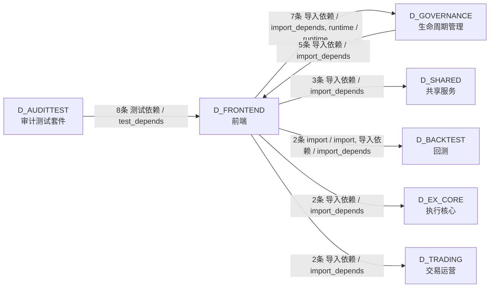

# 11_d_frontend / 前端 / 前端 / Frontend

> **功能简介 / Overview**: 前端，负责用户界面展示、交互可视化和前端状态管理

> **文档作用 / Purpose**: 展示 前端（D_FRONTEND）功能域的模块清单、域内依赖关系、跨域依赖关系、架构分层视图，供架构审查和域治理参考。

> 本文档由 generate_domain_doc.py 从 depgraph (PostgreSQL) 自动生成
> 最后更新: 2026-07-09 04:33:54
> 数据源: depgraph (PostgreSQL) nodes表 + edges表

## 域基本信息 / Domain Overview

| 字段 | 值 | Field | Value |
|------|------|-------|-------|
| 编号 | 11 | Number | 11 |
| 域ID | D_FRONTEND | Domain ID | D_FRONTEND |
| 域名称 | 前端 | Domain Name | Frontend |
| 层级 | L1 基础平台层 | Layer | L1 Foundation |
| 模块数 | 30 | Module Count | 30 |
| 域内依赖 | 31 | Internal Dependencies | 31 |
| 跨域入边 | 13 | Cross-domain Incoming | 13 |
| 跨域出边 | 16 | Cross-domain Outgoing | 16 |
| 设计态模块 | 6 | Design Modules | 6 |
| 原型态模块 | 11 | Prototype Modules | 11 |
| 生产态模块 | 13 | Production Modules | 13 |
| 容量 | 13/150 (正常) | Capacity | 13/150 (正常) |
| 描述 | Web界面、可视化看板、交互组件。人机交互入口。 | Description | Web界面、可视化看板、交互组件。人机交互入口。 |

## 模块分层清单 / Module Layered List

> 按 architecture_layer 分组的模块清单（共 30 个模块 / 30 modules）。

### L1 基础层 / Foundation Layer (30 modules)

| # | 模块路径 / Module Path | 模块名称 / Module Name (功能简介 / Description) | 成熟度 / Maturity | 蓝图 / Blueprint |
|:--:|---------|---------|:---:|:---:|
| 1 | src/zephyr/frontend/__init__.py | __init__.py | 原型态 / prototype | [MOD-L08-001](../../03_modules/_domain_frontend/blueprint.md) |
| 2 | src/zephyr/frontend/_extensions/__init__.py | __init__.py | 原型态 / prototype |  |
| 3 | src/zephyr/frontend/api/__init__.py | __init__.py | 原型态 / prototype |  |
| 4 | src/zephyr/frontend/core/__init__.py | __init__.py | 原型态 / prototype |  |
| 5 | src/zephyr/frontend/dashboard/__init__.py | __init__.py | 原型态 / prototype | [MOD-L08-001](../../03_modules/_domain_frontend/blueprint.md) |
| 6 | src/zephyr/frontend/dashboard/app.py | ZephyrAlpha Dashboard · Streamlit 仪表盘 | 生产态 / production | [MOD-L08-001](../../03_modules/_domain_frontend/blueprint.md) |
| 7 | src/zephyr/frontend/dashboard/app_panel.py | app_panel · Panel 仪表盘主应用入口（v3.1.0, #A... | 生产态 / production | [MOD-L08-001](../../03_modules/_domain_frontend/blueprint.md) |
| 8 | src/zephyr/frontend/dashboard/components/__init__.py | __init__.py | 原型态 / prototype | [MOD-L08-001](../../03_modules/_domain_frontend/blueprint.md) |
| 9 | src/zephyr/frontend/dashboard/components/backtest_perform... | backtest_performance · 掘金量化风格绩效分析可... | 原型态 / prototype | [MOD-L08-001](../../03_modules/_domain_frontend/blueprint.md) |
| 10 | src/zephyr/frontend/dashboard/components/backtest_results.py | backtest_results · 回测结果可视化组件（v3.0.0 ... | 生产态 / production | [MOD-L08-001](../../03_modules/_domain_frontend/blueprint.md) |
| 11 | src/zephyr/frontend/dashboard/components/backtest_results... |  | 设计态 / design | [MOD-L08-001](../../03_modules/_domain_frontend/blueprint.md) |
| 12 | src/zephyr/frontend/dashboard/components/chart_factory.py | chart_factory · 图表统一工厂（v3.0.0新增, #ARC... | 原型态 / prototype | [MOD-L08-001](../../03_modules/_domain_frontend/blueprint.md) |
| 13 | src/zephyr/frontend/dashboard/components/chart_factory.py/ |  | 设计态 / design | [MOD-L08-001](../../03_modules/_domain_frontend/blueprint.md) |
| 14 | src/zephyr/frontend/dashboard/components/fitness_function... | fitness_functions · Fitness Functions 仪表盘组... | 生产态 / production | [MOD-L08-001](../../03_modules/_domain_frontend/blueprint.md) |
| 15 | src/zephyr/frontend/dashboard/components/gate_statistics.py | gate_statistics · 门禁统计组件（v3.1.0 Panel ... | 生产态 / production | [MOD-L08-001](../../03_modules/_domain_frontend/blueprint.md) |
| 16 | src/zephyr/frontend/dashboard/components/knowledge_overvi... | knowledge_overview · 知识库概览组件（v3.1.0 Pa... | 生产态 / production | [MOD-L08-001](../../03_modules/_domain_frontend/blueprint.md) |
| 17 | src/zephyr/frontend/dashboard/components/olap_trend.py | olap_trend · OLAP 趋势组件（v3.1.0 Panel 迁移,... | 生产态 / production | [MOD-L08-001](../../03_modules/_domain_frontend/blueprint.md) |
| 18 | src/zephyr/frontend/dashboard/components/order_book.py | order_book · 5档盘口实时展示组件（v3.0.0 Panel... | 生产态 / production | [MOD-L08-001](../../03_modules/_domain_frontend/blueprint.md) |
| 19 | src/zephyr/frontend/dashboard/components/order_book.py/ |  | 设计态 / design | [MOD-L08-001](../../03_modules/_domain_frontend/blueprint.md) |
| 20 | src/zephyr/frontend/dashboard/components/position_monitor.py | position_monitor · 实盘持仓监控组件（v3.0.0 Pa... | 生产态 / production | [MOD-L08-001](../../03_modules/_domain_frontend/blueprint.md) |
| 21 | src/zephyr/frontend/dashboard/components/position_monitor... |  | 设计态 / design | [MOD-L08-001](../../03_modules/_domain_frontend/blueprint.md) |
| 22 | src/zephyr/frontend/dashboard/components/task_progress.py | task_progress · 任务进度看板组件（v3.1.0 Panel... | 生产态 / production | [MOD-L08-001](../../03_modules/_domain_frontend/blueprint.md) |
| 23 | src/zephyr/frontend/dashboard/components/tick_replay.py | tick_replay · Tick 回放可视化组件（v3.0.0 Pane... | 生产态 / production | [MOD-L08-001](../../03_modules/_domain_frontend/blueprint.md) |
| 24 | src/zephyr/frontend/dashboard/components/tick_replay.py/ |  | 设计态 / design | [MOD-L08-001](../../03_modules/_domain_frontend/blueprint.md) |
| 25 | src/zephyr/frontend/dashboard/components/trade_panel.py | trade_panel · 实盘交易面板组件（v3.0.0 Panel+H... | 生产态 / production | [MOD-L08-001](../../03_modules/_domain_frontend/blueprint.md) |
| 26 | src/zephyr/frontend/dashboard/components/trade_panel.py/ |  | 设计态 / design | [MOD-L08-001](../../03_modules/_domain_frontend/blueprint.md) |
| 27 | src/zephyr/frontend/infrastructure/__init__.py | __init__.py | 原型态 / prototype |  |
| 28 | src/zephyr/frontend/interface_base.py | D_FRONTEND — Human-AI Interface Layer Skeleton | 生产态 / production | [MOD-L08-001](../../03_modules/_domain_frontend/blueprint.md) |
| 29 | src/zephyr/frontend/models/__init__.py | __init__.py | 原型态 / prototype |  |
| 30 | src/zephyr/frontend/services/__init__.py | __init__.py | 原型态 / prototype |  |

## 域内依赖图 / Internal Dependency Diagram

> 依赖图内嵌在本文档中，IDE 可直接渲染显示。参考 decision_index.md 设计，分四个视图：合并全景图、运营态子图、设计态子图、原型态子图（按 design_maturity 实际值拆分）。
>
> **图例说明 / Legend**：
> - **实线边框 = 运营态模块**（production，已上线运行）
> - **虚线边框 = 设计态模块**（design，蓝图阶段，代码未写）
> - **虚线边框 = 原型态模块**（prototype，代码已写，验证中未稳定上线）
> - **实线箭头 = 运营态依赖**（已生效的依赖关系）
> - **虚线箭头 = 非运营态依赖**（计划中/验证中的依赖关系）

### 合并全景图（全部模块，标签标注成熟度）

> 展示全部 30 个模块（生产态 13 + 设计态 6 + 原型态 11），标签标注成熟度。

```mermaid
graph TD
    subgraph D_FRONTEND["D_FRONTEND 前端"]
        src_zephyr_frontend_init_py["(原型态 / prototype) __init__.py"]
        src_zephyr_frontend_extensions_init_py["(原型态 / prototype) __init__.py"]
        src_zephyr_frontend_api_init_py["(原型态 / prototype) __init__.py"]
        src_zephyr_frontend_core_init_py["(原型态 / prototype) __init__.py"]
        src_zephyr_frontend_dashboard_init_py["(原型态 / prototype) __init__.py"]
        src_zephyr_frontend_dashboard_app_py["(生产态 / production) ZephyrAlpha Dashboard · Streamlit 仪表盘<br/>文件: app.py"]
        src_zephyr_frontend_dashboard_app_panel_py["(生产态 / production) app_panel · Panel 仪表盘主应用入口（v3.1.0, #A...<br/>文件: app_panel.py"]
        src_zephyr_frontend_dashboard_components_init_py["(原型态 / prototype) __init__.py"]
        src_zephyr_frontend_dashboard_components_backtest_performance_py["(原型态 / prototype) backtest_performance · 掘金量化风格绩效分析可...<br/>文件: backtest_performance.py"]
        src_zephyr_frontend_dashboard_components_backtest_results_py["(生产态 / production) backtest_results · 回测结果可视化组件（v3.0.0 ...<br/>文件: backtest_results.py"]
        src_zephyr_frontend_dashboard_components_backtest_results_py_1["(设计态 / design) "]
        src_zephyr_frontend_dashboard_components_chart_factory_py["(原型态 / prototype) chart_factory · 图表统一工厂（v3.0.0新增, #ARC...<br/>文件: chart_factory.py"]
        src_zephyr_frontend_dashboard_components_chart_factory_py_1["(设计态 / design) "]
        src_zephyr_frontend_dashboard_components_fitness_functions_py["(生产态 / production) fitness_functions · Fitness Functions 仪表盘组...<br/>文件: fitness_functions.py"]
        src_zephyr_frontend_dashboard_components_gate_statistics_py["(生产态 / production) gate_statistics · 门禁统计组件（v3.1.0 Panel ...<br/>文件: gate_statistics.py"]
        src_zephyr_frontend_dashboard_components_knowledge_overview_py["(生产态 / production) knowledge_overview · 知识库概览组件（v3.1.0 Pa...<br/>文件: knowledge_overview.py"]
        src_zephyr_frontend_dashboard_components_olap_trend_py["(生产态 / production) olap_trend · OLAP 趋势组件（v3.1.0 Panel 迁移,...<br/>文件: olap_trend.py"]
        src_zephyr_frontend_dashboard_components_order_book_py["(生产态 / production) order_book · 5档盘口实时展示组件（v3.0.0 Panel...<br/>文件: order_book.py"]
        src_zephyr_frontend_dashboard_components_order_book_py_1["(设计态 / design) "]
        src_zephyr_frontend_dashboard_components_position_monitor_py["(生产态 / production) position_monitor · 实盘持仓监控组件（v3.0.0 Pa...<br/>文件: position_monitor.py"]
        src_zephyr_frontend_dashboard_components_position_monitor_py_1["(设计态 / design) "]
        src_zephyr_frontend_dashboard_components_task_progress_py["(生产态 / production) task_progress · 任务进度看板组件（v3.1.0 Panel...<br/>文件: task_progress.py"]
        src_zephyr_frontend_dashboard_components_tick_replay_py["(生产态 / production) tick_replay · Tick 回放可视化组件（v3.0.0 Pane...<br/>文件: tick_replay.py"]
        src_zephyr_frontend_dashboard_components_tick_replay_py_1["(设计态 / design) "]
        src_zephyr_frontend_dashboard_components_trade_panel_py["(生产态 / production) trade_panel · 实盘交易面板组件（v3.0.0 Panel+H...<br/>文件: trade_panel.py"]
        src_zephyr_frontend_dashboard_components_trade_panel_py_1["(设计态 / design) "]
        src_zephyr_frontend_infrastructure_init_py["(原型态 / prototype) __init__.py"]
        src_zephyr_frontend_interface_base_py["(生产态 / production) D_FRONTEND — Human-AI Interface Layer Skeleton<br/>文件: interface_base.py"]
        src_zephyr_frontend_models_init_py["(原型态 / prototype) __init__.py"]
        src_zephyr_frontend_services_init_py["(原型态 / prototype) __init__.py"]
    end
    src_zephyr_frontend_dashboard_components_backtest_results_py_1 -.->|导入依赖 / import_depends| src_zephyr_frontend_dashboard_components_chart_factory_py_1
    src_zephyr_frontend_dashboard_components_tick_replay_py_1 -.->|导入依赖 / import_depends| src_zephyr_frontend_dashboard_components_chart_factory_py_1
    src_zephyr_frontend_dashboard_components_order_book_py_1 -.->|导入依赖 / import_depends| src_zephyr_frontend_dashboard_components_chart_factory_py_1
    src_zephyr_frontend_dashboard_components_position_monitor_py_1 -.->|导入依赖 / import_depends| src_zephyr_frontend_dashboard_components_chart_factory_py_1
    src_zephyr_frontend_dashboard_components_trade_panel_py_1 -.->|导入依赖 / import_depends| src_zephyr_frontend_dashboard_components_chart_factory_py_1
    src_zephyr_frontend_dashboard_components_chart_factory_py_1 -.->|runtime / runtime| src_zephyr_frontend_dashboard_components_chart_factory_py_1
    src_zephyr_frontend_init_py -.->|config_depends / config_depends| src_zephyr_frontend_interface_base_py
    src_zephyr_frontend_dashboard_app_panel_py -.->|导入依赖 / import_depends| src_zephyr_frontend_dashboard_components_backtest_performance_py
    src_zephyr_frontend_dashboard_app_panel_py -->|导入依赖 / import_depends| src_zephyr_frontend_dashboard_components_gate_statistics_py
    src_zephyr_frontend_dashboard_app_panel_py -->|导入依赖 / import_depends| src_zephyr_frontend_dashboard_components_fitness_functions_py
    src_zephyr_frontend_dashboard_app_panel_py -->|导入依赖 / import_depends| src_zephyr_frontend_dashboard_components_position_monitor_py
    src_zephyr_frontend_dashboard_app_panel_py -->|导入依赖 / import_depends| src_zephyr_frontend_dashboard_components_backtest_results_py
    src_zephyr_frontend_dashboard_app_panel_py -->|导入依赖 / import_depends| src_zephyr_frontend_dashboard_components_knowledge_overview_py
    src_zephyr_frontend_dashboard_app_panel_py -->|导入依赖 / import_depends| src_zephyr_frontend_dashboard_components_olap_trend_py
    src_zephyr_frontend_dashboard_app_panel_py -->|导入依赖 / import_depends| src_zephyr_frontend_dashboard_components_order_book_py
    src_zephyr_frontend_dashboard_app_panel_py -->|导入依赖 / import_depends| src_zephyr_frontend_dashboard_components_task_progress_py
    src_zephyr_frontend_dashboard_app_panel_py -->|导入依赖 / import_depends| src_zephyr_frontend_dashboard_components_trade_panel_py
    src_zephyr_frontend_dashboard_app_panel_py -->|导入依赖 / import_depends| src_zephyr_frontend_dashboard_components_tick_replay_py
    src_zephyr_frontend_dashboard_app_py -->|导入依赖 / import_depends| src_zephyr_frontend_dashboard_components_gate_statistics_py
    src_zephyr_frontend_dashboard_app_py -->|导入依赖 / import_depends| src_zephyr_frontend_dashboard_components_fitness_functions_py
    src_zephyr_frontend_dashboard_app_py -->|导入依赖 / import_depends| src_zephyr_frontend_dashboard_components_knowledge_overview_py
    src_zephyr_frontend_dashboard_app_py -->|导入依赖 / import_depends| src_zephyr_frontend_dashboard_components_olap_trend_py
    src_zephyr_frontend_dashboard_app_py -->|导入依赖 / import_depends| src_zephyr_frontend_dashboard_components_task_progress_py
    src_zephyr_frontend_dashboard_components_gate_statistics_py -.->|导入依赖 / import_depends| src_zephyr_frontend_dashboard_components_chart_factory_py
    src_zephyr_frontend_dashboard_components_position_monitor_py -.->|导入依赖 / import_depends| src_zephyr_frontend_dashboard_components_chart_factory_py
    src_zephyr_frontend_dashboard_components_backtest_results_py -.->|导入依赖 / import_depends| src_zephyr_frontend_dashboard_components_chart_factory_py
    src_zephyr_frontend_dashboard_components_olap_trend_py -.->|导入依赖 / import_depends| src_zephyr_frontend_dashboard_components_chart_factory_py
    src_zephyr_frontend_dashboard_components_order_book_py -.->|导入依赖 / import_depends| src_zephyr_frontend_dashboard_components_chart_factory_py
    src_zephyr_frontend_dashboard_components_trade_panel_py -.->|导入依赖 / import_depends| src_zephyr_frontend_dashboard_components_chart_factory_py
    src_zephyr_frontend_dashboard_components_tick_replay_py -.->|导入依赖 / import_depends| src_zephyr_frontend_dashboard_components_chart_factory_py
    src_zephyr_frontend_dashboard_components_init_py -.->|导入依赖 / import_depends| src_zephyr_frontend_dashboard_init_py
    D_BACKTEST["(设计态 / design) D_BACKTEST"]
    src_zephyr_frontend_dashboard_components_backtest_results_py_1 -.->|import / import| D_BACKTEST
    src_zephyr_frontend_dashboard_components_tick_replay_py_1 -.->|导入依赖 / import_depends| D_BACKTEST
    D_GOVERNANCE["(设计态 / design) D_GOVERNANCE"]
    src_zephyr_frontend_dashboard_components_tick_replay_py_1 -.->|导入依赖 / import_depends| D_GOVERNANCE
    src_zephyr_frontend_dashboard_components_order_book_py_1 -.->|导入依赖 / import_depends| D_GOVERNANCE
    D_EX_CORE["(设计态 / design) D_EX_CORE"]
    src_zephyr_frontend_dashboard_components_position_monitor_py_1 -.->|导入依赖 / import_depends| D_EX_CORE
    src_zephyr_frontend_dashboard_components_trade_panel_py_1 -.->|导入依赖 / import_depends| D_EX_CORE
    src_zephyr_frontend_dashboard_components_chart_factory_py_1 -.->|runtime / runtime| D_GOVERNANCE
    src_zephyr_frontend_dashboard_app_panel_py -->|导入依赖 / import_depends| D_GOVERNANCE
    src_zephyr_frontend_dashboard_app_panel_py -->|导入依赖 / import_depends| D_GOVERNANCE
    src_zephyr_frontend_dashboard_app_py -->|导入依赖 / import_depends| D_GOVERNANCE
    src_zephyr_frontend_dashboard_app_py -->|导入依赖 / import_depends| D_GOVERNANCE
    D_TRADING["(生产态 / production) D_TRADING"]
    src_zephyr_frontend_dashboard_components_fitness_functions_py -->|导入依赖 / import_depends| D_TRADING
    D_SHARED["(生产态 / production) D_SHARED"]
    src_zephyr_frontend_dashboard_components_chart_factory_py -.->|导入依赖 / import_depends| D_SHARED
    src_zephyr_frontend_dashboard_components_task_progress_py -.->|导入依赖 / import_depends| D_SHARED
    src_zephyr_frontend_dashboard_components_trade_panel_py -->|导入依赖 / import_depends| D_SHARED
    D_GOVERNANCE -.->|导入依赖 / import_depends| src_zephyr_frontend_dashboard_components_backtest_results_py
    D_GOVERNANCE -.->|导入依赖 / import_depends| src_zephyr_frontend_dashboard_components_tick_replay_py
    D_GOVERNANCE -.->|导入依赖 / import_depends| src_zephyr_frontend_dashboard_components_order_book_py
    D_GOVERNANCE -.->|导入依赖 / import_depends| src_zephyr_frontend_dashboard_components_position_monitor_py
    D_GOVERNANCE -.->|导入依赖 / import_depends| src_zephyr_frontend_dashboard_components_trade_panel_py
    D_AUDITTEST["(原型态 / prototype) D_AUDITTEST"]
    D_AUDITTEST -.->|测试依赖 / test_depends| src_zephyr_frontend_dashboard_app_panel_py
    D_AUDITTEST -.->|测试依赖 / test_depends| src_zephyr_frontend_dashboard_components_backtest_results_py
    D_AUDITTEST -.->|测试依赖 / test_depends| src_zephyr_frontend_dashboard_components_backtest_results_py
    D_AUDITTEST -.->|测试依赖 / test_depends| src_zephyr_frontend_dashboard_components_tick_replay_py
    D_AUDITTEST -.->|测试依赖 / test_depends| src_zephyr_frontend_dashboard_components_order_book_py
    D_AUDITTEST -.->|测试依赖 / test_depends| src_zephyr_frontend_dashboard_components_position_monitor_py
    D_AUDITTEST -.->|测试依赖 / test_depends| src_zephyr_frontend_dashboard_components_trade_panel_py
    classDef production fill:#e1f5fe,stroke:#01579b,stroke-width:2px,color:#000
    classDef design fill:#fff3e0,stroke:#e65100,stroke-width:2px,color:#000,stroke-dasharray: 5 5
    classDef external_prod fill:#e8f5e9,stroke:#1b5e20,stroke-width:1px,color:#000
    classDef external_design fill:#fce4ec,stroke:#880e4f,stroke-width:1px,color:#000,stroke-dasharray: 5 5
    class src_zephyr_frontend_dashboard_app_py,src_zephyr_frontend_dashboard_app_panel_py,src_zephyr_frontend_dashboard_components_backtest_results_py,src_zephyr_frontend_dashboard_components_fitness_functions_py,src_zephyr_frontend_dashboard_components_gate_statistics_py,src_zephyr_frontend_dashboard_components_knowledge_overview_py,src_zephyr_frontend_dashboard_components_olap_trend_py,src_zephyr_frontend_dashboard_components_order_book_py,src_zephyr_frontend_dashboard_components_position_monitor_py,src_zephyr_frontend_dashboard_components_task_progress_py,src_zephyr_frontend_dashboard_components_tick_replay_py,src_zephyr_frontend_dashboard_components_trade_panel_py,src_zephyr_frontend_interface_base_py production
    class src_zephyr_frontend_init_py,src_zephyr_frontend_extensions_init_py,src_zephyr_frontend_api_init_py,src_zephyr_frontend_core_init_py,src_zephyr_frontend_dashboard_init_py,src_zephyr_frontend_dashboard_components_init_py,src_zephyr_frontend_dashboard_components_backtest_performance_py,src_zephyr_frontend_dashboard_components_backtest_results_py_1,src_zephyr_frontend_dashboard_components_chart_factory_py,src_zephyr_frontend_dashboard_components_chart_factory_py_1,src_zephyr_frontend_dashboard_components_order_book_py_1,src_zephyr_frontend_dashboard_components_position_monitor_py_1,src_zephyr_frontend_dashboard_components_tick_replay_py_1,src_zephyr_frontend_dashboard_components_trade_panel_py_1,src_zephyr_frontend_infrastructure_init_py,src_zephyr_frontend_models_init_py,src_zephyr_frontend_services_init_py design
    class D_TRADING,D_SHARED external_prod
    class D_BACKTEST,D_GOVERNANCE,D_EX_CORE,D_AUDITTEST external_design
```

### 运营态子图（仅 design_maturity=production 的模块和依赖）

> 仅展示已上线运行的模块（共 13 个，15 条域内依赖）。

```mermaid
graph TD
    subgraph D_FRONTEND["D_FRONTEND 前端"]
        src_zephyr_frontend_dashboard_app_py["(生产态 / production) ZephyrAlpha Dashboard · Streamlit 仪表盘<br/>文件: app.py"]
        src_zephyr_frontend_dashboard_app_panel_py["(生产态 / production) app_panel · Panel 仪表盘主应用入口（v3.1.0, #A...<br/>文件: app_panel.py"]
        src_zephyr_frontend_dashboard_components_backtest_results_py["(生产态 / production) backtest_results · 回测结果可视化组件（v3.0.0 ...<br/>文件: backtest_results.py"]
        src_zephyr_frontend_dashboard_components_fitness_functions_py["(生产态 / production) fitness_functions · Fitness Functions 仪表盘组...<br/>文件: fitness_functions.py"]
        src_zephyr_frontend_dashboard_components_gate_statistics_py["(生产态 / production) gate_statistics · 门禁统计组件（v3.1.0 Panel ...<br/>文件: gate_statistics.py"]
        src_zephyr_frontend_dashboard_components_knowledge_overview_py["(生产态 / production) knowledge_overview · 知识库概览组件（v3.1.0 Pa...<br/>文件: knowledge_overview.py"]
        src_zephyr_frontend_dashboard_components_olap_trend_py["(生产态 / production) olap_trend · OLAP 趋势组件（v3.1.0 Panel 迁移,...<br/>文件: olap_trend.py"]
        src_zephyr_frontend_dashboard_components_order_book_py["(生产态 / production) order_book · 5档盘口实时展示组件（v3.0.0 Panel...<br/>文件: order_book.py"]
        src_zephyr_frontend_dashboard_components_position_monitor_py["(生产态 / production) position_monitor · 实盘持仓监控组件（v3.0.0 Pa...<br/>文件: position_monitor.py"]
        src_zephyr_frontend_dashboard_components_task_progress_py["(生产态 / production) task_progress · 任务进度看板组件（v3.1.0 Panel...<br/>文件: task_progress.py"]
        src_zephyr_frontend_dashboard_components_tick_replay_py["(生产态 / production) tick_replay · Tick 回放可视化组件（v3.0.0 Pane...<br/>文件: tick_replay.py"]
        src_zephyr_frontend_dashboard_components_trade_panel_py["(生产态 / production) trade_panel · 实盘交易面板组件（v3.0.0 Panel+H...<br/>文件: trade_panel.py"]
        src_zephyr_frontend_interface_base_py["(生产态 / production) D_FRONTEND — Human-AI Interface Layer Skeleton<br/>文件: interface_base.py"]
    end
    src_zephyr_frontend_dashboard_app_panel_py -->|导入依赖 / import_depends| src_zephyr_frontend_dashboard_components_gate_statistics_py
    src_zephyr_frontend_dashboard_app_panel_py -->|导入依赖 / import_depends| src_zephyr_frontend_dashboard_components_fitness_functions_py
    src_zephyr_frontend_dashboard_app_panel_py -->|导入依赖 / import_depends| src_zephyr_frontend_dashboard_components_position_monitor_py
    src_zephyr_frontend_dashboard_app_panel_py -->|导入依赖 / import_depends| src_zephyr_frontend_dashboard_components_backtest_results_py
    src_zephyr_frontend_dashboard_app_panel_py -->|导入依赖 / import_depends| src_zephyr_frontend_dashboard_components_knowledge_overview_py
    src_zephyr_frontend_dashboard_app_panel_py -->|导入依赖 / import_depends| src_zephyr_frontend_dashboard_components_olap_trend_py
    src_zephyr_frontend_dashboard_app_panel_py -->|导入依赖 / import_depends| src_zephyr_frontend_dashboard_components_order_book_py
    src_zephyr_frontend_dashboard_app_panel_py -->|导入依赖 / import_depends| src_zephyr_frontend_dashboard_components_task_progress_py
    src_zephyr_frontend_dashboard_app_panel_py -->|导入依赖 / import_depends| src_zephyr_frontend_dashboard_components_trade_panel_py
    src_zephyr_frontend_dashboard_app_panel_py -->|导入依赖 / import_depends| src_zephyr_frontend_dashboard_components_tick_replay_py
    src_zephyr_frontend_dashboard_app_py -->|导入依赖 / import_depends| src_zephyr_frontend_dashboard_components_gate_statistics_py
    src_zephyr_frontend_dashboard_app_py -->|导入依赖 / import_depends| src_zephyr_frontend_dashboard_components_fitness_functions_py
    src_zephyr_frontend_dashboard_app_py -->|导入依赖 / import_depends| src_zephyr_frontend_dashboard_components_knowledge_overview_py
    src_zephyr_frontend_dashboard_app_py -->|导入依赖 / import_depends| src_zephyr_frontend_dashboard_components_olap_trend_py
    src_zephyr_frontend_dashboard_app_py -->|导入依赖 / import_depends| src_zephyr_frontend_dashboard_components_task_progress_py
    D_GOVERNANCE["(生产态 / production) D_GOVERNANCE"]
    src_zephyr_frontend_dashboard_app_panel_py -->|导入依赖 / import_depends| D_GOVERNANCE
    src_zephyr_frontend_dashboard_app_panel_py -->|导入依赖 / import_depends| D_GOVERNANCE
    src_zephyr_frontend_dashboard_app_py -->|导入依赖 / import_depends| D_GOVERNANCE
    src_zephyr_frontend_dashboard_app_py -->|导入依赖 / import_depends| D_GOVERNANCE
    D_TRADING["(生产态 / production) D_TRADING"]
    src_zephyr_frontend_dashboard_components_fitness_functions_py -->|导入依赖 / import_depends| D_TRADING
    D_SHARED["(原型态 / prototype) D_SHARED"]
    src_zephyr_frontend_dashboard_components_task_progress_py -.->|导入依赖 / import_depends| D_SHARED
    src_zephyr_frontend_dashboard_components_trade_panel_py -->|导入依赖 / import_depends| D_TRADING
    src_zephyr_frontend_dashboard_components_trade_panel_py -->|导入依赖 / import_depends| D_SHARED
    D_AUDITTEST["(原型态 / prototype) D_AUDITTEST"]
    D_AUDITTEST -.->|测试依赖 / test_depends| src_zephyr_frontend_dashboard_app_panel_py
    D_AUDITTEST -.->|测试依赖 / test_depends| src_zephyr_frontend_dashboard_components_position_monitor_py
    D_GOVERNANCE -.->|导入依赖 / import_depends| src_zephyr_frontend_dashboard_components_position_monitor_py
    D_AUDITTEST -.->|测试依赖 / test_depends| src_zephyr_frontend_dashboard_components_backtest_results_py
    D_AUDITTEST -.->|测试依赖 / test_depends| src_zephyr_frontend_dashboard_components_backtest_results_py
    D_GOVERNANCE -.->|导入依赖 / import_depends| src_zephyr_frontend_dashboard_components_backtest_results_py
    D_AUDITTEST -.->|测试依赖 / test_depends| src_zephyr_frontend_dashboard_components_order_book_py
    D_GOVERNANCE -.->|导入依赖 / import_depends| src_zephyr_frontend_dashboard_components_order_book_py
    D_AUDITTEST -.->|测试依赖 / test_depends| src_zephyr_frontend_dashboard_components_trade_panel_py
    D_GOVERNANCE -.->|导入依赖 / import_depends| src_zephyr_frontend_dashboard_components_trade_panel_py
    D_AUDITTEST -.->|测试依赖 / test_depends| src_zephyr_frontend_dashboard_components_tick_replay_py
    D_GOVERNANCE -.->|导入依赖 / import_depends| src_zephyr_frontend_dashboard_components_tick_replay_py
    classDef production fill:#e1f5fe,stroke:#01579b,stroke-width:2px,color:#000
    classDef design fill:#fff3e0,stroke:#e65100,stroke-width:2px,color:#000,stroke-dasharray: 5 5
    classDef external_prod fill:#e8f5e9,stroke:#1b5e20,stroke-width:1px,color:#000
    classDef external_design fill:#fce4ec,stroke:#880e4f,stroke-width:1px,color:#000,stroke-dasharray: 5 5
    class src_zephyr_frontend_dashboard_app_py,src_zephyr_frontend_dashboard_app_panel_py,src_zephyr_frontend_dashboard_components_backtest_results_py,src_zephyr_frontend_dashboard_components_fitness_functions_py,src_zephyr_frontend_dashboard_components_gate_statistics_py,src_zephyr_frontend_dashboard_components_knowledge_overview_py,src_zephyr_frontend_dashboard_components_olap_trend_py,src_zephyr_frontend_dashboard_components_order_book_py,src_zephyr_frontend_dashboard_components_position_monitor_py,src_zephyr_frontend_dashboard_components_task_progress_py,src_zephyr_frontend_dashboard_components_tick_replay_py,src_zephyr_frontend_dashboard_components_trade_panel_py,src_zephyr_frontend_interface_base_py production
    class D_GOVERNANCE,D_TRADING external_prod
    class D_SHARED,D_AUDITTEST external_design
```

### 设计态子图（仅 design_maturity=design 的模块和依赖）

> 仅展示蓝图阶段、代码未写的设计态模块（共 6 个，6 条域内依赖）。

```mermaid
graph TD
    subgraph D_FRONTEND["D_FRONTEND 前端"]
        src_zephyr_frontend_dashboard_components_backtest_results_py["(设计态 / design) "]
        src_zephyr_frontend_dashboard_components_chart_factory_py["(设计态 / design) "]
        src_zephyr_frontend_dashboard_components_order_book_py["(设计态 / design) "]
        src_zephyr_frontend_dashboard_components_position_monitor_py["(设计态 / design) "]
        src_zephyr_frontend_dashboard_components_tick_replay_py["(设计态 / design) "]
        src_zephyr_frontend_dashboard_components_trade_panel_py["(设计态 / design) "]
    end
    src_zephyr_frontend_dashboard_components_backtest_results_py -.->|导入依赖 / import_depends| src_zephyr_frontend_dashboard_components_chart_factory_py
    src_zephyr_frontend_dashboard_components_tick_replay_py -.->|导入依赖 / import_depends| src_zephyr_frontend_dashboard_components_chart_factory_py
    src_zephyr_frontend_dashboard_components_order_book_py -.->|导入依赖 / import_depends| src_zephyr_frontend_dashboard_components_chart_factory_py
    src_zephyr_frontend_dashboard_components_position_monitor_py -.->|导入依赖 / import_depends| src_zephyr_frontend_dashboard_components_chart_factory_py
    src_zephyr_frontend_dashboard_components_trade_panel_py -.->|导入依赖 / import_depends| src_zephyr_frontend_dashboard_components_chart_factory_py
    src_zephyr_frontend_dashboard_components_chart_factory_py -.->|runtime / runtime| src_zephyr_frontend_dashboard_components_chart_factory_py
    D_BACKTEST["(设计态 / design) D_BACKTEST"]
    src_zephyr_frontend_dashboard_components_backtest_results_py -.->|import / import| D_BACKTEST
    src_zephyr_frontend_dashboard_components_tick_replay_py -.->|导入依赖 / import_depends| D_BACKTEST
    D_GOVERNANCE["(设计态 / design) D_GOVERNANCE"]
    src_zephyr_frontend_dashboard_components_tick_replay_py -.->|导入依赖 / import_depends| D_GOVERNANCE
    src_zephyr_frontend_dashboard_components_order_book_py -.->|导入依赖 / import_depends| D_GOVERNANCE
    D_EX_CORE["(设计态 / design) D_EX_CORE"]
    src_zephyr_frontend_dashboard_components_position_monitor_py -.->|导入依赖 / import_depends| D_EX_CORE
    src_zephyr_frontend_dashboard_components_trade_panel_py -.->|导入依赖 / import_depends| D_EX_CORE
    src_zephyr_frontend_dashboard_components_chart_factory_py -.->|runtime / runtime| D_GOVERNANCE
    classDef production fill:#e1f5fe,stroke:#01579b,stroke-width:2px,color:#000
    classDef design fill:#fff3e0,stroke:#e65100,stroke-width:2px,color:#000,stroke-dasharray: 5 5
    classDef external_prod fill:#e8f5e9,stroke:#1b5e20,stroke-width:1px,color:#000
    classDef external_design fill:#fce4ec,stroke:#880e4f,stroke-width:1px,color:#000,stroke-dasharray: 5 5
    class src_zephyr_frontend_dashboard_components_backtest_results_py,src_zephyr_frontend_dashboard_components_chart_factory_py,src_zephyr_frontend_dashboard_components_order_book_py,src_zephyr_frontend_dashboard_components_position_monitor_py,src_zephyr_frontend_dashboard_components_tick_replay_py,src_zephyr_frontend_dashboard_components_trade_panel_py design
    class D_BACKTEST,D_GOVERNANCE,D_EX_CORE external_design
```

### 原型态子图（仅 design_maturity=prototype 的模块和依赖）

> 仅展示代码已写、验证中未稳定上线的原型态模块（共 11 个，1 条域内依赖）。

```mermaid
graph TD
    subgraph D_FRONTEND["D_FRONTEND 前端"]
        src_zephyr_frontend_init_py["(原型态 / prototype) __init__.py"]
        src_zephyr_frontend_extensions_init_py["(原型态 / prototype) __init__.py"]
        src_zephyr_frontend_api_init_py["(原型态 / prototype) __init__.py"]
        src_zephyr_frontend_core_init_py["(原型态 / prototype) __init__.py"]
        src_zephyr_frontend_dashboard_init_py["(原型态 / prototype) __init__.py"]
        src_zephyr_frontend_dashboard_components_init_py["(原型态 / prototype) __init__.py"]
        src_zephyr_frontend_dashboard_components_backtest_performance_py["(原型态 / prototype) backtest_performance · 掘金量化风格绩效分析可...<br/>文件: backtest_performance.py"]
        src_zephyr_frontend_dashboard_components_chart_factory_py["(原型态 / prototype) chart_factory · 图表统一工厂（v3.0.0新增, #ARC...<br/>文件: chart_factory.py"]
        src_zephyr_frontend_infrastructure_init_py["(原型态 / prototype) __init__.py"]
        src_zephyr_frontend_models_init_py["(原型态 / prototype) __init__.py"]
        src_zephyr_frontend_services_init_py["(原型态 / prototype) __init__.py"]
    end
    src_zephyr_frontend_dashboard_components_init_py -.->|导入依赖 / import_depends| src_zephyr_frontend_dashboard_init_py
    D_SHARED["(生产态 / production) D_SHARED"]
    src_zephyr_frontend_dashboard_components_chart_factory_py -.->|导入依赖 / import_depends| D_SHARED
    classDef production fill:#e1f5fe,stroke:#01579b,stroke-width:2px,color:#000
    classDef design fill:#fff3e0,stroke:#e65100,stroke-width:2px,color:#000,stroke-dasharray: 5 5
    classDef external_prod fill:#e8f5e9,stroke:#1b5e20,stroke-width:1px,color:#000
    classDef external_design fill:#fce4ec,stroke:#880e4f,stroke-width:1px,color:#000,stroke-dasharray: 5 5
    class src_zephyr_frontend_init_py,src_zephyr_frontend_extensions_init_py,src_zephyr_frontend_api_init_py,src_zephyr_frontend_core_init_py,src_zephyr_frontend_dashboard_init_py,src_zephyr_frontend_dashboard_components_init_py,src_zephyr_frontend_dashboard_components_backtest_performance_py,src_zephyr_frontend_dashboard_components_chart_factory_py,src_zephyr_frontend_infrastructure_init_py,src_zephyr_frontend_models_init_py,src_zephyr_frontend_services_init_py design
    class D_SHARED external_prod
```

## 跨域依赖 / Cross-domain Dependencies

### 本域依赖的其他域（出边）/ Depends On

| # | 本域模块 / Source Module | → | 外部域-目标模块 / Target Module | 依赖类型 / Type |
|:--:|---------|:--:|---------|---------|
| 1 |  | → | D_BACKTEST 回测:  | import / import |
| 2 |  | → | D_BACKTEST 回测:  | 导入依赖 / import_depends |
| 3 |  | → | D_EX_CORE 执行核心:  | 导入依赖 / import_depends |
| 4 |  | → | D_EX_CORE 执行核心:  | 导入依赖 / import_depends |
| 5 | ZephyrAlpha Dashboard · Streamlit 仪表盘 (app.py) | → | D_GOVERNANCE 生命周期管理: SQLite 元数据层 Schema DDL + 版本化迁移框架（T-... | 导入依赖 / import_depends |
| 6 | ZephyrAlpha Dashboard · Streamlit 仪表盘 (app.py) | → | D_GOVERNANCE 生命周期管理: TaskRepository — 任务登记表 CRUD + 状态机（T-1... | 导入依赖 / import_depends |
| 7 | app_panel · Panel 仪表盘主应用入口（v3.1.0, #A... | → | D_GOVERNANCE 生命周期管理: SQLite 元数据层 Schema DDL + 版本化迁移框架（T-... | 导入依赖 / import_depends |
| 8 | app_panel · Panel 仪表盘主应用入口（v3.1.0, #A... | → | D_GOVERNANCE 生命周期管理: TaskRepository — 任务登记表 CRUD + 状态机（T-1... | 导入依赖 / import_depends |
| 9 |  | → | D_GOVERNANCE 生命周期管理: blueprint.md | runtime / runtime |
| 10 |  | → | D_GOVERNANCE 生命周期管理:  | 导入依赖 / import_depends |
| 11 |  | → | D_GOVERNANCE 生命周期管理:  | 导入依赖 / import_depends |
| 12 | chart_factory · 图表统一工厂（v3.0.0新增, #ARC... | → | D_SHARED 共享服务: serialization.py —— 统一序列化/反序列化基础设... | 导入依赖 / import_depends |
| 13 | task_progress · 任务进度看板组件（v3.1.0 Panel... | → | D_SHARED 共享服务: constants.py —— 共享枚举 & 常量集中 re-export... | 导入依赖 / import_depends |
| 14 | trade_panel · 实盘交易面板组件（v3.0.0 Panel+H... | → | D_SHARED 共享服务: time_utils.py —— 时间/日期工具（Phase 9 新增 ... | 导入依赖 / import_depends |
| 15 | fitness_functions · Fitness Functions 仪表盘组... | → | D_TRADING 交易运营: fitness_functions.py | 导入依赖 / import_depends |
| 16 | trade_panel · 实盘交易面板组件（v3.0.0 Panel+H... | → | D_TRADING 交易运营: order.py | 导入依赖 / import_depends |

### 依赖本域的其他域（入边）/ Depended By

| # | 外部域-源模块 / Source Module | → | 本域模块 / Target Module | 依赖类型 / Type |
|:--:|---------|:--:|---------|---------|
| 1 | D_AUDITTEST 审计测试套件: test_app_panel_unit · app_panel.py 单元测试（v... | → | app_panel · Panel 仪表盘主应用入口（v3.1.0, #A... | 测试依赖 / test_depends |
| 2 | D_AUDITTEST 审计测试套件: test_app_panel_unit · app_panel.py 单元测试（v... | → | backtest_results · 回测结果可视化组件（v3.0.0 ... | 测试依赖 / test_depends |
| 3 | D_AUDITTEST 审计测试套件: test_p1_components_unit · 5 个 P1 交易/回测组.... | → | backtest_results · 回测结果可视化组件（v3.0.0 ... | 测试依赖 / test_depends |
| 4 | D_AUDITTEST 审计测试套件: test_p1_components_unit · 5 个 P1 交易/回测组.... | → | order_book · 5档盘口实时展示组件（v3.0.0 Panel... | 测试依赖 / test_depends |
| 5 | D_AUDITTEST 审计测试套件: test_p1_components_unit · 5 个 P1 交易/回测组.... | → | position_monitor · 实盘持仓监控组件（v3.0.0 Pa... | 测试依赖 / test_depends |
| 6 | D_AUDITTEST 审计测试套件: test_p1_components_unit · 5 个 P1 交易/回测组.... | → | tick_replay · Tick 回放可视化组件（v3.0.0 Pane... | 测试依赖 / test_depends |
| 7 | D_AUDITTEST 审计测试套件: test_p1_components_unit · 5 个 P1 交易/回测组.... | → | trade_panel · 实盘交易面板组件（v3.0.0 Panel+H... | 测试依赖 / test_depends |
| 8 | D_GOVERNANCE 生命周期管理: 5个前端组件综合验证脚本（TTL=task_bound，施工完... | → | backtest_results · 回测结果可视化组件（v3.0.0 ... | 导入依赖 / import_depends |
| 9 | D_GOVERNANCE 生命周期管理: 5个前端组件综合验证脚本（TTL=task_bound，施工完... | → | order_book · 5档盘口实时展示组件（v3.0.0 Panel... | 导入依赖 / import_depends |
| 10 | D_GOVERNANCE 生命周期管理: 5个前端组件综合验证脚本（TTL=task_bound，施工完... | → | position_monitor · 实盘持仓监控组件（v3.0.0 Pa... | 导入依赖 / import_depends |
| 11 | D_GOVERNANCE 生命周期管理: 5个前端组件综合验证脚本（TTL=task_bound，施工完... | → | tick_replay · Tick 回放可视化组件（v3.0.0 Pane... | 导入依赖 / import_depends |
| 12 | D_GOVERNANCE 生命周期管理: 5个前端组件综合验证脚本（TTL=task_bound，施工完... | → | trade_panel · 实盘交易面板组件（v3.0.0 Panel+H... | 导入依赖 / import_depends |

### 跨域依赖图 / Cross-domain Dependency Diagram

> 本域与 6 个外部域直接连接（出边 16 条 + 入边 13 条 = 29 条）。只显示直接连接的域，不展开具体节点。

## 说明 / Notes

- **数据源 / Data Source**: `depgraph (PostgreSQL)` 的 `nodes`、`edges`、`domains` 表
- **生成器 / Generator**: `generate_domain_doc.py`（G2+G10 合并）
- **维护方式 / Maintenance**: 自动生成，全景图更新时刷新
- **文件名规则 / File Naming**: `{编号:02d}_{域ID小写}.md`，如 `16_d_trading.md`
- **图例说明 / Legend**: `[production]`=已上线 / `[design]`=设计中 / `[prototype]`=原型 / `[unknown]`=未知
