# 11_d_frontend / 前端

> **文档作用 / Purpose**: 展示 前端（D_FRONTEND）功能域的模块清单、域内依赖关系、跨域依赖关系、架构分层视图，供架构审查和域治理参考。

> 本文档由 generate_domain_doc.py 从 depgraph (PostgreSQL) 自动生成
> 最后更新: 2026-07-06 14:07:59
> 数据源: depgraph (PostgreSQL) nodes表 + edges表

## 域基本信息 / Domain Overview

| 字段 | 值 | Field | Value |
|------|------|-------|-------|
| 编号 | 11 | Number | 11 |
| 域ID | D_FRONTEND | Domain ID | D_FRONTEND |
| 域名称 | 前端 | Domain Name | 前端 |
| 层级 | L1_foundation | Layer | L1_foundation |
| 模块数 | 30 | Module Count | 30 |
| 域内依赖 | 31 | Internal Dependencies | 31 |
| 跨域入边 | 13 | Cross-domain Incoming | 13 |
| 跨域出边 | 13 | Cross-domain Outgoing | 13 |
| 设计态模块 | 6 | Design Modules | 6 |
| 原型态模块 | 11 | Prototype Modules | 11 |
| 生产态模块 | 13 | Production Modules | 13 |
| 容量 | 13/150 (正常) | Capacity | 13/150 (正常) |
| 描述 | Web界面、可视化看板、交互组件。人机交互入口。 | Description | Web界面、可视化看板、交互组件。人机交互入口。 |

## 域内依赖图 / Internal Dependency Diagram

> 依赖图内嵌在本文档中，IDE 可直接渲染显示。每30个节点一组分页显示。
>
> **图例说明 / Legend**：
> - **实线边框 = 运营态模块**（production，已上线运行）
> - **虚线边框 = 设计态模块**（design，还在设计中）
> - **实线箭头 = 运营态依赖**（已生效的依赖关系）
> - **虚线箭头 = 设计态依赖**（计划中的依赖关系）

```mermaid
graph TD
    subgraph D_FRONTEND["D_FRONTEND 前端"]
        src_zephyr_frontend_init_py["src/zephyr/frontend/__init__.py prototype"]
        src_zephyr_frontend_extensions_init_py["src/zephyr/frontend/_extensions/__init__.py prototype"]
        src_zephyr_frontend_api_init_py["src/zephyr/frontend/api/__init__.py prototype"]
        src_zephyr_frontend_core_init_py["src/zephyr/frontend/core/__init__.py prototype"]
        src_zephyr_frontend_dashboard_init_py["src/zephyr/frontend/dashboard/__init__.py prototype"]
        src_zephyr_frontend_dashboard_app_py["src/zephyr/frontend/dashboard/app.py production"]
        src_zephyr_frontend_dashboard_app_panel_py["src/zephyr/frontend/dashboard/app_panel.py production"]
        src_zephyr_frontend_dashboard_components_init_py["src/zephyr/frontend/dashboard/components/__init... prototype"]
        src_zephyr_frontend_dashboard_components_backtest_performance_py["src/zephyr/frontend/dashboard/components/backte... prototype"]
        src_zephyr_frontend_dashboard_components_backtest_results_py["src/zephyr/frontend/dashboard/components/backte... production"]
        src_zephyr_frontend_dashboard_components_backtest_results_py_1["src/zephyr/frontend/dashboard/components/backte... design"]
        src_zephyr_frontend_dashboard_components_chart_factory_py["src/zephyr/frontend/dashboard/components/chart_... prototype"]
        src_zephyr_frontend_dashboard_components_chart_factory_py_1["src/zephyr/frontend/dashboard/components/chart_... design"]
        src_zephyr_frontend_dashboard_components_fitness_functions_py["src/zephyr/frontend/dashboard/components/fitnes... production"]
        src_zephyr_frontend_dashboard_components_gate_statistics_py["src/zephyr/frontend/dashboard/components/gate_s... production"]
        src_zephyr_frontend_dashboard_components_knowledge_overview_py["src/zephyr/frontend/dashboard/components/knowle... production"]
        src_zephyr_frontend_dashboard_components_olap_trend_py["src/zephyr/frontend/dashboard/components/olap_t... production"]
        src_zephyr_frontend_dashboard_components_order_book_py["src/zephyr/frontend/dashboard/components/order_... production"]
        src_zephyr_frontend_dashboard_components_order_book_py_1["src/zephyr/frontend/dashboard/components/order_... design"]
        src_zephyr_frontend_dashboard_components_position_monitor_py["src/zephyr/frontend/dashboard/components/positi... production"]
        src_zephyr_frontend_dashboard_components_position_monitor_py_1["src/zephyr/frontend/dashboard/components/positi... design"]
        src_zephyr_frontend_dashboard_components_task_progress_py["src/zephyr/frontend/dashboard/components/task_p... production"]
        src_zephyr_frontend_dashboard_components_tick_replay_py["src/zephyr/frontend/dashboard/components/tick_r... production"]
        src_zephyr_frontend_dashboard_components_tick_replay_py_1["src/zephyr/frontend/dashboard/components/tick_r... design"]
        src_zephyr_frontend_dashboard_components_trade_panel_py["src/zephyr/frontend/dashboard/components/trade_... production"]
        src_zephyr_frontend_dashboard_components_trade_panel_py_1["src/zephyr/frontend/dashboard/components/trade_... design"]
        src_zephyr_frontend_infrastructure_init_py["src/zephyr/frontend/infrastructure/__init__.py prototype"]
        src_zephyr_frontend_interface_base_py["src/zephyr/frontend/interface_base.py production"]
        src_zephyr_frontend_models_init_py["src/zephyr/frontend/models/__init__.py prototype"]
        src_zephyr_frontend_services_init_py["src/zephyr/frontend/services/__init__.py prototype"]
    end
    src_zephyr_frontend_dashboard_components_backtest_results_py_1 -.->|import_depends| src_zephyr_frontend_dashboard_components_chart_factory_py_1
    src_zephyr_frontend_dashboard_components_tick_replay_py_1 -.->|import_depends| src_zephyr_frontend_dashboard_components_chart_factory_py_1
    src_zephyr_frontend_dashboard_components_order_book_py_1 -.->|import_depends| src_zephyr_frontend_dashboard_components_chart_factory_py_1
    src_zephyr_frontend_dashboard_components_position_monitor_py_1 -.->|import_depends| src_zephyr_frontend_dashboard_components_chart_factory_py_1
    src_zephyr_frontend_dashboard_components_trade_panel_py_1 -.->|import_depends| src_zephyr_frontend_dashboard_components_chart_factory_py_1
    src_zephyr_frontend_dashboard_components_chart_factory_py_1 -.->|runtime| src_zephyr_frontend_dashboard_components_chart_factory_py_1
    src_zephyr_frontend_init_py -.->|config_depends| src_zephyr_frontend_interface_base_py
    src_zephyr_frontend_dashboard_app_py -->|import_depends| src_zephyr_frontend_dashboard_components_knowledge_overview_py
    src_zephyr_frontend_dashboard_app_py -->|import_depends| src_zephyr_frontend_dashboard_components_gate_statistics_py
    src_zephyr_frontend_dashboard_app_py -->|import_depends| src_zephyr_frontend_dashboard_components_olap_trend_py
    src_zephyr_frontend_dashboard_app_py -->|import_depends| src_zephyr_frontend_dashboard_components_fitness_functions_py
    src_zephyr_frontend_dashboard_app_py -->|import_depends| src_zephyr_frontend_dashboard_components_task_progress_py
    src_zephyr_frontend_dashboard_app_panel_py -->|import_depends| src_zephyr_frontend_dashboard_components_knowledge_overview_py
    src_zephyr_frontend_dashboard_app_panel_py -->|import_depends| src_zephyr_frontend_dashboard_components_gate_statistics_py
    src_zephyr_frontend_dashboard_app_panel_py -->|import_depends| src_zephyr_frontend_dashboard_components_backtest_results_py
    src_zephyr_frontend_dashboard_app_panel_py -->|import_depends| src_zephyr_frontend_dashboard_components_olap_trend_py
    src_zephyr_frontend_dashboard_app_panel_py -.->|import_depends| src_zephyr_frontend_dashboard_components_backtest_performance_py
    src_zephyr_frontend_dashboard_app_panel_py -->|import_depends| src_zephyr_frontend_dashboard_components_fitness_functions_py
    src_zephyr_frontend_dashboard_app_panel_py -->|import_depends| src_zephyr_frontend_dashboard_components_order_book_py
    src_zephyr_frontend_dashboard_app_panel_py -->|import_depends| src_zephyr_frontend_dashboard_components_task_progress_py
    src_zephyr_frontend_dashboard_app_panel_py -->|import_depends| src_zephyr_frontend_dashboard_components_tick_replay_py
    src_zephyr_frontend_dashboard_app_panel_py -->|import_depends| src_zephyr_frontend_dashboard_components_trade_panel_py
    src_zephyr_frontend_dashboard_app_panel_py -->|import_depends| src_zephyr_frontend_dashboard_components_position_monitor_py
    src_zephyr_frontend_dashboard_components_gate_statistics_py -.->|import_depends| src_zephyr_frontend_dashboard_components_chart_factory_py
    src_zephyr_frontend_dashboard_components_backtest_results_py -.->|import_depends| src_zephyr_frontend_dashboard_components_chart_factory_py
    src_zephyr_frontend_dashboard_components_olap_trend_py -.->|import_depends| src_zephyr_frontend_dashboard_components_chart_factory_py
    src_zephyr_frontend_dashboard_components_order_book_py -.->|import_depends| src_zephyr_frontend_dashboard_components_chart_factory_py
    src_zephyr_frontend_dashboard_components_init_py -.->|import_depends| src_zephyr_frontend_dashboard_init_py
    src_zephyr_frontend_dashboard_components_tick_replay_py -.->|import_depends| src_zephyr_frontend_dashboard_components_chart_factory_py
    src_zephyr_frontend_dashboard_components_trade_panel_py -.->|import_depends| src_zephyr_frontend_dashboard_components_chart_factory_py
    src_zephyr_frontend_dashboard_components_position_monitor_py -.->|import_depends| src_zephyr_frontend_dashboard_components_chart_factory_py
    D_BACKTEST["D_BACKTEST design"]
    src_zephyr_frontend_dashboard_components_backtest_results_py_1 -.->|import| D_BACKTEST
    src_zephyr_frontend_dashboard_components_tick_replay_py_1 -.->|import_depends| D_BACKTEST
    D_GOVERNANCE["D_GOVERNANCE design"]
    src_zephyr_frontend_dashboard_components_tick_replay_py_1 -.->|import_depends| D_GOVERNANCE
    src_zephyr_frontend_dashboard_components_order_book_py_1 -.->|import_depends| D_GOVERNANCE
    D_EX_CORE["D_EX_CORE design"]
    src_zephyr_frontend_dashboard_components_position_monitor_py_1 -.->|import_depends| D_EX_CORE
    src_zephyr_frontend_dashboard_components_trade_panel_py_1 -.->|import_depends| D_EX_CORE
    src_zephyr_frontend_dashboard_components_chart_factory_py_1 -.->|runtime| D_GOVERNANCE
    src_zephyr_frontend_dashboard_app_py -->|import_depends| D_GOVERNANCE
    src_zephyr_frontend_dashboard_app_py -->|import_depends| D_GOVERNANCE
    src_zephyr_frontend_dashboard_app_panel_py -->|import_depends| D_GOVERNANCE
    src_zephyr_frontend_dashboard_app_panel_py -->|import_depends| D_GOVERNANCE
    D_TRADING["D_TRADING production"]
    src_zephyr_frontend_dashboard_components_fitness_functions_py -->|import_depends| D_TRADING
    src_zephyr_frontend_dashboard_components_trade_panel_py -->|import_depends| D_TRADING
    D_GOVERNANCE -.->|import_depends| src_zephyr_frontend_dashboard_components_backtest_results_py
    D_GOVERNANCE -.->|import_depends| src_zephyr_frontend_dashboard_components_tick_replay_py
    D_GOVERNANCE -.->|import_depends| src_zephyr_frontend_dashboard_components_order_book_py
    D_GOVERNANCE -.->|import_depends| src_zephyr_frontend_dashboard_components_position_monitor_py
    D_GOVERNANCE -.->|import_depends| src_zephyr_frontend_dashboard_components_trade_panel_py
    D_AUDITTEST["D_AUDITTEST prototype"]
    D_AUDITTEST -.->|test_depends| src_zephyr_frontend_dashboard_app_panel_py
    D_AUDITTEST -.->|test_depends| src_zephyr_frontend_dashboard_components_backtest_results_py
    D_AUDITTEST -.->|test_depends| src_zephyr_frontend_dashboard_components_backtest_results_py
    D_AUDITTEST -.->|test_depends| src_zephyr_frontend_dashboard_components_tick_replay_py
    D_AUDITTEST -.->|test_depends| src_zephyr_frontend_dashboard_components_order_book_py
    D_AUDITTEST -.->|test_depends| src_zephyr_frontend_dashboard_components_position_monitor_py
    D_AUDITTEST -.->|test_depends| src_zephyr_frontend_dashboard_components_trade_panel_py
    classDef production fill:#e1f5fe,stroke:#01579b,stroke-width:2px,color:#000
    classDef design fill:#fff3e0,stroke:#e65100,stroke-width:2px,color:#000,stroke-dasharray: 5 5
    classDef external_prod fill:#e8f5e9,stroke:#1b5e20,stroke-width:1px,color:#000
    classDef external_design fill:#fce4ec,stroke:#880e4f,stroke-width:1px,color:#000,stroke-dasharray: 5 5
    class src_zephyr_frontend_dashboard_app_py,src_zephyr_frontend_dashboard_app_panel_py,src_zephyr_frontend_dashboard_components_backtest_results_py,src_zephyr_frontend_dashboard_components_fitness_functions_py,src_zephyr_frontend_dashboard_components_gate_statistics_py,src_zephyr_frontend_dashboard_components_knowledge_overview_py,src_zephyr_frontend_dashboard_components_olap_trend_py,src_zephyr_frontend_dashboard_components_order_book_py,src_zephyr_frontend_dashboard_components_position_monitor_py,src_zephyr_frontend_dashboard_components_task_progress_py,src_zephyr_frontend_dashboard_components_tick_replay_py,src_zephyr_frontend_dashboard_components_trade_panel_py,src_zephyr_frontend_interface_base_py production
    class src_zephyr_frontend_init_py,src_zephyr_frontend_extensions_init_py,src_zephyr_frontend_api_init_py,src_zephyr_frontend_core_init_py,src_zephyr_frontend_dashboard_init_py,src_zephyr_frontend_dashboard_components_init_py,src_zephyr_frontend_dashboard_components_backtest_performance_py,src_zephyr_frontend_dashboard_components_backtest_results_py_1,src_zephyr_frontend_dashboard_components_chart_factory_py,src_zephyr_frontend_dashboard_components_chart_factory_py_1,src_zephyr_frontend_dashboard_components_order_book_py_1,src_zephyr_frontend_dashboard_components_position_monitor_py_1,src_zephyr_frontend_dashboard_components_tick_replay_py_1,src_zephyr_frontend_dashboard_components_trade_panel_py_1,src_zephyr_frontend_infrastructure_init_py,src_zephyr_frontend_models_init_py,src_zephyr_frontend_services_init_py design
    class D_TRADING external_prod
    class D_BACKTEST,D_GOVERNANCE,D_EX_CORE,D_AUDITTEST external_design
```



## 跨域依赖 / Cross-domain Dependencies

### 本域依赖的其他域（出边）/ Depends On

| 目标域 / Target Domain | 依赖数 / Count | 依赖类型 / Type |
|--------|:---:|---------|
| D_GOVERNANCE | 7 | import_depends,runtime |
| D_BACKTEST | 2 | import,import_depends |
| D_EX_CORE | 2 | import_depends |
| D_TRADING | 2 | import_depends |

### 依赖本域的其他域（入边）/ Depended By

| 源域 / Source Domain | 依赖数 / Count | 依赖类型 / Type |
|------|:---:|---------|
| D_AUDITTEST | 8 | test_depends |
| D_GOVERNANCE | 5 | import_depends |

## 架构分层视图 / Architecture Overview

> 按 architecture_layer 分层显示 前端（D_FRONTEND）的模块分布。共 30 个模块 / 30 modules。

```

┌──────────────────────────────────────────────────────────────────┐
│            L1 基础层 / Foundation Layer (30 modules)             │
├──────────────────────────────────────────────────────────────────┤
│   src/zephyr/frontend/__init__.py  [prototype]                   │
│   src/zephyr/frontend/_extensions/__init__.py  [prototype]       │
│   src/zephyr/frontend/api/__init__.py  [prototype]               │
│   src/zephyr/frontend/core/__init__.py  [prototype]              │
│   src/zephyr/frontend/dashboard/__init__.py  [prototype]         │
│   src/zephyr/frontend/dashboard/app.py  [production]             │
│   src/zephyr/frontend/dashboard/app_panel.py  [production]       │
│   src/zephyr/frontend/dashboard/components/__init__.py  [prot... │
│   src/zephyr/frontend/dashboard/components/backtest_performan... │
│   src/zephyr/frontend/dashboard/components/backtest_results.p... │
│   src/zephyr/frontend/dashboard/components/backtest_results.p... │
│   src/zephyr/frontend/dashboard/components/chart_factory.py  ... │
│   src/zephyr/frontend/dashboard/components/chart_factory.py/ ... │
│   src/zephyr/frontend/dashboard/components/fitness_functions.... │
│   src/zephyr/frontend/dashboard/components/gate_statistics.py... │
│   src/zephyr/frontend/dashboard/components/knowledge_overview... │
│   src/zephyr/frontend/dashboard/components/olap_trend.py  [pr... │
│   src/zephyr/frontend/dashboard/components/order_book.py  [pr... │
│   ...还有 12 个模块 / 12 more modules                            │
└──────────────────────────────────────────────────────────────────┘

```

## 模块分层清单 / Module Layered List

> 按 architecture_layer 分组的模块清单（共 30 个模块 / 30 modules）。

### L1 基础层 / Foundation Layer (30 modules)

| # | 模块路径 / Module Path | 模块名称 / Module Name | 成熟度 / Maturity | 构建状态 / Build Status |
|:--:|---------|---------|:---:|:---:|
| 1 | src/zephyr/frontend/__init__.py | src/zephyr/frontend/__init__.py | prototype | generated |
| 2 | src/zephyr/frontend/_extensions/__init__.py | src/zephyr/frontend/_extensions/__ini... | prototype | generated |
| 3 | src/zephyr/frontend/api/__init__.py | src/zephyr/frontend/api/__init__.py | prototype | generated |
| 4 | src/zephyr/frontend/core/__init__.py | src/zephyr/frontend/core/__init__.py | prototype | generated |
| 5 | src/zephyr/frontend/dashboard/__init__.py | src/zephyr/frontend/dashboard/__init_... | prototype | generated |
| 6 | src/zephyr/frontend/dashboard/app.py | src/zephyr/frontend/dashboard/app.py | production | generated |
| 7 | src/zephyr/frontend/dashboard/app_panel.py | src/zephyr/frontend/dashboard/app_pan... | production | generated |
| 8 | src/zephyr/frontend/dashboard/components/__init__.py | src/zephyr/frontend/dashboard/compone... | prototype | generated |
| 9 | src/zephyr/frontend/dashboard/components/backtest_perform... | src/zephyr/frontend/dashboard/compone... | prototype | generated |
| 10 | src/zephyr/frontend/dashboard/components/backtest_results.py | src/zephyr/frontend/dashboard/compone... | production | generated |
| 11 | src/zephyr/frontend/dashboard/components/backtest_results... | src/zephyr/frontend/dashboard/compone... | design | stable |
| 12 | src/zephyr/frontend/dashboard/components/chart_factory.py | src/zephyr/frontend/dashboard/compone... | prototype | generated |
| 13 | src/zephyr/frontend/dashboard/components/chart_factory.py/ | src/zephyr/frontend/dashboard/compone... | design | generated |
| 14 | src/zephyr/frontend/dashboard/components/fitness_function... | src/zephyr/frontend/dashboard/compone... | production | generated |
| 15 | src/zephyr/frontend/dashboard/components/gate_statistics.py | src/zephyr/frontend/dashboard/compone... | production | generated |
| 16 | src/zephyr/frontend/dashboard/components/knowledge_overvi... | src/zephyr/frontend/dashboard/compone... | production | generated |
| 17 | src/zephyr/frontend/dashboard/components/olap_trend.py | src/zephyr/frontend/dashboard/compone... | production | generated |
| 18 | src/zephyr/frontend/dashboard/components/order_book.py | src/zephyr/frontend/dashboard/compone... | production | generated |
| 19 | src/zephyr/frontend/dashboard/components/order_book.py/ | src/zephyr/frontend/dashboard/compone... | design | stable |
| 20 | src/zephyr/frontend/dashboard/components/position_monitor.py | src/zephyr/frontend/dashboard/compone... | production | generated |
| 21 | src/zephyr/frontend/dashboard/components/position_monitor... | src/zephyr/frontend/dashboard/compone... | design | stable |
| 22 | src/zephyr/frontend/dashboard/components/task_progress.py | src/zephyr/frontend/dashboard/compone... | production | generated |
| 23 | src/zephyr/frontend/dashboard/components/tick_replay.py | src/zephyr/frontend/dashboard/compone... | production | generated |
| 24 | src/zephyr/frontend/dashboard/components/tick_replay.py/ | src/zephyr/frontend/dashboard/compone... | design | stable |
| 25 | src/zephyr/frontend/dashboard/components/trade_panel.py | src/zephyr/frontend/dashboard/compone... | production | generated |
| 26 | src/zephyr/frontend/dashboard/components/trade_panel.py/ | src/zephyr/frontend/dashboard/compone... | design | stable |
| 27 | src/zephyr/frontend/infrastructure/__init__.py | src/zephyr/frontend/infrastructure/__... | prototype | generated |
| 28 | src/zephyr/frontend/interface_base.py | src/zephyr/frontend/interface_base.py | production | generated |
| 29 | src/zephyr/frontend/models/__init__.py | src/zephyr/frontend/models/__init__.py | prototype | generated |
| 30 | src/zephyr/frontend/services/__init__.py | src/zephyr/frontend/services/__init__.py | prototype | generated |

## 依赖关系图 / Dependency Graph

> 域内模块依赖关系（共 31 条 / 31 edges）。按依赖类型分组，使用 → 表示方向。

```

┌──────────────────────────────────────────────────────────────────┐
│       依赖关系图 / Dependency Graph (共 31 条 / 31 edges)        │
├──────────────────────────────────────────────────────────────────┤
│   依赖类型数 / Dependency Types: 3                               │
│   [import_depends]: 29 条 / edges                                │
│   [runtime]: 1 条 / edges                                        │
│   [config_depends]: 1 条 / edges                                 │
└──────────────────────────────────────────────────────────────────┘

┌──────────────────────────────────────────────────────────────────┐
│                 [import_depends] (29 条 / edges)                 │
├──────────────────────────────────────────────────────────────────┤
│    →                                                             │
│    →                                                             │
│    →                                                             │
│    →                                                             │
│    →                                                             │
│   app.py → knowledge_overview.py                                 │
│   app.py → gate_statistics.py                                    │
│   app.py → olap_trend.py                                         │
│   app.py → fitness_functions.py                                  │
│   app.py → task_progress.py                                      │
│   app_panel.py → knowledge_overview.py                           │
│   app_panel.py → gate_statistics.py                              │
│   app_panel.py → backtest_results.py                             │
│   app_panel.py → olap_trend.py                                   │
│   app_panel.py → backtest_performance.py                         │
│   app_panel.py → fitness_functions.py                            │
│   app_panel.py → order_book.py                                   │
│   app_panel.py → task_progress.py                                │
│   app_panel.py → tick_replay.py                                  │
│   app_panel.py → trade_panel.py                                  │
│   app_panel.py → position_monitor.py                             │
│   gate_statistics.py → chart_factory.py                          │
│   backtest_results.py → chart_factory.py                         │
│   olap_trend.py → chart_factory.py                               │
│   order_book.py → chart_factory.py                               │
│   __init__.py → __init__.py                                      │
│   tick_replay.py → chart_factory.py                              │
│   trade_panel.py → chart_factory.py                              │
│   position_monitor.py → chart_factory.py                         │
└──────────────────────────────────────────────────────────────────┘

┌──────────────────────────────────────────────────────────────────┐
│                     [runtime] (1 条 / edges)                     │
├──────────────────────────────────────────────────────────────────┤
│    →                                                             │
└──────────────────────────────────────────────────────────────────┘

┌──────────────────────────────────────────────────────────────────┐
│                 [config_depends] (1 条 / edges)                  │
├──────────────────────────────────────────────────────────────────┤
│   __init__.py → interface_base.py                                │
└──────────────────────────────────────────────────────────────────┘

```

## 说明 / Notes

- **数据源 / Data Source**: `depgraph (PostgreSQL)` 的 `nodes`、`edges`、`domains` 表
- **生成器 / Generator**: `generate_domain_doc.py`（G2+G10 合并）
- **维护方式 / Maintenance**: 自动生成，全景图更新时刷新
- **文件名规则 / File Naming**: `{编号:02d}_{域ID小写}.md`，如 `16_d_trading.md`
- **图例说明 / Legend**: `[production]`=已上线 / `[design]`=设计中 / `[prototype]`=原型 / `[unknown]`=未知
