# 11_d_integration / 管线路由

> **文档作用 / Purpose**: 展示 管线路由（D-INTEGRATION）功能域的模块清单、域内依赖关系和跨域依赖关系，供架构审查和域治理参考。

> 本文档由 generate_domain_doc.py 从 depgraph.db 自动生成
> 最后更新: 2026-06-24 23:01:54
> 数据源: depgraph.db nodes表 + edges表

## 域基本信息 / Domain Overview

| 字段 | 值 | Field | Value |
|------|------|-------|-------|
| 编号 | 11 | Number | 11 |
| 域ID | D-INTEGRATION | Domain ID | D-INTEGRATION |
| 域名称 | 管线路由 | Domain Name | pipeline_routing |
| 层级 | L1_platform | Layer | L1_platform |
| 模块数 | 705 | Module Count | 705 |
| 域内依赖 | 730 | Internal Dependencies | 730 |
| 跨域入边 | 824 | Cross-domain Incoming | 824 |
| 跨域出边 | 489 | Cross-domain Outgoing | 489 |
| 设计态模块 | 416 | Design Modules | 416 |
| 原型态模块 | 221 | Prototype Modules | 221 |
| 生产态模块 | 63 | Production Modules | 63 |
| 容量 | 706/150 (超容) | Capacity | 706/150 (超容) |
| 描述 | M1-M11双管线路由 | Description | M1-M11双管线路由 |

## 模块清单 / Module List

共 705 个模块（按路径排序，全部显示）

| 模块路径 / Module Path | 模块名称 / Module Name | 设计成熟度 / Maturity | 构建状态 / Build Status |
|---------|---------|-----------|---------|
| D-INTEGRATION/6-Month Data Retention 6个月数据保留 | 6-Month Data Retention 6个月数据保留 | design | design_only |
| D-INTEGRATION/A2A + MCP Dual Protocol A2A+MCP双协议 | A2A + MCP Dual Protocol A2A+MCP双协议 | design | design_only |
| D-INTEGRATION/A2A MCP Hybrid Orchestration A2A+MCP混合编排 | A2A MCP Hybrid Orchestration A2A+MCP混合编排 | design | design_only |
| D-INTEGRATION/A2A Message Encryption A2A消息加密 | A2A Message Encryption A2A消息加密 | design | design_only |
| D-INTEGRATION/A2A Protocol Bridge A2A协议桥接 | A2A Protocol Bridge A2A协议桥接 | design | design_only |
| D-INTEGRATION/A2A Protocol Handler A2A协议处理器 | A2A Protocol Handler A2A协议处理器 | design | design_only |
| D-INTEGRATION/A2A Protocol Integration A2A协议集成 | A2A Protocol Integration A2A协议集成 | design | design_only |
| D-INTEGRATION/A2AProtocolBridge A2A协议桥 | A2AProtocolBridge A2A协议桥 | design | design_only |
| D-INTEGRATION/ACL Anti-Corruption Layer ACL防腐层 | ACL Anti-Corruption Layer ACL防腐层 | design | design_only |
| D-INTEGRATION/AI Gateway AI网关 | AI Gateway AI网关 | design | design_only |
| D-INTEGRATION/AI Security Boundary Execution Layer AI安全边界执行层 | AI Security Boundary Execution Layer ... | design | design_only |
| D-INTEGRATION/AI Track AI轨 | AI Track AI轨 | design | design_only |
| D-INTEGRATION/API Fuzz Testing API模糊测试 | API Fuzz Testing API模糊测试 | design | design_only |
| D-INTEGRATION/API Gateway API网关 | API Gateway API网关 | design | design_only |
| D-INTEGRATION/API Gateway Design API网关设计 | API Gateway Design API网关设计 | design | design_only |
| D-INTEGRATION/API Gateway Four Layer Architecture API网关四层架构 | API Gateway Four Layer Architecture A... | design | design_only |
| D-INTEGRATION/API Gateway Layer API网关层 | API Gateway Layer API网关层 | design | design_only |
| D-INTEGRATION/API Gateway Unified Entry API网关统一入口 | API Gateway Unified Entry API网关统一入口 | design | design_only |
| D-INTEGRATION/API Key 90-Day Auto Rotation API密钥90天自动轮换 | API Key 90-Day Auto Rotation API密钥90天... | design | design_only |
| D-INTEGRATION/API Key 90-Day Rotation API密钥90天轮换 | API Key 90-Day Rotation API密钥90天轮换 | design | design_only |
| D-INTEGRATION/API Key Encrypted Storage API密钥加密存储 | API Key Encrypted Storage API密钥加密存储 | design | design_only |
| D-INTEGRATION/API Lifecycle API生命周期 | API Lifecycle API生命周期 | design | design_only |
| D-INTEGRATION/API Record Replay VCR API录制回放 | API Record Replay VCR API录制回放 | design | design_only |
| D-INTEGRATION/API Routing Service Discovery API路由与服务发现 | API Routing Service Discovery API路由与服务发现 | design | design_only |
| D-INTEGRATION/API Version Hard Constraint API版本管理硬约束 | API Version Hard Constraint API版本管理硬约束 | design | design_only |
| D-INTEGRATION/API Version Mismatch Reject API版本不匹配拒绝 | API Version Mismatch Reject API版本不匹配拒绝 | design | design_only |
| D-INTEGRATION/APIDocumentation API文档 | APIDocumentation API文档 | design | design_only |
| D-INTEGRATION/APIGatewayRequestRouted API网关请求路由 | APIGatewayRequestRouted API网关请求路由 | design | design_only |
| D-INTEGRATION/Adapter Auto-Discovery 适配器自动发现 | Adapter Auto-Discovery 适配器自动发现 | design | design_only |
| D-INTEGRATION/Adapter Baseline Snapshot 适配器基线快照 | Adapter Baseline Snapshot 适配器基线快照 | design | design_only |
| D-INTEGRATION/Adapter Manager 适配器管理器 | Adapter Manager 适配器管理器 | design | design_only |
| D-INTEGRATION/Additive Change 非破坏性变更 | Additive Change 非破坏性变更 | design | design_only |
| D-INTEGRATION/Agent Card Discovery Agent Card发现机制 | Agent Card Discovery Agent Card发现机制 | design | design_only |
| D-INTEGRATION/AgentAction Agent动作事件 | AgentAction Agent动作事件 | design | design_only |
| D-INTEGRATION/AkShare Crawler AkShare爬虫 | AkShare Crawler AkShare爬虫 | design | design_only |
| D-INTEGRATION/AkShare HTTP Crawler 另类数据源 | AkShare HTTP Crawler 另类数据源 | design | design_only |
| D-INTEGRATION/Architecture Governance Integration 架构治理集成 | Architecture Governance Integration 架... | design | design_only |
| D-INTEGRATION/Architecture as Code Integration 架构即代码集成 | Architecture as Code Integration 架构即代码集成 | design | design_only |
| D-INTEGRATION/Artifact Exchange Artifact交换 | Artifact Exchange Artifact交换 | design | design_only |
| D-INTEGRATION/Asynchronous Messaging 异步消息 | Asynchronous Messaging 异步消息 | design | design_only |
| D-INTEGRATION/Audit Layer 审计层 | Audit Layer 审计层 | design | design_only |
| D-INTEGRATION/Audit Log Required 审计日志必须 | Audit Log Required 审计日志必须 | design | design_only |
| D-INTEGRATION/Authentication Layer 认证层 | Authentication Layer 认证层 | design | design_only |
| D-INTEGRATION/Auto Integration Registry 自动集成注册表 | Auto Integration Registry 自动集成注册表 | design | design_only |
| D-INTEGRATION/Auto-Scaling Integration 自动扩缩集成 | Auto-Scaling Integration 自动扩缩集成 | design | design_only |
| D-INTEGRATION/AutoScaling 自动扩缩容 | AutoScaling 自动扩缩容 | design | design_only |
| D-INTEGRATION/Backpressure Contract 001 背压契约001 | Backpressure Contract 001 背压契约001 | design | design_only |
| D-INTEGRATION/Backpressure Contract 002 背压契约002 | Backpressure Contract 002 背压契约002 | design | design_only |
| D-INTEGRATION/Backpressure Contract 003 背压契约003 | Backpressure Contract 003 背压契约003 | design | design_only |
| D-INTEGRATION/BackpressureManager 背压管理器 | BackpressureManager 背压管理器 | design | design_only |
| D-INTEGRATION/Baseline Snapshot Persistence 基线快照持久化 | Baseline Snapshot Persistence 基线快照持久化 | design | design_only |
| D-INTEGRATION/Batch Import 批量导入 | Batch Import 批量导入 | design | design_only |
| D-INTEGRATION/Behavioral Admission Integration 行为准入门禁集成 | Behavioral Admission Integration 行为准入... | design | design_only |
| D-INTEGRATION/Blueprint-Architecture Bidirectional Mapping 蓝图架构双向映射 | Blueprint-Architecture Bidirectional ... | design | design_only |
| D-INTEGRATION/Breaking Change 破坏性变更 | Breaking Change 破坏性变更 | design | design_only |
| D-INTEGRATION/Bulkhead Isolation Pool 舱壁隔离池 | Bulkhead Isolation Pool 舱壁隔离池 | design | design_only |
| D-INTEGRATION/Bulkhead Isolation 舱壁隔离 | Bulkhead Isolation 舱壁隔离 | design | design_only |
| D-INTEGRATION/CI/CDIntegration CI/CD集成 | CI/CDIntegration CI/CD集成 | design | design_only |
| D-INTEGRATION/CLOSED 正常状态 | CLOSED 正常状态 | design | design_only |
| D-INTEGRATION/CQRS Separation CQRS分离 | CQRS Separation CQRS分离 | design | design_only |
| D-INTEGRATION/Capital Flow Behavior Analysis 资金行为分析 | Capital Flow Behavior Analysis 资金行为分析 | design | design_only |
| D-INTEGRATION/Chaos Engineering Environment 混沌工程环境选择 | Chaos Engineering Environment 混沌工程环境选择 | design | design_only |
| D-INTEGRATION/Circuit Breaker + Bulkhead 熔断器+舱壁隔离 | Circuit Breaker + Bulkhead 熔断器+舱壁隔离 | design | design_only |
| D-INTEGRATION/Circuit Breaker Layer 熔断层 | Circuit Breaker Layer 熔断层 | design | design_only |
| D-INTEGRATION/Circuit Breaker Matrix 熔断器矩阵 | Circuit Breaker Matrix 熔断器矩阵 | design | design_only |
| D-INTEGRATION/Circuit Breaker State Export 熔断器状态导出 | Circuit Breaker State Export 熔断器状态导出 | design | design_only |
| D-INTEGRATION/Circuit Breaker State 熔断器状态 | Circuit Breaker State 熔断器状态 | design | design_only |
| D-INTEGRATION/Claude API 克劳德API | Claude API 克劳德API | design | design_only |
| D-INTEGRATION/Client MCP客户端 | Client MCP客户端 | design | design_only |
| D-INTEGRATION/Closed Loop Manual Approval 闭环优化人工审批 | Closed Loop Manual Approval 闭环优化人工审批 | design | design_only |
| D-INTEGRATION/Closed State Retry Closed状态重试 | Closed State Retry Closed状态重试 | design | design_only |
| D-INTEGRATION/Cloud Backup Desensitization 云端冷备脱敏 | Cloud Backup Desensitization 云端冷备脱敏 | design | design_only |
| D-INTEGRATION/Compliance Gateway Embedded 合规网关嵌入 | Compliance Gateway Embedded 合规网关嵌入 | design | design_only |
| D-INTEGRATION/Compliance Gateway Layer 合规网关层 | Compliance Gateway Layer 合规网关层 | design | design_only |
| D-INTEGRATION/Compliance Policy Integration 合规策略集成 | Compliance Policy Integration 合规策略集成 | design | design_only |
| D-INTEGRATION/Component Reuse Manager 组件复用管理器 | Component Reuse Manager 组件复用管理器 | design | design_only |
| D-INTEGRATION/Config Git Versioning 配置Git版本化 | Config Git Versioning 配置Git版本化 | design | design_only |
| D-INTEGRATION/ConfigChanged 配置变更 | ConfigChanged 配置变更 | design | design_only |
| D-INTEGRATION/Consumer-Driven Contract Testing 消费者驱动契约测试 | Consumer-Driven Contract Testing 消费者驱... | design | design_only |
| D-INTEGRATION/Contract Baseline Update 契约基线更新 | Contract Baseline Update 契约基线更新 | design | design_only |
| D-INTEGRATION/Contract Drift 契约漂移 | Contract Drift 契约漂移 | design | design_only |
| D-INTEGRATION/Contract Layer 契约层 | Contract Layer 契约层 | design | design_only |
| D-INTEGRATION/Contract Registry Version Query 契约注册表版本查询 | Contract Registry Version Query 契约注册表... | design | design_only |
| D-INTEGRATION/Contract Registry 契约注册表 | Contract Registry 契约注册表 | design | design_only |
| D-INTEGRATION/Contract Test Block Deploy 契约测试阻断部署 | Contract Test Block Deploy 契约测试阻断部署 | design | design_only |
| D-INTEGRATION/Contract Test Coverage 契约测试覆盖 | Contract Test Coverage 契约测试覆盖 | design | design_only |
| D-INTEGRATION/Contract Test Deploy Block 契约测试阻断部署 | Contract Test Deploy Block 契约测试阻断部署 | design | design_only |
| D-INTEGRATION/ContractFrozen 契约冻结 | ContractFrozen 契约冻结 | design | design_only |
| D-INTEGRATION/ContractVersionManager 契约版本管理器 | ContractVersionManager 契约版本管理器 | design | design_only |
| D-INTEGRATION/ContractViolated 契约违反事件 | ContractViolated 契约违反事件 | design | design_only |
| D-INTEGRATION/ContractViolationError 契约违反错误 | ContractViolationError 契约违反错误 | design | design_only |
| D-INTEGRATION/Cost-Aware LLM Routing 成本感知LLM路由 | Cost-Aware LLM Routing 成本感知LLM路由 | design | design_only |
| D-INTEGRATION/Cross-Market Data Integrator 跨市场数据集成器 | Cross-Market Data Integrator 跨市场数据集成器 | design | design_only |
| D-INTEGRATION/D-INT-36 ArchitectureAsCode 架构即代码 | D-INT-36 ArchitectureAsCode 架构即代码 | design | design_only |
| D-INTEGRATION/D-INTEGRATION 集成 | D-INTEGRATION 集成 | design | design_only |
| D-INTEGRATION/Daily Mode 日频模式 | Daily Mode 日频模式 | design | design_only |
| D-INTEGRATION/Data Consistency Guarantee 数据一致性保证 | Data Consistency Guarantee 数据一致性保证 | design | design_only |
| D-INTEGRATION/Data Desensitization 数据脱敏 | Data Desensitization 数据脱敏 | design | design_only |
| D-INTEGRATION/Data Fetch Pool 数据拉取池 | Data Fetch Pool 数据拉取池 | design | design_only |
| D-INTEGRATION/Data Format Transformer 数据格式转换器 | Data Format Transformer 数据格式转换器 | design | design_only |
| D-INTEGRATION/Data Freshness Grading 数据新鲜度分级 | Data Freshness Grading 数据新鲜度分级 | design | design_only |
| D-INTEGRATION/Data Source Failure Degradation 数据源故障降级 | Data Source Failure Degradation 数据源故障降级 | design | design_only |
| D-INTEGRATION/Data Source Manager 数据源管理器 | Data Source Manager 数据源管理器 | design | design_only |
| D-INTEGRATION/Data Source Router 数据源路由 | Data Source Router 数据源路由 | design | design_only |
| D-INTEGRATION/Data Track 数据轨 | Data Track 数据轨 | design | design_only |
| D-INTEGRATION/DataSourceConnectorRegistry 数据源连接器注册中心 | DataSourceConnectorRegistry 数据源连接器注册中心 | design | design_only |
| D-INTEGRATION/DeepSeek V4 Pro API 深度求索API | DeepSeek V4 Pro API 深度求索API | design | design_only |
| D-INTEGRATION/DepMap Integration DepMap集成 | DepMap Integration DepMap集成 | design | design_only |
| D-INTEGRATION/Dependency Semantics Integration 依赖语义集成 | Dependency Semantics Integration 依赖语义集成 | design | design_only |
| D-INTEGRATION/Deprecating Change Deprecating变更 | Deprecating Change Deprecating变更 | design | design_only |
| D-INTEGRATION/Desensitization Layer 脱敏层 | Desensitization Layer 脱敏层 | design | design_only |
| D-INTEGRATION/Disaster Recovery State Reconstructability 灾备状态可重建 | Disaster Recovery State Reconstructab... | design | design_only |
| D-INTEGRATION/Distributed Tracing OTel 分布式追踪OTel | Distributed Tracing OTel 分布式追踪OTel | design | design_only |
| D-INTEGRATION/DistributedTracePropagator 分布式追踪传播器 | DistributedTracePropagator 分布式追踪传播器 | design | design_only |
| D-INTEGRATION/Dual Version Transition 双版本过渡期 | Dual Version Transition 双版本过渡期 | design | design_only |
| D-INTEGRATION/E-0119 前端域→集成域依赖 | E-0119 前端域→集成域依赖 | design | design_only |
| D-INTEGRATION/Email System 邮件系统 | Email System 邮件系统 | design | design_only |
| D-INTEGRATION/Error Budget 误差预算 | Error Budget 误差预算 | design | design_only |
| D-INTEGRATION/Event Bus Manager 事件总线 | Event Bus Manager 事件总线 | design | design_only |
| D-INTEGRATION/Event Sourcing 事件驱动+Event Sourcing | Event Sourcing 事件驱动+Event Sourcing | design | design_only |
| D-INTEGRATION/Event-Driven 事件驱动 | Event-Driven 事件驱动 | design | design_only |
| D-INTEGRATION/EventBusManager 事件总线管理器 | EventBusManager 事件总线管理器 | design | design_only |
| D-INTEGRATION/EventRoutingFailed 事件路由失败事件 | EventRoutingFailed 事件路由失败事件 | design | design_only |
| D-INTEGRATION/External API Metrics 外部API调用指标 | External API Metrics 外部API调用指标 | design | design_only |
| D-INTEGRATION/External API No Position Data 外部API禁止传输持仓 | External API No Position Data 外部API禁止... | design | design_only |
| D-INTEGRATION/External API Response Validation 外部API响应合理性校验 | External API Response Validation 外部AP... | design | design_only |
| D-INTEGRATION/External API Unified Gateway 外部API统一网关 | External API Unified Gateway 外部API统一网关 | design | design_only |
| D-INTEGRATION/External System Adapter 外部系统适配器 | External System Adapter 外部系统适配器 | design | design_only |
| D-INTEGRATION/External System Connector 外部系统连接器 | External System Connector 外部系统连接器 | design | design_only |
| D-INTEGRATION/External System Interaction Matrix 外部系统交互矩阵 | External System Interaction Matrix 外部... | design | design_only |
| D-INTEGRATION/External System Isolation 外部系统故障隔离 | External System Isolation 外部系统故障隔离 | design | design_only |
| D-INTEGRATION/External System Layer 外部系统层 | External System Layer 外部系统层 | design | design_only |
| D-INTEGRATION/ExternalAPIAccess 外部API访问 | ExternalAPIAccess 外部API访问 | design | design_only |
| D-INTEGRATION/ExternalAPIEndpoint 外部API端点 | ExternalAPIEndpoint 外部API端点 | design | design_only |
| D-INTEGRATION/Factor Calculation MCP Server 因子计算MCP服务器 | Factor Calculation MCP Server 因子计算MCP服务器 | design | design_only |
| D-INTEGRATION/Fault Injection Test 故障注入测试 | Fault Injection Test 故障注入测试 | design | design_only |
| D-INTEGRATION/Feature Flag Progressive Integration 功能开关渐进式集成 | Feature Flag Progressive Integration ... | design | design_only |
| D-INTEGRATION/FeatureFlagManager 功能开关管理器 | FeatureFlagManager 功能开关管理器 | design | design_only |
| D-INTEGRATION/Four-Level Rate Limiting 四级限流架构 | Four-Level Rate Limiting 四级限流架构 | design | design_only |
| D-INTEGRATION/Full Contract Test on Change 变更触发全量契约测试 | Full Contract Test on Change 变更触发全量契约测试 | design | design_only |
| D-INTEGRATION/Full Sync After Recovery 灾备恢复全量同步 | Full Sync After Recovery 灾备恢复全量同步 | design | design_only |
| D-INTEGRATION/Git Local Repository Git本地仓库 | Git Local Repository Git本地仓库 | design | design_only |
| D-INTEGRATION/Google A2A Protocol Google A2A协议 | Google A2A Protocol Google A2A协议 | design | design_only |
| D-INTEGRATION/HALF_OPEN 半开试探状态 | HALF_OPEN 半开试探状态 | design | design_only |
| D-INTEGRATION/Host MCP主机进程 | Host MCP主机进程 | design | design_only |
| D-INTEGRATION/IA-02 iFind个人版数据字段覆盖度假设 | IA-02 iFind个人版数据字段覆盖度假设 | design | design_only |
| D-INTEGRATION/IA-03 iFind QPS上限维持20假设 | IA-03 iFind QPS上限维持20假设 | design | design_only |
| D-INTEGRATION/IA-04 RTX 3090显存24GB足够假设 | IA-04 RTX 3090显存24GB足够假设 | design | design_only |
| D-INTEGRATION/IA-05 外部LLM API服务商持续运营假设 | IA-05 外部LLM API服务商持续运营假设 | design | design_only |
| D-INTEGRATION/IA-06 微信Webhook接口不发生破坏性变更假设 | IA-06 微信Webhook接口不发生破坏性变更假设 | design | design_only |
| D-INTEGRATION/IA-07 Windows操作系统兼容性维持假设 | IA-07 Windows操作系统兼容性维持假设 | design | design_only |
| D-INTEGRATION/IA-08 家用网络30Mbps带宽足够假设 | IA-08 家用网络30Mbps带宽足够假设 | design | design_only |
| D-INTEGRATION/IA-09 MCP 2026-07-28规范无重大破坏性变更假设 | IA-09 MCP 2026-07-28规范无重大破坏性变更假设 | design | design_only |
| D-INTEGRATION/IA-10 AkShare反爬策略不升级到完全封禁假设 | IA-10 AkShare反爬策略不升级到完全封禁假设 | design | design_only |
| D-INTEGRATION/IA-11 证监会CN-003程序化交易细则不发生重大修订假设 | IA-11 证监会CN-003程序化交易细则不发生重大修订假设 | design | design_only |
| D-INTEGRATION/IA-12 Google A2A协议规范不发生破坏性变更假设 | IA-12 Google A2A协议规范不发生破坏性变更假设 | design | design_only |
| D-INTEGRATION/IA-13 GitHub私有仓库持续可用且免费额度足够假设 | IA-13 GitHub私有仓库持续可用且免费额度足够假设 | design | design_only |
| D-INTEGRATION/Idempotency Key Required 幂等Key必须 | Idempotency Key Required 幂等Key必须 | design | design_only |
| D-INTEGRATION/Idempotency Key Value Object 幂等Key值对象 | Idempotency Key Value Object 幂等Key值对象 | design | design_only |
| D-INTEGRATION/Idempotency Key 幂等Key | Idempotency Key 幂等Key | design | design_only |
| D-INTEGRATION/IdempotencyKeyInterceptor 幂等Key拦截器 | IdempotencyKeyInterceptor 幂等Key拦截器 | design | design_only |
| D-INTEGRATION/IdempotencyKeyMissing 幂等Key缺失 | IdempotencyKeyMissing 幂等Key缺失 | design | design_only |
| D-INTEGRATION/Independent Integration Architecture 独立集成架构 | Independent Integration Architecture ... | design | design_only |
| D-INTEGRATION/Integration Capacity Planning 集成容量规划与限流 | Integration Capacity Planning 集成容量规划与限流 | design | design_only |
| D-INTEGRATION/Integration Closed Loop Optimization 集成闭环优化 | Integration Closed Loop Optimization ... | design | design_only |
| D-INTEGRATION/Integration Closed Loop Optimization 集成闭环优化与自迭代 | Integration Closed Loop Optimization ... | design | design_only |
| D-INTEGRATION/Integration Compliance Governance 集成合规治理 | Integration Compliance Governance 集成合规治理 | design | design_only |
| D-INTEGRATION/Integration Config Damage 集成配置损坏 | Integration Config Damage 集成配置损坏 | design | design_only |
| D-INTEGRATION/Integration Config GitOps 集成配置GitOps | Integration Config GitOps 集成配置GitOps | design | design_only |
| D-INTEGRATION/Integration Config Manager 集成配置管理器 | Integration Config Manager 集成配置管理器 | design | design_only |
| D-INTEGRATION/Integration Contract 集成契约 | Integration Contract 集成契约 | design | design_only |
| D-INTEGRATION/Integration Disaster Recovery 集成层灾备 | Integration Disaster Recovery 集成层灾备 | design | design_only |
| D-INTEGRATION/Integration Legacy Issue Decision 集成遗留问题裁定17项 | Integration Legacy Issue Decision 集成遗... | design | design_only |
| D-INTEGRATION/Integration Observability 集成可观测性 | Integration Observability 集成可观测性 | design | design_only |
| D-INTEGRATION/Integration Security Defense 集成安全纵深 | Integration Security Defense 集成安全纵深 | design | design_only |
| D-INTEGRATION/Integration Smoke Test 集成冒烟测试 | Integration Smoke Test 集成冒烟测试 | design | design_only |
| D-INTEGRATION/Integration Style 集成风格 | Integration Style 集成风格 | design | design_only |
| D-INTEGRATION/Integration Test Framework 集成测试框架 | Integration Test Framework 集成测试框架 | design | design_only |
| D-INTEGRATION/Integration Test Strategy 集成测试策略 | Integration Test Strategy 集成测试策略 | design | design_only |
| D-INTEGRATION/IntegrationHealthMonitor 集成健康监控 | IntegrationHealthMonitor 集成健康监控 | design | design_only |
| D-INTEGRATION/IntegrationTester 集成测试器 | IntegrationTester 集成测试器 | design | design_only |
| D-INTEGRATION/Interface Contract Governance 接口契约治理 | Interface Contract Governance 接口契约治理 | design | design_only |
| D-INTEGRATION/Internal Consumer Layer 内部消费层 | Internal Consumer Layer 内部消费层 | design | design_only |
| D-INTEGRATION/Isolation Layer 隔离层 | Isolation Layer 隔离层 | design | design_only |
| D-INTEGRATION/Isolation Manager 隔离管理器 | Isolation Manager 隔离管理器 | design | design_only |
| D-INTEGRATION/Isolation Policy Bypass Prevent 隔离策略不可绕过 | Isolation Policy Bypass Prevent 隔离策略不可绕过 | design | design_only |
| D-INTEGRATION/Isolation Strategy 隔离策略 | Isolation Strategy 隔离策略 | design | design_only |
| D-INTEGRATION/KS-L4 Reduced Operation KS-L4降额运行1天 | KS-L4 Reduced Operation KS-L4降额运行1天 | design | design_only |
| D-INTEGRATION/Key 90-Day Rotation 密钥90天轮换 | Key 90-Day Rotation 密钥90天轮换 | design | design_only |
| D-INTEGRATION/Kill-Switch Four-Level Cascade Kill-Switch四级阶梯 | Kill-Switch Four-Level Cascade Kill-S... | design | design_only |
| D-INTEGRATION/Kill-Switch 紧急停机机制 | Kill-Switch 紧急停机机制 | design | design_only |
| D-INTEGRATION/Knowledge Graph MCP Server 知识图谱MCP服务器 | Knowledge Graph MCP Server 知识图谱MCP服务器 | design | design_only |
| D-INTEGRATION/L0 Normal L0正常 | L0 Normal L0正常 | design | design_only |
| D-INTEGRATION/L00 Data Source Blueprint L00数据源蓝图 | L00 Data Source Blueprint L00数据源蓝图 | design | design_only |
| D-INTEGRATION/L1 Contract Layer L1契约层 | L1 Contract Layer L1契约层 | design | design_only |
| D-INTEGRATION/L1 Mild Degradation L1轻度降级 | L1 Mild Degradation L1轻度降级 | design | design_only |
| D-INTEGRATION/L2 Mock Layer L2模拟层 | L2 Mock Layer L2模拟层 | design | design_only |
| D-INTEGRATION/L2 Moderate Degradation L2中度降级 | L2 Moderate Degradation L2中度降级 | design | design_only |
| D-INTEGRATION/L3 Real Layer L3真实层 | L3 Real Layer L3真实层 | design | design_only |
| D-INTEGRATION/L3 Severe Degradation L3重度降级 | L3 Severe Degradation L3重度降级 | design | design_only |
| D-INTEGRATION/L4 Chaos Layer L4混沌层 | L4 Chaos Layer L4混沌层 | design | design_only |
| D-INTEGRATION/L4 Emergency Shutdown L4紧急停机 | L4 Emergency Shutdown L4紧急停机 | design | design_only |
| D-INTEGRATION/LLM API All Unavailable LLM API全部不可用 | LLM API All Unavailable LLM API全部不可用 | design | design_only |
| D-INTEGRATION/LLM API SemVer版本 | LLM API SemVer版本 | design | design_only |
| D-INTEGRATION/LLM APIs 大语言模型API服务 | LLM APIs 大语言模型API服务 | design | design_only |
| D-INTEGRATION/LLM Inference Pool LLM推理池 | LLM Inference Pool LLM推理池 | design | design_only |
| D-INTEGRATION/LLM Large Language Model 大语言模型 | LLM Large Language Model 大语言模型 | design | design_only |
| D-INTEGRATION/LLM Router LLM路由 | LLM Router LLM路由 | design | design_only |
| D-INTEGRATION/LLM Security Gateway Integration LLM安全网关集成 | LLM Security Gateway Integration LLM安... | design | design_only |
| D-INTEGRATION/Latency Mode 延迟模式 | Latency Mode 延迟模式 | design | design_only |
| D-INTEGRATION/Layer 1 Strategy Layer 策略层 | Layer 1 Strategy Layer 策略层 | design | design_only |
| D-INTEGRATION/Layer 2 Risk Engine Layer 风控引擎层 | Layer 2 Risk Engine Layer 风控引擎层 | design | design_only |
| D-INTEGRATION/Layer 3 Execution Layer 执行层 | Layer 3 Execution Layer 执行层 | design | design_only |
| D-INTEGRATION/Layer 4 Gateway Layer 网关层 | Layer 4 Gateway Layer 网关层 | design | design_only |
| D-INTEGRATION/Layer 5 Exchange-Side Control 交易所侧控制层 | Layer 5 Exchange-Side Control 交易所侧控制层 | design | design_only |
| D-INTEGRATION/Lightweight API Gateway 轻量级API网关 | Lightweight API Gateway 轻量级API网关 | design | design_only |
| D-INTEGRATION/Local LLM 本地大语言模型 | Local LLM 本地大语言模型 | design | design_only |
| D-INTEGRATION/Local Model Integration 本地模型集成 | Local Model Integration 本地模型集成 | design | design_only |
| D-INTEGRATION/M2-NEW-01 | M2-NEW-01 | design | design_only |
| D-INTEGRATION/M2-NEW-02 | M2-NEW-02 | design | design_only |
| D-INTEGRATION/M2-NEW-03 | M2-NEW-03 | design | design_only |
| D-INTEGRATION/M2-NEW-04 | M2-NEW-04 | design | design_only |
| D-INTEGRATION/M2-NEW-05 | M2-NEW-05 | design | design_only |
| D-INTEGRATION/M2-NEW-06 | M2-NEW-06 | design | design_only |
| D-INTEGRATION/M2-NEW-07 | M2-NEW-07 | design | design_only |
| D-INTEGRATION/M2-NEW-08 | M2-NEW-08 | design | design_only |
| D-INTEGRATION/M2-NEW-09 | M2-NEW-09 | design | design_only |
| D-INTEGRATION/M2-S01 | M2-S01 | design | design_only |
| D-INTEGRATION/M2-S02 | M2-S02 | design | design_only |
| D-INTEGRATION/M2-S03 | M2-S03 | design | design_only |
| D-INTEGRATION/M2-S04 | M2-S04 | design | design_only |
| D-INTEGRATION/M2-S05 | M2-S05 | design | design_only |
| D-INTEGRATION/M2-S06 | M2-S06 | design | design_only |
| D-INTEGRATION/M2-S07 | M2-S07 | design | design_only |
| D-INTEGRATION/MAJOR Mismatch Reject MAJOR不匹配拒绝 | MAJOR Mismatch Reject MAJOR不匹配拒绝 | design | design_only |
| D-INTEGRATION/MCP A2A Integration Framework MCP A2A集成框架 | MCP A2A Integration Framework MCP A2A... | design | design_only |
| D-INTEGRATION/MCP Model Context Protocol 模型上下文协议 | MCP Model Context Protocol 模型上下文协议 | design | design_only |
| D-INTEGRATION/MCP OAuth 2.0 Authorization MCP OAuth 2.0授权 | MCP OAuth 2.0 Authorization MCP OAuth... | design | design_only |
| D-INTEGRATION/MCP Part of Integration MCP是集成架构一部分 | MCP Part of Integration MCP是集成架构一部分 | design | design_only |
| D-INTEGRATION/MCP Protocol Integration MCP协议集成 | MCP Protocol Integration MCP协议集成 | design | design_only |
| D-INTEGRATION/MCP Protocol Version MCP协议版本号 | MCP Protocol Version MCP协议版本号 | design | design_only |
| D-INTEGRATION/MCP Result Push MCP结果推送 | MCP Result Push MCP结果推送 | design | design_only |
| D-INTEGRATION/MCP Server MCP协议服务器 | MCP Server MCP协议服务器 | design | design_only |
| D-INTEGRATION/MCP Server MCP服务器 | MCP Server MCP服务器 | design | design_only |
| D-INTEGRATION/MCP Trading Execution Server MCP交易执行Server | MCP Trading Execution Server MCP交易执行S... | design | design_only |
| D-INTEGRATION/Manual Approval 人工审批 | Manual Approval 人工审批 | design | design_only |
| D-INTEGRATION/Manual Override 人工覆盖 | Manual Override 人工覆盖 | design | design_only |
| D-INTEGRATION/Market Data MCP Server 行情数据MCP服务器 | Market Data MCP Server 行情数据MCP服务器 | design | design_only |
| D-INTEGRATION/Market Data Pool 行情接收池 | Market Data Pool 行情接收池 | design | design_only |
| D-INTEGRATION/Model Context Protocol MCP模型上下文协议 | Model Context Protocol MCP模型上下文协议 | design | design_only |
| D-INTEGRATION/Multi-Region Coordinator 多区域协调器 | Multi-Region Coordinator 多区域协调器 | design | design_only |
| D-INTEGRATION/MultiRegion 跨区域 | MultiRegion 跨区域 | design | design_only |
| D-INTEGRATION/Negotiation Timeout Degradation 协商超时降级 | Negotiation Timeout Degradation 协商超时降级 | design | design_only |
| D-INTEGRATION/New Data Source Adapter 新数据源适配器 | New Data Source Adapter 新数据源适配器 | design | design_only |
| D-INTEGRATION/New Data Source Approval 新增数据源审批 | New Data Source Approval 新增数据源审批 | design | design_only |
| D-INTEGRATION/New MCP Server 新MCP Server | New MCP Server 新MCP Server | design | design_only |
| D-INTEGRATION/New Source Approval 新源审批 | New Source Approval 新源审批 | design | design_only |
| D-INTEGRATION/No Retry Order 下单不可重试 | No Retry Order 下单不可重试 | design | design_only |
| D-INTEGRATION/No Retry QPS Limit QPS超限不可重试 | No Retry QPS Limit QPS超限不可重试 | design | design_only |
| D-INTEGRATION/No Trading Hours Change 交易时段禁止变更 | No Trading Hours Change 交易时段禁止变更 | design | design_only |
| D-INTEGRATION/Non-Trading Hours Test 非交易时段测试 | Non-Trading Hours Test 非交易时段测试 | design | design_only |
| D-INTEGRATION/Normal Mode 正常模式 | Normal Mode 正常模式 | design | design_only |
| D-INTEGRATION/Notification Pool 通知推送池 | Notification Pool 通知推送池 | design | design_only |
| D-INTEGRATION/Notification Track 通知轨 | Notification Track 通知轨 | design | design_only |
| D-INTEGRATION/OCP契约冻结 OCPContractFreeze | OCP契约冻结 OCPContractFreeze | design | design_only |
| D-INTEGRATION/OPEN 熔断状态 | OPEN 熔断状态 | design | design_only |
| D-INTEGRATION/Operations Monitor MCP Server 运维监控MCP服务器 | Operations Monitor MCP Server 运维监控MCP服务器 | design | design_only |
| D-INTEGRATION/Order Execution Saga 下单执行Saga编排 | Order Execution Saga 下单执行Saga编排 | design | design_only |
| D-INTEGRATION/Order Saga 下单Saga | Order Saga 下单Saga | design | design_only |
| D-INTEGRATION/Order Zero Retry 下单操作零重试 | Order Zero Retry 下单操作零重试 | design | design_only |
| D-INTEGRATION/Outbound Whitelist 出站流量白名单 | Outbound Whitelist 出站流量白名单 | design | design_only |
| D-INTEGRATION/Outbound Whitelist 出站白名单 | Outbound Whitelist 出站白名单 | design | design_only |
| D-INTEGRATION/PIT契约统一 PITContractUnification | PIT契约统一 PITContractUnification | design | design_only |
| D-INTEGRATION/Phase 1 Basic Integration 阶段1基础集成 | Phase 1 Basic Integration 阶段1基础集成 | design | design_only |
| D-INTEGRATION/Phase 2 Security Integration 阶段2安全集成 | Phase 2 Security Integration 阶段2安全集成 | design | design_only |
| D-INTEGRATION/Phase 3 Intelligent Integration 阶段3智能集成 | Phase 3 Intelligent Integration 阶段3智能集成 | design | design_only |
| D-INTEGRATION/Phase 4 Autonomous Integration 阶段4自治集成 | Phase 4 Autonomous Integration 阶段4自治集成 | design | design_only |
| D-INTEGRATION/Plugin Marketplace 插件市场 | Plugin Marketplace 插件市场 | design | design_only |
| D-INTEGRATION/Position Strategy Non-Transfer 禁止外传持仓策略 | Position Strategy Non-Transfer 禁止外传持仓策略 | design | design_only |
| D-INTEGRATION/Process Config 进程配置 | Process Config 进程配置 | design | design_only |
| D-INTEGRATION/Protocol Converter 协议转换器 | Protocol Converter 协议转换器 | design | design_only |
| D-INTEGRATION/Python Native Observability Python原生可观测性 | Python Native Observability Python原生可观测性 | design | design_only |
| D-INTEGRATION/QPS Limit 20 QPS≤20 QPS限制20 QPS≤20 | QPS Limit 20 QPS≤20 QPS限制20 QPS≤20 | design | design_only |
| D-INTEGRATION/Quarterly Drill 季度灾备演练 | Quarterly Drill 季度灾备演练 | design | design_only |
| D-INTEGRATION/Redis Cache Redis缓存 | Redis Cache Redis缓存 | design | design_only |
| D-INTEGRATION/Risk Control Pool 风控计算池 | Risk Control Pool 风控计算池 | design | design_only |
| D-INTEGRATION/Risk Fail-Closed 风控调用Fail-Closed | Risk Fail-Closed 风控调用Fail-Closed | design | design_only |
| D-INTEGRATION/Rollback Required 可回滚 | Rollback Required 可回滚 | design | design_only |
| D-INTEGRATION/Routing Layer 路由层 | Routing Layer 路由层 | design | design_only |
| D-INTEGRATION/Runtime Contract Engine 运行时契约引擎 | Runtime Contract Engine 运行时契约引擎 | design | design_only |
| D-INTEGRATION/SBOM Basic Scan Series SBOM基础扫描系列 | SBOM Basic Scan Series SBOM基础扫描系列 | design | design_only |
| D-INTEGRATION/SBOM Enhancement Series SBOM增强系列 | SBOM Enhancement Series SBOM增强系列 | design | design_only |
| D-INTEGRATION/SBOM Supply Chain Security SBOM供应链安全 | SBOM Supply Chain Security SBOM供应链安全 | design | design_only |
| D-INTEGRATION/SBOM系列 SBOM Series | SBOM系列 SBOM Series | design | design_only |
| D-INTEGRATION/SDK Auto-Generator SDK自动生成器 | SDK Auto-Generator SDK自动生成器 | design | design_only |
| D-INTEGRATION/SLA Timeout SLA超时 | SLA Timeout SLA超时 | design | design_only |
| D-INTEGRATION/SLI/SLO/SLA 指标/目标/协议 | SLI/SLO/SLA 指标/目标/协议 | design | design_only |
| D-INTEGRATION/SLO Error Budget Tracking SLO误差预算追踪 | SLO Error Budget Tracking SLO误差预算追踪 | design | design_only |
| D-INTEGRATION/Saga Orchestration Saga编排 | Saga Orchestration Saga编排 | design | design_only |
| D-INTEGRATION/Saga Orchestrator Saga编排器 | Saga Orchestrator Saga编排器 | design | design_only |
| D-INTEGRATION/Saga 长事务编排 | Saga 长事务编排 | design | design_only |
| D-INTEGRATION/Same MAJOR Compatibility 同MAJOR兼容性 | Same MAJOR Compatibility 同MAJOR兼容性 | design | design_only |
| D-INTEGRATION/SchemaValidationFailed Schema校验失败 | SchemaValidationFailed Schema校验失败 | design | design_only |
| D-INTEGRATION/SchemaVersionChanged Schema版本变更事件 | SchemaVersionChanged Schema版本变更事件 | design | design_only |
| D-INTEGRATION/Secret Manager Integration 密钥管理器集成 | Secret Manager Integration 密钥管理器集成 | design | design_only |
| D-INTEGRATION/SecretManagerIntegration 密钥管理集成 | SecretManagerIntegration 密钥管理集成 | design | design_only |
| D-INTEGRATION/Semantic Drift 语义漂移 | Semantic Drift 语义漂移 | design | design_only |
| D-INTEGRATION/Service Mesh Integration 服务网格集成 | Service Mesh Integration 服务网格集成 | design | design_only |
| D-INTEGRATION/Service Mesh 服务网格 | Service Mesh 服务网格 | design | design_only |
| D-INTEGRATION/ServiceRegistry 服务注册发现 | ServiceRegistry 服务注册发现 | design | design_only |
| D-INTEGRATION/Shutdown Mode 停摆模式 | Shutdown Mode 停摆模式 | design | design_only |
| D-INTEGRATION/Standalone Gateway Process 独立网关进程 | Standalone Gateway Process 独立网关进程 | design | design_only |
| D-INTEGRATION/State Reconstructability 状态可重建性 | State Reconstructability 状态可重建性 | design | design_only |
| D-INTEGRATION/Step 1 Risk Check Step 1风控检查 | Step 1 Risk Check Step 1风控检查 | design | design_only |
| D-INTEGRATION/Step 2 Signal Confirmation Step 2信号确认 | Step 2 Signal Confirmation Step 2信号确认 | design | design_only |
| D-INTEGRATION/Step 3 Order Submission Step 3下单提交 | Step 3 Order Submission Step 3下单提交 | design | design_only |
| D-INTEGRATION/Step 4 Fill Confirmation Step 4成交确认 | Step 4 Fill Confirmation Step 4成交确认 | design | design_only |
| D-INTEGRATION/Step 5 Position Update Step 5持仓更新 | Step 5 Position Update Step 5持仓更新 | design | design_only |
| D-INTEGRATION/Step 6 Report Generation Step 6报告生成 | Step 6 Report Generation Step 6报告生成 | design | design_only |
| D-INTEGRATION/Synchronous Call 同步调用 | Synchronous Call 同步调用 | design | design_only |
| D-INTEGRATION/TAE GLM-5.1 API 智谱GLM API | TAE GLM-5.1 API 智谱GLM API | design | design_only |
| D-INTEGRATION/TLS 1.3 Encryption TLS 1.3强制加密 | TLS 1.3 Encryption TLS 1.3强制加密 | design | design_only |
| D-INTEGRATION/Task Delegation Protocol Task委托协议 | Task Delegation Protocol Task委托协议 | design | design_only |
| D-INTEGRATION/Three-Source Arbitration Threshold 三源仲裁品种差异化阈值 | Three-Source Arbitration Threshold 三源... | design | design_only |
| D-INTEGRATION/Three-Source Complement 三源互补 | Three-Source Complement 三源互补 | design | design_only |
| D-INTEGRATION/TraceID Propagation TraceID传播 | TraceID Propagation TraceID传播 | design | design_only |
| D-INTEGRATION/Trading Channel Manual Recovery 交易通道人工恢复 | Trading Channel Manual Recovery 交易通道人工恢复 | design | design_only |
| D-INTEGRATION/Trading Channel Manual Recovery 交易通道熔断人工恢复 | Trading Channel Manual Recovery 交易通道熔... | design | design_only |
| D-INTEGRATION/Trading Contract Bridge 交易契约桥接 | Trading Contract Bridge 交易契约桥接 | design | design_only |
| D-INTEGRATION/Trading Execution MCP Server 交易执行MCP服务器 | Trading Execution MCP Server 交易执行MCP服务器 | design | design_only |
| D-INTEGRATION/Trading Execution Pool 交易执行池 | Trading Execution Pool 交易执行池 | design | design_only |
| D-INTEGRATION/Trading Track 交易轨 | Trading Track 交易轨 | design | design_only |
| D-INTEGRATION/Traffic Policy Dependency Mapper 流量策略依赖映射器 | Traffic Policy Dependency Mapper 流量策略... | design | design_only |
| D-INTEGRATION/Traffic Policy Enhancement Series 流量策略增强系列 | Traffic Policy Enhancement Series 流量策... | design | design_only |
| D-INTEGRATION/Traffic Policy Mapping Series 流量策略映射系列 | Traffic Policy Mapping Series 流量策略映射系列 | design | design_only |
| D-INTEGRATION/Upgrade Pre-Notification 升级预通知 | Upgrade Pre-Notification 升级预通知 | design | design_only |
| D-INTEGRATION/VCR Real Environment VCR真实环境 | VCR Real Environment VCR真实环境 | design | design_only |
| D-INTEGRATION/WeChat Notification 微信通知 | WeChat Notification 微信通知 | design | design_only |
| D-INTEGRATION/WeChat Webhook 微信通知 | WeChat Webhook 微信通知 | design | design_only |
| D-INTEGRATION/Whisper Audio ASR 音频转录 | Whisper Audio ASR 音频转录 | design | design_only |
| D-INTEGRATION/Zero Retry Strategy 下单零重试策略 | Zero Retry Strategy 下单零重试策略 | design | design_only |
| D-INTEGRATION/Zero Trust Integration 零信任集成 | Zero Trust Integration 零信任集成 | design | design_only |
| D-INTEGRATION/ZeroTrust 零信任 | ZeroTrust 零信任 | design | design_only |
| D-INTEGRATION/buy/sell 买卖接口 | buy/sell 买卖接口 | design | design_only |
| D-INTEGRATION/cancel_entrust 撤单接口 | cancel_entrust 撤单接口 | design | design_only |
| D-INTEGRATION/check_idempotency 检查幂等性 | check_idempotency 检查幂等性 | design | design_only |
| D-INTEGRATION/check_permission 检查权限 | check_permission 检查权限 | design | design_only |
| D-INTEGRATION/connect 连接接口 | connect 连接接口 | design | design_only |
| D-INTEGRATION/enforce_contract 执行契约校验 | enforce_contract 执行契约校验 | design | design_only |
| D-INTEGRATION/freeze_contract 冻结契约 | freeze_contract 冻结契约 | design | design_only |
| D-INTEGRATION/gRPC Protocol Support gRPC协议支持 | gRPC Protocol Support gRPC协议支持 | design | design_only |
| D-INTEGRATION/get_agent_identity 获取Agent身份 | get_agent_identity 获取Agent身份 | design | design_only |
| D-INTEGRATION/get_api_index 获取API索引 | get_api_index 获取API索引 | design | design_only |
| D-INTEGRATION/get_config 获取配置 | get_config 获取配置 | design | design_only |
| D-INTEGRATION/get_contract 获取契约 | get_contract 获取契约 | design | design_only |
| D-INTEGRATION/get_contract_violations 获取契约违反 | get_contract_violations 获取契约违反 | design | design_only |
| D-INTEGRATION/get_event_bus 获取事件总线 | get_event_bus 获取事件总线 | design | design_only |
| D-INTEGRATION/get_gate_result 获取门禁结果 | get_gate_result 获取门禁结果 | design | design_only |
| D-INTEGRATION/get_schema 获取Schema | get_schema 获取Schema | design | design_only |
| D-INTEGRATION/get_security_policy 获取安全策略 | get_security_policy 获取安全策略 | design | design_only |
| D-INTEGRATION/iFind API Behavior Change iFind API行为变更 | iFind API Behavior Change iFind API行为变更 | design | design_only |
| D-INTEGRATION/iFind API 日期锁定 | iFind API 日期锁定 | design | design_only |
| D-INTEGRATION/iFind QPS Throttle iFind QPS限流 | iFind QPS Throttle iFind QPS限流 | design | design_only |
| D-INTEGRATION/iFind QPS Time-Slot Management iFind QPS分时段管理 | iFind QPS Time-Slot Management iFind ... | design | design_only |
| D-INTEGRATION/iFind QPS=20 Limit iFind QPS=20限制 | iFind QPS=20 Limit iFind QPS=20限制 | design | design_only |
| D-INTEGRATION/iFind REST API 同花顺数据源 | iFind REST API 同花顺数据源 | design | design_only |
| D-INTEGRATION/loguru 日志轮转 | loguru 日志轮转 | design | design_only |
| D-INTEGRATION/mTLS Inter-Process Communication mTLS进程间通信 | mTLS Inter-Process Communication mTLS... | design | design_only |
| D-INTEGRATION/miniQMT API Availability miniQMT API可用性 | miniQMT API Availability miniQMT API可用性 | design | design_only |
| D-INTEGRATION/miniQMT Connection Disconnect miniQMT连接断开 | miniQMT Connection Disconnect miniQMT... | design | design_only |
| D-INTEGRATION/miniQMT xtdata 行情模块 | miniQMT xtdata 行情模块 | design | design_only |
| D-INTEGRATION/miniQMT xtquant 日期锁定 | miniQMT xtquant 日期锁定 | design | design_only |
| D-INTEGRATION/miniQMT xttrader Broker Interface 券商交易接口 | miniQMT xttrader Broker Interface 券商交易接口 | design | design_only |
| D-INTEGRATION/on_order_error 委托错误回调 | on_order_error 委托错误回调 | design | design_only |
| D-INTEGRATION/on_order_stock_async 委托状态变更回调 | on_order_stock_async 委托状态变更回调 | design | design_only |
| D-INTEGRATION/on_trade_stock_async 成交回报回调 | on_trade_stock_async 成交回报回调 | design | design_only |
| D-INTEGRATION/prometheus_client 指标采集 | prometheus_client 指标采集 | design | design_only |
| D-INTEGRATION/publish_event 发布事件 | publish_event 发布事件 | design | design_only |
| D-INTEGRATION/query_stock_asset 资产查询 | query_stock_asset 资产查询 | design | design_only |
| D-INTEGRATION/query_stock_orders 委托查询 | query_stock_orders 委托查询 | design | design_only |
| D-INTEGRATION/query_stock_positions 持仓查询 | query_stock_positions 持仓查询 | design | design_only |
| D-INTEGRATION/register_contract 注册契约 | register_contract 注册契约 | design | design_only |
| D-INTEGRATION/register_schema 注册Schema | register_schema 注册Schema | design | design_only |
| D-INTEGRATION/report_violation 上报违反 | report_violation 上报违反 | design | design_only |
| D-INTEGRATION/route_request 路由请求 | route_request 路由请求 | design | design_only |
| D-INTEGRATION/structlog Structured Logging 结构化日志 | structlog Structured Logging 结构化日志 | design | design_only |
| D-INTEGRATION/subscribe 订阅接口 | subscribe 订阅接口 | design | design_only |
| D-INTEGRATION/subscribe_event 订阅事件 | subscribe_event 订阅事件 | design | design_only |
| D-INTEGRATION/tushare API 日期锁定 | tushare API 日期锁定 | design | design_only |
| D-INTEGRATION/tushare REST API 数据源 | tushare REST API 数据源 | design | design_only |
| D-INTEGRATION/validate_request 校验请求 | validate_request 校验请求 | design | design_only |
| D-INTEGRATION/validate_schema 校验Schema | validate_schema 校验Schema | design | design_only |
| D-INTEGRATION/前后端唯一接触点 FrontendBackendSingleContact | 前后端唯一接触点 FrontendBackendSingleContact | design | design_only |
| D-INTEGRATION/协议转换/数据格式/插件市场 Protocol/DataFormat/Plugin | 协议转换/数据格式/插件市场 Protocol/DataFormat/Pl... | design | design_only |
| D-INTEGRATION/外部API调用 | 外部API调用 | design | design_only |
| D-INTEGRATION/外部系统接口 External Interface | 外部系统接口 External Interface | design | design_only |
| D-INTEGRATION/微信多人互动 WeChat Multi-Person Interaction | 微信多人互动 WeChat Multi-Person Interaction | design | design_only |
| D-INTEGRATION/流量策略系列 Traffic Policy Series | 流量策略系列 Traffic Policy Series | design | design_only |
| D-INTEGRATION/集成MCP协议 | 集成MCP协议 | design | design_only |
| D-INTEGRATION/集成契约聚合根 Integration Contract | 集成契约聚合根 Integration Contract | design | design_only |
| D-INTEGRATION/集成安全纵深 Security Integration | 集成安全纵深 Security Integration | design | design_only |
| D-INTEGRATION/集成层灾备 Integration | 集成层灾备 Integration | design | design_only |
| src/zephyr/integration/__init__.py |  | production | draft |
| src/zephyr/integration/__init___from_orches.py |  | prototype | draft |
| src/zephyr/integration/_extensions/__init__.py |  | scaffold_placeholder | orphan |
| src/zephyr/integration/api/__init__.py |  | scaffold_placeholder | orphan |
| src/zephyr/integration/backpressure_manager.py |  | prototype | draft |
| src/zephyr/integration/backpressure_types.py |  | prototype | draft |
| src/zephyr/integration/behavioral_admission/__init__.py |  | prototype | draft |
| src/zephyr/integration/behavioral_admission/admission_response.py |  | production | draft |
| src/zephyr/integration/budget_enforcer/__init__.py |  | prototype | draft |
| src/zephyr/integration/budget_enforcer/degradation_spiral_detector.py |  | prototype | draft |
| src/zephyr/integration/circuit_breaker_manager.py |  | prototype | draft |
| src/zephyr/integration/contracts/__init__.py |  | prototype | draft |
| src/zephyr/integration/contracts/experiment_result.py |  | prototype | draft |
| src/zephyr/integration/contracts/model_serving_response.py |  | prototype | draft |
| src/zephyr/integration/core/__init__.py |  | scaffold_placeholder | orphan |
| src/zephyr/integration/cost_tracker.py |  | prototype | draft |
| src/zephyr/integration/ct_pipe_routing.py |  | prototype | draft |
| src/zephyr/integration/dead_letter_queue.py |  | prototype | draft |
| src/zephyr/integration/infrastructure/__init__.py |  | scaffold_placeholder | orphan |
| src/zephyr/integration/layer1_discovery/__init__.py |  | prototype | draft |
| src/zephyr/integration/layer1_discovery/a2a_registry.py |  | prototype | draft |
| src/zephyr/integration/layer1_discovery/agent_card.py |  | prototype | draft |
| src/zephyr/integration/layer1_discovery/identity_verifier.py |  | prototype | draft |
| src/zephyr/integration/layer2_communication/__init__.py |  | prototype | draft |
| src/zephyr/integration/layer2_communication/a2a_schemas.py |  | prototype | draft |
| src/zephyr/integration/layer2_communication/a2a_state.py |  | prototype | draft |
| src/zephyr/integration/layer2_communication/context_package.py |  | prototype | draft |
| src/zephyr/integration/layer2_communication/handoff_manager.py |  | prototype | draft |
| src/zephyr/integration/layer2_communication/message_router.py |  | prototype | draft |
| src/zephyr/integration/layer2_communication/push_notifier.py |  | prototype | draft |
| src/zephyr/integration/layer2_communication/streaming.py |  | prototype | draft |
| src/zephyr/integration/layer2_communication/trigger_monitor.py |  | prototype | draft |
| src/zephyr/integration/layer3_coordination/__init__.py |  | prototype | draft |
| src/zephyr/integration/layer_consumer_registry.py |  | prototype | draft |
| src/zephyr/integration/layer_router.py |  | prototype | draft |
| src/zephyr/integration/llm_bridge.py |  | prototype | draft |
| src/zephyr/integration/llm_gateway.py |  | prototype | draft |
| src/zephyr/integration/local_model/__init__.py |  | prototype | draft |
| src/zephyr/integration/local_model/cache_layer.py |  | prototype | draft |
| src/zephyr/integration/local_model/embedding_router.py |  | production | draft |
| src/zephyr/integration/local_model/local_model_scheduler.py |  | prototype | draft |
| src/zephyr/integration/local_model/ollama_chat.py |  | prototype | draft |
| src/zephyr/integration/local_model/ollama_embedding.py |  | prototype | draft |
| src/zephyr/integration/mcp/__init__.py |  | prototype | draft |
| src/zephyr/integration/mcp/_base_server.py |  | prototype | draft |
| src/zephyr/integration/mcp/audit_logger.py |  | prototype | draft |
| src/zephyr/integration/mcp/blueprint_search_server.py |  | prototype | draft |
| src/zephyr/integration/mcp/doc_guard_server.py |  | prototype | draft |
| src/zephyr/integration/mcp/error_codes.py |  | prototype | draft |
| src/zephyr/integration/mcp/gate_engine_server.py |  | prototype | draft |
| src/zephyr/integration/mcp/gateway_server.py |  | prototype | draft |
| src/zephyr/integration/mcp/handoff_auto_loader.py |  | prototype | draft |
| src/zephyr/integration/mcp/knowledge_base_server.py |  | prototype | draft |
| src/zephyr/integration/mcp/prompt_provider.py |  | prototype | draft |
| src/zephyr/integration/mcp/rate_limiter.py |  | prototype | draft |
| src/zephyr/integration/mcp/resource_provider.py |  | prototype | draft |
| src/zephyr/integration/mcp/sandbox_server.py |  | prototype | draft |
| src/zephyr/integration/mcp/sentinel_server.py |  | prototype | draft |
| src/zephyr/integration/mcp/task_manager_server.py |  | prototype | draft |
| src/zephyr/integration/mcp/telemetry_server.py |  | prototype | draft |
| src/zephyr/integration/mcp/tool_contracts.yaml |  | production | orphan |
| src/zephyr/integration/mcp/vector_memory_server.py |  | prototype | draft |
| src/zephyr/integration/mcp_server.py |  | prototype | draft |
| src/zephyr/integration/model_profiler/__init__.py |  | prototype | draft |
| src/zephyr/integration/model_profiler/benchmark_suite.py |  | prototype | draft |
| src/zephyr/integration/model_profiler/capability_passport.py |  | prototype | draft |
| src/zephyr/integration/model_profiler/cli.py |  | prototype | draft |
| src/zephyr/integration/model_profiler/deepseek_v4_chat.py |  | prototype | draft |
| src/zephyr/integration/model_profiler/exam_orchestrator.py |  | prototype | draft |
| src/zephyr/integration/model_profiler/exam_test_cases.py |  | prototype | draft |
| src/zephyr/integration/model_profiler/model_discovery.py |  | prototype | draft |
| src/zephyr/integration/model_profiler/profiler.py |  | prototype | draft |
| src/zephyr/integration/model_profiler/results_writer.py |  | prototype | draft |
| src/zephyr/integration/model_profiler/task_model_learner.py |  | prototype | draft |
| src/zephyr/integration/model_router.py |  | prototype | draft |
| src/zephyr/integration/models.py |  | prototype | draft |
| src/zephyr/integration/pipeline_agent_bridge.py |  | prototype | draft |
| src/zephyr/integration/pipeline_lock.py |  | prototype | draft |
| src/zephyr/integration/pipeline_orchestrator.py |  | prototype | draft |
| src/zephyr/integration/pipeline_roadmap.py |  | prototype | draft |
| src/zephyr/integration/ports.py |  | prototype | draft |
| src/zephyr/integration/preemption_manager.py |  | prototype | draft |
| src/zephyr/integration/routing_plugins.py |  | prototype | draft |
| src/zephyr/integration/services/__init__.py |  | scaffold_placeholder | orphan |
| src/zephyr/integration/shared/api_03/__init__.py |  | prototype | draft |
| src/zephyr/integration/shared/api_03/api_client.py |  | prototype | draft |
| src/zephyr/integration/shared/api_03/api_index.py |  | prototype | draft |
| src/zephyr/integration/shared/api_03/dos_launcher.py |  | production | draft |
| src/zephyr/integration/shared/contracts/errors/__init__.py |  | prototype | draft |
| src/zephyr/integration/shared/contracts/errors/contract_violation_error.py |  | prototype | draft |
| src/zephyr/integration/shared/contracts/errors/data_quality_error.py |  | prototype | draft |
| src/zephyr/integration/shared/contracts/errors/execution_rejection_error.py |  | prototype | draft |
| src/zephyr/integration/shared/contracts/errors/factor_computation_error.py |  | prototype | draft |
| src/zephyr/integration/shared/contracts/errors/risk_limit_violation_error.py |  | prototype | draft |
| src/zephyr/integration/shared/contracts/errors/signal_degradation_warning.py |  | production | draft |
| src/zephyr/integration/shared/events/__init__.py |  | prototype | draft |
| src/zephyr/integration/shared/events/dlq.py |  | prototype | draft |
| src/zephyr/integration/shared/events/dlq_bridge.py |  | prototype | draft |
| src/zephyr/integration/shared/events/event_bus_upgrade.py |  | prototype | draft |
| src/zephyr/integration/shared/events/event_schemas.py |  | prototype | draft |
| src/zephyr/integration/shared/events/upgrade_strategy.py |  | production | draft |
| src/zephyr/integration/shared/schema/__init__.py |  | prototype | draft |
| src/zephyr/integration/shared/schema/base_config.py |  | production | draft |
| src/zephyr/integration/shared/schema/execution_model.py |  | production | draft |
| src/zephyr/integration/shared/schema/schema_registry.py |  | production | draft |
| src/zephyr/integration/shared/schema/schemas.py |  | production | draft |
| src/zephyr/integration/shared/schema/severity_types.py |  | production | draft |
| src/zephyr/integration/shared_08/__init__.py |  | prototype | draft |
| src/zephyr/integration/shared_08/__version__.py |  | production | draft |
| src/zephyr/integration/shared_08/_contracts.py |  | prototype | draft |
| src/zephyr/integration/shared_08/_infrastructure.py |  | prototype | draft |
| src/zephyr/integration/shared_08/_observability.py |  | prototype | draft |
| src/zephyr/integration/shared_08/_patterns.py |  | prototype | draft |
| src/zephyr/integration/shared_08/_version_and_types.py |  | prototype | draft |
| src/zephyr/integration/shared_08/agent_identity_impl.py |  | prototype | draft |
| src/zephyr/integration/shared_08/api_client.py |  | prototype | draft |
| src/zephyr/integration/shared_08/api_index.py |  | prototype | draft |
| src/zephyr/integration/shared_08/blueprint_scorer.py |  | prototype | draft |
| src/zephyr/integration/shared_08/cache.py |  | prototype | draft |
| src/zephyr/integration/shared_08/capability.py |  | prototype | draft |
| src/zephyr/integration/shared_08/constants.py |  | prototype | draft |
| src/zephyr/integration/shared_08/content_fingerprint.py |  | production | draft |
| src/zephyr/integration/shared_08/context.py |  | production | draft |
| src/zephyr/integration/shared_08/contract_bus.py |  | prototype | draft |
| src/zephyr/integration/shared_08/contract_enforcer.py |  | prototype | draft |
| src/zephyr/integration/shared_08/contract_tester.py |  | prototype | draft |
| src/zephyr/integration/shared_08/contract_versions.py |  | prototype | draft |
| src/zephyr/integration/shared_08/contracts/__init__.py |  | prototype | draft |
| src/zephyr/integration/shared_08/contracts/approval_types.py |  | production | draft |
| src/zephyr/integration/shared_08/contracts/backpressure/__init__.py |  | prototype | draft |
| src/zephyr/integration/shared_08/contracts/backpressure/pause.py |  | production | draft |
| src/zephyr/integration/shared_08/contracts/backpressure/resume.py |  | production | draft |
| src/zephyr/integration/shared_08/contracts/backpressure/throttle.py |  | production | draft |
| src/zephyr/integration/shared_08/contracts/capital_allocation_result.py |  | prototype | draft |
| src/zephyr/integration/shared_08/contracts/compliance_rule.py |  | prototype | draft |
| src/zephyr/integration/shared_08/contracts/core/__init__.py |  | prototype | draft |
| src/zephyr/integration/shared_08/contracts/core/base_event.py |  | prototype | draft |
| src/zephyr/integration/shared_08/contracts/core/enforcer.py |  | production | draft |
| src/zephyr/integration/shared_08/contracts/core/gate_types.py |  | prototype | draft |
| src/zephyr/integration/shared_08/contracts/core/registry.py |  | prototype | draft |
| src/zephyr/integration/shared_08/contracts/core/runtime_plane_tag.py |  | prototype | draft |
| src/zephyr/integration/shared_08/contracts/core/system_configuration.py |  | production | draft |
| src/zephyr/integration/shared_08/contracts/core/telemetry_emitter.py |  | production | draft |
| src/zephyr/integration/shared_08/contracts/core/timestamp.py |  | prototype | draft |
| src/zephyr/integration/shared_08/contracts/core/trace_context.py |  | production | draft |
| src/zephyr/integration/shared_08/contracts/escalation/__init__.py |  | prototype | draft |
| src/zephyr/integration/shared_08/contracts/escalation/budget_alert.py |  | prototype | draft |
| src/zephyr/integration/shared_08/contracts/execution_report.py |  | prototype | draft |
| src/zephyr/integration/shared_08/contracts/experiment/__init__.py |  | prototype | draft |
| src/zephyr/integration/shared_08/contracts/experiment/experiment_result.py |  | prototype | draft |
| src/zephyr/integration/shared_08/contracts/experiment/model_serving_response.py |  | prototype | draft |
| src/zephyr/integration/shared_08/contracts/experiment_result.py |  | production | draft |
| src/zephyr/integration/shared_08/contracts/external/__init__.py |  | prototype | draft |
| src/zephyr/integration/shared_08/contracts/external/ext_001.py |  | prototype | draft |
| src/zephyr/integration/shared_08/contracts/external/ext_002.py |  | prototype | draft |
| src/zephyr/integration/shared_08/contracts/external/ext_003.py |  | prototype | draft |
| src/zephyr/integration/shared_08/contracts/external/ext_004.py |  | prototype | draft |
| src/zephyr/integration/shared_08/contracts/factor_monitor_report.py |  | production | draft |
| src/zephyr/integration/shared_08/contracts/factor_signal.py |  | prototype | draft |
| src/zephyr/integration/shared_08/contracts/fill.py |  | prototype | draft |
| src/zephyr/integration/shared_08/contracts/gate/__init__.py |  | prototype | draft |
| src/zephyr/integration/shared_08/contracts/gate/gate_result.py |  | prototype | draft |
| src/zephyr/integration/shared_08/contracts/identity/__init__.py |  | prototype | draft |
| src/zephyr/integration/shared_08/contracts/identity/agent_identity.py |  | production | draft |
| src/zephyr/integration/shared_08/contracts/identity/permission.py |  | production | draft |
| src/zephyr/integration/shared_08/contracts/macro_factor_signal.py |  | production | draft |
| src/zephyr/integration/shared_08/contracts/market_data.py |  | prototype | draft |
| src/zephyr/integration/shared_08/contracts/model_serving_request.py |  | prototype | draft |
| src/zephyr/integration/shared_08/contracts/model_serving_response.py |  | production | draft |
| src/zephyr/integration/shared_08/contracts/order.py |  | prototype | draft |
| src/zephyr/integration/shared_08/contracts/performance_attribution_report.py |  | production | draft |
| src/zephyr/integration/shared_08/contracts/position.py |  | production | draft |
| src/zephyr/integration/shared_08/contracts/protocols.py |  | prototype | draft |
| src/zephyr/integration/shared_08/contracts/risk_dashboard_snapshot.py |  | prototype | draft |
| src/zephyr/integration/shared_08/contracts/risk_limits.py |  | prototype | draft |
| src/zephyr/integration/shared_08/contracts/risk_metrics.py |  | prototype | draft |
| src/zephyr/integration/shared_08/contracts/rollback_types.py |  | production | draft |
| src/zephyr/integration/shared_08/contracts/runtime_types.py |  | prototype | draft |
| src/zephyr/integration/shared_08/contracts/security/__init__.py |  | prototype | draft |
| src/zephyr/integration/shared_08/contracts/security/security_decision.py |  | prototype | draft |
| src/zephyr/integration/shared_08/contracts/strategy_lifecycle_event.py |  | production | draft |
| src/zephyr/integration/shared_08/contracts/synthesized_signal.py |  | prototype | draft |
| src/zephyr/integration/shared_08/contracts/sys_master_compliance.py |  | prototype | draft |
| src/zephyr/integration/shared_08/contracts/system_configuration.py |  | prototype | draft |
| src/zephyr/integration/shared_08/contracts/telemetry_emitter.py |  | prototype | draft |
| src/zephyr/integration/shared_08/contracts/trace_context.py |  | prototype | draft |
| src/zephyr/integration/shared_08/deprecation.py |  | production | draft |
| src/zephyr/integration/shared_08/diff_utils.py |  | production | draft |
| src/zephyr/integration/shared_08/durable_execution.py |  | production | draft |
| src/zephyr/integration/shared_08/env.py |  | prototype | draft |
| src/zephyr/integration/shared_08/errors.py |  | production | draft |
| src/zephyr/integration/shared_08/evals.py |  | production | draft |
| src/zephyr/integration/shared_08/event_bus.py |  | production | stable |
| src/zephyr/integration/shared_08/file_utils.py |  | production | draft |
| src/zephyr/integration/shared_08/flags.py |  | production | draft |
| src/zephyr/integration/shared_08/foundation/__init__.py |  | production | draft |
| src/zephyr/integration/shared_08/foundation/constants.py |  | prototype | draft |
| src/zephyr/integration/shared_08/foundation/deprecation.py |  | prototype | draft |
| src/zephyr/integration/shared_08/foundation/env.py |  | prototype | draft |
| src/zephyr/integration/shared_08/foundation/errors.py |  | prototype | draft |
| src/zephyr/integration/shared_08/foundation/flags.py |  | prototype | draft |
| src/zephyr/integration/shared_08/foundation/types.py |  | prototype | draft |
| src/zephyr/integration/shared_08/frontmatter_utils.py |  | production | draft |
| src/zephyr/integration/shared_08/health.py |  | prototype | draft |
| src/zephyr/integration/shared_08/idempotency.py |  | prototype | draft |
| src/zephyr/integration/shared_08/io/__init__.py |  | prototype | draft |
| src/zephyr/integration/shared_08/io/content_fingerprint.py |  | prototype | draft |
| src/zephyr/integration/shared_08/io/file_utils.py |  | prototype | draft |
| src/zephyr/integration/shared_08/io/frontmatter_utils.py |  | prototype | draft |
| src/zephyr/integration/shared_08/io/io_cache.py |  | production | draft |
| src/zephyr/integration/shared_08/io/paths.py |  | prototype | draft |
| src/zephyr/integration/shared_08/io/serialization.py |  | prototype | draft |
| src/zephyr/integration/shared_08/io/streaming_reader.py |  | production | draft |
| src/zephyr/integration/shared_08/kg_interface.py |  | production | draft |
| src/zephyr/integration/shared_08/lifecycle/__init__.py |  | prototype | draft |
| src/zephyr/integration/shared_08/lifecycle/daemon_registry.py |  | prototype | draft |
| src/zephyr/integration/shared_08/lifecycle/hooks.py |  | prototype | draft |
| src/zephyr/integration/shared_08/lifecycle/lazy_loader.py |  | prototype | draft |
| src/zephyr/integration/shared_08/lifecycle/resource_optimization_engine.py |  | prototype | draft |
| src/zephyr/integration/shared_08/lifecycle/resource_optimization_models.py |  | prototype | draft |
| src/zephyr/integration/shared_08/limiter.py |  | production | draft |
| src/zephyr/integration/shared_08/lock.py |  | prototype | draft |
| src/zephyr/integration/shared_08/logging.py |  | prototype | draft |
| src/zephyr/integration/shared_08/metrics.py |  | prototype | draft |
| src/zephyr/integration/shared_08/migration.py |  | production | draft |
| src/zephyr/integration/shared_08/observer.py |  | prototype | draft |
| src/zephyr/integration/shared_08/outbox.py |  | prototype | draft |
| src/zephyr/integration/shared_08/pagination.py |  | production | draft |
| src/zephyr/integration/shared_08/paths.py |  | production | draft |
| src/zephyr/integration/shared_08/resilience/__init__.py |  | production | draft |
| src/zephyr/integration/shared_08/resilience/circuit_breaker.py |  | production | draft |
| src/zephyr/integration/shared_08/resilience/fallback.py |  | production | draft |
| src/zephyr/integration/shared_08/resilience/retry.py |  | production | draft |
| src/zephyr/integration/shared_08/schema_registry.py |  | prototype | draft |
| src/zephyr/integration/shared_08/schemas.py |  | prototype | draft |
| src/zephyr/integration/shared_08/secrets.py |  | prototype | draft |
| src/zephyr/integration/shared_08/security/__init__.py |  | prototype | draft |
| src/zephyr/integration/shared_08/security/capability.py |  | production | draft |
| src/zephyr/integration/shared_08/security/secrets.py |  | prototype | draft |
| src/zephyr/integration/shared_08/security/ssot_guard.py |  | production | draft |
| src/zephyr/integration/shared_08/serialization.py |  | production | draft |
| src/zephyr/integration/shared_08/session_audit.py |  | prototype | draft |
| src/zephyr/integration/shared_08/ssot_guard.py |  | production | draft |
| src/zephyr/integration/shared_08/state_machine.py |  | prototype | draft |
| src/zephyr/integration/shared_08/testing.py |  | production | draft |
| src/zephyr/integration/shared_08/time_utils.py |  | production | draft |
| src/zephyr/integration/shared_08/timestamp_utils.py |  | prototype | draft |
| src/zephyr/integration/shared_08/tracing.py |  | prototype | draft |
| src/zephyr/integration/shared_08/types.py |  | prototype | draft |
| src/zephyr/integration/shared_08/utils/__init__.py |  | prototype | draft |
| src/zephyr/integration/shared_08/utils/blueprint_scorer.py |  | prototype | draft |
| src/zephyr/integration/shared_08/utils/context.py |  | prototype | draft |
| src/zephyr/integration/shared_08/utils/db_utils.py |  | production | draft |
| src/zephyr/integration/shared_08/utils/diff_utils.py |  | prototype | draft |
| src/zephyr/integration/shared_08/utils/migration.py |  | prototype | draft |
| src/zephyr/integration/shared_08/utils/pagination.py |  | prototype | draft |
| src/zephyr/integration/shared_08/utils/testing.py |  | prototype | draft |
| src/zephyr/integration/shared_08/utils/time_utils.py |  | prototype | draft |
| src/zephyr/integration/shared_08/version_negotiation.py |  | production | draft |
| src/zephyr/integration/vector_memory/__init__.py |  | prototype | draft |
| src/zephyr/integration/vector_memory/bm25_index.py |  | prototype | draft |
| src/zephyr/integration/vector_memory/bridge_layer.py |  | prototype | draft |
| src/zephyr/integration/vector_memory/cache_layer.py |  | prototype | draft |
| src/zephyr/integration/vector_memory/chunk_strategy_router.py |  | prototype | draft |
| src/zephyr/integration/vector_memory/collection_manager.py |  | prototype | draft |
| src/zephyr/integration/vector_memory/collection_schemas.py |  | prototype | draft |
| src/zephyr/integration/vector_memory/cross_collection_retriever.py |  | prototype | draft |
| src/zephyr/integration/vector_memory/delegated_vector_memory.py |  | prototype | draft |
| src/zephyr/integration/vector_memory/design_principles.py |  | prototype | draft |
| src/zephyr/integration/vector_memory/embedding_router.py |  | prototype | draft |
| src/zephyr/integration/vector_memory/faiss_collection_manager.py |  | prototype | draft |
| src/zephyr/integration/vector_memory/hybrid_retriever.py |  | prototype | draft |
| src/zephyr/integration/vector_memory/in_memory_fake_vms.py |  | prototype | draft |
| src/zephyr/integration/vector_memory/in_memory_memory_backend.py |  | prototype | draft |
| src/zephyr/integration/vector_memory/in_process_vector_memory.py |  | prototype | draft |
| src/zephyr/integration/vector_memory/index_health_monitor.py |  | prototype | draft |
| src/zephyr/integration/vector_memory/interface.py |  | prototype | draft |
| src/zephyr/integration/vector_memory/local_model_scheduler.py |  | prototype | draft |
| src/zephyr/integration/vector_memory/migrate_chroma_to_faiss.py |  | prototype | draft |
| src/zephyr/integration/vector_memory/ollama_chat.py |  | prototype | draft |
| src/zephyr/integration/vector_memory/ollama_embedding.py |  | prototype | draft |
| src/zephyr/integration/vector_memory/provenance_enforcer.py |  | prototype | draft |
| src/zephyr/integration/vector_memory/retrieval_feedback.py |  | prototype | draft |
| src/zephyr/integration/vector_memory/sqlite_metadata_store.py |  | prototype | draft |
| src/zephyr/integration/vector_memory/vector_bridge.py |  | prototype | draft |
| src/zephyr/integration/vector_memory/vms_config.yaml |  | production | orphan |
| src/zephyr/integration/vector_memory/vms_errors.py |  | prototype | draft |
| src/zephyr/integration/vector_memory/vms_schemas.py |  | prototype | draft |
| src/zephyr/shared/shared_services/observability_02/token_utils.py |  | prototype | draft |
| 集成域-L0外部接入/D-INTEGRATION-39 | Data Source Connector Registry | design | design_only |
| 集成域-L1协议层/D-INTEGRATION-16 | Data Format Transformer | design | design_only |
| 集成域-L1协议层/D-INTEGRATION-24 | SDK Auto-Generator | design | design_only |
| 集成域-L2韧性/D-INTEGRATION-09 | A2A Protocol Bridge | design | design_only |
| 集成域-L2韧性/D-INTEGRATION-14 | Traffic Policy Dependency Mapper | design | design_only |
| 集成域-L2韧性/D-INTEGRATION-18 | Saga Orchestrator | design | design_only |
| 集成域-L2韧性/D-INTEGRATION-20 | Backpressure Manager | design | design_only |
| 集成域-L2韧性/D-INTEGRATION-22 | Service Degradation Manager | design | design_only |
| 集成域-L2韧性/D-INTEGRATION-26 | Failover Coordinator | design | design_only |
| 集成域-L3可观测/D-INTEGRATION-31 | CI/CD Integration | design | design_only |
| 集成域-L3合规/D-INTEGRATION-37 | Compliance Policy Integration | design | design_only |
| 集成域-L3安全/D-INTEGRATION-29 | LLM Security Gateway Integration | design | design_only |
| 集成域-L3安全/D-INTEGRATION-41 | Behavioral Admission Integration | design | design_only |
| 集成域-L3治理/D-INTEGRATION-34 | Architecture Governance Integration | design | design_only |

## 域内依赖图 / Internal Dependency Diagram

> 依赖图内嵌在本文档中，IDE 可直接渲染显示。每30个节点一组分页显示。
>
> **图例说明 / Legend**：
> - **实线边框 = 运营态模块**（production，已上线运行）
> - **虚线边框 = 设计态模块**（design，还在设计中）
> - **实线箭头 = 运营态依赖**（已生效的依赖关系）
> - **虚线箭头 = 设计态依赖**（计划中的依赖关系）

### 第 1 页 / 共 24 页 / Page 1 of 24


### 第 2 页 / 共 24 页 / Page 2 of 24

```mermaid
graph TD
    subgraph D_INTEGRATION["D-INTEGRATION 管线路由"]
        D_INTEGRATION_Adapter_Manager["Adapter Manager 适配器管理器 design"]
        D_INTEGRATION_Additive_Change["Additive Change 非破坏性变更 design"]
        D_INTEGRATION_Agent_Card_Discovery_Agent_Card["Agent Card Discovery Agent Card发现机制 design"]
        D_INTEGRATION_AgentAction_Agent["AgentAction Agent动作事件 design"]
        D_INTEGRATION_AkShare_Crawler_AkShare["AkShare Crawler AkShare爬虫 design"]
        D_INTEGRATION_AkShare_HTTP_Crawler["AkShare HTTP Crawler 另类数据源 design"]
        D_INTEGRATION_Architecture_Governance_Integration["Architecture Governance Integration 架构治理集成 design"]
        D_INTEGRATION_Architecture_as_Code_Integration["Architecture as Code Integration 架构即代码集成 design"]
        D_INTEGRATION_Artifact_Exchange_Artifact["Artifact Exchange Artifact交换 design"]
        D_INTEGRATION_Asynchronous_Messaging["Asynchronous Messaging 异步消息 design"]
        D_INTEGRATION_Audit_Layer["Audit Layer 审计层 design"]
        D_INTEGRATION_Audit_Log_Required["Audit Log Required 审计日志必须 design"]
        D_INTEGRATION_Authentication_Layer["Authentication Layer 认证层 design"]
        D_INTEGRATION_Auto_Integration_Registry["Auto Integration Registry 自动集成注册表 design"]
        D_INTEGRATION_Auto_Scaling_Integration["Auto-Scaling Integration 自动扩缩集成 design"]
        D_INTEGRATION_AutoScaling["AutoScaling 自动扩缩容 design"]
        D_INTEGRATION_Backpressure_Contract_001_001["Backpressure Contract 001 背压契约001 design"]
        D_INTEGRATION_Backpressure_Contract_002_002["Backpressure Contract 002 背压契约002 design"]
        D_INTEGRATION_Backpressure_Contract_003_003["Backpressure Contract 003 背压契约003 design"]
        D_INTEGRATION_BackpressureManager["BackpressureManager 背压管理器 design"]
        D_INTEGRATION_Baseline_Snapshot_Persistence["Baseline Snapshot Persistence 基线快照持久化 design"]
        D_INTEGRATION_Batch_Import["Batch Import 批量导入 design"]
        D_INTEGRATION_Behavioral_Admission_Integration["Behavioral Admission Integration 行为准入门禁集成 design"]
        D_INTEGRATION_Blueprint_Architecture_Bidirectional_Mapping["Blueprint-Architecture Bidirectional Mapping 蓝图... design"]
        D_INTEGRATION_Breaking_Change["Breaking Change 破坏性变更 design"]
        D_INTEGRATION_Bulkhead_Isolation_Pool["Bulkhead Isolation Pool 舱壁隔离池 design"]
        D_INTEGRATION_Bulkhead_Isolation["Bulkhead Isolation 舱壁隔离 design"]
        D_INTEGRATION_CI_CDIntegration_CI_CD["CI/CDIntegration CI/CD集成 design"]
        D_INTEGRATION_CLOSED["CLOSED 正常状态 design"]
        D_INTEGRATION_CQRS_Separation_CQRS["CQRS Separation CQRS分离 design"]
    end
    D_INTEGRATION_Architecture_Governance_Integration -.->|import_depends| D_INTEGRATION_Architecture_as_Code_Integration
    D_INTEGRATION_Behavioral_Admission_Integration -.->|import_depends| D_INTEGRATION_Auto_Integration_Registry
    D_INTEGRATION_AkShare_Crawler_AkShare -.->|contract| D_INTEGRATION_Backpressure_Contract_002_002
    D_SECURITY["D-SECURITY design"]
    D_INTEGRATION_Adapter_Manager -.->|data| D_SECURITY
    D_SIGNAL["D-SIGNAL design"]
    D_INTEGRATION_Adapter_Manager -.->|config_depends| D_SIGNAL
    D_INFRA_RUNTIME["D-INFRA_RUNTIME design"]
    D_INTEGRATION_BackpressureManager -.->|contract| D_INFRA_RUNTIME
    D_INTEGRATION_BackpressureManager -.->|data| D_SECURITY
    D_INTEGRATION_Auto_Scaling_Integration -.->|event| D_SECURITY
    D_INTELLIGENCE["D-INTELLIGENCE design"]
    D_INTEGRATION_Auto_Scaling_Integration -.->|data| D_INTELLIGENCE
    D_INTEGRATION_Architecture_Governance_Integration -.->|event| D_SECURITY
    D_RISK["D-RISK design"]
    D_INTEGRATION_Auto_Integration_Registry -.->|data| D_RISK
    D_INTEGRATION_Auto_Integration_Registry -.->|contract| D_SECURITY
    D_INTEGRATION_Agent_Card_Discovery_Agent_Card -.->|data| D_INFRA_RUNTIME
    D_INTEGRATION_Agent_Card_Discovery_Agent_Card -.->|event| D_RISK
    D_EX_CORE["D-EX_CORE design"]
    D_INTEGRATION_Artifact_Exchange_Artifact -.->|data| D_EX_CORE
    D_INTEGRATION_Artifact_Exchange_Artifact -.->|contract| D_RISK
    D_FACTOR["D-FACTOR design"]
    D_INTEGRATION_Audit_Log_Required -.->|event| D_FACTOR
    D_TRADING["D-TRADING design"]
    D_INTEGRATION_Audit_Log_Required -.->|event| D_TRADING
    D_COMPLIANCE["D-COMPLIANCE design"]
    D_COMPLIANCE -.->|data| D_INTEGRATION_BackpressureManager
    D_GOVERNANCE["D-GOVERNANCE design"]
    D_GOVERNANCE -.->|event| D_INTEGRATION_BackpressureManager
    D_INFRA_OPS["D-INFRA_OPS design"]
    D_INFRA_OPS -.->|contract| D_INTEGRATION_CI_CDIntegration_CI_CD
    D_COMPLIANCE -.->|contract| D_INTEGRATION_Architecture_as_Code_Integration
    D_FRONTEND["D-FRONTEND design"]
    D_FRONTEND -.->|data| D_INTEGRATION_Auto_Integration_Registry
    D_COMPLIANCE -.->|event| D_INTEGRATION_Auto_Integration_Registry
    D_GOVERNANCE -.->|contract| D_INTEGRATION_AkShare_HTTP_Crawler
    D_COMPLIANCE -.->|event| D_INTEGRATION_AkShare_Crawler_AkShare
    D_DATA_GOV["D-DATA_GOV design"]
    D_DATA_GOV -.->|data| D_INTEGRATION_Agent_Card_Discovery_Agent_Card
    D_GOVERNANCE -.->|data| D_INTEGRATION_Agent_Card_Discovery_Agent_Card
    D_COMPLIANCE -.->|event| D_INTEGRATION_Bulkhead_Isolation
    D_COMPLIANCE -.->|data| D_INTEGRATION_CQRS_Separation_CQRS
    D_GOVERNANCE -.->|contract| D_INTEGRATION_Blueprint_Architecture_Bidirectional_Mapping
    D_COMPLIANCE -.->|contract| D_INTEGRATION_Authentication_Layer
    D_COMPLIANCE -.->|contract| D_INTEGRATION_Audit_Layer
    classDef production fill:#e1f5fe,stroke:#01579b,stroke-width:2px,color:#000
    classDef design fill:#fff3e0,stroke:#e65100,stroke-width:2px,color:#000,stroke-dasharray: 5 5
    classDef external_prod fill:#e8f5e9,stroke:#1b5e20,stroke-width:1px,color:#000
    classDef external_design fill:#fce4ec,stroke:#880e4f,stroke-width:1px,color:#000,stroke-dasharray: 5 5
    class D_INTEGRATION_Adapter_Manager,D_INTEGRATION_Additive_Change,D_INTEGRATION_Agent_Card_Discovery_Agent_Card,D_INTEGRATION_AgentAction_Agent,D_INTEGRATION_AkShare_Crawler_AkShare,D_INTEGRATION_AkShare_HTTP_Crawler,D_INTEGRATION_Architecture_Governance_Integration,D_INTEGRATION_Architecture_as_Code_Integration,D_INTEGRATION_Artifact_Exchange_Artifact,D_INTEGRATION_Asynchronous_Messaging,D_INTEGRATION_Audit_Layer,D_INTEGRATION_Audit_Log_Required,D_INTEGRATION_Authentication_Layer,D_INTEGRATION_Auto_Integration_Registry,D_INTEGRATION_Auto_Scaling_Integration,D_INTEGRATION_AutoScaling,D_INTEGRATION_Backpressure_Contract_001_001,D_INTEGRATION_Backpressure_Contract_002_002,D_INTEGRATION_Backpressure_Contract_003_003,D_INTEGRATION_BackpressureManager,D_INTEGRATION_Baseline_Snapshot_Persistence,D_INTEGRATION_Batch_Import,D_INTEGRATION_Behavioral_Admission_Integration,D_INTEGRATION_Blueprint_Architecture_Bidirectional_Mapping,D_INTEGRATION_Breaking_Change,D_INTEGRATION_Bulkhead_Isolation_Pool,D_INTEGRATION_Bulkhead_Isolation,D_INTEGRATION_CI_CDIntegration_CI_CD,D_INTEGRATION_CLOSED,D_INTEGRATION_CQRS_Separation_CQRS design
    class D_SECURITY,D_SIGNAL,D_INFRA_RUNTIME,D_INTELLIGENCE,D_RISK,D_EX_CORE,D_FACTOR,D_TRADING,D_COMPLIANCE,D_GOVERNANCE,D_INFRA_OPS,D_FRONTEND,D_DATA_GOV external_design
```

### 第 3 页 / 共 24 页 / Page 3 of 24

```mermaid
graph TD
    subgraph D_INTEGRATION["D-INTEGRATION 管线路由"]
        D_INTEGRATION_Capital_Flow_Behavior_Analysis["Capital Flow Behavior Analysis 资金行为分析 design"]
        D_INTEGRATION_Chaos_Engineering_Environment["Chaos Engineering Environment 混沌工程环境选择 design"]
        D_INTEGRATION_Circuit_Breaker_Bulkhead["Circuit Breaker + Bulkhead 熔断器+舱壁隔离 design"]
        D_INTEGRATION_Circuit_Breaker_Layer["Circuit Breaker Layer 熔断层 design"]
        D_INTEGRATION_Circuit_Breaker_Matrix["Circuit Breaker Matrix 熔断器矩阵 design"]
        D_INTEGRATION_Circuit_Breaker_State_Export["Circuit Breaker State Export 熔断器状态导出 design"]
        D_INTEGRATION_Circuit_Breaker_State["Circuit Breaker State 熔断器状态 design"]
        D_INTEGRATION_Claude_API_API["Claude API 克劳德API design"]
        D_INTEGRATION_Client_MCP["Client MCP客户端 design"]
        D_INTEGRATION_Closed_Loop_Manual_Approval["Closed Loop Manual Approval 闭环优化人工审批 design"]
        D_INTEGRATION_Closed_State_Retry_Closed["Closed State Retry Closed状态重试 design"]
        D_INTEGRATION_Cloud_Backup_Desensitization["Cloud Backup Desensitization 云端冷备脱敏 design"]
        D_INTEGRATION_Compliance_Gateway_Embedded["Compliance Gateway Embedded 合规网关嵌入 design"]
        D_INTEGRATION_Compliance_Gateway_Layer["Compliance Gateway Layer 合规网关层 design"]
        D_INTEGRATION_Compliance_Policy_Integration["Compliance Policy Integration 合规策略集成 design"]
        D_INTEGRATION_Component_Reuse_Manager["Component Reuse Manager 组件复用管理器 design"]
        D_INTEGRATION_Config_Git_Versioning_Git["Config Git Versioning 配置Git版本化 design"]
        D_INTEGRATION_ConfigChanged["ConfigChanged 配置变更 design"]
        D_INTEGRATION_Consumer_Driven_Contract_Testing["Consumer-Driven Contract Testing 消费者驱动契约测试 design"]
        D_INTEGRATION_Contract_Baseline_Update["Contract Baseline Update 契约基线更新 design"]
        D_INTEGRATION_Contract_Drift["Contract Drift 契约漂移 design"]
        D_INTEGRATION_Contract_Layer["Contract Layer 契约层 design"]
        D_INTEGRATION_Contract_Registry_Version_Query["Contract Registry Version Query 契约注册表版本查询 design"]
        D_INTEGRATION_Contract_Registry["Contract Registry 契约注册表 design"]
        D_INTEGRATION_Contract_Test_Block_Deploy["Contract Test Block Deploy 契约测试阻断部署 design"]
        D_INTEGRATION_Contract_Test_Coverage["Contract Test Coverage 契约测试覆盖 design"]
        D_INTEGRATION_Contract_Test_Deploy_Block["Contract Test Deploy Block 契约测试阻断部署 design"]
        D_INTEGRATION_ContractFrozen["ContractFrozen 契约冻结 design"]
        D_INTEGRATION_ContractVersionManager["ContractVersionManager 契约版本管理器 design"]
        D_INTEGRATION_ContractViolated["ContractViolated 契约违反事件 design"]
    end
    D_INTEGRATION_Closed_State_Retry_Closed -.->|data| D_INTEGRATION_Circuit_Breaker_Bulkhead
    D_INTEGRATION_Circuit_Breaker_State_Export -.->|import_depends| D_INTEGRATION_Circuit_Breaker_State
    D_SIGNAL["D-SIGNAL design"]
    D_INTEGRATION_Capital_Flow_Behavior_Analysis -.->|contract| D_SIGNAL
    D_FACTOR["D-FACTOR design"]
    D_INTEGRATION_Capital_Flow_Behavior_Analysis -.->|config_depends| D_FACTOR
    D_INTELLIGENCE["D-INTELLIGENCE design"]
    D_INTEGRATION_Capital_Flow_Behavior_Analysis -.->|contract| D_INTELLIGENCE
    D_MKT_DATA["D-MKT_DATA design"]
    D_INTEGRATION_Capital_Flow_Behavior_Analysis -.->|config_depends| D_MKT_DATA
    D_SECURITY["D-SECURITY design"]
    D_INTEGRATION_Contract_Registry -.->|contract| D_SECURITY
    D_INFRA_RUNTIME["D-INFRA_RUNTIME design"]
    D_INTEGRATION_Component_Reuse_Manager -.->|contract| D_INFRA_RUNTIME
    D_EX_CORE["D-EX_CORE design"]
    D_INTEGRATION_Component_Reuse_Manager -.->|contract| D_EX_CORE
    D_INTEGRATION_Component_Reuse_Manager -.->|data| D_SECURITY
    D_PF_CORE["D-PF_CORE design"]
    D_INTEGRATION_Compliance_Policy_Integration -.->|data| D_PF_CORE
    D_INTEGRATION_Contract_Layer -.->|data| D_SIGNAL
    D_INTEGRATION_Closed_State_Retry_Closed -.->|contract| D_MKT_DATA
    D_INTEGRATION_Consumer_Driven_Contract_Testing -.->|data| D_MKT_DATA
    D_RISK["D-RISK design"]
    D_INTEGRATION_Compliance_Gateway_Embedded -.->|event| D_RISK
    D_INTEGRATION_Chaos_Engineering_Environment -.->|config_depends| D_RISK
    D_INTEGRATION_Circuit_Breaker_State_Export -.->|event| D_RISK
    D_AUTONOMY_PERM["D-AUTONOMY_PERM design"]
    D_AUTONOMY_PERM -.->|data| D_INTEGRATION_Component_Reuse_Manager
    D_GOVERNANCE["D-GOVERNANCE design"]
    D_GOVERNANCE -.->|contract| D_INTEGRATION_Compliance_Policy_Integration
    D_COMPLIANCE["D-COMPLIANCE design"]
    D_COMPLIANCE -.->|data| D_INTEGRATION_Compliance_Policy_Integration
    D_CROSS_ASSET["D-CROSS_ASSET design"]
    D_CROSS_ASSET -.->|data| D_INTEGRATION_Contract_Layer
    D_COMPLIANCE -.->|contract| D_INTEGRATION_Contract_Test_Block_Deploy
    D_COMPLIANCE -.->|event| D_INTEGRATION_Contract_Test_Block_Deploy
    D_COMPLIANCE -.->|event| D_INTEGRATION_Contract_Test_Block_Deploy
    D_INFRA_OPS["D-INFRA_OPS design"]
    D_INFRA_OPS -.->|event| D_INTEGRATION_Claude_API_API
    D_COMPLIANCE -.->|event| D_INTEGRATION_Closed_State_Retry_Closed
    D_OPS["D-OPS design"]
    D_OPS -.->|event| D_INTEGRATION_Closed_State_Retry_Closed
    D_COMPLIANCE -.->|event| D_INTEGRATION_Closed_State_Retry_Closed
    D_GOVERNANCE -.->|contract| D_INTEGRATION_Circuit_Breaker_Bulkhead
    D_COMPLIANCE -.->|contract| D_INTEGRATION_Circuit_Breaker_Bulkhead
    D_COMPLIANCE -.->|data| D_INTEGRATION_Consumer_Driven_Contract_Testing
    D_OPS -.->|contract| D_INTEGRATION_Consumer_Driven_Contract_Testing
    classDef production fill:#e1f5fe,stroke:#01579b,stroke-width:2px,color:#000
    classDef design fill:#fff3e0,stroke:#e65100,stroke-width:2px,color:#000,stroke-dasharray: 5 5
    classDef external_prod fill:#e8f5e9,stroke:#1b5e20,stroke-width:1px,color:#000
    classDef external_design fill:#fce4ec,stroke:#880e4f,stroke-width:1px,color:#000,stroke-dasharray: 5 5
    class D_INTEGRATION_Capital_Flow_Behavior_Analysis,D_INTEGRATION_Chaos_Engineering_Environment,D_INTEGRATION_Circuit_Breaker_Bulkhead,D_INTEGRATION_Circuit_Breaker_Layer,D_INTEGRATION_Circuit_Breaker_Matrix,D_INTEGRATION_Circuit_Breaker_State_Export,D_INTEGRATION_Circuit_Breaker_State,D_INTEGRATION_Claude_API_API,D_INTEGRATION_Client_MCP,D_INTEGRATION_Closed_Loop_Manual_Approval,D_INTEGRATION_Closed_State_Retry_Closed,D_INTEGRATION_Cloud_Backup_Desensitization,D_INTEGRATION_Compliance_Gateway_Embedded,D_INTEGRATION_Compliance_Gateway_Layer,D_INTEGRATION_Compliance_Policy_Integration,D_INTEGRATION_Component_Reuse_Manager,D_INTEGRATION_Config_Git_Versioning_Git,D_INTEGRATION_ConfigChanged,D_INTEGRATION_Consumer_Driven_Contract_Testing,D_INTEGRATION_Contract_Baseline_Update,D_INTEGRATION_Contract_Drift,D_INTEGRATION_Contract_Layer,D_INTEGRATION_Contract_Registry_Version_Query,D_INTEGRATION_Contract_Registry,D_INTEGRATION_Contract_Test_Block_Deploy,D_INTEGRATION_Contract_Test_Coverage,D_INTEGRATION_Contract_Test_Deploy_Block,D_INTEGRATION_ContractFrozen,D_INTEGRATION_ContractVersionManager,D_INTEGRATION_ContractViolated design
    class D_SIGNAL,D_FACTOR,D_INTELLIGENCE,D_MKT_DATA,D_SECURITY,D_INFRA_RUNTIME,D_EX_CORE,D_PF_CORE,D_RISK,D_AUTONOMY_PERM,D_GOVERNANCE,D_COMPLIANCE,D_CROSS_ASSET,D_INFRA_OPS,D_OPS external_design
```

### 第 4 页 / 共 24 页 / Page 4 of 24

```mermaid
graph TD
    subgraph D_INTEGRATION["D-INTEGRATION 管线路由"]
        D_INTEGRATION_ContractViolationError["ContractViolationError 契约违反错误 design"]
        D_INTEGRATION_Cost_Aware_LLM_Routing_LLM["Cost-Aware LLM Routing 成本感知LLM路由 design"]
        D_INTEGRATION_Cross_Market_Data_Integrator["Cross-Market Data Integrator 跨市场数据集成器 design"]
        D_INTEGRATION_D_INT_36_ArchitectureAsCode["D-INT-36 ArchitectureAsCode 架构即代码 design"]
        D_INTEGRATION_D_INTEGRATION["D-INTEGRATION 集成 design"]
        D_INTEGRATION_Daily_Mode["Daily Mode 日频模式 design"]
        D_INTEGRATION_Data_Consistency_Guarantee["Data Consistency Guarantee 数据一致性保证 design"]
        D_INTEGRATION_Data_Desensitization["Data Desensitization 数据脱敏 design"]
        D_INTEGRATION_Data_Fetch_Pool["Data Fetch Pool 数据拉取池 design"]
        D_INTEGRATION_Data_Format_Transformer["Data Format Transformer 数据格式转换器 design"]
        D_INTEGRATION_Data_Freshness_Grading["Data Freshness Grading 数据新鲜度分级 design"]
        D_INTEGRATION_Data_Source_Failure_Degradation["Data Source Failure Degradation 数据源故障降级 design"]
        D_INTEGRATION_Data_Source_Manager["Data Source Manager 数据源管理器 design"]
        D_INTEGRATION_Data_Source_Router["Data Source Router 数据源路由 design"]
        D_INTEGRATION_Data_Track["Data Track 数据轨 design"]
        D_INTEGRATION_DataSourceConnectorRegistry["DataSourceConnectorRegistry 数据源连接器注册中心 design"]
        D_INTEGRATION_DeepSeek_V4_Pro_API_API["DeepSeek V4 Pro API 深度求索API design"]
        D_INTEGRATION_DepMap_Integration_DepMap["DepMap Integration DepMap集成 design"]
        D_INTEGRATION_Dependency_Semantics_Integration["Dependency Semantics Integration 依赖语义集成 design"]
        D_INTEGRATION_Deprecating_Change_Deprecating["Deprecating Change Deprecating变更 design"]
        D_INTEGRATION_Desensitization_Layer["Desensitization Layer 脱敏层 design"]
        D_INTEGRATION_Disaster_Recovery_State_Reconstructability["Disaster Recovery State Reconstructability 灾备状态可重建 design"]
        D_INTEGRATION_Distributed_Tracing_OTel_OTel["Distributed Tracing OTel 分布式追踪OTel design"]
        D_INTEGRATION_DistributedTracePropagator["DistributedTracePropagator 分布式追踪传播器 design"]
        D_INTEGRATION_Dual_Version_Transition["Dual Version Transition 双版本过渡期 design"]
        D_INTEGRATION_E_0119["E-0119 前端域→集成域依赖 design"]
        D_INTEGRATION_Email_System["Email System 邮件系统 design"]
        D_INTEGRATION_Error_Budget["Error Budget 误差预算 design"]
        D_INTEGRATION_Event_Bus_Manager["Event Bus Manager 事件总线 design"]
        D_INTEGRATION_Event_Sourcing_Event_Sourcing["Event Sourcing 事件驱动+Event Sourcing design"]
    end
    D_INTEGRATION_DepMap_Integration_DepMap -.->|import_depends| D_INTEGRATION_Deprecating_Change_Deprecating
    D_INTEGRATION_DepMap_Integration_DepMap -.->|event| D_INTEGRATION_E_0119
    D_INTEGRATION_Data_Fetch_Pool -.->|runtime| D_INTEGRATION_Event_Sourcing_Event_Sourcing
    D_INFRA_RUNTIME["D-INFRA_RUNTIME design"]
    D_INTEGRATION_D_INTEGRATION -.->|domain_dependency| D_INFRA_RUNTIME
    D_EX_SOR["D-EX_SOR design"]
    D_INTEGRATION_Event_Bus_Manager -.->|data| D_EX_SOR
    D_RISK["D-RISK design"]
    D_INTEGRATION_DistributedTracePropagator -.->|data| D_RISK
    D_SECURITY["D-SECURITY design"]
    D_INTEGRATION_DataSourceConnectorRegistry -.->|contract| D_SECURITY
    D_PF_CORE["D-PF_CORE design"]
    D_INTEGRATION_Dependency_Semantics_Integration -.->|contract| D_PF_CORE
    D_INTEGRATION_DepMap_Integration_DepMap -.->|event| D_RISK
    D_INTEGRATION_Data_Source_Failure_Degradation -.->|contract| D_RISK
    D_ML_TRAIN["D-ML_TRAIN design"]
    D_INTEGRATION_Data_Source_Failure_Degradation -.->|event| D_ML_TRAIN
    D_SIGNAL["D-SIGNAL design"]
    D_INTEGRATION_Data_Consistency_Guarantee -.->|event| D_SIGNAL
    D_MKT_DATA["D-MKT_DATA design"]
    D_INTEGRATION_DeepSeek_V4_Pro_API_API -.->|data| D_MKT_DATA
    D_POSITION["D-POSITION design"]
    D_INTEGRATION_Email_System -.->|contract| D_POSITION
    D_INTELLIGENCE["D-INTELLIGENCE design"]
    D_INTEGRATION_Event_Sourcing_Event_Sourcing -.->|contract| D_INTELLIGENCE
    D_INTEGRATION_Event_Sourcing_Event_Sourcing -.->|event| D_RISK
    D_INTEGRATION_Event_Sourcing_Event_Sourcing -.->|contract| D_SECURITY
    D_INTEGRATION_Data_Desensitization -.->|data| D_RISK
    D_AUTONOMY_CORE["D-AUTONOMY_CORE design"]
    D_AUTONOMY_CORE -.->|contract| D_INTEGRATION_Event_Bus_Manager
    D_COMPLIANCE["D-COMPLIANCE design"]
    D_COMPLIANCE -.->|data| D_INTEGRATION_Event_Bus_Manager
    D_COMPLIANCE -.->|event| D_INTEGRATION_DistributedTracePropagator
    D_FRONTEND["D-FRONTEND design"]
    D_FRONTEND -.->|contract| D_INTEGRATION_DataSourceConnectorRegistry
    D_SIMULATION["D-SIMULATION design"]
    D_SIMULATION -.->|data| D_INTEGRATION_Dependency_Semantics_Integration
    D_COMPLIANCE -.->|data| D_INTEGRATION_Dependency_Semantics_Integration
    D_GOVERNANCE["D-GOVERNANCE design"]
    D_GOVERNANCE -.->|event| D_INTEGRATION_DepMap_Integration_DepMap
    D_REPORTING["D-REPORTING design"]
    D_REPORTING -.->|event| D_INTEGRATION_Email_System
    D_AUTONOMY_PERM["D-AUTONOMY_PERM design"]
    D_AUTONOMY_PERM -.->|contract| D_INTEGRATION_Disaster_Recovery_State_Reconstructability
    D_OPS["D-OPS design"]
    D_OPS -.->|data| D_INTEGRATION_Data_Desensitization
    D_AUTONOMY_CORE -.->|data| D_INTEGRATION_Desensitization_Layer
    D_AUTONOMY_PERM -.->|event| D_INTEGRATION_Desensitization_Layer
    D_COMPLIANCE -.->|contract| D_INTEGRATION_Deprecating_Change_Deprecating
    D_COMPLIANCE -.->|data| D_INTEGRATION_Daily_Mode
    D_INFRA_OPS["D-INFRA_OPS design"]
    D_INFRA_OPS -.->|data| D_INTEGRATION_Data_Freshness_Grading
    classDef production fill:#e1f5fe,stroke:#01579b,stroke-width:2px,color:#000
    classDef design fill:#fff3e0,stroke:#e65100,stroke-width:2px,color:#000,stroke-dasharray: 5 5
    classDef external_prod fill:#e8f5e9,stroke:#1b5e20,stroke-width:1px,color:#000
    classDef external_design fill:#fce4ec,stroke:#880e4f,stroke-width:1px,color:#000,stroke-dasharray: 5 5
    class D_INTEGRATION_ContractViolationError,D_INTEGRATION_Cost_Aware_LLM_Routing_LLM,D_INTEGRATION_Cross_Market_Data_Integrator,D_INTEGRATION_D_INT_36_ArchitectureAsCode,D_INTEGRATION_D_INTEGRATION,D_INTEGRATION_Daily_Mode,D_INTEGRATION_Data_Consistency_Guarantee,D_INTEGRATION_Data_Desensitization,D_INTEGRATION_Data_Fetch_Pool,D_INTEGRATION_Data_Format_Transformer,D_INTEGRATION_Data_Freshness_Grading,D_INTEGRATION_Data_Source_Failure_Degradation,D_INTEGRATION_Data_Source_Manager,D_INTEGRATION_Data_Source_Router,D_INTEGRATION_Data_Track,D_INTEGRATION_DataSourceConnectorRegistry,D_INTEGRATION_DeepSeek_V4_Pro_API_API,D_INTEGRATION_DepMap_Integration_DepMap,D_INTEGRATION_Dependency_Semantics_Integration,D_INTEGRATION_Deprecating_Change_Deprecating,D_INTEGRATION_Desensitization_Layer,D_INTEGRATION_Disaster_Recovery_State_Reconstructability,D_INTEGRATION_Distributed_Tracing_OTel_OTel,D_INTEGRATION_DistributedTracePropagator,D_INTEGRATION_Dual_Version_Transition,D_INTEGRATION_E_0119,D_INTEGRATION_Email_System,D_INTEGRATION_Error_Budget,D_INTEGRATION_Event_Bus_Manager,D_INTEGRATION_Event_Sourcing_Event_Sourcing design
    class D_INFRA_RUNTIME,D_EX_SOR,D_RISK,D_SECURITY,D_PF_CORE,D_ML_TRAIN,D_SIGNAL,D_MKT_DATA,D_POSITION,D_INTELLIGENCE,D_AUTONOMY_CORE,D_COMPLIANCE,D_FRONTEND,D_SIMULATION,D_GOVERNANCE,D_REPORTING,D_AUTONOMY_PERM,D_OPS,D_INFRA_OPS external_design
```

### 第 5 页 / 共 24 页 / Page 5 of 24

```mermaid
graph TD
    subgraph D_INTEGRATION["D-INTEGRATION 管线路由"]
        D_INTEGRATION_Event_Driven["Event-Driven 事件驱动 design"]
        D_INTEGRATION_EventBusManager["EventBusManager 事件总线管理器 design"]
        D_INTEGRATION_EventRoutingFailed["EventRoutingFailed 事件路由失败事件 design"]
        D_INTEGRATION_External_API_Metrics_API["External API Metrics 外部API调用指标 design"]
        D_INTEGRATION_External_API_No_Position_Data_API["External API No Position Data 外部API禁止传输持仓 design"]
        D_INTEGRATION_External_API_Response_Validation_API["External API Response Validation 外部API响应合理性校验 design"]
        D_INTEGRATION_External_API_Unified_Gateway_API["External API Unified Gateway 外部API统一网关 design"]
        D_INTEGRATION_External_System_Adapter["External System Adapter 外部系统适配器 design"]
        D_INTEGRATION_External_System_Connector["External System Connector 外部系统连接器 design"]
        D_INTEGRATION_External_System_Interaction_Matrix["External System Interaction Matrix 外部系统交互矩阵 design"]
        D_INTEGRATION_External_System_Isolation["External System Isolation 外部系统故障隔离 design"]
        D_INTEGRATION_External_System_Layer["External System Layer 外部系统层 design"]
        D_INTEGRATION_ExternalAPIAccess_API["ExternalAPIAccess 外部API访问 design"]
        D_INTEGRATION_ExternalAPIEndpoint_API["ExternalAPIEndpoint 外部API端点 design"]
        D_INTEGRATION_Factor_Calculation_MCP_Server_MCP["Factor Calculation MCP Server 因子计算MCP服务器 design"]
        D_INTEGRATION_Fault_Injection_Test["Fault Injection Test 故障注入测试 design"]
        D_INTEGRATION_Feature_Flag_Progressive_Integration["Feature Flag Progressive Integration 功能开关渐进式集成 design"]
        D_INTEGRATION_FeatureFlagManager["FeatureFlagManager 功能开关管理器 design"]
        D_INTEGRATION_Four_Level_Rate_Limiting["Four-Level Rate Limiting 四级限流架构 design"]
        D_INTEGRATION_Full_Contract_Test_on_Change["Full Contract Test on Change 变更触发全量契约测试 design"]
        D_INTEGRATION_Full_Sync_After_Recovery["Full Sync After Recovery 灾备恢复全量同步 design"]
        D_INTEGRATION_Git_Local_Repository_Git["Git Local Repository Git本地仓库 design"]
        D_INTEGRATION_Google_A2A_Protocol_Google_A2A["Google A2A Protocol Google A2A协议 design"]
        D_INTEGRATION_HALF_OPEN["HALF_OPEN 半开试探状态 design"]
        D_INTEGRATION_Host_MCP["Host MCP主机进程 design"]
        D_INTEGRATION_IA_02_iFind["IA-02 iFind个人版数据字段覆盖度假设 design"]
        D_INTEGRATION_IA_03_iFind_QPS_20["IA-03 iFind QPS上限维持20假设 design"]
        D_INTEGRATION_IA_04_RTX_3090_24GB["IA-04 RTX 3090显存24GB足够假设 design"]
        D_INTEGRATION_IA_05_LLM_API["IA-05 外部LLM API服务商持续运营假设 design"]
        D_INTEGRATION_IA_06_Webhook["IA-06 微信Webhook接口不发生破坏性变更假设 design"]
    end
    D_INTEGRATION_FeatureFlagManager -.->|import_depends| D_INTEGRATION_IA_04_RTX_3090_24GB
    D_INTEGRATION_Google_A2A_Protocol_Google_A2A -.->|import_depends| D_INTEGRATION_Host_MCP
    D_INTEGRATION_Full_Contract_Test_on_Change -.->|contract| D_INTEGRATION_EventBusManager
    D_FACTOR["D-FACTOR design"]
    D_INTEGRATION_External_System_Adapter -.->|contract| D_FACTOR
    D_SECURITY["D-SECURITY design"]
    D_INTEGRATION_External_System_Adapter -.->|data| D_SECURITY
    D_RISK["D-RISK design"]
    D_INTEGRATION_External_System_Connector -.->|data| D_RISK
    D_INFRA_RUNTIME["D-INFRA_RUNTIME design"]
    D_INTEGRATION_External_System_Connector -.->|config_depends| D_INFRA_RUNTIME
    D_INTEGRATION_FeatureFlagManager -.->|contract| D_RISK
    D_SIGNAL["D-SIGNAL design"]
    D_INTEGRATION_FeatureFlagManager -.->|contract| D_SIGNAL
    D_INTEGRATION_FeatureFlagManager -.->|data| D_SIGNAL
    D_INTEGRATION_ExternalAPIEndpoint_API -.->|event| D_SECURITY
    D_MKT_DATA["D-MKT_DATA design"]
    D_INTEGRATION_External_System_Layer -.->|config_depends| D_MKT_DATA
    D_INTEGRATION_Factor_Calculation_MCP_Server_MCP -.->|config_depends| D_SECURITY
    D_INTELLIGENCE["D-INTELLIGENCE design"]
    D_INTEGRATION_Feature_Flag_Progressive_Integration -.->|data| D_INTELLIGENCE
    D_DATA_ENG["D-DATA_ENG design"]
    D_INTEGRATION_Feature_Flag_Progressive_Integration -.->|event| D_DATA_ENG
    D_INTEGRATION_External_API_Metrics_API -.->|data| D_DATA_ENG
    D_INTEGRATION_External_API_Response_Validation_API -.->|event| D_RISK
    D_KNOWLEDGE["D-KNOWLEDGE design"]
    D_INTEGRATION_External_API_Response_Validation_API -.->|contract| D_KNOWLEDGE
    D_AUTONOMY_CORE["D-AUTONOMY_CORE design"]
    D_AUTONOMY_CORE -.->|contract| D_INTEGRATION_FeatureFlagManager
    D_COMPLIANCE["D-COMPLIANCE design"]
    D_COMPLIANCE -.->|data| D_INTEGRATION_FeatureFlagManager
    D_COMPLIANCE -.->|event| D_INTEGRATION_FeatureFlagManager
    D_COMPLIANCE -.->|contract| D_INTEGRATION_Google_A2A_Protocol_Google_A2A
    D_GOVERNANCE["D-GOVERNANCE design"]
    D_GOVERNANCE -.->|event| D_INTEGRATION_Google_A2A_Protocol_Google_A2A
    D_AUTONOMY_PERM["D-AUTONOMY_PERM design"]
    D_AUTONOMY_PERM -.->|contract| D_INTEGRATION_Google_A2A_Protocol_Google_A2A
    D_AUTONOMY_CORE -.->|contract| D_INTEGRATION_ExternalAPIEndpoint_API
    D_GOVERNANCE -.->|event| D_INTEGRATION_ExternalAPIAccess_API
    D_INFRA_OPS["D-INFRA_OPS design"]
    D_INFRA_OPS -.->|data| D_INTEGRATION_External_System_Layer
    D_FRONTEND["D-FRONTEND design"]
    D_FRONTEND -.->|event| D_INTEGRATION_Feature_Flag_Progressive_Integration
    D_PF_ALLOC["D-PF_ALLOC design"]
    D_PF_ALLOC -.->|contract| D_INTEGRATION_External_API_Metrics_API
    D_COMPLIANCE -.->|contract| D_INTEGRATION_External_API_Response_Validation_API
    D_AUTONOMY_PERM -.->|contract| D_INTEGRATION_External_API_Response_Validation_API
    D_COMPLIANCE -.->|data| D_INTEGRATION_Fault_Injection_Test
    D_OPS["D-OPS design"]
    D_OPS -.->|contract| D_INTEGRATION_Fault_Injection_Test
    classDef production fill:#e1f5fe,stroke:#01579b,stroke-width:2px,color:#000
    classDef design fill:#fff3e0,stroke:#e65100,stroke-width:2px,color:#000,stroke-dasharray: 5 5
    classDef external_prod fill:#e8f5e9,stroke:#1b5e20,stroke-width:1px,color:#000
    classDef external_design fill:#fce4ec,stroke:#880e4f,stroke-width:1px,color:#000,stroke-dasharray: 5 5
    class D_INTEGRATION_Event_Driven,D_INTEGRATION_EventBusManager,D_INTEGRATION_EventRoutingFailed,D_INTEGRATION_External_API_Metrics_API,D_INTEGRATION_External_API_No_Position_Data_API,D_INTEGRATION_External_API_Response_Validation_API,D_INTEGRATION_External_API_Unified_Gateway_API,D_INTEGRATION_External_System_Adapter,D_INTEGRATION_External_System_Connector,D_INTEGRATION_External_System_Interaction_Matrix,D_INTEGRATION_External_System_Isolation,D_INTEGRATION_External_System_Layer,D_INTEGRATION_ExternalAPIAccess_API,D_INTEGRATION_ExternalAPIEndpoint_API,D_INTEGRATION_Factor_Calculation_MCP_Server_MCP,D_INTEGRATION_Fault_Injection_Test,D_INTEGRATION_Feature_Flag_Progressive_Integration,D_INTEGRATION_FeatureFlagManager,D_INTEGRATION_Four_Level_Rate_Limiting,D_INTEGRATION_Full_Contract_Test_on_Change,D_INTEGRATION_Full_Sync_After_Recovery,D_INTEGRATION_Git_Local_Repository_Git,D_INTEGRATION_Google_A2A_Protocol_Google_A2A,D_INTEGRATION_HALF_OPEN,D_INTEGRATION_Host_MCP,D_INTEGRATION_IA_02_iFind,D_INTEGRATION_IA_03_iFind_QPS_20,D_INTEGRATION_IA_04_RTX_3090_24GB,D_INTEGRATION_IA_05_LLM_API,D_INTEGRATION_IA_06_Webhook design
    class D_FACTOR,D_SECURITY,D_RISK,D_INFRA_RUNTIME,D_SIGNAL,D_MKT_DATA,D_INTELLIGENCE,D_DATA_ENG,D_KNOWLEDGE,D_AUTONOMY_CORE,D_COMPLIANCE,D_GOVERNANCE,D_AUTONOMY_PERM,D_INFRA_OPS,D_FRONTEND,D_PF_ALLOC,D_OPS external_design
```

### 第 6 页 / 共 24 页 / Page 6 of 24

```mermaid
graph TD
    subgraph D_INTEGRATION["D-INTEGRATION 管线路由"]
        D_INTEGRATION_IA_07_Windows["IA-07 Windows操作系统兼容性维持假设 design"]
        D_INTEGRATION_IA_08_30Mbps["IA-08 家用网络30Mbps带宽足够假设 design"]
        D_INTEGRATION_IA_09_MCP_2026_07_28["IA-09 MCP 2026-07-28规范无重大破坏性变更假设 design"]
        D_INTEGRATION_IA_10_AkShare["IA-10 AkShare反爬策略不升级到完全封禁假设 design"]
        D_INTEGRATION_IA_11_CN_003["IA-11 证监会CN-003程序化交易细则不发生重大修订假设 design"]
        D_INTEGRATION_IA_12_Google_A2A["IA-12 Google A2A协议规范不发生破坏性变更假设 design"]
        D_INTEGRATION_IA_13_GitHub["IA-13 GitHub私有仓库持续可用且免费额度足够假设 design"]
        D_INTEGRATION_Idempotency_Key_Required_Key["Idempotency Key Required 幂等Key必须 design"]
        D_INTEGRATION_Idempotency_Key_Value_Object_Key["Idempotency Key Value Object 幂等Key值对象 design"]
        D_INTEGRATION_Idempotency_Key_Key["Idempotency Key 幂等Key design"]
        D_INTEGRATION_IdempotencyKeyInterceptor_Key["IdempotencyKeyInterceptor 幂等Key拦截器 design"]
        D_INTEGRATION_IdempotencyKeyMissing_Key["IdempotencyKeyMissing 幂等Key缺失 design"]
        D_INTEGRATION_Independent_Integration_Architecture["Independent Integration Architecture 独立集成架构 design"]
        D_INTEGRATION_Integration_Capacity_Planning["Integration Capacity Planning 集成容量规划与限流 design"]
        D_INTEGRATION_Integration_Closed_Loop_Optimization["Integration Closed Loop Optimization 集成闭环优化 design"]
        D_INTEGRATION_Integration_Closed_Loop_Optimization_1["Integration Closed Loop Optimization 集成闭环优化与自迭代 design"]
        D_INTEGRATION_Integration_Compliance_Governance["Integration Compliance Governance 集成合规治理 design"]
        D_INTEGRATION_Integration_Config_Damage["Integration Config Damage 集成配置损坏 design"]
        D_INTEGRATION_Integration_Config_GitOps_GitOps["Integration Config GitOps 集成配置GitOps design"]
        D_INTEGRATION_Integration_Config_Manager["Integration Config Manager 集成配置管理器 design"]
        D_INTEGRATION_Integration_Contract["Integration Contract 集成契约 design"]
        D_INTEGRATION_Integration_Disaster_Recovery["Integration Disaster Recovery 集成层灾备 design"]
        D_INTEGRATION_Integration_Legacy_Issue_Decision_17["Integration Legacy Issue Decision 集成遗留问题裁定17项 design"]
        D_INTEGRATION_Integration_Observability["Integration Observability 集成可观测性 design"]
        D_INTEGRATION_Integration_Security_Defense["Integration Security Defense 集成安全纵深 design"]
        D_INTEGRATION_Integration_Smoke_Test["Integration Smoke Test 集成冒烟测试 design"]
        D_INTEGRATION_Integration_Style["Integration Style 集成风格 design"]
        D_INTEGRATION_Integration_Test_Framework["Integration Test Framework 集成测试框架 design"]
        D_INTEGRATION_Integration_Test_Strategy["Integration Test Strategy 集成测试策略 design"]
        D_INTEGRATION_IntegrationHealthMonitor["IntegrationHealthMonitor 集成健康监控 design"]
    end
    D_INTEGRATION_Integration_Config_Manager -.->|runtime| D_INTEGRATION_Integration_Closed_Loop_Optimization
    D_INTEGRATION_Integration_Security_Defense -.->|import_depends| D_INTEGRATION_Integration_Test_Strategy
    D_INTEGRATION_Integration_Test_Strategy -.->|import_depends| D_INTEGRATION_Integration_Capacity_Planning
    D_SIGNAL["D-SIGNAL design"]
    D_INTEGRATION_Integration_Legacy_Issue_Decision_17 -.->|config_depends| D_SIGNAL
    D_EX_CORE["D-EX_CORE design"]
    D_INTEGRATION_Integration_Style -.->|contract| D_EX_CORE
    D_SECURITY["D-SECURITY design"]
    D_INTEGRATION_Integration_Security_Defense -.->|contract| D_SECURITY
    D_INTEGRATION_Integration_Closed_Loop_Optimization_1 -.->|contract| D_SECURITY
    D_INTELLIGENCE["D-INTELLIGENCE design"]
    D_INTEGRATION_Integration_Closed_Loop_Optimization_1 -.->|data| D_INTELLIGENCE
    D_RISK["D-RISK design"]
    D_INTEGRATION_Idempotency_Key_Required_Key -.->|contract| D_RISK
    D_PF_CORE["D-PF_CORE design"]
    D_INTEGRATION_Integration_Test_Framework -.->|event| D_PF_CORE
    D_INTEGRATION_Integration_Closed_Loop_Optimization -.->|data| D_SIGNAL
    D_INTEGRATION_Integration_Disaster_Recovery -.->|contract| D_RISK
    D_INTEGRATION_Integration_Disaster_Recovery -.->|contract| D_INTELLIGENCE
    D_INFRA_RUNTIME["D-INFRA_RUNTIME design"]
    D_INTEGRATION_Idempotency_Key_Value_Object_Key -.->|data| D_INFRA_RUNTIME
    D_MKT_DATA["D-MKT_DATA design"]
    D_INTEGRATION_IA_11_CN_003 -.->|data| D_MKT_DATA
    D_ML_SERVE["D-ML_SERVE design"]
    D_INTEGRATION_Integration_Config_GitOps_GitOps -.->|contract| D_ML_SERVE
    D_INTEGRATION_Integration_Config_GitOps_GitOps -.->|event| D_RISK
    D_EX_SOR["D-EX_SOR design"]
    D_INTEGRATION_Integration_Config_GitOps_GitOps -.->|event| D_EX_SOR
    D_INFRA_OPS["D-INFRA_OPS design"]
    D_INFRA_OPS -.->|data| D_INTEGRATION_Integration_Observability
    D_AUTONOMY_CORE["D-AUTONOMY_CORE design"]
    D_AUTONOMY_CORE -.->|data| D_INTEGRATION_Integration_Config_Manager
    D_PF_ALLOC["D-PF_ALLOC design"]
    D_PF_ALLOC -.->|data| D_INTEGRATION_Integration_Config_Manager
    D_AUTONOMY_CORE -.->|config_depends| D_INTEGRATION_Integration_Config_Manager
    D_REPORTING["D-REPORTING design"]
    D_REPORTING -.->|event| D_INTEGRATION_Integration_Style
    D_GOVERNANCE["D-GOVERNANCE design"]
    D_GOVERNANCE -.->|contract| D_INTEGRATION_Integration_Style
    D_COMPLIANCE["D-COMPLIANCE design"]
    D_COMPLIANCE -.->|data| D_INTEGRATION_Integration_Test_Strategy
    D_INFRA_OPS -.->|data| D_INTEGRATION_Integration_Capacity_Planning
    D_COMPLIANCE -.->|contract| D_INTEGRATION_Integration_Capacity_Planning
    D_GOVERNANCE -.->|contract| D_INTEGRATION_Integration_Closed_Loop_Optimization_1
    D_COMPLIANCE -.->|data| D_INTEGRATION_Integration_Closed_Loop_Optimization_1
    D_GOVERNANCE -.->|contract| D_INTEGRATION_Integration_Closed_Loop_Optimization_1
    D_COMPLIANCE -.->|config_depends| D_INTEGRATION_Integration_Closed_Loop_Optimization_1
    D_COMPLIANCE -.->|data| D_INTEGRATION_Idempotency_Key_Required_Key
    D_FRONTEND["D-FRONTEND design"]
    D_FRONTEND -.->|event| D_INTEGRATION_Idempotency_Key_Required_Key
    classDef production fill:#e1f5fe,stroke:#01579b,stroke-width:2px,color:#000
    classDef design fill:#fff3e0,stroke:#e65100,stroke-width:2px,color:#000,stroke-dasharray: 5 5
    classDef external_prod fill:#e8f5e9,stroke:#1b5e20,stroke-width:1px,color:#000
    classDef external_design fill:#fce4ec,stroke:#880e4f,stroke-width:1px,color:#000,stroke-dasharray: 5 5
    class D_INTEGRATION_IA_07_Windows,D_INTEGRATION_IA_08_30Mbps,D_INTEGRATION_IA_09_MCP_2026_07_28,D_INTEGRATION_IA_10_AkShare,D_INTEGRATION_IA_11_CN_003,D_INTEGRATION_IA_12_Google_A2A,D_INTEGRATION_IA_13_GitHub,D_INTEGRATION_Idempotency_Key_Required_Key,D_INTEGRATION_Idempotency_Key_Value_Object_Key,D_INTEGRATION_Idempotency_Key_Key,D_INTEGRATION_IdempotencyKeyInterceptor_Key,D_INTEGRATION_IdempotencyKeyMissing_Key,D_INTEGRATION_Independent_Integration_Architecture,D_INTEGRATION_Integration_Capacity_Planning,D_INTEGRATION_Integration_Closed_Loop_Optimization,D_INTEGRATION_Integration_Closed_Loop_Optimization_1,D_INTEGRATION_Integration_Compliance_Governance,D_INTEGRATION_Integration_Config_Damage,D_INTEGRATION_Integration_Config_GitOps_GitOps,D_INTEGRATION_Integration_Config_Manager,D_INTEGRATION_Integration_Contract,D_INTEGRATION_Integration_Disaster_Recovery,D_INTEGRATION_Integration_Legacy_Issue_Decision_17,D_INTEGRATION_Integration_Observability,D_INTEGRATION_Integration_Security_Defense,D_INTEGRATION_Integration_Smoke_Test,D_INTEGRATION_Integration_Style,D_INTEGRATION_Integration_Test_Framework,D_INTEGRATION_Integration_Test_Strategy,D_INTEGRATION_IntegrationHealthMonitor design
    class D_SIGNAL,D_EX_CORE,D_SECURITY,D_INTELLIGENCE,D_RISK,D_PF_CORE,D_INFRA_RUNTIME,D_MKT_DATA,D_ML_SERVE,D_EX_SOR,D_INFRA_OPS,D_AUTONOMY_CORE,D_PF_ALLOC,D_REPORTING,D_GOVERNANCE,D_COMPLIANCE,D_FRONTEND external_design
```

### 第 7 页 / 共 24 页 / Page 7 of 24

```mermaid
graph TD
    subgraph D_INTEGRATION["D-INTEGRATION 管线路由"]
        D_INTEGRATION_IntegrationTester["IntegrationTester 集成测试器 design"]
        D_INTEGRATION_Interface_Contract_Governance["Interface Contract Governance 接口契约治理 design"]
        D_INTEGRATION_Internal_Consumer_Layer["Internal Consumer Layer 内部消费层 design"]
        D_INTEGRATION_Isolation_Layer["Isolation Layer 隔离层 design"]
        D_INTEGRATION_Isolation_Manager["Isolation Manager 隔离管理器 design"]
        D_INTEGRATION_Isolation_Policy_Bypass_Prevent["Isolation Policy Bypass Prevent 隔离策略不可绕过 design"]
        D_INTEGRATION_Isolation_Strategy["Isolation Strategy 隔离策略 design"]
        D_INTEGRATION_KS_L4_Reduced_Operation_KS_L4_1["KS-L4 Reduced Operation KS-L4降额运行1天 design"]
        D_INTEGRATION_Key_90_Day_Rotation_90["Key 90-Day Rotation 密钥90天轮换 design"]
        D_INTEGRATION_Kill_Switch_Four_Level_Cascade_Kill_Switch["Kill-Switch Four-Level Cascade Kill-Switch四级阶梯 design"]
        D_INTEGRATION_Kill_Switch["Kill-Switch 紧急停机机制 design"]
        D_INTEGRATION_Knowledge_Graph_MCP_Server_MCP["Knowledge Graph MCP Server 知识图谱MCP服务器 design"]
        D_INTEGRATION_L0_Normal_L0["L0 Normal L0正常 design"]
        D_INTEGRATION_L00_Data_Source_Blueprint_L00["L00 Data Source Blueprint L00数据源蓝图 design"]
        D_INTEGRATION_L1_Contract_Layer_L1["L1 Contract Layer L1契约层 design"]
        D_INTEGRATION_L1_Mild_Degradation_L1["L1 Mild Degradation L1轻度降级 design"]
        D_INTEGRATION_L2_Mock_Layer_L2["L2 Mock Layer L2模拟层 design"]
        D_INTEGRATION_L2_Moderate_Degradation_L2["L2 Moderate Degradation L2中度降级 design"]
        D_INTEGRATION_L3_Real_Layer_L3["L3 Real Layer L3真实层 design"]
        D_INTEGRATION_L3_Severe_Degradation_L3["L3 Severe Degradation L3重度降级 design"]
        D_INTEGRATION_L4_Chaos_Layer_L4["L4 Chaos Layer L4混沌层 design"]
        D_INTEGRATION_L4_Emergency_Shutdown_L4["L4 Emergency Shutdown L4紧急停机 design"]
        D_INTEGRATION_LLM_API_All_Unavailable_LLM_API["LLM API All Unavailable LLM API全部不可用 design"]
        D_INTEGRATION_LLM_API_SemVer["LLM API SemVer版本 design"]
        D_INTEGRATION_LLM_APIs_API["LLM APIs 大语言模型API服务 design"]
        D_INTEGRATION_LLM_Inference_Pool_LLM["LLM Inference Pool LLM推理池 design"]
        D_INTEGRATION_LLM_Large_Language_Model["LLM Large Language Model 大语言模型 design"]
        D_INTEGRATION_LLM_Router_LLM["LLM Router LLM路由 design"]
        D_INTEGRATION_LLM_Security_Gateway_Integration_LLM["LLM Security Gateway Integration LLM安全网关集成 design"]
        D_INTEGRATION_Latency_Mode["Latency Mode 延迟模式 design"]
    end
    D_INTEGRATION_L00_Data_Source_Blueprint_L00 -.->|import_depends| D_INTEGRATION_LLM_Large_Language_Model
    D_RISK["D-RISK design"]
    D_INTEGRATION_Isolation_Manager -.->|contract| D_RISK
    D_FACTOR["D-FACTOR design"]
    D_INTEGRATION_LLM_Security_Gateway_Integration_LLM -.->|data| D_FACTOR
    D_EX_CORE["D-EX_CORE design"]
    D_INTEGRATION_LLM_Security_Gateway_Integration_LLM -.->|data| D_EX_CORE
    D_INFRA_RUNTIME["D-INFRA_RUNTIME design"]
    D_INTEGRATION_LLM_APIs_API -.->|contract| D_INFRA_RUNTIME
    D_EX_SOR["D-EX_SOR design"]
    D_INTEGRATION_LLM_APIs_API -.->|contract| D_EX_SOR
    D_INTEGRATION_LLM_APIs_API -.->|event| D_RISK
    D_INTEGRATION_Isolation_Layer -.->|data| D_INFRA_RUNTIME
    D_SIGNAL["D-SIGNAL design"]
    D_INTEGRATION_Internal_Consumer_Layer -.->|contract| D_SIGNAL
    D_INTEGRATION_Internal_Consumer_Layer -.->|contract| D_RISK
    D_INTEGRATION_Internal_Consumer_Layer -.->|config_depends| D_EX_CORE
    D_INTEGRATION_Key_90_Day_Rotation_90 -.->|contract| D_INFRA_RUNTIME
    D_POSITION["D-POSITION design"]
    D_INTEGRATION_Key_90_Day_Rotation_90 -.->|data| D_POSITION
    D_TRADING["D-TRADING design"]
    D_INTEGRATION_LLM_API_SemVer -.->|contract| D_TRADING
    D_INTEGRATION_LLM_API_SemVer -.->|event| D_TRADING
    D_INTEGRATION_Knowledge_Graph_MCP_Server_MCP -.->|contract| D_INFRA_RUNTIME
    D_SIMULATION["D-SIMULATION design"]
    D_SIMULATION -.->|contract| D_INTEGRATION_LLM_Security_Gateway_Integration_LLM
    D_CROSS_ASSET["D-CROSS_ASSET design"]
    D_CROSS_ASSET -.->|contract| D_INTEGRATION_LLM_Security_Gateway_Integration_LLM
    D_INFRA_OPS["D-INFRA_OPS design"]
    D_INFRA_OPS -.->|config_depends| D_INTEGRATION_Isolation_Strategy
    D_COMPLIANCE["D-COMPLIANCE design"]
    D_COMPLIANCE -.->|data| D_INTEGRATION_LLM_APIs_API
    D_AUTONOMY_CORE["D-AUTONOMY_CORE design"]
    D_AUTONOMY_CORE -.->|data| D_INTEGRATION_Internal_Consumer_Layer
    D_GOVERNANCE["D-GOVERNANCE design"]
    D_GOVERNANCE -.->|event| D_INTEGRATION_Key_90_Day_Rotation_90
    D_INFRA_OPS -.->|data| D_INTEGRATION_Kill_Switch
    D_ALT_DATA["D-ALT_DATA design"]
    D_ALT_DATA -.->|event| D_INTEGRATION_KS_L4_Reduced_Operation_KS_L4_1
    D_GOVERNANCE -.->|event| D_INTEGRATION_L00_Data_Source_Blueprint_L00
    D_SIMULATION -.->|event| D_INTEGRATION_LLM_Large_Language_Model
    D_AUTONOMY_CORE -.->|event| D_INTEGRATION_L1_Mild_Degradation_L1
    D_COMPLIANCE -.->|data| D_INTEGRATION_L3_Severe_Degradation_L3
    D_COMPLIANCE -.->|event| D_INTEGRATION_L4_Emergency_Shutdown_L4
    D_GOVERNANCE -.->|data| D_INTEGRATION_Latency_Mode
    D_GOVERNANCE -.->|contract| D_INTEGRATION_L1_Contract_Layer_L1
    classDef production fill:#e1f5fe,stroke:#01579b,stroke-width:2px,color:#000
    classDef design fill:#fff3e0,stroke:#e65100,stroke-width:2px,color:#000,stroke-dasharray: 5 5
    classDef external_prod fill:#e8f5e9,stroke:#1b5e20,stroke-width:1px,color:#000
    classDef external_design fill:#fce4ec,stroke:#880e4f,stroke-width:1px,color:#000,stroke-dasharray: 5 5
    class D_INTEGRATION_IntegrationTester,D_INTEGRATION_Interface_Contract_Governance,D_INTEGRATION_Internal_Consumer_Layer,D_INTEGRATION_Isolation_Layer,D_INTEGRATION_Isolation_Manager,D_INTEGRATION_Isolation_Policy_Bypass_Prevent,D_INTEGRATION_Isolation_Strategy,D_INTEGRATION_KS_L4_Reduced_Operation_KS_L4_1,D_INTEGRATION_Key_90_Day_Rotation_90,D_INTEGRATION_Kill_Switch_Four_Level_Cascade_Kill_Switch,D_INTEGRATION_Kill_Switch,D_INTEGRATION_Knowledge_Graph_MCP_Server_MCP,D_INTEGRATION_L0_Normal_L0,D_INTEGRATION_L00_Data_Source_Blueprint_L00,D_INTEGRATION_L1_Contract_Layer_L1,D_INTEGRATION_L1_Mild_Degradation_L1,D_INTEGRATION_L2_Mock_Layer_L2,D_INTEGRATION_L2_Moderate_Degradation_L2,D_INTEGRATION_L3_Real_Layer_L3,D_INTEGRATION_L3_Severe_Degradation_L3,D_INTEGRATION_L4_Chaos_Layer_L4,D_INTEGRATION_L4_Emergency_Shutdown_L4,D_INTEGRATION_LLM_API_All_Unavailable_LLM_API,D_INTEGRATION_LLM_API_SemVer,D_INTEGRATION_LLM_APIs_API,D_INTEGRATION_LLM_Inference_Pool_LLM,D_INTEGRATION_LLM_Large_Language_Model,D_INTEGRATION_LLM_Router_LLM,D_INTEGRATION_LLM_Security_Gateway_Integration_LLM,D_INTEGRATION_Latency_Mode design
    class D_RISK,D_FACTOR,D_EX_CORE,D_INFRA_RUNTIME,D_EX_SOR,D_SIGNAL,D_POSITION,D_TRADING,D_SIMULATION,D_CROSS_ASSET,D_INFRA_OPS,D_COMPLIANCE,D_AUTONOMY_CORE,D_GOVERNANCE,D_ALT_DATA external_design
```

### 第 8 页 / 共 24 页 / Page 8 of 24

```mermaid
graph TD
    subgraph D_INTEGRATION["D-INTEGRATION 管线路由"]
        D_INTEGRATION_Layer_1_Strategy_Layer["Layer 1 Strategy Layer 策略层 design"]
        D_INTEGRATION_Layer_2_Risk_Engine_Layer["Layer 2 Risk Engine Layer 风控引擎层 design"]
        D_INTEGRATION_Layer_3_Execution_Layer["Layer 3 Execution Layer 执行层 design"]
        D_INTEGRATION_Layer_4_Gateway_Layer["Layer 4 Gateway Layer 网关层 design"]
        D_INTEGRATION_Layer_5_Exchange_Side_Control["Layer 5 Exchange-Side Control 交易所侧控制层 design"]
        D_INTEGRATION_Lightweight_API_Gateway_API["Lightweight API Gateway 轻量级API网关 design"]
        D_INTEGRATION_Local_LLM["Local LLM 本地大语言模型 design"]
        D_INTEGRATION_Local_Model_Integration["Local Model Integration 本地模型集成 design"]
        D_INTEGRATION_M2_NEW_01["M2-NEW-01 design"]
        D_INTEGRATION_M2_NEW_02["M2-NEW-02 design"]
        D_INTEGRATION_M2_NEW_03["M2-NEW-03 design"]
        D_INTEGRATION_M2_NEW_04["M2-NEW-04 design"]
        D_INTEGRATION_M2_NEW_05["M2-NEW-05 design"]
        D_INTEGRATION_M2_NEW_06["M2-NEW-06 design"]
        D_INTEGRATION_M2_NEW_07["M2-NEW-07 design"]
        D_INTEGRATION_M2_NEW_08["M2-NEW-08 design"]
        D_INTEGRATION_M2_NEW_09["M2-NEW-09 design"]
        D_INTEGRATION_M2_S01["M2-S01 design"]
        D_INTEGRATION_M2_S02["M2-S02 design"]
        D_INTEGRATION_M2_S03["M2-S03 design"]
        D_INTEGRATION_M2_S04["M2-S04 design"]
        D_INTEGRATION_M2_S05["M2-S05 design"]
        D_INTEGRATION_M2_S06["M2-S06 design"]
        D_INTEGRATION_M2_S07["M2-S07 design"]
        D_INTEGRATION_MAJOR_Mismatch_Reject_MAJOR["MAJOR Mismatch Reject MAJOR不匹配拒绝 design"]
        D_INTEGRATION_MCP_A2A_Integration_Framework_MCP_A2A["MCP A2A Integration Framework MCP A2A集成框架 design"]
        D_INTEGRATION_MCP_Model_Context_Protocol["MCP Model Context Protocol 模型上下文协议 design"]
        D_INTEGRATION_MCP_OAuth_2_0_Authorization_MCP_OAuth_2_0["MCP OAuth 2.0 Authorization MCP OAuth 2.0授权 design"]
        D_INTEGRATION_MCP_Part_of_Integration_MCP["MCP Part of Integration MCP是集成架构一部分 design"]
        D_INTEGRATION_MCP_Protocol_Integration_MCP["MCP Protocol Integration MCP协议集成 design"]
    end
    D_INTEGRATION_M2_S01 -.->|import_depends| D_INTEGRATION_M2_S02
    D_INTEGRATION_M2_S02 -.->|import_depends| D_INTEGRATION_M2_S03
    D_INTEGRATION_M2_S03 -.->|import_depends| D_INTEGRATION_M2_S04
    D_INTEGRATION_M2_S03 -.->|import_depends| D_INTEGRATION_Layer_2_Risk_Engine_Layer
    D_INTEGRATION_M2_S04 -.->|import_depends| D_INTEGRATION_M2_S05
    D_INTEGRATION_M2_S05 -.->|import_depends| D_INTEGRATION_M2_S06
    D_INTEGRATION_M2_S06 -.->|import_depends| D_INTEGRATION_M2_S07
    D_INTEGRATION_M2_S07 -.->|import_depends| D_INTEGRATION_M2_NEW_01
    D_INTEGRATION_M2_NEW_01 -.->|import_depends| D_INTEGRATION_M2_NEW_02
    D_INTEGRATION_M2_NEW_01 -.->|import_depends| D_INTEGRATION_Layer_1_Strategy_Layer
    D_INTEGRATION_M2_NEW_02 -.->|import_depends| D_INTEGRATION_M2_NEW_03
    D_INTEGRATION_M2_NEW_03 -.->|import_depends| D_INTEGRATION_M2_NEW_04
    D_INTEGRATION_M2_NEW_04 -.->|import_depends| D_INTEGRATION_M2_NEW_05
    D_INTEGRATION_M2_NEW_05 -.->|import_depends| D_INTEGRATION_M2_NEW_06
    D_INTEGRATION_M2_NEW_06 -.->|import_depends| D_INTEGRATION_M2_NEW_07
    D_INTEGRATION_M2_NEW_07 -.->|import_depends| D_INTEGRATION_M2_NEW_08
    D_INTEGRATION_M2_NEW_08 -.->|import_depends| D_INTEGRATION_M2_NEW_09
    D_EX_CORE["D-EX_CORE design"]
    D_INTEGRATION_M2_S02 -.->|data| D_EX_CORE
    D_INTELLIGENCE["D-INTELLIGENCE design"]
    D_INTEGRATION_M2_S04 -.->|event| D_INTELLIGENCE
    D_MKT_DATA["D-MKT_DATA design"]
    D_INTEGRATION_M2_S05 -.->|contract| D_MKT_DATA
    D_SIGNAL["D-SIGNAL design"]
    D_INTEGRATION_M2_S05 -.->|contract| D_SIGNAL
    D_INTEGRATION_M2_S07 -.->|data| D_SIGNAL
    D_DATA_ENG["D-DATA_ENG design"]
    D_INTEGRATION_M2_S07 -.->|event| D_DATA_ENG
    D_INFRA_RUNTIME["D-INFRA_RUNTIME design"]
    D_INTEGRATION_M2_S07 -.->|config_depends| D_INFRA_RUNTIME
    D_INTEGRATION_M2_NEW_01 -.->|contract| D_INFRA_RUNTIME
    D_KNOWLEDGE["D-KNOWLEDGE design"]
    D_INTEGRATION_M2_NEW_01 -.->|event| D_KNOWLEDGE
    D_INTEGRATION_M2_NEW_01 -.->|contract| D_KNOWLEDGE
    D_INTEGRATION_M2_NEW_04 -.->|contract| D_MKT_DATA
    D_INTEGRATION_M2_NEW_04 -.->|event| D_SIGNAL
    D_INTEGRATION_M2_NEW_08 -.->|contract| D_MKT_DATA
    D_ML_SERVE["D-ML_SERVE design"]
    D_INTEGRATION_MCP_A2A_Integration_Framework_MCP_A2A -.->|config_depends| D_ML_SERVE
    D_PF_CORE["D-PF_CORE design"]
    D_INTEGRATION_MCP_A2A_Integration_Framework_MCP_A2A -.->|data| D_PF_CORE
    D_FRONTEND["D-FRONTEND design"]
    D_FRONTEND -.->|contract| D_INTEGRATION_M2_S01
    D_COMPLIANCE["D-COMPLIANCE design"]
    D_COMPLIANCE -.->|config_depends| D_INTEGRATION_M2_S01
    D_COMPLIANCE -.->|data| D_INTEGRATION_M2_S02
    D_COMPLIANCE -.->|event| D_INTEGRATION_M2_S03
    D_FRONTEND -.->|data| D_INTEGRATION_M2_S03
    D_COMPLIANCE -.->|contract| D_INTEGRATION_M2_S05
    D_GOVERNANCE["D-GOVERNANCE design"]
    D_GOVERNANCE -.->|config_depends| D_INTEGRATION_M2_S05
    D_AUTONOMY_CORE["D-AUTONOMY_CORE design"]
    D_AUTONOMY_CORE -.->|contract| D_INTEGRATION_M2_S05
    D_GOVERNANCE -.->|contract| D_INTEGRATION_M2_S06
    D_COMPLIANCE -.->|config_depends| D_INTEGRATION_M2_NEW_01
    D_COMPLIANCE -.->|contract| D_INTEGRATION_M2_NEW_04
    D_GOVERNANCE -.->|contract| D_INTEGRATION_M2_NEW_04
    D_PF_ALLOC["D-PF_ALLOC design"]
    D_PF_ALLOC -.->|contract| D_INTEGRATION_M2_NEW_08
    D_COMPLIANCE -.->|config_depends| D_INTEGRATION_Local_Model_Integration
    D_AUTONOMY_CORE -.->|event| D_INTEGRATION_MCP_Model_Context_Protocol
    classDef production fill:#e1f5fe,stroke:#01579b,stroke-width:2px,color:#000
    classDef design fill:#fff3e0,stroke:#e65100,stroke-width:2px,color:#000,stroke-dasharray: 5 5
    classDef external_prod fill:#e8f5e9,stroke:#1b5e20,stroke-width:1px,color:#000
    classDef external_design fill:#fce4ec,stroke:#880e4f,stroke-width:1px,color:#000,stroke-dasharray: 5 5
    class D_INTEGRATION_Layer_1_Strategy_Layer,D_INTEGRATION_Layer_2_Risk_Engine_Layer,D_INTEGRATION_Layer_3_Execution_Layer,D_INTEGRATION_Layer_4_Gateway_Layer,D_INTEGRATION_Layer_5_Exchange_Side_Control,D_INTEGRATION_Lightweight_API_Gateway_API,D_INTEGRATION_Local_LLM,D_INTEGRATION_Local_Model_Integration,D_INTEGRATION_M2_NEW_01,D_INTEGRATION_M2_NEW_02,D_INTEGRATION_M2_NEW_03,D_INTEGRATION_M2_NEW_04,D_INTEGRATION_M2_NEW_05,D_INTEGRATION_M2_NEW_06,D_INTEGRATION_M2_NEW_07,D_INTEGRATION_M2_NEW_08,D_INTEGRATION_M2_NEW_09,D_INTEGRATION_M2_S01,D_INTEGRATION_M2_S02,D_INTEGRATION_M2_S03,D_INTEGRATION_M2_S04,D_INTEGRATION_M2_S05,D_INTEGRATION_M2_S06,D_INTEGRATION_M2_S07,D_INTEGRATION_MAJOR_Mismatch_Reject_MAJOR,D_INTEGRATION_MCP_A2A_Integration_Framework_MCP_A2A,D_INTEGRATION_MCP_Model_Context_Protocol,D_INTEGRATION_MCP_OAuth_2_0_Authorization_MCP_OAuth_2_0,D_INTEGRATION_MCP_Part_of_Integration_MCP,D_INTEGRATION_MCP_Protocol_Integration_MCP design
    class D_EX_CORE,D_INTELLIGENCE,D_MKT_DATA,D_SIGNAL,D_DATA_ENG,D_INFRA_RUNTIME,D_KNOWLEDGE,D_ML_SERVE,D_PF_CORE,D_FRONTEND,D_COMPLIANCE,D_GOVERNANCE,D_AUTONOMY_CORE,D_PF_ALLOC external_design
```

### 第 9 页 / 共 24 页 / Page 9 of 24

```mermaid
graph TD
    subgraph D_INTEGRATION["D-INTEGRATION 管线路由"]
        D_INTEGRATION_MCP_Protocol_Version_MCP["MCP Protocol Version MCP协议版本号 design"]
        D_INTEGRATION_MCP_Result_Push_MCP["MCP Result Push MCP结果推送 design"]
        D_INTEGRATION_MCP_Server_MCP["MCP Server MCP协议服务器 design"]
        D_INTEGRATION_MCP_Server_MCP_1["MCP Server MCP服务器 design"]
        D_INTEGRATION_MCP_Trading_Execution_Server_MCP_Server["MCP Trading Execution Server MCP交易执行Server design"]
        D_INTEGRATION_Manual_Approval["Manual Approval 人工审批 design"]
        D_INTEGRATION_Manual_Override["Manual Override 人工覆盖 design"]
        D_INTEGRATION_Market_Data_MCP_Server_MCP["Market Data MCP Server 行情数据MCP服务器 design"]
        D_INTEGRATION_Market_Data_Pool["Market Data Pool 行情接收池 design"]
        D_INTEGRATION_Model_Context_Protocol_MCP["Model Context Protocol MCP模型上下文协议 design"]
        D_INTEGRATION_Multi_Region_Coordinator["Multi-Region Coordinator 多区域协调器 design"]
        D_INTEGRATION_MultiRegion["MultiRegion 跨区域 design"]
        D_INTEGRATION_Negotiation_Timeout_Degradation["Negotiation Timeout Degradation 协商超时降级 design"]
        D_INTEGRATION_New_Data_Source_Adapter["New Data Source Adapter 新数据源适配器 design"]
        D_INTEGRATION_New_Data_Source_Approval["New Data Source Approval 新增数据源审批 design"]
        D_INTEGRATION_New_MCP_Server_MCP_Server["New MCP Server 新MCP Server design"]
        D_INTEGRATION_New_Source_Approval["New Source Approval 新源审批 design"]
        D_INTEGRATION_No_Retry_Order["No Retry Order 下单不可重试 design"]
        D_INTEGRATION_No_Retry_QPS_Limit_QPS["No Retry QPS Limit QPS超限不可重试 design"]
        D_INTEGRATION_No_Trading_Hours_Change["No Trading Hours Change 交易时段禁止变更 design"]
        D_INTEGRATION_Non_Trading_Hours_Test["Non-Trading Hours Test 非交易时段测试 design"]
        D_INTEGRATION_Normal_Mode["Normal Mode 正常模式 design"]
        D_INTEGRATION_Notification_Pool["Notification Pool 通知推送池 design"]
        D_INTEGRATION_Notification_Track["Notification Track 通知轨 design"]
        D_INTEGRATION_OCP_OCPContractFreeze["OCP契约冻结 OCPContractFreeze design"]
        D_INTEGRATION_OPEN["OPEN 熔断状态 design"]
        D_INTEGRATION_Operations_Monitor_MCP_Server_MCP["Operations Monitor MCP Server 运维监控MCP服务器 design"]
        D_INTEGRATION_Order_Execution_Saga_Saga["Order Execution Saga 下单执行Saga编排 design"]
        D_INTEGRATION_Order_Saga_Saga["Order Saga 下单Saga design"]
        D_INTEGRATION_Order_Zero_Retry["Order Zero Retry 下单操作零重试 design"]
    end
    D_INTEGRATION_MCP_Server_MCP -.->|config_depends| D_INTEGRATION_Negotiation_Timeout_Degradation
    D_INTEGRATION_Model_Context_Protocol_MCP -.->|import_depends| D_INTEGRATION_Market_Data_MCP_Server_MCP
    D_INTEGRATION_Market_Data_Pool -.->|import_depends| D_INTEGRATION_New_Data_Source_Adapter
    D_RISK["D-RISK design"]
    D_INTEGRATION_Multi_Region_Coordinator -.->|event| D_RISK
    D_INTEGRATION_Multi_Region_Coordinator -.->|event| D_RISK
    D_MKT_DATA["D-MKT_DATA design"]
    D_INTEGRATION_New_Source_Approval -.->|contract| D_MKT_DATA
    D_SIGNAL["D-SIGNAL design"]
    D_INTEGRATION_New_Source_Approval -.->|data| D_SIGNAL
    D_INTEGRATION_Market_Data_MCP_Server_MCP -.->|contract| D_SIGNAL
    D_FACTOR["D-FACTOR design"]
    D_INTEGRATION_Market_Data_MCP_Server_MCP -.->|event| D_FACTOR
    D_SECURITY["D-SECURITY design"]
    D_INTEGRATION_Operations_Monitor_MCP_Server_MCP -.->|data| D_SECURITY
    D_INTEGRATION_Negotiation_Timeout_Degradation -.->|config_depends| D_RISK
    D_ML_TRAIN["D-ML_TRAIN design"]
    D_INTEGRATION_Negotiation_Timeout_Degradation -.->|data| D_ML_TRAIN
    D_INTELLIGENCE["D-INTELLIGENCE design"]
    D_INTEGRATION_Manual_Override -.->|contract| D_INTELLIGENCE
    D_INTEGRATION_Manual_Override -.->|config_depends| D_MKT_DATA
    D_EX_CORE["D-EX_CORE design"]
    D_INTEGRATION_Market_Data_Pool -.->|event| D_EX_CORE
    D_INTEGRATION_Notification_Pool -.->|contract| D_RISK
    D_INTEGRATION_No_Retry_QPS_Limit_QPS -.->|data| D_RISK
    D_INTEGRATION_Order_Execution_Saga_Saga -.->|contract| D_RISK
    D_COMPLIANCE["D-COMPLIANCE design"]
    D_COMPLIANCE -.->|config_depends| D_INTEGRATION_Multi_Region_Coordinator
    D_REPORTING["D-REPORTING design"]
    D_REPORTING -.->|data| D_INTEGRATION_MCP_Server_MCP
    D_CROSS_ASSET["D-CROSS_ASSET design"]
    D_CROSS_ASSET -.->|event| D_INTEGRATION_MCP_Server_MCP
    D_CROSS_ASSET -.->|config_depends| D_INTEGRATION_MCP_Server_MCP
    D_AUTONOMY_CORE["D-AUTONOMY_CORE design"]
    D_AUTONOMY_CORE -.->|contract| D_INTEGRATION_MCP_Server_MCP
    D_COMPLIANCE -.->|contract| D_INTEGRATION_MCP_Protocol_Version_MCP
    D_COMPLIANCE -.->|data| D_INTEGRATION_Market_Data_MCP_Server_MCP
    D_AUTONOMY_CORE -.->|config_depends| D_INTEGRATION_Market_Data_MCP_Server_MCP
    D_COMPLIANCE -.->|data| D_INTEGRATION_Negotiation_Timeout_Degradation
    D_FRONTEND["D-FRONTEND design"]
    D_FRONTEND -.->|contract| D_INTEGRATION_Market_Data_Pool
    D_FRONTEND -.->|data| D_INTEGRATION_Market_Data_Pool
    D_COMPLIANCE -.->|data| D_INTEGRATION_Notification_Pool
    D_GOVERNANCE["D-GOVERNANCE design"]
    D_GOVERNANCE -.->|contract| D_INTEGRATION_No_Retry_QPS_Limit_QPS
    D_GOVERNANCE -.->|data| D_INTEGRATION_Order_Execution_Saga_Saga
    D_AUTONOMY_CORE -.->|data| D_INTEGRATION_Order_Execution_Saga_Saga
    classDef production fill:#e1f5fe,stroke:#01579b,stroke-width:2px,color:#000
    classDef design fill:#fff3e0,stroke:#e65100,stroke-width:2px,color:#000,stroke-dasharray: 5 5
    classDef external_prod fill:#e8f5e9,stroke:#1b5e20,stroke-width:1px,color:#000
    classDef external_design fill:#fce4ec,stroke:#880e4f,stroke-width:1px,color:#000,stroke-dasharray: 5 5
    class D_INTEGRATION_MCP_Protocol_Version_MCP,D_INTEGRATION_MCP_Result_Push_MCP,D_INTEGRATION_MCP_Server_MCP,D_INTEGRATION_MCP_Server_MCP_1,D_INTEGRATION_MCP_Trading_Execution_Server_MCP_Server,D_INTEGRATION_Manual_Approval,D_INTEGRATION_Manual_Override,D_INTEGRATION_Market_Data_MCP_Server_MCP,D_INTEGRATION_Market_Data_Pool,D_INTEGRATION_Model_Context_Protocol_MCP,D_INTEGRATION_Multi_Region_Coordinator,D_INTEGRATION_MultiRegion,D_INTEGRATION_Negotiation_Timeout_Degradation,D_INTEGRATION_New_Data_Source_Adapter,D_INTEGRATION_New_Data_Source_Approval,D_INTEGRATION_New_MCP_Server_MCP_Server,D_INTEGRATION_New_Source_Approval,D_INTEGRATION_No_Retry_Order,D_INTEGRATION_No_Retry_QPS_Limit_QPS,D_INTEGRATION_No_Trading_Hours_Change,D_INTEGRATION_Non_Trading_Hours_Test,D_INTEGRATION_Normal_Mode,D_INTEGRATION_Notification_Pool,D_INTEGRATION_Notification_Track,D_INTEGRATION_OCP_OCPContractFreeze,D_INTEGRATION_OPEN,D_INTEGRATION_Operations_Monitor_MCP_Server_MCP,D_INTEGRATION_Order_Execution_Saga_Saga,D_INTEGRATION_Order_Saga_Saga,D_INTEGRATION_Order_Zero_Retry design
    class D_RISK,D_MKT_DATA,D_SIGNAL,D_FACTOR,D_SECURITY,D_ML_TRAIN,D_INTELLIGENCE,D_EX_CORE,D_COMPLIANCE,D_REPORTING,D_CROSS_ASSET,D_AUTONOMY_CORE,D_FRONTEND,D_GOVERNANCE external_design
```

### 第 10 页 / 共 24 页 / Page 10 of 24

```mermaid
graph TD
    subgraph D_INTEGRATION["D-INTEGRATION 管线路由"]
        D_INTEGRATION_Outbound_Whitelist["Outbound Whitelist 出站流量白名单 design"]
        D_INTEGRATION_Outbound_Whitelist_1["Outbound Whitelist 出站白名单 design"]
        D_INTEGRATION_PIT_PITContractUnification["PIT契约统一 PITContractUnification design"]
        D_INTEGRATION_Phase_1_Basic_Integration_1["Phase 1 Basic Integration 阶段1基础集成 design"]
        D_INTEGRATION_Phase_2_Security_Integration_2["Phase 2 Security Integration 阶段2安全集成 design"]
        D_INTEGRATION_Phase_3_Intelligent_Integration_3["Phase 3 Intelligent Integration 阶段3智能集成 design"]
        D_INTEGRATION_Phase_4_Autonomous_Integration_4["Phase 4 Autonomous Integration 阶段4自治集成 design"]
        D_INTEGRATION_Plugin_Marketplace["Plugin Marketplace 插件市场 design"]
        D_INTEGRATION_Position_Strategy_Non_Transfer["Position Strategy Non-Transfer 禁止外传持仓策略 design"]
        D_INTEGRATION_Process_Config["Process Config 进程配置 design"]
        D_INTEGRATION_Protocol_Converter["Protocol Converter 协议转换器 design"]
        D_INTEGRATION_Python_Native_Observability_Python["Python Native Observability Python原生可观测性 design"]
        D_INTEGRATION_QPS_Limit_20_QPS_20_QPS_20_QPS_20["QPS Limit 20 QPS≤20 QPS限制20 QPS≤20 design"]
        D_INTEGRATION_Quarterly_Drill["Quarterly Drill 季度灾备演练 design"]
        D_INTEGRATION_Redis_Cache_Redis["Redis Cache Redis缓存 design"]
        D_INTEGRATION_Risk_Control_Pool["Risk Control Pool 风控计算池 design"]
        D_INTEGRATION_Risk_Fail_Closed_Fail_Closed["Risk Fail-Closed 风控调用Fail-Closed design"]
        D_INTEGRATION_Rollback_Required["Rollback Required 可回滚 design"]
        D_INTEGRATION_Routing_Layer["Routing Layer 路由层 design"]
        D_INTEGRATION_Runtime_Contract_Engine["Runtime Contract Engine 运行时契约引擎 design"]
        D_INTEGRATION_SBOM_Basic_Scan_Series_SBOM["SBOM Basic Scan Series SBOM基础扫描系列 design"]
        D_INTEGRATION_SBOM_Enhancement_Series_SBOM["SBOM Enhancement Series SBOM增强系列 design"]
        D_INTEGRATION_SBOM_Supply_Chain_Security_SBOM["SBOM Supply Chain Security SBOM供应链安全 design"]
        D_INTEGRATION_SBOM_SBOM_Series["SBOM系列 SBOM Series design"]
        D_INTEGRATION_SDK_Auto_Generator_SDK["SDK Auto-Generator SDK自动生成器 design"]
        D_INTEGRATION_SLA_Timeout_SLA["SLA Timeout SLA超时 design"]
        D_INTEGRATION_SLI_SLO_SLA["SLI/SLO/SLA 指标/目标/协议 design"]
        D_INTEGRATION_SLO_Error_Budget_Tracking_SLO["SLO Error Budget Tracking SLO误差预算追踪 design"]
        D_INTEGRATION_Saga_Orchestration_Saga["Saga Orchestration Saga编排 design"]
        D_INTEGRATION_Saga_Orchestrator_Saga["Saga Orchestrator Saga编排器 design"]
    end
    D_INTEGRATION_Protocol_Converter -.->|import_depends| D_INTEGRATION_Plugin_Marketplace
    D_INTEGRATION_Plugin_Marketplace -.->|import_depends| D_INTEGRATION_Saga_Orchestrator_Saga
    D_INTEGRATION_Plugin_Marketplace -.->|config_depends| D_INTEGRATION_Quarterly_Drill
    D_INTEGRATION_Routing_Layer -.->|config_depends| D_INTEGRATION_Outbound_Whitelist_1
    D_INTEGRATION_SBOM_Basic_Scan_Series_SBOM -.->|import_depends| D_INTEGRATION_SBOM_Enhancement_Series_SBOM
    D_INTEGRATION_Runtime_Contract_Engine -.->|import_depends| D_INTEGRATION_Redis_Cache_Redis
    D_INTEGRATION_Redis_Cache_Redis -.->|import_depends| D_INTEGRATION_SBOM_SBOM_Series
    D_RISK["D-RISK design"]
    D_INTEGRATION_Saga_Orchestrator_Saga -.->|data| D_RISK
    D_SECURITY["D-SECURITY design"]
    D_INTEGRATION_Routing_Layer -.->|config_depends| D_SECURITY
    D_DATA_ENG["D-DATA_ENG design"]
    D_INTEGRATION_Outbound_Whitelist_1 -.->|data| D_DATA_ENG
    D_INTEGRATION_SLA_Timeout_SLA -.->|contract| D_RISK
    D_INTELLIGENCE["D-INTELLIGENCE design"]
    D_INTEGRATION_Rollback_Required -.->|contract| D_INTELLIGENCE
    D_INTEGRATION_Rollback_Required -.->|event| D_INTELLIGENCE
    D_INTEGRATION_Quarterly_Drill -.->|contract| D_RISK
    D_EX_SOR["D-EX_SOR design"]
    D_INTEGRATION_Quarterly_Drill -.->|contract| D_EX_SOR
    D_INFRA_RUNTIME["D-INFRA_RUNTIME design"]
    D_INTEGRATION_Quarterly_Drill -.->|data| D_INFRA_RUNTIME
    D_INTEGRATION_SBOM_Enhancement_Series_SBOM -.->|contract| D_RISK
    D_INTEGRATION_SLI_SLO_SLA -.->|contract| D_SECURITY
    D_FACTOR["D-FACTOR design"]
    D_INTEGRATION_SLI_SLO_SLA -.->|contract| D_FACTOR
    D_MKT_DATA["D-MKT_DATA design"]
    D_INTEGRATION_SLI_SLO_SLA -.->|contract| D_MKT_DATA
    D_INTEGRATION_Phase_1_Basic_Integration_1 -.->|contract| D_INTELLIGENCE
    D_INTEGRATION_Phase_1_Basic_Integration_1 -.->|data| D_SECURITY
    D_COMPLIANCE["D-COMPLIANCE design"]
    D_COMPLIANCE -.->|contract| D_INTEGRATION_Protocol_Converter
    D_COMPLIANCE -.->|contract| D_INTEGRATION_Plugin_Marketplace
    D_AUTONOMY_PERM["D-AUTONOMY_PERM design"]
    D_AUTONOMY_PERM -.->|event| D_INTEGRATION_SDK_Auto_Generator_SDK
    D_COMPLIANCE -.->|event| D_INTEGRATION_Saga_Orchestration_Saga
    D_AUTONOMY_CORE["D-AUTONOMY_CORE design"]
    D_AUTONOMY_CORE -.->|contract| D_INTEGRATION_Saga_Orchestration_Saga
    D_INFRA_OPS["D-INFRA_OPS design"]
    D_INFRA_OPS -.->|data| D_INTEGRATION_Routing_Layer
    D_COMPLIANCE -.->|data| D_INTEGRATION_Routing_Layer
    D_COMPLIANCE -.->|config_depends| D_INTEGRATION_Routing_Layer
    D_AUTONOMY_CORE -.->|contract| D_INTEGRATION_Position_Strategy_Non_Transfer
    D_INFRA_OPS -.->|data| D_INTEGRATION_QPS_Limit_20_QPS_20_QPS_20_QPS_20
    D_GOVERNANCE["D-GOVERNANCE design"]
    D_GOVERNANCE -.->|data| D_INTEGRATION_Risk_Control_Pool
    D_INFRA_OPS -.->|data| D_INTEGRATION_Risk_Control_Pool
    D_COMPLIANCE -.->|config_depends| D_INTEGRATION_Risk_Control_Pool
    D_COMPLIANCE -.->|data| D_INTEGRATION_SLA_Timeout_SLA
    D_INFRA_OPS -.->|data| D_INTEGRATION_Python_Native_Observability_Python
    classDef production fill:#e1f5fe,stroke:#01579b,stroke-width:2px,color:#000
    classDef design fill:#fff3e0,stroke:#e65100,stroke-width:2px,color:#000,stroke-dasharray: 5 5
    classDef external_prod fill:#e8f5e9,stroke:#1b5e20,stroke-width:1px,color:#000
    classDef external_design fill:#fce4ec,stroke:#880e4f,stroke-width:1px,color:#000,stroke-dasharray: 5 5
    class D_INTEGRATION_Outbound_Whitelist,D_INTEGRATION_Outbound_Whitelist_1,D_INTEGRATION_PIT_PITContractUnification,D_INTEGRATION_Phase_1_Basic_Integration_1,D_INTEGRATION_Phase_2_Security_Integration_2,D_INTEGRATION_Phase_3_Intelligent_Integration_3,D_INTEGRATION_Phase_4_Autonomous_Integration_4,D_INTEGRATION_Plugin_Marketplace,D_INTEGRATION_Position_Strategy_Non_Transfer,D_INTEGRATION_Process_Config,D_INTEGRATION_Protocol_Converter,D_INTEGRATION_Python_Native_Observability_Python,D_INTEGRATION_QPS_Limit_20_QPS_20_QPS_20_QPS_20,D_INTEGRATION_Quarterly_Drill,D_INTEGRATION_Redis_Cache_Redis,D_INTEGRATION_Risk_Control_Pool,D_INTEGRATION_Risk_Fail_Closed_Fail_Closed,D_INTEGRATION_Rollback_Required,D_INTEGRATION_Routing_Layer,D_INTEGRATION_Runtime_Contract_Engine,D_INTEGRATION_SBOM_Basic_Scan_Series_SBOM,D_INTEGRATION_SBOM_Enhancement_Series_SBOM,D_INTEGRATION_SBOM_Supply_Chain_Security_SBOM,D_INTEGRATION_SBOM_SBOM_Series,D_INTEGRATION_SDK_Auto_Generator_SDK,D_INTEGRATION_SLA_Timeout_SLA,D_INTEGRATION_SLI_SLO_SLA,D_INTEGRATION_SLO_Error_Budget_Tracking_SLO,D_INTEGRATION_Saga_Orchestration_Saga,D_INTEGRATION_Saga_Orchestrator_Saga design
    class D_RISK,D_SECURITY,D_DATA_ENG,D_INTELLIGENCE,D_EX_SOR,D_INFRA_RUNTIME,D_FACTOR,D_MKT_DATA,D_COMPLIANCE,D_AUTONOMY_PERM,D_AUTONOMY_CORE,D_INFRA_OPS,D_GOVERNANCE external_design
```

### 第 11 页 / 共 24 页 / Page 11 of 24

```mermaid
graph TD
    subgraph D_INTEGRATION["D-INTEGRATION 管线路由"]
        D_INTEGRATION_Saga["Saga 长事务编排 design"]
        D_INTEGRATION_Same_MAJOR_Compatibility_MAJOR["Same MAJOR Compatibility 同MAJOR兼容性 design"]
        D_INTEGRATION_SchemaValidationFailed_Schema["SchemaValidationFailed Schema校验失败 design"]
        D_INTEGRATION_SchemaVersionChanged_Schema["SchemaVersionChanged Schema版本变更事件 design"]
        D_INTEGRATION_Secret_Manager_Integration["Secret Manager Integration 密钥管理器集成 design"]
        D_INTEGRATION_SecretManagerIntegration["SecretManagerIntegration 密钥管理集成 design"]
        D_INTEGRATION_Semantic_Drift["Semantic Drift 语义漂移 design"]
        D_INTEGRATION_Service_Mesh_Integration["Service Mesh Integration 服务网格集成 design"]
        D_INTEGRATION_Service_Mesh["Service Mesh 服务网格 design"]
        D_INTEGRATION_ServiceRegistry["ServiceRegistry 服务注册发现 design"]
        D_INTEGRATION_Shutdown_Mode["Shutdown Mode 停摆模式 design"]
        D_INTEGRATION_Standalone_Gateway_Process["Standalone Gateway Process 独立网关进程 design"]
        D_INTEGRATION_State_Reconstructability["State Reconstructability 状态可重建性 design"]
        D_INTEGRATION_Step_1_Risk_Check_Step_1["Step 1 Risk Check Step 1风控检查 design"]
        D_INTEGRATION_Step_2_Signal_Confirmation_Step_2["Step 2 Signal Confirmation Step 2信号确认 design"]
        D_INTEGRATION_Step_3_Order_Submission_Step_3["Step 3 Order Submission Step 3下单提交 design"]
        D_INTEGRATION_Step_4_Fill_Confirmation_Step_4["Step 4 Fill Confirmation Step 4成交确认 design"]
        D_INTEGRATION_Step_5_Position_Update_Step_5["Step 5 Position Update Step 5持仓更新 design"]
        D_INTEGRATION_Step_6_Report_Generation_Step_6["Step 6 Report Generation Step 6报告生成 design"]
        D_INTEGRATION_Synchronous_Call["Synchronous Call 同步调用 design"]
        D_INTEGRATION_TAE_GLM_5_1_API_GLM_API["TAE GLM-5.1 API 智谱GLM API design"]
        D_INTEGRATION_TLS_1_3_Encryption_TLS_1_3["TLS 1.3 Encryption TLS 1.3强制加密 design"]
        D_INTEGRATION_Task_Delegation_Protocol_Task["Task Delegation Protocol Task委托协议 design"]
        D_INTEGRATION_Three_Source_Arbitration_Threshold["Three-Source Arbitration Threshold 三源仲裁品种差异化阈值 design"]
        D_INTEGRATION_Three_Source_Complement["Three-Source Complement 三源互补 design"]
        D_INTEGRATION_TraceID_Propagation_TraceID["TraceID Propagation TraceID传播 design"]
        D_INTEGRATION_Trading_Channel_Manual_Recovery["Trading Channel Manual Recovery 交易通道人工恢复 design"]
        D_INTEGRATION_Trading_Channel_Manual_Recovery_1["Trading Channel Manual Recovery 交易通道熔断人工恢复 design"]
        D_INTEGRATION_Trading_Contract_Bridge["Trading Contract Bridge 交易契约桥接 design"]
        D_INTEGRATION_Trading_Execution_MCP_Server_MCP["Trading Execution MCP Server 交易执行MCP服务器 design"]
    end
    D_INTEGRATION_Trading_Execution_MCP_Server_MCP -.->|import_depends| D_INTEGRATION_Service_Mesh
    D_INTEGRATION_Service_Mesh -.->|import_depends| D_INTEGRATION_Secret_Manager_Integration
    D_FACTOR["D-FACTOR design"]
    D_INTEGRATION_Service_Mesh_Integration -.->|data| D_FACTOR
    D_ML_TRAIN["D-ML_TRAIN design"]
    D_INTEGRATION_Trading_Execution_MCP_Server_MCP -.->|contract| D_ML_TRAIN
    D_SIGNAL["D-SIGNAL design"]
    D_INTEGRATION_Three_Source_Complement -.->|event| D_SIGNAL
    D_INTELLIGENCE["D-INTELLIGENCE design"]
    D_INTEGRATION_Trading_Channel_Manual_Recovery -.->|event| D_INTELLIGENCE
    D_MKT_DATA["D-MKT_DATA design"]
    D_INTEGRATION_Trading_Channel_Manual_Recovery -.->|config_depends| D_MKT_DATA
    D_SECURITY["D-SECURITY design"]
    D_INTEGRATION_Trading_Channel_Manual_Recovery -.->|event| D_SECURITY
    D_RISK["D-RISK design"]
    D_INTEGRATION_TraceID_Propagation_TraceID -.->|contract| D_RISK
    D_INTEGRATION_TLS_1_3_Encryption_TLS_1_3 -.->|contract| D_SIGNAL
    D_INTEGRATION_TLS_1_3_Encryption_TLS_1_3 -.->|event| D_SIGNAL
    D_INTEGRATION_TLS_1_3_Encryption_TLS_1_3 -.->|config_depends| D_SIGNAL
    D_KNOWLEDGE["D-KNOWLEDGE design"]
    D_INTEGRATION_Synchronous_Call -.->|contract| D_KNOWLEDGE
    D_INTEGRATION_Saga -.->|data| D_FACTOR
    D_INTEGRATION_State_Reconstructability -.->|contract| D_SIGNAL
    D_PF_CORE["D-PF_CORE design"]
    D_INTEGRATION_Step_2_Signal_Confirmation_Step_2 -.->|event| D_PF_CORE
    D_INTEGRATION_Step_2_Signal_Confirmation_Step_2 -.->|event| D_PF_CORE
    D_INFRA_OPS["D-INFRA_OPS design"]
    D_INFRA_OPS -.->|contract| D_INTEGRATION_Trading_Execution_MCP_Server_MCP
    D_PF_ALLOC["D-PF_ALLOC design"]
    D_PF_ALLOC -.->|data| D_INTEGRATION_Secret_Manager_Integration
    D_FRONTEND["D-FRONTEND design"]
    D_FRONTEND -.->|config_depends| D_INTEGRATION_Secret_Manager_Integration
    D_OPS["D-OPS design"]
    D_OPS -.->|data| D_INTEGRATION_TAE_GLM_5_1_API_GLM_API
    D_COMPLIANCE["D-COMPLIANCE design"]
    D_COMPLIANCE -.->|data| D_INTEGRATION_TAE_GLM_5_1_API_GLM_API
    D_AUTONOMY_CORE["D-AUTONOMY_CORE design"]
    D_AUTONOMY_CORE -.->|data| D_INTEGRATION_TAE_GLM_5_1_API_GLM_API
    D_COMPLIANCE -.->|config_depends| D_INTEGRATION_Three_Source_Complement
    D_OPS -.->|event| D_INTEGRATION_Three_Source_Complement
    D_FRONTEND -.->|data| D_INTEGRATION_Trading_Channel_Manual_Recovery
    D_FRONTEND -.->|contract| D_INTEGRATION_Three_Source_Arbitration_Threshold
    D_AUTONOMY_CORE -.->|event| D_INTEGRATION_Three_Source_Arbitration_Threshold
    D_COMPLIANCE -.->|config_depends| D_INTEGRATION_Three_Source_Arbitration_Threshold
    D_COMPLIANCE -.->|contract| D_INTEGRATION_TLS_1_3_Encryption_TLS_1_3
    D_INFRA_OPS -.->|data| D_INTEGRATION_Shutdown_Mode
    D_PF_ALLOC -.->|event| D_INTEGRATION_Shutdown_Mode
    classDef production fill:#e1f5fe,stroke:#01579b,stroke-width:2px,color:#000
    classDef design fill:#fff3e0,stroke:#e65100,stroke-width:2px,color:#000,stroke-dasharray: 5 5
    classDef external_prod fill:#e8f5e9,stroke:#1b5e20,stroke-width:1px,color:#000
    classDef external_design fill:#fce4ec,stroke:#880e4f,stroke-width:1px,color:#000,stroke-dasharray: 5 5
    class D_INTEGRATION_Saga,D_INTEGRATION_Same_MAJOR_Compatibility_MAJOR,D_INTEGRATION_SchemaValidationFailed_Schema,D_INTEGRATION_SchemaVersionChanged_Schema,D_INTEGRATION_Secret_Manager_Integration,D_INTEGRATION_SecretManagerIntegration,D_INTEGRATION_Semantic_Drift,D_INTEGRATION_Service_Mesh_Integration,D_INTEGRATION_Service_Mesh,D_INTEGRATION_ServiceRegistry,D_INTEGRATION_Shutdown_Mode,D_INTEGRATION_Standalone_Gateway_Process,D_INTEGRATION_State_Reconstructability,D_INTEGRATION_Step_1_Risk_Check_Step_1,D_INTEGRATION_Step_2_Signal_Confirmation_Step_2,D_INTEGRATION_Step_3_Order_Submission_Step_3,D_INTEGRATION_Step_4_Fill_Confirmation_Step_4,D_INTEGRATION_Step_5_Position_Update_Step_5,D_INTEGRATION_Step_6_Report_Generation_Step_6,D_INTEGRATION_Synchronous_Call,D_INTEGRATION_TAE_GLM_5_1_API_GLM_API,D_INTEGRATION_TLS_1_3_Encryption_TLS_1_3,D_INTEGRATION_Task_Delegation_Protocol_Task,D_INTEGRATION_Three_Source_Arbitration_Threshold,D_INTEGRATION_Three_Source_Complement,D_INTEGRATION_TraceID_Propagation_TraceID,D_INTEGRATION_Trading_Channel_Manual_Recovery,D_INTEGRATION_Trading_Channel_Manual_Recovery_1,D_INTEGRATION_Trading_Contract_Bridge,D_INTEGRATION_Trading_Execution_MCP_Server_MCP design
    class D_FACTOR,D_ML_TRAIN,D_SIGNAL,D_INTELLIGENCE,D_MKT_DATA,D_SECURITY,D_RISK,D_KNOWLEDGE,D_PF_CORE,D_INFRA_OPS,D_PF_ALLOC,D_FRONTEND,D_OPS,D_COMPLIANCE,D_AUTONOMY_CORE external_design
```

### 第 12 页 / 共 24 页 / Page 12 of 24

```mermaid
graph TD
    subgraph D_INTEGRATION["D-INTEGRATION 管线路由"]
        D_INTEGRATION_Trading_Execution_Pool["Trading Execution Pool 交易执行池 design"]
        D_INTEGRATION_Trading_Track["Trading Track 交易轨 design"]
        D_INTEGRATION_Traffic_Policy_Dependency_Mapper["Traffic Policy Dependency Mapper 流量策略依赖映射器 design"]
        D_INTEGRATION_Traffic_Policy_Enhancement_Series["Traffic Policy Enhancement Series 流量策略增强系列 design"]
        D_INTEGRATION_Traffic_Policy_Mapping_Series["Traffic Policy Mapping Series 流量策略映射系列 design"]
        D_INTEGRATION_Upgrade_Pre_Notification["Upgrade Pre-Notification 升级预通知 design"]
        D_INTEGRATION_VCR_Real_Environment_VCR["VCR Real Environment VCR真实环境 design"]
        D_INTEGRATION_WeChat_Notification["WeChat Notification 微信通知 design"]
        D_INTEGRATION_WeChat_Webhook["WeChat Webhook 微信通知 design"]
        D_INTEGRATION_Whisper_Audio_ASR["Whisper Audio ASR 音频转录 design"]
        D_INTEGRATION_Zero_Retry_Strategy["Zero Retry Strategy 下单零重试策略 design"]
        D_INTEGRATION_Zero_Trust_Integration["Zero Trust Integration 零信任集成 design"]
        D_INTEGRATION_ZeroTrust["ZeroTrust 零信任 design"]
        D_INTEGRATION_buy_sell["buy/sell 买卖接口 design"]
        D_INTEGRATION_cancel_entrust["cancel_entrust 撤单接口 design"]
        D_INTEGRATION_check_idempotency["check_idempotency 检查幂等性 design"]
        D_INTEGRATION_check_permission["check_permission 检查权限 design"]
        D_INTEGRATION_connect["connect 连接接口 design"]
        D_INTEGRATION_enforce_contract["enforce_contract 执行契约校验 design"]
        D_INTEGRATION_freeze_contract["freeze_contract 冻结契约 design"]
        D_INTEGRATION_gRPC_Protocol_Support_gRPC["gRPC Protocol Support gRPC协议支持 design"]
        D_INTEGRATION_get_agent_identity_Agent["get_agent_identity 获取Agent身份 design"]
        D_INTEGRATION_get_api_index_API["get_api_index 获取API索引 design"]
        D_INTEGRATION_get_config["get_config 获取配置 design"]
        D_INTEGRATION_get_contract["get_contract 获取契约 design"]
        D_INTEGRATION_get_contract_violations["get_contract_violations 获取契约违反 design"]
        D_INTEGRATION_get_event_bus["get_event_bus 获取事件总线 design"]
        D_INTEGRATION_get_gate_result["get_gate_result 获取门禁结果 design"]
        D_INTEGRATION_get_schema_Schema["get_schema 获取Schema design"]
        D_INTEGRATION_get_security_policy["get_security_policy 获取安全策略 design"]
    end
    D_INTEGRATION_Zero_Trust_Integration -.->|contract| D_INTEGRATION_get_gate_result
    D_INTEGRATION_Whisper_Audio_ASR -.->|import_depends| D_INTEGRATION_WeChat_Webhook
    D_INTEGRATION_Traffic_Policy_Mapping_Series -.->|import_depends| D_INTEGRATION_Traffic_Policy_Enhancement_Series
    D_MKT_DATA["D-MKT_DATA design"]
    D_INTEGRATION_Traffic_Policy_Dependency_Mapper -.->|data| D_MKT_DATA
    D_RISK["D-RISK design"]
    D_INTEGRATION_Traffic_Policy_Dependency_Mapper -.->|contract| D_RISK
    D_EX_SOR["D-EX_SOR design"]
    D_INTEGRATION_Traffic_Policy_Dependency_Mapper -.->|config_depends| D_EX_SOR
    D_INTEGRATION_Zero_Trust_Integration -.->|data| D_RISK
    D_INTELLIGENCE["D-INTELLIGENCE design"]
    D_INTEGRATION_Whisper_Audio_ASR -.->|data| D_INTELLIGENCE
    D_DATA_ENG["D-DATA_ENG design"]
    D_INTEGRATION_WeChat_Webhook -.->|data| D_DATA_ENG
    D_INTEGRATION_WeChat_Webhook -.->|data| D_MKT_DATA
    D_KNOWLEDGE["D-KNOWLEDGE design"]
    D_INTEGRATION_connect -.->|contract| D_KNOWLEDGE
    D_POSITION["D-POSITION design"]
    D_INTEGRATION_connect -.->|event| D_POSITION
    D_INTEGRATION_buy_sell -.->|contract| D_KNOWLEDGE
    D_INFRA_RUNTIME["D-INFRA_RUNTIME design"]
    D_INTEGRATION_WeChat_Notification -.->|event| D_INFRA_RUNTIME
    D_SECURITY["D-SECURITY design"]
    D_INTEGRATION_VCR_Real_Environment_VCR -.->|data| D_SECURITY
    D_SIGNAL["D-SIGNAL design"]
    D_INTEGRATION_Traffic_Policy_Mapping_Series -.->|config_depends| D_SIGNAL
    D_INTEGRATION_Traffic_Policy_Enhancement_Series -.->|data| D_SECURITY
    D_INTEGRATION_Traffic_Policy_Enhancement_Series -.->|data| D_SIGNAL
    D_INFRA_OPS["D-INFRA_OPS design"]
    D_INFRA_OPS -.->|event| D_INTEGRATION_Whisper_Audio_ASR
    D_COMPLIANCE["D-COMPLIANCE design"]
    D_COMPLIANCE -.->|data| D_INTEGRATION_Whisper_Audio_ASR
    D_SIMULATION["D-SIMULATION design"]
    D_SIMULATION -.->|event| D_INTEGRATION_Whisper_Audio_ASR
    D_PF_ALLOC["D-PF_ALLOC design"]
    D_PF_ALLOC -.->|event| D_INTEGRATION_WeChat_Webhook
    D_INFRA_OPS -.->|contract| D_INTEGRATION_connect
    D_COMPLIANCE -.->|data| D_INTEGRATION_buy_sell
    D_FRONTEND["D-FRONTEND design"]
    D_FRONTEND -.->|contract| D_INTEGRATION_buy_sell
    D_INFRA_OPS -.->|contract| D_INTEGRATION_cancel_entrust
    D_OPS["D-OPS design"]
    D_OPS -.->|data| D_INTEGRATION_WeChat_Notification
    D_FRONTEND -.->|data| D_INTEGRATION_Trading_Execution_Pool
    D_CROSS_ASSET["D-CROSS_ASSET design"]
    D_CROSS_ASSET -.->|contract| D_INTEGRATION_Zero_Retry_Strategy
    D_COMPLIANCE -.->|event| D_INTEGRATION_Zero_Retry_Strategy
    D_OPS -.->|event| D_INTEGRATION_Zero_Retry_Strategy
    D_PF_ALLOC -.->|data| D_INTEGRATION_Traffic_Policy_Mapping_Series
    D_COMPLIANCE -.->|config_depends| D_INTEGRATION_Traffic_Policy_Mapping_Series
    classDef production fill:#e1f5fe,stroke:#01579b,stroke-width:2px,color:#000
    classDef design fill:#fff3e0,stroke:#e65100,stroke-width:2px,color:#000,stroke-dasharray: 5 5
    classDef external_prod fill:#e8f5e9,stroke:#1b5e20,stroke-width:1px,color:#000
    classDef external_design fill:#fce4ec,stroke:#880e4f,stroke-width:1px,color:#000,stroke-dasharray: 5 5
    class D_INTEGRATION_Trading_Execution_Pool,D_INTEGRATION_Trading_Track,D_INTEGRATION_Traffic_Policy_Dependency_Mapper,D_INTEGRATION_Traffic_Policy_Enhancement_Series,D_INTEGRATION_Traffic_Policy_Mapping_Series,D_INTEGRATION_Upgrade_Pre_Notification,D_INTEGRATION_VCR_Real_Environment_VCR,D_INTEGRATION_WeChat_Notification,D_INTEGRATION_WeChat_Webhook,D_INTEGRATION_Whisper_Audio_ASR,D_INTEGRATION_Zero_Retry_Strategy,D_INTEGRATION_Zero_Trust_Integration,D_INTEGRATION_ZeroTrust,D_INTEGRATION_buy_sell,D_INTEGRATION_cancel_entrust,D_INTEGRATION_check_idempotency,D_INTEGRATION_check_permission,D_INTEGRATION_connect,D_INTEGRATION_enforce_contract,D_INTEGRATION_freeze_contract,D_INTEGRATION_gRPC_Protocol_Support_gRPC,D_INTEGRATION_get_agent_identity_Agent,D_INTEGRATION_get_api_index_API,D_INTEGRATION_get_config,D_INTEGRATION_get_contract,D_INTEGRATION_get_contract_violations,D_INTEGRATION_get_event_bus,D_INTEGRATION_get_gate_result,D_INTEGRATION_get_schema_Schema,D_INTEGRATION_get_security_policy design
    class D_MKT_DATA,D_RISK,D_EX_SOR,D_INTELLIGENCE,D_DATA_ENG,D_KNOWLEDGE,D_POSITION,D_INFRA_RUNTIME,D_SECURITY,D_SIGNAL,D_INFRA_OPS,D_COMPLIANCE,D_SIMULATION,D_PF_ALLOC,D_FRONTEND,D_OPS,D_CROSS_ASSET external_design
```

### 第 13 页 / 共 24 页 / Page 13 of 24

```mermaid
graph TD
    subgraph D_INTEGRATION["D-INTEGRATION 管线路由"]
        D_INTEGRATION_iFind_API_Behavior_Change_iFind_API["iFind API Behavior Change iFind API行为变更 design"]
        D_INTEGRATION_iFind_API["iFind API 日期锁定 design"]
        D_INTEGRATION_iFind_QPS_Throttle_iFind_QPS["iFind QPS Throttle iFind QPS限流 design"]
        D_INTEGRATION_iFind_QPS_Time_Slot_Management_iFind_QPS["iFind QPS Time-Slot Management iFind QPS分时段管理 design"]
        D_INTEGRATION_iFind_QPS_20_Limit_iFind_QPS_20["iFind QPS=20 Limit iFind QPS=20限制 design"]
        D_INTEGRATION_iFind_REST_API["iFind REST API 同花顺数据源 design"]
        D_INTEGRATION_loguru["loguru 日志轮转 design"]
        D_INTEGRATION_mTLS_Inter_Process_Communication_mTLS["mTLS Inter-Process Communication mTLS进程间通信 design"]
        D_INTEGRATION_miniQMT_API_Availability_miniQMT_API["miniQMT API Availability miniQMT API可用性 design"]
        D_INTEGRATION_miniQMT_Connection_Disconnect_miniQMT["miniQMT Connection Disconnect miniQMT连接断开 design"]
        D_INTEGRATION_miniQMT_xtdata["miniQMT xtdata 行情模块 design"]
        D_INTEGRATION_miniQMT_xtquant["miniQMT xtquant 日期锁定 design"]
        D_INTEGRATION_miniQMT_xttrader_Broker_Interface["miniQMT xttrader Broker Interface 券商交易接口 design"]
        D_INTEGRATION_on_order_error["on_order_error 委托错误回调 design"]
        D_INTEGRATION_on_order_stock_async["on_order_stock_async 委托状态变更回调 design"]
        D_INTEGRATION_on_trade_stock_async["on_trade_stock_async 成交回报回调 design"]
        D_INTEGRATION_prometheus_client["prometheus_client 指标采集 design"]
        D_INTEGRATION_publish_event["publish_event 发布事件 design"]
        D_INTEGRATION_query_stock_asset["query_stock_asset 资产查询 design"]
        D_INTEGRATION_query_stock_orders["query_stock_orders 委托查询 design"]
        D_INTEGRATION_query_stock_positions["query_stock_positions 持仓查询 design"]
        D_INTEGRATION_register_contract["register_contract 注册契约 design"]
        D_INTEGRATION_register_schema_Schema["register_schema 注册Schema design"]
        D_INTEGRATION_report_violation["report_violation 上报违反 design"]
        D_INTEGRATION_route_request["route_request 路由请求 design"]
        D_INTEGRATION_structlog_Structured_Logging["structlog Structured Logging 结构化日志 design"]
        D_INTEGRATION_subscribe["subscribe 订阅接口 design"]
        D_INTEGRATION_subscribe_event["subscribe_event 订阅事件 design"]
        D_INTEGRATION_tushare_API["tushare API 日期锁定 design"]
        D_INTEGRATION_tushare_REST_API["tushare REST API 数据源 design"]
    end
    D_INTEGRATION_iFind_REST_API -.->|import_depends| D_INTEGRATION_tushare_REST_API
    D_INTEGRATION_miniQMT_xtdata -.->|event| D_INTEGRATION_miniQMT_Connection_Disconnect_miniQMT
    D_INTEGRATION_structlog_Structured_Logging -.->|import_depends| D_INTEGRATION_prometheus_client
    D_INTEGRATION_prometheus_client -.->|import_depends| D_INTEGRATION_loguru
    D_INTEGRATION_prometheus_client -.->|import_depends| D_INTEGRATION_mTLS_Inter_Process_Communication_mTLS
    D_RISK["D-RISK design"]
    D_INTEGRATION_miniQMT_xttrader_Broker_Interface -.->|event| D_RISK
    D_PF_CORE["D-PF_CORE design"]
    D_INTEGRATION_query_stock_asset -.->|data| D_PF_CORE
    D_SECURITY["D-SECURITY design"]
    D_INTEGRATION_query_stock_orders -.->|event| D_SECURITY
    D_SIGNAL["D-SIGNAL design"]
    D_INTEGRATION_query_stock_positions -.->|contract| D_SIGNAL
    D_MKT_DATA["D-MKT_DATA design"]
    D_INTEGRATION_on_order_error -.->|data| D_MKT_DATA
    D_INTELLIGENCE["D-INTELLIGENCE design"]
    D_INTEGRATION_on_order_stock_async -.->|contract| D_INTELLIGENCE
    D_INTEGRATION_on_order_stock_async -.->|contract| D_MKT_DATA
    D_EX_CORE["D-EX_CORE design"]
    D_INTEGRATION_on_trade_stock_async -.->|data| D_EX_CORE
    D_INTEGRATION_miniQMT_xtdata -.->|data| D_PF_CORE
    D_FACTOR["D-FACTOR design"]
    D_INTEGRATION_iFind_API -.->|data| D_FACTOR
    D_KNOWLEDGE["D-KNOWLEDGE design"]
    D_INTEGRATION_iFind_API -.->|data| D_KNOWLEDGE
    D_INTEGRATION_iFind_QPS_Time_Slot_Management_iFind_QPS -.->|contract| D_SIGNAL
    D_INTEGRATION_iFind_QPS_Time_Slot_Management_iFind_QPS -.->|data| D_MKT_DATA
    D_INTEGRATION_iFind_QPS_Time_Slot_Management_iFind_QPS -.->|event| D_EX_CORE
    D_INTEGRATION_structlog_Structured_Logging -.->|event| D_EX_CORE
    D_GOVERNANCE["D-GOVERNANCE design"]
    D_GOVERNANCE -.->|data| D_INTEGRATION_miniQMT_xttrader_Broker_Interface
    D_INFRA_OPS["D-INFRA_OPS design"]
    D_INFRA_OPS -.->|data| D_INTEGRATION_iFind_REST_API
    D_OPS["D-OPS design"]
    D_OPS -.->|config_depends| D_INTEGRATION_iFind_REST_API
    D_COMPLIANCE["D-COMPLIANCE design"]
    D_COMPLIANCE -.->|contract| D_INTEGRATION_iFind_REST_API
    D_COMPLIANCE -.->|contract| D_INTEGRATION_query_stock_asset
    D_GOVERNANCE -.->|config_depends| D_INTEGRATION_query_stock_asset
    D_CROSS_ASSET["D-CROSS_ASSET design"]
    D_CROSS_ASSET -.->|data| D_INTEGRATION_on_order_stock_async
    D_COMPLIANCE -.->|data| D_INTEGRATION_on_trade_stock_async
    D_DATA_GOV["D-DATA_GOV design"]
    D_DATA_GOV -.->|event| D_INTEGRATION_miniQMT_xtdata
    D_AUTONOMY_PERM["D-AUTONOMY_PERM design"]
    D_AUTONOMY_PERM -.->|contract| D_INTEGRATION_miniQMT_xtquant
    D_SELL_DECISION["D-SELL_DECISION design"]
    D_SELL_DECISION -.->|data| D_INTEGRATION_iFind_API
    D_COMPLIANCE -.->|data| D_INTEGRATION_iFind_QPS_Time_Slot_Management_iFind_QPS
    D_GOVERNANCE -.->|event| D_INTEGRATION_iFind_QPS_Time_Slot_Management_iFind_QPS
    D_AUTONOMY_CORE["D-AUTONOMY_CORE design"]
    D_AUTONOMY_CORE -.->|data| D_INTEGRATION_iFind_QPS_Time_Slot_Management_iFind_QPS
    D_FRONTEND["D-FRONTEND design"]
    D_FRONTEND -.->|contract| D_INTEGRATION_iFind_QPS_20_Limit_iFind_QPS_20
    classDef production fill:#e1f5fe,stroke:#01579b,stroke-width:2px,color:#000
    classDef design fill:#fff3e0,stroke:#e65100,stroke-width:2px,color:#000,stroke-dasharray: 5 5
    classDef external_prod fill:#e8f5e9,stroke:#1b5e20,stroke-width:1px,color:#000
    classDef external_design fill:#fce4ec,stroke:#880e4f,stroke-width:1px,color:#000,stroke-dasharray: 5 5
    class D_INTEGRATION_iFind_API_Behavior_Change_iFind_API,D_INTEGRATION_iFind_API,D_INTEGRATION_iFind_QPS_Throttle_iFind_QPS,D_INTEGRATION_iFind_QPS_Time_Slot_Management_iFind_QPS,D_INTEGRATION_iFind_QPS_20_Limit_iFind_QPS_20,D_INTEGRATION_iFind_REST_API,D_INTEGRATION_loguru,D_INTEGRATION_mTLS_Inter_Process_Communication_mTLS,D_INTEGRATION_miniQMT_API_Availability_miniQMT_API,D_INTEGRATION_miniQMT_Connection_Disconnect_miniQMT,D_INTEGRATION_miniQMT_xtdata,D_INTEGRATION_miniQMT_xtquant,D_INTEGRATION_miniQMT_xttrader_Broker_Interface,D_INTEGRATION_on_order_error,D_INTEGRATION_on_order_stock_async,D_INTEGRATION_on_trade_stock_async,D_INTEGRATION_prometheus_client,D_INTEGRATION_publish_event,D_INTEGRATION_query_stock_asset,D_INTEGRATION_query_stock_orders,D_INTEGRATION_query_stock_positions,D_INTEGRATION_register_contract,D_INTEGRATION_register_schema_Schema,D_INTEGRATION_report_violation,D_INTEGRATION_route_request,D_INTEGRATION_structlog_Structured_Logging,D_INTEGRATION_subscribe,D_INTEGRATION_subscribe_event,D_INTEGRATION_tushare_API,D_INTEGRATION_tushare_REST_API design
    class D_RISK,D_PF_CORE,D_SECURITY,D_SIGNAL,D_MKT_DATA,D_INTELLIGENCE,D_EX_CORE,D_FACTOR,D_KNOWLEDGE,D_GOVERNANCE,D_INFRA_OPS,D_OPS,D_COMPLIANCE,D_CROSS_ASSET,D_DATA_GOV,D_AUTONOMY_PERM,D_SELL_DECISION,D_AUTONOMY_CORE,D_FRONTEND external_design
```

### 第 14 页 / 共 24 页 / Page 14 of 24

```mermaid
graph TD
    subgraph D_INTEGRATION["D-INTEGRATION 管线路由"]
        D_INTEGRATION_validate_request["validate_request 校验请求 design"]
        D_INTEGRATION_validate_schema_Schema["validate_schema 校验Schema design"]
        D_INTEGRATION_FrontendBackendSingleContact["前后端唯一接触点 FrontendBackendSingleContact design"]
        D_INTEGRATION_Protocol_DataFormat_Plugin["协议转换/数据格式/插件市场 Protocol/DataFormat/Plugin design"]
        D_INTEGRATION_API["外部API调用 design"]
        D_INTEGRATION_External_Interface["外部系统接口 External Interface design"]
        D_INTEGRATION_WeChat_Multi_Person_Interaction["微信多人互动 WeChat Multi-Person Interaction design"]
        D_INTEGRATION_Traffic_Policy_Series["流量策略系列 Traffic Policy Series design"]
        D_INTEGRATION_MCP["集成MCP协议 design"]
        D_INTEGRATION_Integration_Contract["集成契约聚合根 Integration Contract design"]
        D_INTEGRATION_Security_Integration["集成安全纵深 Security Integration design"]
        D_INTEGRATION_Integration["集成层灾备 Integration design"]
        src_zephyr_integration_init_py["src/zephyr/integration/__init__.py production"]
        src_zephyr_integration_init_from_orches_py["src/zephyr/integration/__init___from_orches.py prototype"]
        src_zephyr_integration_extensions_init_py["src/zephyr/integration/_extensions/__init__.py scaffold_placeholder"]
        src_zephyr_integration_api_init_py["src/zephyr/integration/api/__init__.py scaffold_placeholder"]
        src_zephyr_integration_backpressure_manager_py["src/zephyr/integration/backpressure_manager.py prototype"]
        src_zephyr_integration_backpressure_types_py["src/zephyr/integration/backpressure_types.py prototype"]
        src_zephyr_integration_behavioral_admission_init_py["src/zephyr/integration/behavioral_admission/__i... prototype"]
        src_zephyr_integration_behavioral_admission_admission_response_py["src/zephyr/integration/behavioral_admission/adm... production"]
        src_zephyr_integration_budget_enforcer_init_py["src/zephyr/integration/budget_enforcer/__init__.py prototype"]
        src_zephyr_integration_budget_enforcer_degradation_spiral_detector_py["src/zephyr/integration/budget_enforcer/degradat... prototype"]
        src_zephyr_integration_circuit_breaker_manager_py["src/zephyr/integration/circuit_breaker_manager.py prototype"]
        src_zephyr_integration_contracts_init_py["src/zephyr/integration/contracts/__init__.py prototype"]
        src_zephyr_integration_contracts_experiment_result_py["src/zephyr/integration/contracts/experiment_res... prototype"]
        src_zephyr_integration_contracts_model_serving_response_py["src/zephyr/integration/contracts/model_serving_... prototype"]
        src_zephyr_integration_core_init_py["src/zephyr/integration/core/__init__.py scaffold_placeholder"]
        src_zephyr_integration_cost_tracker_py["src/zephyr/integration/cost_tracker.py prototype"]
        src_zephyr_integration_ct_pipe_routing_py["src/zephyr/integration/ct_pipe_routing.py prototype"]
        src_zephyr_integration_dead_letter_queue_py["src/zephyr/integration/dead_letter_queue.py prototype"]
    end
    src_zephyr_integration_circuit_breaker_manager_py -.->|import_depends| src_zephyr_integration_init_py
    src_zephyr_integration_backpressure_manager_py -.->|import_depends| src_zephyr_integration_init_py
    src_zephyr_integration_cost_tracker_py -.->|import_depends| src_zephyr_integration_init_py
    src_zephyr_integration_ct_pipe_routing_py -.->|import_depends| src_zephyr_integration_init_py
    src_zephyr_integration_dead_letter_queue_py -.->|import_depends| src_zephyr_integration_init_py
    src_zephyr_integration_budget_enforcer_init_py -.->|config_depends| src_zephyr_integration_budget_enforcer_degradation_spiral_detector_py
    src_zephyr_integration_behavioral_admission_init_py -.->|config_depends| src_zephyr_integration_behavioral_admission_admission_response_py
    D_INTEGRATION_Traffic_Policy_Series -.->|import_depends| D_INTEGRATION_Protocol_DataFormat_Plugin
    D_SHARED["D-SHARED production"]
    src_zephyr_integration_ct_pipe_routing_py -.->|import_depends| D_SHARED
    src_zephyr_integration_init_from_orches_py -.->|import_depends| D_SHARED
    D_TRADING["D-TRADING production"]
    src_zephyr_integration_behavioral_admission_admission_response_py -->|import_depends| D_TRADING
    D_PF_CORE["D-PF_CORE design"]
    D_INTEGRATION_External_Interface -.->|contract| D_PF_CORE
    D_SIGNAL["D-SIGNAL design"]
    D_INTEGRATION_API -.->|contract| D_SIGNAL
    D_ML_TRAIN["D-ML_TRAIN design"]
    D_INTEGRATION_API -.->|contract| D_ML_TRAIN
    D_SECURITY["D-SECURITY design"]
    D_INTEGRATION_Integration -.->|data| D_SECURITY
    D_DATA_ENG["D-DATA_ENG design"]
    D_INTEGRATION_Integration -.->|event| D_DATA_ENG
    D_RISK["D-RISK design"]
    D_INTEGRATION_Traffic_Policy_Series -.->|contract| D_RISK
    D_INTELLIGENCE["D-INTELLIGENCE production"]
    D_INTELLIGENCE -->|import_depends| src_zephyr_integration_init_py
    D_OPS["D-OPS prototype"]
    D_OPS -.->|import_depends| src_zephyr_integration_init_py
    D_TRADING -->|import_depends| src_zephyr_integration_init_py
    D_GOVERNANCE["D-GOVERNANCE prototype"]
    D_GOVERNANCE -.->|import_depends| src_zephyr_integration_init_py
    D_GOVERNANCE -.->|import_depends| src_zephyr_integration_init_py
    D_GOVERNANCE -.->|import_depends| src_zephyr_integration_init_py
    D_GOVERNANCE -.->|import_depends| src_zephyr_integration_init_py
    D_GOVERNANCE -.->|import_depends| src_zephyr_integration_init_py
    D_GOVERNANCE -.->|import_depends| src_zephyr_integration_init_py
    D_GOVERNANCE -.->|import_depends| src_zephyr_integration_init_py
    D_GOVERNANCE -.->|import_depends| src_zephyr_integration_init_py
    D_GOVERNANCE -.->|import_depends| src_zephyr_integration_init_py
    D_GOVERNANCE -.->|import_depends| src_zephyr_integration_init_py
    D_GOVERNANCE -.->|import_depends| src_zephyr_integration_init_py
    D_GOVERNANCE -.->|test_depends| src_zephyr_integration_init_py
    classDef production fill:#e1f5fe,stroke:#01579b,stroke-width:2px,color:#000
    classDef design fill:#fff3e0,stroke:#e65100,stroke-width:2px,color:#000,stroke-dasharray: 5 5
    classDef external_prod fill:#e8f5e9,stroke:#1b5e20,stroke-width:1px,color:#000
    classDef external_design fill:#fce4ec,stroke:#880e4f,stroke-width:1px,color:#000,stroke-dasharray: 5 5
    class src_zephyr_integration_init_py,src_zephyr_integration_behavioral_admission_admission_response_py production
    class D_INTEGRATION_validate_request,D_INTEGRATION_validate_schema_Schema,D_INTEGRATION_FrontendBackendSingleContact,D_INTEGRATION_Protocol_DataFormat_Plugin,D_INTEGRATION_API,D_INTEGRATION_External_Interface,D_INTEGRATION_WeChat_Multi_Person_Interaction,D_INTEGRATION_Traffic_Policy_Series,D_INTEGRATION_MCP,D_INTEGRATION_Integration_Contract,D_INTEGRATION_Security_Integration,D_INTEGRATION_Integration,src_zephyr_integration_init_from_orches_py,src_zephyr_integration_extensions_init_py,src_zephyr_integration_api_init_py,src_zephyr_integration_backpressure_manager_py,src_zephyr_integration_backpressure_types_py,src_zephyr_integration_behavioral_admission_init_py,src_zephyr_integration_budget_enforcer_init_py,src_zephyr_integration_budget_enforcer_degradation_spiral_detector_py,src_zephyr_integration_circuit_breaker_manager_py,src_zephyr_integration_contracts_init_py,src_zephyr_integration_contracts_experiment_result_py,src_zephyr_integration_contracts_model_serving_response_py,src_zephyr_integration_core_init_py,src_zephyr_integration_cost_tracker_py,src_zephyr_integration_ct_pipe_routing_py,src_zephyr_integration_dead_letter_queue_py design
    class D_SHARED,D_TRADING,D_INTELLIGENCE external_prod
    class D_PF_CORE,D_SIGNAL,D_ML_TRAIN,D_SECURITY,D_DATA_ENG,D_RISK,D_OPS,D_GOVERNANCE external_design
```

### 第 15 页 / 共 24 页 / Page 15 of 24

```mermaid
graph TD
    subgraph D_INTEGRATION["D-INTEGRATION 管线路由"]
        src_zephyr_integration_infrastructure_init_py["src/zephyr/integration/infrastructure/__init__.py scaffold_placeholder"]
        src_zephyr_integration_layer1_discovery_init_py["src/zephyr/integration/layer1_discovery/__init_... prototype"]
        src_zephyr_integration_layer1_discovery_a2a_registry_py["src/zephyr/integration/layer1_discovery/a2a_reg... prototype"]
        src_zephyr_integration_layer1_discovery_agent_card_py["src/zephyr/integration/layer1_discovery/agent_c... prototype"]
        src_zephyr_integration_layer1_discovery_identity_verifier_py["src/zephyr/integration/layer1_discovery/identit... prototype"]
        src_zephyr_integration_layer2_communication_init_py["src/zephyr/integration/layer2_communication/__i... prototype"]
        src_zephyr_integration_layer2_communication_a2a_schemas_py["src/zephyr/integration/layer2_communication/a2a... prototype"]
        src_zephyr_integration_layer2_communication_a2a_state_py["src/zephyr/integration/layer2_communication/a2a... prototype"]
        src_zephyr_integration_layer2_communication_context_package_py["src/zephyr/integration/layer2_communication/con... prototype"]
        src_zephyr_integration_layer2_communication_handoff_manager_py["src/zephyr/integration/layer2_communication/han... prototype"]
        src_zephyr_integration_layer2_communication_message_router_py["src/zephyr/integration/layer2_communication/mes... prototype"]
        src_zephyr_integration_layer2_communication_push_notifier_py["src/zephyr/integration/layer2_communication/pus... prototype"]
        src_zephyr_integration_layer2_communication_streaming_py["src/zephyr/integration/layer2_communication/str... prototype"]
        src_zephyr_integration_layer2_communication_trigger_monitor_py["src/zephyr/integration/layer2_communication/tri... prototype"]
        src_zephyr_integration_layer3_coordination_init_py["src/zephyr/integration/layer3_coordination/__in... prototype"]
        src_zephyr_integration_layer_consumer_registry_py["src/zephyr/integration/layer_consumer_registry.py prototype"]
        src_zephyr_integration_layer_router_py["src/zephyr/integration/layer_router.py prototype"]
        src_zephyr_integration_llm_bridge_py["src/zephyr/integration/llm_bridge.py prototype"]
        src_zephyr_integration_llm_gateway_py["src/zephyr/integration/llm_gateway.py prototype"]
        src_zephyr_integration_local_model_init_py["src/zephyr/integration/local_model/__init__.py prototype"]
        src_zephyr_integration_local_model_cache_layer_py["src/zephyr/integration/local_model/cache_layer.py prototype"]
        src_zephyr_integration_local_model_embedding_router_py["src/zephyr/integration/local_model/embedding_ro... production"]
        src_zephyr_integration_local_model_local_model_scheduler_py["src/zephyr/integration/local_model/local_model_... prototype"]
        src_zephyr_integration_local_model_ollama_chat_py["src/zephyr/integration/local_model/ollama_chat.py prototype"]
        src_zephyr_integration_local_model_ollama_embedding_py["src/zephyr/integration/local_model/ollama_embed... prototype"]
        src_zephyr_integration_mcp_init_py["src/zephyr/integration/mcp/__init__.py prototype"]
        src_zephyr_integration_mcp_base_server_py["src/zephyr/integration/mcp/_base_server.py prototype"]
        src_zephyr_integration_mcp_audit_logger_py["src/zephyr/integration/mcp/audit_logger.py prototype"]
        src_zephyr_integration_mcp_blueprint_search_server_py["src/zephyr/integration/mcp/blueprint_search_ser... prototype"]
        src_zephyr_integration_mcp_doc_guard_server_py["src/zephyr/integration/mcp/doc_guard_server.py prototype"]
    end
    src_zephyr_integration_layer1_discovery_init_py -.->|import_depends| src_zephyr_integration_layer1_discovery_a2a_registry_py
    src_zephyr_integration_layer1_discovery_init_py -.->|import_depends| src_zephyr_integration_layer1_discovery_identity_verifier_py
    src_zephyr_integration_layer2_communication_init_py -.->|import_depends| src_zephyr_integration_layer2_communication_a2a_state_py
    src_zephyr_integration_layer2_communication_init_py -.->|import_depends| src_zephyr_integration_layer2_communication_message_router_py
    src_zephyr_integration_layer2_communication_init_py -.->|import_depends| src_zephyr_integration_layer2_communication_a2a_schemas_py
    src_zephyr_integration_layer2_communication_init_py -.->|import_depends| src_zephyr_integration_layer2_communication_handoff_manager_py
    src_zephyr_integration_layer2_communication_init_py -.->|import_depends| src_zephyr_integration_layer2_communication_trigger_monitor_py
    src_zephyr_integration_layer2_communication_init_py -.->|import_depends| src_zephyr_integration_layer2_communication_push_notifier_py
    src_zephyr_integration_layer2_communication_init_py -.->|import_depends| src_zephyr_integration_layer2_communication_streaming_py
    src_zephyr_integration_local_model_embedding_router_py -.->|import_depends| src_zephyr_integration_local_model_ollama_embedding_py
    src_zephyr_integration_local_model_local_model_scheduler_py -.->|import_depends| src_zephyr_integration_local_model_embedding_router_py
    src_zephyr_integration_local_model_local_model_scheduler_py -.->|import_depends| src_zephyr_integration_local_model_ollama_chat_py
    src_zephyr_integration_mcp_blueprint_search_server_py -.->|import_depends| src_zephyr_integration_mcp_base_server_py
    src_zephyr_integration_local_model_init_py -.->|import_depends| src_zephyr_integration_local_model_cache_layer_py
    src_zephyr_integration_local_model_init_py -.->|import_depends| src_zephyr_integration_local_model_embedding_router_py
    src_zephyr_integration_local_model_init_py -.->|import_depends| src_zephyr_integration_local_model_ollama_chat_py
    src_zephyr_integration_local_model_init_py -.->|import_depends| src_zephyr_integration_local_model_local_model_scheduler_py
    src_zephyr_integration_local_model_init_py -.->|import_depends| src_zephyr_integration_local_model_ollama_embedding_py
    src_zephyr_integration_mcp_doc_guard_server_py -.->|import_depends| src_zephyr_integration_mcp_base_server_py
    src_zephyr_integration_mcp_init_py -.->|import_depends| src_zephyr_integration_mcp_blueprint_search_server_py
    src_zephyr_integration_mcp_init_py -.->|import_depends| src_zephyr_integration_mcp_doc_guard_server_py
    src_zephyr_integration_mcp_init_py -.->|import_depends| src_zephyr_integration_mcp_base_server_py
    D_GOVERNANCE["D-GOVERNANCE production"]
    src_zephyr_integration_llm_bridge_py -.->|config_depends| D_GOVERNANCE
    D_SECURITY["D-SECURITY production"]
    src_zephyr_integration_llm_gateway_py -.->|import_depends| D_SECURITY
    D_SHARED["D-SHARED prototype"]
    src_zephyr_integration_llm_gateway_py -.->|import_depends| D_SHARED
    src_zephyr_integration_layer1_discovery_a2a_registry_py -.->|import_depends| D_SHARED
    src_zephyr_integration_layer1_discovery_agent_card_py -.->|import_depends| D_SHARED
    src_zephyr_integration_layer1_discovery_identity_verifier_py -.->|import_depends| D_SHARED
    src_zephyr_integration_layer2_communication_a2a_state_py -.->|import_depends| D_SHARED
    src_zephyr_integration_layer2_communication_message_router_py -.->|import_depends| D_SHARED
    src_zephyr_integration_layer2_communication_a2a_schemas_py -.->|import_depends| D_SHARED
    src_zephyr_integration_layer1_discovery_init_py -.->|import_depends| D_SHARED
    src_zephyr_integration_layer2_communication_handoff_manager_py -.->|import_depends| D_SHARED
    src_zephyr_integration_layer2_communication_context_package_py -.->|import_depends| D_SHARED
    src_zephyr_integration_layer2_communication_init_py -.->|import_depends| D_SHARED
    src_zephyr_integration_layer2_communication_trigger_monitor_py -.->|import_depends| D_SHARED
    src_zephyr_integration_layer2_communication_push_notifier_py -.->|import_depends| D_SHARED
    D_KNOWLEDGE["D-KNOWLEDGE prototype"]
    D_KNOWLEDGE -.->|import_depends| src_zephyr_integration_local_model_cache_layer_py
    D_KNOWLEDGE -.->|import_depends| src_zephyr_integration_local_model_cache_layer_py
    D_AUTONOMY_CORE["D-AUTONOMY_CORE prototype"]
    D_AUTONOMY_CORE -.->|import_depends| src_zephyr_integration_local_model_embedding_router_py
    D_KNOWLEDGE -.->|import_depends| src_zephyr_integration_local_model_embedding_router_py
    D_GOVERNANCE -.->|import_depends| src_zephyr_integration_local_model_embedding_router_py
    D_TRADING["D-TRADING production"]
    D_TRADING -->|import_depends| src_zephyr_integration_local_model_embedding_router_py
    D_GOVERNANCE -.->|test_depends| src_zephyr_integration_local_model_embedding_router_py
    D_KNOWLEDGE -.->|test_depends| src_zephyr_integration_local_model_embedding_router_py
    D_KNOWLEDGE -.->|import_depends| src_zephyr_integration_local_model_ollama_chat_py
    D_KNOWLEDGE -.->|import_depends| src_zephyr_integration_local_model_local_model_scheduler_py
    D_TRADING -.->|import_depends| src_zephyr_integration_local_model_local_model_scheduler_py
    D_KNOWLEDGE -.->|import_depends| src_zephyr_integration_local_model_ollama_embedding_py
    D_GOVERNANCE -.->|import_depends| src_zephyr_integration_local_model_ollama_embedding_py
    D_GOVERNANCE -.->|import_depends| src_zephyr_integration_mcp_base_server_py
    D_INFRA_RUNTIME["D-INFRA_RUNTIME production"]
    D_INFRA_RUNTIME -.->|import_depends| src_zephyr_integration_mcp_init_py
    classDef production fill:#e1f5fe,stroke:#01579b,stroke-width:2px,color:#000
    classDef design fill:#fff3e0,stroke:#e65100,stroke-width:2px,color:#000,stroke-dasharray: 5 5
    classDef external_prod fill:#e8f5e9,stroke:#1b5e20,stroke-width:1px,color:#000
    classDef external_design fill:#fce4ec,stroke:#880e4f,stroke-width:1px,color:#000,stroke-dasharray: 5 5
    class src_zephyr_integration_local_model_embedding_router_py production
    class src_zephyr_integration_infrastructure_init_py,src_zephyr_integration_layer1_discovery_init_py,src_zephyr_integration_layer1_discovery_a2a_registry_py,src_zephyr_integration_layer1_discovery_agent_card_py,src_zephyr_integration_layer1_discovery_identity_verifier_py,src_zephyr_integration_layer2_communication_init_py,src_zephyr_integration_layer2_communication_a2a_schemas_py,src_zephyr_integration_layer2_communication_a2a_state_py,src_zephyr_integration_layer2_communication_context_package_py,src_zephyr_integration_layer2_communication_handoff_manager_py,src_zephyr_integration_layer2_communication_message_router_py,src_zephyr_integration_layer2_communication_push_notifier_py,src_zephyr_integration_layer2_communication_streaming_py,src_zephyr_integration_layer2_communication_trigger_monitor_py,src_zephyr_integration_layer3_coordination_init_py,src_zephyr_integration_layer_consumer_registry_py,src_zephyr_integration_layer_router_py,src_zephyr_integration_llm_bridge_py,src_zephyr_integration_llm_gateway_py,src_zephyr_integration_local_model_init_py,src_zephyr_integration_local_model_cache_layer_py,src_zephyr_integration_local_model_local_model_scheduler_py,src_zephyr_integration_local_model_ollama_chat_py,src_zephyr_integration_local_model_ollama_embedding_py,src_zephyr_integration_mcp_init_py,src_zephyr_integration_mcp_base_server_py,src_zephyr_integration_mcp_audit_logger_py,src_zephyr_integration_mcp_blueprint_search_server_py,src_zephyr_integration_mcp_doc_guard_server_py design
    class D_GOVERNANCE,D_SECURITY,D_TRADING,D_INFRA_RUNTIME external_prod
    class D_SHARED,D_KNOWLEDGE,D_AUTONOMY_CORE external_design
```

### 第 16 页 / 共 24 页 / Page 16 of 24

```mermaid
graph TD
    subgraph D_INTEGRATION["D-INTEGRATION 管线路由"]
        src_zephyr_integration_mcp_error_codes_py["src/zephyr/integration/mcp/error_codes.py prototype"]
        src_zephyr_integration_mcp_gate_engine_server_py["src/zephyr/integration/mcp/gate_engine_server.py prototype"]
        src_zephyr_integration_mcp_gateway_server_py["src/zephyr/integration/mcp/gateway_server.py prototype"]
        src_zephyr_integration_mcp_handoff_auto_loader_py["src/zephyr/integration/mcp/handoff_auto_loader.py prototype"]
        src_zephyr_integration_mcp_knowledge_base_server_py["src/zephyr/integration/mcp/knowledge_base_serve... prototype"]
        src_zephyr_integration_mcp_prompt_provider_py["src/zephyr/integration/mcp/prompt_provider.py prototype"]
        src_zephyr_integration_mcp_rate_limiter_py["src/zephyr/integration/mcp/rate_limiter.py prototype"]
        src_zephyr_integration_mcp_resource_provider_py["src/zephyr/integration/mcp/resource_provider.py prototype"]
        src_zephyr_integration_mcp_sandbox_server_py["src/zephyr/integration/mcp/sandbox_server.py prototype"]
        src_zephyr_integration_mcp_sentinel_server_py["src/zephyr/integration/mcp/sentinel_server.py prototype"]
        src_zephyr_integration_mcp_task_manager_server_py["src/zephyr/integration/mcp/task_manager_server.py prototype"]
        src_zephyr_integration_mcp_telemetry_server_py["src/zephyr/integration/mcp/telemetry_server.py prototype"]
        src_zephyr_integration_mcp_tool_contracts_yaml["src/zephyr/integration/mcp/tool_contracts.yaml production"]
        src_zephyr_integration_mcp_vector_memory_server_py["src/zephyr/integration/mcp/vector_memory_server.py prototype"]
        src_zephyr_integration_mcp_server_py["src/zephyr/integration/mcp_server.py prototype"]
        src_zephyr_integration_model_profiler_init_py["src/zephyr/integration/model_profiler/__init__.py prototype"]
        src_zephyr_integration_model_profiler_benchmark_suite_py["src/zephyr/integration/model_profiler/benchmark... prototype"]
        src_zephyr_integration_model_profiler_capability_passport_py["src/zephyr/integration/model_profiler/capabilit... prototype"]
        src_zephyr_integration_model_profiler_cli_py["src/zephyr/integration/model_profiler/cli.py prototype"]
        src_zephyr_integration_model_profiler_deepseek_v4_chat_py["src/zephyr/integration/model_profiler/deepseek_... prototype"]
        src_zephyr_integration_model_profiler_exam_orchestrator_py["src/zephyr/integration/model_profiler/exam_orch... prototype"]
        src_zephyr_integration_model_profiler_exam_test_cases_py["src/zephyr/integration/model_profiler/exam_test... prototype"]
        src_zephyr_integration_model_profiler_model_discovery_py["src/zephyr/integration/model_profiler/model_dis... prototype"]
        src_zephyr_integration_model_profiler_profiler_py["src/zephyr/integration/model_profiler/profiler.py prototype"]
        src_zephyr_integration_model_profiler_results_writer_py["src/zephyr/integration/model_profiler/results_w... prototype"]
        src_zephyr_integration_model_profiler_task_model_learner_py["src/zephyr/integration/model_profiler/task_mode... prototype"]
        src_zephyr_integration_model_router_py["src/zephyr/integration/model_router.py prototype"]
        src_zephyr_integration_models_py["src/zephyr/integration/models.py prototype"]
        src_zephyr_integration_pipeline_agent_bridge_py["src/zephyr/integration/pipeline_agent_bridge.py prototype"]
        src_zephyr_integration_pipeline_lock_py["src/zephyr/integration/pipeline_lock.py prototype"]
    end
    src_zephyr_integration_mcp_gateway_server_py -.->|import_depends| src_zephyr_integration_mcp_error_codes_py
    src_zephyr_integration_mcp_gateway_server_py -.->|import_depends| src_zephyr_integration_mcp_gate_engine_server_py
    src_zephyr_integration_mcp_gateway_server_py -.->|import_depends| src_zephyr_integration_mcp_knowledge_base_server_py
    src_zephyr_integration_mcp_gateway_server_py -.->|import_depends| src_zephyr_integration_mcp_rate_limiter_py
    src_zephyr_integration_mcp_gateway_server_py -.->|import_depends| src_zephyr_integration_mcp_sentinel_server_py
    src_zephyr_integration_mcp_gateway_server_py -.->|import_depends| src_zephyr_integration_mcp_task_manager_server_py
    src_zephyr_integration_mcp_gateway_server_py -.->|import_depends| src_zephyr_integration_mcp_telemetry_server_py
    src_zephyr_integration_mcp_gateway_server_py -.->|import_depends| src_zephyr_integration_mcp_vector_memory_server_py
    src_zephyr_integration_model_profiler_benchmark_suite_py -.->|config_depends| src_zephyr_integration_model_profiler_init_py
    src_zephyr_integration_model_profiler_capability_passport_py -.->|config_depends| src_zephyr_integration_model_profiler_init_py
    src_zephyr_integration_model_profiler_deepseek_v4_chat_py -.->|config_depends| src_zephyr_integration_model_profiler_init_py
    src_zephyr_integration_model_profiler_exam_test_cases_py -.->|config_depends| src_zephyr_integration_model_profiler_init_py
    src_zephyr_integration_model_profiler_init_py -.->|import_depends| src_zephyr_integration_model_profiler_cli_py
    D_GOVERNANCE["D-GOVERNANCE production"]
    src_zephyr_integration_mcp_server_py -.->|config_depends| D_GOVERNANCE
    D_SHARED["D-SHARED production"]
    src_zephyr_integration_model_router_py -.->|import_depends| D_SHARED
    D_SECURITY["D-SECURITY production"]
    src_zephyr_integration_mcp_gateway_server_py -.->|import_depends| D_SECURITY
    src_zephyr_integration_mcp_gateway_server_py -.->|import_depends| D_SECURITY
    src_zephyr_integration_mcp_gateway_server_py -.->|import_depends| D_GOVERNANCE
    src_zephyr_integration_mcp_gate_engine_server_py -.->|import_depends| D_SHARED
    src_zephyr_integration_mcp_gate_engine_server_py -.->|import_depends| D_SHARED
    src_zephyr_integration_mcp_knowledge_base_server_py -.->|import_depends| D_GOVERNANCE
    src_zephyr_integration_mcp_resource_provider_py -.->|import_depends| D_SHARED
    D_AUTONOMY_CORE["D-AUTONOMY_CORE production"]
    src_zephyr_integration_mcp_sentinel_server_py -.->|import_depends| D_AUTONOMY_CORE
    src_zephyr_integration_mcp_task_manager_server_py -.->|import_depends| D_SHARED
    src_zephyr_integration_mcp_task_manager_server_py -.->|import_depends| D_SHARED
    D_GOV_RULE["D-GOV_RULE production"]
    src_zephyr_integration_mcp_task_manager_server_py -.->|import_depends| D_GOV_RULE
    src_zephyr_integration_mcp_task_manager_server_py -.->|import_depends| D_SHARED
    src_zephyr_integration_mcp_task_manager_server_py -.->|import_depends| D_SHARED
    classDef production fill:#e1f5fe,stroke:#01579b,stroke-width:2px,color:#000
    classDef design fill:#fff3e0,stroke:#e65100,stroke-width:2px,color:#000,stroke-dasharray: 5 5
    classDef external_prod fill:#e8f5e9,stroke:#1b5e20,stroke-width:1px,color:#000
    classDef external_design fill:#fce4ec,stroke:#880e4f,stroke-width:1px,color:#000,stroke-dasharray: 5 5
    class src_zephyr_integration_mcp_tool_contracts_yaml production
    class src_zephyr_integration_mcp_error_codes_py,src_zephyr_integration_mcp_gate_engine_server_py,src_zephyr_integration_mcp_gateway_server_py,src_zephyr_integration_mcp_handoff_auto_loader_py,src_zephyr_integration_mcp_knowledge_base_server_py,src_zephyr_integration_mcp_prompt_provider_py,src_zephyr_integration_mcp_rate_limiter_py,src_zephyr_integration_mcp_resource_provider_py,src_zephyr_integration_mcp_sandbox_server_py,src_zephyr_integration_mcp_sentinel_server_py,src_zephyr_integration_mcp_task_manager_server_py,src_zephyr_integration_mcp_telemetry_server_py,src_zephyr_integration_mcp_vector_memory_server_py,src_zephyr_integration_mcp_server_py,src_zephyr_integration_model_profiler_init_py,src_zephyr_integration_model_profiler_benchmark_suite_py,src_zephyr_integration_model_profiler_capability_passport_py,src_zephyr_integration_model_profiler_cli_py,src_zephyr_integration_model_profiler_deepseek_v4_chat_py,src_zephyr_integration_model_profiler_exam_orchestrator_py,src_zephyr_integration_model_profiler_exam_test_cases_py,src_zephyr_integration_model_profiler_model_discovery_py,src_zephyr_integration_model_profiler_profiler_py,src_zephyr_integration_model_profiler_results_writer_py,src_zephyr_integration_model_profiler_task_model_learner_py,src_zephyr_integration_model_router_py,src_zephyr_integration_models_py,src_zephyr_integration_pipeline_agent_bridge_py,src_zephyr_integration_pipeline_lock_py design
    class D_GOVERNANCE,D_SHARED,D_SECURITY,D_AUTONOMY_CORE,D_GOV_RULE external_prod
```

### 第 17 页 / 共 24 页 / Page 17 of 24

```mermaid
graph TD
    subgraph D_INTEGRATION["D-INTEGRATION 管线路由"]
        src_zephyr_integration_pipeline_orchestrator_py["src/zephyr/integration/pipeline_orchestrator.py prototype"]
        src_zephyr_integration_pipeline_roadmap_py["src/zephyr/integration/pipeline_roadmap.py prototype"]
        src_zephyr_integration_ports_py["src/zephyr/integration/ports.py prototype"]
        src_zephyr_integration_preemption_manager_py["src/zephyr/integration/preemption_manager.py prototype"]
        src_zephyr_integration_routing_plugins_py["src/zephyr/integration/routing_plugins.py prototype"]
        src_zephyr_integration_services_init_py["src/zephyr/integration/services/__init__.py scaffold_placeholder"]
        src_zephyr_integration_shared_api_03_init_py["src/zephyr/integration/shared/api_03/__init__.py prototype"]
        src_zephyr_integration_shared_api_03_api_client_py["src/zephyr/integration/shared/api_03/api_client.py prototype"]
        src_zephyr_integration_shared_api_03_api_index_py["src/zephyr/integration/shared/api_03/api_index.py prototype"]
        src_zephyr_integration_shared_api_03_dos_launcher_py["src/zephyr/integration/shared/api_03/dos_launch... production"]
        src_zephyr_integration_shared_contracts_errors_init_py["src/zephyr/integration/shared/contracts/errors/... prototype"]
        src_zephyr_integration_shared_contracts_errors_contract_violation_error_py["src/zephyr/integration/shared/contracts/errors/... prototype"]
        src_zephyr_integration_shared_contracts_errors_data_quality_error_py["src/zephyr/integration/shared/contracts/errors/... prototype"]
        src_zephyr_integration_shared_contracts_errors_execution_rejection_error_py["src/zephyr/integration/shared/contracts/errors/... prototype"]
        src_zephyr_integration_shared_contracts_errors_factor_computation_error_py["src/zephyr/integration/shared/contracts/errors/... prototype"]
        src_zephyr_integration_shared_contracts_errors_risk_limit_violation_error_py["src/zephyr/integration/shared/contracts/errors/... prototype"]
        src_zephyr_integration_shared_contracts_errors_signal_degradation_warning_py["src/zephyr/integration/shared/contracts/errors/... production"]
        src_zephyr_integration_shared_events_init_py["src/zephyr/integration/shared/events/__init__.py prototype"]
        src_zephyr_integration_shared_events_dlq_py["src/zephyr/integration/shared/events/dlq.py prototype"]
        src_zephyr_integration_shared_events_dlq_bridge_py["src/zephyr/integration/shared/events/dlq_bridge.py prototype"]
        src_zephyr_integration_shared_events_event_bus_upgrade_py["src/zephyr/integration/shared/events/event_bus_... prototype"]
        src_zephyr_integration_shared_events_event_schemas_py["src/zephyr/integration/shared/events/event_sche... prototype"]
        src_zephyr_integration_shared_events_upgrade_strategy_py["src/zephyr/integration/shared/events/upgrade_st... production"]
        src_zephyr_integration_shared_schema_init_py["src/zephyr/integration/shared/schema/__init__.py prototype"]
        src_zephyr_integration_shared_schema_base_config_py["src/zephyr/integration/shared/schema/base_confi... production"]
        src_zephyr_integration_shared_schema_execution_model_py["src/zephyr/integration/shared/schema/execution_... production"]
        src_zephyr_integration_shared_schema_schema_registry_py["src/zephyr/integration/shared/schema/schema_reg... production"]
        src_zephyr_integration_shared_schema_schemas_py["src/zephyr/integration/shared/schema/schemas.py production"]
        src_zephyr_integration_shared_schema_severity_types_py["src/zephyr/integration/shared/schema/severity_t... production"]
        src_zephyr_integration_shared_08_init_py["src/zephyr/integration/shared_08/__init__.py prototype"]
    end
    src_zephyr_integration_shared_api_03_dos_launcher_py -->|import_depends| src_zephyr_integration_shared_schema_schemas_py
    src_zephyr_integration_shared_api_03_init_py -.->|config_depends| src_zephyr_integration_shared_api_03_api_index_py
    src_zephyr_integration_shared_contracts_errors_init_py -.->|import_depends| src_zephyr_integration_shared_contracts_errors_factor_computation_error_py
    src_zephyr_integration_shared_contracts_errors_init_py -.->|import_depends| src_zephyr_integration_shared_contracts_errors_data_quality_error_py
    src_zephyr_integration_shared_contracts_errors_init_py -.->|import_depends| src_zephyr_integration_shared_contracts_errors_execution_rejection_error_py
    src_zephyr_integration_shared_contracts_errors_init_py -.->|import_depends| src_zephyr_integration_shared_contracts_errors_contract_violation_error_py
    src_zephyr_integration_shared_contracts_errors_init_py -.->|import_depends| src_zephyr_integration_shared_contracts_errors_signal_degradation_warning_py
    src_zephyr_integration_shared_contracts_errors_init_py -.->|import_depends| src_zephyr_integration_shared_contracts_errors_risk_limit_violation_error_py
    src_zephyr_integration_shared_events_event_schemas_py -.->|import_depends| src_zephyr_integration_shared_schema_base_config_py
    src_zephyr_integration_shared_events_dlq_bridge_py -.->|import_depends| src_zephyr_integration_shared_events_dlq_py
    src_zephyr_integration_shared_schema_schemas_py -->|import_depends| src_zephyr_integration_shared_schema_base_config_py
    src_zephyr_integration_shared_schema_schemas_py -->|import_depends| src_zephyr_integration_shared_schema_execution_model_py
    src_zephyr_integration_shared_schema_schemas_py -->|import_depends| src_zephyr_integration_shared_schema_severity_types_py
    src_zephyr_integration_shared_events_init_py -.->|import_depends| src_zephyr_integration_shared_events_dlq_py
    src_zephyr_integration_shared_events_init_py -.->|import_depends| src_zephyr_integration_shared_events_event_schemas_py
    src_zephyr_integration_shared_events_init_py -.->|import_depends| src_zephyr_integration_shared_events_dlq_bridge_py
    src_zephyr_integration_shared_events_init_py -.->|import_depends| src_zephyr_integration_shared_events_upgrade_strategy_py
    src_zephyr_integration_shared_events_init_py -.->|import_depends| src_zephyr_integration_shared_events_event_bus_upgrade_py
    src_zephyr_integration_shared_schema_init_py -.->|config_depends| src_zephyr_integration_shared_schema_base_config_py
    D_SHARED["D-SHARED production"]
    src_zephyr_integration_pipeline_orchestrator_py -.->|import_depends| D_SHARED
    src_zephyr_integration_pipeline_orchestrator_py -.->|import_depends| D_SHARED
    D_INTELLIGENCE["D-INTELLIGENCE production"]
    src_zephyr_integration_pipeline_orchestrator_py -.->|import_depends| D_INTELLIGENCE
    D_GOVERNANCE["D-GOVERNANCE production"]
    src_zephyr_integration_pipeline_orchestrator_py -.->|import_depends| D_GOVERNANCE
    D_GOV_AUDIT["D-GOV_AUDIT production"]
    src_zephyr_integration_pipeline_orchestrator_py -.->|import_depends| D_GOV_AUDIT
    D_AUTONOMY_CORE["D-AUTONOMY_CORE production"]
    src_zephyr_integration_pipeline_orchestrator_py -.->|import_depends| D_AUTONOMY_CORE
    src_zephyr_integration_pipeline_orchestrator_py -.->|import_depends| D_SHARED
    src_zephyr_integration_pipeline_orchestrator_py -.->|import_depends| D_INTELLIGENCE
    src_zephyr_integration_pipeline_orchestrator_py -.->|import_depends| D_SHARED
    src_zephyr_integration_pipeline_orchestrator_py -.->|import_depends| D_SHARED
    D_SECURITY["D-SECURITY production"]
    src_zephyr_integration_pipeline_orchestrator_py -.->|import_depends| D_SECURITY
    src_zephyr_integration_pipeline_orchestrator_py -.->|import_depends| D_SHARED
    src_zephyr_integration_pipeline_orchestrator_py -.->|import_depends| D_SHARED
    src_zephyr_integration_pipeline_orchestrator_py -.->|import_depends| D_INTELLIGENCE
    src_zephyr_integration_preemption_manager_py -.->|import_depends| D_SHARED
    D_GOVERNANCE -.->|test_depends| src_zephyr_integration_shared_api_03_dos_launcher_py
    D_GOVERNANCE -.->|test_depends| src_zephyr_integration_shared_api_03_dos_launcher_py
    D_INFRA_RUNTIME["D-INFRA_RUNTIME production"]
    D_INFRA_RUNTIME -->|import_depends| src_zephyr_integration_shared_events_upgrade_strategy_py
    D_GOVERNANCE -.->|test_depends| src_zephyr_integration_shared_events_upgrade_strategy_py
    D_GOVERNANCE -.->|test_depends| src_zephyr_integration_shared_events_upgrade_strategy_py
    D_GOV_AUDIT -.->|import_depends| src_zephyr_integration_shared_schema_base_config_py
    D_GOV_AUDIT -.->|import_depends| src_zephyr_integration_shared_schema_base_config_py
    D_GOV_AUDIT -.->|import_depends| src_zephyr_integration_shared_schema_base_config_py
    D_GOV_AUDIT -->|import_depends| src_zephyr_integration_shared_schema_base_config_py
    D_GOV_RULE["D-GOV_RULE production"]
    D_GOV_RULE -->|import_depends| src_zephyr_integration_shared_schema_base_config_py
    D_TRADING["D-TRADING prototype"]
    D_TRADING -.->|import_depends| src_zephyr_integration_shared_schema_base_config_py
    D_GOVERNANCE -.->|test_depends| src_zephyr_integration_shared_schema_base_config_py
    D_GOVERNANCE -.->|test_depends| src_zephyr_integration_shared_schema_base_config_py
    D_GOVERNANCE -.->|test_depends| src_zephyr_integration_shared_schema_base_config_py
    D_GOVERNANCE -.->|test_depends| src_zephyr_integration_shared_schema_base_config_py
    classDef production fill:#e1f5fe,stroke:#01579b,stroke-width:2px,color:#000
    classDef design fill:#fff3e0,stroke:#e65100,stroke-width:2px,color:#000,stroke-dasharray: 5 5
    classDef external_prod fill:#e8f5e9,stroke:#1b5e20,stroke-width:1px,color:#000
    classDef external_design fill:#fce4ec,stroke:#880e4f,stroke-width:1px,color:#000,stroke-dasharray: 5 5
    class src_zephyr_integration_shared_api_03_dos_launcher_py,src_zephyr_integration_shared_contracts_errors_signal_degradation_warning_py,src_zephyr_integration_shared_events_upgrade_strategy_py,src_zephyr_integration_shared_schema_base_config_py,src_zephyr_integration_shared_schema_execution_model_py,src_zephyr_integration_shared_schema_schema_registry_py,src_zephyr_integration_shared_schema_schemas_py,src_zephyr_integration_shared_schema_severity_types_py production
    class src_zephyr_integration_pipeline_orchestrator_py,src_zephyr_integration_pipeline_roadmap_py,src_zephyr_integration_ports_py,src_zephyr_integration_preemption_manager_py,src_zephyr_integration_routing_plugins_py,src_zephyr_integration_services_init_py,src_zephyr_integration_shared_api_03_init_py,src_zephyr_integration_shared_api_03_api_client_py,src_zephyr_integration_shared_api_03_api_index_py,src_zephyr_integration_shared_contracts_errors_init_py,src_zephyr_integration_shared_contracts_errors_contract_violation_error_py,src_zephyr_integration_shared_contracts_errors_data_quality_error_py,src_zephyr_integration_shared_contracts_errors_execution_rejection_error_py,src_zephyr_integration_shared_contracts_errors_factor_computation_error_py,src_zephyr_integration_shared_contracts_errors_risk_limit_violation_error_py,src_zephyr_integration_shared_events_init_py,src_zephyr_integration_shared_events_dlq_py,src_zephyr_integration_shared_events_dlq_bridge_py,src_zephyr_integration_shared_events_event_bus_upgrade_py,src_zephyr_integration_shared_events_event_schemas_py,src_zephyr_integration_shared_schema_init_py,src_zephyr_integration_shared_08_init_py design
    class D_SHARED,D_INTELLIGENCE,D_GOVERNANCE,D_GOV_AUDIT,D_AUTONOMY_CORE,D_SECURITY,D_INFRA_RUNTIME,D_GOV_RULE external_prod
    class D_TRADING external_design
```

### 第 18 页 / 共 24 页 / Page 18 of 24

```mermaid
graph TD
    subgraph D_INTEGRATION["D-INTEGRATION 管线路由"]
        src_zephyr_integration_shared_08_version_py["src/zephyr/integration/shared_08/__version__.py production"]
        src_zephyr_integration_shared_08_contracts_py["src/zephyr/integration/shared_08/_contracts.py prototype"]
        src_zephyr_integration_shared_08_infrastructure_py["src/zephyr/integration/shared_08/_infrastructur... prototype"]
        src_zephyr_integration_shared_08_observability_py["src/zephyr/integration/shared_08/_observability.py prototype"]
        src_zephyr_integration_shared_08_patterns_py["src/zephyr/integration/shared_08/_patterns.py prototype"]
        src_zephyr_integration_shared_08_version_and_types_py["src/zephyr/integration/shared_08/_version_and_t... prototype"]
        src_zephyr_integration_shared_08_agent_identity_impl_py["src/zephyr/integration/shared_08/agent_identity... prototype"]
        src_zephyr_integration_shared_08_api_client_py["src/zephyr/integration/shared_08/api_client.py prototype"]
        src_zephyr_integration_shared_08_api_index_py["src/zephyr/integration/shared_08/api_index.py prototype"]
        src_zephyr_integration_shared_08_blueprint_scorer_py["src/zephyr/integration/shared_08/blueprint_scor... prototype"]
        src_zephyr_integration_shared_08_cache_py["src/zephyr/integration/shared_08/cache.py prototype"]
        src_zephyr_integration_shared_08_capability_py["src/zephyr/integration/shared_08/capability.py prototype"]
        src_zephyr_integration_shared_08_constants_py["src/zephyr/integration/shared_08/constants.py prototype"]
        src_zephyr_integration_shared_08_content_fingerprint_py["src/zephyr/integration/shared_08/content_finger... production"]
        src_zephyr_integration_shared_08_context_py["src/zephyr/integration/shared_08/context.py production"]
        src_zephyr_integration_shared_08_contract_bus_py["src/zephyr/integration/shared_08/contract_bus.py prototype"]
        src_zephyr_integration_shared_08_contract_enforcer_py["src/zephyr/integration/shared_08/contract_enfor... prototype"]
        src_zephyr_integration_shared_08_contract_tester_py["src/zephyr/integration/shared_08/contract_teste... prototype"]
        src_zephyr_integration_shared_08_contract_versions_py["src/zephyr/integration/shared_08/contract_versi... prototype"]
        src_zephyr_integration_shared_08_contracts_init_py["src/zephyr/integration/shared_08/contracts/__in... prototype"]
        src_zephyr_integration_shared_08_contracts_approval_types_py["src/zephyr/integration/shared_08/contracts/appr... production"]
        src_zephyr_integration_shared_08_contracts_backpressure_init_py["src/zephyr/integration/shared_08/contracts/back... prototype"]
        src_zephyr_integration_shared_08_contracts_backpressure_pause_py["src/zephyr/integration/shared_08/contracts/back... production"]
        src_zephyr_integration_shared_08_contracts_backpressure_resume_py["src/zephyr/integration/shared_08/contracts/back... production"]
        src_zephyr_integration_shared_08_contracts_backpressure_throttle_py["src/zephyr/integration/shared_08/contracts/back... production"]
        src_zephyr_integration_shared_08_contracts_capital_allocation_result_py["src/zephyr/integration/shared_08/contracts/capi... prototype"]
        src_zephyr_integration_shared_08_contracts_compliance_rule_py["src/zephyr/integration/shared_08/contracts/comp... prototype"]
        src_zephyr_integration_shared_08_contracts_core_init_py["src/zephyr/integration/shared_08/contracts/core... prototype"]
        src_zephyr_integration_shared_08_contracts_core_base_event_py["src/zephyr/integration/shared_08/contracts/core... prototype"]
        src_zephyr_integration_shared_08_contracts_core_enforcer_py["src/zephyr/integration/shared_08/contracts/core... production"]
    end
    src_zephyr_integration_shared_08_infrastructure_py -.->|import_depends| src_zephyr_integration_shared_08_cache_py
    src_zephyr_integration_shared_08_observability_py -.->|import_depends| src_zephyr_integration_shared_08_context_py
    src_zephyr_integration_shared_08_contracts_py -.->|import_depends| src_zephyr_integration_shared_08_contracts_approval_types_py
    src_zephyr_integration_shared_08_contracts_py -.->|import_depends| src_zephyr_integration_shared_08_contracts_core_enforcer_py
    src_zephyr_integration_shared_08_version_and_types_py -.->|import_depends| src_zephyr_integration_shared_08_version_py
    src_zephyr_integration_shared_08_contracts_capital_allocation_result_py -.->|config_depends| src_zephyr_integration_shared_08_contracts_init_py
    src_zephyr_integration_shared_08_contracts_compliance_rule_py -.->|config_depends| src_zephyr_integration_shared_08_contracts_init_py
    src_zephyr_integration_shared_08_contracts_init_py -.->|import_depends| src_zephyr_integration_shared_08_contracts_approval_types_py
    src_zephyr_integration_shared_08_contracts_init_py -.->|import_depends| src_zephyr_integration_shared_08_contracts_core_enforcer_py
    src_zephyr_integration_shared_08_contracts_init_py -.->|import_depends| src_zephyr_integration_shared_08_contracts_backpressure_init_py
    src_zephyr_integration_shared_08_contracts_core_enforcer_py -.->|import_depends| src_zephyr_integration_shared_08_contract_enforcer_py
    src_zephyr_integration_shared_08_contracts_backpressure_init_py -.->|import_depends| src_zephyr_integration_shared_08_contracts_backpressure_pause_py
    src_zephyr_integration_shared_08_contracts_backpressure_init_py -.->|import_depends| src_zephyr_integration_shared_08_contracts_backpressure_throttle_py
    src_zephyr_integration_shared_08_contracts_backpressure_init_py -.->|import_depends| src_zephyr_integration_shared_08_contracts_backpressure_resume_py
    src_zephyr_integration_shared_08_contracts_core_init_py -.->|import_depends| src_zephyr_integration_shared_08_contracts_core_base_event_py
    D_SHARED["D-SHARED production"]
    src_zephyr_integration_shared_08_cache_py -.->|import_depends| D_SHARED
    src_zephyr_integration_shared_08_contract_versions_py -.->|import_depends| D_SHARED
    src_zephyr_integration_shared_08_infrastructure_py -.->|import_depends| D_SHARED
    src_zephyr_integration_shared_08_version_and_types_py -.->|import_depends| D_SHARED
    D_GOVERNANCE["D-GOVERNANCE prototype"]
    D_GOVERNANCE -.->|test_depends| src_zephyr_integration_shared_08_content_fingerprint_py
    D_GOVERNANCE -.->|test_depends| src_zephyr_integration_shared_08_context_py
    D_GOVERNANCE -.->|test_depends| src_zephyr_integration_shared_08_version_py
    D_GOVERNANCE -.->|import_depends| src_zephyr_integration_shared_08_contracts_approval_types_py
    D_GOVERNANCE -.->|test_depends| src_zephyr_integration_shared_08_contracts_approval_types_py
    D_GOVERNANCE -.->|test_depends| src_zephyr_integration_shared_08_contracts_backpressure_pause_py
    D_GOVERNANCE -.->|test_depends| src_zephyr_integration_shared_08_contracts_backpressure_throttle_py
    D_GOVERNANCE -.->|test_depends| src_zephyr_integration_shared_08_contracts_backpressure_resume_py
    D_GOVERNANCE -.->|test_depends| src_zephyr_integration_shared_08_contracts_core_enforcer_py
    D_GOVERNANCE -.->|test_depends| src_zephyr_integration_shared_08_contracts_core_enforcer_py
    classDef production fill:#e1f5fe,stroke:#01579b,stroke-width:2px,color:#000
    classDef design fill:#fff3e0,stroke:#e65100,stroke-width:2px,color:#000,stroke-dasharray: 5 5
    classDef external_prod fill:#e8f5e9,stroke:#1b5e20,stroke-width:1px,color:#000
    classDef external_design fill:#fce4ec,stroke:#880e4f,stroke-width:1px,color:#000,stroke-dasharray: 5 5
    class src_zephyr_integration_shared_08_version_py,src_zephyr_integration_shared_08_content_fingerprint_py,src_zephyr_integration_shared_08_context_py,src_zephyr_integration_shared_08_contracts_approval_types_py,src_zephyr_integration_shared_08_contracts_backpressure_pause_py,src_zephyr_integration_shared_08_contracts_backpressure_resume_py,src_zephyr_integration_shared_08_contracts_backpressure_throttle_py,src_zephyr_integration_shared_08_contracts_core_enforcer_py production
    class src_zephyr_integration_shared_08_contracts_py,src_zephyr_integration_shared_08_infrastructure_py,src_zephyr_integration_shared_08_observability_py,src_zephyr_integration_shared_08_patterns_py,src_zephyr_integration_shared_08_version_and_types_py,src_zephyr_integration_shared_08_agent_identity_impl_py,src_zephyr_integration_shared_08_api_client_py,src_zephyr_integration_shared_08_api_index_py,src_zephyr_integration_shared_08_blueprint_scorer_py,src_zephyr_integration_shared_08_cache_py,src_zephyr_integration_shared_08_capability_py,src_zephyr_integration_shared_08_constants_py,src_zephyr_integration_shared_08_contract_bus_py,src_zephyr_integration_shared_08_contract_enforcer_py,src_zephyr_integration_shared_08_contract_tester_py,src_zephyr_integration_shared_08_contract_versions_py,src_zephyr_integration_shared_08_contracts_init_py,src_zephyr_integration_shared_08_contracts_backpressure_init_py,src_zephyr_integration_shared_08_contracts_capital_allocation_result_py,src_zephyr_integration_shared_08_contracts_compliance_rule_py,src_zephyr_integration_shared_08_contracts_core_init_py,src_zephyr_integration_shared_08_contracts_core_base_event_py design
    class D_SHARED external_prod
    class D_GOVERNANCE external_design
```

### 第 19 页 / 共 24 页 / Page 19 of 24

```mermaid
graph TD
    subgraph D_INTEGRATION["D-INTEGRATION 管线路由"]
        src_zephyr_integration_shared_08_contracts_core_gate_types_py["src/zephyr/integration/shared_08/contracts/core... prototype"]
        src_zephyr_integration_shared_08_contracts_core_registry_py["src/zephyr/integration/shared_08/contracts/core... prototype"]
        src_zephyr_integration_shared_08_contracts_core_runtime_plane_tag_py["src/zephyr/integration/shared_08/contracts/core... prototype"]
        src_zephyr_integration_shared_08_contracts_core_system_configuration_py["src/zephyr/integration/shared_08/contracts/core... production"]
        src_zephyr_integration_shared_08_contracts_core_telemetry_emitter_py["src/zephyr/integration/shared_08/contracts/core... production"]
        src_zephyr_integration_shared_08_contracts_core_timestamp_py["src/zephyr/integration/shared_08/contracts/core... prototype"]
        src_zephyr_integration_shared_08_contracts_core_trace_context_py["src/zephyr/integration/shared_08/contracts/core... production"]
        src_zephyr_integration_shared_08_contracts_escalation_init_py["src/zephyr/integration/shared_08/contracts/esca... prototype"]
        src_zephyr_integration_shared_08_contracts_escalation_budget_alert_py["src/zephyr/integration/shared_08/contracts/esca... prototype"]
        src_zephyr_integration_shared_08_contracts_execution_report_py["src/zephyr/integration/shared_08/contracts/exec... prototype"]
        src_zephyr_integration_shared_08_contracts_experiment_init_py["src/zephyr/integration/shared_08/contracts/expe... prototype"]
        src_zephyr_integration_shared_08_contracts_experiment_experiment_result_py["src/zephyr/integration/shared_08/contracts/expe... prototype"]
        src_zephyr_integration_shared_08_contracts_experiment_model_serving_response_py["src/zephyr/integration/shared_08/contracts/expe... prototype"]
        src_zephyr_integration_shared_08_contracts_experiment_result_py["src/zephyr/integration/shared_08/contracts/expe... production"]
        src_zephyr_integration_shared_08_contracts_external_init_py["src/zephyr/integration/shared_08/contracts/exte... prototype"]
        src_zephyr_integration_shared_08_contracts_external_ext_001_py["src/zephyr/integration/shared_08/contracts/exte... prototype"]
        src_zephyr_integration_shared_08_contracts_external_ext_002_py["src/zephyr/integration/shared_08/contracts/exte... prototype"]
        src_zephyr_integration_shared_08_contracts_external_ext_003_py["src/zephyr/integration/shared_08/contracts/exte... prototype"]
        src_zephyr_integration_shared_08_contracts_external_ext_004_py["src/zephyr/integration/shared_08/contracts/exte... prototype"]
        src_zephyr_integration_shared_08_contracts_factor_monitor_report_py["src/zephyr/integration/shared_08/contracts/fact... production"]
        src_zephyr_integration_shared_08_contracts_factor_signal_py["src/zephyr/integration/shared_08/contracts/fact... prototype"]
        src_zephyr_integration_shared_08_contracts_fill_py["src/zephyr/integration/shared_08/contracts/fill.py prototype"]
        src_zephyr_integration_shared_08_contracts_gate_init_py["src/zephyr/integration/shared_08/contracts/gate... prototype"]
        src_zephyr_integration_shared_08_contracts_gate_gate_result_py["src/zephyr/integration/shared_08/contracts/gate... prototype"]
        src_zephyr_integration_shared_08_contracts_identity_init_py["src/zephyr/integration/shared_08/contracts/iden... prototype"]
        src_zephyr_integration_shared_08_contracts_identity_agent_identity_py["src/zephyr/integration/shared_08/contracts/iden... production"]
        src_zephyr_integration_shared_08_contracts_identity_permission_py["src/zephyr/integration/shared_08/contracts/iden... production"]
        src_zephyr_integration_shared_08_contracts_macro_factor_signal_py["src/zephyr/integration/shared_08/contracts/macr... production"]
        src_zephyr_integration_shared_08_contracts_market_data_py["src/zephyr/integration/shared_08/contracts/mark... prototype"]
        src_zephyr_integration_shared_08_contracts_model_serving_request_py["src/zephyr/integration/shared_08/contracts/mode... prototype"]
    end
    src_zephyr_integration_shared_08_contracts_fill_py -.->|import_depends| src_zephyr_integration_shared_08_contracts_core_trace_context_py
    src_zephyr_integration_shared_08_contracts_factor_signal_py -.->|import_depends| src_zephyr_integration_shared_08_contracts_core_trace_context_py
    src_zephyr_integration_shared_08_contracts_experiment_result_py -->|import_depends| src_zephyr_integration_shared_08_contracts_core_trace_context_py
    src_zephyr_integration_shared_08_contracts_market_data_py -.->|import_depends| src_zephyr_integration_shared_08_contracts_core_trace_context_py
    src_zephyr_integration_shared_08_contracts_escalation_init_py -.->|import_depends| src_zephyr_integration_shared_08_contracts_escalation_budget_alert_py
    src_zephyr_integration_shared_08_contracts_experiment_init_py -.->|config_depends| src_zephyr_integration_shared_08_contracts_experiment_model_serving_response_py
    src_zephyr_integration_shared_08_contracts_experiment_experiment_result_py -.->|import_depends| src_zephyr_integration_shared_08_contracts_core_trace_context_py
    src_zephyr_integration_shared_08_contracts_external_ext_001_py -.->|config_depends| src_zephyr_integration_shared_08_contracts_external_init_py
    src_zephyr_integration_shared_08_contracts_external_ext_003_py -.->|config_depends| src_zephyr_integration_shared_08_contracts_external_init_py
    src_zephyr_integration_shared_08_contracts_external_ext_002_py -.->|config_depends| src_zephyr_integration_shared_08_contracts_external_init_py
    src_zephyr_integration_shared_08_contracts_external_ext_004_py -.->|config_depends| src_zephyr_integration_shared_08_contracts_external_init_py
    src_zephyr_integration_shared_08_contracts_gate_init_py -.->|import_depends| src_zephyr_integration_shared_08_contracts_gate_gate_result_py
    src_zephyr_integration_shared_08_contracts_identity_init_py -.->|import_depends| src_zephyr_integration_shared_08_contracts_identity_agent_identity_py
    src_zephyr_integration_shared_08_contracts_identity_init_py -.->|import_depends| src_zephyr_integration_shared_08_contracts_identity_permission_py
    D_SHARED["D-SHARED prototype"]
    src_zephyr_integration_shared_08_contracts_external_init_py -.->|import_depends| D_SHARED
    src_zephyr_integration_shared_08_contracts_external_init_py -.->|import_depends| D_SHARED
    src_zephyr_integration_shared_08_contracts_external_init_py -.->|import_depends| D_SHARED
    src_zephyr_integration_shared_08_contracts_external_init_py -.->|import_depends| D_SHARED
    D_GOVERNANCE["D-GOVERNANCE prototype"]
    D_GOVERNANCE -.->|test_depends| src_zephyr_integration_shared_08_contracts_factor_monitor_report_py
    D_GOVERNANCE -.->|test_depends| src_zephyr_integration_shared_08_contracts_experiment_result_py
    D_GOVERNANCE -.->|test_depends| src_zephyr_integration_shared_08_contracts_macro_factor_signal_py
    D_GOVERNANCE -.->|test_depends| src_zephyr_integration_shared_08_contracts_core_system_configuration_py
    D_GOVERNANCE -.->|test_depends| src_zephyr_integration_shared_08_contracts_core_telemetry_emitter_py
    D_GOVERNANCE -.->|test_depends| src_zephyr_integration_shared_08_contracts_core_trace_context_py
    D_GOVERNANCE -.->|test_depends| src_zephyr_integration_shared_08_contracts_core_trace_context_py
    D_GOVERNANCE -.->|import_depends| src_zephyr_integration_shared_08_contracts_gate_init_py
    D_GOVERNANCE -.->|import_depends| src_zephyr_integration_shared_08_contracts_gate_init_py
    D_GOVERNANCE -.->|import_depends| src_zephyr_integration_shared_08_contracts_gate_init_py
    D_GOVERNANCE -.->|import_depends| src_zephyr_integration_shared_08_contracts_gate_init_py
    D_GOVERNANCE -.->|import_depends| src_zephyr_integration_shared_08_contracts_gate_init_py
    D_GOVERNANCE -.->|import_depends| src_zephyr_integration_shared_08_contracts_gate_init_py
    D_INTELLIGENCE["D-INTELLIGENCE production"]
    D_INTELLIGENCE -.->|import_depends| src_zephyr_integration_shared_08_contracts_gate_init_py
    D_GOVERNANCE -.->|import_depends| src_zephyr_integration_shared_08_contracts_identity_agent_identity_py
    classDef production fill:#e1f5fe,stroke:#01579b,stroke-width:2px,color:#000
    classDef design fill:#fff3e0,stroke:#e65100,stroke-width:2px,color:#000,stroke-dasharray: 5 5
    classDef external_prod fill:#e8f5e9,stroke:#1b5e20,stroke-width:1px,color:#000
    classDef external_design fill:#fce4ec,stroke:#880e4f,stroke-width:1px,color:#000,stroke-dasharray: 5 5
    class src_zephyr_integration_shared_08_contracts_core_system_configuration_py,src_zephyr_integration_shared_08_contracts_core_telemetry_emitter_py,src_zephyr_integration_shared_08_contracts_core_trace_context_py,src_zephyr_integration_shared_08_contracts_experiment_result_py,src_zephyr_integration_shared_08_contracts_factor_monitor_report_py,src_zephyr_integration_shared_08_contracts_identity_agent_identity_py,src_zephyr_integration_shared_08_contracts_identity_permission_py,src_zephyr_integration_shared_08_contracts_macro_factor_signal_py production
    class src_zephyr_integration_shared_08_contracts_core_gate_types_py,src_zephyr_integration_shared_08_contracts_core_registry_py,src_zephyr_integration_shared_08_contracts_core_runtime_plane_tag_py,src_zephyr_integration_shared_08_contracts_core_timestamp_py,src_zephyr_integration_shared_08_contracts_escalation_init_py,src_zephyr_integration_shared_08_contracts_escalation_budget_alert_py,src_zephyr_integration_shared_08_contracts_execution_report_py,src_zephyr_integration_shared_08_contracts_experiment_init_py,src_zephyr_integration_shared_08_contracts_experiment_experiment_result_py,src_zephyr_integration_shared_08_contracts_experiment_model_serving_response_py,src_zephyr_integration_shared_08_contracts_external_init_py,src_zephyr_integration_shared_08_contracts_external_ext_001_py,src_zephyr_integration_shared_08_contracts_external_ext_002_py,src_zephyr_integration_shared_08_contracts_external_ext_003_py,src_zephyr_integration_shared_08_contracts_external_ext_004_py,src_zephyr_integration_shared_08_contracts_factor_signal_py,src_zephyr_integration_shared_08_contracts_fill_py,src_zephyr_integration_shared_08_contracts_gate_init_py,src_zephyr_integration_shared_08_contracts_gate_gate_result_py,src_zephyr_integration_shared_08_contracts_identity_init_py,src_zephyr_integration_shared_08_contracts_market_data_py,src_zephyr_integration_shared_08_contracts_model_serving_request_py design
    class D_INTELLIGENCE external_prod
    class D_SHARED,D_GOVERNANCE external_design
```

### 第 20 页 / 共 24 页 / Page 20 of 24

```mermaid
graph TD
    subgraph D_INTEGRATION["D-INTEGRATION 管线路由"]
        src_zephyr_integration_shared_08_contracts_model_serving_response_py["src/zephyr/integration/shared_08/contracts/mode... production"]
        src_zephyr_integration_shared_08_contracts_order_py["src/zephyr/integration/shared_08/contracts/orde... prototype"]
        src_zephyr_integration_shared_08_contracts_performance_attribution_report_py["src/zephyr/integration/shared_08/contracts/perf... production"]
        src_zephyr_integration_shared_08_contracts_position_py["src/zephyr/integration/shared_08/contracts/posi... production"]
        src_zephyr_integration_shared_08_contracts_protocols_py["src/zephyr/integration/shared_08/contracts/prot... prototype"]
        src_zephyr_integration_shared_08_contracts_risk_dashboard_snapshot_py["src/zephyr/integration/shared_08/contracts/risk... prototype"]
        src_zephyr_integration_shared_08_contracts_risk_limits_py["src/zephyr/integration/shared_08/contracts/risk... prototype"]
        src_zephyr_integration_shared_08_contracts_risk_metrics_py["src/zephyr/integration/shared_08/contracts/risk... prototype"]
        src_zephyr_integration_shared_08_contracts_rollback_types_py["src/zephyr/integration/shared_08/contracts/roll... production"]
        src_zephyr_integration_shared_08_contracts_runtime_types_py["src/zephyr/integration/shared_08/contracts/runt... prototype"]
        src_zephyr_integration_shared_08_contracts_security_init_py["src/zephyr/integration/shared_08/contracts/secu... prototype"]
        src_zephyr_integration_shared_08_contracts_security_security_decision_py["src/zephyr/integration/shared_08/contracts/secu... prototype"]
        src_zephyr_integration_shared_08_contracts_strategy_lifecycle_event_py["src/zephyr/integration/shared_08/contracts/stra... production"]
        src_zephyr_integration_shared_08_contracts_synthesized_signal_py["src/zephyr/integration/shared_08/contracts/synt... prototype"]
        src_zephyr_integration_shared_08_contracts_sys_master_compliance_py["src/zephyr/integration/shared_08/contracts/sys_... prototype"]
        src_zephyr_integration_shared_08_contracts_system_configuration_py["src/zephyr/integration/shared_08/contracts/syst... prototype"]
        src_zephyr_integration_shared_08_contracts_telemetry_emitter_py["src/zephyr/integration/shared_08/contracts/tele... prototype"]
        src_zephyr_integration_shared_08_contracts_trace_context_py["src/zephyr/integration/shared_08/contracts/trac... prototype"]
        src_zephyr_integration_shared_08_deprecation_py["src/zephyr/integration/shared_08/deprecation.py production"]
        src_zephyr_integration_shared_08_diff_utils_py["src/zephyr/integration/shared_08/diff_utils.py production"]
        src_zephyr_integration_shared_08_durable_execution_py["src/zephyr/integration/shared_08/durable_execut... production"]
        src_zephyr_integration_shared_08_env_py["src/zephyr/integration/shared_08/env.py prototype"]
        src_zephyr_integration_shared_08_errors_py["src/zephyr/integration/shared_08/errors.py production"]
        src_zephyr_integration_shared_08_evals_py["src/zephyr/integration/shared_08/evals.py production"]
        src_zephyr_integration_shared_08_event_bus_py["src/zephyr/integration/shared_08/event_bus.py production"]
        src_zephyr_integration_shared_08_file_utils_py["src/zephyr/integration/shared_08/file_utils.py production"]
        src_zephyr_integration_shared_08_flags_py["src/zephyr/integration/shared_08/flags.py production"]
        src_zephyr_integration_shared_08_foundation_init_py["src/zephyr/integration/shared_08/foundation/__i... production"]
        src_zephyr_integration_shared_08_foundation_constants_py["src/zephyr/integration/shared_08/foundation/con... prototype"]
        src_zephyr_integration_shared_08_foundation_deprecation_py["src/zephyr/integration/shared_08/foundation/dep... prototype"]
    end
    src_zephyr_integration_shared_08_deprecation_py -.->|import_depends| src_zephyr_integration_shared_08_foundation_deprecation_py
    src_zephyr_integration_shared_08_contracts_security_init_py -.->|config_depends| src_zephyr_integration_shared_08_contracts_security_security_decision_py
    D_GOV_AUDIT["D-GOV_AUDIT production"]
    src_zephyr_integration_shared_08_contracts_sys_master_compliance_py -.->|import_depends| D_GOV_AUDIT
    D_SHARED["D-SHARED prototype"]
    src_zephyr_integration_shared_08_contracts_order_py -.->|import_depends| D_SHARED
    src_zephyr_integration_shared_08_foundation_constants_py -.->|import_depends| D_SHARED
    D_GOVERNANCE["D-GOVERNANCE prototype"]
    D_GOVERNANCE -.->|test_depends| src_zephyr_integration_shared_08_deprecation_py
    D_GOVERNANCE -.->|test_depends| src_zephyr_integration_shared_08_diff_utils_py
    D_GOVERNANCE -.->|test_depends| src_zephyr_integration_shared_08_durable_execution_py
    D_GOVERNANCE -.->|test_depends| src_zephyr_integration_shared_08_durable_execution_py
    D_GOVERNANCE -.->|test_depends| src_zephyr_integration_shared_08_durable_execution_py
    D_GOVERNANCE -.->|test_depends| src_zephyr_integration_shared_08_evals_py
    D_GOVERNANCE -.->|test_depends| src_zephyr_integration_shared_08_evals_py
    D_GOVERNANCE -.->|test_depends| src_zephyr_integration_shared_08_evals_py
    D_OPS["D-OPS prototype"]
    D_OPS -.->|import_depends| src_zephyr_integration_shared_08_errors_py
    D_GOVERNANCE -.->|test_depends| src_zephyr_integration_shared_08_errors_py
    D_GOVERNANCE -.->|test_depends| src_zephyr_integration_shared_08_errors_py
    D_GOVERNANCE -.->|test_depends| src_zephyr_integration_shared_08_errors_py
    D_GOVERNANCE -.->|test_depends| src_zephyr_integration_shared_08_errors_py
    D_GOVERNANCE -.->|test_depends| src_zephyr_integration_shared_08_errors_py
    D_GOVERNANCE -.->|test_depends| src_zephyr_integration_shared_08_errors_py
    classDef production fill:#e1f5fe,stroke:#01579b,stroke-width:2px,color:#000
    classDef design fill:#fff3e0,stroke:#e65100,stroke-width:2px,color:#000,stroke-dasharray: 5 5
    classDef external_prod fill:#e8f5e9,stroke:#1b5e20,stroke-width:1px,color:#000
    classDef external_design fill:#fce4ec,stroke:#880e4f,stroke-width:1px,color:#000,stroke-dasharray: 5 5
    class src_zephyr_integration_shared_08_contracts_model_serving_response_py,src_zephyr_integration_shared_08_contracts_performance_attribution_report_py,src_zephyr_integration_shared_08_contracts_position_py,src_zephyr_integration_shared_08_contracts_rollback_types_py,src_zephyr_integration_shared_08_contracts_strategy_lifecycle_event_py,src_zephyr_integration_shared_08_deprecation_py,src_zephyr_integration_shared_08_diff_utils_py,src_zephyr_integration_shared_08_durable_execution_py,src_zephyr_integration_shared_08_errors_py,src_zephyr_integration_shared_08_evals_py,src_zephyr_integration_shared_08_event_bus_py,src_zephyr_integration_shared_08_file_utils_py,src_zephyr_integration_shared_08_flags_py,src_zephyr_integration_shared_08_foundation_init_py production
    class src_zephyr_integration_shared_08_contracts_order_py,src_zephyr_integration_shared_08_contracts_protocols_py,src_zephyr_integration_shared_08_contracts_risk_dashboard_snapshot_py,src_zephyr_integration_shared_08_contracts_risk_limits_py,src_zephyr_integration_shared_08_contracts_risk_metrics_py,src_zephyr_integration_shared_08_contracts_runtime_types_py,src_zephyr_integration_shared_08_contracts_security_init_py,src_zephyr_integration_shared_08_contracts_security_security_decision_py,src_zephyr_integration_shared_08_contracts_synthesized_signal_py,src_zephyr_integration_shared_08_contracts_sys_master_compliance_py,src_zephyr_integration_shared_08_contracts_system_configuration_py,src_zephyr_integration_shared_08_contracts_telemetry_emitter_py,src_zephyr_integration_shared_08_contracts_trace_context_py,src_zephyr_integration_shared_08_env_py,src_zephyr_integration_shared_08_foundation_constants_py,src_zephyr_integration_shared_08_foundation_deprecation_py design
    class D_GOV_AUDIT external_prod
    class D_SHARED,D_GOVERNANCE,D_OPS external_design
```

### 第 21 页 / 共 24 页 / Page 21 of 24

```mermaid
graph TD
    subgraph D_INTEGRATION["D-INTEGRATION 管线路由"]
        src_zephyr_integration_shared_08_foundation_env_py["src/zephyr/integration/shared_08/foundation/env.py prototype"]
        src_zephyr_integration_shared_08_foundation_errors_py["src/zephyr/integration/shared_08/foundation/err... prototype"]
        src_zephyr_integration_shared_08_foundation_flags_py["src/zephyr/integration/shared_08/foundation/fla... prototype"]
        src_zephyr_integration_shared_08_foundation_types_py["src/zephyr/integration/shared_08/foundation/typ... prototype"]
        src_zephyr_integration_shared_08_frontmatter_utils_py["src/zephyr/integration/shared_08/frontmatter_ut... production"]
        src_zephyr_integration_shared_08_health_py["src/zephyr/integration/shared_08/health.py prototype"]
        src_zephyr_integration_shared_08_idempotency_py["src/zephyr/integration/shared_08/idempotency.py prototype"]
        src_zephyr_integration_shared_08_io_init_py["src/zephyr/integration/shared_08/io/__init__.py prototype"]
        src_zephyr_integration_shared_08_io_content_fingerprint_py["src/zephyr/integration/shared_08/io/content_fin... prototype"]
        src_zephyr_integration_shared_08_io_file_utils_py["src/zephyr/integration/shared_08/io/file_utils.py prototype"]
        src_zephyr_integration_shared_08_io_frontmatter_utils_py["src/zephyr/integration/shared_08/io/frontmatter... prototype"]
        src_zephyr_integration_shared_08_io_io_cache_py["src/zephyr/integration/shared_08/io/io_cache.py production"]
        src_zephyr_integration_shared_08_io_paths_py["src/zephyr/integration/shared_08/io/paths.py prototype"]
        src_zephyr_integration_shared_08_io_serialization_py["src/zephyr/integration/shared_08/io/serializati... prototype"]
        src_zephyr_integration_shared_08_io_streaming_reader_py["src/zephyr/integration/shared_08/io/streaming_r... production"]
        src_zephyr_integration_shared_08_kg_interface_py["src/zephyr/integration/shared_08/kg_interface.py production"]
        src_zephyr_integration_shared_08_lifecycle_init_py["src/zephyr/integration/shared_08/lifecycle/__in... prototype"]
        src_zephyr_integration_shared_08_lifecycle_daemon_registry_py["src/zephyr/integration/shared_08/lifecycle/daem... prototype"]
        src_zephyr_integration_shared_08_lifecycle_hooks_py["src/zephyr/integration/shared_08/lifecycle/hook... prototype"]
        src_zephyr_integration_shared_08_lifecycle_lazy_loader_py["src/zephyr/integration/shared_08/lifecycle/lazy... prototype"]
        src_zephyr_integration_shared_08_lifecycle_resource_optimization_engine_py["src/zephyr/integration/shared_08/lifecycle/reso... prototype"]
        src_zephyr_integration_shared_08_lifecycle_resource_optimization_models_py["src/zephyr/integration/shared_08/lifecycle/reso... prototype"]
        src_zephyr_integration_shared_08_limiter_py["src/zephyr/integration/shared_08/limiter.py production"]
        src_zephyr_integration_shared_08_lock_py["src/zephyr/integration/shared_08/lock.py prototype"]
        src_zephyr_integration_shared_08_logging_py["src/zephyr/integration/shared_08/logging.py prototype"]
        src_zephyr_integration_shared_08_metrics_py["src/zephyr/integration/shared_08/metrics.py prototype"]
        src_zephyr_integration_shared_08_migration_py["src/zephyr/integration/shared_08/migration.py production"]
        src_zephyr_integration_shared_08_observer_py["src/zephyr/integration/shared_08/observer.py prototype"]
        src_zephyr_integration_shared_08_outbox_py["src/zephyr/integration/shared_08/outbox.py prototype"]
        src_zephyr_integration_shared_08_pagination_py["src/zephyr/integration/shared_08/pagination.py production"]
    end
    src_zephyr_integration_shared_08_frontmatter_utils_py -.->|import_depends| src_zephyr_integration_shared_08_io_frontmatter_utils_py
    src_zephyr_integration_shared_08_foundation_flags_py -.->|import_depends| src_zephyr_integration_shared_08_foundation_errors_py
    src_zephyr_integration_shared_08_io_io_cache_py -.->|import_depends| src_zephyr_integration_shared_08_lifecycle_resource_optimization_models_py
    src_zephyr_integration_shared_08_io_serialization_py -.->|import_depends| src_zephyr_integration_shared_08_foundation_errors_py
    src_zephyr_integration_shared_08_io_init_py -.->|config_depends| src_zephyr_integration_shared_08_io_content_fingerprint_py
    src_zephyr_integration_shared_08_lifecycle_init_py -.->|import_depends| src_zephyr_integration_shared_08_lifecycle_lazy_loader_py
    src_zephyr_integration_shared_08_lifecycle_init_py -.->|import_depends| src_zephyr_integration_shared_08_lifecycle_daemon_registry_py
    src_zephyr_integration_shared_08_lifecycle_init_py -.->|import_depends| src_zephyr_integration_shared_08_lifecycle_hooks_py
    D_SHARED["D-SHARED production"]
    src_zephyr_integration_shared_08_health_py -.->|import_depends| D_SHARED
    src_zephyr_integration_shared_08_idempotency_py -.->|import_depends| D_SHARED
    src_zephyr_integration_shared_08_limiter_py -.->|import_depends| D_SHARED
    src_zephyr_integration_shared_08_metrics_py -.->|import_depends| D_SHARED
    src_zephyr_integration_shared_08_logging_py -.->|import_depends| D_SHARED
    src_zephyr_integration_shared_08_lock_py -.->|import_depends| D_SHARED
    src_zephyr_integration_shared_08_observer_py -.->|import_depends| D_SHARED
    src_zephyr_integration_shared_08_outbox_py -.->|import_depends| D_SHARED
    D_TRADING["D-TRADING production"]
    src_zephyr_integration_shared_08_lifecycle_daemon_registry_py -.->|import_depends| D_TRADING
    D_GOVERNANCE["D-GOVERNANCE prototype"]
    D_GOVERNANCE -.->|test_depends| src_zephyr_integration_shared_08_frontmatter_utils_py
    D_GOVERNANCE -.->|test_depends| src_zephyr_integration_shared_08_limiter_py
    D_GOVERNANCE -.->|test_depends| src_zephyr_integration_shared_08_kg_interface_py
    D_GOVERNANCE -.->|test_depends| src_zephyr_integration_shared_08_migration_py
    D_GOVERNANCE -.->|test_depends| src_zephyr_integration_shared_08_pagination_py
    D_INFRA_RUNTIME["D-INFRA_RUNTIME production"]
    D_INFRA_RUNTIME -.->|import_depends| src_zephyr_integration_shared_08_foundation_errors_py
    D_INFRA_RUNTIME -.->|import_depends| src_zephyr_integration_shared_08_foundation_errors_py
    D_SHARED -.->|import_depends| src_zephyr_integration_shared_08_foundation_errors_py
    D_SHARED -.->|import_depends| src_zephyr_integration_shared_08_foundation_errors_py
    D_SHARED -.->|import_depends| src_zephyr_integration_shared_08_foundation_errors_py
    D_SHARED -.->|import_depends| src_zephyr_integration_shared_08_foundation_errors_py
    D_AUTONOMY_CORE["D-AUTONOMY_CORE prototype"]
    D_AUTONOMY_CORE -.->|import_depends| src_zephyr_integration_shared_08_io_paths_py
    D_AUTONOMY_CORE -.->|import_depends| src_zephyr_integration_shared_08_io_paths_py
    D_GOVERNANCE -.->|import_depends| src_zephyr_integration_shared_08_io_paths_py
    D_GOVERNANCE -.->|import_depends| src_zephyr_integration_shared_08_io_paths_py
    classDef production fill:#e1f5fe,stroke:#01579b,stroke-width:2px,color:#000
    classDef design fill:#fff3e0,stroke:#e65100,stroke-width:2px,color:#000,stroke-dasharray: 5 5
    classDef external_prod fill:#e8f5e9,stroke:#1b5e20,stroke-width:1px,color:#000
    classDef external_design fill:#fce4ec,stroke:#880e4f,stroke-width:1px,color:#000,stroke-dasharray: 5 5
    class src_zephyr_integration_shared_08_frontmatter_utils_py,src_zephyr_integration_shared_08_io_io_cache_py,src_zephyr_integration_shared_08_io_streaming_reader_py,src_zephyr_integration_shared_08_kg_interface_py,src_zephyr_integration_shared_08_limiter_py,src_zephyr_integration_shared_08_migration_py,src_zephyr_integration_shared_08_pagination_py production
    class src_zephyr_integration_shared_08_foundation_env_py,src_zephyr_integration_shared_08_foundation_errors_py,src_zephyr_integration_shared_08_foundation_flags_py,src_zephyr_integration_shared_08_foundation_types_py,src_zephyr_integration_shared_08_health_py,src_zephyr_integration_shared_08_idempotency_py,src_zephyr_integration_shared_08_io_init_py,src_zephyr_integration_shared_08_io_content_fingerprint_py,src_zephyr_integration_shared_08_io_file_utils_py,src_zephyr_integration_shared_08_io_frontmatter_utils_py,src_zephyr_integration_shared_08_io_paths_py,src_zephyr_integration_shared_08_io_serialization_py,src_zephyr_integration_shared_08_lifecycle_init_py,src_zephyr_integration_shared_08_lifecycle_daemon_registry_py,src_zephyr_integration_shared_08_lifecycle_hooks_py,src_zephyr_integration_shared_08_lifecycle_lazy_loader_py,src_zephyr_integration_shared_08_lifecycle_resource_optimization_engine_py,src_zephyr_integration_shared_08_lifecycle_resource_optimization_models_py,src_zephyr_integration_shared_08_lock_py,src_zephyr_integration_shared_08_logging_py,src_zephyr_integration_shared_08_metrics_py,src_zephyr_integration_shared_08_observer_py,src_zephyr_integration_shared_08_outbox_py design
    class D_SHARED,D_TRADING,D_INFRA_RUNTIME external_prod
    class D_GOVERNANCE,D_AUTONOMY_CORE external_design
```

### 第 22 页 / 共 24 页 / Page 22 of 24

```mermaid
graph TD
    subgraph D_INTEGRATION["D-INTEGRATION 管线路由"]
        src_zephyr_integration_shared_08_paths_py["src/zephyr/integration/shared_08/paths.py production"]
        src_zephyr_integration_shared_08_resilience_init_py["src/zephyr/integration/shared_08/resilience/__i... production"]
        src_zephyr_integration_shared_08_resilience_circuit_breaker_py["src/zephyr/integration/shared_08/resilience/cir... production"]
        src_zephyr_integration_shared_08_resilience_fallback_py["src/zephyr/integration/shared_08/resilience/fal... production"]
        src_zephyr_integration_shared_08_resilience_retry_py["src/zephyr/integration/shared_08/resilience/ret... production"]
        src_zephyr_integration_shared_08_schema_registry_py["src/zephyr/integration/shared_08/schema_registr... prototype"]
        src_zephyr_integration_shared_08_schemas_py["src/zephyr/integration/shared_08/schemas.py prototype"]
        src_zephyr_integration_shared_08_secrets_py["src/zephyr/integration/shared_08/secrets.py prototype"]
        src_zephyr_integration_shared_08_security_init_py["src/zephyr/integration/shared_08/security/__ini... prototype"]
        src_zephyr_integration_shared_08_security_capability_py["src/zephyr/integration/shared_08/security/capab... production"]
        src_zephyr_integration_shared_08_security_secrets_py["src/zephyr/integration/shared_08/security/secre... prototype"]
        src_zephyr_integration_shared_08_security_ssot_guard_py["src/zephyr/integration/shared_08/security/ssot_... production"]
        src_zephyr_integration_shared_08_serialization_py["src/zephyr/integration/shared_08/serialization.py production"]
        src_zephyr_integration_shared_08_session_audit_py["src/zephyr/integration/shared_08/session_audit.py prototype"]
        src_zephyr_integration_shared_08_ssot_guard_py["src/zephyr/integration/shared_08/ssot_guard.py production"]
        src_zephyr_integration_shared_08_state_machine_py["src/zephyr/integration/shared_08/state_machine.py prototype"]
        src_zephyr_integration_shared_08_testing_py["src/zephyr/integration/shared_08/testing.py production"]
        src_zephyr_integration_shared_08_time_utils_py["src/zephyr/integration/shared_08/time_utils.py production"]
        src_zephyr_integration_shared_08_timestamp_utils_py["src/zephyr/integration/shared_08/timestamp_util... prototype"]
        src_zephyr_integration_shared_08_tracing_py["src/zephyr/integration/shared_08/tracing.py prototype"]
        src_zephyr_integration_shared_08_types_py["src/zephyr/integration/shared_08/types.py prototype"]
        src_zephyr_integration_shared_08_utils_init_py["src/zephyr/integration/shared_08/utils/__init__.py prototype"]
        src_zephyr_integration_shared_08_utils_blueprint_scorer_py["src/zephyr/integration/shared_08/utils/blueprin... prototype"]
        src_zephyr_integration_shared_08_utils_context_py["src/zephyr/integration/shared_08/utils/context.py prototype"]
        src_zephyr_integration_shared_08_utils_db_utils_py["src/zephyr/integration/shared_08/utils/db_utils.py production"]
        src_zephyr_integration_shared_08_utils_diff_utils_py["src/zephyr/integration/shared_08/utils/diff_uti... prototype"]
        src_zephyr_integration_shared_08_utils_migration_py["src/zephyr/integration/shared_08/utils/migratio... prototype"]
        src_zephyr_integration_shared_08_utils_pagination_py["src/zephyr/integration/shared_08/utils/paginati... prototype"]
        src_zephyr_integration_shared_08_utils_testing_py["src/zephyr/integration/shared_08/utils/testing.py prototype"]
        src_zephyr_integration_shared_08_utils_time_utils_py["src/zephyr/integration/shared_08/utils/time_uti... prototype"]
    end
    src_zephyr_integration_shared_08_secrets_py -.->|import_depends| src_zephyr_integration_shared_08_security_secrets_py
    src_zephyr_integration_shared_08_testing_py -.->|import_depends| src_zephyr_integration_shared_08_utils_testing_py
    src_zephyr_integration_shared_08_ssot_guard_py -->|import_depends| src_zephyr_integration_shared_08_security_ssot_guard_py
    src_zephyr_integration_shared_08_time_utils_py -.->|import_depends| src_zephyr_integration_shared_08_utils_time_utils_py
    src_zephyr_integration_shared_08_resilience_init_py -->|import_depends| src_zephyr_integration_shared_08_resilience_fallback_py
    src_zephyr_integration_shared_08_resilience_init_py -->|import_depends| src_zephyr_integration_shared_08_resilience_circuit_breaker_py
    src_zephyr_integration_shared_08_resilience_init_py -->|import_depends| src_zephyr_integration_shared_08_resilience_retry_py
    src_zephyr_integration_shared_08_security_init_py -.->|config_depends| src_zephyr_integration_shared_08_security_capability_py
    src_zephyr_integration_shared_08_utils_init_py -.->|import_depends| src_zephyr_integration_shared_08_utils_blueprint_scorer_py
    src_zephyr_integration_shared_08_utils_init_py -.->|import_depends| src_zephyr_integration_shared_08_utils_context_py
    D_SHARED["D-SHARED production"]
    src_zephyr_integration_shared_08_tracing_py -.->|import_depends| D_SHARED
    D_GOVERNANCE["D-GOVERNANCE prototype"]
    D_GOVERNANCE -.->|test_depends| src_zephyr_integration_shared_08_paths_py
    D_GOVERNANCE -.->|test_depends| src_zephyr_integration_shared_08_paths_py
    D_GOV_DRIFT["D-GOV_DRIFT production"]
    D_GOV_DRIFT -.->|import_depends| src_zephyr_integration_shared_08_schemas_py
    D_GOVERNANCE -.->|test_depends| src_zephyr_integration_shared_08_serialization_py
    D_INFRA_RUNTIME["D-INFRA_RUNTIME production"]
    D_INFRA_RUNTIME -.->|import_depends| src_zephyr_integration_shared_08_session_audit_py
    D_GOVERNANCE -.->|test_depends| src_zephyr_integration_shared_08_testing_py
    D_GOVERNANCE -.->|test_depends| src_zephyr_integration_shared_08_ssot_guard_py
    D_GOVERNANCE -.->|test_depends| src_zephyr_integration_shared_08_time_utils_py
    D_GOVERNANCE -.->|test_depends| src_zephyr_integration_shared_08_time_utils_py
    D_GOVERNANCE -.->|test_depends| src_zephyr_integration_shared_08_time_utils_py
    D_GOVERNANCE -.->|test_depends| src_zephyr_integration_shared_08_resilience_fallback_py
    D_GOVERNANCE -.->|test_depends| src_zephyr_integration_shared_08_resilience_circuit_breaker_py
    D_GOVERNANCE -.->|test_depends| src_zephyr_integration_shared_08_resilience_retry_py
    D_GOVERNANCE -.->|test_depends| src_zephyr_integration_shared_08_resilience_init_py
    D_AUTONOMY_CORE["D-AUTONOMY_CORE prototype"]
    D_AUTONOMY_CORE -.->|import_depends| src_zephyr_integration_shared_08_security_capability_py
    classDef production fill:#e1f5fe,stroke:#01579b,stroke-width:2px,color:#000
    classDef design fill:#fff3e0,stroke:#e65100,stroke-width:2px,color:#000,stroke-dasharray: 5 5
    classDef external_prod fill:#e8f5e9,stroke:#1b5e20,stroke-width:1px,color:#000
    classDef external_design fill:#fce4ec,stroke:#880e4f,stroke-width:1px,color:#000,stroke-dasharray: 5 5
    class src_zephyr_integration_shared_08_paths_py,src_zephyr_integration_shared_08_resilience_init_py,src_zephyr_integration_shared_08_resilience_circuit_breaker_py,src_zephyr_integration_shared_08_resilience_fallback_py,src_zephyr_integration_shared_08_resilience_retry_py,src_zephyr_integration_shared_08_security_capability_py,src_zephyr_integration_shared_08_security_ssot_guard_py,src_zephyr_integration_shared_08_serialization_py,src_zephyr_integration_shared_08_ssot_guard_py,src_zephyr_integration_shared_08_testing_py,src_zephyr_integration_shared_08_time_utils_py,src_zephyr_integration_shared_08_utils_db_utils_py production
    class src_zephyr_integration_shared_08_schema_registry_py,src_zephyr_integration_shared_08_schemas_py,src_zephyr_integration_shared_08_secrets_py,src_zephyr_integration_shared_08_security_init_py,src_zephyr_integration_shared_08_security_secrets_py,src_zephyr_integration_shared_08_session_audit_py,src_zephyr_integration_shared_08_state_machine_py,src_zephyr_integration_shared_08_timestamp_utils_py,src_zephyr_integration_shared_08_tracing_py,src_zephyr_integration_shared_08_types_py,src_zephyr_integration_shared_08_utils_init_py,src_zephyr_integration_shared_08_utils_blueprint_scorer_py,src_zephyr_integration_shared_08_utils_context_py,src_zephyr_integration_shared_08_utils_diff_utils_py,src_zephyr_integration_shared_08_utils_migration_py,src_zephyr_integration_shared_08_utils_pagination_py,src_zephyr_integration_shared_08_utils_testing_py,src_zephyr_integration_shared_08_utils_time_utils_py design
    class D_SHARED,D_GOV_DRIFT,D_INFRA_RUNTIME external_prod
    class D_GOVERNANCE,D_AUTONOMY_CORE external_design
```

### 第 23 页 / 共 24 页 / Page 23 of 24

```mermaid
graph TD
    subgraph D_INTEGRATION["D-INTEGRATION 管线路由"]
        src_zephyr_integration_shared_08_version_negotiation_py["src/zephyr/integration/shared_08/version_negoti... production"]
        src_zephyr_integration_vector_memory_init_py["src/zephyr/integration/vector_memory/__init__.py prototype"]
        src_zephyr_integration_vector_memory_bm25_index_py["src/zephyr/integration/vector_memory/bm25_index.py prototype"]
        src_zephyr_integration_vector_memory_bridge_layer_py["src/zephyr/integration/vector_memory/bridge_lay... prototype"]
        src_zephyr_integration_vector_memory_cache_layer_py["src/zephyr/integration/vector_memory/cache_laye... prototype"]
        src_zephyr_integration_vector_memory_chunk_strategy_router_py["src/zephyr/integration/vector_memory/chunk_stra... prototype"]
        src_zephyr_integration_vector_memory_collection_manager_py["src/zephyr/integration/vector_memory/collection... prototype"]
        src_zephyr_integration_vector_memory_collection_schemas_py["src/zephyr/integration/vector_memory/collection... prototype"]
        src_zephyr_integration_vector_memory_cross_collection_retriever_py["src/zephyr/integration/vector_memory/cross_coll... prototype"]
        src_zephyr_integration_vector_memory_delegated_vector_memory_py["src/zephyr/integration/vector_memory/delegated_... prototype"]
        src_zephyr_integration_vector_memory_design_principles_py["src/zephyr/integration/vector_memory/design_pri... prototype"]
        src_zephyr_integration_vector_memory_embedding_router_py["src/zephyr/integration/vector_memory/embedding_... prototype"]
        src_zephyr_integration_vector_memory_faiss_collection_manager_py["src/zephyr/integration/vector_memory/faiss_coll... prototype"]
        src_zephyr_integration_vector_memory_hybrid_retriever_py["src/zephyr/integration/vector_memory/hybrid_ret... prototype"]
        src_zephyr_integration_vector_memory_in_memory_fake_vms_py["src/zephyr/integration/vector_memory/in_memory_... prototype"]
        src_zephyr_integration_vector_memory_in_memory_memory_backend_py["src/zephyr/integration/vector_memory/in_memory_... prototype"]
        src_zephyr_integration_vector_memory_in_process_vector_memory_py["src/zephyr/integration/vector_memory/in_process... prototype"]
        src_zephyr_integration_vector_memory_index_health_monitor_py["src/zephyr/integration/vector_memory/index_heal... prototype"]
        src_zephyr_integration_vector_memory_interface_py["src/zephyr/integration/vector_memory/interface.py prototype"]
        src_zephyr_integration_vector_memory_local_model_scheduler_py["src/zephyr/integration/vector_memory/local_mode... prototype"]
        src_zephyr_integration_vector_memory_migrate_chroma_to_faiss_py["src/zephyr/integration/vector_memory/migrate_ch... prototype"]
        src_zephyr_integration_vector_memory_ollama_chat_py["src/zephyr/integration/vector_memory/ollama_cha... prototype"]
        src_zephyr_integration_vector_memory_ollama_embedding_py["src/zephyr/integration/vector_memory/ollama_emb... prototype"]
        src_zephyr_integration_vector_memory_provenance_enforcer_py["src/zephyr/integration/vector_memory/provenance... prototype"]
        src_zephyr_integration_vector_memory_retrieval_feedback_py["src/zephyr/integration/vector_memory/retrieval_... prototype"]
        src_zephyr_integration_vector_memory_sqlite_metadata_store_py["src/zephyr/integration/vector_memory/sqlite_met... prototype"]
        src_zephyr_integration_vector_memory_vector_bridge_py["src/zephyr/integration/vector_memory/vector_bri... prototype"]
        src_zephyr_integration_vector_memory_vms_config_yaml["src/zephyr/integration/vector_memory/vms_config... production"]
        src_zephyr_integration_vector_memory_vms_errors_py["src/zephyr/integration/vector_memory/vms_errors.py prototype"]
        src_zephyr_integration_vector_memory_vms_schemas_py["src/zephyr/integration/vector_memory/vms_schema... prototype"]
    end
    src_zephyr_integration_vector_memory_bm25_index_py -.->|config_depends| src_zephyr_integration_vector_memory_init_py
    src_zephyr_integration_vector_memory_bridge_layer_py -.->|import_depends| src_zephyr_integration_vector_memory_collection_manager_py
    src_zephyr_integration_vector_memory_cross_collection_retriever_py -.->|config_depends| src_zephyr_integration_vector_memory_init_py
    src_zephyr_integration_vector_memory_delegated_vector_memory_py -.->|import_depends| src_zephyr_integration_vector_memory_interface_py
    src_zephyr_integration_vector_memory_faiss_collection_manager_py -.->|import_depends| src_zephyr_integration_vector_memory_collection_manager_py
    src_zephyr_integration_vector_memory_design_principles_py -.->|import_depends| src_zephyr_integration_vector_memory_collection_schemas_py
    src_zephyr_integration_vector_memory_design_principles_py -.->|import_depends| src_zephyr_integration_vector_memory_provenance_enforcer_py
    src_zephyr_integration_vector_memory_design_principles_py -.->|import_depends| src_zephyr_integration_vector_memory_vms_schemas_py
    src_zephyr_integration_vector_memory_design_principles_py -.->|import_depends| src_zephyr_integration_vector_memory_vms_errors_py
    src_zephyr_integration_vector_memory_index_health_monitor_py -.->|import_depends| src_zephyr_integration_vector_memory_collection_manager_py
    src_zephyr_integration_vector_memory_in_memory_fake_vms_py -.->|import_depends| src_zephyr_integration_vector_memory_collection_manager_py
    src_zephyr_integration_vector_memory_in_process_vector_memory_py -.->|import_depends| src_zephyr_integration_vector_memory_bridge_layer_py
    src_zephyr_integration_vector_memory_in_process_vector_memory_py -.->|import_depends| src_zephyr_integration_vector_memory_chunk_strategy_router_py
    src_zephyr_integration_vector_memory_in_process_vector_memory_py -.->|import_depends| src_zephyr_integration_vector_memory_collection_manager_py
    src_zephyr_integration_vector_memory_in_process_vector_memory_py -.->|import_depends| src_zephyr_integration_vector_memory_index_health_monitor_py
    src_zephyr_integration_vector_memory_in_process_vector_memory_py -.->|import_depends| src_zephyr_integration_vector_memory_hybrid_retriever_py
    src_zephyr_integration_vector_memory_in_process_vector_memory_py -.->|import_depends| src_zephyr_integration_vector_memory_in_memory_memory_backend_py
    src_zephyr_integration_vector_memory_in_process_vector_memory_py -.->|import_depends| src_zephyr_integration_vector_memory_provenance_enforcer_py
    src_zephyr_integration_vector_memory_in_process_vector_memory_py -.->|import_depends| src_zephyr_integration_vector_memory_vector_bridge_py
    src_zephyr_integration_vector_memory_in_process_vector_memory_py -.->|import_depends| src_zephyr_integration_vector_memory_retrieval_feedback_py
    src_zephyr_integration_vector_memory_provenance_enforcer_py -.->|import_depends| src_zephyr_integration_vector_memory_collection_manager_py
    src_zephyr_integration_vector_memory_provenance_enforcer_py -.->|import_depends| src_zephyr_integration_vector_memory_vms_schemas_py
    src_zephyr_integration_vector_memory_migrate_chroma_to_faiss_py -.->|import_depends| src_zephyr_integration_vector_memory_collection_manager_py
    src_zephyr_integration_vector_memory_migrate_chroma_to_faiss_py -.->|import_depends| src_zephyr_integration_vector_memory_faiss_collection_manager_py
    src_zephyr_integration_vector_memory_migrate_chroma_to_faiss_py -.->|import_depends| src_zephyr_integration_vector_memory_sqlite_metadata_store_py
    src_zephyr_integration_vector_memory_sqlite_metadata_store_py -.->|import_depends| src_zephyr_integration_vector_memory_collection_manager_py
    src_zephyr_integration_vector_memory_init_py -.->|import_depends| src_zephyr_integration_vector_memory_delegated_vector_memory_py
    src_zephyr_integration_vector_memory_init_py -.->|import_depends| src_zephyr_integration_vector_memory_interface_py
    src_zephyr_integration_vector_memory_init_py -.->|import_depends| src_zephyr_integration_vector_memory_in_process_vector_memory_py
    src_zephyr_integration_vector_memory_init_py -.->|import_depends| src_zephyr_integration_vector_memory_ollama_embedding_py
    src_zephyr_integration_vector_memory_init_py -.->|import_depends| src_zephyr_integration_vector_memory_vector_bridge_py
    D_SHARED["D-SHARED prototype"]
    src_zephyr_integration_vector_memory_chunk_strategy_router_py -.->|import_depends| D_SHARED
    src_zephyr_integration_vector_memory_collection_manager_py -.->|import_depends| D_SHARED
    src_zephyr_integration_vector_memory_collection_schemas_py -.->|import_depends| D_SHARED
    D_GOVERNANCE["D-GOVERNANCE production"]
    src_zephyr_integration_vector_memory_delegated_vector_memory_py -.->|import_depends| D_GOVERNANCE
    src_zephyr_integration_vector_memory_faiss_collection_manager_py -.->|import_depends| D_SHARED
    src_zephyr_integration_vector_memory_index_health_monitor_py -.->|import_depends| D_SHARED
    src_zephyr_integration_vector_memory_hybrid_retriever_py -.->|import_depends| D_SHARED
    src_zephyr_integration_vector_memory_migrate_chroma_to_faiss_py -.->|import_depends| D_SHARED
    src_zephyr_integration_vector_memory_vms_schemas_py -.->|import_depends| D_SHARED
    src_zephyr_integration_vector_memory_retrieval_feedback_py -.->|import_depends| D_SHARED
    src_zephyr_integration_vector_memory_init_py -.->|import_depends| D_GOVERNANCE
    D_GOVERNANCE -.->|test_depends| src_zephyr_integration_shared_08_version_negotiation_py
    D_GOVERNANCE -.->|test_depends| src_zephyr_integration_shared_08_version_negotiation_py
    D_GOVERNANCE -.->|test_depends| src_zephyr_integration_shared_08_version_negotiation_py
    D_GOVERNANCE -.->|import_depends| src_zephyr_integration_vector_memory_bridge_layer_py
    D_GOVERNANCE -.->|import_depends| src_zephyr_integration_vector_memory_collection_manager_py
    D_INFRA_RUNTIME["D-INFRA_RUNTIME production"]
    D_INFRA_RUNTIME -.->|import_depends| src_zephyr_integration_vector_memory_collection_manager_py
    D_INFRA_RUNTIME -.->|import_depends| src_zephyr_integration_vector_memory_embedding_router_py
    D_INFRA_RUNTIME -.->|import_depends| src_zephyr_integration_vector_memory_local_model_scheduler_py
    D_GOVERNANCE -.->|import_depends| src_zephyr_integration_vector_memory_index_health_monitor_py
    D_INFRA_RUNTIME -.->|import_depends| src_zephyr_integration_vector_memory_index_health_monitor_py
    D_GOVERNANCE -.->|import_depends| src_zephyr_integration_vector_memory_in_process_vector_memory_py
    classDef production fill:#e1f5fe,stroke:#01579b,stroke-width:2px,color:#000
    classDef design fill:#fff3e0,stroke:#e65100,stroke-width:2px,color:#000,stroke-dasharray: 5 5
    classDef external_prod fill:#e8f5e9,stroke:#1b5e20,stroke-width:1px,color:#000
    classDef external_design fill:#fce4ec,stroke:#880e4f,stroke-width:1px,color:#000,stroke-dasharray: 5 5
    class src_zephyr_integration_shared_08_version_negotiation_py,src_zephyr_integration_vector_memory_vms_config_yaml production
    class src_zephyr_integration_vector_memory_init_py,src_zephyr_integration_vector_memory_bm25_index_py,src_zephyr_integration_vector_memory_bridge_layer_py,src_zephyr_integration_vector_memory_cache_layer_py,src_zephyr_integration_vector_memory_chunk_strategy_router_py,src_zephyr_integration_vector_memory_collection_manager_py,src_zephyr_integration_vector_memory_collection_schemas_py,src_zephyr_integration_vector_memory_cross_collection_retriever_py,src_zephyr_integration_vector_memory_delegated_vector_memory_py,src_zephyr_integration_vector_memory_design_principles_py,src_zephyr_integration_vector_memory_embedding_router_py,src_zephyr_integration_vector_memory_faiss_collection_manager_py,src_zephyr_integration_vector_memory_hybrid_retriever_py,src_zephyr_integration_vector_memory_in_memory_fake_vms_py,src_zephyr_integration_vector_memory_in_memory_memory_backend_py,src_zephyr_integration_vector_memory_in_process_vector_memory_py,src_zephyr_integration_vector_memory_index_health_monitor_py,src_zephyr_integration_vector_memory_interface_py,src_zephyr_integration_vector_memory_local_model_scheduler_py,src_zephyr_integration_vector_memory_migrate_chroma_to_faiss_py,src_zephyr_integration_vector_memory_ollama_chat_py,src_zephyr_integration_vector_memory_ollama_embedding_py,src_zephyr_integration_vector_memory_provenance_enforcer_py,src_zephyr_integration_vector_memory_retrieval_feedback_py,src_zephyr_integration_vector_memory_sqlite_metadata_store_py,src_zephyr_integration_vector_memory_vector_bridge_py,src_zephyr_integration_vector_memory_vms_errors_py,src_zephyr_integration_vector_memory_vms_schemas_py design
    class D_GOVERNANCE,D_INFRA_RUNTIME external_prod
    class D_SHARED external_design
```

### 第 24 页 / 共 24 页 / Page 24 of 24

```mermaid
graph TD
    subgraph D_INTEGRATION["D-INTEGRATION 管线路由"]
        src_zephyr_shared_shared_services_observability_02_token_utils_py["src/zephyr/shared/shared_services/observability... prototype"]
        L0_D_INTEGRATION_39["Data Source Connector Registry design"]
        L1_D_INTEGRATION_16["Data Format Transformer design"]
        L1_D_INTEGRATION_24["SDK Auto-Generator design"]
        L2_D_INTEGRATION_09["A2A Protocol Bridge design"]
        L2_D_INTEGRATION_14["Traffic Policy Dependency Mapper design"]
        L2_D_INTEGRATION_18["Saga Orchestrator design"]
        L2_D_INTEGRATION_20["Backpressure Manager design"]
        L2_D_INTEGRATION_22["Service Degradation Manager design"]
        L2_D_INTEGRATION_26["Failover Coordinator design"]
        L3_D_INTEGRATION_31["CI/CD Integration design"]
        L3_D_INTEGRATION_37["Compliance Policy Integration design"]
        L3_D_INTEGRATION_29["LLM Security Gateway Integration design"]
        L3_D_INTEGRATION_41["Behavioral Admission Integration design"]
        L3_D_INTEGRATION_34["Architecture Governance Integration design"]
    end
    D_SHARED["D-SHARED prototype"]
    src_zephyr_shared_shared_services_observability_02_token_utils_py -.->|import_depends| D_SHARED
    D_SHARED -.->|contract| L2_D_INTEGRATION_09
    D_SIMULATION["D-SIMULATION design"]
    D_SIMULATION -.->|contract| L2_D_INTEGRATION_09
    D_GOVERNANCE["D-GOVERNANCE design"]
    D_GOVERNANCE -.->|contract| L2_D_INTEGRATION_09
    classDef production fill:#e1f5fe,stroke:#01579b,stroke-width:2px,color:#000
    classDef design fill:#fff3e0,stroke:#e65100,stroke-width:2px,color:#000,stroke-dasharray: 5 5
    classDef external_prod fill:#e8f5e9,stroke:#1b5e20,stroke-width:1px,color:#000
    classDef external_design fill:#fce4ec,stroke:#880e4f,stroke-width:1px,color:#000,stroke-dasharray: 5 5
    class src_zephyr_shared_shared_services_observability_02_token_utils_py,L0_D_INTEGRATION_39,L1_D_INTEGRATION_16,L1_D_INTEGRATION_24,L2_D_INTEGRATION_09,L2_D_INTEGRATION_14,L2_D_INTEGRATION_18,L2_D_INTEGRATION_20,L2_D_INTEGRATION_22,L2_D_INTEGRATION_26,L3_D_INTEGRATION_31,L3_D_INTEGRATION_37,L3_D_INTEGRATION_29,L3_D_INTEGRATION_41,L3_D_INTEGRATION_34 design
    class D_SHARED,D_SIMULATION,D_GOVERNANCE external_design
```

## 跨域依赖 / Cross-domain Dependencies

### 本域依赖的其他域（出边）/ Depends On

| 目标域 / Target Domain | 依赖数 / Count | 依赖类型 / Type |
|--------|:---:|---------|
| D-SHARED | 73 | import_depends,contract,event,data |
| D-RISK | 69 | contract,data,event,config_depends |
| D-SECURITY | 60 | import_depends,contract,event,data,config_depends |
| D-SIGNAL | 41 | contract,config_depends,data,event |
| D-INTELLIGENCE | 37 | import_depends,contract,event,data,config_depends |
| D-MKT_DATA | 34 | config_depends,contract,data,event |
| D-INFRA_RUNTIME | 31 | domain_dependency,config_depends,contract,event,data |
| D-FACTOR | 24 | config_depends,contract,data,event |
| D-PF_CORE | 18 | data,contract,event,config_depends |
| D-DATA_ENG | 16 | event,config_depends,contract,data |
| D-KNOWLEDGE | 15 | event,contract,data,config_depends |
| D-EX_CORE | 15 | data,contract,config_depends,event |
| D-GOVERNANCE | 11 | config_depends,import_depends |
| D-EX_SOR | 11 | data,config_depends,contract,event |
| D-TRADING | 10 | import_depends,contract,event,data,config_depends |
| D-ML_TRAIN | 10 | contract,event,data,config_depends |
| D-POSITION | 4 | data,event,contract |
| D-GOV_AUDIT | 3 | import_depends |
| D-ML_SERVE | 2 | config_depends,contract |
| D-GOV_RULE | 2 | import_depends |
| D-AUTONOMY_CORE | 2 | import_depends |
| D-OPS | 1 | import_depends |

### 依赖本域的其他域（入边）/ Depended By

| 源域 / Source Domain | 依赖数 / Count | 依赖类型 / Type |
|------|:---:|---------|
| D-GOVERNANCE | 325 | contract,import_depends,test_depends,config_depends,event,data |
| D-COMPLIANCE | 118 | event,data,config_depends,contract |
| D-AUTONOMY_CORE | 76 | import_depends,contract,data,config_depends,event |
| D-TRADING | 55 | import_depends |
| D-INFRA_OPS | 38 | data,contract,config_depends,event |
| D-FRONTEND | 34 | contract,data,config_depends,event |
| D-OPS | 29 | import_depends,runtime,contract,event,config_depends,data |
| D-INFRA_RUNTIME | 26 | import_depends |
| D-KNOWLEDGE | 16 | import_depends,test_depends |
| D-SIMULATION | 15 | contract,import_depends,data,event,config_depends |
| D-AUTONOMY_PERM | 13 | test_depends,event,data,contract,config_depends |
| D-GOV_RULE | 10 | import_depends |
| D-SHARED | 9 | contract,import_depends |
| D-CROSS_ASSET | 9 | contract,data,event,config_depends |
| D-PF_ALLOC | 8 | contract,data,event |
| D-REPORTING | 7 | event,data |
| D-INTELLIGENCE | 6 | import_depends |
| D-SELL_DECISION | 5 | data,event,contract |
| D-GOV_AUDIT | 5 | import_depends |
| D-ALT_DATA | 5 | event,config_depends,contract |
| D-DATA_GOV | 4 | event,data,contract |
| D-SECURITY | 3 | import_depends |
| D-GOV_DRIFT | 3 | import_depends |
| D-BEHAVIORAL_AUDIT | 3 | import_depends |
| D-DATA_SEC | 2 | event,contract |

## 说明 / Notes

- **数据源 / Data Source**: `depgraph.db` 的 `nodes`、`edges`、`domains` 表
- **生成器 / Generator**: `generate_domain_doc.py`
- **维护方式 / Maintenance**: 自动生成，全景图更新时刷新
- **文件名规则 / File Naming**: `{编号:02d}_{域ID小写}.md`，如 `16_d_trading.md`
