# 11_d_integration 域文档

> 本文档由 generate_domain_doc.py 从 depgraph.db 自动生成
> 最后更新: 2026-06-24 02:24:12
> 数据源: depgraph.db nodes表 + edges表

## 域基本信息 / Domain Overview

| 字段 | 值 | Field | Value |
|------|------|-------|-------|
| 编号 | 11 | Number | 11 |
| 域ID | D-INTEGRATION | Domain ID | D-INTEGRATION |
| 域名称 | pipeline_routing | Domain Name | pipeline_routing |
| 层级 | L1_platform | Layer | L1_platform |
| 模块数 | 706 | Module Count | 706 |
| 域内依赖 | 730 | Internal Dependencies | 730 |
| 跨域入边 | 825 | Cross-domain Incoming | 825 |
| 跨域出边 | 489 | Cross-domain Outgoing | 489 |
| 设计态模块 | 416 | Design Modules | 416 |
| 原型态模块 | 222 | Prototype Modules | 222 |
| 生产态模块 | 63 | Production Modules | 63 |
| 容量 | 706/150 (超容) | Capacity | 706/150 (超容) |
| 描述 | M1-M11双管线路由 | Description | M1-M11双管线路由 |

## 模块清单 / Module List

共 706 个模块（按路径排序，最多显示前 200 个）

| 模块路径 | 模块名称 | 设计成熟度 | 构建状态 | Module Path | Module Name | Maturity | Build Status |
|---------|---------|-----------|---------|-------------|-------------|----------|--------------|
| D-INTEGRATION/6-Month Data Retention 6个月数据保留 | 6-Month Data Retention 6个月数据保留 | design | design_only | D-INTEGRATION/6-Month Data Retention 6个月数据保留 | 6-Month Data Retention 6个月数据保留 | design | design_only |
| D-INTEGRATION/A2A + MCP Dual Protocol A2A+MCP双协议 | A2A + MCP Dual Protocol A2A+MCP双协议 | design | design_only | D-INTEGRATION/A2A + MCP Dual Protocol A2A+MCP双协议 | A2A + MCP Dual Protocol A2A+MCP双协议 | design | design_only |
| D-INTEGRATION/A2A MCP Hybrid Orchestration A2A+MCP混合编排 | A2A MCP Hybrid Orchestration A2A+MCP混合编排 | design | design_only | D-INTEGRATION/A2A MCP Hybrid Orchestration A2A+MCP混合编排 | A2A MCP Hybrid Orchestration A2A+MCP混合编排 | design | design_only |
| D-INTEGRATION/A2A Message Encryption A2A消息加密 | A2A Message Encryption A2A消息加密 | design | design_only | D-INTEGRATION/A2A Message Encryption A2A消息加密 | A2A Message Encryption A2A消息加密 | design | design_only |
| D-INTEGRATION/A2A Protocol Bridge A2A协议桥接 | A2A Protocol Bridge A2A协议桥接 | design | design_only | D-INTEGRATION/A2A Protocol Bridge A2A协议桥接 | A2A Protocol Bridge A2A协议桥接 | design | design_only |
| D-INTEGRATION/A2A Protocol Handler A2A协议处理器 | A2A Protocol Handler A2A协议处理器 | design | design_only | D-INTEGRATION/A2A Protocol Handler A2A协议处理器 | A2A Protocol Handler A2A协议处理器 | design | design_only |
| D-INTEGRATION/A2A Protocol Integration A2A协议集成 | A2A Protocol Integration A2A协议集成 | design | design_only | D-INTEGRATION/A2A Protocol Integration A2A协议集成 | A2A Protocol Integration A2A协议集成 | design | design_only |
| D-INTEGRATION/A2AProtocolBridge A2A协议桥 | A2AProtocolBridge A2A协议桥 | design | design_only | D-INTEGRATION/A2AProtocolBridge A2A协议桥 | A2AProtocolBridge A2A协议桥 | design | design_only |
| D-INTEGRATION/ACL Anti-Corruption Layer ACL防腐层 | ACL Anti-Corruption Layer ACL防腐层 | design | design_only | D-INTEGRATION/ACL Anti-Corruption Layer ACL防腐层 | ACL Anti-Corruption Layer ACL防腐层 | design | design_only |
| D-INTEGRATION/AI Gateway AI网关 | AI Gateway AI网关 | design | design_only | D-INTEGRATION/AI Gateway AI网关 | AI Gateway AI网关 | design | design_only |
| D-INTEGRATION/AI Security Boundary Execution Layer AI安全边界执行层 | AI Security Boundary Execution Layer ... | design | design_only | D-INTEGRATION/AI Security Boundary Execution Layer AI安全边界执行层 | AI Security Boundary Execution Layer ... | design | design_only |
| D-INTEGRATION/AI Track AI轨 | AI Track AI轨 | design | design_only | D-INTEGRATION/AI Track AI轨 | AI Track AI轨 | design | design_only |
| D-INTEGRATION/API Fuzz Testing API模糊测试 | API Fuzz Testing API模糊测试 | design | design_only | D-INTEGRATION/API Fuzz Testing API模糊测试 | API Fuzz Testing API模糊测试 | design | design_only |
| D-INTEGRATION/API Gateway API网关 | API Gateway API网关 | design | design_only | D-INTEGRATION/API Gateway API网关 | API Gateway API网关 | design | design_only |
| D-INTEGRATION/API Gateway Design API网关设计 | API Gateway Design API网关设计 | design | design_only | D-INTEGRATION/API Gateway Design API网关设计 | API Gateway Design API网关设计 | design | design_only |
| D-INTEGRATION/API Gateway Four Layer Architecture API网关四层架构 | API Gateway Four Layer Architecture A... | design | design_only | D-INTEGRATION/API Gateway Four Layer Architecture API网关四层架构 | API Gateway Four Layer Architecture A... | design | design_only |
| D-INTEGRATION/API Gateway Layer API网关层 | API Gateway Layer API网关层 | design | design_only | D-INTEGRATION/API Gateway Layer API网关层 | API Gateway Layer API网关层 | design | design_only |
| D-INTEGRATION/API Gateway Unified Entry API网关统一入口 | API Gateway Unified Entry API网关统一入口 | design | design_only | D-INTEGRATION/API Gateway Unified Entry API网关统一入口 | API Gateway Unified Entry API网关统一入口 | design | design_only |
| D-INTEGRATION/API Key 90-Day Auto Rotation API密钥90天自动轮换 | API Key 90-Day Auto Rotation API密钥90天... | design | design_only | D-INTEGRATION/API Key 90-Day Auto Rotation API密钥90天自动轮换 | API Key 90-Day Auto Rotation API密钥90天... | design | design_only |
| D-INTEGRATION/API Key 90-Day Rotation API密钥90天轮换 | API Key 90-Day Rotation API密钥90天轮换 | design | design_only | D-INTEGRATION/API Key 90-Day Rotation API密钥90天轮换 | API Key 90-Day Rotation API密钥90天轮换 | design | design_only |
| D-INTEGRATION/API Key Encrypted Storage API密钥加密存储 | API Key Encrypted Storage API密钥加密存储 | design | design_only | D-INTEGRATION/API Key Encrypted Storage API密钥加密存储 | API Key Encrypted Storage API密钥加密存储 | design | design_only |
| D-INTEGRATION/API Lifecycle API生命周期 | API Lifecycle API生命周期 | design | design_only | D-INTEGRATION/API Lifecycle API生命周期 | API Lifecycle API生命周期 | design | design_only |
| D-INTEGRATION/API Record Replay VCR API录制回放 | API Record Replay VCR API录制回放 | design | design_only | D-INTEGRATION/API Record Replay VCR API录制回放 | API Record Replay VCR API录制回放 | design | design_only |
| D-INTEGRATION/API Routing Service Discovery API路由与服务发现 | API Routing Service Discovery API路由与服务发现 | design | design_only | D-INTEGRATION/API Routing Service Discovery API路由与服务发现 | API Routing Service Discovery API路由与服务发现 | design | design_only |
| D-INTEGRATION/API Version Hard Constraint API版本管理硬约束 | API Version Hard Constraint API版本管理硬约束 | design | design_only | D-INTEGRATION/API Version Hard Constraint API版本管理硬约束 | API Version Hard Constraint API版本管理硬约束 | design | design_only |
| D-INTEGRATION/API Version Mismatch Reject API版本不匹配拒绝 | API Version Mismatch Reject API版本不匹配拒绝 | design | design_only | D-INTEGRATION/API Version Mismatch Reject API版本不匹配拒绝 | API Version Mismatch Reject API版本不匹配拒绝 | design | design_only |
| D-INTEGRATION/APIDocumentation API文档 | APIDocumentation API文档 | design | design_only | D-INTEGRATION/APIDocumentation API文档 | APIDocumentation API文档 | design | design_only |
| D-INTEGRATION/APIGatewayRequestRouted API网关请求路由 | APIGatewayRequestRouted API网关请求路由 | design | design_only | D-INTEGRATION/APIGatewayRequestRouted API网关请求路由 | APIGatewayRequestRouted API网关请求路由 | design | design_only |
| D-INTEGRATION/Adapter Auto-Discovery 适配器自动发现 | Adapter Auto-Discovery 适配器自动发现 | design | design_only | D-INTEGRATION/Adapter Auto-Discovery 适配器自动发现 | Adapter Auto-Discovery 适配器自动发现 | design | design_only |
| D-INTEGRATION/Adapter Baseline Snapshot 适配器基线快照 | Adapter Baseline Snapshot 适配器基线快照 | design | design_only | D-INTEGRATION/Adapter Baseline Snapshot 适配器基线快照 | Adapter Baseline Snapshot 适配器基线快照 | design | design_only |
| D-INTEGRATION/Adapter Manager 适配器管理器 | Adapter Manager 适配器管理器 | design | design_only | D-INTEGRATION/Adapter Manager 适配器管理器 | Adapter Manager 适配器管理器 | design | design_only |
| D-INTEGRATION/Additive Change 非破坏性变更 | Additive Change 非破坏性变更 | design | design_only | D-INTEGRATION/Additive Change 非破坏性变更 | Additive Change 非破坏性变更 | design | design_only |
| D-INTEGRATION/Agent Card Discovery Agent Card发现机制 | Agent Card Discovery Agent Card发现机制 | design | design_only | D-INTEGRATION/Agent Card Discovery Agent Card发现机制 | Agent Card Discovery Agent Card发现机制 | design | design_only |
| D-INTEGRATION/AgentAction Agent动作事件 | AgentAction Agent动作事件 | design | design_only | D-INTEGRATION/AgentAction Agent动作事件 | AgentAction Agent动作事件 | design | design_only |
| D-INTEGRATION/AkShare Crawler AkShare爬虫 | AkShare Crawler AkShare爬虫 | design | design_only | D-INTEGRATION/AkShare Crawler AkShare爬虫 | AkShare Crawler AkShare爬虫 | design | design_only |
| D-INTEGRATION/AkShare HTTP Crawler 另类数据源 | AkShare HTTP Crawler 另类数据源 | design | design_only | D-INTEGRATION/AkShare HTTP Crawler 另类数据源 | AkShare HTTP Crawler 另类数据源 | design | design_only |
| D-INTEGRATION/Architecture Governance Integration 架构治理集成 | Architecture Governance Integration 架... | design | design_only | D-INTEGRATION/Architecture Governance Integration 架构治理集成 | Architecture Governance Integration 架... | design | design_only |
| D-INTEGRATION/Architecture as Code Integration 架构即代码集成 | Architecture as Code Integration 架构即代码集成 | design | design_only | D-INTEGRATION/Architecture as Code Integration 架构即代码集成 | Architecture as Code Integration 架构即代码集成 | design | design_only |
| D-INTEGRATION/Artifact Exchange Artifact交换 | Artifact Exchange Artifact交换 | design | design_only | D-INTEGRATION/Artifact Exchange Artifact交换 | Artifact Exchange Artifact交换 | design | design_only |
| D-INTEGRATION/Asynchronous Messaging 异步消息 | Asynchronous Messaging 异步消息 | design | design_only | D-INTEGRATION/Asynchronous Messaging 异步消息 | Asynchronous Messaging 异步消息 | design | design_only |
| D-INTEGRATION/Audit Layer 审计层 | Audit Layer 审计层 | design | design_only | D-INTEGRATION/Audit Layer 审计层 | Audit Layer 审计层 | design | design_only |
| D-INTEGRATION/Audit Log Required 审计日志必须 | Audit Log Required 审计日志必须 | design | design_only | D-INTEGRATION/Audit Log Required 审计日志必须 | Audit Log Required 审计日志必须 | design | design_only |
| D-INTEGRATION/Authentication Layer 认证层 | Authentication Layer 认证层 | design | design_only | D-INTEGRATION/Authentication Layer 认证层 | Authentication Layer 认证层 | design | design_only |
| D-INTEGRATION/Auto Integration Registry 自动集成注册表 | Auto Integration Registry 自动集成注册表 | design | design_only | D-INTEGRATION/Auto Integration Registry 自动集成注册表 | Auto Integration Registry 自动集成注册表 | design | design_only |
| D-INTEGRATION/Auto-Scaling Integration 自动扩缩集成 | Auto-Scaling Integration 自动扩缩集成 | design | design_only | D-INTEGRATION/Auto-Scaling Integration 自动扩缩集成 | Auto-Scaling Integration 自动扩缩集成 | design | design_only |
| D-INTEGRATION/AutoScaling 自动扩缩容 | AutoScaling 自动扩缩容 | design | design_only | D-INTEGRATION/AutoScaling 自动扩缩容 | AutoScaling 自动扩缩容 | design | design_only |
| D-INTEGRATION/Backpressure Contract 001 背压契约001 | Backpressure Contract 001 背压契约001 | design | design_only | D-INTEGRATION/Backpressure Contract 001 背压契约001 | Backpressure Contract 001 背压契约001 | design | design_only |
| D-INTEGRATION/Backpressure Contract 002 背压契约002 | Backpressure Contract 002 背压契约002 | design | design_only | D-INTEGRATION/Backpressure Contract 002 背压契约002 | Backpressure Contract 002 背压契约002 | design | design_only |
| D-INTEGRATION/Backpressure Contract 003 背压契约003 | Backpressure Contract 003 背压契约003 | design | design_only | D-INTEGRATION/Backpressure Contract 003 背压契约003 | Backpressure Contract 003 背压契约003 | design | design_only |
| D-INTEGRATION/BackpressureManager 背压管理器 | BackpressureManager 背压管理器 | design | design_only | D-INTEGRATION/BackpressureManager 背压管理器 | BackpressureManager 背压管理器 | design | design_only |
| D-INTEGRATION/Baseline Snapshot Persistence 基线快照持久化 | Baseline Snapshot Persistence 基线快照持久化 | design | design_only | D-INTEGRATION/Baseline Snapshot Persistence 基线快照持久化 | Baseline Snapshot Persistence 基线快照持久化 | design | design_only |
| D-INTEGRATION/Batch Import 批量导入 | Batch Import 批量导入 | design | design_only | D-INTEGRATION/Batch Import 批量导入 | Batch Import 批量导入 | design | design_only |
| D-INTEGRATION/Behavioral Admission Integration 行为准入门禁集成 | Behavioral Admission Integration 行为准入... | design | design_only | D-INTEGRATION/Behavioral Admission Integration 行为准入门禁集成 | Behavioral Admission Integration 行为准入... | design | design_only |
| D-INTEGRATION/Blueprint-Architecture Bidirectional Mapping 蓝图架构双向映射 | Blueprint-Architecture Bidirectional ... | design | design_only | D-INTEGRATION/Blueprint-Architecture Bidirectional Mapping 蓝图架构双向映射 | Blueprint-Architecture Bidirectional ... | design | design_only |
| D-INTEGRATION/Breaking Change 破坏性变更 | Breaking Change 破坏性变更 | design | design_only | D-INTEGRATION/Breaking Change 破坏性变更 | Breaking Change 破坏性变更 | design | design_only |
| D-INTEGRATION/Bulkhead Isolation Pool 舱壁隔离池 | Bulkhead Isolation Pool 舱壁隔离池 | design | design_only | D-INTEGRATION/Bulkhead Isolation Pool 舱壁隔离池 | Bulkhead Isolation Pool 舱壁隔离池 | design | design_only |
| D-INTEGRATION/Bulkhead Isolation 舱壁隔离 | Bulkhead Isolation 舱壁隔离 | design | design_only | D-INTEGRATION/Bulkhead Isolation 舱壁隔离 | Bulkhead Isolation 舱壁隔离 | design | design_only |
| D-INTEGRATION/CI/CDIntegration CI/CD集成 | CI/CDIntegration CI/CD集成 | design | design_only | D-INTEGRATION/CI/CDIntegration CI/CD集成 | CI/CDIntegration CI/CD集成 | design | design_only |
| D-INTEGRATION/CLOSED 正常状态 | CLOSED 正常状态 | design | design_only | D-INTEGRATION/CLOSED 正常状态 | CLOSED 正常状态 | design | design_only |
| D-INTEGRATION/CQRS Separation CQRS分离 | CQRS Separation CQRS分离 | design | design_only | D-INTEGRATION/CQRS Separation CQRS分离 | CQRS Separation CQRS分离 | design | design_only |
| D-INTEGRATION/Capital Flow Behavior Analysis 资金行为分析 | Capital Flow Behavior Analysis 资金行为分析 | design | design_only | D-INTEGRATION/Capital Flow Behavior Analysis 资金行为分析 | Capital Flow Behavior Analysis 资金行为分析 | design | design_only |
| D-INTEGRATION/Chaos Engineering Environment 混沌工程环境选择 | Chaos Engineering Environment 混沌工程环境选择 | design | design_only | D-INTEGRATION/Chaos Engineering Environment 混沌工程环境选择 | Chaos Engineering Environment 混沌工程环境选择 | design | design_only |
| D-INTEGRATION/Circuit Breaker + Bulkhead 熔断器+舱壁隔离 | Circuit Breaker + Bulkhead 熔断器+舱壁隔离 | design | design_only | D-INTEGRATION/Circuit Breaker + Bulkhead 熔断器+舱壁隔离 | Circuit Breaker + Bulkhead 熔断器+舱壁隔离 | design | design_only |
| D-INTEGRATION/Circuit Breaker Layer 熔断层 | Circuit Breaker Layer 熔断层 | design | design_only | D-INTEGRATION/Circuit Breaker Layer 熔断层 | Circuit Breaker Layer 熔断层 | design | design_only |
| D-INTEGRATION/Circuit Breaker Matrix 熔断器矩阵 | Circuit Breaker Matrix 熔断器矩阵 | design | design_only | D-INTEGRATION/Circuit Breaker Matrix 熔断器矩阵 | Circuit Breaker Matrix 熔断器矩阵 | design | design_only |
| D-INTEGRATION/Circuit Breaker State Export 熔断器状态导出 | Circuit Breaker State Export 熔断器状态导出 | design | design_only | D-INTEGRATION/Circuit Breaker State Export 熔断器状态导出 | Circuit Breaker State Export 熔断器状态导出 | design | design_only |
| D-INTEGRATION/Circuit Breaker State 熔断器状态 | Circuit Breaker State 熔断器状态 | design | design_only | D-INTEGRATION/Circuit Breaker State 熔断器状态 | Circuit Breaker State 熔断器状态 | design | design_only |
| D-INTEGRATION/Claude API 克劳德API | Claude API 克劳德API | design | design_only | D-INTEGRATION/Claude API 克劳德API | Claude API 克劳德API | design | design_only |
| D-INTEGRATION/Client MCP客户端 | Client MCP客户端 | design | design_only | D-INTEGRATION/Client MCP客户端 | Client MCP客户端 | design | design_only |
| D-INTEGRATION/Closed Loop Manual Approval 闭环优化人工审批 | Closed Loop Manual Approval 闭环优化人工审批 | design | design_only | D-INTEGRATION/Closed Loop Manual Approval 闭环优化人工审批 | Closed Loop Manual Approval 闭环优化人工审批 | design | design_only |
| D-INTEGRATION/Closed State Retry Closed状态重试 | Closed State Retry Closed状态重试 | design | design_only | D-INTEGRATION/Closed State Retry Closed状态重试 | Closed State Retry Closed状态重试 | design | design_only |
| D-INTEGRATION/Cloud Backup Desensitization 云端冷备脱敏 | Cloud Backup Desensitization 云端冷备脱敏 | design | design_only | D-INTEGRATION/Cloud Backup Desensitization 云端冷备脱敏 | Cloud Backup Desensitization 云端冷备脱敏 | design | design_only |
| D-INTEGRATION/Compliance Gateway Embedded 合规网关嵌入 | Compliance Gateway Embedded 合规网关嵌入 | design | design_only | D-INTEGRATION/Compliance Gateway Embedded 合规网关嵌入 | Compliance Gateway Embedded 合规网关嵌入 | design | design_only |
| D-INTEGRATION/Compliance Gateway Layer 合规网关层 | Compliance Gateway Layer 合规网关层 | design | design_only | D-INTEGRATION/Compliance Gateway Layer 合规网关层 | Compliance Gateway Layer 合规网关层 | design | design_only |
| D-INTEGRATION/Compliance Policy Integration 合规策略集成 | Compliance Policy Integration 合规策略集成 | design | design_only | D-INTEGRATION/Compliance Policy Integration 合规策略集成 | Compliance Policy Integration 合规策略集成 | design | design_only |
| D-INTEGRATION/Component Reuse Manager 组件复用管理器 | Component Reuse Manager 组件复用管理器 | design | design_only | D-INTEGRATION/Component Reuse Manager 组件复用管理器 | Component Reuse Manager 组件复用管理器 | design | design_only |
| D-INTEGRATION/Config Git Versioning 配置Git版本化 | Config Git Versioning 配置Git版本化 | design | design_only | D-INTEGRATION/Config Git Versioning 配置Git版本化 | Config Git Versioning 配置Git版本化 | design | design_only |
| D-INTEGRATION/ConfigChanged 配置变更 | ConfigChanged 配置变更 | design | design_only | D-INTEGRATION/ConfigChanged 配置变更 | ConfigChanged 配置变更 | design | design_only |
| D-INTEGRATION/Consumer-Driven Contract Testing 消费者驱动契约测试 | Consumer-Driven Contract Testing 消费者驱... | design | design_only | D-INTEGRATION/Consumer-Driven Contract Testing 消费者驱动契约测试 | Consumer-Driven Contract Testing 消费者驱... | design | design_only |
| D-INTEGRATION/Contract Baseline Update 契约基线更新 | Contract Baseline Update 契约基线更新 | design | design_only | D-INTEGRATION/Contract Baseline Update 契约基线更新 | Contract Baseline Update 契约基线更新 | design | design_only |
| D-INTEGRATION/Contract Drift 契约漂移 | Contract Drift 契约漂移 | design | design_only | D-INTEGRATION/Contract Drift 契约漂移 | Contract Drift 契约漂移 | design | design_only |
| D-INTEGRATION/Contract Layer 契约层 | Contract Layer 契约层 | design | design_only | D-INTEGRATION/Contract Layer 契约层 | Contract Layer 契约层 | design | design_only |
| D-INTEGRATION/Contract Registry Version Query 契约注册表版本查询 | Contract Registry Version Query 契约注册表... | design | design_only | D-INTEGRATION/Contract Registry Version Query 契约注册表版本查询 | Contract Registry Version Query 契约注册表... | design | design_only |
| D-INTEGRATION/Contract Registry 契约注册表 | Contract Registry 契约注册表 | design | design_only | D-INTEGRATION/Contract Registry 契约注册表 | Contract Registry 契约注册表 | design | design_only |
| D-INTEGRATION/Contract Test Block Deploy 契约测试阻断部署 | Contract Test Block Deploy 契约测试阻断部署 | design | design_only | D-INTEGRATION/Contract Test Block Deploy 契约测试阻断部署 | Contract Test Block Deploy 契约测试阻断部署 | design | design_only |
| D-INTEGRATION/Contract Test Coverage 契约测试覆盖 | Contract Test Coverage 契约测试覆盖 | design | design_only | D-INTEGRATION/Contract Test Coverage 契约测试覆盖 | Contract Test Coverage 契约测试覆盖 | design | design_only |
| D-INTEGRATION/Contract Test Deploy Block 契约测试阻断部署 | Contract Test Deploy Block 契约测试阻断部署 | design | design_only | D-INTEGRATION/Contract Test Deploy Block 契约测试阻断部署 | Contract Test Deploy Block 契约测试阻断部署 | design | design_only |
| D-INTEGRATION/ContractFrozen 契约冻结 | ContractFrozen 契约冻结 | design | design_only | D-INTEGRATION/ContractFrozen 契约冻结 | ContractFrozen 契约冻结 | design | design_only |
| D-INTEGRATION/ContractVersionManager 契约版本管理器 | ContractVersionManager 契约版本管理器 | design | design_only | D-INTEGRATION/ContractVersionManager 契约版本管理器 | ContractVersionManager 契约版本管理器 | design | design_only |
| D-INTEGRATION/ContractViolated 契约违反事件 | ContractViolated 契约违反事件 | design | design_only | D-INTEGRATION/ContractViolated 契约违反事件 | ContractViolated 契约违反事件 | design | design_only |
| D-INTEGRATION/ContractViolationError 契约违反错误 | ContractViolationError 契约违反错误 | design | design_only | D-INTEGRATION/ContractViolationError 契约违反错误 | ContractViolationError 契约违反错误 | design | design_only |
| D-INTEGRATION/Cost-Aware LLM Routing 成本感知LLM路由 | Cost-Aware LLM Routing 成本感知LLM路由 | design | design_only | D-INTEGRATION/Cost-Aware LLM Routing 成本感知LLM路由 | Cost-Aware LLM Routing 成本感知LLM路由 | design | design_only |
| D-INTEGRATION/Cross-Market Data Integrator 跨市场数据集成器 | Cross-Market Data Integrator 跨市场数据集成器 | design | design_only | D-INTEGRATION/Cross-Market Data Integrator 跨市场数据集成器 | Cross-Market Data Integrator 跨市场数据集成器 | design | design_only |
| D-INTEGRATION/D-INT-36 ArchitectureAsCode 架构即代码 | D-INT-36 ArchitectureAsCode 架构即代码 | design | design_only | D-INTEGRATION/D-INT-36 ArchitectureAsCode 架构即代码 | D-INT-36 ArchitectureAsCode 架构即代码 | design | design_only |
| D-INTEGRATION/D-INTEGRATION 集成 | D-INTEGRATION 集成 | design | design_only | D-INTEGRATION/D-INTEGRATION 集成 | D-INTEGRATION 集成 | design | design_only |
| D-INTEGRATION/Daily Mode 日频模式 | Daily Mode 日频模式 | design | design_only | D-INTEGRATION/Daily Mode 日频模式 | Daily Mode 日频模式 | design | design_only |
| D-INTEGRATION/Data Consistency Guarantee 数据一致性保证 | Data Consistency Guarantee 数据一致性保证 | design | design_only | D-INTEGRATION/Data Consistency Guarantee 数据一致性保证 | Data Consistency Guarantee 数据一致性保证 | design | design_only |
| D-INTEGRATION/Data Desensitization 数据脱敏 | Data Desensitization 数据脱敏 | design | design_only | D-INTEGRATION/Data Desensitization 数据脱敏 | Data Desensitization 数据脱敏 | design | design_only |
| D-INTEGRATION/Data Fetch Pool 数据拉取池 | Data Fetch Pool 数据拉取池 | design | design_only | D-INTEGRATION/Data Fetch Pool 数据拉取池 | Data Fetch Pool 数据拉取池 | design | design_only |
| D-INTEGRATION/Data Format Transformer 数据格式转换器 | Data Format Transformer 数据格式转换器 | design | design_only | D-INTEGRATION/Data Format Transformer 数据格式转换器 | Data Format Transformer 数据格式转换器 | design | design_only |
| D-INTEGRATION/Data Freshness Grading 数据新鲜度分级 | Data Freshness Grading 数据新鲜度分级 | design | design_only | D-INTEGRATION/Data Freshness Grading 数据新鲜度分级 | Data Freshness Grading 数据新鲜度分级 | design | design_only |
| D-INTEGRATION/Data Source Failure Degradation 数据源故障降级 | Data Source Failure Degradation 数据源故障降级 | design | design_only | D-INTEGRATION/Data Source Failure Degradation 数据源故障降级 | Data Source Failure Degradation 数据源故障降级 | design | design_only |
| D-INTEGRATION/Data Source Manager 数据源管理器 | Data Source Manager 数据源管理器 | design | design_only | D-INTEGRATION/Data Source Manager 数据源管理器 | Data Source Manager 数据源管理器 | design | design_only |
| D-INTEGRATION/Data Source Router 数据源路由 | Data Source Router 数据源路由 | design | design_only | D-INTEGRATION/Data Source Router 数据源路由 | Data Source Router 数据源路由 | design | design_only |
| D-INTEGRATION/Data Track 数据轨 | Data Track 数据轨 | design | design_only | D-INTEGRATION/Data Track 数据轨 | Data Track 数据轨 | design | design_only |
| D-INTEGRATION/DataSourceConnectorRegistry 数据源连接器注册中心 | DataSourceConnectorRegistry 数据源连接器注册中心 | design | design_only | D-INTEGRATION/DataSourceConnectorRegistry 数据源连接器注册中心 | DataSourceConnectorRegistry 数据源连接器注册中心 | design | design_only |
| D-INTEGRATION/DeepSeek V4 Pro API 深度求索API | DeepSeek V4 Pro API 深度求索API | design | design_only | D-INTEGRATION/DeepSeek V4 Pro API 深度求索API | DeepSeek V4 Pro API 深度求索API | design | design_only |
| D-INTEGRATION/DepMap Integration DepMap集成 | DepMap Integration DepMap集成 | design | design_only | D-INTEGRATION/DepMap Integration DepMap集成 | DepMap Integration DepMap集成 | design | design_only |
| D-INTEGRATION/Dependency Semantics Integration 依赖语义集成 | Dependency Semantics Integration 依赖语义集成 | design | design_only | D-INTEGRATION/Dependency Semantics Integration 依赖语义集成 | Dependency Semantics Integration 依赖语义集成 | design | design_only |
| D-INTEGRATION/Deprecating Change Deprecating变更 | Deprecating Change Deprecating变更 | design | design_only | D-INTEGRATION/Deprecating Change Deprecating变更 | Deprecating Change Deprecating变更 | design | design_only |
| D-INTEGRATION/Desensitization Layer 脱敏层 | Desensitization Layer 脱敏层 | design | design_only | D-INTEGRATION/Desensitization Layer 脱敏层 | Desensitization Layer 脱敏层 | design | design_only |
| D-INTEGRATION/Disaster Recovery State Reconstructability 灾备状态可重建 | Disaster Recovery State Reconstructab... | design | design_only | D-INTEGRATION/Disaster Recovery State Reconstructability 灾备状态可重建 | Disaster Recovery State Reconstructab... | design | design_only |
| D-INTEGRATION/Distributed Tracing OTel 分布式追踪OTel | Distributed Tracing OTel 分布式追踪OTel | design | design_only | D-INTEGRATION/Distributed Tracing OTel 分布式追踪OTel | Distributed Tracing OTel 分布式追踪OTel | design | design_only |
| D-INTEGRATION/DistributedTracePropagator 分布式追踪传播器 | DistributedTracePropagator 分布式追踪传播器 | design | design_only | D-INTEGRATION/DistributedTracePropagator 分布式追踪传播器 | DistributedTracePropagator 分布式追踪传播器 | design | design_only |
| D-INTEGRATION/Dual Version Transition 双版本过渡期 | Dual Version Transition 双版本过渡期 | design | design_only | D-INTEGRATION/Dual Version Transition 双版本过渡期 | Dual Version Transition 双版本过渡期 | design | design_only |
| D-INTEGRATION/E-0119 前端域→集成域依赖 | E-0119 前端域→集成域依赖 | design | design_only | D-INTEGRATION/E-0119 前端域→集成域依赖 | E-0119 前端域→集成域依赖 | design | design_only |
| D-INTEGRATION/Email System 邮件系统 | Email System 邮件系统 | design | design_only | D-INTEGRATION/Email System 邮件系统 | Email System 邮件系统 | design | design_only |
| D-INTEGRATION/Error Budget 误差预算 | Error Budget 误差预算 | design | design_only | D-INTEGRATION/Error Budget 误差预算 | Error Budget 误差预算 | design | design_only |
| D-INTEGRATION/Event Bus Manager 事件总线 | Event Bus Manager 事件总线 | design | design_only | D-INTEGRATION/Event Bus Manager 事件总线 | Event Bus Manager 事件总线 | design | design_only |
| D-INTEGRATION/Event Sourcing 事件驱动+Event Sourcing | Event Sourcing 事件驱动+Event Sourcing | design | design_only | D-INTEGRATION/Event Sourcing 事件驱动+Event Sourcing | Event Sourcing 事件驱动+Event Sourcing | design | design_only |
| D-INTEGRATION/Event-Driven 事件驱动 | Event-Driven 事件驱动 | design | design_only | D-INTEGRATION/Event-Driven 事件驱动 | Event-Driven 事件驱动 | design | design_only |
| D-INTEGRATION/EventBusManager 事件总线管理器 | EventBusManager 事件总线管理器 | design | design_only | D-INTEGRATION/EventBusManager 事件总线管理器 | EventBusManager 事件总线管理器 | design | design_only |
| D-INTEGRATION/EventRoutingFailed 事件路由失败事件 | EventRoutingFailed 事件路由失败事件 | design | design_only | D-INTEGRATION/EventRoutingFailed 事件路由失败事件 | EventRoutingFailed 事件路由失败事件 | design | design_only |
| D-INTEGRATION/External API Metrics 外部API调用指标 | External API Metrics 外部API调用指标 | design | design_only | D-INTEGRATION/External API Metrics 外部API调用指标 | External API Metrics 外部API调用指标 | design | design_only |
| D-INTEGRATION/External API No Position Data 外部API禁止传输持仓 | External API No Position Data 外部API禁止... | design | design_only | D-INTEGRATION/External API No Position Data 外部API禁止传输持仓 | External API No Position Data 外部API禁止... | design | design_only |
| D-INTEGRATION/External API Response Validation 外部API响应合理性校验 | External API Response Validation 外部AP... | design | design_only | D-INTEGRATION/External API Response Validation 外部API响应合理性校验 | External API Response Validation 外部AP... | design | design_only |
| D-INTEGRATION/External API Unified Gateway 外部API统一网关 | External API Unified Gateway 外部API统一网关 | design | design_only | D-INTEGRATION/External API Unified Gateway 外部API统一网关 | External API Unified Gateway 外部API统一网关 | design | design_only |
| D-INTEGRATION/External System Adapter 外部系统适配器 | External System Adapter 外部系统适配器 | design | design_only | D-INTEGRATION/External System Adapter 外部系统适配器 | External System Adapter 外部系统适配器 | design | design_only |
| D-INTEGRATION/External System Connector 外部系统连接器 | External System Connector 外部系统连接器 | design | design_only | D-INTEGRATION/External System Connector 外部系统连接器 | External System Connector 外部系统连接器 | design | design_only |
| D-INTEGRATION/External System Interaction Matrix 外部系统交互矩阵 | External System Interaction Matrix 外部... | design | design_only | D-INTEGRATION/External System Interaction Matrix 外部系统交互矩阵 | External System Interaction Matrix 外部... | design | design_only |
| D-INTEGRATION/External System Isolation 外部系统故障隔离 | External System Isolation 外部系统故障隔离 | design | design_only | D-INTEGRATION/External System Isolation 外部系统故障隔离 | External System Isolation 外部系统故障隔离 | design | design_only |
| D-INTEGRATION/External System Layer 外部系统层 | External System Layer 外部系统层 | design | design_only | D-INTEGRATION/External System Layer 外部系统层 | External System Layer 外部系统层 | design | design_only |
| D-INTEGRATION/ExternalAPIAccess 外部API访问 | ExternalAPIAccess 外部API访问 | design | design_only | D-INTEGRATION/ExternalAPIAccess 外部API访问 | ExternalAPIAccess 外部API访问 | design | design_only |
| D-INTEGRATION/ExternalAPIEndpoint 外部API端点 | ExternalAPIEndpoint 外部API端点 | design | design_only | D-INTEGRATION/ExternalAPIEndpoint 外部API端点 | ExternalAPIEndpoint 外部API端点 | design | design_only |
| D-INTEGRATION/Factor Calculation MCP Server 因子计算MCP服务器 | Factor Calculation MCP Server 因子计算MCP服务器 | design | design_only | D-INTEGRATION/Factor Calculation MCP Server 因子计算MCP服务器 | Factor Calculation MCP Server 因子计算MCP服务器 | design | design_only |
| D-INTEGRATION/Fault Injection Test 故障注入测试 | Fault Injection Test 故障注入测试 | design | design_only | D-INTEGRATION/Fault Injection Test 故障注入测试 | Fault Injection Test 故障注入测试 | design | design_only |
| D-INTEGRATION/Feature Flag Progressive Integration 功能开关渐进式集成 | Feature Flag Progressive Integration ... | design | design_only | D-INTEGRATION/Feature Flag Progressive Integration 功能开关渐进式集成 | Feature Flag Progressive Integration ... | design | design_only |
| D-INTEGRATION/FeatureFlagManager 功能开关管理器 | FeatureFlagManager 功能开关管理器 | design | design_only | D-INTEGRATION/FeatureFlagManager 功能开关管理器 | FeatureFlagManager 功能开关管理器 | design | design_only |
| D-INTEGRATION/Four-Level Rate Limiting 四级限流架构 | Four-Level Rate Limiting 四级限流架构 | design | design_only | D-INTEGRATION/Four-Level Rate Limiting 四级限流架构 | Four-Level Rate Limiting 四级限流架构 | design | design_only |
| D-INTEGRATION/Full Contract Test on Change 变更触发全量契约测试 | Full Contract Test on Change 变更触发全量契约测试 | design | design_only | D-INTEGRATION/Full Contract Test on Change 变更触发全量契约测试 | Full Contract Test on Change 变更触发全量契约测试 | design | design_only |
| D-INTEGRATION/Full Sync After Recovery 灾备恢复全量同步 | Full Sync After Recovery 灾备恢复全量同步 | design | design_only | D-INTEGRATION/Full Sync After Recovery 灾备恢复全量同步 | Full Sync After Recovery 灾备恢复全量同步 | design | design_only |
| D-INTEGRATION/Git Local Repository Git本地仓库 | Git Local Repository Git本地仓库 | design | design_only | D-INTEGRATION/Git Local Repository Git本地仓库 | Git Local Repository Git本地仓库 | design | design_only |
| D-INTEGRATION/Google A2A Protocol Google A2A协议 | Google A2A Protocol Google A2A协议 | design | design_only | D-INTEGRATION/Google A2A Protocol Google A2A协议 | Google A2A Protocol Google A2A协议 | design | design_only |
| D-INTEGRATION/HALF_OPEN 半开试探状态 | HALF_OPEN 半开试探状态 | design | design_only | D-INTEGRATION/HALF_OPEN 半开试探状态 | HALF_OPEN 半开试探状态 | design | design_only |
| D-INTEGRATION/Host MCP主机进程 | Host MCP主机进程 | design | design_only | D-INTEGRATION/Host MCP主机进程 | Host MCP主机进程 | design | design_only |
| D-INTEGRATION/IA-02 iFind个人版数据字段覆盖度假设 | IA-02 iFind个人版数据字段覆盖度假设 | design | design_only | D-INTEGRATION/IA-02 iFind个人版数据字段覆盖度假设 | IA-02 iFind个人版数据字段覆盖度假设 | design | design_only |
| D-INTEGRATION/IA-03 iFind QPS上限维持20假设 | IA-03 iFind QPS上限维持20假设 | design | design_only | D-INTEGRATION/IA-03 iFind QPS上限维持20假设 | IA-03 iFind QPS上限维持20假设 | design | design_only |
| D-INTEGRATION/IA-04 RTX 3090显存24GB足够假设 | IA-04 RTX 3090显存24GB足够假设 | design | design_only | D-INTEGRATION/IA-04 RTX 3090显存24GB足够假设 | IA-04 RTX 3090显存24GB足够假设 | design | design_only |
| D-INTEGRATION/IA-05 外部LLM API服务商持续运营假设 | IA-05 外部LLM API服务商持续运营假设 | design | design_only | D-INTEGRATION/IA-05 外部LLM API服务商持续运营假设 | IA-05 外部LLM API服务商持续运营假设 | design | design_only |
| D-INTEGRATION/IA-06 微信Webhook接口不发生破坏性变更假设 | IA-06 微信Webhook接口不发生破坏性变更假设 | design | design_only | D-INTEGRATION/IA-06 微信Webhook接口不发生破坏性变更假设 | IA-06 微信Webhook接口不发生破坏性变更假设 | design | design_only |
| D-INTEGRATION/IA-07 Windows操作系统兼容性维持假设 | IA-07 Windows操作系统兼容性维持假设 | design | design_only | D-INTEGRATION/IA-07 Windows操作系统兼容性维持假设 | IA-07 Windows操作系统兼容性维持假设 | design | design_only |
| D-INTEGRATION/IA-08 家用网络30Mbps带宽足够假设 | IA-08 家用网络30Mbps带宽足够假设 | design | design_only | D-INTEGRATION/IA-08 家用网络30Mbps带宽足够假设 | IA-08 家用网络30Mbps带宽足够假设 | design | design_only |
| D-INTEGRATION/IA-09 MCP 2026-07-28规范无重大破坏性变更假设 | IA-09 MCP 2026-07-28规范无重大破坏性变更假设 | design | design_only | D-INTEGRATION/IA-09 MCP 2026-07-28规范无重大破坏性变更假设 | IA-09 MCP 2026-07-28规范无重大破坏性变更假设 | design | design_only |
| D-INTEGRATION/IA-10 AkShare反爬策略不升级到完全封禁假设 | IA-10 AkShare反爬策略不升级到完全封禁假设 | design | design_only | D-INTEGRATION/IA-10 AkShare反爬策略不升级到完全封禁假设 | IA-10 AkShare反爬策略不升级到完全封禁假设 | design | design_only |
| D-INTEGRATION/IA-11 证监会CN-003程序化交易细则不发生重大修订假设 | IA-11 证监会CN-003程序化交易细则不发生重大修订假设 | design | design_only | D-INTEGRATION/IA-11 证监会CN-003程序化交易细则不发生重大修订假设 | IA-11 证监会CN-003程序化交易细则不发生重大修订假设 | design | design_only |
| D-INTEGRATION/IA-12 Google A2A协议规范不发生破坏性变更假设 | IA-12 Google A2A协议规范不发生破坏性变更假设 | design | design_only | D-INTEGRATION/IA-12 Google A2A协议规范不发生破坏性变更假设 | IA-12 Google A2A协议规范不发生破坏性变更假设 | design | design_only |
| D-INTEGRATION/IA-13 GitHub私有仓库持续可用且免费额度足够假设 | IA-13 GitHub私有仓库持续可用且免费额度足够假设 | design | design_only | D-INTEGRATION/IA-13 GitHub私有仓库持续可用且免费额度足够假设 | IA-13 GitHub私有仓库持续可用且免费额度足够假设 | design | design_only |
| D-INTEGRATION/Idempotency Key Required 幂等Key必须 | Idempotency Key Required 幂等Key必须 | design | design_only | D-INTEGRATION/Idempotency Key Required 幂等Key必须 | Idempotency Key Required 幂等Key必须 | design | design_only |
| D-INTEGRATION/Idempotency Key Value Object 幂等Key值对象 | Idempotency Key Value Object 幂等Key值对象 | design | design_only | D-INTEGRATION/Idempotency Key Value Object 幂等Key值对象 | Idempotency Key Value Object 幂等Key值对象 | design | design_only |
| D-INTEGRATION/Idempotency Key 幂等Key | Idempotency Key 幂等Key | design | design_only | D-INTEGRATION/Idempotency Key 幂等Key | Idempotency Key 幂等Key | design | design_only |
| D-INTEGRATION/IdempotencyKeyInterceptor 幂等Key拦截器 | IdempotencyKeyInterceptor 幂等Key拦截器 | design | design_only | D-INTEGRATION/IdempotencyKeyInterceptor 幂等Key拦截器 | IdempotencyKeyInterceptor 幂等Key拦截器 | design | design_only |
| D-INTEGRATION/IdempotencyKeyMissing 幂等Key缺失 | IdempotencyKeyMissing 幂等Key缺失 | design | design_only | D-INTEGRATION/IdempotencyKeyMissing 幂等Key缺失 | IdempotencyKeyMissing 幂等Key缺失 | design | design_only |
| D-INTEGRATION/Independent Integration Architecture 独立集成架构 | Independent Integration Architecture ... | design | design_only | D-INTEGRATION/Independent Integration Architecture 独立集成架构 | Independent Integration Architecture ... | design | design_only |
| D-INTEGRATION/Integration Capacity Planning 集成容量规划与限流 | Integration Capacity Planning 集成容量规划与限流 | design | design_only | D-INTEGRATION/Integration Capacity Planning 集成容量规划与限流 | Integration Capacity Planning 集成容量规划与限流 | design | design_only |
| D-INTEGRATION/Integration Closed Loop Optimization 集成闭环优化 | Integration Closed Loop Optimization ... | design | design_only | D-INTEGRATION/Integration Closed Loop Optimization 集成闭环优化 | Integration Closed Loop Optimization ... | design | design_only |
| D-INTEGRATION/Integration Closed Loop Optimization 集成闭环优化与自迭代 | Integration Closed Loop Optimization ... | design | design_only | D-INTEGRATION/Integration Closed Loop Optimization 集成闭环优化与自迭代 | Integration Closed Loop Optimization ... | design | design_only |
| D-INTEGRATION/Integration Compliance Governance 集成合规治理 | Integration Compliance Governance 集成合规治理 | design | design_only | D-INTEGRATION/Integration Compliance Governance 集成合规治理 | Integration Compliance Governance 集成合规治理 | design | design_only |
| D-INTEGRATION/Integration Config Damage 集成配置损坏 | Integration Config Damage 集成配置损坏 | design | design_only | D-INTEGRATION/Integration Config Damage 集成配置损坏 | Integration Config Damage 集成配置损坏 | design | design_only |
| D-INTEGRATION/Integration Config GitOps 集成配置GitOps | Integration Config GitOps 集成配置GitOps | design | design_only | D-INTEGRATION/Integration Config GitOps 集成配置GitOps | Integration Config GitOps 集成配置GitOps | design | design_only |
| D-INTEGRATION/Integration Config Manager 集成配置管理器 | Integration Config Manager 集成配置管理器 | design | design_only | D-INTEGRATION/Integration Config Manager 集成配置管理器 | Integration Config Manager 集成配置管理器 | design | design_only |
| D-INTEGRATION/Integration Contract 集成契约 | Integration Contract 集成契约 | design | design_only | D-INTEGRATION/Integration Contract 集成契约 | Integration Contract 集成契约 | design | design_only |
| D-INTEGRATION/Integration Disaster Recovery 集成层灾备 | Integration Disaster Recovery 集成层灾备 | design | design_only | D-INTEGRATION/Integration Disaster Recovery 集成层灾备 | Integration Disaster Recovery 集成层灾备 | design | design_only |
| D-INTEGRATION/Integration Legacy Issue Decision 集成遗留问题裁定17项 | Integration Legacy Issue Decision 集成遗... | design | design_only | D-INTEGRATION/Integration Legacy Issue Decision 集成遗留问题裁定17项 | Integration Legacy Issue Decision 集成遗... | design | design_only |
| D-INTEGRATION/Integration Observability 集成可观测性 | Integration Observability 集成可观测性 | design | design_only | D-INTEGRATION/Integration Observability 集成可观测性 | Integration Observability 集成可观测性 | design | design_only |
| D-INTEGRATION/Integration Security Defense 集成安全纵深 | Integration Security Defense 集成安全纵深 | design | design_only | D-INTEGRATION/Integration Security Defense 集成安全纵深 | Integration Security Defense 集成安全纵深 | design | design_only |
| D-INTEGRATION/Integration Smoke Test 集成冒烟测试 | Integration Smoke Test 集成冒烟测试 | design | design_only | D-INTEGRATION/Integration Smoke Test 集成冒烟测试 | Integration Smoke Test 集成冒烟测试 | design | design_only |
| D-INTEGRATION/Integration Style 集成风格 | Integration Style 集成风格 | design | design_only | D-INTEGRATION/Integration Style 集成风格 | Integration Style 集成风格 | design | design_only |
| D-INTEGRATION/Integration Test Framework 集成测试框架 | Integration Test Framework 集成测试框架 | design | design_only | D-INTEGRATION/Integration Test Framework 集成测试框架 | Integration Test Framework 集成测试框架 | design | design_only |
| D-INTEGRATION/Integration Test Strategy 集成测试策略 | Integration Test Strategy 集成测试策略 | design | design_only | D-INTEGRATION/Integration Test Strategy 集成测试策略 | Integration Test Strategy 集成测试策略 | design | design_only |
| D-INTEGRATION/IntegrationHealthMonitor 集成健康监控 | IntegrationHealthMonitor 集成健康监控 | design | design_only | D-INTEGRATION/IntegrationHealthMonitor 集成健康监控 | IntegrationHealthMonitor 集成健康监控 | design | design_only |
| D-INTEGRATION/IntegrationTester 集成测试器 | IntegrationTester 集成测试器 | design | design_only | D-INTEGRATION/IntegrationTester 集成测试器 | IntegrationTester 集成测试器 | design | design_only |
| D-INTEGRATION/Interface Contract Governance 接口契约治理 | Interface Contract Governance 接口契约治理 | design | design_only | D-INTEGRATION/Interface Contract Governance 接口契约治理 | Interface Contract Governance 接口契约治理 | design | design_only |
| D-INTEGRATION/Internal Consumer Layer 内部消费层 | Internal Consumer Layer 内部消费层 | design | design_only | D-INTEGRATION/Internal Consumer Layer 内部消费层 | Internal Consumer Layer 内部消费层 | design | design_only |
| D-INTEGRATION/Isolation Layer 隔离层 | Isolation Layer 隔离层 | design | design_only | D-INTEGRATION/Isolation Layer 隔离层 | Isolation Layer 隔离层 | design | design_only |
| D-INTEGRATION/Isolation Manager 隔离管理器 | Isolation Manager 隔离管理器 | design | design_only | D-INTEGRATION/Isolation Manager 隔离管理器 | Isolation Manager 隔离管理器 | design | design_only |
| D-INTEGRATION/Isolation Policy Bypass Prevent 隔离策略不可绕过 | Isolation Policy Bypass Prevent 隔离策略不可绕过 | design | design_only | D-INTEGRATION/Isolation Policy Bypass Prevent 隔离策略不可绕过 | Isolation Policy Bypass Prevent 隔离策略不可绕过 | design | design_only |
| D-INTEGRATION/Isolation Strategy 隔离策略 | Isolation Strategy 隔离策略 | design | design_only | D-INTEGRATION/Isolation Strategy 隔离策略 | Isolation Strategy 隔离策略 | design | design_only |
| D-INTEGRATION/KS-L4 Reduced Operation KS-L4降额运行1天 | KS-L4 Reduced Operation KS-L4降额运行1天 | design | design_only | D-INTEGRATION/KS-L4 Reduced Operation KS-L4降额运行1天 | KS-L4 Reduced Operation KS-L4降额运行1天 | design | design_only |
| D-INTEGRATION/Key 90-Day Rotation 密钥90天轮换 | Key 90-Day Rotation 密钥90天轮换 | design | design_only | D-INTEGRATION/Key 90-Day Rotation 密钥90天轮换 | Key 90-Day Rotation 密钥90天轮换 | design | design_only |
| D-INTEGRATION/Kill-Switch Four-Level Cascade Kill-Switch四级阶梯 | Kill-Switch Four-Level Cascade Kill-S... | design | design_only | D-INTEGRATION/Kill-Switch Four-Level Cascade Kill-Switch四级阶梯 | Kill-Switch Four-Level Cascade Kill-S... | design | design_only |
| D-INTEGRATION/Kill-Switch 紧急停机机制 | Kill-Switch 紧急停机机制 | design | design_only | D-INTEGRATION/Kill-Switch 紧急停机机制 | Kill-Switch 紧急停机机制 | design | design_only |
| D-INTEGRATION/Knowledge Graph MCP Server 知识图谱MCP服务器 | Knowledge Graph MCP Server 知识图谱MCP服务器 | design | design_only | D-INTEGRATION/Knowledge Graph MCP Server 知识图谱MCP服务器 | Knowledge Graph MCP Server 知识图谱MCP服务器 | design | design_only |
| D-INTEGRATION/L0 Normal L0正常 | L0 Normal L0正常 | design | design_only | D-INTEGRATION/L0 Normal L0正常 | L0 Normal L0正常 | design | design_only |
| D-INTEGRATION/L00 Data Source Blueprint L00数据源蓝图 | L00 Data Source Blueprint L00数据源蓝图 | design | design_only | D-INTEGRATION/L00 Data Source Blueprint L00数据源蓝图 | L00 Data Source Blueprint L00数据源蓝图 | design | design_only |
| D-INTEGRATION/L1 Contract Layer L1契约层 | L1 Contract Layer L1契约层 | design | design_only | D-INTEGRATION/L1 Contract Layer L1契约层 | L1 Contract Layer L1契约层 | design | design_only |
| D-INTEGRATION/L1 Mild Degradation L1轻度降级 | L1 Mild Degradation L1轻度降级 | design | design_only | D-INTEGRATION/L1 Mild Degradation L1轻度降级 | L1 Mild Degradation L1轻度降级 | design | design_only |
| D-INTEGRATION/L2 Mock Layer L2模拟层 | L2 Mock Layer L2模拟层 | design | design_only | D-INTEGRATION/L2 Mock Layer L2模拟层 | L2 Mock Layer L2模拟层 | design | design_only |
| D-INTEGRATION/L2 Moderate Degradation L2中度降级 | L2 Moderate Degradation L2中度降级 | design | design_only | D-INTEGRATION/L2 Moderate Degradation L2中度降级 | L2 Moderate Degradation L2中度降级 | design | design_only |
| D-INTEGRATION/L3 Real Layer L3真实层 | L3 Real Layer L3真实层 | design | design_only | D-INTEGRATION/L3 Real Layer L3真实层 | L3 Real Layer L3真实层 | design | design_only |
| D-INTEGRATION/L3 Severe Degradation L3重度降级 | L3 Severe Degradation L3重度降级 | design | design_only | D-INTEGRATION/L3 Severe Degradation L3重度降级 | L3 Severe Degradation L3重度降级 | design | design_only |

> (仅显示前 200 个模块，共 706 个)

## 域内依赖图 / Internal Dependency Diagram

> 依赖图内嵌在本文档中，IDE 可直接渲染显示。
>
> **图例说明 / Legend**：
> - **实线边框 = 运营态模块**（production，已上线运行）
> - **虚线边框 = 设计态模块**（design，还在设计中）
> - **实线箭头 = 运营态依赖**（已生效的依赖关系）
> - **虚线箭头 = 设计态依赖**（计划中的依赖关系）

```mermaid
graph TD
    subgraph D_INTEGRATION["D-INTEGRATION pipeline_routing"]
        D_INTEGRATION_6_Month_Data_Retention_6["6-Month Data Retention 6个月数据保留 design"]
        D_INTEGRATION_A2A_MCP_Dual_Protocol_A2A_MCP["A2A + MCP Dual Protocol A2A+MCP双协议 design"]
        D_INTEGRATION_A2A_MCP_Hybrid_Orchestration_A2A_MCP["A2A MCP Hybrid Orchestration A2A+MCP混合编排 design"]
        D_INTEGRATION_A2A_Message_Encryption_A2A["A2A Message Encryption A2A消息加密 design"]
        D_INTEGRATION_A2A_Protocol_Bridge_A2A["A2A Protocol Bridge A2A协议桥接 design"]
        D_INTEGRATION_A2A_Protocol_Handler_A2A["A2A Protocol Handler A2A协议处理器 design"]
        D_INTEGRATION_A2A_Protocol_Integration_A2A["A2A Protocol Integration A2A协议集成 design"]
        D_INTEGRATION_A2AProtocolBridge_A2A["A2AProtocolBridge A2A协议桥 design"]
        D_INTEGRATION_ACL_Anti_Corruption_Layer_ACL["ACL Anti-Corruption Layer ACL防腐层 design"]
        D_INTEGRATION_AI_Gateway_AI["AI Gateway AI网关 design"]
        D_INTEGRATION_AI_Security_Boundary_Execution_Layer_AI["AI Security Boundary Execution Layer AI安全边界执行层 design"]
        D_INTEGRATION_AI_Track_AI["AI Track AI轨 design"]
        D_INTEGRATION_API_Fuzz_Testing_API["API Fuzz Testing API模糊测试 design"]
        D_INTEGRATION_API_Gateway_API["API Gateway API网关 design"]
        D_INTEGRATION_API_Gateway_Design_API["API Gateway Design API网关设计 design"]
        D_INTEGRATION_API_Gateway_Four_Layer_Architecture_API["API Gateway Four Layer Architecture API网关四层架构 design"]
        D_INTEGRATION_API_Gateway_Layer_API["API Gateway Layer API网关层 design"]
        D_INTEGRATION_API_Gateway_Unified_Entry_API["API Gateway Unified Entry API网关统一入口 design"]
        D_INTEGRATION_API_Key_90_Day_Auto_Rotation_API_90["API Key 90-Day Auto Rotation API密钥90天自动轮换 design"]
        D_INTEGRATION_API_Key_90_Day_Rotation_API_90["API Key 90-Day Rotation API密钥90天轮换 design"]
        D_INTEGRATION_API_Key_Encrypted_Storage_API["API Key Encrypted Storage API密钥加密存储 design"]
        D_INTEGRATION_API_Lifecycle_API["API Lifecycle API生命周期 design"]
        D_INTEGRATION_API_Record_Replay_VCR_API["API Record Replay VCR API录制回放 design"]
        D_INTEGRATION_API_Routing_Service_Discovery_API["API Routing Service Discovery API路由与服务发现 design"]
        D_INTEGRATION_API_Version_Hard_Constraint_API["API Version Hard Constraint API版本管理硬约束 design"]
        D_INTEGRATION_API_Version_Mismatch_Reject_API["API Version Mismatch Reject API版本不匹配拒绝 design"]
        D_INTEGRATION_APIDocumentation_API["APIDocumentation API文档 design"]
        D_INTEGRATION_APIGatewayRequestRouted_API["APIGatewayRequestRouted API网关请求路由 design"]
        D_INTEGRATION_Adapter_Auto_Discovery["Adapter Auto-Discovery 适配器自动发现 design"]
        D_INTEGRATION_Adapter_Baseline_Snapshot["Adapter Baseline Snapshot 适配器基线快照 design"]
    end
    D_INTEGRATION_A2A_Message_Encryption_A2A -.->|import_depends| D_INTEGRATION_A2A_MCP_Hybrid_Orchestration_A2A_MCP
    D_INTEGRATION_API_Key_Encrypted_Storage_API -.->|import_depends| D_INTEGRATION_API_Key_90_Day_Auto_Rotation_API_90
    D_INTEGRATION_AI_Gateway_AI -.->|import_depends| D_INTEGRATION_AI_Security_Boundary_Execution_Layer_AI
    D_INTEGRATION_APIGatewayRequestRouted_API -.->|event| D_INTEGRATION_A2AProtocolBridge_A2A
    D_DATA_ENG["D-DATA_ENG design"]
    D_INTEGRATION_API_Gateway_API -.->|event| D_DATA_ENG
    D_SECURITY["D-SECURITY design"]
    D_INTEGRATION_API_Gateway_API -.->|contract| D_SECURITY
    D_INTEGRATION_API_Gateway_API -.->|event| D_SECURITY
    D_INTEGRATION_A2A_Protocol_Handler_A2A -.->|contract| D_SECURITY
    D_INFRA_RUNTIME["D-INFRA_RUNTIME design"]
    D_INTEGRATION_A2A_Protocol_Handler_A2A -.->|event| D_INFRA_RUNTIME
    D_MKT_DATA["D-MKT_DATA design"]
    D_INTEGRATION_A2A_Protocol_Bridge_A2A -.->|data| D_MKT_DATA
    D_INTEGRATION_A2A_Protocol_Bridge_A2A -.->|config_depends| D_DATA_ENG
    D_INTEGRATION_A2A_Protocol_Integration_A2A -.->|contract| D_INFRA_RUNTIME
    D_TRADING["D-TRADING design"]
    D_INTEGRATION_A2A_Protocol_Integration_A2A -.->|contract| D_TRADING
    D_INTEGRATION_API_Gateway_Design_API -.->|contract| D_INFRA_RUNTIME
    D_EX_SOR["D-EX_SOR design"]
    D_INTEGRATION_API_Gateway_Design_API -.->|config_depends| D_EX_SOR
    D_SIGNAL["D-SIGNAL design"]
    D_INTEGRATION_API_Gateway_Design_API -.->|event| D_SIGNAL
    D_INTEGRATION_A2A_Message_Encryption_A2A -.->|event| D_INFRA_RUNTIME
    D_INTEGRATION_A2A_Message_Encryption_A2A -.->|config_depends| D_SECURITY
    D_INTEGRATION_A2A_Message_Encryption_A2A -.->|config_depends| D_MKT_DATA
    D_INFRA_OPS["D-INFRA_OPS design"]
    D_INFRA_OPS -.->|data| D_INTEGRATION_API_Gateway_API
    D_AUTONOMY_CORE["D-AUTONOMY_CORE design"]
    D_AUTONOMY_CORE -.->|contract| D_INTEGRATION_A2A_Protocol_Handler_A2A
    D_COMPLIANCE["D-COMPLIANCE design"]
    D_COMPLIANCE -.->|event| D_INTEGRATION_A2A_Protocol_Bridge_A2A
    D_GOVERNANCE["D-GOVERNANCE design"]
    D_GOVERNANCE -.->|event| D_INTEGRATION_ACL_Anti_Corruption_Layer_ACL
    D_INFRA_OPS -.->|data| D_INTEGRATION_A2A_Protocol_Integration_A2A
    D_FRONTEND["D-FRONTEND design"]
    D_FRONTEND -.->|event| D_INTEGRATION_A2A_Protocol_Integration_A2A
    D_GOVERNANCE -.->|event| D_INTEGRATION_A2A_Protocol_Integration_A2A
    D_GOVERNANCE -.->|data| D_INTEGRATION_API_Gateway_Design_API
    D_INFRA_OPS -.->|event| D_INTEGRATION_A2A_MCP_Hybrid_Orchestration_A2A_MCP
    D_OPS["D-OPS design"]
    D_OPS -.->|data| D_INTEGRATION_API_Version_Hard_Constraint_API
    D_CROSS_ASSET["D-CROSS_ASSET design"]
    D_CROSS_ASSET -.->|data| D_INTEGRATION_API_Gateway_Unified_Entry_API
    D_COMPLIANCE -.->|data| D_INTEGRATION_API_Key_90_Day_Auto_Rotation_API_90
    D_AUTONOMY_CORE -.->|contract| D_INTEGRATION_API_Key_90_Day_Auto_Rotation_API_90
    D_FRONTEND -.->|contract| D_INTEGRATION_6_Month_Data_Retention_6
    D_AUTONOMY_PERM["D-AUTONOMY_PERM design"]
    D_AUTONOMY_PERM -.->|contract| D_INTEGRATION_6_Month_Data_Retention_6
    classDef production fill:#e1f5fe,stroke:#01579b,stroke-width:2px,color:#000
    classDef design fill:#fff3e0,stroke:#e65100,stroke-width:2px,color:#000,stroke-dasharray: 5 5
    classDef external_prod fill:#e8f5e9,stroke:#1b5e20,stroke-width:1px,color:#000
    classDef external_design fill:#fce4ec,stroke:#880e4f,stroke-width:1px,color:#000,stroke-dasharray: 5 5
    class D_INTEGRATION_6_Month_Data_Retention_6,D_INTEGRATION_A2A_MCP_Dual_Protocol_A2A_MCP,D_INTEGRATION_A2A_MCP_Hybrid_Orchestration_A2A_MCP,D_INTEGRATION_A2A_Message_Encryption_A2A,D_INTEGRATION_A2A_Protocol_Bridge_A2A,D_INTEGRATION_A2A_Protocol_Handler_A2A,D_INTEGRATION_A2A_Protocol_Integration_A2A,D_INTEGRATION_A2AProtocolBridge_A2A,D_INTEGRATION_ACL_Anti_Corruption_Layer_ACL,D_INTEGRATION_AI_Gateway_AI,D_INTEGRATION_AI_Security_Boundary_Execution_Layer_AI,D_INTEGRATION_AI_Track_AI,D_INTEGRATION_API_Fuzz_Testing_API,D_INTEGRATION_API_Gateway_API,D_INTEGRATION_API_Gateway_Design_API,D_INTEGRATION_API_Gateway_Four_Layer_Architecture_API,D_INTEGRATION_API_Gateway_Layer_API,D_INTEGRATION_API_Gateway_Unified_Entry_API,D_INTEGRATION_API_Key_90_Day_Auto_Rotation_API_90,D_INTEGRATION_API_Key_90_Day_Rotation_API_90,D_INTEGRATION_API_Key_Encrypted_Storage_API,D_INTEGRATION_API_Lifecycle_API,D_INTEGRATION_API_Record_Replay_VCR_API,D_INTEGRATION_API_Routing_Service_Discovery_API,D_INTEGRATION_API_Version_Hard_Constraint_API,D_INTEGRATION_API_Version_Mismatch_Reject_API,D_INTEGRATION_APIDocumentation_API,D_INTEGRATION_APIGatewayRequestRouted_API,D_INTEGRATION_Adapter_Auto_Discovery,D_INTEGRATION_Adapter_Baseline_Snapshot design
    class D_DATA_ENG,D_SECURITY,D_INFRA_RUNTIME,D_MKT_DATA,D_TRADING,D_EX_SOR,D_SIGNAL,D_INFRA_OPS,D_AUTONOMY_CORE,D_COMPLIANCE,D_GOVERNANCE,D_FRONTEND,D_OPS,D_CROSS_ASSET,D_AUTONOMY_PERM external_design
```

> (依赖图最多显示前 30 个节点，共 706 个)

## 跨域依赖 / Cross-domain Dependencies

### 本域依赖的其他域（出边）/ Depends On

| 目标域 | 依赖数 | 依赖类型 | Target Domain | Count | Type |
|--------|:---:|---------|---------------|:---:|------|
| D-SHARED | 73 | import_depends,contract,event,data | D-SHARED | 73 | import_depends,contract,event,data |
| D-RISK | 69 | contract,data,event,config_depends | D-RISK | 69 | contract,data,event,config_depends |
| D-SECURITY | 60 | import_depends,contract,event,data,config_depends | D-SECURITY | 60 | import_depends,contract,event,data,config_depends |
| D-SIGNAL | 41 | contract,config_depends,data,event | D-SIGNAL | 41 | contract,config_depends,data,event |
| D-INTELLIGENCE | 37 | import_depends,contract,event,data,config_depends | D-INTELLIGENCE | 37 | import_depends,contract,event,data,config_depends |
| D-MKT_DATA | 34 | config_depends,contract,data,event | D-MKT_DATA | 34 | config_depends,contract,data,event |
| D-INFRA_RUNTIME | 31 | domain_dependency,config_depends,contract,event,data | D-INFRA_RUNTIME | 31 | domain_dependency,config_depends,contract,event,data |
| D-FACTOR | 24 | config_depends,contract,data,event | D-FACTOR | 24 | config_depends,contract,data,event |
| D-PF_CORE | 18 | data,contract,event,config_depends | D-PF_CORE | 18 | data,contract,event,config_depends |
| D-DATA_ENG | 16 | event,config_depends,contract,data | D-DATA_ENG | 16 | event,config_depends,contract,data |
| D-KNOWLEDGE | 15 | event,contract,data,config_depends | D-KNOWLEDGE | 15 | event,contract,data,config_depends |
| D-EX_CORE | 15 | data,contract,config_depends,event | D-EX_CORE | 15 | data,contract,config_depends,event |
| D-GOVERNANCE | 11 | config_depends,import_depends | D-GOVERNANCE | 11 | config_depends,import_depends |
| D-EX_SOR | 11 | data,config_depends,contract,event | D-EX_SOR | 11 | data,config_depends,contract,event |
| D-TRADING | 10 | import_depends,contract,event,data,config_depends | D-TRADING | 10 | import_depends,contract,event,data,config_depends |
| D-ML_TRAIN | 10 | contract,event,data,config_depends | D-ML_TRAIN | 10 | contract,event,data,config_depends |
| D-POSITION | 4 | data,event,contract | D-POSITION | 4 | data,event,contract |
| D-GOV_AUDIT | 3 | import_depends | D-GOV_AUDIT | 3 | import_depends |
| D-ML_SERVE | 2 | config_depends,contract | D-ML_SERVE | 2 | config_depends,contract |
| D-GOV_RULE | 2 | import_depends | D-GOV_RULE | 2 | import_depends |
| D-AUTONOMY_CORE | 2 | import_depends | D-AUTONOMY_CORE | 2 | import_depends |
| D-OPS | 1 | import_depends | D-OPS | 1 | import_depends |

### 依赖本域的其他域（入边）/ Depended By

| 源域 | 依赖数 | 依赖类型 | Source Domain | Count | Type |
|------|:---:|---------|---------------|:---:|------|
| D-GOVERNANCE | 326 | contract,import_depends,test_depends,config_depends,event,data | D-GOVERNANCE | 326 | contract,import_depends,test_depends,config_depends,event,data |
| D-COMPLIANCE | 118 | event,data,config_depends,contract | D-COMPLIANCE | 118 | event,data,config_depends,contract |
| D-AUTONOMY_CORE | 76 | import_depends,contract,data,config_depends,event | D-AUTONOMY_CORE | 76 | import_depends,contract,data,config_depends,event |
| D-TRADING | 55 | import_depends | D-TRADING | 55 | import_depends |
| D-INFRA_OPS | 38 | data,contract,config_depends,event | D-INFRA_OPS | 38 | data,contract,config_depends,event |
| D-FRONTEND | 34 | contract,data,config_depends,event | D-FRONTEND | 34 | contract,data,config_depends,event |
| D-OPS | 29 | import_depends,runtime,contract,event,config_depends,data | D-OPS | 29 | import_depends,runtime,contract,event,config_depends,data |
| D-INFRA_RUNTIME | 26 | import_depends | D-INFRA_RUNTIME | 26 | import_depends |
| D-KNOWLEDGE | 16 | import_depends,test_depends | D-KNOWLEDGE | 16 | import_depends,test_depends |
| D-SIMULATION | 15 | contract,import_depends,data,event,config_depends | D-SIMULATION | 15 | contract,import_depends,data,event,config_depends |
| D-AUTONOMY_PERM | 13 | test_depends,event,data,contract,config_depends | D-AUTONOMY_PERM | 13 | test_depends,event,data,contract,config_depends |
| D-GOV_RULE | 10 | import_depends | D-GOV_RULE | 10 | import_depends |
| D-SHARED | 9 | contract,import_depends | D-SHARED | 9 | contract,import_depends |
| D-CROSS_ASSET | 9 | contract,data,event,config_depends | D-CROSS_ASSET | 9 | contract,data,event,config_depends |
| D-PF_ALLOC | 8 | contract,data,event | D-PF_ALLOC | 8 | contract,data,event |
| D-REPORTING | 7 | event,data | D-REPORTING | 7 | event,data |
| D-INTELLIGENCE | 6 | import_depends | D-INTELLIGENCE | 6 | import_depends |
| D-SELL_DECISION | 5 | data,event,contract | D-SELL_DECISION | 5 | data,event,contract |
| D-GOV_AUDIT | 5 | import_depends | D-GOV_AUDIT | 5 | import_depends |
| D-ALT_DATA | 5 | event,config_depends,contract | D-ALT_DATA | 5 | event,config_depends,contract |
| D-DATA_GOV | 4 | event,data,contract | D-DATA_GOV | 4 | event,data,contract |
| D-SECURITY | 3 | import_depends | D-SECURITY | 3 | import_depends |
| D-GOV_DRIFT | 3 | import_depends | D-GOV_DRIFT | 3 | import_depends |
| D-BEHAVIORAL_AUDIT | 3 | import_depends | D-BEHAVIORAL_AUDIT | 3 | import_depends |
| D-DATA_SEC | 2 | event,contract | D-DATA_SEC | 2 | event,contract |

## 说明 / Notes

- **数据源 / Data Source**: `depgraph.db` 的 `nodes`、`edges`、`domains` 表
- **生成器 / Generator**: `generate_domain_doc.py`
- **维护方式 / Maintenance**: 自动生成，全景图更新时刷新
- **文件名规则 / File Naming**: `{编号:02d}_{域ID小写}.md`，如 `16_d_trading.md`
