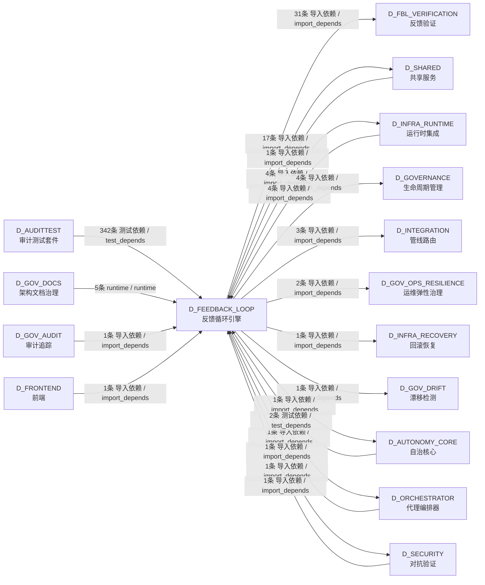

# 12_d_feedback_loop / feedback_loop_engine / 反馈循环引擎 / Feedback Loop Engine

> **功能简介 / Overview**: 反馈循环引擎，负责系统自我改进闭环：异常检测、根因诊断、自动修复和自我进化

> **文档作用 / Purpose**: 展示 反馈循环引擎（D_FEEDBACK_LOOP）功能域的模块清单、域内依赖关系、跨域依赖关系、架构分层视图，供架构审查和域治理参考。

> 本文档由 generate_domain_doc.py 从 depgraph (PostgreSQL) 自动生成
> 最后更新: 2026-07-12 22:29:06
> 数据源: depgraph (PostgreSQL) nodes表 + edges表

## 域基本信息 / Domain Overview

| 字段 | 值 | Field | Value |
|------|------|-------|-------|
| 编号 | 12 | Number | 12 |
| 域ID | D_FEEDBACK_LOOP | Domain ID | D_FEEDBACK_LOOP |
| 域名称 | 反馈循环引擎 | Domain Name | Feedback Loop Engine |
| 层级 | L1 基础平台层 | Layer | L1 Foundation |
| 模块数 | 264 | Module Count | 264 |
| 域内依赖 | 271 | Internal Dependencies | 271 |
| 跨域入边 | 358 | Cross-domain Incoming | 358 |
| 跨域出边 | 66 | Cross-domain Outgoing | 66 |
| 设计态模块 | 0 | Design Modules | 0 |
| 原型态模块 | 153 | Prototype Modules | 153 |
| 生产态模块 | 111 | Production Modules | 111 |
| 容量 | 111/150 (正常) | Capacity | 111/150 (正常) |
| 描述 | 反馈收集器(collectors) | Description | 反馈收集器(collectors) |

## 模块分层清单 / Module Layered List

> 按 architecture_layer 分组的模块清单（共 264 个模块 / 264 modules）。

### L1 基础层 / Foundation Layer (264 modules)

| # | 模块路径 / Module Path | 模块名称 / Module Name (功能简介 / Description) | 成熟度 / Maturity | 蓝图 / Blueprint |
|:--:|---------|---------|:---:|:---:|
| 1 | src/zephyr/trading/feedback_loop/__init__.py | Feedback Loop Engine — MOD-FEEDBACK_LOOP. | 生产态 / production | [MOD-FEEDBACK_LOOP](../../03_modules/_cross_layer/feedback_loop/blueprint.md) |
| 2 | src/zephyr/trading/feedback_loop/_gen_inherited.py | _gen_inherited.py | 生产态 / production | [MOD-FEEDBACK_LOOP](../../03_modules/_cross_layer/feedback_loop/blueprint.md) |
| 3 | src/zephyr/trading/feedback_loop/actors/__init__.py | feedback-loop.actors — auto-generated package ... | 生产态 / production | [MOD-FEEDBACK_LOOP](../../03_modules/_cross_layer/feedback_loop/blueprint.md) |
| 4 | src/zephyr/trading/feedback_loop/actors/action_selector.py | action_selector.py | 生产态 / production | [MOD-FEEDBACK_LOOP](../../03_modules/_cross_layer/feedback_loop/blueprint.md) |
| 5 | src/zephyr/trading/feedback_loop/actors/agent_lifecycle.py | Agent Lifecycle Manager — v0.12.0 R159c | 生产态 / production | [MOD-FEEDBACK_LOOP](../../03_modules/_cross_layer/feedback_loop/blueprint.md) |
| 6 | src/zephyr/trading/feedback_loop/actors/api_version_contr... | API Version Contract — v0.14.0 R188 | 生产态 / production | [MOD-FEEDBACK_LOOP](../../03_modules/_cross_layer/feedback_loop/blueprint.md) |
| 7 | src/zephyr/trading/feedback_loop/actors/global_action_sch... | Global Action Scheduler — v0.16.0 R226 | 生产态 / production | [MOD-FEEDBACK_LOOP](../../03_modules/_cross_layer/feedback_loop/blueprint.md) |
| 8 | src/zephyr/trading/feedback_loop/actors/incident_priority... | Incident Priority Triage Automator — v0.37.0 R463 | 生产态 / production | [MOD-FEEDBACK_LOOP](../../03_modules/_cross_layer/feedback_loop/blueprint.md) |
| 9 | src/zephyr/trading/feedback_loop/actors/intent_driven_ops.py | Intent-Driven Ops — v0.12.0 R159 | 生产态 / production | [MOD-FEEDBACK_LOOP](../../03_modules/_cross_layer/feedback_loop/blueprint.md) |
| 10 | src/zephyr/trading/feedback_loop/actors/multi_agent_orche... | Multi-Agent Orchestrator — v0.12.0 R159b | 生产态 / production | [MOD-FEEDBACK_LOOP](../../03_modules/_cross_layer/feedback_loop/blueprint.md) |
| 11 | src/zephyr/trading/feedback_loop/actors/notification_pers... | Notification Personalizer — v0.6.0 R67 | 生产态 / production | [MOD-FEEDBACK_LOOP](../../03_modules/_cross_layer/feedback_loop/blueprint.md) |
| 12 | src/zephyr/trading/feedback_loop/actors/owner_absence_esc... | Owner Absence Escalation — v0.37.0 R462 | 生产态 / production | [MOD-FEEDBACK_LOOP](../../03_modules/_cross_layer/feedback_loop/blueprint.md) |
| 13 | src/zephyr/trading/feedback_loop/actors/saga_compensator.py | Saga Compensator — v0.3.0 R19b | 原型态 / prototype | [MOD-FEEDBACK_LOOP](../../03_modules/_cross_layer/feedback_loop/blueprint.md) |
| 14 | src/zephyr/trading/feedback_loop/actors/secondary_alert_c... | Secondary Alert Channel — v0.37.0 R461 | 生产态 / production | [MOD-FEEDBACK_LOOP](../../03_modules/_cross_layer/feedback_loop/blueprint.md) |
| 15 | src/zephyr/trading/feedback_loop/alert_dispatcher.py | FLE->Orc 告警分派器 — dispatch() 生产者 | 原型态 / prototype | [MOD-FEEDBACK_LOOP](../../03_modules/_cross_layer/feedback_loop/blueprint.md) |
| 16 | src/zephyr/trading/feedback_loop/auto_evolution.py | auto_evolution.py | 生产态 / production | [MOD-FEEDBACK_LOOP](../../03_modules/_cross_layer/feedback_loop/blueprint.md) |
| 17 | src/zephyr/trading/feedback_loop/backpressure_bridge.py | FLE -> Pipeline 背压桥接（CTR-BP-001~003） | 生产态 / production | [MOD-FEEDBACK_LOOP](../../03_modules/_cross_layer/feedback_loop/blueprint.md) |
| 18 | src/zephyr/trading/feedback_loop/collectors/__init__.py | feedback-loop.collectors — auto-generated pack... | 原型态 / prototype | [MOD-FEEDBACK_LOOP](../../03_modules/_cross_layer/feedback_loop/blueprint.md) |
| 19 | src/zephyr/trading/feedback_loop/collectors/calendar_adap... | Calendar Adapter — v0.8.0 R102b | 生产态 / production | [MOD-FEEDBACK_LOOP](../../03_modules/_cross_layer/feedback_loop/blueprint.md) |
| 20 | src/zephyr/trading/feedback_loop/collectors/config_timeli... | Config Timeline — v0.8.0 R99 | 生产态 / production | [MOD-FEEDBACK_LOOP](../../03_modules/_cross_layer/feedback_loop/blueprint.md) |
| 21 | src/zephyr/trading/feedback_loop/collectors/data_quality_... | Data Quality Validator — v0.9.0 R110 | 生产态 / production | [MOD-FEEDBACK_LOOP](../../03_modules/_cross_layer/feedback_loop/blueprint.md) |
| 22 | src/zephyr/trading/feedback_loop/collectors/feedback_coll... | feedback_collector.py | 原型态 / prototype | [MOD-FEEDBACK_LOOP](../../03_modules/_cross_layer/feedback_loop/blueprint.md) |
| 23 | src/zephyr/trading/feedback_loop/collectors/financial_str... | Financial Stratification — v0.5.0 R50 | 生产态 / production | [MOD-FEEDBACK_LOOP](../../03_modules/_cross_layer/feedback_loop/blueprint.md) |
| 24 | src/zephyr/trading/feedback_loop/collectors/kb_provenance.py | KB Provenance — v0.10.0 R136 | 生产态 / production | [MOD-FEEDBACK_LOOP](../../03_modules/_cross_layer/feedback_loop/blueprint.md) |
| 25 | src/zephyr/trading/feedback_loop/collectors/knowledge_cap... | Knowledge Capture — v0.4.0 R30 | 生产态 / production | [MOD-FEEDBACK_LOOP](../../03_modules/_cross_layer/feedback_loop/blueprint.md) |
| 26 | src/zephyr/trading/feedback_loop/collectors/knowledge_fre... | Knowledge Freshness — v0.5.0 R47 | 生产态 / production | [MOD-FEEDBACK_LOOP](../../03_modules/_cross_layer/feedback_loop/blueprint.md) |
| 27 | src/zephyr/trading/feedback_loop/collectors/knowledge_inj... | Knowledge Injection — v0.8.0 R102 | 生产态 / production | [MOD-FEEDBACK_LOOP](../../03_modules/_cross_layer/feedback_loop/blueprint.md) |
| 28 | src/zephyr/trading/feedback_loop/collectors/knowledge_pac... | Knowledge Packaging — v0.9.0 R123 | 生产态 / production | [MOD-FEEDBACK_LOOP](../../03_modules/_cross_layer/feedback_loop/blueprint.md) |
| 29 | src/zephyr/trading/feedback_loop/collectors/known_unknown... | Known-Unknown Registry — v0.16.0 R229 | 生产态 / production | [MOD-FEEDBACK_LOOP](../../03_modules/_cross_layer/feedback_loop/blueprint.md) |
| 30 | src/zephyr/trading/feedback_loop/collectors/llm_cost_acco... | LLM Cost Accounting — v0.4.0 R35 | 生产态 / production | [MOD-FEEDBACK_LOOP](../../03_modules/_cross_layer/feedback_loop/blueprint.md) |
| 31 | src/zephyr/trading/feedback_loop/collectors/market_calend... | Market Calendar — v0.5.0 R48 | 生产态 / production | [MOD-FEEDBACK_LOOP](../../03_modules/_cross_layer/feedback_loop/blueprint.md) |
| 32 | src/zephyr/trading/feedback_loop/collectors/market_event_... | Market Event Integrator — v0.14.0 R197 | 生产态 / production | [MOD-FEEDBACK_LOOP](../../03_modules/_cross_layer/feedback_loop/blueprint.md) |
| 33 | src/zephyr/trading/feedback_loop/collectors/metrics_colle... | metrics_collector.py | 原型态 / prototype | [MOD-FEEDBACK_LOOP](../../03_modules/_cross_layer/feedback_loop/blueprint.md) |
| 34 | src/zephyr/trading/feedback_loop/collectors/notification_... | Notification Feedback — v0.9.0 R118 | 生产态 / production | [MOD-FEEDBACK_LOOP](../../03_modules/_cross_layer/feedback_loop/blueprint.md) |
| 35 | src/zephyr/trading/feedback_loop/collectors/schema_evolut... | Schema Evolution — v0.9.0 R111 | 生产态 / production | [MOD-FEEDBACK_LOOP](../../03_modules/_cross_layer/feedback_loop/blueprint.md) |
| 36 | src/zephyr/trading/feedback_loop/collectors/schema_migrat... | Schema Migration — v0.14.0 R190 | 生产态 / production | [MOD-FEEDBACK_LOOP](../../03_modules/_cross_layer/feedback_loop/blueprint.md) |
| 37 | src/zephyr/trading/feedback_loop/collectors/temporal_even... | Temporal Event Store — v0.3.0 R9 | 生产态 / production | [MOD-FEEDBACK_LOOP](../../03_modules/_cross_layer/feedback_loop/blueprint.md) |
| 38 | src/zephyr/trading/feedback_loop/collectors/token_finops.py | Token FinOps — v0.12.0 R162 | 生产态 / production | [MOD-FEEDBACK_LOOP](../../03_modules/_cross_layer/feedback_loop/blueprint.md) |
| 39 | src/zephyr/trading/feedback_loop/config.py | config.py | 生产态 / production | [MOD-FEEDBACK_LOOP](../../03_modules/_cross_layer/feedback_loop/blueprint.md) |
| 40 | src/zephyr/trading/feedback_loop/core.py | FeedbackLoop core — 反馈闭环核心类。 | 原型态 / prototype | [MOD-INF-035](../../03_modules/_cross_layer/auto_runtime_core/blueprint.md) |
| 41 | src/zephyr/trading/feedback_loop/db_bridge.py | FLE DB契约适配器 — 通过规范zephyr.governance.s... | 生产态 / production | [MOD-FEEDBACK_LOOP](../../03_modules/_cross_layer/feedback_loop/blueprint.md) |
| 42 | src/zephyr/trading/feedback_loop/db_writer.py | FLE 持久化写入器 — 写 metrics/alerts/dispatch_... | 原型态 / prototype | [MOD-FEEDBACK_LOOP](../../03_modules/_cross_layer/feedback_loop/blueprint.md) |
| 43 | src/zephyr/trading/feedback_loop/decision_engine.py | Feedback Loop Decision Engine | 生产态 / production | [MOD-FEEDBACK_LOOP](../../03_modules/_cross_layer/feedback_loop/blueprint.md) |
| 44 | src/zephyr/trading/feedback_loop/detectors/__init__.py | feedback-loop.detectors — GOV-DOC-018: 60个叶... | 生产态 / production | [MOD-FEEDBACK_LOOP](../../03_modules/_cross_layer/feedback_loop/blueprint.md) |
| 45 | src/zephyr/trading/feedback_loop/detectors/anomaly/__init... | __init__.py | 原型态 / prototype | [MOD-FEEDBACK_LOOP](../../03_modules/_cross_layer/feedback_loop/blueprint.md) |
| 46 | src/zephyr/trading/feedback_loop/detectors/anomaly/anomal... | Anomaly Clustering — v0.9.0 R119 | 原型态 / prototype | [MOD-FEEDBACK_LOOP](../../03_modules/_cross_layer/feedback_loop/blueprint.md) |
| 47 | src/zephyr/trading/feedback_loop/detectors/anomaly/anomal... | anomaly_detector.py | 原型态 / prototype | [MOD-FEEDBACK_LOOP](../../03_modules/_cross_layer/feedback_loop/blueprint.md) |
| 48 | src/zephyr/trading/feedback_loop/detectors/anomaly/emerge... | Emergent Behavior Detector — v0.38.0 R473 | 原型态 / prototype | [MOD-FEEDBACK_LOOP](../../03_modules/_cross_layer/feedback_loop/blueprint.md) |
| 49 | src/zephyr/trading/feedback_loop/detectors/anomaly/flappi... | Flapping Detector — v0.40.0 R494 | 原型态 / prototype | [MOD-FEEDBACK_LOOP](../../03_modules/_cross_layer/feedback_loop/blueprint.md) |
| 50 | src/zephyr/trading/feedback_loop/detectors/anomaly/heisen... | Heisenbug Detector — v0.38.0 R470 | 原型态 / prototype | [MOD-FEEDBACK_LOOP](../../03_modules/_cross_layer/feedback_loop/blueprint.md) |
| 51 | src/zephyr/trading/feedback_loop/detectors/anomaly/infini... | Infinite Loop Detector — v0.15.0 R219 | 原型态 / prototype | [MOD-FEEDBACK_LOOP](../../03_modules/_cross_layer/feedback_loop/blueprint.md) |
| 52 | src/zephyr/trading/feedback_loop/detectors/anomaly/interm... | Intermittent Failure Pattern Detector — v0.40.... | 原型态 / prototype | [MOD-FEEDBACK_LOOP](../../03_modules/_cross_layer/feedback_loop/blueprint.md) |
| 53 | src/zephyr/trading/feedback_loop/detectors/anomaly/log_an... | Log Anomaly Detector — v0.6.0 R61 | 原型态 / prototype | [MOD-FEEDBACK_LOOP](../../03_modules/_cross_layer/feedback_loop/blueprint.md) |
| 54 | src/zephyr/trading/feedback_loop/detectors/anomaly/silent... | Silent Corruption Detector — v0.40.0 R499 | 原型态 / prototype | [MOD-FEEDBACK_LOOP](../../03_modules/_cross_layer/feedback_loop/blueprint.md) |
| 55 | src/zephyr/trading/feedback_loop/detectors/anomaly/synthe... | Synthetic Anomaly Generator — v0.9.0 R112 | 原型态 / prototype | [MOD-FEEDBACK_LOOP](../../03_modules/_cross_layer/feedback_loop/blueprint.md) |
| 56 | src/zephyr/trading/feedback_loop/detectors/anomaly/tempor... | Temporal Pattern Detector — v0.12.0 R164 | 原型态 / prototype | [MOD-FEEDBACK_LOOP](../../03_modules/_cross_layer/feedback_loop/blueprint.md) |
| 57 | src/zephyr/trading/feedback_loop/detectors/correlation/__... | __init__.py | 原型态 / prototype | [MOD-FEEDBACK_LOOP](../../03_modules/_cross_layer/feedback_loop/blueprint.md) |
| 58 | src/zephyr/trading/feedback_loop/detectors/correlation/ac... | R507: ActionEfficacyDecayDetector | 原型态 / prototype | [MOD-FEEDBACK_LOOP](../../03_modules/_cross_layer/feedback_loop/blueprint.md) |
| 59 | src/zephyr/trading/feedback_loop/detectors/correlation/ac... | Action Interaction Detector — v0.38.0 R472 | 原型态 / prototype | [MOD-FEEDBACK_LOOP](../../03_modules/_cross_layer/feedback_loop/blueprint.md) |
| 60 | src/zephyr/trading/feedback_loop/detectors/correlation/ac... | R526: ActionSideEffectCumulativeDetector | 原型态 / prototype | [MOD-FEEDBACK_LOOP](../../03_modules/_cross_layer/feedback_loop/blueprint.md) |
| 61 | src/zephyr/trading/feedback_loop/detectors/correlation/ag... | R503: AgentTrajectoryAnomalyDetector | 原型态 / prototype | [MOD-FEEDBACK_LOOP](../../03_modules/_cross_layer/feedback_loop/blueprint.md) |
| 62 | src/zephyr/trading/feedback_loop/detectors/correlation/cr... | Cross-Signal Validator — v0.6.0 R63 | 原型态 / prototype | [MOD-FEEDBACK_LOOP](../../03_modules/_cross_layer/feedback_loop/blueprint.md) |
| 63 | src/zephyr/trading/feedback_loop/detectors/correlation/cr... | Cross-System Correlator — v0.13.0 R185 | 原型态 / prototype | [MOD-FEEDBACK_LOOP](../../03_modules/_cross_layer/feedback_loop/blueprint.md) |
| 64 | src/zephyr/trading/feedback_loop/detectors/correlation/de... | Decision Provenance — v0.12.0 R166 | 原型态 / prototype | [MOD-FEEDBACK_LOOP](../../03_modules/_cross_layer/feedback_loop/blueprint.md) |
| 65 | src/zephyr/trading/feedback_loop/detectors/correlation/de... | Dependency Freshness Monitor — v0.38.0 R474 | 原型态 / prototype | [MOD-FEEDBACK_LOOP](../../03_modules/_cross_layer/feedback_loop/blueprint.md) |
| 66 | src/zephyr/trading/feedback_loop/detectors/correlation/en... | Ensemble Detector — v0.4.0 R21 | 原型态 / prototype | [MOD-FEEDBACK_LOOP](../../03_modules/_cross_layer/feedback_loop/blueprint.md) |
| 67 | src/zephyr/trading/feedback_loop/detectors/correlation/ex... | External Health Monitor — v0.14.0 R193 | 原型态 / prototype | [MOD-FEEDBACK_LOOP](../../03_modules/_cross_layer/feedback_loop/blueprint.md) |
| 68 | src/zephyr/trading/feedback_loop/detectors/correlation/ex... | R524: ExternalValidationCheckpoint | 原型态 / prototype | [MOD-FEEDBACK_LOOP](../../03_modules/_cross_layer/feedback_loop/blueprint.md) |
| 69 | src/zephyr/trading/feedback_loop/detectors/correlation/fl... | R532: FLEPerformanceRegressionDetector | 原型态 / prototype | [MOD-FEEDBACK_LOOP](../../03_modules/_cross_layer/feedback_loop/blueprint.md) |
| 70 | src/zephyr/trading/feedback_loop/detectors/correlation/mu... | Multi-Signal Correlator — v0.4.0 R22 | 原型态 / prototype | [MOD-FEEDBACK_LOOP](../../03_modules/_cross_layer/feedback_loop/blueprint.md) |
| 71 | src/zephyr/trading/feedback_loop/detectors/correlation/ru... | Rumor Noise Filter — v0.37.0 R460 | 原型态 / prototype | [MOD-FEEDBACK_LOOP](../../03_modules/_cross_layer/feedback_loop/blueprint.md) |
| 72 | src/zephyr/trading/feedback_loop/detectors/correlation/tr... | Trace Causal Bridge — v0.6.0 R62 | 原型态 / prototype | [MOD-FEEDBACK_LOOP](../../03_modules/_cross_layer/feedback_loop/blueprint.md) |
| 73 | src/zephyr/trading/feedback_loop/detectors/correlation/tr... | Traffic Replay Validator — v0.14.0 R202 | 原型态 / prototype | [MOD-FEEDBACK_LOOP](../../03_modules/_cross_layer/feedback_loop/blueprint.md) |
| 74 | src/zephyr/trading/feedback_loop/detectors/drift/__init__.py | __init__.py | 原型态 / prototype | [MOD-FEEDBACK_LOOP](../../03_modules/_cross_layer/feedback_loop/blueprint.md) |
| 75 | src/zephyr/trading/feedback_loop/detectors/drift/concept_... | Concept Drift Detector — v0.5.0 R42 | 原型态 / prototype | [MOD-FEEDBACK_LOOP](../../03_modules/_cross_layer/feedback_loop/blueprint.md) |
| 76 | src/zephyr/trading/feedback_loop/detectors/drift/config_d... | Config Drift Detector — v0.13.0 R182 | 原型态 / prototype | [MOD-FEEDBACK_LOOP](../../03_modules/_cross_layer/feedback_loop/blueprint.md) |
| 77 | src/zephyr/trading/feedback_loop/detectors/drift/context_... | Context Window Contamination Detector — v0.38.... | 原型态 / prototype | [MOD-FEEDBACK_LOOP](../../03_modules/_cross_layer/feedback_loop/blueprint.md) |
| 78 | src/zephyr/trading/feedback_loop/detectors/drift/diminish... | R528: DiminishingReturnsDetector | 原型态 / prototype | [MOD-FEEDBACK_LOOP](../../03_modules/_cross_layer/feedback_loop/blueprint.md) |
| 79 | src/zephyr/trading/feedback_loop/detectors/drift/ensemble... | Ensemble Drift — v0.5.0 R43 | 原型态 / prototype | [MOD-FEEDBACK_LOOP](../../03_modules/_cross_layer/feedback_loop/blueprint.md) |
| 80 | src/zephyr/trading/feedback_loop/detectors/drift/gradual_... | Gradual Poisoning Detector — v0.15.0 R210 | 原型态 / prototype | [MOD-FEEDBACK_LOOP](../../03_modules/_cross_layer/feedback_loop/blueprint.md) |
| 81 | src/zephyr/trading/feedback_loop/detectors/drift/trend_cy... | Trend-Cycle Separator — v0.9.0 R113 | 原型态 / prototype | [MOD-FEEDBACK_LOOP](../../03_modules/_cross_layer/feedback_loop/blueprint.md) |
| 82 | src/zephyr/trading/feedback_loop/detectors/guard/__init__.py | __init__.py | 原型态 / prototype | [MOD-FEEDBACK_LOOP](../../03_modules/_cross_layer/feedback_loop/blueprint.md) |
| 83 | src/zephyr/trading/feedback_loop/detectors/guard/alert_de... | Alert Desensitization Curve — v0.37.0 R492 | 原型态 / prototype | [MOD-FEEDBACK_LOOP](../../03_modules/_cross_layer/feedback_loop/blueprint.md) |
| 84 | src/zephyr/trading/feedback_loop/detectors/guard/guard_ca... | R520: GuardCascadeDetector | 原型态 / prototype | [MOD-FEEDBACK_LOOP](../../03_modules/_cross_layer/feedback_loop/blueprint.md) |
| 85 | src/zephyr/trading/feedback_loop/detectors/guard/guard_os... | R519: GuardOscillationDetector | 原型态 / prototype | [MOD-FEEDBACK_LOOP](../../03_modules/_cross_layer/feedback_loop/blueprint.md) |
| 86 | src/zephyr/trading/feedback_loop/detectors/guard/placebo_... | R508: PlaceboActionDetector | 原型态 / prototype | [MOD-FEEDBACK_LOOP](../../03_modules/_cross_layer/feedback_loop/blueprint.md) |
| 87 | src/zephyr/trading/feedback_loop/detectors/guard/positive... | Positive Feedback Defense — v0.4.0 R28 | 原型态 / prototype | [MOD-FEEDBACK_LOOP](../../03_modules/_cross_layer/feedback_loop/blueprint.md) |
| 88 | src/zephyr/trading/feedback_loop/detectors/guard/recursiv... | R517: RecursiveDiagnosisTrustEvaluator | 原型态 / prototype | [MOD-FEEDBACK_LOOP](../../03_modules/_cross_layer/feedback_loop/blueprint.md) |
| 89 | src/zephyr/trading/feedback_loop/detectors/guard/self_aud... | Self Audit — v0.13.0 R183 | 原型态 / prototype | [MOD-FEEDBACK_LOOP](../../03_modules/_cross_layer/feedback_loop/blueprint.md) |
| 90 | src/zephyr/trading/feedback_loop/detectors/guard/self_dia... | R530: SelfDiagnosisDataLeakDetector | 原型态 / prototype | [MOD-FEEDBACK_LOOP](../../03_modules/_cross_layer/feedback_loop/blueprint.md) |
| 91 | src/zephyr/trading/feedback_loop/detectors/guard/self_ha.py | Self HA — v0.13.0 R173 | 原型态 / prototype | [MOD-FEEDBACK_LOOP](../../03_modules/_cross_layer/feedback_loop/blueprint.md) |
| 92 | src/zephyr/trading/feedback_loop/detectors/guard/temporal... | R525: TemporalCoherenceOfSelfModel | 原型态 / prototype | [MOD-FEEDBACK_LOOP](../../03_modules/_cross_layer/feedback_loop/blueprint.md) |
| 93 | src/zephyr/trading/feedback_loop/detectors/reliability/__... | __init__.py | 原型态 / prototype | [MOD-FEEDBACK_LOOP](../../03_modules/_cross_layer/feedback_loop/blueprint.md) |
| 94 | src/zephyr/trading/feedback_loop/detectors/reliability/au... | Autoscale Remediation — v0.13.0 R174 | 原型态 / prototype | [MOD-FEEDBACK_LOOP](../../03_modules/_cross_layer/feedback_loop/blueprint.md) |
| 95 | src/zephyr/trading/feedback_loop/detectors/reliability/bl... | Blast Radius Detector — v0.12.0 R167 | 原型态 / prototype | [MOD-FEEDBACK_LOOP](../../03_modules/_cross_layer/feedback_loop/blueprint.md) |
| 96 | src/zephyr/trading/feedback_loop/detectors/reliability/bl... | Blast Radius Budget — v0.13.0 R178 | 原型态 / prototype | [MOD-FEEDBACK_LOOP](../../03_modules/_cross_layer/feedback_loop/blueprint.md) |
| 97 | src/zephyr/trading/feedback_loop/detectors/reliability/ca... | Capacity Forecast — v0.13.0 R186b | 原型态 / prototype | [MOD-FEEDBACK_LOOP](../../03_modules/_cross_layer/feedback_loop/blueprint.md) |
| 98 | src/zephyr/trading/feedback_loop/detectors/reliability/ch... | Chaos Engineering — v0.13.0 R172 | 原型态 / prototype | [MOD-FEEDBACK_LOOP](../../03_modules/_cross_layer/feedback_loop/blueprint.md) |
| 99 | src/zephyr/trading/feedback_loop/detectors/reliability/eb... | eBPF Monitor — v0.6.0 R64 | 原型态 / prototype | [MOD-FEEDBACK_LOOP](../../03_modules/_cross_layer/feedback_loop/blueprint.md) |
| 100 | src/zephyr/trading/feedback_loop/detectors/reliability/fl... | Flag Lifecycle Detector — v0.13.0 R180 | 原型态 / prototype | [MOD-FEEDBACK_LOOP](../../03_modules/_cross_layer/feedback_loop/blueprint.md) |
| 101 | src/zephyr/trading/feedback_loop/detectors/reliability/ma... | Maintenance Coordinator — v0.12.0 R168 | 原型态 / prototype | [MOD-FEEDBACK_LOOP](../../03_modules/_cross_layer/feedback_loop/blueprint.md) |
| 102 | src/zephyr/trading/feedback_loop/detectors/reliability/me... | Metric Cardinality Guard — v0.40.0 R495 | 原型态 / prototype | [MOD-FEEDBACK_LOOP](../../03_modules/_cross_layer/feedback_loop/blueprint.md) |
| 103 | src/zephyr/trading/feedback_loop/detectors/reliability/op... | OpenFeature Integration — v0.13.0 R181 | 原型态 / prototype | [MOD-FEEDBACK_LOOP](../../03_modules/_cross_layer/feedback_loop/blueprint.md) |
| 104 | src/zephyr/trading/feedback_loop/detectors/reliability/ot... | OTel Adapter — v0.12.0 R170 | 原型态 / prototype | [MOD-FEEDBACK_LOOP](../../03_modules/_cross_layer/feedback_loop/blueprint.md) |
| 105 | src/zephyr/trading/feedback_loop/detectors/reliability/re... | Regulatory Audit Detector — v0.13.0 R184 | 原型态 / prototype | [MOD-FEEDBACK_LOOP](../../03_modules/_cross_layer/feedback_loop/blueprint.md) |
| 106 | src/zephyr/trading/feedback_loop/detectors/reliability/re... | Resolution Tracker — v0.12.0 R165 | 原型态 / prototype | [MOD-FEEDBACK_LOOP](../../03_modules/_cross_layer/feedback_loop/blueprint.md) |
| 107 | src/zephyr/trading/feedback_loop/detectors/reliability/ru... | Runbook Executor — v0.13.0 R186a | 原型态 / prototype | [MOD-FEEDBACK_LOOP](../../03_modules/_cross_layer/feedback_loop/blueprint.md) |
| 108 | src/zephyr/trading/feedback_loop/detectors/reliability/ve... | Version Migrator — v0.12.0 R169 | 原型态 / prototype | [MOD-FEEDBACK_LOOP](../../03_modules/_cross_layer/feedback_loop/blueprint.md) |
| 109 | src/zephyr/trading/feedback_loop/diagnosers/__init__.py | feedback-loop.diagnosers — GOV-DOC-018: 71个叶... | 生产态 / production | [MOD-FEEDBACK_LOOP](../../03_modules/_cross_layer/feedback_loop/blueprint.md) |
| 110 | src/zephyr/trading/feedback_loop/diagnosers/cognitive/__i... | __init__.py | 原型态 / prototype | [MOD-FEEDBACK_LOOP](../../03_modules/_cross_layer/feedback_loop/blueprint.md) |
| 111 | src/zephyr/trading/feedback_loop/diagnosers/cognitive/ada... | Adaptive Parameter Tuning — v0.37.0 R452 | 原型态 / prototype | [MOD-FEEDBACK_LOOP](../../03_modules/_cross_layer/feedback_loop/blueprint.md) |
| 112 | src/zephyr/trading/feedback_loop/diagnosers/cognitive/cog... | Cognitive Load Estimator — v0.6.0 R68 | 原型态 / prototype | [MOD-FEEDBACK_LOOP](../../03_modules/_cross_layer/feedback_loop/blueprint.md) |
| 113 | src/zephyr/trading/feedback_loop/diagnosers/cognitive/cog... | Cognitive Load Budget — v0.16.0 R223 | 原型态 / prototype | [MOD-FEEDBACK_LOOP](../../03_modules/_cross_layer/feedback_loop/blueprint.md) |
| 114 | src/zephyr/trading/feedback_loop/diagnosers/cognitive/col... | Collaborative Learning — v0.7.0 R82 | 原型态 / prototype | [MOD-FEEDBACK_LOOP](../../03_modules/_cross_layer/feedback_loop/blueprint.md) |
| 115 | src/zephyr/trading/feedback_loop/diagnosers/cognitive/con... | Confidence Decomposer — v0.7.0 R83 | 原型态 / prototype | [MOD-FEEDBACK_LOOP](../../03_modules/_cross_layer/feedback_loop/blueprint.md) |
| 116 | src/zephyr/trading/feedback_loop/diagnosers/cognitive/gam... | Gamification — v0.8.0 R101 | 原型态 / prototype | [MOD-FEEDBACK_LOOP](../../03_modules/_cross_layer/feedback_loop/blueprint.md) |
| 117 | src/zephyr/trading/feedback_loop/diagnosers/cognitive/met... | R516: MetaGuardLatencyBudget | 原型态 / prototype | [MOD-FEEDBACK_LOOP](../../03_modules/_cross_layer/feedback_loop/blueprint.md) |
| 118 | src/zephyr/trading/feedback_loop/diagnosers/cognitive/soc... | Socratic Questions — v0.7.0 R81 | 原型态 / prototype | [MOD-FEEDBACK_LOOP](../../03_modules/_cross_layer/feedback_loop/blueprint.md) |
| 119 | src/zephyr/trading/feedback_loop/diagnosers/cognitive/ton... | Tone Adapter — v0.9.0 R127 | 原型态 / prototype | [MOD-FEEDBACK_LOOP](../../03_modules/_cross_layer/feedback_loop/blueprint.md) |
| 120 | src/zephyr/trading/feedback_loop/diagnosers/cognitive/ton... | Tone Adapter v2 — v0.10.0 R141 | 原型态 / prototype | [MOD-FEEDBACK_LOOP](../../03_modules/_cross_layer/feedback_loop/blueprint.md) |
| 121 | src/zephyr/trading/feedback_loop/diagnosers/diagnosis/__i... | __init__.py | 原型态 / prototype | [MOD-FEEDBACK_LOOP](../../03_modules/_cross_layer/feedback_loop/blueprint.md) |
| 122 | src/zephyr/trading/feedback_loop/diagnosers/diagnosis/aut... | Auto Diagnosis — v0.3.0 R16 | 原型态 / prototype | [MOD-FEEDBACK_LOOP](../../03_modules/_cross_layer/feedback_loop/blueprint.md) |
| 123 | src/zephyr/trading/feedback_loop/diagnosers/diagnosis/cau... | Causal Inference Engine — v0.3.0 R5-R7 | 原型态 / prototype | [MOD-FEEDBACK_LOOP](../../03_modules/_cross_layer/feedback_loop/blueprint.md) |
| 124 | src/zephyr/trading/feedback_loop/diagnosers/diagnosis/cou... | Counterfactual Engine — v0.6.0 R60 | 原型态 / prototype | [MOD-FEEDBACK_LOOP](../../03_modules/_cross_layer/feedback_loop/blueprint.md) |
| 125 | src/zephyr/trading/feedback_loop/diagnosers/diagnosis/dia... | diagnosis_engine.py | 原型态 / prototype | [MOD-FEEDBACK_LOOP](../../03_modules/_cross_layer/feedback_loop/blueprint.md) |
| 126 | src/zephyr/trading/feedback_loop/diagnosers/diagnosis/dia... | Diagnosis KPI — v0.9.0 R116 | 原型态 / prototype | [MOD-FEEDBACK_LOOP](../../03_modules/_cross_layer/feedback_loop/blueprint.md) |
| 127 | src/zephyr/trading/feedback_loop/diagnosers/diagnosis/imp... | Impact Predictor — v0.9.0 R121 | 原型态 / prototype | [MOD-FEEDBACK_LOOP](../../03_modules/_cross_layer/feedback_loop/blueprint.md) |
| 128 | src/zephyr/trading/feedback_loop/diagnosers/diagnosis/inc... | R504: IncidentKnowledgeInjector | 原型态 / prototype | [MOD-FEEDBACK_LOOP](../../03_modules/_cross_layer/feedback_loop/blueprint.md) |
| 129 | src/zephyr/trading/feedback_loop/diagnosers/diagnosis/int... | Interactive Diagnosis — v0.7.0 R80 | 原型态 / prototype | [MOD-FEEDBACK_LOOP](../../03_modules/_cross_layer/feedback_loop/blueprint.md) |
| 130 | src/zephyr/trading/feedback_loop/diagnosers/diagnosis/kno... | Knowledge Bus Factor Monitor — v0.38.0 R481 | 原型态 / prototype | [MOD-FEEDBACK_LOOP](../../03_modules/_cross_layer/feedback_loop/blueprint.md) |
| 131 | src/zephyr/trading/feedback_loop/diagnosers/diagnosis/kno... | Knowledge Market — v0.9.0 R126 | 原型态 / prototype | [MOD-FEEDBACK_LOOP](../../03_modules/_cross_layer/feedback_loop/blueprint.md) |
| 132 | src/zephyr/trading/feedback_loop/diagnosers/diagnosis/mtt... | MTTI Tracker — v0.16.0 R221 | 原型态 / prototype | [MOD-FEEDBACK_LOOP](../../03_modules/_cross_layer/feedback_loop/blueprint.md) |
| 133 | src/zephyr/trading/feedback_loop/diagnosers/diagnosis/non... | Nonstationary Effectiveness — v0.37.0 R455 | 原型态 / prototype | [MOD-FEEDBACK_LOOP](../../03_modules/_cross_layer/feedback_loop/blueprint.md) |
| 134 | src/zephyr/trading/feedback_loop/diagnosers/diagnosis/sta... | Statistical Hygiene Auditor — v0.38.0 R476 | 原型态 / prototype | [MOD-FEEDBACK_LOOP](../../03_modules/_cross_layer/feedback_loop/blueprint.md) |
| 135 | src/zephyr/trading/feedback_loop/diagnosers/diagnosis/ver... | Vertical Self Assessment — v0.10.0 R137 | 原型态 / prototype | [MOD-FEEDBACK_LOOP](../../03_modules/_cross_layer/feedback_loop/blueprint.md) |
| 136 | src/zephyr/trading/feedback_loop/diagnosers/health/__init... | __init__.py | 原型态 / prototype | [MOD-FEEDBACK_LOOP](../../03_modules/_cross_layer/feedback_loop/blueprint.md) |
| 137 | src/zephyr/trading/feedback_loop/diagnosers/health/action... | R511: ActionCompositionHealthMonitor | 原型态 / prototype | [MOD-FEEDBACK_LOOP](../../03_modules/_cross_layer/feedback_loop/blueprint.md) |
| 138 | src/zephyr/trading/feedback_loop/diagnosers/health/dr_res... | DR Resilience Metrics — v0.17.0+ R231-R236 | 原型态 / prototype | [MOD-FEEDBACK_LOOP](../../03_modules/_cross_layer/feedback_loop/blueprint.md) |
| 139 | src/zephyr/trading/feedback_loop/diagnosers/health/e2e_in... | E2E Integration Health Monitor — v0.39.0 R489 | 原型态 / prototype | [MOD-FEEDBACK_LOOP](../../03_modules/_cross_layer/feedback_loop/blueprint.md) |
| 140 | src/zephyr/trading/feedback_loop/diagnosers/health/fle_do... | FLE Dogfood Monitor — v0.38.0 R480 | 原型态 / prototype | [MOD-FEEDBACK_LOOP](../../03_modules/_cross_layer/feedback_loop/blueprint.md) |
| 141 | src/zephyr/trading/feedback_loop/diagnosers/health/fle_se... | FLE Self SLO Metrics — v0.17.0+ R249-R254 | 原型态 / prototype | [MOD-FEEDBACK_LOOP](../../03_modules/_cross_layer/feedback_loop/blueprint.md) |
| 142 | src/zephyr/trading/feedback_loop/diagnosers/health/global... | Global Health Map — v0.8.0 R103 | 原型态 / prototype | [MOD-FEEDBACK_LOOP](../../03_modules/_cross_layer/feedback_loop/blueprint.md) |
| 143 | src/zephyr/trading/feedback_loop/diagnosers/health/memory... | Memory Self Check — v0.8.0 R105 | 原型态 / prototype | [MOD-FEEDBACK_LOOP](../../03_modules/_cross_layer/feedback_loop/blueprint.md) |
| 144 | src/zephyr/trading/feedback_loop/diagnosers/health/model_... | Model Health Monitor — v0.5.0 R40 | 原型态 / prototype | [MOD-FEEDBACK_LOOP](../../03_modules/_cross_layer/feedback_loop/blueprint.md) |
| 145 | src/zephyr/trading/feedback_loop/diagnosers/health/self_b... | Self Benchmark — v0.9.0 R115 | 原型态 / prototype | [MOD-FEEDBACK_LOOP](../../03_modules/_cross_layer/feedback_loop/blueprint.md) |
| 146 | src/zephyr/trading/feedback_loop/diagnosers/health/self_b... | Self-Bottleneck Detector — v0.38.0 R479 | 原型态 / prototype | [MOD-FEEDBACK_LOOP](../../03_modules/_cross_layer/feedback_loop/blueprint.md) |
| 147 | src/zephyr/trading/feedback_loop/diagnosers/health/self_h... | Self Health Monitor — v0.4.0 R29 | 原型态 / prototype | [MOD-FEEDBACK_LOOP](../../03_modules/_cross_layer/feedback_loop/blueprint.md) |
| 148 | src/zephyr/trading/feedback_loop/diagnosers/health/self_l... | Self LLM Observability — v0.12.0 R160 | 原型态 / prototype | [MOD-FEEDBACK_LOOP](../../03_modules/_cross_layer/feedback_loop/blueprint.md) |
| 149 | src/zephyr/trading/feedback_loop/diagnosers/reliability/_... | __init__.py | 原型态 / prototype | [MOD-FEEDBACK_LOOP](../../03_modules/_cross_layer/feedback_loop/blueprint.md) |
| 150 | src/zephyr/trading/feedback_loop/diagnosers/reliability/a... | Amplification Guard — v0.10.0 R134 | 原型态 / prototype | [MOD-FEEDBACK_LOOP](../../03_modules/_cross_layer/feedback_loop/blueprint.md) |
| 151 | src/zephyr/trading/feedback_loop/diagnosers/reliability/a... | API Dependency Metrics — v0.17.0+ R237-R242 | 原型态 / prototype | [MOD-FEEDBACK_LOOP](../../03_modules/_cross_layer/feedback_loop/blueprint.md) |
| 152 | src/zephyr/trading/feedback_loop/diagnosers/reliability/b... | Burn Rate Alerter — v0.14.0 R200 | 原型态 / prototype | [MOD-FEEDBACK_LOOP](../../03_modules/_cross_layer/feedback_loop/blueprint.md) |
| 153 | src/zephyr/trading/feedback_loop/diagnosers/reliability/b... | Burnout Alarm — v0.8.0 R100 | 原型态 / prototype | [MOD-FEEDBACK_LOOP](../../03_modules/_cross_layer/feedback_loop/blueprint.md) |
| 154 | src/zephyr/trading/feedback_loop/diagnosers/reliability/c... | Capacity Aware Repair — v0.9.0 R120 | 原型态 / prototype | [MOD-FEEDBACK_LOOP](../../03_modules/_cross_layer/feedback_loop/blueprint.md) |
| 155 | src/zephyr/trading/feedback_loop/diagnosers/reliability/c... | R509: ColdStartConservativeMode | 原型态 / prototype | [MOD-FEEDBACK_LOOP](../../03_modules/_cross_layer/feedback_loop/blueprint.md) |
| 156 | src/zephyr/trading/feedback_loop/diagnosers/reliability/c... | Context Truncation Detector — v0.9.0 R122 | 原型态 / prototype | [MOD-FEEDBACK_LOOP](../../03_modules/_cross_layer/feedback_loop/blueprint.md) |
| 157 | src/zephyr/trading/feedback_loop/diagnosers/reliability/c... | R506: ContextWindowPressureManager | 原型态 / prototype | [MOD-FEEDBACK_LOOP](../../03_modules/_cross_layer/feedback_loop/blueprint.md) |
| 158 | src/zephyr/trading/feedback_loop/diagnosers/reliability/c... | R513: CrossGuardConflictDetector | 原型态 / prototype | [MOD-FEEDBACK_LOOP](../../03_modules/_cross_layer/feedback_loop/blueprint.md) |
| 159 | src/zephyr/trading/feedback_loop/diagnosers/reliability/c... | R510: CrossSessionConsistencyValidator | 原型态 / prototype | [MOD-FEEDBACK_LOOP](../../03_modules/_cross_layer/feedback_loop/blueprint.md) |
| 160 | src/zephyr/trading/feedback_loop/diagnosers/reliability/d... | Data Volume Growth Monitor — v0.39.0 R492 | 原型态 / prototype | [MOD-FEEDBACK_LOOP](../../03_modules/_cross_layer/feedback_loop/blueprint.md) |
| 161 | src/zephyr/trading/feedback_loop/diagnosers/reliability/f... | Feedback Delay Compensator — v0.38.0 R477 | 原型态 / prototype | [MOD-FEEDBACK_LOOP](../../03_modules/_cross_layer/feedback_loop/blueprint.md) |
| 162 | src/zephyr/trading/feedback_loop/diagnosers/reliability/g... | R518: GuardInteractionTopologyMapper | 原型态 / prototype | [MOD-FEEDBACK_LOOP](../../03_modules/_cross_layer/feedback_loop/blueprint.md) |
| 163 | src/zephyr/trading/feedback_loop/diagnosers/reliability/g... | R512: GuardSelfConsistencyAuditor | 原型态 / prototype | [MOD-FEEDBACK_LOOP](../../03_modules/_cross_layer/feedback_loop/blueprint.md) |
| 164 | src/zephyr/trading/feedback_loop/diagnosers/reliability/h... | Human Anomaly Flood Detector — v0.40.0 R500 | 原型态 / prototype | [MOD-FEEDBACK_LOOP](../../03_modules/_cross_layer/feedback_loop/blueprint.md) |
| 165 | src/zephyr/trading/feedback_loop/diagnosers/reliability/l... | Latency SLO Monitor — v0.14.0 R192 | 原型态 / prototype | [MOD-FEEDBACK_LOOP](../../03_modules/_cross_layer/feedback_loop/blueprint.md) |
| 166 | src/zephyr/trading/feedback_loop/diagnosers/reliability/l... | LLM Provider Integrity — v0.15.0 R217 | 原型态 / prototype | [MOD-FEEDBACK_LOOP](../../03_modules/_cross_layer/feedback_loop/blueprint.md) |
| 167 | src/zephyr/trading/feedback_loop/diagnosers/reliability/l... | LLM Quality Regression — v0.12.0 R161 | 原型态 / prototype | [MOD-FEEDBACK_LOOP](../../03_modules/_cross_layer/feedback_loop/blueprint.md) |
| 168 | src/zephyr/trading/feedback_loop/diagnosers/reliability/m... | Model Rotation — v0.9.0 R125 | 原型态 / prototype | [MOD-FEEDBACK_LOOP](../../03_modules/_cross_layer/feedback_loop/blueprint.md) |
| 169 | src/zephyr/trading/feedback_loop/diagnosers/reliability/m... | Model Rotation v2 — v0.10.0 R140 | 原型态 / prototype | [MOD-FEEDBACK_LOOP](../../03_modules/_cross_layer/feedback_loop/blueprint.md) |
| 170 | src/zephyr/trading/feedback_loop/diagnosers/reliability/m... | Model Version Semantic Drift Monitor — v0.39.0... | 原型态 / prototype | [MOD-FEEDBACK_LOOP](../../03_modules/_cross_layer/feedback_loop/blueprint.md) |
| 171 | src/zephyr/trading/feedback_loop/diagnosers/reliability/n... | Numerical Stability Guard — v0.38.0 R475 | 原型态 / prototype | [MOD-FEEDBACK_LOOP](../../03_modules/_cross_layer/feedback_loop/blueprint.md) |
| 172 | src/zephyr/trading/feedback_loop/diagnosers/reliability/o... | Operational Seasonality — v0.16.0 R228 | 原型态 / prototype | [MOD-FEEDBACK_LOOP](../../03_modules/_cross_layer/feedback_loop/blueprint.md) |
| 173 | src/zephyr/trading/feedback_loop/diagnosers/reliability/p... | Prompt Fingerprint — v0.3.0 R14 | 原型态 / prototype | [MOD-FEEDBACK_LOOP](../../03_modules/_cross_layer/feedback_loop/blueprint.md) |
| 174 | src/zephyr/trading/feedback_loop/diagnosers/reliability/p... | Prompt Sanitizer — v0.10.0 R133 | 原型态 / prototype | [MOD-FEEDBACK_LOOP](../../03_modules/_cross_layer/feedback_loop/blueprint.md) |
| 175 | src/zephyr/trading/feedback_loop/diagnosers/reliability/r... | Recovery Time Statistics — v0.37.0 R454 | 原型态 / prototype | [MOD-FEEDBACK_LOOP](../../03_modules/_cross_layer/feedback_loop/blueprint.md) |
| 176 | src/zephyr/trading/feedback_loop/diagnosers/reliability/r... | Regime Gain Scheduling — v0.37.0 R453 | 原型态 / prototype | [MOD-FEEDBACK_LOOP](../../03_modules/_cross_layer/feedback_loop/blueprint.md) |
| 177 | src/zephyr/trading/feedback_loop/diagnosers/reliability/r... | Retirement Planner — v0.10.0 R139 | 原型态 / prototype | [MOD-FEEDBACK_LOOP](../../03_modules/_cross_layer/feedback_loop/blueprint.md) |
| 178 | src/zephyr/trading/feedback_loop/diagnosers/reliability/s... | SLO Capacity Metrics — v0.17.0+ R243-R248 | 原型态 / prototype | [MOD-FEEDBACK_LOOP](../../03_modules/_cross_layer/feedback_loop/blueprint.md) |
| 179 | src/zephyr/trading/feedback_loop/diagnosers/reliability/s... | R527: SystemEntropyMonitor | 原型态 / prototype | [MOD-FEEDBACK_LOOP](../../03_modules/_cross_layer/feedback_loop/blueprint.md) |
| 180 | src/zephyr/trading/feedback_loop/diagnosers/reliability/t... | Temporal Integrity Guard — v0.38.0 R478 | 原型态 / prototype | [MOD-FEEDBACK_LOOP](../../03_modules/_cross_layer/feedback_loop/blueprint.md) |
| 181 | src/zephyr/trading/feedback_loop/diagnosers/reliability/t... | Timezone Semantic Reasoner — v0.37.0 R456 | 原型态 / prototype | [MOD-FEEDBACK_LOOP](../../03_modules/_cross_layer/feedback_loop/blueprint.md) |
| 182 | src/zephyr/trading/feedback_loop/diagnosers/reliability/t... | Toil Quantification — v0.37.0 R457 | 原型态 / prototype | [MOD-FEEDBACK_LOOP](../../03_modules/_cross_layer/feedback_loop/blueprint.md) |
| 183 | src/zephyr/trading/feedback_loop/diagnosers/reliability/v... | Value Added Baseline — v0.10.0 R138 | 原型态 / prototype | [MOD-FEEDBACK_LOOP](../../03_modules/_cross_layer/feedback_loop/blueprint.md) |
| 184 | src/zephyr/trading/feedback_loop/diagnosers/reliability/z... | Zombie FLE Detector — v0.16.0 R222 | 原型态 / prototype | [MOD-FEEDBACK_LOOP](../../03_modules/_cross_layer/feedback_loop/blueprint.md) |
| 185 | src/zephyr/trading/feedback_loop/docs/__init__.py | feedback-loop.docs — auto-generated package init. | 生产态 / production | [MOD-FEEDBACK_LOOP](../../03_modules/_cross_layer/feedback_loop/blueprint.md) |
| 186 | src/zephyr/trading/feedback_loop/docs/cold_start_manual.py | cold_start_manual.py | 生产态 / production | [MOD-FEEDBACK_LOOP](../../03_modules/_cross_layer/feedback_loop/blueprint.md) |
| 187 | src/zephyr/trading/feedback_loop/error_budget.py | Error Budget 状态机——monthly budget + burn_ra... | 生产态 / production | [MOD-FEEDBACK_LOOP](../../03_modules/_cross_layer/feedback_loop/blueprint.md) |
| 188 | src/zephyr/trading/feedback_loop/eval_harness.py | eval_harness.py | 生产态 / production | [MOD-FEEDBACK_LOOP](../../03_modules/_cross_layer/feedback_loop/blueprint.md) |
| 189 | src/zephyr/trading/feedback_loop/evolution/__init__.py | feedback-loop.evolution — auto-generated packa... | 原型态 / prototype | [MOD-FEEDBACK_LOOP](../../03_modules/_cross_layer/feedback_loop/blueprint.md) |
| 190 | src/zephyr/trading/feedback_loop/evolution/auto_reward.py | Auto Reward — v0.7.0 R76 | 生产态 / production | [MOD-FEEDBACK_LOOP](../../03_modules/_cross_layer/feedback_loop/blueprint.md) |
| 191 | src/zephyr/trading/feedback_loop/evolution/conformal_pred... | Conformal Prediction — v0.7.0 R74 | 生产态 / production | [MOD-FEEDBACK_LOOP](../../03_modules/_cross_layer/feedback_loop/blueprint.md) |
| 192 | src/zephyr/trading/feedback_loop/evolution/cross_gen_vali... | Cross-Gen Validation — v0.7.0 R78 | 生产态 / production | [MOD-FEEDBACK_LOOP](../../03_modules/_cross_layer/feedback_loop/blueprint.md) |
| 193 | src/zephyr/trading/feedback_loop/evolution/dynamic_thresh... | Dynamic Threshold — v0.7.0 R71 | 生产态 / production | [MOD-FEEDBACK_LOOP](../../03_modules/_cross_layer/feedback_loop/blueprint.md) |
| 194 | src/zephyr/trading/feedback_loop/evolution/ewc_kb_review.py | EWC KB Review — v0.6.0 R51 | 生产态 / production | [MOD-FEEDBACK_LOOP](../../03_modules/_cross_layer/feedback_loop/blueprint.md) |
| 195 | src/zephyr/trading/feedback_loop/evolution/failure_replay.py | Failure Replay — v0.7.0 R77 | 生产态 / production | [MOD-FEEDBACK_LOOP](../../03_modules/_cross_layer/feedback_loop/blueprint.md) |
| 196 | src/zephyr/trading/feedback_loop/evolution/graduated_acti... | Graduated Activation Protocol — v0.38.0 R485 | 生产态 / production | [MOD-FEEDBACK_LOOP](../../03_modules/_cross_layer/feedback_loop/blueprint.md) |
| 197 | src/zephyr/trading/feedback_loop/evolution/hypernetwork.py | HyperNetwork — v0.7.0 R72 | 生产态 / production | [MOD-FEEDBACK_LOOP](../../03_modules/_cross_layer/feedback_loop/blueprint.md) |
| 198 | src/zephyr/trading/feedback_loop/evolution/knowledge_dist... | Knowledge Distillation — v0.6.0 R52 | 生产态 / production | [MOD-FEEDBACK_LOOP](../../03_modules/_cross_layer/feedback_loop/blueprint.md) |
| 199 | src/zephyr/trading/feedback_loop/evolution/online_feature... | Online Feature Importance — v0.7.0 R73 | 生产态 / production | [MOD-FEEDBACK_LOOP](../../03_modules/_cross_layer/feedback_loop/blueprint.md) |
| 200 | src/zephyr/trading/feedback_loop/evolution/prompt_factory... | Prompt Factory Governance — v0.16.0 R224 | 生产态 / production | [MOD-FEEDBACK_LOOP](../../03_modules/_cross_layer/feedback_loop/blueprint.md) |

> (仅显示前 200 个模块，共 264 个)

## 域内依赖图 / Internal Dependency Diagram

> 依赖图内嵌在本文档中，IDE 可直接渲染显示。参考 decision_index.md 设计，分四个视图：合并全景图、运营态子图、设计态子图、原型态子图（按 design_maturity 实际值拆分）。
>
> **图例说明 / Legend**：
> - **实线边框 = 运营态模块**（production，已上线运行）
> - **虚线边框 = 设计态模块**（design，蓝图阶段，代码未写）
> - **虚线边框 = 原型态模块**（prototype，代码已写，验证中未稳定上线）
> - **实线箭头 = 运营态依赖**（已生效的依赖关系）
> - **虚线箭头 = 非运营态依赖**（计划中/验证中的依赖关系）

### 合并全景图（全部模块，标签标注成熟度）

> 展示全部 264 个模块（生产态 111 + 设计态 0 + 原型态 153），标签标注成熟度。

#### 第 1 页 / 共 9 页

```mermaid
graph TD
    subgraph D_FEEDBACK_LOOP["D_FEEDBACK_LOOP 反馈循环引擎"]
        src_zephyr_trading_feedback_loop_init_py["(生产态 / production) Feedback Loop Engine — MOD-FEEDBACK_LOOP.<br/>文件: __init__.py"]
        src_zephyr_trading_feedback_loop_gen_inherited_py["(生产态 / production) _gen_inherited.py"]
        src_zephyr_trading_feedback_loop_actors_init_py["(生产态 / production) feedback-loop.actors — auto-generated package ...<br/>文件: __init__.py"]
        src_zephyr_trading_feedback_loop_actors_action_selector_py["(生产态 / production) action_selector.py"]
        src_zephyr_trading_feedback_loop_actors_agent_lifecycle_py["(生产态 / production) Agent Lifecycle Manager — v0.12.0 R159c<br/>文件: agent_lifecycle.py"]
        src_zephyr_trading_feedback_loop_actors_api_version_contract_py["(生产态 / production) API Version Contract — v0.14.0 R188<br/>文件: api_version_contract.py"]
        src_zephyr_trading_feedback_loop_actors_global_action_scheduler_py["(生产态 / production) Global Action Scheduler — v0.16.0 R226<br/>文件: global_action_scheduler.py"]
        src_zephyr_trading_feedback_loop_actors_incident_priority_triage_automator_py["(生产态 / production) Incident Priority Triage Automator — v0.37.0 R463<br/>文件: incident_priority_triage_automator.py"]
        src_zephyr_trading_feedback_loop_actors_intent_driven_ops_py["(生产态 / production) Intent-Driven Ops — v0.12.0 R159<br/>文件: intent_driven_ops.py"]
        src_zephyr_trading_feedback_loop_actors_multi_agent_orchestrator_py["(生产态 / production) Multi-Agent Orchestrator — v0.12.0 R159b<br/>文件: multi_agent_orchestrator.py"]
        src_zephyr_trading_feedback_loop_actors_notification_personalizer_py["(生产态 / production) Notification Personalizer — v0.6.0 R67<br/>文件: notification_personalizer.py"]
        src_zephyr_trading_feedback_loop_actors_owner_absence_escalation_py["(生产态 / production) Owner Absence Escalation — v0.37.0 R462<br/>文件: owner_absence_escalation.py"]
        src_zephyr_trading_feedback_loop_actors_saga_compensator_py["(原型态 / prototype) Saga Compensator — v0.3.0 R19b<br/>文件: saga_compensator.py"]
        src_zephyr_trading_feedback_loop_actors_secondary_alert_channel_py["(生产态 / production) Secondary Alert Channel — v0.37.0 R461<br/>文件: secondary_alert_channel.py"]
        src_zephyr_trading_feedback_loop_alert_dispatcher_py["(原型态 / prototype) FLE->Orc 告警分派器 — dispatch() 生产者<br/>文件: alert_dispatcher.py"]
        src_zephyr_trading_feedback_loop_auto_evolution_py["(生产态 / production) auto_evolution.py"]
        src_zephyr_trading_feedback_loop_backpressure_bridge_py["(生产态 / production) FLE -> Pipeline 背压桥接（CTR-BP-001~003）<br/>文件: backpressure_bridge.py"]
        src_zephyr_trading_feedback_loop_collectors_init_py["(原型态 / prototype) feedback-loop.collectors — auto-generated pack...<br/>文件: __init__.py"]
        src_zephyr_trading_feedback_loop_collectors_calendar_adapter_py["(生产态 / production) Calendar Adapter — v0.8.0 R102b<br/>文件: calendar_adapter.py"]
        src_zephyr_trading_feedback_loop_collectors_config_timeline_py["(生产态 / production) Config Timeline — v0.8.0 R99<br/>文件: config_timeline.py"]
        src_zephyr_trading_feedback_loop_collectors_data_quality_validator_py["(生产态 / production) Data Quality Validator — v0.9.0 R110<br/>文件: data_quality_validator.py"]
        src_zephyr_trading_feedback_loop_collectors_feedback_collector_py["(原型态 / prototype) feedback_collector.py"]
        src_zephyr_trading_feedback_loop_collectors_financial_stratification_py["(生产态 / production) Financial Stratification — v0.5.0 R50<br/>文件: financial_stratification.py"]
        src_zephyr_trading_feedback_loop_collectors_kb_provenance_py["(生产态 / production) KB Provenance — v0.10.0 R136<br/>文件: kb_provenance.py"]
        src_zephyr_trading_feedback_loop_collectors_knowledge_capture_py["(生产态 / production) Knowledge Capture — v0.4.0 R30<br/>文件: knowledge_capture.py"]
        src_zephyr_trading_feedback_loop_collectors_knowledge_freshness_py["(生产态 / production) Knowledge Freshness — v0.5.0 R47<br/>文件: knowledge_freshness.py"]
        src_zephyr_trading_feedback_loop_collectors_knowledge_injection_py["(生产态 / production) Knowledge Injection — v0.8.0 R102<br/>文件: knowledge_injection.py"]
        src_zephyr_trading_feedback_loop_collectors_knowledge_packaging_py["(生产态 / production) Knowledge Packaging — v0.9.0 R123<br/>文件: knowledge_packaging.py"]
        src_zephyr_trading_feedback_loop_collectors_known_unknown_registry_py["(生产态 / production) Known-Unknown Registry — v0.16.0 R229<br/>文件: known_unknown_registry.py"]
        src_zephyr_trading_feedback_loop_collectors_llm_cost_accounting_py["(生产态 / production) LLM Cost Accounting — v0.4.0 R35<br/>文件: llm_cost_accounting.py"]
    end
    src_zephyr_trading_feedback_loop_actors_init_py -->|导入依赖 / import_depends| src_zephyr_trading_feedback_loop_actors_action_selector_py
    src_zephyr_trading_feedback_loop_actors_init_py -->|导入依赖 / import_depends| src_zephyr_trading_feedback_loop_actors_agent_lifecycle_py
    src_zephyr_trading_feedback_loop_actors_init_py -->|导入依赖 / import_depends| src_zephyr_trading_feedback_loop_actors_api_version_contract_py
    src_zephyr_trading_feedback_loop_actors_init_py -->|导入依赖 / import_depends| src_zephyr_trading_feedback_loop_actors_incident_priority_triage_automator_py
    src_zephyr_trading_feedback_loop_actors_init_py -->|导入依赖 / import_depends| src_zephyr_trading_feedback_loop_actors_global_action_scheduler_py
    src_zephyr_trading_feedback_loop_actors_init_py -->|导入依赖 / import_depends| src_zephyr_trading_feedback_loop_actors_multi_agent_orchestrator_py
    src_zephyr_trading_feedback_loop_actors_init_py -->|导入依赖 / import_depends| src_zephyr_trading_feedback_loop_actors_intent_driven_ops_py
    src_zephyr_trading_feedback_loop_actors_init_py -->|导入依赖 / import_depends| src_zephyr_trading_feedback_loop_actors_notification_personalizer_py
    src_zephyr_trading_feedback_loop_actors_init_py -->|导入依赖 / import_depends| src_zephyr_trading_feedback_loop_actors_owner_absence_escalation_py
    src_zephyr_trading_feedback_loop_actors_init_py -.->|导入依赖 / import_depends| src_zephyr_trading_feedback_loop_actors_saga_compensator_py
    src_zephyr_trading_feedback_loop_actors_init_py -->|导入依赖 / import_depends| src_zephyr_trading_feedback_loop_actors_secondary_alert_channel_py
    src_zephyr_trading_feedback_loop_collectors_init_py -.->|导入依赖 / import_depends| src_zephyr_trading_feedback_loop_collectors_calendar_adapter_py
    src_zephyr_trading_feedback_loop_collectors_init_py -.->|导入依赖 / import_depends| src_zephyr_trading_feedback_loop_collectors_financial_stratification_py
    src_zephyr_trading_feedback_loop_collectors_init_py -.->|导入依赖 / import_depends| src_zephyr_trading_feedback_loop_collectors_data_quality_validator_py
    src_zephyr_trading_feedback_loop_collectors_init_py -.->|导入依赖 / import_depends| src_zephyr_trading_feedback_loop_collectors_config_timeline_py
    src_zephyr_trading_feedback_loop_collectors_init_py -.->|导入依赖 / import_depends| src_zephyr_trading_feedback_loop_collectors_feedback_collector_py
    src_zephyr_trading_feedback_loop_collectors_init_py -.->|导入依赖 / import_depends| src_zephyr_trading_feedback_loop_collectors_knowledge_capture_py
    src_zephyr_trading_feedback_loop_collectors_init_py -.->|导入依赖 / import_depends| src_zephyr_trading_feedback_loop_collectors_kb_provenance_py
    src_zephyr_trading_feedback_loop_collectors_init_py -.->|导入依赖 / import_depends| src_zephyr_trading_feedback_loop_collectors_knowledge_freshness_py
    src_zephyr_trading_feedback_loop_collectors_init_py -.->|导入依赖 / import_depends| src_zephyr_trading_feedback_loop_collectors_knowledge_injection_py
    src_zephyr_trading_feedback_loop_collectors_init_py -.->|导入依赖 / import_depends| src_zephyr_trading_feedback_loop_collectors_llm_cost_accounting_py
    src_zephyr_trading_feedback_loop_collectors_init_py -.->|导入依赖 / import_depends| src_zephyr_trading_feedback_loop_collectors_knowledge_packaging_py
    src_zephyr_trading_feedback_loop_collectors_init_py -.->|导入依赖 / import_depends| src_zephyr_trading_feedback_loop_collectors_known_unknown_registry_py
    D_GOVERNANCE["(生产态 / production) D_GOVERNANCE"]
    src_zephyr_trading_feedback_loop_alert_dispatcher_py -.->|导入依赖 / import_depends| D_GOVERNANCE
    D_ORCHESTRATOR["(原型态 / prototype) D_ORCHESTRATOR"]
    src_zephyr_trading_feedback_loop_alert_dispatcher_py -.->|导入依赖 / import_depends| D_ORCHESTRATOR
    D_INFRA_RUNTIME["(生产态 / production) D_INFRA_RUNTIME"]
    src_zephyr_trading_feedback_loop_backpressure_bridge_py -->|导入依赖 / import_depends| D_INFRA_RUNTIME
    D_SHARED["(生产态 / production) D_SHARED"]
    src_zephyr_trading_feedback_loop_actors_api_version_contract_py -->|导入依赖 / import_depends| D_SHARED
    D_GOV_DOCS["(设计态 / design) D_GOV_DOCS"]
    D_GOV_DOCS -.->|runtime / runtime| src_zephyr_trading_feedback_loop_collectors_feedback_collector_py
    D_GOV_DOCS -.->|runtime / runtime| src_zephyr_trading_feedback_loop_actors_saga_compensator_py
    D_GOV_DOCS -.->|runtime / runtime| src_zephyr_trading_feedback_loop_auto_evolution_py
    D_GOV_AUDIT["(生产态 / production) D_GOV_AUDIT"]
    D_GOV_AUDIT -->|导入依赖 / import_depends| src_zephyr_trading_feedback_loop_init_py
    D_SECURITY["(原型态 / prototype) D_SECURITY"]
    D_SECURITY -.->|导入依赖 / import_depends| src_zephyr_trading_feedback_loop_init_py
    D_INFRA_RUNTIME -->|导入依赖 / import_depends| src_zephyr_trading_feedback_loop_init_py
    D_INFRA_RUNTIME -->|导入依赖 / import_depends| src_zephyr_trading_feedback_loop_init_py
    D_AUDITTEST["(原型态 / prototype) D_AUDITTEST"]
    D_AUDITTEST -.->|测试依赖 / test_depends| src_zephyr_trading_feedback_loop_actors_action_selector_py
    D_AUDITTEST -.->|测试依赖 / test_depends| src_zephyr_trading_feedback_loop_actors_agent_lifecycle_py
    D_AUDITTEST -.->|测试依赖 / test_depends| src_zephyr_trading_feedback_loop_auto_evolution_py
    D_AUDITTEST -.->|测试依赖 / test_depends| src_zephyr_trading_feedback_loop_gen_inherited_py
    D_AUDITTEST -.->|测试依赖 / test_depends| src_zephyr_trading_feedback_loop_actors_api_version_contract_py
    D_AUDITTEST -.->|测试依赖 / test_depends| src_zephyr_trading_feedback_loop_actors_incident_priority_triage_automator_py
    D_AUDITTEST -.->|测试依赖 / test_depends| src_zephyr_trading_feedback_loop_actors_owner_absence_escalation_py
    D_AUDITTEST -.->|测试依赖 / test_depends| src_zephyr_trading_feedback_loop_actors_action_selector_py
    classDef production fill:#e1f5fe,stroke:#01579b,stroke-width:2px,color:#000
    classDef design fill:#fff3e0,stroke:#e65100,stroke-width:2px,color:#000,stroke-dasharray: 5 5
    classDef external_prod fill:#e8f5e9,stroke:#1b5e20,stroke-width:1px,color:#000
    classDef external_design fill:#fce4ec,stroke:#880e4f,stroke-width:1px,color:#000,stroke-dasharray: 5 5
    class src_zephyr_trading_feedback_loop_init_py,src_zephyr_trading_feedback_loop_gen_inherited_py,src_zephyr_trading_feedback_loop_actors_init_py,src_zephyr_trading_feedback_loop_actors_action_selector_py,src_zephyr_trading_feedback_loop_actors_agent_lifecycle_py,src_zephyr_trading_feedback_loop_actors_api_version_contract_py,src_zephyr_trading_feedback_loop_actors_global_action_scheduler_py,src_zephyr_trading_feedback_loop_actors_incident_priority_triage_automator_py,src_zephyr_trading_feedback_loop_actors_intent_driven_ops_py,src_zephyr_trading_feedback_loop_actors_multi_agent_orchestrator_py,src_zephyr_trading_feedback_loop_actors_notification_personalizer_py,src_zephyr_trading_feedback_loop_actors_owner_absence_escalation_py,src_zephyr_trading_feedback_loop_actors_secondary_alert_channel_py,src_zephyr_trading_feedback_loop_auto_evolution_py,src_zephyr_trading_feedback_loop_backpressure_bridge_py,src_zephyr_trading_feedback_loop_collectors_calendar_adapter_py,src_zephyr_trading_feedback_loop_collectors_config_timeline_py,src_zephyr_trading_feedback_loop_collectors_data_quality_validator_py,src_zephyr_trading_feedback_loop_collectors_financial_stratification_py,src_zephyr_trading_feedback_loop_collectors_kb_provenance_py,src_zephyr_trading_feedback_loop_collectors_knowledge_capture_py,src_zephyr_trading_feedback_loop_collectors_knowledge_freshness_py,src_zephyr_trading_feedback_loop_collectors_knowledge_injection_py,src_zephyr_trading_feedback_loop_collectors_knowledge_packaging_py,src_zephyr_trading_feedback_loop_collectors_known_unknown_registry_py,src_zephyr_trading_feedback_loop_collectors_llm_cost_accounting_py production
    class src_zephyr_trading_feedback_loop_actors_saga_compensator_py,src_zephyr_trading_feedback_loop_alert_dispatcher_py,src_zephyr_trading_feedback_loop_collectors_init_py,src_zephyr_trading_feedback_loop_collectors_feedback_collector_py design
    class D_GOVERNANCE,D_INFRA_RUNTIME,D_SHARED,D_GOV_AUDIT external_prod
    class D_ORCHESTRATOR,D_GOV_DOCS,D_SECURITY,D_AUDITTEST external_design
```



#### 第 2 页 / 共 9 页

```mermaid
graph TD
    subgraph D_FEEDBACK_LOOP["D_FEEDBACK_LOOP 反馈循环引擎"]
        src_zephyr_trading_feedback_loop_collectors_market_calendar_py["(生产态 / production) Market Calendar — v0.5.0 R48<br/>文件: market_calendar.py"]
        src_zephyr_trading_feedback_loop_collectors_market_event_integrator_py["(生产态 / production) Market Event Integrator — v0.14.0 R197<br/>文件: market_event_integrator.py"]
        src_zephyr_trading_feedback_loop_collectors_metrics_collector_py["(原型态 / prototype) metrics_collector.py"]
        src_zephyr_trading_feedback_loop_collectors_notification_feedback_py["(生产态 / production) Notification Feedback — v0.9.0 R118<br/>文件: notification_feedback.py"]
        src_zephyr_trading_feedback_loop_collectors_schema_evolution_py["(生产态 / production) Schema Evolution — v0.9.0 R111<br/>文件: schema_evolution.py"]
        src_zephyr_trading_feedback_loop_collectors_schema_migration_py["(生产态 / production) Schema Migration — v0.14.0 R190<br/>文件: schema_migration.py"]
        src_zephyr_trading_feedback_loop_collectors_temporal_event_store_py["(生产态 / production) Temporal Event Store — v0.3.0 R9<br/>文件: temporal_event_store.py"]
        src_zephyr_trading_feedback_loop_collectors_token_finops_py["(生产态 / production) Token FinOps — v0.12.0 R162<br/>文件: token_finops.py"]
        src_zephyr_trading_feedback_loop_config_py["(生产态 / production) config.py"]
        src_zephyr_trading_feedback_loop_core_py["(原型态 / prototype) FeedbackLoop core — 反馈闭环核心类。<br/>文件: core.py"]
        src_zephyr_trading_feedback_loop_db_bridge_py["(生产态 / production) FLE DB契约适配器 — 通过规范zephyr.governance.s...<br/>文件: db_bridge.py"]
        src_zephyr_trading_feedback_loop_db_writer_py["(原型态 / prototype) FLE 持久化写入器 — 写 metrics/alerts/dispatch_...<br/>文件: db_writer.py"]
        src_zephyr_trading_feedback_loop_decision_engine_py["(生产态 / production) Feedback Loop Decision Engine<br/>文件: decision_engine.py"]
        src_zephyr_trading_feedback_loop_detectors_init_py["(生产态 / production) feedback-loop.detectors — GOV-DOC-018: 60个叶...<br/>文件: __init__.py"]
        src_zephyr_trading_feedback_loop_detectors_anomaly_init_py["(原型态 / prototype) __init__.py"]
        src_zephyr_trading_feedback_loop_detectors_anomaly_anomaly_clustering_py["(原型态 / prototype) Anomaly Clustering — v0.9.0 R119<br/>文件: anomaly_clustering.py"]
        src_zephyr_trading_feedback_loop_detectors_anomaly_anomaly_detector_py["(原型态 / prototype) anomaly_detector.py"]
        src_zephyr_trading_feedback_loop_detectors_anomaly_emergent_behavior_detector_py["(原型态 / prototype) Emergent Behavior Detector — v0.38.0 R473<br/>文件: emergent_behavior_detector.py"]
        src_zephyr_trading_feedback_loop_detectors_anomaly_flapping_detector_py["(原型态 / prototype) Flapping Detector — v0.40.0 R494<br/>文件: flapping_detector.py"]
        src_zephyr_trading_feedback_loop_detectors_anomaly_heisenbug_detector_py["(原型态 / prototype) Heisenbug Detector — v0.38.0 R470<br/>文件: heisenbug_detector.py"]
        src_zephyr_trading_feedback_loop_detectors_anomaly_infinite_loop_detector_py["(原型态 / prototype) Infinite Loop Detector — v0.15.0 R219<br/>文件: infinite_loop_detector.py"]
        src_zephyr_trading_feedback_loop_detectors_anomaly_intermittent_failure_pattern_py["(原型态 / prototype) Intermittent Failure Pattern Detector — v0.40....<br/>文件: intermittent_failure_pattern.py"]
        src_zephyr_trading_feedback_loop_detectors_anomaly_log_anomaly_py["(原型态 / prototype) Log Anomaly Detector — v0.6.0 R61<br/>文件: log_anomaly.py"]
        src_zephyr_trading_feedback_loop_detectors_anomaly_silent_corruption_detector_py["(原型态 / prototype) Silent Corruption Detector — v0.40.0 R499<br/>文件: silent_corruption_detector.py"]
        src_zephyr_trading_feedback_loop_detectors_anomaly_synthetic_anomaly_generator_py["(原型态 / prototype) Synthetic Anomaly Generator — v0.9.0 R112<br/>文件: synthetic_anomaly_generator.py"]
        src_zephyr_trading_feedback_loop_detectors_anomaly_temporal_pattern_py["(原型态 / prototype) Temporal Pattern Detector — v0.12.0 R164<br/>文件: temporal_pattern.py"]
        src_zephyr_trading_feedback_loop_detectors_correlation_init_py["(原型态 / prototype) __init__.py"]
        src_zephyr_trading_feedback_loop_detectors_correlation_action_efficacy_decay_detector_py["(原型态 / prototype) R507: ActionEfficacyDecayDetector<br/>文件: action_efficacy_decay_detector.py"]
        src_zephyr_trading_feedback_loop_detectors_correlation_action_interaction_detector_py["(原型态 / prototype) Action Interaction Detector — v0.38.0 R472<br/>文件: action_interaction_detector.py"]
        src_zephyr_trading_feedback_loop_detectors_correlation_action_side_effect_cumulative_detector_py["(原型态 / prototype) R526: ActionSideEffectCumulativeDetector<br/>文件: action_side_effect_cumulative_detector.py"]
    end
    src_zephyr_trading_feedback_loop_detectors_init_py -.->|导入依赖 / import_depends| src_zephyr_trading_feedback_loop_detectors_anomaly_init_py
    src_zephyr_trading_feedback_loop_detectors_init_py -.->|导入依赖 / import_depends| src_zephyr_trading_feedback_loop_detectors_correlation_init_py
    src_zephyr_trading_feedback_loop_detectors_anomaly_anomaly_detector_py -.->|导入依赖 / import_depends| src_zephyr_trading_feedback_loop_collectors_metrics_collector_py
    src_zephyr_trading_feedback_loop_detectors_anomaly_anomaly_clustering_py -.->|config_depends / config_depends| src_zephyr_trading_feedback_loop_detectors_anomaly_init_py
    src_zephyr_trading_feedback_loop_detectors_anomaly_emergent_behavior_detector_py -.->|config_depends / config_depends| src_zephyr_trading_feedback_loop_detectors_anomaly_init_py
    src_zephyr_trading_feedback_loop_detectors_anomaly_heisenbug_detector_py -.->|config_depends / config_depends| src_zephyr_trading_feedback_loop_detectors_anomaly_init_py
    src_zephyr_trading_feedback_loop_detectors_anomaly_flapping_detector_py -.->|config_depends / config_depends| src_zephyr_trading_feedback_loop_detectors_anomaly_init_py
    src_zephyr_trading_feedback_loop_detectors_anomaly_intermittent_failure_pattern_py -.->|config_depends / config_depends| src_zephyr_trading_feedback_loop_detectors_anomaly_init_py
    src_zephyr_trading_feedback_loop_detectors_anomaly_infinite_loop_detector_py -.->|config_depends / config_depends| src_zephyr_trading_feedback_loop_detectors_anomaly_init_py
    src_zephyr_trading_feedback_loop_detectors_anomaly_silent_corruption_detector_py -.->|config_depends / config_depends| src_zephyr_trading_feedback_loop_detectors_anomaly_init_py
    src_zephyr_trading_feedback_loop_detectors_anomaly_synthetic_anomaly_generator_py -.->|config_depends / config_depends| src_zephyr_trading_feedback_loop_detectors_anomaly_init_py
    src_zephyr_trading_feedback_loop_detectors_anomaly_log_anomaly_py -.->|config_depends / config_depends| src_zephyr_trading_feedback_loop_detectors_anomaly_init_py
    src_zephyr_trading_feedback_loop_detectors_anomaly_temporal_pattern_py -.->|config_depends / config_depends| src_zephyr_trading_feedback_loop_detectors_anomaly_init_py
    src_zephyr_trading_feedback_loop_detectors_correlation_action_efficacy_decay_detector_py -.->|config_depends / config_depends| src_zephyr_trading_feedback_loop_detectors_correlation_init_py
    src_zephyr_trading_feedback_loop_detectors_correlation_action_side_effect_cumulative_detector_py -.->|config_depends / config_depends| src_zephyr_trading_feedback_loop_detectors_correlation_init_py
    src_zephyr_trading_feedback_loop_detectors_correlation_action_interaction_detector_py -.->|config_depends / config_depends| src_zephyr_trading_feedback_loop_detectors_correlation_init_py
    D_INTEGRATION["(生产态 / production) D_INTEGRATION"]
    src_zephyr_trading_feedback_loop_core_py -.->|导入依赖 / import_depends| D_INTEGRATION
    D_SHARED["(生产态 / production) D_SHARED"]
    src_zephyr_trading_feedback_loop_core_py -.->|导入依赖 / import_depends| D_SHARED
    src_zephyr_trading_feedback_loop_core_py -.->|导入依赖 / import_depends| D_SHARED
    D_GOVERNANCE["(生产态 / production) D_GOVERNANCE"]
    src_zephyr_trading_feedback_loop_db_bridge_py -->|导入依赖 / import_depends| D_GOVERNANCE
    src_zephyr_trading_feedback_loop_db_writer_py -.->|导入依赖 / import_depends| D_GOVERNANCE
    D_INFRA_RUNTIME["(原型态 / prototype) D_INFRA_RUNTIME"]
    src_zephyr_trading_feedback_loop_db_writer_py -.->|导入依赖 / import_depends| D_INFRA_RUNTIME
    D_ORCHESTRATOR["(生产态 / production) D_ORCHESTRATOR"]
    D_ORCHESTRATOR -->|导入依赖 / import_depends| src_zephyr_trading_feedback_loop_decision_engine_py
    D_AUDITTEST["(原型态 / prototype) D_AUDITTEST"]
    D_AUDITTEST -.->|测试依赖 / test_depends| src_zephyr_trading_feedback_loop_detectors_init_py
    D_AUDITTEST -.->|测试依赖 / test_depends| src_zephyr_trading_feedback_loop_detectors_init_py
    D_AUDITTEST -.->|测试依赖 / test_depends| src_zephyr_trading_feedback_loop_detectors_init_py
    D_AUDITTEST -.->|测试依赖 / test_depends| src_zephyr_trading_feedback_loop_detectors_init_py
    D_AUDITTEST -.->|测试依赖 / test_depends| src_zephyr_trading_feedback_loop_detectors_init_py
    D_AUDITTEST -.->|测试依赖 / test_depends| src_zephyr_trading_feedback_loop_detectors_init_py
    D_AUDITTEST -.->|测试依赖 / test_depends| src_zephyr_trading_feedback_loop_detectors_init_py
    D_AUDITTEST -.->|测试依赖 / test_depends| src_zephyr_trading_feedback_loop_detectors_init_py
    D_AUDITTEST -.->|测试依赖 / test_depends| src_zephyr_trading_feedback_loop_detectors_init_py
    D_AUDITTEST -.->|测试依赖 / test_depends| src_zephyr_trading_feedback_loop_detectors_init_py
    D_AUDITTEST -.->|测试依赖 / test_depends| src_zephyr_trading_feedback_loop_detectors_init_py
    D_AUDITTEST -.->|测试依赖 / test_depends| src_zephyr_trading_feedback_loop_detectors_init_py
    D_AUDITTEST -.->|测试依赖 / test_depends| src_zephyr_trading_feedback_loop_detectors_init_py
    D_AUDITTEST -.->|测试依赖 / test_depends| src_zephyr_trading_feedback_loop_db_bridge_py
    classDef production fill:#e1f5fe,stroke:#01579b,stroke-width:2px,color:#000
    classDef design fill:#fff3e0,stroke:#e65100,stroke-width:2px,color:#000,stroke-dasharray: 5 5
    classDef external_prod fill:#e8f5e9,stroke:#1b5e20,stroke-width:1px,color:#000
    classDef external_design fill:#fce4ec,stroke:#880e4f,stroke-width:1px,color:#000,stroke-dasharray: 5 5
    class src_zephyr_trading_feedback_loop_collectors_market_calendar_py,src_zephyr_trading_feedback_loop_collectors_market_event_integrator_py,src_zephyr_trading_feedback_loop_collectors_notification_feedback_py,src_zephyr_trading_feedback_loop_collectors_schema_evolution_py,src_zephyr_trading_feedback_loop_collectors_schema_migration_py,src_zephyr_trading_feedback_loop_collectors_temporal_event_store_py,src_zephyr_trading_feedback_loop_collectors_token_finops_py,src_zephyr_trading_feedback_loop_config_py,src_zephyr_trading_feedback_loop_db_bridge_py,src_zephyr_trading_feedback_loop_decision_engine_py,src_zephyr_trading_feedback_loop_detectors_init_py production
    class src_zephyr_trading_feedback_loop_collectors_metrics_collector_py,src_zephyr_trading_feedback_loop_core_py,src_zephyr_trading_feedback_loop_db_writer_py,src_zephyr_trading_feedback_loop_detectors_anomaly_init_py,src_zephyr_trading_feedback_loop_detectors_anomaly_anomaly_clustering_py,src_zephyr_trading_feedback_loop_detectors_anomaly_anomaly_detector_py,src_zephyr_trading_feedback_loop_detectors_anomaly_emergent_behavior_detector_py,src_zephyr_trading_feedback_loop_detectors_anomaly_flapping_detector_py,src_zephyr_trading_feedback_loop_detectors_anomaly_heisenbug_detector_py,src_zephyr_trading_feedback_loop_detectors_anomaly_infinite_loop_detector_py,src_zephyr_trading_feedback_loop_detectors_anomaly_intermittent_failure_pattern_py,src_zephyr_trading_feedback_loop_detectors_anomaly_log_anomaly_py,src_zephyr_trading_feedback_loop_detectors_anomaly_silent_corruption_detector_py,src_zephyr_trading_feedback_loop_detectors_anomaly_synthetic_anomaly_generator_py,src_zephyr_trading_feedback_loop_detectors_anomaly_temporal_pattern_py,src_zephyr_trading_feedback_loop_detectors_correlation_init_py,src_zephyr_trading_feedback_loop_detectors_correlation_action_efficacy_decay_detector_py,src_zephyr_trading_feedback_loop_detectors_correlation_action_interaction_detector_py,src_zephyr_trading_feedback_loop_detectors_correlation_action_side_effect_cumulative_detector_py design
    class D_INTEGRATION,D_SHARED,D_GOVERNANCE,D_ORCHESTRATOR external_prod
    class D_INFRA_RUNTIME,D_AUDITTEST external_design
```



#### 第 3 页 / 共 9 页

```mermaid
graph TD
    subgraph D_FEEDBACK_LOOP["D_FEEDBACK_LOOP 反馈循环引擎"]
        src_zephyr_trading_feedback_loop_detectors_correlation_agent_trajectory_anomaly_detector_py["(原型态 / prototype) R503: AgentTrajectoryAnomalyDetector<br/>文件: agent_trajectory_anomaly_detector.py"]
        src_zephyr_trading_feedback_loop_detectors_correlation_cross_signal_validator_py["(原型态 / prototype) Cross-Signal Validator — v0.6.0 R63<br/>文件: cross_signal_validator.py"]
        src_zephyr_trading_feedback_loop_detectors_correlation_cross_system_correlator_py["(原型态 / prototype) Cross-System Correlator — v0.13.0 R185<br/>文件: cross_system_correlator.py"]
        src_zephyr_trading_feedback_loop_detectors_correlation_decision_provenance_py["(原型态 / prototype) Decision Provenance — v0.12.0 R166<br/>文件: decision_provenance.py"]
        src_zephyr_trading_feedback_loop_detectors_correlation_dependency_freshness_monitor_py["(原型态 / prototype) Dependency Freshness Monitor — v0.38.0 R474<br/>文件: dependency_freshness_monitor.py"]
        src_zephyr_trading_feedback_loop_detectors_correlation_ensemble_detector_py["(原型态 / prototype) Ensemble Detector — v0.4.0 R21<br/>文件: ensemble_detector.py"]
        src_zephyr_trading_feedback_loop_detectors_correlation_external_health_py["(原型态 / prototype) External Health Monitor — v0.14.0 R193<br/>文件: external_health.py"]
        src_zephyr_trading_feedback_loop_detectors_correlation_external_validation_checkpoint_py["(原型态 / prototype) R524: ExternalValidationCheckpoint<br/>文件: external_validation_checkpoint.py"]
        src_zephyr_trading_feedback_loop_detectors_correlation_fle_performance_regression_detector_py["(原型态 / prototype) R532: FLEPerformanceRegressionDetector<br/>文件: fle_performance_regression_detector.py"]
        src_zephyr_trading_feedback_loop_detectors_correlation_multi_signal_correlator_py["(原型态 / prototype) Multi-Signal Correlator — v0.4.0 R22<br/>文件: multi_signal_correlator.py"]
        src_zephyr_trading_feedback_loop_detectors_correlation_rumor_noise_filter_py["(原型态 / prototype) Rumor Noise Filter — v0.37.0 R460<br/>文件: rumor_noise_filter.py"]
        src_zephyr_trading_feedback_loop_detectors_correlation_trace_causal_bridge_py["(原型态 / prototype) Trace Causal Bridge — v0.6.0 R62<br/>文件: trace_causal_bridge.py"]
        src_zephyr_trading_feedback_loop_detectors_correlation_traffic_replay_validator_py["(原型态 / prototype) Traffic Replay Validator — v0.14.0 R202<br/>文件: traffic_replay_validator.py"]
        src_zephyr_trading_feedback_loop_detectors_drift_init_py["(原型态 / prototype) __init__.py"]
        src_zephyr_trading_feedback_loop_detectors_drift_concept_drift_py["(原型态 / prototype) Concept Drift Detector — v0.5.0 R42<br/>文件: concept_drift.py"]
        src_zephyr_trading_feedback_loop_detectors_drift_config_drift_py["(原型态 / prototype) Config Drift Detector — v0.13.0 R182<br/>文件: config_drift.py"]
        src_zephyr_trading_feedback_loop_detectors_drift_context_window_contamination_detector_py["(原型态 / prototype) Context Window Contamination Detector — v0.38....<br/>文件: context_window_contamination_detector.py"]
        src_zephyr_trading_feedback_loop_detectors_drift_diminishing_returns_detector_py["(原型态 / prototype) R528: DiminishingReturnsDetector<br/>文件: diminishing_returns_detector.py"]
        src_zephyr_trading_feedback_loop_detectors_drift_ensemble_drift_py["(原型态 / prototype) Ensemble Drift — v0.5.0 R43<br/>文件: ensemble_drift.py"]
        src_zephyr_trading_feedback_loop_detectors_drift_gradual_poisoning_detector_py["(原型态 / prototype) Gradual Poisoning Detector — v0.15.0 R210<br/>文件: gradual_poisoning_detector.py"]
        src_zephyr_trading_feedback_loop_detectors_drift_trend_cycle_separator_py["(原型态 / prototype) Trend-Cycle Separator — v0.9.0 R113<br/>文件: trend_cycle_separator.py"]
        src_zephyr_trading_feedback_loop_detectors_guard_init_py["(原型态 / prototype) __init__.py"]
        src_zephyr_trading_feedback_loop_detectors_guard_alert_desensitization_curve_py["(原型态 / prototype) Alert Desensitization Curve — v0.37.0 R492<br/>文件: alert_desensitization_curve.py"]
        src_zephyr_trading_feedback_loop_detectors_guard_guard_cascade_detector_py["(原型态 / prototype) R520: GuardCascadeDetector<br/>文件: guard_cascade_detector.py"]
        src_zephyr_trading_feedback_loop_detectors_guard_guard_oscillation_detector_py["(原型态 / prototype) R519: GuardOscillationDetector<br/>文件: guard_oscillation_detector.py"]
        src_zephyr_trading_feedback_loop_detectors_guard_placebo_action_detector_py["(原型态 / prototype) R508: PlaceboActionDetector<br/>文件: placebo_action_detector.py"]
        src_zephyr_trading_feedback_loop_detectors_guard_positive_feedback_defense_py["(原型态 / prototype) Positive Feedback Defense — v0.4.0 R28<br/>文件: positive_feedback_defense.py"]
        src_zephyr_trading_feedback_loop_detectors_guard_recursive_diagnosis_trust_evaluator_py["(原型态 / prototype) R517: RecursiveDiagnosisTrustEvaluator<br/>文件: recursive_diagnosis_trust_evaluator.py"]
        src_zephyr_trading_feedback_loop_detectors_guard_self_audit_py["(原型态 / prototype) Self Audit — v0.13.0 R183<br/>文件: self_audit.py"]
        src_zephyr_trading_feedback_loop_detectors_guard_self_diagnosis_data_leak_detector_py["(原型态 / prototype) R530: SelfDiagnosisDataLeakDetector<br/>文件: self_diagnosis_data_leak_detector.py"]
    end
    src_zephyr_trading_feedback_loop_detectors_drift_concept_drift_py -.->|config_depends / config_depends| src_zephyr_trading_feedback_loop_detectors_drift_init_py
    src_zephyr_trading_feedback_loop_detectors_drift_ensemble_drift_py -.->|config_depends / config_depends| src_zephyr_trading_feedback_loop_detectors_drift_init_py
    src_zephyr_trading_feedback_loop_detectors_drift_context_window_contamination_detector_py -.->|config_depends / config_depends| src_zephyr_trading_feedback_loop_detectors_drift_init_py
    src_zephyr_trading_feedback_loop_detectors_drift_config_drift_py -.->|config_depends / config_depends| src_zephyr_trading_feedback_loop_detectors_drift_init_py
    src_zephyr_trading_feedback_loop_detectors_drift_gradual_poisoning_detector_py -.->|config_depends / config_depends| src_zephyr_trading_feedback_loop_detectors_drift_init_py
    src_zephyr_trading_feedback_loop_detectors_drift_diminishing_returns_detector_py -.->|config_depends / config_depends| src_zephyr_trading_feedback_loop_detectors_drift_init_py
    src_zephyr_trading_feedback_loop_detectors_drift_trend_cycle_separator_py -.->|config_depends / config_depends| src_zephyr_trading_feedback_loop_detectors_drift_init_py
    src_zephyr_trading_feedback_loop_detectors_guard_alert_desensitization_curve_py -.->|config_depends / config_depends| src_zephyr_trading_feedback_loop_detectors_guard_init_py
    src_zephyr_trading_feedback_loop_detectors_guard_guard_oscillation_detector_py -.->|config_depends / config_depends| src_zephyr_trading_feedback_loop_detectors_guard_init_py
    src_zephyr_trading_feedback_loop_detectors_guard_guard_cascade_detector_py -.->|config_depends / config_depends| src_zephyr_trading_feedback_loop_detectors_guard_init_py
    src_zephyr_trading_feedback_loop_detectors_guard_self_diagnosis_data_leak_detector_py -.->|config_depends / config_depends| src_zephyr_trading_feedback_loop_detectors_guard_init_py
    src_zephyr_trading_feedback_loop_detectors_guard_placebo_action_detector_py -.->|config_depends / config_depends| src_zephyr_trading_feedback_loop_detectors_guard_init_py
    src_zephyr_trading_feedback_loop_detectors_guard_recursive_diagnosis_trust_evaluator_py -.->|config_depends / config_depends| src_zephyr_trading_feedback_loop_detectors_guard_init_py
    src_zephyr_trading_feedback_loop_detectors_guard_self_audit_py -.->|config_depends / config_depends| src_zephyr_trading_feedback_loop_detectors_guard_init_py
    src_zephyr_trading_feedback_loop_detectors_guard_positive_feedback_defense_py -.->|config_depends / config_depends| src_zephyr_trading_feedback_loop_detectors_guard_init_py
    classDef production fill:#e1f5fe,stroke:#01579b,stroke-width:2px,color:#000
    classDef design fill:#fff3e0,stroke:#e65100,stroke-width:2px,color:#000,stroke-dasharray: 5 5
    classDef external_prod fill:#e8f5e9,stroke:#1b5e20,stroke-width:1px,color:#000
    classDef external_design fill:#fce4ec,stroke:#880e4f,stroke-width:1px,color:#000,stroke-dasharray: 5 5
    class src_zephyr_trading_feedback_loop_detectors_correlation_agent_trajectory_anomaly_detector_py,src_zephyr_trading_feedback_loop_detectors_correlation_cross_signal_validator_py,src_zephyr_trading_feedback_loop_detectors_correlation_cross_system_correlator_py,src_zephyr_trading_feedback_loop_detectors_correlation_decision_provenance_py,src_zephyr_trading_feedback_loop_detectors_correlation_dependency_freshness_monitor_py,src_zephyr_trading_feedback_loop_detectors_correlation_ensemble_detector_py,src_zephyr_trading_feedback_loop_detectors_correlation_external_health_py,src_zephyr_trading_feedback_loop_detectors_correlation_external_validation_checkpoint_py,src_zephyr_trading_feedback_loop_detectors_correlation_fle_performance_regression_detector_py,src_zephyr_trading_feedback_loop_detectors_correlation_multi_signal_correlator_py,src_zephyr_trading_feedback_loop_detectors_correlation_rumor_noise_filter_py,src_zephyr_trading_feedback_loop_detectors_correlation_trace_causal_bridge_py,src_zephyr_trading_feedback_loop_detectors_correlation_traffic_replay_validator_py,src_zephyr_trading_feedback_loop_detectors_drift_init_py,src_zephyr_trading_feedback_loop_detectors_drift_concept_drift_py,src_zephyr_trading_feedback_loop_detectors_drift_config_drift_py,src_zephyr_trading_feedback_loop_detectors_drift_context_window_contamination_detector_py,src_zephyr_trading_feedback_loop_detectors_drift_diminishing_returns_detector_py,src_zephyr_trading_feedback_loop_detectors_drift_ensemble_drift_py,src_zephyr_trading_feedback_loop_detectors_drift_gradual_poisoning_detector_py,src_zephyr_trading_feedback_loop_detectors_drift_trend_cycle_separator_py,src_zephyr_trading_feedback_loop_detectors_guard_init_py,src_zephyr_trading_feedback_loop_detectors_guard_alert_desensitization_curve_py,src_zephyr_trading_feedback_loop_detectors_guard_guard_cascade_detector_py,src_zephyr_trading_feedback_loop_detectors_guard_guard_oscillation_detector_py,src_zephyr_trading_feedback_loop_detectors_guard_placebo_action_detector_py,src_zephyr_trading_feedback_loop_detectors_guard_positive_feedback_defense_py,src_zephyr_trading_feedback_loop_detectors_guard_recursive_diagnosis_trust_evaluator_py,src_zephyr_trading_feedback_loop_detectors_guard_self_audit_py,src_zephyr_trading_feedback_loop_detectors_guard_self_diagnosis_data_leak_detector_py design
```



#### 第 4 页 / 共 9 页

```mermaid
graph TD
    subgraph D_FEEDBACK_LOOP["D_FEEDBACK_LOOP 反馈循环引擎"]
        src_zephyr_trading_feedback_loop_detectors_guard_self_ha_py["(原型态 / prototype) Self HA — v0.13.0 R173<br/>文件: self_ha.py"]
        src_zephyr_trading_feedback_loop_detectors_guard_temporal_coherence_of_self_model_py["(原型态 / prototype) R525: TemporalCoherenceOfSelfModel<br/>文件: temporal_coherence_of_self_model.py"]
        src_zephyr_trading_feedback_loop_detectors_reliability_init_py["(原型态 / prototype) __init__.py"]
        src_zephyr_trading_feedback_loop_detectors_reliability_autoscale_remediation_py["(原型态 / prototype) Autoscale Remediation — v0.13.0 R174<br/>文件: autoscale_remediation.py"]
        src_zephyr_trading_feedback_loop_detectors_reliability_blast_radius_py["(原型态 / prototype) Blast Radius Detector — v0.12.0 R167<br/>文件: blast_radius.py"]
        src_zephyr_trading_feedback_loop_detectors_reliability_blast_radius_budget_py["(原型态 / prototype) Blast Radius Budget — v0.13.0 R178<br/>文件: blast_radius_budget.py"]
        src_zephyr_trading_feedback_loop_detectors_reliability_capacity_forecast_py["(原型态 / prototype) Capacity Forecast — v0.13.0 R186b<br/>文件: capacity_forecast.py"]
        src_zephyr_trading_feedback_loop_detectors_reliability_chaos_engineering_py["(原型态 / prototype) Chaos Engineering — v0.13.0 R172<br/>文件: chaos_engineering.py"]
        src_zephyr_trading_feedback_loop_detectors_reliability_ebpf_monitor_py["(原型态 / prototype) eBPF Monitor — v0.6.0 R64<br/>文件: ebpf_monitor.py"]
        src_zephyr_trading_feedback_loop_detectors_reliability_flag_lifecycle_py["(原型态 / prototype) Flag Lifecycle Detector — v0.13.0 R180<br/>文件: flag_lifecycle.py"]
        src_zephyr_trading_feedback_loop_detectors_reliability_maintenance_coordinator_py["(原型态 / prototype) Maintenance Coordinator — v0.12.0 R168<br/>文件: maintenance_coordinator.py"]
        src_zephyr_trading_feedback_loop_detectors_reliability_metric_cardinality_guard_py["(原型态 / prototype) Metric Cardinality Guard — v0.40.0 R495<br/>文件: metric_cardinality_guard.py"]
        src_zephyr_trading_feedback_loop_detectors_reliability_openfeature_py["(原型态 / prototype) OpenFeature Integration — v0.13.0 R181<br/>文件: openfeature.py"]
        src_zephyr_trading_feedback_loop_detectors_reliability_otel_adapter_py["(原型态 / prototype) OTel Adapter — v0.12.0 R170<br/>文件: otel_adapter.py"]
        src_zephyr_trading_feedback_loop_detectors_reliability_regulatory_audit_py["(原型态 / prototype) Regulatory Audit Detector — v0.13.0 R184<br/>文件: regulatory_audit.py"]
        src_zephyr_trading_feedback_loop_detectors_reliability_resolution_tracker_py["(原型态 / prototype) Resolution Tracker — v0.12.0 R165<br/>文件: resolution_tracker.py"]
        src_zephyr_trading_feedback_loop_detectors_reliability_runbook_executor_py["(原型态 / prototype) Runbook Executor — v0.13.0 R186a<br/>文件: runbook_executor.py"]
        src_zephyr_trading_feedback_loop_detectors_reliability_version_migrator_py["(原型态 / prototype) Version Migrator — v0.12.0 R169<br/>文件: version_migrator.py"]
        src_zephyr_trading_feedback_loop_diagnosers_init_py["(生产态 / production) feedback-loop.diagnosers — GOV-DOC-018: 71个叶...<br/>文件: __init__.py"]
        src_zephyr_trading_feedback_loop_diagnosers_cognitive_init_py["(原型态 / prototype) __init__.py"]
        src_zephyr_trading_feedback_loop_diagnosers_cognitive_adaptive_param_tuning_py["(原型态 / prototype) Adaptive Parameter Tuning — v0.37.0 R452<br/>文件: adaptive_param_tuning.py"]
        src_zephyr_trading_feedback_loop_diagnosers_cognitive_cognitive_load_py["(原型态 / prototype) Cognitive Load Estimator — v0.6.0 R68<br/>文件: cognitive_load.py"]
        src_zephyr_trading_feedback_loop_diagnosers_cognitive_cognitive_load_budget_py["(原型态 / prototype) Cognitive Load Budget — v0.16.0 R223<br/>文件: cognitive_load_budget.py"]
        src_zephyr_trading_feedback_loop_diagnosers_cognitive_collaborative_learning_py["(原型态 / prototype) Collaborative Learning — v0.7.0 R82<br/>文件: collaborative_learning.py"]
        src_zephyr_trading_feedback_loop_diagnosers_cognitive_confidence_decomposer_py["(原型态 / prototype) Confidence Decomposer — v0.7.0 R83<br/>文件: confidence_decomposer.py"]
        src_zephyr_trading_feedback_loop_diagnosers_cognitive_gamification_py["(原型态 / prototype) Gamification — v0.8.0 R101<br/>文件: gamification.py"]
        src_zephyr_trading_feedback_loop_diagnosers_cognitive_meta_guard_latency_budget_py["(原型态 / prototype) R516: MetaGuardLatencyBudget<br/>文件: meta_guard_latency_budget.py"]
        src_zephyr_trading_feedback_loop_diagnosers_cognitive_socratic_questions_py["(原型态 / prototype) Socratic Questions — v0.7.0 R81<br/>文件: socratic_questions.py"]
        src_zephyr_trading_feedback_loop_diagnosers_cognitive_tone_adapter_py["(原型态 / prototype) Tone Adapter — v0.9.0 R127<br/>文件: tone_adapter.py"]
        src_zephyr_trading_feedback_loop_diagnosers_cognitive_tone_adapter_v2_py["(原型态 / prototype) Tone Adapter v2 — v0.10.0 R141<br/>文件: tone_adapter_v2.py"]
    end
    src_zephyr_trading_feedback_loop_detectors_reliability_blast_radius_budget_py -.->|config_depends / config_depends| src_zephyr_trading_feedback_loop_detectors_reliability_init_py
    src_zephyr_trading_feedback_loop_detectors_reliability_blast_radius_py -.->|config_depends / config_depends| src_zephyr_trading_feedback_loop_detectors_reliability_init_py
    src_zephyr_trading_feedback_loop_detectors_reliability_autoscale_remediation_py -.->|config_depends / config_depends| src_zephyr_trading_feedback_loop_detectors_reliability_init_py
    src_zephyr_trading_feedback_loop_detectors_reliability_chaos_engineering_py -.->|config_depends / config_depends| src_zephyr_trading_feedback_loop_detectors_reliability_init_py
    src_zephyr_trading_feedback_loop_detectors_reliability_capacity_forecast_py -.->|config_depends / config_depends| src_zephyr_trading_feedback_loop_detectors_reliability_init_py
    src_zephyr_trading_feedback_loop_detectors_reliability_metric_cardinality_guard_py -.->|config_depends / config_depends| src_zephyr_trading_feedback_loop_detectors_reliability_init_py
    src_zephyr_trading_feedback_loop_detectors_reliability_flag_lifecycle_py -.->|config_depends / config_depends| src_zephyr_trading_feedback_loop_detectors_reliability_init_py
    src_zephyr_trading_feedback_loop_detectors_reliability_ebpf_monitor_py -.->|config_depends / config_depends| src_zephyr_trading_feedback_loop_detectors_reliability_init_py
    src_zephyr_trading_feedback_loop_detectors_reliability_openfeature_py -.->|config_depends / config_depends| src_zephyr_trading_feedback_loop_detectors_reliability_init_py
    src_zephyr_trading_feedback_loop_detectors_reliability_otel_adapter_py -.->|config_depends / config_depends| src_zephyr_trading_feedback_loop_detectors_reliability_init_py
    src_zephyr_trading_feedback_loop_detectors_reliability_maintenance_coordinator_py -.->|config_depends / config_depends| src_zephyr_trading_feedback_loop_detectors_reliability_init_py
    src_zephyr_trading_feedback_loop_detectors_reliability_regulatory_audit_py -.->|config_depends / config_depends| src_zephyr_trading_feedback_loop_detectors_reliability_init_py
    src_zephyr_trading_feedback_loop_detectors_reliability_resolution_tracker_py -.->|config_depends / config_depends| src_zephyr_trading_feedback_loop_detectors_reliability_init_py
    src_zephyr_trading_feedback_loop_detectors_reliability_runbook_executor_py -.->|config_depends / config_depends| src_zephyr_trading_feedback_loop_detectors_reliability_init_py
    src_zephyr_trading_feedback_loop_detectors_reliability_version_migrator_py -.->|config_depends / config_depends| src_zephyr_trading_feedback_loop_detectors_reliability_init_py
    src_zephyr_trading_feedback_loop_diagnosers_cognitive_adaptive_param_tuning_py -.->|config_depends / config_depends| src_zephyr_trading_feedback_loop_diagnosers_cognitive_init_py
    src_zephyr_trading_feedback_loop_diagnosers_init_py -.->|导入依赖 / import_depends| src_zephyr_trading_feedback_loop_diagnosers_cognitive_init_py
    src_zephyr_trading_feedback_loop_diagnosers_cognitive_cognitive_load_py -.->|config_depends / config_depends| src_zephyr_trading_feedback_loop_diagnosers_cognitive_init_py
    src_zephyr_trading_feedback_loop_diagnosers_cognitive_cognitive_load_budget_py -.->|config_depends / config_depends| src_zephyr_trading_feedback_loop_diagnosers_cognitive_init_py
    src_zephyr_trading_feedback_loop_diagnosers_cognitive_collaborative_learning_py -.->|config_depends / config_depends| src_zephyr_trading_feedback_loop_diagnosers_cognitive_init_py
    src_zephyr_trading_feedback_loop_diagnosers_cognitive_confidence_decomposer_py -.->|config_depends / config_depends| src_zephyr_trading_feedback_loop_diagnosers_cognitive_init_py
    src_zephyr_trading_feedback_loop_diagnosers_cognitive_gamification_py -.->|config_depends / config_depends| src_zephyr_trading_feedback_loop_diagnosers_cognitive_init_py
    src_zephyr_trading_feedback_loop_diagnosers_cognitive_meta_guard_latency_budget_py -.->|config_depends / config_depends| src_zephyr_trading_feedback_loop_diagnosers_cognitive_init_py
    src_zephyr_trading_feedback_loop_diagnosers_cognitive_socratic_questions_py -.->|config_depends / config_depends| src_zephyr_trading_feedback_loop_diagnosers_cognitive_init_py
    src_zephyr_trading_feedback_loop_diagnosers_cognitive_tone_adapter_py -.->|config_depends / config_depends| src_zephyr_trading_feedback_loop_diagnosers_cognitive_init_py
    src_zephyr_trading_feedback_loop_diagnosers_cognitive_tone_adapter_v2_py -.->|config_depends / config_depends| src_zephyr_trading_feedback_loop_diagnosers_cognitive_init_py
    D_GOV_DOCS["(设计态 / design) D_GOV_DOCS"]
    D_GOV_DOCS -.->|runtime / runtime| src_zephyr_trading_feedback_loop_diagnosers_cognitive_adaptive_param_tuning_py
    D_AUDITTEST["(原型态 / prototype) D_AUDITTEST"]
    D_AUDITTEST -.->|测试依赖 / test_depends| src_zephyr_trading_feedback_loop_diagnosers_init_py
    D_AUDITTEST -.->|测试依赖 / test_depends| src_zephyr_trading_feedback_loop_diagnosers_init_py
    D_AUDITTEST -.->|测试依赖 / test_depends| src_zephyr_trading_feedback_loop_diagnosers_init_py
    D_AUDITTEST -.->|测试依赖 / test_depends| src_zephyr_trading_feedback_loop_diagnosers_init_py
    D_AUDITTEST -.->|测试依赖 / test_depends| src_zephyr_trading_feedback_loop_diagnosers_init_py
    D_AUDITTEST -.->|测试依赖 / test_depends| src_zephyr_trading_feedback_loop_diagnosers_init_py
    D_AUDITTEST -.->|测试依赖 / test_depends| src_zephyr_trading_feedback_loop_diagnosers_init_py
    D_AUDITTEST -.->|测试依赖 / test_depends| src_zephyr_trading_feedback_loop_diagnosers_init_py
    D_AUDITTEST -.->|测试依赖 / test_depends| src_zephyr_trading_feedback_loop_diagnosers_init_py
    D_AUDITTEST -.->|测试依赖 / test_depends| src_zephyr_trading_feedback_loop_diagnosers_init_py
    D_AUDITTEST -.->|测试依赖 / test_depends| src_zephyr_trading_feedback_loop_diagnosers_init_py
    D_AUDITTEST -.->|测试依赖 / test_depends| src_zephyr_trading_feedback_loop_diagnosers_init_py
    D_AUDITTEST -.->|测试依赖 / test_depends| src_zephyr_trading_feedback_loop_diagnosers_init_py
    D_AUDITTEST -.->|测试依赖 / test_depends| src_zephyr_trading_feedback_loop_diagnosers_init_py
    classDef production fill:#e1f5fe,stroke:#01579b,stroke-width:2px,color:#000
    classDef design fill:#fff3e0,stroke:#e65100,stroke-width:2px,color:#000,stroke-dasharray: 5 5
    classDef external_prod fill:#e8f5e9,stroke:#1b5e20,stroke-width:1px,color:#000
    classDef external_design fill:#fce4ec,stroke:#880e4f,stroke-width:1px,color:#000,stroke-dasharray: 5 5
    class src_zephyr_trading_feedback_loop_diagnosers_init_py production
    class src_zephyr_trading_feedback_loop_detectors_guard_self_ha_py,src_zephyr_trading_feedback_loop_detectors_guard_temporal_coherence_of_self_model_py,src_zephyr_trading_feedback_loop_detectors_reliability_init_py,src_zephyr_trading_feedback_loop_detectors_reliability_autoscale_remediation_py,src_zephyr_trading_feedback_loop_detectors_reliability_blast_radius_py,src_zephyr_trading_feedback_loop_detectors_reliability_blast_radius_budget_py,src_zephyr_trading_feedback_loop_detectors_reliability_capacity_forecast_py,src_zephyr_trading_feedback_loop_detectors_reliability_chaos_engineering_py,src_zephyr_trading_feedback_loop_detectors_reliability_ebpf_monitor_py,src_zephyr_trading_feedback_loop_detectors_reliability_flag_lifecycle_py,src_zephyr_trading_feedback_loop_detectors_reliability_maintenance_coordinator_py,src_zephyr_trading_feedback_loop_detectors_reliability_metric_cardinality_guard_py,src_zephyr_trading_feedback_loop_detectors_reliability_openfeature_py,src_zephyr_trading_feedback_loop_detectors_reliability_otel_adapter_py,src_zephyr_trading_feedback_loop_detectors_reliability_regulatory_audit_py,src_zephyr_trading_feedback_loop_detectors_reliability_resolution_tracker_py,src_zephyr_trading_feedback_loop_detectors_reliability_runbook_executor_py,src_zephyr_trading_feedback_loop_detectors_reliability_version_migrator_py,src_zephyr_trading_feedback_loop_diagnosers_cognitive_init_py,src_zephyr_trading_feedback_loop_diagnosers_cognitive_adaptive_param_tuning_py,src_zephyr_trading_feedback_loop_diagnosers_cognitive_cognitive_load_py,src_zephyr_trading_feedback_loop_diagnosers_cognitive_cognitive_load_budget_py,src_zephyr_trading_feedback_loop_diagnosers_cognitive_collaborative_learning_py,src_zephyr_trading_feedback_loop_diagnosers_cognitive_confidence_decomposer_py,src_zephyr_trading_feedback_loop_diagnosers_cognitive_gamification_py,src_zephyr_trading_feedback_loop_diagnosers_cognitive_meta_guard_latency_budget_py,src_zephyr_trading_feedback_loop_diagnosers_cognitive_socratic_questions_py,src_zephyr_trading_feedback_loop_diagnosers_cognitive_tone_adapter_py,src_zephyr_trading_feedback_loop_diagnosers_cognitive_tone_adapter_v2_py design
    class D_GOV_DOCS,D_AUDITTEST external_design
```



#### 第 5 页 / 共 9 页

```mermaid
graph TD
    subgraph D_FEEDBACK_LOOP["D_FEEDBACK_LOOP 反馈循环引擎"]
        src_zephyr_trading_feedback_loop_diagnosers_diagnosis_init_py["(原型态 / prototype) __init__.py"]
        src_zephyr_trading_feedback_loop_diagnosers_diagnosis_auto_diagnosis_py["(原型态 / prototype) Auto Diagnosis — v0.3.0 R16<br/>文件: auto_diagnosis.py"]
        src_zephyr_trading_feedback_loop_diagnosers_diagnosis_causal_inference_engine_py["(原型态 / prototype) Causal Inference Engine — v0.3.0 R5-R7<br/>文件: causal_inference_engine.py"]
        src_zephyr_trading_feedback_loop_diagnosers_diagnosis_counterfactual_py["(原型态 / prototype) Counterfactual Engine — v0.6.0 R60<br/>文件: counterfactual.py"]
        src_zephyr_trading_feedback_loop_diagnosers_diagnosis_diagnosis_engine_py["(原型态 / prototype) diagnosis_engine.py"]
        src_zephyr_trading_feedback_loop_diagnosers_diagnosis_diagnosis_kpi_py["(原型态 / prototype) Diagnosis KPI — v0.9.0 R116<br/>文件: diagnosis_kpi.py"]
        src_zephyr_trading_feedback_loop_diagnosers_diagnosis_impact_predictor_py["(原型态 / prototype) Impact Predictor — v0.9.0 R121<br/>文件: impact_predictor.py"]
        src_zephyr_trading_feedback_loop_diagnosers_diagnosis_incident_knowledge_injector_py["(原型态 / prototype) R504: IncidentKnowledgeInjector<br/>文件: incident_knowledge_injector.py"]
        src_zephyr_trading_feedback_loop_diagnosers_diagnosis_interactive_diagnosis_py["(原型态 / prototype) Interactive Diagnosis — v0.7.0 R80<br/>文件: interactive_diagnosis.py"]
        src_zephyr_trading_feedback_loop_diagnosers_diagnosis_knowledge_bus_factor_monitor_py["(原型态 / prototype) Knowledge Bus Factor Monitor — v0.38.0 R481<br/>文件: knowledge_bus_factor_monitor.py"]
        src_zephyr_trading_feedback_loop_diagnosers_diagnosis_knowledge_market_py["(原型态 / prototype) Knowledge Market — v0.9.0 R126<br/>文件: knowledge_market.py"]
        src_zephyr_trading_feedback_loop_diagnosers_diagnosis_mtti_tracker_py["(原型态 / prototype) MTTI Tracker — v0.16.0 R221<br/>文件: mtti_tracker.py"]
        src_zephyr_trading_feedback_loop_diagnosers_diagnosis_nonstationary_effectiveness_py["(原型态 / prototype) Nonstationary Effectiveness — v0.37.0 R455<br/>文件: nonstationary_effectiveness.py"]
        src_zephyr_trading_feedback_loop_diagnosers_diagnosis_statistical_hygiene_auditor_py["(原型态 / prototype) Statistical Hygiene Auditor — v0.38.0 R476<br/>文件: statistical_hygiene_auditor.py"]
        src_zephyr_trading_feedback_loop_diagnosers_diagnosis_vertical_self_assessment_py["(原型态 / prototype) Vertical Self Assessment — v0.10.0 R137<br/>文件: vertical_self_assessment.py"]
        src_zephyr_trading_feedback_loop_diagnosers_health_init_py["(原型态 / prototype) __init__.py"]
        src_zephyr_trading_feedback_loop_diagnosers_health_action_composition_health_monitor_py["(原型态 / prototype) R511: ActionCompositionHealthMonitor<br/>文件: action_composition_health_monitor.py"]
        src_zephyr_trading_feedback_loop_diagnosers_health_dr_resilience_metrics_py["(原型态 / prototype) DR Resilience Metrics — v0.17.0+ R231-R236<br/>文件: dr_resilience_metrics.py"]
        src_zephyr_trading_feedback_loop_diagnosers_health_e2e_integration_health_py["(原型态 / prototype) E2E Integration Health Monitor — v0.39.0 R489<br/>文件: e2e_integration_health.py"]
        src_zephyr_trading_feedback_loop_diagnosers_health_fle_dogfood_monitor_py["(原型态 / prototype) FLE Dogfood Monitor — v0.38.0 R480<br/>文件: fle_dogfood_monitor.py"]
        src_zephyr_trading_feedback_loop_diagnosers_health_fle_self_slo_metrics_py["(原型态 / prototype) FLE Self SLO Metrics — v0.17.0+ R249-R254<br/>文件: fle_self_slo_metrics.py"]
        src_zephyr_trading_feedback_loop_diagnosers_health_global_health_map_py["(原型态 / prototype) Global Health Map — v0.8.0 R103<br/>文件: global_health_map.py"]
        src_zephyr_trading_feedback_loop_diagnosers_health_memory_self_check_py["(原型态 / prototype) Memory Self Check — v0.8.0 R105<br/>文件: memory_self_check.py"]
        src_zephyr_trading_feedback_loop_diagnosers_health_model_health_py["(原型态 / prototype) Model Health Monitor — v0.5.0 R40<br/>文件: model_health.py"]
        src_zephyr_trading_feedback_loop_diagnosers_health_self_benchmark_py["(原型态 / prototype) Self Benchmark — v0.9.0 R115<br/>文件: self_benchmark.py"]
        src_zephyr_trading_feedback_loop_diagnosers_health_self_bottleneck_detector_py["(原型态 / prototype) Self-Bottleneck Detector — v0.38.0 R479<br/>文件: self_bottleneck_detector.py"]
        src_zephyr_trading_feedback_loop_diagnosers_health_self_health_monitor_py["(原型态 / prototype) Self Health Monitor — v0.4.0 R29<br/>文件: self_health_monitor.py"]
        src_zephyr_trading_feedback_loop_diagnosers_health_self_llm_observability_py["(原型态 / prototype) Self LLM Observability — v0.12.0 R160<br/>文件: self_llm_observability.py"]
        src_zephyr_trading_feedback_loop_diagnosers_reliability_init_py["(原型态 / prototype) __init__.py"]
        src_zephyr_trading_feedback_loop_diagnosers_reliability_amplification_guard_py["(原型态 / prototype) Amplification Guard — v0.10.0 R134<br/>文件: amplification_guard.py"]
    end
    src_zephyr_trading_feedback_loop_diagnosers_diagnosis_auto_diagnosis_py -.->|config_depends / config_depends| src_zephyr_trading_feedback_loop_diagnosers_diagnosis_init_py
    src_zephyr_trading_feedback_loop_diagnosers_diagnosis_causal_inference_engine_py -.->|config_depends / config_depends| src_zephyr_trading_feedback_loop_diagnosers_diagnosis_init_py
    src_zephyr_trading_feedback_loop_diagnosers_diagnosis_diagnosis_kpi_py -.->|config_depends / config_depends| src_zephyr_trading_feedback_loop_diagnosers_diagnosis_init_py
    src_zephyr_trading_feedback_loop_diagnosers_diagnosis_counterfactual_py -.->|config_depends / config_depends| src_zephyr_trading_feedback_loop_diagnosers_diagnosis_init_py
    src_zephyr_trading_feedback_loop_diagnosers_diagnosis_impact_predictor_py -.->|config_depends / config_depends| src_zephyr_trading_feedback_loop_diagnosers_diagnosis_init_py
    src_zephyr_trading_feedback_loop_diagnosers_diagnosis_incident_knowledge_injector_py -.->|config_depends / config_depends| src_zephyr_trading_feedback_loop_diagnosers_diagnosis_init_py
    src_zephyr_trading_feedback_loop_diagnosers_diagnosis_interactive_diagnosis_py -.->|config_depends / config_depends| src_zephyr_trading_feedback_loop_diagnosers_diagnosis_init_py
    src_zephyr_trading_feedback_loop_diagnosers_diagnosis_mtti_tracker_py -.->|config_depends / config_depends| src_zephyr_trading_feedback_loop_diagnosers_diagnosis_init_py
    src_zephyr_trading_feedback_loop_diagnosers_diagnosis_knowledge_bus_factor_monitor_py -.->|config_depends / config_depends| src_zephyr_trading_feedback_loop_diagnosers_diagnosis_init_py
    src_zephyr_trading_feedback_loop_diagnosers_diagnosis_knowledge_market_py -.->|config_depends / config_depends| src_zephyr_trading_feedback_loop_diagnosers_diagnosis_init_py
    src_zephyr_trading_feedback_loop_diagnosers_diagnosis_vertical_self_assessment_py -.->|config_depends / config_depends| src_zephyr_trading_feedback_loop_diagnosers_diagnosis_init_py
    src_zephyr_trading_feedback_loop_diagnosers_diagnosis_statistical_hygiene_auditor_py -.->|config_depends / config_depends| src_zephyr_trading_feedback_loop_diagnosers_diagnosis_init_py
    src_zephyr_trading_feedback_loop_diagnosers_diagnosis_nonstationary_effectiveness_py -.->|config_depends / config_depends| src_zephyr_trading_feedback_loop_diagnosers_diagnosis_init_py
    src_zephyr_trading_feedback_loop_diagnosers_health_action_composition_health_monitor_py -.->|config_depends / config_depends| src_zephyr_trading_feedback_loop_diagnosers_health_init_py
    src_zephyr_trading_feedback_loop_diagnosers_health_dr_resilience_metrics_py -.->|config_depends / config_depends| src_zephyr_trading_feedback_loop_diagnosers_health_init_py
    src_zephyr_trading_feedback_loop_diagnosers_health_e2e_integration_health_py -.->|config_depends / config_depends| src_zephyr_trading_feedback_loop_diagnosers_health_init_py
    src_zephyr_trading_feedback_loop_diagnosers_health_fle_dogfood_monitor_py -.->|config_depends / config_depends| src_zephyr_trading_feedback_loop_diagnosers_health_init_py
    src_zephyr_trading_feedback_loop_diagnosers_health_fle_self_slo_metrics_py -.->|config_depends / config_depends| src_zephyr_trading_feedback_loop_diagnosers_health_init_py
    src_zephyr_trading_feedback_loop_diagnosers_health_global_health_map_py -.->|config_depends / config_depends| src_zephyr_trading_feedback_loop_diagnosers_health_init_py
    src_zephyr_trading_feedback_loop_diagnosers_health_memory_self_check_py -.->|config_depends / config_depends| src_zephyr_trading_feedback_loop_diagnosers_health_init_py
    src_zephyr_trading_feedback_loop_diagnosers_health_model_health_py -.->|config_depends / config_depends| src_zephyr_trading_feedback_loop_diagnosers_health_init_py
    src_zephyr_trading_feedback_loop_diagnosers_health_self_bottleneck_detector_py -.->|config_depends / config_depends| src_zephyr_trading_feedback_loop_diagnosers_health_init_py
    src_zephyr_trading_feedback_loop_diagnosers_health_self_benchmark_py -.->|config_depends / config_depends| src_zephyr_trading_feedback_loop_diagnosers_health_init_py
    src_zephyr_trading_feedback_loop_diagnosers_health_self_llm_observability_py -.->|config_depends / config_depends| src_zephyr_trading_feedback_loop_diagnosers_health_init_py
    src_zephyr_trading_feedback_loop_diagnosers_health_self_health_monitor_py -.->|config_depends / config_depends| src_zephyr_trading_feedback_loop_diagnosers_health_init_py
    src_zephyr_trading_feedback_loop_diagnosers_reliability_amplification_guard_py -.->|config_depends / config_depends| src_zephyr_trading_feedback_loop_diagnosers_reliability_init_py
    classDef production fill:#e1f5fe,stroke:#01579b,stroke-width:2px,color:#000
    classDef design fill:#fff3e0,stroke:#e65100,stroke-width:2px,color:#000,stroke-dasharray: 5 5
    classDef external_prod fill:#e8f5e9,stroke:#1b5e20,stroke-width:1px,color:#000
    classDef external_design fill:#fce4ec,stroke:#880e4f,stroke-width:1px,color:#000,stroke-dasharray: 5 5
    class src_zephyr_trading_feedback_loop_diagnosers_diagnosis_init_py,src_zephyr_trading_feedback_loop_diagnosers_diagnosis_auto_diagnosis_py,src_zephyr_trading_feedback_loop_diagnosers_diagnosis_causal_inference_engine_py,src_zephyr_trading_feedback_loop_diagnosers_diagnosis_counterfactual_py,src_zephyr_trading_feedback_loop_diagnosers_diagnosis_diagnosis_engine_py,src_zephyr_trading_feedback_loop_diagnosers_diagnosis_diagnosis_kpi_py,src_zephyr_trading_feedback_loop_diagnosers_diagnosis_impact_predictor_py,src_zephyr_trading_feedback_loop_diagnosers_diagnosis_incident_knowledge_injector_py,src_zephyr_trading_feedback_loop_diagnosers_diagnosis_interactive_diagnosis_py,src_zephyr_trading_feedback_loop_diagnosers_diagnosis_knowledge_bus_factor_monitor_py,src_zephyr_trading_feedback_loop_diagnosers_diagnosis_knowledge_market_py,src_zephyr_trading_feedback_loop_diagnosers_diagnosis_mtti_tracker_py,src_zephyr_trading_feedback_loop_diagnosers_diagnosis_nonstationary_effectiveness_py,src_zephyr_trading_feedback_loop_diagnosers_diagnosis_statistical_hygiene_auditor_py,src_zephyr_trading_feedback_loop_diagnosers_diagnosis_vertical_self_assessment_py,src_zephyr_trading_feedback_loop_diagnosers_health_init_py,src_zephyr_trading_feedback_loop_diagnosers_health_action_composition_health_monitor_py,src_zephyr_trading_feedback_loop_diagnosers_health_dr_resilience_metrics_py,src_zephyr_trading_feedback_loop_diagnosers_health_e2e_integration_health_py,src_zephyr_trading_feedback_loop_diagnosers_health_fle_dogfood_monitor_py,src_zephyr_trading_feedback_loop_diagnosers_health_fle_self_slo_metrics_py,src_zephyr_trading_feedback_loop_diagnosers_health_global_health_map_py,src_zephyr_trading_feedback_loop_diagnosers_health_memory_self_check_py,src_zephyr_trading_feedback_loop_diagnosers_health_model_health_py,src_zephyr_trading_feedback_loop_diagnosers_health_self_benchmark_py,src_zephyr_trading_feedback_loop_diagnosers_health_self_bottleneck_detector_py,src_zephyr_trading_feedback_loop_diagnosers_health_self_health_monitor_py,src_zephyr_trading_feedback_loop_diagnosers_health_self_llm_observability_py,src_zephyr_trading_feedback_loop_diagnosers_reliability_init_py,src_zephyr_trading_feedback_loop_diagnosers_reliability_amplification_guard_py design
```



#### 第 6 页 / 共 9 页


#### 第 7 页 / 共 9 页

```mermaid
graph TD
    subgraph D_FEEDBACK_LOOP["D_FEEDBACK_LOOP 反馈循环引擎"]
        src_zephyr_trading_feedback_loop_diagnosers_reliability_timezone_semantic_reasoner_py["(原型态 / prototype) Timezone Semantic Reasoner — v0.37.0 R456<br/>文件: timezone_semantic_reasoner.py"]
        src_zephyr_trading_feedback_loop_diagnosers_reliability_toil_quantification_py["(原型态 / prototype) Toil Quantification — v0.37.0 R457<br/>文件: toil_quantification.py"]
        src_zephyr_trading_feedback_loop_diagnosers_reliability_value_added_baseline_py["(原型态 / prototype) Value Added Baseline — v0.10.0 R138<br/>文件: value_added_baseline.py"]
        src_zephyr_trading_feedback_loop_diagnosers_reliability_zombie_fle_detector_py["(原型态 / prototype) Zombie FLE Detector — v0.16.0 R222<br/>文件: zombie_fle_detector.py"]
        src_zephyr_trading_feedback_loop_docs_init_py["(生产态 / production) feedback-loop.docs — auto-generated package init.<br/>文件: __init__.py"]
        src_zephyr_trading_feedback_loop_docs_cold_start_manual_py["(生产态 / production) cold_start_manual.py"]
        src_zephyr_trading_feedback_loop_error_budget_py["(生产态 / production) Error Budget 状态机——monthly budget + burn_ra...<br/>文件: error_budget.py"]
        src_zephyr_trading_feedback_loop_eval_harness_py["(生产态 / production) eval_harness.py"]
        src_zephyr_trading_feedback_loop_evolution_init_py["(原型态 / prototype) feedback-loop.evolution — auto-generated packa...<br/>文件: __init__.py"]
        src_zephyr_trading_feedback_loop_evolution_auto_reward_py["(生产态 / production) Auto Reward — v0.7.0 R76<br/>文件: auto_reward.py"]
        src_zephyr_trading_feedback_loop_evolution_conformal_prediction_py["(生产态 / production) Conformal Prediction — v0.7.0 R74<br/>文件: conformal_prediction.py"]
        src_zephyr_trading_feedback_loop_evolution_cross_gen_validation_py["(生产态 / production) Cross-Gen Validation — v0.7.0 R78<br/>文件: cross_gen_validation.py"]
        src_zephyr_trading_feedback_loop_evolution_dynamic_threshold_py["(生产态 / production) Dynamic Threshold — v0.7.0 R71<br/>文件: dynamic_threshold.py"]
        src_zephyr_trading_feedback_loop_evolution_ewc_kb_review_py["(生产态 / production) EWC KB Review — v0.6.0 R51<br/>文件: ewc_kb_review.py"]
        src_zephyr_trading_feedback_loop_evolution_failure_replay_py["(生产态 / production) Failure Replay — v0.7.0 R77<br/>文件: failure_replay.py"]
        src_zephyr_trading_feedback_loop_evolution_graduated_activation_protocol_py["(生产态 / production) Graduated Activation Protocol — v0.38.0 R485<br/>文件: graduated_activation_protocol.py"]
        src_zephyr_trading_feedback_loop_evolution_hypernetwork_py["(生产态 / production) HyperNetwork — v0.7.0 R72<br/>文件: hypernetwork.py"]
        src_zephyr_trading_feedback_loop_evolution_knowledge_distillation_py["(生产态 / production) Knowledge Distillation — v0.6.0 R52<br/>文件: knowledge_distillation.py"]
        src_zephyr_trading_feedback_loop_evolution_online_feature_importance_py["(生产态 / production) Online Feature Importance — v0.7.0 R73<br/>文件: online_feature_importance.py"]
        src_zephyr_trading_feedback_loop_evolution_prompt_factory_governance_py["(生产态 / production) Prompt Factory Governance — v0.16.0 R224<br/>文件: prompt_factory_governance.py"]
        src_zephyr_trading_feedback_loop_evolution_prompt_optimization_regression_detector_py["(生产态 / production) R514: PromptOptimizationRegressionDetector<br/>文件: prompt_optimization_regression_detector.py"]
        src_zephyr_trading_feedback_loop_evolution_prompt_self_optimization_loop_py["(生产态 / production) R502: PromptSelfOptimizationLoop<br/>文件: prompt_self_optimization_loop.py"]
        src_zephyr_trading_feedback_loop_evolution_self_modification_rate_limiter_py["(生产态 / production) R522: SelfModificationRateLimiter<br/>文件: self_modification_rate_limiter.py"]
        src_zephyr_trading_feedback_loop_evolution_self_reflection_py["(生产态 / production) Self Reflection — v0.7.0 R75<br/>文件: self_reflection.py"]
        src_zephyr_trading_feedback_loop_evolution_self_upgrade_canary_py["(生产态 / production) Self Upgrade Canary — v0.14.0 R194<br/>文件: self_upgrade_canary.py"]
        src_zephyr_trading_feedback_loop_evolution_semantic_intent_preservation_guard_py["(生产态 / production) R505: SemanticIntentPreservationGuard<br/>文件: semantic_intent_preservation_guard.py"]
        src_zephyr_trading_feedback_loop_evolution_teacher_transfer_py["(生产态 / production) Teacher Transfer — v0.6.0 R53<br/>文件: teacher_transfer.py"]
        src_zephyr_trading_feedback_loop_evolution_training_data_gov_py["(生产态 / production) Training Data Governance — v0.14.0 R191<br/>文件: training_data_gov.py"]
        src_zephyr_trading_feedback_loop_evolution_engine_py["(生产态 / production) evolution_engine.py"]
        src_zephyr_trading_feedback_loop_exceptions_py["(生产态 / production) exceptions.py"]
    end
    src_zephyr_trading_feedback_loop_docs_init_py -->|导入依赖 / import_depends| src_zephyr_trading_feedback_loop_docs_cold_start_manual_py
    src_zephyr_trading_feedback_loop_evolution_init_py -.->|导入依赖 / import_depends| src_zephyr_trading_feedback_loop_evolution_conformal_prediction_py
    src_zephyr_trading_feedback_loop_evolution_init_py -.->|导入依赖 / import_depends| src_zephyr_trading_feedback_loop_evolution_cross_gen_validation_py
    src_zephyr_trading_feedback_loop_evolution_init_py -.->|导入依赖 / import_depends| src_zephyr_trading_feedback_loop_evolution_auto_reward_py
    src_zephyr_trading_feedback_loop_evolution_init_py -.->|导入依赖 / import_depends| src_zephyr_trading_feedback_loop_evolution_dynamic_threshold_py
    src_zephyr_trading_feedback_loop_evolution_init_py -.->|导入依赖 / import_depends| src_zephyr_trading_feedback_loop_evolution_ewc_kb_review_py
    src_zephyr_trading_feedback_loop_evolution_init_py -.->|导入依赖 / import_depends| src_zephyr_trading_feedback_loop_evolution_failure_replay_py
    src_zephyr_trading_feedback_loop_evolution_init_py -.->|导入依赖 / import_depends| src_zephyr_trading_feedback_loop_evolution_graduated_activation_protocol_py
    src_zephyr_trading_feedback_loop_evolution_init_py -.->|导入依赖 / import_depends| src_zephyr_trading_feedback_loop_evolution_hypernetwork_py
    src_zephyr_trading_feedback_loop_evolution_init_py -.->|导入依赖 / import_depends| src_zephyr_trading_feedback_loop_evolution_online_feature_importance_py
    src_zephyr_trading_feedback_loop_evolution_init_py -.->|导入依赖 / import_depends| src_zephyr_trading_feedback_loop_evolution_prompt_optimization_regression_detector_py
    src_zephyr_trading_feedback_loop_evolution_init_py -.->|导入依赖 / import_depends| src_zephyr_trading_feedback_loop_evolution_prompt_factory_governance_py
    src_zephyr_trading_feedback_loop_evolution_init_py -.->|导入依赖 / import_depends| src_zephyr_trading_feedback_loop_evolution_knowledge_distillation_py
    src_zephyr_trading_feedback_loop_evolution_init_py -.->|导入依赖 / import_depends| src_zephyr_trading_feedback_loop_evolution_prompt_self_optimization_loop_py
    src_zephyr_trading_feedback_loop_evolution_init_py -.->|导入依赖 / import_depends| src_zephyr_trading_feedback_loop_evolution_self_modification_rate_limiter_py
    src_zephyr_trading_feedback_loop_evolution_init_py -.->|导入依赖 / import_depends| src_zephyr_trading_feedback_loop_evolution_self_reflection_py
    src_zephyr_trading_feedback_loop_evolution_init_py -.->|导入依赖 / import_depends| src_zephyr_trading_feedback_loop_evolution_self_upgrade_canary_py
    src_zephyr_trading_feedback_loop_evolution_init_py -.->|导入依赖 / import_depends| src_zephyr_trading_feedback_loop_evolution_semantic_intent_preservation_guard_py
    src_zephyr_trading_feedback_loop_evolution_init_py -.->|导入依赖 / import_depends| src_zephyr_trading_feedback_loop_evolution_training_data_gov_py
    src_zephyr_trading_feedback_loop_evolution_init_py -.->|导入依赖 / import_depends| src_zephyr_trading_feedback_loop_evolution_teacher_transfer_py
    D_SHARED["(原型态 / prototype) D_SHARED"]
    src_zephyr_trading_feedback_loop_evolution_engine_py -.->|导入依赖 / import_depends| D_SHARED
    D_SECURITY["(生产态 / production) D_SECURITY"]
    src_zephyr_trading_feedback_loop_evolution_engine_py -->|导入依赖 / import_depends| D_SECURITY
    D_AUDITTEST["(原型态 / prototype) D_AUDITTEST"]
    D_AUDITTEST -.->|测试依赖 / test_depends| src_zephyr_trading_feedback_loop_evolution_engine_py
    D_AUDITTEST -.->|测试依赖 / test_depends| src_zephyr_trading_feedback_loop_evolution_auto_reward_py
    D_AUDITTEST -.->|测试依赖 / test_depends| src_zephyr_trading_feedback_loop_error_budget_py
    D_AUDITTEST -.->|测试依赖 / test_depends| src_zephyr_trading_feedback_loop_evolution_cross_gen_validation_py
    D_AUDITTEST -.->|测试依赖 / test_depends| src_zephyr_trading_feedback_loop_evolution_engine_py
    D_AUDITTEST -.->|测试依赖 / test_depends| src_zephyr_trading_feedback_loop_evolution_engine_py
    D_AUDITTEST -.->|测试依赖 / test_depends| src_zephyr_trading_feedback_loop_eval_harness_py
    D_AUDITTEST -.->|测试依赖 / test_depends| src_zephyr_trading_feedback_loop_evolution_engine_py
    D_AUDITTEST -.->|测试依赖 / test_depends| src_zephyr_trading_feedback_loop_error_budget_py
    D_AUDITTEST -.->|测试依赖 / test_depends| src_zephyr_trading_feedback_loop_exceptions_py
    D_AUDITTEST -.->|测试依赖 / test_depends| src_zephyr_trading_feedback_loop_evolution_self_modification_rate_limiter_py
    D_AUDITTEST -.->|测试依赖 / test_depends| src_zephyr_trading_feedback_loop_evolution_engine_py
    D_AUDITTEST -.->|测试依赖 / test_depends| src_zephyr_trading_feedback_loop_evolution_conformal_prediction_py
    D_AUDITTEST -.->|测试依赖 / test_depends| src_zephyr_trading_feedback_loop_docs_init_py
    D_AUDITTEST -.->|测试依赖 / test_depends| src_zephyr_trading_feedback_loop_docs_cold_start_manual_py
    classDef production fill:#e1f5fe,stroke:#01579b,stroke-width:2px,color:#000
    classDef design fill:#fff3e0,stroke:#e65100,stroke-width:2px,color:#000,stroke-dasharray: 5 5
    classDef external_prod fill:#e8f5e9,stroke:#1b5e20,stroke-width:1px,color:#000
    classDef external_design fill:#fce4ec,stroke:#880e4f,stroke-width:1px,color:#000,stroke-dasharray: 5 5
    class src_zephyr_trading_feedback_loop_docs_init_py,src_zephyr_trading_feedback_loop_docs_cold_start_manual_py,src_zephyr_trading_feedback_loop_error_budget_py,src_zephyr_trading_feedback_loop_eval_harness_py,src_zephyr_trading_feedback_loop_evolution_auto_reward_py,src_zephyr_trading_feedback_loop_evolution_conformal_prediction_py,src_zephyr_trading_feedback_loop_evolution_cross_gen_validation_py,src_zephyr_trading_feedback_loop_evolution_dynamic_threshold_py,src_zephyr_trading_feedback_loop_evolution_ewc_kb_review_py,src_zephyr_trading_feedback_loop_evolution_failure_replay_py,src_zephyr_trading_feedback_loop_evolution_graduated_activation_protocol_py,src_zephyr_trading_feedback_loop_evolution_hypernetwork_py,src_zephyr_trading_feedback_loop_evolution_knowledge_distillation_py,src_zephyr_trading_feedback_loop_evolution_online_feature_importance_py,src_zephyr_trading_feedback_loop_evolution_prompt_factory_governance_py,src_zephyr_trading_feedback_loop_evolution_prompt_optimization_regression_detector_py,src_zephyr_trading_feedback_loop_evolution_prompt_self_optimization_loop_py,src_zephyr_trading_feedback_loop_evolution_self_modification_rate_limiter_py,src_zephyr_trading_feedback_loop_evolution_self_reflection_py,src_zephyr_trading_feedback_loop_evolution_self_upgrade_canary_py,src_zephyr_trading_feedback_loop_evolution_semantic_intent_preservation_guard_py,src_zephyr_trading_feedback_loop_evolution_teacher_transfer_py,src_zephyr_trading_feedback_loop_evolution_training_data_gov_py,src_zephyr_trading_feedback_loop_evolution_engine_py,src_zephyr_trading_feedback_loop_exceptions_py production
    class src_zephyr_trading_feedback_loop_diagnosers_reliability_timezone_semantic_reasoner_py,src_zephyr_trading_feedback_loop_diagnosers_reliability_toil_quantification_py,src_zephyr_trading_feedback_loop_diagnosers_reliability_value_added_baseline_py,src_zephyr_trading_feedback_loop_diagnosers_reliability_zombie_fle_detector_py,src_zephyr_trading_feedback_loop_evolution_init_py design
    class D_SECURITY external_prod
    class D_SHARED,D_AUDITTEST external_design
```



#### 第 8 页 / 共 9 页

```mermaid
graph TD
    subgraph D_FEEDBACK_LOOP["D_FEEDBACK_LOOP 反馈循环引擎"]
        src_zephyr_trading_feedback_loop_feedback_collector_py["(生产态 / production) FeedbackCollector: collect task execution feedback<br/>文件: feedback_collector.py"]
        src_zephyr_trading_feedback_loop_fitness_functions_py["(生产态 / production) fitness_functions.py"]
        src_zephyr_trading_feedback_loop_forensic_init_py["(原型态 / prototype) feedback-loop.forensic — auto-generated packag...<br/>文件: __init__.py"]
        src_zephyr_trading_feedback_loop_forensic_architectural_sod_py["(生产态 / production) Architectural SoD — v0.15.0 R205<br/>文件: architectural_sod.py"]
        src_zephyr_trading_feedback_loop_forensic_automated_rca_postmortem_generator_py["(生产态 / production) Automated RCA Postmortem Generator — v0.38.0 R486<br/>文件: automated_rca_postmortem_generator.py"]
        src_zephyr_trading_feedback_loop_forensic_boot_integrity_attestation_py["(生产态 / production) Boot Integrity Attestation — v0.38.0 R487<br/>文件: boot_integrity_attestation.py"]
        src_zephyr_trading_feedback_loop_forensic_crypto_bootstrap_py["(生产态 / production) Cryptographic Bootstrap — v0.15.0 R204<br/>文件: crypto_bootstrap.py"]
        src_zephyr_trading_feedback_loop_forensic_deterministic_replay_py["(生产态 / production) Deterministic Replay — v0.15.0 R206<br/>文件: deterministic_replay.py"]
        src_zephyr_trading_feedback_loop_forensic_external_verifier_py["(生产态 / production) External Verifier — v0.15.0 R203<br/>文件: external_verifier.py"]
        src_zephyr_trading_feedback_loop_forensic_fle_upgrade_safety_validator_py["(生产态 / production) R529: FLEUpgradeSafetyValidator<br/>文件: fle_upgrade_safety_validator.py"]
        src_zephyr_trading_feedback_loop_forensic_guard_complexity_budget_py["(生产态 / production) R523: GuardComplexityBudget<br/>文件: guard_complexity_budget.py"]
        src_zephyr_trading_feedback_loop_forensic_guard_configuration_drift_monitor_py["(生产态 / production) R521: GuardConfigurationDriftMonitor<br/>文件: guard_configuration_drift_monitor.py"]
        src_zephyr_trading_feedback_loop_forensic_interrupt_coherence_validator_py["(生产态 / production) R531: InterruptCoherenceValidator<br/>文件: interrupt_coherence_validator.py"]
        src_zephyr_trading_feedback_loop_forensic_knowledge_injection_pre_flight_verifier_py["(生产态 / production) R515: KnowledgeInjectionPreFlightVerifier<br/>文件: knowledge_injection_pre_flight_verifier.py"]
        src_zephyr_trading_feedback_loop_forensic_point_in_time_reconstructor_py["(生产态 / production) Point-in-Time Reconstructor — v0.37.0 R465<br/>文件: point_in_time_reconstructor.py"]
        src_zephyr_trading_feedback_loop_forensic_self_modification_audit_py["(生产态 / production) Self-Modification Audit — v0.15.0 R218<br/>文件: self_modification_audit.py"]
        src_zephyr_trading_feedback_loop_forensic_serialization_format_tracker_py["(生产态 / production) Serialization Format Tracker — v0.39.0 R488<br/>文件: serialization_format_tracker.py"]
        src_zephyr_trading_feedback_loop_forensic_state_migration_validator_py["(生产态 / production) State Migration Validator — v0.40.0 R497<br/>文件: state_migration_validator.py"]
        src_zephyr_trading_feedback_loop_forensic_sub_agent_collusion_py["(生产态 / production) Sub-Agent Collusion Detector — v0.15.0 R213<br/>文件: sub_agent_collusion.py"]
        src_zephyr_trading_feedback_loop_forensic_toctou_guard_py["(原型态 / prototype) TOCTOU Guard — v0.15.0 R207<br/>文件: toctou_guard.py"]
        src_zephyr_trading_feedback_loop_forensic_worm_write_integrity_py["(生产态 / production) WORM Write Integrity — v0.15.0 R216<br/>文件: worm_write_integrity.py"]
        src_zephyr_trading_feedback_loop_generator_py["(生产态 / production) generator.py"]
        src_zephyr_trading_feedback_loop_metrics_collector_py["(生产态 / production) MetricsCollector: append-only metrics recording.<br/>文件: metrics_collector.py"]
        src_zephyr_trading_feedback_loop_protocols_py["(生产态 / production) protocols.py"]
        src_zephyr_trading_feedback_loop_resilience_init_py["(原型态 / prototype) feedback-loop.resilience — auto-generated pack...<br/>文件: __init__.py"]
        src_zephyr_trading_feedback_loop_resilience_config_hot_reload_guard_py["(生产态 / production) Config Hot-Reload Guard — v0.40.0 R498<br/>文件: config_hot_reload_guard.py"]
        src_zephyr_trading_feedback_loop_resilience_deadman_switch_py["(生产态 / production) Deadman Switch — v0.15.0 R212<br/>文件: deadman_switch.py"]
        src_zephyr_trading_feedback_loop_resilience_dr_automation_py["(生产态 / production) DR Automation — v0.14.0 R187<br/>文件: dr_automation.py"]
        src_zephyr_trading_feedback_loop_resilience_graceful_degradation_planner_py["(生产态 / production) Graceful Degradation Planner — v0.40.0 R496<br/>文件: graceful_degradation_planner.py"]
        src_zephyr_trading_feedback_loop_resilience_multi_instance_coord_py["(生产态 / production) Multi-Instance Coordinator — v0.14.0 R199<br/>文件: multi_instance_coord.py"]
    end
    src_zephyr_trading_feedback_loop_forensic_init_py -.->|导入依赖 / import_depends| src_zephyr_trading_feedback_loop_forensic_architectural_sod_py
    src_zephyr_trading_feedback_loop_forensic_init_py -.->|导入依赖 / import_depends| src_zephyr_trading_feedback_loop_forensic_automated_rca_postmortem_generator_py
    src_zephyr_trading_feedback_loop_forensic_init_py -.->|导入依赖 / import_depends| src_zephyr_trading_feedback_loop_forensic_crypto_bootstrap_py
    src_zephyr_trading_feedback_loop_forensic_init_py -.->|导入依赖 / import_depends| src_zephyr_trading_feedback_loop_forensic_boot_integrity_attestation_py
    src_zephyr_trading_feedback_loop_forensic_init_py -.->|导入依赖 / import_depends| src_zephyr_trading_feedback_loop_forensic_deterministic_replay_py
    src_zephyr_trading_feedback_loop_forensic_init_py -.->|导入依赖 / import_depends| src_zephyr_trading_feedback_loop_forensic_fle_upgrade_safety_validator_py
    src_zephyr_trading_feedback_loop_forensic_init_py -.->|导入依赖 / import_depends| src_zephyr_trading_feedback_loop_forensic_external_verifier_py
    src_zephyr_trading_feedback_loop_forensic_init_py -.->|导入依赖 / import_depends| src_zephyr_trading_feedback_loop_forensic_guard_complexity_budget_py
    src_zephyr_trading_feedback_loop_forensic_init_py -.->|导入依赖 / import_depends| src_zephyr_trading_feedback_loop_forensic_knowledge_injection_pre_flight_verifier_py
    src_zephyr_trading_feedback_loop_forensic_init_py -.->|导入依赖 / import_depends| src_zephyr_trading_feedback_loop_forensic_guard_configuration_drift_monitor_py
    src_zephyr_trading_feedback_loop_forensic_init_py -.->|导入依赖 / import_depends| src_zephyr_trading_feedback_loop_forensic_interrupt_coherence_validator_py
    src_zephyr_trading_feedback_loop_forensic_init_py -.->|导入依赖 / import_depends| src_zephyr_trading_feedback_loop_forensic_point_in_time_reconstructor_py
    src_zephyr_trading_feedback_loop_forensic_init_py -.->|导入依赖 / import_depends| src_zephyr_trading_feedback_loop_forensic_self_modification_audit_py
    src_zephyr_trading_feedback_loop_forensic_init_py -.->|导入依赖 / import_depends| src_zephyr_trading_feedback_loop_forensic_state_migration_validator_py
    src_zephyr_trading_feedback_loop_forensic_init_py -.->|导入依赖 / import_depends| src_zephyr_trading_feedback_loop_forensic_serialization_format_tracker_py
    src_zephyr_trading_feedback_loop_forensic_init_py -.->|导入依赖 / import_depends| src_zephyr_trading_feedback_loop_forensic_sub_agent_collusion_py
    src_zephyr_trading_feedback_loop_forensic_init_py -.->|导入依赖 / import_depends| src_zephyr_trading_feedback_loop_forensic_worm_write_integrity_py
    src_zephyr_trading_feedback_loop_forensic_init_py -.->|导入依赖 / import_depends| src_zephyr_trading_feedback_loop_forensic_toctou_guard_py
    src_zephyr_trading_feedback_loop_resilience_init_py -.->|导入依赖 / import_depends| src_zephyr_trading_feedback_loop_resilience_config_hot_reload_guard_py
    src_zephyr_trading_feedback_loop_resilience_init_py -.->|导入依赖 / import_depends| src_zephyr_trading_feedback_loop_resilience_deadman_switch_py
    src_zephyr_trading_feedback_loop_resilience_init_py -.->|导入依赖 / import_depends| src_zephyr_trading_feedback_loop_resilience_dr_automation_py
    src_zephyr_trading_feedback_loop_resilience_init_py -.->|导入依赖 / import_depends| src_zephyr_trading_feedback_loop_resilience_multi_instance_coord_py
    src_zephyr_trading_feedback_loop_resilience_init_py -.->|导入依赖 / import_depends| src_zephyr_trading_feedback_loop_resilience_graceful_degradation_planner_py
    D_SHARED["(生产态 / production) D_SHARED"]
    src_zephyr_trading_feedback_loop_feedback_collector_py -->|导入依赖 / import_depends| D_SHARED
    D_INTEGRATION["(生产态 / production) D_INTEGRATION"]
    src_zephyr_trading_feedback_loop_feedback_collector_py -->|导入依赖 / import_depends| D_INTEGRATION
    src_zephyr_trading_feedback_loop_feedback_collector_py -->|导入依赖 / import_depends| D_SHARED
    src_zephyr_trading_feedback_loop_fitness_functions_py -->|导入依赖 / import_depends| D_SHARED
    src_zephyr_trading_feedback_loop_metrics_collector_py -.->|导入依赖 / import_depends| D_SHARED
    D_GOVERNANCE["(生产态 / production) D_GOVERNANCE"]
    src_zephyr_trading_feedback_loop_metrics_collector_py -->|导入依赖 / import_depends| D_GOVERNANCE
    src_zephyr_trading_feedback_loop_forensic_self_modification_audit_py -->|导入依赖 / import_depends| D_SHARED
    src_zephyr_trading_feedback_loop_resilience_config_hot_reload_guard_py -->|导入依赖 / import_depends| D_SHARED
    D_GOV_DOCS["(设计态 / design) D_GOV_DOCS"]
    D_GOV_DOCS -.->|runtime / runtime| src_zephyr_trading_feedback_loop_forensic_toctou_guard_py
    D_FRONTEND["(生产态 / production) D_FRONTEND"]
    D_FRONTEND -->|导入依赖 / import_depends| src_zephyr_trading_feedback_loop_fitness_functions_py
    D_AUDITTEST["(原型态 / prototype) D_AUDITTEST"]
    D_AUDITTEST -.->|测试依赖 / test_depends| src_zephyr_trading_feedback_loop_protocols_py
    D_AUDITTEST -.->|测试依赖 / test_depends| src_zephyr_trading_feedback_loop_protocols_py
    D_AUDITTEST -.->|测试依赖 / test_depends| src_zephyr_trading_feedback_loop_forensic_crypto_bootstrap_py
    D_AUDITTEST -.->|测试依赖 / test_depends| src_zephyr_trading_feedback_loop_forensic_deterministic_replay_py
    D_AUDITTEST -.->|测试依赖 / test_depends| src_zephyr_trading_feedback_loop_forensic_point_in_time_reconstructor_py
    D_AUDITTEST -.->|测试依赖 / test_depends| src_zephyr_trading_feedback_loop_forensic_serialization_format_tracker_py
    D_AUDITTEST -.->|测试依赖 / test_depends| src_zephyr_trading_feedback_loop_forensic_sub_agent_collusion_py
    D_AUDITTEST -.->|测试依赖 / test_depends| src_zephyr_trading_feedback_loop_protocols_py
    D_AUDITTEST -.->|测试依赖 / test_depends| src_zephyr_trading_feedback_loop_resilience_config_hot_reload_guard_py
    D_AUDITTEST -.->|测试依赖 / test_depends| src_zephyr_trading_feedback_loop_protocols_py
    D_AUDITTEST -.->|测试依赖 / test_depends| src_zephyr_trading_feedback_loop_forensic_external_verifier_py
    D_AUDITTEST -.->|测试依赖 / test_depends| src_zephyr_trading_feedback_loop_protocols_py
    D_AUDITTEST -.->|测试依赖 / test_depends| src_zephyr_trading_feedback_loop_feedback_collector_py
    classDef production fill:#e1f5fe,stroke:#01579b,stroke-width:2px,color:#000
    classDef design fill:#fff3e0,stroke:#e65100,stroke-width:2px,color:#000,stroke-dasharray: 5 5
    classDef external_prod fill:#e8f5e9,stroke:#1b5e20,stroke-width:1px,color:#000
    classDef external_design fill:#fce4ec,stroke:#880e4f,stroke-width:1px,color:#000,stroke-dasharray: 5 5
    class src_zephyr_trading_feedback_loop_feedback_collector_py,src_zephyr_trading_feedback_loop_fitness_functions_py,src_zephyr_trading_feedback_loop_forensic_architectural_sod_py,src_zephyr_trading_feedback_loop_forensic_automated_rca_postmortem_generator_py,src_zephyr_trading_feedback_loop_forensic_boot_integrity_attestation_py,src_zephyr_trading_feedback_loop_forensic_crypto_bootstrap_py,src_zephyr_trading_feedback_loop_forensic_deterministic_replay_py,src_zephyr_trading_feedback_loop_forensic_external_verifier_py,src_zephyr_trading_feedback_loop_forensic_fle_upgrade_safety_validator_py,src_zephyr_trading_feedback_loop_forensic_guard_complexity_budget_py,src_zephyr_trading_feedback_loop_forensic_guard_configuration_drift_monitor_py,src_zephyr_trading_feedback_loop_forensic_interrupt_coherence_validator_py,src_zephyr_trading_feedback_loop_forensic_knowledge_injection_pre_flight_verifier_py,src_zephyr_trading_feedback_loop_forensic_point_in_time_reconstructor_py,src_zephyr_trading_feedback_loop_forensic_self_modification_audit_py,src_zephyr_trading_feedback_loop_forensic_serialization_format_tracker_py,src_zephyr_trading_feedback_loop_forensic_state_migration_validator_py,src_zephyr_trading_feedback_loop_forensic_sub_agent_collusion_py,src_zephyr_trading_feedback_loop_forensic_worm_write_integrity_py,src_zephyr_trading_feedback_loop_generator_py,src_zephyr_trading_feedback_loop_metrics_collector_py,src_zephyr_trading_feedback_loop_protocols_py,src_zephyr_trading_feedback_loop_resilience_config_hot_reload_guard_py,src_zephyr_trading_feedback_loop_resilience_deadman_switch_py,src_zephyr_trading_feedback_loop_resilience_dr_automation_py,src_zephyr_trading_feedback_loop_resilience_graceful_degradation_planner_py,src_zephyr_trading_feedback_loop_resilience_multi_instance_coord_py production
    class src_zephyr_trading_feedback_loop_forensic_init_py,src_zephyr_trading_feedback_loop_forensic_toctou_guard_py,src_zephyr_trading_feedback_loop_resilience_init_py design
    class D_SHARED,D_INTEGRATION,D_GOVERNANCE,D_FRONTEND external_prod
    class D_GOV_DOCS,D_AUDITTEST external_design
```



#### 第 9 页 / 共 9 页

```mermaid
graph TD
    subgraph D_FEEDBACK_LOOP["D_FEEDBACK_LOOP 反馈循环引擎"]
        src_zephyr_trading_feedback_loop_resilience_oscillation_damping_py["(生产态 / production) Oscillation Damping — v0.37.0 R450<br/>文件: oscillation_damping.py"]
        src_zephyr_trading_feedback_loop_resilience_resource_starvation_aware_py["(生产态 / production) Resource Starvation Aware — v0.15.0 R209<br/>文件: resource_starvation_aware.py"]
        src_zephyr_trading_feedback_loop_resilience_self_api_throttle_defense_py["(生产态 / production) Self API Throttle Defense — v0.39.0 R491<br/>文件: self_api_throttle_defense.py"]
        src_zephyr_trading_feedback_loop_resilience_split_brain_quorum_py["(生产态 / production) Split-Brain Quorum — v0.37.0 R451<br/>文件: split_brain_quorum.py"]
        src_zephyr_trading_feedback_loop_scheduler_py["(生产态 / production) FLE 全链路调度器 —— collect->detect->diagnose...<br/>文件: scheduler.py"]
        src_zephyr_trading_feedback_loop_scheduler_act_py["(生产态 / production) scheduler_act.py"]
        src_zephyr_trading_feedback_loop_scheduler_collect_detect_py["(生产态 / production) scheduler_collect_detect.py"]
        src_zephyr_trading_feedback_loop_scheduler_health_py["(生产态 / production) scheduler_health.py"]
        src_zephyr_trading_feedback_loop_scheduler_safety_py["(生产态 / production) scheduler_safety.py"]
        src_zephyr_trading_feedback_loop_security_init_py["(原型态 / prototype) feedback-loop.security — auto-generated packag...<br/>文件: __init__.py"]
        src_zephyr_trading_feedback_loop_security_agent_skill_guard_py["(生产态 / production) Agent Skill Guard — v0.14.0 R201<br/>文件: agent_skill_guard.py"]
        src_zephyr_trading_feedback_loop_security_dep_cve_correlator_py["(生产态 / production) Dependency CVE Correlator — v0.14.0 R196<br/>文件: dep_cve_correlator.py"]
        src_zephyr_trading_feedback_loop_security_metric_prompt_scanner_py["(生产态 / production) Metric-Prompt Scanner — v0.15.0 R215<br/>文件: metric_prompt_scanner.py"]
        src_zephyr_trading_feedback_loop_security_remote_attestation_py["(生产态 / production) Remote Attestation — v0.15.0 R211<br/>文件: remote_attestation.py"]
        src_zephyr_trading_feedback_loop_security_secret_rotation_py["(生产态 / production) Secret Rotation — v0.14.0 R189<br/>文件: secret_rotation.py"]
        src_zephyr_trading_feedback_loop_security_wireheading_prevention_py["(生产态 / production) Wireheading Prevention — v0.37.0 R486<br/>文件: wireheading_prevention.py"]
        src_zephyr_trading_feedback_loop_self_diagnosis_py["(生产态 / production) self_diagnosis.py — 自我诊断 (DD120, TASK-020)<br/>文件: self_diagnosis.py"]
        src_zephyr_trading_feedback_loop_session_learner_py["(生产态 / production) session_learner.py — 在线学习 (DD114, TASK-020)<br/>文件: session_learner.py"]
        src_zephyr_trading_feedback_loop_slo_manager_py["(生产态 / production) slo_manager.py"]
        src_zephyr_trading_feedback_loop_template_py["(生产态 / production) template.py"]
        src_zephyr_trading_feedback_loop_tests_e2e_init_py["(原型态 / prototype) feedback-loop.tests.e2e — auto-generated packa...<br/>文件: __init__.py"]
        src_zephyr_trading_feedback_loop_tests_e2e_integration_test_pipeline_py["(生产态 / production) E2E Integration Test Pipeline — TASK-MOD-FEEDB...<br/>文件: integration_test_pipeline.py"]
        src_zephyr_trading_feedback_loop_validator_py["(生产态 / production) validator.py"]
        src_zephyr_trading_feedback_loop_verifiers_init_py["(原型态 / prototype) feedback-loop.verifiers — auto-generated packa...<br/>文件: __init__.py"]
    end
    src_zephyr_trading_feedback_loop_scheduler_act_py -->|导入依赖 / import_depends| src_zephyr_trading_feedback_loop_resilience_oscillation_damping_py
    src_zephyr_trading_feedback_loop_scheduler_act_py -->|导入依赖 / import_depends| src_zephyr_trading_feedback_loop_resilience_self_api_throttle_defense_py
    src_zephyr_trading_feedback_loop_scheduler_py -->|导入依赖 / import_depends| src_zephyr_trading_feedback_loop_scheduler_act_py
    src_zephyr_trading_feedback_loop_scheduler_py -->|导入依赖 / import_depends| src_zephyr_trading_feedback_loop_scheduler_collect_detect_py
    src_zephyr_trading_feedback_loop_scheduler_py -->|导入依赖 / import_depends| src_zephyr_trading_feedback_loop_scheduler_health_py
    src_zephyr_trading_feedback_loop_scheduler_py -->|导入依赖 / import_depends| src_zephyr_trading_feedback_loop_scheduler_safety_py
    src_zephyr_trading_feedback_loop_scheduler_health_py -->|导入依赖 / import_depends| src_zephyr_trading_feedback_loop_resilience_self_api_throttle_defense_py
    src_zephyr_trading_feedback_loop_scheduler_safety_py -->|导入依赖 / import_depends| src_zephyr_trading_feedback_loop_security_wireheading_prevention_py
    src_zephyr_trading_feedback_loop_validator_py -->|导入依赖 / import_depends| src_zephyr_trading_feedback_loop_template_py
    src_zephyr_trading_feedback_loop_tests_e2e_init_py -.->|导入依赖 / import_depends| src_zephyr_trading_feedback_loop_tests_e2e_integration_test_pipeline_py
    src_zephyr_trading_feedback_loop_security_init_py -.->|导入依赖 / import_depends| src_zephyr_trading_feedback_loop_security_agent_skill_guard_py
    src_zephyr_trading_feedback_loop_security_init_py -.->|导入依赖 / import_depends| src_zephyr_trading_feedback_loop_security_dep_cve_correlator_py
    src_zephyr_trading_feedback_loop_security_init_py -.->|导入依赖 / import_depends| src_zephyr_trading_feedback_loop_security_metric_prompt_scanner_py
    src_zephyr_trading_feedback_loop_security_init_py -.->|导入依赖 / import_depends| src_zephyr_trading_feedback_loop_security_remote_attestation_py
    src_zephyr_trading_feedback_loop_security_init_py -.->|导入依赖 / import_depends| src_zephyr_trading_feedback_loop_security_secret_rotation_py
    src_zephyr_trading_feedback_loop_security_init_py -.->|导入依赖 / import_depends| src_zephyr_trading_feedback_loop_security_wireheading_prevention_py
    D_FBL_VERIFICATION["(生产态 / production) D_FBL_VERIFICATION"]
    src_zephyr_trading_feedback_loop_scheduler_act_py -->|导入依赖 / import_depends| D_FBL_VERIFICATION
    src_zephyr_trading_feedback_loop_scheduler_act_py -->|导入依赖 / import_depends| D_FBL_VERIFICATION
    src_zephyr_trading_feedback_loop_scheduler_act_py -->|导入依赖 / import_depends| D_FBL_VERIFICATION
    D_GOV_OPS_RESILIENCE["(生产态 / production) D_GOV_OPS_RESILIENCE"]
    src_zephyr_trading_feedback_loop_scheduler_act_py -->|导入依赖 / import_depends| D_GOV_OPS_RESILIENCE
    src_zephyr_trading_feedback_loop_scheduler_act_py -->|导入依赖 / import_depends| D_GOV_OPS_RESILIENCE
    D_INFRA_RECOVERY["(生产态 / production) D_INFRA_RECOVERY"]
    src_zephyr_trading_feedback_loop_scheduler_act_py -->|导入依赖 / import_depends| D_INFRA_RECOVERY
    D_SHARED["(生产态 / production) D_SHARED"]
    src_zephyr_trading_feedback_loop_scheduler_act_py -->|导入依赖 / import_depends| D_SHARED
    src_zephyr_trading_feedback_loop_scheduler_py -->|导入依赖 / import_depends| D_SHARED
    src_zephyr_trading_feedback_loop_scheduler_py -.->|导入依赖 / import_depends| D_SHARED
    src_zephyr_trading_feedback_loop_scheduler_py -->|导入依赖 / import_depends| D_FBL_VERIFICATION
    D_GOV_DRIFT["(生产态 / production) D_GOV_DRIFT"]
    src_zephyr_trading_feedback_loop_scheduler_py -->|导入依赖 / import_depends| D_GOV_DRIFT
    D_INFRA_RUNTIME["(生产态 / production) D_INFRA_RUNTIME"]
    src_zephyr_trading_feedback_loop_scheduler_py -->|导入依赖 / import_depends| D_INFRA_RUNTIME
    src_zephyr_trading_feedback_loop_scheduler_py -.->|导入依赖 / import_depends| D_INFRA_RUNTIME
    src_zephyr_trading_feedback_loop_scheduler_py -->|导入依赖 / import_depends| D_SHARED
    D_AUTONOMY_CORE["(生产态 / production) D_AUTONOMY_CORE"]
    src_zephyr_trading_feedback_loop_scheduler_py -->|导入依赖 / import_depends| D_AUTONOMY_CORE
    D_INFRA_RUNTIME -.->|导入依赖 / import_depends| src_zephyr_trading_feedback_loop_security_secret_rotation_py
    D_SHARED -->|导入依赖 / import_depends| src_zephyr_trading_feedback_loop_security_secret_rotation_py
    D_INFRA_RUNTIME -->|导入依赖 / import_depends| src_zephyr_trading_feedback_loop_scheduler_py
    D_AUDITTEST["(原型态 / prototype) D_AUDITTEST"]
    D_AUDITTEST -.->|测试依赖 / test_depends| src_zephyr_trading_feedback_loop_security_agent_skill_guard_py
    D_AUDITTEST -.->|测试依赖 / test_depends| src_zephyr_trading_feedback_loop_scheduler_py
    D_AUDITTEST -.->|测试依赖 / test_depends| src_zephyr_trading_feedback_loop_scheduler_safety_py
    D_AUDITTEST -.->|测试依赖 / test_depends| src_zephyr_trading_feedback_loop_scheduler_py
    D_AUDITTEST -.->|测试依赖 / test_depends| src_zephyr_trading_feedback_loop_scheduler_health_py
    D_AUDITTEST -.->|测试依赖 / test_depends| src_zephyr_trading_feedback_loop_scheduler_act_py
    D_AUDITTEST -.->|测试依赖 / test_depends| src_zephyr_trading_feedback_loop_resilience_self_api_throttle_defense_py
    D_AUDITTEST -.->|测试依赖 / test_depends| src_zephyr_trading_feedback_loop_scheduler_collect_detect_py
    D_AUDITTEST -.->|测试依赖 / test_depends| src_zephyr_trading_feedback_loop_slo_manager_py
    D_AUDITTEST -.->|测试依赖 / test_depends| src_zephyr_trading_feedback_loop_validator_py
    D_AUDITTEST -.->|测试依赖 / test_depends| src_zephyr_trading_feedback_loop_template_py
    D_AUDITTEST -.->|测试依赖 / test_depends| src_zephyr_trading_feedback_loop_template_py
    classDef production fill:#e1f5fe,stroke:#01579b,stroke-width:2px,color:#000
    classDef design fill:#fff3e0,stroke:#e65100,stroke-width:2px,color:#000,stroke-dasharray: 5 5
    classDef external_prod fill:#e8f5e9,stroke:#1b5e20,stroke-width:1px,color:#000
    classDef external_design fill:#fce4ec,stroke:#880e4f,stroke-width:1px,color:#000,stroke-dasharray: 5 5
    class src_zephyr_trading_feedback_loop_resilience_oscillation_damping_py,src_zephyr_trading_feedback_loop_resilience_resource_starvation_aware_py,src_zephyr_trading_feedback_loop_resilience_self_api_throttle_defense_py,src_zephyr_trading_feedback_loop_resilience_split_brain_quorum_py,src_zephyr_trading_feedback_loop_scheduler_py,src_zephyr_trading_feedback_loop_scheduler_act_py,src_zephyr_trading_feedback_loop_scheduler_collect_detect_py,src_zephyr_trading_feedback_loop_scheduler_health_py,src_zephyr_trading_feedback_loop_scheduler_safety_py,src_zephyr_trading_feedback_loop_security_agent_skill_guard_py,src_zephyr_trading_feedback_loop_security_dep_cve_correlator_py,src_zephyr_trading_feedback_loop_security_metric_prompt_scanner_py,src_zephyr_trading_feedback_loop_security_remote_attestation_py,src_zephyr_trading_feedback_loop_security_secret_rotation_py,src_zephyr_trading_feedback_loop_security_wireheading_prevention_py,src_zephyr_trading_feedback_loop_self_diagnosis_py,src_zephyr_trading_feedback_loop_session_learner_py,src_zephyr_trading_feedback_loop_slo_manager_py,src_zephyr_trading_feedback_loop_template_py,src_zephyr_trading_feedback_loop_tests_e2e_integration_test_pipeline_py,src_zephyr_trading_feedback_loop_validator_py production
    class src_zephyr_trading_feedback_loop_security_init_py,src_zephyr_trading_feedback_loop_tests_e2e_init_py,src_zephyr_trading_feedback_loop_verifiers_init_py design
    class D_FBL_VERIFICATION,D_GOV_OPS_RESILIENCE,D_INFRA_RECOVERY,D_SHARED,D_GOV_DRIFT,D_INFRA_RUNTIME,D_AUTONOMY_CORE external_prod
    class D_AUDITTEST external_design
```



### 运营态子图（仅 design_maturity=production 的模块和依赖）

> 仅展示已上线运行的模块（共 111 个，46 条域内依赖）。

```mermaid
graph TD
    subgraph D_FEEDBACK_LOOP["D_FEEDBACK_LOOP 反馈循环引擎"]
        src_zephyr_trading_feedback_loop_init_py["(生产态 / production) Feedback Loop Engine — MOD-FEEDBACK_LOOP.<br/>文件: __init__.py"]
        src_zephyr_trading_feedback_loop_gen_inherited_py["(生产态 / production) _gen_inherited.py"]
        src_zephyr_trading_feedback_loop_actors_init_py["(生产态 / production) feedback-loop.actors — auto-generated package ...<br/>文件: __init__.py"]
        src_zephyr_trading_feedback_loop_actors_action_selector_py["(生产态 / production) action_selector.py"]
        src_zephyr_trading_feedback_loop_actors_agent_lifecycle_py["(生产态 / production) Agent Lifecycle Manager — v0.12.0 R159c<br/>文件: agent_lifecycle.py"]
        src_zephyr_trading_feedback_loop_actors_api_version_contract_py["(生产态 / production) API Version Contract — v0.14.0 R188<br/>文件: api_version_contract.py"]
        src_zephyr_trading_feedback_loop_actors_global_action_scheduler_py["(生产态 / production) Global Action Scheduler — v0.16.0 R226<br/>文件: global_action_scheduler.py"]
        src_zephyr_trading_feedback_loop_actors_incident_priority_triage_automator_py["(生产态 / production) Incident Priority Triage Automator — v0.37.0 R463<br/>文件: incident_priority_triage_automator.py"]
        src_zephyr_trading_feedback_loop_actors_intent_driven_ops_py["(生产态 / production) Intent-Driven Ops — v0.12.0 R159<br/>文件: intent_driven_ops.py"]
        src_zephyr_trading_feedback_loop_actors_multi_agent_orchestrator_py["(生产态 / production) Multi-Agent Orchestrator — v0.12.0 R159b<br/>文件: multi_agent_orchestrator.py"]
        src_zephyr_trading_feedback_loop_actors_notification_personalizer_py["(生产态 / production) Notification Personalizer — v0.6.0 R67<br/>文件: notification_personalizer.py"]
        src_zephyr_trading_feedback_loop_actors_owner_absence_escalation_py["(生产态 / production) Owner Absence Escalation — v0.37.0 R462<br/>文件: owner_absence_escalation.py"]
        src_zephyr_trading_feedback_loop_actors_secondary_alert_channel_py["(生产态 / production) Secondary Alert Channel — v0.37.0 R461<br/>文件: secondary_alert_channel.py"]
        src_zephyr_trading_feedback_loop_auto_evolution_py["(生产态 / production) auto_evolution.py"]
        src_zephyr_trading_feedback_loop_backpressure_bridge_py["(生产态 / production) FLE -> Pipeline 背压桥接（CTR-BP-001~003）<br/>文件: backpressure_bridge.py"]
        src_zephyr_trading_feedback_loop_collectors_calendar_adapter_py["(生产态 / production) Calendar Adapter — v0.8.0 R102b<br/>文件: calendar_adapter.py"]
        src_zephyr_trading_feedback_loop_collectors_config_timeline_py["(生产态 / production) Config Timeline — v0.8.0 R99<br/>文件: config_timeline.py"]
        src_zephyr_trading_feedback_loop_collectors_data_quality_validator_py["(生产态 / production) Data Quality Validator — v0.9.0 R110<br/>文件: data_quality_validator.py"]
        src_zephyr_trading_feedback_loop_collectors_financial_stratification_py["(生产态 / production) Financial Stratification — v0.5.0 R50<br/>文件: financial_stratification.py"]
        src_zephyr_trading_feedback_loop_collectors_kb_provenance_py["(生产态 / production) KB Provenance — v0.10.0 R136<br/>文件: kb_provenance.py"]
        src_zephyr_trading_feedback_loop_collectors_knowledge_capture_py["(生产态 / production) Knowledge Capture — v0.4.0 R30<br/>文件: knowledge_capture.py"]
        src_zephyr_trading_feedback_loop_collectors_knowledge_freshness_py["(生产态 / production) Knowledge Freshness — v0.5.0 R47<br/>文件: knowledge_freshness.py"]
        src_zephyr_trading_feedback_loop_collectors_knowledge_injection_py["(生产态 / production) Knowledge Injection — v0.8.0 R102<br/>文件: knowledge_injection.py"]
        src_zephyr_trading_feedback_loop_collectors_knowledge_packaging_py["(生产态 / production) Knowledge Packaging — v0.9.0 R123<br/>文件: knowledge_packaging.py"]
        src_zephyr_trading_feedback_loop_collectors_known_unknown_registry_py["(生产态 / production) Known-Unknown Registry — v0.16.0 R229<br/>文件: known_unknown_registry.py"]
        src_zephyr_trading_feedback_loop_collectors_llm_cost_accounting_py["(生产态 / production) LLM Cost Accounting — v0.4.0 R35<br/>文件: llm_cost_accounting.py"]
        src_zephyr_trading_feedback_loop_collectors_market_calendar_py["(生产态 / production) Market Calendar — v0.5.0 R48<br/>文件: market_calendar.py"]
        src_zephyr_trading_feedback_loop_collectors_market_event_integrator_py["(生产态 / production) Market Event Integrator — v0.14.0 R197<br/>文件: market_event_integrator.py"]
        src_zephyr_trading_feedback_loop_collectors_notification_feedback_py["(生产态 / production) Notification Feedback — v0.9.0 R118<br/>文件: notification_feedback.py"]
        src_zephyr_trading_feedback_loop_collectors_schema_evolution_py["(生产态 / production) Schema Evolution — v0.9.0 R111<br/>文件: schema_evolution.py"]
        src_zephyr_trading_feedback_loop_collectors_schema_migration_py["(生产态 / production) Schema Migration — v0.14.0 R190<br/>文件: schema_migration.py"]
        src_zephyr_trading_feedback_loop_collectors_temporal_event_store_py["(生产态 / production) Temporal Event Store — v0.3.0 R9<br/>文件: temporal_event_store.py"]
        src_zephyr_trading_feedback_loop_collectors_token_finops_py["(生产态 / production) Token FinOps — v0.12.0 R162<br/>文件: token_finops.py"]
        src_zephyr_trading_feedback_loop_config_py["(生产态 / production) config.py"]
        src_zephyr_trading_feedback_loop_db_bridge_py["(生产态 / production) FLE DB契约适配器 — 通过规范zephyr.governance.s...<br/>文件: db_bridge.py"]
        src_zephyr_trading_feedback_loop_decision_engine_py["(生产态 / production) Feedback Loop Decision Engine<br/>文件: decision_engine.py"]
        src_zephyr_trading_feedback_loop_detectors_init_py["(生产态 / production) feedback-loop.detectors — GOV-DOC-018: 60个叶...<br/>文件: __init__.py"]
        src_zephyr_trading_feedback_loop_diagnosers_init_py["(生产态 / production) feedback-loop.diagnosers — GOV-DOC-018: 71个叶...<br/>文件: __init__.py"]
        src_zephyr_trading_feedback_loop_docs_init_py["(生产态 / production) feedback-loop.docs — auto-generated package init.<br/>文件: __init__.py"]
        src_zephyr_trading_feedback_loop_docs_cold_start_manual_py["(生产态 / production) cold_start_manual.py"]
        src_zephyr_trading_feedback_loop_error_budget_py["(生产态 / production) Error Budget 状态机——monthly budget + burn_ra...<br/>文件: error_budget.py"]
        src_zephyr_trading_feedback_loop_eval_harness_py["(生产态 / production) eval_harness.py"]
        src_zephyr_trading_feedback_loop_evolution_auto_reward_py["(生产态 / production) Auto Reward — v0.7.0 R76<br/>文件: auto_reward.py"]
        src_zephyr_trading_feedback_loop_evolution_conformal_prediction_py["(生产态 / production) Conformal Prediction — v0.7.0 R74<br/>文件: conformal_prediction.py"]
        src_zephyr_trading_feedback_loop_evolution_cross_gen_validation_py["(生产态 / production) Cross-Gen Validation — v0.7.0 R78<br/>文件: cross_gen_validation.py"]
        src_zephyr_trading_feedback_loop_evolution_dynamic_threshold_py["(生产态 / production) Dynamic Threshold — v0.7.0 R71<br/>文件: dynamic_threshold.py"]
        src_zephyr_trading_feedback_loop_evolution_ewc_kb_review_py["(生产态 / production) EWC KB Review — v0.6.0 R51<br/>文件: ewc_kb_review.py"]
        src_zephyr_trading_feedback_loop_evolution_failure_replay_py["(生产态 / production) Failure Replay — v0.7.0 R77<br/>文件: failure_replay.py"]
        src_zephyr_trading_feedback_loop_evolution_graduated_activation_protocol_py["(生产态 / production) Graduated Activation Protocol — v0.38.0 R485<br/>文件: graduated_activation_protocol.py"]
        src_zephyr_trading_feedback_loop_evolution_hypernetwork_py["(生产态 / production) HyperNetwork — v0.7.0 R72<br/>文件: hypernetwork.py"]
        src_zephyr_trading_feedback_loop_evolution_knowledge_distillation_py["(生产态 / production) Knowledge Distillation — v0.6.0 R52<br/>文件: knowledge_distillation.py"]
        src_zephyr_trading_feedback_loop_evolution_online_feature_importance_py["(生产态 / production) Online Feature Importance — v0.7.0 R73<br/>文件: online_feature_importance.py"]
        src_zephyr_trading_feedback_loop_evolution_prompt_factory_governance_py["(生产态 / production) Prompt Factory Governance — v0.16.0 R224<br/>文件: prompt_factory_governance.py"]
        src_zephyr_trading_feedback_loop_evolution_prompt_optimization_regression_detector_py["(生产态 / production) R514: PromptOptimizationRegressionDetector<br/>文件: prompt_optimization_regression_detector.py"]
        src_zephyr_trading_feedback_loop_evolution_prompt_self_optimization_loop_py["(生产态 / production) R502: PromptSelfOptimizationLoop<br/>文件: prompt_self_optimization_loop.py"]
        src_zephyr_trading_feedback_loop_evolution_self_modification_rate_limiter_py["(生产态 / production) R522: SelfModificationRateLimiter<br/>文件: self_modification_rate_limiter.py"]
        src_zephyr_trading_feedback_loop_evolution_self_reflection_py["(生产态 / production) Self Reflection — v0.7.0 R75<br/>文件: self_reflection.py"]
        src_zephyr_trading_feedback_loop_evolution_self_upgrade_canary_py["(生产态 / production) Self Upgrade Canary — v0.14.0 R194<br/>文件: self_upgrade_canary.py"]
        src_zephyr_trading_feedback_loop_evolution_semantic_intent_preservation_guard_py["(生产态 / production) R505: SemanticIntentPreservationGuard<br/>文件: semantic_intent_preservation_guard.py"]
        src_zephyr_trading_feedback_loop_evolution_teacher_transfer_py["(生产态 / production) Teacher Transfer — v0.6.0 R53<br/>文件: teacher_transfer.py"]
        src_zephyr_trading_feedback_loop_evolution_training_data_gov_py["(生产态 / production) Training Data Governance — v0.14.0 R191<br/>文件: training_data_gov.py"]
        src_zephyr_trading_feedback_loop_evolution_engine_py["(生产态 / production) evolution_engine.py"]
        src_zephyr_trading_feedback_loop_exceptions_py["(生产态 / production) exceptions.py"]
        src_zephyr_trading_feedback_loop_feedback_collector_py["(生产态 / production) FeedbackCollector: collect task execution feedback<br/>文件: feedback_collector.py"]
        src_zephyr_trading_feedback_loop_fitness_functions_py["(生产态 / production) fitness_functions.py"]
        src_zephyr_trading_feedback_loop_forensic_architectural_sod_py["(生产态 / production) Architectural SoD — v0.15.0 R205<br/>文件: architectural_sod.py"]
        src_zephyr_trading_feedback_loop_forensic_automated_rca_postmortem_generator_py["(生产态 / production) Automated RCA Postmortem Generator — v0.38.0 R486<br/>文件: automated_rca_postmortem_generator.py"]
        src_zephyr_trading_feedback_loop_forensic_boot_integrity_attestation_py["(生产态 / production) Boot Integrity Attestation — v0.38.0 R487<br/>文件: boot_integrity_attestation.py"]
        src_zephyr_trading_feedback_loop_forensic_crypto_bootstrap_py["(生产态 / production) Cryptographic Bootstrap — v0.15.0 R204<br/>文件: crypto_bootstrap.py"]
        src_zephyr_trading_feedback_loop_forensic_deterministic_replay_py["(生产态 / production) Deterministic Replay — v0.15.0 R206<br/>文件: deterministic_replay.py"]
        src_zephyr_trading_feedback_loop_forensic_external_verifier_py["(生产态 / production) External Verifier — v0.15.0 R203<br/>文件: external_verifier.py"]
        src_zephyr_trading_feedback_loop_forensic_fle_upgrade_safety_validator_py["(生产态 / production) R529: FLEUpgradeSafetyValidator<br/>文件: fle_upgrade_safety_validator.py"]
        src_zephyr_trading_feedback_loop_forensic_guard_complexity_budget_py["(生产态 / production) R523: GuardComplexityBudget<br/>文件: guard_complexity_budget.py"]
        src_zephyr_trading_feedback_loop_forensic_guard_configuration_drift_monitor_py["(生产态 / production) R521: GuardConfigurationDriftMonitor<br/>文件: guard_configuration_drift_monitor.py"]
        src_zephyr_trading_feedback_loop_forensic_interrupt_coherence_validator_py["(生产态 / production) R531: InterruptCoherenceValidator<br/>文件: interrupt_coherence_validator.py"]
        src_zephyr_trading_feedback_loop_forensic_knowledge_injection_pre_flight_verifier_py["(生产态 / production) R515: KnowledgeInjectionPreFlightVerifier<br/>文件: knowledge_injection_pre_flight_verifier.py"]
        src_zephyr_trading_feedback_loop_forensic_point_in_time_reconstructor_py["(生产态 / production) Point-in-Time Reconstructor — v0.37.0 R465<br/>文件: point_in_time_reconstructor.py"]
        src_zephyr_trading_feedback_loop_forensic_self_modification_audit_py["(生产态 / production) Self-Modification Audit — v0.15.0 R218<br/>文件: self_modification_audit.py"]
        src_zephyr_trading_feedback_loop_forensic_serialization_format_tracker_py["(生产态 / production) Serialization Format Tracker — v0.39.0 R488<br/>文件: serialization_format_tracker.py"]
        src_zephyr_trading_feedback_loop_forensic_state_migration_validator_py["(生产态 / production) State Migration Validator — v0.40.0 R497<br/>文件: state_migration_validator.py"]
        src_zephyr_trading_feedback_loop_forensic_sub_agent_collusion_py["(生产态 / production) Sub-Agent Collusion Detector — v0.15.0 R213<br/>文件: sub_agent_collusion.py"]
        src_zephyr_trading_feedback_loop_forensic_worm_write_integrity_py["(生产态 / production) WORM Write Integrity — v0.15.0 R216<br/>文件: worm_write_integrity.py"]
        src_zephyr_trading_feedback_loop_generator_py["(生产态 / production) generator.py"]
        src_zephyr_trading_feedback_loop_metrics_collector_py["(生产态 / production) MetricsCollector: append-only metrics recording.<br/>文件: metrics_collector.py"]
        src_zephyr_trading_feedback_loop_protocols_py["(生产态 / production) protocols.py"]
        src_zephyr_trading_feedback_loop_resilience_config_hot_reload_guard_py["(生产态 / production) Config Hot-Reload Guard — v0.40.0 R498<br/>文件: config_hot_reload_guard.py"]
        src_zephyr_trading_feedback_loop_resilience_deadman_switch_py["(生产态 / production) Deadman Switch — v0.15.0 R212<br/>文件: deadman_switch.py"]
        src_zephyr_trading_feedback_loop_resilience_dr_automation_py["(生产态 / production) DR Automation — v0.14.0 R187<br/>文件: dr_automation.py"]
        src_zephyr_trading_feedback_loop_resilience_graceful_degradation_planner_py["(生产态 / production) Graceful Degradation Planner — v0.40.0 R496<br/>文件: graceful_degradation_planner.py"]
        src_zephyr_trading_feedback_loop_resilience_multi_instance_coord_py["(生产态 / production) Multi-Instance Coordinator — v0.14.0 R199<br/>文件: multi_instance_coord.py"]
        src_zephyr_trading_feedback_loop_resilience_oscillation_damping_py["(生产态 / production) Oscillation Damping — v0.37.0 R450<br/>文件: oscillation_damping.py"]
        src_zephyr_trading_feedback_loop_resilience_resource_starvation_aware_py["(生产态 / production) Resource Starvation Aware — v0.15.0 R209<br/>文件: resource_starvation_aware.py"]
        src_zephyr_trading_feedback_loop_resilience_self_api_throttle_defense_py["(生产态 / production) Self API Throttle Defense — v0.39.0 R491<br/>文件: self_api_throttle_defense.py"]
        src_zephyr_trading_feedback_loop_resilience_split_brain_quorum_py["(生产态 / production) Split-Brain Quorum — v0.37.0 R451<br/>文件: split_brain_quorum.py"]
        src_zephyr_trading_feedback_loop_scheduler_py["(生产态 / production) FLE 全链路调度器 —— collect->detect->diagnose...<br/>文件: scheduler.py"]
        src_zephyr_trading_feedback_loop_scheduler_act_py["(生产态 / production) scheduler_act.py"]
        src_zephyr_trading_feedback_loop_scheduler_collect_detect_py["(生产态 / production) scheduler_collect_detect.py"]
        src_zephyr_trading_feedback_loop_scheduler_health_py["(生产态 / production) scheduler_health.py"]
        src_zephyr_trading_feedback_loop_scheduler_safety_py["(生产态 / production) scheduler_safety.py"]
        src_zephyr_trading_feedback_loop_security_agent_skill_guard_py["(生产态 / production) Agent Skill Guard — v0.14.0 R201<br/>文件: agent_skill_guard.py"]
        src_zephyr_trading_feedback_loop_security_dep_cve_correlator_py["(生产态 / production) Dependency CVE Correlator — v0.14.0 R196<br/>文件: dep_cve_correlator.py"]
        src_zephyr_trading_feedback_loop_security_metric_prompt_scanner_py["(生产态 / production) Metric-Prompt Scanner — v0.15.0 R215<br/>文件: metric_prompt_scanner.py"]
        src_zephyr_trading_feedback_loop_security_remote_attestation_py["(生产态 / production) Remote Attestation — v0.15.0 R211<br/>文件: remote_attestation.py"]
        src_zephyr_trading_feedback_loop_security_secret_rotation_py["(生产态 / production) Secret Rotation — v0.14.0 R189<br/>文件: secret_rotation.py"]
        src_zephyr_trading_feedback_loop_security_wireheading_prevention_py["(生产态 / production) Wireheading Prevention — v0.37.0 R486<br/>文件: wireheading_prevention.py"]
        src_zephyr_trading_feedback_loop_self_diagnosis_py["(生产态 / production) self_diagnosis.py — 自我诊断 (DD120, TASK-020)<br/>文件: self_diagnosis.py"]
        src_zephyr_trading_feedback_loop_session_learner_py["(生产态 / production) session_learner.py — 在线学习 (DD114, TASK-020)<br/>文件: session_learner.py"]
        src_zephyr_trading_feedback_loop_slo_manager_py["(生产态 / production) slo_manager.py"]
        src_zephyr_trading_feedback_loop_template_py["(生产态 / production) template.py"]
        src_zephyr_trading_feedback_loop_tests_e2e_integration_test_pipeline_py["(生产态 / production) E2E Integration Test Pipeline — TASK-MOD-FEEDB...<br/>文件: integration_test_pipeline.py"]
        src_zephyr_trading_feedback_loop_validator_py["(生产态 / production) validator.py"]
    end
    src_zephyr_trading_feedback_loop_backpressure_bridge_py -->|导入依赖 / import_depends| src_zephyr_trading_feedback_loop_evolution_engine_py
    src_zephyr_trading_feedback_loop_auto_evolution_py -->|导入依赖 / import_depends| src_zephyr_trading_feedback_loop_evolution_engine_py
    src_zephyr_trading_feedback_loop_decision_engine_py -->|导入依赖 / import_depends| src_zephyr_trading_feedback_loop_protocols_py
    src_zephyr_trading_feedback_loop_generator_py -->|导入依赖 / import_depends| src_zephyr_trading_feedback_loop_template_py
    src_zephyr_trading_feedback_loop_scheduler_act_py -->|导入依赖 / import_depends| src_zephyr_trading_feedback_loop_protocols_py
    src_zephyr_trading_feedback_loop_scheduler_act_py -->|导入依赖 / import_depends| src_zephyr_trading_feedback_loop_actors_action_selector_py
    src_zephyr_trading_feedback_loop_scheduler_act_py -->|导入依赖 / import_depends| src_zephyr_trading_feedback_loop_detectors_init_py
    src_zephyr_trading_feedback_loop_scheduler_act_py -->|导入依赖 / import_depends| src_zephyr_trading_feedback_loop_diagnosers_init_py
    src_zephyr_trading_feedback_loop_scheduler_act_py -->|导入依赖 / import_depends| src_zephyr_trading_feedback_loop_evolution_self_modification_rate_limiter_py
    src_zephyr_trading_feedback_loop_scheduler_act_py -->|导入依赖 / import_depends| src_zephyr_trading_feedback_loop_resilience_graceful_degradation_planner_py
    src_zephyr_trading_feedback_loop_scheduler_act_py -->|导入依赖 / import_depends| src_zephyr_trading_feedback_loop_resilience_oscillation_damping_py
    src_zephyr_trading_feedback_loop_scheduler_act_py -->|导入依赖 / import_depends| src_zephyr_trading_feedback_loop_resilience_self_api_throttle_defense_py
    src_zephyr_trading_feedback_loop_scheduler_py -->|导入依赖 / import_depends| src_zephyr_trading_feedback_loop_scheduler_act_py
    src_zephyr_trading_feedback_loop_scheduler_py -->|导入依赖 / import_depends| src_zephyr_trading_feedback_loop_scheduler_collect_detect_py
    src_zephyr_trading_feedback_loop_scheduler_py -->|导入依赖 / import_depends| src_zephyr_trading_feedback_loop_scheduler_health_py
    src_zephyr_trading_feedback_loop_scheduler_py -->|导入依赖 / import_depends| src_zephyr_trading_feedback_loop_scheduler_safety_py
    src_zephyr_trading_feedback_loop_scheduler_py -->|导入依赖 / import_depends| src_zephyr_trading_feedback_loop_actors_action_selector_py
    src_zephyr_trading_feedback_loop_scheduler_py -->|导入依赖 / import_depends| src_zephyr_trading_feedback_loop_detectors_init_py
    src_zephyr_trading_feedback_loop_scheduler_py -->|导入依赖 / import_depends| src_zephyr_trading_feedback_loop_diagnosers_init_py
    src_zephyr_trading_feedback_loop_scheduler_collect_detect_py -->|导入依赖 / import_depends| src_zephyr_trading_feedback_loop_detectors_init_py
    src_zephyr_trading_feedback_loop_scheduler_collect_detect_py -->|导入依赖 / import_depends| src_zephyr_trading_feedback_loop_diagnosers_init_py
    src_zephyr_trading_feedback_loop_scheduler_health_py -->|导入依赖 / import_depends| src_zephyr_trading_feedback_loop_detectors_init_py
    src_zephyr_trading_feedback_loop_scheduler_health_py -->|导入依赖 / import_depends| src_zephyr_trading_feedback_loop_diagnosers_init_py
    src_zephyr_trading_feedback_loop_scheduler_health_py -->|导入依赖 / import_depends| src_zephyr_trading_feedback_loop_evolution_self_modification_rate_limiter_py
    src_zephyr_trading_feedback_loop_scheduler_health_py -->|导入依赖 / import_depends| src_zephyr_trading_feedback_loop_forensic_guard_complexity_budget_py
    src_zephyr_trading_feedback_loop_scheduler_health_py -->|导入依赖 / import_depends| src_zephyr_trading_feedback_loop_resilience_graceful_degradation_planner_py
    src_zephyr_trading_feedback_loop_scheduler_health_py -->|导入依赖 / import_depends| src_zephyr_trading_feedback_loop_resilience_self_api_throttle_defense_py
    src_zephyr_trading_feedback_loop_scheduler_safety_py -->|导入依赖 / import_depends| src_zephyr_trading_feedback_loop_diagnosers_init_py
    src_zephyr_trading_feedback_loop_scheduler_safety_py -->|导入依赖 / import_depends| src_zephyr_trading_feedback_loop_forensic_boot_integrity_attestation_py
    src_zephyr_trading_feedback_loop_scheduler_safety_py -->|导入依赖 / import_depends| src_zephyr_trading_feedback_loop_resilience_config_hot_reload_guard_py
    src_zephyr_trading_feedback_loop_scheduler_safety_py -->|导入依赖 / import_depends| src_zephyr_trading_feedback_loop_security_wireheading_prevention_py
    src_zephyr_trading_feedback_loop_validator_py -->|导入依赖 / import_depends| src_zephyr_trading_feedback_loop_template_py
    src_zephyr_trading_feedback_loop_actors_action_selector_py -->|导入依赖 / import_depends| src_zephyr_trading_feedback_loop_protocols_py
    src_zephyr_trading_feedback_loop_actors_init_py -->|导入依赖 / import_depends| src_zephyr_trading_feedback_loop_actors_action_selector_py
    src_zephyr_trading_feedback_loop_actors_init_py -->|导入依赖 / import_depends| src_zephyr_trading_feedback_loop_actors_agent_lifecycle_py
    src_zephyr_trading_feedback_loop_actors_init_py -->|导入依赖 / import_depends| src_zephyr_trading_feedback_loop_actors_api_version_contract_py
    src_zephyr_trading_feedback_loop_actors_init_py -->|导入依赖 / import_depends| src_zephyr_trading_feedback_loop_actors_incident_priority_triage_automator_py
    src_zephyr_trading_feedback_loop_actors_init_py -->|导入依赖 / import_depends| src_zephyr_trading_feedback_loop_actors_global_action_scheduler_py
    src_zephyr_trading_feedback_loop_actors_init_py -->|导入依赖 / import_depends| src_zephyr_trading_feedback_loop_actors_multi_agent_orchestrator_py
    src_zephyr_trading_feedback_loop_actors_init_py -->|导入依赖 / import_depends| src_zephyr_trading_feedback_loop_actors_intent_driven_ops_py
    src_zephyr_trading_feedback_loop_actors_init_py -->|导入依赖 / import_depends| src_zephyr_trading_feedback_loop_actors_notification_personalizer_py
    src_zephyr_trading_feedback_loop_actors_init_py -->|导入依赖 / import_depends| src_zephyr_trading_feedback_loop_actors_owner_absence_escalation_py
    src_zephyr_trading_feedback_loop_actors_init_py -->|导入依赖 / import_depends| src_zephyr_trading_feedback_loop_actors_secondary_alert_channel_py
    src_zephyr_trading_feedback_loop_docs_init_py -->|导入依赖 / import_depends| src_zephyr_trading_feedback_loop_docs_cold_start_manual_py
    src_zephyr_trading_feedback_loop_tests_e2e_integration_test_pipeline_py -->|导入依赖 / import_depends| src_zephyr_trading_feedback_loop_detectors_init_py
    src_zephyr_trading_feedback_loop_tests_e2e_integration_test_pipeline_py -->|导入依赖 / import_depends| src_zephyr_trading_feedback_loop_diagnosers_init_py
    D_INFRA_RUNTIME["(生产态 / production) D_INFRA_RUNTIME"]
    src_zephyr_trading_feedback_loop_backpressure_bridge_py -->|导入依赖 / import_depends| D_INFRA_RUNTIME
    D_GOVERNANCE["(生产态 / production) D_GOVERNANCE"]
    src_zephyr_trading_feedback_loop_db_bridge_py -->|导入依赖 / import_depends| D_GOVERNANCE
    D_SHARED["(生产态 / production) D_SHARED"]
    src_zephyr_trading_feedback_loop_feedback_collector_py -->|导入依赖 / import_depends| D_SHARED
    D_INTEGRATION["(生产态 / production) D_INTEGRATION"]
    src_zephyr_trading_feedback_loop_feedback_collector_py -->|导入依赖 / import_depends| D_INTEGRATION
    src_zephyr_trading_feedback_loop_feedback_collector_py -->|导入依赖 / import_depends| D_SHARED
    src_zephyr_trading_feedback_loop_evolution_engine_py -.->|导入依赖 / import_depends| D_SHARED
    D_SECURITY["(生产态 / production) D_SECURITY"]
    src_zephyr_trading_feedback_loop_evolution_engine_py -->|导入依赖 / import_depends| D_SECURITY
    src_zephyr_trading_feedback_loop_fitness_functions_py -->|导入依赖 / import_depends| D_SHARED
    D_FBL_VERIFICATION["(生产态 / production) D_FBL_VERIFICATION"]
    src_zephyr_trading_feedback_loop_scheduler_act_py -->|导入依赖 / import_depends| D_FBL_VERIFICATION
    src_zephyr_trading_feedback_loop_scheduler_act_py -->|导入依赖 / import_depends| D_FBL_VERIFICATION
    src_zephyr_trading_feedback_loop_scheduler_act_py -->|导入依赖 / import_depends| D_FBL_VERIFICATION
    D_GOV_OPS_RESILIENCE["(生产态 / production) D_GOV_OPS_RESILIENCE"]
    src_zephyr_trading_feedback_loop_scheduler_act_py -->|导入依赖 / import_depends| D_GOV_OPS_RESILIENCE
    src_zephyr_trading_feedback_loop_scheduler_act_py -->|导入依赖 / import_depends| D_GOV_OPS_RESILIENCE
    D_INFRA_RECOVERY["(生产态 / production) D_INFRA_RECOVERY"]
    src_zephyr_trading_feedback_loop_scheduler_act_py -->|导入依赖 / import_depends| D_INFRA_RECOVERY
    src_zephyr_trading_feedback_loop_scheduler_act_py -->|导入依赖 / import_depends| D_SHARED
    D_GOV_DOCS["(设计态 / design) D_GOV_DOCS"]
    D_GOV_DOCS -.->|runtime / runtime| src_zephyr_trading_feedback_loop_auto_evolution_py
    D_INFRA_RUNTIME -.->|导入依赖 / import_depends| src_zephyr_trading_feedback_loop_security_secret_rotation_py
    D_FRONTEND["(生产态 / production) D_FRONTEND"]
    D_FRONTEND -->|导入依赖 / import_depends| src_zephyr_trading_feedback_loop_fitness_functions_py
    D_GOV_AUDIT["(生产态 / production) D_GOV_AUDIT"]
    D_GOV_AUDIT -->|导入依赖 / import_depends| src_zephyr_trading_feedback_loop_init_py
    D_SECURITY -.->|导入依赖 / import_depends| src_zephyr_trading_feedback_loop_init_py
    D_SHARED -->|导入依赖 / import_depends| src_zephyr_trading_feedback_loop_security_secret_rotation_py
    D_INFRA_RUNTIME -->|导入依赖 / import_depends| src_zephyr_trading_feedback_loop_init_py
    D_INFRA_RUNTIME -->|导入依赖 / import_depends| src_zephyr_trading_feedback_loop_scheduler_py
    D_INFRA_RUNTIME -->|导入依赖 / import_depends| src_zephyr_trading_feedback_loop_init_py
    D_ORCHESTRATOR["(生产态 / production) D_ORCHESTRATOR"]
    D_ORCHESTRATOR -->|导入依赖 / import_depends| src_zephyr_trading_feedback_loop_decision_engine_py
    D_AUDITTEST["(原型态 / prototype) D_AUDITTEST"]
    D_AUDITTEST -.->|测试依赖 / test_depends| src_zephyr_trading_feedback_loop_detectors_init_py
    D_AUDITTEST -.->|测试依赖 / test_depends| src_zephyr_trading_feedback_loop_diagnosers_init_py
    D_AUDITTEST -.->|测试依赖 / test_depends| src_zephyr_trading_feedback_loop_actors_action_selector_py
    D_AUDITTEST -.->|测试依赖 / test_depends| src_zephyr_trading_feedback_loop_protocols_py
    D_AUDITTEST -.->|测试依赖 / test_depends| src_zephyr_trading_feedback_loop_detectors_init_py
    classDef production fill:#e1f5fe,stroke:#01579b,stroke-width:2px,color:#000
    classDef design fill:#fff3e0,stroke:#e65100,stroke-width:2px,color:#000,stroke-dasharray: 5 5
    classDef external_prod fill:#e8f5e9,stroke:#1b5e20,stroke-width:1px,color:#000
    classDef external_design fill:#fce4ec,stroke:#880e4f,stroke-width:1px,color:#000,stroke-dasharray: 5 5
    class src_zephyr_trading_feedback_loop_init_py,src_zephyr_trading_feedback_loop_gen_inherited_py,src_zephyr_trading_feedback_loop_actors_init_py,src_zephyr_trading_feedback_loop_actors_action_selector_py,src_zephyr_trading_feedback_loop_actors_agent_lifecycle_py,src_zephyr_trading_feedback_loop_actors_api_version_contract_py,src_zephyr_trading_feedback_loop_actors_global_action_scheduler_py,src_zephyr_trading_feedback_loop_actors_incident_priority_triage_automator_py,src_zephyr_trading_feedback_loop_actors_intent_driven_ops_py,src_zephyr_trading_feedback_loop_actors_multi_agent_orchestrator_py,src_zephyr_trading_feedback_loop_actors_notification_personalizer_py,src_zephyr_trading_feedback_loop_actors_owner_absence_escalation_py,src_zephyr_trading_feedback_loop_actors_secondary_alert_channel_py,src_zephyr_trading_feedback_loop_auto_evolution_py,src_zephyr_trading_feedback_loop_backpressure_bridge_py,src_zephyr_trading_feedback_loop_collectors_calendar_adapter_py,src_zephyr_trading_feedback_loop_collectors_config_timeline_py,src_zephyr_trading_feedback_loop_collectors_data_quality_validator_py,src_zephyr_trading_feedback_loop_collectors_financial_stratification_py,src_zephyr_trading_feedback_loop_collectors_kb_provenance_py,src_zephyr_trading_feedback_loop_collectors_knowledge_capture_py,src_zephyr_trading_feedback_loop_collectors_knowledge_freshness_py,src_zephyr_trading_feedback_loop_collectors_knowledge_injection_py,src_zephyr_trading_feedback_loop_collectors_knowledge_packaging_py,src_zephyr_trading_feedback_loop_collectors_known_unknown_registry_py,src_zephyr_trading_feedback_loop_collectors_llm_cost_accounting_py,src_zephyr_trading_feedback_loop_collectors_market_calendar_py,src_zephyr_trading_feedback_loop_collectors_market_event_integrator_py,src_zephyr_trading_feedback_loop_collectors_notification_feedback_py,src_zephyr_trading_feedback_loop_collectors_schema_evolution_py,src_zephyr_trading_feedback_loop_collectors_schema_migration_py,src_zephyr_trading_feedback_loop_collectors_temporal_event_store_py,src_zephyr_trading_feedback_loop_collectors_token_finops_py,src_zephyr_trading_feedback_loop_config_py,src_zephyr_trading_feedback_loop_db_bridge_py,src_zephyr_trading_feedback_loop_decision_engine_py,src_zephyr_trading_feedback_loop_detectors_init_py,src_zephyr_trading_feedback_loop_diagnosers_init_py,src_zephyr_trading_feedback_loop_docs_init_py,src_zephyr_trading_feedback_loop_docs_cold_start_manual_py,src_zephyr_trading_feedback_loop_error_budget_py,src_zephyr_trading_feedback_loop_eval_harness_py,src_zephyr_trading_feedback_loop_evolution_auto_reward_py,src_zephyr_trading_feedback_loop_evolution_conformal_prediction_py,src_zephyr_trading_feedback_loop_evolution_cross_gen_validation_py,src_zephyr_trading_feedback_loop_evolution_dynamic_threshold_py,src_zephyr_trading_feedback_loop_evolution_ewc_kb_review_py,src_zephyr_trading_feedback_loop_evolution_failure_replay_py,src_zephyr_trading_feedback_loop_evolution_graduated_activation_protocol_py,src_zephyr_trading_feedback_loop_evolution_hypernetwork_py,src_zephyr_trading_feedback_loop_evolution_knowledge_distillation_py,src_zephyr_trading_feedback_loop_evolution_online_feature_importance_py,src_zephyr_trading_feedback_loop_evolution_prompt_factory_governance_py,src_zephyr_trading_feedback_loop_evolution_prompt_optimization_regression_detector_py,src_zephyr_trading_feedback_loop_evolution_prompt_self_optimization_loop_py,src_zephyr_trading_feedback_loop_evolution_self_modification_rate_limiter_py,src_zephyr_trading_feedback_loop_evolution_self_reflection_py,src_zephyr_trading_feedback_loop_evolution_self_upgrade_canary_py,src_zephyr_trading_feedback_loop_evolution_semantic_intent_preservation_guard_py,src_zephyr_trading_feedback_loop_evolution_teacher_transfer_py,src_zephyr_trading_feedback_loop_evolution_training_data_gov_py,src_zephyr_trading_feedback_loop_evolution_engine_py,src_zephyr_trading_feedback_loop_exceptions_py,src_zephyr_trading_feedback_loop_feedback_collector_py,src_zephyr_trading_feedback_loop_fitness_functions_py,src_zephyr_trading_feedback_loop_forensic_architectural_sod_py,src_zephyr_trading_feedback_loop_forensic_automated_rca_postmortem_generator_py,src_zephyr_trading_feedback_loop_forensic_boot_integrity_attestation_py,src_zephyr_trading_feedback_loop_forensic_crypto_bootstrap_py,src_zephyr_trading_feedback_loop_forensic_deterministic_replay_py,src_zephyr_trading_feedback_loop_forensic_external_verifier_py,src_zephyr_trading_feedback_loop_forensic_fle_upgrade_safety_validator_py,src_zephyr_trading_feedback_loop_forensic_guard_complexity_budget_py,src_zephyr_trading_feedback_loop_forensic_guard_configuration_drift_monitor_py,src_zephyr_trading_feedback_loop_forensic_interrupt_coherence_validator_py,src_zephyr_trading_feedback_loop_forensic_knowledge_injection_pre_flight_verifier_py,src_zephyr_trading_feedback_loop_forensic_point_in_time_reconstructor_py,src_zephyr_trading_feedback_loop_forensic_self_modification_audit_py,src_zephyr_trading_feedback_loop_forensic_serialization_format_tracker_py,src_zephyr_trading_feedback_loop_forensic_state_migration_validator_py,src_zephyr_trading_feedback_loop_forensic_sub_agent_collusion_py,src_zephyr_trading_feedback_loop_forensic_worm_write_integrity_py,src_zephyr_trading_feedback_loop_generator_py,src_zephyr_trading_feedback_loop_metrics_collector_py,src_zephyr_trading_feedback_loop_protocols_py,src_zephyr_trading_feedback_loop_resilience_config_hot_reload_guard_py,src_zephyr_trading_feedback_loop_resilience_deadman_switch_py,src_zephyr_trading_feedback_loop_resilience_dr_automation_py,src_zephyr_trading_feedback_loop_resilience_graceful_degradation_planner_py,src_zephyr_trading_feedback_loop_resilience_multi_instance_coord_py,src_zephyr_trading_feedback_loop_resilience_oscillation_damping_py,src_zephyr_trading_feedback_loop_resilience_resource_starvation_aware_py,src_zephyr_trading_feedback_loop_resilience_self_api_throttle_defense_py,src_zephyr_trading_feedback_loop_resilience_split_brain_quorum_py,src_zephyr_trading_feedback_loop_scheduler_py,src_zephyr_trading_feedback_loop_scheduler_act_py,src_zephyr_trading_feedback_loop_scheduler_collect_detect_py,src_zephyr_trading_feedback_loop_scheduler_health_py,src_zephyr_trading_feedback_loop_scheduler_safety_py,src_zephyr_trading_feedback_loop_security_agent_skill_guard_py,src_zephyr_trading_feedback_loop_security_dep_cve_correlator_py,src_zephyr_trading_feedback_loop_security_metric_prompt_scanner_py,src_zephyr_trading_feedback_loop_security_remote_attestation_py,src_zephyr_trading_feedback_loop_security_secret_rotation_py,src_zephyr_trading_feedback_loop_security_wireheading_prevention_py,src_zephyr_trading_feedback_loop_self_diagnosis_py,src_zephyr_trading_feedback_loop_session_learner_py,src_zephyr_trading_feedback_loop_slo_manager_py,src_zephyr_trading_feedback_loop_template_py,src_zephyr_trading_feedback_loop_tests_e2e_integration_test_pipeline_py,src_zephyr_trading_feedback_loop_validator_py production
    class D_INFRA_RUNTIME,D_GOVERNANCE,D_SHARED,D_INTEGRATION,D_SECURITY,D_FBL_VERIFICATION,D_GOV_OPS_RESILIENCE,D_INFRA_RECOVERY,D_FRONTEND,D_GOV_AUDIT,D_ORCHESTRATOR external_prod
    class D_GOV_DOCS,D_AUDITTEST external_design
```

### 设计态子图（仅 design_maturity=design 的模块和依赖）

> 仅展示蓝图阶段、代码未写的设计态模块（共 0 个，0 条域内依赖）。

> （无设计态模块 / No design modules）

### 原型态子图（仅 design_maturity=prototype 的模块和依赖）

> 仅展示代码已写、验证中未稳定上线的原型态模块（共 153 个，133 条域内依赖）。

```mermaid
graph TD
    subgraph D_FEEDBACK_LOOP["D_FEEDBACK_LOOP 反馈循环引擎"]
        src_zephyr_trading_feedback_loop_actors_saga_compensator_py["(原型态 / prototype) Saga Compensator — v0.3.0 R19b<br/>文件: saga_compensator.py"]
        src_zephyr_trading_feedback_loop_alert_dispatcher_py["(原型态 / prototype) FLE->Orc 告警分派器 — dispatch() 生产者<br/>文件: alert_dispatcher.py"]
        src_zephyr_trading_feedback_loop_collectors_init_py["(原型态 / prototype) feedback-loop.collectors — auto-generated pack...<br/>文件: __init__.py"]
        src_zephyr_trading_feedback_loop_collectors_feedback_collector_py["(原型态 / prototype) feedback_collector.py"]
        src_zephyr_trading_feedback_loop_collectors_metrics_collector_py["(原型态 / prototype) metrics_collector.py"]
        src_zephyr_trading_feedback_loop_core_py["(原型态 / prototype) FeedbackLoop core — 反馈闭环核心类。<br/>文件: core.py"]
        src_zephyr_trading_feedback_loop_db_writer_py["(原型态 / prototype) FLE 持久化写入器 — 写 metrics/alerts/dispatch_...<br/>文件: db_writer.py"]
        src_zephyr_trading_feedback_loop_detectors_anomaly_init_py["(原型态 / prototype) __init__.py"]
        src_zephyr_trading_feedback_loop_detectors_anomaly_anomaly_clustering_py["(原型态 / prototype) Anomaly Clustering — v0.9.0 R119<br/>文件: anomaly_clustering.py"]
        src_zephyr_trading_feedback_loop_detectors_anomaly_anomaly_detector_py["(原型态 / prototype) anomaly_detector.py"]
        src_zephyr_trading_feedback_loop_detectors_anomaly_emergent_behavior_detector_py["(原型态 / prototype) Emergent Behavior Detector — v0.38.0 R473<br/>文件: emergent_behavior_detector.py"]
        src_zephyr_trading_feedback_loop_detectors_anomaly_flapping_detector_py["(原型态 / prototype) Flapping Detector — v0.40.0 R494<br/>文件: flapping_detector.py"]
        src_zephyr_trading_feedback_loop_detectors_anomaly_heisenbug_detector_py["(原型态 / prototype) Heisenbug Detector — v0.38.0 R470<br/>文件: heisenbug_detector.py"]
        src_zephyr_trading_feedback_loop_detectors_anomaly_infinite_loop_detector_py["(原型态 / prototype) Infinite Loop Detector — v0.15.0 R219<br/>文件: infinite_loop_detector.py"]
        src_zephyr_trading_feedback_loop_detectors_anomaly_intermittent_failure_pattern_py["(原型态 / prototype) Intermittent Failure Pattern Detector — v0.40....<br/>文件: intermittent_failure_pattern.py"]
        src_zephyr_trading_feedback_loop_detectors_anomaly_log_anomaly_py["(原型态 / prototype) Log Anomaly Detector — v0.6.0 R61<br/>文件: log_anomaly.py"]
        src_zephyr_trading_feedback_loop_detectors_anomaly_silent_corruption_detector_py["(原型态 / prototype) Silent Corruption Detector — v0.40.0 R499<br/>文件: silent_corruption_detector.py"]
        src_zephyr_trading_feedback_loop_detectors_anomaly_synthetic_anomaly_generator_py["(原型态 / prototype) Synthetic Anomaly Generator — v0.9.0 R112<br/>文件: synthetic_anomaly_generator.py"]
        src_zephyr_trading_feedback_loop_detectors_anomaly_temporal_pattern_py["(原型态 / prototype) Temporal Pattern Detector — v0.12.0 R164<br/>文件: temporal_pattern.py"]
        src_zephyr_trading_feedback_loop_detectors_correlation_init_py["(原型态 / prototype) __init__.py"]
        src_zephyr_trading_feedback_loop_detectors_correlation_action_efficacy_decay_detector_py["(原型态 / prototype) R507: ActionEfficacyDecayDetector<br/>文件: action_efficacy_decay_detector.py"]
        src_zephyr_trading_feedback_loop_detectors_correlation_action_interaction_detector_py["(原型态 / prototype) Action Interaction Detector — v0.38.0 R472<br/>文件: action_interaction_detector.py"]
        src_zephyr_trading_feedback_loop_detectors_correlation_action_side_effect_cumulative_detector_py["(原型态 / prototype) R526: ActionSideEffectCumulativeDetector<br/>文件: action_side_effect_cumulative_detector.py"]
        src_zephyr_trading_feedback_loop_detectors_correlation_agent_trajectory_anomaly_detector_py["(原型态 / prototype) R503: AgentTrajectoryAnomalyDetector<br/>文件: agent_trajectory_anomaly_detector.py"]
        src_zephyr_trading_feedback_loop_detectors_correlation_cross_signal_validator_py["(原型态 / prototype) Cross-Signal Validator — v0.6.0 R63<br/>文件: cross_signal_validator.py"]
        src_zephyr_trading_feedback_loop_detectors_correlation_cross_system_correlator_py["(原型态 / prototype) Cross-System Correlator — v0.13.0 R185<br/>文件: cross_system_correlator.py"]
        src_zephyr_trading_feedback_loop_detectors_correlation_decision_provenance_py["(原型态 / prototype) Decision Provenance — v0.12.0 R166<br/>文件: decision_provenance.py"]
        src_zephyr_trading_feedback_loop_detectors_correlation_dependency_freshness_monitor_py["(原型态 / prototype) Dependency Freshness Monitor — v0.38.0 R474<br/>文件: dependency_freshness_monitor.py"]
        src_zephyr_trading_feedback_loop_detectors_correlation_ensemble_detector_py["(原型态 / prototype) Ensemble Detector — v0.4.0 R21<br/>文件: ensemble_detector.py"]
        src_zephyr_trading_feedback_loop_detectors_correlation_external_health_py["(原型态 / prototype) External Health Monitor — v0.14.0 R193<br/>文件: external_health.py"]
        src_zephyr_trading_feedback_loop_detectors_correlation_external_validation_checkpoint_py["(原型态 / prototype) R524: ExternalValidationCheckpoint<br/>文件: external_validation_checkpoint.py"]
        src_zephyr_trading_feedback_loop_detectors_correlation_fle_performance_regression_detector_py["(原型态 / prototype) R532: FLEPerformanceRegressionDetector<br/>文件: fle_performance_regression_detector.py"]
        src_zephyr_trading_feedback_loop_detectors_correlation_multi_signal_correlator_py["(原型态 / prototype) Multi-Signal Correlator — v0.4.0 R22<br/>文件: multi_signal_correlator.py"]
        src_zephyr_trading_feedback_loop_detectors_correlation_rumor_noise_filter_py["(原型态 / prototype) Rumor Noise Filter — v0.37.0 R460<br/>文件: rumor_noise_filter.py"]
        src_zephyr_trading_feedback_loop_detectors_correlation_trace_causal_bridge_py["(原型态 / prototype) Trace Causal Bridge — v0.6.0 R62<br/>文件: trace_causal_bridge.py"]
        src_zephyr_trading_feedback_loop_detectors_correlation_traffic_replay_validator_py["(原型态 / prototype) Traffic Replay Validator — v0.14.0 R202<br/>文件: traffic_replay_validator.py"]
        src_zephyr_trading_feedback_loop_detectors_drift_init_py["(原型态 / prototype) __init__.py"]
        src_zephyr_trading_feedback_loop_detectors_drift_concept_drift_py["(原型态 / prototype) Concept Drift Detector — v0.5.0 R42<br/>文件: concept_drift.py"]
        src_zephyr_trading_feedback_loop_detectors_drift_config_drift_py["(原型态 / prototype) Config Drift Detector — v0.13.0 R182<br/>文件: config_drift.py"]
        src_zephyr_trading_feedback_loop_detectors_drift_context_window_contamination_detector_py["(原型态 / prototype) Context Window Contamination Detector — v0.38....<br/>文件: context_window_contamination_detector.py"]
        src_zephyr_trading_feedback_loop_detectors_drift_diminishing_returns_detector_py["(原型态 / prototype) R528: DiminishingReturnsDetector<br/>文件: diminishing_returns_detector.py"]
        src_zephyr_trading_feedback_loop_detectors_drift_ensemble_drift_py["(原型态 / prototype) Ensemble Drift — v0.5.0 R43<br/>文件: ensemble_drift.py"]
        src_zephyr_trading_feedback_loop_detectors_drift_gradual_poisoning_detector_py["(原型态 / prototype) Gradual Poisoning Detector — v0.15.0 R210<br/>文件: gradual_poisoning_detector.py"]
        src_zephyr_trading_feedback_loop_detectors_drift_trend_cycle_separator_py["(原型态 / prototype) Trend-Cycle Separator — v0.9.0 R113<br/>文件: trend_cycle_separator.py"]
        src_zephyr_trading_feedback_loop_detectors_guard_init_py["(原型态 / prototype) __init__.py"]
        src_zephyr_trading_feedback_loop_detectors_guard_alert_desensitization_curve_py["(原型态 / prototype) Alert Desensitization Curve — v0.37.0 R492<br/>文件: alert_desensitization_curve.py"]
        src_zephyr_trading_feedback_loop_detectors_guard_guard_cascade_detector_py["(原型态 / prototype) R520: GuardCascadeDetector<br/>文件: guard_cascade_detector.py"]
        src_zephyr_trading_feedback_loop_detectors_guard_guard_oscillation_detector_py["(原型态 / prototype) R519: GuardOscillationDetector<br/>文件: guard_oscillation_detector.py"]
        src_zephyr_trading_feedback_loop_detectors_guard_placebo_action_detector_py["(原型态 / prototype) R508: PlaceboActionDetector<br/>文件: placebo_action_detector.py"]
        src_zephyr_trading_feedback_loop_detectors_guard_positive_feedback_defense_py["(原型态 / prototype) Positive Feedback Defense — v0.4.0 R28<br/>文件: positive_feedback_defense.py"]
        src_zephyr_trading_feedback_loop_detectors_guard_recursive_diagnosis_trust_evaluator_py["(原型态 / prototype) R517: RecursiveDiagnosisTrustEvaluator<br/>文件: recursive_diagnosis_trust_evaluator.py"]
        src_zephyr_trading_feedback_loop_detectors_guard_self_audit_py["(原型态 / prototype) Self Audit — v0.13.0 R183<br/>文件: self_audit.py"]
        src_zephyr_trading_feedback_loop_detectors_guard_self_diagnosis_data_leak_detector_py["(原型态 / prototype) R530: SelfDiagnosisDataLeakDetector<br/>文件: self_diagnosis_data_leak_detector.py"]
        src_zephyr_trading_feedback_loop_detectors_guard_self_ha_py["(原型态 / prototype) Self HA — v0.13.0 R173<br/>文件: self_ha.py"]
        src_zephyr_trading_feedback_loop_detectors_guard_temporal_coherence_of_self_model_py["(原型态 / prototype) R525: TemporalCoherenceOfSelfModel<br/>文件: temporal_coherence_of_self_model.py"]
        src_zephyr_trading_feedback_loop_detectors_reliability_init_py["(原型态 / prototype) __init__.py"]
        src_zephyr_trading_feedback_loop_detectors_reliability_autoscale_remediation_py["(原型态 / prototype) Autoscale Remediation — v0.13.0 R174<br/>文件: autoscale_remediation.py"]
        src_zephyr_trading_feedback_loop_detectors_reliability_blast_radius_py["(原型态 / prototype) Blast Radius Detector — v0.12.0 R167<br/>文件: blast_radius.py"]
        src_zephyr_trading_feedback_loop_detectors_reliability_blast_radius_budget_py["(原型态 / prototype) Blast Radius Budget — v0.13.0 R178<br/>文件: blast_radius_budget.py"]
        src_zephyr_trading_feedback_loop_detectors_reliability_capacity_forecast_py["(原型态 / prototype) Capacity Forecast — v0.13.0 R186b<br/>文件: capacity_forecast.py"]
        src_zephyr_trading_feedback_loop_detectors_reliability_chaos_engineering_py["(原型态 / prototype) Chaos Engineering — v0.13.0 R172<br/>文件: chaos_engineering.py"]
        src_zephyr_trading_feedback_loop_detectors_reliability_ebpf_monitor_py["(原型态 / prototype) eBPF Monitor — v0.6.0 R64<br/>文件: ebpf_monitor.py"]
        src_zephyr_trading_feedback_loop_detectors_reliability_flag_lifecycle_py["(原型态 / prototype) Flag Lifecycle Detector — v0.13.0 R180<br/>文件: flag_lifecycle.py"]
        src_zephyr_trading_feedback_loop_detectors_reliability_maintenance_coordinator_py["(原型态 / prototype) Maintenance Coordinator — v0.12.0 R168<br/>文件: maintenance_coordinator.py"]
        src_zephyr_trading_feedback_loop_detectors_reliability_metric_cardinality_guard_py["(原型态 / prototype) Metric Cardinality Guard — v0.40.0 R495<br/>文件: metric_cardinality_guard.py"]
        src_zephyr_trading_feedback_loop_detectors_reliability_openfeature_py["(原型态 / prototype) OpenFeature Integration — v0.13.0 R181<br/>文件: openfeature.py"]
        src_zephyr_trading_feedback_loop_detectors_reliability_otel_adapter_py["(原型态 / prototype) OTel Adapter — v0.12.0 R170<br/>文件: otel_adapter.py"]
        src_zephyr_trading_feedback_loop_detectors_reliability_regulatory_audit_py["(原型态 / prototype) Regulatory Audit Detector — v0.13.0 R184<br/>文件: regulatory_audit.py"]
        src_zephyr_trading_feedback_loop_detectors_reliability_resolution_tracker_py["(原型态 / prototype) Resolution Tracker — v0.12.0 R165<br/>文件: resolution_tracker.py"]
        src_zephyr_trading_feedback_loop_detectors_reliability_runbook_executor_py["(原型态 / prototype) Runbook Executor — v0.13.0 R186a<br/>文件: runbook_executor.py"]
        src_zephyr_trading_feedback_loop_detectors_reliability_version_migrator_py["(原型态 / prototype) Version Migrator — v0.12.0 R169<br/>文件: version_migrator.py"]
        src_zephyr_trading_feedback_loop_diagnosers_cognitive_init_py["(原型态 / prototype) __init__.py"]
        src_zephyr_trading_feedback_loop_diagnosers_cognitive_adaptive_param_tuning_py["(原型态 / prototype) Adaptive Parameter Tuning — v0.37.0 R452<br/>文件: adaptive_param_tuning.py"]
        src_zephyr_trading_feedback_loop_diagnosers_cognitive_cognitive_load_py["(原型态 / prototype) Cognitive Load Estimator — v0.6.0 R68<br/>文件: cognitive_load.py"]
        src_zephyr_trading_feedback_loop_diagnosers_cognitive_cognitive_load_budget_py["(原型态 / prototype) Cognitive Load Budget — v0.16.0 R223<br/>文件: cognitive_load_budget.py"]
        src_zephyr_trading_feedback_loop_diagnosers_cognitive_collaborative_learning_py["(原型态 / prototype) Collaborative Learning — v0.7.0 R82<br/>文件: collaborative_learning.py"]
        src_zephyr_trading_feedback_loop_diagnosers_cognitive_confidence_decomposer_py["(原型态 / prototype) Confidence Decomposer — v0.7.0 R83<br/>文件: confidence_decomposer.py"]
        src_zephyr_trading_feedback_loop_diagnosers_cognitive_gamification_py["(原型态 / prototype) Gamification — v0.8.0 R101<br/>文件: gamification.py"]
        src_zephyr_trading_feedback_loop_diagnosers_cognitive_meta_guard_latency_budget_py["(原型态 / prototype) R516: MetaGuardLatencyBudget<br/>文件: meta_guard_latency_budget.py"]
        src_zephyr_trading_feedback_loop_diagnosers_cognitive_socratic_questions_py["(原型态 / prototype) Socratic Questions — v0.7.0 R81<br/>文件: socratic_questions.py"]
        src_zephyr_trading_feedback_loop_diagnosers_cognitive_tone_adapter_py["(原型态 / prototype) Tone Adapter — v0.9.0 R127<br/>文件: tone_adapter.py"]
        src_zephyr_trading_feedback_loop_diagnosers_cognitive_tone_adapter_v2_py["(原型态 / prototype) Tone Adapter v2 — v0.10.0 R141<br/>文件: tone_adapter_v2.py"]
        src_zephyr_trading_feedback_loop_diagnosers_diagnosis_init_py["(原型态 / prototype) __init__.py"]
        src_zephyr_trading_feedback_loop_diagnosers_diagnosis_auto_diagnosis_py["(原型态 / prototype) Auto Diagnosis — v0.3.0 R16<br/>文件: auto_diagnosis.py"]
        src_zephyr_trading_feedback_loop_diagnosers_diagnosis_causal_inference_engine_py["(原型态 / prototype) Causal Inference Engine — v0.3.0 R5-R7<br/>文件: causal_inference_engine.py"]
        src_zephyr_trading_feedback_loop_diagnosers_diagnosis_counterfactual_py["(原型态 / prototype) Counterfactual Engine — v0.6.0 R60<br/>文件: counterfactual.py"]
        src_zephyr_trading_feedback_loop_diagnosers_diagnosis_diagnosis_engine_py["(原型态 / prototype) diagnosis_engine.py"]
        src_zephyr_trading_feedback_loop_diagnosers_diagnosis_diagnosis_kpi_py["(原型态 / prototype) Diagnosis KPI — v0.9.0 R116<br/>文件: diagnosis_kpi.py"]
        src_zephyr_trading_feedback_loop_diagnosers_diagnosis_impact_predictor_py["(原型态 / prototype) Impact Predictor — v0.9.0 R121<br/>文件: impact_predictor.py"]
        src_zephyr_trading_feedback_loop_diagnosers_diagnosis_incident_knowledge_injector_py["(原型态 / prototype) R504: IncidentKnowledgeInjector<br/>文件: incident_knowledge_injector.py"]
        src_zephyr_trading_feedback_loop_diagnosers_diagnosis_interactive_diagnosis_py["(原型态 / prototype) Interactive Diagnosis — v0.7.0 R80<br/>文件: interactive_diagnosis.py"]
        src_zephyr_trading_feedback_loop_diagnosers_diagnosis_knowledge_bus_factor_monitor_py["(原型态 / prototype) Knowledge Bus Factor Monitor — v0.38.0 R481<br/>文件: knowledge_bus_factor_monitor.py"]
        src_zephyr_trading_feedback_loop_diagnosers_diagnosis_knowledge_market_py["(原型态 / prototype) Knowledge Market — v0.9.0 R126<br/>文件: knowledge_market.py"]
        src_zephyr_trading_feedback_loop_diagnosers_diagnosis_mtti_tracker_py["(原型态 / prototype) MTTI Tracker — v0.16.0 R221<br/>文件: mtti_tracker.py"]
        src_zephyr_trading_feedback_loop_diagnosers_diagnosis_nonstationary_effectiveness_py["(原型态 / prototype) Nonstationary Effectiveness — v0.37.0 R455<br/>文件: nonstationary_effectiveness.py"]
        src_zephyr_trading_feedback_loop_diagnosers_diagnosis_statistical_hygiene_auditor_py["(原型态 / prototype) Statistical Hygiene Auditor — v0.38.0 R476<br/>文件: statistical_hygiene_auditor.py"]
        src_zephyr_trading_feedback_loop_diagnosers_diagnosis_vertical_self_assessment_py["(原型态 / prototype) Vertical Self Assessment — v0.10.0 R137<br/>文件: vertical_self_assessment.py"]
        src_zephyr_trading_feedback_loop_diagnosers_health_init_py["(原型态 / prototype) __init__.py"]
        src_zephyr_trading_feedback_loop_diagnosers_health_action_composition_health_monitor_py["(原型态 / prototype) R511: ActionCompositionHealthMonitor<br/>文件: action_composition_health_monitor.py"]
        src_zephyr_trading_feedback_loop_diagnosers_health_dr_resilience_metrics_py["(原型态 / prototype) DR Resilience Metrics — v0.17.0+ R231-R236<br/>文件: dr_resilience_metrics.py"]
        src_zephyr_trading_feedback_loop_diagnosers_health_e2e_integration_health_py["(原型态 / prototype) E2E Integration Health Monitor — v0.39.0 R489<br/>文件: e2e_integration_health.py"]
        src_zephyr_trading_feedback_loop_diagnosers_health_fle_dogfood_monitor_py["(原型态 / prototype) FLE Dogfood Monitor — v0.38.0 R480<br/>文件: fle_dogfood_monitor.py"]
        src_zephyr_trading_feedback_loop_diagnosers_health_fle_self_slo_metrics_py["(原型态 / prototype) FLE Self SLO Metrics — v0.17.0+ R249-R254<br/>文件: fle_self_slo_metrics.py"]
        src_zephyr_trading_feedback_loop_diagnosers_health_global_health_map_py["(原型态 / prototype) Global Health Map — v0.8.0 R103<br/>文件: global_health_map.py"]
        src_zephyr_trading_feedback_loop_diagnosers_health_memory_self_check_py["(原型态 / prototype) Memory Self Check — v0.8.0 R105<br/>文件: memory_self_check.py"]
        src_zephyr_trading_feedback_loop_diagnosers_health_model_health_py["(原型态 / prototype) Model Health Monitor — v0.5.0 R40<br/>文件: model_health.py"]
        src_zephyr_trading_feedback_loop_diagnosers_health_self_benchmark_py["(原型态 / prototype) Self Benchmark — v0.9.0 R115<br/>文件: self_benchmark.py"]
        src_zephyr_trading_feedback_loop_diagnosers_health_self_bottleneck_detector_py["(原型态 / prototype) Self-Bottleneck Detector — v0.38.0 R479<br/>文件: self_bottleneck_detector.py"]
        src_zephyr_trading_feedback_loop_diagnosers_health_self_health_monitor_py["(原型态 / prototype) Self Health Monitor — v0.4.0 R29<br/>文件: self_health_monitor.py"]
        src_zephyr_trading_feedback_loop_diagnosers_health_self_llm_observability_py["(原型态 / prototype) Self LLM Observability — v0.12.0 R160<br/>文件: self_llm_observability.py"]
        src_zephyr_trading_feedback_loop_diagnosers_reliability_init_py["(原型态 / prototype) __init__.py"]
        src_zephyr_trading_feedback_loop_diagnosers_reliability_amplification_guard_py["(原型态 / prototype) Amplification Guard — v0.10.0 R134<br/>文件: amplification_guard.py"]
        src_zephyr_trading_feedback_loop_diagnosers_reliability_api_dependency_metrics_py["(原型态 / prototype) API Dependency Metrics — v0.17.0+ R237-R242<br/>文件: api_dependency_metrics.py"]
        src_zephyr_trading_feedback_loop_diagnosers_reliability_burn_rate_alerter_py["(原型态 / prototype) Burn Rate Alerter — v0.14.0 R200<br/>文件: burn_rate_alerter.py"]
        src_zephyr_trading_feedback_loop_diagnosers_reliability_burnout_alarm_py["(原型态 / prototype) Burnout Alarm — v0.8.0 R100<br/>文件: burnout_alarm.py"]
        src_zephyr_trading_feedback_loop_diagnosers_reliability_capacity_aware_repair_py["(原型态 / prototype) Capacity Aware Repair — v0.9.0 R120<br/>文件: capacity_aware_repair.py"]
        src_zephyr_trading_feedback_loop_diagnosers_reliability_cold_start_conservative_mode_py["(原型态 / prototype) R509: ColdStartConservativeMode<br/>文件: cold_start_conservative_mode.py"]
        src_zephyr_trading_feedback_loop_diagnosers_reliability_context_truncation_py["(原型态 / prototype) Context Truncation Detector — v0.9.0 R122<br/>文件: context_truncation.py"]
        src_zephyr_trading_feedback_loop_diagnosers_reliability_context_window_pressure_manager_py["(原型态 / prototype) R506: ContextWindowPressureManager<br/>文件: context_window_pressure_manager.py"]
        src_zephyr_trading_feedback_loop_diagnosers_reliability_cross_guard_conflict_detector_py["(原型态 / prototype) R513: CrossGuardConflictDetector<br/>文件: cross_guard_conflict_detector.py"]
        src_zephyr_trading_feedback_loop_diagnosers_reliability_cross_session_consistency_validator_py["(原型态 / prototype) R510: CrossSessionConsistencyValidator<br/>文件: cross_session_consistency_validator.py"]
        src_zephyr_trading_feedback_loop_diagnosers_reliability_data_volume_growth_monitor_py["(原型态 / prototype) Data Volume Growth Monitor — v0.39.0 R492<br/>文件: data_volume_growth_monitor.py"]
        src_zephyr_trading_feedback_loop_diagnosers_reliability_feedback_delay_compensator_py["(原型态 / prototype) Feedback Delay Compensator — v0.38.0 R477<br/>文件: feedback_delay_compensator.py"]
        src_zephyr_trading_feedback_loop_diagnosers_reliability_guard_interaction_topology_mapper_py["(原型态 / prototype) R518: GuardInteractionTopologyMapper<br/>文件: guard_interaction_topology_mapper.py"]
        src_zephyr_trading_feedback_loop_diagnosers_reliability_guard_self_consistency_auditor_py["(原型态 / prototype) R512: GuardSelfConsistencyAuditor<br/>文件: guard_self_consistency_auditor.py"]
        src_zephyr_trading_feedback_loop_diagnosers_reliability_human_anomaly_flood_detector_py["(原型态 / prototype) Human Anomaly Flood Detector — v0.40.0 R500<br/>文件: human_anomaly_flood_detector.py"]
        src_zephyr_trading_feedback_loop_diagnosers_reliability_latency_slo_py["(原型态 / prototype) Latency SLO Monitor — v0.14.0 R192<br/>文件: latency_slo.py"]
        src_zephyr_trading_feedback_loop_diagnosers_reliability_llm_provider_integrity_py["(原型态 / prototype) LLM Provider Integrity — v0.15.0 R217<br/>文件: llm_provider_integrity.py"]
        src_zephyr_trading_feedback_loop_diagnosers_reliability_llm_quality_regression_py["(原型态 / prototype) LLM Quality Regression — v0.12.0 R161<br/>文件: llm_quality_regression.py"]
        src_zephyr_trading_feedback_loop_diagnosers_reliability_model_rotation_py["(原型态 / prototype) Model Rotation — v0.9.0 R125<br/>文件: model_rotation.py"]
        src_zephyr_trading_feedback_loop_diagnosers_reliability_model_rotation_v2_py["(原型态 / prototype) Model Rotation v2 — v0.10.0 R140<br/>文件: model_rotation_v2.py"]
        src_zephyr_trading_feedback_loop_diagnosers_reliability_model_version_semantic_drift_py["(原型态 / prototype) Model Version Semantic Drift Monitor — v0.39.0...<br/>文件: model_version_semantic_drift.py"]
        src_zephyr_trading_feedback_loop_diagnosers_reliability_numerical_stability_guard_py["(原型态 / prototype) Numerical Stability Guard — v0.38.0 R475<br/>文件: numerical_stability_guard.py"]
        src_zephyr_trading_feedback_loop_diagnosers_reliability_operational_seasonality_py["(原型态 / prototype) Operational Seasonality — v0.16.0 R228<br/>文件: operational_seasonality.py"]
        src_zephyr_trading_feedback_loop_diagnosers_reliability_prompt_fingerprint_py["(原型态 / prototype) Prompt Fingerprint — v0.3.0 R14<br/>文件: prompt_fingerprint.py"]
        src_zephyr_trading_feedback_loop_diagnosers_reliability_prompt_sanitizer_py["(原型态 / prototype) Prompt Sanitizer — v0.10.0 R133<br/>文件: prompt_sanitizer.py"]
        src_zephyr_trading_feedback_loop_diagnosers_reliability_recovery_time_stats_py["(原型态 / prototype) Recovery Time Statistics — v0.37.0 R454<br/>文件: recovery_time_stats.py"]
        src_zephyr_trading_feedback_loop_diagnosers_reliability_regime_gain_scheduling_py["(原型态 / prototype) Regime Gain Scheduling — v0.37.0 R453<br/>文件: regime_gain_scheduling.py"]
        src_zephyr_trading_feedback_loop_diagnosers_reliability_retirement_planner_py["(原型态 / prototype) Retirement Planner — v0.10.0 R139<br/>文件: retirement_planner.py"]
        src_zephyr_trading_feedback_loop_diagnosers_reliability_slo_capacity_metrics_py["(原型态 / prototype) SLO Capacity Metrics — v0.17.0+ R243-R248<br/>文件: slo_capacity_metrics.py"]
        src_zephyr_trading_feedback_loop_diagnosers_reliability_system_entropy_monitor_py["(原型态 / prototype) R527: SystemEntropyMonitor<br/>文件: system_entropy_monitor.py"]
        src_zephyr_trading_feedback_loop_diagnosers_reliability_temporal_integrity_guard_py["(原型态 / prototype) Temporal Integrity Guard — v0.38.0 R478<br/>文件: temporal_integrity_guard.py"]
        src_zephyr_trading_feedback_loop_diagnosers_reliability_timezone_semantic_reasoner_py["(原型态 / prototype) Timezone Semantic Reasoner — v0.37.0 R456<br/>文件: timezone_semantic_reasoner.py"]
        src_zephyr_trading_feedback_loop_diagnosers_reliability_toil_quantification_py["(原型态 / prototype) Toil Quantification — v0.37.0 R457<br/>文件: toil_quantification.py"]
        src_zephyr_trading_feedback_loop_diagnosers_reliability_value_added_baseline_py["(原型态 / prototype) Value Added Baseline — v0.10.0 R138<br/>文件: value_added_baseline.py"]
        src_zephyr_trading_feedback_loop_diagnosers_reliability_zombie_fle_detector_py["(原型态 / prototype) Zombie FLE Detector — v0.16.0 R222<br/>文件: zombie_fle_detector.py"]
        src_zephyr_trading_feedback_loop_evolution_init_py["(原型态 / prototype) feedback-loop.evolution — auto-generated packa...<br/>文件: __init__.py"]
        src_zephyr_trading_feedback_loop_forensic_init_py["(原型态 / prototype) feedback-loop.forensic — auto-generated packag...<br/>文件: __init__.py"]
        src_zephyr_trading_feedback_loop_forensic_toctou_guard_py["(原型态 / prototype) TOCTOU Guard — v0.15.0 R207<br/>文件: toctou_guard.py"]
        src_zephyr_trading_feedback_loop_resilience_init_py["(原型态 / prototype) feedback-loop.resilience — auto-generated pack...<br/>文件: __init__.py"]
        src_zephyr_trading_feedback_loop_security_init_py["(原型态 / prototype) feedback-loop.security — auto-generated packag...<br/>文件: __init__.py"]
        src_zephyr_trading_feedback_loop_tests_e2e_init_py["(原型态 / prototype) feedback-loop.tests.e2e — auto-generated packa...<br/>文件: __init__.py"]
        src_zephyr_trading_feedback_loop_verifiers_init_py["(原型态 / prototype) feedback-loop.verifiers — auto-generated packa...<br/>文件: __init__.py"]
    end
    src_zephyr_trading_feedback_loop_db_writer_py -.->|导入依赖 / import_depends| src_zephyr_trading_feedback_loop_alert_dispatcher_py
    src_zephyr_trading_feedback_loop_collectors_init_py -.->|导入依赖 / import_depends| src_zephyr_trading_feedback_loop_collectors_feedback_collector_py
    src_zephyr_trading_feedback_loop_collectors_init_py -.->|导入依赖 / import_depends| src_zephyr_trading_feedback_loop_collectors_metrics_collector_py
    src_zephyr_trading_feedback_loop_detectors_anomaly_anomaly_detector_py -.->|导入依赖 / import_depends| src_zephyr_trading_feedback_loop_collectors_feedback_collector_py
    src_zephyr_trading_feedback_loop_detectors_anomaly_anomaly_detector_py -.->|导入依赖 / import_depends| src_zephyr_trading_feedback_loop_collectors_metrics_collector_py
    src_zephyr_trading_feedback_loop_detectors_anomaly_anomaly_clustering_py -.->|config_depends / config_depends| src_zephyr_trading_feedback_loop_detectors_anomaly_init_py
    src_zephyr_trading_feedback_loop_detectors_anomaly_emergent_behavior_detector_py -.->|config_depends / config_depends| src_zephyr_trading_feedback_loop_detectors_anomaly_init_py
    src_zephyr_trading_feedback_loop_detectors_anomaly_heisenbug_detector_py -.->|config_depends / config_depends| src_zephyr_trading_feedback_loop_detectors_anomaly_init_py
    src_zephyr_trading_feedback_loop_detectors_anomaly_flapping_detector_py -.->|config_depends / config_depends| src_zephyr_trading_feedback_loop_detectors_anomaly_init_py
    src_zephyr_trading_feedback_loop_detectors_anomaly_intermittent_failure_pattern_py -.->|config_depends / config_depends| src_zephyr_trading_feedback_loop_detectors_anomaly_init_py
    src_zephyr_trading_feedback_loop_detectors_anomaly_infinite_loop_detector_py -.->|config_depends / config_depends| src_zephyr_trading_feedback_loop_detectors_anomaly_init_py
    src_zephyr_trading_feedback_loop_detectors_anomaly_silent_corruption_detector_py -.->|config_depends / config_depends| src_zephyr_trading_feedback_loop_detectors_anomaly_init_py
    src_zephyr_trading_feedback_loop_detectors_anomaly_synthetic_anomaly_generator_py -.->|config_depends / config_depends| src_zephyr_trading_feedback_loop_detectors_anomaly_init_py
    src_zephyr_trading_feedback_loop_detectors_anomaly_log_anomaly_py -.->|config_depends / config_depends| src_zephyr_trading_feedback_loop_detectors_anomaly_init_py
    src_zephyr_trading_feedback_loop_detectors_anomaly_temporal_pattern_py -.->|config_depends / config_depends| src_zephyr_trading_feedback_loop_detectors_anomaly_init_py
    src_zephyr_trading_feedback_loop_detectors_correlation_action_efficacy_decay_detector_py -.->|config_depends / config_depends| src_zephyr_trading_feedback_loop_detectors_correlation_init_py
    src_zephyr_trading_feedback_loop_detectors_correlation_action_side_effect_cumulative_detector_py -.->|config_depends / config_depends| src_zephyr_trading_feedback_loop_detectors_correlation_init_py
    src_zephyr_trading_feedback_loop_detectors_correlation_action_interaction_detector_py -.->|config_depends / config_depends| src_zephyr_trading_feedback_loop_detectors_correlation_init_py
    src_zephyr_trading_feedback_loop_detectors_correlation_cross_system_correlator_py -.->|config_depends / config_depends| src_zephyr_trading_feedback_loop_detectors_correlation_init_py
    src_zephyr_trading_feedback_loop_detectors_correlation_agent_trajectory_anomaly_detector_py -.->|config_depends / config_depends| src_zephyr_trading_feedback_loop_detectors_correlation_init_py
    src_zephyr_trading_feedback_loop_detectors_correlation_cross_signal_validator_py -.->|config_depends / config_depends| src_zephyr_trading_feedback_loop_detectors_correlation_init_py
    src_zephyr_trading_feedback_loop_detectors_correlation_decision_provenance_py -.->|config_depends / config_depends| src_zephyr_trading_feedback_loop_detectors_correlation_init_py
    src_zephyr_trading_feedback_loop_detectors_correlation_dependency_freshness_monitor_py -.->|config_depends / config_depends| src_zephyr_trading_feedback_loop_detectors_correlation_init_py
    src_zephyr_trading_feedback_loop_detectors_correlation_ensemble_detector_py -.->|config_depends / config_depends| src_zephyr_trading_feedback_loop_detectors_correlation_init_py
    src_zephyr_trading_feedback_loop_detectors_correlation_external_health_py -.->|config_depends / config_depends| src_zephyr_trading_feedback_loop_detectors_correlation_init_py
    src_zephyr_trading_feedback_loop_detectors_correlation_external_validation_checkpoint_py -.->|config_depends / config_depends| src_zephyr_trading_feedback_loop_detectors_correlation_init_py
    src_zephyr_trading_feedback_loop_detectors_correlation_fle_performance_regression_detector_py -.->|config_depends / config_depends| src_zephyr_trading_feedback_loop_detectors_correlation_init_py
    src_zephyr_trading_feedback_loop_detectors_correlation_multi_signal_correlator_py -.->|config_depends / config_depends| src_zephyr_trading_feedback_loop_detectors_correlation_init_py
    src_zephyr_trading_feedback_loop_detectors_correlation_rumor_noise_filter_py -.->|config_depends / config_depends| src_zephyr_trading_feedback_loop_detectors_correlation_init_py
    src_zephyr_trading_feedback_loop_detectors_correlation_trace_causal_bridge_py -.->|config_depends / config_depends| src_zephyr_trading_feedback_loop_detectors_correlation_init_py
    src_zephyr_trading_feedback_loop_detectors_correlation_traffic_replay_validator_py -.->|config_depends / config_depends| src_zephyr_trading_feedback_loop_detectors_correlation_init_py
    src_zephyr_trading_feedback_loop_detectors_drift_concept_drift_py -.->|config_depends / config_depends| src_zephyr_trading_feedback_loop_detectors_drift_init_py
    src_zephyr_trading_feedback_loop_detectors_drift_ensemble_drift_py -.->|config_depends / config_depends| src_zephyr_trading_feedback_loop_detectors_drift_init_py
    src_zephyr_trading_feedback_loop_detectors_drift_context_window_contamination_detector_py -.->|config_depends / config_depends| src_zephyr_trading_feedback_loop_detectors_drift_init_py
    src_zephyr_trading_feedback_loop_detectors_drift_config_drift_py -.->|config_depends / config_depends| src_zephyr_trading_feedback_loop_detectors_drift_init_py
    src_zephyr_trading_feedback_loop_detectors_drift_gradual_poisoning_detector_py -.->|config_depends / config_depends| src_zephyr_trading_feedback_loop_detectors_drift_init_py
    src_zephyr_trading_feedback_loop_detectors_drift_diminishing_returns_detector_py -.->|config_depends / config_depends| src_zephyr_trading_feedback_loop_detectors_drift_init_py
    src_zephyr_trading_feedback_loop_detectors_drift_trend_cycle_separator_py -.->|config_depends / config_depends| src_zephyr_trading_feedback_loop_detectors_drift_init_py
    src_zephyr_trading_feedback_loop_detectors_guard_alert_desensitization_curve_py -.->|config_depends / config_depends| src_zephyr_trading_feedback_loop_detectors_guard_init_py
    src_zephyr_trading_feedback_loop_detectors_guard_guard_oscillation_detector_py -.->|config_depends / config_depends| src_zephyr_trading_feedback_loop_detectors_guard_init_py
    src_zephyr_trading_feedback_loop_detectors_guard_guard_cascade_detector_py -.->|config_depends / config_depends| src_zephyr_trading_feedback_loop_detectors_guard_init_py
    src_zephyr_trading_feedback_loop_detectors_guard_self_diagnosis_data_leak_detector_py -.->|config_depends / config_depends| src_zephyr_trading_feedback_loop_detectors_guard_init_py
    src_zephyr_trading_feedback_loop_detectors_guard_placebo_action_detector_py -.->|config_depends / config_depends| src_zephyr_trading_feedback_loop_detectors_guard_init_py
    src_zephyr_trading_feedback_loop_detectors_guard_recursive_diagnosis_trust_evaluator_py -.->|config_depends / config_depends| src_zephyr_trading_feedback_loop_detectors_guard_init_py
    src_zephyr_trading_feedback_loop_detectors_guard_self_audit_py -.->|config_depends / config_depends| src_zephyr_trading_feedback_loop_detectors_guard_init_py
    src_zephyr_trading_feedback_loop_detectors_guard_positive_feedback_defense_py -.->|config_depends / config_depends| src_zephyr_trading_feedback_loop_detectors_guard_init_py
    src_zephyr_trading_feedback_loop_detectors_guard_self_ha_py -.->|config_depends / config_depends| src_zephyr_trading_feedback_loop_detectors_guard_init_py
    src_zephyr_trading_feedback_loop_detectors_guard_temporal_coherence_of_self_model_py -.->|config_depends / config_depends| src_zephyr_trading_feedback_loop_detectors_guard_init_py
    src_zephyr_trading_feedback_loop_detectors_reliability_blast_radius_budget_py -.->|config_depends / config_depends| src_zephyr_trading_feedback_loop_detectors_reliability_init_py
    src_zephyr_trading_feedback_loop_detectors_reliability_blast_radius_py -.->|config_depends / config_depends| src_zephyr_trading_feedback_loop_detectors_reliability_init_py
    src_zephyr_trading_feedback_loop_detectors_reliability_autoscale_remediation_py -.->|config_depends / config_depends| src_zephyr_trading_feedback_loop_detectors_reliability_init_py
    src_zephyr_trading_feedback_loop_detectors_reliability_chaos_engineering_py -.->|config_depends / config_depends| src_zephyr_trading_feedback_loop_detectors_reliability_init_py
    src_zephyr_trading_feedback_loop_detectors_reliability_capacity_forecast_py -.->|config_depends / config_depends| src_zephyr_trading_feedback_loop_detectors_reliability_init_py
    src_zephyr_trading_feedback_loop_detectors_reliability_metric_cardinality_guard_py -.->|config_depends / config_depends| src_zephyr_trading_feedback_loop_detectors_reliability_init_py
    src_zephyr_trading_feedback_loop_detectors_reliability_flag_lifecycle_py -.->|config_depends / config_depends| src_zephyr_trading_feedback_loop_detectors_reliability_init_py
    src_zephyr_trading_feedback_loop_detectors_reliability_ebpf_monitor_py -.->|config_depends / config_depends| src_zephyr_trading_feedback_loop_detectors_reliability_init_py
    src_zephyr_trading_feedback_loop_detectors_reliability_openfeature_py -.->|config_depends / config_depends| src_zephyr_trading_feedback_loop_detectors_reliability_init_py
    src_zephyr_trading_feedback_loop_detectors_reliability_otel_adapter_py -.->|config_depends / config_depends| src_zephyr_trading_feedback_loop_detectors_reliability_init_py
    src_zephyr_trading_feedback_loop_detectors_reliability_maintenance_coordinator_py -.->|config_depends / config_depends| src_zephyr_trading_feedback_loop_detectors_reliability_init_py
    src_zephyr_trading_feedback_loop_detectors_reliability_regulatory_audit_py -.->|config_depends / config_depends| src_zephyr_trading_feedback_loop_detectors_reliability_init_py
    src_zephyr_trading_feedback_loop_detectors_reliability_resolution_tracker_py -.->|config_depends / config_depends| src_zephyr_trading_feedback_loop_detectors_reliability_init_py
    src_zephyr_trading_feedback_loop_detectors_reliability_runbook_executor_py -.->|config_depends / config_depends| src_zephyr_trading_feedback_loop_detectors_reliability_init_py
    src_zephyr_trading_feedback_loop_detectors_reliability_version_migrator_py -.->|config_depends / config_depends| src_zephyr_trading_feedback_loop_detectors_reliability_init_py
    src_zephyr_trading_feedback_loop_diagnosers_cognitive_adaptive_param_tuning_py -.->|config_depends / config_depends| src_zephyr_trading_feedback_loop_diagnosers_cognitive_init_py
    src_zephyr_trading_feedback_loop_diagnosers_cognitive_cognitive_load_py -.->|config_depends / config_depends| src_zephyr_trading_feedback_loop_diagnosers_cognitive_init_py
    src_zephyr_trading_feedback_loop_diagnosers_cognitive_cognitive_load_budget_py -.->|config_depends / config_depends| src_zephyr_trading_feedback_loop_diagnosers_cognitive_init_py
    src_zephyr_trading_feedback_loop_diagnosers_cognitive_collaborative_learning_py -.->|config_depends / config_depends| src_zephyr_trading_feedback_loop_diagnosers_cognitive_init_py
    src_zephyr_trading_feedback_loop_diagnosers_cognitive_confidence_decomposer_py -.->|config_depends / config_depends| src_zephyr_trading_feedback_loop_diagnosers_cognitive_init_py
    src_zephyr_trading_feedback_loop_diagnosers_cognitive_gamification_py -.->|config_depends / config_depends| src_zephyr_trading_feedback_loop_diagnosers_cognitive_init_py
    src_zephyr_trading_feedback_loop_diagnosers_cognitive_meta_guard_latency_budget_py -.->|config_depends / config_depends| src_zephyr_trading_feedback_loop_diagnosers_cognitive_init_py
    src_zephyr_trading_feedback_loop_diagnosers_cognitive_socratic_questions_py -.->|config_depends / config_depends| src_zephyr_trading_feedback_loop_diagnosers_cognitive_init_py
    src_zephyr_trading_feedback_loop_diagnosers_cognitive_tone_adapter_py -.->|config_depends / config_depends| src_zephyr_trading_feedback_loop_diagnosers_cognitive_init_py
    src_zephyr_trading_feedback_loop_diagnosers_cognitive_tone_adapter_v2_py -.->|config_depends / config_depends| src_zephyr_trading_feedback_loop_diagnosers_cognitive_init_py
    src_zephyr_trading_feedback_loop_diagnosers_diagnosis_auto_diagnosis_py -.->|config_depends / config_depends| src_zephyr_trading_feedback_loop_diagnosers_diagnosis_init_py
    src_zephyr_trading_feedback_loop_diagnosers_diagnosis_causal_inference_engine_py -.->|config_depends / config_depends| src_zephyr_trading_feedback_loop_diagnosers_diagnosis_init_py
    src_zephyr_trading_feedback_loop_diagnosers_diagnosis_diagnosis_kpi_py -.->|config_depends / config_depends| src_zephyr_trading_feedback_loop_diagnosers_diagnosis_init_py
    src_zephyr_trading_feedback_loop_diagnosers_diagnosis_counterfactual_py -.->|config_depends / config_depends| src_zephyr_trading_feedback_loop_diagnosers_diagnosis_init_py
    src_zephyr_trading_feedback_loop_diagnosers_diagnosis_impact_predictor_py -.->|config_depends / config_depends| src_zephyr_trading_feedback_loop_diagnosers_diagnosis_init_py
    src_zephyr_trading_feedback_loop_diagnosers_diagnosis_incident_knowledge_injector_py -.->|config_depends / config_depends| src_zephyr_trading_feedback_loop_diagnosers_diagnosis_init_py
    src_zephyr_trading_feedback_loop_diagnosers_diagnosis_interactive_diagnosis_py -.->|config_depends / config_depends| src_zephyr_trading_feedback_loop_diagnosers_diagnosis_init_py
    src_zephyr_trading_feedback_loop_diagnosers_diagnosis_mtti_tracker_py -.->|config_depends / config_depends| src_zephyr_trading_feedback_loop_diagnosers_diagnosis_init_py
    src_zephyr_trading_feedback_loop_diagnosers_diagnosis_knowledge_bus_factor_monitor_py -.->|config_depends / config_depends| src_zephyr_trading_feedback_loop_diagnosers_diagnosis_init_py
    src_zephyr_trading_feedback_loop_diagnosers_diagnosis_knowledge_market_py -.->|config_depends / config_depends| src_zephyr_trading_feedback_loop_diagnosers_diagnosis_init_py
    src_zephyr_trading_feedback_loop_diagnosers_diagnosis_vertical_self_assessment_py -.->|config_depends / config_depends| src_zephyr_trading_feedback_loop_diagnosers_diagnosis_init_py
    src_zephyr_trading_feedback_loop_diagnosers_diagnosis_statistical_hygiene_auditor_py -.->|config_depends / config_depends| src_zephyr_trading_feedback_loop_diagnosers_diagnosis_init_py
    src_zephyr_trading_feedback_loop_diagnosers_diagnosis_nonstationary_effectiveness_py -.->|config_depends / config_depends| src_zephyr_trading_feedback_loop_diagnosers_diagnosis_init_py
    src_zephyr_trading_feedback_loop_diagnosers_health_action_composition_health_monitor_py -.->|config_depends / config_depends| src_zephyr_trading_feedback_loop_diagnosers_health_init_py
    src_zephyr_trading_feedback_loop_diagnosers_health_dr_resilience_metrics_py -.->|config_depends / config_depends| src_zephyr_trading_feedback_loop_diagnosers_health_init_py
    src_zephyr_trading_feedback_loop_diagnosers_health_e2e_integration_health_py -.->|config_depends / config_depends| src_zephyr_trading_feedback_loop_diagnosers_health_init_py
    src_zephyr_trading_feedback_loop_diagnosers_health_fle_dogfood_monitor_py -.->|config_depends / config_depends| src_zephyr_trading_feedback_loop_diagnosers_health_init_py
    src_zephyr_trading_feedback_loop_diagnosers_health_fle_self_slo_metrics_py -.->|config_depends / config_depends| src_zephyr_trading_feedback_loop_diagnosers_health_init_py
    src_zephyr_trading_feedback_loop_diagnosers_health_global_health_map_py -.->|config_depends / config_depends| src_zephyr_trading_feedback_loop_diagnosers_health_init_py
    src_zephyr_trading_feedback_loop_diagnosers_health_memory_self_check_py -.->|config_depends / config_depends| src_zephyr_trading_feedback_loop_diagnosers_health_init_py
    src_zephyr_trading_feedback_loop_diagnosers_health_model_health_py -.->|config_depends / config_depends| src_zephyr_trading_feedback_loop_diagnosers_health_init_py
    src_zephyr_trading_feedback_loop_diagnosers_health_self_bottleneck_detector_py -.->|config_depends / config_depends| src_zephyr_trading_feedback_loop_diagnosers_health_init_py
    src_zephyr_trading_feedback_loop_diagnosers_health_self_benchmark_py -.->|config_depends / config_depends| src_zephyr_trading_feedback_loop_diagnosers_health_init_py
    src_zephyr_trading_feedback_loop_diagnosers_health_self_llm_observability_py -.->|config_depends / config_depends| src_zephyr_trading_feedback_loop_diagnosers_health_init_py
    src_zephyr_trading_feedback_loop_diagnosers_health_self_health_monitor_py -.->|config_depends / config_depends| src_zephyr_trading_feedback_loop_diagnosers_health_init_py
    src_zephyr_trading_feedback_loop_diagnosers_reliability_amplification_guard_py -.->|config_depends / config_depends| src_zephyr_trading_feedback_loop_diagnosers_reliability_init_py
    src_zephyr_trading_feedback_loop_diagnosers_reliability_api_dependency_metrics_py -.->|config_depends / config_depends| src_zephyr_trading_feedback_loop_diagnosers_reliability_init_py
    src_zephyr_trading_feedback_loop_diagnosers_reliability_burnout_alarm_py -.->|config_depends / config_depends| src_zephyr_trading_feedback_loop_diagnosers_reliability_init_py
    src_zephyr_trading_feedback_loop_diagnosers_reliability_burn_rate_alerter_py -.->|config_depends / config_depends| src_zephyr_trading_feedback_loop_diagnosers_reliability_init_py
    src_zephyr_trading_feedback_loop_diagnosers_reliability_capacity_aware_repair_py -.->|config_depends / config_depends| src_zephyr_trading_feedback_loop_diagnosers_reliability_init_py
    src_zephyr_trading_feedback_loop_diagnosers_reliability_context_window_pressure_manager_py -.->|config_depends / config_depends| src_zephyr_trading_feedback_loop_diagnosers_reliability_init_py
    src_zephyr_trading_feedback_loop_diagnosers_reliability_context_truncation_py -.->|config_depends / config_depends| src_zephyr_trading_feedback_loop_diagnosers_reliability_init_py
    src_zephyr_trading_feedback_loop_diagnosers_reliability_cold_start_conservative_mode_py -.->|config_depends / config_depends| src_zephyr_trading_feedback_loop_diagnosers_reliability_init_py
    src_zephyr_trading_feedback_loop_diagnosers_reliability_cross_guard_conflict_detector_py -.->|config_depends / config_depends| src_zephyr_trading_feedback_loop_diagnosers_reliability_init_py
    src_zephyr_trading_feedback_loop_diagnosers_reliability_feedback_delay_compensator_py -.->|config_depends / config_depends| src_zephyr_trading_feedback_loop_diagnosers_reliability_init_py
    src_zephyr_trading_feedback_loop_diagnosers_reliability_data_volume_growth_monitor_py -.->|config_depends / config_depends| src_zephyr_trading_feedback_loop_diagnosers_reliability_init_py
    src_zephyr_trading_feedback_loop_diagnosers_reliability_cross_session_consistency_validator_py -.->|config_depends / config_depends| src_zephyr_trading_feedback_loop_diagnosers_reliability_init_py
    src_zephyr_trading_feedback_loop_diagnosers_reliability_guard_interaction_topology_mapper_py -.->|config_depends / config_depends| src_zephyr_trading_feedback_loop_diagnosers_reliability_init_py
    src_zephyr_trading_feedback_loop_diagnosers_reliability_latency_slo_py -.->|config_depends / config_depends| src_zephyr_trading_feedback_loop_diagnosers_reliability_init_py
    src_zephyr_trading_feedback_loop_diagnosers_reliability_guard_self_consistency_auditor_py -.->|config_depends / config_depends| src_zephyr_trading_feedback_loop_diagnosers_reliability_init_py
    src_zephyr_trading_feedback_loop_diagnosers_reliability_human_anomaly_flood_detector_py -.->|config_depends / config_depends| src_zephyr_trading_feedback_loop_diagnosers_reliability_init_py
    src_zephyr_trading_feedback_loop_diagnosers_reliability_llm_provider_integrity_py -.->|config_depends / config_depends| src_zephyr_trading_feedback_loop_diagnosers_reliability_init_py
    src_zephyr_trading_feedback_loop_diagnosers_reliability_llm_quality_regression_py -.->|config_depends / config_depends| src_zephyr_trading_feedback_loop_diagnosers_reliability_init_py
    src_zephyr_trading_feedback_loop_diagnosers_reliability_model_rotation_py -.->|config_depends / config_depends| src_zephyr_trading_feedback_loop_diagnosers_reliability_init_py
    src_zephyr_trading_feedback_loop_diagnosers_reliability_model_rotation_v2_py -.->|config_depends / config_depends| src_zephyr_trading_feedback_loop_diagnosers_reliability_init_py
    src_zephyr_trading_feedback_loop_diagnosers_reliability_model_version_semantic_drift_py -.->|config_depends / config_depends| src_zephyr_trading_feedback_loop_diagnosers_reliability_init_py
    src_zephyr_trading_feedback_loop_diagnosers_reliability_prompt_sanitizer_py -.->|config_depends / config_depends| src_zephyr_trading_feedback_loop_diagnosers_reliability_init_py
    src_zephyr_trading_feedback_loop_diagnosers_reliability_prompt_fingerprint_py -.->|config_depends / config_depends| src_zephyr_trading_feedback_loop_diagnosers_reliability_init_py
    src_zephyr_trading_feedback_loop_diagnosers_reliability_numerical_stability_guard_py -.->|config_depends / config_depends| src_zephyr_trading_feedback_loop_diagnosers_reliability_init_py
    src_zephyr_trading_feedback_loop_diagnosers_reliability_recovery_time_stats_py -.->|config_depends / config_depends| src_zephyr_trading_feedback_loop_diagnosers_reliability_init_py
    src_zephyr_trading_feedback_loop_diagnosers_reliability_regime_gain_scheduling_py -.->|config_depends / config_depends| src_zephyr_trading_feedback_loop_diagnosers_reliability_init_py
    src_zephyr_trading_feedback_loop_diagnosers_reliability_retirement_planner_py -.->|config_depends / config_depends| src_zephyr_trading_feedback_loop_diagnosers_reliability_init_py
    src_zephyr_trading_feedback_loop_diagnosers_reliability_system_entropy_monitor_py -.->|config_depends / config_depends| src_zephyr_trading_feedback_loop_diagnosers_reliability_init_py
    src_zephyr_trading_feedback_loop_diagnosers_reliability_slo_capacity_metrics_py -.->|config_depends / config_depends| src_zephyr_trading_feedback_loop_diagnosers_reliability_init_py
    src_zephyr_trading_feedback_loop_diagnosers_reliability_temporal_integrity_guard_py -.->|config_depends / config_depends| src_zephyr_trading_feedback_loop_diagnosers_reliability_init_py
    src_zephyr_trading_feedback_loop_diagnosers_reliability_timezone_semantic_reasoner_py -.->|config_depends / config_depends| src_zephyr_trading_feedback_loop_diagnosers_reliability_init_py
    src_zephyr_trading_feedback_loop_diagnosers_reliability_toil_quantification_py -.->|config_depends / config_depends| src_zephyr_trading_feedback_loop_diagnosers_reliability_init_py
    src_zephyr_trading_feedback_loop_diagnosers_reliability_value_added_baseline_py -.->|config_depends / config_depends| src_zephyr_trading_feedback_loop_diagnosers_reliability_init_py
    src_zephyr_trading_feedback_loop_diagnosers_reliability_zombie_fle_detector_py -.->|config_depends / config_depends| src_zephyr_trading_feedback_loop_diagnosers_reliability_init_py
    src_zephyr_trading_feedback_loop_forensic_init_py -.->|导入依赖 / import_depends| src_zephyr_trading_feedback_loop_forensic_toctou_guard_py
    D_ORCHESTRATOR["(原型态 / prototype) D_ORCHESTRATOR"]
    src_zephyr_trading_feedback_loop_alert_dispatcher_py -.->|导入依赖 / import_depends| D_ORCHESTRATOR
    D_GOVERNANCE["(生产态 / production) D_GOVERNANCE"]
    src_zephyr_trading_feedback_loop_alert_dispatcher_py -.->|导入依赖 / import_depends| D_GOVERNANCE
    D_SHARED["(生产态 / production) D_SHARED"]
    src_zephyr_trading_feedback_loop_core_py -.->|导入依赖 / import_depends| D_SHARED
    src_zephyr_trading_feedback_loop_core_py -.->|导入依赖 / import_depends| D_SHARED
    D_INTEGRATION["(生产态 / production) D_INTEGRATION"]
    src_zephyr_trading_feedback_loop_core_py -.->|导入依赖 / import_depends| D_INTEGRATION
    D_INFRA_RUNTIME["(原型态 / prototype) D_INFRA_RUNTIME"]
    src_zephyr_trading_feedback_loop_db_writer_py -.->|导入依赖 / import_depends| D_INFRA_RUNTIME
    src_zephyr_trading_feedback_loop_db_writer_py -.->|导入依赖 / import_depends| D_GOVERNANCE
    src_zephyr_trading_feedback_loop_diagnosers_reliability_operational_seasonality_py -.->|导入依赖 / import_depends| D_SHARED
    D_FBL_VERIFICATION["(生产态 / production) D_FBL_VERIFICATION"]
    src_zephyr_trading_feedback_loop_verifiers_init_py -.->|导入依赖 / import_depends| D_FBL_VERIFICATION
    src_zephyr_trading_feedback_loop_verifiers_init_py -.->|导入依赖 / import_depends| D_FBL_VERIFICATION
    src_zephyr_trading_feedback_loop_verifiers_init_py -.->|导入依赖 / import_depends| D_FBL_VERIFICATION
    src_zephyr_trading_feedback_loop_verifiers_init_py -.->|导入依赖 / import_depends| D_FBL_VERIFICATION
    src_zephyr_trading_feedback_loop_verifiers_init_py -.->|导入依赖 / import_depends| D_FBL_VERIFICATION
    src_zephyr_trading_feedback_loop_verifiers_init_py -.->|导入依赖 / import_depends| D_FBL_VERIFICATION
    src_zephyr_trading_feedback_loop_verifiers_init_py -.->|导入依赖 / import_depends| D_FBL_VERIFICATION
    D_GOV_DOCS["(设计态 / design) D_GOV_DOCS"]
    D_GOV_DOCS -.->|runtime / runtime| src_zephyr_trading_feedback_loop_collectors_feedback_collector_py
    D_GOV_DOCS -.->|runtime / runtime| src_zephyr_trading_feedback_loop_diagnosers_cognitive_adaptive_param_tuning_py
    D_GOV_DOCS -.->|runtime / runtime| src_zephyr_trading_feedback_loop_actors_saga_compensator_py
    D_GOV_DOCS -.->|runtime / runtime| src_zephyr_trading_feedback_loop_forensic_toctou_guard_py
    classDef production fill:#e1f5fe,stroke:#01579b,stroke-width:2px,color:#000
    classDef design fill:#fff3e0,stroke:#e65100,stroke-width:2px,color:#000,stroke-dasharray: 5 5
    classDef external_prod fill:#e8f5e9,stroke:#1b5e20,stroke-width:1px,color:#000
    classDef external_design fill:#fce4ec,stroke:#880e4f,stroke-width:1px,color:#000,stroke-dasharray: 5 5
    class src_zephyr_trading_feedback_loop_actors_saga_compensator_py,src_zephyr_trading_feedback_loop_alert_dispatcher_py,src_zephyr_trading_feedback_loop_collectors_init_py,src_zephyr_trading_feedback_loop_collectors_feedback_collector_py,src_zephyr_trading_feedback_loop_collectors_metrics_collector_py,src_zephyr_trading_feedback_loop_core_py,src_zephyr_trading_feedback_loop_db_writer_py,src_zephyr_trading_feedback_loop_detectors_anomaly_init_py,src_zephyr_trading_feedback_loop_detectors_anomaly_anomaly_clustering_py,src_zephyr_trading_feedback_loop_detectors_anomaly_anomaly_detector_py,src_zephyr_trading_feedback_loop_detectors_anomaly_emergent_behavior_detector_py,src_zephyr_trading_feedback_loop_detectors_anomaly_flapping_detector_py,src_zephyr_trading_feedback_loop_detectors_anomaly_heisenbug_detector_py,src_zephyr_trading_feedback_loop_detectors_anomaly_infinite_loop_detector_py,src_zephyr_trading_feedback_loop_detectors_anomaly_intermittent_failure_pattern_py,src_zephyr_trading_feedback_loop_detectors_anomaly_log_anomaly_py,src_zephyr_trading_feedback_loop_detectors_anomaly_silent_corruption_detector_py,src_zephyr_trading_feedback_loop_detectors_anomaly_synthetic_anomaly_generator_py,src_zephyr_trading_feedback_loop_detectors_anomaly_temporal_pattern_py,src_zephyr_trading_feedback_loop_detectors_correlation_init_py,src_zephyr_trading_feedback_loop_detectors_correlation_action_efficacy_decay_detector_py,src_zephyr_trading_feedback_loop_detectors_correlation_action_interaction_detector_py,src_zephyr_trading_feedback_loop_detectors_correlation_action_side_effect_cumulative_detector_py,src_zephyr_trading_feedback_loop_detectors_correlation_agent_trajectory_anomaly_detector_py,src_zephyr_trading_feedback_loop_detectors_correlation_cross_signal_validator_py,src_zephyr_trading_feedback_loop_detectors_correlation_cross_system_correlator_py,src_zephyr_trading_feedback_loop_detectors_correlation_decision_provenance_py,src_zephyr_trading_feedback_loop_detectors_correlation_dependency_freshness_monitor_py,src_zephyr_trading_feedback_loop_detectors_correlation_ensemble_detector_py,src_zephyr_trading_feedback_loop_detectors_correlation_external_health_py,src_zephyr_trading_feedback_loop_detectors_correlation_external_validation_checkpoint_py,src_zephyr_trading_feedback_loop_detectors_correlation_fle_performance_regression_detector_py,src_zephyr_trading_feedback_loop_detectors_correlation_multi_signal_correlator_py,src_zephyr_trading_feedback_loop_detectors_correlation_rumor_noise_filter_py,src_zephyr_trading_feedback_loop_detectors_correlation_trace_causal_bridge_py,src_zephyr_trading_feedback_loop_detectors_correlation_traffic_replay_validator_py,src_zephyr_trading_feedback_loop_detectors_drift_init_py,src_zephyr_trading_feedback_loop_detectors_drift_concept_drift_py,src_zephyr_trading_feedback_loop_detectors_drift_config_drift_py,src_zephyr_trading_feedback_loop_detectors_drift_context_window_contamination_detector_py,src_zephyr_trading_feedback_loop_detectors_drift_diminishing_returns_detector_py,src_zephyr_trading_feedback_loop_detectors_drift_ensemble_drift_py,src_zephyr_trading_feedback_loop_detectors_drift_gradual_poisoning_detector_py,src_zephyr_trading_feedback_loop_detectors_drift_trend_cycle_separator_py,src_zephyr_trading_feedback_loop_detectors_guard_init_py,src_zephyr_trading_feedback_loop_detectors_guard_alert_desensitization_curve_py,src_zephyr_trading_feedback_loop_detectors_guard_guard_cascade_detector_py,src_zephyr_trading_feedback_loop_detectors_guard_guard_oscillation_detector_py,src_zephyr_trading_feedback_loop_detectors_guard_placebo_action_detector_py,src_zephyr_trading_feedback_loop_detectors_guard_positive_feedback_defense_py,src_zephyr_trading_feedback_loop_detectors_guard_recursive_diagnosis_trust_evaluator_py,src_zephyr_trading_feedback_loop_detectors_guard_self_audit_py,src_zephyr_trading_feedback_loop_detectors_guard_self_diagnosis_data_leak_detector_py,src_zephyr_trading_feedback_loop_detectors_guard_self_ha_py,src_zephyr_trading_feedback_loop_detectors_guard_temporal_coherence_of_self_model_py,src_zephyr_trading_feedback_loop_detectors_reliability_init_py,src_zephyr_trading_feedback_loop_detectors_reliability_autoscale_remediation_py,src_zephyr_trading_feedback_loop_detectors_reliability_blast_radius_py,src_zephyr_trading_feedback_loop_detectors_reliability_blast_radius_budget_py,src_zephyr_trading_feedback_loop_detectors_reliability_capacity_forecast_py,src_zephyr_trading_feedback_loop_detectors_reliability_chaos_engineering_py,src_zephyr_trading_feedback_loop_detectors_reliability_ebpf_monitor_py,src_zephyr_trading_feedback_loop_detectors_reliability_flag_lifecycle_py,src_zephyr_trading_feedback_loop_detectors_reliability_maintenance_coordinator_py,src_zephyr_trading_feedback_loop_detectors_reliability_metric_cardinality_guard_py,src_zephyr_trading_feedback_loop_detectors_reliability_openfeature_py,src_zephyr_trading_feedback_loop_detectors_reliability_otel_adapter_py,src_zephyr_trading_feedback_loop_detectors_reliability_regulatory_audit_py,src_zephyr_trading_feedback_loop_detectors_reliability_resolution_tracker_py,src_zephyr_trading_feedback_loop_detectors_reliability_runbook_executor_py,src_zephyr_trading_feedback_loop_detectors_reliability_version_migrator_py,src_zephyr_trading_feedback_loop_diagnosers_cognitive_init_py,src_zephyr_trading_feedback_loop_diagnosers_cognitive_adaptive_param_tuning_py,src_zephyr_trading_feedback_loop_diagnosers_cognitive_cognitive_load_py,src_zephyr_trading_feedback_loop_diagnosers_cognitive_cognitive_load_budget_py,src_zephyr_trading_feedback_loop_diagnosers_cognitive_collaborative_learning_py,src_zephyr_trading_feedback_loop_diagnosers_cognitive_confidence_decomposer_py,src_zephyr_trading_feedback_loop_diagnosers_cognitive_gamification_py,src_zephyr_trading_feedback_loop_diagnosers_cognitive_meta_guard_latency_budget_py,src_zephyr_trading_feedback_loop_diagnosers_cognitive_socratic_questions_py,src_zephyr_trading_feedback_loop_diagnosers_cognitive_tone_adapter_py,src_zephyr_trading_feedback_loop_diagnosers_cognitive_tone_adapter_v2_py,src_zephyr_trading_feedback_loop_diagnosers_diagnosis_init_py,src_zephyr_trading_feedback_loop_diagnosers_diagnosis_auto_diagnosis_py,src_zephyr_trading_feedback_loop_diagnosers_diagnosis_causal_inference_engine_py,src_zephyr_trading_feedback_loop_diagnosers_diagnosis_counterfactual_py,src_zephyr_trading_feedback_loop_diagnosers_diagnosis_diagnosis_engine_py,src_zephyr_trading_feedback_loop_diagnosers_diagnosis_diagnosis_kpi_py,src_zephyr_trading_feedback_loop_diagnosers_diagnosis_impact_predictor_py,src_zephyr_trading_feedback_loop_diagnosers_diagnosis_incident_knowledge_injector_py,src_zephyr_trading_feedback_loop_diagnosers_diagnosis_interactive_diagnosis_py,src_zephyr_trading_feedback_loop_diagnosers_diagnosis_knowledge_bus_factor_monitor_py,src_zephyr_trading_feedback_loop_diagnosers_diagnosis_knowledge_market_py,src_zephyr_trading_feedback_loop_diagnosers_diagnosis_mtti_tracker_py,src_zephyr_trading_feedback_loop_diagnosers_diagnosis_nonstationary_effectiveness_py,src_zephyr_trading_feedback_loop_diagnosers_diagnosis_statistical_hygiene_auditor_py,src_zephyr_trading_feedback_loop_diagnosers_diagnosis_vertical_self_assessment_py,src_zephyr_trading_feedback_loop_diagnosers_health_init_py,src_zephyr_trading_feedback_loop_diagnosers_health_action_composition_health_monitor_py,src_zephyr_trading_feedback_loop_diagnosers_health_dr_resilience_metrics_py,src_zephyr_trading_feedback_loop_diagnosers_health_e2e_integration_health_py,src_zephyr_trading_feedback_loop_diagnosers_health_fle_dogfood_monitor_py,src_zephyr_trading_feedback_loop_diagnosers_health_fle_self_slo_metrics_py,src_zephyr_trading_feedback_loop_diagnosers_health_global_health_map_py,src_zephyr_trading_feedback_loop_diagnosers_health_memory_self_check_py,src_zephyr_trading_feedback_loop_diagnosers_health_model_health_py,src_zephyr_trading_feedback_loop_diagnosers_health_self_benchmark_py,src_zephyr_trading_feedback_loop_diagnosers_health_self_bottleneck_detector_py,src_zephyr_trading_feedback_loop_diagnosers_health_self_health_monitor_py,src_zephyr_trading_feedback_loop_diagnosers_health_self_llm_observability_py,src_zephyr_trading_feedback_loop_diagnosers_reliability_init_py,src_zephyr_trading_feedback_loop_diagnosers_reliability_amplification_guard_py,src_zephyr_trading_feedback_loop_diagnosers_reliability_api_dependency_metrics_py,src_zephyr_trading_feedback_loop_diagnosers_reliability_burn_rate_alerter_py,src_zephyr_trading_feedback_loop_diagnosers_reliability_burnout_alarm_py,src_zephyr_trading_feedback_loop_diagnosers_reliability_capacity_aware_repair_py,src_zephyr_trading_feedback_loop_diagnosers_reliability_cold_start_conservative_mode_py,src_zephyr_trading_feedback_loop_diagnosers_reliability_context_truncation_py,src_zephyr_trading_feedback_loop_diagnosers_reliability_context_window_pressure_manager_py,src_zephyr_trading_feedback_loop_diagnosers_reliability_cross_guard_conflict_detector_py,src_zephyr_trading_feedback_loop_diagnosers_reliability_cross_session_consistency_validator_py,src_zephyr_trading_feedback_loop_diagnosers_reliability_data_volume_growth_monitor_py,src_zephyr_trading_feedback_loop_diagnosers_reliability_feedback_delay_compensator_py,src_zephyr_trading_feedback_loop_diagnosers_reliability_guard_interaction_topology_mapper_py,src_zephyr_trading_feedback_loop_diagnosers_reliability_guard_self_consistency_auditor_py,src_zephyr_trading_feedback_loop_diagnosers_reliability_human_anomaly_flood_detector_py,src_zephyr_trading_feedback_loop_diagnosers_reliability_latency_slo_py,src_zephyr_trading_feedback_loop_diagnosers_reliability_llm_provider_integrity_py,src_zephyr_trading_feedback_loop_diagnosers_reliability_llm_quality_regression_py,src_zephyr_trading_feedback_loop_diagnosers_reliability_model_rotation_py,src_zephyr_trading_feedback_loop_diagnosers_reliability_model_rotation_v2_py,src_zephyr_trading_feedback_loop_diagnosers_reliability_model_version_semantic_drift_py,src_zephyr_trading_feedback_loop_diagnosers_reliability_numerical_stability_guard_py,src_zephyr_trading_feedback_loop_diagnosers_reliability_operational_seasonality_py,src_zephyr_trading_feedback_loop_diagnosers_reliability_prompt_fingerprint_py,src_zephyr_trading_feedback_loop_diagnosers_reliability_prompt_sanitizer_py,src_zephyr_trading_feedback_loop_diagnosers_reliability_recovery_time_stats_py,src_zephyr_trading_feedback_loop_diagnosers_reliability_regime_gain_scheduling_py,src_zephyr_trading_feedback_loop_diagnosers_reliability_retirement_planner_py,src_zephyr_trading_feedback_loop_diagnosers_reliability_slo_capacity_metrics_py,src_zephyr_trading_feedback_loop_diagnosers_reliability_system_entropy_monitor_py,src_zephyr_trading_feedback_loop_diagnosers_reliability_temporal_integrity_guard_py,src_zephyr_trading_feedback_loop_diagnosers_reliability_timezone_semantic_reasoner_py,src_zephyr_trading_feedback_loop_diagnosers_reliability_toil_quantification_py,src_zephyr_trading_feedback_loop_diagnosers_reliability_value_added_baseline_py,src_zephyr_trading_feedback_loop_diagnosers_reliability_zombie_fle_detector_py,src_zephyr_trading_feedback_loop_evolution_init_py,src_zephyr_trading_feedback_loop_forensic_init_py,src_zephyr_trading_feedback_loop_forensic_toctou_guard_py,src_zephyr_trading_feedback_loop_resilience_init_py,src_zephyr_trading_feedback_loop_security_init_py,src_zephyr_trading_feedback_loop_tests_e2e_init_py,src_zephyr_trading_feedback_loop_verifiers_init_py design
    class D_GOVERNANCE,D_SHARED,D_INTEGRATION,D_FBL_VERIFICATION external_prod
    class D_ORCHESTRATOR,D_INFRA_RUNTIME,D_GOV_DOCS external_design
```

## 跨域依赖 / Cross-domain Dependencies

### 本域依赖的其他域（出边）/ Depends On

| # | 本域模块 / Source Module | → | 外部域-目标模块 / Target Module | 依赖类型 / Type |
|:--:|---------|:--:|---------|---------|
| 1 | FLE 全链路调度器 —— collect->detect->diagnose... | → | D_AUTONOMY_CORE 自治核心: VectorBridge — CE↔VMS 检索桥接 (Connect CT-CE... | 导入依赖 / import_depends |
| 2 | FLE 全链路调度器 —— collect->detect->diagnose... | → | D_FBL_VERIFICATION 反馈验证: verification_engine.py | 导入依赖 / import_depends |
| 3 | scheduler_act.py | → | D_FBL_VERIFICATION 反馈验证: Cascading Rollback Analyzer — v0.38.0 R482 (ca... | 导入依赖 / import_depends |
| 4 | scheduler_act.py | → | D_FBL_VERIFICATION 反馈验证: Stochastic Diagnosis Verifier — v0.38.0 R483 (... | 导入依赖 / import_depends |
| 5 | scheduler_act.py | → | D_FBL_VERIFICATION 反馈验证: verification_engine.py | 导入依赖 / import_depends |
| 6 | scheduler_safety.py | → | D_FBL_VERIFICATION 反馈验证: Deployment Suppression — v0.37.0 R464 (deploym... | 导入依赖 / import_depends |
| 7 | scheduler_safety.py | → | D_FBL_VERIFICATION 反馈验证: Safety Gates L1-L27 — Unified Pipeline (MOD-FE... | 导入依赖 / import_depends |
| 8 | E2E Integration Test Pipeline — TASK-MOD-FEEDB... | → | D_FBL_VERIFICATION 反馈验证: Safety Gates L1-L27 — Unified Pipeline (MOD-FE... | 导入依赖 / import_depends |
| 9 | feedback-loop.verifiers — auto-generated packa... | → | D_FBL_VERIFICATION 反馈验证: A/B Test Verifier — v0.9.0 R117 (ab_test.py) | 导入依赖 / import_depends |
| 10 | feedback-loop.verifiers — auto-generated packa... | → | D_FBL_VERIFICATION 反馈验证: Action Explainability — v0.3.0 R15 (action_exp... | 导入依赖 / import_depends |
| 11 | feedback-loop.verifiers — auto-generated packa... | → | D_FBL_VERIFICATION 反馈验证: AI Comment Veracity — v0.37.0 R459 (ai_comment... | 导入依赖 / import_depends |
| 12 | feedback-loop.verifiers — auto-generated packa... | → | D_FBL_VERIFICATION 反馈验证: Attack Simulator — v0.6.0 R57 (attack_simulato... | 导入依赖 / import_depends |
| 13 | feedback-loop.verifiers — auto-generated packa... | → | D_FBL_VERIFICATION 反馈验证: Auto Rollback — v0.8.0 R93 (auto_rollback.py) | 导入依赖 / import_depends |
| 14 | feedback-loop.verifiers — auto-generated packa... | → | D_FBL_VERIFICATION 反馈验证: Build Reproducibility Verifier — v0.38.0 R484 ... | 导入依赖 / import_depends |
| 15 | feedback-loop.verifiers — auto-generated packa... | → | D_FBL_VERIFICATION 反馈验证: Canary Repair — v0.8.0 R104b (canary_repair.py) | 导入依赖 / import_depends |
| 16 | feedback-loop.verifiers — auto-generated packa... | → | D_FBL_VERIFICATION 反馈验证: Cascading Rollback Analyzer — v0.38.0 R482 (ca... | 导入依赖 / import_depends |
| 17 | feedback-loop.verifiers — auto-generated packa... | → | D_FBL_VERIFICATION 反馈验证: Cross-Blueprint Contract Drift Monitor — v0.39... | 导入依赖 / import_depends |
| 18 | feedback-loop.verifiers — auto-generated packa... | → | D_FBL_VERIFICATION 反馈验证: Cross-Module Integration Verifier — v0.5.0 R39... | 导入依赖 / import_depends |
| 19 | feedback-loop.verifiers — auto-generated packa... | → | D_FBL_VERIFICATION 反馈验证: Cross-Session Knowledge Integrity — v0.16.0 R2... | 导入依赖 / import_depends |
| 20 | feedback-loop.verifiers — auto-generated packa... | → | D_FBL_VERIFICATION 反馈验证: Digital Twin Sandbox — v0.6.0 R55 (digital_twi... | 导入依赖 / import_depends |
| 21 | feedback-loop.verifiers — auto-generated packa... | → | D_FBL_VERIFICATION 反馈验证: Dry Run Sandbox — v0.3.0 R19 (dry_run_sandbox.py) | 导入依赖 / import_depends |
| 22 | feedback-loop.verifiers — auto-generated packa... | → | D_FBL_VERIFICATION 反馈验证: Federated Protocol — v0.10.0 R129 (federated_p... | 导入依赖 / import_depends |
| 23 | feedback-loop.verifiers — auto-generated packa... | → | D_FBL_VERIFICATION 反馈验证: Golden Test External — v0.15.0 R214 (golden_te... | 导入依赖 / import_depends |
| 24 | feedback-loop.verifiers — auto-generated packa... | → | D_FBL_VERIFICATION 反馈验证: No-LLM Degradation Mode — v0.8.0 R94 (no_llm_d... | 导入依赖 / import_depends |
| 25 | feedback-loop.verifiers — auto-generated packa... | → | D_FBL_VERIFICATION 反馈验证: Pre-Flight Simulator — v0.12.0 R169b (pre_flig... | 导入依赖 / import_depends |
| 26 | feedback-loop.verifiers — auto-generated packa... | → | D_FBL_VERIFICATION 反馈验证: Preventive Repair — v0.6.0 R69 (preventive_rep... | 导入依赖 / import_depends |
| 27 | feedback-loop.verifiers — auto-generated packa... | → | D_FBL_VERIFICATION 反馈验证: Rollback Integrity — v0.3.0 R18b (rollback_int... | 导入依赖 / import_depends |
| 28 | feedback-loop.verifiers — auto-generated packa... | → | D_FBL_VERIFICATION 反馈验证: Sim2Real Calibration — v0.6.0 R56 (sim2real_ca... | 导入依赖 / import_depends |
| 29 | feedback-loop.verifiers — auto-generated packa... | → | D_FBL_VERIFICATION 反馈验证: Stochastic Diagnosis Verifier — v0.38.0 R483 (... | 导入依赖 / import_depends |
| 30 | feedback-loop.verifiers — auto-generated packa... | → | D_FBL_VERIFICATION 反馈验证: TOCTOU Revalidation — v0.37.0 R458 (toctou_rev... | 导入依赖 / import_depends |
| 31 | feedback-loop.verifiers — auto-generated packa... | → | D_FBL_VERIFICATION 反馈验证: verification_engine.py | 导入依赖 / import_depends |
| 32 | FLE->Orc 告警分派器 — dispatch() 生产者 (alert... | → | D_GOVERNANCE 生命周期管理: SQLite 元数据层 Schema DDL + 版本化迁移框架（T-... | 导入依赖 / import_depends |
| 33 | FLE DB契约适配器 — 通过规范zephyr.governance.s... | → | D_GOVERNANCE 生命周期管理: SQLite 元数据层 Schema DDL + 版本化迁移框架（T-... | 导入依赖 / import_depends |
| 34 | FLE 持久化写入器 — 写 metrics/alerts/dispatch_... | → | D_GOVERNANCE 生命周期管理: SQLite 元数据层 Schema DDL + 版本化迁移框架（T-... | 导入依赖 / import_depends |
| 35 | MetricsCollector: append-only metrics recording... | → | D_GOVERNANCE 生命周期管理: SQLite 元数据层 Schema DDL + 版本化迁移框架（T-... | 导入依赖 / import_depends |
| 36 | FLE 全链路调度器 —— collect->detect->diagnose... | → | D_GOV_DRIFT 漂移检测: integrity.py | 导入依赖 / import_depends |
| 37 | scheduler_act.py | → | D_GOV_OPS_RESILIENCE 运维弹性治理: Escalation Engine — MOD-INF-022 (escalation_en... | 导入依赖 / import_depends |
| 38 | scheduler_act.py | → | D_GOV_OPS_RESILIENCE 运维弹性治理: Escalation Protocol data models — MOD-INF-022 ... | 导入依赖 / import_depends |
| 39 | scheduler_act.py | → | D_INFRA_RECOVERY 回滚恢复: RollbackExecutor — 回滚执行器核心封装。 (rollb... | 导入依赖 / import_depends |
| 40 | FLE -> Pipeline 背压桥接（CTR-BP-001~003） (bac... | → | D_INFRA_RUNTIME 运行时集成: Pipeline — Backpressure Manager (backpressure_... | 导入依赖 / import_depends |
| 41 | FLE 持久化写入器 — 写 metrics/alerts/dispatch_... | → | D_INFRA_RUNTIME 运行时集成: TELE->FLE 指标桥接 — emit_metrics() 生产者 (me... | 导入依赖 / import_depends |
| 42 | FLE 全链路调度器 —— collect->detect->diagnose... | → | D_INFRA_RUNTIME 运行时集成: __init__.py | 导入依赖 / import_depends |
| 43 | FLE 全链路调度器 —— collect->detect->diagnose... | → | D_INFRA_RUNTIME 运行时集成: TELE->FLE 指标桥接 — emit_metrics() 生产者 (me... | 导入依赖 / import_depends |
| 44 | FeedbackLoop core — 反馈闭环核心类。 (core.py) | → | D_INTEGRATION 管线路由: schemas.py | 导入依赖 / import_depends |
| 45 | FeedbackCollector: collect task execution feedb... | → | D_INTEGRATION 管线路由: schemas.py | 导入依赖 / import_depends |
| 46 | FLE 全链路调度器 —— collect->detect->diagnose... | → | D_INTEGRATION 管线路由: InProcessVectorMemory — MOD-INF-011 VMS 统一入... | 导入依赖 / import_depends |
| 47 | FLE->Orc 告警分派器 — dispatch() 生产者 (alert... | → | D_ORCHESTRATOR 代理编排器: Orc 告警接收器 — handle_alert() 消费者 (alert_... | 导入依赖 / import_depends |
| 48 | evolution_engine.py | → | D_SECURITY 对抗验证: gateway.py | 导入依赖 / import_depends |
| 49 | API Version Contract — v0.14.0 R188 (api_versi... | → | D_SHARED 共享服务: time_utils.py —— 时间/日期工具（Phase 9 新增 ... | 导入依赖 / import_depends |
| 50 | FeedbackLoop core — 反馈闭环核心类。 (core.py) | → | D_SHARED 共享服务: serialization.py —— 统一序列化/反序列化基础设... | 导入依赖 / import_depends |
| 51 | FeedbackLoop core — 反馈闭环核心类。 (core.py) | → | D_SHARED 共享服务: time_utils.py —— 时间/日期工具（Phase 9 新增 ... | 导入依赖 / import_depends |
| 52 | Operational Seasonality — v0.16.0 R228 (operat... | → | D_SHARED 共享服务: time_utils.py —— 时间/日期工具（Phase 9 新增 ... | 导入依赖 / import_depends |
| 53 | evolution_engine.py | → | D_SHARED 共享服务: async_utils.py — async/sync 边界桥接（5.12.8 .... | 导入依赖 / import_depends |
| 54 | FeedbackCollector: collect task execution feedb... | → | D_SHARED 共享服务: serialization.py —— 统一序列化/反序列化基础设... | 导入依赖 / import_depends |
| 55 | FeedbackCollector: collect task execution feedb... | → | D_SHARED 共享服务: time_utils.py —— 时间/日期工具（Phase 9 新增 ... | 导入依赖 / import_depends |
| 56 | fitness_functions.py | → | D_SHARED 共享服务: serialization.py —— 统一序列化/反序列化基础设... | 导入依赖 / import_depends |
| 57 | Self-Modification Audit — v0.15.0 R218 (self_m... | → | D_SHARED 共享服务: time_utils.py —— 时间/日期工具（Phase 9 新增 ... | 导入依赖 / import_depends |
| 58 | MetricsCollector: append-only metrics recording... | → | D_SHARED 共享服务: SQLite 连接工厂真源（SSoT） (sqlite_factory.py) | 导入依赖 / import_depends |
| 59 | Config Hot-Reload Guard — v0.40.0 R498 (config... | → | D_SHARED 共享服务: serialization.py —— 统一序列化/反序列化基础设... | 导入依赖 / import_depends |
| 60 | FLE 全链路调度器 —— collect->detect->diagnose... | → | D_SHARED 共享服务: EventBus — 事件总线（带背压控制）(M-07) (event... | 导入依赖 / import_depends |
| 61 | FLE 全链路调度器 —— collect->detect->diagnose... | → | D_SHARED 共享服务: paths.py — 项目路径常量 SSoT（Single Source of... | 导入依赖 / import_depends |
| 62 | FLE 全链路调度器 —— collect->detect->diagnose... | → | D_SHARED 共享服务: async_utils.py — async/sync 边界桥接（5.12.8 .... | 导入依赖 / import_depends |
| 63 | scheduler_act.py | → | D_SHARED 共享服务: EventBus — 事件总线（带背压控制）(M-07) (event... | 导入依赖 / import_depends |
| 64 | scheduler_safety.py | → | D_SHARED 共享服务: paths.py — 项目路径常量 SSoT（Single Source of... | 导入依赖 / import_depends |
| 65 | Secret Rotation — v0.14.0 R189 (secret_rotatio... | → | D_SHARED 共享服务: secrets.py —— Secrets 管理抽象（Phase 7 新增 ... | 导入依赖 / import_depends |

### 依赖本域的其他域（入边）/ Depended By

| # | 外部域-源模块 / Source Module | → | 本域模块 / Target Module | 依赖类型 / Type |
|:--:|---------|:--:|---------|---------|
| 1 | D_AUDITTEST 审计测试套件: test_action_composition_health_monitor.py | → | feedback-loop.diagnosers — GOV-DOC-018: 71个叶... | 测试依赖 / test_depends |
| 2 | D_AUDITTEST 审计测试套件: test_action_efficacy_decay_detector.py | → | feedback-loop.detectors — GOV-DOC-018: 60个叶.... | 测试依赖 / test_depends |
| 3 | D_AUDITTEST 审计测试套件: test_action_interaction_detector.py | → | feedback-loop.detectors — GOV-DOC-018: 60个叶.... | 测试依赖 / test_depends |
| 4 | D_AUDITTEST 审计测试套件: test_action_selector.py | → | action_selector.py | 测试依赖 / test_depends |
| 5 | D_AUDITTEST 审计测试套件: test_action_selector.py | → | protocols.py | 测试依赖 / test_depends |
| 6 | D_AUDITTEST 审计测试套件: test_action_side_effect_cumulative_detector.py | → | feedback-loop.detectors — GOV-DOC-018: 60个叶.... | 测试依赖 / test_depends |
| 7 | D_AUDITTEST 审计测试套件: test_agent_lifecycle.py | → | Agent Lifecycle Manager — v0.12.0 R159c (agent... | 测试依赖 / test_depends |
| 8 | D_AUDITTEST 审计测试套件: test_agent_skill_guard.py | → | Agent Skill Guard — v0.14.0 R201 (agent_skill_... | 测试依赖 / test_depends |
| 9 | D_AUDITTEST 审计测试套件: test_agent_trajectory_anomaly_detector.py | → | feedback-loop.detectors — GOV-DOC-018: 60个叶.... | 测试依赖 / test_depends |
| 10 | D_AUDITTEST 审计测试套件: test_amplification_guard.py | → | feedback-loop.diagnosers — GOV-DOC-018: 71个叶... | 测试依赖 / test_depends |
| 11 | D_AUDITTEST 审计测试套件: test_api_dependency_metrics.py | → | feedback-loop.diagnosers — GOV-DOC-018: 71个叶... | 测试依赖 / test_depends |
| 12 | D_AUDITTEST 审计测试套件: test_audit_spec_auditor.py | → | protocols.py | 测试依赖 / test_depends |
| 13 | D_AUDITTEST 审计测试套件: test_burn_rate_alerter.py | → | feedback-loop.diagnosers — GOV-DOC-018: 71个叶... | 测试依赖 / test_depends |
| 14 | D_AUDITTEST 审计测试套件: test_burnout_alarm.py | → | feedback-loop.diagnosers — GOV-DOC-018: 71个叶... | 测试依赖 / test_depends |
| 15 | D_AUDITTEST 审计测试套件: test_causal_inference_engine.py | → | feedback-loop.diagnosers — GOV-DOC-018: 71个叶... | 测试依赖 / test_depends |
| 16 | D_AUDITTEST 审计测试套件: test_cognitive_load_budget.py | → | feedback-loop.diagnosers — GOV-DOC-018: 71个叶... | 测试依赖 / test_depends |
| 17 | D_AUDITTEST 审计测试套件: test_crypto_bootstrap.py | → | Cryptographic Bootstrap — v0.15.0 R204 (crypto... | 测试依赖 / test_depends |
| 18 | D_AUDITTEST 审计测试套件: test_deterministic_replay.py | → | Deterministic Replay — v0.15.0 R206 (determini... | 测试依赖 / test_depends |
| 19 | D_AUDITTEST 审计测试套件: test_diagnosis_kpi.py | → | feedback-loop.diagnosers — GOV-DOC-018: 71个叶... | 测试依赖 / test_depends |
| 20 | D_AUDITTEST 审计测试套件: test_emergent_behavior_detector.py | → | feedback-loop.detectors — GOV-DOC-018: 60个叶.... | 测试依赖 / test_depends |
| 21 | D_AUDITTEST 审计测试套件: test_global_health_map.py | → | feedback-loop.diagnosers — GOV-DOC-018: 71个叶... | 测试依赖 / test_depends |
| 22 | D_AUDITTEST 审计测试套件: test_human_anomaly_flood_detector.py | → | feedback-loop.diagnosers — GOV-DOC-018: 71个叶... | 测试依赖 / test_depends |
| 23 | D_AUDITTEST 审计测试套件: test_interactive_diagnosis.py | → | feedback-loop.diagnosers — GOV-DOC-018: 71个叶... | 测试依赖 / test_depends |
| 24 | D_AUDITTEST 审计测试套件: test_intermittent_failure_pattern.py | → | feedback-loop.detectors — GOV-DOC-018: 60个叶.... | 测试依赖 / test_depends |
| 25 | D_AUDITTEST 审计测试套件: test_latency_slo.py | → | feedback-loop.diagnosers — GOV-DOC-018: 71个叶... | 测试依赖 / test_depends |
| 26 | D_AUDITTEST 审计测试套件: test_mtti_tracker.py | → | feedback-loop.diagnosers — GOV-DOC-018: 71个叶... | 测试依赖 / test_depends |
| 27 | D_AUDITTEST 审计测试套件: test_point_in_time_reconstructor.py | → | Point-in-Time Reconstructor — v0.37.0 R465 (po... | 测试依赖 / test_depends |
| 28 | D_AUDITTEST 审计测试套件: test_regime_gain_scheduling.py | → | feedback-loop.diagnosers — GOV-DOC-018: 71个叶... | 测试依赖 / test_depends |
| 29 | D_AUDITTEST 审计测试套件: test_serialization_format_tracker.py | → | Serialization Format Tracker — v0.39.0 R488 (s... | 测试依赖 / test_depends |
| 30 | D_AUDITTEST 审计测试套件: test_socratic_questions.py | → | feedback-loop.diagnosers — GOV-DOC-018: 71个叶... | 测试依赖 / test_depends |
| 31 | D_AUDITTEST 审计测试套件: test_statistical_hygiene_auditor.py | → | feedback-loop.diagnosers — GOV-DOC-018: 71个叶... | 测试依赖 / test_depends |
| 32 | D_AUDITTEST 审计测试套件: test_sub_agent_collusion.py | → | Sub-Agent Collusion Detector — v0.15.0 R213 (s... | 测试依赖 / test_depends |
| 33 | D_AUDITTEST 审计测试套件: test_toil_quantification.py | → | feedback-loop.diagnosers — GOV-DOC-018: 71个叶... | 测试依赖 / test_depends |
| 34 | D_AUDITTEST 审计测试套件: test_tone_adapter.py | → | feedback-loop.diagnosers — GOV-DOC-018: 71个叶... | 测试依赖 / test_depends |
| 35 | D_AUDITTEST 审计测试套件: test_tone_adapter_v2.py | → | feedback-loop.diagnosers — GOV-DOC-018: 71个叶... | 测试依赖 / test_depends |
| 36 | D_AUDITTEST 审计测试套件: test_traffic_replay_validator.py | → | feedback-loop.detectors — GOV-DOC-018: 60个叶.... | 测试依赖 / test_depends |
| 37 | D_AUDITTEST 审计测试套件: test_value_added_baseline.py | → | feedback-loop.diagnosers — GOV-DOC-018: 71个叶... | 测试依赖 / test_depends |
| 38 | D_AUDITTEST 审计测试套件: test_zombie_fle_detector.py | → | feedback-loop.diagnosers — GOV-DOC-018: 71个叶... | 测试依赖 / test_depends |
| 39 | D_AUDITTEST 审计测试套件: test_auto_diagnosis.py | → | feedback-loop.diagnosers — GOV-DOC-018: 71个叶... | 测试依赖 / test_depends |
| 40 | D_AUDITTEST 审计测试套件: test_auto_evolution_root.py | → | auto_evolution.py | 测试依赖 / test_depends |
| 41 | D_AUDITTEST 审计测试套件: test_auto_evolution_root.py | → | evolution_engine.py | 测试依赖 / test_depends |
| 42 | D_AUDITTEST 审计测试套件: test_auto_reward.py | → | Auto Reward — v0.7.0 R76 (auto_reward.py) | 测试依赖 / test_depends |
| 43 | D_AUDITTEST 审计测试套件: AutoRuntimeCore → FeedbackLoopScheduler 自动启... | → | FLE 全链路调度器 —— collect->detect->diagnose... | 测试依赖 / test_depends |
| 44 | D_AUDITTEST 审计测试套件: test_gen_inherited.py | → | _gen_inherited.py | 测试依赖 / test_depends |
| 45 | D_AUDITTEST 审计测试套件: test_bridges_spec_auditor.py | → | protocols.py | 测试依赖 / test_depends |
| 46 | D_AUDITTEST 审计测试套件: test_error_budget.py | → | Error Budget 状态机——monthly budget + burn_ra... | 测试依赖 / test_depends |
| 47 | D_AUDITTEST 审计测试套件: test_capacity_aware_repair.py | → | feedback-loop.diagnosers — GOV-DOC-018: 71个叶... | 测试依赖 / test_depends |
| 48 | D_AUDITTEST 审计测试套件: test_capacity_forecast.py | → | feedback-loop.detectors — GOV-DOC-018: 60个叶.... | 测试依赖 / test_depends |
| 49 | D_AUDITTEST 审计测试套件: test_chaos_engineering.py | → | feedback-loop.detectors — GOV-DOC-018: 60个叶.... | 测试依赖 / test_depends |
| 50 | D_AUDITTEST 审计测试套件: test_cold_start_conservative_mode.py | → | feedback-loop.diagnosers — GOV-DOC-018: 71个叶... | 测试依赖 / test_depends |
| 51 | D_AUDITTEST 审计测试套件: test_config_drift.py | → | feedback-loop.detectors — GOV-DOC-018: 60个叶.... | 测试依赖 / test_depends |
| 52 | D_AUDITTEST 审计测试套件: test_config_hot_reload_guard.py | → | Config Hot-Reload Guard — v0.40.0 R498 (config... | 测试依赖 / test_depends |
| 53 | D_AUDITTEST 审计测试套件: test_context_truncation.py | → | feedback-loop.diagnosers — GOV-DOC-018: 71个叶... | 测试依赖 / test_depends |
| 54 | D_AUDITTEST 审计测试套件: test_context_window_contamination_detector.py | → | feedback-loop.detectors — GOV-DOC-018: 60个叶.... | 测试依赖 / test_depends |
| 55 | D_AUDITTEST 审计测试套件: test_context_window_pressure_manager.py | → | feedback-loop.diagnosers — GOV-DOC-018: 71个叶... | 测试依赖 / test_depends |
| 56 | D_AUDITTEST 审计测试套件: test_api_version_contract.py | → | API Version Contract — v0.14.0 R188 (api_versi... | 测试依赖 / test_depends |
| 57 | D_AUDITTEST 审计测试套件: test_cross_gen_validation.py | → | Cross-Gen Validation — v0.7.0 R78 (cross_gen_v... | 测试依赖 / test_depends |
| 58 | D_AUDITTEST 审计测试套件: test_cross_guard_conflict_detector.py | → | feedback-loop.diagnosers — GOV-DOC-018: 71个叶... | 测试依赖 / test_depends |
| 59 | D_AUDITTEST 审计测试套件: test_cross_session_consistency_validator.py | → | feedback-loop.diagnosers — GOV-DOC-018: 71个叶... | 测试依赖 / test_depends |
| 60 | D_AUDITTEST 审计测试套件: test_cross_signal_validator.py | → | feedback-loop.detectors — GOV-DOC-018: 60个叶.... | 测试依赖 / test_depends |
| 61 | D_AUDITTEST 审计测试套件: test_cross_system_correlator.py | → | feedback-loop.detectors — GOV-DOC-018: 60个叶.... | 测试依赖 / test_depends |
| 62 | D_AUDITTEST 审计测试套件: test_data_volume_growth_monitor.py | → | feedback-loop.diagnosers — GOV-DOC-018: 71个叶... | 测试依赖 / test_depends |
| 63 | D_AUDITTEST 审计测试套件: Tests for zephyr.trading.feedback_loop.db_bridg... | → | FLE DB契约适配器 — 通过规范zephyr.governance.s... | 测试依赖 / test_depends |
| 64 | D_AUDITTEST 审计测试套件: test_decision_engine.py | → | Feedback Loop Decision Engine (decision_engine.py) | 测试依赖 / test_depends |
| 65 | D_AUDITTEST 审计测试套件: test_decision_engine.py | → | protocols.py | 测试依赖 / test_depends |
| 66 | D_AUDITTEST 审计测试套件: test_decision_provenance.py | → | feedback-loop.detectors — GOV-DOC-018: 60个叶.... | 测试依赖 / test_depends |
| 67 | D_AUDITTEST 审计测试套件: test_dependency_freshness_monitor.py | → | feedback-loop.detectors — GOV-DOC-018: 60个叶.... | 测试依赖 / test_depends |
| 68 | D_AUDITTEST 审计测试套件: test_concept_drift.py | → | feedback-loop.detectors — GOV-DOC-018: 60个叶.... | 测试依赖 / test_depends |
| 69 | D_AUDITTEST 审计测试套件: test_schema_evolution_root.py | → | Schema Evolution — v0.9.0 R111 (schema_evoluti... | 测试依赖 / test_depends |
| 70 | D_AUDITTEST 审计测试套件: test_version_migrator.py | → | feedback-loop.detectors — GOV-DOC-018: 60个叶.... | 测试依赖 / test_depends |
| 71 | D_AUDITTEST 审计测试套件: test_incident_priority_triage_automator.py | → | Incident Priority Triage Automator — v0.37.0 R... | 测试依赖 / test_depends |
| 72 | D_AUDITTEST 审计测试套件: test_owner_absence_escalation.py | → | Owner Absence Escalation — v0.37.0 R462 (owner... | 测试依赖 / test_depends |
| 73 | D_AUDITTEST 审计测试套件: test_external_health.py | → | feedback-loop.detectors — GOV-DOC-018: 60个叶.... | 测试依赖 / test_depends |
| 74 | D_AUDITTEST 审计测试套件: test_external_validation_checkpoint.py | → | feedback-loop.detectors — GOV-DOC-018: 60个叶.... | 测试依赖 / test_depends |
| 75 | D_AUDITTEST 审计测试套件: test_external_verifier.py | → | External Verifier — v0.15.0 R203 (external_ver... | 测试依赖 / test_depends |
| 76 | D_AUDITTEST 审计测试套件: test_flag_lifecycle.py | → | feedback-loop.detectors — GOV-DOC-018: 60个叶.... | 测试依赖 / test_depends |
| 77 | D_AUDITTEST 审计测试套件: test_openfeature.py | → | feedback-loop.detectors — GOV-DOC-018: 60个叶.... | 测试依赖 / test_depends |
| 78 | D_AUDITTEST 审计测试套件: test_fl_action_selector.py | → | action_selector.py | 测试依赖 / test_depends |
| 79 | D_AUDITTEST 审计测试套件: test_fl_action_selector.py | → | protocols.py | 测试依赖 / test_depends |
| 80 | D_AUDITTEST 审计测试套件: test_fl_agent_lifecycle.py | → | Agent Lifecycle Manager — v0.12.0 R159c (agent... | 测试依赖 / test_depends |
| 81 | D_AUDITTEST 审计测试套件: test_fl_anomaly_detector.py | → | feedback-loop.detectors — GOV-DOC-018: 60个叶.... | 测试依赖 / test_depends |
| 82 | D_AUDITTEST 审计测试套件: test_fl_anomaly_detector.py | → | FeedbackCollector: collect task execution feedb... | 测试依赖 / test_depends |
| 83 | D_AUDITTEST 审计测试套件: test_fl_anomaly_detector.py | → | MetricsCollector: append-only metrics recording... | 测试依赖 / test_depends |
| 84 | D_AUDITTEST 审计测试套件: test_fl_anomaly_detector.py | → | protocols.py | 测试依赖 / test_depends |
| 85 | D_AUDITTEST 审计测试套件: test_fl_api_version_contract.py | → | API Version Contract — v0.14.0 R188 (api_versi... | 测试依赖 / test_depends |
| 86 | D_AUDITTEST 审计测试套件: test_fl_auto_evolution.py | → | auto_evolution.py | 测试依赖 / test_depends |
| 87 | D_AUDITTEST 审计测试套件: test_fl_auto_evolution.py | → | evolution_engine.py | 测试依赖 / test_depends |
| 88 | D_AUDITTEST 审计测试套件: test_fl_backpressure_bridge.py | → | FLE -> Pipeline 背压桥接（CTR-BP-001~003） (bac... | 测试依赖 / test_depends |
| 89 | D_AUDITTEST 审计测试套件: test_fl_backpressure_bridge.py | → | evolution_engine.py | 测试依赖 / test_depends |
| 90 | D_AUDITTEST 审计测试套件: test_fl_calendar_adapter.py | → | Calendar Adapter — v0.8.0 R102b (calendar_adap... | 测试依赖 / test_depends |
| 91 | D_AUDITTEST 审计测试套件: test_fl_config.py | → | config.py | 测试依赖 / test_depends |
| 92 | D_AUDITTEST 审计测试套件: test_fl_config_timeline.py | → | Config Timeline — v0.8.0 R99 (config_timeline.py) | 测试依赖 / test_depends |
| 93 | D_AUDITTEST 审计测试套件: test_fl_data_quality_validator.py | → | Data Quality Validator — v0.9.0 R110 (data_qua... | 测试依赖 / test_depends |
| 94 | D_AUDITTEST 审计测试套件: test_fl_db_bridge.py | → | FLE DB契约适配器 — 通过规范zephyr.governance.s... | 测试依赖 / test_depends |
| 95 | D_AUDITTEST 审计测试套件: test_fl_decision_engine.py | → | Feedback Loop Decision Engine (decision_engine.py) | 测试依赖 / test_depends |
| 96 | D_AUDITTEST 审计测试套件: test_fl_decision_engine.py | → | protocols.py | 测试依赖 / test_depends |
| 97 | D_AUDITTEST 审计测试套件: test_fl_error_budget.py | → | Error Budget 状态机——monthly budget + burn_ra... | 测试依赖 / test_depends |
| 98 | D_AUDITTEST 审计测试套件: test_fl_eval_harness.py | → | eval_harness.py | 测试依赖 / test_depends |
| 99 | D_AUDITTEST 审计测试套件: test_fl_evolution_engine.py | → | evolution_engine.py | 测试依赖 / test_depends |
| 100 | D_AUDITTEST 审计测试套件: test_fl_exceptions.py | → | exceptions.py | 测试依赖 / test_depends |
| 101 | D_AUDITTEST 审计测试套件: test_fl_financial_stratification.py | → | Financial Stratification — v0.5.0 R50 (financi... | 测试依赖 / test_depends |
| 102 | D_AUDITTEST 审计测试套件: test_fl_fitness_functions.py | → | fitness_functions.py | 测试依赖 / test_depends |
| 103 | D_AUDITTEST 审计测试套件: test_fl_generator.py | → | generator.py | 测试依赖 / test_depends |
| 104 | D_AUDITTEST 审计测试套件: test_fl_global_action_scheduler.py | → | Global Action Scheduler — v0.16.0 R226 (global... | 测试依赖 / test_depends |
| 105 | D_AUDITTEST 审计测试套件: test_fl_incident_priority_triage_automator.py | → | Incident Priority Triage Automator — v0.37.0 R... | 测试依赖 / test_depends |
| 106 | D_AUDITTEST 审计测试套件: test_fl_intent_driven_ops.py | → | Intent-Driven Ops — v0.12.0 R159 (intent_drive... | 测试依赖 / test_depends |
| 107 | D_AUDITTEST 审计测试套件: test_fl_kb_provenance.py | → | KB Provenance — v0.10.0 R136 (kb_provenance.py) | 测试依赖 / test_depends |
| 108 | D_AUDITTEST 审计测试套件: test_fl_multi_agent_orchestrator.py | → | Multi-Agent Orchestrator — v0.12.0 R159b (mult... | 测试依赖 / test_depends |
| 109 | D_AUDITTEST 审计测试套件: test_fl_notification_personalizer.py | → | Notification Personalizer — v0.6.0 R67 (notifi... | 测试依赖 / test_depends |
| 110 | D_AUDITTEST 审计测试套件: test_fl_owner_absence_escalation.py | → | Owner Absence Escalation — v0.37.0 R462 (owner... | 测试依赖 / test_depends |
| 111 | D_AUDITTEST 审计测试套件: test_fl_protocols.py | → | protocols.py | 测试依赖 / test_depends |
| 112 | D_AUDITTEST 审计测试套件: test_fl_scheduler.py | → | FLE 全链路调度器 —— collect->detect->diagnose... | 测试依赖 / test_depends |
| 113 | D_AUDITTEST 审计测试套件: test_fl_scheduler_act.py | → | feedback-loop.detectors — GOV-DOC-018: 60个叶.... | 测试依赖 / test_depends |
| 114 | D_AUDITTEST 审计测试套件: test_fl_scheduler_act.py | → | feedback-loop.diagnosers — GOV-DOC-018: 71个叶... | 测试依赖 / test_depends |
| 115 | D_AUDITTEST 审计测试套件: test_fl_scheduler_act.py | → | R522: SelfModificationRateLimiter (self_modific... | 测试依赖 / test_depends |
| 116 | D_AUDITTEST 审计测试套件: test_fl_scheduler_act.py | → | Graceful Degradation Planner — v0.40.0 R496 (g... | 测试依赖 / test_depends |
| 117 | D_AUDITTEST 审计测试套件: test_fl_scheduler_act.py | → | Self API Throttle Defense — v0.39.0 R491 (self... | 测试依赖 / test_depends |
| 118 | D_AUDITTEST 审计测试套件: test_fl_scheduler_act.py | → | scheduler_act.py | 测试依赖 / test_depends |
| 119 | D_AUDITTEST 审计测试套件: test_fl_scheduler_collect_detect.py | → | feedback-loop.detectors — GOV-DOC-018: 60个叶.... | 测试依赖 / test_depends |
| 120 | D_AUDITTEST 审计测试套件: test_fl_scheduler_collect_detect.py | → | feedback-loop.diagnosers — GOV-DOC-018: 71个叶... | 测试依赖 / test_depends |
| 121 | D_AUDITTEST 审计测试套件: test_fl_scheduler_collect_detect.py | → | FeedbackCollector: collect task execution feedb... | 测试依赖 / test_depends |
| 122 | D_AUDITTEST 审计测试套件: test_fl_scheduler_collect_detect.py | → | MetricsCollector: append-only metrics recording... | 测试依赖 / test_depends |
| 123 | D_AUDITTEST 审计测试套件: test_fl_scheduler_collect_detect.py | → | scheduler_collect_detect.py | 测试依赖 / test_depends |
| 124 | D_AUDITTEST 审计测试套件: test_fl_scheduler_health.py | → | scheduler_health.py | 测试依赖 / test_depends |
| 125 | D_AUDITTEST 审计测试套件: test_fl_scheduler_safety.py | → | scheduler_safety.py | 测试依赖 / test_depends |
| 126 | D_AUDITTEST 审计测试套件: test_fl_slo_manager.py | → | slo_manager.py | 测试依赖 / test_depends |
| 127 | D_AUDITTEST 审计测试套件: test_fl_template.py | → | template.py | 测试依赖 / test_depends |
| 128 | D_AUDITTEST 审计测试套件: test_fl_validator.py | → | template.py | 测试依赖 / test_depends |
| 129 | D_AUDITTEST 审计测试套件: test_fl_validator.py | → | validator.py | 测试依赖 / test_depends |
| 130 | D_AUDITTEST 审计测试套件: test_actors_init.py | → | feedback-loop.actors — auto-generated package ... | 测试依赖 / test_depends |
| 131 | D_AUDITTEST 审计测试套件: test_adaptive_param_tuning.py | → | feedback-loop.diagnosers — GOV-DOC-018: 71个叶... | 测试依赖 / test_depends |
| 132 | D_AUDITTEST 审计测试套件: test_alert_desensitization_curve.py | → | feedback-loop.detectors — GOV-DOC-018: 60个叶.... | 测试依赖 / test_depends |
| 133 | D_AUDITTEST 审计测试套件: test_anomaly_clustering.py | → | feedback-loop.detectors — GOV-DOC-018: 60个叶.... | 测试依赖 / test_depends |
| 134 | D_AUDITTEST 审计测试套件: test_architectural_sod.py | → | Architectural SoD — v0.15.0 R205 (architectura... | 测试依赖 / test_depends |
| 135 | D_AUDITTEST 审计测试套件: test_automated_rca_postmortem_generator.py | → | Automated RCA Postmortem Generator — v0.38.0 R... | 测试依赖 / test_depends |
| 136 | D_AUDITTEST 审计测试套件: test_autoscale_remediation.py | → | feedback-loop.detectors — GOV-DOC-018: 60个叶.... | 测试依赖 / test_depends |
| 137 | D_AUDITTEST 审计测试套件: test_backpressure_bridge_root.py | → | FLE -> Pipeline 背压桥接（CTR-BP-001~003） (bac... | 测试依赖 / test_depends |
| 138 | D_AUDITTEST 审计测试套件: test_backpressure_bridge_root.py | → | evolution_engine.py | 测试依赖 / test_depends |
| 139 | D_AUDITTEST 审计测试套件: test_blast_radius_budget.py | → | feedback-loop.detectors — GOV-DOC-018: 60个叶.... | 测试依赖 / test_depends |
| 140 | D_AUDITTEST 审计测试套件: test_boot_integrity_attestation.py | → | Boot Integrity Attestation — v0.38.0 R487 (boo... | 测试依赖 / test_depends |
| 141 | D_AUDITTEST 审计测试套件: test_cognitive_load.py | → | feedback-loop.diagnosers — GOV-DOC-018: 71个叶... | 测试依赖 / test_depends |
| 142 | D_AUDITTEST 审计测试套件: test_collaborative_learning.py | → | feedback-loop.diagnosers — GOV-DOC-018: 71个叶... | 测试依赖 / test_depends |
| 143 | D_AUDITTEST 审计测试套件: test_collectors.py | → | Calendar Adapter — v0.8.0 R102b (calendar_adap... | 测试依赖 / test_depends |
| 144 | D_AUDITTEST 审计测试套件: test_collectors.py | → | Config Timeline — v0.8.0 R99 (config_timeline.py) | 测试依赖 / test_depends |
| 145 | D_AUDITTEST 审计测试套件: test_collectors.py | → | Data Quality Validator — v0.9.0 R110 (data_qua... | 测试依赖 / test_depends |
| 146 | D_AUDITTEST 审计测试套件: test_collectors.py | → | Financial Stratification — v0.5.0 R50 (financi... | 测试依赖 / test_depends |
| 147 | D_AUDITTEST 审计测试套件: test_collectors.py | → | KB Provenance — v0.10.0 R136 (kb_provenance.py) | 测试依赖 / test_depends |
| 148 | D_AUDITTEST 审计测试套件: test_collectors.py | → | Knowledge Capture — v0.4.0 R30 (knowledge_capt... | 测试依赖 / test_depends |
| 149 | D_AUDITTEST 审计测试套件: test_collectors.py | → | Knowledge Freshness — v0.5.0 R47 (knowledge_fr... | 测试依赖 / test_depends |
| 150 | D_AUDITTEST 审计测试套件: test_collectors.py | → | Knowledge Injection — v0.8.0 R102 (knowledge_i... | 测试依赖 / test_depends |
| 151 | D_AUDITTEST 审计测试套件: test_collectors.py | → | Knowledge Packaging — v0.9.0 R123 (knowledge_p... | 测试依赖 / test_depends |
| 152 | D_AUDITTEST 审计测试套件: test_collectors.py | → | Known-Unknown Registry — v0.16.0 R229 (known_u... | 测试依赖 / test_depends |
| 153 | D_AUDITTEST 审计测试套件: test_collectors.py | → | LLM Cost Accounting — v0.4.0 R35 (llm_cost_acc... | 测试依赖 / test_depends |
| 154 | D_AUDITTEST 审计测试套件: test_collectors.py | → | Market Calendar — v0.5.0 R48 (market_calendar.py) | 测试依赖 / test_depends |
| 155 | D_AUDITTEST 审计测试套件: test_collectors.py | → | Market Event Integrator — v0.14.0 R197 (market... | 测试依赖 / test_depends |
| 156 | D_AUDITTEST 审计测试套件: test_collectors.py | → | Notification Feedback — v0.9.0 R118 (notificat... | 测试依赖 / test_depends |
| 157 | D_AUDITTEST 审计测试套件: test_collectors.py | → | Schema Evolution — v0.9.0 R111 (schema_evoluti... | 测试依赖 / test_depends |
| 158 | D_AUDITTEST 审计测试套件: test_collectors.py | → | Schema Migration — v0.14.0 R190 (schema_migrat... | 测试依赖 / test_depends |
| 159 | D_AUDITTEST 审计测试套件: test_collectors.py | → | Temporal Event Store — v0.3.0 R9 (temporal_eve... | 测试依赖 / test_depends |
| 160 | D_AUDITTEST 审计测试套件: test_collectors.py | → | Token FinOps — v0.12.0 R162 (token_finops.py) | 测试依赖 / test_depends |
| 161 | D_AUDITTEST 审计测试套件: test_collectors.py | → | FeedbackCollector: collect task execution feedb... | 测试依赖 / test_depends |
| 162 | D_AUDITTEST 审计测试套件: test_collectors.py | → | MetricsCollector: append-only metrics recording... | 测试依赖 / test_depends |
| 163 | D_AUDITTEST 审计测试套件: test_confidence_decomposer.py | → | feedback-loop.diagnosers — GOV-DOC-018: 71个叶... | 测试依赖 / test_depends |
| 164 | D_AUDITTEST 审计测试套件: test_config_feedback_loop.py | → | config.py | 测试依赖 / test_depends |
| 165 | D_AUDITTEST 审计测试套件: test_conformal_prediction.py | → | Conformal Prediction — v0.7.0 R74 (conformal_p... | 测试依赖 / test_depends |
| 166 | D_AUDITTEST 审计测试套件: test_counterfactual.py | → | feedback-loop.diagnosers — GOV-DOC-018: 71个叶... | 测试依赖 / test_depends |
| 167 | D_AUDITTEST 审计测试套件: test_deadman_switch.py | → | Deadman Switch — v0.15.0 R212 (deadman_switch.py) | 测试依赖 / test_depends |
| 168 | D_AUDITTEST 审计测试套件: test_diagnosers.py | → | feedback-loop.diagnosers — GOV-DOC-018: 71个叶... | 测试依赖 / test_depends |
| 169 | D_AUDITTEST 审计测试套件: test_diagnosis_engine.py | → | feedback-loop.diagnosers — GOV-DOC-018: 71个叶... | 测试依赖 / test_depends |
| 170 | D_AUDITTEST 审计测试套件: test_diminishing_returns_detector.py | → | feedback-loop.detectors — GOV-DOC-018: 60个叶.... | 测试依赖 / test_depends |
| 171 | D_AUDITTEST 审计测试套件: test_docs_init.py | → | feedback-loop.docs — auto-generated package in... | 测试依赖 / test_depends |
| 172 | D_AUDITTEST 审计测试套件: test_docs_init.py | → | cold_start_manual.py | 测试依赖 / test_depends |
| 173 | D_AUDITTEST 审计测试套件: test_dr_automation.py | → | DR Automation — v0.14.0 R187 (dr_automation.py) | 测试依赖 / test_depends |
| 174 | D_AUDITTEST 审计测试套件: test_dr_resilience_metrics.py | → | feedback-loop.diagnosers — GOV-DOC-018: 71个叶... | 测试依赖 / test_depends |
| 175 | D_AUDITTEST 审计测试套件: test_dynamic_threshold.py | → | Dynamic Threshold — v0.7.0 R71 (dynamic_thresh... | 测试依赖 / test_depends |
| 176 | D_AUDITTEST 审计测试套件: test_e2e_integration_health.py | → | feedback-loop.diagnosers — GOV-DOC-018: 71个叶... | 测试依赖 / test_depends |
| 177 | D_AUDITTEST 审计测试套件: test_ebpf_monitor.py | → | feedback-loop.detectors — GOV-DOC-018: 60个叶.... | 测试依赖 / test_depends |
| 178 | D_AUDITTEST 审计测试套件: test_ensemble_detector.py | → | feedback-loop.detectors — GOV-DOC-018: 60个叶.... | 测试依赖 / test_depends |
| 179 | D_AUDITTEST 审计测试套件: test_ensemble_drift.py | → | feedback-loop.detectors — GOV-DOC-018: 60个叶.... | 测试依赖 / test_depends |
| 180 | D_AUDITTEST 审计测试套件: test_eval_harness_root.py | → | eval_harness.py | 测试依赖 / test_depends |
| 181 | D_AUDITTEST 审计测试套件: test_evolution_engine_root.py | → | evolution_engine.py | 测试依赖 / test_depends |
| 182 | D_AUDITTEST 审计测试套件: test_evolution_init.py | → | Auto Reward — v0.7.0 R76 (auto_reward.py) | 测试依赖 / test_depends |
| 183 | D_AUDITTEST 审计测试套件: test_evolution_init.py | → | Conformal Prediction — v0.7.0 R74 (conformal_p... | 测试依赖 / test_depends |
| 184 | D_AUDITTEST 审计测试套件: test_evolution_init.py | → | Dynamic Threshold — v0.7.0 R71 (dynamic_thresh... | 测试依赖 / test_depends |
| 185 | D_AUDITTEST 审计测试套件: test_evolution_init.py | → | R522: SelfModificationRateLimiter (self_modific... | 测试依赖 / test_depends |
| 186 | D_AUDITTEST 审计测试套件: test_evolution_init.py | → | Self Reflection — v0.7.0 R75 (self_reflection.py) | 测试依赖 / test_depends |
| 187 | D_AUDITTEST 审计测试套件: test_ewc_kb_review.py | → | EWC KB Review — v0.6.0 R51 (ewc_kb_review.py) | 测试依赖 / test_depends |
| 188 | D_AUDITTEST 审计测试套件: test_exceptions_feedback_loop.py | → | exceptions.py | 测试依赖 / test_depends |
| 189 | D_AUDITTEST 审计测试套件: test_failure_replay.py | → | Failure Replay — v0.7.0 R77 (failure_replay.py) | 测试依赖 / test_depends |
| 190 | D_AUDITTEST 审计测试套件: test_feedback_collector_root.py | → | FeedbackCollector: collect task execution feedb... | 测试依赖 / test_depends |
| 191 | D_AUDITTEST 审计测试套件: Test suite: feedback-loop core (FeedbackCollect... | → | FeedbackCollector: collect task execution feedb... | 测试依赖 / test_depends |
| 192 | D_AUDITTEST 审计测试套件: Test suite: feedback-loop core (FeedbackCollect... | → | FLE 全链路调度器 —— collect->detect->diagnose... | 测试依赖 / test_depends |
| 193 | D_AUDITTEST 审计测试套件: test_feedback_delay_compensator.py | → | feedback-loop.diagnosers — GOV-DOC-018: 71个叶... | 测试依赖 / test_depends |
| 194 | D_AUDITTEST 审计测试套件: test_feedback_loop.py | → | Feedback Loop Engine — MOD-FEEDBACK_LOOP. (__i... | 测试依赖 / test_depends |
| 195 | D_AUDITTEST 审计测试套件: test_flapping_detector.py | → | feedback-loop.detectors — GOV-DOC-018: 60个叶.... | 测试依赖 / test_depends |
| 196 | D_AUDITTEST 审计测试套件: test_gamification.py | → | feedback-loop.diagnosers — GOV-DOC-018: 71个叶... | 测试依赖 / test_depends |
| 197 | D_AUDITTEST 审计测试套件: test_global_action_scheduler.py | → | Global Action Scheduler — v0.16.0 R226 (global... | 测试依赖 / test_depends |
| 198 | D_AUDITTEST 审计测试套件: test_gradual_poisoning_detector.py | → | feedback-loop.detectors — GOV-DOC-018: 60个叶.... | 测试依赖 / test_depends |
| 199 | D_AUDITTEST 审计测试套件: test_graduated_activation_protocol.py | → | Graduated Activation Protocol — v0.38.0 R485 (... | 测试依赖 / test_depends |
| 200 | D_AUDITTEST 审计测试套件: test_heisenbug_detector.py | → | feedback-loop.detectors — GOV-DOC-018: 60个叶.... | 测试依赖 / test_depends |
| 201 | D_AUDITTEST 审计测试套件: test_hypernetwork.py | → | HyperNetwork — v0.7.0 R72 (hypernetwork.py) | 测试依赖 / test_depends |
| 202 | D_AUDITTEST 审计测试套件: test_impact_predictor.py | → | feedback-loop.diagnosers — GOV-DOC-018: 71个叶... | 测试依赖 / test_depends |
| 203 | D_AUDITTEST 审计测试套件: test_incident_knowledge_injector.py | → | feedback-loop.diagnosers — GOV-DOC-018: 71个叶... | 测试依赖 / test_depends |
| 204 | D_AUDITTEST 审计测试套件: test_infinite_loop_detector.py | → | feedback-loop.detectors — GOV-DOC-018: 60个叶.... | 测试依赖 / test_depends |
| 205 | D_AUDITTEST 审计测试套件: test_interrupt_coherence_validator.py | → | R531: InterruptCoherenceValidator (interrupt_co... | 测试依赖 / test_depends |
| 206 | D_AUDITTEST 审计测试套件: test_known_unknown_registry.py | → | Known-Unknown Registry — v0.16.0 R229 (known_u... | 测试依赖 / test_depends |
| 207 | D_AUDITTEST 审计测试套件: test_log_anomaly.py | → | feedback-loop.detectors — GOV-DOC-018: 60个叶.... | 测试依赖 / test_depends |
| 208 | D_AUDITTEST 审计测试套件: test_maintenance_coordinator.py | → | feedback-loop.detectors — GOV-DOC-018: 60个叶.... | 测试依赖 / test_depends |
| 209 | D_AUDITTEST 审计测试套件: test_market_calendar.py | → | Market Calendar — v0.5.0 R48 (market_calendar.py) | 测试依赖 / test_depends |
| 210 | D_AUDITTEST 审计测试套件: test_market_event_integrator.py | → | Market Event Integrator — v0.14.0 R197 (market... | 测试依赖 / test_depends |
| 211 | D_AUDITTEST 审计测试套件: test_meta_guard_latency_budget.py | → | feedback-loop.diagnosers — GOV-DOC-018: 71个叶... | 测试依赖 / test_depends |
| 212 | D_AUDITTEST 审计测试套件: test_metric_cardinality_guard.py | → | feedback-loop.detectors — GOV-DOC-018: 60个叶.... | 测试依赖 / test_depends |
| 213 | D_AUDITTEST 审计测试套件: test_metrics_collector.py | → | MetricsCollector: append-only metrics recording... | 测试依赖 / test_depends |
| 214 | D_AUDITTEST 审计测试套件: test_nonstationary_effectiveness.py | → | feedback-loop.diagnosers — GOV-DOC-018: 71个叶... | 测试依赖 / test_depends |
| 215 | D_AUDITTEST 审计测试套件: test_notification_feedback.py | → | Notification Feedback — v0.9.0 R118 (notificat... | 测试依赖 / test_depends |
| 216 | D_AUDITTEST 审计测试套件: test_notification_personalizer.py | → | Notification Personalizer — v0.6.0 R67 (notifi... | 测试依赖 / test_depends |
| 217 | D_AUDITTEST 审计测试套件: test_numerical_stability_guard.py | → | feedback-loop.diagnosers — GOV-DOC-018: 71个叶... | 测试依赖 / test_depends |
| 218 | D_AUDITTEST 审计测试套件: test_online_feature_importance.py | → | Online Feature Importance — v0.7.0 R73 (online... | 测试依赖 / test_depends |
| 219 | D_AUDITTEST 审计测试套件: test_operational_seasonality.py | → | feedback-loop.diagnosers — GOV-DOC-018: 71个叶... | 测试依赖 / test_depends |
| 220 | D_AUDITTEST 审计测试套件: test_oscillation_damping.py | → | Oscillation Damping — v0.37.0 R450 (oscillatio... | 测试依赖 / test_depends |
| 221 | D_AUDITTEST 审计测试套件: test_otel_adapter.py | → | feedback-loop.detectors — GOV-DOC-018: 60个叶.... | 测试依赖 / test_depends |
| 222 | D_AUDITTEST 审计测试套件: test_placebo_action_detector.py | → | feedback-loop.detectors — GOV-DOC-018: 60个叶.... | 测试依赖 / test_depends |
| 223 | D_AUDITTEST 审计测试套件: test_positive_feedback_defense.py | → | feedback-loop.detectors — GOV-DOC-018: 60个叶.... | 测试依赖 / test_depends |
| 224 | D_AUDITTEST 审计测试套件: test_protocols.py | → | protocols.py | 测试依赖 / test_depends |
| 225 | D_AUDITTEST 审计测试套件: test_recovery_time_stats.py | → | feedback-loop.diagnosers — GOV-DOC-018: 71个叶... | 测试依赖 / test_depends |
| 226 | D_AUDITTEST 审计测试套件: test_recursive_diagnosis_trust_evaluator.py | → | feedback-loop.detectors — GOV-DOC-018: 60个叶.... | 测试依赖 / test_depends |
| 227 | D_AUDITTEST 审计测试套件: test_regulatory_audit.py | → | feedback-loop.detectors — GOV-DOC-018: 60个叶.... | 测试依赖 / test_depends |
| 228 | D_AUDITTEST 审计测试套件: test_resolution_tracker.py | → | feedback-loop.detectors — GOV-DOC-018: 60个叶.... | 测试依赖 / test_depends |
| 229 | D_AUDITTEST 审计测试套件: test_retirement_planner.py | → | feedback-loop.diagnosers — GOV-DOC-018: 71个叶... | 测试依赖 / test_depends |
| 230 | D_AUDITTEST 审计测试套件: test_rumor_noise_filter.py | → | feedback-loop.detectors — GOV-DOC-018: 60个叶.... | 测试依赖 / test_depends |
| 231 | D_AUDITTEST 审计测试套件: test_runbook_executor.py | → | feedback-loop.detectors — GOV-DOC-018: 60个叶.... | 测试依赖 / test_depends |
| 232 | D_AUDITTEST 审计测试套件: test_scheduler_collect_detect.py | → | feedback-loop.detectors — GOV-DOC-018: 60个叶.... | 测试依赖 / test_depends |
| 233 | D_AUDITTEST 审计测试套件: test_scheduler_collect_detect.py | → | feedback-loop.diagnosers — GOV-DOC-018: 71个叶... | 测试依赖 / test_depends |
| 234 | D_AUDITTEST 审计测试套件: test_scheduler_collect_detect.py | → | FeedbackCollector: collect task execution feedb... | 测试依赖 / test_depends |
| 235 | D_AUDITTEST 审计测试套件: test_scheduler_collect_detect.py | → | MetricsCollector: append-only metrics recording... | 测试依赖 / test_depends |
| 236 | D_AUDITTEST 审计测试套件: test_scheduler_collect_detect.py | → | scheduler_collect_detect.py | 测试依赖 / test_depends |
| 237 | D_AUDITTEST 审计测试套件: test_scheduler_health.py | → | scheduler_health.py | 测试依赖 / test_depends |
| 238 | D_AUDITTEST 审计测试套件: Integration tests: FeedbackLoopScheduler start/... | → | FLE 全链路调度器 —— collect->detect->diagnose... | 测试依赖 / test_depends |
| 239 | D_AUDITTEST 审计测试套件: test_secondary_alert_channel.py | → | Secondary Alert Channel — v0.37.0 R461 (second... | 测试依赖 / test_depends |
| 240 | D_AUDITTEST 审计测试套件: test_silent_corruption_detector.py | → | feedback-loop.detectors — GOV-DOC-018: 60个叶.... | 测试依赖 / test_depends |
| 241 | D_AUDITTEST 审计测试套件: test_slo_capacity_metrics.py | → | feedback-loop.diagnosers — GOV-DOC-018: 71个叶... | 测试依赖 / test_depends |
| 242 | D_AUDITTEST 审计测试套件: test_slo_manager_root.py | → | slo_manager.py | 测试依赖 / test_depends |
| 243 | D_AUDITTEST 审计测试套件: test_state_migration_validator.py | → | State Migration Validator — v0.40.0 R497 (stat... | 测试依赖 / test_depends |
| 244 | D_AUDITTEST 审计测试套件: test_synthetic_anomaly_generator.py | → | feedback-loop.detectors — GOV-DOC-018: 60个叶.... | 测试依赖 / test_depends |
| 245 | D_AUDITTEST 审计测试套件: test_system_entropy_monitor.py | → | feedback-loop.diagnosers — GOV-DOC-018: 71个叶... | 测试依赖 / test_depends |
| 246 | D_AUDITTEST 审计测试套件: test_teacher_transfer.py | → | Teacher Transfer — v0.6.0 R53 (teacher_transfe... | 测试依赖 / test_depends |
| 247 | D_AUDITTEST 审计测试套件: test_timezone_semantic_reasoner.py | → | feedback-loop.diagnosers — GOV-DOC-018: 71个叶... | 测试依赖 / test_depends |
| 248 | D_AUDITTEST 审计测试套件: test_token_finops.py | → | Token FinOps — v0.12.0 R162 (token_finops.py) | 测试依赖 / test_depends |
| 249 | D_AUDITTEST 审计测试套件: test_training_data_gov.py | → | Training Data Governance — v0.14.0 R191 (train... | 测试依赖 / test_depends |
| 250 | D_AUDITTEST 审计测试套件: test_trend_cycle_separator.py | → | feedback-loop.detectors — GOV-DOC-018: 60个叶.... | 测试依赖 / test_depends |
| 251 | D_AUDITTEST 审计测试套件: test_validator.py | → | template.py | 测试依赖 / test_depends |
| 252 | D_AUDITTEST 审计测试套件: test_validator.py | → | validator.py | 测试依赖 / test_depends |
| 253 | D_AUDITTEST 审计测试套件: test_vertical_self_assessment.py | → | feedback-loop.diagnosers — GOV-DOC-018: 71个叶... | 测试依赖 / test_depends |
| 254 | D_AUDITTEST 审计测试套件: test_worm_write_integrity.py | → | WORM Write Integrity — v0.15.0 R216 (worm_writ... | 测试依赖 / test_depends |
| 255 | D_AUDITTEST 审计测试套件: test_fle_anomaly_detector.py | → | feedback-loop.detectors — GOV-DOC-018: 60个叶.... | 测试依赖 / test_depends |
| 256 | D_AUDITTEST 审计测试套件: test_fle_anomaly_detector.py | → | FeedbackCollector: collect task execution feedb... | 测试依赖 / test_depends |
| 257 | D_AUDITTEST 审计测试套件: test_fle_anomaly_detector.py | → | MetricsCollector: append-only metrics recording... | 测试依赖 / test_depends |
| 258 | D_AUDITTEST 审计测试套件: test_fle_anomaly_detector.py | → | protocols.py | 测试依赖 / test_depends |
| 259 | D_AUDITTEST 审计测试套件: test_fle_chaos_engineering.py | → | feedback-loop.detectors — GOV-DOC-018: 60个叶.... | 测试依赖 / test_depends |
| 260 | D_AUDITTEST 审计测试套件: test_fle_config.py | → | config.py | 测试依赖 / test_depends |
| 261 | D_AUDITTEST 审计测试套件: test_fle_dogfood_monitor.py | → | feedback-loop.diagnosers — GOV-DOC-018: 71个叶... | 测试依赖 / test_depends |
| 262 | D_AUDITTEST 审计测试套件: test_fle_exceptions.py | → | exceptions.py | 测试依赖 / test_depends |
| 263 | D_AUDITTEST 审计测试套件: test_fle_feedback_collector.py | → | FeedbackCollector: collect task execution feedb... | 测试依赖 / test_depends |
| 264 | D_AUDITTEST 审计测试套件: test_fle_generator.py | → | generator.py | 测试依赖 / test_depends |
| 265 | D_AUDITTEST 审计测试套件: test_fle_metrics_collector.py | → | MetricsCollector: append-only metrics recording... | 测试依赖 / test_depends |
| 266 | D_AUDITTEST 审计测试套件: test_fle_performance_regression_detector.py | → | feedback-loop.detectors — GOV-DOC-018: 60个叶.... | 测试依赖 / test_depends |
| 267 | D_AUDITTEST 审计测试套件: test_fle_protocols.py | → | protocols.py | 测试依赖 / test_depends |
| 268 | D_AUDITTEST 审计测试套件: test_fle_regime_detector.py | → | feedback-loop.detectors — GOV-DOC-018: 60个叶.... | 测试依赖 / test_depends |
| 269 | D_AUDITTEST 审计测试套件: test_fle_self_slo_metrics.py | → | feedback-loop.diagnosers — GOV-DOC-018: 71个叶... | 测试依赖 / test_depends |
| 270 | D_AUDITTEST 审计测试套件: test_fle_template.py | → | template.py | 测试依赖 / test_depends |
| 271 | D_AUDITTEST 审计测试套件: test_fle_upgrade_safety_validator.py | → | R529: FLEUpgradeSafetyValidator (fle_upgrade_sa... | 测试依赖 / test_depends |
| 272 | D_AUDITTEST 审计测试套件: test_fle_validator.py | → | template.py | 测试依赖 / test_depends |
| 273 | D_AUDITTEST 审计测试套件: test_fle_validator.py | → | validator.py | 测试依赖 / test_depends |
| 274 | D_AUDITTEST 审计测试套件: test_spec_auditor.py | → | protocols.py | 测试依赖 / test_depends |
| 275 | D_AUDITTEST 审计测试套件: test_guard_cascade_detector.py | → | feedback-loop.detectors — GOV-DOC-018: 60个叶.... | 测试依赖 / test_depends |
| 276 | D_AUDITTEST 审计测试套件: test_guard_complexity_budget.py | → | R523: GuardComplexityBudget (guard_complexity_b... | 测试依赖 / test_depends |
| 277 | D_AUDITTEST 审计测试套件: test_guard_configuration_drift_monitor.py | → | R521: GuardConfigurationDriftMonitor (guard_con... | 测试依赖 / test_depends |
| 278 | D_AUDITTEST 审计测试套件: test_guard_interaction_topology_mapper.py | → | feedback-loop.diagnosers — GOV-DOC-018: 71个叶... | 测试依赖 / test_depends |
| 279 | D_AUDITTEST 审计测试套件: test_guard_oscillation_detector.py | → | feedback-loop.detectors — GOV-DOC-018: 60个叶.... | 测试依赖 / test_depends |
| 280 | D_AUDITTEST 审计测试套件: test_guard_self_consistency_auditor.py | → | feedback-loop.diagnosers — GOV-DOC-018: 71个叶... | 测试依赖 / test_depends |
| 281 | D_AUDITTEST 审计测试套件: test_graceful_degradation_planner.py | → | Graceful Degradation Planner — v0.40.0 R496 (g... | 测试依赖 / test_depends |
| 282 | D_AUDITTEST 审计测试套件: test_split_brain_quorum.py | → | Split-Brain Quorum — v0.37.0 R451 (split_brain... | 测试依赖 / test_depends |
| 283 | D_AUDITTEST 审计测试套件: test_intent_driven_ops.py | → | Intent-Driven Ops — v0.12.0 R159 (intent_drive... | 测试依赖 / test_depends |
| 284 | D_AUDITTEST 审计测试套件: test_knowledge_bus_factor_monitor.py | → | feedback-loop.diagnosers — GOV-DOC-018: 71个叶... | 测试依赖 / test_depends |
| 285 | D_AUDITTEST 审计测试套件: test_knowledge_capture.py | → | Knowledge Capture — v0.4.0 R30 (knowledge_capt... | 测试依赖 / test_depends |
| 286 | D_AUDITTEST 审计测试套件: test_knowledge_distillation.py | → | Knowledge Distillation — v0.6.0 R52 (knowledge... | 测试依赖 / test_depends |
| 287 | D_AUDITTEST 审计测试套件: test_knowledge_injection.py | → | Knowledge Injection — v0.8.0 R102 (knowledge_i... | 测试依赖 / test_depends |
| 288 | D_AUDITTEST 审计测试套件: test_knowledge_injection_pre_flight_verifier.py | → | R515: KnowledgeInjectionPreFlightVerifier (know... | 测试依赖 / test_depends |
| 289 | D_AUDITTEST 审计测试套件: test_knowledge_market.py | → | feedback-loop.diagnosers — GOV-DOC-018: 71个叶... | 测试依赖 / test_depends |
| 290 | D_AUDITTEST 审计测试套件: test_knowledge_packaging.py | → | Knowledge Packaging — v0.9.0 R123 (knowledge_p... | 测试依赖 / test_depends |
| 291 | D_AUDITTEST 审计测试套件: test_dep_cve_correlator.py | → | Dependency CVE Correlator — v0.14.0 R196 (dep_... | 测试依赖 / test_depends |
| 292 | D_AUDITTEST 审计测试套件: test_llm_cost_accounting.py | → | LLM Cost Accounting — v0.4.0 R35 (llm_cost_acc... | 测试依赖 / test_depends |
| 293 | D_AUDITTEST 审计测试套件: test_llm_provider_integrity.py | → | feedback-loop.diagnosers — GOV-DOC-018: 71个叶... | 测试依赖 / test_depends |
| 294 | D_AUDITTEST 审计测试套件: test_llm_quality_regression.py | → | feedback-loop.diagnosers — GOV-DOC-018: 71个叶... | 测试依赖 / test_depends |
| 295 | D_AUDITTEST 审计测试套件: test_metric_prompt_scanner.py | → | Metric-Prompt Scanner — v0.15.0 R215 (metric_p... | 测试依赖 / test_depends |
| 296 | D_AUDITTEST 审计测试套件: test_remote_attestation.py | → | Remote Attestation — v0.15.0 R211 (remote_atte... | 测试依赖 / test_depends |
| 297 | D_AUDITTEST 审计测试套件: test_secret_rotation.py | → | Secret Rotation — v0.14.0 R189 (secret_rotatio... | 测试依赖 / test_depends |
| 298 | D_AUDITTEST 审计测试套件: test_security.py | → | Agent Skill Guard — v0.14.0 R201 (agent_skill_... | 测试依赖 / test_depends |
| 299 | D_AUDITTEST 审计测试套件: test_security.py | → | Dependency CVE Correlator — v0.14.0 R196 (dep_... | 测试依赖 / test_depends |
| 300 | D_AUDITTEST 审计测试套件: test_security.py | → | Metric-Prompt Scanner — v0.15.0 R215 (metric_p... | 测试依赖 / test_depends |
| 301 | D_AUDITTEST 审计测试套件: test_security.py | → | Remote Attestation — v0.15.0 R211 (remote_atte... | 测试依赖 / test_depends |
| 302 | D_AUDITTEST 审计测试套件: test_security.py | → | Secret Rotation — v0.14.0 R189 (secret_rotatio... | 测试依赖 / test_depends |
| 303 | D_AUDITTEST 审计测试套件: test_security.py | → | Wireheading Prevention — v0.37.0 R486 (wirehea... | 测试依赖 / test_depends |
| 304 | D_AUDITTEST 审计测试套件: test_wireheading_prevention.py | → | Wireheading Prevention — v0.37.0 R486 (wirehea... | 测试依赖 / test_depends |
| 305 | D_AUDITTEST 审计测试套件: test_memory_self_check.py | → | feedback-loop.diagnosers — GOV-DOC-018: 71个叶... | 测试依赖 / test_depends |
| 306 | D_AUDITTEST 审计测试套件: test_model_health.py | → | feedback-loop.diagnosers — GOV-DOC-018: 71个叶... | 测试依赖 / test_depends |
| 307 | D_AUDITTEST 审计测试套件: test_model_rotation.py | → | feedback-loop.diagnosers — GOV-DOC-018: 71个叶... | 测试依赖 / test_depends |
| 308 | D_AUDITTEST 审计测试套件: test_model_rotation_v2.py | → | feedback-loop.diagnosers — GOV-DOC-018: 71个叶... | 测试依赖 / test_depends |
| 309 | D_AUDITTEST 审计测试套件: test_model_version_semantic_drift.py | → | feedback-loop.diagnosers — GOV-DOC-018: 71个叶... | 测试依赖 / test_depends |
| 310 | D_AUDITTEST 审计测试套件: test_multi_agent_orchestrator.py | → | Multi-Agent Orchestrator — v0.12.0 R159b (mult... | 测试依赖 / test_depends |
| 311 | D_AUDITTEST 审计测试套件: test_multi_instance_coord.py | → | Multi-Instance Coordinator — v0.14.0 R199 (mul... | 测试依赖 / test_depends |
| 312 | D_AUDITTEST 审计测试套件: test_multi_signal_correlator.py | → | feedback-loop.detectors — GOV-DOC-018: 60个叶.... | 测试依赖 / test_depends |
| 313 | D_AUDITTEST 审计测试套件: test_trace_causal_bridge.py | → | feedback-loop.detectors — GOV-DOC-018: 60个叶.... | 测试依赖 / test_depends |
| 314 | D_AUDITTEST 审计测试套件: test_integration_test_pipeline.py | → | E2E Integration Test Pipeline — TASK-MOD-FEEDB... | 测试依赖 / test_depends |
| 315 | D_AUDITTEST 审计测试套件: test_prompt_factory_governance.py | → | Prompt Factory Governance — v0.16.0 R224 (prom... | 测试依赖 / test_depends |
| 316 | D_AUDITTEST 审计测试套件: test_prompt_fingerprint.py | → | feedback-loop.diagnosers — GOV-DOC-018: 71个叶... | 测试依赖 / test_depends |
| 317 | D_AUDITTEST 审计测试套件: test_prompt_optimization_regression_detector.py | → | R514: PromptOptimizationRegressionDetector (pro... | 测试依赖 / test_depends |
| 318 | D_AUDITTEST 审计测试套件: test_prompt_sanitizer.py | → | feedback-loop.diagnosers — GOV-DOC-018: 71个叶... | 测试依赖 / test_depends |
| 319 | D_AUDITTEST 审计测试套件: test_prompt_self_optimization_loop.py | → | R502: PromptSelfOptimizationLoop (prompt_self_o... | 测试依赖 / test_depends |
| 320 | D_AUDITTEST 审计测试套件: test_resource_starvation_aware.py | → | Resource Starvation Aware — v0.15.0 R209 (reso... | 测试依赖 / test_depends |
| 321 | D_AUDITTEST 审计测试套件: test_blast_radius_detector.py | → | feedback-loop.detectors — GOV-DOC-018: 60个叶.... | 测试依赖 / test_depends |
| 322 | D_AUDITTEST 审计测试套件: test_scheduler_safety.py | → | scheduler_safety.py | 测试依赖 / test_depends |
| 323 | D_AUDITTEST 审计测试套件: test_self_api_throttle_defense.py | → | Self API Throttle Defense — v0.39.0 R491 (self... | 测试依赖 / test_depends |
| 324 | D_AUDITTEST 审计测试套件: test_self_audit.py | → | feedback-loop.detectors — GOV-DOC-018: 60个叶.... | 测试依赖 / test_depends |
| 325 | D_AUDITTEST 审计测试套件: test_self_benchmark.py | → | feedback-loop.diagnosers — GOV-DOC-018: 71个叶... | 测试依赖 / test_depends |
| 326 | D_AUDITTEST 审计测试套件: test_self_bottleneck_detector.py | → | feedback-loop.diagnosers — GOV-DOC-018: 71个叶... | 测试依赖 / test_depends |
| 327 | D_AUDITTEST 审计测试套件: test_self_diagnosis.py | → | self_diagnosis.py — 自我诊断 (DD120, TASK-020)... | 测试依赖 / test_depends |
| 328 | D_AUDITTEST 审计测试套件: test_self_diagnosis_data_leak_detector.py | → | feedback-loop.detectors — GOV-DOC-018: 60个叶.... | 测试依赖 / test_depends |
| 329 | D_AUDITTEST 审计测试套件: test_self_ha.py | → | feedback-loop.detectors — GOV-DOC-018: 60个叶.... | 测试依赖 / test_depends |
| 330 | D_AUDITTEST 审计测试套件: test_self_health_monitor.py | → | feedback-loop.diagnosers — GOV-DOC-018: 71个叶... | 测试依赖 / test_depends |
| 331 | D_AUDITTEST 审计测试套件: test_self_llm_observability.py | → | feedback-loop.diagnosers — GOV-DOC-018: 71个叶... | 测试依赖 / test_depends |
| 332 | D_AUDITTEST 审计测试套件: test_self_modification_audit.py | → | Self-Modification Audit — v0.15.0 R218 (self_m... | 测试依赖 / test_depends |
| 333 | D_AUDITTEST 审计测试套件: test_self_modification_rate_limiter.py | → | R522: SelfModificationRateLimiter (self_modific... | 测试依赖 / test_depends |
| 334 | D_AUDITTEST 审计测试套件: test_self_reflection.py | → | Self Reflection — v0.7.0 R75 (self_reflection.py) | 测试依赖 / test_depends |
| 335 | D_AUDITTEST 审计测试套件: test_self_upgrade_canary.py | → | Self Upgrade Canary — v0.14.0 R194 (self_upgra... | 测试依赖 / test_depends |
| 336 | D_AUDITTEST 审计测试套件: test_semantic_intent_preservation_guard.py | → | R505: SemanticIntentPreservationGuard (semantic... | 测试依赖 / test_depends |
| 337 | D_AUDITTEST 审计测试套件: test_session_learner.py | → | session_learner.py — 在线学习 (DD114, TASK-020... | 测试依赖 / test_depends |
| 338 | D_AUDITTEST 审计测试套件: test_temporal_coherence_of_self_model.py | → | feedback-loop.detectors — GOV-DOC-018: 60个叶.... | 测试依赖 / test_depends |
| 339 | D_AUDITTEST 审计测试套件: test_temporal_event_store.py | → | Temporal Event Store — v0.3.0 R9 (temporal_eve... | 测试依赖 / test_depends |
| 340 | D_AUDITTEST 审计测试套件: test_temporal_integrity_guard.py | → | feedback-loop.diagnosers — GOV-DOC-018: 71个叶... | 测试依赖 / test_depends |
| 341 | D_AUDITTEST 审计测试套件: test_temporal_pattern.py | → | feedback-loop.detectors — GOV-DOC-018: 60个叶.... | 测试依赖 / test_depends |
| 342 | D_AUDITTEST 审计测试套件: test_lifecycle_manager.py | → | Feedback Loop Engine — MOD-FEEDBACK_LOOP. (__i... | 测试依赖 / test_depends |
| 343 | D_AUTONOMY_CORE 自治核心: F14 管线编排/反馈环 — 红蓝对抗端到端极端测试 (... | → | Error Budget 状态机——monthly budget + burn_ra... | 测试依赖 / test_depends |
| 344 | D_AUTONOMY_CORE 自治核心: F14 管线编排/反馈环 — 红蓝对抗端到端极端测试 (... | → | FLE 全链路调度器 —— collect->detect->diagnose... | 测试依赖 / test_depends |
| 345 | D_FRONTEND 前端: fitness_functions · Fitness Functions 仪表盘组... | → | fitness_functions.py | 导入依赖 / import_depends |
| 346 | D_GOV_AUDIT 审计追踪: feedback_bridge.py | → | Feedback Loop Engine — MOD-FEEDBACK_LOOP. (__i... | 导入依赖 / import_depends |
| 347 | D_GOV_DOCS 架构文档治理: blueprint.md | → | Saga Compensator — v0.3.0 R19b (saga_compensat... | runtime / runtime |
| 348 | D_GOV_DOCS 架构文档治理: blueprint.md | → | auto_evolution.py | runtime / runtime |
| 349 | D_GOV_DOCS 架构文档治理: blueprint.md | → | feedback_collector.py | runtime / runtime |
| 350 | D_GOV_DOCS 架构文档治理: blueprint.md | → | Adaptive Parameter Tuning — v0.37.0 R452 (adap... | runtime / runtime |
| 351 | D_GOV_DOCS 架构文档治理: blueprint.md | → | TOCTOU Guard — v0.15.0 R207 (toctou_guard.py) | runtime / runtime |
| 352 | D_INFRA_RUNTIME 运行时集成: ZephyrAlpha 核心包索引 + 模块懒加载器 (M-04) (_... | → | Secret Rotation — v0.14.0 R189 (secret_rotatio... | 导入依赖 / import_depends |
| 353 | D_INFRA_RUNTIME 运行时集成: AutoRuntimeCore — 三层运行时运营中心（系统大脑... | → | Feedback Loop Engine — MOD-FEEDBACK_LOOP. (__i... | 导入依赖 / import_depends |
| 354 | D_INFRA_RUNTIME 运行时集成: AutoRuntimeCore — 三层运行时运营中心（系统大脑... | → | FLE 全链路调度器 —— collect->detect->diagnose... | 导入依赖 / import_depends |
| 355 | D_INFRA_RUNTIME 运行时集成: lifecycle_manager.py | → | Feedback Loop Engine — MOD-FEEDBACK_LOOP. (__i... | 导入依赖 / import_depends |
| 356 | D_ORCHESTRATOR 代理编排器: TriggerRouter — RI-03 触发路由器（M3 跨模块触.... | → | Feedback Loop Decision Engine (decision_engine.py) | 导入依赖 / import_depends |
| 357 | D_SECURITY 对抗验证: feedback_bridge.py | → | Feedback Loop Engine — MOD-FEEDBACK_LOOP. (__i... | 导入依赖 / import_depends |
| 358 | D_SHARED 共享服务: secrets.py —— Secrets 管理抽象（Phase 7 新增 ... | → | Secret Rotation — v0.14.0 R189 (secret_rotatio... | 导入依赖 / import_depends |

### 跨域依赖图 / Cross-domain Dependency Diagram

> 本域与 15 个外部域直接连接（出边 66 条 + 入边 358 条 = 424 条）。只显示直接连接的域，不展开具体节点。



## 说明 / Notes

- **数据源 / Data Source**: `depgraph (PostgreSQL)` 的 `nodes`、`edges`、`domains` 表
- **生成器 / Generator**: `generate_domain_doc.py`（G2+G10 合并）
- **维护方式 / Maintenance**: 自动生成，全景图更新时刷新
- **文件名规则 / File Naming**: `{编号:02d}_{域ID小写}.md`，如 `16_d_trading.md`
- **图例说明 / Legend**: `[production]`=已上线 / `[design]`=设计中 / `[prototype]`=原型 / `[unknown]`=未知
