# 12_d_frontend / 前端

> **文档作用 / Purpose**: 展示 前端（D_FRONTEND）功能域的模块清单、域内依赖关系、跨域依赖关系、架构分层视图，供架构审查和域治理参考。

> 本文档由 generate_domain_doc.py 从 depgraph (PostgreSQL) 自动生成
> 最后更新: 2026-07-01 18:30:01
> 数据源: depgraph (PostgreSQL) nodes表 + edges表

## 域基本信息 / Domain Overview

| 字段 | 值 | Field | Value |
|------|------|-------|-------|
| 编号 | 12 | Number | 12 |
| 域ID | D_FRONTEND | Domain ID | D_FRONTEND |
| 域名称 | 前端 | Domain Name | 前端 |
| 层级 | L1_foundation | Layer | L1_foundation |
| 模块数 | 17 | Module Count | 17 |
| 域内依赖 | 13 | Internal Dependencies | 13 |
| 跨域入边 | 8 | Cross-domain Incoming | 8 |
| 跨域出边 | 4 | Cross-domain Outgoing | 4 |
| 设计态模块 | 0 | Design Modules | 0 |
| 原型态模块 | 10 | Prototype Modules | 10 |
| 生产态模块 | 7 | Production Modules | 7 |
| 容量 | 7/150 (正常) | Capacity | 7/150 (正常) |
| 描述 | Web界面、可视化看板、交互组件。人机交互入口。 | Description | Web界面、可视化看板、交互组件。人机交互入口。 |

## 域内依赖图 / Internal Dependency Diagram

> 依赖图内嵌在本文档中，IDE 可直接渲染显示。每30个节点一组分页显示。
>
> **图例说明 / Legend**：
> - **实线边框 = 运营态模块**（production，已上线运行）
> - **虚线边框 = 设计态模块**（design，还在设计中）
> - **实线箭头 = 运营态依赖**（已生效的依赖关系）
> - **虚线箭头 = 设计态依赖**（计划中的依赖关系）

```mermaid
graph TD
    subgraph D_FRONTEND["D_FRONTEND 前端"]
        src_zephyr_frontend_init_py["src/zephyr/frontend/__init__.py prototype"]
        src_zephyr_frontend_dashboard_init_py["src/zephyr/frontend/dashboard/__init__.py prototype"]
        src_zephyr_frontend_dashboard_app_py["src/zephyr/frontend/dashboard/app.py production"]
        src_zephyr_frontend_dashboard_app_py_1["src/zephyr/frontend/dashboard/app.py prototype"]
        src_zephyr_frontend_dashboard_components_init_py["src/zephyr/frontend/dashboard/components/__init... prototype"]
        src_zephyr_frontend_dashboard_components_fitness_functions_py["src/zephyr/frontend/dashboard/components/fitnes... production"]
        src_zephyr_frontend_dashboard_components_fitness_functions_py_1["src/zephyr/frontend/dashboard/components/fitnes... prototype"]
        src_zephyr_frontend_dashboard_components_gate_statistics_py["src/zephyr/frontend/dashboard/components/gate_s... production"]
        src_zephyr_frontend_dashboard_components_gate_statistics_py_1["src/zephyr/frontend/dashboard/components/gate_s... prototype"]
        src_zephyr_frontend_dashboard_components_knowledge_overview_py["src/zephyr/frontend/dashboard/components/knowle... prototype"]
        src_zephyr_frontend_dashboard_components_knowledge_overview_py_1["src/zephyr/frontend/dashboard/components/knowle... production"]
        src_zephyr_frontend_dashboard_components_olap_trend_py["src/zephyr/frontend/dashboard/components/olap_t... production"]
        src_zephyr_frontend_dashboard_components_olap_trend_py_1["src/zephyr/frontend/dashboard/components/olap_t... prototype"]
        src_zephyr_frontend_dashboard_components_task_progress_py["src/zephyr/frontend/dashboard/components/task_p... production"]
        src_zephyr_frontend_dashboard_components_task_progress_py_1["src/zephyr/frontend/dashboard/components/task_p... prototype"]
        src_zephyr_frontend_interface_base_py["src/zephyr/frontend/interface_base.py prototype"]
        src_zephyr_frontend_interface_base_py_1["src/zephyr/frontend/interface_base.py production"]
    end
    src_zephyr_frontend_init_py -.->|config_depends| src_zephyr_frontend_interface_base_py_1
    src_zephyr_frontend_dashboard_init_py -.->|config_depends| src_zephyr_frontend_dashboard_app_py
    src_zephyr_frontend_dashboard_components_init_py -.->|config_depends| src_zephyr_frontend_dashboard_components_fitness_functions_py
    src_zephyr_frontend_dashboard_app_py_1 -.->|import_depends| src_zephyr_frontend_dashboard_components_fitness_functions_py
    src_zephyr_frontend_dashboard_app_py_1 -.->|import_depends| src_zephyr_frontend_dashboard_components_knowledge_overview_py_1
    src_zephyr_frontend_dashboard_app_py_1 -.->|import_depends| src_zephyr_frontend_dashboard_components_gate_statistics_py
    src_zephyr_frontend_dashboard_app_py_1 -.->|import_depends| src_zephyr_frontend_dashboard_components_olap_trend_py
    src_zephyr_frontend_dashboard_app_py_1 -.->|import_depends| src_zephyr_frontend_dashboard_components_task_progress_py
    src_zephyr_frontend_dashboard_components_knowledge_overview_py -.->|config_depends| src_zephyr_frontend_dashboard_components_fitness_functions_py_1
    src_zephyr_frontend_dashboard_components_olap_trend_py_1 -.->|config_depends| src_zephyr_frontend_dashboard_components_fitness_functions_py_1
    src_zephyr_frontend_interface_base_py -.->|config_depends| src_zephyr_frontend_dashboard_components_fitness_functions_py_1
    src_zephyr_frontend_dashboard_components_gate_statistics_py_1 -.->|config_depends| src_zephyr_frontend_dashboard_components_fitness_functions_py_1
    src_zephyr_frontend_dashboard_components_task_progress_py_1 -.->|config_depends| src_zephyr_frontend_dashboard_components_fitness_functions_py_1
    D_OPS["D_OPS production"]
    src_zephyr_frontend_dashboard_components_fitness_functions_py_1 -.->|import_depends| D_OPS
    src_zephyr_frontend_dashboard_components_fitness_functions_py_1 -->|import_depends| D_OPS
    D_SHARED["D_SHARED prototype"]
    src_zephyr_frontend_dashboard_app_py_1 -.->|import_depends| D_SHARED
    D_INFRA_OPS["D_INFRA_OPS prototype"]
    src_zephyr_frontend_dashboard_app_py_1 -.->|import_depends| D_INFRA_OPS
    classDef production fill:#e1f5fe,stroke:#01579b,stroke-width:2px,color:#000
    classDef design fill:#fff3e0,stroke:#e65100,stroke-width:2px,color:#000,stroke-dasharray: 5 5
    classDef external_prod fill:#e8f5e9,stroke:#1b5e20,stroke-width:1px,color:#000
    classDef external_design fill:#fce4ec,stroke:#880e4f,stroke-width:1px,color:#000,stroke-dasharray: 5 5
    class src_zephyr_frontend_dashboard_app_py,src_zephyr_frontend_dashboard_components_fitness_functions_py,src_zephyr_frontend_dashboard_components_gate_statistics_py,src_zephyr_frontend_dashboard_components_knowledge_overview_py_1,src_zephyr_frontend_dashboard_components_olap_trend_py,src_zephyr_frontend_dashboard_components_task_progress_py,src_zephyr_frontend_interface_base_py_1 production
    class src_zephyr_frontend_init_py,src_zephyr_frontend_dashboard_init_py,src_zephyr_frontend_dashboard_app_py_1,src_zephyr_frontend_dashboard_components_init_py,src_zephyr_frontend_dashboard_components_fitness_functions_py_1,src_zephyr_frontend_dashboard_components_gate_statistics_py_1,src_zephyr_frontend_dashboard_components_knowledge_overview_py,src_zephyr_frontend_dashboard_components_olap_trend_py_1,src_zephyr_frontend_dashboard_components_task_progress_py_1,src_zephyr_frontend_interface_base_py design
    class D_OPS external_prod
    class D_SHARED,D_INFRA_OPS external_design
```



## 跨域依赖 / Cross-domain Dependencies

### 本域依赖的其他域（出边）/ Depends On

| 目标域 / Target Domain | 依赖数 / Count | 依赖类型 / Type |
|--------|:---:|---------|
| D_OPS | 2 | import_depends |
| D_INFRA_OPS | 1 | import_depends |
| D_SHARED | 1 | import_depends |

### 依赖本域的其他域（入边）/ Depended By

| 源域 / Source Domain | 依赖数 / Count | 依赖类型 / Type |
|------|:---:|---------|
| D_GOVERNANCE | 8 | test_depends |

## 架构分层视图 / Architecture Overview

> 按 architecture_layer 分层显示 前端（D_FRONTEND）的模块分布。共 17 个模块 / 17 modules。

```

┌──────────────────────────────────────────────────────────────────┐
│         L0 基础设施层 / Infrastructure Layer (7 modules)         │
├──────────────────────────────────────────────────────────────────┤
│   src/zephyr/frontend/dashboard/app.py  [prototype]              │
│   src/zephyr/frontend/dashboard/components/fitness_functions.... │
│   src/zephyr/frontend/dashboard/components/gate_statistics.py... │
│   src/zephyr/frontend/dashboard/components/knowledge_overview... │
│   src/zephyr/frontend/dashboard/components/olap_trend.py  [pr... │
│   src/zephyr/frontend/dashboard/components/task_progress.py  ... │
│   src/zephyr/frontend/interface_base.py  [prototype]             │
└──────────────────────────────────────────────────────────────────┘
                                  │
                                  ▼
┌──────────────────────────────────────────────────────────────────┐
│            L1 基础层 / Foundation Layer (10 modules)             │
├──────────────────────────────────────────────────────────────────┤
│   src/zephyr/frontend/__init__.py  [prototype]                   │
│   src/zephyr/frontend/dashboard/__init__.py  [prototype]         │
│   src/zephyr/frontend/dashboard/app.py  [production]             │
│   src/zephyr/frontend/dashboard/components/__init__.py  [prot... │
│   src/zephyr/frontend/dashboard/components/fitness_functions.... │
│   src/zephyr/frontend/dashboard/components/gate_statistics.py... │
│   src/zephyr/frontend/dashboard/components/knowledge_overview... │
│   src/zephyr/frontend/dashboard/components/olap_trend.py  [pr... │
│   src/zephyr/frontend/dashboard/components/task_progress.py  ... │
│   src/zephyr/frontend/interface_base.py  [production]            │
└──────────────────────────────────────────────────────────────────┘

```

## 模块分层清单 / Module Layered List

> 按 architecture_layer 分组的模块清单（共 17 个模块 / 17 modules）。

### L0 基础设施层 / Infrastructure Layer (7 modules)

| # | 模块路径 / Module Path | 模块名称 / Module Name | 成熟度 / Maturity | 构建状态 / Build Status |
|:--:|---------|---------|:---:|:---:|
| 1 | src/zephyr/frontend/dashboard/app.py | src/zephyr/frontend/dashboard/app.py | prototype | generated |
| 2 | src/zephyr/frontend/dashboard/components/fitness_function... | src/zephyr/frontend/dashboard/compone... | prototype | generated |
| 3 | src/zephyr/frontend/dashboard/components/gate_statistics.py | src/zephyr/frontend/dashboard/compone... | prototype | generated |
| 4 | src/zephyr/frontend/dashboard/components/knowledge_overvi... | src/zephyr/frontend/dashboard/compone... | prototype | generated |
| 5 | src/zephyr/frontend/dashboard/components/olap_trend.py | src/zephyr/frontend/dashboard/compone... | prototype | generated |
| 6 | src/zephyr/frontend/dashboard/components/task_progress.py | src/zephyr/frontend/dashboard/compone... | prototype | generated |
| 7 | src/zephyr/frontend/interface_base.py | src/zephyr/frontend/interface_base.py | prototype | generated |

### L1 基础层 / Foundation Layer (10 modules)

| # | 模块路径 / Module Path | 模块名称 / Module Name | 成熟度 / Maturity | 构建状态 / Build Status |
|:--:|---------|---------|:---:|:---:|
| 1 | src/zephyr/frontend/__init__.py | src/zephyr/frontend/__init__.py | prototype | generated |
| 2 | src/zephyr/frontend/dashboard/__init__.py | src/zephyr/frontend/dashboard/__init_... | prototype | generated |
| 3 | src/zephyr/frontend/dashboard/app.py | src/zephyr/frontend/dashboard/app.py | production | generated |
| 4 | src/zephyr/frontend/dashboard/components/__init__.py | src/zephyr/frontend/dashboard/compone... | prototype | generated |
| 5 | src/zephyr/frontend/dashboard/components/fitness_function... | src/zephyr/frontend/dashboard/compone... | production | generated |
| 6 | src/zephyr/frontend/dashboard/components/gate_statistics.py | src/zephyr/frontend/dashboard/compone... | production | generated |
| 7 | src/zephyr/frontend/dashboard/components/knowledge_overvi... | src/zephyr/frontend/dashboard/compone... | production | generated |
| 8 | src/zephyr/frontend/dashboard/components/olap_trend.py | src/zephyr/frontend/dashboard/compone... | production | generated |
| 9 | src/zephyr/frontend/dashboard/components/task_progress.py | src/zephyr/frontend/dashboard/compone... | production | generated |
| 10 | src/zephyr/frontend/interface_base.py | src/zephyr/frontend/interface_base.py | production | generated |

## 依赖关系图 / Dependency Graph

> 域内模块依赖关系（共 13 条 / 13 edges）。按依赖类型分组，使用 → 表示方向。

```

┌──────────────────────────────────────────────────────────────────┐
│       依赖关系图 / Dependency Graph (共 13 条 / 13 edges)        │
├──────────────────────────────────────────────────────────────────┤
│   依赖类型数 / Dependency Types: 2                               │
│   [config_depends]: 8 条 / edges                                 │
│   [import_depends]: 5 条 / edges                                 │
└──────────────────────────────────────────────────────────────────┘

┌──────────────────────────────────────────────────────────────────┐
│                 [config_depends] (8 条 / edges)                  │
├──────────────────────────────────────────────────────────────────┤
│   __init__.py → interface_base.py                                │
│   __init__.py → app.py                                           │
│   __init__.py → fitness_functions.py                             │
│   knowledge_overview.py → fitness_functions.py                   │
│   olap_trend.py → fitness_functions.py                           │
│   interface_base.py → fitness_functions.py                       │
│   gate_statistics.py → fitness_functions.py                      │
│   task_progress.py → fitness_functions.py                        │
└──────────────────────────────────────────────────────────────────┘

┌──────────────────────────────────────────────────────────────────┐
│                 [import_depends] (5 条 / edges)                  │
├──────────────────────────────────────────────────────────────────┤
│   app.py → fitness_functions.py                                  │
│   app.py → knowledge_overview.py                                 │
│   app.py → gate_statistics.py                                    │
│   app.py → olap_trend.py                                         │
│   app.py → task_progress.py                                      │
└──────────────────────────────────────────────────────────────────┘

```

## 说明 / Notes

- **数据源 / Data Source**: `depgraph (PostgreSQL)` 的 `nodes`、`edges`、`domains` 表
- **生成器 / Generator**: `generate_domain_doc.py`（G2+G10 合并）
- **维护方式 / Maintenance**: 自动生成，全景图更新时刷新
- **文件名规则 / File Naming**: `{编号:02d}_{域ID小写}.md`，如 `16_d_trading.md`
- **图例说明 / Legend**: `[production]`=已上线 / `[design]`=设计中 / `[prototype]`=原型 / `[unknown]`=未知
