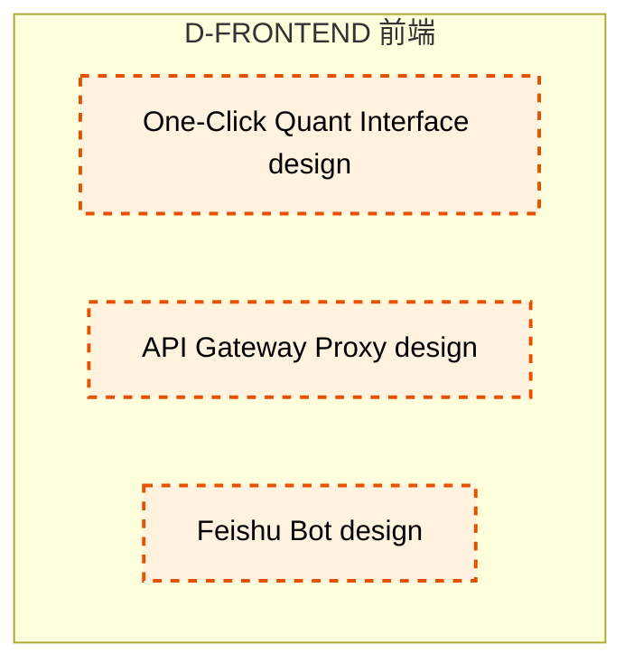

# 12_d_frontend / 前端

> **文档作用 / Purpose**: 展示 前端（D-FRONTEND）功能域的模块清单、域内依赖关系和跨域依赖关系，供架构审查和域治理参考。

> 本文档由 generate_domain_doc.py 从 depgraph.db 自动生成
> 最后更新: 2026-06-25 18:42:45
> 数据源: depgraph.db nodes表 + edges表

## 域基本信息 / Domain Overview

| 字段 | 值 | Field | Value |
|------|------|-------|-------|
| 编号 | 12 | Number | 12 |
| 域ID | D-FRONTEND | Domain ID | D-FRONTEND |
| 域名称 | 前端 | Domain Name | 前端 |
| 层级 | L1_foundation | Layer | L1_foundation |
| 模块数 | 33 | Module Count | 33 |
| 域内依赖 | 13 | Internal Dependencies | 13 |
| 跨域入边 | 8 | Cross-domain Incoming | 8 |
| 跨域出边 | 9 | Cross-domain Outgoing | 9 |
| 设计态模块 | 10 | Design Modules | 10 |
| 原型态模块 | 16 | Prototype Modules | 16 |
| 生产态模块 | 7 | Production Modules | 7 |
| 容量 | 7/150 (正常) | Capacity | 7/150 (正常) |
| 描述 | Web界面、可视化看板、交互组件。人机交互入口。 | Description | Web界面、可视化看板、交互组件。人机交互入口。 |

## 模块清单 / Module List

共 33 个模块（按路径排序，全部显示）

| 模块路径 / Module Path | 模块名称 / Module Name | 设计成熟度 / Maturity | 构建状态 / Build Status |
|---------|---------|-----------|---------|
| src/zephyr/frontend/__init__.py |  | prototype | generated |
| src/zephyr/frontend/_extensions/__init__.py |  | prototype | deprecated |
| src/zephyr/frontend/api/__init__.py |  | prototype | deprecated |
| src/zephyr/frontend/core/__init__.py |  | prototype | deprecated |
| src/zephyr/frontend/dashboard/__init__.py |  | prototype | generated |
| src/zephyr/frontend/dashboard/app.py |  | production | generated |
| src/zephyr/frontend/dashboard/app.py |  | prototype | generated |
| src/zephyr/frontend/dashboard/components/__init__.py |  | prototype | generated |
| src/zephyr/frontend/dashboard/components/fitness_functions.py |  | production | generated |
| src/zephyr/frontend/dashboard/components/fitness_functions.py |  | prototype | generated |
| src/zephyr/frontend/dashboard/components/gate_statistics.py |  | production | generated |
| src/zephyr/frontend/dashboard/components/gate_statistics.py |  | prototype | generated |
| src/zephyr/frontend/dashboard/components/knowledge_overview.py |  | production | generated |
| src/zephyr/frontend/dashboard/components/knowledge_overview.py |  | prototype | generated |
| src/zephyr/frontend/dashboard/components/olap_trend.py |  | production | generated |
| src/zephyr/frontend/dashboard/components/olap_trend.py |  | prototype | generated |
| src/zephyr/frontend/dashboard/components/task_progress.py |  | production | generated |
| src/zephyr/frontend/dashboard/components/task_progress.py |  | prototype | generated |
| src/zephyr/frontend/infrastructure/__init__.py |  | prototype | deprecated |
| src/zephyr/frontend/interface_base.py |  | production | generated |
| src/zephyr/frontend/interface_base.py |  | prototype | generated |
| src/zephyr/frontend/models/__init__.py |  | prototype | deprecated |
| src/zephyr/frontend/services/__init__.py |  | prototype | deprecated |
| 前端域/D-FRONTEND-06 | Report Visualization | design | planned |
| 前端域/D-FRONTEND-08 | Alert Visualization | design | planned |
| 前端域/D-FRONTEND-10 | Custom Chart Builder | design | planned |
| 前端域/D-FRONTEND-12 | Approval Workflow UI | design | planned |
| 前端域/D-FRONTEND-14 | Mobile Dashboard | design | planned |
| 前端域/D-FRONTEND-16 | Collaborative Workspace | design | planned |
| 前端域/D-FRONTEND-18 | Trading Chatbot | design | planned |
| 前端域/D-FRONTEND-20 | One-Click Quant Interface | design | planned |
| 前端域/D-FRONTEND-22 | API Gateway Proxy | design | planned |
| 前端域/D-FRONTEND-24 | Feishu Bot | design | planned |

## 域内依赖图 / Internal Dependency Diagram

> 依赖图内嵌在本文档中，IDE 可直接渲染显示。每30个节点一组分页显示。
>
> **图例说明 / Legend**：
> - **实线边框 = 运营态模块**（production，已上线运行）
> - **虚线边框 = 设计态模块**（design，还在设计中）
> - **实线箭头 = 运营态依赖**（已生效的依赖关系）
> - **虚线箭头 = 设计态依赖**（计划中的依赖关系）

### 第 1 页 / 共 2 页 / Page 1 of 2

```mermaid
graph TD
    subgraph D_FRONTEND["D-FRONTEND 前端"]
        src_zephyr_frontend_init_py["src/zephyr/frontend/__init__.py prototype"]
        src_zephyr_frontend_extensions_init_py["src/zephyr/frontend/_extensions/__init__.py prototype"]
        src_zephyr_frontend_api_init_py["src/zephyr/frontend/api/__init__.py prototype"]
        src_zephyr_frontend_core_init_py["src/zephyr/frontend/core/__init__.py prototype"]
        src_zephyr_frontend_dashboard_init_py["src/zephyr/frontend/dashboard/__init__.py prototype"]
        src_zephyr_frontend_dashboard_app_py["src/zephyr/frontend/dashboard/app.py production"]
        src_zephyr_frontend_dashboard_app_py_1["src/zephyr/frontend/dashboard/app.py prototype"]
        src_zephyr_frontend_dashboard_components_init_py["src/zephyr/frontend/dashboard/components/__init... prototype"]
        src_zephyr_frontend_dashboard_components_fitness_functions_py["src/zephyr/frontend/dashboard/components/fitnes... production"]
        src_zephyr_frontend_dashboard_components_fitness_functions_py_1["src/zephyr/frontend/dashboard/components/fitnes... prototype"]
        src_zephyr_frontend_dashboard_components_gate_statistics_py["src/zephyr/frontend/dashboard/components/gate_s... production"]
        src_zephyr_frontend_dashboard_components_gate_statistics_py_1["src/zephyr/frontend/dashboard/components/gate_s... prototype"]
        src_zephyr_frontend_dashboard_components_knowledge_overview_py["src/zephyr/frontend/dashboard/components/knowle... production"]
        src_zephyr_frontend_dashboard_components_knowledge_overview_py_1["src/zephyr/frontend/dashboard/components/knowle... prototype"]
        src_zephyr_frontend_dashboard_components_olap_trend_py["src/zephyr/frontend/dashboard/components/olap_t... production"]
        src_zephyr_frontend_dashboard_components_olap_trend_py_1["src/zephyr/frontend/dashboard/components/olap_t... prototype"]
        src_zephyr_frontend_dashboard_components_task_progress_py["src/zephyr/frontend/dashboard/components/task_p... production"]
        src_zephyr_frontend_dashboard_components_task_progress_py_1["src/zephyr/frontend/dashboard/components/task_p... prototype"]
        src_zephyr_frontend_infrastructure_init_py["src/zephyr/frontend/infrastructure/__init__.py prototype"]
        src_zephyr_frontend_interface_base_py["src/zephyr/frontend/interface_base.py production"]
        src_zephyr_frontend_interface_base_py_1["src/zephyr/frontend/interface_base.py prototype"]
        src_zephyr_frontend_models_init_py["src/zephyr/frontend/models/__init__.py prototype"]
        src_zephyr_frontend_services_init_py["src/zephyr/frontend/services/__init__.py prototype"]
        D_FRONTEND_06["Report Visualization design"]
        D_FRONTEND_08["Alert Visualization design"]
        D_FRONTEND_10["Custom Chart Builder design"]
        D_FRONTEND_12["Approval Workflow UI design"]
        D_FRONTEND_14["Mobile Dashboard design"]
        D_FRONTEND_16["Collaborative Workspace design"]
        D_FRONTEND_18["Trading Chatbot design"]
    end
    src_zephyr_frontend_init_py -.->|config_depends| src_zephyr_frontend_interface_base_py
    src_zephyr_frontend_dashboard_init_py -.->|config_depends| src_zephyr_frontend_dashboard_app_py
    src_zephyr_frontend_dashboard_components_init_py -.->|config_depends| src_zephyr_frontend_dashboard_components_fitness_functions_py
    src_zephyr_frontend_dashboard_app_py_1 -.->|import_depends| src_zephyr_frontend_dashboard_components_fitness_functions_py
    src_zephyr_frontend_dashboard_app_py_1 -.->|import_depends| src_zephyr_frontend_dashboard_components_knowledge_overview_py
    src_zephyr_frontend_dashboard_app_py_1 -.->|import_depends| src_zephyr_frontend_dashboard_components_gate_statistics_py
    src_zephyr_frontend_dashboard_app_py_1 -.->|import_depends| src_zephyr_frontend_dashboard_components_olap_trend_py
    src_zephyr_frontend_dashboard_app_py_1 -.->|import_depends| src_zephyr_frontend_dashboard_components_task_progress_py
    src_zephyr_frontend_dashboard_components_knowledge_overview_py_1 -.->|config_depends| src_zephyr_frontend_dashboard_components_fitness_functions_py_1
    src_zephyr_frontend_dashboard_components_olap_trend_py_1 -.->|config_depends| src_zephyr_frontend_dashboard_components_fitness_functions_py_1
    src_zephyr_frontend_interface_base_py_1 -.->|config_depends| src_zephyr_frontend_dashboard_components_fitness_functions_py_1
    src_zephyr_frontend_dashboard_components_gate_statistics_py_1 -.->|config_depends| src_zephyr_frontend_dashboard_components_fitness_functions_py_1
    src_zephyr_frontend_dashboard_components_task_progress_py_1 -.->|config_depends| src_zephyr_frontend_dashboard_components_fitness_functions_py_1
    D_OPS["D-OPS design"]
    D_FRONTEND_06 -.->|contract| D_OPS
    src_zephyr_frontend_dashboard_components_fitness_functions_py_1 -->|import_depends| D_OPS
    D_INFRA_OPS["D-INFRA_OPS prototype"]
    src_zephyr_frontend_dashboard_app_py_1 -.->|import_depends| D_INFRA_OPS
    D_SHARED["D-SHARED prototype"]
    src_zephyr_frontend_dashboard_app_py_1 -.->|import_depends| D_SHARED
    D_GOVERNANCE["D-GOVERNANCE production"]
    src_zephyr_frontend_dashboard_app_py_1 -->|import_depends| D_GOVERNANCE
    src_zephyr_frontend_dashboard_app_py_1 -->|import_depends| D_GOVERNANCE
    src_zephyr_frontend_dashboard_components_fitness_functions_py_1 -.->|import_depends| D_OPS
    src_zephyr_frontend_dashboard_app_py_1 -.->|import_depends| D_GOVERNANCE
    src_zephyr_frontend_dashboard_app_py_1 -.->|import_depends| D_GOVERNANCE
    D_GOVERNANCE -.->|test_depends| src_zephyr_frontend_interface_base_py_1
    D_GOVERNANCE -.->|test_depends| src_zephyr_frontend_interface_base_py_1
    D_GOVERNANCE -.->|test_depends| src_zephyr_frontend_dashboard_components_fitness_functions_py_1
    D_GOVERNANCE -.->|test_depends| src_zephyr_frontend_dashboard_app_py_1
    D_GOVERNANCE -.->|test_depends| src_zephyr_frontend_dashboard_components_knowledge_overview_py_1
    D_GOVERNANCE -.->|test_depends| src_zephyr_frontend_dashboard_components_gate_statistics_py_1
    D_GOVERNANCE -.->|test_depends| src_zephyr_frontend_dashboard_components_olap_trend_py_1
    D_GOVERNANCE -.->|test_depends| src_zephyr_frontend_dashboard_components_task_progress_py_1
    classDef production fill:#e1f5fe,stroke:#01579b,stroke-width:2px,color:#000
    classDef design fill:#fff3e0,stroke:#e65100,stroke-width:2px,color:#000,stroke-dasharray: 5 5
    classDef external_prod fill:#e8f5e9,stroke:#1b5e20,stroke-width:1px,color:#000
    classDef external_design fill:#fce4ec,stroke:#880e4f,stroke-width:1px,color:#000,stroke-dasharray: 5 5
    class src_zephyr_frontend_dashboard_app_py,src_zephyr_frontend_dashboard_components_fitness_functions_py,src_zephyr_frontend_dashboard_components_gate_statistics_py,src_zephyr_frontend_dashboard_components_knowledge_overview_py,src_zephyr_frontend_dashboard_components_olap_trend_py,src_zephyr_frontend_dashboard_components_task_progress_py,src_zephyr_frontend_interface_base_py production
    class src_zephyr_frontend_init_py,src_zephyr_frontend_extensions_init_py,src_zephyr_frontend_api_init_py,src_zephyr_frontend_core_init_py,src_zephyr_frontend_dashboard_init_py,src_zephyr_frontend_dashboard_app_py_1,src_zephyr_frontend_dashboard_components_init_py,src_zephyr_frontend_dashboard_components_fitness_functions_py_1,src_zephyr_frontend_dashboard_components_gate_statistics_py_1,src_zephyr_frontend_dashboard_components_knowledge_overview_py_1,src_zephyr_frontend_dashboard_components_olap_trend_py_1,src_zephyr_frontend_dashboard_components_task_progress_py_1,src_zephyr_frontend_infrastructure_init_py,src_zephyr_frontend_interface_base_py_1,src_zephyr_frontend_models_init_py,src_zephyr_frontend_services_init_py,D_FRONTEND_06,D_FRONTEND_08,D_FRONTEND_10,D_FRONTEND_12,D_FRONTEND_14,D_FRONTEND_16,D_FRONTEND_18 design
    class D_GOVERNANCE external_prod
    class D_OPS,D_INFRA_OPS,D_SHARED external_design
```

### 第 2 页 / 共 2 页 / Page 2 of 2

## 跨域依赖 / Cross-domain Dependencies

### 本域依赖的其他域（出边）/ Depends On

| 目标域 / Target Domain | 依赖数 / Count | 依赖类型 / Type |
|--------|:---:|---------|
| D-GOVERNANCE | 4 | import_depends |
| D-OPS | 3 | contract,import_depends |
| D-SHARED | 1 | import_depends |
| D-INFRA_OPS | 1 | import_depends |

### 依赖本域的其他域（入边）/ Depended By

| 源域 / Source Domain | 依赖数 / Count | 依赖类型 / Type |
|------|:---:|---------|
| D-GOVERNANCE | 8 | test_depends |

## 说明 / Notes

- **数据源 / Data Source**: `depgraph.db` 的 `nodes`、`edges`、`domains` 表
- **生成器 / Generator**: `generate_domain_doc.py`
- **维护方式 / Maintenance**: 自动生成，全景图更新时刷新
- **文件名规则 / File Naming**: `{编号:02d}_{域ID小写}.md`，如 `16_d_trading.md`
