# 12_d_integration / pipeline_routing / Pipeline Routing

> **文档作用 / Purpose**: 展示 pipeline_routing（D_INTEGRATION）功能域的模块清单、域内依赖关系、跨域依赖关系、架构分层视图，供架构审查和域治理参考。

> 本文档由 generate_domain_doc.py 从 depgraph (PostgreSQL) 自动生成
> 最后更新: 2026-07-08 13:50:36
> 数据源: depgraph (PostgreSQL) nodes表 + edges表

## 域基本信息 / Domain Overview

| 字段 | 值 | Field | Value |
|------|------|-------|-------|
| 编号 | 12 | Number | 12 |
| 域ID | D_INTEGRATION | Domain ID | D_INTEGRATION |
| 域名称 | pipeline_routing | Domain Name | Pipeline Routing |
| 层级 | L1 基础平台层 | Layer | L1 Foundation |
| 模块数 | 72 | Module Count | 72 |
| 域内依赖 | 70 | Internal Dependencies | 70 |
| 跨域入边 | 134 | Cross-domain Incoming | 134 |
| 跨域出边 | 64 | Cross-domain Outgoing | 64 |
| 设计态模块 | 0 | Design Modules | 0 |
| 原型态模块 | 42 | Prototype Modules | 42 |
| 生产态模块 | 30 | Production Modules | 30 |
| 容量 | 30/150 (正常) | Capacity | 30/150 (正常) |
| 描述 | M1-M11双管线路由 | Description | M1-M11双管线路由 |

## 域内依赖图 / Internal Dependency Diagram

> 依赖图内嵌在本文档中，IDE 可直接渲染显示。每30个节点一组分页显示。
>
> **图例说明 / Legend**：
> - **实线边框 = 运营态模块**（production，已上线运行）
> - **虚线边框 = 设计态模块**（design，还在设计中）
> - **实线箭头 = 运营态依赖**（已生效的依赖关系）
> - **虚线箭头 = 设计态依赖**（计划中的依赖关系）

### 第 1 页 / 共 3 页 / Page 1 of 3

```mermaid
graph TD
    subgraph D_INTEGRATION["D_INTEGRATION pipeline_routing"]
        src_zephyr_integration_init_py["src/zephyr/integration/__init__.py prototype"]
        src_zephyr_integration_extensions_init_py["src/zephyr/integration/_extensions/__init__.py prototype"]
        src_zephyr_integration_api_init_py["src/zephyr/integration/api/__init__.py prototype"]
        src_zephyr_integration_behavioral_admission_init_py["src/zephyr/integration/behavioral_admission/__i... prototype"]
        src_zephyr_integration_budget_enforcer_init_py["src/zephyr/integration/budget_enforcer/__init__.py prototype"]
        src_zephyr_integration_budget_enforcer_degradation_spiral_detector_py["src/zephyr/integration/budget_enforcer/degradat... prototype"]
        src_zephyr_integration_core_init_py["src/zephyr/integration/core/__init__.py prototype"]
        src_zephyr_integration_governance_init_py["src/zephyr/integration/governance/__init__.py prototype"]
        src_zephyr_integration_governance_data_source_router_init_py["src/zephyr/integration/governance/data_source_r... prototype"]
        src_zephyr_integration_governance_data_source_router_embedding_router_py["src/zephyr/integration/governance/data_source_r... prototype"]
        src_zephyr_integration_governance_embedding_router_py["src/zephyr/integration/governance/embedding_rou... prototype"]
        src_zephyr_integration_infrastructure_init_py["src/zephyr/integration/infrastructure/__init__.py prototype"]
        src_zephyr_integration_layer1_discovery_init_py["src/zephyr/integration/layer1_discovery/__init_... prototype"]
        src_zephyr_integration_layer2_communication_init_py["src/zephyr/integration/layer2_communication/__i... prototype"]
        src_zephyr_integration_layer3_coordination_init_py["src/zephyr/integration/layer3_coordination/__in... prototype"]
        src_zephyr_integration_llm_bridge_py["src/zephyr/integration/llm_bridge.py prototype"]
        src_zephyr_integration_local_model_init_py["src/zephyr/integration/local_model/__init__.py prototype"]
        src_zephyr_integration_local_model_cache_layer_py["src/zephyr/integration/local_model/cache_layer.py production"]
        src_zephyr_integration_local_model_deepseek_chat_py["src/zephyr/integration/local_model/deepseek_cha... prototype"]
        src_zephyr_integration_local_model_embedding_router_py["src/zephyr/integration/local_model/embedding_ro... production"]
        src_zephyr_integration_local_model_local_model_scheduler_py["src/zephyr/integration/local_model/local_model_... prototype"]
        src_zephyr_integration_local_model_ollama_chat_py["src/zephyr/integration/local_model/ollama_chat.py prototype"]
        src_zephyr_integration_local_model_ollama_embedding_py["src/zephyr/integration/local_model/ollama_embed... prototype"]
        src_zephyr_integration_mcp_server_py["src/zephyr/integration/mcp_server.py prototype"]
        src_zephyr_integration_pipeline_orchestrator_py["src/zephyr/integration/pipeline_orchestrator.py production"]
        src_zephyr_integration_ports_py["src/zephyr/integration/ports.py prototype"]
        src_zephyr_integration_services_init_py["src/zephyr/integration/services/__init__.py prototype"]
        src_zephyr_integration_shared_contracts_errors_init_py["src/zephyr/integration/shared/contracts/errors/... prototype"]
        src_zephyr_integration_shared_contracts_errors_execution_rejection_error_py["src/zephyr/integration/shared/contracts/errors/... prototype"]
        src_zephyr_integration_shared_contracts_errors_risk_limit_violation_error_py["src/zephyr/integration/shared/contracts/errors/... prototype"]
    end
    src_zephyr_integration_pipeline_orchestrator_py -->|import_depends| src_zephyr_integration_local_model_embedding_router_py
    src_zephyr_integration_pipeline_orchestrator_py -.->|import_depends| src_zephyr_integration_local_model_local_model_scheduler_py
    src_zephyr_integration_ports_py -.->|config_depends| src_zephyr_integration_init_py
    src_zephyr_integration_init_py -.->|import_depends| src_zephyr_integration_llm_bridge_py
    src_zephyr_integration_init_py -.->|import_depends| src_zephyr_integration_mcp_server_py
    src_zephyr_integration_budget_enforcer_degradation_spiral_detector_py -.->|config_depends| src_zephyr_integration_budget_enforcer_init_py
    src_zephyr_integration_governance_embedding_router_py -.->|import_depends| src_zephyr_integration_local_model_ollama_embedding_py
    src_zephyr_integration_governance_data_source_router_embedding_router_py -.->|import_depends| src_zephyr_integration_local_model_embedding_router_py
    src_zephyr_integration_governance_data_source_router_init_py -.->|config_depends| src_zephyr_integration_governance_data_source_router_embedding_router_py
    src_zephyr_integration_local_model_embedding_router_py -.->|import_depends| src_zephyr_integration_local_model_ollama_embedding_py
    src_zephyr_integration_local_model_local_model_scheduler_py -.->|import_depends| src_zephyr_integration_local_model_embedding_router_py
    src_zephyr_integration_local_model_local_model_scheduler_py -.->|import_depends| src_zephyr_integration_local_model_ollama_chat_py
    src_zephyr_integration_local_model_init_py -.->|import_depends| src_zephyr_integration_local_model_cache_layer_py
    src_zephyr_integration_local_model_init_py -.->|import_depends| src_zephyr_integration_local_model_deepseek_chat_py
    src_zephyr_integration_local_model_init_py -.->|import_depends| src_zephyr_integration_local_model_embedding_router_py
    src_zephyr_integration_local_model_init_py -.->|import_depends| src_zephyr_integration_local_model_local_model_scheduler_py
    src_zephyr_integration_local_model_init_py -.->|import_depends| src_zephyr_integration_local_model_ollama_chat_py
    src_zephyr_integration_local_model_init_py -.->|import_depends| src_zephyr_integration_local_model_ollama_embedding_py
    src_zephyr_integration_shared_contracts_errors_init_py -.->|import_depends| src_zephyr_integration_shared_contracts_errors_risk_limit_violation_error_py
    src_zephyr_integration_shared_contracts_errors_init_py -.->|import_depends| src_zephyr_integration_shared_contracts_errors_execution_rejection_error_py
    D_GOVERNANCE["D_GOVERNANCE production"]
    src_zephyr_integration_llm_bridge_py -.->|import_depends| D_GOVERNANCE
    D_INFRA_RUNTIME["D_INFRA_RUNTIME production"]
    src_zephyr_integration_pipeline_orchestrator_py -->|import_depends| D_INFRA_RUNTIME
    src_zephyr_integration_pipeline_orchestrator_py -->|import_depends| D_INFRA_RUNTIME
    src_zephyr_integration_pipeline_orchestrator_py -->|import_depends| D_INFRA_RUNTIME
    src_zephyr_integration_pipeline_orchestrator_py -->|import_depends| D_INFRA_RUNTIME
    src_zephyr_integration_pipeline_orchestrator_py -->|import_depends| D_INFRA_RUNTIME
    D_SHARED["D_SHARED production"]
    src_zephyr_integration_pipeline_orchestrator_py -->|import_depends| D_SHARED
    src_zephyr_integration_pipeline_orchestrator_py -.->|import_depends| D_SHARED
    src_zephyr_integration_pipeline_orchestrator_py -->|import_depends| D_INFRA_RUNTIME
    src_zephyr_integration_pipeline_orchestrator_py -->|import_depends| D_INFRA_RUNTIME
    src_zephyr_integration_pipeline_orchestrator_py -->|import_depends| D_INFRA_RUNTIME
    src_zephyr_integration_pipeline_orchestrator_py -->|import_depends| D_INFRA_RUNTIME
    src_zephyr_integration_pipeline_orchestrator_py -->|import_depends| D_SHARED
    D_INTELLIGENCE["D_INTELLIGENCE production"]
    src_zephyr_integration_pipeline_orchestrator_py -->|import_depends| D_INTELLIGENCE
    src_zephyr_integration_pipeline_orchestrator_py -->|import_depends| D_GOVERNANCE
    D_AUTONOMY_CORE["D_AUTONOMY_CORE production"]
    D_AUTONOMY_CORE -->|import_depends| src_zephyr_integration_local_model_embedding_router_py
    D_TRADING["D_TRADING production"]
    D_TRADING -.->|import_depends| src_zephyr_integration_local_model_ollama_chat_py
    D_TRADING -->|import_depends| src_zephyr_integration_local_model_embedding_router_py
    D_TRADING -.->|import_depends| src_zephyr_integration_local_model_local_model_scheduler_py
    D_TRADING -.->|import_depends| src_zephyr_integration_local_model_deepseek_chat_py
    D_TRADING -->|import_depends| src_zephyr_integration_pipeline_orchestrator_py
    D_GOVERNANCE -.->|import_depends| src_zephyr_integration_init_py
    D_GOVERNANCE -.->|import_depends| src_zephyr_integration_local_model_ollama_chat_py
    D_GOVERNANCE -.->|import_depends| src_zephyr_integration_local_model_ollama_chat_py
    D_GOVERNANCE -.->|import_depends| src_zephyr_integration_init_py
    D_GOVERNANCE -.->|import_depends| src_zephyr_integration_init_py
    D_GOVERNANCE -.->|import_depends| src_zephyr_integration_init_py
    D_GOVERNANCE -.->|import_depends| src_zephyr_integration_local_model_local_model_scheduler_py
    D_GOVERNANCE -.->|import_depends| src_zephyr_integration_init_py
    D_GOVERNANCE -.->|import_depends| src_zephyr_integration_init_py
    classDef production fill:#e1f5fe,stroke:#01579b,stroke-width:2px,color:#000
    classDef design fill:#fff3e0,stroke:#e65100,stroke-width:2px,color:#000,stroke-dasharray: 5 5
    classDef external_prod fill:#e8f5e9,stroke:#1b5e20,stroke-width:1px,color:#000
    classDef external_design fill:#fce4ec,stroke:#880e4f,stroke-width:1px,color:#000,stroke-dasharray: 5 5
    class src_zephyr_integration_local_model_cache_layer_py,src_zephyr_integration_local_model_embedding_router_py,src_zephyr_integration_pipeline_orchestrator_py production
    class src_zephyr_integration_init_py,src_zephyr_integration_extensions_init_py,src_zephyr_integration_api_init_py,src_zephyr_integration_behavioral_admission_init_py,src_zephyr_integration_budget_enforcer_init_py,src_zephyr_integration_budget_enforcer_degradation_spiral_detector_py,src_zephyr_integration_core_init_py,src_zephyr_integration_governance_init_py,src_zephyr_integration_governance_data_source_router_init_py,src_zephyr_integration_governance_data_source_router_embedding_router_py,src_zephyr_integration_governance_embedding_router_py,src_zephyr_integration_infrastructure_init_py,src_zephyr_integration_layer1_discovery_init_py,src_zephyr_integration_layer2_communication_init_py,src_zephyr_integration_layer3_coordination_init_py,src_zephyr_integration_llm_bridge_py,src_zephyr_integration_local_model_init_py,src_zephyr_integration_local_model_deepseek_chat_py,src_zephyr_integration_local_model_local_model_scheduler_py,src_zephyr_integration_local_model_ollama_chat_py,src_zephyr_integration_local_model_ollama_embedding_py,src_zephyr_integration_mcp_server_py,src_zephyr_integration_ports_py,src_zephyr_integration_services_init_py,src_zephyr_integration_shared_contracts_errors_init_py,src_zephyr_integration_shared_contracts_errors_execution_rejection_error_py,src_zephyr_integration_shared_contracts_errors_risk_limit_violation_error_py design
    class D_GOVERNANCE,D_INFRA_RUNTIME,D_SHARED,D_INTELLIGENCE,D_AUTONOMY_CORE,D_TRADING external_prod
```



### 第 2 页 / 共 3 页 / Page 2 of 3

```mermaid
graph TD
    subgraph D_INTEGRATION["D_INTEGRATION pipeline_routing"]
        src_zephyr_integration_shared_contracts_errors_signal_degradation_warning_py["src/zephyr/integration/shared/contracts/errors/... prototype"]
        src_zephyr_integration_shared_events_init_py["src/zephyr/integration/shared/events/__init__.py prototype"]
        src_zephyr_integration_shared_events_dlq_py["src/zephyr/integration/shared/events/dlq.py prototype"]
        src_zephyr_integration_shared_events_dlq_bridge_py["src/zephyr/integration/shared/events/dlq_bridge.py prototype"]
        src_zephyr_integration_shared_events_event_bus_upgrade_py["src/zephyr/integration/shared/events/event_bus_... prototype"]
        src_zephyr_integration_shared_events_event_schemas_py["src/zephyr/integration/shared/events/event_sche... prototype"]
        src_zephyr_integration_shared_events_upgrade_strategy_py["src/zephyr/integration/shared/events/upgrade_st... production"]
        src_zephyr_integration_shared_schema_init_py["src/zephyr/integration/shared/schema/__init__.py prototype"]
        src_zephyr_integration_shared_schema_base_config_py["src/zephyr/integration/shared/schema/base_confi... production"]
        src_zephyr_integration_shared_schema_execution_model_py["src/zephyr/integration/shared/schema/execution_... production"]
        src_zephyr_integration_shared_schema_schema_registry_py["src/zephyr/integration/shared/schema/schema_reg... production"]
        src_zephyr_integration_shared_schema_schemas_py["src/zephyr/integration/shared/schema/schemas.py production"]
        src_zephyr_integration_shared_schema_severity_types_py["src/zephyr/integration/shared/schema/severity_t... production"]
        src_zephyr_integration_vector_memory_init_py["src/zephyr/integration/vector_memory/__init__.py production"]
        src_zephyr_integration_vector_memory_bm25_index_py["src/zephyr/integration/vector_memory/bm25_index.py production"]
        src_zephyr_integration_vector_memory_bridge_layer_py["src/zephyr/integration/vector_memory/bridge_lay... production"]
        src_zephyr_integration_vector_memory_cache_layer_py["src/zephyr/integration/vector_memory/cache_laye... production"]
        src_zephyr_integration_vector_memory_chunk_strategy_router_py["src/zephyr/integration/vector_memory/chunk_stra... production"]
        src_zephyr_integration_vector_memory_collection_manager_py["src/zephyr/integration/vector_memory/collection... production"]
        src_zephyr_integration_vector_memory_collection_schemas_py["src/zephyr/integration/vector_memory/collection... production"]
        src_zephyr_integration_vector_memory_context_ingest_py["src/zephyr/integration/vector_memory/context_in... prototype"]
        src_zephyr_integration_vector_memory_cross_collection_retriever_py["src/zephyr/integration/vector_memory/cross_coll... prototype"]
        src_zephyr_integration_vector_memory_delegated_vector_memory_py["src/zephyr/integration/vector_memory/delegated_... prototype"]
        src_zephyr_integration_vector_memory_design_principles_py["src/zephyr/integration/vector_memory/design_pri... production"]
        src_zephyr_integration_vector_memory_embedding_router_py["src/zephyr/integration/vector_memory/embedding_... prototype"]
        src_zephyr_integration_vector_memory_faiss_collection_manager_py["src/zephyr/integration/vector_memory/faiss_coll... production"]
        src_zephyr_integration_vector_memory_hybrid_retriever_py["src/zephyr/integration/vector_memory/hybrid_ret... production"]
        src_zephyr_integration_vector_memory_in_memory_fake_vms_py["src/zephyr/integration/vector_memory/in_memory_... production"]
        src_zephyr_integration_vector_memory_in_memory_memory_backend_py["src/zephyr/integration/vector_memory/in_memory_... production"]
        src_zephyr_integration_vector_memory_in_process_vector_memory_py["src/zephyr/integration/vector_memory/in_process... production"]
    end
    src_zephyr_integration_shared_events_dlq_bridge_py -.->|import_depends| src_zephyr_integration_shared_events_dlq_py
    src_zephyr_integration_shared_events_event_schemas_py -.->|import_depends| src_zephyr_integration_shared_schema_base_config_py
    src_zephyr_integration_shared_events_init_py -.->|import_depends| src_zephyr_integration_shared_events_dlq_bridge_py
    src_zephyr_integration_shared_events_init_py -.->|import_depends| src_zephyr_integration_shared_events_dlq_py
    src_zephyr_integration_shared_events_init_py -.->|import_depends| src_zephyr_integration_shared_events_event_schemas_py
    src_zephyr_integration_shared_events_init_py -.->|import_depends| src_zephyr_integration_shared_events_upgrade_strategy_py
    src_zephyr_integration_shared_events_init_py -.->|import_depends| src_zephyr_integration_shared_events_event_bus_upgrade_py
    src_zephyr_integration_shared_schema_schemas_py -->|import_depends| src_zephyr_integration_shared_schema_base_config_py
    src_zephyr_integration_shared_schema_schemas_py -->|import_depends| src_zephyr_integration_shared_schema_execution_model_py
    src_zephyr_integration_shared_schema_schemas_py -->|import_depends| src_zephyr_integration_shared_schema_severity_types_py
    src_zephyr_integration_shared_schema_init_py -.->|config_depends| src_zephyr_integration_shared_schema_base_config_py
    src_zephyr_integration_vector_memory_bridge_layer_py -->|import_depends| src_zephyr_integration_vector_memory_collection_manager_py
    src_zephyr_integration_vector_memory_cross_collection_retriever_py -.->|config_depends| src_zephyr_integration_vector_memory_init_py
    src_zephyr_integration_vector_memory_context_ingest_py -.->|import_depends| src_zephyr_integration_vector_memory_in_memory_fake_vms_py
    src_zephyr_integration_vector_memory_design_principles_py -->|import_depends| src_zephyr_integration_vector_memory_collection_schemas_py
    src_zephyr_integration_vector_memory_faiss_collection_manager_py -->|import_depends| src_zephyr_integration_vector_memory_collection_manager_py
    src_zephyr_integration_vector_memory_in_memory_fake_vms_py -->|import_depends| src_zephyr_integration_vector_memory_collection_manager_py
    src_zephyr_integration_vector_memory_in_process_vector_memory_py -->|import_depends| src_zephyr_integration_vector_memory_collection_manager_py
    src_zephyr_integration_vector_memory_in_process_vector_memory_py -->|import_depends| src_zephyr_integration_vector_memory_chunk_strategy_router_py
    src_zephyr_integration_vector_memory_in_process_vector_memory_py -->|import_depends| src_zephyr_integration_vector_memory_bridge_layer_py
    src_zephyr_integration_vector_memory_in_process_vector_memory_py -->|import_depends| src_zephyr_integration_vector_memory_hybrid_retriever_py
    src_zephyr_integration_vector_memory_in_process_vector_memory_py -->|import_depends| src_zephyr_integration_vector_memory_in_memory_memory_backend_py
    src_zephyr_integration_vector_memory_init_py -.->|import_depends| src_zephyr_integration_vector_memory_delegated_vector_memory_py
    src_zephyr_integration_vector_memory_init_py -->|import_depends| src_zephyr_integration_vector_memory_in_process_vector_memory_py
    D_SHARED["D_SHARED production"]
    src_zephyr_integration_shared_contracts_errors_signal_degradation_warning_py -.->|import_depends| D_SHARED
    src_zephyr_integration_shared_events_dlq_py -.->|import_depends| D_SHARED
    src_zephyr_integration_shared_events_dlq_py -.->|import_depends| D_SHARED
    src_zephyr_integration_shared_events_dlq_py -.->|import_depends| D_SHARED
    src_zephyr_integration_shared_events_event_schemas_py -.->|import_depends| D_SHARED
    src_zephyr_integration_shared_events_upgrade_strategy_py -.->|import_depends| D_SHARED
    src_zephyr_integration_shared_schema_schema_registry_py -->|import_depends| D_SHARED
    src_zephyr_integration_shared_schema_schema_registry_py -->|import_depends| D_SHARED
    src_zephyr_integration_shared_schema_severity_types_py -->|import_depends| D_SHARED
    src_zephyr_integration_vector_memory_collection_manager_py -->|import_depends| D_SHARED
    src_zephyr_integration_vector_memory_collection_manager_py -.->|import_depends| D_SHARED
    src_zephyr_integration_vector_memory_chunk_strategy_router_py -.->|import_depends| D_SHARED
    src_zephyr_integration_vector_memory_collection_schemas_py -.->|import_depends| D_SHARED
    src_zephyr_integration_vector_memory_collection_schemas_py -->|import_depends| D_SHARED
    D_GOVERNANCE["D_GOVERNANCE prototype"]
    src_zephyr_integration_vector_memory_delegated_vector_memory_py -.->|import_depends| D_GOVERNANCE
    D_AUTONOMY_CORE["D_AUTONOMY_CORE production"]
    D_AUTONOMY_CORE -->|import_depends| src_zephyr_integration_shared_schema_schemas_py
    D_AUTONOMY_CORE -->|import_depends| src_zephyr_integration_shared_schema_schemas_py
    D_AUTONOMY_CORE -->|import_depends| src_zephyr_integration_shared_schema_schemas_py
    D_AUTONOMY_CORE -->|import_depends| src_zephyr_integration_shared_schema_schemas_py
    D_AUTONOMY_CORE -->|import_depends| src_zephyr_integration_shared_schema_schemas_py
    D_GOVERNANCE -.->|import_depends| src_zephyr_integration_shared_schema_base_config_py
    D_GOVERNANCE -->|import_depends| src_zephyr_integration_shared_schema_base_config_py
    D_GOVERNANCE -.->|import_depends| src_zephyr_integration_shared_schema_base_config_py
    D_GOVERNANCE -->|import_depends| src_zephyr_integration_shared_schema_schemas_py
    D_GOVERNANCE -->|import_depends| src_zephyr_integration_shared_schema_severity_types_py
    D_GOVERNANCE -->|import_depends| src_zephyr_integration_shared_schema_schemas_py
    D_GOVERNANCE -->|import_depends| src_zephyr_integration_vector_memory_bridge_layer_py
    D_GOVERNANCE -->|import_depends| src_zephyr_integration_vector_memory_in_process_vector_memory_py
    D_GOVERNANCE -->|import_depends| src_zephyr_integration_shared_schema_schemas_py
    D_GOVERNANCE -->|import_depends| src_zephyr_integration_shared_schema_schemas_py
    classDef production fill:#e1f5fe,stroke:#01579b,stroke-width:2px,color:#000
    classDef design fill:#fff3e0,stroke:#e65100,stroke-width:2px,color:#000,stroke-dasharray: 5 5
    classDef external_prod fill:#e8f5e9,stroke:#1b5e20,stroke-width:1px,color:#000
    classDef external_design fill:#fce4ec,stroke:#880e4f,stroke-width:1px,color:#000,stroke-dasharray: 5 5
    class src_zephyr_integration_shared_events_upgrade_strategy_py,src_zephyr_integration_shared_schema_base_config_py,src_zephyr_integration_shared_schema_execution_model_py,src_zephyr_integration_shared_schema_schema_registry_py,src_zephyr_integration_shared_schema_schemas_py,src_zephyr_integration_shared_schema_severity_types_py,src_zephyr_integration_vector_memory_init_py,src_zephyr_integration_vector_memory_bm25_index_py,src_zephyr_integration_vector_memory_bridge_layer_py,src_zephyr_integration_vector_memory_cache_layer_py,src_zephyr_integration_vector_memory_chunk_strategy_router_py,src_zephyr_integration_vector_memory_collection_manager_py,src_zephyr_integration_vector_memory_collection_schemas_py,src_zephyr_integration_vector_memory_design_principles_py,src_zephyr_integration_vector_memory_faiss_collection_manager_py,src_zephyr_integration_vector_memory_hybrid_retriever_py,src_zephyr_integration_vector_memory_in_memory_fake_vms_py,src_zephyr_integration_vector_memory_in_memory_memory_backend_py,src_zephyr_integration_vector_memory_in_process_vector_memory_py production
    class src_zephyr_integration_shared_contracts_errors_signal_degradation_warning_py,src_zephyr_integration_shared_events_init_py,src_zephyr_integration_shared_events_dlq_py,src_zephyr_integration_shared_events_dlq_bridge_py,src_zephyr_integration_shared_events_event_bus_upgrade_py,src_zephyr_integration_shared_events_event_schemas_py,src_zephyr_integration_shared_schema_init_py,src_zephyr_integration_vector_memory_context_ingest_py,src_zephyr_integration_vector_memory_cross_collection_retriever_py,src_zephyr_integration_vector_memory_delegated_vector_memory_py,src_zephyr_integration_vector_memory_embedding_router_py design
    class D_SHARED,D_AUTONOMY_CORE external_prod
    class D_GOVERNANCE external_design
```



### 第 3 页 / 共 3 页 / Page 3 of 3

```mermaid
graph TD
    subgraph D_INTEGRATION["D_INTEGRATION pipeline_routing"]
        src_zephyr_integration_vector_memory_index_health_monitor_py["src/zephyr/integration/vector_memory/index_heal... production"]
        src_zephyr_integration_vector_memory_interface_py["src/zephyr/integration/vector_memory/interface.py production"]
        src_zephyr_integration_vector_memory_migrate_chroma_to_faiss_py["src/zephyr/integration/vector_memory/migrate_ch... prototype"]
        src_zephyr_integration_vector_memory_ollama_embedding_py["src/zephyr/integration/vector_memory/ollama_emb... prototype"]
        src_zephyr_integration_vector_memory_provenance_enforcer_py["src/zephyr/integration/vector_memory/provenance... production"]
        src_zephyr_integration_vector_memory_retrieval_feedback_py["src/zephyr/integration/vector_memory/retrieval_... production"]
        src_zephyr_integration_vector_memory_sqlite_metadata_store_py["src/zephyr/integration/vector_memory/sqlite_met... production"]
        src_zephyr_integration_vector_memory_vector_bridge_py["src/zephyr/integration/vector_memory/vector_bri... prototype"]
        src_zephyr_integration_vector_memory_vector_writer_py["src/zephyr/integration/vector_memory/vector_wri... prototype"]
        src_zephyr_integration_vector_memory_vms_config_yaml["src/zephyr/integration/vector_memory/vms_config... production"]
        src_zephyr_integration_vector_memory_vms_errors_py["src/zephyr/integration/vector_memory/vms_errors.py production"]
        src_zephyr_integration_vector_memory_vms_schemas_py["src/zephyr/integration/vector_memory/vms_schema... production"]
    end
    src_zephyr_integration_vector_memory_migrate_chroma_to_faiss_py -.->|import_depends| src_zephyr_integration_vector_memory_sqlite_metadata_store_py
    src_zephyr_integration_vector_memory_provenance_enforcer_py -->|import_depends| src_zephyr_integration_vector_memory_vms_schemas_py
    D_SHARED["D_SHARED prototype"]
    src_zephyr_integration_vector_memory_index_health_monitor_py -.->|import_depends| D_SHARED
    src_zephyr_integration_vector_memory_retrieval_feedback_py -.->|import_depends| D_SHARED
    src_zephyr_integration_vector_memory_sqlite_metadata_store_py -.->|import_depends| D_SHARED
    src_zephyr_integration_vector_memory_migrate_chroma_to_faiss_py -.->|import_depends| D_SHARED
    src_zephyr_integration_vector_memory_vector_bridge_py -.->|import_depends| D_SHARED
    src_zephyr_integration_vector_memory_vms_schemas_py -.->|import_depends| D_SHARED
    D_INTEGRATION_GATEWAY["D_INTEGRATION_GATEWAY prototype"]
    D_INTEGRATION_GATEWAY -.->|import_depends| src_zephyr_integration_vector_memory_vms_errors_py
    D_TRADING["D_TRADING prototype"]
    D_TRADING -.->|import_depends| src_zephyr_integration_vector_memory_vector_writer_py
    D_AUDITTEST["D_AUDITTEST prototype"]
    D_AUDITTEST -.->|test_depends| src_zephyr_integration_vector_memory_provenance_enforcer_py
    D_AUDITTEST -.->|test_depends| src_zephyr_integration_vector_memory_vms_schemas_py
    D_AUDITTEST -.->|test_depends| src_zephyr_integration_vector_memory_retrieval_feedback_py
    D_AUDITTEST -.->|test_depends| src_zephyr_integration_vector_memory_index_health_monitor_py
    classDef production fill:#e1f5fe,stroke:#01579b,stroke-width:2px,color:#000
    classDef design fill:#fff3e0,stroke:#e65100,stroke-width:2px,color:#000,stroke-dasharray: 5 5
    classDef external_prod fill:#e8f5e9,stroke:#1b5e20,stroke-width:1px,color:#000
    classDef external_design fill:#fce4ec,stroke:#880e4f,stroke-width:1px,color:#000,stroke-dasharray: 5 5
    class src_zephyr_integration_vector_memory_index_health_monitor_py,src_zephyr_integration_vector_memory_interface_py,src_zephyr_integration_vector_memory_provenance_enforcer_py,src_zephyr_integration_vector_memory_retrieval_feedback_py,src_zephyr_integration_vector_memory_sqlite_metadata_store_py,src_zephyr_integration_vector_memory_vms_config_yaml,src_zephyr_integration_vector_memory_vms_errors_py,src_zephyr_integration_vector_memory_vms_schemas_py production
    class src_zephyr_integration_vector_memory_migrate_chroma_to_faiss_py,src_zephyr_integration_vector_memory_ollama_embedding_py,src_zephyr_integration_vector_memory_vector_bridge_py,src_zephyr_integration_vector_memory_vector_writer_py design
    class D_SHARED,D_INTEGRATION_GATEWAY,D_TRADING,D_AUDITTEST external_design
```



## 跨域依赖 / Cross-domain Dependencies

### 本域依赖的其他域（出边）/ Depends On

| 目标域 / Target Domain | 依赖数 / Count | 依赖类型 / Type |
|--------|:---:|---------|
| D_SHARED | 37 | import_depends |
| D_INFRA_RUNTIME | 11 | import_depends |
| D_GOVERNANCE | 9 | import_depends |
| D_INTELLIGENCE | 3 | import_depends |
| D_AUTONOMY_CORE | 2 | import_depends |
| D_INFRA_RECOVERY | 1 | import_depends |
| D_SECURITY_LLM | 1 | import_depends |

### 依赖本域的其他域（入边）/ Depended By

| 源域 / Source Domain | 依赖数 / Count | 依赖类型 / Type |
|------|:---:|---------|
| D_AUDITTEST | 63 | test_depends |
| D_TRADING | 26 | import_depends |
| D_GOVERNANCE | 20 | import_depends |
| D_GOV_ENFORCEMENT | 6 | import_depends |
| D_AUTONOMY_CORE | 6 | import_depends |
| D_INTEGRATION_GATEWAY | 4 | import_depends |
| D_INFRA_RUNTIME | 3 | import_depends |
| D_GOV_SCRIPTS | 3 | import_depends |
| D_SECURITY | 2 | import_depends |
| D_INTELLIGENCE | 1 | import_depends |

## 架构分层视图 / Architecture Overview

> 按 architecture_layer 分层显示 pipeline_routing（D_INTEGRATION）的模块分布。共 72 个模块 / 72 modules。

```

┌──────────────────────────────────────────────────────────────────┐
│            L1 基础层 / Foundation Layer (72 modules)             │
├──────────────────────────────────────────────────────────────────┤
│   src/zephyr/integration/__init__.py  [prototype]                │
│   src/zephyr/integration/_extensions/__init__.py  [prototype]    │
│   src/zephyr/integration/api/__init__.py  [prototype]            │
│   src/zephyr/integration/behavioral_admission/__init__.py  [p... │
│   src/zephyr/integration/budget_enforcer/__init__.py  [protot... │
│   src/zephyr/integration/budget_enforcer/degradation_spiral_d... │
│   src/zephyr/integration/core/__init__.py  [prototype]           │
│   src/zephyr/integration/governance/__init__.py  [prototype]     │
│   src/zephyr/integration/governance/data_source_router/__init... │
│   src/zephyr/integration/governance/data_source_router/embedd... │
│   src/zephyr/integration/governance/embedding_router.py  [pro... │
│   src/zephyr/integration/infrastructure/__init__.py  [prototype] │
│   src/zephyr/integration/layer1_discovery/__init__.py  [proto... │
│   src/zephyr/integration/layer2_communication/__init__.py  [p... │
│   src/zephyr/integration/layer3_coordination/__init__.py  [pr... │
│   src/zephyr/integration/llm_bridge.py  [prototype]              │
│   src/zephyr/integration/local_model/__init__.py  [prototype]    │
│   src/zephyr/integration/local_model/cache_layer.py  [product... │
│   ...还有 54 个模块 / 54 more modules                            │
└──────────────────────────────────────────────────────────────────┘

```

## 模块分层清单 / Module Layered List

> 按 architecture_layer 分组的模块清单（共 72 个模块 / 72 modules）。

### L1 基础层 / Foundation Layer (72 modules)

| # | 模块路径 / Module Path | 模块名称 / Module Name | 功能简介 / Description | 成熟度 / Maturity | 构建状态 / Build Status |
|:--:|---------|---------|---------|:---:|:---:|
| 1 | src/zephyr/integration/__init__.py | src/zephyr/integration/__init__.py |  | prototype | generated |
| 2 | src/zephyr/integration/_extensions/__init__.py | src/zephyr/integration/_extensions/__... |  | prototype | generated |
| 3 | src/zephyr/integration/api/__init__.py | src/zephyr/integration/api/__init__.py |  | prototype | generated |
| 4 | src/zephyr/integration/behavioral_admission/__init__.py | src/zephyr/integration/behavioral_adm... |  | prototype | generated |
| 5 | src/zephyr/integration/budget_enforcer/__init__.py | src/zephyr/integration/budget_enforce... |  | prototype | generated |
| 6 | src/zephyr/integration/budget_enforcer/degradation_spiral... | src/zephyr/integration/budget_enforce... | Degradation Spiral Detector — 模型幻觉-容量正反馈螺旋检测 (盲点 #19, M-29) | prototype | generated |
| 7 | src/zephyr/integration/core/__init__.py | src/zephyr/integration/core/__init__.py |  | prototype | generated |
| 8 | src/zephyr/integration/governance/__init__.py | src/zephyr/integration/governance/__i... |  | prototype | generated |
| 9 | src/zephyr/integration/governance/data_source_router/__in... | src/zephyr/integration/governance/dat... |  | prototype | generated |
| 10 | src/zephyr/integration/governance/data_source_router/embe... | src/zephyr/integration/governance/dat... |  | prototype | generated |
| 11 | src/zephyr/integration/governance/embedding_router.py | src/zephyr/integration/governance/emb... | EmbeddingRouter — MOD-INF-011 双嵌入维度路由 | prototype | generated |
| 12 | src/zephyr/integration/infrastructure/__init__.py | src/zephyr/integration/infrastructure... |  | prototype | generated |
| 13 | src/zephyr/integration/layer1_discovery/__init__.py | src/zephyr/integration/layer1_discove... |  | prototype | generated |
| 14 | src/zephyr/integration/layer2_communication/__init__.py | src/zephyr/integration/layer2_communi... |  | prototype | generated |
| 15 | src/zephyr/integration/layer3_coordination/__init__.py | src/zephyr/integration/layer3_coordin... |  | prototype | generated |
| 16 | src/zephyr/integration/llm_bridge.py | src/zephyr/integration/llm_bridge.py | 接收 RED 问题,生成修复文本。LLM 只润色不做判断。不可用时降级为模板生成。 | prototype | generated |
| 17 | src/zephyr/integration/local_model/__init__.py | src/zephyr/integration/local_model/__... |  | prototype | generated |
| 18 | src/zephyr/integration/local_model/cache_layer.py | src/zephyr/integration/local_model/ca... | CacheLayer — MOD-INF-011 嵌入缓存与查询结果 LRU | production | generated |
| 19 | src/zephyr/integration/local_model/deepseek_chat.py | src/zephyr/integration/local_model/de... | DeepSeekChat — 通过 DeepSeek API 进行 LLM 推理（requests 实现） | prototype | generated |
| 20 | src/zephyr/integration/local_model/embedding_router.py | src/zephyr/integration/local_model/em... | EmbeddingRouter — MOD-INF-011 双嵌入维度路由 | production | generated |
| 21 | src/zephyr/integration/local_model/local_model_scheduler.py | src/zephyr/integration/local_model/lo... | LocalModelScheduler — L2 本地模型 24/7 调度循环 | prototype | generated |
| 22 | src/zephyr/integration/local_model/ollama_chat.py | src/zephyr/integration/local_model/ol... | OllamaChat — 通过 Ollama HTTP API 进行本地 LLM 推理 | prototype | generated |
| 23 | src/zephyr/integration/local_model/ollama_embedding.py | src/zephyr/integration/local_model/ol... | OllamaEmbedder — 通过 Ollama HTTP API 生成文本嵌入 | prototype | generated |
| 24 | src/zephyr/integration/mcp_server.py | src/zephyr/integration/mcp_server.py | AssetInventory MCP Server — MOD-INF-026 蓝图 §21 | prototype | generated |
| 25 | src/zephyr/integration/pipeline_orchestrator.py | src/zephyr/integration/pipeline_orche... | PipelineOrchestrator — M1-M11 管线协调器 | production | generated |
| 26 | src/zephyr/integration/ports.py | src/zephyr/integration/ports.py | Protocol-based interface layer for pipeline→mcp dependency abstraction. | prototype | generated |
| 27 | src/zephyr/integration/services/__init__.py | src/zephyr/integration/services/__ini... |  | prototype | generated |
| 28 | src/zephyr/integration/shared/contracts/errors/__init__.py | src/zephyr/integration/shared/contrac... | Auto-generated contracts package — errors | prototype | generated |
| 29 | src/zephyr/integration/shared/contracts/errors/execution_... | src/zephyr/integration/shared/contrac... |  | prototype | generated |
| 30 | src/zephyr/integration/shared/contracts/errors/risk_limit... | src/zephyr/integration/shared/contrac... |  | prototype | generated |
| 31 | src/zephyr/integration/shared/contracts/errors/signal_deg... | src/zephyr/integration/shared/contrac... |  | prototype | generated |
| 32 | src/zephyr/integration/shared/events/__init__.py | src/zephyr/integration/shared/events/... |  | prototype | generated |
| 33 | src/zephyr/integration/shared/events/dlq.py | src/zephyr/integration/shared/events/... | dlq.py —— ZephyrAlpha 死信队列（Dead Letter Queue） | prototype | generated |
| 34 | src/zephyr/integration/shared/events/dlq_bridge.py | src/zephyr/integration/shared/events/... | CT-DLQ-001: DeadLetterQueue -> System Event Bus integration bridge. | prototype | generated |
| 35 | src/zephyr/integration/shared/events/event_bus_upgrade.py | src/zephyr/integration/shared/events/... | EventBus Upgrade — 事件总线升级 (M-16) | prototype | generated |
| 36 | src/zephyr/integration/shared/events/event_schemas.py | src/zephyr/integration/shared/events/... | event_schemas.py —— Observer 事件体 Pydantic V2 Schema（盲点 B6/B10 修复） | prototype | generated |
| 37 | src/zephyr/integration/shared/events/upgrade_strategy.py | src/zephyr/integration/shared/events/... | EventBus 升级策略引擎 | production | generated |
| 38 | src/zephyr/integration/shared/schema/__init__.py | src/zephyr/integration/shared/schema/... | shared.schema — auto-generated package init. | prototype | generated |
| 39 | src/zephyr/integration/shared/schema/base_config.py | src/zephyr/integration/shared/schema/... |  | production | generated |
| 40 | src/zephyr/integration/shared/schema/execution_model.py | src/zephyr/integration/shared/schema/... |  | production | generated |
| 41 | src/zephyr/integration/shared/schema/schema_registry.py | src/zephyr/integration/shared/schema/... |  | production | generated |
| 42 | src/zephyr/integration/shared/schema/schemas.py | src/zephyr/integration/shared/schema/... |  | production | generated |
| 43 | src/zephyr/integration/shared/schema/severity_types.py | src/zephyr/integration/shared/schema/... |  | production | generated |
| 44 | src/zephyr/integration/vector_memory/__init__.py | src/zephyr/integration/vector_memory/... | Vector Memory Service (VMS) — MOD-INF-011 · v0.7.0 | production | generated |
| 45 | src/zephyr/integration/vector_memory/bm25_index.py | src/zephyr/integration/vector_memory/... | BM25Index — MOD-INF-011 稀疏检索组件 | production | generated |
| 46 | src/zephyr/integration/vector_memory/bridge_layer.py | src/zephyr/integration/vector_memory/... | BridgeLayer — MOD-INF-011 kb/ ↔ VMS 过渡桥接 | production | generated |
| 47 | src/zephyr/integration/vector_memory/cache_layer.py | src/zephyr/integration/vector_memory/... |  | production | generated |
| 48 | src/zephyr/integration/vector_memory/chunk_strategy_route... | src/zephyr/integration/vector_memory/... | ChunkStrategyRouter — MOD-INF-011 分块策略调度 | production | generated |
| 49 | src/zephyr/integration/vector_memory/collection_manager.py | src/zephyr/integration/vector_memory/... | CollectionManager — MOD-INF-011 八大 Collection 全生命周期管理 | production | generated |
| 50 | src/zephyr/integration/vector_memory/collection_schemas.py | src/zephyr/integration/vector_memory/... |  | production | generated |
| 51 | src/zephyr/integration/vector_memory/context_ingest.py | src/zephyr/integration/vector_memory/... | VMS 上下文注入器 — ingest_context() 消费者 | prototype | generated |
| 52 | src/zephyr/integration/vector_memory/cross_collection_ret... | src/zephyr/integration/vector_memory/... | CrossCollectionRetriever — MOD-INF-011 跨 Collection 联合检索 | prototype | generated |
| 53 | src/zephyr/integration/vector_memory/delegated_vector_mem... | src/zephyr/integration/vector_memory/... | DelegatedVectorMemory — VectorMemoryBase 的 RI-02 落地适配器 | prototype | generated |
| 54 | src/zephyr/integration/vector_memory/design_principles.py | src/zephyr/integration/vector_memory/... |  | production | generated |
| 55 | src/zephyr/integration/vector_memory/embedding_router.py | src/zephyr/integration/vector_memory/... |  | prototype | generated |
| 56 | src/zephyr/integration/vector_memory/faiss_collection_man... | src/zephyr/integration/vector_memory/... | FAISSCollectionManager — FAISS HNSW/IVF+PQ 8 Collection 全生命周期管理 | production | generated |
| 57 | src/zephyr/integration/vector_memory/hybrid_retriever.py | src/zephyr/integration/vector_memory/... | HybridRetriever — MOD-INF-011 混合检索架构 | production | generated |
| 58 | src/zephyr/integration/vector_memory/in_memory_fake_vms.py | src/zephyr/integration/vector_memory/... | InMemoryFakeVMS — MOD-INF-011 · 零依赖测试双胞胎 | production | generated |
| 59 | src/zephyr/integration/vector_memory/in_memory_memory_bac... | src/zephyr/integration/vector_memory/... | InMemoryMemoryBackend — MOD-INF-011 降级兜底 | production | generated |
| 60 | src/zephyr/integration/vector_memory/in_process_vector_me... | src/zephyr/integration/vector_memory/... | InProcessVectorMemory — MOD-INF-011 VMS 统一入口 | production | generated |
| 61 | src/zephyr/integration/vector_memory/index_health_monitor.py | src/zephyr/integration/vector_memory/... | IndexHealthMonitor — MOD-INF-011 索引健康自检与自动修复 | production | generated |
| 62 | src/zephyr/integration/vector_memory/interface.py | src/zephyr/integration/vector_memory/... | VMS — Vector Memory Service 接口基类 | production | generated |
| 63 | src/zephyr/integration/vector_memory/migrate_chroma_to_fa... | src/zephyr/integration/vector_memory/... | ChromDB → FAISS + SQLite WAL 数据迁移脚本 | prototype | generated |
| 64 | src/zephyr/integration/vector_memory/ollama_embedding.py | src/zephyr/integration/vector_memory/... |  | prototype | generated |
| 65 | src/zephyr/integration/vector_memory/provenance_enforcer.py | src/zephyr/integration/vector_memory/... | ProvenanceEnforcer — MOD-INF-011 写入溯源强制执行 | production | generated |
| 66 | src/zephyr/integration/vector_memory/retrieval_feedback.py | src/zephyr/integration/vector_memory/... | RetrievalFeedback — MOD-INF-011 FLE 检索质量消费 | production | generated |
| 67 | src/zephyr/integration/vector_memory/sqlite_metadata_stor... | src/zephyr/integration/vector_memory/... | SQLiteMetadataStore — VMS 元数据存储 (SQLite WAL + FTS5 BM25) | production | generated |
| 68 | src/zephyr/integration/vector_memory/vector_bridge.py | src/zephyr/integration/vector_memory/... | VectorBridge — MOD-INF-011 CE/KB 外部集成适配器 | prototype | generated |
| 69 | src/zephyr/integration/vector_memory/vector_writer.py | src/zephyr/integration/vector_memory/... | CE 向量写入器 — vectorize_and_store() 生产者 | prototype | generated |
| 70 | src/zephyr/integration/vector_memory/vms_config.yaml | src/zephyr/integration/vector_memory/... |  | production | generated |
| 71 | src/zephyr/integration/vector_memory/vms_errors.py | src/zephyr/integration/vector_memory/... |  | production | generated |
| 72 | src/zephyr/integration/vector_memory/vms_schemas.py | src/zephyr/integration/vector_memory/... | VMS 共享数据模型 — MOD-INF-011 · 蓝图 §6.1 接口契约 | production | generated |

## 依赖关系图 / Dependency Graph

> 域内模块依赖关系（共 70 条 / 70 edges）。按依赖类型分组，使用 → 表示方向。

```

┌──────────────────────────────────────────────────────────────────┐
│       依赖关系图 / Dependency Graph (共 70 条 / 70 edges)        │
├──────────────────────────────────────────────────────────────────┤
│   依赖类型数 / Dependency Types: 2                               │
│   [import_depends]: 64 条 / edges                                │
│   [config_depends]: 6 条 / edges                                 │
└──────────────────────────────────────────────────────────────────┘

┌──────────────────────────────────────────────────────────────────┐
│                 [import_depends] (64 条 / edges)                 │
├──────────────────────────────────────────────────────────────────┤
│   pipeline_orchestrator.py → embedding_router.py                 │
│   pipeline_orchestrator.py → local_model_scheduler.py            │
│   __init__.py → llm_bridge.py                                    │
│   __init__.py → mcp_server.py                                    │
│   embedding_router.py → ollama_embedding.py                      │
│   embedding_router.py → embedding_router.py                      │
│   embedding_router.py → ollama_embedding.py                      │
│   local_model_scheduler.py → embedding_router.py                 │
│   local_model_scheduler.py → ollama_chat.py                      │
│   __init__.py → cache_layer.py                                   │
│   __init__.py → deepseek_chat.py                                 │
│   __init__.py → embedding_router.py                              │
│   __init__.py → local_model_scheduler.py                         │
│   __init__.py → ollama_chat.py                                   │
│   __init__.py → ollama_embedding.py                              │
│   dlq_bridge.py → dlq.py                                         │
│   __init__.py → risk_limit_violation_erro...                     │
│   __init__.py → execution_rejection_error.py                     │
│   __init__.py → signal_degradation_warnin...                     │
│   event_schemas.py → base_config.py                              │
│   __init__.py → dlq_bridge.py                                    │
│   __init__.py → dlq.py                                           │
│   __init__.py → event_schemas.py                                 │
│   __init__.py → upgrade_strategy.py                              │
│   __init__.py → event_bus_upgrade.py                             │
│   schemas.py → base_config.py                                    │
│   schemas.py → execution_model.py                                │
│   schemas.py → severity_types.py                                 │
│   cache_layer.py → cache_layer.py                                │
│   bridge_layer.py → collection_manager.py                        │
│   context_ingest.py → in_memory_fake_vms.py                      │
│   delegated_vector_memory.py → interface.py                      │
│   design_principles.py → collection_schemas.py                   │
│   design_principles.py → provenance_enforcer.py                  │
│   design_principles.py → vms_errors.py                           │
│   design_principles.py → vms_schemas.py                          │
│   faiss_collection_manager.py → collection_manager.py            │
│   embedding_router.py → embedding_router.py                      │
│   index_health_monitor.py → collection_manager.py                │
│   in_memory_fake_vms.py → collection_manager.py                  │
│   ollama_embedding.py → ollama_embedding.py                      │
│   in_process_vector_memory.py → cache_layer.py                   │
│   in_process_vector_memory.py → embedding_router.py              │
│   in_process_vector_memory.py → collection_manager.py            │
│   in_process_vector_memory.py → chunk_strategy_router.py         │
│   in_process_vector_memory.py → bridge_layer.py                  │
│   in_process_vector_memory.py → hybrid_retriever.py              │
│   in_process_vector_memory.py → index_health_monitor.py          │
│   in_process_vector_memory.py → in_memory_memory_backend.py      │
│   ...还有 15 条 / 15 more edges                                  │
└──────────────────────────────────────────────────────────────────┘

**[config_depends]** (6 条 / edges) — 已达显示上限，省略 / limit reached

> (最多显示前 50 条依赖边，共 70 条)

```

## 说明 / Notes

- **数据源 / Data Source**: `depgraph (PostgreSQL)` 的 `nodes`、`edges`、`domains` 表
- **生成器 / Generator**: `generate_domain_doc.py`（G2+G10 合并）
- **维护方式 / Maintenance**: 自动生成，全景图更新时刷新
- **文件名规则 / File Naming**: `{编号:02d}_{域ID小写}.md`，如 `16_d_trading.md`
- **图例说明 / Legend**: `[production]`=已上线 / `[design]`=设计中 / `[prototype]`=原型 / `[unknown]`=未知
