# 12_d_ops / 反馈循环

> **文档作用 / Purpose**: 展示 反馈循环（D-OPS）功能域的模块清单、域内依赖关系和跨域依赖关系，供架构审查和域治理参考。

> 本文档由 generate_domain_doc.py 从 depgraph.db 自动生成
> 最后更新: 2026-06-24 23:01:54
> 数据源: depgraph.db nodes表 + edges表

## 域基本信息 / Domain Overview

| 字段 | 值 | Field | Value |
|------|------|-------|-------|
| 编号 | 12 | Number | 12 |
| 域ID | D-OPS | Domain ID | D-OPS |
| 域名称 | 反馈循环 | Domain Name | feedback-loop |
| 层级 | L1_platform | Layer | L1_platform |
| 模块数 | 679 | Module Count | 679 |
| 域内依赖 | 584 | Internal Dependencies | 584 |
| 跨域入边 | 524 | Cross-domain Incoming | 524 |
| 跨域出边 | 505 | Cross-domain Outgoing | 505 |
| 设计态模块 | 264 | Design Modules | 264 |
| 原型态模块 | 404 | Prototype Modules | 404 |
| 生产态模块 | 5 | Production Modules | 5 |
| 容量 | 697/150 (超容) | Capacity | 697/150 (超容) |
| 描述 | 反馈收集器(collectors) | Description | 反馈收集器(collectors) |

## 模块清单 / Module List

共 679 个模块（按路径排序，全部显示）

| 模块路径 / Module Path | 模块名称 / Module Name | 设计成熟度 / Maturity | 构建状态 / Build Status |
|---------|---------|-----------|---------|
| D-GOVERNANCE/GAAT Governance-Aware Agent Telemetry 治理感知遥测 | GAAT Governance-Aware Agent Telemetry... | design | design_only |
| D-GOVERNANCE/GAAT Governance-Aware Telemetry GAAT治理感知遥测 | GAAT Governance-Aware Telemetry GAAT治... | design | design_only |
| D-GOVERNANCE/Observability Dashboard 可观测性仪表盘 | Observability Dashboard 可观测性仪表盘 | design | design_only |
| D-GOVERNANCE/Trusted Telemetry Plane 可信遥测平面 | Trusted Telemetry Plane 可信遥测平面 | design | design_only |
| D-OPS/AI Agent Chaos Experiment Designer AI Agent混沌实验设计器 | AI Agent Chaos Experiment Designer AI... | design | design_only |
| D-OPS/AI Autonomous Operations Closed Loop AI自治运维闭环 | AI Autonomous Operations Closed Loop ... | design | design_only |
| D-OPS/AI Autonomous Ops Engine AI自治运维引擎 | AI Autonomous Ops Engine AI自治运维引擎 | design | design_only |
| D-OPS/AI Inference Dependency Discovery AI推理依赖发现 | AI Inference Dependency Discovery AI推... | design | design_only |
| D-OPS/API Rate Limit Dependency Propagator API速率限制依赖传播器 | API Rate Limit Dependency Propagator ... | design | design_only |
| D-OPS/API Traffic Policy Mapper API流量策略映射器 | API Traffic Policy Mapper API流量策略映射器 | design | design_only |
| D-OPS/Adaptive Scheduler 自适应调度器 | Adaptive Scheduler 自适应调度器 | design | design_only |
| D-OPS/Alert Fatigue Management 通知疲劳管理 | Alert Fatigue Management 通知疲劳管理 | design | design_only |
| D-OPS/Alert Manager 告警管理 | Alert Manager 告警管理 | design | design_only |
| D-OPS/Anomaly Detection 异常检测 | Anomaly Detection 异常检测 | design | design_only |
| D-OPS/Anomaly Detector 异常检测器 | Anomaly Detector 异常检测器 | design | design_only |
| D-OPS/Anomaly Propagation GNN Predictor 异常传播GNN预测器 | Anomaly Propagation GNN Predictor 异常传... | design | design_only |
| D-OPS/Anomaly Propagation Tracker 异常传播追踪器 | Anomaly Propagation Tracker 异常传播追踪器 | design | design_only |
| D-OPS/Application Layer Dependency Supplementer 应用层依赖补充器 | Application Layer Dependency Suppleme... | design | design_only |
| D-OPS/Asset Inventory 资产盘点 | Asset Inventory 资产盘点 | design | design_only |
| D-OPS/Auto Degradation Executor 自动降级执行器 | Auto Degradation Executor 自动降级执行器 | design | design_only |
| D-OPS/Auto Dependency Replacer 自动依赖替换器 | Auto Dependency Replacer 自动依赖替换器 | design | design_only |
| D-OPS/Auto Repair Executor 自动修复执行器 | Auto Repair Executor 自动修复执行器 | design | design_only |
| D-OPS/Auto Rollback Executor 自动回滚执行器 | Auto Rollback Executor 自动回滚执行器 | design | design_only |
| D-OPS/Auto Rollback Strategy Selector 自动回滚策略选择器 | Auto Rollback Strategy Selector 自动回滚策... | design | design_only |
| D-OPS/Backup Recovery Manager 备份与恢复管理器 | Backup Recovery Manager 备份与恢复管理器 | design | design_only |
| D-OPS/Batch Simulator 批量仿真器 | Batch Simulator 批量仿真器 | design | design_only |
| D-OPS/Bidirectional Synchronizer 双向同步器 | Bidirectional Synchronizer 双向同步器 | design | design_only |
| D-OPS/Blast Radius Calculator 爆炸半径计算器 | Blast Radius Calculator 爆炸半径计算器 | design | design_only |
| D-OPS/Blast Radius Predictor 爆炸半径预测器 | Blast Radius Predictor 爆炸半径预测器 | design | design_only |
| D-OPS/Bulkhead Modeler 舱壁建模器 | Bulkhead Modeler 舱壁建模器 | design | design_only |
| D-OPS/Bus Factor Defense 巴士因子防御 | Bus Factor Defense 巴士因子防御 | design | design_only |
| D-OPS/Capacity Assurance 容量保障 | Capacity Assurance 容量保障 | design | design_only |
| D-OPS/Capacity Planning Resource Prediction 容量规划与资源预测 | Capacity Planning Resource Prediction... | design | design_only |
| D-OPS/Carbon Budget Tracker 碳预算追踪器 | Carbon Budget Tracker 碳预算追踪器 | design | design_only |
| D-OPS/Carbon Budget Tracking Enhancer 碳预算追踪增强器 | Carbon Budget Tracking Enhancer 碳预算追踪增强器 | design | design_only |
| D-OPS/Carbon Intensity API Integrator 碳强度API集成器 | Carbon Intensity API Integrator 碳强度AP... | design | design_only |
| D-OPS/Carbon-Aware SDK v2 Integrator Carbon-Aware SDK v2集成器 | Carbon-Aware SDK v2 Integrator Carbon... | design | design_only |
| D-OPS/Cascade Fault Generator 级联故障生成器 | Cascade Fault Generator 级联故障生成器 | design | design_only |
| D-OPS/Causal Inference Correlator 因果推断关联器 | Causal Inference Correlator 因果推断关联器 | design | design_only |
| D-OPS/Change Management Engine 变更管理引擎 | Change Management Engine 变更管理引擎 | design | design_only |
| D-OPS/Change Management 变更管理 | Change Management 变更管理 | design | design_only |
| D-OPS/Change Manager 变更管理器 | Change Manager 变更管理器 | design | design_only |
| D-OPS/Change Notification Enhancer 变更通知增强器 | Change Notification Enhancer 变更通知增强器 | design | design_only |
| D-OPS/Change Notifier 变更通知器 | Change Notifier 变更通知器 | design | design_only |
| D-OPS/Chaos Engineering Engine 混沌工程引擎 | Chaos Engineering Engine 混沌工程引擎 | design | design_only |
| D-OPS/Chaos Engineering Fault Injection 混沌工程与故障注入 | Chaos Engineering Fault Injection 混沌工... | design | design_only |
| D-OPS/Chaos Experiment Dependency Graph Builder 混沌实验依赖图构建器 | Chaos Experiment Dependency Graph Bui... | design | design_only |
| D-OPS/Chaos Experiment Dependency Validator 混沌实验依赖验证器 | Chaos Experiment Dependency Validator... | design | design_only |
| D-OPS/Chaos Result Knowledge Base 混沌结果知识库 | Chaos Result Knowledge Base 混沌结果知识库 | design | design_only |
| D-OPS/Circuit Breaker Dependency Graph Builder 熔断器依赖图构建器 | Circuit Breaker Dependency Graph Buil... | design | design_only |
| D-OPS/Circuit Breaker Modeler 熔断器建模器 | Circuit Breaker Modeler 熔断器建模器 | design | design_only |
| D-OPS/Cloud-Edge-Device Scheduler 云-边-端调度器 | Cloud-Edge-Device Scheduler 云-边-端调度器 | design | design_only |
| D-OPS/Conditional Dependency Activation Detector 条件依赖激活检测器 | Conditional Dependency Activation Det... | design | design_only |
| D-OPS/Configuration Manager 配置管理 | Configuration Manager 配置管理 | design | design_only |
| D-OPS/Critical Path Fault Generator 关键路径故障生成器 | Critical Path Fault Generator 关键路径故障生成器 | design | design_only |
| D-OPS/Cross-Domain Ops Event Chain Tracking 跨域运维事件链追踪 | Cross-Domain Ops Event Chain Tracking... | design | design_only |
| D-OPS/Cross-Env Dependency Diff Analyzer 跨环境依赖差异分析 | Cross-Env Dependency Diff Analyzer 跨环... | design | design_only |
| D-OPS/Cross-Language Dependency Chain Fixer 跨语言依赖链修复器 | Cross-Language Dependency Chain Fixer... | design | design_only |
| D-OPS/D-OPS | D-OPS | design | design_only |
| D-OPS/DNS Dependency Discoverer DNS依赖发现器 | DNS Dependency Discoverer DNS依赖发现器 | design | design_only |
| D-OPS/DNS Dependency Discovery Enhancer DNS依赖发现增强 | DNS Dependency Discovery Enhancer DNS... | design | design_only |
| D-OPS/DNS Query Collector DNS查询采集器 | DNS Query Collector DNS查询采集器 | design | design_only |
| D-OPS/DR Manager 灾难恢复 | DR Manager 灾难恢复 | design | design_only |
| D-OPS/DSV Encoding Enhancer DSV编码增强 | DSV Encoding Enhancer DSV编码增强 | design | design_only |
| D-OPS/Data Quality SLA Monitor 数据质量SLA监控 | Data Quality SLA Monitor 数据质量SLA监控 | design | design_only |
| D-OPS/Degradation Chain Validator 降级链验证器 | Degradation Chain Validator 降级链验证器 | design | design_only |
| D-OPS/Degradation Path Modeler 降级路径建模器 | Degradation Path Modeler 降级路径建模器 | design | design_only |
| D-OPS/Degradation Strategy Manager 降级策略管理器 | Degradation Strategy Manager 降级策略管理器 | design | design_only |
| D-OPS/Dependency Bottleneck Resource Optimizer 依赖瓶颈资源优化 | Dependency Bottleneck Resource Optimi... | design | design_only |
| D-OPS/Dependency Circuit Breaker 依赖断路器 | Dependency Circuit Breaker 依赖断路器 | design | design_only |
| D-OPS/Dependency Cost Tracker 依赖图成本追踪 | Dependency Cost Tracker 依赖图成本追踪 | design | design_only |
| D-OPS/Dependency Criticality DCS Scoring Enhancer 依赖关键度DCS评分增强 | Dependency Criticality DCS Scoring En... | design | design_only |
| D-OPS/Dependency Criticality Scorer 依赖关键度评分器 | Dependency Criticality Scorer 依赖关键度评分器 | design | design_only |
| D-OPS/Dependency Drift Distance Metric Enhancer 依赖漂移距离度量增强 | Dependency Drift Distance Metric Enha... | design | design_only |
| D-OPS/Dependency Graph Builder 依赖图构建器 | Dependency Graph Builder 依赖图构建器 | design | design_only |
| D-OPS/Dependency Graph Resilience Scorer 依赖图韧性评分器 | Dependency Graph Resilience Scorer 依赖... | design | design_only |
| D-OPS/Dependency Health Scoring Engine 依赖健康评分引擎 | Dependency Health Scoring Engine 依赖健康... | design | design_only |
| D-OPS/Dependency State Vector Encoder 依赖状态向量编码器 | Dependency State Vector Encoder 依赖状态向... | design | design_only |
| D-OPS/Deploy Order CSP Solver 部署顺序CSP求解器 | Deploy Order CSP Solver 部署顺序CSP求解器 | design | design_only |
| D-OPS/Deployment Manager 部署管理 | Deployment Manager 部署管理 | design | design_only |
| D-OPS/Differentiable Impact Simulation Enhancer 可微分影响仿真增强 | Differentiable Impact Simulation Enha... | design | design_only |
| D-OPS/Differentiable Impact Simulator 可微分影响仿真器 | Differentiable Impact Simulator 可微分影响仿真器 | design | design_only |
| D-OPS/Disaster Recovery 3-2-1-1-0 灾备架构3-2-1-1-0 | Disaster Recovery 3-2-1-1-0 灾备架构3-2-1... | design | design_only |
| D-OPS/Disaster Recovery Architecture 灾备架构 | Disaster Recovery Architecture 灾备架构 | design | design_only |
| D-OPS/Disaster Recovery Engine 灾备引擎 | Disaster Recovery Engine 灾备引擎 | design | design_only |
| D-OPS/Distributed Trace Dependency Correlator 分布式追踪依赖关联 | Distributed Trace Dependency Correlat... | design | design_only |
| D-OPS/Documentation Drift Anti-Pattern Detection Enhancer 文档漂移反模式检测增强 | Documentation Drift Anti-Pattern Dete... | design | design_only |
| D-OPS/Dual Machine Hot Standby 双机热备 | Dual Machine Hot Standby 双机热备 | design | design_only |
| D-OPS/Dynamic Dependency Graph Builder 动态依赖图构建器 | Dynamic Dependency Graph Builder 动态依赖... | design | design_only |
| D-OPS/Edge Dependency Constraint Modeler 边缘依赖约束建模器 | Edge Dependency Constraint Modeler 边缘... | design | design_only |
| D-OPS/Emergency Life Saving Track 应急保命轨 | Emergency Life Saving Track 应急保命轨 | design | design_only |
| D-OPS/Emergency Preservation Track 应急保命轨 | Emergency Preservation Track 应急保命轨 | design | design_only |
| D-OPS/Emergency Survival Track 应急保命轨 | Emergency Survival Track 应急保命轨 | design | design_only |
| D-OPS/EmergencyDegradationTrack 保命轨 | EmergencyDegradationTrack 保命轨 | design | design_only |
| D-OPS/Envoy Dependency Extractor Envoy依赖提取器 | Envoy Dependency Extractor Envoy依赖提取器 | design | design_only |
| D-OPS/Experiment Recorder 实验记录器 | Experiment Recorder 实验记录器 | design | design_only |
| D-OPS/Experiment Reporter 实验报告器 | Experiment Reporter 实验报告器 | design | design_only |
| D-OPS/External Dependency SLA Monitor 外部依赖SLA监控 | External Dependency SLA Monitor 外部依赖S... | design | design_only |
| D-OPS/Fault Injector 故障注入器 | Fault Injector 故障注入器 | design | design_only |
| D-OPS/Fault Scenario Definer 故障场景定义器 | Fault Scenario Definer 故障场景定义器 | design | design_only |
| D-OPS/File Access Collector 文件访问采集器 | File Access Collector 文件访问采集器 | design | design_only |
| D-OPS/File I/O Dependency Discoverer 文件I/O依赖发现器 | File I/O Dependency Discoverer 文件I/O依... | design | design_only |
| D-OPS/File I/O Dependency Discovery Enhancer 文件I/O依赖发现增强 | File I/O Dependency Discovery Enhance... | design | design_only |
| D-OPS/FinOps Cost Anomaly Detector FinOps成本异常检测 | FinOps Cost Anomaly Detector FinOps成本... | design | design_only |
| D-OPS/GPU Scheduling GPU调度上岗 | GPU Scheduling GPU调度上岗 | design | design_only |
| D-OPS/GPU显存异常检测规则 | GPU显存异常检测规则 | design | design_only |
| D-OPS/GitOps Dependency Resolver GitOps依赖解析器 | GitOps Dependency Resolver GitOps依赖解析器 | design | design_only |
| D-OPS/Green Deployment Strategist 绿色部署策略器 | Green Deployment Strategist 绿色部署策略器 | design | design_only |
| D-OPS/Health Check Readiness Probe 健康检查与就绪探针 | Health Check Readiness Probe 健康检查与就绪探针 | design | design_only |
| D-OPS/Health Monitoring 健康监控 | Health Monitoring 健康监控 | design | design_only |
| D-OPS/High-Risk Node Fault Generator 高风险节点故障生成器 | High-Risk Node Fault Generator 高风险节点故... | design | design_only |
| D-OPS/ISO 23247-4 Dependency Entity Model ISO 23247-4依赖实体模型 | ISO 23247-4 Dependency Entity Model I... | design | design_only |
| D-OPS/ISO 23247-4 Entity Model Enhancer ISO 23247-4实体模型增强 | ISO 23247-4 Entity Model Enhancer ISO... | design | design_only |
| D-OPS/Implicit Dependency Discoverer 隐式依赖发现器 | Implicit Dependency Discoverer 隐式依赖发现器 | design | design_only |
| D-OPS/Incremental Chaos Validation Enhancer 增量混沌验证增强 | Incremental Chaos Validation Enhancer... | design | design_only |
| D-OPS/Incremental Chaos Validator 增量混沌验证器 | Incremental Chaos Validator 增量混沌验证器 | design | design_only |
| D-OPS/Integration Health Monitor 集成健康监控器 | Integration Health Monitor 集成健康监控器 | design | design_only |
| D-OPS/Istio Ambient Mode Dependency Enhancer Istio Ambient模式依赖增强 | Istio Ambient Mode Dependency Enhance... | design | design_only |
| D-OPS/Istio Config Parser Istio配置解析器 | Istio Config Parser Istio配置解析器 | design | design_only |
| D-OPS/Istio Policy DSL Generation Enhancer Istio策略DSL生成增强 | Istio Policy DSL Generation Enhancer ... | design | design_only |
| D-OPS/Istio Policy DSL Generator Istio策略DSL生成器 | Istio Policy DSL Generator Istio策略DSL生成器 | design | design_only |
| D-OPS/LLM API SLA Monitor LLM API SLA监控 | LLM API SLA Monitor LLM API SLA监控 | design | design_only |
| D-OPS/LLM Hallucination Correlation Misjudgment Filter LLM幻觉关联误判过滤器 | LLM Hallucination Correlation Misjudg... | design | design_only |
| D-OPS/Left Kan Extension Dependency Resolver 左Kan扩展依赖解析器 | Left Kan Extension Dependency Resolve... | design | design_only |
| D-OPS/Linkerd Policy Generation Enhancer Linkerd策略生成增强 | Linkerd Policy Generation Enhancer Li... | design | design_only |
| D-OPS/Linkerd Policy Generator Linkerd策略生成器 | Linkerd Policy Generator Linkerd策略生成器 | design | design_only |
| D-OPS/Log Correlator 日志关联器 | Log Correlator 日志关联器 | design | design_only |
| D-OPS/Low-Carbon Window Detection Enhancer 低碳窗口检测增强器 | Low-Carbon Window Detection Enhancer ... | design | design_only |
| D-OPS/Low-Carbon Window Detector 低碳窗口检测器 | Low-Carbon Window Detector 低碳窗口检测器 | design | design_only |
| D-OPS/Metric Correlator 指标关联器 | Metric Correlator 指标关联器 | design | design_only |
| D-OPS/Metric Dependency Anomaly Detector 指标依赖异常检测 | Metric Dependency Anomaly Detector 指标... | design | design_only |
| D-OPS/Minimum Blast Radius Calculator 最小爆破半径计算器 | Minimum Blast Radius Calculator 最小爆破半... | design | design_only |
| D-OPS/Model Hot Swap 模型热交换 | Model Hot Swap 模型热交换 | design | design_only |
| D-OPS/Monitor Agent 监控Agent | Monitor Agent 监控Agent | design | design_only |
| D-OPS/Monitoring System 监控体系 | Monitoring System 监控体系 | design | design_only |
| D-OPS/Multi-Cloud SLA Aggregation Engine 多云SLA聚合引擎 | Multi-Cloud SLA Aggregation Engine 多云... | design | design_only |
| D-OPS/Network Connection Collector 网络连接采集器 | Network Connection Collector 网络连接采集器 | design | design_only |
| D-OPS/Network Resilience Scoring Engine 网络韧性评分引擎 | Network Resilience Scoring Engine 网络韧... | design | design_only |
| D-OPS/Network Topology Discoverer 网络拓扑发现器 | Network Topology Discoverer 网络拓扑发现器 | design | design_only |
| D-OPS/Network Topology Discovery Enhancer 网络拓扑发现增强 | Network Topology Discovery Enhancer 网... | design | design_only |
| D-OPS/Neuromorphic Event-Driven Scheduler 神经形态事件驱动调度器 | Neuromorphic Event-Driven Scheduler 神... | design | design_only |
| D-OPS/OTel Auto-Topology Builder OTel自动拓扑构建器 | OTel Auto-Topology Builder OTel自动拓扑构建器 | design | design_only |
| D-OPS/OTel Collector Integration OTel Collector集成 | OTel Collector Integration OTel Colle... | design | design_only |
| D-OPS/OTel GenAI SemConv Integrator OTel GenAI语义约定集成器 | OTel GenAI SemConv Integrator OTel Ge... | design | design_only |
| D-OPS/OTel GenAI Semantic Conventions OTel GenAI语义约定 | OTel GenAI Semantic Conventions OTel ... | design | design_only |
| D-OPS/OpenTelemetry 2.0 | OpenTelemetry 2.0 | design | design_only |
| D-OPS/OpenTelemetry分布式追踪 分布式追踪 | OpenTelemetry分布式追踪 分布式追踪 | design | design_only |
| D-OPS/Operations Specification 运维规格 | Operations Specification 运维规格 | design | design_only |
| D-OPS/Ops Automation Runbook Engine 运维自动化Runbook引擎 | Ops Automation Runbook Engine 运维自动化Ru... | design | design_only |
| D-OPS/Ops Foundation 运维基础 | Ops Foundation 运维基础 | design | design_only |
| D-OPS/OpsIncident 运维事件 | OpsIncident 运维事件 | design | design_only |
| D-OPS/Paper Live Transition 模拟实盘转换 | Paper Live Transition 模拟实盘转换 | design | design_only |
| D-OPS/Performance Baseline 性能基线 | Performance Baseline 性能基线 | design | design_only |
| D-OPS/Performance Profiler 性能分析器 | Performance Profiler 性能分析器 | design | design_only |
| D-OPS/Post Live Verification 上线后验证 | Post Live Verification 上线后验证 | design | design_only |
| D-OPS/Post Process 后处理 | Post Process 后处理 | design | design_only |
| D-OPS/Predictive System Maintenance 预测性系统维护 | Predictive System Maintenance 预测性系统维护 | design | design_only |
| D-OPS/Process Call Collector 进程调用采集器 | Process Call Collector 进程调用采集器 | design | design_only |
| D-OPS/Process Relationship Tracker 进程关系追踪器 | Process Relationship Tracker 进程关系追踪器 | design | design_only |
| D-OPS/Process Relationship Tracking Enhancer 进程关系追踪增强 | Process Relationship Tracking Enhance... | design | design_only |
| D-OPS/Progressive Delivery Dependency Checker 渐进式交付依赖检查器 | Progressive Delivery Dependency Check... | design | design_only |
| D-OPS/PubGrub Version Solver PubGrub版本求解器 | PubGrub Version Solver PubGrub版本求解器 | design | design_only |
| D-OPS/Query Router 查询路由器 | Query Router 查询路由器 | design | design_only |
| D-OPS/Query Routing Enhancer 查询路由增强器 | Query Routing Enhancer 查询路由增强器 | design | design_only |
| D-OPS/RED方法指标 请求错误延迟 | RED方法指标 请求错误延迟 | design | design_only |
| D-OPS/Rate Limiter Modeler 限流器建模器 | Rate Limiter Modeler 限流器建模器 | design | design_only |
| D-OPS/Real-time Graph Diff Enhancer 实时图差异增强器 | Real-time Graph Diff Enhancer 实时图差异增强器 | design | design_only |
| D-OPS/Real-time Graph Differ 实时图差异器 | Real-time Graph Differ 实时图差异器 | design | design_only |
| D-OPS/Real-time Simulator 实时仿真器 | Real-time Simulator 实时仿真器 | design | design_only |
| D-OPS/Recovery Validator 恢复验证器 | Recovery Validator 恢复验证器 | design | design_only |
| D-OPS/Redis Cluster Sentinel Redis集群/哨兵 | Redis Cluster Sentinel Redis集群/哨兵 | design | design_only |
| D-OPS/Redis内存预测异常检测规则 | Redis内存预测异常检测规则 | design | design_only |
| D-OPS/RemediationExecuted 修复动作执行完成 | RemediationExecuted 修复动作执行完成 | design | design_only |
| D-OPS/RemediationRolledBack 修复回滚 | RemediationRolledBack 修复回滚 | design | design_only |
| D-OPS/Repair Roller 修复回滚器 | Repair Roller 修复回滚器 | design | design_only |
| D-OPS/Repair Suggester 修复建议器 | Repair Suggester 修复建议器 | design | design_only |
| D-OPS/Repair Validation Gate 修复验证门禁 | Repair Validation Gate 修复验证门禁 | design | design_only |
| D-OPS/Repair Validator 修复验证器 | Repair Validator 修复验证器 | design | design_only |
| D-OPS/Resilience Evaluator 韧性评估器 | Resilience Evaluator 韧性评估器 | design | design_only |
| D-OPS/Resilience Scorer 韧性评分器 | Resilience Scorer 韧性评分器 | design | design_only |
| D-OPS/Resource Dependency Capacity Planner 资源依赖容量规划 | Resource Dependency Capacity Planner ... | design | design_only |
| D-OPS/Retry Storm Predictor 重试风暴预测器 | Retry Storm Predictor 重试风暴预测器 | design | design_only |
| D-OPS/Retry Strategy Modeler 重试策略建模器 | Retry Strategy Modeler 重试策略建模器 | design | design_only |
| D-OPS/Runbook Automator 运维手册自动化 | Runbook Automator 运维手册自动化 | design | design_only |
| D-OPS/Runtime Architecture 运行时架构 | Runtime Architecture 运行时架构 | design | design_only |
| D-OPS/Runtime Dependency Collector 运行时依赖采集器 | Runtime Dependency Collector 运行时依赖采集器 | design | design_only |
| D-OPS/Runtime vs Static Differ 运行时vs静态差异器 | Runtime vs Static Differ 运行时vs静态差异器 | design | design_only |
| D-OPS/SLA Breach Detector SLA违约检测器 | SLA Breach Detector SLA违约检测器 | design | design_only |
| D-OPS/SLA Breach Predictor SLA违约预测器 | SLA Breach Predictor SLA违约预测器 | design | design_only |
| D-OPS/SLA Definer SLA定义器 | SLA Definer SLA定义器 | design | design_only |
| D-OPS/SLA Monitor SLA监控器 | SLA Monitor SLA监控器 | design | design_only |
| D-OPS/SLA Report Generator SLA报告生成器 | SLA Report Generator SLA报告生成器 | design | design_only |
| D-OPS/SLA-Aware Traffic Router SLA感知流量路由器 | SLA-Aware Traffic Router SLA感知流量路由器 | design | design_only |
| D-OPS/SLO Manager SLO管理 | SLO Manager SLO管理 | design | design_only |
| D-OPS/SLO Manager SLO管理器 | SLO Manager SLO管理器 | design | design_only |
| D-OPS/SLOBreached SLO违约 | SLOBreached SLO违约 | design | design_only |
| D-OPS/SLO定义 服务等级目标 | SLO定义 服务等级目标 | design | design_only |
| D-OPS/SNN Anomaly Detection Enhancer SNN异常检测增强 | SNN Anomaly Detection Enhancer SNN异常检测增强 | design | design_only |
| D-OPS/SNN Dependency Anomaly Detector SNN依赖异常检测器 | SNN Dependency Anomaly Detector SNN依赖... | design | design_only |
| D-OPS/STDP Dynamic Weight Engine STDP脉冲学习动态权重引擎 | STDP Dynamic Weight Engine STDP脉冲学习动态... | design | design_only |
| D-OPS/Script System 脚本系统 | Script System 脚本系统 | design | design_only |
| D-OPS/Self-Healing Policy Engine 自愈策略引擎 | Self-Healing Policy Engine 自愈策略引擎 | design | design_only |
| D-OPS/Self-Healing Strategy Selector 自愈策略选择器 | Self-Healing Strategy Selector 自愈策略选择器 | design | design_only |
| D-OPS/Semantic Convention Integrator 语义约定集成器 | Semantic Convention Integrator 语义约定集成器 | design | design_only |
| D-OPS/Serverless Cold-Start Dependency Preloader Serverless冷启动依赖预加载 | Serverless Cold-Start Dependency Prel... | design | design_only |
| D-OPS/Simulation Reporter 仿真报告器 | Simulation Reporter 仿真报告器 | design | design_only |
| D-OPS/Snapshot Management Enhancer 快照管理增强器 | Snapshot Management Enhancer 快照管理增强器 | design | design_only |
| D-OPS/Snapshot Manager 快照管理器 | Snapshot Manager 快照管理器 | design | design_only |
| D-OPS/Startup Shutdown CLI 启停CLI | Startup Shutdown CLI 启停CLI | design | design_only |
| D-OPS/Startup Shutdown 启停管理 | Startup Shutdown 启停管理 | design | design_only |
| D-OPS/Steady-State Hypothesis Auto-Deriver 稳态假设自动推导器 | Steady-State Hypothesis Auto-Deriver ... | design | design_only |
| D-OPS/Strategy Lifecycle Ops 策略生命周期运维 | Strategy Lifecycle Ops 策略生命周期运维 | design | design_only |
| D-OPS/Streaming Dependency Topology Analyzer 流式依赖拓扑分析器 | Streaming Dependency Topology Analyze... | design | design_only |
| D-OPS/Streaming Graph Update Enhancer 流式图更新增强器 | Streaming Graph Update Enhancer 流式图更新增强器 | design | design_only |
| D-OPS/Streaming Graph Updater 流式图更新器 | Streaming Graph Updater 流式图更新器 | design | design_only |
| D-OPS/Streaming Simulator 流式仿真器 | Streaming Simulator 流式仿真器 | design | design_only |
| D-OPS/SurvivalRuleTriggered 保命规则触发 | SurvivalRuleTriggered 保命规则触发 | design | design_only |
| D-OPS/System Telemetry 系统遥测 | System Telemetry 系统遥测 | design | design_only |
| D-OPS/Telemetry Engine 遥测引擎 | Telemetry Engine 遥测引擎 | design | design_only |
| D-OPS/Temporal Dependency Degradation Predictor 时序依赖退化预测器 | Temporal Dependency Degradation Predi... | design | design_only |
| D-OPS/Three Plane Topology 三平面拓扑 | Three Plane Topology 三平面拓扑 | design | design_only |
| D-OPS/Three-Plane Latency Budget 三平面延迟预算 | Three-Plane Latency Budget 三平面延迟预算 | design | design_only |
| D-OPS/Topology-Aware Fault Injector 拓扑感知故障注入器 | Topology-Aware Fault Injector 拓扑感知故障注入器 | design | design_only |
| D-OPS/Trace Correlator 追踪关联器 | Trace Correlator 追踪关联器 | design | design_only |
| D-OPS/Trace Data Parser 追踪数据解析器 | Trace Data Parser 追踪数据解析器 | design | design_only |
| D-OPS/Trace→Dependency Graph Auto Builder Trace→依赖图自动构建器 | Trace→Dependency Graph Auto Builder T... | design | design_only |
| D-OPS/Twin Graph Consistency CRDT Enhancer 孪生图一致性CRDT增强 | Twin Graph Consistency CRDT Enhancer ... | design | design_only |
| D-OPS/Twin Graph Consistency CRDT 孪生图一致性CRDT | Twin Graph Consistency CRDT 孪生图一致性CRDT | design | design_only |
| D-OPS/Twin Model Builder 孪生模型构建器 | Twin Model Builder 孪生模型构建器 | design | design_only |
| D-OPS/USE方法指标 使用率饱和度错误 | USE方法指标 使用率饱和度错误 | design | design_only |
| D-OPS/Version Auto Fixer 版本自动修复器 | Version Auto Fixer 版本自动修复器 | design | design_only |
| D-OPS/Windows eBPF Adapter Windows eBPF适配器 | Windows eBPF Adapter Windows eBPF适配器 | design | design_only |
| D-OPS/eBPF Semantic Annotator eBPF语义标注器 | eBPF Semantic Annotator eBPF语义标注器 | design | design_only |
| D-OPS/eBPF Zero-Instrumentation Discovery eBPF零插桩依赖发现 | eBPF Zero-Instrumentation Discovery e... | design | design_only |
| D-OPS/eBPF for Windows内核监控 eBPF Windows Kernel Monitor | eBPF for Windows内核监控 eBPF Windows Ker... | design | design_only |
| D-OPS/waypoint Dependency Mapper waypoint依赖映射器 | waypoint Dependency Mapper waypoint依赖映射器 | design | design_only |
| D-OPS/ztunnel Dependency Mapper ztunnel依赖映射器 | ztunnel Dependency Mapper ztunnel依赖映射器 | design | design_only |
| D-OPS/ztunnel+waypoint Dependency Refinement ztunnel+waypoint依赖细化 | ztunnel+waypoint Dependency Refinemen... | design | design_only |
| D-OPS/业务指标 业务指标 Business Metrics | 业务指标 业务指标 Business Metrics | design | design_only |
| D-OPS/信号产出异常检测规则 Signal | 信号产出异常检测规则 Signal | design | design_only |
| D-OPS/告警分级体系 AL-P1到P4 | 告警分级体系 AL-P1到P4 | design | design_only |
| D-OPS/告警收敛策略 Alert Convergence Strategy | 告警收敛策略 Alert Convergence Strategy | design | design_only |
| D-OPS/异常检测 异常检测 Anomaly Detection | 异常检测 异常检测 Anomaly Detection | design | design_only |
| D-OPS/监控Prom+OTel追踪 监控体系 | 监控Prom+OTel追踪 监控体系 | design | design_only |
| D-OPS/监控体系 监控体系 Monitoring | 监控体系 监控体系 Monitoring | design | design_only |
| D-OPS/订单错误率异常检测规则 Order | 订单错误率异常检测规则 Order | design | design_only |
| D-OPS/运维域规则目录 Operations Domain Rule Catalog | 运维域规则目录 Operations Domain Rule Catalog | design | design_only |
| D-OPS/运维应急保命轨 Operations | 运维应急保命轨 Operations | design | design_only |
| D-OPS/运维监控 Operations Monitoring | 运维监控 Operations Monitoring | design | design_only |
| D-OPS/运维监控体系 Operations Monitoring | 运维监控体系 Operations Monitoring | design | design_only |
| D-OPS/运维部署 Operations | 运维部署 Operations | design | design_only |
| D-OPS/进程心跳异常检测规则 Process Heartbeat Anomaly Detection Rule | 进程心跳异常检测规则 Process Heartbeat Anomaly ... | design | design_only |
| D-OPS/通知疲劳管理 Notification Fatigue Management | 通知疲劳管理 Notification Fatigue Management | design | design_only |
| architecture_model/layers/system_telemetry.yaml |  | production | orphan |
| config/capacity/token_budget.yaml |  | production | orphan |
| ...cture/target_architecture/architecture_model/layers/l12_system_telemetry.yaml |  | production | orphan |
| docs/03_modules/_domain_infra_ops/system_telemetry/blueprint.md | docs__03_modules___domain_infra_ops__... | design | design_only |
| scripts/governance/observability/__init__.py |  | prototype | draft |
| scripts/governance/observability/gate_cache.py |  | prototype | draft |
| src/zephyr/governance/budget_engine.py |  | prototype | draft |
| src/zephyr/governance/budget_handler.py |  | prototype | draft |
| src/zephyr/governance/budget_models.py |  | prototype | draft |
| src/zephyr/governance/budget_profile_manager.py |  | prototype | draft |
| src/zephyr/governance/budget_tracker.py |  | prototype | draft |
| src/zephyr/governance/cost_budget.py |  | prototype | draft |
| src/zephyr/governance/meta_observability.py |  | prototype | draft |
| src/zephyr/governance/observability_dashboard.py |  | prototype | draft |
| src/zephyr/governance/observability_governance/__init__.py |  | prototype | draft |
| src/zephyr/governance/observability_governance/benchmark_integrity.py |  | prototype | draft |
| src/zephyr/governance/observability_governance/observability_dashboard.py |  | production | draft |
| src/zephyr/governance/observability_governance/performance_baseline.py |  | prototype | draft |
| src/zephyr/governance/observability_governance/provenance_tracker.py |  | prototype | draft |
| src/zephyr/governance/token_budget.py |  | prototype | draft |
| src/zephyr/ops/__init__.py |  | production | draft |
| src/zephyr/ops/__init___from_obs.py |  | prototype | draft |
| src/zephyr/ops/_budget_telemetry_bridge.py |  | prototype | draft |
| src/zephyr/ops/_circuit_breaker.py |  | prototype | draft |
| src/zephyr/ops/_extensions/__init__.py |  | scaffold_placeholder | orphan |
| src/zephyr/ops/_gen_inherited.py |  | prototype | draft |
| src/zephyr/ops/_trace_bridge.py |  | prototype | draft |
| src/zephyr/ops/actors/__init__.py |  | prototype | draft |
| src/zephyr/ops/actors/action_selector.py |  | prototype | draft |
| src/zephyr/ops/actors/agent_lifecycle.py |  | prototype | draft |
| src/zephyr/ops/actors/alert_router.py |  | prototype | draft |
| src/zephyr/ops/actors/api_version_contract.py |  | prototype | draft |
| src/zephyr/ops/actors/global_action_scheduler.py |  | prototype | draft |
| src/zephyr/ops/actors/incident_priority_triage_automator.py |  | prototype | draft |
| src/zephyr/ops/actors/intent_driven_ops.py |  | prototype | draft |
| src/zephyr/ops/actors/multi_agent_orchestrator.py |  | prototype | draft |
| src/zephyr/ops/actors/notification_personalizer.py |  | prototype | draft |
| src/zephyr/ops/actors/owner_absence_escalation.py |  | prototype | draft |
| src/zephyr/ops/actors/saga_compensator.py |  | prototype | draft |
| src/zephyr/ops/actors/secondary_alert_channel.py |  | prototype | draft |
| src/zephyr/ops/ai_behavior/__init__.py |  | prototype | draft |
| src/zephyr/ops/ai_behavior/event_sink.py |  | prototype | draft |
| src/zephyr/ops/alert_dispatcher.py |  | prototype | draft |
| src/zephyr/ops/alerts/__init__.py |  | prototype | draft |
| src/zephyr/ops/analytics_base.py |  | prototype | draft |
| src/zephyr/ops/api/__init__.py |  | scaffold_placeholder | orphan |
| src/zephyr/ops/archive/__init__.py |  | prototype | draft |
| src/zephyr/ops/archive/cold_stub.py |  | prototype | draft |
| src/zephyr/ops/auto_bootstrap.py |  | prototype | draft |
| src/zephyr/ops/auto_evolution.py |  | prototype | draft |
| src/zephyr/ops/backpressure_bridge.py |  | prototype | draft |
| src/zephyr/ops/circuit_breaker.py |  | prototype | draft |
| src/zephyr/ops/circuit_breaker_repo.py |  | prototype | draft |
| src/zephyr/ops/circuit_breaker_types.py |  | prototype | draft |
| src/zephyr/ops/collectors/__init__.py |  | prototype | draft |
| src/zephyr/ops/collectors/calendar_adapter.py |  | prototype | draft |
| src/zephyr/ops/collectors/config_timeline.py |  | prototype | draft |
| src/zephyr/ops/collectors/data_quality_validator.py |  | prototype | draft |
| src/zephyr/ops/collectors/feedback_collector.py |  | prototype | draft |
| src/zephyr/ops/collectors/financial_stratification.py |  | prototype | draft |
| src/zephyr/ops/collectors/kb_provenance.py |  | prototype | draft |
| src/zephyr/ops/collectors/knowledge_capture.py |  | prototype | draft |
| src/zephyr/ops/collectors/knowledge_freshness.py |  | prototype | draft |
| src/zephyr/ops/collectors/knowledge_injection.py |  | prototype | draft |
| src/zephyr/ops/collectors/knowledge_packaging.py |  | prototype | draft |
| src/zephyr/ops/collectors/known_unknown_registry.py |  | prototype | draft |
| src/zephyr/ops/collectors/llm_cost_accounting.py |  | prototype | draft |
| src/zephyr/ops/collectors/market_calendar.py |  | prototype | draft |
| src/zephyr/ops/collectors/market_event_integrator.py |  | prototype | draft |
| src/zephyr/ops/collectors/metrics_collector.py |  | prototype | draft |
| src/zephyr/ops/collectors/notification_feedback.py |  | prototype | draft |
| src/zephyr/ops/collectors/schema_evolution.py |  | prototype | draft |
| src/zephyr/ops/collectors/schema_migration.py |  | prototype | draft |
| src/zephyr/ops/collectors/temporal_event_store.py |  | prototype | draft |
| src/zephyr/ops/collectors/token_finops.py |  | prototype | draft |
| src/zephyr/ops/config.py |  | prototype | draft |
| src/zephyr/ops/contract_metrics.py |  | prototype | draft |
| src/zephyr/ops/core/__init__.py |  | scaffold_placeholder | orphan |
| src/zephyr/ops/db_bridge.py |  | prototype | draft |
| src/zephyr/ops/db_writer.py |  | prototype | draft |
| src/zephyr/ops/decision_engine.py |  | prototype | draft |
| src/zephyr/ops/detectors/__init__.py |  | prototype | draft |
| src/zephyr/ops/detectors/_anomaly.py |  | prototype | draft |
| src/zephyr/ops/detectors/_correlation.py |  | prototype | draft |
| src/zephyr/ops/detectors/_drift.py |  | prototype | draft |
| src/zephyr/ops/detectors/_guard.py |  | prototype | draft |
| src/zephyr/ops/detectors/_reliability.py |  | prototype | draft |
| src/zephyr/ops/detectors/action_efficacy_decay_detector.py |  | prototype | draft |
| src/zephyr/ops/detectors/action_interaction_detector.py |  | prototype | draft |
| src/zephyr/ops/detectors/action_side_effect_cumulative_detector.py |  | prototype | draft |
| src/zephyr/ops/detectors/agent_trajectory_anomaly_detector.py |  | prototype | draft |
| src/zephyr/ops/detectors/alert_desensitization_curve.py |  | prototype | draft |
| src/zephyr/ops/detectors/anomaly_clustering.py |  | prototype | draft |
| src/zephyr/ops/detectors/anomaly_detector.py |  | prototype | draft |
| src/zephyr/ops/detectors/autoscale_remediation.py |  | prototype | draft |
| src/zephyr/ops/detectors/blast_radius.py |  | prototype | draft |
| src/zephyr/ops/detectors/blast_radius_budget.py |  | prototype | draft |
| src/zephyr/ops/detectors/capacity_forecast.py |  | prototype | draft |
| src/zephyr/ops/detectors/chaos_engineering.py |  | prototype | draft |
| src/zephyr/ops/detectors/concept_drift.py |  | prototype | draft |
| src/zephyr/ops/detectors/config_drift.py |  | prototype | draft |
| src/zephyr/ops/detectors/context_window_contamination_detector.py |  | prototype | draft |
| src/zephyr/ops/detectors/cross_signal_validator.py |  | prototype | draft |
| src/zephyr/ops/detectors/cross_system_correlator.py |  | prototype | draft |
| src/zephyr/ops/detectors/decision_provenance.py |  | prototype | draft |
| src/zephyr/ops/detectors/dependency_freshness_monitor.py |  | prototype | draft |
| src/zephyr/ops/detectors/diminishing_returns_detector.py |  | prototype | draft |
| src/zephyr/ops/detectors/ebpf_monitor.py |  | prototype | draft |
| src/zephyr/ops/detectors/emergent_behavior_detector.py |  | prototype | draft |
| src/zephyr/ops/detectors/ensemble_detector.py |  | prototype | draft |
| src/zephyr/ops/detectors/ensemble_drift.py |  | prototype | draft |
| src/zephyr/ops/detectors/external_health.py |  | prototype | draft |
| src/zephyr/ops/detectors/external_validation_checkpoint.py |  | prototype | draft |
| src/zephyr/ops/detectors/flag_lifecycle.py |  | prototype | draft |
| src/zephyr/ops/detectors/flapping_detector.py |  | prototype | draft |
| src/zephyr/ops/detectors/fle_performance_regression_detector.py |  | prototype | draft |
| src/zephyr/ops/detectors/gradual_poisoning_detector.py |  | prototype | draft |
| src/zephyr/ops/detectors/guard_cascade_detector.py |  | prototype | draft |
| src/zephyr/ops/detectors/guard_oscillation_detector.py |  | prototype | draft |
| src/zephyr/ops/detectors/heisenbug_detector.py |  | prototype | draft |
| src/zephyr/ops/detectors/infinite_loop_detector.py |  | prototype | draft |
| src/zephyr/ops/detectors/intermittent_failure_pattern.py |  | prototype | draft |
| src/zephyr/ops/detectors/log_anomaly.py |  | prototype | draft |
| src/zephyr/ops/detectors/maintenance_coordinator.py |  | prototype | draft |
| src/zephyr/ops/detectors/metric_cardinality_guard.py |  | prototype | draft |
| src/zephyr/ops/detectors/multi_signal_correlator.py |  | prototype | draft |
| src/zephyr/ops/detectors/openfeature.py |  | prototype | draft |
| src/zephyr/ops/detectors/otel_adapter.py |  | prototype | draft |
| src/zephyr/ops/detectors/placebo_action_detector.py |  | prototype | draft |
| src/zephyr/ops/detectors/positive_feedback_defense.py |  | prototype | draft |
| src/zephyr/ops/detectors/recursive_diagnosis_trust_evaluator.py |  | prototype | draft |
| src/zephyr/ops/detectors/regime_detector.py |  | prototype | draft |
| src/zephyr/ops/detectors/regulatory_audit.py |  | prototype | draft |
| src/zephyr/ops/detectors/resolution_tracker.py |  | prototype | draft |
| src/zephyr/ops/detectors/rumor_noise_filter.py |  | prototype | draft |
| src/zephyr/ops/detectors/runbook_executor.py |  | prototype | draft |
| src/zephyr/ops/detectors/self_audit.py |  | prototype | draft |
| src/zephyr/ops/detectors/self_diagnosis_data_leak_detector.py |  | prototype | draft |
| src/zephyr/ops/detectors/self_ha.py |  | prototype | draft |
| src/zephyr/ops/detectors/silent_corruption_detector.py |  | prototype | draft |
| src/zephyr/ops/detectors/synthetic_anomaly_generator.py |  | prototype | draft |
| src/zephyr/ops/detectors/temporal_coherence_of_self_model.py |  | prototype | draft |
| src/zephyr/ops/detectors/temporal_pattern.py |  | prototype | draft |
| src/zephyr/ops/detectors/trace_causal_bridge.py |  | prototype | draft |
| src/zephyr/ops/detectors/traffic_replay_validator.py |  | prototype | draft |
| src/zephyr/ops/detectors/trend_cycle_separator.py |  | prototype | draft |
| src/zephyr/ops/detectors/version_migrator.py |  | prototype | draft |
| src/zephyr/ops/diagnosers/__init__.py |  | prototype | draft |
| src/zephyr/ops/diagnosers/_cognitive.py |  | prototype | draft |
| src/zephyr/ops/diagnosers/_diagnosis.py |  | prototype | draft |
| src/zephyr/ops/diagnosers/_health.py |  | prototype | draft |
| src/zephyr/ops/diagnosers/_reliability.py |  | prototype | draft |
| src/zephyr/ops/diagnosers/action_composition_health_monitor.py |  | prototype | draft |
| src/zephyr/ops/diagnosers/adaptive_param_tuning.py |  | prototype | draft |
| src/zephyr/ops/diagnosers/amplification_guard.py |  | prototype | draft |
| src/zephyr/ops/diagnosers/api_dependency_metrics.py |  | prototype | draft |
| src/zephyr/ops/diagnosers/auto_diagnosis.py |  | prototype | draft |
| src/zephyr/ops/diagnosers/burn_rate_alerter.py |  | prototype | draft |
| src/zephyr/ops/diagnosers/burnout_alarm.py |  | prototype | draft |
| src/zephyr/ops/diagnosers/capacity_aware_repair.py |  | prototype | draft |
| src/zephyr/ops/diagnosers/causal_inference_engine.py |  | prototype | draft |
| src/zephyr/ops/diagnosers/cognitive_load.py |  | prototype | draft |
| src/zephyr/ops/diagnosers/cognitive_load_budget.py |  | prototype | draft |
| src/zephyr/ops/diagnosers/cold_start_conservative_mode.py |  | prototype | draft |
| src/zephyr/ops/diagnosers/collaborative_learning.py |  | prototype | draft |
| src/zephyr/ops/diagnosers/confidence_decomposer.py |  | prototype | draft |
| src/zephyr/ops/diagnosers/context_truncation.py |  | prototype | draft |
| src/zephyr/ops/diagnosers/context_window_pressure_manager.py |  | prototype | draft |
| src/zephyr/ops/diagnosers/counterfactual.py |  | prototype | draft |
| src/zephyr/ops/diagnosers/cross_guard_conflict_detector.py |  | prototype | draft |
| src/zephyr/ops/diagnosers/cross_session_consistency_validator.py |  | prototype | draft |
| src/zephyr/ops/diagnosers/data_volume_growth_monitor.py |  | prototype | draft |
| src/zephyr/ops/diagnosers/diagnosis_engine.py |  | prototype | draft |
| src/zephyr/ops/diagnosers/diagnosis_kpi.py |  | prototype | draft |
| src/zephyr/ops/diagnosers/dr_resilience_metrics.py |  | prototype | draft |
| src/zephyr/ops/diagnosers/e2e_integration_health.py |  | prototype | draft |
| src/zephyr/ops/diagnosers/feedback_delay_compensator.py |  | prototype | draft |
| src/zephyr/ops/diagnosers/fle_dogfood_monitor.py |  | prototype | draft |
| src/zephyr/ops/diagnosers/fle_self_slo_metrics.py |  | prototype | draft |
| src/zephyr/ops/diagnosers/gamification.py |  | prototype | draft |
| src/zephyr/ops/diagnosers/global_health_map.py |  | prototype | draft |
| src/zephyr/ops/diagnosers/guard_interaction_topology_mapper.py |  | prototype | draft |
| src/zephyr/ops/diagnosers/guard_self_consistency_auditor.py |  | prototype | draft |
| src/zephyr/ops/diagnosers/human_anomaly_flood_detector.py |  | prototype | draft |
| src/zephyr/ops/diagnosers/impact_predictor.py |  | prototype | draft |
| src/zephyr/ops/diagnosers/incident_knowledge_injector.py |  | prototype | draft |
| src/zephyr/ops/diagnosers/interactive_diagnosis.py |  | prototype | draft |
| src/zephyr/ops/diagnosers/knowledge_bus_factor_monitor.py |  | prototype | draft |
| src/zephyr/ops/diagnosers/knowledge_market.py |  | prototype | draft |
| src/zephyr/ops/diagnosers/latency_slo.py |  | prototype | draft |
| src/zephyr/ops/diagnosers/llm_provider_integrity.py |  | prototype | draft |
| src/zephyr/ops/diagnosers/llm_quality_regression.py |  | prototype | draft |
| src/zephyr/ops/diagnosers/memory_self_check.py |  | prototype | draft |
| src/zephyr/ops/diagnosers/meta_guard_latency_budget.py |  | prototype | draft |
| src/zephyr/ops/diagnosers/model_health.py |  | prototype | draft |
| src/zephyr/ops/diagnosers/model_rotation.py |  | prototype | draft |
| src/zephyr/ops/diagnosers/model_rotation_v2.py |  | prototype | draft |
| src/zephyr/ops/diagnosers/model_version_semantic_drift.py |  | prototype | draft |
| src/zephyr/ops/diagnosers/mtti_tracker.py |  | prototype | draft |
| src/zephyr/ops/diagnosers/nonstationary_effectiveness.py |  | prototype | draft |
| src/zephyr/ops/diagnosers/numerical_stability_guard.py |  | prototype | draft |
| src/zephyr/ops/diagnosers/operational_seasonality.py |  | prototype | draft |
| src/zephyr/ops/diagnosers/prompt_fingerprint.py |  | prototype | draft |
| src/zephyr/ops/diagnosers/prompt_sanitizer.py |  | prototype | draft |
| src/zephyr/ops/diagnosers/recovery_time_stats.py |  | prototype | draft |
| src/zephyr/ops/diagnosers/regime_gain_scheduling.py |  | prototype | draft |
| src/zephyr/ops/diagnosers/retirement_planner.py |  | prototype | draft |
| src/zephyr/ops/diagnosers/self_benchmark.py |  | prototype | draft |
| src/zephyr/ops/diagnosers/self_bottleneck_detector.py |  | prototype | draft |
| src/zephyr/ops/diagnosers/self_health_monitor.py |  | prototype | draft |
| src/zephyr/ops/diagnosers/self_llm_observability.py |  | prototype | draft |
| src/zephyr/ops/diagnosers/slo_capacity_metrics.py |  | prototype | draft |
| src/zephyr/ops/diagnosers/socratic_questions.py |  | prototype | draft |
| src/zephyr/ops/diagnosers/statistical_hygiene_auditor.py |  | prototype | draft |
| src/zephyr/ops/diagnosers/system_entropy_monitor.py |  | prototype | draft |
| src/zephyr/ops/diagnosers/temporal_integrity_guard.py |  | prototype | draft |
| src/zephyr/ops/diagnosers/timezone_semantic_reasoner.py |  | prototype | draft |
| src/zephyr/ops/diagnosers/toil_quantification.py |  | prototype | draft |
| src/zephyr/ops/diagnosers/tone_adapter.py |  | prototype | draft |
| src/zephyr/ops/diagnosers/tone_adapter_v2.py |  | prototype | draft |
| src/zephyr/ops/diagnosers/value_added_baseline.py |  | prototype | draft |
| src/zephyr/ops/diagnosers/vertical_self_assessment.py |  | prototype | draft |
| src/zephyr/ops/diagnosers/zombie_fle_detector.py |  | prototype | draft |
| src/zephyr/ops/docs/__init__.py |  | prototype | draft |
| src/zephyr/ops/docs/cold_start_manual.py |  | prototype | draft |
| src/zephyr/ops/error_budget.py |  | prototype | draft |
| src/zephyr/ops/eval_harness.py |  | prototype | draft |
| src/zephyr/ops/evolution/__init__.py |  | prototype | draft |
| src/zephyr/ops/evolution/auto_reward.py |  | prototype | draft |
| src/zephyr/ops/evolution/conformal_prediction.py |  | prototype | draft |
| src/zephyr/ops/evolution/cross_gen_validation.py |  | prototype | draft |
| src/zephyr/ops/evolution/dynamic_threshold.py |  | prototype | draft |
| src/zephyr/ops/evolution/ewc_kb_review.py |  | prototype | draft |
| src/zephyr/ops/evolution/failure_replay.py |  | prototype | draft |
| src/zephyr/ops/evolution/graduated_activation_protocol.py |  | prototype | draft |
| src/zephyr/ops/evolution/hypernetwork.py |  | prototype | draft |
| src/zephyr/ops/evolution/knowledge_distillation.py |  | prototype | draft |
| src/zephyr/ops/evolution/online_feature_importance.py |  | prototype | draft |
| src/zephyr/ops/evolution/prompt_optimization_regression_detector.py |  | prototype | draft |
| src/zephyr/ops/evolution/prompt_self_optimization_loop.py |  | prototype | draft |
| src/zephyr/ops/evolution/self_modification_rate_limiter.py |  | prototype | draft |
| src/zephyr/ops/evolution/self_reflection.py |  | prototype | draft |
| src/zephyr/ops/evolution/self_upgrade_canary.py |  | prototype | draft |
| src/zephyr/ops/evolution/semantic_intent_preservation_guard.py |  | prototype | draft |
| src/zephyr/ops/evolution/teacher_transfer.py |  | prototype | draft |
| src/zephyr/ops/evolution/training_data_gov.py |  | prototype | draft |
| src/zephyr/ops/evolution_engine.py |  | prototype | draft |
| src/zephyr/ops/exceptions.py |  | prototype | draft |
| src/zephyr/ops/facade.py |  | prototype | draft |
| src/zephyr/ops/feedback_collector.py |  | prototype | draft |
| src/zephyr/ops/fitness_functions.py |  | prototype | draft |
| src/zephyr/ops/forensic/__init__.py |  | prototype | draft |
| src/zephyr/ops/forensic/architectural_sod.py |  | prototype | draft |
| src/zephyr/ops/forensic/automated_rca_postmortem_generator.py |  | prototype | draft |
| src/zephyr/ops/forensic/boot_integrity_attestation.py |  | prototype | draft |
| src/zephyr/ops/forensic/crypto_bootstrap.py |  | prototype | draft |
| src/zephyr/ops/forensic/deterministic_replay.py |  | prototype | draft |
| src/zephyr/ops/forensic/external_verifier.py |  | prototype | draft |
| src/zephyr/ops/forensic/fle_upgrade_safety_validator.py |  | prototype | draft |
| src/zephyr/ops/forensic/guard_complexity_budget.py |  | prototype | draft |
| src/zephyr/ops/forensic/guard_configuration_drift_monitor.py |  | prototype | draft |
| src/zephyr/ops/forensic/interrupt_coherence_validator.py |  | prototype | draft |
| src/zephyr/ops/forensic/knowledge_injection_pre_flight_verifier.py |  | prototype | draft |
| src/zephyr/ops/forensic/point_in_time_reconstructor.py |  | prototype | draft |
| src/zephyr/ops/forensic/self_modification_audit.py |  | prototype | draft |
| src/zephyr/ops/forensic/serialization_format_tracker.py |  | prototype | draft |
| src/zephyr/ops/forensic/state_migration_validator.py |  | prototype | draft |
| src/zephyr/ops/forensic/sub_agent_collusion.py |  | prototype | draft |
| src/zephyr/ops/forensic/toctou_guard.py |  | prototype | draft |
| src/zephyr/ops/forensic/worm_write_integrity.py |  | prototype | draft |
| src/zephyr/ops/gates/__init__.py |  | prototype | draft |
| src/zephyr/ops/gates/_operational_gates.py |  | prototype | draft |
| src/zephyr/ops/gates/_safety_gates.py |  | prototype | draft |
| src/zephyr/ops/gates/_security_gates.py |  | prototype | draft |
| src/zephyr/ops/gates/action_reversibility.py |  | prototype | draft |
| src/zephyr/ops/gates/adversarial_validation.py |  | prototype | draft |
| src/zephyr/ops/gates/autonomy_credit.py |  | prototype | draft |
| src/zephyr/ops/gates/autonomy_maturity.py |  | prototype | draft |
| src/zephyr/ops/gates/blueprint_code_reconciler.py |  | prototype | draft |
| src/zephyr/ops/gates/blueprint_validator.py |  | prototype | draft |
| src/zephyr/ops/gates/checkpoint_manager.py |  | prototype | draft |
| src/zephyr/ops/gates/ci_cd_pre_scanner.py |  | prototype | draft |
| src/zephyr/ops/gates/concurrent_change_deconfliction.py |  | prototype | draft |
| src/zephyr/ops/gates/config_complexity_budget.py |  | prototype | draft |
| src/zephyr/ops/gates/conflict_arbitration.py |  | prototype | draft |
| src/zephyr/ops/gates/cve_scanner.py |  | prototype | draft |
| src/zephyr/ops/gates/data_quality_gate.py |  | prototype | draft |
| src/zephyr/ops/gates/db_integrity.py |  | prototype | draft |
| src/zephyr/ops/gates/deployment_suppression.py |  | prototype | draft |
| src/zephyr/ops/gates/dynamic_llm_cost_router.py |  | prototype | draft |
| src/zephyr/ops/gates/emergency_takeover.py |  | prototype | draft |
| src/zephyr/ops/gates/federated_security.py |  | prototype | draft |
| src/zephyr/ops/gates/flag_lifecycle_manager.py |  | prototype | draft |
| src/zephyr/ops/gates/license_compliance.py |  | prototype | draft |
| src/zephyr/ops/gates/llm_cost_router.py |  | prototype | draft |
| src/zephyr/ops/gates/merkle_audit_root.py |  | prototype | draft |
| src/zephyr/ops/gates/meta_performance_gate.py |  | prototype | draft |
| src/zephyr/ops/gates/parameterized_safety_gate.py |  | prototype | draft |
| src/zephyr/ops/gates/safety_gate_l1_l27.py |  | prototype | draft |
| src/zephyr/ops/gates/scope_creep_monitor.py |  | prototype | draft |
| src/zephyr/ops/generator.py |  | prototype | draft |
| src/zephyr/ops/health/__init__.py |  | prototype | draft |
| src/zephyr/ops/health_aggregator.py |  | prototype | draft |
| src/zephyr/ops/health_probes.py |  | prototype | draft |
| src/zephyr/ops/infrastructure/__init__.py |  | scaffold_placeholder | orphan |
| src/zephyr/ops/kill_switch.py |  | prototype | draft |
| src/zephyr/ops/metrics/__init__.py |  | prototype | draft |
| src/zephyr/ops/metrics/blueprint_metrics.py |  | prototype | draft |
| src/zephyr/ops/metrics_collector.py |  | prototype | draft |
| src/zephyr/ops/models/__init__.py |  | scaffold_placeholder | orphan |
| src/zephyr/ops/monitoring_stack/__init__.py |  | prototype | orphan |
| src/zephyr/ops/observability/__init__.py |  | prototype | draft |
| src/zephyr/ops/observability/cli_summary.py |  | prototype | draft |
| src/zephyr/ops/observability/cost_tracker.py |  | prototype | draft |
| src/zephyr/ops/observability/failure_matcher.py |  | prototype | draft |
| src/zephyr/ops/observability/health.py |  | prototype | draft |
| src/zephyr/ops/observability/health_discovery.py |  | prototype | draft |
| src/zephyr/ops/observability/logging.py |  | prototype | draft |
| src/zephyr/ops/observability/metrics.py |  | prototype | draft |
| src/zephyr/ops/observability/session_audit.py |  | prototype | draft |
| src/zephyr/ops/observability/tracing.py |  | prototype | draft |
| src/zephyr/ops/profiles/__init__.py |  | prototype | draft |
| src/zephyr/ops/protocols.py |  | prototype | draft |
| src/zephyr/ops/resilience/__init__.py |  | prototype | draft |
| src/zephyr/ops/resilience/config_hot_reload_guard.py |  | prototype | draft |
| src/zephyr/ops/resilience/deadman_switch.py |  | prototype | draft |
| src/zephyr/ops/resilience/dr_automation.py |  | prototype | draft |
| src/zephyr/ops/resilience/graceful_degradation_planner.py |  | prototype | draft |
| src/zephyr/ops/resilience/multi_instance_coord.py |  | prototype | draft |
| src/zephyr/ops/resilience/oscillation_damping.py |  | prototype | draft |
| src/zephyr/ops/resilience/resource_starvation_aware.py |  | prototype | draft |
| src/zephyr/ops/resilience/self_api_throttle_defense.py |  | prototype | draft |
| src/zephyr/ops/resilience/split_brain_quorum.py |  | prototype | draft |
| src/zephyr/ops/scheduler.py |  | prototype | draft |
| src/zephyr/ops/scheduler_act.py |  | prototype | draft |
| src/zephyr/ops/scheduler_collect_detect.py |  | prototype | draft |
| src/zephyr/ops/scheduler_health.py |  | prototype | draft |
| src/zephyr/ops/scheduler_safety.py |  | prototype | draft |
| src/zephyr/ops/schema/__init__.py |  | prototype | draft |
| src/zephyr/ops/security/__init__.py |  | prototype | draft |
| src/zephyr/ops/security/agent_skill_guard.py |  | prototype | draft |
| src/zephyr/ops/security/dep_cve_correlator.py |  | prototype | draft |
| src/zephyr/ops/security/metric_prompt_scanner.py |  | prototype | draft |
| src/zephyr/ops/security/remote_attestation.py |  | prototype | draft |
| src/zephyr/ops/security/secret_rotation.py |  | prototype | draft |
| src/zephyr/ops/security/wireheading_prevention.py |  | prototype | draft |
| src/zephyr/ops/services/__init__.py |  | scaffold_placeholder | orphan |
| src/zephyr/ops/slo_manager.py |  | prototype | draft |
| src/zephyr/ops/span_stub.py |  | prototype | draft |
| src/zephyr/ops/subdir/__init__.py |  | prototype | draft |
| src/zephyr/ops/subdir/test_file.py |  | prototype | draft |
| src/zephyr/ops/telemetry.py |  | prototype | draft |
| src/zephyr/ops/template.py |  | prototype | draft |
| src/zephyr/ops/tests/e2e/__init__.py |  | prototype | draft |
| src/zephyr/ops/tests/e2e/integration_test_pipeline.py |  | prototype | draft |
| src/zephyr/ops/traces/__init__.py |  | prototype | draft |
| src/zephyr/ops/traces/span_stub.py |  | prototype | draft |
| src/zephyr/ops/trading_kill_switch.py |  | prototype | draft |
| src/zephyr/ops/validator.py |  | prototype | draft |
| src/zephyr/ops/verifiers/__init__.py |  | prototype | draft |
| src/zephyr/ops/verifiers/ab_test.py |  | prototype | draft |
| src/zephyr/ops/verifiers/action_explainability.py |  | prototype | draft |
| src/zephyr/ops/verifiers/ai_comment_veracity.py |  | prototype | draft |
| src/zephyr/ops/verifiers/attack_simulator.py |  | prototype | draft |
| src/zephyr/ops/verifiers/auto_rollback.py |  | prototype | draft |
| src/zephyr/ops/verifiers/build_reproducibility_verifier.py |  | prototype | draft |
| src/zephyr/ops/verifiers/canary_repair.py |  | prototype | draft |
| src/zephyr/ops/verifiers/cascading_rollback_analyzer.py |  | prototype | draft |
| src/zephyr/ops/verifiers/cross_blueprint_contract_drift.py |  | prototype | draft |
| src/zephyr/ops/verifiers/cross_module_integration.py |  | prototype | draft |
| src/zephyr/ops/verifiers/cross_session_knowledge_integrity.py |  | prototype | draft |
| src/zephyr/ops/verifiers/digital_twin_sandbox.py |  | prototype | draft |
| src/zephyr/ops/verifiers/dry_run_sandbox.py |  | prototype | draft |
| src/zephyr/ops/verifiers/federated_protocol.py |  | prototype | draft |
| src/zephyr/ops/verifiers/golden_test_external.py |  | prototype | draft |
| src/zephyr/ops/verifiers/no_llm_degradation.py |  | prototype | draft |
| src/zephyr/ops/verifiers/pre_flight_simulator.py |  | prototype | draft |
| src/zephyr/ops/verifiers/preventive_repair.py |  | prototype | draft |
| src/zephyr/ops/verifiers/rollback_integrity.py |  | prototype | draft |
| src/zephyr/ops/verifiers/sim2real_calibration.py |  | prototype | draft |
| src/zephyr/ops/verifiers/stochastic_diagnosis_verifier.py |  | prototype | draft |
| src/zephyr/ops/verifiers/toctou_revalidation.py |  | prototype | draft |
| src/zephyr/ops/verifiers/verification_engine.py |  | prototype | draft |
| src/zephyr/ops/watchdog.py |  | prototype | draft |
| src/zephyr/shared/shared_services/observability_02/token_utils.py |  | prototype | draft |
| tests/adversarial/test_telemetry_red_team.py |  | prototype | draft |
| tests/integration/test_auto_telemetry_bootstrap.py |  | prototype | draft |
| tests/llm_security/test_l6_observability.py |  | prototype | draft |
| tests/test_agent_observability.py |  | prototype | draft |
| tests/test_audit_observability_dashboard.py |  | prototype | draft |
| tests/test_budget_engine_root.py |  | prototype | draft |
| tests/test_budget_telemetry_bridge.py |  | prototype | orphan |
| tests/test_cost_budget_root.py |  | prototype | draft |
| tests/test_fle_metrics_collector.py |  | prototype | draft |
| tests/test_meta_observability.py |  | prototype | draft |
| tests/test_metrics_collector.py |  | prototype | draft |
| tests/test_observability_dashboard.py |  | prototype | draft |
| tests/test_observability_health.py |  | prototype | draft |
| tests/test_observability_logging.py |  | prototype | draft |
| tests/test_observability_metrics.py |  | prototype | draft |
| tests/test_observability_root.py |  | prototype | draft |
| tests/test_observability_tracing.py |  | prototype | draft |
| tests/test_per_task_token_budget.py |  | prototype | orphan |
| tests/test_self_llm_observability.py |  | prototype | draft |
| tests/test_skill_observability.py |  | prototype | draft |
| tests/test_skill_telemetry.py |  | prototype | draft |
| tests/test_telemetry.py |  | prototype | draft |
| tests/test_telemetry.py |  | prototype | draft |
| tests/test_token_budget_root.py |  | prototype | draft |
| tests/unit/budget_enforcer/test_budget_engine_budget_enforcer.py |  | prototype | draft |
| tests/unit/shared/test_cost_budget_shared.py |  | prototype | draft |
| tests/unit/telemetry/__init__.py |  | prototype | orphan |
| tests/unit/telemetry/test_contract_metrics_telemetry.py |  | prototype | draft |
| tests/unit/test_cost_budget_unit.py |  | prototype | draft |
| tests/unit/test_telemetry_facade.py |  | prototype | draft |
| tests/unit/test_token_budget_unit.py |  | prototype | draft |
| ✅已有 | Health Monitor | design | design_only |
| ✅部分在system-telemetry | Telemetry Engine | design | design_only |
| ❌ | Incident Response | design | design_only |
| 运维域/D-OPS-07 | Alert Manager | design | design_only |
| 运维域/D-OPS-09 | Log Aggregator | design | design_only |
| 运维域/D-OPS-11 | Backup Manager | design | design_only |
| 运维域/D-OPS-13 | SLO Manager | design | design_only |
| 运维域/D-OPS-15 | External Dependency SLA Monitor | design | design_only |
| 运维域/D-OPS-17 | FinOps Cost Anomaly Detector | design | design_only |
| 运维域/D-OPS-19 | Performance Profiler | design | design_only |

## 域内依赖图 / Internal Dependency Diagram

> 依赖图内嵌在本文档中，IDE 可直接渲染显示。每30个节点一组分页显示。
>
> **图例说明 / Legend**：
> - **实线边框 = 运营态模块**（production，已上线运行）
> - **虚线边框 = 设计态模块**（design，还在设计中）
> - **实线箭头 = 运营态依赖**（已生效的依赖关系）
> - **虚线箭头 = 设计态依赖**（计划中的依赖关系）

### 第 1 页 / 共 23 页 / Page 1 of 23

```mermaid
graph TD
    subgraph D_OPS["D-OPS 反馈循环"]
        D_GOVERNANCE_GAAT_Governance_Aware_Agent_Telemetry["GAAT Governance-Aware Agent Telemetry 治理感知遥测 design"]
        D_GOVERNANCE_GAAT_Governance_Aware_Telemetry_GAAT["GAAT Governance-Aware Telemetry GAAT治理感知遥测 design"]
        D_GOVERNANCE_Observability_Dashboard["Observability Dashboard 可观测性仪表盘 design"]
        D_GOVERNANCE_Trusted_Telemetry_Plane["Trusted Telemetry Plane 可信遥测平面 design"]
        D_OPS_AI_Agent_Chaos_Experiment_Designer_AI_Agent["AI Agent Chaos Experiment Designer AI Agent混沌实验设计器 design"]
        D_OPS_AI_Autonomous_Operations_Closed_Loop_AI["AI Autonomous Operations Closed Loop AI自治运维闭环 design"]
        D_OPS_AI_Autonomous_Ops_Engine_AI["AI Autonomous Ops Engine AI自治运维引擎 design"]
        D_OPS_AI_Inference_Dependency_Discovery_AI["AI Inference Dependency Discovery AI推理依赖发现 design"]
        D_OPS_API_Rate_Limit_Dependency_Propagator_API["API Rate Limit Dependency Propagator API速率限制依赖传播器 design"]
        D_OPS_API_Traffic_Policy_Mapper_API["API Traffic Policy Mapper API流量策略映射器 design"]
        D_OPS_Adaptive_Scheduler["Adaptive Scheduler 自适应调度器 design"]
        D_OPS_Alert_Fatigue_Management["Alert Fatigue Management 通知疲劳管理 design"]
        D_OPS_Alert_Manager["Alert Manager 告警管理 design"]
        D_OPS_Anomaly_Detection["Anomaly Detection 异常检测 design"]
        D_OPS_Anomaly_Detector["Anomaly Detector 异常检测器 design"]
        D_OPS_Anomaly_Propagation_GNN_Predictor_GNN["Anomaly Propagation GNN Predictor 异常传播GNN预测器 design"]
        D_OPS_Anomaly_Propagation_Tracker["Anomaly Propagation Tracker 异常传播追踪器 design"]
        D_OPS_Application_Layer_Dependency_Supplementer["Application Layer Dependency Supplementer 应用层依赖补充器 design"]
        D_OPS_Asset_Inventory["Asset Inventory 资产盘点 design"]
        D_OPS_Auto_Degradation_Executor["Auto Degradation Executor 自动降级执行器 design"]
        D_OPS_Auto_Dependency_Replacer["Auto Dependency Replacer 自动依赖替换器 design"]
        D_OPS_Auto_Repair_Executor["Auto Repair Executor 自动修复执行器 design"]
        D_OPS_Auto_Rollback_Executor["Auto Rollback Executor 自动回滚执行器 design"]
        D_OPS_Auto_Rollback_Strategy_Selector["Auto Rollback Strategy Selector 自动回滚策略选择器 design"]
        D_OPS_Backup_Recovery_Manager["Backup Recovery Manager 备份与恢复管理器 design"]
        D_OPS_Batch_Simulator["Batch Simulator 批量仿真器 design"]
        D_OPS_Bidirectional_Synchronizer["Bidirectional Synchronizer 双向同步器 design"]
        D_OPS_Blast_Radius_Calculator["Blast Radius Calculator 爆炸半径计算器 design"]
        D_OPS_Blast_Radius_Predictor["Blast Radius Predictor 爆炸半径预测器 design"]
        D_OPS_Bulkhead_Modeler["Bulkhead Modeler 舱壁建模器 design"]
    end
    D_OPS_Blast_Radius_Calculator -.->|import_depends| D_OPS_API_Traffic_Policy_Mapper_API
    D_OPS_API_Traffic_Policy_Mapper_API -.->|import_depends| D_OPS_API_Rate_Limit_Dependency_Propagator_API
    D_OPS_Auto_Degradation_Executor -.->|import_depends| D_OPS_Auto_Rollback_Executor
    D_OPS_Auto_Rollback_Executor -.->|import_depends| D_OPS_Auto_Dependency_Replacer
    D_OPS_Adaptive_Scheduler -.->|import_depends| D_OPS_AI_Agent_Chaos_Experiment_Designer_AI_Agent
    D_ML_SERVE["D-ML_SERVE design"]
    D_OPS_AI_Autonomous_Ops_Engine_AI -.->|contract| D_ML_SERVE
    D_RISK["D-RISK design"]
    D_OPS_AI_Autonomous_Ops_Engine_AI -.->|event| D_RISK
    D_AUTONOMY_CORE["D-AUTONOMY_CORE design"]
    D_OPS_AI_Autonomous_Ops_Engine_AI -.->|contract| D_AUTONOMY_CORE
    D_DATA_ENG["D-DATA_ENG design"]
    D_OPS_AI_Autonomous_Ops_Engine_AI -.->|config_depends| D_DATA_ENG
    D_OPS_Alert_Manager -.->|data| D_DATA_ENG
    D_GOVERNANCE["D-GOVERNANCE design"]
    D_OPS_Alert_Manager -.->|event| D_GOVERNANCE
    D_OPS_Alert_Manager -.->|config_depends| D_GOVERNANCE
    D_OPS_Asset_Inventory -.->|contract| D_AUTONOMY_CORE
    D_TRADING["D-TRADING design"]
    D_OPS_Asset_Inventory -.->|config_depends| D_TRADING
    D_GOVERNANCE_GAAT_Governance_Aware_Agent_Telemetry -.->|import_depends| D_GOVERNANCE
    D_INFRA_RUNTIME["D-INFRA_RUNTIME design"]
    D_GOVERNANCE_GAAT_Governance_Aware_Agent_Telemetry -.->|data| D_INFRA_RUNTIME
    D_SIGNAL["D-SIGNAL design"]
    D_GOVERNANCE_GAAT_Governance_Aware_Agent_Telemetry -.->|event| D_SIGNAL
    D_INTEGRATION["D-INTEGRATION design"]
    D_GOVERNANCE_GAAT_Governance_Aware_Agent_Telemetry -.->|data| D_INTEGRATION
    D_GOVERNANCE_Trusted_Telemetry_Plane -.->|import_depends| D_GOVERNANCE
    D_GOVERNANCE_Trusted_Telemetry_Plane -.->|contract| D_GOVERNANCE
    D_FRONTEND["D-FRONTEND design"]
    D_FRONTEND -.->|contract| D_OPS_AI_Autonomous_Ops_Engine_AI
    D_COMPLIANCE["D-COMPLIANCE design"]
    D_COMPLIANCE -.->|data| D_OPS_AI_Autonomous_Ops_Engine_AI
    D_COMPLIANCE -.->|data| D_OPS_AI_Autonomous_Ops_Engine_AI
    D_GOVERNANCE -.->|import_depends| D_GOVERNANCE_GAAT_Governance_Aware_Agent_Telemetry
    D_GOVERNANCE -.->|import_depends| D_GOVERNANCE_Trusted_Telemetry_Plane
    D_COMPLIANCE -.->|contract| D_GOVERNANCE_Trusted_Telemetry_Plane
    D_GOVERNANCE -.->|import_depends| D_GOVERNANCE_GAAT_Governance_Aware_Telemetry_GAAT
    D_COMPLIANCE -.->|data| D_OPS_AI_Autonomous_Operations_Closed_Loop_AI
    D_GOVERNANCE -.->|import_depends| D_GOVERNANCE_Observability_Dashboard
    D_COMPLIANCE -.->|event| D_OPS_Backup_Recovery_Manager
    D_FRONTEND -.->|contract| D_OPS_Alert_Fatigue_Management
    D_FRONTEND -.->|config_depends| D_OPS_Alert_Fatigue_Management
    D_FRONTEND -.->|config_depends| D_OPS_AI_Inference_Dependency_Discovery_AI
    D_DATA_GOV["D-DATA_GOV design"]
    D_DATA_GOV -.->|config_depends| D_OPS_Blast_Radius_Calculator
    D_COMPLIANCE -.->|event| D_OPS_API_Rate_Limit_Dependency_Propagator_API
    classDef production fill:#e1f5fe,stroke:#01579b,stroke-width:2px,color:#000
    classDef design fill:#fff3e0,stroke:#e65100,stroke-width:2px,color:#000,stroke-dasharray: 5 5
    classDef external_prod fill:#e8f5e9,stroke:#1b5e20,stroke-width:1px,color:#000
    classDef external_design fill:#fce4ec,stroke:#880e4f,stroke-width:1px,color:#000,stroke-dasharray: 5 5
    class D_GOVERNANCE_GAAT_Governance_Aware_Agent_Telemetry,D_GOVERNANCE_GAAT_Governance_Aware_Telemetry_GAAT,D_GOVERNANCE_Observability_Dashboard,D_GOVERNANCE_Trusted_Telemetry_Plane,D_OPS_AI_Agent_Chaos_Experiment_Designer_AI_Agent,D_OPS_AI_Autonomous_Operations_Closed_Loop_AI,D_OPS_AI_Autonomous_Ops_Engine_AI,D_OPS_AI_Inference_Dependency_Discovery_AI,D_OPS_API_Rate_Limit_Dependency_Propagator_API,D_OPS_API_Traffic_Policy_Mapper_API,D_OPS_Adaptive_Scheduler,D_OPS_Alert_Fatigue_Management,D_OPS_Alert_Manager,D_OPS_Anomaly_Detection,D_OPS_Anomaly_Detector,D_OPS_Anomaly_Propagation_GNN_Predictor_GNN,D_OPS_Anomaly_Propagation_Tracker,D_OPS_Application_Layer_Dependency_Supplementer,D_OPS_Asset_Inventory,D_OPS_Auto_Degradation_Executor,D_OPS_Auto_Dependency_Replacer,D_OPS_Auto_Repair_Executor,D_OPS_Auto_Rollback_Executor,D_OPS_Auto_Rollback_Strategy_Selector,D_OPS_Backup_Recovery_Manager,D_OPS_Batch_Simulator,D_OPS_Bidirectional_Synchronizer,D_OPS_Blast_Radius_Calculator,D_OPS_Blast_Radius_Predictor,D_OPS_Bulkhead_Modeler design
    class D_ML_SERVE,D_RISK,D_AUTONOMY_CORE,D_DATA_ENG,D_GOVERNANCE,D_TRADING,D_INFRA_RUNTIME,D_SIGNAL,D_INTEGRATION,D_FRONTEND,D_COMPLIANCE,D_DATA_GOV external_design
```

### 第 2 页 / 共 23 页 / Page 2 of 23

```mermaid
graph TD
    subgraph D_OPS["D-OPS 反馈循环"]
        D_OPS_Bus_Factor_Defense["Bus Factor Defense 巴士因子防御 design"]
        D_OPS_Capacity_Assurance["Capacity Assurance 容量保障 design"]
        D_OPS_Capacity_Planning_Resource_Prediction["Capacity Planning Resource Prediction 容量规划与资源预测 design"]
        D_OPS_Carbon_Budget_Tracker["Carbon Budget Tracker 碳预算追踪器 design"]
        D_OPS_Carbon_Budget_Tracking_Enhancer["Carbon Budget Tracking Enhancer 碳预算追踪增强器 design"]
        D_OPS_Carbon_Intensity_API_Integrator_API["Carbon Intensity API Integrator 碳强度API集成器 design"]
        D_OPS_Carbon_Aware_SDK_v2_Integrator_Carbon_Aware_SDK_v2["Carbon-Aware SDK v2 Integrator Carbon-Aware SDK... design"]
        D_OPS_Cascade_Fault_Generator["Cascade Fault Generator 级联故障生成器 design"]
        D_OPS_Causal_Inference_Correlator["Causal Inference Correlator 因果推断关联器 design"]
        D_OPS_Change_Management_Engine["Change Management Engine 变更管理引擎 design"]
        D_OPS_Change_Management["Change Management 变更管理 design"]
        D_OPS_Change_Manager["Change Manager 变更管理器 design"]
        D_OPS_Change_Notification_Enhancer["Change Notification Enhancer 变更通知增强器 design"]
        D_OPS_Change_Notifier["Change Notifier 变更通知器 design"]
        D_OPS_Chaos_Engineering_Engine["Chaos Engineering Engine 混沌工程引擎 design"]
        D_OPS_Chaos_Engineering_Fault_Injection["Chaos Engineering Fault Injection 混沌工程与故障注入 design"]
        D_OPS_Chaos_Experiment_Dependency_Graph_Builder["Chaos Experiment Dependency Graph Builder 混沌实验依... design"]
        D_OPS_Chaos_Experiment_Dependency_Validator["Chaos Experiment Dependency Validator 混沌实验依赖验证器 design"]
        D_OPS_Chaos_Result_Knowledge_Base["Chaos Result Knowledge Base 混沌结果知识库 design"]
        D_OPS_Circuit_Breaker_Dependency_Graph_Builder["Circuit Breaker Dependency Graph Builder 熔断器依赖图构建器 design"]
        D_OPS_Circuit_Breaker_Modeler["Circuit Breaker Modeler 熔断器建模器 design"]
        D_OPS_Cloud_Edge_Device_Scheduler["Cloud-Edge-Device Scheduler 云-边-端调度器 design"]
        D_OPS_Conditional_Dependency_Activation_Detector["Conditional Dependency Activation Detector 条件依赖... design"]
        D_OPS_Configuration_Manager["Configuration Manager 配置管理 design"]
        D_OPS_Critical_Path_Fault_Generator["Critical Path Fault Generator 关键路径故障生成器 design"]
        D_OPS_Cross_Domain_Ops_Event_Chain_Tracking["Cross-Domain Ops Event Chain Tracking 跨域运维事件链追踪 design"]
        D_OPS_Cross_Env_Dependency_Diff_Analyzer["Cross-Env Dependency Diff Analyzer 跨环境依赖差异分析 design"]
        D_OPS_Cross_Language_Dependency_Chain_Fixer["Cross-Language Dependency Chain Fixer 跨语言依赖链修复器 design"]
        D_OPS_D_OPS["D-OPS design"]
        D_OPS_DNS_Dependency_Discoverer_DNS["DNS Dependency Discoverer DNS依赖发现器 design"]
    end
    D_OPS_Change_Manager -.->|import_depends| D_OPS_Capacity_Assurance
    D_OPS_Cross_Domain_Ops_Event_Chain_Tracking -.->|import_depends| D_OPS_Capacity_Planning_Resource_Prediction
    D_OPS_Cross_Language_Dependency_Chain_Fixer -.->|import_depends| D_OPS_Critical_Path_Fault_Generator
    D_GOV_AUDIT["D-GOV_AUDIT design"]
    D_OPS_D_OPS -.->|domain_dependency| D_GOV_AUDIT
    D_INFRA_RUNTIME["D-INFRA_RUNTIME design"]
    D_OPS_D_OPS -.->|domain_dependency| D_INFRA_RUNTIME
    D_AUTONOMY_CORE["D-AUTONOMY_CORE design"]
    D_OPS_Change_Management_Engine -.->|data| D_AUTONOMY_CORE
    D_DATA_ENG["D-DATA_ENG design"]
    D_OPS_Change_Management_Engine -.->|contract| D_DATA_ENG
    D_PF_ALLOC["D-PF_ALLOC design"]
    D_OPS_Chaos_Engineering_Engine -.->|data| D_PF_ALLOC
    D_RISK["D-RISK design"]
    D_OPS_Chaos_Engineering_Engine -.->|contract| D_RISK
    D_INTELLIGENCE["D-INTELLIGENCE design"]
    D_OPS_Configuration_Manager -.->|data| D_INTELLIGENCE
    D_SECURITY["D-SECURITY design"]
    D_OPS_Cross_Env_Dependency_Diff_Analyzer -.->|data| D_SECURITY
    D_OPS_Cross_Env_Dependency_Diff_Analyzer -.->|event| D_RISK
    D_OPS_Change_Manager -.->|contract| D_SECURITY
    D_MKT_DATA["D-MKT_DATA design"]
    D_OPS_Change_Manager -.->|event| D_MKT_DATA
    D_OPS_Change_Manager -.->|data| D_INTELLIGENCE
    D_GOVERNANCE["D-GOVERNANCE design"]
    D_OPS_Capacity_Assurance -.->|contract| D_GOVERNANCE
    D_AUTONOMY_PERM["D-AUTONOMY_PERM design"]
    D_OPS_Bus_Factor_Defense -.->|event| D_AUTONOMY_PERM
    D_OPS_Chaos_Engineering_Fault_Injection -.->|event| D_INFRA_RUNTIME
    D_INFRA_OPS["D-INFRA_OPS design"]
    D_INFRA_OPS -.->|data| D_OPS_Chaos_Engineering_Engine
    D_COMPLIANCE["D-COMPLIANCE design"]
    D_COMPLIANCE -.->|config_depends| D_OPS_Change_Manager
    D_COMPLIANCE -.->|config_depends| D_OPS_Change_Manager
    D_INFRA_OPS -.->|config_depends| D_OPS_Cross_Domain_Ops_Event_Chain_Tracking
    D_INFRA_OPS -.->|contract| D_OPS_Cross_Domain_Ops_Event_Chain_Tracking
    D_INFRA_OPS -.->|event| D_OPS_Conditional_Dependency_Activation_Detector
    D_COMPLIANCE -.->|event| D_OPS_Chaos_Experiment_Dependency_Validator
    D_FRONTEND["D-FRONTEND design"]
    D_FRONTEND -.->|contract| D_OPS_Chaos_Result_Knowledge_Base
    D_COMPLIANCE -.->|data| D_OPS_Change_Notifier
    D_COMPLIANCE -.->|data| D_OPS_Change_Notification_Enhancer
    D_COMPLIANCE -.->|contract| D_OPS_Change_Notification_Enhancer
    D_COMPLIANCE -.->|contract| D_OPS_Causal_Inference_Correlator
    D_COMPLIANCE -.->|contract| D_OPS_Carbon_Aware_SDK_v2_Integrator_Carbon_Aware_SDK_v2
    classDef production fill:#e1f5fe,stroke:#01579b,stroke-width:2px,color:#000
    classDef design fill:#fff3e0,stroke:#e65100,stroke-width:2px,color:#000,stroke-dasharray: 5 5
    classDef external_prod fill:#e8f5e9,stroke:#1b5e20,stroke-width:1px,color:#000
    classDef external_design fill:#fce4ec,stroke:#880e4f,stroke-width:1px,color:#000,stroke-dasharray: 5 5
    class D_OPS_Bus_Factor_Defense,D_OPS_Capacity_Assurance,D_OPS_Capacity_Planning_Resource_Prediction,D_OPS_Carbon_Budget_Tracker,D_OPS_Carbon_Budget_Tracking_Enhancer,D_OPS_Carbon_Intensity_API_Integrator_API,D_OPS_Carbon_Aware_SDK_v2_Integrator_Carbon_Aware_SDK_v2,D_OPS_Cascade_Fault_Generator,D_OPS_Causal_Inference_Correlator,D_OPS_Change_Management_Engine,D_OPS_Change_Management,D_OPS_Change_Manager,D_OPS_Change_Notification_Enhancer,D_OPS_Change_Notifier,D_OPS_Chaos_Engineering_Engine,D_OPS_Chaos_Engineering_Fault_Injection,D_OPS_Chaos_Experiment_Dependency_Graph_Builder,D_OPS_Chaos_Experiment_Dependency_Validator,D_OPS_Chaos_Result_Knowledge_Base,D_OPS_Circuit_Breaker_Dependency_Graph_Builder,D_OPS_Circuit_Breaker_Modeler,D_OPS_Cloud_Edge_Device_Scheduler,D_OPS_Conditional_Dependency_Activation_Detector,D_OPS_Configuration_Manager,D_OPS_Critical_Path_Fault_Generator,D_OPS_Cross_Domain_Ops_Event_Chain_Tracking,D_OPS_Cross_Env_Dependency_Diff_Analyzer,D_OPS_Cross_Language_Dependency_Chain_Fixer,D_OPS_D_OPS,D_OPS_DNS_Dependency_Discoverer_DNS design
    class D_GOV_AUDIT,D_INFRA_RUNTIME,D_AUTONOMY_CORE,D_DATA_ENG,D_PF_ALLOC,D_RISK,D_INTELLIGENCE,D_SECURITY,D_MKT_DATA,D_GOVERNANCE,D_AUTONOMY_PERM,D_INFRA_OPS,D_COMPLIANCE,D_FRONTEND external_design
```

### 第 3 页 / 共 23 页 / Page 3 of 23

```mermaid
graph TD
    subgraph D_OPS["D-OPS 反馈循环"]
        D_OPS_DNS_Dependency_Discovery_Enhancer_DNS["DNS Dependency Discovery Enhancer DNS依赖发现增强 design"]
        D_OPS_DNS_Query_Collector_DNS["DNS Query Collector DNS查询采集器 design"]
        D_OPS_DR_Manager["DR Manager 灾难恢复 design"]
        D_OPS_DSV_Encoding_Enhancer_DSV["DSV Encoding Enhancer DSV编码增强 design"]
        D_OPS_Data_Quality_SLA_Monitor_SLA["Data Quality SLA Monitor 数据质量SLA监控 design"]
        D_OPS_Degradation_Chain_Validator["Degradation Chain Validator 降级链验证器 design"]
        D_OPS_Degradation_Path_Modeler["Degradation Path Modeler 降级路径建模器 design"]
        D_OPS_Degradation_Strategy_Manager["Degradation Strategy Manager 降级策略管理器 design"]
        D_OPS_Dependency_Bottleneck_Resource_Optimizer["Dependency Bottleneck Resource Optimizer 依赖瓶颈资源优化 design"]
        D_OPS_Dependency_Circuit_Breaker["Dependency Circuit Breaker 依赖断路器 design"]
        D_OPS_Dependency_Cost_Tracker["Dependency Cost Tracker 依赖图成本追踪 design"]
        D_OPS_Dependency_Criticality_DCS_Scoring_Enhancer_DCS["Dependency Criticality DCS Scoring Enhancer 依赖关... design"]
        D_OPS_Dependency_Criticality_Scorer["Dependency Criticality Scorer 依赖关键度评分器 design"]
        D_OPS_Dependency_Drift_Distance_Metric_Enhancer["Dependency Drift Distance Metric Enhancer 依赖漂移距... design"]
        D_OPS_Dependency_Graph_Builder["Dependency Graph Builder 依赖图构建器 design"]
        D_OPS_Dependency_Graph_Resilience_Scorer["Dependency Graph Resilience Scorer 依赖图韧性评分器 design"]
        D_OPS_Dependency_Health_Scoring_Engine["Dependency Health Scoring Engine 依赖健康评分引擎 design"]
        D_OPS_Dependency_State_Vector_Encoder["Dependency State Vector Encoder 依赖状态向量编码器 design"]
        D_OPS_Deploy_Order_CSP_Solver_CSP["Deploy Order CSP Solver 部署顺序CSP求解器 design"]
        D_OPS_Deployment_Manager["Deployment Manager 部署管理 design"]
        D_OPS_Differentiable_Impact_Simulation_Enhancer["Differentiable Impact Simulation Enhancer 可微分影响... design"]
        D_OPS_Differentiable_Impact_Simulator["Differentiable Impact Simulator 可微分影响仿真器 design"]
        D_OPS_Disaster_Recovery_3_2_1_1_0_3_2_1_1_0["Disaster Recovery 3-2-1-1-0 灾备架构3-2-1-1-0 design"]
        D_OPS_Disaster_Recovery_Architecture["Disaster Recovery Architecture 灾备架构 design"]
        D_OPS_Disaster_Recovery_Engine["Disaster Recovery Engine 灾备引擎 design"]
        D_OPS_Distributed_Trace_Dependency_Correlator["Distributed Trace Dependency Correlator 分布式追踪依赖关联 design"]
        D_OPS_Documentation_Drift_Anti_Pattern_Detection_Enhancer["Documentation Drift Anti-Pattern Detection Enha... design"]
        D_OPS_Dual_Machine_Hot_Standby["Dual Machine Hot Standby 双机热备 design"]
        D_OPS_Dynamic_Dependency_Graph_Builder["Dynamic Dependency Graph Builder 动态依赖图构建器 design"]
        D_OPS_Edge_Dependency_Constraint_Modeler["Edge Dependency Constraint Modeler 边缘依赖约束建模器 design"]
    end
    D_OPS_Dependency_State_Vector_Encoder -.->|import_depends| D_OPS_Differentiable_Impact_Simulator
    D_OPS_Dependency_Criticality_Scorer -.->|import_depends| D_OPS_Dependency_Graph_Resilience_Scorer
    D_OPS_Dependency_Circuit_Breaker -.->|import_depends| D_OPS_Distributed_Trace_Dependency_Correlator
    D_OPS_Dependency_Drift_Distance_Metric_Enhancer -.->|import_depends| D_OPS_Documentation_Drift_Anti_Pattern_Detection_Enhancer
    D_OPS_DSV_Encoding_Enhancer_DSV -.->|import_depends| D_OPS_Differentiable_Impact_Simulation_Enhancer
    D_SIGNAL["D-SIGNAL design"]
    D_OPS_Disaster_Recovery_Engine -.->|contract| D_SIGNAL
    D_SECURITY["D-SECURITY design"]
    D_OPS_Deployment_Manager -.->|data| D_SECURITY
    D_INFRA_RUNTIME["D-INFRA_RUNTIME design"]
    D_OPS_DR_Manager -.->|contract| D_INFRA_RUNTIME
    D_INTEGRATION["D-INTEGRATION design"]
    D_OPS_DR_Manager -.->|data| D_INTEGRATION
    D_OPS_Dependency_Cost_Tracker -.->|data| D_INTEGRATION
    D_AUTONOMY_CORE["D-AUTONOMY_CORE design"]
    D_OPS_Dependency_Cost_Tracker -.->|event| D_AUTONOMY_CORE
    D_OPS_Disaster_Recovery_Architecture -.->|data| D_SIGNAL
    D_GOVERNANCE["D-GOVERNANCE design"]
    D_OPS_Disaster_Recovery_Architecture -.->|data| D_GOVERNANCE
    D_OPS_Data_Quality_SLA_Monitor_SLA -.->|config_depends| D_GOVERNANCE
    D_OPS_Dynamic_Dependency_Graph_Builder -.->|event| D_SIGNAL
    D_ALT_DATA["D-ALT_DATA design"]
    D_OPS_Dynamic_Dependency_Graph_Builder -.->|contract| D_ALT_DATA
    D_FACTOR["D-FACTOR design"]
    D_OPS_Dependency_State_Vector_Encoder -.->|config_depends| D_FACTOR
    D_ML_TRAIN["D-ML_TRAIN design"]
    D_OPS_Differentiable_Impact_Simulator -.->|contract| D_ML_TRAIN
    D_OPS_Differentiable_Impact_Simulator -.->|config_depends| D_INFRA_RUNTIME
    D_MKT_DATA["D-MKT_DATA design"]
    D_OPS_Dependency_Criticality_Scorer -.->|config_depends| D_MKT_DATA
    D_DATA_GOV["D-DATA_GOV design"]
    D_DATA_GOV -.->|data| D_OPS_Deployment_Manager
    D_INFRA_OPS["D-INFRA_OPS design"]
    D_INFRA_OPS -.->|data| D_OPS_DR_Manager
    D_DATA_GOV -.->|contract| D_OPS_DR_Manager
    D_FRONTEND["D-FRONTEND design"]
    D_FRONTEND -.->|data| D_OPS_Disaster_Recovery_Architecture
    D_INFRA_OPS -.->|contract| D_OPS_Data_Quality_SLA_Monitor_SLA
    D_FRONTEND -.->|data| D_OPS_Dual_Machine_Hot_Standby
    D_COMPLIANCE["D-COMPLIANCE design"]
    D_COMPLIANCE -.->|config_depends| D_OPS_Dependency_Criticality_Scorer
    D_FRONTEND -.->|event| D_OPS_Dependency_Criticality_Scorer
    D_COMPLIANCE -.->|contract| D_OPS_Dependency_Graph_Resilience_Scorer
    D_COMPLIANCE -.->|data| D_OPS_Dependency_Graph_Resilience_Scorer
    D_INFRA_OPS -.->|contract| D_OPS_Degradation_Strategy_Manager
    D_INFRA_OPS -.->|config_depends| D_OPS_Dependency_Bottleneck_Resource_Optimizer
    D_DATA_GOV -.->|data| D_OPS_DSV_Encoding_Enhancer_DSV
    D_INFRA_OPS -.->|contract| D_OPS_DNS_Query_Collector_DNS
    D_INFRA_OPS -.->|config_depends| D_OPS_Degradation_Path_Modeler
    classDef production fill:#e1f5fe,stroke:#01579b,stroke-width:2px,color:#000
    classDef design fill:#fff3e0,stroke:#e65100,stroke-width:2px,color:#000,stroke-dasharray: 5 5
    classDef external_prod fill:#e8f5e9,stroke:#1b5e20,stroke-width:1px,color:#000
    classDef external_design fill:#fce4ec,stroke:#880e4f,stroke-width:1px,color:#000,stroke-dasharray: 5 5
    class D_OPS_DNS_Dependency_Discovery_Enhancer_DNS,D_OPS_DNS_Query_Collector_DNS,D_OPS_DR_Manager,D_OPS_DSV_Encoding_Enhancer_DSV,D_OPS_Data_Quality_SLA_Monitor_SLA,D_OPS_Degradation_Chain_Validator,D_OPS_Degradation_Path_Modeler,D_OPS_Degradation_Strategy_Manager,D_OPS_Dependency_Bottleneck_Resource_Optimizer,D_OPS_Dependency_Circuit_Breaker,D_OPS_Dependency_Cost_Tracker,D_OPS_Dependency_Criticality_DCS_Scoring_Enhancer_DCS,D_OPS_Dependency_Criticality_Scorer,D_OPS_Dependency_Drift_Distance_Metric_Enhancer,D_OPS_Dependency_Graph_Builder,D_OPS_Dependency_Graph_Resilience_Scorer,D_OPS_Dependency_Health_Scoring_Engine,D_OPS_Dependency_State_Vector_Encoder,D_OPS_Deploy_Order_CSP_Solver_CSP,D_OPS_Deployment_Manager,D_OPS_Differentiable_Impact_Simulation_Enhancer,D_OPS_Differentiable_Impact_Simulator,D_OPS_Disaster_Recovery_3_2_1_1_0_3_2_1_1_0,D_OPS_Disaster_Recovery_Architecture,D_OPS_Disaster_Recovery_Engine,D_OPS_Distributed_Trace_Dependency_Correlator,D_OPS_Documentation_Drift_Anti_Pattern_Detection_Enhancer,D_OPS_Dual_Machine_Hot_Standby,D_OPS_Dynamic_Dependency_Graph_Builder,D_OPS_Edge_Dependency_Constraint_Modeler design
    class D_SIGNAL,D_SECURITY,D_INFRA_RUNTIME,D_INTEGRATION,D_AUTONOMY_CORE,D_GOVERNANCE,D_ALT_DATA,D_FACTOR,D_ML_TRAIN,D_MKT_DATA,D_DATA_GOV,D_INFRA_OPS,D_FRONTEND,D_COMPLIANCE external_design
```

### 第 4 页 / 共 23 页 / Page 4 of 23

```mermaid
graph TD
    subgraph D_OPS["D-OPS 反馈循环"]
        D_OPS_Emergency_Life_Saving_Track["Emergency Life Saving Track 应急保命轨 design"]
        D_OPS_Emergency_Preservation_Track["Emergency Preservation Track 应急保命轨 design"]
        D_OPS_Emergency_Survival_Track["Emergency Survival Track 应急保命轨 design"]
        D_OPS_EmergencyDegradationTrack["EmergencyDegradationTrack 保命轨 design"]
        D_OPS_Envoy_Dependency_Extractor_Envoy["Envoy Dependency Extractor Envoy依赖提取器 design"]
        D_OPS_Experiment_Recorder["Experiment Recorder 实验记录器 design"]
        D_OPS_Experiment_Reporter["Experiment Reporter 实验报告器 design"]
        D_OPS_External_Dependency_SLA_Monitor_SLA["External Dependency SLA Monitor 外部依赖SLA监控 design"]
        D_OPS_Fault_Injector["Fault Injector 故障注入器 design"]
        D_OPS_Fault_Scenario_Definer["Fault Scenario Definer 故障场景定义器 design"]
        D_OPS_File_Access_Collector["File Access Collector 文件访问采集器 design"]
        D_OPS_File_I_O_Dependency_Discoverer_I_O["File I/O Dependency Discoverer 文件I/O依赖发现器 design"]
        D_OPS_File_I_O_Dependency_Discovery_Enhancer_I_O["File I/O Dependency Discovery Enhancer 文件I/O依赖发现增强 design"]
        D_OPS_FinOps_Cost_Anomaly_Detector_FinOps["FinOps Cost Anomaly Detector FinOps成本异常检测 design"]
        D_OPS_GPU_Scheduling_GPU["GPU Scheduling GPU调度上岗 design"]
        D_OPS_GPU["GPU显存异常检测规则 design"]
        D_OPS_GitOps_Dependency_Resolver_GitOps["GitOps Dependency Resolver GitOps依赖解析器 design"]
        D_OPS_Green_Deployment_Strategist["Green Deployment Strategist 绿色部署策略器 design"]
        D_OPS_Health_Check_Readiness_Probe["Health Check Readiness Probe 健康检查与就绪探针 design"]
        D_OPS_Health_Monitoring["Health Monitoring 健康监控 design"]
        D_OPS_High_Risk_Node_Fault_Generator["High-Risk Node Fault Generator 高风险节点故障生成器 design"]
        D_OPS_ISO_23247_4_Dependency_Entity_Model_ISO_23247_4["ISO 23247-4 Dependency Entity Model ISO 23247-4... design"]
        D_OPS_ISO_23247_4_Entity_Model_Enhancer_ISO_23247_4["ISO 23247-4 Entity Model Enhancer ISO 23247-4实体... design"]
        D_OPS_Implicit_Dependency_Discoverer["Implicit Dependency Discoverer 隐式依赖发现器 design"]
        D_OPS_Incremental_Chaos_Validation_Enhancer["Incremental Chaos Validation Enhancer 增量混沌验证增强 design"]
        D_OPS_Incremental_Chaos_Validator["Incremental Chaos Validator 增量混沌验证器 design"]
        D_OPS_Integration_Health_Monitor["Integration Health Monitor 集成健康监控器 design"]
        D_OPS_Istio_Ambient_Mode_Dependency_Enhancer_Istio_Ambient["Istio Ambient Mode Dependency Enhancer Istio Am... design"]
        D_OPS_Istio_Config_Parser_Istio["Istio Config Parser Istio配置解析器 design"]
        D_OPS_Istio_Policy_DSL_Generation_Enhancer_Istio_DSL["Istio Policy DSL Generation Enhancer Istio策略DSL... design"]
    end
    D_OPS_Fault_Scenario_Definer -.->|import_depends| D_OPS_Fault_Injector
    D_OPS_Experiment_Recorder -.->|import_depends| D_OPS_Experiment_Reporter
    D_OPS_ISO_23247_4_Entity_Model_Enhancer_ISO_23247_4 -.->|import_depends| D_OPS_Istio_Config_Parser_Istio
    D_OPS_Istio_Config_Parser_Istio -.->|import_depends| D_OPS_Envoy_Dependency_Extractor_Envoy
    D_GOVERNANCE["D-GOVERNANCE design"]
    D_OPS_Emergency_Preservation_Track -.->|contract| D_GOVERNANCE
    D_SIGNAL["D-SIGNAL design"]
    D_OPS_Emergency_Preservation_Track -.->|contract| D_SIGNAL
    D_OPS_Emergency_Preservation_Track -.->|event| D_GOVERNANCE
    D_RISK["D-RISK design"]
    D_OPS_External_Dependency_SLA_Monitor_SLA -.->|data| D_RISK
    D_OPS_External_Dependency_SLA_Monitor_SLA -.->|event| D_SIGNAL
    D_OPS_FinOps_Cost_Anomaly_Detector_FinOps -.->|event| D_SIGNAL
    D_INTEGRATION["D-INTEGRATION design"]
    D_OPS_FinOps_Cost_Anomaly_Detector_FinOps -.->|contract| D_INTEGRATION
    D_AUTONOMY_CORE["D-AUTONOMY_CORE design"]
    D_OPS_Integration_Health_Monitor -.->|contract| D_AUTONOMY_CORE
    D_EX_SOR["D-EX_SOR design"]
    D_OPS_Integration_Health_Monitor -.->|contract| D_EX_SOR
    D_PF_ALLOC["D-PF_ALLOC design"]
    D_OPS_Health_Monitoring -.->|event| D_PF_ALLOC
    D_INFRA_RUNTIME["D-INFRA_RUNTIME design"]
    D_OPS_Health_Monitoring -.->|contract| D_INFRA_RUNTIME
    D_OPS_Health_Monitoring -.->|data| D_GOVERNANCE
    D_INTELLIGENCE["D-INTELLIGENCE design"]
    D_OPS_GPU_Scheduling_GPU -.->|event| D_INTELLIGENCE
    D_OPS_GPU_Scheduling_GPU -.->|data| D_INFRA_RUNTIME
    D_ML_SERVE["D-ML_SERVE design"]
    D_OPS_GPU_Scheduling_GPU -.->|event| D_ML_SERVE
    D_FRONTEND["D-FRONTEND design"]
    D_FRONTEND -.->|contract| D_OPS_Emergency_Life_Saving_Track
    D_COMPLIANCE["D-COMPLIANCE design"]
    D_COMPLIANCE -.->|contract| D_OPS_Emergency_Survival_Track
    D_FRONTEND -.->|config_depends| D_OPS_Emergency_Survival_Track
    D_FRONTEND -.->|config_depends| D_OPS_Implicit_Dependency_Discoverer
    D_COMPLIANCE -.->|config_depends| D_OPS_ISO_23247_4_Dependency_Entity_Model_ISO_23247_4
    D_INFRA_OPS["D-INFRA_OPS design"]
    D_INFRA_OPS -.->|data| D_OPS_ISO_23247_4_Dependency_Entity_Model_ISO_23247_4
    D_COMPLIANCE -.->|data| D_OPS_Experiment_Reporter
    D_FRONTEND -.->|contract| D_OPS_Incremental_Chaos_Validation_Enhancer
    D_COMPLIANCE -.->|config_depends| D_OPS_Incremental_Chaos_Validation_Enhancer
    D_INFRA_OPS -.->|event| D_OPS_File_Access_Collector
    D_INFRA_OPS -.->|contract| D_OPS_File_Access_Collector
    D_FRONTEND -.->|event| D_OPS_High_Risk_Node_Fault_Generator
    D_FRONTEND -.->|event| D_OPS_Green_Deployment_Strategist
    classDef production fill:#e1f5fe,stroke:#01579b,stroke-width:2px,color:#000
    classDef design fill:#fff3e0,stroke:#e65100,stroke-width:2px,color:#000,stroke-dasharray: 5 5
    classDef external_prod fill:#e8f5e9,stroke:#1b5e20,stroke-width:1px,color:#000
    classDef external_design fill:#fce4ec,stroke:#880e4f,stroke-width:1px,color:#000,stroke-dasharray: 5 5
    class D_OPS_Emergency_Life_Saving_Track,D_OPS_Emergency_Preservation_Track,D_OPS_Emergency_Survival_Track,D_OPS_EmergencyDegradationTrack,D_OPS_Envoy_Dependency_Extractor_Envoy,D_OPS_Experiment_Recorder,D_OPS_Experiment_Reporter,D_OPS_External_Dependency_SLA_Monitor_SLA,D_OPS_Fault_Injector,D_OPS_Fault_Scenario_Definer,D_OPS_File_Access_Collector,D_OPS_File_I_O_Dependency_Discoverer_I_O,D_OPS_File_I_O_Dependency_Discovery_Enhancer_I_O,D_OPS_FinOps_Cost_Anomaly_Detector_FinOps,D_OPS_GPU_Scheduling_GPU,D_OPS_GPU,D_OPS_GitOps_Dependency_Resolver_GitOps,D_OPS_Green_Deployment_Strategist,D_OPS_Health_Check_Readiness_Probe,D_OPS_Health_Monitoring,D_OPS_High_Risk_Node_Fault_Generator,D_OPS_ISO_23247_4_Dependency_Entity_Model_ISO_23247_4,D_OPS_ISO_23247_4_Entity_Model_Enhancer_ISO_23247_4,D_OPS_Implicit_Dependency_Discoverer,D_OPS_Incremental_Chaos_Validation_Enhancer,D_OPS_Incremental_Chaos_Validator,D_OPS_Integration_Health_Monitor,D_OPS_Istio_Ambient_Mode_Dependency_Enhancer_Istio_Ambient,D_OPS_Istio_Config_Parser_Istio,D_OPS_Istio_Policy_DSL_Generation_Enhancer_Istio_DSL design
    class D_GOVERNANCE,D_SIGNAL,D_RISK,D_INTEGRATION,D_AUTONOMY_CORE,D_EX_SOR,D_PF_ALLOC,D_INFRA_RUNTIME,D_INTELLIGENCE,D_ML_SERVE,D_FRONTEND,D_COMPLIANCE,D_INFRA_OPS external_design
```

### 第 5 页 / 共 23 页 / Page 5 of 23

```mermaid
graph TD
    subgraph D_OPS["D-OPS 反馈循环"]
        D_OPS_Istio_Policy_DSL_Generator_Istio_DSL["Istio Policy DSL Generator Istio策略DSL生成器 design"]
        D_OPS_LLM_API_SLA_Monitor_LLM_API_SLA["LLM API SLA Monitor LLM API SLA监控 design"]
        D_OPS_LLM_Hallucination_Correlation_Misjudgment_Filter_LLM["LLM Hallucination Correlation Misjudgment Filte... design"]
        D_OPS_Left_Kan_Extension_Dependency_Resolver_Kan["Left Kan Extension Dependency Resolver 左Kan扩展依赖解析器 design"]
        D_OPS_Linkerd_Policy_Generation_Enhancer_Linkerd["Linkerd Policy Generation Enhancer Linkerd策略生成增强 design"]
        D_OPS_Linkerd_Policy_Generator_Linkerd["Linkerd Policy Generator Linkerd策略生成器 design"]
        D_OPS_Log_Correlator["Log Correlator 日志关联器 design"]
        D_OPS_Low_Carbon_Window_Detection_Enhancer["Low-Carbon Window Detection Enhancer 低碳窗口检测增强器 design"]
        D_OPS_Low_Carbon_Window_Detector["Low-Carbon Window Detector 低碳窗口检测器 design"]
        D_OPS_Metric_Correlator["Metric Correlator 指标关联器 design"]
        D_OPS_Metric_Dependency_Anomaly_Detector["Metric Dependency Anomaly Detector 指标依赖异常检测 design"]
        D_OPS_Minimum_Blast_Radius_Calculator["Minimum Blast Radius Calculator 最小爆破半径计算器 design"]
        D_OPS_Model_Hot_Swap["Model Hot Swap 模型热交换 design"]
        D_OPS_Monitor_Agent_Agent["Monitor Agent 监控Agent design"]
        D_OPS_Monitoring_System["Monitoring System 监控体系 design"]
        D_OPS_Multi_Cloud_SLA_Aggregation_Engine_SLA["Multi-Cloud SLA Aggregation Engine 多云SLA聚合引擎 design"]
        D_OPS_Network_Connection_Collector["Network Connection Collector 网络连接采集器 design"]
        D_OPS_Network_Resilience_Scoring_Engine["Network Resilience Scoring Engine 网络韧性评分引擎 design"]
        D_OPS_Network_Topology_Discoverer["Network Topology Discoverer 网络拓扑发现器 design"]
        D_OPS_Network_Topology_Discovery_Enhancer["Network Topology Discovery Enhancer 网络拓扑发现增强 design"]
        D_OPS_Neuromorphic_Event_Driven_Scheduler["Neuromorphic Event-Driven Scheduler 神经形态事件驱动调度器 design"]
        D_OPS_OTel_Auto_Topology_Builder_OTel["OTel Auto-Topology Builder OTel自动拓扑构建器 design"]
        D_OPS_OTel_Collector_Integration_OTel_Collector["OTel Collector Integration OTel Collector集成 design"]
        D_OPS_OTel_GenAI_SemConv_Integrator_OTel_GenAI["OTel GenAI SemConv Integrator OTel GenAI语义约定集成器 design"]
        D_OPS_OTel_GenAI_Semantic_Conventions_OTel_GenAI["OTel GenAI Semantic Conventions OTel GenAI语义约定 design"]
        D_OPS_OpenTelemetry_2_0["OpenTelemetry 2.0 design"]
        D_OPS_OpenTelemetry["OpenTelemetry分布式追踪 分布式追踪 design"]
        D_OPS_Operations_Specification["Operations Specification 运维规格 design"]
        D_OPS_Ops_Automation_Runbook_Engine_Runbook["Ops Automation Runbook Engine 运维自动化Runbook引擎 design"]
        D_OPS_Ops_Foundation["Ops Foundation 运维基础 design"]
    end
    D_OPS_LLM_API_SLA_Monitor_LLM_API_SLA -.->|import_depends| D_OPS_Multi_Cloud_SLA_Aggregation_Engine_SLA
    D_OPS_Istio_Policy_DSL_Generator_Istio_DSL -.->|import_depends| D_OPS_Linkerd_Policy_Generator_Linkerd
    D_GOVERNANCE["D-GOVERNANCE design"]
    D_OPS_Monitoring_System -.->|data| D_GOVERNANCE
    D_AUTONOMY_CORE["D-AUTONOMY_CORE design"]
    D_OPS_Model_Hot_Swap -.->|data| D_AUTONOMY_CORE
    D_RISK["D-RISK design"]
    D_OPS_OpenTelemetry_2_0 -.->|data| D_RISK
    D_INTEGRATION["D-INTEGRATION design"]
    D_OPS_OpenTelemetry -.->|event| D_INTEGRATION
    D_OPS_Ops_Foundation -.->|contract| D_INTEGRATION
    D_INTELLIGENCE["D-INTELLIGENCE design"]
    D_OPS_Ops_Foundation -.->|data| D_INTELLIGENCE
    D_EX_SOR["D-EX_SOR design"]
    D_OPS_Ops_Foundation -.->|data| D_EX_SOR
    D_PF_CORE["D-PF_CORE design"]
    D_OPS_Ops_Foundation -.->|event| D_PF_CORE
    D_DATA_ENG["D-DATA_ENG design"]
    D_OPS_Ops_Automation_Runbook_Engine_Runbook -.->|event| D_DATA_ENG
    D_TRADING["D-TRADING design"]
    D_OPS_Ops_Automation_Runbook_Engine_Runbook -.->|config_depends| D_TRADING
    D_EX_CORE["D-EX_CORE design"]
    D_OPS_OTel_Auto_Topology_Builder_OTel -.->|contract| D_EX_CORE
    D_OPS_OTel_Auto_Topology_Builder_OTel -.->|data| D_GOVERNANCE
    D_SECURITY["D-SECURITY design"]
    D_OPS_Neuromorphic_Event_Driven_Scheduler -.->|event| D_SECURITY
    D_REPORTING["D-REPORTING design"]
    D_OPS_Neuromorphic_Event_Driven_Scheduler -.->|contract| D_REPORTING
    D_POSITION["D-POSITION design"]
    D_OPS_Neuromorphic_Event_Driven_Scheduler -.->|config_depends| D_POSITION
    D_COMPLIANCE["D-COMPLIANCE design"]
    D_COMPLIANCE -.->|event| D_OPS_Model_Hot_Swap
    D_COMPLIANCE -.->|data| D_OPS_OpenTelemetry_2_0
    D_INFRA_OPS["D-INFRA_OPS design"]
    D_INFRA_OPS -.->|data| D_OPS_Ops_Automation_Runbook_Engine_Runbook
    D_DATA_GOV["D-DATA_GOV design"]
    D_DATA_GOV -.->|data| D_OPS_Minimum_Blast_Radius_Calculator
    D_COMPLIANCE -.->|contract| D_OPS_Linkerd_Policy_Generation_Enhancer_Linkerd
    D_COMPLIANCE -.->|contract| D_OPS_Network_Topology_Discoverer
    D_INFRA_OPS -.->|data| D_OPS_Network_Topology_Discovery_Enhancer
    classDef production fill:#e1f5fe,stroke:#01579b,stroke-width:2px,color:#000
    classDef design fill:#fff3e0,stroke:#e65100,stroke-width:2px,color:#000,stroke-dasharray: 5 5
    classDef external_prod fill:#e8f5e9,stroke:#1b5e20,stroke-width:1px,color:#000
    classDef external_design fill:#fce4ec,stroke:#880e4f,stroke-width:1px,color:#000,stroke-dasharray: 5 5
    class D_OPS_Istio_Policy_DSL_Generator_Istio_DSL,D_OPS_LLM_API_SLA_Monitor_LLM_API_SLA,D_OPS_LLM_Hallucination_Correlation_Misjudgment_Filter_LLM,D_OPS_Left_Kan_Extension_Dependency_Resolver_Kan,D_OPS_Linkerd_Policy_Generation_Enhancer_Linkerd,D_OPS_Linkerd_Policy_Generator_Linkerd,D_OPS_Log_Correlator,D_OPS_Low_Carbon_Window_Detection_Enhancer,D_OPS_Low_Carbon_Window_Detector,D_OPS_Metric_Correlator,D_OPS_Metric_Dependency_Anomaly_Detector,D_OPS_Minimum_Blast_Radius_Calculator,D_OPS_Model_Hot_Swap,D_OPS_Monitor_Agent_Agent,D_OPS_Monitoring_System,D_OPS_Multi_Cloud_SLA_Aggregation_Engine_SLA,D_OPS_Network_Connection_Collector,D_OPS_Network_Resilience_Scoring_Engine,D_OPS_Network_Topology_Discoverer,D_OPS_Network_Topology_Discovery_Enhancer,D_OPS_Neuromorphic_Event_Driven_Scheduler,D_OPS_OTel_Auto_Topology_Builder_OTel,D_OPS_OTel_Collector_Integration_OTel_Collector,D_OPS_OTel_GenAI_SemConv_Integrator_OTel_GenAI,D_OPS_OTel_GenAI_Semantic_Conventions_OTel_GenAI,D_OPS_OpenTelemetry_2_0,D_OPS_OpenTelemetry,D_OPS_Operations_Specification,D_OPS_Ops_Automation_Runbook_Engine_Runbook,D_OPS_Ops_Foundation design
    class D_GOVERNANCE,D_AUTONOMY_CORE,D_RISK,D_INTEGRATION,D_INTELLIGENCE,D_EX_SOR,D_PF_CORE,D_DATA_ENG,D_TRADING,D_EX_CORE,D_SECURITY,D_REPORTING,D_POSITION,D_COMPLIANCE,D_INFRA_OPS,D_DATA_GOV external_design
```

### 第 6 页 / 共 23 页 / Page 6 of 23

```mermaid
graph TD
    subgraph D_OPS["D-OPS 反馈循环"]
        D_OPS_OpsIncident["OpsIncident 运维事件 design"]
        D_OPS_Paper_Live_Transition["Paper Live Transition 模拟实盘转换 design"]
        D_OPS_Performance_Baseline["Performance Baseline 性能基线 design"]
        D_OPS_Performance_Profiler["Performance Profiler 性能分析器 design"]
        D_OPS_Post_Live_Verification["Post Live Verification 上线后验证 design"]
        D_OPS_Post_Process["Post Process 后处理 design"]
        D_OPS_Predictive_System_Maintenance["Predictive System Maintenance 预测性系统维护 design"]
        D_OPS_Process_Call_Collector["Process Call Collector 进程调用采集器 design"]
        D_OPS_Process_Relationship_Tracker["Process Relationship Tracker 进程关系追踪器 design"]
        D_OPS_Process_Relationship_Tracking_Enhancer["Process Relationship Tracking Enhancer 进程关系追踪增强 design"]
        D_OPS_Progressive_Delivery_Dependency_Checker["Progressive Delivery Dependency Checker 渐进式交付依赖检查器 design"]
        D_OPS_PubGrub_Version_Solver_PubGrub["PubGrub Version Solver PubGrub版本求解器 design"]
        D_OPS_Query_Router["Query Router 查询路由器 design"]
        D_OPS_Query_Routing_Enhancer["Query Routing Enhancer 查询路由增强器 design"]
        D_OPS_RED["RED方法指标 请求错误延迟 design"]
        D_OPS_Rate_Limiter_Modeler["Rate Limiter Modeler 限流器建模器 design"]
        D_OPS_Real_time_Graph_Diff_Enhancer["Real-time Graph Diff Enhancer 实时图差异增强器 design"]
        D_OPS_Real_time_Graph_Differ["Real-time Graph Differ 实时图差异器 design"]
        D_OPS_Real_time_Simulator["Real-time Simulator 实时仿真器 design"]
        D_OPS_Recovery_Validator["Recovery Validator 恢复验证器 design"]
        D_OPS_Redis_Cluster_Sentinel_Redis["Redis Cluster Sentinel Redis集群/哨兵 design"]
        D_OPS_Redis["Redis内存预测异常检测规则 design"]
        D_OPS_RemediationExecuted["RemediationExecuted 修复动作执行完成 design"]
        D_OPS_RemediationRolledBack["RemediationRolledBack 修复回滚 design"]
        D_OPS_Repair_Roller["Repair Roller 修复回滚器 design"]
        D_OPS_Repair_Suggester["Repair Suggester 修复建议器 design"]
        D_OPS_Repair_Validation_Gate["Repair Validation Gate 修复验证门禁 design"]
        D_OPS_Repair_Validator["Repair Validator 修复验证器 design"]
        D_OPS_Resilience_Evaluator["Resilience Evaluator 韧性评估器 design"]
        D_OPS_Resilience_Scorer["Resilience Scorer 韧性评分器 design"]
    end
    D_OPS_Paper_Live_Transition -.->|import_depends| D_OPS_Post_Live_Verification
    D_OPS_Post_Live_Verification -.->|import_depends| D_OPS_Post_Process
    D_OPS_Repair_Validator -.->|import_depends| D_OPS_Repair_Roller
    D_OPS_Resilience_Evaluator -.->|import_depends| D_OPS_Recovery_Validator
    D_OPS_Real_time_Graph_Differ -.->|import_depends| D_OPS_Query_Router
    D_OPS_Real_time_Graph_Diff_Enhancer -.->|import_depends| D_OPS_Query_Routing_Enhancer
    D_AUTONOMY_CORE["D-AUTONOMY_CORE design"]
    D_OPS_Performance_Profiler -.->|contract| D_AUTONOMY_CORE
    D_SIGNAL["D-SIGNAL design"]
    D_OPS_Performance_Profiler -.->|data| D_SIGNAL
    D_OPS_Performance_Profiler -.->|event| D_SIGNAL
    D_OPS_Performance_Baseline -.->|contract| D_AUTONOMY_CORE
    D_MKT_DATA["D-MKT_DATA design"]
    D_OPS_Paper_Live_Transition -.->|data| D_MKT_DATA
    D_KNOWLEDGE["D-KNOWLEDGE design"]
    D_OPS_Post_Process -.->|contract| D_KNOWLEDGE
    D_FACTOR["D-FACTOR design"]
    D_OPS_Post_Process -.->|event| D_FACTOR
    D_SECURITY["D-SECURITY design"]
    D_OPS_Predictive_System_Maintenance -.->|data| D_SECURITY
    D_GOVERNANCE["D-GOVERNANCE design"]
    D_OPS_OpsIncident -.->|config_depends| D_GOVERNANCE
    D_OPS_OpsIncident -.->|data| D_SIGNAL
    D_RISK["D-RISK design"]
    D_OPS_OpsIncident -.->|config_depends| D_RISK
    D_OPS_Progressive_Delivery_Dependency_Checker -.->|event| D_SIGNAL
    D_EX_CORE["D-EX_CORE design"]
    D_OPS_Repair_Validator -.->|data| D_EX_CORE
    D_ML_SERVE["D-ML_SERVE design"]
    D_OPS_Repair_Validator -.->|data| D_ML_SERVE
    D_OPS_Repair_Roller -.->|data| D_GOVERNANCE
    D_FRONTEND["D-FRONTEND design"]
    D_FRONTEND -.->|config_depends| D_OPS_Paper_Live_Transition
    D_COMPLIANCE["D-COMPLIANCE design"]
    D_COMPLIANCE -.->|data| D_OPS_Post_Process
    D_COMPLIANCE -.->|contract| D_OPS_Post_Process
    D_COMPLIANCE -.->|data| D_OPS_Repair_Suggester
    D_INFRA_OPS["D-INFRA_OPS design"]
    D_INFRA_OPS -.->|data| D_OPS_Resilience_Evaluator
    D_COMPLIANCE -.->|data| D_OPS_Process_Call_Collector
    D_COMPLIANCE -.->|contract| D_OPS_Process_Call_Collector
    D_INFRA_OPS -.->|event| D_OPS_Repair_Validation_Gate
    D_COMPLIANCE -.->|event| D_OPS_Repair_Validation_Gate
    D_COMPLIANCE -.->|event| D_OPS_Real_time_Graph_Differ
    D_FRONTEND -.->|event| D_OPS_Real_time_Graph_Differ
    D_COMPLIANCE -.->|data| D_OPS_Real_time_Graph_Differ
    D_COMPLIANCE -.->|contract| D_OPS_Query_Routing_Enhancer
    D_COMPLIANCE -.->|contract| D_OPS_Query_Routing_Enhancer
    D_COMPLIANCE -.->|config_depends| D_OPS_Process_Relationship_Tracker
    classDef production fill:#e1f5fe,stroke:#01579b,stroke-width:2px,color:#000
    classDef design fill:#fff3e0,stroke:#e65100,stroke-width:2px,color:#000,stroke-dasharray: 5 5
    classDef external_prod fill:#e8f5e9,stroke:#1b5e20,stroke-width:1px,color:#000
    classDef external_design fill:#fce4ec,stroke:#880e4f,stroke-width:1px,color:#000,stroke-dasharray: 5 5
    class D_OPS_OpsIncident,D_OPS_Paper_Live_Transition,D_OPS_Performance_Baseline,D_OPS_Performance_Profiler,D_OPS_Post_Live_Verification,D_OPS_Post_Process,D_OPS_Predictive_System_Maintenance,D_OPS_Process_Call_Collector,D_OPS_Process_Relationship_Tracker,D_OPS_Process_Relationship_Tracking_Enhancer,D_OPS_Progressive_Delivery_Dependency_Checker,D_OPS_PubGrub_Version_Solver_PubGrub,D_OPS_Query_Router,D_OPS_Query_Routing_Enhancer,D_OPS_RED,D_OPS_Rate_Limiter_Modeler,D_OPS_Real_time_Graph_Diff_Enhancer,D_OPS_Real_time_Graph_Differ,D_OPS_Real_time_Simulator,D_OPS_Recovery_Validator,D_OPS_Redis_Cluster_Sentinel_Redis,D_OPS_Redis,D_OPS_RemediationExecuted,D_OPS_RemediationRolledBack,D_OPS_Repair_Roller,D_OPS_Repair_Suggester,D_OPS_Repair_Validation_Gate,D_OPS_Repair_Validator,D_OPS_Resilience_Evaluator,D_OPS_Resilience_Scorer design
    class D_AUTONOMY_CORE,D_SIGNAL,D_MKT_DATA,D_KNOWLEDGE,D_FACTOR,D_SECURITY,D_GOVERNANCE,D_RISK,D_EX_CORE,D_ML_SERVE,D_FRONTEND,D_COMPLIANCE,D_INFRA_OPS external_design
```

### 第 7 页 / 共 23 页 / Page 7 of 23

```mermaid
graph TD
    subgraph D_OPS["D-OPS 反馈循环"]
        D_OPS_Resource_Dependency_Capacity_Planner["Resource Dependency Capacity Planner 资源依赖容量规划 design"]
        D_OPS_Retry_Storm_Predictor["Retry Storm Predictor 重试风暴预测器 design"]
        D_OPS_Retry_Strategy_Modeler["Retry Strategy Modeler 重试策略建模器 design"]
        D_OPS_Runbook_Automator["Runbook Automator 运维手册自动化 design"]
        D_OPS_Runtime_Architecture["Runtime Architecture 运行时架构 design"]
        D_OPS_Runtime_Dependency_Collector["Runtime Dependency Collector 运行时依赖采集器 design"]
        D_OPS_Runtime_vs_Static_Differ_vs["Runtime vs Static Differ 运行时vs静态差异器 design"]
        D_OPS_SLA_Breach_Detector_SLA["SLA Breach Detector SLA违约检测器 design"]
        D_OPS_SLA_Breach_Predictor_SLA["SLA Breach Predictor SLA违约预测器 design"]
        D_OPS_SLA_Definer_SLA["SLA Definer SLA定义器 design"]
        D_OPS_SLA_Monitor_SLA["SLA Monitor SLA监控器 design"]
        D_OPS_SLA_Report_Generator_SLA["SLA Report Generator SLA报告生成器 design"]
        D_OPS_SLA_Aware_Traffic_Router_SLA["SLA-Aware Traffic Router SLA感知流量路由器 design"]
        D_OPS_SLO_Manager_SLO["SLO Manager SLO管理 design"]
        D_OPS_SLO_Manager_SLO_1["SLO Manager SLO管理器 design"]
        D_OPS_SLOBreached_SLO["SLOBreached SLO违约 design"]
        D_OPS_SLO["SLO定义 服务等级目标 design"]
        D_OPS_SNN_Anomaly_Detection_Enhancer_SNN["SNN Anomaly Detection Enhancer SNN异常检测增强 design"]
        D_OPS_SNN_Dependency_Anomaly_Detector_SNN["SNN Dependency Anomaly Detector SNN依赖异常检测器 design"]
        D_OPS_STDP_Dynamic_Weight_Engine_STDP["STDP Dynamic Weight Engine STDP脉冲学习动态权重引擎 design"]
        D_OPS_Script_System["Script System 脚本系统 design"]
        D_OPS_Self_Healing_Policy_Engine["Self-Healing Policy Engine 自愈策略引擎 design"]
        D_OPS_Self_Healing_Strategy_Selector["Self-Healing Strategy Selector 自愈策略选择器 design"]
        D_OPS_Semantic_Convention_Integrator["Semantic Convention Integrator 语义约定集成器 design"]
        D_OPS_Serverless_Cold_Start_Dependency_Preloader_Serverless["Serverless Cold-Start Dependency Preloader Serv... design"]
        D_OPS_Simulation_Reporter["Simulation Reporter 仿真报告器 design"]
        D_OPS_Snapshot_Management_Enhancer["Snapshot Management Enhancer 快照管理增强器 design"]
        D_OPS_Snapshot_Manager["Snapshot Manager 快照管理器 design"]
        D_OPS_Startup_Shutdown_CLI_CLI["Startup Shutdown CLI 启停CLI design"]
        D_OPS_Startup_Shutdown["Startup Shutdown 启停管理 design"]
    end
    D_OPS_SLO_Manager_SLO -.->|import_depends| D_OPS_Runbook_Automator
    D_OPS_SLO_Manager_SLO -.->|event| D_OPS_SLOBreached_SLO
    D_OPS_Startup_Shutdown -.->|import_depends| D_OPS_Startup_Shutdown_CLI_CLI
    D_OPS_SNN_Dependency_Anomaly_Detector_SNN -.->|import_depends| D_OPS_SLA_Definer_SLA
    D_OPS_SLA_Definer_SLA -.->|import_depends| D_OPS_SLA_Monitor_SLA
    D_OPS_SLA_Monitor_SLA -.->|import_depends| D_OPS_SLA_Breach_Detector_SLA
    D_OPS_SLA_Breach_Predictor_SLA -.->|import_depends| D_OPS_SLA_Aware_Traffic_Router_SLA
    D_MKT_DATA["D-MKT_DATA design"]
    D_OPS_Script_System -.->|contract| D_MKT_DATA
    D_AUTONOMY_CORE["D-AUTONOMY_CORE design"]
    D_OPS_Script_System -.->|data| D_AUTONOMY_CORE
    D_REPORTING["D-REPORTING design"]
    D_OPS_Script_System -.->|data| D_REPORTING
    D_RISK["D-RISK design"]
    D_OPS_SLO_Manager_SLO_1 -.->|contract| D_RISK
    D_OPS_SLO_Manager_SLO_1 -.->|event| D_RISK
    D_OPS_SLO_Manager_SLO_1 -.->|event| D_AUTONOMY_CORE
    D_ML_TRAIN["D-ML_TRAIN design"]
    D_OPS_SLO_Manager_SLO_1 -.->|contract| D_ML_TRAIN
    D_SECURITY["D-SECURITY design"]
    D_OPS_Runbook_Automator -.->|contract| D_SECURITY
    D_PF_CORE["D-PF_CORE design"]
    D_OPS_Runtime_Architecture -.->|contract| D_PF_CORE
    D_INTELLIGENCE["D-INTELLIGENCE design"]
    D_OPS_SLO -.->|contract| D_INTELLIGENCE
    D_INTEGRATION["D-INTEGRATION design"]
    D_OPS_Startup_Shutdown -.->|data| D_INTEGRATION
    D_OPS_Startup_Shutdown -.->|config_depends| D_ML_TRAIN
    D_OPS_Startup_Shutdown -.->|contract| D_REPORTING
    D_OPS_Startup_Shutdown_CLI_CLI -.->|data| D_RISK
    D_OPS_Startup_Shutdown_CLI_CLI -.->|event| D_MKT_DATA
    D_COMPLIANCE["D-COMPLIANCE design"]
    D_COMPLIANCE -.->|contract| D_OPS_Script_System
    D_COMPLIANCE -.->|contract| D_OPS_SLO_Manager_SLO_1
    D_INFRA_OPS["D-INFRA_OPS design"]
    D_INFRA_OPS -.->|contract| D_OPS_Startup_Shutdown
    D_FRONTEND["D-FRONTEND design"]
    D_FRONTEND -.->|data| D_OPS_Runtime_Dependency_Collector
    D_COMPLIANCE -.->|event| D_OPS_Runtime_Dependency_Collector
    D_FRONTEND -.->|config_depends| D_OPS_Runtime_Dependency_Collector
    D_COMPLIANCE -.->|data| D_OPS_SLA_Breach_Detector_SLA
    D_INFRA_OPS -.->|data| D_OPS_SLA_Report_Generator_SLA
    D_COMPLIANCE -.->|data| D_OPS_SLA_Report_Generator_SLA
    D_DATA_GOV["D-DATA_GOV design"]
    D_DATA_GOV -.->|contract| D_OPS_Retry_Storm_Predictor
    D_COMPLIANCE -.->|config_depends| D_OPS_Snapshot_Management_Enhancer
    D_COMPLIANCE -.->|event| D_OPS_Semantic_Convention_Integrator
    D_COMPLIANCE -.->|data| D_OPS_SLOBreached_SLO
    classDef production fill:#e1f5fe,stroke:#01579b,stroke-width:2px,color:#000
    classDef design fill:#fff3e0,stroke:#e65100,stroke-width:2px,color:#000,stroke-dasharray: 5 5
    classDef external_prod fill:#e8f5e9,stroke:#1b5e20,stroke-width:1px,color:#000
    classDef external_design fill:#fce4ec,stroke:#880e4f,stroke-width:1px,color:#000,stroke-dasharray: 5 5
    class D_OPS_Resource_Dependency_Capacity_Planner,D_OPS_Retry_Storm_Predictor,D_OPS_Retry_Strategy_Modeler,D_OPS_Runbook_Automator,D_OPS_Runtime_Architecture,D_OPS_Runtime_Dependency_Collector,D_OPS_Runtime_vs_Static_Differ_vs,D_OPS_SLA_Breach_Detector_SLA,D_OPS_SLA_Breach_Predictor_SLA,D_OPS_SLA_Definer_SLA,D_OPS_SLA_Monitor_SLA,D_OPS_SLA_Report_Generator_SLA,D_OPS_SLA_Aware_Traffic_Router_SLA,D_OPS_SLO_Manager_SLO,D_OPS_SLO_Manager_SLO_1,D_OPS_SLOBreached_SLO,D_OPS_SLO,D_OPS_SNN_Anomaly_Detection_Enhancer_SNN,D_OPS_SNN_Dependency_Anomaly_Detector_SNN,D_OPS_STDP_Dynamic_Weight_Engine_STDP,D_OPS_Script_System,D_OPS_Self_Healing_Policy_Engine,D_OPS_Self_Healing_Strategy_Selector,D_OPS_Semantic_Convention_Integrator,D_OPS_Serverless_Cold_Start_Dependency_Preloader_Serverless,D_OPS_Simulation_Reporter,D_OPS_Snapshot_Management_Enhancer,D_OPS_Snapshot_Manager,D_OPS_Startup_Shutdown_CLI_CLI,D_OPS_Startup_Shutdown design
    class D_MKT_DATA,D_AUTONOMY_CORE,D_REPORTING,D_RISK,D_ML_TRAIN,D_SECURITY,D_PF_CORE,D_INTELLIGENCE,D_INTEGRATION,D_COMPLIANCE,D_INFRA_OPS,D_FRONTEND,D_DATA_GOV external_design
```

### 第 8 页 / 共 23 页 / Page 8 of 23

```mermaid
graph TD
    subgraph D_OPS["D-OPS 反馈循环"]
        D_OPS_Steady_State_Hypothesis_Auto_Deriver["Steady-State Hypothesis Auto-Deriver 稳态假设自动推导器 design"]
        D_OPS_Strategy_Lifecycle_Ops["Strategy Lifecycle Ops 策略生命周期运维 design"]
        D_OPS_Streaming_Dependency_Topology_Analyzer["Streaming Dependency Topology Analyzer 流式依赖拓扑分析器 design"]
        D_OPS_Streaming_Graph_Update_Enhancer["Streaming Graph Update Enhancer 流式图更新增强器 design"]
        D_OPS_Streaming_Graph_Updater["Streaming Graph Updater 流式图更新器 design"]
        D_OPS_Streaming_Simulator["Streaming Simulator 流式仿真器 design"]
        D_OPS_SurvivalRuleTriggered["SurvivalRuleTriggered 保命规则触发 design"]
        D_OPS_System_Telemetry["System Telemetry 系统遥测 design"]
        D_OPS_Telemetry_Engine["Telemetry Engine 遥测引擎 design"]
        D_OPS_Temporal_Dependency_Degradation_Predictor["Temporal Dependency Degradation Predictor 时序依赖退... design"]
        D_OPS_Three_Plane_Topology["Three Plane Topology 三平面拓扑 design"]
        D_OPS_Three_Plane_Latency_Budget["Three-Plane Latency Budget 三平面延迟预算 design"]
        D_OPS_Topology_Aware_Fault_Injector["Topology-Aware Fault Injector 拓扑感知故障注入器 design"]
        D_OPS_Trace_Correlator["Trace Correlator 追踪关联器 design"]
        D_OPS_Trace_Data_Parser["Trace Data Parser 追踪数据解析器 design"]
        D_OPS_Trace_Dependency_Graph_Auto_Builder_Trace["Trace→Dependency Graph Auto Builder Trace→依赖图自动构建器 design"]
        D_OPS_Twin_Graph_Consistency_CRDT_Enhancer_CRDT["Twin Graph Consistency CRDT Enhancer 孪生图一致性CRDT增强 design"]
        D_OPS_Twin_Graph_Consistency_CRDT_CRDT["Twin Graph Consistency CRDT 孪生图一致性CRDT design"]
        D_OPS_Twin_Model_Builder["Twin Model Builder 孪生模型构建器 design"]
        D_OPS_USE["USE方法指标 使用率饱和度错误 design"]
        D_OPS_Version_Auto_Fixer["Version Auto Fixer 版本自动修复器 design"]
        D_OPS_Windows_eBPF_Adapter_Windows_eBPF["Windows eBPF Adapter Windows eBPF适配器 design"]
        D_OPS_eBPF_Semantic_Annotator_eBPF["eBPF Semantic Annotator eBPF语义标注器 design"]
        D_OPS_eBPF_Zero_Instrumentation_Discovery_eBPF["eBPF Zero-Instrumentation Discovery eBPF零插桩依赖发现 design"]
        D_OPS_eBPF_for_Windows_eBPF_Windows_Kernel_Monitor["eBPF for Windows内核监控 eBPF Windows Kernel Monitor design"]
        D_OPS_waypoint_Dependency_Mapper_waypoint["waypoint Dependency Mapper waypoint依赖映射器 design"]
        D_OPS_ztunnel_Dependency_Mapper_ztunnel["ztunnel Dependency Mapper ztunnel依赖映射器 design"]
        D_OPS_ztunnel_waypoint_Dependency_Refinement_ztunnel_waypoint["ztunnel+waypoint Dependency Refinement ztunnel+... design"]
        D_OPS_Business_Metrics["业务指标 业务指标 Business Metrics design"]
        D_OPS_Signal["信号产出异常检测规则 Signal design"]
    end
    D_OPS_USE -.->|import_depends| D_OPS_Business_Metrics
    D_OPS_Trace_Dependency_Graph_Auto_Builder_Trace -.->|import_depends| D_OPS_Twin_Model_Builder
    D_OPS_ztunnel_Dependency_Mapper_ztunnel -.->|import_depends| D_OPS_waypoint_Dependency_Mapper_waypoint
    D_OPS_Topology_Aware_Fault_Injector -.->|import_depends| D_OPS_Steady_State_Hypothesis_Auto_Deriver
    D_OPS_Streaming_Graph_Updater -.->|import_depends| D_OPS_Twin_Graph_Consistency_CRDT_CRDT
    D_OPS_Streaming_Graph_Update_Enhancer -.->|import_depends| D_OPS_Twin_Graph_Consistency_CRDT_Enhancer_CRDT
    D_INFRA_RUNTIME["D-INFRA_RUNTIME design"]
    D_OPS_Telemetry_Engine -.->|event| D_INFRA_RUNTIME
    D_ML_SERVE["D-ML_SERVE design"]
    D_OPS_Telemetry_Engine -.->|contract| D_ML_SERVE
    D_AUTONOMY_CORE["D-AUTONOMY_CORE design"]
    D_OPS_System_Telemetry -.->|contract| D_AUTONOMY_CORE
    D_EX_CORE["D-EX_CORE design"]
    D_OPS_System_Telemetry -.->|data| D_EX_CORE
    D_SECURITY["D-SECURITY design"]
    D_OPS_Three_Plane_Topology -.->|config_depends| D_SECURITY
    D_OPS_Three_Plane_Topology -.->|event| D_ML_SERVE
    D_RISK["D-RISK design"]
    D_OPS_USE -.->|event| D_RISK
    D_OPS_Business_Metrics -.->|event| D_RISK
    D_OPS_Signal -.->|contract| D_EX_CORE
    D_OPS_Signal -.->|data| D_RISK
    D_OPS_Three_Plane_Latency_Budget -.->|data| D_INFRA_RUNTIME
    D_AUTONOMY_PERM["D-AUTONOMY_PERM design"]
    D_OPS_Three_Plane_Latency_Budget -.->|event| D_AUTONOMY_PERM
    D_INTEGRATION["D-INTEGRATION design"]
    D_OPS_Strategy_Lifecycle_Ops -.->|config_depends| D_INTEGRATION
    D_SIGNAL["D-SIGNAL design"]
    D_OPS_Strategy_Lifecycle_Ops -.->|data| D_SIGNAL
    D_OPS_eBPF_Zero_Instrumentation_Discovery_eBPF -.->|event| D_RISK
    D_COMPLIANCE["D-COMPLIANCE design"]
    D_COMPLIANCE -.->|contract| D_OPS_Three_Plane_Topology
    D_INFRA_OPS["D-INFRA_OPS design"]
    D_INFRA_OPS -.->|contract| D_OPS_Three_Plane_Topology
    D_COMPLIANCE -.->|contract| D_OPS_Signal
    D_COMPLIANCE -.->|contract| D_OPS_Three_Plane_Latency_Budget
    D_COMPLIANCE -.->|event| D_OPS_Strategy_Lifecycle_Ops
    D_COMPLIANCE -.->|event| D_OPS_Strategy_Lifecycle_Ops
    D_COMPLIANCE -.->|data| D_OPS_Twin_Model_Builder
    D_INFRA_OPS -.->|contract| D_OPS_eBPF_Semantic_Annotator_eBPF
    D_COMPLIANCE -.->|data| D_OPS_Steady_State_Hypothesis_Auto_Deriver
    D_COMPLIANCE -.->|config_depends| D_OPS_Twin_Graph_Consistency_CRDT_Enhancer_CRDT
    D_COMPLIANCE -.->|config_depends| D_OPS_Trace_Correlator
    D_COMPLIANCE -.->|event| D_OPS_SurvivalRuleTriggered
    classDef production fill:#e1f5fe,stroke:#01579b,stroke-width:2px,color:#000
    classDef design fill:#fff3e0,stroke:#e65100,stroke-width:2px,color:#000,stroke-dasharray: 5 5
    classDef external_prod fill:#e8f5e9,stroke:#1b5e20,stroke-width:1px,color:#000
    classDef external_design fill:#fce4ec,stroke:#880e4f,stroke-width:1px,color:#000,stroke-dasharray: 5 5
    class D_OPS_Steady_State_Hypothesis_Auto_Deriver,D_OPS_Strategy_Lifecycle_Ops,D_OPS_Streaming_Dependency_Topology_Analyzer,D_OPS_Streaming_Graph_Update_Enhancer,D_OPS_Streaming_Graph_Updater,D_OPS_Streaming_Simulator,D_OPS_SurvivalRuleTriggered,D_OPS_System_Telemetry,D_OPS_Telemetry_Engine,D_OPS_Temporal_Dependency_Degradation_Predictor,D_OPS_Three_Plane_Topology,D_OPS_Three_Plane_Latency_Budget,D_OPS_Topology_Aware_Fault_Injector,D_OPS_Trace_Correlator,D_OPS_Trace_Data_Parser,D_OPS_Trace_Dependency_Graph_Auto_Builder_Trace,D_OPS_Twin_Graph_Consistency_CRDT_Enhancer_CRDT,D_OPS_Twin_Graph_Consistency_CRDT_CRDT,D_OPS_Twin_Model_Builder,D_OPS_USE,D_OPS_Version_Auto_Fixer,D_OPS_Windows_eBPF_Adapter_Windows_eBPF,D_OPS_eBPF_Semantic_Annotator_eBPF,D_OPS_eBPF_Zero_Instrumentation_Discovery_eBPF,D_OPS_eBPF_for_Windows_eBPF_Windows_Kernel_Monitor,D_OPS_waypoint_Dependency_Mapper_waypoint,D_OPS_ztunnel_Dependency_Mapper_ztunnel,D_OPS_ztunnel_waypoint_Dependency_Refinement_ztunnel_waypoint,D_OPS_Business_Metrics,D_OPS_Signal design
    class D_INFRA_RUNTIME,D_ML_SERVE,D_AUTONOMY_CORE,D_EX_CORE,D_SECURITY,D_RISK,D_AUTONOMY_PERM,D_INTEGRATION,D_SIGNAL,D_COMPLIANCE,D_INFRA_OPS external_design
```

### 第 9 页 / 共 23 页 / Page 9 of 23

```mermaid
graph TD
    subgraph D_OPS["D-OPS 反馈循环"]
        D_OPS_AL_P1_P4["告警分级体系 AL-P1到P4 design"]
        D_OPS_Alert_Convergence_Strategy["告警收敛策略 Alert Convergence Strategy design"]
        D_OPS_Anomaly_Detection["异常检测 异常检测 Anomaly Detection design"]
        D_OPS_Prom_OTel["监控Prom+OTel追踪 监控体系 design"]
        D_OPS_Monitoring["监控体系 监控体系 Monitoring design"]
        D_OPS_Order["订单错误率异常检测规则 Order design"]
        D_OPS_Operations_Domain_Rule_Catalog["运维域规则目录 Operations Domain Rule Catalog design"]
        D_OPS_Operations["运维应急保命轨 Operations design"]
        D_OPS_Operations_Monitoring["运维监控 Operations Monitoring design"]
        D_OPS_Operations_Monitoring_1["运维监控体系 Operations Monitoring design"]
        D_OPS_Operations_1["运维部署 Operations design"]
        D_OPS_Process_Heartbeat_Anomaly_Detection_Rule["进程心跳异常检测规则 Process Heartbeat Anomaly Detection ... design"]
        D_OPS_Notification_Fatigue_Management["通知疲劳管理 Notification Fatigue Management design"]
        architecture_model_layers_system_telemetry_yaml["architecture_model/layers/system_telemetry.yaml production"]
        config_capacity_token_budget_yaml["config/capacity/token_budget.yaml production"]
        docs_02_enterprise_architecture_target_architecture_architecture_model_layers_l12_system_telemetry_yaml["docs/02_enterprise_architecture/target_architec... production"]
        docs_03_modules_domain_infra_ops_system_telemetry_blueprint_md["docs__03_modules___domain_infra_ops__system_tel... design"]
        scripts_governance_observability_init_py["scripts/governance/observability/__init__.py prototype"]
        scripts_governance_observability_gate_cache_py["scripts/governance/observability/gate_cache.py prototype"]
        src_zephyr_governance_budget_engine_py["src/zephyr/governance/budget_engine.py prototype"]
        src_zephyr_governance_budget_handler_py["src/zephyr/governance/budget_handler.py prototype"]
        src_zephyr_governance_budget_models_py["src/zephyr/governance/budget_models.py prototype"]
        src_zephyr_governance_budget_profile_manager_py["src/zephyr/governance/budget_profile_manager.py prototype"]
        src_zephyr_governance_budget_tracker_py["src/zephyr/governance/budget_tracker.py prototype"]
        src_zephyr_governance_cost_budget_py["src/zephyr/governance/cost_budget.py prototype"]
        src_zephyr_governance_meta_observability_py["src/zephyr/governance/meta_observability.py prototype"]
        src_zephyr_governance_observability_dashboard_py["src/zephyr/governance/observability_dashboard.py prototype"]
        src_zephyr_governance_observability_governance_init_py["src/zephyr/governance/observability_governance/... prototype"]
        src_zephyr_governance_observability_governance_benchmark_integrity_py["src/zephyr/governance/observability_governance/... prototype"]
        src_zephyr_governance_observability_governance_observability_dashboard_py["src/zephyr/governance/observability_governance/... production"]
    end
    src_zephyr_governance_budget_engine_py -.->|import_depends| src_zephyr_governance_budget_models_py
    src_zephyr_governance_budget_tracker_py -.->|import_depends| src_zephyr_governance_budget_models_py
    src_zephyr_governance_observability_governance_benchmark_integrity_py -.->|config_depends| src_zephyr_governance_observability_governance_init_py
    scripts_governance_observability_init_py -.->|config_depends| scripts_governance_observability_gate_cache_py
    D_OPS_Operations_Monitoring -.->|import_depends| D_OPS_Operations_Monitoring_1
    D_OPS_Prom_OTel -.->|import_depends| D_OPS_Monitoring
    D_OPS_Monitoring -.->|contract| D_OPS_Order
    D_OPS_Alert_Convergence_Strategy -.->|import_depends| D_OPS_Notification_Fatigue_Management
    D_BEHAVIORAL_AUDIT["D-BEHAVIORAL_AUDIT production"]
    src_zephyr_governance_budget_engine_py -.->|import_depends| D_BEHAVIORAL_AUDIT
    D_GOVERNANCE["D-GOVERNANCE production"]
    src_zephyr_governance_budget_profile_manager_py -.->|config_depends| D_GOVERNANCE
    D_SHARED["D-SHARED production"]
    src_zephyr_governance_budget_handler_py -.->|import_depends| D_SHARED
    src_zephyr_governance_budget_handler_py -.->|import_depends| D_GOVERNANCE
    D_INTEGRATION["D-INTEGRATION production"]
    src_zephyr_governance_cost_budget_py -.->|import_depends| D_INTEGRATION
    src_zephyr_governance_cost_budget_py -.->|import_depends| D_SHARED
    src_zephyr_governance_meta_observability_py -.->|config_depends| D_GOVERNANCE
    src_zephyr_governance_observability_dashboard_py -.->|config_depends| D_GOVERNANCE
    D_ML_SERVE["D-ML_SERVE design"]
    D_OPS_Operations_Monitoring -.->|contract| D_ML_SERVE
    D_OPS_Operations_Monitoring -.->|event| D_INTEGRATION
    D_RISK["D-RISK design"]
    D_OPS_Operations -.->|data| D_RISK
    D_OPS_Operations -.->|contract| D_GOVERNANCE
    D_PF_ALLOC["D-PF_ALLOC design"]
    D_OPS_Operations_Domain_Rule_Catalog -.->|contract| D_PF_ALLOC
    D_ML_TRAIN["D-ML_TRAIN design"]
    D_OPS_Prom_OTel -.->|contract| D_ML_TRAIN
    D_SIGNAL["D-SIGNAL design"]
    D_OPS_Prom_OTel -.->|config_depends| D_SIGNAL
    D_GOVERNANCE -.->|import_depends| src_zephyr_governance_budget_engine_py
    D_GOVERNANCE -.->|import_depends| src_zephyr_governance_budget_engine_py
    D_GOVERNANCE -.->|import_depends| src_zephyr_governance_budget_models_py
    D_GOVERNANCE -.->|import_depends| src_zephyr_governance_budget_models_py
    D_GOVERNANCE -.->|import_depends| src_zephyr_governance_budget_models_py
    D_GOVERNANCE -.->|import_depends| src_zephyr_governance_budget_models_py
    D_GOVERNANCE -.->|import_depends| src_zephyr_governance_budget_models_py
    D_GOVERNANCE -.->|import_depends| src_zephyr_governance_budget_models_py
    D_INFRA_OPS["D-INFRA_OPS design"]
    D_INFRA_OPS -.->|config_depends| D_OPS_Operations_Monitoring_1
    D_COMPLIANCE["D-COMPLIANCE design"]
    D_COMPLIANCE -.->|data| D_OPS_Prom_OTel
    D_COMPLIANCE -.->|data| D_OPS_Monitoring
    D_CROSS_ASSET["D-CROSS_ASSET design"]
    D_CROSS_ASSET -.->|event| D_OPS_AL_P1_P4
    classDef production fill:#e1f5fe,stroke:#01579b,stroke-width:2px,color:#000
    classDef design fill:#fff3e0,stroke:#e65100,stroke-width:2px,color:#000,stroke-dasharray: 5 5
    classDef external_prod fill:#e8f5e9,stroke:#1b5e20,stroke-width:1px,color:#000
    classDef external_design fill:#fce4ec,stroke:#880e4f,stroke-width:1px,color:#000,stroke-dasharray: 5 5
    class architecture_model_layers_system_telemetry_yaml,config_capacity_token_budget_yaml,docs_02_enterprise_architecture_target_architecture_architecture_model_layers_l12_system_telemetry_yaml,src_zephyr_governance_observability_governance_observability_dashboard_py production
    class D_OPS_AL_P1_P4,D_OPS_Alert_Convergence_Strategy,D_OPS_Anomaly_Detection,D_OPS_Prom_OTel,D_OPS_Monitoring,D_OPS_Order,D_OPS_Operations_Domain_Rule_Catalog,D_OPS_Operations,D_OPS_Operations_Monitoring,D_OPS_Operations_Monitoring_1,D_OPS_Operations_1,D_OPS_Process_Heartbeat_Anomaly_Detection_Rule,D_OPS_Notification_Fatigue_Management,docs_03_modules_domain_infra_ops_system_telemetry_blueprint_md,scripts_governance_observability_init_py,scripts_governance_observability_gate_cache_py,src_zephyr_governance_budget_engine_py,src_zephyr_governance_budget_handler_py,src_zephyr_governance_budget_models_py,src_zephyr_governance_budget_profile_manager_py,src_zephyr_governance_budget_tracker_py,src_zephyr_governance_cost_budget_py,src_zephyr_governance_meta_observability_py,src_zephyr_governance_observability_dashboard_py,src_zephyr_governance_observability_governance_init_py,src_zephyr_governance_observability_governance_benchmark_integrity_py design
    class D_BEHAVIORAL_AUDIT,D_GOVERNANCE,D_SHARED,D_INTEGRATION external_prod
    class D_ML_SERVE,D_RISK,D_PF_ALLOC,D_ML_TRAIN,D_SIGNAL,D_INFRA_OPS,D_COMPLIANCE,D_CROSS_ASSET external_design
```

### 第 10 页 / 共 23 页 / Page 10 of 23

```mermaid
graph TD
    subgraph D_OPS["D-OPS 反馈循环"]
        src_zephyr_governance_observability_governance_performance_baseline_py["src/zephyr/governance/observability_governance/... prototype"]
        src_zephyr_governance_observability_governance_provenance_tracker_py["src/zephyr/governance/observability_governance/... prototype"]
        src_zephyr_governance_token_budget_py["src/zephyr/governance/token_budget.py prototype"]
        src_zephyr_ops_init_py["src/zephyr/ops/__init__.py production"]
        src_zephyr_ops_init_from_obs_py["src/zephyr/ops/__init___from_obs.py prototype"]
        src_zephyr_ops_budget_telemetry_bridge_py["src/zephyr/ops/_budget_telemetry_bridge.py prototype"]
        src_zephyr_ops_circuit_breaker_py["src/zephyr/ops/_circuit_breaker.py prototype"]
        src_zephyr_ops_extensions_init_py["src/zephyr/ops/_extensions/__init__.py scaffold_placeholder"]
        src_zephyr_ops_gen_inherited_py["src/zephyr/ops/_gen_inherited.py prototype"]
        src_zephyr_ops_trace_bridge_py["src/zephyr/ops/_trace_bridge.py prototype"]
        src_zephyr_ops_actors_init_py["src/zephyr/ops/actors/__init__.py prototype"]
        src_zephyr_ops_actors_action_selector_py["src/zephyr/ops/actors/action_selector.py prototype"]
        src_zephyr_ops_actors_agent_lifecycle_py["src/zephyr/ops/actors/agent_lifecycle.py prototype"]
        src_zephyr_ops_actors_alert_router_py["src/zephyr/ops/actors/alert_router.py prototype"]
        src_zephyr_ops_actors_api_version_contract_py["src/zephyr/ops/actors/api_version_contract.py prototype"]
        src_zephyr_ops_actors_global_action_scheduler_py["src/zephyr/ops/actors/global_action_scheduler.py prototype"]
        src_zephyr_ops_actors_incident_priority_triage_automator_py["src/zephyr/ops/actors/incident_priority_triage_... prototype"]
        src_zephyr_ops_actors_intent_driven_ops_py["src/zephyr/ops/actors/intent_driven_ops.py prototype"]
        src_zephyr_ops_actors_multi_agent_orchestrator_py["src/zephyr/ops/actors/multi_agent_orchestrator.py prototype"]
        src_zephyr_ops_actors_notification_personalizer_py["src/zephyr/ops/actors/notification_personalizer.py prototype"]
        src_zephyr_ops_actors_owner_absence_escalation_py["src/zephyr/ops/actors/owner_absence_escalation.py prototype"]
        src_zephyr_ops_actors_saga_compensator_py["src/zephyr/ops/actors/saga_compensator.py prototype"]
        src_zephyr_ops_actors_secondary_alert_channel_py["src/zephyr/ops/actors/secondary_alert_channel.py prototype"]
        src_zephyr_ops_ai_behavior_init_py["src/zephyr/ops/ai_behavior/__init__.py prototype"]
        src_zephyr_ops_ai_behavior_event_sink_py["src/zephyr/ops/ai_behavior/event_sink.py prototype"]
        src_zephyr_ops_alert_dispatcher_py["src/zephyr/ops/alert_dispatcher.py prototype"]
        src_zephyr_ops_alerts_init_py["src/zephyr/ops/alerts/__init__.py prototype"]
        src_zephyr_ops_analytics_base_py["src/zephyr/ops/analytics_base.py prototype"]
        src_zephyr_ops_api_init_py["src/zephyr/ops/api/__init__.py scaffold_placeholder"]
        src_zephyr_ops_archive_init_py["src/zephyr/ops/archive/__init__.py prototype"]
    end
    src_zephyr_ops_actors_action_selector_py -.->|import_depends| src_zephyr_ops_init_py
    src_zephyr_ops_gen_inherited_py -.->|config_depends| src_zephyr_ops_init_py
    src_zephyr_ops_init_from_obs_py -.->|import_depends| src_zephyr_ops_init_py
    src_zephyr_ops_actors_init_py -.->|import_depends| src_zephyr_ops_actors_action_selector_py
    src_zephyr_ops_actors_init_py -.->|import_depends| src_zephyr_ops_actors_api_version_contract_py
    src_zephyr_ops_actors_init_py -.->|import_depends| src_zephyr_ops_actors_agent_lifecycle_py
    src_zephyr_ops_actors_init_py -.->|import_depends| src_zephyr_ops_actors_alert_router_py
    src_zephyr_ops_actors_init_py -.->|import_depends| src_zephyr_ops_actors_global_action_scheduler_py
    src_zephyr_ops_actors_init_py -.->|import_depends| src_zephyr_ops_actors_incident_priority_triage_automator_py
    src_zephyr_ops_actors_init_py -.->|import_depends| src_zephyr_ops_actors_owner_absence_escalation_py
    src_zephyr_ops_actors_init_py -.->|import_depends| src_zephyr_ops_actors_saga_compensator_py
    src_zephyr_ops_actors_init_py -.->|import_depends| src_zephyr_ops_actors_multi_agent_orchestrator_py
    src_zephyr_ops_actors_init_py -.->|import_depends| src_zephyr_ops_actors_intent_driven_ops_py
    src_zephyr_ops_actors_init_py -.->|import_depends| src_zephyr_ops_actors_notification_personalizer_py
    src_zephyr_ops_actors_init_py -.->|import_depends| src_zephyr_ops_actors_secondary_alert_channel_py
    D_GOVERNANCE["D-GOVERNANCE production"]
    src_zephyr_governance_token_budget_py -.->|config_depends| D_GOVERNANCE
    src_zephyr_ops_circuit_breaker_py -.->|import_depends| D_GOVERNANCE
    src_zephyr_ops_alert_dispatcher_py -.->|import_depends| D_GOVERNANCE
    D_TRADING["D-TRADING production"]
    src_zephyr_ops_alert_dispatcher_py -.->|import_depends| D_TRADING
    src_zephyr_ops_analytics_base_py -.->|import_depends| D_TRADING
    src_zephyr_ops_analytics_base_py -.->|import_depends| D_TRADING
    src_zephyr_ops_analytics_base_py -.->|import_depends| D_TRADING
    src_zephyr_ops_analytics_base_py -.->|import_depends| D_GOVERNANCE
    D_INFRA_RUNTIME["D-INFRA_RUNTIME production"]
    src_zephyr_ops_budget_telemetry_bridge_py -.->|import_depends| D_INFRA_RUNTIME
    src_zephyr_ops_trace_bridge_py -.->|import_depends| D_INFRA_RUNTIME
    D_SHARED["D-SHARED production"]
    src_zephyr_ops_init_from_obs_py -.->|import_depends| D_SHARED
    src_zephyr_ops_init_from_obs_py -.->|import_depends| D_SHARED
    src_zephyr_ops_ai_behavior_event_sink_py -.->|import_depends| D_INFRA_RUNTIME
    src_zephyr_ops_ai_behavior_init_py -.->|import_depends| D_INFRA_RUNTIME
    src_zephyr_ops_alerts_init_py -.->|import_depends| D_INFRA_RUNTIME
    D_INFRA_RUNTIME -->|import_depends| src_zephyr_ops_init_py
    D_FRONTEND["D-FRONTEND production"]
    D_FRONTEND -->|import_depends| src_zephyr_ops_init_py
    D_INFRA_OPS["D-INFRA_OPS prototype"]
    D_INFRA_OPS -.->|import_depends| src_zephyr_ops_init_py
    D_INTEGRATION["D-INTEGRATION prototype"]
    D_INTEGRATION -.->|import_depends| src_zephyr_ops_init_py
    D_TRADING -->|import_depends| src_zephyr_ops_init_py
    D_TRADING -.->|import_depends| src_zephyr_ops_init_py
    D_GOVERNANCE -.->|import_depends| src_zephyr_ops_init_py
    D_GOVERNANCE -.->|import_depends| src_zephyr_ops_init_py
    D_GOVERNANCE -.->|test_depends| src_zephyr_ops_init_py
    D_GOVERNANCE -.->|test_depends| src_zephyr_ops_init_py
    D_GOVERNANCE -.->|test_depends| src_zephyr_ops_init_py
    D_GOVERNANCE -.->|test_depends| src_zephyr_ops_init_py
    D_GOVERNANCE -.->|test_depends| src_zephyr_ops_init_py
    D_GOVERNANCE -.->|test_depends| src_zephyr_ops_init_py
    D_GOVERNANCE -.->|test_depends| src_zephyr_ops_init_py
    classDef production fill:#e1f5fe,stroke:#01579b,stroke-width:2px,color:#000
    classDef design fill:#fff3e0,stroke:#e65100,stroke-width:2px,color:#000,stroke-dasharray: 5 5
    classDef external_prod fill:#e8f5e9,stroke:#1b5e20,stroke-width:1px,color:#000
    classDef external_design fill:#fce4ec,stroke:#880e4f,stroke-width:1px,color:#000,stroke-dasharray: 5 5
    class src_zephyr_ops_init_py production
    class src_zephyr_governance_observability_governance_performance_baseline_py,src_zephyr_governance_observability_governance_provenance_tracker_py,src_zephyr_governance_token_budget_py,src_zephyr_ops_init_from_obs_py,src_zephyr_ops_budget_telemetry_bridge_py,src_zephyr_ops_circuit_breaker_py,src_zephyr_ops_extensions_init_py,src_zephyr_ops_gen_inherited_py,src_zephyr_ops_trace_bridge_py,src_zephyr_ops_actors_init_py,src_zephyr_ops_actors_action_selector_py,src_zephyr_ops_actors_agent_lifecycle_py,src_zephyr_ops_actors_alert_router_py,src_zephyr_ops_actors_api_version_contract_py,src_zephyr_ops_actors_global_action_scheduler_py,src_zephyr_ops_actors_incident_priority_triage_automator_py,src_zephyr_ops_actors_intent_driven_ops_py,src_zephyr_ops_actors_multi_agent_orchestrator_py,src_zephyr_ops_actors_notification_personalizer_py,src_zephyr_ops_actors_owner_absence_escalation_py,src_zephyr_ops_actors_saga_compensator_py,src_zephyr_ops_actors_secondary_alert_channel_py,src_zephyr_ops_ai_behavior_init_py,src_zephyr_ops_ai_behavior_event_sink_py,src_zephyr_ops_alert_dispatcher_py,src_zephyr_ops_alerts_init_py,src_zephyr_ops_analytics_base_py,src_zephyr_ops_api_init_py,src_zephyr_ops_archive_init_py design
    class D_GOVERNANCE,D_TRADING,D_INFRA_RUNTIME,D_SHARED,D_FRONTEND external_prod
    class D_INFRA_OPS,D_INTEGRATION external_design
```

### 第 11 页 / 共 23 页 / Page 11 of 23

```mermaid
graph TD
    subgraph D_OPS["D-OPS 反馈循环"]
        src_zephyr_ops_archive_cold_stub_py["src/zephyr/ops/archive/cold_stub.py prototype"]
        src_zephyr_ops_auto_bootstrap_py["src/zephyr/ops/auto_bootstrap.py prototype"]
        src_zephyr_ops_auto_evolution_py["src/zephyr/ops/auto_evolution.py prototype"]
        src_zephyr_ops_backpressure_bridge_py["src/zephyr/ops/backpressure_bridge.py prototype"]
        src_zephyr_ops_circuit_breaker_py["src/zephyr/ops/circuit_breaker.py prototype"]
        src_zephyr_ops_circuit_breaker_repo_py["src/zephyr/ops/circuit_breaker_repo.py prototype"]
        src_zephyr_ops_circuit_breaker_types_py["src/zephyr/ops/circuit_breaker_types.py prototype"]
        src_zephyr_ops_collectors_init_py["src/zephyr/ops/collectors/__init__.py prototype"]
        src_zephyr_ops_collectors_calendar_adapter_py["src/zephyr/ops/collectors/calendar_adapter.py prototype"]
        src_zephyr_ops_collectors_config_timeline_py["src/zephyr/ops/collectors/config_timeline.py prototype"]
        src_zephyr_ops_collectors_data_quality_validator_py["src/zephyr/ops/collectors/data_quality_validato... prototype"]
        src_zephyr_ops_collectors_feedback_collector_py["src/zephyr/ops/collectors/feedback_collector.py prototype"]
        src_zephyr_ops_collectors_financial_stratification_py["src/zephyr/ops/collectors/financial_stratificat... prototype"]
        src_zephyr_ops_collectors_kb_provenance_py["src/zephyr/ops/collectors/kb_provenance.py prototype"]
        src_zephyr_ops_collectors_knowledge_capture_py["src/zephyr/ops/collectors/knowledge_capture.py prototype"]
        src_zephyr_ops_collectors_knowledge_freshness_py["src/zephyr/ops/collectors/knowledge_freshness.py prototype"]
        src_zephyr_ops_collectors_knowledge_injection_py["src/zephyr/ops/collectors/knowledge_injection.py prototype"]
        src_zephyr_ops_collectors_knowledge_packaging_py["src/zephyr/ops/collectors/knowledge_packaging.py prototype"]
        src_zephyr_ops_collectors_known_unknown_registry_py["src/zephyr/ops/collectors/known_unknown_registr... prototype"]
        src_zephyr_ops_collectors_llm_cost_accounting_py["src/zephyr/ops/collectors/llm_cost_accounting.py prototype"]
        src_zephyr_ops_collectors_market_calendar_py["src/zephyr/ops/collectors/market_calendar.py prototype"]
        src_zephyr_ops_collectors_market_event_integrator_py["src/zephyr/ops/collectors/market_event_integrat... prototype"]
        src_zephyr_ops_collectors_metrics_collector_py["src/zephyr/ops/collectors/metrics_collector.py prototype"]
        src_zephyr_ops_collectors_notification_feedback_py["src/zephyr/ops/collectors/notification_feedback.py prototype"]
        src_zephyr_ops_collectors_schema_evolution_py["src/zephyr/ops/collectors/schema_evolution.py prototype"]
        src_zephyr_ops_collectors_schema_migration_py["src/zephyr/ops/collectors/schema_migration.py prototype"]
        src_zephyr_ops_collectors_temporal_event_store_py["src/zephyr/ops/collectors/temporal_event_store.py prototype"]
        src_zephyr_ops_collectors_token_finops_py["src/zephyr/ops/collectors/token_finops.py prototype"]
        src_zephyr_ops_config_py["src/zephyr/ops/config.py prototype"]
        src_zephyr_ops_contract_metrics_py["src/zephyr/ops/contract_metrics.py prototype"]
    end
    src_zephyr_ops_auto_evolution_py -.->|runtime| src_zephyr_ops_collectors_init_py
    src_zephyr_ops_collectors_init_py -.->|import_depends| src_zephyr_ops_collectors_calendar_adapter_py
    src_zephyr_ops_collectors_init_py -.->|import_depends| src_zephyr_ops_collectors_config_timeline_py
    src_zephyr_ops_collectors_init_py -.->|import_depends| src_zephyr_ops_collectors_data_quality_validator_py
    src_zephyr_ops_collectors_init_py -.->|import_depends| src_zephyr_ops_collectors_kb_provenance_py
    src_zephyr_ops_collectors_init_py -.->|import_depends| src_zephyr_ops_collectors_financial_stratification_py
    src_zephyr_ops_collectors_init_py -.->|import_depends| src_zephyr_ops_collectors_feedback_collector_py
    src_zephyr_ops_collectors_init_py -.->|import_depends| src_zephyr_ops_collectors_knowledge_freshness_py
    src_zephyr_ops_collectors_init_py -.->|import_depends| src_zephyr_ops_collectors_knowledge_capture_py
    src_zephyr_ops_collectors_init_py -.->|import_depends| src_zephyr_ops_collectors_knowledge_packaging_py
    src_zephyr_ops_collectors_init_py -.->|import_depends| src_zephyr_ops_collectors_knowledge_injection_py
    src_zephyr_ops_collectors_init_py -.->|import_depends| src_zephyr_ops_collectors_llm_cost_accounting_py
    src_zephyr_ops_collectors_init_py -.->|import_depends| src_zephyr_ops_collectors_schema_evolution_py
    src_zephyr_ops_collectors_init_py -.->|import_depends| src_zephyr_ops_collectors_temporal_event_store_py
    src_zephyr_ops_collectors_init_py -.->|import_depends| src_zephyr_ops_collectors_known_unknown_registry_py
    src_zephyr_ops_collectors_init_py -.->|import_depends| src_zephyr_ops_collectors_market_event_integrator_py
    src_zephyr_ops_collectors_init_py -.->|import_depends| src_zephyr_ops_collectors_metrics_collector_py
    src_zephyr_ops_collectors_init_py -.->|import_depends| src_zephyr_ops_collectors_market_calendar_py
    src_zephyr_ops_collectors_init_py -.->|import_depends| src_zephyr_ops_collectors_schema_migration_py
    src_zephyr_ops_collectors_init_py -.->|import_depends| src_zephyr_ops_collectors_notification_feedback_py
    src_zephyr_ops_collectors_init_py -.->|import_depends| src_zephyr_ops_collectors_token_finops_py
    D_GOVERNANCE["D-GOVERNANCE production"]
    src_zephyr_ops_circuit_breaker_py -.->|config_depends| D_GOVERNANCE
    D_INTEGRATION["D-INTEGRATION production"]
    src_zephyr_ops_circuit_breaker_repo_py -.->|import_depends| D_INTEGRATION
    src_zephyr_ops_circuit_breaker_repo_py -.->|import_depends| D_GOVERNANCE
    D_INFRA_RUNTIME["D-INFRA_RUNTIME production"]
    src_zephyr_ops_auto_bootstrap_py -.->|import_depends| D_INFRA_RUNTIME
    D_SHARED["D-SHARED production"]
    src_zephyr_ops_auto_evolution_py -.->|import_depends| D_SHARED
    src_zephyr_ops_auto_evolution_py -.->|import_depends| D_SHARED
    src_zephyr_ops_auto_evolution_py -.->|import_depends| D_SHARED
    src_zephyr_ops_auto_evolution_py -.->|import_depends| D_SHARED
    src_zephyr_ops_auto_evolution_py -.->|import_depends| D_INTEGRATION
    src_zephyr_ops_auto_evolution_py -.->|runtime| D_GOVERNANCE
    D_FACTOR["D-FACTOR design"]
    src_zephyr_ops_auto_evolution_py -.->|runtime| D_FACTOR
    D_AUTONOMY_CORE["D-AUTONOMY_CORE design"]
    src_zephyr_ops_auto_evolution_py -.->|runtime| D_AUTONOMY_CORE
    D_BEHAVIORAL_AUDIT["D-BEHAVIORAL_AUDIT production"]
    src_zephyr_ops_auto_evolution_py -.->|runtime| D_BEHAVIORAL_AUDIT
    src_zephyr_ops_auto_evolution_py -.->|runtime| D_AUTONOMY_CORE
    src_zephyr_ops_auto_evolution_py -.->|runtime| D_AUTONOMY_CORE
    D_DATA_SEC["D-DATA_SEC prototype"]
    D_DATA_SEC -.->|import_depends| src_zephyr_ops_circuit_breaker_types_py
    D_GOVERNANCE -.->|import_depends| src_zephyr_ops_circuit_breaker_types_py
    D_GOVERNANCE -.->|runtime| src_zephyr_ops_auto_evolution_py
    D_TRADING["D-TRADING prototype"]
    D_TRADING -.->|runtime| src_zephyr_ops_auto_evolution_py
    D_GOVERNANCE -.->|runtime| src_zephyr_ops_auto_evolution_py
    D_GOVERNANCE -.->|runtime| src_zephyr_ops_auto_evolution_py
    classDef production fill:#e1f5fe,stroke:#01579b,stroke-width:2px,color:#000
    classDef design fill:#fff3e0,stroke:#e65100,stroke-width:2px,color:#000,stroke-dasharray: 5 5
    classDef external_prod fill:#e8f5e9,stroke:#1b5e20,stroke-width:1px,color:#000
    classDef external_design fill:#fce4ec,stroke:#880e4f,stroke-width:1px,color:#000,stroke-dasharray: 5 5
    class src_zephyr_ops_archive_cold_stub_py,src_zephyr_ops_auto_bootstrap_py,src_zephyr_ops_auto_evolution_py,src_zephyr_ops_backpressure_bridge_py,src_zephyr_ops_circuit_breaker_py,src_zephyr_ops_circuit_breaker_repo_py,src_zephyr_ops_circuit_breaker_types_py,src_zephyr_ops_collectors_init_py,src_zephyr_ops_collectors_calendar_adapter_py,src_zephyr_ops_collectors_config_timeline_py,src_zephyr_ops_collectors_data_quality_validator_py,src_zephyr_ops_collectors_feedback_collector_py,src_zephyr_ops_collectors_financial_stratification_py,src_zephyr_ops_collectors_kb_provenance_py,src_zephyr_ops_collectors_knowledge_capture_py,src_zephyr_ops_collectors_knowledge_freshness_py,src_zephyr_ops_collectors_knowledge_injection_py,src_zephyr_ops_collectors_knowledge_packaging_py,src_zephyr_ops_collectors_known_unknown_registry_py,src_zephyr_ops_collectors_llm_cost_accounting_py,src_zephyr_ops_collectors_market_calendar_py,src_zephyr_ops_collectors_market_event_integrator_py,src_zephyr_ops_collectors_metrics_collector_py,src_zephyr_ops_collectors_notification_feedback_py,src_zephyr_ops_collectors_schema_evolution_py,src_zephyr_ops_collectors_schema_migration_py,src_zephyr_ops_collectors_temporal_event_store_py,src_zephyr_ops_collectors_token_finops_py,src_zephyr_ops_config_py,src_zephyr_ops_contract_metrics_py design
    class D_GOVERNANCE,D_INTEGRATION,D_INFRA_RUNTIME,D_SHARED,D_BEHAVIORAL_AUDIT external_prod
    class D_FACTOR,D_AUTONOMY_CORE,D_DATA_SEC,D_TRADING external_design
```

### 第 12 页 / 共 23 页 / Page 12 of 23

```mermaid
graph TD
    subgraph D_OPS["D-OPS 反馈循环"]
        src_zephyr_ops_core_init_py["src/zephyr/ops/core/__init__.py scaffold_placeholder"]
        src_zephyr_ops_db_bridge_py["src/zephyr/ops/db_bridge.py prototype"]
        src_zephyr_ops_db_writer_py["src/zephyr/ops/db_writer.py prototype"]
        src_zephyr_ops_decision_engine_py["src/zephyr/ops/decision_engine.py prototype"]
        src_zephyr_ops_detectors_init_py["src/zephyr/ops/detectors/__init__.py prototype"]
        src_zephyr_ops_detectors_anomaly_py["src/zephyr/ops/detectors/_anomaly.py prototype"]
        src_zephyr_ops_detectors_correlation_py["src/zephyr/ops/detectors/_correlation.py prototype"]
        src_zephyr_ops_detectors_drift_py["src/zephyr/ops/detectors/_drift.py prototype"]
        src_zephyr_ops_detectors_guard_py["src/zephyr/ops/detectors/_guard.py prototype"]
        src_zephyr_ops_detectors_reliability_py["src/zephyr/ops/detectors/_reliability.py prototype"]
        src_zephyr_ops_detectors_action_efficacy_decay_detector_py["src/zephyr/ops/detectors/action_efficacy_decay_... prototype"]
        src_zephyr_ops_detectors_action_interaction_detector_py["src/zephyr/ops/detectors/action_interaction_det... prototype"]
        src_zephyr_ops_detectors_action_side_effect_cumulative_detector_py["src/zephyr/ops/detectors/action_side_effect_cum... prototype"]
        src_zephyr_ops_detectors_agent_trajectory_anomaly_detector_py["src/zephyr/ops/detectors/agent_trajectory_anoma... prototype"]
        src_zephyr_ops_detectors_alert_desensitization_curve_py["src/zephyr/ops/detectors/alert_desensitization_... prototype"]
        src_zephyr_ops_detectors_anomaly_clustering_py["src/zephyr/ops/detectors/anomaly_clustering.py prototype"]
        src_zephyr_ops_detectors_anomaly_detector_py["src/zephyr/ops/detectors/anomaly_detector.py prototype"]
        src_zephyr_ops_detectors_autoscale_remediation_py["src/zephyr/ops/detectors/autoscale_remediation.py prototype"]
        src_zephyr_ops_detectors_blast_radius_py["src/zephyr/ops/detectors/blast_radius.py prototype"]
        src_zephyr_ops_detectors_blast_radius_budget_py["src/zephyr/ops/detectors/blast_radius_budget.py prototype"]
        src_zephyr_ops_detectors_capacity_forecast_py["src/zephyr/ops/detectors/capacity_forecast.py prototype"]
        src_zephyr_ops_detectors_chaos_engineering_py["src/zephyr/ops/detectors/chaos_engineering.py prototype"]
        src_zephyr_ops_detectors_concept_drift_py["src/zephyr/ops/detectors/concept_drift.py prototype"]
        src_zephyr_ops_detectors_config_drift_py["src/zephyr/ops/detectors/config_drift.py prototype"]
        src_zephyr_ops_detectors_context_window_contamination_detector_py["src/zephyr/ops/detectors/context_window_contami... prototype"]
        src_zephyr_ops_detectors_cross_signal_validator_py["src/zephyr/ops/detectors/cross_signal_validator.py prototype"]
        src_zephyr_ops_detectors_cross_system_correlator_py["src/zephyr/ops/detectors/cross_system_correlato... prototype"]
        src_zephyr_ops_detectors_decision_provenance_py["src/zephyr/ops/detectors/decision_provenance.py prototype"]
        src_zephyr_ops_detectors_dependency_freshness_monitor_py["src/zephyr/ops/detectors/dependency_freshness_m... prototype"]
        src_zephyr_ops_detectors_diminishing_returns_detector_py["src/zephyr/ops/detectors/diminishing_returns_de... prototype"]
    end
    src_zephyr_ops_detectors_action_side_effect_cumulative_detector_py -.->|config_depends| src_zephyr_ops_detectors_init_py
    src_zephyr_ops_detectors_action_efficacy_decay_detector_py -.->|config_depends| src_zephyr_ops_detectors_init_py
    src_zephyr_ops_detectors_action_interaction_detector_py -.->|config_depends| src_zephyr_ops_detectors_init_py
    src_zephyr_ops_detectors_agent_trajectory_anomaly_detector_py -.->|config_depends| src_zephyr_ops_detectors_init_py
    src_zephyr_ops_detectors_blast_radius_py -.->|config_depends| src_zephyr_ops_detectors_init_py
    src_zephyr_ops_detectors_anomaly_clustering_py -.->|config_depends| src_zephyr_ops_detectors_init_py
    src_zephyr_ops_detectors_blast_radius_budget_py -.->|config_depends| src_zephyr_ops_detectors_init_py
    src_zephyr_ops_detectors_autoscale_remediation_py -.->|config_depends| src_zephyr_ops_detectors_init_py
    src_zephyr_ops_detectors_alert_desensitization_curve_py -.->|config_depends| src_zephyr_ops_detectors_init_py
    src_zephyr_ops_detectors_capacity_forecast_py -.->|config_depends| src_zephyr_ops_detectors_init_py
    src_zephyr_ops_detectors_chaos_engineering_py -.->|config_depends| src_zephyr_ops_detectors_init_py
    src_zephyr_ops_detectors_cross_system_correlator_py -.->|config_depends| src_zephyr_ops_detectors_init_py
    src_zephyr_ops_detectors_config_drift_py -.->|config_depends| src_zephyr_ops_detectors_init_py
    src_zephyr_ops_detectors_cross_signal_validator_py -.->|config_depends| src_zephyr_ops_detectors_init_py
    src_zephyr_ops_detectors_concept_drift_py -.->|config_depends| src_zephyr_ops_detectors_init_py
    src_zephyr_ops_detectors_context_window_contamination_detector_py -.->|config_depends| src_zephyr_ops_detectors_init_py
    src_zephyr_ops_detectors_decision_provenance_py -.->|config_depends| src_zephyr_ops_detectors_init_py
    src_zephyr_ops_detectors_diminishing_returns_detector_py -.->|config_depends| src_zephyr_ops_detectors_init_py
    src_zephyr_ops_detectors_dependency_freshness_monitor_py -.->|config_depends| src_zephyr_ops_detectors_init_py
    src_zephyr_ops_detectors_guard_py -.->|config_depends| src_zephyr_ops_detectors_init_py
    src_zephyr_ops_detectors_anomaly_py -.->|config_depends| src_zephyr_ops_detectors_init_py
    src_zephyr_ops_detectors_correlation_py -.->|config_depends| src_zephyr_ops_detectors_init_py
    src_zephyr_ops_detectors_reliability_py -.->|config_depends| src_zephyr_ops_detectors_init_py
    src_zephyr_ops_detectors_drift_py -.->|config_depends| src_zephyr_ops_detectors_init_py
    D_GOVERNANCE["D-GOVERNANCE production"]
    src_zephyr_ops_db_bridge_py -.->|import_depends| D_GOVERNANCE
    src_zephyr_ops_db_writer_py -.->|import_depends| D_GOVERNANCE
    D_INFRA_RUNTIME["D-INFRA_RUNTIME production"]
    src_zephyr_ops_db_writer_py -.->|import_depends| D_INFRA_RUNTIME
    classDef production fill:#e1f5fe,stroke:#01579b,stroke-width:2px,color:#000
    classDef design fill:#fff3e0,stroke:#e65100,stroke-width:2px,color:#000,stroke-dasharray: 5 5
    classDef external_prod fill:#e8f5e9,stroke:#1b5e20,stroke-width:1px,color:#000
    classDef external_design fill:#fce4ec,stroke:#880e4f,stroke-width:1px,color:#000,stroke-dasharray: 5 5
    class src_zephyr_ops_core_init_py,src_zephyr_ops_db_bridge_py,src_zephyr_ops_db_writer_py,src_zephyr_ops_decision_engine_py,src_zephyr_ops_detectors_init_py,src_zephyr_ops_detectors_anomaly_py,src_zephyr_ops_detectors_correlation_py,src_zephyr_ops_detectors_drift_py,src_zephyr_ops_detectors_guard_py,src_zephyr_ops_detectors_reliability_py,src_zephyr_ops_detectors_action_efficacy_decay_detector_py,src_zephyr_ops_detectors_action_interaction_detector_py,src_zephyr_ops_detectors_action_side_effect_cumulative_detector_py,src_zephyr_ops_detectors_agent_trajectory_anomaly_detector_py,src_zephyr_ops_detectors_alert_desensitization_curve_py,src_zephyr_ops_detectors_anomaly_clustering_py,src_zephyr_ops_detectors_anomaly_detector_py,src_zephyr_ops_detectors_autoscale_remediation_py,src_zephyr_ops_detectors_blast_radius_py,src_zephyr_ops_detectors_blast_radius_budget_py,src_zephyr_ops_detectors_capacity_forecast_py,src_zephyr_ops_detectors_chaos_engineering_py,src_zephyr_ops_detectors_concept_drift_py,src_zephyr_ops_detectors_config_drift_py,src_zephyr_ops_detectors_context_window_contamination_detector_py,src_zephyr_ops_detectors_cross_signal_validator_py,src_zephyr_ops_detectors_cross_system_correlator_py,src_zephyr_ops_detectors_decision_provenance_py,src_zephyr_ops_detectors_dependency_freshness_monitor_py,src_zephyr_ops_detectors_diminishing_returns_detector_py design
    class D_GOVERNANCE,D_INFRA_RUNTIME external_prod
```

### 第 13 页 / 共 23 页 / Page 13 of 23

```mermaid
graph TD
    subgraph D_OPS["D-OPS 反馈循环"]
        src_zephyr_ops_detectors_ebpf_monitor_py["src/zephyr/ops/detectors/ebpf_monitor.py prototype"]
        src_zephyr_ops_detectors_emergent_behavior_detector_py["src/zephyr/ops/detectors/emergent_behavior_dete... prototype"]
        src_zephyr_ops_detectors_ensemble_detector_py["src/zephyr/ops/detectors/ensemble_detector.py prototype"]
        src_zephyr_ops_detectors_ensemble_drift_py["src/zephyr/ops/detectors/ensemble_drift.py prototype"]
        src_zephyr_ops_detectors_external_health_py["src/zephyr/ops/detectors/external_health.py prototype"]
        src_zephyr_ops_detectors_external_validation_checkpoint_py["src/zephyr/ops/detectors/external_validation_ch... prototype"]
        src_zephyr_ops_detectors_flag_lifecycle_py["src/zephyr/ops/detectors/flag_lifecycle.py prototype"]
        src_zephyr_ops_detectors_flapping_detector_py["src/zephyr/ops/detectors/flapping_detector.py prototype"]
        src_zephyr_ops_detectors_fle_performance_regression_detector_py["src/zephyr/ops/detectors/fle_performance_regres... prototype"]
        src_zephyr_ops_detectors_gradual_poisoning_detector_py["src/zephyr/ops/detectors/gradual_poisoning_dete... prototype"]
        src_zephyr_ops_detectors_guard_cascade_detector_py["src/zephyr/ops/detectors/guard_cascade_detector.py prototype"]
        src_zephyr_ops_detectors_guard_oscillation_detector_py["src/zephyr/ops/detectors/guard_oscillation_dete... prototype"]
        src_zephyr_ops_detectors_heisenbug_detector_py["src/zephyr/ops/detectors/heisenbug_detector.py prototype"]
        src_zephyr_ops_detectors_infinite_loop_detector_py["src/zephyr/ops/detectors/infinite_loop_detector.py prototype"]
        src_zephyr_ops_detectors_intermittent_failure_pattern_py["src/zephyr/ops/detectors/intermittent_failure_p... prototype"]
        src_zephyr_ops_detectors_log_anomaly_py["src/zephyr/ops/detectors/log_anomaly.py prototype"]
        src_zephyr_ops_detectors_maintenance_coordinator_py["src/zephyr/ops/detectors/maintenance_coordinato... prototype"]
        src_zephyr_ops_detectors_metric_cardinality_guard_py["src/zephyr/ops/detectors/metric_cardinality_gua... prototype"]
        src_zephyr_ops_detectors_multi_signal_correlator_py["src/zephyr/ops/detectors/multi_signal_correlato... prototype"]
        src_zephyr_ops_detectors_openfeature_py["src/zephyr/ops/detectors/openfeature.py prototype"]
        src_zephyr_ops_detectors_otel_adapter_py["src/zephyr/ops/detectors/otel_adapter.py prototype"]
        src_zephyr_ops_detectors_placebo_action_detector_py["src/zephyr/ops/detectors/placebo_action_detecto... prototype"]
        src_zephyr_ops_detectors_positive_feedback_defense_py["src/zephyr/ops/detectors/positive_feedback_defe... prototype"]
        src_zephyr_ops_detectors_recursive_diagnosis_trust_evaluator_py["src/zephyr/ops/detectors/recursive_diagnosis_tr... prototype"]
        src_zephyr_ops_detectors_regime_detector_py["src/zephyr/ops/detectors/regime_detector.py prototype"]
        src_zephyr_ops_detectors_regulatory_audit_py["src/zephyr/ops/detectors/regulatory_audit.py prototype"]
        src_zephyr_ops_detectors_resolution_tracker_py["src/zephyr/ops/detectors/resolution_tracker.py prototype"]
        src_zephyr_ops_detectors_rumor_noise_filter_py["src/zephyr/ops/detectors/rumor_noise_filter.py prototype"]
        src_zephyr_ops_detectors_runbook_executor_py["src/zephyr/ops/detectors/runbook_executor.py prototype"]
        src_zephyr_ops_detectors_self_audit_py["src/zephyr/ops/detectors/self_audit.py prototype"]
    end
    classDef production fill:#e1f5fe,stroke:#01579b,stroke-width:2px,color:#000
    classDef design fill:#fff3e0,stroke:#e65100,stroke-width:2px,color:#000,stroke-dasharray: 5 5
    classDef external_prod fill:#e8f5e9,stroke:#1b5e20,stroke-width:1px,color:#000
    classDef external_design fill:#fce4ec,stroke:#880e4f,stroke-width:1px,color:#000,stroke-dasharray: 5 5
    class src_zephyr_ops_detectors_ebpf_monitor_py,src_zephyr_ops_detectors_emergent_behavior_detector_py,src_zephyr_ops_detectors_ensemble_detector_py,src_zephyr_ops_detectors_ensemble_drift_py,src_zephyr_ops_detectors_external_health_py,src_zephyr_ops_detectors_external_validation_checkpoint_py,src_zephyr_ops_detectors_flag_lifecycle_py,src_zephyr_ops_detectors_flapping_detector_py,src_zephyr_ops_detectors_fle_performance_regression_detector_py,src_zephyr_ops_detectors_gradual_poisoning_detector_py,src_zephyr_ops_detectors_guard_cascade_detector_py,src_zephyr_ops_detectors_guard_oscillation_detector_py,src_zephyr_ops_detectors_heisenbug_detector_py,src_zephyr_ops_detectors_infinite_loop_detector_py,src_zephyr_ops_detectors_intermittent_failure_pattern_py,src_zephyr_ops_detectors_log_anomaly_py,src_zephyr_ops_detectors_maintenance_coordinator_py,src_zephyr_ops_detectors_metric_cardinality_guard_py,src_zephyr_ops_detectors_multi_signal_correlator_py,src_zephyr_ops_detectors_openfeature_py,src_zephyr_ops_detectors_otel_adapter_py,src_zephyr_ops_detectors_placebo_action_detector_py,src_zephyr_ops_detectors_positive_feedback_defense_py,src_zephyr_ops_detectors_recursive_diagnosis_trust_evaluator_py,src_zephyr_ops_detectors_regime_detector_py,src_zephyr_ops_detectors_regulatory_audit_py,src_zephyr_ops_detectors_resolution_tracker_py,src_zephyr_ops_detectors_rumor_noise_filter_py,src_zephyr_ops_detectors_runbook_executor_py,src_zephyr_ops_detectors_self_audit_py design
```

### 第 14 页 / 共 23 页 / Page 14 of 23

```mermaid
graph TD
    subgraph D_OPS["D-OPS 反馈循环"]
        src_zephyr_ops_detectors_self_diagnosis_data_leak_detector_py["src/zephyr/ops/detectors/self_diagnosis_data_le... prototype"]
        src_zephyr_ops_detectors_self_ha_py["src/zephyr/ops/detectors/self_ha.py prototype"]
        src_zephyr_ops_detectors_silent_corruption_detector_py["src/zephyr/ops/detectors/silent_corruption_dete... prototype"]
        src_zephyr_ops_detectors_synthetic_anomaly_generator_py["src/zephyr/ops/detectors/synthetic_anomaly_gene... prototype"]
        src_zephyr_ops_detectors_temporal_coherence_of_self_model_py["src/zephyr/ops/detectors/temporal_coherence_of_... prototype"]
        src_zephyr_ops_detectors_temporal_pattern_py["src/zephyr/ops/detectors/temporal_pattern.py prototype"]
        src_zephyr_ops_detectors_trace_causal_bridge_py["src/zephyr/ops/detectors/trace_causal_bridge.py prototype"]
        src_zephyr_ops_detectors_traffic_replay_validator_py["src/zephyr/ops/detectors/traffic_replay_validat... prototype"]
        src_zephyr_ops_detectors_trend_cycle_separator_py["src/zephyr/ops/detectors/trend_cycle_separator.py prototype"]
        src_zephyr_ops_detectors_version_migrator_py["src/zephyr/ops/detectors/version_migrator.py prototype"]
        src_zephyr_ops_diagnosers_init_py["src/zephyr/ops/diagnosers/__init__.py prototype"]
        src_zephyr_ops_diagnosers_cognitive_py["src/zephyr/ops/diagnosers/_cognitive.py prototype"]
        src_zephyr_ops_diagnosers_diagnosis_py["src/zephyr/ops/diagnosers/_diagnosis.py prototype"]
        src_zephyr_ops_diagnosers_health_py["src/zephyr/ops/diagnosers/_health.py prototype"]
        src_zephyr_ops_diagnosers_reliability_py["src/zephyr/ops/diagnosers/_reliability.py prototype"]
        src_zephyr_ops_diagnosers_action_composition_health_monitor_py["src/zephyr/ops/diagnosers/action_composition_he... prototype"]
        src_zephyr_ops_diagnosers_adaptive_param_tuning_py["src/zephyr/ops/diagnosers/adaptive_param_tuning.py prototype"]
        src_zephyr_ops_diagnosers_amplification_guard_py["src/zephyr/ops/diagnosers/amplification_guard.py prototype"]
        src_zephyr_ops_diagnosers_api_dependency_metrics_py["src/zephyr/ops/diagnosers/api_dependency_metric... prototype"]
        src_zephyr_ops_diagnosers_auto_diagnosis_py["src/zephyr/ops/diagnosers/auto_diagnosis.py prototype"]
        src_zephyr_ops_diagnosers_burn_rate_alerter_py["src/zephyr/ops/diagnosers/burn_rate_alerter.py prototype"]
        src_zephyr_ops_diagnosers_burnout_alarm_py["src/zephyr/ops/diagnosers/burnout_alarm.py prototype"]
        src_zephyr_ops_diagnosers_capacity_aware_repair_py["src/zephyr/ops/diagnosers/capacity_aware_repair.py prototype"]
        src_zephyr_ops_diagnosers_causal_inference_engine_py["src/zephyr/ops/diagnosers/causal_inference_engi... prototype"]
        src_zephyr_ops_diagnosers_cognitive_load_py["src/zephyr/ops/diagnosers/cognitive_load.py prototype"]
        src_zephyr_ops_diagnosers_cognitive_load_budget_py["src/zephyr/ops/diagnosers/cognitive_load_budget.py prototype"]
        src_zephyr_ops_diagnosers_cold_start_conservative_mode_py["src/zephyr/ops/diagnosers/cold_start_conservati... prototype"]
        src_zephyr_ops_diagnosers_collaborative_learning_py["src/zephyr/ops/diagnosers/collaborative_learnin... prototype"]
        src_zephyr_ops_diagnosers_confidence_decomposer_py["src/zephyr/ops/diagnosers/confidence_decomposer.py prototype"]
        src_zephyr_ops_diagnosers_context_truncation_py["src/zephyr/ops/diagnosers/context_truncation.py prototype"]
    end
    src_zephyr_ops_diagnosers_action_composition_health_monitor_py -.->|config_depends| src_zephyr_ops_diagnosers_init_py
    src_zephyr_ops_diagnosers_adaptive_param_tuning_py -.->|config_depends| src_zephyr_ops_diagnosers_init_py
    src_zephyr_ops_diagnosers_burn_rate_alerter_py -.->|config_depends| src_zephyr_ops_diagnosers_init_py
    src_zephyr_ops_diagnosers_auto_diagnosis_py -.->|config_depends| src_zephyr_ops_diagnosers_init_py
    src_zephyr_ops_diagnosers_amplification_guard_py -.->|config_depends| src_zephyr_ops_diagnosers_init_py
    src_zephyr_ops_diagnosers_api_dependency_metrics_py -.->|config_depends| src_zephyr_ops_diagnosers_init_py
    src_zephyr_ops_diagnosers_collaborative_learning_py -.->|config_depends| src_zephyr_ops_diagnosers_init_py
    src_zephyr_ops_diagnosers_capacity_aware_repair_py -.->|config_depends| src_zephyr_ops_diagnosers_init_py
    src_zephyr_ops_diagnosers_burnout_alarm_py -.->|config_depends| src_zephyr_ops_diagnosers_init_py
    src_zephyr_ops_diagnosers_causal_inference_engine_py -.->|config_depends| src_zephyr_ops_diagnosers_init_py
    src_zephyr_ops_diagnosers_confidence_decomposer_py -.->|config_depends| src_zephyr_ops_diagnosers_init_py
    src_zephyr_ops_diagnosers_cognitive_load_py -.->|config_depends| src_zephyr_ops_diagnosers_init_py
    src_zephyr_ops_diagnosers_cold_start_conservative_mode_py -.->|config_depends| src_zephyr_ops_diagnosers_init_py
    src_zephyr_ops_diagnosers_cognitive_load_budget_py -.->|config_depends| src_zephyr_ops_diagnosers_init_py
    src_zephyr_ops_diagnosers_context_truncation_py -.->|config_depends| src_zephyr_ops_diagnosers_init_py
    src_zephyr_ops_diagnosers_cognitive_py -.->|config_depends| src_zephyr_ops_diagnosers_init_py
    src_zephyr_ops_diagnosers_diagnosis_py -.->|config_depends| src_zephyr_ops_diagnosers_init_py
    src_zephyr_ops_diagnosers_health_py -.->|config_depends| src_zephyr_ops_diagnosers_init_py
    src_zephyr_ops_diagnosers_reliability_py -.->|config_depends| src_zephyr_ops_diagnosers_init_py
    classDef production fill:#e1f5fe,stroke:#01579b,stroke-width:2px,color:#000
    classDef design fill:#fff3e0,stroke:#e65100,stroke-width:2px,color:#000,stroke-dasharray: 5 5
    classDef external_prod fill:#e8f5e9,stroke:#1b5e20,stroke-width:1px,color:#000
    classDef external_design fill:#fce4ec,stroke:#880e4f,stroke-width:1px,color:#000,stroke-dasharray: 5 5
    class src_zephyr_ops_detectors_self_diagnosis_data_leak_detector_py,src_zephyr_ops_detectors_self_ha_py,src_zephyr_ops_detectors_silent_corruption_detector_py,src_zephyr_ops_detectors_synthetic_anomaly_generator_py,src_zephyr_ops_detectors_temporal_coherence_of_self_model_py,src_zephyr_ops_detectors_temporal_pattern_py,src_zephyr_ops_detectors_trace_causal_bridge_py,src_zephyr_ops_detectors_traffic_replay_validator_py,src_zephyr_ops_detectors_trend_cycle_separator_py,src_zephyr_ops_detectors_version_migrator_py,src_zephyr_ops_diagnosers_init_py,src_zephyr_ops_diagnosers_cognitive_py,src_zephyr_ops_diagnosers_diagnosis_py,src_zephyr_ops_diagnosers_health_py,src_zephyr_ops_diagnosers_reliability_py,src_zephyr_ops_diagnosers_action_composition_health_monitor_py,src_zephyr_ops_diagnosers_adaptive_param_tuning_py,src_zephyr_ops_diagnosers_amplification_guard_py,src_zephyr_ops_diagnosers_api_dependency_metrics_py,src_zephyr_ops_diagnosers_auto_diagnosis_py,src_zephyr_ops_diagnosers_burn_rate_alerter_py,src_zephyr_ops_diagnosers_burnout_alarm_py,src_zephyr_ops_diagnosers_capacity_aware_repair_py,src_zephyr_ops_diagnosers_causal_inference_engine_py,src_zephyr_ops_diagnosers_cognitive_load_py,src_zephyr_ops_diagnosers_cognitive_load_budget_py,src_zephyr_ops_diagnosers_cold_start_conservative_mode_py,src_zephyr_ops_diagnosers_collaborative_learning_py,src_zephyr_ops_diagnosers_confidence_decomposer_py,src_zephyr_ops_diagnosers_context_truncation_py design
```

### 第 15 页 / 共 23 页 / Page 15 of 23

```mermaid
graph TD
    subgraph D_OPS["D-OPS 反馈循环"]
        src_zephyr_ops_diagnosers_context_window_pressure_manager_py["src/zephyr/ops/diagnosers/context_window_pressu... prototype"]
        src_zephyr_ops_diagnosers_counterfactual_py["src/zephyr/ops/diagnosers/counterfactual.py prototype"]
        src_zephyr_ops_diagnosers_cross_guard_conflict_detector_py["src/zephyr/ops/diagnosers/cross_guard_conflict_... prototype"]
        src_zephyr_ops_diagnosers_cross_session_consistency_validator_py["src/zephyr/ops/diagnosers/cross_session_consist... prototype"]
        src_zephyr_ops_diagnosers_data_volume_growth_monitor_py["src/zephyr/ops/diagnosers/data_volume_growth_mo... prototype"]
        src_zephyr_ops_diagnosers_diagnosis_engine_py["src/zephyr/ops/diagnosers/diagnosis_engine.py prototype"]
        src_zephyr_ops_diagnosers_diagnosis_kpi_py["src/zephyr/ops/diagnosers/diagnosis_kpi.py prototype"]
        src_zephyr_ops_diagnosers_dr_resilience_metrics_py["src/zephyr/ops/diagnosers/dr_resilience_metrics.py prototype"]
        src_zephyr_ops_diagnosers_e2e_integration_health_py["src/zephyr/ops/diagnosers/e2e_integration_healt... prototype"]
        src_zephyr_ops_diagnosers_feedback_delay_compensator_py["src/zephyr/ops/diagnosers/feedback_delay_compen... prototype"]
        src_zephyr_ops_diagnosers_fle_dogfood_monitor_py["src/zephyr/ops/diagnosers/fle_dogfood_monitor.py prototype"]
        src_zephyr_ops_diagnosers_fle_self_slo_metrics_py["src/zephyr/ops/diagnosers/fle_self_slo_metrics.py prototype"]
        src_zephyr_ops_diagnosers_gamification_py["src/zephyr/ops/diagnosers/gamification.py prototype"]
        src_zephyr_ops_diagnosers_global_health_map_py["src/zephyr/ops/diagnosers/global_health_map.py prototype"]
        src_zephyr_ops_diagnosers_guard_interaction_topology_mapper_py["src/zephyr/ops/diagnosers/guard_interaction_top... prototype"]
        src_zephyr_ops_diagnosers_guard_self_consistency_auditor_py["src/zephyr/ops/diagnosers/guard_self_consistenc... prototype"]
        src_zephyr_ops_diagnosers_human_anomaly_flood_detector_py["src/zephyr/ops/diagnosers/human_anomaly_flood_d... prototype"]
        src_zephyr_ops_diagnosers_impact_predictor_py["src/zephyr/ops/diagnosers/impact_predictor.py prototype"]
        src_zephyr_ops_diagnosers_incident_knowledge_injector_py["src/zephyr/ops/diagnosers/incident_knowledge_in... prototype"]
        src_zephyr_ops_diagnosers_interactive_diagnosis_py["src/zephyr/ops/diagnosers/interactive_diagnosis.py prototype"]
        src_zephyr_ops_diagnosers_knowledge_bus_factor_monitor_py["src/zephyr/ops/diagnosers/knowledge_bus_factor_... prototype"]
        src_zephyr_ops_diagnosers_knowledge_market_py["src/zephyr/ops/diagnosers/knowledge_market.py prototype"]
        src_zephyr_ops_diagnosers_latency_slo_py["src/zephyr/ops/diagnosers/latency_slo.py prototype"]
        src_zephyr_ops_diagnosers_llm_provider_integrity_py["src/zephyr/ops/diagnosers/llm_provider_integrit... prototype"]
        src_zephyr_ops_diagnosers_llm_quality_regression_py["src/zephyr/ops/diagnosers/llm_quality_regressio... prototype"]
        src_zephyr_ops_diagnosers_memory_self_check_py["src/zephyr/ops/diagnosers/memory_self_check.py prototype"]
        src_zephyr_ops_diagnosers_meta_guard_latency_budget_py["src/zephyr/ops/diagnosers/meta_guard_latency_bu... prototype"]
        src_zephyr_ops_diagnosers_model_health_py["src/zephyr/ops/diagnosers/model_health.py prototype"]
        src_zephyr_ops_diagnosers_model_rotation_py["src/zephyr/ops/diagnosers/model_rotation.py prototype"]
        src_zephyr_ops_diagnosers_model_rotation_v2_py["src/zephyr/ops/diagnosers/model_rotation_v2.py prototype"]
    end
    classDef production fill:#e1f5fe,stroke:#01579b,stroke-width:2px,color:#000
    classDef design fill:#fff3e0,stroke:#e65100,stroke-width:2px,color:#000,stroke-dasharray: 5 5
    classDef external_prod fill:#e8f5e9,stroke:#1b5e20,stroke-width:1px,color:#000
    classDef external_design fill:#fce4ec,stroke:#880e4f,stroke-width:1px,color:#000,stroke-dasharray: 5 5
    class src_zephyr_ops_diagnosers_context_window_pressure_manager_py,src_zephyr_ops_diagnosers_counterfactual_py,src_zephyr_ops_diagnosers_cross_guard_conflict_detector_py,src_zephyr_ops_diagnosers_cross_session_consistency_validator_py,src_zephyr_ops_diagnosers_data_volume_growth_monitor_py,src_zephyr_ops_diagnosers_diagnosis_engine_py,src_zephyr_ops_diagnosers_diagnosis_kpi_py,src_zephyr_ops_diagnosers_dr_resilience_metrics_py,src_zephyr_ops_diagnosers_e2e_integration_health_py,src_zephyr_ops_diagnosers_feedback_delay_compensator_py,src_zephyr_ops_diagnosers_fle_dogfood_monitor_py,src_zephyr_ops_diagnosers_fle_self_slo_metrics_py,src_zephyr_ops_diagnosers_gamification_py,src_zephyr_ops_diagnosers_global_health_map_py,src_zephyr_ops_diagnosers_guard_interaction_topology_mapper_py,src_zephyr_ops_diagnosers_guard_self_consistency_auditor_py,src_zephyr_ops_diagnosers_human_anomaly_flood_detector_py,src_zephyr_ops_diagnosers_impact_predictor_py,src_zephyr_ops_diagnosers_incident_knowledge_injector_py,src_zephyr_ops_diagnosers_interactive_diagnosis_py,src_zephyr_ops_diagnosers_knowledge_bus_factor_monitor_py,src_zephyr_ops_diagnosers_knowledge_market_py,src_zephyr_ops_diagnosers_latency_slo_py,src_zephyr_ops_diagnosers_llm_provider_integrity_py,src_zephyr_ops_diagnosers_llm_quality_regression_py,src_zephyr_ops_diagnosers_memory_self_check_py,src_zephyr_ops_diagnosers_meta_guard_latency_budget_py,src_zephyr_ops_diagnosers_model_health_py,src_zephyr_ops_diagnosers_model_rotation_py,src_zephyr_ops_diagnosers_model_rotation_v2_py design
```

### 第 16 页 / 共 23 页 / Page 16 of 23

```mermaid
graph TD
    subgraph D_OPS["D-OPS 反馈循环"]
        src_zephyr_ops_diagnosers_model_version_semantic_drift_py["src/zephyr/ops/diagnosers/model_version_semanti... prototype"]
        src_zephyr_ops_diagnosers_mtti_tracker_py["src/zephyr/ops/diagnosers/mtti_tracker.py prototype"]
        src_zephyr_ops_diagnosers_nonstationary_effectiveness_py["src/zephyr/ops/diagnosers/nonstationary_effecti... prototype"]
        src_zephyr_ops_diagnosers_numerical_stability_guard_py["src/zephyr/ops/diagnosers/numerical_stability_g... prototype"]
        src_zephyr_ops_diagnosers_operational_seasonality_py["src/zephyr/ops/diagnosers/operational_seasonali... prototype"]
        src_zephyr_ops_diagnosers_prompt_fingerprint_py["src/zephyr/ops/diagnosers/prompt_fingerprint.py prototype"]
        src_zephyr_ops_diagnosers_prompt_sanitizer_py["src/zephyr/ops/diagnosers/prompt_sanitizer.py prototype"]
        src_zephyr_ops_diagnosers_recovery_time_stats_py["src/zephyr/ops/diagnosers/recovery_time_stats.py prototype"]
        src_zephyr_ops_diagnosers_regime_gain_scheduling_py["src/zephyr/ops/diagnosers/regime_gain_schedulin... prototype"]
        src_zephyr_ops_diagnosers_retirement_planner_py["src/zephyr/ops/diagnosers/retirement_planner.py prototype"]
        src_zephyr_ops_diagnosers_self_benchmark_py["src/zephyr/ops/diagnosers/self_benchmark.py prototype"]
        src_zephyr_ops_diagnosers_self_bottleneck_detector_py["src/zephyr/ops/diagnosers/self_bottleneck_detec... prototype"]
        src_zephyr_ops_diagnosers_self_health_monitor_py["src/zephyr/ops/diagnosers/self_health_monitor.py prototype"]
        src_zephyr_ops_diagnosers_self_llm_observability_py["src/zephyr/ops/diagnosers/self_llm_observabilit... prototype"]
        src_zephyr_ops_diagnosers_slo_capacity_metrics_py["src/zephyr/ops/diagnosers/slo_capacity_metrics.py prototype"]
        src_zephyr_ops_diagnosers_socratic_questions_py["src/zephyr/ops/diagnosers/socratic_questions.py prototype"]
        src_zephyr_ops_diagnosers_statistical_hygiene_auditor_py["src/zephyr/ops/diagnosers/statistical_hygiene_a... prototype"]
        src_zephyr_ops_diagnosers_system_entropy_monitor_py["src/zephyr/ops/diagnosers/system_entropy_monito... prototype"]
        src_zephyr_ops_diagnosers_temporal_integrity_guard_py["src/zephyr/ops/diagnosers/temporal_integrity_gu... prototype"]
        src_zephyr_ops_diagnosers_timezone_semantic_reasoner_py["src/zephyr/ops/diagnosers/timezone_semantic_rea... prototype"]
        src_zephyr_ops_diagnosers_toil_quantification_py["src/zephyr/ops/diagnosers/toil_quantification.py prototype"]
        src_zephyr_ops_diagnosers_tone_adapter_py["src/zephyr/ops/diagnosers/tone_adapter.py prototype"]
        src_zephyr_ops_diagnosers_tone_adapter_v2_py["src/zephyr/ops/diagnosers/tone_adapter_v2.py prototype"]
        src_zephyr_ops_diagnosers_value_added_baseline_py["src/zephyr/ops/diagnosers/value_added_baseline.py prototype"]
        src_zephyr_ops_diagnosers_vertical_self_assessment_py["src/zephyr/ops/diagnosers/vertical_self_assessm... prototype"]
        src_zephyr_ops_diagnosers_zombie_fle_detector_py["src/zephyr/ops/diagnosers/zombie_fle_detector.py prototype"]
        src_zephyr_ops_docs_init_py["src/zephyr/ops/docs/__init__.py prototype"]
        src_zephyr_ops_docs_cold_start_manual_py["src/zephyr/ops/docs/cold_start_manual.py prototype"]
        src_zephyr_ops_error_budget_py["src/zephyr/ops/error_budget.py prototype"]
        src_zephyr_ops_eval_harness_py["src/zephyr/ops/eval_harness.py prototype"]
    end
    src_zephyr_ops_docs_init_py -.->|import_depends| src_zephyr_ops_docs_cold_start_manual_py
    classDef production fill:#e1f5fe,stroke:#01579b,stroke-width:2px,color:#000
    classDef design fill:#fff3e0,stroke:#e65100,stroke-width:2px,color:#000,stroke-dasharray: 5 5
    classDef external_prod fill:#e8f5e9,stroke:#1b5e20,stroke-width:1px,color:#000
    classDef external_design fill:#fce4ec,stroke:#880e4f,stroke-width:1px,color:#000,stroke-dasharray: 5 5
    class src_zephyr_ops_diagnosers_model_version_semantic_drift_py,src_zephyr_ops_diagnosers_mtti_tracker_py,src_zephyr_ops_diagnosers_nonstationary_effectiveness_py,src_zephyr_ops_diagnosers_numerical_stability_guard_py,src_zephyr_ops_diagnosers_operational_seasonality_py,src_zephyr_ops_diagnosers_prompt_fingerprint_py,src_zephyr_ops_diagnosers_prompt_sanitizer_py,src_zephyr_ops_diagnosers_recovery_time_stats_py,src_zephyr_ops_diagnosers_regime_gain_scheduling_py,src_zephyr_ops_diagnosers_retirement_planner_py,src_zephyr_ops_diagnosers_self_benchmark_py,src_zephyr_ops_diagnosers_self_bottleneck_detector_py,src_zephyr_ops_diagnosers_self_health_monitor_py,src_zephyr_ops_diagnosers_self_llm_observability_py,src_zephyr_ops_diagnosers_slo_capacity_metrics_py,src_zephyr_ops_diagnosers_socratic_questions_py,src_zephyr_ops_diagnosers_statistical_hygiene_auditor_py,src_zephyr_ops_diagnosers_system_entropy_monitor_py,src_zephyr_ops_diagnosers_temporal_integrity_guard_py,src_zephyr_ops_diagnosers_timezone_semantic_reasoner_py,src_zephyr_ops_diagnosers_toil_quantification_py,src_zephyr_ops_diagnosers_tone_adapter_py,src_zephyr_ops_diagnosers_tone_adapter_v2_py,src_zephyr_ops_diagnosers_value_added_baseline_py,src_zephyr_ops_diagnosers_vertical_self_assessment_py,src_zephyr_ops_diagnosers_zombie_fle_detector_py,src_zephyr_ops_docs_init_py,src_zephyr_ops_docs_cold_start_manual_py,src_zephyr_ops_error_budget_py,src_zephyr_ops_eval_harness_py design
```

### 第 17 页 / 共 23 页 / Page 17 of 23


### 第 18 页 / 共 23 页 / Page 18 of 23

```mermaid
graph TD
    subgraph D_OPS["D-OPS 反馈循环"]
        src_zephyr_ops_forensic_external_verifier_py["src/zephyr/ops/forensic/external_verifier.py prototype"]
        src_zephyr_ops_forensic_fle_upgrade_safety_validator_py["src/zephyr/ops/forensic/fle_upgrade_safety_vali... prototype"]
        src_zephyr_ops_forensic_guard_complexity_budget_py["src/zephyr/ops/forensic/guard_complexity_budget.py prototype"]
        src_zephyr_ops_forensic_guard_configuration_drift_monitor_py["src/zephyr/ops/forensic/guard_configuration_dri... prototype"]
        src_zephyr_ops_forensic_interrupt_coherence_validator_py["src/zephyr/ops/forensic/interrupt_coherence_val... prototype"]
        src_zephyr_ops_forensic_knowledge_injection_pre_flight_verifier_py["src/zephyr/ops/forensic/knowledge_injection_pre... prototype"]
        src_zephyr_ops_forensic_point_in_time_reconstructor_py["src/zephyr/ops/forensic/point_in_time_reconstru... prototype"]
        src_zephyr_ops_forensic_self_modification_audit_py["src/zephyr/ops/forensic/self_modification_audit.py prototype"]
        src_zephyr_ops_forensic_serialization_format_tracker_py["src/zephyr/ops/forensic/serialization_format_tr... prototype"]
        src_zephyr_ops_forensic_state_migration_validator_py["src/zephyr/ops/forensic/state_migration_validat... prototype"]
        src_zephyr_ops_forensic_sub_agent_collusion_py["src/zephyr/ops/forensic/sub_agent_collusion.py prototype"]
        src_zephyr_ops_forensic_toctou_guard_py["src/zephyr/ops/forensic/toctou_guard.py prototype"]
        src_zephyr_ops_forensic_worm_write_integrity_py["src/zephyr/ops/forensic/worm_write_integrity.py prototype"]
        src_zephyr_ops_gates_init_py["src/zephyr/ops/gates/__init__.py prototype"]
        src_zephyr_ops_gates_operational_gates_py["src/zephyr/ops/gates/_operational_gates.py prototype"]
        src_zephyr_ops_gates_safety_gates_py["src/zephyr/ops/gates/_safety_gates.py prototype"]
        src_zephyr_ops_gates_security_gates_py["src/zephyr/ops/gates/_security_gates.py prototype"]
        src_zephyr_ops_gates_action_reversibility_py["src/zephyr/ops/gates/action_reversibility.py prototype"]
        src_zephyr_ops_gates_adversarial_validation_py["src/zephyr/ops/gates/adversarial_validation.py prototype"]
        src_zephyr_ops_gates_autonomy_credit_py["src/zephyr/ops/gates/autonomy_credit.py prototype"]
        src_zephyr_ops_gates_autonomy_maturity_py["src/zephyr/ops/gates/autonomy_maturity.py prototype"]
        src_zephyr_ops_gates_blueprint_code_reconciler_py["src/zephyr/ops/gates/blueprint_code_reconciler.py prototype"]
        src_zephyr_ops_gates_blueprint_validator_py["src/zephyr/ops/gates/blueprint_validator.py prototype"]
        src_zephyr_ops_gates_checkpoint_manager_py["src/zephyr/ops/gates/checkpoint_manager.py prototype"]
        src_zephyr_ops_gates_ci_cd_pre_scanner_py["src/zephyr/ops/gates/ci_cd_pre_scanner.py prototype"]
        src_zephyr_ops_gates_concurrent_change_deconfliction_py["src/zephyr/ops/gates/concurrent_change_deconfli... prototype"]
        src_zephyr_ops_gates_config_complexity_budget_py["src/zephyr/ops/gates/config_complexity_budget.py prototype"]
        src_zephyr_ops_gates_conflict_arbitration_py["src/zephyr/ops/gates/conflict_arbitration.py prototype"]
        src_zephyr_ops_gates_cve_scanner_py["src/zephyr/ops/gates/cve_scanner.py prototype"]
        src_zephyr_ops_gates_data_quality_gate_py["src/zephyr/ops/gates/data_quality_gate.py prototype"]
    end
    src_zephyr_ops_gates_action_reversibility_py -.->|config_depends| src_zephyr_ops_gates_init_py
    src_zephyr_ops_gates_autonomy_maturity_py -.->|config_depends| src_zephyr_ops_gates_init_py
    src_zephyr_ops_gates_autonomy_credit_py -.->|config_depends| src_zephyr_ops_gates_init_py
    src_zephyr_ops_gates_blueprint_validator_py -.->|config_depends| src_zephyr_ops_gates_init_py
    src_zephyr_ops_gates_blueprint_code_reconciler_py -.->|config_depends| src_zephyr_ops_gates_init_py
    src_zephyr_ops_gates_checkpoint_manager_py -.->|config_depends| src_zephyr_ops_gates_init_py
    src_zephyr_ops_gates_ci_cd_pre_scanner_py -.->|config_depends| src_zephyr_ops_gates_init_py
    src_zephyr_ops_gates_config_complexity_budget_py -.->|config_depends| src_zephyr_ops_gates_init_py
    src_zephyr_ops_gates_concurrent_change_deconfliction_py -.->|config_depends| src_zephyr_ops_gates_init_py
    src_zephyr_ops_gates_conflict_arbitration_py -.->|config_depends| src_zephyr_ops_gates_init_py
    src_zephyr_ops_gates_cve_scanner_py -.->|config_depends| src_zephyr_ops_gates_init_py
    src_zephyr_ops_gates_data_quality_gate_py -.->|config_depends| src_zephyr_ops_gates_init_py
    src_zephyr_ops_gates_safety_gates_py -.->|config_depends| src_zephyr_ops_gates_init_py
    src_zephyr_ops_gates_security_gates_py -.->|config_depends| src_zephyr_ops_gates_init_py
    src_zephyr_ops_gates_operational_gates_py -.->|config_depends| src_zephyr_ops_gates_init_py
    D_SECURITY["D-SECURITY prototype"]
    src_zephyr_ops_gates_adversarial_validation_py -.->|import_depends| D_SECURITY
    D_GOVERNANCE["D-GOVERNANCE prototype"]
    D_GOVERNANCE -.->|config_depends| src_zephyr_ops_gates_init_py
    D_GOVERNANCE -.->|config_depends| src_zephyr_ops_gates_init_py
    classDef production fill:#e1f5fe,stroke:#01579b,stroke-width:2px,color:#000
    classDef design fill:#fff3e0,stroke:#e65100,stroke-width:2px,color:#000,stroke-dasharray: 5 5
    classDef external_prod fill:#e8f5e9,stroke:#1b5e20,stroke-width:1px,color:#000
    classDef external_design fill:#fce4ec,stroke:#880e4f,stroke-width:1px,color:#000,stroke-dasharray: 5 5
    class src_zephyr_ops_forensic_external_verifier_py,src_zephyr_ops_forensic_fle_upgrade_safety_validator_py,src_zephyr_ops_forensic_guard_complexity_budget_py,src_zephyr_ops_forensic_guard_configuration_drift_monitor_py,src_zephyr_ops_forensic_interrupt_coherence_validator_py,src_zephyr_ops_forensic_knowledge_injection_pre_flight_verifier_py,src_zephyr_ops_forensic_point_in_time_reconstructor_py,src_zephyr_ops_forensic_self_modification_audit_py,src_zephyr_ops_forensic_serialization_format_tracker_py,src_zephyr_ops_forensic_state_migration_validator_py,src_zephyr_ops_forensic_sub_agent_collusion_py,src_zephyr_ops_forensic_toctou_guard_py,src_zephyr_ops_forensic_worm_write_integrity_py,src_zephyr_ops_gates_init_py,src_zephyr_ops_gates_operational_gates_py,src_zephyr_ops_gates_safety_gates_py,src_zephyr_ops_gates_security_gates_py,src_zephyr_ops_gates_action_reversibility_py,src_zephyr_ops_gates_adversarial_validation_py,src_zephyr_ops_gates_autonomy_credit_py,src_zephyr_ops_gates_autonomy_maturity_py,src_zephyr_ops_gates_blueprint_code_reconciler_py,src_zephyr_ops_gates_blueprint_validator_py,src_zephyr_ops_gates_checkpoint_manager_py,src_zephyr_ops_gates_ci_cd_pre_scanner_py,src_zephyr_ops_gates_concurrent_change_deconfliction_py,src_zephyr_ops_gates_config_complexity_budget_py,src_zephyr_ops_gates_conflict_arbitration_py,src_zephyr_ops_gates_cve_scanner_py,src_zephyr_ops_gates_data_quality_gate_py design
    class D_SECURITY,D_GOVERNANCE external_design
```

### 第 19 页 / 共 23 页 / Page 19 of 23

```mermaid
graph TD
    subgraph D_OPS["D-OPS 反馈循环"]
        src_zephyr_ops_gates_db_integrity_py["src/zephyr/ops/gates/db_integrity.py prototype"]
        src_zephyr_ops_gates_deployment_suppression_py["src/zephyr/ops/gates/deployment_suppression.py prototype"]
        src_zephyr_ops_gates_dynamic_llm_cost_router_py["src/zephyr/ops/gates/dynamic_llm_cost_router.py prototype"]
        src_zephyr_ops_gates_emergency_takeover_py["src/zephyr/ops/gates/emergency_takeover.py prototype"]
        src_zephyr_ops_gates_federated_security_py["src/zephyr/ops/gates/federated_security.py prototype"]
        src_zephyr_ops_gates_flag_lifecycle_manager_py["src/zephyr/ops/gates/flag_lifecycle_manager.py prototype"]
        src_zephyr_ops_gates_license_compliance_py["src/zephyr/ops/gates/license_compliance.py prototype"]
        src_zephyr_ops_gates_llm_cost_router_py["src/zephyr/ops/gates/llm_cost_router.py prototype"]
        src_zephyr_ops_gates_merkle_audit_root_py["src/zephyr/ops/gates/merkle_audit_root.py prototype"]
        src_zephyr_ops_gates_meta_performance_gate_py["src/zephyr/ops/gates/meta_performance_gate.py prototype"]
        src_zephyr_ops_gates_parameterized_safety_gate_py["src/zephyr/ops/gates/parameterized_safety_gate.py prototype"]
        src_zephyr_ops_gates_safety_gate_l1_l27_py["src/zephyr/ops/gates/safety_gate_l1_l27.py prototype"]
        src_zephyr_ops_gates_scope_creep_monitor_py["src/zephyr/ops/gates/scope_creep_monitor.py prototype"]
        src_zephyr_ops_generator_py["src/zephyr/ops/generator.py prototype"]
        src_zephyr_ops_health_init_py["src/zephyr/ops/health/__init__.py prototype"]
        src_zephyr_ops_health_aggregator_py["src/zephyr/ops/health_aggregator.py prototype"]
        src_zephyr_ops_health_probes_py["src/zephyr/ops/health_probes.py prototype"]
        src_zephyr_ops_infrastructure_init_py["src/zephyr/ops/infrastructure/__init__.py scaffold_placeholder"]
        src_zephyr_ops_kill_switch_py["src/zephyr/ops/kill_switch.py prototype"]
        src_zephyr_ops_metrics_init_py["src/zephyr/ops/metrics/__init__.py prototype"]
        src_zephyr_ops_metrics_blueprint_metrics_py["src/zephyr/ops/metrics/blueprint_metrics.py prototype"]
        src_zephyr_ops_metrics_collector_py["src/zephyr/ops/metrics_collector.py prototype"]
        src_zephyr_ops_models_init_py["src/zephyr/ops/models/__init__.py scaffold_placeholder"]
        src_zephyr_ops_monitoring_stack_init_py["src/zephyr/ops/monitoring_stack/__init__.py prototype"]
        src_zephyr_ops_observability_init_py["src/zephyr/ops/observability/__init__.py prototype"]
        src_zephyr_ops_observability_cli_summary_py["src/zephyr/ops/observability/cli_summary.py prototype"]
        src_zephyr_ops_observability_cost_tracker_py["src/zephyr/ops/observability/cost_tracker.py prototype"]
        src_zephyr_ops_observability_failure_matcher_py["src/zephyr/ops/observability/failure_matcher.py prototype"]
        src_zephyr_ops_observability_health_py["src/zephyr/ops/observability/health.py prototype"]
        src_zephyr_ops_observability_health_discovery_py["src/zephyr/ops/observability/health_discovery.py prototype"]
    end
    src_zephyr_ops_observability_cli_summary_py -.->|config_depends| src_zephyr_ops_observability_init_py
    src_zephyr_ops_observability_cost_tracker_py -.->|config_depends| src_zephyr_ops_observability_init_py
    src_zephyr_ops_observability_failure_matcher_py -.->|config_depends| src_zephyr_ops_observability_init_py
    src_zephyr_ops_observability_init_py -.->|import_depends| src_zephyr_ops_observability_health_discovery_py
    D_GOVERNANCE["D-GOVERNANCE production"]
    src_zephyr_ops_kill_switch_py -.->|config_depends| D_GOVERNANCE
    D_INFRA_RUNTIME["D-INFRA_RUNTIME production"]
    src_zephyr_ops_health_aggregator_py -.->|import_depends| D_INFRA_RUNTIME
    src_zephyr_ops_health_probes_py -.->|import_depends| D_INFRA_RUNTIME
    src_zephyr_ops_metrics_collector_py -.->|import_depends| D_GOVERNANCE
    src_zephyr_ops_health_init_py -.->|import_depends| D_INFRA_RUNTIME
    src_zephyr_ops_metrics_blueprint_metrics_py -.->|import_depends| D_INFRA_RUNTIME
    src_zephyr_ops_metrics_init_py -.->|import_depends| D_INFRA_RUNTIME
    src_zephyr_ops_observability_health_py -.->|import_depends| D_INFRA_RUNTIME
    D_SHARED["D-SHARED production"]
    D_SHARED -.->|import_depends| src_zephyr_ops_observability_health_py
    D_INFRA_RUNTIME -.->|import_depends| src_zephyr_ops_observability_health_discovery_py
    D_SHARED -.->|import_depends| src_zephyr_ops_observability_init_py
    classDef production fill:#e1f5fe,stroke:#01579b,stroke-width:2px,color:#000
    classDef design fill:#fff3e0,stroke:#e65100,stroke-width:2px,color:#000,stroke-dasharray: 5 5
    classDef external_prod fill:#e8f5e9,stroke:#1b5e20,stroke-width:1px,color:#000
    classDef external_design fill:#fce4ec,stroke:#880e4f,stroke-width:1px,color:#000,stroke-dasharray: 5 5
    class src_zephyr_ops_gates_db_integrity_py,src_zephyr_ops_gates_deployment_suppression_py,src_zephyr_ops_gates_dynamic_llm_cost_router_py,src_zephyr_ops_gates_emergency_takeover_py,src_zephyr_ops_gates_federated_security_py,src_zephyr_ops_gates_flag_lifecycle_manager_py,src_zephyr_ops_gates_license_compliance_py,src_zephyr_ops_gates_llm_cost_router_py,src_zephyr_ops_gates_merkle_audit_root_py,src_zephyr_ops_gates_meta_performance_gate_py,src_zephyr_ops_gates_parameterized_safety_gate_py,src_zephyr_ops_gates_safety_gate_l1_l27_py,src_zephyr_ops_gates_scope_creep_monitor_py,src_zephyr_ops_generator_py,src_zephyr_ops_health_init_py,src_zephyr_ops_health_aggregator_py,src_zephyr_ops_health_probes_py,src_zephyr_ops_infrastructure_init_py,src_zephyr_ops_kill_switch_py,src_zephyr_ops_metrics_init_py,src_zephyr_ops_metrics_blueprint_metrics_py,src_zephyr_ops_metrics_collector_py,src_zephyr_ops_models_init_py,src_zephyr_ops_monitoring_stack_init_py,src_zephyr_ops_observability_init_py,src_zephyr_ops_observability_cli_summary_py,src_zephyr_ops_observability_cost_tracker_py,src_zephyr_ops_observability_failure_matcher_py,src_zephyr_ops_observability_health_py,src_zephyr_ops_observability_health_discovery_py design
    class D_GOVERNANCE,D_INFRA_RUNTIME,D_SHARED external_prod
```

### 第 20 页 / 共 23 页 / Page 20 of 23

```mermaid
graph TD
    subgraph D_OPS["D-OPS 反馈循环"]
        src_zephyr_ops_observability_logging_py["src/zephyr/ops/observability/logging.py prototype"]
        src_zephyr_ops_observability_metrics_py["src/zephyr/ops/observability/metrics.py prototype"]
        src_zephyr_ops_observability_session_audit_py["src/zephyr/ops/observability/session_audit.py prototype"]
        src_zephyr_ops_observability_tracing_py["src/zephyr/ops/observability/tracing.py prototype"]
        src_zephyr_ops_profiles_init_py["src/zephyr/ops/profiles/__init__.py prototype"]
        src_zephyr_ops_protocols_py["src/zephyr/ops/protocols.py prototype"]
        src_zephyr_ops_resilience_init_py["src/zephyr/ops/resilience/__init__.py prototype"]
        src_zephyr_ops_resilience_config_hot_reload_guard_py["src/zephyr/ops/resilience/config_hot_reload_gua... prototype"]
        src_zephyr_ops_resilience_deadman_switch_py["src/zephyr/ops/resilience/deadman_switch.py prototype"]
        src_zephyr_ops_resilience_dr_automation_py["src/zephyr/ops/resilience/dr_automation.py prototype"]
        src_zephyr_ops_resilience_graceful_degradation_planner_py["src/zephyr/ops/resilience/graceful_degradation_... prototype"]
        src_zephyr_ops_resilience_multi_instance_coord_py["src/zephyr/ops/resilience/multi_instance_coord.py prototype"]
        src_zephyr_ops_resilience_oscillation_damping_py["src/zephyr/ops/resilience/oscillation_damping.py prototype"]
        src_zephyr_ops_resilience_resource_starvation_aware_py["src/zephyr/ops/resilience/resource_starvation_a... prototype"]
        src_zephyr_ops_resilience_self_api_throttle_defense_py["src/zephyr/ops/resilience/self_api_throttle_def... prototype"]
        src_zephyr_ops_resilience_split_brain_quorum_py["src/zephyr/ops/resilience/split_brain_quorum.py prototype"]
        src_zephyr_ops_scheduler_py["src/zephyr/ops/scheduler.py prototype"]
        src_zephyr_ops_scheduler_act_py["src/zephyr/ops/scheduler_act.py prototype"]
        src_zephyr_ops_scheduler_collect_detect_py["src/zephyr/ops/scheduler_collect_detect.py prototype"]
        src_zephyr_ops_scheduler_health_py["src/zephyr/ops/scheduler_health.py prototype"]
        src_zephyr_ops_scheduler_safety_py["src/zephyr/ops/scheduler_safety.py prototype"]
        src_zephyr_ops_schema_init_py["src/zephyr/ops/schema/__init__.py prototype"]
        src_zephyr_ops_security_init_py["src/zephyr/ops/security/__init__.py prototype"]
        src_zephyr_ops_security_agent_skill_guard_py["src/zephyr/ops/security/agent_skill_guard.py prototype"]
        src_zephyr_ops_security_dep_cve_correlator_py["src/zephyr/ops/security/dep_cve_correlator.py prototype"]
        src_zephyr_ops_security_metric_prompt_scanner_py["src/zephyr/ops/security/metric_prompt_scanner.py prototype"]
        src_zephyr_ops_security_remote_attestation_py["src/zephyr/ops/security/remote_attestation.py prototype"]
        src_zephyr_ops_security_secret_rotation_py["src/zephyr/ops/security/secret_rotation.py prototype"]
        src_zephyr_ops_security_wireheading_prevention_py["src/zephyr/ops/security/wireheading_prevention.py prototype"]
        src_zephyr_ops_services_init_py["src/zephyr/ops/services/__init__.py scaffold_placeholder"]
    end
    src_zephyr_ops_resilience_init_py -.->|import_depends| src_zephyr_ops_resilience_deadman_switch_py
    src_zephyr_ops_resilience_init_py -.->|import_depends| src_zephyr_ops_resilience_dr_automation_py
    src_zephyr_ops_resilience_init_py -.->|import_depends| src_zephyr_ops_resilience_config_hot_reload_guard_py
    src_zephyr_ops_resilience_init_py -.->|import_depends| src_zephyr_ops_resilience_multi_instance_coord_py
    src_zephyr_ops_resilience_init_py -.->|import_depends| src_zephyr_ops_resilience_oscillation_damping_py
    src_zephyr_ops_resilience_init_py -.->|import_depends| src_zephyr_ops_resilience_graceful_degradation_planner_py
    src_zephyr_ops_resilience_init_py -.->|import_depends| src_zephyr_ops_resilience_resource_starvation_aware_py
    src_zephyr_ops_resilience_init_py -.->|import_depends| src_zephyr_ops_resilience_self_api_throttle_defense_py
    src_zephyr_ops_resilience_init_py -.->|import_depends| src_zephyr_ops_resilience_split_brain_quorum_py
    src_zephyr_ops_security_init_py -.->|import_depends| src_zephyr_ops_security_agent_skill_guard_py
    src_zephyr_ops_security_init_py -.->|import_depends| src_zephyr_ops_security_dep_cve_correlator_py
    src_zephyr_ops_security_init_py -.->|import_depends| src_zephyr_ops_security_metric_prompt_scanner_py
    src_zephyr_ops_security_init_py -.->|import_depends| src_zephyr_ops_security_remote_attestation_py
    src_zephyr_ops_security_init_py -.->|import_depends| src_zephyr_ops_security_secret_rotation_py
    src_zephyr_ops_security_init_py -.->|import_depends| src_zephyr_ops_security_wireheading_prevention_py
    src_zephyr_ops_observability_tracing_py -.->|import_depends| src_zephyr_ops_observability_logging_py
    D_GOV_DRIFT["D-GOV_DRIFT production"]
    src_zephyr_ops_scheduler_py -.->|import_depends| D_GOV_DRIFT
    D_BEHAVIORAL_AUDIT["D-BEHAVIORAL_AUDIT production"]
    src_zephyr_ops_scheduler_py -.->|import_depends| D_BEHAVIORAL_AUDIT
    D_SECURITY["D-SECURITY prototype"]
    src_zephyr_ops_scheduler_py -.->|import_depends| D_SECURITY
    D_INFRA_RUNTIME["D-INFRA_RUNTIME production"]
    src_zephyr_ops_scheduler_py -.->|import_depends| D_INFRA_RUNTIME
    D_INTEGRATION["D-INTEGRATION production"]
    src_zephyr_ops_scheduler_py -.->|import_depends| D_INTEGRATION
    D_AUTONOMY_CORE["D-AUTONOMY_CORE production"]
    src_zephyr_ops_scheduler_py -.->|import_depends| D_AUTONOMY_CORE
    D_GOVERNANCE["D-GOVERNANCE production"]
    src_zephyr_ops_scheduler_py -.->|import_depends| D_GOVERNANCE
    src_zephyr_ops_scheduler_act_py -.->|import_depends| D_GOVERNANCE
    src_zephyr_ops_scheduler_act_py -.->|import_depends| D_INTEGRATION
    src_zephyr_ops_profiles_init_py -.->|import_depends| D_INFRA_RUNTIME
    src_zephyr_ops_schema_init_py -.->|import_depends| D_INFRA_RUNTIME
    D_SHARED["D-SHARED prototype"]
    src_zephyr_ops_observability_session_audit_py -.->|import_depends| D_SHARED
    D_SHARED -.->|import_depends| src_zephyr_ops_observability_metrics_py
    D_SHARED -.->|import_depends| src_zephyr_ops_observability_logging_py
    D_SHARED -.->|import_depends| src_zephyr_ops_observability_logging_py
    D_SHARED -.->|import_depends| src_zephyr_ops_observability_tracing_py
    classDef production fill:#e1f5fe,stroke:#01579b,stroke-width:2px,color:#000
    classDef design fill:#fff3e0,stroke:#e65100,stroke-width:2px,color:#000,stroke-dasharray: 5 5
    classDef external_prod fill:#e8f5e9,stroke:#1b5e20,stroke-width:1px,color:#000
    classDef external_design fill:#fce4ec,stroke:#880e4f,stroke-width:1px,color:#000,stroke-dasharray: 5 5
    class src_zephyr_ops_observability_logging_py,src_zephyr_ops_observability_metrics_py,src_zephyr_ops_observability_session_audit_py,src_zephyr_ops_observability_tracing_py,src_zephyr_ops_profiles_init_py,src_zephyr_ops_protocols_py,src_zephyr_ops_resilience_init_py,src_zephyr_ops_resilience_config_hot_reload_guard_py,src_zephyr_ops_resilience_deadman_switch_py,src_zephyr_ops_resilience_dr_automation_py,src_zephyr_ops_resilience_graceful_degradation_planner_py,src_zephyr_ops_resilience_multi_instance_coord_py,src_zephyr_ops_resilience_oscillation_damping_py,src_zephyr_ops_resilience_resource_starvation_aware_py,src_zephyr_ops_resilience_self_api_throttle_defense_py,src_zephyr_ops_resilience_split_brain_quorum_py,src_zephyr_ops_scheduler_py,src_zephyr_ops_scheduler_act_py,src_zephyr_ops_scheduler_collect_detect_py,src_zephyr_ops_scheduler_health_py,src_zephyr_ops_scheduler_safety_py,src_zephyr_ops_schema_init_py,src_zephyr_ops_security_init_py,src_zephyr_ops_security_agent_skill_guard_py,src_zephyr_ops_security_dep_cve_correlator_py,src_zephyr_ops_security_metric_prompt_scanner_py,src_zephyr_ops_security_remote_attestation_py,src_zephyr_ops_security_secret_rotation_py,src_zephyr_ops_security_wireheading_prevention_py,src_zephyr_ops_services_init_py design
    class D_GOV_DRIFT,D_BEHAVIORAL_AUDIT,D_INFRA_RUNTIME,D_INTEGRATION,D_AUTONOMY_CORE,D_GOVERNANCE external_prod
    class D_SECURITY,D_SHARED external_design
```

### 第 21 页 / 共 23 页 / Page 21 of 23

```mermaid
graph TD
    subgraph D_OPS["D-OPS 反馈循环"]
        src_zephyr_ops_slo_manager_py["src/zephyr/ops/slo_manager.py prototype"]
        src_zephyr_ops_span_stub_py["src/zephyr/ops/span_stub.py prototype"]
        src_zephyr_ops_subdir_init_py["src/zephyr/ops/subdir/__init__.py prototype"]
        src_zephyr_ops_subdir_test_file_py["src/zephyr/ops/subdir/test_file.py prototype"]
        src_zephyr_ops_telemetry_py["src/zephyr/ops/telemetry.py prototype"]
        src_zephyr_ops_template_py["src/zephyr/ops/template.py prototype"]
        src_zephyr_ops_tests_e2e_init_py["src/zephyr/ops/tests/e2e/__init__.py prototype"]
        src_zephyr_ops_tests_e2e_integration_test_pipeline_py["src/zephyr/ops/tests/e2e/integration_test_pipel... prototype"]
        src_zephyr_ops_traces_init_py["src/zephyr/ops/traces/__init__.py prototype"]
        src_zephyr_ops_traces_span_stub_py["src/zephyr/ops/traces/span_stub.py prototype"]
        src_zephyr_ops_trading_kill_switch_py["src/zephyr/ops/trading_kill_switch.py prototype"]
        src_zephyr_ops_validator_py["src/zephyr/ops/validator.py prototype"]
        src_zephyr_ops_verifiers_init_py["src/zephyr/ops/verifiers/__init__.py prototype"]
        src_zephyr_ops_verifiers_ab_test_py["src/zephyr/ops/verifiers/ab_test.py prototype"]
        src_zephyr_ops_verifiers_action_explainability_py["src/zephyr/ops/verifiers/action_explainability.py prototype"]
        src_zephyr_ops_verifiers_ai_comment_veracity_py["src/zephyr/ops/verifiers/ai_comment_veracity.py prototype"]
        src_zephyr_ops_verifiers_attack_simulator_py["src/zephyr/ops/verifiers/attack_simulator.py prototype"]
        src_zephyr_ops_verifiers_auto_rollback_py["src/zephyr/ops/verifiers/auto_rollback.py prototype"]
        src_zephyr_ops_verifiers_build_reproducibility_verifier_py["src/zephyr/ops/verifiers/build_reproducibility_... prototype"]
        src_zephyr_ops_verifiers_canary_repair_py["src/zephyr/ops/verifiers/canary_repair.py prototype"]
        src_zephyr_ops_verifiers_cascading_rollback_analyzer_py["src/zephyr/ops/verifiers/cascading_rollback_ana... prototype"]
        src_zephyr_ops_verifiers_cross_blueprint_contract_drift_py["src/zephyr/ops/verifiers/cross_blueprint_contra... prototype"]
        src_zephyr_ops_verifiers_cross_module_integration_py["src/zephyr/ops/verifiers/cross_module_integrati... prototype"]
        src_zephyr_ops_verifiers_cross_session_knowledge_integrity_py["src/zephyr/ops/verifiers/cross_session_knowledg... prototype"]
        src_zephyr_ops_verifiers_digital_twin_sandbox_py["src/zephyr/ops/verifiers/digital_twin_sandbox.py prototype"]
        src_zephyr_ops_verifiers_dry_run_sandbox_py["src/zephyr/ops/verifiers/dry_run_sandbox.py prototype"]
        src_zephyr_ops_verifiers_federated_protocol_py["src/zephyr/ops/verifiers/federated_protocol.py prototype"]
        src_zephyr_ops_verifiers_golden_test_external_py["src/zephyr/ops/verifiers/golden_test_external.py prototype"]
        src_zephyr_ops_verifiers_no_llm_degradation_py["src/zephyr/ops/verifiers/no_llm_degradation.py prototype"]
        src_zephyr_ops_verifiers_pre_flight_simulator_py["src/zephyr/ops/verifiers/pre_flight_simulator.py prototype"]
    end
    src_zephyr_ops_subdir_init_py -.->|config_depends| src_zephyr_ops_subdir_test_file_py
    src_zephyr_ops_tests_e2e_init_py -.->|import_depends| src_zephyr_ops_tests_e2e_integration_test_pipeline_py
    src_zephyr_ops_verifiers_init_py -.->|import_depends| src_zephyr_ops_verifiers_ab_test_py
    src_zephyr_ops_verifiers_init_py -.->|import_depends| src_zephyr_ops_verifiers_auto_rollback_py
    src_zephyr_ops_verifiers_init_py -.->|import_depends| src_zephyr_ops_verifiers_action_explainability_py
    src_zephyr_ops_verifiers_init_py -.->|import_depends| src_zephyr_ops_verifiers_build_reproducibility_verifier_py
    src_zephyr_ops_verifiers_init_py -.->|import_depends| src_zephyr_ops_verifiers_canary_repair_py
    src_zephyr_ops_verifiers_init_py -.->|import_depends| src_zephyr_ops_verifiers_ai_comment_veracity_py
    src_zephyr_ops_verifiers_init_py -.->|import_depends| src_zephyr_ops_verifiers_attack_simulator_py
    src_zephyr_ops_verifiers_init_py -.->|import_depends| src_zephyr_ops_verifiers_cascading_rollback_analyzer_py
    src_zephyr_ops_verifiers_init_py -.->|import_depends| src_zephyr_ops_verifiers_cross_blueprint_contract_drift_py
    src_zephyr_ops_verifiers_init_py -.->|import_depends| src_zephyr_ops_verifiers_dry_run_sandbox_py
    src_zephyr_ops_verifiers_init_py -.->|import_depends| src_zephyr_ops_verifiers_digital_twin_sandbox_py
    src_zephyr_ops_verifiers_init_py -.->|import_depends| src_zephyr_ops_verifiers_cross_session_knowledge_integrity_py
    src_zephyr_ops_verifiers_init_py -.->|import_depends| src_zephyr_ops_verifiers_federated_protocol_py
    src_zephyr_ops_verifiers_init_py -.->|import_depends| src_zephyr_ops_verifiers_cross_module_integration_py
    src_zephyr_ops_verifiers_init_py -.->|import_depends| src_zephyr_ops_verifiers_no_llm_degradation_py
    src_zephyr_ops_verifiers_init_py -.->|import_depends| src_zephyr_ops_verifiers_golden_test_external_py
    src_zephyr_ops_verifiers_init_py -.->|import_depends| src_zephyr_ops_verifiers_pre_flight_simulator_py
    D_INFRA_RUNTIME["D-INFRA_RUNTIME production"]
    src_zephyr_ops_telemetry_py -.->|import_depends| D_INFRA_RUNTIME
    D_GOVERNANCE["D-GOVERNANCE production"]
    src_zephyr_ops_trading_kill_switch_py -.->|config_depends| D_GOVERNANCE
    src_zephyr_ops_span_stub_py -.->|import_depends| D_INFRA_RUNTIME
    src_zephyr_ops_traces_span_stub_py -.->|import_depends| D_INFRA_RUNTIME
    src_zephyr_ops_traces_init_py -.->|import_depends| D_INFRA_RUNTIME
    classDef production fill:#e1f5fe,stroke:#01579b,stroke-width:2px,color:#000
    classDef design fill:#fff3e0,stroke:#e65100,stroke-width:2px,color:#000,stroke-dasharray: 5 5
    classDef external_prod fill:#e8f5e9,stroke:#1b5e20,stroke-width:1px,color:#000
    classDef external_design fill:#fce4ec,stroke:#880e4f,stroke-width:1px,color:#000,stroke-dasharray: 5 5
    class src_zephyr_ops_slo_manager_py,src_zephyr_ops_span_stub_py,src_zephyr_ops_subdir_init_py,src_zephyr_ops_subdir_test_file_py,src_zephyr_ops_telemetry_py,src_zephyr_ops_template_py,src_zephyr_ops_tests_e2e_init_py,src_zephyr_ops_tests_e2e_integration_test_pipeline_py,src_zephyr_ops_traces_init_py,src_zephyr_ops_traces_span_stub_py,src_zephyr_ops_trading_kill_switch_py,src_zephyr_ops_validator_py,src_zephyr_ops_verifiers_init_py,src_zephyr_ops_verifiers_ab_test_py,src_zephyr_ops_verifiers_action_explainability_py,src_zephyr_ops_verifiers_ai_comment_veracity_py,src_zephyr_ops_verifiers_attack_simulator_py,src_zephyr_ops_verifiers_auto_rollback_py,src_zephyr_ops_verifiers_build_reproducibility_verifier_py,src_zephyr_ops_verifiers_canary_repair_py,src_zephyr_ops_verifiers_cascading_rollback_analyzer_py,src_zephyr_ops_verifiers_cross_blueprint_contract_drift_py,src_zephyr_ops_verifiers_cross_module_integration_py,src_zephyr_ops_verifiers_cross_session_knowledge_integrity_py,src_zephyr_ops_verifiers_digital_twin_sandbox_py,src_zephyr_ops_verifiers_dry_run_sandbox_py,src_zephyr_ops_verifiers_federated_protocol_py,src_zephyr_ops_verifiers_golden_test_external_py,src_zephyr_ops_verifiers_no_llm_degradation_py,src_zephyr_ops_verifiers_pre_flight_simulator_py design
    class D_INFRA_RUNTIME,D_GOVERNANCE external_prod
```

### 第 22 页 / 共 23 页 / Page 22 of 23

```mermaid
graph TD
    subgraph D_OPS["D-OPS 反馈循环"]
        src_zephyr_ops_verifiers_preventive_repair_py["src/zephyr/ops/verifiers/preventive_repair.py prototype"]
        src_zephyr_ops_verifiers_rollback_integrity_py["src/zephyr/ops/verifiers/rollback_integrity.py prototype"]
        src_zephyr_ops_verifiers_sim2real_calibration_py["src/zephyr/ops/verifiers/sim2real_calibration.py prototype"]
        src_zephyr_ops_verifiers_stochastic_diagnosis_verifier_py["src/zephyr/ops/verifiers/stochastic_diagnosis_v... prototype"]
        src_zephyr_ops_verifiers_toctou_revalidation_py["src/zephyr/ops/verifiers/toctou_revalidation.py prototype"]
        src_zephyr_ops_verifiers_verification_engine_py["src/zephyr/ops/verifiers/verification_engine.py prototype"]
        src_zephyr_ops_watchdog_py["src/zephyr/ops/watchdog.py prototype"]
        src_zephyr_shared_shared_services_observability_02_token_utils_py["src/zephyr/shared/shared_services/observability... prototype"]
        tests_adversarial_test_telemetry_red_team_py["tests/adversarial/test_telemetry_red_team.py prototype"]
        tests_integration_test_auto_telemetry_bootstrap_py["tests/integration/test_auto_telemetry_bootstrap.py prototype"]
        tests_llm_security_test_l6_observability_py["tests/llm_security/test_l6_observability.py prototype"]
        tests_test_agent_observability_py["tests/test_agent_observability.py prototype"]
        tests_test_audit_observability_dashboard_py["tests/test_audit_observability_dashboard.py prototype"]
        tests_test_budget_engine_root_py["tests/test_budget_engine_root.py prototype"]
        tests_test_budget_telemetry_bridge_py["tests/test_budget_telemetry_bridge.py prototype"]
        tests_test_cost_budget_root_py["tests/test_cost_budget_root.py prototype"]
        tests_test_fle_metrics_collector_py["tests/test_fle_metrics_collector.py prototype"]
        tests_test_meta_observability_py["tests/test_meta_observability.py prototype"]
        tests_test_metrics_collector_py["tests/test_metrics_collector.py prototype"]
        tests_test_observability_dashboard_py["tests/test_observability_dashboard.py prototype"]
        tests_test_observability_health_py["tests/test_observability_health.py prototype"]
        tests_test_observability_logging_py["tests/test_observability_logging.py prototype"]
        tests_test_observability_metrics_py["tests/test_observability_metrics.py prototype"]
        tests_test_observability_root_py["tests/test_observability_root.py prototype"]
        tests_test_observability_tracing_py["tests/test_observability_tracing.py prototype"]
        tests_test_per_task_token_budget_py["tests/test_per_task_token_budget.py prototype"]
        tests_test_self_llm_observability_py["tests/test_self_llm_observability.py prototype"]
        tests_test_skill_observability_py["tests/test_skill_observability.py prototype"]
        tests_test_skill_telemetry_py["tests/test_skill_telemetry.py prototype"]
        tests_test_telemetry_py["tests/test_telemetry.py prototype"]
    end
    D_INFRA_RUNTIME["D-INFRA_RUNTIME production"]
    src_zephyr_ops_watchdog_py -.->|import_depends| D_INFRA_RUNTIME
    D_AUTONOMY_CORE["D-AUTONOMY_CORE production"]
    tests_test_agent_observability_py -.->|test_depends| D_AUTONOMY_CORE
    D_GOV_AUDIT["D-GOV_AUDIT production"]
    tests_test_audit_observability_dashboard_py -.->|test_depends| D_GOV_AUDIT
    D_GOVERNANCE["D-GOVERNANCE production"]
    tests_test_budget_engine_root_py -.->|test_depends| D_GOVERNANCE
    tests_test_cost_budget_root_py -.->|test_depends| D_GOVERNANCE
    tests_test_meta_observability_py -.->|test_depends| D_GOVERNANCE
    tests_test_observability_health_py -.->|test_depends| D_INFRA_RUNTIME
    D_SHARED["D-SHARED production"]
    tests_test_observability_health_py -.->|test_depends| D_SHARED
    tests_test_observability_logging_py -.->|test_depends| D_SHARED
    tests_test_observability_tracing_py -.->|test_depends| D_SHARED
    tests_test_observability_tracing_py -.->|test_depends| D_SHARED
    D_SECURITY["D-SECURITY production"]
    tests_test_observability_root_py -.->|test_depends| D_SECURITY
    tests_test_observability_metrics_py -.->|test_depends| D_INFRA_RUNTIME
    tests_test_skill_observability_py -.->|test_depends| D_AUTONOMY_CORE
    tests_test_skill_telemetry_py -.->|test_depends| D_AUTONOMY_CORE
    D_GOV_AUDIT -.->|import_depends| src_zephyr_shared_shared_services_observability_02_token_utils_py
    D_GOV_AUDIT -.->|import_depends| src_zephyr_shared_shared_services_observability_02_token_utils_py
    classDef production fill:#e1f5fe,stroke:#01579b,stroke-width:2px,color:#000
    classDef design fill:#fff3e0,stroke:#e65100,stroke-width:2px,color:#000,stroke-dasharray: 5 5
    classDef external_prod fill:#e8f5e9,stroke:#1b5e20,stroke-width:1px,color:#000
    classDef external_design fill:#fce4ec,stroke:#880e4f,stroke-width:1px,color:#000,stroke-dasharray: 5 5
    class src_zephyr_ops_verifiers_preventive_repair_py,src_zephyr_ops_verifiers_rollback_integrity_py,src_zephyr_ops_verifiers_sim2real_calibration_py,src_zephyr_ops_verifiers_stochastic_diagnosis_verifier_py,src_zephyr_ops_verifiers_toctou_revalidation_py,src_zephyr_ops_verifiers_verification_engine_py,src_zephyr_ops_watchdog_py,src_zephyr_shared_shared_services_observability_02_token_utils_py,tests_adversarial_test_telemetry_red_team_py,tests_integration_test_auto_telemetry_bootstrap_py,tests_llm_security_test_l6_observability_py,tests_test_agent_observability_py,tests_test_audit_observability_dashboard_py,tests_test_budget_engine_root_py,tests_test_budget_telemetry_bridge_py,tests_test_cost_budget_root_py,tests_test_fle_metrics_collector_py,tests_test_meta_observability_py,tests_test_metrics_collector_py,tests_test_observability_dashboard_py,tests_test_observability_health_py,tests_test_observability_logging_py,tests_test_observability_metrics_py,tests_test_observability_root_py,tests_test_observability_tracing_py,tests_test_per_task_token_budget_py,tests_test_self_llm_observability_py,tests_test_skill_observability_py,tests_test_skill_telemetry_py,tests_test_telemetry_py design
    class D_INFRA_RUNTIME,D_AUTONOMY_CORE,D_GOV_AUDIT,D_GOVERNANCE,D_SHARED,D_SECURITY external_prod
```

### 第 23 页 / 共 23 页 / Page 23 of 23

```mermaid
graph TD
    subgraph D_OPS["D-OPS 反馈循环"]
        tests_test_telemetry_py["tests/test_telemetry.py prototype"]
        tests_test_token_budget_root_py["tests/test_token_budget_root.py prototype"]
        tests_unit_budget_enforcer_test_budget_engine_budget_enforcer_py["tests/unit/budget_enforcer/test_budget_engine_b... prototype"]
        tests_unit_shared_test_cost_budget_shared_py["tests/unit/shared/test_cost_budget_shared.py prototype"]
        tests_unit_telemetry_init_py["tests/unit/telemetry/__init__.py prototype"]
        tests_unit_telemetry_test_contract_metrics_telemetry_py["tests/unit/telemetry/test_contract_metrics_tele... prototype"]
        tests_unit_test_cost_budget_unit_py["tests/unit/test_cost_budget_unit.py prototype"]
        tests_unit_test_telemetry_facade_py["tests/unit/test_telemetry_facade.py prototype"]
        tests_unit_test_token_budget_unit_py["tests/unit/test_token_budget_unit.py prototype"]
        node["Health Monitor design"]
        system_telemetry["Telemetry Engine design"]
        node_1["Incident Response design"]
        D_OPS_07["Alert Manager design"]
        D_OPS_09["Log Aggregator design"]
        D_OPS_11["Backup Manager design"]
        D_OPS_13["SLO Manager design"]
        D_OPS_15["External Dependency SLA Monitor design"]
        D_OPS_17["FinOps Cost Anomaly Detector design"]
        D_OPS_19["Performance Profiler design"]
    end
    D_GOVERNANCE["D-GOVERNANCE design"]
    D_OPS_07 -.->|contract| D_GOVERNANCE
    D_AUTONOMY_CORE["D-AUTONOMY_CORE production"]
    tests_test_token_budget_root_py -.->|test_depends| D_AUTONOMY_CORE
    tests_unit_test_cost_budget_unit_py -.->|test_depends| D_GOVERNANCE
    tests_unit_test_token_budget_unit_py -.->|test_depends| D_AUTONOMY_CORE
    D_INFRA_RUNTIME["D-INFRA_RUNTIME production"]
    tests_unit_test_telemetry_facade_py -.->|test_depends| D_INFRA_RUNTIME
    tests_unit_test_telemetry_facade_py -.->|test_depends| D_GOVERNANCE
    tests_unit_budget_enforcer_test_budget_engine_budget_enforcer_py -.->|test_depends| D_GOVERNANCE
    tests_unit_shared_test_cost_budget_shared_py -.->|test_depends| D_GOVERNANCE
    tests_test_telemetry_py -.->|test_depends| D_INFRA_RUNTIME
    D_FRONTEND["D-FRONTEND design"]
    D_FRONTEND -.->|contract| D_OPS_07
    classDef production fill:#e1f5fe,stroke:#01579b,stroke-width:2px,color:#000
    classDef design fill:#fff3e0,stroke:#e65100,stroke-width:2px,color:#000,stroke-dasharray: 5 5
    classDef external_prod fill:#e8f5e9,stroke:#1b5e20,stroke-width:1px,color:#000
    classDef external_design fill:#fce4ec,stroke:#880e4f,stroke-width:1px,color:#000,stroke-dasharray: 5 5
    class tests_test_telemetry_py,tests_test_token_budget_root_py,tests_unit_budget_enforcer_test_budget_engine_budget_enforcer_py,tests_unit_shared_test_cost_budget_shared_py,tests_unit_telemetry_init_py,tests_unit_telemetry_test_contract_metrics_telemetry_py,tests_unit_test_cost_budget_unit_py,tests_unit_test_telemetry_facade_py,tests_unit_test_token_budget_unit_py,node,system_telemetry,node_1,D_OPS_07,D_OPS_09,D_OPS_11,D_OPS_13,D_OPS_15,D_OPS_17,D_OPS_19 design
    class D_AUTONOMY_CORE,D_INFRA_RUNTIME external_prod
    class D_GOVERNANCE,D_FRONTEND external_design
```

## 跨域依赖 / Cross-domain Dependencies

### 本域依赖的其他域（出边）/ Depends On

| 目标域 / Target Domain | 依赖数 / Count | 依赖类型 / Type |
|--------|:---:|---------|
| D-GOVERNANCE | 72 | contract,config_depends,import_depends,runtime,test_depends,event,data |
| D-INFRA_RUNTIME | 57 | import_depends,test_depends,domain_dependency,event,contract,data,config_depends |
| D-RISK | 51 | event,contract,data,config_depends |
| D-AUTONOMY_CORE | 42 | runtime,import_depends,test_depends,data,contract,event,config_depends |
| D-SECURITY | 36 | import_depends,test_depends,data,contract,config_depends,event |
| D-INTEGRATION | 29 | import_depends,runtime,data,contract,event,config_depends |
| D-SIGNAL | 26 | contract,event,data,config_depends |
| D-FACTOR | 25 | runtime,contract,event,config_depends,data |
| D-MKT_DATA | 19 | contract,event,config_depends,data |
| D-SHARED | 14 | import_depends,test_depends |
| D-AUTONOMY_PERM | 14 | data,event,contract,config_depends |
| D-EX_SOR | 13 | contract,data,event |
| D-INTELLIGENCE | 12 | data,event,contract,config_depends |
| D-ML_SERVE | 11 | contract,event,data,config_depends |
| D-TRADING | 10 | import_depends,config_depends,data,contract |
| D-EX_CORE | 10 | data,contract,event |
| D-DATA_ENG | 9 | config_depends,contract,data,event |
| D-PF_ALLOC | 8 | data,event,contract,config_depends |
| D-KNOWLEDGE | 8 | data,contract,event |
| D-SIMULATION | 7 | contract,event,data |
| D-PF_CORE | 7 | contract,event,data |
| D-REPORTING | 5 | data,contract |
| D-ML_TRAIN | 5 | contract,config_depends |
| D-POSITION | 4 | contract,event,config_depends |
| D-ALT_DATA | 4 | contract,event |
| D-BEHAVIORAL_AUDIT | 3 | import_depends,runtime |
| D-GOV_AUDIT | 2 | test_depends,domain_dependency |
| D-SELL_DECISION | 1 | config_depends |
| D-GOV_DRIFT | 1 | import_depends |

### 依赖本域的其他域（入边）/ Depended By

| 源域 / Source Domain | 依赖数 / Count | 依赖类型 / Type |
|------|:---:|---------|
| D-GOVERNANCE | 391 | import_depends,runtime,test_depends,config_depends |
| D-COMPLIANCE | 62 | contract,data,config_depends,event |
| D-INFRA_OPS | 26 | import_depends,data,config_depends,contract,event |
| D-FRONTEND | 21 | contract,import_depends,data,config_depends,event |
| D-SHARED | 6 | import_depends |
| D-DATA_GOV | 6 | data,contract,config_depends |
| D-TRADING | 3 | runtime,import_depends |
| D-GOV_AUDIT | 3 | test_depends,import_depends |
| D-INFRA_RUNTIME | 2 | import_depends |
| D-CROSS_ASSET | 2 | event,data |
| D-INTEGRATION | 1 | import_depends |
| D-DATA_SEC | 1 | import_depends |

## 说明 / Notes

- **数据源 / Data Source**: `depgraph.db` 的 `nodes`、`edges`、`domains` 表
- **生成器 / Generator**: `generate_domain_doc.py`
- **维护方式 / Maintenance**: 自动生成，全景图更新时刷新
- **文件名规则 / File Naming**: `{编号:02d}_{域ID小写}.md`，如 `16_d_trading.md`
