# 13_d_data_gov / 数据治理域 / Data Governance

> **功能简介 / Overview**: 数据治理，负责数据标准、元数据管理和数据生命周期治理

> **文档作用 / Purpose**: 展示 数据治理（D_DATA_GOV）功能域的域内依赖关系、跨域依赖关系，模块信息（成熟度/中英文名/大白话/文件路径）内嵌于 Mermaid 节点，供架构审查和域治理参考。

> 本文档由 generate_domain_doc.py 从 depgraph (PostgreSQL) 自动生成
> 数据源: depgraph (PostgreSQL) nodes表 + edges表

> **[可缩放 HTML 版 / Zoomable HTML](http://localhost:8765/docs/02_enterprise_architecture/02_domain_architecture_docs/_zoomable_html/13_d_data_gov.html)** — Ctrl+滚轮缩放 ｜ 双击重置 ｜ Ctrl+Shift+D 切换拖动/选择模式

## 域基本信息 / Domain Overview

| 字段 | 值 | Field | Value |
|------|------|-------|-------|
| 编号 | 13 | Number | 13 |
| 域ID | D_DATA_GOV | Domain ID | D_DATA_GOV |
| 域名称 | 数据治理 | Domain Name | Data Governance |
| 层级 | L1 基础平台层 | Layer | L1 Foundation |
| 模块数 | 10 | Module Count | 10 |
| 域内依赖 | 1 | Internal Dependencies | 1 |
| 跨域入边 | 0 | Cross-domain Incoming | 0 |
| 跨域出边 | 0 | Cross-domain Outgoing | 0 |
| 设计态模块 | 0 | Design Modules | 0 |
| 生产态模块 | 10 | Production Modules | 10 |
| 容量 | 10/150 (正常) | Capacity | 10/150 (正常) |
| 描述 | 数据治理，负责数据标准、元数据管理和数据生命周期治理 | Description | 数据治理，负责数据标准、元数据管理和数据生命周期治理 |

## 域内依赖图 / Internal Dependency Diagram

> 依赖图内嵌在本文档中，IDE 可直接渲染；网页版可 Ctrl+滚轮缩放 + 拖动平移查看细节。
>
> **图例说明 / Legend**：
> - 🟦 **蓝色 = 运营态模块**（production，已上线运行）
> - 🟧 **橙色虚线 = 设计态模块**（design，蓝图阶段，代码未写）
> - **实线箭头 = 运营态依赖**（已生效的依赖关系）
> - **虚线箭头 = 非运营态依赖**（计划中/验证中的依赖关系）

### 全景图（全部模块，颜色区分运营态/设计态）

> 展示全部 10 个模块（生产态 10 + 设计态 0），含跨域依赖外部节点。节点含成熟度+名称+大白话/简介+文件路径。

### 运营态的图（仅 design_maturity=production 的模块和域内依赖）

> 仅展示已上线运行的模块（共 10 个），不含跨域外部节点。跨域依赖见下方跨域依赖章节。

```mermaid
%%{init: {'theme': 'base', 'themeVariables': {'primaryColor': '#eaeaea', 'primaryTextColor': '#333333', 'primaryBorderColor': '#666666', 'lineColor': '#666666', 'secondaryColor': '#eaeaea', 'tertiaryColor': '#eaeaea', 'fontSize': '14px'}}}%%
flowchart TD
    src_zephyr_data_governance_init_py["zephyr/data_governance 包入口<br/>管理zephyr.data_governance子包的加载和懒导入<br/>文件: data_governance/__init__.py<br/>(生产态 / production)"]
    src_zephyr_data_governance_extensions_init_py["data_governance/_extensions 包入口<br/>管理data_governance._<br/>extensions子包的加载和懒导入<br/>文件: _extensions/__init__.py<br/>(生产态 / production)"]
    src_zephyr_data_governance_api_init_py["data_governance/api 包入口<br/>管理data_governance.api子包的加载和懒导入<br/>文件: api/__init__.py<br/>(生产态 / production)"]
    src_zephyr_data_governance_core_init_py["data_governance/core 包入口<br/>管理data_governance.core子包的加载和懒导入<br/>文件: core/__init__.py<br/>(生产态 / production)"]
    src_zephyr_data_governance_core_metadata_registry_py["元数据注册表<br/>D-DATA-GOV Metadata Registry——元数据管理<br/>metadata_registry<br/>文件: core/metadata_registry.py<br/>(生产态 / production)"]
    src_zephyr_data_governance_core_schema_registry_py["模式注册表<br/>D-DATA-GOV Schema Registry——表结构注册与查询<br/>schema_registry<br/>文件: core/schema_registry.py<br/>(生产态 / production)"]
    src_zephyr_data_governance_infrastructure_init_py["data_governance/infrastructure 包入口<br/>管理data_governance.infrastructure子包的加载和懒<br/>导入<br/>文件: infrastructure/__init__.py<br/>(生产态 / production)"]
    src_zephyr_data_governance_models_init_py["data_governance/models 包入口<br/>管理data_governance.models子包的加载和懒导入<br/>文件: models/__init__.py<br/>(生产态 / production)"]
    src_zephyr_data_governance_services_init_py["data_governance/services 包入口<br/>管理data_governance.services子包的加载和懒导入<br/>文件: services/__init__.py<br/>(生产态 / production)"]
    src_zephyr_data_governance_init_py ~~~ src_zephyr_data_governance_extensions_init_py
    src_zephyr_data_governance_extensions_init_py ~~~ src_zephyr_data_governance_api_init_py
    src_zephyr_data_governance_api_init_py ~~~ src_zephyr_data_governance_core_init_py
    src_zephyr_data_governance_core_init_py ~~~ src_zephyr_data_governance_core_metadata_registry_py
    src_zephyr_data_governance_core_metadata_registry_py ~~~ src_zephyr_data_governance_core_schema_registry_py
    src_zephyr_data_governance_core_schema_registry_py ~~~ src_zephyr_data_governance_infrastructure_init_py
    src_zephyr_data_governance_infrastructure_init_py ~~~ src_zephyr_data_governance_models_init_py
    src_zephyr_data_governance_models_init_py ~~~ src_zephyr_data_governance_services_init_py
    src_zephyr_data_governance_core_lineage_tracker_py["lineage追踪器<br/>D-DATA-GOV Lineage Tracker——数据血缘追踪<br/>lineage_tracker<br/>文件: core/lineage_tracker.py<br/>(生产态 / production)"]
    src_zephyr_data_governance_core_init_py -->|config_depends / config_depends| src_zephyr_data_governance_core_lineage_tracker_py
    classDef production fill:#e1f5fe,stroke:#01579b,stroke-width:2px,color:#000
    classDef design fill:#fff3e0,stroke:#e65100,stroke-width:2px,color:#000,stroke-dasharray: 5 5
    classDef external_prod fill:#e8f4fd,stroke:#0277bd,stroke-width:1px,color:#000
    classDef external_design fill:#fff8e7,stroke:#ef6c00,stroke-width:1px,color:#000,stroke-dasharray: 5 5
    class src_zephyr_data_governance_init_py,src_zephyr_data_governance_extensions_init_py,src_zephyr_data_governance_api_init_py,src_zephyr_data_governance_core_init_py,src_zephyr_data_governance_core_lineage_tracker_py,src_zephyr_data_governance_core_metadata_registry_py,src_zephyr_data_governance_core_schema_registry_py,src_zephyr_data_governance_infrastructure_init_py,src_zephyr_data_governance_models_init_py,src_zephyr_data_governance_services_init_py production
```

### 设计态的图（仅 design_maturity=design 的模块和域内依赖）

> 仅展示蓝图阶段、代码未写的设计态模块（共 0 个），不含跨域外部节点。

> （无模块 / No modules）

## 跨域依赖 / Cross-domain Dependencies

### 本域依赖的其他域（出边）/ Depends On

无跨域出边依赖 / No cross-domain outgoing dependencies

### 依赖本域的其他域（入边）/ Depended By

无跨域入边依赖 / No cross-domain incoming dependencies

### 跨域依赖图 / Cross-domain Dependency Diagram

> 本域与 0 个外部域直接连接（出边 0 条 + 入边 0 条 = 0 条）。只显示直接连接的域，不展开具体节点。

> （无跨域依赖 / No cross-domain dependencies）

## 说明 / Notes

- **数据源 / Data Source**: `depgraph (PostgreSQL)` 的 `nodes`、`edges`、`domains` 表
- **生成器 / Generator**: `generate_domain_doc.py`（G2+G10 合并）
- **维护方式 / Maintenance**: 自动生成，全景图更新时刷新
- **文件名规则 / File Naming**: `{编号:02d}_{域ID小写}.md`，如 `16_d_trading.md`
- **图例说明 / Legend**: `[production]`=已上线 / `[design]`=设计中 / `[unknown]`=未知
